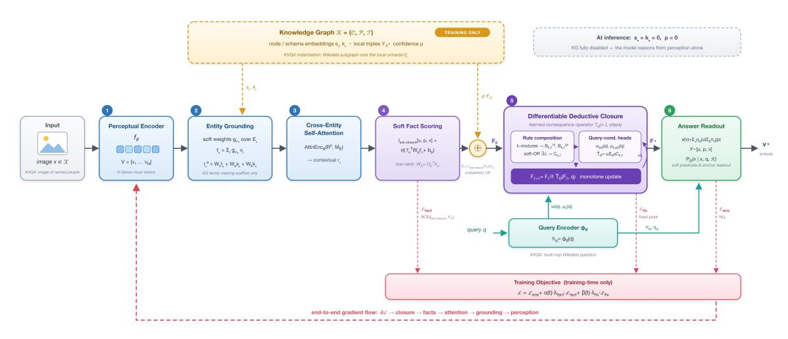

# SoftReason: A Fully Differentiable Neuro-Soft-Symbolic Deductive Reasoning Architecture over High-Dimensional Perceptual Data

- 원문: [https://arxiv.org/abs/2607.20402](https://arxiv.org/abs/2607.20402)
- PDF: [https://arxiv.org/pdf/2607.20402v1](https://arxiv.org/pdf/2607.20402v1)
- arXiv ID: `2607.20402`

---

# SoftReason: 고차원 지각 데이터 위에서의 완전 미분가능한 신경-소프트-기호 추론 아키텍처 #### Wael AbdAlmageed WABDALM@CLEMSON.EDU 클레멘슨 대학교 전기·컴퓨터공학부 헬컴브 소속 편집자: Alessandra Mileo, Andrea Passerini, Cogan Shimizu #### 요약 많은 추론 문제에서 전제는 이산 기호로 관측되지 않으며, 고차원 입력으로부터 추론되어야 한다. 또한, 예측어 어휘, 인수 구조, 신뢰할 수 있는 증거는 지식 그래프(KG) 또는 규칙 정의에 의해 제공된다. 고전적인 신경-기호 파이프라인은 지각과 추론 사이에 이산적인 인터페이스를 가진다. 우리는 잠재적 지각 사실과 지식 기반 예측어 위에서 미분가능한 추론을 수행하기 위한 신경-소프트-기호 아키텍처를 제안한다. SOFTREASON은 후보 상수와 예측어에 대한 지역적 소프트 해석 텐서로 추론 상태를 표현함으로써 그래디언트 간극을 제거한다. 지각 모듈은 확률적 기본 사실을 제안하고, KG 삼중체는 고신뢰도 소프트 증거로 입력되며, 모든 쿼리 앵커, 예측어 선택, 폐쇄 업데이트는 여전히 미분가능하다. 우리의 핵심 기여는 즉시 결과 연산자에 대한 학습된 미분가능한 확장이다. 이는 예측어 정의 임베딩과 잠재적 합성 채널을 사용하여 소프트 본문-예측어 혼합을 형성하고, 가능한 모든 증거를 집계하며, 쿼리 조건화된 머리 사실을 제안하고, 단조 확률적 OR을 통해 해석을 업데이트한다. 우리는 지식 인식 시각적 질문 응답(KVQA)에 이 프레임워크를 구현하며, SOFTREASON이 하나의 학습 가능한 아키텍처 내에서 종단간 지각 기반, KG 증거 주입, 미분가능한 추론 폐쇄를 어떻게 지원하는지를 보여준다. #### 1. 서론 심층 신경망, 특히 대규모 언어 모델(LLMs)은 지각 및 생성 작업에서 뛰어난 성과를 달성했다(예: 이미지 분류(Dosovitskiy et al., 2021), 텍스트 생성(OpenAI, 2023)). 충분한 학습 데이터가 주어지면, 심층 모델은 입력 데이터의 underlying 통계 분포와 입력 데이터와 목표 변수 간의 상관관계를 학습한다. 그러나 통계적 상관관계를 학습하는 것만으로는 구성적 일반화 및 추론 작업을 수행하기에 충분하지 않다. 이 작업에서는 논리 규칙이 알려진 사실과/또는 입력 데이터로부터 인식된 사실에 적용되어 학습 데이터에 등장하지 않았거나 지각 데이터로부터 도출할 수 없는 새로운 결론을 도출해야 한다(Lake and Baroni, 2018; d'Avila Garcez et al., 2019; Evans and Grefenstette, 2018). 신경-기호 아키텍처(예: DeepProbLog(Manhaeve et al., 2018), Scallop(Huang et al., 2021), Neural Theorem Provers(Rocktäschel and Riedel, 2017))는 신경 지각을 기호 추론과 파이프라인으로 연결함으로써 이러한 도전을 해결한다. 이러한 시스템은 신경망이 예측한 이산 기호를 활용하고, 논리적 제약, 규칙, 탐색 알고리즘을 적용하여 다중 홉 질문 응답(Rocktäschel and Riedel, 2017; Saxena et al., 2020), 지식 그래프 완성(Bordes et al., 2013; Sun et al., 2019), 정리 증명(Rocktäschel and Riedel, 2017; Olausson et al., 2023) 등 순수한 신경 유도 추론으로 해결할 수 없는 작업을 수행한다. 그러나 기존 신경-기호 파이프라인의 근본적 한계는 신경 지각과 기호 추론 사이의 그래디언트 간극이다[Manhaeve et al., 2018; Xu et al., 2018]. 고전적 파이프라인은 추론이 시작되기 전에 지각 예측을 이산 기호(예: 레이블 및 관계)로 변환함으로써 비미분가능한 경계를 도입하며, 이는 (1) 추론이 지각이 학습한 잠재 공간을 형성하는 것을 허용하지 않고, (2) 학습된 표현에 인코딩된 풍부한 불확실성(즉, 후보 개체 및 관계에 대한 분포)을 추론이 활용하는 것을 허용하지 않는다. 우리는 신경 지각과 기호 추론 사이의 그래디언트 간극을 제거하는 완전 미분가능한 신경-소프트-기호 추론 아키텍처인 SoftReason을 도입한다. 지각 인코더는 고차원 지각 입력을 밀집 토큰으로 매핑하고, 기반 모듈은 이러한 토큰을 후보 개체에 분배하며, 관계 주의 인코더는 결과를 맥락화한다. SoftReason은 추론 상태를 소프트 해석 텐서로 표현함으로써, 아키텍처의 어느 지점에서도 이산 기호에 대한 불가역적이고 단단한 결정 없이, 추론 및 지각 구성 요소가 계산 그래프를 통해 역방향으로 그래디언트를 전파할 수 있게 한다. 아키텍처의 추론 구성 요소는 Prolog 스타일의 규칙이나 미분가능한 규칙 템플릿을 포함한 어떤 추론 규칙 소스라도 사용하여 학습할 수 있다. 따라서 추론은 후처리 단계가 아니라 모델이 학습하는 본질적인 부분이다. 우리의 기여는 다음과 같다: - 지각 데이터 위의 추론을, 모든 추론 단계에서 불확실성을 보존하는 지역적 소프트 해석 텐서 위의 미분가능한 폐쇄로 정식화함. - 예측어 정의 임베딩과 잠재적 합성 채널을 통해 구현된 즉시 결과 연산자의 학습된 미분가능한 확장으로, 고전적인 Horn-chain 추론이 극한 경우로 회복됨. - 지각 기반, KG 증거 주입, 추론 폐쇄를 하나의 학습 가능한 모델에 통합하는 완전 미분가능한 종단간 아키텍처. - 지식 인식 시각적 질문 응답에 대한 SoftReason의 구현. ## 2. 관련 연구 신경-기호 학습 및 미분가능한 논리. 신경-기호 방법은 신경 표현 학습과 기호 지식 표현 및 추론을 결합한다(예: [d'Avila Garcez et al.](#page-10-1) [\(2019\)](#page-10-1)). 기존 시스템은 기호 인터페이스를 어디에 배치하느냐에 따라 다르다. Semantic Loss는 구조화된 출력에 대한 논리적 제약을 미분가능한 학습 목적 함수로 변환한다(예: [Xu et al.](#page-12-3) [\(2018\)](#page-12-3)). Logic Tensor Networks는 다가치 미분가능한 의미론으로 일계 논리(FOL) 공식을 해석하고 논리적 만족도를 학습 신호로 사용한다[\(Badreddine et al.,](#page-10-4) [2022\)](#page-10-4). TensorLog는 확률적 일계 쿼리 클래스를 미분가능한 함수로 컴파일하여, 추론 데이터베이스 추론을 신경 학습 인프라와 호환되게 만든다[\(Cohen,](#page-10-5) [2016\)](#page-10-5). 이러한 방법들은 기호 구조가 신경 학습을 형성할 수 있음을 보여주지만, 기호 어휘, 절, 또는 제약은 일반적으로 시스템에 고정된 입력으로 제공되며, 지각 증거로부터 학습되는 하나의 미분가능한 추론 상태의 일부로 학습되지 않는다. 미분가능한 정리 증명 및 논리 프로그래밍. 여러 연구 분야는 증명 탐색 또는 논리 프로그램 추론을 그래디언트 기반 학습과 호환되게 만든다. Neural Theorem Provers는 기호 단일화를 임베딩 공간에서의 미분가능한 유사도로 대체하고, 지식베이스 위에서 다중 홉 추론을 지원한다[\(Rocktäschel and Riedel,](#page-12-0) [2017\)](#page-12-0). 미분가능한 귀납적 논리 프로그래밍은 후보 규칙에 대한 소프트 선택을 학습하며, 모호한 입력에 대해 신경 예측기와 연결될 수 있다[\(Evans and Grefenstette,](#page-10-2) [2018\)](#page-10-2). DeepProbLog은 신경 예측어를 확률적 논리 프로그래밍과 통합하여, 신경 예측이 논리적 추론에 참여할 수 있게 한다[\(Manhaeve et al.,](#page-11-2) [2018\)](#page-11-2). Scallop은 확률적 추론 데이터베이스와 증거 의미론을 기반으로 Datalog 스타일 프로그램 위에서 미분가능한 추론을 확장한다[\(Huang et al.,](#page-11-3) [2021\)](#page-11-3). 이러한 시스템은 학습과 추론 사이의 거리를 크게 좁혔다. 그러나 여전히 일반적으로 제공된 논리 프로그램, 규칙 템플릿, 또는 기호 증명 그래프에 의존한다. 신경 구성 요소는 종종 기호 또는 컴파일된 추론 기반에 소비되는 사실을 예측한다. 지각 데이터 위의 다중 홉 추론. 고차원 지각은 이 인터페이스를 더욱 어렵게 만든다. 왜냐하면 증명의 전제가 깨끗한 원자로 관측되지 않기 때문이다. Neural-Symbolic Visual Question Answering(VQA) 및 Neuro-Symbolic Concept Learner와 같은 시각적 추론 시스템은 개체 중심의 장면 표현을 복원하고, 이러한 표현 위에서 기호 프로그램을 실행한다[\(Yi et al.,](#page-12-4) [2018;](#page-12-4) [Mao et al.,](#page-11-5) [2019\)](#page-11-5). 이 설계는 장면 표현과 프로그램 추적을 정확하게 구성할 경우 강력한 구성적 일반화를 제공하지만, 취약한 전달을 노출한다. 지각은 추론 전에 이산 기호 상태로 변환되어야 하며, 기반화, 구문 분석, 개체 연결, 또는 top-k pruning에서 발생한 오류는 추론 모듈이 사용할 기회를 갖기 전에 사실을 제거할 수 있다. 유사한 우려는 다중 홉 추론 전에 명시적 그래프 구조를 구성하는 지식 집약적 지각 추론 시스템에서도 발생한다[\(Heo et al.,](#page-10-6) [2022\)](#page-10-6). 지식 그래프 완성. 지식 그래프 완성 방법은 고정된 기호 그래프 위에서 링크 예측을 위해 개체 및 관계의 분포 표현을 학습한다. TransE는 각 관계를 저차원 개체 공간에서의 이동으로 모델링하고, 머리 개체가 관계에 의해 이동한 후 꼬리 개체에 얼마나 가까이 도달하는지로 후보 삼중체를 평가한다[\(Bordes](#page-10-3) [et al.,](#page-10-3) [2013\)](#page-10-3). RotatE는 이를 복소 벡터 공간으로 확장하여 각 관계를 회전으로 처리함으로써 관계 경로 합성 및 패턴 추론을 지원한다[\(Sun](#page-12-2) [et al.,](#page-12-2) [2019\)](#page-12-2). ComplEx는 복소 임베딩 위의 헤르미트 내적을 통해 비대칭 관계를 모델링한다[\(Trouillon et al.,](#page-12-5) [2016\)](#page-12-5). 이러한 표현은 다중 홉 지식 그래프 질문 응답(KGQA) 파이프라인에 통합되었으며, 별도의 개체 연결 단계 후 후보 답변을 평가한다[\(Saxena et al.,](#page-12-1) [2020\)](#page-12-1). 이러한 방법들은 고정된 그래프 위에서 작동하므로, 미분가능한 지각 해석이 아니라, 기반화 오류를 답변 수준의 감독을 통해 회복할 수 없다. LLM 증강 기호 추론. 또 다른 연구 분야는 대규모 언어 모델(LLMs)을 외부 기호 솔버와 결합하여 다중 홉 추론을 해결한다. LINC는 논리 추론을 신경-기호 프로그래밍으로 재정식화하며, LLM이 자연어 전제를 일계 논리 표현으로 번역하는 의미 분석기로 작동하고, 그 결과는 외부 정리 증명기로 전달된다[\(Olausson et al.,](#page-11-4) [2023\)](#page-11-4). Logic-LM은 유사한 파이프라인을 따르며, 질문을 기호 형식으로 번역하고 LLM이 안내하는 자기 정제 루프를 사용하는 결정적 솔버를 활용한다[\(Pan et al.,](#page-11-6) [2023\)](#page-11-6). 이러한 방법들은 사전 학습된 LLM의 규모를 활용하여 형식적 추론 벤치마크에서 강력한 성능을 보여준다. ## 3. 기술적 접근

우리는 입력 사실(예: 이미지 내 객체 간 관계)이 이산 기호로 관측되는 것이 아니라 고차원 지각 데이터 내에서 잠재적일 때의 연역적 추론 문제를 다룬다. 연역적 추론은 스키마가 필요하다. 왜냐하면 시스템은 어떤 예측어가 사용 가능한지, 어떤 인수 유형을 취하는지, 그리고 사실들이 어떻게 새로운 사실로 결합될 수 있는지를 알아야 하기 때문이다. 지식 그래프(KG)와 일계 논리(FOL) 자원은 이러한 구조를 제공한다. 여기서 스키마는 예측어 어휘를 정의하고, 그들의 삼중체는 신뢰할 수 있는 사실을 제공하며, 그들의 관계적 정규성 또는 명시적 절은 결론이 이미 KG 삼중체로 저장되지 않았더라도 어떤 결론을 도출할 수 있는지를 나타낸다. 따라서 KG는 단순한 조회 테이블로 취급되지 않는다. KG는 소프트 연역이 수행되는 기호적 기반을 제공한다. SoftReason은 신경 지각을 결합하여 지역적 우주에 대한 확률적 사실을 제안하고, KG 사실을 비미분 가능 제약이 아니라 고신뢰도 소프트 증거로 주입한다. 결과 상태는 관측될 가능성이 높은 사실, KG에서 알려진 사실, 그리고 두 출처로부터 연역된 사실을 동일한 텐서 내에 표현한다. 따라서 KG 구조는 지각적 사실을 풍부하게 하며, 최종 태스크 손실은 여전히 지각적 기반 및 사실 추출 모듈을 통해 역전파된다.

## 3.1. 문제 정식화

x ∈ X를 지각적 관측값, q를 질의, K = (C, P, T)를 이산 기호 C, 예측어 스키마 P, 그리고 알려진 기초 사실 T로 구성된 지식 원천이라 하자. 예측어 스키마는 지식 그래프(KG) 또는 일계 논리(FOL) 정의에서 유래할 수 있다. 우리는 이 모델을 이항 예측어 p(cⁱ, cʲ)에 대해 제시하지만, 이항 관계는 일반적인 그래프 설정을 커버하므로, 단항 예측어는 특별한 진리 상수에 대한 관계로 표현할 수 있고, 고차원 예측어는 차원별 텐서 또는 관계 노드로의 표준 재구성(reification)을 통해 표현할 수 있다. 목표는 (x, q, K)를 완전히 미분 가능한 단계의 시퀀스를 통해 답변 분포로 매핑하는 것이다. 모든 중간 표현은 소프트하게 유지되어야 하며, 최종 답변 선택만이 이산 기호로 매핑된다. 아키텍처의 근본 원리는 KG 삼중체가 단지 훈련 감독으로만 사용된다는 것이다. 따라서 훈련 중에는 KG 노드 임베딩과 KG 증거 주입이 지각적 기반 및 사실 구성에 안кер 역할을 한다. 추론 중에는 반대로 둘 다 비활성화되고 모델은 지각만으로 추론한다. 예를 들어 KVQA 구현에서 x는 명명된 인물의 이미지이고, q는 Wikidata 관계를 하나 이상 따르지 않고는 얻을 수 없는 답변을 요청하며, K는 [그림 1.](#page-4-0)에 도시된 바와 같이 지역적인 Wikidata 서브그래프이다.

## 3.2. SoftReason 아키텍처

각 입력 x에 대해, 우리는 유한한 지역적 우주 Eˣ = {e₁, ..., eₘ} ⊆ C의 후보 이산 기호와 지역적 예측어 집합 Pˣ ⊆ P를 구성한다. 각 예측어 p ∈ Pˣ는 스키마 설명(또는 자연어 레이블) d(p)와 연결되며, 학습된 임베딩 aₚ을 통해 모든 단계에 제공된다. 이는 [식 \(1\),](#page-3-0)에 나타나 있다.

$$a_p = \psi_{\text{pred}}(d(p)) \in \mathbb{R}^{d_{\text{pre}}}, \qquad p \in P_x,$$ (1)

여기서 ψpred는 학습된 예측어 정의 인코더이며, dpre는 예측어 임베딩 차원이다. 이러한 임베딩은 유일한 스키마 특이 인터페이스이며, 아키텍처는   
**그림 1:** SoftReason 아키텍처, 완전히 미분 가능한 지각-추론 과정을 보여준다.  
특정 지각 모달리티, KG 출처, 또는 규칙 언어를 가정하지 않는다. 입력이 지각 토큰, 지역 기호, 그리고 예측어 정의 임베딩으로 표현되기만 하면 된다.

**지각 토큰화 및 엔티티 기반화.** 지각 인코더 fᶿ는 x를 N개의 밀집 토큰으로 매핑하며, 토큰 행렬 V는 [식 \(2\),](#page-4-1)에 따라 정의된다.

$$V = f_{\theta}(x) = [v_1, \dots, v_N], \qquad v_i \in \mathbb{R}^{d_{\text{per}}}.$$ (2)

여기서 dper은 지각 인코더 차원이다. 기반화 헤드는 각 토큰을 이산 기호 Eˣ에 분배하며, 기반화 가중치 gᵢ,ₑ는 [식 \(3\),](#page-4-2)에 따라 계산된다.

$$g_{i,e} = \frac{\exp(\ell_{i,e})}{\sum_{e' \in E_x} \exp(\ell_{i,e'})}, \qquad \ell_{i,\cdot} = h_{\theta}(v_i),$$ (3)

여기서 hᶿ는 학습된 투영이며, i ∈ {1, ..., N}은 지각 토큰을 인덱싱하고, e ∈ Eˣ는 지역 이산 기호를 인덱싱한다. 각 지역 엔티티 토큰 tᵉ는 기반화 가중치로 가중된 지각 요약이며, [식 \(4\),](#page-4-3)에 따라 정의된다.

$$t_e = \sum_{i=1}^{N} g_{i,e} \, v_i. \tag{4}$$

초기 엔티티 표현 r⁰ₑ는 지각 토큰, KG 노드 임베딩, 그리고 스키마 임베딩을 융합하며, r⁰ₑ는 [식 \(5\),](#page-4-4)에 따라 정의된다.

$$r_e^0 = W_v t_e + W_s s_e + W_k k_e \in \mathbb{R}^{d_{\text{ent}}}, \tag{5}$$

여기서 Wᵥ, Wₛ, Wᵏ는 학습된 투영 행렬이며, dent은 엔티티 표현 차원이며, sᵉ과 kᵉ은 지식 원천 K에서 엔티티 e에 대해 조회된다: sᵉ은 스키마 또는 텍스트 임베딩이며, kᵉ은 KG 노드 임베딩이다. 두 항은 모두 훈련용 스태프로 작용하여, 모델이 엔티티 표현을 알려진 관계 구조와 연관시키는 데 도움을 주는 KG 기반 초기화를 제공한다. 추론 중에는 둘 모두 0으로 설정되어 [식 \(5\)](#page-4-4)이 r⁰ᵉ = Wᵥtₑ로 축소된다.

**엔티티 간 맥락화.** 멀티헤드 자기 주의는 모든 Eˣ 후보를 통합하여 엔티티 표현을 맥락화한다. 초기 토큰 R⁰ = {rᵉ⁰ : e ∈ Eˣ}이 주어졌을 때, 맥락화된 행렬 R은 식 (6)에 따라 계산된다.

$$R = \operatorname{AttnEnc}_{\theta}(R^0, M_E), \tag{6}$$

여기서 Mₑ는 패딩된 엔티티를 제외하는 이진 마스크이다. 결과 rₑ는 후보 사실을 평가하는 데 필요한 쌍방향 관계 맥락을 포착한다.

**소프트 사실 점수 매기기 및 KG 주입.** 정규화된 표현 ῡₑ = LayerNorm(rₑ)를 사용하여, 예측어 조건부 이차형 헤드는 각 후보 삼중체를 점수화하며, 사전 폐쇄 점수 Iₚᵣₑ-꜀ₗₒₛᵤᵣₑ[u, p, v]는 식 (7)에 따라 정의된다.

$$I_{\text{pre-closure}}[u, p, v] = \sigma(\bar{r}_u^{\top} W_p \bar{r}_v + b_p), \qquad (7)$$

여기서 u, v는 Eˣ 내의 지역 이산 기호를 인덱싱하고, p는 Pˣ 내의 예측어를 인덱싱하며, ῡᵤ, ῡᵥ ∈ ℝᵈᵉⁿᵗ, Wₚ ∈ ℝᵈᵉⁿᵗˣᵈᵉⁿᵗ는 예측어 특이 가중치 행렬, bₚ는 스칼라 편향이며, σ는 로지스틱 시그모이드이다. 예측어 행렬은 저랭크 인수분해를 허용하며, 식 (8)에 따라 나타난다.

$$W_p \approx U_p^{\top} V_p, \qquad U_p, V_p \in \mathbb{R}^{r \times d_{\text{ent}}}.$$ (8)

여기서 r ≪ dₑₙₜ은 랭크이며, 매개변수 수를 O(|Pₓ|dₑₙₜ²)에서 O(2|Pₓ|rdₑₙₜ)로 줄인다. 훈련 중에는 알려진 KG 삼중체가 이진 타겟 텐서를 형성하며, 식 (9)에 따라 나타난다.

$$Y_{\mathcal{K}}[u, p, v] = \mathbf{1}[(e_u, p, e_v) \in \mathcal{T}_x], \qquad (9)$$

여기서 𝔼[·]는 지시 함수이며, 𝒯ₓ ⊆ 𝒯는 Eˣ로 제한된 KG 삼중체를 나타낸다. 초기 해석 F₀는 신경 점수와 KG 증거를 확률적 OR로 병합하며, F₀는 식 (10)에 따라 정의된다.

$$F_0 = I_{\text{pre-closure}} \oplus \rho Y_{\mathcal{K}} = 1 - (1 - I_{\text{pre-closure}})(1 - \rho Y_{\mathcal{K}}), \qquad 0 < \rho < 1, \tag{10}$$

여기서 ρ ∈ (0,1)은 스칼라 KG 신뢰도 가중치이며, ⊕는 확률적 OR을 의미한다. 알려진 KG 사실은 고신뢰도로 추론 상태에 진입하며, 그라디언트는 여전히 Iₚᵣₑ-꜀ₗₒₛᵤᵣₑ를 통해 전파된다. 추론 중에는 ρ = 0이므로 F₀ = Iₚᵣₑ-꜀ₗₒₛᵤᵣₑ이다.

**소프트 규칙 구성.** 연역적 상태는 소프트 의미 해석 텐서이다.

$$F \in [0,1]^{m \times |P_x| \times m}, \qquad F[u,p,v] \approx \Pr[p(e_u,e_v) \mid x,\mathcal{K}], \tag{11}$$

여기서 m = |Eˣ|, u, v ∈ {1, ..., m}은 Eˣ 내의 엔티티를 인덱싱하고, p ∈ {1, ..., |Pˣ|}은 Pˣ 내의 예측어를 인덱싱한다. 고전적 부울 결과 연산자 Tₚ은 본문 원자에 대해 ⋀를 적용하고, 일치하는 규칙 인스턴스에 대해 ⋁를 적용한다. 이를 미분 가능한 t-노름 ⊗과 소프트-OR로 대체하면, 이항 호른 규칙 p₁(x, z) ∧ p₂(z, y) → pₕ(x, y)에 대해, 식 (12)에 나타난 완화된 결과 점수 Ṫₚ(F)[x, pₕ, y]를 얻는다.

$$\widetilde{T}_P(F)[x, p_h, y] = \operatorname{soft-or}_z(F[x, p_1, z] \otimes F[z, p_2, y]), \qquad (12)$$

여기서 ⊗은 미분 가능한 t-노름이며, soft-or는 증인(즉, 존재량화된) 상수 z에 대해 마진화한다. 우리는 식 (12)를 K개의 잠재적 구성 채널을 통해 본문 예측어와 증인 집계를 학습함으로써 일반화한다. 각 채널 k에 대해, 학습 가능한 본문 키 αₖ, βₖ ∈ ℝᵈᵖʳᵉ는 Pˣ에 대한 소프트 예측어 혼합을 정의하며, 혼합 가중치 λₚ,ₖ⁽¹⁾ 및 λₚ,ₖ⁽²⁾는 다음과 같이 정의된다:

$$\lambda_{p,k}^{(1)} = \frac{\exp(a_p^{\top} \alpha_k)}{\sum_{p' \in P_x} \exp(a_{p'}^{\top} \alpha_k)}, \qquad \lambda_{p,k}^{(2)} = \frac{\exp(a_p^{\top} \beta_k)}{\sum_{p' \in P_x} \exp(a_{p'}^{\top} \beta_k)}.$$ (13)

단계 ℓ에서 채널 k에 대한 두 개의 소프트 본문 관계는 식 (14)에 따라 계산된다.

$$B_{k,\ell}^{(1)}[u,z] = \sum_{p \in P_x} \lambda_{p,k}^{(1)} F_{\ell}[u,p,z], \qquad B_{k,\ell}^{(2)}[z,v] = \sum_{p \in P_x} \lambda_{p,k}^{(2)} F_{\ell}[z,p,v], \tag{14}$$

여기서 Fₗ은 추론 단계 ℓ에서의 해석 텐서이다. 증인 마진화된 구성 점수는 식 (15)에 나타난다.

$$C_{k,\ell}[u,v] = 1 - \exp\left(\frac{1}{m} \sum_{z \in E_x} \log\left(1 - \text{clip}_{\epsilon}\left(B_{k,\ell}^{(1)}[u,z] \cdot B_{k,\ell}^{(2)}[z,v]\right)\right)\right),\tag{15}$$

여기서 ε > 0은 작은 상수이며, clipₑ(·)는 수치적 안정성을 위해 [ε, 1−ε]로 클램프한다.

**질의 조건부 폐쇄.** 질의 임베딩 h_q = φᶿ(q)는 어떤 머리 예측어가 관련되는지와 채널이 어떻게 가중되는지를 선택한다. 각 후보 머리 예측어 pₕ에 대해, 질의 조건부 채널 혼합 μₖ,ₚₕ(q)는 식 (16)에 나타난다.

$$\mu_{k,p_h}(q) = \frac{\exp(a_{p_h}^{\top} \gamma_k + (W_r h_q)_k + c_k)}{\sum_{k'=1}^K \exp(a_{p_h}^{\top} \gamma_{k'} + (W_r h_q)_{k'} + c_{k'})},$$ (16)

여기서 γₖ ∈ ℝᵈᵖʳᵉ는 채널 k에 대한 학습 가능한 머리 키 벡터, Wᵣ은 학습된 질의 투영이며, cₖ는 학습된 스칼라 편향이다. 머리 게이트는 각 후보 머리 예측어를 선택적으로 활성화하며, 게이트 값 ωₚₕ(q)는 식 (17)에 나타난다.

$$\omega_{p_h}(q) = \sigma\Big((W_h h_q)^{\top} a_{p_h}\Big). \tag{17}$$

여기서 Wₕ는 학습된 투영 행렬이다. 한 단계 학습된 결과 제안은 다음과 같다:

$$\widetilde{T}_{\Theta}(F_{\ell}, q)[u, p_h, v] = \omega_{p_h}(q) \sum_{k=1}^{K} \mu_{k, p_h}(q) C_{k, \ell}[u, v],$$ (18)

여기서 $\Theta$는 모든 학습된 매개변수를 나타낸다. $\lambda^{(1)}$, $\lambda^{(2)}$, 그리고 $\mu$가 one-hot 선택으로 수렴할 때, 식 (18)은 선택된 Horn-chain 규칙을 복원하며, 학습 중에는 전체 술어 체계에 걸쳐 매끄러운 연산자로 유지된다. 사실은 단조 확률적 OR 업데이트를 통해 추론 단계를 거치며 누적되며, 이는 식 (19)에 나타나 있다.  $$F_{\ell+1} = F_{\ell} \oplus \widetilde{T}_{\Theta}(F_{\ell}, q) = 1 - (1 - F_{\ell})(1 - \widetilde{T}_{\Theta}(F_{\ell}, q)),$$ (19) 이 업데이트는 최소 고정점 전방 추론을 모방하며, $F_{\ell+1} \geq F_{\ell}$이 셀 단위로 성립함으로써 이 수열은 유계이며 비감소적임을 보장한다. L번의 반복 후 최종 폐쇄 해석은 다음과 같다: $$F^{\star} = F_L = \left(\widetilde{T}_{\Theta}^{\oplus}\right)^L (F_0, q), \tag{20}$$ 여기서 $\widetilde{T}_{\Theta}^{\oplus}$는 하나의 결과 제안(식 (18))과 확률적 OR 업데이트(식 (19))를 결합한 것을 나타내며, L은 최대 추론 깊이를 제어한다. 모든 연산이 미분 가능하므로, 정답 손실은 폐쇄, 사실 추출, 기반화, 그리고 인식을 거쳐 단일 패스로 역전파된다. **정답 읽기.** 쿼리 술어는 하드 레이블이 필요하지 않다. SOFTREASON은 소프트 쿼리 술어 분포를 계산하며, $\pi_q(p)$는 식 (21)에 나타난 대로 정의된다.  $$\pi_q(p) = \operatorname{softmax}(W_q h_q)_p,$$ (21) 여기서 $W_q$는 학습된 투영 행렬이다. 쿼리 앵커 분포 $\eta_q(u)$는 지역적인 이산 기호에 대해 정의되며, 앵커가 알려져 있을 때 one-hot이다. 후보 v에 대한 정규화되지 않은 정답 점수 s(v)는 식 (22)에 나타나 있다.  $$s(v) = \sum_{u \in E_x} \eta_q(u) \sum_{p \in P_x} \pi_q(p) F^{\star}[u, p, v],$$ (22) 그리고 학습 정답 분포 $P_{\Theta}(v \mid x, q, \mathcal{K})$는 정규화된 마스킹된 점수이다: $$P_{\Theta}(v \mid x, q, \mathcal{K}) = \frac{M_E(v) \left(s(v) + \epsilon\right)}{\sum_{v' \in E_x} M_E(v') \left(s(v') + \epsilon\right)},\tag{23}$$ 여기서 $M_E(v) \in \{0,1\}$는 패딩된 이산 기호를 마스킹하며, $\epsilon > 0$은 초기 학습 중 제로 확률 타겟을 방지한다. $e_a$에 앵커링되고 술어 $p_q$를 가진 쿼리에 대해, $F^*$에서 읽어낸 정답 집합은 식 (24)에 나타나 있다.  $$\mathcal{A}(x,q) = \{ e_b \in E_x : F^*[a, p_q, b] \text{ is high} \}.$$ (24) 여기서 a와 b는 $e_a, e_b \in E_x$를 만족하는 인덱스이다. **학습 목적.** 이 아키텍처는 세 개의 공동 최적화 손실로 학습된다. 정답 손실은 최종 읽기 결과를 실제 정답 $y \in E_x$에 대비하여 감독하며, 식 (25)에 나타나 있다.  $$\mathcal{L}_{ans} = -\log P_{\Theta}(y \mid x, q, \mathcal{K}). \tag{25}$$ 사실 손실은 클래스 밸런싱을 적용하여 폐쇄 전 추출기를 알려진 KG 사실에 대비하여 감독하며, 식 (26)에 나타나 있다.  $$\mathcal{L}_{\text{fact}} = \frac{\sum_{u,p,v} M_E(u) M_E(v) w_{u,p,v} \text{ BCE}(I_{\text{pre-closure}}[u,p,v], Y_{\mathcal{K}}[u,p,v])}{\sum_{u,p,v} M_E(u) M_E(v) w_{u,p,v}},$$ (26) 여기서 u, v는 지역 이산 기호를 인덱싱하고, p는 술어를 인덱싱하며, $w_{u,p,v} > 0$은 레이블 희소성을 보완하기 위해 양의 KG 삼중체에 더 큰 가중치를 부여한다. 이진 교차 엔트로피는 $BCE(\hat{y}, y) = -y \log \hat{y} - (1 - y) \log(1 - \hat{y})$로 정의된다. 고정점 손실은 $F^*$ 이후 추가적인 폐쇄 단계에서의 잔차 변화를 벌점으로 부과하며, 식 (27)에 나타나 있다.  $$\mathcal{L}_{\text{fix}} = \frac{\sum_{u,p,v} M_E(u) M_E(v) \left( F^{\star}[u,p,v] - \left( F^{\star} \oplus \widetilde{T}_{\Theta}(F^{\star},q) \right) [u,p,v] \right)^2}{\sum_{u,p,v} M_E(u) M_E(v)}.$$ (27) 완전한 목적 함수 L은 [식 \(28\)](#page-8-0)에 나타나 있다.  $$\mathcal{L} = \mathcal{L}_{ans} + \alpha(t)\lambda_{fact}\mathcal{L}_{fact} + \beta(t)\lambda_{fix}\mathcal{L}_{fix}, \qquad (28)$$ 여기서 t는 학습 단계, λfact, λfix > 0은 고정된 가중치이며, α(t), β(t)는 t에 대한 선택적 커리큘럼 스케줄이다. 정답 손실은 어떤 폐쇄 사실이 쿼리를 해결하는지를 모델에 가르치고, 사실 손실은 인식 추출기를 KG 증거에 고정하며, 고정점 손실은 학습된 결과 연산자가 소프트 추론 폐쇄로 수렴하도록 유도한다. #### 3.3. 추론 추론 시 KG K는 사용되지 않으며, KG 노드 및 체계 임베딩은 비활성화된다(se = ke = 0), 따라서 [식 \(5\)](#page-4-4)는 r 0 e = Wvte로 축소된다. KG 증거 주입도 비활성화된다(ρ = 0), 따라서 초기 해석은 F0 = Ipre-closure로 단순화된다. 나머지 모든 단계는 학습과 동일하게 작동한다. 예측된 정답은 v ⋆ = arg maxv∈Ex s(v)이다. # 4. 실험 평가 ## 벤치마크. 우리는 SoftReason의 지각 데이터에 대한 다단계 추론 성능을 평가하기 위해 지식 인식 시각적 질문 응답(KVQA)을 사용한다. SoftReason을 일반적인 시각적 질문 응답(VQA) 모델로 평가하는 것이 목표가 아님을 명확히 해야 한다. 목표는 완전히 미분 가능한 신경-소프트-기호 아키텍처가 지각 증거를 기반화하고, 지식 그래프(KG) 증거를 주입하며, KG가 제공하는 술어에 대해 추론 폐쇄를 학습할 수 있는지를 테스트하는 것이다. KVQA [\(Sh](#page-12-6)ah [et al.,](#page-12-6) [2019\)](#page-12-6)는 각 예제가 이미지 내의 명명된 인물에서 시작하여 하나 이상의 Wikidata 관계를 따라 얻은 답변을 요구하는 사용자 친화적 테스트베드이다. 평가 설정. 우리는 모델이 추론 전에 이미지를 명명된 엔티티 분포로 기반화해야 하는 엔티티 링킹 설정을 채택한다. 이 설정은 SoftReason이 지각에서 추론 폐쇄까지의 경로를 미분 가능하게 유지한다는 우리의 주장을 직접적으로 테스트한다. 정답 손실의 기울기는 학습된 폐쇄 분포, KG 사실 감독, 어텐션 계층, 소프트 사실 구성, 그리고 지각 기반화 헤드를 통해 흐른다. 메트릭 및 베이스라인. 우리는 KVQA에서 사용되는 폐쇄 어휘 정답 정확도인 Hit@1과, Scallop 스타일 평가에 맞추기 위한 Recall@5를 사용한다. [\(Huang et al.,](#page-11-3) [2021\)](#page-11-3) 우리는 [Shah et al.](#page-12-6) [\(2019\)](#page-12-6)의 KVQA 베이스라인과 하이퍼그래프 트랜스포머 연구 [\(Heo et al.,](#page-10-6) [2022\)](#page-10-6)를 사용한다. 또한 [Garcia-Olano et al.](#page-10-7) [\(2022\)](#page-10-7)도 포함하며, 이들은 질문 텍스트에 대한 자동 명명 엔티티 인식을 사용하는 엔티티 강화 지식 주입 방법을 제시하며, [Shah et al.](#page-12-6) [\(2019\)](#page-12-6)의 다섯 개 공식 분할에 대한 결과를 보고한다. KVQA 엔티티 링킹 평가 [표 1](#page-8-1)은 현실적인 엔티티 링킹 설정 하에서 SoftReason을 기존 KVQA 모델과 비교한다. 이전 방법 대비 큰 성능 향상은 추론 연산자가 미분 가능하게 유지될 때, 추론 감독이 시각적 기반화와 사실 구성에 영향을 미친다는 것을 시사한다. 추론 평가. 종합 정답 정확도만으로는 추론 능력을 검증하기에 충분하지 않다. 단일 단계 질문은 종종 엔티티 기반화와 직접적인 사실 검색으로 답변 가능하지만, 이중 및 삼중 단계 질문은 KG 술어에 대한 관계 합성 요구한다. 따라서 우리는 1단계, 2단계, 3단계 및 복합 다단계 하위 집합에 대한 단계 깊이 결과를 보고한다. [표 2](#page-9-0)는 SoftReason의 성능을 단계 깊이별로 분해한 결과이다. 더 높은 단계 하위 집합에서의 향상은 학습된 미분 가능한 폐쇄 연산자가 추론 합성에 기여함을 증명한다. 표 2: SoftReason의 단계 깊이 메트릭. 테스트 분할에는 3단계 예제가 포함되지 않는다. | Method | Hit@1 | R@5 | 1-hop | 2-hop | 3-hop | multi-hop | |---------------------------|-------|-------|-------|-------|-------|-----------| | SoftReason (full test) | 94.30 | 99.38 | 93.24 | 98.20 | N/A | 98.20 | 왜 LLM 보강 또는 OK-VQA 베이스라인은 없는가? LLM 보강 방법(예: LINC [\(Olausson et al.,](#page-11-4) [2023\)](#page-11-4) 및 Logic-LM [\(Pan et al.,](#page-11-6) [2023\)](#page-11-6))은 미분 가능한 지각 기반화 메커니즘을 학습하지 않는다. 또한, 우리에게 알려진 바에 따르면, 이러한 방법들에 대한 KVQA에 대한 공개된 결과는 존재하지 않는다. OK-VQA [\(Marino et al.,](#page-11-7) [2019\)](#page-11-7)의 지식은 비구조화된 텍스트이며, 임무는 이미지를 관련 텍스트와 연결하는 것이다. SoftReason은 구조화된 지식 그래프에 대해 미분 가능한 추론 폐쇄를 학습하도록 설계되었다. ## 5. 결론 우리는 고차원 지각 데이터에 대한 추론을 위한 완전히 미분 가능한 신경-소프트-기호 아키텍처인 SoftReason을 제시하였다. 추론 시작 전에 이산 기호를 생성하는 대신, 우리는 추론 상태를 소프트 의미 해석 텐서로 표현하며, 그 셀은 기반 기호의 미분 가능한 표현이다. 이 아키텍처의 핵심은 즉각적 결과 연산자의 학습된 미분 가능한 리프트이다. 이는 술어 정의 임베딩과 잠재적 합성 채널을 사용하여 소프트 본문-술어 혼합, 후보 증인에 대한 집계, 그리고 확률적 OR을 통한 단조 폐쇄 업데이트를 수행한다. Horn-chain 추론은 극한 경우로 복원된다. 학습 중에는 모든 술어 선택, 증인 엔티티, 그리고 도출된 사실이 기울기 경로를 통해 정답 손실과 연결되며, 이는 (1) 추론이 지각 표현을 형성하도록 허용하고, (2) 학습된 지각 표현이 인코딩한 풍부한 불확실성을 추론이 활용하도록 허용한다. 우리는 KVQA 벤치마크에 SoftReason을 구현하고, 오라클 엔티티가 제공되지 않는 엔티티 링킹 프로토콜에서 기존 지식 기반 VQA 방법 대비 강력한 성능 향상을 입증하였다. # References

Samy Badreddine, Artur d'Avila Garcez, Luciano Serafini, 및 Michael Spranger. Logic tensor networks. Artificial Intelligence, 303:103649, 2022. doi: 10.1016/j.artint.2021.103649. URL <https://doi.org/10.1016/j.artint.2021.103649>. (p. [2\)](#page-1-0) 인용

Antoine Bordes, Nicolas Usunier, Alberto Garcia-Duran, Jason Weston, 및 Oksana Yakhnenko. Translating embeddings for modeling multi-relational data. In Advances in Neural Information Processing Systems, volume 26, 2013. URL [https://proceedings.neurips.cc/paper/2013/hash/1cecc7a77928ca8133fa24680a88d2f9-Abstract.html](https://proceedings.neurips.cc/paper/2013/hash/1cecc7a77928ca8133fa24680a88d2f9-Abstract.html). (p. [1](#page-0-0) 및 [3\)](#page-2-0) 인용

William W. Cohen. TensorLog: A differentiable deductive database. CoRR, abs/1605.06523, 2016. doi: 10.48550/arXiv.1605.06523. URL <https://arxiv.org/abs/1605.06523>. (p. [2\)](#page-1-0) 인용

Artur d'Avila Garcez, Marco Gori, Luis C. Lamb, Luciano Serafini, Michael Spranger, 및 Son N. Tran. Neural-symbolic computing: An effective methodology for principled integration of machine learning and reasoning. CoRR, abs/1905.06088, 2019. doi: 10.48550/arXiv.1905.06088. URL <https://arxiv.org/abs/1905.06088>. (p. [1](#page-0-0) 및 [2\)](#page-1-0) 인용

Alexey Dosovitskiy, Lucas Beyer, Alexander Kolesnikov, Dirk Weissenborn, Xiaohua Zhai, Thomas Unterthiner, Mostafa Dehghani, Matthias Minderer, Georg Heigold, Sylvain Gelly, Jakob Uszkoreit, 및 Neil Houlsby. An image is worth 16x16 words: transformers for image recognition at scale. In ICLR, 2021. doi: 10.48550/arXiv.2010.11929. URL <https://arxiv.org/abs/2010.11929>. (p. [1\)](#page-0-0) 인용

Richard Evans 및 Edward Grefenstette. Learning explanatory rules from noisy data. CoRR, abs/1711.04574, 2018. doi: 10.48550/arXiv.1711.04574. URL <https://arxiv.org/abs/1711.04574>. (p. [1](#page-0-0) 및 [3\)](#page-2-0) 인용

Diego Garcia-Olano, Yasumasa Onoe, 및 Joydeep Ghosh. Improving and diagnosing knowledge-based visual question answering via entity enhanced knowledge injection. In Proceedings of the 1st International Workshop on Multimodal Understanding for the Web and Social Media, co-located with the Web Conference 2022, 2022. doi: 10.48550/arXiv.2112.06888. URL <https://arxiv.org/abs/2112.06888>. (p. [9](#page-8-2) 및 [10\)](#page-9-1) 인용

Yu-Jung Heo, Eun-Sol Kim, Woo Suk Choi, 및 Byoung-Tak Zhang. Hypergraph transformer: Weakly-supervised multi-hop reasoning for knowledge-based visual question answering. In Proceedings of the 60th Annual Meeting of the Association for Computational Linguistics, #### AbdAlmageed - pages 373–390, 2022. doi: 10.18653/v1/2022.acl-long.29. URL [https://aclanthology.org/2022.acl-long.29/](https://aclanthology.org/2022.acl-long.29/). (p. [3,](#page-2-0) [9,](#page-8-2) 및 [10\)](#page-9-1) 인용

Jiani Huang, Ziyang Li, Binghong Chen, Karan Samel, Mayur Naik, Le Song, 및 Xujie Si. Scallop: From probabilistic deductive databases to scalable differentiable reasoning. In Advances in Neural Information Processing Systems, volume 34, pages 25134–25145, 2021. URL [https://proceedings.neurips.cc/paper/2021/hash/d367eef13f90793bd8121e2f675f0dc2-Abstract.html](https://proceedings.neurips.cc/paper/2021/hash/d367eef13f90793bd8121e2f675f0dc2-Abstract.html). NeurIPS paper ID d367eef13f90793bd8121e2f675f0dc2. (p. [1,](#page-0-0) [3,](#page-2-0) [9,](#page-8-2) 및 [10\)](#page-9-1) 인용

Manas Jhalani, Annervaz K M, 및 Pushpak Bhattacharyya. Precision empowers, excess distracts: Visual question answering with dynamically infused knowledge in language models. In Proceedings of the 21st International Conference on Natural Language Processing (ICON), pages 21–36, 2024. URL <https://aclanthology.org/2024.icon-1.3/>. (p. [1](#page-0-0) 및 [2\)](#page-1-0) 인용

Brenden M. Lake 및 Marco Baroni. Generalization without systematicity: On the compositional skills of sequence-to-sequence recurrent networks. In International Conference on Machine Learning, pages 2879–2888, 2018. URL <https://arxiv.org/abs/1711.00350>. (p. [1\)](#page-0-0) 인용

Robin Manhaeve, Sebastijan Dumančić, Angelika Kimmig, Thomas Demeester, 및 Luc De Raedt. DeepProbLog: neural probabilistic logic programming. In Advances in Neural Information Processing Systems, 2018. doi: 10.48550/arXiv.1805.10872. URL <https://arxiv.org/abs/1805.10872>. (p. [1,](#page-0-0) [2,](#page-1-0) 및 [3\)](#page-2-0) 인용

Jiayuan Mao, Chuang Gan, Pushmeet Kohli, Joshua B. Tenenbaum, 및 Jiajun Wu. The neuro-symbolic concept learner: Interpreting scenes, words, and sentences from natural supervision. In International Conference on Learning Representations, 2019. doi: 10.48550/arXiv.1904.12584. URL <https://arxiv.org/abs/1904.12584>. (p. [3\)](#page-2-0) 인용

Kenneth Marino, Mohammad Rastegari, Ali Farhadi, 및 Roozbeh Mottaghi. Ok-vqa: A visual question answering benchmark requiring external knowledge. In Conference on Computer Vision and Pattern Recognition (CVPR), 2019. (p. [10\)](#page-9-1) 인용

Theo X. Olausson, Alex Gu, Benjamin Lipkin, Cedegao E. Zhang, Armando Solar-Lezama, Joshua B. Tenenbaum, 및 Roger Levy. LINC: A neurosymbolic approach for logical reasoning by combining language models with first-order logic provers. In Proceedings of the 2023 Conference on Empirical Methods in Natural Language Processing, pages 5153–5176, 2023. doi: 10.18653/v1/2023.emnlp-main.313. URL [https://aclanthology.org/2023.emnlp-main.313/](https://aclanthology.org/2023.emnlp-main.313/). (p. [1,](#page-0-0) [3,](#page-2-0) 및 [10\)](#page-9-1) 인용

OpenAI. GPT-4 technical report. Technical report, OpenAI, 2023. URL <https://arxiv.org/abs/2303.08774>. (p. [1\)](#page-0-0) 인용

Liangming Pan, Alon Albalak, Xinyi Wang, 및 William Yang Wang. Logic-LM: Empowering large language models with symbolic solvers for faithful logical reasoning. In Findings of the Association for Computational Linguistics: EMNLP 2023, pages 3806–3824, #### SoftReason - 2023. doi: 10.18653/v1/2023.findings-emnlp.248. URL [https://aclanthology.org/2023.findings-emnlp.248/](https://aclanthology.org/2023.findings-emnlp.248/). (p. [3](#page-2-0) 및 [10\)](#page-9-1) 인용

Tim Rocktäschel 및 Sebastian Riedel. End-to-end differentiable proving. In Advances in Neural Information Processing Systems, 2017. doi: 10.48550/arXiv.1705.11040. URL <https://arxiv.org/abs/1705.11040>. (p. [1](#page-0-0) 및 [3\)](#page-2-0) 인용

Apoorv Saxena, Aditay Tripathi, 및 Partha Talukdar. Improving multi-hop question answering over knowledge graphs using knowledge base embeddings. In Proceedings of the 58th Annual Meeting of the Association for Computational Linguistics, pages 4498–4507, 2020. doi: 10.18653/v1/2020.acl-main.412. URL [https://aclanthology.org/2020.acl-main.412/](https://aclanthology.org/2020.acl-main.412/). (p. [1](#page-0-0) 및 [3\)](#page-2-0) 인용

Sanket Shah, Anand Mishra, Naganand Yadati, 및 Partha Pratim Talukdar. KVQA: Knowledge-aware visual question answering. In Proceedings of the AAAI Conference on Artificial Intelligence, volume 33, pages 8876–8884, 2019. doi: 10.1609/aaai.v33i01.33018876. URL <https://ojs.aaai.org/index.php/AAAI/article/view/4915>. (p. [9](#page-8-2) 및 [10\)](#page-9-1) 인용

Zhiqing Sun, Zhi-Hong Deng, Jian-Yun Nie, 및 Jian Tang. RotatE: Knowledge graph embedding by relational rotation in complex space. In International Conference on Learning Representations, 2019. doi: 10.48550/arXiv.1902.10197. URL <https://arxiv.org/abs/1902.10197>. (p. [1](#page-0-0) 및 [3\)](#page-2-0) 인용

Théo Trouillon, Johannes Welbl, Sebastian Riedel, Éric Gaussier, 및 Guillaume Bouchard. Complex embeddings for simple link prediction. In International Conference on Machine Learning, 2016. doi: 10.48550/arXiv.1606.06357. URL <https://arxiv.org/abs/1606.06357>. (p. [3\)](#page-2-0) 인용

Jingyi Xu, Zilu Zhang, Tal Friedman, Yitao Liang, 및 Guy Van den Broeck. A semantic loss function for deep learning with symbolic knowledge. CoRR, abs/1711.11157, 2018. doi: 10.48550/arXiv.1711.11157. URL <https://arxiv.org/abs/1711.11157>. (p. [2\)](#page-1-0) 인용

Kexin Yi, Jiajun Wu, Chuang Gan, Antonio Torralba, Pushmeet Kohli, 및 Joshua B. Tenenbaum. Neural-symbolic VQA: Disentangling reasoning from vision and language understanding. In Advances in Neural Information Processing Systems, 2018. doi: 10.48550/arXiv.1810.02338. URL <https://arxiv.org/abs/1810.02338>. (p. [3\)](#page-2-0) 인용

# 보충 자료

# 구현 세부 사항

KVQA 구현에서는 각 샘플당 m = 20개의 후보 상수, |Px| = 100개의 Wikidata 관계로 구성된 지역 예측 집합, K = 8개의 잠재 조합 채널, 그리고 L = 3회 반복의 폐쇄 깊이를 사용한다. 감지 인코더는 고정된 Vision Transformer(ViT-B/16) [\(Dosovitskiy et al.,](#page-10-0) [2021\)](#page-10-0)이다. 관계 주의 인코더는 숨겨진 차원 d = 256을 가진 두 개의 Transformer 층을 사용한다. 학습은 학습률 10⁻⁴, 배치 크기 32, 손실 가중치 λfact = 1.0 및 λfix = 0.5를 사용하여 Adam 최적화기를 적용하며, 커리큘럼 스케줄링 없이(α(t) = β(t) = 1) 수행한다. 모든 실험은 단일 NVIDIA A100 그래픽 처리 장치(GPU)에서 20 에포크 동안 실행된다.

## 복잡도 및 지역성

SoftReason은 밀도 해석이 샘플당 O(m² |Px|) 크기를 가지기 때문에 전체 전역 지식 그래프가 아니라 지역 우주에서 추론한다. 이중선형 사실 헤드는 예측 조각으로 계산되며, [식 \(15\)](#page-6-1)의 증인 집계는 증인-상수 조각으로 계산된다. K개의 잠재 조합 채널에 대해, 하나의 학습된 결과 단계는 예측 혼합에 대해 O(m² |Px|K)의 주요 비용을, 부드러운 증인 조합에 대해 O(Km³)의 주요 비용을 가진다. 이러한 비용은 가능한 규칙 본문과 증인 대체를 열거하는 것의 미분 가능 버전이며, 단일 기호 증명 경로를 물리화하는 대신 모든 대안을 통해 그래디언트를 보존한다.

## 기타 비교

이 섹션의 방법들은 Shah 등(2019)의 데이터셋에서 지식 인식 시각적 질문 답변(KVQA)을 다루지만, [표 1](#page-8-1)의 주요 엔티티 연결 결과와 직접적으로 비교할 수는 없다. 우리는 리뷰어들이 이 벤치마크에 대한 발표된 결과를 전체적으로 파악할 수 있도록 완전성을 위해 이들을 포함한다.

엔티티 링킹, 데이터셋 레이블 가이드드, 오라클 프로토콜. KVQA 논문들에서 사용되는 세 가지 실험 프로토콜을 구분하는 것이 중요하다. 엔티티 링킹 프로토콜에서는 모델이 원본 이미지와 질문만을 입력으로 받고, 얼굴 인식이나 시각적 정렬을 통해 이미지 내 명명된 엔티티를 자동으로 감지한 후, 이를 Wikidata 항목과 연결하고, 이후 다단계 추론을 수행해야 한다. 이 프로토콜은 [표 1](#page-8-1) 및 SoftReason의 주요 평가 전반에서 사용된다. 데이터셋 레이블 가이드드 프로토콜에서는 KVQA 주석 파일에 인물의 이름이 메타데이터로 포함되어 있으며, 모델은 이 이름 문자열을 사용하여 임베딩 유사도를 통해 관련 지식 그래프(KG) 삼중체를 검색한다. 얼굴 인식은 생략되지만, 모델은 여전히 질문 이해와 관계 추론을 수행하며, 이름-KG 매칭 단계가 시각적 정렬 단계를 대체한다. 데이터셋 레이블 가이드드 결과. Jhalani 등 [\(Jhalani et al.,](#page-11-8) [2024\)](#page-11-8)는 데이터셋 레이블 가이드드 프로토콜을 사용한다. 그들의 시스템은 OFA 인코더-디코더에 데이터셋에서 제공된 엔티티 이름에 조건을 두고 동적 KG 삼중체 추출을 추가한다. 그들은 주석 파일에서 제공된 인물의 이름을 사용하므로 자동 얼굴 인식을 사용하지 않으며, 따라서 그들의 결과는 [표 1](#page-8-1)의 엔티티 링킹 설정과 직접적으로 비교할 수 없다. 우리는 완전성을 위해 이 수치를 여기에 보고한다. #### AbdAlmageed 표 3: 데이터셋 레이블 가이드드 프로토콜 하의 KVQA 결과 [\(Jhalani et al.,](#page-11-8) [2024\)](#page-11-8). 모델은 주석에서 제공된 명명된 엔티티 레이블을 사용하여 KG 삼중체를 검색하며, 얼굴 인식은 필요하지 않다. 이 결과는 [표 1](#page-8-1)의 엔티티 링킹 결과와 직접적으로 비교할 수 없다.  | 방법 | 장소 | Hit@1 | |-----------------------------|-----------|-------| | Jhalani 등 (단일 단계) | ICON 2024 | 83.15 | | Jhalani 등 (다단계) | ICON 2024 | 85.19 |

