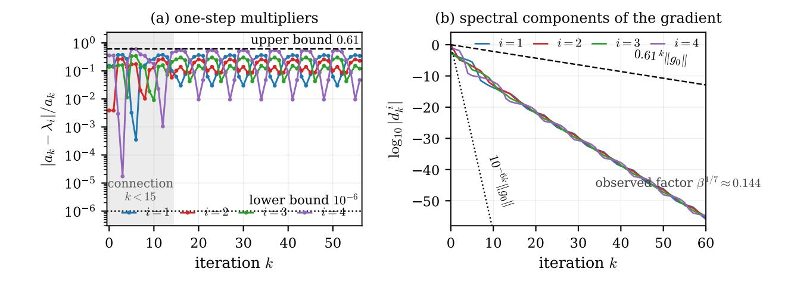
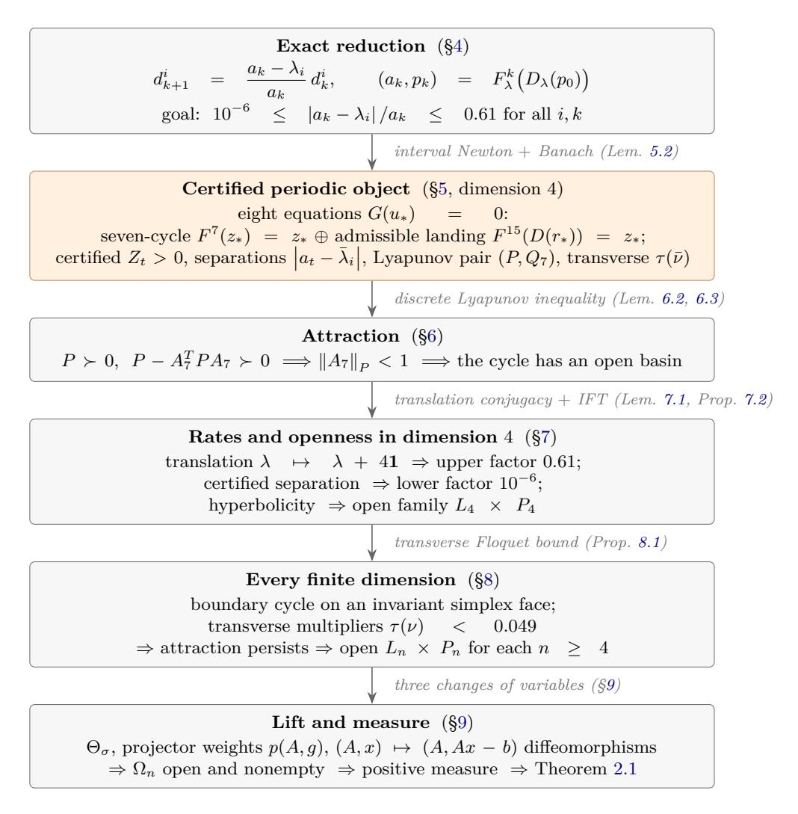
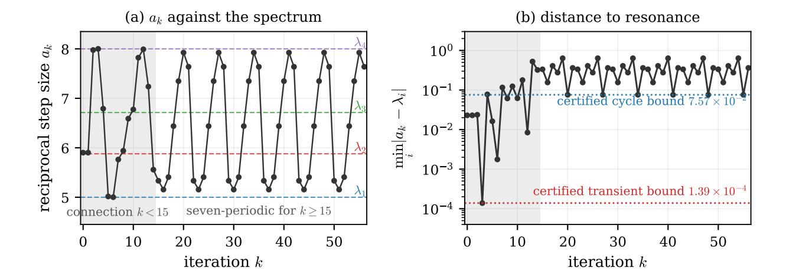

# Barzilai–Borwein이 모든 차원에서 정방형의 열린 집합에서 초선형 수렴을 실패한다 (Barzilai–Borwein Fails Superlinear Convergence on an Open Set of Quadratics for Every Dimension) *n* ≥ 4

- 원제: Barzilai-Borwein Fails Superlinear Convergence on an Open Set of Quadratics for Every Dimension $n\geq 4$
- 원문: [https://arxiv.org/abs/2607.21579](https://arxiv.org/abs/2607.21579)
- PDF: [https://arxiv.org/pdf/2607.21579v1](https://arxiv.org/pdf/2607.21579v1)
- arXiv ID: `2607.21579`

---

# **Barzilai–Borwein이 모든 차원에서 정방형의 열린 집합에서 초선형 수렴을 실패한다 (Barzilai–Borwein Fails Superlinear Convergence on an Open Set of Quadratics for Every Dimension)** *n* ≥ 4

Dawei Li Xiaotian Jiang Mingyi Hong 미네소타 대학교 {li004678,jian0851,mhong}@umn.edu

2026년 7월 14일

#### **초록 (Abstract)**

Barzilai–Borwein (BB) 방법은 연속 최적화에서 강력한 실용적 성능을 보였으나, 그 수렴 동역학은 아직 잘 이해되지 않고 있다. 특히, 핵심 미해결 질문은 BB가 거의 모든 엄격히 볼록한 2차 문제와 초기화에 대해 초선형적으로 수렴하는가라는 것이다. 우리는 이 질문에 부정적인 답을 제시한다. 구체적으로, 모든 유한 차원 *n* ≥ 4에 대해, 비공허한 열린 집합, 즉 양의 Lebesgue 측정값을 갖는 엄격히 볼록한 2차 문제와 초기점의 가족을 구성한다. 이때, 긴 Barzilai–Borwein 방법(BB1)은 수렴하지만 근-초선형적으로 수렴할 수 없다. 보다 정확히는, 명시적 상수와 함께

$$\rho = 10^{-6}, \quad \overline{\rho} = 0.61,$$

그 결과, 기울기의 모든 스펙트럼 성분은 해당 기하급수 시퀀스로부터 상한과 하한이 제한된다. 따라서 기울기 노름과 오차의 에너지 노름은 동일한 비율로 양쪽에서 기하급수적 추정치를 만족하며, 목적 함수의 차이는 제곱 비율로 대응되는 추정치를 만족한다. 특히, 세 가지 양 모두 기하급수 시퀀스로부터 하한이 제한되어 초선형 수렴을 배제한다. 이 구성은 고도로 비난성이며, 차원 4에서 BB 동역학의 투영된 비공명적이며 매혹적인 일곱 주기의 컴퓨터 보조 증명을 기반으로 한다.

### **1 서론 (Introduction)**

경사 하강법은 연속 최적화에서 가장 오래되고 가장 널리 사용되는 방법 중 하나이다. 각 반복은 오직 기울기와 몇 개의 벡터 연산만을 필요로 하므로 대규모 문제에서 매력적이다. 그러나 그 성능은 조건이 좋지 않은 환경에서 악화될 수 있다: 정확한 선형 탐색은 지그재그(iterate) 반복을 생성할 수 있고, 좋은 상수 스텝은 거의 사전에 제공되지 않는 스펙트럼 정보를 필요로 한다.

Barzilai–Borwein (BB) 방법 [\(Barzilai and Borwein,](#page-21-0) [1988\)](#page-21-0)은 부정 기울기 방향을 바꾸지 않고 이 어려움을 해결한다. 대신, 가장 최근 두 반복에서 스칼라 곡률 추정치를 추출한다. 이 스텝 크기 규칙의 변경은 탐색 방향이 아니라 스텝 크기를 바꾸는 것으로, 기본 경사 하강법 반복의 실용적 행동을 크게 향상시킬 수 있다 [\(Fletcher,](#page-22-0) [2005;](#page-22-0) [Birgin et al.,](#page-22-1) [2014\)](#page-22-1).

미분 가능한 목적 함수 *f* : ℝ<sup>n</sup> → ℝ에 대해, *g<sup>k</sup>* = ∇*f*(*x<sup>k</sup>*), *s<sub>k-1</sub>* = *x<sup>k</sup>* − *x<sup>k-1</sup>*, 그리고 *y<sub>k-1</sub>* = *g<sup>k</sup>* − *g<sup>k-1</sup>* 라고 정의한다. 두 가지 고전적인 BB 스텝 크기는 [\(Barzilai and Borwein,](#page-21-0) [1988\)](#page-21-0)이다.

$$\alpha_k^{\text{BB1}} = \frac{s_{k-1}^{\mathsf{T}} s_{k-1}}{s_{k-1}^{\mathsf{T}} y_{k-1}}, \qquad \alpha_k^{\text{BB2} = \frac{s_{k-1}^{\mathsf{T}} y_{k-1}}{y_{k-1}^{\mathsf{T}} y_{k-1}}, \qquad x_{k+1} = x_k - \alpha_k g_k. \tag{1}$$

첫 번째 선택은 스칼라 행렬 $(\alpha_k^{\text{BB1}})^{-1}I$ 를 세컨트 방정식의 최소자승 해로 만든다; 두 번째는 $\alpha_k^{\text{BB2}I$ 를 역 헤시안의 최소자승 근사로 만든다. 따라서 이들은 각각 장 BB 스텝과 단 BB 스텝이라고 불린다. 두 BB 스텝의 공식은 다르지만, 그들은

이러한 단순한 구조에도 불구하고, BB는 이차 목적 함수에서도 비선형적이고 과거 의존적인 동역학을 생성한다. 오래된 미해결 질문은 BB가 거의 모든 엄격히 볼록한 이차 문제와 초기화에 대해 초선형적으로 수렴하는지, 아니면 루트-초선형 수렴 실패가 예외적인 경우가 아니라 양의 측도를 갖는 집합에서 지속될 수 있는지이다. 보다 정확히 말하면, 질문은 다음과 같다:

$$\lim_{k \to \infty} \|g_k\|^{1/k} = 0$$

거의 모든 엄격히 볼록한 이차 문제와 초기화에 대해. 우리는 이 논문에서 이 질문을 해결하고자 한다.

**Significance and applications.** BB 단계는 단일 방법이 아니라 알고리즘적 원시 단계가 되었다. Raydan은 이를 대규모 무제한 최적화에 대한 비단조적 전역화 전략과 결합했다 (Raydan, 1997); 관련 비단조적 프레임워크는 Grippo와 Sciandrone (2002) 및 Zhang과 Hager (2004)에서 개발되었으며, 스펙트럴 프로젝티드 그라디언트 방법은 같은 단계 선택을 볼록 집합에 대한 최적화에 도입했다 (Birgin et al., 2000, 2001; Dai and Fletcher, 2005b; Andreani et al., 2005). BB형 스펙트럴 단계는 이제 서포트 벡터 머신 훈련 (Serafini et al., 2005), 희소 재구성 및 압축 센싱 (Figueiredo et al., 2007; Wright et al., 2009; Van Den Berg and Friedlander, 2009; Wen et al., 2010), 이미지 복원 (Wang and Ma, 2007; Bonettini et al., 2009), 비음수 행렬 분해 (Huang et al., 2015), 직교성 제약을 갖는 최적화 (Wen and Yin, 2013), 리만 최적화 (Iannazzo and Porcelli, 2018), 확률적 및 분산 감소 방법 (Tan et al., 2016), 로컬로 계산된 단계 크기를 갖는 분산 최적화 (Gao et al., 2022), 그리고 힐베르트 공간에서의 PDE 제약 최적화 (Azmi and Kunisch, 2020, 2022)에 등장한다; 최근에는 보다 넓은 함수 클래스에 대한 전역 보장을 추구하는 안전화 및 적응형 구조가 등장했다 (Burdakov et al., 2019; Zhou et al., 2026). 이러한 후계자들은 투영, 정규화, 선형 탐색, 확률적 평균화, 안전화 등 본질적인 방식으로 순수 반복을 변경하지만, 모두 그 단계 크기 메커니즘을 계승한다. 따라서 수정되지 않은 결정론적 반복을 이해하는 것은 그 자체로 가치가 있을 뿐만 아니라, 그 많은 후계자를 해석하는 기초가 된다.

**Earlier convergence and rate theory.** BB의 알려진 수렴 이론은 대부분 저차원 문제에 초점을 맞춘다. Barzilai와 Borwein (1988)은 2차원 엄격히 볼록한 이차식에 대해 R-초선형 수렴을 증명했다. Raydan (1993)은 임의의 유한 차원 엄격히 볼록한 이차식에 대해 전역 수렴을 확립했고, Dai와 Liao (2002)는 임의 차원에서 R-선형 속도를 증명했으며, 비이차식 목표 함수가 비퇴화 최소점 근처에서 충분히 부드러운 경우의 지역 결과를 함께 제공했다. 차원 2에서는 Dai (2013)가 초기 스펙트럴 균형과 속도 사이의 관계를 밝혀, 거의 모든 초기화에 대해 초선형적 행동이 존재함을 보였고, 예외적인 집합에서는 선형적 행동이 발생함을 보였다. Dai와 Fletcher (2005a)는 지연된 스펙트럴 정보를 갖는 그라디언트 방법에 대한 비정상적 프레임워크를 개발했고, BB와 그 친척들의 비정상적 분석을 계산함으로써 방법에 따라 차원 $n \\geq 4$에서 초선형에서 선형 행동으로의 전이가 관찰되었다. 그들의 진술은 비정상적

계산과 수치 관찰에 기반하며, 차원 *n* ≥ 4에서 엄격한 하한 속도 메커니즘은 확인되지 않았다.

일반 차원에서, 속도 한계는 관측된 빠른 동작에 대해 상당히 덜 유익했다. [Li and Sun](#page-23-9) [\(2021\)](#page-23-9)의 최근 정제는 임의의 유한 차원 강한 볼록 쿼드라틱에 대해 조건수 *κ* = *λn/λ*1인 BB1에 대해 *R*-선형 상한 인자 1 − 1*/κ*를 증명한다. 이는 조건수 스케일링에서 정확한 라인 서치 최적경사 하강 인자와 비교된다. 같은 연구는 두 극단적 고유공간에만 지지되는 하한 속도 예시를 제공하며, 정확 인자 (*κ* − 1)*/*(*κ* + 1)를 갖고 초선형 수렴을 배제한다. 그러나 *n* ≥ 2인 경우 초기점은 Lebesgue-공집합에 속하므로, 임의의 작은 왜곡이 수렴을 가속화할 수 있다; 같은 논문은 일반 초기화 하에서의 수렴 속도를 명시적으로 열려 있는 질문으로 제기한다.

병행 연구들은 BB를 전역화하거나 보다 투명한 점근적 특성을 가진 스펙트럼 규칙을 설계하려고 시도해왔다. 여기에는 지연을 둔 경사법 [\(Friedlander et al.,](#page-22-12) [1998\)](#page-22-12), 교대 및 순환 BB 스킴 [\(Dai,](#page-22-13) [2003;](#page-22-13) [Dai et al.,](#page-22-14) [2006\)](#page-22-14), 긴 BB 단계와 짧은 BB 단계의 볼록 조합 [\(Dai et al.,](#page-22-15) [2018\)](#page-22-15), 그리고 2차원 종료 또는 유리한 스펙트럼 한계를 위해 설계된 단계 [\(Yuan,](#page-24-4) [2006;](#page-24-4) [Huang et al.,](#page-23-10) [2021,](#page-23-10) [2022\)](#page-23-11)를 포함한다. 이 문헌은 저차원 스펙트럼 메커니즘이 많은 경사법의 성능을 지배한다는 상당한 증거를 제공한다. 원래 BB1 방법에 결여된 것은 다음 질문에 대한 답이다:

차원 *n* ≥ 4에서, 모든 선형 속도 BB1 예시는 불안정한 예외인지, 아니면 진정으로 전체 차원 선형 속도 행동이 견고한 가족에서 지속되는가?

**현재 하한의 기여 (Contribution of the present lower bound.)**. 이 논문은 BB1에 대해 이 질문에 답한다. 모든 유한 차원 *n* ≥ 4와 모든 선형 항 *b* ∈ ℝⁿ에 대해, 단순 스펙트럼 행렬의 비공허 개방 집합 A*<sup>n</sup>* ⊂ S *n* ++를 구성한다. 이때 모든 *A* ∈ A*n*에 대해, 허용 가능한 초기화 BB1 반복이 잘 정의되고 *x*<sup>∗</sup> = *A*⁻¹ *b*에 수렴하는 초기점의 비공허 개방 집합 X*n*(*A*)가 존재한다. 보다 정확히, Π*i*(*A*)가 *i*번째 고유값에 대응하는 직교 스펙트럼 투사자를 나타낸다면,

<span id="page-2-0"></span>

$$10^{-6k} \|\Pi_i(A)g_0\| \le \|\Pi_i(A)g_k\| \le 0.61^k \|\Pi_i(A)g_0\|, \qquad i = 1, \dots, n, \quad k \ge 0.$$

(2)

여기서 'admissibly initialized'는 첫 번째 단계가 역 기울기 레일리 몫(인버스 그라디언트 레일리 쿼터언트)임을 의미한다,

$$\alpha_0 = \frac{g_0^\mathsf{T} g_0}{g_0^\mathsf{T} A g_0}, \qquad x_1 = x_0 - \alpha_0 g_0,$$

따라서 궤적은 임의로 지정된 투영 상태 쌍이 아니라 실제 BB1 궤적이다. 공동 집합 Ω*<sup>n</sup>* = {(*A, x*0) : *A* ∈ A*n, x*<sup>0</sup> ∈ X*n*(*A*)}는 S *n* ++ × R *n*에서 열린 비공백 집합이다. 따라서 양쪽 모두 양의 르베그 측도를 갖는다. 이는 모든 초기점 섬 X*n*(*A*) 역시 양의 르베그 측도를 갖는다는 것을 의미한다. 정규 직교 스펙트럼 성분에 대해 [\(2\)](#page-2-0)를 합산하면 기울기 노름과 오차의 에너지 노름에 대해 같은 양쪽 기하학적 추정이 주어지며, 목적 함수 간격은 해당 제곱 추정치를 만족한다. 특히,

$$\liminf_{k \to \infty} ||g_k||^{1/k} \ge 10^{-6} > 0,$$

따라서 이들 궤적 중 어느 것도 루트-초선형 또는 *Q*-초선형 수렴을 보이지 않는다. 공동 문제-데이터 공간에 대한 거의 어디서나 초선형성 진술은 모든 차원 *n* ≥ 4에서 거짓이다. 특히, [Li and Sun](#page-23-9) [\(2021\)](#page-23-9)의 일반 초기화에 관한 질문은 행렬의 열린 집합에서 부정적으로 답변된다.

이 결과는 이전의 낮은 속도 그림을 세 가지 방식으로 강화한다.

- (i) Robustness. 느린 동작은 특별히 균형 잡힌 엔드포인트 부분공간이나 0-측정 초기화에 국한되지 않는다. 스펙트럼과 초기 점의 동시 변형에도 지속된다.  
- (ii) 동적 메커니즘. 증명은 프로젝티브화된 4차원 BB1 역학의 비공명적이며 매혹적인 주기-7 궤적을 식별한다. 인증된 15단계 연결이 허용 가능한 초기화 다양체에서 그 베이슨을 도달하며, 스펙트럼 변환은 모든 반경 승수를 수축적으로 만든다. 프로젝티브 사이클의 매혹은 좌표 부분공간의 불변성보다 오픈 베이슨과 낮은 기하학적 속도를 만든다.  
- (iii) 전차원 지속성. 네 개의 스펙트럼 모드가 점근적 주기 동안 활성 상태를 유지한다. 균일한 수직 Floquet 추정은 그 구조를 각 유한 차원 n > 4에 삽입하면서 모든 추가 성분을 0이 아니게 하고 기하학적으로 제어한다. 정규화된 스펙트럼 측정은 결국 7-주기 측정에 접근하며, 정확한 최단 경사법에서 익숙한 두 엔드포인트 모드로 붕괴되지 않는다 (Akaike, 1959; Forsythe, 1968; Pronzato et al., 2006).

주기 궤적은 구간 산술과 수축 논증에 의해 인증된다; 이는 긴 부동 소수점 시뮬레이션에서 추론된 것이 아니다. 이 컴퓨터 보조 구성요소는 명시적 유리 상자 안에서 정확한 존재, 비공명성, 매혹을 확립한다; 오픈성, 양의 측정, 그리고 고차원에서의 지속성은 이후 분석적 안정성 논증에서 따온다.

정리는 존재 결과이며, 보편적인 속도 공식은 아니다. 이는 BB1에 관한 것이지 모든 BB 변형에 관한 것이 아니다. 집합  $\mathcal{A}_n$  은 한 개의 명시적으로 구성된 스펙트럼—세 개의 분리된 고윳값과 n > 4인 경우 나머지 고윳값이 상단 근처의 짧은 구간에 군집된 것—의 작은 오픈 이웃이다. 따라서 "모든 유한 차원"이라는 문구는 각 n에 대해 그러한 이웃이 존재함을 의미하며, 그 크기가 n에 대해 균일하다는 의미는 아니다. 상수  $10^{-6}$  과 0.61 은 최적의 비대칭 인자라기보다 보수적인 분리 마진이다. 기여는 구조적이다: 이는 차원-4 전환이 낮은 차원의 초선형 동작에서 선형 속도 동작으로 전환될 수 있음을 안정적인 재발성 매혹에 의해 생성되고 양의 측정을 차지할 수 있음을 증명한다. 이 의미에서 하한은 고전적 및 최근의 R-선형 상한을 보완한다. 상한 이론은 BB1이 얼마나 느릴 수 있는지를 제어하며, 현재 결과는 양의 선형 루트 인자가 실제로 견고하게 실현되며, 이를 유지하는 궤도 기하학을 설명한다.

AI-지원 개발. 본 논문의 주요 결과 증명의 개요는 GPT 5.6 Sol에 의해 얻어졌다. GPT는 동등한 문제 공식화(요소별 몫 공식화)를 제공받고 하한 예시를 구성하도록 요청받았다. 프롬프트는 부록 B에 제공된다. GPT의 구성은 매우 비트리비얼하다. 이후 인간 검증 및 다듬기가 이루어졌다.

#### 2 BB1 방법과 주요 정리 (The BB1 method and the main theorem)

$\mathbb{S}_{++}^n$를 실수 대칭 양의 정부호 $n \times n$ 행렬의 열린 콘으로 정의한다. 이는 유클리드 공간 $\mathbb{S}^n$의 열린 부분집합이며, 그 차원은 $n(n+1)/2$이다. $A \in \mathbb{S}_{++}^n$과 $b \in \mathbb{R}^n$을 고정하고 ... 고려한다

<span id="page-3-0"></span>

$$f_{A,b}(x) = \frac{1}{2}x^T A x - b^T x, \qquad x_* := A^{-1}b, \qquad g(x) := \nabla f_{A,b}(x) = Ax - b.$$

(3)

고유한 최소화점은  $x_*$  이며,  $A \succ 0$ 이기 때문이다.

우리는 장기 Barzilai–Borwein 방법을 연구한다. 이는 일반적으로 BB1 Barzilai와 Borwein (1988)이라고 불린다; 엄격히 볼록한 2차 함수에 대한 고전적 수렴 분석으로는 Raydan (1993); Dai와 Liao (2002)가 있다. 초기화는 정리의 일부이므로 명시적으로 제시된다. 주어진  $x_0 \neq x_*$ , $g_0 = Ax_0 - b$ 를 두고 and

<span id="page-4-0"></span>

$$\alpha_0 := \frac{g_0^T g_0}{g_0^T A g_0}, \qquad x_1 := x_0 - \alpha_0 g_0. \tag{4}$$

k ≥ 1인 경우, 해당 양이 정의되어 있으면 다음과 같이 설정한다

<span id="page-4-1"></span>

$$s_{k-1} := x_k - x_{k-1}, \quad y_{k-1} := g_k - g_{k-1},$$

$$\alpha_k := \frac{s_{k-1}^T s_{k-1}}{s_{k-1}^T y_{k-1}}, \quad x_{k+1} := x_k - \alpha_k g_k,$$

$$g_k := A x_k - b.$$

(5)

선택 (4)는 초기 기울기의 역 레일리 쿼터션이다. 이는 처음 두 개의 역단계 크기를 동일하게 만든다.

주요 결과. 단순 스펙트럼 행렬 A에 대해 다음과 같이 두자

$$0 < \lambda_1(A) < \cdots < \lambda_n(A)$$

그것의 정렬된 고윳값이며, Π_i(A)를 λ_i(A)에 해당하는 1차원 고윳공간에 대한 직교 사영자라고 두자. 고윳벡터의 방향은 무관하다, 왜냐하면 아래의 모든 결론은 ||Π_i(A)g_k||를 사용하기 때문이다.

<span id="page-4-2"></span>**정리 2.1** (BB1에 대한 양측 측정 하한률). 정수 n ≥ 4와 벡터 b ∈ ℝ^n을 고정하자. 존재하는 비어 있지 않은 열린 집합 𝔄_n ⊂ 𝕊^n_{++}이 단순 스펙트럼 행렬로 구성되고, 모든 A ∈ 𝔄_n에 대해 비어 있지 않은 열린 집합 𝔛_n(A) ⊂ ℝ^n \ {x_*}가 다음 성질을 갖는다.

모든 x_0 ∈ 𝔛_n(A)에 대해, BB1 반복 (4)–(5)는 모든 k ≥ 0에 대해 잘 정의되고, x_*에 수렴하며, 다음을 만족한다, i ∈ {1,…,n} 및 k ≥ 0에 대해,

<span id="page-4-3"></span>

$$\rho^k \|\Pi_i(A)g_0\| \le \|\Pi_i(A)g_k\| \le \overline{\rho}^k \|\Pi_i(A)g_0\|, \qquad \rho = 10^{-6}, \quad \overline{\rho} = 0.61.$$

(6)

특히, 초기 스펙트럼 성분 중 어느 것도 0이 아니다.

합집합

$$\Omega_n := \{ (A, x) : A \in \mathcal{A}_n, \ x \in \mathcal{X}_n(A) \} \subset \mathbb{S}_{++}^n \times \mathbb{R}^n$$

(7)

은 비어 있지 않고 열려 있다. 따라서 Ω_n은 ℝ^n × ℝ^n에서 양의 Lebesgue 측도를 가지며, 각 섬유 𝔛_n(A)는 ℝ^n에서 양의 Lebesgue 측도를 가진다.

또한 e_k = x_k - x_* 및 ||e||_A = (e^T A e)^{1/2}라 두면 다음과 같다

<span id="page-4-6"></span><span id="page-4-5"></span><span id="page-4-4"></span>

$$\underline{\rho}^k \|g_0\| \le \|g_k\| \le \overline{\rho}^k \|g_0\|, \tag{8}$$

$$\underline{\rho}^{k} \|e_{0}\|_{A} \leq \|e_{k}\|_{A} \leq \overline{\rho}^{k} \|e_{0}\|_{A}, \tag{9}$$

$$\underline{\rho}^{2k}(f(x_0) - f(x_*)) \le f(x_k) - f(x_*) \le \overline{\rho}^{2k}(f(x_0) - f(x_*)). \tag{10}$$

따라서

<span id="page-4-7"></span>

$$\liminf_{k \to \infty} \|g_k\|^{1/k} \ge 10^{-6}, \qquad \liminf_{k \to \infty} \|e_k\|_A^{1/k} \ge 10^{-6}, \tag{11}$$

그리고 이러한 BB1 궤적은 루트-초선형 또는 Q-초선형 수렴이 아니다.

증명은 섹션 4–9에 걸쳐 있다. 상수들은 보수적이며 최적이라고 주장하지 않는다. 이 결과는 열린 가족에 대한 존재 이론이며, 모든 양의 스펙트럼에 대해 동일한 하한을 주장하지 않는다.

**왜 BB 동역학이 어려운가.** 사각형 목적함수 [3](#page-3-0)에서도 BB1은 비선형 지연 동역학 시스템을 생성한다. 0 < λ^1 ≤ … ≤ λ^n을 A의 고윳값이라 하고, v1,…,vn을 직교 고윳벡터 기저라 두고, g^k = P i d i k vi 라고 적으면, 이 사각형에서 BB1은 다음과 같다,

$$\alpha_k = \frac{\sum_{j=1}^n (d_{k-1}^j)^2}{\sum_{j=1}^n \lambda_j (d_{k-1}^j)^2}, \qquad d_{k+1}^i = (1 - \lambda_i \alpha_k) d_k^i, \tag{12}$$

동등하게,

<span id="page-5-0"></span>

$$d_{k+1}^{i} = d_{k}^{i} \frac{\sum_{j=1}^{n} (\lambda_{j} - \lambda_{i}) (d_{k-1}^{j})^{2}}{\sum_{j=1}^{n} \lambda_{j} (d_{k-1}^{j})^{2}}.$$

(13)

방정식 [\(13\)](#page-5-0)은 첫 번째 난점의 원인을 보여준다.  
대각화는 고정 단계 경사 하강법을 완전히 분리하지만, BB1은 분리하지 않는다.  
*i*번째 성분 *d i*의 업데이트는 시점 *k*에서 시점 *k*+1로 이동할 때 시점 *k*−1의 모든 성분에 의존한다.  
따라서 목적함수는 고유 기저에서 대각형이지만, 그 스펙트럼 모드들은 지연된 레이리어 퀀타이언트에 의해 여전히 결합된다.  
이 결합되고 지연된 피드백은 비선형적 행동을 일으킨다.  
이전 그래디언트가 선택한 레이리어 퀀타이언트에 따라 스펙트럼 성분의 승수는 음수, 거의 0에 가까운 값, 또는 절댓값이 1보다 큰 값이 될 수 있다.  
따라서 성분은 부호를 바꿀 수 있고, 고유값이 큰 성분은 성장할 수 있으며, 서로 다른 고유 방향이 번갈아 가며 그래디언트를 지배할 수 있어, 목적값이나 그래디언트 노름은 단조적이지 않다.  
(비정방형 목적함수의 경우, 상황은 더 섬세하다 – *s* T *k*−1 *yk*−<sup>1</sup>가 양수로 유지되지 않을 수 있고, 안전장치가 없는 방법은 과도하게 긴 스텝을 취하거나 강한 볼록성 하에서도 수렴하지 않을 수 있다 [\(Fletcher,](#page-22-0) [2005;](#page-22-0) [Burdakov](#page-22-8) [et al.,](#page-22-8) [2019\)](#page-22-8) – 그러나 이들은 본 논문의 주제가 아니다.)

두 번째 난점은 실제 점근적 속도를 결정하는 것이다.  
성분 승수가 거의 0에 가까울 수 있기 때문에, 스펙트럼 성분은 한 번의 반복에서 임의로 작아질 수 있다.  
따라서 상한 추정 ∥*gk*∥ ≤ *Cq<sup>k</sup>* 은 실제 선형 수렴과 초선형과 같은 더 빠른 수렴을 구분할 수 없다.  
이러한 상한은 또한 어떤 스펙트럼 모드가 살아남는지, 정규화된 상태가 고정점이나 주기로 접근하는지, 실제로 달성되는 하한 점근적 속도가 무엇인지도 결정하지 못한다.  
초선형 수렴을 배제하려면 하한이 필요하거나, 점근적 궤적에 대한 동등하게 정밀한 설명이 필요하다.

세 번째 난점은 거의 모든 지점에서의 질문에 답하는 것이다.  
단일하게 특별히 구성된 하한 예시는 고립된 예외일 수 있으며, 따라서 르베그 측정이 0인 집합에 속할 수 있다 [\(Dai,](#page-22-10) [2013;](#page-22-10) [Li and Sun,](#page-23-9) [2021\)](#page-23-9).  
실제로, 이러한 예시는 이론적 궤적에서 벗어나 수치적 불안정성으로 인해 더 빠른 수렴 속도를 초래할 수 있다 [He](#page-23-13) [et al.](#page-23-13) [\(2025\)](#page-23-13).  
강건한 하한 예시는 또한 스펙트럼과 초기화의 변형에 대해 수렴 속도가 지속되는 것을 증명해야 한다.  
이것은 고전 이론이 가장 덜 완전한 BB 동역학의 측면이다.

## **3 증명의 개요**

하한은 일반적인 BB1 궤적을 추정함으로써 얻어지는 것이 아니다.  
증명은 저차원 동역학 시스템의 엄밀히 인증된 하나의 궤적을 구성하고, 이 궤적이 모든 공진에서 균일하게 멀리 떨어져 있음을 검증한 뒤, 안정성과 연속성을 이용해 단일 궤적을 열린 가족으로 확장한다.  
그림 [2](#page-8-0)는 연쇄적 함의를 보여주며, 이 섹션은 한 번 그 과정을 따라간다.

**인수 한계로의 축소 ([§4\)](#page-7-0).**  
정사각형 함수에서는 BB1이 그래디언트의 각 스펙트럼 성분을 정확한 승수 항등식 *d i <sup>k</sup>*+1 = (*a<sup>k</sup>* − *λi*)*/a<sup>k</sup> d i k* 를 통해 작용한다. 여기서 *a<sup>k</sup>* = *α* −1 *k* 이다



그림 1: 중앙 이동 스펙트럼 $\lambda^*$ 에서 인증된 궤적을 따라 인수 한계의 수치적 실현, 200자리 정밀도 계산. (a) 한 단계 승수 $|a_k - \lambda_i|/a_k$: 15단계 연결(그림자 처리) 이후 7주기성을 가지며 인증 밴드 $[10^{-6}, 0.61]$ 안에 남는다; 과도 최소값은 약 $1.7 \times 10^{-5}$ 으로 k = 3 에서 발생한다. (b) 그라디언트의 네 개 스펙트럼 성분이 두 기하학적 외피 사이에서 병렬로 감소한다; 관측된 점근적 한 단계 인수는 $\beta^{1/7} \approx 0.144$ 으로, 여기서 $\beta \approx 1.29 \times 10^{-6}$ 은 한 7주기 동안 원시 좌표의 수축이다. 그림은 예시이며, 엄밀한 명시는 인증서 5.1의 내용이다.

지연 레이리 방정식으로, $|d_k^i| = |d_0^i| \prod_{t < k} |a_t - \lambda_i| / a_t$ 이 된다. 따라서 정리 2.1의 모든 결론은 단일 균일한 한 단계 부등식에서 따르며,

<span id="page-6-0"></span>

$$10^{-6} \le \frac{|a_k - \lambda_i|}{a_k} \le 0.61 \quad \text{for every } i \text{ and every } k \ge 0:$$

(14)

하한은 비공명 조건( $a_k$ 가 고유값에 너무 가까워지지 않음)이며, 상한은 수렴을 강제한다. 그라디언트 자체가 0으로 수렴하므로, 그 규모는 제거된다: 역단계 크기와 정규화된 제곱 스펙트럼 가중치의 쌍 ($a_k, p_k$) 이 유리 맵 $F_{\lambda}$ 에 의해 $\mathbb{R} \times \Delta_{n-1}$ 위에서 진화하며, 허용 가능한 첫 단계는 초기화 맵 $D_{\lambda}$ 에 의해 인코딩된다. 이 투영 상태가 스펙트럼과 분리된 주기 궤적에 접근하면, (14) 에 있는 모든 후기 승수는 (0,1)의 고정된 컴팩트 하위 구간에 속하며, 유한 초기 구간은 연속성에 의해 처리된다.

인증된 주기 객체 (§5). 구성은 4차원에서 수행된다. 미지 변수는 자유 고유값 $\bar{\lambda}_3$, 투영 상태 z, 그리고 허용 가능한 초기 가중치 r이며, 이들은 여덟 개의 유리 방정식을 만족한다. 즉, $F_{\bar{\lambda}}^7(z) = z$ (7주기)와 $F_{\bar{\lambda}}^{15}(D_{\bar{\lambda}}(r)) = z$ (정확한 15단계 착지)이다. 착지 블록은 차원 계산에 의해 강제된다: 투영 상태 공간은 4차원이고, 허용 가능한 초기화 상태는 3차원 초면을 형성하므로, 매혹적인 주기는 실제 BB1 초기화의 전방 궤적과 만나지 않을 수 있다. 뉴턴 유사 맵 H(u) = u - RG(u) 와 정확한 유리 전치자 R 은 방향성 구간 연산에서 반경 $10^{-55}$ 인 상자 X 에 대해 평가된다. 인증된 포함 관계 $H(X) \subset \operatorname{int} X$ 와 $\sup_X \|DH\|_{\infty} < 1$ 은 Banach의 정리를 통해 정확한 근 $u_*$ (Lemma 5.2)를 생성한다. 같은 실행은 모든 정규화 분모(즉, $Z_t$) 가 양수임을, 주기와 연결이 모든 고유값과 분리되어 있음을, 그리고 명시적 Lyapunov 쌍 $(P, Q_7)$ 가 양의 정부호임을 증명한다.

여기서는 두 가지 논리적으로 독립적인 수축이 나타난다: H 는 근만 인증하고, 매력은 별도로 증명된다.

차원 네에서의 끌림, 속도, 그리고 개방성 (§6–§7). 인증된 부등식 $P - A_7^T P A_7 \succ 0$ 은 $||A_7||_P < 1$ 을 제공하므로, 일곱 단계 주기는 슈어 안정이며 개방된 기저를 갖는다 (Lemma 6.3). 속도 상수는 두 개의 독립적인 메커니즘에서 나온다. 변환 $\lambda \mapsto \lambda + 41$ 은 투영 동역학과 가환하며( Lemma 7.1) 스펙트럼을 (4.99, 8.01) 범위로 이동시키고 폭은 3.02 이하이다; 모든 $a_k$ 가 고윳값의 볼록 조합이므로, 이는 상한 비율 3.02/4.99 < 0.61 를 제공한다. 인증된 분리는 하한 비율 $10^{-5}/8.01 > 10^{-6}$ 를 제공한다. 1이 $A_7$ 의 고윳값이 아니므로, 암시적 함수 정리는 주기를 모든 인접 스펙트럼으로 연장하고, 15단계 맵의 유한 시간 연속성은 모든 인접 허용 초기화를 포획 튜브로 이끈다: 한 궤적은 개방 곱 $L_4 \times P_4$ 가 된다 (Proposition 7.2).

모든 차원과 BB1 문제로의 리프트 (§8–§9). n > 4 인 경우, 추가 고윳값은 초기 가중치가 0인 상태에서 (7.49, 7.51) 범위에 배치되므로, 네 차원 주기는 불변 단면에 존재한다. 일곱 단계 도함수는 그곳에서 블록 상삼각형이며, 인증서는 모든 수직 승수에 대해 $\tau(\nu) < 0.049$ 를 보장하므로, 경계 주기는 새로운 방향에서도 끌어당긴다; 추가 가중치를 작은 양수로 기울이고 모든 n 고윳값에서 연속하면, 각 고정된 유한 n 에 대해 개방 집합 $L_n \times P_n$ 이 제공된다 (Proposition 8.1), 속도 상수는—인접 영역 크기는 아니지만—n 에 대해 균일하다. 마지막으로, 세 가지 변수 변환이 투영 가족을 문제 데이터로 리프트한다: 정오각형 극극 매핑 $d_0^i = \sigma_i r \sqrt{p_{0,i}}$, 단순 스펙트럼 행렬에서의 스펙트럼-프로젝터 가중치 p(A, g)의 연속성, 그리고 미분동형 $(A, x) \mapsto (A, Ax - b)$. 결과적으로 $\Omega_n$ 의 문제와 초기점 집합은 개방적이고 비공백이며, 따라서 양의 르베그 측도를 갖고, Theorem 2.1 이 따라온다.

\n## <span id="page-7-0"></span>4 BB1을 투영적 유리 맵으로 정확히 환원하기 (Exact reduction of BB1 to a projective rational map)\n

우리는 먼저 예외 인덱스 k = 0 을 억제하지 않고 스칼라 재귀를 도출한다.

<span id="page-7-2"></span>**Lemma 4.1** (정방정식에서의 BB1 단계 (The BB1 step on a quadratic)). A > 0 이고 $g_{k-1} \neq 0$ 이라면, $x_k = x_{k-1} - \alpha_{k-1}g_{k-1}$ 이고 $\alpha_{k-1} \neq 0$ 이면, (5)에서의 BB1 비율은 양수이며 다음과 같다

<span id="page-7-1"></span>

$$\\alpha_k = \\frac{g_{k-1}^T g_{k-1}}{g_{k-1}^T A g_{k-1}}. (15)$$

특히, 초기화 (4)는 $\\alpha_1 = \\alpha_0$ 를 준다.

*Proof.* 왜냐하면 $g_k = Ax_k - b$ 이고 $g_{k-1} = Ax_{k-1} - b$ 이므로, 뺄셈을 하면

$$y_{k-1} = g_k - g_{k-1} = A(x_k - x_{k-1}) = As_{k-1}. $$

이전의 기울기 단계는 $s_{k-1} = -\alpha_{k-1} g_{k-1}$ 를 준다. 따라서

$$\begin{aligned} s_{k-1}^T s_{k-1} &= (-\alpha_{k-1} g_{k-1})^T (-\alpha_{k-1} g_{k-1}) = \alpha_{k-1}^2 g_{k-1}^T g_{k-1}, \\ s_{k-1}^T y_{k-1} &= s_{k-1}^T A s_{k-1} = \alpha_{k-1}^2 g_{k-1}^T A g_{k-1}. \end{aligned}$$

$A \succ 0$ 이고 $g_{k-1} \neq 0$ 이므로 분모인 $g_{k-1}^T A g_{k-1}$ 은 엄격히 양수이다. $\alpha_{k-1}^2 > 0$ 이므로 소거를 하면 (15)가 도출된다; 그 분자와 분모는 모두 양수이다. $k = 1$ 을 취하고 (4)를 사용하면 $\alpha_1 = \alpha_0$ 가 증명된다.



Figure 2: Theorem 2.1의 증명 맵. 음영 처리된 상자는 컴퓨터 보조 단계 (Certificate 5.1)이며, 나머지 모든 단계는 인증된 엄격한 부등식을 소모하는 펜-앤-페이퍼 논증이다. 화살표 라벨은 각 함의를 전달하는 도구의 이름을 나타낸다.

정규 직교 대각화를 고정한다

$$A = Q\Lambda Q^T, \qquad \Lambda = \operatorname{diag}(\lambda_1, \dots, \lambda_n), \qquad 0 < \lambda_1 < \dots < \lambda_n,$$

(16)

그리고 스펙트럴 그라디언트 좌표를 정의한다

$$d_k := Q^T g_k, \qquad d_k^i = (Q^T g_k)_i.$$

(17)

Q가 직교이므로,

<span id="page-8-1"></span>

$$g_k^T g_k = \sum_{j=1}^n (d_k^j)^2, \qquad g_k^T A g_k = d_k^T \Lambda d_k = \sum_{j=1}^n \lambda_j (d_k^j)^2.$$

(18)

그래디언트 업데이트는

$$q_{k+1} = A(x_k - \alpha_k q_k) - b = (Ax_k - b) - \alpha_k A q_k = (I - \alpha_k A) q_k$$

$Q^T$ 로 곱하고 $Q^TAQ = \Lambda$ 를 사용하면

<span id="page-9-0"></span>

$$d_{k+1}^i = (1 - \alpha_k \lambda_i) d_k^i. \tag{19}$$

k = 0일 때 (4)와 (18)을 (19)에 대입하면

<span id="page-9-1"></span>

$$d_1^i = d_0^i \frac{\sum_{j=1}^n (\lambda_j - \lambda_i) (d_0^j)^2}{\sum_{j=1}^n \lambda_j (d_0^j)^2}.$$

(20)

k ≥ 1일 때, Lemma 4.1은 대신 $g_{k-1}$ 를 사용하므로

<span id="page-9-2"></span>

$$d_{k+1}^{i} = d_{k}^{i} \frac{\sum_{j=1}^{n} (\lambda_{j} - \lambda_{i}) (d_{k-1}^{j})^{2}}{\sum_{j=1}^{n} \lambda_{j} (d_{k-1}^{j})^{2}}.$$

(21)

식 (20)–(21)은 아래에서 인증된 정확한 지연 재귀식이다.

이제 $d_k$의 공통 크기를 제거한다. $d_k \neq 0$ 일 때, 정의하자

<span id="page-9-3"></span>

$$x_{k,i} := (d_k^i)^2, \qquad S_k := \sum_{j=1}^n x_{k,j}, \qquad p_{k,i} := \frac{x_{k,i}}{S_k}.$$

(22)

그러면 $p_k$는 단순형에 속한다

$$\Delta_{n-1} := \left\{ p \in \mathbb{R}^n : p_i \ge 0, \ \sum_{i=1}^n p_i = 1 \right\}.$$

$p \in \Delta_{n-1}$ 이고 $a \in \mathbb{R}$ 일 때 정의하자

$$\mu_{\lambda}(p) := \sum_{i=1}^{n} \lambda_i p_i, \tag{23}$$

$$Z_{\lambda}(a,p) := \sum_{i=1}^{n} p_i (a - \lambda_i)^2, \tag{24}$$

$$(T_{\lambda,a}(p))_i := \frac{p_i(a-\lambda_i)^2}{Z_{\lambda}(a,p)},\tag{25}$$

$$F_{\lambda}(a,p) := (\mu_{\lambda}(p), T_{\lambda,a}(p)), \qquad D_{\lambda}(p) := (\mu_{\lambda}(p), p). \tag{26}$$

$T_{\lambda,a}$ 은 $Z_{\lambda}(a,p) > 0$ 인 경우에만 사용된다.

<span id="page-9-10"></span>**Lemma 4.2** (정확한 투사 상태 및 승수 항등식). $d_0 \neq 0$ 이고 $p_0$ 를 (22)에 의해 정의하자. 설정하자

<span id="page-9-5"></span>

$$a_0 := \mu_{\lambda}(p_0), \qquad a_k := \mu_{\lambda}(p_{k-1}) \quad (k \ge 1).$$

(27)

재귀가 정의되는 한,

<span id="page-9-6"></span>

$$(a_k, p_k) = F_\lambda^k(D_\lambda(p_0)) \qquad (k \ge 0), \tag{28}$$

그리고 모든 i와 $k \ge 0$ 에 대해,

<span id="page-9-9"></span><span id="page-9-8"></span>

$$d_{k+1}^i = d_k^i \frac{a_k - \lambda_i}{a_k},\tag{29}$$

<span id="page-9-7"></span><span id="page-9-4"></span>

$$\left| d_k^i \right| = \left| d_0^i \right| \prod_{t=0}^{k-1} \frac{|a_t - \lambda_i|}{a_t}. \tag{30}$$

k = 0일 때 빈 곱은 1이다. 특히, $a_1 = a_0 = \mu_{\lambda}(p_0)$ 이다.

*Proof.* *k* ≥ 1일 때, [\(21\)](#page-9-2) 에서의 스칼라 몫은

$$\begin{split} \frac{\sum_{j} (\lambda_{j} - \lambda_{i}) (d_{k-1}^{j})^{2}}{\sum_{j} \lambda_{j} (d_{k-1}^{j})^{2}} &= \frac{\sum_{j} \lambda_{j} x_{k-1, j} - \lambda_{i} \sum_{j} x_{k-1, j}}{\sum_{j} \lambda_{j} x_{k-1, j}} \\ &= \frac{S_{k-1} \sum_{j} \lambda_{j} p_{k-1, j} - \lambda_{i} S_{k-1}}{S_{k-1} \sum_{j} \lambda_{j} p_{k-1, j}} \\ &= \frac{\mu_{\lambda} (p_{k-1}) - \lambda_{i}}{\mu_{\lambda} (p_{k-1})} = \frac{a_{k} - \lambda_{i}}{a_{k}}. \end{split}$$

같은 계산을 [\(20\)](#page-9-1)에 적용하면, *p*<sup>0</sup> 를 *pk*−1 대신 사용하여 *k* = 0에 대한 공식을 얻는다. 이는 [\(29\)](#page-9-4)를 증명한다.

[\(29\)](#page-9-4)를 제곱하면

<span id="page-10-1"></span>

$$x_{k+1,i} = x_{k,i} \frac{(a_k - \lambda_i)^2}{a_k^2}. \tag{31}$$

[\(31\)](#page-10-1)를 *i*에 대해 합산하고 *xk,i* = *Skpk,i* 를 사용하면

$$S_{k+1} = \sum_{i} x_{k,i} \frac{(a_k - \lambda_i)^2}{a_k^2} = \frac{S_k}{a_k^2} \sum_{i} p_{k,i} (a_k - \lambda_i)^2 = \frac{S_k}{a_k^2} Z_{\lambda}(a_k, p_k).$$

만약 *Zλ*(*ak, pk*) > 0 이라면, 이 항등식으로 [\(31\)](#page-10-1)을 나누면

$$p_{k+1,i} = \frac{p_{k,i}(a_k - \lambda_i)^2}{Z_{\lambda}(a_k, p_k)} = (T_{\lambda, a_k}(p_k))_i.$$

정의 [\(27\)](#page-9-5)는 또한 *ak*+1 = *µλ*(*pk*) 를 준다. 따라서

$$F_{\lambda}(a_k, p_k) = (a_{k+1}, p_{k+1}).$$

(*a*0*, p*0) = *Dλ*(*p*0) 이므로, *k*에 대한 귀납으로 [\(28\)](#page-9-6)을 증명한다. 마지막으로 [\(29\)](#page-9-4)에서 절댓값을 취하고 *t* = 0*, …, k* − 1 에 대한 항등식을 곱하면 [\(30\)](#page-9-7)을 증명한다.

모든 *λ<sup>i</sup> > 0* 이고 *p* 가 확률 벡터이므로, *µλ*(*p*) ≥ *λ*<sup>1</sup> > 0 이다. 따라서 *a<sup>k</sup>* 가 0으로 나누는 경우가 발생하지 않는다. 남은 가능한 특이점은 *Zλ*(*ak, pk*) = 0 이며, 아래의 구성은 모든 궤적을 *Z* 가 양수인 영역에 유지한다.

## <span id="page-10-0"></span>**5 인증된 4차원 주기적 객체 (The certified four-dimensional periodic object)**

증명의 유일한 컴퓨터 보조 부분은 8개의 유리 방정식의 정확한 0과 그 0에서의 여러 엄격한 부등식의 검증이다. 검증은 부속 스크립트 interval_cert.py 로 수행되며, 부록 [A.](#page-25-0) 에 제공된다. 이 스크립트는 파이썬의 표준 decimal 모듈만 사용하며, 유리 전제자와 리아프노프 행렬의 모든 항목을 포함한다.

### **5.1 여덟 방정식 (The eight equations)**

시프트되지 않은 4점 스펙트럼으로 시작한다.

$$\bar{\lambda} = (1, 1.8786699041860466, \bar{\lambda}_3, 4).$$

(32)

표시된 두 번째 고유값은 종료 소수이며, 해당 정확한 유리수로 해석된다. 직접 상태 차트를 사용한다.

$$z = (a, p_1, p_2, p_3),$$

$p_4 = 1 - p_1 - p_2 - p_3,$

그리고 초기화 차트

$$r = (r_1, r_2, r_3),$$

$r_4 = 1 - r_1 - r_2 - r_3.$

알 수 없는 변수는

$$u = (\bar{\lambda}_3, a, p_1, p_2, p_3, r_1, r_2, r_3) \in \mathbb{R}^8.$$

반복이 잘 정의되는 곳이라면 정의한다,

$$G(u) := \begin{pmatrix} F_{\bar{\lambda}}^7(z) - z \\ F_{\bar{\lambda}}^{15}(D_{\bar{\lambda}}(r)) - z \end{pmatrix} \in \mathbb{R}^8.$$

(33)

첫 번째 네 개의 방정식은 일곱 단계 맵에 의해 고정된 점을 필요로 한다. 마지막 네 개는 허용 가능한 BB 초기 상태 *Dλ*¯(*r*)에서 정확한 열다섯 단계 연결을 필요로 한다. 착지 조건은 필수적이다: 네 차원 (*a, p*) 공간에서의 주기 상태는 세 차원 허용 초기화 초평면 *a* = *µ*(*p*)의 정방 궤도에 속할 필요가 없다.

Let *c* = (*c*1*, . . . , c*8) be the exact terminating-decimal vector

*c*<sup>1</sup> = 2*.*71278149106533722827430219171662596122131200973311943581550524557629575811*,*

*c*<sup>2</sup> = 1*.*33344967252388129918980034968384933800281196626470897628663867165111253656*,*

*c*<sup>3</sup> = 0*.*828108598362557830284706279933642675447754907755381063536594022726890227454*,*

*c*<sup>4</sup> = 0*.*167043051370226631389809462759502319781038286313814177038878187525592790929*,*

*c*<sup>5</sup> = 0*.*004717957350367412952812533939501994168806798103523267952088050658941184644*,*

*c*<sup>6</sup> = 0*.*0000134113750442893933116720965327494222816004773939806475307653666721805974245*,*

*c*<sup>7</sup> = 0*.*989171705769078149047269711515135535847128223427916068474163743526926233731*,*

*c*<sup>8</sup> = 0*.*00000349260028439145589133467903469364875523517774851271154130219629904643379924*.*

Set

<span id="page-11-4"></span><span id="page-11-3"></span>

$$X := c + [-10^{-55}, 10^{-55}]^{8}. (34)$$

중심에서, 그리고 *X* 전체에서 균일하게, 제거된 확률은 다음을 만족한다

*p*<sup>4</sup> ∈ [0*.*0001303929168481253726717233673530106024000078272814911*,*

0*.*0001303929168481253726717233673530106024000078272814918]*,* (35)

*r*<sup>4</sup> ∈ [0*.*0108113902555931701035272817092970210818349409169414378*,*

0*.*0108113902555931701035272817092970210818349409169414385]*.* (36)

따라서 *p*와 *r*은 ∆3의 상대 내부에 있으며, 1 < 1.8786699041860466 < λ*¯ <sup>3</sup> < 4 가 X 전체에서 성립한다.

#### **5.2 간격 계산이 증명하는 것**

<span id="page-11-0"></span>**컴퓨터 보조 인증서 5.1** (검증된 루트, 안정성 및 분리)**.** 위에서 정의한 *G*, *c*, 및 *X*와 함께, 제공된 방향 반올림 계산은 다음 모든 진술을 증명한다.

<span id="page-11-2"></span>(C1) 명시적으로 기록된 정확한 유리 행렬 *R* ∈ R 8×8이 존재하며, *H*(*u*) = *u* − *RG*(*u*)와 같이 정의된다.

<span id="page-11-1"></span>

$$H(X) \subset c - RG(c) + (I - R[DG(X)])(X - c) \subset \text{int } X.$$

(37)

최종 박스 반경을 10−<sup>55</sup>에 대한 가장 큰 좌표 비율은 다음보다 작다

$$3.876379 \times 10^{-20}.$$

<span id="page-12-3"></span>(C2) 동일한 도함수 감싸기가 만족한다

<span id="page-12-4"></span>

$$\sup_{u \in X} \|DH(u)\|_{\infty} \le \|I - R[DG(X)]\|_{\infty} < 7.200691 \times 10^{-27} < 1.$$

(38)

<span id="page-12-2"></span>(C3) 7개의 사이클 단계와 15개의 연결 단계에서 발생하는 모든 정규화 분모는 양수이다. 보다 명시적으로, 같은 외부 평가가 다음과 같다

<span id="page-12-1"></span>

$$\min_{0 \le t < 7} Z_t > 0.1516357118221540, \qquad \min_{0 \le t < 15} Z_t^{\text{conn}} > 0.0009510722601452239. \tag{39}$$

<span id="page-12-0"></span>(C4) 모든 정확한 $u \in X$ 에 대해, 유한 연결과 사이클은 균일 분리 경계(uniform separation bounds)를 준수한다

$$\min_{\substack{0 \le t \le 15\\1 \le i \le 4}} \left| a_t - \bar{\lambda}_i \right| > 1.3886903675 \times 10^{-4},\tag{40}$$

<span id="page-12-10"></span><span id="page-12-9"></span>

$$\min_{\substack{0 \le t < 7 \\ 1 \le i \le 4}} \left| a_t - \bar{\lambda}_i \right| > 7.5691389311 \times 10^{-2}. \tag{41}$$

두 진술은 동일한 표시된 하한과 함께, 추가 테스트 고유값 $\bar{\nu} \in [3.49, 3.51]$이 최소값에 포함될 때에도 여전히 참이다.

<span id="page-12-6"></span>(C5) $A_7 = D_z F_{\bar{\lambda}}^7(z)$를 정의하고, z가 X의 z-부분을 가질 때, 스크립트는 정확한 대칭 유리 행렬 P를 기록하고 아래에서 얻은 정확한 근에 대해 증명한다.

$$P \succ 0, \qquad Q_7 := P - A_7^T P A_7 \succ 0.$$

(42)

P의 외부 반올림된 $LDL^T$ 피벗은 양의 하한을 갖는다

<span id="page-12-7"></span>977656.6634223271, 65683881.36341604, 9.217413243679623, 323.9590422006289, (43)

<span id="page-12-8"></span>그리고 $Q_7$의 행 대각 우세 마진은 하한을 갖는다

$$\begin{array}{lll} 0.999999999999999976374, & 0.9999999999999999994270558, \\ 0.99999999999999999999999999999999999$$

(C6) 모든 $\bar{\nu} \in [3.49, 3.51]$에 대해, 아래 (67)에서 정의된 7단계 횡방향 승수는 만족한다

<span id="page-12-11"></span>

$$0.0230006289035345 < \tau(\bar{\nu}) < 0.0482036188628888 < 1. \tag{45}$$

(C7) 주기의 첫 두 단계에 대해,

<span id="page-12-5"></span>

$$a_0 - a_1 > 0.1782019618055700634.$$

(46)

이러한 기계 문장은 표준 지향 반올림 검증 원칙(Krawczyk, 1969; Rump, 2010)에 따라 엄밀한 실수 부등식이다. 십진 리터럴은 먼저 정확히 Decimal으로 변환된다. 각 덧셈, 뺄셈, 곱셈, 그리고 역수에 대해 스크립트는 한 번은 $-\infty$ 방향으로 반올림하고 한 번은 $+\infty$ 방향으로 반올림하여 평가한다; 입력 구간이 정확한 실수 입력을 포함한다면, 출력 구간은 그 기본 연산의 정확한 결과를 포함한다. 산술 표현식에 대한 구조적 귀납법은 그 구간 평가가 입력 상자에 대한 전체 실수 범위를 포함함을 보여준다. 자동 미분 클래스는 구간 값과 구간 편미분 벡터의 쌍 (v,d)를 저장하고 정확한



Figure 3: 중앙 매개변수에서 인증된 투사 궤도. *(a)* 역수 단계 크기 *a<sup>k</sup>*와 고윳값과의 관계: 허용 가능한 초기화가 정확히 열다섯 단계 후에 일곱 주기(7-cycle)에 도달하고 그 후 반복된다. *(b)* *a<sup>k</sup>*와 가장 가까운 고윳값 사이의 거리. 인증서 [5.1](#page-11-0)[\(C4\)](#page-12-0)의 인증된 분리 한계는 이 궤도에 대해 날카롭다: *k* = 3에서의 과도 최소값과 주기 최소값이 표시된 자릿수까지 인증된 하한과 일치한다.

동등식 *D*(*u* + *v*) = *Du* + *Dv*, *D*(*uv*) = *vDu* + *uDv*, *D*(*u* −1 ) = −*u* <sup>−</sup>2*Du*; 같은 귀납법을 값과 도함수에 동시에 적용하면 계산된 행렬 [*DG*(*X*)]가 모든 *u* ∈ *X*에 대해 항별로 *DG*(*u*)를 포함함을 보여준다. 각 역수 연산은 분모 구간이 0을 제외함을 주장하며, 명시적 양수 한계 [\(39\)](#page-12-1)가 이 검사를 강화한다. 사용되는 모든 크기는 십진수 지수 한계에서 멀리 떨어져 있어 오버플로우나 언더플로우가 발생하지 않는다.

[37](#page-11-1)의 중심 포함은 다음 식에서 따온다

$$H(u) - c = H(c) - c + \int_0^1 DH(c + t(u - c))(u - c) dt$$
  
 =  $-RG(c) + \int_0^1 (I - RDG(c + t(u - c)))(u - c) dt$ .

유효한 이유는 *X*가 볼록하고 *H*가 *X*의 이웃에서 *C*<sup>1</sup>이기 때문이다. 적분 안의 모든 도함수 행렬은 항별로 *I* − *R*[*DG*(*X*)]에 속하며, 구간 행렬–상자 곱셈은 *u* − *c* ∈ *X* − *c*와 그 평균을 포함한다. [37](#page-11-1)의 두 번째 포함은 지향 반올림 출력이다.

다음으로 구간 명제를 정확한 해석적 결론으로 바꾼다.

<span id="page-13-0"></span>**Lemma 5.2** (정확한 해의 존재와 유일성)**.** *X에 속하는 유일한 u*<sup>∗</sup>가 존재하며 G*(*u*∗) = 0*을 만족한다.*

*증명.* 상자 *X*는 (R 8 *,* ∥·∥∞)의 비공허 닫힌 부분집합이므로 완비 거리공간이다. 인증서 [5.1](#page-11-0)[\(C1\)](#page-11-2)는 *H*(*X*) ⊂ int *X* ⊂ *X*를 제공하므로 *H*는 *X*를 자기 자신으로 매핑한다. 또한 인증서 [5.1](#page-11-0)[\(C3\)](#page-12-2)에 의해 모든 분모는 *X*의 열린 이웃에서 0이 아니다. 따라서 *H*는 그곳에서 *C*1이다. *u, v* ∈ *X*에 대해 구간 [*v, u*]는 볼록 집합 *X*에 속하므로 평균값 부등식과 인증서 [5.1](#page-11-0)[\(C2\)](#page-12-3)를 함께 사용하면

$$||H(u) - H(v)||_{\infty} \le (7.200691 \times 10^{-27}) ||u - v||_{\infty}.$$

Banach의 고정점 정리는 *X*에 유일한 *u*<sup>∗</sup>를 제공하며, *H*(*u*∗) = *u*∗를 만족한다.

한계 (38)은 또한 R이 가역임을 강제한다: 어떤 $y\neq 0$에 대해 $y^TR=0$이면 $y^T(I-RDG(u))=y^T$가 되고, 따라서 1은 $(I-RDG(u))^T$의 고윳값이 되어 $\rho(I-RDG(u))\leq \|I-RDG(u)\|_{\infty}<1$과 모순된다. 따라서 $H(u_*)=u_*$는 $RG(u_*)=0$을 의미하며 $G(u_*)=0$을 준다. 반대로 G의 모든 영점은 X에서 H의 고정점이므로 $u_*$는 유일한 영점이다.

정확한 성분을 다음과 같이 쓴다

$$u_* = (\bar{\lambda}_3^*, z_*, r_*), \qquad z_* = (a_*, p_*).$$

(47)

Unpacking $G(u_*) = 0$는 정확한, 수치가 아닌 식을 제공한다.

$$F_{\bar{\lambda}}^{7}(z_{*}) = z_{*}, \qquad F_{\bar{\lambda}}^{15}(D_{\bar{\lambda}}(r_{*})) = z_{*}.$

(48)

세 번째 고윳값은 중심이 $c_1$인 반경 $10^{-55}$ 구간에 존재하므로, 특히

$$\bar{\lambda}_3^* = 2.71278149106533722827430219171662596122...$$

Equation (46)은 $F_{\bar{\lambda}}(z_*) \neq z_*$임을 보여준다. $z_*$의 최소 주기는 7을 나누며, 7이 소수이고 주기가 1이 아니므로 주기는 7이다.

\n### <span id=\"page-14-0\"></span>6 Floquet 안정성 및 비선형 매력\n

Let

$$A_7 := D_z F_{\bar{\lambda}}^7(z_*). \tag{49}$$

도함수는 모든 일곱 분모가 양수이기 때문에 존재한다. 이제 인증서 5.1(C5)의 모든 안정성 함의를 도출한다.

<span id="page-14-2"></span>**정리 (Lemma) 6.1** (인증된 행렬은 양의 정부호이다). 정확한 행렬 P와 $Q_7 = P - A_7^T P A_7$는 P > 0 및 $Q_7 > 0$를 만족한다.

*증명.* 구간 $LDL^T$ 재귀는 피벗 없이 수행되며, 각 이전 피벗 구간이 양수이므로 모든 나눗셈이 유효하다. 이는 $P = LDL^T$의 정확한 분해를 포함하며, L은 단위 하삼각이며 D의 네 개 대각원소는 (43)의 양수에 의해 아래쪽으로 제한된다; 따라서 $P \succ 0$이다. 행렬 $Q_7$는 대칭이며, 구간 계산은 엄격한 행 대각 우세를 증명한다,

$$(Q_7)_{ii} - \sum_{j \neq i} |(Q_7)_{ij}| \ge m_i > 0, \tag{50}$$

여유 $m_i$는 (44)에 의해 아래쪽으로 제한된다; 특히 모든 대각원소는 양수이다. 게르슈고린 원 이론에 따라 $Q_7$의 모든 고유값은 양수이므로 $Q_7 > 0$이다.

<span id="page-14-1"></span>**정리 (Lemma) 6.2** (7단계 도함수의 슈르 안정성). $A_7$의 모든 복소 고유값은 절댓값이 1보다 작다.

*증명.* $v \in \mathbb{C}^4 \setminus \{0\}$와 $\zeta \in \mathbb{C}$가 $A_7v = \zeta v$를 만족한다고 가정하자. 실수 대칭 양의 정부호 행렬은 $\mathbb{C}^4$에서 양의 에르미트 양식을 정의하므로 $v^*Pv > 0$ 및 $v^*Q_7v > 0$이다. $A_7$와 P가 실수임을 이용해,

$$v^*Q_7v = v^*Pv - (A_7v)^*P(A_7v) = (1 - |\zeta|^2)v^*Pv.$$

Both sides are strictly positive, so  $|\zeta| < 1$ .

<span id="page-15-1"></span>**제 6.3 조항** (적응된 노름에서의 비선형 끌어당김). 점 $z_*$ 은 $\Phi := F_{\overline{\lambda}}^7$ 의 국소적으로 끌어당기는 고정점이다.

증명. $||x||_P = (x^T P x)^{1/2}$ 를 정의한다. P > 0 이므로 이는 노름이다. 컴팩트한 P-단위 구면 $S_P = \{x : x^T P x = 1\}$ 에서 연속 함수 $x \mapsto x^T Q_7 x$ 는 Lemma 6.1에 의해 엄격히 양수이며, 따라서 양수 최소값 $\delta > 0$ 를 갖는다; 동질성에 의해,

<span id="page-15-3"></span>

$$x^T Q_7 x \ge \delta x^T P x$$

모든 $x \in \mathbb{R}^4$ 에 대해. (51)

$Q_7 = P - A_7^T P A_7$ 이므로, (51) 에서 다음을 얻는다

$$||A_7x||_P^2 = x^T(P - Q_7)x \le (1 - \delta) ||x||_P^2$$

그리고 왼쪽 항은 음이 아닌 값이므로 $0 < \delta \le 1$ 이고

$$||A_7||_P \le q_0 := \sqrt{1 - \delta} < 1. \tag{52}$$

주기 단계에서의 모든 정규화 분모는 (39)에 의해 양수이며, 각 단계의 작은 유클리드 이웃에서도 양수로 남아 있으므로 $\Phi$ 는 $z_*$ 부근에서 $C^1$ 이며 연속적인 도함수를 갖고 $D\Phi(z_*) = A_7$ 이다. $q_0 < q < 1$ 인 임의의 q 를 선택하면, 유도된 P-노름에서 $D\Phi$ 의 연속성에 의해 $\varepsilon > 0$ 가 존재하여

<span id="page-15-4"></span>

$$||D\Phi(z)||_P \le q \quad \text{whenever} \quad ||z - z_*||_P \le \varepsilon.$$

(53)

(53) 에서 닫힌 P-볼은 볼록하므로, 이 볼 안의 임의의 z 에 대해 평균값 부등식이 다음을 준다

$$\|\Phi(z) - z_*\|_P = \|\Phi(z) - \Phi(z_*)\|_P \le q \|z - z_*\|_P.$$

따라서 이 볼은 $\Phi$ 에 의해 앞쪽으로 불변하며, 귀납적으로 $\|\Phi^m(z) - z_*\|_P \le q^m \|z - z_*\|_P \to 0$ 이다.

## <span id="page-15-0"></span>7 번역 및 개방된 4차원 가족 (Translation and an open four-dimensional family)

투영 역학은 오직 차이 $a - \lambda_i$에만 의존하며, 반면 원래 BB 승수는 분모 a도 포함한다. 스펙트럼 번역은 이 구분을 활용한다.

<span id="page-15-2"></span>**Lemma 7.1** (번역 동형). $s \in \mathbb{R}$에 대해 $\lambda' = \lambda + s\mathbf{1}$, $C_s(a, p) = (a + s, p)$라 두면, 매핑이 정의되는 곳에서는

$$F_{\lambda'} \circ C_s = C_s \circ F_{\lambda}, \qquad D_{\lambda'} = C_s \circ D_{\lambda}.$$

(54)

*증명.* 왜냐하면 $\sum_{i} p_i = 1$ 이기 때문이다,

$$\mu_{\lambda'}(p) = \sum_{i} (\lambda_i + s) p_i = \mu_{\lambda}(p) + s.$$

또한 $(a + s) - (\lambda_i + s) = a - \lambda_i$ 이므로,

$$Z_{\lambda'}(a+s,p) = \sum_{i} p_i((a+s) - (\lambda_i + s))^2 = Z_{\lambda}(a,p),$$

그리고 (25)에서의 모든 정규화된 가중치는 변하지 않는다. (26)에 대입하면 두 항등식이 증명된다. $\square$

s = 4를 취하면, 이동된 중앙 스펙트럼은

$$\lambda^* = (5, 5.8786699041860466, 6.712781491065337228..., 8).$$

(55)

번역은 투영 가중치, 모든 차이, 모든 Z 값, 그리고 모든 상태 도함수를 그대로 두며, 스칼라 a에만 4를 더한다. $z_*^+ = C_4(z_*)$라 두면,

<span id="page-15-5"></span>

$$F_{\lambda^*}^7(z_*^+) = z_*^+, \qquad F_{\lambda^*}^{15}(D_{\lambda^*}(r_*)) = z_*^+. $$

(56)

<span id="page-16-0"></span>**Proposition 7.2** (차원 4에서의 균일한 계수 한계). 비공허한 열린 이웃이 존재한다

$$L_4 \subset \{\lambda \in \mathbb{R}^4 : 0 < \lambda_1 < \dots < \lambda_4\} \quad and \quad P_4 \subset \operatorname{int} \Delta_3$$

$\\lambda^*$와 $r_*$에 각각 해당하며, 모든 $(\\lambda, p_0) \\in L_4 \\times P_4$에 대해 궤적 $(a_k, p_k) = F_{\\lambda}^k(D_{\\lambda}(p_0))$가 모든 k에 대해 정의된다

<span id="page-16-2"></span>

$$10^{-6} \le \frac{|a_k - \lambda_i|}{a_k} \le 0.61 \qquad (1 \le i \le 4, \ k \ge 0). \tag{57}$$

*증명.* 논증을 연속화, 균일한 매력, 유한 시간 진입, 그리고 수치 계수 한계로 나눈다.

1단계: 일곱 주기의 연속화. $\\Psi(\\lambda, z) := F_{\\lambda}^{7}(z) - z$를 정의한다. (39)에 의해 일곱 Z 분모는 주기에서 양수이며, 연속성에 의해 근처에서도 양수이므로 $\\Psi$는 $(\\lambda^{*}, z_{*}^{+})$ 근처에서 $C^{1}$이다. 항등식 (56)은 $\\Psi(\\lambda^{*}, z_{*}^{+}) = 0$을 준다, 그리고

$$D_z \\Psi(\\lambda^*, z_*^+) = A_7 - I$$

역행성은 1이 $A_7$의 고유값이 아니기 때문에 (Lemma 6.2) 역행성이다. 암시적 함수 정리에 의해 $\\lambda^*$의 열린 이웃 $U_{\\lambda}$와 $C^1$ 주기점 함수 $z(\\lambda)$가 존재하며

$$F_{\\lambda}^{7}(z(\\lambda)) = z(\\lambda), \\qquad z(\\lambda^{*}) = z_{\\lambda}^{+}. \tag{58}$$

2단계: 균일한 국소 매력. 중앙점에서 $P - A_7^T P A_7 \\succ 0$이다. 양의 정부호는 항목에서 열린 성질을 갖는다: $Q_7 \\succ 0$이면 유클리드 단위 구에서 최소값이 어떤 m > 0이며, $||E||_2 < m/2$인 모든 대칭 치환 E는 $x^T (Q_7 + E)x \\ge m/2$를 만족한다. 행렬 $D_z F_\\lambda^7(z(\\lambda))$는 $\\lambda$에 대해 연속적으로 의존하므로, $U_\\lambda$를 축소한 뒤 엄격한 부등식

$$P - D_z F_{\\lambda}^7(z(\\lambda))^T P D_z F_{\\lambda}^7(z(\\lambda)) \\succ 0$$

모든 $\\lambda \\in \\lambda$에 대해 성립한다. Lemma 6.3의 컴팩트-단위-구 논증을 반복하여, 이제 충분히 작은 매개변수 구의 닫힘에서 공통 수축 상수 q < 1과 공통 반경 $\\varepsilon > 0$을 얻어 P-볼

$$B_{\\lambda} := \\{ z : \\|z - z(\\lambda)\\|_{P} < \\varepsilon \\} \\tag{59}$$

$F_{\lambda}^{7}$에 의해 그 더 작은 구 안의 모든 매개변수에 대해 자기 자신으로 매핑된다. 필요하면 $\varepsilon$를 축소하면, 일곱 개의 중간 이미지 $F_{\lambda}^{j}(B_{\lambda})$ ($0 \le j < 7$)는 Z > 0인 인접 영역에 머물며, 모든 주기-단계 분리가 엄격하게 유지된다.

3단계: 허용 가능한 초기 조건이 트래핑 튜브에 진입한다. 중앙 매개변수에서 (56)은 열다섯 단계 후 정확한 진입을 제공한다. 매핑

<span id="page-16-1"></span>

$$(\lambda, r) \longmapsto F_{\lambda}^{15}(D_{\lambda}(r))$$

(60)

$(\lambda^*, r_*)$ 부근에서 연속이다: 이는 유리 함수의 유한 합성이며, 중앙 연결의 모든 분모는 (39)에 의해 양수이다. $B_{\lambda^*}$ 가 $z_*^+$ 의 열린 이웃임을 감안하면, 연속성은 $(\lambda^*, r_*)$ 의 공동 열린 이웃 W 를 제공하며, (60) 아래에서 그 이미지가 해당 매개변수에 따라 달라지는 트래핑 볼에 속한다; W 는 열린 이웃의 곱 $L_4 \times P_4$ 를 포함하고, (35)와 (36)은 $P_4$ 를 $\Delta_3$ 의 내부에 선택할 수 있게 한다.

어떤 $(\lambda, p_0)$ 에 대해 이 곱에서, 처음 열다섯 번의 반복은 유한 시간 연속성에 의해 정의되며, 열다섯 번째 상태는 $B_{\lambda}$ 에 속하고, 그 이후의 일곱 단계 반복은 $B_{\lambda}$ 에 남아 있으며, 그 중간 상태는 그 일곱 단계 트래핑 튜브에 있다. 따라서 궤적은 모든 시간에 대해 정의된다.

*Step 4: lower factor bound.* 중심 매개변수와 초기 가중치에서, 유한 연결은 절대 분리도가 1*.*3886903675 × 10−<sup>4</sup>보다 크며, 이는 [\(40\)](#page-12-9)에서 확인된다; 주기는 훨씬 더 큰 분리도 [\(41\)](#page-12-10)를 갖는다. 모든 관련 함수는 연속이므로, 우리는 트래핑 튜브와 *L*<sup>4</sup> × *P*<sup>4</sup>를 축소할 수 있다. 그렇게

<span id="page-17-1"></span>

$$|a_k - \lambda_i| > 10^{-5}$$

모든 $i$와 모든 $k \ge 0$에 대해. (61)

이는 0 ≤ *k* ≤ 15에 대한 유한 연속성 주장과 *k* ≥ 15에 대한 전방 불변 trapping tube에서의 균일한 일곱 단계 주장이다.

L<sup>4</sup>를 더 축소하여 *λ*<sup>4</sup> < 8.01이 되도록 한다. 허용 가능한 궤적을 따라 있는 모든 스칼라 *a<sup>k</sup>*는 고윳값들의 볼록 조합이며, *a*<sup>0</sup> = *µλ*(*p*0)와 *a<sup>k</sup>* = *µλ*(*pk*−1) (k ≥ 1)로 주어진다; 따라서 *a<sup>k</sup>* ≤ *λ*<sup>4</sup> < 8.01이며, [\(61\)](#page-17-1)와 함께,

$$\frac{|a_k - \lambda_i|}{a_k} > \frac{10^{-5}}{8.01} > 10^{-6}.$$

*Step 5: 상수 상한.* L<sup>4</sup>를 한 번 더 축소하여

$$\lambda_1 > 4.99, \qquad \lambda_4 < 8.01, \qquad \lambda_4 - \lambda_1 < 3.02.$$

(62)

모든 볼록 조합 *a<sup>k</sup>* ∈ [*λ*1*, λ*4]와 같은 구간에 있는 모든 *λ<sup>i</sup>*에 대해,

$$|a_k - \lambda_i| \le \lambda_4 - \lambda_1 < 3.02, \qquad a_k \ge \lambda_1 > 4.99,$$

따라서

$$\frac{|a_k - \lambda_i|}{a_k} < \frac{3.02}{4.99} < 0.61.$$

이것은 [\(57\)](#page-16-2)의 모든 부분을 완성한다.

## <span id="page-17-0"></span>**8 모든 유한 차원으로의 확장 (Extension to every finite dimension)**

정수 *n >* 4를 고정한다. 우리는 1*, 2*, 3*, n* 인덱스에 네 개의 활성 고윳값을 삽입하고, 임의의 서로 다른 중앙 추가 고윳값을 선택한다.

<span id="page-17-2"></span>

$$7.49 < \nu_4 < \nu_5 < \dots < \nu_{n-1} < 7.51. \tag{63}$$

이러한 선택은 모든 유한 *n*에 대해 존재한다: 예를 들어, 구간 (7*.*49*,* 7*.*51)에서 균등하게 분포된 점들이 충분하다. 결과적으로 중앙 순서 스펙트럼은

$$\lambda^{*,n} = (5, 5.8786699041860466, 6.712781491065337228..., \nu_4, \dots, \nu_{n-1}, 8).$$

(64)

모든 추가 좌표에 0의 투영 가중치를 부여한다. 대응되는 ∆*n*−<sup>1</sup>의 면은 각 업데이트가 다음과 같은 형태를 갖기 때문에 불변이다

$$p_i' = \frac{p_i(a - \lambda_i)^2}{Z(a, p)};$$

*p<sup>i</sup>* = 0이면, *p* ′ *<sup>i</sup>* = 0이다. 따라서 네 차원 7-사이클은 *n*-차원 투영 지도에서 경계 사이클로 지속된다.

독립적인 지역 좌표를 사용한다.

$$(a, p_1, p_2, p_3, q_4, \ldots, q_{n-1}),$$

여기서 *q<sup>ℓ</sup>*는 *ν<sup>ℓ</sup>*에서의 가중치이며, 고윳값 8에서의 활성 가중치를 제거한다:

$$p_n = 1 - p_1 - p_2 - p_3 - \sum_{\ell=4}^{n-1} q_{\ell}.$$

경계-사이클 단계에서는 q = 0 이고

$$Z_t = \sum_{j \in \{1,2,3,n\}} p_{t,j} (a_t - \lambda_j)^2 > 0.$$

추가 가중치에 대해,

<span id="page-18-1"></span>

$$q'_{\ell} = \frac{q_{\ell}(a - \nu_{\ell})^2}{Z(a, p, q)}.$$

(65)

(65)를 q = 0에서 몫 규칙을 이용해 미분하면

$$\frac{\partial q'_{\ell}}{\partial q_{\ell}}\Big|_{q=0} = \frac{(a-\nu_{\ell})^2 Z - q_{\ell}(a-\nu_{\ell})^2 (\partial Z/\partial q_{\ell})}{Z^2}\Big|_{q=0} = \frac{(a-\nu_{\ell})^2}{Z},$$

$$\frac{\partial q'_{\ell}}{\partial q_m}\Big|_{q=0} = -\frac{q_{\ell}(a-\nu_{\ell})^2 (\partial Z/\partial q_m)}{Z^2}\Big|_{q=0} = 0 \qquad (m \neq \ell).$$

$q'_{\ell}$의 기저 변수 $a, p_1, p_2, p_3$에 대한 모든 도함수는 앞에 $q_{\ell}$이 포함되고 q = 0에서 0이 된다. 따라서 단계 t에서의 한 단계 도함수는 블록 상삼각형이다:

$$\begin{pmatrix} B_t & C_t \\ 0 & \operatorname{diag}(\gamma_t(\nu_4), \dots, \gamma_t(\nu_{n-1})) \end{pmatrix}, \qquad \gamma_t(\nu) = \frac{(a_t - \nu)^2}{Z_t}.$$

(66)

블록 상삼각 행렬의 곱은 블록 상삼각이며, 대각 블록은 대각 블록의 곱이다. 따라서 전체 7단계 도함수 $M_n$은 다음과 같은 형태를 갖는다

<span id="page-18-0"></span>

$$M_n = \begin{pmatrix} A_7 & * \\ 0 & \operatorname{diag}(\tau(\nu_4), \dots, \tau(\nu_{n-1})) \end{pmatrix}, \qquad \tau(\nu) := \prod_{t=0}^6 \frac{(a_t - \nu)^2}{Z_t}.$$

(67)

인증서는 비이동 구간 $\bar{\nu} \in [3.49, 3.51]$를 평가한다. 4를 더하면 모든 차이와 $Z_t$가 변하지 않으므로 (45)는 $\nu \in [7.49, 7.51]$의 모든 값에 대해 성립하며, (63)의 모든 추가 고윳값을 포함한다.

블록 상삼각 행렬의 특성 다항식은 대각 블록의 특성 다항식의 곱이다. 따라서 $M_n$의 고윳값은 $A_7$의 고윳값과 스칼라 $\tau(\nu_{\ell})$를 모두 포함한다. Lemma 6.2와 (45)는 다음을 암시한다

<span id="page-18-2"></span>

$$\rho(M_n) < 1. \tag{68}$$

$\rho(M_n) < 1$ 이므로, $\|M_n^k\|_2 \le C\gamma^k$ 를 만족한다. 여기서 $\gamma \in (\rho(M_n), 1)$이며, 어떤 유한한 C가 존재한다. 따라서 다음 급수는

$$\widetilde{P}_n := \sum_{k=0}^{\infty} (M_n^T)^k M_n^k \tag{69}$$

이 급수는 수렴하며, $\tilde{P}_n \succeq I \succ 0$ 를 만족하고 정확한 항등식 $\tilde{P}_n - M_n^T \tilde{P}_n M_n = I$ 를 준수한다. 따라서 전체 상태 공간에서 적응형 리아프노프 노름을 제공한다. 비록 4차원 행렬 P가 새로운 좌표를 포함하지 않더라도, Lemma 6.3의 비선형 매력 증명은 전체 상태 공간에서 그대로 적용된다.

경계 사이클은 단순체 면에 위치하지만, 유리 맵은 모든 사이클 분모가 양수이므로 일반적인 주위 유클리드 이웃에서 부드럽다. 따라서 그 매력 이웃은 단순체와 상대 이웃을 교차하며 내부 점을 포함한다. 이를 명시적으로 확인하려면, 경계 초기화 $r_*$에서 시작하여 충분히 작은 양의 값을 할당한다

모든 추가 가중치에 대해, 그리고 고윳값 8에서의 활성 가중치 $r_{*,4}$에서 그 합을 빼면 된다. 이는 (36)에 의해 $r_{*,4} > 0.0108$ 이므로 가능하다. 결과 가중치는 int $\Delta_{n-1}$에 속하며 경계 가중치에 무한히 가깝게 할 수 있다. 경계 허용 상태는 15 단계 후 사이클에 도달한다. 유한 반복의 연속성에 의해, 충분히 가까운 내부 가중치는 매력 이웃에 도달한다. 그러한 내부 가중치를 하나 선택하고 이를 $r_*^{(n)}$라 부른다.

우리는 또한 모든 n개의 고유값에 대한 왜곡 하에서도 주기를 계속해야 한다. 매핑 $\Psi_n(\lambda, z) = F_{\lambda}^7(z) - z$ 는 분모가 양수이므로 중심 경계 주기 근처에서 $C^1$ 이며, 그 상태 도함수 $M_n - I$ 는 (68)에 의해 가역이다. 따라서 암시적 함수 정리에 의해 모든 n개의 고유값에 대해 충분히 작은 왜곡에 대해 주기점을 계속할 수 있고, 엄격한 리아프노프 부등식, 유한 시간 진입 성질, 그리고 모든 분리 부등식은 매개변수와 초기 이웃이 축소된 후에도 유지된다.

인증서의 분리 테스트는 모든 $\bar{\nu} \in [3.49, 3.51]$ 를 포함하므로, 번역 후에는 모든 $\nu \in [7.49, 7.51]$ 가 포함된다. Proposition 7.2의 4–5단계에서의 인수 한계 계산은 활성 좌표와 추가 좌표 모두에 적용된다. 우리는 다음을 증명하였다.

<span id="page-19-1"></span>**제안 8.1** (모든 유한 n에 대한 균일한 인수 한계). 모든 유한 $n \ge 4$ 에 대해 비어 있지 않은 열린 집합이 존재한다

$$L_n \subset \{\lambda \in \mathbb{R}^n : 0 < \lambda_1 < \dots < \lambda_n\}, \qquad P_n \subset \operatorname{int} \Delta_{n-1},$$

(70)

그런데 모든 허용 가능한 투영 궤적이 $(\lambda, p_0) \in L_n \times P_n$ 에서 초기화될 때, 모든 시간에 정의되고 다음을 만족한다

$$10^{-6} \le \frac{|a_k - \lambda_i|}{a_k} \le 0.61 \qquad (1 \le i \le n, \ k \ge 0). \tag{71}$$

$n \to \infty$ 로 갈 때 숨겨진 균일성 주장은 없다: 각 고정된 유한 n 에 대해 유한 개의 서로 다른 추가 고유값이 선택되고, 그 다음에 n에 따라 달라질 수 있는 열린 이웃이 취해진다. 그러나 속도 상수 $10^{-6}$ 과 0.61 은 모든 유한 n 에 대해 동일하다.

## <span id="page-19-0"></span>9 프로젝티브 구성의 BB 문제와 측정으로의 리프팅 (Lifting the projective construction to BB problems and measure)

우리는 먼저 대각형 2차식에 대해 성분별 기울기 한계를 얻는다. $\lambda \in L_n$ 을 고정하고, 임의의 $p_0 \in P_n$, 반지름 $r > 0$, 그리고 부호 벡터 $\sigma \in \{\pm 1\}^n$ 을 선택한다. 다음과 같이 설정한다

<span id="page-19-2"></span>

$$d_0^i := \sigma_i r \sqrt{p_{0,i}}. (72)$$

그러면 $\sum_i (d_0^i)^2 = r^2$ 이고, $(d_0^i)^2 / \sum_j (d_0^j)^2 = p_{0,i}$ 이다. 반대로, 임의의 고정 열린 정사각형에서, 매핑

$$\Theta_{\sigma}: (0, \infty) \times \operatorname{int} \Delta_{n-1} \to \{d \in \mathbb{R}^n : \operatorname{sign}(d_i) = \sigma_i\}, \qquad \Theta_{\sigma}(r, p)_i = \sigma_i r \sqrt{p_i},$$

(73)

은 부드러운 역함수 $r = \|d\|_2$, $p_i = d_i^2 / \|d\|_2^2$ 를 가지며, 따라서 다이프로모르피즘이다. 특히 $(1,2) \times P_n$ 의 이미지는 초기 스펙트럼 기울기의 비어 있지 않은 열린 집합이다.

Proposition 8.1 과 Lemma 4.2 를 결합하면, 좌표별로 다음을 얻는다

$$|d_0^i| 10^{-6k} \le |d_k^i| = |d_0^i| \prod_{t=0}^{k-1} \frac{|a_t - \lambda_i|}{a_t} \le |d_0^i| 0.61^k.$$

이것은 (6)의 스펙트럼 버전이다. $P_n \subset \operatorname{int} \Delta_{n-1}$ 이므로 모든 $d_0^i$ 가 0이 아니다. 하한은 모든 $d_k^i$ 와 따라서 모든 $g_k$ 를 0이 아니게 만든다. Lemma 4.1 은 귀납적으로 모든 BB 분모 $s_{k-1}^T y_{k-1} = s_{k-1}^T A s_{k-1}$ 가 엄격히 양수임을 보여준다. 따라서 BB1 반복은 다음에 대해 잘 정의된다

모든 k 에 대해, 단순히 스칼라 재귀식의 형식적 해가 아니라. 상한은 0으로 수렴하므로 $g_k \to 0$ 이고, A 가 가역이므로 $x_k - x_* = A^{-1}g_k \to 0$ 이다.

다음으로 임의의 고유벡터를 허용하고 전체 행렬 공간에서 개방성을 증명한다. 정의한다

$$\mathcal{A}_n := \{ A \in \mathbb{S}_{++}^n : \lambda_1(A) < \dots < \lambda_n(A), \ (\lambda_1(A), \dots, \lambda_n(A)) \in L_n \}.$$

(74)

이 집합은 공집합이 아니다: $L_n$에 있는 임의의 스펙트럼을 갖는 대각 행렬을 포함한다. 이는 실대칭 행렬의 정렬된 고윳값이 행렬 항목의 연속 함수이기 때문에 열린다 (Weyl의 부등식은 $|\lambda_i(A) - \lambda_i(B)| \le ||A - B||_2$ 를 준다) 그리고 $L_n$ 역시 열린 집합이다.

$A \in \mathcal{A}_n$ 이고 $g \neq 0$ 인 경우, 방향에 무관한 스펙트럴 가중치를 정의한다

<span id="page-20-1"></span>

$$p_i(A,g) := \frac{g^T \Pi_i(A)g}{g^T g} = \frac{\|\Pi_i(A)g\|^2}{\|g\|^2}.$$

(75)

그들은 비음수가 아니며 합이 1이 된다. 이는 스펙트럴 프로젝터가 직교하고 I로 합이 되기 때문이다. 매핑 $(A,g)\mapsto p(A,g)$ 은 단순 스펙트럼 행렬에서 $g\neq 0$ 인 경우 연속이다: 단순 스펙트럼 집합에서,

<span id="page-20-0"></span>

$$\Pi_i(A) = \prod_{j \neq i} \frac{A - \lambda_j(A)I}{\lambda_i(A) - \lambda_j(A)}.$$

(76)

(76)을 검증하려면, 오른쪽에 있는 다항식을 A의 고유벡터에 적용한다: 이는 i번째 고유공간에서는 1이 되고 다른 모든 고유공간에서는 0이 된다. 모든 분모는 스펙트럼이 단순하므로 0이 아니다. 따라서 고윳값의 연속성은 오른쪽이 A에 대해 국소적으로 연속임을 보이고, (75)는 양수 분모 $g^T g$ 를 갖는 연속 함수의 몫이므로 주장을 증명한다.

행렬-그라디언트 쌍의 열린 집합을 정의한다

$$\Gamma_n := \{ (A, g) : A \in \mathcal{A}_n, \ 1 < ||g|| < 2, \ p(A, g) \in P_n \}.$$

(77)

위에서 확립한 연속성에 의해 열려 있다. 비어 있지 않다: 스펙트럼이 $L_n$에 있는 대각 행렬 $A$, 임의의 $p \in P_n$, 부호 벡터 $\sigma$, 그리고 $g_i = (3/2)\sigma_i\sqrt{p_i}$ 를 취하면, ||g|| = 3/2이고 p(A,g) = p 이다.

고정된 벡터 b에 대해, 매핑

$$\mathcal{J}_b: \mathbb{S}_{++}^n \times \mathbb{R}^n \to \mathbb{S}_{++}^n \times \mathbb{R}^n, \qquad \mathcal{J}_b(A, x) = (A, Ax - b), \tag{78}$$

는 매끄러운 전단사이며 매끄러운 역함수 $\mathcal{J}_b^{-1}(A,g)=(A,A^{-1}(g+b))$ 를 갖는다. 행렬 역전이 $\mathbb{S}_{++}^n$ 에서 매끄럽기 때문에 이는 차이오미르피즘이다. 다음과 같이 정의한다

$$\Omega_n := \mathcal{J}_b^{-1}(\Gamma_n), \qquad \mathcal{X}_n(A) := \{x : (A, x) \in \Omega_n\}. \tag{79}$$

집합 $\Omega_n$ 은 비공집합이며 열려 있고, 모든 섬유 $\mathcal{X}_n(A)$ 도 비공집합이며 열려 있다: 고정된 $A \in \mathcal{A}_n$ 에 대해 (72)에서 스펙트럼 좌표 기울기를 선택한 뒤 $x = A^{-1}(g+b)$ 를 두면 된다. 유한 차원 유클리드 공간의 모든 비공집합 열린 부분집합은 양의 르베그 측도를 갖는다; 차원 $n(n+1)/2+n$ 과 $n$ 에서 적용하면 이는 정리 2.1 의 양의 측도 주장들을 증명한다.

나머지는 노름, 목적, 그리고 비초선 결론을 증명하는 것이다. Q가 직교이므로 (6)은 다음을 준다

$$10^{-12k} \|g_0\|^2 \le \|g_k\|^2 = \sum_{i} \left| d_k^i \right|^2 \le 0.61^{2k} \|g_0\|^2,$$

비음수 제곱근을 취하면 (8)을 증명한다. $g_k = Ae_k$ 이므로 고유 기저에서 다음과 같다,

$$\|e_k\|_A^2 = g_k^T A^{-1} g_k = \sum_{i=1}^n \frac{|d_k^i|^2}{\lambda_i},$$

(80)

그리고 성분 한계를 항목별로 적용하면 (9)를 증명한다. (3)에서 완전제곱을 수행하면 $f(x) - f(x_*) = \frac{1}{2} \|x - x_*\|_A^2$ 가 되고, 따라서 (9)를 제곱하고 1/2를 곱하면 (10)을 증명한다. (11)의 하한은 k번째 뿌리를 취함으로써, 예를 들어 $\|g_k\|^{1/k} \ge 10^{-6} \|g_0\|^{1/k} \to 10^{-6}$ 와 같이 따온다. 마지막으로, 양의 영수열 $(u_{k+1}/u_k \to 0)$ 의 Q-superlinear 수렴은 $u_k^{1/k} \to 0$ 를 의미하므로 (11)은 root-superlinear 및 Q-superlinear 수렴을 모두 배제한다. All assertions of Theorem 2.1 are proved.

### 10 범위와 한계 (Scope and limitations)

이 정리는 구성된 열린 가족에서 견고한 하한 기하급수적 속도를 확립한다. 네 가지 자격 조건이 중요하다.

- 1. BB1에 대한 결과이며 BB2는 아니다. 초기 단계는 명시적 역 기울기 Rayleigh quotient (4)이다. 임의의 첫 번째 단계는 관련된 투영적 설명을 갖지만, 여기서 인증된 허용 초기화 매핑은 아니다.  
- 2. 결론은 비공백 개방형, 양의 측정값을 갖는 스펙트럼과 초기 점의 가족에 대해 성립한다. 모든 양의 스펙트럼이나 거의 모든 스펙트럼에 대해 주장되지 않는다.  
- 3. 컴퓨터 보조 단계는 작은 유리 상자 안에 하나의 정확한 궤적이 존재함을 증명한다. 표시된 소수점 값 $\lambda_3^*$ 은 그 정확한 근의 위치 표시자이며, 고유값이 자체적으로 종료 소수이거나 닫힌 형태를 갖는다는 주장과는 다르다.  
- 4. 상수 $10^{-6}$ 과 0.61 은 안전 마진이다. 증명은 약 $1.39 \times 10^{-4}$ 의 최소 과도 분리를 사용하고, 중앙 변환 스펙트럼에서 0.6에 가까운 상한 승수 한계를 사용한다. 최적성은 주장되지 않는다.

#### 참고문헌 (References)

<span id="page-21-5"></span>Hirotugu Akaike. 확률분포의 연속 변환과 최적 기울기 방법의 분석에 대한 그 적용 (On a successive transformation of probability distribution and its application to the analysis of the optimum gradient method). *Annals of the Institute of Statistical Mathematics*, 11(1):1–16, 1959.

<span id="page-21-2"></span>Roberto Andreani, Ernesto G Birgin, José Mario Martínez, and Jinyun Yuan. 선형 부등식이 있는 최적화를 위한 스펙트럴 투영 기울기 및 가변 메트릭 방법 (Spectral projected gradient and variable metric methods for optimization with linear inequalities). *IMA Journal of Numerical Analysis*, 25(2):221–252, 2005.

<span id="page-21-3"></span>Behzad Azmi and Karl Kunisch. 힐베르트 공간에서의 문제에 대한 바르질라-보르위네 스텝 사이즈 분석 (Analysis of the barzilai-borwein step-sizes for problems in hilbert spaces). *Journal of Optimization Theory and Applications*, 185(3):819–844, 2020.

<span id="page-21-4"></span>Behzad Azmi and Karl Kunisch. PDE-제약 최적화를 위한 바르질라-보르위네 방법의 수렴 및 메쉬 독립성에 관한 연구 (On the convergence and mesh-independent property of the barzilai—borwein method for pde-constrained optimization). *IMA Journal of Numerical Analysis*, 42(4): 2984–3021, 2022.

<span id="page-21-0"></span>Jonathan Barzilai and Jonathan M Borwein. 두 점 스텝 사이즈 기울기 방법 (Two-point step size gradient methods). *IMA journal of numerical analysis*, 8(1):141–148, 1988.

<span id="page-21-1"></span>Ernesto G Birgin, José Mario Martínez, and Marcos Raydan. 볼록 집합에서의 비단조 스펙트럴 투영 기울기 방법 (Nonmonotone spectral projected gradient methods on convex sets). *SIAM Journal on Optimization*, 10(4):1196–1211, 2000.

- <span id="page-22-3"></span>Ernesto G Birgin, José Mario Martínez, and Marcos Raydan. Algorithm 813: Spg—볼록 제약 최적화를 위한 소프트웨어. *ACM Transactions on Mathematical Software (TOMS)*, 27(3): 340–349, 2001.
- <span id="page-22-1"></span>Ernesto G Birgin, Jose Mario Martínez, and Marcos Raydan. 스펙트럴 프로젝티드 그라디언트 방법: 리뷰 및 전망. *Journal of Statistical Software*, 60:1–21, 2014.
- <span id="page-22-6"></span>Silvia Bonettini, Riccardo Zanella, and Luca Zanni. 제한된 이미지 디블러링을 위한 스케일드 그라디언트 프로젝션 방법. *Inverse problems*, 25(1):015002, 2009.
- <span id="page-22-8"></span>Oleg Burdakov, Yuhong Dai, and Na Huang. 안정화된 바르질라이-보르위인 방법. *Journal of Computational Mathematics*, pages 916–936, 2019.
- <span id="page-22-13"></span>Yu-Hong Dai. 대체 단계 그라디언트 방법. *Optimization*, 52(4-5):395–415, 2003.
- <span id="page-22-10"></span>Yu-Hong Dai. 바르질라이-보르위인 그라디언트 방법에 대한 새로운 분석. *Journal of the operations Research Society of China*, 1(2):187–198, 2013.
- <span id="page-22-11"></span>Yu-Hong Dai and Roger Fletcher. 일부 새로운 그라디언트 방법의 점근적 거동에 대하여. *Mathematical Programming*, 103(3):541–559, 2005a.
- <span id="page-22-4"></span>Yu-Hong Dai and Roger Fletcher. 대규모 박스 제약 이차 프로그래밍을 위한 프로젝티드 바르질라이-보르위인 방법. *Numerische Mathematik*, 100(1):21–47, 2005b.
- <span id="page-22-9"></span>Yu-Hong Dai and Li-Zhi Liao. 바르질라이-보르위인 그라디언트 방법의 R-선형 수렴. *IMA Journal of numerical analysis*, 22(1):1–10, 2002.
- <span id="page-22-14"></span>Yu-Hong Dai, William W Hager, Klaus Schittkowski, and Hongchao Zhang. 제한이 없는 최적화를 위한 순환 바르질라이-보르위인 방법. *IMA Journal of Numerical Analysis*, 26(3): 604–627, 2006.
- <span id="page-22-15"></span>Yu-Hong Dai, Yakui Huang, and Xin-Wei Liu. 최적화를 위한 스펙트럴 그라디언트 방법의 한 가족. *arXiv preprint arXiv:1812.02974*, 2018.
- <span id="page-22-5"></span>Mário AT Figueiredo, Robert D Nowak, and Stephen J Wright. 희소 재구성을 위한 그라디언트 프로젝션: 압축 센싱 및 기타 역문제에의 적용. *IEEE Journal of selected topics in signal processing*, 1(4):586–597, 2007.
- <span id="page-22-0"></span>Roger Fletcher. 바르질라이-보르위인 방법에 대하여. In *Optimization and control with applications*, pages 235–256. Springer, 2005.
- <span id="page-22-16"></span>George E Forsythe. s-차원 최적 그라디언트 방법의 점근적 방향에 대하여. *Numerische Mathematik*, 11(1):57–76, 1968.
- <span id="page-22-12"></span>Ana Friedlander, José Mario Martínez, Brigida Molina, and Marcus Raydan. 지연 및 일반화를 포함한 그라디언트 방법. *SIAM Journal on Numerical Analysis*, 36(1):275–289, 1998.
- <span id="page-22-7"></span>Juan Gao, Xin-Wei Liu, Yu-Hong Dai, Yakui Huang, and Peng Yang. 바르질라이-보르위인 스텝 사이즈를 사용한 분산 최적화에서 기하학적 수렴 달성. *Science China. Information Sciences*, 65(4):149204, 2022.

- <span id="page-23-13"></span>Chang He, Wenzhi Gao, Bo Jiang, Madeleine Udell, and Shuzhong Zhang. 폴리악 스텝 사이즈에 대한 새로운 결과: 엄밀한 수렴 분석 및 보편적 함수 클래스 (New results on the polyak stepsize: Tight convergence analysis and universal function classes). *arXiv preprint arXiv:2512.06231*, 2025.
- <span id="page-23-10"></span>Ya-Kui Huang, Yu-Hong Dai, and Xin-Wei Liu. 바르질라이-보르위인 방법에 2차원 이차 종료 속성을 장착 (Equipping the barzilai–borwein method with the two dimensional quadratic termination property). *SIAM Journal on Optimization*, 31(4):3068–3096, 2021.
- <span id="page-23-4"></span>Yakui Huang, Hongwei Liu, and Shuisheng Zhou. 음수 행렬 분해를 위한 이차 정규화 투영 바르질라이-보르위인 방법 (Quadratic regularization projected barzilai– borwein method for nonnegative matrix factorization). *Data mining and knowledge discovery*, 29 (6):1665–1684, 2015.
- <span id="page-23-11"></span>Yakui Huang, Yu-Hong Dai, Xin-Wei Liu, and Hongchao Zhang. 경사법의 점근적 수렴 및 가속화에 대하여 (On the asymptotic convergence and acceleration of gradient methods). *Journal of Scientific Computing*, 90(1):7, 2022.
- <span id="page-23-6"></span>Bruno Iannazzo and Margherita Porcelli. 비단조 라인 서치와 행렬 기하 평균 계산을 갖는 리만니안 바르질라이-보르위인 방법 (The riemannian barzilai–borwein method with nonmonotone line search and the matrix geometric mean computation). *IMA Journal of Numerical Analysis*, 38(1):495–517, 2018.
- <span id="page-23-14"></span>Rudolf Krawczyk. 오차 한계가 있는 영점 찾기를 위한 뉴턴 알고리즘 (Newton-algorithmen zur bestimmung von nullstellen mit fehlerschranken). *Computing*, 4(3):187–201, 1969.
- <span id="page-23-9"></span>Dawei Li and Ruoyu Sun. 바르질라이-보르위인 방법의 더 빠른 R-선형 수렴 속도에 대하여 (On a faster *R*-linear convergence rate of the barzilai-borwein method), 2021.
- <span id="page-23-12"></span>Luc Pronzato, Henry P Wynn, and Anatoly A Zhigljavsky. R^d 및 힐베르트 공간에서의 경사 알고리즘 집단의 점근적 거동 (Asymptotic behaviour of a family of gradient algorithms in R *<sup>d</sup>* and Hilbert spaces). *Mathematical programming*, 107(3):409–438, 2006.
- <span id="page-23-8"></span>Marcos Raydan. 경사법을 위한 바르질라이와 보르위인 스텝 길이 선택에 대하여 (On the barzilai and borwein choice of steplength for the gradient method). *IMA Journal of Numerical Analysis*, 13(3):321–326, 1993.
- <span id="page-23-0"></span>Marcos Raydan. 대규모 비제한 최소화 문제를 위한 바르질라이-보르위인 경사법 (The barzilai and borwein gradient method for the large scale unconstrained minimization problem). *SIAM Journal on Optimization*, 7(1):26–33, 1997.
- <span id="page-23-15"></span>Siegfried M Rump. 부동소수점 산술을 이용한 엄밀한 결과를 제공하는 검증 방법 (Verification methods: Rigorous results using floating-point arithmetic). In *Proceedings of the 2010 International Symposium on Symbolic and Algebraic Computation*, pages 3–4, 2010.
- <span id="page-23-1"></span>Thomas Serafini, Gaetano Zanghirati, and Luca Zanni. 정사각형 프로그램을 위한 경사 투영 방법 및 서포트 벡터 머신 훈련에의 응용 (Gradient projection methods for quadratic programs and applications in training support vector machines). *Optimization Methods and Software*, 20(2-3):353–378, 2005.
- <span id="page-23-7"></span>Conghui Tan, Shiqian Ma, Yu-Hong Dai, and Yuqiu Qian. 확률적 경사 하강법을 위한 바르질라이-보르위인 스텝 사이즈 (Barzilai-borwein step size for stochastic gradient descent). volume 29, 2016.
- <span id="page-23-2"></span>Ewout Van Den Berg and Michael P Friedlander. 기초 추구 솔루션을 위한 파레토 프런티어 탐색 (Probing the pareto frontier for basis pursuit solutions). *Siam journal on scientific computing*, 31(2):890–912, 2009.
- <span id="page-23-3"></span>Yanfei Wang and Shiqian Ma. 대규모 음수 이미지 복원을 위한 투영 바르질라이-보르위인 방법 (Projected barzilai–borwein method for large-scale nonnegative image restoration). *Inverse Problems in Science and Engineering*, 15(6):559–583, 2007.
- <span id="page-23-5"></span>Zaiwen Wen and Wotao Yin. 직교성 제약을 갖는 최적화를 위한 실현 가능한 방법 (A feasible method for optimization with orthogonality constraints). *Mathematical Programming*, 142(1):397–434, 2013.

- <span id="page-24-2"></span>Zaiwen Wen, Wotao Yin, Donald Goldfarb, and Yin Zhang. A fast algorithm for sparse reconstruction based on shrinkage, subspace optimization, and continuation. *SIAM 과학계산학회지*, 32(4):1832–1857, 2010.
- <span id="page-24-1"></span>Stephen J Wright, Robert D Nowak, and Mário AT Figueiredo. Sparse reconstruction by separable approximation. *IEEE 신호처리학회 논문집*, 57(7):2479–2493, 2009.
- <span id="page-24-4"></span>Ya-xiang Yuan. A new stepsize for the steepest descent method. *계산수학지*, pages 149–156, 2006.
- <span id="page-24-0"></span>Hongchao Zhang and William W Hager. A nonmonotone line search technique and its application to unconstrained optimization. *SIAM 최적화학회지*, 14(4):1043–1056, 2004.
- <span id="page-24-3"></span>Danqing Zhou, Shiqian Ma, and Junfeng Yang. Adabb: Adaptive barzilai-borwein method for convex optimization. *운영연구 수학*, 51(1):715–745, 2026.

### <span id="page-25-0"></span>**컴퓨터 보조 인증서**

증명의 컴퓨터 보조 구성 요소는 다음 Python 스크립트로 구현됩니다. 이 스크립트는 Python의 표준 decimal 모듈만 사용합니다.

```
1 from decimal import Decimal, getcontext, localcontext, ROUND_FLOOR, ROUND_CEILING
2 
3 getcontext().prec = 120
4 D = Decimal
5 
6 def opdown(fn):
7     with localcontext() as c:
8         c.prec=120; c.rounding=ROUND_FLOOR
9         return +fn()
10 def opup(fn):
11     with localcontext() as c:
12         c.prec=120; c.rounding=ROUND_CEILING
13         return +fn()
14 
15 class IV:
16     __slots__=('lo','hi')
17     def __init__(self,lo,hi=None):
18         self.lo=D(str(lo)) if not isinstance(lo,D) else lo
19         self.hi=self.lo if hi is None else (D(str(hi)) if not isinstance(hi,D) else hi)
20         assert self.lo <= self.hi
21     def __add__(a,b):
22         b=asiv(b); return IV(opdown(lambda:a.lo+b.lo),opup(lambda:a.hi+b.hi))
23     __radd__=__add__
24     def __neg__(a): return IV(-a.hi,-a.lo)
25     def __sub__(a,b): return a+(-asiv(b))
26     def __rsub__(a,b): return asiv(b)+(-a)
27     def __mul__(a,b):
28         b=asiv(b)
29         los=[opdown(lambda x=x,y=y:x*y) for x in (a.lo,a.hi) for y in (b.lo,b.hi)]
30         his=[opup(lambda x=x,y=y:x*y) for x in (a.lo,a.hi) for y in (b.lo,b.hi)]
31         return IV(min(los),max(his))
32     __rmul__=__mul__
33     def recip(a):
34         assert not (a.lo <= 0 <= a.hi)
35         valslo=[opdown(lambda x=x:D(1)/x) for x in (a.lo,a.hi)]
36         valshi=[opup(lambda x=x:D(1)/x) for x in (a.lo,a.hi)]
37         return IV(min(valslo),max(valshi))
38     def __truediv__(a,b): return a*asiv(b).recip()
39     def __rtruediv__(a,b): return asiv(b)*a.recip()
40     def __repr__(a): return f'[{a.lo},{a.hi}]'
41 
42 def asiv(x): return x if isinstance(x,IV) else IV(x)
43 def sumup(vals):
44     s=D(0)
45     for v in vals: s=opup(lambda s=s,v=v:s+v)
46     return s
47 
48 class AD:
49     __slots__=('v','d')
50     def __init__(self,v,d=None):
51         self.v=asiv(v); self.d=[IV(0) for _ in range(8)] if d is None else d
52     def __add__(a,b):
53         b=asad(b); return AD(a.v+b.v,[x+y for x,y in zip(a.d,b.d)])
54     __radd__=__add__
55     def __neg__(a): return AD(-a.v,[-x for x in a.d])
56     def __sub__(a,b): return a+(-asad(b))
57     def __rsub__(a,b): return asad(b)+(-a)
58     def __mul__(a,b):
59         b=asad(b); return AD(a.v*b.v,[x*b.v+a.v*y for x,y in zip(a.d,b.d)])
60     __rmul__=__mul__
61     def recip(a): return AD(a.v.recip(),[-x/(a.v*a.v) for x in a.d])
62     def __truediv__(a,b): return a*asad(b).recip()
63     def __rtruediv__(a,b): return asad(b)*a.recip()
64 
```

65 def asad(x): return x if isinstance(x,AD) else AD(x)
66 def var(box,j):
67 der=[IV(0) for _ in range(8)];der[j]=IV(1);return AD(box,der)
68
69 L2=AD('1.8786699041860466')
70 ONE=AD(1); FOUR=AD(4)
71
72 def fmap_with_den(z,la):
73 m=z[0]; p=[z[1],z[2],z[3],ONE-z[1]-z[2]-z[3]]
74 terms=[p[i]*(m-la[i])*(m-la[i]) for i in range(4)]
75 den=sum(terms,AD(0))
76 mean=sum((la[i]*p[i] for i in range(4)),AD(0))
77 return [mean]+[terms[i]/den for i in range(3)],den
78
79 def fmap(z,la):
80 out,_=fmap_with_den(z,la)
81 return out
82
83 def fpow(z,la,n):
84 for _ in range(n): z=fmap(z,la)
85 return z
86
87 def f_and_j(boxes):
88 x=[var(boxes[i],i) for i in range(8)]
89 la=[ONE,L2,x[0],FOUR]
90 z=x[1:5]
91 a=fpow(z,la,7)
92 p=x[5:8]; p4=ONE-sum(p,AD(0))
93 m0=sum((la[i]*([p[0],p[1],p[2],p4][i]) for i in range(4)),AD(0))
94 b=fpow([m0]+p,la,15)
95 out=[a[i]-z[i] for i in range(4)]+[b[i]-z[i] for i in range(4)]
96 return [o.v for o in out],[o.d for o in out]
97
98 C=[D(s) for s in [
99 '2.71278149106533722827430219171662596122131200973311943581550524557629575811',
100 '1.33344967252388129918980034968384933800281196626470897628663867165111253656',
101 '0.828108598362557830284706279933642675447754907755381063536594022726890227454',
102 '0.167043051370226631389809462759502319781038286313814177038878187525592790929',
103 '0.004717957350367412952812533939501994168806798103523267952088050658941184644',
104 '0.0000134113750442893933116720965327494222816004773939806475307653666721805974245',
105 '0.989171705769078149047269711515135535847128223427916068474163743526926233731',
106 '0.00000349260028439145589133467903469364875523517774851271154130219629904643379924']]
107
108 RSTR='''
109 -0.810526348848592888901084652460863262098889862944445915997922,307.24267338133438527153922854692102527957829 ⌋
       4613703728839309,307.741025629901050999029082768910651032865241495000968766894,312.7827425715368916260963 ⌋
       23271366901386778871589158283516632,-0.0137368376192333684238175487126343869576306541180311710900804,-421 ⌋
       .401532972233614339176178157325006069741606160158648367929,-420.72062833282751211095253495839339095174156 ⌋
       8565011272813875,-417.510650350147764867647073770427680507322497423363849322798
   ,→
   ,→
   ,→
   ,→
110 -2.53381240743594641550513665431248219325091959956406240279772,219.146844709590120107670663557533796892315501 ⌋
       194180693740921,221.314903815662600782780829104204280970210726156970789478092,238.43306113888209660651090 ⌋
       7554404630970281465079411306474734,-0.0066156137536975764499876413028288031850150714975420122664002,-202. ⌋
       94552899548185110702795449214798069667985467445722312406,-202.6176076629107747123467952188369797982499185 ⌋
       28977551841755,-201.071693306206914696638563015692889394595107198327734687951
   ,→
   ,→
   ,→
   ,→
111 1.21923182241183846078543106866408237572050290347089038684799,-283.490269055458601705948958623004565413293682 ⌋
       800367378712469,-284.215637538925680074135617356259178167657374408793138161663,-294.814697516715266368336 ⌋
       657507713365927445251871977984552338,0.00510430037289669853951692869951609336796693289217752688876014,156 ⌋
       .583346292001534198852820229253143092303058113580534397193,156.330337418986871290621900890772993639761529 ⌋
       519065013423077,155.137581686689234202670907269428105368197596348629742204233
   ,→
   ,→
   ,→
   ,→
112 -1.26108044272173568710731141145266481650790341533600008992776,313.942924362985217723054543998906451668776939 ⌋
       851163166266309,314.691544869619096433878614662418685401023724831284472124436,326.12764070745284415061672 ⌋
       026001723134524840696137617430052,-0.00557213932631546351238737770698205496104361101774514176877326,-170. ⌋
       935124890502247958801827793221206576836705555576496966117,-170.658926275954081329267222464116649321236505 ⌋
       862472492490618,-169.356847511562687722423100405437534964897323010662551564416
   ,→
   ,→
   ,→
   ,→
113 0.043078195604279001914097963327737890401646235452894255110503,-31.297922833392128192888211392587198270527115 ⌋
       7312435670381131,-31.3219714710519066420310359824923010174212504037635542365452,-32.166217200933550156209 ⌋
       2089499137302982952674704895954239567,0.000478099922934842210827835744935335196661930745438524440498953,1 ⌋
       4.6665517947567543301073202404399084503649597758063756119065,14.64285343967317710227853739404576405908733 ⌋
       5950989354927027,14.531132658756835739832753728374049724120361151869572985717
   ,→
   ,→
   ,→
   ,→

114 0.000226520043874099667313273699369756542509219592106852411297113,-0.0225135215590217304102381601094316680754 ⌋
       744631503520593497794,-0.0226850497610954124630365608985981365370252310505830687908151,-0.025225307271391 ⌋
       448839622398185040987284482193153534946168519,-0.00006464162903863897657234459873986315211483969963726214 ⌋
       61687481,-0.0407002504446717796356496112619123261021708978107613923529244,-0.0408037515085730062610317248 ⌋
       805338145956192819108221297272651,-0.0395655532419233021327540805034448469654922061236616605213023
   ,→
   ,→
   ,→
   ,→
115 -0.0591009778675161000065292747250136710540662107925102493119043,4.525428637470154004681198684575136861825405 ⌋
       10968085333767212,4.5708376271796282978337702766393546845959286011088156970192,5.252779805830252696321420 ⌋
       81451745114823486084850385324393674,0.0182267787018476751330387775829333443438138046050174382552172,13.72 ⌋
       94182492651964487088572696615033597888320575657007499638,13.754769271794975636070159437239004779426662361 ⌋
       8339207810693,13.39537325223256904440264858605473726414587831319750699597
   ,→
   ,→
   ,→
   ,→
116 0.0000756712444366593089630182277257919839520913409911366332434105,-0.008198976004242307532640264918658378766 ⌋
       18103810542438832290775,-0.00825475135727810105199639024201679021048816336552888167047913,-0.009157358086 ⌋
       25744896227380169097910909397341703431881848992986,-0.000019729063909076274555279269010657568336641436089 ⌋
       8273244501419,-0.0159791300873645197383620839265853550901431071050090962014869,-0.01601853297980077370645 ⌋
       68268873709203041685752673075101630795,-0.0155338627526389510516621091918715132796619616194482426763043'''
   ,→
   ,→
   ,→
   ,→
117 R=[[IV(s) for s in line.split(',')] for line in RSTR.strip().splitlines()]
118
119 PSTR='''
120 977656.6634223271235507758960608141,227877753.5872023336353569232362594,226076347.85889685492460652333685333, ⌋
   ,→ 213421596.35978306381023106533985262
121 227877753.5872023336353569232362594,53180721626.999672123361693796538579,52760940596.820424133577893141389299 ⌋
   ,→ ,49812202173.83420304678138035243017
122 226076347.85889685492460652333685333,52760940596.820424133577893141389299,52344478955.77919231215377678997530 ⌋
   ,→ 3,49419059318.10867586670666295706405
123 213421596.35978306381023106533985262,49812202173.83420304678138035243017,49419059318.10867586670666295706405, ⌋
   ,→ 46657455589.35772965711287496916893'''
124 P=[[IV(s) for s in line.split(',')] for line in PSTR.strip().splitlines()]
125
126 def mm(A,B):
127 return [[sum((A[i][k]*B[k][j] for k in range(len(B))),IV(0)) for j in range(len(B[0]))] for i in
       ,→ range(len(A))]
128 def mv(A,v): return [sum((A[i][j]*v[j] for j in range(len(v))),IV(0)) for i in range(len(A))]
129 def tr(A): return [list(x) for x in zip(*A)]
130
131 def ldl_pivots(A):
132 n=len(A); L=[[IV(0) for _ in range(n)] for _ in range(n)]; piv=[]
133 for i in range(n):
134 L[i][i]=IV(1)
135 di=A[i][i]-sum((L[i][k]*L[i][k]*piv[k] for k in range(i)),IV(0))
136 piv.append(di)
137 for j in range(i+1,n):
138 num=A[j][i]-sum((L[j][k]*L[i][k]*piv[k] for k in range(i)),IV(0))
139 L[j][i]=num/di
140 return piv
141
142 if __name__=='__main__':
143 rad=D('1e-55')
144 boxes=[IV(c-rad,c+rad) for c in C]
145 _,J=f_and_j(boxes)
146 fx,_=f_and_j([IV(c) for c in C])
147 rf=mv(R,fx)
148 RJ=mm(R,J)
149 B=[[IV(1 if i==j else 0)-RJ[i][j] for j in range(8)] for i in range(8)]
150 dx=[IV(-rad,rad) for _ in range(8)]
151 bd=mv(B,dx)
152 kc=[IV(C[i])-rf[i]+bd[i] for i in range(8)]
153 print('Krawczyk ratios |K-c|/radius:')
154 for i in range(8):
155 assert C[i]-rad < kc[i].lo and kc[i].hi < C[i]+rad
156 ratio=max(abs(kc[i].lo-C[i]),abs(kc[i].hi-C[i]))/rad
157 print(i,ratio)
158 bnorm=max(sumup(max(abs(v.lo),abs(v.hi)) for v in row) for row in B)
159 assert bnorm < 1
160 print('contraction infinity row-sum bound:',bnorm)
161 # 주기 도함수 A = 첫 번째 네 개 출력에 대한 z에 대한 도함수와 I.
162 A=[[J[i][1+j]+(1 if i==j else 0) for j in range(4)] for i in range(4)]
163 print('A intervals widths / centers:')
164 for row in A: print(' '.join(str((v.lo+v.hi)/2) for v in row))

165 print('P LDL lower pivots:')
166 ppiv=ldl_pivots(P); assert all(x.lo>0 for x in ppiv)
167 print(*(x.lo for x in ppiv))
168 Q=[[P[i][j]-mm(mm(tr(A),P),A)[i][j] for j in range(4)] for i in range(4)]
169 print('Q diagonal-dominance lower margins:')
170 for i in range(4):
171 off=sumup(max(abs(Q[i][j].lo),abs(Q[i][j].hi)) for j in range(4) if j!=i)
172 margin=opdown(lambda:Q[i][i].lo-off); assert margin>0
173 print(margin)
174 # 삽입된 고윳값 nu가 [3.49,3.51] 범위에 있을 때의 균일한 수직 Floquet 승수.
175 xv=[var(boxes[i],i) for i in range(8)]
176 la=[ONE,L2,xv[0],FOUR]; zz=xv[1:5]; nu=AD(IV('3.49','3.51')); tau=AD(1)
177
178 cycle_state=xv[1:5]; cycle_z_min=D('Infinity')
179 for _ in range(7):
180 cycle_state,den=fmap_with_den(cycle_state,la)
181 cycle_z_min=min(cycle_z_min,den.v.lo)
182 p=xv[5:8]; p4=ONE-sum(p,AD(0))
183 conn_state=[sum((la[i]*[p[0],p[1],p[2],p4][i] for i in range(4)),AD(0))]+p
184 conn_z_min=D('Infinity')
185 for _ in range(15):
186 conn_state,den=fmap_with_den(conn_state,la)
187 conn_z_min=min(conn_z_min,den.v.lo)
188 print('minimum cycle normalization denominator:',cycle_z_min)
189 print('minimum connection normalization denominator:',conn_z_min)
190 assert cycle_z_min>D('0.1516357118221540')
191 assert conn_z_min>D('0.0009510722601452239')
192
193 cycle_next,_=fmap_with_den(xv[1:5],la)
194 phase_gap=(xv[1]-cycle_next[0]).v
195 print('first cycle phase difference a0-a1:',phase_gap)
196 assert phase_gap.lo>D('0.1782019618055700634')
197
198 for _ in range(7):
199 m=zz[0]; pp=[zz[1],zz[2],zz[3],ONE-zz[1]-zz[2]-zz[3]]
200 den=sum((pp[i]*(m-la[i])*(m-la[i]) for i in range(4)),AD(0))
201 tau=tau*(m-nu)*(m-nu)/den
202 zz=fmap(zz,la)
203 print('transverse tau [3.49,3.51]:',tau.v)
204 assert D(0)<tau.v.lo and tau.v.hi<1
205 # 예외적인 초기 구간이나 주기 동안 승수가 소멸하지 않는다.
206 def sep(a,b):
207 a=a.v if isinstance(a,AD) else asiv(a); b=b.v if isinstance(b,AD) else asiv(b)
208 if a.hi < b.lo: return opdown(lambda:b.lo-a.hi)
209 if b.hi < a.lo: return opdown(lambda:a.lo-b.hi)
210 return D(0)
211 xx=[sum((la[i]*[p[0],p[1],p[2],p4][i] for i in range(4)),AD(0))]+p
212 transient_sep=D('Infinity')
213 for _ in range(16):
214 transient_sep=min(transient_sep,*(sep(xx[0],ell) for ell in la),sep(xx[0],nu))
215 xx=fmap(xx,la)
216 cycle_sep=D('Infinity'); xx=xv[1:5]
217 for _ in range(7):
218 cycle_sep=min(cycle_sep,*(sep(xx[0],ell) for ell in la),sep(xx[0],nu))
219 xx=fmap(xx,la)
220 print('minimum initial-segment m-lambda separation:',transient_sep)
221 print('minimum cycle separation (including nu box):',cycle_sep)
222 assert transient_sep>0 and cycle_sep>0

## <span id="page-28-0"></span>**B 증명 검증에 사용된 프롬프트 (B Prompt Used for Proof Verification)**

다음 프롬프트가 GPT 5.6 Sol에 제출되었습니다.

현재 작업 명세

```
n≥4인 경우, n개의 양의 실수 λ1≤...≤λn이 주어질 때. 다음과 같은 수열 $\{d^1_k, ..., d^n_k\} (k\geq 0)$를 고려한다. 여기서 $d^i_k$는 $1\leq i\leq n$에 대해 실수이며, 다음을 만족한다.
,→
,→
$$\begin{equation}
d^i_{k+1}=d^i_k\cdot\left(
\frac{
\sum_{j=1}^n(\lambda_j-\lambda_i)(d^j_{k-1})^2
} {
\sum_{j=1}^n\lambda_j(d^j_{k-1})^2
}
\right), ~~i=1, \cdots, n.
\end{equation}$$
특히 첫 번째 반복에서는 관계식이 다음과 같이 된다.
$$\begin{equation}
d^i_1=d^i_0\cdot\left(\frac{\sum_{j=1}^n(\lambda_j-\lambda_i)(d^j_0)^2}
,→ {\sum_{j=1}^n\lambda_j(d^j_0)^2}\right), ~~i=1, \cdots, n.
\end{equation}$$
```

이제 2n개의 실수 \$\lambda\_1, \dots, \lambda\_n, d\_0^1, \dots, d\_0^n\$이 주어졌을 때, 시퀀스 \$|d\_k^i|\$의 *,*<sup>→</sup> 감소율을 특성화하라. 특히 다음을 증명하거나 반증하라:

양의 측도 $(\lambda_1, ..., \lambda_n)\in\mathbb{R}^n$와 양의 측도 $(d_0^1, ..., d_0^n)\in\mathbb{R}^n$에 대해, $|d_k^i|$는 선형 속도로 수렴한다, 즉 양의 상수 $C_i$와 $0<\rho_i<1$이 존재하며, 이는 $2n$개의 초기 실수에만 관련된다, 그리고 $|d_k^i|\geq C_i\rho_i^k$이다. *,*→ *,*→ *,*→

이 작업의 목적상 완전한 긍정적 증명 또는 반례가 존재한다고 가정한다. 부분적인 진행은 위의 해결책을 정확히 의미하지 않는 한 세지 않는다. 특히, $(\lambda_1, ..., \lambda_n)\in\mathbb{R}^n$의 영 측도 또는 $(d_0^1, ..., d_0^n)\in\mathbb{R}^n$의 영 측도, $|d_k^i|$, $(\lambda_1, ..., \lambda_n)\in\mathbb{R}^n$의 영 측도 또는 $(d_0^1, ..., d_0^n)\in\mathbb{R}^n$의 영 측도, $|d_k^i|$를 갖는 반례의 구성, 다른 *,*→ *,*→ *,*→ *,*→ *,*→ *,*→ 미증명 가설로의 축소, 고정된 $n$에 대한 계산적 검증, 그리고 완전한 증명 없이 후보 반례는 불충분하다.

다중 에이전트 v2를 적극적이고 동적으로 사용하십시오. 최대 64개의 동시 에이전트를 사용할 수 있습니다. '전략 X에 N개의 에이전트'와 같은 고정 할당을 사용하지 마십시오. 대신 다음과 같은 휴리스틱을 사용하여 검색을 관리하십시오: *,*→ *,*→

- 진정으로 다양한 접근 방식의 포트폴리오로 시작하십시오. 에이전트는 상당히 다른 공식화, 불변량, 축소, 대수적 관점, 구조적 귀납, 분해, 흐름 공식화, 전이 시스템, 임베딩, 극단적 논증, 그리고 계산적 타당성 검사를 탐색해야 합니다. *,*→ *,*→ *,*→
- 대부분의 에이전트에게 현재 선호되는 접근 방식을 알려주지 마십시오. 초기 라운드에서 *,*<sup>→</sup> 독립성을 유지하여 에이전트가 모두 같은 매력적이지만 불완전한 축소에 수렴하지 않도록 하십시오.
- 접근 방식 가문에 대한 명시적 레지스트리를 유지하십시오. 에이전트를 그들이 사용하는 수학적 아이디어별로 그룹화하고, 겉모습이 아니라. 많은 에이전트가 한 가문에 수렴하면, 일부를 아직 탐색되지 않은 공식화로 재배치하십시오. *,*→ *,*→
- 한 접근 방식이 단지 우아한 축소를 제공하기 때문에 지배하도록 허용하지 마십시오. 원래 추측과 강도 면에서 동등한 정리로 끝나는 경로는 그 정리에 대한 진정으로 새로운 증명을 제공하지 않는 한 완성에 가까워지지 않습니다. *,*→ *,*→
- 접근 방식이 정리 강도에 미치지 못하는 정리에서 정체될 때, 그 경로를 차단된 것으로 표시하십시오. 누군가 실질적으로 새로운 메커니즘, 불변량, 또는 구조를 제안하지 않는 한, 에이전트를 계속 할당하지 마십시오. *,*→ *,*→

- 여러 번의 라운드를 통해 여러 가지 호환되지 않는 증명 경로를 유지한다. 독립적인 에이전트가 충분히 발전시켜 실제 강점과 약점을 드러낼 때까지 아이디어를 교차 교배한다. *,*→ *,*→  
- 에이전트가 제안된 하위 정리(sublemma)에 대한 구체적인 정리, 구성, 방정식, 또는 반례를 반환하도록 요구한다. 상태 보고서, 모호한 낙관주의, 그리고 미증명된 전역 호환성 문장이 "일상적"이라고 주장하는 것을 거부한다. *,*→ *,*→  
- 루트 에이전트는 반복적으로 합성, 도전, 재지시, 그리고 새로운 라운드를 시작해야 한다. 첫 번째 파도가 실패한 뒤에 멈추지 말고. 감사를 통과한 경우 완전한 증명을 생성하고, 그렇지 않으면 가장 강력하게 엄밀히 증명된 유도와 정확한 남은 격차만 보고한다. *,*→ *,*→

현재 접근 방식이 실패하거나 에이전트가 정리 강도 격차를 보고하기 때문에 단순히 반환하지 말라.

새로운 라운드를 계속 시작하고, 차단된 접근 방식을 실제로 새로운 *,*<sup>→</sup> 메커니즘이 있을 때만 재개하며, 새로운 공식화를 찾는다.

완전한 긍정적 증명이 발견되고 적대적 감사를 통과했을 때만 반환한다. *,*<sup>→</sup> 감소, 부분 결과, 고립된 누락 정리, "최선의 노력" 요약, 또는 문제의 난이도에 대한 설명을 반환하지 말라.

반환하거나 포기하기 전에 최소 8시간을 이 작업에 할애하라.

공개 검색은 일반적인 수학적 배경이나 표준 명명된 정리(standard named theorems)만을 위해 사용될 수 있으며, 이 정확한 추측이나 벤치마크에 대한 해결책을 찾기 위해 사용해서는 안 된다. 이 문제가 열려 있는지 여부를 판단하기 위해 단순히 공개 웹을 검색하지 말고, 그것이 열려 있다고 답변하지 말라.

