# GraphVid: 인터랙티브 그래프-컨트롤러 비디오 생성 (GraphVid: Interactive Graph-Controllable Video Generation)

- 원제: GraphVid: Interactive Graph-Controllable Video Generation
- 원문: [https://arxiv.org/abs/2607.21580](https://arxiv.org/abs/2607.21580)
- PDF: [https://arxiv.org/pdf/2607.21580v1](https://arxiv.org/pdf/2607.21580v1)
- arXiv ID: `2607.21580`

---

# GraphVid: 인터랙티브 그래프-컨트롤러 비디오 생성 (GraphVid: Interactive Graph-Controllable Video Generation)

Vedant Shah<sup>1</sup>, Onkar Susladkar<sup>1</sup>, Tushar Prakash<sup>2</sup>, Kiet A. Nguyen<sup>1</sup>, Tianjiao Yu<sup>1</sup>, Adheesh Juvekar<sup>1</sup>, Muntasir Wahed<sup>1</sup>, and Ismini Lourentzou<sup>1</sup>

<sup>1</sup>University of Illinois Urbana-Champaign

<sup>2</sup>Sony Research India

{vrshah4,onkarks2,lourent2}@illinois.edu

<span id="page-0-0"></span>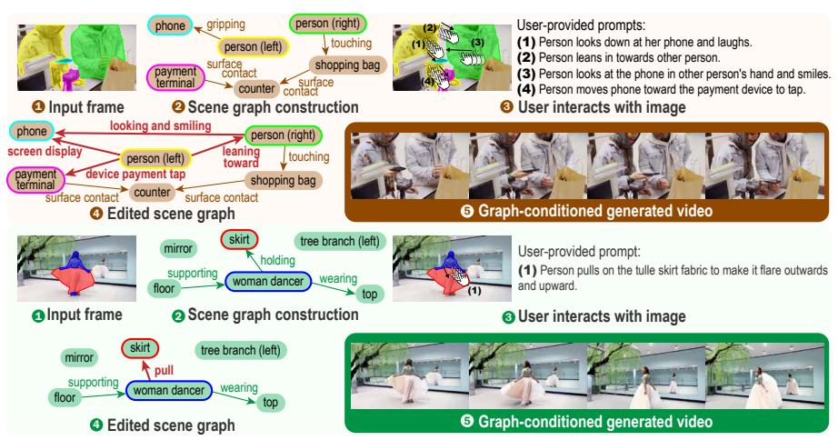

Fig. 1: GraphVid는 상호작용 그래프를 통해 다중 객체 이미지-비디오 생성의 제어를 가능하게 합니다. 입력 프레임에서 시작하여 GraphVid는 엔티티와 그 상호작용을 나타내는 장면 그래프를 구성합니다. 사용자는 이미지를 상호작용하여 원하는 동역학을 지정함으로써 이러한 상호작용을 직접 수정할 수 있습니다. 편집된 상호작용 그래프는 이후 조건화 토큰으로 변환되어 동결된 비디오 디퓨전 백본을 안내하여 일관된 비디오 시퀀스를 생성합니다.

Abstract. 제어 가능한 비디오 생성은 텍스트 프롬프트나 주로 픽셀 움직임을 제한하는 모션-컨트롤 입력을 사용해 정밀한 다중 객체 상호작용을 지정하기 어려워 여전히 도전적입니다. 실제로, 궤적 기반 제어는 종종 사용자가 여러 객체에 대한 정확한 트랙을 그리도록 요구하며, 이는 장면 복잡도에 따라 비효율적이며 차폐나 겹침 상황에서 모호해집니다. 유연하면서도 정밀한 다중 주제 제어를 가능하게 하기 위해, 우리는 구조화된 상호작용 그래프를 통해 인터랙티브 제어를 제공하는 그래프-조건화 이미지-비디오 생성 모델 **GraphVid**를 소개합니다. 또한, 상호작용 중심의 대규모 비디오 데이터셋인 GraphVid-Bench를 구축하여 상호작용 인식 비디오 생성 모델 학습을 위한 구조화된 관계 주석을 제공합니다. 이전 모션-컨트롤 방법보다 훨씬 적은 훈련 데이터와 더 적은 학습 가능한 파라미터를 사용함에도 불구하고, GraphVid는 강력한 제어성과 비디오 품질을 제공합니다. Motion-I2V와 비교할 때, GraphVid는 FID를 최대 39.9% 감소시키고 FVD를 37.6% 감소시키며, PSNR $(9.87 \rightarrow 15.98)$와 SSIM $(0.38 \rightarrow 0.61)$을 개선합니다. 우리의 결과는 구조화된 의미 인터페이스가 제어 가능한 비디오 생성을 위한 강력한 패러다임임을 강조합니다. PLAN Lab <https://plan-lab.github.io/graphvid>

키워드: 제어 가능한 비디오 생성 · 장면 그래프

# 1 서론 (Introduction)

Image-to-Video (I2V) 생성은 생성 모델링에서 점점 더 많은 관심을 받고 있습니다 [\[5,](#page-15-0) [34,](#page-16-0) [42,](#page-17-0) [43,](#page-17-1) [45\]](#page-17-2). 단일 이미지를 주어진 경우, 목표는 시각적 정체성을 보존하면서 현실적인 움직임을 생성하는 시간적으로 일관된 비디오를 합성하는 것입니다. 이 작업은 모델이 단일 정적 프레임에서 모션, 상호작용, 물리적 진화를 근본적으로 모호한 상황에서 타당한 시간적 역학을 추론해야 하기 때문에 본질적으로 도전적입니다. 결과적으로, 시간적으로 일관되고 물리적으로 타당한 비디오를 생성하는 것은 여전히 어려운 과제입니다.

최근의 제어 가능한 I2V 생성 연구는 주로 궤적 기반 동작 제어에 초점을 맞추고 있다 [\[8](#page-15-1)[,29](#page-16-1)[,42,](#page-17-0)[53\]](#page-17-3). Motion Prompting [\[10\]](#page-15-2), Wan-Move [\[8\]](#page-15-1), MagicMotion [\[32\]](#page-16-2), 그리고 Motion-I2V [\[42\]](#page-17-0)와 같은 방법들은 포인트 궤적, 광학 흐름, 세분화 마스크, 혹은 희소 경계 상자 등 명시적 동작 신호를 사용하여 확산 기반 비디오 모델을 안내한다. 이러한 신호는 밀집 동작 표현으로 변환되어 ControlNet [\[58\]](#page-18-0) 어댑터, 잠재적 특징 조작, 혹은 동작 인식 주의(attention)와 같은 메커니즘을 통해 생성 백본에 주입되어, 사용자가 지정한 객체 및 카메라 동작을 가능하게 하면서 외관을 보존한다. 이 중에서 Wan-Move는 대규모 Diffusion Transformer (DiT) [\[37\]](#page-17-4) 모델의 잠재적 조건화 특징을 직접 수정하고 수백만 개의 비디오에서 학습함으로써 동작 충실도와 일반화를 향상시켜 강력한 성능을 달성한다. 그러나 이러한 방법들은 동작을 주로 기하학적 변위로만 다루어 객체 역학을 지배하는 물리적 원인을 간과한다. 이를 해결하기 위해 몇몇 물리 인식 접근법은 힘이나 속도 필드를 기반으로 한 제어 신호를 도입해 객체 상호작용을 모델링하고 [\[12,](#page-15-3)[39\]](#page-17-5), 시각적 및 잠재적 물리 역학을 공동으로 모델링하며 [\[41\]](#page-17-6), 물리 인식 주의를 통해 텍스트 설명, 정성적 범주, 정량적 물리 속성을 주입함으로써 구조화된 물리 지식을 통합한다 [\[49\]](#page-17-7).

최근의 진전에도 불구하고, 제어 가능한 비디오 생성에 대한 기존 접근법은 장면 역학을 모델링하는 방식에서 한계가 있다: (1) 현재 물리 인식 접근법은 힘, 속도, 혹은 구조화된 물리 주석을 기반으로 한 제어 신호를 도입한다 [\[12,](#page-15-3)[39,](#page-17-5)[49\]](#page-17-7). 그러나 이러한 방법들은 일반적으로 물리를 저수준 제어 필드나 사전 정의된 범주로 인코딩하여, 개방형 도메인 장면에서 여러 개체 간의 복잡한 상호작용을 표현하는 능력을 제한한다. (2) 저수준 기하학적 신호에 조건을 부여하는 방법은 다중 객체 시나리오에서 제어를 번거롭게 만들 수 있다. 사용자는 각 객체에 대해 정확한 신호를 작성해야 하며, 몇 개의 제어에서 작은 오류가 전역적으로 비현실적인 동작(예: 일관성 없는 접촉, 미끄러짐, 침투, 동기화되지 않은 행동)을 초래할 수 있다. (3) 또한, 궤적 기반 및 물리 기반 방법 모두 밀집 동작 주석, 궤적, 광학 흐름, 혹은 물리 라벨을 포함한 대규모 정제된 데이터셋에 크게 의존한다. 이러한 데이터셋은 획득 비용이 높고 다양한 환경에 걸쳐 확장하기 어렵다. 예를 들어, Wan-Move [\[8\]](#page-15-1)는 200만 샘플에서 학습하고, Motion Prompting [\[10\]](#page-15-2)는 220만 샘플을 사용하며, Motion-I2V [\[42\]](#page-17-0)는 1000만 샘플에서 학습한다. 이러한 의존성은 기존 제어 가능한 비디오 생성 파이프라인의 실용성과 일반화를 제한한다.

이러한 한계들을 해결하고 유연한 대화형 다중 객체 제어를 가능하게 하기 위해, 우리는 GraphVid를 도입합니다. GraphVid는 방향성 상호작용 장면 그래프를 통해 동작 제어를 표현하는 그래프-조건화 이미지-비디오 생성 프레임워크입니다. 입력 이미지에서 시작하여 GraphVid는 감지된 엔티티 위에 상호작용을 설명하는 관계형 엣지를 갖는 장면 그래프를 구성합니다 (Figure [1])(#page-0-0). 사용자는 원하는 동역학을 지정하기 위해 이미지를 직접 상호작용하고, 편집된 상호작용 그래프는 그 다음에 조건화 토큰으로 변환되어 동결된 비디오 디퓨전 백본을 안내하여 일관된 비디오 시퀀스를 생성합니다. 상호작용 주도 동역학을 모델링하기 위해, 우리는 Edge-Aware Graph Reasoning을 도입합니다. 이 모듈은 방향성 엣지 속성에 따라 메시지 전달을 조건화하여 객체 표현이 확산 조건화에 매핑되기 전에 관계적 역할을 명시적으로 반영하도록 합니다. 이 표현을 사전 학습된 비디오 DiT 모델에 주입하고, 어텐션 레이어에서 LoRA 모듈을 사용함으로써, 모델은 지정된 상호작용 구조를 존중하면서 자체 생성 사전 지식을 활용해 장면을 애니메이션화하는 방법을 학습합니다. 이는 보다 직관적이고 대화형인 동작 제어 메커니즘을 가능하게 합니다. 학습을 지원하기 위해, 우리는 GraphVid-Bench를 구축합니다. GraphVid-Bench는 명시적 상호작용 그래프와 짝지어진 약 27K개의 비디오 클립으로 구성된 상호작용 중심 데이터셋입니다. 약 24배 적은 파라미터와 상당히 적은 학습 데이터를 사용함에도 불구하고, GraphVid는 최첨단 동작 제어 비디오 생성 방법들과 경쟁력 있는 성능을 달성하며, 인지 품질과 재구성 신뢰성을 크게 향상시키고, Motion-I2V와 비교해 FID를 최대 39.9% 감소시키고 FVD를 37.6% 감소시킵니다. 또한 PSNR을 9.87→15.98로, SSIM을 0.38→0.61로 개선합니다. 우리의 기여는 다음과 같습니다:

- 우리는 GraphVid를 제안합니다. 현재까지 우리가 알고 있는 바에 따르면, GraphVid는 단일 이미지에서 구성된 방향성 상호작용 장면 그래프를 통해 다중 객체 동역학의 대화형 제어를 가능하게 하는 최초의 프레임워크입니다. GraphVid의 그래프-투-토큰 조건화 인터페이스는 파라미터 효율적인 LoRA 적응을 사용해 동결된 비디오 디퓨전 트랜스포머에 상호작용 인식 표현을 주입하여, 사전 학습된 생성 사전 지식을 저하시키지 않으면서 구조화된 제어를 가능하게 합니다.

- 우리는 Edge-Aware Graph Reasoning 모듈을 도입합니다. 이 모듈은 방향성 엣지 속성에 따라 그래프 메시지 전달을 조건화하여, 모델 표현이 복잡한 다중 객체 관계와 다중 엔티티 간의 상호작용 주도 동작 전파를 포착하도록 합니다.

- 우리는 GraphVid-Bench를 제작합니다. GraphVid-Bench는 구조화된 상호작용 그래프와 짝지어진 약 27K개의 비디오 클립으로 구성된 고품질 상호작용 중심 비디오 생성 데이터셋으로, 관계형 비디오 제어의 학습 및 평가를 지원합니다.

- 0.6B의 학습 가능한 파라미터만 필요로 하고 경쟁 방법들 중 가장 빠른 추론 시간을 달성함에도 불구하고, GraphVid는 인지 및 재구성 지표에서 상당한 품질 향상을 제공합니다. FID를 34.5% (25.98 → 17.02) 감소시키고, FVD를 7.8% (107.89 → 99.42) 감소시키며, PSNR을 5.9% (15.08→15.98) 증가시키고, SSIM을 15.0% (0.53→0.61) 향상시킵니다. 이는 WISA(물리 중심 텍스트 입력)와 비교했을 때이며, 궤적 기반 기준을 능가합니다.

- 예를 들어 Tora (FID −30.3%, FVD −10.0%, PSNR +41.7%, SSIM +12.9%) 및 Motion-I2V (FID −39.9%, FVD −37.6%, PSNR +61.9%, SSIM +60.5%)와 같은 경우입니다.

# 2 관련 연구 (Related Work)

비디오 생성. 생성 모델링의 최근 발전은 비디오 생성 시스템의 품질과 규모를 크게 향상시켰다 [\[4,](#page-15-4) [48,](#page-17-8) [56\]](#page-18-1). 초기 접근법은 U‑Net 백본과 시간 모듈을 사용해 이미지 확산 모델을 시간 영역으로 확장하여 움직임 역학을 포착했다 [\[14,](#page-15-5) [15\]](#page-15-6). 이후 연구는 잠재 비디오 확산과 모션‑조건화 아키텍처를 도입해 시간 일관성과 확장성을 개선했다 [\[22,](#page-16-3) [55\]](#page-18-2). 최근에는 대규모 확산 트랜스포머(DiTs)가 고품질 비디오 합성을 위한 지배적 아키텍처로 부상했다. CogVideoX [\[56\]](#page-18-1)와 Wan [\[48\]](#page-17-8) 같은 모델은 트랜스포머 기반 확산 모델을 확장함으로써 장거리 시간 일관성과 향상된 시각적 충실도를 가능하게 함을 보여준다. 최근 연구들은 이러한 강력한 사전 학습된 비디오 백본을 기반으로 하여 원하는 제어 신호를 주입하면서 백본의 생성 사전 지식을 보존하는 소수의 학습 가능한 파라미터를 추가한다 [\[8,](#page-15-1)[31,](#page-16-4)[42,](#page-17-0)[52\]](#page-17-9). 이 추세는 계산 제약과 대규모 백본이 이미 풍부한 외형과 시간 역학을 인코딩한다는 경험적 관찰을 모두 반영한다 [\[10,](#page-15-2) [12,](#page-15-3) [29,](#page-16-1) [40,](#page-17-10) [44\]](#page-17-11). GraphVid는 비디오 백본을 고정하고 구조화된 상호작용 신호를 생성 토큰으로 매핑하는 경량 모듈을 학습함으로써 이 패러다임을 따른다.

제어 가능한 비디오 생성. 일반적인 비디오 생성 모델은 현실적인 비디오를 합성할 수 있지만, 생성된 콘텐츠를 제어하는 것은 여전히 주요 과제이다. 초기 제어 가능한 생성 접근법은 포즈, 깊이, 또는 모션 궤적과 같은 조건화 신호를 도입해 비디오 합성을 안내했다 [\[10,](#page-15-2) [29,](#page-16-1) [42\]](#page-17-0). 다른 연구들은 기존 비디오를 수정하면서 시간 일관성을 보존하는 편집 기반 파이프라인을 탐구했다 [\[11,](#page-15-7) [28,](#page-16-5) [33\]](#page-16-6). 최근 방법들은 보다 정밀한 제어를 가능하게 하기 위해 구조화된 조건화 신호나 중간 표현을 통합하는 데 초점을 맞추고 있다. 예를 들어, 모델은 공간 레이아웃 [\[18,](#page-16-7) [50\]](#page-17-12), 모션 필드 [\[29,](#page-16-1) [42\]](#page-17-0), 또는 객체 궤적 [\[53,](#page-17-3) [57\]](#page-18-3)을 조건화하여 비디오를 생성하면서 사전 학습된 비디오 백본과의 일관성을 유지한다. 강력한 성능에도 불구하고 궤적 기반 방법은 밀집 포인트 추적 감독에 크게 의존하여 데이터 집약적이며 객체 간의 고수준 관계 추론과 복잡한 상호작용으로 확장하기 어렵다 [\[24\]](#page-16-8). 반면, 우리는 GraphVid를 제안한다. GraphVid는 상호작용을 방향성 장면 그래프로 표현하고 엣지‑감지 GNN을 사용해 다중 객체 제어를 명시적으로 모델링함으로써 보다 그럴듯하고 물리적으로 일관된 비디오를 생성한다.

시각적 생성용 장면 그래프. 장면 그래프는 장면 내 객체와 그 관계를 구조화된 표현으로 제공하며 이미지 이해 및 생성 [\[7,](#page-15-8) [9,](#page-15-9) [25,](#page-16-9) [30\]](#page-16-10), 3D 장면 이해 [\[1,](#page-14-0) [36,](#page-16-11) [47\]](#page-17-13), 구성 및 상식 추론 [\[20,](#page-16-12) [26\]](#page-16-13) 등에서 널리 연구되어 왔다. 이는 모델이 구성 구조와 객체 상호작용을 추론하도록 가능하게 한다. 최근 그래프‑투‑비디오(formulations)는 객체 중심 상호작용 그래프에서 구성적 생성을 지원한다 [\[3\]](#page-15-10). 반면, GraphVid는 상호작용 제어를 목표로 한다

<span id="page-4-0"></span>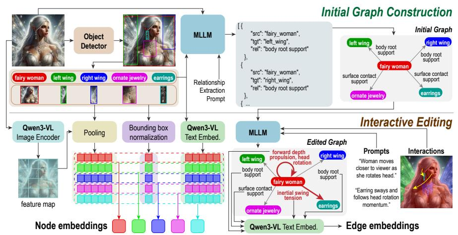

그림 2: GraphVid 개요. 입력 이미지에서 객체를 감지하고 노드 임베딩으로 인코딩하며, MLLM은 관계형 엣지를 추출해 초기 상호작용 그래프를 구성한다. 엣지-감지 그래프 추론은 노드와 엣지 표현을 조건화 토큰으로 변환하여 동결된 비디오 디퓨전 트랜스포머를 안내해 상호작용 일관성 있는 비디오 동역학을 생성한다.

상호작용 기반 그래프를 사용하고, 그래프 신호를 비디오 생성 백본과 호환되는 조건화 토큰으로 변환하는 경량 모듈을 학습하여 구조화된 제어를 가능하게 하면서 백본의 강력한 사전 지식을 유지한다.

# 3 방법 (Method)

우리는 **GraphVid**를 제시한다. 이는 단일 조건화 이미지에서 제어 가능한 이미지-투-비디오(I2V) 생성을 위한 프레임워크이다. 핵심 아이디어는 사용자 의도를 장면의 엔티티에 대한 *구조화된 상호작용 그래프*로 표현하고, 이 그래프를 경량 그래프-투-토큰 어댑터와 LoRA 기반 조건화를 사용해 대형 사전 학습된 비디오 디퓨전 트랜스포머와 연결하는 것이다. 백본을 동결하고 작은 모듈만 학습함으로써 GraphVid는 구조화되고 객체 중심의 제어를 도입하면서 사전 학습된 모델의 강력한 생성 사전 지식을 보존한다. 그림 2는 개요를 제시한다.

조건화 이미지 $I_0$가 주어졌을 때, 우리의 목표는 사용자 지정 객체 상호작용 집합을 따르는 비디오 시퀀스 $\{I_t\}_{t=1}^T$를 생성하는 것이다. 장면 동역학을 구성적으로 표현하기 위해, 우리는 속성 부여된 방향성 상호작용 그래프 G = (V, E)를 구성한다. 여기서 각 노드 $v_i \in V$는 $I_0$에서 감지된 엔티티에 해당하고, 각 방향성 엣지 $e_{ij} \in E$는 객체 i에서 객체 j로의 관계형 타입 $r_{ij} \in \mathcal{R}$(예: push, pull, lift, hold)를 인코딩하여 엔티티가 서로에 미치는 영향을 설명하며, 선택적 정성적 물리적 신호(예: 대략적인 방향과 크기)를 포함해 사용자가 직관적인 관계형 용어로 장면 동역학을 묘사할 수 있도록 한다. 단일 엔티티를 포함하는 일방향 명령은 자기 루프 엣지 $e_{ii}$(예: rotate, move, scale)로 표현된다. 우리는 조건부 비디오 생성기가 $p(\mathbf{I}_{1:T} \mid I_0, G)$를 모델링하도록 학습하는 것을 목표로 한다. 여기서 $\mathbf{I}_{1:T} = \{I_t\}_{t=1}^T$는 생성된 T 프레임을 나타낸다.

<span id="page-5-0"></span>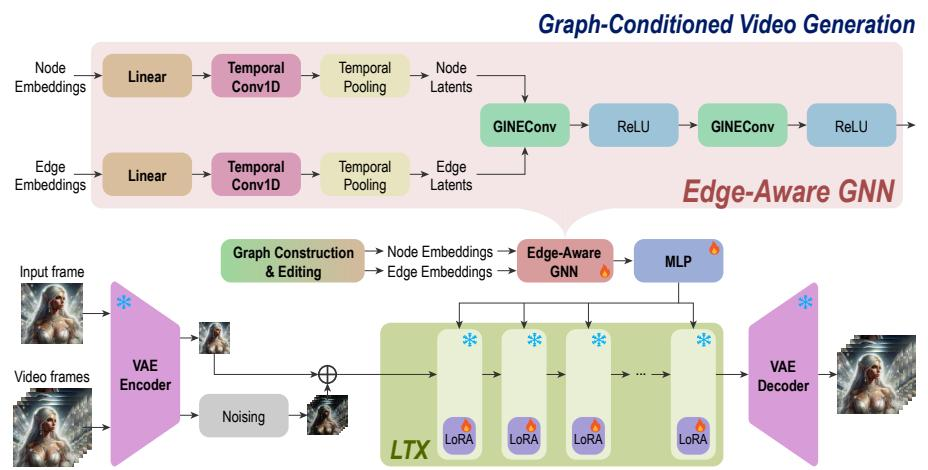

그림 3: GraphVid 엣지-감지 그래프 추론. 노드와 엣지 임베딩은 시계열 잠재 변수로 인코딩되고, 우리가 제안한 엣지-감지 GNN에 의해 처리되어 상호작용 의미를 메시지 전달에 직접 주입한다. 결과적으로 생성된 그래프 임베딩은 엔티티 간의 관계형 동역학을 포착하고, 이를 조건화 토큰으로 매핑해 LoRA 어댑터를 통해 동결된 디퓨전 비디오 백본을 조절한다.

노드 표현. 우리는 사전 학습된 비전-언어 검출기를 사용해 입력 프레임 $I_0$에서 객체 엔티티를 추출한다. 각 감지된 객체 $v_i$에 대해, (i) 객체의 바운딩 박스 $\mathbf{b}_i$ 내부 영역을 인코딩하고 결과 특징을 풀링해 얻은 시각적 임베딩 $\mathbf{f}_i^{vis} \in \mathbb{R}^{d_v}$와 (ii) 객체 라벨을 인코딩한 텍스트 임베딩 $\mathbf{f}_i^{txt} \in \mathbb{R}^{d_t}$를 융합해 통합 특징 벡터를 구성한다. 정규화된 바운딩 박스 좌표 $\mathbf{b}_i \in \mathbb{R}^4$는 이 임베딩들과 연결되어 $\mathbf{x}_i = [\mathbf{f}_i^{vis} \parallel \mathbf{f}_i^{txt} \parallel \mathbf{b}_i]$라는 표현을 형성하며, 이는 객체의 외형, 의미적 정체성, 공간적 근거를 동시에 포착한다.

엣지 표현. 각 방향성 엣지 $e_{ij}$는 소스와 타깃 엔티티 간 의도된 상호작용을 나타내는 개방형 어휘 텍스트 설명자로 표현된다. 엣지는 텍스트 임베딩 모델을 사용해 인코딩되어 엣지 특징 $\mathbf{e}_{ij} \in \mathbb{R}^{d_e}$를 얻는다.

# 3.1 엣지-감지 그래프 추론 (Edge-Aware Graph Reasoning)

표준 GCN은 에지를 이진 연결 신호로 취급하며 주로 노드 특징을 그래프 전체에 전파합니다 [17, 27]. 그러나 물리적 상호작용 모델링에서는 객체 간 관계의 종류가 직접적으로 그들의 운동 역학을 결정하고 근본적으로 다른 운동 패턴과 인과 효과를 의미합니다. 이러한 관계 속성을 무시하면 그래프가 단순한 공간적 인접성으로 축소되고, 모델이 상호작용이 객체 행동에 미치는 영향을 추론하는 것을 방지합니다. 이를 해결하기 위해 우리는 메시지 전달 과정에서 에지 의미를 명시적으로 통합하는 에지-감지형 Graph Isomorphism Network (GINEConv [54])를 사용합니다. 그림 3에 나타난 바와 같이, 노드와 에지 특징은 먼저 공유된 은닉 공간으로 투영됩니다  $\mathbf{h}_i^{(0)} = \phi_n(\mathbf{x}_i)$ ,  $\mathbf{a}_{ij} = \phi_e(\mathbf{e}_{ij})$ , 여기서

$\phi_n$ 및 $\phi_e$는 노드/에지 특징을 공통 임베딩 공간 $\mathbb{R}^{d_h}$으로 매핑하는 학습 가능한 MLP입니다. 이후 L개의 GINEConv 레이어를 적용하여 관계 정보를 그래프 전체에 전파합니다.

$$\mathbf{h}_{i}^{(l+1)} = \text{MLP}^{(l)} \left( \mathbf{h}_{i}^{(l)} + \sum_{j \in \mathcal{N}(i)} \text{ReLU}(\mathbf{h}_{j}^{(l)} + \mathbf{a}_{ji}) \right). \tag{1}$$

표준 GCN과 달리 GINE 공식은 에지 속성을 집계 단계에 직접 주입하여 상호작용 의미가 노드 업데이트에 영향을 미치도록 합니다. 따라서 각 노드 표현은 이웃 객체뿐만 아니라 그들의 상호작용을 지배하는 물리적 관계에도 조건화됩니다. L 레이어 후에, 우리는 상호작용을 인식한 노드 임베딩 $\mathbf{h}_i \in \mathbb{R}^{d_h}$를 얻으며, 이는 객체 정체와 장면 내 동적 관계 상태를 모두 인코딩합니다. 이러한 임베딩은 다운스트림 생성 모델에 어떤 엔티티가 움직여야 하고 어떻게 상호작용해야 하는지에 대한 구조화된 표현을 제공하여 보다 물리적으로 일관된 비디오 생성을 가능하게 합니다.

#### 3.2 그래프-투-비디오 어댑터 (Graph-to-Video Adapter)

대규모 비디오 데이터셋에서 훈련된 최신 Diffusion Transformer (DiT)는 비디오 생성에 강력한 시공간 사전 지식을 제공합니다 [35, 56]. 이러한 모델을 처음부터 훈련하는 것은 계산적으로 부담이 크며, 대규모 데이터에서 학습된 풍부한 생성 능력을 손상시킬 수 있습니다. 따라서 우리는 사전 훈련된 DiT 백본 [16]을 활용하고 이를 고정(frozen) 상태로 두며, 그래프 임베딩을 변환기 입력 공간과 호환되는 조건화 토큰으로 변환하는 경량 어댑터를 도입합니다.

따라서 각 상호작용 인식 노드 임베딩 $\mathbf{h}_i$는 변환기 잠재 공간에 $\mathbf{z}_i = \text{MLP}(\mathbf{h}_i) \in \mathbb{R}^{d_l}$로 투영됩니다, 여기서 $d_l$은 사전 훈련된 DiT의 은닉 크기를 나타냅니다. 각 $\mathbf{z}_i$는 의미적 조건화 토큰으로 취급됩니다. 장면에 객체 수가 다양하기 때문에 노드 시퀀스는 최대 길이 $N_{\text{max}}$으로 패딩됩니다. 생성된 토큰은 에지 텍스트 토큰과 연결되어 인코더 숨겨진 상태로 전달됩니다. 이를 통해 변환기의 자기 주의(attention)가 엔티티 상호작용을 추론하고 생성 과정에서 그래프 구조를 움직임으로 변환할 수 있습니다.

# 3.3 훈련 목표 (Training Objective)

사전 훈련된 DiT 백본을 강력한 생성 사전 지식을 보존하기 위해 고정(frozen) 상태로 두는 대신, 모델은 새로운 그래프 조건화 모달리티에 적응하기 위한 경량 메커니즘이 필요합니다. 따라서 우리는 각 변환기 블록의 **Q**, **K**, **V**, 그리고 출력 프로젝션 레이어에 Low-Rank Adaptation (LoRA) [21] 모듈을 주입합니다. 이러한 어텐션 프로젝션을 조절함으로써 모델은 그래프 토큰을 어텐션 계산에 통합하면서 학습 가능한 파라미터 수를 최소화합니다. 이를 통해 변환기는 사전 훈련된 가중치를 수정하지 않고도 상호작용 인식 그래프 임베딩에 주의를 기울일 수 있습니다.

우리는 사전 학습된 확산 모델에서 사용되는 flow-matching 목표를 사용하여 GraphVid를 훈련시킨다. 목표 비디오 x₀를 주어진 경우, 우리는 이를 잠재 공간에 인코딩하고 logit-normal 분포에서 t ∼ p(t)를 샘플링한다. 노이즈가 추가되어 노이즈가 있는 잠재 xₜ를 얻는다. 모델은 손실을 사용하여 최적화된다.

$$\mathcal{L}_{\text{CFM}}(\theta) = \mathbb{E}_{\mathbf{c} \sim \mathcal{I}_0, G} \, \mathbb{E}_{t \sim p(t)} \, \mathbb{E}_{\mathbf{x}_0 \sim p_{\text{data}}(\cdot | \mathbf{c}), \, \mathbf{x}_1 \sim \mathcal{N}(0, \mathbf{I})} \Big[ \| \mathbf{v}_{\theta}(\mathbf{x}_t, t, \mathbf{c}) - (\mathbf{x}_1 - \mathbf{x}_0) \|_2^2 \Big],$$
(2)

여기서 x^t = (1 − t)x^0 + tx₁. 훈련 중에는 GNN 파라미터, Graphto-Adapter MLP 레이어, 그리고 LoRA 모듈만 업데이트된다(θ로서), 반면 VAE와 DiT 백본은 고정된다. 이 설계는 상호작용 그래프에서 비디오 동역학으로의 미분 가능한 상호작용/상징-투-잠재 매핑을 엔드-투-엔드 학습할 수 있게 하며, 사전 학습된 모델의 생성 능력을 유지한다.

# 4 GraphVid-Bench 데이터셋 (GraphVid-Bench Dataset)

현재 비디오 생성 벤치마크는 주로 텍스트 프롬프트[23] 또는 저수준 모션 큐[8]에 의존하며, 이는 객체 수준 상호작용에 대한 제한된 제어만을 제공한다. 그러나 많은 실제 동역학은 본질적으로 관계적이며, 행동은 엔터티가 서로 상호작용하는 방식에서 발생한다(예: 사람이 머리를 돌리거나 물체가 주변 환경에 상대적으로 움직이는 경우). 이러한 동역학에 대한 구조화된 제어를 가능하게 하기 위해 우리는 GraphVid-Bench를 도입한다. 이 데이터셋은 비디오와 엔터티 및 그들의 방향성 상호작용 큐를 설명하는 상호작용 그래프를 쌍으로 제공한다.

GraphVid-Bench는 약 27K개의 상호작용 중심 비디오 클립을 포함한다. 일관된 훈련 및 평가를 보장하기 위해 모든 클립은 16fps에서 81프레임으로 표준화된다. 각 비디오는 노드가 장면 엔터티를 나타내고 엣지가 그들 사이의 상호작용 큐를 인코딩하는 방향성 상호작용 그래프와 쌍을 이룬다. 노드 속성에는 시각적 특징, 의미 라벨, 그리고 공간적 in-

<span id="page-7-0"></span>Table 1: GraphVid-Bench 통계는 약 27K 정제된 비디오를 대상으로 한다. 상호작용 복잡성은 다중 엔터티 동역학의 유행을 강조한다.

| Metric | Mean | Med. | Std. |  |  |  |
|--------------------------|-------|------|------|--|--|--|
| Nodes / Graph | 7.76 | 5.0 | 8.03 |  |  |  |
| Edges / Graph | 4.85 | 4.0 | 3.46 |  |  |  |
| Interaction Complexity |  |  |  |  |  |  |
| No-Interaction (N=0) | 3881 |  |  |  |  |  |
| Single-Interaction (N=1) | 10982 |  |  |  |  |  |
| Multi-Interaction (N>1) | 12641 |  |  |  |  |  |

formation, while edges capture the type and direction of interactions that influence scene dynamics. As shown in Table [1,](#page-7-0) the dataset exhibits diverse structural complexity, with an average of 7.76 nodes and 4.85 edges per graph. In total, 10,982 samples contain a single interaction, and 12,641 contain multiple interactions (N > 1). As illustrated in Figure [4,](#page-8-0) GraphVid-Bench covers a broad spectrum of canonical physical interactions. The co-occurrence statistics further reveal that many interactions appear jointly within the same clips, indicating that real-world dynamics frequently involve multiple interacting primitives. We also include 3,881 samples with no explicit interactions (N = 0). These scenes contain natural object motion without direct entity-to-entity interactions, providing a baseline for learning general video dynamics. Since GraphVid allows

<span id="page-8-0"></span>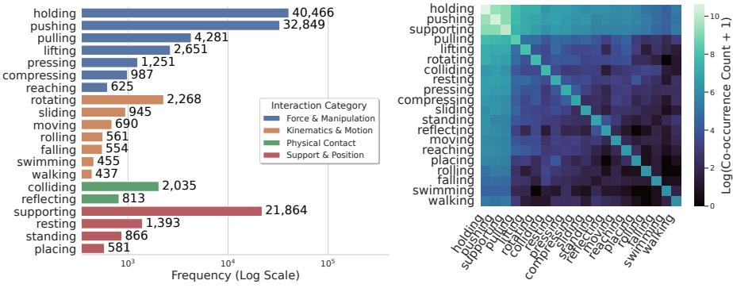

- (a) 상호작용 유형의 분류.
- (b) 동시 발생 통계.

Fig. 4: GraphVid-Bench 데이터셋의 상호작용 통계. (a) 상호작용 원시의 빈도, 네 가지 범주(힘 & 조작, 운동학 & 움직임, 물리적 접촉, 지원 & 위치)로 그룹화됨. (b) 상호작용 동시 발생 행렬은 동일한 비디오 시퀀스 내에서 함께 나타나는 상호작용 원시를 포착함. 조작과 움직임 원시의 동시 발생은 실제 세계 역학이 본질적으로 구성적임을 보여 주며, 구조화된 상호작용 그래프를 사용한 제어 가능한 비디오 생성의 필요성을 부각시킴.

사용자가 추론 시에 상호작용 에지를 추가할 수 있도록, 이러한 샘플은 새로운 상호작용이 도입될 때 장면 행동이 어떻게 변하는지 모델이 학습하도록 돕습니다. 부록 A에서는 데이터셋 수집 과정에 대한 추가 세부 정보를 제공합니다.

\n# 5 실험 (Experiments)\n

\n# 5.1 구현 세부사항 (Implementation Details)\n

GraphVid는 사전 학습된 LTX-Video [16] Diffusion Transformer를 비디오 생성을 위한 백본으로 활용합니다. DiT 백본과 VAE 인코더-디코더는 학습 중에 고정됩니다. 객체 엔티티는 Qwen3-VL [2]를 사용해 조건화 이미지에서 추출됩니다. 각 객체마다, 객체 크롭에 대한 평균 및 최대 풀링을 사용해 $d_v = 8192$ 차원의 시각 임베딩, 객체 라벨에 대한 $d_t = 2560$ 차원의 텍스트 임베딩, 그리고 정규화된 바운딩 박스 좌표를 얻습니다. 이들을 연결해 $d_n = 10756$ 차원의 노드 특징 벡터를 형성합니다. 객체 간 물리적 상호작용은 Qwen3-Embedding [59]를 사용해 $d_e = 2560$ 차원의 에지 속성을 생성합니다. 에지 인식 그래프 추론 동안, 노드와 에지 특징은 숨겨진 차원 d = 512로 투영되어 상호작용 인식 노드 임베딩을 생성합니다. 노드 임베딩은 MLP를 사용해 LTX Transformer 숨겨진 크기로 투영되어 512 차원 그래프 임베딩을 4096 차원으로 매핑합니다. 대상 비디오는 사전 학습된 VAE를 사용해 잠재 공간에 인코딩되고, 노이즈는 로그릿-노멀 분포에서 샘플링된 타임스텝에서 주입됩니다. 우리는 랭크 128의 LoRA 모듈을 사용합니다. 학습 중에는 GNN 파라미터, 그래프-투-어댑터 투영 레이어, 그리고 LoRA 가중치만 업데이트됩니다.

<span id="page-9-0"></span>Table 2: 상호작용 중심 MoveBench 하위 집합에 대한 정량적 비교. GraphVid는 훨씬 적은 파라미터와 훈련 데이터를 사용하면서 모든 지표에서 경쟁력 있는 성능을 달성합니다. 최고 및 두 번째 최고가 강조 표시됩니다.

| 방법 | 학습<br>데이터 | 학습가능한<br>매개변수 (B) | 추론<br>(초)↓ | FID↓ | FVD↓ | PSNR↑ | SSIM↑ | EPE↓ |
|------------------|---------------|-------------------------|-------------------|-------|--------|-------|-------|------|
| Wan-Move [8] | 2M | 14.5 | 1800 | 15.56 | 82.17 | 17.21 | 0.61 | 2.6 |
| Motion-I2V [42] | 10M | 1.2 | 790 | 28.32 | 159.32 | 9.87 | 0.38 | 3.9 |
| Tora [60] | 630K | 5 | 1200 | 24.45 | 110.47 | 11.27 | 0.54 | 3.3 |
| MagicMotion [32] | 23K | 1.5 | 750 | 26.57 | 105.12 | 12.04 | 0.51 | 3.2 |
| WISA [49] | 80K | 1 | 1000 | 25.98 | 107.89 | 15.08 | 0.53 | 4.1 |
| FlashMotion [31] | 23K | 13 | 677 | 19.02 | 104.12 | 14.04 | 0.56 | 3.8 |
| GraphVid (Ours) | 27K | 0.6 | 200 | 17.02 | 99.42 | 15.98 | 0.61 | 2.9 |

# 5.2 실험 설정 (Experimental Setup)

평가를 위해, 우리는 상호작용 중심 시나리오에 초점을 맞춘 MoveBench [\[8\]](#page-15-1) 하위 집합을 주요 평가 세트로 설정한다. GraphVid는 명시적 픽셀 수준 모션 감독보다 물리 기반 관계 제어를 강조하므로, 우리는 전체 비디오 품질, 시간적 일관성, 구조적 충실도를 평가하는 지표를 우선시한다. 또한, 우리는 단일 객체 상호작용 시나리오만 포함하는 정제된 MoveBench의 하위 집합에서 성능을 평가하여, GraphVid가 다중 엔티티 간 상호작용에 대한 추론이 필요한 보다 복잡한 환경에서의 효과를 평가할 수 있다. 우리는 시각적 품질을 측정하기 위해 Frechet Video Distance (FVD) [\[46\]](#page-17-14), Frechet Inception Distance (FID) [\[19\]](#page-16-18), Peak Signalto-Noise Ratio (PSNR), 및 Structural Similarity Index (SSIM) [\[51\]](#page-17-15)를 보고한다. 우리는 또한 End-Point Error (EPE) [\[10\]](#page-15-2), 즉 예측된 오프틱 플로우와 실제 오프틱 플로우 간 평균 변위를 보고하며, 이는 생성된 모션이 의도된 상호작용을 따르는지를 직접적으로 측정한다. 추가 세부 사항은 부록 [B.](#page-20-0)에서 확인할 수 있다.

# 5.3 정량적 결과 (Quantitative Results)

Table [2](#page-9-0)은 GraphVid를 기존의 제어 가능한 비디오 생성 방법들과 비교하며, GraphVid는 모든 지표에서 경쟁력 있는 성능을 달성하면서도 훨씬 적은 훈련 샘플, 훨씬 적은 학습 가능한 파라미터, 그리고 더 빠른 추론 속도를 요구한다. 기존 접근 방식 중에서 WISA [\[49\]](#page-17-7)은 비디오 생성 과정에 구조화된 물리적 지식을 명시적으로 통합한 가장 밀접한 관련 방법이다. WISA와 비교했을 때, GraphVid는 지각 품질과 재구성 충실도에서 상당한 향상을 달성한다. 특히, GraphVid는 FID를 25.98에서 17.02로, FVD를 107.89에서 99.42로 감소시켜 각각 34.5%와 7.8%의 향상을 나타내며, 이는 실제 비디오와의 시각적 현실감 및 분포 정합성이 크게 향상되었음을 시사한다. 또한 SSIM이 15.0% 개선되고 PSNR이 5.9% 개선되어, 우리의 그래프 기반 상호작용 모델링이 더 선명하고 구조적으로 일관된 프레임을 생성함을 입증한다. 이 이점은 모션 정확성에서도 유지되며, GraphVid는 EPE를 4.1에서 2.9로 감소시켜 WISA 대비 29.3% 향상을 달성하고

<span id="page-10-0"></span>Table 3: 다중 객체 정량적 비교 (Multi-object quantitative comparison) on interaction-centric MoveBench. GraphVid는 더 큰 기초 모델에 비해 강력한 구조적 일관성을 유지한다. 최고 및 두 번째 최고가 강조 표시되어 있다.

| 방법 | 학습<br>데이터 | 학습가능한<br>매개변수 (B) | $\mathbf{FID} \!\!\downarrow$ | $\mathbf{FVD}\!\!\downarrow$ | PSNR↑ | $\mathbf{SSIM} \!\!\uparrow$ | EPE↓ |
|------------------|---------------|-------------------------|-------------------------------|------------------------------|-------|------------------------------|------|
| Wan-Move [8] | 2M | 14.5 | 31.29 | 252 | 16.69 | 0.61 | 2.2 |
| Tora [60] | 630K | 5 | 56.04 | 369 | 14.98 | 0.52 | 3.5 |
| WISA [49] | 80K | 1 | 60.12 | 341 | 13.13 | 0.55 | 3.9 |
| FlashMotion [31] | 23K | 13 | 55.03 | 311 | 12.12 | 0.52 | 3.9 |
| GraphVid (우리) | 27K | 0.6 | 49.45 | 291 | 14.44 | 0.55 | 3.0 |

우리는 모든 동등 규모 방법 중 가장 낮은 EPE를 보인다. EPE는 생성된 광학 흐름이 실제와 얼마나 일치하는지를 측정하므로, 이는 우리의 그래프 조건화가 지정된 상호작용을 가장 충실히 따르는 움직임을 생성함을 나타낸다. 전반적인 지각, 재구성, 움직임 향상은 방향성 장면 그래프를 통해 상호작용 관계를 명시적으로 모델링하는 것이 사전 정의된 텍스트(물리 중심) 속성에 의존하는 것보다 제어 가능한 비디오 생성을 위한 더 강력한 귀납적 편향을 제공함을 시사한다.

우리는 또한 Motion‑I2V [42], MagicMotion [32], FlashMotion [31], Tora [60]와 같은 궤적 기반 제어 방법과 비교한다. 이들 접근법은 궤적, 광학 흐름, 세분화 마스크와 같은 명시적 움직임 신호에 크게 의존한다. Motion‑I2V와 비교할 때 GraphVid는 FID를 39.9% $(28.32 \rightarrow 17.02)$, FVD를 37.6% $(159.32 \rightarrow 99.42)$ 감소시키며, PSNR을 9.87에서 15.98로, SSIM을 0.38에서 0.61로 개선해 프레임 재구성과 지각적 충실도가 현저히 향상되었음을 나타낸다. 최근 궤적 가이드 비디오 생성 방법인 FlashMotion과 비교하면 GraphVid는 FID를 10.5% $(19.02 \rightarrow 17.02)$ 낮추고, 재구성 품질을 강화해 PSNR을 14.04에서 15.98로, SSIM을 0.56에서 0.61로 개선한다. MagicMotion과 비교하면 GraphVid는 FID를 약 36% (26.57 $\rightarrow$ 17.02) 감소시키고 시계열 일관성을 향상시킨다. 특히 GraphVid는 모든 동등 궤적 기반 방법( Motion‑I2V 3.9, FlashMotion 3.8, Tora 3.3, MagicMotion 3.2)보다 낮은 EPE(2.9)를 달성해 명시적 움직임 감독 없이 9.4–25.6%의 움직임 오류를 줄인다. 이러한 개선은 구조화된 상호작용 추론을 통해 장면 역학을 모델링하는 효과를 강조한다. Wan‑Move [8]은 약 200만 개 비디오를 학습하고 14.5B 파라미터 기반을 사용해 규모가 크게 크기 때문에 가장 우수한 절대 지표를 달성한다. 반면 GraphVid는 0.6B의 학습 가능한 파라미터만 사용하고 27K의 상호작용 중심 데이터셋에서 학습한다. 약 두 차수의 규모 차이와 약 24배 낮은 모델 파라미터에도 불구하고 GraphVid는 경쟁력 있는 성능을 달성하며 재구성과 움직임 정확도에서 대부분의 기존 제어 가능한 방법을 능가한다.

Table 3에서 관찰되는 것처럼, 상호작용 추론이 특히 중요한 Move Bench의 다중 객체 하위 집합에서 성능을 평가한다. 이러한 시나리오에서 GraphVid는 다른 경량 기반 모델보다 다중 객체 상호작용 품질을 향상시키며 명확한 상대적 이득을 보이고, 훨씬 적은 자원을 사용한다. 유사한 데이터 규모를 가진 모델과 비교할 때

규모를 비교하면 GraphVid는 가장 낮은 FID(49.45)를 달성하며, 다음 최고(FlashMotion, 55.03)보다 10.1% 향상하고, 가장 낮은 FVD(291)를 달성해 다음 최고(FlashMotion, 311)보다 6.4% 향상한다; 이는 다중 개체 역학에서 더 나은 지각적 현실감과 시계열 일관성을 나타낸다. GraphVid는 동등 규모 방법 중 가장 낮은 EPE를 달성해 움직임 정확도 이점이 더 어려운 다중 객체 설정에서도 유지됨을 확인한다. 재구성 충실도에서 GraphVid는 Tora(최고 PSNR)와 WISA(최고 SSIM)와 경쟁한다. 중요한 것은 이러한 이득이 훨씬 낮은 규모로 달성된다는 점이다. GraphVid는 0.6B의 학습 가능한 파라미터(FlashMotion보다 약 21.7배, Tora보다 약 8.3배 적음)를 사용하고 27K 클립(FlashMotion과 비슷하고 Tora보다 23배 적음)에서 학습해 상호작용 그래프 조건화가 대규모 모델이나 데이터 없이도 강력한 다중 객체 일관성을 제공함을 강조한다. Appendix [C](#page-21-0)는 우리의 상호작용 중심 DAVIS [\[38\]](#page-17-16) 하위 집합에 대한 추가 결과를 제시한다.

# 5.4 효율성 및 확장성 분석

Figure [5](#page-11-0)은 모델 규모에 따른 추론 처리량을 나타낸다. 정확도 외에도 GraphVid는 강력한 효율성을 제공하며, 비교된 모든 접근 방식 중 가장 빠른 추론 속도를 200초에서 달성했다. 이는 Wan-Move(1800초), Tora(1200초), WISA(1000초)보다 현저히 빠르다. 이러한 효율성은 가벼운 상호작용 그래프 조건화와 LoRA 기반 통합을 사전 학습된 DiT 백본에 적용함으로써, 무거운 보조 모션 인코더나 대규모 모션 예측 모듈이 필요 없도록 한 데서 비롯된다. 이는 구조화된 장면을 통해 상호작용 관계를 명시적으로 모델링한다는 것을 확인시켜 준다.

<span id="page-11-0"></span>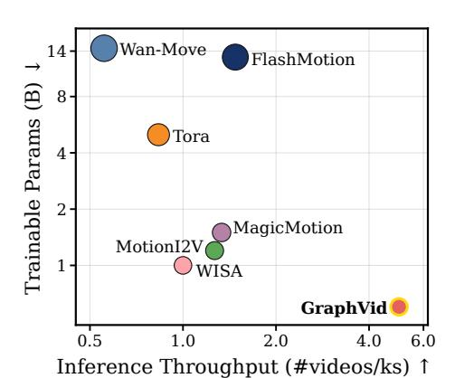

Fig. 5: 모델 효율성 비교. 추론 처리량과 규모 사이의 trade-off. 버블 크기는 모델 규모를 반영한다.

그래프는 궤적 기반 모션 감독에 대한 강력하고 효율적인 대안을 제공한다. 상호작용 인식 그래프 추론을 활용함으로써 GraphVid는 훨씬 낮은 연산량과 데이터로도 강력한 제어 가능성과 물리적 타당성을 달성한다.

# 5.5 정성적 분석

Figure [6](#page-12-0)은 GraphVid 상호작용 그래프를 통해 장면 역학을 모델링함으로써 복잡한 다중 개체 모션에 대해 정밀하고 해석 가능한 제어가 가능함을 보여주는 대표적인 정성적 결과를 제시한다. 예시들은 객체–객체 상호작용, 인간–객체 상호작용, 그리고 관절 인간 모션을 포함한 다양한 상호작용 유형을 보여준다. 모든 시나리오에서 GraphVid는 객체 정체성과 장면 외관을 보존하며, 현실적인 모션 궤적을 생성한다.

<span id="page-12-0"></span>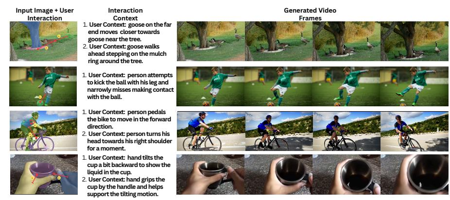

Fig. 6: 상호작용 기반 비디오 생성을 위한 GraphVid의 정성적 결과. 단일 입력 이미지와 사용자 지정 상호작용 컨텍스트를 주면 GraphVid는 원하는 역학을 반영하는 시간적으로 일관된 비디오 시퀀스를 생성한다. 예시에는 객체–객체 상호작용(서로 상대적으로 움직이는 거위), 인간–객체 상호작용(공을 차거나 컵을 들고 있는 동작), 관절 모션(자전거 타기)이 포함된다. 생성된 시퀀스는 일관된 모션, 객체 보존, 그리고 사용자 지정 상호작용 역학의 충실한 실행을 보여준다.

그리고 상호작용 일관성 있는 행동을 유지하며, 안정적인 배경 기하학을 보존한다. 이러한 예시들은 상호작용-그래프 인터페이스가 모델이 모션을 올바른 개체에 바인딩하고, 여러 프리미티브를 일관된 다단계 동역학으로 결합하도록 돕는다는 것을 보여준다. 이는 순수한 텍스트 또는 궤적만으로 제어할 때 흔히 취약한 부분이다. Appendix D는 인간 선호도 연구를 제시하고, Appendix E는 다양한 상호작용 시나리오에 대한 정성적 결과를 제공한다.

#### 5.6 제거 실험

백본 일반화. 관계형 장면 그래프가 LTX의 특정 잠재 공간을 이용한 악용이 아니라 보편적인 조건화 모달리티로 작용함을 검증하기 위해

우리는 2B LTX 백본을 5B Wan 2.2 모델 [48]로 교체한다. 이 변형으로 훈련할 때, 우리의 엣지-

<span id="page-12-1"></span>

| 표 4: Backbone ablation. (Table 4: Backbone ablation.) |  |  |  |  |  |  |
|------------------------------|-------------------------------|------------------------------|-----------------------------|------------------------------|------------------------------|--|
| 백본 | $\mathbf{FID} \!\!\downarrow$ | $\mathbf{FVD}\!\!\downarrow$ | $\mathbf{PSNR}\!\!\uparrow$ | $\mathbf{SSIM} \!\!\uparrow$ | $\mathbf{EPE}\!\!\downarrow$ |  |
| 우리 + LTX<br>우리 + Wan 2.2 | 17.02<br>17.29 |  | <b>15.98</b><br>15.70 | <b>0.61</b> 0.60 | 2.9<br>3.1 |  |

aware GNN과 어댑터는 토폴로지 그래프를 Wan의 잠재 공간에 성공적으로 매핑하여 경쟁력 있는 성능(표 4)을 달성합니다. 이는 우리의 그래프 표현이 백본에 독립적인 조건화 신호로서 다양한 기초 모델 간에 장면 역학을 안내할 수 있음을 보여줍니다.

그래프 희소성 및 어텐션 희석. 우리는 최대 노드 용량을 변동시켜 DiT의 자체 어텐션 메커니즘에 대한 컨텍스트 윈도우 크기의 영향을 평가합니다. 표 5에 나타난 바와 같이 희소한 실세계 장면 그래프를 지나치게 크게 패딩합니다.

<span id="page-12-2"></span>

| 표 5: 그래프 절제 |  |  |  |  |  |  |
|--------------------------|-------------------------------|------------------------------|-------------------------|-----------------------------|--|--|
| #노드 | $\mathbf{FID} \!\!\downarrow$ | $\mathbf{FVD}\!\!\downarrow$ | $\mathbf{PSNR}\uparrow$ | $\mathbf{SSIM}\!\!\uparrow$ |  |  |
| 10 | 17.25 | 102.04 | 15.56 | 0.60 |  |  |
| 30 | 17.02 | 99.42 | 15.98 | 0.61 |  |  |
| 50 | 17.17 | 104.97 | 15.11 | 0.60 |  |  |
| 128 | 17.55 | 105.45 | 14.55 | 0.59 |  |  |
| 256 | 17.97 | 109.92 | 13.77 | 0.57 |  |  |

context windows can dilute attention and degrade generation quality. Capping the graph size at 30 nodes consistently outperforms larger capacities (128/256), achieving the best FVD (99.42). This suggests that a spatially tighter, denser node set yields better structural alignment: as the maximum node budget increases (e.g., from  $30 \rightarrow 256$ ), FID degrades, likely because the additional capacity is dominated by zero-padding rather than informative structure. The resulting padded tokens inject noise into attention and dilute meaningful relational cues, making it harder for the transformer to concentrate on active interactions. Overall, these results suggest that balanced, densely populated graph representations provide the strongest conditioning signal, and GraphVid therefore uses a maximum node capacity of 30 for all experiments.

Conditioning Modalities and Edge Semantics. To evaluate the importance of structured conditioning and edge semantics, we perform an inference-time ablation comparing three distinct regimes. Table 6 shows (1) the standard LTX

baseline, which generates video using a global text prompt and an initial image; (2) GraphVid conditioned on the image and

<span id="page-13-0"></span>Table 6: Conditioning modalities. (표 6: 조건화 모달리티.)  
Variant  $FID \downarrow FVD \downarrow PSNR \uparrow$ SSIM↑  $\mathbf{EPE} \downarrow$ Text + Img(LTX)20.04 109.34 11.23 0.53 3.6 Graph (no edge text) 17.52101.32 16.88 0.603.0 Graph (full) 17.0299.4215.98 0.61 2.9

a topology-only graph, where the user provides interaction arrows and overlays but omits textual edge context; and (3) our full GraphVid approach, utilizing the image and a complete graph equipped with explicit text context for each interaction edge. While the text-based baseline achieves moderate visual quality, it struggles to bind localized motion to specific entities (FID 20.04). Replacing the global text with our topology-only graph improves FID to 17.52, indicating that explicitly graphing spatial boundaries aids motion localization. However, without the semantic richness of the textual interaction embeddings, the model exhibits severe motion ambiguity, failing to distinguish opposing interactions like "pushing" and "pulling". The full graph conditioning outperforms both baselines, reducing FID to 17.02 and FVD to 99.42. These results suggest that graph topology alone provides useful spatial grounding, while semantic edge labels supply additional interaction intent that helps disambiguate object relationships and improve motion generation.

LoRA Rank and Capacity Trade-offs. We inject low-rank adaptation (LoRA) matrices into the transformer blocks to modulate the pretrained weights with our graph conditions. In this ab-

<span id="page-13-1"></span>

| 표 7: LoRA 랭크에 대한 제거 실험 |  |  |  |  |  |  |
|---------------------------------|----------------------------|------------------------------|------------------------------|------------------------------|--|--|
| 랭크 | $\mathbf{FID}{\downarrow}$ | $\mathbf{FVD}\!\!\downarrow$ | $\mathbf{PSNR} \!\!\uparrow$ | $\mathbf{SSIM} \!\!\uparrow$ |  |  |
| 16 | 18.34 | 103.18 | 13.70 | 0.58 |  |  |
| 32 | 17.89 | 102.39 | 14.51 | 0.60 |  |  |
| 64 | 17.53 | 100.99 | 15.25 | 0.60 |  |  |
| 128 | 17.02 | 99.42 | 15.98 | 0.61 |  |  |

We are studying the effect of the LoRA rank on generation quality and reconstruction fidelity. As shown in Table 7, increasing the rank consistently improves performance across all metrics. Moving from rank 16 to 128 reduces FID from 18.34 to 17.02 (-7.2%) and FVD from 103.18 to 99.42 (-3.6%), indicating better perceptual quality and temporal coherence. At the same time, recon-

struction metrics improve substantially, with PSNR increasing from 13.70 to 15.98 (+16.6%) and SSIM from 0.58 to 0.61 (+5.2%). These results suggest that higher-rank adapters provide greater representational capacity to capture complex motion and appearance variations, leading to more faithful and temporally consistent video generation. Rank 128 is used in all the reported experiments.

# 6 Conclusion

We introduce GraphVid, a framework for controllable image-to-video generation that represents scene dynamics through directed interaction graphs. Unlike prior approaches that rely on dense motion signals or low-level physics annotations, GraphVid models motion as structured interactions between entities, enabling intuitive multi-object control directly from a single image. By integrating Edge-Aware Graph Reasoning with a frozen video diffusion transformer through parameter-efficient LoRA conditioning, GraphVid preserves strong pretrained generative priors while enabling structured control over scene dynamics. To support this paradigm, we also curate GraphVid-Bench, a dataset of 27K interaction-centric videos paired with explicit interaction graphs, providing supervision for learning relational video dynamics. Experiments show that GraphVid matches or outperforms prior controllable video generation methods while using far fewer parameters and training data, highlighting interaction graphs as a scalable interface for controllable video generation.

# Acknowledgments

This research was partially supported by Google, the Google TPU Research Cloud (TRC) program, the NSF CAREER Award #2542328, the U.S. Defense Advanced Research Projects Agency (DARPA) under award HR001125C0303, and the U.S. Army under contract W5170125CA160. The views and conclusions contained herein are those of the authors and should not be interpreted as necessarily representing the official policies, either expressed or implied, of Google, NSF, DARPA, the U.S. Army, or the U.S. Government. The U.S. Government is authorized to reproduce and distribute reprints for governmental purposes notwithstanding any copyright annotation therein. This work also used the Delta GPUs provided by the National Center for Supercomputing Applications through allocations CIS240808 and CIS250318 from the Advanced Cyberinfrastructure Coordination Ecosystem: Services & Support (ACCESS [\[6\]](#page-15-14)) program, supported by National Science Foundation grants #2138259, #2138286, #2138307, #2137603, and #2138296.

# References

<span id="page-14-0"></span>1. Armeni, I., He, Z.Y., Gwak, J., Zamir, A.R., Fischer, M., Malik, J., Savarese, S.: 3d scene graph: A structure for unified semantics, 3d space, and camera. In: IEEE Conf. Comput. Vis. Pattern Recog. (2019)

- <span id="page-15-13"></span>2. Bai, S., Cai, Y., Chen, R., Chen, K., Chen, X., Cheng, Z., Deng, L., Ding, W., Gao, C., Ge, C., et al.: Qwen3-vl 기술 보고서. arXiv preprint arXiv:2511.21631 (2025)
- <span id="page-15-10"></span>3. Bar, A., Herzig, R., Wang, X., Rohrbach, A., Chechik, G., Darrell, T., Globerson, A.: 액션 그래프를 이용한 구성적 비디오 합성. In: Int. Conf. Mach. Learn. (2021)
- <span id="page-15-4"></span>4. Bar-Tal, O., Chefer, H., Tov, O., Herrmann, C., Paiss, R., Zada, S., Ephrat, A., Hur, J., Liu, G., Raj, A., et al.: Lumiere: 비디오 생성을 위한 시공간 확산 모델. In: SIGGRAPH Asia Conference Papers (2024)
- <span id="page-15-0"></span>5. Blattmann, A., Dockhorn, T., Kulal, S., Mendelevitch, D., Kilian, M., Lorenz, D., Levi, Y., English, Z., Voleti, V., Letts, A., et al.: Stable video diffusion: 대규모 데이터셋에 대한 잠재 비디오 확산 모델 확장. arXiv preprint arXiv:2311.15127 (2023)
- <span id="page-15-14"></span>6. Boerner, T.J., Deems, S., Furlani, T.R., Knuth, S.L., Towns, J.: ACCESS: 혁신 촉진: NSF의 고급 사이버인프라 조정 생태계: 서비스 및 지원. In: Practice and Experience in Advanced Research Computing (PEARC) (2023)
- <span id="page-15-8"></span>7. Chang, X., Ren, P., Xu, P., Li, Z., Chen, X., Hauptmann, A.: 장면 그래프에 대한 종합적 조사: 생성 및 적용. IEEE Transactions on Pattern Analysis and Machine Intelligence 45(1), 1–26 (2021)
- <span id="page-15-1"></span>8. Chu, R., He, Y., Chen, Z., Zhang, S., Xu, X., Xia, B., WANG, D., Yi, H., Liu, X., Zhao, H., et al.: Wan-move: 잠재 경로 안내를 통한 모션 제어 비디오 생성. In: Adv. Neural Inform. Process. Syst. (2025)
- <span id="page-15-9"></span>9. Dutta, A., Mehrab, K.S., Sawhney, M., Neog, A., Khurana, M., Fatemi, S., Pradhan, A., Maruf, M., Lourentzou, I., Daw, A., et al.: 시각 언어 모델을 이용한 오픈 월드 장면 그래프 생성. arXiv preprint arXiv:2506.08189 (2025)
- <span id="page-15-2"></span>10. Geng, D., Herrmann, C., Hur, J., Cole, F., Zhang, S., Pfaff, T., Lopez-Guevara, T., Aytar, Y., Rubinstein, M., Sun, C., et al.: Motion prompting: 모션 경로를 이용한 비디오 생성 제어. In: IEEE Conf. Comput. Vis. Pattern Recog. (2025)
- <span id="page-15-7"></span>11. Geyer, M., Bar-Tal, O., Bagon, S., Dekel, T.: Tokenflow: 일관된 비디오 편집을 위한 일관된 확산 특징. arXiv preprint arXiv:2307.10373 (2023)
- <span id="page-15-3"></span>12. Gillman, N., Herrmann, C., Freeman, M., Aggarwal, D., Luo, E., Sun, D., Sun, C.: Force prompting: 비디오 생성 모델이 물리 기반 제어 신호를 학습하고 일반화할 수 있다. In: Adv. Neural Inform. Process. Syst. (2025)
- <span id="page-15-15"></span>13. Goyal, R., Ebrahimi Kahou, S., Michalski, V., Materzynska, J., Westphal, S., Kim, H., Haenel, V., Fruend, I., Yianilos, P., Mueller-Freitag, M., et al.: 시각적 공통 감각을 학습하고 평가하기 위한 'something something' 비디오 데이터베이스. In: IEEE Conf. Comput. Vis. Pattern Recog. (2017)
- <span id="page-15-5"></span>14. Guo, Y., Yang, C., Rao, A., Agrawala, M., Lin, D., Dai, B.: Sparsectrl: 텍스트-투-비디오 확산 모델에 희소 제어 추가. In: Eur. Conf. Comput. Vis. (2024)
- <span id="page-15-6"></span>15. Guo, Y., Yang, C., Rao, A., Liang, Z., Wang, Y., Qiao, Y., Agrawala, M., Lin, D., Dai, B.: Animatediff: 특정 튜닝 없이 개인화된 텍스트-투-이미지 확산 모델을 애니메이션화. Int. Conf. Learn. Represent. (2024)
- <span id="page-15-12"></span>16. HaCohen, Y., Chiprut, N., Brazowski, B., Shalem, D., Moshe, D., Richardson, E., Levin, E., Shiran, G., Zabari, N., Gordon, O., et al.: Ltx-video: 실시간 비디오 잠재 확산. arXiv preprint arXiv:2501.00103 (2024)
- <span id="page-15-11"></span>17. Hamilton, W., Ying, Z., Leskovec, J.: 대규모 그래프에서의 유도 표현 학습. Adv. Neural Inform. Process. Syst. (2017)

- <span id="page-16-7"></span>18. He, Y., Liu, Z., Chen, J., Tian, Z., Liu, H., Chi, X., Liu, R., Yuan, R., Xing, Y., Wang, W., et al.: LLMs가 멀티모달 생성 및 편집을 만나다: 설문 조사. arXiv preprint arXiv:2405.19334 (2024)
- <span id="page-16-18"></span>19. Heusel, M., Ramsauer, H., Unterthiner, T., Nessler, B., Hochreiter, S.: 두 시계열 업데이트 규칙으로 훈련된 GAN이 지역 내시 균형에 수렴한다. Adv. Neural Inform. Process. Syst. (2017)
- <span id="page-16-12"></span>20. Holla, M., Lourentzou, I.: 제로샷 자연어 비디오 로컬라이제이션을 위한 상식. In: AAAI (2024)
- <span id="page-16-16"></span>21. Hu, E.J., Shen, Y., Wallis, P., Allen-Zhu, Z., Li, Y., Wang, S., Wang, L., Chen, W., et al.: LoRA: 대형 언어 모델의 저랭크 적응. Int. Conf. Learn. Represent. (2022)
- <span id="page-16-3"></span>22. Hu, Y., Chen, Z., Luo, C.: LAMD: 이미지-조건 비디오 생성용 잠재 동작 확산. Int. J. Comput. Vis. (2025)
- <span id="page-16-17"></span>23. Huang, Z., He, Y., Yu, J., Zhang, F., Si, C., Jiang, Y., Zhang, Y., Wu, T., Jin, Q., Chanpaisit, N., et al.: VBench: 비디오 생성 모델을 위한 종합 벤치마크 스위트. In: IEEE Conf. Comput. Vis. Pattern Recog. (2024)
- <span id="page-16-8"></span>24. Karaev, N., Rocco, I., Graham, B., Neverova, N., Vedaldi, A., Rupprecht, C.: Cotracker: 함께 추적하는 것이 더 낫다. In: Eur. Conf. Comput. Vis. (2024)
- <span id="page-16-9"></span>25. Karwande, G., Mbakwe, A.B., Wu, J.T., Celi, L.A., Moradi, M., Lourentzou, I.: ChexRelNet: 흉부 X-레이 간 장기 관계 추적을 위한 해부학 인식 모델. In: International Conference on Medical Image Computing and Computer-Assisted Intervention (2022)
- <span id="page-16-13"></span>26. Khan, M.J., Ilievski, F., Breslin, J.G., Curry, E.: 장면 그래프와 상식 지식을 활용한 신경-기호 시각 추론에 대한 설문 조사. Neurosymbolic Artificial Intelligence (2025)
- <span id="page-16-14"></span>27. Kipf, T.N., Welling, M.: 그래프 컨볼루션 네트워크를 이용한 반지도 분류. arXiv preprint arXiv:1609.02907 (2016)
- <span id="page-16-5"></span>28. Ku, M., Wei, C., Ren, W., Yang, H., Chen, W.: AnyV2V: 모든 비디오-투-비디오 편집 작업을 위한 튜닝 없이 사용 가능한 프레임워크. arXiv preprint arXiv:2403.14468 (2024)
- <span id="page-16-1"></span>29. Lei, G., Wang, C., Zhang, R., Wang, Y., Li, H., Xu, W.: AnimateAnything: 비디오 생성을 위한 일관적이고 제어 가능한 애니메이션. In: IEEE Conf. Comput. Vis. Pattern Recog. (2025)
- <span id="page-16-10"></span>30. Li, H., Zhu, G., Zhang, L., Jiang, Y., Dang, Y., Hou, H., Shen, P., Zhao, X., Shah, S.A.A., Bennamoun, M.: 장면 그래프 생성: 종합 설문 조사. Neurocomputing (2024)
- <span id="page-16-4"></span>31. Li, Q., Xing, Z., Wang, R., Cao, H., Dai, Q., Dong, D., Wu, Z.: FlashMotion: 궤적 가이드를 통한 몇 단계 제어 가능한 비디오 생성. In: IEEE Conf. Comput. Vis. Pattern Recog. (2026)
- <span id="page-16-2"></span>32. Li, Q., Xing, Z., Wang, R., Zhang, H., Dai, Q., Wu, Z.: MagicMotion: 밀집-희소 궤적 가이드를 통한 제어 가능한 비디오 생성. In: IEEE Conf. Comput. Vis. Pattern Recog. (2025)
- <span id="page-16-6"></span>33. Li, X., Ma, C., Yang, X., Yang, M.H.: Vidtome: 제로샷 비디오 편집을 위한 비디오 토큰 병합. In: IEEE Conf. Comput. Vis. Pattern Recog. (2024)
- <span id="page-16-0"></span>34. Li, Y., Wang, X., Zhang, Z., Wang, Z., Yuan, Z., Xie, L., Shan, Y., Zou, Y.: Image Conductor: 인터랙티브 비디오 합성을 위한 정밀 제어. In: AAAI (2025)
- <span id="page-16-15"></span>35. Lin, B., Ge, Y., Cheng, X., Li, Z., Zhu, B., Wang, S., He, X., Ye, Y., Yuan, S., Chen, L., et al.: Open-Sora Plan: 오픈소스 대형 비디오 생성 모델. arXiv preprint arXiv:2412.00131 (2024)
- <span id="page-16-11"></span>36. Ogunleye, M.A., Abdelrahman, E., Lourentzou, I.: 3D-VCD: 시각 대비 디코딩을 통한 3D-LLM 구현 에이전트에서 환각 완화. In: IEEE Conf. Comput. Vis. Pattern Recog. (2026)

- <span id="page-17-4"></span>37. Peebles, W., Xie, S.: 확장 가능한 확산 모델과 트랜스포머. IEEE 컴퓨터 비전 및 패턴 인식 학회 (IEEE Conf. Comput. Vis. Pattern Recog.) (2023)
- <span id="page-17-16"></span>38. Pont-Tuset, J., Perazzi, F., Caelles, S., Arbeláez, P., Sorkine-Hornung, A., Van Gool, L.: 2017년 davis 챌린지: 비디오 객체 분할. arXiv 사전 인쇄 (arXiv preprint) arXiv:1704.00675 (2017)
- <span id="page-17-5"></span>39. Romero, D., Bermudez, A., Li, H., Pizzati, F., Laptev, I.: 비디오 확산 모델로 강체 상호작용 생성 학습. arXiv 사전 인쇄 (arXiv preprint) arXiv:2510.02284 (2025)
- <span id="page-17-10"></span>40. Shen, Y., Liu, J., Li, X., Liu, Y., Li, B., Yang, H., Jia, W., Li, Y., Yu, T., Rehg, J.M., Cao, X., Lourentzou, I.: Egoforge: 목표 지향적 자가 중심 세계 시뮬레이터. arXiv 사전 인쇄 (arXiv preprint) arXiv:2603.20169 (2026)
- <span id="page-17-6"></span>41. Shen, Y., Xiong, J., Yu, T., Lourentzou, I.: Phantom: 시각 및 잠재 물리 역학의 공동 모델링을 통한 물리 기반 비디오 생성. IEEE 컴퓨터 비전 및 패턴 인식 학회 (IEEE Conf. Comput. Vis. Pattern Recog.) (2026)
- <span id="page-17-0"></span>42. Shi, X., Huang, Z., Wang, F.Y., Bian, W., Li, D., Zhang, Y., Zhang, M., Cheung, K.C., See, S., Qin, H., et al.: Motion-i2v: 명시적 움직임 모델링을 통한 일관되고 제어 가능한 이미지-비디오 생성. SIGGRAPH 학회 논문집 (SIGGRAPH Conference Papers) (2024)
- <span id="page-17-1"></span>43. Singer, U., Polyak, A., Hayes, T., Yin, X., An, J., Zhang, S., Hu, Q., Yang, H., Ashual, O., Gafni, O., et al.: Make-a-video: 텍스트-비디오 데이터 없이 텍스트-비디오 생성. arXiv 사전 인쇄 (arXiv preprint) arXiv:2209.14792 (2022)
- <span id="page-17-11"></span>44. Susladkar, O., Prakash, T., Juvekar, A., Nguyen, K.A., Jang, D.H., Dhillon, I.S., Lourentzou, I.: Pyratok: 비디오 이해 및 생성용 언어 정렬 피라미드 토크나이저. IEEE 컴퓨터 비전 및 패턴 인식 학회 (IEEE Conf. Comput. Vis. Pattern Recog.) (2026)
- <span id="page-17-2"></span>45. Susladkar, O., Sen Gupta, J., Sehgal, C., Mittal, S., Singhal, R.: Motionaura: 이산 확산을 이용한 고품질 및 움직임 일관 비디오 생성. 국제 학습 표현 학회 (Int. Conf. Learn. Represent.) (2025)
- <span id="page-17-14"></span>46. Unterthiner, T., Van Steenkiste, S., Kurach, K., Marinier, R., Michalski, M., Gelly, S.: Fvd: 비디오 생성용 새로운 지표. 국제 학습 표현 학회 워크숍 DeepGenStruct (Int. Conf. Learn. Represent. Worksh. DeepGenStruct) (2019)
- <span id="page-17-13"></span>47. Wald, J., Dhamo, H., Navab, N., Tombari, F.: 3D 실내 재구성에서 3D 의미적 장면 그래프 학습. IEEE 컴퓨터 비전 및 패턴 인식 학회 (IEEE Conf. Comput. Vis. Pattern Recog.) (2020)
- <span id="page-17-8"></span>48. Wan, T., Wang, A., Ai, B., Wen, B., Mao, C., Xie, C.W., Chen, D., Yu, F., Zhao, H., Yang, J., et al.: Wan: 공개 및 고급 대규모 비디오 생성 모델. arXiv 사전 인쇄 (arXiv preprint) arXiv:2503.20314 (2025)
- <span id="page-17-7"></span>49. Wang, J., Ma, A., Cao, K., Zheng, J., Feng, J., Zhang, Z., Pang, W., Liang, X.: Wisa: 물리 인식 텍스트-비디오 생성용 세계 시뮬레이터 보조. 신경 정보 처리 시스템 학회 (Adv. Neural Inform. Process. Syst.) (2025)
- <span id="page-17-12"></span>50. Wang, X., Yuan, H., Zhang, S., Chen, D., Wang, J., Zhang, Y., Shen, Y., Zhao, D., Zhou, J.: Videocomposer: 움직임 제어 가능성 있는 구성적 비디오 합성. 신경 정보 처리 시스템 학회 (Adv. Neural Inform. Process. Syst.) (2023)
- <span id="page-17-15"></span>51. Wang, Z., Bovik, A.C., Sheikh, H.R., Simoncelli, E.P.: 이미지 품질 평가: 오류 가시성에서 구조적 유사성까지. IEEE 국제 이미지 처리 학회 (IEEE Int. Conf. Image Process.) (2004)
- <span id="page-17-9"></span>52. Wei, Y., Zhang, S., Yuan, H., Gong, B., Tang, L., Wang, X., Qiu, H., Li, H., Tan, S., Zhang, Y., et al.: Dreamrelation: 관계 중심 비디오 맞춤화. IEEE 컴퓨터 비전 및 패턴 인식 학회 (IEEE Conf. Comput. Vis. Pattern Recog.) (2025)
- <span id="page-17-3"></span>53. Wu, W., Li, Z., Gu, Y., Zhao, R., He, Y., Zhang, D.J., Shou, M.Z., Li, Y., Gao, T., Zhang, D.: Draganything: 엔티티 표현을 이용한 모든 것에 대한 움직임 제어. 유럽 컴퓨터 비전 학회 (Eur. Conf. Comput. Vis.) (2024)

- <span id="page-18-4"></span>54. Xu, K., Hu, W., Leskovec, J., Jegelka, S.: How powerful are graph neural networks? arXiv preprint arXiv:1810.00826 (2018)
- <span id="page-18-2"></span>55. Yang, X., He, C., Ma, J., Zhang, L.: Motion-guided latent diffusion for temporally consistent real-world video super-resolution. In: Eur. Conf. Comput. Vis. (2024)
- <span id="page-18-1"></span>56. Yang, Z., Teng, J., Zheng, W., Ding, M., Huang, S., Xu, J., Yang, Y., Hong, W., Zhang, X., Feng, G., et al.: Cogvideox: Text-to-video diffusion models with an expert transformer. In: Int. Conf. Learn. Represent. (2025)
- <span id="page-18-3"></span>57. Yin, S., Wu, C., Liang, J., Shi, J., Li, H., Ming, G., Duan, N.: Dragnuwa: Finegrained control in video generation by integrating text, image, and trajectory. arXiv preprint arXiv:2308.08089 (2023)
- <span id="page-18-0"></span>58. Zhang, L., Rao, A., Agrawala, M.: Adding conditional control to text-to-image diffusion models. In: IEEE Conf. Comput. Vis. Pattern Recog. (2023)
- <span id="page-18-5"></span>59. Zhang, Y., Li, M., Long, D., Zhang, X., Lin, H., Yang, B., Xie, P., Yang, A., Liu, D., Lin, J., et al.: Qwen3 embedding: Advancing text embedding and reranking through foundation models. arXiv preprint arXiv:2506.05176 (2025)
- <span id="page-18-6"></span>60. Zhang, Z., Liao, J., Li, M., Dai, Z., Qiu, B., Zhu, S., Qin, L., Wang, W.: Tora: Trajectory-oriented diffusion transformer for video generation. In: IEEE Conf. Comput. Vis. Pattern Recog. (2025)

# <span id="page-19-0"></span>GRAPHVID-BENCH 세부사항 및 큐레이션 파이프라인 (A GRAPHVID-BENCH Details and Curation Pipeline)

데이터셋 출처 및 집계. 우리는 GraphVid-Bench 학습 데이터를 세 가지 상호 보완적인 오픈소스 데이터셋에서 구성하여 행동 및 상호작용 유형의 폭넓은 분포를 보장한다. 구체적으로, WISA-80K [49]를 사용하여 고체 물리 기반 동역학을, Something-Something v2 [13]를 사용하여 다양한 상식적 인간-물체 및 물체-물체 상호작용을, Magic-Data [32]를 사용하여 복잡한 실제 전경 움직임 및 다중 상호작용 시나리오를 다룬다. 평가를 위해, 우리는 DAVIS 2017 [38]과 Movebench [8]에서 추출한 전용 테스트 스플릿을 큐레이션하여 확립된 벤치마크에서 일반화 성능을 평가한다.

자동화된 의미론적 필터링. 혼란스러운 움직임 요인을 제거하기 위해, 우리는 비전-언어 모델(Qwen3-VL [2])을 사용한 자동 의미론적 필터링 단계를 도입한다. 각 비디오마다 경량 프록시 클립을 추출하여 비전-언어 모델에 제공하고, 주된 움직임 원천을 카메라 움직임, 자이오 모션, 주변 환경 역학, 또는 이산 객체 상호작용 등 카테고리로 분류한다. 우리는 이산 객체 상호작용을 보이는 것으로 분류된 비디오만 보존하고, 카메라 패닝, 배경 움직임, 또는 유체/가스 환경 효과에 의해 지배되는 시퀀스는 제외한다. 이 필터링 단계는 최종 데이터셋이 카메라에 의해 유발된 움직임이 아니라 상호작용에 의해 주도되는 장면 역학을 강조하도록 보장한다.

공간-시간 표준화 및 모션-에너지 윈도우링. 데이터셋을 비디오 디퓨전 백본의 잠재 해상도 제약에 맞추고 일관된 학습 입력을 유지하기 위해 모든 비디오는 공간적으로 및 시간적으로 표준화된다. 각 비디오는 고정 해상도 $512 \times 288$ 으로 리사이즈된다. 프레임 경계 근처에서 핵심 상호작용을 잘라내는 중앙 크롭 대신, 원본 종횡비를 보존하고 상호작용 엔티티의 기하학적 왜곡을 방지하기 위해 동적 레터박싱을 적용한다. 시간 차원은 16 FPS에서 81 프레임으로 표준화된다. 많은 소스 비디오가 이 기간을 초과하므로 단순 무작위 크롭은 상호작용이 비활성인 구간을 캡처할 수 있다. 이를 해결하기 위해 슬라이딩 모션-에너지 윈도우 알고리즘을 도입한다. 전처리 파이프라인은 연속 그레이스케일 프레임 간의 픽셀별 절대 차이를 합산하여 모션-에너지 신호를 계산한다. 이후 81 프레임 윈도우를 이 신호 위에서 슬라이드시키고, 가장 높은 집계 모션 에너지를 가진 구간을 선택한다. 이는 추출된 클립이 상호작용의 가장 활발한 단계에 해당하도록 보장하며, 학습에 더 강력한 감독 신호를 제공한다. 학습 중에는 각 배치의 무작위 하위 집합을 서로 다른 백본 호환 해상도로 업스케일하여 모델이 여러 출력 해상도에서 고품질 비디오를 생성하도록 유도한다.

#### A.1 테스트 세트 증류

공정하고 일관된 평가를 보장하기 위해 테스트 데이터셋은 위에서 설명한 동일한 공간-시간 표준화 파이프라인을 거친다.

**DAVIS 2017:** 원본 프레임 시퀀스는 먼저 비디오 텐서로 변환된다. 81 프레임보다 약간 짧은 시퀀스(예: 78–79 프레임)는 최종 프레임을 사용해 에지 패딩을 수행하여 시간 요구 사항을 충족한다. 더 긴 시퀀스는

<span id="page-20-1"></span>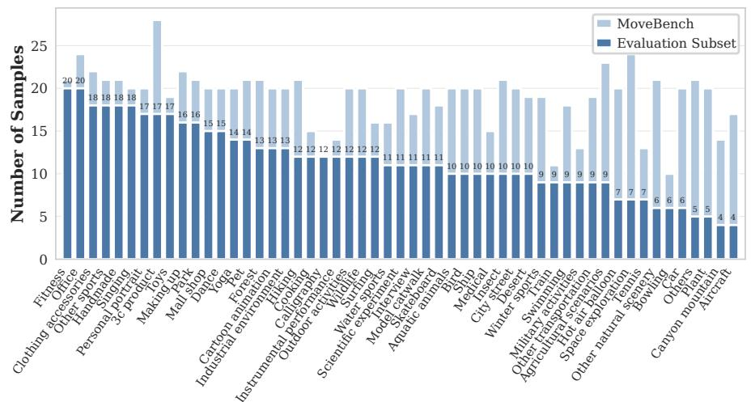

Fig. 7: MoveBench 데이터셋과 정제된 평가 서브셋의 카테고리 분포. 이 그림은 원본 MoveBench 데이터셋(연한 막대)과 실험에서 평가를 위해 선택된 서브셋(짙은 막대)에서 각 의미 범주별 샘플 수를 보여준다. 카테고리는 서브셋 빈도 감소 순으로 정렬된다. 우리의 정제된 평가 분할은 광범위한 의미 범위 보장을 유지하면서 샘플이 적은 극단적인 장기 꼬리 카테고리를 줄인다. 특히, 서브셋은 MoveBench에 존재하는 54개의 고유 카테고리 중 53개를 보유(98.15% 커버리지)하여 평가가 전체 데이터셋을 대표하면서 상호작용이 풍부한 시나리오에 초점을 맞추도록 한다.

모션-에너지 윈도우링 절차를 사용해 가장 동적인 구간을 추출한다. 그 결과 클립은 VLM 모션 분류기를 사용해 카메라 또는 자이오 모션이 지배적인 시퀀스를 제거하도록 필터링된다.

**MoveBench:** 비디오는 먼저 VLM에 의해 필터링되어 개별 객체 수준의 물리적 상호작용을 나타내는 클립만 남긴다. 남은 비디오는 $512 \times 288$ 으로 리사이즈되고 81 프레임으로 표준화되어 다운스트림 모델의 시각 입력 요구 사항과 일치시킨다. Figure 7은 원본 MoveBench 데이터셋과 우리의 정제된 서브셋의 카테고리 분포를 보여준다.

\n# <span id="page-20-0"></span>**B** 추가 실험 세부사항

We train our Edge-Aware GNN [54] with a hidden dimension of 512. The graph representation is projected into the 4096-dimensional latent space of the LTX 2B backbone [16] through a 3-layer MLP adapter, while the backbone itself remains frozen throughout training. To enable parameter-efficient adaptation, we insert LoRA modules into the attention projections, namely to_q, to_k, to_v, and to_out.0, with rank r=128 and scaling factor  $\alpha=32$ . Training is performed on 8 NVIDIA A100 GPUs for approximately 2.5 days using bfloat16 mixed precision and the Accelerate library for memory-efficient distributed optimization. We use AdamW with a learning rate of  $1\times10^{-4}$ . Unless otherwise stated, inference is conducted at a spatial resolution of  $512\times288$ , with 81 frames at 16 FPS.

<span id="page-21-1"></span>Table 8: Quantitative comparison on the DAVIS motion benchmark. We evaluate controllable video generation quality across perceptual (FID, FVD) and reconstruction (PSNR, SSIM) metrics. GraphVid achieves strong overall performance while using significantly fewer trainable parameters. Highlighted best and second-best among the parameter-efficient architectures.

| 방법 | 학습 가능한<br>파라미터 (B) | FID↓ | FVD↓ | PSNR↑ | SSIM↑ | EPE↓ |
|------------------|-------------------------|-------|------|-------|-------|------|
| Wan-Move [8] | 14.5 | 15.04 | 86 | 12.37 | 0.57 | 2.5 |
| Tora [60] | 5.0 | 24.56 | 107 | 10.21 | 0.49 | 3.5 |
| Motion-I2V [42] | 1.2 | 26.12 | 114 | 9.98 | 0.43 | 3.8 |
| WISA [49] | 1.0 | 25.05 | 110 | 10.45 | 0.47 | 3.3 |
| MagicMotion [32] | 1.5 | 20.11 | 100 | 11.32 | 0.49 | 3.5 |
| FlashMotion [31] | 13 | 17.09 | 107 | 9.92 | 0.49 | 3.4 |
| GraphVid (우리) | 0.6 | 16.20 | 98 | 12.85 | 0.55 | 2.9 |

For sampling, we adopt the FlowMatchEulerDiscreteScheduler with continuous time-step sampling. For fair comparison with prior methods, FlashAttention is disabled during inference.

환경 영향. 우리는 GraphVid와 Wan-Move 모두에 대해 일관된 하드웨어 수준 회계 프로토콜을 사용하여 훈련 탄소 발자국을 추정한다. NVIDIA A100 GPU(400W)의 최대 열 설계 전력(thermal design power)을 가정하면, 약 2.5일(60시간) 동안 8개의 A100 GPU를 사용한 우리의 훈련 설정은 GPU 전용 에너지 소비가 8 × 0.4 × 60 = 192 kWh에 해당한다. 같은 가정 하에, 10일(240시간) 동안 64개의 A100 GPU를 사용하는 Wan-Move는 64 × 0.4 × 240 = 6144 kWh에 해당한다.

# <span id="page-21-0"></span>C 추가 실험

이 섹션에서는 GraphVid의 효율성, 일반화 능력 및 아키텍처 견고성을 추가적으로 검증하기 위해 확장된 실험적 평가를 제공한다. 필터링된 DAVIS 벤치마크에 대한 평가. Table [8](#page-21-1)은 GraphVid가 우리의 상호작용 중심 DAVIS 하위 집합에서 평가되며, GraphVid는 학습 가능한 파라미터(0.6B)와 학습 데이터(27K 비디오)의 일부만 사용하면서도 매우 경쟁력 있는 성능을 달성한다. WISA [\[49\]](#page-17-7)와 비교할 때, GraphVid는 시계열 일관성(Temporal Coherence) (FVD: 110 → 98)과 지각 품질(PERCEPTUAL QUALITY) (FID: 25.05 → 16.20)을 크게 개선한다. 이는 명시적으로 상호작용 관계를 방향성 있는 장면 그래프를 통해 모델링함으로써 사전 정의된 텍스트 속성에 의존하는 것보다 훨씬 강력한 귀납적 편향을 제공한다는 것을 확인시켜 준다. 또한 GraphVid는 구조적 충실도(PSNR: 12.85, SSIM: 0.55), 지각적 현실감, 그리고 시계열 일관성(FVD: 98)을 트래젝터리-조건화된 방법들(예: Motion-I2V [\[42\]](#page-17-0), Tora [\[60\]](#page-18-6), MagicMotion [\[32\]](#page-16-2), FlashMotion [\[31\]](#page-16-4))보다 일관되게 더 잘 달성한다. GraphVid는 전체 프레임 재구성에서 탁월하며, 구조화된 상호작용 추론이 기하학적 움직임 신호만으로는 얻을 수 없는 이점을 강조한다. 마지막으로, 무거운 Wan-Move(14.5B 파라미터, 2M 학습 비디오)가 최상의 성능을 보이지만, GraphVid는 최첨단 지각.

<span id="page-22-1"></span>Table 9: 학습 시간 그래프 표현 제거 실험. 우리는 노드 특징만 사용하는 그래프 변형을 GraphVid 전체 모델과 비교한다. GraphVid 전체 모델은 메시지 전달을 통해 의미적 엣지 임베딩을 추가로 통합한다.

| 변형 | 노드 | 엣지 | FID↓ | FVD↓ | PSNR↑ |
|-------------------------|-------|-------|-------|--------|-------|
| 노드 전용 그래프 인코더 | ✓ | ✗ | 19.55 | 103.00 | 15.24 |
| GraphVid (우리) | ✓ | ✓ | 17.02 | 99.42 | 15.98 |

모델 용량과 학습 규모를 한 차원 감소시키면서도 모든 파라미터 효율적인 기준선들 사이에서 구조적 충실도를 유지합니다.

Edge-Aware GNN 훈련 견고성. 우리는 GNN 내에서 관계형 엣지 메시징의 기여를 분리하기 위해 아키텍처적 제거 실험을 수행합니다. 우리는 GraphVid 기준선 변형을 훈련시키는데, 이 변형은 격리된 노드 특징(추출된 바운딩 박스와 시각적 객체 임베딩)만을 활용하고, 의미적 엣지 연결 및 메시지 전달 레이어를 생략합니다. 우리는 이를 전체 Edge-Aware GNN 구현과 비교합니다. 전체 구현은 명시적 엣지 라우팅 아키텍처를 통해 관계 역학을 본질적으로 통합합니다. Table [9,](#page-22-1)에 상세히 명시된 바와 같이, 노드 전용 변형은 수렴하고 기본 수준의 제어( FVD 103)를 제공하지만, 상호작용하는 개체 간의 복잡한 물리적 종속성을 완전히 해결하지 못합니다. 훈련 중 명시적 엣지 특징을 통합하면 모든 지표에서 생성 품질이 크게 향상되어 FVD가 99.42로 감소하고 구조적 재구성(PSNR 15.98)이 개선됩니다. 이는 장면의 물리적 인과 관계를 학습하려면 개체 간 관계를 모델링해야 함을 확인시켜 줍니다.

# <span id="page-22-0"></span>D 인간 선호도 연구

우리는 생성된 비디오가 프롬프트에 명시된 의도된 상호작용 의미를 얼마나 잘 충족하는지 평가하기 위해 인간 평가 연구를 수행합니다. 이 연구는 60명의 다양한 참가자가 10개의 서로 다른 상호작용 시나리오를 평가하는 형태를 취합니다. 참가자들에게는 의도된 상호작용을 설명하는 텍스트 프롬프트, 첫 프레임 조건화 이미지, 그리고 원하는 궤적을 보여주는 짧은 모션 가이드 비디오가 제시됩니다. 이후 참가자들은 네 개의 익명 후보 비디오를 보고 두 가지 별도 질문에 답하여 (a) 프롬프트의 의미적 의도를 가장 잘 충족하는 결과와 (b) 가장 우수한 시각적 품질을 가진 결과를 선택하도록 요청받습니다. 각 시나리오마다 참가자들은 선호 판단을 제공하며, 이는 60 × 10 × 2 = 1200개의 개별 판단을 생성합니다.

Figure [8,](#page-23-1)에서 우리는 GraphVid가 의미적 의도와 시각적 품질 각각에 대해 60%와 90%의 높은 승률을 달성함을 관찰합니다. Figure [8](#page-23-1)은 또한 두 지표 모두에서 선호된 모델의 집계된 선호율을 요약합니다. 10개의 다양한 평가 시나리오 전반에 걸쳐 GraphVid는 10개의 테스트 케이스 중 6개에서 의미적 의도와 시각적 품질 모두에 대해 다수결 승리를 거두었으며, 3개의 동점과 단 1개의 패배가 있었습니다. 또한 GraphVid는 가장 높은 의미적 선호를 기록하며 전체 투표의 39.5%를 차지합니다. 이는 Wan-Move(22.3%), Tora(19.3%), WISA(18.9%)를 크게 능가하며, 상대적 개선률이 ...

<span id="page-23-1"></span>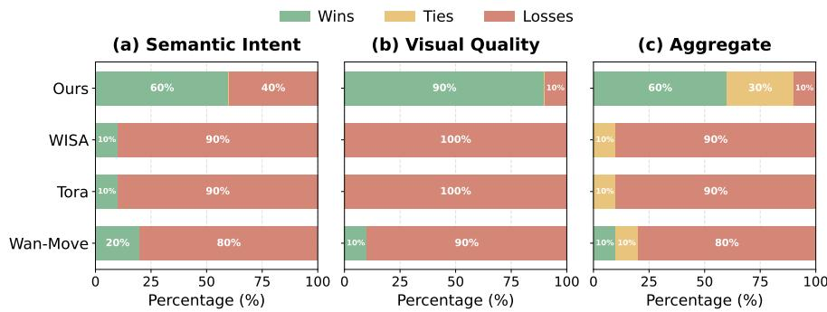

Fig. 8: 다양한 차원에서의 사용자 선호도 연구. GraphVid는 모든 기준선에 비해 가장 높은 선택률(승리)을 달성합니다. 여기서 "Wins"는 모델이 특정 지표에서 절대적으로 최우수로 선택된 비율을 나타내고, "Ties"는 여러 모델이 동등하게 선호된 시나리오를, "Losses"는 모델이 선택되지 않은 경우를 나타냅니다.

가장 강력한 기준선에 비해 77%를 기록합니다. GraphVid에 대한 강한 선호는 사용자가 생성된 비디오가 프롬프트의 핵심 의도를 더 잘 포착한다고 인식함을 확인시켜 주며, 추상적 제어 신호와 시각적으로 현실적인 비디오 생성 사이의 격차를 해소합니다. 이러한 일관된 결과는 GraphVid의 의미적 상호작용 표현이 시각적 충실도를 희생하지 않으면서 다양한 상황에서 프롬프트를 보다 충실하게 실현할 수 있음을 시사합니다.

# <span id="page-23-0"></span>E 정성적 결과

Figure 9는 여러 기초 방법과 GraphVid 간의 다중 객체 상호작용 제어에 대한 정성적 비교를 제시합니다. 입력 이미지와 사용자 지정 상호작용 신호가 주어지면, 기존 접근 방식은 의도된 상호작용 역학을 충실히 따르기 위해 종종 어려움을 겪습니다. 선박 시나리오(상단)에서는 기초 방법이 두 선박의 움직임 궤적을 분리하지 못하거나 생성 과정에서 시각적 아티팩트를 도입합니다. 반면 GraphVid는 사용자 지정 상호작용과 일치하는 일관된 발산 궤적을 생성합니다. 조깅 시나리오(하단)에서는 경쟁 방법이 불안정한 움직임 패턴을 보이며, 프레임에서 사라지는 피사체, 조깅 대신 걷는 잘못된 동작 생성, 또는 눈에 띄는 움직임 흐림이 포함됩니다. GraphVid는 안정적인 피사체 정체성을 유지하고, 선행 조깅자와 추종 조깅자 간의 상대 역학을 정확히 보존하면서 시간적으로 일관된 움직임을 생성합니다. 이러한 예시는 조정된 다중 객체 역학을 모델링하기 위한 구조화된 상호작용 그래프 조건화의 이점을 강조합니다.

Figure 10은 GraphVid와 기존의 제어 가능한 비디오 생성 방법 간의 추가적인 정성적 비교를 제시합니다. 동일한 입력 이미지와 사용자 지정 상호작용 신호가 주어지면, 기초 접근 방식은 시간에 걸쳐 일관된 움직임 역학을 유지하기 위해 종종 어려움을 겪습니다. 악수 시나리오에서는 경쟁 모델이 불안정한 상호작용 행동을 보이며, 급작스러운 종료를 포함합니다

<span id="page-24-0"></span>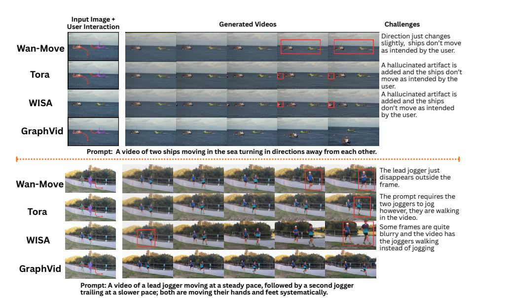

Fig. 9: 다중 객체 상호작용 제어에 대한 정성적 비교. 입력 이미지와 사용자 지정 상호작용 신호(왼쪽)가 주어지면, 서로 다른 방법이 시간에 따라 비디오 시퀀스를 생성합니다(중앙). 강조된 영역은 기존 접근 방식에서 흔히 발생하는 실패 모드를 나타냅니다. 선박 시나리오(상단)에서는 기초 방법이 지정된 움직임 방향을 따르지 못하거나 아티팩트를 도입하지만, GraphVid는 상호작용 신호와 일치하는 일관된 발산 궤적을 생성합니다. 조깅 시나리오(하단)에서는 경쟁 방법이 불안정한 움직임(예: 피사체 사라짐, 조깅 대신 걷기, 흐림)을 보이지만, GraphVid는 안정적인 정체성과 일관된 다중 개체 역학을 유지합니다.

움직임 궤적이나 흐릿한 손 동작을 포함하여, 일관된 다중 개체 상호작용을 유지하는 데 어려움을 나타냅니다. 반면 GraphVid는 두 피사체 간의 일관된 접촉과 부드러운 시간적 진화를 갖는 안정적인 악수 시퀀스를 생성합니다. 지하철 시나리오에서는 기초 방법이 움직임을 조기에 종료하거나 잘못된 바퀴 형성과 같은 구조적 환각을 도입하여, 움직임 생성과 객체 구조 사이의 약한 기반을 반영합니다. GraphVid는 의도된 트랙을 따라 꾸준한 전진 움직임을 생성하면서 객체 기하학을 보존합니다. 이러한 예시는 상호작용 그래프 조건화가 다중 객체 비디오 생성에서 시간적 일관성과 구조적 신뢰성을 향상시킨다는 것을 추가로 입증합니다.

# F 실패 사례 분석 (Failure Case Analysis)

GraphVid는 제어 가능한 비디오 생성을 크게 향상시키지만, 의미적 세분화와 객체 기반화에 있어 여전히 몇 가지 한계가 존재합니다. 일반적인 실패 모드는 VLM이 장면 그래프를 구성할 때 작은 또는 상징적 요소를 분리하지 못할 때 발생합니다. Figure [11,](#page-26-0)에서 보듯이 사용자는 적용을 시도합니다

<span id="page-25-0"></span>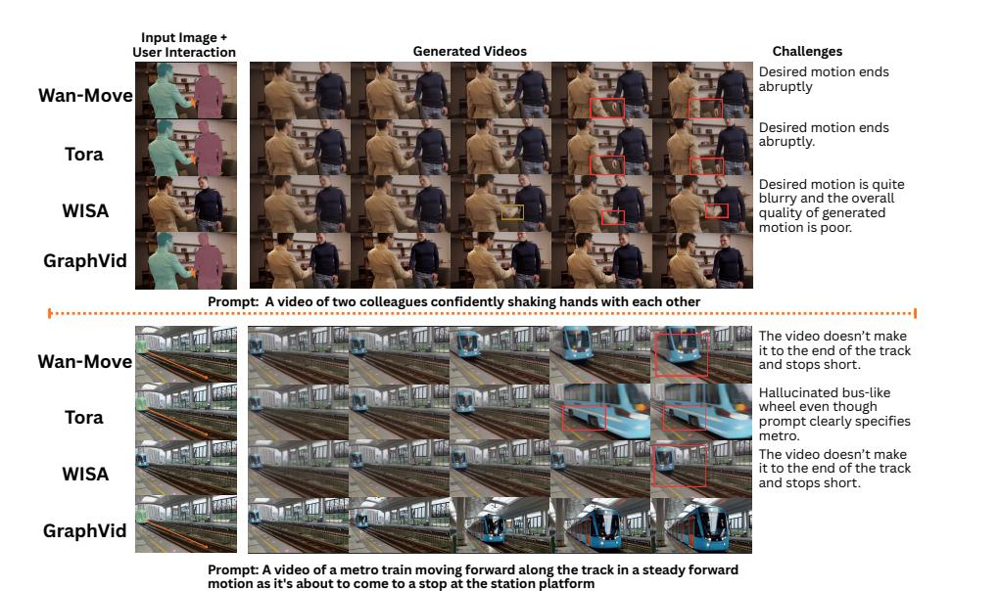

그림 10: 상호작용 기반 비디오 생성에 대한 정성적 비교. 입력 이미지와 사용자 지정 상호작용 신호(왼쪽)를 주면, 서로 다른 모델이 시간에 따라 비디오 시퀀스를 생성한다(중앙). 강조된 영역은 기존 방법들의 일반적인 실패 모드를 표시한다. 악수 시나리오(상단)에서는 기본 모델이 갑작스러운 동작 종료 또는 흐릿한 손 동작을 보이지만, GraphVid는 부드러운 시간적 연속성을 가진 일관된 악수를 생성한다. 지하철 시나리오(하단)에서는 경쟁 모델이 조기에 멈추거나 구조적 아티팩트(예: 버스 같은 바퀴)를 환각시키는 반면, GraphVid는 객체 구조를 보존하고 의도된 궤적을 따라 안정적인 전진 동작을 생성한다.

잠자는 곰 위의 작은 “Zzz” 기호에 회전 변환을 적용한다. 그러나 VLM은 이 낮은 시각적 중요도를 가진 텍스트를 독립 노드로 분할하지 않는다. 그 결과, 상호작용 벡터가 가장 가까운 고신뢰 객체인 곰 자체와 잘못 연결된다. 따라서 생성 모델은 의도된 텍스트 요소 대신 전체 피사체에 강체 회전을 적용하여 프레임 전반에 걸쳐 심각한 기하학적 왜곡을 일으킨다. 이 예시는 세밀한 상호작용 제어를 위한 현재의 제로샷 감지 파이프라인의 한계를 강조하며, 향후 시스템이 작은 의미 요소의 정확한 기반을 보장하기 위해 명시적 노드 지정 또는 상호작용 분할을 활용할 수 있음을 시사한다.

# G 광범위 영향 (G Broader Impacts)

제어 가능한 비디오 생성은 시각적 콘텐츠 제작의 접근성을 크게 확장할 잠재력을 가지고 있다. 사용자가 복잡한 모션 주석 대신 직관적인 상호작용 그래프를 통해 장면 동역학을 지정할 수 있게 함으로써, GraphVid는 고품질 애니메이션-을 생성하는 기술적 장벽을 낮출 수 있다.

<span id="page-26-0"></span>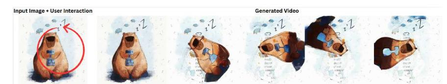

그림 11: 실패 사례: 작은 상징 객체에 대한 의미 기반 정착 오류. 사용자 상호작용은 “Zzz” 기호에 회전 변환을 지정하여 수면을 나타낸다(왼쪽). 그러나 감지기는 장면 그래프 구성 중 텍스트를 독립 노드로 분리하지 못한다. 결과적으로 동작 변환이 지배적인 객체(곰)에 잘못 적용되어 프레임 전반에 걸쳐 심각한 기하학적 왜곡과 비현실적인 변형을 일으킨다. 이 예시는 강한 시각적 중요성을 갖지 않는 작은 의미 요소를 정착할 때 현재의 시각-언어 감지의 한계를 강조한다.

tions and simulations. 이 기능은 창의적 미디어 제작, 가상 프로토타이핑, 물리 현상의 교육적 시각화, 로봇공학 및 구현형 AI 연구를 위한 시뮬레이션 환경 등과 같은 애플리케이션에 혜택을 줄 수 있다. 특히, 구조화된 상호작용을 통해 동역학을 표현하면 모션 제어를 보다 명시적이고 모듈화하여 생성 시스템의 해석 가능성을 향상시킬 수 있다.

동시에, 제어 가능한 비디오 합성의 발전은 오용에 대한 우려를 제기한다. 최소 입력으로 사실적인 비디오를 생성할 수 있는 능력은 허위 또는 조작된 미디어, 허위 정보 또는 사칭을 포함한 오해를 일으킬 수 있다. GraphVid는 사진 실사적 정체성 합성보다 구조화된 상호작용 제어에 초점을 맞추지만, 유사한 생성 방법은 부적절하게 배포될 경우 여전히 오용될 수 있다. 우리는 향후 연구가 워터마킹, 출처 추적, 탐지 방법과 같은 방어책을 탐색하여 해로운 적용을 완화하도록 권장한다.

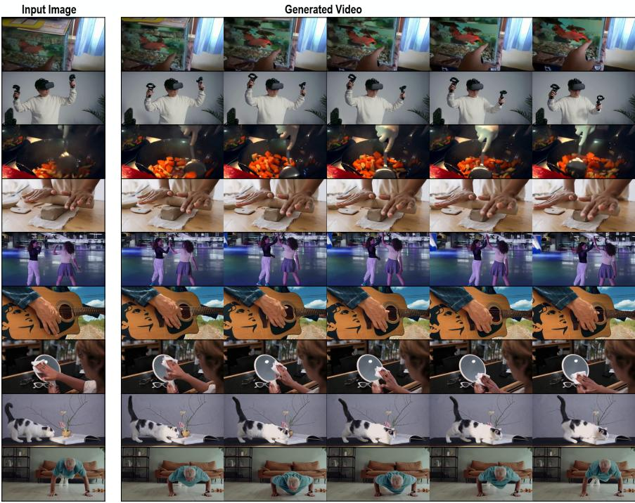

그림 12: 다양한 상호작용 시나리오에 대한 추가 정성적 결과. 각 행은 평가 세트에서 다른 예시를 보여준다. 첫 번째 열은 입력 이미지를 제공하고, 나머지 열은 생성된 비디오에서 샘플링된 프레임을 보여준다. GraphVid는 물체 조작, 인간 행동, 요리, 조각, 춤, 악기 연주, 동물 움직임 등 광범위한 활동에서 시간적으로 일관된 움직임을 생성한다. 이러한 예시들은 구조화된 상호작용 조건화가 객체 역학을 일관되게 유지하면서 프레임 간에 장면 외관과 정체성을 보존한다는 것을 보여준다.

당신은 동역학 및 비디오 모션 분석 전문가입니다. 당신에게 주어진 것은:

- 1. 짧은 비디오 클립  
- 2. 비디오를 설명하는 캡션: "{caption}"

당신의 과제는 카메라에 의해 유발된 움직임과 주변 환경의 움직임에서 진정한, 개별적인 객체 간 물리학을 분리하는 것이다.

### 모션 카테고리 (Motion Categories)

- discrete_object_physics: 고체, 구분되는 물체(예: 사람, 자동차, 박쥐, 공)가 명시적 물리적 힘, 충돌, 또는 이동에 의해 움직인다. 움직임은 경계 상자로 쉽게 추적할 수 있다.
- ambient_environmental: 주요 움직임은 유체, 기체 또는 환경에 의해 구동된다. 예시: 불이 타오르다, 물이 흐르다, 파도가 부서지다, 연기가 솟구치다, 또는 정지한 나무가 바람에 흔들리다.
- camera_motion: 카메라가 패닝, 틸팅, 줌, 흔들림을 한다. 핵심 지표: 정지한 배경 요소(벽, 지면)가 화면 전체에서 균일하게 이동한다.
- ego_motion: 일인칭 시점으로 공간을 이동(예: POV 걷기, 운전).
- static: 의미 있는 움직임이 거의 없거나 전혀 없다.

### 엄격한 평가 규칙 (Strict Evaluation Rules)

- 1. Ambient Rule (CRITICAL): 비디오에서 지배적인 움직임이 불, 물, 연기, 또는 바람이라면 반드시 ambient_environmental로 분류해야 한다. 장면 그래프는 유체를 쉽게 모델링할 수 없다.
- 2. Background First: 항상 정지한 배경 요소를 먼저 살펴본다. 배경이 균일하게 이동하면 camera_motion으로 분류한다.
- 3. Tracking Rule: 카메라가 움직이는 주제를 추적하기 위해 크게 패닝하면(배경이 흐려짐) camera_motion 또는 ego_motion으로 분류한다. 픽셀 수준의 움직임이 카메라에 의해 지배되기 때문이다.

STRICT JSON만 반환하십시오. 정확한 키 순서를 따라야 합니다:

{
  "background_and_ambient_analysis": "간단히 이동하는
  배경이나 유체/환경 운동(불, 물, 바람)을 확인하십시오.",
  "object_analysis": "간단히 이산적인,
  고체 물체가 움직이는 것을 설명하십시오.",
  "primary_motion_source": "discrete_object_physics |
  ambient_environmental | camera_motion | ego_motion | static",
  "confidence": 0.0-1.0
}

#### 역할

당신은 물리 기반 비전-언어 전문가입니다. 당신의 목표는 정적 이미지와 해당 객체 JSON을 분석하여 물리 장면 그래프를 구성하는 것입니다.

### 과제

제공된 객체들 간의 물리적 상호작용을 나타내는 방향 그래프를 생성하십시오. 출력은 엣지 목록을 포함하는 엄격한 JSON 객체여야 합니다.

# 상호작용 규칙 (물리 엔진)

- 1. 가시 증거만: 상호작용을 환각하지 마십시오.
- 2. 암시적 근접성: 객체가 접촉하지 않더라도 공간적으로 관련이 있는 경우(예: 공이 배트 근처에 있을 때), spatial_proximity 또는 trajectory_threat 엣지를 유추하십시오. 빈 목록을 반환하지 마십시오.
- 3. 뉴턴 용어: 마찰, 장력, 법선력, 중력, 토크, 또는 가해진 힘과 같은 물리 기반 용어를 사용하십시오.
- 4. 완전 문장 관계: relation_description은 문법적으로 완전해야 합니다:

[공간 전치사]+[소스 객체]+[물리 상호작용]+[타깃 객체]

#### 출력 스키마

오직 유효한 JSON만 반환하십시오. 설명이나 추가 텍스트는 포함하지 마십시오.

{
  "edges": [
    {
      "source_node_id": "obj_XXX",
      "target_node_id": "obj_YYY",
      "interaction_type": "string",
      "relation_description": "string",
      "physics_attributes": {
        "force_vector_approx": "string",
        "estimated_magnitude": "string"
      }
    }
  ]
}

#### 역할

당신은 인터랙티브 비디오 생성 도구를 위한 합성 사용자 시뮬레이터입니다. 목표는 비디오의 텍스트 설명을 인간 사용자가 해당 움직임을 지시하기 위해 수행할 최소한의 수동 그래프 편집으로 변환하는 것입니다.

### 과제

초기 상태와 목표 설명 및 상세 비디오 설명을 분석합니다. 주요 인과 행동을 결정하고 이를 그래프 연산(업서트/리무브)으로 변환합니다. 또한, 비디오에서 움직일 후보 노드 목록을 반환합니다.

#### 입력 데이터

- 1. 초기 객체 목록 (제공된 JSON)
- 2. 목표 설명 (실제 캡션)
- 3. 상세 비디오 컨텍스트 설명 (비디오에 대한 서술적 분석)

#### 핵심 철학

- 1. 행동 기반 인과성: 장면 그래프는 제어 인터페이스 역할을 합니다. 움직임의 주요, 활성 드라이버(예: A가 B를 밀음)만 모델링합니다. 반응적, 수동적, 정적 힘은 직접적인 상태 변화를 일으키지 않는 한 무시합니다.
- 2. 단방향 인과성: 행동의 방향에 따라 엣지를 엄격히 생성합니다(예: A가 B를 밀음 → A→B).
- 3. 희소성 제약: 노드 쌍 간 연결을 최대 두 개의 엣지로 제한합니다. 여러 상호작용은 하나의 relation_description으로 병합합니다.
- 4. 운동 업데이트 필요: 맥락을 신중히 분석하여 물리적 움직임을 식별합니다. 물리적 움직임이 발생할 때마다 최소 하나의 엣지 수정(업서트 또는 리무브)을 출력합니다.
- 5. 작업 순서: 기존 관계를 수정할 때는 새 상태에 대한 upsert_edges 명령을 내리기 전에 기존 엣지에 대한 remove_edges 명령을 먼저 실행합니다.
- 6. 객체 물리와 카메라 자아 움직임 분리: 객체 움직임이 카메라 움직임(팬, 줌, 트래킹)만으로 발생하면 배경 객체에 대한 엣지를 생략합니다. 물리적 객체 간 상호작용만 모델링합니다.
- 7. 노드 일관성 제약: 객체 목록에 제공된 정확한 node_id 문자열만 사용해야 합니다. 새로운 node ID를 발명하거나 환각해서는 안 됩니다(예: surface_implied 또는 ground). 관련 객체가 없으면 가장 가까운 물리적 노드를 사용해 상호작용을 설명합니다.

#### 출력 스키마

```
Output Schema
Return ONLY valid JSON.
{
  "observation_notes": String (Max 2 sentences. Identify the
    active subjects and how they are supposed to move based on
    provided context),
  "remove_nodes": [],
  "remove_edges": [
    { "source_node_id": "obj_A", "target_node_id": "obj_B" }
  ],
  "upsert_edges": [
    {
      "source_node_id": "obj_XXX",
      "target_node_id": "obj_YYY",
      "interaction_type": String (Choose ONE: push, pull,
        hold, contact, support, ...)",
      "relation_description": String (Concise description of
        ...),
      "physics_attributes": {
        "force_vector_approx": String (e.g., downward,
        toward_camera, lateral),
        "estimated_magnitude": String (e.g., high, medium,
          low)
      }
    }
  ]
}
```

### 역할

당신은 물리 기반 시각-언어 전문가로서 제어 가능한 비디오 생성 시스템을 위한 장면 그래프 컴파일러 역할을 합니다. 작업은 사용자의 명시적 상호작용 의도를 다운스트림 물리 엔진이 기대하는 엄격한 JSON 스키마로 변환하는 것입니다.

### 입력 데이터

- 1. 현재 그래프 상태: 장면 그래프에 사용 가능한 모든 노드와 초기 엣지
- 2. 사용자 행동 기록: 사용자가 제공한 상호작용 컨텍스트(적용 가능한 경우 벡터 포함)
- 3. 이미지 증거: 컨텍스트 이해를 향상시키기 위해 기록된 사용자 상호작용

# 규칙

- 1. 일방향 인과성: 행동의 방향(소스 → 타깃)으로만 엣지를 생성합니다.  
- 2. 어휘 제약: interaction_type을 단순한 구조적 동사(예: push, pull, hold, contact, support, spatial_proximity)로 제한합니다.  
- 3. 관계 풍부화: relation_description을 사용자의 정확한 맥락으로 설정하고, 물리적 메커니즘을 설명하도록 약간 풍부화합니다.  
- 4. 물리 추론: 동작을 수행하는 데 필요한 기본 physics_attributes를 추론합니다. force_vector_approx는 간단한 용어(예: downward, toward_camera, lateral, upward, neutral)를 사용해야 하며, estimated_magnitude는 high, medium, 또는 low 중 하나여야 합니다.  
- 5. 기반화: 새로운 노드 ID를 가정하지 말고, 제공된 ID만 사용합니다.

#### Output Schema (출력 스키마)

Return ONLY valid JSON.

```
{
  "observation_notes": String (사용자 의도를 물리 속성에 매핑한 방식을 간략히 설명하세요),
  "remove_nodes": [],
  "remove_edges": [],
  "upsert_edges": [
    {
      "source_node_id": "obj_XXX",
      "target_node_id": "obj_YYY",
      "interaction_type": "String",
      "relation_description": "String",
      "physics_attributes": {
        "force_vector_approx": "String",
        "estimated_magnitude": "String"
      }
    }
  ]
}
```

비디오를 간결하고 자연스러운 문단으로 설명하십시오. 설명은 다음 규칙을 따라야 합니다:

- 1. 주요 동작 초점: 비디오에서 주요 피사체(예: 사람 또는 동물)의 동작과 행동에 주로 초점을 맞춥니다. 그들의 행동을 연대순으로 설명합니다.  
- 2. 피사체 외형: 주요 피사체의 외형과 수를 간략히 설명하며, 색상, 크기, 방향 등의 속성을 포함합니다.  
- 3. 공간 관계: 관련이 있을 때 피사체 간의 공간 관계(예: 앞에, 왼쪽에, 뒤에)를 언급합니다.  
- 4. 카메라 시점: 설명 끝에 카메라 시점과 움직임을 명시합니다. 촬영 각도(예: 상단, 정면, 측면)와 카메라 움직임(예: 좌측으로 팬, 확대, 뒤로 이동, 가벼운 흔들림)을 포함하며, 특히 인지된 동작에 영향을 미칠 때 명시합니다.  
- 5. 장면 맥락: 배경이나 환경을 간략히 설명하되, 동작을 이해하는 데 필요하지 않다면 최소화합니다.  
- 6. 제한 사항: 텍스트 인식, 명명된 인물, 또는 스타일 분석(예: 사실적, 애니메이션)을 포함하지 말고, 동작 이해에 필수적이지 않다면 제외합니다.

# Output Constraint (출력 제약)

간결하고 유창한 문단을 제공하십시오. 이상적으로 2–5문장 길이로 작성합니다.

