# Unsupervised Consensus-Based Anomaly Detection for Spatiotemporal Malaria Incidence in Ghana

- 원제: Unsupervised Consensus-Based Anomaly Detection for Spatiotemporal Malaria Incidence in Ghana
- 원문: [https://arxiv.org/abs/2607.21559](https://arxiv.org/abs/2607.21559)
- PDF: [https://arxiv.org/pdf/2607.21559v1](https://arxiv.org/pdf/2607.21559v1)
- arXiv ID: `2607.21559`

---

## 주요 내용

### 가나의 시공간적 말라리아 발생률에 대한 비지도형 합의 기반 이상 탐지 (Unsupervised Consensus-Based Anomaly Detection for Spatiotemporal Malaria Incidence in Ghana)

| T. Ansah-Narh, Y. Asare Afrane |  |  |
|--------------------------------|--|--|
|  |  |  |

- 합의 기반 이상 탐지(Consensus anomaly detection)가 비정상적인 말라리아 전파 패턴을 식별했다.  
- 아산티와 노던 지역이 대부분의 반복적인 이상을 차지했다.  
- 타말레는 전파 극단 시기에 가장 큰 이상 부담을 보였다.  
- 가장 높은 이상 비율은 아산티 지역의 한 클러스터에서 발생했다.  
- 복잡한 보험 데이터를 효과적으로 관리하기 위한 고급 도구를 옹호한다.  
- 말라리아 부담과 이상 지속성은 별개의 위험 차원으로 부상했다.

# 비지도 학습 기반 합의 기반 이상 탐지를 통한 가나의 시공간 말라리아 발생률 분석 (Unsupervised Consensus-Based Anomaly Detection for Spatiotemporal Malaria Incidence in Ghana)

T. Ansah-Narha,\*, Y. Asare Afraneb

a가나 우주 과학 및 기술 연구소, 가나 원자력위원회, P. O. Box LG 80, 레곤, 아크라, 가나  
b가나 의과대학 의학 미생물학과, 가나 의과대학, 아크라, 가나

#### **초록 (Abstract)**

일상적인 말라리아 감시 시스템은 질병 부담과 계절적 추세를 모니터링하도록 설계되었지만, 전파가 예상 행동에서 벗어나는 시점과 장소에 대한 통찰력을 제한적으로 제공한다. 이러한 이상을 식별하는 것은 중요하다. 왜냐하면 비정상적인 전파 사건이 사례 수만으로는 드러나지 않는 새로운 위험을 시사할 수 있기 때문이다. 본 연구는 합의 기반 이상 탐지 프레임워크를 개발하고 2014년부터 2023년까지 가나의 월별 말라리아 감시 기록에 적용하여 시공간적으로 비정상적인 전파 패턴을 식별하였다. 분석 결과, 말라리아 이상은 감시 기록 전체에 무작위로 분포되는 것이 아니라 지리적·시간적으로 고도로 구조화되어 있음을 밝혔다. 아산티와 노던 지역이 반복적인 이상의 대부분을 차지했으며, 지역 수준 분석에서는 타말레, 쿠마시, 그리고 아크라 대도시 지역을 중심으로 지속적인 핫스팟 행동이 관찰되었다. 주목할 만한 발견은 이상 부담과 이상 빈도가 공간적으로 구분된다는 점이었다. 타말레는 이상 기간 동안 가장 큰 말라리아 부담을 기여했으나, 가장 높은 이상 비율은 아산티 지역의 한 클러스터에 집중되어 있었으며, 이는 가장 큰 말라리아 부담을 가진 지역이 가장 지속적인 이상 행동을 보이는 지역이 반드시 아니라는 것을 시사한다. 이상 월은 통계적으로 구별되는 역학적 인구를 형성했으며, 정상 월보다 현저히 높은 말라리아 부담(코헨의 d = 3.252)을 보였고, 계절적 기대와 지역 전파 기준선에서 큰 편차(d > 1.2)를 나타냈다. 이러한 결과는 말라리아 부담만으로는 전파 역학의 불완전한 그림을 제공한다는 것을 보여준다. 말라리아가 가장 흔한 지역과 전파가 가장 비정상적으로 행동하는 지역을 구분함으로써, 본 연구는 이전에 숨겨진 말라리아 위험의 시공간 차원을 드러낸다. 이 이상 기반 관점은 감시를 강화하고, 조사 우선순위를 정하며, 보다 목표 지향적인 말라리아 통제 전략을 지원하기 위한 보완적 프레임워크를 제공한다.

*Keywords:* 말라리아 감시, 이상 탐지, 시공간 분석, 질병 핫스팟, 역학적 모니터링, 머신러닝

## 1. 서론 (Introduction)

말라리아는 사하라 이남 아프리카 전역의 공중 보건 시스템에 상당한 부담을 계속하고 있다. 가나에서는 이 질병이 외래 진료 및 병원 입원 원인 중 하나로 남아 있으며, 2018년 한 해에 외래 진료 부서에서 약 1,020만 건의 의심 사례가 기록되었다[1]. 살충제 처리 매트(ITN) 배포, 실내 잔류 살균, 계절성 말라리아 화학예방 등 지속적인 통제 노력에도 불구하고 말라리아 전파는 여전히 뚜렷한 시공간 이질성을 보이고 있다[1]. 6-59개월 아동의 말라리아 감염 유병률은 2014년 40.6%에서 2022년 8.6%로 감소했지만, 농촌 지역은 여전히 도시 지역보다 약 3배 높은 유병률을 보고한다. 계절성 전파가 이 변동성의 대부분을 주도하며, 정점은 일반적으로 우기와 일치하지만, 농촌과 교외 지역 간에 계절 패턴의 강도와 시기는 현저히 다르다

가나의 일상적인 말라리아 감시 체계는 주로 요약 통계와 임계값 기반 경보 시스템에 의존한다. 지역 보건 관리 정보 시스템(DHIMS2)은 시설 수준 데이터를 집계하며, 국가 말라리아 통제 프로그램은 이 데이터를 사용해 질병 추세를 모니터링하고, 물자 배포 및 말라리아 통제 개입을 평가한다. 그러나 기존 감시 접근 방식에는 중요한 한계가 있다. 아다클루 지구의 감시 체계 평가에서, 체계가 단순하고 수용 가능하며 대표적이었음에도 불구하고 2016년 8월에 감시 경보나 전염병 임계값이 설정되지 않아 전염병을 감지하지 못했다[1]. 보다 일반적으로, 과거 평균이나 표준편차만을 기반으로 한 임계값은 읽을 수 없다-

이메일 주소: theophilus.ansah-narh@gaec.gov.gh (T. Ansah-Narh)

및 도시 지구 [2]. 말라리아 전파가 예상되는 행동에서 벗어나는 시기와 장소를 이해하는 것은 말라리아 감시를 강화하고 근거 기반 공중 보건 의사결정을 지원하는 데 필수적이다. 비정상적인 전파 패턴을 조기에 인식하면 보건 당국이 역학 조사를 우선순위화하고, 감시 성능을 평가하며, 운영 능력이 허용되는 경우 진단 및 치료 자원의 할당을 안내하는 데 도움이 된다.

*Corresponding author.

ily는 진화하는 전파 역학에 적응하고 다변량 역학 패턴에 무감각하며, 예를 들어 비정상적인 연령 분포와 함께 나타나는 적당한 말라리아 발생 증가나 예상되는 계절 기간 외에 지속되는 전파와 같은 경우. 연간 또는 반년간의 집계 요약은 또한 비교적 짧은 기간 동안 지속되는 전파 사건을 가려서 추가 역학 조사가 필요할 수 있는 사건을 숨길 수 있다. 이러한 한계는 가나에만 국한되지 않으며, 일상적인 감시 데이터가 시기적절한 역학 평가와 의사결정을 지원하는 데 충분히 활용되지 않는 말라리아 유행 지역 전반에서 유사한 도전 과제가 문서화되어 있다 [\[3\]](#page-30-2). 따라서 일상 감시 데이터에서 보다 조기적이고 유익한 신호를 추출하는 분석적 접근법에 대한 관심이 증가하고 있다. 예측 기반 말라리아 조기 경보 시스템은 일상적으로 수집된 감시 데이터를 통해 전파 위험이 높은 지역을 사전적으로 식별하고 운영 계획 및 질병 통제 개입에 대한 근거를 제공할 수 있음을 입증했다 [\[4\]](#page-30-3). 그러나 이러한 접근법은 주로 예상되는 전파 패턴을 예측하도록 설계되었으며, 통계적으로 비정상적인 관측치를 식별하기 위해 설계된 것은 아니다. 이상 탐지는 예상되는 역학 행동에서 벗어난 현상을 식별함으로써 추가 조사가 필요한 경우를 찾아내어 이 보완적 감시 목표를 달성한다.

비지도 기계 학습은 사전 정의된 임계값이나 라벨이 지정된 발병 데이터를 필요로 하지 않기 때문에 보완적 분석 접근법 중 하나를 제공한다. 이상 탐지 알고리즘은 발병을 구성하는 것이 무엇인지에 대한 사전 지식 없이도 데이터의 지배적 행동과 크게 다른 관측치를 식별한다. 감염병 감시에서는 통계적 이상이 질병 발병으로 자동 해석되어서는 안 된다. 오히려, 이는 새로운 전파 사건, 보고 행동의 예기치 않은 변화, 개입 효과, 환경 변동성, 또는 예상되는 역학적 조건에서 벗어난 다른 요인으로 인해 발생할 수 있는 비정상적 관측치를 나타내며, 추가 조사를 필요로 한다. 이상 탐지를 감염병 감시에서 활용한 연구가 증가하고 있다. 브라질 아마존에서는 비지도 이상 탐지 모델이 발병 시작, 전파 피크 및 양성 말라리아 사례 비율 변화를 조기에 예측하는 데 기여했다[3]. 태국에서는 클러스터링 기반 및 시계열 이상 탐지 방법이 주별 수준에서 비정상적인 말라리아 활동을 식별하도록 개발되었으며, 국가 감시 대시보드에 통합되었다[5]. 유사한 접근법은 일차 의료 기록과 COVID-19 모니터링을 위한 변환기 기반 프레임워크를 사용한 호흡기 질환 감시에도 적용되었다[6]. 가장 널리 사용되는 알고리즘으로는 이상치가 상대적으로 적고 뚜렷하다는 특성을 활용해 이상 관측치를 분리하는 Isolation Forest, 이웃보다 현저히 낮은 지역 밀도를 가진 관측치를 식별하는 Local Outlier Factor, 정상 행동의 압축 표현을 학습한 후 재구성 오류가 증가함으로써 이상을 감지하는 오토인코더, 그리고 가정된 다변량 가우시안 분포 하에서 낮은 확률을 가진 관측치를 식별하는 Elliptic Envelope가 있다. 말라리아 전파는 급격한 급증, 계절적 기대에서 지속적으로 벗어남, 장기 전파 강도의 점진적 변화, 그리고 질병 부담의 연령별 변동을 포함한 여러 시간적 행동을 보이기 때문에 단일 이상 탐지 알고리즘이 모든 역학적으로 관련 있는 패턴을 일관되게 포착할 것으로 기대하기 어렵다. 따라서 여러 알고리즘을 통합하는 합의 접근법은 모델별 편향을 줄이고, 견고성을 향상시키며, 통계적으로 비정상적인 전파 행동을 보다 신뢰성 있게 특성화한다.

최근, Ansah-Narh et al. [\[7\]](#page-30-6) 은 베이지안 (Bayesian) 비선형 추론 프레임워크를 개발하여 3차 결정론적 기준선과 감쇠 진동 커널을 통합하고, 이를 앙상블 마르코프 체인 몬테카를로 샘플러를 사용해 추정함으로써 가나의 말라리아 역학을 모델링했다. 해당 연구는 5세 이하와 노년층 모두에 대해 강력한 실증적 적합성을 입증했으며, 2024년부터 2026년까지 말라리아 입원에 대한 확률적 예측을 제공했다. 그러나 베이지안 프레임워크는 기저 전파 역학의 모수적 표현을 가정하고 주로 집계 경로를 예측하도록 설계되었다. 이는 과거 전파 패턴과 비교해 특정 지역-월 조합이 비정상적인 행동을 보이는지 자동으로 식별하지 않으며, 편차의 강도에 따라 위치를 순위화하는 체계적인 메커니즘도 제공하지 않는다. 비지도 이상 탐지는 데이터 기반, 비모수적 프레임워크를 제공함으로써 사전 정의된 동적 구조를 부과하지 않고 예상 행동에서 크게 벗어나는 관측치를 식별함으로써 보완적인 감시 목표를 달성한다. 비정상적인 지역-월 조합을 강조함으로써 이상 탐지는 예측 모델이 잔차 변동으로 처리할 수 있는 예상치 못한 전파 사건을 나타낼 수 있는 통계적 신호를 생성한다. 따라서 두 접근 방식은 상호 보완적이다: 베이지안 추론은 예상 전파 경로와 관련 불확실성을 특성화하고, 비지도 이상 탐지는 이러한 기대치에서 통계적으로 유의미한 편차를 식별한다.

본 연구는 따라서 가나의 2014–2023년 기간에 걸친 지역 말라리아 감시 데이터를 위한 합의 기반 비지도 이상 탐지 프레임워크를 개발하고 검증한다. 핵심 연구 질문은 다음과 같다: 여러 비지도 학습 알고리즘을 사용해 평가할 때, 어떤 지역-월 조합이 통계적으로 비정상적인 말라리아 전파 패턴을 보이는가, 그리고 이러한 이상은 확립된 지역 및 계절 전파 특성과 어떻게 연관되는가? 본 연구에서 이상은 말라리아 발병의 확정적 증거라기보다는 개별 지역의 과거 행동에서 통계적으로 유의미한 편차로 해석된다. 이러한 편차는 급격한 말라리아 발생 증가, 예상 계절 기간 외 지속적인 전파, 비정상적인 연령별 입원 패턴, 또는 추가 역학적 조사가 필요한 다른 예상치 못한 편차에서 비롯될 수 있다.

이 연구의 동기는 일상적인 말라리아 감시 데이터의 가용성이 증가함에 따라 이러한 데이터를 시기적절한 역학 정보로 변환할 수 있는 분석 도구의 필요성에서 비롯된다. 예측 모델이 예상되는 미래 전파 경로를 추정하는 반면, 이상 탐지는 예상 행동에서 크게 벗어나는 관측치를 식별함으로써 보완적인 문제를 해결한다. 따라서 제안된 프레임워크는 기존 감시 시스템이나 공중 보건 판단을 대체하기보다 통계적으로 비정상적인 관측치를 우선순위화하여 추가 역학적 평가를 촉진함으로써 일상적인 말라리아 감시를 강화하는 의사결정 지원 도구로 설계되었다.

본 연구의 주요 기여는 네 가지로 요약된다. 첫째, 가나에서 시공간적 말라리아 감시를 위해 개발된 최초의 합의 기반 비지도형 이상 탐지 프레임워크를 제시한다. 둘째, 계절 잔차, 지연 효과, 지역별 표준화 점수 및 연령별 입원 건수를 포함한 공학적 역학적 특징의 종합 세트를 도입하여 비정상적 말라리아 전파의 다차원적 특성을 특성화한다. 셋째, 합의 학습이 개별 비지도형 알고리즘에 비해 이상 탐지의 견고성과 해석 가능성을 어떻게 향상시키는지를 보여준다. 마지막으로, 전통적 말라리아 감시를 보완하는 시공간적 이상 지도를 제공하여 통계적으로 비정상적인 전파 패턴을 식별하고, 운영 역량이 허용되는 경우 공중 보건 당국이 감시 검토, 역학 조사 및 자원 계획을 우선순위화하는 데 도움을 줄 수 있다.

본 논문의 나머지 부분은 다음과 같이 구성된다. 제2절에서는 연구 지역, DHIMS2에서 수집한 말라리아 감시 데이터, 분석에 채택된 전처리 절차, 그리고 특징 공학, 이상 탐지 알고리즘, 합의 이상 탐지 전략, 통계적 검증 절차를 포함한 방법론적 프레임워크를 설명한다. 제3절에서는 결과를 제시하며, 시공간적 말라리아 이상 분포, 고신뢰도 이상 사건의 특성화, 구역별 핫스팟 패턴, 그리고 이상 전파와 일상 전파 조건 간의 통계적 분리를 검토한다. 제4절에서는 연구 결과의 역학적 및 방법론적 함의, 말라리아 감시와의 관련성, 그리고 제안된 프레임워크의 한계와 향후 방향을 논의한다. 마지막으로 제5절에서는 연구의 주요 발견을 요약하고, 이상 기반 말라리아 감시 및 질병 모니터링에 대한 그 중요성을 강조한다.

#### 2. 자료 및 방법 (Materials and Methods)

### 2.1. 연구 지역 및 데이터 설명 (Study Area and Data Description)

가나는 서아프리카의 기니만해에 위치하며, 위도 4.5°N에서 11.5°N, 경도 3.5°W에서 1.5°E 사이에 있다. 이 나라의 면적은 약 239,460 km²이며, 그 중 8,520 km²는 내륙 수역을 포함한다. 행정적으로 가나는 16개 지역과 261개 구역으로 나뉜다. 본 연구는 모든 지역의 말라리아 사례 감시에 초점을 맞추며, 구역 수준의 데이터를 지역 수준으로 집계하여 이상 패턴의 일관된 시공간적 분석을 가능하게 한다.

Figure 1은 2014년부터 2023년까지 가나 전역의 누적 말라리아 부담의 공간 분포와 연구 지역을 보여준다. 지역 음영은 두 개의 보고된 사례 합계로 계산된 집계 말라리아 입원 건수를 나타낸다.

우리는 감시 시스템에 기록된 연령 범주, 즉 5세 미만 환자와 5세 이상 환자를 연구 기간 동안 각 지역 내 모든 구역을 통합하여 집계합니다. 구역 중심점은 보고 구역의 지리적 위치를 나타내며, 마커 크기는 해당 구역의 누적 말라리아 부담에 비례합니다. 전국적으로 상당한 공간적 이질성이 나타납니다. 아산티 지역이 가장 높은 누적 말라리아 부담(875,000건)을 기록했으며, 그 뒤를 북부 지역(502,967건)이 따릅니다. 중간 수준의 부담은 동부(324,717건), 서부(249,633건), 중앙(248,693건), 그리고 그레이터 아크라(229,766건) 지역에서 관찰되었습니다. 반대로, 가장 낮은 누적 부담은 오티(88,858건), 사바나(95,221건), 아하포(97,333건), 서부 북(135,639건), 그리고 북동(125,197건)에서 기록되었습니다. 전반적으로, 누적 지역 부담은 약 88,900건에서 875,000건 사이로 거의 한 자릿수 차이로 변동하며, 가나 전역에서 말라리아 병증의 지리적 불균형을 부각시킵니다. 이러한 공간적 변동성은 이후 이상 탐지 프레임워크와 시공간 분석에 중요한 맥락을 제공합니다.

가나의 생태학적 및 기후적 다양성은 말라리아 전파의 공간적 이질성에 크게 기여합니다. 국가는 일반적으로 세 개의 광범위한 생태대역으로 나뉩니다: 북부의 기니 사바나, 중앙의 숲 지대, 남부의 해안 사바나 [8, 9]. 이 지역들은 독특한 강우 패턴과 수문학적 프로필을 경험하며, 이는 말라리아 전파의 계절성 및 강도를 형성합니다. 북부 지역은 일반적으로 5월부터 10월까지 단일 모드 비가 오는 계절을 경험하고, 중부와 남부 대역은 이중 모드 강우 피크(4월–6월 및 9월–11월)를 보이며, 이는 벡터 번식과 전파 주기를 각각 영향을 미칩니다 [10].

말라리아는 가나 전역에서 여전히 유행하며, 가장 취약한 인구 집단인 5세 미만 아동 사이에서 지속적으로 높은 발생률이 보고됩니다 [11, 12, 13]. 지속적인 통제 노력에도 불구하고, 이 질병은 벡터 생태학, 의료 접근성, 그리고 지역별 사회경제적 요인의 불균형을 반영하는 뚜렷한 공간적 및 계절적 변동성을 보입니다. 특히 그레이터 아크라와 같은 도시 지역은 개선된 주택, 배수 및 보건 인프라로 인해 낮은 유병률을 보고할 수 있지만, 예방 및 치료 서비스 접근이 제한된 농촌 구역에서는 높은 전파가 지속됩니다 [14].

그림 2와 3은 2014–2023년 가나의 지역별 말라리아 역학에 대한 보완적 관점을 제공합니다. 월별 시계열 플롯은 지역별 시간적 행동에서 상당한 차이를 드러내며, 북부와 아산티는 지속적으로 높은 말라리아 부담과 뚜렷한 계절 변동을 보이고, 반면 오티, 사바나, 아하포와 같은 지역은 연구 기간 동안 비교적 낮은 사례 수를 유지합니다. 그레이터 아크라와 동부를 포함한 여러 지역은 활동이 증가한 기간과 변화하는 시간적 패턴을 보여, 말라리아 전파 역학이 공간이나 시간에 따라 정적이지 않음을 시사합니다. 이러한 관찰은 상자 그림(boxplot)에서도 강화되며, 이는 지역 간 월별 사례 분포에 뚜렷한 차이를 보여줍니다. 아산티

#### **가나 지역별 말라리아 부담 및 구역 보고 (2014-2023) (Ghana Regional Malaria Burden and District Reporting (2014-2023))**

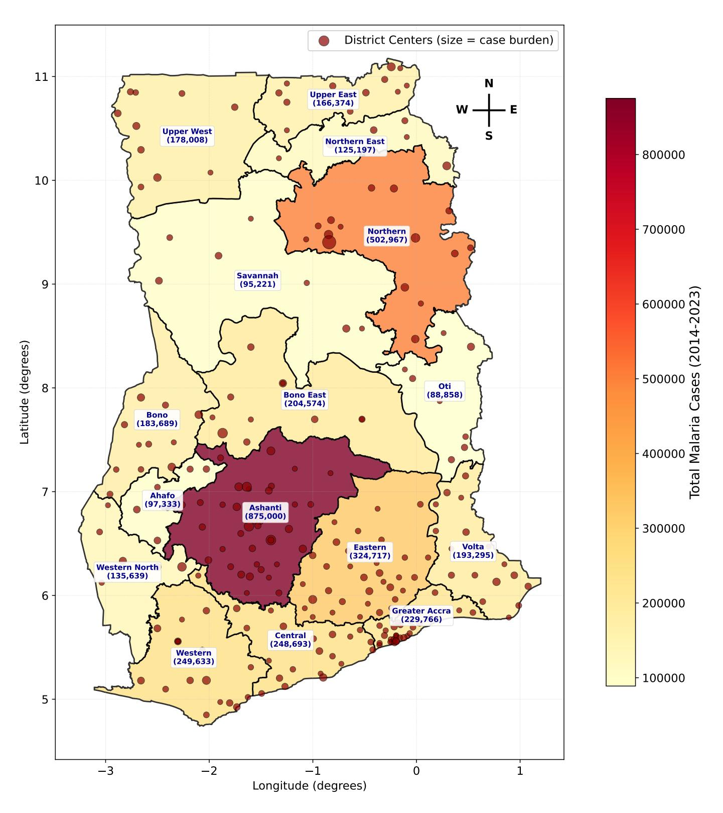

Figure 1: 2014–2023년 가나 행정 구역 전역에서의 누적 말라리아 입원분포. 지역 색상 농도는 시군구 수준 기록에서 집계된 누적 말라리아 부담을 나타내며, 어두운 색조일수록 보고된 입원 건수가 많음을 의미한다. 원은 시군구 보고 위치를 표시하고, 마커 크기는 해당 시군구의 누적 말라리아 부담에 비례한다. 이 지도는 가나 전역에서 말라리아 입원에 대한 상당한 공간적 이질성을 강조하며, 특히 아샤니(Ashanti)와 노던(Northern) 지역에서 높은 부담이 관찰된다.

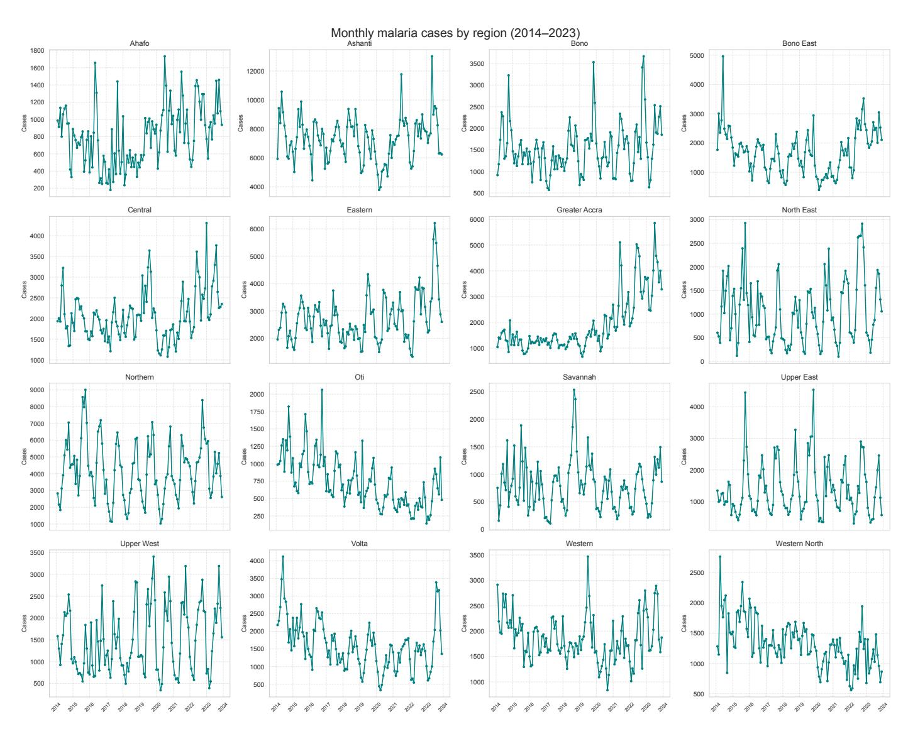

**Figure 2:** 2014년 1월부터 2023년 12월까지 가나의 16개 행정 구역에서의 월별 말라리아 입원. 각 패널은 지역 집계 시계열을 보여 주며, 말라리아 부담의 상당한 공간적 이질성, 계절 변동성, 그리고 장기적인 시간적 역학을 강조한다.

가장 높은 중앙값 월별 부담을 보이며, 반면 Northern은 가장 큰 변동성과 가장 넓은 사분위 범위를 나타내어 강한 계절적 진동을 반영한다. 반대로 Oti, Ahafo, Savannah와 같은 지역은 분포가 좁고 중앙값 부담이 낮다. 다수의 고가 이상치가 여러 지역에서 관찰되는 것은 비정상적으로 높은 말라리아 활동이 일시적으로 발생함을 시사한다.

월별 말라리아 입원 기록은 2014년 1월부터 2023년 12월까지의 기간 동안 DHIMS2에서 추출되었다. DHIMS2는 2012년부터 정기적인 보건 데이터 수집을 위한 국가 플랫폼으로, 모든 공공 및 다수의 민간 보건 시설에서 데이터를 집계한다. 각 시군구와 월별로 데이터셋은 두 개의 변수를 포함한다: 5세 미만의 확진 말라리아 환자 입원 수와 5세 이상 환자 수. 지역 집계 수준에서는 개별 수준의 임상 또는 실험실 데이터는 제공되지 않는다. 본 연구에서는 두 연령 그룹을 합산하여 시군구별 총 말라리아 사례를 얻었다. 이후 각 달마다 시군구 내 모든 시군구를 합산하여 지역 수준으로 집계하였다. 이 집계는 16개 지역과 120개월(2014–2023)을 포함한 지역-월 패널을 생성했으며, 이론상 최대 관측치 수는 1920개이다. 시간 의존적 특성을 구축한 후(다음 절에 기술됨), 이상 탐지에 사용된 전체 데이터셋은 1908개의 지역-월 행을 포함했다. 제외된 12개 행은 각 지역의 첫 번째 월(2014년 1월)이며, 이때는 시차 변수를 계산할 수 없었다.

기술적 요약(Fig. 1-3)은 Northern과 Ashanti와 같은 지역이 지속적으로 높은 말라리아 부담을 가지고 있으며, 뚜렷한 계절 변동성을 보인다는 것을 명확히 식별한다. 이러한 분석은 가나 전역의 말라리아 전파의 공간 분포와 전형적인 시간적 행동에 대한 중요한 개요를 제공한다. 그러나 구조상 기술 통계는 각 지역의 평균 또는 예상 행동을 특징짓고, 그 지역의 과거 패턴에서 크게 벗어나는 관측치를 식별하도록 설계되지 않았다. 예를 들어, 일반적으로 낮은 전파를 경험하는 계절에 말라리아 입원수가 비정상적으로 급격히 증가하거나, 일반적으로 최고 발생률을 기록하는 기간에 예상치 못한 감소가 발생하면, 이는 역학적으로 중요한 사건을 나타낼 수 있지만 전통적인 요약에서는 구별되지 않는다. 마찬가지로, Northern과 같이 자연적으로 높은 시간 변동성을 가진 지역은 과거 범위를 훨씬 넘어서는 예외적으로 극단적인 한 달을 경험할 수 있고, 반면 Oti와 같은 상대적으로 낮은 부담을 가진 지역은 국가 평균보다 훨씬 낮지만 지역 전파 역학에 비해 매우 드문 적당한 증가를 보일 수 있다. 두 경우 모두 평균, 중앙값 또는 사분위 범위에 기반한 요약 측정은 관측치의 시간적 순서를 보존하지 못하고, 연령별 입원 패턴과 계절적 행동의 동시 변화를 포함한 말라리아 감시 데이터의 다변량 특성을 고려하지 않기 때문에 제한된 통찰력을 제공한다. 제안된 이상 탐지 프레임워크는 지연 효과를 통한 최근 시간적 역학, 계절 잔차를 통한 예상 계절 행동, 그리고 지역 내 표준화 편차를 통합한 지역별 역학적 기준선에 상대적으로 각 지역-월 관측치를 평가함으로써 이 한계를 해결한다. 결과적으로, 이 프레임워크는 기술 통계 분석을 대체하기보다 보완한다. 기술 요약이 전체 부담과 장기 전파 패턴을 특징짓는 반면, 이상 탐지는 예상 패턴에서 통계적으로 비정상적인 편차를 식별하여, 역사적으로 높은 또는 낮은 말라리아 부담을 가진 지역에서 발생하더라도 추가 역학 조사가 필요할 수 있는 예상치 못한 말라리아 활동의 사례를 강조한다.

#### 2.2. 특징 공학 (Feature Engineering)

다변량 이상을 탐지할 수 있도록, 단기 역학, 계절적 기대, 장기 추세를 포착하기 위해 일련의 특징이 구축되었다. 각 지역-월 관측치는 원시 감시 데이터에서 파생된 아홉 개의 변수로 설명된다. 이 특징들은 말라리아 입원수의 절대 수준과 예상 행동에서의 편차를 모두 반영하도록 설계되었으며, 따라서 전파 과정을 다면적으로 표현한다.

역학적 관점에서, 설계된 변수들은 말라리아 전파가 예상 행동에서 벗어날 수 있는 다양한 메커니즘을 나타내도록 선택되었다. 지연 변수는 급격한 월간 변화를 포착하여 빠르게 발생하는 전파 사건을 나타낼 수 있다. 계절 잔차는 각 지역의 과거 계절 패턴에서의 편차를 정량화하며, 따라서 특정 시기에 비정상적으로 높은 또는 낮은 전파를 식별한다. 지역별 표준화 점수는 기초 말라리아 부담이 크게 다른 지역 간에 이상 규모를 의미 있게 비교할 수 있게 한다. 연령별 입원 수는 특정 인구 집단에 불균형적으로 영향을 미치는 변화를 탐지하도록 프레임워크를 허용하며, 결과적으로 말라리아 부담의 연령 분포 변화를 포착한다.

Table 1은 각 특징과 그 수학적 정의 및 역학적 목적을 함께 나열한다. 원시 월간 총 사례(total_cases)는 말라리아 부담의 기준 측정값으로 사용된다. 한 달에서 다음 달로의 급격한 변화를 포착하기 위해, lag-one 항(lag1_total)은 같은 지역의 직전 달의 총 사례로 계산되었다. 공식적으로, 지연 특징은 Eq. (1)에서 정의된다:

$$lag1_total_{r,t} = x_{r,t-1}, \tag{1}$$

여기서 $x_{r,t-1}$은 지역 r에서 전 달에 관측된 총 말라리아 사례를 나타낸다.

계절적 잔차(residual)는 지역별 계절 평균을 관측된 총 사례에서 빼서 얻었다. 특정 지역과 달에 대한 계절 평균은 관측 기간 10년 동안 해당 달의 총 사례 평균으로 정의된다. 잔차 특징은 Eq. (2)에서 주어진다:

$$residual_{r,t} = x_{r,t} - \bar{x}_{r,m}, \tag{2}$$

여기서 $x_{r,t}$는 시간 t에서 지역 r의 관측된 말라리아 사례를, $\bar{x}_{r,m}$는 관측 기간 전체에서 달 m 동안 지역 r의 평균 사례 수를 나타낸다.

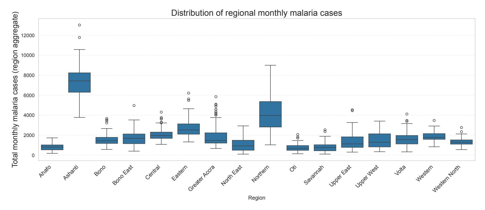

Figure 3: 2014–2023년 동안 지역별 월간 말라리아 입원분포. 박스플롯은 중앙값, 사분위 범위, 전체 분포 및 극단값을 요약하며, 가나 행정 지역 간 말라리아 부담과 변동성의 뚜렷한 차이를 보여준다.

지역 내 표준화 점수(region_zscore)는 Eq. (3)을 사용해 계산된다:

region_zscore =

$$\frac{x - \mu_r}{\sigma_r}$$

, (3)

여기서 x는 관측된 총 사례, $\mu_r$는 연구 기간 전체에 걸친 지역 r의 평균 말라리아 부담, $\sigma_r$는 해당 지역의 표준편차를 나타낸다. 이 변환은 각 지역의 시계열을 공통 스케일로 정규화하여 이상치 강도의 교차 지역 비교를 용이하게 한다.

계절 주기는 월 인덱스의 사인 및 코사인 변환을 사용해 인코딩된다. 사인 성분은 Eq. (4)에 따라 계산된다:

$$month_sin = sin\left(\frac{2\pi \cdot month}{12}\right),\tag{4}$$

코사인 성분은 Eq. (5)에 따라 계산된다:

$$month_cos = cos\left(\frac{2\pi \cdot month}{12}\right),\tag{5}$$

Eqs. (4)와 (5)에서 정의된 계절 인코딩 변수는 12월과 1월 사이의 불연속 전환 없이 말라리아 전파의 순환적 특성을 포착한다. 이 원형 표현은 월간 간의 시간적 근접성을 보존하며, 계절 과정 모델링에 널리 사용된다.

선형 시간 추세(year)는 2014년을 기준으로 달력을 중앙화하여 Eq. (6)에서 정의된다:

$$year = Year - 2014, \tag{6}$$

이로써 보고 관행, 인구 증가, 개입 범위 및 10년 동안의 기타 장기 시간 효과의 점진적 변화를 반영한다.

마지막으로, 연령별 카운트(under5 및 over5)는 별도의 특징으로 유지되어, 어린이에게 불균형적으로 집중된 발병과 같은 특정 연령 그룹에만 영향을 미치는 이상을 탐지할 수 있다. Eqs. (1)–(6)에서 정의된 엔지니어링 특징은 단기 동역학, 계절 변동, 시간 추세 및 인구 구조에 대한 보완적 정보를 제공한다.

주요 성분 분석(PCA) (부록 A 참조)을 표준화된 특성 행렬에 수행하여 엔지니어링된 변수들 간의 관계를 조사하였다. 그림 4는 첫 두 주성분에 대한 상관 원을 제시하며, 이 두 주성분은 총 분산의 61.6%를 설명한다. analvsis는 여러 개의 뚜렷한 특성 그룹을 드러낸다. 변수 total_cases, under5, over5, 그리고 lag1_total은 첫 번째 주성분의 양의 방향을 따라 밀접한 클러스터를 형성하며, 이는 현재 말라리아 부담, 연령별 입원율, 그리고 단기 시간적 지속성 간의 강한 양의 상관관계를 나타낸다. 이 패턴은 특정 월에 높은 사례 수를 경험하는 지역이 전월에도 높은 수치를 보이는 경향이 있음을 시사한다. 두 번째 클러스터는 residual과 region_zscore로 구성되며, 이들은 서로 밀접하게 정렬되어 있으나 주요 부담 변수들로부터 분리되어 있다. 이들의 거의 겹치는 벡터는 두 특성이 서로 다른 기준선에 대한 예상 전파 행동에서의 편차를 정량화한다는 것을 나타낸다. 이러한 변수들 간의 강한 연관성은 비정상적으로 높은 또는 낮은 말라리아 활동이 계절적 잔차와 지역 내 표준화된 편차 모두에 일관되게 반영된다는 것을 확인시킨다.

반면에, 계절 인코딩 변수 month_sin과 month_cos는 특징 공간의 다른 영역을 차지하며, 부하 관련 변수와 대략 직교한다. 이는 계절 타이밍이 전송 규모와 크게 독립적인 정보를 제공함을 보여준다. 연도 변수는 원점에 가깝게 위치하며, 그 투영은 다소 미미하다.

**Table 1:** 이상 탐지를 위해 구성된 특징들 (Features constructed for anomaly detection).

| Feature | Definition | Purpose |
|----------------------|-------------------------------|--------------------------------------|
| total_cases | Raw monthly cases in region | Baseline malaria burden |
| lag1_total | 식 (1) | Detect sudden month-to-month changes |
| residual | 식 (2) | Deviation from expected seasonality |
| region_zscore | 식 (3) | Within-region standardisation |
| month_sin, month_cos | 식 (4) 및 (5) | Circular encoding of seasonality |
| year | 식 (6) | Linear long-term trend |
| under5, over5 | Age-specific admission counts | Capture age-pattern anomalies |

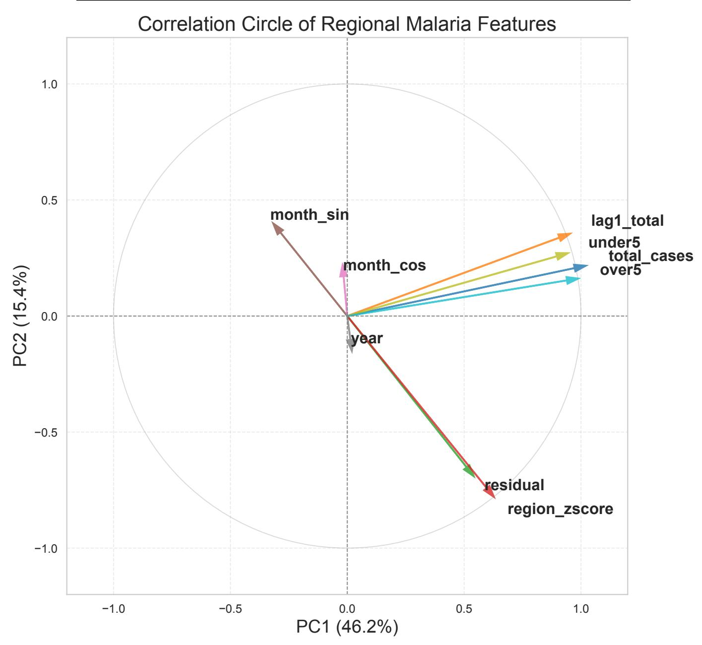

그림 4: 9개의 엔지니어링된 특징에 대한 주성분 분석 결과의 상관관계 원. 첫 번째와 두 번째 주성분은 각각 전체 분산의 46.2%와 15.4%를 설명한다. 서로 클러스터링된 특징은 양의 상관관계를 가지며, 반대쪽에 위치한 특징은 음의 상관관계를 가진다. total_cases, under5, over5는 밀접한 클러스터를 형성하여 강한 다중공선성을 나타낸다. residual과 region_zscore도 밀접하게 정렬되어 있으며, 두 변수 모두 기준선으로부터의 편차를 측정한다. 시계열 인코딩인 month_sin과 month_cos는 사례 관련 특징과 거의 직교해, 전염 시기에 대한 독립적인 정보를 포착함을 확인한다.

첫 두 주성분에 투영하면 장기적인 시간 변화가 지배적인 특징 차원에서 포착되는 분산에 상대적으로 적은 기여를 한다는 것을 시사한다.

비록 여러 부담 관련 변수들이 상당한 공선성을 보이지만, PCA는 특징 집합이 말라리아 전파의 부하 강도, 이상치 크기, 계절 구조, 시간적 지속성, 장기적 진화 등 여러 보완적인 측면을 포착한다는 것을 시사한다. 이상치 탐지 프레임워크가 일반적으로 상관된 예측 변수에 대해 견고한 알고리즘에 의존하므로 변수는 제거되지 않았다. 전체 특징 집합을 유지함으로써 이상 행동에 기여할 수 있는 독특한 역학적 특성에 대한 정보를 보존한다.

#### 2.3. 이상치 탐지 알고리즘 (Anomaly Detection Algorithms)

네 가지 비지도 이상 탐지 알고리즘이 섹션 2.2에 설명된 표준화된 특성 행렬에 적용되었습니다. 각 방법은 무작위 분할, 지역 밀도 추정, 비선형 재구성, 그리고 강건 다변량 거리 등 서로 다른 수학적 관점에서 이상 행동을 식별합니다. 이러한 상호 보완적인 접근 방식을 결합하면 단일 탐지 메커니즘에 대한 의존도를 줄이고 비정상적인 말라리아 전파 패턴을 식별하기 위한 보다 견고한 기반을 제공합니다. 개별 알고리즘의 출력은 이후 합의 프레임워크를 통해 통합되어 방법별 특이성에 따른 거짓 양성률을 줄이고 이상 분류의 신뢰성을 향상시켰습니다.

#### 2.3.1. Isolation Forest (Isolation Forest)

Isolation Forest (IF)는 무작위로 선택된 특성에 대해 무작위 분할을 사용하여 특성 공간을 재귀적으로 분할함으로써 이상치를 식별한다 [15]. 기본 가정은 이상 관측값이 드물고 독특하기 때문에 정상 관측값보다 적은 분할로 분리될 수 있다는 것이다. 관측값 $\mathbf{z} \in \mathbb{R}^p$ 에 대해, 여기서 p=9는 엔지니어링된 특성의 수를 나타낸다, isolation 트리의 앙상블이 구성된다. $h(\mathbf{z})$ 를 $\mathbf{z}$ 를 포함하는 종단 잎까지의 루트 노드에서부터의 경로 길이로 정의한다. 이상 점수는 Eq. (7):

$$s(\mathbf{z}) = 2^{-\frac{\mathbb{E}[h(\mathbf{z})]}{c(n)}},\tag{7}$$

여기서 $\mathbb{E}[h(\mathbf{z})]$는 모든 트리에서의 평균 경로 길이이며, c(n)은 이진 탐색 트리에서 실패한 검색의 예상 경로 길이에 해당하는 정규화 인자이다. 정규화 항은 Eq. (8)에 의해 주어진다:

$$c(n) = 2H(n-1) - \frac{2(n-1)}{n},$$

(8)

여기서 $H(\cdot)$는 조화수(harmonic number)를 나타낸다. 식 (7)에 따르면, 평균 경로 길이가 짧은 관측치는 큰 이상 점수를 받으며, 따라서 이상치일 가능성이 더 높다. 본 연구에서는 300개의 격리 트리를 성장시켰으며, 오염률(contamination) 매개변수를 0.10으로 고정하였다.

#### 2.3.2. Local Outlier Factor (Local Outlier Factor)

Local Outlier Factor (LOF)은 관측치 주변의 지역 밀도를 그 관측치의 가장 가까운 이웃들의 밀도와 비교하는 밀도 기반 이상 탐지 방법이다 [16]. $N_k(\mathbf{z})$ 를 $\mathbf{z}$ 의 k-최근접 이웃 집합으로 두고, 여기서 k = 20 이다. 도달 거리(reachability distance)는 다음과 같이 정의된다

reach-distk(

$$\mathbf{z}, \mathbf{z}'$$

) = max {k-distance( $\mathbf{z}'$ ),  $d(\mathbf{z}, \mathbf{z}')$ }, (9)

$d(\cdot, \cdot)$ 은 유클리드 거리를 나타낸다. Eq. (9)를 이용해, 지역 도달 밀도(local reachability density, LRD)는 다음과 같이 계산된다

$$\operatorname{lrd}_{k}(\mathbf{z}) = \left(\frac{\sum_{\mathbf{z}' \in N_{k}(\mathbf{z})} \operatorname{reach-dist}_{k}(\mathbf{z}, \mathbf{z}')}{|N_{k}(\mathbf{z})|}\right)^{-1}, \tag{10}$$

이는 z 주위의 도달 거리 평균의 역수를 측정한다. LOF 점수는 Eq. (11)을 사용해 다음과 같이 얻어진다

$$LOF_k(\mathbf{z}) = \frac{1}{|N_k(\mathbf{z})|} \sum_{\mathbf{z}' \in N_k(\mathbf{z})} \frac{\operatorname{Ird}_k(\mathbf{z}')}{\operatorname{Ird}_k(\mathbf{z})},$$

(11)

값이 1보다 크게 나타나면 관측치는 이웃에 비해 상대적으로 희박한 영역에 위치함을 의미하며, 따라서 이상치로 간주된다. 경험적 LOF 분포의 90번째 백분위수를 초과하는 관측치는 이상치로 라벨링되었다.

#### 2.3.3. Autoencoder

오토인코더(AE)는 정상 데이터 매니폴드의 압축 표현을 학습하고 그 표현으로부터 원본 입력을 재구성하도록 설계된 신경망이다 [17]. 본 연구에서 사용된 아키텍처는 입력층에 9개의 뉴런, 병목 인코딩층에 4개의 뉴런, 출력층에 9개의 뉴런을 포함한다. 네트워크는 Eq. (12)에서 정의된 재구성 손실을 최소화하도록 학습되었다:

$$\mathcal{L}_{AE} = \frac{1}{n} \sum_{i=1}^{n} \left\| \mathbf{z}^{(i)} - \hat{\mathbf{z}}^{(i)} \right\|_{2}^{2},$$

(12)

여기서 $\hat{\mathbf{z}}^{(i)}$는 관측치 $\mathbf{z}^{(i)}$의 재구성된 버전을 나타낸다. 학습은 Adam 옵티마이저를 사용하고, 배치 크기는 32, 최대 150 에폭, 그리고 검증 세트의 10%를 기준으로 조기 종료를 적용하였다.

학습 이후, 각 관측치에 대한 재구성 오차는 Eq. (13)에 따라 계산되었다:

$$e(\mathbf{z}) = \|\mathbf{z} - \hat{\mathbf{z}}\|_{2}^{2}, \tag{13}$$

Eq. (13)의 값이 클수록 재구성이 부실하고 그 결과 이상 행동을 나타낸다. 재구성 오차가 90번째 백분위수 임계값을 초과한 관측치는 이상치로 분류되었다.

\n#### 2.3.4. Elliptic Envelope (엘리피틱 엔벨로프)\n\n

Elliptic Envelope (EE)는 대부분의 관측치가 다변량 가우시안 분포에서 발생한다고 가정하고, 강건 공분산 추정을 통해 이상치를 식별한다 [18]. 구체적으로, Minimum Covariance Determinant (MCD) 추정기를 사용하여 강건 위치 벡터 $\mu$와 공분산 행렬 $\Sigma$를 얻는다.

관측치의 Mahalanobis 거리는 Eq. (14)를 사용하여 계산된다:

$$d_M(\mathbf{z}) = \sqrt{(\mathbf{z} - \boldsymbol{\mu})^{\mathsf{T}} \boldsymbol{\Sigma}^{-1} (\mathbf{z} - \boldsymbol{\mu})}, \tag{14}$$

이는 z가 강건 다변량 중심으로부터의 거리를 측정한다. 다변량 가우시안 가정 하에서, 제곱된 Mahalanobis 거리는 p 자유도를 갖는 카이제곱 분포를 근사한다. 따라서 Eq. (15)를 만족하는 관측치는 이상치로 분류되었다:

$$d_M(\mathbf{z}) > \sqrt{\chi_{p,0.95}^2},$$

(15)

여기서 p = 9이다. 모든 이상치 탐지 방법 간 일관성을 유지하기 위해 0.10의 오염률 파라미터를 채택하였다.

\n#### 2.3.5. Consensus Rule and Anomaly Strength (컨센서스 룰 및 이상 강도)\n\n

우리는 네 개의 이상 탐지기 출력을 합의 이상 점수로 결합했습니다. 다음과 같이 정의합니다:

$$\mathbb{I}_m = \begin{cases} 1, & \text{if method } m \text{ classifies the observation as anomalous,} \\ 0, & \text{otherwise,} \end{cases}$$

(16)

이는 방법 m과 관련된 이진 이상 지표를 나타냅니다. 이상 강도는 다음과 같이 Eq. (17)에 따라 정의됩니다:

$$S = \mathbb{I}_{IF} + \mathbb{I}_{LOF} + \mathbb{I}_{AE} + \mathbb{I}_{EE}, \tag{17}$$

여기서 *S*는 관측치를 이상으로 분류한 독립적인 알고리즘의 수를 나타냅니다. 이질적인 이상 점수를 가중 평균, 확률적 점수 융합, 또는 메타러닝을 통해 결합하는 대신, 제안된 프레임워크는 먼저 각 탐지기의 출력을 이진 이상 결정으로 변환한 뒤, 다수결 합의 규칙을 사용해 이 결정을 집계합니다. 이 전략은 근본적으로 다른 탐지 원리에서 발생한 이상 점수를 보정하거나 정규화할 필요를 없애면서 독립적인 알고리즘 간의 합의 정도를 해석 가능한 척도로 제공합니다.

이 합의 전략을 채택한 근거는 세 가지입니다. 첫째, 네 개의 구성 알고리즘은 각각 다른 수학적 원리에 따라 동작합니다—즉, 무작위 분할(Isolation Forest), 지역 밀도 추정(Local Outlier Factor), 비선형 재구성(Autoencoder), 그리고 견고한 공분산 추정(Elliptic Envelope)입니다. 따라서 그들의 이상 점수는 서로 다른 수치 범위, 통계적 해석, 그리고 보정 특성을 가지므로 추가 가정을 도입하지 않고 직접 점수 융합을 수행하기 어렵습니다 [19, 20]. 둘째, 제안된 프레임워크의 목표는 또 다른 복합 이상 점수를 구성하는 것이 아니라 각 탐지된 이상을 지지하는 방법론적 합의 정도를 정량화하는 것입니다. 따라서 합의 강도는 일상적인 말라리아 감시에서 쉽게 해석할 수 있는 직관적인 신뢰도 척도를 제공합니다. 셋째,

네 개 중 최소 세 개의 알고리즘이 합의에 이르는 것을 요구함으로써 알고리즘별 허위 양성(false positive)을 줄여 고신뢰도 이상 식별을 우선시합니다. 이는 불필요한 역학 조사가 제한된 공중 보건 자원을 소비하는 운영 질병 감시에서 적절한 절충안입니다.

Eq. (17)을 사용하여 관측치는 다음과 같이 분류되었습니다:

이상 범주 =

$$\begin{cases} \text{Strong anomaly,} & \text{if } S = 4, \\ \text{Moderate anomaly,} & \text{if } S = 3, \\ \text{Normal,} & \text{if } S \leq 2. \end{cases}$$

Eq. (17)에 의해 정의된 합의 공식은 네 개의 이상 탐지기의 상호 보완적 강점을 활용하면서 개별 방법의 가정에 대한 의존도를 줄입니다. 각 알고리즘이 다른 수학적 관점에서 이상 행동을 식별하기 때문에, 여러 탐지기에서 일관되게 식별된 관측치는 단일 알고리즘의 가정이나 민감도에서 발생한 인공물보다 예상되는 역학 행동에서 강력한 편차를 나타낼 가능성이 높습니다. 따라서 상충되는 출력은 다수결 합의 규칙을 통해 해결되며, 세 개 또는 네 개의 알고리즘이 지원하는 관측치는 합의 이상으로 유지되고, 세 개 미만의 방법이 식별한 관측치는 정상으로 간주됩니다. 합의 임계값은 사용자 설정이 가능하지만, 임계값을 낮추면 ($S \ge 2$) 민감도가 증가하지만 특이도가 감소하고, 본 연구에서 채택한 임계값 ($S \ge 3$)은 공중 보건 의사결정 지원에 적합한 고신뢰도 감시 신호를 우선시하도록 선택되었습니다.

전체 이상 탐지 파이프라인은 특징 표준화부터 합의 분류까지 Python을 사용해 구현되었으며, IF, LOF, EE에는 scikit-learn (v1.2) [21], AE에는 TensorFlow1 (v2.10)을 사용하였다. 재현성을 보장하기 위해 전체 과정에서 난수 시드를 고정하였다. 전체 데이터셋(n = 1908 관측치)에 대해, 네 모델 모두 표준 워크스테이션(인텔 Core i7 프로세서, 16 GB RAM)에서 30초 이내에 학습되었으며, 이는 일상적인 말라리아 감시 애플리케이션에 제안된 프레임워크의 실용적 가능성을 입증한다.

### 2.4. 평가 및 공간 보간 지표 (Evaluation and Spatial Interpolation Metrics)

말라리아 감시 데이터는 종종 비정규 분포, 공간 희소성, 시간 의존성, 그리고 가끔 발생하는 극단적 발병으로 특징지어집니다. 따라서 정규성을 가정하는 전통적인 파라메트릭 절차, 예를 들어 *t*검정, 일원분산분석(ANOVA), 일반 최소제곱 회귀(ordinary least-squares regression)는 역학 관측의 복잡성을 충분히 포착하지 못할 수 있습니다. 마찬가지로 관측된 사례 수를 과거 평균과 비교하는 단순 임계값 기반 접근법은 시간 순서를 무시하고 다변량 정보를 활용하지 못하며, 예상 행동에서 미묘하지만 역학적으로 의미 있는 편차에 민감하지 못하기 때문에 한계가 있습니다.

1https://www.tensorflow.org/

합의 이상 프레임워크를 평가하고 이상 전송 패턴의 공간적 표현을 조사하기 위해, 통계 및 시각화 지표의 보완적 세트를 사용하였다. 이 지표들은 분포 차이, 실질적 의미, 방법 간 일치, 잠재적 특징 공간 구조, 그리고 공간적 연속성을 정량화하며, 감시 데이터의 기본 특성을 존중한다.

#### 2.4.1. 분포 차이를 위한 Mann-Whitney U 검정 (Mann-Whitney U Test for Distributional Differences)

평가의 첫 번째 단계에서는 엔지니어링된 특징에 대해 이상 월이 정상 월과 체계적으로 다른지 여부를 조사하였다. 특징 분포가 일반적으로 왜곡되고 극단 관측치를 포함할 수 있기 때문에 비모수 Mann–Whitney U 검정 (Wilcoxon rank-sum test)을 선택하였다.

Let

$$X = \{x_1, \ldots, x_{n_X}\}$$

denote observations corresponding to anomalous months ( $S \ge 3$ ) and

$$Y = \{y_1, \dots, y_{n_Y}\}$$

denote observations corresponding to normal months ( $S \le 2$ ). The Mann–Whitney statistic is defined as

$$U = \sum_{i=1}^{n_X} \sum_{i=1}^{n_Y} \mathbf{1}(x_i > y_j), \tag{18}$$

where  $\mathbf{1}(\cdot)$  denotes the indicator function.

식 (18)은 이상 관측치가 정상 관측치를 초과하는 쌍별 비교의 수를 계산한다. 영가설 하에서 두 샘플은 동일한 분포에서 유래한다. 양측 가설 검정을 수행했으며, p < 0.05일 때 통계적 유의성이 선언되었다. 따라서 Mann–Whitney 검정은 이상 월이 정상 월과 비교해 체계적으로 다른 특성 분포를 보이는지 여부를 다룬다.

#### 2.4.2. 효과 크기를 위한 Cohen's d (Cohen's d for Effect Size)

Mann–Whitney 검정은 통계적으로 유의미한 차이를 식별하지만, 유의미성만으로는 그 차이의 크기를 정량화하지 못한다. 대규모 역학 데이터셋에서는 작은 차이도 실제로는 실용적 의미가 제한적임에도 불구하고 통계적으로 유의미해질 수 있다. 따라서 효과 크기를 측정하기 위해 Cohen's d를 계산하였다.

The standardised mean difference is defined as

$$d = \frac{\bar{X} - \bar{Y}}{s_p},\tag{19}$$

where  $s_p$  is the pooled standard deviation,

$$s_p = \sqrt{\frac{(n_X - 1)s_X^2 + (n_Y - 1)s_Y^2}{n_X + n_Y - 2}},$$

(20)

그리고 $\bar{X}$, $\bar{Y}$, $s_X^2$, $s_Y^2$는 각각 이상 그룹과 정상 그룹의 표본 평균과 분산을 나타낸다.

Eq. (20)을 Eq. (19)에 대입하면 실질적 중요성의 규모에 독립적인 측정값이 도출된다. 효과 크기는 전통적인 임계값에 따라 해석되었다: 작은 효과 ($|d| \ge 0.2$), 중간 효과 ($|d| \ge 0.5$), 그리고 큰 효과 ($|d| \ge 0.8$). Cohen의 d를 Mann–Whitney 검정과 함께 보고함으로써 통계적 및 역학적 중요성 모두를 보완적으로 평가할 수 있다.

#### 2.4.3. Inter-Method Agreement를 위한 Cohen의 카파 (Cohen's Kappa for Inter-Method Agreement)

네 개의 이상 탐지 출력 간의 쌍별 일치도를 정량화하기 위해, 각 방법 쌍에 대해 Cohen의 카파 계수가 다음과 같이 계산되었다.

$$\kappa = \frac{p_o - p_e}{1 - p_e},\tag{21}$$

여기서 $p_o$는 관측된 일치 비율을, $p_e$는 독립 분류 하에서 우연에 의해 기대되는 일치 비율을 나타낸다. 식 (21)은 원시 일치를 무작위 일치에 대해 조정하여, 따라서 분류기 일관성의 보다 의미 있는 척도를 제공한다. $\kappa$ 값이 1에 가까우면 우연을 넘어선 강한 일치를 나타내며, 0에 가까우면 무작위 할당보다 나은 일치가 없음을 시사한다.

해석은 Landis–Koch 척도를 따른다: 미미(0.01–0.20), 공정(0.21–0.40), 보통(0.41–0.60), 상당(0.61–0.80), 거의 완벽(0.81–0.99). 이 분석은 앙상블 프레임워크 내에서 상호 보완적인 방법(낮은 $\kappa$)과 잠재적으로 중복되는 방법(높은 $\kappa$)을 식별하는 데 도움을 준다.

#### 2.4.4. 차원 축소 및 시각화를 위한 UMAP (UMAP for Dimensionality Reduction and Visualisation)

이상 탐지 결과를 통계적으로 검증한 뒤, 다음 단계는 이상 관측치가 다변량 특성 공간 내에서 별개의 영역을 차지하는지 여부를 조사하는 것이었다. PCA는 유용한 선형 표현을 제공하지만, 역학 데이터셋에서 자주 발생하는 비선형 구조를 보존하지 못할 수 있다. 따라서 Uniform Manifold Approximation and Projection (UMAP)을 사용하여 9차원 특성 공간의 2차원 임베딩을 생성하였다.

UMAP은 원본 특성 공간에서 가중치가 부여된 최근접 이웃 그래프를 구성하고, 지역적 및 전역적 위상 구조를 모두 보존하는 저차원 표현을 찾는다. 구체적으로, 알고리즘은 교차 엔트로피 목표를 최소화한다.

$$\mathcal{L} = \sum_{(i,j)} \left[ p_{ij} \log \left( \frac{p_{ij}}{q_{ij}} \right) + (1 - p_{ij}) \log \left( \frac{1 - p_{ij}}{1 - q_{ij}} \right) \right], \tag{22}$$

여기서 $p_{ij}$와 $q_{ij}$는 각각 고차원 및 저차원 공간에서의 쌍별 이웃 확률을 나타낸다. 임베딩은 $n_{\text{neighbors}} = 15$와 min_dist = 0.1을 사용해 생성되었다. 식 (22)는 저차원 표현이 원본 특성 공간의 다양체 구조를 보존하도록 유도한다.

#### 2.4.5. 공간적 RBF 보간 (RBF Spatial Interpolation for Spatial)

Section 2.3에서 설명한 이상 탐지 프레임워크는 말라리아 전파 역학의 다변량 표현을 사용하여 통계적으로 비정상적인 지역-월 관측치를 식별한다. 각 관측치는 최근 시계열 동작, 계절적 편차, 장기 추세, 연령별 입원 패턴을 포착하는 엔지니어링된 역학적 특성으로 특징지어진다. 따라서 이상 탐지는 인접 지역이 아니라 각 지역의 과거 행동을 기준으로 수행된다.

이 설계는 이상 탐지와 공간 해석의 목표를 의도적으로 분리한다. 합의 프레임워크의 주요 목표는 주어진 지역(월별 관측)의 역학적 특성이 예상되는 과거 행동에서 크게 벗어났는지를 판단하는 것이다. 따라서 이웃 구조나 공간 가중 행렬을 통한 공간 자기상관의 명시적 모델링은 탐지 알고리즘에 포함되지 않았다. 이러한 확장은 이웃 정의, 공간 가중치, 또는 거리 감쇠 관계에 대한 추가 가정을 필요로 하며, 이는 현재 연구 범위를 넘어서는 것이며 사용된 비지도 알고리즘이 기본적으로 지원하지 않는다.

일단 합의 이상이 식별되면, 그 지리적 분포를 조사하여 이상 관측이 일관된 공간 조직을 보이는지 여부를 판단할 수 있다. 이를 위해 RBF(라디얼 베이스 함수) 보간법을 사용하여 이산 구역 관측을 연속 공간 표면으로 변환하였다. 이 보간법은 이상 식별이나 이상 강도 추정에 기여하지 않는다. 오히려 말라리아 부담과 합의 이상 강도의 지리적 분포를 연속적으로 표현함으로써 지역 기울기, 잠재적 핫스팟 구조, 그리고 가나 전역의 더 넓은 공간 패턴을 해석하는 데 도움을 준다.

$(x_i, y_i)$를 구역 중심점 i의 좌표라고 하고, $z_i$를 해당 말라리아 부담이라고 하자. 보간된 표면은 다음과 같이 정의된다:

$$\hat{z}(x,y) = \sum_{i=1}^{N} w_i \, \phi \left( \sqrt{(x-x_i)^2 + (y-y_i)^2} \right), \tag{23}$$

여기서 $w_i$는 보간 가중치이고, $\phi(\cdot)$는 라디얼 베이스 커널이다.

다중 사각근 기반 함수가 채택되었다,

$$\phi(r) = \sqrt{r^2 + \varepsilon^2},\tag{24}$$

스무딩 매개변수 $\varepsilon = 0.5$와 함께 보간 가중치는 다음을 풀어 얻었다

$$\mathbf{\Phi}\mathbf{w} = \mathbf{z},\tag{25}$$

여기서 커널 행렬은 다음을 만족한다

$$\Phi_{ij} = \phi(||(x_i, y_i) - (x_j, y_j)||).$$

(26)

식 (23)–(26)은 매핑에 사용되는 연속 보간 표면을 정의한다. 결과 그리드는 행정 경계에 맞춰 잘라내고, 음수가 되지 않도록 제한하였다.

중요하게도, 이 표면들은 단지 서술적 시각화와 가설 생성에만 사용되었다. 보간된 결과물에 추론적, 예측적, 인과적 해석은 부여되지 않았다.

#### 3. 결과 및 분석

### 3.1. 지역별 이상 패턴의 시공간적 패턴

그림 5, 6, 7은 2014년부터 2023년까지 가나 전역에서 식별된 합의 이상들의 공간 및 시간 분포를 요약한다. 결과는 이상 말라리아 활동의 빈도와 시기에 상당한 이질성을 보여 주며, 이는 예상 전파 패턴에서의 편차가 국가 전체에 균일하게 분포되는 것이 아니라 소수의 지역에 집중되었음을 나타낸다.

계절적 이상 히트맵(Fig. 5)은 이상 발생이 달력 월과 지역에 따라 강하게 구조화되어 있음을 보여준다. 아샨티(Ashanti)와 노던(Northern) 지역은 연구 기간 전체에서 가장 높은 이상 빈도를 보였으며, 몇 달은 관측치의 40%를 초과하는 이상 비율을 기록했다. 아샨티에서는 4월에서 8월 사이에 이상 빈도가 집중되었으며, 5월에 80%라는 최고치를 기록했다. 노던 지역은 더 넓은 계절 분포를 보였으며, 연중 대부분에 이상이 발생하고 10월에 90%로 정점을 찍었다. 반면 대부분의 다른 지역은 고립된 이상 월 또는 반복적인 계절적 이상 서명을 보이지 않았다. 그레이터 아크라(Greater Accra)는 연중 중반, 특히 6월에서 8월 사이에 중간 정도의 이상 활동을 보였으며, 동부 지역(Eastern Region)은 같은 계절 창에서 낮지만 지속적인 이상 발생을 기록했다. 아하포(Ahafo), 센트럴(Central), 오티(Oti), 사바나(Savannah), 그리고 업퍼 웨스트(Upper West)를 포함한 여러 지역은 반복적인 계절 이상 패턴이 없었으며, 이상 빈도는 모든 달에 거의 0에 가까웠다. 이러한 결과는 이상적 말라리아 활동이 가나 전역에서 동시적으로 발생하기보다 특정 생태학적 및 역학적 환경 내에서 집중적으로 발생했음을 시사한다 [22, 23].

이상 강도의 시간적 진화는 Fig. 6에 제시되어 있다. 중간 및 강한 이상이 제한된 지역에서 관찰되었으며, 아샨티와 노던 지역이 반복 사건의 대부분을 차지했다. 아샨티는 10년 동안 반복적인 사건을 경험했으며, 2014, 2015, 2020, 2021, 2023년에 클러스터가 있었다. 노던 지역은 유사하게 지속적인 패턴을 보였으며, 2015–2017년에 눈에 띄는 집중이 있었고 2022년과 2023년 사이에 재활성화가 있었다. 그레이터 아크라는 기록 초기 몇 년 동안 비교적 적은 이상을 보였으나 2021년 이후 활동이 증가했다. 동부 지역은 유사한 패턴을 따랐으며, 이상 사건이 연구 기간 말에 더 뚜렷해졌다. 반면 몇몇 지역은 단일 월 또는 연도에 국한된 고립된 이상 발생만을 기록했다. 따라서 시간적 분포는 이상 행동이 단일 전국적 사건과 관련이 없으며, 대신 감시 기간 전반에 걸쳐 서로 다른 시기에 발생한 지역별 전이 동역학에서 기대되는 패턴에서 벗어난 것을 반영한다.

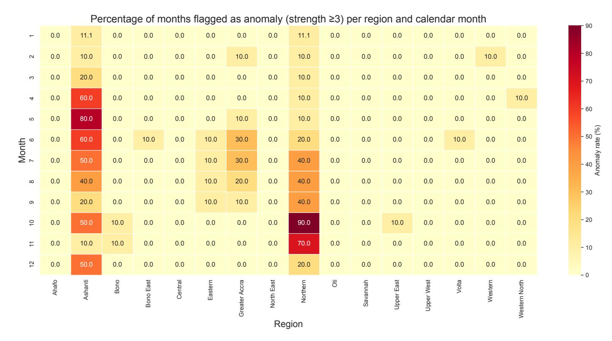

Figure 5: 2014–2023년 동안 가나의 16개 행정 구역에서 합의 이상치로 분류된 지역-월 관측치 비율. 값은 주어진 달력이 4개의 비지도 탐지 알고리즘 중 최소 3개가 이상치로 표시된 연도의 비율을 나타낸다. 더 따뜻한 색은 높은 이상치 빈도를 나타낸다. 이 그림은 아샨티와 노던 지역에서 눈에 띄는 계절적 이상치 집중을 강조하며, 대부분의 다른 지역에서는 비교적 제한된 이상치 발생을 보여준다. $S \ge 3$

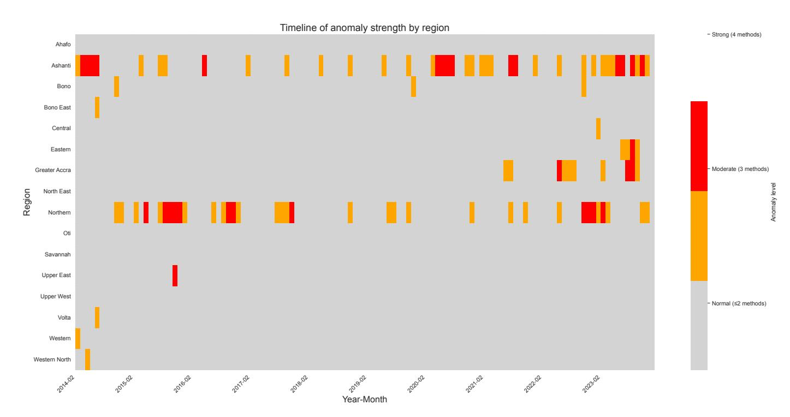

Figure 6: 2014년 1월부터 2023년 12월까지 가나의 16개 행정 구역에서 합의 이상치 강도의 시간 분포. 각 셀은 지역-월 관측치를 이상치 탐지 알고리즘의 일치 수에 따라 분류한다. 정상 관측치는 두 개 이하의 방법이 일치한 경우 ($S \le 2$)이며, 중간 이상치는 세 개의 방법이 일치한 경우 (S = 3), 강한 이상치는 모든 네 개의 방법이 일치한 경우 (S = 4)이다. 이 그림은 연구 기간 동안 비정상적인 말라리아 활동의 발생, 지속성 및 클러스터링을 연대기적으로 보여준다.

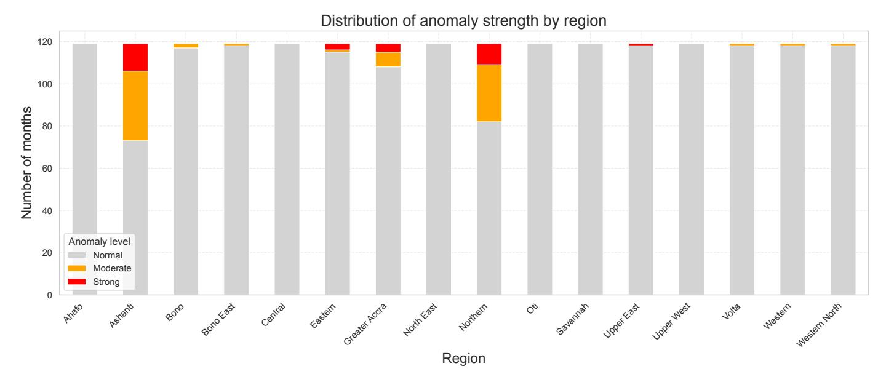

Figure 7: 2014–2023년 동안 지역별 이상 분류 분포. 스택형 막대그래프는 합의 프레임워크에 따라 정상($S \le 2$), 중간 이상(S = 3), 또는 강한 이상(S = 4)으로 분류된 지역-월 관측치의 총 수를 보여준다. 이 그림은 각 지역이 전체 이상 부담에 기여한 상대적 비율을 요약하고, 비정상적 말라리아 활동 빈도에서 상당한 지역 차이를 보여준다.

Fig. 7에 표시된 지역별 이상 수를 통해 추가 증거가 제공된다. 대부분의 지역-월 관측치는 정상으로 분류되었으며, 이는 최소 세 개 이상의 이상 탐지 알고리즘 간의 합의가 상대적으로 드물었음을 나타낸다. 그럼에도 불구하고 중간 이상과 강한 이상 분포에서 뚜렷한 지역 차이가 나타났다. 아샤니는 가장 많은 이상 월을 기록했으며, 그 뒤를 북부 지역이 따랐다. 두 지역 모두 중간 이상으로 분류된 관측치가 상당히 많았으며, 네 개의 탐지 알고리즘 모두에서 확인된 다수의 강한 이상도 포함했다. 그레이터 아크라와 동부 지역도 측정 가능한 수의 이상 관측치를 기여했으나, 빈도는 훨씬 낮았다. 대부분의 나머지 지역은 연구 기간 전체에서 한두 개의 이상 월만 기록했으며, 몇몇 지역은 강한 이상이 전혀 없었다. 소수의 지역에 이상 수가 집중된 것은 합의된 비정상적 말라리아 행동이 지리적으로 고르지 않았으며, 제한된 전파 환경 집단에 의해 지배되었음을 시사한다.

Fig. 5와 Fig. 7을 비교하면, 가장 높은 이상 부담을 가진 지역이 반드시 모든 계절에서 이상을 보이는 지역은 아니라는 점이 추가로 드러난다. 대신, 반복적인 이상은 특정 시간 창에서 발생하는 경향이 있다. 예를 들어, 아샤니는 주요 우기 월에 두드러진 이상 활동을 보였으며, 북부 지역은 연말까지 이어지는 높은 이상 빈도를 나타냈다. 이 구분은 가나의 숲과 사바나 생태계 구역을 특징짓는 서로 다른 강우 체계와 일치한다. 남부와 중앙에서는 이중 모드 강우 패턴이 지배적이며, 북부 가나 대부분은 단일 모드 우기에 의해 지배된다 [24, 25]. 따라서 이상 프레임워크는 단순히 기간을 식별하는 것보다 지역별 계절적 기대에서 벗어난 변화를 포착했다.

말라리아 부담이 높다.

전반적으로, 세 가지 시각화는 2014–2023년 동안 비정상적인 말라리아 활동이 주로 아샤니와 노던 지역에 집중되었으며, 그 외에 그레이터 아크라와 이스턴 지역에서 보조적으로 기여했음을 나타낸다. 이 이상은 시간에 따라 간헐적으로 발생했으며 명확한 계절적 선호도를 보였고, 이는 가나의 생태학적 구역 전반에 지리적으로 구분된 전파 역학이 존재함을 뒷받침한다.

### 3.2. 고신뢰 말라리아 이상 현상 특성화 (Characterisation of High-Confidence Malaria Anomalies)

합의 프레임워크는 여러 알고리즘에 의해 일관되게 이상으로 분류된 지역-월 관측치의 비교적 작은 하위 집합을 식별했습니다. 이러한 이벤트를 축소된 특징 공간에서 검토한 결과, 정상 관측치와 고신뢰도 이상 사이에 명확한 분리가 나타났습니다. 그림 8은 9개의 엔지니어링된 특징의 2차원 UMAP 임베딩을 보여줍니다. 대부분의 관측치는 가나 전역의 말라리아 전파의 지배적 패턴을 나타내는 연속적이고 밀집된 매니폴드를 형성했습니다. 반면, 중간 및 강한 이상은 임베딩의 주변 영역을 차지했으며, 강한 이상은 압축되고 대부분 구별되는 클러스터 내에 집중되었습니다. 이러한 분리는 가장 강한 이상 이벤트가 단일 극단 변수에 의해 주도되는 대신 여러 특징 차원에서 동시에 차이가 있음을 나타냅니다. 이 결과는 고차원 데이터셋 내에서 보다 넓은 관계를 포착하면서 지역 이웃 구조를 보존하는 UMAP의 목적과 일치합니다 [26].

가장 강력한 이상 사건을 검사한 결과, 이들이 제한된 지역과 연도에 집중되어 있음을 확인했다. 북부 지역은 특히 2015년에 가장 높은 순위의 이상 사건 중 다수를 차지했으며, 아샨티 지역은 2023년에 가장 눈에 띄는 최근 사건을 기여했다.

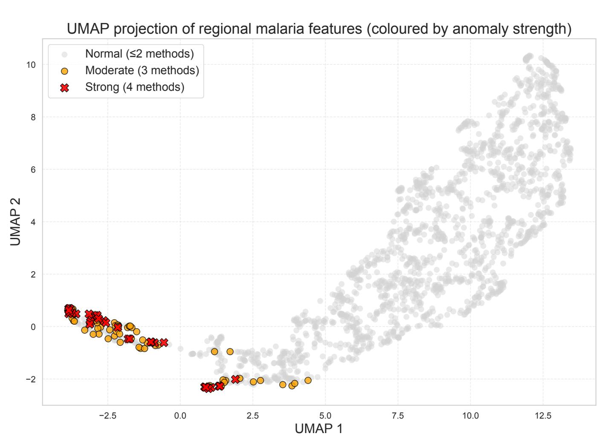

Figure 8: 2차원 UMAP 임베딩 of the 1,908 region–month observations constructed from the nine engineered malaria surveillance features. Each point represents a single region–month observation and is coloured according to its consensus anomaly classification: normal (*S* ≤ 2), moderate anomaly (*S* = 3), and strong anomaly (*S* = 4), where *S* denotes the number of anomaly detection algorithms in agreement. The projection preserves local neighbourhood structure in the high-dimensional feature space, allowing visual assessment of the separation between normal and anomalous malaria transmission patterns.

(Fig. 9). 이러한 관측은 모든 네 개의 탐지 알고리즘에 의해 이상치로 분류된 월에 해당하며, 따라서 앙상블 프레임워크 내에서 가장 높은 수준의 합의를 나타낸다. 이들의 소수 지역 내 집중은 이전에 확인된 공간 패턴과 일치하며, 반복되는 이상치는 이미 상당한 시간 변동성을 보이는 지역과 불균형적으로 연관되어 있다.

상위 다섯 개의 강한 이상치에 대한 레이더 프로필은 주된 구별 특성이 총 말라리아 부담 증가, 큰 양의 계절 잔차, 그리고 역사적 기대치 대비 지역 내 표준화 편차가 두드러진 것으로 나타났습니다. 2015년 8월, 10월, 11월 동안 Northern Region은 해당 지역 기준선보다 현저히 높은 말라리아 입원율을 보였으며, 잔차 크기와 anomaly scores의 눈에 띄는 증가가 동반되었습니다. 2023년 5월과 6월 동안 Ashanti Region에서도 유사한 행동이 관찰되었으며, 이때 관측된 말라리아 부담이 여러 특징 차원에서 전형적인 지역 조건을 초과했습니다. 특히, 여러 사건에서 lagged case counts도 증가했으며, 이는 강한 이상치가 단일 월간 급증이 아니라 지속적인 전파 기간 동안 자주 발생함을 나타냅니다. 높은 사례 부하와 큰 양의 잔차의 조합은 이러한 사건이 단순한 정규 seasonal peaks의 표현이 아니라 예상되는 seasonal behaviour에서 벗어난 편차를 반영했음을 시사합니다.

가장 강한 이상 현상의 또 다른 주목할 만한 특징은 전송의 절대적 및 상대적 측정치가 동시에 상승한다는 점이다. 전체 사례 수는 말라리아 부담의 규모를 정량화하며, 반면 잔차와 지역별 표준화 점수는 예상되는 지역 조건에서의 편차를 포착한다. 여러 강한 이상 현상은 두 측정치 모두에서 큰 편차를 보였으며, 이는 식별된 사건이 단순히 역사적으로 고부하 지역과 연관된 것뿐만 아니라 각 지역의 기후적 기준선에 비해 비정상적으로 높은 전송을 나타냈음을 시사한다. 이러한 편차는 계절 변동이 예상되는 전염병 유행 지역에서 특히 중요하며, 이상 탐지가 정상적인 계절적 정점과 진정으로 비정상적인 전송 사건을 구분해야 할 때 유의미하다 [27, 28].

이러한 분류의 견고성은 Fig. 10에 표시된 방법 간 일치 행렬을 통해 평가할 수 있다. 일치 수준은 네 가지 알고리즘 전반에 걸쳐 상당히 달랐으며, 이는 각 알고리즘이 갖는 서로 다른 수학적 가정과 다양한 형태의 이상 행동에 대한 민감도를 반영한다. Isolation Forest와 Elliptic Envelope 사이에서 가장 강한 일치가 관찰되었으며 ( $\kappa = 0.90$ ), 이는 두 방법 모두 동일한 관측치를 자주 이상으로 식별했음을 나타낸다. Autoencoder와 Elliptic Envelope 사이의 일치는 중간 수준이었으며 ( $\kappa = 0.47$ ), Isolation Forest와 Autoencoder 역시 중간 수준의 상응성을 보였다 ( $\kappa = 0.42$ ). 반면, Local Outlier Factor는 나머지 방법들과 비교적 약한 일치를 보였으며, 쌍별 계수는 0.15에서 0.31 사이였다.

이러한 차이점은 각 알고리즘이 다른 관점에서 비정상성을 평가하기 때문에 유익하다. Isolation Forest는 재귀적 분할을 통해 관측치를 분리하고, Elliptic Envelope는 견고한 다변량 거리를 활용하며, Autoencoders는 학습된 특징 표현에서 벗어난 부분을 식별하고, Local Outlier Factor는 지역 밀도 구조를 평가한다. Local Outlier Factor가 포함된 상대적으로 낮은 일치율은 지역 이웃의 불규칙성이 항상 전역적으로 비정상적인 관측과 일치하지 않음을 시사한다. 동시에 나머지 방법들 간의 중간에서 높은 일치율은 서로 다른 분석 원칙을 사용해도 감지할 수 있는 안정적인 핵심 이상 이벤트 세트가 존재함을 나타낸다. 이 패턴은 단일 알고리즘에 의존하면 일부 이상 관측을 놓치거나 방법별 특이성 아티팩트에 대한 민감도가 증가할 수 있으므로 컨센서스 전략의 사용을 뒷받침한다 [29, 30].

UMAP 임베딩에서 관찰된 분리와 레이더 프로파일이 보여주는 다변량 이탈, 그리고 이상 탐지기의 일치 구조를 함께 고려하면, 가장 강력한 이상 이벤트가 지역 전파 규범에서의 일관된 이탈을 나타내며, 단독 통계적 이상값이 아니라는 것을 보여준다. 따라서 이러한 관찰은 국가 말라리아 감시 시스템 내에서 후속 역학 조사 및 공간 분석을 위한 적합한 후보가 된다.

### 3.3. 지역별 고유의 지역 전염 패턴을 기반으로 한 지자체 수준의 핫스팟 (District-Level Hotspots Underlying Regional Anomaly Patterns)

지역 이상 패턴은 비정상 기간 동안 반복적으로 과도한 말라리아 부담을 기여한 상대적으로 적은 수의 구역에 의해 주도되었습니다. 그림 11은 Northern, Ashanti, 그리고 Greater Accra Regions 내에서 이상과 관련된 말라리아 사례가 뚜렷하게 집중되는 것을 보여줍니다. 가장 강한 집중은 Northern Region에서 발생했으며, Tamale은 비정상 월 동안 약 70,000건의 말라리아 사례를 기록했으며, 이는 지역 내 다른 모든 구역을 크게 초과했습니다. Yendi는 약 27,000건의 사례로 두 번째 핫스팟을 형성했으며, 나머지 구역들은 각각 20,000건 이하의 사례를 기여했습니다. 특히, 10개 구역 모두 동일한 수의 비정상 월(37개월)을 경험했으며, 이는 누적 부담의 차이가 비정상 기간 동안 말라리아 전파의 규모에 의해 주로 주도되었음을 나타내며, 비정상 빈도의 차이보다는 그렇습니다.

Ashanti Region은 다른 구조를 보였다.  
Kumasi, Atwima Nwabiagya, 그리고 Sekyere South는 각각 이상 달 동안 약 30,000건의 말라리아 사례를 누적했다,  
반면 Offinso, Ejura-Sekyedumase, Atwima Nwabiagya North, 그리고 Obuasi East는 약 14,000에서 18,000건 사이의 부담을 가진 두 번째 계층의 지구를 형성했다.  
모든 10개 지구는 46개월의 이상 달을 경험했으며, 이는 지역 전체에 걸쳐 매우 동기화된 이상 패턴을 시사한다.  
Northern Region과 비교할 때, 이상 부담은 단일 도시 중심지에 의해 지배되는 대신 더 넓은 지구 그룹에 걸쳐 분포했다.  
Greater Accra는 상당히 낮은 말라리아 부담을 보였으며, 주요 지구인 Okai Koi North, Accra Metropolitan, 그리고 Korle-Klottey는 각각 이상 달 동안 6,000에서 7,000건 사이의 사례를 기여했다.  
모든 10개 지구에서 11개월의 이상 달이 균일하게 발생한 것은 누적 부담의 변동성을 다시 한 번 나타낸다.

### Top strong anomalies (4/4 methods) vs regional baseline (최상위 이상 사건 (4/4 방법) vs 지역 기준선)

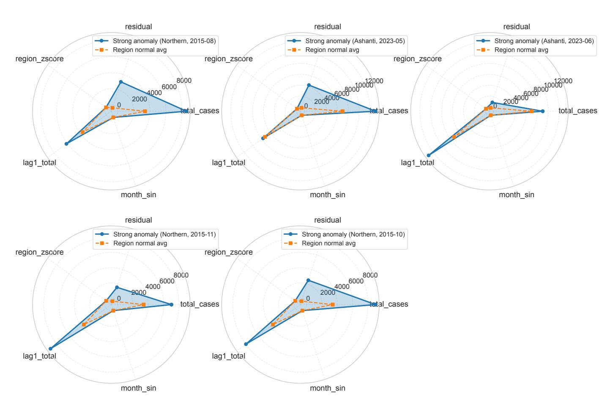

Figure 9: Radar-chart comparison of the five strongest anomaly events identified by the consensus framework. Each panel contrasts the feature profile of a strong anomaly detected by all four anomaly detection algorithms with the corresponding long-term regional baseline. Variables include total malaria cases, lagged malaria burden, seasonal residual, within-region standardised anomaly score, and seasonal phase. The figure illustrates the multivariate characteristics that distinguish high-confidence anomaly events from typical transmission conditions within the same region.  
Figure 9: 합의 프레임워크에서 식별된 다섯 개의 가장 강력한 이상 사건에 대한 레이더 차트 비교. 각 패널은 모든 네 개의 이상 탐지 알고리즘에 의해 검출된 강력한 이상 사건의 특징 프로필을 해당 장기 지역 기준선과 대비합니다. 변수에는 총 말라리아 사례, 지연된 말라리아 부담, 계절 잔차, 지역 내 표준화된 이상 점수, 그리고 계절 단계가 포함됩니다. 이 그림은 같은 지역 내에서 고신뢰도 이상 사건을 일반적인 전파 조건과 구분하는 다변량 특성을 보여줍니다.

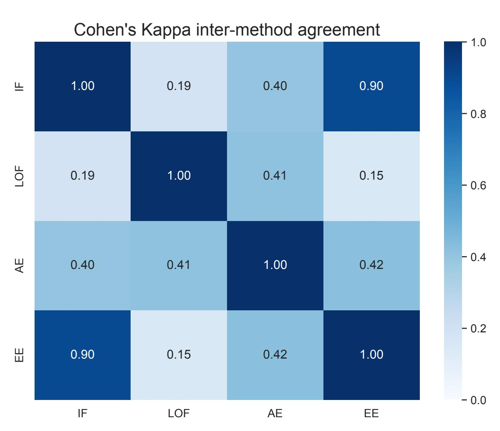

Figure 10: Pairwise Cohen's Kappa coefficients measuring agreement among the four anomaly detection algorithms: Isolation Forest (IF), Local Outlier Factor (LOF), Autoencoder (AE), and Elliptic Envelope (EE). Kappa values quantify agreement beyond chance, with larger values indicating stronger consistency in anomaly classification. The matrix provides an assessment of methodological concordance and complementarity within the consensus anomaly detection framework.  
Figure 10: 네 개의 이상 탐지 알고리즘(Isolation Forest (IF), Local Outlier Factor (LOF), Autoencoder (AE), Elliptic Envelope (EE) 간의 일치도를 측정하는 쌍별 Cohen's Kappa 계수. Kappa 값은 우연을 넘어선 일치를 정량화하며, 값이 클수록 이상 분류의 일관성이 더 강함을 나타냅니다. 이 행렬은 합의 이상 탐지 프레임워크 내에서 방법론적 일치와 상호 보완성을 평가합니다.

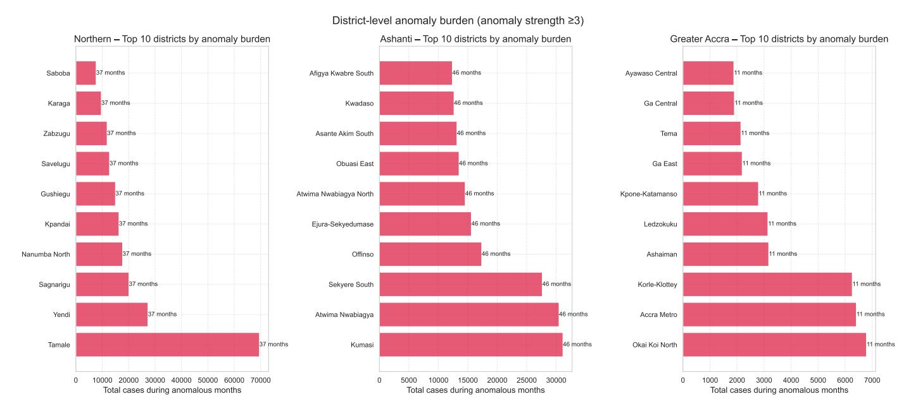

Figure 11: District-level malaria burden during anomalous months within Northern, Ashanti, and Greater Accra Regions. Bars represent cumulative malaria admissions recorded in months classified as anomalous by at least three anomaly detection methods (*S* ≥ 3). Labels indicate the total number of anomalous months experienced by each district between 2014 and 2023. Districts are ranked according to cumulative anomaly‑associated malaria burden.  
Figure 11: 북부, 아샨티, 그리고 그레이터 아크라 지역 내 비정상 월 동안 관할구 수준의 말라리아 부담. 막대는 최소 세 개 이상의 이상 탐지 방법(*S* ≥ 3)에 의해 비정상으로 분류된 월에 기록된 누적 말라리아 입원 사례를 나타냅니다. 라벨은 2014년부터 2023년까지 각 관할구가 경험한 비정상 월의 총 수를 표시합니다. 관할구는 누적 이상 관련 말라리아 부담에 따라 순위가 매겨집니다.

largely reflected differences in case volume rather than anomaly persistence.  
largely reflected differences in case volume rather than anomaly persistence.

시간적 궤적은 시군구 수준과 지역 수준의 이상 현상 행동 사이의 관계에 대한 추가적인 통찰을 제공한다 (Fig. [12\)](#page-20-0). 타말레는 연구 기간 전반에 걸쳐 상당한 변동성을 보였으며, 이상 강도는 정상 조건과 최대 합의 수준 사이에서 변동하였다. 강한 이상 현상은 2014–2017년과 다시 2022–2023년에 반복적으로 관측되었다. 이러한 변동에도 불구하고 타말레 시리즈는 북부 지역 평균을 밀접하게 추적했으며, 이는 시군구 수준의 행동이 전체 지역 이상 신호에 상당한 영향을 미쳤음을 시사한다. 두 곡선 간의 유사성은 이전에 식별된 주요 지역 이상이 주로 타말레와 그 주변 도시 집수 영역 내에서 발생하는 전파 역학에 기반하고 있음을 암시한다.

아샨티 지역 내에서 다른 패턴이 나타났다.  
쿠마시와 아트위마 누바비아가의 이상치 궤적은 연구 기간 전반에 걸쳐 지역 평균과 거의 구분되지 않았다.  
이상치 강도가 두인 장기간은 가장 강한 합의 범주에 도달하는 반복적인 사건들에 의해 중단되었다.  
2020년 이후 이상치 활동이 특히 두드러졌는데, 여러 장기간이 이상치 강도 세 또는 넷에 도달했기 때문이다.  
구역과 지역 궤적 간의 밀접한 상응은 아샨티 대도시 회랑 전역에서 이상치 행동이 공간적으로 일관되었음을 시사한다.  
단일 구역에 의해 생성된 것이 아니라, 지역 이상치 신호는 여러 인접 구역에서 동시에 발생하는 이탈을 반영하는 것으로 보인다.

국가 차원의 이상 활동 분포는 Fig. [13.](#page-21-0)에 나타나 있다. 높은 말라리아 부담을 가진 지역과 높은 이상 빈도를 보이는 지역 사이에 명확한 구분이 드러난다. 가장 큰 버블은 누적 말라리아 부담이 상당한 지역을 나타내며, 주요 인구 중심지와 지역 수도에 집중되어 있다. 반면, 35%를 초과하는 가장 높은 이상 비율은 주로 아샤니 벨트에 위치한 일련의 지역에서 발생한다. 이들 지역 중 몇몇은 아다니와 아피그야 콰브레 지역 주변에 강조되어 있으며, 이곳의 이상 비율은 전국적으로 가장 높은 편이지만 누적 사례 부담은 보다 온건하다. 이 패턴은 이상 탐지에 크게 기여하는 지역이 반드시 가장 큰 말라리아 부담을 가진 지역은 아니라는 것을 시사한다. 대신, 이들은 말라리아 발생이 예상되는 지역적 행동에서 가장 자주 벗어나는 위치이다.

지리적으로 고도화된 이상률이 특히 남중부 가나에서 두드러집니다. 40%에 근접한 이상률을 보이는 구역은 고립된 관측치가 아니라 지리적으로 일관된 클러스터를 형성합니다. 다른 지역에서는 상당한 말라리아 부담을 가진 많은 구역이 10% 이하의 이상률을 보이며, 이는 높은 질병 발생률에도 불구하고 상대적으로 안정적인 전파 역학을 나타냅니다. 부담과 이상률 간의 지리적 분리는 이상 프레임워크가 사례 수만으로는 드러나지 않는 전파 변동성의 측면을 포착한다는 것을 보여줍니다.

시즌별 특성은 가장 부담이 큰 지역의 Fig. [14.](#page-23-0)에 나타나 있다. 타말레는 연중 내내 비정상적인 월을 경험했으나, 비정상 발생은 전송 주기의 후반기에 강하게 집중되었다. 10년 연구 기간 동안 10월은 9개월의 비정상 빈도로 가장 높은 빈도를 기록했다. 11월은 7번의 발생으로 그 뒤를 이었으며, 7월, 8월, 9월은 각각 4개월의 비정상 월을 기록했다. 반면 1월부터 6월까지는 일반적으로 1~2개월의 비정상 월을 보였다. 이러한 계절 패턴은 북부 가나의 단일 모드 강우 체제와 밀접하게 일치하며, 여기서 말라리아 전파의 최고점은...

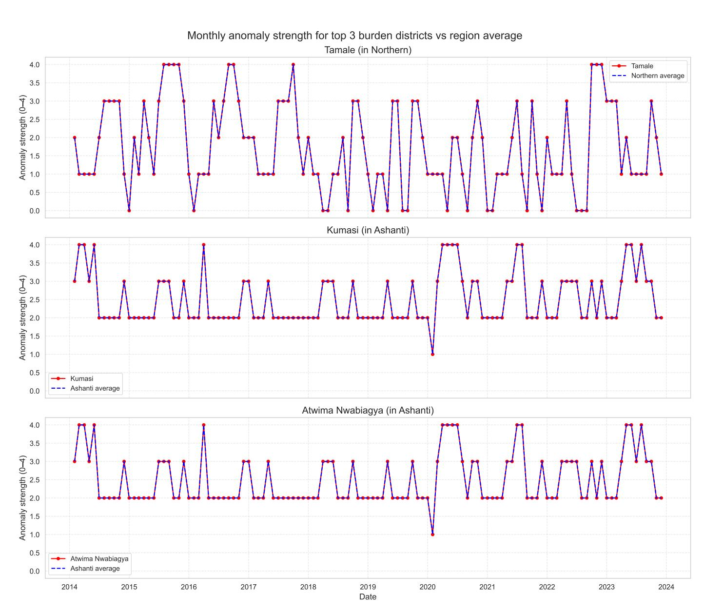

그림 12: 비정상 기간 동안 가장 큰 말라리아 부담을 기여한 세 구역의 월별 이상 강도 궤적을, 해당 지역 평균 이상 강도와 비교한 것입니다. 이상 강도는 0에서 4까지이며, 주어진 구역-월 관측치를 이상으로 식별한 이상 탐지 방법의 수를 나타냅니다. 이 그림은 구역 수준의 이상 활동과 광범위한 지역 행동 사이의 시간적 관계를 보여줍니다.

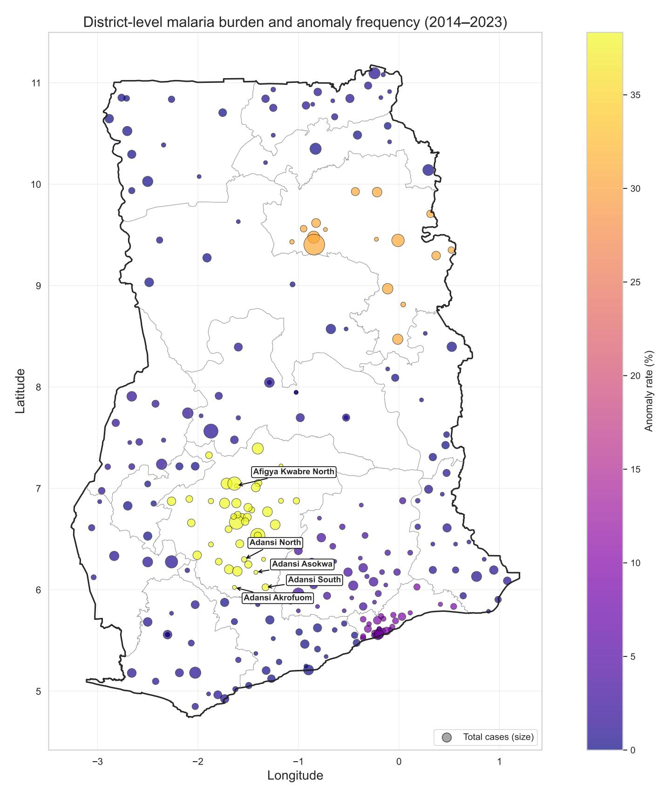

그림 13: 2014–2023년 동안 가나 전역의 구역 수준 말라리아 부담과 이상 빈도의 이변량 표현입니다. 버블 크기는 누적 말라리아 입원 수에 비례하며, 색상은 이상으로 분류된 월의 비율(*S* ≥ 3)을 나타냅니다. 특히 높은 이상 비율을 보인 구역은 라벨이 붙어 있습니다. 이 그림은 지속적으로 높은 부담을 보이는 구역과 예상 전파 행동에서 빈번히 벗어나는 구역을 구분합니다.

mission은 비가 오는 시즌 동안 및 직후에 흔히 발생합니다. 9월에서 11월 사이에 이상이 집중된 것은 비정상적인 전파 사건이 낮은 전파 기간이 아닌 계절 최고점 근처에서 발생할 가능성이 높다는 것을 시사합니다.

그림 15는 가장 높은 이상 빈도를 보인 세 지역 내에서 이상과 연관된 말라리아 부담을 공간적으로 명시적으로 보여줍니다. Northern Region에서는 핫스팟 강도가 2014, 2016, 2019, 2022년 동안 Tamale 대도시 지역을 중심으로 일관되게 유지되었습니다. 예측된 말라리아 부담의 규모는 연도마다 달랐지만, 핫스팟의 지리적 초점은 거의 변하지 않았습니다. Yendi 및 인접 구역으로 향하는 고부담의 보조 영역이 간헐적으로 나타났지만, 지배적인 핫스팟은 지역의 중앙‑서부 부위에 고정되었습니다.

Ashanti Region은 Kumasi, Atwima Nwabiagya, Offinso, Sekyere South를 아우르는 더 넓은 핫스팟 구조를 보였습니다. 최대 강도의 위치는 연도마다 다소 이동했지만, 고부담은 동일한 대도시 및 교외 지역 통로 내에 집중되었습니다. 인접 구역 간의 공간적 연속성은 Northern Region보다 더 뚜렷하여, 단일 초점이 아닌 연장된 핫스팟 구역을 형성했습니다. 이 통로가 모든 네 대표 연도에 걸쳐 지속된 것은 이상 말라리아 활동이 동일한 지리적 환경에서 반복적으로 발생했음을 나타냅니다.

Greater Accra는 가장 공간적으로 압축된 핫스팟 구성을 보였습니다. 고부담은 Accra 대도시 지역, 특히 Accra Metropolitan, Korle‑Klottey, Okai Koi North, Ashaiman 주변에 집중되었습니다. 최대 강도의 중심은 연도마다 다소 이동했지만, 핫스팟은 상대적으로 작은 도시 통로에 한정되었습니다. Northern 및 Ashanti Region과 비교하면 이상과 연관된 부담의 지리적 범위가 훨씬 작았습니다. 그럼에도 불구하고 모든 대표 연도에 걸쳐 핫스팟이 반복적으로 나타난 것은 대도시 환경 내에서 지속적인 지역적 변동성을 시사합니다.

그림 11과 13의 비교는 이상 부담과 이상 빈도가 공간적으로 구분됨을 보여줍니다. Tamale은 이상 월 동안 가장 큰 누적 말라리아 부담을 기여했으며, 반면 가장 높은 이상 비율은 Ashanti Region의 구역 군집, 특히 Adansi 및 Afigya Kwabre 지역에 집중되었습니다. 이 대비는 가장 큰 말라리아 부담을 겪는 위치가 가장 지속적인 이상 행동을 보이는 위치와 반드시 일치하지 않음을 시사합니다. 대신, 부담과 이상 빈도는 연구 영역 전반의 말라리아 역학을 다른 측면에서 부각시켰습니다.

### 3.4. 비정상 월과 정상 월 간 통계적 분리 (Statistical Separation Between Anomalous and Normal Months)

합의 기반 이상 프레임워크가 통계적으로 일상 전파 조건과 구별되는 관측치를 식별했는지 평가하기 위해, 핵심 역학적 특징의 분포를 이상 월(이상성

강도  $\geq 3$ ) 및 정상 월(이상성 강도  $\leq 2$ ). 차이는 Mann–Whitney U 검정으로 평가되었으며, Cohen's d를 사용해 효과 크기를 정량화했다 (표 2).

결과는 평가된 모든 특징에서 이상 월과 정상 월 사이에 매우 유의미한 차이가 있음을 나타낸다. 총 말라리아 사례는 가장 강한 분리를 보였으며, Mann–Whitney 통계량 U=183142.5와 연관된 p-값 $5.31\times 10^{-59}$ 를 가졌다. 해당 Cohen's d 값 3.252는 예외적으로 큰 효과 크기를 나타내며, 이는 이상 월 동안 말라리아 사례 수가 정상 월에 관찰된 것보다 현저히 높았음을 시사한다. 이 차이의 크기는 이상 분류가 높은 말라리아 부담 기간과 강하게 연관되어 있음을 시사한다.

잔차 특징에서도 유사하게 명확한 구분이 관찰되었으며, 이는 예상되는 지역별 계절 패턴에서의 이탈을 측정한다. Mann–Whitney 검정은 U=140007.0과 p-값 $8.82\times 10^{-17}$ 를 보였고, Cohen's d는 1.383에 이르렀다. 강한 통계적 유의성과 큰 효과 크기의 조합은 이상 월이 예상되는 계절 행동에서 현저히 큰 양의 편차를 보였음을 나타낸다. 이 결과는 식별된 이상이 단지 높은 말라리아 부담과만 연관된 것이 아니라, 각 지역 내 계절 기준선에서 상당한 이탈을 반영했음을 보여준다.

지역별 표준화된 이상은 유사한 패턴을 보였다. 지역 z‑점수는 두 그룹 간에 유의하게 차이가 있었으며 (U=145601.0, $p=9.52\times10^{-21}$ ), Cohen's d는 1.245였다. 이 큰 효과 크기는 이상 월이 표준편차 단위로 표현될 때 정상 관측치보다 지역 평균에서 훨씬 멀리 떨어져 있었음을 나타낸다. 이 결과는 이상 프레임워크가 일반적인 변동 범위 내에서 발생하는 변동보다 지역 분포의 꼬리에 위치한 관측치를 선호적으로 식별한다는 추가 증거를 제공한다.

종합적으로, 통계 검정은 이상 월과 정상 월이 감시 기록 내에서 명확히 구분되는 모집단임을 보여준다. 극히 작은 *p*-값은 세 변수 모두에서 강한 분포적 분리를 나타내며, 큰 효과 크기는 이러한 차이가 규모 면에서 상당함을 확인한다. 가장 강한 분리는 총 말라리아 사례에서 관찰되었으나, 잔차와 지역별 표준화 편차도 뚜렷한 차이를 보였다. 이러한 결과는 합의 기반 프레임워크가 식별한 이상 분류에 대한 정량적 근거를 제공하며, 이상 월이 높은 말라리아 부담과 예상되는 지역 전파 행동에서 비정상적으로 큰 이탈과 연관되어 있음을 확인한다.

#### 4. Discussion (논의)

본 연구는 합의 기반 이상 탐지 프레임워크를 사용하여 가나의 10년간 일상 말라리아 감시 데이터를 분석하고, 예상 전파 행동에서 현저히 벗어난 지역-월 관측치의 상대적으로 작은 하위 집합을 식별했다. 기존 감시 요약이 주로 평균 부담과 계절성을 기술하는 것과 달리,

# Seasonality of anomalies in Tamale (number of anomalous months, 2014 2023) (타말레의 이상 현상의 계절성 (이상 월 수, 2014-2023))

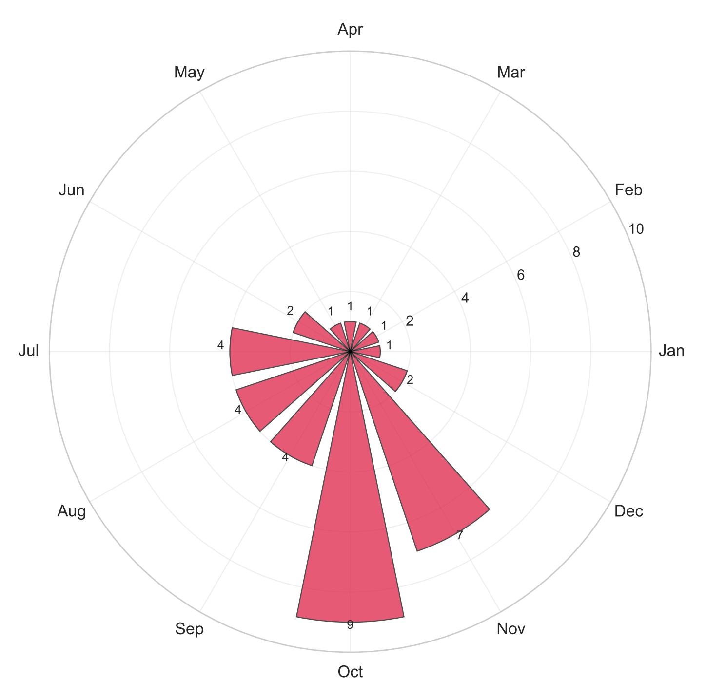

Figure 14: 2014–2023년 동안 타말레 지구에서 비정상 월의 계절 분포. 반경 막대는 합의 프레임워크에 의해 비정상으로 분류된 각 달 내부의 월 수를 나타낸다. 이 플롯은 비정상 기간 동안 가장 높은 누적 말라리아 부담을 보인 지구 내에서 비정상 발생의 계절적 집중을 보여준다.

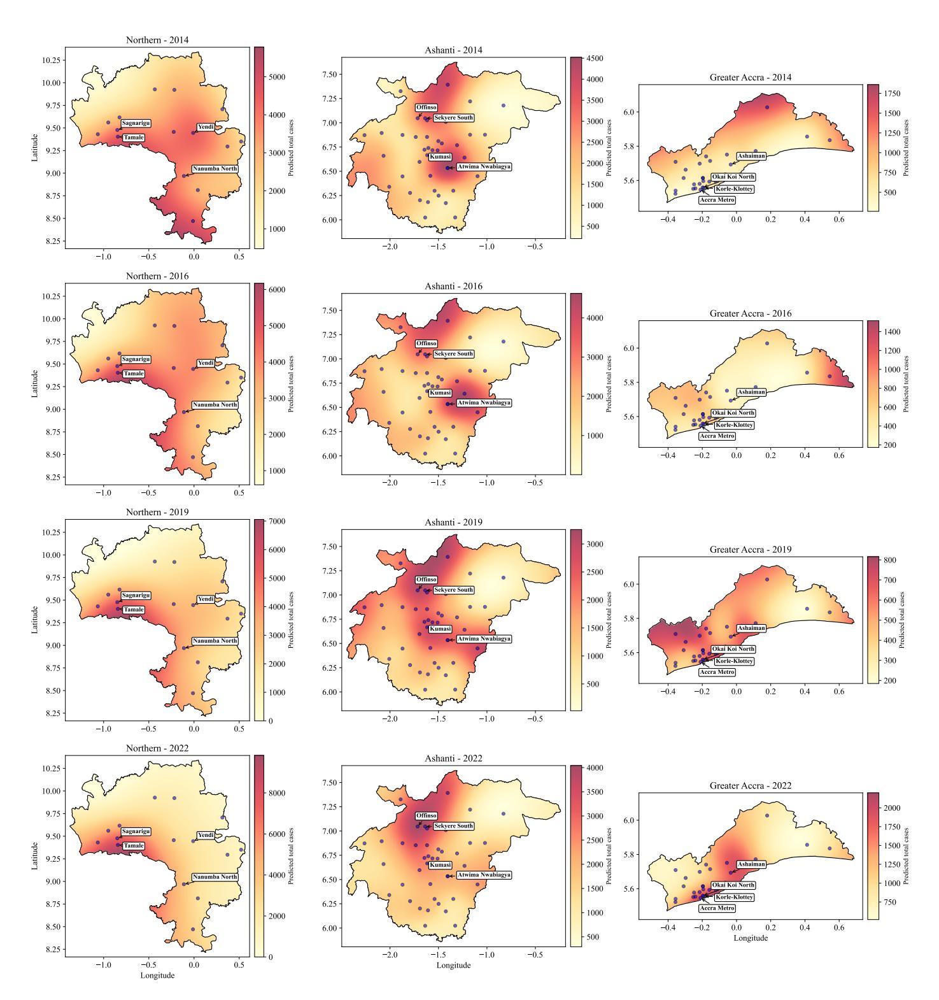

Figure 15: 2014, 2016, 2019, 2022년의 대표적인 네 해 동안 북부, 아샤니, 그리고 그레이터 아크라 지역에서 비정상 월에 해당하는 지구 수준 말라리아 핫스팟의 공간 분포. 연속 표면은 지구 말라리아 부담의 반경 기반 함수 보간을 사용해 생성되었다. 더 따뜻한 색상은 비정상 기간 동안 예측된 말라리아 부담이 더 높음을 나타낸다. 라벨이 붙은 지구는 각 지역 내 주요 핫스팟 위치를 식별한다.

**Table 2:** 비정상(강도 $\geq$ 3) 월과 정상(강도 $\leq$ 2) 월을 비교한 Mann–Whitney U 검정 및 Cohen's d,

| 특징 | Mann–Whitney U 검정 | p-값 | Cohen의 d |
|----------------|----------------|------------------------|-----------|
| 전체 사례 | 183142.5 | $5.31 \times 10^{-59}$ | 3.252 |
| 잔차 | 140007.0 | $8.82 \times 10^{-17}$ | 1.383 |
| 영역 z-점수 | 145601.0 | $9.52 \times 10^{-21}$ | 1.245 |

이러한 추세에 따라, 제안된 프레임워크는 각 지역의 역학적 맥락에 비해 통계적으로 특이한 관측치를 식별하도록 설계되었습니다.  
중요하게도, 검출된 이상은 자동으로 말라리아 발병으로 해석되어서는 안 됩니다.  
그 대신, 이들은 다변량 역학적 특성이 과거 기대와 크게 차이 나는 관측치를 나타내며, 따라서 보다 면밀한 역학적 평가가 필요합니다.  
이러한 이탈은 실제 말라리아 전파 증가, 일반적인 계절 기간 외의 전파 지속, 연령별 질병 부담 변화, 의료 이용 변화, 보고 불일치, 개입 효과, 또는 단기 환경 변동 등에서 발생할 수 있습니다.  
따라서 프레임워크의 주요 기여는 과거에 높은 말라리아 부담을 가진 지역을 식별하는 것이 아니라, 일상적인 감시 요약에서 숨겨질 수 있는 특이한 전파 패턴을 우선순위화하는 데 있습니다.

주목할 만한 결과는 비정상적인 말라리아 활동이 제한된 수의 지역, 특히 아샨티와 노던 지역에 집중되었다는 점입니다.  
이러한 집중은 말라리아 부담의 차이만으로는 설명되지 않을 가능성이 높으며, 이상 프레임워크는 절대 사례 수 외에 지역별 표준화와 계절 잔차를 포함했기 때문입니다.  
대신, 대규모 인구, 이질적인 생태 조건, 그리고 뚜렷한 계절 전파 주기를 특징으로 하는 지역은 시간적 변동성이 더 크며, 이는 예상 행동에서 벗어날 가능성을 높입니다.  
이전 연구에 따르면 가나의 말라리아 전파는 기후 변동성, 강우 시기, 온도 적합성, 그리고 지역 환경 조건에 크게 영향을 받으며, 이들 모두가 숲, 해안, 사바나 생태 구역 간에 상당히 다릅니다 [24, 25].  
따라서 아샨티와 노던 지역에서 반복적으로 나타나는 이상은 단순히 말라리아 발생률이 높기보다는 고유병 전파와 일시적인 환경 또는 역학적 혼란 사이의 상호작용을 반영할 수 있습니다.  
중요하게도, 이러한 결과는 이상 탐지가 질병 부담과 보완적인 정보를 제공하며, 지속적으로 높은 사례 수를 가진 지역을 강조하는 것보다 전파 역학의 불안정을 식별한다는 것을 시사합니다.

구역 수준 분석에서 도출된 특히 중요한 관찰은 이상 부담과 이상 지속성이 서로 다른 역학적 특성을 나타낸다는 점입니다.  
타말은 이상 월 동안 가장 큰 누적 말라리아 부담을 기여했으며, 반면 가장 높은 이상 빈도는 아샨티 지역의 일련의 구역에 집중되었습니다.  
이 구분은 다음을 유도합니다:

말라리아 전파의 규모는 예상 행동에서 반복적으로 벗어나는 원인과 다를 수 있습니다.  
일관되게 높은 말라리아 부담을 가진 구역은 단순히 대규모 인구, 지속적인 유행 전파, 또는 더 높은 의료 이용을 반영할 수 있습니다.  
반대로, 반복적인 이상을 보이는 구역은 변동하는 환경 조건, 개입 효과, 보고 관행, 또는 지역 전파 역학으로 인한 더 큰 시간적 불안정을 겪을 수 있습니다.  
일관된 높은 전파와 예상 행동에서 반복적인 이탈을 구분하는 능력은 기존 부담 기반 감시 지표보다 이상 탐지의 주요 장점 중 하나를 보여줍니다.

계절 구조는 검출된 이상 현상에 대한 추가적인 통찰을 제공한다.  
특정 월에 이상 활동이 집중되는 것은 프레임워크가 단순히 계절적 정점을 식별하는 것이 아니라, 정립된 전파 시즌 내에서 발생하는 편차에 민감하게 반응했음을 나타낸다.  
이 구분은 가나의 말라리아 전파가 본질적으로 계절적이며 생태학적 구역마다 다른 강우 패턴을 따르기 때문에 특히 중요하다.  
북부 사바나 지역은 주로 단일 모드의 우기를 경험하는 반면, 숲과 해안 지역은 이중 모드의 강우 패턴을 보인다 [31, 32].  
이러한 조건 하에서 우기 동안 말라리아 발생률이 상승하는 것은 예상되는 현상이며, 자동으로 이상으로 간주되어서는 안 된다.  
대신, 제안된 프레임워크는 관측된 전파가 해당 지역에서 과거에 관측된 계절적 행동과 크게 다른 월을 식별한다.  
이러한 이상은 일시적인 환경 조건, 지역 운영상의 어려움, 비정상적인 매개체 역학, 감시 성능의 변화, 또는 예상되는 전파 패턴을 일시적으로 방해하는 다른 요인을 나타낼 수 있다.  
따라서, 이상 탐지는 통계적으로 비정상적인 계절적 행동과 예상되는 계절 변동을 구분함으로써 계절 감시를 보완한다.

UMAP 투영 및 방법 간 일치 분석은 검출된 이상 현상의 특성에 대한 중요한 방법론적 통찰을 제공한다.  
강한 이상은 축소된 특징 공간에서 잘 정의된 영역을 차지했으며, 이는 이러한 관측치가 단일 변수에 따라가 아니라 여러 역학적 차원에서 동시에 차이를 보였음을 나타낸다.  
이러한 분리는 단변량 감시 임계값에만 의존하기보다 다변량 이상 탐지 프레임워크를 채택하는 근거를 뒷받침한다.  
말라리아 이상은 종종 질병 부담, 계절성, 시간적 지속성 및 인구 구성의 동시에 변화를 포함하며, 이 중 어느 하나만으로는 비정상적인 전파 행동을 충분히 설명할 수 없다.  
따라서 이러한 보완적 차원을 함께 평가하는 것이 보다 포괄적인 표현을 제공한다.

비정상적인 역학 패턴의.

네 가지 이상 탐지 알고리즘 간의 일치 차이는 비정상적인 말라리아 전파를 식별하는 복잡성을 더욱 부각시킨다. Isolation Forest와 Elliptic Envelope 간의 강한 일치는 많은 이상이 트리 기반 격리와 견고한 다변량 거리 접근 방식 모두에서 인식될 만큼 충분히 뚜렷했음을 시사한다. 반면, Local Outlier Factor는 밀도 기반 방법이 주로 즉각적인 이웃 내에서 비정상적인 관측치를 식별하고 전역적으로 비정상적인 관측치를 식별하지 않기 때문에 나머지 알고리즘과의 일치가 약했다. 이 결과는 일상적인 감시 데이터 내에서 여러 형태의 역학 이상이 공존함을 시사한다. 일부 사건은 역사적 행동에서 전역적으로 극단적인 편차를 나타내는 반면, 다른 사건은 다변량 특성 공간의 특정 영역 내에서만 지역적으로 비정상적이다. 합의 전략은 다수의 독립 탐지기 간의 일치를 요구함으로써 이러한 알고리즘별 민감도의 영향을 줄여 고위험 이상 신뢰도를 부여하기 전에, 따라서 견고성을 향상시키고 방법별 허위 양성 탐지 가능성을 감소시킨다.

본 연구 결과의 중요한 시사점은 통계적 이상 현상의 역학적 해석에 관한 것이다. 제안된 프레임워크는 수년간 발생하는 점진적 세속적 변화를 다루기보다, 과거 전파 행동에서 갑작스럽거나 예기치 않은 이탈을 식별하도록 주로 설계되었다. 말라리아 역학에서 장기적인 변동, 예를 들어 지역 전파의 점진적 증가나 지속적인 감소와 같은 경우는 추세 분석, 변화점 탐지, 또는 확률적 예측 모델과 같은 보완적 접근법을 사용하여 보다 적절히 조사된다. 따라서 이상 탐지는 기저 장기 추세가 증가하든 감소하든 관계없이 과거 기대치에서 예기치 않게 벗어나는 관측치를 식별함으로써 다른 감시 목표를 다룬다. 이 구분은 서로 다른 분석 접근법이 서로 다른 역학적 질문에 답하며, 경쟁이 아닌 보완적 방법론으로 간주되어야 하기 때문에 중요하다.

운영 관점에서 본 연구 결과는 기존 감시 시스템을 대체하기보다 일상적인 말라리아 감시 내에서 추가 분석 층으로서 이상 탐지의 잠재적 가치를 보여준다. 현재 감시 프로그램은 주로 시간적 추세, 사전 정의된 임계값 및 일상적 서술적 보고에 의존한다. 이러한 접근법은 여전히 말라리아 통제 프로그램의 기본 구성 요소이지만, 기존 경보 임계값을 초과하지 않더라도 통계적으로 비정상적인 관측치를 간과할 수 있으며, 그럼에도 역학적 검토가 필요하다. 예상되는 지역 행동에서 크게 벗어나는 관측치를 우선시함으로써, 합의 기반 이상 탐지는 감시 담당자가 추가 조사가 필요한 기록을 식별하도록 지원할 수 있다. 역학적 상황에 따라 이러한 조사는 감시 데이터 품질 검증, 개입 범위 평가, 진단 및 치료 자원 가용성 검토, 강화된 매개체 감시, 또는 목표 지향적 현장 조사를 포함할 수 있다. 따라서 이 프레임워크는 역학적 상황 인식을 강화하는 의사결정 지원 도구로 기능하며, 이후 공중 보건 대응은 지역 운영 역량, 감시 인프라 및 프로그램 우선순위에 달려 있음을 인식한다.

현재 연구 결과를 해석할 때 몇 가지 한계를 인지해야 한다. 첫째, 분석은 지역 및 구역 수준에서 집계된 일상적으로 수집되는 감시 데이터를 기반으로 한다. DHIMS2는 광범위한 공간 및 시간적 범위를 제공하지만, 보고 완전성, 진단 관행 및 의료 이용률은 지역 및 연도마다 다를 수 있어 관측된 이상 패턴에 영향을 미칠 수 있다. 둘째, 이상 탐지는 예상 행동에서의 통계적 편차를 식별하지만, 이러한 편차를 유발한 근본적 인과 메커니즘을 결정할 수 없다. 따라서 검출된 이상은 말라리아 발생이나 개입 실패의 확정적 증거라기보다는 추가 역학 조사가 필요한 감시 신호로 해석되어야 한다. 셋째, 선택된 특징 집합은 일상 감시 기록에서 파생된 변수에 의도적으로 제한되었다. 강수량, 온도, 식생 지수, 홍수 지표, 벡터 풍부도, 개입 범위, 사회경제적 요인과 같은 환경 공변량을 포함하면 이상 사건의 해석을 개선하고 그 근본 원인을 조사하는 데 도움이 될 수 있다. 넷째, 제안된 프레임워크는 시간에 걸쳐 여러 지역에서 수집된 관측치를 분석함으로써 공간 및 시간 변화를 모두 포착하지만, 이상 탐지는 각 지역에 대해 독립적으로 수행되므로 인접 지역 간의 공간 의존성을 명시적으로 모델링하지 않는다. 말라리아 전파는 공유된 환경 조건, 인구 이동, 벡터 생태학 및 의료 접근성에서 비롯되는 공간 자기상관을 보이는 것으로 알려져 있다. 따라서 현재 프레임워크는 인접 지역과의 편차가 아니라 각 지역의 과거 전파 특성에서 벗어난 관측치를 식별한다. 공간 의존성을 명시적으로 통합하면 지리적으로 조정된 전파 이상을 식별하고 말라리아 역학의 공간 과정을 추가로 이해하는 데 도움이 될 수 있다. 다섯째, 본 분석은 연구 기간 동안 통계적으로 특이한 전파 패턴을 식별하기 위해 과거 감시 데이터를 회고적으로 평가하도록 설계되었다. 이 회고적 프레임워크는 과거 역학 행동을 평가하는 데 적합하지만, 일상적인 말라리아 감시에서 운영적으로 배포하려면 각 보고 기간까지 이용 가능한 정보만을 사용하여 요약 통계와 모델을 순차적으로 업데이트하고 보정해야 한다. 이러한 실시간 조건에서의 전향적 구현은 이상 탐지를 일상 감시 워크플로에 통합하는 중요한 다음 단계이다. 마지막으로, 본 연구는 통계적 이상을 조기에 식별하는 것이 직접적으로 공중 보건 결과를 개선하는지 여부를 평가하지 않았다. 이상 기반 감시의 운영 효율성을 평가하려면 일상 말라리아 통제 프로그램 내에서 전향적 구현 및 평가가 필요하다.

미래 연구는 제안된 프레임워크를 여러 보완적인 방향으로 확장해야 한다. 기후 재분석 제품, 위성에서 유도된 환경 지표, 곤충학적 감시 데이터, 개입 기록, 그리고 인간 이동성 정보를 통합된 시공간 프레임워크 내에 통합하면, 감지된 이상 현상의 환경적·운영적 원인을 조사하고 역학적 해석을 개선하는 데 도움이 될 것이다. 중요한 방법론적 확장 중 하나는 이상 탐지 프레임워크 자체에 명시적 공간 의존성을 도입하는 것이다. 각 지역을 독립적으로 평가하는 대신, 미래 모델은 공간 지연 변수, 인접 기반 특성 엔지니어링, 또는 지역 연결성의 그래프 표현을 통해 이웃 정보를 통합할 수 있어, 이상을 지역의 과거 행동과 이웃 지역의 동시 조건 모두에 대해 식별할 수 있게 한다. 이러한 확장은 지리적으로 조정된 전파 사건을 식별하고 말라리아 이상 현상의 공간 전파를 이해하는 데 도움을 줄 것이다. 또 다른 유망한 방향은 합성 또는 모델 생성 말라리아 시계열을 사용한 시뮬레이션 기반 평가를 도입하는 것이다. 신중히 설계된 시뮬레이션 연구는 다양한 전파 체제, 계절 구조, 그리고 이상 시나리오 하에서 합의 이상 탐지 알고리즘의 민감도와 견고성을 검토할 수 있는 통제된 환경을 제공하면서, 일상 감시 관측에 기반한 검증을 보완할 수 있다. 또한, 롤링 또는 순차 모델 업데이트를 기반으로 한 전향적 구현은 분석 시점에 미래 관측이 없을 때 운영 감시 조건 하에서 알고리즘 성능을 평가할 수 있게 한다. 마지막으로, 이상 탐지와 확률적 예측을 결합하는 것은 또 다른 중요한 방법론적 개발 방향이다. 예측 모델은 예상 말라리아 전파 궤적과 관련 불확실성을 추정하는 반면, 이상 탐지는 이러한 기대에서 체계적으로 벗어나는 관측을 식별한다. 이러한 상호 보완적 방법론을 통합된 시공간 프레임워크 내에서 결합하면, 미래 말라리아 전파를 동시에 예측하고, 통계적으로 특이한 역학적 행동을 식별하며, 전파 역학의 공간적 진화를 특성화할 수 있는 보다 포괄적인 감시 시스템을 제공할 가능성이 있다.

#### 5. 결론

본 연구는 2014년부터 2023년까지의 일상 감시 기록에 적용된 합의 기반 이상 탐지 프레임워크를 사용하여 가나에서 국가 규모의 말라리아 전파 이상을 평가하였다. 여러 개의 비지도 학습 알고리즘과 역학적으로 정보가 반영된 특징 세트를 결합함으로써, 이 프레임워크는 단순히 높은 말라리아 부담 기간을 강조하는 대신 예상되는 지역 전파 행동에서 벗어난 관측치를 식별하도록 설계되었다. 이를 통해 본 연구는 대규모 일상 건강 데이터 세트 내에서 비정상적인 전파 역학을 감지하기 위한 체계적인 접근 방식을 제공함으로써 말라리아 감시의 중요한 격차를 해소하였다.

연구 결과는 가나에서 말라리아 이상 현상이 명확한 공간적, 시간적, 계절적 조직을 보인다는 것을 보여준다. 감시 기록 전체에서 무작위로 발생하는 대신, 이상 전파는 특정 지역, 구역, 연중 특정 기간에 집중되어 있었으며, 이는 예상되는 역학적 행동에서 지리적으로 구조화된 편차가 존재함을 나타낸다. 분석은 또한 가장 강한 이상 신호가 시간이 지나도 지속되는 식별 가능한 지역 및 구역 수준의 핫스팟과 연관되어 있음을 밝혀냈으며, 이는 비정상적인 전파 역학이 특정 전파 환경 내에서 반복적으로 표현된다는 것을 시사한다. 이러한 관찰은 전통적인 부담 지표만으로는 파악하기 어려운 말라리아 변동성을 조사하는 것의 중요성을 강조한다.

연구의 추가 기여는 이상 부담과 이상 빈도가 말라리아 역학의 서로 다른 차원을 나타낸다는 것을 입증한 것이다. 이상 기간 동안 가장 큰 말라리아 부담을 기여한 구역이 가장 지속적인 이상 행동을 보인 구역과 항상 일치하지 않았다. 이 구분은 사례 수에만 초점을 맞춘 전통적인 감시 접근 방식에서는 대부분 가려졌을 것이다. 따라서 결과는 이상 탐지가 전파 안정성, 변동성 및 예상되는 지역 조건에서의 편차에 대한 보완적 정보를 제공할 수 있음을 보여준다.

연구는 또한 이상 월이 감시 기록의 통계적으로 구별되는 구성 요소임을 증명한다. 강한 이상은 일관된 다변량 특성을 보였으며, 역학적 특성 공간의 별도 영역을 차지했고, 여러 독립적인 탐지 알고리즘에서 식별 가능했다. 공간적, 시간적, 통계적, 방법론적 증거의 수렴은 검출된 이상이 개별 분석 기법에서 발생한 인공물이라기보다 일상적인 전파 행동에서의 실제 편차를 나타낸다는 해석을 뒷받침한다.

가나에 대한 구체적 결과를 넘어, 이 연구는 합의 기반 이상 탐지가 토착 질병을 모니터링하기 위한 실용적인 감시 도구로서의 가치를 입증한다. 이 프레임워크는 일상적으로 수집되는 건강 데이터를 활용하며, 사전 발생 라벨이 필요 없고 기존 감시 인프라 내에서 구현될 수 있다. 국가 보건 정보 시스템이 범위와 품질을 지속적으로 확장함에 따라, 이상 기반 접근 방식은 비정상적인 역학적 사건을 식별함으로써 기존 모니터링 전략을 보완할 기회를 제공한다.

종합적으로, 이 연구는 일상적인 말라리아 감시 데이터가 표준 부담 평가만으로 포착되는 것보다 훨씬 더 많은 정보를 포함하고 있음을 보여준다. 절대 질병 수에서 예상되는 전파 행동의 편차로 주의를 전환함으로써, 제안된 프레임워크는 말라리아 역학을 이해하기 위한 새로운 관점을 제공하고, 이상 탐지, 예측, 환경 모니터링 및 조기 경보 기능을 통합한 통합 분석 프레임워크 내에서 향후 감시 시스템의 기초를 마련한다.

#### CRediT 저자 기여도 진술 (CRediT authorship contribution statement)

T. Ansah-Narh: 개념화, 정식 분석, 검증, 방법론, 작성 – 원본 초안, 및 작성 – 검토 및 편집.

Y. Asare Afrane: 데이터 큐레이션, 자금 조달, 프로젝트 관리, 감독, 자원, 및 작성 – 검토 및 편집.

#### 이해관계 선언 (Declaration of competing interest)

저자들은 이 연구와 관련하여 잠재적 이해관계 충돌로 해석될 수 있는 재정적, 전문적 또는 개인적 관계가 없음을 확인한다.

#### 데이터 가용성 (Data availability)

본 연구에 사용된 데이터는 두 인구 집단(5세 미만 아동 및 5세 이상 개인)을 위한 월별 구역 수준 말라리아 입원 기록으로 구성된다. 데이터셋은 가나 보건 서비스(Ghana Health Service)의 질병 감시 부서에서 입수하였다. 데이터 공유 제한, 비밀 유지 계약 및 기관 데이터 보호 정책으로 인해 원시 데이터는 공개적으로 접근할 수 없다. 데이터 접근에 관심 있는 연구자는 가나 보건 서비스에 공식 요청서를 제출할 수 있으며, 이는 윤리 승인 및 행정 승인에 따라 사례별로 평가된다. 모든 분석은 익명화 및 집계된 데이터를 사용하여 수행되었으며, 연구 과정에서 개인 식별 가능한 정보는 접근하거나 활용되지 않았다.

#### Funding

본 연구의 자금은 Bill & Melinda Gates Foundation (INV-047051)에서 West Africa Mathematical Modelling Capacity Development (WAMCAD) 이니셔티브를 통해 제공되었으며, 추가로 National Institutes of Health에서 Grant D43 TW011513에 따라 지원을 받았다.

#### Acknowledgements

저자들은 본 연구 전반에 걸쳐 기관적, 기술적, 물류적 지원을 제공해 주신 서아프리카 수학 모델링 역량 개발 (West Africa Mathematical Modelling Capacity Development, WAM-CAD) 프로그램에 진심으로 감사드립니다. WAM-CAD는 특히 말라리아 및 기타 무시된 열대 질병 연구에서 수학 및 계산 모델링 분야의 지역 전문성을 강화하는 데 중요한 역할을 해왔습니다. 저자들은 또한 이 연구에 사용된 말라리아 감시 데이터를 제공해 주고, 채택된 분석 접근 방식을 형성하는 데 도움을 준 귀중한 기술적 지침을 제공해 주신 가나 보건 서비스에도 감사드립니다. 마지막으로, 저자들은 건설적인 의견과 통찰력 있는 제안을 해 주신 익명 심사자들에게 감사를 표합니다. 그들의 피드백은 논문의 명료성, 방법론적 견고성 및 전반적인 품질을 크게 향상시켰습니다.

#### 부록 A. 엔지니어링된 특징의 주성분 분석: 수학적 공식화 및 해석 (Appendix A. Principal Component Analysis of Engineered Features: Mathematical Formulation and Interpretation)

이 부록은 Section [2.2.](#page-6-2)에서 설명한 아홉 개의 엔지니어링된 특징 간의 상관 구조를 조사하기 위해 사용된 주성분 분석(PCA)의 수학적 세부 사항을 제공한다. PCA는 탐색적 기법으로서 변동성의 지배적 모드를 식별하고, 특징 중복성을 정량화하며, Fig. [4.](#page-8-1)에 표시된 상관 원(circle)을 해석하는 데 도움을 주었다. 여기서 제시된 유도는 표준화된 데이터 행렬, 공분산 행렬, 고유값 분해, 그리고 주성분 부하(loadings) 사이의 관계를 확립한다.

*부록 A.1. 표기법 및 데이터 표준화 (Appendix A.1. Notation and Data Standardisation)*

Let

$$\mathbf{X} = \left[ x_{ij} \right] \in \mathbb{R}^{n \times p},\tag{A.1}$$

특징 행렬을 나타내며, 여기서 *n* = 1908은 지역–월 관측치의 수를, *p* = 9는 엔지니어링된 특징의 수를 나타낸다.

변수들이 서로 다른 척도로 측정되었기 때문에, PCA는 표준화된 특징 행렬에서 수행되었다. 각 특징은 다음과 같이 중심화되고 스케일링된다.

$$z_{ij} = \frac{x_{ij} - \bar{x}_j}{s_j}, \qquad i = 1, \dots, n, \ j = 1, \dots, p,$$

(A.2)

여기서

$$\bar{x}_j = \frac{1}{n} \sum_{i=1}^n x_{ij},$$

(A.3)

은 특징 *j*의 표본 평균이며,

$$s_j = \sqrt{\frac{1}{n-1} \sum_{i=1}^{n} (x_{ij} - \bar{x}_j)^2},$$

(A.4)

은 해당 표본 표준편차이다.

식 [\(A.2\)](#page-28-1)은 각 특징을 평균이 0이고 분산이 1인 형태로 변환하여, 수치적으로 큰 값이 PCA 해법을 지배하지 않도록 보장한다. 결과적으로 얻어진 표준화 행렬은

$$\mathbf{Z} = \left[ z_{ij} \right] \in \mathbb{R}^{n \times p}. \tag{A.5}$$

*Appendix A.2. 공분산 행렬 및 고유값 분해*

표준화된 데이터의 표본 공분산 행렬은 다음과 같이 계산된다

$$\mathbf{S} = \frac{1}{n-1} \mathbf{Z}^{\mathsf{T}} \mathbf{Z},\tag{A.6}$$

여기서 S ∈ ℝ^{p×p}는 대칭이며 양의 반정의이다. PCA는 투영된 데이터의 분산을 최대화하는 직교 방향을 찾는다. 이러한 방향은 고유값 문제에서 얻어진다

$$\mathbf{S}\mathbf{v}_k = \lambda_k \mathbf{v}_k, \qquad k = 1, \dots, p, \tag{A.7}$$

여기서  $\lambda_k$ 는 k번째 고유값을 나타내고,  $\mathbf{v}_k$ 는 해당 고유벡터이다

고유값은 다음과 같이 정렬된다

$$\lambda_1 \ge \lambda_2 \ge \dots \ge \lambda_p \ge 0,$$

(A.8)

이렇게 하면 첫 번째 주성분이 최대 분산 방향에 해당한다

k번째 주성분 점수 벡터는 표준화된 관측치를 고유벡터  $\mathbf{v}_k$  에 투영함으로써 얻어진다,

$$\mathbf{t}_k = \mathbf{Z}\mathbf{v}_k,\tag{A.9}$$

여기서  $\mathbf{t}_k \in \mathbb{R}^n$  은 모든 관측치에 대한 주성분 점수를 포함한다. 방정식 (A.9)는 각 관측치를 축소된 차원 PCA 공간에서의 좌표를 제공한다

Appendix A.3. 분산 설명

표준화된 데이터셋에 포함된 총 분산은 공분산 행렬의 추적(trace)과 같다,

$$tr(\mathbf{S}) = \sum_{k=1}^{p} \lambda_k. \tag{A.10}$$

따라서 k번째 주성분에 의해 설명되는 분산 비율(PVE)은 다음과 같다

$$PVE_k = \frac{\lambda_k}{\sum_{j=1}^p \lambda_j}.$$

(A.11)

방정식 (A.11)은 첫 번째와 두 번째 주성분의 보고된 기여도, 즉 각각 46.2%와 15.4%를 계산하는 데 사용되었다

첫 번째 m개의 주성분에 대한 누적 분산 설명 비율은

$$CPVE_m = \sum_{k=1}^{m} PVE_k.$$

(A.12)

식 (A.12)를 사용하면 첫 두 성분이 전체 분산의 61.6%를 설명한다.

## 부록 A.4. 로딩 및 상관 원 (Appendix A.4. Loadings and the Correlation Circle)

식 (A.7)에서 얻은 고유벡터는 주성분 로딩 행렬을 정의한다,

$$\mathbf{V} = \begin{bmatrix} \mathbf{v}_1, \mathbf{v}_2, \dots, \mathbf{v}_p \end{bmatrix}. \tag{A.13}$$

고유벡터가 직교 정규화되어 있기 때문에,

$$\mathbf{V}^{\mathsf{T}}\mathbf{V} = \mathbf{I},\tag{A.14}$$

여기서 ${\bf I}$는 항등 행렬을 나타낸다.

상관 원에서 특징 j의 좌표는 다음과 같이 계산된다

$$\ell_{jk} = \sqrt{\lambda_k} \, \nu_{jk},\tag{A.15}$$

여기서 $v_{jk}$는 고유벡터 $\mathbf{v}_k$의 *j*-번째 요소를 나타낸다.

따라서, 특징 j의 PC1–PC2 평면에서의 좌표는 다음과 같다

$$(\ell_{j1}, \ell_{j2}) = (\sqrt\lambda_1 v_{j1}, \sqrt\lambda_2 v_{j2}). \tag{A.16}$$

식 (A.16)은 그림 4에 표시된 상관 원의 기초를 형성한다. 유사한 방향을 가진 특징은 양의 상관관계를 보이고, 직교하는 특징은 대략 무상관이며, 반대 방향을 가리키는 특징은 음의 상관관계를 보인다.

## 부록 A.5. 특이값 분해 및 계산 복잡도 (Appendix A.5. Singular Value Decomposition and Computational Complexity)

실제로 PCA는 표준화된 행렬 $\mathbf{Z}$의 특이값 분해(SVD)를 사용하여 계산되었다,

$$\mathbf{Z} = \mathbf{U}\boldsymbol{\Sigma}\mathbf{V}^{\mathsf{T}},\tag{A.17}$$

여기서

$$\mathbf{U} \in \mathbb{R}^{n \times p}, \qquad \mathbf{\Sigma} \in \mathbb{R}^{p \times p}, \qquad \mathbf{V} \in \mathbb{R}^{p \times p}.$$

대각 행렬

$$\Sigma = \operatorname{diag}(\sigma_1, \sigma_2, \dots, \sigma_p)$$

은 다음과 같이 정렬된 특이값을 포함한다

$$\sigma_1 \geq \sigma_2 \geq \cdots \geq \sigma_p \geq 0.$$

식 (A.17)을 식 (A.6)에 대입하면

$$\mathbf{S} = \frac{1}{n-1} \mathbf{V} \mathbf{\Sigma}^2 \mathbf{V}^{\mathsf{T}},\tag{A.18}$$

이로부터 고유값은 다음과 같이 얻어진다

$$\lambda_k = \frac{\sigma_k^2}{n-1}.\tag{A.19}$$

식 (A.19)는 SVD와 고유값 표현식 간의 동등성을 확립한다.

주요 계산 비용은 식 (A.17)에서의 SVD에서 발생하며, 필요하다

$$O(np^2) (A.20)$$

부동 소수점 연산이 필요하며, $n \gg p$ 일 때. 현재 연구( n = 1908, p = 9 )에서는 계산 부하가 무시할 만하며, 메모리 요구량은 O(np)로 확장된다.

*부록 A.6. 그림 [4](#page-8-1) 해석*

그림 [4](#page-8-1)의 상관 원은 식 [\(A.16\)](#page-29-4)에서 정의된 좌표를 사용해 생성되었다. 식 [\(A.7\)](#page-29-3)에서 얻은 첫 두 고유값은

$$\lambda_1 = 4.16, \qquad \lambda_2 = 1.38,$$

이는 식 [\(A.11\)](#page-29-1)을 사용해 계산된 설명된 분산 비율에 해당한다. 이 두 성분은 식 [\(A.12\)](#page-29-2)에 따라 전체 분산의 61.6%를 차지한다.

total_cases, under5, over5의 밀접한 클러스터링은 식 [\(A.15\)](#page-29-7)에서의 유사한 로딩 좌표를 반영하며, 이 변수들 간의 강한 양의 상관관계를 확인한다. 반대로, month_sin과 month_cos가 사례 관련 변수에 대해 거의 직교한 위치를 차지함은 계절 인코딩이 독립적인 시간 신호를 나타낸다는 것을 시사한다. 이 해석은 식 [\(A.15\)](#page-29-7)와 [\(A.16\)](#page-29-4)에서 직접 도출되었으며, 이상 탐지를 위해 모든 아홉 개의 엔지니어링된 특징을 유지하는 것을 지지한다.

#### 참고문헌 (References)

- [1] E. Agbemafle, C. Kubio, D. Bandoh, M. Odikro, C. Azagba, R. Issahaku, S. Sackey, Evaluation of the malaria surveillance system – adaklu district, volta region, ghana, 2019, Public Health in Practice 6 (2023) 100414. doi:[10.](http://dx.doi.org/10.1016/j.puhip.2023.100414) [1016/j.puhip.2023.100414](http://dx.doi.org/10.1016/j.puhip.2023.100414).
- [2] M. K. Savi, B. Pandey, A. Swain, J. Lim, D. Callo-Concha, G. R. Azondekon, M. Wahjib, C. Borgemeister, Urbanization and malaria have a contextual relationship in endemic areas: A temporal and spatial study in ghana, PLOS Global Public Health 4 (2024) e0002871. doi:[10.1371/journal.pgph.0002871](http://dx.doi.org/10.1371/journal.pgph.0002871).
- [3] P. U. Eze, N. Geard, I. Mueller, I. Chades, Anomaly detection in endemic disease surveillance data using machine learning techniques, Healthcare 11 (2023) 1896. doi:[10.3390/healthcare11131896](http://dx.doi.org/10.3390/healthcare11131896).
- [4] K. L. Colborn, E. Giorgi, A. J. Monaghan, E. Gudo, B. Candrinho, T. J. Marrufo, J. M. Colborn, Spatiotemporal modelling of weekly malaria incidence in children under 5 for early epidemic detection in mozambique, Scientific Reports 8 (2018). doi:[10.1038/](http://dx.doi.org/10.1038/s41598-018-27537-4) [s41598-018-27537-4](http://dx.doi.org/10.1038/s41598-018-27537-4).
- [5] O. Srimokla, W. Pan-Ngum, A. Khamsiriwatchara, C. Padungtod, R. Tipmontree, N. Choosri, S. Saralamba, Early warning systems for malaria outbreaks in thailand: an anomaly detection approach, Malaria Journal 23 (2024). doi:[10.1186/s12936-024-04837-x](http://dx.doi.org/10.1186/s12936-024-04837-x).
- [6] A. S. Hashemi, M. M. Ghazani, M. Ohlsson, J. Björk, D. Dietler, Surveillance of disease outbreaks using unsupervised uni-multivariate anomaly detection of timeseries symptoms, in: Digital Health and Informatics Innovations for Sustainable Health Care Systems: Proceedings of MIE 2024, SAGE Publications 1 Oliver's Yard, 55 City Road, London, EC1Y 1SP, 2024, pp. 1916–1920.

- [7] T. Ansah-Narh, Y. A. Afrane, J. B. Tandoh, 베이지안 추론( Bayesian inference)을 통한 가나의 비선형 말라리아 역학의 앙상블 마코프 체인 몬테카를로 샘플러(ensemble Markov chain Monte Carlo sampler), 전문 시스템 응용(Expert Systems with Applications) 312 (2026) 131540. doi:[10.](http://dx.doi.org/10.1016/j.eswa.2026.131540) [1016/j.eswa.2026.131540](http://dx.doi.org/10.1016/j.eswa.2026.131540).

- [8] S. Adu-Prah, E. K. Tetteh, 기후 변동성의 공간-시간 분석이 가나의 말라리아 유병률에 미치는 영향(Spatiotemporal analysis of climate variability impacts on malaria prevalence in ghana), 적용 지리학(Applied Geography) 60 (2015) 266–273.

- [9] D. de Souza, L. Kelly-Hope, B. Lawson, M. Wilson, D. Boakye, 가나에서 Anopheles gambiae s.s의 분포와 관련된 환경 요인; 림프관류성 필라리시스와 말라리아의 중요한 매개체(Environmental factors associated with the distribution of anopheles gambiae s.s in ghana; an important vector of lymphatic filariasis and malaria), PLoS ONE 5 (2010) e9927. doi:[10.1371/journal.pone.0009927](http://dx.doi.org/10.1371/journal.pone.0009927).

- [10] T. Awine, K. Malm, C. Bart-Plange, S. P. Silal, 가나에서 말라리아 통제 및 근절을 향한 방향: 도전 과제와 계획을 안내하는 의사결정 도구(Towards malaria control and elimination in ghana: challenges and decision making tools to guide planning), 글로벌 건강 행동(Global health action) 10 (2017) 1381471.

- [11] M. N. Adokiya, 가나 사벨루구 시의 산전 진료를 받는 임산부 중 말라리아 사례 의뢰에 대한 보건 종사자 관점: 질적 서술 연구(Perspectives of health workers on malaria case referral among pregnant women attending antenatal care in savelugu municipality, ghana: A qualitative descriptive study), PloS ONE 20 (2025) e0319567.

- [12] E. K. Aidoo, F. T. Aboagye, G. E. Agginie, F. A. Botchway, G. Osei-Adjei, M. Appiah, R. D. Takyi, S. A. Sakyi, L. Amoah, G. Arthur, et al., 가나에서 말라리아 근절: 아수투아레의 저전염 지역에서 반응형 사례 탐지 전략 구현을 위한 권고(Malaria elimination in ghana: recommendations for reactive case detection strategy implementation in a low endemic area of asutsuare, ghana), 말라리아 저널(Malaria Journal) 23 (2024) 5.

- [13] A. S. Kolekang, Y. Afrane, S. Apanga, D. Zurovac, A. Kwarteng, S. Afari-Asiedu, K. P. Asante, A. Danso-Appiah, 가나의 처방자들 사이에서 '테스트, 치료, 추적' 말라리아 사례 관리 지침 준수에 대한 도전(Challenges with adherence to the 'test, treat, and track'malaria case management guideline among prescribers in ghana), 말라리아 저널(Malaria Journal) 21 (2022) 332.

- [14] J. N. Fobil, A. Kraemer, C. G. Meyer, J. May, 가나 아크라에서 이웃 도시 환경 품질 조건이 말라리아 및 설사 사망률을 유발할 가능성이 있음(Neighborhood urban environmental quality conditions are likely to drive malaria and diarrhea mortality in accra, ghana), 환경 및 공중 보건 저널(Journal of environmental and public health) 2011 (2011) 484010.

- [15] F. T. Liu, K. M. Ting, Z.-H. Zhou, 분리 숲(Isolation forest), 2008년 8회 IEEE 국제 데이터 마이닝 학회(2008 Eighth IEEE International Conference on Data Mining), IEEE 2008, p. 413–422. doi:[10.1109/icdm.2008.](http://dx.doi.org/10.1109/icdm.2008.17) [17](http://dx.doi.org/10.1109/icdm.2008.17).

- [16] M. M. Breunig, H.-P. Kriegel, R. T. Ng, J. Sander, 밀도 기반 지역 이상치 식별(Lof: identifying density-based local outliers), ACM SIG-MOD 기록(ACM SIG-MOD Record) 29 (2000) 93–104. doi:[10.1145/335191.](http://dx.doi.org/10.1145/335191.335388) [335388](http://dx.doi.org/10.1145/335191.335388).

- [17] M. Sakurada, T. Yairi, 비선형 차원 축소를 이용한 오토인코더를 활용한 이상치 탐지(Anomaly detection using autoencoders with nonlinear dimensionality reduction), MLSDA 2014 2차 워크숍 머신러닝을 이용한 센서 데이터 분석(Proceedings of the MLSDA 2014 2nd Workshop on Machine Learning for Sensory Data Analysis), ACM 2014, p. 4–11. doi:[10.1145/2689746.2689747](http://dx.doi.org/10.1145/2689746.2689747).

- [18] P. J. Rousseeuw, K. V. Driessen, 최소 공분산 결정량 추정기를 위한 빠른 알고리즘, Technometrics 41 (1999) 212–223. doi:[10.1080/00401706.1999.](http://dx.doi.org/10.1080/00401706.1999.10485670) [10485670](http://dx.doi.org/10.1080/00401706.1999.10485670).
- [19] A. Zimek, R. J. Campello, J. Sander, 비지도 이상치 탐지를 위한 앙상블: 도전 과제 및 연구 질문 - 포지션 페이퍼, ACM SIGKDD Explorations Newsletter 15 (2014) 11–22. doi:[10.1145/2594473.](http://dx.doi.org/10.1145/2594473.2594476) [2594476](http://dx.doi.org/10.1145/2594473.2594476).
- [20] J. Kittler, M. Hatef, R. Duin, J. Matas, 분류기 결합에 관한 연구, IEEE Transactions on Pattern Analysis and Machine Intelligence 20 (1998) 226–239. doi:[10.1109/](http://dx.doi.org/10.1109/34.667881) [34.667881](http://dx.doi.org/10.1109/34.667881).
- [21] F. Pedregosa, G. Varoquaux, A. Gramfort, V. Michel, B. Thirion, O. Grisel, M. Blondel, P. Prettenhofer, R. Weiss, V. Dubourg, et al., Scikit-learn: 파이썬에서의 기계 학습, the Journal of machine Learning research 12 (2011) 2825–2830.
- [22] J. M. K. Aheto, 가나에서 환경 및 기후 요인을 고려한 5세 이하 아동 말라리아 위험 매핑: 말라리아 예방 및 통제 노력 지원을 위한 베이지안 지리공간 및 인터랙티브 웹 기반 매핑 방법, Malaria Journal 21 (2022). doi:[10.1186/](http://dx.doi.org/10.1186/s12936-022-04409-x) [s12936-022-04409-x](http://dx.doi.org/10.1186/s12936-022-04409-x).
- [23] S. P. Kigozi, R. N. Kigozi, C. M. Sebuguzi, J. Cano, D. Rutazaana, J. Opigo, T. Bousema, A. Yeka, A. Gasasira, B. Sartorius, R. L. Pullan, 우간다에서 2015~2019년 HMIS 데이터를 이용한 말라리아 발생의 시공간 패턴, BMC Public Health 20 (2020). doi:[10.1186/s12889-020-10007-w](http://dx.doi.org/10.1186/s12889-020-10007-w).
- [24] T. V. Oheneba-Dornyo, S. Amuzu, A. Maccagnan, T. Taylor, 2012~2017년 가나에서 온도와 강수량이 말라리아 발생에 미치는 영향 추정, Environmental Modeling & Assessment 27 (2022) 473–489. doi:[10.1007/s10666-022-09817-6](http://dx.doi.org/10.1007/s10666-022-09817-6).
- [25] E. Asare, L. Amekudzi, 가나에서 지역 규모 동적 모델을 이용한 기후 주도 말라리아 변동성 평가, Climate 5 (2017) 20. doi:[10.3390/cli5010020](http://dx.doi.org/10.3390/cli5010020).
- [26] L. McInnes, J. Healy, J. Melville, UMAP: 차원 축소를 위한 균일 다양체 근사 및 투영, arXiv e-prints (2018) arXiv:1802.03426. doi:[10.](http://dx.doi.org/10.48550/arXiv.1802.03426) [48550/arXiv.1802.03426](http://dx.doi.org/10.48550/arXiv.1802.03426).
- [27] U. N. Nakakana, I. A. Mohammed, B. Onankpa, R. M. Jega, N. M. Jiya, 말라리아 아틀라스 프로젝트 지도 검증 및 나이지리아 소코토 지역 말라리아 전파 신규 지도 개발: 지리정보시스템을 활용한 횡단면 연구, Malaria journal 19 (2020) 149.
- [28] P. W. Gething, D. L. Smith, A. P. Patil, A. J. Tatem, R. W. Snow, S. I. Hay, 기후 변화와 전 세계 말라리아.

- 경기 후퇴, Nature 465 (2010) 342–345. doi:[10.1038/](http://dx.doi.org/10.1038/nature09098) [nature09098](http://dx.doi.org/10.1038/nature09098).

- [29] C. C. Aggarwal, 이상치 분석, Springer International Publishing, 2017. doi:[10.1007/978-3-319-47578-3](http://dx.doi.org/10.1007/978-3-319-47578-3).

- [30] V. Chandola, A. Banerjee, V. Kumar, 이상 탐지: 설문 조사, ACM Computing Surveys 41 (2009) 1–58. doi:[10.1145/1541880.1541882](http://dx.doi.org/10.1145/1541880.1541882).

- [31] K. Asare, B. K. Nyarko, N. A. B. Klutse, T. Ansah-Narh, R. Damoah, H. A. Koffi, 북부 가나의 주요 기후 변수에 대한 원격 기후 지수의 영향 정량화: 종합 다변량 접근법, Earth Systems and Environment 10 (2025) 577–603. doi:[10.1007/s41748-025-00618-x](http://dx.doi.org/10.1007/s41748-025-00618-x).

- [32] K. Owusu, P. R. Waylen, 중부 가나의 비수기 기후학 변화, Theoretical and applied climatology 112 (2013) 419–430.

