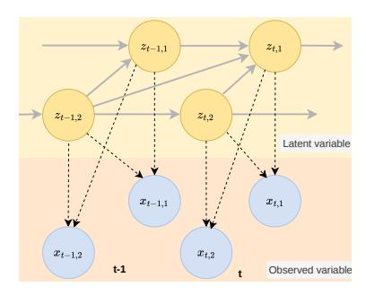
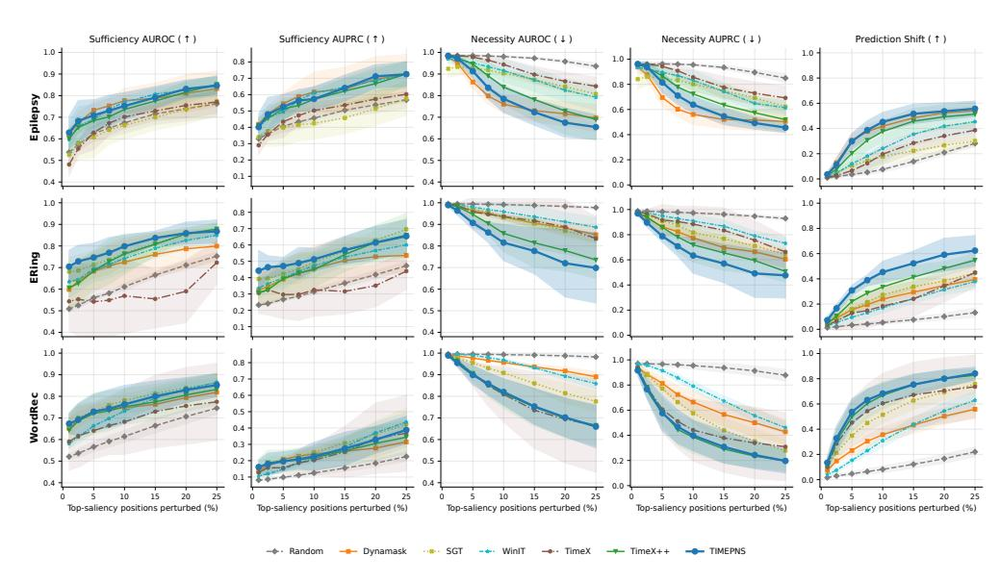
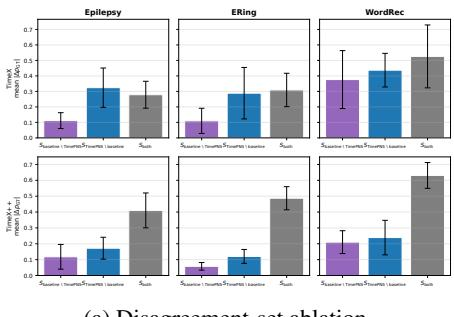
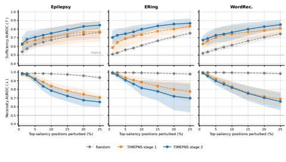

# Beyond Sufficiency: Time Series Explanation with Counterfactual Necessity

- 원제: Beyond Sufficiency: Time Series Explanation with Counterfactual Necessity
- 원문: [https://arxiv.org/abs/2607.21573](https://arxiv.org/abs/2607.21573)
- PDF: [https://arxiv.org/pdf/2607.21573v1](https://arxiv.org/pdf/2607.21573v1)
- arXiv ID: `2607.21573`

---

# Beyond Sufficiency: Time Series Explanation with Counterfactual Necessity

#### Hongnan Ma1 , Yiwei Shi2 , Mengyue Yang2 , Weiru Liu2

1브리스틀 대학교 컴퓨터 과학부 (School of Computer Science, University of Bristol) 2브리스틀 대학교 공학 수학 및 기술부 (School of Engineering Mathematics and Technology, University of Bristol) hongnan.ma@bristol.ac.uk {yiwei.shi, mengyue.yang, weiru.liu}@bristol.ac.uk

# Abstract

충실한 시계열 분류기 설명은 블랙박스 모델의 예측을 보존하는 데 충분할 뿐만 아니라 이를 유지하는 데 필수적인 부분 시퀀스를 식별해야 한다. 그러나 기존의 충족성 중심 방법은 모델의 결정에 필수적이지 않으면서도 예측을 지지하는 허위 부분 시퀀스에 높은 중요도를 부여할 수 있다. 우리는 시계열 설명을 위한 필요성 인식 프레임워크인 TimePNS를 소개한다. 펄의 반사실적 필요성 개념에서 영감을 받은 TimePNS는 시간적 요인에 개입하고 원래 예측이 왜곡되는지를 측정함으로써 해당 요인이 필요한지를 평가한다. 이 프레임워크는 2단계 설계를 채택한다. 단계 I에서는 식별 가능한 인과 생성 과정과 충족성 중심 설명 마스크를 동시에 학습한다. 단계 II에서는 시간적 요인에 반사실적 개입을 수행하여 필요성 신호를 도출하고, 이 신호가 시간적 게이트를 감독하여 초기 설명을 정제한다. 이 과정에서 비필수적 구성요소를 억제하고 반사실적으로 필요한 요소를 강조한다. 합성 및 실제 시계열 벤치마크에서의 실험 결과, TimePNS는 의사결정에 중요한 부분 시퀀스를 보다 정확하게 식별하고 강력한 기준선에 비해 충족성-필요성 균형을 일관되게 개선함을 보여준다.

# 1 Introduction

다변량 시계열에 대한 블랙박스 모델의 예측을 설명하는 것은 의료, 금융, 자율 시스템과 같은 고위험 응용 분야에서 기본적인 요구 사항이다 [\[Morid](#page-9-0) [et al., 2023,](#page-9-0) [Kim et al., 2025\]](#page-9-1). 이러한 환경에서 실무자는 모델의 출력에 실제로 책임이 있는 변수와 시점이 무엇인지 식별해야 시기적절한 개입을 지원하고 자동화된 의사결정 시스템에 대한 신뢰를 구축할 수 있다 [\[Küsters et al., 2020\]](#page-9-2). 대부분의 기존 설명 방법은 입력 시퀀스에 마스킹 및 변형 연산을 적용하고 예측의 변화를 측정하여 서로 다른 변수 또는 시간 구간의 중요도 점수를 추론한다 [\[Crabbé and Van Der Schaar, 2021\]](#page-9-3). 이러한 방법은 원래 예측을 보존하면서도 간결하고 해석 가능한 입력 시퀀스의 부분집합을 추출하는 것을 목표로 한다.

그러나 필요성 및 충분성의 확률(PNS) [\[Pearl,](#page-9-4) [2009\]](#page-9-4)의 관점에서 보면, 기존 방법은 주로 *충분성*을 구현한다: 보존될 때 모델의 원래 예측을 유지하는 데 충분한 하위 시퀀스를 찾는다 [\[Queen et al., 2023,](#page-9-5) [Liu et al., 2024\]](#page-9-6). 이 한계는 특히 실제 시계열에서 문제가 된다. 서로 다른 시간 구간이나 채널이 높은 상관관계를 가질 때, 허위 연관이 발생하여 여러 하위 시퀀스가 모델 예측에 유익한 것처럼 보이게 된다 [\[Zhang et al., 2023\]](#page-10-0). 이러한 경우, *충분성*-기반 설명 방법은 상관관계가 있지만 필수적이지 않은 하위 시퀀스에 높은 중요도를 부여할 수 있어, 모델이 실제로 의존하는 것을 충실히 반영하지 못하는 설명을 초래한다. 새로운 시계열 데이터에 적용할 때, 이러한 취약한 상관관계는 더 이상 지속되지 않을 수 있어, 이러한

분포 변이 하에서 설명은 신뢰할 수 없다 [\[Yang et al., 2023,](#page-10-1) [Schölkopf et al., 2021\]](#page-9-7). 반면, 상호 보완적인 개념인 *필요성*은 상관 관계가 있지만 필수적이지 않은 하위 시퀀스를 걸러내는 추가 기준을 제공한다.

펠의 프레임워크에서 필수성은 반사실적 “what‑if” 질문을 통해 포착된다: 관심 요인이 없었을 때 결과가 발생하지 않을까? [\[Pearl, 2009\]](#page-9-4)? 이 반사실적 관점은 시계열 설명의 개념을 정제한다: 요인이 단순히 블랙박스 모델의 원래 예측을 유지할 수 있기 때문에 설명적이라고 할 수 없으며, 그 요인을 제거하면 예측이 바뀌기 때문이다. Fig. ??는 심근경색(MI) 감지를 위한 ECG 예시로 이 구분을 보여준다. 영향을 받는 리드에서의 ST‑상승 구간은 진단적으로 결정적인 증거이며, 반대 리드에서 관찰되는 상호 ST‑우울은 동일한 기저 조건과 높은 상관관계를 가지는 빈번한 동시 발생 패턴으로, 모델에도 예측적으로 나타난다. 충분성 기반 기준에서는 두 서브시퀀스가 모두 적절한 설명으로 간주될 수 있다. 왜냐하면 둘 중 하나만으로도 원래 예측을 유지할 수 있기 때문이다. 그러나 필수성 기반 분석은 명확한 비대칭성을 드러낸다: ST‑상승에 주로 의존하도록 학습된 모델에서 이 구간을 마스킹하면 예측이 뒤집히지만, 상호 ST‑우울을 마스킹해도 예측은 변하지 않는다.

이 관찰에 동기를 부여받아, 우리는 기존의 충분성 기반 패러다임을 넘어서는 블랙박스 시계열 모델의 설명을 위한 프레임워크인 TimePNS를 제안한다. 그러나 실제로 필수적인 시계열 서브시퀀스를 구별하는 것은 특히 시계열 설정에서 도전적이다. 원시 관측치는 종종 매우 혼합되어 있고, 단순한 입력 수준 반사실적 개입은 기저의 시계열 의존성을 위반할 수 있다 [\[Li et al., 2024\]](#page-9-8). 이 도전을 해결하기 위해 TimePNS는 학습된 인과 잠재 표현을 기반으로 한 두 단계 훈련 절차를 도입한다. 단계 I에서는 마스크 기반 설명자가 블랙박스 모델의 원래 예측을 유지하는 압축된 서브시퀀스를 선택하도록 훈련되고, 인과 표현 분기는 입력을 구조화된 잠재 공간으로 매핑하며 잠재 요인 간의 순간적 및 지연된 인과 메커니즘을 학습한다. 두 번째 단계에서는 필수성 관점에서 초기 설명을 정제한다. 학습된 인과 메커니즘을 바탕으로 TimePNS는 잠재 반사실적 개입을 통해 각 시계열 요인에 대한 부드러운 필수성 점수 확률을 추정한다. 이 점수들은 이후 필수성이 낮은 요인을 걸러내고 결정에 중요한 서브시퀀스로 설명을 정제하는 시계열 게이트를 감독하는 데 사용된다. 이렇게 TimePNS는 원래 예측을 유지하면서 반사실적 필수성에 부합하도록 최종 설명을 유도한다. 주요 기여는 다음과 같이 요약된다: 1) 기존 시계열 설명 방법은 충분성에 주로 초점을 맞추기 때문에 예측적이지만 필수적이지 않은 서브시퀀스를 선택할 수 있음을 보여준다. 2) 우리는 학습된 인과 잠재 공간에서 구조화된 개입을 통해 반사실적 필수성을 추정하는 TimePNS 프레임워크를 제안한다. 3) 실험 결과 TimePNS가 기준 대비 핵심 서브시퀀스 식별을 개선하고, 허위 설명을 억제함을 입증한다.

# 2 Related work (관련 연구)

시계열 설명. 최근 시계열 모델에 대한 설명 방법은 대부분 변형 기반 패러다임을 따릅니다 [\[Crabbé and Van Der Schaar, 2021\]](#page-9-3). 한 연구 방향은 쿼리된 시계열을 직접 변형하고 변형된 입력을 블랙박스 모델에 투입하여 시계열 영역 또는 시간–특성 쌍의 중요성을 추정하는 것입니다. 대표적인 방법으로는 Dynamask [\[Crabbé](#page-9-3) [and Van Der Schaar, 2021\]](#page-9-3)와 Extremask [\[Enguehard, 2023\]](#page-9-9)가 있으며, 이들은 인스턴스별 마스크를 학습하고 모델 예측의 변화를 통해 그 관련성을 평가합니다. 또 다른 연구 방향은 변형을 대리 기반 설명 모델에 통합하는 것입니다. TimeX [\[Queen et al.,](#page-9-5) [2023\]](#page-9-5)는 자기 지도 행동 일관성 목표를 통해 해석 가능한 대리를 학습하고, TimeX++ [\[Liu et al., 2024\]](#page-9-6)는 정보 병목 목표와 설명 조건기를 추가하여 분포 내에서 라벨을 보존하는 설명 인스턴스를 생성합니다. 그러나 이러한 방법들은 대부분 충분성 중심적이며, 원래 예측을 보존할 수 있는 영역을 식별하지만, 그 영역이 모델의 결정에 실제로 필수적인지 여부를 판단하지는 못합니다.

인과적 충분성 및 필요성. PNS는 Pearl의 구조적 인과 모델 프레임워크에서 인과 확률 중 하나로 도입되었으며, PN 및 PS와 함께 제시되었습니다 [Pearl, 2009]. 최근에는 필요성과 충분성에 기반한 아이디어가 불변하거나 견고한 예측 요인을 식별하는 데 채택되고 있으며, 이는 분포 이동 하에서의 표현 학습 [Yang et al., 2023] 및 그래프 OOD 일반화 [Chen et al., 2025]를 포함합니다. PNS는 또한 설명 및 추론 과제에 도입되었습니다. 텍스트 인과적 근거화에서, 근거 선택은 구조적 인과 모델 내에서 공식화되며, 조건부 PNS는 비스푸리어스 근거를 식별하는 데 사용됩니다 [Zhang et al., 2023]. 최근에는 PNS 기반 개입 분석이 개별 Chain-of-Thought 추론 단계가 최종 답변에 대해 인과적으로 필요하고 충분한지를 평가하는 데 사용되었습니다 [Yu et al., 2025]. 그러나 이러한 응용은 일반적으로 토큰이나 추론 단계와 같은 관측 단위에서 작동하며, 이는 직접 개입이 가능합니다. 이 관측 수준의 공식화는 다변량 시계열 설명에는 덜 적합하며, 여기서 원시 하위 시퀀스는 종종 잠재적 인과 요인의 뒤얽힌 혼합물이며 입력 공간의 변동은 순간적 및 지연된 시간적 종속성을 위반할 수 있습니다.

# 3 표기법 및 문제 설정 (Notation and Problem Setup)

우리는 다변량 시계열 인스턴스를 $X \in \mathcal{X} = \mathbb{R}^{T \times D}$ 로 표시하며, 여기서 T는 시계열 단계 수, D는 신호 수를 나타낸다. 시계열 단계 t에서의 관측치는 $x_t \in \mathbb{R}^D$ 로 표시한다. 시계열 단계 i에서 j까지의 연속 하위 시퀀스는 $x_{i:j} \in \mathbb{R}^{(j-i+1)\times D}$ 로 표시한다. $F_\phi: \mathcal{X} \to \mathcal{Y}$ 를 사전 학습된 블랙박스 예측기로 두고, 그 예측 클래스는 $\hat{y}(X) = \arg\max_c F_{\phi,c}(X)$ 로 표시한다. 여기서 c는 클래스 c를 나타낸다. 사후 인스턴스 수준 시계열 설명에서 목표는 $F_\phi$ 가 X에서 예측한 결과를 설명하는 X의 하위 시퀀스 집합을 식별하는 것이다.

**정의 3.1** (Time-Series Mask Matrix). 입력 시계열 $X \in \mathbb{R}^{T \times D}$ 를 주어지면, 우리는 마스크 행렬 $M \in \{0,1\}^{T \times D}$ 를 정의한다. 여기서 $M_{t,d} = 1$ 은 해당 하위 시퀀스가 중요하며 설명에 사용될 수 있음을 나타낸다.

예를 들어, Figure ??에서 노란색과 파란색 하위 시퀀스에 마스크 값 1이 할당되면, 이 하위 시퀀스들이 설명으로 선택된다.

의미 있는 설명을 얻기 위해, 우리는 Sec. 6에서 소개한 충분성 및 필요성 목표 함수와 같은 작업 기반 목표 하에서 설명 마스크 M을 학습한다. 이산 마스크 공간을 직접 최적화하는 것은 계산 불가능하므로, 우리는 확률적 마스킹을 통해 문제를 연속 최적화로 완화한다 [Queen et al., 2023, Liu et al., 2024]. 구체적으로, 설명 추출기 $g_{\theta}(\cdot)$ 은 입력을 베르누이 파라미터로 매핑한다:

$$\pi = g_{\theta}(X) \in [0, 1]^{T \times D}, \qquad M_{t,d} \sim \text{Bernoulli}(\pi_{t,d}).$$

(1)

# 4 Causal Sufficiency and Necessity for Time-Series Explanation (시간 시계열 설명을 위한 인과적 충분성 및 필요성)

우리는 Pearl의 충분성 및 필요성에 대한 반사실적 개념에서 영감을 받아 이러한 설명을 정의한다 [Pearl, 2009]. 이러한 개념을 공식화하기 위해, 우리는 먼저 상호 보완적인 개입 do(M) 과 $do(\bar{M})$ 를 도입한다.

**Definition 4.1** (Mask-induced Intervention) (마스크-유도 개입). 주어진 입력 시계열 $X \in \mathbb{R}^{T \times D}$ 와 Definition 3.1에 있는 마스크 행렬 $M \in \{0,1\}^{T \times D}$ 를 사용하여, 우리는 마스크-유도 개입을 마스크 값이 0인 부분을 기준 샘플 $b \in \mathbb{R}^{T \times D}$ 로 대체하는 것으로 정의한다.

기준 샘플은 분포 $\mathbb{B}_{\mathcal{X}}$ 에서 추출된다. 실제로 우리는 이 분포를 요인화된 가우시안으로 근사한다:

$$\mathbb{B}_{\mathcal{X}} = \prod_{t=1}^{T} \prod_{d=1}^{D} \mathcal{N}\left(\mu_{t,d}, \sigma_{t,d}^{2}\right), \tag{2}$$

여기서 $\mu_{t,d}$ 와 $\sigma_{t,d}^2$ 는 학습 데이터셋에서 추정한 시점 t와 특징 차원 d의 경험적 평균과 분산이다.

우리는 do(M)을 Definition 4.1에 정의된 마스크-유도 개입을 적용하여 얻은 시계열을 나타내는 데 사용한다. 해당 예측은 $\hat{y}^{do(M)}$ 로 표시한다. 반대로, 우리는 $do(\bar{M})$ 를 보완 개입으로 사용하며, 여기서 M에서 값 1인 부분을 기준으로 대체한다. 해당 예측은 $\hat{y}^{do(\bar{M})}$ 로 표시한다.

#### 4.1 Definitions of Sufficiency and Necessity Explanation (충분성 및 필요성 설명의 정의)

**정의 4.2** (충분성의 확률). 설명 마스크 M에 대해, 충분성의 확률(PS)은 다음과 같이 정의된다 $PS(M) = \mathbb{P}\left(\hat{y}^{do(M)} = \hat{y} \mid \hat{y}^{do(\bar{M})} \neq \hat{y}\right)$ , 조건부 사건이 있을 때

비영 확률을 가질 때, 높은 $\mathrm{PS}(M)$ 은 M이 1로 지정한 부분만으로 원래 예측을 보존하는 데 충분함을 나타낸다.

**Definition 4.3** (필요성의 확률 (Probability of Necessity)).  
설명 마스크 M에 대해, 필요성의 확률(PN)은 다음과 같이 정의된다  
$\text{PN}(M) = \mathbb{P}\left(\hat{y}^{do(\tilde{M})} \neq \hat{y} \mid \hat{y}^{do(M)} = \hat{y}\right)$ ,  
조건부 사건이 0이 아닌 확률을 가질 때.  
높은 PN(M)은 M이 1로 지정한 하위 시퀀스의 부분집합이 단독으로 필요함을 나타내며, 이를 제거하면 원래 예측이 바뀐다는 의미이다.

**Definition 4.4** (필요성 및 충분성의 확률 (Probability of Necessity and Sufficiency)). For an explanation mask M, the Probability of Necessity and Sufficiency (PNS) is defined as  $PNS(M) = \mathbb{P}\left(\hat{y}^{do(M)} = \hat{y}, \ \hat{y}^{do(\bar{M})} \neq \hat{y}\right)$ . A high PNS(M) indicates that the subset of subsequences assigned value 1 by M are both sufficient to preserve the original prediction and necessary as removing it changes the original prediction.

# 5 Counterfactual Reasoning for Necessary Explanations (필요성 설명을 위한 반사실적 추론)

우리는 충분성 기반 설명을 위해 표준 마스킹 기반 패러다임을 따릅니다: 설명 추출기 $g_{\theta}$는 입력 시계열에 대한 이진 마스크 M을 학습하여 선택된 항목이 분류기 $F_{\phi}$의 원래 예측을 보존하도록 합니다 [Queen et al., 2023, Liu et al., 2024]. 반대로 필요성 기반 설명은 반사실적이며, 설명에서 선택된 정보를 제거한 뒤 원래 예측이 변하는지를 평가합니다 [Pearl, 2009]. 그러나 시계열에서 관측된 변수는 종종 여러 잠재 요인의 비선형 혼합으로 얽혀 있습니다 [Hyvarinen and Morioka, 2017]. 관측 공간에서 직접 개입하면 동시에 여러 잠재 요인이 변동되어 오프-매니폴드 반사실적을 초래합니다. 따라서 우리는 잠재 인과 공간에서 PN을 추정하며, 여기서 잠재 생성 과정을 모델링하고, 역 메커니즘을 통해 잠재 의존성을 공식화하고, 반사실적 개입을 전파하여 PN 점수를 계산합니다.

#### **5.1** 잠재 인과 생성 과정 (Latent Causal Generative Process)

우리는 다변량 시계열을 [Li et al., 2024]를 따라 근본적인 잠재 인과 과정을 비선형 관측으로 모델링합니다. $X = \{x_t\}_{t=1}^T$ 를 관측 시계열이라고 두면, $x_t \in \mathbb{R}^D$ 입니다. 각 관측 변수는 비선형 관측 함수 $h : \mathbb{R}^d \to \mathbb{R}^D$ 를 통해 잠재 상태 $z_t = (z_{t,1}, \ldots, z_{t,d})^\top \in \mathbb{R}^d$ 에서 생성된 것으로 가정하며, $x_t = h(z_t)$ 가 $t = 1, \ldots, T$ 에 대해 성립합니다.

잠재 생성 과정은 시차 및 순간 의존성을 모두 갖는 시계 구조 인과 모델(SCM)에 의해 지배되며, 이는 그림 1에 나타나 있습니다. 각 잠재 구성요소 $z_{t,i}$ 에 대해, 시차 부모는 시차 창 내의 이전 잠재 상태에서 추출되고, 순간 부모는 같은 시점의 다른 구성요소에서 옵니다. 구체적으로,

그림 1: 잠재 변수 생성 과정. 검은색 점선은 잠재 인과 과정을 나타내고, 회색 선은 혼합 과정을 나타냅니다.

$$z_{t,i} = f_i \Big( Pa^{lag}(z_{t,i}), Pa^{inst}(z_{t,i}), \epsilon_{t,i} \Big), \qquad \epsilon_{t,i} \sim p_{\epsilon_i},$$

(3)

외생 잡음 $\epsilon_{t,i}$ 는 시간과 잠재 차원에 걸쳐 상호 독립적입니다.

#### 5.2 역 메커니즘 학습 (Learning an Inverse Mechanism for Latent Dynamics)

우리는 Eq. (3) 에서 알려지지 않은 전방 구조 메커니즘 $f_i$ 를 명시적으로 학습하기보다는 [Li et al., 2024] 를 따라 역 메커니즘 형식을 채택합니다. 각 잠재 구성요소 $z_{t,i}$ 에 대해, 현재 잠재 상태와 시차 맥락을 재구성된 잔여로 매핑하는 신경망 $r_i$ 를 학습합니다:

$$\hat{\epsilon}_{t,i} = r_i(z_{t-L:t-1}, z_t), \tag{4}$$

여기서 $z_{t-L:t-1}$ 은 최대 시차 L 내의 잠재 이력을 나타내며, $\hat{\epsilon}_{t,i}$ 는 i번째 잠재 구성요소에 대해 회복된 잔여입니다.

역 메커니즘 형식은 $r_i$ 의 야코비안을 통해 잠재 의존성의 지역적 특성을 제공합니다. 구체적으로, 시차 잠재 변수에 대한 도함수, $\frac{\partial r_i}{\partial z_{t-\ell,i}}$, 은

시간 지연 의존성을 나타내며, 반면 동시 잠재 변수에 대한 비대각선 도함수, $\frac{\partial r_i}{\partial z_{t,j}}$ (여기서 $j \neq i$) 는 순간 의존성을 특징짓습니다 [Li et al., 2024].

### 5.3 잠재 반사실적 전파 (Latent Counterfactual Propagation)

주어진 사실적 잠재 시퀀스 $Z=\{z_t\}_{t=1}^T$는 X를 $\operatorname{enc}_\eta$로 인코딩하여 얻은 것이며, 학습된 역 메커니즘 $\{r_i\}_{i=1}^d$와 함께, 우리는 단일 잠재 요인 $z_{\tau,k}$에 개입하여 반사실적 잠재 시퀀스 $Z^{\operatorname{cf}(\tau,k)}$를 구성한다. 이때 $\tau$는 개입 시점, k는 개입된 잠재 요인, $s \geq \tau$는 반사실적 전파 중에 도달한 시점이다. 보다 구체적으로, 각 잠재 요인 i에 대해, 우리는 모든 시점에서 사실적 회수된 잔차를 먼저 계산한다: $\hat{\epsilon}_{s,i}^{\operatorname{factual}} = r_i(z_{s-L:s-1}, z_s)$, $s=1,\ldots,T$. 그 다음 $z_{\tau,k}$를 참조값 $\tilde{z}_{\tau,k}$로 설정하여 개입한다: $\operatorname{do}(z_{\tau,k}=\tilde{z}_{\tau,k})$. SCM 반사실적 공식에 따르면, 이 개입은 $z_{\tau,k}$의 구조 방정식을 할당식 $z_{\tau,k}=\tilde{z}_{\tau,k}$로 대체하고, 개입되지 않은 모든 잠재 변수의 회수된 잔차는 사실적 값으로 고정된다. 순간 그래프의 위상 순서에 따라, $z_{\tau,k}$에 대한 개입은 같은 시점에서 k 이후에 순서가 매겨진 변수와 미래 시점의 변수에만 전파될 수 있다. 따라서 $\tau$ 이전의 상태와 $\tau$ 시점에서 k 이전에 순서가 매겨진 변수는 변하지 않는다: $z_s^{\operatorname{cf}}=z_s$ ($s<\tau$), $z_{\tau,i}^{\operatorname{cf}}=z_{\tau,i}$ (i<k), $z_{\tau,k}^{\operatorname{cf}}=\tilde{z}_{\tau,k}$. 잠재적으로 영향을 받을 수 있는 개입되지 않은 변수 집합을 $\mathcal{D}_{\tau,k}=\{(\tau,i):i>k\}\cup\{(s,i):s>\tau$, $1\leq i\leq d\}$라고 정의한다. 이 변수들에 대해, 우리는 회수된 잔차를 사실적 값으로 고정한다:

$$r_i\left(z_{s-L:s-1}^{\operatorname{cf}(\tau,k)}, z_s^{\operatorname{cf}(\tau,k)}\right) = \hat{\epsilon}_{s,i}^{\operatorname{factual}}, \qquad (s,i) \in \mathcal{D}_{\tau,k}.$$

(5)

전산 가능한 지역 전파 규칙을 얻기 위해, 우리는 사실적 잠재 시퀀스를 중심으로 Eq. (5)를 선형화한다. $\Delta z_{s,i} = z_{s,i}^{\mathrm{cf}(\tau,k)} - z_{s,i}$ 를 정의하고, 시차 변수에 대해 $J_{i,j}^{(\ell)}(s) = \left.\frac{\partial r_i}{\partial z_{s-\ell,j}}\right|_{(z_{s-L:s-1},z_s)}$ 를, 즉각 변수에 대해 $J_{i,j}^{(0)}(s) = \left.\frac{\partial r_i}{\partial z_{s,j}}\right|_{(z_{s-L:s-1},z_s)}$ 를 정의한다. $J_{i,i}^{(0)}(s) \neq 0$ 를 가정하면, 잠재적으로 영향을 받는 각 변수의 왜곡은 다음과 같이 계산된다

$$\Delta z_{s,i} = -\left(\sum_{\ell=1}^{L} \sum_{j=1}^{d} J_{i,j}^{(\ell)}(s) \Delta z_{s-\ell,j} + \sum_{j < i} J_{i,j}^{(0)}(s) \Delta z_{s,j}\right) / J_{i,i}^{(0)}(s), \qquad (s,i) \in \mathcal{D}_{\tau,k}. \tag{6}$$

분자에서 첫 번째 항은 시차 의존성을 통한 전파를 포착하고, 두 번째 항은 위상 순서에 따른 즉각적 의존성을 통한 전파를 포착한다. 선형화된 잔차 보존 제약 조건에서의 유도는 부록 ??에 제공된다.

#### 5.4 Counterfactual Necessity Scoring (반사실적 필요성 스코어링)

카운터팩추얼 잠재 시퀀스는 관측 공간으로 다시 디코딩된다: $X^{\operatorname{cf}(\tau,k)} = \left\{ \operatorname{dec}_{\gamma} \left( z_s^{\operatorname{cf}(\tau,k)} \right) \right\}_{s=1}^T$ . 카운터팩추얼 샘플 $X^{\operatorname{cf}(\tau,k)}$ 은 이후 블랙박스 모델 F에 필요성 점수를 위해 전달된다. 입력 X에 대해, 우리는 잠재 요인 $z_{\tau,k}$의 필요성 점수를 정의한다

$$\Delta p_{\tau,k} = \left[ F_{\phi,\hat{y}(X)}(X) - F_{\phi,\hat{y}(X)}(X^{\text{cf}(\tau,k)}) \right]_{+}, \qquad [a]_{+} = \max(a,0). \tag{7}$$

더 큰  $\Delta p_{\tau,k}$  는  $z_{\tau,k}$  에 개입하면 사실 클래스 신뢰도가 더 크게 감소함을 나타내며, 이는 해당 잠재 요인이 원래 예측을 유지하는 데 더 필요함을 시사한다.

\n#### 6 TimePNS - 신뢰할 수 있는 시계열 설명을 위한 PNS 추정 (TimePNS - PNS Estimation for Faithful Time Series Explanation)\n

조합된 PNS를 직접 최적화하는 것은 계산적으로 비효율적이다. 따라서 우리는 추정 과정을 두 단계로 분리한다: 단계 I에서는 구조화된 잠재 인과 모델과 함께 충분한 설명을 학습하고, 단계 II에서는 해당 잠재 인과 모델에 대한 반사실적 개입을 사용하여 설명을 정제하는 PN 신호를 도출한다.

\n#### 6.1 Stage I: 잠재 인과 메커니즘 학습 및 충분성 지향 설명 (Latent Causal Mechanism Learning and Sufficiency-Oriented Explanation)\n

Latent Causal Mechanism Learning [Li et al., 2024]. 이 분기는 Sec. 5.2에서 소개한 잠재 인과 모델을 학습하며, 이는 단계 II에서 사용되는 구조화된 개입 공간을 제공한다. 입력 시계열 X가 주어지면, 인코더  $\operatorname{enc}_{\eta}$  는 잠재 궤적  $Z = (z_1, \ldots, z_T)$  에 대한 근사 사후분포  $q_{\eta}(Z \mid X)$  를 매개화한다. 이 사후분포에서 샘플링된 잠재 궤적은 입력을 재구성하도록 디코딩된다,  $\tilde{X} = \operatorname{dec}_{\gamma}(Z)$ . 재구성 외에도, 우리는 Eq.4에서 도입된 역 전이 메커니즘  $\{r_i\}_{i=1}^d$  으로 잠재 역학을 정규화한다. 이 역 메커니즘의 야코비안 항목은 지역적 순간적 및 지연된 의존성 점수를 정의하며, 이는 이후 단계 II에서 잠재 반사실적 개입을 전파하는 데 재사용된다. 인과 분기는 다음과 같이 최적화된다

$$\mathcal{L}_{\text{causal}} = \lambda_{\text{rec}} \mathcal{L}_{\text{rec}} + \lambda_{\text{kld}} \left( \mathcal{L}_{\text{kld}}^{\text{normal}} + \mathcal{L}_{\text{kld}}^{\text{future}} \right) + \lambda_{\text{sp}} \left( \| J^{\text{inst}} \|_{1} + \sum_{\ell=1}^{L} \| J^{\text{lag}(\ell)} \|_{1} \right), \quad (8)$$

여기서  $J^{\rm inst}$  과  $J^{{\rm lag}(\ell)}$  은 역 메커니즘의 순간적 및 $\ell$-지연 야코비안 항목을 시간에 따라 수집한다. 재구성 항은 입력에 대한 정보를 보존하고, KL 항은 시간적 인과 사전 하에서 회수된 잔차를 정규화하며, $L_1$ 패널티는 희소 의존성 구조를 장려한다. 사후분포, 잔차 기반 KL 항, 시간적 인과 사전 우도, 야코비안 패널티의 상세 정의는 부록 ?? 에 제공된다.

충분성 지향 설명. 단계 I에서는 정의 3.1의 마스크 형식을 기반으로 한 충분성 지향 마스킹 목표를 사용하여 설명 분기를 학습한다. 설명 추출기  $g_{\theta}$  는 베르누이 파라미터  $\pi = g_{\theta}(X) \in [0,1]^{T \times D}$  를 출력하며, 이는 팩터화된 마스크 분포  $\mathbb{P}_{\pi}(M \mid X) = \prod_{t=1}^{T} \prod_{d=1}^{D} \text{Bernoulli}(M_{t,d}; \pi_{t,d})$  를 정의한다. 전방 패스 중에  $M \sim \mathbb{P}_{\pi}(\cdot \mid X)$  를 샘플링하고, 그라디언트는 직통 추정기(STE) [Jang et al., 2016] 를 사용해 마스크 확률을 통해 전달된다. 모든-일 마스크의 단순성을 피하기 위해, 우리는 마스크 분포를 희소 베르누이 사전  $\mathbb{Q}_{r}(M) = \prod_{t \neq 0}^{T} \text{Bernoulli}(M_{t,d}; r)$  으로 정규화한다:

$$\mathcal{L}_{\text{mask}} = D_{\text{KL}}(\mathbb{P}_{\pi}(M \mid X) \| \mathbb{Q}_{r}(M)) = \sum_{t,d} \left[ \pi_{t,d} \log \frac{\pi_{t,d}}{r} + (1 - \pi_{t,d}) \log \frac{1 - \pi_{t,d}}{1 - r} \right], \quad (9)$$

여기서  $r \in (0,1)$  은 목표 희소성을 제어한다.

우리는 또한 마스크 확률에 총 변동성 패널티를 적용하여 시간적 부드러움을 장려한다,  $\mathcal{L}_{\text{con}} = \frac{1}{D(T-1)} \sum_{d=1}^{D} \sum_{t=1}^{T-1} |\pi_{t+1,d} - \pi_{t,d}|$ . 예측 충분성은 마스크된 입력이 고정된 블랙박스 예측 분포를 보존하도록 유도함으로써 강제된다.

$$\mathcal{L}_{js} = \mathbb{E}_{M \sim \mathbb{P}_{\pi}(\cdot|X), b \sim \mathbb{B}_{\mathcal{X}}} \left[ D_{JS}(F_{\phi}(X) \parallel F_{\phi}(X_{M}(b))) \right],$$

여기서

$$X_M(b) = M \odot X + \bar{M} \odot b$$

그리고 $\bar{M} = 1 - M$ .

Stage I 훈련 목표. Stage I 동안, 인과 분기(causal branch)는 $\mathcal{L}_{\rm causal}$ 를 최소화하고, 설명 분기(explanation branch)는 충분성 지향 목표(sufficiency-oriented objective)인 $\mathcal{L}_{\rm suff} = \lambda_{\rm js}\mathcal{L}_{\rm js} + \lambda_{\rm mask}\mathcal{L}_{\rm mask} + \lambda_{\rm con}\mathcal{L}_{\rm con}$ 를 최소화한다. 여기서 $\mathcal{L}_{\rm js}$, $\mathcal{L}_{\rm mask}$, 그리고 $\mathcal{L}_{\rm con}$ 은 각각 예측 보존(prediction preservation), 희소성(sparsity), 그리고 시간적 부드러움(temporal smoothness)을 나타내며, $\lambda_{\rm js}$, $\lambda_{\rm mask}$, 그리고 $\lambda_{\rm con}$ 은 이들의 상대 가중치를 조절한다.

#### 6.2 필요성 기반 설명 (Necessity-Guided Explanation)

Necessity Supervision Signal. Stage I 사전 훈련 후, 잠재적 반사실적 개입(latent counterfactual interventions)을 사용하여 필요성 감독 신호(nnecessity supervision signal)를 구성한다. $\hat{y} = \arg\max_c F_{\phi,c}(X)$ 를 원래 블랙박스 예측으로 둔다. 필요성 정제(nnecessity refinement)는 Stage I 설명이 이 예측을 보존할 때만 적용되며, 이는 $I_{\text{suff}} = \mathbf{1}[\arg\max_c F_{\phi,c}(X_M) = \hat{y}]$ 로 표시된다. 각 개입 시점 $\tau \in \mathcal{T}_{\text{eval}}$ 및 잠재 요인 k 에 대해, 반사실적 확률 감소 $\Delta p_{\tau,k}$ 를 부드러운 필요성 목표 $\widetilde{\text{PN}}_{\tau,k} = I_{\text{suff}} \Delta p_{\tau,k} \in [0,1]$ 로 변환한다. 이 목표는 시간 게이트를 감독하여 개입이 사실 클래스 신뢰도를 크게 감소시키는 시점-특성 요인에 더 높은 보존 가중치를 부여한다.

Necessity-Guided Temporal Gate. 인과 잠재 경로에 가벼운 게이트 $\rho_{\psi}$ 를 도입한다. $Z^c \in \mathbb{R}^{T \times d}$ 를 주면, 게이트는 $G = \rho_{\psi}(Z^c) \in [0,1]^{T \times d}$ 를 출력하고, 게이트된 잠재 경로 $Z^{\text{gate}} = G \odot Z^c$ 를 생성한다. 여기서 $G_{\tau,k}$ 는 잠재 요인 $z^c_{\tau,k}$ 가 얼마나 보존되는지를 제어한다.

게이트는 두 가지 목표로 학습된다. 첫째, 충분성 유효(mini-batch) $\mathcal{B}_{\text{suff}} = \{b: I_{\text{suff},b} = 1\}$ 에 대해, 분류 앵커 손실 $\mathcal{L}_{\text{clf}}^{\text{gate}} = \frac{\sum_{b \in \mathcal{B}_{\text{suff}}} \text{CE}\left(F_{\phi}(\text{dec}_{\gamma}(Z_b^{\text{gate}})), \hat{y}(X_b)\right)}{\max(|\mathcal{B}_{\text{suff}}|, 1)}$ 를 사용한다.

이 손실은 디코딩된 게이트된 경로가 원래 블랙박스 예측을 보존하도록 유도한다. 둘째, 게이트의 시간 패턴을 부드러운 필요성 목표와 정렬한다: $\mathcal{L}_{\text{align}} = \frac{\sum_{b=1}^{B} \sum_{k=1}^{d} I_{\text{suff},b} \left[1-\cos\tau\left(G_{b,\mathcal{T}_{\text{eval},k}},\widehat{PN}_{b,\mathcal{T}_{\text{eval},k}}\right)\right]}{d\cdot \max\left(\sum_{b=1}^{B} I_{\text{suff},b},1\right)}$. 여기서 $\cos_{\mathcal{T}}$ 는 평가된 시점 $\mathcal{T}_{\text{eval}}$ 에 대해 계산된 중심 코사인 유사도(centered cosine similarity)를 나타낸다. 구체적으로, 두 시간 벡터 $u,v\in\mathbb{R}^{|\mathcal{T}_{\text{eval}}|}$ 에 대해, $\cos_{\mathcal{T}}(u,v) = \frac{(u-\bar{u})^{\top}(v-\bar{v})}{\|u-\bar{u}\|_2\|v-\bar{v}\|_2+\epsilon}$ 로 정의되며, 여기서 $\bar{u}$ 와 $\bar{v}$ 는 u와 v의 시간 평균이며, $\epsilon$ 는 수치 안정성을 위한 작은 상수이다. 마지막으로, $Z^{\text{gate}$ 의 선형 투영을 $g_{\theta}$ 의 표현에 주입하여 필요성 기반 잠재 정보를 최종 마스크 M 으로 정제한다.

2단계 학습 목표. PN-가이드 게이트는 $\mathcal{L}_{\rm necessity} = \mathcal{L}_{\rm clf}^{\rm gate} + \lambda_{\rm cos} \mathcal{L}_{\rm align}$ 으로 최적화되며, 여기서 $\mathcal{L}_{\rm clf}^{\rm gate}$는 예측을 보존하고, $\mathcal{L}_{\rm align}$는 게이트를 필요성 신호와 정렬하며, $\lambda_{\rm cos}$는 정렬 강도를 제어한다.

# 7 실험 (Experiment)

실험은 두 가지 핵심 연구 질문을 중심으로 구성된다:

**RQ1:** TimePNS가 충분하고 필요한 설명을 제공하는가? (Sec. 7.2.1)

**RQ2:** TimePNS가 예측적이지만 불필요한 부분을 제거함으로써 설명을 정제하는가? (Sec.7.2.2)

#### 7.1 실험 설정 (Experiment setup)

우리는 세 개의 합성 데이터셋과 세 개의 실제 데이터셋에서 설명의 품질을 평가한다. 각 지표에 대해 **bold**는 최상의 결과를, <u>underline</u>은 두 번째 최상의 결과를 나타낸다. 모든 결과는 5‑폴드 교차 검증에 대한 평균  $\pm$  표준편차로 보고된다. 본문에서의 모든 실험은 Vanilla Transformer [Vaswani et al., 2017]를 시간 기반 위치 인코딩을 사용한 블랙박스 분류기로 사용하며, 강력한 예측 성능을 보장하도록 하이퍼파라미터를 조정한다.

**데이터셋. (Dataset.)** 우리는 [Queen et al., 2023]에서 제공한 알려진 정답 saliency 점수를 가진 합성 데이터셋에서 우리의 설명자의 성능을 평가한다: FreqShapes, SeqComb-MV, 그리고 Low-VAR. 이 데이터셋들은 다변량 설정에서 다양한 시간 역학을 포괄하도록 신중히 설계되었으며, 서로 다른 시점에서 salient feature를 정확히 식별하는 것이 비선형적이다. 실제 평가를 위해 우리는 UCR Archive [Dau et al., 2019]에서 세 개의 데이터셋을 사용한다: Epilepsy, ERing, 그리고 ArticularyWordRecognition (WordRec), 이들은 다양한 시간 분류 도메인을 포괄한다.

**기준선. (Baselines.)** 우리는 우리의 방법을 여러 기준선과 비교한다. 여기에는 변형 기반 방법인 TimeX [Queen et al., 2023], TimeX++ [Liu et al., 2024], Dynamask [Crabbé and Van Der Schaar, 2021]과, 기울기 기반 방법인 CORTX [Chuang et al., 2023], WinIT [Leung et al., 2021], 그리고 SGT+GRAD [Ismail et al., 2021]이 포함된다.

**평가 지표. (Evaluation Metrics.)** 우리는 두 가지 설정에서 설명을 평가한다. 합성 데이터셋의 경우, 생성된 saliency 맵을 데이터 생성 과정에서 지정된 정답 예측 영역과 비교한다. 이 영역들은 충분하고 필요한 설명 신호로 사용된다. Crabbé and Van Der Schaar [2021]에 따라 AUP, AUR, 그리고 AUPRC를 보고하며, 값이 클수록 정답과의 일치도가 높음을 나타낸다. 실제 데이터셋에서 정답 saliency가 없을 때는 [Queen et al., 2023]을 따르는 차단 기반 평가를 사용한다. 충분성은 상위 p개의 salient feature를 보존하고 예측 보존도를 측정하여 평가하며, AUROC와 AUPRC가 클수록 좋다. 필요성은 상위 p개의 salient feature를 제거하고 나머지 입력의 저하를 측정하여 평가하며, AUROC와 AUPRC가 작을수록 좋다. 자세한 데이터셋 설명, 기준선 구현, 그리고 전체 지표 정의는 부록 ??에 제공된다.

#### 7.2 실험 결과 (Experiment Result)

#### 7.2.1 TimePNS가 충분하고 필요한 설명을 제공한다 (TimePNS produce sufficient and necessary explanation)

표 1은 합성 데이터셋에서 정답 saliency를 가진 설명 품질을 보고한다. TimePNS는 세 개의 데이터셋 모두에서 가장 높은 AUPRC를 달성하며, SeqComb-MV와 FreqShape에서 가장 높은 AUP를 달성한다,

제안된 필요성 인식 정제(necessity-aware refinement)가 눈에 띄는 영역의 순위와 위치 지정(ranking and localization)을 개선한다는 것을 보여준다. 전통적인 방법과 비교할 때, Dynamsk, WINIT, CORTX, 그리고 SGT는 개별 지표에서 경쟁력 있는 결과를 보인다. 예를 들어, SGT의 SeqCombMV에서의 AUR과 CORTX의 FreqShape에서의 AUPRC와 같은 지표가 그렇지만, 이들의 성능은 데이터셋과 지표에 따라 일관성이 떨어진다. 최근 강력한 기준선 중에서 TimeX와 TimeX++는 LowVER에서 최상의 AUR 또는 AUP를 달성하며, 이는 합성 신호가 깨끗하고 명확할 때 충분성 지향적 방법이 효과적일 수 있음을 시사한다. 그럼에도 불구하고 TimePNS는 가장 일관된 AUPRC 향상을 제공하며, 이는 압축적이고 정밀한 설명 서브시퀀스를 식별하는 데 중요하다. 실제 데이터셋에서는 정답(ground-truth) 중요도 주석이 없으므로, 우리는 차폐 기반 충분성 및 필요성 테스트와 함께 Prediction Shift를 사용해 설명을 평가한다. Prediction Shift는 원본과 변형된 예측 분포 사이의 총 변동 거리(total variation distance)로 측정된다. 그림 2에 나타난 바와 같이, TimePNS는 모든 데이터셋에서 가장 우수한 충분성 성능을 달성하며, 이는 상위 순위 위치가 블랙박스 예측을 가장 효과적으로 보존한다는 것을 나타낸다. 필요성 테스트에서는 선택된 위치를 제거한 후 AUROC와 AUPRC가 낮을수록 성능 저하가 크다는 것을 의미하며, TimePNS는 데이터셋 전반에서 가장 강력한 저하를 유발한다. 또한 가장 큰 Prediction Shift를 제공하며, 이는 선택된 위치를 변형할 때 모델 출력에 가장 큰 변화를 일으킨다는 것을 시사한다. 이러한 결과는 TimePNS가 예측을 보존하는 데 충분하고 모델의 원래 동작을 유지하는 데 필요성 있는 위치를 식별한다는 것을 입증한다.

|  | SeqComb-MV |  |  | LowV-ER |  |  | FreqShape |  |  |
|---------|------------------------|-------------------------------------------|------------------------|-------------------------------------------|-----------------------------------|----------------------------------|------------------------|-------------------------------------------|------------------------|
| 방법 | AUPRC (†) | AUP (†) | AUR (†) | AUPRC (†) | AUP (†) | AUR (↑) | AUPRC (†) | AUP (†) | AUR (↑) |
| Dynamsk | $0.3136_{\pm 0.0019}$ | $0.5481_{\pm 0.0053}$ | $0.1953_{\pm 0.0025}$ | $0.1391_{\pm 0.0012}$ | $0.1640_{\pm 0.0028}$ | $0.2106_{\pm 0.0018}$ | $0.2201_{\pm 0.0013}$ | $0.2952_{\pm 0.0037}$ | $0.5037_{\pm 0.0015}$ |
| WINIT | $0.2809_{\pm0.0018}$ | $0.7594_{\pm0.0024}$ | $0.2077_{\pm 0.0021}$ | $0.1667_{\pm0.0015}$ | $0.1140_{\pm 0.0022}$ | $0.3842_{\pm0.0017}$ | $0.5071_{\pm 0.0021}$ | $0.5546_{\pm0.0026}$ | $0.4557_{\pm 0.0016}$ |
| CORTX | $0.3629_{\pm 0.0021}$ | $0.5625_{\pm 0.0006}$ | $0.3457_{\pm 0.0017}$ | $0.4983_{\pm 0.0014}$ | $0.3281_{\pm 0.0027}$ | $0.4711_{\pm 0.0013}$ | $0.6978_{\pm 0.0156}$ | $0.4938_{\pm0.0004}$ | $0.3261_{\pm 0.0012}$ |
| SGT | $0.4893_{\pm 0.0005}$ | $0.4970_{\pm 0.0005}$ | $0.4289_{\pm 0.0018}$ | $0.3449_{\pm 0.0010}$ | $0.2133_{\pm 0.0029}$ | $0.3528_{\pm 0.0015}$ | $0.5312_{\pm 0.0019}$ | $0.4138_{\pm0.0011}$ | $0.3931_{\pm 0.0015}$ |
| TIMEX | $0.6878_{\pm0.0021}$ | $0.8326_{\pm0.0008}$ | $0.3872_{\pm0.0015}$ | $0.8673_{\pm0.0033}$ | $0.5451 _{\pm 0.0028}$ | $0.9004_{\pm 0.0024}$ | $0.8324_{\pm0.0034}$ | $0.7219_{\pm0.0031}$ | $0.6381_{\pm 0.0022}$ |
| TIMEX++ | $0.6663_{\pm 0.0021}$ | $0.8774_{\pm 0.0006}$ | $0.3329_{\pm 0.0012}$ | $0.8957_{\pm 0.0020}$ | $0.8137_{\pm0.0020}$ | $0.8313_{\pm 0.0020}$ | $0.8286_{\pm 0.0022}$ | $0.7431_{\pm 0.0021}$ | $0.6426_{\pm 0.0021}$ |
| TimePNS | $0.7460 _{\pm 0.0015}$ | $\overline{\textbf{0.9189}_{\pm 0.0003}}$ | $0.3156 _{\pm 0.0009}$ | $\overline{\textbf{0.9188}_{\pm 0.0029}}$ | $\underline{0.7579_{\pm 0.0030}}$ | $\overline{0.8034_{\pm 0.0027}}$ | $0.8574 _{\pm 0.0026}$ | $\overline{\textbf{0.7603}_{\pm 0.0020}}$ | $0.6396 _{\pm 0.0021}$ |

Table 1: Synthetic 데이터셋에서의 성능 비교 (Performance comparison on synthetic datasets.)

Figure 2: Epilepsy, ERing, WordRec에서의 실제 occlusion 평가 (Real-world occlusion evaluation on Epilepsy, ERing, and WordRec.)

#### 7.2.2 TimePNS가 설명을 정제한다 (TimePNS refine the explanation)

**불일치-세트 제거 (Disagreement-Set Ablation).** TimePNS가 블랙박스 예측기에 필요한 특징을 식별하는지 추가로 평가하기 위해 불일치-세트 제거 분석을 수행한다. 각 샘플에 대해, 기준선(TimeX 또는 TimeX++)과 TimePNS가 식별한 상위 25%의 눈에 띄는 위치를 선택하고, 이를 각각 $\mathcal{S}_{\text{baseline}}$ 및 $\mathcal{S}_{\text{TimePNS}}$ 로 표시한다. 이후 세 개의 상호 배타적 하위 집합을 구성한다: 기준선에 의해만 선택된 위치, $\mathcal{S}_{\text{baseline}} \setminus \mathcal{S}_{\text{TimePNS}}$ ; TimePNS에 의해만 선택된 위치,

(b) Stage I vs. Stage II.

(a) Disagreement-set ablation.

Figure 3: Ablation experiment (Ablation experiment.)

$\mathcal{S}_{\mathrm{TimePNS}} \setminus \mathcal{S}_{\mathrm{baseline}}$ ; 그리고 두 방법 모두에 의해 선택된 위치, $\mathcal{S}_{\mathrm{both}} = \mathcal{S}_{\mathrm{baseline}} \cap \mathcal{S}_{\mathrm{TimePNS}}$ . 각 집합을 훈련 데이터에서 추정한 가우시안 샘플로 대체하여 제거하고, 그 결과로 인한 실제 클래스 확률 변화, $|\Delta p_{\mathrm{GT}}|$ 를 측정한다. Figure 3a에서 보듯이, TimePNS 전용 위치는 대부분의 설정에서 기준선 전용 위치보다 더 큰 예측 변화를 유발하며, 신뢰 샘플 승률은 6개의 비교 중 5개에서 TimePNS를 선호한다. 공유 집합은 흔히 높은 예측력을 가진 공통 핵심 특징을 포착하지만, 불일치 영역은 주요 차이를 드러낸다: TimePNS에 의해 독점적으로 선택된 위치는 TimeX 또는 TimeX++에 의해 독점적으로 선택된 위치보다 모델의 예측을 보존하는 데 필요할 가능성이 높다.

Stage II Enhances Necessity-Aware Explanations. 두 번째 훈련 단계의 효과를 분리하기 위해, 동일한 충분성 및 필요성 프로토콜을 사용하여 Stage 1과 완전히 훈련된 TimePNS를 비교한다. Figure 3b에서 보듯이, 두 번째 단계는 모든 실제 데이터셋에서 충분성을 일관되게 향상시켜, 선택된 위치가 블랙박스 예측을 더 잘 보존함을 나타낸다. 또한 필요성 AUROC가 낮아져, 선택된 위치를 제거하면 성능이 더 크게 감소함을 의미한다. 필요성 측면에서의 이러한 강한 향상은 필요성 목표가 예측자가 의존하는 위치에 초점을 맞추도록 선명도를 유도함을 시사한다. 이 결과는 Stage I에 대한 필요성 인식 정제 단계로서 두 번째 단계의 역할을 검증한다.

#### 7.3 사례 연구 (Case Study)

Figure ?? in Appendix ??는 대표적인 Epilepsy 샘플을 시각화하여 충분성(sufficiency)과 필요성(necessity) 사이의 불일치를 보여준다. top-50% 마스크를 사용하면, 모든 TimeX-가족 방법은 높은 충분성 점수를 달성하며, 이는 선택된 타임스텝이 원래 예측을 보존할 수 있음을 나타낸다. 그러나 그들의 필요성 행동은 크게 다르다: TimeX가 선택한 타임스텝을 제거하면 거의 신뢰도 하락이 없으며(0.001), 반면 TimeX++와 TimePNS 마스크를 제거하면 각각 0.514와 0.740의 더 큰 하락이 발생한다. 이것은 충분한 마스크라도 여전히 중복될 수 있음을 보여주며, TimePNS는 모델 예측을 유지하는 데 필요한 타임스텝을 더 잘 식별한다.

#### 8 결론 (Conclusion)

우리는 TimePNS를 도입했으며, 이는 시계열 분류기 (time-series classifiers)를 위한 사후 설명 (post-hoc explanation) 프레임워크이며 필요성 인식 (necessity-aware)이다. 주로 블랙박스 예측 (black-box prediction)을 보존할 수 있는 부분 시퀀스 (subsequences)를 찾는 충분성 지향 방법 (sufficiency-oriented methods)과 달리, TimePNS는 잠재적 반사실적 개입 (latent counterfactual interventions)에서 파생된 필요성 신호를 사용해 충분성 보존 마스크 (sufficiency-preserving mask)를 정제함으로써 반사실적 필요성 (counterfactual necessity)을 추가로 통합한다. 합성 및 실제 벤치마크 (synthetic and real-world benchmarks)에서의 실험 결과, TimePNS는 결정에 중요한 부분 시퀀스 (decision-critical subsequences)를 식별하는 데 개선하고 경쟁 기반 (competitive baselines)보다 강력한 충분성-필요성 행동 (sufficiency-necessity behavior)을 달성한다는 것을 보여준다. Ablation 분석 (ablation analyses)은 필요성 지향 정제 (necessity-guided refinement)가 예측적이지만 중복된 영역 (predictive but redundant regions)을 걸러내는 역할을 추가로 검증한다. 한계점은 반복되는 반사실적 개입의 계산 비용 (computational cost)이며, 이는 향후 연구 (future work)와 더 넓은 시간적 아키텍처 (broader temporal architectures)로의 확장과 함께 다루어질 예정이다.

# 참고문헌 (References)

- Xuexin Chen, Ruichu Cai, Kaitao Zheng, Zhifan Jiang, Zhengting Huang, Zhifeng Hao, and Zijian Li. 필요성과 충분성의 확률을 통한 그래프 외부분포에 대한 불변 및 변이 특징 통합. *Neural Networks*, 184:107044, 2025.
- Yu-Neng Chuang, Guanchu Wang, Fan Yang, Quan Zhou, Pushkar Tripathi, Xuanting Cai, and Xia Hu. Cortx: 실시간 설명을 위한 대비 프레임워크. *arXiv preprint arXiv:2303.02794*, 2023.
- Jonathan Crabbé and Mihaela Van Der Schaar. 동적 마스크를 이용한 시계열 예측 설명. *International Conference on Machine Learning*, 2166–2177 페이지. PMLR, 2021.
- Hoang Anh Dau, Anthony Bagnall, Kaveh Kamgar, Chin-Chia Michael Yeh, Yan Zhu, Shaghayegh Gharghabi, Chotirat Ann Ratanamahatana, and Eamonn Keogh. UCR 시계열 아카이브. *IEEE/CAA Journal of Automatica Sinica*, 6(6):1293–1305, 2019.
- Joseph Enguehard. 시계열 예측을 설명하기 위한 변형 학습. *International Conference on Machine Learning*, 9329–9342 페이지. PMLR, 2023.
- Aapo Hyvarinen and Hiroshi Morioka. 시간적으로 종속된 정상 소스의 비선형 ICA. *Artificial intelligence and statistics*, 460–469 페이지. PMLR, 2017.
- Aya Abdelsalam Ismail, Hector Corrada Bravo, and Soheil Feizi. 중요도 기반 훈련을 통한 딥러닝 해석성 향상. *Advances in Neural Information Processing Systems*, 34: 26726–26739, 2021.
- Eric Jang, Shixiang Gu, and Ben Poole. Gumbel-Softmax를 이용한 범주형 재매개화. *arXiv preprint arXiv:1611.01144*, 2016.
- Jongseon Kim, Hyungjoon Kim, HyunGi Kim, Dongjun Lee, and Sungroh Yoon. 시계열 예측을 위한 딥러닝 종합 조사: 아키텍처 다양성 및 개방형 과제. *Artificial Intelligence Review*, 58(7):216, 2025.
- Ferdinand Küsters, Peter Schichtel, Sheraz Ahmed, and Andreas Dengel. 시계열을 위한 신경망 예측의 개념적 설명. *2020 International joint conference on neural networks (IJCNN)*, 1–6 페이지. IEEE, 2020.
- Kin Kwan Leung, Clayton Rooke, Jonathan Smith, Saba Zuberi, and Maksims Volkovs. 시계열 예측에서 특징 중요도의 시간적 종속성. *arXiv preprint arXiv:2107.14317*, 2021.
- Zijian Li, Yifan Shen, Kaitao Zheng, Ruichu Cai, Xiangchen Song, Mingming Gong, Zhengmao Zhu, Guangyi Chen, and Kun Zhang. 순간적 의존성을 가진 시간적 인과 표현식의 식별에 대하여. *arXiv preprint arXiv:2405.15325*, 2024.
- Zichuan Liu, Tianchun Wang, Jimeng Shi, Xu Zheng, Zhuomin Chen, Lei Song, Wenqian Dong, Jayantha Obeysekera, Farhad Shirani, and Dongsheng Luo. Timex++: 정보 병목을 이용한 시계열 설명 학습. *Proceedings of the 41st International Conference on Machine Learning*, 32062–32082 페이지, 2024.
- Mohammad Amin Morid, Olivia R Liu Sheng, and Joseph Dunbar. 의료 분야에서 딥러닝 방법을 이용한 시계열 예측. *ACM Transactions on Management Information Systems*, 14(1): 1–29, 2023.
- Judea Pearl. *Causality*. Cambridge University Press, 2009.
- Owen Queen, Tom Hartvigsen, Teddy Koker, Huan He, Theodoros Tsiligkaridis, and Marinka Zitnik. 자기지도 모델 행동 일관성을 통한 시계열 설명 인코딩. *Advances in Neural Information Processing Systems*, 36:32129–32159, 2023.
- Bernhard Schölkopf, Francesco Locatello, Stefan Bauer, Nan Rosemary Ke, Nal Kalchbrenner, Anirudh Goyal, and Yoshua Bengio. 인과적 표현 학습을 향해. *Proceedings of the IEEE*, 109(5):612–634, 2021.

- Ashish Vaswani, Noam Shazeer, Niki Parmar, Jakob Uszkoreit, Llion Jones, Aidan N Gomez, Łukasz Kaiser, and Illia Polosukhin. Attention이 당신이 필요로 하는 전부다 (Attention is all you need). *Advances in neural information processing systems*, 30, 2017.
- Mengyue Yang, Zhen Fang, Yonggang Zhang, Yali Du, Furui Liu, Jean-Francois Ton, Jianhong Wang, and Jun Wang. 충분하고 필수적인 원인 확률을 통한 불변 학습 (Invariant learning via probability of sufficient and necessary causes). *Advances in Neural Information Processing Systems*, 36:79832–79857, 2023.
- Xiangning Yu, Zhuohan Wang, Linyi Yang, Haoxuan Li, Anjie Liu, Xiao Xue, Jun Wang, and Mengyue Yang. 인과적 충분성 및 필수성이 사슬-사고 추론을 향상시킨다 (Causal sufficiency and necessity improves chain-of-thought reasoning). *arXiv preprint arXiv:2506.09853*, 2025.
- Wenbo Zhang, Tong Wu, Yunlong Wang, Yong Cai, and Hengrui Cai. 신뢰할 수 있는 설명을 향해: 인과적 합리화에 대하여 (Towards trustworthy explanation: On causal rationalization). In *International Conference on Machine Learning*, pages 41715–41736. PMLR, 2023.

