# ElasticTTT: Prior-Preserving Test-Time Tuning for Video Editing

- 원제: ElasticTTT: Prior-Preserving Test-Time Tuning for Video Editing
- 원문: [https://arxiv.org/abs/2607.21529](https://arxiv.org/abs/2607.21529)
- PDF: [https://arxiv.org/pdf/2607.21529v1](https://arxiv.org/pdf/2607.21529v1)
- arXiv ID: `2607.21529`

---

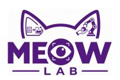

# ElasticTTT: 사전 보존 테스트 타임 튜닝을 통한 비디오 편집

Yueyi Liu1<sup>∗</sup> Chi Zhang1<sup>∗</sup> Sen Cui<sup>2</sup> Miao Liu1† AI 대학, 청화대학교<sup>1</sup> , 베이징 인공지능 학원<sup>2</sup>

[프로젝트 페이지](https://liuyueyi-del.github.io/ElasticTTTprojectpage/) [코드](https://github.com/liuyueyi-del/ElasticTTT-for-video-editing) [데이터셋](https://huggingface.co/datasets/liuyueyi-8/ElasticTTT-video-editing-dataset)

## 초록.

사전 학습된 확산 모델에서의 테스트 타임 튜닝(TTT)은 비디오 편집을 위한 강력한 패러다임으로 부상했다. 그러나 생성 모델의 분포 매핑 특성과 표준 TTT의 단일 포인트 최적화 사이에는 근본적인 불일치가 존재한다. 본 논문에서는 이 불일치가 Prior Collapse를 유발한다는 것을 보여준다. Prior Collapse는 모델이 텍스트 조건과 공간 잠재 변수를 버리고, 생성물을 소스 비디오에 그대로 복제하거나 서로 다른 영역의 특징을 얽히게 만드는 퇴화 상태이다. 이를 해결하기 위해 우리는 사전 생성 분포를 보존하고 생성 유연성을 회복시키는 새로운 프레임워크 ElasticTTT를 제안한다. 구체적으로, 우리는 급격한 기억화 최소화를 방지하기 위한 Target Distribution Regularization, 소스 편향에서 벗어나도록 추론을 유도하는 Contrastive CFG, 그리고 편집되지 않은 영역을 보존하기 위한 Asynchronous Noise Schedule를 제안한다. 광범위한 평가와 이론적 분석을 통해 ElasticTTT가 기반 모델의 생성 사전을 성공적으로 보존하며, 일회성 비디오 편집에서 최첨단 성능을 달성함을 입증한다.

## 1 서론

노이즈 제거 확산 모델의 발전[&#91;18,](#page-14-0) [62&#93;](#page-17-0)은 텍스트-비디오 생성[&#91;21,](#page-14-1) [32,](#page-15-0) [64,](#page-17-1) [74&#93;](#page-17-2)에서 상당한 진전을 가능하게 했다. 이러한 강력한 비디오 생성 백본은 학습된 생성 사전을 활용하여 제어 가능한 비디오 편집의 새로운 기회를 열어준다[&#91;24,](#page-14-2) [50,](#page-16-0) [71&#93;](#page-17-3). 그러나 사용자 제공 소스 비디오는 기성 모델의 고정 학습 분포[&#91;2,](#page-12-0) [5,](#page-13-0) [17,](#page-14-3) [38,](#page-15-1) [70,](#page-17-4) [75,](#page-18-0) [78&#93;](#page-18-1)를 벗어날 수 있으며, 특히 인터넷에서 새로운 개념이 급속히 등장함에 따라 편집 성능이 저하된다. 최근에는 또 다른 연구 방향이 테스트 타임 튜닝(TTT)[&#91;16,](#page-14-4) [24,](#page-14-2) [63,](#page-17-5) [65](#page-17-6)[–67,](#page-17-7) [69&#93;](#page-17-8)을 탐구하여 기성 모델의 가중치를 사용자 제공 소스 비디오 도메인에 맞게 조정하는 것을 목표로 하고 있다.

사전 학습된 모델로 직접 추론을 수행하는 비디오 편집 접근 방식과 비교할 때, TTT는 소스 비디오가 사전 학습 분포와 큰 도메인 격차를 보이는 어려운 시나리오에 특히 적합하다. 이는 TTT가 각 소스 비디오의 특정 내용과 동역학에 모델을 명시적으로 적응시켜 외관, 구조, 움직임의 보존을 향상시키기 때문이다. 비디오 편집을 위한 실용적인 패러다임으로서의 역할 외에도,

<sup>∗</sup> 동일 기여

<sup>†</sup> 교신 저자


<span id="page-1-0"></span>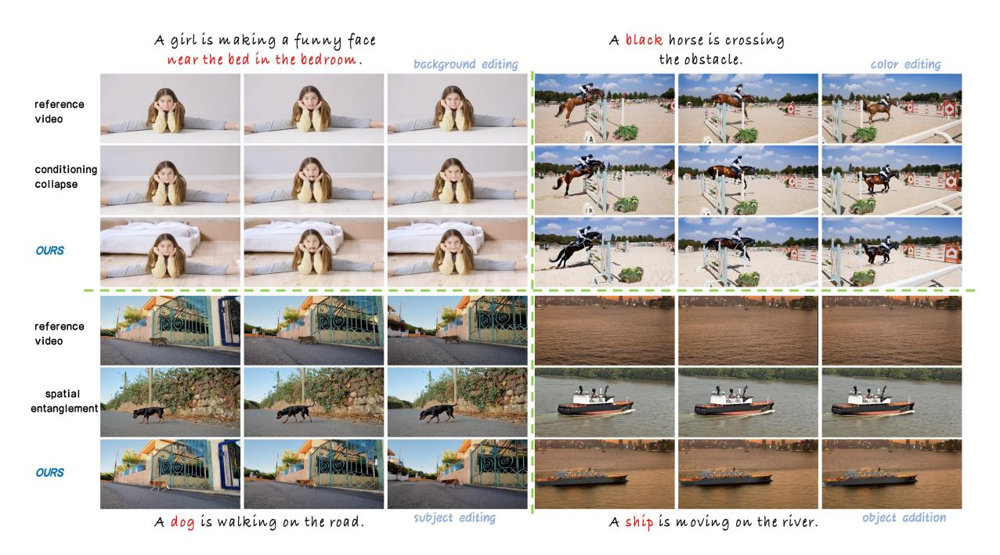

Figure 1. ElasticTTT와 기본 TTT 방법을 네 가지 다른 편집 작업에서 시연한 결과. ElasticTTT는 모든 작업에서 고품질 편집 결과를 얻는 반면, 기본 방법은 명확한 Conditioning Collapse와 Spatial Entanglement을 보인다.

TTT 기반 방법은 또한 대규모 순방향 비디오 편집 모델을 훈련시키기 위해 페어 편집 데이터를 합성하는 효과적인 데이터 엔진으로 기능한다[70,] [77].

Although TTT는 개인화된 사용자 경험을 위한 자연스러운 메커니즘을 제공하지만 [4,] [12,] [35,] [58] 확산 과정과 본질적인 긴장을 초래한다: TTT는 의도적으로 인스턴스별 과적합을 장려하는 반면, 확산 과정은 본질적으로 확률적이며 분포 다양성을 보존하도록 설계되었다. 특히, 고도로 매개변수화된 확산 모델을 이 무분산 단일성에만 최적화하면 우리는 “prior collapse”라고 부르는 실패 모드가 쉽게 발생할 수 있다. Figure 1에 나타난 바와 같이, prior collapse는 두 가지 상호 보완적인 실패 현상으로 나타난다. Conditioning Collapse는 조건부 가이던스가 튜닝 중에 소스-조건화된 동역학에 고정될 때 발생하며, 이는 효과적인 의미 제어를 방해하고 모델이 대상 편집 지침을 무시하도록 만든다. Spatial Entanglement는 노이즈 제거 과정에서 공간 표현이 전역적으로 결합될 때 발생하며, 이는 국소 제어를 방해하고 대상 영역 외부에서 원치 않는 수정을 초래한다.

이러한 도전을 우회하기 위해 이전 연구들은 다양한 개입 방안을 제안했다. Conditioning Collapse를 완화하기 위해, 기존 연구들은 종종 low-rank adaptation (LoRA) [13], prior-preservation losses [58], self-supervised objectives [66], 또는 텍스트와 null-text 임베딩의 독립적 최적화 [12, 49]에 의존한다. Spatial Entanglement를 해결하기 위해, 방법들은 일반적으로 침습적 어텐션 맵 수정 [36, 79], 마스킹된 최적화 단계 [13], 또는 깊이(depth)와 광학 흐름(optical flow) 같은 외부 제어 신호 주입 [67]을 사용한다. 그러나 이러한 접근 방식은 근본적으로 최적이 아니며, 그 복잡성 때문에 섬세한 아키텍처 튜닝에 크게 의존하고, 보조 데이터셋을 필요로 하거나 하이퍼파라미터 선택에 위험하게 민감하다.

더욱 중요한 것은, Test-Time Tuning (TTT)가 소스 이미지를 직접 미세 조정하여 이미지 편집에서 막대한 가능성을 보여주었음에도 불구하고, TTT를 비디오에 적용하는 것은 현저히 드물고 어려움이 많다는 점이다. Video Diffusion Transformers는 매우 복잡한 시공간 priors를 가지고 있으며, 이미지 기반 TTT 최적화 기법을 비디오 모델에 그대로 옮기는 것은...


이것은 Prior Collapse를 심각하게 가속화한다. 네트워크는 소스 비디오의 결정론적 움직임과 외형에 빠르게 과적합되어, 정밀하고 정확한 편집에 필요한 생성적 탄력을 잃게 된다.

이러한 근본적인 최적화–샘플링 긴장을 해결하기 위해, 우리는 ElasticTTT를 제안한다. ElasticTTT는 생성적 탄력을 회복하고 Prior Collapse의 증상을 명시적으로 치료하도록 설계된 원칙적인 프레임워크이다. 이러한 실패를 단일한 아티팩트로 다루는 대신, ElasticTTT는 전체 생성 파이프라인에 걸쳐 개입한다. 첫째, 최적화 중 Conditioning Collapse를 방지하기 위해 Target Distribution Regularization을 도입한다. 엄격하고 단일 지점을 가진 목표를 제어된 확률성을 통해 부드럽게 완화함으로써, 모델이 소스 비디오를 기억하도록 방지하고 그 탄력적 노이즈 제거 priors를 보존한다. 그러나 튜닝된 가중치가 여전히 소스 개념으로의 잔여 이동을 보이는 만큼, 추론 시 Contrastive Classifier-Free Guidance를 적용하여 궤적을 강제로 목표 조건으로 이끈다. 마지막으로 Spatial Entanglement를 해결하기 위해, 샘플링 과정에 Asynchronous Noise Schedule를 도입한다. 이는 편집된 영역과 고정된 영역에 독립적인 확산 궐적을 동적으로 할당하여 잠재 표현을 명확히 하고, 모델이 새로운 개념을 렌더링하면서 편집되지 않은 주변을 안전하게 보존할 수 있는 국소적 자유를 부여한다.

우리는 프레임워크의 효과를 검증하기 위해, 다양한 편집 작업 범위에 걸쳐 광범위한 실험을 수행합니다. 우리의 결과는 ElasticTTT가 이전의 붕괴 문제를 성공적으로 해결했으며, 견고한 생성 탄성, 정확한 지시 준수, 그리고 원본 비디오의 고충실도 보존을 보여준다는 것을 입증합니다. 정량적 및 정성적 평가 모두에서 ElasticTTT는 추론 전용, 테스트 타임 튜닝, 그리고 훈련 기반 접근법을 아우르는 경쟁적 기초 모델들을 지속적으로 능가하며, 궁극적으로 비디오 편집에서 최첨단 성능을 달성합니다.

## 2 관련 연구 (Related work)

### 2.1 테스트 타임 튜닝 오브 디퓨전 모델스 (Test-Time Tuning of Diffusion Models)

테스트 타임 튜닝(TTT) [&#91;63,](#page-17-5) [65&#93;](#page-17-6)은 사전 훈련된 디퓨전 모델을 추론 시에 업데이트하여, 맞춤형 및 개인화 생성 [&#91;4,](#page-13-1) [12,](#page-13-2) [35,](#page-15-2) [58&#93;](#page-16-1), 스타일화된 생성 [&#91;8,](#page-13-4) [59,](#page-16-4) [68,](#page-17-10) [76&#93;](#page-18-4), 그리고 테스트 타임 스케일링 [&#91;45&#93;](#page-15-4)과 같은 작업을 수행합니다. 생성 편집의 경우, TTT는 특정 참조 비디오를 재구성하여 고충실도 기준점을 설정하지만, 단일 참조에 대해 모델을 단순히 최적화하면 성능이 악화되는 경우가 많습니다 [&#91;58&#93;](#page-16-1). 이전 연구들은 저랭크 적응 [&#91;12,](#page-13-2) [13&#93;](#page-13-3), 추가 사전 보존 손실 [&#91;58&#93;](#page-16-1), 텍스트 임베딩만 최적화 [&#91;12&#93;](#page-13-2) 또는 널-텍스트 임베딩 [&#91;49&#93;](#page-16-2), 혹은 자기-감독 신호를 도입 [&#91;66&#93;](#page-17-9)하여 이 문제를 완화하려고 시도했습니다. 그러나 이러한 개입은 특히 고매개변수화된 텍스트-투-비디오 모델에서 문제를 완전히 해결하지 못하며, 새로운 편집 지시를 따르는 것과 원본 비디오의 세부 사항을 보존하는 것 사이에 제로-섬 타협을 초래하는 경우가 많습니다 [&#91;64&#93;](#page-17-1).

### 2.2 Video Editing

비디오 편집은 새로운 의미적 개념을 원활하게 통합하거나 기존 기능을 수정하면서 소스 비디오의 편집되지 않은 구조를 보존해야 한다. 기존 방법은 일반적으로 세 가지 패러다임으로 나뉜다. 학습 기반 방법 [2,] [5,] [17,] [38,] [70,] [71,] [75,] [78]은 짝 데이터셋에서 비디오 생성 모델을 미세 조정하지만, 데이터 부족과 새로운 개념에 대한 일반화 한계, 그리고 학습에 필요한 막대한 계산 자원이라는 문제를 겪는다. 학습 없이 수행되는 방법 [1,] [10,] [15,] [26,] [33,] [34,] [42,] [72]은 역확산 방법 [47,] [60]을 통해 사전 학습된 프라이어를 활용하거나, 주의(attention) 맵을 조작 [36,] [42,] [48]하거나 사전 학습된 이미지 편집 모델 [13,] [33,] [42,] [52]을 활용함으로써 데이터 요구를 우회하지만, 고정된 모델 파라미터와 샘플링 궤적 길이 때문에 의미 정렬과 참조 보존을 균형 있게 수행하기 어렵다. 테스트 타임 튜닝(TTT) 방법 [16,] [24,] [43,] [69]은 소스 비디오에 직접 베이스 모델을 튜닝함으로써 외부 데이터셋을 사용하지 않고 소스 재구성을 개선하여 이 격차를 메운다. 그러나 비디오 편집에 TTT를 직접 적용하면 프라이어 붕괴(prior collapse) 문제가 발생하는데, 우리는 본 연구에서 체계적인 해결책을 제시한다. 자세한 내용은


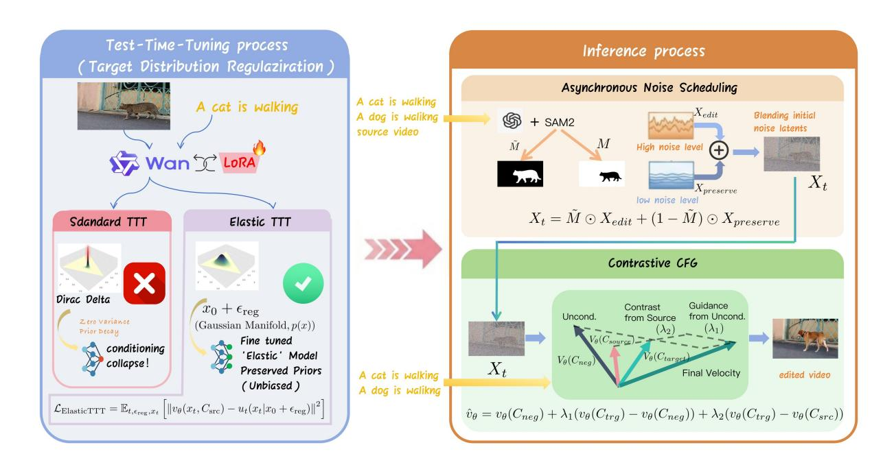

Figure 2. ElasticTTT의 전체 파이프라인. Conditioning Collapse를 해결하기 위해, 우리는 훈련 중에 TDR를 통해 최적화 목표를 완화하고, 샘플링 중에 Contrastive CFG를 통해 샘플링 과정을 소스 분포에서 멀어지게 한다. Spatial Entanglement을 완화하기 위해, 우리는 비동기 노이즈 스케줄링을 수행하여 서로 다른 영역에 대해 독립적인 통합 경로를 설정한다.

관련 연구는 Supplementary에 제시되어 있다.

## 3 Method (방법)

소스 비디오 Vsrc와 그에 대응하는 설명 텍스트 프롬프트 Csrc가 주어졌을 때, 비디오 편집의 목표는 사용자 제공 대상 프롬프트 Ctrg와 일치하도록 타깃 비디오 Vtrg를 생성하면서 Vsrc의 기본 구조적 및 시간적 역학을 보존하는 것이다. 표준 비디오 편집 모델은 고정된 조건부 분포 pθ(Vtrg | Vsrc, Ctrg)에서 θ라는 고정된 파라미터를 사용해 샘플링한다. 반면 테스트 타임 튜닝 접근법은 먼저 소스 입력에 대해 θ′ = A(θ; Vsrc, Csrc)를 통해 모델 파라미터를 적응시키고, 그 다음에 인스턴스-적응 분포 p<sup>θ</sup>′(Vtrg | Vsrc, Ctrg)에서 샘플링하여 원하는 편집 프롬프트 하에서 더 강력한 정체성 보존과 장면별 일관성을 허용한다.

구체적으로, 첫 번째 단계에서 모델은 잠재 공간에서 동작하며, 노이즈가 가해진 잠재 x<sup>t</sup>에서 타임스텝 t에 대해 예측된 속도 v<sup>θ</sup>와 목표 조건 벡터 필드 u<sup>t</sup> 사이의 MSE 손실을 최소화하여 소스 비디오 잠재 x<sup>0</sup>를 재구성하도록 최적화된다:

$$\mathcal{L}_{\text{TTT}} = \mathbb{E}_{t,x_t} \left[ \| v_{\theta}(x_t, t, C_{\text{src}}) - u_t(x_t \mid x_0) \|^2 \right]$$

(1)

모델이 미세 조정된 후, inference는 DDIM 역전환 [&#91;60&#93;](#page-16-6)을 통해 획득한 노이즈가 가해진 잠재에서 시작되며, 대상 프롬프트 Ctrg를 활용해 Vtrg 생성을 안내한다.

### 3.1 The Optimization–Sampling Tension (최적화–샘플링 긴장)

표준 TTT는 참조 비디오의 시공간적 특징을 포착하지만, 확산 모델의 생성적 특성과 근본적인 불일치를 초래한다. 확산 모델은 데이터 분포 간 매핑을 학습하고, 생성적 유연성을 보존하기 위해 다양한 샘플에 의존한다. 그러나 TTT에서는 훈련 데이터의 분포가 단일 인스턴스로 붕괴되어 사실상 Dirac 델타 분포, 즉 p(x) = δ(x − x0)로 퇴화된다.


<span id="page-4-0"></span>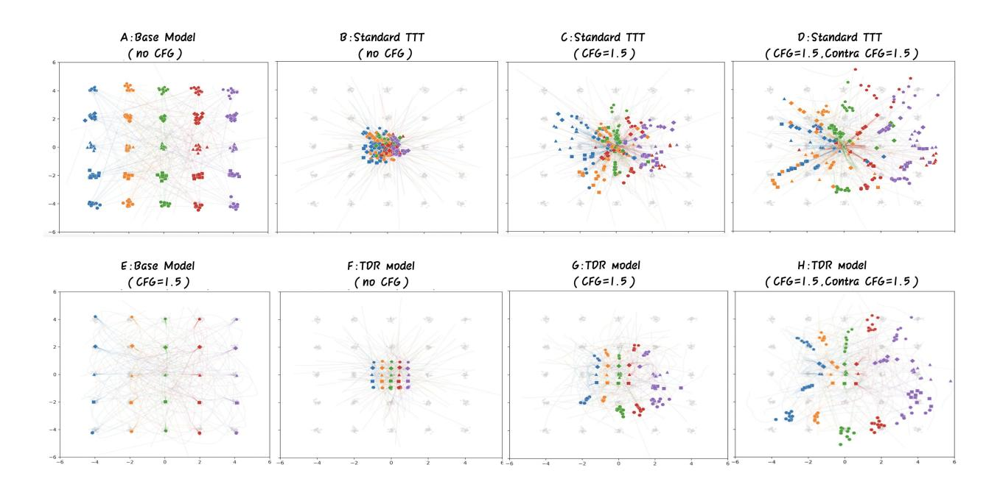

Figure 3. 2D 장난감 실험으로, TDR과 Contrastive CFG의 효과를 보여준다. 표준 TTT에서는 기본 모델(A)의 생성 분포가 최적화 목표(B) 주변으로 붕괴되고, CFG가 적용될 때(C, D) 혼돈으로 퍼진다. TDR을 사용하면 생성 분포가 원래 구조(F)를 유지하고, Contrastive CFG가 도입된 분포 변화를 추가로 상쇄한다(G, H).

이러한 단일 포인트 분포에서 고도로 매개변수화된 확산 모델을 최적화하면 우리는 'prior collapse'라 부르는 실패 모드가 쉽게 발생할 수 있다: 모델은 소스 비디오의 고주파 픽셀 수준 세부 사항에 과적합되어, 일반화 가능한 조건 인식 디노이징보다 정확한 재구성을 우선시한다. 우리는 이 현상을 조사하기 위해 예시 실험을 수행했으며, 이는 [Figure 3:](#page-4-0)에 나타나 있다. 기본 확산 모델은 25개의 클래스가 있는 분포(A)에서 훈련되었고, TTT는 중앙 클래스의 한 샘플에서 수행되었다. 다른 클래스 조건으로 inference를 수행하면 모델은 단순히 조건을 우회하고, 기억된 목표 분포(B) 주변에 혼돈 클러스터를 생성한다.

형식적으로, 비디오 디퓨전 모델에서 네트워크는 노이즈가 있는 잠재 변수 \(x^{t}\)와 텍스트 조건 \(C_{\text{src}}\)를 기반으로 속도 필드 \(v_{\theta}(x^{t}, t, C_{\text{src}})\)를 예측한다. 대규모 사전 학습된 모델이 사전 분포를 완전히 붕괴시키지는 않지만, 여전히 \(x^{t}\)와 \(C_{\text{src}}\)의 의미 있는 변화를 우회하도록 점진적으로 학습하며, 대신 소스 비디오의 고주파 세부 정보를 매개변수에 하드코딩하여 두 모달리티에 걸친 편집 성능을 저하시킨다:

- 조건화 붕괴: 정적 텍스트 프롬프트 Csrc에 반복적으로 업데이트함으로써 모델은 점차 텍스트 조건 경로를 약화시킨다. 이로 인해 모델은 추론 시 대상 프롬프트 Ctrg를 무시하게 되어 의미적 탄력성을 잃고, 새로운 텍스트 지침을 따르기보다 소스 개념에 고정된다 [(Figure 1](#page-1-0) 첫 번째 행).

- 공간적 얽힘: 노이즈가 있는 입력 x<sup>t</sup>를 점점 우회하여 전역 목표를 기억함으로써 모델은 x<sup>t</sup>에서 의미적으로 의미 있는 공간 표현을 추출하는 능력을 저하한다. 그 결과, 구별되는 의미 객체는 경계를 잃어 특정 영역을 편집하려 할 때 심각한 시각적 손상과 얽힘을 초래한다 [(Figure 1](#page-1-0) 두 번째 행).

중요하게도, prior collapse는 과적합과 동일하지 않다: TTT는 원본 특성을 포착하기 위해 제어된 과적합을 의도적으로 장려하며, 반면 prior collapse는 생성 행동이 붕괴되고 편집 제어 가능성이 상실되는 퇴화된 영역을 나타낸다.

To resolve this foundational mismatch, we propose ElasticTTT, a novel pipeline that preserves the


generative prior.  
우리는 Training 중에 Conditioning Collapse를 완화하기 위해 최적화 목표를 연속적 지역 분포로 부드럽게 하며(Section 3.2), 그리고 contrastive classifier-free-guidance를 통해 생성이 source condition에서 멀어지도록 하여 남은 conditioning bias를 해결한다(Section 3.3).  
우리는 inference 중에 Spatial Entanglement를 해결하기 위해 비동기 잡음 수준으로 서로 다른 영역을 동적으로 처리한다(Section 3.4).  
다음 섹션에서는 이 세 가지 방법의 수식들을 자세히 설명한다.

### <span id="page-5-0"></span>타깃 분포 정규화: 디랙 특이점 탈출 (3.2 Target Distribution Regularization: Escaping the Dirac Singularity)

표준 TTT의 Prior Collapse의 근본 원인은 목표 데이터의 Dirac delta 분포 $p_{data}(x) = \delta(x - x_0)$의 엄격하고 결정론적인 특성에 있다. 생성적 prior가 이 날카로운 특이점으로 붕괴되는 것을 방지하기 위해 우리는 *Target Distribution Regularization* (TDR)를 도입한다.

TDR의 핵심 통찰은 최적화 대상에 제어된 확률성을 *엄격히* 주입하면서 입력 경로를 완전히 깨끗하게 유지하는 것이다.

구체적으로, 깨끗한 원본 비디오 $x_0$와 표준 가우시안 잡음 샘플 $x_1 \sim \mathcal{N}(0, I)$가 주어지면, 우리는 표준 흐름 매칭과 동일하게 중간 노이즈 잠재 변수 $x_t$를 $x_t = tx_1 + (1 - t)x_0$로 구성한다.

그러나 감독을 위한 목표 속도를 계산할 때, 우리는 결정론적 목표 $x_0$를 왜곡된 버전 $\tilde{x}_0$로 교체한다 :

$$\tilde{x}_0 = x_0 + \epsilon_{\text{reg}}, \quad \epsilon_{\text{reg}} \sim \mathcal{N}(0, \sigma_{\text{reg}}^2 I)$$

(2)

그런 다음 다음과 같이 업데이트된 최적화 목표가 있습니다  $u_t(x_t|\tilde{x}_0) = x_1 - \tilde{x}_0$ . 모델 입력  $x_t$  는 원본의 변형되지 않은  $x_0$  를 사용해 보간되며, $\epsilon_{\text{reg}}$  와는 완전히 독립적입니다.

핵심적으로, 이 확률적 주입은 모델의 근본적인 최적화 목표를 변경하지 않는다. 원래의 흐름 매칭 프레임워크 [41]에서는 네트워크가 속도 필드의 조건부 기대값을 예측하도록 훈련된다:

$$v^*(x_t, t) = \underset{v}{\arg\min} \mathbb{E}_{t, x_0, x_1} \left[ \|v(x_t, t) - u_t(x_t \mid x_0)\|^2 \right] = \mathbb{E}_{x_0 \mid x_t} \left[ u_t(x_t \mid x_0) \right]$$

(3)

표준 흐름 매칭 경로는 목표 데이터에 대해 선형인 속도장을 구성하기 때문에 (즉, $u_t(x_t|\tilde{x}_0) = x_1 - \tilde{x}_0 = x_1 - x_0 - \epsilon_{\text{reg}} - x_t = u_t(x_t|x_0) - \epsilon_{\text{reg}}$ ), 네트워크 $v_{\theta}$ 를 이 변형된 속도장을 예측하도록 훈련하면 새로운 최적 벡터장 $\tilde{v}^*(x_t, t)$ 가 다음과 같이 평가된다:

$$\tilde{v}^*(x_t, t) = \mathbb{E}_{x_0, \epsilon_{\text{reg}} \mid x_t} \left[ u_t(x_t \mid \tilde{x}_0) \right] = \mathbb{E}_{x_0, \epsilon_{\text{reg}} \mid x_t} \left[ u_t(x_t \mid x_0) - \epsilon_{\text{reg}} \right]$$

$$\tag{4}$$

$$= \mathbb{E_{x_0 \mid x_t}} \left[ u_t(x_t \mid x_0) \right] - \mathbb{E}_{\epsilon_{\text{reg}}} \left[ \epsilon_{\text{reg}} \right] = v^*(x_t, t)$$

(5)

주입된 노이즈 $\epsilon_{\text{reg}}$ 는 평균이 0인 독립적으로 샘플링되며, 이는 변형이 기대값에서 편향되지 않도록 보장한다. 따라서 정규화된 목적함수의 전역 최소값은 원본 비디오의 실제 벡터장과 완벽히 정렬된다.

Figure 3의 장난감 실험에서 보듯이, 붕괴된 분포(B)를 생성하는 대신 TDR 모델의 생성은 사전 분포(F)의 구조를 보존하여 도입된 확률성의 중요성을 강조한다. 기대값이 동일하게 유지되지만 분산 $\sigma_{\text{reg}}^2$ 는 최적화 역학을 근본적으로 바꾼다. 엄격한 Dirac 델타 점을 연속적인 지역 가우시안 매니폴드로 대체함으로써, 우리는 손실 지형에 기하학 인식형 분산 패널티를 도입한다. 따라서 모델은 무한히 날카롭고 강직한 공간 매핑 $x_0$ 를 게으르게 기억함으로써 손실을 최소화하지 않는다. 대신, 노이즈 제거 모델로서 탄성 특성을 유지하고 보다 넓고 일반화된 최소값을 찾는다. 결과적으로 모델은 광범위한 미세 조정 단계 이후에도 목표 텍스트 프롬프트를 견고하게 따르며, 편집 유연성을 크게 증가시키고 TTT 과정을 안정화한다. 보다 수학적인 설명은 보충 자료 A절에 제시된다.

### <span id="page-5-1"></span>3.3 대조적 분류자-프리-가이드(Contrastive Classifier-Free-Guidance):

Figure 3 (F)에서 TDR 이후에도 사전 분포의 구조는 보존되지만, 생성된 포인트는 여전히 TTT에서 훈련된 소스 분포에 더 가까이 그려진다. 같은 현상이 발생한다


<span id="page-6-1"></span>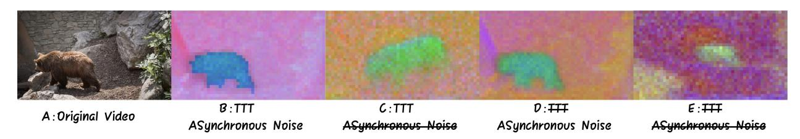

Figure 4. PCA [22] 시각화 of the DiT 잠재 표현. TTT가 Async-NS 없이 적용될 때, 표현이 흐려지고 모델이 참조 비디오의 구조를 포착하지 못한다. Async-NS는 모델이 명확하고 정렬된 표현을 추출하도록 한다

비디오 확산 모델에서: TDR 이후, 모델은 더 이상 Csrc를 우회하고 참조 비디오를 완전히 기억하지 않지만, 생성된 분포는 여전히 소스 분포로 이동하며, 참조 비디오에 도입된 개념을 렌더링하는 경향을 보인다.

분포 이동을 더 완전히 취소하고, 훈련 중 모델에 심어진 소스 비디오의 개념을 분리하기 위해 우리는 Contrastive Classifier-Free-Guidance, 즉 향상된 Classifier-Free-Guidance (CFG)를 제안한다. 이 방법은 소스 조건을 부정적 제약으로 적극 활용한다. 표준 CFG [19]는 조건부와 무조건부 예측 사이에 분포 이동을 만들어 생성 과정을 유도하려 한다:

$$\hat{v}_{\theta}(x_t, t, C_{\text{trg}}) = v_{\theta}(x_t, t, C_{\text{neg}}) + \lambda \left( v_{\theta}(x_t, t, C_{\text{trg}}) - v_{\theta}(x_t, t, C_{\text{neg}}) \right)$$

(6)

where Cneg는 일반적으로 빈 또는 일반적인 부정 프롬프트이며, λ는 가이드 스케일이다. 내재된 최적화 편향을 더욱 억제하기 위해, 우리는 이 가이던스를 삼방향식 공식으로 확장한다. 우리는 원본 프롬프트 Csrc를 활용한 보조 부정 제약을 도입함으로써 대상과 소스를 명시적으로 대비시켜 이들 사이에 의미적 대립을 설정한다:

$$\hat{v}_{\theta}(x_t, t, C_{\text{trg}}) = v_{\theta}(x_t, t, C_{\text{neg}}) + \lambda_1 \left( v_{\theta}(x_t, t, C_{\text{trg}}) - v_{\theta}(x_t, t, C_{\text{neg}}) \right) + \lambda_2 \left( v_{\theta}(x_t, t, C_{\text{trg}}) - v_{\theta}(x_t, t, C_{\text{src}}) \right)$$

(7)

여기서 λ¹은 표준 무조건 가이던스를 제어하고, λ²는 소스와 타깃 조건 사이의 의미적 대비 강도를 조절한다.

두 조건을 대비시킴으로써 Contrastive CFG는 이들 사이의 의미적 차이를 분리하고 증폭시켜 샘플링 대상이 소스 분포에서 멀어지도록 한다. [Figure 3,](#page-4-0)에서 보듯이, 단순히 속도를 타깃 조건으로 끌어당기는 표준 CFG(G)를 적용하면 기억된 소스의 잔여 중력에 의해 생성 분포가 거의 변하지 않는다. 반면, 우리의 Contrastive CFG(H)는 생성 과정을 소스 개념에서 적극적으로 밀어내며, 이 적극적인 대비는 선명한 의미 전환을 보장하고 모델의 생성 탄력성을 완전히 회복시킨다.

### <span id="page-6-0"></span>3.4 Asynchronous Noise Scheduling (비동기 잡음 스케줄링)

TDR와 Contrastive CFG가 Conditioning Collapse를 치료하지만, 미세 조정된 네트워크는 여전히 Spatial Entanglement에 취약하다. 조정된 네트워크는 노이즈가 가미된 입력 xᵗ를 우회하고 직접 x0를 기억하도록 학습하기 때문에, 국소적이고 의미가 풍부한 공간 표현을 추출하지 못한다. [Figure 4](#page-6-1) (C)에서 시각화된 바와 같이, 추론 시 표현이 흐릿해지고 소스 비디오와 정렬이 맞지 않으며 전경과 배경이 과도하게 얽혀 있다.

많은 기존 접근법은 attention map을 수정[&#91;36,](#page-15-3) [79&#93;](#page-18-3), 사전 편집된 이미지를 가이드로 사용[&#91;13,](#page-13-3) [33,](#page-15-5) [42&#93;](#page-15-7)하거나 마스크를 사용해 최적화 단계에 개입[&#91;13,](#page-13-3) [66&#93;](#page-17-9)함으로써 Spatial Entanglement을 완화하려 한다. 그러나 이러한 복잡한 방법은 종종 전역 구조적 일관성을 저해한다. 반면, 우리는 Asynchronous Noise Scheduling (Async-NS)를 제안한다. 이는 추론 시점에서 편집 영역과 고정 영역의 통합 궤적을 분리함으로써 Spatial Entanglement을 깔끔하게 회피하는 전략이다.


우리의 핵심 통찰은 시간적 균일성이 Spatial Entanglement을 악화시킨다는 점이다. 전체 잠재 변수를 단일 시점 t에서 평가하면 네트워크가 기억된 출력을 그대로 사용하게 된다. 편집 영역과 고정 영역에 서로 다른 노이즈 수준과 시간 임베딩을 명시적으로 할당함으로써, 우리는 표현의 얽힘을 물리적으로 끊는다. Figure 4 (B)에서 확인할 수 있듯이, 이 시간적 비대칭은 네트워크가 영역을 구분하여 처리하도록 강제하며, 즉시 명확한 표현 경계를 회복시킨다. 또한, 이 분리는 영역별 고유한 생성 요구와 자연스럽게 일치한다: 편집 영역은 새로운 개념을 표현할 수 있는 유연성을 위해 고노이즈 영역 $(T_{\rm e})$를 받고, 보존 영역은 소스 비디오의 최대 정보를 담은 저노이즈 영역 $(T_{\rm p})$에 제한된다.

우리는 프레임별 마스크 M을 정의한다. 정확성을 위해 수동 입력으로, 편의를 위해 자동 세분화 모델로부터 얻어 편집 영역을 표시한다. M은 잠재 해상도와 일치하도록 다운샘플링되고, 공간적으로 부드럽게 처리되어 잠재 공간에서 개념 경계가 자연스럽게 보이도록 연속 전이 맵  $\tilde{M} \in [0,1]$  으로 변환된다. 우리는 두 개의 비동기 잡음 스케줄을 정의한다:  $\{t_{\rm e}^i\}_{i=1}^N$  및  $\{t_{\rm p}^i\}_{i=1}^N$ , 여기서 $t_{(\cdot)}^N = T_{(\cdot)}$  및  $t_{(\cdot)}^1 = 0$ . 샘플링은 초기 잠재 $\hat{x}^N$ 에서 시작한다. 이는 혼합 잡음 수준을 가진 소스 비디오 잠재의 노이즈 버전이며, 그리고 각 단계 i 에서 비동기 업데이트는 공간적으로 융합된다:

$$\hat{x}^{N} = \tilde{M} \odot x_{T_{e}} + (1 - \tilde{M}) \odot x_{T_{p}}$$

$$\hat{x}^{i-1} = \tilde{M} \odot (\hat{x}^{i} - \hat{v}\Delta t_{e}^{i}) + (1 - \tilde{M}) \odot (\hat{x}^{i} - \hat{v}\Delta t_{p}^{i})$$

(8)

여기서 $\hat{v}$는 Contrastive CFG에 의해 예측된 최종 속도를 나타내며, 입력으로는 공간적으로 혼합된 타임스텝 임베딩인 $t_{\rm e}^i$와 $t_{\rm p}^i$를 사용한다:

$$\hat{v} = \hatv_{\theta}(\hat{x}^i, t^i, C_{\text{trg}}), \quad t^i = \tilde{M} \odot t_{\text{e}}^i + (1 - \tilde{M}) \odot t_{\text{p}}^i$$

$$\tag{9}$$

전역 시계 동기화를 끊음으로써 Async-NS는 모델에 공간적으로 명확하고 분리된 잠재 표현을 제공하며, 이 잠재 표현은 서로 다른 노이즈 수준과 타임스텝 임베딩을 갖는다. 동시에 이 공식은 모델이 더 긴 통합 경로를 따라 대상 개념을 적극적으로 덮어쓰는 지역적 자유를 부여하면서, 편집되지 않은 주변을 제한된 결정론적 경로를 따라 정확한 물리적 상태로 안전하게 안내한다.

## 4 실험 (Experiment)

### 4.1 실험 설정 (Experiment setup)

ElasticTTT의 효과와 견고성을 검증하기 위해 광범위한 실험을 수행하고 다양한 비디오 편집 모델과 비교했습니다. 우리는 Wan2.1 1.3B [64]를 기반 모델로 사용하고 Low Rank Adaptation (LoRA) [23]를 이용해 100 스텝 동안 TTT를 수행했습니다. TDR 분산을 $\sigma_{\text{reg}} = 0.2$ 로 설정하고, CFG 가이드 스케일을 $\lambda_1 = 6, \lambda_2 = 2$ 로, 그리고 서로 다른 노이즈 레짐을 $T_p = 0.55, T_e = 0.97$ 로 설정했습니다. 분할 마스크 M은 편집 개념을 지정하기 위해 VLM Qwen3-VL-32B [3]와 함께 Grounded-SAM2 [57] 세분화 모델에 의해 자동으로 생성됩니다. 모든 실험은 단일 Nvidia pro6000 GPU에서 수행되었으며, 우리의 전체 방법은 베이직 TTT 대비 약 $\sim$ 7%의 추론 시간 오버헤드만을 도입합니다(대략 5%는 Contrastive CFG에서, 2%는 Async-NS에서 발생). 구현 세부 사항과 이 하이퍼파라미터에 대한 민감도 분석을 포함해 우리의 방법의 견고성을 검증한 내용은 보충 자료 B 섹션에 제공됩니다.

#### 4.1.1 평가 데이터셋 (Evaluation Datasets)

이전 연구들 [15, 36, 39, 40, 48, 73]은 Davis 데이터셋 [7, 54, 55]에서 텍스트-비디오 쌍을 선택하여 테스트 세트를 구성하였다. 그러나 그들의 데이터는 공개되지 않았거나 [15, 27] 선택된 데이터가 제한된 편집 작업 유형만 포함하고 있다 [42]. 따라서 우리는 공통 프로토콜을 따르며 자체적으로 테스트 세트를 선택하기로 하였으며, 125개의 텍스트-비디오 쌍을 포함한다. 종합적인 평가를 위해, 우리의 테스트 세트는 다섯

<span id="page-8-0"></span>

Table 1. 이전 비디오 편집 접근법과의 정량적 비교. 최우수 결과는 빨간색으로, 두 번째 최우수는 파란색으로 강조 표시됩니다. * 은 해당 방법이 우리의 설정으로 재구현되었음을 나타냅니다.

| 방법 | VBench↑ | CLIP-T↑ | VEBench↑ | VQ↑ | IA↑ | SP↑ | OVL↑ |
|--------------------------|---------|---------|----------|------|------|------|------|
| 기타 방법 |  |  |  |  |  |  |  |
| AnyV2V[33] | 4.80 | 30.21 | 0.53 | 3.51 | 5.89 | 2.30 | 4.31 |
| Ground-A-Video[26] | 4.89 | 28.51 | 0.13 | 3.57 | 4.49 | 2.42 | 3.90 |
| Token-flow[15] | 4.82 | 29.69 | 0.67 | 4.47 | 5.57 | 4.30 | 4.83 |
| Ditto [2] | 4.88 | 28.93 | 0.60 | 5.48 | 5.95 | 3.32 | 5.62 |
| Flow-align [30] | 4.93 | 27.72 | 0.61 | 5.28 | 5.44 | 7.23 | 5.44 |
| Uniedit [1] | 4.31 | 31.76 | 0.64 | 3.87 | 6.51 | 0.54 | 5.04 |
| 테스트-타임-튜닝 방법 |  |  |  |  |  |  |  |
| Tune-A-Video* [69] | 5.00 | 28.40 | 0.72 | 5.34 | 6.15 | 3.63 | 5.39 |
| VidTTA*[66] | 4.98 | 28.47 | 0.72 | 5.00 | 5.76 | 4.42 | 5.08 |
| ElasticTTT | 4.98 | 29.58 | 0.72 | 6.19 | 7.50 | 5.23 | 6.68 |

다양한 작업 유형이 있으며, 구체적으로는: 피사체 편집, 배경 편집, 피사체 추가, 색상 조정, 그리고 일반 편집이 있다. 우리는 일반 편집을 참조 피사체의 일반적인 움직임 역학만을 보존하면서 비디오의 모든 시각적 요소를 재구성하는 것으로 정의한다. 이 편집 모드는 시각적 내용보다 영화적 구도(또는 카메라 움직임)를 유지하는 것이 목표일 때 특히 가치가 있다. 우리는 향후 연구를 위한 공정하고 포괄적인 벤치마킹을 촉진하기 위해 우리의 선택을 공개할 것이다.

#### 4.1.2 이전 방법 (Prior Methods)

우리는 ElasticTTT를 FlowAlign [&#91;30&#93;](#page-14-10), UniEdit [&#91;1&#93;](#page-12-1), Ditto [&#91;2&#93;](#page-12-0), VidTTA [&#91;66&#93;](#page-17-9), TokenFlow [&#91;15&#93;](#page-13-6), AnyV2V [&#91;33&#93;](#page-15-5), Tune-A-Video [&#91;69&#93;](#page-17-8) 및 Ground-A-Video [&#91;26&#93;](#page-14-5)와 같은 강력한 비디오 편집 기초 모델들과 비교한다. 이 선택은 트레이닝 프리 방법 [&#91;1,](#page-12-1) [15,](#page-13-6) [26,](#page-14-5) [30&#93;](#page-14-10), 첫 프레임 가이드 방식 [&#91;33&#93;](#page-15-5), 대규모 학습 기반 모델 [&#91;2&#93;](#page-12-0), 그리고 다른 Test-Time Tuning (TTT) 방법들 [&#91;66,](#page-17-9) [69&#93;](#page-17-8)을 포함하는 전통적인 비디오 편집 패러다임의 폭넓은 범위를 대표한다. 특히 TTT 기반 기초 모델과의 공정한 비교를 위해 우리는 Tune-A-Video [&#91;69&#93;](#page-17-8)와 VidTTA [&#91;66&#93;](#page-17-9)를 ElasticTTT와 동일한 설정(기본 모델, 학습 및 추론 설정 포함)으로 재구현하였다.

#### 4.1.3 평가 지표 (Evaluation Metrics)

우리는 ElasticTTT와 기초 모델들을 객관적 및 주관적 지표의 종합적인 세트로 평가한다.

자동 지표. 표준 평가 프로토콜 [&#91;1,](#page-12-1) [2,](#page-12-0) [67,](#page-17-7) [69&#93;](#page-17-8)을 따라 우리는 CLIP 유사도를 계산하여 편집된 비디오와 목표 프롬프트 간의 의미적 정렬을 측정한다. 또한 비디오 생성 및 편집 벤치마크에서 확립된 지표를 통합한다. 우리는 VBench [&#91;25&#93;](#page-14-11)의 지표를 포함하여 생성된 비디오의 전반적인 시각적 품질과 시간적 일관성을 평가한다. 구체적으로, 우리는 별도로 정규화한 뒤 6개의 VBench 지표를 평균하여 생성된 비디오를 일반적으로 평가한다. 또한 VEBench [&#91;6&#93;](#page-13-9)의 지표를 일반적인 비디오 편집 품질 지표로 포함한다. 이러한 자동 지표는 모델 개발, 절감 분석 및 대규모 벤치마킹을 위한 효율적이고 재현 가능한 신호로 주로 사용된다.

판단 기반 평가. 효율성에도 불구하고 전통적인 정량적 지표는 편집되지 않은 영역에서의 세밀한 보존이나 복잡한 지시 준수와 같은 미묘한 편집 요구를 포착하지 못하는 경우가 많다. 이 한계를 극복하기 위해 우리는 고급 시각적 추론


<span id="page-9-0"></span>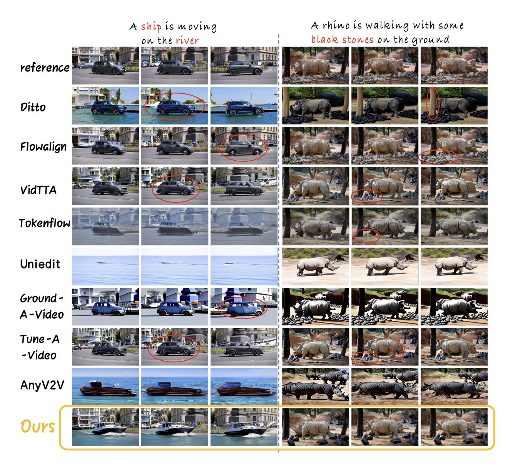

그림 5. 다른 방법들과의 시각적 비교. 우리 방법은 편집 지침을 엄격히 따르면서 편집되지 않은 영역의 세부 사항을 성공적으로 보존한다.

사전 학습된 대형 Vision‑Language Model (VLM)의 고급 시각적 추론 능력을 활용한다. 구체적으로 우리는 GPT-5 [&#91;51&#93;](#page-16-12)를 프롬프트하여 생성된 비디오를 네 가지 차원에서 평가한다: (1) 비디오 품질 (VQ)은 소스 비디오와 편집 지시와 무관하게 생성된 비디오의 품질을 측정한다; (2) 지시 준수 (IA)는 편집 프롬프트의 지시 따르기 능력을 측정한다; (3) 소스 비디오 보존 (SP)는 편집되지 않은 영역에서 소스 비디오의 보존 정도를 측정한다; (4) 전체 점수 (OVL)는 일반적인 평가를 위한 지표이다.

인간 연구. 우리는 10명의 참가자를 대상으로 독립적으로 각 방법을 동일한 세 가지 차원(1) 비디오 품질(VQ); (2) 지시사항 준수(IA); (3) 소스 보존(SP)에서 평가하는 사용자 연구를 추가로 수행한다. 우리는 세 점수를 평균하여 각 비디오에 대한 전체 인간 평가 결과를 얻는다. 우리는 평가 세트의 각 비디오에 대해 하나의 편집 지시를 무작위로 선택하여 인간 평가용 하위 집합을 구성한다. 참가자들은 생성된 각 비디오에 대해 각 기준에 대해 1에서 5까지의 점수를 부여해야 한다. 평가 지표에 대한 자세한 내용은 보충 자료 [섹션 C.](#page-25-0)에 표시된다.


[표 1](#page-8-0)은 ElasticTTT와 경쟁 기반 방법 간의 정량적 비교를 요약한다. 일반적으로 TTT 기반 방법은 테스트 시각에 각 입력 비디오의 특정 내용과 시간 역학에 적응할 수 있는 능력 덕분에 기존 비디오 편집 접근법을 능가한다. 또한 ElasticTTT는 TTT 기반 방법 중 가장 강력한 성능을 달성하며, 특히 VLM 기반 평가에서 상당한 향상을 보인다. 이는 전반적이고 세밀한 as-

4.2 이전 방법과의 비교 Table 2. 인간 평가 결과. 최우수 결과는 빨간색으로 강조되고, 두 번째 우수 결과는 파란색으로 강조된다.

<span id="page-10-0"></span>

| Methods | ↑<br>VQ | ↑<br>IA | ↑<br>SP | 평균 |
|---------------------|---------|---------|---------|-------|
| AnyV2V [33] | 2.50 | 2.61 | 2.48 | 2.54 |
| Ground-A-Video [26] | 1.95 | 2.15 | 2.37 | 2.16 |
| Token-flow [15] | 2.83 | 2.63 | 3.16 | 2.87 |
| Uniedit [1] | 2.36 | 2.94 | 2.08 | 2.46 |
| Ditto [2] | 3.85 | 3.20 | 3.07 | 3.37 |
| Flow-align [30] | 3.73 | 2.82 | 3.81 | 3.45 |
| ElasticTTT | 3.87 | 3.32 | 3.61 | 3.60 |

비디오 편집 품질을 여러 차원(VQ 6.19, IA 7.50, OVL 6.68)에서 평가합니다. 비록 일부 기준이 고립된 지표에서 ElasticTTT와 일치하거나 초과하지만, 상당한 트레이드오프가 발생합니다.

예를 들어, Flow-align은 편집되지 않은 영역에서 보존(SP 7.23)에서 뛰어나지만, 편집 탄력성과 지시 준수(IA 5.44)에서는 어려움을 겪는다. 반대로, Uniedit은 목표 지시와의 강력한 의미 정렬(높은 CLIP‑T 점수 31.76으로 입증됨)을 달성하지만 보존(SP 0.54)에서는 실패하여 원본 비디오를 크게 왜곡한다. [Figure 5,](#page-9-0)에서 보듯이 ElasticTTT는 정밀한 편집 준수(선박과 강, 검은 돌)와 소스 보존(배경 건물, 코뿔소와 나무)를 모두 달성하는 반면, 다른 방법들은 명백한 타협을 보인다.

[Table 2,](#page-10-0)에 표시된 바와 같이 인간 평가 결과는 우리의 정량적 발견을 강력히 뒷받침한다. ElasticTTT는 평균 3.60으로 가장 높은 성능을 달성하여, 기준 방법들보다 명확한 인간 선호도를 나타낸다. 특히 편집 준수(IA 3.32)에서 뛰어나며, 영상 품질(VQ 3.87)에서 최고 점수를 기록한다. 보존 측면에서도 Flow-align가 최고를 기록하지만 ElasticTTT는 경쟁 모델에서 관찰되는 심각한 트레이드오프 없이 강력한 두 번째 최상의 성능(SP 3.61)을 유지한다. 또한 보충 자료의 [Section D](#page-26-0)에서 제공된 연구는 인간 자원봉사자 점수와 VLM 평가 간의 강한 정렬을 보여 주어, 우리의 VLM 기반 평가 프로토콜의 합리성을 입증한다.

ElasticTTT가 더 큰 베이스 모델에 일반화되는지 확인하기 위해, 우리는 동일한 설정 하에서 Wan2.2- 5B에서 동일한 실험을 추가로 수행하며, 우리의 전체 방법을 베이직 TTT 베이스라인과 비교합니다. [Table 3,](#page-10-1)에서 보듯이 ElasticTTT는 더 큰 백본에서 일관되고 더욱 두드러진 개선을 보여줍니다: 전체 점수를 4.91에서 7.00 (+2.09)으로 끌어올리며, Wan2.1-1.3B에서 관찰된 대응되는 향상(+1.29, 5.39에서 6.68)을 능가합니다. The improve-

<span id="page-10-1"></span>표 3. 더 큰 베이스 모델에 대한 일반화. 최상의 결과는 빨간색으로 강조 표시됩니다.

| 방법 | VQ↑ | IA↑ | SP↑ | OVL↑ |
|---------------------|------|------|------|------|
| Wan2.2-5B-baseTTT | 5.05 | 5.09 | 4.40 | 4.91 |
| Wan2.2-5B-ours | 6.47 | 7.75 | 3.68 | 7.00 |
| Wan2.1-1.3B-baseTTT | 5.34 | 6.15 | 3.63 | 5.39 |
| Wan2.1-1.3B-ours | 6.19 | 7.50 | 5.23 | 6.68 |

성능은 instruction adherence (IA 5.09 → 7.75)와 video quality (VQ 5.05 → 6.47)에서 가장 뚜렷하게 나타나며, 이는 우리의 target distribution regularization과 Contrastive CFG가 대형 모델의 풍부한 생성 사전 정보를 효과적으로 개방한다는 것을 나타낸다. 이는 그렇지 않으면 TTT memorization에 의해 억제될 것이다. 특히, ElasticTTT가 장착된 Wan2.2-5B는 모든 구성 중 가장 높은 전체 점수(OVL 7.00)를 달성하여, 우리의 방법이 모델 용량에 따라 유리하게 확장된다는 것을 시사한다. 우리는 소스 보존(SP 4.40 → 3.68)의 약간의 감소를 관찰하며, 이는 대형 모델에서 복원된 더 강한 편집 탄성 때문이라고 생각한다: 대형 모델은 편집 지침을 보다 적극적으로 따른다,


<span id="page-11-1"></span>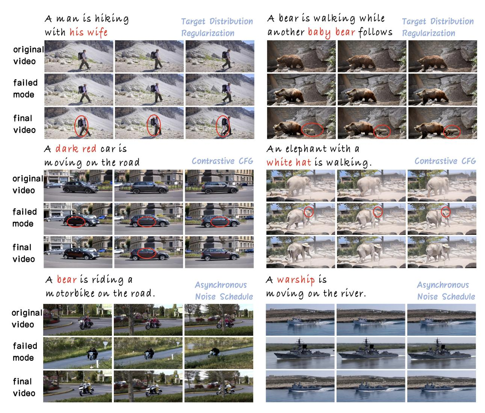

Figure 6. 절제 연구의 시각화 결과.

경미한 보존을 희생하고 훨씬 더 나은 의미 정렬을 달성한다—이러한 트레이드오프는 전반적인 품질에서 명확히 보상을 준다.

제안한 설계의 개별 기여도를 평가하기 위해 ElasticTTT 파이프라인에서 핵심 구성 요소를 체계적으로 제거한 제거 연구를 수행했다. 결과는 정량적으로 [표 4](#page-11-0)와 정성적으로 [그림 6,](#page-11-1)에서 제시되며, 전체 방법이 지표 전반에서 최적의 균형을 달성하고 [그림 6.](#page-11-1)에서도 최상의 성능을 보인다는 것을 확인한다.

TDR을 생략하면 비디오 품질, 편집 준수 및 전체 점수가 부정적으로 영향을 받는다. 비록 이를 제거하면 보존 점수가 약간 개선되지만, 이는 ...

4.3 제거 연구 표 4. 제거 연구의 정량적 결과. 우리는 전체 모델에서 핵심 구성 요소를 별도로 제외하고 그 결과 성능을 보고한다. 최상의 결과는 빨간색으로 강조 표시된다.

<span id="page-11-0"></span>

| 방법 | VQ↑ | IA↑ | SP↑ | OVL↑ |
|-----------------------|------|------|------|------|
| 없음 (baseline) | 5.34 | 6.15 | 3.63 | 5.39 |
| 부드러운 전환 없이 | 6.07 | 7.37 | 5.09 | 6.56 |
| Async-NS 없이 | 5.62 | 6.55 | 3.50 | 6.23 |
| TDR 없이 | 6.13 | 7.45 | 5.36 | 6.64 |
| 대조적 CFG 없이 | 6.06 | 7.01 | 5.64 | 6.52 |
| 전체 (ElasticTTT) | 6.19 | 7.50 | 5.23 | 6.68 |

모델이 복잡한 편집을 수행할 수 있는 능력을 희생하면서. 그림 6의 첫 번째 행에 표시된 바와 같이 [그림 6,](#page-11-1)


TDR 없이, 모델은 소스 영상을 단순히 재구성하고 새로운 개념(아내, 아기 곰)을 추가하지 못한다.

Contrastive CFG를 제거하면 편집 준수도와 전반적인 성능이 눈에 띄게 저하된다. 이 메커니즘이 없으면 모델은 편집 프롬프트를 완전히 따르기 어려워하며, 종종 참조와 목표 사이의 미완성된 중간 상태를 초래한다. [Figure 6](#page-11-1) (두 번째 행)에서 보듯이, Contrastive CFG가 없으면 미묘하고 덜 구분되는 편집이 발생하며, 우리 전체 방법의 시각적 명료성이 결여된다.

Async-NS와 추가적인 부드러운 전환은 일관된 비디오 생성을 위해 필수적이다. Async-NS를 제거하면 모든 정량적 지표가 감소한다. 정성적으로, [Figure 6,](#page-11-1)의 세 번째 행에서 보듯이 Async-NS가 없으면 모델은 대상 영역을 정확히 분리하는 능력을 잃고, 전경과 배경을 동시에 잘못 수정한다. 한편, M 대신 부드러운 전환 맵 M˜를 사용하면 전체 점수에 미세하지만 뚜렷한 개선을 가져오는 것으로 확인되었다.

우리는 이 큰 격차(OVL 6.68 vs. 4.71)를 두 가지 주요 요인에 기인한다. 첫째, Async-NS는 DiT 전방 과정 내부에 비동기 잡음을 도입한다. 편집된 영역과 보존된 영역에 서로 다른 잡음 수준과 타임스텝 임베딩을 할당함으로써, 속도 예측 중에 구별되는 지역 표현을 형성하여 TTT에 의해 유발되는 공간적 얽힘을 완화한다. 반면, 사후 블렌딩 접근법은 단지

표 5. 동일한 설정 하에서 Async-NS와 재구현된 Latent Blending의 비교. 최상의 결과는 빨간색으로 강조 표시된다.

| 방법 (Methods) | 벡터 양자화 (VQ)↑ | IA↑ | SP↑ | OVL↑ |
|-----------------|------|------|------|------|
| 잠재 혼합 (Latent Blending) | 4.65 | 6.02 | 1.08 | 4.71 |
| Async-NS | 6.19 | 7.50 | 5.23 | 6.68 |

예측 후 잠재(latents)를 교체하거나 혼합하면, 따라서 처음부터 얽힌 전경/배경 특징이 형성되는 것을 방지할 수 없다.

둘째, 이러한 접근 방식은 배경을 강제 보존(hard‑preserve)하며, 이는 현실적인 비디오 편집에 역효과를 낸다: 마스크가 적용되지 않은 영역은 종종 그림자, 먼지, 경계 변형, 접촉 효과와 같은 부드러운 물리적 조정이 필요하다. 불일치하는 노이즈 수준에서 얼어붙은 배경 잠재(latents)를 강제로 붙여 편집된 콘텐츠에 결합하면 눈에 띄는 이음새와 시간적 아티팩트가 발생하며, 이는 보수적으로 보이는 설계에도 불구하고 Latent Blending의 치명적인 보존 점수(SP 1.08)를 설명한다. Async‑NS는 대신 불필요한 배경 드리프트를 억제하면서 이러한 필수 상호작용을 허용한다—포워드 패스 동기화 해제 메커니즘으로, 포스트‑포워드 배경 교체가 아니다.

## 5 결론 (Conclusion)

본 논문에서는 ElasticTTT, 즉 Test-Time Tuning 기반의 비디오 편집 프레임워크를 제시한다. 먼저 TTT의 엄격한 최적화 목표와 diffusion 모델의 생성적 특성 사이에 존재하는 고유한 긴장으로 인해 발생하는 prior collapse 현상을 분석한다. Target Distribution Regularization, Contrastive CFG, Asynchronous Noise Scheduling이라는 세 가지 새로운 기법을 도입함으로써 prior collapse으로 인한 Conditioning Collapse 및 Spatial Entanglement 문제를 해결하고 정량적 결과와 human evaluation에서 SOTA 성능을 달성한다. 상세한 ablation 연구를 통해 우리 프레임워크의 각 핵심 구성 요소가 기여한 바를 정량화한다. 우리는 본 연구가 보다 신뢰할 수 있는 diffusion 기반 모델로 나아가는 중요한 단계일 뿐만 아니라, 보다 나은 personalized AI systems 설계에 대한 유망한 방향을 제시한다고 믿는다.

# 참고문헌 (References)

- <span id="page-12-1"></span>[1] J. Bai, T. He, Y. Wang, J. Guo, H. Hu, Z. Liu, and J. Bian. Uniedit: 비디오 모션 및 외관 편집을 위한 통합 튜닝 프리 프레임워크, 2025.  
- <span id="page-12-0"></span>[2] Q. Bai, Q. Wang, H. Ouyang, Y. Yu, H. Wang, W. Wang, K. L. Cheng, S. Ma, Y. Zeng, Z. Liu,


- Y. Xu, Y. Shen, and Q. Chen. 고품질 합성 데이터셋을 활용한 지시 기반 비디오 편집의 확장. arXiv preprint arXiv:2510.15742, 2025.  
- <span id="page-13-7"></span>[3] S. Bai, Y. Cai, R. Chen, K. Chen, X. Chen, Z. Cheng, L. Deng, W. Ding, C. Gao, C. Ge, W. Ge, Z. Guo, Q. Huang, J. Huang, F. Huang, B. Hui, S. Jiang, Z. Li, M. Li, M. Li, K. Li, Z. Lin, J. Lin, X. Liu, J. Liu, C. Liu, Y. Liu, D. Liu, S. Liu, D. Lu, R. Luo, C. Lv, R. Men, L. Meng, X. Ren, X. Ren, S. Song, Y. Sun, J. Tang, J. Tu, J. Wan, P. Wang, P. Wang, Q. Wang, Y. Wang, T. Xie, Y. Xu, H. Xu, J. Xu, Z. Yang, M. Yang, J. Yang, A. Yang, B. Yu, F. Zhang, H. Zhang, X. Zhang, B. Zheng, H. Zhong, J. Zhou, F. Zhou, J. Zhou, Y. Zhu, and K. Zhu. Qwen3-vl 기술 보고서. arXiv preprint arXiv:2511.21631, 2025.  
- <span id="page-13-1"></span>[4] X. Bi, J. Lu, B. Liu, X. Cun, Y. Zhang, W. Li, and B. Xiao. Customttt: 테스트 타임 트레이닝을 통한 모션 및 외관 맞춤형 비디오 생성. In Proceedings of the AAAI Conference on Artificial Intelligence, volume 39, pages 1871–1879, 2025.  
- <span id="page-13-0"></span>[5] Y. Bian, Z. Zhang, X. Ju, M. Cao, L. Xie, Y. Shan, and Q. Xu. Videopainter: 플러그 앤 플레이 컨텍스트 제어를 통한 임의 길이 비디오 인페인팅 및 편집, 2025.  
- <span id="page-13-9"></span>[6] bingshuai liu, A. Wang, Z. Min, C. Lyu, L. Wang, and J. Su. VEBench: 텍스트 기반 비디오 편집을 위한 종합적이고 자동화된 평가를 향해, 2025.  
- <span id="page-13-8"></span>[7] S. Caelles, A. Montes, K.-K. Maninis, Y. Chen, L. Van Gool, F. Perazzi, and J. Pont-Tuset. 2018년 비디오 객체 분할에 대한 DAVIS 챌린지. arXiv preprint arXiv:1803.00557, 2018.  
- <span id="page-13-4"></span>[8] J. Chung, S. Hyun, and J.-P. Heo. 스타일 주입 in diffusion: 대규모 diffusion 모델을 스타일 전송에 적응시키는 학습 없이 접근. In Proceedings of the IEEE/CVF conference on computer vision and pattern recognition, pages 8795–8805, 2024.  
- <span id="page-13-12"></span>[9] J. Cohen. 행동 과학을 위한 통계적 파워 분석 (2판). 행위 과학을 위한 통계적 파워 분석, 1988.  
- <span id="page-13-5"></span>[10] N. Cohen, V. Kulikov, M. Kleiner, I. Huberman-Spiegelglas, and T. Michaeli. Slicedit: 시공간 슬라이스를 이용한 텍스트-투-이미지 diffusion 모델로 제로샷 비디오 편집. arXiv preprint arXiv:2405.12211, 2024.  
- <span id="page-13-10"></span>[11] P. Foret, A. Kleiner, H. Mobahi, and B. Neyshabur. 샤프니스 인식 최소화로 일반화를 효율적으로 향상시키기. arXiv preprint arXiv:2010.01412, 2020.  
- <span id="page-13-2"></span>[12] R. Gal, Y. Alaluf, Y. Atzmon, O. Patashnik, A. H. Bermano, G. Chechik, and D. Cohen-Or. 한 이미지가 한 단어의 가치가 있다: 텍스트 역전을 이용한 텍스트-투-이미지 생성 개인화. arXiv preprint arXiv:2208.01618, 2022.  
- <span id="page-13-3"></span>[13] C. Gao, L. Ding, X. Cai, Z. Huang, Z. Wang, and T. Xue. Lora-edit: 마스크 인식 Lora 미세 조정을 통한 제어 가능한 첫 프레임 가이드 비디오 편집. arXiv preprint arXiv:2506.10082, 2025.  
- <span id="page-13-11"></span>[14] C. F. Gauss. 구심선 구간에서 태양을 둘러싼 천체 운동 이론, 제7권. FA Perthes, 1877.  
- <span id="page-13-6"></span>[15] M. Geyer, O. Bar-Tal, S. Bagon, and T. Dekel. Tokenflow: 일관된 비디오 편집을 위한 일관된 diffusion 특징. In The Twelfth International Conference on Learning Representations, 2024.


- <span id="page-14-4"></span>[16] S. S. Harsha, A. Revanur, D. Agarwal, and S. Agrawal. Genvideo: t2i 확산 모델을 이용한 원샷 타깃 이미지 및 형태 인식 비디오 편집. In Proceedings of the IEEE/CVF Conference on Computer Vision and Pattern Recognition (CVPR) Workshops, pages 7559–7568, June 2024.
- <span id="page-14-3"></span>[17] H. He, J. Wang, J. Zhang, Z. Xue, X. Bu, Q. Yang, S. Wen, and L. Xie. Openve-3m: 지시 기반 비디오 편집을 위한 대규모 고품질 데이터셋. arXiv preprint arXiv:2512.07826, 2025.
- <span id="page-14-0"></span>[18] J. Ho, A. Jain, and P. Abbeel. Denoising diffusion probabilistic models. Advances in neural information processing systems, 33:6840–6851, 2020.
- <span id="page-14-7"></span>[19] J. Ho and T. Salimans. Classifier-free diffusion guidance. arXiv preprint arXiv:2207.12598, 2022.
- <span id="page-14-12"></span>[20] S. Hochreiter and J. Schmidhuber. Flat minima. Neural computation, 9(1):1–42, 1997.
- <span id="page-14-1"></span>[21] W. Hong, M. Ding, W. Zheng, X. Liu, and J. Tang. Cogvideo: Transformer를 통한 대규모 사전학습 기반 텍스트-투-비디오 생성. arXiv preprint arXiv:2205.15868, 2022.
- <span id="page-14-6"></span>[22] H. Hotelling. Analysis of a complex of statistical variables into principal components. Journal of educational psychology, 24(6):417, 1933.
- <span id="page-14-8"></span>[23] E. J. Hu, Y. Shen, P. Wallis, Z. Allen-Zhu, Y. Li, S. Wang, L. Wang, W. Chen, et al. Lora: 대형 언어 모델의 저랭크 적응. ICLR, 1(2):3, 2022.
- <span id="page-14-2"></span>[24] Y. Huang, W. Xiong, H. Zhang, C. Chen, J. Liu, M. Yan, and S. Chen. Dive: 주제 기반 비디오 편집을 위한 DINO 제어. In Proceedings of the IEEE/CVF International Conference on Computer Vision, pages 16004–16014, 2025.
- <span id="page-14-11"></span>[25] Z. Huang, Y. He, J. Yu, F. Zhang, C. Si, Y. Jiang, Y. Zhang, T. Wu, Q. Jin, N. Chanpaisit, et al. Vbench: 비디오 생성 모델을 위한 종합 벤치마크 스위트. In Proceedings of the IEEE/CVF Conference on Computer Vision and Pattern Recognition, pages 21807–21818, 2024.
- <span id="page-14-5"></span>[26] H. Jeong and J. C. Ye. Ground-a-video: 텍스트-투-이미지 확산 모델을 이용한 제로샷 기반 비디오 편집. In The Twelfth International Conference on Learning Representations, 2024.
- <span id="page-14-9"></span>[27] K. Kahatapitiya, A. Karjauv, D. Abati, F. Porikli, Y. M. Asano, and A. Habibian. 효율적인 비디오 편집을 위한 객체 중심 확산. In European Conference on Computer Vision, pages 91–108. Springer, 2024.
- <span id="page-14-13"></span>[28] N. S. Keskar, D. Mudigere, J. Nocedal, M. Smelyanskiy, and P. T. P. Tang. 딥러닝을 위한 대배치 학습: 일반화 격차와 급격한 최소값. arXiv preprint arXiv:1609.04836, 2016.
- <span id="page-14-14"></span>[29] J. Kim, Y. Hong, J. Park, and J. C. Ye. Flowalign: 궤적 정규화된, 역전이 없는 흐름 기반 이미지 편집. arXiv preprint arXiv:2505.23145, 2025.
- <span id="page-14-10"></span>[30] J. Kim, Y. Hong, J. Park, and J. C. Ye. Flowalign: 궤적 정규화된, 역전이 없는 흐름 기반 이미지 편집. In The Fourteenth International Conference on Learning Representations, 2026.


- <span id="page-15-13"></span>[31] D. P. Kingma and J. Ba. Adam: 확률적 최적화를 위한 방법. arXiv preprint arXiv:1412.6980, 2014.
- <span id="page-15-0"></span>[32] W. Kong, Q. Tian, Z. Zhang, R. Min, Z. Dai, J. Zhou, J. Xiong, X. Li, B. Wu, J. Zhang, et al. Hunyuanvideo: 대규모 비디오 생성 모델을 위한 체계적 프레임워크. arXiv preprint arXiv:2412.03603, 2024.
- <span id="page-15-5"></span>[33] M. Ku, C. Wei, W. Ren, H. Yang, and W. Chen. Anyv2v: 모든 비디오-투-비디오 편집 작업을 위한 튜닝 프리 프레임워크. Transactions on Machine Learning Research, 2024. Reproducibility Certification.
- <span id="page-15-6"></span>[34] V. Kulikov, M. Kleiner, I. Huberman-Spiegelglas, and T. Michaeli. Flowedit: 사전 학습된 플로우 모델을 이용한 인버전 프리 텍스트 기반 편집. In Proceedings of the IEEE/CVF International Conference on Computer Vision, pages 19721–19730, 2025.
- <span id="page-15-2"></span>[35] N. Kumari, B. Zhang, R. Zhang, E. Shechtman, and J.-Y. Zhu. 텍스트-투-이미지 디퓨전의 다중 개념 맞춤화. In Proceedings of the IEEE/CVF conference on computer vision and pattern recognition, pages 1931–1941, 2023.
- <span id="page-15-3"></span>[36] G. Kwon, J. Park, and J. C. Ye. 분해된 셀프 어텐션 주입을 통한 파노라마, 3D 장면, 비디오의 통합 편집. arXiv preprint arXiv:2405.16823, 2024.
- <span id="page-15-12"></span>[37] Y. LeCun, S. Chopra, R. Hadsell, M. Ranzato, F. Huang, et al. 에너지 기반 학습에 관한 튜토리얼. Predicting structured data, 1(0), 2006.
- <span id="page-15-1"></span>[38] M. Li, L. Lin, Y. Liu, Y. Zhu, and Y. Li. Qffusion: 사분면 그리드 어텐션 학습을 통한 제어 가능한 인물 비디오 편집. IEEE Transactions on Visualization and Computer Graphics, 2025.
- <span id="page-15-10"></span>[39] F. Liang, A. Kodaira, C. Xu, M. Tomizuka, K. Keutzer, and D. Marculescu. 뒤돌아보기: 피처 뱅크를 이용한 스트리밍 비디오-투-비디오 번역. In The Thirteenth International Conference on Learning Representations, 2025.
- <span id="page-15-11"></span>[40] F. Liang, B. Wu, J. Wang, L. Yu, K. Li, Y. Zhao, I. Misra, J.-B. Huang, P. Zhang, P. Vajda, et al. Flowvid: 불완전한 광학 흐름을 제어하여 일관된 비디오-투-비디오 합성을 위한 방법. In Proceedings of the IEEE/CVF Conference on Computer Vision and Pattern Recognition, pages 8207–8216, 2024.
- <span id="page-15-9"></span>[41] Y. Lipman, R. T. Q. Chen, H. Ben-Hamu, M. Nickel, and M. Le. 생성 모델링을 위한 플로우 매칭. In The Eleventh International Conference on Learning Representations, 2023.
- <span id="page-15-7"></span>[42] C. Liu, R. Li, K. Zhang, Y. Lan, and D. Liu. Stablev2v: 비디오-투-비디오 편집에서 형태 일관성을 안정화. IEEE Transactions on Circuits and Systems for Video Technology, 2025.
- <span id="page-15-8"></span>[43] S. Liu, Y. Zhang, W. Li, Z. Lin, and J. Jia. Video-p2p: 교차 어텐션 제어를 통한 비디오 편집. In Proceedings of the IEEE/CVF Conference on Computer Vision and Pattern Recognition, pages 8599–8608, 2024.
- <span id="page-15-14"></span>[44] I. Loshchilov and F. Hutter. 분리된 가중치 감소 정규화. arXiv preprint arXiv:1711.05101, 2017.
- <span id="page-15-4"></span>[45] N. Ma, S. Tong, H. Jia, H. Hu, Y.-C. Su, M. Zhang, X. Yang, Y. Li, T. Jaakkola, X. Jia, et al. 디퓨전 모델의 노이즈 제거 단계 확장 이상의 추론 시 스케일링. arXiv preprint arXiv:2501.09732, 2025.


- [46] S. Mandt, M. D. Hoffman, and D. M. Blei. Stochastic gradient descent를 이용한 근사 Bayesian inference. Journal of Machine Learning Research, 18(134):1–35, 2017.  
- [47] C. Meng, Y. He, Y. Song, J. Song, J. Wu, J.-Y. Zhu, and S. Ermon. Sdedit: Stochastic differential equations를 이용한 가이드형 이미지 합성 및 편집. arXiv preprint arXiv:2108.01073, 2021.  
- [48] T. H. S. Meral, H. Yesiltepe, C. Dunlop, and P. Yanardag. Motionflow: Attention 기반 모션 전송을 이용한 비디오 디퓨전 모델. arXiv preprint arXiv:2412.05275, 2024.  
- [49] R. Mokady, A. Hertz, K. Aberman, Y. Pritch, and D. Cohen-Or. 가이드형 디퓨전 모델을 이용한 실제 이미지 편집을 위한 Null-text inversion. In Proceedings of the IEEE/CVF conference on computer vision and pattern recognition, pages 6038–6047, 2023.  
- [50] C. Mou, M. Cao, X. Wang, Z. Zhang, Y. Shan, and J. Zhang. Revideo: 모션 및 콘텐츠 제어를 통한 비디오 재제작. Advances in Neural Information Processing Systems, 37:18481–18505, 2024.  
- [51] OpenAI. Gpt-5 system card, 2025.  
- [52] W. Ouyang, Y. Dong, L. Yang, J. Si, and X. Pan. I2vedit: 이미지-투-비디오 디퓨전 모델을 이용한 첫 프레임 가이드형 비디오 편집. CoRR, abs/2405.16537, 2024.  
- [53] W. Peebles and S. Xie. Transformers를 이용한 확장 가능한 디퓨전 모델. In Proceedings of the IEEE/CVF international conference on computer vision, pages 4195–4205, 2023.  
- [54] F. Perazzi, J. Pont-Tuset, B. McWilliams, L. Van Gool, M. Gross, and A. Sorkine-Hornung. 비디오 객체 분할을 위한 벤치마크 데이터셋 및 평가 방법론. In Proceedings of the IEEE conference on computer vision and pattern recognition, pages 724–732, 2016.  
- [55] J. Pont-Tuset, F. Perazzi, S. Caelles, P. Arbeláez, A. Sorkine-Hornung, and L. Van Gool. 2017년 DAVIS 챌린지: 비디오 객체 분할. arXiv preprint arXiv:1704.00675, 2017.  
- [56] A. Radford, J. W. Kim, C. Hallacy, A. Ramesh, G. Goh, S. Agarwal, G. Sastry, A. Askell, P. Mishkin, J. Clark, et al. 자연어 감독을 통한 전이 가능한 시각 모델 학습. In International conference on machine learning, pages 8748–8763. PmLR, 2021.  
- [57] N. Ravi, V. Gabeur, Y.-T. Hu, R. Hu, C. Ryali, T. Ma, H. Khedr, R. Rädle, C. Rolland, L. Gustafson, E. Mintun, J. Pan, K. V. Alwala, N. Carion, C.-Y. Wu, R. Girshick, P. Dollár, and C. Feichtenhofer. Sam 2: 이미지와 비디오에서 무엇이든 세그먼트. arXiv preprint arXiv:2408.00714, 2024.  
- [58] N. Ruiz, Y. Li, V. Jampani, Y. Pritch, M. Rubinstein, and K. Aberman. Dreambooth: 주제 기반 생성을 위한 텍스트-투-이미지 디퓨전 모델 미세 조정. In Proceedings of the IEEE/CVF conference on computer vision and pattern recognition, pages 22500–22510, 2023.  
- [59] K. Sohn, N. Ruiz, K. Lee, D. C. Chin, I. Blok, H. Chang, J. Barber, L. Jiang, G. Entis, Y. Li, et al. Styledrop: 어떤 스타일에서도 텍스트-투-이미지 생성. arXiv preprint arXiv:2306.00983, 2023.  
- [60] J. Song, C. Meng, and S. Ermon. Denoising diffusion implicit 모델. arXiv preprint arXiv:2010.02502, 2020.  
- [61] Y. Song and S. Ermon. 데이터 분포의 기울기를 추정하여 생성 모델링. Advances in neural information processing systems, 32, 2019.


- <span id="page-17-0"></span>[62] Y. Song, J. Sohl-Dickstein, D. P. Kingma, A. Kumar, S. Ermon, and B. Poole. 확률적 미분 방정식을 통한 점수 기반 생성 모델링. arXiv preprint arXiv:2011.13456, 2020.
- <span id="page-17-5"></span>[63] Y. Sun, X. Wang, Z. Liu, J. Miller, A. Efros, and M. Hardt. 분포 변동 하에서 일반화를 위한 자기 지도 학습 기반 테스트 타임 트레이닝. In International conference on machine learning, pages 9229–9248. PMLR, 2020.
- <span id="page-17-1"></span>[64] Team Wan, A. Wang, B. Ai, B. Wen, C. Mao, C.-W. Xie, D. Chen, F. Yu, H. Zhao, J. Yang, J. Zeng, J. Wang, J. Zhang, J. Zhou, J. Wang, J. Chen, K. Zhu, K. Zhao, K. Yan, L. Huang, M. Feng, N. Zhang, P. Li, P. Wu, R. Chu, R. Feng, S. Zhang, S. Sun, T. Fang, T. Wang, T. Gui, T. Weng, T. Shen, W. Lin, W. Wang, W. Wang, W. Zhou, W. Wang, W. Shen, W. Yu, X. Shi, X. Huang, X. Xu, Y. Kou, Y. Lv, Y. Li, Y. Liu, Y. Wang, Y. Zhang, Y. Huang, Y. Li, Y. Wu, Y. Liu, Y. Pan, Y. Zheng, Y. Hong, Y. Shi, Y. Feng, Z. Jiang, Z. Han, Z.-F. Wu, and Z. Liu. Wan: 개방형 및 고급 대규모 비디오 생성 모델, 2025.
- <span id="page-17-6"></span>[65] D. Wang, E. Shelhamer, S. Liu, B. Olshausen, and T. Darrell. Tent: 엔트로피 최소화를 통한 완전 테스트 타임 적응. arXiv preprint arXiv:2006.10726, 2020.
- <span id="page-17-9"></span>[66] J. Wang, Y. Chen, Y. He, X. Song, Y. Xin, D. Zhang, Z. Wan, B. Li, and R. Zhang. 저비용 테스트 타임 적응을 통한 견고한 비디오 편집. arXiv preprint arXiv:2507.21858, 2025.
- <span id="page-17-7"></span>[67] Z. Wang and J. Tang. T3v2v: 비디오-투-비디오 편집에서 도메인 적응을 위한 테스트 타임 트레이닝. In CVPR 2025 Workshop, AI for Creative Visual Content Generation Editing and Understanding.
- <span id="page-17-10"></span>[68] Z. Wang, L. Zhao, and W. Xing. Stylediffusion: 확산 모델을 통한 제어 가능한 분리된 스타일 전송. In Proceedings of the IEEE/CVF international conference on computer vision, pages 7677–7689, 2023.
- <span id="page-17-8"></span>[69] J. Z. Wu, Y. Ge, X. Wang, S. W. Lei, Y. Gu, Y. Shi, W. Hsu, Y. Shan, X. Qie, and M. Z. Shou. Tune-a-video: 텍스트-투-비디오 생성용 이미지 확산 모델의 원샷 튜닝. In Proceedings of the IEEE/CVF International Conference on Computer Vision, pages 7623–7633, 2023.
- <span id="page-17-4"></span>[70] Y. Wu, L. Chen, R. Li, S. Wang, C. Xie, and L. Zhang. Insvie-1m: 정교한 데이터셋 구축을 통한 효과적인 지시 기반 비디오 편집. In Proceedings of the IEEE/CVF International Conference on Computer Vision, pages 16692–16701, 2025.
- <span id="page-17-3"></span>[71] S. Yang, Z. Gu, L. Hou, X. Tao, P. Wan, X. Chen, and J. Liao. Mtv-inpaint: 다중 작업 장기 비디오 인페인팅. CoRR, abs/2503.11412, March 2025.
- <span id="page-17-11"></span>[72] X. Yang, L. Zhu, H. Fan, and Y. Yang. Eva: 제로샷 정확한 속성 및 다중 객체 비디오 편집. CoRR, abs/2403.16111, 2024.
- <span id="page-17-12"></span>[73] X. Yang, L. Zhu, H. Fan, and Y. Yang. Videograin: 다중 그레인 비디오 편집을 위한 시공간 주의 조절. In The Thirteenth International Conference on Learning Representations, 2025.
- <span id="page-17-2"></span>[74] Z. Yang, J. Teng, W. Zheng, M. Ding, S. Huang, J. Xu, Y. Yang, W. Hong, X. Zhang, G. Feng, D. Yin, Yuxuan.Zhang, W. Wang, Y. Cheng, B. Xu, X. Gu, Y. Dong, and J. Tang. Cogvideox: 전문가 트랜스포머를 갖춘 텍스트-투-비디오 확산 모델. In The Thirteenth International Conference on Learning Representations, 2025.


- <span id="page-18-0"></span>[75] S. Yu, D. Liu, Z. Ma, Y. Hong, Y. Zhou, H. Tan, J. Chai, and M. Bansal. Veggie: 지침 기반 편집 및 추론 비디오 개념과 기반 생성. In Proceedings of the IEEE/CVF International Conference on Computer Vision, pages 15147–15158, 2025.

- <span id="page-18-4"></span>[76] Y. Zhang, N. Huang, F. Tang, H. Huang, C. Ma, W. Dong, and C. Xu. 역전 기반 스타일 전송과 확산 모델. In Proceedings of the IEEE/CVF conference on computer vision and pattern recognition, pages 10146–10156, 2023.

- <span id="page-18-2"></span>[77] B. Zi and et al. Señorita-2m: 비디오 전문가에 의한 일반 비디오 편집을 위한 고품질 지침 기반 데이터셋. NeurIPS, 2026.

- <span id="page-18-1"></span>[78] B. Zi, P. Ruan, M. Chen, X. Qi, S. Hao, S. Zhao, Y. Huang, B. Liang, R. Xiao, and K.-F. Wong. Se\˜ norita-2m: 비디오 전문가에 의한 일반 비디오 편집을 위한 고품질 지침 기반 데이터셋. arXiv preprint arXiv:2502.06734, 2025.

- <span id="page-18-3"></span>[79] Z. Zuo, Z. Zhang, Y. Luo, Y. Zhao, H. Zhang, Y. Yang, and M. Wang. Cut-and-paste: 주제 기반 비디오 편집과 주의력 제어. Neural Networks, 181:106818, 2025.


본 문서는 "ElasticTTT:Prior-Preserving Test-Time Tuning for Video Editing" 논문의 부록 자료입니다. 내용은 다음과 같이 구성됩니다:

- 수학적 유도
- 실험 설정 세부 사항
- 평가 지표 세부 사항
- 인간 평가 세부 사항
- **E** 추가 평가 결과
- VLM과 인간 판단의 상관 분석
- VLM 판단을 위한 프롬프트 설계
- 비동기 노이즈 스케줄링 마스크 시연
- 한계 및 향후 연구
- 추가 시연
- 사회적 영향 및 윤리적 우려

## <span id="page-19-0"></span>A Mathematical Derivations (수학적 유도)

# A.1 Target Distribution Regularization (목표 분포 정규화)

우리는 Sec. 3.2에서 목표 분포 정규화(TDR)가 확산 모델의 최적화 목표를 변경하지 않음을 보여준다. 그러나 TDR이 생성된 분포의 일반 구조를 보존하는 이유를 완전히 설명하지는 못한다. 여기서 우리는 최적화 역학 관점에서 분석을 제공한다. 구체적으로, 우리는 확률적 기울기의 공분산을 분석하여 표준 TTT가 왜 퇴화된 기억에 취약한지, 그리고 우리의 제안된 TDR이 어떻게 기하학 인식형 Gauss-Newton 패널티를 암묵적으로 주입하여 사전 학습된 생성 사전 정보를 보존하는지를 보여준다.

## A.1.1 Setup and Standard TTT (설정 및 표준 TTT)

사전 학습된 네트워크의 예측을 $v_{\theta}(x_t, t, C) \in \mathbb{R}^d$ 로 표시하고, 이는 $\theta \in \mathbb{R}^p$ 로 매개화된다. 여기서 $x_t$는 노이즈가 있는 잠재 변수이며, t는 타임스텝, C는 텍스트 조건을 나타낸다. 실제 확산 목표를 $u_t$ 로 두고, 표준 TTT에서는 단일 확률적 단계의 목적이 $L_2$ 손실이다:

$$\mathcal{L}(\theta) = \frac{1}{2} \|v_{\theta}(x_t, t, C) - u_t\|^2$$

(10)

순간적인 오차 벡터를 $e_t(\theta) = v_{\theta}(x_t, t, C) - u_t \in \mathbb{R}^d$ 로 두고, 네트워크 출력에 대한 파라미터의 야코비안을 $J_{\theta} = \nabla_{\theta} v_{\theta}(x_t, t, C) \in \mathbb{R}^{d \times p}$ 로 표시한다.

**정의 1** (확률적 기울기 및 공분산). 표준 TTT의 단일 반복에 대한 확률적 기울기는 $g(\theta) = \nabla_{\theta} \mathcal{L} = J_{\theta}^{T} e_{t}(\theta)$ 이다. 기대(진짜) 기울기는 $\bar{g} = \mathbb{E}_{t,\epsilon}[g(\theta)]$ 이다. 이 확률적 기울기의 공분산 행렬은 다음과 같이 정의된다:

$$\Sigma(\theta) = \mathbb{E}_{t,\epsilon} \left[ (g(\theta) - \bar{g})(g(\theta) - \bar{g})^T \right]$$

(11)

**Proposition 1** (표준 TTT의 Prior Collapse). 모델이 과대 매개변수화되어 목표 $x_0$를 완벽히 기억할 수 있다고 가정한다. 모델이 공간 매핑을 완벽히 과적합하면 순간 오류가 사라진다 $(e_t(\theta) \to \mathbf{0})$, 그 결과 기울기 공분산이 사라진다: $\Sigma(\theta) \to \mathbf{0}$.

<span id="page-20-0"></span>


*Proof.* 정의에 따라 $g(\theta) = J_{\theta}^T e_t(\theta)$ 이다. 모델이 목표 분포를 완벽히 적합하면 $v_{\theta}(x_t, t, C) \to u_t$ 가 되고, 따라서 $e_t(\theta) \to \mathbf{0}$ 이 된다. 따라서 모든 t와 $\epsilon$ 에 대해 $g(\theta) \to \mathbf{0} \Rightarrow \bar{g} \to \mathbf{0} \Rightarrow \Sigma(\theta) \to \mathbf{0}$.

확률적 경사 하강법(Stochastic Gradient Descent)의 확률 미분 방정식(SDE) 관점에서 $(d\theta = -\eta \bar{g}dt + \sqrt{\eta \Sigma}dW)$ [46], 항 $\Sigma$ 가 최적화기의 탐색을 지배한다. $\Sigma \to \mathbf{0}$ 이면 최적화기는 모든 탐색 능력을 잃고, 의미적 조건화 C와 prior $x_t$ 가 강제 기억에 의해 우회되는 날카로운 특이점에 영구적으로 갇히게 된다.

# A.1.2 목표 분포 정규화 (Target Distribution Regularization) (TDR)

Prior collapse를 방지하기 위해, 평균이 0인 목표 정규화 항 $\epsilon_{\text{reg}} \sim \mathcal{N}(0, \sigma_{\text{reg}}^2 I)$ 를 도입한다. 정규화된 목표는 $\tilde{u}_t = u_t + \epsilon_{\text{reg}}$ 가 되고, 입력 $x_t$ 는 완전히 변형되지 않는다.

**Proposition 2** (편향 없는 기대 기울기). Target Distribution Regularization (TDR) 하에서의 기대 기울기는 Standard TTT의 기대 기울기와 완전히 동일하다: $\bar{g}_{TDR} = \bar{g}$.

*Proof.* 정규화된 확률적 기울기는 다음과 같다:

$$g_{\text{TDR}}(\theta) = J_{\theta}^{T}(v_{\theta}(x_{t}, t, C) - (u_{t} + \epsilon_{\text{reg}})) = g(\theta) - J_{\theta}^{T}\epsilon_{\text{reg}}$$

(12)

$t, \epsilon$ 와 독립적인 잡음 $\epsilon_{\text{reg}}$ 에 대한 기대값을 취하면:

$$\mathbb{E}[g_{\text{TDR}}(\theta)] = \mathbb{E}_{t,\epsilon}[g(\theta)] - \mathbb{E}_{t,\epsilon}\left[J_{\theta}^{T}\right] \mathbb{E}_{\epsilon_{\text{reg}}}[\epsilon_{\text{reg}}]$$

(13)

$\epsilon_{\text{reg}}$ 가 평균 0 이므로 두 번째 항은 소멸하고, $\bar{g}_{\text{TDR}} = \bar{g}$ 가 된다.

**Proposition 3** (지오메트리 인식 공분산 주입). TDR 하에서 기울기 공분산 행렬은 표준 공분산과 $\sigma_{req}^2$ 비례하는 Gauss-Newton 패널티 항으로 해석적으로 분해된다:

$$\Sigma_{TDR}(\theta) = \Sigma(\theta) + \sigma_{req}^2 \mathbb{E}_{t,\epsilon} \left[ J_{\theta}^T J_{\theta} \right]$$

(14)

*Proof.* 정의에 따라 새로운 공분산은 다음과 같다:

$$\Sigma_{\text{TDR}}(\\theta) = \\mathbb{E}\\left[ (g_{\\text{TDR}}(\\theta) - \\bar{g})(g_{\\text{TDR}}(\\theta) - \\bar{g})^T \\right]$$

(15)

$g_{\text{TDR}}(\\theta) = g(\\theta) - J_{\\theta}^T \\epsilon_{\\text{reg}}$ 를 기대값에 대입하면:

$$\\Sigma_{\\text{TDR}}(\\theta) = \\mathbb{E}\\left[\\left((g - \\bar{g}) - J_{\\theta}^{T} \\epsilon_{\\text{reg}}\\right) \\left((g - \\bar{g}) - J_{\\theta}^{T} \\epsilon_{\\text{reg}}\\right)^{T}\\right]$$

$$= \\mathbb{E}\\left[(g - \\bar{g})(g - \\bar{g})^{T}\\right] - \\mathbb{E}\\left[(g - \\bar{g})\\epsilon_{\\text{reg}}^{T} J_{\\theta}\\right]$$

$$- \\mathbb{E}\\left[J_{\\theta}^{T} \\epsilon_{\\text{reg}}(g - \\bar{g})^{T}\\right] + \\mathbb{E}\\left[J_{\\theta}^{T} \\epsilon_{\\text{reg}}\\epsilon_{\\text{reg}}^{T} J_{\\theta}\\right]$$

(16)

$\epsilon_{\text{reg}}$ 가 평균 0 이고 표준 기울기 성분 g와 $J_{\theta}$ 와 독립적이므로 두 교차 항의 기대값은 엄밀히 0 이다:

$$\mathbb{E}\left[(g-\bar{g})\epsilon_{\text{reg}}^T J_{\theta}\right] = \mathbb{E}_{t,\epsilon}\left[(g-\bar{g})\right] \mathbb{E}_{\epsilon_{\text{reg}}}\left[\epsilon_{\text{reg}}^T\right] \mathbb{E}_{t,\epsilon}\left[J_{\theta}\right] = \mathbf{0}$$

(17)

따라서 전체 기대값은 남은 두 항의 기대값 합으로 단순화된다. 첫 번째 항이 표준 공분산 $\Sigma(\theta)$의 정의와 정확히 일치함을 인식한다:

$$\Sigma_{\text{TDR}}(\theta) = \Sigma(\theta) + \mathbb{E}_{t,\epsilon} \left[ J_{\theta}^T \mathbb{E}_{\epsilon_{\text{reg}}} [\epsilon_{\text{reg}} \epsilon_{\text{reg}}^T] J_{\theta} \right]$$

(18)

주입된 노이즈의 공분산이 $\mathbb{E}[\epsilon_{\text{reg}}\epsilon_{\text{reg}}^T] = \sigma_{\text{reg}}^2 I$ 이므로, 식은 엄밀히 평가된다:

$$\Sigma_{\text{TDR}}(\theta) = \Sigma(\theta) + \sigma_{\text{reg}}^2 \mathbb{E}_{t,\epsilon} \left[ J_{\theta}^T J_{\theta} \right]$$

(19)


**Proposition 4** (암시적 야코비안 패널티). TDR은 야코비안의 제곱 프루비아노 노름에 비례하는 최적화기 노이즈를 주입하며, 수학적으로 파라미터 공간의 "sharpness" [11, 20, 28]를 측정한다:

$$Tr(\Sigma_{TDR}) = Tr(\Sigma) + \sigma_{reg}^2 \mathbb{E}_{t,\epsilon} \left[ \|J_{\theta}\|_F^2 \right]$$

(20)

*Proof.* 방정식 (19)의 양쪽에 대해 Trace를 취하면:

항 $\mathbb{E}[J_{\theta}^T J_{\theta}]$ 는 야코비안의 비중심화된 공분산이며, 일반적으로 $L_2$ 손실 하에서 헤시안의 가우스-뉴턴 근사 [14]로 인식된다. 네트워크가 변형된, 강직한 공간적 특이점(조건과 사전 정보를 우회해 $x_0$ 를 완벽히 기억하려는)을 형성하려 할 때, 야코비안 노름 $\|J_{\theta}\|_F^2$ 가 폭발한다.

따라서 경험적 손실이 0에 접근할 때 $(e_t \to 0 \text{ and } \Sigma \to \mathbf{0})$ , 최적화기는 지속적이며 기하학적으로 인식된 노이즈 $\sigma_{\text{reg}}^2 \|J_{\theta}\|_F^2$ 에 노출된다. 이 폭발적인 공분산은 SDE 브라운 운동을 통해 최적화기를 급격히 예리한 최소점에서 추방한다. 수렴하려면 네트워크는 물리적으로 $\|J_{\theta}\|_F^2$ 가 작고 안정적인 파라미터 설정에 도달하도록 강제된다. 예측된 속도가 전체 노이즈 분포에서 실제값과 일치하는 원래 사전 학습된 생성 사전은 정확히 이 평탄한 구성을 나타낸다. TDR은 전역 기대 기울기를 변경하지 않고도, 붕괴된 상태를 물리적으로 도달 불가능하게 만들어 사전 붕괴를 방지한다.

## A.2 Contrastive Classifier-Free Guidance

우리는 Sec. 3.3에서 우리의 Contrastive Classifier-Free Guidance (CFG) [19]가 단일 데이터 최적화로 인한 분포 이동을 극복하고 생성된 분포를 원본 분포에서 적극적으로 밀어내는 것을 주장한다. 이 섹션은 이 메커니즘에 대한 공식적인 베이지안 분석을 제공하며, 이론적 관점을 제시한다. 우리는 이 메커니즘을 동적이며 기하학적으로 인식된 필터로 공식화하여 TTT에 의해 유도된 분포 이동을 수학적으로 중화한다.

## A.2.1 The TTT Gravity Well

표준 CFG가 TTT 이후에 실패하는 원인을 밝히기 위해, 우리는 Energy-Based Models (EBMs) [37, 61, 62]의 관점에서 최적화 역학을 분석한다. 확산 프레임워크에서, 네트워크는 데이터 분포의 스코어 함수 [61]를 추정한다: $s_{\theta}(x_t, C) = \nabla_{x_t} \log p_{\theta}(x_t|C)$ .

**Definition 2** (TTT의 에너지 지형). 사전 학습된 베이스 모델이 암묵적 확률 분포 $p_{base}(x_t|C)$ 를 설명한다고 가정한다. TTT는 네트워크를 공격적으로 최적화하여 소스 비디오 궤적 $x_{src}$ 를 재구성하도록 하며, 이는 모델이 소스 프롬프트 $C_{src}$ 에 조건부로 $x_{src}$ 에 최대 가능도를 부여하도록 강제한다.

**제안 5** (그라디언트 편향 필드). 사전 붕괴 동안 TTT는 고도로 국소화된 기억 피크를 도입하여 기본 분포를 구조적으로 이동시킨다. TTT 이후 생성된 분포가 이동하고, 이동된 분포의 점수는 기본 점수와 가산 그라디언트 편향 필드 $\nabla_{x_t} B(x_t)$ 로 분해된다.

*증명.* 신경망은 보편적 함수 근사기이므로 과적합된 확률 분포 $p_{\theta^*}$ 는 원래 사전 훈련된 사전과 새로운 TTT 유도 기억 피크로 분해될 수 있다:

$$p_{\theta^*}(x_t|C_{\text{src}}) = \frac{1}{Z} p_{\text{base}}(x_t|C_{\text{src}}) \cdot p_{\text{mem}}(x_t)$$

(21)

여기서 $p_{\text{mem}}(x_t)$ 는 TTT 손실이 수렴함에 따라 디랙 델타 함수 $\delta(x_t - x_{\text{src}})$ 에 접근하며, Z는 정규화 항으로서 $\int p_{\theta^*}(x_t|C_{\text{src}})dx_t = 1$ 을 보장한다. 조정된 점수 함수는 로그-우도이다.


이 분해의 그라디언트:

$$s_{\theta^*}(x_t, C_{\text{src}}) = \nabla_{x_t} \log p_{\text{base}}(x_t | C_{\text{src}}) + \nabla_{x_t} \log p_{\text{mem}}(x_t)$$

(22)

스칼라 필드 B(xt) = log pmem(xt)를 정의하면 가산 형태가 된다:

$$s_{\theta^*}(x_t, C_{\text{src}}) = s_{\text{base}}(x_t, C_{\text{src}}) + \nabla_{x_t} B(x_t)$$

(23)

수학적으로 B(xt)는 잠재 공간에 조각된 깊은 인공 에너지 웰 역할을 한다. 그라디언트 ∇xtB(xt)는 공간적 힘 벡터로서 잠재들을 소스 비디오 xsrc 쪽으로 적극적으로 끌어당긴다. 우리는 이 그라디언트 편향 ∇xtB(xt)를 소스 매력 편향이라고 부른다.

# A.2.2 Semantic Leakage of the TTT Bias (TTT 편향의 의미 유출)

조건 간 파라미터 공유로 인해 이 국소화된 에너지 웰은 추론 중에 다른 프롬프트 조건으로 불가피하게 "유출"된다.

정의 3 (조건-의존 TTT 바이어스). 임의의 프롬프트 C에 대한 조정된 점수 함수를 이상적인 기본 사전이 조건-의존 활성화를 통해 소스 매력 바이어스 (source attractor bias)를 변형한 것으로 정의한다:

<span id="page-22-0"></span>

$$s_{\theta^*}(x_t, C) = s_{base}(x_t, C) + \alpha(C)\nabla_{x_t}B(x_t)$$

(24)

여기서 α(C) ∈ [0, 1] 은 활성화 강도를 매개한다.

명제 6 (활성화의 의미적 비례성). 활성화 계수 α(C)는 질의 프롬프트 C와 조정된 소스 프롬프트 Csrc 사이의 의미적 유사성 (semantic similarity)이 텍스트 임베딩 공간 (text embedding space)에서 직접적으로 상관관계가 있다.

정당화. TTT 동안, 조건화 투영은 Csrc의 임베딩에 대해 구체적으로 업데이트된다. 새로운 프롬프트 C에 대해, 이 업데이트된 가중치의 트리거링은 임베딩 정렬에 따라 달라지며, 이는 코사인 유사도 (cosine similarity)로 잘 근사된다: α(C) ≈ sim(C, Csrc). 이는 세 가지 구별되는 활성화 영역을 설정한다: 소스 프롬프트 (Csrc): 유사성은 최대화된다 (sim = 1). 따라서 α(Csrc) ≈ 1, 중력 우물 (gravity well)을 완전히 활성화한다.

타깃 프롬프트 (Ctrg): 타깃 프롬프트는 소스와 상당한 의미적 중첩을 공유한다 (예: 공유된 주제). 따라서 0 < α(Ctrg) < 1. 이 엄격한 양성은 부주의하게 TTT 중력 우물 (gravity well)로의 부분적 붕괴를 유발한다.

네거티브 프롬프트 (Cneg): 일반적인 저하 프롬프트는 소스와 의미적으로 직교한다. 따라서 α(Cneg) ≈ 0, 과적합된 파라미터 (overfitted parameters)를 성공적으로 우회한다.

# A.2.3 대조적 CFG를 통한 활성화 취소

이 중력 우물에서 벗어나 분포 이동 (distribution shift)을 극복하기 위해, 우리의 대조적 CFG는 수정된 점수 (modified score)를 다음과 같이 정의한다:

<span id="page-22-1"></span>

$$s_{\text{ContraCFG}}(x_t) = s_{\theta^*}(x_t, C_{\text{neg}}) + \lambda_1 \left( s_{\theta^*}(x_t, C_{\text{trg}}) - s_{\theta^*}(x_t, C_{\text{neg}}) \right)$$

$$+ \lambda_2 \left( s_{\theta^*}(x_t, C_{\text{trg}}) - s_{\theta^*}(x_t, C_{\text{src}}) \right)$$

(25)

제안 7 (표준 CFG가 TTT 편향을 증폭시킴). 표준 Classifier-Free Guidance가 TTT 이후에 적용될 때 본질적으로 소스 기억을 증폭시켜 의미적 편집을 제한한다.


증명. [Equation (24)](#page-22-0)를 표준 CFG 공식에 대입하면 다음과 같다:

$$s_{\text{StdCFG}}(x_t) = s_{\theta^*}(x_t, C_{\text{neg}}) + \lambda_1 \left( s_{\theta^*}(x_t, C_{\text{trg}}) - s_{\theta^*}(x_t, C_{\text{neg}}) \right)$$

$$= \underbrace{\left\{ s_{\text{base}}(x_t, C_{\text{neg}}) + \lambda_1 \left( s_{\text{base}}(x_t, C_{\text{trg}}) - s_{\text{base}}(x_t, C_{\text{neg}}) \right) \right\}}_{s_{\text{base}, \text{ StdCFG}}(x_t)}$$

$$+ \left\{ \alpha(C_{\text{neg}}) + \lambda_1 \left( \alpha(C_{\text{trg}}) - \alpha(C_{\text{neg}}) \right) \right\} \nabla_{x_t} B(x_t)$$

$$ \approx s_{\text{base}, \text{ StdCFG}}(x_t) + \left\{ 0 + \lambda_1 \left( \alpha(C_{\text{trg}}) - 0 \right) \right\} \nabla_{x_t} B(x_t)$$

$$= s_{\text{base}, \text{ StdCFG}}(x_t) + \lambda_1 \alpha(C_{\text{trg}}) \nabla_{x_t} B(x_t)$$

$$(26)$$

α(Cneg) ≈ 0이므로 편향은 λ1α(Ctrg)∇xtB(xt)로 단순화된다. λ<sup>1</sup> ≫ 1이므로 표준 CFG는 잔여 편향을 공격적으로 스케일링하여 생성 경로를 소스 매력 편향 방향으로 오도한다.

제안 8 (TTT 편향의 대비적 취소). 대비적 가이던스 항은 정밀하게 스케일된 부정 기울기를 주입하여 대수적으로 증폭된 TTT 편향을 취소한다.

증명. 대비적 가이던스 항(λ2로 스케일링된)을 평가하면 다음과 같다:

$$s_{\theta^*}(x_t, C_{\text{trg}}) - s_{\theta^*}(x_t, C_{\text{src}}) = (s_{\text{base}}(x_t, C_{\text{trg}}) - s_{\text{base}}(x_t, C_{\text{src}})) + (\alpha(C_{\text{trg}}) - \alpha(C_{\text{src}})) \nabla_{x_t} B(x_t)$$

(27)

TTT가 Csrc를 엄격히 과적합하므로 α(Csrc) > α(Ctrg)이다. 따라서 편향 스케일은 엄격히 음수이다. β = α(Csrc) − α(Ctrg) > 0라 두면 다음과 같다:

$$s_{\theta^*}(x_t, C_{\text{trg}}) - s_{\theta^*}(x_t, C_{\text{src}}) = (s_{\text{base}}(x_t, C_{\text{trg}}) - s_{\text{base}}(x_t, C_{\text{src}})) - \beta \nabla_{x_t} B(x_t)$$

(28)

이것을 바로 대비적 CFG 방정식([Equation (25))](#page-22-1)에 대입하면 다음과 같다:

$$s_{\text{ContraCFG}}(x_t) = s_{\text{base, ContraCFG}}(x_t) + \left[\lambda_1 \alpha(C_{\text{trg}}) - \lambda_2 \beta\right] \nabla_{x_t} B(x_t)$$

(29)

표준 CFG가 과도하게 증폭된 소스-매력 편향으로 생성 과정을 부담시키는 반면, 대비적 항은 TTT 중력 구덩이의 기하학을 명시적으로 분리하고 λ2β의 크기로 이를 빼어낸다. λ2를 적절히 스케일링함으로써 순 편향 계수 [λ1α(Ctrg)−λ2β]가 0이 되어 TTT 분포 변위의 정확한 취소를 달성하고, 구조적 충실도를 저하시키지 않으면서 의미적 편집 기능을 완전히 복원한다.

# <span id="page-23-0"></span>B 실험 설정 세부사항 (Details on Experiment Setup)

## B.1 베이스라인 모델 구현 세부사항 (Implementation Details of Baseline Models)

본 실험에서는 제안한 방법 ElasticTTT를 최신 비디오 편집 접근 방식과 비교한다. 성능을 종합적으로 평가하기 위해 베이스라인을 두 그룹으로 분류한다: 공식 오픈소스 구성을 활용한 것과 표준화된 비교를 보장하기 위해 재구현한 것.

다음과 같은 이전 모델들—AnyV2V [33](#page-15-5), Ground-A-Video [26](#page-14-5), Token-Flow [15](#page-13-6), Ditto [2](#page-12-0), UniEdit [1](#page-12-1)—에 대해 공식 오픈소스 코드와 모델 가중치를 직접 사용해 결과를 얻는다. 공식 구현에서 제공되는 기본 하이퍼파라미터를 엄격히 준수하며, 출력 비디오 길이와 공간 해상도를 원래 설정 그대로 유지한다.


AnyV2V에 관해, 프레임워크는 첫 프레임 가이던스를 생성하기 위해 전용 이미지 편집 모델이 필요합니다; 원 논문과의 일관성을 유지하기 위해 InstructPix2Pix를 지정된 편집기로 통합합니다. 그러나 이러한 즉시 사용 가능한 방법에 의존하는 주요 한계는 선택된 기본 모델과 같은 기초 설정이 크게 다르다는 점입니다. 이 불일치는 그들과 우리 방법 사이의 직접적인 비교를 덜 결정적으로 만듭니다.

이러한 한계를 해결하고 진정으로 공정한 비교를 가능하게 하기 위해, 우리는 선별된 최첨단 무학습(training-free) 및 테스트 타임 튜닝(test-time tuning) 편집 방법론을 채택하고 ElasticTTT와 동일한 구성을 사용해 재구현합니다. 특히, Flow-Align [29]를 재구현하여 우리와 동일한 실험 설정을 공유하는 매우 경쟁력 있는 무학습 기반 기준선으로 활용합니다. Flow-Align [29]는 원래 모델 독립적이며 새로운 아키텍처에 직접 적용할 수 있는 최첨단 무학습 이미지 편집 프레임워크였습니다.

Tune-A-Video [69]와 VidTTA [66]는 원래 3D-UNet 아키텍처용으로 설계되었지만, 그 핵심 기여는 아키텍처에 독립적이며 Diffusion Transformer (DiT) 프레임워크에 쉽게 적용될 수 있습니다. 공정한 평가를 위해 우리는 이들의 주요 메커니즘을 Wan2.1-1.3B [64] 아키텍처에 포팅했습니다. 또한, 재구현된 모델의 테스트 타임 튜닝 단계 수, 학습률 등 핵심 하이퍼파라미터를 ElasticTTT에서 사용한 것과 일치시켜 공정한 비교를 보장했습니다.

다른 평가된 기준선 모델들에 대해서는 공식 구현에서 제공된 기본 하이퍼파라미터를 엄격히 준수했습니다.

\n## B.2 ElasticTTT 구현 세부사항 (Implementation Details of ElasticTTT)\n

우리의 훈련 구성에 관해, 우리는 LoRA-Edit [13]에서 설정한 프로토콜에 따라 주요 테스트 타임 튜닝 단계를 정렬하며, 최적화 단계 수를 100으로 고정했습니다. AdamW [31,] [44] 옵티마이저를 사용하고 학습률을 3e-5로 설정했습니다. 디퓨전 노이즈 스케줄의 시프트를 3.0으로 설정하고, 추론 시 Euler 샘플러를 사용해 50개의 샘플링 단계를 수행했습니다. 생성된 모든 비디오는 81프레임, 480p 해상도를 가지며, 이는 일반 프로토콜 [64]과 일치합니다.

우리의 ablation 연구에서, 대상 분포 정규화를 보여주는 비디오 샘플은 300개의 테스트 타임 튜닝(TTT) 단계로 생성되었습니다. 이 정규화 메커니즘이 더 긴 최적화와 함께 더 효과적으로 작동함을 관찰했기 때문입니다. 반대로, 대조적 CFG와 AsyncNC ablation을 보여주는 시각적 예시는 70개의 TTT 단계로 얻었습니다. 다른 최첨단 방법과의 주요 시각적 비교를 위해, 모든 하이퍼파라미터는 정량적 평가에서 사용한 것과 동일하게 유지했습니다.

Sec.4.1에서 도입된 방법론 관련 하이퍼파라미터는 최소한의 검증 세트(단 5개의 비디오 샘플)에서의 정성적 관찰을 기반으로 경험적으로 결정되었습니다. 우리는 계산 자원을 절약하기 위해 광범위한 그리드 서치나 체계적인 하이퍼파라미터 최적화를 의도적으로 건너뛰었기 때문에 현재 설정이 최적이 아닐 수 있습니다. 따라서 우리는 우리 방법이 더 많은 성능 향상 여지를 가지고 있다고 예상하며, 보다 엄격한 하이퍼파라미터 검색을 통해 이를 해제할 수 있을 것입니다.

이러한 하이퍼파라미터가 성능에 미치는 영향을 더 자세히 파악하기 위해, 우리는 테스트 세트에서 다양한 설정 범위에 걸쳐 모델을 평가했으며, 이는 [Table 6,]에 요약되어 있고 기본 구성이 빨간색으로 표시됩니다.

전반적으로 ElasticTTT는 TDR 및 CFG 스케일에 대해 강력한 견고성을 보인다. TDR 스케일을 0.1에서 0.3으로 변동시키면 전체 점수는 0.05 미만(6.68–6.73)으로 변하며, 비제로 설정은 TDR를 완전히 비활성화한 경우(OVL 6.59)보다 우수함을 확인하여, 이 이점이 미세하게 조정된 분산이 아니라 정규화 자체에서 비롯된 것임을 증명한다. 유사하게, 테스트된 모든 CFG 스케일 조합은 좁은 범위(6.63–6.75) 내에 머무르며, 이는 대비 가이던스가 다양한 강도 범위에서 효과적임을 시사한다. 특히, 두 개의 비기본 설정(TDR 스케일 0.3, OVL 6.73 및 CFG 스케일 6-3, OVL 6.75)은 우리의 기본 구성보다 약간 우수하며, 이는 고의적으로 거친 하이퍼파라미터 선택으로 남겨진 여유를 확인시켜 준다.

<span id="page-25-1"></span>

표 6. 다양한 하이퍼파라미터 설정 하에서의 전체 점수(OVL). 기본 설정은 빨간색으로 표시됩니다.

| TDR 스케일 | 0 | 0.1 | 0.2 | 0.3 |
|-----------|----------|----------|-----------|-----------|
| OVL | 6.59 | 6.69 | 6.68 | 6.73 |
| CFG 스케일 | 5-3 | 6-3 | 6-2 | 6-1 |
| OVL | 6.69 | 6.75 | 6.68 | 6.63 |
| Async-NS | 0.95-0.5 | 0.97-0.6 | 0.97-0.55 | 0.95-0.55 |
| OVL | 4.59 | 4.71 | 6.68 | 4.62 |

Async-NS 노이즈 레짐 (Te, Tp)은 가장 민감한 하이퍼파라미터이다: 기본값 (0.97, 0.55)에서 벗어나면 전체 점수가 6.68에서 약 4.6으로 급격히 떨어진다. 이는 예상되는 현상이며, 이 두 임계값은 편집된 영역과 보존된 영역 사이의 비동기화를 직접 정의한다—너무 높은 T<sup>p</sup>는 보존될 영역에 과도한 노이즈를 주입하고 소스 구조를 손상시킨다, 반면 낮은 T<sup>e</sup>는 편집된 영역이 기억된 소스 내용에서 벗어나도록 충분한 노이즈를 제공하지 못한다.

# <span id="page-25-2"></span><span id="page-25-0"></span>C 평가 지표에 대한 세부 사항 (Details on Evaluation Metrics)

Table 7. VBench에서 여섯 가지 지표에 대한 상세 결과 [&#91;25&#93;](#page-14-11)

| 방법 (Methods) | SC↑ | BC↑ | MS↑ | DD↑ | AQ↑ | IQ↑ |
|--------------------------|-------|-------|-------|-------|-------|--------|
| 기타 방법 (Other Methods) |  |  |  |  |  |  |
| Flow-align | 0.900 | 0.910 | 0.971 | 0.960 | 0.519 | 67.056 |
| Ditto | 0.927 | 0.924 | 0.977 | 0.760 | 0.574 | 71.862 |
| Uniedit | 0.957 | 0.970 | 0.983 | 0.352 | 0.498 | 55.033 |
| AnyV2V | 0.850 | 0.906 | 0.937 | 0.928 | 0.526 | 65.215 |
| Ground-A-Video | 0.871 | 0.918 | 0.872 | 0.960 | 0.561 | 71.065 |
| Token-flow | 0.936 | 0.944 | 0.969 | 0.752 | 0.523 | 70.486 |
| 테스트 타임 튜닝 방법 (Test-Time-Tuning Methods) |  |  |  |  |  |  |
| Tune-A-Video | 0.937 | 0.924 | 0.973 | 0.960 | 0.530 | 67.886 |
| VidTTA | 0.931 | 0.917 | 0.972 | 0.960 | 0.526 | 67.900 |
| ElasticTTT | 0.934 | 0.920 | 0.971 | 0.969 | 0.534 | 66.554 |

# C.1 자동 평가 지표 (C.1 Automatic Metrics)

우리는 채택된 자동 평가 프로토콜에 대한 자세한 소개를 제공합니다.

CLIP-T. 생성된 시각적 콘텐츠와 대상 텍스트 지침 간의 정렬도를 정량화하기 위해, 우리는 CLIP [&#91;56&#93;] 텍스트-이미지 유사도 (CLIP-T)를 측정합니다. 이 지표는 사전 학습된 CLIP [&#91;56&#93;] 모델을 활용하여 텍스트와 이미지를 공유 잠재 공간으로 매핑합니다. 평가를 위해 우리는 각 비디오 시퀀스에서 8개의 프레임을 균일하게 샘플링합니다. 교차 모달 유사도 점수는 각 개별 프레임의 임베딩과 편집된 프롬프트의 임베딩 사이의 코사인 유사도를 계산하여 독립적으로 구합니다. 최종 보고되는 CLIP-T 값은 이 8개의 독립 프레임 수준 유사도 점수의 산술 평균입니다.

VEBench. VEBench [&#91;6&#93;]은 텍스트-


driven video editing quality assessment. 전통적인 객관적 지표는 인간 인식과 정렬되는 데 어려움을 겪는 경우가 많으며, 이를 극복하기 위해 VEBench는 전용 다중 모달 품질 평가 네트워크 (VE-Bench QA)를 활용합니다. 일반적인 비전-언어 모델에 의존하기보다, 이 특수화된 네트워크는 소스와 편집된 비디오 간의 내부 연결 및 관련성 (소스-타깃 관계), 편집된 비디오와 드라이빙 텍스트 프롬프트 간의 정렬, 그리고 미학 및 왜곡과 같은 전반적인 시각 품질 지표를 동시에 모델링함으로써 편집된 비디오를 평가합니다. VEBench 평가 과정에서 엄격한 재현성을 보장하기 위해 무작위 시드를 666으로 고정했습니다.

VBench. VBench [&#91;25&#93;]은 비디오 생성 성능을 16개의 계층적, 분리된, 세분화된 차원(예: 시간적 깜박임, 운동 부드러움, 주제 일관성, 미학적 품질)으로 분해하는 종합 평가 스위트입니다. 이는 비디오 생성 능력을 매우 객관적이고 인간 정렬된 방식으로 평가할 수 있게 해줍니다. 실험에서는 편집 작업과 밀접하게 관련된 여섯 개의 핵심 측면을 선택하고, 표준 VBench 테스트셋이 아닌 다른 데이터에서 직접 측정할 수 있습니다. 구체적으로, 우리는 주제 일관성 (SC), 배경 일관성 (BC), 운동 부드러움 (MS), 동적 정도 (DD), 미학적 품질 (AQ), 그리고 이미지 품질 (IQ)를 계산합니다. 이러한 분리된 차원 간의 점수 척도와 계산 방법론이 본질적으로 다르기 때문에, 우리는 이 여섯 측면의 원시 값을 체계적으로 정규화합니다. 정규화된 값들을 합산하여 단일 통합 전체 편집 점수를 계산합니다. 평가된 모든 VBench 차원에 걸친 구체적 점수의 상세 분해는 [Table 7.](#page-25-2)에 제공됩니다.

## C.2 판정 기반 지표 (C.2 Judge-Based Metrics)

위의 자동 지표는 생성된 비디오에 대한 전반적인 평가를 제공합니다. 그러나 이러한 지표는 일반적인 정보에 초점을 맞추고, 세밀한 비디오 세부사항과 편집 프롬프트의 미묘한 의미를 간과합니다. 편집 결과를 세밀하고 추론 기반으로 평가하기 위해, 우리는 비전-언어 모델 (VLM)을 자동 평가자로 활용합니다. 구체적으로, 우리는 GPT-5 [&#91;51&#93;]를 사용하여 복잡한 시각적 추론을 수행함으로써, 매우 구체적인 편집 지침이 정확히 실행되었는지 판단합니다. 이 평가 과정에서는 원본 소스 비디오와 최종 편집 비디오에서 각각 6개의 대응 프레임을 균일하게 샘플링합니다. 이 쌍의 프레임 시퀀스는 동시에 GPT-5에 입력됩니다. 이러한 균일 샘플링 전략은 VLM에게 편집되지 않은 상태와 편집된 상태 사이의 공간 변환을 시간적으로 포괄적으로 제공하며, 모델의 컨텍스트 창을 초과하지 않습니다.

The GPT-5 평가가 체계적으로 네 가지 차원에서 수행되어 철저한 평가를 보장합니다. Instruction Alignment (IA)는 모델이 대상 텍스트 편집을 얼마나 정확히 수행했는지, 예를 들어 로컬 객체 교체나 속성 수정을 측정합니다. Source Preservation (SP)는 모델이 원본 비디오의 편집되지 않은 배경, 원본 주제, 전체 맥락을 의도치 않은 변형 없이 유지할 수 있는 능력을 평가합니다. Visual Quality (VQ)는 편집된 프레임의 지각적 충실도를 평가하며, 생성 과정에서 도입된 공간적 결함이나 구조적 왜곡을 구체적으로 찾습니다. 마지막으로 Overall (OVL) 차원은 전체 편집 성능을 종합적으로 측정하는 점수를 제공하며, 이는 포괄적인 인간 판단의 대리 지표 역할을 합니다. 특히 VLM은 각 호출마다 비디오를 한 가지 측면만 평가하므로 서로 다른 평가 차원이 독립적으로 측정됩니다. 이 VLM 기반 평가에 사용된 맞춤형 추론 프롬프트의 문구는 [Section G](#page-32-0)에 제공됩니다.

# <span id="page-26-0"></span>D 인간 평가에 대한 세부 사항

## D.1 평가 설정

정교하고 인간 지각 품질에 부합하는 평가를 수행하기 위해, 우리는 종합적인 인간 평가 연구를 진행했습니다. 참가자들의 인지 부하를 관리 가능한 수준으로 유지하면서...


<span id="page-27-0"></span>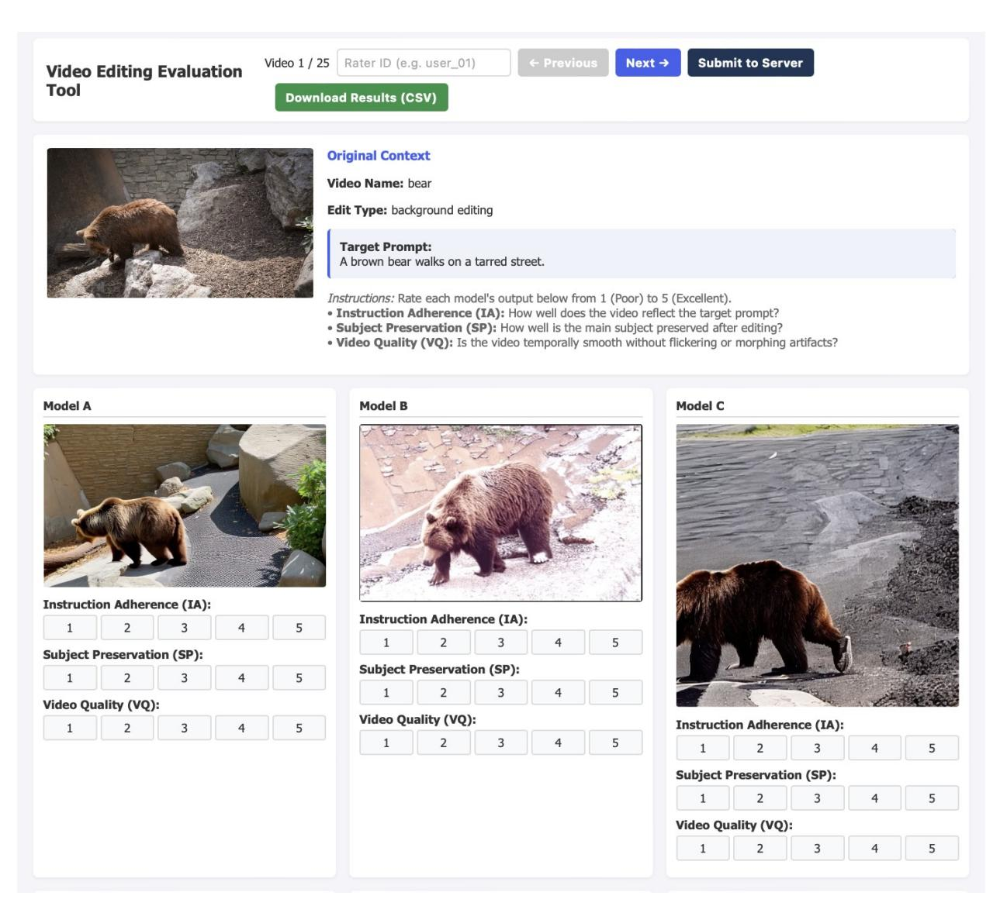

Figure 7. 우리 인간 평가 웹사이트의 사용자 인터페이스.


다양한 범위를 확보하기 위해, 우리는 25개의 고유한 비디오-프롬프트 조합으로 구성된 테스트 세트를 무작위로 선택했습니다.

이 평가에서는 10명의 독립적인 인간 평가자를 초대합니다. 25개의 평가 사례마다 참가자에게는 원본 비디오, 동작 텍스트 프롬프트, 그리고 평가 대상 방법으로 생성된 편집 비디오가 제공됩니다. 엄격한 블라인드 평가를 보장하고 잠재적인 인지적 또는 브랜드 편향을 완화하기 위해, 모든 모델 정체성은 완전히 익명화되며, 생성된 출력은 무작위로 섞여 각 개별 시험에 대해 모델 A에서 모델 B까지의 임시 식별자(예: 모델 A, 모델 B 등)가 부여됩니다.

<span id="page-28-0"></span>평가자들은 각 생성된 비디오를 1에서 5까지의 범위로 세 가지 핵심 지각 차원에서 평가하도록 요청받습니다. Video Quality (VQ)는 전반적인 시간적 부드러움, 미적 매력, 생성 아티팩트 부재를 평가합니다. Instruction Adherence (IA)는 편집된 비디오가 텍스트 프롬프트에서 요청한 특정 의미 변화를 얼마나 정확히 반영했는지를 측정합니다. 마지막으로 Source Preservation (SP)는 모델이 편집되지 않은 배경, 주제 정체성, 원본 소스 비디오의 구조적 배치를 유지할 수 있는 능력을 평가합니다. 이 평가 플랫폼을 위해 특별히 설계된 사용자 인터페이스는 동시에 옆에 옆 비교를 용이하게 하였으며, [Figure 7.](#page-27-0)에 그림으로 나타나 있습니다.

Figure 8. 재구현된 VidTTA [&#91;66&#93;](#page-17-9)와의 헤드-투-헤드 비교 결과.

## D.2 VidTTA와의 헤드-투-헤드 인간 평가

우리가 제안한 방법과 동일한 기초 구성을 공유하는 매우 경쟁력 있는 Test-Time Tuning (TTT) 기준점으로서, 재구현된 VidTTA [&#91;66&#93;](#page-17-9)는 표준 비디오 편집 작업에서 놀라울 정도로 강력한 성능을 보여줍니다. VidTTA의 핵심 최적화 메커니즘이 ElasticTTT와 밀접하게 유사하고, 생성 결과가 유사한 패턴을 보이기 때문에, 우리는 이전에 논의된 광범위한 다중 모델 인간 평가에서 이를 제외하고 명시적으로 헤드-투-헤드 인간 평가를 수행합니다.

평가자는 ElasticTTT와 VidTTA가 동일한 소스 비디오와 드라이빙 텍스트 프롬프트에 조건화된 비디오를 모두 직접 나란히 비교하는 것을 제시받습니다. 두 모델의 출력 위치는 각 시도마다 완전히 무작위화되며, 그 정체성은 엄격히 익명으로 유지됩니다. 각 비디오 쌍마다 참가자들은 생성된 출력을 비교하고 첫 번째 비디오가 더 나은지, 두 번째 비디오가 더 나은지, 혹은 두 비디오가 동일한 품질인지 한 번의 투표로 표시하도록 요청받습니다. 이러한 비교 판단은 비디오 품질, 지침 준수, 그리고 소스 보존을 종합적으로 고려하여 전체적으로 이루어집니다.


품질, 지침 준수, 그리고 소스 보존.

정량적 결과는 [Figure 8.](#page-28-0)에서 보여집니다. 집계된 선호 데이터는 ElasticTTT가 모든 평가 지표에서 VidTTA 기준선보다 일관되게 우수함을 명확히 나타내며, 훨씬 높은 승리율을 확보합니다. 특히 ElasticTTT는 지침 준수에서 42.3% 승리율을 달성해 15.8%를 능가하고, 전체 점수에서는 36.4%가 25.3%를 앞섭니다. 이러한 큰 차이는 ElasticTTT가 테스트 타임 튜닝의 고유한 한계를 성공적으로 극복하여 인간 관찰자에 의해 명백히 선호되는 시각적 출력을 제공함을 확인시켜 줍니다.

<span id="page-29-1"></span>Table 8. Prior video editing approaches with 70 TTT steps에 대한 정량적 비교. 최우수 결과는 빨간색으로, 두 번째 최우수 결과는 파란색으로 강조 표시됩니다. *는 해당 방법이 우리 설정으로 재구현되었음을 의미합니다.

| 방법 | VQ↑ | IA↑ | SP↑ | OVL↑ |  |
|--------------------------|------|------|------|------|--|
| 기타 방법 |  |  |  |  |  |
| AnyV2V[33] | 3.51 | 5.89 | 2.30 | 4.31 |  |
| Ground-A-Video[26] | 3.57 | 4.49 | 2.42 | 3.90 |  |
| Token-flow[15] | 4.47 | 5.57 | 4.30 | 4.83 |  |
| Ditto [2] | 5.48 | 5.95 | 3.32 | 5.62 |  |
| Flow-align [30] | 5.28 | 5.44 | 7.23 | 5.44 |  |
| Uniedit [1] | 3.87 | 6.51 | 0.54 | 5.04 |  |
| 테스트-타임-튜닝 방법 |  |  |  |  |  |
| Tune-A-Video* [69] | 5.75 | 6.67 | 3.62 | 5.80 |  |
| VidTTA*[66] | 5.16 | 6.06 | 3.86 | 5.27 |  |
| ElasticTTT | 6.08 | 7.02 | 4.68 | 6.68 |  |

# <span id="page-29-0"></span>E 추가 평가 결과

# E.1 적은 단계 평가

비록 최종 평가 설정으로 100 TTT-steps를 선택했지만, 우리는 동일한 기준군과 비교하여 70 TTT-steps에서 ElasticTTT를 추가로 평가하였다. 결과는 [Table 8.](#page-29-1)에 나타난다. 실험 결과, 우리 방법은 최첨단 성능을 달성할 수 있을 뿐만 아니라 더 작은 TTT 단계에서도 높은 수준의 편집 품질을 유지할 수 있음을 보여준다.

## E.2 TDR과 함께하는 더 많은 TTT 단계

Target Distribution Regularization (TDR)의 효능은 Test-Time Tuning (TTT) 프로세스의 최적화 역학과 깊이 얽혀 있기 때문에, 우리는 다양한 최적화 길이에서 TDR의 영향을 경험적으로 평가한다. [Figure 9](#page-30-1)은 TTT 단계 수에 따른 전체 편집 성능을 보여준다. 이론적 분석이 예측한 바와 같이, 표준 TTT는 단계 수가 증가함에 따라 편집 능력이 저하된다. 반대로, TDR를 도입하면 평가된 모든 TTT 단계 수에서 전체 편집 성능이 일관되게 향상되며, 특히 큰 TTT 단계에서 크게 개선되어 최적화 과정이 붕괴되는 것을 적극적으로 방지한다.

이 현상을 보다 정량화하기 위해, 우리는 최적화를 공격적으로 300 TTT 단계까지 확장한 소거 연구를 수행한다. [Table 9,](#page-30-2)에 자세히 나와 있는 바와 같이, TDR을 제거하면 Video Quality (VQ), Instruction Adherence (IA), Overall (OVL) 점수가 급격히 저하되어 심각한 조건화 붕괴를 보여준다. Source Preservation의 증가는 통제된 확률성 없이 TTT가 가져온 과적합을 나타낸다. 300 단계 실험은 Sec. 4.3의 소거 연구보다 훨씬 더 중요한 결과를 나타내며, 모델이 단계별로 과적합되어 훈련을 통해 점진적으로 이전 붕괴 현상을 악화시킨다.

<span id="page-30-1"></span>

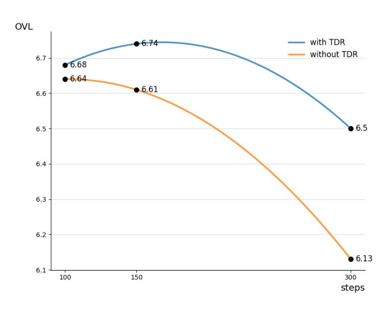

<span id="page-30-2"></span>Figure 9. 서로 다른 TTT 단계에서의 전체 점수 비교, TDR 유무

Table 9. 300 TTT 단계에서의 TDR 정량적 결과

| 방법 | VQ↑ | IA↑ | SP↑ | OVL↑ |
|-------------------|------|------|------|------|
| TDR 없이 | 6.09 | 6.28 | 6.67 | 6.13 |
| 전체 (ElasticTTT) | 6.31 | 6.69 | 6.38 | 6.50 |

## E.3 TDR를 통한 효율적인 정렬-편집 트레이드오프

민감한 애플리케이션, 특히 인간 얼굴이 포함된 경우에는 소스 보존이 가장 중요한 관심사이며, 사소한 구조적 변형이라도 심각하게 부자연스러운 아티팩트나 정체성 상실을 초래할 수 있다. TTT 단계 수를 조정하는 것은 편집 정도와 소스 보존을 제어하는 효과적인 메커니즘이지만, 본질적인 트레이드오프가 존재한다: 참조 비디오와의 정렬을 더 엄격하게 강제하면 의미적 정렬과 전반적인 편집 품질이 불가피하게 저하된다. 우리의 TDR 모듈을 도입하면 이 문제를 크게 완화시켜 최소한의 의미적 희생으로 견고한 참조 정렬을 가능하게 한다. 실험적으로 TTT 단계를 100에서 300으로 증가시킬 때, TDR을 사용하면 매우 효율적인 트레이드오프를 제공한다: OVL이 1점 감소하면 SP가 5점 크게 증가한다. 반면 TDR 없이 동일한 의미적 비용을 지불하면 SP가 겨우 2.7점만 향상된다.

# <span id="page-30-0"></span>VLM과 인간 판단의 상관 분석

<span id="page-30-3"></span>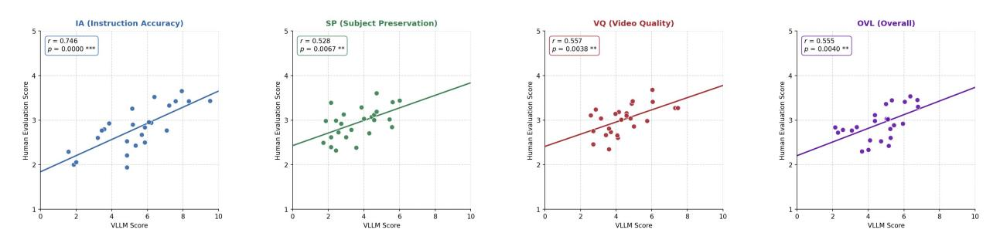

Figure 10. VLM 점수와 인간 평가 간의 상관 시각화

<span id="page-31-0"></span>

Table 10. 인간 평가 점수와 VLM이 제공한 점수 간의 양측 Pearson 상관계수 유의성 검정 p-값. 빨간색은 0.01 수준에서 매우 유의미하며 파란색은 0.05 수준에서 통계적으로 유의미함을 나타냅니다.

| 방법 | VQ | IA | SP | OVL |
|---------------------|--------|--------|--------|--------|
| Flow-align [29] | 0.0172 | 0.0001 | 0.0005 | 0.0025 |
| Ditto [2] | 0.0747 | 0.0000 | 0.0931 | 0.0000 |
| Uniedit [1] | 0.0116 | 0.0126 | 0.0006 | 0.0360 |
| AnyV2V [33] | 0.0544 | 0.0005 | 0.0000 | 0.0223 |
| Ground-A-Video [26] | 0.8595 | 0.0000 | 0.1202 | 0.3907 |
| Token-flow [15] | 0.0070 | 0.0000 | 0.0438 | 0.0000 |
| ElasticTTT | 0.0099 | 0.0220 | 0.0033 | 0.0038 |

<span id="page-31-1"></span>표 11. VLM이 제공한 점수와 인간 평가 점수 간의 Pearson 상관계수(r). 강한 r ≥ 0.5; 보통 0.3 ≤ r < 0.5; 약한 r < 0.3.

| 방법 (Methods) | 벡터 양자화 (VQ) | IA (IA) | SP (SP) | OVL (OVL) |
|---------------------|---------|--------|--------|--------|
| Flow-Align [29] | 0.4041 | 0.7077 | 0.6310 | 0.5777 |
| Ditto [2] | 0.3084 | 0.8686 | 0.3146 | 0.7760 |
| UniEdit [1] | 0.5265 | 0.4945 | 0.6812 | 0.4219 |
| AnyV2V [33] | 0.3999 | 0.6388 | 0.7474 | 0.4595 |
| Ground-A-Video [26] | −0.1498 | 0.6103 | 0.2673 | 0.1795 |
| Token-Flow [15] | 0.5358 | 0.7119 | 0.3899 | 0.7405 |
| ElasticTTT | 0.5922 | 0.4245 | 0.5907 | 0.5915 |

우리는 자동 Vision‑Language Model (VLM) 평가와 인간의 지각 판단 간의 일치를 엄밀히 평가하기 위해, Instruction Adherence (IA), Source Preservation (SP), Video Quality (VQ), 그리고 Overall score (OVL)의 네 가지 핵심 차원에서 Pearson 상관계수 (r)를 계산한다. 샘플 크기 n = 25개의 비디오 클립에 대해, VLM이 부여한 점수 (xi)와 인간 평가 점수 (yi) 간의 상관계수는 다음과 같이 계산된다:

$$r = \frac{\sum_{i=1}^{n} (x_i - \bar{x})(y_i - \bar{y})}{\sqrt{\sum_{i=1}^{n} (x_i - \bar{x})^2} \cdot \sqrt{\sum_{i=1}^{n} (y_i - \bar{y})^2}}$$

(30)

여기서 x̄와 ȳ는 각각의 샘플 평균을 나타낸다. 이 계수는 [−1, 1] 범위에 한정되며, 두 평가 체계 간의 선형 관계의 강도를 정량화한다.

이러한 관찰된 상관관계의 통계적 유의성을 평가하기 위해, 우리는 양측 가설 검정을 공식화한다. ρ를 모집단 상관계수의 진정한 값으로 둔다. 우리는 귀무가설과 대립가설을 다음과 같이 정의한다:

$$H_0: \rho = 0 \quad \text{vs.} \quad H_1: \rho \neq 0$$

(31)

귀무가설 H0이 관측된 상관계수가 순전히 무작위 표본 변동에 기인한다고 가정할 때, 이를 검증하기 위해 t‑통계량을 계산한다:

$$t = r\sqrt{\frac{n-2}{1-r^2}}\tag{32}$$


귀무가설 하에서 이 검정 통계량은 자유도 df = n − 2인 스튜던트 t‑분포를 따른다. 본 평가 샘플에서는 df = 23이다. 이 t‑통계량을 바탕으로 대응되는 양측 p‑값을 계산한다. 이 p‑값은 계산된 r과 동일하거나 더 극단적인 상관계수를 순전히 우연에 의해 관측할 확률을 나타낸다 (귀무가설 H<sup>0</sup>이 성립한다고 가정할 때). 충분히 작은 p‑값은 H<sup>0</sup>을 기각하고 H1을 채택할 강력한 증거를 제공하며, 이는 통계적으로 유의미한 선형 관계를 나타낸다. 구체적인 p‑값과 유의수준은 [Table 10.](#page-31-0)에서 보여진다. 일곱 개 모델 각각에 대한 구체적인 피어슨 상관계수는 [Table 11,](#page-31-1)에서 보고되며, 분류 임계값은 Cohen의 확립된 가이드라인 [&#91;9&#93;](#page-13-12)에서 채택하였다.

또한, 이 정합성을 [Figure 10.](#page-30-3)에서 시각화한다. 산점도의 각 데이터 포인트는 개별 편집 작업을 나타내며, 그 공간 좌표는 일곱 개 모델 전체에서 평균한 VLM 점수와 인간 평가 점수를 나타낸다. 그림 캡션에서 r은 상관계수를, p는 통계적 유의성 검정에 대한 대응 p‑값을 나타낸다. 별표 (*)는 상관계수가 통계적으로 유의미함을 나타내며, 일반적으로 p < 0.05일 때 사용된다. 별표가 많을수록 높은 유의성을 의미한다.

결국, 이러한 정량적 분석은 대부분의 경우 VLM 점수와 인간 평가 사이에 강하고 양의, 통계적으로 유의미한 선형 상관관계가 존재함을 보여준다. 이 견고한 정합성은 우리 VLM 기반 지표가 인간 시각 판단의 매우 신뢰할 수 있고 확장 가능한 대리 지표임을 입증한다.

# <span id="page-32-0"></span>VLM 판단을 위한 G 프롬프트 설계 (G Prompt Design for VLM Judgment)

결과의 재현성을 확보하기 위해, 아래에 GPT‑5 평가를 위한 프롬프트를 나열한다:

1 " 두 개의 프레임 시퀀스가 제공됩니다 :
2 - Sequence A: 원본 비디오 프레임
3 - Sequence B: 편집된 비디오 프레임
4 비디오 편집 결과를 0에서 10까지 점수 매깁니다.
5 실제 상황에 따라 점수를 보다 분산적으로 부여하십시오.
6 비디오에서.

8 Scoring rubric :
9 1) 편집 충족 ( 가장 높은 가중치 ):
10 편집된 비디오가 편집 프롬프트를 따르는가, 원본 프롬프트와 비교했을 때?
11 2) 콘텐츠 보존 :
12 관련 없는 콘텐츠/정체성/배경을 유지해야 할 때 유지하십시오.
13 3) 시간적 및 시각적 일관성 :
14 안정적인 움직임, 명백한 아티팩트/깜빡임이 없음.

16 Return strict JSON only with keys :
17 {" score_ 0_10": number , " reason ": string , " confidence ": number }
18 score_ 0_10은 [0,10] 범위, confidence는 [0,1] 범위, reason은 80단어 이하입니다.

Listing 1. VLM 프롬프트 for Overall Score (Listing 1. VLM prompt for Overall Score)

```
" 당신은 두 개의 프레임 시퀀스를 받게 됩니다 :
- Sequence A : 원본 비디오 프레임
- Sequence B : 편집된 비디오 프레임
당신은 비디오 편집 결과를 0에서 10까지 점수 매깁니다.
가능한 한 실제 상황에 따라 점수를 더 분산시켜 부여하십시오
비디오의 실제 상황에 따라 .
```


" 비디오 편집 품질을 0에서 10까지 평가합니다.
점수를 보다 분산적으로 부여하십시오.
실제 상황에 따라 비디오에서."

        " 스코어링 루브릭 :"

        "1) 이미지 품질 :"
        편집된 비디오의 이미지는 고품질이며,
        선명하고 명확해야 합니다."

        "2) 미학 점수 :"
        편집된 비디오는 미학적으로 만족스럽고,
        동작이 부드럽고 자연스러워야 합니다."

        "3) 배경 일관성 :"
        배경이 원본 비디오와 일치하며,
        명백한 아티팩트/깜빡임이 없어야 합니다."

        "4) 주제 일관성 :"
        객체가 원본 비디오와 일치하며,
        명백한 아티팩트/깜빡임이 없어야 합니다."

        "5) 동작 부드러움 :"
        동작이 부드럽고 자연스러우며,
        명백한 아티팩트/깜빡임이 없어야 합니다."

        " 엄격한 JSON만 반환하십시오. 키는 다음과 같습니다 :"
        '{" score_0_10 ": number , " reason ": string , " confidence ": number } '
        " score_0_10은 [0,10] 범위이며, confidence는 [0,1] 범위이며,"
        reason은 80단어 이하입니다."

Return strict JSON only with keys :
{" score_0_10 ": number , " reason ": string , " confidence ": number }
score_0_10은 [0,10] 범위이며, confidence는 [0,1] 범위이며,
reason은 80단어 이하입니다.

Listing 2. VLM 프롬프트 for Video Quality (Listing 2. VLM prompt for Video Quality)

" 두 개의 프레임 시퀀스가 주어집니다 :
- 시퀀스 A : 원본 비디오 프레임
- 시퀀스 B : 편집된 비디오 프레임
비디오 편집 결과를 0에서 10까지 점수 매기고 있습니다.
점수를 보다 분산적으로 부여하십시오.
비디오의 실제 상황에 따라
" 비디오 편집 결과를 0에서 10까지 점수 매기고 있습니다.
점수를 보다 분산적으로 부여하십시오.
비디오의 실제 상황에 따라"
        " 점수 매기기 기준 :"
        "1) 의미적 정렬 :"
        편집된 비디오가 편집 프롬프트와 원본 프롬프트를 따르는가?
        " 엄격한 JSON만 반환하십시오. 키는 다음과 같습니다 :"
        '{" score_0_10 ": number , " reason ": string , " confidence ": number } '
        " score_0_10 은 [0 ,10] 범위이며, confidence 은 [0 ,1] 범위이며,
        reason 은 80단어 이하입니다 .
엄격한 JSON만 반환하십시오. 키는 다음과 같습니다 :
{" score_0_10 ": number , " reason ": string , " confidence ": number }
score_0_10 은 [0 ,10] 범위이며, confidence 은 [0 ,1] 범위이며, reason 은 80단어 이하입니다 .


# Listing 3. VLM 프롬프트 for Video (Listing 3. VLM prompt for Video)

```
" 두 개의 프레임 시퀀스가 주어집니다 :
- 시퀀스 A : 원본 비디오 프레임
- 시퀀스 B : 편집된 비디오 프레임
비디오 편집 결과를 0에서 10까지 점수 매깁니다.
실제 비디오 상황에 따라 점수를 보다 분산되게 부여하십시오.
" 비디오 편집 결과를 0에서 10까지 점수 매깁니다.
실제 비디오 상황에 따라 점수를 보다 분산되게 부여하십시오."
        " 점수 매기기 기준 :"
        "1) 배경(편집해서는 안 되는 장소)의 세부 사항이 원본 비디오와 얼마나 일관되는가?"
        '{" score_0_10 ": number , " reason ": string , " confidence ": number } '
        " score_0_10 은 [0 ,10] 범위이며, confidence 은 [0 ,1] 범위이며,
        reason 은 80단어 이하입니다."
```

"Listing 4. 소스 보존을 위한 VLM 프롬프트"

"# <span id="page-34-0"></span>H 비동기 노이즈 스케줄링 마스크 시연"

"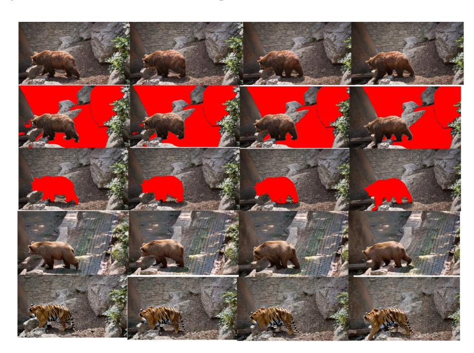"

"Figure 11. 마스크 영역과 최종 편집 비디오의 시각적 예시."

""

"In [Figure 11,](#page-34-0) 우리는 Grounded-SAM2 [&#91;57&#93;](#page-16-9)에서 생성된 비동기 노이즈 스케줄링(Async-NS)에 사용되는 마스크를 보여줍니다."

"우리는 동일한 참조 비디오의 두 가지 다른 편집 시나리오를 보여주어 편집 프롬프트와 마스크 영역 사이의 관계를 더욱 입증합니다. 두 번째와 세 번째 행은 마스크 영역을 보여주고, 네 번째와 다섯 번째 행은 최종 편집 결과를 보여줍니다."

"# <span id="page-35-0"></span>I 한계 및 향후 연구"

"# I.1 한계"

"우리 모델은 모든 편집 작업에서 최첨단 성능을 달성할 수 있지만, 여전히 몇 가지 한계가 존재합니다. 첫째, 우리 모델의 TTT(테스트 타임 튜닝) 특성은 학습이 필요 없는 방법들에 비해 더 많은 계산 비용을 초래합니다. 둘째, 일부 상황에서 우리는 비디오의 특정 영역을 과도하게 지정하면 다른 영역의 편집 능력도 제한될 수 있다는 것을 발견했습니다. 우리는 이 현상이 테스트 타임 튜닝 과정에서 자기 주의(attention) 층의 과도한 최적화에 의해 발생했을 가능성이 있다고 추정합니다."

"# I.2 향후 연구"

현재, 우리의 비동기 잡음 스케줄링은 Grounded‑SAM2와 같은 외부 모델에서 생성된 명시적 마스크에 의존합니다. 향후 연구에서는 초기 TTT 단계 동안 확산 모델 내부의 교차 주의(attention) 맵에서 공간 마스크를 동적으로 추출함으로써 이 의존성을 제거하고 완전한 엔드‑투‑엔드 프레임워크를 구축할 수 있습니다.

또한, 우리는 ElasticTTT를 장기 컨텍스트 또는 멀티샷 비디오를 처리하도록 확장하려고 합니다. 시간적 청킹 또는 슬라이딩 윈도우 TTT를 도입함으로써 수백 프레임에 걸친 시간적 일관성을 보장하면서도 표준 VRAM 제약을 초과하지 않을 수 있습니다.

# <span id="page-35-1"></span>J 추가 시연

[Figure 12,](#page-36-1)에서는 증가된 움직임과 복잡한 자세를 가진 두 가지 도전적인 사례를 추가로 보여줍니다. [Figure 13,](#page-37-0)에서는 다른 비디오 편집 방법과 비교하여 두 가지 추가 사례를 시연합니다.

<span id="page-36-1"></span>

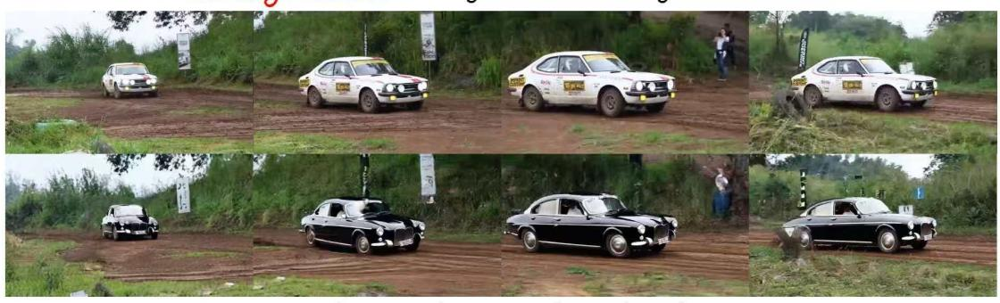

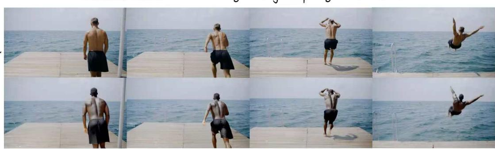

Figure 12. Two more challenging cases.

# <span id="page-36-0"></span>K Social Impact and Ethical Concerns

# K.1 Social Impact

# K.1.1 Positive Social Impact

ElasticTTT는 광범위한 사용자 기반을 위해 비디오 편집을 민주화하는 접근 가능하고 매우 효과적인 프레임워크로서 역할을 합니다. 직관적인 수정을 자연어 지침만으로 가능하게 함으로써 DaVinci Resolve와 같은 전문급 소프트웨어와 전통적으로 연관된 가파른 학습 곡선을 제거합니다. 또한, 우리 모델은 일상적인 편집 작업을 자동화함으로써 전문 제작자에게 상당한 가치를 제공하며, 이를 통해 워크플로우를 크게 가속화하고 시간적·재정적 생산 비용을 모두 절감합니다.

# K.1.2 Potential Risk

우리는 제안한 ElasticTTT가 고품질 비디오 편집을 민주화하지만, 본질적으로 악의적인 비디오 합성과 관련된 위험을 내포하고 있다. 비디오의 특정 영역을 정밀하게 편집할 수 있는 능력은 동의 없이 개인을 가공된 시나리오에 배치하는 등 설득력 있는 위조 콘텐츠를 만드는 데 악용될 수 있다. 이는 딥페이크와 허위 정보 확산이라는 광범위한 사회적 도전에 기여한다. 우리는 우리 방법을 사용한 속임수 콘텐츠 생성 행위를 엄격히 비난한다. 이러한 오용을 방지하기 위해, 우리는 프레임워크의 다운스트림 애플리케이션에 보이지 않는 워터마킹을 도입하고 고급 합성 미디어 탐지 알고리즘과 결합할 것을 제안한다.

# K.2 인간 평가를 위한 윤리적 우려 (Ethical Concerns for Human Evaluation)

우리의 인간 평가 프레임워크는 윤리적 연구 기준을 엄격히 준수하도록 설계되었다. 첫째, 평가에 참여한 모든 평가자는 자발적으로 참여하며, 언제든지 부정적인 결과 없이 철회를 할 수 있는 무조건적인 권리를 보유한다. 둘째, 우리는 엄격한 데이터 프라이버시 정책을 시행했으며, 수집된 모든 피드백은 완전히 익명화되어 개인 식별 가능한 세부 사항이 기록되지 않도록 보장했다. 개인적으로


<span id="page-37-0"></span>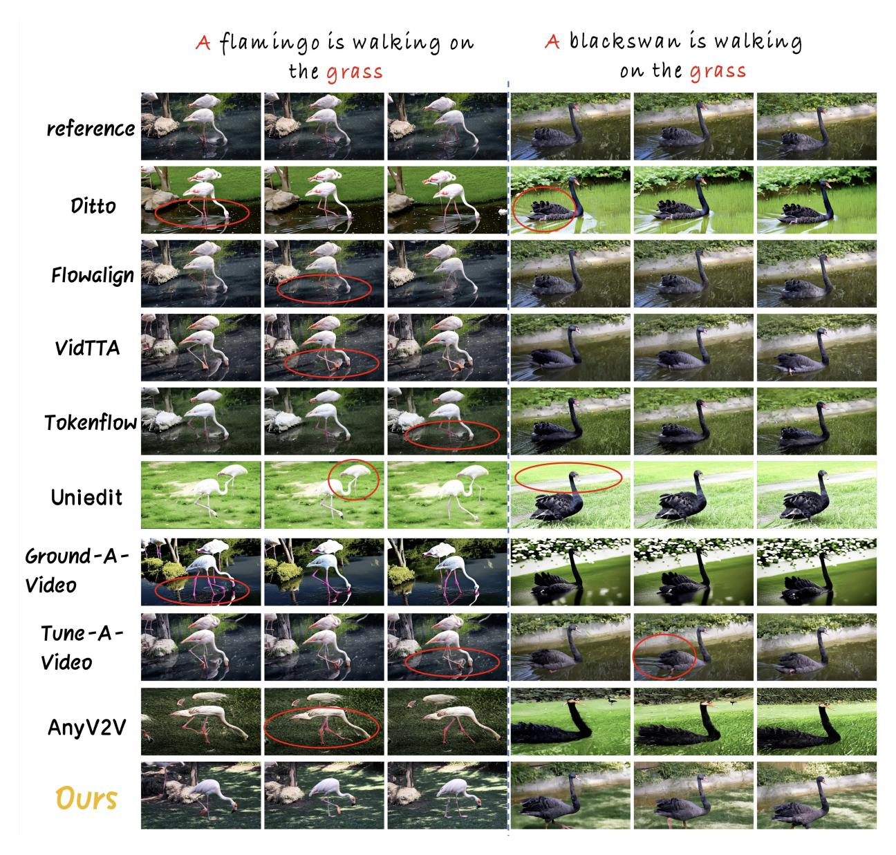

Figure 13. 다른 방법과의 시각적 비교. 우리 방법은 편집 지침을 엄격히 따르면서 편집되지 않은 영역의 세부 정보를 성공적으로 보존한다.


개인 식별 가능한 세부 사항이 기록된 적이 없다. 또한, 본 연구는 순수 관찰적이다. 핵심 과제는 인간 피험자가 표준 합성 비디오를 검토하는 것만을 요구하며, 이는 물리적 위험, 심리적 스트레스, 또는 공격적인 시각 자극으로부터 완전히 보호한다. 따라서 우리의 방법론은 참가자의 복지를 해칠 수 있는 침습적 개입을 피한다.

# K.3 보호 조치 (Safeguard)

사용자 친화적인 비디오 편집 소프트웨어나 플랫폼을 개발할 때 적절한 보호 조치를 구현하는 것은 매우 중요하다. 우리의 인간 평가를 위한 철저히 검증되고 안전한 평가 환경을 보장하기 위해, 우리는 유명한 DAVIS 벤치마크를 기반으로 구성된 선별된 데이터셋에서 비디오를 엄격히 샘플링했다. 이 의도적인 선택 과정은 모든 시각적 콘텐츠가 무해함을 보장하며, 인터넷에서 흔히 발견되는 부적절하거나 민감하거나 검증되지 않은 미디어가 무심코 포함되는 것을 적극적으로 방지한다.

