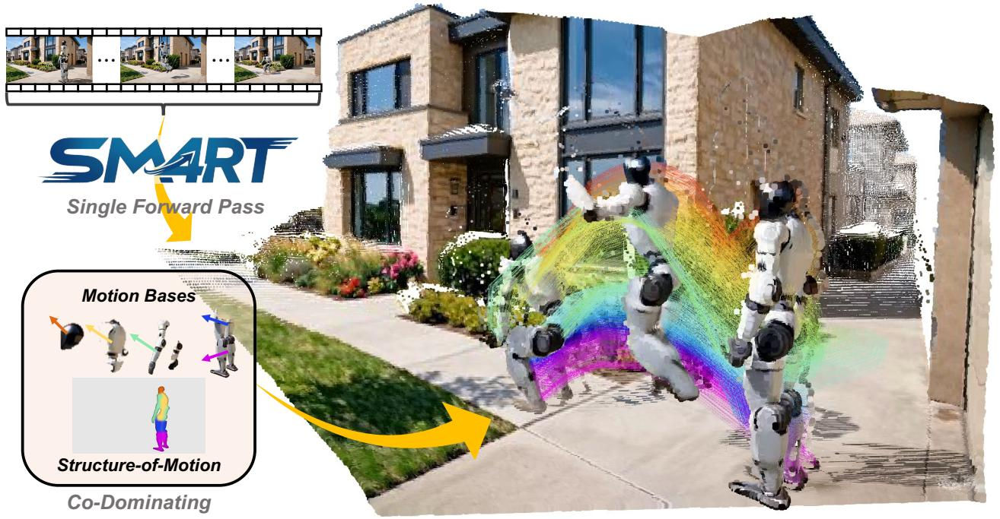
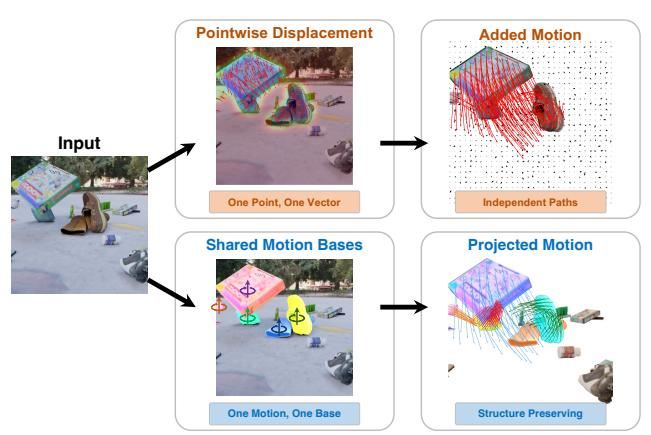
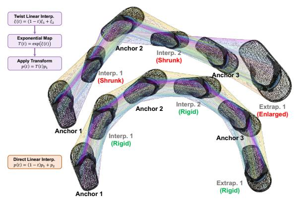
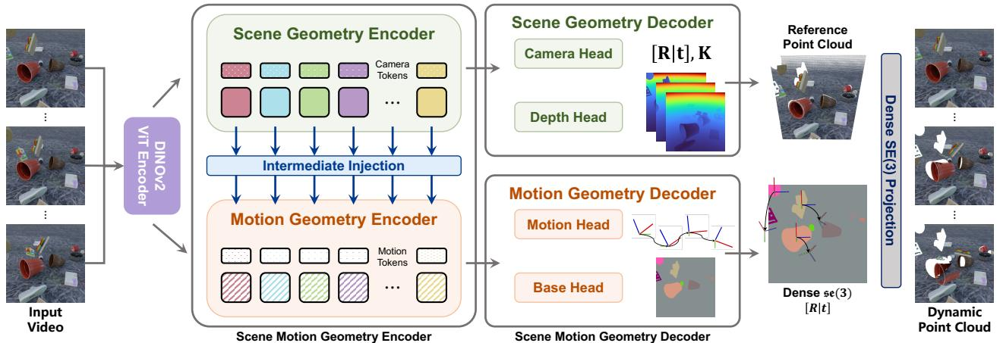
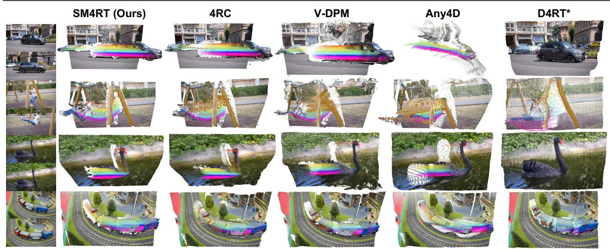
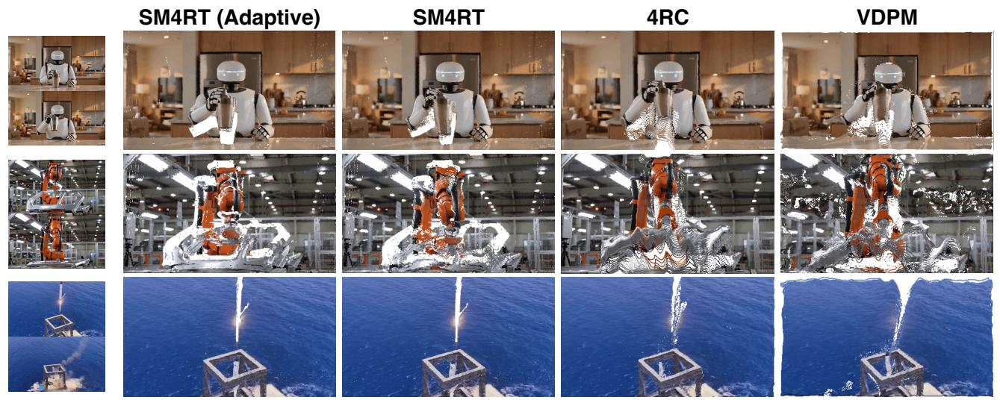
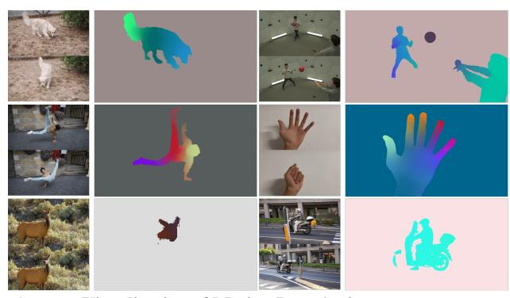

# SM4RT: 4D 재구성을 위한 구조화된 모션 기하학 학습 (SM4RT: Learning Structured Motion Geometry for 4D Reconstruction)

- 원제: SM4RT: Learning Structured Motion Geometry for 4D Reconstruction
- 원문: [https://arxiv.org/abs/2607.22534](https://arxiv.org/abs/2607.22534)
- PDF: [https://arxiv.org/pdf/2607.22534v1](https://arxiv.org/pdf/2607.22534v1)
- arXiv ID: `2607.22534`

---

# SM4RT: 4D 재구성을 위한 구조화된 모션 기하학 학습 (SM4RT: Learning Structured Motion Geometry for 4D Reconstruction)

Shing Ho J. Lin∗ Wenzhao Zheng∗,† Dong Zhuo∗ Yuqi Wu Jie Zhou Jiwen Lu

인텔리전트 비전 그룹, 칭화대학교

프로젝트 페이지: <https://wzzheng.net/SM4RT> 코드: <https://github.com/wzzheng/SM4RT>

그림 1. 구조화된 모션 기하학. SM4RT는 *Structure-of-Motion*: 각 구성 요소가 시간에 따라 어떻게 진화하는지를 설명하는 모션 베이스 집합과 소스 포인트를 모션 베이스에 바인딩하는 시간 공유 포인트-베이스 할당을 사용하여 장면 역학을 나타낸다. 이들은 밀집된 강체 변환 맵을 생성하여 세계 좌표 트랙을 복원하고 동적 4D 장면 뒤에 있는 구조화된 모션 기하학을 드러낸다.

# 초록 (Abstract)

*Geometry Foundation Models (GFMs)는 단일 카메라 3D 재구성을 크게 향상시켰지만, 이 능력을 4D 동적 이해로 확장하는 것은 여전히 근본적인 과제이다. 대부분의 기존 모션 인식 방법(예: 희소 추적, 밀집 포인트-별 흐름)은 모션을 독립적인 포인트-별 변위로 취급하며 물리적 모션의 구조적 특성을 무시한다. 그러나 실제 물체는 일반적으로 강체 역학을 따르며, 포인트는 보통 개별적으로 움직이지 않고 집단적으로 움직인다. 모션 자체는 기하학적 구조를 가지고 있다: 물리적 물체는 SE(3)에 의해 지배되는 일련의 강체 변환을 거친다, 포인트-별 변위가 아닌. 이 통찰을 바탕으로 우리는 SM4RT, 즉 구조화된 모션 4D 재구성 트랜스포머(Structured Motion 4D Reconstruction Transformer)를 제안한다. SM4RT는 *Structure-of-Motion (SoM)*를 도입하여 장면 역학을 표현한다. 장면 모션은 각 시점에서 6D twist 시퀀스로 표현되는 압축된 모션 베이스 집합으로 분해된다. 이후 이 베이스들에 대한 희소, 시간 공유 픽셀별 할당 가중치를 통해 밀집 장면 모션을 복원하며, 같은 물체의 포인트가 공통의 강체 모션 궤적을 공유하도록 보장한다. SM4RT는 병렬 모션 기하학 인코더와 디코더를 도입하여 단일 전방 패스로 단일 RGB 비디오에서 3D 기하학, 세계 좌표 모션, 장면 운동학 구조를 동시에 추론한다. SM4RT는 강력한 모션 재구성 성능을 달성하면서 장면 모션의 기하학적 구조를 보존한다.*

∗동일 기여. †프로젝트 리더.

## 1. 서론 (1. Introduction)

Geometry Foundation Models (GFMs)의 최근 발전은 단일 카메라 비디오에서 3D 장면 기하학을 재구성하는 놀라운 능력을 보여 주었으며, 구현된 지능[&#91;44&#93;](#page-11-5)부터 자율 주행[&#91;54,](#page-11-6) [55&#93;](#page-11-7)까지 다양한 응용을 촉진한다. 정적 기하학 재구성이 실용적 충실도를 달성함에 따라, 다음 단계는 4D 동적 이해이며, 이는 장면 구조와 그 진화를 지배하는 기저 움직임을 동시에 추론한다. 최근 D4RT[&#91;49&#93;](#page-11-8)는 경량 쿼리 디코더를 갖춘 통합 전방 트랜스포머가 4D 재구성을 효율적이고 확장 가능하게 만들 수 있음을 보여 주었으며, 쿼리 가능한 동적 재구성을 강력한 패러다임으로 확립했다. 그러나 이러한 쿼리 중심의 공식은 주로 공간과 시간에 걸쳐 포인트가 어디에 있는지를 답하고, 포인트가 함께 움직이는 이유를 설명하는 구조화된 모션 기하학을 명시적으로 드러내지 않는다.

대부분의 기존 모션 인식 방법은 포인트별 궤적 추정으로 구성된다: 희소 포인트 추적 [38], [47] 또는 밀집 포인트별 흐름 추정 [17], [29]. 두 방법 모두 모션을 독립적인 포인트별 변위의 집합으로 취급하며, 포인트 간의 관계적 의존성을 간과한다. 위치 추적 작업에서는 실험적으로 효과적이지만, 이 표현식은 *구조적 특성*을 포착하지 못한다: 정확한 포인트별 변위가 반드시 의미 있는 동적 이해를 의미하지 않는다. *우리는 인간이 모션을 어떻게 인식하는지에 대해 성찰한다.* 인간은 희소한 운동학적 단서 [13]를 통해 모션을 인식한다: 픽셀이나 포인트 수준이 아니라 객체와 부품 수준에서, 빠르고 간결한 모션 이해를 가능하게 한다. 기계가 추적하는 3D 포인트는 원자적 개체가 아니라 연속적이고 물리적으로 기반이 되는 객체에서 추출된 샘플이다 [25]. 실제 객체는 일반적으로 강체 운동학을 따르며, 포인트는 *집합적으로* 움직이고, 고립적으로 움직이지 않는다. 순수 회전을 고려해 보자: 변위 관점에서 회전하는 포인트는 무질서한 좌표 변위처럼 보이지만, 이들은 SE(3)에 의해 지배되는 단일 공통 모션을 공유한다. 이는 관점을 전환하도록 동기를 부여한다: *모션이 있는 기하학*에서 *모션의 기하학*으로, 모션 자체가 물리적 변환의 대칭군에 인코딩된 기하학적 구조를 갖는다는 것이다 [42], 그리고 모든 모션 표현은 이러한 군론적 선험을 존중해야 한다.

우리는 SM4RT, Structured Motion 4D Reconstruction Transformer 프레임워크를 제안한다. 이 프레임워크는 단일 전방 패스에서 단일 RGB 비디오만으로 3D 장면 기하학, 세계 좌표계의 밀집 모션, 그리고 장면 모션 구조를 동시에 추론한다. 독립적인 포인트별 변위를 예측하는 대신, SM4RT는 *모션 구조* (Structure-of-Motion) (SoM)을 도입한다: 장면 모션은 N개의 모션 베이스로 압축적으로 분해되며, 각 베이스는 se(3)에서 6D twist 시퀀스로 표현된다. 이후 밀집 장면 모션은 이 베이스들을 희소하고 시간 공유되는 픽셀별 할당 가중치를 통해 결합함으로써 복원되며, 장면 전반에 걸쳐 물리적으로 일관된 모션을 보장한다. 우리는 *모션 구조*라는 용어를 사용하여 이 표현이 고전적인 SfM에서처럼 구조를 모션으로부터 복원하지 않는다는 점을 강조한다. 대신, 모션 자체의 구조, 즉 어떤 포인트가 함께 움직이고 각 일관된 그룹이 시간에 따라 어떻게 진화하는지를 명시적으로 모델링한다. 이 twist 시퀀스 분해가 핵심 표현 선택이다: 할당 맵은 어떤 포인트가 함께 움직이는지를 결정하고, 각 모션 베이스는 해당 잠재 객체 또는 부품이 시간에 따라 어떻게 움직이는지를 설명한다. 구조적으로, SM4RT는 병렬 Motion Geometry Encoder를 도입하여 중간 기하학 특징에서 동적 단서를 추출하고, Motion Geometry Decoder를 통해 모션 베이스와 픽셀별 할당 맵을 동시에 예측한다. 엔트로피 정규화와 가짜 배경 제약은 더욱 간결하고 물리적으로 의미 있는 분해를 장려한다. 공유된 운동학 매개변수와 암시적 엔터티 바인딩을 통해 SM4RT는 전역 모션 일관성을 강제하고, 시간에 따른 위상적 무결성을 보존하며, 물리적으로 해석 가능하고 구성적으로 구조화된 표현을 제공한다. 포인트 추적을 넘어, twist 표현은 구조화된 모션 보간과 rigid-body kinematics에 기반한 미래 상태 예측을 가능하게 하며, 이는 포인트별 변위 방법으로는 도달할 수 없는 기능이다. SM4RT는 기존 모션 인식 벤치마크에서 최첨단 성능을 달성하며, 구조화된 모션 인식과 정확한 포인트별 궤적 추정이 상호 보완적이며, 대립적이 아니라는 것을 입증한다.

## 2. 관련 연구 (Related Work)

Geometry Foundation Models. 대규모 비전 트랜스포머의 성공을 바탕으로 Geometry Foundation Models (GFMs)은 최근에 순방향 3D 재구성 시스템으로 등장했으며, 이는 장면별 최적화를 피하고 대규모 데이터에서 일반화 가능한 기하학적 선행 지식을 학습한다. 이 모델들 [39,] [41,] [43,] [53]은 공통된 패러다임을 공유한다: 이미지나 비디오 프레임 세트가 주어지면, 단일 순방향 패스에서 카메라 파라미터, 깊이 맵, 포인트 맵을 예측한다. VGGT [39]는 다중 뷰 기하학을 위한 통합 백본을 구축하며, 프레임 전반에 걸쳐 외관과 3D 구조를 공동으로 추론한다. CUT3R [41]는 효율적인 온라인 재구성을 위해 지속적인 장면 상태를 유지하고, StreamVGGT [53]는 증분 프레임 처리를 통해 스트리밍 비디오에 이를 확장한다. Point3R [43]는 도전적인 시점 변화를 견디는 견고성을 향상시키기 위해 포인트 중심 표현을 재검토한다. 장면 수준 재구성을 넘어 MapAnything [18]은 규모 인식 매핑을 목표로 하고, IVGT [45]는 3D 메쉬 구축을 위한 암시적 신경 장면 표현을 탐구한다. SM4RT는 이 기반을 정적 기하학에서 4D 동작으로 확장한다.

Motion Perception. 모션 인식은 2D 픽셀 추적에서 완전한 3D 밀집 추정까지 광범위한 스펙트럼을 포괄하지만, 대부분의 방법은 모션을 프레임 간 포인트별 변위로 표현한다. 2D에서는 [5, 15, 16, 20]과 같은 대규모 연구가 시간적 일관성 모델링, 슬라이딩 윈도우 어텐션, 특징 워핑을 통해 장거리 포인트 추적을 발전시켜, 가려진 대상과 빠르게 움직이는 대상에서 견고한 성능을 달성했다. 3D로 확장하면 SceneTracker [38]와 SpatialTrackerV2 [47]와 같은 방법이 단일 카메라 깊이 선행 지식과 기하학적 장면 선행 지식을 통합하여 희소 3D 쿼리를 추적하지만, 설계상 희소 입력에 한정된다. 밀집 3D 모션을 위해 최근 방법들 [7, 17, 24, 26, 29, 30, 34]은 단일 비디오에서 픽셀 단위 세계 좌표 추적을 목표로 한다. 특히 St4RTrack [7]은 픽셀 모션을 전역 4D 좌표 공간에 매핑하고, TraceAnything [24]은 부드러운 모션 필드를 위해 파라메트릭 B-스플라인 궤적을 적합하며, 4RC [26]은 통합 쿼리-응답 메커니즘을 통해 기하학과 밀집 궤적을 복원한다. 최근 D4RT [49]는 가벼운 쿼리 디코더를 갖춘 통합 순방향 트랜스포머를 도입하여 소스 시간, 타깃 시간, 카메라 좌표를 가변적으로 탐색함으로써 효율적인 재구성을 가능하게 한다. 그러나 이들은 객체 수준 구조를 전혀 고려하지 않은 독립적인 포인트별 모션 추정치를 생성하여, 구조화된 동적 장면 이해에 본질적으로 한계가 있다. 효율적인 포인트-시간 쿼리만에 집중하기보다는 SM4RT는 강체 동역학 개체를 사용해 모션을 모델링하고 객체/부품 수준 모션 구조를 노출한다.

모션 분해. 일부 선행 연구는 장면 모션이 대표적인 강체 구성 요소들의 압축된 집합으로 분해될 수 있음을 인식하고 있으며, 이는 고전적인 다중체 모션 분할 [37]과 일치한다. RAFT-3D [36]는 이미지 쌍에 대해 밀집 SE(3) 필드를 예측하지만 RGBD 입력을 필요로 하며 단일 카메라 RGB 비디오에는 일반화되지 않는다. Motion4D [52]는 SAM2 마스크의 도움으로 모션과 의미론적 최적화를 번갈아 수행한다. Shape of Motion [40]은 우리의 표현과 밀접한 관련이 있으며, 압축된 SE(3) 모션 기저와 부드러운 포인트-투-베이스 분해를 통해 동적 장면의 저차원 구조를 활용한다. 그러나 이는 단일 장면 최적화와 단일 카메라 깊이, 장거리 2D 트랙과 같은 외부 사전 지식을 통해 구조를 복원한다. 반면 SM4RT는 순방향 지오메트리 기초 모델 (Geometry Foundation Model) 내부에서 구조-모션 (Structure-of-Motion) 표현을 학습하며, RGB 비디오에서 단일 순방향 패스로 시간 공유 할당과 시간적 twist-시퀀스 모션 기저를 직접 예측한다. 이들은 구조화된 모션 분해의 실현 가능성을 입증하지만, 깊이 또는 분할 마스크와 같은 보조 입력에 의존하고, 반복적인 테스트 타임 최적화를 요구하며, 데이터에서 순방향 모션 표현을 학습하지 못한다는 주요 한계를 공유한다. SM4RT는 보조 입력 없이, 테스트 타임 최적화 없이 단일 순방향 패스로 단일 카메라 RGB 비디오에서 구조-모션을 학습함으로써 이러한 한계를 해결한다.

Figure 2. **모션 표현의 비교.** 제안된 표현은 객체 모션의 구조를 보존하며, 표준 픽셀 단위 변위보다 더 구조화된 설명을 제공하고 객체 내부의 동질성을 장려한다.

## 3. 제안된 접근법 (Proposed Approach)

### 3.1. 모션을 포함한 기하학에서 모션의 기하학으로 (Geometry with Motion to Geometry of Motion)

**지오메트리 기초 모델.** 단일 카메라 RGB 비디오 I가 S 프레임으로 구성되면, GFM  $\mathcal{F}_{geo}$  는 단일 순방향 패스로 각 프레임의 카메라 내부 파라미터  $\mathbf{K}$ , 외부 파라미터  $[\mathbf{R} \mid \mathbf{t}]$ , 그리고 깊이 맵 D 를 추론한다:

$$(D, \mathbf{K}, [\mathbf{R} \mid \mathbf{t}]) = \mathcal{F}_{geo}(I).$$

(1)

이러한 출력은 각 프레임에 대해 세계 좌표계 포인트 클라우드  $\boldsymbol{P}$  로 역투영되며, 이는 장면의 완전한 정적 3D 표현을 구성한다.

**기존 모션 인식.** 기존 방법들 [17, 26, 34] 은 보통 모션을 포인트 단위 궤적 추정으로 공식화한다. t=0 을 소스 프레임으로, u 를 소스 프레임 위치로 두자. 밀집 방법들은 모든 타깃 프레임에 대해 변위 필드  $\Delta$  를 예측한다:

$$\hat{\boldsymbol{p}}_{u,t} = \boldsymbol{p}_{u,0} + \boldsymbol{\Delta}_{u,t}, \quad t = 1, \dots, S.$$

(2)

각 픽셀 u 는 이웃과 연결되는 자기 제약 구조적 제약 없이 독립적으로 예측된다. 희소 경우에는 쿼리 포인트의 부분집합  $\{q_k\}_{k=1}^K$  를 개별적으로 추적하며  $\hat{p}_{k,t} = f_{\theta}(\boldsymbol{I}, q_k)$  로 예측한다. 이 역시 포인트 간 관계를 활용하지 않는다.

구조적 격차. 이 독립 변위 공식은 동일한 물리적 객체의 픽셀 간에 제약을 두지 않는다. 그러나 변환  $\mathbf{T} \in \mathrm{SE}(3)$  를 겪는 모든 강체에 대해 객체의 모든 점은 결합 제약을 만족한다:

$$p_{u,t} = \mathbf{T}_t \, p_{u,0}, \quad \forall u \in \text{object.}$$

(3)

N개의 강체를 가진 장면은 타깃 프레임마다 6N개의 모션 자유도만을 가지며, 이는 포인트 단위 변위가 가정하는 3HW 자유도보다 훨씬 적다. 이 구조를 무시하면 모델은 HW 를 독립적으로 맞추게 된다.

제한되지 않은 변위는 과도하게 과다 매개화되고 물리적으로 일관성이 없는 표현이다.

**우리의 패러다임.** 그림 2에 나타난 바와 같이, 우리는 장면 모션을 N개의 모션 베이스의 희소 혼합으로 모델링할 것을 제안한다. 각 픽셀 u는 시간 공유 가중치 $\boldsymbol{w}_u = [w_{u,1}, \ldots, w_{u,N}]^{\mathsf{T}}$ 를 통해 베이스에 할당되며, $\sum_i w_{u,i} = 1$ 이다. 각 모션 베이스는 시간에 따라 변하는 twist 시퀀스 $\{\boldsymbol{\xi}_{i,t}\}_{t=1}^{S}$ 로, 여기서 $\boldsymbol{\xi}_{i,t} \in \mathfrak{se}(3)$ 는 타깃 프레임 t에서 베이스 i의 고정 모션을 설명한다. 픽셀 u와 프레임 t에서의 조밀한 장면 모션은 다음과 같다:

$$\boldsymbol{\Xi}_{u,t} = \sum_{i=1}^{N} w_{u,i} \, \boldsymbol{\xi}_{i,t} \in \mathfrak{se}(3), \qquad \boldsymbol{p}_{u,t} = \operatorname{Exp}(\hat{\boldsymbol{\Xi}}_{u,t}) \, \boldsymbol{p}_{u,0}.$$

(4)

우리는 명확성을 위해 동차 좌표를 생략한다. 동일한 주된 베이스를 공유하는 포인트들은 같은 시간적 고정 모션 궤적을 따르며, 이는 암묵적으로 객체 수준의 동역학 구조를 복원한다. 즉, $\boldsymbol{W}$ 는 어떤 포인트들이 함께 움직이는지를, $\{\boldsymbol{\xi}_{i,t}\}_{t=1}^S$ 는 각 그룹이 시간에 따라 어떻게 움직이는지를 답한다. 구체적으로, 3SHW DoF로 포인트별 위치를 예측하는 대신, 우리는 단일 할당 맵과 NHW+6SN DoF의 시간적 모션 베이스를 예측한다. $N \ll HW$ 이고 할당이 희소하므로, 이 표현은 파라미터가 적고 물리적으로 근거가 있으며, 프레임 수에 대한 스케일링은 약간만 증가한다.

### 3.2. Structured Motion Geometry (구조화된 모션 기하학)

우리는 모션의 기하학을 공유된 물리 변환에 의해 유도되는 장면 동역학의 구조화된 조직으로 정의한다. 이는 우리의 *Structure-of-Motion* 표현의 동기이다: 모션을 단순히 포인트 궤적 집합으로 보는 대신, SoM은 시간 공유 포인트-베이스 할당과 시간 twist 시퀀스 모션 베이스로 모션을 분해한다. 모션을 독립적인 포인트별 변위로 보는 대신, SM4RT는 포인트 그룹을 SE(3)에서의 고정체 변환에 의해 지배되는 일관된 동역학 엔티티로 모델링하며, 그 리만 대수 생성자 $\mathfrak{se}(3)$ 를 모션 베이스로 사용한다. 이 관점은 객체 수준의 모션 일관성, 토폴로지 보존, 물리적 일관성을 포착하며, 조밀한 4D 재구성과 고수준 동적 장면 구조 이해 사이의 해석 가능한 다리를 제공한다.

**Twist Representation.** 고정체 모션은 그 변위와 회전으로 설명될 수 있다. 우리는 이를 위해 *twist* 를 사용한다: 6D 모션 벡터 $\boldsymbol{\xi} = [\boldsymbol{\rho}, \boldsymbol{\phi}] \in \mathbb{R}^6$, 여기서 $\boldsymbol{\rho} \in \mathbb{R}^3$ 은 변위 성분을, $\boldsymbol{\phi} \in \mathbb{R}^3$ 은 회전 성분을 나타낸다. 즉, 하나의 twist는 포인트 그룹이 공유하는 하나의 고정체 모션 패턴을 명시한다. 형식적으로, twist $\boldsymbol{\xi}$ 는 리만 대수 $\mathfrak{se}(3)$ 의 원소에 대응한다:

$$\hat{\boldsymbol{\xi}} = \begin{bmatrix} [\boldsymbol{\phi}]_{\times} & \boldsymbol{\rho} \\ \mathbf{0}^{\top} & 0 \end{bmatrix} \in \mathfrak{se}(3), \tag{5}$$

여기서 $[\phi]_{\times} \in \mathfrak{so}(3)$ 은 $\phi$ 의 반대칭 행렬이다.

Figure 3. 파라미터가 없는 선형 보간 및 외삽법의 베이스 공간(상단)과 트랙 공간(하단)에서의 비교. 앵커 프레임을 사용하여 보간은 중간 상태를 생성하고 외삽은 미래 상태를 예측한다. 베이스 공간에서 작업하면 구조적 무결성이 보존되지만, 트랙 공간에서는 변형이 나타난다. 두 방법은 순수 변위만을 수행하는 객체에 대해 동일하다.

지수 맵은 이 6D 모션 설명을 SE(3)에서의 유한 고정체 변환으로 변환하며, 이는 소스 포인트 p 를 타깃 포인트 p' 로 매핑한다:

$$\mathbf{p}' = \operatorname{Exp}(\hat{\boldsymbol{\xi}})\mathbf{p},$$

(6)

동차 좌표는 생략되었다.

운동 구조 (Structure-of-Motion) 를 통해 운동 기반을 사용합니다. 우리는 장면 운동을 twist 공간에서 N개의 공유 운동 기반의 선형 합성으로 취급합니다. 운동을 선형 및 각 성분으로 분해함으로써 twist는 객체 움직임을 통합된 SE(3) 변환으로 인코딩하여 밀집 변위 맵의 이질성을 극복합니다. 구체적으로, 비디오 I에 대해 우리는 시간 공유 할당 가중치 $W = \{w_{u,i}\}$ 와 N개의 시간적 운동 기반 $\{\xi_{i,t}\}$ 를 별도로 예측합니다. 할당 맵 W는 대상 프레임 전반에 걸쳐 공유되어 각 소스 포인트를 잠재 동역학 엔티티에 바인딩하고, 각 운동 기반은 엔티티의 시간에 따른 움직임을 묘사하는 twist 시퀀스를 제공합니다. 이들은 twist 접선 공간에서 가중합을 통해 밀집 twist $\Xi_{u,t}$ 와 점별 변환 $T_{u,t}$ 를 얻기 위해 결합됩니다:

$$\mathbf{\Xi}_{u,t} = \sum_{i=1}^{N} w_{u,i} \boldsymbol{\xi}_{i,t}, \qquad \mathbf{T}_{u,t} = \operatorname{Exp}(\hat{\mathbf{\Xi}}_{u,t}). \tag{7}$$

최종 3D 점 위치는 변환을 소스 프레임 점에 적용함으로써 얻어집니다:

$$\boldsymbol{p}_{u,t} = \mathbf{T}_{u,t} \boldsymbol{p}_{u,0}. \tag{8}$$

동물이나 인간 몸체와 같은 변형 가능한 객체의 경우에도 이 표현은 적용 가능합니다. 변형 운동은 인접한 골격 고정 모션의 선형 조합으로 표현될 수 있기 때문입니다.

Figure 4. **우리 SM4RT의 개요.** 단일 카메라 입력 비디오를 주어진 경우, SM4RT는 DINOv2 백본을 사용해 잠재 기하 토큰을 추출한 뒤, 이를 장면 기하와 운동 기하 토큰으로 분리합니다. 장면 디코더는 카메라 매개변수와 깊이를 예측하고, 운동 디코더는 희소  $\mathfrak{se}(3)$ 변환과 밀집 SE(3) 투영을 위한 운동 기반 가중치를 추정합니다.

우리의 SoM은 과다 매개변수화된 픽셀 단위 변위 필드를 컴팩트하고 물리적으로 기반이 되는 분해로 대체하여, 유효 운동 자유도를 3SHW에서 NHW+6SN으로 감소시키면서 구조적으로 객체 수준의 일관성을 강제합니다. 핵심 과제는 RGB 비디오만으로 시간적 운동 기반 $\{\xi_{i,t}\}$ 와 픽셀 단위 할당 W 를 엔드-투-엔드로 학습하는 것이며, 다음에 설명할 아키텍처가 이를 해결하도록 설계되었습니다.

구조화된 운동의 새로운 능력. twist 공간 $\mathfrak{se}(3)$ 에서 작동함으로써 구조화된 운동 보간 및 외삽이 가능해집니다. 기존의 매개변수-프리 방법[24]은 선형 접선 보간이나 삼차 B-스플라인을 통해 점별 외삽만 수행할 수 있어 객체 구조를 깨뜨리거나 심각한 진동을 유발합니다. 반면 SM4RT는 개별 포인트가 아니라 전체 동역학 엔티티의 일관된 움직임을 모델링하므로, $\mathfrak{se}(3)$ 에서의 보간은 자연스럽게 고정체 운동을 존중하고 시퀀스 전반에 걸쳐 기하학적 일관성을 유지합니다.

Figure 3에 나타난 것처럼, 운동 기반 공간에서 작동하면 동일한 동역학 구성요소에 할당된 포인트가 일관되게 움직이므로 더 일관된 중간 및 미래 상태를 생성합니다. 이는 우리의 운동 구조 (Structure-of-Motion) 표현이 시간적 운동 추론을 위한 컴팩트하고 물리적으로 기반이 되는 기초를 제공함을 보여줍니다. 그러나 기존의 매개변수-프리 예측 방법과 마찬가지로 SM4RT는 충돌, 반사, 접촉 역학과 같은 복잡한 물리적 상호작용을 명시적으로 처리할 수 없습니다.

### 3.3. SM4RT: 구조화된 운동 4D 재구성 트랜스포머

SM4RT는 입력 비디오 $\boldsymbol{I}$ 를 두 개의 병렬 분기로 처리합니다: 3D 구조와 카메라 매개변수를 복원하는 *Scene Geometry* 분기와 운동 기반과 픽셀 단위 할당을 공동으로 추론하는 *Motion Geometry* 분기입니다. 두 분기는 공통의 기하학-

감지 백본을 공유하고 교차 주의(attention)를 통해 상호작용함으로써, 운동 추론이 3D 장면 구조에 기반을 두도록 합니다. 전체 아키텍처는 Figure 4에 도식화되어 있습니다.

장면 지오메트리 인코더. 각 프레임 $I_t$ 는 패치화되어 사전 학습된 DINOv2 [31] 백본을 통해 패치 특징 F 로 인코딩된다. 학습 가능한 카메라 토큰과 레지스터 토큰이 각 프레임에 추가되고, 전체 시퀀스는 지오메트리 인식 백본인 사전 학습된 DepthAnythingV3 [23] (로컬-글로벌 어텐션 포함) 에 입력되어 3D 지오메트리 큐, 에피폴라 지오메트리, 그리고 크로스-프레임 일관성으로 풍부해진 지오메트리 토큰 G 를 생성한다.

**장면 지오메트리 디코더.** 장면 지오메트리 디코더는 DepthAnythingV3 [23] 에서 채택한 *카메라 헤드*와 *깊이 헤드*로 구성된다. 카메라 헤드는 프레임별 외부 및 내부 파라미터를 출력한다. 깊이 헤드는 깊이 맵 D 를 출력한다. 이 둘은 함께 비투영을 통해 고정된 세계 좌표 원본 포인트를 생성한다:

$$\mathbf{P}^0 = \text{Reproject}(\mathbf{D}^0, \mathbf{K}^0), \tag{9}$$

여기서 세계 좌표는 소스 프레임의 카메라 좌표계에서 정의된다.

**모션 지오메트리 인코더.** 지오메트리 인식 백본이 풍부한 장면 구조를 인코딩하지만, 모션 특화된 프레임 간 신호가 부족하다. 따라서 우리는 네 개의 중간 지오메트리 토큰 레이어 $\{G_i' \mid i=0,1,2,3\}$ 를 보조 참조로 사용한 병렬 모션 지오메트리 인코더를 도입한다. N개의 모션 토큰 m 은 프레임별 시간 임베딩으로 초기화되고, 먼저 $G_0$ 에 대해 교차 어텐션을 수행해 m' 를 얻는다. 이후 $[m', G_0']$ 로 연결되어 위치 임베딩이 있는 4개의 프레임 모션 어텐션 레이어를 통과한다. 각 레이어 후에 해당 중간 지오메트리 토큰이 투영 레이어를 통해 구조적 참조로 주입된다. 이 설계는 모션 토큰이 지오메트리 스트림에서 동적 신호를 집계하면서 장기적인 시간 종속성을 포착하도록 한다.

**모션 지오메트리 디코더.** 모션 지오메트리 디코더는 두 개의 헤드를 통해 모션 토큰에서 물리적 움직임을 복원한다. *베이스 헤드*는 Dense Prediction Transformer (DPT) [32] 를 적용해 픽셀별 베이스 할당 가중치 $\mathbf{W} \in \mathbb{R}^{H \times W \times N}$ 를 생성한다. SparseMax(·) [27] 은 N 방향으로 적용되어 희소성을 유도하고 강한 할당을 촉진한다. *모션 헤드*는 MLP 를 사용해 모션 토큰 m 을 시간 twist 시퀀스 $\{\xi_{i,t}\}$ 로 디코딩한다. 밀집 twist $\Xi_{u,t}$ 는 W 로 가중된 시간 베이스를 곱해 얻은 뒤, 지수 맵을 적용해 포인트별 강체 변환 $T_{u,t}$ 를 구한다. 두 가지 분기(branch)는 방정식 (4) 에 정의된 전체 출력 집합을 동시에 생성한다: 장면 지오메트리 분기에서의 소스 프레임 세계 좌표 $P^0$ 과 모션 지오메트리 분기에서의 시간 모션 베이스 $\{\xi_{i,t}\}$ 와 할당 가중치 W 를 단일 전방 패스에서 테스트 타임 최적화 없이 제공한다.

**후처리 (선택 사항).** 구조화된 표현을 향상시키기 위해 세분화 [21] 에서 사용되는 적응형 그룹화 전략인 SM4RT (Adaptive)를 포함한다. W 를 얻은 뒤, hdbscan [3] (cuml 로 구현됨)을 적용해 적응적으로 클러스터링 클래스와 마스크를 결정한다. 각 마스크 영역의 베이스는 해당 영역에 할당된 평균값으로 교체된다. 업데이트된 W' 는 방정식 (4) 와 이후 단계에 입력된다.

### 3.4. Training

전체 훈련 목표는 지오메트리 감독, 모션 포인트 감독, 그리고 모션 베이스 정규화를 결합한다:

$$\mathcal{L} = \lambda_1 \mathcal{L}_{geo} + \lambda_2 \mathcal{L}_{point} + \lambda_3 \mathcal{L}_{base}, \tag{10}$$

여기서 $\lambda$ 는 균형 가중치이다.

**지오메트리 감독.** 예측된 깊이 D, 카메라 pose $[\mathbf{R} \mid \mathbf{t}]$, 그리고 장면 스케일을 감독한다. 전체 손실은 $\mathcal{L}_{\text{geo}} = \mathcal{L}_{\text{depth}} + \mathcal{L}_{\text{cam}} + \mathcal{L}_{\text{scale}}$ 로 정의된다. 구체적으로, 유효 픽셀 $\mathcal{M}$ 에 대해 정규화된 $\ell_1$ 손실을 사용한다:

$$\mathcal{L}_{depth} = \frac{1}{|\mathcal{M}|} \sum_{i \in \mathcal{M}} \left| \text{norm}(\hat{\boldsymbol{D}}_i) - \text{norm}(\boldsymbol{D}_i^*) \right|.$$

(11)

카메라 파라미터에 대해, 우리는 표준 $\ell_1$ 손실을 실제 값과 비교하여 적용한다. 내재된 스케일 모호성을 제한하기 위해, 우리는 소스 프레임 포인트 $\mathbf{P}^0$ 의 평균 유클리드 거리와 단위 스케일 사이의 로그 차이를 최소화함으로써 스케일 손실을 계산한다:

$$\mathcal{L}_{scale} = \left(\log\left(\text{mean}(|\boldsymbol{P}^0|_2)\right) - \log(1.0)\right)^2. \tag{12}$$

**모션 포인트 감독.** 밀집 주석이 있는 데이터셋은 마스크를 통해 전경과 배경 픽셀을 분리하여 정적 포인트에 의해 지배되는 것을 방지할 수 있지만, 희소 추적 데이터셋은 픽셀 단위의 완전한 라벨이 부족하고

이러한 분리를 요구하지 않는다. 따라서 우리는 데이터 유형에 따라  $\mathcal{L}_{point}$  다른 감독 전략을 적용한다:

$$= \frac{1}{|\mathcal{M}|} \sum_{u \in \mathcal{M}} \ell(\mathbf{p}_{u}, \mathbf{p}'_{u}) + \frac{\alpha}{|\neg \mathcal{M}|} \sum_{u \in \neg \mathcal{M}} \ell(\mathbf{p}_{u}, \mathbf{0}),$$

$$\mathcal{L}_{sparse} = \sum_{u \in \mathcal{M}} \ell(\mathbf{p}_{u}, \mathbf{p}'_{u}),$$

$$\mathcal{L}_{sparse} = \sum_{u \in \mathcal{M}} \ell(\mathbf{p}_{u}, \mathbf{p}'_{u}),$$

(13)

여기서  $\mathcal{M} \in \{0,1\}$  은 선택된 마스크이며,  $\mathbf{p}_u$  와  $\mathbf{p}'_u$  는 픽셀 u에서 예측과 정답의 소스에서 타깃으로의 편향 위치이며,  $\alpha$ 는 배경을 가중치를 낮춘다.

모션 기반 감독. 여러 보조 손실이 베이스 할당 맵 $\boldsymbol{W}$ 를 정규화하여 물리적으로 의미 있는 모션 할당을 장려한다.

*엔트로피 정규화*는 기저에 대한 확산된 분포를 벌금으로 제재함으로써 희소하고 모호하지 않은 할당을 촉진한다:

$$\mathcal{L}_{entropy} = -\sum \mathbf{W} \odot \log(\mathbf{W}). \tag{14}$$

Pseudo-background regularization은 정적 배경 베이스가 동적 영역으로 번지는 경향을 해결한다. 대부분의 장면에서 배경이 가장 큰 공간 영역을 차지하므로, 우리는 pseudo-background(PB) 베이스를 지배적인 할당 인덱스의 모드로 식별하고, 비배경 영역에서 그 할당을 처벌한다:

$$n_{pseudo} = \operatorname{mode(\arg \max_{N} \mathbf{W}).$$

$$n_{pseudo} = \operatorname{mode}(\arg \max_{N} \mathbf{W}).$$

Twist singularity regularization. 밀집 SE(3) 움직임 필드는 순수한 변위 움직임으로 붕괴될 수 있어 균일 움직임 특성이 약화된다. 이를 해결하기 위해, 우리는 포인트 감독과 병행하는 변위 감독을 도입한다.

Twist singularity 정규화. 밀집된 SE(3) 모션 필드는 전이 전용 모션으로 붕괴될 수 있어, 균일 모션 속성을 약화시킨다. 이를 해결하기 위해, 우리는 포인트 감독과 병행하는 전이 감독을 도입한다.

여기서  $\mathbf{t}_u$  와  $\mathbf{t}'_u$  는 픽셀 u에서 예측 및 실제값의 밀집 SE(3) 변환의 변위 성분이다.

여기서 $\mathbf{t}_u$와 $\mathbf{t}'_u$는 픽셀 u에서 예측된 dense SE(3) 변환과 실제값 dense SE(3) 변환의 이동 성분이다. 이 용어는 dense SE(3) 주석이 있는 샘플에 사용된다.

## 4. Experiments (실험)

### 4.1. Implementation Details (구현 세부사항)

우리의 기본 모델 아키텍처는 Depth Anything 3 [23]을 따른다. 우리는 **SM4RT**를 ① DINOv2 Backbone, ② DepthHead, ③ CameraHead에 대해 사전 학습된 가중치로 초기화한다. 모션 토큰 수 N은 10으로 설정한다. 전체적으로 모델은 13억 8천만 개의 파라미터를 가지며, 모션 전용 모듈은 1억 7천만 개를 차지한다. 훈련은 8개의 NVIDIA RTX5880 GPU에서 5일 동안 수행되었다. AdamW 옵티마이저와 선형 워밍업(첫 0.5 epoch) 후 코사인 감소를 결합한 하이브리드 스케줄을 사용했으며, 학습률은 [1e-7,1e-4] 범위에서 조정된다. 리 그룹 지수 매핑은 PyTorchSE3 [8]를 사용한다.

| Table 1. <b>비디오 깊이 추정 성능.</b> 우리는 [50]의 프로토콜을 따르며 AbsRel ( $\downarrow$ )과 $\delta_{<}$를 보고한다. | 1 25(T). |
|--------------------------------------------------------------------------------------------------------------------------------------------|----------|
| -------------------------------------------------------------------------------------------------------------------------------------------- | ---------- |

|  | 상자 | nn | Sin | tel | KIT | TI | 7Sce | enes | ScanN | JetV2 |
|----------------------|---------|--------------------------|--------------|--------------------------|---------|--------------------------|----------|--------------------------|----------|--------------------------|
| 방법 | AbsRel↓ | $\delta_{<1.25}\uparrow$ | AbsRel↓ | $\delta_{<1.25}\uparrow$ | AbsRel↓ | $\delta_{<1.25}\uparrow$ | AbsRel ↓ | $\delta_{<1.25}\uparrow$ | AbsRel ↓ | $\delta_{<1.25}\uparrow$ |
| MonST3R [50] | 0.072 | 95.48 | 0.309 | 54.23 | 0.095 | 91.59 | 0.132 | 84.57 | 0.092 | 92.25 |
| MapAnythingV1 [18] | 0.068 | 96.80 | 0.275 | 59.58 | 0.066 | 95.81 | 0.076 | 92.82 | 0.039 | 98.34 |
| VGGT [39] | 0.051 | 97.18 | 0.306 | 62.68 | 0.051 | 96.88 | 0.073 | 91.79 | 0.023 | 98.84 |
| DepthAnythingV3 [23] | 0.046 | 97.38 | <u>0.186</u> | <u>70.66</u> | 0.052 | 97.35 | 0.066 | <u>92.74</u> | 0.032 | 98.04 |
| SM4RT | 0.054 | 97.49 | 0.169 | 75.51 | 0.056 | 97.20 | 0.067 | 92.91 | 0.029 | 98.86 |

Table 2. **3D 재구성 성능.** 우리는 DA3Bench [23]을 사용하여 Pose Estimation (Pose)과 Unposed Reconstruction (Rec.)에 대한 성능을 보고합니다. Pose의 경우 Auc3 / Auc30 ( $\uparrow$ )을 보고합니다. Rec.의 경우 DTU에 대해 CD ( $\downarrow$ )를 보고하고, 나머지에 대해서는 F1 Score ( $\uparrow$ )를 보고합니다.

|  | HiRoom |  | ETH3D |  | DTU |  | 7Scenes |  | ScanNet++ |  |
|----------------------|-----------------------------|--------------|-----------------------------|--------------|---------------|--------------|-----------------------------|--------------|-----------------------------|--------------|
| 모델 | 포즈 | 재구성 | 포즈 | 재구성 | 포즈 | 재구성 | 포즈 | 재구성 | 포즈 | 재구성 |
| MapAnythingV1 [18] | 22.13 / 83.51 | 27.48 | 21.96 / 79.36 | 44.89 | 5.56 / 77.89 | 7.469 | 18.36 / 81.24 | 39.46 | 27.75 / 87.59 | 34.62 |
| Pi3 | 66.88 / 94.78 | 67.68 | 35.30 / 87.30 | 71.61 | 62.54 / 94.82 | 3.388 | 26.34 / 86.18 | 43.43 | 50.36 / 92.42 | 58.54 |
| VGGT [39] | 49.03 / 87.96 | 57.20 | 26.33 / 80.80 | 55.95 | 79.19 / 85.27 | 2.030 | 23.63 / 84.91 | 47.14 | 59.48 / 94.43 | 66.98 |
| DepthAnythingV3 [23] | 79.39 / 95.26 | 86.08 | <b>47.84</b> / <u>90.81</u> | 78.69 | 93.25 / 99.30 | 1.819 | <u>27.46</u> / <u>86.68</u> | 49.85 | 83.90 / 98.17 | <u>78.30</u> |
| Any4D [17] | 11.22 / 78.87 | 15.80 | 4.63 / 61.46 | 28.19 | 2.15 / 74.04 | 6.206 | 11.16 / 78.32 | 28.38 | 6.43 / 74.62 | 24.35 |
| VDPM [34] | 28.15 / 85.45 | 41.12 | 11.41 / 73.99 | 55.50 | 42.68 / 92.66 | 2.940 | 20.98 / 84.88 | 53.81 | 27.22 / 87.70 | 56.41 |
| 4RC [26] | <u>85.53</u> / <u>98.13</u> | <u>86.53</u> | 37.79 / 89.97 | 71.97 | 92.07 / 99.20 | <u>1.380</u> | 26.45 / 86.66 | <u>54.14</u> | 78.96 / 97.58 | 73.90 |
| SM4RT | 86.16 / 98.36 | 89.89 | <u>43.88</u> / <b>91.56</b> | <u>74.86</u> | 93.30 / 99.32 | 1.153 | 27.91 / 86.76 | 54.31 | <u>81.45</u> / <u>97.88</u> | 78.50 |

## **4.2.** Training Details (훈련 세부 사항)

우리는 모션 주석이 있는 동적 데이터셋 네 개를 수집했습니다: Kubric (Movi-F) [9], Stereo4D [12], PointOdyssey [51], 그리고 DynamicReplica [14]. 또한, 미세 조정용으로 장면 기하학 주석이 있는 데이터셋을 포함합니다: ARKitScenes [1], HyperSIM [33], Scan-Net++ [48], VKitti2 [2], 그리고 Waymo [35].

Kubric의 경우, 우리는 ① 세계 좌표계 위치를 가져와 Procrustes 알고리즘을 사용해 첫 번째 프레임 카메라 좌표계로 변환하고, ② 배경 분할을 함께 수행합니다. Stereo4D의 경우, 장면당 10K 이상의 유효 포인트를 가진 밀집 주석을 가진 고품질 데이터를 필터링하여 과소 감독을 방지합니다. 포인트 좌표는 세계 좌표계에서 변환 및 정규화됩니다. 입력 프레임 수는 12에서 24 사이이며, 장면 스케일은 모든 유효 3D 포인트에서 원점까지의 평균 유클리드 거리가 1이 되도록 정규화됩니다.

우리는 다단계 학습 전략을 사용한다. 단계 I에서는 Kubric에서 100 epoch 동안 모델을 사전 학습시키며, 이는 기본 할당을 학습하는 데 필요하다. 단계 II에서는 모든 모션 데이터셋을 150 epoch 동안 포함한다. 각 epoch은 8000 에피소드를 포함한다. 단계 III에서는 정적 및 동적 장면에서 깊이 및 카메라 예측을 25 epoch 동안 미세 조정한다.

### 4.3. 3D 기하학 재구성 (3D Geometry Reconstruction)

**비디오 깊이 추정.** Table 1은 MonST3R [50]의 프로토콜에 따라 비디오 깊이 추정 성능을 보고한다. 우리 방법인 SM4RT는 모든 벤치마크에서 경쟁력 있는 결과를 달성하며, 대부분의 데이터셋에서 최적 또는 부분 최적을 달성한다. 이 결과는 SM4RT가 강력한 깊이 추정 정확도를 유지한다는 것을 보여준다.

Table 3. **TapVid3D 벤치마크 결과 (minval 분할).** 우리는 추적 성능을 평가하기 위해 3D 평균 Jaccard (AJ)와 Delta 내 포인트 비율 평균 (APD)를 보고한다. * 결과는 [24]에서 나온 것임을 나타낸다.

| 작업 | TapVid-3D Tracking |  |  |  |  |  |  |  |  |
|-----------------------|--------------------|-------------|-------------|-------------|-------------|------|--|--|--|
| 데이터셋 | ADT |  | Drive | Track | PStudio |  |  |  |  |
| 모델 | AJ | APD | AJ | APD | AJ | APD |  |  |  |
| SpatialTracker [46] | 9.2 | 15.1 | 5.8 | 10.2 | 9.8 | 17.7 |  |  |  |
| DELTAv1 [30] | 20.3 | 20.4 | 18.0 | 25.2 | 18.5 | 26.1 |  |  |  |
| DELTAv2 [29] | 20.5 | 20.9 | 19.1 | 26.2 | <u>17.9</u> | 26.2 |  |  |  |
| SpatialTrackerV2 [47] | 18.1 | 28.2 | 14.2 | 20.9 | 16.9 | 26.3 |  |  |  |
| St4RTrack [7]* | 13.4 | 15.2 | 7.4 | 8.5 | 6.9 | 7.2 |  |  |  |
| TraceAnything [24]* | 15.6 | 20.5 | 9.6 | 15.5 | 10.8 | 16.3 |  |  |  |
| D4RT [22, 49] | 24.3 | 31.5 | 14.7 | 19.3 | 17.5 | 23.5 |  |  |  |
| V-DPM [34] | 28.3 | 35.3 | 23.1 | <u>28.6</u> | 17.6 | 25.5 |  |  |  |
| 4RC [26] | <u>30.2</u> | <u>38.5</u> | <u>23.1</u> | 28.3 | 16.2 | 22.8 |  |  |  |
| SM4RT | 32.5 | 40.6 | 24.3 | 30.1 | 16.7 | 23.6 |  |  |  |

다양한 실내 및 실외 장면.

**3D 재구성.** Table 2는 DA3Bench [23]에서의 3D 재구성 결과를 제시하며, 포즈 추정(Auc3 / Auc30)과 비포즈 재구성 품질을 모두 평가한다. SM4RT는 다섯 개의 벤치마크에서 가장 우수한 전반적 성능을 달성한다. SM4RT는 모든 데이터셋에서 재구성 품질을 지속적으로 향상시키면서 포즈 추정 성능을 유사하게 유지하여, 3D 재구성 파이프라인에서 깊이와 포즈를 동시에 추정하는 우리 방법의 효과를 검증한다.

### 4.4. 3D Tracking

**평가.** 우리는 SM4RT를 두 가지 표준 3D 추적 설정에서 평가한다. TapVid3D [19]의 경우, 공식 minval 분할을 따르고 3D 평균 자카드(AJ)와 Aver- 를 보고한다.

표 4. **세계 좌표 추적에서의 성능.** 우리는 Delta 내 포인트 비율(APD)과 종단점 오차(EPE)를 보고하며, 높은 APD와 낮은 EPE가 더 나은 성능을 나타낸다. 수치는 All / Dynamic 비율로 제시된다. 예측은 64 프레임에 걸친 전역 정렬(Global Alignment)을 사용해 실제값에 정렬된다.

| 작업 | 세계 좌표 추적 |  |  |  |  |  |  |  |  |
|---------------------|---------------------------|-------------------------------|----------------------|------------------------|----------------------|------------------------|-----------------------------|-----------------|--|
| 데이터셋 | ADT |  | DS |  | PO |  | PStudio |  |  |
| 모델 | APD | EPE | APD | EPE | APD | EPE | APD | EPE |  |
| MonST3R [50] | 74.35 / 67.92 | 0.2721 / 0.1578 | 58.06 / 51.86 | 0.4387 / 0.5313 | 33.47 / 39.36 | 0.9021 / 0.6452 | 51.32 / 51.32 | 0.4568 / 0.4568 |  |
| SpatialTracker [46] | 45.65 / 67.65 | 0.8530 / 0.1628 | 54.85 / 58.65 | 0.9274 / 1.0828 | 38.54 / 51.20 | 0.7499 / 0.4695 | 62.59 / 62.59 | 0.3094 / 0.3094 |  |
| St4RTrack [7] | 76.00 / <u>75.34</u> | 0.2680 / 0.1212 | 73.74 / 68.13 | 0.2682 / 0.2961 | 67.94 / 68.71 | 0.3140 / 0.2970 | 69.67 / 69.67 | 0.2637 / 0.2637 |  |
| TraceAnything [24] | 76.08 / 73.05 | 0.2469 / 0.1268 | 60.66 / 61.23 | 0.5756 / 0.4422 | 39.84 / 47.39 | 1.0595 / 0.7224 | 71.32 / 71.32 | 0.2727 / 0.2727 |  |
| Any4D [17] | 58.65 / 70.66 | 0.4048 / 0.1313 | 79.08 / 68.81 | 0.2203 / 0.3112 | 66.20 / 66.55 | 0.3741 / 0.3991 | 64.44 / 64.44 | 0.2977 / 0.2977 |  |
| VDPM [34] | 85.96 / 72.10 | 0.1666 / 0.1359 | 74.27 / <b>77.66</b> | 0.2548 / <b>0.2123</b> | 81.28 / <b>81.85</b> | 0.1899 / 0.1749 | <u>78.73</u> / <u>78.73</u> | 0.1812 / 0.1812 |  |
| 4RC [26] | 83.22 / 72.27 | 0.1905 / 0.1422 | <u>82.17</u> / 73.92 | 0.1946 / 0.2747 | 79.35 / <u>75.94</u> | 0.2762 / 0.3517 | 70.91 / 70.91 | 0.2443 / 0.2433 |  |
| D4RT [22, 49] | 72.20 / 73.25 | 0.2758 / 0.3199 | 72.48 / <u>74.88</u> | 0.2959 / 0.2755 | 67.99 / 74.25 | 0.3178 / <u>0.2593</u> | 79.60 / 79.60 | 0.1753 / 0.1753 |  |
| SM4RT | 88.56 / 80.68 | <b>0.1339</b> / <u>0.0935</u> | <b>82.61</b> / 71.62 | <b>0.1918</b> / 0.2912 | <b>81.62</b> / 73.68 | 0.2578 / 0.3808 | 78.69 / 78.69 | 0.1790 / 0.1790 |  |
| SM4RT (Adaptive) | 88.32 / 78.99 | 0.1363 / 0.0995 | 81.95 / 69.79 | 0.1970 / 0.3051 | 80.77 / 71.76 | 0.2617 / 0.3897 | 78.16 / 78.16 | 0.1883 / 0.1883 |  |

Figure 5. 비디오 트랙 시각화. 우리는 전경 트랙라인과 초기 포인트의 종단 위치를 그린다. 우리는 재현된 D4RT [22] 버전을 사용하고 입력 쿼리를 1/4 해상도로 샘플링하며, 다른 방법들은 $294 \times 518$ 해상도의 밀집 입력을 사용한다.

Age Percent of Points within Delta (APD)는 추적 성능을 측정하기 위해 사용된다. Table 3에 나타난 바와 같이, SM4RT는 ADT와 DriveTrack에서 두 지표 모두에서 최상의 결과를 달성하며, V-DPM 및 4RC와 같은 이전 방법들을 능가한다. PStudio에서는 SM4RT가 경쟁력을 유지하지만, 최상의 성능은 다른 기준선에 의해 달성된다.

우리는 WorldTrack [7] 설정에 따라 세계 좌표 추적을 추가로 평가한다. 이 프로토콜에서는 예측된 3D 포인트 위치를 64 프레임에 걸친 Global Alignment를 사용해 정답과 정렬한다. 우리는 APD와 End-Point Error (EPE)를 보고하며, 높은 APD와 낮은 EPE가 더 나은 추적 정확도를 나타낸다. D4RT [49]는 오픈소스가 아니므로, 우리는 OpenD4RT [22]를 적응시켜 동일한 설정에서 결과를 보고한다. Table 4에 나타난 바와 같이, SM4RT는 ADT에서 최상의 성능을 달성하고 DS와 PO에서 강력한 결과를 보여 정확하고 안정적인 3D 움직임을 나타낸다.

**시각화.** Figure 5에서 우리는 전경 객체의 비디오 트랙라인에 대한 시각적 비교를 제시한다. 4RC [26], V-DPM [34], Any4D [17], 그리고 D4RT [22, 49]와 비교할 때, SM4RT는 보다 일관된 트랙라인을 생성한다

객체 구조에 더 잘 부합한다. 다른 방법들은 흩어진 포인트나 구조 붕괴에 시달리는 반면, 우리의 방법은 움직이는 객체의 기하학을 보존한다.

Figure 6에서, 간접 트랙라인을 보여주는 대신, 우리는 참조 소스와 타깃 프레임을 왼쪽에 표시한 채 타깃 프레임에서 소스 프레임 포인트의 필터링되지 않은 2D 투영을 렌더링한다. SM4RT는 모델이 직접 예측한 움직임을 시각화하고, SM4RT (Adaptive)는 움직임 기반 할당에 따라 적응형 그룹 평균화를 적용한다. 4RC [26] 및 V-DPM [34]와 비교할 때, SM4RT는 더 일관된 투영 움직임을 생성하며, 흩어진 포인트가 적고 객체 구조가 더 잘 보존된다. 특히 움직임 경계 근처에서 그렇다.

### 4.5. 고정체 변형 분석 (Rigid Entity Deformation Analysis)

고정체 움직임을 평가한 이전 연구는 2D 비디오 생성 모델에만 초점을 맞추었다 [11]. 우리는 3D 고정체 움직임 재구성을 위한 최초의 벤치마크를 제안한다. 고정체 움직임에서 근본적인 도전은 객체 변형이며, 이는 직접적으로 포착될 수 없다.

Figure 6. 비디오 움직임 시각화. 간접 트랙라인 대신, 우리는 참조 소스(상단)와 타깃(하단) 프레임을 왼쪽에 표시한 채 타깃 프레임에서 소스 프레임 포인트의 필터링되지 않은 2D 투영을 렌더링한다. *SM4RT*는 움직임이 출력에서 직접 얻어졌음을 나타내며, *SM4RT (Adaptive)*는 유사한 영역을 자동으로 그룹화하여 보다 구조화된 움직임을 얻는다.

Table 5. Kubric-Rigid (24 프레임)에서의 엔티티 변형 및 밀집 추적.

| 타입 | 모델 | 동적 |  | 초기 |  | 추적 |
|--------|-----------------------|-----------------|----------|----------|--------|----------|
|  |  | VMfg (↓) | VMbg (↓) | VMfg (↓) | AJ (↑) | APD (↑) |
| 카메라 | DELTAv1 [30] | 0.7137 / 0.6795 | 0.3223 | 0.4686 | 46.18 | 55.27 |
|  | DELTAv2 [29] | 0.7503 / 0.7052 | 0.3405 | 0.4627 | 46.08 | 55.17 |
| 세계 | SpatialTrackerV2 [47] | 0.3291 / 0.2821 | N/A | 0.7437 | N/A | N/A |
|  | St4RTrack [7] | 1.1597 / 0.9441 | 0.6971 | 1.0008 | 23.91 | 30.52 |
|  | TraceAnything [24] | 0.1887 / 0.1761 | 0.1210 | 1.0081 | 76.33 | 85.61 |
|  | Any4D [17] | 0.5053 / 0.4056 | 0.1385 | 0.6530 | 68.49 | 79.78 |
|  | VDPM [34] | 0.1952 / 0.1710 | 0.1811 | 0.2322 | 59.26 | 70.93 |
|  | 4RC [26] | 0.2930 / 0.2503 | 0.2383 | 0.2520 | 82.25 | 89.62 |
| 세계 | SM4RT | 0.1905 / 0.1876 | 0.0122 | 0.2452 | 84.37 | 90.62 |
|  | SM4RT (적응형) | 0.0254 / 0.0191 | 0.0119 | 0.2499 | 82.54 | 89.56 |

기존 포인트별 메트릭 [19](#page-10-25)으로부터. 따라서 평균 von Mises 변형 점수 (VM)를 사용하여 구조 보존을 평가한다. 이 점수는 원본 및 대상 포인트 클라우드 간 아핀 정렬 후 비강성 변형을 측정한다. 이 메트릭은 각 움직이는 객체를 개별 포인트를 단순히 로컬라이즈하는 대신 일관된 강성 엔티티로 보존하는지 테스트함으로써 추적 정확도를 보완한다. 전체 메트릭 도출 및 Kubric-Rigid-Eval 프로토콜은 부록 [A.](#page-12-0)에 제공된다.

우리는 Kubric-Rigid-Eval에서 평가한다. Kubric-Rigid-Eval은 147개의 rigid-object 비디오를 포함하며, 그라운드 트루스 세분화와 세계 중심 움직임을 제공한다. 카메라-와 세계 좌표 트래커를 공정하게 비교하기 위해, 모든 방법은 전경 객체 스케일에 맞춰 정렬되고, 변형 및 추적 지표를 사용해 평가된다 [19](#page-10-25).

표 [5](#page-8-1)는 원시 출력(raw outputs)으로 우리 방법이 최첨단 추적 성능(state‑of‑the‑art tracking performance)과 선도적인 구조 보존 성능(leading structure‑preserving performance)을 달성함을 보여준다. 제한된 추적 저하를 유발하면서도, 제안된 적응형 그룹화 전략(adaptive grouping strategy)은 동적 움직임(dynamic motion)에 의해 발생하는 변형을 거의 완전히 제거한다. 추적 감소는 일부 객체에 대한 일관되지 않은 베이스 할당(inconsistent base assignments) 때문일 수 있다. 이러한 할당은 구조를 보존하지만 실제 값(ground truth)에서 약간 더 벗어난다.

### 4.6. 모션 베이스 시각화 (Motion Base Visualization)

우리 방법은 [10](#page-10-27)과 같이 직접적으로 움직임 세분화를 제공하지 않는다. 그러나 가중치 할당 맵은 유사한 출력을 제공할 수 있다. 실제로 가중치 할당 출력은 구조적 세분화이며, 이를 동적 마스크로 단순화할 수 있다. 일부 기존 평가들은 전체 움직임 엔티티(예: 인간)를 세분화하는 데 초점을 맞추어, 엔티티의 정적 부분이 동적으로 할당되지 않기 때문에 우리 방법을 평가하기에 부적합하다. 그림 [7,](#page-9-0)에서 보듯이, 우리의 할당 맵은 물리적으로 기반이 되는, 골격 인식 구조를 제공하며, 움직임을 겪는 관절 부위를 명확히 구분하고 객체를 단순히 처리하는 대신

그림 7. **모션 베이스 할당 시각화.** 우리는 입력 비디오의 시작 및 끝 프레임과 비디오 전반에 걸쳐 공유되는 모션 베이스 할당의 PCA 시각화를 제시한다.

표 6. 서로 다른 방법 간 추론 효율성 비교. 결과는 동일한 입력 해상도와 프레임 수, BF16 정밀도에서 Kubric 평가 세트의 147 샘플을 평균한 값으로 측정된다. 추론은 단일 NVIDIA RTX5880 (48G)에서 수행된다.

| 방법 (Method) | 시간 (Time) (초/샘플) | TFLOPS | 메모리 (GB) | APD |
|--------------------------|-----------------|---------|-------------|-------|
| DELTAv2 (iter1) [29] | 6.35 | 68.91 | 36.02 | 54.72 |
| DELTAv2 (iter4) [29] | 7.31 | 79.61 | 36.02 | 55.17 |
| DELTAv2 (iter6) [29] | 11.05 | 142.27 | 36.02 | 55.47 |
| St4RTrack [7] | 2.54 | 61.58 | 15.77 | 30.52 |
| TraceAnything [24] | 1.74 | 109.71 | 19.91 | 85.61 |
| Any4D [17] | 4.53 | 103.95 | 16.88 | 79.78 |
| V-DPM (All Pass) [34] | 64.79 | 6467.91 | 29.78 | 70.93 |
| V-DPM (Single Pass) [34] | 4.30 | 438.00 | 24.22 | N/A |
| 4RC [26] | 4.24 | 278.40 | 15.22 | 89.62 |
| SM4RT | 2.86 | 177.74 | 15.72 | 90.62 |
| SM4RT (Adaptive) | 11.64 | 210.85 | 16.65 | 89.56 |

단일한 동적 블롭으로서.  
가중치 할당은 모든 프레임에 의해 공유되며 참조 프레임에 장착된다.

### 4.7. 효율성 분석 (Efficiency Analysis)

추론 단계에서 SM4RT는 뛰어난 계산 효율성을 보이며 복잡한 동작 구조를 효과적으로 추출한다. 성능을 종합적으로 평가하기 위해, 우리는 동일한 입력 해상도 하에서 여러 대표적인 기초 모델과 우리 방법을 비교한다. 표 6에 요약된 바와 같이, SM4RT는 높은 추론 속도와 낮은 GPU 메모리 사용량을 달성하며, 속도와 자원 소비 사이에서 강력한 균형을 이룬다. 특히 SM4RT (Adaptive) 변형은 적은 비용으로 구조적 무결성을 향상시킨다.

V-DPM의 결과는 근본적으로 다른 패러다임에 기인하며, 이는 상당히 높은 계산 비용을 초래한다는 점을 유의해야 한다. 그러나 단계별(단일 패스)로 평가할 때, 그 계산 비용은 다른 기초 모델들과 유사하다.

### 4.8. 제거 연구 (Ablation Study)

우리는 서로 다른 백본과 중간 레이어 주입 전략이 모델 성능에 미치는 영향을 조사했다. 표 7에 나타난 바와 같이, 결과는 DA3 백본이 VGGT를 크게 능가하며 높은 점수를 달성함을 보여 주어, 우리 백본 설계의 효과를 강조한다.

표 7. **중간 주입 전략에 대한 제거 연구.** 우리는 (VGGT and DA3)와 DA3 백본 하에서의 융합 전략을 APD 지표에 따라 비교한다.

| 백본 | 주입 전략 | 추상 데이터 타입 (ADT) | 데이터 구조 (DS) |
|----------|--------------------|---------------|---------------|
| VGGT | 선형 | 80.79 / 77.73 | 72.48 / 71.39 |
| DA3 | 선형 | 88.56 / 80.68 | 82.61 / 71.62 |
| DA3 | 다층 퍼셉트론 (MLP) | 87.65 / 78.28 | 81.05 / 69.26 |
| DA3 | 대체 | 85.00 / 78.51 | 80.58 / 69.14 |

Table 8. **데이터 훈련 설정에 대한 절제 연구 (Ablation study).** 우리는 추적(APD) 변형(VM)을 비교한다.

| Setting | ADT (추상 데이터 타입) | DS (데이터 구조) | Kubric (VM) |
|-----------|---------------|----------------------|-----------------|
| Rigid (강체) | 87.76 / 79.74 | 81.39 / 69.46 | 0.1847 / 0.1203 |
| Non-Rigid (비강체) | 86.01 / 81.45 | 82.38 / <b>71.69</b> | 0.2347 / 0.2186 |
| All (전체) | 88.56 / 80.68 | <b>82.61</b> / 71.62 | 0.1905 / 0.1876 |

퓨전 전략 중에서 선형 주입(linear injection) 방법이 가장 우수한 성능을 보이며, 두 지표 모두에서 MLP와 Replace 변형을 능가합니다. 이는 단순한 선형 변환이 중간 특징을 통합하는 데 충분하고 효과적임을 시사합니다.

표 8에서 최종 단계에 대한 다양한 파인튜닝 설정을 비교합니다. 'Rigid'는 singularity loss를 사용하여 구조 보존을 목표로 하고, 'Non-Rigid'는 비탄성 데이터셋에 전통적인 포인트 감독을 적용하며, 'All'은 이들을 모두 혼합합니다. Tracking에서는 'All' 설정이 가장 우수한 전반적 성능을 달성하여 혼합 데이터 파인튜닝이 추적 정확도를 효과적으로 향상시킨다는 것을 시사합니다. Deformity에서는 'Non-Rigid' 설정이 어느 정도 구조적 강직성을 활용합니다. 반면 'All' 설정은 두 기준 모두에서 보다 균형 잡힌 성능을 제공합니다.

## 5. Conclusion (결론)

우리는 SM4RT를 제시했습니다. SM4RT는 Geometry Foundation Models(기하학 기초 모델)를 정적 3D 재구성에서 구조화된 4D 동적 이해로 확장하는 프레임워크입니다. 핵심 기여는 운동 표현 패러다임의 전환입니다. 독립적인 포인트별 변위를 예측하는 대신, SM4RT는 Structure-of-Motion (SoM)을 도입합니다: 장면 역학은 Nmotion 기반의 압축된 집합으로 분해되며, 각 기반은  $\mathfrak{se}(3)$에서 6D twist 시퀀스로 표현됩니다. 밀집 장면 움직임은 이러한 기반 위에 희소하고 시간 공유되는 픽셀당 할당 가중치를 통해 복원됩니다. 이는 효과적인 움직임 자유도를 3HW에서 6N으로 감소시키고, 객체 수준 동역학 일관성을 구조적으로 강제하며, 물리적으로 해석 가능하고 간결한 표현을 제공합니다. 사전 학습된 GFM 백본과 병렬 Motion Geometry Encoder 및 Decoder를 기반으로, SM4RT는 단일 전방 패스로 단일 RGB 비디오에서 3D 기하학, 세계 좌표 움직임, 장면 동역학 구조를 동시에 추론합니다. 이는 운동 재구성에서 고급 성능을 달성하고 동적 운동 구조 인식을 독특하게 가능하게 합니다.

# References

- [1] Gilad Baruch, Zhuoyuan Chen, Afshin Dehghan, Yuri Feigin, Peter Fu, Thomas Gebauer, Daniel Kurz, Tal Dimry, Brandon Joffe, Arik Schwartz, and Elad Shulman. ARKitscenes: 모바일 RGB-d 데이터를 이용한 3D 실내 장면 이해를 위한 다양한 실제 데이터셋. In *NeurIPS 데이터셋 및 벤치마크 트랙*, 2021. [7](#page-6-3)
- [2] Yohann Cabon, Naila Murray, and Martin Humenberger. Virtual kitti 2. *arXiv*, 2020. [7](#page-6-3)
- [3] Ricardo J. G. B. Campello, Davoud Moulavi, and Joerg Sander. 계층적 밀도 추정에 기반한 밀도 기반 클러스터링. In *PAKDD*, pages 160–172. Springer, 2013. [6](#page-5-0)
- [4] Carlos Agelet de Saracibar. *비선형 연속체 역학: 공학적 접근*. Springer Cham, 2023. [13](#page-12-1)
- [5] Carl Doersch, Yi Yang, Mel Vecerik, Dilara Gokay, Ankush Gupta, Yusuf Aytar, Joao Carreira, and Andrew Zisserman. Tapir: 프레임별 초기화와 시간적 정제를 통한 임의 점 추적. In *ICCV*, pages 10061–10072, 2023. [3](#page-2-1)
- [6] Alexey Dosovitskiy, Lucas Beyer, Alexander Kolesnikov, Dirk Weissenborn, Xiaohua Zhai, Thomas Unterthiner, Mostafa Dehghani, Matthias Minderer, Georg Heigold, Sylvain Gelly, Jakob Uszkoreit, and Neil Houlsby. 한 이미지가 16x16 단어에 해당한다: 대규모 이미지 인식을 위한 트랜스포머. In *ICLR*, 2021. [2](#page-1-0)
- [7] Haiwen Feng, Junyi Zhang, Qianqian Wang, Yufei Ye, Pengcheng Yu, Michael J. Black, Trevor Darrell, and Angjoo Kanazawa. St4rtrack: 세계에서의 동시 4D 재구성 및 추적. In *ICCV*, 2025. [3,](#page-2-1) [7,](#page-6-3) [8,](#page-7-2) [9,](#page-8-2) [10](#page-9-4)
- [8] Vivek Gopalakrishnan. pytorchse3: 배치된 se(3) 지수 및 로그 매핑의 수치적으로 안정적인 구현. https://github.com/eigenvivek/pytorchse3 [pytorchse3](https://github.com/eigenvivek/pytorchse3), 2023. [6](#page-5-0)
- [9] Klaus Greff, Francois Belletti, Lucas Beyer, Carl Doersch, Yilun Du, Daniel Duckworth, David J Fleet, Dan Gnanapragasam, Florian Golemo, Charles Herrmann, et al. Kubric: 확장 가능한 데이터셋 생성기. In *CVPR*, pages 3749–3761, 2022. [7](#page-6-3)
- [10] Nan Huang, Wenzhao Zheng, Chenfeng Xu, Kurt Keutzer, Shanghang Zhang, Angjoo Kanazawa, and Qianqian Wang. 비디오에서 임의의 움직임을 분할. In *CVPR*, pages 3406–3416, 2025. [9](#page-8-2)
- [11] Swarnim Jain and Shangzhe Wu. Rigidbench: 비디오 생성 모델에서 고정체 물리학 평가. In *ICLR 워크숍 on World Models*, 2026. [8](#page-7-2)
- [12] Linyi Jin, Richard Tucker, Zhengqi Li, David Fouhey, Noah Snavely, and Aleksander Holynski. Stereo4d: 인터넷 스테레오 비디오에서 3D로 사물의 움직임을 학습. In *CVPR*, pages 10497–10509, 2025. [7](#page-6-3)
- [13] Gunnar Johansson. 생물학적 움직임의 시각적 인식 및 그 분석을 위한 모델. *Percept. Psychophys.*, 14(2): 201–211, 1973. [2](#page-1-0)
- [14] Nikita Karaev, Ignacio Rocco, Benjamin Graham, Natalia Neverova, Andrea Vedaldi, and Christian Rupprecht. Dynamicstereo: 스테레오 비디오에서 일관된 동적 깊이. In *CVPR*, pages 13229–13239, 2023. [7](#page-6-3)

- [15] Nikita Karaev, Ignacio Rocco, Benjamin Graham, Natalia Neverova, Andrea Vedaldi, and Christian Rupprecht. Cotracker: 함께 추적하는 것이 더 낫다. In *ECCV*, 2024. [3](#page-2-1)

- [16] Nikita Karaev, Yuri Makarov, Jianyuan Wang, Natalia Neverova, Andrea Vedaldi, and Christian Rupprecht. Cotracker3: 실제 비디오를 가짜 라벨링하여 더 단순하고 나은 포인트 추적. In *ICCV*, pages 1–10, 2025. [3](#page-2-1)

- [17] Jay Karhade, Nikhil Keetha, Yuchen Zhang, Tanisha Gupta, Akash Sharma, Sebastian Scherer, and Deva Ramanan. Any4d: 통합된 피드포워드 메트릭 4D 재구성. *arXiv*, 2025. [2,](#page-1-0) [3,](#page-2-1) [7,](#page-6-3) [8,](#page-7-2) [9,](#page-8-2) [10](#page-9-4)

- [18] Nikhil Keetha, Norman Muller, Johannes Sch ¨ onberger, ¨ Lorenzo Porzi, Yuchen Zhang, Tobias Fischer, Arno Knapitsch, Duncan Zauss, Ethan Weber, Nelson Antunes, Jonathon Luiten, Manuel Lopez-Antequera, Samuel Rota Bulo, Christian Richardt, Deva Ramanan, Sebastian Scherer, ` and Peter Kontschieder. MapAnything: 보편적인 피드포워드 메트릭 3D 재구성. In *3DV*, 2026. [2,](#page-1-0) [7](#page-6-3)

- [19] Skanda Koppula, Ignacio Rocco, Yi Yang, Joseph Heyward, Joao Carreira, Andrew Zisserman, Gabriel Brostow, and Carl Doersch. TAPVid-3d: 3D에서 임의의 포인트를 추적하기 위한 벤치마크. In *NeurIPS Datasets and Benchmarks Track*, 2024. [7,](#page-6-3) [9](#page-8-2)

- [20] Zihang Lai, Eldar Insafutdinov, Edgar Sucar, and Andrea Vedaldi. Cowtracker: 상관 대신 왜곡을 이용한 추적. *arXiv*, 2026. [3](#page-2-1)

- [21] Hao Li, Zhengyu Zou, Fangfu Liu, Xuanyang Zhang, Fangzhou Hong, Yukang Cao, Yushi LAN, Manyuan Zhang, Gang YU, Dingwen Zhang, and Ziwei Liu. IGGT: 세맨틱 3D 재구성을 위한 인스턴스 기반 기하 변환기. In *ICLR*, 2026. [6](#page-5-0)

- [22] Jiaxin Li and RHOS lab. OpenD4RT: 4D 재구성과 추적을 위한 d4rt의 비공식 PyTorch/GPU 구현. [https://github.com/Lijiaxin0111/](https://github.com/Lijiaxin0111/Open-d4rt) [Open-d4rt](https://github.com/Lijiaxin0111/Open-d4rt), 2026. Accessed: 2026-06-20. [7,](#page-6-3) [8](#page-7-2)

- [23] Haotong Lin, Sili Chen, Jun Hao Liew, Donny Y. Chen, Zhenyu Li, Yang Zhao, Sida Peng, Hengkai Guo, Xiaowei Zhou, Guang Shi, Jiashi Feng, and Bingyi Kang. Depth anything 3: 모든 관점에서 시각 공간을 복원. In *ICLR*, 2026. [5,](#page-4-1) [6,](#page-5-0) [7](#page-6-3)

- [24] Xinhang Liu, Yuxi Xiao, Donny Y. Chen, Jiashi Feng, Yu-Wing Tai, Chi-Keung Tang, and Bingyi Kang. Trace anything: 궤적 필드를 통해 임의의 비디오를 4D로 표현. In *ICLR*, 2025. [3,](#page-2-1) [5,](#page-4-1) [7,](#page-6-3) [8,](#page-7-2) [9,](#page-8-2) [10](#page-9-4)

- [25] Yongcheng Liu, Bin Fan, Shiming Xiang, and Chunhong Pan. 포인트 클라우드 분석을 위한 관계-형 컨볼루션 신경망. In *CVPR*, pages 8887–8896, 2019. [2](#page-1-0)

- [26] Yihang Luo, Shangchen Zhou, Yushi Lan, Xingang Pan, and Chen Change Loy. 4rc: 언제 어디서나 조건부 질의를 통한 4D 재구성. *arXiv*, 2026. [3,](#page-2-1) [7,](#page-6-3) [8,](#page-7-2) [9,](#page-8-2) [10](#page-9-4)

- [27] Andre Martins and Ramon Astudillo. From softmax to sparsemax: 희소주의 주의 및 다중 라벨 분류 모델. In *ICML*, pages 1614–1623. PMLR, 2016. [6](#page-5-0)

- [28] Richard M. Murray, Zexiang Li, and S. Shankar Sastry. 로봇 조작에 대한 수학적 입문. CRC Press, 1st edition, 1994. [4](#page-3-2)

- [29] Tuan Duc Ngo, Ashkan Mirzaei, Guocheng Qian, Hanwen Liang, Chuang Gan, Evangelos Kalogerakis, Peter Wonka,

- and Chaoyang Wang. Deltav2: 밀집 3D 추적 가속화. In *NeurIPS*, 2025. [2,](#page-1-0) [3,](#page-2-1) [7,](#page-6-3) [9,](#page-8-2) [10](#page-9-4)

- [30] Tuan Duc Ngo, Peiye Zhuang, Chuang Gan, Evangelos Kalogerakis, Sergey Tulyakov, Hsin-Ying Lee, and Chaoyang Wang. Delta: 밀집 효율적인 장거리 3D 추적, 모든 비디오에. In *ICLR*, 2025. [3,](#page-2-1) [7,](#page-6-3) [9](#page-8-2)

- [31] Maxime Oquab, Timothee Darcet, Th ´ eo Moutakanni, Huy V ´ Vo, Marc Szafraniec, Vasil Khalidov, Pierre Fernandez, Daniel Haziza, Francisco Massa, Alaaeldin El-Nouby, et al. Dinov2: 감독 없이 견고한 시각적 특징 학습. *TMLR*, 2024. [2,](#page-1-0) [5](#page-4-1)

- [32] Rene Ranftl, Alexey Bochkovskiy, and Vladlen Koltun. 밀집 예측을 위한 비전 트랜스포머. In *ICCV*, pages 12179–12188, 2021. [6](#page-5-0)

- [33] Mike Roberts, Jason Ramapuram, Anurag Ranjan, Atulit Kumar, Miguel Angel Bautista, Nathan Paczan, Russ Webb, and Joshua M. Susskind. Hypersim: 전체적인 실내 장면 이해를 위한 사실적인 합성 데이터셋. In *ICCV*, 2021. [7](#page-6-3)

- [34] Edgar Sucar, Eldar Insafutdinov, Zihang Lai, and Andrea Vedaldi. V-dpm: 동적 포인트 맵을 이용한 4D 비디오 재구성. *arXiv*, 2026. [3,](#page-2-1) [7,](#page-6-3) [8,](#page-7-2) [9,](#page-8-2) [10](#page-9-4)

- [35] Pei Sun, Henrik Kretzschmar, Xerxes Dotiwalla, Aurelien Chouard, Vijaysai Patnaik, Paul Tsui, James Guo, Yin Zhou, Yuning Chai, Benjamin Caine, Vijay Vasudevan, Wei Han, Jiquan Ngiam, Hang Zhao, Aleksei Timofeev, Scott Ettinger, Maxim Krivokon, Amy Gao, Aditya Joshi, Yu Zhang, Jonathon Shlens, Zhifeng Chen, and Dragomir Anguelov. 자율 주행을 위한 인식의 확장성: Waymo 오픈 데이터셋. In *CVPR*, 2020. [7](#page-6-3)

- [36] Zachary Teed and Jia Deng. Raft-3d: 강체 운동 임베딩을 이용한 장면 흐름. In *CVPR*, pages 8375–8384, 2021. [3](#page-2-1)

- [37] Rene Vidal. 부분공간 클러스터링에 관한 튜토리얼. *IEEE Signal Process. Mag.*, 28(2):52–68, 2011. [3](#page-2-1)

- [38] Bo Wang, Jian Li, Yang Yu, Li Liu, Zhenping Sun, and Dewen Hu. Scenetracker: 장기 장면 흐름 추정 네트워크. *TPAMI*, 2025. [2,](#page-1-0) [3](#page-2-1)

- [39] Jianyuan Wang, Minghao Chen, Nikita Karaev, Andrea Vedaldi, Christian Rupprecht, and David Novotny. Vggt: 시각 기하학 기반 트랜스포머. In *CVPR*, pages 5294– 5306, 2025. [2,](#page-1-0) [7](#page-6-3)

- [40] Qianqian Wang, Vickie Ye, Hang Gao, Weijia Zeng, Jake Austin, Zhengqi Li, and Angjoo Kanazawa. 움직임의 형태: 단일 비디오에서 4D 재구성. In *ICCV*, pages 9660–9672, 2025. [3](#page-2-1)

- [41] Qianqian Wang, Yifei Zhang, Aleksander Holynski, Alexei A Efros, and Angjoo Kanazawa. 지속적인 3D 인식 모델과 영속적 상태. In *CVPR*, pages 10510– 10522, 2025. [2](#page-1-0)

- [42] Yuanqing Wu and Marco Carricato. 특수 유클리드 군 se(3)의 지속적 다양체: 리뷰. *Comput. Aided Geom. Des.*, 79:101872, 2020. [2](#page-1-0)

- [43] Yuqi Wu, Wenzhao Zheng, Jie Zhou, and Jiwen Lu. Point3r: 명시적 공간 포인터 메모리를 이용한 스트리밍 3D 재구성. In *NeurIPS*, 2025. [2](#page-1-0)

- [44] Yuqi Wu, Wenzhao Zheng, Sicheng Zuo, Yuanhui Huang, Jie Zhou, and Jiwen Lu. Embodiedocc: 구현된 3D 점유

- 비전 기반 온라인 장면 이해를 위한 예측. In *ICCV*, pages 26360–26370, 2025. [2](#page-1-0)

- [45] Yuqi Wu, Tianyu Hu, Wenzhao Zheng, Yuanhui Huang, Haowen Sun, Jie Zhou, and Jiwen Lu. IVGT: 신경 장면 표현을 위한 암시적 시각 기하 변환기. *arXiv*, 2026. [2](#page-1-0)

- [46] Yuxi Xiao, Qianqian Wang, Shangzhan Zhang, Nan Xue, Sida Peng, Yujun Shen, and Xiaowei Zhou. Spatialtracker: 3D 공간에서 모든 2D 픽셀 추적. In *CVPR*, pages 20406– 20417, 2024. [7,](#page-6-3) [8](#page-7-2)

- [47] Yuxi Xiao, Jianyuan Wang, Nan Xue, Nikita Karaev, Iurii Makarov, Bingyi Kang, Xing Zhu, Hujun Bao, Yujun Shen, and Xiaowei Zhou. Spatialtrackerv2: 명시적 카메라 움직임으로 3D 포인트 추적 향상. In *ICCV*, 2025. [2,](#page-1-0) [3,](#page-2-1) [7,](#page-6-3) [9](#page-8-2)

- [48] Chandan Yeshwanth, Yueh-Cheng Liu, Matthias Nießner, and Angela Dai. Scannet++: 고품질 3D 실내 장면 데이터셋. In *ICCV*, pages 12–22, 2023. [7](#page-6-3)

- [49] Chuhan Zhang, Guillaume Le Moing, Skanda Koppula, Ignacio Rocco, Liliane Momeni, Junyu Xie, Shuyang Sun, Rahul Sukthankar, Joelle K. Barral, Raia Hadsell, Zoubin ¨ Ghahramani, Andrew Zisserman, Junlin Zhang, and Mehdi S. M. Sajjadi. 동적 장면을 한 번에 하나씩 효율적으로 재구성. In *CVPR*, 2026. [2,](#page-1-0) [3,](#page-2-1) [7,](#page-6-3) [8](#page-7-2)

- [50] Junyi Zhang, Charles Herrmann, Junhwa Hur, Varun Jampani, Trevor Darrell, Forrester Cole, Deqing Sun, and Ming-Hsuan Yang. Monst3r: 움직임이 있는 상황에서 기하학을 추정하는 간단한 접근법. In *ICLR*, 2025. [7,](#page-6-3) [8](#page-7-2)

- [51] Yang Zheng, Adam W Harley, Bokui Shen, Gordon Wetzstein, and Leonidas J Guibas. Pointodyssey: 장기 포인트 추적을 위한 대규모 합성 데이터셋. In *ICCV*, pages 19855–19865, 2023. [7](#page-6-3)

- [52] Haoran Zhou and Gim Hee Lee. Motion4d: 4D 장면 이해를 위한 3D 일관된 움직임과 의미 학습. In *NeurIPS*, 2025. [3](#page-2-1)

- [53] Dong Zhuo, Wenzhao Zheng, Jiahe Guo, Yuqi Wu, Jie Zhou, and Jiwen Lu. Streaming 4D 시각 기하 변환기. In *ICLR*, 2025. [2](#page-1-0)

- [54] Sicheng Zuo, Zixun Xie, Wenzhao Zheng, Shaoqing Xu, Fang Li, Shengyin Jiang, Long Chen, Zhi-Xin Yang, and Jiwen Lu. Dvgt: 운전용 시각 기하 변환기. In *CVPR*, 2026. [2](#page-1-0)

- [55] Sicheng Zuo, Zixun Xie, Wenzhao Zheng, Shaoqing Xu, Fang Li, Hanbing Li, Long Chen, Zhi-Xin Yang, and Jiwen Lu. DVGT-2: 대규모 자율 주행을 위한 시각-기하-행동 모델. *arXiv*, 2026. [2](#page-1-0)

# **부록 (Appendix)**

## A. **고정체 변형 세부사항 (Rigid Entity Deformation Details)**

우리는 연속체 역학에서 파생된 von Mises 변형 점수(VM)를 사용하여 고정체 변형을 측정한다 [4, pp. 90–95]. 각 고정 세그먼트마다, 우리는 먼저 원본 포인트 클라우드를 대상 포인트 클라우드에 affine 변환으로 정렬한다:

$$(\boldsymbol{F}^*, \boldsymbol{c}^*) = \underset{\boldsymbol{F}, \boldsymbol{c}}{\operatorname{argmin}} \sum_{i=1} \left\| \boldsymbol{x}_{tgt}^{(i)} - \left( \boldsymbol{F} \boldsymbol{x}_{src}^{(i)} + \boldsymbol{c} \right) \right\|_{2}^{2}, \quad (17)$$

여기서 $F^* = RU$는 회전 R과 스트레치 U를 포함한다. 이 변환은 상대 변환을 추정하므로 결과 F는 스케일 불변이다. 우리는 이후 오른쪽 Cauchy-Green 변형 텐서 $C = (F^*)^\top F^* = U^\top U$를 계산하고 Green-Lagrange 변형 텐서 E를 도출한다:

$$E = \frac{1}{2} (C - I) = \frac{1}{2} (U^{\top} U - I), \qquad (18)$$

여기서 I는 항등 텐서이다. 텐서 E는 전역 변환에서 신장 및 전단 성분을 포착하여 구조 변형을 평가할 수 있게 한다. 우리는 변형 텐서의 비변형 부분에서 비엔 모리스 등가 그린-라그랑주 변형률 $\epsilon_{\rm vM}$ 를 계산한다:

$$\epsilon_{\text{vM}} = \sqrt{\frac{2}{3}\mathbf{E}' : \mathbf{E}'} = \sqrt{\frac{2}{3}\sum_{i,j}\mathbf{E}'_{ij}\mathbf{E}'_{ij}}, \quad (19)$$

$$\mathbf{E}' = \mathbf{E} - \frac{1}{3}\operatorname{tr}(\mathbf{E})\mathbf{I}.$$

(20)

이 스칼라는 비탄성 왜곡의 강도를 정량화한다. 정밀한 인스턴스 분할이 있는 강체 장면의 비디오 시퀀스를 주어지면, 우리는 세그먼트 포인트 수와 프레임 수에 가중치를 두어  $\epsilon_{vM}$  를 계산하여 VM을 얻는다.

평가 프로토콜. Kubric-Rigid-Eval은 정확한 분할과 세계 중심 모션을 갖춘 강체 객체의 147개의 비디오 샘플을 포함한다. 평가 결과는 ① 초기 전경 왜곡, ② 에지 필터링 유무를 포함한 동적 전경 왜곡, ③ 동적 배경 왜곡을 보고한다. 동적 객체 왜곡은 대상 포인트 클라우드가 소스 포인트 클라우드에서 어떻게 변형되는지를 측정하며, 초기 객체 왜곡은 초기 위치가 정답 포인트 클라우드와 얼마나 잘 정렬되는지를 측정한다. 동적 왜곡은 각 샘플 내에서 측정되므로 스케일 불변이며, 초기 왜곡은 객체별 스케일로 초기 정답에 정렬된다. 이 용어들은 상호 보완적인 소스로부터의 왜곡을 정량화한다.

#### **B.** Limitations

SoM의 근간이 되는 강체 가정은 충돌, 접촉 역학, 유체 변형과 같은 물리적 장면 상호작용을 고려하지 않으며, 이로 인해 매우 복잡한 시나리오에서 미래 상태 예측의 정밀도가 제한된다. 또한, 추론 시 모션 베이스 수 N이 고정되어 있다. 적응형 또는 계층적 분해가 움직이는 객체 수가 크게 변동하는 장면을 더 잘 처리할 수 있다. 따라서 SM4RT는 고도로 변형 가능한 객체에서도 덜 신뢰할 수 있는 성능을 보일 수 있으며, 강체와 변형 가능한 모션 간의 균형을 여전히 해결해야 할 과제로 남겨둔다. 우리는 SM4RT를 구조화된 4D 장면 이해를 위한 기초로 보고, 물리 기반이며 해석 가능한 동적 표현에 대한 추가 연구를 촉진하기를 희망한다.

