# ClinFusion: 전반적 의료 이해를 위한 비전 중심 다중모달 LLM 시스템

- 원제: ClinFusion: A Vision-Centric Multimodal LLM System for Holistic Medical Understanding
- 원문: [https://arxiv.org/abs/2607.24743](https://arxiv.org/abs/2607.24743)
- PDF: [https://arxiv.org/pdf/2607.24743v1](https://arxiv.org/pdf/2607.24743v1)
- arXiv ID: `2607.24743`

---

# ClinFusion: 전반적 의료 이해를 위한 비전 중심 다중모달 LLM 시스템

Hangjie Yuan1,3,4,⋆ , Yichen Qian1,3,⋆ , Zhiwei Tang1,3,⋆ , Xianzhe Xu2,3,⋆ , Lirong Wu1,3 , Sicheng Yang1 , Jinwang Wang1,3 , Pengju Wang1,3 , Zhitao Zeng2 , Yizeng Han2,3 , Yan Xing1,3 , Shengxuan Luo2,3 , Tao Feng5 , Qing Xie6 , Weigen Yao6 , Yi Yang4 , Zuozhu Liu4,7 , Jiasheng Tang1,3 , Shaocheng Wang8 , Jitao Wang8,† , Jiahong Dong8,† , Weihua Chen2,3,† , Feng Xu9,10,† , Fan Wang1,†

1DAMO Academy, Alibaba Group, Hangzhou, China  
2DAMO Academy, Alibaba Group, Beijing, China  
3Hupan Laboratory, Hangzhou, China  
4College of Computer Science and Technology, Zhejiang University, Hangzhou, China  
5Department of Computer Science and Technology, Tsinghua University, Beijing, China  
6방사선학과, The Affiliated Yangming Hospital of Ningbo University, Yuyao, China  
7Zhejiang University-University of Illinois Urbana-Champaign Institute, Zhejiang University, Haining, China  
8Hepato-Pancreato-Biliary Center, Beijing Tsinghua Changgung Hospital, 임상의학과, Tsinghua Medicine, Tsinghua University, Beijing, China  
9소프트웨어학부, Tsinghua University, Beijing, China  
10베이징 국가 정보과학기술 연구센터, Tsinghua University, Beijing, China

다중모달 대형 언어 모델(MLLMs)은 임상 실무를 혁신할 수 있는 막대한 잠재력을 지니고 있지만, 의료 분야에 배포하는 것은 본질적으로 비전 중심의 도전 과제이다: 모델은 이질적인 2D 및 3D 의료 이미지를 통해 지식을 흡수해야 하며, 평가 프로토콜은 방사선과 의사의 임상 실무와 일치하고 정확하고 세밀하며 사실성 기반의 평가를 제공해야 한다. 본 논문에서는 이러한 한계를 체계적으로 해결하도록 설계된 비전 중심 MLLM인 ClinFusion을 소개한다. 우리는 결합된 인코더 내에서 다양한 2D 및 원시 3D 의료 이미지 이해를 통합하는 Cascade Spatial-Aware Locality Fusion 연산자를 특징으로 하는 구성적이고 계층화된 비전 인코더 아키텍처를 제안한다. 또한 우리는 MedIF-Bench를 포함한 시각 기반 평가 프레임워크와 임상적으로 정렬되고 사실성 기반의 보고서 생성을 평가하기 위한 영역-관심(ROI) 기반 방법을 도입한다. ClinFusion은 2D 및 3D 다중모달 의료 벤치마크(시각적 질문 응답, 보고서 생성, 지시 따르기)를 포함한 포괄적인 스위트와 텍스트 의료 과제에서 새로운 최첨단 성능을 달성하며, 24개 벤치마크 중 20개에서 Hulu-Med, Lingshu와 같은 선도적인 오픈소스 의료 MLLM을 능가하고, 16개 벤치마크 중 13개에서 GPT-5.2 및 Gemini-3-Flash와 같은 강력한 독점 모델보다 다중모달 역량을 보여준다. 또한 Retrieval-augmented 및 도구 지원 임상 워크플로우를 위해 에이전트 기반 도구 사용으로 추가 강화될 수 있다. 인증된 방사선과 의사에 의한 블라인드 평가를 통해 ClinFusion이 가장 높은 등급의 보고서를 생성함을 확인하고, 우리의 ROI 기반 메트릭이 검토된 모든 자동 평가 메트릭 중 전문가 판단과 가장 강한 상관관계를 달성함을 검증한다.

Github: <https://github.com/alibaba-damo-academy/ClinFusion> Huggingface: <https://huggingface.co/collections/Alibaba-DAMO-Academy/clinfusion>

## 1 서론

최근 다중모달 대형 언어 모델(MLLMs)의 급증은 다양한 데이터 모달리티를 통합하고 추론하는 데 전례 없는 능력을 열어 주었다 [&#91;1,](#page-19-0) [2,](#page-19-1) [3,](#page-19-2) [4,](#page-19-3) [5&#93;](#page-19-4). 그 결과, 의료 분야는 MLLM 기반 지능형 시스템이 자동 진단, 임상 보고서 생성, 상호작용적 의사결정

⋆동일 기여, †교신 저자

지원.

임상 결정은 주로 시각적 증거—방사선 사진과 병리 슬라이드부터 부피형 CT 및 MRI 스캔까지—에 의해 주도되기 때문에, 고위험 의료 분야에서 MLLM을 성공적으로 배포하는 것은 본질적으로 시각 중심의 도전 과제이다. 이 도전은 두 가지 밀접하게 연결된 차원에서 나타난다: 1) 시각적 지식 흡수: 아키텍처는 의료에 특유한 이질적인 시각적 지식을 네이티브하게 처리하고 내부화해야 하며, 이는 다양한 2D 및 3D 영상 모달리티를 포괄한다; 그리고 2) 시각 기반 평가: 평가 시스템은 표면 수준의 텍스트 매칭을 넘어서는 것이며, 대신 실제 진단 실습을 반영하는 임상적으로 의미 있는 영역 수준 분석을 통해 모델의 시각적 이해도를 평가해야 한다. 두 차원을 뒷받침하는 것은 원칙적인 데이터 큐레이션 파이프라인으로, 견고한 의료 인식을 위해 필요한 다양하고 고품질의 시각적 학습 신호를 제공한다. 실제로, 최근 의료 MLLM의 발전은 이러한 측면을 해결하는 데 진전을 이루었다 [6,] [7,] [8,] [9,] [10,] [11,] [12,] [13].

다중모달 [14,] [15,] [16] 및 텍스트 기반 [17,] [18,] [19] 의료 과제에서 기존 벤치마크에 대해 유망한 결과를 보였음에도 불구하고, 앞서 언급한 시각 중심 차원—시각적 지식 흡수와 시각 기반 평가—에서 중요한 격차가 남아 있어 MLLM이 실제 임상 실무로 전환되는 것을 방해한다.  
첫 번째 핵심 과제는 이질적 시각적 지식 흡수(Heterogeneous Visual Knowledge Absorption)에 있다: 단일하고 일관된 시각 인코더는 이질적 의료 데이터에 내재된 다양한 지식을 포착하기에 종종 부적합하다.  
의료 영상은 본질적으로 다중모달이며, 2D(예: X선, 병리 슬라이드, 안저 이미지)와 3D(예: CT 및 MRI 스캔) 모달리티를 광범위하게 포괄한다. 이러한 다양성은 일반 도메인 애플리케이션보다 시각적 특징 추출 및 이해에 훨씬 더 큰 도전을 제시한다.  
의료 MLLM에서 지배적인 접근 방식은 주로 데이터 중심적이다: Lingshu [6], Hulu-Med [7], LLaVA-Med [9], HuatuoGPT-Vision [12]와 같은 모델은 정교하게 선별된 이미지-텍스트 데이터셋에서 단계별 미세조정을 통해 범용 시각-언어 백본을 적응시키지만, 그 기저 시각 아키텍처는 대부분 변하지 않는다—보통 단일하고 일관된 인코더를 사용한다.  
기존 아키텍처 전략은 크게 두 그룹으로 분류될 수 있다: 3D 볼륨에서 밀집 슬라이스를 샘플링하여 모든 시각 데이터를 2D 이미지로 취급하는 2D 중심 접근법[20,] [6,] [7,] [8]은 필연적으로 중요한 3D 구조 정보를 희생한다; 3D 데이터를 위한 대표 인코더를 사용하고 광범위하고 복잡한 정렬 절차를 요구하는 3D 중심 접근법[21,] [22,] [23]이 있다.  
일반 시각-언어 도메인에서는 다중 인코더 설계가 탐구되었지만[24,] [25,] [26,] [27,] [28,] [29], 이들은 다중 해상도 입력이나 더 강력한 시각적 선명도를 목표로 하며 의료 영상의 독특한 도전 과제에는 초점을 맞추지 않는다.  
가장 관련 있는 연구인 Cambrian-1[26]은 다중 시각 인코더에서 시각 정보를 병렬 설계로 집계하지만, 본질적인 3D 인코더와 우리가 제안한 가이드형 융합 메커니즘이 부족하다.

두 번째 핵심 과제는 Vision-Grounded Evaluation에 있다. 현재 의료 MLLM에 대한 평가 프로토콜은 두 가지 중요한 격차를 가지고 있다. 첫 번째는 기존 벤치마크가 지시 따르기 능력을 간과한다는 점이다. 이 능력은 도메인 특화 파인튜닝에 의해 종종 저하되지만, 의미 있는 다운스트림 평가와 임상 배포를 위해서는 필수적인 전제조건이다. 두 번째는 보고서 생성에 초점을 맞춘다. 보고서 생성은 의료 MLLM의 가장 임상적으로 중요한 응용 분야 중 하나이지만, 그 평가가 근본적으로 결함이 있다. 보고서 생성 능력을 평가하는 일반적인 관행은 1) MLLM에게 포괄적인 보고서를 생성하도록 일반 지시를 제공하고, 2) 생성된 보고서를 참조 보고서와 비교하는 것이다. 그러나 이 패러다임은 임상 실무와 부합하지 않는다: 방사선 전문의는 환자의 임상 맥락(예: 의뢰 지시, 병력)에 따라 이미지를 해석하며, 이는 그들의 주의를 특정 해부학적 영역으로 유도하고 보고서 구조를 형성한다—하지만 현재 프로토콜은 모델이 환자에 대한 초점을 두지 않고 포괄적인 보고서를 생성하도록 강제한다. 또한 기존 지표는 생성된 보고서를 참조와 비교할 때 표면 수준의 어휘적 또는 의미적 매칭(예: BLEU, ROUGE [&#91;30&#93;](#page-21-7), METEOR [&#91;31&#93;](#page-21-8), CIDEr [&#91;32&#93;](#page-21-9), BERTScore [&#91;33&#93;](#page-21-10)), 규칙이나 소규모 모델에 의존하는 엔티티 수준 추출 및 매칭(예: RadGraph-F1 [&#91;34&#93;](#page-21-11), RaTEScore [&#91;35&#93;](#page-21-12)), 또는 정확도와 완전성을 혼합한 전체 LLM 기반 점수(예: GREEN [&#91;36&#93;](#page-21-13))를 통해 수행된다—이러한 방법은 일치, 누락, 환각된 임상 소견을 정확하고 세밀하며 사실 기반으로 분해해 주지 못한다. 이 두 핵심 시각 중심 과제 외에도, 또 다른 실용적 고려사항은 MLLM이 본질적으로 수동적이고 고립된 시스템이라는 점이다: 그들의 파라메트릭 지식은 정적이며, 추론은 추적 가능성이 부족하고, 전용 AI 모델이 여전히 우수한 전문 과제에서 인지 병목 현상을 겪는다 [&#91;37,](#page-21-14) [38,](#page-21-15) [39,](#page-21-16) [40&#93;](#page-22-0).

이러한 근본적인 도전을 해결하기 위해, 우리는 전체적인 의료 이해를 위해 설계된 비전 중심의 멀티모달 대형 언어 모델 시스템인 ClinFusion을 제시합니다.

그림 1에 나타난 바와 같이, 우리의 연구는 아키텍처, 평가, 시스템 수준 통합에 걸친 기여를 통해 앞서 언급한 각 한계를 체계적으로 해결하는 원칙적인 프레임워크를 도입합니다.

먼저, 이질적인 시각 지식 흡수의 과제를 극복하기 위해 우리는 구성적 비전 인코더(Compositional Vision Encoder)를 제안한다. 단일 인코더에 의존하는 대신 ClinFusion은 기초적이며 정렬된 비전 트랜스포머와 전문 2D 인코더의 앙상블을 통합한다. 더욱 중요한 것은 Cascade Spatial-Aware Locality (CaSL[1](#page-2-0) ) Fusion, 즉 계층적 연산자를 도입하여 2D 인코더 간의 계단식 상호작용을 가능하게 하고, 이를 통해 기초적 시각 표현을 점진적으로 풍부하게 하면서 정렬을 유지한다. 볼륨 데이터를 본질적으로 처리하기 위해 우리는 전용 3D 인코더를 추가하고, 잘 정렬된 2D 특징 표현이 3D 특징의 정렬을 안내하는 2D-anchored depth-aware CaSL Fusion을 설계한다. 이전 연구 [26](#page-21-3)의 병렬 집계 설계와 달리 ClinFusion은 독특하게 3D 비전 인코더를 기초적으로 포함하고 2D 인코더의 구성적 앙상블과 함께, CaSL Fusion 연산자에 의해 조정되어 2D 인코더 간의 계단식 상호작용과 2D 및 3D 모달리티 간의 독특한 2D-anchored 상호작용을 모두 가능하게 한다.

둘째로, 평가와 임상 실무 사이의 격차를 해소하기 위해, 우리는 두 가지 핵심 혁신을 중심으로 한 시각 기반 평가 프레임워크를 제시한다. 우리는 MedIF-Bench를 제안한다. 이는 의료 환경에서 지침 따르기(issue of instruction-following)의 중요하지만 간과되는 문제를 다루는 종합 벤치마크로, MLLMs가 복잡하고 실용적인 의료 지침을 정확히 수행할 수 있는지를 평가한다—신뢰할 수 있는 임상 상호작용의 전제조건이다. 보다 근본적으로, 보고서 생성과 같은 시각 집약적 작업을 위해, 우리는 Region-of-Interest (RoI)-기반 평가 방법론을 도입한다. 이는 환자별 임상 맥락(즉, 임상적으로 중요한 해부학적 영역)에 조건을 부여하여 생성물을 임상 실무와 정렬하고, LLM-as-a-judge를 사용해 진단 주장을 매칭, 누락, 환각된 소견으로 분해함으로써 정확하고 사실성 기반의 평가를 제공한다.

우리 모델과 평가 방법론을 전문가 임상 판단과 비교 검증하기 위해, 우리는 300건의 CT 및 X-ray 사례를 대상으로 ClinFusion, Gemini-3-Flash, Hulu-Med가 생성한 보고서를 여섯 명의 보드 인증 방사선과 전문의가 독립적으로 평가하는 블라인드 전문가 평가를 수행한다. 이 연구는 두 가지 목적을 가진다: 첫째, ClinFusion이 사실 정확성, 완전성, 임상적 유용성 측면에서 가장 높은 평가를 받는 보고서를 생성함을 확인한다. 둘째, 우리의 RoI 기반 지표가 검토된 11개의 자동 지표 중에서 전문가 판단과 가장 강한 상관관계를 달성함을 입증한다—이는 우리의 평가 프레임워크가 임상가가 중요하게 여기는 것을 측정한다는 직접적인 임상적 증거를 제공한다.

또한, ClinFusion을 실제 임상 환경에 실용적으로 배포하기 위해, 우리는 모델의 파라메트릭 지식을 넘어서는 기능을 제공하는 에이전트 기반 도구 사용 시스템을 개발한다. 이 시스템은 ClinFusion에 최신 인용 가능한 의료 문헌에 근거한 답변을 제공하기 위한 Retrieval-Augmented Generation (RAG)과 장기 분할이나 질병 분류와 같은 고정밀 분석을 위해 전문 AI 모델을 호출할 수 있는 지각 전문가 도구 모음을 장착한다. 본 연구의 핵심 기술 기여는 앞서 설명한 시각 아키텍처와 평가 프레임워크에 있지만, 이 에이전트형 확장은 ClinFusion이 동적 지식 접근과 검증 가능한 도구 보강 추론을 갖춘 활동적 임상 보조자로 실용적으로 배포될 수 있음을 보여준다.

요약하면, 우리의 주요 기여는 다음과 같다:

- 본질적으로 이질적인 2D 및 3D 의료 이미지를 CaSL Fusion을 통해 통합하는 구성적이고 계층화된 비전 아키텍처로, 계층화되고 2D-앵커된 상호작용 메커니즘을 사용하며 점진적으로 기초적이고 잘 정렬된 시각적 표현을 풍부하게 한다.  
- 새로운 비전 기반 평가 프레임워크로, MedIF-Bench를 사용해 의료 시나리오에서 지시 따르기를 평가하고, RoI 기반 방법론으로 보다 임상적으로 정렬되고 정밀한 보고서 생성 평가를 수행한다.  
- 자동 벤치마크와 전문 방사선과 의사 모두에 의해 검증된 선도적 성능. ClinFusion은 2D 및 3D 멀티모달 의료 벤치마크와 텍스트 의료 과제에서 최첨단 결과를 달성하며, 일반 목적 및 의료 MLLMs를 모두 능가하고, 멀티모달 성능은 GPT-5.2 및 Gemini-3-Flash와 같은 선도적인 독점 모델과 경쟁한다. 300건의 임상 사례에 대해 6명의 인증된 방사선과 의사에 의한 블라인드 평가가 ClinFusion이 최고 순위의 보고서를 생성하고, 우리의 RoI 기반 지표가 전문가의 임상 판단을 가장 잘 반영함을 추가로 확인한다. 또한

1CaSL은 'castle' (UK: /'kA:s@l/, US: /'kæs@l/)으로 발음된다.

ClinFusion에 에이전트형 도구 사용 시스템을 장착하면—동적 지식 검색과 외부 전문 모델을 통합하여—텍스트 전용 및 멀티모달 임상 시나리오 모두에서 일관된 개선을 가져온다.

## 2 Results (결과)

본 섹션에서는 제안된 프레임워크 ClinFusion과 평가 설정에 대한 개요를 시작으로 주요 결과에 대한 상세 분석을 제시합니다.

### 2.1 개요 (Overview)

#### 2.1.1 시스템 개요 (System Overview)

ClinFusion은 전체적인 의료 이해를 위해 설계된 비전 중심의 멀티모달 대형 언어 모델입니다. [Fig. 2,](#page-30-0)에서 보여지듯이, 이 시스템은 두 가지 핵심 기여를 기반으로 구축되었습니다: 1) CaSL Fusion 연산자를 특징으로 하는 구성적이고 계층화된 비전 인코더로, 다양한 2D 및 원시 3D 의료 데이터를 점진적으로 전문 인코더의 특징을 활용해 기초 Qwen ViT 표현을 풍부하게 함으로써 통합 처리합니다; 그리고 2) 비전 기반 평가 프레임워크로, 지시 따르기 평가를 위한 MedIF-Bench와 보고서 생성 평가를 위한 RoI 기반 방법론을 포함합니다. 실용적 배치를 더욱 강화하기 위해 ClinFusion은 검색 보강 생성 및 외부 전문 모델을 도구로 호출할 수 있는 능력을 갖춘 에이전시 도구 사용 확장 기능을 보완하여, 텍스트 전용 및 멀티모달 임상 시나리오 모두에서 일관된 개선을 보여줍니다. 우리는 제안된 아키텍처의 여러 변형에 대한 결과를 제시합니다. 우리의 주요 모델인 ClinFusion-8B와 ClinFusion-32B는 각각 Qwen3-VL-8B와 Qwen3-VL-32B 기반으로 구축되었습니다.

#### 2.1.2 평가 설정 (Evaluation Settings)

비교 대상 모델. ClinFusion의 성능을 종합적으로 평가하기 위해, 우리는 최첨단 모델의 세 가지 범주에 대해 광범위한 비교를 수행합니다:

- 선도적인 일반형 MLLMs: 우리는 일반 도메인 기준선을 설정하기 위해 선도적인 오픈소스 MLLMs를 포함합니다. 여기에는 Qwen2.5-VL 시리즈 [&#91;1&#93;](#page-19-0), Qwen3-VL 시리즈 [&#91;2&#93;](#page-19-1) 및 InternVL3 시리즈 [&#91;41&#93;](#page-22-1)가 포함됩니다.  
- 선도적인 의료 MLLMs: ClinFusion을 현재 의료 AI 환경에 위치시키기 위해, 우리는 다양한 전문 의료 MLLMs와 비교합니다. 여기에는 최근 모델인 Lingshu [&#91;6&#93;](#page-19-5), Hulu-Med [&#91;7&#93;](#page-20-0), MedGemma [&#91;8&#93;](#page-20-1), HuatuoGPT-V [&#91;12&#93;](#page-20-5), LLaVA-Med [&#91;9&#93;](#page-20-2), BioMediX2 [&#91;42&#93;](#page-22-2), HealthGPT [&#91;43&#93;](#page-22-3), MedDr [&#91;44&#93;](#page-22-4), BiomedGPT [&#91;13&#93;](#page-20-6), Med-R1 [&#91;11&#93;](#page-20-4) 및 MedVLM-R1 [&#91;10&#93;](#page-20-3)이 포함됩니다.  
- 선도적인 독점 모델: 우리는 또한 GPT-5.2, Gemini-3-Flash, Claude-Sonnet-4.5 등 선도적인 독점 모델의 결과를 포함하여, 멀티모달 AI의 현재 최전선과 비교합니다.

공정하고 재현 가능한 비교를 보장하기 위해, 우리는 선도적인 오픈소스 모델을 위한 통합 평가 키트를 사용합니다. 공식 체크포인트가 제공되는 모델의 경우, 우리는 이 표준화된 프로토콜을 사용해 전체 벤치마크 스위트에서 성능을 재평가합니다. 3D 부피 입력의 경우, 기본적으로 각 부피에서 32개의 슬라이스를 샘플링하고, 각 슬라이스를 256 × 256으로 리사이즈합니다. 모델의 공식 추론 코드가 다른 설정을 지정하는 경우에는 해당 모델의 기본 구성을 따릅니다(예: Hulu-Med [&#91;7&#93;](#page-20-0), 모든 슬라이스를 처리함). 2D 벤치마크의 경우, 각 샘플에 있는 모든 사용 가능한 이미지를 모델에 제공하며, 서브샘플링은 수행하지 않습니다.

벤치마킹 스위트. 우리는 모든 모델을 다양한 벤치마크 스위트(Section 4.2 및 Extended Data Table 2에 자세히 설명됨)를 통해 평가하며, 다음과 같이 분류됩니다:

- 2D 멀티모달 의료 벤치마크: 2D 의료 이미지에 대한 표준 VQA 및 보고서 생성 과제.  
- 3D 멀티모달 의료 벤치마크: CT/MRI 스캔과 같은 부피 데이터를 이해해야 하는 과제.  
- 텍스트 기반 의료 벤치마크: LLM 구성 요소의 언어 및 지식 역량을 평가하기 위한 표준 의료 질문-답변 데이터셋.

• 의료 지시 따르기 벤치마크 (우리의 MedIF-Bench): 복잡하고 임상적으로 관련된 지시를 따르는 모델의 능력을 구체적으로 측정하기 위해 제안한 벤치마크.

평가 지표. VQA 벤치마크(2D 및 3D 모두)에서는 다지선다형 질문(MCQ)과 개방형 질문에 대해 정확도를 보고합니다. 보고서 생성 벤치마크에서는 제안한 RoI 기반 평가 방법론 [(Section 4.2.3)](#page-15-0)을 사용하여, 지정된 해부학적 영역 내에서 임상적 정확성을 평가하는 LLM-as-a-Judge를 통해 계산된 정밀도(Precision), 재현율(Recall), F1 점수를 보고합니다. 텍스트 기반 의료 벤치마크에서는 정확도를 보고합니다. MedIF-Bench에서는 정규식 기반 검증을 통해 지정된 출력 형식에 부합하는 응답 비율을 측정하는 Overall Instruction-Following (Overall-IF) 점수를 보고하며, 형식 준수를 신뢰할 수 있는 임상 배포의 전제 조건으로 분리합니다.

### 2.2 Benchmark Evaluation

#### 2.2.1 Evaluation on 2D Multimodal Medical Benchmarks

의료 MLLM 중 VQA 기능이 뛰어나며, 독점 모델과 경쟁합니다. ClinFusion은 2D 의료 벤치마크의 포괄적인 세트에서 최첨단 성능을 보여주며, 보고서 생성 및 도전적인 VQA 과제에서 선도적인 오픈소스 모델과 강력한 독점 API를 크게 능가합니다. 우리의 평가는 두 가지 핵심 영역으로 나뉩니다: 다양한 VQA 벤치마크 세트와 임상 보고서 생성의 복잡한 생성 과제.

VQA 과제에서 ClinFusion은 모든 여덟 개의 벤치마크에서 일관되게 1위 또는 2위에 랭크되어, 견고하고 다재다능한 시각적 추론 능력을 보여줍니다. [Fig. 3a](#page-31-0)는 ClinFusion을 선도적인 독점, 일반 목적, 의료 MLLM과 비교한 결과를 보여주며, 상세 점수는 보충 자료 표 [1](#page-54-0)에 기재되어 있습니다. ClinFusion-8B 모델은 8개 벤치마크 중 7개에서 모든 의료 MLLM 중 최고 점수를 달성했으며, 이는 모든 시각적 모달리티에 대한 포괄적 이해와 추론 중심의 MedXpertQA를 요구하는 도전적인 다중 모달리티 데이터셋을 포함합니다. 독점 모델과 비교할 때, ClinFusion-8B와 ClinFusion-32B는 Gemini-3-Flash를 포함한 강력한 독점 모델을 6개 벤치마크(OmniMedVQA, PMC-VQA, MedFrameQA, VQA-RAD, SLAKE, PathVQA)에서 능가하며, 이는 전문화되고 잘 설계된 오픈소스 모델이 도메인별 과제에서 가장 진보된 일반 API를 능가할 수 있음을 보여줍니다. MedXpertQA와 같은 극히 어려운 추론 벤치마크에서는 우리 모델과 독점 모델 사이에 마진이 관찰됩니다. 우리는 이 격차가 모델을 확장함으로써 닫힐 수 있다고 예상하며, ClinFusion-8B를 ClinFusion-32B로 확장함으로써 명확한 성능 향상을 관찰했습니다.

의료 MLLM 및 독점 모델 중 2D 임상 보고서 생성 능력이 가장 뛰어납니다. 임상 보고서 생성에서 ClinFusion은 또한 새로운 최첨단 성과를 설정합니다. [Fig. 3b](#page-31-0) (상세 점수는 보충 자료 표 [2](#page-55-0)에 기재)에서, 우리 ClinFusion-8B는 CheXpert-Plus에서 F1 점수 37.8, IU-XRAY에서 57.3을 달성했습니다. 이는 이전의 소형 오픈소스 의료 MLLM인 Hulu-Med-7B(각각 31.9와 46.5)보다 상당한 개선을 보여주며, 근본적으로 향상된 시각 기능을 활용해 임상적으로 정확하고 일관된 텍스트를 생성하는 모델의 우수성을 입증합니다. 독점 모델과 비교할 때, 우리 모델의 모든 버전은 동일 수준이거나 더 나은 성능을 보이며, 특히 CheXpert-Plus 데이터셋에서 ClinFusion이 명확히 우위에 있습니다.

우리는 Extended Data Fig. [1a](#page-38-0)의 정성적 예시를 통해 ClinFusion의 2D 진단 능력을 추가로 보여준다. 흉부 X‑레이에서 심장비대와 폐혈관 두께가 명확히 나타나 있음에도 불구하고, Hulu‑Med, Lingshu, Gemini‑3‑Flash 등 여러 강력한 기반 모델이 전역 특징에 과도하게 의존한 결과 '정상' 보고서를 잘못 생성한다. 반면 ClinFusion은 두 병변을 정확히 식별하며, '심장 실루엣'을 '약간 확대'라고 올바르게 기술하고, '폐혈관의 약간 두드러짐'을 언급한다—이는 구성적 비전 인코더 아키텍처 덕분에 세밀한 인식을 가능하게 한다.

#### 2.2.2 3D 다중모달 의료 벤치마크 평가 (Evaluation on 3D Multimodal Medical Benchmarks)

의료 MLLM 및 독점 모델들 사이에서 강력한 3D 다중모달 VQA 역량을 보유한다. ClinFusion은 부피 기반 VQA 벤치마크 전반에서 원시 3D 의료 이해에서 최우수 혹은 거의 최우수 결과를 달성하며, 이는 [Fig. 4a](#page-32-0)에서 확인할 수 있다(상세 점수는 보충 표 [4](#page-57-0)에 기재). 이러한 성과는 전용 3D 인코더와 2D 기반 CaSL Fusion 메커니즘을 갖춘 비전 중심 아키텍처에서 비롯된다.

ClinFusion-8B 모델은 소형임에도 불구하고 훨씬 큰 모델들을 크게 능가한다. AMOS-MCQ에서 80.2를 달성해 이전 최고 7B 모델인 Hulu-Med-7B(65.7)를 14.5점 차이로 앞지르며, 32B Hulu-Med(73.9)도 능가한다. 독점 API와 비교했을 때 ClinFusion-8B는 AMOS-MCQ에서 Gemini-3-Flash를 16점 차이로 앞선다. ClinFusion-32B 모델은 이 이점을 더욱 확대해 AMOS-MCQ에서 81.7, CT-Rate MCQ에서 89.0을 달성하며, 3D-RAD에서는 Hulu-Med-32B와 경쟁한다.

의료 MLLM 및 독점 모델들 사이에서 강력한 3D 보고서 생성 역량을 보유한다. [Fig. 4b](#page-32-0)는 RoI‑Grounded 프로토콜 하에서 3D 보고서 생성에 대한 정밀도, 재현율, F1을 보고한다(상세 점수는 보충 표 [4](#page-57-0)에 기재). CT-Rate Report에서 ClinFusion-32B는 평가된 모든 모델 중 최고 F1(23.9)을 달성해 가장 강력한 의료 기준인 Hulu-Med-32B(23.4)와 모든 독점 API(Gemini-3-Flash 20.2; GPT-5.2 14.1)를 앞선다. AMOS Report에서는 ClinFusion-32B가 오픈소스 의료 MLLM 중 최고 F1(16.1)을 기록하지만, Gemini-3-Flash(23.4)가 전반적으로 선두를 차지해 CT 보고서에서 향후 연구가 필요한 여지를 시사한다. 소규모 규모에서는 ClinFusion-8B(F1: 12.0 / 21.6)가 두 데이터셋 모두에서 7B 의료 모델인 Hulu-Med-7B(10.7 / 18.3)를 일관되게 능가한다.

정량적 지표를 넘어, Extended Data Fig. [1b](#page-38-0)의 원시 CT 사례에 대한 정성적 분석은 ClinFusion이 진단 정확도와 임상 워크플로우 준수 모두에서 뛰어남을 추가로 보여준다. 진단 정확도 측면에서, 독점 Gemini-3-Flash는 간이 '크기와 감쇠가 정상'이라고 잘못 명시하고 핵심 진단을 놓치는 일반적인 MLLM의 실패를 보이지만, ClinFusion은 간 밀도가 감소한 것을 정확히 식별하고 최종 '인상: 경도 지방간'에 도달한다. 임상 워크플로우 준수 측면에서 ClinFusion의 보고서는 요청된 '집중 영역'에 따라 세심하게 구조화되어 각 장기 시스템을 체계적으로 평가한다. 또한 '간내 및 간외 담관이 확장되지 않음', '담낭에 이상이 관찰되지 않음'과 같은 구체적 관련 음성 정보를 제공하며, 이는 실제( GT) 보고서가 '상부 복부 장기가 정상'이라는 일반적 진술을 한 것과 대비된다. 병변을 정확히 지목하고 정상성을 체계적으로 확인하는 이 조합은 정확하고 구조화되며 임상적으로 일관된 보고서를 생성한다.

#### 2.2.3 MedIF-Bench 평가 (Evaluation on MedIF-Bench)

우리는 의료 적응을 통해 강력한 지시 따르기 능력이 보존된다는 것을 확인했습니다. 벤치마크 성능과 실제 활용성 사이의 중요한 격차를 해소하기 위해, 우리는 복잡한 임상 지시를 테스트하도록 설계된 새로 제안한 MedIF-Bench에서 모델을 평가했습니다. [Fig. 4c](#page-32-0) (상세 점수는 보충 자료 표 [5](#page-57-1)에 기재)에서 보듯이 ClinFusion은 Overall-IF 점수 98.1(8B)과 98.9(32B)를 달성했으며, 이는 의료 MLLM 중 가장 우수한 결과이며 GPT-5.2(96.0), Gemini-3-Flash(96.6), Claude-Sonnet-4.5(86.5)를 포함한 모든 독점 시스템을 능가합니다. 더욱 중요한 것은 Qwen2.5-VL, Qwen3-VL과 같은 범용 MLLM이 강력한 지시 따르기 능력을 보이지만, 이러한 백본의 기존 의료 적응 모델(예: Lingshu-7B: 80.4; Lingshu-32B: 82.6)은 상당한 성능 저하를 겪는다는 점입니다. ClinFusion은 백본에 근접한 지시 따르기 능력을 유지하면서 다양한 과제에서 일관되게 높은 점수를 기록하는 의료 적응 모델이며, 보충 자료 표 [5](#page-57-1)에 상세 점수가 기재된 바와 같이 "Seer"(특정 조건에 기반한 예후) 및 구조화된 보고서 생성과 같은 어려운 과제에서도 대부분의 다른 의료 모델이 실패하는 상황에서도 높은 성능을 보입니다.

지시 따르기 능력은 신뢰할 수 있는 평가를 위한 전제 조건입니다. MedIF-Bench는 모델의 '평가 가능성'을 대리하는 역할도 합니다: 모델이 지시 형식을 준수하지 못하면 실제 지식에 대한 부정확한 평가가 발생합니다. MedGemma-1.5-4B-IT의 사례가 이를 보여줍니다—Overall-IF가 단지 27.4에 불과하며, 수동 검토 결과 모델이 지정된 형식으로 답변을 일관되게 제공하지 못함을 확인했습니다. 이로 인해 규칙 기반 및 LLM-as-a-judge 평가가 신뢰할 수 없게 됩니다. 이 결함은 다른 벤치마크에서도 인위적으로 낮은 점수로 직접적으로 드러나며(예: PMC-VQA: 18.7, 보충 자료 표 [1;](#page-54-0); SuperGPQA: 2.25, 보충 자료 표 [3](#page-56-0)), 지시 따르기가 모든 MLLM의 잠재 지식을 평가하기 위한 전제 조건임을 입증합니다. 특히 MedGemma-1.5-4B-IT는 다양한 의료 데이터를 학습했음에도 IF 능력이 부족해, 데이터 선별만으로는 충분하지 않으며, 학습 방법론이 견고한 지시 따르기를 명시적으로 주입하지 않으면 부족함을 시사합니다.

#### 2.2.4 텍스트 기반 의료 벤치마크 평가

시각 중심 아키텍처가 텍스트 역량을 희생할 필요는 없습니다. 시각 중심 아키텍처임에도 ClinFusion의 텍스트 능력은 통합 평가에서 최상의 의료 MLLM과 일치하거나 이를 능가하며, 이는 Extended Data Fig. [2](#page-39-0) (상세 점수는 보충 자료 표 [3](#page-56-0)에 기재)에서 확인할 수 있습니다. ClinFusion-32B는 8개 벤치마크 중 7개에서 모든 의료 MLLM 중 가장 우수한 점수를 달성했으며, MedXpertQA(26.7 vs. 19.8), Medbullets(74.8 vs. 67.5), MedQA-MCMLE(93.8 vs. 87.0)에서 Hulu-Med-32B를 명확히 앞섰습니다. 소규모에서는 ClinFusion-8B가 Hulu-Med-7B와 경쟁하며 PubMedQA(77.6), MedQA-MCMLE(89.1), MMLU-Med(81.3)에서 가장 높은 점수를 기록했으나 MedMCQA와 MedQA-USMLE에서는 뒤처졌습니다. 범용 MLLM과 비교할 때 ClinFusion은 해당 백본을 지속적으로 능가하며, 의료 적응이 텍스트 지식을 저해하는 것이 아니라 향상시킨다는 것을 보여줍니다. 가장 강력한 독점 모델과의 남은 격차는 특히 MedXpertQA와 SuperGPQA와 같은 복잡한 추론 벤치마크에서 존재하지만, 8B에서 32B로 확장할 때 이 격차가 크게 좁아집니다(예: MedXpertQA: 20.0 → 26.7; SuperGPQA: 32.6 → 41.8). 이는 추가 확장이 이 격차를 해소할 수 있음을 시사합니다.

### 2.3 전문 방사선과 의사와의 임상 검증

위에서 제시한 자동 평가를 보완하고, AI 생성 보고서의 전문가 검증을 위한 방법론적 선례를 따르기 위해, 우리는 6명의 전문 인증을 받은 방사선과 의사(각각 ≥6년의 임상 경험)를 대상으로 블라인드 전문가 평가를 수행했습니다. 우리는 보고서 생성 벤치마크에서 300개의 사례를 무작위로 샘플링했습니다(100개의 흉부 X‑ray는 [46], 100개의 흉부 CT는 3D‑RAD [47], 100개의 복부 CT는 AMOS‑MM [48]에서). 그 다음, 이 사례들에 해당하는 네 개의 시스템(에이전트 도구가 포함된 ClinFusion, 독립형 ClinFusion, Gemini‑3‑Flash, Hulu‑Med)의 보고서를 수집했습니다. 각 사례마다 평가자들은 원본 의료 이미지를 네 개의 익명화된 모델 출력과 함께 검토한 뒤, 세 가지 임상 기반 차원: 사실적 정확성(허위 발견이 얼마나 적은가), 완전성(누락된 이상이 얼마나 적은가), 그리고 임상 활용성(하위 결정에 대한 전반적 가치)을 기준으로 네 개의 보고서를 순위화했습니다. [45]

전문가들은 ClinFusion의 임상적 우위와 에이전트 증강의 이점을 검증합니다. [Fig. 5a]는 모든 주석자에 걸친 집계된 Borda 점수를 요약합니다. 에이전트 도구가 포함된 ClinFusion은 모든 차원—전체, 정확성, 완전성, 그리고 가동성—에서 첫 번째로 순위가 매겨졌으며, Hulu‑Med(p < 0.001) 및 Gemini‑3‑Flash(p < 0.001)보다 통계적으로 유의미한 차이를 보였습니다. 특히 독립형 ClinFusion은 이미 Gemini‑3‑Flash와 Hulu‑Med를 모두 능가하며, 에이전트 도구를 추가하면 일관된 추가 상승이 나타나며, 이는 [Tables 2]에서 [4.]에 보고된 정량적 이득을 확인시켜 줍니다.

RoI 기반 보고서 생성 메트릭은 전문가 판단과 가장 높은 상관관계를 달성합니다. 우리는 각 자동 메트릭이 방사선과 의사가 인지한 임상 품질을 얼마나 충실히 반영하는지 평가했습니다, 이는 [Fig. 5b]에 표시됩니다. 11개의 메트릭—METEOR [31], BLEU‑4 [49], ROUGE‑L [30], RadGraph‑F1 [50], BERTScore [33], CIDEr [32], 그리고 GREEN [36]—중에서, 우리 제안 메트릭은 세 가지 합의 측정(켄달의 τ = 0.511, 스피어만의 ρ = 0.572, Top‑1 정확도 = 55.5%)에서 가장 높은 순위 상관관계를 달성했습니다. 개별 사례 수준에서는, [Fig. 5c]에 표시된 바와 같이, 우리 메트릭의 개별 사례 켄달 τ 분포가 모든 대안보다 평균이 높고 분산이 낮아, 그 이점이 극단값에 의해 주도되는 것이 아니라 체계적임을 나타냅니다.

주석자 간 일치도는 평가의 신뢰성을 확인합니다. 주석 연구의 과학적 엄밀성을 검증하기 위해, 우리는 켄달의 일치계수(W)를 사용해 주석자 간 일치도를 평가했습니다. [Fig. 5d]에 표시된 바와 같이, 모든 차원에 대한 전체 W는 0.665 ± 0.275(n = 300)으로 방사선과 의사 간 상당한 일치를 나타냅니다. [Fig. 5e]에 표시된 바와 같이, 일치도는 모달리티별(CT: 0.678 ± 0.260; X‑ray: 0.641 ± 0.300) 및 개별 차원별로 일관되며, 정확성은 W = 0.687 ± 0.272에 도달합니다. 이러한 값은 전문가 순위가 재현 가능하며, 관찰된 모델 차이가 주석자 잡음이 아니라 실제 품질 격차를 반영함을 확인시켜 줍니다.

### 2.4 Design Analysis (디자인 분석)

이 섹션은 우리의 두 핵심 설계 기여를 검증합니다: RoI 기반 평가 방법론과 구성적 비전 아키텍처.

#### 2.4.1 Analysis of RoI-Grounded Report Generation (RoI 기반 보고서 생성)

우리는 우리의 RoI-Grounded Report Generation 평가의 설계 선택을 검증하기 위해—11개 지표 중 전문가 판단과 가장 높은 상관관계를 달성한 [(Fig. 5b](#page-34-0))—우리는 최근 연구 [&#91;8&#93;](#page-20-1)에서 사용된, 보고서 생성을 위한 널리 채택된 임상 지표인 RadGraph-F1 [&#91;50&#93;](#page-22-10)와 우리의 방법론을 비교한 상세 분석을 제시한다. 우리는 이 기존 접근 방식의 두 가지 핵심 한계를 식별하고, 우리의 프로토콜이 이를 어떻게 해결하는지 보여준다.

임상 문맥은 의미 있는 보고서 생성 비교를 보장한다. MedGemma [&#91;8&#93;](#page-20-1)에서 사용된 것과 같은 전형적인 사전 평가 설정에서는, 모델이 임상 문맥 없이 이미지에서 보고서를 생성하도록 유도된다. 이 문제가 왜 문제인지 보여주기 위해, 우리는 RoI-Grounded 파이프라인 [(Section 4.2.3)](#page-15-0)에서 추출된 임상 문맥(“Clinical Indication” 및 “Area of Focus”)이 생성 시 제공되는지 여부를 ablate한다. 우리는 보고서 생성 벤치마크에서 두 모델(ClinFusion-8B 및 Lingshu-7B [&#91;6&#93;](#page-19-5))을 비교한다.

[Fig. 6a](#page-36-0) (보충 표 [6)](#page-58-0))에 표시된 바와 같이, 문맥이 없는 설정은 두 가지 문제를 드러낸다: 1) 두 모델 모두에서 지표가 크게 감소하고, 2) 두 모델 간 성능 격차가 심각하게 압축된다—문맥 인식 설정에서는 ClinFusion-8B가 일관되게 Lingshu-7B를 능가하지만, 문맥이 없는 설정에서는 두 모델이 거의 동일한 점수를 산출한다. 근본 원인은 단일 의료 이미지가 많은 해부학적 구조를 포함하고 있지만, 방사선사의 보고서는 특정 임상 지표와 관련된 영역에만 초점을 맞추는 경우가 있다는 점이다. 이 문맥이 없으면 모델은 GT 보고서에 없는 영역을 설명할 수 있으며, 이러한 주장이 환각인지 원래 방사선사가 문서화하지 않은 정당한 발견인지 판단할 방법이 없다—그러나 모든 경우가 거짓 양성으로 처벌되어 보고서 생성 점수가 낮아지고 성능 격차가 좁아진다. 추출된 임상 문맥을 도입함으로써, 우리의 RoI-Grounded 프로토콜은 모델을 GT가 다루는 해부학적 영역에 제한하여 모든 주장을 진양성, 거짓음성, 거짓양성으로 분류할 수 있도록 보장한다.

대표 사례는 Extended Data Fig. [3:](#page-39-1)에 표시된다. 임상 문맥이 있는 경우(왼쪽) ClinFusion의 출력은 GT의 해부학적 범위(흉막 삼출, 심낭 삼출, Covid-19 폐렴과 일치하는 폐 응고, 그리고 간 소견) 내에 머물러 있어 각 주장이 검증 가능하다. 문맥이 없는 경우(가운데) 동일한 모델은 GT가 전혀 다루지 않는 영역(예: 흉부 이동, 심장 비대, 비장 비대, 전신 부종, 골 병변, 그리고 탈압박성 울혈성 심부전 진단)에서 추가 소견을 생성한다—이러한 소견은 환각과 구분할 수 없으며, 일관되게 거짓 양성으로 처벌되어 점수를 낮춘다.

LLM-as-a-Judge 평가가 동의어 불감성 및 길이 편향을 극복한다. 텍스트 매칭 지표인 RadGraph-F1 [34, 8] 대신, 우리 RoI-Grounded 프로토콜은 보고서 평가를 위해 LLM-as-a-Judge를 채택한다. RadGraph-F1은 먼저 예측된 보고서와 GT 보고서를 RadGraph-XL [50]—방사선 텍스트에서 임상 개체(예: 해부학적 구조, 관찰)와 그 관계(예: 시사하는, 위치) 를 추출하도록 훈련된 트랜스포머—를 통해 파싱한 뒤, 매칭된 개체 및 관계 집합에 대해 F1 점수를 계산한다. 핵심적으로 RadGraph-XL은 폐쇄형 방식으로 동작한다: 입력 텍스트를 고정된 사전 정의 스키마에 매핑하며, LLM 기반 평가자가 개방형 자연어를 수용하고 생성하는 것과 달리, 상대적으로 작은 추출기이므로 분포 외 임상 표현에 대한 정확도가 제한적이다. 이 엄격함은 LLM 없이 계산 비용이 낮은 파이프라인을 가능하게 하지만 두 가지 실패 모드를 도입한다. 1) 동의어 불감성: 의미상 동일하지만 다른 표현의 결과는 신용을 받지 못한다—예를 들어, "the liver appears enlarged"는 "hepatomegaly is present"와 토큰 겹침이 없고 서로 다른 스키마 항목에 매핑되므로 점수 0을 받는다. 2) 길이 편향: RadGraph-XL이 전체 입력 텍스트에서 개체를 추출하기 때문에, 더 긴 출력은 GT 개체와 겹칠 통계적 확률이 높아져, 단순히 해부학적 용어를 언급하는 장황한 언어라도 점수를 부풀릴 수 있다.

[Fig. 6b] (Supplementary Table [7]의 상세 점수는 두 실패 모드 모두에 대한 정량적 증거를 제공한다. 첫째, RadGraph-F1 점수는 첫 세 모델( CheXpert-Plus에서 11.8–21.0; IU-XRAY에서 16.3–36.6) 사이에서 좁은 범위에 클러스터되어 모델 품질을 구분하기 어렵게 만들지만, 우리 LLM-as-a-Judge는 더 넓고 구별력이 높은 범위( CheXpert-Plus에서 16.8–37.8; IU-XRAY에서 36.7–57.3)를 차지한다. 둘째, Long Output 변형은 RadGraph-F1을 크게 부풀린다( CheXpert-Plus에서 11.8→18.8; IU-XRAY에서 16.3→33.0) 비록 낮은 품질의 출력을 생성하지만, 우리 LLM-as-a-Judge는 장황함을 올바르게 처벌한다( CheXpert-Plus에서 16.8→15.1; IU-XRAY에서 36.7→33.6).

#### 2.4.2 아키텍처 설계에 대한 소거 연구 (Ablation Studies on Architectural Design)

모든 아키텍처 설계에 대한 소거 연구(예: 서로 다른 인코더 또는 융합 전략의 기여)는 2D 및 3D 다중모달 의료 벤치마크에서 수행된다. 이 작업들은 시각 인지 변화에 가장 민감하기 때문이다. 빠른 반복을 가능하게 하기 위해 전체 훈련 데이터의 일부를 사용해 학습하고, 3D 평가의 높은 계산 비용을 감안해 3D 평가 데이터의 일부를 샘플링한다. 동일한 표나 그림 내에서 모든 비교가 동일한 설정 하에 수행되도록 보장한다.

Local cross-attention은 다른 대안보다 더 나은 융합 메커니즘이다. 우리는 제안한 CaSL Fusion 연산자를 세 가지 대안과 비교한다: 1) 채널별 연결, 이는 채널 차원에 따라 특징 맵을 연결한다; 2) 전역 교차 주의, 이는 각 쿼리 토큰이 키/값 특징 맵 전체에 주의를 기울이는 방식으로, 우리의 국소화 접근과 대조된다; 그리고 3) 시각 전문가 혼합 접근법, 이는 학습된 게이팅 메커니즘을 통해 토큰별 가중 조합을 계산한다 [51]. 모델은 Qwen ViT를 기초 인코더로, DINOv2를 추가 시각 인코더로 구성된다. 효율적인 검증을 위해 모델은 전체 코퍼스의 일부에서 첫 세 훈련 단계만 학습된다. [Fig. 6c] (상세 점수는 보충 표 [8]에 기재)에서 보듯이, 평가된 모든 융합 전략은 단일 인코더 기준선(Qwen ViT만)보다 향상되며, 이는 잘 정렬된 기초 인코더가 전문 모델의 보완적 특징으로 강화될 수 있다는 가설을 지지한다. 네 가지 메커니즘 중에서 local cross-attention이 가장 높은 평균 성능을 달성하며, 우리는 이후 모든 절감 연구에서 이를 기본으로 채택한다.

DINOv2는 Qwen ViT를 가장 크게 보강한다. 다음으로 우리는 기초 Qwen ViT를 보강할 가장 효과적인 단일 전문 인코더를 식별한다. DINOv2, ConvNext, Medsiglip를 비교한다. [Fig. 6d] (상세 점수는 보충 표 [9]에 기재)에서 보듯이, 어느 인코더도 두 작업 모두에서 우세하지 않다: Medsiglip는 2D VQA에서 64.8 vs. 64.5 / 64.1로 선두를 달리고, ConvNext는 보고서 생성에서 27.9 vs. 27.8 / 26.6으로 약간 앞선다. 그러나 DINOv2는 두 작업 모두에서 최상위와 0.3 이내에 랭크되는 유일한 인코더이며, ConvNext는 VQA에서 성능이 떨어지고 Medsiglip는 보고서 생성에서 뒤처진다. 우리는 DINOv2의 자기 지도 사전 학습이 두 작업 유형 모두에서 잘 전이되는 보다 범용적인 시각 특징을 제공한다고 가정한다. 따라서 우리는 이후 모든 다중 인코더 실험에서 DINOv2를 전문 인코더로 채택한다.

추가 시각 인코더는 Qwen ViT를 보완하며, 한 개 이상의 추가 인코더를 넘어선 경우 수익이 감소한다. DINOv2가 Qwen ViT에 추가되는 가장 효과적인 단일 전문 인코더라는 사실을 바탕으로, 우리는 두 개의 추가 인코더의 최적 조합을 더 탐색한다. DINOv2와 ConvNeXt 또는 Medsiglip를 서로 다른 캐스케이드 순서로 결합한 앙상블을 평가한다. [Fig. 6e] (상세 점수는 보충 표 [10]에 기재)에서 보듯이, DINOv2→Medsiglip 캐스케이드는 가장 높은 평균 VQA 점수(65.2)를 달성하고, DINOv2→ConvNeXt 캐스케이드는 보고서 생성에서 가장 높은 평균 점수(28.8)를 달성한다. 최적의 단일 인코더 구성[(Fig. 6d]과 비교할 때, 두 번째 전문 인코더는 VQA에서 최대 0.4, 보고서 생성에서 0.9만 추가되어, 한 개 이상의 추가 전문 인코더를 넘어선 경우 수익이 감소함을 나타낸다. 보고서 생성은 시각 인지에 더 높은 요구를 하며—전역 이해와 국소적 발견을 모두 필요로 한다—우리는 Qwen ViT + DINOv2 + ConvNeXt 조합을 최종 ClinFusion 아키텍처에서 전문 앙상블로 채택한다

Cascade fusion은 보고서 생성에서 Parallel fusion보다 우수합니다. 우리는 동일한 DINOv2 + ConvNeXt 인코더 쌍을 결합하는 두 가지 방법을 추가로 비교합니다: 우리의 Cascade fusion (DINOv2→ConvNeXt)과 각 전문 인코더가 Qwen ViT 쿼리에 독립적으로 융합되는 Parallel fusion. [Fig. 6e](#page-36-0) (상세 점수는 보충 표 [10](#page-58-4)에 기재)에서 두 전략은 2D VQA에서 유사한 성능(64.4 vs. 64.6)을 보이지만, Cascade fusion은 보고서 생성에서 Parallel fusion을 명확히 능가합니다(28.8 vs. 27.3). 우리는 cascaded 설계가 전문 인코더를 거치며 표현을 점진적으로 풍부하게 하여, 폐쇄형 VQA보다 개방형 생성 설정에 더 유리하다고 가정합니다. 따라서 우리는 최종 아키텍처에서 Cascade fusion을 기본으로 사용합니다.

네이티브 3D 인코더는 3D 부피 이해에 필수적입니다. 우리는 추론 시 3D 인코더를 비활성화하고 모델이 희소하게 샘플링된 2D 슬라이스에만 의존하도록 강제함으로써 전용 3D 인지 모듈의 기여도를 정량화합니다. [Fig. 6f](#page-36-0) (상세 점수는 보충 표 [11](#page-59-0)에 기재)에서 3D 인코더를 제거하면 평가된 모든 작업에서 일관되게 성능이 저하됩니다: 평균 3D VQA 점수는 3.0점 감소(65.8 → 62.8), 평균 3D 보고서 생성 F1은 4.0점 감소(15.7 → 11.7)하며, 가장 큰 단일 작업 저하는 CT-Rate Open VQA(63.6 → 56.4)와 CT-Rate Report F1(20.3 → 15.5)에서 나타났습니다. 이 결과는 네이티브 3D 인코더가 추출한 부피 특징이 ... 대체될 수 없음을 시사합니다

희소 2D 슬라이스만으로 ClinFusion에 전용 3D 인지 모듈을 포함하는 것을 지원합니다

### 2.5 Practical Extension with Agentic Tool Use

우리는 ClinFusion을 확장하여 RAG 도구와 인지 전문가 도구를 계획–행동 워크플로우 내에서 결합한 에이전트형 도구 사용 프레임워크를 도입한다. 우리는 이 확장을 텍스트 전용 의료 벤치마크와 8B 및 32B 규모의 2D/3D 멀티모달 벤치마크에서 평가하고, 대표적인 텍스트 전용 및 멀티모달 사례에서 워크플로우를 시연한다.

에이전트형 도구는 2D 및 3D 멀티모달 평가를 개선하며, 가장 큰 향상은 서술형 작업에서 나타난다. 멀티모달 벤치마크 [(Fig. 7,](#page-37-0) 왼쪽 열; 보충 표 [2](#page-55-0)와 보충 표 [4)](#page-57-0)에서, 에이전트형 도구는 8B와 32B 규모 모두에서 2D 보고서 생성과 3D VQA/보고서 작업에서 ClinFusion을 향상시킨다. ClinFusion-8B의 경우, 가장 큰 향상은 서술형 출력을 요구하는 작업에서 나타나며, CheXpert-Plus 2D 보고서 (+12.4), 3D-RAD Open VQA (+8.4), AMOS Report (+4.6), CT-Rate Report (+3.7)가 포함된다. 반면, 폐쇄형 3D MCQ 작업에서는 향상이 작다 (AMOS MCQ +5.5, 3D-RAD MCQ +2.2, CT-Rate MCQ +2.8). ClinFusion-32B는 유사한 패턴을 따르며, 가장 큰 향상은 다시 서술형 출력 작업에 집중된다 (3D-RAD Open VQA +9.4, CheXpert-Plus +6.8, CT-Rate Report +3.7, AMOS Report +3.0), 사전 정의된 옵션 중 선택하는 폐쇄형 MCQ 작업이 아니라.

에이전트 도구는 텍스트 전용 평가에서 성능을 향상시키며, 지식 집약적 벤치마크에서 상당한 이점을 보입니다. 텍스트 전용 의료 벤치마크 [(Fig. 7,](#page-37-0) 오른쪽 열; 보충 표 [3]에 자세한 점수)에서, 에이전트 도구는 두 규모 모두에서 ClinFusion을 일관되게 향상시킵니다. ClinFusion-8B의 경우, 가장 지식 집약적인 벤치마크에서 가장 큰 향상이 나타납니다. SuperGPQA (+12.8), MedQA-U (+11.1), MedXpertQA (+7.7), MedMCQA (+7.3)가 포함되며, 유일한 예외는 MedQA-M으로, 점수가 4.8점 감소합니다. 이는 우리 검색 코퍼스에서 중국어 커버리지가 제한적이어서 RAG가 중국어 시험 벤치마크에서 활용도가 제한되기 때문이라고 생각합니다. ClinFusion-32B의 경우, 이득은 유사한 패턴을 따릅니다 (SuperGPQA +9.1, MedXpertQA +4.5, MedQA-U +4.2), 그리고 MedQA-M의 부족 현상은 더 이상 나타나지 않으며 (+0.7), 이는 더 큰 백본의 강력한 다국어 능력과 일치합니다. 이는 주로 영어로 검색된 증거를 더 잘 활용하기 때문입니다.

에이전트 프레임워크는 도구가 생성한 증거를 통해 모델의 결정을 검증 가능하게 만듭니다. 우리는 두 가지 대표 사례(Extended Data Fig. [4a](#page-40-0),b)에서 에이전트 워크플로우를 보여줍니다(Extended Data Fig. [4c](#page-40-0)에서 표시, [Section 4.4]에서 자세히 설명). 제공된 텍스트 전용 사례(Extended Data Fig. [4a](#page-40-0))에서 ClinFusion은 임상 질문을 보완적인 검색 쿼리로 분해하고, 하이브리드 검색 엔진을 호출하여 PubMed, 교과서, StatPearls 등 이질적인 출처에서 출처 인식 증거를 수집합니다. 이후 증거를 추적 가능한 중간 결론으로 요약한 뒤 최종 답변을 생성합니다. 제공된 멀티모달 사례(Extended Data Fig. [4b](#page-40-0))에서는 ClinFusion이 입력을 3D 흉부 CT 볼륨으로 인식하고, Multi-Organ Lesion Segmenter를 호출하여 병변 수와 크기 등 구조화된 소견을 반환합니다. 그런 다음 이러한 검증된 출력을 Findings 및 Impression 섹션이 포함된 방사선학 스타일 보고서에 통합합니다. 두 시나리오 모두에서 중간 도구 출력은 노출되고 감시 가능하며, 이는 추론 체인을 검증 가능하게 만들고 단순히 암시적 파라미터 생성에만 의존하지 않게 합니다.

## 3 Discussion  
  
MLLM을 임상 실무에 통합하는 것은 상당한 가능성을 지니고 있지만, 이 전환은 이질적인 의료 데이터를 처리하는 어려움, 학술 평가와 실제 임상 요구 사이의 격차, 그리고 모델 지식의 정적 특성 등 근본적인 장애물에 의해 방해받고 있습니다. 본 연구에서는 이러한 중요한 한계를 해결하기 위해 체계적이고 전체적인 프레임워크를 제공하는 시각 중심 MLLM인 ClinFusion을 소개했습니다. 우리의 연구는 이러한 한계를 해결하고 강력한 벤치마크 성능을 입증하는 체계적 프레임워크를 제시하며, MLLM을 임상 환경에 배포하는 실현 가능한 경로를 제안합니다.

ClinFusion의 핵심 발전은 두 가지 주요 기여에 기반합니다. 아키텍처 측면에서 우리는 단일 시각 인코더를 넘어 CaSL Fusion 연산자를 특징으로 하는 구성적이고 계층화된 아키텍처를 제안함으로써 단일 시각 인코더를 넘어섰습니다. 이 설계는 계층화되고 2D 기반 상호작용 메커니즘을 통해 다양한 2D 및 네이티브 3D 데이터 처리를 통합하여 풍부하고 시너지 효과가 있는 시각적 표현을 생성하며, 이는 우리의 소거 실험에서 일관되게 미세한 진단 과제에 이점을 제공함을 확인했습니다. 평가와 실무 간 격차를 해소하기 위해 우리는 새로운 시각 기반 평가 프레임워크를 도입했습니다. 이 프레임워크에는 신뢰할 수 있는 지시 따르기를 강제하는 MedIF-Bench와 임상적으로 정렬되고 사실성 중심의 보고서 생성을 평가하기 위한 새로운 RoI 기반 보고서 생성 방법론이 포함됩니다. 실제 배포를 더욱 강화하기 위해 우리는 ClinFusion에 검색 보강 생성과 외부 전문 모델을 도구로 활용할 수 있는 기능을 갖춘 에이전트 도구 사용 확장을 개발했으며, 이는 텍스트 전용 및 멀티모달 임상 시나리오 모두에서 일관된 개선을 보여줍니다.

실제 배포를 더욱 강화하기 위해 우리는 ClinFusion에 검색 보강 생성과 외부 전문 모델을 도구로 활용할 수 있는 기능을 갖춘 에이전트 도구 사용 확장을 개발했으며, 이는 텍스트 전용 및 멀티모달 임상 시나리오 모두에서 일관된 개선을 보여줍니다.

우리의 종합 실험은 이러한 혁신이 최첨단 성능으로 이어진다는 것을 보여준다. ClinFusion은 2D, 3D 및 텍스트 벤치마크의 광범위한 영역에서 Hulu-Med 및 Lingshu와 같은 선도적인 오픈소스 모델을 능가할 뿐만 아니라, 멀티모달 작업에서 강력한 독점 API를 능가한다. 특히 복잡한 멀티모달 이해에서의 뛰어난 성능은 단일 모놀리식 인코더에 의존하기보다 이질적인 2D 및 3D 데이터를 네이티브하게 처리할 수 있는 구성적 비전 시스템이 전체적인 의료 인식을 향상시킨다는 우리의 아키텍처 가설을 지지한다. 독립적으로, 우리의 RoI-Grounded 평가와 전문가 방사선사 판단 사이의 강한 상관관계는 비전 기반, 사실성 중심 지표가 기존 텍스트 매칭 접근 방식보다 실제 임상 요구를 더 잘 반영한다는 것을 확인한다. ClinFusion에 에이전트형 도구 사용을 추가할 때 관찰되는 일관된 개선은 동적 지식 검색과 전문 도구 통합이 기본 모델의 역량을 보완할 수 있음을 시사한다. 또한 MedIF-Bench에서의 강력한 결과는 의료 적응을 통해 강력한 지침 따르기 능력이 보존된다는 것을 강조한다—임상 사용성에 중요한 요소이며 다른 의료 MLLM에서 종종 저하되는 특성이다.

우리 연구의 더 넓은 의미는 그것이 주장하는 패러다임 전환에 있다. 우리의 결과는 의료 AI를 발전시키려면 인식 아키텍처와 평가 방법론 모두에 동등한 관심을 기울여 모듈식, 검증 가능한 시스템을 구축하면서 평가가 임상 요구를 충실히 반영하도록 해야 한다는 것을 시사한다. ClinFusion은 이 모듈형 설계 철학의 한 구현을 보여준다. 그 구성적 아키텍처는 영상 기술이 진화함에 따라 새로운 전문 인코더를 유연하게 통합할 수 있게 한다. 에이전트형 도구 사용 확장은 지속적인 지식 업데이트와 감사 가능한 고정밀 도구에 대한 위임이 실용적 배치를 위해 강력한 기반 모델을 어떻게 더욱 향상시킬 수 있는지를 보여준다. 동시에, 우리가 제안한 평가 패러다임은 이러한 복잡한 시스템이 단순히 능력만 있는 것이 아니라 신뢰할 수 있고 임상 워크플로우와 정렬되도록 보장하기 위해 필요한 엄격한 평가를 제공한다.

강력한 성능에도 불구하고, 우리는 향후 연구를 위한 길을 열어 주는 몇 가지 한계를 인정한다. 첫째, 우리의 에이전트형 시스템이 도구 사용의 힘을 보여주지만 현재 도구 세트는 제한적이다. 향후 연구에서는 초음파, MRI와 같은 더 넓은 범위의 모달리티와 치료 계획 시뮬레이터와 같은 기능을 포함하도록 이 생태계를 확장해야 한다. 둘째, 오픈소스 의료 MLLM 간의 경쟁력 있는 성능에도 불구하고, ClinFusion과 Gemini-3-Flash와 같은 강력한 독점 모델 사이에는 지식 집약적 텍스트 벤치마크에서 눈에 띄는 격차가 남아 있다. 우리는 이 격차를 주로 ClinFusion과 훨씬 더 큰 독점 시스템 간의 용량 및 훈련 데이터 규모 차이 때문이라고 보고, 우리의 에이전트형 도구 사용 확장이 지식 검색을 통해 이 격차를 부분적으로 완화한다는 점을 지적한다. 마지막으로, ClinFusion이 오프라인 벤치마크에서 뛰어나지만, 임상 실무로의 전환은 진단 정확도, 효율성 및 환자 결과에 미치는 영향을 검증하기 위한 엄격한 인간-인-더-루프 평가를 필요로 하며, 복잡한 윤리적 및 규제적 환경을 탐색해야 한다.

결론적으로, ClinFusion은 인지적으로 강력하고 엄격하게 평가되며 검증 가능한 의료 AI 시스템의 토대를 마련한다. 우리는 이 연구가 더 임상에 정렬되고 실행 가능한 의료 AI 시스템을 구축하기 위한 추가 연구를 촉진하기를 바란다.

## 4 방법 (Methods)

### 4.1 아키텍처 (Architecture)

ClinFusion은 Qwen-VL 시리즈 [2, 1]를 기반으로 구축되었으며, 이는 대형 언어 모델(LLM), 재설계된 Vision Transformer(ViT) 아키텍처(논문에서는 Qwen ViT라고 명명) 및 비전-언어 융합으로 구성됩니다. 인지 능력의 핵심은 Qwen ViT에 있으며, 이는 방대한 일반 도메인 데이터를 사전 학습하여 일반적인 시각 개념을 강력하게 이해하도록 개발되었습니다. 그러나 Qwen ViT와 같은 능력 있는 단일 아키텍처라도 의료 영상에 존재하는 고주파 텍스처 세부사항(병리학에 필수)에서부터 전역 구조적 의미(장기 해부학까지)까지의 전체 스펙트럼을 포착하기는 어렵습니다. 우리는 모델의 조합이 더 데이터 효율적으로 분포를 학습할 수 있다는 최근 연구[52]와 인코더의 전략적 조합이 크게 향상된 능력을 유도할 수 있다는 연구[26]에서 영감을 받았습니다. 이 철학을 바탕으로 ClinFusion은 Qwen-VL 아키텍처를 확장하여 다양한 2D 및 3D 네이티브 표현을 시너지적으로 융합하는 전문 비전 인코더의 조합적 앙상블을 도입함으로써 의료 영상에 대한 보다 전체적이고 견고한 인지를 가능하게 합니다(그림 2a 및 그림 2b 참조).

#### 4.1.1 Perception with Compositional Vision Encoders (컴포지션 비전 인코더를 이용한 인지)

**2D 인지 향상을 위한 추가 2D 비전 인코더** 포괄적인 2D 인지 시스템을 구축하기 위해, 우리는 각 모델이 Qwen ViT의 능력을 보완하도록 선택된 비전 인코더의 구성적 앙상블을 생성합니다. 이는 일반적인 Qwen ViT가 갖는 고유한 한계를 해결하기 위함입니다. 우리가 채택한 두 개의 전문 인코더는 다음과 같습니다: 1) 지역 특징을 위한 전문 인코더: 우리는 현대적인 합성곱 네트워크인 ConvNeXt [53]을 도입합니다. 공간적 지역성에 대한 강력한 귀납적 편향 덕분에 고주파 텍스처 세부사항과 지역 패턴을 포착하는 데 탁월한 능력을 발휘하며, 이는 병리 슬라이드나 미세 방사선 소견을 해석하는 데 필수적입니다. 2) 강건한 의미를 위한 전문 인코더: 우리는 강력한 자기 지도 학습 모델인 DINOv2 [54]를 포함합니다. 명시적 언어 감독 없이 시각 데이터를 학습함으로써, 데이터셋 편향에 덜 민감한 견고하고 고수준의 의미 표현을 개발하며, 이는 다양한 의료 영상 모달리티에 걸쳐 일반화 능력을 향상시킵니다. 이 선택은 텍스트 감독 없이도 의료 영상 이해를 효과적으로 확장할 수 있다는 최근 증거에 의해 추가로 동기화됩니다 [55]. 우리는 또한 MedSigLIP [8]을 후보 도메인 지식 전문 인코더로 평가했으며, 이 모델은 대규모 의료 이미지-텍스트 쌍(비슷한 정신의 BiomedCLIP [56]과 유사)에서 사전 학습되어 임상 도메인 지식을 직접 주입할 수 있습니다. 그러나 우리의 ablation 연구(보충 자료 표 10)는 일관된 이점을 제공하지 않음을 보여주며, 우리는 궁극적으로 VQA와 보고서 생성 전반에서 더 강력한 균형을 제공하는 DINOv2를 채택합니다. 우리는 임상 도메인 지식이 대신 점진적 단계별 훈련(섹션 4.5)을 통해 모델에 주입된다는 점을 언급합니다.

CaSL Fusion ⋈를 사용한 표현 압축. 구성적 인코더 앙상블에서 특징을 효과적으로 융합하기 위해, 우리는 두 가지 핵심 원칙을 중심으로 융합 전략을 설계합니다: 1) 원칙 1: 토큰 길이보다 정보 밀도: 우리는 토큰 수를 늘리는 대신 LLM에 입력되는 시각 토큰의 정보 밀도를 높이는 것을 우선시합니다. 이는 MLLM에서 표준 시각 표현이 상당한 중복성을 포함하는 경우가 많으며, 풍부한 정보를 고정 길이 시퀀스로 압축하는 것이 더 효율적이라는 연구 결과에 기반합니다 [57, 58]. 2) 원칙 2: 기초 인코더를 통한 안내된 정렬: 우리는 Qwen ViT와 LLM 디코더 사이에 존재하는 강력하고 사전 존재하는 정렬을 활용해야 합니다. 따라서 새로 도입된 인코더의 표현은 기존의 비전-언어 공간으로 안내하도록 융합되어야 하며, 이를 방해해서는 안 됩니다.

인코더 집합을 $\{\mathcal{E}_i\}_{i=1}^M$ 로 표시하며, $\mathcal{E}_1$ 은 항상 기초 Qwen ViT이다. 입력 이미지 I 에 대해 각 인코더 $\mathcal{E}_i$ 는 특징 맵 $X_i$ 를 추출한다. 서로 다른 임베딩 공간과 전처리 파이프라인에서 유래한 특징들을 조화시키기 위해 먼저 이들을 투영하고 리사이즈한다:

$$X_i = \mathcal{E}_i(I); \quad \bar{X}_i = \text{Resize}(W_{\text{align}}X_i) \in \mathbb{R}^{N \times D}$$

(1)

여기서 $W_{\text{align}}$ 은 인코더 $\mathcal{E}_i$ 에서 추출한 특징을 Qwen ViT 의 은닉 차원 D 로 매핑하는 학습 가능한 투영 행렬이다. Resize 연산은 각 특징 맵을 Qwen ViT 의 공간 형태 $H \times W$ 로 정렬한다. 여기서 $N = H \times W$ 이다. 예외는 ConvNeXt이며, ConvNeXt 의 특징 맵은 대신 고주파 세부 정보를 더 잘 보존하기 위해 더 큰 공간 해상도로 리사이즈된다. 이 인코더별 처리는 Section 4.6 에서 다룬다.

이러한 융합을 달성하기 위해 우리는 Cascade Spatial-Aware Locality Fusion (CaSL Fusion)을 제안한다. 연산자는 ⋈ 로 표시된다. CaSL 의 핵심 아이디어는 전문 인코더의 특징을 공간 인식적이며 계산 효율적인 방식으로 기초 Qwen ViT 표현에 점진적으로 풍부하게 추가하는 것이다. 이는 Fig. 2c 에서 보여지는 것처럼 로컬 크로스 어텐션 메커니즘을 계단식으로 적용함으로써 실현된다.

우리는 두 특징 맵의 융합인 $\widetilde{X}_1 = \bar{X}_1 \bowtie \bar{X}_2$ 를 예시로 과정을 설명한다. 먼저 공간적 로컬 필드 추출기 $\mathcal{N}_{2D}$ 를 정의한다. 이 추출기는 이웃 토큰의 $k \times k$ 패치를 추출한다 (윈도우 크기 k 는 Section 4.6 에서 자세히 다룬다). j 번째 특징 토큰 $\bar{X}_1[j]$ 를 쿼리 $q_j = \bar{X}_1[j] \in \mathbb{R}^{1 \times D}$ 로 취급한다. 대응되는 키와 값 $K_j$ 와 $V_j$ 는 두 번째 특징 맵 $\bar{X}_2$ 에서 같은 공간 위치 j 를 중심으로 한 로컬 이웃에서 추출된다:

$$\boldsymbol{K}_{j}, \boldsymbol{V}_{j} = \mathcal{N}_{2D}(\bar{\boldsymbol{X}}_{2})_{j} = \left\{\bar{\boldsymbol{X}}_{2}[p] \mid p \in \mathcal{B}_{2D}(j)\right\} \in \mathbb{R}^{k^{2} \times D}, \quad \forall j \in \{1, \dots, N\}$$

(2)

여기서 $\mathcal{B}_{2D}(j)$ 는 공간 차원에서 j 번째 특징 주위의 인덱스 집합을 포함한다. 이 로컬 추출은 강력한 공간적 귀납적 편향을 부여하고 계산 비용을 N 에 대한 이차에서 선형으로 크게 감소시킨다. 융합은 이후 표준 크로스 어텐션 연산 [59] 으로 수행된다.

$$\mathbf{A}_{j} = \operatorname{softmax}\left(\frac{\mathbf{q}_{j}\mathbf{K}_{j}^{\top}}{\sqrt{D}}\right) \in \mathbb{R}^{1 \times k^{2}}; \quad \mathbf{o}_{j} = \mathbf{A}_{j}\mathbf{V}_{j} \in \mathbb{R}^{1 \times D}$$

(3)

다중 헤드 형식과 쿼리, 키, 값 및 출력에 대한 투영을 생략함을 유의하십시오. 집계된 특징 $o_j$는 잔차 연결과 Feed-Forward Network(FFN)을 사용하여 쿼리 표현에 다시 통합되어 완전한 융합 블록을 형성합니다:

$$\widetilde{X}'_1 = \overline{X}_1 + 2\text{DLocalCrossAttn}(\overline{X}_1, \overline{X}_2; k); \quad \widetilde{X}_1 = \widetilde{X}'_1 + \text{FFN}(\widetilde{X}'_1)$$

(4)

여기서 $2DLocalCrossAttn(\cdot)$는 모든 토큰에 대해 식 (3)의 과정을 나타냅니다.

M개의 인코더로 구성된 앙상블의 경우, 융합은 계단식으로 적용되어 기본 표현을 순차적으로 풍부하게 합니다:

$$Z = ((\bar{X}_1 \bowtie \bar{X}_2) \dots \bowtie \bar{X}_M)$$

(5)

핵심적으로, 융합 연산자 $\bowtie$는 비대칭이며 왼쪽 결합 우선(left-associative)이며, 왼쪽 피연산자가 항상 쿼리 역할을 한다. 이는 잘 정렬된 Qwen ViT 표현이 융합 과정의 중심 백본으로 남아 있으며, 이는 전문 인코더에 의해 점진적으로 강화된다. 융합된 특징 Z는 원래의 $\bar{X}_1$을 대체하고 LLM 디코더에 입력된다.

**CaSL Fusion with stochastic residual regularization.**  
우리의 계단식 융합 설계에서 잠재적인 도전 과제는 최적화 단축의 위험이다. Qwen ViT $(\bar{X}_1)$ 가 이미 LLM과 잘 정렬되어 있기 때문에, 모델은 미세 조정 중에 이 경로에 주로 의존하도록 학습할 수 있으며, 덜 정렬된 전문 인코더의 기여를 효과적으로 무시할 수 있다. 이를 완화하기 위해 우리는 훈련 중에 확률적 정규화 기법을 도입한다. 구체적으로, 융합 블록 (equation (10))에서 원래 쿼리 표현을 확률적으로 드롭한다. 업데이트 규칙은 다음과 같다:

$$\tilde{\boldsymbol{X}}_{1}' = \lambda \cdot \bar{\boldsymbol{X}}_{1} + 2\text{DLocalCrossAttn}(\bar{\boldsymbol{X}}_{1}, \bar{\boldsymbol{X}}_{2}; k); \quad \lambda \sim \text{Bernoulli}(1 - p_{\text{drop}})$$

(6)

훈련 중에는 이것이 모델이 전문 인코더의 특징에서 의미 있는 표현을 학습하도록 강제합니다. 추론 시에는 이 확률성을 비활성화하기 위해 $\lambda = 1$ 및 $p_{\rm drop} = 0$을 설정하여 모든 특징을 안정적으로 완전히 활용하도록 보장합니다. $p_{\rm drop$는 기본값으로 0.1로 설정됩니다.

CaSL Fusion의 DeepStack과의 호환성.

Qwen3-VL [2]는 DeepStack 메커니즘 [60]을 도입했으며, 이는 시각 정보를 희석시키지 않도록 LLM의 여러 깊은 층에 시각 특징을 주입하여 보다 깊고 지속적인 시각-언어 정렬을 가능하게 한다.

CaSL Fusion은 이 깊은 융합 패러다임과 완전히 호환되며 이를 활용하도록 설계되었다.

우리는 기초 Qwen ViT ($\mathcal{E}_1$)의 l번째 DeepStack 층에서의 특징 맵을 $\bar{X}_1^{(l)}$ 라고 표기한다, 여기서 $l \in \{1, \ldots, L\}$ 이다.

각 층 l에서, 층별 Qwen ViT 특징 $\bar{X}_1^{(l)}$ 은 새로운 연쇄 융합의 쿼리 역할을 한다.

전문가 특징들은 그 다음에 이 쿼리와 순차적으로 융합된다.

이 과정은 L개의 강화된 DeepStack 특징 집합 $\{Z^{(l)}\}_{l=1}^{L}$ 를 생성한다.

계산은 다음과 같이 공식화될 수 있다:

$$\mathbf{Z}^{(l)} = \left( \left( \bar{\mathbf{X}}_{1}^{(l)} \bowtie \bar{\mathbf{X}}_{2} \right) \dots \bowtie \bar{\mathbf{X}}_{M} \right) \quad \forall l \in \{1, \dots, L\}$$

(7)

$Z^{(l)}$는 원래의 DeepStack 특징 $\bar{X}_1^{(l)}$를 대체하고 LLM에 주입됩니다. DeepStack과 함께 CaSL Fusion을 활성화함으로써, LLM의 추론이 시각적 증거에 지속적으로 기반을 두도록 보장합니다.

#### 4.1.2 2D-앵커드 네이티브 3D 볼륨트릭 이해 (2D-Anchored Native 3D Volumetric Understanding)

기존 의료 MLLMs의 한계는 CT 및 MRI 스캔과 같은 3D 부피 데이터를 본질적으로 처리할 수 없다는 점이다. 일부 방법[6, 7]은 3D 볼륨을 독립적인 2D 슬라이스의 시퀀스로 취급하여, 중요한 슬라이스 간 공간적 맥락과 해부학적 연속성을 상실한다. ClinFusion은 전용 3D 인코더를 통합하고 2D-앵커 기반 3D CaSL Fusion을 제안함으로써 2D 앵커 특징을 3D 부피 특징으로 풍부하게 한다. 이 전략의 핵심 동기는 두 가지이다: 1) 가속된 정렬: 2D 특징의 강력한 언어 정렬을 앵커로 활용함으로써 3D 특징이 광범위한 3D 전용 정렬 데이터를 필요로 하지 않고도 시각-언어 공간에 빠르게 수렴할 수 있다; 2) 지식 이전: 3D 데이터를 처리할 때에도 모델은 2D 인코더에 내장된 풍부한 사전 학습 지식의 혜택을 받아 다양한 부피 영상 모달리티에 걸쳐 견고한 일반화를 가능하게 한다.

**2D 앵커를 이용한 이중 경로 처리**. 주어진 3D 볼륨에 대해, 우리는 이중 경로 처리 전략을 사용한다.

경로 1: 네이티브 3D 인코딩. 우리는 3D 비전 인코더 $\mathcal{E}_{3D}(\cdot)$ [61]을 도입하고, 3D 의료 볼륨과 해당 방사선 보고서에 대한 대비 학습을 통해 언어와 사전 정렬(pre-align)한다. 이는 2D 방사선 사진[62]과 3D 종양 영상[23] 모두에서 효과가 입증된 패러다임을 따른다. 이 사전 정렬은 인코더에 3D 해부학 구조에 대한 내재적 이해를 부여하면서 언어 공간과의 기본 연결을 확립한다. 구체적으로, 우리는 3D 인코더를 사용해 전체 3D 볼륨을 처리하고 3D 특징 맵 $P = \mathcal{E}_{3D}(I_{3D})$ 를 얻으며, 여기서 $I_{3D}$는 사용된 3D 볼륨을 나타낸다.

경로 2: 2D 앵커 인코딩. 동시에, 입력 볼륨 $I_{3D}$에서 대표적인 2D 슬라이스 S를 무작위로 샘플링한다 (S=4로 설정하며, 학습과 추론에서 동일하게 사용). 앵커 슬라이스는 $\{I_{3D}[s] \mid s \in S\}$ 로 표시된다. 이 샘플된 프레임에 대한 2D 특징(투영 및 리사이즈 후)은 다음과 같이 표시된다: $\{\bar{X}_1[s], \bar{X}_2[s], \dots, \bar{X}_M[s] \mid s \in S\}$. 방정식 (5)의 CaSL Fusion 연산자를 활용하면, 모든 슬라이스 S에 대해 융합된 2D 특징 $Z[s] \in \mathbb{R}^{N \times D}$ 를 얻을 수 있다:

$$\mathbf{Z}[s] = ((\bar{\mathbf{X}}_1[s] \bowtie \bar{\mathbf{X}}_2[s]) \dots \bowtie \bar{\mathbf{X}}_M[s]), \quad \forall s \in \mathcal{S}$$

(8)

이 과정은 2D 정렬된 의미가 풍부한 앵커 특징 맵 세트를 생성하며, 이는 네이티브 3D 표현과의 융합을 안내할 준비가 되어 있다.

2D-앵커 기반 깊이 인식 CaSL Fusion ( \omega_3). 3D 특징과 2D 앵커 표현을 효과적으로 융합하기 위해, 우리는 CaSL Fusion을 깊이 인식 변형으로 확장한다. 핵심 통찰은 각 2D 앵커 슬라이스가 공간적 이웃뿐 아니라 깊이 차원에서도 3D 특징에 주의를 기울여, 각 슬라이스를 둘러싼 부피적 맥락을 포착해야 한다는 점이다.

방정식 (1)에서 언급한 투영 및 리사이즈 연산을 따라, 우리는 3D 특징 P에 대해서도 동일한 연산을 수행하여 $\bar{P} \in \mathbb{R}^{D_{\text{vol}} \times N \times D}$ 를 얻는다. 이때, 그 공간적 형태는 $Z[s] \in \mathbb{R}^{N \times D}$ 의 공간 크기와 일치하며, $D_{\text{vol}}$는 3D 특징 볼륨의 깊이를 나타낸다 ( $D_{\text{vol}} = 4$, 32프레임 입력에서 깊이 차원으로 8배 다운샘플링을 통해 얻음). 이후 우리는 2D 앵커 특징과 3D 특징의 융합 과정을 예시한다: $\tilde{Z}[s] = Z[s] \underset{\text{3D}}{\bowtie} \bar{P}$. 우리는 깊이 인식 공간적 로컬 필드 추출기 $\mathcal{N}_{\text{3D}}$ 를 정의한다. 이는 전체 깊이 $D_{\text{vol}}$ 를 가로지르는 $k \times k$ 공간 영역의 패치를 추출한다. Z[s]의 j번째 특징 토큰에 대해, 우리는 이를 쿼리 $q_j = Z[s,j] \in \mathbb{R}^{1 \times D}$ 로 취급한다. 대응되는 키와 값 $K_j$ 및 $V_j$ 는 깊이 인식 공간적 로컬 필드 추출기를 사용해 추출된다:

$$\mathbf{K}_{j}, \mathbf{V}_{j} = \mathcal{N}_{3D}(\bar{\mathbf{P}})_{j} = \left\{ \bar{\mathbf{P}}[p] \mid p \in \mathcal{B}_{3D}(j) \right\} \in \mathbb{R}^{D_{\text{vol}} \times k^{2} \times D}, \quad \forall j \in \{1, \dots, N\}$$

$$(9)$$

여기서 $\mathcal{B}_{3D}(j)$는 공간 및 깊이 차원에서 *j*번째 특징 주변의 인덱스 집합을 포함한다. 쿼리, 키, 값이 정의된 후, 우리는 방정식 (3)에 정의된 어텐션 연산과 방정식 (10)에 정의된 잔차 연결을 수행할 수 있다:

$$\widetilde{Z}[s]' = Z[s] + 3DLocalCrossAttn(Z[s], \overline{P}; k, D_{vol}); \quad \widetilde{Z}[s] = \widetilde{Z}[s]' + FFN(\widetilde{Z}[s]')$$

(10)

얻은 특징들  $\widetilde{\boldsymbol{Z}}[s], \forall s \in \mathcal{S}$ 은 길이 $S \times N$ 인 전체 시퀀스를 구성하도록 연결되며, LLM 디코더에 입력되어 추론을 수행한다. 2D CaSL Fusion $\bowtie$ 와 마찬가지로, $\bowtie$ 도 DeepStack 및 확률적 잔차 정규화와 호환되어 견고한 특징 학습을 가능하게 한다.

### 4.2 비전 기반 평가 시스템 (Vision-Grounded Evaluation System)

의료 멀티모달 LLM이 유용한 임상 도구로 기능할 수 있는지 평가하기 위해, 방사선 전문의의 통합 역량을 반영한 종합 평가 시스템을 도입한다. Extended Data Table [2,](#page-45-0)에 상세히 기술된 바와 같이, 이 시스템은 MedGemma [&#91;8&#93;](#page-20-1), Lingshu [&#91;6&#93;](#page-19-5), HuLu-Med [&#91;7&#93;](#page-20-0), HuatuoGPT [&#91;63&#93;](#page-23-8)와 같은 기존 프레임워크를 기반으로 하여 다섯 가지 핵심 차원을 평가한다: 기초적인 2D 및 3D 시각적 이해(2D 및 3D VQA 과제 평가), 텍스트 기반 의료 지식(QA 과제 평가), 임상 보고서 생성, 그리고 의료 지시 수행. 기존 프레임워크를 확장하여 의료 지시 수행 평가를 포함한 것은 모든 기존 벤치마크에서 간과된 이 능력이 모델 사용성을 결정하는 데 중요하기 때문이다. 다음 소절에서는 각 벤치마크 범주의 평가 프로토콜을 설명한다.

#### 4.2.1 VQA 및 QA를 위한 평가 프롬프트 템플릿 (Evaluation Prompt Templates for VQA and QA)

2D 및 3D 의료 VQA와 벤치마크의 텍스트 전용 QA 문제를 위해, 신중하게 설계된 프롬프트와 평가 절차 세트를 채택한다. 완전한 프롬프트 템플릿은 Extended Data Fig. [5a](#page-41-0)에 표시되어 있다.

다중 선택 질문(MCQ). Extended Data Fig. [5a](#page-41-0)의 왼쪽 패널에 표시된 바와 같이, MCQ 프롬프트는 모델에게 제공된 이미지(들)를 기반으로 다중 선택 질문에 답하도록 지시한다. 텍스트 전용 QA 과제의 경우, '제공된 이미지(들)를 기반으로'라는 문구가 프롬프트에서 제거된다. 프롬프트는 모델이 정확히 하나의 옵션을 선택하고, 정답 옵션의 대문자 알파벳만을 <answer></answer> 태그 안에 포함하여 출력하도록 명시한다. 모호성을 줄이기 위해, 프롬프트는 올바른 형식 예시(예: <answer>A</answer>)와 자동 채점에 실패할 수 있는 여러 잘못된 형식 예시(추가 텍스트 포함, 태그 누락, 알파벳 대신 옵션 텍스트 출력, 여러 알파벳 선택 등)를 모두 포함한다. 우리는 이 프롬프트를 세 가지 이유로 엄격하게 설계하였다: 1) 일부 오픈소스 모델이 지시 수행 능력이 낮은 것을 관찰했으며, 단순한 프롬프트는 종종 올바른 출력 형식을 유도하지 못해 정규식 매칭을 통한 신뢰할 수 있는 규칙 기반 평가에 필수적인 형식을 제공하지 못한다; 2) 관련 없는 출력을 억제하면 디코딩 시간을 줄여 평가 속도를 높인다; 3) 프롬프트는 대부분 모델의 훈련 프롬프트와 다르므로, 보지 못한 프롬프트에 대한 일반화 테스트로도 활용된다( [&#91;64&#93;](#page-23-9)에서 권장함). 추출된 알파벳은 이후 GT 답안과 직접 비교되어 점수 매김된다.

오픈엔디드 VQA. Extended Data Fig. [5a](#page-41-0)의 우측 상단 패널에서 보듯이, 오픈엔디드 프롬프트는 모델에게 제공된 이미지(들)를 분석하고 질문에 대해 간결하고 직접적인 답변을 제공하도록 요청합니다. 마찬가지로 텍스트 전용 QA 작업에서는 "제공된 이미지(들)를 기반으로"라는 문구가 프롬프트에서 제거됩니다. 프롬프트는 응답을 편향시키지 않으면서 불필요한 장황함을 억제하기 위해 최소화됩니다. 오픈엔디드 답변은 정확한 문자열 매칭으로 평가할 수 없으므로, 우리는 LLM-as-a-Judge[2](#page-14-0) 접근법을 사용해 점수를 매깁니다. 하단 우측 패널에 표시된 LLM-as-a-Judge 프롬프트는 원본 질문, GT 답변, 그리고 모델의 답변을 언어 모델 심사자에게 제공합니다. 심사자는 GT와의 의미적 동등성을 확인하여 모델의 답변이 올바른지 판단하도록 지시받습니다—모델의 답변이 유사한 의미를 표현하거나 표준 답변의 유효한 대안 해석을 제공하면 정답으로 간주됩니다. 심사자는 [JUDGEMENT] 태그 아래에 구조화된 판결(정답 또는 오답)을 출력하며, 이는 점수를 매기기 위해 파싱됩니다.

#### 4.2.2 MedIF-Bench

우리는 의료 도메인에서의 파인튜닝이 종종 모델의 지시 따르기 능력을 저하시킨다는 것을 관찰합니다. 우리 자체 훈련 실험과 여러 오픈소스 의료 MLLM의 평가에서, 일반 목적의 MLLM 모델이 의료 SFT 데이터로 파인튜닝될 때, 기초적인 의료 지식이 정확하더라도 출력 형식 요구사항을 준수하지 못하는 경우가 빈번히 발생함을 발견했습니다. 이는 실제 임상 응용 프로그램이 종종 전자 건강 기록과의 통합을 위한 JSON, 표준화된 섹션 헤더를 갖춘 보고서, 또는 신뢰도 수준이 포함된 추론 추적과 같은 특정 구조화된 형식의 출력을 요구하기 때문에 문제가 됩니다. 올바른 진단을 제공하지만 요청된 형식을 무시하는 모델은 실용적 가치를 제한합니다. 이 문제를 추적하기 위해 우리는 의료 MLLM이 다양한 임상적으로 관련된 형식 지침을 따를 수 있는지를 평가하는 벤치마크인 MedIF-Bench를 개발했습니다.

2특정 명시가 없으면, 본 연구에서 모든 LLM-as-a-Judge 평가는 OpenAI gpt-4.1-2025-04-14를 심사 모델로 사용합니다.

벤치마크 구성. MedIF-Bench는 총 900개의 샘플을 포함하며, 작업 카테고리별로 조직된 수동으로 선별된 형식 지침 풀을 중심으로 구축되었습니다. 각 샘플마다 모델은 의료 과제와 출력이 어떻게 구조화되어야 하는지를 지정하는 구체적인 형식 지침을 모두 받습니다. 특히 이 벤치마크는 형식 준수 여부만을 평가하며 의료 정확성은 평가하지 않습니다—목표는 의료 내용이 정확하든 아니든 관계없이 모델이 요청된 구조에 부합하는 출력을 생성할 수 있는지를 측정하는 것입니다. 각 응답은 미리 정의된 정규 표현식 패턴과 비교됩니다: 응답이 요구되는 형식을 완전히 일치할 때만 1.0점을 부여하고, 그렇지 않으면 0.0점을 부여합니다.

The instruction pool은 수동으로 선별된 지침과 해당 정규식 패턴을 갖는 7개의 작업 범주를 포함합니다. 첫 번째 범주 그룹—MCQ, MCQ with context, 그리고 Open—은 주로 Extended Data Table [2.](#page-45-0)에 나열된 벤치마크 데이터셋에서 구성됩니다. 이 범주들을 위해 우리는 모델이 지정된 형식으로 선택한 옵션이나 답변을 제시해야 하는 특수 마커와 구조를 포함한 일반적인 형식 요구 사항을 다루는 프롬프트를 선별합니다. 두 번째 범주 그룹—Prognosis, Report generation, SEER, 그리고 Treatment—은 생존 예후, 보고서 생성, 치료 권고와 같은 특정 임상 과제를 위해 영상 또는 환자 데이터에서 구조화된 임상 변수를 추출하는 데 초점을 맞춥니다. 이 범주들에 대해 일부 샘플은 Extended Data Table [2,](#page-45-0)의 벤치마크 데이터셋에서 가져오고, 다른 샘플은 SEER 암 등록부 [&#91;65&#93;](#page-23-10)의 실제 환자 기록을 사용해 구성하여 평가를 현실적인 종양학 데이터에 기반합니다. MedIF-Bench의 세 가지 예시는 Extended Data Fig. [5b](#page-41-0)에 표시됩니다.

#### 4.2.3 RoI-Grounded Report Generation (RoI 기반 보고서 생성)

의료 보고서 생성을 위한 기존 평가 파이프라인은 두 가지 주요 결점을 가지고 있다. 첫째, 모델에게 이미지만을 기반으로 전체 보고서를 생성하도록 요청하는 경우가 많으며, 임상 배경 정보가 전혀 반영되지 않는다. 둘째, 기존 평가 지표는 표면 수준의 어휘적 또는 의미적 매칭(예: BLEU [&#91;49&#93;](#page-22-9), ROUGE [&#91;30&#93;](#page-21-7), BERTScore [&#91;33&#93;](#page-21-10)), 제한된 정확도를 가진 소규모 모델에 의존하는 엔티티 수준 추출(예: RadGraph-F1 [&#91;50&#93;](#page-22-10)), 또는 정확도와 완전성을 혼합한 전체적인 LLM 기반 점수(예: GREEN [&#91;36&#93;](#page-21-13)) 등은 임상 소견의 세밀하고 사실 기반의 분해를 제공하지 못한다.

이러한 한계를 극복하기 위해 우리는 두 가지 핵심 혁신을 기반으로 한 새로운 평가 패러다임, RoI-Grounded Report Generation을 제안한다: 1) 문맥 인식 보고서 생성, 2) 사실성 기반 LLM-as-a-Judge 평가. 전체 워크플로우(Extended Data Fig. [6)](#page-42-0)는 세 단계로 진행된다. 첫째, GT 보고서에서 잠재적 배경 정보와 관심 영역을 포함한 임상 문맥을 추출한다. 둘째, 이 문맥을 사용해 모델이 초점을 맞춘 RoI 기반 의료 보고서를 생성하도록 안내한다. 마지막으로, LLM 판사는 생성된 보고서의 주장과 GT를 비교해 모델 주장을 분류하고, 정확한 임상 정밀도, 재현율, F1 점수를 계산한다.

컨텍스트 인식 보고서 생성.  
모델에게 이미지 전체를 처음부터 설명하도록 단순히 요청하는 대신, 보다 임상적으로 정렬된 보고서 생성을 위해 고수준의 임상 컨텍스트를 먼저 추출한다.  
구체적으로는, GT 보고서를 LLM을 사용해 추출한 임상적 지시와 해부학적 초점 영역이다.  
추출된 컨텍스트는 이후 테스트 대상 모델의 프롬프트에 주입된다.  
추출 단계에서 엄격한 보안 제약을 적용하여 특정 소견이나 이상이 전혀 유출되지 않도록 한다.  
이 설계 선택은 두 가지 근본적인 정당화에 의해 추진된다:  
1) 실제 워크플로우 모방: 실제 방사선 전문의는 스캔을 맹목적으로 읽지 않는다; 그들은 보고서를 작성하기 전에 환자 배경 정보와 임상적 지시를 일관되게 검토한다.  
우리 파이프라인은 이 표준 임상 관행을 충실히 시뮬레이션한다.  
2) 검증 가능성 보장: 모델의 출력은 그 주장이 참조 보고서의 범위 내에 있을 때만 엄격하게 검증될 수 있다.  
모델이 컨텍스트 없이 평가되고 GT에 언급되지 않은 영역을 설명하면, 모델이 환각을 일으켰는지 아니면 원래 인간 방사선 전문의가 단순히 정상 소견을 생략했는지를 객관적으로 판단하기 불가능하다.  
GT에 의해 정의된 특정 관심 영역(RoI)으로 모델을 제한함으로써, 생성된 진술을 참조 보고서와 비교 평가할 수 있어 평가의 검증 가능성을 크게 향상시킨다.

Extended Data Fig. [6a](#page-42-0)은 GPT 4.1 API를 사용한 실제 예시와 함께 문맥 추출을 위한 프롬프트 설계를 보여준다. Extended Data Fig. [6b](#page-42-0)은 동일한 실제 샘플에서 우리 MLLM을 사용해 보고서 생성을 위한 조건으로 이 문맥이 어떻게 활용되는지를 설명한다.

사실성 기반 LLM-as-a-Judge 평가. 세부적인 의미 유사성보다 더 나아가

현대 LLM의 고급 텍스트 처리 기능을 활용해 정확한 임상 사실성을 평가합니다. 단일 종합 점수를 생성하는 대신, LLM 판정자는 GT 보고서와 모델이 생성한 보고서를 비교하여 진단 주장을 세 가지 명시적 이상 목록으로 분류합니다: [MATCHED_-ABNORMALITY] (진양성, True Positives, TP), 즉 GT가 이상을 언급하고 모델이 이를 정확히 식별한 경우; [MISSED_ABNORMALITY] (음성성, False Negatives, FN), 즉 GT가 이상을 언급하지만 모델이 이를 누락하거나 해당 부위를 정상이라고 잘못 주장한 경우; 그리고 [HALLUCINATED_ABNORMALITY] (거짓 양성, False Positives, FP), 즉 모델이 GT에서 명시적으로 정상이라고 언급되었거나 완전히 언급되지 않은 이상을 가공한 경우.

이러한 정확한 수치를 기반으로 우리는 엄격한 임상 지표를 계산한다: 정밀도(Precision) $\frac{TP}{TP+FP}$, 재현율(Recall) $\frac{TP}{TP+FN}$, 그리고 F1-점수(F1-score) $2 \times \frac{\text{Precision} \times \text{Recall}}{\text{Precision} + \text{Recall}}$, 이 지표들은 진단 정확성의 투명하고 세밀한 지표를 제공한다. Extended Data Fig. 6c는 이 점수화 과정을 보여주는 예시를 제공하며, TP, FN, FP 수치가 어떻게 추출되고 정밀도, 재현율, F1로 변환되는지를 보여준다.

결과 섹션(Section 2.4.1)에서 우리는 기존의 context-free + RadGraph-F1 파이프라인 [50, 8]과 비교함으로써 이 평가 설계를 추가로 검증하며, 1) context-free 생성이 검증 불가능한 주장들을 거짓 양성으로 처벌함으로써 지표를 신뢰할 수 없게 만들고, 2) RadGraph-F1이 동의어 무시와 길이 편향을 겪는 반면, 우리의 LLM-as-a-Judge는 이를 회피한다는 것을 보여준다.

### 4.3 데이터 수집

임상적으로 유용한 의료 MLLM을 훈련하려면 1) 이질적인 의료 이미지를 통한 견고한 멀티모달 인식, 2) 의료 추론 및 근거 기반 응답, 3) 특히 3D 부피 CT 해석과 같은 현실적인 임상 워크플로우를 동시에 지원하는 데이터가 필요하다. 이를 위해 우리는 다단계 훈련 커리큘럼(Section 4.5)을 위해 설계된 대규모 훈련 코퍼스를 수집하고 구성한다(Extended Data Fig. 7). 전체 코퍼스는 22.2M 샘플을 포함한다: 12.6M 의료 멀티모달, 4.7M 의료 텍스트, 3.4M 일반 멀티모달, 1.5M 일반 텍스트(Extended Data Table 1).

**데이터 소스.** 우리의 데이터는 세 가지 상호 보완적인 출처에서 비롯된다: **1)** 방사선학 및 병리학을 아우르는 오픈소스 의료 멀티모달 데이터셋; **2)** 임상 지침, 학술지 기사, 사례 보고서를 포함한 의료 근거 코퍼스; 그리고 **3)** CT-리포트 정렬 데이터로, 오픈소스 CT 연구와 고품질 리포트를 결합하고 병원에서 수집한 CT 스캔과 합성 리포트를 결합한다.

**데이터 합성 파이프라인.** 특정 훈련 병목 현상을 해결하기 위해 우리는 네 개의 데이터 합성 파이프라인을 개발한다. 각 파이프라인에 대한 상세 절차와 그림(Supplementary Fig. 1)은 Supplementary Methods에 제공된다.

- Instruction Warping (Supplementary Note S1.1). 의료 적응은 일반적인 지시 따르기 능력을 침식하는 경향이 있으며, 이는 기초 의료 지식이 현실적인 임상 환경(예: 구조화된 출력, 범위 제한, 형식 준수)에서 어떻게 표현될 수 있는지를 제한한다. 이 능력을 미세 조정 중에 보존하기 위해 우리는 다양한 임상 역할, 시나리오 및 형식 요구 사항을 포괄하는 120개의 시드 지시문을 수동으로 작성하고, LLM 기반 확장을 사용해 21k개의 다양한 지시 템플릿을 생성하여 스키마 기반 재구성을 통해 기존 샘플에 적용한다.

- Dense Caption Generation (Supplementary Note S1.2). 논문 그림 캡션은 희소한 감독만 제공하며, 복합 그림은 노이즈를 유발한다. 우리는 서브-그림 분할과 다단계 필터링을 수행해 고품질 의료 이미지를 분리한 뒤, 듀얼-VLM 합의 파이프라인을 사용해 시각적으로 기반된 밀집 캡션을 생성하여 100k 논문 기사와 785k 사례 보고서에서 610k개의 밀집 캡션 샘플을 얻는다.

- Interactive Multimodal CoT Annotation (Supplementary Note S1.3). 장기 멀티모달 추론을 훈련하기 위해 우리는 100k개의 추론 난이도 높은 사례(생성 길이는 길지만 정확도는 낮음)를 발굴하고, 다중 에이전트 파이프라인 [66]을 통해 텍스트 전용 오케스트레이터와 멀티모달 시각 기반 모델을 반복적인 증거 탐색 상호작용으로 연결해 해결한다. 참조 답변과 일치하는 결론을 가진 67k개의 트래젝터리를 보존한다.

- Large-Scale CT Caption with Expert Toolset (Supplementary Note S1.4). 대규모에서 원시 3D 이해를 가능하게 하기 위해 우리는 고품질 보고서가 포함된 0.2M개의 오픈소스 CT 연구를 선별하고, 병변 [70] 및 장기 [71] 세분화 모델을 기반으로 한 세분화 지원 주석 파이프라인을 개발한다.

1.1M 병원에서 수집한 CT 스캔에 대한 가짜 보고서 감독을 생성하여 CT-보고서 정렬 데이터의 양을 크게 확장한다. CT 코퍼스는 Stage 1(빠른 3D 인코더 정렬)과 Stage 2(전체 2D/3D 지시 튜닝)를 모두 지원한다.

### 4.4 도구 사용의 에이전시 (Agentic Tool Use)

핵심 아키텍처 및 평가 기여를 넘어, 우리는 ClinFusion의 실용적 임상 배치를 강화하기 위해 에이전시 도구 사용 확장을 개발한다. MLLM은 언어 기반 추론과 유연한 지시 따르기에 뛰어나지만, 고위험 환경에서의 신뢰성을 더욱 향상시키기 위해 1) 매개변수에 완전히 저장될 수 없는 시급한 의료 지식, 2) 임상 책임을 위한 엄격한 추적 가능성 요구 사항, 3) 특정 영상 하위 과제에서 전문 비전 모델이 일반 MLLM보다 여전히 강력한 인지 병목 현상을 해결한다.

이러한 배포 고려사항을 해결하기 위해, 우리는 ClinFusion에 툴 생태계와 명시적인 계획-행동 워크플로우를 장착했으며, 이는 확장 데이터 Fig. 4c에 그림으로 나타나 있다. 멀티모달 임상 입력(사용자 질의와 하나 이상의 의료 이미지)이 주어지면, ClinFusion은 먼저 계획 단계에 진입한다. 이 단계에서 질의를 분석하고, 텍스트 입력에 대해 다중 질의 재작성(multi‑query rewriting)을 선택적으로 수행하며, 답변에 필요한 증거를 식별하고, 순서가 지정된 툴 호출 계획을 생성한다. 이후 툴 사용 및 실행 단계에서 ClinFusion은 계획된 툴을 순차적으로 호출한다—이 툴은 증거 기반 검색을 위한 지식 툴과 고정밀 의료 이미지 분석을 위한 지각 전문가 툴이라는 두 가지 상호 보완적인 범주에 속한다(아래에서 설명). 그리고 그들의 구조화된 출력을 감사 가능한 중간 증거로 수집한다. 마지막으로, 모델은 질의, 원본 시각 입력, 그리고 집계된 툴 출력을 하나의 임상 응답으로 합성하며, 최종 답변이 암시적 파라미터 회상만이 아니라 추적 가능한 증거에 의해 뒷받침되도록 보장한다. 이 설계는 능력 구성(compositionality)의 원칙을 따르며, ClinFusion은 중앙 추론 및 오케스트레이션 엔진으로서 기능하고, 툴은 검증 가능한 증거와 전문 지각 신호를 제공하여 최종 출력에 통합될 수 있도록 한다.

#### 4.4.1 증거 기반 검색을 위한 지식 툴

임상 환경에서는 답변이 최신의 권위 있는 증거에 의해 뒷받침되고 추적 가능해야 한다. 순수한 파라미터 회상만으로는 충분하지 않다. 의료 지식은 빠르게 진화하고 검증 불가능한 진술은 용납될 수 없기 때문이다. 따라서 우리는 ClinFusion에 하이브리드 검색 엔진을 기반으로 한 RAG 지식 툴을 장착했다. 이 엔진은 벡터 기반 패시지 검색과 지식 그래프(KG) 기반 개념 회상을 결합한다. 의료 텍스트에서 흔히 발생하는 모호성(동의어, 약어, 브랜드-일반 의약품명 등)을 처리하기 위해, 검색 엔진은 질의 전에 UMLS [73]를 사용해 개념 정규화를 수행하고, 질의 내 의료 엔티티를 표준화된 개념에 매핑한다. 이후 벡터 채널은 대규모 텍스트 코퍼스에서 의미적으로 일치하는 패시지를 검색하고, KG 채널은 UMLS와 PrimeKG [74]를 활용해 정규화된 개념을 임상적으로 의미 있는 관계(예: 약물‑질병, 증상‑질병, 금기)를 통해 확장함으로써 표면형 불일치로 인한 누락을 줄인다. 두 채널에서 검색된 패시지는 동일한 임상 주장을 담은 내용을 클러스터링하여 집계하고, ClinFusion은 각 클러스터를 인용과 함께 요약해 압축적이며 증거 기반의 문맥을 생성한다.

우리는 증거 자원을 세 가지 보완적인 블록으로 구성한다: 1) PubMed [75], Wikipedia, StatPearls [76], 그리고 의료 교과서 [77]를 포함한 대규모 비구조화 텍스트 코퍼스로 광범위한 커버리지를 제공하며, MedRAG [78]을 따른다; 2) UMLS와 PrimeKG(위에서 설명한 것)와 같은 오픈소스 의료 지식 그래프; 그리고 3) 자체 큐레이션된 저장소로, 2006년 이후 중국과 미국의 공식 기관에서 발표한 18,000개의 임상 가이드라인 및 전문가 합의(가이드라인 지식 베이스)와 2015년 이후 주요 의료 저널에서 발표된 100,000개의 연구 논문(저널 지식 베이스)을 포함한다. 자세한 검색 및 집계 절차는 Supplementary Methods에 제공된다.

#### 4.4.2 전문화된 시각 분석을 위한 인지 도구

MLLMs는 유연한 멀티모달 추론을 제공하지만, 볼륨 단위 정밀도와 안정적인 정량화가 요구되는 인지 중심 영상 과제(예: 정확한 병변 경계, 소형 구조 탐지, 미묘한 CT 징후)에서는 신뢰성이 떨어질 수 있다. 임상 환경에서는 이러한 인지 출력이 종종 다운스트림 결론(측정, 병기, 반응 평가, 추적 비교)을 정의한다. 따라서 우리는 ClinFusion을 장비를 갖추었다.

외부 감각으로 활용되는 지각 전문가 도구를 사용하며: 질문이 세밀한 시각적 증거에 달려 있을 때, ClinFusion은 전문 모델에 지각을 적극적으로 위임하고 그 구조화된 결과를 기반으로 추론합니다. 현재 우리는 CT 중심 전문가 3명과 흉부 X‑선 중심 전문가 2명을 통합하고 있습니다:

- 다기관 병변 분할 전문가 [&#91;70&#93;](#page-23-15)는 29개의 일반 병변 유형을 8개의 장기(유방(breast), 결장(colon), 식도(esophagus), 위(stomach), 신장(kidney), 폐(lung), 간(liver), 췌장(pancreas))에 걸쳐 분할하고, 수량, 위치 및 크기를 포함한 구조화된 병변 목록을 생성합니다.
- 지방간 평가 전문가 [&#91;79&#93;](#page-24-8)는 CT에서 지방간의 중증도를 추정하고 평가에 사용되는 간 실질 영역을 위치 지정하여, 해당 실질 영역을 포함한 중증도 등급을 생성합니다.
- 복부 림프절 분할 전문가 [&#91;80&#93;](#page-24-9)는 복부 림프절을 분할하고, 크기 측정을 포함한 림프절 개수 목록을 출력하여 림프절 비대 탐지를 지원합니다.
- 흉부 X‑선 소견 분류 전문가 [&#91;81,](#page-24-10) [82&#93;](#page-24-11)는 흉부 방사선 사진에서 흉부 소견에 대한 구조화된 확률을 예측하며, TorchXRayVision(18개의 일반 소견)과 CheXFound(40개의 소견)를 통합합니다.
- 흉부 X‑선 소견 생성 전문가 [&#91;83&#93;](#page-24-12)는 임상적으로 일관된 흉부 X‑선 소견 설명을 생성하며, 분류 점수만으로는 충분하지 않을 때 문장 수준의 영상 증거로 사용됩니다.

각 도구는 구조화된 출력을 생성하며, 이는 압축된 증거 객체로 정규화되고 자연어 증거 진술로 언어화된 뒤 ClinFusion에 다시 공급됩니다. 전체 도구 설명 및 라우팅 세부 사항은 Supplementary Methods에 제공됩니다.

### 4.5 진행 단계별 훈련

ClinFusion과 같은 복잡하고 다중 구성 요소를 가진 아키텍처를 처음부터 학습시키는 것은 도전적이며 계산적으로 부담이 큽니다. 안정성과 사전 학습된 구성 요소에서의 효과적인 지식 전달을 보장하기 위해 우리는 점진적 훈련 전략을 고안했습니다. 이 커리큘럼 같은 접근 방식은 작업 복잡성과 데이터 모달리티를 점진적으로 증가시켜 모델의 역량을 체계적으로 구축하며, 2D 정렬에서부터 전체적인 3D 지시 수행까지 진행합니다. 전체 과정은 [Table 3](#page-45-1)에 요약되어 있으며 아래에 자세히 설명합니다.

- 1단계: 얕은 다중 인코더 정렬 (2D). 초기 단계는 새로 도입된 전문 2D 인코더의 특징 공간을 기초 Qwen ViT와 빠르게 정렬하는 데 초점을 맞춘다. 대규모 2D 의료 이미지-텍스트 쌍 코퍼스를 사용하여, 우리는 프로젝션 레이어, CaSL Fusion 모듈 및 모든 인코더만을 독점적으로 훈련한다. LLM과 모든 기본 비전 인코더는 고정된 상태를 유지하여, 특히 의료 도메인에서 인지 구성 요소의 효율적이고 목표 지향적인 정렬을 가능하게 한다.

- 2단계: 깊은 시각-언어 정렬 (2D). 시각적 특징이 조화되면, 이 단계는 융합된 2D 시각 표현과 전체 LLM 사이에 깊은 의미 정렬을 구축하는 것을 목표로 한다. 우리는 LLM을 해제하고 동일한 2D 이미지-텍스트 정렬 데이터를 계속 훈련한다. 이 단계는 전체 모델을 미세 조정하여 풍부하고 다중 인코더 시각 정보를 이해하고 설명하도록 한다.

- 3단계: 2D 지시 튜닝. 모델이 이제 기반 2D 인지 기능을 갖추었으므로, 우리는 복잡한 지시를 따르고 다양한 의료 작업을 수행하도록 가르친다. 우리는 고품질의 다중 작업 2D 시각 지시 데이터셋에서 전체 모델을 미세 조정한다. 이 단계는 모델에 2D 이미지에 대한 고급 추론 및 작업 실행 능력을 부여한다.

- 4단계: 빠른 3D 인코더 정렬. 이 단계는 3D 모달리티를 도입한다. 2D 기반 전략을 활용하여, 목표는 새로운 3D 인코더를 모델의 나머지 부분과 효율적으로 정렬하고 2D 이미지에 대한 작업 실행 능력을 유지하는 것이다. 3D 볼륨-텍스트 정렬 데이터를 사용하여, 우리는 LLM과 모든 2D 인지 구성 요소(인코더 및 융합 모듈)를 고정하고, 3D 인코더와 2D 기반 깊이 인식 융합 모듈만을 훈련한다. 이는 훈련을 새로운 3D 구성 요소에 국한시켜 빠르고 안정적인 수렴을 가능하게 한다.

- 5단계: 전체 2D/3D 지시 튜닝. 최종 단계에서는 2D와 3D 의료 이미지를 결합한 종합 시각 지시 튜닝 데이터셋에서 모든 구성 요소를 미세 조정하여 모델의 잠재력을 완전히 발휘한다. 이 단계는 모델의 기능을 통합하여 2D와 3D 의료 데이터를 깊이 이해해야 하는 복잡한 지시를 처리할 수 있게 한다.

이 단계별 훈련은 각 새로운 기능이 안정적인 기반 위에 구축되어, 견고하고 강력한 다중 모달 의료 모델로 완성되도록 보장한다.

### 4.6 구현 세부사항 (Implementation Details)

아키텍처 세부사항. 최종 ClinFusion은 Qwen3-VL을 기반으로 하며, 그 네이티브 ViT는 동적 해상도(패치 크기 16, $2 \times 2$ 토큰 병합)에서 이미지를 처리한다. 우리는 두 개의 전문 2D 인코더(DINOv2-Large와 ConvNeXt-Large-d-320)와 네이티브 3D 인코더(PE-3D)를 추가한다. 각 인코더는 사전 학습된 체크포인트의 입력 해상도에서 동작하여 원래의 표현 품질을 보존한다; 따라서 해상도는 인코더마다 다르다: DINOv2-Large는 $224 \times 224$(중앙 크롭), ConvNeXt-Large-d-320은 $320 \times 320$, PE-3D는 $32 \times 256 \times 256$(깊이×높이×너비)에서 패치 크기 $8^3$으로 볼륨을 처리한다. MedSigLIP는 $448 \times 448$에서만 ablation 후보로 평가되었으며 최종 구성에 포함되지 않는다. 3D 입력의 경우, 우리는 S=4 앵커 슬라이스를 샘플링하고, 결과 3D 특징 깊이는 $D_{\rm vol}=4$(깊이 차원에서 8배 다운샘플링된 32프레임 입력)이다. 훈련 중에는 확률적 잔차 정규화가 드롭 확률 $p_{\text{drop}} = 0.1$을 사용하며, 추론 시에는 $\lambda = 1$로 설정해 비활성화한다. CaSL Fusion(식 (3))의 로컬 크로스 어텐션 윈도우 크기 k는 인코더마다 별도로 설정된다: DINOv2와 네이티브 3D 인코더는 k=3, ConvNeXt는 k=5. ConvNeXt에 대한 더 큰 윈도우는 전용 리사이징 스킴과 연결된다: ConvNeXt 특징 맵은 $5H \times 5W$로 직접 업샘플링되어 더 세밀한 공간 세부 정보를 보존한다(메모리 제약으로 인해 더 큰 업샘플링 비율은 채택되지 않았다). 결과적으로 각 Qwen ViT 토큰은 ConvNeXt 특징 맵의 $5 \times 5$ 고주파 하위 영역에 해당하며, ConvNeXt가 특화된 고주파 질감 세부 정보를 보존한다.

학습 세부사항. 모든 단계는 동일한 최적화 설정을 공유한다. 우리는 AdamW 옵티마이저( $\beta_1 = 0.9$ ,  $\beta_2 = 0.999$ ,  $\epsilon = 10^{-8}$ )를 사용하며, 가중치 감쇠는 0이고, 최대 노름이 1.0인 그래디언트 클리핑을 적용한다. 학습률은 모든 학습 가능한 구성요소(LLM, 프로젝션 레이어, 시각 인코더)에 대해 $1 \times 10^{-5}$로 설정하고, 100 warmup 스텝을 갖는 코사인 스케줄을 따른다. 모든 훈련은 BF16 정밀도로 수행된다. 훈련은 DeepSpeed ZeRO-3, FlashAttention-2, 그리고 그래디언트 체크포인팅을 사용해 구현되며, 시퀀스 컷오프 길이는 4096이고, NVIDIA H20 GPU에서 수행된다. 단계별 구성은 주로 GPU 수, 유효 배치 크기, epoch 수에서 차이가 난다. 단계 1–3은 16 GPU에서 유효 배치 크기 128로 각각 1, 1, 3 epoch 동안 훈련된다. 단계 4는 16 GPU에서 유효 배치 크기 256으로 1 epoch 동안 훈련된다. 단계 5는 32 GPU에서 유효 배치 크기 256으로 3 epoch 동안 훈련된다.

### 참고문헌 (References)

- [1] Shuai Bai, Keqin Chen, Xuejing Liu, Jialin Wang, Wenbin Ge, Sibo Song, Kai Dang, Peng Wang, Shijie Wang, Jun Tang, et al. Qwen2.5-vl 기술 보고서. arXiv preprint arXiv:2502.13923, 2025.
- [2] Shuai Bai, Yuxuan Cai, Ruizhe Chen, Keqin Chen, Xionghui Chen, Zesen Cheng, Lianghao Deng, Wei Ding, Chang Gao, Chunjiang Ge, Wenbin Ge, Zhifang Guo, Qidong Huang, Jie Huang, Fei Huang, Binyuan Hui, Shutong Jiang, Zhaohai Li, Mingsheng Li, Mei Li, Kaixin Li, Zicheng Lin, Junyang Lin, Xuejing Liu, Jiawei Liu, Chenglong Liu, Yang Liu, Dayiheng Liu, Shixuan Liu, Dunjie Lu, Ruilin Luo, Chenxu Lv, Rui Men, Lingchen Meng, Xuancheng Ren, Xingzhang Ren, Sibo Song, Yuchong Sun, Jun Tang, Jianhong Tu, Jianqiang Wan, Peng Wang, Pengfei Wang, Qiuyue Wang, Yuxuan Wang, Tianbao Xie, Yiheng Xu, Haiyang Xu, Jin Xu, Zhibo Yang, Mingkun Yang, Jianxin Yang, An Yang, Bowen Yu, Fei Zhang, Hang Zhang, Xi Zhang, Bo Zheng, Humen Zhong, Jingren Zhou, Fan Zhou, Jing Zhou, Yuanzhi Zhu, and Ke Zhu. Qwen3-vl 기술 보고서. arXiv preprint arXiv:2511.21631, 2025.
- [3] Haotian Liu, Chunyuan Li, Qingyang Wu, and Yong Jae Lee. 시각적 지시 조정. Advances in neural information processing systems, 36:34892–34916, 2023.
- [4] Aaron Hurst, Adam Lerer, Adam P Goucher, Adam Perelman, Aditya Ramesh, Aidan Clark, AJ Ostrow, Akila Welihinda, Alan Hayes, Alec Radford, et al. Gpt-4o 시스템 카드. arXiv preprint arXiv:2410.21276, 2024.
- [5] Haotian Liu, Chunyuan Li, Yuheng Li, and Yong Jae Lee. 시각적 지시 조정을 통한 향상된 기준선. In Proceedings of the IEEE/CVF conference on computer vision and pattern recognition, pages 26296–26306, 2024.
- [6] Weiwen Xu, Hou Pong Chan, Long Li, Mahani Aljunied, Ruifeng Yuan, Jianyu Wang, Chenghao Xiao, Guizhen Chen, Chaoqun Liu, Zhaodonghui Li, et al. Lingshu: 통합 멀티모달 의료 이해 및 추론을 위한 범용 기초 모델. arXiv preprint arXiv:2506.07044, 2025.

- [7] Songtao Jiang, Yuan Wang, Sibo Song, Tianxiang Hu, Chenyi Zhou, Bin Pu, Yan Zhang, Zhibo Yang, Yang Feng, Joey Tianyi Zhou, et al. Hulu-med: 전체적인 의료 시각-언어 이해를 위한 투명한 범용 모델. arXiv 사전 인쇄 arXiv:2510.08668, 2025.
- [8] Andrew Sellergren, Sahar Kazemzadeh, Tiam Jaroensri, Atilla Kiraly, Madeleine Traverse, Timo Kohlberger, Shawn Xu, Fayaz Jamil, Cían Hughes, Charles Lau, et al. Medgemma 기술 보고서. arXiv 사전 인쇄 arXiv:2507.05201, 2025.
- [9] Chunyuan Li, Cliff Wong, Sheng Zhang, Naoto Usuyama, Haotian Liu, Jianwei Yang, Tristan Naumann, Hoifung Poon, and Jianfeng Gao. Llava-med: 바이오메디슨을 위해 하루 만에 대규모 언어-시각 어시스턴트 훈련. Advances in Neural Information Processing Systems, 36:28541–28564, 2023.
- [10] Jiazhen Pan, Che Liu, Junde Wu, Fenglin Liu, Jiayuan Zhu, Hongwei Bran Li, Chen Chen, Cheng Ouyang, and Daniel Rueckert. Medvlm-r1: 강화 학습을 통한 시각-언어 모델(vlms)의 의료 추론 능력 유도. In International Conference on Medical Image Computing and Computer-Assisted Intervention, pages 337–347. Springer, 2025.
- [11] Yuxiang Lai, Jike Zhong, Ming Li, Shitian Zhao, Yuheng Li, Konstantinos Psounis, and Xiaofeng Yang. Medr1: 시각-언어 모델에서 일반화 가능한 의료 추론을 위한 강화 학습. arXiv 사전 인쇄 arXiv:2503.13939, 2025.
- [12] Junying Chen, Chi Gui, Ruyi Ouyang, Anningzhe Gao, Shunian Chen, Guiming Hardy Chen, Xidong Wang, Ruifei Zhang, Zhenyang Cai, Ke Ji, et al. Huatuogpt-vision: 대규모 다중모달 llms에 의료 시각 지식 주입을 목표로. arXiv 사전 인쇄 arXiv:2406.19280, 2024.
- [13] Kai Zhang, Rong Zhou, Eashan Adhikarla, Zhiling Yan, Yixin Liu, Jun Yu, Zhengliang Liu, Xun Chen, Brian D Davison, Hui Ren, et al. 다양한 생물의학 과제를 위한 범용 시각-언어 기초 모델. Nature Medicine, 30(11):3129–3141, 2024.
- [14] Yutao Hu, Tianbin Li, Quanfeng Lu, Wenqi Shao, Junjun He, Yu Qiao, and Ping Luo. Omnimedvqa: 의료 LVLM을 위한 새로운 대규모 종합 평가 벤치마크. In Proceedings of the IEEE/CVF Conference on Computer Vision and Pattern Recognition (CVPR), pages 22170– 22183, June 2024. URL [https://openaccess.thecvf.com/content/CVPR2024/papers/Hu\\_OmniMedVQA\\_A\\_New\\](https://openaccess.thecvf.com/content/CVPR2024/papers/Hu_OmniMedVQA_A_New_Large-Scale_Comprehensive_Evaluation_Benchmark_for_Medical_LVLM_CVPR_2024_paper.pdf) [Large-Scale\\_Comprehensive\\_Evaluation\\_Benchmark\\_for\\_Medical\\_LVLM\\_CVPR\\_2024\\_paper.pdf](https://openaccess.thecvf.com/content/CVPR2024/papers/Hu_OmniMedVQA_A_New_Large-Scale_Comprehensive_Evaluation_Benchmark_for_Medical_LVLM_CVPR_2024_paper.pdf).
- [15] Bo Liu, Li-Ming Zhan, Li Xu, Lin Ma, Yan Yang, and Xiao-Ming Wu. Slake: 의료 시각 질문 응답을 위한 의미론적으로 라벨링된 지식 강화 데이터셋. In 2021 IEEE 18th International Symposium on Biomedical Imaging (ISBI), pages 1650–1654, 2021. URL <https://ieeexplore.ieee.org/document/9434010>.
- [16] Ibrahim Ethem Hamamci, Sezgin Er, Chenyu Wang, Furkan Almas, Ayse Gulnihan Simsek, Sevval Nil Esirgun, Irem Dogan, Omer Faruk Durugol, Benjamin Hou, Suprosanna Shit, et al. 3D 컴퓨터 단층 촬영을 위한 다중모달 데이터셋에서의 범용 기초 모델. Nature Biomedical Engineering, pages 1–19, 2026.
- [17] Dan Hendrycks, Collin Burns, Steven Basart, Andy Zou, Mantas Mazeika, Dawn Song, and Jacob Steinhardt. 대규모 다중 작업 학습 측정. In International Conference on Learning Representations, 2021. URL <https://openreview.net/forum?id=d7KBjmI3GmQ>.
- [18] Yuxin Zuo, Shang Qu, Yifei Li, Zhang-Ren Chen, Xuekai Zhu, Ermo Hua, Kaiyan Zhang, Ning Ding, and Bowen Zhou. Medxpertqa: 전문가 수준 의료 추론 및 이해 벤치마킹. In International Conference on Machine Learning, pages 80961–80990. PMLR, 2025.
- [19] Qiao Jin, Bhuwan Dhingra, Zhengping Liu, William Cohen, and Xinghua Lu. Pubmedqa: 생물의학 연구 질문 응답을 위한 데이터셋. In Proceedings of the 2019 conference on empirical methods in natural language processing and the 9th international joint conference on natural language processing (EMNLP-IJCNLP), pages 2567–2577, 2019.
- [20] Cheng-Yi Li, Kao-Jung Chang, Cheng-Fu Yang, Hsin-Yu Wu, Wenting Chen, Hritik Bansal, Ling Chen, Yi-Ping Yang, Yu-Chun Chen, Shih-Pin Chen, et al. 3D 뇌 CT 방사선학 보고서 생성을 위한 다중모달 LLM의 전체적 프레임워크를 향해. Nature Communications, 16(1):2258, 2025. doi: 10.1038/s41467-025-57426-0.
- [21] Yu Xin, Gorkem Can Ates, Kuang Gong, and Wei Shao. Med3dvlm: 3D 의료 영상 분석을 위한 효율적인 시각-언어 모델. IEEE Journal of Biomedical and Health Informatics, 2025.
- [22] Chaoyi Wu, Xiaoman Zhang, Ya Zhang, Hui Hui, Yanfeng Wang, and Weidi Xie. 웹 규모 2D 및 3D 의료 데이터를 활용한 방사선학을 위한 범용 기초 모델을 향해. Nature Communications, 16(1):7866, 2025.

- [23] Suraj Pai, Dennis Bontempi, Ibrahim Hadzic, Vasco Prudente, Mateo Sokač, Tafadzwa L. Chaunzwa, Simon Bernatz, Ahmed Hosny, Raymond H. Mak, Nicolai J. Birkbak, and Hugo J. W. L. Aerts. 암 영상 바이오마커를 위한 기초 모델. Nature Machine Intelligence, 6(3):354–367, 2024. doi: 10.1038/s42256-024-00807-9.
- [24] Min Shi, Fuxiao Liu, Shihao Wang, Shijia Liao, Subhashree Radhakrishnan, Yilin Zhao, De-An Huang, Hongxu Yin, Karan Sapra, Yaser Yacoob, et al. Eagle: 다중 모달 llms의 설계 공간을 인코더 혼합으로 탐색. In International Conference on Learning Representations, volume 2025, pages 92628–92646, 2025.
- [25] Yuhui Li, Fangyun Wei, Chao Zhang, and Hongyang Zhang. Eagle-2: 동적 초안 트리를 이용한 언어 모델의 빠른 추론. In Proceedings of the 2024 conference on empirical methods in natural language processing, pages 7421–7432, 2024.
- [26] Peter Tong, Ellis Brown, Penghao Wu, Sanghyun Woo, Adithya Jairam Vedagiri IYER, Sai Charitha Akula, Shusheng Yang, Jihan Yang, Manoj Middepogu, Ziteng Wang, et al. Cambrian-1: 완전 개방형, 비전 중심의 다중 모달 llms 탐색. Advances in Neural Information Processing Systems, 37:87310–87356, 2024.
- [27] Yanwei Li, Yuechen Zhang, Chengyao Wang, Zhisheng Zhong, Yixin Chen, Ruihang Chu, Shaoteng Liu, and Jiaya Jia. Mini-gemini: 다중 모달리티 비전 언어 모델의 잠재력 발굴. IEEE Transactions on Pattern Analysis and Machine Intelligence, 2025.
- [28] Siddharth Karamcheti, Suraj Nair, Ashwin Balakrishna, Percy Liang, Thomas Kollar, and Dorsa Sadigh. Prismatic vlms: 시각적으로 조건화된 언어 모델의 설계 공간 탐구. In Forty-first International Conference on Machine Learning, 2024.
- [29] Gen Luo, Yiyi Zhou, Yuxin Zhang, Xiawu Zheng, Xiaoshuai Sun, and Rongrong Ji. Feast your eyes: 다중 모달 대형 언어 모델을 위한 해상도 혼합 적응. In International Conference on Learning Representations, volume 2025, pages 84491–84506, 2025.
- [30] Chin-Yew Lin. Rouge: 요약 자동 평가를 위한 패키지. In Text summarization branches out, pages 74–81, 2004.
- [31] Satanjeev Banerjee and Alon Lavie. Meteor: 인간 판단과의 상관관계가 향상된 기계 번역 평가용 자동 지표. In Proceedings of the acl workshop on intrinsic and extrinsic evaluation measures for machine translation and/or summarization, pages 65–72, 2005.
- [32] Ramakrishna Vedantam, C Lawrence Zitnick, and Devi Parikh. Cider: 합의 기반 이미지 설명 평가. In Proceedings of the IEEE conference on computer vision and pattern recognition, pages 4566–4575, 2015.
- [33] Tianyi Zhang, Varsha Kishore, Felix Wu, Kilian Q. Weinberger, and Yoav Artzi. Bertscore: BERT를 이용한 텍스트 생성 평가. In International Conference on Learning Representations, 2020.
- [34] Jean-Benoit Delbrouck, Pierre Chambon, Christian Bluethgen, Emily Tsai, Omar Almusa, and Curtis Langlotz. 의미 보상으로 방사선 보고서 생성의 사실적 정확성 향상. In Findings of the Association for Computational Linguistics: EMNLP 2022, pages 4348–4360, Abu Dhabi, United Arab Emirates, December 2022. Association for Computational Linguistics. URL [https://aclanthology.org/2022.](https://aclanthology.org/2022.findings-emnlp.319) [findings-emnlp.319](https://aclanthology.org/2022.findings-emnlp.319).
- [35] Weike Zhao, Chaoyi Wu, Xiaoman Zhang, Ya Zhang, Yanfeng Wang, and Weidi Xie. Ratescore: 방사선 보고서 생성을 위한 지표. In Proceedings of the 2024 Conference on Empirical Methods in Natural Language Processing, pages 15004–15019, 2024.
- [36] Sophie Ostmeier, Justin Xu, Zhihong Chen, Maya Varma, Louis Blankemeier, Christian Bluethgen, Arne Edward Michalson Md, Michael Moseley, Curtis Langlotz, Akshay S Chaudhari, et al. Green: 생성형 방사선 보고서 평가 및 오류 표기. In Findings of the association for computational linguistics: EMNLP 2024, pages 374–390, 2024.
- [37] Jianing Qiu, Kyle Lam, Guohao Li, Amish Acharya, Tien Yin Wong, Ara Darzi, Wu Yuan, and Eric J. Topol. 의료 및 헬스케어에서 LLM 기반 에이전시 시스템. Nature Machine Intelligence, 6(12):1418–1420, 2024.
- [38] Wenxuan Wang, Zizhan Ma, Zheng Wang, Chenghan Wu, Jiaming Ji, Wenting Chen, Xiang Li, and Yixuan Yuan. 의료 분야 LLM 기반 에이전트에 대한 조사: 우리는 Baymax에 얼마나 가까운가? Findings of the association for computational linguistics: ACL 2025, pages 10345–10359, 2025.
- [39] Ziyue Wang, Junde Wu, Linghan Cai, Chang Han Low, Xihong Yang, Qiaxuan Li, and Yueming Jin. Medagentpro: 추론 에이전시 워크플로우를 통한 근거 기반 다중 모달 의료 진단. arXiv preprint arXiv:2503.18968, 2025.

- [40] Binxu Li, Tiankai Yan, Yuanting Pan, Jie Luo, Ruiyang Ji, Jiayuan Ding, Zhe Xu, Shilong Liu, Haoyu Dong, Zihao Lin, et al. Mmedagent: 다중 모달 에이전트를 활용한 의료 도구 사용 학습. In Findings of the Association for Computational Linguistics: EMNLP 2024, pages 8745–8760, 2024.  
- [41] Jinguo Zhu, Weiyun Wang, Zhe Chen, Zhaoyang Liu, Shenglong Ye, Lixin Gu, Hao Tian, Yuchen Duan, Weijie Su, Jie Shao, et al. Internvl3: 오픈소스 다중 모달 모델을 위한 고급 훈련 및 테스트 타임 레시피 탐색. arXiv preprint arXiv:2504.10479, 2025.  
- [42] Sahal Shaji Mullappilly, Mohammed Irfan Kurpath, Sara Pieri, Saeed Yahya Alseiari, Shanavas Cholakkal, Khaled Aldahmani, Fahad Khan, Rao Anwer, Salman Khan, Timothy Baldwin, et al. Bimedix2: 다양한 의료 모달리티를 위한 생물의학 전문가 LMM. In Findings of the association for computational linguistics: EMNLP 2025, pages 14051–14071, 2025.  
- [43] Tianwei Lin, Wenqiao Zhang, Sijing Li, Yuqian Yuan, Binhe Yu, Haoyuan Li, Wanggui He, Hao Jiang, Mengze Li, Song Xiaohui, et al. Healthgpt: 이질적 지식 적응을 통한 이해와 생성 통합을 위한 의료 대형 비전-언어 모델. In International Conference on Machine Learning, pages 37975–37995. PMLR, 2025.  
- [44] Sunan He, Yuxiang Nie, Hongmei Wang, Shu Yang, Yihui Wang, Zhiyuan Cai, Zhixuan Chen, Yingxue Xu, Luyang Luo, Huiling Xiang, et al. Gsco: 일반화 가능한 의료 AI를 위한 일반인-전문가 협업. arXiv preprint arXiv:2404.15127, 2024.  
- [45] Ryutaro Tanno, David G. T. Barrett, Andrew Sellergren, Sumedh Ghaisas, Sumanth Dathathri, Abigail See, Johannes Welbl, Charles Lau, Tao Tu, Shekoofeh Azizi, et al. 임상가와 비전–언어 모델 간의 협업: 방사선 보고서 생성. Nature Medicine, 31(2):599–608, 2025. doi: 10.1038/s41591-024-03302-1.  
- [46] Pierre Chambon, Jean-Benoit Delbrouck, Thomas Sounack, Shih-Cheng Huang, Zhihong Chen, Maya Varma, Steven QH Truong, Chu The Chuong, and Curtis P. Langlotz. Chexpert plus: 대규모 흉부 X‑레이 데이터셋에 텍스트 방사선 보고서, 환자 인구통계 및 추가 이미지 형식 추가. ArXiv, abs/2405.19538, 2024. URL <https://arxiv.org/abs/2405.19538>.  
- [47] Xiaotang Gai, Jiaxiang Liu, Yichen Li, Zijie Meng, Jian Wu, and Zuozhu Liu. 3d-rad: 다중 시계열 분석과 다양한 진단 과제를 포함한 종합 3D 방사선 Med‑VQA 데이터셋. arXiv preprint arXiv:2506.11147, 2025.  
- [48] Yuanfeng Ji, Haotian Bai, Chongjian Ge, Jie Yang, Ye Zhu, Ruimao Zhang, Zhen Li, Lingyan Zhanng, Wanling Ma, Xiang Wan, et al. Amos: 다목적 의료 영상 분할을 위한 대규모 복부 다기관 벤치마크. Advances in neural information processing systems, 35:36722–36732, 2022.  
- [49] Kishore Papineni, Salim Roukos, Todd Ward, and Wei-Jing Zhu. Bleu: 기계 번역 자동 평가 방법. In Proceedings of the 40th annual meeting of the Association for Computational Linguistics, pages 311–318, 2002.  
- [50] Jean-Benoit Delbrouck, Pierre Chambon, Zhihong Chen, Maya Varma, Andrew Johnston, Louis Blankemeier, Dave Van Veen, Tan Bui, Steven Truong, and Curtis Langlotz. RadGraph-XL: 방사선 보고서에서 개체 및 관계 추출을 위한 대규모 전문가 주석 데이터셋. In Lun-Wei Ku, Andre Martins, and Vivek Srikumar, editors, Findings of the Association for Computational Linguistics ACL 2024, pages 12902–12915, Bangkok, Thailand and virtual meeting, August 2024. Association for Computational Linguistics. URL [https:](https://aclanthology.org/2024.findings-acl.765) [//aclanthology.org/2024.findings-acl.765](https://aclanthology.org/2024.findings-acl.765).  
- [51] William Fedus, Barret Zoph, and Noam Shazeer. Switch transformers: 단순하고 효율적인 희소성을 통한 1조 파라미터 모델 확장. Journal of Machine Learning Research, 23(120):1–39, 2022.  
- [52] Yilun Du and Leslie Pack Kaelbling. Position: 구성적 생성 모델링: 단일 모델만으로는 충분하지 않다. In International Conference on Machine Learning, pages 11721–11732. PMLR, 2024.  
- [53] Zhuang Liu, Hanzi Mao, Chao-Yuan Wu, Christoph Feichtenhofer, Trevor Darrell, and Saining Xie. 2020년대를 위한 컨볼루션 네트워크. Proceedings of the IEEE/CVF Conference on Computer Vision and Pattern Recognition (CVPR), 2022.  
- [54] Maxime Oquab, Timothée Darcet, Théo Moutakanni, Huy V. Vo, Marc Szafraniec, Vasil Khalidov, Pierre Fernandez, Daniel HAZIZA, Francisco Massa, Alaaeldin El-Nouby, Mido Assran, Nicolas Ballas, Wojciech Galuba, Russell Howes, Po-Yao Huang, Shang-Wen Li, Ishan Misra, Michael Rabbat, Vasu Sharma, Gabriel Synnaeve, Hu Xu, Herve Jegou, Julien Mairal, Patrick Labatut, Armand Joulin, and Piotr Bojanowski. DINOv2: 감독 없이 강건한 시각적 특징 학습. Transactions on Machine Learning Research, 2024. ISSN 2835-8856. URL <https://openreview.net/forum?id=a68SUt6zFt>. Featured Certification.

- [55] Fernando Pérez-García, Harshita Sharma, Sam Bond-Taylor, Kenza Bouzid, Valentina Salvatelli, Maximilian Ilse, Shruthi Bannur, Daniel C Castro, Anton Schwaighofer, Matthew P Lungren, et al. 텍스트 감독을 넘어 확장 가능한 의료 이미지 인코더 탐색. Nature Machine Intelligence, 7(1):119–130, 2025.

- [56] Sheng Zhang, Yanbo Xu, Naoto Usuyama, Hanwen Xu, Jaspreet Bagga, Robert Tinn, Sam Preston, Rajesh Rao, Mu Wei, Naveen Valluri, et al. 1,500만 개의 이미지–텍스트 쌍으로 학습된 다중모달 생물의학 기반 모델. Nejm Ai, 2(1):AIoa2400640, 2025.

- [57] Senqiao Yang, Yukang Chen, Zhuotao Tian, Chengyao Wang, Jingyao Li, Bei Yu, and Jiaya Jia. Visionzip: 길이가 길수록 좋지만 비전 언어 모델에서는 필수는 아니다. In Proceedings of the Computer Vision and Pattern Recognition Conference, pages 19792–19802, 2025.

- [58] Yuan Zhang, Chun-Kai Fan, Junpeng Ma, Wenzhao Zheng, Tao Huang, Kuan Cheng, Denis A Gudovskiy, Tomoyuki Okuno, Yohei Nakata, Kurt Keutzer, et al. Sparsevlm: 효율적인 비전-언어 모델 추론을 위한 시각 토큰 희소화. In International Conference on Machine Learning, pages 74840–74857. PMLR, 2025.

- [59] Ashish Vaswani, Noam Shazeer, Niki Parmar, Jakob Uszkoreit, Llion Jones, Aidan N Gomez, Łukasz Kaiser, and Illia Polosukhin. Attention이 전부다. In NeurIPS, pages 5998–6008, 2017.

- [60] Lingchen Meng, Jianwei Yang, Rui Tian, Xiyang Dai, Zuxuan Wu, Jianfeng Gao, and Yu-Gang Jiang. Deepstack: 시각 토큰을 깊게 쌓는 것이 LMMS에 놀랍게도 간단하고 효과적이다. Advances in Neural Information Processing Systems, 37:23464–23487, 2024.

- [61] Daniel Bolya, Po-Yao Huang, Peize Sun, Jang Hyun Cho, Andrea Madotto, Chen Wei, Tengyu Ma, Jiale Zhi, Jathushan Rajasegaran, Hanoona Rasheed, et al. Perception encoder: 가장 좋은 시각 임베딩은 네트워크 출력에 있지 않다. arXiv preprint arXiv:2504.13181, 2025.

- [62] Hong-Yu Zhou, Xiaoyu Chen, Yinghao Zhang, Ruibang Luo, Liansheng Wang, and Yizhou Yu. 이미지와 자유 텍스트 방사선 보고서 간 교차 감독을 통한 일반화된 방사선 사진 표현 학습. Nature Machine Intelligence, 4(1):32–40, 2022. doi: 10.1038/s42256-021-00425-9.

- [63] Hongbo Zhang, Junying Chen, Feng Jiang, Fei Yu, Zhihong Chen, Guiming Chen, Jianquan Li, Xiangbo Wu, Zhang Zhiyi, Qingying Xiao, et al. Huatuogpt: 언어 모델을 의사로 만들기 위한 시도. In Findings of the association for computational linguistics: EMNLP 2023, pages 10859–10885, 2023.

- [64] Moran Mizrahi, Guy Kaplan, Dan Malkin, Rotem Dror, Dafna Shahaf, and Gabriel Stanovsky. 최신 상태는? 다중 프롬프트 LLM 평가를 위한 요청. Transactions of the Association for Computational Linguistics, 12: 933–949, 2024.

- [65] National Cancer Institute, Surveillance Research Program. 감시, 역학 및 최종 결과 (seer) 프로그램 (www.seer.cancer.gov), 2025. URL https://seer.cancer.gov/data/. SEER 데이터베이스; 데이터는 SEER*Stat을 사용해 분석되었습니다. 방문 https://seer.cancer.gov/data/.

- [66] Pu Jian, Junhong Wu, Wei Sun, Chen Wang, Shuo Ren, and Jiajun Zhang. 다시 보기, 천천히 생각하기: 비전-언어 모델에서 시각 반영을 강화하기. In Proceedings of the 2025 Conference on Empirical Methods in Natural Language Processing, pages 9262–9281, 2025.

- [67] Fan Bai, Yuxin Du, Tiejun Huang, Max Q.-H. Meng, and Bo Zhao. M3d: 다중모달 대형 언어 모델로 3D 의료 이미지 분석을 향상시키기. arXiv preprint arXiv:2404.00578, 2024.

- [68] Louis Blankemeier, Ashwin Kumar, Joseph Paul Cohen, Jiaming Liu, Longchao Liu, Dave Van Veen, Syed Jamal Safdar Gardezi, Hongkun Yu, Magdalini Paschali, Zhihong Chen, et al. Merlin: 컴퓨터 단층 촬영 비전–언어 기반 모델 및 데이터셋. Nature, pages 1–11, 2026.

- [69] Shih-Cheng Huang, Zepeng Huo, Ethan Steinberg, Chia-Chun Chiang, Curtis Langlotz, Matthew Lungren, Serena Yeung, Nigam Shah, and Jason Fries. Inspect: 폐색전증 환자 결과 예측을 위한 다중모달 데이터셋. In Advances in Neural Information Processing Systems 36 (NeurIPS), Datasets and Benchmarks Track, pages 17742–17772, 2023. URL [https://proceedings.neurips.cc/paper_files/paper/](https://proceedings.neurips.cc/paper_files/paper/2023/hash/39736af1b9d87a1fddad9f84a6bcf64c-Abstract-Datasets_and_Benchmarks.html) [2023/hash/39736af1b9d87a1fddad9f84a6bcf64c-Abstract-Datasets_and_Benchmarks.html](https://proceedings.neurips.cc/paper_files/paper/2023/hash/39736af1b9d87a1fddad9f84a6bcf64c-Abstract-Datasets_and_Benchmarks.html).

- [70] Yufan He, Pengfei Guo, Yucheng Tang, Andriy Myronenko, Vishwesh Nath, Ziyue Xu, Dong Yang, Can Zhao, Benjamin Simon, Mason Belue, et al. Vista3d: 3D 의료 영상용 통합 분할 기반 모델. In Proceedings of the Computer Vision and Pattern Recognition Conference, pages 20863–20873, 2025.

- [71] Jakob Wasserthal, Hanns-Christian Breit, Manfred T Meyer, Maurice Pradella, Daniel Hinck, Alexander W Sauter, Tobias Heye, Daniel T Boll, Joshy Cyriac, Shan Yang, et al. Totalsegmentator: CT 이미지에서 104개의 해부학적 구조를 견고하게 분할. Radiology: Artificial Intelligence, 5(5):e230024, 2023.

- [72] Zhicong Li, Jiahao Wang, Zhishu Jiang, Hangyu Mao, Zhongxia Chen, Jiazhen Du, Yuanxing Zhang, Fuzheng Zhang, Di Zhang, and Yong Liu. Dmqr-rag: rag를 위한 다양한 다중 쿼리 재작성. arXiv preprint arXiv:2411.13154, 2024.

- [73] National Library of Medicine (US). UMLS 지식 소스, 2024aa 릴리스, 2024. [http://www.nlm.nih.gov/](http://www.nlm.nih.gov/research/umls/licensedcontent/umlsknowledgesources.html) [research/umls/licensedcontent/umlsknowledgesources.html](http://www.nlm.nih.gov/research/umls/licensedcontent/umlsknowledgesources.html) (2024년 7월 15일 접근).

- [74] Payal Chandak, Kexin Huang, and Marinka Zitnik. 정밀 의학을 가능하게 하는 지식 그래프 구축. Scientific Data, 10(1):67, 2023. doi: 10.1038/s41597-023-01960-3.

- [75] Eric W. Sayers, Evan E. Bolton, J. Rodney Brister, et al. 국립 생명공학 정보 센터의 데이터베이스 리소스. Nucleic Acids Research, 52(D1):D33–D43, 2024. doi: 10.1093/nar/gkad1044.

- [76] StatPearls Publishing. StatPearls [인터넷]. StatPearls Publishing, Treasure Island, FL, 2026. <https://www.ncbi.nlm.nih.gov/books/NBK430685/>에서 이용 가능 (2026년 2월 27일 접근).

- [77] Di Jin, Eileen Pan, Nassim Oufattole, Wei-Hung Weng, Hanyi Fang, and Peter Szolovits. 이 환자는 어떤 질병을 앓고 있을까? 의료 시험에서 온 대규모 개방형 도메인 질문 응답 데이터셋. Applied Sciences, 11 (14):6421, 2021. doi: 10.3390/app11146421.

- [78] G. Xiong, Q. Jin, Z. Lu, et al. 의료 분야를 위한 검색 보강 생성 모델 벤치마킹. In Findings of the Association for Computational Linguistics: ACL 2024, pages 6233–6251, 2024.

- [79] Yuan Gao, Chunli Li, Wanxing Chang, Bai Du, Xianghua Ye, Yee Hui Yeo, Yingda Xia, Heng Guo, Xiaoming Zhang, Wei Liu, et al. 지방간 질환의 기회적 선별, 단계화 및 진행 위험 분류를 위한 다중 모달 AI. Nature Communications, 17(1):1562, 2026.

- [80] Qinji Yu, Yirui Wang, Ke Yan, Haoshen Li, Dazhou Guo, Li Zhang, Na Shen, Qifeng Wang, Xiaowei Ding, Le Lu, et al. 위치 편향 제거 쿼리 선택 및 트랜스포머에서의 대비 쿼리 표현을 이용한 CT 스캔에서의 림프절 효과적인 탐지. In European Conference on Computer Vision, pages 180–198. Springer, 2024.

- [81] Joseph Paul Cohen, Mohammad Hashir, Rupert Brooks, and Hadrien Bertrand. 자동화된 X-레이 예측에서 교차 도메인 일반화의 한계. In Medical Imaging with Deep Learning (MIDL), volume 121 of Proceedings of Machine Learning Research, pages 136–155. PMLR, 2020. URL [https://proceedings.mlr.](https://proceedings.mlr.press/v121/cohen20a.html) [press/v121/cohen20a.html](https://proceedings.mlr.press/v121/cohen20a.html).

- [82] Zefan Yang, Xuanang Xu, Jiajin Zhang, Ge Wang, Mannudeep K. Kalra, and Pingkun Yan. 전역 및 지역 표현 통합을 갖춘 흉부 X-레이 기초 모델. IEEE Transactions on Medical Imaging, 44 (12):4787–4799, 2025. doi: 10.1109/TMI.2025.3581907.

- [83] Zhihong Chen, Maya Varma, Jean-Benoit Delbrouck, Magdalini Paschali, Louis Blankemeier, Dave Van Veen, Jeya Maria Jose Valanarasu, Alaa Youssef, Joseph Paul Cohen, Eduardo Pontes Reis, Emily B. Tsai, Andrew Johnston, Cameron Olsen, Tanishq Mathew Abraham, Sergios Gatidis, Akshay S. Chaudhari, and Curtis Langlotz. Chexagent: 흉부 X-레이 해석을 위한 기초 모델로의 진출. In AAAI 2024 Spring Symposium on Clinical Foundation Models, 2024. URL <https://arxiv.org/abs/2401.12208>.

- [84] Weixiong Lin, Ziheng Zhao, Xiaoman Zhang, Chaoyi Wu, Ya Zhang, Yanfeng Wang, and Weidi Xie. Pmc-clip: 생물의학 문서를 활용한 대비 언어-이미지 사전 학습. In International Conference on Medical Image Computing and Computer-Assisted Intervention, pages 525–536. Springer, 2023.

- [85] Obioma Pelka, Svenja Koitka, Johannes Rückert, Felix Nensa, and Christoph M. Friedrich. Radiology objects in context (roco): 다중 모달 이미지 데이터셋. In Large-Scale Annotation of Biomedical Data and Expert Label Synthesis (LABELS) 2018, held in conjunction with MICCAI 2018, volume 11043 of Lecture Notes in Computer Science, pages 180–189. Springer, 2018. doi: 10.1007/978-3-030-01364-6_20.

- [86] Johannes Rückert, Louise Bloch, Raphael Brüngel, Ahmad Idrissi-Yaghir, Henning Schäfer, Cynthia S Schmidt, Sven Koitka, Obioma Pelka, Asma Ben Abacha, Alba G. Seco de Herrera, et al. Rocov2: Radiology objects in context 버전 2, 업데이트된 다중 모달 이미지 데이터셋. Scientific Data, 11(1):688, 2024.

- [87] Junying Chen, Chi Gui, Ruyi Ouyang, Anningzhe Gao, Shunian Chen, Guiming Hardy Chen, Xidong Wang, Zhenyang Cai, Ke Ji, Xiang Wan, and Benyou Wang. 대규모 다중 모달 LLM에 의료 시각적 지식을 주입하기 위한 연구. In Proceedings of the 2024 Conference on Empirical Methods in Natural Language.

- 처리 (EMNLP), 7346–7370쪽. 계산언어학회 (Association for Computational Linguistics), 2024년 11월. doi: 10.18653/v1/2024.emnlp-main.418.

- [88] Alistair EW Johnson, Tom J Pollard, Seth J Berkowitz, Nathaniel R Greenbaum, Matthew P Lungren, Chihying Deng, Roger G Mark, and Steven Horng. Mimic-cxr, 자유 텍스트 보고서가 포함된 흉부 방사선 사진의 비식별 공개 데이터베이스. Scientific data, 6(1):317, 2019.

- [89] Dina Demner-Fushman, Marc D Kohli, Marc B Rosenman, Sonya E Shooshan, Laritza Rodriguez, Sameer Antani, George R Thoma, and Clement J McDonald. 배포 및 검색을 위한 방사선 검사 컬렉션 준비. Journal of the American Medical Informatics Association, 23(2):304–310, 2016. doi: 10.1093/jamia/ocv080.

- [90] Sanjay Subramanian, Lucy Lu Wang, Ben Bogin, Sachin Mehta, Madeleine Van Zuylen, Sravanthi Parasa, Sameer Singh, Matt Gardner, and Hannaneh Hajishirzi. Medicat: 의료 이미지, 캡션 및 텍스트 참조 데이터셋. 계산언어학회 연구 결과: EMNLP 2020, 2112–2120쪽, 2020.

- [91] Irene Siragusa, Salvatore Contino, Massimo La Ciura, Rosario Alicata, and Roberto Pirrone. Medpix 2.0: 검색 강화 생성 및 지식 그래프를 활용한 고급 AI 애플리케이션을 위한 종합 다중모달 생물의학 데이터셋. Data Science and Engineering, 1–17쪽, 2025.

- [92] Alejandro Lozano, Min Woo Sun, James Burgess, Liangyu Chen, Jeffrey J. Nirschl, Jeffrey Gu, Ivan Lopez, Josiah Aklilu, Austin Wolfgang Katzer, Collin Chiu, Anita Rau, Xiaohan Wang, Yuhui Zhang, Alfred Seunghoon Song, Robert Tibshirani, and Serena Yeung-Levy. Biomedica: 과학 문헌에서 파생된 공개 생물의학 이미지-캡션 아카이브, 데이터셋 및 시각-언어 모델. IEEE/CVF 컴퓨터 비전 및 패턴 인식 회의 논문집, 19724–19735쪽, 2025. doi: 10.1109/CVPR52734.2025. 01837.

- [93] Haotian Liu, Chunyuan Li, Yuheng Li, and Yong Jae Lee. 시각적 지침 조정으로 향상된 기준선. IEEE/CVF 컴퓨터 비전 및 패턴 인식 회의 논문집, 26296–26306쪽, 2024년 6월.

- [94] Matt Deitke, Christopher Clark, Sangho Lee, Rohun Tripathi, Yue Yang, Jae Sung Park, Mohammadreza Salehi, Niklas Muennighoff, Kyle Lo, Luca Soldaini, et al. Molmo와 pixmo: 최첨단 시각-언어 모델을 위한 공개 가중치 및 공개 데이터. 컴퓨터 비전 및 패턴 인식 회의 논문집, 91–104쪽, 2025.

- [95] Chunyuan Li, Cliff Wong, Sheng Zhang, Naoto Usuyama, Haotian Liu, Jianwei Yang, Tristan Naumann, Hoifung Poon, and Jianfeng Gao. Llava-med: 하루 만에 생물의학용 대형 언어-시각 어시스턴트 훈련. Advances in Neural Information Processing Systems, 36:28541–28564, 2023.

- [96] Mehmet Saygin Seyfioglu, Wisdom O Ikezogwo, Fatemeh Ghezloo, Ranjay Krishna, and Linda Shapiro. Quiltllava: 오픈소스 조직병리 영상에서 지역화된 서사를 추출해 시각 지침 조정. IEEE/CVF 컴퓨터 비전 및 패턴 인식 회의 논문집, 13183–13192쪽, 2024.

- [97] Sushant Gautam, Andrea Storås, Cise Midoglu, Steven A. Hicks, Vajira Thambawita, Pål Halvorsen, and Michael A. Riegler. Kvasir-vqa: 텍스트-이미지 쌍 GI 트랙트 데이터셋. 2차 국제 워크숍 비전-언어 모델을 위한 생물의학 응용 (VLM4Bio '24) 논문집, 15–24쪽, 뉴욕, NY, USA, 2024. Association for Computing Machinery. ISBN 979-8-4007-0435-2. doi: 10.1145/3689096.3689458.

- [98] Seongsu Bae, Daeun Kyung, Jaehee Ryu, et al. MIMIC-Ext-MIMIC-CXR-VQA: 흉부 X선 이미지용 복잡하고 다양하며 대규모 시각적 질문-답변 데이터셋, 2024. PhysioNet, [https://physionet.org/](https://physionet.org/content/mimic-ext-mimic-cxr-vqa/) [content/mimic-ext-mimic-cxr-vqa/](https://physionet.org/content/mimic-ext-mimic-cxr-vqa/).

- [99] Xuehai He, Zhuo Cai, Wenlan Wei, Yichen Zhang, Luntian Mou, Eric Xing, and Pengtao Xie. 병리 이미지에서 시각적 질문-답변을 향해. 59번째 연례 회의 및 11번째 국제 공동 회의 자연어 처리 (Volume 2: Short Papers) 논문집, 708–718쪽. Association for Computational Linguistics, 2021. doi: 10.18653/v1/2021.acl-short.90. URL <https://aclanthology.org/2021.acl-short.90/>.

- [100] Xiaoman Zhang, Chaoyi Wu, Ziheng Zhao, Weixiong Lin, Ya Zhang, Yanfeng Wang, and Weidi Xie. 대규모 의료 시각적 질문-답변 데이터셋 개발. Communications Medicine, 4(1):23, 2024. doi: 10.1038/s43856-024-00709-2.

- [101] Asma Ben Abacha, Sadid A. Hasan, Vivek V. Datla, Joey Liu, Dina Demner-Fushman, and Henning Müller. VQA-Med: ImageCLEF 2019에서의 의료 시각 질문 응답 과제 개요. In CLEF 2019 Working Notes, CEUR Workshop Proceedings, volume 2380, 2019. URL [https://ceur-ws.org/Vol-2380/paper\\_272.pdf](https://ceur-ws.org/Vol-2380/paper_272.pdf).

- [102] Jason J Lau, Soumya Gayen, Asma Ben Abacha, and Dina Demner-Fushman. 임상적으로 생성된 방사선 영상에 대한 시각적 질문과 답변 데이터셋. Scientific data, 5(1):1–10, 2018. URL [https://doi.org/](https://doi.org/10.1038/sdata.2018.251) [10.1038/sdata.2018.251](https://doi.org/10.1038/sdata.2018.251).

- [103] Yanzhou Su, Tianbin Li, Jiyao Liu, Chenglong Ma, Junzhi Ning, Cheng Tang, Sibo Ju, Jin Ye, Pengcheng Chen, Ming Hu, et al. Gmai-vl-r1: 다중 모달 의료 추론을 위한 강화 학습 활용. arXiv preprint arXiv:2504.01886, 2025.

- [104] Guiming Hardy Chen, Shunian Chen, Ruifei Zhang, Junying Chen, Xiangbo Wu, Zhiyi Zhang, Zhihong Chen, Jianquan Li, Xiang Wan, and Benyou Wang. Allava: 가벼운 시각-언어 모델을 위한 gpt4v-합성 데이터 활용. arXiv preprint arXiv:2402.11684, 2024.

- [105] Asma Ben Abacha and Dina Demner-Fushman. 질문-포함 접근법을 이용한 질문 응답. BMC Bioinformatics, 20(1):511, 2019. doi: 10.1186/s12859-019-3119-4.

- [106] Junying Chen, Zhenyang Cai, Ke Ji, Xidong Wang, Wanlong Liu, Rongsheng Wang, Jianye Hou, and Benyou Wang. Huatuogpt-o1: LLM을 활용한 의료 복합 추론을 향해. arXiv preprint arXiv:2412.18925, 2024.

- [107] Xidong Wang, Nuo Chen, Junyin Chen, Yidong Wang, Guorui Zhen, Chunxian Zhang, Xiangbo Wu, Yan Hu, Anningzhe Gao, Xiang Wan, et al. Apollo: 60억 명에게 의료 AI를 민주화하기 위한 가벼운 다국어 의료 LLM. arXiv preprint arXiv:2403.03640, 2024.

- [108] Xinlu Zhang, Chenxin Tian, Xianjun Yang, Lichang Chen, Zekun Li, and Linda Ruth Petzold. Alpacare: 의료 적용을 위한 지시 튜닝 대형 언어 모델. arXiv preprint arXiv:2310.14558, 2023.

- [109] Yunxiang Li, Zihan Li, Kai Zhang, Ruilong Dan, Steve Jiang, and You Zhang. Chatdoctor: 의료 도메인 지식을 활용해 meta-AI (LLaMA) 대형 언어 모델을 미세 조정한 의료 챗 모델. Cureus, 15(6): e40895, 2023. doi: 10.7759/cureus.40895.

- [110] Chaoyi Wu, Weixiong Lin, Xiaoman Zhang, Ya Zhang, Weidi Xie, and Yanfeng Wang. Pmc-llama: 의료를 위한 오픈소스 언어 모델 구축을 향해. Journal of the American Medical Informatics Association, 31(9):1833–1843, 2024.

- [111] Junying Chen, Xidong Wang, Anningzhe Gao, Feng Jiang, Shunian Chen, Hongbo Zhang, et al. Huatuogpt-ii: LLM의 의료 적응을 위한 일단계 훈련. arXiv preprint arXiv:2311.09774, 2023.

- [112] Juncheng Wu, Wenlong Deng, Xingxuan Li, Sheng Liu, Taomian Mi, Yifan Peng, Ziyang Xu, Yi Liu, Hyunjin Cho, Chang-In Choi, et al. Medreason: 지식 그래프를 통해 LLM에서 사실 기반 의료 추론 단계를 유도. arXiv preprint arXiv:2504.00993, 2025.

- [113] Hao Wei. Medthoughts-8k: deepseek-r1에서 추출한 의료 추론 데이터셋. https://huggingface.co/datasets/hw-hwei/MedThoughts-8K, 2025.

- [114] Xidong Wang, Guiming Chen, Song Dingjie, Zhang Zhiyi, Zhihong Chen, Qingying Xiao, Junying Chen, Feng Jiang, Jianquan Li, Xiang Wan, Benyou Wang, and Haizhou Li. CMB: 중국어로 된 종합 의료 벤치마크. In Proceedings of the 2024 Conference of the North American Chapter of the Association for Computational Linguistics: Human Language Technologies (Volume 1: Long Papers), pages 6184–6205, Mexico City, Mexico, June 2024. Association for Computational Linguistics. doi: 10.18653/v1/2024.naacl-long.343. URL https://aclanthology.org/2024.naacl-long.343/.

- [115] Sheng Zhang, Xin Zhang, Hui Wang, Lixiang Guo, and Shanshan Liu. 다중 스케일 주의 상호작용 네트워크를 이용한 중국어 의료 질문 답변 선택. IEEE Access, 6:74061–74071, 2018. doi: 10.1109/ACCESS.2018. 2883637.

- [116] Guoxin Wang, Minyu Gao, Shuai Yang, et al. Citrus: 고급 의료 의사결정 지원을 위한 의료 언어 모델에서 전문가 인지 경로 활용. arXiv preprint arXiv:2502.18274, 2025.

- [117] Hyunjae Kim, Hyeon Hwang, Jiwoo Lee, Sihyeon Park, Dain Kim, et al. 소형 언어 모델이 의료 교과서에서 향상된 추론 능력을 학습한다. npj Digital Medicine, 8(1):240, 2025. doi: 10.1038/s41746-025-01653-8.

- [118] Teknium. Openhermes 2.5: 일반형 LLM 어시스턴트를 위한 합성 데이터 공개 데이터셋, 2023. Hugging Face Datasets, https://huggingface.co/datasets/teknium/OpenHermes-2.5.

- [119] Xiaoman Zhang, Chaoyi Wu, Ziheng Zhao, Jiayu Lei, Ya Zhang, Yanfeng Wang, and Weidi Xie. Radgenome-chest CT: 흉부 CT 분석을 위한 기반 시각-언어 데이터셋. arXiv preprint arXiv:2404.16754, 2024.

- [120] AMOS-MM: 복부 다중모달 분석 챌린지 데이터셋, 2024. Zenodo, [https://zenodo.org/doi/10.5281/zenodo.10992154] (accessed 23 February 2026).

- [121] Xiaotang Gai, Jiaxiang Liu, Yichen Li, Zijie Meng, Jian Wu, and Zuozhu Liu. 3d-rad: 종합 3D 방사선학 Med-VQA 데이터셋, 다중 시점 분석과 다양한 진단 과제를 포함한. In Advances in Neural Information Processing Systems, volume 38, 2025.

- [122] Suhao Yu, Haojin Wang, Juncheng Wu, Cihang Xie, and Yuyin Zhou. Medframeqa: 임상 추론을 위한 다중 이미지 의료 VQA 벤치마크. arXiv preprint arXiv:2505.16964, 2025.

- [123] Jin Ye, Guoan Wang, Yanjun Li, Zhongying Deng, Wei Li, Tianbin Li, Haodong Duan, Ziyan Huang, Yanzhou Su, Benyou Wang, et al. Gmai-mmbench: 일반 의료 AI를 향한 종합 다중모달 평가 벤치마크. Advances in Neural Information Processing Systems, 37:94327–94427, 2024.

- [124] Ankit Pal, Logesh Kumar Umapathi, and Malaikannan Sankarasubbu. Medmcqa: 의료 도메인 질문 응답을 위한 대규모 다중 주제 다중 선택 데이터셋. In Gerardo Flores, George H Chen, Tom Pollard, Joyce C Ho, and Tristan Naumann, editors, Proceedings of the Conference on Health, Inference, and Learning, volume 174 of Proceedings of Machine Learning Research, pages 248–260. PMLR, Apr 2022. URL https://proceedings.mlr.press/v174/pal22a.html.

- [125] Hanjie Chen, Zhouxiang Fang, Yash Singla, and Mark Dredze. 도전적인 의료 질문에 대한 답변 및 설명을 위한 대형 언어 모델 벤치마킹. In Proceedings of the 2025 Conference of the Nations of the Americas Chapter of the Association for Computational Linguistics: Human Language Technologies (Volume 1: Long Papers), pages 3563–3599, Albuquerque, New Mexico, April 2025. Association for Computational Linguistics. URL https://aclanthology.org/2025.naacl-long.182/.

- [126] Xinrun Du, Yifan Yao, Kaijing Ma, Bingli Wang, Tianyu Zheng, King Zhu, Minghao Liu, Yiming Liang, Xiaolong Jin, Zhenlin Wei, Chujie Zheng, Kaixin Deng, Shuyue Guo, Shian Jia, Sichao Jiang, Yiyan Liao, Rui Li, Qinrui Li, Sirun Li, Yizhi Li, Yunwen Li, Dehua Ma, Yuansheng Ni, Haoran Que, Qiyao Wang, Zhoufutu Wen, Siwei Wu, Tianshun Xing, Ming Xu, Zhenzhu Yang, Zekun Moore Wang, Junting Zhou, et al. Supergpqa: 285개 대학원 분야에 걸친 LLM 평가 확장. In Advances in Neural Information Processing Systems 38 (NeurIPS), Datasets and Benchmarks Track, 2025. URL https://openreview.net/forum?id=6WgflzYQpf.

- [127] Dina Demner-Fushman, Marc D Kohli, Marc B Rosenman, Sonya E Shooshan, Laritza Rodriguez, Sameer Antani, George R Thoma, and Clement J McDonald. 배포 및 검색을 위한 방사선 검사 컬렉션 준비. Journal of the American Medical Informatics Association, 23(2):304–310, 2016. URL https://doi.org/10.1093/jamia/ocv080.

- [128] Ramprasaath R Selvaraju, Michael Cogswell, Abhishek Das, Ramakrishna Vedantam, Devi Parikh, and Dhruv Batra. Grad-CAM: 그래디언트 기반 로컬라이제이션을 통한 딥 네트워크의 시각적 설명. International journal of computer vision, 128(2):336–359, 2020.

# Acknowledgements (감사 인사)

우리는 익명 전문가 평가 연구에 참여한 모든 인증된 방사선과를 감사드립니다.

### Author Contributions (저자 기여)

H.Y., Y.Q., Z.T., X.X., P.W. and W.C.는 연구를 구상하고 설계하였다. J.W. (Jitao Wang), J.D., W.C., F.X., F.W., Y.Y. and J.T.는 프로젝트를 감독하였다. H.Y., Y.Q., Z.T., X.X., Y.X., P.W. and Y.H.는 알고리즘을 설계하였다. H.Y., X.X., Z.T., Q.X., W.Y., P.W. and Y.X.는 데이터 해석 및 시각화에 기여하였다. H.Y., Y.Q., Z.T., X.X., J.W. (Jinwang Wang), S.Y., Z.L. and S.W.는 초안 작성 및 수정에 기여하였다. X.X., H.Y., Z.T., L.W., Z.Z. and S.L.는 데이터 수집을 수행하였다. H.Y., Y.Q., S.Y., J.W. (Jinwang Wang) and T.F.는 데이터 분석에 참여하였다. 모든 저자는 결과를 논의하고 논문을 승인하였다.

# 경쟁 이해관계 (Competing Interests)

H.Y., Y.Q., Z.T., X.X., L.W., J.W. (Jinwang Wang), P.W., Y.H., Y.X., S.L., J.T., W.C., and F.W.는 DAMO Academy, Alibaba Group의 직원이다. 나머지 저자들은 경쟁 이해관계가 없음을 선언한다.

# 데이터 가용성 (Data Availability)

모델 훈련 및 평가에 사용된 공개 데이터셋은 Extended Data Table [1](#page-44-0) 및 Extended Data Table [2.](#page-45-0)에 나열되어 있다. 다운로드 링크 및 접근 조건은 Extended Data Table [4,](#page-46-0)에 기록되어 있으며, 모든 데이터셋은 해당 원본 출처에서 이용 가능하다. MedIF-Bench 평가의 일부를 구성하는 데 사용된 SEER 암 레지스트리 데이터는 <https://seer.cancer.gov/data/>에서 이용 가능하다. 지식 도구는 UMLS ([https://](https://www.nlm.nih.gov/research/umls/) [www.nlm.nih.gov/research/umls/](https://www.nlm.nih.gov/research/umls/)), PrimeKG (<https://github.com/mims-harvard/PrimeKG>), PubMed (<https://pubmed.ncbi.nlm.nih.gov/>), StatPearls (<https://www.statpearls.com/>), Wikipedia ([https:](https://www.wikipedia.org/) [//www.wikipedia.org/](https://www.wikipedia.org/)), 및 표준 의학 교과서를 포함한 공개 의료 지식 출처를 활용한다. 본 연구에 사용된 병원 수집 CT 데이터와 함께 임상 지침 및 학술지 기사로 구성된 사내 지식 베이스는 환자 개인정보 보호, 윤리적 제한 및 기관 데이터 사용 계약으로 인해 공개되지 않는다. 익명화된 연구 데이터는 해당 기관 승인 및 데이터 사용 계약을 거쳐 학술 및 비상업적 목적으로 합리적인 요청 시 제공될 수 있다.

# 코드 가용성 (Code Availability)

ClinFusion의 소스 코드는 모든 평가 스크립트, 벤치마크 구현 및 제안된 MedIF-Bench를 포함하여 <https://github.com/alibaba-damo-academy/ClinFusion>에서 이용 가능하다. ClinFusion-8B 및 ClinFusion-32B의 모델 가중치는 [https://huggingface.co/collections/](https://huggingface.co/collections/Alibaba-DAMO-Academy/clinfusion) [Alibaba-DAMO-Academy/clinfusion](https://huggingface.co/collections/Alibaba-DAMO-Academy/clinfusion)에서 이용 가능하다.

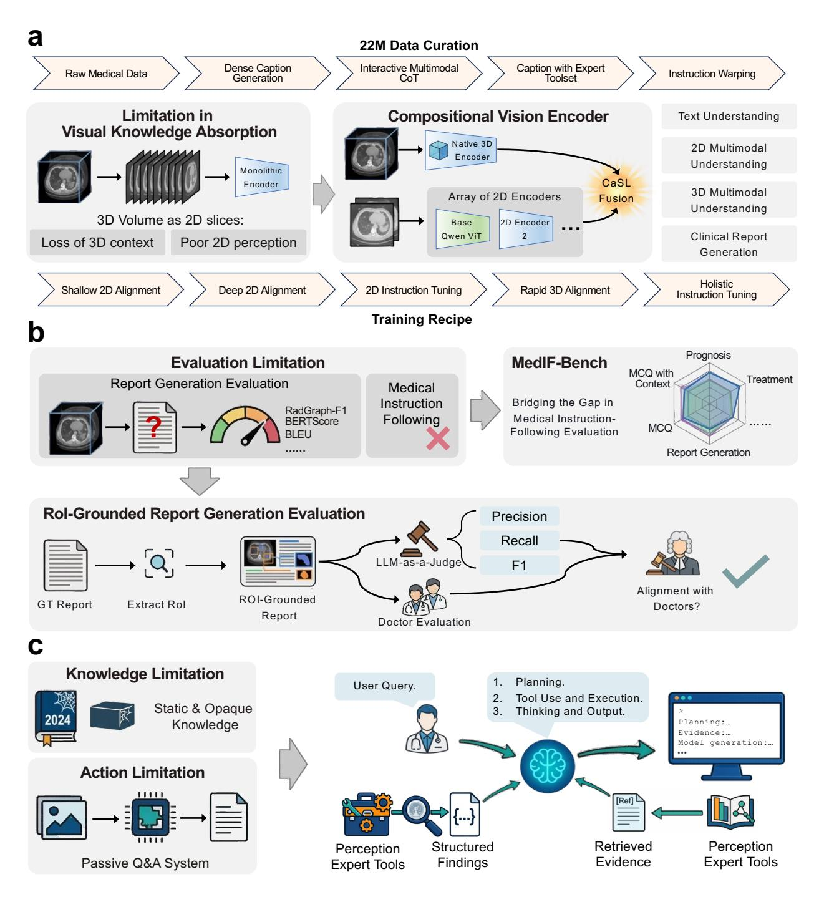

Figure 1 ClinFusion 프레임워크 개요. a, 구성적 비전 인코더. 우리는 단일 인코더의 한계를 해결하기 위해 네이티브 3D 인코더와 2D 인코더 배열을 CaSL Fusion을 통해 통합한 구성적 아키텍처를 제안하며, 22M 샘플 데이터 큐레이션 파이프라인과 단계적 5단계 훈련 레시피를 지원한다. b, 비전 기반 평가. 우리는 지시 따르기 평가 부재와 전역 수준 텍스트 매칭 지표에 대한 의존과 같은 핵심 평가 한계를 식별하고, 의료 지시 따르기를 위한 MedIF-Bench와 LLM-as-a-Judge를 사용하여 영역 수준에서 진단 정확도를 평가하는 RoI-Grounded Report Generation Evaluation 스킴을 도입한다. c, 에이전시 도구 사용 확장. 배포를 강화하기 위해 ClinFusion에 지각 전문가 도구와 plan–act 워크플로우 내에서 검색 보강 생성 파이프라인을 장착하여 텍스트 전용 및 멀티모달 임상 시나리오 모두에서 일관된 개선을 보여준다.

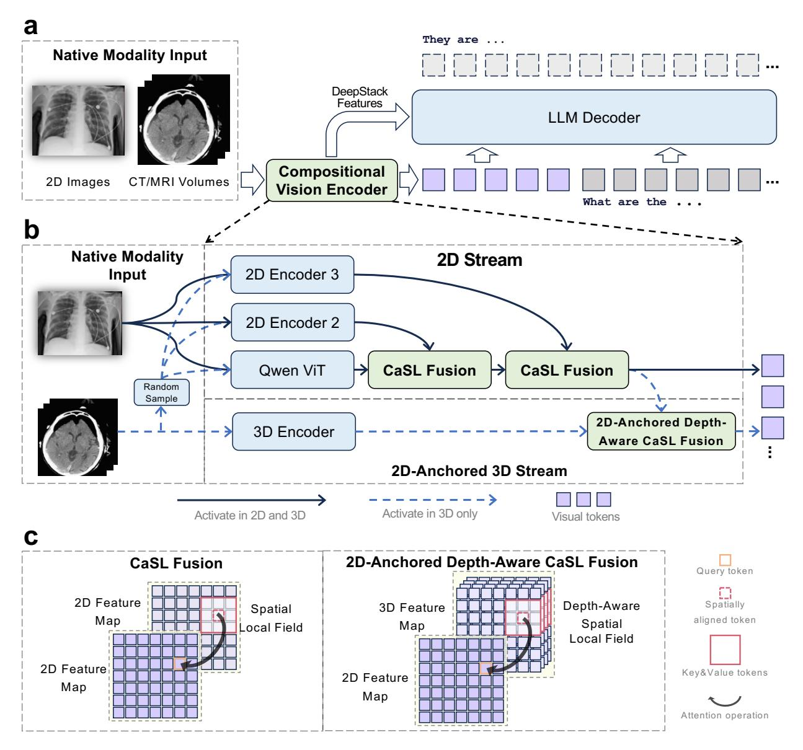

그림 2 ClinFusion의 아키텍처 세부 사항, 전체적인 의료 이해를 위한 멀티모달 대형 언어 모델. a, ClinFusion의 전체 프레임워크. 모델은 원시 2D 및 3D 의료 이미지를 입력으로 받는다. Compositional Vision Encoder 모듈이 이러한 입력을 처리하여 정보가 풍부한 시각 토큰 시퀀스를 생성한다. 이 토큰들은 LLM 디코더에 입력되어 복잡한 추론과 생성을 가능하게 한다. 아키텍처는 DeepStack과 같은 딥 퓨전 메커니즘과 호환되며, 시각적 특징이 LLM의 여러 층에 주입된다. b, Compositional Vision Encoder 모듈의 상세 뷰로, 두 개의 주요 처리 스트림으로 구성된다. 2D 스트림은 Qwen ViT와 여러 전문 인코더(예: Encoder 2, Encoder 3)를 포함한 인코더의 합성 앙상블을 사용하여 2D 이미지를 처리한다. 특징은 CaSL Fusion 블록의 일련을 통해 단계적으로 정제된다. 2D-앵커드 3D 스트림은 3D 볼륨 입력에 대해 활성화된다. 이는 원시 3D 인코더로 전체 3D 볼륨을 처리하면서 동시에 2D 스트림을 통해 무작위로 샘플링된 2D 슬라이스(앵커)를 처리한다. 최종 CaSL Fusion 블록은 잘 정렬된 2D 앵커 표현에 의해 안내받아 3D 특징을 통합한다. c, 핵심 CaSL Fusion 연산자의 개념도. 왼쪽: 2D 스트림에서 사용되는 표준 CaSL Fusion 연산자. 한 특징 맵의 쿼리 토큰이 다른 특징 맵의 작은 공간적으로 국소화된 키/값 토큰 필드에 주의를 기울여 공간적 유도 편향을 강제한다. 오른쪽: 2D-앵커드 Depth-Aware CaSL Fusion 연산자. 2D 쿼리 토큰이 3D 특징 맵의 공간 이웃과 깊이 차원을 모두 아우르는 3D 로컬 필드에 주의를 기울여 2D 표현을 볼륨 컨텍스트로 풍부하게 한다.

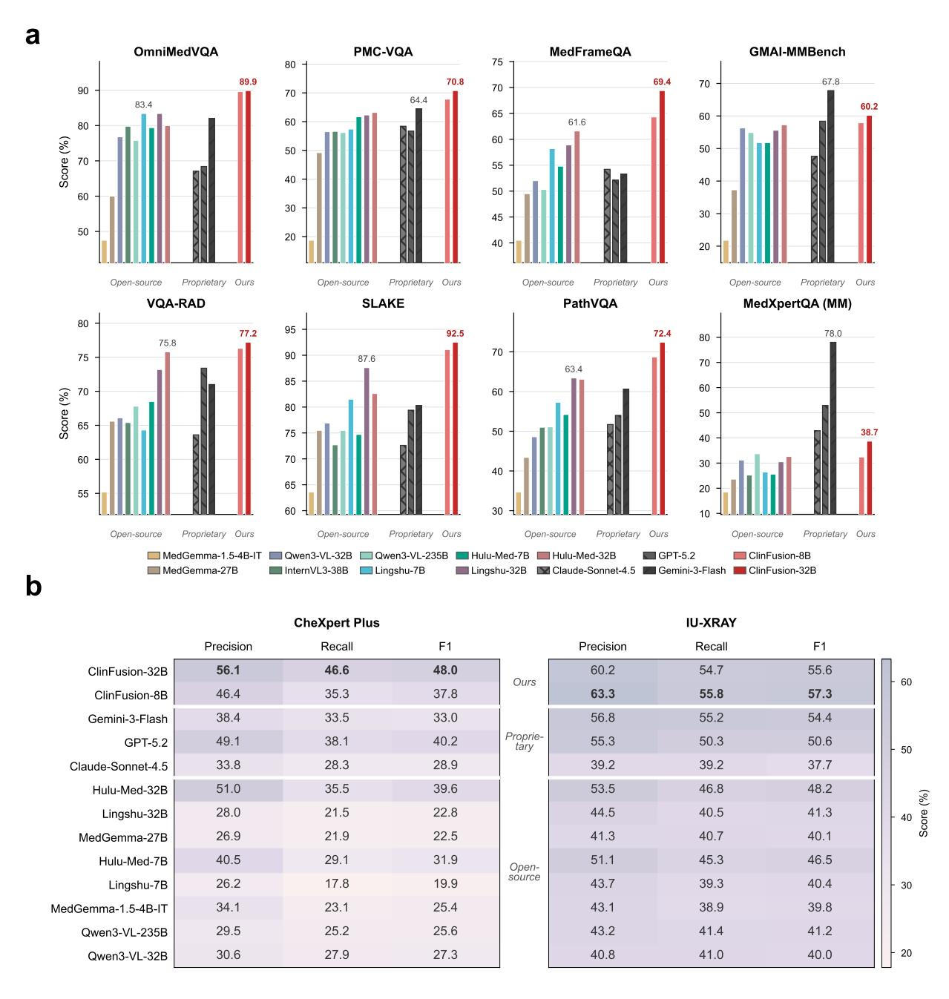

그림 3 ClinFusion의 2D 멀티모달 의료 벤치마크 성능. a, 2D 멀티모달 의료 VQA 벤치마크 결과로, 다중 모달리티 VQA(OmniMedVQA, PMC-VQA, MedFrameQA, GMAI-MMBench), 특정 모달리티 VQA(VQA-RAD, SLAKE, PathVQA), 그리고 추론 지향 벤치마크(MedXpertQA-MM)로 그룹화된다. 우리는 ClinFusion을 선도적인 독점 모델, 범용 MLLM, 의료 MLLM과 다양한 파라미터 규모에서 비교한다. 결과는 모두 공정한 프로토콜로 재벤치마킹하였다. b, 2D 보고서 생성 벤치마크(CheXpert-Plus 및 IU-Xray) 결과로, 제안된 RoI-Grounded Report Generation 프로토콜을 사용해 평가하고 정밀도, 재현율, F1로 보고한다.

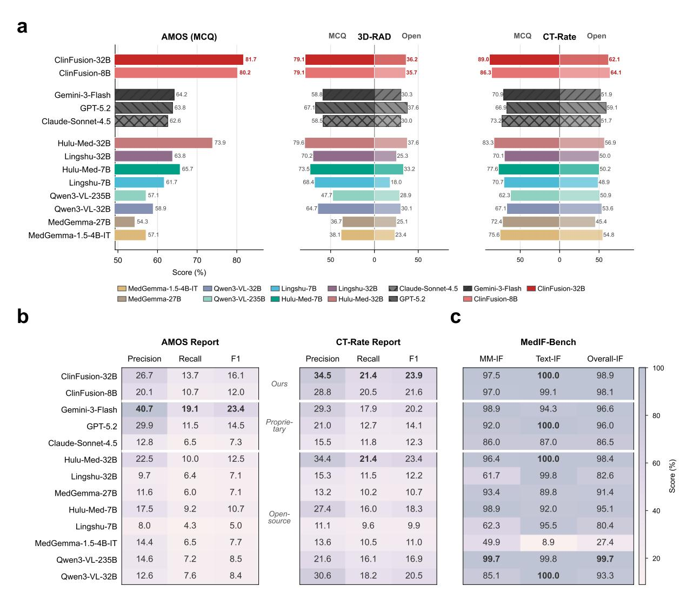

그림 4 ClinFusion의 3D 멀티모달 의료 벤치마크 및 MedIF-Bench 성능. a, AMOS-MM(MCQ), 3D-RAD(MCQ 및 Open-ended), CT-Rate-VQA(MCQ 및 Openended)에서의 3D 멀티모달 의료 벤치마크 결과. 우리는 모델을 독점 및 오픈소스 모델과 비교하며, 공정한 프로토콜로 재벤치마킹하였다. b, AMOS-MM Report 및 CT-Rate Report에서의 3D 보고서 생성 결과로, RoI-Grounded 프로토콜을 사용해 평가하고 정밀도, 재현율, F1로 보고한다. c, 우리가 제안한 MedIF-Bench에서의 결과로, 멀티모달 입력(MM-IF), 텍스트 전용 입력(Text-IF), 전체 평균(Overall-IF)에 대한 복합 지시 따르기 점수를 보고한다.

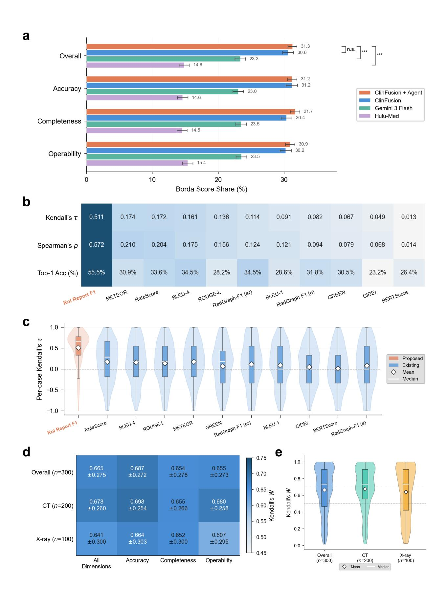

그림 5 전문가 방사선과 평가. a, 전문가 방사선과 모델 순위. 전문가 방사선과의 세 가지 원래 평가 차원(정확도, 완전성, 가동성)과 하나의 집계 차원(전체)에서의 집계된 보르다 점수 비율. 점수는 보르다 카운트 방법(score = 4 - rank)을 사용해 집계되었다. 오차 막대는 사례별 보르다 비율에 대한 평균의 표준 오차를 나타낸다. 괄호는 ClinFusion + Agent와 각 경쟁 모델을 전체 차원에서 비교한 윌콕슨 부호 순위 검정(two-sided, paired by case)을 나타낸다 (n.s.: 유의미하지 않음; ***: p < 0.001). b, 자동화된 지표와 전문가 주석 간의 상관관계. 각 자동화 지표에 대해 라디오로지스트 합의 순위에 대해 계산된 Kendall's τ, Spearman's ρ, 그리고 Top-1 Accuracy(지표가 의사 선호 모델을 올바르게 식별한 사례 비율). 지표는 Kendall's τ를 기준으로 내림차순으로 정렬된다. c, 자동화 지표와 의사 주석 간의 순위 일치의 사례별 분포. 각 자동화 지표와 전문가 주석 순위 간의 사례별 Kendall's τ 분포를 보여주는 바이올린 플롯. 흰색 다이아몬드와 수평 흰색 선은 각각 평균과 중앙값을 나타낸다. d, 주석자 간 일치도: 영상 매체(CT, X-ray)와 평가 차원별로 층화된 Kendall's coefficient of concordance (W)의 히트맵. 값은 평균 W ± 표준편차를 나타낸다. e, 주석자 간 일치도: 개별 사례별 W 분포를 보여주는 바이올린 플롯. 박스 플롯은 중앙값(흰색 수평선), 사분위 범위(박스) 및 1.5 x IQR(수염)을 나타낸다. 흰색 다이아몬드는 평균을 나타낸다. 점선은 중간( W = 0.5) 및 강한( W = 0.7) 일치도의 임계값을 나타낸다.

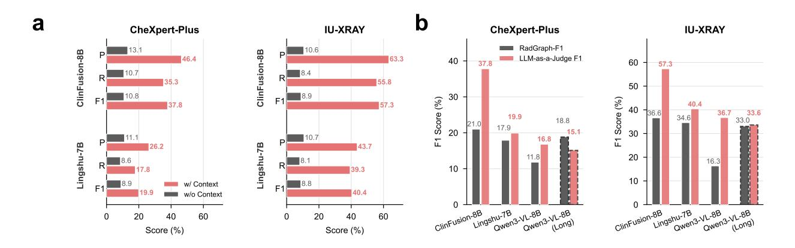

| С | 융합 메커니즘 |  |  |  |  |  |  |
|------------------------------|------------------|---------|---------|----------|--------|------|------|
| 융합 없음 | 69.4 | 57.4 | 24.6 | 81.0 | 58.0 | 83.5 | 62.3 |
| (우리의) Local Cross-Attn | 72.3 | 57.5 | 25.3 | 84.4 | 65.5 | 82.3 | 64.5 |
| Global Cross-Attn | 69.5 | 55.0 | 24.2 | 82.6 | 61.0 | 84.1 | 62.7 |
| Mixture of Vision Experts | 70.0 | 55.2 | 24.2 | 81.1 | 63.3 | 83.2 | 62.8 |
| Channel Concat | 70.5 | 54.4 | 24.7 | 83.4 | 63.2 | 82.3 | 63.1 |
| 40 | A-RAD PM | C-YOA M | aOXOA ( | SLAKE PE | uthVQA | MVQA | Mg |

| d | 하나의 추가 인코더 융합 |  |  |  |  |  |  |  |  |  |
|-------------------------------------------------------------------------------------------------------------------|----------------------------------|------|------|------|------|------|------|------|------|------|
| DINOv2 | 72.3 | 57.5 | 25.3 | 84.2 | 65.5 | 82.3 | 20.2 | 35.5 | 27.8 | 64.5 |
| ConvNext | 72.1 | 57.1 | 24.8 | 83.5 | 64.7 | 82.7 | 20.0 | 35.9 | 27.9 | 64.1 |
| Medsiglip | 70.7 | 57.8 | 25.9 | 83.5 | 66.9 | 84.2 | 20.9 | 32.3 | 26.6 | 64.8 |
| YOU'SEND 지금 WEDLOY 스테이크 SAMION 연합에게 보내다 아들이었다 SENDULY 그리고 아들이었다 아들 아들 아들 아들 아들 아들 아들 아들 아들 |  |  |  |  |  |  |  |  |  |  |

| е | <b>e</b> 두 개의 추가 인코더 융합 |  |  |  |  |  |  |  |  |  |
|-----------------------|-------------------------------------------------------------|------|------|------|------|------|------|------|------|------|
| DINOv2 - ConvNe | 70.1 | 57.1 | 25.0 | 84.7 | 66.2 | 83.4 | 21.0 | 36.6 | 28.8 | 64.4 |
| ConvNext - | 70.3 | 54.8 | 26.2 | 84.2 | 66.5 | 84.2 | 17.9 | 37.4 | 27.6 | 64.4 |
| Ö DINOv2 - Medsigl | 12.1 | 58.0 | 25.2 | 84.7 | 66.5 | 84.4 | 20.7 | 34.1 | 27.4 | 65.2 |
| Medsiglip - DINO | 09.0 | 53.6 | 25.5 | 84.6 | 68.0 | 85.9 | 20.0 | 32.5 | 26.3 | 64.4 |
| DINOv2 |  | 58.0 | 24.8 | 83.9 | 65.3 | 83.9 | 20.0 | 34.6 | 27.3 | 64.6 |
| 40 | VOK-RAD NEOTON SLAKE POIN ON ON ON ILXRAY 보고서 및 ON 및 |  |  |  |  |  |  |  |  |  |

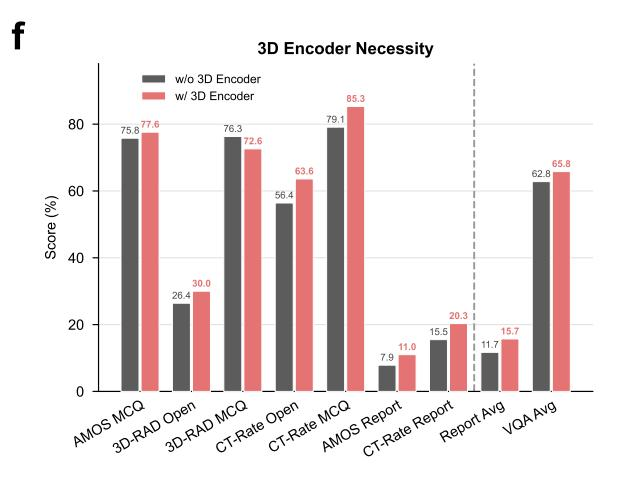

Figure 6: RoI-Grounded 보고서 생성 평가 및 ClinFusion의 아키텍처 설계에 대한 Ablation 연구.  
a, 보고서 생성을 위한 임상 맥락의 필요성에 대한 Ablation. ClinFusion-8B와 Lingshu-7B [6]는 두 가지 설정에서 평가된다: 추출된 임상 맥락이 포함된 경우 ("w/ Context")와 제외된 경우 ("w/o Context")로, 이때 Clinical Indication과 Area of Focus가 생성 프롬프트에서 제거된다. Precision, Recall, F1 지표가 CheXpert-Plus와 IU-XRAY에서 보고된다.  
b, RadGraph-F1과 우리 LLM-as-a-Judge 메트릭을 CheXpert-Plus와 IU-XRAY에서 네 가지 모델 변형(Verbose 생성을 유도하도록 프롬프트된 Qwen3-VL-8B (Long Output) 변형 포함)에서 비교한다. RadGraph-F1은 엔티티-관계 F1을 보고하고, LLM-as-a-Judge는 명확성을 위해 F1을 보고한다.  
c, 구성적 비전 인코더의 다양한 융합 메커니즘에 대한 Ablation. 단일 인코더 기반(Qwen ViT)과 채널 연결, 전역 교차 주의, 비전 전문가 혼합, 그리고 우리 로컬 교차 주의(CaSL Fusion)를 사용한 이중 인코더 설정(Qwen ViT + DINOv2)을 비교한다. 정확도(%)가 여섯 개의 2D 의료 VQA 벤치마크에서 보고된다.  
d, 하나의 추가 전문 2D 인코더 선택에 대한 Ablation. 기본 Qwen ViT에 하나의 추가 인코더(DINOv2, ConvNext, 또는 Medsiglip)를 추가하고 2D VQA(정확도, %)와 보고서 생성에서 평가한다.  
e, 다수의 추가 2D 인코더 선택, 다중 인코더 융합 전략, 그리고 융합 순서에 대한 Ablation. 기본 Qwen ViT에 두 개의 추가 인코더를 Cascade 융합(다른 순서) 또는 Parallel 융합을 통해 결합하고 2D VQA와 보고서 생성에서 평가한다.  
f, 추론 시 네이티브 3D 인코더의 필요성에 대한 Ablation. 전체 모델을 3D 인코더가 비활성화된 Ablated 버전과 비교하여, 모델이 샘플링된 2D 슬라이스에만 의존하도록 강제한다. 정확도(%)가 3D VQA 벤치마크(AMOS, 3D-RAD, CT-Rate)에서 보고되고, Precision, Recall, F1이 3D 보고서 생성(AMOS Report, CT-Rate Report)에서 보고된다.

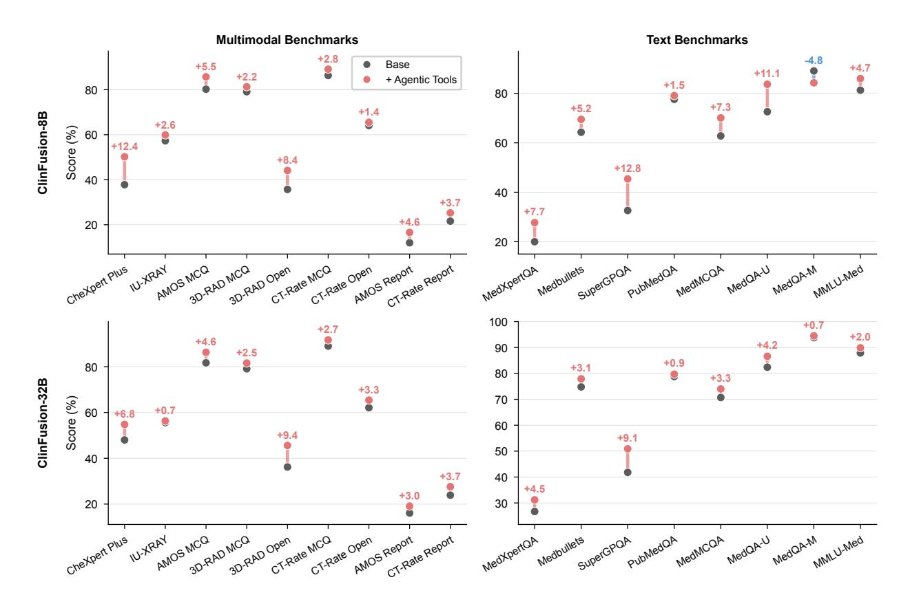

Figure 7: Agentic Tool 사용으로 Augmented 된 ClinFusion의 성능 향상. 각 벤치마크마다 회색과 빨간 점은 각각 Base와 +Agentic Tools 점수를 나타내며, 수직 선으로 연결되고, 절대 차이가 위에 주석으로 표시된다(양수는 빨간색, 음수는 파란색). 행은 ClinFusion-8B(상단)와 ClinFusion-32B(하단)를 나타내고, 열은 멀티모달 벤치마크(왼쪽)와 텍스트 전용 의료 벤치마크(오른쪽)를 나타낸다. VQA와 시험 벤치마크의 점수는 정확도(%)이며, 보고서 생성 점수는 RoI-Grounded 프로토콜 하에서 F1(%)이다.

### 확장 데이터 (Extended Data)

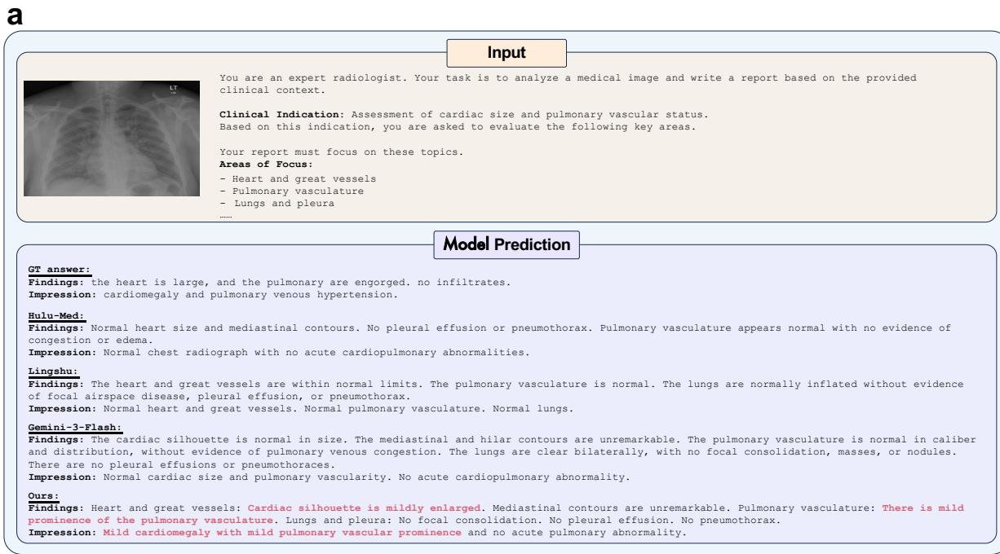

# **b**

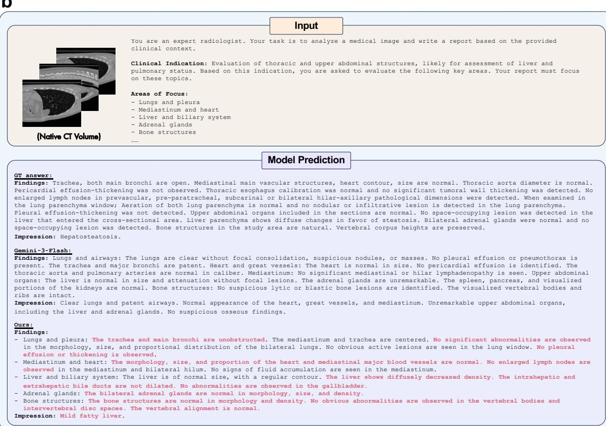

Extended Data Fig. 1은 ClinFusion과 다른 방법들을 비교한 2D 및 3D 보고서 생성 사례 시각화입니다. a, 2D 보고서 생성 사례. b, 3D 보고서 생성 사례. 입력 프롬프트는 MLLMs가 특정 ROI에 집중하도록 안내합니다.

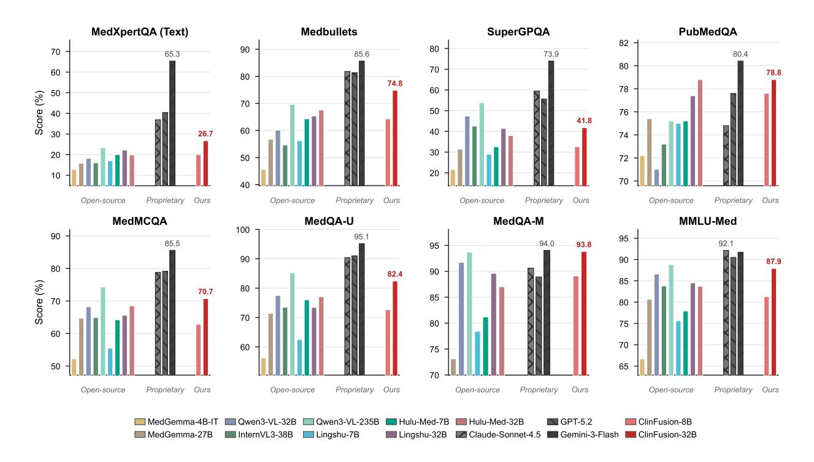

Extended Data Fig. 2는 ClinFusion의 텍스트 기반 의료 벤치마크 성능을 보여줍니다. 복잡한 추론( MedXpertQA-Text, Medbullets, SuperGPQA), 텍스트 이해(PubMedQA), 의료 시험(MedMCQA, MedQA-USMLE, MedQA-MCMLE, MMLU-Medical)을 아우르는 8개의 텍스트 전용 벤치마크 결과가 포함됩니다. 모델은 오픈소스(일반 목적 및 의료 MLLMs), 상용, 그리고 우리 모델을 공정한 프로토콜로 재벤치마크하여 비교합니다. **Extended Data**

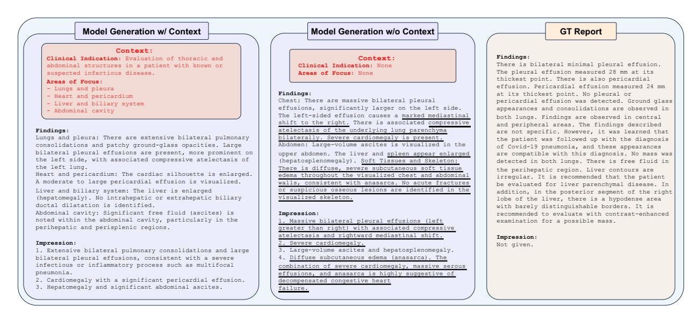

Extended Data Fig. 3 동일한 CT 스캔에서 임상 문맥이 있는 경우와 없는 경우의 보고서 생성 비교. 우리는 [Section 4.2.3.](#page-15-0)에서 예시를 재사용한다. 오른쪽: GT 보고서. 왼쪽: 추출된 임상 문맥(임상 지시(Clinical Indication) 및 초점 영역(Area of Focus))을 제공받은 ClinFusion의 출력. 가운데: 동일 모델이 임상 문맥 없이 생성한 출력. 밑줄 친 텍스트는 GT와 검증할 수 없는 주장임을 나타낸다.

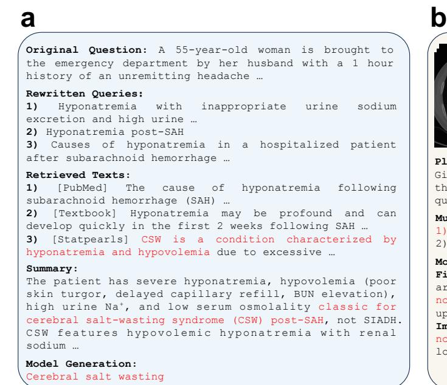

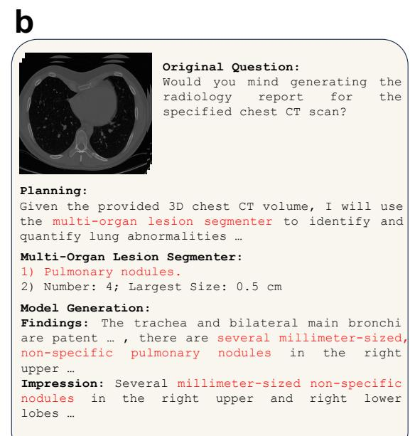

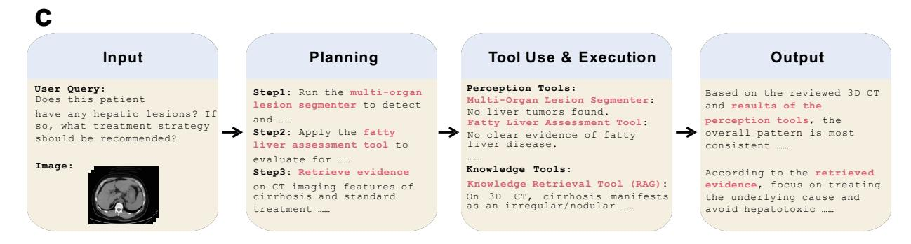

Extended Data Fig. 4 에이전트형 도구 사용: 사례 연구 및 파이프라인 개요. a, 텍스트 전용 작업: 에이전트는 원래 임상 질문을 집중된 검색 쿼리로 재작성하고, 하이브리드 검색 도구를 호출하여 출처 인식 증거(예: PubMed/교과서/StatPearls)를 수집한 뒤, 최종 생성에서 증거 기반 진단을 합성한다. b, 멀티모달 작업: 3D 흉부 CT 볼륨에서 방사선 보고서 생성. 에이전트는 모달리티 인식 라우팅을 수행하고, Multi-Organ Lesion Segmenter를 선택해 구조화된 정량적 소견(예: 폐 결절 수와 크기)을 생성한 뒤, 검증된 도구 출력을 방사선 스타일 보고서에 통합한다. c, 파이프라인: 멀티모달 임상 입력(텍스트 및 의료 이미지)을 주어 ClinFusion은 작업 인식 계획을 수행하여 적절한 도구(지식 도구 및 인지 전문가 도구 포함)를 선택·호출하고, 반환된 도구 출력을 집계한 뒤 최종 임상 응답을 생성한다. 그림에 표시된 간질 CT 사례에서 ClinFusion은 Multi-Organ Lesion Segmenter, Fatty Liver Assessment Tool, Knowledge Retrieval Tool(RAG)를 호출하는 3단계 워크플로우를 실행하고, 그 결과를 통합하여 일관된 사례 분석 및 증거 기반 관리 권고를 도출한다.

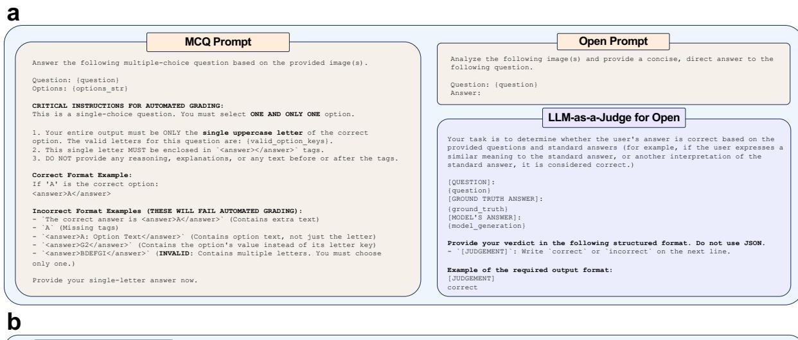

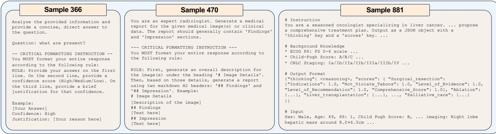

Extended Data Fig. 5 평가 프롬프트 템플릿 및 MedIF-Bench 예시. a, VQA 평가에 사용되는 프롬프트 템플릿. 왼쪽: MCQ 프롬프트는 <answer></answer> 태그로 감싸인 엄격한 단일 문자 출력 형식을 강제하며, 올바른 형식과 잘못된 형식의 예시를 명시해 신뢰할 수 있는 규칙 기반 추출을 보장한다. 오른쪽 상단: 개방형 프롬프트는 간결하고 직접적인 답변을 요청한다. 오른쪽 하단: LLM-as-a-Judge 프롬프트는 모델의 답변을 GT 답변과 비교해 의미적 정확성을 평가한다. b, MedIF-Bench의 세 가지 예시(프롬프트는 표시용으로 축약; 전체 프롬프트는 훨씬 길다). 왼쪽 (샘플 366): 모델이 첫 줄에 답변을 구조화하고, 이후 줄에 신뢰도 점수와 정당화(justification)를 포함해야 하는 개방형 VQA 과제이며, 임상 워크플로우를 나타내는 … .. .. .. .. .. .. .. .. .. .. .. .. .. .. .. .. .. .. .. .. .. .. .. .. .. … .. .. ..……. 가운데 (샘플 470): 모델이 # Image Details 섹션과 마크다운 ## 헤더(“Findings” 및 “Impression”)를 포함한 방사선 보고서를 생성해야 하는 보고서 생성 과제이며, 표준화된 기관 보고 형식을 반영한다. 오른쪽 (샘플 881): 모델이 SEER 기반 치료 계획 과제에서 복잡한 중첩 JSON 객체를 출력해야 하며, 이 객체는 추론 추적과 여러 치료 모달리티에 대한 구조화된 점수를 포함해 임상 의사결정 지원 시스템과의 통합을 나타낸다.

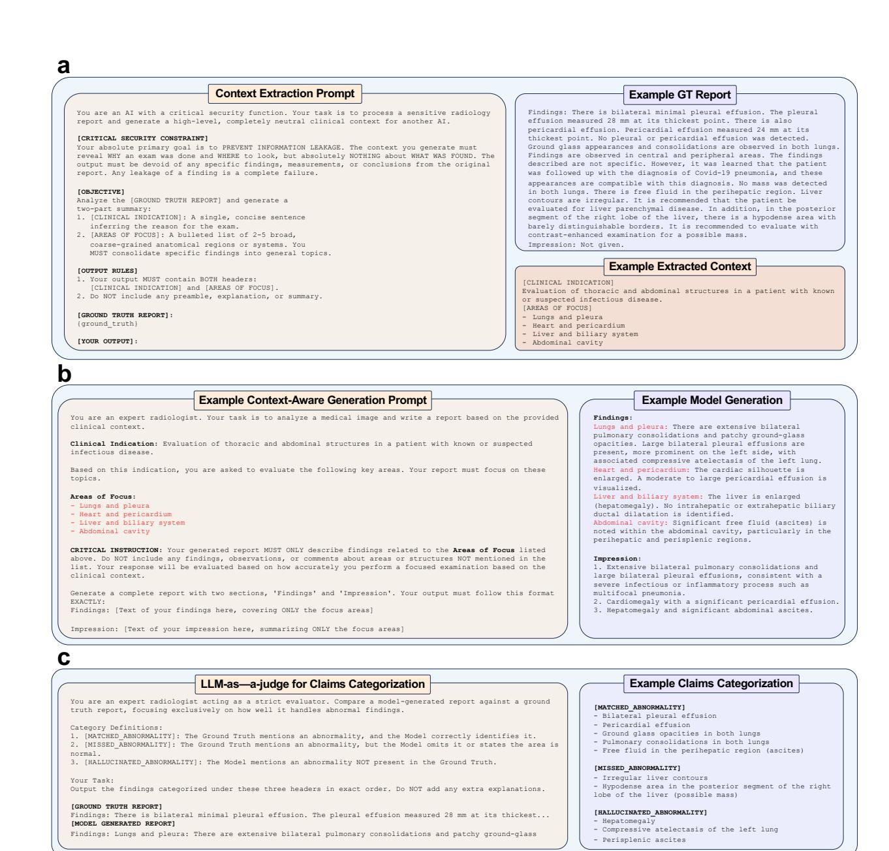

Extended Data Fig. 6 ROI 기반 보고서 생성 평가 파이프라인. a, GPT 4.1 API를 통한 컨텍스트 추출 절차. 왼쪽 패널은 컨텍스트 추출을 위한 프롬프트를 표시하고, 오른쪽 패널은 실제 입력 GT 보고서(오른쪽 상단)와 해당 추출된 컨텍스트(오른쪽 하단)의 예시를 보여준다. 이 절차는 실제 진단 답변의 누출을 최소화하고 관심 영역만을 드러내도록 설계되었다. b, 컨텍스트 기반 보고서 생성. 패널 (a)에서 성공적으로 추출된 컨텍스트를 사용하여 생성 과정을 조건화한다. 이 추출된 컨텍스트는 지시 프롬프트와 결합되어 우리 MLLM에 제공되며, 모델이 제공된 관심 영역에 대해서만 결과를 생성하도록 엄격히 제한한다. c, LLM-as-a-Judge 평가. 왼쪽 패널은 LLM 판사에게 제시되는 평가 프롬프트(제시를 위해 축약됨)를 보여주며, 이는 분류 규칙을 엄격히 정의한다. 오른쪽 패널은 실제 분류된 출력을 표시하며, 패널 (b)에서 생성된 MLLM 보고서를 패널 (a)의 원본 GT 보고서와 비교 평가한다. 이 특정 사례에서 True Positives (TP, 일치)는 5, False Negatives (FN, 누락)는 2, False Positives (FP, 환각)는 3이다. 따라서 지표는 다음과 같이 계산된다: Precision = 5/(5 + 3) = 0.6250, Recall = 5/(5 + 2) = 0.7143, 그리고 F1-score = 2 × (0.6250 × 0.7143)/(0.6250 + 0.7143) = 0.6667.

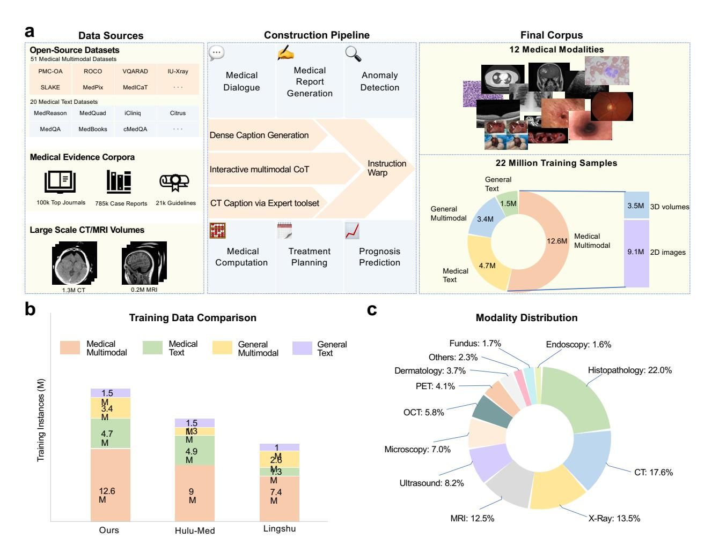

Extended Data Fig. 7 ClinFusion의 데이터 큐레이션 개요. a, 데이터 소스 및 구축 파이프라인. 우리는 오픈소스 데이터셋, 의료 증거 코퍼스, 대규모 CT/MRI 볼륨을 수집한다. 이 데이터는 Dense Caption Generation, Medical Multimodal CoT, Large-Scale CT Caption 파이프라인을 통해 처리되어 12개의 의료 영상 모달리티에 걸친 22.2M의 학습 샘플을 생성하며, 의료 대화, 의료 보고서 생성, 이상 탐지, 의료 계산, 치료 계획 및 예후 예측 등 다양한 임상 과제를 지원한다. b, ClinFusion, Hulu-Med [7], Lingshu [6] 간의 학습 데이터 규모 비교. 이는 의료 멀티모달, 의료 텍스트, 일반 멀티모달, 일반 텍스트 인스턴스로 분해된다. c, 최종 코퍼스에서 의료 이미지의 모달리티 분포.

**Extended Data Table 1 ClinFusion 학습에 사용된 데이터 소스.** 우리는 각 데이터 유형에 대한 학습 항목의 대략적인 수를 **Scale**에 보고한다. *는 우리 데이터 합성 파이프라인으로 구축된 데이터 세트를 나타낸다.

| 단계 | 모달리티 | 데이터셋 | 규모 |  |  |  |
|-----------------------|--------------------|-------------------------------------------------------------------------------------------------------------------------------------------------------------------------------------------------------------------------------------------------------------------------------------------------------------------------------------------------------------------------------------------------------------------------------------------------------|-----------------------|--|--|--|
| S1 의료 멀티모달 |  | PMC-OA [84]; ROCO [85]; ROCOv2 [86]; PubMedVision [87]; MIMIC-CXR [88]; IU-Xray [89]; open-i [89]; MedICaT [90]; MedPix-2.0 [91]; BIOMEDICA Clinical Subset [92]; BIOMEDICA Dermatology Subset [92]; BIOMEDICA Histopathology Subset [92]; BIOMEDICA Microscopy Subset [92]; BIOMEDICA Surgery Subset [92]; 합성 사례 보고서 캡션*; 합성 학술지 캡션*. |  |  |  |  |
|  | 일반 멀티모달 | Llava-v1.5-Caption [93]; PixMo [94]. | $\sim 2.3 \mathrm{M}$ |  |  |  |
| S2 | 의료 멀티모달 | S1 의료 멀티모달 데이터셋과 동일합니다. | $\sim$ 3.8M |  |  |  |
|  | 일반 멀티모달 | S1 일반 멀티모달 데이터셋과 동일합니다. | $\sim 2.3 \mathrm{M}$ |  |  |  |
| S3 | 의료 멀티모달 | LLaVA-Med [95]; Quilt-LLaVA [96]; FairVLMed; CheXpert Plus [46]; Kvasir-VQA [97]; LLaVA-1.5-Instruct [93]; MIMIC-Ext-MIMICCXR-VQA [98]; PathVQA [99]; PMC-VQA [100]; SLAKE [15]; VQA-Med-2019 [101]; VQA-RAD [102]; PMC-VQA-2-recaptions; SLAKE-recaptions; VQA-Med-2019-recaptions; VQA-RAD-recaptions; Path-VQA-recaptions; GMAI-Reasoning10K [103]; 합성 의료 OCR*; 프라이빗 CT*; 합성 사례 보고서 VQA*; 합성 저널 VQA*. | ~5.3M |  |  |  |
|  | 일반 멀티모달 | Llava-v1.5-MM [93]; ALLaVA [104]. | $\sim 1.1 \mathrm{M}$ |  |  |  |
|  | 의료 텍스트 | MedQuAD [105]; medical-o1-verifiable-problem [106]; medical-o1-reasoning-SFT; ApolloCorpus [107]; Medical-R1-Distill-Data; AlpaCare-MedInstruct-52k [108]; HealthCareMagic-100k [109]; PMC-LLaMA [110]; HuatuoGPT2-GPT4-SFT-140K [111]; MedReason [112]; MedThoughts-8K [113]; MedQA [77]; open-book-CMB-exam [114]; CMedQA [115]; HealthCareMagic [109]; iCliniq-10K [109]; Citrus_S3 [116]; MedBooks-18-CoT [117]: 합성 사례 보고서 장기 CoT* | ~4.7M |  |  |  |
|  | 일반 텍스트 | Llava-v1.5-text-subset [93]; OpenHermes-2.5 [118]. | $\sim 1.5 \mathrm{M}$ |  |  |  |
| S4 | 의료 멀티모달 | CT-Rate-report [16]; Merlin-report [68]; RadGenome-ChestCT [119]; M3D-CAP [67]; OLD-INSPECT [69]; AMOS-MM-report [120]; AbdomenCT*; ChronicCT*; CardiovascularCT*; PulmonaryNodulesCT*. | ~1.3M |  |  |  |
| S5 | 의료 멀티모달 | S3의 모든 의료 멀티모달 데이터셋 + AMOS-MM-VQA [120]; CT-Rate-VQA [16]; 3D-RAD [121]; Synthetic-M3d-VQA*; Merlin-MCQ [68]; Merlin-VQA [68]. | ~6.4M |  |  |  |
|  | 일반 멀티모달 | S3 일반 멀티모달 데이터셋과 동일합니다. | $\sim 1.1 \mathrm{M}$ |  |  |  |
|  | 의료 텍스트 | S3 의료 텍스트 데이터셋과 동일합니다. | ${\sim}4.7\mathrm{M}$ |  |  |  |
|  | 일반 텍스트 | S3 일반 텍스트 데이터셋과 동일합니다. | $\sim 1.5 \mathrm{M}$ |  |  |  |

Extended Data Table 2 평가 벤치마크 요약. 우리는 평가 프레임워크를 다섯 가지 핵심 차원으로 분류한다: 2D 다중모달 의료 VQA, 텍스트 전용 의료 지식, 3D 부피 의료 VQA, 임상 보고서 생성, 그리고 지시 따르기 (#는 샘플 수를 나타낸다). Modality 열에서는 Single과 Multi가 단일 이미지와 다중 이미지 입력을 구분한다; 특히 3D, 보고서 생성, 지시 따르기 과제에서는 모델이 일반적으로 각 인스턴스마다 하나의 다중모달 파일(예: 하나의 3D 볼륨 또는 하나의 2D 이미지)을 처리한다. 과제 유형은 Multiple Choice (MCQ), Open-ended (Open), Clinical Report Generation (Report), 또는 Instruction-Following (IF)으로 분류된다. †는 원본 데이터셋의 수동으로 선별된 하위 집합을 나타내며, 데이터 품질과 평가 충실도를 보장하기 위해 필터링되었다.

| 벤치마크 | 모달리티/장르 | 스케일 (#) 유형 |  | 언어 | 출처 |
|-------------------|-------------------------------------------------|-------------------------------|------------|---------|--------|
|  | 2D 다중모달 의료 VQA (총: 141,587) |  |  |  |  |
| VQA-RAD | 방사선학 (단일) | 451 | MCQ & 오픈 | EN | [102] |
| SLAKE | 방사선학 (단일) | 2,094 | MCQ & 오픈 | EN & CN | [15] |
| PathVQA | 병리학 (단일) | 6,719 | MCQ & 오픈 | EN | [99] |
| PMC-VQA | 다양한 (단일) | 33,430 | MCQ | EN | [100] |
| OmniMedVQA | 다양한 (단일) | 88,996 | MCQ | EN | [14] |
| MedFrameQA | 다양한 (다중) | 2,851 | MCQ | EN | [122] |
| GMAI-MMBench | 다양한 (단일) | 4,550 | MCQ | EN | [123] |
| MedXpertQA (MM) | 다양한 (다중) | 2,000 | MCQ | EN | [18] |
|  | 텍스트 전용 의료 지식 (총: 17,074) |  |  |  |  |
| MedQA (USMLE) | 임상 시험 | 1,273 | MCQ | EN | [77] |
| MedQA (MCMLE) | 임상 시험 | 3,426 | MCQ | CN | [77] |
| MedMCQA | 입학 시험 | 4,183 | MCQ | EN | [124] |
| MMLU (의학) | 다학제 | 1,871 MCQ |  | EN | [17] |
| PubMedQA | 연구 QA 500 MCQ |  |  | EN | [19] |
| MedBullets | 임상 지식 616 |  | MCQ | EN | [125] |
| SuperGPQA | 일반 진료 | 2,755 | MCQ | EN | [126] |
| MedXpertQA (텍스트) | 다양한 | 2,450 | MCQ | EN | [18] |
|  | 3D 부피 의료 VQA (총: 48,907) |  |  |  |  |
| CT-Rate-VQA† | 비조영 흉부 CT | 12,210 | MCQ & 오픈 | EN | [16] |
| 3D-RAD | 비조영 흉부 CT | 33,910 | MCQ & 오픈 | EN | [47] |
| AMOS-MM† | 복부 CT | 2,787 | MCQ | EN | [48] |
|  | 2D/3D 임상 보고서 생성 (총: 3,935) |  |  |  |  |
| IU-Xray | 흉부 X선 | 296 | 보고서 | EN | [127] |
| CheXpert-Plus | 흉부 X선 | 200 | 보고서 | EN | [46] |
| CT-Rate | 비조영 흉부 CT | 3,039 | 보고서 | EN | [16] |
| AMOS-MM | 복부 CT | 400 | 보고서 | EN | [48] |
|  |  | 의료 지시 따르기 |  |  |  |
| MedIF-Bench | 혼합 | 900 | IF | EN | 우리 |

Extended Data Table 3 ClinFusion의 점진적 훈련 전략. "Trainable Components"는 각 단계에서 업데이트되는 모델의 부분을 나열한다.

| 단계 | 목표 | 학습 데이터 | 학습 가능한 구성요소 |
|-------|--------------------------------------------------------------------------|----------------------------|----------------------------------------------------|
| ① | Shallow multi-encoder alignment (2D)  전문 2D 인코더 정렬. | 2D 이미지-텍스트 쌍 | 모든 인코더, 2D 융합 모듈 |
| ② | Deep vision-language alignment (2D)  융합된 2D 특징을 LLM과 정렬. | 2D 이미지-텍스트 쌍 | 전체 모델 (모든 인코더, 2D 융합 모듈, LLM) |
| ③ | 2D Instruction Tuning  2D 작업 실행을 가르친다. | 2D Instruction 데이터셋 | 전체 모델 (모든 인코더, 2D 융합 모듈, LLM) |
| ④ | Rapid 3D encoder alignment  3D 인코더를 효율적으로 정렬. | 3D 볼륨-텍스트 쌍 | 3D 인코더, 3D 융합 모듈 |
| ⑤ | Holistic 2D/3D instruction tuning  전체 2D/3D 기능을 활용. | 2D/3D Instruction 데이터셋 | 전체 모델 (모든 인코더, 모든 융합 모듈, LLM) |

#### Extended Data Table 4 Dataset availability, download links, and access terms for all data sources used in ClinFusion training. (확장 데이터 표 4: ClinFusion 훈련에 사용된 모든 데이터 소스의 데이터셋 가용성, 다운로드 링크 및 접근 조건)

데이터셋은 Section 4.5에 설명된 훈련 단계별로 그룹화된다. 접근 열은 검증된 라이선스, 접근 범주, 또는 해당되는 경우 소스-라이선스 상속을 보고한다.

| 데이터셋 이름 | 링크 | 접근 |
|--------------------------------------------------------------------------------------|-------------------------------------------------------------------------------------------------------------------------------------------------------------------|----------------------------------------------------|
| 적용 단계: S1 - 의료 멀티모달 |  |  |
| PMC-OA | https://huggingface.co/datasets/axiong/pmc_oa | CC 라이선스 적용 |
| ROCO | https://github.com/razorx89/roco-dataset | CC 라이선스 적용 |
| ROCOv2 PubMedVision | https://huggingface.co/datasets/eltorio/ROCOv2-radiology https://huggingface.co/datasets/FreedomIntelligence/PubMedVision | CC BY-NC-SA 4.0 Apache 2.0 |
| MIMIC-CXR | https://physionet.org/content/mimic-cxr/ | PhysioNet 라이선스 |
| IU-Xray | https://openi.nlm.nih.gov/ | 오픈 액세스 |
| open-i MedICaT | https://openi.nlm.nih.gov/ https://github.com/allenai/medicat | 오픈 액세스 CC 라이선스 적용 |
| MedPix-2.0 | https://github.com/CHILab1/MedPix-2.0 | CC BY-NC-SA 4.0 |
| BIOMEDICA 임상 서브셋 | https://huggingface.co/datasets/BIOMEDICA/biomedica_webdataset_24M | CC 라이선스 적용 |
| BIOMEDICA 피부과 서브셋 BIOMEDICA 조직병리 서브셋 | https://huggingface.co/datasets/BIOMEDICA/biomedica_webdataset_24M https://huggingface.co/datasets/BIOMEDICA/biomedica_webdataset_24M | CC 라이선스 적용 CC 라이선스 적용 |
| BIOMEDICA 조직병리 서브셋 | https://huggingface.co/datasets/biomedica_webdataset_24M
https://huggingface.co/datasets/BIOMEDICA/biomedica_webdataset_24M | CC 라이선스 적용 |
| BIOMEDICA 수술 서브셋 | https://huggingface.co/datasets/BIOMEDICA/biomedica_webdataset_24M | CC 라이선스 적용 |
| 합성 사례 보고 캡션 합성 학술지 캡션 | 합성 데이터 합성 데이터 | 내부 합성 데이터 내부 합성 데이터 |
| 적용 단계: S1 - 일반 멀티모달 | oj macio 데이터 | 내부 증상 데이터 |
| LLaVA-v1.5-Caption PixMo | https://github.com/haotian-liu/LLaVA https://huggingface.co/datasets/allenai/pixmo-cap | CC BY-NC 4.0 ODC-BY v1.0 |
| 적용 단계: S2 - 의료 멀티모달 |  |  |
| S1 의료 멀티모달 데이터셋과 동일 |  | S1 의료 멀티모달과 동일한 접근 조건 |
| 적용 단계: S2 - 일반 멀티모달 S1 일반 멀티모달 데이터셋과 동일 |  | S1 일반 멀티모달과 동일한 접근 조건 |
| 적용 단계: S3 - 의료 멀티모달 |  |  |
| LLaVA-Med | https://github.com/microsoft/LLaVA-Med | CC BY NC ND 3 0 |
| Quilt-LLaVA FairVLMed | https://huggingface.co/datasets/wisdomik/QUILT-LLaVA-Instruct-107K https://zenodo.org/records/13178701 | CC BY-NC-ND 3.0 CC BY-NC-ND 4.0 |
| CheXpert Plus | https://aimi.stanford.edu/datasets/chexpert-plus | 인증된 접근 |
| Kvasir-VQA | https://datasets.simula.no/kvasir-vqa/ | CC BY-NC 4.0 |
| LLaVA-1.5-Instruct MIMIC-Ext-MIMICCXR-VQA | https://github.com/haotian-liu/LLaVA
https://physionet.org/content/mimic-ext-mimic-cxr-vqa/1.0.0/ | CC BY-NC 4.0 PhysioNet 라이선스 |
| PathVQA | https://huggingface.co/datasets/flaviagiammarino/path-vqa | MIT |
| PMC-VQA | https://huggingface.co/datasets/RadGenome/PMC-VQA | MIT |
| SLAKE VQA-Med-2019 | https://huggingface.co/datasets/BoKelvin/SLAKE https://zenodo.org/records/10499039 | CC BY 4.0 CC BY 4.0 |
| VQA-RAD | https://buggingface.co/datasets/flaviagiammarino/vqa-rad | CC0-1.0 |
| PMC-VQA-2-recaptions | https://huggingface.co/datasets/RadGenome/PMC-VQA | 내부 합성 데이터 |
| SLAKE-recaptions | https://huggingface.co/datasets/BoKelvin/SLAKE | 내부 합성 데이터 |
| VQA-Med-2019-recaptions VQA-RAD-recaptions | https://zenodo.org/records/10499039 https://huggingface.co/datasets/flaviagiammarino/vqa-rad | 내부 합성 데이터 내부 합성 데이터 |
| Path-VQA-recaptions | https://huggingface.co/datasets/flaviagiammarino/path-vqa | 내부 합성 데이터 CC BY 4.0 |
| GMAI-Reasoning10K | https://huggingface.co/datasets/General-Medical-AI/GMAI-Reasoning10K | CC BY 4.0 내부 합성 데이터 |
| 합성 의료 OCR 합성 사례 보고 VQA | 합성 데이터 합성 데이터 | 내부 합성 데이터 내부 합성 데이터 |
| 합성 학술지 VQA | 합성 데이터 | 내부 합성 데이터 |
| 적용 단계: S3 - 일반 멀티모달 LLaVA-v1.5-MM | https://github.com/haotian-liu/LLaVA | CC BY-NC 4.0 |
| ALLaVA | https://huggingface.co/datasets/FreedomIntelligence/ALLaVA-4V | Apache 2.0 |
| 적용 단계: S3 - 의료 텍스트 |  |  |
| MedQuAD | https://huggingface.co/datasets/lavita/MedQuAD | 오픈 액세스 |
| medical-o1-verifiable-problem medical-o1-reasoning-SFT | https://huggingface.co/datasets/FreedomIntelligence/medical-o1-verifiable-problem  
https://huggingface.co/datasets/FreedomIntelligence/medical-o1-reasoning-SFT | Apache 2.0 Apache 2.0 |
| ApolloCorpus | https://huggingface.co/datasets/FreedomIntelligence/ApolloCorpus | Apache 2.0 |
| Medical-R1-Distill-Data | https://huggingface.co/datasets/FreedomIntelligence/Medical-R1-Distill-Data | Apache 2.0 |
| AlpaCare-MedInstruct-52k HealthCareMagic-100k | https://huggingface.co/datasets/lavita/AlpaCare-MedInstruct-52k https://huggingface.co/datasets/lavita/ChatDoctor-HealthCareMagic-100k | CC BY 4.0 Apache 2.0 |
| icliniq10k | https://nuggingface.co/datasets/lavita/cnatDoctor-HealthCareMagic-100K https://huggingface.co/datasets/zhengComing/iCliniq-10K | Apache 2.0 |
| PMC-LLaMA | https://github.com/chaoyi-wu/PMC-LLaMA | Apache 2.0 |
| HuatuoGPT2-GPT4-SFT-140K | https://huggingface.co/datasets/FreedomIntelligence/HuatuoGPT2-GPT4-SFT-140K | Apache 2.0 CC BY 4.0 |
| MedReason MedThoughts-8K | https://huggingface.co/datasets/UCSC-VLAA/MedReason
https://huggingface.co/datasets/hw-hwei/MedThoughts-8K | MIT |
| MedQA | https://github.com/jind11/MedQA | MIT |
| open-book-CMB-exam | https://huggingface.co/datasets/wangrongsheng/open-book-CMB-exam | Apache 2.0 |
| cMedQA HealthCareMagic | https://github.com/zhangsheng93/cMedQA2 https://huggingface.co/datasets/lavita/ChatDoctor-HealthCareMagic-100k | GPL-3.0 Apache 2.0 |
| iCliniq-10K | https://huggingface.co/datasets/zhengComing/iCliniq-10K | Apache 2.0 |
| Citrus_S3 | https://huggingface.co/datasets/jdh-algo/Citrus_S3 | MIT |
| MedBooks-18-CoT Synthetic Case Report Long CoT | https://huggingface.co/datasets/dmis-lab/meerkat-instructions Synthetic Data | CC BY-NC 4.0 내부 합성 데이터 |
| 적용 단계: S3 - 일반 텍스트 | • |  |
| LLaVA-v1.5-text-subset OpenHermes-2.5 | https://github.com/haotian-liu/LLaVA https://huggingface.co/datasets/teknium/OpenHermes-2.5 | CC BY-NC 4.0 Apache 2.0 |
| 적용 단계: S4 - 의료 멀티모달 |  |  |
| CT-Rate-report | https://huggingface.co/datasets/ibrahimhamamci/CT-RATE | CC BY-NC-SA 4.0 |
| Merlin-report RadGenome-ChestCT | https://github.com/StanfordMIMI/Merlin | MIT CC BY 4.0 |
| RadGenome-ChestCT M3D-CAP | https://huggingface.co/datasets/RadGenome/RadGenome-ChestCT
https://huggingface.co/datasets/GoodBaiBai88/M3D-Cap | CC BY 4.0 Apache 2.0 |
| OLD-INSPECT | https://aimi.stanford.edu/datasets/inspect-Multimodal-Dataset | 인증된 접근 |
| AMOS-MM-report | https://zenodo.org/doi/10.5281/zenodo.10992154 | CC BY 4.0 |
| AbdomenCT ChronicCT | 합성 데이터 합성 데이터 | 내부 합성 데이터 내부 합성 데이터 |
| CardiovascularCT | 합성 데이터 | 내부 합성 데이터 |
| PulmonaryNodulesCT | 합성 데이터 | 내부 합성 데이터 |
| 적용 단계: S5 - 의료 멀티모달 |  |  |
| S3 의료 멀티모달 데이터셋 전체 | 140 F004 / 2 10000 F004 / 2 10000 F0 | S3 의료 멀티모달과 동일한 접근 조건 |
| AMOS-MM-VQA CT-Rate-VQA | https://zenodo.org/doi/10.5281/zenodo.10992154 https://huggingface.co/datasets/ibrahimhamamci/CT-RATE | CC BY 4.0 CC BY-NC-SA 4.0 |
| 3D-RAD | https://github.com/Tang-xiaoxiao/3D-RAD | MIT |
| Synthetic-M3d-VQA | 합성 데이터 | 내부 합성 데이터 |
| Merlin-MCQ Merlin-VQA | https://github.com/StanfordMIMI/Merlin https://github.com/StanfordMIMI/Merlin | MIT MIT |
| 적용 단계: S5 - 일반 멀티모달 S3 일반 멀티모달 데이터셋과 동일 |  | S3 일반 멀티모달과 동일한 접근 조건 |
| 적용 단계: S5 - 의료 텍스트 |  |  |
| S3 의료 텍스트 데이터셋과 동일  적용 단계: S5 - 일반 텍스트 |  | S3 의료 텍스트와 동일한 접근 조건 |
| S3 일반 텍스트 데이터셋과 동일 |  | S3 일반 텍스트와 동일한 접근 조건 |
|  |  |  |

### 보충 정보 (Supplementary Information)

### S1 보충 방법: 데이터 합성 파이프라인 (Supplementary Methods: Data Synthesis Pipelines)

이 섹션은 Methods [(Section 4.3)](#page-16-0)에서 요약된 네 개의 데이터 합성 파이프라인에 대한 상세 절차를 제공합니다. 이 파이프라인들은 각각 다른 학습 병목 현상을 목표로 합니다: 1) 지시 변형은 의료 적응 과정에서 지시 따르기 능력 상실을 완화하기 위해 의료 지시를 다양화합니다; 2) 밀집 캡션 생성은 잡음이 많은 논문-그림 캡션 쌍을 기반으로 한 정밀한 시각–언어 감독으로 변환합니다; 3) 대화형 다중모달 CoT 주석은 어려운 다중모달 QA를 위해 장기적이고 시각적으로 기반된 추론 경로를 합성합니다; 4) 전문가 도구 세트를 사용한 대규모 CT 캡션은 보고서가 없는 병원에서 수집한 CT 볼륨에 대해 1.1M개의 방사선학 스타일 가짜 보고서를 생성합니다. Dense Caption Generation, CT Caption with Expert Toolset, 그리고 Interactive Multimodal CoT Annotation의 전체 워크플로우는 Supplementary Fig. [1.](#page-52-0)에 표시됩니다.

### 지시 변형 (Instruction Warping)

의료 적응은 일반적인 지시 따르기 능력을 약화시키는 경향이 있으며, 이는 구조화된 출력(JSON), 범위 제한(“RoI만 설명”), 부정 제약(“폐 제외”), 또는 임상 워크플로우에서 요구되는 도메인 특화 형식과 같은 현실적인 임상 환경에서 기본 의료 지식을 표현하는 방식을 제약합니다. 이를 해결하기 위해 우리는 self-instruction에서 영감을 받아 지시 변형을 통한 지시 증강 파이프라인을 구축하여 여러 축에서 지시를 다양화하면서 의료 의미를 보존합니다.

시드 템플릿. 우리는 다양한 임상 적용 시나리오와 작업 유형을 아우르는 120개의 시드 지시문을 수동으로 작성했으며, 각 지시문은 엄격한 헤더, JSON 스키마, 표 열, 고정된 Final Answer 앵커 등 명시적인 형식 요구사항을 갖습니다. 시드들은 네 가지 축을 포괄하도록 설계되었습니다: 1) 대화 역할(예: 방사선사 노트, 환자 대상 설명, 분류 보조자); 2) 시나리오(예: 외래 상담, ED 분류, 추적 비교, 다학제 토론); 3) 형식 준수(JSON/표/글머리표/체크리스트로 길이 및 필드 제약 포함); 4) 제약(범위 전용, 부정 제약, 불확실성 처리, 인용 요구).

LLM 기반 확장. 이 시드들을 바탕으로 우리는 GPT-5.1을 사용해 자동으로 21k개의 지시 템플릿으로 확장합니다. 각 데이터 샘플을 구조화된 스키마 필드로 파싱한 뒤, 샘플링된 템플릿을 사용해 재구성함으로써 지시 다양성을 크게 높이면서 최소한의 의미 변이를 도입합니다.

#### 밀집 캡션 생성 (Dense Caption Generation)

대규모 의료 다중모달 데이터의 상당 부분은 캡션이 붙은 논문 그림에서 수집됩니다. 그러나 이러한 쌍은 종종 정렬 품질이 낮아 캡션이 대부분 가장 중요한 결론만을 명시하고, 따라서 약하고 비밀집 감독을 제공합니다. 한편, 논문 그림은 종종 의료 이미지와 플롯, 화살표, 기호, 주석을 혼합한 복합 이미지이므로 시각적 잡음이 발생하고 실제 임상 이미지와 차이가 있어 실용적인 의료 환경으로의 전이성을 감소시킵니다 (Supplementary Fig. [1a](#page-52-0)).

하위 그림 분할 및 필터링. [&#91;92&#93;](#page-25-4)를 따라 우리는 문서 스크린샷에서 하위 그림 분할을 수행해 복잡한 그림을 후보 하위 이미지로 분해합니다. 이후 다단계 필터링 파이프라인을 적용해 고품질 의료 이미지만 남깁니다: 1) 비이미지 패널(플롯/표) 제거; 2) 과도하게 주석이 달린 영역 또는 저해상도 영역 제거; 3) 모달리티와 의료성 검증; 4) 유사 복제 제거.

밀집 캡션 재생성. 보존된 하위 이미지에 대해, 원본 캡션과 시각적 내용을 조건으로 하여 밀집된 설명을 생성하며, '헤드라인' 캡션에서 시각적 기반의 정밀한 감독으로 전환하여 가시적 발견, 해부학적 맥락, 그리고 모달리티별 패턴을 목록화하고 비시각적 추측을 피한다. 우리는 이중 패스 생성 방식을 사용한다: 1) 시각적 인벤토리. 우리는 두 개의 보완적인 VLM, GPT-5.1과 Gemini 3 Pro를 사용하여 독립적으로 시각적 인벤토리를 생성한다. 이 인벤토리는 직접 관찰 가능한 요소(예: 발견, 위치, 외관 단서)를 나열한다. 그 다음 우리는 일관되고 교차 모델 간에 일치하는 것만 보존한다

중복 항목을 신뢰성 필터로 사용합니다. 2) 임상적으로 일관된 설명. 합의된 인벤토리는 이후 적절한 의료 문구와 구조를 갖춘 임상적으로 일관된 설명을 생성하는 데 사용됩니다.

우리는 10만 개의 학술지 기사와 78만 5천 개의 사례 보고서에서 원시 코퍼스를 수집하여 74만 9천 개의 고품질 의료 이미지와 캡션이 짝을 이룬다. 위의 밀집 캡션 파이프라인을 적용하면 61만 개의 밀집 캡션 샘플이 생성되며, 이는 확장 데이터 표 [1.](#page-44-0)에 합성 사례 보고 캡션과 합성 학술지 캡션으로 요약된다. 이 밀집 캡션은 주로 초기 정렬 단계에서 시각–언어 기반화를 강화하기 위해 사용되며, 이후 지침 튜닝에 풍부한 감독을 제공한다.

### S1.3 다중 모달 CoT 주석

지각을 넘어, 의료 MLLM은 멀티모달 증거에 대한 다단계 추론을 지속해야 한다. 우리는 기존의 많은 의료 VQA 사례가 너무 짧거나 얕은 패턴 매칭으로 해결될 수 있어, 장기적인 멀티모달 추론을 강하게 유도하지 못한다는 것을 발견했다. 이러한 역량을 명시적으로 훈련하기 위해, 우리는 다중 에이전트 주석 파이프라인을 통해 어려운 멀티모달 추론 데이터셋을 구축한다. 이는 반복적인 다시 보기(iterative look-again [&#91;66&#93;](#page-23-11)) 추론의 핵심 아이디어를 따르는 것이다 (보충 그림 [1c](#page-52-0)).

난이도 추출. 우리는 고정된 솔버 모델을 사용하여 각 후보 멀티모달 QA 인스턴스에 난이도 점수를 부여합니다. 각 인스턴스마다, 우리는 표준화된 프롬프트를 사용해 n개의 확률적 샘플에 대해 솔버를 질의하고, 다음을 계산합니다: 1) 경험적 정답률 (pass@1); 2) 출력 토큰 수로 측정된 평균 생성 길이. 실제로 우리는 Qwen3-VL-8B [&#91;2&#93;](#page-19-1)를 솔버 모델로 사용합니다.

우리의 직관은 정확도가 낮고 생성 길이가 높은 인스턴스가 종종 광범위하지만 비생산적인 추론을 유발한다는 것이며, 이는 추론 중심 훈련 데이터를 구축하기 위한 바람직한 시드가 된다. 따라서 우리는 인스턴스를 다음과 같이 우선순위를 매긴다:

$$S^{\text{hard}}(\text{sample}) = (1 - \text{pass}@1(\text{sample})) \cdot \log(1 + \overline{Len}(\text{sample})), \tag{11}$$

여기서 pass@1(sample)은 솔버의 단일 샘플 정확도를 나타내고, Len(sample)은 평균 응답 길이를 나타낸다. 우리는 S hard > 4인 인스턴스를 reasoning-hard 샘플로 라벨링하고, 추가로 다양성 인식 샘플링을 적용하여 중복 패턴이 과도하게 대표되지 않도록 하여 100k diverse reasoning-hard 인스턴스를 생성한다.

다중 에이전트 추론. 우리는 텍스트 전용 오케스트레이터와 멀티모달 시각 기반 가라운더를 반복적이고 증거를 탐색하는 상호작용을 통해 결합한 다중 에이전트 파이프라인을 설계한다. 각 인스턴스에서 오케스트레이터는 질문과 후보 옵션(텍스트 구성 요소)만 접근할 수 있으며 이미지/볼륨을 직접 관찰할 수 없다. 먼저 질문을 분석하여 확인해야 할 시각적 속성, 해부학적 단서 또는 영역을 식별한 뒤, 이를 목표 지향적 사실 확인 하위 질문으로 변환한다. 시각 가라운더는 의료 이미지/볼륨과 함께 오케스트레이터의 질의를 받아 시각적 증거를 검사하고 근거 있는 관찰을 반환한다. 우리는 오케스트레이터로 GPT-5.1, 시각 가라운더로 Gemini 3 Pro를 사용한다.

The orchestrator는 반환된 증거를 통합하고 가설을 업데이트하며, 추가로 더 구체적인 시각적 검사를 요청하거나 누적된 증거가 충분할 때 답변을 최종화합니다. 이 폐쇄 루프 상호작용은 여러 라운드에 걸쳐 진행되며, 각 추론 단계가 새로 검색된 시각적 증거에 의해 뒷받침되도록 강제하여 추론 깊이가 증가함에 따라 기반 이탈을 완화합니다. 우리는 최종 결론이 참조 답변과 일치하는 경로만 보존하며, 그 결과 67k개의 고신뢰성 하드 멀티모달 추론 사례를 확보합니다. 이 사례들은 주로 장기 시각 기반 추론 정확도를 향상시키기 위한 지시 튜닝에 사용됩니다.

### S1.4 전문가 도구를 활용한 대규모 CT 캡션 (Large-Scale CT Caption with Expert Toolset)

CT는 많은 질병을 진단하고 구분하는 데 핵심적인 영상 모달리티이며, 3D CT 볼륨을 본질적으로 이해하는 것이 실제 임상 배포의 핵심입니다. 따라서 우리는 두 가지 전략을 통해 대규모 CT–보고서 정렬 감독을 구축합니다: 1) 이미 고품질 보고서를 포함한 오픈소스 CT 데이터셋을 수집하고, 2) 보고서가 없는 병원에서 수집한 CT 스캔을 활용해 보고서 스타일의 가짜 라벨을 생성함으로써 범위를 확장합니다 (보충 그림 [1b](#page-52-0)).

고품질 보고서를 포함한 오픈소스 CT. 우리는 고품질 방사선 보고서를 포함한 오픈소스 데이터셋에서 0.2M개의 CT 연구를 선별합니다 [&#91;67,](#page-23-12) [16,](#page-20-9) [68,](#page-23-13) [69&#93;](#page-23-14). 이 데이터는 3D 정렬 및 보고서 생성 평가를 위한 깨끗한 쌍방향 감독을 제공합니다.

병원 CT 수집 및 가짜 보고서 생성. CT 중심 모델링을 더욱 발전시키기 위해 우리는 여러 병원과 협력하여 1.5M CT 스캔으로 구성된 대규모 내부 데이터셋을 선별합니다. 데이터 프라이버시 계약으로 인해 우리는 비식별화된 CT 이미지만 접근할 수 있었으며, 방사선 보고서는 쌍으로 제공되지 않았습니다. 대규모 보고서 수준 감독을 가능하게 하기 위해 우리는 시각 전문가 도구셋을 기반으로 한 주석 가이드형 CT 보고서 주석 파이프라인을 개발했습니다. 이 도구셋은 주로 병변 분할 모델 [&#91;70&#93;](#page-23-15)과 장기 분할 모델 [&#91;71&#93;](#page-24-0)로 구성됩니다. 이 도구셋은 이미지에서 구조화된 가짜 주석을 생성하고, 이후 방사선 스타일 캡션으로 변환됩니다.

파이프라인은 네 단계로 진행됩니다. 1) 병변 분할 모델은 해부학적 라벨이 붙은 병변 마스크를 생성하고, 이를 집계하여 임상적으로 관련 있는 속성(예: 장기 존재 여부, 병변 위치 및 패턴)을 포착하는 구조화된 CT 표현으로 변환합니다. 2) 각 병변 항목에 대해, 병변을 포함하는 대표 CT 슬라이스를 검색하고 선택된 슬라이스에 병변 영역 마커를 겹칩니다. 3) 표시된 슬라이스와 병변 메타데이터를 VLM에 제공하여 병변 중심의 지역 캡션을 생성합니다. 4) 이후 구조화된 속성과 병변 캡션을 의료적으로 제한된 생성 과정을 통해 표준화된 방사선 스타일의 Findings/Impression 텍스트로 합성합니다.

전 과정에 걸쳐 엄격한 품질 관리를 적용합니다. 마스크 건전성 검사(크기 범위 및 토폴로지 제약), 슬라이스 간 일관성 검증, 텍스트 수준 검증 등을 포함하여 허위 출력물을 줄이고 미지원 주장을 방지합니다. 이 파이프라인을 사용해 1.1M CT 사례에 대해 가짜 보고서 감독을 생성함으로써 CT–보고서 정렬 데이터의 규모와 다양성을 크게 확장합니다.

전체 CT–보고서 정렬 코퍼스(0.2M 오픈소스 + 1.1M 가짜 라벨링)는 Stage ④(빠른 3D 인코더 정렬)와 Stage ⑤(전체 2D/3D 지시 튜닝)를 모두 지원합니다. 대규모 가짜 라벨링 부분은 부피 다양성과 견고성을 향상시키고, 소규모 오픈소스 부분은 고충실도 정렬 기준을 제공합니다.

# S2 보충 방법: 에이전트 도구 사용 (Supplementary Methods: Agentic Tool Use)

이 섹션은 Methods에 요약된 지식 도구 [(Section 4.4.1)](#page-17-1)와 인지 전문가 도구의 도구 라우팅 및 인터페이스 설계 [(Section 4.4.2)](#page-17-2)를 위한 상세 검색 알고리즘을 제공한다.

#### S2.1 지식 도구: 하이브리드 검색 및 교차 소스 집계 (Knowledge Tool: Hybrid Retrieval and Cross-Source Aggregation)

지식 도구는 두 개의 보완적인 검색 채널을 결합한 뒤 교차 소스 증거 집계를 수행한다.

개념 정규화를 통한 하이브리드 검색. 의료 질의와 문서는 동의어, 약어, 브랜드–일반 의약품명, 변형 표기 등 광범위한 모호성을 포함한다. 검색 단계에서 이러한 모호성을 줄이기 위해 UMLS를 사용한 개념 정규화를 수행한다: 질의에 언급된 의료 개체는 표준화된 의료 개념으로 매핑된다. 이후 검색은 두 개의 보완적인 채널을 통해 진행된다. 첫째, 벡터 검색 엔진은 대규모 코퍼스에서 의미적으로 일치하는 증거 단락을 검색하여 언어 변이 하에서도 재현율을 향상시킨다. 둘째, KG 기반 재현은 두 개의 오픈소스 의료 지식 그래프를 활용한다: UMLS [&#91;73&#93;](#page-24-2)는 동의어와 약어를 통한 견고한 정규화를 위해 표준화된 의료 개념 식별자를 제공하며, PrimeKG [&#91;74&#93;](#page-24-3)는 약물–질병, 증상–질병, 금기 등 풍부한 생물의학 관계를 제공하여 임상적으로 관련 있는 상위/하위 개념으로의 링크 기반 확장을 지원한다. 이 구조화된 재현은 개념-증거 라우팅을 가능하게 하고 표면형 불일치로 인한 누락을 줄인다. 두 채널은 정규화된 개념과 의미적 유사성으로 통합되어 명시적 의료 개체와 관계에 기반한 후보 증거 세트를 생성한다.

교차 소스 증거 집계. 의료 QA는 보완적인 증거 관점을 결합함으로써 종종 이점을 얻는다: 벡터 검색은 일반적으로 질의와 높은 정합성을 가진 단락을 반환하고, KG 기반 재현은 정규화된 개체에 고정된 풍부한 상위/하위 문맥을 제공한다. 이 두 채널은 세분화와 표면형이 다르므로, 우리는 의미적 유사성과 정규화된 의료 개체의 겹침을 사용해 두 채널에서 검색된 청크를 클러스터링하여 같은 임상 주장을 제시하거나 서로 다른 출처에서 상호 지원을 제공하는 내용을 그룹화한다. ClinFusion은 각 클러스터를 요약하여 공유된 임상 결론과 핵심 자격(예: 적응증, 금기, 용량 제약)을 보존하고, 지원 청크에 인용을 부착한다. 이 클러스터-후-요약 집계는

임베딩 기반 검색의 정밀도와 KG 재현의 관계적 폭을 결합하여, 신뢰할 수 있고 추적 가능한 임상 답변을 위한 압축적이며 증거 기반의 문맥을 생성한다.

### S2.2 인지 전문가 도구: 도구 설명 및 라우팅 (Perception Expert Tools: Tool Descriptions and Routing)

상세 도구 설명. 우리는 ClinFusion에 통합된 다섯 개의 인지 전문가에 대한 확장된 설명을 제공하며, 각 도구는 에이전트가 증거 기반 추론에 직접 활용할 수 있는 구조화된 결과를 생성한다.

- 다중 장기 병변 세분화 전문가 [70]는 유방, 결장, 식도, 위, 신장, 폐, 간, 췌장 등 8개 장기에서 29가지 일반 병변 유형을 세분화합니다. 이는 ClinFusion이 명시적 병변 목록(수, 위치, 크기)에 기반해 답변을 제시하고, 종양 부담 정량화를 지원하며, 자유형 시각적 설명이 오류가 발생하기 쉬운 다중 병변 또는 다중 장기 사례에서 일관성을 유지하도록 합니다.

- 지방간 평가 전문가 [79]는 CT에서 지방간의 심각도를 추정하고 평가에 사용되는 간 실질 영역을 위치 지정합니다. 이는 ClinFusion이 추적 가능한 영상 증거(실질 영역)를 통해 표준화된 지방간 평가를 제공하도록 하여, 선별, 위험 분류 및 장기 모니터링의 재현성을 향상시킵니다.

- 복부 림프절 세분화 전문가 [80]는 복부 림프절을 세분화하고 림프절 크기에 민감하여 림프절 비대 탐지를 지원합니다. 이는 ClinFusion이 구조화된 림프절 평가(림프절 개수 + 크기 기반 기준)를 수행하도록 하여, 종양학적 병기 및 반응 추적에 핵심적이며, 일반적인 시각-언어 인식으로는 신뢰성 있게 수행하기 어려운 작업입니다.

- 흉부 X-선 소견 분류 전문가 [81,] [82]는 흉부 방사선 사진에서 광범위한 흉부 소견에 대한 구조화된 확률을 예측합니다. 우리 시스템에서 이 전문가는 18가지 일반 소견에 대해 표준화된 전처리와 강력한 사전 훈련된 흉부 X-선 모델을 제공하는 TorchXRayVision과 최대 100만 장의 이미지로 사전 훈련되고 40가지 소견에 대한 분류를 지원하는 CheXFound를 결합합니다. 이 전문가는 ClinFusion이 자유형 이미지 이해를 병리 수준의 명시적 증거와 보완하도록 하여, 보고서 생성 및 의료 VQA에서 견고성과 일관성을 향상시킵니다.

- 흉부 X-선 소견 생성 전문가 [83]는 방사선 사진에서 임상적으로 일관된 흉부 X-선 소견 설명을 생성합니다. CheXagent를 기반으로 하며, 대규모 CheXinstruct 데이터셋에서 훈련되고 다양한 흉부 X-선 해석 과제에서 평가된 시각-언어 기반 기초 모델입니다. 이 전문가는 주로 보이는 흉부 이상과 그 영상 맥락을 요약한 소견 스타일 설명을 초안하는 데 사용됩니다. 이는 ClinFusion이 분류 점수만으로는 충분하지 않을 때 문장 수준의 영상 증거를 풍부하게 확보하도록 하여, 흉부 X-선 보고서 초안 작성 및 소견 중심 질문 응답의 완전성과 유창성을 향상시킵니다.

도구 라우팅 및 스키마-우선 인터페이스. ClinFusion은 엄격한 워크플로우를 따르지 않으며, 대신 사용자의 질문에 필요한 특정 시각적 증거를 찾아 도구를 호출합니다. 질문이 가장 큰 병변 크기, 림프절 비대 여부, 지방간 등급, 목표 장기의 병변 수 등 정밀한 위치 지정이나 측정에 의존한다는 것을 암시할 때—ClinFusion은 이를 증거 격차로 간주하고 근사적 시각 판단 대신 도구 호출을 시작합니다. 도구 사용을 안정적이고 제어 가능하며 ClinFusion이 활용할 수 있도록 하기 위해 우리는 스키마-우선 인터페이스를 채택합니다. 각 인식 전문가는 지원되는 해부학 및 라벨 세트, 직경, 부피, 심각도 등급과 같은 측정 가능한 엔드포인트, 그리고 도구가 해결할 수 있는 임상 질문 유형을 명시하는 기능 카드와 함께 등록됩니다. 이 명시적 사양은 의도적인 라우팅을 가능하게 합니다. 도구 출력은 압축된 증거 객체로 정규화된 뒤 자연어 증거 문장으로 언어화되어 ClinFusion에 다시 공급됩니다. voxel‑level 좌표와 같은 지나치게 세분화된 숫자 필드는 liver_top과 같은 거친 표준화된 위치 설명자로 매핑되어 좌표 잡음에 대한 민감도를 낮추면서도 임상적으로 실행 가능한 위치 지정이 유지됩니다.

### S3 Supplementary Ablation Studies (S3 보충 절감 연구)

스톡캐스틱 잔차 정규화는 3D 부피 이해에 이점을 보여준다. 앞서 수행한 실험을 바탕으로 3D ViT를 네 번째 시각 인코더로 추가하여 네이티브 부피 이해를 가능하게 한다. 우리는 빠른 피드백을 보장하기 위해 부분적인 2D 및 3D 데이터를 사용해 다섯 단계 모두에서 모델을 훈련시킨다. 이전 실험에서는 세 번째 시각 인코더를 추가할 때 수익 감소 효과가 나타났으며, 이는 후기 단계 구성 요소가 이미 강력한 모델에 효과적으로 통합되는 데 어려움을 겪을 수 있음을 시사한다. 우리는 더 강력한 정규화 스킴이 보다 견고한 특징 학습을 장려함으로써 이 부작용을 완화할 수 있다고 가정했다. 이를 검증하기 위해 훈련 중 스토캐스틱 잔차 정규화를 적용한 효과를 평가했다. 보충 표 [12,](#page-59-1)에 제시된 결과는 우리의 가설을 뒷받침한다. 스토캐스틱 접근법을 사용하면 평균 3D VQA 점수(64.8에서 65.8로)와 평균 보고서 생성 지표(23.4 / 13.3 / 15.1에서 23.7 / 14.0 / 15.7로) 모두 명확히 개선된다. 그러나 이러한 이점은 충분한 훈련 기간에 달려 있음을 관찰했다. 짧은 훈련 실행에서는 스토캐스틱 모델과 결정론적 모델 간의 성능 차이가 무시할 수 없거나 심지어 반전되었다. 이는 스토캐스틱 정규화가 보다 견고한 학습 신호를 제공하지만, 그 이점을 완전히 발현하려면 충분한 최적화 단계가 필요함을 시사한다.

추가 인코더의 기능 해석. 구성적 시각 아키텍처가 최종 예측에 어떻게 기여하는지 정성적으로 해석하기 위해, 우리는 전문 인코더인 DINOv2와 ConvNext의 초점 영역을 시각화하기 위해 Grad-CAM [&#91;128&#93;](#page-27-9)를 사용한다. 우리는 두 개의 흉부 X‑레이 보고서 생성 예제를 분석하여 이 인코더들이 상호 보완적인 역할 분담을 보여주고, 이를 CaSL Fusion 메커니즘이 통합하여 포괄적이고 정확한 보고서를 생성하는 방식을 설명한다. 보충 그림 [2,](#page-53-0)에 나타난 바와 같이, 전문 인코더는 뚜렷하면서도 시너지 효과가 있는 주의 패턴을 보인다. 첫 번째 예제(상단 행)에서는 수술 후 흉부를 묘사하며, Grad-CAM 시각화는 명확한 역할 분리를 드러낸다. 강력한 의미적 특징 추출로 알려진 DINOv2는 심장 실루엣에 초점을 맞춘다. 이 전역적 의미적 초점은 전체 장기 크기와 모양을 평가하는 데 중요하며, 심장 비대의 식별로 이어진다. 반면 ConvNext는 지역 패턴과 질감에 대한 강력한 귀납적 편향을 활용해 중간선 흉개절 wires를 정밀하게 강조한다. 이는 미세한 인공 물체나 질감 이상을 식별하는 전문성을 보여준다. 두 번째 예제(하단 행)는 이 관찰을 더욱 강화한다. 이 사례는 양측 흉막 삼출 및 무기폐를 포함한 여러 소견을 포함한다. 여기서 DINOv2는 넓은 주의망을 펼쳐 양측 흉막 삼출과 폐 기저부에 초점을 맞추며, 이는 보고된 양측 기저 무기폐를 식별하는 핵심이다. 흥미롭게도 이 특정 사례에서 ConvNext의 시각화는 유의미한 활성화를 보이지 않아, 그 역할이 보다 미묘하거나 상황에 따라 달라질 수 있음을 시사한다. 이는 대규모 유체 및 밀도 변화(삼출과 같은)로 지배되는 경우 DINOv2의 전역 의미적 이해가 우세하고, ConvNext의 기여가 미세한 질감 세부 사항이 진단적으로 관련될 때 더 중요해진다는 것을 나타낼 수 있다. 이러한 역동적 상호작용은 우리 계단식 융합에 의해 관리되어 ClinFusion이 유용한 모든 사례에 대해 가장 관련성 높은 시각적 증거를 유연하게 활용하도록 하여 보다 견고하고 전체적인 인식을 가능하게 한다.

# S4 Supplementary Figures (S4 보충 그림)

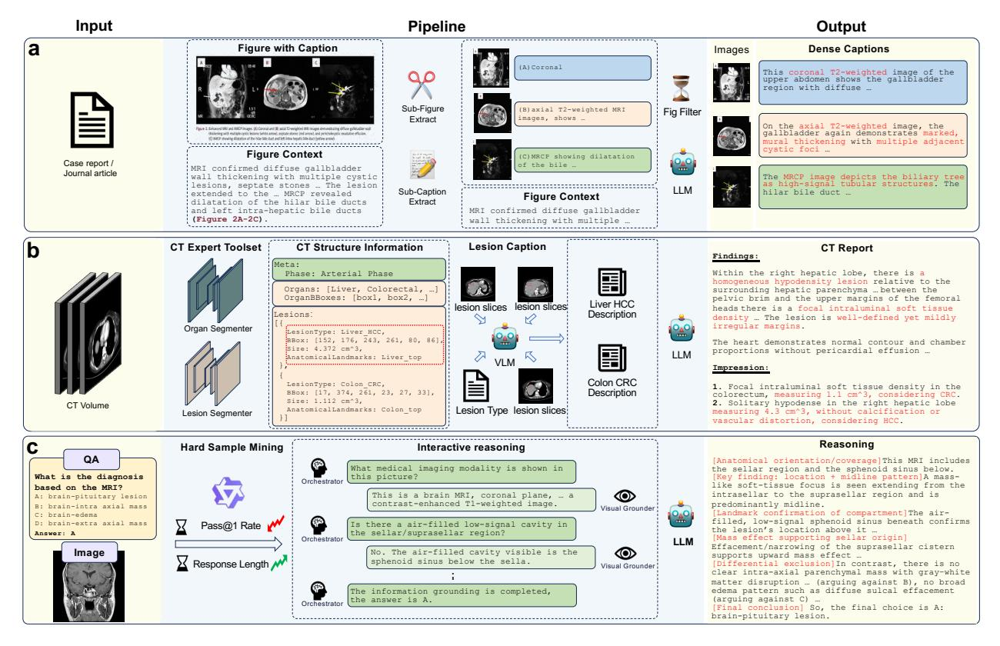

보조 그림 1: ClinFusion의 데이터 합성 파이프라인. a, 밀집 캡션 생성. 우리는 사례 보고서와 학술지를 파싱하여 그림 이미지와 원본 캡션 및 주변 문맥을 얻고, 복합 그림을 서브 패널로 분할하며, 각 서브 그림에 맞춰 패널별 서브 캡션을 추출한다. 비임상적이거나 과도하게 주석이 달린 영역, 저품질 영역을 제거하기 위한 다단계 필터링 후, 서브 이미지와 원본 (서브) 캡션/문맥 모두를 조건으로 하여 밀집하고 시각적으로 기반된 설명을 재생성한다. **b**, CT 시각 전문가 도구를 사용한 주석화. CT 볼륨에 짝이 된 보고서가 없는 경우, 우리는 CT Visual Expert를 활용해 장기 문맥과 병변 수준 속성(예: 유형, 대략적인 3D 위치, 범위 대리자)을 포함하는 구조화된 CT 표현을 생성한다. 이 표현의 병변 항목을 사용해 각 병변을 포함하는 대표적인 CT 슬라이스를 검색하고, 선택된 슬라이스에 병변 영역 마커를 겹친다. 표시된 슬라이스와 해당 병변 메타데이터를 VLM에 제공해 병변 중심 캡션을 생성한다. 마지막으로, 이 병변 캡션과 전역 구조화 속성을 LLM에 의해 통합해 표준화된 방사선 스타일의 Findings/Impression 가상 보고서를 만든다. **c**, 어려운 샘플에 대한 대화형 다중모달 CoT 주석. 우리는 Qwen3-VL로 후보 다중모달 QA 인스턴스를 점수화하고, 장기 분석 응답을 유도하지만 pass@1이 낮은 샘플을 우선순위로 정한다. 이는 표면적 지식 격차가 아니라 장기 기반 근거 추론 실패를 나타낸다. 선택된 어려운 인스턴스는 텍스트 전용 오케스트레이터와 다중모달 시각 기반 근거자(visual grounder)를 분리한 세심하게 설계된 대화형 추론 프로토콜로 해결한다. 질문이 주어지면, 오케스트레이터는 이를 시각적 사실 확인 쿼리 시퀀스로 분해하고, 시각 기반 근거자를 반복적으로 질의해 이미지 기반 증거를 수집하며, 누적된 증거가 최종 답변을 지원하기에 충분하면 종료한다. 완료 후, 추가 LLM 패스가 전체 대화 경로를 일관된 추론 트레이스로 재작성해 지침 튜닝에 활용한다.

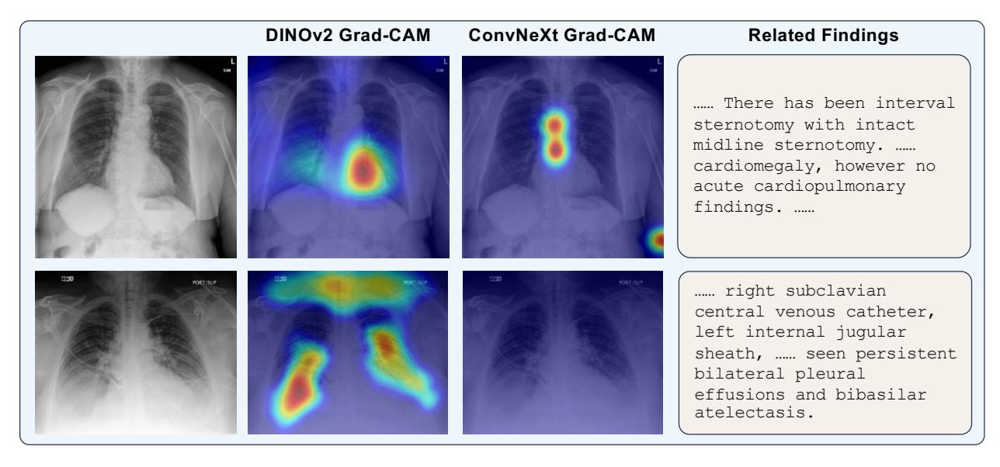

보조 그림 2: Grad-CAM 시각화가 전문 인코더의 상호 보완적 주의 집중을 드러낸다. 각 예시마다 원본 이미지, DINOv2와 ConvNext에 대한 Grad-CAM 히트맵, 그리고 보고서에 해당하는 관련 소견을 보여준다.

### S5 보조 표 (S5 Supplementary Tables)

보조 표 1 2D 다중모달 의료 벤치마크 결과. 우리는 선도적인 독점 모델, 선도적인 일반 MLLMs, 그리고 다른 의료 MLLMs의 결과를 나열한다. 굵은 결과는 의료 MLLMs에서 가장 높은 점수를 나타내고, 밑줄 친 결과는 두 번째로 높은 점수를 나타낸다. ♡는 모델이 다중 이미지 입력을 지원하지 않음을 나타낸다. †는 결과가 우리 자체 평가 프레임워크 내에서 오픈소스 모델 가중치 또는 모델 API를 사용해 재벤치마크되었음을 나타낸다.

|  |  | 멀티모달리티 벤치마크 |  |  | 특정 모달리티 벤치마크 | 추론 벤치마크 |  |  |  |
|---------------------|--------|------------------------------|---------------|-----------------------|---------------------------------|------------------------|---------|--------|--|
| 모델 | OM.VQA | PMCVQA | MedF GMAI |  | VQA-RAD | SLAKE | PathVQA | MedXQA |  |
|  |  |  |  | 독점 모델 |  |  |  |  |  |
| GPT-5.2† | 68.4 | 56.7 | 52.1 | 58.4 | 73.4 | 79.4 | 54.0 | 52.9 |  |
| Gemini-3-Flash† | 82.0 | 64.4 | 53.3 | 67.8 | 71.0 | 80.3 | 60.6 | 78.0 |  |
| Claude-Sonnet-4.5† | 67.1 | 58.4 | 54.2 | 47.6 | 63.6 | 72.6 | 51.7 | 42.8 |  |
|  |  |  |  | 범용 MLLMs |  |  |  |  |  |
| Qwen2.5-VL-7B† | 63.3 | 51.7 | 46.9 | 44.0 | 59.6 | 67.4 | 43.4 | 22.5 |  |
| Qwen3-VL-8B† | 76.4 | 54.0 | 42.1 | 54.0 | 61.9 | 70.4 | 42.8 | 24.9 |  |
| InternVL3-8B | 79.1 | 53.8 | – | – | 65.4 | 72.8 | 48.6 | 22.4 |  |
| InternVL3-14B | 78.9 | 54.1 | – | – | 66.3 | 72.8 | 48.0 | 23.1 |  |
| Qwen2.5-VL-32B† | 67.2 | 53.2 | 51.5 | 47.4 | 72.7 | 77.2 | 46.3 | 25.4 |  |
| Qwen3-VL-32B† | 76.8 | 56.5 | 52.0 | 56.3 | 66.1 | 76.9 | 48.6 | 31.2 |  |
| InternVL3-38B | 79.8 | 56.6 | – | – | 65.4 | 72.7 | 51.0 | 25.2 |  |
| Qwen3-VL-235B† | 75.8 | 56.2 | 50.3 | 54.9 | 67.8 | 75.5 | 51.1 | 33.7 |  |
|  |  |  | 의료 MLLMs |  |  |  |  |  |  |
| — 10B 이하 모델 — |  |  |  |  |  |  |  |  |  |
| BiomedGPT♡ | 27.9 | 27.6 | – | – | 16.6 | 13.6 | 11.3 | – |  |
| Med-R1-2B | – | 47.4 | – | – | 39.0 | 54.5 | 15.3 | 21.1 |  |
| MedVLM-R1-2B | 77.6 | 48.8 | – | – | 49.2 | 56.3 | 36.0 | 21.4 |  |
| HealthGPT-M3 | 71.5 | 55.4 | – | – | 56.8 | 70.8 | 55.4 | 22.4 |  |
| BioMediX2-8B | 66.0 | 41.8 | – | – | 55.7 | 54.1 | 34.6 | 21.9 |  |
| LLaVA-Med-7B | 34.8 | 22.7 | – | – | 46.6 | 51.9 | 35.2 | 20.8 |  |
| MedGemma-4B-IT | 70.7 | 49.2 | – | – | 72.3 | 78.2 | 48.1 | 25.4 |  |
| HuatuoGPT-V-7B | 74.3 | 53.1 | – | – | 67.6 | 68.1 | 44.8 | 23.2 |  |
| Lingshu-7B | 82.9 | 56.3 | – | – | 67.9 | 83.1 | 61.9 | 26.7 |  |
| Hulu-Med-7B | 84.2 | 66.8 | – | – | 78.0 | 86.8 | 65.6 | 29.0 |  |
| MedGemma-1.5-4B-IT† | 47.5 | 18.7 | 40.5 | 21.8 | 55.2 | 63.6 | 34.7 | 18.5 |  |
| Lingshu-7B† | 83.4 | 57.4 | 58.2 | 51.8 | 64.3 | 81.5 | 57.3 | 26.4 |  |
| Hulu-Med-7B† | 79.4 | 61.7 | 54.8 | 51.8 | 68.5 | 74.7 | 54.2 | 25.6 |  |
| ClinFusion-8B | 89.6 | 67.8 | 64.3 | 57.9 | 76.3 | 91.1 | 68.7 | 32.4 |  |
| — 10B 초과 모델 — |  |  |  |  |  |  |  |  |  |
| HealthGPT-14B | 75.2 | 56.4 | – | – | 65.0 | 66.1 | 56.7 | 24.7 |  |
| HuatuoGPT-V-34B | 74.0 | 56.6 | – | – | 61.4 | 69.5 | 44.4 | 22.1 |  |
| Lingshu-32B | 83.4 | 57.9 | – | – | 76.7 | 86.7 | 65.5 | 30.9 |  |
| MedDr-40B♡ | 64.3 | 13.9 | – | – | 65.2 | 66.4 | 53.5 | – |  |
| Hulu-Med-14B | 85.1 | 68.9 | – | – | 76.1 | 86.5 | 64.4 | 30.0 |  |
| Hulu-Med-32B | 84.6 | 69.4 | – | – | 81.4 | 85.7 | 67.3 | 34.0 |  |
| MedGemma-27B-IT† | 60.0 | 49.2 | 49.5 | 37.3 | 65.6 | 75.5 | 43.4 | 23.6 |  |
| Lingshu-32B† | 83.4 | 62.3 | 58.9 | 55.6 | 73.2 | 87.6 | 63.4 | 30.5 |  |
| Hulu-Med-32B† | 80.0 | 63.2 | 61.6 | 57.3 | 75.8 | 82.6 | 63.1 | 32.6 |  |
| ClinFusion-32B | 89.9 | 70.8 | 69.4 | 60.2 | 77.2 | 92.5 | 72.4 | 38.7 |  |

보조 표 2 2D 보고서 생성 벤치마크 결과. 굵게 표시된 결과는 의료 MLLM 중 가장 높은 점수를 나타내며, 밑줄 친 결과는 두 번째로 높은 점수를 나타낸다. †는 결과가 자체 평가 프레임워크 내에서 오픈소스 모델 가중치 또는 모델 API를 사용해 재벤치마크되었음을 나타낸다.

|  |  | CheXpert-Plus |  | IU-XRAY |  |  |  |  |  |  |  |
|--------------------------------|-----------------------|---------------|------|-----------|--------|------|--|--|--|--|--|
| 모델 | 정밀도 | 재현율 | F1 | 정밀도 | 재현율 | F1 |  |  |  |  |  |
| 독점 모델 |  |  |  |  |  |  |  |  |  |  |  |
| GPT-5.2† | 49.1 | 38.1 | 40.2 | 55.3 | 50.3 | 50.6 |  |  |  |  |  |
| Gemini-3-Flash† | 38.4 | 33.5 | 33.0 | 56.8 | 55.2 | 54.4 |  |  |  |  |  |
| Claude-Sonnet-4.5† | 33.8 | 28.3 | 28.9 | 39.2 | 39.2 | 37.7 |  |  |  |  |  |
|  | 범용 MLLMs |  |  |  |  |  |  |  |  |  |  |
| Qwen2.5-VL-7B† | 13.7 | 11.5 | 12.0 | 33.0 | 32.9 | 32.4 |  |  |  |  |  |
| Qwen3-VL-8B† | 20.0 | 16.3 | 16.8 | 37.0 | 37.3 | 36.7 |  |  |  |  |  |
| Qwen2.5-VL-32B† | 22.2 | 16.2 17.3 |  | 33.5 | 31.9 | 31.9 |  |  |  |  |  |
| Qwen3-VL-32B† | 30.6 | 27.9 | 27.3 | 40.8 | 41.0 | 40.0 |  |  |  |  |  |
| Qwen3-VL-235B† | 29.5 | 25.2 | 25.6 | 43.2 | 41.4 | 41.2 |  |  |  |  |  |
|  |  | 의료 MLLMs |  |  |  |  |  |  |  |  |  |
| — 10B 이하 모델 — |  |  |  |  |  |  |  |  |  |  |  |
| MedGemma-1.5-4B-IT† | 34.1 | 23.1 | 25.4 | 43.1 | 38.9 | 39.8 |  |  |  |  |  |
| Lingshu-7B† | 26.2 | 17.8 | 19.9 | 43.7 | 39.3 | 40.4 |  |  |  |  |  |
| Hulu-Med-7B† | 40.5 | 29.1 | 31.9 | 51.1 | 45.3 | 46.5 |  |  |  |  |  |
| ClinFusion-8B | 46.4 | 35.3 | 37.8 | 63.3 | 55.8 | 57.3 |  |  |  |  |  |
| ClinFusion-8B + 에이전틱 도구 | 57.3 | 49.8 | 50.2 | 64.5 | 59.4 | 59.9 |  |  |  |  |  |
| — 10B 초과 모델 — |  |  |  |  |  |  |  |  |  |  |  |
| MedGemma-27B-IT† | 26.9 | 21.9 | 22.5 | 41.3 | 40.7 | 40.1 |  |  |  |  |  |
| Lingshu-32B† | 28.0 | 21.5 | 22.8 | 44.5 | 40.5 | 41.3 |  |  |  |  |  |
| Hulu-Med-32B† | 51.0 | 35.5 | 39.6 | 53.5 | 46.8 | 48.2 |  |  |  |  |  |
| ClinFusion-32B | 56.1 | 46.6 | 48.0 | 60.2 | 54.7 | 55.6 |  |  |  |  |  |
| ClinFusion-32B + 에이전틱 도구 | 60.2 | 55.4 | 54.8 | 60.8 | 56.1 | 56.3 |  |  |  |  |  |

보충 표 3 텍스트 기반 의료 벤치마크 결과. 우리는 선도적인 독점 모델, 선도적인 일반형 MLLM, 그리고 다른 의료 MLLM의 결과를 나열한다. 굵은 글씨 결과는 의료 MLLM에서 가장 높은 점수를 나타내며, <u>밑줄 친</u> 결과는 두 번째로 높은 점수를 나타낸다. †는 결과가 우리 자체 평가 프레임워크 내에서 오픈소스 모델 가중치 또는 모델 API를 사용해 재벤치마크되었음을 나타낸다.

|  | 복합 추론 벤치마크 |  |  | 텍스트 이해 벤치마크 | 의료 시험 벤치마크 |  |  |  |  |  |
|--------------------------------------------------------------------|------------------------------|---------------------------------|---------------------|---------------------------------|----------------------------------------------------------------------------------------------------------------------------------------------------------------------------------------------------------|---------------------|----------|------|--|--|
| 모델 | $\overline{\mathrm{MedXQA}}$ | edXQA Medbullets SGPQA PubMedQA |  | $\overline{\mathrm{MedMCQA}}$ | MedQA-U | MedQA-M | MMLU-Med |  |  |  |
|  |  |  | Prop | 프라이빗 모델 |  |  |  |  |  |  |
| GPT-5.2 | 40.4 | 81.3 | 55.6 | 77.6 | 79.1 | 91.0 | 88.9 | 90.5 |  |  |
| Gemini-3-Flash | 65.3 | 85.6 | 73.9 | 80.4 | 85.5 | 95.1 | 94.0 | 91.7 |  |  |
| Claude-Sonnet-4.5 | 36.9 | 81.8 | 59.4 | 74.8 | 78.8 | 90.4 | 90.6 | 92.1 |  |  |
|  |  |  | 일반 | -목적 MLLMs |  |  |  |  |  |  |
| $\mathrm{Qwen}2.5\text{-}\mathrm{VL}\text{-}7\mathrm{B}^{\dagger}$ | 12.0 | 43.0 | 25.8 | 74.6 | 53.2 | 56.4 | 76.9 | 74.1 |  |  |
| Qwen3-VL-8B † | 14.6 | 51.9 | 36.9 | 72.2 | 60.7 | 66.2 | 87.2 | 80.0 |  |  |
| InternVL3-8B | 13.1 | 48.5 | 31.2 | 75.4 | 57.7 | 62.1 | _ | 77.5 |  |  |
| InternVL3-14B | 14.1 | 49.5 | 37.9 | 77.2 | 62.0 | 70.1 | _ | 81.7 |  |  |
| $Qwen 2.5\text{-}VL\text{-}32B^{\dagger}$ | 15.8 | 54.2 | 39.3 | 71.6 | 80.4 85.5 95.1 94.0 74.8 78.8 90.4 90.6 ee MLLMs  74.6 53.2 56.4 76.9 72.2 60.7 66.2 87.2 75.4 57.7 62.1 - 77.2 62.0 70.1 - 71.6 62.9 70.8 90.0 71.0 68.2 77.5 91.7 73.2 64.9 73.5 - 75.2 74.3 85.2 93.7 |  | 83.3 |  |  |  |
| Qwen3-VL- $32B^{\dagger}$ | 18.2 | 60.1 | 47.4 | 71.0 |  | 77.5 | 91.7 | 86.6 |  |  |
| InternVL3-38B | 16.0 | 54.6 | 42.5 |  |  |  |  | 83.8 |  |  |
| Qwen3-VL-235 $B^{\dagger}$ | 23.3 | 69.6 | 53.8 |  |  |  | 93.7 | 88.8 |  |  |
|  |  |  | Med | 의료 MLLMs |  |  |  |  |  |  |
| - 모델 < 10B - |  |  |  |  |  |  |  |  |  |  |
| MedVLM-R1-2B | 11.8 | 33.8 | 19.1 | 66.4 | 39.7 | 42.3 | _ | 51.8 |  |  |
| BioMediX2-8B | 13.4 | 45.9 | 25.2 | 75.2 | 52.9 | 58.9 | _ | 68.6 |  |  |
| MedGemma-4B-IT | 12.8 | 45.6 | 21.6 | 72.2 | 52.2 | 56.2 | _ | 66.7 |  |  |
| HealthGPT-M3 | 11.5 | 41.4 | 18.9 | 57.8 | 54.2 | 55.0 | _ | 72.5 |  |  |
| LLaVA-Med-7B | 9.90 | 34.4 | 16.1 |  | 39.4 | 42.0 | _ | 50.6 |  |  |
| HuatuoGPT-V-7B | 10.1 | 40.9 | 21.9 |  |  |  | _ | 69.3 |  |  |
| Lingshu-7B | 16.5 | 56.2 | 26.3 |  |  |  | _ | 74.5 |  |  |
| Hulu-Med-7B | 19.6 | 61.5 | 31.1 |  |  |  | _ | 79.5 |  |  |
| MedGemma-1.5-4B-IT † | 9.18 | 33.4 | 2.25 |  |  |  | 4.23 | 10.3 |  |  |
| Lingshu-7B † | 17.0 | 56.2 | 28.9 |  |  |  |  | 75.6 |  |  |
| Hulu-Med-7B † | 20.0 | 64.3 | 32.6 | 75.2 | 64.2 | 76.0 | 81.2 | 77.9 |  |  |
| ClinFusion-8B | $\frac{20.0}{20.0}$ | $\frac{64.3}{64.3}$ | $\frac{32.6}{32.6}$ | 77.6 | 62.8 | $\frac{70.6}{72.6}$ | 89.1 | 81.3 |  |  |
| ClinFusion-8B + 에이전틱 툴 | 27.7 | 69.5 | 45.4 | 79.1 | 70.1 | 83.7 | 84.3 | 86.0 |  |  |
| — <i>모델</i> > 10B — |  |  |  |  |  |  |  |  |  |  |
| HealthGPT-14B | 11.3 | 39.8 | 25.7 | 68.0 | 63.4 | 66.2 | _ | 80.2 |  |  |
| Lingshu-32B | 22.7 | 65.4 | 41.1 | 77.8 | 66.1 | 74.7 | _ | 84.7 |  |  |
| HuatuoGPT-V-34B | 11.4 | 42.7 | 26.5 | 72.2 | 54.7 | 58.8 | _ | 74.7 |  |  |
| MedDr-40B | 12.0 | 44.3 | 24.0 | 77.4 | 38.4 | 59.2 | _ | 65.2 |  |  |
| Hulu-Med-14B | 23.2 | 68.5 | 37.7 | 79.8 | 70.4 | 78.1 | _ | 83.3 |  |  |
| Hulu-Med-32B | 24.2 | 68.8 | 41.8 | 80.8 | 72.8 | 80.4 | _ | 85.6 |  |  |
| MedGemma-27B-IT † | 15.8 | 56.8 | $\frac{11.6}{31.4}$ | 75.4 | 64.7 | 71.4 | 73.1 | 80.7 |  |  |
| Lingshu-32B † | 22.2 | 65.3 | 41.4 | 77.4 | 65.6 | 73.4 | 89.6 | 84.5 |  |  |
| Hulu-Med-32B † | 19.8 | 67.5 | 38.0 | 78.8 | 68.5 | 77.1 | 87.0 | 83.7 |  |  |
| ClinFusion-32B | 26.7 | 74.8 | 41.8 | 78.8 | 70.7 | 82.4 | 93.8 | 87.9 |  |  |
| ClinFusion-32B + 에이전틱 툴 | 31.2 | 77.9 | 50.9 | 79.7 | 74.0 | 86.6 | 94.5 | 89.9 |  |  |

보충 표 4 3D 다중모달 의료 벤치마크 결과. 굵은 글씨 결과는 의료 MLLM 중 가장 높은 점수를 나타내며, <u>밑줄 친</u> 결과는 두 번째로 높은 점수를 나타낸다. †는 결과가 자체 평가 프레임워크 내에서 오픈소스 모델 가중치 또는 모델 API를 사용해 재벤치마크되었음을 나타낸다.

|  | AMOS | S 3D-RAD |  | CT-I | 비율 | AMOS 보고서 |  |  | CT-Rate 보고서 |  |  |
|----------------------------------------------------------|------|-------------------------|------|-------------------------|----------|-------------|-------------|------|----------------|--------|------|
| 모델 | MCQ | $\overline{\text{MCQ}}$ | 열기 | $\overline{\text{MCQ}}$ | 열기 | 정밀도 | 재현율 | F1 | 정밀도 | 재현율 | F1 |
|  |  |  | Pr | 소유 | y 모델 | 3 |  |  |  |  |  |
| GPT-5.2 | 63.8 | 67.1 | 37.6 | 66.9 | 59.1 | 29.9 | 11.5 | 14.5 | 21.0 | 12.7 | 14.1 |
| Gemini-3-Flash | 64.2 | 58.8 | 30.3 | 70.9 | 51.9 | 40.7 | 19.1 | 23.4 | 29.3 | 17.9 | 20.2 |
| Claude-Sonnet-4.5 | 62.6 | 58.5 | 30.0 | 73.2 | 51.7 | 12.8 | 6.49 | 7.35 | 15.5 | 11.8 | 12.3 |
|  |  |  | 유전자 | ral-purpe | se MLL | Ms |  |  |  |  |  |
| $Qwen 2.5-VL-7B^{\dagger}$ | 53.4 | 40.8 | 28.6 | 67.3 | 44.5 | 6.31 | 4.18 | 4.69 | 10.6 | 9.42 | 9.61 |
| Qwen3-VL- $8B^{\dagger}$ | 50.2 | 52.7 | 28.5 | 59.6 | 44.7 | 11.6 | 6.51 | 7.30 | 22.6 | 16.3 | 17.3 |
| $Qwen 2.5-VL-32B^{\dagger}$ | 55.8 | 46.4 | 24.0 | 64.0 | 53.1 | 6.55 | 4.09 | 4.57 | 16.9 | 13.7 | 14.2 |
| Qwen3-VL- $32B^{\dagger}$ | 58.9 | 64.7 | 30.1 | 67.1 | 53.6 | 12.6 | 7.61 | 8.37 | 30.6 | 18.2 | 20.5 |
| Qwen3-VL-235 $B^{\dagger}$ | 57.1 | 47.7 | 28.9 | 62.3 | 50.9 | 14.6 | 7.25 | 8.53 | 21.6 | 16.1 | 16.9 |
|  |  |  | Λ | Medical N | ALLMs |  |  |  |  |  |  |
| — 모델 < 10B — |  |  |  |  |  |  |  |  |  |  |  |
| $MedGemma-1.5-4B-IT^{\dagger}$ | 57.1 | 38.1 | 23.4 | 75.6 | 54.8 | 14.4 | 6.53 | 7.74 | 13.6 | 10.5 | 11.0 |
| Lingshu-7B † | 61.7 | 68.4 | 18.0 | 70.7 | 48.9 | 7.96 | 4.35 | 5.04 | 11.1 | 9.61 | 9.86 |
| $\mathrm{Hulu\text{-}Med\text{-}7B^{\dagger}}$ | 65.7 | 73.5 | 33.2 | 77.6 | 50.2 | 17.5 | 9.18 | 10.7 | 27.4 | 16.0 | 18.3 |
| ClinFusion-8B | 80.2 | 79.1 | 35.7 | 86.3 | 64.1 | 20.1 | <u>10.7</u> | 12.0 | 28.8 | 20.5 | 21.6 |
| ClinFusion-8B + Agentic tools | 85.7 | 81.3 | 44.1 | 89.1 | 65.5 | 23.2 | 17.1 | 16.6 | 30.0 | 23.5 | 25.3 |
| - 모델 $>$ 10B $-$ |  |  |  |  |  |  |  |  |  |  |  |
| $MedGemma-27B-IT^{\dagger}$ | 54.3 | 36.7 | 25.1 | 72.4 | 45.4 | 11.6 | 6.00 | 7.07 | 13.2 | 10.2 | 10.7 |
| $Lingshu-32B^{\dagger}$ | 63.8 | 70.2 | 25.3 | 70.1 | 50.0 | 9.65 | 6.41 | 7.10 | 15.3 | 11.5 | 12.2 |
| $\mathrm{Hulu\text{-}Med\text{-}}32\mathrm{B}^{\dagger}$ | 73.9 | 79.6 | 37.6 | 83.3 | 56.9 | 22.5 | 9.97 | 12.5 | 34.4 | 21.4 | 23.4 |
| ClinFusion-32B | 81.7 | 79.1 | 36.2 | 89.0 | 62.1 | 26.7 | <u>13.7</u> | 16.1 | 34.5 | 21.4 | 23.9 |
| ClinFusion-32B + Agentic tools | 86.3 | 81.6 | 45.6 | 91.7 | 65.4 | 28.4 | 17.8 | 19.1 | 34.9 | 25.9 | 27.6 |

보충 표 5 제안한 MedIF-Bench에 대한 결과. 개별 과제와 복합 지시 따르기 점수에 대한 점수를 보고한다. 굵은 글씨 결과는 의료 MLLM 중 최고 점수를 나타내며, <u>밑줄 친</u> 결과는 두 번째로 높은 점수를 나타낸다. †는 결과가 자체 평가 프레임워크 내에서 오픈소스 모델 가중치 또는 모델 API를 사용해 재벤치마크되었음을 나타낸다.

|  |  |  | 복합 IF 점수 |  |  |  |  |  |  |  |
|-------------------------------------------------|-------|------------------|---------------------|-------------|----------------------|-------|-----------|-------|---------|------------|
| 모델 | 다지선다형 질문 | 문맥 포함 다지선다형 질문 | 개방형 | 예후 | 보고서 생성 | Seer | 치료 | MM-IF | Text-IF | Overall-IF |
|  |  |  |  | Proprieta | ry Models |  |  |  |  |  |
| GPT-5.2 | 100.0 | 100.0 | 87.0 | 100.0 | 84.0 | 100.0 | 100.0 | 92.0 | 100.0 | 96.0 |
| Gemini-3-Flash | 98.0 | 100.0 | 100.0 | 98.9 | 97.0 | 83.0 | 97.0 | 98.9 | 94.3 | 96.6 |
| Claude-Sonnet-4.5 | 73.5 | 76.0 | 90.0 | 96.2 | 80.0 | 100.0 | 100.0 | 86.0 | 87.0 | 86.5 |
|  |  |  |  | General-pur | pose MLLMs |  |  |  |  |  |
| Qwen2.5-VL-7B † | 100.0 | 100.0 | 99.0 | 100.0 | 100.0 | 100.0 | 99.0 | 99.7 | 99.8 | 99.8 |
| Qwen3-VL-8B † | 99.0 | 100.0 | 99.0 | 100.0 | 99.0 | 95.0 | 100.0 | 99.4 | 98.4 | 98.9 |
| $Qwen 2.5-VL-32B^{\dagger}$ | 77.0 | 83.0 | 88.0 | 100.0 | 89.0 | 20.0 | 100.0 | 87.3 | 72.7 | 79.3 |
| $Qwen3-VL-32B^{\dagger}$ | 100.0 | 100.0 | 91.0 | 100.0 | 55.0 | 100.0 | 100.0 | 85.1 | 100.0 | 93.3 |
| $Qwen 3\text{-}VL\text{-}235B^{\dagger}$ | 100.0 | 100.0 | 99.0 | 100.0 | 100.0 | 99.0 | 100.0 | 99.7 | 99.8 | 99.7 |
|  |  |  |  | 의료 | MLLMs |  |  |  |  |  |
| — Models < 10B — |  |  |  |  |  |  |  |  |  |  |
| $MedGemma-1.5-4B-IT^{\dagger}$ | 50.5 | 21.0 | 97.0 | 3.8 | 0.0 | 0.0 | 0.0 | 49.9 | 8.9 | 27.4 |
| Lingshu-7B † | 80.5 | 92.0 | 67.0 | 100.0 | 35.0 | 88.0 | 100.0 | 62.3 | 95.5 | 80.4 |
| $\mathrm{Hulu\text{-}Med\text{-}7B^{\dagger}}$ | 99.0 | 100.0 | 100.0 | 98.9 | 96.0 | 69.0 | 100.0 | 98.9 | 92.0 | 95.1 |
| ClinFusion-8B | 95.0 | 100.0 | 99.0 | 100.0 | 98.0 | 99.0 | 99.0 | 97.0 | 99.1 | 98.1 |
| — Models > 10B — |  |  |  |  |  |  |  |  |  |  |
| $MedGemma-27B-IT^{\dagger}$ | 79.0 | 85.0 | 100.0 | 100.0 | 100.0 | 92.0 | 96.0 | 93.4 | 89.8 | 91.4 |
| $Lingshu-32B^{\dagger}$ | 82.5 | 100.0 | 73.0 | 100.0 | 31.0 | 100.0 | 91.0 | 61.7 | 99.8 | 82.6 |
| $\mathrm{Hulu\text{-}Med\text{-}32B^{\dagger}}$ | 100.0 | 100.0 | 98.0 | 100.0 | 89.0 | 100.0 | 100.0 | 96.4 | 100.0 | 98.4 |
| ClinFusion-32B | 100.0 | 100.0 | 91.0 | 100.0 | 100.0 | 100.0 | 100.0 | 97.5 | 100.0 | 98.9 |

보충 표 6  
보고서 생성을 위한 임상 문맥의 필요성에 대한 제거 실험.  
우리는 ClinFusion-8B와 Lingshu-7B [6] 두 모델을 두 가지 설정에서 비교한다: 추출된 임상 문맥이 포함된 경우("w/ Context")와 제외된 경우("w/o Context")이며, 이때 임상 지시(Clinical Indication)와 초점 영역(Area of Focus)이 생성 프롬프트에서 제거된다.

| 모델 | 설정 | AMOS Report |  |  | CT Rate Report |  |  | CheXpert-Plus |  |  | IU-XRAY |  |  |
|---------------|-------------|-------------|--------|------|----------------|--------|------|---------------|--------|------|-----------|--------|------|
|  |  | 정밀도 | 재현율 | F1 | 정밀도 | 재현율 | F1 | 정밀도 | 재현율 | F1 점수 | 정밀도 | 재현율 | F1 점수 |
| ClinFusion-8B | 문맥 포함 | 20.1 | 10.7 | 12.0 | 28.8 | 20.5 | 21.6 | 46.4 | 35.3 | 37.8 | 63.3 | 55.8 | 57.3 |
|  | 문맥 제외 | 0.89 | 0.39 | 0.46 | 7.99 | 3.68 | 4.71 | 13.1 | 10.7 | 10.8 | 10.6 | 8.43 | 8.87 |
| Lingshu-7B | 문맥 포함 | 7.96 | 4.35 | 5.04 | 11.1 | 9.61 | 9.86 | 26.2 | 17.8 | 19.9 | 43.7 | 39.3 | 40.4 |
|  | 문맥 제외 | 0.17 | 0.12 | 0.13 | 5.83 | 4.92 | 4.91 | 11.1 | 8.58 | 8.94 | 10.7 | 8.10 | 8.76 |

보충 표 7. CheXpert-Plus 및 IU-XRAY에서 RadGraph-F1과 우리 LLM-as-a-Judge 지표의 비교. 네 가지 모델 변형이 평가되며, 길이 편향을 드러내기 위해 자세한 생성을 유도하도록 프롬프트된 Qwen3-VL-8B (Long Output) 변형이 포함된다. RadGraph-F1은 엔터티 F1과 엔터티-관계 F1을 보고하며, 우리 LLM-as-a-Judge는 정밀도, 재현율 및 F1을 보고한다.

|  |  | CheX I |  | IU-XRAY |  |  |  |  |  |  |
|---------------------------|---------|-------------------|-----------------------|---------|------|---------|------------|-----------------------|------|------|
| 모델 | Rad | 그래프-F1 | LLM-판사 (LLM-as-a-Judge) |  |  | Rad | 그래프-F1 | LLM-판사 |  |  |
|  | 엔티티 F1 | 엔티티 관계 F1 | 정밀도 | 재현율 | F1 | 엔티티 F1 | 엔티티 관계 F1 | 정밀도 | 재현율 | F1 |
| ClinFusion-8B | 23.2 | 21.0 | 46.4 | 35.3 | 37.8 | 38.7 | 36.6 | 63.3 | 55.8 | 57.3 |
| Lingshu-7B | 20.0 | 17.9 | 26.2 | 17.8 | 19.9 | 35.1 | 34.6 | 43.7 | 39.3 | 40.4 |
| Qwen3-VL-8B | 13.3 | 11.8 | 20.0 | 16.3 | 16.8 | 17.8 | 16.3 | 37.0 | 37.3 | 36.7 |
| Qwen3-VL-8B (Long Output) | 20.6 | 18.8 | 13.8 | 18.9 | 15.1 | 34.7 | 33.0 | 29.4 | 42.1 | 33.6 |

보충 표 8 구성적 시각 인코더에 대한 다양한 융합 메커니즘의 제거 실험. 우리는 단일 인코더(Qwen ViT baseline)와 다양한 융합 전략을 사용한 이중 인코더 설정(Qwen ViT + DINOv2)의 성능을 비교한다. 모든 점수는 정확도(%)로 보고된다.

| 인코더 종류 | 융합 메커니즘 | VQA-RAD | PMC-VQA | MedXQA | SLAKE | PathVQA | OMVQA | 평균 |
|-------------------|---------------------------|---------|---------|--------|-------|---------|-------|---------|
| Qwen ViT | - | 69.4 | 57.4 | 24.6 | 81.0 | 58.0 | 83.5 | 62.3 |
|  | 로컬 크로스-어텐션 (우리) | 72.3 | 57.5 | 25.3 | 84.4 | 65.5 | 82.3 | 64.5 |
| O V:T + DINO0 | 글로벌 크로스-어텐션 | 69.5 | 55.0 | 24.2 | 82.6 | 61.0 | 84.1 | 62.7 |
| Qwen ViT + DINOv2 | 비전 전문가 혼합 | 70.0 | 55.2 | 24.2 | 81.1 | 63.3 | 83.2 | 62.8 |
|  | 채널 연결 | 70.5 | 54.4 | 24.7 | 83.4 | 63.2 | 82.3 | 63.1 |

보충 표 9. 전문 2D 인코더 선택에 대한 ablation 연구. 우리는 기본 Qwen ViT에 하나의 추가 인코더(DINOv2, ConvNext, 또는 Medsiglip)를 추가하고, 두 가지 작업 범주(VQA 및 보고서 생성)에서 성능을 평가합니다. VQA의 경우 정확도(%)를 보고합니다. 보고서 생성의 경우 엔티티 및 엔티티-관계에 대해 RadGraph-F1 [8]을 보고합니다. 가장 높은 평균 결과는 **굵게** 표시됩니다.

| 추가 인코더 |  |  | VQA E | 보고서 생성 |  |  |  |  |  |  |
|--------------------|---------|---------|--------|-------------------|---------|-------|---------|-------------------|-------------------|-------------------|
|  | VQA-RAD | PMC-VQA | MedXQA | SLAKE | PathVQA | OMVQA | 평균 | CheXpert-Plus | IU-XRAY | 평균 |
| DINOv2 | 72.3 | 57.5 | 25.3 | 84.2 | 65.5 | 82.3 | 64.5 | $22.6 \ / \ 20.2$ | 37.7 / 35.5 | 30.2 / 27.8 |
| ConvNext | 72.1 | 57.1 | 24.8 | 83.5 | 64.7 | 82.7 | 64.1 | 21.8 / 20.0 | 37.9 / 35.9 | 29.9 / 27.9 |
| Medsiglip | 70.7 | 57.8 | 25.9 | 83.5 | 66.9 | 84.2 | 64.8 | 23.1 / 20.9 | $34.6 \ / \ 32.3$ | $28.9 \ / \ 26.6$ |

보조 표 10 다중 추가 인코더 선택, 다중 인코더 융합 전략 및 융합 순서에 대한 제거 실험. 우리는 기본 Qwen ViT에 두 개의 추가 인코더를 추가하고, VQA와 보고서 생성이라는 두 가지 작업 범주에서 성능을 평가한다. VQA의 경우 정확도(%)를 보고한다. 보고서 생성의 경우, 엔티티와 엔티티-관계에 대해 RadGraph-F1 [8]을 보고한다. 최고 평균 결과는 **bold**로 강조된다.

|  | Additional | 추가 인코더 2 |  |  | VQA B | 보고서 생성 |  |  |  |  |  |  |
|----------|------------|-------------------------|---------|---------|--------|-------------------|---------|-------|---------|---------------|-----------------|----------------|
|  | 인코더 1 |  | VQA-RAD | PMC-VQA | MedXQA | SLAKE | PathVQA | OMVQA | 평균 | CheXpert-Plus | IU-XRAY | 평균 보고서 |
| - | DINOv2 | ConvNext | 70.1 | 57.1 | 25.0 | 84.7 | 66.2 | 83.4 | 64.4 | 23.2 / 21.0 | 38.7 / 36.6 | 31.0 / 28.8 |
| G 1 | ConvNext | DINOv2 | 70.3 | 54.8 | 26.2 | 84.2 | 66.5 | 84.2 | 64.4 | 20.2 / 17.9 | 39.2 / 37.4 | 29.7 / 27.6 |
| Cascade | DINOv2 | Medsiglip | 72.7 | 58.0 | 25.2 | 84.7 | 66.5 | 84.4 | 65.2 | 23.1 / 20.7 | 36.6 / 34.1 | 29.8 / 27.4 |
|  | Medsiglip | DINOv2 | 69.0 | 53.6 | 25.5 | 84.6 | 68.0 | 85.9 | 64.4 | 22.4 / 20.0 | $35.1\ /\ 32.5$ | 28.8 / 26.3 |
| Parallel | DINOv2 | ConvNext | 71.4 | 58.0 | 24.8 | 83.9 | 65.3 | 83.9 | 64.6 | 22.3 / 20.0 | 36.4 / 34.6 | 29.3 / 27.3 |

보조 표 11 추론 시 네이티브 3D 인코더의 필요성에 대한 제거 실험. 우리는 전체 모델의 성능을, 추론 시 3D 인코더를 비활성화한 제거 버전과 비교한다. 이때 모델은 3D 이해를 위해 샘플링된 2D 슬라이스에만 의존하도록 강제된다. VQA 과제에서는 정확도(%)를 보고한다. 보고서 생성 과제에서는 정밀도/재현율/F1 점수를 제시한다. 최우수 결과는 굵은 글씨로 강조된다.

| 정규화 | AMOS |  | 3D RAD |  | CT Rate |  | AMOS 보고서 |  |  | CT Rate 보고서 |  | 평균 | 평균 |
|----------------|------|------|--------|------|---------|-----------|-------------|------|-----------|----------------|------|---------|--------------------|
|  | MCQ | 오픈 | MCQ | 오픈 | MCQ | 정밀도 | 재현율 | F1 | 정밀도 | 재현율 | F1 | VQA | 보고서 |
| 3D Encoder 포함 | 77.6 | 72.6 | 30.0 | 85.3 | 63.6 | 18.1 | 9.67 | 11.0 | 29.3 | 18.4 | 20.3 | 65.8 | 23.7 / 14.0 / 15.7 |
| 3D Encoder 미포함 | 75.8 | 76.3 | 26.4 | 79.1 | 56.4 | 12.1 | 6.82 | 7.86 | 27.0 | 13.4 | 15.5 | 62.8 | 19.6 / 10.3 / 11.7 |

보조 표 12 3D 작업에 대한 확률적 잔차 정규화에 대한 제거 실험. "Deterministic" 설정은 표준 잔차 연결을 사용하고, "Stochastic" 설정은 확률적 잔차 정규화를 적용합니다. VQA 작업(AMOS, 3D RAD, CT Rate)에 대해 정확도(%)를 보고합니다. 보고서 생성 작업에 대해 평균 정밀도/재현율/F1 점수를 제시합니다. 최고 평균 결과는 굵게 표시됩니다.

| 정규화 | AMOS | 3D RAD |  | CT 비율 |  | AMOS 보고서 |  |  | CT 비율 보고서 |  |  | 평균 | 평균 |
|----------------|------|--------|------|---------|------|-------------|--------|------|----------------|--------|------|---------|--------------------|
|  | MCQ | 열기 | MCQ | 열기 | MCQ | 정밀도 | 재현율 | F1 | 정밀도 | 재현율 | F1 | VQA | 보고서 |
| 확률적 | 77.6 | 72.6 | 30.0 | 85.3 | 63.6 | 18.1 | 9.67 | 11.0 | 29.3 | 18.4 | 20.3 | 65.8 | 23.7 / 14.0 / 15.7 |
| 결정적 | 78.8 | 67.9 | 30.4 | 85.9 | 61.2 | 20.3 | 8.40 | 10.6 | 26.5 | 18.2 | 19.6 | 64.8 | 23.4 / 13.3 / 15.1 |

