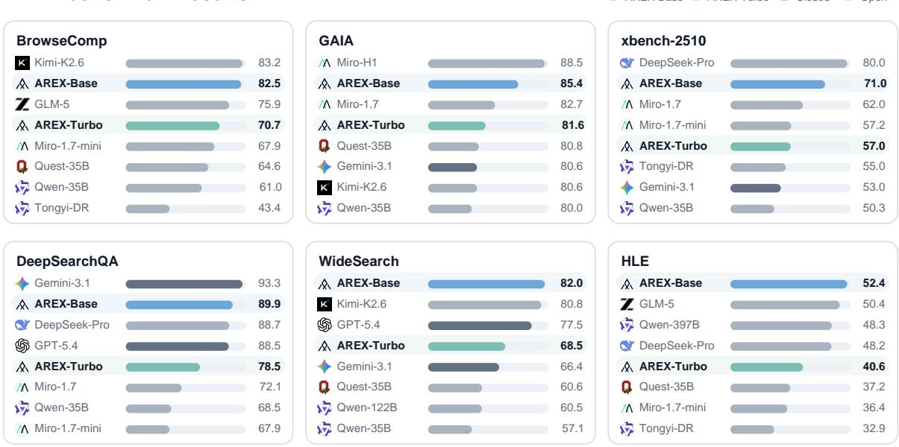
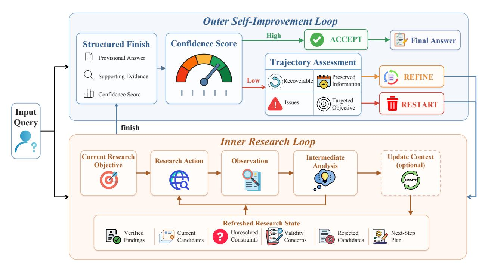
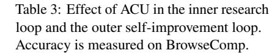
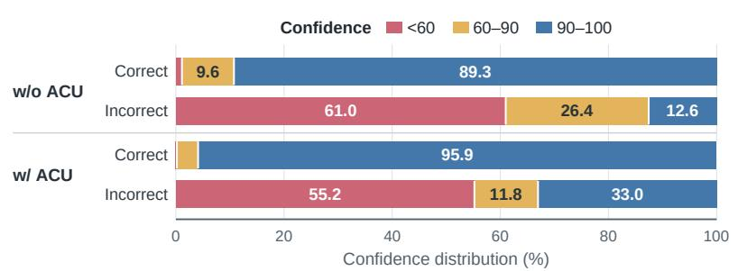
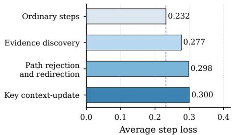

# AREX: 깊은 연구를 위한 재귀적으로 자기 개선되는 에이전트 (Towards a Recursively Self-Improving Agent for Deep Research)

- 원제: AREX: Towards a Recursively Self-Improving Agent for Deep Research
- 원문: [https://arxiv.org/abs/2607.21461](https://arxiv.org/abs/2607.21461)
- PDF: [https://arxiv.org/pdf/2607.21461v2](https://arxiv.org/pdf/2607.21461v2)
- arXiv ID: `2607.21461`

---

# **AREX:** 깊은 연구를 위한 재귀적으로 자기 개선되는 에이전트 (Towards a Recursively Self-Improving Agent for Deep Research)

#### **AREX 팀** (AREX Team)

베이징 인공지능 학원 (BAAI)

깊은 연구는 여러 제약을 동시에 만족하는 답을 찾아야 합니다. 이러한 답을 발견하는 것은 비용이 많이 들지만, 후보를 검증하는 것은 종종 제약별로 처리 가능한 검증으로 분해될 수 있습니다. 이 발견-검증 비대칭성은 연구 에이전트가 단순히 더 오래 탐색하는 것 이상을 해야 함을 시사합니다: 중간 결과를 검증하고 부분적으로 검증된 상태를 사용해 이후 정제 과정을 안내함으로써 현재 답을 재귀적으로 개선해야 합니다. 우리는 AREX, 재귀적으로 자기 개선되는(Recursively Self-Improving, RSI) 깊은 연구 에이전트의 한 가족을 소개합니다. AREX는 증거를 수집하고 잠정적인 답을 구성하는 내부 연구 루프와, 답을 제약별로 감시하고 해결되지 않은 주장들을 식별하며 목표 지향적 후속 연구를 시작하는 *외부 자기 개선 루프*를 번갈아 수행합니다. 장기적인 RSI를 유지하기 위해 AREX는 외부 모델에 의존하지 않고, 증가하는 상호작용 기록을 압축해 검증된 증거와 해결되지 않은 제약을 보존하는 컴팩트한 개선 상태로 변환하는 자율적 컨텍스트-업데이트 도구를 학습합니다. 우리는 검증된 합성 과제와 고품질 트랙터리를 통해 에이전트 중간 훈련 및 장기 강화 학습을 통해 AREX를 훈련합니다. 장기 학습 중 희소한 최종 보상을 완화하기 위해, 결정적인 증거가 획득되거나 잘못된 연구 방향이 수정되는 핵심 단계를 강조합니다. 우리는 밀집 4B 모델과 122B-A10B Mixture-of-Experts 모델을 구현합니다. BrowseComp, WideSearch, DeepSearchQA, Humanity's Last Exam (HLE) 및 기타 추론 및 도구 사용 벤치마크에서 AREX는 동등 규모의 기준선보다 크게 우수하며, 훨씬 더 많은 활성화 파라미터를 사용하는 모델과도 경쟁력 있게 남아 있습니다.

앱: https://arex-research.com  
홈페이지: https://vectorspacelab.github.io/arex-model/  
모델: https://huggingface.co/collections/BAAI/arex

#### AREX 벤치마크 결과 (AREX benchmark results)

■ AREX-Rase ■ AREX-Turbo ■ 닫힘 ■ 열림

그림 1: AREX의 벤치마크 성능

## 1 서론 (Introduction)

깊은 연구는 관련 증거를 찾는 것이 어려울 뿐만 아니라, 유효한 답이 동시에 여러 결합된 제약을 만족해야 하기 때문에 어려움을 겪습니다. 에이전트는 실행 가능한 후보를 발견하고, 분산되고 잠재적으로 충돌하는 증거를 통합하며, 각 요구 조건이 충분히 뒷받침되는지 검증해야 합니다 (Yao et al., 2023; Nakano et al., 2021; Huang et al., 2025). 많은 기존 시스템은 단일 탐색 궤적에 추가적인 추론, 도구 상호작용, 또는 컨텍스트를 확장함으로써 이 도전을 해결합니다 (OpenAI, 2025; Jin et al., 2025; Wu et al., 2025a; Gao et al., 2026). 추론 시간 계산이 늘어나면 탐색 범위가 넓어질 수 있지만, 체계적인 진전을 보장하지는 못합니다: 초기 오류가 지속될 수 있고, 소진된 방향이 재방문될 수 있으며, 부분적으로 유효한 후보가 조기에 수용될 수 있습니다. 핵심 과제는 단순히 더 오래 탐색하는 것이 아니라, 어떤 제약이 아직 해결되지 않았는지 식별하고 그 진단을 사용해 보다 목표 지향적인 다음 연구 문제를 공식화하는 것입니다.

우리는 깊은 연구 과제가 근본적인 *발견-검증 비대칭(discovery-verification asymmetry)*을 보인다는 것을 관찰한다. 모든 제약을 동시에 만족시키는 답을 발견하는 것은 큰 규모의 희소한 정보를 가진 탐색 공간을 탐색해야 하므로 비용이 많이 든다. 반면 제안된 후보를 평가하는 것은 대부분 훨씬 단순한 제약별 검사로 분해될 수 있다. 이러한 검증은 현재 답이 올바른지 여부뿐 아니라 어떤 주장들이 뒷받침되는지, 어떤 주장들이 아직 해결되지 않았는지, 그리고 가용 증거가 어디에서 충돌하는지를 드러낸다. 기존 연구는 검증을 활용해 완성된 후보 경로를 순위 매기거나 진행 중인 경로 내에서 결정을 정제한다 (Zeng et al., 2025b; Team et al., 2026). 우리의 핵심 통찰은 검증이 연구 라운드 간 전환을 정의할 수 있다는 점이다. 잠정적인 답을 부분적으로 검증된 상태로 변환함으로써 에이전트는 확립된 진행 상황을 보존하고 남은 불확실성을 분리하며 보다 목표 지향적인 다음 연구 문제를 공식화할 수 있다.

우리는 AREX를 도입한다. AREX는 *Recursively Self-Improving (RSI)* 깊은 연구 에이전트의 한 가족으로, 부분적으로 검증된 솔루션을 보다 목표 지향적인 연구 문제로 반복적으로 변환한다. AREX는 내부 *research loop*와 외부 *self-improvement loop*를 번갈아 수행한다. 내부 루프는 증거를 수집하고 후보를 평가하며 잠정적인 답을 구성하고, 외부 루프는 답을 작업 제약에 따라 감시하고 이후 연구를 해결되지 않았거나 약하게 뒷받침되는 주장으로 유도한다. 검증된 진행 상황은 라운드 간에 보존되며, 제약 수준의 신념 추정은 연속 여부와 종료를 모두 지배한다: 불확실한 조건은 목표 지향적 후속 연구를 촉발하고, 필요한 주장이 충분히 뒷받침되면 프로세스가 종료된다. 이렇게 검증은 검색 후에 적용되는 최종 필터가 아니라 에이전트의 연구 상태와 솔루션을 재귀적으로 정제하는 활성 제어 신호가 된다.

이 재귀를 장기적으로 유지하려면 에이전트가 간결하고 실행 가능한 연구 상태를 유지해야 한다. 내부 연구 루프 동안 상호작용 기록은 검증된 증거, 실패한 쿼리, 추측적 가설, 중복 관찰, 그리고 오래된 계획을 지속적으로 축적한다. 전체 기록을 보존하면 이후 추론이 산만해질 수 있고, 무차별적으로 잘라내면 나중에 검증에 필요한 증거를 버릴 수 있다 (Packer et al., 2023; Hu et al., 2025; Zhou et al., 2026; Wu et al., 2025b; Lu et al., 2026; Zhang et al., 2026). 따라서 AREX는 연구 중에 전용 컨텍스트-업데이트 도구를 자율적으로 호출하여 자신의 상호작용 기록을 압축된 *improvement state*로 변환하는 방법을 학습한다. 이 상태는 검증된 증거와 인용을 보존하고, 제약 만족 상태를 기록하며, 해결되지 않은 정보 격차를 강조하고, 다음 연구 계획을 명시한다. 외부 모델이 수행하는 일반적인 요약이나 압축과 달리, 이 업데이트는 AREX 자체가 생성하고 현재 연구 목표를 중심으로 조직된다. 이 자율적인 컨텍스트 관리는 압축된 상태가 에이전트의 진화하는 신념과 미래 행동과 정렬되도록 유지한다.

우리는 AREX를 검증된 합성 과제와 고품질 경로를 통해 감독 학습으로 능력 획득, 에이전트 중간 훈련, 그리고 장기 연구를 위한 강화 학습으로 훈련한다. 이 단계들은 모델이 탐색, 도구 사용, 잠정적 답 구성, 개별 제약 검증, 컨텍스트 업데이트, 그리고 언제 계속하거나 종료할지 결정하도록 점진적으로 가르친다. 긴 경로는 또한 희소한 신용 할당 문제를 만든다: 최종 보상은 어떤 중간 행동이 결정적인 진전을 이끌었는지를 드러내지 않는다. 따라서 우리는 *key steps*에 대한 훈련 노출을 식별하고 증가시킨다. 예를 들어 핵심 증거가 획득되는 단계, 모순이 해결되는 단계, 또는 잘못된 연구 방향이 수리되는 단계 (Lightman et al., 2024; Wang et al., 2024, 2025; Zeng et al., 2025a).

우리는 AREX를 **4B**(Turbo) 모델과 **122B 총 파라미터** 및 **10B 활성화 파라미터**(Base)를 갖는 Mixture-of-Experts 모델로 구현한다. 이 모델들을 깊은 탐색, 넓은 탐색, 다중 제약 정보 탐색, 도구를 활용한 추론 등 다양한 벤치마크에서 평가한다. 평가 대상에는 BrowseComp (Wei et al., 2025), WideSearch (Wong et al., 2026), DeepSearchQA (Gupta et al., 2026), Humanity's Last Exam (with Tools) (Center for AI Safety et al., 2026), GAIA (Mialon et al., 2024), 그리고 xbench-DeepSearch-2510 (xbench Team, 2025)가 포함된다. 이러한 설정에서 AREX는 동등 규모의 기준 모델을 크게 능가하며, 훨씬 더 많은 활성화 파라미터를 사용하는 모델과도 경쟁력 있게 동작한다. 이는 연구 상태를 재귀적으로 개선하는 것이 유능한

Figure 2: AREX의 재귀적 자기 개선 프레임워크. 내부 연구 루프는 연구 상태를 유지하고, 보조 증거와 신뢰도를 갖춘 임시 답변을 외부화한다. 반면 외부 자기 개선 루프는 신뢰도와 궤적 평가를 기반으로 수락, 정제, 재시작을 수행한다.

그리고 효율적인 깊은 연구 에이전트들.

우리의 주요 기여는 다음과 같이 요약된다:

- 우리는 다중 제약 깊은 연구를 발견-검증 비대칭에 의해 동기화된 재귀적 자기 개선(Recursively Self‑Improving) 프로세스로 공식화한다. 이 프로세스에서 부분적으로 검증된 솔루션은 재귀적으로 더 잘 목표화된 연구 문제로 전환된다.
- 우리는 AREX를 도입한다. AREX는 연구 루프와 제약별 자기 개선 루프를 결합한다. 신념 추정치는 목표 지향적 연속과 증거 인식 종료를 지배하며, 학습된 컨텍스트 업데이트 도구는 장기적으로 압축된 개선 상태를 유지한다.
- 우리는 검증된 합성 과제와 고품질 궤적을 기반으로 한 다단계 훈련 프레임워크를 개발한다. 또한 장기 연구 궤적에서 신용 할당을 개선하기 위해 중요 구간 노출을 함께 적용한다.
- 우리는 밀집형 4B 및 122B‑A10B MoE 변형을 개발하고, 깊은 연구, 넓은 탐색, 추론, 도구 사용 벤치마크에서 동등 규모 기준 모델 대비 일관된 성과 향상을 입증한다.

## 2 재귀적 자기 개선 (Recursive Self-Improvement)

### 2.1 전체 프레임워크 (Overall Framework)

우리는 AREX-Turbo의 백본 모델로 Qwen3.5-4B (Qwen Team, 2026)를, AREX-Base의 백본 모델로 Qwen3.5-122B-A10B (Qwen Team, 2026)를 채택한다. 그림 2에 나타난 바와 같이, AREX는 계층적, 이중 수준의 재귀적 자기 개선 프로세스를 통해 심층 연구를 수행한다. 이 프로세스는 내부 연구 루프와 외부 자기 개선 루프를 포함한다. 입력 쿼리 x가 주어지면, 먼저 연구 목표 $q^{(1)}$ 를 도출한다. *내부 연구 루프*는 연구 행동을 실행하고, 검색된 증거를 통합하며, 목표가 충분히 달성될 때까지 현재 답변을 업데이트한다. 그 후, 보조 증거와 답변 수준의 신뢰도 점수와 함께 임시 답변을 출력한다.

*외부 자기 개선 루프*는 신뢰도 점수를 사용해 임시 결과를 평가한다. 점수가 사전 정의된 임계값을 초과하면 답변이 수락된다. 그렇지 않으면, 루프는 현재 연구 경로가 복구 가능한지 평가한다: 유용한 결과는 보존되고 정제용 목표로 변환되며, 잡음이 많거나 정보가 부족한 경로는 원래 문제에서 다시 시작하도록 유도한다.

### 2.2 내부 연구 루프 (Inner Research Loop)

내부 연구 루프는 현재 연구 목표를 분석하고, 검색 또는 브라우징 도구를 호출하며, 반환된 증거를 통합하고, 다음 연구 단계를 결정함으로써 답변을 점진적으로 구성한다. 첫 번째 재귀 라운드에서는 목표 $q^{(1)}$ 가 원래 문제 x에서 도출된다. 이후 라운드에서는 외부 루프가 목표 $q^{(k)}$ 를 제공할 수 있다. 예를 들어, 지원되지 않는 제약 조건을 검증하고, 충돌하는 증거를 해결하며, 시간적 유효성을 확인하고, 후보가 무효화된 후 대안을 탐색하는 것과 같은 목표를 제공한다.

재귀 라운드 k의 단계 t에서 상호작용 경로 $h_t^{(k)}$는 다음과 같이 정의된다

$$h_t^{(k)} = \left[ \left( m_i^{(k)}, a_i^{(k)}, o_i^{(k)} \right) \right]_{i=1}^t, \tag{1}$$

여기서 $m_i^{(k)}$는 모델의 중간 분석을, $a_i^{(k)}$는 연구 행동을, $o_i^{(k)}$는 해당 관찰을 나타낸다.

이 경로 $h_t^{(k)}$는 재귀 라운드 k 내에서 모델의 작업 연구 상태로 사용된다. 원래 문제 x, 현재 연구 목표 $q^{(k)}$, 그리고 누적된 경로 $h_t^{(k)}$를 기반으로 모델은 해결되지 않은 제약 조건을 식별하고 중간 분석과 해당 연구 행동을 생성한다:

$$\left(m_{t+1}^{(k)}, a_{t+1}^{(k)}\right) = \pi_{\theta}\left(x, q^{(k)}, h_{t}^{(k)}\right), \qquad o_{t+1}^{(k)} = \mathcal{T}\left(a_{t+1}^{(k)}\right), \tag{2}$$

$\pi_{\theta}$는 파라미터 $\theta$로 매개화된 연구 정책을, $\mathcal{T}$는 검색 및 브라우징 도구를 포함한 외부 연구 환경을 나타낸다. 결과 상호작용은 경로에 추가된다:

$$h_{t+1}^{(k)} = h_t^{(k)} \oplus \left( m_{t+1}^{(k)}, a_{t+1}^{(k)}, o_{t+1}^{(k)} \right), \tag{3}$$

$\oplus$는 시간 순서대로 연결을 나타낸다.

연구 정책은 경로에 새로운 증거가 축적됨에 따라 적응한다. 지원 관찰은 모델을 남은 제약 조건으로 이끌고, 모순되는 관찰은 현재 후보를 무효화하고 조사 방향을 대안으로 전환시킬 수 있다. 출처가 충돌할 때 모델은 더 강력한 권위, 더 직접적인 출처, 또는 더 높은 시간적 관련성을 가진 증거를 찾는다. 합리적인 후보가 없으면 검색 공간을 확장하거나 목표를 분해하거나 검색 쿼리를 재구성할 수 있다.

장기 연구 동안 모델은 update_context를 호출하여 축적된 경로를 보다 압축된 연구 상태로 통합할 수 있다. 이를 통해 이후 단계는 새로 고친 컨텍스트에서 작업하면서 중요한 증거와 해결되지 않은 제약 조건을 보존한다. 루프는 현재 목표가 충분히 조사되었거나 추가 검색이 실질적인 이점을 제공할 가능성이 낮을 때 종료된다. 그 후 finish를 호출하여 잠정적인 답변, 그에 대한 지원 증거, 그리고 답변 수준의 신뢰도 점수를 외부화한다. 다음 두 메커니즘은 실행 중에 경로가 어떻게 새로 고쳐지는지와 최종 경로가 외부 루프 평가를 위한 답변 수준 표현으로 어떻게 변환되는지를 각각 설명한다.

#### 2.2.1 자율 컨텍스트 업데이트 (Autonomous Context Updating)

연구가 진행됨에 따라 경로는 검색 결과, 중간 결론, 거절된 후보, 충돌하는 발견, 그리고 진화하는 계획을 축적한다. 전체 경로를 보존하면 중복이 발생하고 이후 결정에 관련된 정보를 흐리게 만들 수 있다.

기존 접근 방식은 종종 고정된 휴리스틱을 사용하여 컨텍스트를 관리한다. 예를 들어, 사전 정의된 규칙에 따라 도구 응답을 버리거나(Liu et al., 2025) 고정 토큰 임계값에서 요약을 트리거한다. 이러한 전략은 컨텍스트 길이를 줄이지만, 컨텍스트 관리를 주로 예산 제어 문제로 다루고 연구 상태 유지 문제로 보지 않는다. 결과적으로, 출처 기원, 부정적 증거, 해결되지 않은 제약 조건, 충돌하는 발견, 특정 후보가 거절된 이유 등 의사결정에 관련된 정보를 제거하거나 희석시킬 수 있다.

이 한계는 장기 연구에서 더욱 심각해진다. 다음 유용한 행동은 메시지 위치나 토큰 수가 아니라 의미적 진행에 따라 달라진다. 모델은 만족된 제약 조건, 여전히 유효한 가설, 그리고 추가 검색을 안내해야 할 불확실성을 추적해야 한다. 고정된 휴리스틱은 이러한 요구와 맞지 않는다.

이러한 연구-상태 전이로 인해 모델이 무효화된 후보를 다시 검토하거나 이전 결론을 재발견하거나 이후 정제에 필요한 정보를 잃을 수 있다.

이 문제를 해결하기 위해 AREX는 명시적인 update_context 도구를 제공한다. 누적된 궤적 $h_t^{(k)}$ 를 주어, 도구는 새롭게 갱신된 연구 상태를 구성한다:

$z_t^{(k)} = f_\theta \left( h_t^{(k)} \right). \tag{4}$

갱신된 상태는 검증된 결과와 그 출처 식별자, 현재 후보, 미해결 제약, 유효성 우려, 거부된 후보, 그리고 다음 단계 계획을 보존한다. 중복 관측, 대체된 결론, 그리고 오래된 계획은 제거된다.

update_context가 호출된 후, 모델은 더 이상 전체 궤적 $h_t^{(k)}$ 에 조건을 걸 필요가 없다. 우리는 단계 t에서 모델이 사용할 수 있는 유효한 컨텍스트를 $\bar{h}_t^{(k)}$ 로 표시한다. 가장 최근의 update_context 호출이 단계 $t \leq t$ 에서 발생하면

$$\bar{h}_{t}^{(k)} = z_{\tau}^{(k)} \oplus \left[ \left( m_{i}^{(k)}, a_{i}^{(k)}, o_{i}^{(k)} \right) \right]_{i=\tau+1}^{t}. \tag{5}$$

컨텍스트 업데이트가 발생하지 않은 경우, 유효한 컨텍스트는 단순히 전체 경로이다:

$$\bar{h}_t^{(k)} = h_t^{(k)}. (6)$$

후속 행동은 유효한 컨텍스트에서 생성된다:

$$\left(m_{t+1}^{(k)}, a_{t+1}^{(k)}\right) = \pi_{\theta}\left(x, q^{(k)}, \bar{h}_{t}^{(k)}\right).$$

(7)

모델은 update_context를 호출할 시점을 자율적으로 결정한다. 예를 들어 의미 있는 하위 문제를 해결한 뒤, 주요 후보를 제거하거나, 상충되는 증거를 조정하거나, 연구 계획을 변경한 뒤 등이다. 따라서 이 도구는 내부 루프 내에서 여러 번 호출될 수 있으며, 전혀 호출되지 않을 수도 있다.

일반적인 요약 대신, 자율적 컨텍스트 업데이트는 경로 통합과 연구 상태 갱신을 수행한다. 이를 통해 모델이 전체 상호작용 기록에서 진행 상황을 반복적으로 재구성할 필요 없이 장기 연구를 수행할 수 있으며, 유용한 결과와 미해결 제약 조건을 재귀적 라운드 간에 재사용할 수 있다.

#### 2.2.2 Structured Answer Externalization (구조화된 답변 외부화)

자율적 컨텍스트 업데이트는 연구 중에 경로를 유지하지만, 그 결과 상태는 자체적으로 답변이 아니다. 현재 목표가 충분히 조사되면, 모델은 구조화된 종료 인터페이스를 호출한다.

내부 루프에서 생성된 최종 유효 컨텍스트를 $\bar{h}_{T_k}^{(k)}$ 라고 하자. 여기서 $T_k$ 는 재귀 라운드 k의 최종 연구 단계이다. 재귀 라운드 k에서 내부 루프의 출력은

$$r^{(k)} = F_{\theta} \left( \bar{h}_{T_k}^{(k)} \right) = \left( y^{(k)}, \mathcal{E}^{(k)}, s^{(k)} \right),$$

(8)

여기서 $T_k$ 는 최종 단계이며, $y^{(k)}$ 는 원래 문제에 대한 임시 답변, $\mathcal{E}^{(k)}$ 는 지원 증거와 문서 식별자를 포함하고, $s^{(k)} \in [0, 100]$ 은 답변 수준의 신뢰도 점수이다.

신뢰도 점수는 답변의 추정된 완전성, 일관성, 출처, 그리고 시간적 유효성을 반영한다. 전체 경로는 버려진 방향, 오래된 계획, 원시 도구 응답 등을 포함할 수 있지만, $r^{(k)}$ 는 외부 루프 평가에 필요한 답변 수준 정보만 보존한다.

종료를 호출하면 현재 내부 루프가 종료되고 전체 재귀 프로세스는 종료되지 않는다. 외부 루프는 임시 답변, 증거, 신뢰도 점수를 원래 문제와 비교 평가하며, 답변을 수락하거나 다른 연구 라운드를 위한 목표를 설정한다.

### 2.3 Outer Self-Improvement Loop (외부 자기 개선 루프)

재귀 라운드 k에서, 외부 자기 개선 루프는 구조화된 결과 $r^{(k)}$ 와 유효한 최종 컨텍스트 $\bar{h}_{T_k}^{(k)}$ 를 수신한다. 이후 재귀 프로세스를 종료할지, 현재 경로를 정제할지, 아니면 조사를 재시작할지를 결정한다.

우리는 외부 루프가 내부 루프가 구축한 증거 기반 신념 상태(검증된 결과, 상충되는 증거, 해결되지 않은 제약 조건 포함)를 압축적으로 요약한 신뢰도 점수를 사용한다. $\tau$ 를 신뢰도 임계값이라고 하자. $s^{(k)} \ge \tau$ 이면 현재 답변이 수락되어 최종 답변으로 반환된다. 그렇지 않으면 모델은 현재 연구 경로가 추가 개선을 지원할 수 있는 유용한 정보를 포함하고 있는지 평가한다.

신뢰도가 낮은 결과에 대해 경로 평가는 다음과 같이 정의된다.

$$g^{(k)} = G_{\theta}\left(x, r^{(k)}, \bar{h}_{T_{k}}^{(k)}\right) = \left(v^{(k)}, \mathcal{P}^{(k)}, \mathcal{I}^{(k)}, q^{(k+1)}\right),\tag{9}$$

여기서 $v^{(k)} \in \{0,1\}$ 은 경로가 복구 가능한지를 나타내고, $\mathcal{P}^{(k)}$ 는 보존되어야 할 정보를 포함하며, $\mathcal{I}^{(k)}$ 는 추가 조사나 개정이 필요한 문제를 포함하고, $q^{(k+1)}$ 는 다음 재귀 라운드의 연구 목표이다.

전체 결정 규칙은 다음과 같다.

$$d^{(k)} = \begin{cases} \text{ACCEPT,} & s^{(k)} \ge \tau, \\ \text{Refine,} & s^{(k)} < \tau \ \land \ v^{(k)} = 1, \\ \text{RESTART,} & s^{(k)} < \tau \ \land \ v^{(k)} = 0. \end{cases}$$

(10)

Refine가 선택되면 현재 경로가 의미 있는 진전을 포함하고 있다고 간주된다. 외부 루프는 $\mathcal{P}^{(k)}$ 에서 신뢰할 수 있는 결과와 재사용 가능한 증거를 보존하고, $\mathcal{I}^{(k)}$ 에서 남은 문제를 식별한 뒤 이를 목표 $q^{(k+1)}$ 로 변환한다. 다음 재귀 라운드는 새로 고친 상태에서 초기화된다:

$$h_0^{(k+1)} = \operatorname{Refresh}\left(\bar{h}_{T_k}^{(k)}, \mathcal{P}^{(k)}, \mathcal{I}^{(k)}\right). \tag{11}$$

이렇게 하면 다음 라운드가 유용한 진전을 재사용하면서 여전히 불확실하거나 미완성인 답변 부분에 집중할 수 있다.

RESTART가 선택되면 모델은 현재 경로가 너무 잡음이 많거나 오도되거나 정보가 부족하여 추가 정제를 지원할 수 없다고 판단한다. 따라서 누적된 경로는 폐기되고 다음 재귀 라운드는 원래 문제만으로 초기화된다:

$$h_0^{(k+1)} = \operatorname{Init}(x). \tag{12}$$

그런 다음 내부 루프는 이전 경로의 정보를 상속받지 않고 새로운 조사를 시작한다.

각 재귀 라운드 후, 외부 루프는 동일한 신뢰도 기반 결정 절차를 반복한다. 이 과정은 사전에 정의된 최대 라운드 수로 제한된다. 신뢰도 임계값에 도달하는 답변이 없으면 시스템은 가장 높은 신뢰도 점수를 가진 완성된 답변을 반환한다.

## 3 Training Data Construction

AREX가 재귀적 연구를 수행할 수 있도록, 우리는 도전적인 연구 과제, 다단계 조사 경로, 증거 기반 솔루션을 포함하는 특수한 학습 데이터셋을 구축한다. 파이프라인은 두 단계로 구성된다: 재귀 연구 과제 합성 및 품질 관리가 적용된 교사 경로 수집. 첫 번째 단계는 깊은 연구가 필요한 검증 가능한 문제를 생성하고, 두 번째 단계는 AREX와 동일한 연구 환경에서 운영되는 강력한 교사 모델로부터 고품질 경로를 수집한다.

### 3.1 Recursive Research Task Synthesis

과제 합성의 목표는 반복적인 정보 수집, 다중 소스 증거 통합, 중간 가설 검증, 그리고 적응형 연구 계획이 필요한 문제를 구성하는 것이다. 우리는 세 가지 과제 범주를 고려한다: 소스 간 정보 통합이 필요한 탐색 집중형 문제, 다단계 계획 또는 추론을 포함하는 추론 집중형 문제, 그리고 학술 논문 통합이 필요한 과학 문헌 문제.

각 카테고리마다 인간 전문가가 답변 형식, 사용 가능한 소스, 추론 요구사항 및 검증 기준을 명시하는 템플릿을 정의한다. 그런 다음 웹 페이지, 과학 문헌, 구조화된 지식 베이스 및 공개 저장소를 포함한 실제 세계 소스에서 구체적인 인스턴스를 생성한다.

우리는 먼저 잠재적 답변으로서 대상 엔티티 또는 솔루션을 추출하고, 관련 제약 조건 집합을 식별한다:

$$C(y) = \{c_1, c_2, \dots, c_n\},$$

(13)

각 제약 조건은 검증 가능한 연구 목표를 나타낸다. 이러한 제약 조건은 시간적 관계, 수치적 속성, 엔티티 관계, 기술적 속성 또는 증거 요구사항을 설명할 수 있다. 이들의 조합은 모델이 키워드 매칭에 의존하기보다 여러 소스에서 정보를 수집하고 추론하도록 강제한다.

단순 검색 과제를 피하기 위해, 우리는 제약 조건을 다중 홉 검색과 추론을 필요로 하는 간접적 설명으로 추상화하고 변환한다. 최종 쿼리는 다음과 같이 생성된다

$$x = f(y, C'), \tag{14}$$

여기서 C′는 변환된 제약 조건을 나타낸다. 유효한 과제는 세 가지 조건을 만족해야 한다: 답변은 쿼리에서 직접 유추할 수 없고, 모든 제약 조건은 사용 가능한 증거에서 검증 가능하며, 결합된 제약 조건은 답변을 유일하게 식별한다.

그 다음 우리는 정확성, 유일성, 증거 가용성 및 난이도를 자동으로 검증한다. 모호한 답변, 일관성 없는 제약 조건, 또는 증거가 부족한 과제는 제거된다. 독립적인 연구 롤아웃은 얕은 검색으로 해결 가능한 과제나 광범위한 조사 후에도 해결되지 않은 과제를 제외하는 데 추가로 사용된다.

결과적으로 생성된 과제 데이터셋은 다음과 같다

$$\mathcal{D}_{\text{task}} = \{(x, y\}, \tag{15}$$

각 인스턴스는 연구 문제와 해당 답변을 포함한다.

### **3.2 교사 궤적 수집 및 품질 관리 (Teacher Trajectory Collection and Quality Control)**

각 합성 과제마다 강력한 교사 모델은 AREX에서 사용되는 동일한 도구와 연구 환경과 상호작용한다. 과제 x가 주어지면, 교사 모델은 연구 궤적을 샘플링한다:

$$\tau_i \sim \pi_{\text{teacher}}(\tau \mid x).$$

(16)

각 궤적은 모델 동작, 도구 호출, 검색된 관찰, 중간 분석 및 최종 구조화된 답변을 기록한다. 표준 입력-출력 감독과 달리, 이러한 궤적은 장기 연구에 필요한 중간 행동을 드러낸다.

원시 궤적이 비효율적 탐색, 추론 오류 또는 근거 없는 결론을 포함할 수 있기 때문에, 우리는 여러 품질 관리 절차를 적용한다. 첫째, 의미 있는 반복 조사, 일관된 연구 상태 유지 및 새로 획득한 증거에 대한 적응을 보여주는 궤적만 보존한다. 직접 답변을 추측하거나 관찰을 무시하거나 잘못된 가설을 수정하지 못하는 궤적은 제거된다.

둘째, 도구 상호작용의 유효성을 검증한다. 무효하거나 신뢰할 수 없는 도구 실행, 무시된 관찰, 또는 근거 없는 참조를 포함하는 궤적은 폐기된다.

셋째, 증거 기반 답변 필터링을 적용한다. 최종 답변은 수집된 증거에서 재구성 가능해야 한다. 충분한 증거를 수집하기 전에 답변하거나, 근거 없는 주장, 검색된 정보를 모순하거나, 정당화되지 않은 가정에 의존하는 궤적은 제거한다.

마지막으로, 각 궤적은 답변, 지원 증거 및 답변 수준 신뢰도 점수 conf로 종료된다. 다음 조건을 만족하는 궤적은

$$s_{\rm conf} < \tau_{\rm conf}$$

(17)

제거된다. 여기서 conf는 미리 정의된 신뢰도 임계값이다.

필터링 후 최종 궤적 데이터셋은 다음과 같다

$$\mathcal{D}_{\text{traj}} = \{ (x, \tau) \mid V(x, \tau) = 1 \},$$

(18)

여기서 (, )는 전체 유효성 기준을 나타낸다. 결과 데이터는 반복적 증거 획득, 연구 상태 유지, 증거 기반 답변 구성, 그리고 적응적 연속을 감독하며, AREX가 재귀적 이중 루프 프레임워크 내에서 효과적으로 작동하도록 한다.

## **4 훈련 파이프라인**

### **4.1 다단계 에이전트 중간 훈련**

장기적 심층 연구는 도구 호출, 웹 탐색, 증거 획득, 전문가 수준 추론, 맥락 추적, 그리고 답변 합성을 포함한 이질적인 역량의 조합을 필요로 한다. 모델을 단일 혼합 분포에서 직접 훈련하면 학습 역학이 불안정해지고 서로 다른 역량 유형 간에 간섭이 발생할 수 있다. 따라서 우리는 모델의 연구 능력을 점진적으로 향상시키는 다단계 에이전트 중간 훈련 레시피를 채택한다.

에이전트 중간 훈련 과정은 두 개의 주요 단계로 구성된다. 첫 번째 단계에서는 브라우징 집중형 연구 과제를 통해 기본적인 도구 사용 및 증거 획득 역량을 구축하고, 그 다음에는 전문가 수준 추론 과제를 통해 장기적 사고, 가설 비교, 그리고 어려운 문제 해결 능력을 강화한다. 두 번째 단계에서는 브라우징 집중형 장기 궤적에서 선택된 핵심 단계들을 재생하고, 복잡한 학술 논문 연구 및 도전적인 지식 집약적 추론 과제와 같은 역량 확장 작업을 포함하여 혼합 역량 통합을 수행한다. 이 단계는 또한 모델을 검증 기반 연구 전환에 노출시켜, 잠정적 답변이 과제 제약 조건에 따라 감사되고, 검증된 증거가 연구 상태에 보존되며, 해결되지 않은 조건이 식별되고, 다음 목표 연구 문제가 공식화된다. 이 단계는 모델의 핵심 심층 연구 역량을 강화하면서, 추론 및 연구 범위를 보다 도전적인 영역으로 확장한다.

**점진적 다중 라운드 역량 훈련** 첫 번째 단계는 장기 연구에 필요한 보완적 역량을 점진적으로 구축한다. 먼저 브라우징 집중형 다중 라운드 궤적에서 반복적 검색, 웹페이지 읽기, 증거 획득, 질의 재구성, 그리고 최종 답변 합성을 포함하는 과정을 통해 모델을 훈련한다. 이 단계는 모델의 기본 도구 사용 및 웹 탐색 역량을 확립한다. 그 다음에는 장기적 사고, 다단계 추론, 가설 검증, 그리고 신중한 답변 선택에 더 큰 비중을 두어 전문가 수준 추론 데이터를 도입한다. 이 단계는 모델이 어려운 문제를 해결하고, 장기간 추론 과정에서 일관된 중간 결론을 유지하는 능력을 강화한다. 두 단계가 함께 작용하여 모델이 반복적 에이전트 행동과 강력한 추론 역량을 점진적으로 습득하도록 한다.

추론 집약적 단계가 모델의 문제 해결 능력을 강화하지만, 전문가 수준 추론 데이터에 과도하게 특화되면 이전에 습득한 브라우징 및 도구 사용 행동이 약화될 수 있음을 관찰한다. 이러한 역량 간섭을 완화하기 위해 혼합 역량 통합 단계를 도입한다. 이 단계에서는 복잡한 학술 논문 연구 및 전문가 수준 지식 집약적 추론과 같은 역량 확장 작업을 브라우징 집중형 장기 궤적에서 선택적으로 재생하는 것을 결합한다. 전체 궤적을 균일하게 재생하는 대신, 어려운 및 유익한 중간 결정을 재생 목표로 집중한다. 이러한 단계의 식별 및 목표 최적화는 다음 단락에서 설명된다.

**핵심 단계 중심 혼합 역량 통합.** 장기 연구 훈련에서 핵심 과제는 감독이 궤적 단계마다 매우 불균형하게 분포한다는 점이다. 대부분의 단계는 일상적인 전환이며, 소수의 단계만이 답변과 관련된 증거를 발견하거나, 잘못된 가설을 거부한 뒤 검색을 재지향하거나, 분산된 증거를 목표 질문에 연결하는 등 중요한 연구 결정을 수행한다. 이러한 단계는 궤적이 성공하는지 여부를 종종 결정한다.

전체 궤적 훈련은 성공적인 궤적의 모든 어시스턴트 토큰에 감독을 적용하는데, 이는 고가치 결정 지점의 학습 신호를 희석시킬 수 있다. 이 문제를 해결하기 위해 우리는 핵심 단계 중심 감독을 도입한다. 먼저 고정밀 규칙 기반 탐지기를 사용하여 의미론적으로 의미 있는 연구 이벤트를 대상으로 하는 후보 핵심 단계를 식별한다. 예를 들어:

- 여러 탐색 단계 이후에 결과나 웹페이지 관찰이 답변과 관련된 엔티티 또는 제약 조건에 대한 증거를 제공하는 최초의 도구 호출;  
- 모델이 이전에 탐색한 잘못된 엔티티나 가설을 거부하고 보다 유망한 방향으로 검색을 재지향하는 최초의 단계;  
- 핵심 컨텍스트-업데이트 단계, 여기서 모델은 컨텍스트-업데이트 도구를 호출하여 검증된 증거를 개선 상태에 보존하고, 해결되지 않은 조건을 기록하며, 다음 목표 연구 계획을 준비한다.

이러한 주석은 모델의 자가 보고된 추론이 아니라 검증 가능한 작업 구조에 기반한다. 단계는 유효한 도구 관찰이 답변과 관련된 증거를 도입하거나, 해결을 향한 검증된 전이를 지원하거나, 증거 축적 후 실행 가능한 개선 상태를 생성할 때만 중요 단계로 표시된다. 우리는 최종 답변 검증을 통과한 궤적에 대해서만 핵심 단계 주석을 보존한다; 단순히 답변과 관련된 엔티티를 언급하거나 도구 호출을 반복하거나 진행을 주장하는 것만으로는 외부적으로 근거가 있는 증거와 검증된 성공 결과가 없으므로 충분하지 않다. 모든 주석은 검증 가능한 참조 답변을 가진 훈련 과제에 대해 오프라인으로 구성되며, 평가나 추론 시에는 사용되지 않는다.

이러한 탐지된 단계가 실제로 모델이 학습하기 어려운지 확인하기 위해, 전체 궤적 훈련 후 단계별 손실 분석을 수행한다. 궤적의 각 어시스턴트 단계 $s_i$ 에 대해 평균 토큰 손실을 계산한다:

$$\ell(s_j) = -\frac{1}{|s_j|} \sum_{k=1}^{|s_j|} \log \pi_{\theta}(a_{j,k} \mid c_{j,k}),$$

$a_{j,k}$ 은 단계 $s_j$ 에서 k번째 어시스턴트 토큰을 나타내고, $c_{j,k}$ 는 그 앞 문맥이다. 우리는 탐지된 핵심 단계가 일반 단계보다 일관되게 훨씬 높은 손실을 보인다는 것을 발견했다. 이는 전체 궤적 감독 이후에도 모델이 궤적의 가장 정보가 풍부하고 결정적으로 중요한 부분을 과소 적합하고 있음을 시사한다.

이 관찰을 바탕으로 우리는 핵심 단계 훈련 세트를 구성한다. 선택된 각 핵심 단계에 대해, 모델이 올바른 궤적 상태에서 훈련될 수 있도록 전체 앞 문맥을 보존한다. 그러나 손실은 핵심 단계 자체에만 적용되며, 접두어 토큰, 사용자 메시지, 도구 관찰은 마스킹된다. 핵심 단계 목표는 다음과 같다:

$$\mathcal{L}_{\text{key}} = -\mathbb{E}_{s_j \sim \mathcal{K}} \left[ \frac{1}{|s_j|} \sum_{k=1}^{|s_j|} \log \pi_{\theta}(a_{j,k} \mid c_{j,k}) \right],$$

여기서 K는 선택된 핵심 단계들의 집합을 나타낸다.

이 설계는 선택된 단계의 조건화 문맥을 보존하면서 최적화 신호를 고가치 연구 결정에 집중한다. 실험적으로, 전체 궤적 훈련 이후 핵심 단계 중심 감독을 추가하면 장기 깊이 연구 과제에서 모델 성능이 더욱 향상되며, 이는 정보가 풍부한 결정 지점에 대한 선택적 감독이 선택적 에이전트 중간 훈련의 효과를 높일 수 있음을 시사한다.

### 4.2 단계 인식 강화 학습 (Step-aware Reinforcement Learning)

**Step-aware Group Policy Optimization** 우리의 중간 훈련 분석에 따르면 장기 연구 경로는 매우 이질적이다: 일상적인 도구 사용이나 전환 단계는 종종 모방하기 쉽지만, 결정적인 단계는 훨씬 더 어렵고 최종 작업 성공에 더 중요하다. 이 관찰은 강화 학습 설계에도 동기를 부여한다. 심층 연구 작업에서는 경로가 검색, 탐색, 가설 업데이트, 증거 검증의 여러 라운드를 포함할 수 있다. 외부 도구가 잡음이 있거나 부분적으로 관련 있는 관측을 반환할 수 있으므로, 성공적인 경로의 모든 행동이 동일한 학습 신호를 받아야 하는 것은 아니다.

표준 그룹 상대 정책 최적화 방법은 시퀀스 수준 보상을 계산하고 그 결과 이점을 경로의 모든 생성 토큰에 전파한다. 그러나 시퀀스 수준 이점은 장기 도구 사용 경로에 대해 상대적으로 거친 신용 할당을 제공하며, 서로 다른 어시스턴트 단계가 상당히 다른 역할을 수행할 수 있다. 우리는 턴 수준 정책 최적화 공식화를 채택하고, 중간 훈련 단계와 공유되는 계층적 단계 균형 정규화 및 핵심 단계 형성 신호를 통해 장기 심층 연구에 적용한다.

각 프롬프트 x에 대해, 우리는 이전 정책에서 G개의 경로를 샘플링한다. $M_i$는 i번째 경로의 어시스턴트 단계 수를, $L_{i,j}$는 그 j번째 단계에서 생성된 토큰 수를 나타낸다. 우리는 각 어시스턴트 단계에 대해 단계별 형성 이점 $A_{i,j}$를 구성한다. 동일한 경로의 모든 단계는 그룹 상대 결과 이점을 공유하며, 주석이 달린 핵심 단계는 추가 보조 보너스를 받는다.

토큰 $a_{i,j,k}$에 대해 토큰 수준 확률 비율을 정의한다

$$r_{i,j,k}(\theta) = \frac{\pi_{\theta}(a_{i,j,k} \mid c_{i,j,k})}{\pi_{\theta_{\text{old}}}(a_{i,j,k} \mid c_{i,j,k})},$$

$c_{i,j,k}$는 토큰 $a_{i,j,k}$ 이전의 컨텍스트이다. 우리는 토큰 수준 비율을 기하 평균을 사용하여 길이 정규화된 단계 수준 정책 비율로 집계한다:

$$\rho_{i,j}(\theta) = \exp\left(\frac{1}{L_{i,j}} \sum_{k=1}^{L_{i,j}} \log r_{i,j,k}(\theta)\right).$$

길이 정규화는 서로 다른 길이의 어시스턴트 단계 간에 정책 비율 스케일을 비교 가능하게 유지한다. 우리는 이후 단계와 경로에 걸쳐 계층적 평균을 적용하여 더 긴 경로가 훈련 목표를 지배하는 것을 방지한다.

우리는 먼저 각 경로 내에서 어시스턴트 단계를 평균하고, 그 다음에 롤아웃 그룹 내에서 경로를 평균함으로써 계층적 정규화를 채택한다:

$$\mathcal{L}_{\text{step}} = -\mathbb{E}_{x \sim \mathcal{D}} \left[ \frac{1}{G} \sum_{i=1}^{G} \frac{1}{M_i} \sum_{j=1}^{M_i} \min \left( \rho_{i,j}(\theta) A_{i,j}, \text{clip} \left( \rho_{i,j}(\theta), 1 - \epsilon, 1 + \epsilon \right) A_{i,j} \right) \right].$$

이것은 더 많은 상호작용 단계를 가진 경로가 길이 때문에 목표를 지배하는 것을 방지하고, 장기 연구 경로의 이질적 구조를 더 잘 반영한다.

우리는 참조 정책에 대한 KL 패널티를 추가한다:

$$\mathcal{L} = \mathcal{L}_{\text{step}} + \beta_{\text{KL}} \mathbb{E} \left[ D_{\text{KL}} \left( \pi_{\theta}(\cdot \mid c) \| \pi_{\text{ref}}(\cdot \mid c) \right) \right].$$

**Step Reward Shaping** 결과 보상 외에도, 우리는 정보성 중간 결정을 강조하기 위해 단계 수준 보상 형성을 도입한다. 이 설계는 중간 훈련에서의 핵심 관찰을 따르며: 장기 연구 경로의 일부 단계는 다른 단계보다 더 결정적이다. 섹션 4.1에서 설명된 핵심 단계 주석은 경계가 있는 보조 형성 신호로 재사용된다.

$R_i$는 $\tau_i$에 대한 경로 수준 결과 보상을 나타낸다. 우리는 먼저 그룹 상대 결과 이점을 계산한다:

$$A_i^{\text{out}} = \frac{R_i - \mu_R}{\sigma_R + \epsilon},$$

여기서  $\mu_R$  와  $\sigma_R$  는 샘플링된 그룹 내 보상의 평균과 표준편차이다.

각 어시스턴트 단계 $s_{i,j}$ 에 대해, Section 4.1 에서 설명한 key-step 주석을 기반으로 key-step 지표 $B_{i,j}$ 를 정의한다. 허위 중간 행동에 보상을 주지 않기 위해, key-step 보너스는 궤적 수준 결과가 유효할 때만 적용된다:

$$\widetilde{B}_{i,j} = \mathbb{I}[R_i > 0] \cdot B_{i,j}. $$

우리는 성공적인 궤적에서 주석이 달린 key-step 에 한정된 제한된 보조 보너스를 직접 추가한다. 최종 단계 수준 이점은 다음과 같이 정의된다:

$$A_{i,j} = A_i^{\text{out}} + \lambda_{\text{key}} \widetilde{B}_{i,j},$$

여기서  $\lambda_{\text{key}}$  는 단계 수준 shaping 의 강도를 제어한다.

이 형식은 최종 답변 보상을 주요 최적화 신호로 유지하면서 결정‑중요 단계에 대한 작은 보조 선호를 추가한다. shaping 항은 모든 가능한 중간 행동에 대한 일반적인 신용 할당을 해결하려는 것이 아니다. 대신, 식별 가능하고 실험적으로 중요한 연구 단계의 하위 집합에 대해 고정밀 감독을 제공한다. 우리는 이 가벼운 shaping 신호를 최종 AREX 강화 학습 레시피의 일부로 사용하면서, 최종 답변 정확성을 주요 최적화 목표로 유지한다.

## 5 실험 (Experiments)

### 5.1 실험 설정 (Experimental Setup)

벤치마크. 우리는 AREX 를 네 가지 상호 보완적인 검색 보강 추론 영역을 아우르는 여섯 개의 벤치마크에서 평가한다. BrowseComp 과 DeepSearchQA 는 다단계 검색, 쿼리 재구성, 증거 집계, 답변 합성을 요구하는 심층 연구를 강조한다. GAIA 와 xbench‑2510 은 정보 탐색이 계획, 도구 사용, 다단계 추론과 조정되어야 하는 에이전시 작업 완료를 추가로 강조한다. WideSearch 는 대규모 검색 공간에서 광범위한 검색 및 합성을 측정하며, 우리는 그 영어 하위 집합에 대한 결과를 보고한다. 마지막으로, HLE with tools 는 웹 검색 및 계산 도구에 접근하여 고수준 추론을 평가한다. 우리는 WideSearch 에 대해 Item‑F1 점수, DeepSearchQA 에 대해 F1 점수, 그리고 나머지 모든 벤치마크에 대해 정확도를 보고한다.

| 모델 | BrowseComp | GAIA | xbench-2510 | DeepSearchQA | WideSearch-en | HLE (tool) |
|-------------------------|------------|------|-------------|--------------|---------------|------------|
| Frontier models |  |  |  |  |  |  |
| GPT-5.4 | 82.7 | – | – | 88.5 | 77.5 | 52.1* |
| Opus-4.6 | 83.7 | – | – | 91.3 | 77.5 | 53.0* |
| Gemini-3.1-Pro | 85.9 | 80.6 | 53.0 | 93.3 | 66.4 | 51.4* |
| Open-source models |  |  |  |  |  |  |
| GLM-5 | 75.9 | 70.0 | – | – | 69.8 | 50.4 |
| Kimi-K2.6 | 83.2 | 80.6 | 90.0 | 92.5 | 80.8 | 54.0* |
| DeepSeek-V4-Flash | 73.2 | – | 69.0 | 90.6 | 76.4 | 45.1 |
| DeepSeek-V4-Pro | 83.4 | – | 80.0 | 88.7 | 78.0 | 48.2 |
| Tongyi-DeepResearch-30B | 43.4 | 70.9 | 55.0 | – | – | 32.9 |
| Qwen3.5-35B | 61.0 | 80.0 | 50.3 | 68.5 | 57.1 | 47.4 |
| Qwen3.5-122B | 63.8 | 81.6 | – | – | 60.5 | 47.5 |
| Qwen3.5-397B | 78.6 | 83.5 | 61.0 | 82.1 | 74.0 | 48.3 |
| MiroThinker-1.7-mini | 67.9 | 80.3 | 57.2 | 67.9 | – | 36.4 |
| MiroThinker-1.7 | 74.0 | 82.7 | 62.0 | 72.1 | – | 42.9 |
| MiroThinker-H1 | 88.2 | 88.5 | 72.0 | 80.6 | – | 47.7 |
| Quest-35B | 64.6 | 80.8 | – | – | 60.6 | 37.2 |
| Ours |  |  |  |  |  |  |
| AREX-Turbo | 70.7 | 81.6 | 57.0 | 78.5 | 68.5 | 40.6 |
| AREX-Base | 82.5 | 85.4 | 71.0 | 89.9 | 82.0 | 52.4 |

Table 1: 깊은 탐색 및 에이전시 추론 과제에 대한 비교 결과. 모델은 프론티어 폐쇄형 모델, 오픈소스 모델, 그리고 우리 AREX 모델로 그룹화된다. ∗는 전체 HLE에서 보고된 결과를 나타내며, 표시되지 않은 결과는 텍스트 전용 하위 집합에서 보고된 것이다.

**평가 프로토콜.**  
우리는 검색, 방문, 컨텍스트 업데이트, 종료 도구를 포함하는 통합 장기 탐색-에이전트 인터페이스를 사용하여 모델을 평가한다. **HLE with tools**의 경우 파이썬 도구를 추가한다. 에이전트는 웹페이지를 반복적으로 검색하고, 소스를 검사하며, 간결한 작업 상태를 유지하고, 구조화된 최종 응답을 반환할 수 있다. 각 에피소드는 최대 300개의 *내부 연구 루프 턴*과 [Team et al.](#page-15-5) [(2026)](#page-15-5)에서 따르는 5개의 *외부 자기 개선 루프* 연산을 허용한다.

### **5.2 전반적 성능**

표 [1,](#page-10-0)에 나타난 바와 같이 AREX는 다양한 검색 보강 추론 과제에서 강력하고 일관된 성능을 달성한다. 모델 규모를 고려할 때 AREX-Base는 10B의 활성 파라미터를 갖는 강력한 능력-파라미터 트레이드오프를 보여준다. 이는 Qwen3.5 백본 계열, 특히 훨씬 큰 Qwen3.5-397B 모델을 지속적으로 능가하며, 모든 평가에서 선도적인 오픈소스 및 독점 연구 에이전트와 경쟁력을 유지한다. Qwen3.5 계열을 넘어 AREX-Base는 전문 연구 에이전트 및 다른 프론티어 오픈소스 시스템과도 유리하게 비교된다. AREX-Base는 DeepSearchQA와 텍스트 전용 HLE에서 MiroThinker-H1을 능가하고, xbench-2510에서는 한 포인트 이내로 유지된다; 또한 DeepSeek-V4-Pro를 DeepSearchQA, WideSearch-en, 텍스트 전용 HLE에서 능가하고, Kimi-K2.6을 GAIA 및 WideSearch-en에서 능가한다. 독점 프론티어 시스템에 대해 AREX-Base는 가장 높은 보고된 WideSearch-en 점수를 달성하며 BrowseComp과 DeepSearchQA에서도 경쟁력을 유지한다. 이러한 성과는 검색 집약적 과제뿐 아니라 광범위한 정보 합성, 장기 탐색 에이전시 과제, 전문가 수준 추론까지 확장된다. AREX-Base는 WideSearch-en에서 최상의 전반적 결과를 달성한다. 컴팩트 규모에서도 유사한 추세가 나타나며, 4B AREX-Turbo는 6개 벤치마크 중 5개에서 Qwen3.5-35B를 능가한다. 이러한 결과를 종합하면 AREX는 다양한 검색, 추론 및 도구 사용 설정에서 강력하고 광범위하게 전이 가능한 연구 역량을 보유하고 있음을 보여준다. 두 모델 규모에서의 우수한 성능은 검증된 진행을 재귀적으로 보존하고, 해결되지 않은 제약 조건으로 검색을 재지향하여 장기 연구 지평선에서 체계적인 진행을 가능하게 하는 우리의 프레임워크가 효과적임을 추가로 입증한다.

| Update usage |  | Call trigger |  | Update content |  |
|-----------------------|---------|------------------------|-------|------------------------|-------|
| Metric | Value | Category | Share | Category | Share |
| Cases w/ update | 80.3% | Revise search strategy | 66.9% | Verified findings | 72.1% |
| Upper bound | 128,000 | Reject candidate | 13.6% | Current candidates | 39.2% |
| Min. context tokens | 3,788 | Verify evidence/answer | 5.3% | Unresolved constraints | 95.5% |
| Mean context tokens | 25,721 | Identify new lead | 7.2% | Validity concerns | 14.1% |
| Median context tokens | 25,386 | Summarize progress | 6.4% | Rejected candidates | 81.5% |
| Max. context tokens | 128,591 | Other | 0.6% | Next-step plan | 96.4% |

Table 2: BrowseComp에서의 Context-Update 동작  
Context-token 통계는 update_context가 호출될 때 측정된다.  
트리거 공유는 단일 라벨이며, 콘텐츠 공유는 다중 라벨이다.

### 5.3 추론 프레임워크 분석 (Inference Framework Analysis)

추론 시, AREX는 고정된 상호작용 예산 하에서 내부 연구 루프를 실행한다. 모델은 python, search, visit을 사용해 증거를 획득하고 검증하며, update_context를 통해 진화하는 연구 경로를 압축된 연구 상태로 통합하고, finish를 통해 답변과 그에 대한 증거 및 신뢰도 점수를 외부화한다. 우리는 AREX가 추론 예산을 어떻게 사용하는지 결정하는 두 가지 메커니즘을 분석한다: Autonomous Context Updating (ACU), 즉 내부 연구 루프 내에서 유효한 컨텍스트를 새로 고치는 것, 그리고 finish가 생성한 구조화된 결과를 기반으로 수용, 정제 또는 재시작하는 외부 자기 개선 루프. 분석은 세 가지 질문을 구분한다: 모델이 언제 update_context를 호출하는가, ACU와 외부 자기 개선 루프가 통제된 비교에서 정확도를 어떻게 변화시키는가, 그리고 답변 수준 신뢰도 점수가 신뢰도 기반 결정 절차를 지원하는가. 우리는 전체 시스템을 AREX w/ ACU라고 부른다. 해당 제거(ablation)에서는 AREX w/o ACU로 표시되며, 동일한 모델이 모든 다른 도구를 유지하고 동일한 상호작용 예산 하에서 작동하지만 연구 상태를 새로 고칠 수 없으며 압축되지 않은 상호작용 기록에 조건을 부여해야 한다.

**Context-Update 동작.**  
우리는 ACU를 아키텍처 구성요소뿐 아니라 런타임 동작으로 먼저 검토한다. 에이전트는 128K-token 활성 컨텍스트 창 내에서 작동한다. 이 예산 내에서 AREX는 현재 연구 경로가 통합이 필요할 때 update_context를 호출할 수 있다. 활성 컨텍스트가 128K-token 한계에 도달하면, 에이전트는 연구를 계속하기 전에 update_context를 호출해야 한다.

Table [2](#page-11-0)는 AREX가 BrowseComp 사례의 80.3%에서 update_context를 호출함을 보여준다. 업데이트는 평균 활성 컨텍스트 크기가 25,721 토큰, 중앙값이 25,386 토큰으로 설정된 128K-token 상한선보다 훨씬 낮다. 0.01%의 업데이트만 한계 이상에서 발생한다. 이 타이밍은 ACU가 주로 사전 연구 작업으로 사용되며, 하드 한계는 지배적 트리거라기보다 안전 제약으로 작용함을 시사한다.

호출 트리거는 연구 정책이 압축된 상태가 필요하다고 판단하는 지점을 보여준다. 검색 전략 수정이 호출의 66.9%를 차지하며, 그 다음이 후보 거절(13.6%)이다. 새로운 리드 식별, 진행 상황 요약, 증거 또는 잠정 답변 검증은 더 작은 비율을 차지한다. 모델은 검색 방향이 비생산적이거나 새로운 증거가 어떤 후보가 여전히 유효한지 바꾸었을 때 가장 자주 상태를 새로 고친다.

업데이트 내용은 ACU가 의사결정에 관련된 연구 상태를 보존하는 데 중요함을 강조한다. 전반적으로 ACU는 후속 추론에 필요한 대부분의 효과적인 정보를 보존하며, 특히 해결되지 않은 제약 조건과 다음 단계 계획이 가장 일관되게 보존되는 요소이다. 이는 ACU가 아직 확인해야 할 사항, 여전히 충족해야 할 조건, 다음에 수행해야 할 행동에 대한 정보를 우선시함을 시사한다. 또한 검증된 결과와 거절된 후보를 보존하여 이후 결정이 확립된 증거에 기반하도록 하고, 이전에 무효화된 경로를 피하도록 한다. 이러한 의미에서 ACU는 연구 과정을 압축된 표현으로 기능하며, 확인된 증거, 남은 제약, 제거된 대안, 계획된 후속 조치를 중심으로 조직한다.

함께, 사용, 트리거, 및 내용 패턴은 ACU를 장기 연구를 위한 궤적 통합 및 연구 상태 새로 고침 메커니즘으로 특징짓는다. 의미 있는 전환점에서 업데이트하고 양쪽 증거를 보존함으로써 ACU는 AREX가 이전에 거절된 경로를 피하고 남은 상호작용 예산을 해결되지 않은 제약 조건에 할당하도록 돕는다.

**재귀적 자기 개선.** 표 [3](#page-12-0)은 재귀적 자기 개선의 두 부분을 구분한다: 내부 연구 루프의 ACU와 외부 자기 개선 루프. 외부 루프가 없는 행은 첫 번째 출력만 수용한다.

| 방법 | 설정 | 정확도 (Acc.) |
|---------|----------------|------|
| AREX | 외부 루프 없이 | 59.6 |
| ACU 없이 | 외부 루프와 함께 | 69.8 |
| AREX | 외부 루프 없이 | 71.4 |
| ACU와 함께 | 외부 루프와 함께 | 82.5 |

Figure 3: 정답과 오답에 대한 신뢰도 분포. 각 막대는 해당 방법과 결과 그룹 내에서 정규화된다.

finish, 따라서 그들은 ACU가 구성한 효과적인 컨텍스트로 전체 트레저리지를 대체하는 효과를 고립시킨다. 이 일치된 단일 라운드 설정에서 ACU는 BrowseComp 정확도를 59.6에서 71.4로 상승시켜 11.8점의 절대적 이득을 얻는다. 이 이득은 검증된 결과, 거절된 후보, 해결되지 않은 제약, 소스 식별자를 포함하는 새로 고침된 연구 상태가 전체 상호작용 기록보다 연구 정책에 더 유용하다는 내부 루프 주장에 대한 근거를 제공한다.

내부 방법 차이는 내부 루프가 구조화된 결과를 생성한 후 외부 자기 개선 루프의 효과를 고립시킨다. ACU 없이 외부 루프를 활성화하면 정확도가 59.6에서 69.8로 상승해 10.2점의 절대적 이득을 얻는다. ACU가 있는 경우 동일한 외부 루프는 정확도를 71.4에서 82.5로 상승시켜 11.1점의 이득을 얻는다. 이러한 일관된 이득은 외부 자기 개선 루프의 중요성을 보여준다: AREX는 finish가 생성한 첫 번째 답변을 반환하는 대신 낮은 신뢰도의 구조화된 결과 이후에 또 다른 재귀 라운드를 실행할 수 있을 때 개선된다. 전체 시스템은 82.5 정확도를 달성하며, ACU와 외부 자기 개선 루프가 모두 없는 구성보다 22.9점 높은 성능을 보인다.

**Answer-Level Confidence Score.** Figure [3](#page-12-0)는 finish가 생성한 신뢰도 점수 ()를 평가한다. 이 점수는 내부 루프에서 외부 자기 개선 루프에 전달되는 구조화된 결과의 일부이다. 정답 최종 출력은 90–100 구간에 집중되며, ACU 없이 이 범위에 89.3%가, ACU가 있을 때는 95.9%가 해당한다. 오답 최종 출력은 낮은 신뢰도 영역에 큰 비중을 보이며, ACU 없이 61.0%의 오류가 60 미만에, ACU가 있을 때는 55.2%가 60 미만에 해당한다. 이러한 분리는 신뢰도 기반 결정 절차를 지원한다. 많은 실패가 전체 트레저리지를 재해석하지 않고도 답변 수준 신뢰도 점수에서 식별될 수 있기 때문이다.

### **5.4 Ablation Studies**

우리는 BrowseComp에서 AREX 훈련 레시피의 세 가지 구성 요소를 조사하기 위해 통제된 제거 실험을 수행한다: 진행형 다중 라운드 역량 훈련, 핵심 단계 중심 감독, 단계 인식 강화 학습. 모든 변형은 동일한 모델 초기화와 나머지 훈련 파이프라인을 유지한다. 감독 관련 제거 실험에서는 감독 토큰과 최적화 예산을 일치시킨다; 강화 학습에서는 프롬프트, 롤아웃 예산, 초기화, 훈련 일정을 변하지 않는다.

**Progressive multi-round capability training.** 우리의 중간 훈련 파이프라인의 첫 번째 단계는 순차적으로 보완적인 역량을 습득하도록 설계되었다. 모델은 먼저 웹 탐색, 증거 확보, 반복 연구 행동을 구축하기 위해 브라우즈 집중, 다중 라운드 도구 상호작용 트레저리지를 학습한다. 이후에는 장문 추론, 가설 검증, 어려운 문제 해결에 더 중점을 둔 추론 집중 트레저리지를 학습한다. 이 진행형 순서가 필요한지 평가하기 위해, 우리는 진행형 다중 라운드 역량 훈련 절차를 직접 혼합 훈련으로 대체한다. 이때 브라우즈 집중 및 추론 집중 데이터를 전체 훈련 예산이 일치하도록 처음부터 결합한다. 이 제거 실험은 도구 사용과 추론 역량을 점진적으로 습득하는 것이 단일 혼합 분포에서 동시에 학습하는 것보다 더 효과적인지를 테스트한다.

표 [4,](#page-13-0)에 나타난 바와 같이, 진행형 다중 라운드 기능 훈련을 직접 혼합 훈련으로 대체하면 BrowseComp 정확도가 82.5에서 77.5로 감소한다. 두 설정 모두 동일한 브라우징 집중 및 추론 집중 기능 분포를 사용하지만, 단계적 레시피는 추론 중심 감독을 도입하기 전에 다중 라운드 도구 사용 행동을 먼저 확립한다. 이 결과는 이러한 순서가 이질적인 훈련 목표 간의 간섭을 줄이고 이후 통합 및 강화 학습 단계에 더 강력한 초기화를 제공함을 시사한다.

**단계별 손실 분석.** 우리는 Section [4.1](#page-7-0)에서 식별된 핵심 단계가 전체 경로 중간 훈련 이후에도 여전히 어려운지 분석한다. 각 어시스턴트 단계마다 훈련된 모델 하에서 평균 토큰 수준 음의 로그우도(negative log-likelihood)를 계산하고, 주석이 달린 핵심 단계와 일반 단계의 평균 손실을 비교한다.

| 그림 4: 전체 경로 중간 훈련 후 평균 단계 손실. |
|-----------------------------------------------------------------|

| 훈련 설정 | 정확도 |
|------------------------------------------------------------|----------|
| 다중 라운드 역량 훈련을 혼합 훈련으로 대체 | 77.5 |
| 핵심 단계 중심 감독을 무작위 단계 재생으로 대체 | 74.1 |
| 단계 인식 RL을 표준 GRPO로 대체 | 79.4 |
| 전체 AREX | 82.5 |

Table 4: AREX 훈련 레시피의 제거 실험.

Figure [4,](#page-13-1)에서 보듯이, 일반 단계는 평균 손실이 0.232인 반면, 세 가지 주석된 핵심 단계 카테고리는 모두 더 높은 손실을 보입니다. 증거 탐지, 경로 거절 및 재지정, 그리고 핵심 컨텍스트 업데이트는 각각 평균 손실이 0.277, 0.298, 0.300을 기록합니다. 이 값들은 일반 단계 대비 약 19%, 28%, 29%의 상대적 증가율에 해당합니다. 세 카테고리 전반에 걸친 일관된 차이는 전체 경로 감독이 일상적인 행동을 더 쉽게 학습하는 반면, 증거를 설정하거나 연구 방향을 수정하거나 컨텍스트 업데이트를 해결하는 중간 결정은 상대적으로 덜 학습된 상태임을 시사합니다.

**핵심 단계 중심 감독 및 단계 인식 강화 학습.** 우리는 일치된 훈련 조건 하에서 BrowseComp에서 핵심 단계 중심 감독과 단계 인식 강화 학습을 평가합니다. 핵심 단계 중심 감독이 없는 변형에서는 선택된 핵심 단계가 동일한 브라우징 집중 경로 풀에서 무작위로 샘플링된 보조 단계로 교체됩니다. 무작위 단계 기준선은 동일한 접두사 조건부 훈련 형식을 사용하고, 샘플링된 단계에만 손실을 적용하며, 감독 토큰 및 최적화 예산을 일치시킵니다. 단계 인식 강화 학습이 없는 변형에서는 전체 단계 인식 목표를 표준 GRPO로 교체하고, RL 프롬프트, 롤아웃 예산, 초기화 및 훈련 일정을 그대로 유지합니다.

핵심 단계 중심 감독을 동일 예산의 무작위 단계 재생으로 대체하면 BrowseComp 정확도가 82.5에서 74.1로 감소하여 Ablation 중 가장 큰 저하를 나타냅니다. 일반 단계가 장기 경로의 대부분을 차지하기 때문에 무작위 단계 기준선은 이미 상대적으로 낮은 손실을 보이는 일상 행동을 주로 재생합니다. Figure [4,](#page-13-1)와 함께 이 결과는 추가 감독이 임의의 중간 행동에 할당되는 것보다 학습이 덜 된 결정‑중요 단계에 집중될 때 훨씬 더 효과적임을 시사합니다.

마지막으로, 단계 인식 강화 학습 목표를 표준 GRPO로 대체하면 동일한 롤아웃 및 훈련 구성 하에서 정확도가 82.5에서 79.4로 감소합니다. 이로 인한 3.1점 상승은 단계 인식 정책 최적화가 중간 훈련 단계에서 주요 역량이 확립된 후 연구 정책을 추가로 정제함을 시사합니다.

전반적으로 Ablation 결과는 AREX의 성능이 상호 보완적인 훈련 구성 요소에 의해 지원됨을 보여줍니다. 점진적 다중 라운드 역량 훈련은 장기 상호작용 행동을 구축하고, 핵심 단계 중심 감독은 어려운 결정적 중간 행동을 강화하며, 단계 인식 강화 학습은 결과 연구 정책을 추가로 정제합니다.

## **6 결론 (Conclusion)**

본 연구에서는 깊이 있는 연구를 위한 재귀적으로 자기 개선되는 에이전트인 AREX를 소개합니다. AREX는 깊이 있는 연구에서 발견–검증 비대칭을 활용하여 임시 답변을 부분적으로 검증된 연구 상태로 변환하며, 지원되는 증거를 보존하고 미해결 주장을 분리하여 이후 목표 지향적 조사에 대비합니다. 자율적 컨텍스트 업데이트 및 단계 인식 훈련과 결합하여 AREX는 깊이 탐색, 폭넓은 탐색, 에이전트적 추론, 도구 사용 벤치마크에서 강력한 성능을 달성합니다. 우리의 초기 훈련 분석은 모든 중간 행동을 균일하게 처리하기보다 장기 경로에서 결정‑중요 단계의 식별 및 강화가 중요함을 더욱 강조합니다. 향후 연구에서는 단계 유용성을 추정하고 세분화된 훈련 신호를 할당하는 보다 일반적이고 자율적인 메커니즘을 탐구할 것입니다. 이러한 결과는 검증 지향적 상태 정제와 단계 인식 최적화가 신뢰할 수 있는 장기 경로 연구 에이전트를 구축하는 데 유망한 방향임을 시사합니다.

#### 참고문헌 (References)

- Center for AI Safety, Scale AI, and HLE Contributors Consortium. AI 능력을 평가하기 위한 전문가 수준 학술 질문 벤치마크. *Nature*, 649(8099):1139–1146, 2026. doi: 10.1038/s41586-025-09962-4. https://doi.org/10.1038/s41586-025-09962-4. Preprint title: Humanity's Last Exam; arXiv:2501.14249.

- DeepSeek-AI. DeepSeek-V3 기술 보고서. *arXiv 사전 발표 arXiv:2412.19437*, 2024. doi: 10.48550/arXiv.2412.19437. https://arxiv.org/abs/2412.19437.

- William Fedus, Barret Zoph, and Noam Shazeer. Switch transformers: 단순하고 효율적인 희소성을 이용한 트레릴리언 파라미터 모델 스케일링. *Journal of Machine Learning Research*, 23(120):1–39, 2022. https://jmlr.org/papers/v23/21-0998.html.

- Jiaxuan Gao, Wei Fu, Minyang Xie, Shusheng Xu, Chuyi He, Zhiyu Mei, Banghua Zhu, and Yi Wu. 10턴을 넘어: 대규모 비동기 RL로 장기 에이전트 검색을 개방한다. *The Fourteenth International Conference on Learning Representations*, 2026. https://openreview.net/forum?id=JSYCLJcniH.

- Nikita Gupta, Riju Chatterjee, Lukas Haas, Connie Tao, Andrew Wang, Chang Liu, Hidekazu Oiwa, Elena Gribovskaya, Jan Ackermann, John Blitzer, Sasha Goldshtein, and Dipanjan Das. DeepSearchQA: 깊은 연구 에이전트의 포괄성 격차를 연결한다. arXiv 사전 발표 arXiv:2601.20975, 2026. doi: 10.48550/arXiv.2601.20975. https://arxiv.org/abs/2601.20975.

- Mengkang Hu, Tianxing Chen, Qiguang Chen, Yao Mu, Wenqi Shao, and Ping Luo. HiAgent: 대형 언어 모델을 활용한 장기 에이전트 과제 해결을 위한 계층적 작업 기억 관리. *Proceedings of the 63rd Annual Meeting of the Association for Computational Linguistics (Volume 1: Long Papers)*, 32779–32798쪽, 오스트리아 비엔나, 2025년 7월. Association for Computational Linguistics. doi: 10.18653/v1/2025.acl-long.1575. https://aclanthology.org/2025.acl-long.1575/.

- Yuxuan Huang, Yihang Chen, Haozheng Zhang, Kang Li, Huichi Zhou, Meng Fang, Linyi Yang, Xiaoguang Li, Lifeng Shang, Songcen Xu, Jianye Hao, Kun Shao, and Jun Wang. Deep research agents: 체계적 검토 및 로드맵. *arXiv 사전 발표 arXiv:2506.18096*, 2025. doi: 10.48550/arXiv.2506.18096. https://arxiv.org/abs/2506.18096.

- Albert Q. Jiang, Alexandre Sablayrolles, Antoine Roux, Arthur Mensch, Blanche Savary, Chris Bamford, Devendra Singh Chaplot, Diego de las Casas, Emma Bou Hanna, Florian Bressand, Gianna Lengyel, Guillaume Bour, Guillaume Lample, Lélio Renard Lavaud, Lucile Saulnier, Marie-Anne Lachaux, Pierre Stock, Sandeep Subramanian, Sophia Yang, Szymon Antoniak, Teven Le Scao, Théophile Gervet, Thibaut Lavril, Thomas Wang, Timothée Lacroix, and William El Sayed. Mixtral of experts. *arXiv* 사전 발표 arXiv:2401.04088, 2024. doi: 10.48550/arXiv.2401.04088. https://arxiv.org/abs/2401.04088.

- Bowen Jin, Hansi Zeng, Zhenrui Yue, Jinsung Yoon, Sercan O. Arik, Dong Wang, Hamed Zamani, and Jiawei Han. Search-R1: 강화 학습으로 LLM을 훈련시켜 추론하고 검색 엔진을 활용한다. *The Second Conference on Language Modeling*, 2025. https://openreview.net/forum?id=Rwhi91ideu.

- Dmitry Lepikhin, HyoukJoong Lee, Yuanzhong Xu, Dehao Chen, Orhan Firat, Yanping Huang, Maxim Krikun, Noam Shazeer, and Zhifeng Chen. GShard: 조건부 계산과 자동 샤딩으로 거대 모델을 스케일링한다. *International Conference on Learning Representations*, 2021. https://openreview.net/forum?id=qrwe7XHTmYb.

- Kuan Li, Zhongwang Zhang, Huifeng Yin, Liwen Zhang, Litu Ou, Jialong Wu, Wenbiao Yin, Baixuan Li, Zhengwei Tao, Xinyu Wang, Weizhou Shen, Junkai Zhang, Dingchu Zhang, Xixi Wu, Yong Jiang, Ming Yan, Pengjun Xie, Fei Huang, and Jingren Zhou. WebSailor: 웹 에이전트를 위한 초인간 수준 추론 탐색. *arXiv 사전 발표 arXiv:2507.02592*, 2025. doi: 10.48550/arXiv.2507.02592. https://arxiv.org/abs/2507.02592.

- Hunter Lightman, Vineet Kosaraju, Yura Burda, Harri Edwards, Bowen Baker, Teddy Lee, Jan Leike, John Schulman, Ilya Sutskever, and Karl Cobbe. 단계별로 검증해 보자. *International Conference on Learning Representations*, 2024. https://openreview.net/forum?id=v8L0pN6EOi.

- Aixin Liu, Aoxue Mei, Bangcai Lin, Bing Xue, Bingxuan Wang, Bingzheng Xu, Bochao Wu, Bowei Zhang, Chaofan Lin, Chen Dong, et al. Deepseek-v3. 2: 공개 대형 언어 모델의 최전선을 밀어낸다. *arXiv 사전 발표 arXiv:2512.02556*, 2025.

- Miao Lu, Weiwei Sun, Weihua Du, Zhan Ling, Xuesong Yao, Kang Liu, and Jiecao Chen. 컨텍스트 윈도우를 넘어: 엔드-투-엔드 최적화된 컨텍스트 압축을 통한 에이전트 RL 스케일링. *Proceedings of the 64th Annual Meeting of the Association for Computational Linguistics (Volume 1: Long Papers)*, 21074–21125쪽, 미국 캘리포니아 샌디에이고, 2026년 7월. Association for Computational Linguistics. doi: 10.18653/v1/2026.acl-long.966. https://aclanthology.org/2026.acl-long.966/. 이전 사전 발표: arXiv:2510.06727.

- Grégoire Mialon, Clémentine Fourrier, Craig Swift, Thomas Wolf, Yann LeCun, and Thomas Scialom. GAIA: 일반 AI 어시스턴트를 위한 벤치마크. *International Conference on Learning Representations*, 2024. https://openreview.net/forum?id=fibxvahvs3.

- MindDR Team and Li Auto Inc. Mind deepresearch 기술 보고서. *arXiv 사전 발표 arXiv:2604.14518*, 2026. doi: 10.48550/arXiv.2604.14518. https://arxiv.org/abs/2604.14518.

- Reiichiro Nakano, Jacob Hilton, Suchir Balaji, Jeff Wu, Long Ouyang, Christina Kim, Christopher Hesse, Shantanu Jain, Vineet Kosaraju, William Saunders, Xu Jiang, Karl Cobbe, Tyna Eloundou, Gretchen Krueger, Kevin Button, Matthew Knight, Benjamin Chess, and John Schulman. WebGPT: 브라우저 지원 질문-답변과 인간 피드백. *arXiv preprint arXiv:2112.09332*, 2021. doi: 10.48550/arXiv.2112.09332. https://arxiv.org/abs/2112.09332.

- OpenAI. 딥 리서치 소개. OpenAI 기술 포스트, 2025년 2월. <a href="https://openai.com/index/introducing-deep-research/">https://openai.com/index/introducing-deep-research/</a>. 공식 기술 웹페이지; 학술 논문이 아님.

- Charles Packer, Sarah Wooders, Kevin Lin, Vivian Fang, Shishir G. Patil, Ion Stoica, and Joseph E. Gonzalez. MemGPT: LLM을 운영 체제로 만들기. *arXiv preprint arXiv:2310.08560*, 2023. doi: 10.48550/arXiv.2310.08560. https://arxiv.org/abs/2310.08560.

- Qwen Team. Qwen3.5: 네이티브 멀티모달 에이전트 향해, 2026년 2월. https://qwen.ai/blog?id=qwen3.5.

- Timo Schick, Jane Dwivedi-Yu, Roberto Dessì, Roberta Raileanu, Maria Lomeli, Eric Hambro, Luke Zettlemoyer, Nicola Cancedda, and Thomas Scialom. Toolformer: 언어 모델이 스스로 도구를 사용하는 방법을 가르칠 수 있다. In *Advances in Neural Information Processing Systems*, volume 36, pages 68539–68551, 2023. https://proceedings.neurips.cc/paper_files/paper/2023/hash/d842425e4bf79ba039352da0f658a906-Abstract-Conference.html.

- MiroMind Team, S Bai, L Bing, L Lei, R Li, X Li, X Lin, E Min, L Su, B Wang, et al. Mirothinker-1.7 & h1: 검증을 통한 대형 연구 에이전트 향해. *arXiv preprint arXiv:2603.15726*, 2026.

- Tongyi DeepResearch Team et al. Tongyi deepresearch 기술 보고서. *arXiv preprint arXiv:2510.24701*, 2025. doi: 10.48550/arXiv.2510.24701. https://arxiv.org/abs/2510.24701.

- Peiyi Wang, Lei Li, Zhihong Shao, Runxin Xu, Damai Dai, Yifei Li, Deli Chen, Yu Wu, and Zhifang Sui. Math-shepherd: 인간 주석 없이 단계별로 LLM을 검증하고 강화. In *Proceedings of the 62nd Annual Meeting of the Association for Computational Linguistics (Volume 1: Long Papers)*, pages 9426–9439, Bangkok, Thailand, August 2024. Association for Computational Linguistics. doi: 10.18653/v1/2024.acl-long.510. https://aclanthology.org/2024.acl-long.510/.

- Zihan Wang, Kangrui Wang, Qineng Wang, Pingyue Zhang, Linjie Li, Zhengyuan Yang, Kefan Yu, Minh Nhat Nguyen, Licheng Liu, Eli Gottlieb, Monica Lam, Yiping Lu, Kyunghyun Cho, Jiajun Wu, Li Fei-Fei, Lijuan Wang, Yejin Choi, and Manling Li. RAGEN: 다중 턴 강화 학습을 통한 LLM 에이전트의 자기 진화 이해. *arXiv preprint arXiv:2504.20073*, 2025. doi: 10.48550/arXiv.2504.20073. https://arxiv.org/abs/2504.20073.

- Jason Wei, Zhiqing Sun, Spencer Papay, Scott McKinney, Jeffrey Han, Isa Fulford, Hyung Won Chung, Alex Tachard Passos, William Fedus, and Amelia Glaese. BrowseComp: 브라우징 에이전트를 위한 간단하지만 도전적인 벤치마크. *arXiv preprint arXiv:2504.12516*, 2025. doi: 10.48550/arXiv.2504.12516. https://arxiv.org/abs/2504.12516.

- Ryan Wong, Jiawei Wang, Junjie Zhao, Li Chen, Yan Gao, Long Zhang, Xuan Zhou, Zuo Wang, Kai Xiang, Ge Zhang, Wenhao Huang, Yang Wang, and Ke Wang. WideSearch: 에이전트 기반 광범위 정보 탐색 벤치마킹. In *The Fourteenth International Conference on Learning Representations*, 2026. https://openreview.net/forum?id=Q7YUY7zGkZ.

- Jialong Wu, Baixuan Li, Runnan Fang, Wenbiao Yin, Liwen Zhang, Zhenglin Wang, Zhengwei Tao, Ding-Chu Zhang, Zekun Xi, Robert Tang, Yong Jiang, Pengjun Xie, Fei Huang, and Jingren Zhou. WebDancer: 자율 정보 탐색 에이전시 향해. In *Advances in Neural Information Processing Systems*, volume 38, pages 120957–120985, 2025a. https://papers.nips.cc/paper_files/paper/2025/hash/af043aee9cb137785d93195c6cf4cd96-Abstract-Conference.html.

- Xixi Wu, Kuan Li, Yida Zhao, Liwen Zhang, Litu Ou, Huifeng Yin, Zhongwang Zhang, Xinmiao Yu, Ding-Chu Zhang, Yong Jiang, Pengjun Xie, Fei Huang, Minhao Cheng, Shuai Wang, Hong Cheng, and Jingren Zhou. ReSum: 문맥 요약을 통한 장기 탐색 인텔리전스 해제. *arXiv preprint arXiv:2509.13313*, 2025b. doi: 10.48550/arXiv.2509.13313. https://arxiv.org/abs/2509.13313.

- xbench Team. xbench-DeepSearch-2510. 공식 벤치마크 및 데이터셋 웹페이지, 2025년 10월. https://xbench.org/agi/aisearch. 버전된 벤치마크/데이터셋; 2026-07-12 현재 별도 학술 논문이 확인되지 않음.

- Shunyu Yao, Jeffrey Zhao, Dian Yu, Nan Du, Izhak Shafran, Karthik R. Narasimhan, and Yuan Cao. ReAct: 언어 모델에서 추론과 행동의 시너지. In *International Conference on Learning Representations*, 2023. https://openreview.net/forum?id=WE_vluYUL-X.

- Siliang Zeng, Quan Wei, William Brown, Oana Frunza, Yuriy Nevmyvaka, and Mingyi Hong. LLM 에이전트에서 턴 수준 크레딧 할당을 통한 다중 턴 추론 강화. *arXiv preprint arXiv:2505.11821*, 2025a. doi: 10.48550/arXiv.2505.11821. https://arxiv.org/abs/2505.11821.

- Weihao Zeng, Keqing He, Chuqiao Kuang, Xiaoguang Li, and Junxian He. 비대칭 검증을 통한 딥 서치 테스트 타임 스케일링 한계 밀어내기. *arXiv preprint arXiv:2510.06135*, 2025b.

Yuxiang Zhang, Jiangming Shu, Ye Ma, Xueyuan Lin, Shangxi Wu, and Jitao Sang. Memory as action: Autonomous context curation for long-horizon agentic tasks. In *Findings of the Association for Computational Linguistics: ACL 2026*, pages 19149–19164, San Diego, California, United States, July 2026. Association for Computational Linguistics. doi: 10.18653/v1/2026.findings-acl.956. https://aclanthology.org/2026.findings-acl.956/.

Zijian Zhou, Ao Qu, Zhaoxuan Wu, Sunghwan Kim, Alok Prakash, Daniela Rus, Bryan Kian Hsiang Low, and Paul Pu Liang. MEM1: 효율적인 장기 수평 에이전트를 위한 메모리와 추론의 시너지 학습. In *제14회 국제 학습 표현 회의 (ICLR)*, 2026. https://openreview.net/forum?id=XY8AaxDSLb.

# **관련 연구 (A Related Work)**

**도구 보강 딥 리서치.** 언어 모델 에이전트는 LLM을 정적 응답 생성에서 도구, 웹 환경 및 외부 지식 소스를 활용한 반복적 문제 해결로 확장한다 [(Yao et al.,](#page-15-0) [2023;](#page-15-0) [Schick et al.,](#page-15-15) [2023;](#page-15-15) [Nakano et al.,](#page-15-1) [2021)](#page-15-1). 딥 리서치는 이 패러다임을 한 단계 더 끌어올린다: 에이전트는 희소한 증거를 찾아야 하고, 상충되는 소스를 비교해야 하며, 여러 결합된 제약을 만족하는 답을 합성해야 한다 [(OpenAI,](#page-15-2) [2025;](#page-15-2) [Huang et al.,](#page-14-0) [2025)](#page-14-0). 최근 시스템은 도구 사용 감독, 합성 경로 구축, 에이전트 파인튜닝, 강화 학습, 그리고 더 긴 탐색 추적에 대한 추론 시점 스케일링을 통해 연구 성능을 향상시킨다 [(Jin et al.,](#page-14-1) [2025;](#page-14-1) [Wu et al.,](#page-15-3) [2025a;](#page-15-3) [Li et al.,](#page-14-10) [2025;](#page-14-10) [Tongyi DeepResearch Team et al.,](#page-15-16) [2025;](#page-15-16) [MindDR Team and Li Auto Inc.,](#page-14-11) [2026;](#page-14-11) [Gao et al.,](#page-14-2) [2026)](#page-14-2). 이러한 접근법은 주로 연구 경로 내 탐색을 강화한다. AREX는 보완적인 문제를 다룬다: 부분적인 진전이 이루어진 후, 에이전트는 이미 지원되는 제약 조건, 아직 해결되지 않은 제약 조건을 식별하고, 이 진단이 다음 연구 문제를 어떻게 정의해야 하는지를 결정해야 한다.

**검증을 재귀적 연구 제어로 활용.** 검증은 추론을 향상시키는 데 널리 사용되며, 일반적으로 결과 순위 매기기, 프로세스 감독, 또는 단계별 보상 모델링으로 활용된다 [(Lightman et al.,](#page-14-5) [2024;](#page-14-5) [Wang et al.,](#page-15-8) [2024)](#page-15-8). 최근 연구는 올바른 해답을 생성하는 것과 제안된 해답을 검증하는 것 사이의 비대칭성을 활용하여, 검증을 테스트 시점 검색이나 중간 에이전트 결정에 대한 비판에 활용한다 [(Zeng et al.,](#page-15-4) [2025b;](#page-15-4) [Team et al.,](#page-15-5) [2026)](#page-15-5). AREX는 검증을 다른 역할로 사용한다. 최종 수락 필터나 지역 행동 비평가로 다루는 대신, AREX는 검증을 연구 라운드 간 전이 연산자로 만든다. 제약별 감사는 임시 답을 부분적으로 검증된 연구 상태로 변환한다: 지원되는 주장들은 보존되고, 해결되지 않은 조건은 분리되며, 모순되는 증거는 드러난다. 따라서 다음 연구 라운드는 남은 불확실성의 구조에 의해 주도되며, 무작위 탐색의 연속이 아니라 진행된다.

**연구-상태 관리 및 장기 경향 훈련.**  
지속적인 연구는 에이전트가 증거, 실패한 검색, 추측적 가설, 그리고 진화하는 계획을 포함하는 긴 경로에서 유용한 정보를 유지하도록 요구한다. 이전 연구는 계층적 메모리, 가상 컨텍스트 관리, 학습된 메모리 상태, 주기적 요약, 그리고 명시적 메모리 편집 행동을 연구했다 [(Packer et al.,](#page-15-6) [2023;](#page-15-6) [Hu et al.,](#page-14-3) [2025;](#page-14-3) [Zhou et al.,](#page-16-0) [2026;](#page-16-0) [Wu et al.,](#page-15-7) [2025b;](#page-15-7) [Lu et al.,](#page-14-4) [2026;](#page-14-4) [Zhang et al.,](#page-16-1) [2026)](#page-16-1). AREX는 이 방향을 기반으로 현재 연구 목표를 중심으로 조직된 개선 상태를 생성하는 컨텍스트-업데이트 도구를 호출하는 방법을 학습한다. 이 상태에는 검증된 증거, 인용, 제약 상태, 해결되지 않은 격차, 그리고 다음 계획이 포함된다. 이러한 에이전트를 훈련시키는 것은 희소한 신용 할당 문제를 제기한다. 최종 성공은 중간 단계 중 어느 것이 결정적이었는지를 거의 드러내지 않기 때문이다. 프로세스 감독 및 턴-레벨 신용 할당에 영감을 받아 [(Lightman et al.,](#page-14-5) [2024;](#page-14-5) [Wang et al.,](#page-15-8) [2024,](#page-15-8) [2025;](#page-15-9) [Zeng et al.,](#page-15-10) [2025a)](#page-15-10), AREX는 증거가 획득되는 단계, 모순이 해결되는 단계, 또는 잘못된 방향이 수리되는 단계에 대한 노출을 증가시켜 효율적인 밀집 및 Mixture-of-Experts 모델 규모에서 재귀적 연구 제어를 가능하게 한다 [(Fedus et al.,](#page-14-12) [2022;](#page-14-12) [Lepikhin et al.,](#page-14-13) [2021;](#page-14-13) [Jiang et al.,](#page-14-14) [2024;](#page-14-14) [DeepSeek-AI,](#page-14-15) [2024)](#page-14-15).

# **B 단순화된 설정 하에서의 예비 탐색**

이 섹션은 최종 AREX-Base 레시피에 포함되지 않은 훈련 방향을 조사한다. 실험은 축소된 도구 세트와 ACU, 외부 자기 개선 루프, 핵심 단계 감독, 완전한 다단계 데이터 혼합, 또는 전체 테스트 타임 스케일링 전략 없이 초기 단순화된 구성을 사용한다. 따라서 그 절대 BrowseComp 점수는 완전한 AREX-Base 시스템이나 원래 백본에 대해 보고된 결과와 직접적으로 비교할 수 없다. 비교는 동일한 통제된 설정 내에서 상대적 차이를 측정하기 위한 것에 불과하다.

**Trajectory self-distillation.** 우리는 브라우즈-훈련된 에이전트가 동일한 백본에서 초기화된 새 모델에 대해 향상된 감독을 생성할 수 있는지 여부를 조사하기 위해 예비 실험을 수행한다. 직접 훈련과 자기 증류 변형은 모두 122B-A10B 초기화, 동일한 문제 분포, 그리고 일치된 훈련 및 추론 구성을 사용한다. 직접 훈련 기준은 원래 브라우즈-집중 경로에서 학습한다. 자기 증류의 경우, 중간 브라우즈-훈련 에이전트가 동일한 문제에 대해 경로를 재생성한 뒤, 수락된 생성 경로에 대해 베이스 모델의 새 복사본을 훈련한다.

이 단순화된 설정에서, 경로 자기 증류는 BrowseComp를 52.3에서 57.1로 향상시켜 4.8점의 이득을 가져온다 (표 [5)](#page-18-0)). 이 결과는 중간 에이전트가 생성한 경로가 보다 효과적인 감독을 제공할 수 있음을 시사한다.

표 5: BrowseComp에 대한 탐색적 자기 증류 실험. 두 구성 모두 ACU, 외부 자기 개선 루프, 또는 핵심 단계 감독 없이 122B-A10B 백본을 사용한다.

| 훈련 설정 | BrowseComp |
|-------------------|------------|
| Direct training | 52.3 |
| Self-distillation | 57.1 |

같은 백본에 대해 원래 궤적보다. 가능한 설명에는 목표 정책의 행동 분포와의 더 나은 정렬, 더 일관된 탐색 결정, 그리고 더 깔끔한 중간 추론 구조가 포함된다.

본 예비 연구는 개선의 원인을 분리하거나 ACU, key-step supervision, 그리고 완전한 AREX 훈련 레시피와 결합했을 때 이득이 지속되는지를 입증하지 않는다. 또한, 자체 생성된 궤적은 교사 모델의 편향과 실패 모드를 상속하거나 증폭시킬 수 있다. 따라서 우리는 궤적 자체 증류를 최종 시스템의 구성 요소라기보다는 향후 반복에서 유망한 방향으로 제시한다.

# **기여** (Contributions)

**핵심 기여자:** Shuqi Lu[1](#page-19-0) , Chaofan Li1 , Kun Luo1 , Zhang Zhang, Hui Wang, Hongwang Xiao, Zheng Liu[2](#page-19-1)

**참가자:** Lei Xiong, Jiahao Wang, Sen Wang, Xiyan Jiang, Wanli Li, Yuyang Hu, Hongjin Qian, Bingyu Yan,

Jianlyu Chen, Ziyi Xia

**조언자:** Yingxia Shao, Kang Liu, Zhicheng Dou, Di He, Chaozhuo Li, Qiwei Ye, Zhongyuan Wang

1이 저자들은 이 작업에 동등하게 기여했다.

2Zheng Liu는 프로젝트 리더이다.

