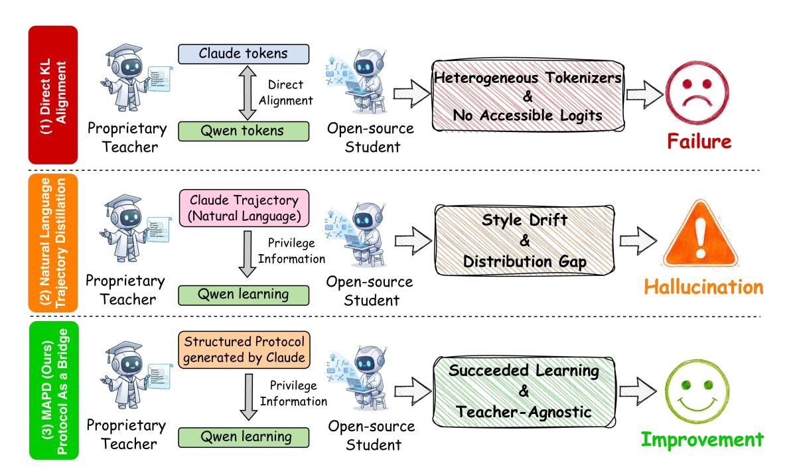
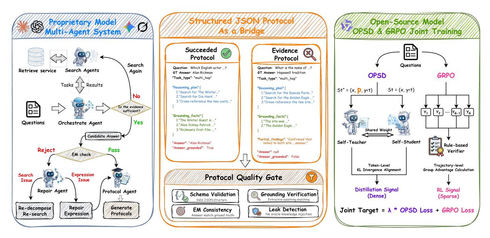
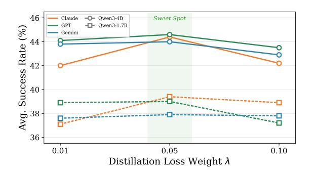
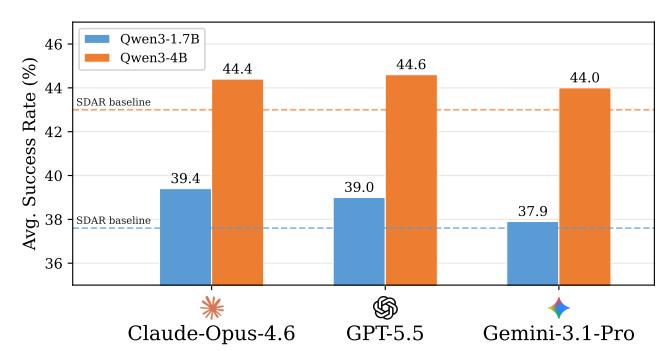
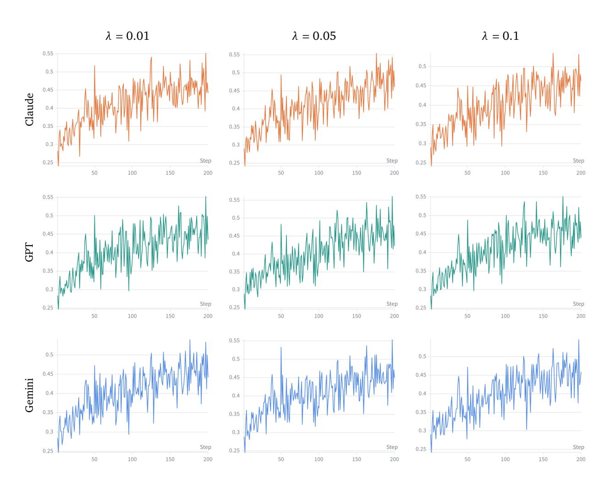
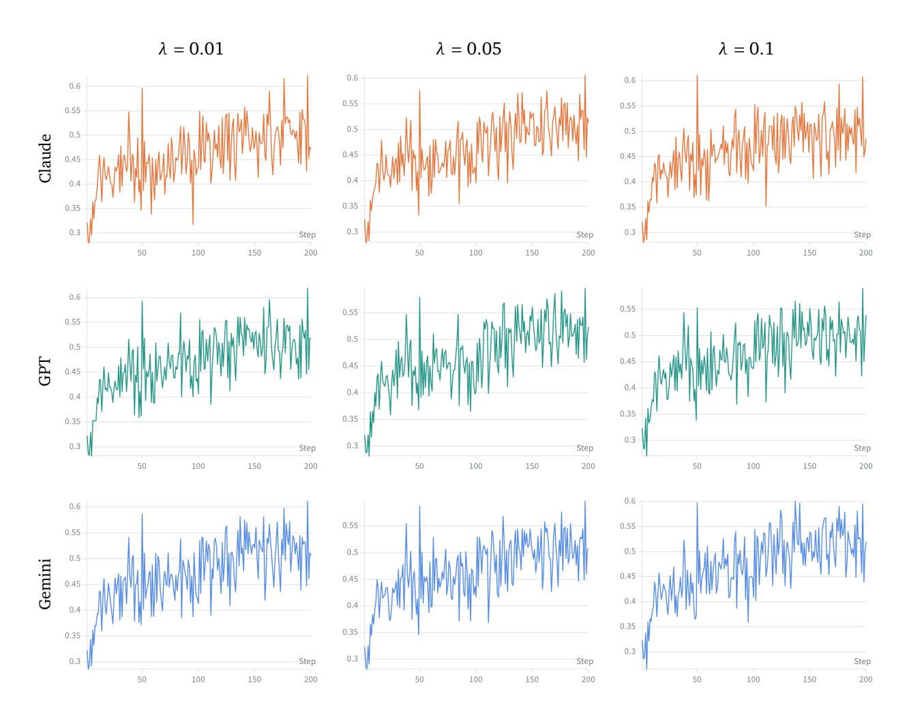

# From Proprietary to Open-Source: Bridging the Distribution Gap via Multi-Agent Protocol Distillation in Agentic Search

- 원제: From Proprietary to Open-Source: Bridging the Distribution Gap via Multi-Agent Protocol Distillation in Agentic Search
- 원문: [https://arxiv.org/abs/2607.24280](https://arxiv.org/abs/2607.24280)
- PDF: [https://arxiv.org/pdf/2607.24280v1](https://arxiv.org/pdf/2607.24280v1)
- arXiv ID: `2607.24280`

---


# **프라이빗 모델에서 오픈소스로: 다중 에이전트 프로토콜 디스틸레이션을 통한 에이전트 검색에서 배포 격차 해소**

**Junlin Liu**1\*† **, Jiangwang Chen**2\***, Zixin Song**2\***, Shuaiyu Zhou**3\***, Chunji Lv**<sup>4</sup> **, Hank Wu**<sup>5</sup> **, Kailin Jiang**<sup>6</sup> **, Jinyang Wu**<sup>2</sup> **, Bohan Yu**<sup>1</sup> **및 Chenxi Zhou**<sup>1</sup>

<sup>1</sup>중국과학원 대학, <sup>2</sup>칭화대학, <sup>3</sup>베이징대학, <sup>4</sup>베이징기술대학, <sup>5</sup>동중국정상대학, <sup>6</sup>중국과학기술대학

\*Equal contribution. †Corresponding author.

에이전트 검색은 대형 언어 모델이 다단계 추론과 검색을 번갈아 수행함으로써 지식 집약적 과제를 해결할 수 있게 해 주지만, 결과 기반 강화학습(RL)으로 이를 최적화하면 장기 상호작용 궤적에 대해 희소한 감독만 제공된다. 지식 디스틸레이션은 더 밀집된 가이던스를 제공할 수 있으며, 강력한 추론 능력을 갖춘 고급 독점 모델은 유망한 교사 역할을 한다. 독점 모델에서 디스틸레이션을 수행하면 이 감독 신호를 밀집시킬 수 있지만, 숨겨진 로짓과 불일치 토크나이저로 인해 전통적인 로짓 매칭은 불가능하며, 원시 자연어 경로 모방은 표면적인 스타일적 특성을 전달할 뿐 핵심 추론 역량을 전이하지 않는다. 이질적 디스틸레이션 문제와 배포 격차를 해결하기 위해 우리는 **M**ulti-**A**gent **P**rotocol **D**istillation (**MAPD**)를 제안한다. MAPD는 구조화되고 스타일 정규화된 프로토콜을 중간 표현으로 사용한 통합 디스틸레이션 및 RL 프레임워크이다. 오프라인 다중 에이전트 시스템(MAS)은 각 쿼리를 분해하고, 지원 증거를 검색하며, 실패한 검색을 복구하고, 결과 탐색 트레이스를 JSON 프로토콜로 변환한다. 이 프로토콜은 작업 유형, 추론 계획, 추출 기반 근거 사실을 포함한다. 훈련 중에 이 프로토콜은 학생 정책의 특권 분기에만 제공되며, 해당 토큰 분포는 희소 RL 목표와 함께 밀집 디스틸레이션 신호를 제공한다. 7개의 QA 벤치마크에 걸친 광범위한 평가에서 MAPD는 경쟁 디스틸레이션 및 RL보다 일관되게 우수하며, Qwen3-1.7B에서 평균 성공률 39.4%, Qwen3-4B에서 44.4%를 달성한다. 특히, 이 프레임워크는 다양한 독점 교사에 대해 강건하게 일반화하며, 학생 정책이 스타일 드리프트와 과다 표현 퇴화를 효과적으로 완화한다. 코드는 <https://github.com/AaronLiu0702/MAPD>에서 오픈소스로 제공된다.

## **1. Introduction**

빠르게 발전하는 대형 언어 모델(LLM)에 힘입어 연구는 단일 턴 추론에서 다중 턴 에이전트 과제로 전환되었으며, 에이전트 검색은 지식 집약적 과제를 해결하기 위한 핵심 패러다임으로 부상했다 [(Jin et al.,](#page-11-0) [2025;](#page-11-0) [Zhang et al.,](#page-12-0) [2025;](#page-12-0) [Zheng et al.,](#page-12-1) [2025;](#page-12-1) [Luo et al.,](#page-11-1) [2025;](#page-11-1) [Liang et al.,](#page-11-2) [2026)](#page-11-2). 그러나 기존 에이전트 검색 시스템은 검증 가능한 보상(RLVR)으로부터 결과 기반 강화학습으로 최적화되는 경우가 많으며, 최종 답변의 정확성만이 장기 상호작용 궤적에 대해 희소한 감독을 제공한다. 최근 연구는 RLVR에 온라인 정책 디스틸레이션(OPD)을 보완하여 토큰 수준 분포 정렬을 사용해 중간 결정에 대해 더 밀집된 가이던스를 제공한다 [(Dong et al.,](#page-10-0) [2025b;](#page-10-0) [Wang et al.,](#page-12-2) [2026b;](#page-12-2) [Lu et al.,](#page-11-3) [2026)](#page-11-3).

RL과 OPD를 결합하면 보다 신뢰할 수 있는 학습 신호를 제공하지만, OPD의 전반적인 효능은 고품질의 교사 정책에 엄격히 의존한다. 복잡한 에이전트 검색에서 오픈소스 모델의 잠재력을 발휘하려면, 동적 작업 분해, 다중 홉 추론, 정보 합성에서 탁월한 성능을 보이는 최첨단 독점 모델을 전문가 교사로 활용하는 것이 매우 바람직하다. 그러나 이러한 독점 교사로부터 오픈소스 학생에게 지식을 증류하는 과정은 두 가지 주요 병목 현상을 제시한다. 첫째, 전통적인 OPD는 본질적으로 토큰 수준의 KL 발산 정렬에 의존한다. 그러나 이질적인 토크나이저의 불일치와 접근 가능한 교사 로짓의 부재는 이 수학적



Figure 1 | 소유형 모델에서 오픈소스 학생으로 지식 증류 시 두 가지 병목 현상이 발생한다: (1) 이질적인 토크나이저와 접근 불가능한 로짓이 직접 정렬을 방해한다; (2) 자유형 자연어 경로 모방이 스타일 드리프트와 환각을 유발한다.

정렬이 정의되지 않음 [(Agarwal et al.,](#page-10-1) [2024;](#page-10-1) [Li et al.,](#page-11-4) [2026)](#page-11-4). 두 번째로, 일반적인 대체 방법으로 자연어 경로 증류는 에이전트 시나리오에서 자주 실패한다. 오픈소스 학생 모델이 소유형 전문가의 장황하고 특이한 추론 스타일을 모방하도록 강제함으로써 이 접근 방식은 분포 격차를 악화시킨다. 이는 심각한 스타일 드리프트와 환각을 유발하며, 기본 인지 전략을 전달하지 못하고 에이전트 과제에서 성능을 저하시킨다 [(Gudibande et al.,](#page-10-2) [2023;](#page-10-2) [Zhao et al.,](#page-12-3) [2026)](#page-12-3). 기존 접근 방식은 따라서 블랙박스 전문가 행동을 밀집 감독으로 변환할 수 있는 중간 표현을 갖추지 못해, 학생이 교사 특유의 표면 형태에 노출되는 것을 방지하지 못한다.

이러한 병목 현상을 해결하기 위해 우리는 **M**ulti-**A**gent **P**rotocol **D**istillation (**MAPD**)를 제안한다. 이는 소유형 전문가와 오픈소스 학생 사이의 구조화되고 스타일이 정규화된 중간 표현을 중심으로 구축된 공동 증류 및 RL 프레임워크이다. MAPD는 오프라인 프로토콜 합성과 온라인 정책 정렬을 분리한다. 오프라인 단계에서는 소유형 모델 기반 MAS가 각 쿼리를 분해하고, 지원 증거를 검색하며, 실패한 검색을 복구하고, 탐색 추적을 JSON 프로토콜로 변환한다. 학습 단계에서는 이 프로토콜이 특권 정보로 재구성되어 학생 정책의 조건부 분기(branch)에 입력된다. 특권 분기와 학생 분기가 동일한 모델을 공유하므로, 그들의 분포는 희소한 결과 기반 RL 목표를 보완하는 밀집 자기 증류 목표를 통해 정렬된다. 구조화된 프로토콜을 통해 자유형 자연어 경로 대신 증류함으로써 MAPD는 학생이 교사 특유의 장황함과 형식화 아티팩트에 노출되는 것을 줄인다. 특히, 소유형 모델과 MAS는 오프라인 프로토콜 합성에만 사용되므로 추론 시 오버헤드를 추가하지 않는다. 우리의 주요 기여는 다음과 같이 요약된다:

- 우리는 MAPD를 제안한다, 이는 사유형 모델과 오픈소스 간의 분포 격차를 해소하도록 설계된 온-폴리시 자기-증류 및 결과 기반 RL 프레임워크이다. 프로토콜-조건화된 분기와 동일한 정책의 학생 분기를 정렬함으로써, 사유형 로짓이나 교차 토크나이저 정렬에 접근할 필요 없이 밀집된 가이던스를 제공한다.

## 2. 문제 정의 및 전제 조건

### 2.1. 에이전틱 서치

우리는 에이전틱 서치를 다중 턴 상호작용 패러다임으로 공식화한다. 주어진 질문 x에 대해 언어 모델 정책 $\pi_{\theta}$는 최대 K 턴까지 검색 보강 환경과 상호작용한다. 각 턴에서 에이전트는 추론 단계들을 생성하고 선택적으로 검색 쿼리를 발행하며, 환경은 관련 패시지를 다음 관찰로 응답한다. 표기상의 단순화를 위해, 우리는 모든 턴에서 생성된 전체 경로를 하나의 토큰 시퀀스로 평탄화한다.

$$y = (y_1, \dots, y_T) \sim \pi_{\theta}(\cdot \mid x). \tag{1}$$

상호작용은 에이전트가 지정된 최종 답변 문자열을 발행하거나 최대 턴 한계 K에 도달할 때 종료된다. 각 완성된 에피소드는 희소한, 경로 수준의 이진 보상 $R(x, y) \in \{0, 1\}$ 를 받으며, 이는 y에서 최종 예측 답변을 파싱하고 엄격한 정밀 일치(EM)를 통해 실제 정답과 평가함으로써 결정된다.

### 2.2. 그룹 상대 정책 최적화 (GRPO)

주어진 프롬프트 x에 대해, GRPO (Shao et al., 2024)는 G개의 롤아웃 $\{y^{(i)}\}_{i=1}^G$ 를 샘플링하고, 최종 보상에서 파생된 이점 $\hat{A}^{(i)}$ 를 계산한다. 정책은 클리핑된 대리 목표 $J_t^{(i)}$ 를 최적화하고, 참조 모델 $\pi_{\text{ref}}$ 에 대한 토큰별 KL 패널티와 함께 업데이트된다:

$$J_{t}^{(i)} = \min \left( \rho_{t}^{(i)} \hat{A}^{(i)}, \text{ clip}(\rho_{t}^{(i)}, 1 - \epsilon, 1 + \epsilon) \hat{A}^{(i)} \right),$$

$$\mathcal{L}_{GRPO} = -\frac{1}{G} \sum_{i=1}^{G} \frac{1}{|y^{(i)}|} \sum_{t=1}^{|y^{(i)}|} \left[ J_{t}^{(i)} - \beta \mathbb{D}_{KL}(\pi_{\theta} \parallel \pi_{ref}) \right].$$

(2)

$\rho_t^{(i)}$ 는 토큰별 중요 가중치를 나타낸다. GRPO는 탐색을 효과적으로 촉진하지만, 결과 성공만을 엄격히 평가하고 복잡한 중간 추론 단계 최적화에 필요한 세밀한 감독을 제공하지 못한다.

### 2.3. 온라인 정책 자기-증류 (OPSD)

밀집된 토큰 수준 감독을 제공하고 OPSD (Zhao et al., 2026)의 문맥-조건화된 자기-증류 공식에 따라, 우리는 동일한 현재 정책 파라미터에서 두 개의 다음 토큰 분포를 얻는다. 최적화 단계 k에서, 학생 분기는 $s_t = (x, y_{< t})$ 를 조건화하고, 반면 교사 분기는 추가로 $s_t^+ = (x, p, y_{< t})$ 를 조건화한다. 여기서 p는 훈련 중에만 사용 가능한 특권 정보(PI)를 나타낸다. 역전파 시에 그래디언트 흐름을 학생 경로에만 제한함으로써, OPSD는 토큰별 역 KL 발산을 최소화한다:

$$\mathcal{L}_{\text{OPSD}}^{(t)} = \mathbb{D}_{\text{KL}} (\pi_{\theta_k}(\cdot \mid s_t) \parallel \pi_{\theta_k}(\cdot \mid s_t^+)). \tag{3}$$

이 동종 공식은 독점 모델 증류에서 발생하는 어휘 불일치 문제를 본질적으로 회피한다. 그러나 표준 OPSD는 일반적으로 PI p를 학생이 스스로 수행한 올바른 롤아웃에서 도출하므로, 이는 학생의 기존 추론 한계에 의해 감독 품질이 근본적으로 제한된다.

## 3. Methodology (방법론)

이 섹션에서는 먼저 특권 정보를 정규화하고 인지 전략을 독점 모델 특유의 언어 패턴에서 분리하는 Structured JSON Protocol(3.1절)을 소개한다. 그 다음으로는 원시 교사 궤적을 엄격한 품질 관리를 갖춘 3단계 협업 과정을 통해 우리의 간결한 프로토콜로 증류하는 Multi-Agent System Generation Pipeline(3.2절)을 상세히 설명한다. 마지막으로 토큰 수준 OPSD 증류 신호와 희소 GRPO 강화 학습 신호를 결합하여 학생 모델을 효과적으로 정렬하는 Joint Training Objective(3.3절)를 제시한다.



Figure 2 | MAPD 프레임워크 개요.  
(1) 독점 모델 기반 다중 에이전트 시스템이 고품질 구조화된 프로토콜을 생성한다.  
(2) 구조화된 JSON 프로토콜은 독점 교사와 오픈소스 학생 사이의 다리 역할을 한다.  
(3) 학생 모델은 프로토콜을 우대 정보로 사용한 공동 훈련을 통해 교사의 역량을 내재화한다.

### **3.1. Structured JSON Protocol** (구조화된 JSON 프로토콜)

OPSD에 특권 정보로서 자유형 자연어 경로를 직접 활용하면 모델 특유의 장황함, 서식 규칙, 언어 패턴을 포함하고 있기 때문에 상당한 표현 불일치 또는 심각한 스타일 드리프트와 환각을 초래할 수 있다. 이를 해결하기 위해 우리는 스타일 정규화된 구조화된 JSON 프로토콜을 증류의 기본 단위로 도입했으며, 이 설계는 학생이 교사 특유의 언어에 직접 노출되는 것을 줄이고 특권 교사 분기(branch)에 대한 추적 가능한 증거를 제공한다. 구체적으로, 원시 텍스트를 추출하는 대신 이 프로토콜은 정제되고 추적 가능한 형식(예: Example [1)](#page-4-1))을 구축한다. 공식적으로, 이 프로토콜은 작업의 다섯 가지 필수 차원을 캡슐화한다:

- **Task Type (작업 유형):** 전문가에 의해 결정되며, 이 필드는 쿼리를 single_hop, multi_hop, comparison, others로 분류하여 전반적인 인지 전략을 결정한다.
- **Reasoning Plan (추론 계획):** 복잡한 에이전트 작업을 해결 가능한 탐색 및 추론 단계로 엄격히 분해하는 실행 가능한 하위 목표의 순서 배열이다.
- **Grounding Facts (근거 사실):** 환경에서 추출된 증거의 선별된 집합으로, 신뢰성 있는 추론을 강제하고 파라미터적 환각을 적극적으로 완화한다.
- **Partial Findings (부분 결과):** 정답을 얻지 못한 다중 탐색 라운드에서 중간 발견을 기록하는 선택적 필드이다.
- **Answer Verification (답변 검증):** 최종 추출된 답변과 불리언 플래그(answer_grounded)가 결합되어 결론이 검색된 사실에 의해 엄격히 뒷받침되는 것을 보장한다.

프로토콜을 설명적 템플릿(·)을 통해 형식화하고 PI를 = ()로 정의함으로써, 우리는 핵심 인지 전략을 독점 모델의 표면 언어 패턴과 효과적으로 분리한다. 이 메커니즘은 고품질 추론 능력을 OPSD로 이전하는 것을 촉진할 뿐만 아니라 학생의 토큰 분포를 효과적으로 보존한다.

### <span id="page-3-0"></span>**3.2. Multi-Agent System Generation Pipeline** (다중 에이전트 시스템 생성 파이프라인)

구조화된 JSON 프로토콜이 스타일 드리프트를 완화하지만, 독점 교사로부터 이러한 지식을 신뢰성 있게 추출하는 것은 여전히 어려운 과제이다. 우리는 세 단계로 구성된 MAS 파이프라인을 통해 교사의 원시 문제 해결 과정을 우리의 간결한 프로토콜로 증류한다. 특히 데이터 누수를 방지하기 위해, 정답은 오프라인 합성 및 특권 교사 컨텍스트에만 엄격히 제한되며, 학생에게는 완전히 보이지 않는다.

#### <span id="page-4-1"></span>**예시 1: 구조화된 프로토콜의 대표 예시 — 증거 프로토콜**

**질문:** *다건 농장(Duncan Farm)과 골든 이글(Golden Eagle) 지역에서 재배된 문화의 이름은 무엇인가?* **실제 정답:** *Hopewell 전통* (*검색이 이 답변으로 수렴하지 못함*)

**"작업_유형": "멀티홉"**

- **"reasoning_plan":** [ 1. "다건 농장(Duncan Farm) 고고학 유적지를 검색하여 지리적 위치와 문화 시기를 결정한다."  - 2. "골든 이글(Golden Eagle) 고고학 유적지를 검색하여 소속 문화를 결정한다."  - 3. "두 유적지를 교차 참조하여 다건 농장과 골든 이글 지역에 공동으로 존재하는 문화의 이름을 찾는다." ]

### **"grounding_facts":** [

- 1. "이 사이트는 일리노이 주의 호프웰 교환 시스템의 일부였으며, 시스템 내에서 주요 무역 및 사회적 중심지인 골든 이글 지역 거래 센터에 가장 가까운 인접 마을 사이트이다."
- 2. "골든 이글-톱미어 사이트는 일리노이 주 캘하운 카운티에 있는 일리노이 강과 미시시피 강이 합류하는 지점 근처에 위치한 콜럼버스 이전 고고학 유적지이다. 이 사이트는 하바나 호프웰 문화와 관련이 있다." ]

**"partial_findings":** "Duncan Farm이 Woodland 시대에 속하며 Hopewell 교환 시스템의 일부이며, Golden Eagle-Toppmeyer Site가 Havana Hopewell 문화와 명시적으로 연관되어 있음을 확인했습니다. 두 사이트 모두와 연결된 문화는 Havana Hopewell 문화이지만, 검색은 'cultivated'의 정확한 의미가 다른 답을 가리키는지 여부를 해결하지 못했습니다."

**"answer": null "answer_grounded": false**

**Stage A: Multi-Agent Collaborative Search.**  
질문이 주어지면 **Orchestrator agent**는 명시적 종속성 주석과 함께 하위 작업으로 분해합니다. 이후 이러한 하위 작업은 독립적인 **Searcher agents**에게 병렬로 배포됩니다. 각 Searcher는 로컬 Wikipedia 코퍼스에 최대 쿼리를 수행하고, 검색된 패시지를 간결한 발견으로 압축합니다. 토폴로지 수준 내의 모든 발견이 수집되면 Orchestrator는 이를 종합합니다; 누적 증거가 여전히 부족하면 추가 라운드의 하위 작업(최대 라운드)을 구성합니다. 초기 탐색 패스 이후, 정확 매칭(EM) 검사는 후보 답변이 실제 정답과 일치하는지 평가합니다. 검사가 실패하면 **Repair agent**는 진단 가이드로 실제 정답을 활용해 추론 체인을 추적합니다 (GT 답변은 탐색 로그와 검색 쿼리에 전파되지 않음). 실패를 *표현* 문제(정확한 증거는 검색되었으나 답변이 형식이 부적절) 또는 *검색* 문제로 진단합니다. 이후 목표 재분해와 추가 검색 작업을 트리거하여 최대 수리(iterations)까지 수행합니다. 궁극적으로 Stage A의 출력은 원본 질문, 후보 답변, 이진 성공 라벨, 그리고 모든 하위 작업, 쿼리, 검색된 패시지 및 발견을 문서화한 종합 탐색 로그를 포함합니다.

**Stage B: Protocol Generation.** Stage A에서 얻은 방대한 비구조화 탐색 로그를 우리의 구조화된 JSON 프로토콜 목표로 변환하기 위해 **Protocolizer 에이전트**가 배치된다. 성공 라벨에 따라 프로토콜라이저는 이 원시 정보를 두 가지 구조화된 JSON 변형 중 하나로 컴파일한다. 성공한 경로의 경우, 완전히 검증된 답변을 포함하는 *Succeeded Protocol*을 생성한다. 반대로 탐색이 수렴하지 못하면 *Evidence Protocol*을 생성하며, 이때 확정적인 답변은 생략되고 부분적 발견에 대한 중립적 요약(예: "Confirmed ..., but reliable evidence for ... is missing")으로 대체된다. 생성 품질을 보장하기 위해 두 가지 무결성 제약이 엄격히 적용된다: (i) *No Hindsight*: reasoning_plan은 단계별로 구성되어야 하며, 최종 결과나 이후 탐색 결과를 언급하는 것을 엄격히 금지하여 데이터 유출을 방지한다; (ii) *Extractive Grounding*: grounding_facts는 엄격히 추출 기반이어야 하며, 검색된 패시지 내에서 정확히 일치하는 하위 문자열로 나타나야 한다.

**Stage C: Quality Gate.** 생성된 프로토콜이 최종 훈련 단계에 수용되기 전에, 네 가지 자동화된 검사를 포함하는 엄격한 품질 게이트를 통과해야 한다: (i) *Schema Validation*, 잘 형성되고 유효한 JSON 구조를 보장한다; (ii) *EM Consistency* (성공 프로토콜의 경우), 추출된 답변이 실제 정답과 엄격히 일치하는지 확인한다; (iii) *Grounding Verification*, 제공된 모든 사실에 대해 추출 기반 하위 문자열 매칭을 강제한다; (iv) *Leak Detection*, 추론 단계에 오라클 지식이 주입되지 않았는지 확인한다. 이 기준 중 하나라도 충족하지 못하면 프로토콜은 폐기되고 해당 훈련은 자체 롤아웃 기반 기준으로 되돌아간다. 최종적으로 수동 검토가 이 파이프라인의 견고성을 확인하며, 3,000개의 대표 모델을 대상으로 한 총 3,000개의 인스턴스에서 99.33%의 정확도로 고품질, 엄격히 준수되는 구조화된 JSON 프로토콜을 생성한다.

<span id="page-5-0"></span>

| 모델 | 방법 | 단일 홉 QA |  |  |  |  |  |  |  |
|-----------------|------------|----------------|----------|----------|----------|----------|----------|-----------|----------|
|  |  | TriviaQA<br>NQ |  | PopQA | HotpotQA | 2Wiki | MuSiQue | Bamboogle | 평균 |
| Qwen3-1.7B | 바닐라 | 29.9±0.3 | 46.4±0.2 | 39.1±0.1 | 23.9±0.2 | 18.8±0.1 | 4.9±0.3 | 16.8±1.1 | 25.7±0.1 |
|  | OPSD | 4.2±0.1 | 8.3±0.1 | 4.6±0.1 | 6.6±0.1 | 15.3±0.1 | 0.7±0.1 | 1.6±0.5 | 5.9±0.1 |
|  | GRPO | 36.9±0.4 | 54.6±0.3 | 43.1±0.1 | 29.8±0.3 | 27.5±0.2 | 6.8±0.4 | 22.4±1.6 | 31.6±0.2 |
|  | GRPO+OPSD | 37.0±0.3 | 54.6±0.2 | 41.4±0.1 | 29.9±0.3 | 23.3±0.2 | 6.5±0.3 | 20.8±1.6 | 30.5±0.2 |
|  | SDAR | 43.4±0.4 | 58.1±0.3 | 47.6±0.2 | 37.0±0.3 | 34.3±0.3 | 10.6±0.5 | 32.0±1.6 | 37.6±0.3 |
|  | MAPD(우리) | 45.1±0.2 | 58.6±0.2 | 48.6±0.1 | 39.0±0.2 | 36.2±0.2 | 11.2±0.3 | 36.8±1.1 | 39.4±0.1 |
| 개선 (%) |  | 3.9% ↑ | 0.9% ↑ | 2.1% ↑ | 5.4% ↑ | 5.5% ↑ | 5.7% ↑ | 15.0% ↑ | 4.8% ↑ |
| Qwen3-4B | 바닐라 | 29.3±0.3 | 48.0±0.2 | 34.9±0.1 | 26.5±0.2 | 30.9±0.2 | 6.1±0.3 | 25.6±1.6 | 28.8±0.2 |
|  | OPSD | 16.2±0.2 | 36.7±0.1 | 23.1±0.1 | 20.5±0.2 | 24.6±0.1 | 5.7±0.2 | 19.2±1.1 | 20.9±0.1 |
|  | GRPO | 40.4±0.3 | 61.0±0.2 | 43.5±0.1 | 36.7±0.3 | 37.3±0.2 | 10.3±0.4 | 32.8±1.6 | 37.4±0.2 |
|  | GRPO+OPSD | 36.3±0.3 | 57.9±0.2 | 43.1±0.1 | 37.7±0.3 | 36.7±0.2 | 12.7±0.3 | 44.0±1.6 | 38.3±0.2 |
|  | SDAR | 46.1±0.4 | 62.4±0.2 | 48.5±0.2 | 43.3±0.3 | 43.1±0.3 | 13.1±0.5 | 44.8±1.6 | 43.0±0.3 |
|  | MAPD(우리) | 47.7±0.2 | 62.5±0.2 | 49.4±0.1 | 44.3±0.2 | 45.7±0.2 | 14.0±0.3 | 47.2±1.1 | 44.4±0.1 |
| 개선 (%) |  | 3.5% ↑ | 0.2% ↑ | 1.9% ↑ | 2.3% ↑ | 6.0% ↑ | 6.9% ↑ | 5.4% ↑ | 3.3% ↑ |

Table 1 | 결과는 성공률(%)로 보고되며, 이는 단일 훈련 실행에서 다섯 개의 독립 평가 시드에 대한 평균 ± 표준편차를 나타냅니다. **Avg.**는 매크로 평균 성공률을 의미합니다. Improvement(%)는 SDAR 기준 대비 MAPD의 상대적 향상을 나타냅니다. **Bold**: 최고 성능; underline: 두 번째 최고 성능.

### **3.3. 공동 훈련 목표 (Joint Training Objective)**

전체 훈련 목표는 희소하고 결과 중심의 강화 학습 신호와 밀집된 증류 신호를 통합하여 고품질 정렬을 달성합니다:

$$\mathcal{L}(\theta) = \lambda_{OPSD} \cdot \mathcal{L}_{OPSD}(\theta) + \mathcal{L}_{GRPO}(\theta), \tag{4}$$

LOPSD는 구조화된 프로토콜에서 파생된 토큰 수준 증류 신호를 제공하여 단계별 신용 할당을 효율적으로 수행합니다. 반대로, LGRPO는 클리핑된 정책 그래디언트를 통해 희소 RL 신호를 제공하며, 최종 환경 보상으로 모델을 최적화합니다. 하이퍼파라미터는 이 증류 지침의 상대적 강도를 결정하며, (Section [4.2)](#page-6-0)에서 광범위하게 분석됩니다.

## **4. 실험 및 분석 (Experiments and Analysis)**

### **4.1. 실험 설정 (Experimental Setup)**

**데이터 분할 및 벤치마크.** Search-R1 [(Jin et al.,](#page-11-0) [2025)](#page-11-0)에 따라, 우리의 훈련은 NQ와 HotpotQA 훈련 세트만 사용합니다. 평가 범위는 지식 집약형 QA 벤치마크 7개를 포함하며, 단일 홉 (NQ, TriviaQA, PopQA)과 다중 홉 (HotpotQA, 2WikiMultihopQA, MuSiQue, Bamboogle) 추론 과제를 포함합니다 [(Kwiatkowski et al.,](#page-11-5) [2019;](#page-11-5) [Min et al.,](#page-11-6) [2019;](#page-11-6) [Mallen et al.,](#page-11-7) [2023;](#page-11-7) [Yang et al.,](#page-12-5) [2018;](#page-12-5) [Ho et al.,](#page-10-3) [2020;](#page-10-3) [Trivedi](#page-12-6) [et al.,](#page-12-6) [2022;](#page-12-6) [Press et al.,](#page-11-8) [2023)](#page-11-8). 7개 평가 세트 중 5개는 훈련에 전혀 포함되지 않아 out-of-distribution 테스트로 활용됩니다; 두 개의 공유 벤치마크에 대해서는 훈련과 테스트 세트 간 질문 수준 중복이 없도록 보장합니다. 성능은 정답과의 정확 매치를 통해 성공률(%)로 보고됩니다.

**베이스라인.** 우리의 접근법의 효과를 엄밀히 평가하기 위해, 순수 정렬 전략부터 고급 하이브리드 방법까지 다양한 베이스라인과 비교합니다: (1) **Vanilla**: 사전 훈련된 기본 모델을 추가 정렬 없이 제로샷으로 평가; (2) **OPSD** [(Zhao et al.,](#page-12-3) [2026)](#page-12-3): 순수 온라인 정책 자체 증류로, 학생의 성공적인 롤아웃을 특권 정보로 활용; (3) **GRPO** [(Shao et al.,](#page-12-4) [2024)](#page-12-4): 순수 결과 기반 강화 학습으로, 희소 환경 보상만을 사용하고 밀집 증류 지침 없이; (4) **GRPO+OPSD**: RL과 온라인 정책 자체 증류를 결합한 단순 하이브리드 접근법으로, 성공적인 롤아웃을 특권 정보로 사용; (5) **SDAR** [(Lu et al.,](#page-11-3) [2026)](#page-11-3): RL과 토큰 수준 게이트 증류를 결합한 고급 하이브리드 베이스라인으로, 스킬 생성 콘텐츠를 특권 정보로 활용; (6) **MAPD (Ours)**: 우리의 제안인 Multi-Agent Protocol Distillation 프레임워크로, RL과 밀집된 토큰 수준 증류를 구조화된 MAS 프로토콜에 의해 가이드하며 게이트 메커니즘 없이 통합합니다.

<span id="page-6-1"></span>

| 방법 | PM | SP | MAS | Avg. |  |
|----------------------------|----|----|-----|------|------|
|  |  |  |  |  |  |
| GRPO+OPSD | X | X | X | 30.5 | 38.3 |
| SDAR | X | X | X | 37.6 | 43.0 |
| 원시 궤적 (single PM) | V | X | X | 30.1 | 37.3 |
| 원시 궤적 (MAS) | V | X | V | 29.2 | 36.1 |
| 프로토콜 (단일 PM) | V | V | X | 37.1 | 42.9 |
| MAPD (우리의) | V | V | V | 39.4 | 44.4 |

Table 2 | MAPD의 구성 요소 소거 연구. PM = 소유 모델; SP = 구조화된 프로토콜; MAS = 다중 에이전트 시스템.

**Implementation Details.** 학생 정책을 위해 우리는 두 개의 오픈소스 모델, Qwen3-1.7B와 Qwen3-4B (Yang et al., 2025)를 훈련시킵니다, 두 모델 모두 각각의 사전 학습된 베이스 체크포인트에서 초기화됩니다. 공동 훈련 중에 우리는 프롬프트당 n=8 롤아웃, 배치 크기 128, 최대 프롬프트 길이 4096, 최대 응답 길이 512 토큰을 사용합니다. 학습률은 $1\times10^{-6}$ 으로 설정하고 10% 선형 워밍업을 적용합니다. 훈련은 8개의 GPU에서 200 스텝 동안 실행됩니다. 에이전트 환경은 최대 4번의 상호작용 턴을 허용하며, 로컬 위키피디아 코퍼스 (wiki-18)를 검색 백엔드로 사용하여 쿼리당 상위 3개의 패시지를 반환합니다.

MAS 파이프라인 구성. 프로토콜 합성을 위해 MAS 에이전트(Orchestrator, Searcher, Repair, Protocolizer)는 기본 백본 LLM으로 Claude-Opus-4.6을 사용합니다. 또한 GPT-5.5와 Gemini-3.1-Pro를 대체 교사 소스로 탐색합니다(Section 4.2에서 소거됨). MAS 파라미터는 다음과 같이 제한됩니다: Orchestrator는 각 쿼리를 최대 4개의 하위 질문으로 최대 2라운드에 걸쳐 분해합니다; 각 Searcher는 최대 3개의 검색 쿼리를 발행합니다; Repair 에이전트는 최대 2개의 진단 라운드를 허용합니다. 훈련 효율성을 확보하기 위해 모든 프로토콜은 오프라인에서 사전 합성 및 캐시되며, 교사의 생성 지연을 학생의 RL 루프와 완전히 분리합니다.

### <span id="page-6-0"></span>4.2. 결과 및 분석

Main Result. Table 1에 표시된 바와 같이, 우리 제안한 MAPD 프레임워크는 7개의 벤치마크에서 모든 기초 방법보다 일관되게 우수하며, Qwen3-1.7B에서 평균 성공률 39.4%, Qwen3-4B에서 44.4%를 달성합니다. 가장 강력한 기초 방법인 SDAR와 비교할 때, MAPD는 각각 4.8%와 3.3%의 상대 평균 향상을 보입니다. 특히 이러한 성능 향상은 복잡한 다중 홉 QA 작업에서 더욱 두드러집니다. Qwen3-1.7B의 경우, 다중 홉 벤치마크에서 평균 상대 이득이 7.9%에 달하며, 이는 단일 홉 벤치마크의 2.3%를 크게 초과합니다. Qwen3-4B에서도 유사한 패턴이 관찰됩니다(5.1% vs. 1.8%). 다중 홉 벤치마크에서의 이러한 더 큰 상대 이득은 다중 에이전트 분해 및 증거 집계의 의도된 역할과 일치합니다. MAPD의 MAS 파이프라인은 복잡한 쿼리를 체계적으로 분해하고, 여러 검색 단계에서 증거를 합성하며, 이러한 전략을 구조화된 프로토콜을 통해 학생 정책에 증류함으로써 복잡한 추론에 대한 상한을 높입니다. 또한, 우리는 에이전트 훈련 구성에서 순수 OPSD를 적용할 때 성능이 급감( Qwen3-1.7B에서 5.9%, Qwen3-4B에서 20.9%)을 관찰합니다. 이는 밀집 자기 증류가 에이전트 검색에 충분하지 않음을 시사하며 외부 PI 사용을 동기화합니다. 외부 정보 이득이 없으면, 자기 롤아웃은 모델을 병리적으로 긴 출력으로 이끌 뿐이며, 이는 훈련 중 길이 클립 비율이 5%에서 약 74%로 급증함으로써 입증됩니다. 이 붕괴는 우리의 MAS 프로토콜의 필요성을 강조합니다.

**Ablation Study.** 우리는 Proprietary Model(PM), Structured Protocol(SP), Multi-Agent System(MAS)를 체계적으로 소거하여 각 구성 요소의 기여도를 평가하며, 결과는 Table 2에 보고됩니다.

(1) 구조화된 프로토콜은 교차 모델 증류에 필수적입니다. 가장 두드러진 발견은, 구조화된 프로토콜과 MAS 없이( w/o SP&MAS) 소유 모델의 원시 자연어 경로를 직접 증류하는 것이 소유 모델을 전혀 사용하지 않는 기초 방법(GRPO+OPSD)보다 성능이 낮다는 것입니다. w/o SP&MAS와 w/o MAS를 비교함으로써 단일 교사 설정에서 표현 형식의 영향을 분리합니다: 원시 텍스트를 우리 구조화된 프로토콜로 교체하면 각각 7.0점과 5.6점의 이득이 관찰됩니다. 이는 ...

<span id="page-7-0"></span>

| 독점형 교사 | 모델 | λ | 단일 홉 QA |  |  | 다중 홉 QA |  |  |  |  |
|--------------------------|--------------|------|---------------|----------|-------|--------------|-------|---------|-----------|------|
| 독점 반응 | Wodel |  | NQ | TriviaQA | PopQA | HotpotQA | 2Wiki | MuSiQue | Bamboogle | 평균 |
| <b>*</b> Claude-Opus-4.6 | Qwen3-1.7B | 0.01 | 44.1 | 58.0 | 47.5 | 37.8 | 33.5 | 10.9 | 28.0 | 37.1 |
|  |  | 0.05 | 45.1 | 58.6 | 48.6 | 39.0 | 36.2 | 11.2 | 36.8 | 39.4 |
|  |  | 0.10 | 43.7 | 58.2 | 49.1 | 38.2 | 36.6 | 10.2 | 36.0 | 38.9 |
| -// Gladac-Opus-4.0 | Qwen3-4B | 0.01 | 46.3 | 63.0 | 48.3 | 42.5 | 37.0 | 13.9 | 43.2 | 42.0 |
|  |  | 0.05 | 47.7 | 62.5 | 49.4 | 44.3 | 45.7 | 14.0 | 47.2 | 44.4 |
|  |  | 0.10 | 47.4 | 63.7 | 50.1 | 42.3 | 38.4 | 11.1 | 42.4 | 42.2 |
|  | ፟ Qwen3-1.7B | 0.01 | 43.5 | 58.6 | 49.1 | 38.4 | 35.5 | 11.2 | 36.0 | 38.9 |
|  |  | 0.05 | 43.5 | 59.7 | 48.6 | 38.7 | 38.0 | 9.3 | 35.2 | 39.0 |
| <b>₲</b> GPT-5.5 |  | 0.10 | 43.3 | 58.4 | 48.6 | 36.4 | 31.9 | 9.2 | 32.8 | 37.2 |
| Ø) di 1-3.3 | Qwen3-4B | 0.01 | 47.4 | 62.2 | 48.7 | 43.5 | 46.0 | 14.3 | 46.4 | 44.1 |
|  |  | 0.05 | 48.3 | 62.9 | 50.6 | 44.2 | 44.6 | 14.6 | 47.2 | 44.6 |
|  |  | 0.10 | 47.4 | 63.7 | 50.3 | 43.4 | 43.1 | 12.6 | 44.0 | 43.5 |
|  | Qwen3-1.7B | 0.01 | 42.8 | 58.2 | 48.9 | 37.4 | 32.4 | 9.9 | 33.6 | 37.6 |
|  |  | 0.05 | 43.2 | 58.9 | 47.5 | 37.7 | 36.3 | 9.1 | 32.8 | 37.9 |
| ♦ Gemini-3.1-Pro |  | 0.10 | 42.5 | 58.3 | 47.9 | 37.7 | 32.6 | 10.5 | 35.2 | 37.8 |
|  | Qwen3-4B | 0.01 | 48.8 | 63.7 | 47.9 | 44.8 | 45.2 | 13.0 | 43.2 | 43.8 |
|  |  | 0.05 | 48.9 | 62.8 | 50.8 | 43.8 | 39.1 | 14.0 | 48.8 | 44.0 |
|  |  | 0.10 | 47.4 | 62.5 | 49.3 | 43.0 | 42.3 | 12.8 | 43.2 | 42.9 |

Table 3 | 세 가지 독점 모델이 특권 정보원 및 OPSD 손실 가중치 $\lambda$로서의 효과. 결과는 성공률(%)로 보고됩니다. **굵게**: 최고 성능.

Section 1에서 논의된 스타일 드리프트 및 분포 격차 병목 현상: 구조적 분리 없이 학생은 교사의 표면 패턴(예: 장황한 추론 체인, 특이한 문구)을 모방하며, 이는 학생이 학습한 분포와 충돌하고 성능을 적극적으로 저하시킨다.

- (2) MAS는 구조적 프로토콜을 대체할 수 없다. 구조적 프로토콜 없이 MAS 파이프라인을 추가하면 (w/o SP: 29.2%/36.1%) 성능이 향상되지 않으며 약간 나빠진다. 이는 MAS가 풍부하지만 동시에 더 잡음이 많은 자연어 경로를 생성해 스타일 전송 문제를 악화시키기 때문이다. 반대로, 단일 독점 에이전트가 생성한 구조적 프로토콜을 적용하면 (w/o MAS: 37.1%/42.9%) 상대적 이득이 회복되어 JSON 프로토콜만으로도 스타일 오염이 완화된다는 것을 보여준다. 그러나 이 단일 에이전트 프로토콜은 여전히 SDAR보다 성능이 낮아, 단일 독점 모델 호출이 전체 MAS 파이프라인의 검색 깊이와 오류 복구를 따라잡지 못함을 나타낸다.  
- (3) MAS 파이프라인은 프로토콜 생성 품질을 향상시킨다. 전체 MAPD 구성이 가장 우수하며, 이는 구조적 표현과 MAS 파이프라인이 평가된 설정에서 상호 보완적인 이점을 제공함을 시사한다. 구체적으로, SP는 증류 신호가 스타일 드리프트를 크게 완화하고 학습 가능하도록 보장하며, MAS는 신호가 사실적으로 정확하고 추론 완전하며 추적 가능하도록 보장한다. MAS가 없는 단일 에이전트 프로토콜과 비교할 때, 이 전체 프로토콜은 독점 모델과 오픈 소스 모델 간의 격차를 연결하는 훨씬 높은 품질의 훈련 신호를 제공한다. 또한, 우리의 결과는 증류의 주요 병목이 훈련 메커니즘이 아니라 PI 품질에 있음을 보여준다: 충분히 깨끗하고 스타일-분리된 프로토콜을 사용하면 단순 토큰 수준 KL 목표가 SDAR(가드형 접근법)와 유사한 성능을 달성한다.

**OPSD 손실 가중치의 효과.** Table 3과 Figure 3은 공동 목표에서 OPSD 손실 가중치 $\lambda \in \{0.01, 0.05, 0.1\}$에 대한 민감도를 요약한다. 두 모델 규모 모두에서 $\lambda = 0.05$는 테스트된 값 중 가장 우수한 성능(1.7B에서 39.4%, 4B에서 44.4%)을 지속적으로 달성하며, 극단에서 관찰된 두 가지 패턴과 연관된 스위트 스팟을 드러낸다. 아래에서 이를 자세히 분석한다.

(1) 약한 distillation 신호 ( $\lambda$  = 0.01). 작은 OPSD 가중치는 지배적인 GRPO 정책-그라디언트 목표에 비해 약한 distillation 신호만을 제공한다. Claude-Opus-4.6의 훈련 로그는 교사-학생 격차가 100단계에서 조기에 붕괴되는 것을 보여 주며, 이는 학생이 사용 가능한 감독을 빠르게 소진한다는 것을 시사한다. 그러나 참조 정책으로부터의 KL 발산은 낮은 수준(1.7B에서 0.24)을 유지하여 모델이 단순히 참조 행동으로 되돌아가지 않는다는 것을 시사한다. distillation 신호가 조기에 사라지더라도, 이 구성은 여전히 GRPO 단독보다 명확한 개선을 달성한다(37.1% vs. 31.6% on 1.7B), 이는 짧은 기간 동안의 OPSD 항이 훈련 초기 단계에서 유익한 지침을 제공할 수 있음을 암시한다.

<span id="page-8-0"></span>



Figure 3 | OPSD 손실 가중치  $\lambda$ 와 평균 성공률(%) 간의 관계.  $\lambda$  = 0.05는 distillation 강도와 정책 안정성을 균형 있게 조정하여 두 모델 규모 모두에서 최상의 평균 성공률을 달성한다.

Figure 4 | 세 가지 최상위 독점 교사 백본을 사용한 성능. 모든 구성은 동일한 MAPD 아키텍처와 훈련 설정을 사용하며 MAS 파이프라인을 재조정하지 않는다.

(2) 과도한 분포 압력 ( $\lambda$ =0.1). 큰 OPSD 가중치는 학생을 교사 분포로 적극적으로 밀어붙여, 기준 정책으로부터의 KL 발산을 증가시킨다 (4B에서 1.06, $\lambda$ =0.01의 거의 4배). 더 중요한 것은, 우리는 에이전틱 서치에 특화된 행동 퇴화를 관찰한다: 4B에서 평균 응답 길이가 135 토큰에서 약 42 토큰으로 붕괴되고, 도구 호출 수는 에피소드당 최대 3.0에 포화된다. 이 패턴은 과도한 증류 압력이 모델을 "이성 없이 검색" 단축 경로로 이끌어 최소한의 중간 추론으로 검색 호출을 수행하도록 한다는 것을 시사한다. 결과적으로 단일 홉 정확도는 약간 향상된다 (예: PopQA가 49.4%에서 50.1%로 상승, TriviaQA가 62.5%에서 63.7%로 상승, 4B에서), 그러나 다중 홉 과제의 성능은 급격히 감소한다. 이는 홉 간 일관된 사유 체인이 필수적이기 때문이다 (2WikiMultihopQA가 45.7%에서 38.4%로, MuSiQue가 14.0%에서 11.1%로 감소). 이 트레이드오프는 과도한 정규화가 모델의 다단계 추론 능력을 침식시켜, 궁극적으로 에이전틱 서치가 의존하는 그 능력을 해친다는 것을 드러낸다.

종합적으로, 이 결과들은 에이전트적 증류 (agentic distillation)에서 근본적인 긴장을 강조한다: 증류가 너무 적으면 충분한 지침을 제공하지 못하고, 증류가 너무 많으면 학생을 얕고 검색에 치우친 행동으로 몰아넣는다.  $\lambda = 0.05$ 는 실용적인 균형을 이룬다. 훈련 전반에 걸쳐 지속적인 증류 신호를 유지하면서 정책을 불안정하게 만들지 않으므로, 효율적인 검색과 엄격한 추론 사이에 견고한 균형을 조성한다.

소유형 교사 백본 간 전이. MAPD의 핵심 장점은 서로 다른 소유형 모델 간 전이 가능성이다. 구조화된 JSON 프로토콜이 교사의 핵심 추론 전략을 표면 스타일적 특성에서 성공적으로 분리하기 때문에, 충분히 성능이 있는 모델이라면 누구나 교사 백본으로 활용될 수 있다. 이 유연성을 검증하기 위해, 우리는 Claude-Opus-4.6, GPT-5.5, Gemini-3.1-Pro라는 세 가지 최상위 상용 모델이 생성한 프로토콜을 아키텍처 수정이나 교사 전용 하이퍼파라미터 튜닝 없이 원활하게 활용할 수 있는지 평가한다. 결과는 표 3과 그림 4에 표시된다. 세 구성 모두 SDAR 대비 양쪽 학생 규모에서 긍정적인 관측 이득을 보인다: Claude-Opus-4.6 (39.4%/44.4%), GPT-5.5 (39.0%/44.6%), Gemini-3.1-Pro (37.9%/44.0%). 교사 간 이 좁은 변동(2포인트 이내)은 우리의 프로토콜이 교사 특유의 특이성을 성공적으로 추상화하여, 소스 모델에서 의미론적 추론을 분리한다는 것을 확인시켜 준다. 따라서 실무자는 파이프라인을 재조정하지 않고 비용-지연 tradeoff를 최적화하기 위해 API를 원활하게 교체할 수 있다.

비용 분석. 프로토콜 합성의 오버헤드를 정량화하기 위해, 예시로 Gemini-3.1-Pro를 사용한 생성 비용을 보고한다. MAS 파이프라인은 25,600개의 학습 인스턴스를 처리하여 품질 게이트를 통과하는 25,584개의 유효 프로토콜을 생성한다 (수율 99.94%). 평균적으로 파이프라인은 인스턴스당 약 $\sim$ 6.3회 교사 LLM을 호출하며, 인스턴스당 약 12.5K 토큰을 소비한다. 균등화된 비용은 인스턴스당 \$0.057이며, 전체 학습 세트에 대한 일회성 생성 비용은 약 \$1,454이다. 모든 프로토콜이 사전 합성되고 캐시되므로 이 비용은 한 번만 발생한다.

## **5. 관련 연구 (Related Work)**

**LLM Reasoning and Agentic Search.** LLM 추론 패러다임은 최근 정적이며 단일 턴 작업에서 외부 환경과 지속적인 상호작용을 필요로 하는 동적 다중 턴 에이전트형 작업으로 전환되었습니다 [(Liu et al.,](#page-11-9) [2026a,](#page-11-9)[b;](#page-11-10) [Dong et al.,](#page-10-4) [2025a;](#page-10-4) [Mai et al.,](#page-11-11) [2025;](#page-11-11) [Lv et al.,](#page-11-12) [2026;](#page-11-12) [Jiang et al.,](#page-11-13) [2026c,](#page-11-13) [2025b,](#page-10-5) [2026b)](#page-10-6). 이 추론 패러다임의 중요한 확장으로, 에이전트형 검색은 다단계 논리적 추론과 환경 보강 검색을 병행하여 지식 집약적 과제를 해결합니다. 최근 프레임워크들은 이를 RL 최적화 문제로 공식화했습니다. 예를 들어, WebRL [(Qi et al.,](#page-12-8) [2025b)](#page-12-8)는 프로세스 수준 보상을 갖는 자기 진화 RL을 사용하고, Search-R1 [(Jin et al.,](#page-11-0) [2025)](#page-11-0)는 다중 턴 검색을 위해 고전 RL 알고리즘을 활용하며, RAGEN [(Wang et al.,](#page-12-9) [2025)](#page-12-9)는 궤적 기반 보상을 통해 검색 보강 추론 체인을 최적화합니다. 그러나 이러한 정책들은 주로 희소하고 결과 전용 신호(예: 최종 답변 정확도)에 의해 주도되기 때문에 중간 계획, 검색 및 진단 단계에 대한 세밀한 신용 할당을 제공하는 데 근본적으로 어려움을 겪습니다. 이 최적화 병목 현상을 해결하기 위해, 우리의 MAPD 프레임워크는 결과 기반 RL 신호와 밀집된 증류 신호를 통합하는 공동 학습 패러다임을 도입합니다.

**Knowledge Distillation from Proprietary Models.** 소유 LLM에서 소규모 오픈소스 모델로 기능을 이전하는 것이 지배적인 패러다임이 되었습니다. 고전적 지식 증류 [(Hinton et al.,](#page-10-7) [2015)](#page-10-7)는 출력 확률 분포를 매칭하는 데 의존하지만, 블랙박스 API의 불투명성 및 이질적 토크나이저 간 불일치로 인해 근본적으로 차단됩니다. 따라서 현대 접근법은 텍스트 수준 모방으로 전환하여 소유 교사에 의해 생성된 자연어 추론 흔적 또는 Chain-of-Thought (CoT)를 증류합니다 [(Hsieh et al.,](#page-10-8) [2023;](#page-10-8) [Mukherjee et al.,](#page-11-14) [2023;](#page-11-14) [Xu et al.,](#page-12-10) [2025)](#page-12-10). 그러나 최근 연구 [(Gudibande et al.,](#page-10-2) [2023)](#page-10-2)에서 강조한 바와 같이, 제한 없는 교사 궤적을 직접 모방하면 학생이 교사의 장황한 언어 패턴과 권위적 어조에 과적합하도록 강요합니다. 이 용량 불일치는 심각한 스타일 드리프트를 유발하고 환각을 악화시킵니다. 우리의 MAPD 프레임워크는 교사의 의미 전략을 스타일 정규화된 구조화된 JSON 프로토콜로 추출하여 핵심 추론 논리를 소유 언어 셸에서 분리함으로써 안전한 온라인 자체 증류를 가능하게 합니다.

**Multi-Agent System for Complex Reasoning.** LLM 기반 MAS는 복잡한 추론 및 개방형 문제 해결에서 눈부신 성공을 거두었습니다 [(Wu et al.,](#page-12-11) [2023;](#page-12-11) [Hong et al.,](#page-10-9) [2024;](#page-10-9) [Lei et al.,](#page-11-15) [2024)](#page-11-15). 검색 보강 시나리오에서 다중 에이전트 협업은 병렬 하위 쿼리 오케스트레이션과 반복적 토론을 통해 다단계 질문의 재현율을 크게 향상시킬 수 있습니다 [(Du et al.,](#page-10-10) [2023;](#page-10-10) [Talebirad & Nadiri,](#page-12-12) [2023;](#page-12-12) [Wang et al.,](#page-12-13) [2026a)](#page-12-13). 그러나 이러한 협업 무리를 추론 시에 배포하면 막대한 계산 오버헤드, 심각한 지연 및 대규모 API 비용이 발생하여 실시간 애플리케이션에 매우 비실용적입니다. 테스트 시 상호작용 중에 MAS에 의존하기보다는, MAPD는 에이전트 무리를 오프라인 학습 시에만 지식 합성기로 활용하고, 무리의 협업 문제 해결 전략을 우리의 구조화된 프로토콜을 통해 단일 학생 모델에 증류합니다.

## **6. 결론 (Conclusion)**

본 논문에서는 Multi-Agent Protocol Distillation (MAPD)를 소개한다. MAPD는 사유형 교사와 오픈소스 학생 간의 이질적 분포 격차를 해소하기 위해 설계된 새로운 공동 증류 및 강화학습(RL) 프레임워크이다. 원시 궤적 모방에서 발생하는 심각한 스타일 드리프트와 과다한 문장성 붕괴를 극복하기 위해, MAPD는 스타일-정규화된 구조화된 JSON 프로토콜을 통해 핵심 인지 전략을 특이한 언어적 외피에서 우아하게 분리한다. 강력한 다중 에이전트 시스템에 의해 전적으로 오프라인으로 합성된 이 프로토콜은 특권 정보로서, 희소한 결과 기반 RL을 보완하는 밀집된 지침을 제공하면서 추론 오버헤드를 발생시키지 않는다. 지식 집약적 QA 벤치마크 7개에 걸친 광범위한 평가 결과, MAPD는 평가된 모든 기준선보다 일관되게 우수할 뿐만 아니라 재조정 없이도 서로 다른 사유형 교사에 대해 원활하게 일반화된다. 의미적 추론을 특이한 스타일적 아티팩트에서 분리함으로써, MAPD는 이질적 모델 정렬을 위한 보다 안전하고 효율적인 경로를 열어준다. 우리는 MAPD가 개척한 구조적 분리가 향후 연구의 촉매제가 될 것이며, 커뮤니티가 사유형 모델에 대한 의존을 넘어 완전 자율적이고 자가 개선되는 에이전트 프레임워크 개발로 나아가도록 영감을 줄 것이라고 기대한다.

## **참고문헌 (References)**

- <span id="page-10-1"></span>Rishabh Agarwal, Nino Vieillard, Yongchao Zhou, Piotr Stanczyk, Sabela Ramos Garea, Matthieu Geist, 그리고 Olivier Bachem. 언어 모델의 온-폴리시 증류: 자가 생성된 실수에서 학습하기. 국제 학습 표현 회의, 2024년 볼륨, pp. 21246–21263, 2024.

- <span id="page-10-4"></span>Guanting Dong, Licheng Bao, Zhongyuan Wang, Kangzhi Zhao, Xiaoxi Li, Jiajie Jin, Jinghan Yang, Hangyu Mao, Fuzheng Zhang, Kun Gai, 등. 에이전트 기반 엔트로피 균형 정책 최적화. arXiv 사전 인쇄 arXiv:2510.14545, 2025a.

- <span id="page-10-0"></span>Guanting Dong, Hangyu Mao, Kai Ma, Licheng Bao, Yifei Chen, Zhongyuan Wang, Zhongxia Chen, Jiazhen Du, Huiyang Wang, Fuzheng Zhang, 등. 에이전트 기반 강화 정책 최적화. arXiv 사전 인쇄 arXiv:2507.19849, 2025b.

- <span id="page-10-10"></span>Yilun Du, Shuang Li, Antonio Torralba, Joshua B Tenenbaum, 그리고 Igor Mordatch. 다중 에이전트 토론을 통한 언어 모델의 사실성 및 추론 향상. arXiv 사전 인쇄 arXiv:2305.14325, 2023.

- <span id="page-10-14"></span>Baochen Fu, Wenzhi Deng, Baihao Jin, Yang Li, Zihan Nie, Kailin Jiang, Yuntao Du, 그리고 Weiye Song. 다중 모달 대형 언어 모델이 OCT를 이해할 수 있을까? 2026a.

- <span id="page-10-15"></span>Baochen Fu, Yuntao Du, Cheng-Wei Chang, Baihao Jin, Wenzhi Deng, Muhao Xu, Hongmei Yan, Weiye Song, 그리고 Yi Wan. Mmku-bench: 다양한 시각 지식을 위한 다중 모달 업데이트 벤치마크. ArXiv, abs/2603.15117, 2026b.

- <span id="page-10-2"></span>Arnav Gudibande, Eric Wallace, Charlie Snell, Xinyang Geng, Hao Liu, Pieter Abbeel, Sergey Levine, 그리고 Dawn Song. 독점형 LLM을 모방하는 것의 허위 약속. arXiv 사전 인쇄 arXiv:2305.15717, 2023.

- <span id="page-10-7"></span>Geoffrey Hinton, Oriol Vinyals, 그리고 Jeff Dean. 신경망의 지식 증류. arXiv 사전 인쇄 arXiv:1503.02531, 2015.

- <span id="page-10-3"></span>Xanh Ho, Anh-Khoa Duong Nguyen, Saku Sugawara, 그리고 Akiko Aizawa. 추론 단계의 종합 평가를 위한 다중 홉 QA 데이터셋 구축. 28번째 국제 컴퓨터 언어학 회의 논문집, pp. 6609–6625, 2020.

- <span id="page-10-9"></span>Sirui Hong, Mingchen Zhuge, Jonathan Chen, Xiawu Zheng, Yuheng Cheng, Jinlin Wang, Ceyao Zhang, Steven Yau, Zijuan Lin, Liyang Zhou, 등. Metagpt: 다중 에이전트 협업 프레임워크를 위한 메타 프로그래밍. 국제 학습 표현 회의, 2024년 볼륨, pp. 23247–23275, 2024.

- <span id="page-10-8"></span>Cheng-Yu Hsieh, Chun-Liang Li, Chih-Kuan Yeh, Hootan Nakhost, Yasuhisa Fujii, Alex Ratner, Ranjay Krishna, Chen-Yu Lee, 그리고 Tomas Pfister. 단계별 증류! 적은 훈련 데이터와 작은 모델 크기로 더 큰 언어 모델을 능가하다. 계산 언어학 협회 연구 결과: ACL 2023, pp. 8003–8017, 2023.

- <span id="page-10-12"></span>Yifan Jia, Yuntao Du, Kailin Jiang, Yuyang Liang, Qihan Ren, Yi Xin, Rui Yang, Fenze Feng, MingCai Chen, Hengyang Lu, 등. 대형 다중 모달 모델을 위한 다중 모달 지식 충돌 벤치마킹. AAAI 인공지능 회의 논문집, 볼륨 40, pp. 22283–22291, 2026.

- <span id="page-10-13"></span>Kailin Jiang, Zhi Gao, Chenrui Shi, Zilong Zheng, Siyuan Qi, Qing Li, 등. Mmke-bench: 다양한 시각 지식을 위한 다중 모달 편집 벤치마크. 국제 학습 표현 회의, 2025년 볼륨, pp. 526–555, 2025a.

- <span id="page-10-5"></span>Kailin Jiang, Hongbo Jiang, Ning Jiang, Zhi Gao, Jinhe Bi, Yuchen Ren, Bin Li, Yuntao Du, Lei Liu, 그리고 Qing Li. Kore: 지식 지향 보강 및 제약을 통한 대형 다중 모달 모델의 지식 주입 강화. arXiv 사전 인쇄 arXiv:2510.19316, 2025b.

- <span id="page-10-11"></span>Kailin Jiang, Yuntao Du, Yukai Ding, Yuchen Ren, Ning Jiang, Zhi Gao, Zilong Zheng, Lei Liu, Bin Li, 그리고 Qing Li. 대형 다중 모달 모델이 진화하는 지식에 직면할 때: 도전과 탐구. 제14회 국제 학습 표현 회의, 2026a.

- <span id="page-10-6"></span>Kailin Jiang, Ning Jiang, Yuntao Du, Yuchen Ren, Yuchen Li, Yifan Gao, Jinhe Bi, Yunpu Ma, Bin Li, Lei Liu, 등. Mined: 대형 다중 모달 모델을 위한 다중 모달 시계열 지식 탐사 및 업데이트. 계산 언어학 협회 연구 결과: ACL 2026, pp. 13766–13795, 2026b.

- <span id="page-11-13"></span>Kailin Jiang, Lei Liu, Jian Xi, Hui Xu, Junlin Liu, Baochen Fu, Shaoqing Ren, Bin Li, Yu Lu, Haibo Shi, et al. 관련성 중심 검색을 넘어: 루브릭 기반 문서 집합 선택 및 순위 매기기. *arXiv 사전발표 arXiv:2607.19747*, 2026c.
- <span id="page-11-0"></span>Bowen Jin, Hansi Zeng, Zhenrui Yue, Jinsung Yoon, Sercan Arik, Dong Wang, Hamed Zamani, and Jiawei Han. Search-r1: 강화 학습으로 추론하고 검색 엔진을 활용하도록 LLM을 훈련시키기. *arXiv 사전발표 arXiv:2503.09516*, 2025.
- <span id="page-11-5"></span>Tom Kwiatkowski, Jennimaria Palomaki, Olivia Redfield, Michael Collins, Ankur Parikh, Chris Alberti, Danielle Epstein, Illia Polosukhin, Jacob Devlin, Kenton Lee, et al. Natural questions: 질문 응답 연구를 위한 벤치마크. *계산언어학회 논문집*, 7:453–466, 2019.
- <span id="page-11-15"></span>Bin Lei, Yi Zhang, Shan Zuo, Ali Payani, and Caiwen Ding. Macm: 복잡한 수학 문제 해결을 위한 조건 마이닝에 다중 에이전트 시스템 활용. *NeurIPS*, 37: 53418–53437, 2024.
- <span id="page-11-4"></span>Yaxuan Li, Yuxin Zuo, Bingxiang He, Jinqian Zhang, Chaojun Xiao, Cheng Qian, Tianyu Yu, Huan-ang Gao, Wenkai Yang, Zhiyuan Liu, et al. 대형 언어 모델의 온-폴리시 증류 재고: 현상학, 메커니즘, 그리고 레시피. *arXiv 사전발표 arXiv:2604.13016*, 2026.
- <span id="page-11-2"></span>Zihan Liang, Yufei Ma, Ben Chen, Zhipeng Qian, Xuxin Zhang, Huangyu Dai, and Lingtao Mao. Search-e1: 자기 증류가 검색 강화 추론에서 자기 진화를 이끈다. *arXiv 사전발표 arXiv:2605.22511*, 2026.
- <span id="page-11-9"></span>Junlin Liu, Shengnan An, Shuang Zhou, Dan Ma, Yehao Lin, Xinxuan Lv, Xuanlin Wang, Xiaoyu Li, Ziwen Wang, Xuezhi Cao, et al. Amo-bench: 대형 언어 모델이 고등학교 수학 대회에서 여전히 어려움을 겪는다. In *계산언어학회 논문집: ACL 2026*, pp. 2120–2137, 2026a.
- <span id="page-11-10"></span>Junlin Liu, Shengnan An, Shuang Zhou, Dan Ma, Shixiong Luo, Ying Xie, Yuan Zhang, Wenling Yuan, Yifan Zhou, Xiaoyu Li, et al. General365: 다양한 도전 과제에서 대형 언어 모델의 일반 추론 벤치마킹. *arXiv 사전발표 arXiv:2604.11778*, 2026b.
- <span id="page-11-3"></span>Zhengxi Lu, Zhiyuan Yao, Zhuowen Han, Zi-Han Wang, Jinyang Wu, Qi Gu, Xunliang Cai, Weiming Lu, Jun Xiao, Yueting Zhuang, et al. 자기 증류 에이전트 강화 학습. *arXiv 사전발표 arXiv:2605.15155*, 2026.
- <span id="page-11-1"></span>Jinchang Luo, Mingquan Cheng, Fan Wan, Ni Li, Xiaoling Xia, Shuangshuang Tian, Tingcheng Bian, Haiwei Wang, Haohuan Fu, and Yan Tao. Globalrag: 강화 학습을 통한 다중 홉 질문 응답에서 전역 추론 강화. *arXiv 사전발표 arXiv:2510.20548*, 2025.
- <span id="page-11-12"></span>Chunji Lv, Jiaxi Ye, Yuchen Jiang, Rexar Lin, and Changsheng Li. Physagent: 궤적 기반 다중 에이전트 피드백을 통한 물리 기반 4D 합성 자동화. *arXiv 사전발표 arXiv:2606.08688*, 2026.
- <span id="page-11-11"></span>Xinji Mai, Haotian Xu, Zhong-Zhi Li, Weinong Wang, Jian Hu, Yingying Zhang, Wenqiang Zhang, et al. Agent rl 스케일링 법칙: 수학 문제 해결을 위한 자발적 코드 실행을 갖는 Agent rl. *arXiv 사전발표 arXiv:2505.07773*, 2025.
- <span id="page-11-7"></span>Alex Mallen, Akari Asai, Victor Zhong, Rajarshi Das, Daniel Khashabi, and Hannaneh Hajishirzi. 언어 모델을 신뢰하지 말아야 할 때: 파라메트릭 및 비파라메트릭 메모리의 효과성 조사. In *계산언어학회 연례회의 논문집 (볼륨 1: 장문 논문)*, pp. 9802–9822, 2023.
- <span id="page-11-6"></span>Sewon Min, Danqi Chen, Hannaneh Hajishirzi, and Luke Zettlemoyer. 약한 감독 질문 응답을 위한 이산형 하드 EM 접근법. In *2019년 자연어 처리 경험적 방법 회의 및 9번째 국제 공동 자연어 처리 회의 논문집 (EMNLP-IJCNLP)*, pp. 2851–2864, 2019.
- <span id="page-11-14"></span>Subhabrata Mukherjee, Arindam Mitra, Ganesh Jawahar, Sahaj Agarwal, Hamid Palangi, and Ahmed Awadallah. Orca: GPT-4의 복잡한 설명 추적에서 점진적 학습. *arXiv 사전발표 arXiv:2306.02707*, 2023.
- <span id="page-11-8"></span>Ofir Press, Muru Zhang, Sewon Min, Ludwig Schmidt, Noah A Smith, and Mike Lewis. 언어 모델에서 구성성 격차를 측정하고 좁히기. In *계산언어학회 논문집: EMNLP 2023*, pp. 5687–5711, 2023.

- <span id="page-12-14"></span>Siyuan Qi, Bangcheng Yang, Kailin Jiang, Xiaobo Wang, Jiaqi Li, Yifan Zhong, Yaodong Yang, and Zilong Zheng. 컨텍스트 내 편집: 자기 유도 분포에서 지식 학습. In *국제 학습 표현 회의*, volume 2025, pp. 77563–77585, 2025a.
- <span id="page-12-8"></span>Zehan Qi, Xiao Liu, Iat Long Iong, Hanyu Lai, Xueqiao Sun, Jiadai Sun, Xinyue Yang, Yu Yang, Shuntian Yao, Wei Xu, et al. Webrl: 자기 진화 온라인 커리큘럼 강화 학습을 통한 LLM 웹 에이전트 훈련. In *국제 학습 표현 회의*, volume 2025, pp. 79791–79821, 2025b.
- <span id="page-12-4"></span>Zhihong Shao, Peiyi Wang, Qihao Zhu, Runxin Xu, Junxiao Song, Xiao Bi, Haowei Zhang, Mingchuan Zhang, YK Li, Yang Wu, et al. Deepseekmath: 공개 언어 모델에서 수학적 추론의 한계를 뛰어넘다, 2024. *URL https://arxiv.org/abs/2402.03300*, 2(3):5, 2024.
- <span id="page-12-12"></span>Yashar Talebirad and Amirhossein Nadiri. 다중 에이전트 협업: 지능형 LLM 에이전트의 힘 활용. *arXiv preprint arXiv:2306.03314*, 2023.
- <span id="page-12-6"></span>Harsh Trivedi, Niranjan Balasubramanian, Tushar Khot, and Ashish Sabharwal. Musique: 단일 홉 질문 구성으로 다중 홉 질문. *계산 언어학 협회 논문집*, 10:539–554, 2022.
- <span id="page-12-13"></span>Jianze Wang, Ying Liu, Jinlong Chen, Xuchun Hu, Qilong Zhang, Yu Cao, Jun Wang, Hua Yang, Yong Xie, and Qianglong Chen. Mad-opd: 다중 에이전트 토론을 통한 온-정책 증류에서의 한계 돌파. *arXiv preprint arXiv:2605.01347*, 2026a.
- <span id="page-12-2"></span>Yinjie Wang, Xuyang Chen, Xiaolong Jin, Mengdi Wang, and Ling Yang. Openclaw-rl: 말만으로 어떤 에이전트든 훈련. *arXiv preprint arXiv:2603.10165*, 2026b.
- <span id="page-12-9"></span>Zihan Wang, Kangrui Wang, Qineng Wang, Pingyue Zhang, Linjie Li, Zhengyuan Yang, Xing Jin, Kefan Yu, Minh Nhat Nguyen, Licheng Liu, et al. Ragen: 다중 턴 강화 학습을 통한 LLM 에이전트의 자기 진화 이해. *arXiv preprint arXiv:2504.20073*, 2025.
- <span id="page-12-11"></span>Qingyun Wu, Gagan Bansal, Jieyu Zhang, Yiran Wu, Beibin Li, Erkang Zhu, Li Jiang, Xiaoyun Zhang, Shaokun Zhang, Jiale Liu, et al. Autogen: 다중 에이전트 대화를 통한 차세대 LLM 애플리케이션 활성화. *arXiv preprint arXiv:2308.08155*, 2023.
- <span id="page-12-10"></span>Zhangchen Xu, Fengqing Jiang, Luyao Niu, Yuntian Deng, Radha Poovendran, Yejin Choi, and Bill Yuchen Lin. Magpie: 정렬된 LLM을 아무것도 없이 프롬프트하여 정렬 데이터 합성. In *국제 학습 표현 회의*, volume 2025, pp. 76346–76382, 2025.
- <span id="page-12-7"></span>An Yang, Anfeng Li, Baosong Yang, Beichen Zhang, Binyuan Hui, Bo Zheng, Bowen Yu, Chang Gao, Chengen Huang, Chenxu Lv, et al. Qwen3 기술 보고서. *arXiv preprint arXiv:2505.09388*, 2025.
- <span id="page-12-5"></span>Zhilin Yang, Peng Qi, Saizheng Zhang, Yoshua Bengio, William Cohen, Ruslan Salakhutdinov, and Christopher D Manning. Hotpotqa: 다양하고 설명 가능한 다중 홉 질문 응답을 위한 데이터셋. In *2018년 경험적 방법 자연어 처리 회의 논문집*, pp. 2369–2380, 2018.
- <span id="page-12-0"></span>Weizhi Zhang, Yangning Li, Yuanchen Bei, Junyu Luo, Guancheng Wan, Liangwei Yang, Chenxuan Xie, Yuyao Yang, Wei-Chieh Huang, Chunyu Miao, et al. 웹 검색에서 에이전트형 딥 리서치로: 추론 에이전트를 통한 검색 인센티브. *arXiv preprint arXiv:2506.18959*, 2025.
- <span id="page-12-3"></span>Siyan Zhao, Zhihui Xie, Mengchen Liu, Jing Huang, Guan Pang, Feiyu Chen, and Aditya Grover. Self-distilled reasoner: 대형 언어 모델을 위한 온-정책 자기 증류. *arXiv preprint arXiv:2601.18734*, 2026.
- <span id="page-12-1"></span>Yuxiang Zheng, Dayuan Fu, Xiangkun Hu, Xiaojie Cai, Lyumanshan Ye, Pengrui Lu, and Pengfei Liu. Deepresearcher: 실제 환경에서 강화 학습을 통한 딥 리서치 확장. In *2025년 경험적 방법 자연어 처리 회의 논문집*, pp. 414–431, 2025.

## **A. Structured Protocol Example** (구조화된 프로토콜 예시)

<span id="page-13-1"></span>**Example 3: Structured Protocol Example of GPT-5.5** (예시 3: GPT-5.5의 구조화된 프로토콜 예시)

Example [2,](#page-13-0) Example [3](#page-13-1) and Example [4](#page-14-0) 세 개의 완전한 구조화된 프로토콜을 보여 주며, 이는 서로 다른 교사 백본(Claude-Opus-4.6, GPT-5.5 및 Gemini-3.1-Pro)을 사용한 우리 MAS 파이프라인에서 생성되었습니다.

```
예시 2: Claude-Opus-4.6의 구조화된 프로토콜 예시
질문: 1997년 영화 The Winter Guest에 참여한 영국 배우이자 감독이면서 "Die Hard"에도 출연한 인물은 누구인가?
Ground-Truth Answer: Alan Rickman
"task_type": "multi_hop"
"reasoning_plan": [
   1. "The Winter Guest 1997 영화의 감독과 출연진을 확인하기 위해 검색합니다."
   2. "Die Hard 1988 영화의 출연진을 확인하기 위해 검색합니다."
   3. "두 출연진을 교차 비교하여 두 작품 모두에 공통된 영국 배우이자 감독을 찾습니다."
]
"grounding_facts": [
   1. "The Winter Guest는 Alan Rickman이 감독으로서 첫 작품으로 1997년에 제작한 영화입니다."
   2. "Alan Sidney Patrick Rickman(1946년 2월 21일 – 2016년 1월 14일)은 영국 배우이자 감독이었습니다."
   3. "Rickman의 첫 영화 역할은 1988년 'Die Hard'에서 독일 테러리스트 리더 Hans Gruber였습니다."
]
"answer": "Alan Rickman"
"answer_grounded": true
```

질문: 바르트 서저너(Barber surgeon)가 바로이 가문의 마지막 프랑스 군주를 섬긴 사람은 언제 태어났나요?  
Ground-Truth Answer: 1510

```
"task_type": "멀티홉"
"reasoning_plan": [
   1. "Valois 가문에서 마지막 프랑스 군주의 이름을 확인하기 위해 검색합니다."
   2. "그 왕의 이름 + 'barber surgeon'을 검색하여 그를 섬긴 인물을 찾습니다."
   3. "barber surgeon의 위키피디아 항목을 조회하여 출생 연도를 확인합니다."
"grounding_facts": [
   1. "1589년, 프랑스의 헨리 3세가 사망하면서 Valois 가문은 남성 계통에서 멸종되었습니다."
   2. "Ambroise Paré (c. 1510 – 20 December 1590)는 헨리 2세, 프랑수아 2세, 샤를 9세, 헨리 3세를 위해 그 역할을 수행한 프랑스의 바버 수지였습니다."
   3. "Paré는 1510년에 프랑스 북서부의 Bourg-Hersent에서 태어났습니다."
]
"answer": "1510"
"answer_grounded": true
```

# **B. Training Dynamics** (훈련 역학)

최적화 과정을 종합적으로 개관하기 위해, 그림 [5](#page-14-1)와 [6](#page-15-0)은 MAPD의 상세한 훈련 역학을 보여준다. 이 시각화는 서로 다른 모델 규모에 걸친 학습 궤적을 추적하면서, 증류 가중치, 를 변동시킬 때 전체 수렴 및 성능 진화에 미치는 영향을 체계적으로 강조한다[(Jiang et al.,](#page-10-11) [2026a;](#page-10-11) [Jia et al.,](#page-10-12) [2026;](#page-10-12) [Jiang et al.,](#page-10-13) [2025a;](#page-10-13) [Qi et al.,](#page-12-14) [2025a;](#page-12-14) [Fu et al.,](#page-10-14) [2026a](#page-10-14)[,b)](#page-10-15).

#### <span id="page-14-0"></span>**Example 4: Structured Protocol Example of Gemini-3.1-Pro** (예시 4: Gemini-3.1-Pro의 구조화된 프로토콜 예시)

**Question:** *Waterfalls라는 싱글로 유명한 밴드의 가수 중 별명 Left Eye를 가진 사람이 태어난 날짜는 언제인가?*

**Ground-Truth Answer:** May 27, 1971

**"answer_grounded": true**

"task_type": "multi_hop"
"reasoning_plan": [
   1. "싱글 'Waterfalls'으로 유명한 밴드를 검색하여 음악 그룹을 확인한다"
   2. "확인된 밴드의 멤버를 검색하여 별명 Left Eye로 불리는 가수를 찾는다"
   3. "확인된 가수의 전기 정보를 검색하여 정확한 생년월일을 찾는다"
]
"grounding_facts": [
   1. " 'Waterfalls'는 미국 레코딩 그룹 TLC의 곡이다."
  2. " 'Lisa Nicole Lopes (1971년 5월 27일 – 2002년 4월 25일), 무대 이름 Left Eye로 더 잘 알려진, 미국의 힙합 가수, 래퍼, 작곡가, 프로듀서였다."
   3. " 'Lopes는 R&B 걸 그룹 TLC의 세 멤버 중 한 명으로 가장 잘 알려졌다'"
]
"answer": "1971년 5월 27일"

<span id="page-14-1"></span>

Figure 5 | **Qwen3-1.7B**의 훈련 성공률은 다양한 distillation weight OPSD와 다른 독점 교사 모델을 사용한 경우이다.

<span id="page-15-0"></span>

Figure 6 | **Qwen3-4B**의 훈련 성공률은 다양한 distillation weight OPSD와 다른 독점 교사 모델을 사용한 경우이다.

