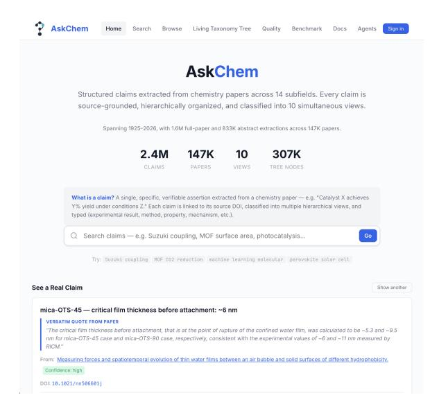
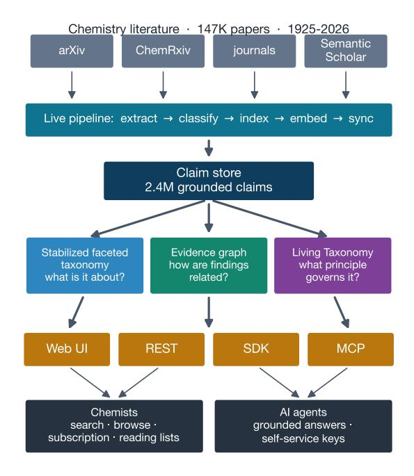
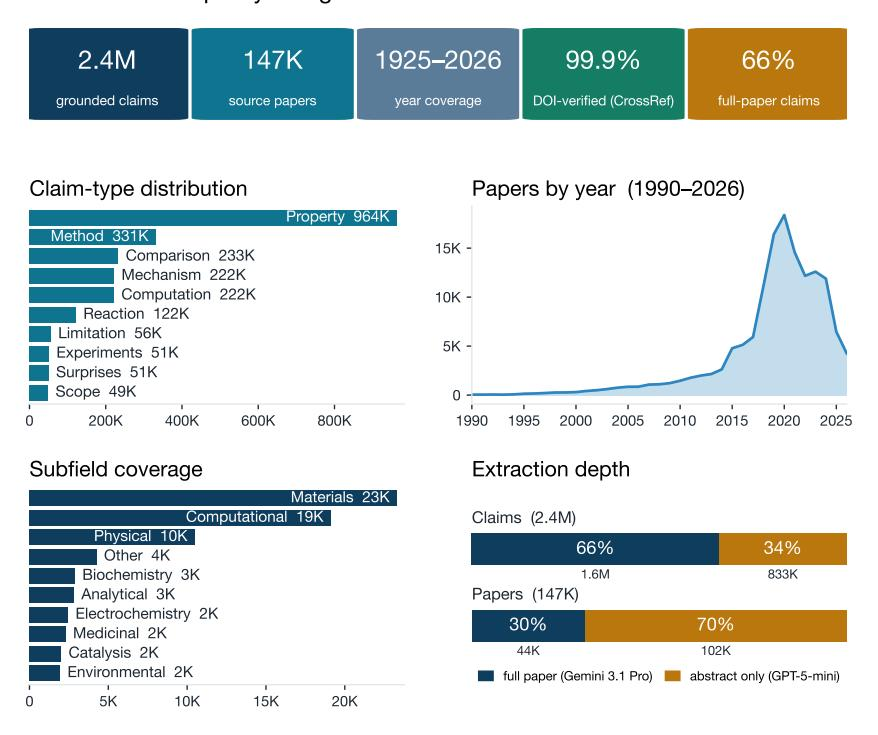
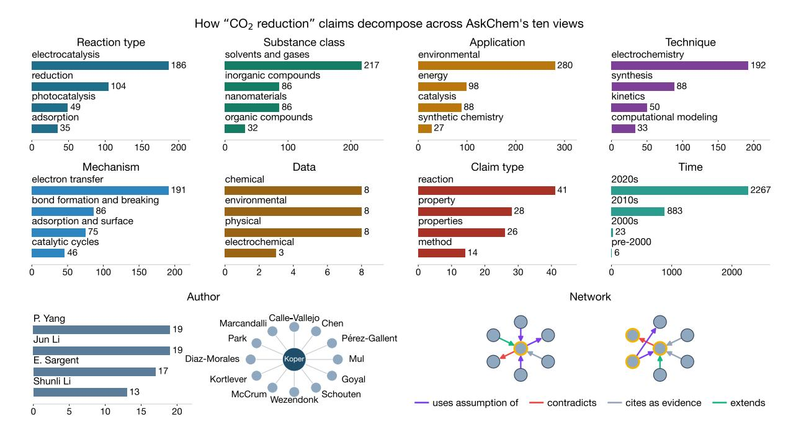
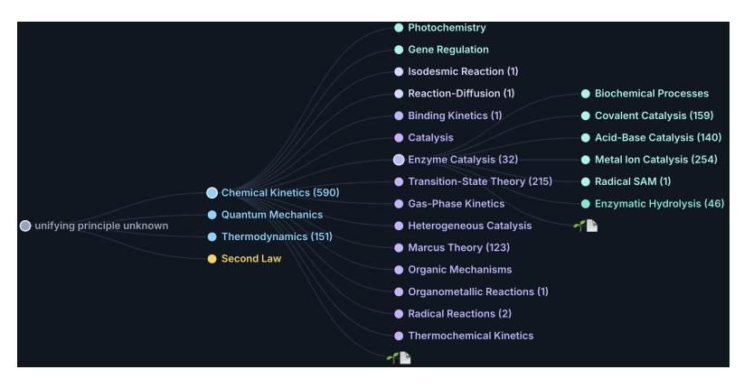

# AskChem: 화학 문헌 종합을 위한 주장 중심 인프라 (AskChem: Claim-Centered Infrastructure for Chemistry Literature Synthesis)

- 원제: AskChem: Claim-Centered Infrastructure for Chemistry Literature Synthesis
- 원문: [https://arxiv.org/abs/2607.28618](https://arxiv.org/abs/2607.28618)
- PDF: [https://arxiv.org/pdf/2607.28618v1](https://arxiv.org/pdf/2607.28618v1)
- arXiv ID: `2607.28618`

---

# AskChem: 화학 문헌 종합을 위한 주장 중심 인프라 (AskChem: Claim-Centered Infrastructure for Chemistry Literature Synthesis)

# Bing Yan

New York University bing.yan@nyu.edu

# Stefano Martiniani

New York University stefano.martiniani@nyu.edu

#### 초록 (Abstract)

화학 문헌 종합은 종종 여러 출판물에 흩어져 있는 특정 발견을 모으는 것을 필요로 하지만, 기존의 문헌 검색 시스템은 주로 순위가 매겨진 문서 목록을 반환한다. 그 결과, 과학자와 AI 에이전트는 관련 정보를 찾아내고 출처를 검증하며 교차 문서 답변을 수동으로 조합해야 한다. 우리는 교차 문서 화학 검색을 위한 주장 중심 인프라인 AskChem을 제시한다. AskChem은 검색 단위를 논문이 아닌 출처를 담은 주장으로 바꾼다: 각 논문은 원자적이고 유형화된 주장으로 변환되며, 각 주장은 소스 DOI와 원문 인용문 또는 명시적 증거 위치자에 의해 뒷받침된다. 이 공유 주장 저장소 위에서 AskChem은 검색 및 종합을 위한 보완 구조를 제공한다: 계층적 검색과 탐색을 위한 안정화된 다면 분류 체계, 관계를 통해 주장을 연결하는 증거 그래프, 그리고 과학 원칙 아래에 색인된 논문을 배치하는 탐색적 살아있는 분류 체계. AskChem은 현재 147K 논문에서 2.4M 주장을 색인하고 웹 인터페이스와 함께 AI 에이전트를 위한 REST, SDK, MCP 접근을 제공한다. AskChem-Bench에서 GPT-5.5 리더를 AskChem에 기반시킬 때 100%의 해결 가능한 DOI를 얻으며, 검색 없이 88.3%에 비해 더 높은 인용 밀도를 가진다. AskChem은 <https://askchem.org>에서 운영 중이다.

## 1 서론 (Introduction)

화학자들은 종종 답변이 단일 논문에서 검색되는 것이 아니라 여러 논문에 걸쳐 있는 특정 발견을 모아야 하는 질문을 한다. 예를 들어, 화학자가 \"CO<sup>2</sup>를 CO로 환원하는 전기촉매로 보고된 것과 그 때의 파라다이크 효율은 무엇인가?\"라고 물을 때, 답변은 촉매, 반응 조건, 측정, 메커니즘에 관한 개별 주장으로 여러 논문에 분산되어 있다.

# Gregory Wolfe

Matterstack, Inc. gwolfe@matterstack.ai

# Kyunghyun Cho (Kyunghyun Cho)

New York University kyunghyun.cho@nyu.edu

<span id="page-0-0"></span>

Figure 1: [AskChem](https://askchem.org) 인터페이스는 출처를 포함한 주장을 반환한다.

문서는 과학자가 논문을 열고 관련 증거를 찾아 보고된 값을 검증하며 답변을 수동으로 조립하도록 남겨 둔다.

이 문서 중심의 인터페이스는 과학자와 AI 에이전트가 문헌을 활용하는 방식과 점점 더 불일치하고 있다. LLM 에이전트는 이제 논문을 조사하고 실험을 계획한다 [(Boiko et al.,](#page-6-0) [2023)](#page-6-0), 그러나 검색 도구의 한계를 그대로 물려받는다: 문서 검색은 주장 수준에서 증거를 직접 노출하지 않으며, 도메인의 조직 구조나 종합에 필요한 문서 간 관계를 제공하지 않는다. 파라메트릭 메모리에서 답변하도록 요청받으면, LLM은 그럴듯하게 보이는 인용을 만들어 낼 수 있다 [(Agrawal et al.,](#page-6-1) [2024)](#page-6-1).

AskChem은 이 불일치를 해결하기 위해 출처를 포함한 과학적 주장을 논문 대신 검색, 탐색, 에이전트 접근의 중심 객체로 만든다 (Figure [1)](#page-0-0). 주장은 논문에서 추출된 원자적이며 유형화된 주장으로, 소스 DOI와 그대로 인용문 또는 명시적 증거 위치 지정자를 기반으로 한다. Segment Anything Model이 이미지를 재사용 가능한

<span id="page-1-0"></span>

Figure 2: AskChem은 검색 단위로 논문 대신 출처를 포함한 주장을 사용하고, 공유 주장 저장소에 대한 보완 구조를 노출한다: 검색 및 탐색을 위한 안정화된 다면 분류 체계, 교차 논문 관계를 위한 증거 그래프, 그리고 원칙별로 조직된 탐색형 살아있는 분류 체계.

regions [(Kirillov et al.,](#page-6-2) [2023)](#page-6-2), 우리는 LLM을 사용하여 논문을 주장으로 분할한다. 주장을 직접 인덱싱함으로써 AskChem은 사용자가 특정 결과를 검색하고, 그 근거를 검토하며, 전체 문서를 먼저 읽고 필터링하지 않고도 교차 논문 답변을 구성할 수 있게 한다.

AskChem은 공유 주장 저장소에 대해 세 가지 상호 보완적인 구조를 노출한다:

분류형 분류법: 주장이 다루는 내용에 따라 주장 찾기. AskChem은 반응 유형, 물질 클래스, 적용 분야, 기법, 메커니즘 주제, 주장 유형, 데이터, 시간 등과 같은 안정화된, 말뭉치에 의해 유도된 측면을 따라 주장을 조직한다. 이러한 측면은 과학적 구조 자체가 아니라 계층적 검색, 탐색, 그룹화 및 시간적 탐색을 지원하는 운영적 관점이다.

증거 그래프: 논문 간 주장 연결. AskChem은 supports, contradicts, extends, derives_from와 같은 유형화된 관계를 통해 주장을 연결한다. 이 그래프는 사용자가 개별 결과에서 관련 증거로 이동하고, 결과가 논문 간에 어떻게 확장되는지 추적하며, 잠재적 충돌을 드러내는 데 도움을 준다.

Living Taxonomy: 과학적 맥락에서 주장 배치. 탐색적 확장으로서 AskChem은 논문 기반의 잎을 원칙, 이론, 모델, 메커니즘, 현상 아래에 배치한다. 이 원칙 중심 계층은 색인된 코퍼스의 진화하는 개요를 제공하며, 검색에 사용되는 운영적 측면을 보완한다.

공헌. 우리는 화학 문헌 종합을 위한 실시간 주장 중심 인프라인 AskChem을 제시한다. 우리의 공헌은 네 가지로 나뉜다:

- 1. 2.4M 주장(147K 논문에서 배포된) 위에 배치된 출처를 담은 주장 표현;  
- 2. 공유 주장 저장소 위에 구축된 보완 구조, 여기에는 검색 및 탐색을 위한 안정화된 다면 분류법, 주장 수준 탐색을 위한 증거 그래프, 탐색적 원칙 중심 Living Taxonomy가 포함된다;  
- 3. 웹 UI, REST API, SDK, MCP 서버를 통한 인간 및 에이전트용 인터페이스;  
- 4. 인용 기반성 및 관련성을 측정하기 위한 교차 논문 화학 검색 평가 스위트인 AskChem-Bench.

## 2 Claim-Centered Representation (주장 중심 표현)

Figure [2](#page-1-0)는 AskChem 플랫폼을 보여준다. 핵심 객체는 Claim(주장)이다: 논문에서 추출된 원자적이며 유형이 지정된 과학적 주장으로, 소스 DOI와 원문 인용으로 뒷받침된다. 주장은 반응물, 조건, 측정값, 재료 등과 같은 구조화된 필드와 추출 신뢰도 점수를 함께 포함한다. 이러한 표현은 전체 논문이 아니라 개별 발견을 검색, 그룹화, 연결, 검증 가능한 객체로 만든다.

AskChem은 동일한 claim(주장) 식별자 아래에 여러 구조를 저장한다. Source(출처)는 DOI, 학회/저널, 연도, 인용 수, 그리고 OpenAlex를 통해 차별화된 저자 정보를 포함한 논문 수준 메타데이터를 기록한다 [(Priem et al.,](#page-7-0) [2022)](#page-7-0). TreeNode(트리노드)는 주장을 하나 이상의 다면적 분류 경로에 배치하고, Edge(엣지)는 두 주장 사이의 유형화된 관계를 기록한다. 이러한 구조를 공유 claim 식별자에 고정함으로써 검색, 계층적 탐색, 그래프 탐색이 서로 연결되지 않은 요약이 아니라 동일한 출처를 가진 객체를 반환하도록 한다.

현재 라이브 인덱스는 1925–2026년에 걸친 147,000편의 논문에서 추출된 2.4백만 개의 주장과 307,000개의 채워진 분류 노드를 포함한다 (Figure [3)](#page-2-0). 데이터는 SQLite에 FTS5 전체 텍스트 검색과 벡터 인덱스를 사용해 저장되며, a를 통해 제공된다.

#### AskChem 데이터 품질 한눈에 보기

<span id="page-2-0"></span>

Figure 3: 배포된 인덱스에 대한 코퍼스 규모의 범위와 자동 품질 검사. 이 통계는 출처와 추출 깊이를 특징짓지만, 주장 의미나 분류 체계 배치에 대한 전문가 판단을 대체하지 않는다.

FastAPI 애플리케이션은 웹 인터페이스 및 에이전트 전용 API에서 사용된다. Figure [1](#page-0-0)과 Appendix [B](#page-8-0)은 인터페이스와 인덱스 기록에서 예시 주장을 보여준다.

## 3 주장 추출 및 증거 그래프 (Claim Extraction and Evidence Graph)

증거를 담은 주장 추출. AskChem은 두 개의 보완적인 추출 파이프라인(그림 3)을 사용해 주장 저장소를 채운다. 고속 추출기는 대규모 초록을 처리하고, 더 깊은 추출기는 전체 PDF를 읽어 초록에 흔히 없애는 주장 유형(가설, 한계, 놀라운 발견 등)을 포착한다. 각 추출 호출은 주장 스키마에 따라 검증된 구조화된 JSON을 반환하며, 필수 증거 필드, 숫자 범위, 화학 전용 필드를 포함한다.

이러한 검사는 완전한 의미적 정확성보다 추적 가능성을 확립한다. 인덱스에서 2.4M 주장 중 100%가 출처 기반이며, 주장 유형, 출처 DOI, 그리고 원문 인용을 포함한다.

주장을 증거 그래프와 연결. 교차 논문 검색은 단순히 개별 결과를 검색하는 것보다 더 많은 것을 요구한다: 사용자들은 결과가 서로 어떻게 지원, 확장, 파생, 혹은 모순되는지 알아야 한다. 따라서 AskChem은 주장 저장소 위에 관계 추출 레이어를 추가한다. 추출기는 cites_as_evidence, supports, extends, contradicts, derives_from 등과 같은 유형화된 방향성 있는 간선을 주장 사이에 발행하며, 신뢰도 점수와 증거를 포함한다.

현재 그래프는 171,342개의 유형화된 간선을 포함한다. 도메인 전문가 저자는 148개의 간선에 대해 층화 샘플을 수동으로 검증했다. 2개의 판정 불가 사례를 제외한 뒤, 146개의 판정 가능한 간선 중 143개가 올바른 관계 유형을 갖추어 간선 유형 정밀도 97.9%를 기록했다. 이 그래프는 검색을 대체하기보다 검색 위에 관계형 레이어로 사용된다: /api/claims/{id}/neighborhood는 주장의 수신 및 송신 증거 링크를 반환하고, 웹 인터페이스는 상위 검색 결과 위에 그래프를 생성해 사용자가 결과에서 주장을 지원, 확장, 혹은 모순하는 주장으로 이동할 수 있게 한다.

## 4 안정화된 분류형 분류법 (Stabilized Faceted Taxonomy)

안정적인 검색 facet를 유도한다. AskChem은 주장들이 다루는 내용을 기준으로 분류형 분류법을 사용해 주장을 조직한다. 완전히 사전 정의된 화학 온톨로지를 강요하기보다, AskChem은 논문을 소화하고 주장을 추출하면서 카테고리 경로를 유도한다. 이 경로는 반응, 물질, 응용, 기법, 메커니즘 전반에 걸쳐 반복되는 용어를 드러낸다. 우리는 이후 유도된 경로를 표준 최상위 라우팅, 동의어 nor-

<span id="page-3-0"></span>

<span id="page-3-1"></span>Figure 4: 동일한 "CO<sup>2</sup> reduction" 주장이 10개의 뷰(반응, 물질, 응용, 기법, 메커니즘, 데이터, 주장 유형, 시간)에서 facet 구조를 드러내며; 저자 뷰는 공동 저자 관계 그래프를 통해 협업을 드러내고; 네트워크 뷰는 증거 그래프를 표시한다.



Figure 5: 원칙 중심의 살아있는 분류법은 기여를 지배하는 것이 무엇인지에 답한다. 검색에 사용되는 안정화된 분류형 분류법과 달리, 이는 인덱스된 논문을 원칙, 이론, 모델, 메커니즘 아래에 조직한다.

정규화, 그리고 유사한 하위 범주의 퍼지 클러스터링. 결과는 코퍼스에서 파생되었지만 지속적인 L1/L2/L3 경로 집합으로, 생산 검색 및 탐색에 적합하다.

주장에 대한 운영적 뷰. 분류법은 동일한 주장 저장소에 대해 여러 운영적 뷰를 정의한다. 각 주장은 채워진 뷰에서 2–5 세그먼트 경로를 할당받을 수 있으며, 예를 들어 *by_reaction_type* 아래의 coupling/cross_coupling/suzuki와 같다. 다섯 개의 내용 뷰는 주장이 무엇에 관한 것인지를 포착한다: 반응 유형, 물질 클래스, 응용, 기법, 메커니즘 주제. 추가 뷰는 주장 유형, 추출된 측정값(데이터), 시간, 출처 저자를 조직한다. 이 facet들은 독립 데이터 세트로 취급되지 않으며, 동일한 증거를 담은 주장에 대한 다른 탐색 렌즈이다. Figure [4](#page-3-0)는 한 주제가 이러한 뷰에서 어떻게 다르게 분해되는지를 보여준다. 마지막 뷰는 Section [3.](#page-2-1)에서 논의된 증거 그래프(네트워크)이다.

검색 및 탐색. 안정화된 분류 체계는 시각화뿐 아니라 운영 인덱스로 사용된다. 하이브리드 /search는 FTS5 클레임-텍스트 검색, 논문 수준 재현, 분류 노드 재현, 그리고 밀집 벡터 재현을 상호 순위 융합을 사용하여 결합한다 [(Cormack et al.,](#page-6-3) [2009)](#page-6-3). 반환된 클레임은 관련된 뷰 경로를 유지하여 UI 및 API 클라이언트가 결과를 그룹화하고 관련 항목을 확장할 수 있도록 한다

분류 체계 노드와 주장 수, 시간적 오버레이를 동일하게 노출하는 브라우즈 엔드포인트가 있다. 이 설계에서 어휘적·의미적 검색은 후보 증거를 찾고, 다각형 구조는 그 증거를 안정된 화학 개념 아래에서 확장하고 그룹화하며 맥락화한다.

## 5 탐색적 라이브 분류 체계 (Exploratory Living Taxonomy)

원칙 중심 조직. 안정화된 다면 분류법은 주장이 무엇에 관한 것인지를 묻고, 생동형 분류법은 논문의 기여를 지배하는 더 넓은 과학적 아이디어가 무엇인지 묻는다. 이는 논문 기반 잎을 원칙, 이론, 모델, 메커니즘, 현상 아래에 정리한다 (Figure [5)](#page-3-1). 현재 트리는 4,931개의 노드를 포함하고 361K개의 논문 배치에 걸쳐 1.1M개의 주장을 다루며, 기존 노드가 적합하지 않을 때 새로운 분기를 제안하는 회피 메커니즘을 갖는다. 우리는 이를 완전히 검증된 과학적 온톨로지가 아니라 색인된 코퍼스의 탐색적 개요로 간주한다. 구성 세부 사항은 부록 [B.](#page-8-0)에 나타난다.

## 6 교차 논문 검색 및 시연 (Cross-Paper Search and Demonstration)

세 구조에 걸친 하나의 질의. 연구자는 *"CO*<sup>2</sup> *를 CO로 환원시키는 전기촉매는 무엇이며, 그때의 파라다이크 효율은 얼마인가?"* 라고 묻는다. 하이브리드 검색은 구조화된 조건, 원문 증거, 분류 경로, 그리고 출처 DOI를 포함한 주장 수준의 결과를 반환한다. 사용자는 경로를 열어 계층 구조를 탐색하거나, 하이라이트를 증거 그래프로 그룹화하거나, 논문을 살아있는 분류 체계에 배치할 수 있다. 인간 및 에이전트 인터페이스는 웹 UI, REST, SDK, 또는 MCP를 통해 동일한 주장 식별자를 검색한다 [(Anthropic,](#page-6-4) [2024)](#page-6-4); 보조 워크플로우 및 엔드포인트 예시는 부록 [B.](#page-8-0)에 나타난다.

## <span id="page-4-0"></span>7 평가 (Evaluation)

AskChem을 네 가지 질문으로 평가한다. 첫째, 추출된 주장들이 출처 증거에 추적 가능한지(RQ1); 둘째, 주장 수준 구조가 탐색을 지원하기에 충분히 신뢰할 수 있는지(RQ2); 셀째, 주장 중심 검색이 교차 논문 화학 답변을 향상시키는지(RQ3); 넷째, 배포된 시스템이 말뭉치 규모에서 운영되는지(RQ4).

RQ1: 주장이 소스 기반인지? Figure [3](#page-2-0)는 배포된 코퍼스에 대한 출처 검증을 요약한다. 현재 인덱스에서는 100%의 주장이 소스 기반(주장 유형, source DOI, 그리고 직접 인용)이다. 이러한 검증은 추적 가능성을 확립하고 지원되지 않는 생성 텍스트를 감지하는 데 도움을 주지만, 추출된 모든 주장이 소스를 의미적으로 정확히 해석한다는 것을 증명하지는 않는다.

RQ2: 주장 수준 구조가 신뢰할 수 있고 유용한가? 증거 그래프는 Section [3,](#page-2-1)에서 보고된 도메인 전문가 감사를 통해 평가되며, 이는 97.9% edge-type precision을 추정한다. 안정화된 faceted taxonomy는 운영 환경에서 실제로 사용된다: 하이브리드 검색(hybrid search)에서 검색 신호 중 하나를 제공하고, UI에서 탐색, 그룹화, 시간적 오버레이를 주도한다. 그러나 우리는 아직 taxonomy-based recall에서 검색 이득을 분리하거나 taxonomy 배치에 대한 전문가 검증을 보고하지 않는다. living taxonomy 역시 완전히 검증된 과학적 ontology라기보다는 탐색적(exploratory)으로 다뤄진다.

RQ3: 주장 중심 검색이 교차 논문 종합을 향상시키는가? AskChem-Bench는 조건 집계, 시간 추적, 모순 표출을 포함한 30개의 교차 논문 화학 질문을 담고 있다. 우리는 다섯 가지 설정을 비교한다: 검색 없이 GPT-5.5 리더, AskChem을 통해 기반화된 동일 리더, Paperclip [(Generative](#page-6-5) [Expert Labs,](#page-6-5) [2026)](#page-6-5), Edison Scientific의 PaperQAfamily 에이전트 [(Skarlinski et al.,](#page-7-1) [2024)](#page-7-1), 그리고 Google NotebookLM Deep Research [(Agrawal and Wang,](#page-6-6) [2025)](#page-6-6). Appendix [A](#page-8-1)는 전체 질문, 검색 예산, 지표, DOI 검증 절차 및 판사 보정 정보를 제시한다.

Table [1](#page-5-0)은 결과를 보고한다. AskChem에 리더를 기반화하면 100%의 해석 가능한 DOI를 제공하며, 검색 없이 88.3%와 비교해 다섯 설정 중 가장 높은 인용 밀도인 18.1개의 검증된 DOI를 답변당 제공한다. AskChem은 평균 관련성 점수와 최신 고영향력 연구의 커버리지에서도 최고를 기록한다. Figure [6](#page-5-1)은 리더만이 인용을 조작하는 대표 사례를 보여 주며, AskChem 기반 리더는 해석 가능한 DOI만을 인용한다.

비교는 또한 AskChem의 한계를 부각시킨다. Edison Scientific, 폐쇄형 에이전트형 딥 리서치 시스템은 인용 연결된 정량적 세부 정보를 상당히 더 많이 제공하고 주제 관련률도 약간 더 높다. AskChem은 주장 수준, 오픈 데이터, 대화형 탐색에 충분히 빠르며 에이전트 도구로 직접 사용 가능하다는 점에서 다른 프로필을 가진다. 동시에 이 벤치마크에서 DOI 환각을 제거한다.

<span id="page-5-0"></span>

| 지표 | LLM 전용 | +AskChem | +Paperclip | Edison Scientific | NotebookLM |
|--------------------------|----------|----------|------------|-------------------|------------|
| DOI 존재 여부 (%) | 88.3 | 100 | 100 | 99.1 | 93.7 |
| 인용 밀도 (/ans.) | 9.6 | 18.1 | 7.5 | 10.7 | 7.9 |
| 근거 기반 구체성 | 8.1 | 5.9 | 0.5 | 29.2 | 0.1 |
| 최근 고영향도 (%) | 0.6 | 18.5 | 6.1 | 11.3 | 12.1 |
| 논문 관련성 (0–3) | 1.66 | 2.15 | 1.72 | 2.07 | 1.84 |
| 주제 관련성 ≥ 2 (%) | 65.8 | 86.6 | 57.8 | 89.7 | 78.9 |

Table 1: AskChem-Bench: 30개의 교차 논문 화학 질문 (조건 집계, 시간 추적, 모순 표출), GPT-5.5 리더; 다섯 시스템 모두 전체 30개를 다룸. DOI는 CrossRef를 통해 검증됨. 굵은 글씨는 각 행에서 가장 좋은 값을 표시; Paperclip은 DOI 존재 여부에서만 AskChem과 일치함.

```
GPT-5.5 alone — 인용을 조작함
"Au nanoneedles: ∼95% FE for CO, ∼22 mA cm−2 CO
partial current. . . " [10.1021/jacs.7b00392]
14개 중 6개의 DOI가 CrossRef에서 확인되지 않음; 구체적인
값은 검증할 수 없음.
```

```
GPT-5.5 + AskChem — 검색된 주장에 기반
"Atomically dispersed Fe3+ sites: overpotential 360 mV,
jCO = 20 mA cm−2
                   " (10.1126/science.aaw7515)
22개의 인용 DOI가 모두 확인됨; 보고된 값은
출처 초록에서 그대로 인용됨.
```

Figure 6: 동일한 질문 (AskChem-Bench ca04, *"electrocatalysts for CO*<sup>2</sup> *reduction to CO/formate"*), GPT-5.5만으로 답변 시 14개의 DOI 중 6개를 조작함; AskChem의 검색된 주장에 기반하면 22개의 인용이 모두 확인된다.

### RQ4: AskChem이 코퍼스 규모에서 운영되는가? 배포된 서비스는 웹 인터페이스, SDK, MCP 서버에서 사용되는 동일한 REST 스키마를 통해 240만 개의 주장, 30만 7천 개의 분류체계 노드, 17만 1천 개의 증거 엣지를 동시에 질의한다.

## 8 기존 시스템과의 비교

데이터베이스 및 검색. Reaxys [(Lawson et al.,](#page-6-7) [2014)](#page-6-7)와 SciFinder [(Ridley,](#page-7-2) [2009)](#page-7-2)는 독점적으로 선별된 반응/물질 데이터를 제공; PubChem [(Kim et al.,](#page-6-8) [2023)](#page-6-8)와 ChEMBL [(Gaulton et al.,](#page-6-9) [2012)](#page-6-9)는 분자와 생물활성을 공개적으로 구조화. Semantic Scholar [(Ammar et al.,](#page-6-10) [2018)](#page-6-10)와 Google Scholar [(Martín-Martín et al.,](#page-7-3) [2018)](#page-7-3)는 풍부한 메타데이터를 포함하지만 주로 순위가 매겨진 논문을 반환. AskChem은 대신 출처를 담은 서사 주장에 대한 분면 구조를 노출한다.

과학 NLP 및 어시스턴트. 주장 추출 및 그래프 구축은 과학 정보와 관계 추출 [(Luan et al.,](#page-6-11) [2018)](#page-6-11)을 기반으로 하며, 계층 구조는 분류체계 유도 [(Snow et al.,](#page-7-4) [2006;](#page-7-4) [Zeng et al.,](#page-7-5) [2024)](#page-7-5)와 관련되고, 검색은 RAG, 문장 임베딩, 순위 융합 [(Lewis et al.,](#page-6-12) [2020;](#page-6-12) [Reimers and](#page-7-6) [Gurevych,](#page-7-6) [2019;](#page-7-6) [Cormack et al.,](#page-6-3) [2009)](#page-6-3)을 결합한다. 섹션 [7,](#page-4-0)에서 벤치마크된 답변 생성 어시스턴트와 달리 AskChem은 재사용 가능한 인간 및 에이전트용 인프라로 지속적인 주장 저장소를 노출한다.

## 9 결론

AskChem은 문서 전용 화학 문헌 검색에 대한 주장 중심의 대안을 제시한다.

출처를 담은 주장을 핵심 단위로 삼음으로써 AskChem은 출처 인용문 및 DOI와 대조해 검증 가능한 검색 결과를 제공하고, 안정화된 분면을 통해 조직화하며, 논문 간 증거 관계를 연결한다. 배포된 시스템은 코퍼스 규모에서 운영되며 동일한 주장 객체를 인간 사용자와 AI 에이전트 모두에게 노출한다. 교차 논문 화학 질문에서 AskChem은 인용 기반성을 향상시켜, 주장 중심 인프라가 화학 문헌 통합을 위한 실용적 기반임을 시사한다.

## 10 라이선스 및 이용 가능성

AskChem은 <https://askchem.org>에서 운영 중이며, 스크린캐스트 데모는 [https://youtu.be/](https://youtu.be/SOjueOlPS-8) [SOjueOlPS-8](https://youtu.be/SOjueOlPS-8)에서 확인할 수 있다. MIT 라이선스가 적용된 소스 코드는 [https://github.com/bingyan4science/](https://github.com/bingyan4science/askchem) [askchem](https://github.com/bingyan4science/askchem)에 있으며, CC-BY 인덱스 스냅샷은 [https://huggingface.co/datasets/](https://huggingface.co/datasets/bing-yan/askchem) [bing-yan/askchem](https://huggingface.co/datasets/bing-yan/askchem)에서 공개된다. OpenAPI 문서, 벤치마크 아티팩트, SDK/MCP 접근은 부록 [B.](#page-8-0)에 나열되어 있다.

#### 한계 (Limitations)

이 코퍼스는 화학의 일부만을 다루며, 초록 추출은 전체 텍스트 추출보다 얕다. LLM이 생성한 주장, 관계, 그리고 분류 체계 배치는 잘못될 수 있다; AskChem-Bench는 전체 사실 정확성이나 사용자 유틸리티 대신 30개의 질문에 대한 근거성을 측정한다. 문자열 기반 분류 체계 정규화는 서로 다른 범주를 병합하거나 근접한 중복을 남길 수 있으며, 그 검색 이득은 분리되지 않았다.

# 윤리 및 광범위한 영향 (Ethics and Broader Impact)

AskChem은 LLM 기반 추출을 사용하며, 그 주장은 오류를 포함할 수 있다. 따라서 각 주장은 출처 DOI와 원문 인용을 포함하여 provenance를 제공한다. 이를 통해 사용자는 원본 논문과 비교해 검증할 수 있다. 인터페이스는 커뮤니티 플래그 기능도 지원한다. AskChem은 문헌 검색 및 종합을 돕는 것이 목적이며, 중요한 결정을 위해서는 원본 자료를 읽는 것을 대체하지 않는다. AI 지원 화학 워크플로를 검증 가능한 인용으로 기반화함으로써 인용 조작을 줄이고 생성된 답변을 보다 쉽게 감시할 수 있도록 한다. 시스템은 공개 메타데이터, 초록, 그리고 공개 접근이 가능한 전체 텍스트를 사용해 논문을 색인한다. 공개 색인은 주장 텍스트, 출처 메타데이터, provenance를 노출하지만, 유료 장문의 전체 텍스트를 재배포하지 않는다.

# 1 Acknowledgements (Acknowledgements)

우리는 NYU HPC의 관대한 지원과 계산 시뮬레이션 및 실험에 대한 도움에 감사한다. AskChem에서 LLM 기반 추출 및 처리를 위한 주요 계산 지원을 제공한 NYU Google Cloud Platform (GCP) 연구 보조금 프로그램에도 감사한다. 본 연구는 대한민국 과학기술정보통신부(MSIT)에서 자금을 지원한 정보통신기술정책기획평가원(IITP)의 보조금으로 Global AI Frontier Lab 국제 공동 연구와 연계하여 지원받았다. 또한 본 연구는 Tamkeen이 후원한 NYUAD Research Institute Award CG016에 따라 NYUAD Center for Interdisciplinary Data Science & AI (CIDSAI) 센터의 지원을 일부 받았다.

### 1 References (References)

- <span id="page-6-6"></span>Anuja Agrawal과 Shan Wang. 2025. Notebooklm은 더 많은 소스 유형에 대한 심층 연구와 지원을 추가한다. [https://blog.google/innovation-and-ai/](https://blog.google/innovation-and-ai/) [https://blog.google/innovation-and-ai/models-and-research/google-labs/](https://blog.google/innovation-and-ai/models-and-research/google-labs/) [https://blog.google/innovation-and-ai/models-and-research/google-labs/notebooklm-deep-research-file-types/](https://blog.google/innovation-and-ai/models-and-research/google-labs/notebooklm-deep-research-file-types/). 2025-11-13에 발표; 2026-07-10에 접근.  
- <span id="page-6-1"></span>Ayush Agrawal, Mirac Suzgun, Lester Mackey, and Adam Kalai. 2024. [Do language models know when](https://doi.org/10.18653/v1/2024.findings-eacl.62) [they're hallucinating references?](https://doi.org/10.18653/v1/2024.findings-eacl.62) *Findings of the Association for Computational Linguistics: EACL 2024*에 수록, 912–928쪽.  
- <span id="page-6-10"></span>Waleed Ammar, Dirk Groeneveld, Chandra Bhagavatula, Iz Beltagy, Miles Crawford, Doug Downey, Jason Dunkelberger, Ahmed Elgohary, Sergey Feldman, Vu Ha, et al. 2018. [Construction of the lit-](https://doi.org/10.48550/arXiv.1805.02262)

- [erature graph in semantic scholar.](https://doi.org/10.48550/arXiv.1805.02262) *arXiv preprint arXiv:1805.02262*.
- <span id="page-6-4"></span>Anthropic. 2024. Model context protocol. [https:](https://modelcontextprotocol.io) [//modelcontextprotocol.io](https://modelcontextprotocol.io). 2026-07- 01에 접근함.
- <span id="page-6-0"></span>Daniil A Boiko, Robert MacKnight, Ben Kline, and Gabe Gomes. 2023. [자율 화학 연구](https://doi.org/10.1038/s41586-023-06792-0) [대형 언어 모델과 함께.](https://doi.org/10.1038/s41586-023-06792-0) *Nature*, 624(7992):570– 578.
- <span id="page-6-3"></span>Gordon V. Cormack, Charles L. A. Clarke, and Stefan Buettcher. 2009. [상호 순위 융합이 우수하다](https://doi.org/10.1145/1571941.1572114) [Condorcet 및 개별 순위 학습 방법.](https://doi.org/10.1145/1571941.1572114) In *32nd International ACM SIGIR Conference on Research and Development in Information Retrieval Proceedings*, 쪽 758–759.
- <span id="page-6-9"></span>Anna Gaulton, Louisa J Bellis, A Patricia Bento, Jon Chambers, Mark Davies, Anne Hersey, Yvonne Light, Shaun McGlinchey, David Michalovich, Bissan Al-Lazikani, and John P Overington. 2012. [ChEMBL: 대규모 생체활성 데이터베이스를 통한 약물](https://doi.org/10.1093/nar/gkr777) [발견.](https://doi.org/10.1093/nar/gkr777) *Nucleic Acids Research*, 40(D1):D1100– D1107.
- <span id="page-6-5"></span>Generative Expert Labs. 2026. Paperclip: 과학 문헌을 위한 명령줄 인터페이스. <https://gxl.ai/blog/paperclip/>. 2026-04-07에 게시됨; 2026-07-10에 접근함.
- <span id="page-6-8"></span>Sunghwan Kim, Jie Chen, Tiejun Cheng, Asta Gindulyte, Jia He, Siqian He, Qingliang Li, Benjamin A Shoemaker, Paul A Thiessen, Bo Yu, et al. 2023. [PubChem 2023 업데이트.](https://doi.org/10.1093/nar/gkac956) *Nucleic Acids Research*, 51(D1):D1373–D1380.
- <span id="page-6-2"></span>Alexander Kirillov, Eric Mintun, Nikhila Ravi, Hanzi Mao, Chloe Rolland, Laura Gustafson, Tete Xiao, Spencer Whitehead, Alexander C Berg, Wan-Yen Lo, et al. 2023. [모든 것을 분할하다.](https://doi.org/10.1109/ICCV51070.2023.00371) In *Proceedings of the IEEE/CVF International Conference on Computer Vision*, 쪽 4015–4026.
- <span id="page-6-7"></span>Alexander J. Lawson, Jürgen Swienty-Busch, Thibault Géoui, and David J. Evans. 2014. [Reaxys의 제작](https://doi.org/10.1021/bk-2014-1164.ch008) [관련 화학 정보에 대한 장애 없는 접근을 향해.](https://doi.org/10.1021/bk-2014-1164.ch008) In *The Future of the History of Chemical Information*, volume 1164 of *ACS Symposium Series*, 쪽 127–148. American Chemical Society.
- <span id="page-6-12"></span>Patrick Lewis, Ethan Perez, Aleksandra Piktus, Fabio Petroni, Vladimir Karpukhin, Naman Goyal, Heinrich Küttler, Mike Lewis, Wen-tau Yih, Tim Rocktäschel, Sebastian Riedel, and Douwe Kiela. 2020. [지식 집약적 NLP 작업을 위한 검색 보강 생성.](https://proceedings.neurips.cc/paper/2020/hash/6b493230205f780e1bc26945df7481e5-Abstract.html) In *Advances in Neural Information Processing Systems (NeurIPS)*, volume 33, 쪽 9459–9474.
- <span id="page-6-11"></span>Yi Luan, Luheng He, Mari Ostendorf, and Hannaneh Hajishirzi. 2018. [과학 지식을 위한 다중 작업 엔티티, 관계 및 상호 참조 식별.](https://doi.org/10.18653/v1/D18-1360)

- [그래프 구축.](https://doi.org/10.18653/v1/D18-1360) *Proceedings of the 2018 Conference on Empirical Methods in Natural Language Processing (EMNLP)*, 페이지 3219–3232.
- [Google scholar, web of science, and scopus: A systematic comparison of citations in 252 subject categories.](https://doi.org/10.1016/j.joi.2018.09.002) *Journal of Informetrics*, 12(4):1160–1177.
- [OpenAlex: 학술 작품의 완전 공개 인덱스,](https://doi.org/10.48550/arXiv.2205.01833) [저자, 장소, 기관, 개념.](https://doi.org/10.48550/arXiv.2205.01833) *Preprint*, arXiv:2205.01833.
- [Sentence-](https://doi.org/10.18653/v1/D19-1410)[BERT: 시암식 BERT 네트워크를 이용한 문장 임베딩](https://doi.org/10.18653/v1/D19-1410)[networks.](https://doi.org/10.18653/v1/D19-1410) *Proceedings of the 2019 Conference on Empirical Methods in Natural Language Processing and the 9th International Joint Conference on Natural Language Processing (EMNLP-IJCNLP)*, 페이지 3982–3992.
- *[정보 검색:](https://doi.org/10.1002/9780470749418) [SciFinder](https://doi.org/10.1002/9780470749418)*, 2판. John Wiley & Sons.
- [언어 에이전트는](https://doi.org/10.48550/arXiv.2409.13740) [과학 지식의 초인간적 종합을 달성한다.](https://doi.org/10.48550/arXiv.2409.13740) *arXiv preprint arXiv:2409.13740*.
- [의미 체계 분류 체계 유도에서 이질적 증거를 이용한](https://doi.org/10.3115/1220175.1220276)[증거.](https://doi.org/10.3115/1220175.1220276) *Proceedings of the 21st International Conference on Computational Linguistics and 44th Annual Meeting of the ACL*, 페이지 801–808.
- [Chain-of-layer: 제한된 예시를 이용한](https://doi.org/10.1145/3627673.3679608) [대형 언어 모델을 이용한 분류 체계 유도](https://doi.org/10.1145/3627673.3679608) [제한된 예시.](https://doi.org/10.1145/3627673.3679608) *Proceedings of the 33rd ACM International Conference on Information and Knowledge Management (CIKM)*, 페이지 3093–3102.

#### <span id="page-8-1"></span>벤치마크 및 평가 세부사항

질문 은행. AskChem-Bench v1.1은 세 개의 교차 논문 과제마다 각각 열 개의 질문을 포함한다. 표 [2](#page-9-0)는 주제를 축약한 것이며, 공개 벤치마크 엔드포인트는 전체 문장을 공개한다.

프로토콜. GPT-5.5는 다섯 가지 설정에서 모든 30개의 질문에 답한다. AskChem은 각 질문을 3–4개의 키워드 하위 질의로 재작성하고, 이를 하이브리드 검색에 전개하며, 결합된 증거를 최대 40개의 주장으로 다양화한 뒤 기반 합성을 수행한다. Paperclip은 논문 검색에 동일한 재작성기와 합성기를 사용한다; Edison Scientific은 PaperQAfamily 에이전트를, NotebookLM은 Deep Research를 사용한다. AskChem은 노출된 주장에 대해 평가되며, 반면 논문 수준 시스템은 인용된 제목과 초록에 대해 평가된다. 추출된 모든 DOI는 CrossRef를 통해 확인된다. Gemini 3.1 Pro 관련성 판단기는 100개의 도메인 전문가 라벨(93% 일치; κ = 0.914)로 보정되었다.

#### 지표 (Metrics)

| Metric | Definition |
|------------------|----------------------------------------|
| DOI existence | Fraction resolving in CrossRef. |
| Citation density | Distinct verified DOIs per answer. |
| Grounded | Quantitative tokens sharing a sentence |
| specificity | with a citation marker. |
| Recent impact | Cited papers from the last five years |
|  | with ≥ 50 citations. |
| Relevance | Judge score: 3 direct, 2 on-topic, 1 |
|  | loose, 0 irrelevant. |

재현성. [https://askchem.org/api/](https://askchem.org/api/benchmark) [benchmark](https://askchem.org/api/benchmark)은 전체 질문, 방법론, 집계 및 작업 수준 결과, 그리고 기록된 인덱스 스냅샷을 제공한다. 프롬프트 템플릿과 재실행 스크립트가 소스 릴리스를 동반하며, 인덱스된 데이터는 [https://huggingface.co/datasets/](https://huggingface.co/datasets/bing-yan/askchem) [bing-yan/askchem](https://huggingface.co/datasets/bing-yan/askchem)에 있다.

# <span id="page-8-0"></span>B 표현 및 구조적 구성

주장 기록. 인덱스에서 가져온 실제 주장(주장_id 7c92fcacd8cb64d4)은 너비를 위해 축약된 형태이다:

```
{"claim_type":"reaction",
 "source_doi":"10.1002/anie.201914977",
 "reaction_type":"전기촉매 CO2 환원 (CO)",
 "reactants":[{"name":"CO2","role":"기질"},{"name":"Ni SA-N2-C","role":"촉매"}],
 "products":[{"name":"CO"}],
 "outcomes":{"selectivity":"CO 파라다이크 효율 98%","other":"회전 빈도 1622"}}
```

```
{"h-1"},
 "verbatim_quote":"Ni SA-N2-C 촉매는 가장 낮은 N 조정 수를 갖고 있어 매우 높은 CO 파라다이크 효율(98%)과 회전 빈도(1622 h-1)를 달성한다,",
 "view_paths":{"by_reaction_type":["전기촉매","CO2 환원"],
. . . }}
```

연속된 인용이 없는 구조화된 전체 논문 주장은 evidence_locator(논문 내 위치와 구조화된 증거)를 포함하므로, 모든 주장은 인용문이나 로케이터에 의해 뒷받침된다.

증거 엣지. claim_edges에서 실제로 입력된 엣지가 논문 간 주장을 연결한다:

```
{"edge_type":"supports",
 "to_doi":"10.1021/acs.joc.9b01692",
 "confidence":"높음",
 "evidence":"SIPr을 사용한 염화물 위치에서 관찰된 선택적 결합은 높은 리간드 제어 선택성의 전반적 주장에 대한 증거를 직접 제공한다."}
```

추출기 세부사항. 초록 추출기는 논문 제목과 초록에 대해 GPT-5-mini를 사용하고, 심층 전체 텍스트 추출기는 Vertex AI 배치를 통해 네이티브 PDF 입력을 사용하는 Gemini 3.1 Pro를 사용한다. 인덱스의 작은 레거시 조각은 이 파이프라인 이전에 존재했다(GPT-4o / GPT-4o-mini). 모든 호출은 제공자 기본 온도에서 JSON-객체 제한 디코딩(response_format={"type":"json_object"})을 사용하며, 무효 JSON 또는 스키마 불일치 출력에 대해 자동 재시도를 수행한다. 프롬프트와 스키마는 소스 코드와 함께 공개된다.

안정화된 분면 분류학. 카테고리 경로는 논문과 추출된 주장을 소화하면서 유도되었으며, 이후 정규화된 L1 라우팅, 동의어 정규화, 퍼지 클러스터링을 통해 지속적인 L1/L2/L3 카테고리로 통합된다. 다섯 개의 콘텐츠 뷰는 반응, 물질, 적용, 기법 및 메커니즘 주제를 다루며, 주장 유형, 측정 및 시간 뷰는 보완적 차원을 추가한다. coupling/cross_coupling/suzuki와 같은 경로는 탐색 위치와 하이브리드 검색에서 분류학 재현 신호 모두를 제공한다.

증거 그래프. 두 번째 패스는 신뢰도와 출처를 가진 directed supports, contradicts, extends, derives_from, cites_as_evidence 엣지를 방출한다. 전문가 감시

<span id="page-9-0"></span>

| CA: 조건 | TC: 진화 | CS: 충돌 |
|---------------------|------------------------|---------------------------|
| C–N 결합 | 페로브스카이트 열화 | Ag 나노입자 안전성 |
| Suzuki–Miyaura 반응 | MOF 수용액 안정성 | DFT 함수형 정확도 |
| 비대칭 수소화 | Li-이온 SEI 형성 | MOF 실용적 안정성 |
| CO2 환원 | 단백질 코로나 | 용매 효과 |
| 물 분해 | TiO2 광촉매 | 계면 패시베이션 |
| ROMP | CO2RR 메커니즘 | PLA 생분해성 |
| 알코올 산화 | 약물 전달 | N-도핑 그래핀 |
| Heck 결합 | 그래핀 결함 | Cu를 이용한 CO2RR |
| 생물촉매 | 나노입자 독성 | 고체 전해질 안전성 |
| 금속 흡착 | 전해질 안정성 | 나노입자 크기 효과 |

표 2: AskChem-Bench 주제 (총 30문제).

관계 유형별로 148개의 엣지를 샘플링했으며, 그 중 146개는 결정 가능했고 143개는 올바른 유형을 가졌다(정밀도 97.9%); 두 개는 결정 불가능으로 제외되었다.

Living Taxonomy. 이 탐색적 계층 구조는 분류형이 아니라 설명형으로 의도되었다. 원리, 이론, 모델, 메커니즘, 현상으로 구성된 4,931개의 노드 트리가 논문 기반 잎을 고정하며, 그 중 663개는 개방형 제안 분기이다. LLM은 각 논문의 주장을 읽고 그 기여를 가장 잘 규율하는 호스트를 명명한다; 적합한 것이 없으면 제안 분기를 통해 기권한다.

| 살아있는 분류 체계 보기 | 논문 배치 | 주장 |
|----------------------|------------------|-----------|
| 물질 클래스 | 111,714 | 490,137 |
| 기법 | 119,361 | 292,154 |
| 메커니즘 | 98,665 | 217,388 |
| 반응 유형 | 30,806 | 62,294 |
| 총합 | 360,546 | 1,061,973 |

Table 3: 탐색적 Living Taxonomy의 범위. 논문은 여러 뷰에 나타날 수 있으므로 배치가 고유한 논문 수가 아니다.

배치 증거. 질산염 환원은 전기촉매 산화환원(electrocatalytic redox) 아래에 배치되고, 이중체 교차환원(diene crossmetathesis)은 올레핀 환원(olefin metathesis) 아래에 배치된다. 반면, 최근접 이웃 배치(nearest-neighbor placement)는 낮은 마진(lowmargin) 사례를 강제 적합할 수 있다. 이러한 예시는 설계 동기를 제공하지만 완전한 평가가 아니며, 전문가 배치 검증은 향후 작업이다.

검증 게이트. 추출 응답은 주장 스키마(claim schema)에 맞게 파싱되고 필수 출처(provenance) 필드를 포함해야 한다; 수치 및 화학 필드는 존재할 때 검사된다. 다면적 경로는 하위 수준 정규화 전에 정규(캐노니컬) 최상위 범주로 라우팅된다. 증거 엣지는 추출기 신뢰도와 출처를 보존하며, Living Taxonomy 배치는 지원되지 않는 호스트를 강제하기보다 기권할 수 있다.

엔드투엔드 API 경로. 웹 데모에서 사용되는 동일한 객체는 REST를 통해 제공된다:

GET /api/search?q=CO2+reduction

GET /api/claims/{claim_id}

GET /api/claims/{claim_id}/neighborhood

GET /api/sources/{doi}

검색은 주장 ID와 분류 경로를 반환한다; 주장 및 이웃 조회는 출처와 증거 엣지를 노출한다; 소스 조회는 논문에서 인덱스된 모든 주장을 반환한다. 동일한 API는 읽기 목록, 저자 네트워크, 저장된 검색, 구독을 지원하며, SDK와 MCP 래퍼는 이를 에이전트에 노출한다. 전체 스키마는 [https:](https://askchem.org/api/docs) [//askchem.org/api/docs](https://askchem.org/api/docs) 에서 확인할 수 있고, 벤치마크 아티팩트는 <https://askchem.org/api/benchmark> 에서, 스크린캐스트 데모는 [https://youtu.be/](https://youtu.be/SOjueOlPS-8) [SOjueOlPS-8](https://youtu.be/SOjueOlPS-8) 에서 확인할 수 있다.

