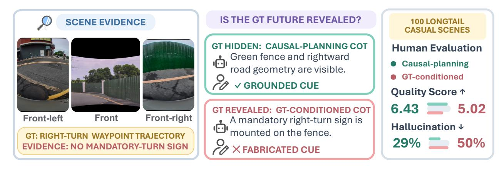
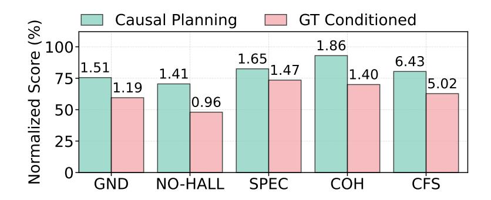
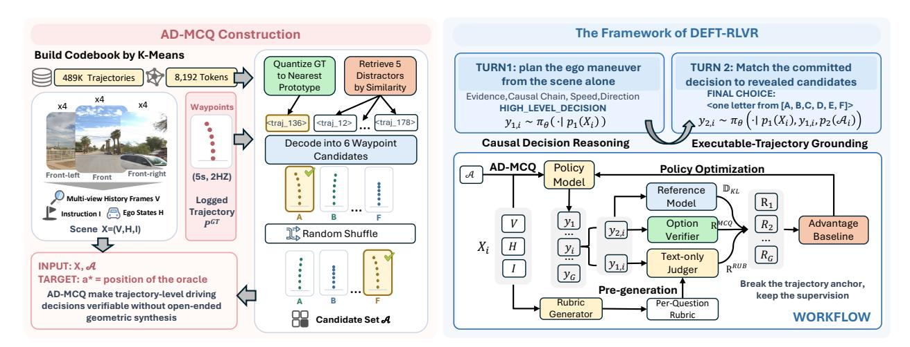
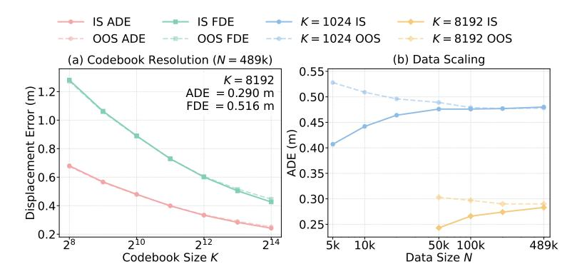
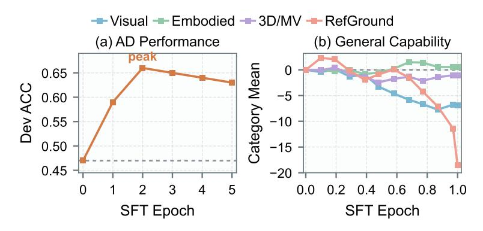
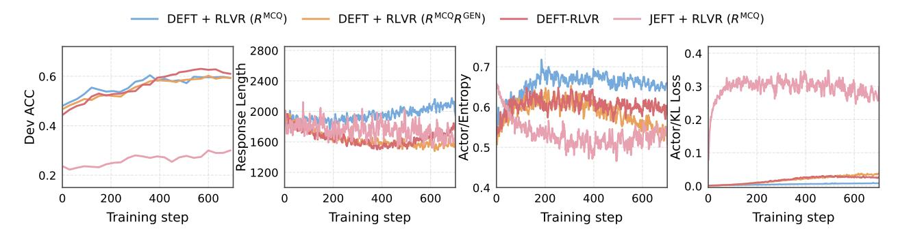
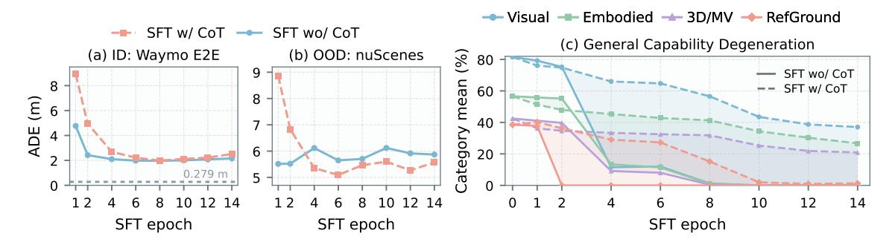
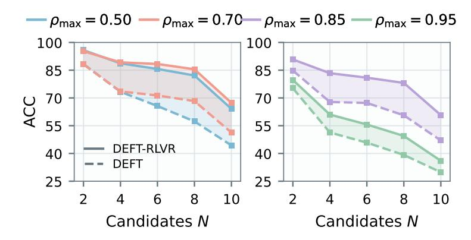
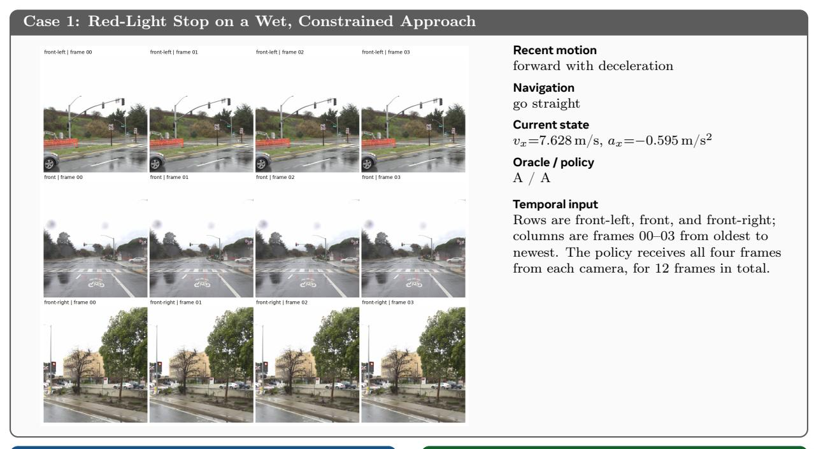
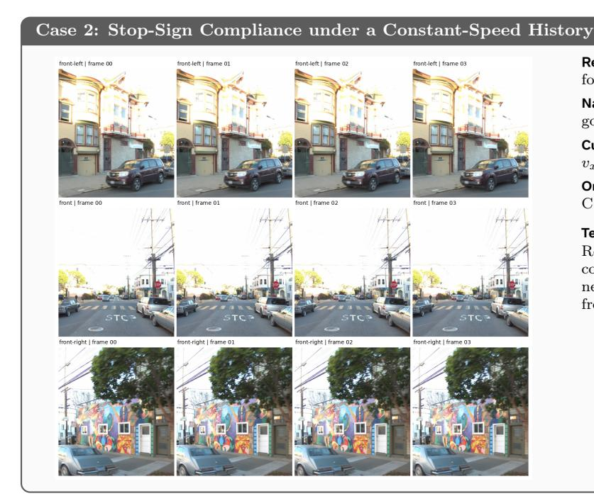

# 미래 궤적의 지연 노출을 통한 자율 주행 VLM의 검증 가능한 추론 (Deferred Exposure of Future Trajectories for Verifiable Reasoning in Autonomous Driving VLMs)

- 원제: Deferred Exposure of Future Trajectories for Verifiable Reasoning in Autonomous Driving VLMs
- 원문: [https://arxiv.org/abs/2608.01755](https://arxiv.org/abs/2608.01755)
- PDF: [https://arxiv.org/pdf/2608.01755v2](https://arxiv.org/pdf/2608.01755v2)
- arXiv ID: `2608.01755`

---

# 미래 궤적의 지연 노출을 통한 자율 주행 VLM의 검증 가능한 추론 (Deferred Exposure of Future Trajectories for Verifiable Reasoning in Autonomous Driving VLMs)

Zixuan Huang1,2,† , Yang Zhou2,3,† , Kaixuan Wang<sup>2</sup> , Guli Zhang<sup>2</sup> , Hongyan Xie<sup>1</sup> , Yakun Zhu<sup>4</sup> , Hao Geng<sup>1</sup> , Xiaozhi Chen<sup>2</sup> , Yikun Ban1,<sup>∗</sup> , Deqing Wang1,<sup>∗</sup>

최근 자율 주행(AD)을 위한 Vision-Language-Action (VLA) 모델은 체인오브-스로트(CoT) 감독을 활용해 Vision-Language Model (VLM) 구성요소의 추론 능력을 향상시키고 있지만, 기존 주석 파이프라인은 일반적으로 교사 모델을 기록된 정답(GT) 미래 궤적에 노출한다. 우리는 이로 인해 궤적 고정 편향(trajectory anchoring bias)이 발생함을 실험적으로 보여준다: 교사 모델은 장면 증거에서 결정을 추론하기보다 공개된 결과를 합리화하며, 이는 인과적으로 충실한 CoT를 감소시키고 특히 인과적으로 도전적인 장면에서 심각한 환각을 크게 증가시킨다. GT 궤적을 제거하면 이 단축을 없애지만, 개방형 궤적 생성은 고수준 의사결정과 정밀한 기하학 합성 및 저수준 역학을 얽히게 한다. 궤적 수준의 주행 결정을 개방형 궤적 합성 없이 검증 가능하게 만들기 위해 Autonomous-Driving Multiple-Choice Question (AD-MCQ)를 도입한다. 이는 계획을 명시적 궤적 후보 중 선택으로 전환한다. 한 걸음 더 나아가, 우리는 Deferred Exposure of Future Trajectories for RLVR (DEFT-RLVR)을 제안하여 미래 궤적을 사전 결정 고정점에서 사후 결정 검증 대상으로 변환한다. 실험 결과 DEFT-RLVR은 AD 추론을 향상시키면서 일반 시각 능력을 유지하거나 심지어 강화한다. VLM 전용 추론과 후보 구성으로 난이도를 조절할 수 있는 AD-MCQ는 검증 가능한 AD 추론에 대한 유연하고 확장 가능하며 확장 가능한 기반을 제공한다.

Date: 2026.7.31

Code: <https://github.com/hzx122/DEFT-RLVR>

모델: <https://huggingface.co/hzxllll/DEFT-RLVR-model-HF> 데이터셋: <https://huggingface.co/datasets/hzxllll/AD-MCQ>

Correspondence: [huang\\_zx@buaa.edu.cn](mailto:huang\protect _zx@buaa.edu.cn)

## <span id="page-0-0"></span>1 서론 (Introduction)

자율 주행을 위한 주류 Vision-Language-Action (VLA) 모델은 일반적으로 대형 Vision-Language Model (VLM)과 훨씬 작은 액션 전문가를 결합한다 [&#91;27,](#page-12-0) [59&#93;](#page-14-0). 액션 전문가는 주로 기하학적 예측에 특화되어 있는 반면, 고수준 추론과 의사결정은 VLM에 맡겨지며, 이는 AD에 특화된 추론 능력이 다운스트림 계획에 필수적이다.

최근 연구는 CoT 감독을 통해 이 능력을 향상시키려 한다 [&#91;12,](#page-11-0) [59,](#page-14-0) [62,](#page-14-1) [82,](#page-15-0) [87&#93;](#page-15-1). 그러나 추론이 구체적인 주행 결정을 도출해야 할 때 [&#91;87&#93;](#page-15-1) 장면 이해만으로는 충분하지 않으며 [&#91;25,](#page-12-1) [39,](#page-13-0) [42,](#page-13-1) [64&#93;](#page-14-2), CoT 감독은 일반적으로 정답 궤적에 조건화된다. 기록된 미래 궤적을 주면 VLM CoT 주석자는 장면 증거에서 결정을 추론하기보다 알려진 결과를 합리화한다. 이는 인지 심리학에서 초기 제공된 정보가 이후 판단에 과도하게 영향을 미치는 고정 편향(anchoring bias)을 반영한다 [&#91;76&#93;](#page-15-2).

우리는 Figure [1.](#page-1-0)에서의 통제된 연구를 통해 궤적 고정 편향을 실험적으로 검증한다. GT-조건화된 CoT는 인과적으로 충실도가 낮으며, 인과 계획 CoT보다 인과적 충실도가 낮다. 이 저하 현상은 신뢰할 수 있는 추론이 가장 중요한 어려운 인과 시나리오에 주로 집중된다. 또한, 모델을 GT 궤적에 노출시키면 심각한 환각이 크게 증가하여 궤적

<sup>1</sup>Beihang University, <sup>2</sup>Zhuoyu Technology, Shenzhen, China, <sup>3</sup>Zhejiang University, <sup>4</sup>Shanghai Jiao Tong University

<sup>†</sup>동일 기여, <sup>∗</sup>응답 저자

<span id="page-1-0"></span>

그림 1 GT 조건화는 사후 합리화를 유도한다. 그림에 나타난 CoT는 장면에 없던 필수 회전 표지판을 발명한다; 집계 결과는 낮은 인과 신뢰성 및 선호도를 보이며, 더 심각한 환각을 나타낸다.

조건화는 이후 훈련에 사용되는 CoT 감독에 가공된 인과 증거를 주입할 수 있다.

이러한 상황에서 자연스러운 해결책은 GT 궤적을 숨기고 교사가 관찰된 장면에서 그 근거와 운전 결정을 모두 도출하도록 하며, 예측된 미래를 이후에만 검증하는 것이다. 이는 답을 구성하기 전에 답을 드러내는 대신, 추론‑모델 증류에서 사용되는 solve‑then‑verify 패러다임을 복원한다 [&#91;51,](#page-13-2) [72&#93;](#page-15-3).

그러나 AD(자율 주행)에 대해 개방형 궤적 합성은 고수준 의사결정과 정밀한 연속 기하학 및 저수준 역학을 결합하기 때문에 이 패러다임에 부합하지 않는다. 따라서 우리는 AD(자율 주행)의 추론이 VLM(시각-언어 모델)의 일반적인 추론 능력에서 발생하도록 하는 언어 모델 호환 인터페이스를 찾는다.

경로 수준의 주행 결정을 개방형 기하학 합성 없이 검증 가능하도록 만들기 위해, 우리는 Autonomous-Driving Multiple-Choice Question (AD-MCQ)를 도입한다. AD-MCQ는 후보 경로 벤치마크로서 AD 계획을 장면별 명시적 경로 중 선택으로 전환한다. 거친 메타 액션과 달리, 이 후보들은 제동 시간, 속도 프로파일, 측면 기하학의 차이를 보존하며, 각 답변을 구체적 명시적 계획에 기반한다.

AD-MCQ는 경로 수준의 주행 결정을 검증 가능하게 만들지만, 추론 전에 후보 경로를 공개하면 단순히 GT-trajectory anchor를 후보 집합 anchor로 교체할 수 있다: 정책 모델은 불가피하게 경로의 상대적 품질을 비교하는 데 집중하여 추론에서 지름길을 택한다. 따라서 우리는 RLVR을 위한 미래 경로의 지연 노출(DEFT-RLVR)을 제안한다. 이 방법은 먼저 정책을 장면에서 파생된 결정에 전념시키고, 그 후에 명시적 근거를 위한 후보를 공개한다. 이렇게 하면 경로는 사전 결정 전제 대신 사후 결정 목표로 추론을 감독한다.

다수의 VLM 기반에서 DEFT-RLVR은 자율주행 추론과 의사결정을 일관되게 강화하며, 전반적인 일반 시각 능력을 약간 향상시킨다.

요약하면, 본 연구의 기여는 다음과 같다:

- 우리는 경로 고정 편향을 식별하고 실험적으로 검증한다: 시연된 미래 경로를 노출하면 행동과 일치하지만 인과적으로 부정확한 추론이 생성되며, 특히 어려운 인과 장면에서 그렇다.
- 우리는 AD-MCQ를 도입한다. 이는 검증 가능한 후보 경로 벤치마크로, 명시적인 경로 수준 구분을 보존하고, 개방형 좌표 생성을 필요로 하지 않는 정확한 선택과 후보 무시 추론 평가를 모두 지원한다.
- <span id="page-1-1"></span>• 우리는 DEFT-RLVR을 제안한다. 이는 정책이 장면에서 도출된 결정에 전념한 후에야 후보 경로 노출을 지연시키고, 정확한 경로 정합성과 질문별 프로세스 감독을 사용한다. 이 설계는 AD 추론을 향상시키면서 기본 정책의 전반적인 시각 능력을 보존한다.

| GT 노출 | 심한 환각 ↓ | 쌍별 승리↑ |
|----------------------|------------------|---------------|
| 아니오 (인과 계획) | 29.0% | 60.5% |
| 예 (GT-조건부) | 50.0% | 24.0% |

**Table 1** 사전 추론 단계에서 GT-궤적 노출이 CoT 품질에 미치는 인간 평가 효과. GT-궤적 노출은 심각한 환각을 증가시키고 쌍별 선호도를 감소시킨다.

## 2 AD VLM에서의 궤적 고정 편향 (Trajectory Anchoring Bias in AD VLMs)

우리의 동기는 단순한 연구 질문에서 시작된다: GT 미래 궤적을 공개하는 것이 교사가 신뢰할 수 있는 운전 근거를 추론하는 데 도움이 되는가, 아니면 이미 알려진 결과를 더 쉽게 정당화하도록 만드는 것인가? AD-VLM은 과거 장면에서 이용 가능한 증거를 바탕으로 적절한 궤적을 추론해야 한다. 반면 GT 궤적은 고정점(앵커) 역할을 하여 교사가 역추론을 수행하고 공개된 결과에 대한 사후 설명을 구성할 수 있게 한다 [1, 68]. 따라서 결과적으로 생성된 CoT는 GT 궤적과 기하학적으로 일관될 수 있지만 실제로 행동을 지지하는 장면 증거를 충실히 식별하지 못할 수 있다 [3, 71].

<span id="page-2-0"></span>우리는 이 고정 가설을 인간 평가 연구를 통해 검증한다. Figure 2와 Table 1에 요약된 연구에서 GT-조건화된 CoT는 인과적 신뢰도가 낮고, 심각한 환각 발생률이 현저히 높으며, 인과 계획 기반 CoT보다 쌍별 선호도가 낮다. 연구 설계와 상세 분석은 부록 B에 제공된다.



Figure 2 인간 평가 인과 신뢰도 비교. GT-조건화된 CoT는 기초화 (GND), 환각 부재 (NO-HALL), 구체성 (SPEC), 인과 일관성 (COH), 그리고 총합 인과 신뢰도 점수 (CFS)에서 인과 계획 기반 CoT보다 낮은 점수를 받는다.

이러한 결과는 심각한 감독-지향 불일치를 드러낸다: 궤적 결정의 사후 chain-of-thought 주석을 위해 미래 궤적에 접근하는 것은 결정 대상이 아니라 추론 단축 도구 역할을 한다. 따라서 우리는 궤적을 검증 가능한 목표로 유지하면서 인과 추론의 전제에서 제외한다: 모델은 먼저 장면에서 계획을 추론한 뒤에 명시적 미래에 기반을 두어야 한다.

## <span id="page-2-2"></span>3 AD-MCQ: 검증 가능한 후보 궤적 벤치마크 (AD-MCQ: A Verifiable Candidate-Trajectory Benchmark)

Figure 3에 표시된 바와 같이, **AD-MCQ**는 자율주행 계획을 소규모, 장면별 후보 집합에서 미래 궤적을 선택하는 것으로 공식화한다. 이 공식화는 궤적 수준의 세분성을 보존하면서 개방형 좌표 생성을 정확히 검증 가능한 결정으로 대체한다.

**Task Formulation.** 각 **AD-MCQ** 인스턴스는 다중 뷰 장면 이력 프레임 $V_i$, 자율주행 이력 및 현재 동작 상태 $H_i$, 탐색 지시 $I_i$, 그리고 섞인 명시적 후보 궤적 집합 $A_i = (\mathbf{P}_{i,1}, \dots, \mathbf{P}_{i,M})$ 로 구성된다. 정확히 하나의 후보가 양자화된 기록된 미래와 일치하며, 그 섞인 위치 $a_i^* \in \{1, \dots, M\}$ 가 정확히 검증 가능한 목표가 된다.

<span id="page-3-0"></span>

**Figure 3** AD-MCQ와 DEFT-RLVR의 프레임워크. AD-MCQ는 명시적 궤적 선택을 정확히 검증 가능한 결정으로 전환한다; DEFT-RLVR는 후보 노출을 지연시키고 결과 정확성과 후보 무시 추론의 루브릭 감독을 결합한다.

**Discrete Trajectory Prototypes.** 고정 수평선 자율주행 궤적을 $\mathbf{P} = (\mathbf{p}_1, \dots, \mathbf{p}_T) \in \mathbb{R}^{T \times 2}$ 라고 두자, 여기서 $\mathbf{p}_t = (x_t, y_t)$ 는 현재 자율주행 위치에서의 종방향 및 측면 변위를 나타낸다. 우리는 N개의 기록된 미래를 포함한 코퍼스에서 각 궤적을 평면화하고 K-평균을 적용해 코드북 $\mathcal{C} = \{\mathbf{C}_1, \dots, \mathbf{C}_K\}$ 를 얻는다. 각 프로토타입 $\mathbf{C}_k = (\mathbf{c}_{k,1}, \dots, \mathbf{c}_{k,T})$ 는 완전한 미래 동작을 나타낸다. 우리는 가장 가까운 프로토타입 할당으로 $\mathbf{P}$ 를 양자화한다:

<span id="page-3-3"></span>

$$z(\mathbf{P}) = \arg \min_{k \in \{1, \dots, K\}} \sum_{t=1}^{T} \|\mathbf{p}_t - \mathbf{c}_{k, t}\|_2^2.$$

(1)

<span id="page-3-1"></span>

그림 4 Trajectory-codebook scaling. 재구성 오차와 (a) 코드북 크기 K, (b) 클러스터링 코퍼스 크기 N의 관계; 실선/점선 곡선은 샘플 내/샘플 외 궤적을 나타낸다.

적절한 코드북 구성을 결정하기 위해, 우리는 클러스터링 궤적 수 N과 프로토타입 수 K가 재구성 신뢰도와 코드북 활용도에 미치는 영향을 연구한다. 그림 4는 K=8192가 샘플 외 재구성 신뢰도와 코드북 활용도 사이에서 유리한 균형을 제공함을 보여준다. 전체 구성 및 스케일링 분석은 부록 C 에 제공된다.

**Candidate-trajectory Construction.** 두 프로토타입 간 거리를 측정한다.

<span id="page-3-2"></span>

$$d_{ij} = \frac{1}{T} \sum_{t=1}^{T} \|\mathbf{c}_{i,t} - \mathbf{c}_{j,t}\|_{2}, \quad \rho_{ij} = 1 - \frac{d_{ij} - d_{\min}}{d_{\max} - d_{\min}},$$

(2)

더 큰 $\rho_{ij}$ 은 더 유사한 디코딩된 궤적을 나타낸다. 각 주행 장면 i 에 대해, 우리는 먼저 GT 궤적 $\mathbf{P}_i^{\mathrm{gt}}$ 를 가장 가까운 코드북 항목 $z_i^{\star} = z(\mathbf{P}_i^{\mathrm{gt}})$ 으로 매핑한다. Eq. 2 를 기반으로 하드-네거티브 풀을 정의한다.

<span id="page-4-4"></span>

$$\mathcal{H}(z_i^*) = \left\{ z \in [K] \setminus \{ z_i^* \} : \rho_{\min} \le \rho_{z, z_i^*} \le \rho_{\max} \right\}. \tag{3}$$

우리는 Appendix D 에 상세히 기술되고 Appendix D.1 에 알고리즘적으로 요약된 대로 $\mathcal{H}(z_i^{\star})$ 에서 분할별 디스트랙터를 구성하고, M-1 개의 서로 다른 네거티브와 $z_i^{\star}$ 를 결합한 뒤 M 개의 후보를 무작위로 섞는다. 마지막으로 후보 인덱스 $(z_{i,1},\ldots,z_{i,M})$ 를 모델에 표시되는 웨이포인트 옵션 집합으로 디코딩한다:

$$\mathcal{A}_i := (\mathbf{P}_{i,m})_{m=1}^M = \left(\mathbf{C}_{z_{i,m}}\right)_{m=1}^M \in (\mathbb{R}^{T \times 2})^M. \tag{4}$$

VLM은 이후 무작위로 섞인 옵션 중 하나를 선택하고, 그 결정은 결정론적 검증기에 의해 평가된다. 완전한 예시는 Appendix G 에 제공된다.

특히, 코드북은 궁극적으로 텍스트 웨이포인트 궤적 후보를 검색한다 [29]. 직접 웨이포인트 검색과 달리, 코드북은 연속적인 미래를 유한한 모션 어휘에 매핑한다 [43, 44, 67], 명시적 기하학을 희생하지 않으면서 제어된 하드-네거티브 구성을 가능하게 한다.

## <span id="page-4-1"></span>4 DEFT-RLVR: 미래 궤적의 지연 노출

AD-MCQ 를 기반으로, DEFT-RLVR 은 후보 노출을 정책이 장면 기반 결정을 확정한 뒤까지 지연시켜 궤적 유발 앵커링 편향을 완화하고, 두 상호작용 단계를 루브릭 기반 추론 감독과 함께 공동 최적화한다.

### <span id="page-4-0"></span>4.1 DEFT: 미래 궤적의 지연 노출

후보 노출을 지연함으로써, DEFT 은 이미 형성된 장면 기반 결정을 뒷받침하기 위해 후보 기하학을 보유하고, 결정을 형성하는 대신 사용한다.

구체적으로, 질문 i 에 대해, $X_i = (V_i, H_i, I_i)$ 를 장면 컨텍스트라 하고, $\mathcal{A}_i = (\mathbf{P}_{i,m})_{m=1}^M$ 를 옵션 라벨 세트 $\mathcal{L}_i$ 를 갖는 후보 궤적으로 둔다.

**Turn 1: 인과적 결정 추론.** 장면 컨텍스트 $X_i$ 만을 조건으로, 인과 추론 프롬프트 $p_1$ (Appendix F.1 에 제공됨)은 후보 궤적이 공개되기 전에 장면 증거에 대한 인과적 추론을 유도한다:

$$u_{1,i} = p_1(X_i), \quad y_{1,i} \sim \pi_{\theta}(\cdot \mid u_{1,i}).$$

(5)

결과적으로 생성된 응답 $y_{1,i}$ 는 장면 증거가 운전 시사점으로 이어지는 과정을 명시적으로 추적하고, 후보 노출 전에 완전한 고수준 결정을 (HLD) 확정한다.

**Turn 2: Explicit-Trajectory Grounding.**  
이 결정이 형성된 후에만 우리는 궤적 매칭 프롬프트 $p_2$ (Appendix F.1에 제공) 를 통해 $A_i$ 를 공개한다. 이 프롬프트는 기록된 결정을 구속력 있는 것으로 취급하고 후보 기하학을 사용하여 해당 결정의 가장 가까운 명시적 실현을 식별한다. $u_{2,i} = p_2(A_i)$ 를 사용하여 다음을 샘플링한다:

$$y_{2,i} \sim \pi_{\theta}(\cdot \mid u_{1,i}, y_{1,i}, u_{2,i}).$$

(6)

선택된 옵션은 $\widehat{a}_i = \operatorname{parse}(y_{2,i}) \in \mathcal{L}_i \cup \{\bot\}$ 이며, 여기서 $\bot$ 은 유효하지 않은 출력을 나타낸다. 이 설계는 후보 기하학이 초기 추론 과정을 조정하는 것을 방지하면서 정확한 궤적 수준 검증을 유지한다.

### <span id="page-4-2"></span>4.2 두 단계 상호작용의 공동 최적화 (Joint Optimization of the Two-Stage Interaction)

<span id="page-4-3"></span>**DEFT**는 후보 없는 결정 형성과 궤적 기반화를 분리하지만, 우리는 Group Relative Policy Optimization (GRPO) [14] 를 사용하여 이를 단일 롤아웃으로 공동 최적화한다. 각 질문 i 에 대해, Section 4.1 에 정의된 상호작용 하에서 G 개의 두 턴 롤아웃을 샘플링한다. 롤아웃 j 를 완전한 두 턴 시퀀스 $s_{i,j} = u_{1,i} \oplus y_{1,i,j} \oplus u_{2,i} \oplus y_{2,i,j}$ 로 직렬화한다. 최적화 중에는 $s_{i,j}$ 에 대해 단일 전방 패스를 수행하여 중요도 샘플링에 사용되는 토큰 가능도를 계산하고, 프롬프트 토큰을 마스킹하여 정책 목표가 $y_{1,i,j}$ 와 $y_{2,i,j}$ 에서 생성된 토큰에만 적용되도록 한다. 두 턴은 롤아웃 보상 $R_{i,j}$ 와 그 그룹 정규화된 이점을 공유한다.

### 4.3 구조화된 루브릭 보상(Structured Rubric Rewards for Reasoning-Trace Supervision)

AD-MCQ는 검증 가능한 결과 보상을 제공한다:

<span id="page-5-3"></span>

$$R_{i,j}^{\text{MCQ}} = \mathbb{I}[\widehat{a}_{i,j} = a_i^{\star}],\tag{7}$$

여기서 $a_i^{\star}$ 은 오라클 옵션이지만, 이 신호만으로는 기반화된 추론과 합리화를 구분할 수 없다.

단축 수단을 이용하거나 무작위 추측을 통해 정답에 도달하는 추론 경로를 강화하는 것을 방지하기 위해, 우리는 정답 MCQ를 가진 롤아웃에 대해 루브릭 기반 추론 보상을 적용한다. 각 정답 롤아웃에 대해 정규화된 Turn-1 추론 트레이스 $\widetilde{y}_{1,i,j} := \text{Normalize}(y_{1,i,j})$ 를 형성하고, 비동기적으로 $\widetilde{y}_{1,i,j}$ 를 텍스트 그레이더에 제출하여 평가한다. 구체적으로, **DEFT-RLVR**는 고정 생성 프롬프트 $p_{\text{rub}}$ (Appendix F.2에 제공) 에 조건화된 시각-언어 루브릭 생성기 $\mathcal{G}$ 를 사용하여 인스턴스별 루브릭을 오프라인에서 한 번 생성한다:

$$C_i = \mathcal{G}(p_{\text{rub}}(X_i)). \tag{8}$$

생성된 루브릭 $C_i = \{(c_{i,k}, w_{i,k})\}_{k=1}^{K_i}$ 은 오프라인 생성자가 검증한 장면 증거를 명시적으로 인코딩한 원자적이며 양의 가중치를 갖는 기준을 포함하며, 롤아웃 전반에 걸쳐 재사용된다 [13, 48, 49].

RL 롤아웃 중에, 우리는 공유 VLM 판사 $\mathcal{J}$ 를 프롬프트 $p_{\text{txt}}$ (Appendix F.3에 제공) 로 사용하여 각 추론 트레이스를 루브릭 기준 집합 $\mathcal{C}_i$ 와 비교 평가한다:

$$\mathbf{b}_{i,j} = \mathcal{J}(p_{\text{txt}}(\mathcal{C}_i, \widetilde{y}_{1,i,j})) \in \{0, 1\}^{K_i}, \tag{9}$$

여기서 $b_{i,j,k} = 1$ 은 CoT 가 기준 $c_{i,k}$ 를 만족함을 나타낸다. $\mathbf{w}_i = (w_{i,1}, \dots, w_{i,K_i})$ 를 사용하여 루브릭 보상은 다음과 같다:

$$R_{i,j}^{\text{RUB}} = \frac{\mathbf{w}_i^{\top} \mathbf{b}_{i,j}}{\|\mathbf{w}_i\|_1} \in [0, 1].$$

$$(10)$$

최종 롤아웃 보상은

<span id="page-5-0"></span>

$$R_{i,j} = R_{i,j}^{\text{MCQ}} R_{i,j}^{\text{RUB}}.$$

(11)

따라서, 궤적의 정확성은 롤아웃이 프로세스 감독을 받는지 여부를 결정하며, GT 궤적이나 후보 집합은 Turn-1 인과 추론 과정에 입력으로 사용되지 않는다. 특히, $\mathbf{P}_i^{\mathrm{gt}}$는 $\mathcal{G}$, $\pi_{\theta}$ 또는 $\mathcal{J}$에 직접 제공되지 않는다. 심사자는 시각 입력, 후보 옵션, 또는 GT 궤적에 직접 접근하지 않고 사전에 정의된 루브릭 기준에 따라 추론 과정을 평가한다. 전체 시각적 맥락을 VLM 기반 심사자에게 직접 제공하는 것과 비교할 때, 이 텍스트 전용 평가 방식은 훨씬 효율적이다. 또한, 심사자가 시각 토큰의 수가 많아 주의가 분산되는 것을 방지하고 텍스트 추론의 품질을 평가하는 데 집중할 수 있게 한다 [10, 86].

## <span id="page-5-1"></span>5 실험 (Experiments)

### <span id="page-5-2"></span>5.1 실험 설정 (Experimental Setup)

**데이터 및 벤치마크.** Waymo Open E2E [69]와 내부 운전 코퍼스의 장면을 Train, Dev, 그리고 **AD-MCQ-500** Test 세트로 나눈다. 각각 5,000, 100, 500 장면을 포함하며, K=8192, N=489,042. 각 시각 입력 $V_i$는 앞-왼쪽, 앞, 앞-오른쪽 세 카메라에서 2Hz로 샘플링된 4프레임을 포함한다. Train은 자연 장면 분포를 따르며, Dev와 Test는 구조화된 어려운 방해 요소가 있는 인과적으로 요구되는 장면에 초점을 맞춘다. Dev는 두 평가 세트 중 더 어려운 것으로 선별된다. 세부 사항은 부록 D.1에 표시된다.

**평가.** AD 전용 평가를 위해 **ACC** (**AD-MCQ-500** 정확도)와 두 가지 보완 CoT 지표: **CFS** (정규화된 인과 신뢰성 점수)와 **HLD** (고수준 결정 일관성)를 보고한다.

일반적인 능력 보존을 평가하기 위해, 4개의 능력 그룹을 포괄하는 12개의 시각-언어 벤치마크를 사용한다 [9, 77]: 기본 시각 인식 (**Basic Visual**) [54, 60, 74], 구현된 공간 추론 (**Embodied Spatial**) [8, 36, 53, 57], 3D 및 다중 시점 추론 (**3D/Multi-View**) [28, 37, 61, 75], 그리고 지시식 기반 공간 기반화 (**RefSpatial**) [84]. 또한 외부 500장면 nuScenes 세트에서 교차 도메인 AD 전이도 평가한다. 완전한 평가 설정은 부록 D.2에 제공된다.

<span id="page-6-0"></span>

| 방법 | AD 전용 추론 |  |  | 일반 시각 능력(%) |  |  |  |  |
|----------------------------------------|-----------------------|-------|-------|------------------------------|-------|-------|---------------------------------------------------------------------|-------|
|  |  |  |  |  |  |  | 정확도(%) ↑ CFS ↑ HLD ↑ 기본 ↑ 체화 ↑ 3D/MV ↑ RefSpatial ↑ 평균 ↑ |  |
| Qwen3-VL-8B-Instruct | 28.1 | – | – | 81.60 | 56.63 | 42.48 | 38.52 | 54.81 |
| + DEFT | 56.6 | 0.431 | 0.425 |  |  |  |  |  |
| 다중 선택 질문(MCQ))<br>+ JEFT + RLVR (R | 61.1 | 0.428 | 0.427 | 81.39 | 56.67 | 41.99 | 39.56 | 54.90 |
| 다중 선택 질문)<br>+ DEFT + RLVR (R | 76.4 | 0.442 | 0.462 | 81.36 | 57.15 | 42.80 | 44.26 | 56.39 |
| 다중 선택 질문 응답(MCQR)<br>일반(Gen))<br>+ DEFT + RLVR (R | 75.2 | 0.580 | 0.487 | 81.59 | 56.31 | 42.81 | 44.79 | 56.37 |
| + DEFT-RLVR | 77.9 | 0.658 | 0.501 | 81.33 | 57.41 | 42.27 | 43.35 | 56.09 |
| + JEFT Distillation | 64.0 | 0.620 | 0.480 | 74.20 | 52.80 | 39.60 | 32.60 | 49.80 |
| + DEFT Distillation (Plan Only) | 68.2 | 0.925 | 0.560 | 78.00 | 53.49 | 40.20 | 33.46 | 51.29 |
| + DEFT Distillation (Full Interaction) | 82.4 | 0.909 | 0.591 | 74.94 | 54.04 | 40.38 | 34.56 | 50.98 |
| + DEFT Distillation (Mixed Targets) | 84.1 | 0.934 | 0.627 | 76.73 | 53.51 | 40.20 | 36.76 | 51.80 |
| Qwen3.5-4B | 34.0 | – | – | 80.31 | 53.00 | 40.73 | 36.19 | 52.56 |
| + DEFT | 65.6 | 0.738 | 0.481 |  |  |  |  |  |
| 다중 선택 질문)<br>+ JEFT + RLVR (R | 72.3 | 0.740 | 0.511 | 80.23 | 53.34 | 40.16 | 31.32 | 51.26 |
| 다중 선택 질문)<br>+ DEFT + RLVR (R | 79.0 | 0.805 | 0.529 | 80.76 | 52.75 | 41.83 | 38.72 | 53.52 |
| 다중 선택 질문 응답<br>일반)<br>+ DEFT + RLVR (R | 79.4 | 0.819 | 0.540 | 80.41 | 53.37 | 40.67 | 38.62 | 53.27 |
| + DEFT-RLVR | 82.2 | 0.822 | 0.582 | 80.88 | 55.20 | 40.94 | 35.93 | 53.24 |

Table 2 AD 추론 및 일반 시각 능력에 대한 주요 결과. 기본 모델은 AD 평가에 JEFT를 사용한다. CFS와 HLD는 Qwen3.5-397B-A17B에 의해 평가되며, Appendix [E.](#page-33-0)에서 인간 주석과 강한 일치를 보여준다.

모델. 우리는 Qwen3-VL-8B-Instruct [&#91;2&#93;](#page-11-9)와 Qwen3.5-4B [&#91;46&#93;](#page-13-9)를 기본 모델로 사용한다. Qwen3.5-397B-A17B는 distillation을 위한 감독 대상(슈퍼비전 타깃)을 제공하고, Qwen3.6-35B-A3B는 오프라인에서 인스턴스별 루브릭을 생성하며 reasoning-process 판단자로 사용된다.

Candidate-Exposure 설정. DEFT (Deferred Exposure of Future Trajectories)는 먼저 사전 노출 계획을 유도하고 후보 경로를 이후 선택 단계에서만 공개한다. 반대로 JEFT (Joint Exposure of Future Trajectories)는 동일한 장면 맥락과 후보 경로를 같은 프롬프트와 함께 동시에 제시하는 매치된 ablation이다. 공정한 비교를 위해 두 설정 모두 T=1.0, top-p=0.95, 총 토큰 예산 24,576 토큰을 사용하며, DEFT는 턴당 12,000 토큰으로 제한된다.

RLVR 변형. JEFT + RLVR (RMCQ)와 DEFT + RLVR (RMCQ)는 동일한 정확 선택 보상을 사용하며 후보 노출 순서가 다르다. DEFT + RLVR (RMCQRGEN)은 장면 조건화된 VLM 평가자가 온라인으로 점수 RGEN을 부여하는 공유 루브릭을 사용한다. DEFT-RLVR은 Eq. [11.](#page-5-0)에 정의된 인스턴스별 보상 RMCQRRUB를 사용한다.

Distillation 변형. 우리는 해당 노출 설정에서 Qwen3.5-397B-A17B를 프롬프트하고 그 응답을 학생의 감독 미세 조정 대상(슈퍼비전 타깃)으로 사용한다. JEFT Distillation은 후보가 처음부터 노출된 상태에서 생성된 단일 턴 reasoning-and-selection 응답을 모방한다. DEFT Distillation (Plan Only)은 후보 노출 전 생성된 턴-1 계획만 모방한다. DEFT Distillation (Full Interaction)은 전체 두 턴 plan-then-match 상호작용을 감독한다. DEFT Distillation (Mixed Targets)은 계획 전용과 전체 상호작용 대상의 동일 비율 혼합을 사용한다. RLVR 및 distillation 변형의 상세 구현은 Appendix [D.4.](#page-30-0)에 제공된다.

### <span id="page-6-1"></span>5.2 후보 기반 훈련이 일반화 가능한 AD 추론을 향상시킨다 (Candidate-Grounded Training Improves Generalizable AD Reasoning)

DEFT는 추론 및 훈련 전반에 걸쳐 후보 고정 편향을 완화한다. Table [2,](#page-6-0)에 나타난 바와 같이, 훈련이 없는 JEFT와 비교할 때 DEFT는 Qwen3-VL-8B에서 ACC를 28.1%에서 56.6%로, Qwen3-5-4B에서 34.0%에서 65.6%로 상승시킨다. 동일한 정확성 보상 하에서 DEFT + RLVR (RMCQ)는 매치된 JEFT + RLVR (RMCQ) ablation보다 Qwen3-VL-8B와 Qwen3-5-4B에서 각각 15.3점과 6.7점을 초과한다. 두 백본 모두에서 DEFT-RLVR은 훈련이 없는 DEFT보다 MCQ 정확도, CFS, HLD를 공동으로 향상시켜, 최종 선택 정확도뿐 아니라 추론 품질과 결정 일관성에서도 이득을 보인다. 동일 데이터 distillation 하에서 DEFT Distillation (Full Interaction)은 JEFT Distillation을 능가하며 MCQ 정확도를 64.0%에서 82.4%로 끌어올리고, CFS를 0.289, HLD를 0.111만큼 개선한다.

이러한 일관된 성능 격차는 동일한 정보 순서 메커니즘에 기인한다: futuretrajectory (미래 경로) 후보가 결정 형성 중에 보이면, 정책은 선호되는 답변을 중심으로 추론을 조직하여 Section [2.](#page-1-1)에 표시된 고정 편향과 일치하는 단축 경로를 만든다. DEFT는 모델이 구체적인 경로에 근거하기 전에 장면 증거에서 결정을 도출하도록 요구함으로써 이 단축 경로를 방지한다.

세밀한 궤적 기반화는 일반화 가능한 AD 추론을 강화한다. Plan Only 변형과 비교할 때, DEFT Distillation (Mixed Targets)은 전체 두 턴 목표를 포함하고 정확도를 68.2%에서 84.1%로, CFS를 0.925에서 0.934로, HLD를 0.560에서 0.627로 상승시킨다. 이러한 동시적 향상은 Turn-2 궤적 기반화가 RL에 정확하고 검증 가능한 보상을 제공하는 메커니즘 그 이상임을 보여준다: 궤적 후보 간의 세밀한 구분이 추론 품질과 궤적 결정 정확도를 향상시킨다.

후보 기반 훈련은 OOD 운전 도메인에서도 일반화되는 AD 추론 향상을 제공한다. out-of-distribution (OOD) nuScenes 도메인 [4](#page-11-10)에서 두 DEFT 훈련 변형은 여전히 훈련 없이 DEFT보다 세 가지 AD 지표에서 유의하게 우수하다. 표 [3,](#page-7-0)에 나타난 바와 같이 DEFT-RLVR은 후보 정확도를 39.6%에서 49.5%로 올리고, CFS를 0.114, HLD를 0.073만큼 개선한다.

<span id="page-7-0"></span>이러한 이득은 우리의 훈련 패러다임이 정책이 소스별 시각적 신호에 의존하기보다 장면에서 결정으로의 전이 가능한 추론과 이후 명시적 궤적 기반화를 학습하도록 돕는다는 것을 나타낸다.

| 방법 |  | ACC ↑ CFS ↑ HLD ↑ |  |
|-----------------------------------|------|-------------------|-------|
| DEFT (학습-프리) | 39.6 | 0.522 | 0.286 |
| DEFT Distillation (혼합 목표) | 55.8 | 0.655 | 0.370 |
| DEFT-RLVR | 49.5 | 0.636 | 0.359 |

Table 3 500 nuScenes 장면에서 Qwen3-VL-8B-Instruct를 사용한 교차 도메인 결과. 후보-기반 훈련 변형은 정확도(ACC), 인과-신뢰성 점수, 고수준 결정 일관성에서 훈련-프리 DEFT를 능가하며, 학습된 장면-결정 추론이 훈련 도메인을 넘어 전이됨을 보여준다. 혼합-목표 증류는 가장 강력한 전반적 결과를 달성하며, DEFT-RLVR은 검증 가능한 보상 감독을 사용해 일관된 성과를 제공한다.



Figure 5 Cold-start SFT는 일반적인 능력을 AD 전문화와 교환한다. (a) Hard-100 Dev 정확도. (b) Base VLM 대비 네 개의 일반-능력 그룹에서 첫 번째 epoch의 성능 변화.



Figure 6 Qwen3-VL-8B-Instruct RLVR 변형의 훈련 동역학. 좌에서 우로 패널은 개발 세트 정확도, 응답 길이, 액터 엔트로피, 액터 KL 손실을 보고한다. 후보-가시성 JEFT는 가장 큰 정책 드리프트를 보이면서 가장 낮은 정확도를 유지한다. 지연 노출은 정확도를 크게 향상시키며, 루브릭 감독 DEFT-RLVR은 응답을 더 짧게 유지하고 엔트로피를 낮추면서 가장 강력한 후기 단계 성능을 달성해, 보다 통제되고 생산적인 탐색을 나타낸다.

### 5.3 RLVR은 일반 시각 능력을 희생하지 않고 AD 추론을 향상시킨다

증류는 일반 능력의 비용으로 AD 전문화를 향상시킨다. Table [2,](#page-6-0)에 보듯 JEFT 증류는 일반 시각 능력 평균을 54.81%에서 49.80%로 감소시키는 반면, 동일 데이터 DEFT 변형은 50.98%–51.80%를 유지한다. 이는 토큰 수준 SFT 감독이 학생을 외부 교사가 생성한 AD 전용 응답 분포로 끌어들이기 때문이며, 올바른 행동을 선택적으로 강화하지 않는다. DEFT 기반 증류는 단축 경향이 있는 JEFT 증류보다 정책 변화를 완화하지만, 밀집 교사 모방은 여전히 일반 능력을 AD 성능과 교환한다.

Cold-start SFT는 일반 시각 능력의 초기 감소를 초래한다. RLVR이 AD 전문화된 정책에서 시작해야 하는지 평가하기 위해, 우리는 먼저 교사 생성 응답에 SFT를 적용해 cold-start 단계로 삼으며, 실험 세부 사항은 Appendix [D.5.](#page-31-0)에 제시된다. Figure [5,](#page-7-1)에서 보듯 cold-start SFT는 Dev 정확도를 향상시키지만 네 개의 일반-능력 그룹은 첫 epoch부터 감소한다. 이 정책에서 RL을 초기화하면 이미 변형된 정책에 KL 정규화를 고정시켜 추가적인 영향을 미친다. 따라서 우리는 DEFT-RLVR을 수정되지 않은 Base VLM에서 시작한다.

DEFT-RLVR은 AD 추론을 향상시키면서 일반 시각 능력을 보존한다. Table [2,](#page-6-0)에서 보듯 DEFT-RLVR은 Qwen3-VL-8B에서 일반 시각 능력 평균을 54.81%에서 56.09%로, Qwen3.5-4B에서 52.56%에서 53.24%로 상승시킨다. SFT와 달리 RL 기반 변형은 현재 또는 최근 정책에서 샘플링된 응답을 학습한다. 결과 정책 그래디언트는 각 샘플링된 토큰의 확률을 해당 문맥에 따라 증가 또는 감소시킬 뿐이며, 이는 보다 세분화된 정책 최적화 형태를 구성한다 [&#91;11&#93;](#page-11-11). 한편, 인과 추론 과정은 일반 벤치마크와 공유되는 시각-공간 추론을 부분적으로 수행해, 일반 시각 능력의 소폭 향상을 설명할 수 있다.

### 5.4 RLVR 설계의 소거 실험

JEFT + RLVR (RMCQ)와 DEFT + RLVR (RMCQ의 비교: 지연 노출은 단축 경로 기반 최적화를 방지한다. Figure [6](#page-8-0)에서는 JEFT 변형이 DEFT 변형보다 훨씬 큰 정책 드리프트를 보이면서 정확도는 낮다. Table [2,](#page-6-0)에서 DEFT는 Qwen3-VL-8B에서 정확도를 61.1%에서 76.4%로, Qwen3.5-4B에서는 72.3%에서 79.0%로 향상시키며, 동시에 더 높은 CFS와 HLD를 달성한다. 이러한 결과는 지연 노출이 후보가 인지 가능한 단축 경로를 효과적으로 줄이고, 장면 기반 추론을 보다 효과적으로 촉진한다는 것을 시사한다.

DEFT+RLVR (RMCQ)와 DEFT-RLVR의 비교: 루브릭 감독은 비생산적 탐색을 제거한다. Figure [6,](#page-8-0)에서 DEFT + RLVR (RMCQ)는 루브릭 감독 변형보다 더 길고 높은 엔트로피를 가진 응답을 생성한다. 한편, Table [2](#page-6-0)에서는 루브릭 감독 도입이 일관되게 추론을 강화한다는 것을 보여준다.

| 방법 | 단계 ↓ | 롤아웃 ↓ | 스코어링 ↓ |
|--------------------------------|--------|-----------|-----------|
| MCQ)<br>DEFT + RLVR (R | 424.5 | 171.1 | 0.03 |
| MCQR<br>GEN)<br>DEFT + RLVR (R | 724.4 | 489.8 | 156.8 |
| DEFT-RLVR | 426.5 | 174.6 | 4.12 |

표 4 Qwen3-VL-8B-Instruct DEFT RLVR 변형의 단계별 실행 시간(초). DEFT-RLVR은 정확성 전용 훈련에 비해 0.5% 오버헤드만 추가하면서 온라인-루브릭 변형보다 41.1% 빠르며, 이는 루브릭-감독 최적화에 대한 우수한 효율성을 보여준다.



그림 7 직접 트래젝터리-토큰 생성은 예측과 능력 보존에 대한 결합된 병목 현상을 유발한다. (a,b) SFT 하에서 적합도가 증가함에도 불구하고, 인분포 및 비분포 트래젝터리 예측 ADE는 코드북 재구성 기준인 0.279 m보다 훨씬 높은 수준을 유지하며, 이는 대부분의 오류가 트래젝터리 양자화보다 토큰 추론에서 발생함을 시사한다. (c) 직접 토큰 감독은 일반 시각적 능력을 크게 저하시킴에도 CoT를 도입해도 이러한 저하를 방지하지 못한다. 이 결과들은 계획을 대규모 트래젝터리-토큰 어휘를 내부화하기보다 명시적 트래젝터리 후보를 선택하는 외부화된 방식으로 전환하도록 동기를 부여한다.

양쪽 백본에서의 HLD 품질. 이 향상은 루브릭의 세밀한 감독 덕분이며, 이는 추론 과정을 보다 충실하게 이끌면서 비생산적 탐색을 억제한다.

DEFT-RLVR vs. DEFT + RLVR (RMCQRGEN): marginal time cost으로 강력한 추론 능력. 표 [4,](#page-9-0)에 표시된 바와 같이 DEFT + RLVR (RMCQ)와 비교할 때, DEFT-RLVR은 훈련 비용을 거의 증가시키지 않으면서 추론 품질을 크게 향상시킨다. 총 단계 시간은 0.5%만 증가해 424.5초에서 426.5초로 변했다. DEFT-RLVR은 온라인-루브릭 변형인 DEFT + RLVR (RMCQRGEN)보다도 높은 추론 품질을 달성하면서 상당히 낮은 훈련 비용을 부담한다. 구체적으로, 인스턴스별 기준을 오프라인에서 구성하고 온라인에서는 텍스트 기반 평가만 유지함으로써 DEFT-RLVR은 총 단계 시간을 724.4초에서 426.5초로 줄여 41.1% 빠르게 만든다.

### 5.5 왜 AD 계획을 후보 기반 MCQ로 공식화해야 할까 (Why Formulate AD Planning as a Candidate-Grounded MCQ?)

Candidate grounding은 트래젝터리 오류와 일반 능력 저하라는 이중 병목 현상을 회피한다. 공유 코드북을 사용해 우리는 Qwen3-VL-8B-Instruct를 SFT를 통해 트래젝터리 토큰을 예측하도록 미세 조정한다. 트래젝터리-조건화 CoT가 있든 없든 관계없이; 전체 세부 사항은 부록 [D.6.](#page-32-0)에서 제공된다. 그림 [7(](#page-9-1)a,b)는 SFT가 과적합을 시작한 이후에도 인분포 및 비분포 예측 ADE가 코드북의 0.279 m 재구성 ADE보다 상당히 높은 수준을 유지함을 보여 토큰 생성이 주요 오류 원인임을 확인한다. 그림 [7(](#page-9-1)c)는 직접 트래젝터리 생성이 CoT가 있더라도 일반 시각적 능력을 심각하게 저하시킨다는 것을 추가로 시사한다. 두 실패는 훈련이 VLM이 원래 어휘 내에서 대규모 트래젝터리-토큰 재고를 내부화하도록 강제함으로써 사전 훈련된 토큰 분포를 크게 왜곡하기 때문이다. AD-MCQ는 대신 코드북을 사용해 웨이포인트 후보만 검색하고, 생성 과정을 장면 조건화된 명시적 트래젝터리 중 선택으로 외부화함으로써 두 병목을 회피한다.

DEFT-RLVR의 이득은 다양한 MCQ 옵션 구성에 걸쳐 일반화된다. 장면과 오라클 트래젝터리를 고정한 채, 우리는 다섯 개의 후보 수와 네 개의 하드-네거티브 유사도 한계에서 방해 요소를 무작위로 재샘플링한다. 그림 [8](#page-10-0)은 DEFT-RLVR이 20개의 모든 설정에서 훈련 없이 수행되는 DEFT보다 우수함을 보여준다. 따라서, the capa-



그림 8 후보 집합 구성에 대한 견고성. 장면과 오라클 트래젝터리를 고정한 채, 우리는 다섯 개의 후보 집합 크기와 네 개의 하드-네거티브 유사도 한계에서 방해 요소를 재샘플링한다. DEFT-RLVR은 20개의 모든 구성에서 훈련 없이 수행되는 DEFT보다 일관되게 우수하며, 이는 그 이득이 고정된 방해 요소 기하학에 의존하지 않고 후보 구성을 통해 전이된다는 것을 시사한다.

DEFT-RLVR이 고정된 MCQ 구성 하에서 학습한 능력은 특정 방해물 기하학에 의존하기보다 새로운 후보 집합 구성으로 이전된다.

한편, 매우 유사한 미래 궤적과 더 큰 후보 집합은 세밀한 후보 기반화에 가장 도전적인 영역으로 남아 있다. 제어된 옵션 구성을 통해 AD-MCQ는 단순하면서도 난이도 조절이 가능한 실험 패러다임을 제공하여 향후 연구에 활용된다. 부록 [D.7](#page-32-1)에서는 추가 실험 세부 정보를 제공한다.

## <span id="page-10-1"></span>6 결론 (Conclusion)

우리는 AD VLM에서 앵커링 편향을 확인하고 AD-MCQ를 제안하며 DEFT-RLVR을 활용해 훈련한다. 이 프레임워크는 일반화 가능한 AD 추론을 향상시키면서 모델의 일반 시각적 능력을 보존하고 심지어 강화한다. AD-MCQ는 VLM에만 의존하고 옵션 구성을 통해 난이도를 제어할 수 있으므로, 향후 연구를 위한 높은 배포 가능성과 확장성을 갖춘 기반을 제공한다.

# References (참고문헌)

- <span id="page-11-1"></span>[1] Iván Arcuschin, Jett Janiak, Robert Krzyzanowski, Senthooran Rajamanoharan, Neel Nanda, and Arthur Conmy. Chain-of-thought 추론은 자연 환경에서 항상 신뢰할 수 있는 것은 아니다. arXiv 사전 인쇄 arXiv:2503.08679, 2025.

- <span id="page-11-9"></span>[2] Shuai Bai, Yuxuan Cai, Ruizhe Chen, Keqin Chen, Xionghui Chen, Zesen Cheng, Lianghao Deng, Wei Ding, Chang Gao, Chunjiang Ge, et al. Qwen3-vl 기술 보고서. arXiv 사전 인쇄 arXiv:2511.21631, 2025.

- <span id="page-11-2"></span>[3] Sriram Balasubramanian, Samyadeep Basu, and Soheil Feizi. 대형(시각) 언어 모델의 편향과 Chain-of-thought 신뢰성에 대한 자세한 분석. In Christos Christodoulopoulos, Tanmoy Chakraborty, Carolyn Rose, and Violet Peng, editors, 계산 언어학 협회: EMNLP 2025 결과, 페이지 13406– 13439, 수저우, 중국, 2025년 11월. 계산 언어학 협회. ISBN 979-8-89176-335-7. doi: 10.18653/v1/2025.findings-emnlp.723. <https://aclanthology.org/2025.findings-emnlp.723/>

- <span id="page-11-10"></span>[4] Holger Caesar, Varun Bankiti, Alex H Lang, Sourabh Vora, Venice Erin Liong, Qiang Xu, Anush Krishnan, Yu Pan, Giancarlo Baldan, and Oscar Beijbom. nuscenes: 자율 주행을 위한 다중 모달 데이터셋. IEEE/CVF 컴퓨터 비전 및 패턴 인식 회의 논문집, 페이지 11621–11631, 2020.

- <span id="page-11-14"></span>[5] Nikhil Chandak, Shashwat Goel, Ameya Prabhu, Moritz Hardt, and Jonas Geiping. 답변 매칭이 언어 모델 평가에서 다중 선택보다 우수하다. arXiv 사전 인쇄 arXiv:2507.02856, 2025. doi: 10.48550/arXiv.2507. 02856.

- <span id="page-11-15"></span>[6] Yanda Chen, Joe Benton, Ansh Radhakrishnan, Jonathan Uesato, Carson Denison, John Schulman, Arushi Somani, Peter Hase, Misha Wagner, Fabien Roger, et al. 추론 모델은 항상 자신이 생각하는 것을 말하지 않는다. arXiv 사전 인쇄 arXiv:2505.05410, 2025.

- <span id="page-11-12"></span>[7] Kashyap Chitta, Aditya Prakash, Bernhard Jaeger, Zehao Yu, Katrin Renz, and Andreas Geiger. Transfuser: 트랜스포머 기반 센서 융합을 이용한 자율 주행 모방. IEEE 패턴 분석 및 기계 지능 거래, 45(11):12878–12895, 2022.

- <span id="page-11-8"></span>[8] Mengfei Du, Binhao Wu, Zejun Li, Xuan-Jing Huang, and Zhongyu Wei. Embspatial-bench: 대형 시각-언어 모델을 이용한 구현된 작업의 공간 이해 벤치마킹. 계산 언어학 협회 62차 연례 회의 논문집 (볼륨 2: 짧은 논문), 페이지 346–355, 2024.

- <span id="page-11-7"></span>[9] Haodong Duan, Xinyu Fang, Junming Yang, Xiangyu Zhao, Zerun Ma, Yuxuan Qiao, Mo Li, Tianhao Liang, Lin Zhu, Amit Agarwal, et al. Vlmevalkit: 대형 다중 모달리티 모델을 평가하기 위한 오픈소스 툴킷. arXiv 사전 인쇄 arXiv:2407.11691, 2024.

- <span id="page-11-6"></span>[10] Senyu Fei, Siyin Wang, Junhao Shi, Zihao Dai, Jikun Cai, Pengfang Qian, Li Ji, Xinzhe He, Shiduo Zhang, Zhaoye Fei, et al. Libero-plus: 시각-언어-행동 모델의 심층 견고성 분석. arXiv 사전 인쇄 arXiv:2510.13626, 2025.

- <span id="page-11-11"></span>[11] Yuqian Fu, Tinghong Chen, Jiajun Chai, Xihuai Wang, Songjun Tu, Guojun Yin, Wei Lin, Qichao Zhang, Yuanheng Zhu, and Dongbin Zhao. Srft: 감독 및 강화 학습 미세 조정을 통한 추론의 단일 단계 방법. arXiv 사전 인쇄 arXiv:2506.19767, 2025.

- <span id="page-11-0"></span>[12] Yi Gu, Yan Wang, Yuxiao Chen, Yurong You, Wenjie Luo, Yue Wang, Wenhao Ding, Boyi Li, Heng Yang, Boris Ivanovic, et al. 자율 차량에서 구조화된 Chain-of-thought 가속화. arXiv 사전 인쇄 arXiv:2602.02864, 2026.

- <span id="page-11-5"></span>[13] Anisha Gunjal, Anthony Wang, Elaine Lau, Vaskar Nath, Bing Liu, and Sean M. Hendryx. 루브릭을 보상으로: 검증 가능한 영역을 넘어선 강화 학습. arXiv 사전 인쇄 arXiv:2507.17746, 2025.

- <span id="page-11-3"></span>[14] Daya Guo, Dejian Yang, Haowei Zhang, Junxiao Song, Ruoyu Zhang, Runxin Xu, Qihao Zhu, Shirong Ma, Peiyi Wang, Xiao Bi, et al. Deepseek-r1: 강화 학습을 통한 llm의 추론 능력 유도. arXiv 사전 인쇄 arXiv:2501.12948, 2025.

- <span id="page-11-4"></span>[15] Xu Guo, Qiming Ge, Jian Tong, Kedi Chen, Jin Zhang, Xiaogui Yang, Xuan Gao, Haijun Lv, Zhihui Lu, Yicheng Zou, et al. rlvr을 위한 다중 선택 질문 재고: 혼란 설계로 잠재력 발휘. 계산 언어학 협회: ACL 2026 결과, 페이지 20092–20113, 2026.

- <span id="page-11-13"></span>[16] Helia Hashemi, Jason Eisner, Corby Rosset, Benjamin Van Durme, and Chris Kedzie. Llm-rubric: 자연어 텍스트 자동 평가를 위한 다차원적, 보정된 접근법. 계산 언어학 협회 62차 연례 회의 논문집 (볼륨 1: 장문 논문), 페이지 13806–13834, 2024.

- <span id="page-12-6"></span>[17] Yihan Hu, Jiazhi Yang, Li Chen, Keyu Li, Chonghao Sima, Xizhou Zhu, Siqi Chai, Senyao Du, Tianwei Lin, Wenhai Wang, et al. 계획 지향적 자율 주행. IEEE/CVF 컴퓨터 비전 및 패턴 인식 회의 논문집에 수록, 17853–17862쪽, 2023.

- [18] Zhiyu Huang, Haochen Liu, and Chen Lv. Gameformer: 게임 이론 기반 변환기 기반 상호작용 예측 및 계획의 모델링과 학습. IEEE/CVF 국제 컴퓨터 비전 회의 논문집에 수록, 3903–3913쪽, 2023.

- <span id="page-12-7"></span>[19] Zhiyu Huang, Haochen Liu, Jingda Wu, and Chen Lv. 학습 가능한 비용 함수를 이용한 미분 가능한 통합 동작 예측 및 계획. IEEE 신경망 및 학습 시스템 거래, 2023.

- <span id="page-12-9"></span>[20] Zhiyu Huang, Xinshuo Weng, Maximilian Igl, Yuxiao Chen, Yulong Cao, Boris Ivanovic, Marco Pavone, and Chen Lv. Gen-drive: 보상 모델링 및 강화 학습 미세 조정을 통한 확산 생성 주행 정책 강화. arXiv 초고 arXiv:2410.05582, 2024.

- <span id="page-12-11"></span>[21] Zixuan Huang, Yikun Ban, Lean Fu, Xiaojie Li, Zhongxiang Dai, Jianxin Li, and Deqing Wang. 직접 선호 최적화를 위한 적응형 샘플 스케줄링. arXiv 초고 arXiv:2506.17252, 2025.

- <span id="page-12-12"></span>[22] Zixuan Huang, Xin Xia, Yuxi Ren, Jianbin Zheng, Xuanda Wang, Zhixia Zhang, Hongyan Xie, Songshi Liang, Zehao Chen, Xuefeng Xiao, et al. 귀하의 추론 모델은 언제 멈춰야 할지 암묵적으로 알고 있습니까? arXiv 초고 arXiv:2602.08354, 2026.

- <span id="page-12-14"></span>[23] Zixuan Huang, Xin Xia, Yuxi Ren, Jianbin Zheng, Xuefeng Xiao, Hongyan Xie, Huaqiu Li, Songshi Liang, Zhongxiang Dai, Fuzhen Zhuang, Jianxin Li, Yikun Ban, and Deqing Wang. 실시간 정렬 보상 모델(Real-time aligned reward model)은 의미를 넘어선다. 2026. <https://api.semanticscholar.org/CorpusID:285240754>

- <span id="page-12-4"></span>[24] Jyh-Jing Hwang, Runsheng Xu, Hubert Lin, Wei-Chih Hung, Jingwei Ji, Kristy Choi, Di Huang, Tong He, Paul Covington, Benjamin Sapp, et al. Emma: 자율 주행을 위한 종단 간 다중 모달 모델. arXiv 초고 arXiv:2410.23262, 2024.

- <span id="page-12-1"></span>[25] Ayesha Ishaq, Jean Lahoud, Ketan More, Omkar Thawakar, Ritesh Thawkar, Dinura Dissanayake, Noor Ahsan, Yuhao Li, Fahad Shahbaz Khan, Hisham Cholakkal, et al. Drivelmm-o1: 주행 시나리오 이해를 위한 단계별 추론 데이터셋 및 대형 다중 모달 모델. IEEE/RSJ 지능형 로봇 및 시스템 국제 회의(IROS) 2025, 20501–20508쪽. IEEE, 2025.

- <span id="page-12-8"></span>[26] Bo Jiang, Shaoyu Chen, Qing Xu, Bencheng Liao, Jiajie Chen, Helong Zhou, Qian Zhang, Wenyu Liu, Chang Huang, and Xinggang Wang. Vad: 효율적인 자율 주행을 위한 벡터화된 장면 표현. IEEE/CVF 국제 컴퓨터 비전 회의 논문집에 수록, 8340–8350쪽, 2023.

- <span id="page-12-0"></span>[27] Bo Jiang, Shaoyu Chen, Bencheng Liao, Xingyu Zhang, Wei Yin, Qian Zhang, Chang Huang, Wenyu Liu, and Xinggang Wang. Senna: 대형 시각-언어 모델과 종단 간 자율 주행을 연결. arXiv 초고 arXiv:2410.22313, 2024.

- <span id="page-12-3"></span>[28] Dingming Li, Hongxing Li, Zixuan Wang, Yuchen Yan, Hang Zhang, Siqi Chen, Guiyang Hou, Shengpei Jiang, Wenqi Zhang, Yongliang Shen, et al. Viewspatial-bench: 시각-언어 모델에서 다중 관점 공간 위치 지정 평가. arXiv 초고 arXiv:2505.21500, 2025.

- <span id="page-12-2"></span>[29] Pengxiang Li, Yinan Zheng, Yue Wang, Huimin Wang, Hang Zhao, Jingjing Liu, Xianyuan Zhan, Kun Zhan, and Xianpeng Lang. 자율 주행에서 반사적 시각-언어-행동 모델을 위한 이산 확산. arXiv 초고 arXiv:2509.20109, 2025.

- <span id="page-12-5"></span>[30] Yiheng Li, Cunxin Fan, Chongjian Ge, Zhihao Zhao, Chenran Li, Chenfeng Xu, Huaxiu Yao, Masayoshi Tomizuka, Bolei Zhou, Chen Tang, Mingyu Ding, and Wei Zhan. Womd-reasoning: 주행에서 상호작용 추론을 위한 대규모 데이터셋, 2025. <https://arxiv.org/abs/2407.04281>

- <span id="page-12-10"></span>[31] Bencheng Liao, Shaoyu Chen, Haoran Yin, Bo Jiang, Cheng Wang, Sixu Yan, Xinbang Zhang, Xiangyu Li, Ying Zhang, Qian Zhang, et al. Diffusiondrive: 종단 간 자율 주행을 위한 절단 확산 모델. arXiv 초고 arXiv:2411.15139, 2024.

- <span id="page-12-15"></span>[32] Weiting Liu, Jieyi Bi, Wanqi Zhou, Jianfeng Feng, Yining Ma, Ai Han, and Wenlian Lu. Toolanchor: 대안적 상황을 고정시켜 에이전트 도구 사용 능력 강화. arXiv 초고 arXiv:2607.14145, 2026.

- <span id="page-12-13"></span>[33] Weiting Liu, Han Wu, Yufei Kuang, Xiongwei Han, Tao Zhong, Jianfeng Feng, and Wenlian Lu. 현지화 가능한 오류 기반 관점을 통한 자동화 최적화 모델링. arXiv 초고 arXiv:2602.11164, 2026.

- <span id="page-13-13"></span>[34] Hongbo Ma, Fei Shen, Hongbin Xu, Xiaoce Wang, Gang Xu, Jinkai Zheng, Liangqiong Qu, and Ming Li. Styletailor: 계층적 부정 피드백을 통한 개인화된 패션 스타일링 향상, 2025. [https://arxiv.org/abs/2508.06555]

- <span id="page-13-14"></span>[35] Weijian Ma, Ruoxin Chen, Keyue Zhang, Shuang Wu, and Shouhong Ding. Instruct where the model fails: 가이드된 자기 대비 미세조정을 통한 생성 데이터 증강, 2025. doi: 10.1609/aaai.v39i6.32640. [https://ojs.aaai.org/index.php/AAAI/article/view/32640]

- <span id="page-13-7"></span>[36] Weijian Ma, Shizhao Sun, Tianyu Yu, Ruiyu Wang, Tat-Seng Chua, and Jiang Bian. Thinking with blueprints: 구조화된 객체 표현을 통한 시각-언어 모델의 공간 추론 지원, 2026. [https://arxiv.org/abs/2601.01984]

- <span id="page-13-8"></span>[37] Wufei Ma, Haoyu Chen, Guofeng Zhang, Yu-Cheng Chou, Jieneng Chen, Celso de Melo, and Alan Yuille. 3dsrbench: 종합적인 3D 공간 추론 벤치마크. In Proceedings of the IEEE/CVF International Conference on Computer Vision, pages 6924–6934, 2025.

- <span id="page-13-10"></span>[38] Jiageng Mao, Yuxi Qian, Junjie Ye, Hang Zhao, and Yue Wang. Gpt-driver: GPT로 운전 학습. arXiv preprint arXiv:2310.01415, 2023.

- <span id="page-13-0"></span>[39] Ana-Maria Marcu, Long Chen, Jan Hünermann, Alice Karnsund, Benoit Hanotte, Prajwal Chidananda, Saurabh Nair, Vijay Badrinarayanan, Alex Kendall, Jamie Shotton, et al. Lingoqa: 자율 주행을 위한 시각적 질문 응답. In European Conference on Computer Vision, pages 252–269. Springer, 2024.

- <span id="page-13-11"></span>[40] Ming Nie, Renyuan Peng, Chunwei Wang, Xinyue Cai, Jianhua Han, Hang Xu, and Li Zhang. Reason2drive: 자율 주행을 위한 해석 가능하고 체인 기반의 추론 향상. In European Conference on Computer Vision, pages 292–308. Springer, 2024.

- <span id="page-13-15"></span>[41] Long Ouyang, Jeffrey Wu, Xu Jiang, Diogo Almeida, Carroll Wainwright, Pamela Mishkin, Chong Zhang, Sandhini Agarwal, Katarina Slama, Alex Ray, et al. Training language models to follow instructions with human feedback. Advances in neural information processing systems, 35:27730–27744, 2022.

- <span id="page-13-1"></span>[42] Sung-Yeon Park, Can Cui, Yunsheng Ma, Ahmadreza Moradipari, Rohit Gupta, Kyungtae Han, and Ziran Wang. Nuplanqa: 다중 모달 대형 언어 모델에서 다중 시점 주행 장면 이해를 위한 대규모 데이터셋 및 벤치마크. arXiv preprint arXiv:2503.12772, 2025.

- <span id="page-13-3"></span>[43] Karl Pertsch, Kyle Stachowicz, Brian Ichter, Danny Driess, Suraj Nair, Quan Vuong, Oier Mees, Chelsea Finn, and Sergey Levine. Fast: 시각-언어-행동 모델을 위한 효율적인 액션 토큰화. arXiv preprint arXiv:2501.09747, 2025.

- <span id="page-13-4"></span>[44] Jonah Philion, Xue Bin Peng, and Sanja Fidler. Trajeglish: 다음 토큰 예측으로서의 교통 모델링. arXiv preprint arXiv:2312.04535, 2023.

- <span id="page-13-12"></span>[45] Tianwen Qian, Jingjing Chen, Linhai Zhuo, Yang Jiao, and Yu-Gang Jiang. Nuscenes-qa: 자율 주행 시나리오를 위한 다중 모달 시각 질문 응답 벤치마크. In Proceedings of the AAAI Conference on Artificial Intelligence, volume 38, pages 4542–4550, 2024.

- <span id="page-13-9"></span>[46] Qwen Team. Qwen3.5: 네이티브 멀티모달 에이전트 향상, February 2026. https://qwen.ai/blog?id=qwen3.5

- <span id="page-13-16"></span>[47] Rafael Rafailov, Archit Sharma, Eric Mitchell, Christopher D Manning, Stefano Ermon, and Chelsea Finn. Direct preference optimization: 당신의 언어 모델은 비밀리에 보상 모델이다. Advances in Neural Information Processing Systems, 36:53728–53741, 2023.

- <span id="page-13-5"></span>[48] Delip Rao and Chris Callison-Burch. Autorubric: 루브릭 기반 LLM 평가 통합. arXiv preprint arXiv:2603.00077, 2026.

- <span id="page-13-6"></span>[49] MohammadHossein Rezaei, Robert Vacareanu, Zihao Wang, Clinton Wang, Bing Liu, Yunzhong He, and Afra Feyza Akyürek. 쌍별 비교를 통한 온라인 루브릭 도출. arXiv preprint arXiv:2510.07284, 2025.

- <span id="page-13-17"></span>[50] John Schulman, Filip Wolski, Prafulla Dhariwal, Alec Radford, and Oleg Klimov. 근접 정책 최적화 알고리즘. arXiv preprint arXiv:1707.06347, 2017.

- <span id="page-13-2"></span>[51] Zhihong Shao, Peiyi Wang, Qihao Zhu, Runxin Xu, Junxiao Song, Xiao Bi, Haowei Zhang, Mingchuan Zhang, YK Li, Y Wu, et al. Deepseekmath: 공개 언어 모델에서 수학적 추론의 한계를 확장. arXiv preprint arXiv:2402.03300, 2024.

- <span id="page-14-10"></span>[52] Chonghao Sima, Katrin Renz, Kashyap Chitta, Li Chen, Hanxue Zhang, Chengen Xie, Jens Beißwenger, Ping Luo, Andreas Geiger, and Hongyang Li. Drivelm: 그래프 시각 질문 응답으로 운전하기. In 유럽 컴퓨터 비전 학회 (European Conference on Computer Vision), pages 256–274. Springer, 2024.
- <span id="page-14-7"></span>[53] Chan Hee Song, Valts Blukis, Jonathan Tremblay, Stephen Tyree, Yu Su, and Stan Birchfield. Robospatial: 로봇공학을 위한 2D 및 3D 시각-언어 모델에 공간 이해를 가르치기. arXiv 사전 인쇄 arXiv:2411.16537, 2024.
- <span id="page-14-5"></span>[54] Haoran Sun, Bingyang Wang, Suyang Yu, Yijiang Li, Qingying Gao, Haiyun Lyu, Lianyu Huang, Zelong Hong, Jiahui Ge, Qianli Ma, Hang He, Yifan Zhou, Lingzi Guo, Lantao Mei, Maijunxian Wang, Dezhi Luo, and Hokin Deng. 대형 시각-언어 모델에서 지각적 일관성 탐구, 2026. <https://arxiv.org/abs/2502.10273>. ICLR 2026에서 개최된 ES-Reasoning 워크숍.
- <span id="page-14-13"></span>[55] Wenchao Sun, Xuewu Lin, Yining Shi, Chuang Zhang, Haoran Wu, and Sifa Zheng. Sparsedrive: 희소 장면 표현을 통한 종단형 자율 주행. arXiv 사전 인쇄 arXiv:2405.19620, 2024.
- <span id="page-14-14"></span>[56] Tianyi Tan, Yinan Zheng, Ruiming Liang, Zexu Wang, Kexin Zheng, Jinliang Zheng, Jianxiong Li, Xianyuan Zhan, and Jingjing Liu. 고급 상호작용 행동 모델링을 통한 흐름 매칭 기반 자율 주행 계획. 신경 정보 처리 시스템의 진보 (Advances in Neural Information Processing Systems), 38:38310–38335, 2025.
- <span id="page-14-8"></span>[57] Gemini Robotics Team, Saminda Abeyruwan, Joshua Ainslie, Jean-Baptiste Alayrac, Montserrat Gonzalez Arenas, Travis Armstrong, Ashwin Balakrishna, Robert Baruch, Maria Bauza, Michiel Blokzijl, et al. Gemini robotics: AI를 물리적 세계에 도입. arXiv 사전 인쇄 arXiv:2503.20020, 2025.
- <span id="page-14-12"></span>[58] Kexin Tian, Jingrui Mao, Yunlong Zhang, Jiwan Jiang, Yang Zhou, and Zhengzhong Tu. Nuscenes-spatialqa: 자율 주행에서 시각-언어 모델을 위한 공간 이해 및 추론 벤치마크. arXiv 사전 인쇄 arXiv:2504.03164, 2025.
- <span id="page-14-0"></span>[59] Xiaoyu Tian, Junru Gu, Bailin Li, Yicheng Liu, Yang Wang, Zhiyong Zhao, Kun Zhan, Peng Jia, Xianpeng Lang, and Hang Zhao. Drivevlm: 자율 주행과 대형 시각-언어 모델의 융합. arXiv 사전 인쇄 arXiv:2402.12289, 2024.
- <span id="page-14-6"></span>[60] Shengbang Tong, Ellis L Brown II, Penghao Wu, Sanghyun Woo, Adithya Jairam Iyer, Sai Charitha Akula, Shusheng Yang, Jihan Yang, Manoj Middepogu, Ziteng Wang, et al. Cambrian-1: 완전 개방형, 시각 중심의 다중모달 llms 탐색. In 신경 정보 처리 시스템의 38번째 연례 회의 (The Thirty-eighth Annual Conference on Neural Information Processing Systems), 2024.
- <span id="page-14-9"></span>[61] Maijunxian Wang, Ruisi Wang, Juyi Lin, Ran Ji, Thaddäus Wiedemer, Qingying Gao, Dezhi Luo, Yaoyao Qian, Lianyu Huang, Zelong Hong, Jiahui Ge, Qianli Ma, Hang He, et al. 매우 큰 비디오 추론 스위트. In 43번째 국제 기계 학습 회의 논문집 (Proceedings of the 43rd International Conference on Machine Learning), 2026. [https://openreview.net/forum?](https://openreview.net/forum?id=AwC77yHpP6) [id=AwC77yHpP6](https://openreview.net/forum?id=AwC77yHpP6).
- <span id="page-14-1"></span>[62] Tianqi Wang, Enze Xie, Ruihang Chu, Zhenguo Li, and Ping Luo. Drivecot: 종단형 주행과 사고 연쇄 추론 통합. arXiv 사전 인쇄 arXiv:2403.16996, 2024.
- <span id="page-14-11"></span>[63] Wenhai Wang, Jiangwei Xie, ChuanYang Hu, Haoming Zou, Jianan Fan, Wenwen Tong, Yang Wen, Silei Wu, Hanming Deng, Zhiqi Li, et al. Drivemlm: 행동 계획 상태와 대형 다중모달 언어 모델 정렬. arXiv 사전 인쇄 arXiv:2312.09245, 2023.
- <span id="page-14-2"></span>[64] Zhaoyang Wei, Chenhui Qiang, Bowen Jiang, Xumeng Han, Xuehui Yu, and Zhenjun Han. Adˆ 2-bench: 악조건 하에서 자율 주행용 mllm을 위한 계층적 cot 벤치마크. arXiv 사전 인쇄 arXiv:2506.09557, 2025.
- <span id="page-14-15"></span>[65] Di Wu, Xin Lu, Yanyan Zhao, and Bing Qin. 겨우와 가루를 분리: 미세 조정된 언어 모델의 안전 재정렬을 위한 사후 접근법. arXiv 사전 인쇄 arXiv:2412.11041, 2024.
- <span id="page-14-16"></span>[66] Di Wu, Yanyan Zhao, Xin Lu, Mingzhe Li, and Bing Qin. Star-s: 안전 규칙에 대한 자가 학습 추론을 통한 안전 정렬 개선. arXiv 사전 인쇄 arXiv:2601.03537, 2026.
- <span id="page-14-4"></span>[67] Wei Wu, Xiaoxin Feng, Ziyan Gao, and Yuheng Kan. Smart: 다음 토큰 예측을 통한 확장 가능한 다중 에이전트 실시간 동작 생성. 신경 정보 처리 시스템의 진보, 37:114048–114071, 2024.
- <span id="page-14-3"></span>[68] Rongwu Xu, Zehan Qi, and Wei Xu. 사전 답변 '공격' on 사고 연쇄 추론. 편집자 Lun-Wei Ku, Andre Martins, 그리고 Vivek Srikumar, 계산 언어학 협회 연구 결과: ACL 2024, 페이지 14708–14726, 태국 방콕, 2024년 8월. 계산 언어학 협회. doi: 10.18653/v1/2024.findings-acl.876. <https://aclanthology.org/2024.findings-acl.876/>.

- <span id="page-15-6"></span>[69] Runsheng Xu, Hubert Lin, Wonseok Jeon, Hao Feng, Yuliang Zou, Liting Sun, John Gorman, Kate Tolstaya, Sarah Tang, Brandyn White, et al. Wod-e2e: 도전적인 장기 꼬리 시나리오에서 엔드‑투‑엔드 주행을 위한 Waymo 공개 데이터셋. IEEE/CVF 컴퓨터 비전 및 패턴 인식 회의 논문집, 페이지 3709–3718, 2026.
- <span id="page-15-11"></span>[70] Zhenhua Xu, Yujia Zhang, Enze Xie, Zhen Zhao, Yong Guo, Kwan-Yee K Wong, Zhenguo Li, and Hengshuang Zhao. Drivegpt4: 대형 언어 모델을 통한 해석 가능한 엔드‑투‑엔드 자율 주행. IEEE Robotics and Automation Letters, 2024.
- <span id="page-15-4"></span>[71] Zhongxing Xu, Chengzhi Liu, Qingyue Wei, Juncheng Wu, James Zou, Xin Wang, Yuyin Zhou, and Sheng Liu. 더 많이 생각하고 덜 보는가? 다중 모달 추론 모델에서 증폭된 환각을 평가한다. Advances in Neural Information Processing Systems, 38:82878–82905, 2025.
- <span id="page-15-3"></span>[72] An Yang, Anfeng Li, Baosong Yang, Beichen Zhang, Binyuan Hui, Bo Zheng, Bowen Yu, Chang Gao, Chengen Huang, Chenxu Lv, et al. Qwen3 기술 보고서. arXiv preprint arXiv:2505.09388, 2025.
- <span id="page-15-16"></span>[73] Bangji Yang, Hongbo Ma, Jiajun Fan, and Ge Liu. 배치된 맥락 강화. In Forty‑third International Conference on Machine Learning, 2026. https://openreview.net/forum?id=8Oc3Mx754M.
- <span id="page-15-8"></span>[74] Lihe Yang, Bingyi Kang, Zilong Huang, Zhen Zhao, Xiaogang Xu, Jiashi Feng, and Hengshuang Zhao. Depth anything v2. Advances in Neural Information Processing Systems, 37:21875–21911, 2024.
- <span id="page-15-9"></span>[75] Sihan Yang, Runsen Xu, Yiman Xie, Sizhe Yang, Mo Li, Jingli Lin, Chenming Zhu, Xiaochen Chen, Haodong Duan, Xiangyu Yue, et al. Mmsi‑bench: 다중 이미지 공간 지능을 위한 벤치마크. arXiv preprint arXiv:2505.23764, 2025.
- <span id="page-15-2"></span>[76] Taha Yasseri and Jannie Reher. 사실에 속아: 대규모 실험을 통한 앵커링 편향 정량화. Journal of Computational Social Science, 5(1):1001–1021, 2022.
- <span id="page-15-7"></span>[77] Haorui Yu, Diji Yang, Hang He, Fengrui Zhang, and Qiufeng Yi. Vulca‑bench: 문화 이해를 평가하기 위한 다문화 비전‑언어 벤치마크. 2026. https://arxiv.org/abs/2601.07986.
- <span id="page-15-17"></span>[78] Chuhuai Yue, Chengqi Dong, Yinan Gao, Hang He, Jiajun Chai, Wei Lin, and Guojun Yin. 검증 가능한 단계별 보상을 통한 효율적 추론 촉진. Proceedings of the AAAI Conference on Artificial Intelligence, 40(41): 34530–34538, 2026. doi: 10.1609/aaai.v40i41.40752. https://doi.org/10.1609/aaai.v40i41.40752.
- <span id="page-15-12"></span>[79] Songyan Zhang, Wenhui Huang, Zihui Gao, Hao Chen, and Chen Lv. Wisead: 시각‑언어 모델을 활용한 지식 보강 엔드‑투‑엔드 자율 주행. arXiv preprint arXiv:2412.09951, 2024.
- <span id="page-15-15"></span>[80] Zhejun Zhang, Peter Karkus, Maximilian Igl, Wenhao Ding, Yuxiao Chen, Boris Ivanovic, and Marco Pavone. 토큰화된 교통 모델의 폐쇄 루프 감독 미세 조정. arXiv preprint arXiv:2412.05334, 2024.
- <span id="page-15-18"></span>[81] Zhixia Zhang, Zixuan Huang, Xin Xia, Deqing Wang, Fuzhen Zhuang, Shuai Ma, Ning Ding, Yaodong Yang, Jianxin Li, and Yikun Ban. 이종 에이전트 협업 강화 학습. arXiv preprint arXiv:2603.02604, 2026.
- <span id="page-15-0"></span>[82] Qingqing Zhao, Yao Lu, Moo Jin Kim, Zipeng Fu, Zhuoyang Zhang, Yecheng Wu, Zhaoshuo Li, Qianli Ma, Song Han, Chelsea Finn, et al. Cot‑vla: 비전‑언어‑행동 모델을 위한 시각적 사상 연쇄 추론. arXiv preprint arXiv:2503.22020, 2025.
- <span id="page-15-14"></span>[83] Wenzhao Zheng, Ruiqi Song, Xianda Guo, Chenming Zhang, and Long Chen. Genad: 생성형 엔드‑투‑엔드 자율 주행. European Conference on Computer Vision, 페이지 87–104. Springer, 2024.
- <span id="page-15-10"></span>[84] Enshen Zhou, Jingkun An, Cheng Chi, Yi Han, Shanyu Rong, Chi Zhang, Pengwei Wang, Zhongyuan Wang, Tiejun Huang, Lu Sheng, et al. Roborefer: 로보틱스를 위한 비전‑언어 모델에서 공간 지시와 추론을 향한 연구. Advances in Neural Information Processing Systems, 38:28404–28481, 2026.
- <span id="page-15-13"></span>[85] Xingcheng Zhou, Xuyuan Han, Feng Yang, Yunpu Ma, and Alois C Knoll. Opendrivevla: 대형 시각‑언어‑행동 모델을 통한 엔드‑투‑엔드 자율 주행을 향해. arXiv preprint arXiv:2503.23463, 2025.
- <span id="page-15-5"></span>[86] Xueyang Zhou, Yangming Xu, Guiyao Tie, Yongchao Chen, Guowen Zhang, Duanfeng Chu, Pan Zhou, and Lichao Sun. Libero-pro: 기억을 넘어서는 비전‑언어‑행동 모델의 견고하고 공정한 평가를 향해. arXiv preprint arXiv:2510.03827, 2025.
- <span id="page-15-1"></span>[87] Zewei Zhou, Tianhui Cai, Seth Zhao, Yun Zhang, Zhiyu Huang, Bolei Zhou, and Jiaqi Ma. Autovla: 적응형 추론과 강화 미세 조정이 포함된 엔드‑투‑엔드 자율 주행을 위한 비전‑언어‑행동 모델. Advances in Neural Information Processing Systems, 38:27920–27956, 2026.

<span id="page-16-0"></span>

# 부록 (Appendix)

# 목차 (Contents)

| 1 | 서론 | 1 |
|---|-------------------------------------------------------------------------------------------------------------------------------------------------------------------------------------------------------------------------------------------------------------------------------------------------------------------------------------------------------------------------------|----------------------------------------------|
| 2 | AD VLM에서의 궤적 고정 편향 | 3 |
| 3 | AD-MCQ: 검증 가능한 후보-궤적 벤치마크 | 3 |
| 4 | DEFT-RLVR: 미래 궤적의 지연 노출<br>4.1<br>DEFT: 미래 궤적의 지연 노출<br><br>4.2<br> 두 단계 상호작용의 공동 최적화<br><br>4.3<br> 추론-트레이스 감독을 위한 구조화된 루브릭 보상 | 5<br>5<br>5<br>6 |
| 5 | 실험<br>5.1<br>실험 설정<br><br>5.2<br>후보 기반 훈련이 일반화 가능한 AD 추론을 향상시킴<br>5.3<br>RLVR이 일반적인 시각 능력을 희생하지 않고 AD 추론을 향상시킴<br><br>5.4<br>RLVR 설계의 소거<br>5.5<br>왜 AD 계획을 후보 기반 MCQ로 공식화하는가?<br> | 6<br>6<br>7<br>9<br>9<br>10 |
| 6 | 결론 | 11 |
| A | 관련 연구<br>A.1<br>자율 주행을 위한 시각–언어 추론<br>A.2<br>궤적 표현 및 엔드-투-엔드 계획<br><br>A.3<br>검증 가능한 사후 훈련 및 신뢰성 있는 추론 | 20<br>20<br>20<br>20 |
| B | 미래 궤적 노출 하에서의 인과적 신뢰성<br>B.1<br>연구 설계<br><br>B.2<br>인간 평가<br> | 21<br>21<br>22 |
| C | 궤적 코드북 구축 및 표현 분석<br>C.1<br>궤적 표현 및 양자화<br>C.2<br>재구성 평가 설정<br><br>C.3<br>코드북이 확장될 때 해상도<br><br>C.4<br>데이터 규모와 일반화<br><br>C.5<br>코드북 선택 | 23<br>23<br>23<br>24<br>24<br>25 |
| D | 자세한 실험 설정<br>D.1<br>데이터 소스 및 AD-MCQ 구축<br><br>D.2<br>평가 설정 및 벤치마크<br>D.3<br>모델, 증류 및 RLVR 최적화<br>D.4<br>기준선 및 제어 변형<br>D.5<br>콜드 스타트 SFT<br>D.6<br>직접 궤적-토큰 SFT 진단<br>D.7<br>후보 집합 난이도 및 구축 견고성<br> | 25<br>25<br>28<br>29<br>31<br>32<br>33<br>34 |
| E | AD CoT 평가의 인간 검증 | 35 |
| F | 프롬프트 템플릿<br>F.1<br>두 턴 후보 기반 정책<br><br>F.2<br>오프라인 질문별 루브릭 생성<br>F.3<br>온라인 텍스트 전용 루브릭 평가자<br><br>F.4<br>제어 변형을 위한 이미지 조건부 루브릭 보상 | 35<br>35<br>37<br>38<br>38 |

| F.5<br>공동 노출 정책 프롬프트 (JEFT)<br>F.6<br>CFS 및 HLD 평가-판사 프롬프트 | 39<br>41 |
|-----------------------------------------------------------------------------------------------|----------|
| G 상세 후보-경로 MCQ 사례 연구 | 42 |
| H 전체 일반 시각 능력 결과 | 44 |

# <span id="page-19-0"></span>관련 연구 (A Related Work)

# <span id="page-19-1"></span>A.1 시각–언어 추론 (Vision–Language Reasoning for Autonomous Driving)

언어 기반 운전 모델은 언어를 보조 감독 소스로 사용하던 시절에서 VLM을 인식, 추론, 계획 루프에 직접 배치하는 단계로 진화했다. 초기 시스템은 운전을 그래프 기반 시각적 질문응답, 언어 기반 행동 예측, 또는 해석 가능한 궤적 생성으로 공식화했다 [&#91;38,](#page-13-10) [&#91;52,](#page-14-10) [&#91;63,](#page-14-11) [&#91;70&#93;](#page-15-11). 이후 연구는 다중 시점 장면 추론, 지식 보강, 행동 계획 상태, 통합 시각–언어–행동 아키텍처를 통해 이 방향을 확장했다 [&#91;24,](#page-12-4) [&#91;27,](#page-12-0) [&#91;59,](#page-14-0) [&#91;79,](#page-15-12) [&#91;85&#93;](#page-15-13). 운전 지향 질문응답 및 추론 벤치마크는 장면 이해, 공간 추론, 해석 가능한 의사결정 과정을 측정함으로써 이러한 모델을 보완한다 [&#91;30,](#page-12-5) [&#91;39,](#page-13-0) [&#91;40,](#page-13-11) [&#91;42,](#page-13-1) [&#91;45,](#page-13-12) [&#91;58&#93;](#page-14-12).

최근 방법들은 체인-오브-스로트(chain-of-thought) 추론을 명시적으로 감독하거나 추론 트레이스를 행동 학습과 결합한다 [&#91;12,](#page-11-0) [&#91;25,](#page-12-1) [&#91;62,](#page-14-1) [&#91;64,](#page-14-2) [&#91;82,](#page-15-0) [&#91;87&#93;](#page-15-1). 이러한 접근법은 운전에서 명시적 중간 추론의 가치를 입증한다. 본 연구는 그 감독 방향에 관한 별개의 질문을 다룬다: 기록된 미래 궤적에 접근하여 근거를 생성할 때, 궤적이 교사에게 역방향으로 작동하는 전제(프리미스)가 될 수 있다. 대신 우리는 미래 궤적 후보를 노출하기 전에 장면 기반 결정을 요구하며, 궤적 수준 감독을 유지하면서 목표 미래가 초기 추론 과정을 고정시키는 것을 방지한다.

# <span id="page-19-2"></span>A.2 궤적 표현 및 엔드-투-엔드 계획 (Trajectory Representations and End-to-End Planning)

엔드-투-엔드 운전은 센서 융합 정책, 계획 지향 표현, 희소 장면 추상화, 통합 예측–계획 아키텍처를 통해 연구되었다 [&#91;7,](#page-11-12) [&#91;17–](#page-12-6)[&#91;19,](#page-12-7) [&#91;26,](#page-12-8) [&#91;55&#93;](#page-14-13). 생성형 플래너는 자기회귀, 확산, 또는 흐름 기반 목표를 통해 다중 모달 미래를 모델링한다 [&#91;20,](#page-12-9) [&#91;31,](#page-12-10) [&#91;56,](#page-14-14) [&#91;83&#93;](#page-15-14). 동시에, 이산화된 행동 및 궤적 표현은 연속 행동을 토큰 기반 시퀀스 모델과 호환 가능하게 만든다 [&#91;29,](#page-12-2) [&#91;43,](#page-13-3) [&#91;44,](#page-13-4) [&#91;67,](#page-14-4) [&#91;80&#93;](#page-15-15). 이러한 표현은 언어 모델 디코딩과 연속 제어 사이의 불일치를 줄이지만, 직접적인 전체 어휘 궤적 생성을 위해서는 VLM이 정밀한 기하학을 합성해야 하며, 이는 작업 특화 기억을 유도할 수 있다.

AD-MCQ는 궤적 프로토타입을 다르게 사용한다. 프로토타입은 VLM이 생성해야 할 전역 행동 어휘 대신 장면별로 디코딩된 명시적 후보 집합을 정의한다. 이 구성은 횡방향 기하학, 제동 시간, 속도 프로파일의 차이를 보존하면서 궤적 수준 계획을 정확한 후보 선택으로 전환한다. 따라서 이는 하위 연속 플래너를 대체하기보다 검증 인터페이스에 더 가깝다. 우리의 후보 구성 및 보류된 표현 분석은 코드북 충분성(codebook sufficiency)과 전체 어휘 궤적 토큰 예측의 난이도 사이를 더 분리한다.

# <span id="page-19-3"></span>A.3 검증 가능한 사후 훈련 및 신뢰성 있는 추론 (Verifiable Post-Training and Faithful Reasoning)

감독 기반 지침 조정, 선호 최적화, 강화 학습은 기초 모델을 적응시키는 보완적인 메커니즘을 제공한다 [21,] [34,] [35,] [41,] [47,] [50,] [65,] [66]. 추론 모델의 경우, 자동으로 검증 가능한 결과를 갖는 강화 학습은 매 단계마다 모방을 요구하지 않고도 능력을 유도할 수 있다 [14,] [22,] [33,] [51,] [72,] [73,] [78,] [81]. 최근 연구는 다차원 루브릭과 루브릭 기반 보상을 통해 정확한 기호적 답변을 넘어서는 원칙을 확장한다 [13,] [16,] [23,] [48,] [49], 다중 선택 RLVR 연구는 주의자 구성과 답변 형식이 학습된 행동에 실질적으로 영향을 미친다는 것을 보여준다 [5,] [15]. DEFT-RLVR은 정확한 후보 정답과 사례별 루브릭 보상을 결합하지만, 보상은 결과 정답에 따라 게이트되고 후보를 알 수 없는 추론 추적을 시각적 또는 답변 관련 정보 없이 평가한다.

이 설계는 사고 연쇄가 답을 도출한 증거를 충실히 반영할 필요가 없다는 증거에 의해 동기화된다. 미리 답을 공개하면 이후 추론이 왜곡될 수 있으며, 언어 모델과 시각‑언어 모델 모두 단서를 합리화하거나 이미 선호되는 결론을 지지하는 환각을 일으킬 수 있다 [1,] [3,] [6,] [32,] [68,] [71]. 우리의 통제된 주석 연구는 이 문제를 궤적 수준의 주행 결정에 적용하고, 지연 노출(formulation) 방식은 미래 궤적을 사전 추론 단서에서 사후 결정 검증 대상으로 전환한다.

# <span id="page-20-0"></span>B 미래-경로 노출 하에서의 인과 신뢰성 (B Causal Faithfulness under Future-Trajectory Exposure)

우리는 Section [2.](#page-1-1) 에 요약된 비교를 위해 연구 설계와 상세 분석을 제공한다. 우리는 기록된 GT 미래 경로를 공개하는 것이 교사가 신뢰할 수 있는 운전 이치를 추론하는 데 도움이 되는지, 아니면 이미 알려진 결과를 단순히 정당화하기 쉽게 만드는 것인지 여부를 조사한다.

## <span id="page-20-1"></span>B.1 연구 설계 (Study Design)

우리는 GT-조건화 주석이 100개의 강력한 인과적 주행 장면(70개의 Waymo 장면과 30개의 내부 장면)에 미치는 영향을 평가한다. 우리는 기록된 미래 궤적이 일정 속도 추정에서 크게 벗어나는 장면을 선택한다. 이는 급정지, 움직임에서의 정지, 급격한 회전 등을 포함한다. 우리는 Appendix [D.1.](#page-24-2)에서 강력한 인과적 평가 세트의 구성을 상세히 기술한다. 각 장면마다 동일한 교사(teacher)를 사용해 쌍으로 주석을 만든다. 두 실험 설정 전반에 걸쳐 우리는 Qwen3.5-397B-A17B를 교사로 고정하고, 동일한 12개의 시각 프레임, ego 상태 및 내비게이션 텍스트, 완전한 시스템 프롬프트와 개입 블록 외부의 모든 사용자 지침, 4개의 항목으로 구성된 인과적 추론 본문, HIGH_LEVEL_- DECISION 출력 계약, 온도 0, 그리고 사고(disabled thinking)를 비활성화한다. 두 팔은 바이트-동일한 시스템 프롬프트와 그 외 동일한 사용자 템플릿을 사용한다. 유일한 개입은 기록된 GT 미래를 10개의 원시 ego 프레임 웨이포인트로 포함하는 연속 블록이다: 인과적 계획 팔은 이 블록을 생략하고, GT-조건화 팔은 공유 추론 지침 앞에 삽입한다. 두 팔 모두 교사에게 장면에서 고수준 결정을 추론하고 확정하도록 요청한다; GT-조건화 프롬프트는 교사에게 알려진 행동을 정당화하거나, 행동 라벨을 반복하거나, 후보 중 선택하도록 요구하지 않는다. 따라서 쌍 비교는 미래 궤적 정보의 가용성만을 변경하고, 작업 문구, 입력, 모델, 디코딩 및 응답 형식은 고정한다. 아래의 완전한 역할 분리 템플릿은 단일 삽입 지점을 직접적으로 드러낸다.

### 인과적 계획 프롬프트 (GT Future Hidden) (Causal-Planning Prompt (GT Future Hidden))

#### 시스템 프롬프트 (System Prompt)

당신은 전문적인 자율주행 플래너이다. 최근 다중 시점 카메라 기록과 ego 차량의 상태가 제시된다. 장면을 인과적으로 추론하라: 관찰한 내용을 명시적 인과관계를 통해 조작으로 연결하고, 단순 관찰 목록이 아니라. 제공된 내용만으로 추론하고, ego 차량의 5초 미래에 대한 단일 고수준 주행 결정을 확정하라.

#### 사용자 메시지 (User Message)

시각 입력: {MULTI_VIEW_FRAMES, OLDEST TO NEWEST}

ego 상태 텍스트: {EGO_STATE}

트레젝터리 좌표는 미터 단위이며 ego 프레임에서 정의된다: +x는 앞쪽, +y는 왼쪽이다.  
ego의 5초간 미래 움직임을 계획한다. (t = 0.5초 .. 5.0초)

장면을 추론하고 ego 차량의 5초 미래에 대한 단일 고수준 주행 결정을 확정하라. 1–2개의 간결한 문장으로:

- 1. 증거: 과거에 보인 장면에서 미래 움직임을 인과적으로 제한하는 몇 가지 사실만을 식별한다. 이는 도로/경로 구조와 상태가 변할 때 에고가 안전하게, 합법적으로, 실현 가능하게 다음에 할 수 있는 것을 바꾸는 요소를 포함한다.  
- 2. 원인-결과 체인: 각 제약 사유 장면 → 결과(불안전, 불법, 비실현 가능, 오경로) → 강제되는 조작. 에고의 현재 움직임(속도와 가속도)을 행동의 시작 조건으로만 취급하고, 절대로 움직임이 그대로 이어져야 한다는 증거로 삼지 않는다: 계획은 장면에서 따르며 현재 속도에서 따르지 않는다. 장면이 계속 그대로 진행해도 안전하고 경로에 있음을 긍정적으로 보여주지 않는 한, 제약이 — 운동량이 아니라 — 조작을 결정하도록 한다.  
- 3. 속도: 먼저, 위험(신호, 앞차 또는 정지 차량, 횡단자, 정지선, 좁은 곡선 또는 교차로)만으로 속도를 유지할지, 감속할지, 정지할지를 결정한다. 이 결정은 도로가 어떤 방향으로 가든 상관없이 유지된다 — 경로가 명확해 보이거나 도로가 어디로 가는지 확실하지 않다고 해서 속도를 유지하는 것은 절대 하지 않는다.  
- 4. 방향: 과거에 보인 도로 기하학, 경로 지시, 장면 제약을 바탕으로 5초 계획에 대한 방향(직진 / 좌회전 / 우회전)을 확정한다. 증거가 진정으로 모호하다면 1~2개의 가능한 방향을 명시하고 가장 잘 뒷받침되는 것을 선택하며 불확실성을 간단히 언급한다. 여기서는 가상의 궤적을 만들거나 계산하지 않는다.

그 다음, 다음과 같은 정확한 형식으로 한 줄에 고수준 결정을 기록한다:

HIGH_LEVEL_DECISION: <속도 프로파일 (예: 정지까지 감속 / ∼Xm/s 유지 / 느리게 진행 후 진행) + 방향 (직진 / 좌회전 / 우회전); 한 문장, 주요 원인>

<span id="page-20-2"></span>그림 9: 완전한 인과 계획 채팅 템플릿. 교사는 장면 이력과 자가 상태를 받지만 기록된 미래는 받지 않는다. 장면별 입력은 변수로 표시된다.

#### GT 조건부 프롬프트 (GT-Conditioned Prompt (GT Future Visible))

#### 시스템 프롬프트

당신은 전문가 수준의 자율주행 플래너이다.  
당신은 최근 다중 뷰 카메라 기록과 자율주행 차량의 상태가 제공된다.  
장면을 인과적으로 분석한다: 관측한 내용을 명시적 인과관계를 통해 조작과 연결하고, 단순 관측 목록으로는 하지 않는다.  
제공된 정보만으로 추론하고, 자율주행 차량의 5초 미래에 대한 단일 고수준 주행 결정을 확정한다.

### 사용자 메시지 (User Message)

시각 입력: {MULTI_VIEW_FRAMES, OLDEST TO NEWEST} 에고 상태 텍스트: {EGO_STATE}

경로 좌표는 에고 프레임에서 미터 단위이며, +x는 전방, +y는 좌측이다. 에고의 5초 미래 움직임(t = 0.5s .. 5.0s)을 계획한다.

GROUND-TRUTH 미래 경로는 기록된 미래에서 로깅된 에고 차량의 경로(에고 프레임, +x 전방, +y 좌측, t = 0.5..5.0s에 10개의 웨이포인트): {(x1,y1), ..., (x10,y10)}.

장면을 분석하고, 에고 차량의 5초 미래에 대한 단일 고수준 주행 결정을 확정한다. 각 항목마다 1~2개의 간결한 문장으로.

- 1. 증거: 과거에 보인 장면에서 미래 움직임을 인과적으로 제한하는 몇 가지 사실만을 식별한다. 이는 도로/경로 구조와 에고가 안전하게, 합법적으로, 또는 실현 가능하게 다음에 할 수 있는 행동을 바꾸는 상태를 가진 요소를 포함한다.  
- 2. 인과 체인: 각 제약 사유 장면 → 결과(무엇이 위험해지거나, 불법이거나, 실현 불가능하거나, 오프-루트가 되는지) → 그로 인해 강제되는 조작. 에고의 현재 움직임(속도와 가속도)을 행동의 시작 조건으로만 취급하고, 절대로 움직임이 변하지 않아야 한다는 증거로 삼지 않는다: 계획은 장면에서 따르며 현재 속도에서 따르지 않는다. 장면이 변하지 않은 상태가 안전하고 도로에 있는 것으로 명확히 보여주지 않는 한, 제약 조건이 — 모멘텀이 아니라 — 조작을 결정하도록 한다.  
- 3. 우선 속도: 위험(신호, 선행 차량 또는 정지 차량, 횡단자, 정지선, 좁은 곡선 또는 교차로)만으로 속도를 유지할지, 감속할지, 정지할지를 결정한다. 이 결정은 도로가 어떤 방향으로 가든 관계없이 유지된다 — 경로가 명확해 보이거나 도로가 어디로 가는지 확실하지 않다고 해서 속도를 유지하는 것은 절대 하지 않는다.  
- 4. 방향: 과거에 보인 도로 기하학, 경로 지시, 장면 제약으로부터 5초 계획(직진/좌회전/우회전)에 대한 방향을 확정한다. 증거가 진정으로 모호하다면 1~2개의 가능한 방향을 명시하고 가장 잘 뒷받침되는 것을 선택하며 불확실성을 간단히 언급한다. 여기서 가상의 궤적을 만들거나 계산하지 않는다.

Then commit to a high-level decision on its own line in EXACTLY this format:

HIGH_LEVEL_DECISION: <속도 프로파일(예: 정지까지 감속 / ∼Xm/s 유지 / 감속 후 진행) + 방향(직진 / 좌회전 / 우회전); 한 문장, 주요 원인 포함>

Figure 10: 완전한 GT-조건화된 채팅 템플릿. 하이라이트된 rawwaypoint GT 블록을 제외하면 Figure [9](#page-20-2)와 동일하며, 파생된 행동 라벨이나 합리화‑특정 지침은 도입되지 않는다.

### <span id="page-21-0"></span>B.2 인간 평가 (Human Evaluation)

우리는 두 실험 설정에 대해 인간 평가를 수행한다. 100개의 장면과 두 설정을 통해 총 200개의 CoT를 수집한다. 두 명의 주석자가 각 CoT를 독립적으로 네 가지 차원에서 점수화한다: grounding (GND), absence of hallucination (NO-HALL), specificity (SPEC), causal coherence (COH). 각 차원은 3점 순위 척도로 평가되며, 0은 결과에 중대한 오류가 있는 명백한 실패, 1은 누락이나 사소한 오류가 있는 부분적 만족, 2는 실질적인 오류 없이 완전한 만족을 의미한다. 따라서 우리는 200 × 4 × 2 = 1,600 차원‑레벨 평가를 수집한다. 각 CoT에 대해 두 주석자의 점수를 평균하고, 네 개의 평균 점수를 합산하여 0에서 8까지의 causal‑faithfulness score (CFS)를 산출한다. 주석자들은 독립적으로 작업하며, 의견 차이는 토론이나 중재를 통해 해결하지 않고 그대로 보존한다.

우리는 차원별 관찰 가능한 기준으로 세점 척도를 설정한다. GND의 경우, 0은 명시된 근거가 보이는 장면과 충돌하거나 뒷받침되지 않음을 의미하고, 1은 일부 관련 장면 증거를 사용하지만 비핵심 단서를 생략하거나 잘못 해석함을 의미하며, 2는 결정과 관련된 주장들이 관찰된 장면에 의해 뒷받침됨을 의미한다. NO-HALL의 경우, 0은 결과적으로 가공된 객체, 사건, 교통 제어 또는 상호작용을 의미하고, 1은 비지지되지만 비핵심적인 세부사항을 의미하며, 2는 비지지된 사실 주장이 없음을 의미한다. 우리는 NO-HALL 점수가 0인 경우 해당 CoT를 심각한 환각으로 간주하며, 각 실험 설정 내에서 주석자와 CoT에 대한 이 이진 지표를 평균하여 보고된 심각 환각률을 계산한다. SPEC의 경우, 0은 관련 없는 장면에도 적용될 수 있는 일반적인 근거를 의미하고, 1은 장면 특이 인물이나 기하학의 제한된 사용을 의미하며, 2는 조작을 결정하는 특정 인물, 공간 관계 및 교통 상황에 대한 충분한 언급을 의미한다. COH의 경우,

0은 결론이 제시된 증거에서 도출되지 않거나 주요 모순을 포함함을 의미하고, 1은 결함이 있는 연결 고리나 사소한 불일치가 있는 넓은 범위에서 그럴듯한 인과 관계를 의미하며, 2는 장면 증거에서 제안된 조작으로의 완전하고 내부적으로 일관된 연결을 의미한다.

차원 수준 점수화에서는 실험 설정의 이름을 무작위 식별자로 교체하고 제시 순서를 무작위화하여 익명화한다. 각 항목에 장면과 단일 CoT를 제시하고 그 쌍을 함께 보여주지 않는다. 주석자에게는 우리의 anchoring 가설이나 항목을 생성한 설정이 무엇인지 알리지 않으며, 점수 매기기 동안 GT 미래 궤적을 보류한다. 두 설정 모두 동일한 교사 모델, 장면 입력, 추론 템플릿, 디코딩 설정 및 출력 형식을 사용한다. 이는 위 연구 설계에서 명시한 바와 같다.

각 주석자가 독립 차원 수준 평가를 완료한 뒤, 100개의 시나리오 일치 CoT 쌍을 모두 평가한다. 각 시나리오마다 두 CoT를 무작위 순서로 제시하고 실험 설정 라벨 없이 제시하며, 주석자는 더 나은 근거를 선택하거나 동일한 근거, 환각 부재, 특정성, 인과 일관성 기준에 따라 동점을 기록하도록 요청한다. 두 주석자는 총 200개의 독립적인 쌍별 판단을 제공한다: 인과 계획(causal planning)이 121번(60.5%) 선호되고, GT-조건부 추론(GT-conditioned reasoning)이 48번(24.0%) 선호되며, 31번(15.5%)은 동점이다.

# <span id="page-22-0"></span>C 궤적 코드북 구성 및 표현 분석 (C Trajectory Codebook Construction and Representation Analysis)

본 절에서는 AD-MCQ의 기반이 되는 궤적-코드북 구성 및 표현 분석을 제시한다. 특히, 코드북은 벤치마크에서 특정 역할을 수행한다: (1) 코드북은 순수한 동역학적 모션 궤적 집계이며, 장면 관측과 독립적으로 집계된다; (2) AD-MCQ를 구성할 때 웨이포인트 후보를 검색하는 데만 사용된다. 코드북 자체와 그 인덱스는 정책에 노출되지 않으며, 정책은 해당 디코딩된 웨이포인트 후보만을 받는다. 먼저 이 표현을 공식화하고, 재구성 평가 설정을 설명한 뒤, 코드북 크기와 데이터 규모가 재구성 충실도와 프로토타입 활용도를 어떻게 결정하는지 분석한다.

# <span id="page-22-1"></span>C.1 궤적 표현 및 양자화 (C.1 Trajectory Representation and Quantization)

로그된 미래는 2 Hz로 샘플링된 5 초 길이의 ego-frame 궤적으로 표현된다. P = (p1, …, p<sup>T</sup>) ∈ R <sup>T</sup> <sup>×</sup><sup>2</sup> (T = 10). P를 펼치면 20‑차원 벡터가 된다. N개의 궤적에 대해 K‑평균(K-means)을 적용해 C = {C1, …, CK}를 얻으며, 각 중심점 C<sup>k</sup> ∈ R <sup>T</sup> <sup>×</sup><sup>2</sup>는 완전한 속도 및 가로 움직임 프로필을 나타낸다. Eq. [1,](#page-3-3)에서 정의한 바와 같이 각 궤적은 누적 제곱 웨이포인트 거리로 가장 가까운 중심점에 할당된다.

구현에서는 각 코드북 인덱스 k를 기호식 식별자 τ<sup>k</sup> ≡ <traj_k>와 연결한다. 인코딩은 가장 가까운 프로토타입의 식별자를 반환하고, 디코딩은 전체 웨이포인트 시퀀스를 복원한다, Dec(τk) = Ck. 이 식별자들은 후보 구성용 이산 인덱싱 공간을 제공한다; AD-MCQ는 식별자 대신 디코딩된 좌표를 직렬화한다. 따라서 양자화는 VLM 외부에 남아 있으며, 어휘를 수정하거나 조밀한 좌표를 자기회귀적으로 생성할 필요가 없다.

## <span id="page-22-2"></span>C.2 재구성 평가 설정 (Reconstruction Evaluation Setup)

우리는 Waymo Open E2E 코퍼스와 내부 주행 코퍼스에서 약 5.1 × 10<sup>5</sup>개의 로그된 궤적을 수집한다. Waymo ego future_states는 4 Hz에서 2 Hz로 다운샘플링되며, 두 소스는 동일한 5 초, 10‑웨이포인트, ego-frame, 미터 단위 규칙을 사용하므로 공동으로 클러스터링된다. 코드북 적합에서 같은 분포의 out‑of‑sample 평가를 위해 5 % (25,739 궤적)를 보류하고, 교차 소스 평가를 위해 독립적인 Waymo 검증 세트(106,360 궤적)를 사용한다.

<span id="page-22-3"></span>클러스터링은 MiniBatchK-평균(MiniBatchKMeans)을 사용하며, 배치 크기는 10,000, 반복 횟수는 300, 초기화는 3회이다. 각 (N, K) 설정에 대해 K‑평균을 3개의 초기화 시드로 반복하고, 적합 코퍼스, 보류 세트, 독립 Waymo 세트 각각에 대해 시드별 평균을 별도로 보고한다. 평균 변위 오차(ADE), 최종 변위 오차(FDE), 그들의 p50/p95/p99 꼬리 통계, 그리고 코드북 활용도(평가 궤적에 최소 하나 이상 할당된 프로토타입 비율)를 측정한다.

# C.3 코드북 규모에 따른 해상도 (Resolution as the Codebook Scales)

Table [5](#page-23-2)는 전체 클러스터링 세트 크기에서 해상도 스윕을 보고한다. K를 증가시키면 ADE와 FDE가 급격한 포화점을 만들지 않고 부드럽게 감소한다; 각 두 배마다 샘플 내 ADE가 약 15 % 감소한다. 개선은 대략적인 추세 ADE ≈ C K<sup>−0.25</sup>를 따르지만, 점점 더 정밀한 코드북은 보류 세트에서 회복되지 않는 희소 움직임에 프로토타입을 할당한다.

<span id="page-23-2"></span>

| K | ADE 내부 | ADE 외부 | ADE 교차 | FDE 내부 | FDE 외부 | Util. 내부 | Util. 외부 |
|-------|--------|---------|-----------|--------|---------|----------|-----------|
| 256 | 0.680 | 0.675 | 0.704 | 1.281 | 1.273 | 100.0% | 100.0% |
| 512 | 0.567 | 0.563 | 0.592 | 1.063 | 1.057 | 100.0% | 100.0% |
| 1024 | 0.480 | 0.478 | 0.505 | 0.890 | 0.887 | 100.0% | 100.0% |
| 2048 | 0.399 | 0.399 | 0.432 | 0.729 | 0.729 | 100.0% | 100.0% |
| 4096 | 0.333 | 0.336 | 0.374 | 0.601 | 0.605 | 100.0% | 98.7% |
| 8192 | 0.283 | 0.290 | 0.331 | 0.504 | 0.516 | 99.7% | 92.0% |
| 16384 | 0.242 | 0.252 | 0.297 | 0.426 | 0.446 | 99.4% | 73.7% |

표 5: N=489,042 클러스터링 궤적에서의 궤적-코드북 해상도. 오류는 미터 단위로 측정되며, 셀당 ADE 표준편차는 최대 0.005이다. 더 큰 코드북은 재구성 정확도를 향상시키지만 K=8192를 초과하면 샘플 외 활용도가 감소한다.

| K | N | ADE 내부 | ADE 외부 | 갭 | 외부 활용 |
|------|---------|--------|---------|--------|-----------|
|  | 5,000 | 0.407 | 0.528 | +0.121 | 99.8% |
|  | 10,000 | 0.442 | 0.509 | +0.067 | 99.8% |
|  | 20,000 | 0.464 | 0.496 | +0.032 | 100.0% |
| 1024 | 50,000 | 0.476 | 0.489 | +0.013 | 100.0% |
|  | 100,000 | 0.476 | 0.479 | +0.003 | 100.0% |
|  | 200,000 | 0.477 | 0.477 | ∼ 0 | 100.0% |
|  | 489,042 | 0.480 | 0.478 | ∼ 0 | 100.0% |
|  | 50,000 | 0.243 | 0.303 | +0.060 | 89.6% |
|  | 100,000 | 0.266 | 0.297 | +0.031 | 90.4% |
| 8192 | 200,000 | 0.274 | 0.290 | +0.016 | 91.6% |
|  | 489,042 | 0.283 | 0.290 | +0.007 | 92.0% |

표 6 클러스터링 코퍼스가 증가함에 따른 재구성 일반화. 고정된 K에서 추가 트레젝터리들은 샘플 외 갭을 줄이고 프로토타입 활용을 안정화한다.

해상도–커버리지 트레이드오프는 표 [5](#page-23-2)와 그림 [4a](#page-3-1) 모두에서 확인된다. 샘플 외 활용률은 K=2048까지 완전하며, K=4096에서 98.7%, K=8192에서 92.0%이지만 K=16384에서는 73.7%로 떨어진다. 독립적인 Waymo 분할은 일관된 0.02–0.05 m ADE 오프셋과 함께 같은 단조로운 해상도 경향을 보이며, K에 대한 비교가 단일 보류 분할에 국한되지 않음을 보여준다.

## <span id="page-23-0"></span>C.4 데이터 규모와 일반화

다음으로 K를 고정한 채 클러스터링 트레젝터리 수를 변동한다. 표 [6](#page-23-3)와 그림 [4b](#page-3-1)에 요약된 바와 같이, 작은 클러스터링 세트는 인샘플 오류를 인위적으로 낮게 만들지만 보류 오류는 더 크게 나타난다. 이는 중심점이 우연한 샘플 위치에 특화되기 때문이다. N을 증가시키면 이 갭이 닫히며, 프로토타입당 트레젝터리 수가 충분히 커지면 인샘플과 샘플 외 재구성이 수렴에 접근한다.

<span id="page-23-1"></span>K=1024에서는 N이 약 10<sup>5</sup>에 도달하면 갭이 효과적으로 닫힌다. K=8192에서는 전체 데이터 규모에서 0.007 m으로 감소한다. 긴 꼬리는 양자화 오류의 주요 원천으로 남아 있다: 전체 데이터에서 ADE p99는 K=256에서 2.74 m에서 K=16384에서 1.14 m으로 감소하고, FDE p99는 5.82 m에서 2.33 m으로 감소한다. 따라서, 더 큰 코드북은 드문 동작 재구성을 개선하지만 장기 꼬리 오류를 단독으로 제거하지는 않는다.

# C.5 코드북 선택

K=8192를 선택한 이유는 재구성 신뢰도, 보류 활용률, 데이터 지원의 공동 행동에 따른다. 전체 클러스터링 규모에서 이는 0.290 m 샘플 외 ADE와 0.516 m 샘플 외 FDE를 달성하면서 92.0% 활용률을 유지한다. 코드북을 두 배로 늘리면 변위 오류가 더 개선되지만, 샘플 외에서 사용되는 프로토타입 비율이 18% 이상 감소한다. 반대로, 작은 코드북은 거의 완전한 활용률을 유지하지만 더 거친 트레젝터리 구분을 제공한다. 따라서 AD‑MCQ 전반에 걸쳐 K=8192를 사용하여 지원되지 않는 프로토타입에 코드북의 큰 비율을 할당하지 않으면서 세밀한 속도 및 측면 동작 패턴을 보존한다.

# <span id="page-24-0"></span>D 상세 실험 설정

## <span id="page-24-1"></span>D.1 데이터 소스 및 AD‑MCQ 구성

우리는 Waymo Open E2E와 내부 운전 코퍼스에서 추출한 514,781개의 장면–트레젝터리 쌍을 사용해 AD‑MCQ를 구성한다. 각 장면마다 전좌측, 전방, 전우측 카메라 스트림을 2 Hz로 샘플링된 4개의 과거 프레임으로 디코딩하고, 자율 상태, 내비게이션 컨텍스트, 기록된 미래 트레젝터리를 함께 포함한다. Qwen3‑VL은 인접한 프레임 쌍을 하나의 시간 패치로 그룹화하므로, 모델 입력에 4개의 디코딩된 프레임이 포함되었음에도 불구하고 렌더링된 프롬프트는 각 카메라 스트림에 대해 두 개의 시간 패치 타임스탬프(<0.2초><1.2초>)를 표시한다. 부록 [F.1](#page-34-0)에서는 결과 프롬프트 표현을 보여준다.

그 다음으로 표 [7.](#page-24-2)에 있는 세 개의 장면-분리된 다운스트림 분할을 구성한다. 학습은 자연 장면 분포를 따르며, Dev와 Test는 인과적으로 어려운 장기 꼬리 조작을 강조한다. 섹션 [3,](#page-2-2)에 따라 각 질문은 K=8192‑프로토타입 코드북에서 검색된 M=6개의 디코딩 옵션을 포함한다. 각 옵션은 2 Hz로 샘플링된 10개의 웨이포인트를 갖는 5초 자율 프레임 트레젝터리이다. 디코딩된 후보는 기록된 데이터에서 파생된 웨이포인트 프로토타입이다.

표기법 및 사전 계산.  
우리는 X<sup>i</sup> = (V<sup>i</sup>, H<sup>i</sup>, Ii)를 시각적 기록, 자가 기록 및 현재 동작 상태, 그리고 장면 i의 탐색 지침으로 정의한다.  
이 분해는 운전에 필요한 세 가지 상호 보완적 신호를 보존한다: V<sup>i</sup>는 장면 동역학에 대한 공간적 범위와 단기 시간적 증거를 제공하고, H<sup>i</sup>는 이러한 관측을 해석하는 데 필요한 자가-운동 컨텍스트를 제공하며, I<sup>i</sup>는 여러 미래가 기하학적으로 가능할 때 경로 수준 의도를 지정한다.  
또한 다중 시점, 다중 프레임 이미지, 자가 차량 상태, 고수준 탐색 지침의 확립된 VLA 입력 인터페이스를 따른다 [&#91;87&#93;](#page-15-1).  
스플릿 s에 대해, Algorithm [1](#page-26-0)은 입력 장면–경로 쌍을 D<sup>s</sup> = {(X<sup>i</sup>, A<sup>i</sup>, a<sup>⋆</sup> i)}로 매핑한다. 여기서 A<sup>i</sup>는 섞인 여섯 옵션 집합이며, a<sup>⋆</sup> i는 섞은 후 양자화된 기록된 미래의 위치이다.

<span id="page-24-2"></span>  
우리는 전체 코드북에 대해 하나의 K × K 유사도 행렬을 사전 계산하고, 모든 장면과 스플릿에 재사용한다.  
구체적으로, Eq. [2](#page-3-2)의 dmin과 dmax는 개별 스플릿이나 후보 풀의 통계가 아니라 모든 K<sup>2</sup> 쌍별 경로 ADE 값 중 최소값과 최대값이다.  
우리는 결과 유사도를 [0, 1] 범위로 클리핑하고 대각선 값을 1로 설정한다.  
따라서 후보 샘플링은 오라클 토큰과 연결된 고정 행만 인덱싱하며, 각 인스턴스마다 유사도를 재정규화하지 않는다.

| 분할 | 숫자 | 장면 선호도 | 방해 요소 |
|-------|-----|-----------------------------------------------------------------|-------------|
|  |  | 훈련 5,000 자연 분포. | 무작위 |
| 개발 | 100 | 55 움직임 중단; 30 강제 정지; 15 급격한 회전. 구조화된 |  |
| 테스트 | 500 | 250 직선/브레이크/정지; 125 왼쪽; 125 오른쪽. | 구조화된 |

Table 7 분할별 AD-MCQ 방해자: 훈련용 5개의 무작위 하드 네거티브; 개발/테스트용 2개의 스케일 매치 + 1개의 상수 속도 + 2개의 하드 네거티브.

훈련 분할: 장면 및 후보 구성. 우리는 자연 장면 분포에서 5,000개의 훈련 장면을 무작위로 샘플링한다. 각 장면마다, 우리는 기록된 미래와 가장 가까운 코드북 프로토타입으로 오라클을 인스턴스화하고, Eq. [3.]에서 하드-네거티브 풀 중에서 무작위로 다섯 개의 서로 다른 방해자를 샘플링한다. 주요 실험에서는 이 풀에 ρmin=0.30 및 ρmax=0.85를 사용한다. 우리는 이 밴드 내에서 무작위로 대체 없이 샘플링하며, 각 레코드에 대해 deterministic per-record random-number generator를 사용한다. 이 생성기의 시드는 SHA1(base_seed:record_key)에서 파생된다. 따라서 동일한 기본 시드로 반복적으로 구성하면 동일한 후보가 생성된다. 이 난이도 범위 내에서 후보를 넓게 샘플링하면 정책이 고정된 방해자 템플릿을 학습하는 것을 방지한다.

Dev 및 Test: 하드-인과 장면 구성. Dev와 Test는 모델이 운전 결정을 인과적으로 지원하는 장면 증거를 식별할 수 있는지 평가한다. 우리는 Table 8에 있는 순서형 분류기를 적용한다. $v_0$와 $v_f$를 현재 및 최종 기록 속도로, $L_{\rm gt}$를 기록된 미래 경로 길이로, $L_{\rm cv}$를 상수 속도 외삽 하에서의 경로 길이로, $\Delta\psi$를 기록된 미래의 순 헤딩 변화를 나타내는 변수로 둔다. 우리는 제동 비율을 $b=1-L_{\rm gt}/L_{\rm cv}$로 정의한다. 최소 현재 속도 임계값은 Waymo의 경우 $v_{\rm min}=3.0\,\rm m/s$, 내부 코퍼스의 경우 1.5 m/s이다. 장면이 저속 또는 일상 직진으로 분류되면 버리고, 나머지 stop-from-motion, hard-braking, sharp-turn 장면이 하드-인과 풀을 형성한다. 각 보존된 클래스 내에서 순위를 매길 때는 $g_{\rm cv}=\|p_T^{\rm cv}-p_T^{\rm gt}\|_2$를 사용한다. 이는 상수 속도 외삽과 기록된 미래 사이의 엔드포인트 간격이며, 상위 800개 장면을 각 상류 풀과 클래스별로 보존한다. 각 결과 질문에는 상수 속도 궤적이 명시적 방해자로 포함된다. 우리는 오라클과 구분되는 양자화된 토큰을 가진 인스턴스만 보존하며, 이는 아래 정의된 평가 하드-네거티브 풀에 속한다.

| 순서화된 클래스 (Ordered Class) | 조건 (Condition) | 처리 (Disposition) |
|------------------|-----------------------------------------------------|-------------|
| 저속 (Low speed) | $v_0 < v_{\min}$ | 삭제 (Discard) |
| 정지 (Stop from motion) | $v_f < 0.5 \mathrm{m/s} \;\mathrm{and} \; b > 0.55$ | 유지 (Retain) |
| 강제 제동 (Hard brake) | $b > 0.45$ and $v_f < 0.6v_0$ | 유지 |
| 급격한 회전 (Sharp turn) | $ \Delta\psi >25^\circ$ | 유지 |
| 일반 직선 (Routine straight) | 그 외 (Otherwise) | 삭제 |

표 8 순서가 있는 하드-인과 장면 분류기. 첫 번째 만족되는 조건이 클래스를 결정한다.

Dev에서는 후보 풀을 수동으로 검토하고 가장 극단적인 55개의 정지-이동, 30개의 강제 제동, 15개의 급각 회전 사례를 보존한다. Test는 250개의 직선 제동 또는 정지 장면, 125개의 좌회전 장면, 125개의 우회전 장면으로 방향 범위를 확장한다; 회전은 주로 급각이다. 로그된 미래와 일정 속도 외삽 사이의 중앙값 간격은 Dev에서 28.5 m, Test에서 27.0 m이며, 이는 더 큰 Test 세트가 장기 꼬리 초점을 유지함을 확인한다. Dev는 동기 연구와 보상 개발에 사용되며, 장면이 분리된 AD-MCQ-500 Test 분할은 최종 평가에만 사용된다.

**Dev 및 Test: 구조화된 후보 구성.** 각 Dev 또는 Test 장면마다, 우리는 로그된 미래에 가장 가까운 코드북 프로토타입으로 오라클을 인스턴스화하고, 구조화된 혼합으로 다섯 개의 방해자를 구성한다. 다섯 개의 방해자는 모두 분할별 평가 하드-네거티브 풀에서 나온다.

$$\mathcal{H}_i^{\text{eval}} = \left\{ z \in [K] \setminus \{z_i^{\star}\} : 0.30 \le \rho_{z, z_i^{\star}} \le 0.92 \right\}.$$

(12)

우리는 두 개의 스케일 매치된 하드 네거티브를 선택한다; 이들은 오라클의 엔드포인트-이동 스케일과 일치하지만 궤적 모양이 다르며, 이동량만을 기반으로 한 지름길을 방지한다. 프로토타입 k에 대해, 그 스케일을 다음과 같이 정의한다

$$q_k = \|\mathbf{c}_{k,T}\|_2. \tag{13}$$

우리는 ScaleMatch<sub>0.15</sub> $(z, z_i^*)$ 를 다음과 같이 정의한다

$$|q_z - q_{z_i^*}| \le 0.15 \, q_{z_i^*}. \tag{14}$$

이 제약을 만족하는 $\mathcal{H}_i^{\text{eval}}$ 에서 사용되지 않은 프로토타입 중에서, $|q_z - q_{z_i^*}|$ 가 가장 작은 두 개를 선택한다. 따라서 "스케일"은 현재 에고 기점에서 최종 5초 웨이포인트까지의 유클리드 이동량을 의미하며, 경로 길이나 속도는 아니다.

일정 속도 후보를 위해, 우리는 샘플링된 에고-히스토리 위치에서 속도를 추정하는 대신 기록된 평면 에고 속도 $\mathbf{v}_i = \mathtt{record}["velocity"][:2]$ 를 사용한다. $\Delta t = 0.5\,\mathrm{s}$ 를 사용하여

$$\mathbf{p}_{i,t}^{\text{cv}} = t\Delta t \,\mathbf{v}_i, \qquad t = 1, \dots, 10, \tag{15}$$

그리고 Eq. 1을 사용하여 가장 가까운 코드북 프로토타입을 검색한다, 이는 모멘텀 기반 외삽을 방지한다. 보존된 모든 인스턴스에 대해, 이 프로토타입은 오라클 및 스케일 매치된 후보와 구별되며 위치한다

| 후보 구성요소 | 개수 | 자격 규칙 |  |  |  |
|-----------------------|-------|-------------------------------------------------------------------------------------------------------------------------|--|--|--|
| 오라클 | 1 | 로그된 미래에 가장 가까운 코드북 프로토타입. |  |  |  |
| 스케일 매칭 | 2 | Heval에서,<br> 엔드포인트-디스플레이스먼트 불일치가 오라클에 대해 최대 0.15i이며,<br> 가장 작은 불일치를 먼저. |  |  |  |
| 상수 속도 | 1 | Heval cv에서,<br> p에 가장 가까운 것은 t(0.5 s)vi이며,<br> t i. |  |  |  |
| 일반적인 하드 네거티브 | 2 | 0.30 ≤ ρ ≤ 0.85를 만족하는 서로 다른 프로토타입. |  |  |  |

표 9 구조화된 여섯 후보 구성은 Dev와 Test에 사용된다. 오라클과 이전에 선택된 프로토타입은 각 디스트랙터 선택 단계에서 제외된다.

in Heval i . 0.30 ≤ ρ ≤ 0.85를 만족하는 두 개의 별도 샘플이 다섯 개의 디스트랙터를 완성한다. 이 대역에서의 모든 무작위 추출은 교체 없이 균일하게 이루어진다.

후보 유효성 및 중복 제거. 우리는 오라클과 모든 선택된 디스트랙터를 포함하는 제외 집합을 유지하므로 스케일-매치드, 상수-속도, 하드-네거티브 후보는 서로 중복될 수 없다. 보존된 Train, Dev, Test 인스턴스는 필요한 다섯 개의 고유 디스트랙터를 얻을 수 있는 충분한 적격 프로토타입을 갖는다; 스플릿별 하드-네거티브 풀 외부에서 샘플링 대체를 사용하지 않는다. 우리는 오라클과 다섯 개의 디스트랙터를 무작위로 섞고 ⋆ i를 오라클의 섞인 위치로 기록한다.

양성 옵션은 기록된 미래, 경로 의도, 지도 제약과 일치하지만, 음성 옵션은 여전히 그럴듯한 명시적 미래를 유지한다. 가능할 때마다 디스트랙터는 변위, 속도 범위, 엔드포인트 거리, 또는 시간적 지평선에서 양성 옵션과 일치하지만 차선 선택, 양도 행동, 제동 타이밍, 장애물 회피, 또는 경로 준수에서 차이를 보인다. 우리는 위치 편향을 줄이기 위해 옵션 순서를 무작위화한다. 이 스플릿별 구성은 다양한 무작위 음성으로부터 학습된 행동이 목표 엔드포인트 변위 및 모멘텀 기반 디스트랙터에 전이되는지를 의도적으로 테스트한다.

<span id="page-26-0"></span>Algorithm [1](#page-26-0)은 각 장면–추적 쌍을 AD-MCQ 인스턴스로 변환하는 방법을 요약한다. 스플릿별 샘플링 연산자는 부록 [D.1:](#page-24-1)의 설정을 따른다. Train은 광범위한 하드-네거티브 풀에서 다섯 개 샘플을 사용하고, Dev와 Test는 두 개의 스케일-매치드 네거티브, 하나의 상수-속도 네거티브, 그리고 두 개의 추가 하드-네거티브를 사용한다. 알고리즘에서 ScaleMatch0.<sup>15</sup>는 부록 [D.1.](#page-24-1)에서 정의된 대로 두 개의 추적 프로토타입의 엔드포인트 변위 크기를 비교한다.

<span id="page-27-1"></span>

| 수량 | 평균 | P50 | P75 | P90 | P95 |
|------------------------------------|-------|-------|-------|-------|-------|
| Oracle ADE (m) | 0.45 | 0.227 | 0.483 | 0.933 | 1.630 |
| Oracle FDE (m) | 0.79 | 0.319 | 0.684 | 1.576 | 2.671 |
| Oracle ADE / $L_{\mathrm{gt}}$ (%) | 3.0 | 2.4 | 3.7 | 5.8 | 7.4 |
| 모든 디스트랙터 ADE (m) | 19.77 | 17.94 | 24.93 | 35.27 | 44.25 |
| 가장 가까운 디스트랙터 ADE (m) | 7.16 | 7.05 | 8.73 | 10.27 | 11.86 |

**Table 10** Oracle 재구성 신뢰도 및 후보 분리 (AD-MCQ-500). 디스트랙터 ADE는 기록된 미래와 비교하여 측정되며, 가장 가까운 디스트랙터는 각 인스턴스마다 독립적으로 선택된다. **P50**, **P75**, **P90**, 그리고 **P95**는 각각 평가 인스턴스 전반에서 해당 양의 50번째, 75번째, 90번째, 그리고 95번째 백분위수를 나타낸다.

```
알고리즘 1: Split-Specific AD-MCQ 구성
입력: 장면-경로 쌍 S = \{(X_i, \mathbf{P}_i^{\text{gt}})\} 가 split s \in \{\text{Train}, \text{Dev}, \text{Test}\} 에 할당; 코드북 C = \{\mathbf{C}_k\}_{k=1}^K;
옵션 수 M=6; 기록된 평면 자가 속도 \mathbf{v}_i; 유사도 \rho 는 Eq. 2 에서 계산.
출력: \mathcal{D}_s = \{(X_i, \mathcal{A}_i, a_i^{\star})\}.
 1 초기화 \mathcal{D}_s \leftarrow \varnothing.
     각 (X_i, \mathbf{P}_i^{\mathrm{gt}}) \in \mathcal{S} 에 대해 do
         로그된 미래를 양자화: z_i^{\star} \leftarrow \arg\min_{k \in [K]} \sum_{t=1}^{T} \|\mathbf{p}_{i,t}^{\text{gt}} - \mathbf{c}_{k,t}\|_2^2.
 3
         선택된 디스트랙터 \mathcal{N}_i \leftarrow \varnothing.
 4
 5
         if s = Train then
             형성 \mathcal{H}_i^{\text{tr}} = \{z \neq z_i^{\star} : 0.30 \leq \rho_{z,z_i^{\star}} \leq 0.85\} 그리고 균일하게 샘플링 M-1개의 서로 다른 인덱스를 \mathcal{N}_i 에 넣는다.
 6
             형성 \mathcal{H}_i^{\text{eval}} = \{z \neq z_i^{\star} : 0.30 \leq \rho_{z,z_i^{\star}} \leq 0.92\}; 이 풀에서 ScaleMatch<sub>0.15</sub>(z, z_i^{\star}) 를 만족하고 끝점 스케일 불일치가 가장 작은 두 인덱스를 추가한다.
             형성 \mathbf{p}_{i,t}^{\text{cv}} = t(0.5 \, \text{s}) \mathbf{v}_i for t = 1, \dots, 10, 양자화하여 z_i^{\text{cv}} \leftarrow z(\mathbf{P}_i^{\text{cv}}), 그리고 z_i^{\text{cv}} \in \mathcal{H}_i^{\text{eval}} 에 추가한다. 이는 두 스케일 매치된 인덱스와 구분된다.
             균일하게 두 개의 추가 사용되지 않은 인덱스를 \mathcal{H}_i^{\text{eval}} 에서 \rho_{z,z^*} \leq 0.85 를 만족하도록 샘플링한다.
10
11
         무작위로 \{z_i^{\star}\} \cup \mathcal{N}_i 를 섞어 (z_{i,1}, \ldots, z_{i,M}) 를 얻고, oracle 위치 a_i^{\star} 를 기록한다. 즉
12
      z_{i,a_i^{\star}} = z_i^{\star}.
         인덱스를 명시적 웨이포인트 옵션으로 디코딩: A_i \leftarrow (\mathbf{C}_{z_{i,1}}, \dots, \mathbf{C}_{z_{i,M}}).
13
14
         (X_i, \mathcal{A}_i, a_i^*) 를 \mathcal{D}_s 에 추가한다.
15 end for
16 \mathcal{D}_s 를 반환한다.
```

**Oracle 신뢰도 및 후보 분리**. Oracle은 기록된 동작의 고신뢰도 표현을 제공하며, 대안 후보들은 중복된 양자화나 작은 좌표 변동이 아닌 기하학적으로 구별되는 계획을 구성한다. Table 10은 이 결론을 뒷받침한다: Oracle 프로토타입은 대부분의 AD-MCQ-500 인스턴스에서 기록된 미래를 정확히 재구성하며, 그 변위 오차는 궤적 공간 규모에 비해 일반적으로 작다. 반면, 각 인스턴스에서 가장 가까운 디스트랙터는 기록된 미래와 상당히 멀리 떨어져 있다. 그 오차는 500 인스턴스 전부에서 Oracle 오차를 초과하며, 중간값 Oracle–디스트랙터 간격은 6.74 m이다. 우리는 기록된 미래가 유일한 안전 궤적이라고 가정하지 않는다: AD-MCQ는 계획을 명시적 계획 가설 간의 판별로 구현하며, 모든 가능한 미래를 철저히 인증하는 것이 아니라 시연된 행동에 대한 상대적 판별을 수행한다. 그럼에도 불구하고 Table 3의 교차 도메인 이득과 Figure 8 및 Table 11의 재샘플링된 후보 수와 유사도 대역에서의 일관된 이득은 학습된 능력이 두 운전 도메인과 후보 구성 모두에서 전이된다는 것을 보여준다. 이는 단순히 고정된 기록된 동작을 복원하거나 특정 디스트랙터 기하학을 활용하는 것만이 아니다.

### <span id="page-27-0"></span>D.2 평가 설정 및 벤치마크

**AD-특정 평가.**  
모든 AD-특정 평가는 65,536-토큰 컨텍스트 윈도우와 다음 디코딩 구성을 사용한다: T=1.0, top-p=0.95, 생각 모드 활성화, 그리고 **DEFT** 추론에서는 턴당 12,000 토큰, 총 24,576 토큰의 생성 한계. **JEFT**의 경우 토큰 예산을 24,576으로 직접 설정한다.

우리는 **AD-MCQ-500**에서 엄격한 옵션 정확도를 사용해 후보 선택을 평가한다. 각 보고된 모델은 동일한 구성으로 8번 평가되며, 우리는 이 실행들의 평균을 보고한다. 같은 500 장면에서 우리는 후보 무시된 Turn-1 출력에 대해 두 가지 보완적 지표를 평가한다. **Normed-CFS** (정규화된 인과-신뢰성 점수)는 인간 연구에서 사용된 동일한 네 차원(근거, 환각 부재, 구체성, 인과 일관성)을 대상으로 하는 GT-무시 자동 점수이다. 심판자는 각 차원 $d \in \{\text{GND}, \text{NO-HALL}, \text{SPEC}, \text{COH}\}$ 에 대해 이진 값 $b_d \in \{0,1\}$ 를 할당하며, 우리는 Normed-CFS = $\frac{1}{4}\sum_d b_d \in [0,1]$ 를 계산한다. 이는 섹션 2에서 인간 주석가가 사용한 0/1/2 서수 척도와 의도적으로 다르다. 인간 주석가는 부분 만족과 완전 만족을 신뢰성 있게 구분할 수 있지만, 이 중간 범주는 모델 심판가에게 덜 안정적이므로 우리는 자동 평가자에게 기계적으로 정의된 이진 결정만 요청한다 [16, 48]. 우리는 이 정규화된 자동 점수를 결과 표에 **CFS** 로 보고한다. **HLD** (고수준 결정 일관성)은 예측된 고수준 결정과 GT 궤적 사이의 일치를 측정하며, 방향과 속도가 GT 웨이포인트에 의해 유도된 오라클 행동과 일치해야 한다. Qwen3.5-397B-A17B는 이 두 개의 개방형 지표를 심사한다; 엄격한 후보 정확도는 정확한 옵션 매칭과 LLM 심판가를 사용하지 않는다. 완전한 CFS 및 HLD 평가-심판 프롬프트는 부록 F.6에 제공된다.

일반-능력 평가. 능력 보존을 측정하기 위해 VLMEvalKit으로 12개의 벤치마크를 평가하고, 기본 시각 인식, 구현된 공간 추론, 3D/다중 시점 추론, RefSpatial 기반을 네 개의 범주 평균으로 보고한다. 범주 평균은 다음 벤치마크 세트에 대해 계산된다: 기본 시각은 CV-Bench-2D, CV-Bench-3D, DA-2K; 구현된 공간은 EmbSpatial-Bench, RoboSpatialHome, ERQA; 3D/다중 시점은 3DSRBench, MMSIBench, ViewSpatialBench; RefSpatial는 RefSpatial-Bench의 Location, Placement, Unseen 분할을 포함한다. 이들의 매크로 평균을 General AVG 로 보고한다. 모든 점수는 탐욕적 디코딩과 체인-오브-스로트 프롬프트 없이 동일한 구성을 사용해 얻은 백분율이다.

**Cross-Domain AD Evaluation.** 우리는 nuScenes에서 동일한 궤적 코드북, 6개 후보 구성, 자가 움직임 입력, 두 턴 지연 노출 인터페이스, 그리고 8개의 독립 샘플 평가 실행을 사용해 외부 500 장면 세트를 구성한다, 이는 **AD-MCQ-500**와 일치한다. 결과 평가가 작업과 출력 계약을 유지하면서 운전 도메인을 변경한다. 우리는 Qwen3.5-397B-A17B를 사용해 두 외부 세트 개방형 지표를 심사하며, 이는 도메인 내 평가에 사용된 평가자와 일치한다.

### <span id="page-28-0"></span>D.3 모델, 증류, 및 RLVR 최적화

**Models.** 우리는 Qwen3-VL-8B-Instruct와 Qwen3.5-4B를 기본 정책으로 사용한다. Qwen3.5-397B-A17B [46]는 CoT 주석을 제공하고, Qwen3.6-35B-A3B는 오프라인 시각-언어 루브릭 생성기와 온라인 텍스트 전용 루브릭 평가자로 사용된다. 콜드 스타트 SFT 구성은 부록 D.5에 자세히 설명되어 있다.

제어된 증류 기준.  
DEFT Distillation (Plan Only), DEFT Distillation (Full Interaction), 그리고 DEFT Distillation (Mixed Targets)는 각각 5,000개의 교사 라벨이 있는 장면을 사용하고, 수정되지 않은 Qwen3-VL-8B-Instruct 정책에서 시작한다.  
그들의 목표는 각각 Turn-1만, 완전한 두 턴, 또는 두 형식의 고정된 2,500/2,500 분할이다.  
세 실행 모두 TP=2, 전역 배치 크기 32, 마이크로 배치 크기 1, 최대 시퀀스 길이 20,480, 그리고 일정 학습률 $1\times10^{-5}$ 를 사용한다.  
시각 인코더는 고정되고 언어 모델은 업데이트된다.

Algorithm 2는 제어된 교사-목표 구성 및 학생 미세조정 파이프라인을 요약한다.  
모든 변형은 동일한 교사 라벨이 있는 장면 예산과 학생 초기화를 사용한다; 차이점은 후보 경로가 교사에게 노출되는 시점과 어떤 생성된 턴이 감독 대상로 보존되는가에 있다.

#### Algorithm 2: Distillation Variants를 위한 통합 목표 구성 및 훈련 (Algorithm 2: Unified Target Construction and Training for the Distillation Variants)

입력: 훈련 인스턴스  $\mathcal{D} = \{(X_i, \mathcal{A}_i, a_i^{\star})\}_{i=1}^{5,000}$ ; 교사  $\pi_T$  (Qwen3.5-397B-A17B); 수정되지 않은 학생 초기화  $\pi_{\theta_0}$ ; 변형 v; 후보-불투명 프롬프트  $p_1$ ; 궤적-매칭 프롬프트  $p_2$ .

변형: JEFT Distillation; DEFT Distillation (플랜 전용); DEFT Distillation (전체 상호작용); DEFT Distillation (혼합 목표).

**출력:** 미세조정된 학생  $\pi_{\theta}$ .

- 1 감독 대상 집합  $\mathcal{T}_v \leftarrow \varnothing$ 를 초기화한다.  
- 2 v = MIXED 이면,  $\mathcal{D} = \mathcal{D}_{\text{plan}} \dot{\cup} \mathcal{D}_{\text{full}}$ 로 균등 분할을 고정하고,  $|\mathcal{D}_{\text{plan}}| = |\mathcal{D}_{\text{full}}| = 2,500$ 를 만족한다.  
- 3 각  $(X_i,\mathcal{A}_i,a_i^\star)\in\mathcal{D}$ 에 대해 수행한다.  
- JEFT Distillation: 시작 시  $A_i$ 를  $X_i$ 와 함께 공개하고,  $\pi_T$ 를 질의하여 하나의 공동 추론-선택 응답  $y_i^{\text{joint}}$ 를 얻으며, 그 결과 단일 턴 예제를  $\mathcal{T}_v$ 에 추가한다.  
- 5 모든 DEFT distillation 변형:  $p_1(X_i)$ 를 사용해  $\pi_T$ 를 질의하고,  $A_i$ 를 제외하여 후보-불투명 계획  $y_{1,i}$ 를 얻는다.  
- 6 DEFT Distillation (Plan Only):  $\mathcal{T}_v$ 에서  $(p_1(X_i), y_{1,i})$ 턴-1 쌍만 보존하고, 후보 매칭을 대상에 포함시키지 않는다.  
- 7 DEFT Distillation (Full Interaction):  $y_{1,i}$ 가 완료된 후  $A_i$ 를 공개하고,  $\pi_T$ 를  $p_2$ 로 질의하여 매칭 응답  $y_{2,i}$ 를 얻으며, 완전한 계획-매칭 상호작용을  $\mathcal{T}_v$ 에 추가한다.  
- 8 DEFT Distillation (Mixed Targets):  $i \in \mathcal{D}_{plan}$ 이면 Plan Only 처럼  $y_{1,i}$ 만 보존하고, 그렇지 않으면  $\mathcal{A}_i$ 를 공개하고  $y_{2,i}$ 를 생성하며, Full Interaction 처럼 완전한 상호작용을 보존한다.  
- 9 for 문을 종료한다.  
- 10  $\pi_{\theta} \leftarrow \pi_{\theta_0}$ 를 초기화하고,  $\mathcal{T}_v$ 에 대해 감독 미세조정을 수행한다. 이때 시각 인코더는 고정하고, 언어 모델만 공유 최적화 설정 하에 업데이트한다.  
- 11  $\pi_{\theta}$ 를 반환한다.

**RLVR 최적화.** 우리는 GRPO와 두 턴 모두에서 생성된 토큰이 공유하는 하나의 궤적 수준 스칼라 이점을 사용하여 전체 두 턴 시퀀스를 최적화한다. 각 옵티마이저 단계마다 64개의 질문마다 16개의 롤아웃을 샘플링하여 단계당 1,024개의 궤적을 얻는다. 액터는 워밍업 없이 $1\times10^{-6}$의 상수 학습률을 사용한다. 정책 손실은 토큰 평균 집계와 1.0의 기울기 클리핑을 사용하며, 정규화된 이점은 [-3.75, 3.75]로 클리핑된다. 0.001의 계수를 갖는 KL 손실은 정책을 정규화하지만 보상에 추가되지 않는다. 훈련은 온‑폴리시(샘플링된 배치마다 한 번 업데이트)이며, 크리틱이나 엔트로피 보너스를 사용하지 않는다. 롤아웃은 T=1.0, top‑p=0.95, top‑k=-1로 샘플링된다. 프롬프트와 응답 한계는 각각 12,288 및 24,576 토큰이며, 턴당 12,000 토큰 생성 한계와 65,536 토큰 롤아웃 컨텍스트 한계를 갖는다. 롤아웃 추론은 장치 메모리 활용률 0.9를 사용한다.

Qwen3-VL-8B와 Qwen3.5-4B 실험은 동일한 최적화 구성을 사용한다. 모든 주요 RLVR 실행은 각 모델의 베이스 모델에서 바로 시작한다.

보상 및 평가자 설정. 정확한 검증자는 FINAL_CHOICE: [A–F]의 마지막 발생을 파싱하고, 섞인 오라클 옵션과 일치할 때만 1점을 부여한다; 잘못된 형식이나 부정확한 응답은 0점을 받는다. DEFT‑RLVR의 경우 각 질문은 [1, 10] 범위의 정수 가중치를 가진 6–10개의 양의 원자 루브릭 기준을 갖는다. Qwen3.6-35B-A3B는 온도 0.3, top‑p=0.9, 1,024 토큰 출력 한계, 사고(disabling thinking)로 이 기준을 오프라인으로 생성한다. 동일한 모델은 이미지, 후보 궤적, 오라클, 답변 문자 없이 온라인으로 각 올바른 정규화된 Turn‑1 트레이스를 평가하며, 온도 1.0, top‑p=0.7, 256 토큰 출력 한계, 사고 비활성화 상태를 사용한다. 이는 bf16으로 제공되며 텐서 병렬화 16, 65,536 토큰 컨텍스트 창을 갖는다. 재시도 처리 후 평가가 실패하면 정확한 정합성 보상으로 대체한다; 부정확한 최종 선택은 항상 0점을 받는다.

루브릭 기반 평가자가 호출되기 전에, 우리는 삽입된 Part‑2 옵션 블록에서 직렬화된 상호작용을 잘라내고 남은 삽입된 옵션 텍스트나 Turn‑2 응답을 제거하여 후보 무시형 Turn‑1 트레이스를 분리한다. 이후 reasoning‑wrapper 태그, HIGH_LEVEL_DECISION 라인, PART, REASONING, ===와 같은 구조적 헤더를 제거하지만 실질적인 증거와 인과적 추론은 보존한다. 결과 트레이스를  $\widetilde{y}_{1,i,j} := \text{Normalize}(y_{1,i,j})$  로 표시한다. 이 정규화는 평가자가 약정된 조치, 후보 옵션, 최종 답변을 추론 품질의 대리물로 사용하지 못하도록 한다.

제어된 SFT 비교는 교사 주석 예시의 수를 동일하게 사용한다. 제어된 RLVR 비교는 명시적으로 다르지 않다면 베이스 VLM, 훈련 장면, 프롬프트, 롤아웃 예산, 핵심 최적화 설정을 공유한다.

# <span id="page-30-0"></span>D.4 기준선 및 제어 변형

우리는 DEFT‑RLVR을 다음과 같은 작업에 맞는 기준선 및 제어된 DEFT 변형과 비교한다. 이들은 모두 동일한 AD‑MCQ 작업과 후보 표현을 사용한다.

- Base VLM (Direct MCQ). 우리는 기본 모델을 한 번의 턴에서 실행하며, 후보가 처음부터 보이도록 하고 정확한 선택 정확도만 평가한다.  
- DEFT (Training-Free). 우리는 동일한 기본 모델을 두 턴 평가 프롬프트와 함께 실행한다: 먼저 후보가 보이지 않는 계획을 생성하고, 그 다음에 공개된 경로 중에서 선택한다.  
- JEFT + RLVR (RMCQ). GRPO는 Eq. [7.](#page-5-3)에서의 이진 exactchoice 보상만을 사용해 단일 턴 JEFT 응답을 최적화한다. 그 추론 및 선택 지침은 해당 DEFT 턴과 일치한다. 동일한 후보 집합, 훈련 장면, 검증자, 그리고 다른 RLVR 실행과 동일한 단계별 롤아웃 그룹 크기를 사용한다.  
- DEFT+RLVR (RMCQ). 이 기준선은 DEFT-RLVR과 동일한 후보가 보이지 않는 1턴과 후보가 공개된 2턴을 사용하며, 두 생성된 턴을 공동으로 최적화하고 동일한 exact-choice 보상을 토큰에 부여한다.  
- DEFT + RLVR (RMCQRGEN). 이 변형은 두 턴 인터페이스를 유지하면서 결과가 올바른 롤아웃에 공유 이미지 조건화 루브릭을 적용한다. 우리는 위에서 정의한 <sup>y</sup>e1,i,j와 함께 열두 장면 프레임을 Qwen3.6-35B-A3B 그레이더에 제공한다. 그레이더는 온도 1.0, top‑p = 0.7, 128 토큰 출력 제한으로 디코딩된다. 그것은 grounding, hallucination 부재, specificity, coherence 각각에 대해 b ground, b no‑hall, b spec, b coh라는 네 개의 이진 지표를 반환한다. 우리는 공유 루브릭 점수를 다음과 같이 정의한다

$$R^{\text{GEN}} = 0.30b^{\text{ground}} + 0.30b^{\text{no-hall}} + 0.10b^{\text{spec}} + 0.30b^{\text{coh}},$$

(16)

그리고 롤아웃 보상 R = RMCQRGEN을 부여한다. 따라서, 무효하거나 잘못된 최종 선택은 루브릭 평가 전에 0을 받는다. 루브릭, 결정 규칙, 가중치는 장면마다 고정되어 있으며, 각 인스턴스마다 생성되지 않는다; 정확한 그레이더 프롬프트는 Figure [15.](#page-38-1)에 표시된다

- JEFT Distillation. 우리는 JEFT 하에서 생성된 교사 응답으로 학생을 감독한다.  
- DEFT Distillation (Plan Only). 학생은 Qwen3.5-397B-A17B 교사의 후보-블라인드 Turn-1 계획을 모든 주석된 장면에서 모방한다. 평가 시, 후보 매칭은 결과 정책에서 유도되며, 이는 SFT 목표에 포함되지 않았다.  
- DEFT Distillation (Full Interaction). 학생은 후보-블라인드 계획과 이후 후보 선택 응답을 모두 모방한다.  
- DEFT Distillation (Mixed Targets). 우리는 동일한 주석된 장면 예산을 Turn-1 전용과 완전한 두 턴 목표 사이에 대략적으로 동일하게 나눈다.

세 개의 완료된 지연 노출 증류 실행은 동일한 5,000개의 교사 라벨이 붙은 장면, raw Qwen3- VL-8B-Instruct 초기화, 그리고 위에서 설명한 최적화 설정을 사용한다. 모든 주요 RLVR 변형은 각각의 베이스 모델에서 시작하며, 공통 GRPO 구성은 위에서 설명하였다.

런타임 회계. 표 [4](#page-9-0)는 중복 제거된 메인 트레이너 이벤트에 대한 중앙값을 보고한다. 모든 정책 실행은 노드당 16개의 PPU-ZW810E 가속기를 갖는 4개의 노드를 사용한다(가속기당 96 GB, 총 64개의 가속기). 액터와 참조 모델은 이 64개의 가속기에 완전히 샤딩되며, 정책 롤아웃은 vLLM 0.18.0을 사용하고 64개의 텐서-병렬-사이즈-1 엔진, bf16 추론, 65,536‑토큰 컨텍스트 한계, 0.9 장치 메모리 활용, 청크드 프리필, CUDA 그래프를 적용한다. RMCQ‑only 실행은 이 정책 풀만 사용한다. 두 rubricbased 변형은 Qwen3.6-35B-A3B 평가용으로 64개의 PPU-ZW810E 가속기를 별도로 추가로 사용한다(bf16, 텐서 병렬성 16). RGEN의 경우, 온라인 이미지-조건부 그레이더는 정규화된 트레이스를 받는다.

$\widetilde{y}_{1,i,j}$와 12개의 장면 프레임; **DEFT-RLVR**의 경우, 온라인 그레이더는 이미지 없이 동일한 정규화된 트레이스를 받는다. 따라서 표는 배포된 구성 하에서의 종단 간 실시간 지연을 비교하며, 총 가속기 시간은 고려하지 않는다.

한 단계는 정책 롤아웃, 보상 스코어링, 참조 모델 로그 확률, GRPO 전방/후방 업데이트, 정책 가중치 동기화를 포함하며, 검증 및 사전 훈련 오프라인 루브릭 생성은 제외된다. Rollout 열은 정책 생성만을 측정하는 반면, 스코어링은 보상 큐잉, 통신, 입력 파싱, 그리고 평가자 추론을 포함한다. 우리는 각각 $R^{\rm MCQ}$ , $R^{\rm MCQ}R^{\rm GEN}$ , 그리고 DEFT-RLVR에 대해 1,234, 910, 1,141개의 기록된 단계를 집계하며, 재개된 로그를 병합하고 중복된 전역 단계마다 최신 이벤트를 보존한다. 기록된 워밍업이나 이상 단계는 수동으로 제거되지 않는다.

알고리즘 3은 네 가지 RLVR 구성을 공유 온-폴리시 학습 루프에 통합한다. 색상으로 구분된 분기들은 각 후보 노출 인터페이스와 보상 계산을 격리하고, 모든 검은색 단계는 동일한 롤아웃 그룹화와 GRPO 업데이트를 사용한다.

```
Algorithm 3: RLVR 변형을 위한 통합 온-폴리시 훈련
Input: 학습 인스턴스 \mathcal{D} = \{(X_i, A_i, a_i^*)\}; 변형 v; 정책 \pi_\theta; 루브릭 생성기 \mathcal{G}; 텍스트 그레이더 \mathcal{J}; 프롬프트 p_1, p_2, p_{\text{rub}}, p_{\text{txt}}; 인스턴스당 롤아웃 수 G.
Output: 최적화된 정책 \pi_{\theta}.
 1. 모든 i \in \mathcal{D}에 대해 C_i \leftarrow \mathcal{G}(p_{\text{rub}}(X_i)) 를 생성하고 캐시한다.
 2. 온-폴리시 RL 반복 t=1,2,\ldots 에 대해 수행한다.
 3
         샘플링된 새로운 미니배치 \mathcal{B}_t \subset \mathcal{D} 를 선택하고 롤아웃 정책 \pi_{\text{old}} \leftarrow \pi_{\theta_t} 로 설정한다.
 4
         각 i \in \mathcal{B}_t 및 j \in \{1, \ldots, G\} 에 대해 수행한다.
       JEFT + RLVR (\mathbb{R}^{MCQ}): 초기 단계에서 \mathcal{A}_i 를 공개하고 하나의 공동 추론-선택 응답 y_{i,j} 를 샘플링한다.
 5
       \pi_{\text{old}} 에서.
       모든 DEFT 변형 [DEFT + RLVR (R^{MCQ}); DEFT + RLVR (R^{MCQ}R^{GEN}); DEFT-RLVR]: 후보-
 6
      자유 후보 y_{1,i,j} 를 샘플링한 뒤 A_i 를 공개하고 일치하는 응답 y_{2,i,j} 를 샘플링한다.
            최종 응답에서 \hat{a}_{i,j} 를 파싱하고 R_{i,j}^{\text{MCQ}} \leftarrow \mathbb{I}[\hat{a}_{i,j} = a_i^{\star}] 로 설정한다.
 7
      \mathsf{JEFT} + \mathsf{RLVR} (R^{\mathrm{MCQ}}) \!\!: R_{i,j} \leftarrow R_{i,j}^{\mathrm{MCQ}}.
 8
      DEFT + RLVR (R^{\text{MCQ}}): R_{i,j} \leftarrow R_{i,j}^{\text{MCQ}}; 두 턴 모두에 할당한다.
 9
      DEFT + RLVR (R^{\text{MCQ}}R^{\text{GEN}}): R_{i,j}^{\text{MCQ}} = 1 이면 공유 이미지-조건 루브릭을 사용해 장면 프레임과 함께 \widetilde{y}_{1,i,j} 를 평가하여 R_{i,j}^{\text{GEN}} 를 얻는다; 그렇지 않으면 R_{i,j}^{\text{GEN}} = 0 으로 설정한다. 이후 R_{i,j} \leftarrow R_{i,j}^{\text{MCQ}}R_{i,j}^{\text{GEN}} 으로 설정한다.
10
      DEFT-RLVR: R_{i,j}^{\text{MCQ}} = 1 이면 텍스트 전용 그레이더를 사용해 C_i 와 \widetilde{y}_{1,i,j} 를 평가하고 R_{i,j}^{\text{RUB}} = \mathbf{w}_i^{\mathsf{T}} \mathbf{b}_{i,j} / \|\mathbf{w}_i\|_1 를 계산한다; 그렇지 않으면 R_{i,j}^{\text{RUB}} = 0 으로 설정한다. 재시도 후 그레이딩이 실패하면 R_{i,j}^{\text{RUB}} \leftarrow 1 으로 설정한다. 이후 설정한다
11
       R_{i,j} \leftarrow R_{i,j}^{\text{MCQ}} R_{i,j}^{\text{RUB}}.
            생성된 응답을 직렬화하거나 두 턴 상호작용을 완료하여 s_{i,j} 로 저장한다.
12
13
         각 롤아웃 그룹 내에서 \{R_{i,j}\}_{j=1}^G 를 정규화하여 클리핑된 보상 \{\widehat{A}_{i,j}\}_{j=1}^G 를 얻는다.
14
         생성 토큰 중요도 비율을 \pi_{\theta} 와 \pi_{\text{old}} 사이에서 \{s_{i,j}\} 에 대해 계산하고 프롬프트 토큰을 마스킹한다
15
      그리고 A_{i,j} 를 모든 생성 턴에서 공유한다.
         정확히 하나의 GRPO 업데이트 \theta_t \to \theta_{t+1} 을 수행하며, KL 정규화를 보상과 별도로 적용한다.
16
17
         롤아웃 배치를 폐기하고 정책 업데이트 후 재사용하지 않는다.
18. 훈련 예산이 소진되면 종료한다.
```
```

#### <span id="page-31-0"></span>D.5 콜드 스타트 SFT

콜드 스타트(ablation)에서는 1,941개의 중복 제거된 예제를 사용한다: 1,600개의 인과 계획(causal-planning) 예제(턴-1 전용과 완전한 두 턴 대상의 동일 비율 혼합)와 341개의 교사에 의해 재라벨링된 일반 다중모달 추론 예제. 우리는 전처리 시드(seed)를 20260625로 고정한다. 이 SFT 단계에서는 시각 인코더를 동결하고 원래 151,936개 항목으로 구성된 어휘를 재조정하지 않고 언어 모델을 업데이트한다. 최적화는 10개의 워밍업 단계와 함께 일정 학습률 $1 \times 10^{-5}$를 사용하며, 전역 배치 크기는 64, 랭크당 마이크로 배치 크기는 1, 최대 시퀀스 길이는 24,576, 텐서 병렬성은 2이다. 주요 실행은 5

에포크는 155개의 옵티마이저 스텝(에포크당 31개)을 포함하며, 31 스텝마다 저장한다. 밀집 초기화 연구를 위해 동일한 구성을 한 에포크 동안 사용하고 3 스텝마다 저장한다.

# <span id="page-32-0"></span>D.6 직접 트레저리-토큰 SFT 진단 (D.6 Direct Trajectory-Token SFT Diagnostic)

이 통제된 실험은 Figure [7](#page-9-1)을 기반으로 하며, 세 가지 가능한 병목 현상을 구분한다: 트레저리 양자화, 트레저리-토큰 어휘에 대한 추론, 그리고 기본 VLM의 일반적인 기능 보존. 이는 Section [5.1](#page-5-2)의 적응 설정과 구별되며, 자체 매칭된 SFT 구성을 사용한다.

모델, 데이터 및 목표. 우리는 Appendix [C.](#page-22-0)에서 분석된 K=8192 트레저리 토큰을 사용하여 Qwen3-VL-8B-Instruct를 확장한다. 각 토큰은 2 Hz에서 10개의 웨이포인트를 포함하는 5초 길이의 자가 프레임(ego-frame) 트레저리를 디코드한다. 두 설정 모두 동일한 100,000개의 예제를 사용한다: 88,636개의 Waymo-E2E 훈련 장면과 11,364개의 내부 주행 장면. SFT wo/ CoT는 직접 오라클 트레저리 토큰을 방출한다. SFT w/ CoT는 먼저 Qwen3.5-397B-A17B가 GT 액션을 사용 가능하도록 주석을 달린 네 부분의 근거—장면 설명, 핵심 객체, 추론, 최선의 행동—를 방출하고, 그 다음에 동일한 오라클 토큰을 방출한다. 따라서 이 설정은 DEFT-RLVR이 사용하는 장면-우선 추론이 아니라 트레저리-앵커화된 근거화를 테스트한다.

교사 주석 제한은 2048 토큰이다. 원시 CoT 주석 중 6,796개(6.8%)는 요청된 'Best Driving Action' 결론 앞에서 끝나고, 16,104개(16.1%)는 파싱 가능한 구조화된 액션 필드를 갖지 않는다. 전처리는 출력 래퍼를 수리하여 모든 최종 훈련 목표가 닫힌 추론 세그먼트와 답변 세그먼트를 포함하도록 하며, 근본적인 잘림은 이 진단의 한계로 남아 있다.

최적화. 우리는 두 설정을 14 에포크 동안 전역 배치 크기 128, 마이크로 배치 크기 1, 최대 시퀀스 길이 2048, 일정 학습률 1×10<sup>−</sup><sup>5</sup>, 그리고 100개의 워밍업 스텝으로 훈련한다. 한 에포크는 782개의 옵티마이저 스텝에 해당한다. 목표 시퀀스를 제외한 모든 최적화 및 데이터 설정은 공유된다.

트레저리 평가. 우리는 기억화, 보류된 도메인 일반화, 그리고 제로샷 교차 도메인 전이 세 가지를 구분한다. 기억화 단계는 본인 내부 이동 장면을 사용한다; 도메인 단계는 훈련에서 제외된 Waymo-E2E 검증 장면을 사용한다; OOD 단계는 훈련 혼합에 없던 nuScenes를 사용한다. 우리는 각 예측된 특수 토큰을 특수 토큰을 건너뛰지 않고 디코드하고, 전체 5초 수평선에서 ADE, FDE, 그리고 파싱 실패율을 보고한다. 에포크 곡선은 고정된 n=100 서브셋을 사용한다. 에포크 14에서, 더 큰 n=2000 평가가 NoCoT에서 2.136 m ADE, CoT에서 2.257 m ADE를 Waymo-E2E 검증에서 제공하며, 사용 가능한 NoCoT nuScenes 엔드포인트는 5.297 m이다. 이러한 더 큰 엔드포인트는 Figure [7a](#page-9-1)–b의 추세와 일치한다.

일반-기능 평가. 우리는 한 샘플로 그리디 디코딩을 사용하고, CoT 프롬프트 없이, 모델 사고를 비활성화한다. CV-Bench-2D/3D, DA-2K, ERQA, EmbSpatialBench, RoboSpatialHome, MMSI-Bench, RefSpatial-Bench Location/Placement/Unseen, 3DSRBench, 그리고 ViewSpatialBench를 평가하고, 이들의 12개 주요 지표의 산술 평균을 AVG(12)로 보고한다.

비록 훈련 손실은 계속 감소하지만, held‑out Waymo‑E2E ADE는 epoch 8 근처에서 최소값에 도달한 뒤 상승하고, zero‑shot nuScenes ADE는 epoch 4 이후 plateau한다. 최고 held‑out ADE는 1.963 m이며, subset‑specific 0.279 m 코드북 양자화 floor(Appendix [C)](#page-22-0)에서 더 큰 held‑out representation split에서는 0.290 m이다. CoT를 추가하면 도메인에서 약간 나빠지고, 추가 파싱 실패와 함께 오프‑도메인 버퍼는 소수만 제공한다. 따라서 두 설정은 상당히 다른 일반‑능력 보존에도 불구하고 유사한 궤적 정확도를 달성한다.

SFT(CoT 없이)에서는 12‑벤치마크 평균이 epoch 1에서 53.49 %에서 epoch 8에서 0.67 %로 감소하고 이후에는 거의 0에 가까워진다. CoT는 속도를 늦추지만 망각을 방지하지는 않는다: 평균이 epoch 14까지 50.93 %에서 21.50 %로 감소한다. 이 곡선들은 근거 감독이 주로 파괴적 전문화를 지연시키는 반면 궤적 정밀도를 향상시키지는 않는다는 것을 보여준다.

<span id="page-32-1"></span>우리는 또한 Qwen3.5-397B-A17B를 사용해 hard‑causal 개발 세트에서 출력 인터페이스를 직접 비교한다. 전체 어휘 예측은 거의 0의 엄격 정확도와 2.5 m ADE를 얻으며, 반면 6‑방향 후보 선택은 0.61의 greedy 정확도와 0.88의 pass@64를 달성한다. 이는 일치된 downstream 평가가 아니지만, 출력 인터페이스를 분리하고 후보 제한이 탐색 난이도를 크게 줄인다는 결론을 뒷받침한다.

## D.7 후보 집합 난이도 및 구성 견고성 (Candidate-Set Difficulty and Construction Robustness)

이 진단은 후보 집합 난이도가 변할 때 DEFT‑RLVR의 이점이 지속되는지를 테스트한다. 우리는 장면, 질문, 그리고 오라클 궤적을 고정하고 방해 요소만 재구성한다. Appendix [D.1,](#page-24-1)에서 규모 일치(scale-matched), 일정 속도(constant-velocity), 그리고 하드-네거티브(hard-negative) 후보를 결합한 구조화된 Dev/Test 구성을 사용한 것과 달리, 이 진단은 처음 두 소스를 비활성화하고 모든 방해 요소를 하드-네거티브 유사성 대역에서 샘플링한다. 따라서 주요 AD-MCQ-500 후보 집합을 재현하기보다 후보 수와 대역폭을 고립시킨다.

우리는 후보 수를 \(M \in \{2, 4, 6, 8, 10\}\)으로, 상한 유사성 한계를 \(\rho_{\max} \in \{0.50, 0.70, 0.85, 0.95\}\)로 변형하고, \(\rho_{\min} = 0.30\)을 고정한다. 유사성은 코드북 내의 쌍별 궤적 ADE에서 도출된다: \(\rho = 1 - \frac{ADE - d_{\min}}{d_{\max} - d_{\min}}\). 각 설정마다 우리는 DEFT (Training-Free), DEFT‑RLVR 체크포인트, 그리고 DEFT Distillation (Mixed Targets)를 질문당 8개의 샘플을 두 번의 후보‑블라인드 라운드로 평가한다. 적응된 체크포인트는 DEFT‑RLVR step 570과 DEFT Distillation (Mixed Targets) iteration 5750이며, 디코딩은 Appendix [D.2.](#page-27-0)에서 AD‑특정 평가 구성에 따라 수행된다. 일관되게 하나의 잘못된 항목이 제외되어 499개의 쌍 질문이 남는다.

| M | ρmax | DEFT-TF | DEFT-RLVR | Mixed Distill. | ∆ |
|----|------|---------|-----------|----------------|-------|
| 2 | 0.50 | 88.3 | 95.8 | 97.6 | +7.5 |
| 2 | 0.70 | 88.1 | 95.2 | 96.9 | +7.1 |
| 2 | 0.85 | 84.8 | 90.8 | 94.5 | +6.0 |
| 2 | 0.95 | 75.3 | 79.7 | 90.5 | +4.4 |
| 4 | 0.50 | 73.3 | 88.7 | 98.8 | +15.4 |
| 4 | 0.70 | 73.5 | 89.2 | 98.3 | +15.7 |
| 4 | 0.85 | 67.8 | 83.4 | 95.0 | +15.6 |
| 4 | 0.95 | 51.3 | 61.0 | 84.7 | +9.7 |
| 6 | 0.50 | 65.6 | 85.7 | 99.0 | +20.0 |
| 6 | 0.70 | 71.3 | 88.4 | 97.7 | +17.0 |
| 6 | 0.85 | 67.3 | 81.0 | 94.3 | +13.7 |
| 6 | 0.95 | 45.8 | 55.6 | 81.2 | +9.8 |
| 8 | 0.50 | 57.3 | 82.1 | 98.7 | +24.8 |
| 8 | 0.70 | 68.3 | 85.5 | 98.3 | +17.2 |
| 8 | 0.85 | 60.6 | 78.1 | 93.7 | +17.5 |
| 8 | 0.95 | 39.2 | 49.5 | 77.8 | +10.3 |
| 10 | 0.50 | 44.3 | 64.1 | 79.5 | +19.8 |
| 10 | 0.70 | 51.3 | 67.4 | 78.0 | +16.1 |
| 10 | 0.85 | 47.0 | 60.7 | 73.3 | +13.7 |
| 10 | 0.95 | 29.8 | 36.0 | 59.7 | +6.2 |

표 11 후보 집합 제거 정확도 (%). ∆: DEFT-RLVR이 DEFT(Training-Free)보다 얻은 이득. 순수 하드-네거티브 디스트랙터는 재샘플링되며, 각 항목은 두 번의 후보-블라인드 라운드(질문당 8개의 샘플)를 평균한 값이다.

DEFT-RLVR은 DEFT(Training-Free)보다 모든 20개 설정에서 향상되며, 이득은 4.4 %에서 24.8 % 사이이다. 두 후보 설정은 두 모델을 거의 한계에 가깝게 놓아 차별화가 제한된다. ρmax = 0.95에서 두 모델은 밀접하게 일치한 디스트랙터에 의해 압축되며, 이득도 좁아진다. M = 10 및 ρmax = 0.95에서도 두 모델은 10 % 기회 수준을 초과하므로 가장 어려운 설정은 무작위 선택으로 붕괴되는 대신 차별화 가능하다. 중간 임계값은 작은 비모노톤 변동을 보이므로 우리는 ρmax를 완벽히 보정된 스칼라 난이도 척도로 해석하지 않는다. DEFT Distillation (Mixed Targets)은 이 그리드 전체에서 가장 높은 정확도를 달성하지만, 그 훈련 목표와 목적은 DEFT-RLVR과 다르므로 비교는 RL‑versus‑SFT의 통제된 속성 부여가 아니라 서술적이다.

# E AD CoT 평가의 인간 검증 (E Human Validation of AD CoT Evaluation)

우리는 주요 결과에서 두 AD CoT 지표에 사용된 자동 평가를 검증한다. 먼저 AD-MCQ-500에서 평가된 모든 방법의 후보‑블라인드 Turn‑1 CoT를 풀링한 뒤, 이 결합 풀에서 무작위로 200개의 출력을 샘플링한다. 이 감사는 개별 방법을 비교하기보다 인간‑판사 일치도를 측정하도록 설계되었으므로 샘플은 방법별로 층화되지 않는다. 무작위로 샘플링된 출력을 두 개의 서로 다른 하위 집합으로 분할하고, 각 하위 집합을 두 명의 인간 주석자에게 할당한다. 주석자들은 모델 정체성이나 자동 판사가 생성한 점수를 보지 않고 할당된 하위 집합에서 독립적으로 작업하며, 각 출력은 정확히 한 번의 인간 주석을 받는다. CFS의 경우, 인간 주석자들은 부록 [B,](#page-20-0)에서 정의된 0/1/2 순위 루브릭을 사용하여 기반, 환각 부재, 구체성, 인과 일관성을 합산해 [0, 8] 범위의 점수를 매긴 뒤 [0, 1]로 정규화한다. 자동 판사는 동일한 네 개의 개념 차원을 평가하지만 부록 [F.6;](#page-40-0)에서 정의된 이진 결정을 내리며, 그 네 개의 0/1 출력은 평균되어 자동 Normed‑CFS를 [0, 1] 범위로 얻는다. 두 점수를 이 공통 정규화 스케일에 배치한 뒤 CFS 일치를 계산한다. HLD의 경우, 인간 주석자와 자동 판사는 모두 예측된 방향과 속도 결정을 GT 트래젝터리에서 유도된 행동과 일치하도록 요구한다. 결과적으로 200개의 겹치지 않는 인간‑판사 쌍을 풀링하여 표 [12.](#page-34-2)에서 일치 통계치를 계산한다. Qwen3.5-397B-A17B judge와 그 프롬프트는 인간 라벨이 검토되기 전에 고정되었다.

| 지표 | 일치 측정 |  |
|--------|------------------------|-------|
| CFS | 스피어만 상관계수 | 0.78 |
| CFS | 평균 절대 오차 | 0.067 |
| CFS | 0.125 이내 일치 | 88.5% |
| HLD | 정확 일치 | 92.0% |
| HLD | 코헨 κ | 0.84 |
|  |  |  |

<span id="page-34-2"></span>Table 12 인간 주석과 자동 판정기 간의 일치: 200개의 후보-블라인드 AD 추론 출력 샘플에서 무작위로 추출한 결과. 두 주석자는 서로 다른 하위 집합을 평가하므로 각 출력은 하나의 인간–판정기 쌍을 기여한다. 0.125 허용오차는 인간 주석자의 정규화되지 않은 0–8 CFS 척도에서 한 점에 해당한다.

두 지표 모두에서 인간 주석은 자동 점수와 매우 일치한다: CFS는 강한 순위 일치와 작은 절대 오차를 보이며, HLD 결정은 높은 정확 일치와 기회 교정 일치를 나타낸다. 이 감사는 주요 표에서 AD CoT 지표에 자동 판정기를 사용하는 것을 지지한다; 후보 선택 정확도는 정확 일치 기반이므로 이 검증 범위 밖이다.

# <span id="page-34-1"></span>F 프롬프트 템플릿

# <span id="page-34-0"></span>F.1 두 턴 후보 기반 정책

Figure [11](#page-35-0)은 예시별 변수까지 포함하여 정책에 정확히 전달되는 첫 턴 메시지를 보여준다. 세 개의 비디오 스트림은 온라인으로 2fps에서 4개의 과거 프레임으로 디코딩된다. Qwen3-VL은 인접 프레임을 시간 패치로 그룹화하므로, 렌더링된 메시지는 두 개의 시간 패치 타임스탬프, 0.2초와 1.2초를 표시한다; 이 두 마커는 여전히 네 개의 입력 프레임에 해당한다. 후보 궤적은 이 메시지에서 의도적으로 제외된다. 시스템 메시지는 두 턴 모두에서 공유되며, 생성은 온도 1.0, top-p 0.95, 최대 12,000 토큰을 사용한다.

#### Turn-1 후보-블라인드 정책 프롬프트

#### 시스템 프롬프트

당신은 도움이 되는 어시스턴트이다.

사용자 메시지 — Turn 1: 계획

시각 입력: 비디오 1 (전좌측 카메라): <0.2초><1.2초>

비디오 2 (전면 카메라): <0.2초><1.2초>

비디오 3 (전우측 카메라): <0.2초><1.2초>

다수의 전방 카메라 스트림이 자율 차량에 장착되어 있으며, 위의 프레임은 가장 오래된 것부터 최신 순으로 정렬되어 있다. 최근 기록에서 자율 차량의 행동은 $\{EGO\_HISTORY\}$ 이다. 자율 차량의 현재 속도는 x 방향에서 $\{VEL\_X\}$ m/s, y 방향에서 $\{VEL\_Y\}$ m/s 이다. 자율 차량의 현재 가속도는 x 방향에서 $\{ACC\_X\}$ m/s², y 방향에서 $\{ACC\_Y\}$ m/s² 이다. 자율 차량의 현재 운전 명령은 $\{DRIVING\_CMD\}$ 으로, 의도된 경로 방향을 나타낸다. 왼쪽과 오른쪽 운전 명령은 회전, 차선 변경 및 급커브 운전 동작을 포함한다.

좌표는 자율 차량 프레임에서 미터 단위이며, +x는 전방, +y는 좌측이다. 자율 차량의 5초 미래 움직임(t = 0.5초 .. 5.0초)을 계획하라.

이것은 다지선다형 문제이지만, 옵션에 독립적인 두 부분으로 해결하라. Part 1에서는 인과적으로 추론하며, 마치 자율 차량 궤적을 직접 계획해야 하는 것처럼; 옵션이 존재함을 무시하고 Part 2까지는 옵션을 고려하지 말라. 과거에 보인 증거만 사용하고, 보이지 않는 미래 사건을 언급하지 말라.

PART 1 — PLAN (옵션이 표시되지 않음; 장면만으로 자율 차량 조작을 계획하라)

각각 1–2개의 간결한 문장으로:

- **1. Evidence:** 과거에 보인 장면에서 미래 움직임을 인과적으로 제한하는 몇 가지 사실만을 식별한다. 이는 도로/경로 구조와 에고가 다음에 안전하게, 합법적으로, 또는 실현 가능하게 할 수 있는 행동을 바꾸는 상태를 가진 요소를 포함한다.  
- 2. Causal chain: 각 제약 사유 장면 $\rightarrow$ 결과(무엇이 위험해지거나, 불법이거나, 실행 불가능하거나, 오프-루트가 되는지) $\rightarrow$ 그로 인해 강제되는 조작. 에고의 현재 움직임(속도와 가속도)은 행동을 취할 때의 시작 조건으로만 취급하고, 움직임이 그대로 이어져야 한다는 증거로는 절대 사용하지 않는다: 계획은 장면에서 따르며 현재 속도에서 비롯되지 않는다. 장면이 계속 그대로 진행해도 안전하고 도로에 있는 것으로 명시적으로 보여주지 않는 한, 제약이 아니라 관성으로 조작을 결정하도록 하지 않는다.  
- **3. SPEED first, and firmly:** 위험(신호, 선행 차량 또는 정지 차량, 횡단 인원, 정지선, 좁은 곡선 또는 교차로)만으로 속도를 유지할지, 감속할지, 정지할지를 결정한다. 이 결정은 도로가 어떤 방향으로 가든 상관없이 적용되며, 경로가 명확해 보이거나 도로가 어디로 이어지는지 확실하지 않다고 해서 속도를 유지하는 데 기본적으로 의존하지 않는다.

그 다음, 다음과 같은 정확한 형식으로 한 줄에 고수준 결정을 기록한다:

$HIGH\_LEVEL\_DECISION: < one firmly committed speed profile (e.g. decelerate to a stop / hold ~ Xm/s / slow then proceed) + exactly one firmly committed direction from straight / left / right; one sentence, with the main cause>$

<span id="page-35-0"></span>**Figure 11:** Turn-1 정책 채팅 템플릿. 정책은 장면, 에고 상태, 탐색 명령을 관찰하지만 후보 궤적은 없다. 역할이 분리된 패널은 생산 메시지 순서를 보존하며, 중괄호 안의 변수는 장면마다 인스턴스화된다.

### Turn-2 후보 궤적 매칭 프롬프트

```
시스템 프롬프트
```

Turn 1의 연속; 새로운 시스템 메시지는 없다.

사용자 메시지 — Turn 2: 옵션 매치

### PART 2 — 옵션 매치 (지금부터 옵션만 사용)

아래는 후보 미래 궤적이다. 정확히 하나가 최선의 선택이다.

Option A

waypoints xy: [(x0,y0), ... 10 points ...]

Option B

waypoints xy: [...]

Option C

waypoints xy: [...]

Option D

waypoints xy: [...]

Option E

waypoints xy: [...]

Option F

waypoints xy: [...]

당신의 HIGH_LEVEL_DECISION을 가장 잘 실현하는 후보를 선택하라. 속도 프로필(속도 유지 / 감속 / 정지)과 단일 방향(직진 / 좌회전 / 우회전)은 모두 구속력이 있다: 어느 결정과도 일치하지 않는 후보는 제외한다. 후보 웨이포인트는 이미 확정된 계획과 일치시키는 데만 사용하며, 불확실성을 해결하거나 Part 1을 수정하는 데 사용하지 않는다. 완벽히 일치하는 후보가 없으면, 고정된 속도와 방향 결정에 가장 근접한 후보를 선택하고 남은 불일치를 간단히 명시한다.

답변을 다음과 같은 정확한 형식의 마지막 줄로 끝내라 (그 뒤에 아무것도 붙이지 말라):

FINAL_CHOICE: <one letter from [A, B, C, D, E, F]>

Figure 12: Turn-2 정책 채팅 템플릿. 환경은 정책이 첫 번째 턴 계획을 확정한 뒤에만 6개의 결정적으로 섞인 후보 궤적을 보여준다. 파서(parser)는 마지막 FINAL_CHOICE 필드를 사용한다.

### <span id="page-36-0"></span>F.2 오프라인 질문별 루브릭 생성

F.2 오프라인 질문별 루브릭 생성  

DEFT-RLVR에서는 고정된 Qwen3.6-35B-A3B 루브릭 생성기가 열두 장면 프레임, 첫 번째 턴 과제, 그리고 에고 상태 요약을 받지만, 기록된 미래, 후보 궤적, 오라클 라벨, 또는 미래 궤적에서 도출된 통계는 받지 않는다. 첫 번째 턴 과제 외에 반복되는 유일한 스칼라는 현재 에고 속도 정규화(norm)이며, 이는 현재 평면 속도에서 계산된다. 생성기는 온도 0.3, top-p 0.9, 최대 1,024 토큰으로 오프라인에서 한 번 실행된다. 결과적으로 생성된 6~10개의 장면별 기준은 학습 예제와 함께 저장되며, 이후 온라인 텍스트 전용 평가자에 의해 적용된다.

### 오프라인 질문별 루브릭 생성 프롬프트 (Offline Question-Specific Rubric-Generation Prompt)

#### 시스템 프롬프트 — 루브릭 생성 (System Prompt — Rubric Generation)

귀하의 과제는 자율주행 인과 추론을 위한 독립적인 루브릭을 생성하는 것이다. 주어진 것은 과거 가시 운전 장면(다중 시점 프레임 + 자율주행 차량 상태)과 과제 질문뿐이다. 미래 궤적, 후보 궤적, 또는 오라클 답변은 제공되지 않는다. 이 장면에 대해 장면 기반이며 잘 논리화된 사고 과정(Chain-of-Thought, CoT)이 포함해야 할 내용을 설명하는 이진형, 검증 가능한 평가 기준 집합을 생성하라. 평가자는 후보 CoT를 귀하의 기준에 따라 채점할 때, 프레임이나 답변 관련 정보를 보지 않고 기준 텍스트와 CoT만을 본다. 따라서 각 기준은 관련 장면 사실을 명시적으로 기술하고 CoT 텍스트만으로 검증 가능해야 한다.

#### 중요 제약 조건 (CRITICAL CONSTRAINTS):

... (스트림 2의 네 장 프레임) ... 카메라 스트림 3, 가장 오래된 것부터 최신 것까지. [image: <media_root>/<token>/7/00.jpg]

... (스트림 3의 네 장 프레임) ...

- 1. HISTORY-ONLY: 제공된 과거-가시 프레임, 자가 상태, 그리고 내비게이션 지침에 명확히 뒷받침되는 사실만으로 모든 기준을 구성한다. 보이지 않는 미래 사건, 숨겨진 교통 제어 상태, 가상의 에이전트 행동을 추론하지 않는다. 시각적으로 모호한 단서는 생략하거나 불확실성을 명시적으로 표시한다; 모호함을 확정적인 사실로 전환하지 않는다.
- 2. PROCESS, NOT OUTCOME: CoT가 가시적인 제약을 어떻게 식별하고 그 운전적 함의를 어떻게 추론하는지 평가한다. 오라클 조작, 정확한 미래 속도, 궤적, 웨이포인트 순서, 옵션 문자를 지정하지 않는다. 최종 조작의 정확성은 별도의 정확한 결과 검증기로 평가된다. 기준은 CoT가 가시적인 단서가 안전, 합법성, 실현 가능성, 또는 경로에 어떻게 제약을 가하는지 설명하도록 요구할 수 있지만, 실제로 발생한 미래에 접근한다고 가정해서는 안 된다.
- 3. SCENE-GROUNDED & CONCRETE: 각 기준은 이 프레임에서 명확히 보이는 특정 에이전트, 차량, 보행자, 차선, 신호등, 도로 특징, 내비게이션 지시, 또는 자가 속도/방향과 같은 구체적인 단서를 참조해야 한다. 이는 평가를 기계적이고 안정적으로 만든다. "구체적이다" 또는 "일관적이다"와 같은 일반적인 기준은 금지되며, 구체적인 단서 검사를 대신한다.
- 4. CAUSAL RELEVANCE, NOT OBJECT LISTING: CoT가 단서를 운전 결과나 제약과 연결할 때만 보상을 준다. 단순히 객체를 언급하는 것만으로는 충분하지 않다. 가시적인 장면 사실 → 안전/법적/실현 가능성/경로 함의 형태의 기준을 선호하며, 광범위한 장면 설명이나 무관한 객체 목록에 보상을 주지 않는다.
- 5. REASONING FIDELITY: 기준은 가시적인 단서에 근거하고, 발명되거나 미지원된 사실이 없으며, 내부적으로 일관되고 즉각적인 운전 결정과 관련된 추론을 보상한다 — 단순히 유창하거나 자신감 있는 언어만으로는 아니다.
- 6. ANTI-GAMING: 보상 해킹을 방지하는 1~2개의 기준을 포함하며, 긍정적인 가중치를 가진 좋은 행동으로 표현한다 — 예를 들어, "명확히 보이지 않는 신호등 상태를 주장하지 않는다", "현재 모멘텀을 그대로 진행하기 위한 충분한 증거로 간주하지 않는다", "나는 자신감 있다와 같은 자가 칭찬을 피한다", 또는 "응답 중간에 언어를 전환하지 않는다". 이러한 기준은 CoT가 나쁜 행동을 하지 않을 때 PRESENT(가중치를 획득)이며, 나쁜 행동을 할 때는 NOT_PRESENT이다.

루브릭 원칙 (온라인루브릭스에서): 상호 배타적이며 집합적으로 포괄적이다; 각 기준은 원자적(한 개념)이며, 이진(예/아니오)이고, 자가 포함적이다. 6~10개의 기준. 가중치는 1~10 사이의 양의 정수이며(음수 가중치는 없으며, 논문의 합성 루브릭은 양수만 사용한다; 반가이밍은 위에서 긍정적 좋은 행동 기준으로 표현된다).

JSON 객체만 출력하고, 코드 펜스나 추가 문장은 포함하지 않는다:
{"initial_reasoning": "brief", "rubrics": [{"criterion": "text", "weight": int}, ...]}
사용자 메시지 — 루브릭 생성
작업 질문 (턴-1, 학생이 아직 옵션을 보지 못함):
비디오 1 (좌전 카메라): <0.2초><1.2초>
비디오 2 (전면 카메라): <0.2초><1.2초>
비디오 3 (우전 카메라): <0.2초><1.2초>
<ego-state text and the complete PART 1 prompt in Figure 11>
에고 상태: velocity_norm={VEL}.
이 장면에 대한 후보 CoT를 평가하기 위한 루브릭 기준을 생성하고, 시스템 제약을 따르며 JSON 객체를 출력하라.
카메라 스트림 1, 가장 오래된 것부터 최신 순으로.
[image: <media_root>/<token>/4_resize/00.jpg]
[image: <media_root>/<token>/4_resize/01.jpg]
[image: <media_root>/<token>/4_resize/02.jpg]
[image: <media_root>/<token>/4_resize/03.jpg]
카메라 스트림 2, 가장 오래된 것부터 최신 순으로.
[image: <media_root>/<token>/2/00.jpg]

Figure 13: 오프라인 질문별 루브릭 생성 채팅 템플릿. 기준은 기록된 미래, 후보 경로, 또는 오라클 라벨 없이, 과거에 보인 장면 컨텍스트만으로 구성된다. 각 기준은 구체적인 장면 제약과 그에 따른 동기를 명시적으로 인코딩하여 이미지와 답변을 알 수 없는 온라인 그레이더가 CoT만으로 확인할 수 있도록 한다. 축약된 반복 Part-1 블록은 Figure [11.](#page-35-0)의 텍스트와 정확히 동일하다.

### <span id="page-37-0"></span>F.3 온라인 텍스트 전용 루브릭 그레이더

배포 시점에 그레이더는 저장된 기준과 정규화된 첫 턴 CoT <sup>y</sup>e<sup>1</sup>만을 본다. 이미지, 오라클 경로, 옵션 목록, 또는 고수준 결정 라인을 받지 않는다. 우리는 온도 1.0, top-p 0.7, 최대 256 토큰을 사용한다.

## 온라인 텍스트 전용 루브릭-그레이더 프롬프트

#### 시스템 프롬프트 — 텍스트 전용 그레이더

당신은 자율주행 추론을 위한 엄격한 텍스트 검증자이다. 당신은 번호가 매겨진 기준과 하나의 후보 체인-오브-스로트(CoT)만을 보고, 프레임은 전혀 보지 않는다. 올바른 조작이 무엇인지 알려지지 않았으며, 어떤 조작이 올바른지 가정해서는 안 된다. 당신은 CoT가 텍스트에서 주장하거나 생략한 내용을 확인함으로써 기준에 따라 CoT를 평가한다. 각 기준마다: 먼저 CoT 텍스트가 주장하거나 주장하지 못한 내용에 대해 짧은 객관적 사실을 제시하고, 그 사실을 기계적으로 기반으로 PRESENT 또는 NOT_PRESENT를 도출한다. CoT가 주장하는 모든 단서는 텍스트 주장으로만 취급하며, 실제 장면에 근거한다고 가정해서는 안 된다. 유창성으로 인해 CoT 텍스트가 실제로 말한 내용을 무시해서는 안 된다. PRESENT 의미: 기준이 CoT 텍스트에 의해 충족되면 PRESENT를 표시하고, 그렇지 않으면 NOT_PRESENT를 표시한다. 기준에 여러 하위 조건이 있는 경우, 모든 조건이 충족되지 않으면 NOT_PRESENT이며, "such as", "for example", "including"과 같은 예시 목록은 하나라도 충족하면 된다. 게임 방지 기준(예: "X를 발명하지 않음", "자기 칭찬을 피함")은 CoT가 나쁜 행동을 하지 않을 때 PRESENT를 표시하고, 나쁜 행동을 할 때는 NOT_PRESENT를 표시한다.

#### 사용자 메시지 — 텍스트 전용 그레이더

아래 번호가 매겨진 각 기준에 대해 후보 체인-오브-스로트를 평가한다. 각 기준마다 먼저 한 줄의 객관적 사실을 제시하고, 그 다음에 PRESENT 또는 NOT_PRESENT를 도출한다. JSON 객체만 출력하며, 각 기준 번호를 PRESENT 또는 NOT_PRESENT에 매핑한다. JSON 주위에 서술문을 넣지 말고, 코드 펜스도 사용하지 않는다.

```
1. {criterion text} (weight {w1})
2. {criterion text} (weight {w2})
... (6–10 criteria) ...
정확히 출력: {"1":"PRESENT","2":"NOT_PRESENT",...}
<후보 체인-오브-스로트>
{정규화된 turn-1 CoT}
```

그림 14: 온라인 텍스트 전용 그레이더 채팅 템플릿. 그레이더는 저장된 각 기준마다 하나의 이진 결정을 반환하며, 가중치가 부여된 PRESENT 비율이 결과가 올바른 롤아웃에 대한 프로세스 점수를 제공한다.

## <span id="page-37-1"></span>F.4 이미지-조건부 루브릭 보상 (Image-Conditioned Rubric Reward) for the Controlled Variant

For DEFT <sup>+</sup> RLVR (RMCQRGEN)에서는 Qwen3.6-35B-A3B 판정기가 온도 1.0, top-p 0.7, 최대 128 토큰을 사용해 12개의 장면 프레임에서 <sup>y</sup>e<sup>1</sup>를 점수화한다. 이 제어 변형은 두 턴 DEFT 인터페이스를 유지하지만, DEFT-RLVR의 질문별 루브릭과 텍스트 전용 그레이더를 공유 이미지 기반 4축 루브릭으로 대체한다.

#### Image-Conditioned Rubric-Judge Prompt (이미지 기반 루브릭-판단 프롬프트)

#### System Prompt — Image-Conditioned Judge (시스템 프롬프트 — 이미지 기반 판단)

당신은 자율주행 추론을 위한 엄격한 지각 검증자이다. 당신은 장면(다중 시점 프레임 + 자율주행 상태)과 ONE 후보 사슬-사고를 본다. 올바른 조작이 알려지지 않았으며, 어떤 조작이든 올바르다고 가정해서는 안 된다. 각 축마다 먼저 프레임에 대한 짧은 객관적 사실을 제시한 뒤, 그 사실을 기계적으로 기반으로 결정을 도출한다. 명확히 보이는 것만 진술하고, 시그널이 명확히 보이지 않으면 부재로 간주한다. 유창성이 프레임이 보여주는 것을 대체하도록 하지 않는다.

#### User Message — Image-Conditioned Judge (사용자 메시지 — 이미지 기반 판단)

각 축마다 정확히 다음 형식으로 ONE 줄을 출력한다: '<AXIS>: <fact-tag> -> <YES|NO>'. 다른 텍스트는 포함하지 않는다. 다음 fact-tag와 규칙을 사용한다:

GROUNDING: fact-tag = 'cited-visible=all'은 인용된 객체/에이전트/도로 특징이 모두 명확히 보이면, 그렇지 않으면 'citedvisible=some/none'이다. 규칙: all → YES; some/none → NO.

NO_HALLUCINATION: fact-tag = 'unsupported-claims=none'은 프레임이 모순되거나 발명된 주장이 없으면, 그렇지 않으면 'unsupported-claims=any'이다. 규칙: none → YES; any → NO.

SPECIFICITY: fact-tag = 'concrete-cue-named=yes'는 추론이 유형/위치별로 최소 하나의 구체적 시그널을 명시하면, 그렇지 않으면 'no'이다. 규칙: yes → YES; no → NO.

COHERENCE: fact-tag = 'self-contradictions=none'은 두 문장이 상호 모순되는 사실을 주장하지 않으면, 그렇지 않으면 'any'이다. 규칙: none → YES; any → NO.

정확히 다음 네 줄만 출력한다, 다른 내용은 포함하지 않는다:

GROUNDING: <tag> -> <YES|NO>

NO_HALLUCINATION: <tag> -> <YES|NO>

SPECIFICITY: <tag> -> <YES|NO> COHERENCE: <tag> -> <YES|NO>

<twelve frames from the three camera streams>

<candidate chain-of-thought> {normalized turn-1 CoT}

<span id="page-38-1"></span>Figure 15: Image-conditioned four-axis rubric-judge template for the controlled variant (axis weights: 0.30/0.30/0.10/0.30). (이미지 기반 4축 루브릭-판단 템플릿, 제어 변형용, 축 가중치: 0.30/0.30/0.10/0.30)

# <span id="page-38-0"></span>F.5 Joint-Exposure Policy Prompt (JEFT) (제이이티 공동 노출 정책 프롬프트)

Figure [16](#page-39-0)은 JEFT의 일치된 단일 턴 프롬프트를 보여준다: DEFT와 동일한 장면 맥락, 자율 상태, 내비게이션 명령, 후보, 추론 요구사항 및 출력이지만, 모든 여섯 후보가 추론과 고수준 결정 앞에 배치된다. JEFT는 온도 1.0, top-p 0.95를 사용하며, 최대 24,576 토큰을 사용해 DEFT의 총 생성 예산과 일치시킨다.

#### JEFT Joint-Exposure Policy Prompt (제이이티 공동 노출 정책 프롬프트)

#### System Prompt (시스템 프롬프트)

당신은 도움이 되는 조수이다.

#### User Message — Joint Reasoning and Option Selection (사용자 메시지 — 공동 추론 및 옵션 선택)

시각 입력: 비디오 1 (전방-좌측 카메라): <0.2 seconds><1.2 seconds>

비디오 2 (전방 카메라): <0.2 seconds><1.2 seconds>

비디오 3 (전방-우측 카메라): <0.2 seconds><1.2 seconds>

다중 전방 카메라 스트림이 자율주행 차량에 장착되어 있으며, 위의 프레임은 가장 오래된 것부터 최신 순으로 정렬되어 있다. 자율주행 차량의 최근 행동은 {EGO_HISTORY}이다. 자율주행 차량의 현재 속도는 x 방향으로 {VEL_X} m/s, y 방향으로 {VEL_Y} m/s이다. 자율주행 차량의 현재 가속도는 x 방향으로 {ACC_X} m/s², y 방향으로 {ACC_Y} m/s²이다. 자율주행 차량의 현재 운전 명령은 {DRIVING_CMD}이며, 이는 의도된 경로 방향을 나타낸다. 왼쪽 및 오른쪽 운전 명령은 회전, 차선 변경 및 급커브 운전 행동을 포함한다.

좌표는 자율주행 차량 프레임에서 미터 단위이며, +x는 전방, +y는 왼쪽이다. 자율주행 차량의 5초 미래 움직임(t = 0.5s...5.0s)을 계획하고 최적의 후보 궤적을 선택하라.

#### Candidate future trajectories (shown from the outset): (초기부터 표시된 후보 미래 궤적)

옵션(Option) A
  경로 지점(waypoints) xy: [(x0,y0), ... 10 points ...]
옵션(Option) B
  경로 지점(waypoints) xy: [...]
옵션(Option) C
  경로 지점(waypoints) xy: [...]
옵션(Option) D
  경로 지점(waypoints) xy: [...]
옵션(Option) E
  경로 지점(waypoints) xy: [...]

Option F

wavpoints xv: [...]

역사-가시 장면 (history-visible scene)에서 원인-결과적으로 추론하고, 그 결정을 하나의 후보에 매칭한다. 역사-가시 증거 (history-visible evidence)만 사용하고, 보이지 않는 미래 사건을 인용하지 않는다.

#### PART 1 — PLAN (계획)

In 1-2 concise sentences each:

- 1. 증거: 역사적으로 보이는 장면에서 미래 움직임을 원인적으로 제한하는 도로/경로 구조와, 상태가 변함으로써 에고가 안전하게, 합법적으로, 또는 실현 가능하게 다음에 할 수 있는 것을 바꾸는 몇 가지 사실만을 식별한다.
- **2. 인과 체인:** 각 제약 사유에 대해 장면 $\rightarrow$ 결과(불안전, 불법, 비실현 가능, 오경로) $\rightarrow$ 강제되는 조작을 기록한다. 에고의 현재 움직임(속도와 가속도)은 행동의 시작 조건으로만 취급하고, 움직임이 그대로 유지되어야 한다는 증거로는 절대 사용하지 않는다: 계획은 장면에서 따르며 현재 속도에서 비롯되지 않는다. 장면이 계속 그대로 진행해도 안전하고 도로에 있는 것을 긍정적으로 보여주지 않는 한, 제약이 아니라 모멘텀을 따라 움직이지 말고 조작을 결정한다.
- 3. 먼저 속도에 대해 단호히 결정한다: 신호, 선행 차량 또는 정지 차량, 횡단 인원, 정지선, 좁은 곡선 또는 교차로 등 위험 요소만으로 속도를 유지할지, 감속할지, 정지할지를 결정한다. 이 결정은 도로가 어떤 방향으로 가든 관계없이 적용된다 — 경로가 명확해 보이거나 도로가 어디로 가는지 확실하지 않다고 해서 속도를 유지하는 것은 절대 하지 않는다.

그 다음, 다음 형식으로 한 줄에 고수준 결정을 확정한다:

$HIGH_LEVEL_DECISION$ : <한 가지 확정된 속도 프로필(예: 정지까지 감속 / $\sim Xm/s$ 유지 / 감속 후 진행) + 직선/좌회전/우회전 중 하나의 확정된 방향; 한 문장, 주요 원인 포함>

#### PART 2 — OPTION MATCH (옵션 매치)

당신의 HIGH_LEVEL_DECISION을 가장 잘 실현하는 후보를 선택하십시오. 이미 확정된 SPEED 프로파일(속도 유지 / 감속 / 정지)과 단일 확정된 DIRECTION(직진 / 좌회전 / 우회전)은 모두 구속력 있으므로, 어느 하나와 일치하지 않는 후보는 제외하십시오. 후보 경로점은 이미 확정된 계획과 일치시키는 데만 사용하고, 불확실성을 해결하거나 Part 1을 수정하는 데는 사용하지 마십시오. 후보가 완벽히 일치하지 않으면, 고정된 속도와 방향 결정에 가장 근접한 실현을 선택하고 남은 불일치를 간략히 식별하십시오.

End your answer with a final line in EXACTLY this format (nothing after it):

FINAL_CHOICE: <one letter from [A, B, C, D, E, F]>

<span id="page-39-0"></span>그림 16: JEFT 공동 노출 정책 템플릿으로, 모든 후보 궤적이 추론 전에 표시됩니다.

### <span id="page-40-0"></span>F.6 CFS 및 HLD 평가-심판자 프롬프트 (CFS and HLD Evaluation-Judge Prompts)

우리는 주요 결과에 보고된 두 개의 개방형 AD 지표를 평가하기 위해 다음과 같은 고정 프롬프트를 사용합니다. CFS 심판자(CFS judge)는 GT-블라인드(GT-blind)이며, 후보-블라인드 Turn-1 CoT를 시각적 장면과 비교해 기반화, 환각 부재, 구체성, 일관성을 평가합니다. HLD 심판자(HLD judge)는 예측된 고수준 결정(highlevel decision)과 GT 조종(GT maneuver)을 받아 두 방향과 속도 모두에서 일치 여부를 요구합니다.

#### CFS 평가 심판자 프롬프트 (CFS Evaluation Judge Prompt)

#### 시스템 프롬프트 (System Prompt)

당신은 자율주행 추론을 위한 엄격한 지각 검증자입니다. 장면(multi-view frames + ego state)과 ONE 후보 사유 체인(ONE candidate chain-of-thought)을 보게 됩니다. 올바른 조종을 알려주지 않으며, 어떤 조종도 정답이라고 가정해서는 안 됩니다. 각 축에 대해 먼저 프레임에 대한 짧은 객관적 사실을 제시한 뒤, 그 사실을 기계적으로 기반으로 결정을 도출합니다. 명확히 보이는 것만 진술하고, 단서가 명확히 보이지 않으면 부재로 처리합니다. 유창성이 프레임이 보여주는 것을 대체하도록 하지 마십시오.

#### 사용자 메시지 (User Message)

GROUNDING: fact-tag = 'cited-visible=all'은 인용된 객체/에이전트/도로 특징이 모두 명확히 보이는 경우, 그렇지 않으면 'citedvisible=some/none'이다. 규칙: all → YES; some/none → NO.

NO_HALLUCINATION: fact-tag = 'unsupported-claims=none'은 프레임에 의해 모순되거나 발명된 주장이 없을 때, 그렇지 않으면 'unsupported-claims=any'이다. 규칙: none → YES; any → NO.

SPECIFICITY: fact-tag = 'concrete-cue-named=yes'는 추론이 유형/위치별로 최소 하나의 구체적 가시 단서를 명시하면, 그렇지 않으면 'no'이다. 규칙: yes → YES; no → NO.

COHERENCE: fact-tag = 'self-contradictions=none'는 두 문장이 서로 모순되는 사실을 주장하지 않으면, 그렇지 않으면 'any'이다. 규칙: none → YES; any → NO.


기초화: <tag> -> <YES|NO>

NO_HALLUCINATION: <tag> -> <YES|NO>

SPECIFICITY: <tag> -> <YES|NO> COHERENCE: <tag> -> <YES|NO>

<multi-view scene frames and ego state>

<candidate chain-of-thought> {candidate-blind Turn-1 CoT}

#### HLD 평가 심사자 프롬프트 (HLD Evaluation Judge Prompt)

#### 시스템 프롬프트 (System Prompt)

당신은 자율 주행 결정을 위한 엄격한 궤적 일치 검증자이다. 당신은 하나의 예측된 고수준 결정(자유 텍스트: 방향 + 속도 구역 + 원인)과 GROUND-TRUTH 미래 조작(의미적 행동 라벨 + gt 웨이포인트 xy 시퀀스)을 받는다. 당신의 임무는 예측된 결정이 GROUND-TRUTH 조작과 두 개의 독립 축인 방향(DIRECTION)과 속도(SPEED)을 따라 일치하는지 여부를 판단하는 것이다. 각 축에 대해 먼저 짧은 객관적 사실을 진술한 뒤, 기계적으로 판결을 도출한다. 예측된 결정을 GROUND-TRUTH에 대해서만 판단하고, 안전/법적 운행 여부는 고려하지 않는다.

#### 사용자 메시지 (User Message)

GROUND-TRUTH maneuver 라벨: {oracle action label}

GROUND-TRUTH waypoints xy: {first 10 oracle waypoints}

gt summary: {순이동 (net displacement), 포인트 수 (number of points), 평균 측면 이탈 (mean lateral displacement)}

예측된 고수준 결정:

{HIGH_LEVEL_DECISION text}

각 축마다 정확히 다음 형식으로 한 줄을 출력한다: '<AXIS>: <fact-tag> -> <YES|NO>'. 다른 텍스트는 포함하지 않는다. 다음은 사실 태그와 규칙이다:

DIRECTION: fact-tag = 'pred-dir=<L|R|S|LC>'은 예측된 결정의 측면 의도를 기반으로 도출된다 (왼쪽=L, 오른쪽=R, 직진=S, 차선 변경=LC, 불확실=U); gt 조작의 측면 의도와 비교한다 (라벨 + gt 경로의 y 부호). 규칙: 같은 측면 의도 → YES; 다름 (예: pred 직진 vs. gt 왼쪽) → NO; 불확실이면 → NO. SPEED: fact-tag = 'pred-spd=<stop|decel|constant|accel>'은 예측된 속도 구간에서 도출된다; gt 조작의 속도 구간과 비교한다 (라벨; gt 경로를 확인: 멀리 이동하는 gt 경로 = constant/accel, 정지하는 경우 = stop, 단축되는 경우 = decel). 규칙: 같은 구간 → YES; 다름 (예: pred 정지 vs. gt 가속) → NO; 불확실이면 → NO.

아래 두 줄만 정확히 출력한다, 다른 것은 출력하지 않는다:

DIRECTION_MATCH: <tag> -> <YES|NO>

SPEED_MATCH: <tag> -> <YES|NO>

# <span id="page-41-0"></span>G 상세 후보-경로 MCQ 사례 연구 (Detailed Candidate-Trajectory MCQ Case Studies)

Figures [17](#page-41-1)[–18](#page-42-0)는 신호 및 정지 제어 교차로에서 두 가지 대표적인 DEFT-RLVR 롤아웃을 보여준다.

<span id="page-41-1"></span>

#### Turn 1 — 후보-블라인드 계획 (Candidate-Blind Plan)

- 1. 증거: 자기 차량(ego)은 젖은 도로에서 자전거 기호가 있는 표지된 횡단보도, 앞에 신호등, 왼쪽에 공사 장벽이 있는 상황에 접근하고 있다. 현재 감속 및 직진 명령은 교차로나 정지 지점이 임박했음을 시사한다.  
- 2. 인과 체인: 횡단보도와 신호등은 횡단 전 법적 정지 또는 감속을 요구한다. 현재 속도로 계속 진행하면 교통 제어를 위반하거나 보행자 또는 정지 차량과 충돌할 위험이 있다. 공사 장벽도 측면 기동을 제한하여 전진만 가능한 경로를 남겨 감속이 필요하다.  
- 3. 속도 우선: 자기 차량(ego)은 정지하도록 감속해야 한다. 횡단보도와 신호등은 필수 정지 신호이며, 젖은 도로는 제동 거리를 늘려 조기 감속이 중요하다.  
- 4. 방향: 교통 제어 배치, 횡단보도 표시, 내비게이션 명령은 자기 차량(ego)을 직진하도록 제한하며, 회전이나 곡선에 대한 시각적 신호는 없다.

고수준 결정: 정지하도록 감속 + 직진 방향 — 횡단보도와 신호등이 정지를 요구하며 도로 형상은 편차를 허용하지 않는다.

#### 턴 2 — 궤적-옵션 매칭 (Turn 2 — Trajectory-Option Match)

A는 전방 웨이포인트 증가를 급격히 줄여 x=9.9 m 근처에 정착하고 측면 변위가 거의 없음을 유지한다. 따라서 약속된 직진 정지를 실현한다.

B–F는 모두 수평선 너머로 전진을 계속한다. E는 여러 대안보다 느리지만 여전히 정지하지 못하며, B, C, D, F는 상당히 큰 종단 변위를 누적한다. 이 후보들은 대략적인 방향과 상관없이 강제 속도 결정을 위반한다.

Only A만이 두 가지 제약 조건을 모두 만족한다: 정지와 같은 종단 프로파일과 거의 수평 편차가 없는 직선 경로.

FINAL_CHOICE: A

그림 17은 젖은 도로와 공사 제한 접근에서 빨간불 정지에 대한 두 차례 회전 MCQ 사례를 완성한다. 정책은 옵션을 보기 전에 신호를 인식하고 그 후 그 약속을 정지 궤적 A와 일치시킨다.

<span id="page-42-0"></span>

#### 최근 동작 (Recent motion)

정속으로 전진

#### 네비게이션 (Navigation)

직진

### 현재 상태 (Current state)

vx=8.854 m/s, ax=−0.455 m/s<sup>2</sup>

## 오라클 / 정책 (Oracle / policy)

C / C

#### 시간 입력 (Temporal input)

행은 앞-왼쪽, 앞, 앞-오른쪽이며, 열은 가장 오래된 것부터 가장 최신인 00–03 프레임이다. 정책은 각 카메라에서 네 개의 프레임을 모두 받아 총 12 프레임을 처리한다.

### 턴 1 — 후보 무시 계획 (Turn 1 — Candidate-Blind Plan)

- 1. 증거: ego가 정지선(정지선)과 정지 표지판이 표시된 정지선에 접근하고, 정지선이 보이고 차량이 접근 중이다. 장면은 교차로이며 교차 교통이나 보행자 횡단보도가 있을 수 있다.

- 2. 인과 연쇄: 표지판과 그라운드에 그려진 정지선은 정지선을 앞서 들어가야 함을 법적으로 요구한다. 최근 일정 속도 이력을 계속 유지하면 이 제어를 위반하고 정지 차량이나 횡단 보행자와 충돌 위험이 있다. 최근 속도는 이 장면이 부과한 제약을 무시하지 않는다.

- 3. 속도 우선: ego는 진행하기 전에 정지까지 감속해야 한다; 정지 표지판과 정지선은 속도 결정을 강제한다.

- 4. 방향: 도로는 교차로를 직진으로 이어지는 것처럼 보인다. 회전 차선이나 다른 시그널이 보이지 않으므로, 증거는 교통이 허용되면 직진을 진행할 수 있음을 지지한다.

HIGH_LEVEL_DECISION: 정지까지 감속 + 방향: 직진 (정지선과 정지 표지판은 직진 전 정지를 강제한다).

### 턴 2 — 경로 옵션 매치 (Turn 2 — Trajectory-Option Match)

- C는 전방 증가량을 거의 0으로 감소시키며 (12.86, −0.12) m 근처에서 끝난다. 그 무시할 수 있는 측면 이동과 정지와 유사한 종단 프로파일은 이전 약속의 두 부분과 일치한다.  
- A, D, E는 큰 전방 변위로 인해 정지 요구사항을 위반한다.  
- B는 상당한 음의 측면 변위를 가지며 직선 정지보다는 회전 또는 드리프트를 나타낸다.  
- F는 명확한 좌회전을 추적하며 방향 제약을 위반한다.  
- 오직 C만이 필요한 감속을 정지로 동시에 이행하고 측면 편차를 무시한다.

FINAL_CHOICE: C

그림 18 정지 제어 교차로에 대한 완전한 두 턴 MCQ 사례이다. 일정 속도 기록에도 불구하고, 후보를 알 수 없는 계획은 가시적인 정지 제어에 의해 지배되며, 궤적 C는 이 약속 이후에만 선택된다.

# <span id="page-43-0"></span>H 전체 일반 시각 능력 결과 (H Full General Visual Capability Results)

<span id="page-43-1"></span>표 [13–](#page-43-1)[14](#page-43-2)는 표 [2](#page-6-0)의 네 개 범주 집계치를 완전한 12-벤치마크 평가로 확장한다. JEFT 기반 방법은 과제에 맞춘 기존 기준선이며, DEFT 기반 행은 우리 프레임워크의 변형이다.

|  | 기본 시각 |  |  | 체현된 공간 |  |  |  |
|----------------------------------------|--------------|-------|-------|------------------|---------|----------|--|
| 방법 | CV2D | CV3D | DA2K | ERQA | EmbSpat | RoboSpat |  |
| Qwen3-VL-8B-Instruct | 81.88 | 93.83 | 69.10 | 43.00 | 77.75 | 49.14 |  |
| MCQ)<br>+ JEFT + RLVR (R | 80.97 | 93.92 | 69.29 | 44.00 | 78.30 | 47.71 |  |
| MCQ)<br>+ DEFT + RLVR (R | 81.41 | 93.58 | 69.10 | 44.75 | 78.41 | 48.29 |  |
| MCQR<br>GEN)<br>+ DEFT + RLVR (R | 81.29 | 94.08 | 69.39 | 42.75 | 78.19 | 48.00 |  |
| + DEFT-RLVR (우리) | 80.85 | 94.00 | 69.15 | 45.00 | 77.80 | 49.43 |  |
| + DEFT Distillation (계획 전용) | 78.12 | 88.67 | 67.21 | 39.25 | 74.09 | 47.14 |  |
| + DEFT Distillation (전체 상호작용) | 75.96 | 88.50 | 60.35 | 39.00 | 75.69 | 47.43 |  |
| + DEFT Distillation (혼합 목표) | 76.25 | 90.83 | 63.10 | 42.50 | 74.04 | 44.00 |  |
| Qwen3.5-4B | 82.09 | 91.58 | 67.26 | 47.25 | 74.04 | 37.71 |  |
| MCQ)<br>+ JEFT + RLVR (R | 81.55 | 91.58 | 67.55 | 47.75 | 72.83 | 39.43 |  |
| MCQ)<br>+ DEFT + RLVR (R | 82.27 | 91.50 | 68.52 | 45.75 | 73.65 | 38.86 |  |
| MCQR<br>GEN)<br>+ DEFT + RLVR (R | 81.81 | 92.00 | 67.41 | 47.50 | 73.74 | 38.86 |  |
| + DEFT-RLVR (우리) | 82.13 | 92.42 | 68.09 | 50.00 | 73.60 | 42.00 |  |

Table 13 기본 시각 및 구현된 공간 기능에 대한 벤치마크 수준 결과. 해당 기본 모델에 비해 DEFT-RLVR은 두 백본(backbones) 모두에서 6개 벤치마크(benchmarks) 중 5개를 개선하며, Qwen3-VL-8B에서는 평균 이득(mean gains)이 0.26%, Qwen3.5-4B에서는 1.39%이다. 가장 큰 이득은 각각 ERQA에서 2.00%, RoboSpat에서 4.29%이다.

|  | 3D/다중 뷰 |  |  | RefSpatial |  |  |
|----------------------------------------|---------------|-------|----------|------------|--------|--------|
| 방법 | 3DSR | MMSI | ViewSpat | RefLoc | RefPlc | RefUns |
| Qwen3-VL-8B-Instruct | 55.21 | 30.70 | 41.54 | 55.00 | 32.00 | 28.57 |
| MCQ)<br>+ JEFT + RLVR (R | 54.88 | 29.70 | 41.39 | 57.00 | 37.00 | 24.68 |
| MCQ)<br>+ DEFT + RLVR (R | 54.88 | 31.50 | 42.02 | 56.00 | 43.00 | 33.77 |
| MCQR<br>GEN)<br>+ DEFT + RLVR (R | 55.09 | 32.00 | 41.33 | 57.00 | 41.00 | 36.36 |
| + DEFT-RLVR (ours) | 55.17 | 30.00 | 41.65 | 54.00 | 41.00 | 35.06 |
| + DEFT Distillation (Plan Only) | 50.67 | 27.50 | 42.42 | 45.00 | 32.00 | 23.38 |
| + DEFT Distillation (Full Interaction) | 49.62 | 27.30 | 44.22 | 44.00 | 35.00 | 24.68 |
| + DEFT Distillation (Mixed Targets) | 50.42 | 26.80 | 43.38 | 48.00 | 35.00 | 27.27 |
| Qwen3.5-4B | 45.98 | 33.50 | 42.72 | 51.00 | 29.00 | 28.57 |
| MCQ)<br>+ JEFT + RLVR (R | 45.69 | 32.10 | 42.68 | 44.00 | 24.00 | 25.97 |
| MCQ)<br>+ DEFT + RLVR (R | 48.30 | 32.80 | 44.38 | 49.00 | 36.00 | 31.17 |
| MCQR<br>GEN)<br>+ DEFT + RLVR (R | 46.09 | 32.90 | 43.03 | 55.00 | 31.00 | 29.87 |
| + DEFT-RLVR (ours) | 46.50 | 33.30 | 43.01 | 53.00 | 34.00 | 20.78 |

벤치마크 수준 결과는 3D/다중시점 및 RefSpatial 기능에 대해 제시된다. DEFT-RLVR은 Qwen3-VL-8B의 3D/다중시점 평균을 −0.21% 변경하면서 RefSpatial 평균을 4.83% 향상시킨다. 이는 RefPlc에서 9.00%, RefUns에서 6.49%의 성과를 포함한다. Qwen3.5-4B의 경우, 6개 벤치마크 평균은 거의 보존된다(−0.03%), 3D/다중시점에서는 +0.20%, RefSpatial에서는 −0.26%의 변화를 보인다.

