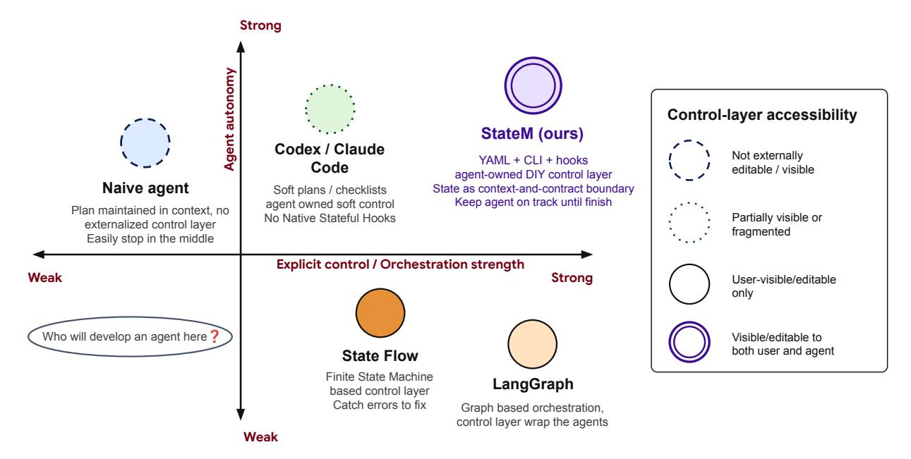
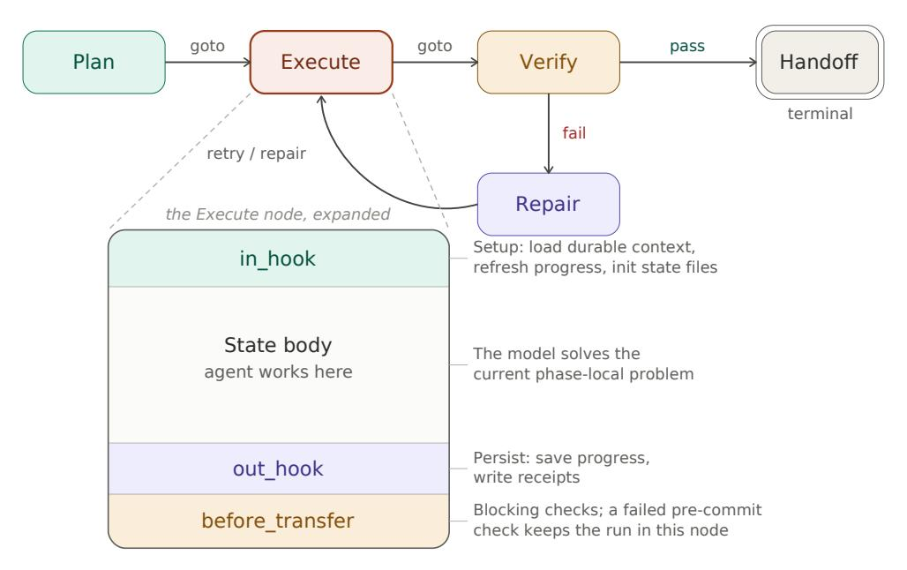
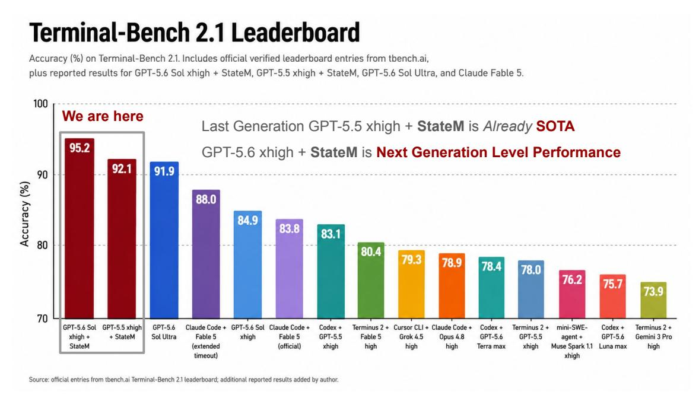
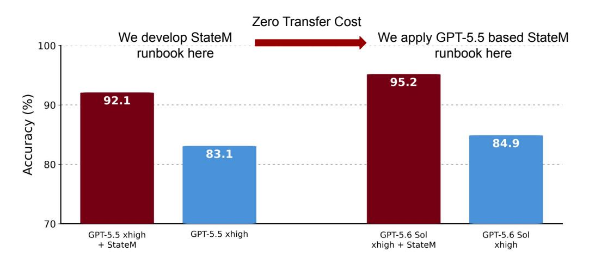
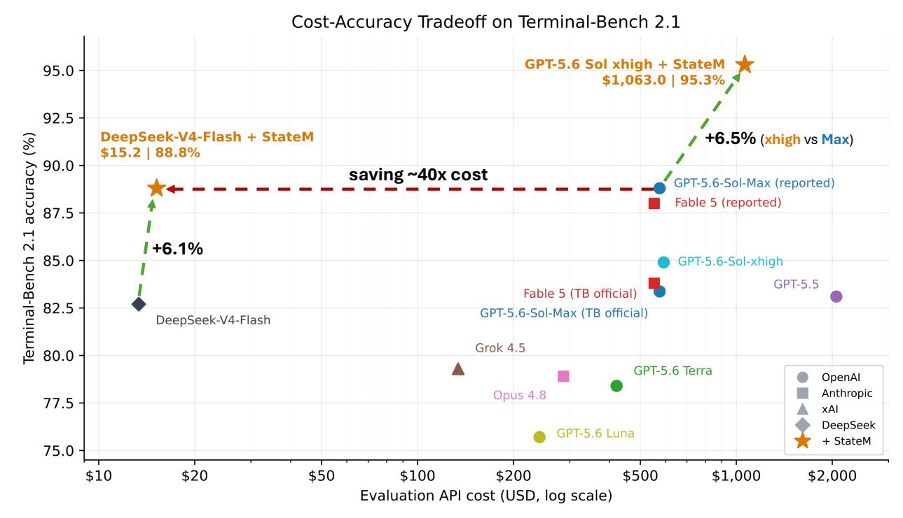
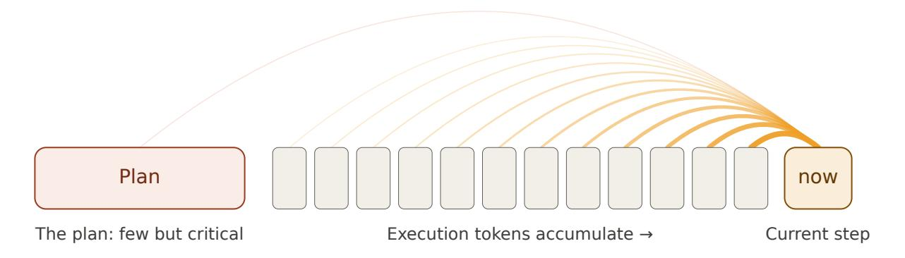
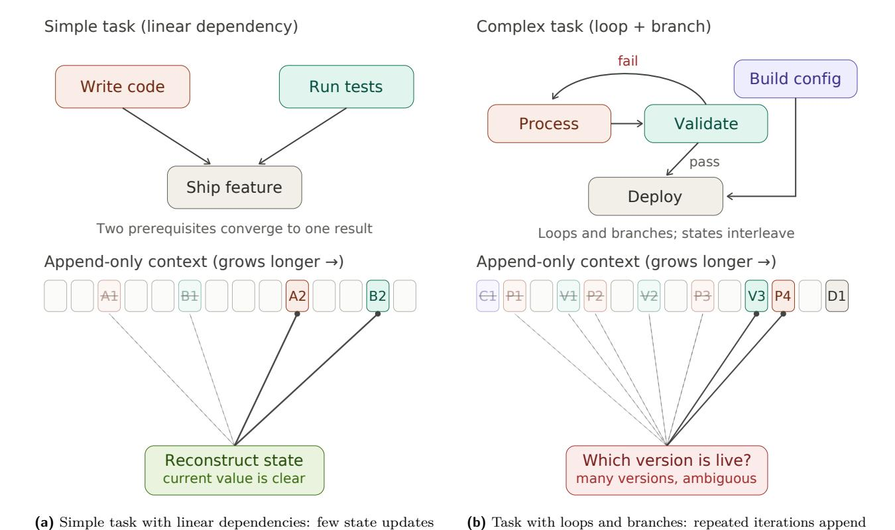

# StateM: 터미널-벤치 2.1에서 Harness Scaling을 통해 95.3% 원시 정확도 또는 15달러 프론티어 실행 달성 (StateM: Reaching 95.3% Raw Accuracy, or a $15 Frontier Run, on Terminal-Bench 2.1 via Harness Scaling)

- 원제: StateM: Reaching 95.3% Raw Accuracy, or a \$15 Frontier Run, on Terminal-Bench 2.1 via Harness Scaling
- 원문: [https://arxiv.org/abs/2608.15089](https://arxiv.org/abs/2608.15089)
- PDF: [https://arxiv.org/pdf/2608.15089v1](https://arxiv.org/pdf/2608.15089v1)
- arXiv ID: `2608.15089`

---

# **StateM: 터미널-벤치 2.1에서 Harness Scaling을 통해 95.3% 원시 정확도 또는 15달러 프론티어 실행 달성 (StateM: Reaching 95.3% Raw Accuracy, or a $15 Frontier Run, on Terminal-Bench 2.1 via Harness Scaling)**

Ziheng Qin Yaxin Lu Zhangyang "Atlas" Wang Kai Wang

Somewhere on the Earth [1](#page-0-0)

## **초록 (Abstract)**

긴 시간 범위 에이전트는 구성 요소 단계들을 해결할 수 있는 모델이라도 실패할 수 있다. 그들은 가변 상태를 추적하지 못하고, 이전 실행에서 배운 교훈을 재활성화하지 못하며, 알려진 절차를 건너뛰거나 조기에 중단할 수 있다. 우리는 모델 가중치를 변경하지 않고 에이전트 주변의 실행 시스템을 개선하기 위해 *harness scaling*에 베팅한다. 우리는 에이전트-네이티브 런타임인 StateM을 도입한다. StateM은 내구성 있는 상태, 단계별 로컬 컨텍스트, 검증된 전이, 복구 가능한 런북, 버전 관리된 절차적 관행을 중심으로 실행을 조직하며, 에이전트와 사용자가 함께 검토할 수 있다.

터미널-벤치 2.1에서 GPT-5.5 xhigh와 StateM을 사용하면 92.1% 정확도를 달성하며, 이는 83.1% 기준과 비교해 GPT-5.6 Sol Ultra(91.9%)를 능가한다. 동일한 런북은 수정 없이 GPT-5.6에 그대로 적용된다. GPT-5.6 Sol xhigh를 사용하면 시스템은 445개의 공개 제출 시도에서 **95.3% 원시 정확도**를 기록하고, 89개 작업 중 각각 최소 한 번은 성공한다. 동결 프로필은 GPT-5.6 Luna의 정확도를 76.7%에서 85.4%로 끌어올리며, 이는 84.9% Sol xhigh 기준보다 수치적으로 높다.

다음으로 동일한 런타임, 런북 구조, 골든 룰을 시작으로, DeepSeek-V4 Flash를 82.7%에서 88.1%로 올리는 데 $38 이하의 적응 비용이 든다. 이는 표준 타임아웃 하에서 전체 벤치마크에서의 결과이다. 공개된 88개 작업 공통 코어에서는 89.1%를 달성한다. 나머지 지연 민감 작업에 대해서만 타임아웃을 연장하면, 보고된 88.8% GPT-5.6 Sol max 결과와 일치하는 설명적인 전체 스위트 집계가 나온다. 완전한 DeepSeek 최종 점수 증거는 약 $15의 API 사용량이 소요되며, 이는 GPT 참조에서 보고된 $574.68와 대비된다. 기록된 모든 DeepSeek 적응 및 평가 API 지출은 $52.22이다.

BusinessBench에서는 동일한 하네스 개발 원칙을 사용해 별도 개발 세트에서 가족별 런북을 개발한다. 첫 번째 동결 보류 평가는 0.55 매크로와 1.34 마이크로 퍼센트 포인트의 소규모 집계 이득을 보였으며, 두 개의 메커니즘 일치 작업 가족은 10.04 포인트를 향상시켰다. 이러한 결과는 작업이 관련 실행 구조를 공유할 때 구체적인 런북 규칙이 일반화될 수 있음을 시사하며, 이러한 제어를 식별하고 시행하는 방법론은 보다 이질적인 워크플로우에서도 적용 가능하다. StateM은 선택된 일반화 가능한 사후 분석 결과를 지속적이고 실행 가능한 전제 조건 및 관행으로 변환한다. 이를 통해 에이전트가 알아야 할 것, 해야 할 일, 그리고 미래 실행에서 재활성화해야 할 학습된 관행을 명시적이고 시행 가능하게 만든다 — 모두 상태 기반 제어를 통해. 핵심 코드와 여러 런타임 사례는 [github.](https://github.com/henryqin1997/statem)에서 오픈소스로 제공된다.

## <span id="page-0-1"></span>**1 서론 (Introduction)**

긴 시간 범위 에이전트는 드러나는 방식으로 자주 실패한다: 기본 모델은 각 로컬 단계를 해결할 수 있는 것처럼 보이지만 전체 실행은 여전히 실패한다. 에이전트는 계획에서 벗어나 가변 작업 상태를 추적하지 못하고, 필요한 검사를 건너뛰며, 비생산적인 행동을 반복하거나, 요청된 산출물이 검증 가능하기 전에 중단한다.

<span id="page-0-0"></span><sup>1</sup>본 연구는 저자들의 *개인 시간*에 수행되었으며, 관련 기관의 견해를 반영하지 않는다. Ziheng과 Yaxin은 핵심 기여자(즉, 동등 첫 저자)이다.

완전한 [(Yao et al.,](#page-19-0) [2024;](#page-19-0) [Barres et al.,](#page-19-1) [2025;](#page-19-1) [Deng et al.,](#page-19-2) [2025;](#page-19-2) [Zhu et al.,](#page-20-0) [2026;](#page-20-0) [Liu et al.,](#page-19-3) [2026)](#page-19-3). 이러한 실패는 실제 워크플로우와 에이전트 벤치마크가 완성된 작업을 평가하기 때문이며, 모델이 대부분의 구성 단계 수행 방법을 알았는지 여부를 평가하지 않기 때문에 중요하다.

우리는 이러한 실패에 대한 지배적인 대응이 모델을 개선하는 것이라고 본다: 사전 학습을 확장하고, 사후 학습 데이터를 추가하고, 테스트 시점에서의 추론을 늘리거나 추가 에이전트를 도입한다. 우리는 반대 방향의 질문을 연구한다:

*실제로 보이는 모델 실패가 상태를 유지하고, 실행을 제약하며, 진행을 검증하고, 오류에서 복구하는 하네스(harness)의 실패인지 얼마나 되는가?*

우리는 이 주변 제어 층의 체계적인 개선을 *하네스 스케일링(harness scaling)*이라고 부른다. 하네스 스케일링은 모델 스케일링(model scaling)을 대체하지 않는다. 이는 모델의 기존 능력 중 더 많은 부분을 런타임을 개선함으로써 완성되고 신뢰할 수 있는 작업으로 전환할 수 있는지를 묻는다. 이는 세 단계로 점점 강력해지는 경험적 테스트를 이끈다: *첫째*, 더 나은 하네스가 가중치를 변경하지 않고 고정된 모델을 개선할 수 있는가? *둘째*, 한 모델로 개발된 하네스가 재조정 없이 새로운 모델에 전이될 수 있는가? *셋째*, 그 결과로 도출된 제어 원칙이 개발된 벤치마크를 넘어 성능을 향상시킬 수 있는가?

**왜 외부 제어인가?** 우리는 두 가지 설계 가설을 통해 하네스 스케일링을 동기화한다. 첫째, *컨트롤 신호 희석(control-signal dilution)*은 압축된 계획과 그 완료 기준이 점점 긴 명령, 관찰, 수리 기록으로 둘러싸일 때 발생할 수 있다. 둘째, *가변 상태 모호성(mutable-state ambiguity)*은 완료된 목표, 보류 중인 종속성, 실패한 시도, 그리고 유효한 다음 행동이 권위 있는 현재 상태가 아니라 부가만 가능한 기록에서 재구성되어야 할 때 발생할 수 있다. 우리는 이를 변환적 가설로 다루며, 변환자 주의에 대한 근본적 주장으로 보지 않는다. 두 가설 모두 절차적 상태를 외부화하고, 현재 단계와 관련된 제어 정보를 새로 고치며, 중요한 전환 전에 증거를 확인하도록 제안한다.

**제어 층 설계 공간**. 기존 시스템은 런타임 강제성(runtime enforceability)과 에이전트 자율성(agent autonomy) 사이의 트레이드오프를 드러낸다. 상태 기계(state-machine)와 그래프 기반 런타임(graph-based runtimes)은 명시적 워크플로우 상태, 지속성, 조건부 라우팅, 복구를 제공하지만, 보통 실행을 개발자 작성 컨트롤러(developer-authored controller) 주위에 조직한다. 범용 CLI 에이전트(CLI agents)는 더 넓은 추론 및 행동 공간을 보존하지만, 그들의 계획, 지시 파일, 메모리, 그리고 후크는 스스로 통합되고 전환 인식이 있는 제어 표면을 형성하지 않는다. 그림 [1](#page-2-0)은 이러한 전형적인 운영 포인트를 요약한다. 구분은 시스템이 상태를 갖고 있는지 여부가 아니라, 실행 중에 누가 상태를 갖는 제어 층을 검사하고, 수정하고, 운영할 수 있는가에 달린다.

보완적인 연구 라인은 훨씬 더 긴 시간 규모에서의 신뢰성을 연구한다. AgingBench는 가중치가 고정된 에이전트가 메모리가 압축되고, 검색되고, 수정되고, 유지되는 동안에도 변화하는 시스템임을 보여준다 [(Zhu et al.,](#page-20-0) [2026)](#page-20-0). 그들의 타입드-상태(typed-state) 및 런타임 제어(runtime-control) 개입은 일부 장기적 실패가 추가 텍스트 컨텍스트만으로는 아니라 명시적 상태를 필요로 함을 추가로 시사한다. 관련 연구와 본 기여의 정확한 경계는 섹션 [2.](#page-4-0)에서 논의된다.

**StateM: 에이전트-네이티브 제어 층**. 우리는 장시간 실행되는 CLI 에이전트를 위한 경량 런타임인 StateM을 소개한다. 그 제어 층은 상태, 유효 전환, 상태별 지시, 후크, 검사, 복구 규칙을 포함하는 인간이 읽을 수 있는 YAML 런북(runbook) 형태를 취한다. 일반적인 명령줄 작업을 통해 에이전트는 현재 상태를 검사하고, 전환을 요청하며, 실패 조건을 검토하고, 실행 기록을 살펴보고, 중단 후 복구하고, 허용된 런북 아티팩트를 업데이트할 수 있다. 인간 감독자는 동일한 런북을 검사하고, 편집하고, 버전 관리하고, 감사를 수행할 수 있다.

StateM은 두 가지 원칙을 따른다.  
첫째, 각 상태는 *문맥 및 계약 경계*이다.  
상태에 진입하면 해당 단계에 대한 활성 지침과 지속적인 작업 정보가 새로 고쳐진다.  
상태를 떠날 때는 에이전트가 명시된 종료 조건을 충족해야 한다.  
호스트 런타임은 실행 가능한 조건을 직접 평가할 수 있다.  
의미적 판단이 필요한 조건은 감사 가능한 증언으로 기록되며 추가 검토나 수리를 유발할 수 있다.  
이 구분은 에이전트의 완료 선언이 독립적인 검증을 구성하지 않기 때문에 중요하다.  
둘째, 에이전트와 사용자는 제어 계층을 *공유*한다.  
에이전트는 주 실행자 역할을 유지하고 통합된 추론 루프를 보유하지만, 그 진행 상황은 호스트 런타임이 시행할 수 있고 사용자가 수정할 수 있는 제어 표면을 통해 노출된다.  
StateM은 특정 의미에서 에이전트-네이티브이다: 에이전트는 작업을 수행할 때 사용하는 동일한 CLI 액션 공간을 통해 제어 계층을 운영한다.  
런타임은 모델 수정, 미세 조정, 또는 모델 내부 접근을 필요로 하지 않는다.

StateM은 한 시스템에서 일반적으로 제공되지 않는 세 가지 속성을 결합한다:

# **장기 수평 에이전트를 위한 제어 계층 설계 공간 (Design space of control layers for long-horizon agents)**

<span id="page-2-0"></span>

**Figure 1 에이전트 제어 계층의 개념적 설계 공간.** 수직 축은 *runtime enforceability*를 나타낸다: 런타임이 권위 있는 실행 상태를 유지하고, 유효한 전이를 제한하며, 불완전한 인계를 차단할 수 있는 정도. 수평 축은 *agent autonomy*를 나타낸다: 주요 에이전트가 도구를 선택하고, 절차를 수정하며, 광범위한 동작 공간에서 운영할 수 있는 자율성. 마커 스타일은 제어 아티팩트가 주로 개발자 소유인지, 에이전트 편집 가능인지, 또는 에이전트와 사용자에 의해 공동 편집 가능한지를 나타낸다. 위치는 건축적 한계나 경험적 성능 순위가 아니라 일반적인 운영 추상화를 나타낸다. StateM은 광범위한 에이전트 자율성과 명시적, 강제 가능한 상태 전이를 결합한 공유 런북을 통해 상단-오른쪽 영역을 목표로 한다. AgingBench 및 자동 하네스 적응을 포함한 평가 및 하네스 최적화 방법은 본문에서 논의되지만, 다른 차원에서 작동하기 때문에 플롯에 포함되지 않는다.

- 1. 상태 경계는 새로 고친 제어 컨텍스트와 명시적 전이 계약을 모두 제공한다;  
- 2. 범용 에이전트는 노드-로컬 모델 호출의 고정된 모음으로 분해되는 대신 주요 실행자 역할을 유지한다; 그리고  
- 3. 런북은 에이전트와 사용자가 동일한 실행 환경을 통해 검사, 감사, 수정할 수 있는 공유 기계 조작 가능한 아티팩트이다.

이 표현은 하네스 자체를 최적화할 수 있게 한다. 실행 후, 실패는 문맥 누락, 무효 전이, 약한 검사, 조기 인계, 비효과적인 복구, 또는 기타 제어 계층 결함으로 분류될 수 있다. 작업 에이전트 또는 별도의 하이퍼 에이전트는 이후 상태 경계, 프롬프트, 후크, 검사, 복구 규칙, 실행 조건에 대한 변경을 제안할 수 있다. 후보 변경은 검토되고 회귀 테스트를 거쳐 새로운 런북 버전에 통합된다. 모델 가중치는 변하지 않으며, 선택된 절차적 지식은 외부 제어 계층에 축적된다.

이 과정은 단일 실행이 아니라 실행 간에 발생하는 실패 모드를 다룬다. 에이전트는 실패를 올바르게 진단할 수 있지만 동일한 위험이 재발할 때 그 결과로 얻은 교훈을 보존하거나 호출하지 못한다. 우리는 이를 *procedural-memory gap*이라고 부른다. 이는 의사결정 시점에 관련 지식이나 적절한 방법이 없을 때 발생하는 *epistemic gap*과, 올바른 절차가 활성화되었지만 에이전트가 완전히 따르지 않거나 불완전하게 수행되는 *procedural-compliance gap*을 보완한다. 상태‑로컬 컨텍스트, 버전화된 관행, 검증된 전환은 각각 이 세 가지 격차를 목표로 한다. 상태는 현재 실행의 위치를 기록한다. 절차적 메모리는 이전 실행이 그 시점에서 시스템에게 무엇을 하도록 가르쳤는지를 기록한다.

우리는 이 결과를 *failure-driven harness optimization*이라고 부른다. 이는 더 강력하거나 자동으로 적응된 하네스를 통해 소형 모델을 개선하는 최근 연구와 관련이 있다 [(Yang et al.,](#page-19-6) [2026)](#page-19-6). StateM은 기계가 조작 가능하고 에이전트가 친숙한 런북 표현에 초점을 맞춘다. 우리는 이 표현을 사용해 모델 버전, 공급자, 작업군 간에 절차적 제어의 어느 계층이 전이되는지 연구한다.

**결과 및 범위.** 우리는 실험을 두 가지 상호 보완적인 프런티어를 중심으로 구성한다. 이는 Fig. [5.](#page-13-0)에 요약된다. 품질 프런티어에서, GPT-5.5 xhigh와 StateM을 사용하면 Terminal-Bench 2.1에서 92.1% 정확도를 달성한다. 이는 83.1% GPT-5.5 기준과 비교된다. 다섯 번의 시도에서 시스템은 89개 작업 중 88개를 최소 한 번씩 해결한다. 92.1% 평균은 91.9% 차세대 기준과 수치적으로도 가깝다. 이 비교는 관찰된 시스템 수준 하네스 이득이 모델 세대 업그레이드와 유사할 수 있음을 보여준다. 우리는 이후 GPT-5.5로 개발된 런북을 고정하고 제어 로직을 변경하지 않고 GPT-5.6에 적용한다. GPT-5.6 Sol xhigh와 함께, 결합된 시스템은 공개 Terminal-Bench 2.1 제출에서 95.28% 원시 정확도를 기록한다. 이 결과는 445 중 424개의 성공적인 시도에 해당하며, 모든 작업에서 최소 한 번은 성공한다.[1](#page-3-0) 고정된 런북은 또한 GPT-5.6 Luna를 76.7%에서 85.4%로 끌어올려 8.7%의 이득을 보인다. 이 결과는 수치적으로 84.9% Sol xhigh 기준을 상회한다.

비용 프론티어는 전송 경계가 있다. 같은 런타임, 고수준 런북 구조, 황금 규칙을 시작으로, DeepSeek API 사용 비용이 \$38 미만이면 구체적인 실천 방식을 적용하는 데 충분하다. 적용된 시스템은 표준 타임아웃 하에서 전체 89개 과제 벤치마크에서 392*/*445 = 88*.*09%를 달성한다. 공개된 88개 과제 공통 코어(지연 민감한 gpt2-codegolf 과제를 제외한)에서 392*/*440 = 89*.*09%를 달성한다. 해당 과제에 대해서만 타임아웃을 연장하면 보고된 88.8% GPT-5.6 Sol max 결과를 초과하는 서술적 전체 스위트 집계가 나온다. 완전한 DeepSeek 최종 점수 증거는 실제 API 비용으로 약 \$15이 들며, 이는 GPT-5.6 Sol max 기준으로 보고된 \$574.68와 비교된다. 프로파일 적응 및 최종 평가 전반에 걸친 모든 기록된 DeepSeek API 지출은 \$52.22이다. 이 금액은 각각 약 38*.*9× 및 11*.*0× 낮다.

우리는 또한 Codex와 GPT-5.6 Luna를 사용하여 BusinessBench [(Yang et al.,](#page-19-6) [2026)](#page-19-6)에서 작업 측면 일반화를 평가한다. 데이터셋은 7개 작업군에 걸쳐 477개의 적격 인스턴스를 포함한다. 이 중 6개 작업군에 걸쳐 405개의 인스턴스가 StateM 개입을 받는다. 첫 번째 고정된 일회성 평가에서, 보류된 성능은 동일-가족 매크로 평균에서 84.67%에서 85.22%로, 인스턴스 가중 마이크로 평균에서 84.44%에서 85.78%로 변한다. 개발 성능은 86.07%에서 91.71%로 향상되며, 모든 개입 인스턴스에 대한 성능은 84.76%에서 88.72%로 개선된다. 예비적인 두 작업군 슬라이스(예산 승인 및 기계 운영)를 포함한 경우 성능은 71.91%에서 81.94%로 향상된다. 이 패턴은 제어 프로필이 특정 실행 경계와 일치할 때 가장 큰 이득이 발생함을 시사한다.

#### **Contributions.**

This work makes five contributions:

- 우리는 *harness scaling* (하네스 스케일링)을 모델 스케일링을 보완하는 역량 축으로 공식화한다. 우리는 모델 내부 개선, 고정된 세대 간 전이, 적응된 공급자 간 전이, 그리고 보류된 작업 일반화를 별개의 실증 테스트로 구분한다.
- 우리는 StateM을 도입한다. 이는 내구성 있는 상태가 갱신된 제어 컨텍스트와 명시적 전이 계약을 제공하면서 일반 목적 CLI 에이전트의 통합 추론 루프를 보존하는 에이전트-네이티브 런타임이다.
- 우리는 실행 실패의 세 가지 원천을 실현한다: 인지적 격차, 실행 간 절차 메모리 격차, 그리고 실행 내 절차 준수 격차. 상태-로컬 컨텍스트, 버전 관리된 관행, 그리고 검증된 전이가 해당 제어 지점을 제공한다.
- 우리는 선택된 실행 실패를 프롬프트, 후크, 검사, 복구 규칙, 상태 경계, 그리고 관행 활성화 조건에 대한 버전 관리된 변경으로 변환하는 실패 주도 최적화 루프를 개발한다. 이 과정은 절차적 지식이 모델 가중치 외부에서 축적될 수 있게 한다.
- 우리는 GPT-5.5, 두 개의 GPT-5.6 변형, DeepSeek-V4 Flash, Terminal-Bench 2.1, 그리고 BusinessBench에서 시스템을 평가한다. 평가 항목은 원점수 판정 민감도, 고정 및 적응 전이, 작업 수준 회귀, 실제 API 지출, 그리고 벤치마크 적응의 명시적 공개를 포함한다.

**2026년 8월 11일 현재 평가 상태.**  
95.28% 수치는 PR #142에서 Terminal-Bench 2.1 제출 파이프라인에 의해 계산된 원시, 사전 심사 전 정확도입니다: https://github*.*[com/harbor-framework/terminal-bench-2-1/pull/142](https://github.com/harbor-framework/terminal-bench-2-1/pull/142).  
제출은 작업 요약, 표준 런타임 설정, 시도 범위, 그리고 궤적 가용성을 포함한 10개의 자동화된 검사를 통과했습니다.  
PR은 아직 열려 있으며 리더보드에 병합되지 않았습니다.  
우리는 리뷰 중에 확인된 보상된 네 개의 궤적이 계산에 포함되지 않아야 한다는 데 동의합니다.  
이 시도들을 0점으로 평가하면 420*/*445 = 94*.*38%가 됩니다.  
현재 보상 해킹 가능성이 표시된 아홉 개의 궤적을 모두 0점으로 평가하면 415*/*445 = 93*.*26%가 됩니다.  
따라서 우리는 95.28%를 원시 공개 제출 점수로만 보고합니다.  
제출 파이프라인은 11억 7800만 토큰과 \\$1,062.95의 모델 비용을 보고합니다.  
5회 시도 작업 범위는 단일 실행 신뢰도를 측정하지 않습니다.

결과는 모델 스케일링이 중요성을 잃었거나 정적 런북이 모든 모델, 작업, 벤치마크를 지배할 수 있다는 것을 시사하지 않습니다. 대신 우리는 런타임 의미론과 하네스 개발 원칙이 광범위하게 전이될 수 있으며, 구체적인 관행은 지역적으로 전이되거나 저렴한 적응을 필요로 한다고 주장합니다. 모델 능력과 실행 신뢰도는 시스템 성능에 별도의 기여를 합니다. 본 연구에서 조사된 설정에서는 **모델이 (주요) 병목 현상이 아닌 것처럼 보입니다**.

## 2 Related Work (Related Work)

StateM은 장기 계획, 상태 기반 에이전트 오케스트레이션, 장기간 에이전트 메모리, 자동화된 하네스 적응이라는 네 가지 작업 영역을 교차한다. 그 혁신성은 단일 구성 요소에 국한되지 않는다. 오히려 에이전트 고유의, 공동 편집 가능한 실행 표현을 통해 이들의 결합에 있다.

**계획 및 장기 에이전트 실행.** 계획은 장기 복잡성에 대한 표준 대응이다: 에이전트는 먼저 작업을 분해하고, 그 결과 절차를 실행한다. 그럼에도 불구하고 현재 에이전트는 자주 계획에서 벗어나거나 필요한 단계를 생략하거나 원래의 완료 기준을 충족하지 못하고 종료한다 [(Liu et al.,](#page-19-3) [2026)](#page-19-3). 자연어로만 표현된 계획은 실행 시점에 진행 상황을 유지하고 필요한 조건이 충족되었는지 확인하지 않는 한 조언에 그친다.

동시에, 더 강력한 오케스트레이션이 항상 유익한 것은 아니다. 절차를 여러 개의 별도 프롬프트 노드로 분해하면 추론이 단편화되고 라우팅 오류가 발생할 수 있다. 최근 증거는 전체 절차를 문맥에 제공받은 강력한 모델이 동일 절차의 보다 무거운 오케스트레이션 버전을 능가하는 설정을 찾았다 [(Dennis et al.,](#page-19-7) [2026)](#page-19-7). StateM은 이 긴장감에서 동기를 얻는다. 그것은 주요 에이전트를 좁은 범위의 모델 호출 시퀀스로 분해하지 않고 더 강력한 실행 제어를 추구한다.

**상태 기반 및 그래프 기반 오케스트레이션.** 유한 상태 워크플로우와 그래프 기반 에이전트 런타임은 이미 중요한 제어 메커니즘을 제공한다. StateFlow는 명시적 상태와 전이를 통해 문제 해결을 나타내며, 상태 기반 실행이 작업 기반화와 실패 복구를 향상시킬 수 있음을 보여준다 [(Wu](#page-19-4) [et al.,](#page-19-4) [2024)](#page-19-4). LangGraph 및 관련 내구성 워크플로우 시스템은 지속적인 상태, 조건부 엣지, 체크포인팅, 중단, 인간-인-루프 복구를 제공한다 [(Wang and Duan,](#page-19-5) [2024)](#page-19-5). StateM은 이러한 기능을 도입했다고 주장하지 않는다.

차이점은 기본 실행 추상화에 있다. 전통적인 컨트롤러 주도 그래프에서는 개발자가 워크플로우를 지정하고 노드 내에서 모델이나 에이전트를 호출한다. 그래프는 매우 유연할 수 있지만, 주요 제어 아티팩트는 실행 중인 에이전트 외부에 남아 있다. StateM은 대신 일반 목적 CLI 에이전트를 주요 실행자로 유지하고, 제어 계층을 일반 도구 환경 내에 노출한다. 에이전트는 현재 상태를 검사하고, 전이를 요청하며, 실패 조건을 검토하고, 허용된 런북 변경을 제안할 수 있다. 이는 정상적인 행동 공간을 벗어나지 않는다.

이 구분은 아키텍처 간의 엄격한 분리를 의미해서는 안 된다. 그래프 런타임은 고도로 자율적인 에이전트를 호스팅할 수 있고, StateM 런북은 내구성 워크플로우 엔진 위에 구현될 수 있다. Figure [1](#page-2-0)은 강력한 기능 경계라기보다 일반적인 설계 선택을 설명한다. StateM의 구체적 기여는 상태 경계가 갱신된 제어 컨텍스트이자 감사 가능한 전이 계약인 경량 에이전트 지향 제어 표현이다.

**CLI 에이전트, 부드러운 계획, 그리고 사용자 제어.** Codex와 Claude Code와 같은 범용 CLI 에이전트는 도구 선택, 파일 조작, 코드 실행, 반복적 문제 해결에 대한 광범위한 자율성을 유지한다. 또한 계획 프롬프트, TODO 리스트, 규칙 파일, 메모리 파일, 호스트 측 후크 등 유용한 제어 조각을 노출한다. 이러한 메커니즘은 에이전트를 매우 적응 가능하게 만들지만, 반드시 하나의 권위 있는 실행 상태를 확립하는 것은 아니다. 계획과 체크리스트는 보통 부드러운 자연어 산출물이며, 후크는 일반적으로 도구나 수명 주기 이벤트에 부착되고 의미 있는 전이와는 거리가 있다.

StateM은 이러한 조각들을 현재 상태, 유효 전이, 상태별 지침, 검사, 후크, 복구 규칙 및 실행 기록을 포함하는 공유 런북으로 정리한다. 따라서 사용자는 상호작용 기록에 자연어 수정을 추가하는 대신 에이전트와 런타임이 운영하는 동일한 제어 아티팩트를 편집함으로써 개입할 수 있다. 이러한 공유 소유권이 Figure [1.](#page-2-0)에서 제시된 세 번째 시각적 인코딩의 주요 구분점이다.

**장기 실행 에이전트와 에이전트 노화**. 한 작업 내에서의 장기 실행은 관련이 있지만, 구별된다.

다수 세션에 걸친 신뢰성에서와 같이. AgingBench는 배포된 에이전트를 시간에 따라 진화하는 시스템으로 정의하며, 모델 가중치가 고정되어 있어도 효과적인 행동이 변할 수 있다 [(Zhu et al.,](#page-20-0) [2026)](#page-20-0). 이는 네 가지 장기적 실패 메커니즘을 식별한다: 압축 노화, 간섭 노화, 개정 노화, 그리고 유지보수 노화. 또한 시간 종속성 그래프와 반사실적 진단 프로브를 통해 실패를 작성, 검색, 활용, 수명 주기 처리로 구체화한다.

AgingBench는 두 가지 측면에서 StateM과 특히 관련이 있다. 첫째, 개정 노화 결과는 추가 텍스트 메모리가 제공되더라도 가변 또는 파생 상태가 실패할 수 있음을 보여 주어 명시적 상태 표현의 필요성을 뒷받침한다. 둘째, AgingBench는 타입-상태 오버레이와 임계값 트리거 런타임 컨트롤러를 목표 지향적 개입으로 연구한다. 이러한 결과는 진단을 런타임 제어와 연결하지만, StateM과는 다른 수준에서 이루어진다. AgingBench 개입은 선택된 메모리 변수를 유지하거나 세션 간 메모리 정책 변화를 활성화한다. StateM은 개방형 에이전트 작업 내에서 단계, 전이, 증거, 검사, 복구를 표현하는 일반적인 절차적 런타임을 제공한다.

따라서 두 접근 방식은 상호 보완적이다. AgingBench는 운영 수명 동안 신뢰성이 어떻게 변하는지, 어떤 메커니즘이 악화되는지, 수리가 어디에 집중되어야 하는지를 묻는다. StateM은 에이전트가 장기 작업을 수행하면서 현재 절차적 상태를 어떻게 표현하고 집행해야 하는지를 묻는다. 수명 진단과 StateM 런북 적응을 결합하는 것은 미래 연구의 자연스러운 방향이지만, StateM 자체만으로는 압축, 검색, 또는 유지보수 노화를 해결하지 못한다.

**하네스 적응 및 자기 개선**. 증가하는 연구 집단은 에이전트 성능이 런타임 하네스에 크게 의존하며, 하네스 자체가 최적화될 수 있음을 보여준다. Agentic Harness Engineering은 실행 관찰성을 활용해 코딩-에이전트 도구, 미들웨어, 프롬프트, 메모리를 궤적 피드백에서 진화시킨다 [(Lin et al.,](#page-19-8) [2026;](#page-19-8) [Gu,](#page-19-9) [2026)](#page-19-9). Life‑Harness는 반복되는 실패를 환경 계약, 절차적 기술, 행동 실현, 궤적 조절에 대한 재사용 가능한 개입으로 변환한 뒤, 결과 하네스를 보류 평가용으로 고정한다 [(Xu et al.,](#page-19-10) [2026)](#page-19-10). Self‑Harness는 에이전트가 약점을 발굴하고 하네스 수정을 제안하며, 회귀 인식 검증을 통해 이를 촉진한다 [(Zhang et al.,](#page-20-1) [2026)](#page-20-1). Better Harnesses, Smaller Models는 자동 하네스 적응을 통해 저비용 모델이 대형 모델의 성능을 상당 부분 회복할 수 있는 방법을 연구한다 [(Yang et al.,](#page-19-6) [2026)](#page-19-6).

이 연구들은 두 가지 점을 명확히 제시한다. 첫째, 모델 정체성만으로는 에이전트 시스템을 충분히 설명할 수 없다. 둘째, 하네스 적응이나 교차 모델 하네스 전송은 단독으로는 새로운 주장이라 할 수 없다. StateM은 주로 최적화되고 운영되는 아티팩트가 다르다. 그 하네스는 상태, 전이 조건, 후크, 수리 경로, 그리고 이력이 실행 중인 에이전트와 인간 감독자에게 직접적으로 제공되는 명시적 상태 기계 런북이다. 같은 표현은 런타임 제어, 감사 표면, 그리고 실패 기반 개선을 위한 탐색 공간이라는 세 가지 역할을 수행한다.

따라서 StateM은 하이퍼-에이전트 루프에서 이전 하네스 진화 방법과 가장 가깝지만, 그 핵심 기여는 이 루프가 수정하는 실행 기초다. 프롬프트 전용 최적화와 달리 StateM은 전이 시점 검증, 복구 동작, 그리고 상태-내부 컨텍스트를 변경할 수 있다. 완전히 외부에 있는 워크플로우 그래프와 달리, 생성된 런북은 기본 에이전트의 일반 도구 환경 안에 남아 있다. 장기 진단 벤치마크와 달리, 이는 실행 중인 절차적 실행에 직접적으로 작용한다.

**StateM의 위치 지정**. 그림 [1](#page-2-0)의 사분면은 결과적인 설계 주장을 요약한다. 부드러운 계획과 전통적인 CLI 제어 조각은 자율성을 보존하지만 전이 수준의 집행은 제한적이다. 개발자 작성 워크플로우 그래프는 강력한 제어를 제공하지만 일반적으로 에이전트를 외부에서 지정한 실행 구조 안에 배치한다. StateM은 광범위한 에이전트 자율성, 집행 가능한 상태 전이, 그리고 에이전트와 사용자 모두가 공동으로 볼 수 있고 편집할 수 있는 제어 아티팩트의 덜 탐색된 조합을 목표로 한다. 이 위치 지정은 사분면의 어느 한 점이 보편적으로 우수하다는 것을 의미하지 않는다. 안정적이고 반복적인 워크플로우는 고정 그래프가 가장 적합할 수 있으며, 짧거나 탐색적인 작업은 지시 파일 이상의 제어가 거의 필요하지 않을 수 있다. StateM은 중간 영역을 위한 것으로, 일반 목적 에이전트가 필요할 만큼 개방적이면서도 부드러운 계획과 자가 선언적 완료가 부족할 만큼 길고 중대한 작업을 대상으로 한다.

## **3 StateM: 장기 실행을 위한 에이전트-네이티브 제어 (3 StateM: Agent-Native Control for Long-Horizon Execution)**

섹션 [1](#page-0-1)은 장기 실행에서 두 가지 운영 압력을 확인했다: 계획이 운반하는 제어 신호는 추적이 커질수록 약해질 수 있고, 현재 작업 상태는 그때 필요할 때 모호해질 수 있다.



**그림 2 StateM 제어 표면**. 런북은 거친 단계(상단) 위에서 방향이 지정된 상태 기계이다. 각 goto는 검증되고 기록된 전이 프로토콜을 따르며, 검증 실패는 구성된 수리 상태를 통해 실행을 라우팅할 수 있고, 성공적인 완료는 단지 종단 상태에서만 기록된다. 노드를 확장(하단)하면 그 단계-지역 구조가 드러난다: 설정 및 컨텍스트 로딩용 in_hook, 모델이 개방형 작업을 수행하는 상태 본문, 지속성을 위한 out_hook, 그리고 전이 커밋 전에 통과해야 하는 검사를 포함하는 before_transfer 블록.

append-only 이력에서 재구성된다. 섹션 [2](#page-4-0)은 런타임 집행 가능성과 에이전트 자율성 사이의 설계 긴장을 추가로 확인했다. StateM은 단계 내에서 광범위한 에이전트 재량을 보존하면서 단계 간 진행을 명시적이고 지속적이며 검증 가능하도록 만들어 이 긴장을 해결한다.

이 설계는 네 가지 요구 사항을 갖는다. 첫째, 제어 계층은 에이전트를 미세 행동 시퀀스로 분해하지 않고 작업의 거친 단계들을 나타내야 한다. 둘째, 단계가 시작될 때 단계 관련 지침과 지속 가능한 진행 상황을 갱신해야 한다. 셋째, 미완성 작업, 검증 실패, 또는 외부 차단자가 인수 이전을 방해할 수 있는 명시적 제어 지점을 제공해야 한다. 마지막으로, 이 제어는 에이전트가 직접 조작할 수 있고 사용자에게 공유 작업 공간을 통해 감사할 수 있어야 한다.

StateM은 YAML로 구성된 상태 머신 런타임과 명령줄 인터페이스를 통해 이러한 요구 사항을 구현한다. 버전이 관리되는 *runbook*은 상태, 전이, 프롬프트, 후크, 조건 및 검사를 정의한다. 에이전트는 일반 CLI 명령을 통해 이 *runbook*을 실행하며, 런타임은 모델 컨텍스트 외부에서 실행 상태를 유지한다. 따라서 제어 계층은 상호작용 기록에서 외부화되지만 에이전트와 사용자 모두에게 숨겨지지 않는다.

### **3.1 런타임 및 제어 프로필 (Runtime and Control Profile)**

StateM은 혼동해서는 안 되는 두 개의 계층을 구분한다. *runtime*은 상태 지속, 전이 검증, 후크 실행, 기록, 복구를 위한 일반적인 메커니즘을 제공한다. *control profile*은 runbook으로 표현되며, 특정 작업 클래스에 사용되는 단계, 지침, 검사 및 수리 정책을 명시한다.

이 구분은 실험을 해석하는 데 중요하다. StateM 런타임은 에이전트와 워크플로우 전반에 재사용 가능하도록 설계되었지만, runbook의 내용은 워크플로우 특이적이거나 경험에서 파생된 절차적 지식을 인코딩할 수 있다. 특히 Section [4](#page-9-0)의 Terminal-Bench 결과는 결합된 런타임과 진화된, 벤치마크에 적응된 제어 프로필을 평가한다. 이는 상태 머신 추상화의 효과만을 고립시킨 것으로 해석되어서는 안 된다.

기본 *runbook*은 정적이며 공유 가능하고 버전 관리가 가능한 아티팩트이다. 여러 에이전트와 실행이 다음을 사용할 수 있다

같은 *runbook*을 사용하면서 각 실행은 별도의 가변 런타임 상태를 유지한다. *runbook*은 버전 간에 업데이트될 수 있으며, 실행 중 허용된 run-local 추가 사항은 기록될 수 있지만 이러한 변경은 기본 런타임과는 별개로 남는다.

### **3.2 상태를 컨텍스트 및 계약 경계로 (States as Context-and-Contract Boundaries)**

StateM의 핵심 추상화는 *phase-level state*이다. 상태는 단일 모델 호출이나 도구 동작이 아니라 의미 있는 작업 단계이다. 예를 들어, 코딩 *runbook*은 계획, 구현, 작업 계약 검사, 자기 검토, 수리, 인수인계 등의 상태를 포함할 수 있다. 에이전트는 각 상태 내에서 자유롭게 추론하고 도구를 호출하며 파일을 편집하고 반복할 수 있다.

상태는 먼저 *context boundary* 역할을 한다. 에이전트가 상태에 진입하면 StateM은 현재 단계, 유효한 외부 전이, 상태별 지침, 그리고 관련 지속 가능한 진행 상황을 노출한다. in_hook은 설정된 진입 절차를 수행한다. 프롬프트를 주입하거나 설정 코드를 실행하거나 상태별 파일을 초기화하거나 압축된 진행 기록을 로드할 수 있다. 이는 에이전트가 이전 터미널 트레이스로부터 현재 단계와 미결 의무를 완전히 추론할 필요 없이 새로운 제어 앵커를 만든다.

이 메커니즘은 모델의 이전 컨텍스트를 지우거나 무손실 압축을 보장하지 않는다. 대신 권위 있는 단계와 그 지역 의무를 명시적이고 최신 상태로 만든다. 필요한 정보가 *runbook*에 제공될 때 누락된 컨텍스트 문제를 수리할 수 있지만, 모델이나 접근 가능한 환경이 보유하지 않은 작업 지식을 제공할 수는 없다.

상태는 또한 *contract boundary* 역할을 한다. 상태 프롬프트는 단계 내에서 기대되는 작업을 설명하고, 종료 후크와 검사는 그 단계에서 벗어날 조건을 명시한다. out_hook은 진행 상황을 저장하거나 영수증을 업데이트하거나 다음 단계에 필요한 산출물을 준비할 수 있다. before_transfer 블록은 StateM이 전이를 수행하기 전에 설정된 종료 조건을 평가한다.

StateM은 증거 강도에 따라 여러 유형의 검사를 지원한다:

- 명령과 술어 검사는 호스트에 의해 평가되며, 명령이나 술어의 정확성에 따라 독립적으로 재현 가능한 증거를 제공할 수 있다;
- 수동 검사는 명시적인 사용자 또는 운영자 결정을 필요로 한다;
- 체크리스트 및 메시지 검사는 에이전트가 지정된 의무를 인정하도록 요구하지만, 구조화된 자기 선언 형태로 남는다; 그리고
- llm_review 검사는 별도의 의미적 판단을 추가하지만, 결정론적 검증을 구성하지 않는다.

이 구분은 영수증이나 모델 선언이 구조화된 필드에 나타난다고 해서 단순히 증거로 취급되는 것을 방지한다. StateM은 이러한 주장을 가시화하고 감사 가능하게 만들며, 그 신뢰성은 여전히 이를 생성하고 검증한 메커니즘에 달려 있다.

함께, 상태 진입과 상태 종료는 서로 다른 실패 모드를 다룬다. 진입 훅은 단계별 제어 신호를 새로고침하고 지속 가능한 진행을 가능하게 한다. 종료 검사는 소비자 명령 실행, 테스트 수행, 증거 기록, 승인 획득, 영수증 업데이트 등 절차적 요구사항에 대한 개입 지점을 만든다. 실패한 검사는 이후 단계로 조용히 전파되는 대신 가시적으로 남는다.

### **3.3 런북, 엣지 및 전환 검증 (Runbooks, Edges, and Transition Verification)**

형식적으로, 런북은 정의한다

$$\mathcal{B} = (\mathcal{S}, s_0, \mathcal{S}_T, \mathcal{E}, \Phi),$$

여기서 𝑆는 단계 수준 상태 집합을, <sup>0</sup>은 초기 상태를, ⊆는 종료 상태 집합을, ℰ ⊆ ×는 허용된 전이 집합을 나타낸다. 상태 사양 Φ()는 단계별 프롬프트, 진입 및 종료 훅, 전이 검증, 그리고 상태별 아티팩트에 대한 참조를 포함한다. 완전한 예시는 부록 [A.](#page-20-2)에 나타난다.

엣지는 추가적으로 가드나 전이 훅을 포함할 수 있다. 이러한 엣지 수준 조건은 검사 결과, 영수증, 이전 실패, 외부 준비 상태, 사용자 차단 상태 등 정보를 사용해 유효한 다음 상태를 선택한다. 예를 들어, 검증 후 런북은 테스트가 실패하면 수리로 라우팅하고, 충분한 증거가 기록되면 인수로, 외부 서비스나 인간 승인이 필요하면 대기하도록 라우팅할 수 있다. 수리 라우팅은 그래프에 명시적으로 표시되며, 에이전트가 기억해야 할 암묵적 지시가 아니다.

모든 단계 전환은 핵심 연산 goto를 사용한다. 에이전트가 goto TARGET을 요청하면, StateM은 순차 전이 프로토콜을 실행한다:

- 1. 현재 상태에서 TARGET으로 가는 요청된 엣지가 존재하는지 확인한다;
- 2. 현재 상태의 before_transfer 검증을 평가한다;
- 3. 현재 상태에 구성된 지속성 또는 out_hook 연산을 실행한다;
- 4. 엣지 가드와 엣지별 전이 훅을 평가한다;
- 5. 모든 필수 사전 커밋 단계가 성공하면 타깃 상태를 커밋하고 전이 이벤트를 기록에 추가한다; 그리고
- 6. 타깃 상태 진입을 생성하고 그 in_hook을 실행한다.

필수 사전 커밋 검증이나 훅이 실패하면, 실행은 소스 상태에 머무르며 실패를 기록한다. 이를 통해 에이전트는 충족되지 않은 조건을 검사하고, 근본적인 문제를 수리하며 재시도할 수 있다. 전이가 성공하면, StateM은 새로운 상태 진입 기록을 만들고 타깃 상태의 지침과 의무를 노출한다.

우리는 이 프로토콜을 *검증, 기록, 복구 가능*이라고 설명한다, 완전한 트랜잭션이 아니라. StateM은 필수 사전 커밋 연산이 성공할 때까지 런타임 상태 커밋을 지연시키지만, 일반적으로 훅에 의해 생성된 임의의 외부 부작용을 롤백할 수 없다.[2](#page-8-0) 복구는 StateM 실행 기록과 구성된 수리 절차를 의미하며, 외부 세계의 ACID 롤백을 의미하지 않는다.

### **3.4 개별 실행 상태 및 복구 (Per-Run State and Recovery)**

런북은 재사용 가능한 제어 로직을 설명하지만, 각 실행은 자체 런타임 기록을 갖는다. 각 실행마다 StateM은 실행 식별자, 현재 상태, 현재 상태 진입 식별자, 전이 기록, 후크 및 검사 결과, 타임스탬프, 그리고 상태별 증거 파일에 대한 참조를 저장한다. 이 가변 기록을 런북과 분리함으로써 하나의 제어 프로필이 여러 에이전트 또는 동시 실행을 지원하면서 진행 상황을 혼합하지 않도록 할 수 있다.

이 지속적인 기록은 복구 기준점도 제공한다. 프로세스 재시작, 컨텍스트 새로고침, 또는 모델 측 압축 후, 에이전트는 StateM에 현재 상태, 이전 전이, 미해결 검사, 그리고 기록된 증거를 조회할 수 있다. 에이전트는 긴 터미널 트랜스크립트만으로 워크플로우를 재구성할 필요가 없다. 따라서 재시작된 에이전트는 명시적인 단계와 영속적인 의무 집합에서 재개할 수 있다.

복구는 명확한 범위를 가진다. StateM은 기록된 제어 상태를 복원하고 설정된 복구 단계를 재실행할 수 있다. 그러나 저장되지 않은 작업을 재구성하거나 숨겨진 모델 컨텍스트를 복원하거나 임의의 외부 행동을 자동으로 되돌릴 수는 없다. 따라서 신뢰할 수 있는 복구는 적절한 단계 경계에 지속성 후크를 배치하고 재시도를 견딜 수 있도록 반복 후크를 설계하는 데 달려 있다.

실행은 세 가지 운영 상황 중 하나에 있을 수 있다. 비종료 상태에서 활성화되어 있거나, 외부 조건이 미해결되어 일시 중지되었거나, 종료 상태에서 완료된 경우가 있다. 비종료 단계에서 중지에 도달하는 것은 성공적인 완료로 간주되지 않는다. 이 구분은 StateM이 실제 인수인계와 일시적 진행 불가를 구분하도록 한다.

### **3.5 공유 제어, 런타임 검사 및 정지 후크 (Shared Control, Runtime Checks, and Stop Hooks)**

StateM은 실행 중인 에이전트가 작업을 수행하는 동일한 CLI 환경을 통해 제어 계층을 운영하기 때문에 에이전트-네이티브이다. 런북은 숨겨진 컨트롤러 코드가 아니라 일반 워크스페이스 아티팩트이다. 에이전트는 현재 상태를 검사하고, 설정된 전이를 따라가며, 실패를 검토하고, 런북 변경을 제안할 수 있다. 사용자는 동일한 아티팩트를 읽고, 편집하고, 검토하고, 버전 관리할 수 있다. 이 공유 표면은 상태 내에서의 광범위한 자율성을 보존하면서 상태 간 의무를 명시적으로 만든다.

<span id="page-8-0"></span><sup>2</sup>후크는 주변 호스트 환경의 권한으로 실행된다. 외부 서비스나 비버전 관리 아티팩트를 수정하는 명령은 가능하면 멱등성을 가져야 하며, 명시적 보상 또는 재시도를 위한 충분한 정보를 기록해야 한다. StateM은 신뢰할 수 없는 후크 코드를 안전하게 만들지 않으며, 샌드박싱 및 권한 관리는 호스트의 책임이다.

공유 소유권은 무제한 자기 수정이 아니라는 것을 의미한다. StateM은 버전 관리된 기본 런북, 실행 로컬 추가, 호스트 소유 제약을 구분한다. 실행 중에 에이전트는 런북이 허용할 때 추가 동적 검사를 등록할 수 있다. 이러한 검사는 에이전트가 런북 작성 시 알지 못했던 위험이나 요구 사항을 발견할 때 유용하다. 추가 내용은 실행 기록에 기록되어 사용자가 이를 검사하고 이후 런북 버전으로 승격할지 여부를 결정할 수 있다.

더 엄격한 실행 로컬 검사를 추가하는 것은 기존 요구 사항을 완화하거나 삭제하는 것과 다르다. 사용자 소유 불변성, 권한, 또는 차단 검사에 대한 변경은 특권 정책 결정을 필요로 한다. YAML 편집 가능성만으로는 이 보안 경계가 제공되지 않으며, 배포는 에이전트가 수정할 수 있는 런북의 부분을 정의해야 한다. 보고된 교차 모델 전이 실험에서 평가된 기본 런북은 동결되어 런북 진화가 평가 시점의 적응과 혼합되지 않도록 한다.

StateM은 Codex와 Claude Code를 위한 호스트 수준의 stop‑hook 통합도 지원한다. 호스트가 중지 요청을 받으면, hook은 현재 StateM 상태를 검사할 수 있다. 실행이 종료 상태이거나 외부 종속성에 명시적으로 차단된 경우 중지는 진행된다. 그렇지 않으면 hook은 현재 단계와 충족되지 않은 의무를 에이전트에게 반환하고 작업을 계속하도록 요청한다. 이 메커니즘은 조기 종료를 줄이고 더 긴 무인 실행을 지원한다.

stop hook은 결국 성공이나 종료를 보장하지 않는다. 에이전트는 검사 만족에 실패하거나 모델 또는 환경 예산을 소진하거나 비효율적인 수리를 반복할 수 있다. 따라서 stop‑hook 동작은 재시도, 시간, 자원 한계에 따라 제한되어야 한다. 그 이점은 더 높은 실행 지속성 및 보다 명시적인 중지 조건이며, 자체적으로 더 높은 추론 능력을 제공하지 않는다.

### **3.6 제어 보장의 범위 (Scope of the Control Guarantee)**

StateM은 정확성 오라클이 아니라 제어 지점을 제공한다. 전이 조건이 명령, 술어, 또는 인간의 판단에 의해 독립적으로 검사될 수 있을 때 그 보장은 가장 강력하다. 의미적 자기 검토와 에이전트가 작성한 영수증은 여전히 오류가 있다. 마찬가지로 StateM은 구성된 요구 사항이 조용히 건너뛰는 것을 방지할 수 있지만, 실행책 또는 에이전트가 도입하지 않은 누락된 요구 사항을 감지할 수는 없다.

따라서 이 프레임워크는 세 가지 역할을 가진 실행 기질로 이해해야 한다. 그것은 절차적 상태를 유지하고 전이를 제어하는 런타임; 진행, 증거, 실패를 노출하는 감사 표면; 그리고 경험에서 파생된 절차적 지식을 모델 가중치 외부에 보존할 수 있는 최적화 대상이다. 다음 섹션에서의 실증적 이득은 결합된 런타임과 제어 프로필에서 비롯된다. 다음 섹션에서는 그 프로필이 어떻게 개발되고, 동결되며, 모델 버전 간에 전송되고, 평가되었는지 살펴본다.

## <span id="page-9-0"></span>**4 실무에서의 Harness Scaling: 두 개의 프론티어와 전이 계층 구조 (Harness Scaling in Practice: Two Frontiers and a Hierarchy of Transfer)**

Harness scaling은 에이전트의 능력을 모델 가중치와 상태를 보존하고 경험을 재활성화하며 진행을 검사하고 수리를 지원하는 실행 시스템의 속성으로 간주한다. 별도로 명시되지 않는 한, StateM 시스템은 기본 에이전트, 일반 StateM 런타임, 그리고 식별된 제어 프로필로 구성된다. 결과는 이 결합된 시스템을 측정하며, 프로필의 진화된 프롬프트, 라우팅, 검사, 실천을 포함한다; 이는 실행 기계 런타임을 실행책에 인코딩된 절차적 내용과 분리하지 않는다.

세 축에 걸쳐 우리는 네 가지 실증적 영역을 연구한다: 고정 모델 리프트, 모델 패밀리 내 동결 전이, 공급자 간 적응 전이, 그리고 보류된 작업 일반화. 전이 가능한 객체는 거리가 커질수록 더 추상화된다. 인접 모델은 정확한 제어 프로필을 공유할 수 있다. 공급자 간에는 런타임, 실행책 구조, 적용 가능한 실천, 개발 원칙이 재사용 가능하지만 프로필은 적응이 필요하다. 작업 분포를 가로질러 전이는 중요한 실행 경계의 위치와 보호 방법에 있다. 질문은 *모델과 작업 거리가 증가함에 따라 무엇이 전이되는가*이다.

### **4.1 평가 영역과 증거 경계 (Evaluation Regimes and Evidence Boundaries)**

**Terminal-Bench 2.1.** Terminal-Bench 2.1 [(Merrill et al.,](#page-19-11) [2026)](#page-19-11) 은 89개의 작업을 포함한다. 우리는 각 작업마다 다섯 번의 시도를 수행하여 전체 평가에서 445개의 시도를 진행한다. 주요 지표는 시도 수준 성공률이다. 또한 *five-trial task*

*coverage*, 다섯 번의 시도 중 최소 한 번 이상 해결된 작업 수이다. 이 수치는 때때로 Pass@5로 보고되지만, 단일 실행 신뢰도가 아니라 다섯 번의 관찰된 시도에 대한 경험적 범위를 측정한다.

우리의 Terminal-Bench 실험은 Codex 기반 에이전트와 GPT-5.5 xhigh, GPT-5.6 Sol xhigh, GPT-5.6 Luna, 그리고 DeepSeek-V4-Flash를 사용한다. *reference* 라벨이 붙은 행은 해당 공개 또는 공개 제출 결과를 재현하고, *our run* 라벨이 붙은 행은 우리의 평가를 보고한다. GPT-5.6 Sol xhigh 제출은 statem-Codex 에이전트 버전 0.144.1을 사용한다. 그 공개 제출 기록에는 445개의 시도, 439개의 오류 없는 완성, 6개의 AgentTimeoutError 시도, 1.178억 토큰, 0.87 퍼센트 포인트의 표준 오차, 그리고 제출 보고 모델 비용 \\$1,062.95가 포함된다. 이 제출은 제출 파이프라인에서 10개의 자동 구성 및 정적 검사를 모두 통과한다.

**개발, 동결, 그리고 적응.** 우리는 먼저 GPT-5.5를 사용해 Terminal-Bench 제어 프로필을 개발한다. GPT-5.6 Sol 및 Luna 평가에서는 버전이 지정된 프로필과 그 활성화 정책이 동결된다: 프롬프트, 상태, 라우팅, 검사 카탈로그, 기본값, 또는 수리 정책이 타깃 모델 평가 결과를 사용해 수정되지 않는다. 허용된 실행-내부 검사는 동결된 활성화 정책 하에서 작업에 보이는 정보만으로 인스턴스화되고, 해당 실행에 대해 기록되며 이후 시도에 전파되지 않는다. DeepSeek 실험은 먼저 동일한 동결 프로필을 측정한 뒤, 최종 평가 전에 새로운 적응 단계가 명시적으로 허용된다.

*Golden rules*는 프로필 개발에 대한 인간이 지정한 제약이다: 최소 재사용 가능한 제어를 선호하고, 작업 정체성 대신 보이는 작업 의미론에서 라우팅하며, 개발 피드백을 동결된 평가와 분리한다. 이들은 프로필 진화를 관리하며 실행 내부에서 수행되는 검사와는 구분된다.

모든 설정에서 프로필 구성은 보이는 작업 사양, 작업공간 아티팩트, 공개 문서, 그리고 관찰 가능한 실행 피드백을 사용할 수 있다. 숨겨진 테스트, 검증기 구현, 공개 솔루션, 답변 아티팩트, 작업 해시, 또는 수동으로 열거된 작업 식별자를 라우팅 키로 사용하지 않는다. 이 경계는 직접 답변 인코딩을 방지하면서 하네스의 실패 기반 개선을 허용한다.

**BusinessBench.** BusinessBench [(Yang et al.,](#page-19-6) [2026)](#page-19-6)는 작업-가족 수준에서 일반화를 테스트한다. 우리는 각 처리된 가족마다 하나의 프로필을 구성하고, 개발 인스턴스에서 정제한 뒤 첫 번째 보류 평가 전에 동결한다. 이후 집계 평가 피드백을 사용한 정제는 별도로 사후 평가 진단 검증으로 보고된다. 각 인스턴스는 각 팔마다 하나의 확률적 궤적을 가지므로, 가족-거시 및 인스턴스-미세 평균은 상호 보완적인 질문에 답한다.

**비용 회계.** DeepSeek의 경우, *final-evaluation expenditure*는 보고된 최종 점수 증거를 생성하기 위해 발생한 실제 API 비용이다. *Adaptation expenditure*는 제공자별 프로필 개발 반복에서 기록된 모든 API 비용을 포함한다. 우리는 두 구성요소와 그 합계를 보고한다. 공개 비교 행은 제출 보고 모델 비용을 우리 실행의 실제 API 비용과 별도로 나열한다. GPT-5.6 StateM 제출에 첨부된 \\$1,062.95는 파이프라인의 API-등가 모델 비용 추정치이며, Codex Pro 플랜에서 저자들이 실제로 지출한 금액이 아니다.

### **4.2 같은 모델, 더 나은 하네스: 모델-생성 크기 이득** (Same Model, Better Harness: A Model-Generation-Sized Gain)

모델 가중치를 고정하면 하네스의 기여를 분리할 수 있다. GPT-5.5 xhigh를 사용한 경우, 우리의 StateM 시스템은 Terminal-Bench 2.1에서 92.1%를 기록하며, 이는 GPT-5.5 Codex 기준 83.1%와 비교된다. 이 9포인트 차이는 기본 모델을 변경하지 않고 모델-생성 크기 격차를 닫는다. 다섯 번의 시도에서 GPT-5.5와 StateM은 89개 작업 중 88개를 최소 한 번씩 해결하여 98.9%의 5회 시도 작업 커버리지를 달성한다. 그 92.1% 평균은 별도로 보고된 91.9% GPT-5.6 Sol ultra 기준을 수치적으로 초과한다. 이는 Fig. [3.](#page-11-0) [3](#page-10-0)에서 확인된다.

이 이득은 더 강력한 모델에서도 지속된다. GPT-5.6 Sol xhigh와 StateM은 기록한다

$$\frac{424}{445} = 95.28\%$$

원시 정확도는 한 자리 소수점으로 95.3%로 보고되었으며, 이는 84.9% GPT-5.6 Sol xhigh 기준과 비교된다. 이는 10.38점 차이, 즉 한 자리 소수점으로 10.4점 차이이다. 시스템은 89개 과제 중 각각을 최소 한 번씩 해결한다.

<span id="page-10-0"></span><sup>3</sup>공개 GPT-5.5 기준은 Codex 에이전트 버전 0.125.0으로 445번 시도에서 83.15%이며, 보고된 모델 비용은 $2,059.19이다; 우리는 그 점수를 83.1%로 반올림한다. 이는 새로 재실행된, 에이전트 버전이 일치하는 A/B 제어가 아니라 모델과 일치하는 공개 기준이다. 91.9% Sol ultra 값도 다른 고계산 구성에서의 수치적 최전선 기준이다.

<span id="page-11-0"></span>

**Figure 3 Terminal-Bench 2.1에서 모델-생성 크기 하네스 이득** GPT-5.5 xhigh와 StateM은 92.1%를 기록하며, 이는 83.1% GPT-5.5 기준과 비교된다. GPT-5.6 Sol xhigh와 동결된 StateM 프로파일은 95.28% 원시 정확도를 기록하며, 이는 84.9% Sol xhigh 기준과 비교된다. 기준 구성과 우리의 실행은 시각적으로 구분되며; 95.28%는 한 자리 소수점 정밀도로 95.3%로 표시된다.

다섯 번의 시도 중 한 번. 제출 상태와 심사 민감도는 서론에서 한 번 공개되며; 이 섹션 전반에 걸쳐 95.28%는 원시 공개 제출 결과를 나타낸다.

기준 하네스 하에서 GPT-5.5에서 GPT-5.6 Sol로 이동하면 점수가 83.1%에서 84.9%로 변하며, 이는 1.8점 모델-생성 변동이다. StateM 기준 차이는 GPT-5.5에서 +9.0점, GPT-5.6 Sol에서 +10.4점이다. 여기서 실행 하네스는 관찰된 세대 간 모델 변동보다 완료된 작업 성능을 훨씬 더 변화시킨다. 모델 스케일링은 에이전트가 할 수 있는 일을 확장하고, 하네스 스케일링은 그 능력이 얼마나 신뢰성 있게 완료 작업이 되는지를 결정한다.

### 4.3 전송은 모델 거리 따름 (Transfer Follows Model Distance)

고정 모델 이득은 추상화 수준이 다른 모델 변화에서도 지속되며, 이진 전송 결과 대신 계층 구조를 만든다.

**GPT 계열 내 동결 전송.** Terminal-Bench 프로파일은 GPT-5.5로 개발되었으며, GPT-5.6에 적용되기 전에 동결된다. GPT-5.6 전용 제어 로직 변경이 없으므로, 프로파일은 위에서 보고된 84.9%에서 95.28% Sol xhigh 차이를 동반하며 GPT-5.6 Luna를 76.7%에서 85.4%로 끌어올려 8.7점의 이득을 가져온다. 따라서 Luna with StateM은 낮은 비용 모델 계층을 사용함에도 불구하고 84.9% Sol xhigh 기준을 수치적으로 초과한다.

밀접한 GPT 세대와 변형은 동일한 실행 제어 프로파일이 유용하게 유지될 만큼 충분한 반복 실행 실패를 공유한다. 전송된 객체는 구체적이다: 상태, 활성화 정책, 라우팅, 검사, 수리 구조는 변하지 않는다. '동결 전송'은 대상 모델 실행 가이드 변경이 없음을 의미하며, 평가 비용이 없다는 뜻은 아니다.

**제공자 경계가 전송 가능한 객체를 변경한다.** 동결된 GPT 개발 프로파일을 DeepSeek-V4-Flash에 직접 적용하면 전체 스위트 점수가 82.7%에서 82.0%로 변한다. 정확한 프로파일 전송은 이 제공자 경계에서 실패한다. StateM이 기본 에이전트에서 상당한 자율성을 유지하기 때문에, 작업 세트와 제어 인터페이스가 고정되어 있어도 제공자별 행동은 여전히 중요하다.



**Figure 4 GPT-5.5로 개발된 프로파일이 GPT-5.6 Sol xhigh에 동결된 채 전송되는 교차 세대 전송** GPT-5.5로 개발된 프로파일은 GPT-5.6 Sol xhigh에 변하지 않은 채 전송되며, 여기서 기준 차이는 +9.0점에서 +10.4점으로 증가한다. 평가된 프로파일은 GPT-5.6 결과가 관측되기 전 동결된다.

다중 공급자 간 적응은 처음부터 시작되지 않는다. 일반 실행 환경, 고수준 실행서 구조, 라우팅 전략, 이미 적용 가능한 제어, 실패 분석 루프, 골든 룰은 그대로 사용 가능하다. 구체적 관행을 DeepSeek의 잔여 실패 분포에 맞추면, 섹션 [4.4.](#page-12-0)에 보고된 비용 경계가 생성된다. 전송은 거리 따라 진행된다: 정확한 프로파일은 인접한 GPT 모델 간에 전송되고, 개발 원칙과 제어 구조는 공급자 간에 전송된다.

### <span id="page-12-0"></span>**4.4 A \\$15 Frontier Run: Moving the Cost–Accuracy Curve**

DeepSeek-V4-Flash는 정확한 프로파일 전송이 실패하지만 프로파일 적응이 성공하는 지점을 표시한다. 그 82.7% 기준값은 GPT 프로파일의 직접 동결 전송 하에서 82.0%로 변한다. 동일한 실행 환경, 실행서 구조, 적용 가능한 제어, 골든 룰을 시작으로, 공급자별 적응은 전체 89개 과제의 표준 타임아웃 결과를 다음과 같이 상승시킨다

$$\\frac{392}{445} = 88.09\\%,$$

82.7% 전체 스위트 기준값 대비 5.39 포인트 상승이다. 공개된 지연 안정성 공통 코어에서는 gpt2-codegolf만 제외하고, 동일한 392개의 성공이 다음과 같이 나타난다

$$\\frac{392}{440} = 89.09\\%.$$

이 구성에서는 남은 과제가 절대적 해결 가능성보다 표준 타임아웃에 의해 제한된다: gpt2-codegolf는 표준 타임아웃 하에서 0/5이지만, DeepSeek-V4-Flash와 StateM은 확장된 과제별 타임아웃 하에서 5번 중 3번을 해결한다. 공개된 이 실험과 88개 과제 공통 코어 결과를 결합하면, 서술적 전체 스위트 집계는 다음과 같다

$$\\frac{392+3}{445} = \\frac{395}{445} = 88.76\\%,$$

이는 88.8%로 반올림되며, 별도로 보고된 GPT-5.6 Sol max 점수와 일소수 정밀도로 일치한다.[4](#page-12-1)

<span id="page-12-1"></span><sup>4</sup>표준 타임아웃 전체 스위트 결과는 392/445 = 88.09%; 공통 코어 결과는 392/440 = 89.09%; 그리고 서술적 집계는 395/445 = 88.76%로, gpt2-codegolf만 확장된 타임아웃으로 평가한 뒤이다. 세 숫자를 모두 보고함으로써 각 결과의 운영 조건을 명시한다

<span id="page-13-0"></span>

**Figure 5 StateM moves both the quality and cost frontiers on Terminal-Bench 2.1** 주황색 점은 우리 실험에서 매칭된 점수–비용 쌍이다: GPT-5.6 Sol xhigh + StateM은 95.28% 원시 점수와 \$1,062.95 제출 보고 모델 비용, DeepSeek-V4-Flash + StateM은 88.76% 서술적 정확도와 \$15.20 실현 최종 평가 비용을 갖는다. 수평 88.8% 기준선은 별도로 보고된 GPT-5.6 Sol max 점수를 나타낸다. 공개된 \$574.68 GPT-5.6 Sol max 제출은 매칭된 83.37% 원시 점수에서 플롯된다. 상단 왼쪽 방향이 더 좋다

비용 경계는 더욱 급격히 이동한다. 완전한 DeepSeek 최종 점수 증거는 실현 API 비용으로 \$15.20를 차지한다. 공급자별 적응은 \$37.02를 비용으로 하며, 모든 기록된 DeepSeek 적응 및 최종 평가 비용을 \$52.22로 만든다. 반면 공개 GPT-5.6 Sol max Codex 제출은 모델 비용으로 \$574.68를 기록한다. DeepSeek 증거는 해당 제출 비용의 2.65%를 사용하거나 1/37.8만큼이며, 표준 타임아웃 전체 스위트 점수는 88.09%이고, 매칭된 공개 GPT 아티팩트의 원시 점수는 83.37%이다. 전체 \$52.22 적응 및 평가 캠페인 역시 그 금액의 약 1/11을 사용한다. 별도 OpenAI 보고 Sol max 점수는 88.8%이며, 서술적 DeepSeek 집계는 한 자리 소수점으로 일치한다.[5](#page-13-1)

하네스 전송은 배포 경제를 변화시킨다. 정확한 제어는 공급자 경계에서 그대로 유지되지 않았지만, 재사용 가능한 실행서 구조와 개발 원칙은 적응을 충분히 저렴하게 만들어, 저비용 모델을 품질–비용 경계에서 급격히 상승시킬 수 있다. 선택은 더 이상 단순히 \"가장 강력한 모델을 구매한다\"가 아니라, 더 저렴한 모델을 강력한 시스템으로 전환하는 하네스에 투자할 수 있다.

### **4.5 Task Generalization Follows the Control Boundary (작업 일반화는 제어 경계에 따라 따른다)**

Terminal-Bench는 이질적인 작업 전반에 걸쳐 하나의 공유 프로필을 테스트한다. 반면, 일관된 작업 가족은 자체 도구, 불변성, 완료 경계가 있으며, 다른 가족을 위해 설계된 프로필은 관련 없는 절차를 부과할 수 있다. 우리는 Codex와 GPT-5.6 Luna를 사용하여 BusinessBench [(Yang et al.,](#page-19-6) [2026)](#page-19-6)에서 StateM을 평가한다. 가족 수준 프로필은 한 분할에서 개발되고 같은 가족의 보류된 인스턴스에서 테스트된다; 함께, 가족들은 개발 방법이 이질적인 작업 전반에 걸쳐 유용한지 여부를 테스트한다.

<span id="page-13-1"></span><sup>5</sup>88.8% Sol 최대 점수와 $574.68 공개 제출 비용은 서로 다른 평가에서 비롯된다. $574.68 제출은 심사 전 83.37% 원시 점수와 심사 후 76.18%를 보고한다. 따라서 우리는 88.8%를 점수 전용 기준으로 사용하고 $574.68을 일치하는 제출 점수에서만 표시한다.

<span id="page-14-0"></span>

| Scope / task family | Codex CLI | StateM–Codex | Δ |
|-----------------------------------------------------|-----------|--------------|---------|
| Frozen one-shot aggregate results |  |  |  |
| Held-out, family macro | 84.67 | 85.22 | +0.55 |
| Held-out, instance micro | 84.44 | 85.78 | +1.34 |
| Development | 86.07 | 91.71 | +5.64 |
| All StateM-treated | 84.76 | 88.72 | +3.96 |
| Exploratory mechanism-matched held-out subgroup |  |  |  |
| Budget Approval + Machine Operating, family macro | 71.91 | 81.94 | +10.04† |
| Frozen Round-1 family aggregates |  |  |  |
| budget-approval | 62.91 | 75.12 | +12.21 |
| machine-operating | 90.79 | 100.00 | +9.21 |
| refactorbench | 80.56 | 77.78 | −2.78 |
| webarena | 88.00 | 92.00 | +4.00 |
| webtest | 98.25 | 98.75 | +0.50 |
| woocommerce-stock | 92.59 | 88.89 | −3.70 |
| Abstention control, excluded from StateM aggregates |  |  |  |
| attendance-payroll | 88.43 | abstained | n/a |

**표 1 Codex + GPT-5.6 Luna와 함께한 Frozen one‑shot BusinessBench 결과** 첫 네 행은 여섯 개의 처리된 가족을 요약하며, 가족 행은 해당 Round‑1 집계값을 보고한다. Attendance는 StateM 워크플로우가 적용되지 않으므로 제외된다. †10.04점 서브그룹 델타는 반올림되지 않은 원본 값에서 계산되며, 독립 반올림 후 표시된 값은 10.03점 차이가 난다. 80.56 RefactorBench Round‑1 기준값과 이후 80.56 StateM 개발 점수는 Table [2](#page-15-0)에서 서로 다른 실행과 분할에 속한다.

벤치마크는 7개 가족에 걸쳐 477개의 적격 인스턴스를 포함한다. 프로토콜은 attendance‑payroll에 StateM 워크플로우를 적용하지 않으며, 해당 가족의 72개 치료군 실행은 StateM 개입을 받지 않고 효능 집계에서 제외된다. 따라서 처리된 집합은 6개 가족에 걸쳐 405개의 인스턴스, 즉 810개의 실제 치료/대조 실행을 포함한다. GPT-5.6 Luna 작업 에이전트는 개발 인스턴스를 실행하고 실패 추적에서 재사용 가능한 변화를 제안한다; GPT-5.6 Sol xhigh 하이퍼‑에이전트는 가족 수준의 일반성 및 호환성을 평가한 뒤 수락된 변화를 조정한다. 결과 프로필은 첫 번째 hold‑out 평가 전에 고정된다.

**Frozen transfer가 hold‑out 성능을 향상시킨다.** 변형되지 않은 one‑shot hold‑out 분할에서 동일 가족 매크로 평균은 84.67%에서 85.22%로 0.55점 상승한다. 인스턴스 가중 마이크로 평균은 84.44%에서 85.78%로 1.34점 상승한다. 개발 성능은 86.07%에서 91.71% (+5.64)로, 모든 처리 인스턴스에 대한 성능은 84.76%에서 88.72% (+3.96)로 향상된다.

가장 큰 향상은 구조적으로 일치하는 두 가족에 집중된다. Budget Approval은 62.91%에서 75.12% (+12.21)로, Machine Operating은 90.79%에서 100.00% (+9.21)로 개선된다. 이들의 동일 가족 hold‑out 매크로 평균은 71.91%에서 81.94%로 상승하며, 이는 반올림되지 않은 가족 값에서 계산된 10.04점의 이득이다. 두 가족 모두 워크플로우가 명시적 제약, 중간 상태, 완료 조건을 표준화된 도구 전반에 걸쳐 보존하도록 요구한다. Budget Approval은 정밀 소수 계산, 정책 조정, 필수 효과 종료에서 이익을 얻고, Machine Operating은 작업 유도 쿼리 계획, 데이터‑플레인 실행, 구간 범위, 지속적 게시에서 이익을 얻는다.

**부정적 전이(negative transfer)가 잘못된 경계(boundary)를 식별한다.** 최초 frozen 프로필은 모든 가족을 향상시키지 않는다. RefactorBench는 80.56%에서 77.78% (−2.78)로, WooCommerce Stock은 92.59%에서 88.89% (−3.70)로 변한다. 두 경우 모두 문제는 단순히 제어가 부족한 것이 아니다. 제어는 잘못된 실행 경계에 부착되어 있다.

RefactorBench는 초기에는 최소성 및 역호환성을 과도하게 강조하지만 명시적 코드‑마이그레이션 의무를 완전히 해결하지 못한다. 이후 더 얇은 프로필은 가시적 의무를 추적하고 필수 서명을 검증한다

<span id="page-15-0"></span>

| 사후 평가 검증 범위 | Codex / prior arm | 정제된 StateM | Interpretation |
|------------------------------------|-------------------|----------------------------------------|--------------------------------|
| Held-out, 인스턴스 마이크로 | n/a | 86.67 | 선택적으로 정제된 집계 |
| 개발 | n/a | 92.21 | 선택적으로 정제된 집계 |
| 전체 StateM-treated | n/a | 89.42<br>선택적으로 정제된 집계 |  |
| refactorbench, 전반적인 | 76.39 | 79.17 | 일치 재실행 |
| refactorbench, 개발 | 75.00 | 80.56 | 의무 및 종료 프로파일 |
| refactorbench, 재사용된 hold-out | 77.78 | 77.78 | hold-out 변경 없음 |
| webtest, 전반적인 | 99.75 | 99.75 | 포화 |
| webtest, 개발 | 100.0 | 100.0 | 포화 |
| webtest, 재사용된 hold-out | 99.5 | 99.5 | 포화 |
| woocommerce-stock, 전반적인 | 86.42 | 90.12 | 불변 일치 프로파일 |
| woocommerce-stock, 재사용된 hold-out | 85.37 | 90.24 | 불변 일치 프로파일 |

**표 2 선택적 프로파일 정제 후 사후 평가 진단 검증** 이 결과는 집계 평가 피드백을 사용하며, 표 [1.](#page-14-0)에서 보존된 원본 일회성 증거와 분리된다. 첫 세 행은 정제된 StateM 집계 점수이며, 나머지 행은 일치 재실행 또는 분할 수준 진단이다.

call‑shape 변화를 수행하고, 저장소 전체에 걸친 stale‑reference 폐쇄를 수행한다. 사후 평가 일치 재실행에서는 전체 점수가 76.39%에서 79.17%로 변한다. 개발 분할에서는 수정된 StateM 팔이 75.00%에서 80.56%로 향상되며, 재사용된 보류 분할에서는 77.78%를 유지한다. 재실행은 프로파일 오버스펙에서 원래의 부정적 전이점을 찾아낸다: 유용한 개입은 보다 일반적인 호환성 절차보다 직접적인 의무 폐쇄에 있다.

WooCommerce는 다른 경계 오류를 보인다. 첫 번째 프로파일은 상당한 절차를 포함하지만, 재고 엔티티, 목적지별 중복 제거, 되돌릴 수 없는 이메일 동작 및 영수증을 관리하는 교차 시스템 불변성을 보존하지 못한다. 일반 제어를 이러한 불변성으로 교체한 후, 사후 평가 일치 재실행은 전체 성능을 86.42%에서 90.12%로 향상시키며, 재사용된 보류 분할에서는 85.37%에서 90.24%로 개선된다.

WebArena는 검색과 분석이 지배적이다. 쿼리 수식어, 페이지 상태, 정렬, 페이지네이션은 변이 지향 워크플로우보다 더 중요하다. 고정 평가에는 25개의 사례 중 3개의 비연결 A/B 결과만 포함된다: 개발에서는 2승, 10무승부, 0패; 보류에서는 0승, 12무승부, 1패. 제안된 최소 쿼리‑상태 프로파일은 모델 용량 제약으로 아직 평가되지 않았다. WebTest는 거의 포화 상태이며, 이후 일치 재실행은 개발에서 100.0%, 재사용된 보류 분할에서 99.5%를 달성하고, 양 팔 모두에서 99.75%를 전반적으로 달성한다.

일곱 개의 가족을 통해, **하네스 일반화는 작업 다양성보다 메커니즘 매칭을 따른다**. RefactorBench는 코드 계약과 stale‑reference 폐쇄를 요구한다; WebArena는 쿼리와 페이지‑상태 제어를 요구한다; WebTest는 주로 도구 실행 경계를 요구한다; WooCommerce는 엔티티, 목적지, 그리고 되돌릴 수 없는 부작용 불변성을 요구한다; Attendance는 기권이 올바른 제어 결정일 수 있음을 보여준다. 강력한 프로파일은 최대 범용 워크플로우가 아니다. 그것은 변할 가능성이 있는 최소 불변성을 결합하고, 위반이 중대해질 때 이를 검증한다. 부록 표 [5](#page-25-0)는 이러한 가족에서 추출된 일반화된 제어를 나열한다.

### 4.6 실패‑경계 증거: StateM이 개입하는 곳 (Failure‑Boundary Evidence: Where StateM Intervenes)

제어 신호 희석과 가변 상태 모호성은 장기 실행을 어렵게 만드는 운영 압력을 만든다. 인지적, 절차적 준수, 절차적 메모리 격차가 결과 실패를 찾는다. StateM은 각 격차에 대해 별개의 제어 지점을 제공한다.

인지적 격차의 경우, state‑local in_hook은 유용해지는 단계에서 관련 도메인 지식, 도구 안내, 또는 작업 문맥을 재활성화할 수 있다. 절차적 준수 격차의 경우, 상태, 검사, 전환 가드, 증거 요구 사항은 구성된 불완전한 인수인계를 차단하고 실행을 수리 가능한 상태로 유지할 수 있다. 절차적 메모리 격차의 경우, 한 실행에서 선택된 교훈은 버전화된 프롬프트, 검사, 활성화 규칙, 또는 이후 독립 실행을 위한 복구 경로가 될 수 있다.

<span id="page-16-0"></span>

| 작업 | Codex CLI | StateM–Codex | Δ | 연관된 StateM 제어 |
|--------------------------|-----------|--------------|----|-----------------------------------------------------------------|
| configure-git-webserver | 0/5 | 5/5 | +5 | 서비스/배포 상태 및 소비자-향성<br>검증 |
| dna-insert | 0/5 | 5/5 | +5 | State-local 생물학적 및 프라이머 계약<br>검사 |
| dna-assembly | 1/5 | 5/5 | +4 | 프라이머, Tm, 및<br>어셈블리 불변성에 대한 전환 게이트 |
| filter-js-from-html | 0/5 | 4/5 | +4 | HTML/스크립트 추출 경계 검사<br>및 부정 제어 |
| db-wal-recovery | 2/5 | 5/5 | +3 | 파괴적 소비자 이전 사전 보존<br>전처리 |
| sanitize-git-repo | 4/5 | 5/5 | +1 | 수정 범위 검증 |
| protein-assembly | 2/5 | 5/5 | +3 | 제약 체크리스트 및 자체 검토 |
| pypi-server | 3/5 | 5/5 | +2 | 서비스 수명 및 준비 게이트 |
| install-windows-3.11 | 3/5 | 5/5 | +2 | VM 설정 및 수명 주기 완료 |
| pytorch-model-recovery | 3/5 | 5/5 | +2 | 작업-가시 모델 증거 |
| qemu-alpine-ssh | 2/5 | 4/5 | +2 | 서비스 준비 및 반복 소비자<br>검사 |
| extract-moves-from-video | 0/5 | 2/5 | +2 | 후보-첫 경계 정제 |

**Table 3 대표 Terminal-Bench 2.1 작업 수준 개선 (GPT-5.5)**  
각 결과는 한 작업에 대해 5번 중 성공한 시도 수를 나타낸다.  
목록된 제어는 인간이 지정한 고수준 설계와 황금 규칙에 따라 GPT-5.5 Codex가 제안하고 구현하였다.  
이들은 작업 식별자, 작업 이름, 해시, 숨겨진 테스트, 검증기 구현, 또는 답변 아티팩트를 활성화 키로 사용하지 않고, 가시적인 작업 의미론과 작업 공간 증거에서 선택된다.

Table [3](#page-16-0)은 대표적인 GPT-5.5 작업 수준 증거를 보고한다.  
가장 큰 성과는 다음과 같은 중요한 경계에서 집중된다: 인수 이전의 서비스 준비성, 변환을 수행하기 전의 계약 만족도, 파괴적 작업 전의 보존, 완료 전의 증거 종료.  
표는 각 성과를 해당 작업에서 활성화된 StateM 제어와 연결한다; 이 연결은 구성 요소 제거가 아니다.

configure-git-webserver 작업은 이 구분을 분리한다.  
기본 에이전트는 Git, SSH, 훅, HTTP 서버를 구성할 수 있지만, 필수적인 엔드‑투‑엔드 실시간 상태를 신뢰성 있게 보존하고 검증하지 못해 0/5점을 기록한다.  
StateM을 사용하면 최종 인수는 새로운 소비자‑대면 증거에 의해 차단된다: 에이전트는 검증을 떠나기 전에 clone–commit–push–curl 경로를 실현해야 한다.  
검증이 환경을 교란하면 실행은 최종 상태 일관성이 회복될 때까지 수리 가능한 상태에 머문다.  
이 경우 StateM은 새로운 구성 요소 수준의 기능을 추가하지 않는다.  
대신, 모델이 이미 갖추고 있는 기능을 인수 경계 이전에 조합, 검사, 종료한다.  
결과는 0/5에서 5/5로 전환된다.

인식적 후크는 상태에서 어떤 지식이 활성화되는지를 결정하고, 검증된 전환은 알려진 절차가 완료되었는지를 판단하며, 버전화된 관행은 교훈이 향후 실행에 남아 있는지를 결정한다.  
StateM은 각 단계에서 기본 에이전트의 자유를 보존하면서, 회복 가능한 오류가 최종적으로 전환되는 상황에 최소한의 지속적 제어를 추가한다.

### 4.7 선택적 절차적 기억으로서의 학습 활용 (Harness Learning as Selective Procedural Memory)

런북은 실행 시 제어면과 독립 실행 간에 지속되는 교훈을 위한 선택적 기억 두 가지 역할을 한다.  
우리는 재사용 가능한 경험 기반 개입을 *practice*라고 부른다.  
practice는 상태‑로컬 지시, 검사, 제약, 활성화 조건, 또는 가시적 증거가 하위 실패 위험을 높일 때 트리거되는 검증 동작일 수 있다.  
교훈을 버전화된 프로필에 인코딩하면 검사 가능하고 실행 가능해지며, 이후 실행은 사후 분석 문단에서 다시 찾을 필요가 없다.

**한 번의 실패에서 한 후보 연습으로.**  
단일 작업 수준에서 학습은 구체적인 루프를 따른다: 현재 프로필을 실행하고, 실패 또는 검증기 피드백을 관찰하며, 후보 원인을 지정하고, 재사용 가능한

교훈, 프로필 변화를 인코딩하고 다시 검증한다.  
런북이 에이전트‑네이티브이므로 실행자와 유지보수자는 동일한 에이전트가 될 수 있다.  
에이전트는 상태‑로컬 프롬프트를 변경하고, 증거 검사를 추가하며, 전환을 수정하거나 수리 경로를 도입할 수 있다.  
이때 전체 추론 과정을 컨트롤러가 소유한 그래프 노드 집합으로 재구현할 필요가 없다.

**작업 추적에서 가족 프로필로.**  
다중 작업 설정은 추상화 단계가 결정적이다.  
한 개발 인스턴스에서 나온 교훈은 가족에 대한 규칙이 자동으로 되는 것은 아니다.  
BusinessBench에서 GPT-5.6 Luna 작업 에이전트는 개발 인스턴스를 실행하고 재사용 가능한 변화를 제안한다.  
더 강력한 하이퍼‑에이전트는 그들의 가족‑수준 일반성 및 호환성을 평가한 뒤 공유 가족 프로필에 통합한다.  
동결된 원샷 평가가 그 추상화가 보류된 작업에서 살아남는지를 테스트한다.

**희소 라우팅을 요구하는 광범위한 벤치마크**. Terminal-Bench는 89개의 이질적인 작업을 하나의 공유 프로필로 다루어야 하며, 누적된 궤적은 하이퍼-에이전트가 한 컨텍스트에서 검토할 수 있는 범위를 초과한다. 작업을 한 번에 하나씩 수리하면 제어 드리프트가 발생한다: 지역 규칙이 불필요한 절차를 추가하거나 다른 작업을 손상시킬 수 있다. 우리는 얇은 공유 런북, 가시적 작업 의미에서 일반화 가능한 라우팅, 그리고 현재 작업과 작업 공간 증거가 관련성을 갖는 경우에만 활성화되는 늦은 상태-로컬 검사(state-local checks)를 사용한다. 램안-피팅(raman-fitting)과 같은 인지적 격차를 위해, 해당 in_hook은 하이퍼-에이전트가 수집한 일반 공개 도메인 지식을 노출할 수 있다. 인간 입력은 고수준 아키텍처와 황금 규칙을 제공하며, GPT-5.5 Codex는 Terminal-Bench 하니스 구현의 대부분을 생산하고 저수준 트레이스 분석 및 제안 생성을 수행한다.

BusinessBench 반복은 이 메모리가 선택적이어야 하는 이유를 보여준다. 더 많은 절차를 기억하는 것이 더 나은 메모리가 아니다. RefactorBench는 반복적인 호환성 검토가 더 작은 의무 및 종료 관행으로 대체될 때 개선된다. WooCommerce는 일반 절차가 실제 교차 시스템 불변성으로 대체될 때 개선된다. WebArena는 여전히 더 가벼운 쿼리-상태 경계가 필요해 보인다. Attendance는 올바른 정책이 StateM 워크플로우를 전혀 도입하지 않는 것일 수 있음을 보여준다. 효과적인 절차적 메모리는 추가, 수정, 삭제를 필요로 한다.

**하니스가 기억해서는 안 되는 것**. 실패 기반 최적화는 잘못된 교훈을 보존할 수 있다. Terminal-Bench 비디오 작업은 타깃 프레임 정밀도를 완전히 명시하지 않는다. 개발 중에 하이퍼-에이전트는 벤치마크 동작을 관찰한 뒤 기본 정밀도 값을 도입한다. 이러한 기본값은 운영상 유용할 수 있지만, 모호한 사양이 사후에 해결되고 보편적 관행인 것처럼 저장되는 방식을 보여준다.

평가자 피드백은 동일한 경로를 통해 메모리에 들어간다. DNA 삽입 작업에서 검증자는 가시적 작업 설명에 그 관례가 없음에도 불구하고 가장 왼쪽에 있는 유효 삽입 경계를 선택한다. 반복적인 피드백은 프로파일이 검증자 코드를 읽지 않고도 그 관례를 재현하도록 이끌 수 있다. 결과 행동은 평가자와 일치하지만, 그 의미는 평가자에서 비롯되며 명시된 작업 계약이 아니라는 점이다.

첫 번째 BusinessBench 프로파일은 세 번째 실패 모드를 드러낸다: 유효한 실패조차도 부정확하게 추상화될 수 있다. RefactorBench는 과도한 호환성 절차를 받고, 검색 지향 WebArena는 너무 무거운 워크플로우를 받으며, 초기 WooCommerce 제어는 시스템을 연결하는 불변성을 놓친다. 더 강력한 에이전트 또는 인간 검토가 이 수준에서 중요하다. 실패 트레이스는 경험을 제공하며, 어떤 추상화가 지속 가능한 제어가 되는지 결정하는 것은 자체적으로 어려운 추론 과제이다.

설계 규칙은 직관적이다: 경험은 메모리가 되기 전에 필터링되어야 한다. 하니스 스케일링은 규칙 축적이 아니라 추상화 문제다. 목표는 모든 실패 트레이스를 기억하는 것이 아니라 결과적 경계를 기억하는 것이다.[6](#page-17-0)

### **4.8 운영 지속성: 22시간 개발 실행 (Operational Endurance: A 22-Hour Development Run)**

StateM은 벤치마크 정확도를 넘어서는 운영 요구를 위해 구축되었다: 장시간 실행되는 에이전트는 상호작용이 증가함에 따라 자신의 위치와 의무를 보존해야 한다. 한 Terminal-Bench 프로파일-개발 실행에서 하이퍼-에이전트는 긴 상호작용 기록, 컨텍스트 새로 고침 또는 압축을 거쳐 22시간 동안 지속되었다.

<span id="page-17-0"></span><sup>6</sup>BusinessBench 가족 크기는 불균형하며 각 인스턴스는 팔당 하나의 확률적 궤적을 가진다. 첫 번째 동결된 보류 평가는 그대로이며 이후 결과는 명시적으로 사후 평가 검증을 거친다. StateM은 사용 가능한 지식과 실행 제어를 조직할 수 있지만, 기본 모델, 도구, 환경, 실행 예산이 부과한 한계를 제거할 수는 없다.

관찰된 성능 저하의 원인은 StateM 제어 상태의 손실이 아니라, 인터페이스에 펼쳐진 채 남아 있는 누적된 터미널 출력에 있었다.

런타임은 프로세스 상태를 변하는 모델 컨텍스트 외부에 두면서 일일 규모의 개발 루프를 유지한다; 이 결과는 무한 실행을 의미하지 않는다. 벤치마크 결과와 함께, 이는 전이 계층을 완성한다: 정확한 런북은 인접 모델 간에 전이되고, 개발 원칙은 공급자 간에 전이되며, 제어‑경계 추상화는 작업 간에 전이된다.

## **5 Discussion: Runtime Design for Harness Scaling** (하네스 스케일링을 위한 런타임 설계)

**하네스 스케일링은 에이전트‑네이티브이면서 강제 가능한 런타임을 요구한다.** 위 실험은 하네스를 단순히 고정된 워크플로우로만 보는 경우 놓치기 쉬운 실용적 요구사항을 부각시킨다: 런타임 자체가 수정하기에 저렴해야 한다. 기존의 상태‑기계 및 그래프 기반 에이전트 런타임은 명시적 오케스트레이션과 강력한 제어를 제공하지만, 대부분 상당한 추론을 수동으로 구성된 노드, 엣지, 핸들러에 외부화한다. 제어 정책이 진화함에 따라 이 구조를 수정하는 것이 자체적인 엔지니어링 과제로 변해, 실패‑주도 반복이 점점 무거워진다. 반대로 Codex와 Claude Code와 같은 에이전트‑네이티브 시스템은 모델이 에이전트 루프 내부에서 유동적으로 계획하고 행동을 수정하도록 허용하지만, 이 제어의 대부분은 모델 매개화된 상태를 유지한다: 계획, 체크리스트, 자기 검토는 행동을 안내할 수 있지만 동일한 지속적이고 감사 가능하며 외부에서 강제 가능한 전이 의미를 제공하지 않는다. StateM은 이 두 가지 특성을 결합하도록 설계되었다. 에이전트는 본래의 상호작용 루프에서 추론하고 행동을 계속하고, 상태, 후크, 전이 조건, 관행은 에이전트와 인간 모두가 수정하고 검사하며 강제할 수 있는 제어 표면을 제공한다. 이는 제어 계층 자체가 빠른 반복에 적합하도록 하여, 반복 실행 경험을 통해 런타임을 지속적으로 개선하는 *하네스 스케일링*의 전제 조건이 된다.

**단일 에이전트 제어를 넘어**. 본 연구는 단일 자율 에이전트의 실행을 제어하는 데 초점을 맞추지만, 상태, 컨텍스트, 권한의 같은 분리는 다중 에이전트 런타임에도 동기를 부여한다. 장기 실행에서는 단일 에이전트가 초기 작업 해석에 과신하고, 이전 결정에 의해 형성된 컨텍스트 내에서 추론을 계속할 수 있다. 역할별로 에이전트를 분리하면 서로 다른 컨텍스트 뷰와 독립적인 결정 경계를 제공하고, 역할‑특정 읽기/쓰기 권한은 각 에이전트가 수정할 수 있는 아티팩트, 상태, 행동을 제한한다. 이러한 격리는 검토, 검증, 위임, 그리고 한 컨텍스트 내에서 자기 강화될 수 있는 결정을 회복하는 데 유용할 수 있다. 우리는 이러한 확장을 탐구하고 있지만, 이는 별도의 조정, 상태 공유, 권한 설계 문제를 도입한다. 따라서 현재 연구는 단일 에이전트 제어 흐름에 한정하고, 역할‑격리 다중 에이전트 런타임은 향후 연구로 남겨둔다.

## **6 Conclusion** (결론)

본 연구는 모델 스케일링을 보완하는 기능 축으로서 하네스 스케일링을 연구한다. 우리는 StateM을 도입한다. StateM은 가변 실행 상태를 외부화하고, 단계‑별 컨텍스트를 갱신하며, 결과적 전이를 검사하면서 일반 목적 CLI 에이전트의 통합 추론 루프를 보존하는 에이전트‑네이티브 제어 계층이다. StateM의 에이전트‑네이티브 및 강제 가능한 특성은 효율성과 비용 측면에서 하네스 스케일링을 실현 가능하게 만든다.

실험은 두 가지 다른 경계를 드러낸다. 품질 경계에서, GPT-5.5에서 고정된 런북을 사용한 GPT-5.6 Sol xhigh는 Terminal-Bench 2.1에서 95.3 %의 원시 정확도를 기록한다. 이는 445개의 시도 중 424개의 성공을 의미하며, 모든 과제에서 최소 하나의 성공을 보장한다. 이는 최종 리더보드 결과가 아니라 공개된 사전 심사 제출이다. 비용 경계에서, 적응된 DeepSeek-V4 Flash 시스템은 표준 타임아웃 하에서 전체 벤치마크에서 88.09 %를 달성하고, 공개된 88개 과제 공통 코어에서는 89.09 %를 기록한다. 최종 증거 비용은 DeepSeek API 사용량으로 약 \$15이며, 적응 및 평가를 위한 전체 기록된 DeepSeek API 지출은 \$52.22이다.

전달 결과는 절차적 제어가 보편적이라기보다 계층적임을 보여준다. 구체적인 관행은 GPT-5.5와 GPT-5.6 세대에 걸쳐 그대로 전달되지만, DeepSeek-V4 Flash에는 그대로 전달되지 않는다. 공급자 간에 런타임 및 실패 기반 개발 방법론은 재사용 가능하지만, 모델 종속 관행은 적응해야 한다. BusinessBench는 해당 작업 측면의 교훈을 제공한다: frozen

집계 일반화는 긍정적이지만 보수적이며, 가장 큰 이득은 제어가 드물고 명시적 실행 경계에 맞춰진 곳에서 발생한다.

더 넓게는, 우리의 결과는 다른 면에서 유능한 모델이 실패할 수 있는 세 가지 방식을 구분한다. 관련 지식이 결정 시점에서 이용 불가능할 수 있고; 이전 경험에서 얻은 교훈이 보존되거나 활성화되지 않을 수 있으며; 혹은 활성 절차가 완료되지 않을 수 있다. StateM은 각각 상태-지역 컨텍스트, 버전화된 절차적 관행, 그리고 검증된 전환을 통해 이러한 운영적 격차를 해소한다.

StateM은 모든 모델을 보편적으로 강력하게 만들지는 않으며, 하나의 런북이 모든 워크플로우에 맞는 것도 아니다. 그 가치는 실행 실패를 검사 가능하게 만들고 선택된 교훈을 재사용 가능한 제어로 전환하는 데 있다. 따라서 핵심 확장 문제는 하네스가 기억하는 규칙의 수가 아니라, 어떤 교훈이 지속되어야 하고, 어디에서 개입해야 하며, 모델이나 작업이 바뀔 때 살아남는가이다. 모델 스케일링은 에이전트가 할 수 있는 일을 확장하고, 하네스 스케일링은 시스템이 훈련 없이 경험이 가르친 일을 기억하도록 돕고, 실제로 수행하도록 보장한다.

## **7 감사 (Acknowledge)**

우리는 Zekai Li와 Mengxuan Wu에게 이 작업에 대한 토론과 피드백에 감사한다.

## **참고문헌 (References)**

- <span id="page-19-1"></span>Victor Barres, Honghua Dong, Soham Ray, Xujie Si, 그리고 Karthik Narasimhan. 2 -bench: 이중 제어 환경에서 대화형 에이전트 평가, 2025.
- <span id="page-19-2"></span>Xiang Deng, Jeff Da, Edwin Pan, Yannis Yiming He, Charles Ide, Kanak Garg, Niklas Lauffer, Andrew Park, Nitin Pasari, Chetan Rane, Karmini Sampath, Maya Krishnan, Srivatsa Kundurthy, Sean Hendryx, Zifan Wang, Vijay Bharadwaj, Jeff Holm, Raja Aluri, Chen Bo Calvin Zhang, Noah Jacobson, Bing Liu, 그리고 Brad Kenstler. Swe-bench pro: AI 에이전트가 장기 소프트웨어 공학 과제를 해결할 수 있는가?, 2025.
- <span id="page-19-7"></span>Simon Dennis, Michael Diamond, Rivaan Patil, Kevin Shabahang, 그리고 Hao Guo. 문맥 기반 프롬프트가 절차적 과제에서 에이전트 오케스트레이션을 대체한다. *arXiv preprint arXiv:2604.27891*, 2026.
- <span id="page-19-9"></span>Shangding Gu. 모델 스케일링에서 시스템 스케일링으로: 에이전트형 AI에서 하네스 확장. *arXiv preprint arXiv:2605.26112*, 2026.
- <span id="page-19-8"></span>Jiahang Lin, Shichun Liu, Chengjun Pan, Lizhi Lin, Shihan Dou, Xuanjing Huang, Hang Yan, Zhenhua Han, 그리고 Tao Gui. 에이전트형 하네스 엔지니어링: 관측 가능성 기반 자동 진화 코딩-에이전트 하네스. *arXiv preprint arXiv:2604.25850*, 2026.
- <span id="page-19-3"></span>Shuyang Liu, Saman Dehghan, Jatin Ganhotra, Martin Hirzel, 그리고 Reyhaneh Jabbarvand. 자율 프로그래밍 에이전트에서 계획 준수 평가, 2026.
- <span id="page-19-11"></span>Mike Merrill, Alexander Shaw, Nicholas Carlini, Boxuan Li, Harsh Raj, Ivan Bercovich, Lin Shi, Jeong Shin, Thomas Walshe, E Kelly Buchanan, 등. Terminal-bench: 명령줄 인터페이스에서 어려운 현실적 과제에 대한 에이전트 벤치마킹. *International Conference on Learning Representations*에 수록, 40903–40986, 2026.
- <span id="page-19-5"></span>Jialin Wang과 Zhihua Duan. Langgraph를 활용한 에이전트형 AI: 대형 언어 모델을 이용한 기계 번역 향상을 위한 모듈형 프레임워크, 2024.
- <span id="page-19-4"></span>Yiran Wu, Tianwei Yue, Shaokun Zhang, Chi Wang, 그리고 Qingyun Wu. Stateflow: 상태 기반 워크플로우를 통한 LLM 과제 해결 강화, 2024.
- <span id="page-19-10"></span>Tianshi Xu, Huifeng Wen, 그리고 Meng Li. 모델이 아니라 인터페이스를 적응시키다: 결정론적 LLM 에이전트를 위한 런타임 하네스 적응, *arXiv preprint arXiv:2605.22166*, 2026.
- <span id="page-19-6"></span>Chenyang Yang, Xinran Zhao, Tongshuang Wu, 그리고 Christian Kästner. 더 나은 하네스, 더 작은 모델: 자동 하네스 적응을 통한 90% 저렴한 에이전트 구축, 2026.
- <span id="page-19-0"></span>Shunyu Yao, Noah Shinn, Pedram Razavi, 그리고 Karthik Narasimhan. -bench: 실제 도메인에서 도구-에이전트-사용자 상호작용을 위한 벤치마크, 2024.

<span id="page-20-1"></span>Hangfan Zhang, Shao Zhang, Kangcong Li, Chen Zhang, Yang Chen, Yiqun Zhang, Lei Bai, and Shuyue Hu. Self-harness: Harnesses that improve themselves. *arXiv preprint arXiv:2606.09498*, 2026.

Jianing Zhu, Yeonju Ro, John Robertson, Kevin Wang, Junbo Li, Haris Vikalo, Aditya Akella, 그리고 Zhangyang Wang. 당신의 에이전트도 노화된다: 배포된 시스템을 위한 에이전트 수명 공학. *arXiv preprint arXiv:2605.26302*, 2026.

# **Runbook 예시 (A Runbook example)**

우리는 여기에서 코딩 에이전트 런북 예시를 공유한다:

```
name: coding-agent-loop
initial: start
nodes:
  start:
    prompt: |
      지속 가능한 프로젝트 파일에서 실행 컨텍스트를 초기화합니다.
      작업 설명서, progress.md, StateM 히스토리, 아키텍처 노트 및 프로젝트 규칙을 읽고 계획을 세우기 전에 검토합니다.
      전체 런북을 'StateM state'로 검사해도 무방합니다.
      'cur', 'next', 'goto'를 사용해 현재 단계를 규율 있게 실행하십시오.
      일반 루프의 일부로 '/clear'를 사용하지 말고, 이후 사이클에서 더 깔끔한 컨텍스트가 필요할 때는 session_refresh 노드와 안전한 압축을 사용하십시오.
    in_hook:
      type: message
      text: "작업 브리프, progress.md, StateM 히스토리 및 아키텍처 노트를 계획하기 전에 로드합니다."
    before_transfer:
      type: checklist
      items:
        - 작업 브리프가 읽혔습니다.
        - 관련 파일이 검토되었습니다.
        - 제약 조건이 기록되었습니다.
  plan:
    prompt: |
      작업 컨텍스트, 현재 진행 상황, 아키텍처 노트 및 프로젝트 규칙을 기반으로 구현 계획을 생성합니다.
    before_transfer:
      - type: manual
        prompt: "계획이 검토되었으며 실행에 충분히 구체적입니다."
      - type: predicate
        path: ../progress.md
        exists: true
        non_empty: true
  execute:
    prompt: |
      계획을 실행하면서 편집 범위를 제한합니다. 이 상태를 떠나기 전에 진행 상황을 업데이트합니다. 구체적인 작업이나 구현 접근 방식이 상태별 검토가 필요하도록 만들면, 실행을 떠나기 전에 현재 항목 동적 검사를 등록하십시오.
    in_hook:
      type: message
```

```
text: "구현이 필요할 때 'StateM dynamic path'와 'StateM dynamic write'를 사용해 작업별 현재 항목 검사를 등록하십시오."
  before_transfer:
    type: checklist
    items:
      - 구현이 계획과 일치합니다.
      - 테스트 또는 검증이 실행되었습니다.
      - 관련 없는 파일이 변경되지 않았습니다.
  out_hook:
    type: message
    text: "진행 상황을 업데이트한 뒤 진행하십시오."
review:
  prompt: |
    작업을 사용자에게 다시 넘기기 전에 구현을 검토하십시오. 코드를 계획, 프로젝트 문서, 제약 조건 및 황금 규칙과 비교하십시오. 구현이 계획과 다를 경우, 변경이 정당화되는지 결정하고 새로운 고려 사항이 progress.md 또는 최종 인수에 기록되었는지 확인하십시오. 검토에서 수리 가능한 격차가 발견되면 실행으로 돌아가는 것을 선호하십시오.
  before_transfer:
    type: checklist
    items:
      - 구현이 작업 및 현재 계획을 따르거나 편차가 정당화됩니다.
      - 관련 문서, 아키텍처 노트 및 지역 규칙이 준수되었습니다.
      - 제약 조건과 황금 규칙이 명시적으로 확인되었습니다.
      - 편집된 파일 범위가 적절하며 관련 없는 변경이 되돌려지지 않았습니다.
      - 테스트, 린트 또는 동등한 검증이 실행되었거나 차단자가 기록되었습니다.
      - 남은 위험 및 후속 조치가 사용자 인수에 충분히 명확합니다.
  out_hook:
    type: message
    text: "검토를 떠나기 전에 검토 노트, 검증 결과 및 남은 위험을 기록하십시오."
handoff:
  prompt: |
    실행을 사용자에게 다시 넘깁니다. 변경 사항, 검증 실행, 현재 상태, 알려진 위험, 그리고 작업이 나중에 계속될 경우 권장되는 다음 명령을 요약하십시오.
  in_hook:
    type: message
    text: "사용자에게 응답하기 전에 progress.md와 StateM 히스토리를 읽어 인수가 지속 가능한 상태에 기반하도록 하십시오."
session_refresh:
  prompt: |
    다른 루프가 계속되고 컨텍스트에 오래된 시도나 소음이 많은 중간 출력이 포함된 경우에만 이 노드를 사용하십시오. 'StateM compact-prompt --run-id <id>'를 사용해 안전한 압축 지침을 생성하고 호스트 UI를 통해 압축한 뒤 'StateM cur'와 'StateM history'로 주의를 복원하십시오.
  before_transfer:
    type: checklist
```

```
items:
```

현재 상태와 다음 전환은 압축 후 경계에서 재검토되었습니다.  
- from: start  
  to: plan  
  condition: "초기 컨텍스트가 로드되었습니다."  
- from: plan  
  to: execute  
  condition: "계획이 실행 준비가 되었습니다."  
- from: execute  
  to: review  
  condition: "구현이 검토 준비가 되었습니다."  
- from: review  
  to: execute  
  condition: "검토에서 다른 실행 단계가 필요한 변경 사항이 발견되었습니다."  
- from: review  
  to: handoff  
  condition: "검토가 통과되었거나 남은 이슈와 차단자가 사용자에게 문서화되었습니다."  
- from: review  
  to: session_refresh  
  condition: "검토가 통과되었고, 다른 루프가 더 깔끔한 세션에서 계속됩니다."  
- from: session_refresh  
  to: plan  
  condition: "세션 컨텍스트가 압축되었거나 의도적으로 유지되었으며 상태가 복원되었습니다."

- progress.md와 StateM 기록은 압축 후 필요한 지속 가능한 사실을 포함합니다. 안전 압축이 적용되었거나 컨텍스트가 충분히 깨끗하다고 판단되어 건너뛰었습니다.

# B 우리 실험 장비 및 예산 (Our Experiment Equipment and Budget)

주요 계산 자원은 개인 Codex pro 플랜과 Macbook Pro 2025(M4 칩)입니다. Codex의 pro 플랜 덕분에 200$ 예산 내에서 이러한 개별 연구 작업을 수행할 수 있었으며 실제 사용량은 125$ 이하였습니다. 보고된 공식 실행 제출을 위해 AWS m7i.4xlarge를 사용했습니다. daytona는 sandbox/verifier/network/pytorch-install 타임아웃이 더 자주 발생하고, 개인 Macbook Pro 2025(M4 칩)은 tune-mjcf 커널 요구사항과 호환되지 않기 때문입니다. 개인 Macbook Pro 2025에서 GPT-5.5 xhigh는 Terminal Bench 2.1에서 약 91%의 통과율을 달성합니다.

# C 추가 그림 및 표 (Additional Figures and Tables)



아크 가중치는 attention입니다. 계획은 가장 희미한 스레드를 수신합니다.

**Figure 6** 혼합 계획 및 실행 토큰에 대한 attention 결함. 계획 토큰은 더 높은 추상화 수준에 있으며, 수가 적지만 중요합니다. 긴 실행 동안 실행 토큰에 의해 희석됩니다.



**Figure 7** 작업 복잡도에 따라 상태 유지가 저하됩니다. 인플레이스 편집이 없는 append-only 컨텍스트에서 각 업데이트는 다시 기록되는 대신 추가됩니다. 단순 작업(왼쪽)에서는 최신 값이 여전히 복구 가능합니다; 루프와 분기(오른쪽)가 있는 작업에서는 교차 버전이 현재 상태를 재구성하기 어렵게 만듭니다.

상태가 모호합니다.

같은 항목의 많은 교차 버전이 현재를 만들고

추가되므로 각 항목의 최신 버전을 쉽게 찾을 수 있고 현재 상태를 모호함 없이 복구할 수 있습니다.

| 시스템 |  | 결과 소스 / 프로필 상태 | 평가 범위 | 점수 / 다섯 번 시도 커버<br>리지 |
|-------------------------------|---|-------------------------------------------|----------------------------------------|----------------------------------|
| GPT-5.5<br>xhigh<br>Codex | + | 출판 참조 | 89 작업, 445 시도 | 83.1%; 커버리지 미<br>보고 |
| GPT-5.5<br>xhigh<br>StateM | + | 우리 개발 프로필 | 89 작업, 445 시도 | 92.1%; 88/89 커버리지 |
| GPT-5.6 Sol xhigh +<br>Codex |  | 출판 참조 | 89 작업, 445 시도 | 84.9%; 커버리지 미<br>보고 |
| GPT-5.6 Sol xhigh +<br>StateM |  | 동결 GPT 프로필; 공개<br>제출 | 89 작업, 445 시도 | 95.28% 원시; 89/89 커버<br>리지 |
| GPT-5.6<br>Luna<br>Codex | + | 출판 참조 | 89 작업, 445 시도 | 76.7%; 커버리지 미<br>보고 |
| GPT-5.6<br>Luna<br>StateM | + | 동결 GPT 프로필 | 89 작업, 445 시도 | 85.4%; 커버리지 미<br>보고 |
| DeepSeek-V4-Flash |  | 우리 기준 | 89 작업, 표준 타임아웃 | 82.7% |
| DeepSeek-V4-Flash<br>StateM | + | 동결 GPT 프로필 | 89 작업, 표준 타임아웃 | 82.0% |
| DeepSeek-V4-Flash<br>StateM | + | 적응형 프로필 | 89 작업, 표준 타임아웃 | 88.09% (392/445) |
| DeepSeek-V4-Flash<br>StateM | + | 적응형 프로필 | 88작업 공통 핵심 | 89.09% (392/440) |
| DeepSeek-V4-Flash<br>StateM | + | 적응형 프로필; 서술적<br>집계 | 89 작업, 한 개 확장된<br>타임아웃 작업 | 88.76% (395/445) |

**표 4 Terminal-Bench 2.1 시스템 수준 결과 및 전이 규정** 참조 행은 명시된 비교자 결과를 재현하고; StateM 행은 우리의 실행을 보고한다. 서술적 DeepSeek 집계는 공개된 확장‑타임아웃 평가로 다섯 개의 gpt2-codegolf 시도를 대체한다.

<span id="page-25-0"></span>

| 추상 실패<br>모드 | 일반화된 StateM 제어 | 강제 및 증거 | 주요 적용 분야 |
|-------------------------------------------------|------------------------------------------------------------------------------------------------------------------------------------------------------------------------------------------------------------|-----------------------------------------------------------------------------------------------------------------------------------------------------------------------------------------------------------|----------------------------------------------------------|
| 단계와<br>부작용 누출 | 읽기 전용 탐색과<br>계획을 실행과 분리한다. 파일 편집과<br>외부 변형은 작업에서 도출된 계획이 준비된 후에만 허용된다. | 작업 공간 스냅샷과 읽기 전용<br>잠금이 단계 경계를 강제한다;<br>후속 범위 검사는 활성 작업 공간과<br>비교한다. | RefactorBench,<br>WebTest,<br>부작용<br>워크플로우 |
| 산술과<br>의존성 드리프트 | 결과 산술을 정확한 소수 도구를 통해<br>루팅하고, 수치 입력을 서술적 메타데이터와 분리하며,<br>행동하기 전에 도출된 값을 조정한다. | 간결한 계산 템플릿은 작업에서 보이는 피연산자, 연산, 단위,<br>반올림, 그리고 독립적으로 검증된<br>출력을 기록한다. | 예산 승인,<br>급여, 기계<br>운영 |
| 누락, 중복,<br>또는 부분적 효과 | 작업에서 도출된 효과 매니페스트를 사용하고<br>실행 및 새로 읽기 조정에 따라야 한다. 모든 필수 효과는<br>인수인계 전에 정확히 한 번 성공해야 한다. | 구조화된 영수증은 선언된, 시도된, 성공한, 실패한, 그리고<br>새로 관찰된 효과를 비교한다; 선택적 효과는 명시적으로 구분된다. | 예산 승인,<br>WooCommerce,<br>WebArena |
| 다중 목적지<br>엔터티 불일치 | 하나의 전역 작업에서 도출된 엔터티 집합을 동결하고,<br>각 목적지의 쓰기 델타를 관찰된 상태와 선택된 쓰기 모드에서 도출한다. | 배치 종료 검사가 제출되었고,<br>성공, 실패, 관찰된 엔터티 ID, 카디널리티, 중복 제거, 그리고<br>목적지 요구 필드를 포함한다. | WooCommerce<br>및 기타<br>다중 싱크<br>워크플로우 |
| 대용량 데이터<br>왜곡 및<br>컨텍스트 부풀기 | 테이블과 반복 기록을 도구 또는 파일 경계에 보관하고,<br>대화 컨텍스트를 통해 반복적으로 전송하지 않는다. | 배치 도구는 구조화된 입력을 소비하고,<br>전체 페이로드 대신 간결한 개수, 집계, 오류, 영수증을 반환한다. | 기계<br>운영, 급여,<br>상업<br>워크플로우 |
| 일시적 대<br>결정적<br>실패 | 일시적으로 분류된 실패만 재시도하고,<br>제한된 재시도 예산을 사용한다; 계약, 검증, 또는<br>결정적 작업 실패는 재시도하지 않는다. | 각 재시도는 필요할 때마다 새 상태를 사용하고,<br>공개 새로 읽기 검사를 따른다. 최종 오류는 명시적으로 불완전한 결과로 남는다. | 모든 도구 사용<br>가족 및<br>벤치마크 실행기 |
| 서비스 및 세션<br>지속성 | 필수 서비스가 에이전트 명령 세션을 견디도록 보장하고,<br>새 클라이언트 또는 인증된 라운드 트립을 통해 검증한다. | 준비 상태는 관찰 가능한<br>행동, 안정적인 프로세스 소유권, 그리고<br>행동 후 상태에 달려 있으며, 고정된<br>잠자기나 셸-내부 프로세스 존재에 의존하지 않는다. | WebArena,<br>WebTest, 기계<br>운영 |
| 가시 계약<br>및 범위 드리프트 | 가시 계약 충실도와 필수 참조 폐쇄를 우선시한다; 호환성은 가시 증거와 함께만 보존되며,<br>최소화는 주요 목표가 아니라 타이브레이커이다. | 읽기 전용 계약 추출, 작업에서 도출된 편집 범위, 집중된 공개<br>테스트, 그리고 최종 저장소 전체의 오래된 참조 스캔. | RefactorBench 및<br>저장소<br>유지보수 |
| 모호한 API<br>마이그레이션 | 가시 계약이 매개변수를 명시할 때는 명명된 키워드 인수를 선호하고,<br>요청된 마이그레이션과 일치하면 직접 심볼 가져오기를 선호한다. | 이것은 부드러운 기본값이다. 위치 전용<br>API, 사이클, 지연 또는 선택적 가져오기,<br>몽키패치, 모듈 정체성, 그리고<br>저장소 관례는 공개 증거에 의해 지원될 때 이를 덮어쓴다. | RefactorBench 및<br>일반 코드<br>변경 |
| 잘못된 테스트 또는<br>도구 경계 | 검사를 물리적으로 읽기 전용으로 유지하고,<br>작성된 테스트가 호환되지 않는 호스트 도구 대신에<br>구성된 평가자-프리 공개 실행기를 사용하도록 요구한다. | 작업 공간은 실행 시에만 잠금이 해제된다;<br>호스트 테스트 진입점은 그림자 처리되며,<br>공개 실행기 결과가<br>검증 영수증을 제공한다. | WebTest |
| 검증<br>오버헤드 및<br>반복 게이팅 | 도구 경계에서 템플릿과 영수증을 생성하고,<br>검증된 도구 이벤트에서 상태를 전진시키며,<br>여러 검사를 하나의 증거를 담은 경계로 압축한다. | 일반 경로는 반복적인 StateM 라운드 트립을 피한다. 읽기 전용 검토자는<br>가시 계약 위험이 상승하고 남은 시간이 충분할 때만 실행된다; 알려지지 않은<br>발견은 절대 차단하지 않는다. | 모든 가족;<br>검토자가 RefactorBench에 사용된다 |

**표 5 일반화된 Businessbench 워크플로우 제어가 StateM으로 정제되었습니다.**

각 제어는 벤치마크 특정 답변이 아니라 추상적이고 재사용 가능한 실패 모드에 초점을 맞춘다. 구성은 보이는 작업, 활성 워크스페이스, 공개 문서, 그리고 관찰 가능한 도구 결과에서만 파생된다. 강제 게이트는 필수 효과 완료, 편집 경계, 배치 종료와 같은 증거를 갖는 불변성에 예약된다; 합법적인 저장소 설계와 충돌할 수 있는 선호도는 부드럽게 적용되며 재정의 가능하다.

