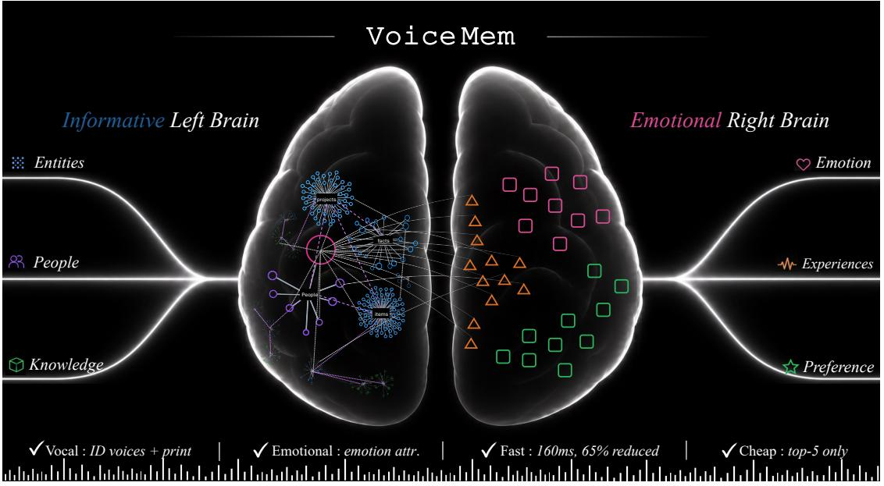
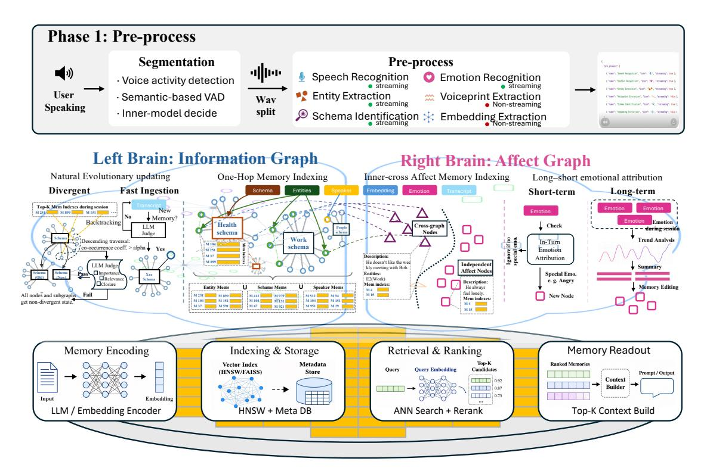
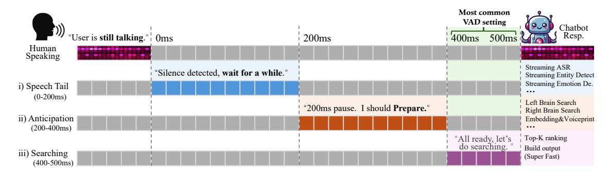
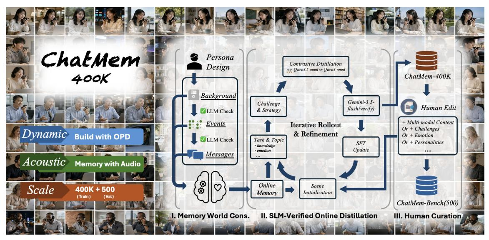
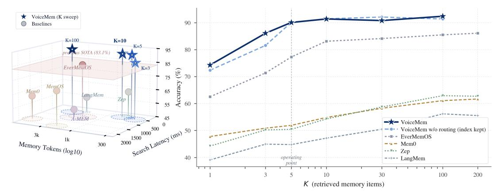
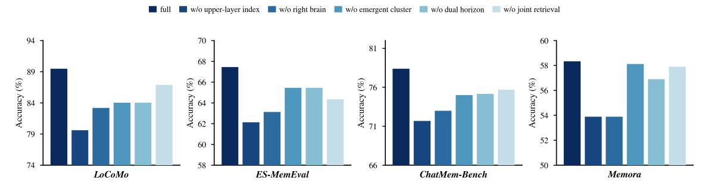
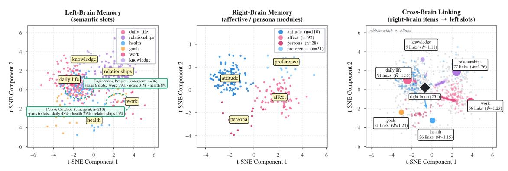
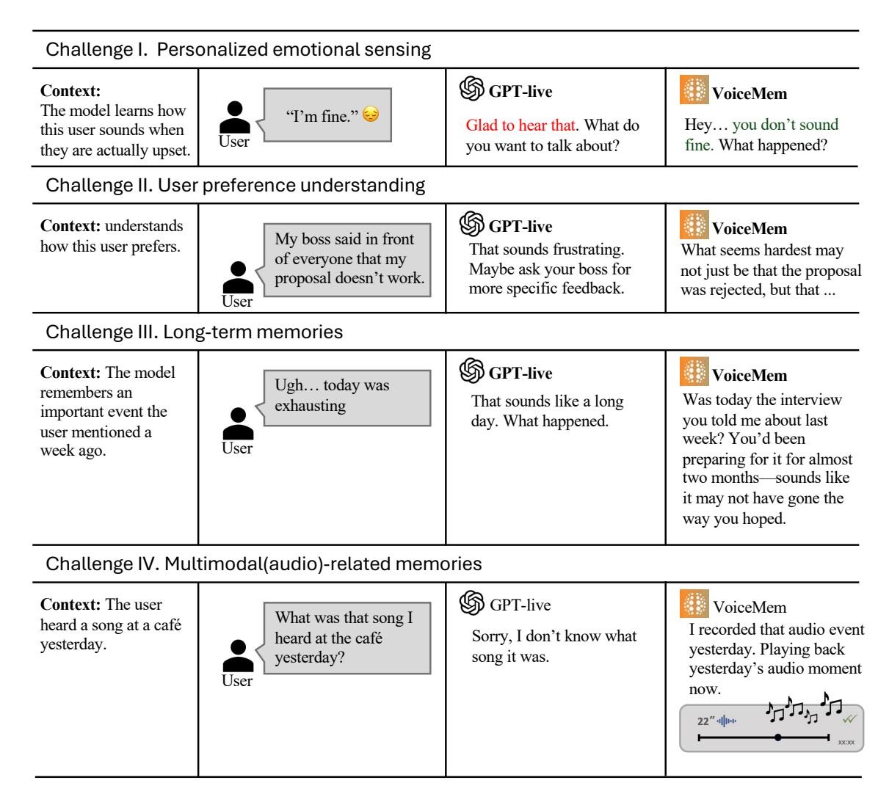

# VOICEMEM: 실시간 상호작용을 위한 스트리밍 듀얼-브레인 메모리 (VOICEMEM: STREAMING DUAL-BRAIN MEMORY FOR REAL-TIME INTERACTION)

- 원제: VoiceMem: Streaming Dual-Brain Memory for Real-Time Interaction
- 원문: [https://arxiv.org/abs/2608.26005](https://arxiv.org/abs/2608.26005)
- PDF: [https://arxiv.org/pdf/2608.26005v1](https://arxiv.org/pdf/2608.26005v1)
- arXiv ID: `2608.26005`

---

# VOICEMEM: 실시간 상호작용을 위한 스트리밍 듀얼-브레인 메모리 (VOICEMEM: STREAMING DUAL-BRAIN MEMORY FOR REAL-TIME INTERACTION)

Zhifei Xie $^{1,5*}$  Jiaqi Lang $^{2*}$  Ze An $^2$  Yifan Zhao $^2$  Dongchao Yang $^4$  Kai Li $^3$  Ziyang Ma $^{1,5}$  Mingbao Lin $^{2\dagger}$  Chunyan Miao $^{1\dagger}$  Shuicheng Yan $^{2\dagger}$

<sup>1</sup>양양공과대학교 (Nanyang Technological University)  
<sup>2</sup>싱가포르국립대학교 (National University of Singapore)  
<sup>3</sup>칭화대학 (Tsinghua University)  
<sup>4</sup>홍콩중국대학 (The Chinese University of Hong Kong)  
<sup>5</sup>Open Interaction Lab Zhifei001@e.ntu.edu.sg

https://xzf-thu.github.io/VoiceMem/

<span id="page-0-0"></span>

그림 1: VOICEMEM: 실시간 대화형 시스템을 위해 특별히 설계된 메모리 시스템. '왼쪽 뇌'는 최첨단 메모리 기능을 제공하고, '오른쪽 뇌'는 감정과 성격을 포착한다. **함께, 거의 추가 지연 없이 풍부하고 개인화된 메모리를 가능하게 한다.**

#### **초록** (ABSTRACT)

대화형 시스템(예: 음성 에이전트)은 여전히 스트리밍, 정확하고 공감적인 메모리 시스템을 정수로 삼지 못한다. 우리는 VOICEMEM을 소개한다. 이는 병렬 정보 *왼쪽 뇌*, 감정 *오른쪽 뇌*, 그리고 **스트리밍 메모리 I/O 메커니즘**을 갖춘 단순한 메모리 아키텍처이다. 우리는 메모리 인식 SLM 훈련, 장기 평가, 그리고 교환 가능한 메모리 백엔드를 갖춘 분리형 배포를 위한 완전한 파이프라인을 구축한다. 실험 및 실제 배포는 세 가지 장점을 보여준다: i) 정확도: 상위 5개 검색에서, 왼쪽 뇌는 MEM0과 같은 고전 시스템을 상위 200에서 거의 30 포인트 차이로 능가한다; ii) 감정 및 개인화: 짧은 및 장기 감정 속성 부여와 이중 노드 페르소나 모델링을 갖춘 오른쪽 뇌는 세 개의 페르소나 벤치마크에서 최첨단 성능을 달성하고, 이전 최고 시스템보다 총합 점수를 1.89 포인트 향상시킨다; iii) 실시간 및 저렴: VOICEMEM은 134 ms에 검색을 완료하며, 표준 VAD 지연 시간 내에 있어 추가 대화 지연 없이 높은 정확도와 낮은 비용을 유지한다. 이러한 결과는 VOICEMEM이 실시간, 개인화되고 감정적으로 인식되는 음성 상호작용을 위한 실용적인 메모리 기반을 제공함을 보여준다.

# [1](#page-1-0) 서론 (Introduction)

*메모리를 통해, 영혼은 그 이전 존재의 흔적을 드러낸다.* — 플라톤

메모리는 대화형 시스템(예: 음성 에이전트)을 지능형 도구에서 인간 중심 파트너로 바꾸는 역할을 한다. 최근에 많은 강력한 메모리 시스템이 등장했지만 [(Chhikara et al.,](#page-12-0) [2025;](#page-12-0) [Xu et al.,](#page-15-0) [2025b;](#page-15-0) [Hu et al.,](#page-12-1) [2026)](#page-12-1), 점점 더 지능적이고 자연스러운 상호작용 모델(예: SLMs [(Xie and Wu,](#page-14-0) [2024a;](#page-14-0) [Xie et al.,](#page-14-1) [2026b;](#page-14-1) [Fang et al.,](#page-12-2) [2025;](#page-12-2) [Qwen Team,](#page-13-0) [2026a)](#page-13-0) 및 듀플렉스 모델 [(Ma et al.,](#page-13-1) [2025;](#page-13-1) [ByteDance Seed,](#page-12-3) [2026;](#page-12-3) [OpenAI,](#page-13-2) [2026)](#page-13-2))과 함께 등장했지만, 두 가지는 아직 완전한 솔루션으로 완전히 결합되지 않았다. 메모리 위에 공감적이고 지능적인 상호작용 시스템을 구축하는 것은 여전히 개방형 과제이다.

우리는 관점에서 세 가지 장애물이 존재한다. (O1) 정보적 및 정서적 지능을 위한 통합 아키텍처. 실시간 대화 시스템에서는 정서와 성격을 이해하는 것이 정보와 지능만큼 중요하며, 정서 뒤에 있는 메커니즘은 훨씬 더 복잡하다. 장기적으로 둘을 하나의 아키텍처에 모델링하는 방법은 아직 탐구되지 않았다. (O2) 지연 없이 높은 정보 밀도. 기존 메모리 시스템은 대화 시스템과 두 가지 방식으로 충돌한다: *(i) 2–3초의 검색이 실시간 대화의 500 ms 예산을 초과하고, (ii) 텍스트 에이전트 메모리에서 흔히 사용되는 상위 100개의 출력은 음성 모델이 처리할 수 있는 것보다 많다.* 대신, 메모리 시스템은 거의 지연을 추가하지 않고 스트리밍을 실행하며, 여전히 상위 5개의 정확도를 유지해야 한다. (O3) 인프라와 진화 가능성. 메모리 방법과 음성 대화 모델은 모두 빠르게 진화하고 있다. 대화 모델은 아직 공동 오디오-메모리 입력을 받을 수 없으며, 메모리 시스템은 유용성을 유지하고 빠르게 변화하는 분야에서 지속적으로 업데이트하기 위해 단순하고 효과적이어야 한다.

우리는 실시간 음성 상호작용을 위한 *simple-and-effective* 스트리밍 듀얼 브레인 메모리 프레임워크 VOICEMEM을 제시한다. 그림 [1.](#page-0-0)에서 보듯이, O1과 O2를 위해 VOICEMEM은 정보용 왼쪽 뇌와 정서 및 성격용 오른쪽 뇌를 갖는다. *(i) 왼쪽 뇌에서는*, 단순한 두 단계 *schema–entity* 아키텍처가 메모리 항목을 관리하고 라우팅하며, 이는 상위 5개 성능을 위한 랭킹 단계의 정보 밀도를 높인다. 스키마 설정이 여기서 중요하므로, 왼쪽 뇌 상태, 의미론, 쿼리 빈도를 공동으로 기반으로 하는 *emergence* 메커니즘을 추가하여 장기적으로 메모리 스키마 수와 정밀도를 균형 있게 조정한다. *(ii) 오른쪽 뇌에서는*, 복잡한 인간 정서와 성격을 모델링하기 위해 두 종류의 노드를 정의한다: 사람의 정서적 특성을 위한 *independent nodes*와 왼쪽 뇌의 엔티티와 연결된 정서적 특성을 위한 *cross-entity nodes*로, 두 노드는 단기 및 장기 정서 귀속 메커니즘에 의해 유지된다. *(iii) 지연을 더욱 줄이기 위해*, 우리는 각 단계를 분리하고 실시간으로 실행되는 4단계 스트리밍 메모리 쿼리를 제안한다. 이 쿼리는 표준 VAD가 걸리는 시간 안에 *완료*된다.

O3를 위해 우리는 VOICEMEM을 완전히 분리된 프레임워크로 재구성하고 두 개의 새로운 모듈을 추가했다. *(i) 모델 적응:* 망각을 방지하기 위해 소규모에서 훈련하고 *SLM-verified blackbox OPD*를 제안한다. 이 방법은 메모리‑월드 구축, 폐쇄형 모델에 의한 온라인 수정, 사후 검증의 루프를 통해 모델을 훈련한다. 이 루프에서 생성된 데이터는 훈련용 CHATMEM‑400K와 평가용 CHATMEM‑BENCH를 제공하며, 이는 14개의 세분화된 범주에 걸쳐 *{Information, Persona, Affective Attribution, Paralinguist&Environment}*라는 네 가지 차원을 포괄하는 벤치마크이다. *(ii) 독립형 메모리 엔진:* 메모리 방법이 빠르게 진화하고 있으므로 우리는 VOICEMEM을 *graph‑on‑graph* 프레임워크로 변환하는 데 상당한 추가 노력을 기울였다. VOICEMEM의 알고리즘은 상위 층에서만 관리, 라우팅, 스트리밍을 수행하며, 하위 층은 완전히 독립적이다. 우리는 현재 최첨단 성능을 가진 Mem0을 하위 층으로 사용한다. 우리는 정보 메모리(+46.1 % Mem0 대비 / +16.0 % 이전 SOTA 대비), 페르소나 메모리(+16.8 % / +5.9 %), 장기 오디오 메모리(+41.3 % / +27.4 %) 등 다양한 벤치마크에서 광범위한 실험을 수행했으며, 그 결과 VOICEMEM은 텍스트와 음성 모두에서 메모리 품질을 일관되게 향상시키고, 저지연 스트리밍 검색을 지원하며, 서로 다른 메모리 백엔드 간에 견고하게 전이된다.

## 2 예비 연구 (Preliminary)

임베딩 기반 메모리 검색. Retrieval-Augmented Generation (RAG)은 의미적 유사도에 따라 외부 기록을 검색한다. Mem0 및 Zep과 같은 일반 메모리 엔진은 메모리 기록 및 업데이트를 추가로 지원한다. M^t를 단계 t의 메모리 저장소, q^t를 현재 쿼리라고 하자. 표준 검색은 다음과 같이 선택한다

<span id="page-2-0"></span>

$$\mathcal{R}_t^{\text{sem}} = \text{TopK}_{m_i \in \mathcal{M}_t} \sin \left( f_{\theta}(q_t), f_{\theta}(m_i) \right), \tag{1}$$

그리고 생성한다

$$o_t = \text{LLM}(q_t, \mathcal{R}_t^{\text{sem}}), \qquad \mathcal{M}_{t+1} = \text{Update}(\mathcal{M}_t, u_t, o_t).$$

(2)

Agentic memory systems (예: A-Mem (Xu et al., 2025b) 및 MemoryOS)와 personal memory systems (예: MemoryBank (Zhong et al., 2024) 및 EverMemOS (Hu et al., 2026))는 이 기반 위에 추가 저장 구조를 추가한다.

감정 인식 검색. 감정 인식 시스템은 감정적 호환성을 추가로 고려한다. Emotional RAG (Huang et al., 2024)는 감정적 관련성을 검색에 통합하고, KEEM (Kang et al., 2025a)는 감정적 맥락을 사용해 메모리 구축과 업데이트를 안내한다. 현재 쿼리와 메모리 $m_i$의 감정적 표현을 각각 $\mathbf{a}_t$와 $\mathbf{a}_i$라고 하자. 검색은

$$\mathcal{R}_{t}^{\text{aff}} = \text{TopK}_{m_{i} \in \mathcal{M}_{\star t}} \left[ \lambda \, \sin \left( f_{\star \theta}(q_{t}), \, f_{\star \theta}(m_{i}) \right) + (1 - \lambda) \kappa(\mathbf{a}_{t}, \mathbf{a}_{i}) \right]. \tag{3}$$

감정을 검색에 통합했음에도 불구하고, 이 방법들은 여전히 정보 중심이며, 정서적 연관성 및 장기 정서 축적에 대한 용량이 제한적이다.

Streaming Dual-Brain Memory Informational and emotional intelligence는 서로 다른 유지 방식을 요구한다: 하나는 대규모 정보를 저장하고, 다른 하나는 이를 축적하고 속성을 부여한다. 따라서 우리는 기존 작업을 두 개의 병렬 뇌로 확장한다. 왼쪽 뇌 $\mathcal{G}_t^L$는 사실 셀을 진화하는 사실 클러스터로 조직하고, 오른쪽 뇌 $\mathcal{G}_t^R$는 정서적 속성 셀을 유지한다. 이들은 교차 뇌 연결 $\mathcal{E}_t^{LR}$로 연결된다:

$$\mathcal{B}_t = \left(\mathcal{G}_t^L, \mathcal{G}_t^R, \mathcal{E}_t^{LR}\right). \tag{4}$$

각 입력 발화 $u_t$에 대해, 두 뇌는 새로운 셀을 활성화하고 점진적으로 업데이트한다:

$$\mathcal{G}_{t+1}^{L} = \text{Update}_{L} \left( \mathcal{G}_{t}^{L}, \text{Activate}_{L}(u_{t}) \right), 
\mathcal{G}_{t+1}^{R} = \text{Update}_{R} \left( \mathcal{G}_{t}^{R}, \text{Activate}_{R}(u_{t}) \right).$$

(5)

응답은 공동 검색을 통해 생성된다:

$$\mathcal{R}_{t}^{\mathrm{DB} } = \mathrm{JointRetrieve}\left(q_{t} \mid \mathcal{G}_{t+1}^{L}, \mathcal{G}_{t+1}^{R}, \mathcal{E}_{t+1}^{LR}\right), \quad o_{t} = \mathrm{LLM}\left(q_{t}, \mathcal{R}_{t}^{\mathrm{DB}}\right).$$

(6) 따라서, 전통적인 RAG는 의미적으로 유사한 기록을 검색하고, 감정 인식 RAG는 정서적

따라서, 전통적인 RAG는 의미적으로 유사한 기록을 검색하고, 감정 인식 RAG는 정서적 호환성을 추가하며, 스트리밍 듀얼-브레인 메모리는 지속적으로 별도의 사실적 및 정서적 인지 구조를 구축하고 공동으로 질의한다.

## 3 VoiceMem: 스트리밍 듀얼-브레인 아키텍처 (VoiceMem: Streaming Dual-brain Architecture)

우리는 제안된 스트리밍 듀얼-브레인 아키텍처를 VOICEMEM으로 구현하여 세 가지 요구 사항을 충족한다: (i) 제한된 메모리 예산 하에서 정보 밀도를 최대화하고; (ii) 감정과 태도를 인지하고 적응하는 동시에 성격에 대한 장기적 이해를 개발하며; 그리고 (iii) 실시간 음성 대화에 지각 가능한 지연을 추가하지 않는다.

### <span id="page-2-1"></span>3.1 왼쪽 뇌: 효율적인 메모리 접근 (Left Brain: Efficient Memory Access)

VOICEMEM의 left brain의 목표는 온라인 음성 상호작용의 엄격한 문맥 및 지연 예산 하에서 효율적인 메모리 저장 및 검색을 지원하는 것이다.  
기존 시스템은 두 가지 핵심 과제에 직면해 있다.  
(i) **top-100** 후보를 검색하면 범위가 개선되지만, 음성-언어 모델의 제한된 문맥 용량을 초과한다. 반면 **top-5**로 검색을 제한하면 관련 메모리를 놓칠 위험이 있다.  
(ii) 기존 메모리 파이프라인은 검색 및 처리에 2–3초가 필요하지만, 실시간 대화는 자연스러운 턴테이킹을 유지하기 위해 100–200밀리초의 추가 지연만 허용한다.

Cluster–Entity–MemItem 인덱싱을 통한 밀집 메모리 접근. 검색이 top-5와 같은 작은 예산으로 제한될 때, 성능은 점점 정교해지는 순위 매김보다 후보 공간의 의미적 밀집도에 주로 의존한다. 관련 없는 문맥에서 동일한 엔티티를 가리키는 여러 메모리 항목이 top-k 결과를 지배하면서도 거의 유용한 정보를 제공하지 못할 수 있다. 따라서 우리는 MEM0에 저장된 백엔드 메모리 항목과 그 위에 구성된 가벼운 의미 인덱스를 분리한다. 이 인덱스는 기본 메모리에 접근하기 전에 후보 집합을 압축되고 의미적으로 일관된 세트로 좁힌다.



Figure 2: **VOICEMEM의 아키텍처**. **Phase I:** 스트리밍 전처리에서 화자 식별, ASR, 엔티티, 스키마, 감정, 임베딩을 추출한다. **Phase II:** 핵심 알고리즘은 스키마—엔티티 조직 및 등장으로 왼쪽 뇌를 관리하고, 내부/교차 노드 모델링 및 장기/단기 감정 귀속으로 오른쪽 뇌를 관리한다. **Phase III:** 관리된 메모리 항목은 교환 가능한 백엔드 메모리 엔진을 통해 질의된다.

단순성과 효율성을 위해 왼쪽 뇌 인덱스는 *스키마*를 사용한 거친 의미 라우팅과 구체적인 사람, 사건, 개념을 찾기 위한 *엔티티*를 포함하는 두 단계 계층 구조를 채택한다. 우리는 다음과 같이 정의한다

$$\mathcal{G}^L = (\mathcal{S}, \mathcal{V}, \mathcal{E}), \qquad v = (d_v, \mathcal{N}_v^{\text{micro}}, \mathcal{I}_v), \qquad s = (d_s, \mathcal{N}_s^{\text{macro}}, \mathcal{V}_s).$$

각 엔티티 $v \in \mathcal{V}$는 정확히 하나의 스키마 $s \in \mathcal{S}$에 속한다. 여기서 $d_v$와 $d_s$는 텍스트 설명이며, $\mathcal{I}_v$는 관련 백엔드 메모리 항목을 인덱싱하고, $\mathcal{V}_s$는 스키마 s에 할당된 엔티티를 포함한다. 엣지 집합 $\mathcal{E} = \mathcal{E}_{\text{micro}} \cup \mathcal{E}_{\text{macro}}$는 가벼운 의미 확장을 지원한다: $\mathcal{N}_v^{\text{micro}}$는 관련 엔티티를 연결하고, $\mathcal{N}_s^{\text{macro}}$는 관련 스키마를 연결한다. 우리는 명시적인 스키마—엔티티 엣지를 도입하는 대신 스키마 소속을 직접 인코딩하여 재귀적 탐색을 피하고 검색을 압축적이며 의미적으로 집중되도록 한다.

**검색.** 사용자가 말하는 동안 스트리밍 매처는 부분 전사에서 관련 스키마와 엔티티를 식별하고, 일치한 엔티티와 일치한 스키마에 포함된 엔티티를 강력한 일단계 연결과 약한 일단계 연결을 통해 확장한다:

$$(\mathcal{V}_t, \mathcal{S}_t) = \operatorname{Match}(x_{\leq t}, \mathcal{V}, \mathcal{S}), \qquad \mathcal{Z}_t = \mathcal{V}_t \cup \mathcal{V}_{\mathcal{S}_t} \cup \mathcal{N}_1^{\operatorname{strong}}(\mathcal{V}_t \cup \mathcal{V}_{\mathcal{S}_t}) \cup \mathcal{N}_1^{\operatorname{weak}}(\mathcal{V}_t \cup \mathcal{V}_{\mathcal{S}_t}). \tag{1}$$

여기서 $V_t$와 $S_t$는 각각 일치한 엔티티와 스키마를 나타내며, $V_{S_t}$는 일치한 스키마에 할당된 엔티티를, $Z_t$는 일단계 강력 및 약한 엣지를 통해 얻은 확장된 엔티티 집합을 의미한다. 해당 메모리 항목은 다음과 같이 인덱싱되고 검색된다

$$C_t^L = \bigcup_{z \in \mathcal{Z}_t} \mathcal{I}_z, \qquad \mathcal{R}_t^L = \text{MemSearch}(q_t, C_t; K).$$

(2)

백엔드는 전체 메모리 $\mathcal{M}$ 대신 이 후보 풀만 검색한다. 매칭된 엔티티와 인접 엔티티와 연관된 메모리를 보존하면서 검색 공간을 급격히 줄임으로써 제안된 인덱스는 정확하고 효율적인 top-5 검색을 가능하게 한다.

**Fast Update.** 각 턴마다 비동기 업데이트러가 새로운 사실을 추출하고 ADD, UPDATE, DELETE, 또는 KEEP 연산을 통해 인접 메모리와 공동으로 조정한다. 이후 연관된 스키마, 엔티티, 관계를 비핵심 경로에서 업데이트한다; 구현 세부사항은 부록에 연기한다.

**Cluster Emergence Mechanism.** 클러스터가 성장함에 따라 정보 밀도가 감소하고, 빈번한 규칙 기반 분할은 관련 메모리를 단편화하고 검색 범위를 줄일 수 있다. 따라서 반복되는 검색 패턴에서 일관된 하위 클러스터가 등장하도록 한다.

세션 내에서 관측된 쿼리(queries) $\mathcal Q$, 쿼리 q에 의해 활성화된 엔티티(entities) $A_q$, 그리고 현재 클러스터(cluster)에서 연결된 엔티티의 부분집합 H를 정의한다. 우리는 이들의 쿼리 일관성(query coherence)을 측정한다.

$$\rho(H) = \frac{1}{|\mathcal{Q}|} \sum_{q \in \mathcal{Q}} \frac{|A_q \cap H|}{|A_q \cup H|}.$$

(3)

높은 점수는 H에 있는 엔티티가 반복적으로 함께 검색된다는 것을 나타낸다. 가장 큰 자격을 갖춘 부분 그래프가 임계값 $\alpha$ 를 초과하면 LLM 판사가 그 관련성, 중요성, 완전성을 추가로 평가한 뒤 새로운 클러스터로 승격시킨다. 전체 등장 워크플로우는 알고리즘 1에 요약된다.

# <span id="page-4-0"></span>알고리즘 1 클러스터 서브그래프 등장 파이프라인

```
Require: Cluster G_c, query set \mathcal{Q}, coherence threshold \alpha
 1: \mathcal{H} \leftarrow \text{CONNECTEDCANDIDATES}(G_c)
 2: H^* \leftarrow \arg\max_{H \in \mathcal{H}} |H| // Filter via coherence con.
          subject to \rho(H) > \alpha
 3: if H^* exists then
 4:
           // 관련성, 중요성, 완전성 평가.
         (r, i, c) \leftarrow \text{LLMJUDGE}(H^*)
 5:
 6:
         if r \wedge i \wedge c then
 7:
             PROMOTE(H^*)
                                       // 클러스터 등장 수행.
 8:
 g.
             DISABLEPOTENTIAL(H^*) //후속 후보 분할 방지
10:
         end if
11: end if
```

### <span id="page-4-2"></span>3.2 오른쪽 뇌: 사람을 아는 것

왼쪽 뇌가 일어난 일을 기록하는 반면, 오른쪽 뇌는 *사용자가 누구인지*를 포착한다. 병렬로 작동하며 *페르소나 메모리*를 유지한다: 특정 인물, 사건, 개념에 기반한 안정적인 성향, 정서적 경향, 태도. 이러한 증거는 턴 내 즉각적인 반응부터 세션 간에 통합된 지속적 특성까지 여러 시간 척도를 아우른다.

페르소나 그래프. 오른쪽 뇌는 두 가지 상호 보완적인 페르소나 노드 유형을 유지한다:

$$\mathcal{G}^R = (\mathcal{V}^I, \mathcal{V}^C), \qquad v^I = (d_v^I, \mathcal{I}_v^I) \in \mathcal{V}^I, \qquad v_e^C = (d_{v,e}^C, \mathcal{I}_{v,e}^C, \rho_{v,e}) \in \mathcal{V}^C, \quad e \in \mathcal{V}.$$

(4)

여기서 d는 페르소나 설명이며 $\mathcal I$는 그 지원 백엔드 메모리 항목을 인덱싱한다. 독립 노드 $v^I$는 장기 증거에 의해 뒷받침되는 사용자 고유 속성, 지속적 성향, 행동 규칙성, 정서적 경향을 인코딩한다. 교차 엔티티 노드 $v_e^C$는 대신 상황에 따라 달라지는 정서를 포착하며, $\rho_{v,e}$는 각 노드를 왼쪽 뇌 엔티티 $e \in \mathcal V$와 연결한다. 이 구분은 근본적이다: $v^I$는 지속적인 사용자 특성을 설명하고, $v_e^C$는 감정이 누구나 무엇에 관한 것인지를 보존한다. 두 개를 합치면 상황 반응을 안정적 특성으로 착각하거나 정서에 의미를 부여하는 실제 세계 원인을 제거할 위험이 있다.

**검색.** 스트리밍 매처가 부분 대화문에서 독립 및 교차 엔티티 페르소나 노드를 동시에 활성화한다. 이 매치는 왼쪽 뇌가 활성화한 엔티티와 연결된 교차 엔티티 노드와 결합된다.

<span id="page-4-1"></span>

$$(\mathcal{V}_{t}^{I}, \mathcal{V}_{t}^{C}) = \operatorname{Match}\left(x_{\leq t}, \mathcal{V}^{I}, \mathcal{V}^{C}\right), \qquad \mathcal{Z}_{t}^{R} = \mathcal{V}_{t}^{I} \cup \mathcal{V}_{t}^{C} \cup \left\{v_{e}^{C} \in \mathcal{V}^{C} : e \in \mathcal{Z}_{t}\right\},$$

$$\mathcal{C}_{t}^{R} = \bigcup_{z \in \mathcal{Z}_{t}^{R}} \mathcal{I}_{z}, \qquad \mathcal{R}_{t}^{R} = \operatorname{MemSearch}\left(q_{t}, \mathcal{C}_{t}^{R}; K\right). \tag{5}$$

여기서 $\mathcal{Z}_t$는 (1)에서 왼쪽 뇌에 의해 생성된 확장된 엔티티 집합이다. 결과적으로 후보 풀은 대화에서 직접 암시되는 페르소나 증거와 현재 관련된 현실 세계 엔티티에 기반한 태도를 결합하며, 전체 페르소나 메모리를 검색하지 않는다.

**Short-Horizon Attribution.** 각 대화 입력 $x_t$에 대해 감정 추정기는 감정 표현 $e_t = \phi(x_t)$를 생성한다. 쌍 $(x_t, e_t)$는 페르소나 노드를 추가, 편집, 병합하기 위한 즉각적인 증거를 제공한다:

$$e_t = \phi(x_t), \qquad \mathcal{G}_t^R = \text{Modify}\left(\mathcal{G}_{t-1}^R; x_t, e_t\right), \qquad t = 1, \dots, T.$$

(6)



Figure 3: VOICEMEM에서 검색 지연을 줄이기 위한 최종 방어 수단으로 작용하는 4단계 스트리밍 검색 프로세스.

Short-horizon attribution은 현재 감정과 그 상황적 목표 및 원인을 함께 보존하여, 페르소나 그래프가 진행 중인 상호작용 내에서 적응하도록 한다.

**Long-Horizon Attribution.** 각 세션 이후, long-horizon attribution은 시퀀스 $(x_1, e_1), (x_2, e_2), \dots, (x_T, e_T)$를 공동으로 분석하고 반복되는 증거를 안정적이고 독립적인 페르소나 노드로 통합한다:

$$\mathcal{V}^I \leftarrow \text{Consolidate}\left(\mathcal{V}^I; (x_1, e_1), (x_2, e_2), \dots, (x_T, e_T)\right).$$

(7)

모든 일시적인 상태를 누적하는 대신, 이 과정은 사용자가 누구인지에 대한 안정적인 설명을 제공하는 지속적인 정서적 및 행동적 패턴을 식별한다.

### <span id="page-5-0"></span>3.3 스트리밍 듀얼-브레인 검색 (Streaming Dual-Brain Retrieval)

우리는 최종적으로 VOICEMEM의 스트리밍 검색 프로세스를 설명한다. 이는 거의 제로 추가 지연의 핵심이다. 이 프로세스에는 *listening*, *speech tail*, *anticipation*, *searching*의 네 단계가 도입된다. *listening*과 (i) *Speech Tail*(0-200ms) 동안, 사용자가 말할 때 우리는 전사 $x_{\leq t}$ (Shi et al., 2026; Xie et al., 2026c), 두 뇌의 일치된 엔티티와 스키마, 그리고 화자 정체성 $p_t$를 스트리밍 방식으로 얻는다.

그리고 화자 정체성

$$p_t$$

스트리밍 방식으로:

$$\underbrace{x_{\leq t} = \mathrm{ASR}(a_{\leq t}), \ (\mathcal{V}_t, \mathcal{S}_t), \ (\mathcal{V}_t^I, \mathcal{V}_t^C) = \mathrm{Match}(x_{\leq t})}_{\text{in real time}} \mid \underbrace{p_t = \psi(a_{\leq t})}_{\text{(i) if delayed}}. \tag{8}$$

(ii) 예측. (200-400ms) 침묵이 200ms에 도달하면 답변이 올 것으로 가정한다. 질의 임베딩을 추출하고 두 뇌의 상위 레이어 그래프를 (1)과 (5)로 확장한다:

$$q_t = \text{Embed}(x_{\leq t}), \qquad \mathcal{Z}_t = \mathcal{G}^L(\mathcal{V}_t, \mathcal{S}_t), \qquad \mathcal{Z}_t^R = \mathcal{G}^R(\mathcal{V}_t^I, \mathcal{V}_t^C, \mathcal{Z}_t).$$

(9)

(iii) 검색. (400-500ms) 백엔드 검색만 남는다. 두 뇌가 검색되고 병합된다:

$$\mathcal{R}_{t}^{L} = \operatorname{MemSearch}(q_{t}, \mathcal{C}_{t}^{L}; K), \mathcal{R}_{t}^{R} = \operatorname{MemSearch}(q_{t}, \mathcal{C}_{t}^{R}; K), R_{t} = \operatorname{Prompt}(\mathcal{R}_{t}^{L}, \mathcal{R}_{t}^{R}). \quad (10)$$

VAD 임계값은 일반적으로 $500\,\mathrm{ms}$ 로 설정되며, 답변이 시작되기 전에 $400\,\mathrm{ms}$ 윈도우가 남는다. VOICEMEM은 이 예산을 여유 있게 충족한다. 왜냐하면 밀집 듀얼-브레인 검색 자체가 오직 $134\,\mathrm{ms}$ 만 소요되기 때문이다.

### 3.4 어제 카페에서 재생된 노래는 무엇이었는가? (What Was the Song Playing at the Café Yesterday?)

VOICEMEM은 텍스트를 넘어 오디오까지 기억을 확장하여 다중 화자 구분, 언어 외적 분석, 환경음 기억을 지원한다. 활성화되면 에이전트는 오디오를 **화자 음성인쇄** (speaker voiceprints), **음향 임베딩** (acoustic embeddings), 또는 **원시 파형** (raw waveforms)로 선택적으로 보존하고, 이를 해당 엔터티 노드에 멀티모달 노드로 부착한다.

## 4 인프라스트럭처: 모델 훈련, 검증 및 배포 (Infrastructure: Model Training, Validation and Deployment)

본 섹션에서는 VOICEMEM의 실제 환경에서의 구현 세부 사항을 제공하며, 두 가지 측면에 초점을 맞춘다: i) *모델 훈련* (model training), 여기서 우리는 Qwen2.5-Omni (Xu et al., 2025a), Qwen3-Omni (Qwen Team, 2025), 그리고 Step-Audio2-Mini (Wu et al., 2025a) 모델 계열—원래는 음성 입력/텍스트 출력용으로 설계된—을 온라인 블랙박스 온-폴리시 디스틸레이션 (online black-box on-policy distillation)을 통해 메모리 보강 스피치 언어 모델 (memory-augmented speech language models)로 변환하여, 우리 지식상 최초로 명시적 메모리 접근 (explicit memory access)을 갖는 스피치 언어 모델을 만든다; ii) *배포* (deployment), 여기서 우리는 VOICEMEM을 위해 메모리 층을 기저 검색 엔진 (underlying search engine)과 분리하는 진화 가능한 이층 시스템 아키텍처 (evolvable two-layer system architecture)를 설계한다.



그림 4: VOICEMEM의 학습 및 검증 파이프라인. 우리는 동적 사용자 기록, 음성 입력, 대규모 메모리 의존 대화를 포괄하는 세 단계(메모리-세계 구축, SLM-검증 온라인 온-정책 증류, 인간 큐레이션)를 통해 CHATMEM-400K를 구성한다. 인간 큐레이션된 하위 집합은 정보 회상, 페르소나 이해, 정서적 귀속, 그리고 음성/환경적 추론을 평가하기 위해 CHATMEM-BENCH를 형성한다.

### <span id="page-6-0"></span>4.1 블랙박스 OPD 훈련 (Black-box OPD Training)

모델 성능을 극대화하기 위해 우리는 독점 모델을 교사로 사용하고, 적응 과정에서 파국적 망각을 완화하기 위해 온라인 증류를 채택한다. 구체적으로, Qwen2.5-Omni와 Qwen3-Omni는 Qwen3.5-Omni에서 증류되며 [(Qwen Team,](#page-13-7) [2026b)](#page-13-7), Step-Audio2-Mini는 Step-Audio2에서 증류된다 [(Wu et al.,](#page-14-3) [2025a)](#page-14-3). 학습 파이프라인은 네 단계로 구성된다:

1단계: 메모리 세계 구축. 우리는 먼저 각 합성 사용자에 대해 일관된 장기 메모리 세계를 구축한다. 핵심 페르소나에서 시작하여 배경 정보, 삶의 사건, 메시지, 온라인 메모리를 차례로 생성한다: 페르소나 → 배경 → 사건 → 메시지 → 메모리. 이는 하위 대화 생성에 필요한 시간적으로 일관된 사용자 기록을 제공한다.

2단계: SLM-검증 온라인 증류. 우리는 반복 파이프라인을 통해 메모리 의존 대화를 생성한다: i) *Task & Topic*은 지식-, 감정-, 또는 페르소나 지향 목표를 샘플링한다; ii) *Scene Initialization*은 현재 컨텍스트를 구성한다; iii) *Challenge & Strategy*는 회상, 참조 해결, 모순, 다중 메모리 추론을 도입한다; iv) *Contrastive Distillation*은 서로 다른 메모리 사용 행동을 가진 응답을 비교한다; v) *Verification*은 필요성, 신뢰성, 품질을 필터링한다; vi) *SFT Update*는 다음 반복을 위해 생성기를 업데이트한다. 이 루프를 반복하면 메모리 의존 대화의 대규모 코퍼스인 CHATMEM-400K가 생성된다.

3단계: 인간 큐레이션. 인간 주석자는 코퍼스를 추가로 정제하고, 풍부한 정서 및 페르소나 역학과 음성 질문과 같은 멀티모달 입력을 포함한 더 어려운 샘플을 구성한다. 이러한 예시는 훈련을 보강하며, 도전적인 하위 집합은 CHATMEM-BENCH에 큐레이션된다.

IV 단계: 검증.  
우리는 최종 모델을 평가하기 위한 주요 벤치마크 중 하나로 CHATMEM-BENCH를 사용한다. 기존 벤치마크는 실제 음성 비서의 요구 사항을 완전히 반영하지 못하기 때문이다.  
이 벤치마크는 14개의 세분화된 질문 범주에 걸쳐 *{Information, Persona, Affective Attribution, Paralinguistics & Environment}*라는 네 가지 차원을 다룬다.  
이 벤치마크의 구축에는 상당한 인적 노력이 필요하므로, 벤치마크와 주석 파이프라인에 대한 자세한 소개는 별도의 후속 기술 보고서에 맡긴다.

### 4.2 상위 수준 라우팅–하위 수준 엔진 아키텍처 (Decoupled Upper-level Routing–Lower-level Engine Architecture)

기저 메모리 엔진은 빠르게 진화하고 있으며, 매개변수화된 메모리와 잠재 메모리 메커니즘도 유망한 방향으로 부상하고 있다. 따라서 우리는 실시간과의 밀접한 결합을 피한다.

<span id="page-7-0"></span>표 1: 사실 메모리 결과. LLM-judge 점수 (%, ↑). ‡: 우리 파인튜닝한 Qwen3.6이 생성한 응답; 나머지 모든 행은 GPT-4o-mini를 응답 모델로 사용한다.

| 방법 |  |  | LoCoMo |  | LongMemEval |  |  |  |  | 평균 |  |  |
|-----------------------|--------|-------|------------|-------|-------------|-------|------------|----------------------------------------------------------|-------|-------------|-------|-------|
|  | 단일 | 다중 | 온도 | 열림 | 추출 | 다중 | 업데이트 | 온도 | 제거 | 추천 | 읽기 |  |
| 참조 |  |  |  |  |  |  |  |  |  |  |  |  |
| 전체 컨텍스트 | 75.87 | 72.27 | 70.29 | 57.45 | 45.45 | 73.92 | 78.21 | 31.58 | 85.54 | 52.10 | 22.67 | 60.49 |
| 메모리 엔진 |  |  |  |  |  |  |  |  |  |  |  |  |
| Mem0 | 67.13 | 51.15 | 55.51 | 72.93 | 62.82 | 46.21 | 70.12 | 40.15 | 40.42 | 52.58 | 16.00 | 52.27 |
| Zep | 66.91 | 53.70 | 60.29 | 70.82 | 47.46 | 74.44 | 54.10 | 34.62 | 33.36 | 37.38 | 3.50 | 48.78 |
| LangMem | 62.23 | 47.92 | 43.43 | 71.12 | 55.13 | 20.30 | 66.67 | 15.79 | 68.16 | 48.88 | 30.00 | 48.15 |
| Agent Memory |  |  |  |  |  |  |  |  |  |  |  |  |
| A-MEM | 49.79 | 49.85 | 54.05 | 49.91 | 64.62 | 48.87 | 64.11 | 47.36 | 68.82 | 35.04 | 2.00 | 48.58 |
| MemoryOS | 69.35 | 62.30 | 44.72 | 44.29 | 58.10 | 31.06 | 48.72 | 32.33 | 15.24 | 38.86 | 1.50 | 40.59 |
| MemOS | 81.09 | 67.49 | 75.18 | 55.90 | 86.77 | 70.70 | 74.33 | 77.49 | 51.84 | 62.64 | 20.66 | 65.83 |
| Personal Memory |  |  |  |  |  |  |  |  |  |  |  |  |
| MemoryBank | 21.25 | 18.40 | 31.50 | 26.28 | 23.33 | 26.00 | 14.00 | 20.00 | 22.22 | 41.88 | 1.42 | 22.39 |
| EverMemOS | 90.12 | 87.43 | 85.16 | 69.79 | 82.71 | 73.68 | 89.74 | 77.44 | 17.21 | 33.27 | 16.67 | 65.75 |
| Emotional RAG | 19.62 | 25.53 | 34.89 | 13.54 | 40.00 | 55.00 | 70.00 | 65.00 | 51.16 | 39.38 | 14.75 | 38.99 |
| Ours |  |  |  |  |  |  |  |  |  |  |  |  |
| VoiceMem | 94.60 | 91.60 | 89.80 | 85.60 | 83.20 | 75.00 | 77.50 | 95.00 | 66.80 | 50.50 | 30.70 | 76.39 |
| VoiceMem‡ | 95.15 | 92.40 | 91.35 | 86.08 | 79.64 | 70.17 | 79.24 | 89.63 | 69.10 | 54.77 | 24.61 | 75.65 |
|  |  |  |  |  |  |  |  | 표 2: 페르소나 메모리 결과. LLM-judge 점수 (%, ↑). |  |  |  |  |
|  |  |  | ES-MemEval |  |  |  | PersonaMem |  |  | PersonaLens |  |  |
| 방법 |  |  |  |  |  |  |  |  |  |  |  | 평균 |
|  | IE | TR | CD | UM | 추천 | 생성 | 진화 | 이유 | 추천 | 퍼포먼스 | TCR |  |
| 참조 |  |  |  |  |  |  |  |  |  |  |  |  |
| 전체 컨텍스트 | 20.20 | 19.60 | 12.10 | 21.70 | 41.00 | 46.00 | 68.00 | 77.00 | 37.00 | 75.00 | 91.08 | 46.24 |
| 메모리 엔진 |  |  |  |  |  |  |  |  |  |  |  |  |
| Mem0 | 75.10 | 56.70 | 72.30 | 64.20 | 32.13 | 57.89 | 54.68 | 80.81 | 52.73 | 82.25 | 92.39 | 65.56 |
| Zep | 66.80 | 42.30 | 64.20 | 58.00 | 35.30 | 42.10 | 34.50 | 50.50 | 36.40 | 58.50 | 82.74 | 51.94 |
| LangMem | 18.80 | 15.00 | 20.40 | 22.70 | 31.29 | 8.77 | 53.24 | 81.82 | 40.00 | 77.45 | 88.99 | 41.68 |
| Agent Memory |  |  |  |  |  |  |  |  |  |  |  |  |
| A-MEM | 67.80 | 58.30 | 67.00 | 56.70 | 63.01 | 57.89 | 54.68 | 85.86 | 69.09 | 62.50 | 83.26 | 66.01 |
| MemoryOS | 43.90 | 30.50 | 41.00 | 41.50 | 47.06 | 56.14 | 32.37 | 48.48 | 47.27 | 55.75 | 82.01 | 47.82 |
| MemOS | 77.70 | 64.60 | 66.30 | 73.50 | 72.72 | 56.14 | 58.27 | 78.79 | 72.72 | 82.75 | 91.47 | 72.27 |
|  |  |  |  |  |  |  |  |  |  |  |  |  |
|  |  |  |  |  |  |  |  |  |  |  |  |  |
| Personal Memory |  |  |  |  |  |  |  |  |  |  |  |  |
| MemoryBank | 43.00 | 35.20 | 42.70 | 38.70 | 35.29 | 49.12 | 51.08 | 56.57 | 40.00 | 64.50 | 80.66 | 48.80 |
| EverMemOS | 66.80 | 50.70 | 59.60 | 45.90 | 47.06 | 47.37 | 41.01 | 43.43 | 56.36 | 63.25 | 79.91 | 54.67 |
| Emotional RAG<br>Ours | 82.30 | 67.10 | 77.30 | 73.70 | 52.94 | 61.40 | 44.60 | 58.59 | 43.64 | 64.25 | 82.00 | 64.35 |

메모리 아키텍처를 특정 백엔드와 결합하면 최신 메모리 알고리즘의 시기적절한 채택을 방해할 수 있다. 이를 위해 우리는 VOICEMEM을 분리형 아키텍처를 중심으로 크게 재설계했다. 우리의 초점은 상위 수준 라우팅, 병렬 이중 뇌 조직, 그리고 스트리밍 추론에 있다. 반면 Section 3에서 추상화된 MemSearch 엔진은 완전히 교환 가능하다. 현재 구현에서는 일반성과 강력한 최첨단 성능 때문에 MEM0을 백엔드로 사용한다.

VoiceMem 82.80 67.30 69.10 74.00 76.47 64.91 51.08 83.84 70.91 83.75 91.63 74.16 VoiceMem‡ 81.20 64.70 73.50 71.90 75.19 70.17 73.38 83.94 69.10 85.50 93.57 76.56

## 5 실험 (Experiments)

본 섹션에서는 네 가지 질문에 답하기 위해 일련의 실험을 수행한다:

(RQ1) VoiceMem은 모달리티 간에 정확하게 검색을 수행하는가? *[§5.2,](#page-8-0) [§5.3](#page-8-1)*

(RQ2) 그 정확도가 라이브 음성 루프에 충분히 저렴하고 빠른가, 그리고 그 이유는 무엇인가? *[§5.4](#page-9-0)*

(RQ3) 모든 구성 요소가 그 자리를 차지할 가치가 있는가, 그리고 그들이 생성하는 메모리 구조는 무엇인가? *[§5.4](#page-9-0)*

(RQ4) 인덱스가 서로 다른 기본 메모리 저장소 간에 전송되는가? *[§5.4](#page-9-0)*

Table 3: **ChatMem-Bench 결과.** LLM-judge 점수  $(\%, \uparrow)$ .

<span id="page-8-2"></span>

| 방법(method) | 정보(Information) |  |  | 페르소나(Persona) |  | 감정적 속성(Affective Attr.) |  | 음성언어 및 환경(Paraling.&Env.) |  |  | 평균(Avg.) |  |  |  |  |
|---------------------------|-------------|-------|-------|---------|-------|-----------------|-------|----------------|-------|--------|-------|-------|-------|-------|-------|
|  | 업데이트(Upd.) | 온도(Temp.) | 구문(Synt.) | 요약(Abst.) | 전문가(Prof.) | 선호(Pref.) | 구현(Impl.) | 속성(Attr.) | 약속(Agd.) | 구문(Phras.) | 검색(Bsr.) | ASI(Asi.) | 다중(Mul.) | ASA(Asa.) | 8 |
| 참조<br>전체 컨텍스트(Reference<br>Full-Context) | 62.07 | 42.11 | 68.42 | 57.89 | 61.11 | 47.83 | 41.17 | 16.67 | 57.14 | 37.78 | 11.76 | 22.58 | 26.92 | 90.00 | 45.96 |
| 메모리 엔진(Memory Engine) | es |  |  |  |  |  |  |  |  |  |  |  |  |  |  |
| Mem0 | 55.17 | 31.57 | 83.21 | 68.42 | 66.67 | 78.26 | 52.94 | 16.67 | 61.90 | 46.67 | 11.76 | 3.23 | 11.54 | 93.00 | 48.64 |
| Zep | 37.93 | 15.78 | 63.16 | 63.16 | 50.00 | 69.57 | 35.29 | 8.33 | 57.14 | 33.33 | 5.88 | 9.68 | 7.69 | 91.50 | 39.17 |
| 언어 메모리(LangMem) | 58.62 | 21.05 | 73.68 | 78.95 | 61.11 | 73.91 | 47.05 | 41.67 | 47.62 | 42.22 | 11.76 | 12.90 | 15.38 | 93.00 | 48.49 |
| 에이전트 메모리(Agent Memory) |  |  |  |  |  |  |  |  |  |  |  |  |  |  |  |
| A-MEM | 41.38 | 10.53 | 68.42 | 73.68 | 38.89 | 73.91 | 41.17 | 25.00 | 52.38 | 44.44 | 23.53 | 9.68 | 3.85 | 93.65 | 42.89 |
| 메모리OS(MemoryOS) | 51.71 | 36.84 | 89.47 | 73.68 | 44.44 | 82.61 | 35.29 | 25.00 | 52.38 | 35.55 | 5.88 | 19.35 | 15.38 | 95.59 | 47.37 |
| MemOS | 72.41 | 31.57 | 52.63 | 84.21 | 77.78 | 78.26 | 47.05 | 50.00 | 71.43 | 46.67 | 17.65 | 12.90 | 19.23 | 93.46 | 53.95 |
| 개인 메모(Personal Memo) | rv |  |  |  |  |  |  |  |  |  |  |  |  |  |  |
| 메모리뱅크(MemoryBank) | 41.38 | 5.26 | 47.37 | 63.16 | 38.89 | 52.17 | 29.41 | 8.33 | 42.86 | 24.44 | 23.53 | 6.45 | 7.69 | 94.49 | 34.67 |
| EverMemOS | 44.83 | 26.32 | 63.16 | 94.74 | 50.00 | 69.57 | 52.94 | 33.33 | 66.67 | 37.78 | 11.76 | 9.68 | 23.08 | 94.41 | 48.45 |
| 감정적 RAG(Emotional RAG) | 34.48 | 10.53 | 57.89 | 73.68 | 44.44 | 60.87 | 58.82 | 58.33 | 52.38 | 42.22 | 11.76 | 3.23 | 3.85 | 94.55 | 43.36 |
| 우리(Ours) |  |  |  |  |  |  |  |  |  |  |  |  |  |  |  |
| VoiceMem | 79.31 | 47.37 | 83.68 | 89.47 | 72.22 | 86.96 | 64.71 | 66.67 | 76.19 | 51.11 | 47.06 | 45.16 | 53.84 | 98.50 | 68.73 |
| VoiceMem <sup>‡</sup> | 86.21 | 42.11 | 83.16 | 89.47 | 66.67 | 86.96 | 58.82 | 58.33 | 66.67 | 48.89 | 52.94 | 51.61 | 50.00 | 95.56 | 66.96 |

### 5.1 설정 (Settings)

**벤치마크.** 우리는 세 가지 계통에서 평가한다. (i) 정보 메모리: LoCoMo (Maharana et al., 2024), LongMemEval (S) (Wu et al., 2025b), 그리고 Memora (Uddin et al., 2026). (ii) 페르소나 메모리: ES-MemEval (Chen et al., 2026), PersonaMem (Jiang et al., 2025), 그리고 PersonaLens (Zhao et al., 2025). (iii) 음성 기반 메모리: ChatMem-Bench, 53시간의 오디오에 걸쳐 316개의 질문을 포함하며, 네 가지 능력 그룹과 열네 개의 하위 카테고리로 구성된다.

**베이스라인.** 네 그룹에 걸쳐 열 개의 시스템이 있다. (i) Reference: Full-Context. (ii) Memory engines: Mem0 (Chhikara et al., 2025), Zep (Rasmussen et al., 2025), LangMem (LangChain, 2025). (iii) Agent memory: A-MEM (Xu et al., 2025b), MemoryOS (Kang et al., 2025b), MemOS (Li et al., 2025). (iv) Personal memory: MemoryBank (Zhong et al., 2024), EverMemOS (Hu et al., 2026), Emotional RAG (Huang et al., 2024).

**구현 세부사항.** 모든 베이스라인 시스템은 GPT-4o-mini (OpenAI, 2024a)를 백본 LLM으로, text-embedding-3-small (OpenAI, 2024b)를 임베딩 모델로 사용하며, 온도는 0이다. VoiceMem은 여섯 가지 검색 설정에서 평가된다, $K \in \{1, 3, 5, 10, 30, 100\}$, 기본 운영 포인트는 K=5이다.

### 5.2 주요 결과 (Main Results)

**[RQ1.1] 텍스트 대화에 대해** VOICEMEM은 정보와 페르소나 모두에서 밀집된 메모리를 검색한다. Tab. 1에 제시된 바와 같이, 우리 방법은 열한 개의 정보 하위 카테고리 중 일곱 개를 선도한다. 평균 76.39를 기록하며, 자체 저장 백엔드인 Mem0를 +24.12, 전체 기록을 보는 full-context 처리(+15.90)보다 앞선다. 여럿의 메모리가 동시에 도착해야 할 때(예: temporal reasoning, +54.9) 가장 큰 차이를 보이며, 업데이트 추적(+7.4)에서는 가장 좁은 차이를 보인다. 이는 단일 최신 메모리만으로 이미 답변되는 경우 때문이다. Tab. 2에 제시된 바와 같이, 우리 방법은 GPT-40-mini와 함께 열한 개의 페르소나 하위 카테고리에서 74.16을, 미세 조정된 응답 모델로 76.56을 달성하며, 가장 강력한 베이스라인인 MemOS를 +1.89로 앞선다. Reference는 ES-MemEval에서 반전된다. full context는 충돌 감지에서 12.10, 사용자 모델링에서 21.70을 기록하는 반면, 우리 방법은 69.10과 74.00을 기록한다. 즉, 증거는 입력에 존재하지만 여전히 이를 속성화하지 못한다. 두 표 모두 텍스트-에이전트 메모리에서 전통적으로 사용되는 top-100 설정보다 한 차례 낮은 검색 예산에서 생성되었으며, 이는 이득이 더 큰 후보 풀이 아니라 더 조밀한 후보 풀에서 나온 것임을 시사한다.

### 5.3 ChatMem-Bench: 장기 음성 어시스턴트 메모리 (Long-Horizon Audio Assistant Memory)

Sec. 4.1에서 간략히 소개한 바와 같이, CHATMEM-BENCH는 메모리 시스템이 복잡한 환경, 정서, 그리고 정보를 통합하여 좋은 음성 어시스턴트가 될 수 있는지를 평가한다. 이 벤치마크는 15,314 턴과 53시간의 대화에서 추출한 316개의 질문을 포함하며, 모든 세션은 인간이 선별한 *curated by humans*이며, 주제 선택부터 메모리 세계 구축, 도전 과제 설계까지 모두 인간이 담당한다. Tab. 3에 표시된 바와 같이, 벤치마크는 14개의 세분화된 카테고리와 함께 네 가지 차원을 갖는다. 왼쪽에서 오른쪽으로, Information은 *update tracking*, *temporal reasoning*, *synthesis*, 그리고 *abstention*을 포함한다; Persona는 *profile constraints*, *preference-aligned recommendation*, 그리고 *implicit-need inference*를 포함한다; Affective Attribution은 *emotion-target* *attribution*, *attachment-guided decisions*, 그리고 *affect-aware phrasing*을 포함한다; Paralinguistics & Environment는 *background-sound recall*, *acoustic-scene inference*, *multi-user conversational memory*, 그리고 *acoustic style adaptation*을 포함한다.

<span id="page-9-1"></span>

Figure 5: LoCoMo의 시간–비용–정확도 비교.

Figure 6: LoCoMo에서의 검색 예산 스윕.

<span id="page-9-2"></span>

Figure 7: K=5에서의 구성요소 제거 실험, 각 막대마다 하나의 메커니즘을 비활성화. 각 패널은 자체 y-범위를 사용하며, 어느 것도 0에서 시작하지 않는다.

*attribution*, *attachment‑guided decisions*, 그리고 *affect‑aware phrasing*; Paralinguistics & Environment는 *background-sound recall*, *acoustic‑scene inference*, *multi‑user conversational memory*, 및 *acoustic style adaptation*을 포함한다.

우리는 RQ1.2에 대한 장기 다중 턴 오디오에서, 표 3에 표시된 바와 같이 VOICEMEM이 14개 카테고리 중 11개에서 선두를 달리고 있으며, 가장 큰 격차는 Paralinguistics & Environment에서 나타난다. 이 영역에서는 전사본이 전혀 증거를 제공하지 않는다: 모든 텍스트 시스템은 세 가지 음향 카테고리에서 3.23에서 26.92 사이에 머물며, 반면 우리 시스템은 45.16에서 53.84를 달성한다. Affective Attribution은 반대의 경향을 보인다. 즉, 텍스트 기반 기준은 단어 선택이 이미 대부분의 감정 신호를 담고 있기 때문에 경쟁력을 유지하며, 오디오 증가는 대신 부착 지향 결정 및 감정 인식 문구에 나타난다.

### <span id="page-9-0"></span>5.4 제거 및 분석

[RQ2] 정확도, 비용 및 지연 시간은 하나의 운영 포인트에서. Figure [5](#page-9-1)는 세 축을 한 번에 표시한다. VoiceMem은 K=5에서 430 메모리 토큰과 134 ms의 검색으로 91.2를 달성한다. 가장 강력한 기준선 EverMemOS는 1,899 토큰으로 83.13을 달성한다: 토큰이 4.4배 적을 때 +8.1 포인트. 전체 기준선 영역은 541에서 6,956 토큰 사이에 위치하므로 절감은 특정 비교에 국한되지 않는다. 지연 시간도 K에서 평탄하다: 검색은 K=3에서 K=100까지 134 ms 근처에 머물며, 스키마 라우팅이 랭킹 전에 후보 풀을 제한하기 때문에 최종 반환되는 항목 수가 검색량을 바꾸지 않는다.

[RQ2] 작은 예산은 정확도에 아무 비용도 들이지 않는다. Figure [6](#page-9-1)은 LoCoMo에서 K를 스윕한다. VoiceMem은 모든 K에서 최고이며, 예산이 가장 제한적일 때 마진이 가장 넓다: K=1에서 EverMemOS보다 +11.8, Mem0보다 +26.5, K=5에서 EverMemOS보다 +12.8. 곡선은 K=5 이후 평탄하다 — K=10은 1.3 포인트를 추가하고, K=100은 토큰이 8배인 2.3 포인트를 추가한다 — 따라서 K=5에서 운영하면 사실상 아무것도 포기하지 않는다. 기준선은 이러한 옵션이 없다: EverMemOS는 83.13에 도달하려면 top-10이 필요하며, VoiceMem은 이미 K=3에서 362 토큰으로 이를 초과하고, Mem0와 Zep는 어떤 예산에서도 63을 초과하지 않는다. 점선 곡선은 스키마 라우팅을 제거하고 절감이 어디서 오는지 보여준다: K=3에서 4.53 포인트를 비용으로, K=5에서 0.05 이내로 수렴한다. 즉, 라우팅은 천장을 올리지 않으며, 이를 달성하는 데 필요한 예산을 낮춘다 — 라우팅 없이 430 토큰 정확도를 맞추려면 K=30과 1,277 토큰이 필요하다. 이 ablation은 스키마 기반 라우팅을 비활성화한다는 점을 유의하라

<span id="page-10-0"></span>

Figure 8: 두 저장소가 보유한 내용. *Left:* 의미 슬롯별 왼쪽 뇌 항목, 두 개의 등장 서브 슬롯이 원형으로 표시됨. *Middle:* 모듈별 오른쪽 뇌 항목. *Right:* 오른쪽에서 왼쪽으로 연결, 리본 폭은 링크 수에 비례한다.

상위 레이어 인덱스를 유지함으로써 후보 풀은 여전히 좁혀지며; 인덱스를 완전히 제거하면 같은 K=5에서 9.9 포인트가 비용으로 발생한다 (Figure 7), 이는 실제로 이득을 가져오는 부분이다.

[RQ3] 모든 메커니즘은 모든 데이터셋에서 기여한다. Figure 7은 네 데이터셋에서 한 번에 하나의 메커니즘을 비활성화한다. 다섯 가지 ablation 모두 모든 데이터셋에서 정확도를 잃는다. 상위 레이어 인덱스를 제거하는 것이 가장 큰 손실을 보이며 (-9.9 / -5.3 / -6.7 / -4.4) LoCoMo / ES-MemEval / ChatMem-Bench / Memora에서 나타난다. 다음은 오른쪽 뇌(-6.3 / -4.3 / -5.4 / -4.4)이며, 따라서 **감정과 페르소나는 사실 저장소가 제공하지 않는 정보를 전달한다.** 등장 클러스터링(-5.5 / -2.0 / -3.4 / -0.2)과 이중 지평 업데이트(-5.4 / -2.0 / -3.2 / -1.4)는 LoCoMo에서 가장 크며(세션이 가장 길다) Memora에서 가장 작다. 공동 검색은 LoCoMo와 ChatMem-Bench에서 가장 작다(-2.6 / -3.1 / -2.7 / -0.4): 두 개의 별도 랭킹 리스트를 합치는 것은 실용적인 대체책이다. 추가 두 가지 ablation — 한 홉 이웃 스키마가 프롬프트에 어떻게 들어가야 하는지, 그리고 클러스터 유지가 무작위 분할과 어떻게 비교되는지 —는 Appendix B에 있다.

[RQ3] 그 메커니즘이 생성하는 구조. Figure 8은 실행 후 저장소가 어떻게 보이는지를 보여준다. 왼쪽 저장소는 6개의 사전 설정 슬롯(preset slots)에서 510개의 항목을 보유한다. 두 개의 추가 슬롯은 사전 설정되지 않았으며, 의미 그래프에서 등장해 254개의 항목, 저장소의 49.8%를 차지한다. 어느 것도 단일 사전 설정 슬롯 내부에 존재하지 않는다: Pets & Outdoor(218개 항목)는 daily_life에서 48%, health에서 27%, relationships에서 17%를 가져오며, Engineering Project(36개 항목)는 work에서 39%, goals에서 31%를 나눈다. 두 항목 모두 6개의 사전 설정 슬롯을 모두 아우르므로, 출현은 저장소를 사전 설정 경계에 따라 재분할한다. 이는 LoCoMo에서 비활성화 시 가장 큰 비용이 발생하는 이유이며, 여기서 세션은 가장 길고 사전 설정 슬롯은 실제 주제 구조에서 가장 멀리 떨어져 있다. 오른쪽 저장소는 4개의 모듈에 251개의 항목을 보유하며, 280개의 엣지로 왼쪽 뇌 슬롯에 연결된다. 연결은 불균형하게 분포되어: daily_life는 91개, knowledge는 9개를 받는다.

[RQ4] 인덱스는 백엔드 간에 전송된다. 인덱스는 식별자-주소 지정 가능한 항목, 유사도 검색, 그리고 UPDATE 쓰기를 요구한다. 임계값 재조정 없이, 세 저장소 모두를 15.8–29.5 포인트(표 4) 향상시켜, 이득이 저장소별이 아님을 보여준다. Mem0은 전체 시스템이며, 그러나 LangMem과 Mem0은 시작 시 5.50 포인트 이내이지만 최종적으로 19.26 포인트 차이를 보이며, 백엔드 품질이 여전히 복구를 제한한다.

표 4: LoCoMo에서의 백엔드 전송.

<span id="page-10-1"></span>

| 백엔드(Backend) | bare | + ours | Δ |
|---------|-------|--------|--------|
| Mem0 | 61.68 | 91.20 | +29.52 |
| LangMem | 56.18 | 71.94 | +15.76 |
| Zep | 62.93 | 85.85 | +22.92 |
| mean | 60.26 | 83.00 | +22.73 |

## 6 사례 연구 (Case Study)

그림 9에 나타난 바와 같이, 현재 실시간 음성 모델은 현재 턴에 유창하게 반응할 수 있지만 사용자의 지속적인 지식을 축적하는 데 어려움을 겪는다. **VoiceMem**은 의미, 선호도, 정서, 음성 관련 메모리를 공동으로 모델링함으로써 이 한계를 해결하며, 사용자의 상호작용 이력을 기반으로 한 응답을 가능하게 한다. 이 모델의 스트리밍 듀얼 브레인 아키텍처는 사실적 메모리와 정서적 귀속을 분리하면서 장기 및 다중 모달 회상을 지원한다. 결과적으로 VoiceMem은 턴 수준의 음성 이해를 최소한의 지연 오버헤드로 연속적이고 개인화된 사용자 이해로 전환한다.

<span id="page-11-0"></span>

그림 9: **VoiceMem은 지속적이고 개인화된 메모리를 통해 실시간 음성 모델을 강화한다.** 네 가지 대표 사례를 통해 VoiceMem은 사용자별 감정 감지, 선호도 인식 응답, 장기 회상, 그리고 다중 모달 오디오 메모리를 제공하며, 이는 메모리 없는 기준선에서는 불가능하다.

## 7 결론 (Conclusion)

본 논문에서는 실시간 대화 시스템에 정보적 및 정서적 메모리를 제공하면서 지연 버짓을 깨뜨리지 않는 스트리밍 듀얼 브레인 메모리 프레임워크인 VOICEMEM을 제시하였다. 왼쪽 뇌는 쿼리 기반 클러스터 발생 메커니즘을 갖춘 엔티티 인덱스를 통해 사실적 지식을 두 단계 스키마로 조직하며, 후보 풀을 **top-5** 검색 버짓을 견딜 수 있을 만큼 밀집하게 유지한다. 반면 오른쪽 뇌는 단독 및 교차 엔티티 페르소나 노드를 통해 단기 및 장기 정서적 귀속으로 사람을 모델링한다. 네 단계 스트리밍 쿼리는 표준 VAD가 이미 대기하는 침묵 안에 전체 검색을 숨긴다. 이 핵심을 중심으로 메모리 인식 SLM 훈련, 장기 평가, 그리고 교체 가능한 백엔드를 갖춘 분리형 배포를 위한 완전한 파이프라인을 구축하였다. 실험 결과 VOICEMEM은 일반적인 관행보다 한 차례 작은 검색 버짓에서 정보 및 페르소나 벤치마크 모두에서 선도하며, LoCoMo에서 **91.2**를 **430** 메모리 토큰과 **134 ms** 검색으로 달성하고, 동일한 인덱스가 세 가지 다른 백엔드를 **15.8–29.5** 포인트 향상시킨다. 턴 수준의 음성 이해를 사실상 지연 비용 없이 연속적이고 개인화된 사용자 이해로 전환함으로써 VOICEMEM은 공감적이며 실시간 음성 어시스턴트의 차세대에 실용적인 메모리 기반을 마련한다.

# 참고문헌 (References)

- <span id="page-12-9"></span>Pratyay Banerjee, Masud Moshtaghi, Shivashankar Subramanian, Amita Misra, and Ankit Chadha. APEX-MEM: 장기 대화형 AI를 위한 시간적 추론을 갖춘 에이전트형 반구조화 메모리. In *Association for Computational Linguistics 제64회 연례 회의 논문집 (Volume 1: Long Papers)*, pages 16470–16489, 2026. arXiv:2604.14362.
- <span id="page-12-3"></span>ByteDance Seed. Seedrealtime: 오디오-비주얼 풀듀플렉스 llm 출시, 2026년 8월. ByteDance Seed 모델 출시.
- <span id="page-12-15"></span>Hao Chen, Jiaming Liu, Chenyang Gu, Zhuoyang Liu, Renrui Zhang, Xiaoqi Li, Xiao He, Yandong Guo, Chi-Wing Fu, Shanghang Zhang, and Pheng-Ann Heng. Fast-in-slow: 빠른 조작과 느린 추론을 통합한 이중 시스템 기반 모델. In *Advances in Neural Information Processing Systems*, 2025. arXiv:2506.01953.
- <span id="page-12-6"></span>Tiantian Chen, Jiaqi Lu, Ying Shen, and Lin Zhang. Es-memeval: 개인화된 장기 감정 지원에 대한 대화형 에이전트 벤치마킹. In *ACM Web Conference 2026 논문집*, pages 5810–5821, 2026.
- <span id="page-12-0"></span>Prateek Chhikara, Dev Khant, Saket Aryan, Taranjeet Singh, and Deshraj Yadav. Mem0: 확장 가능한 장기 메모리를 갖춘 생산 준비된 AI 에이전트 구축. *arXiv preprint arXiv:2504.19413*, 2025.
- <span id="page-12-12"></span>Cheng-Han Chiang, Xiaofei Wang, Linjie Li, Chung-Ching Lin, Kevin Lin, Shujie Liu, Zhendong Wang, Zhengyuan Yang, Hung-yi Lee, and Lijuan Wang. SHANKS: 구어 언어 모델을 위한 동시에 듣고 생각하는 시스템. In *Association for Computational Linguistics 제64회 연례 회의 논문집*, 2026. arXiv:2510.06917.
- <span id="page-12-14"></span>Konstantina Christakopoulou, Shibl Mourad, and Maja Mataric. Agents thinking fast and slow: 빠르고 느린 사고를 수행하는 에이전트: A ´ talker-reasoner 아키텍처. *arXiv preprint arXiv:2410.08328*, 2024. NeurIPS 2024 Workshop on Open-World Agents.
- <span id="page-12-11"></span>Alexandre Défossez, Laurent Mazaré, Manu Orsini, Amélie Royer, Patrick Pérez, Hervé Jégou, Edouard Grave, and Neil Zeghidour. Moshi: 실시간 대화를 위한 음성-텍스트 기반 모델. *arXiv preprint arXiv:2410.00037*, 2024.
- <span id="page-12-2"></span>Qingkai Fang, Shoutao Guo, Yan Zhou, Zhengrui Ma, Shaolei Zhang, and Yang Feng. Llama-omni: 대형 언어 모델과의 원활한 음성 상호작용. In *Learning Representations 국제 학회*, 2025.
- <span id="page-12-13"></span>Gregory Hickok and David Poeppel. 음성 처리의 피질 조직. *Nature Reviews Neuroscience*, 8(5):393–402, 2007. doi: 10.1038/nrn2113.
- <span id="page-12-1"></span>Chuanrui Hu, Xingze Gao, Zuyi Zhou, Dannong Xu, Yi Bai, Xintong Li, Hui Zhang, Tong Li, Chong Zhang, Lidong Bing, and Yafeng Deng. Evermemos: 구조화된 장기 시야 추론을 위한 자기 조직화 메모리 운영 체제. *arXiv preprint arXiv:2601.02163*, 2026.
- <span id="page-12-4"></span>Le Huang, Hengzhi Lan, Zijun Sun, Chuan Shi, and Ting Bai. Emotional rag: 감정 검색을 통한 역할극 에이전트 강화. In *2024 IEEE 국제 지식 그래프 학회*, 2024.
- <span id="page-12-7"></span>Bowen Jiang, Zhuoqun Hao, Young-Min Cho, Bryan Li, Yuan Yuan, Sihao Chen, Lyle Ungar, Camillo J. Taylor, and Dan Roth. Know me, respond to me: 대규모 동적 사용자 프로파일링 및 개인화 응답을 위한 llm 벤치마킹. *arXiv preprint arXiv:2504.14225*, 2025.
- <span id="page-12-10"></span>Dongming Jiang, Yi Li, Guanpeng Li, and Bingzhe Li. MAGMA: AI 에이전트를 위한 다중 그래프 기반 에이전트형 메모리 아키텍처. In *Association for Computational Linguistics 제64회 연례 회의 논문집*, 2026. arXiv:2601.03236.
- <span id="page-12-5"></span>Jeonghyun Kang, Hongjin Kim, and Harksoo Kim. Generation-based and emotion-reflected memory update: 더 나은 장기 대화를 위한 KEEM 데이터셋 생성. In *31번째 국제 계산 언어학 회의 논문집*, pages 9260–9277. Association for Computational Linguistics, 2025a.
- <span id="page-12-8"></span>Jiazheng Kang, Mingming Ji, Zhe Zhao, and Ting Bai. AI 에이전트의 메모리 OS. In *2025년 자연어 처리 경험적 방법 회의 논문집*, pages 25961–25970, 2025b.

- <span id="page-13-10"></span>LangChain. Langmem, 2025. AI 에이전트를 위한 장기 메모리 도구.
- <span id="page-13-3"></span>Patrick Lewis, Ethan Perez, Aleksandra Piktus, Fabio Petroni, Vladimir Karpukhin, Naman Goyal, Heinrich Küttler, Mike Lewis, Wen-tau Yih, Tim Rocktäschel, Sebastian Riedel, and Douwe Kiela. 지식 집약적 NLP 과제에 대한 검색 보강 생성. In *Advances in Neural Information Processing Systems*, volume 33, pages 9459–9474, 2020.
- <span id="page-13-11"></span>Zhiyu Li, Shichao Song, Hanyu Wang, Simin Niu, Ding Chen, Jiawei Yang, Chenyang Xi, Huayi Lai, Jihao Zhao, Yezhaohui Wang, Junpeng Ren, Zehao Lin, Jiahao Huo, Tianyi Chen, Kai Chen, Kehang Li, Zhiqiang Yin, Qingchen Yu, Bo Tang, Hongkang Yang, Zhi-Qin John Xu, and Feiyu Xiong. Memos: 대형 언어 모델에서 메모리 보강 생성(mag)을 위한 운영 체제. *arXiv preprint arXiv:2505.22101*, 2025.
- <span id="page-13-14"></span>Junfeng Lu and Yueyan Li. 동적 정서 메모리 관리(개인화된 LLM 에이전트를 위한). *arXiv preprint arXiv:2510.27418*, 2025.
- <span id="page-13-17"></span>Yaxi Lu, Shenzhi Yang, Cheng Qian, Guirong Chen, Qinyu Luo, Yesai Wu, Huadong Wang, Xin Cong, Zhong Zhang, Yankai Lin, Weiwen Liu, Yasheng Wang, Zhiyuan Liu, Fangming Liu, and Maosong Sun. Proactive agent: 반응형 응답에서 적극적 지원으로 Ilm 에이전트 전환. In *International Conference on Learning Representations*, 2025.
- <span id="page-13-1"></span>Ziyang Ma, Yakun Song, Chenpeng Du, Jian Cong, Zhuo Chen, Yuping Wang, Yuxuan Wang, and Xie Chen. 언어 모델은 말하면서 듣는다. In *Proceedings of the AAAI Conference on Artificial Intelligence*, 2025.
- <span id="page-13-8"></span>Adyasha Maharana, Dong-Ho Lee, Sergey Tulyakov, Mohit Bansal, Francesco Barbieri, and Yuwei Fang. LLM 에이전트의 매우 장기 대화 메모리 평가. In *Proceedings of the 62nd Annual Meeting of the Association for Computational Linguistics*, pages 13851–13870, 2024.
- <span id="page-13-16"></span>James L. McGaugh. 편도체는 감정적으로 자극적인 경험의 기억 통합을 조절한다. *Annual Review of Neuroscience*, 27:1–28, 2004. doi: 10.1146/annurev.neuro.27. 070203.144157.
- <span id="page-13-15"></span>Tu Anh Nguyen, Eugene Kharitonov, Jade Copet, Yossi Adi, Wei-Ning Hsu, Ali Elkahky, Paden Tomasello, Robin Algayres, Benoît Sagot, Abdelrahman Mohamed, and Emmanuel Dupoux. 생성형 음성 대화 언어 모델링. *Transactions of the Association for Computational Linguistics*, 11:250–266, 2023. doi: 10.1162/tacl_a_00545.
- <span id="page-13-12"></span>OpenAI. Gpt-40 mini: 비용 효율적인 인텔리전스 향상, July 2024a. OpenAI model release.
- <span id="page-13-13"></span>OpenAI. 새로운 임베딩 모델 및 API 업데이트, January 2024b. Introduces the text-embedding-3-small model.
- <span id="page-13-2"></span>OpenAI. gpt-live 도입, July 2026. OpenAI product release.
- <span id="page-13-6"></span>Qwen Team. Qwen3-Omni, September 2025. URL https://qwen.ai/blog?id=65f766fc2dcba7905c1cb69cc4cab90e94126bf4. Qwen Blog.
- <span id="page-13-0"></span>Qwen Team. Qwen3.5-omni technical report. arXiv preprint arXiv:2604.15804, 2026a.
- <span id="page-13-7"></span>Qwen Team. Qwen3.5-Omni: Scaling up, toward native omni-modal AGI, March 2026b. URL https://qwen.ai/blog?id=qwen3.5-omni. Qwen Blog.
- <span id="page-13-4"></span>Preston Rasmussen, Pavlo Paliychuk, Travis Beauvais, Jack Ryan, and Daniel Chalef. Zep: 에이전트 메모리를 위한 시계열 지식 그래프 아키텍처. *arXiv preprint arXiv:2501.13956*, 2025.
- <span id="page-13-5"></span>Xian Shi, Xiong Wang, Zhifang Guo, Yongqi Wang, Pei Zhang, Xinyu Zhang, Zishan Guo, Hongkun Hao, Yu Xi, Baosong Yang, et al. Qwen3-asr technical report. *arXiv preprint arXiv:2601.21337*, 2026.
- <span id="page-13-9"></span>Md Nayem Uddin, Kumar Shubham, Eduardo Blanco, Chitta Baral, and Gengyu Wang. 기억에서 망각으로: 개인화된 에이전트를 위한 장기 메모리 벤치마킹. In *Findings of the Association for Computational Linguistics: ACL 2026*, pages 26814–26841, 2026.

- <span id="page-14-6"></span>Bandhav Veluri, Benjamin N. Peloquin, Bokai Yu, Hongyu Gong, and Shyamnath Gollakota. 턴 기반 인터페이스를 넘어: 동기형 LLM을 완전 듀플렉스 대화 에이전트로. In *2024년 자연어 처리 경험적 방법 회의 논문집*, 2024. arXiv:2409.15594.
- <span id="page-14-3"></span>Boyong Wu, Chao Yan, Chen Hu, Cheng Yi, Chengli Feng, Fei Tian, Feiyu Shen, Gang Yu, Haoyang Zhang, Jingbei Li, Mingrui Chen, Peng Liu, Wang You, Xiangyu Tony Zhang, Xingyuan Li, Xuerui Yang, Yayue Deng, Yechang Huang, Yuxin Li, Yuxin Zhang, Zhao You, Brian Li, Changyi Wan, Hanpeng Hu, Jiangjie Zhen, Siyu Chen, Song Yuan, Xuelin Zhang, Yimin Jiang, Yu Zhou, Yuxiang Yang, Bingxin Li, Buyun Ma, Changhe Song, Dongqing Pang, Guoqiang Hu, Haiyang Sun, Kang An, Na Wang, Shuli Gao, Wei Ji, Wen Li, Wen Sun, Xuan Wen, Yong Ren, Yuankai Ma, Yufan Lu, Bin Wang, Bo Li, Changxin Miao, Che Liu, Chen Xu, Dapeng Shi, Dingyuan Hu, Donghang Wu, Enle Liu, Guanzhe Huang, Gulin Yan, Han Zhang, Hao Nie, Haonan Jia, Hongyu Zhou, Jianjian Sun, Jiaoren Wu, Jie Wu, Jie Yang, Jin Yang, Junzhe Lin, Kaixiang Li, Lei Yang, Liying Shi, Li Zhou, Longlong Gu, Ming Li, Mingliang Li, Mingxiao Li, Nan Wu, Qi Han, Qinyuan Tan, Shaoliang Pang, Shengjie Fan, Siqi Liu, Tiancheng Cao, Wanying Lu, Wenqing He, Wuxun Xie, Xu Zhao, Xueqi Li, Yanbo Yu, Yang Yang, Yi Liu, Yifan Lu, Yilei Wang, Yuanhao Ding, Yuanwei Liang, Yuanwei Lu, Yuchu Luo, Yuhe Yin, Yumeng Zhan, Yuxiang Zhang, Zidong Yang, Zixin Zhang, Binxing Jiao, Daxin Jiang, Heung-Yeung Shum, Jiansheng Chen, Jing Li, Xiangyu Zhang, and Yibo Zhu. Step-Audio 2 기술 보고서. *arXiv 사전발표 arXiv:2507.16632*, 2025a.
- <span id="page-14-4"></span>Di Wu, Hongwei Wang, Wenhao Yu, Yuwei Zhang, Kai-Wei Chang, and Dong Yu. Longmemeval: 장기 상호작용 기억에서 챗 어시스턴트 벤치마킹. In *13번째 국제 학습 표현 회의*, 2025b.
- <span id="page-14-8"></span>Donghang Wu, Haoyang Zhang, Jun Chen, Xiangyu Tony Zhang, Hexin Liu, Eng Siong Chng, Fei Tian, Xuerui Yang, Xiangyu Zhang, Daxin Jiang, and Gang Yu. Mind-paced speaking: 구어 언어 모델에서 실시간 추론을 위한 이중 뇌 접근법. *arXiv 사전발표 arXiv:2510.09592*, 2025c.
- <span id="page-14-9"></span>Donghang Wu, Haoyang Zhang, Chen Chen, Tianyu Zhang, Fei Tian, Xuerui Yang, Gang Yu, Hexin Liu, Nana Hou, Yuchen Hu, and Eng Siong Chng. 완전 듀플렉스 구어 대화 언어 모델에서 연대적 사고. In *27번째 연례 회의 특수 관심 그룹 논문집*, 2026a. arXiv:2510.05150.
- <span id="page-14-5"></span>Zhaofen Wu, Hanrong Zhang, Fulin Lin, Wujiang Xu, Xinran Xu, Yankai Chen, Henry Peng Zou, Shaowen Chen, Weizhi Zhang, Xue Liu, Philip S. Yu, and Hongwei Wang. GAM: LLM 에이전트를 위한 계층적 그래프 기반 에이전시 메모리. In *컴퓨터 언어학 협회 64번째 연례 회의 논문집 (볼륨 1: 장문 논문)*, 2026b. arXiv:2604.12285.
- <span id="page-14-0"></span>Zhifei Xie and Changqiao Wu. Mini-omni: 언어 모델은 스트리밍에서 듣고 말하며 생각할 수 있다. *arXiv 사전발표 arXiv:2408.16725*, 2024a.
- <span id="page-14-7"></span>Zhifei Xie and Changqiao Wu. Mini-omni2: 시각, 음성 및 듀플렉스 기능을 갖춘 오픈소스 gpt-40을 향해. *arXiv 사전발표 arXiv:2410.11190*, 2024b.
- <span id="page-14-10"></span>Zhifei Xie, Ziyang Ma, Zihang Liu, Kaiyu Pang, Hongyu Li, Jialin Zhang, Yue Liao, Deheng Ye, Chunyan Miao, and Shuicheng Yan. Mini-omni-reasoner: 대형 음성 모델에서 토큰 수준의 말하기-생각. *arXiv 사전발표 arXiv:2508.15827*, 2025.
- <span id="page-14-11"></span>Zhifei Xie, Zongzheng Hu, Fangda Ye, Xin Zhang, Haobo Chai, Zihang Liu, Pengcheng Wu, Guibin Zhang, Yue Liao, Xiaobin Hu, Deheng Ye, Chunyan Miao, and Shuicheng Yan. PASK: 장기 기억을 갖춘 의도 인식 사전적 행동 에이전트. *arXiv 사전발표 arXiv:2604.08000*, 2026a.
- <span id="page-14-1"></span>Zhifei Xie, Zihang Liu, Ze An, Xiaobin Hu, Yue Liao, Ziyang Ma, Dongchao Yang, Mingbao Lin, Deheng Ye, Shuicheng Yan, et al. 음성 상호작용 모델. *arXiv 사전발표 arXiv:2606.05121*, 2026b.
- <span id="page-14-2"></span>Zhifei Xie, Kaiyu Pang, Haobin Zhang, Deheng Ye, Xiaobin Hu, Shuicheng Yan, and Chunyan Miao. Mega-asr: 실제 환경 음성 인식을 위한 대규모 실제 음향 시뮬레이션 확대<sup>2</sup>. *arXiv 사전발표 arXiv:2605.19833*, 2026c.

- <span id="page-15-2"></span>Jin Xu, Zhifang Guo, Jinzheng He, Hangrui Hu, Ting He, Shuai Bai, Keqin Chen, Jialin Wang, Yang Fan, Kai Dang, Bin Zhang, Xiong Wang, Yunfei Chu, and Junyang Lin. Qwen2.5-Omni technical report. *arXiv preprint arXiv:2503.20215*, 2025a.
- <span id="page-15-0"></span>Wujiang Xu, Zujie Liang, Kai Mei, Hang Gao, Juntao Tan, and Yongfeng Zhang. A-mem: Agentic memory for llm agents. In *Advances in Neural Information Processing Systems*, 2025b.
- <span id="page-15-5"></span>Wenyi Yu, Siyin Wang, Xiaoyu Yang, Xianzhao Chen, Xiaohai Tian, Jun Zhang, Guangzhi Sun, Lu Lu, Yuxuan Wang, and Chao Zhang. SALMONN-omni: A codec-free LLM for full-duplex speech understanding and generation. *arXiv preprint arXiv:2411.18138*, 2024.
- <span id="page-15-6"></span>Ceyao Zhang, Kaijie Yang, Siyi Hu, Zihao Wang, Guanghe Li, Yihang Sun, Cheng Zhang, Zhaowei Zhang, Anji Liu, Song-Chun Zhu, Xiaojun Chang, Junge Zhang, Feng Yin, Yitao Liang, and Yaodong Yang. Proagent: Building proactive cooperative agents with large language models. In *Proceedings of the AAAI Conference on Artificial Intelligence*, volume 38, pages 17591–17599, 2024.
- <span id="page-15-4"></span>Rongsheng Zhang, Ruofan Hu, Weijie Chen, Jiji Tang, Junnan Ren, Wanying Wu, Xunuoyan Chen, Tangjie Lv, Tao Jin, and Zhou Zhao. From facts to insights: A persona-driven dual memory framework and dataset for role-playing agents. *arXiv preprint arXiv:2605.25693*, 2026.
- <span id="page-15-3"></span>Zheng Zhao, Clara Vania, Subhradeep Kayal, Naila Khan, Shay B. Cohen, and Emine Yilmaz. Personalens: A benchmark for personalization evaluation in conversational ai assistants. In *Findings of the Association for Computational Linguistics: ACL 2025*, pages 18023–18055, 2025.
- <span id="page-15-1"></span>Wanjun Zhong, Lianghong Guo, Qiqi Gao, He Ye, and Yanlin Wang. Memorybank: Enhancing large language models with long-term memory. In *Proceedings of the AAAI Conference on Artificial Intelligence*, volume 38, pages 19724–19731, 2024. doi: 10.1609/aaai.v38i17.29946.

# **부록 (Appendix)**

# **관련 연구 (Related Work)**

**에이전트 메모리.** 에이전트 메모리는 Mem0 (Chhikara et al., 2025) 및 Zep (Rasmussen et al., 2025)와 같은 확장 가능한 사실 저장소에서 시작하여, 링크를 수정하거나 기억을 통합하는 자기 조직화 및 그래프 구조 시스템으로 진화했다 (Xu et al., 2025b; Banerjee et al., 2026; Jiang et al., 2026; Wu et al., 2026b). 병행선으로 감정을 검색 및 업데이트에 통합하는 라인도 존재하며, 여기에는 Emotional RAG (Huang et al., 2024), KEEM (Kang et al., 2025a), 동적 감정 메모리 관리 (Lu and Li, 2025), 그리고 DualMem (Zhang et al., 2026)이 포함된다. 그러나 이러한 방법들은 여전히 주로 텍스트 중심이다: 감정은 저장된 내용을 재가중하는 데 주로 사용되며, 사실 관계와 사람 지향적 귀속은 별개의 진화 상태로 유지되지 않는다. VoiceMem은 대신 누적되는 관계 정보 메모리와 개정되는 페르소나 메모리를 분리한다 (Sections 3.1 and 3.2).

**음성 언어 모델.** 음성 언어 모델은 대화 겹침에서부터 음성 중에 완전 양방향 상호작용 및 추론으로 발전해 왔다. dGSLM (Nguyen et al., 2023)은 겹치는 대화를 모델링하고, LSLM (Ma et al., 2025), SyncLLM (Veluri et al., 2024), Mini-Omni (Xie and Wu, 2024a), Mini-Omni2 (Xie and Wu, 2024b), Moshi (Défossez et al., 2024), SALMONNomni (Yu et al., 2024) 및 Audio-Interaction (Xie et al., 2026b)은 차례로 동시에 청취, 말하기, 저지연 멀티모달 생성을 지원한다. 최근 시스템들은 상호작용 창에 추론을 이동시킨다: Mind-Paced Speaking (Wu et al., 2025c), SHANKS (Chiang et al., 2026), Chronological Thinking (Wu et al., 2026a), 그리고 Mini-Omni-Reasoner (Xie et al., 2025)는 진행 중인 음성에 추론을 교차한다. 그러나 메모리는 여전히 이 실시간 경로 밖에 있다; VoiceMem은 스트리밍 제약을 메모리 접근 및 개정 자체에 확장한다 (Section 3.3).

메모리-인터랙션 시스템. 보완적인 연구는 내부 상태가 상호작용 행동을 어떻게 형성하는지를 연구한다. 신경과학은 언어(스피치)에 대한 특수한 병렬 경로(Hickok and Poeppel, 2007)와 감정적으로 중요한 기억(McGaugh, 2004)의 별도 조절을 제시하며, Talker-Reasoner(Christakopoulou et al., 2024)와 Fast-in-Slow(Chen et al., 2025)와 같은 계산적 이중 시스템 모델은 빠른 상호작용과 깊은 추론을 구분한다. 프로액티브 에이전트는 추론된 의도나 지속적인 맥락을 사용해 언제 어떻게 행동할지 결정한다(Zhang et al., 2024; Lu et al., 2025); 특히 PASK(Xie et al., 2026a)는 프로액티브 상호작용과 장기 기억을 결합한다. 이러한 시스템은 기억이나 내부 상태를 사용해 추론과 행동 선택을 지원하지만, VoiceMem은 기억 기반 자체에 초점을 맞춘다: 사실-관계적 및 페르소나-감정적 상태는 별도로 유지되고 지속적인 상호작용 중에 병렬로 업데이트된다.

# <span id="page-16-0"></span>**B** 추가 절감 (Additional Ablations)

# **B.1** 원 hop 이웃: 압축 또는 확장 (One-hop neighbours: compress or expand)

스키마가 강하게 연결된 이웃을 가질 때, 그 이웃은 한 문장 설명으로 압축되거나 top‑K 슬롯을 놓고 경쟁하는 메모리 항목으로 확장될 수 있다. 표 5는 이웃을 완전히 무시한 경우와 두 접근법을 비교한다.

LoCoMo에서는 압축과 매크로-확장이 91.2 대 91.10으로 구분되지 않지만, 압축은 ES‑MemEval에서 명확히 더 좋다(+2.76), 이웃을 무시하면 각각 3.4와 9.1의 비용이 발생한다 — 따라서 이웃 정보는 어느 쪽이든 실제로 일을 수행한다. 두 접근법을 구분하는 것은 후보 풀이다: 압축은 풀을 성장시키지 않는다(ES‑MemEval에서 144.1 대 165.7) LoCoMo에서는 71.2개의 추가 프롬프트 토큰을 지불한다. 우리는 정확도가 더 좋기 때문이 아니라 풀을 제한하기 위해 압축을 선택한다.

# **B.2** 성장하는 기록에 대한 클러스터 유지 관리 (Cluster maintenance over a growing history)

표 6은 ES‑MemEval P1(32 세션)에서 K=5로 모든 252개의 질문에 대해 네 가지 클러스터 유지 전략을 비교한다.

Emergence는 74.40의 가장 높은 정확도를 보이며, static보다 1.80 포인트, random_split보다 2.00 포인트, size_threshold보다 2.79 포인트 앞서 있다. 논거를 전달하는 비교는 emergence와 random_split이다. random_split은 같은 수의 분할을 수행하도록 강제된다: 2.00 포인트의 차이는 분할 자체가 아니라 올바른 위치에서 분할함으로써 얻은 이득을 의미한다. 잘못된 위치에서의 분할은 분할하지 않는 것보다 나쁘다 — size_threshold는 static보다 0.99 포인트 낮으며, random_split도 이를 이기지 못한다.

<span id="page-17-0"></span>표 5: 원 hop 이웃 스키마가 프롬프트에 어떻게 들어가야 하는가. *Pool*은 최종 순위에 들어가는 항목 수의 평균이다.

| 데이터셋 | 이웃 처리 | 정확도 | 풀 | 메모리.<br>토큰 |
|------------|--------------------|-------|-------|--------------|
| LoCoMo | 설명(우리) | 91.2 | 292.0 | 430 |
|  | 매크로 확장 | 91.10 | 306.0 | 358.8 |
|  | 매크로 없이 | 87.80 | 292.0 | 427.2 |
| ES-MemEval | 설명(우리) | 67.45 | 144.1 | 624.4 |
|  | 매크로 확장 | 64.69 | 165.7 | 497.6 |
|  | 매크로 없이 | 58.39 | 144.8 | 498.1 |

<span id="page-17-1"></span>Table 6: ES-MemEval P1에서의 클러스터 유지 전략, K=5, 모든 32 세션( n=252 )에 가중치를 부여. random_split은 emergence와 동일한 수의 분할을 수행하도록 강제된다.

| 전략 | 정확도(Acc.) | Δ vs. 정적(static) |
|-------------------|-------|--------------|
| 정적 (분할 없음) | 72.60 | — |
| 크기 임계값 | 71.61 | −0.99 |
| 무작위 분할 | 72.40 | −0.20 |
| 출현 | 74.40 | +1.80 |

