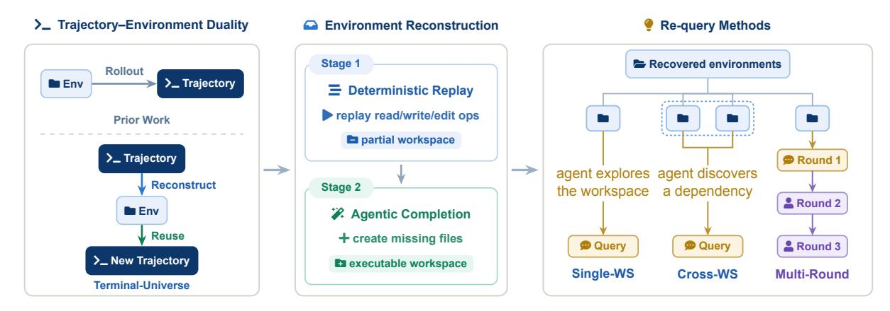
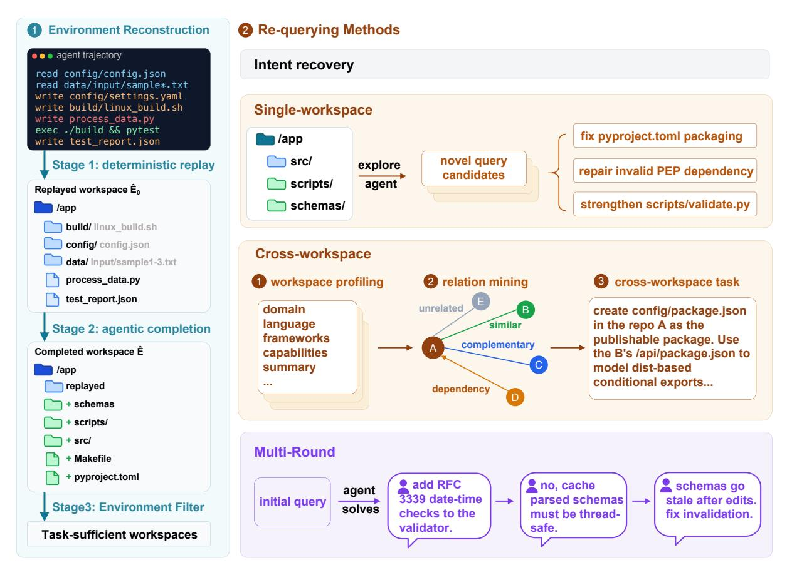
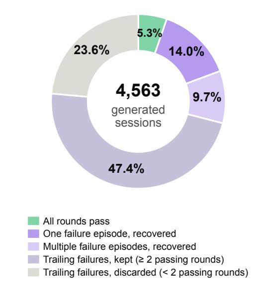
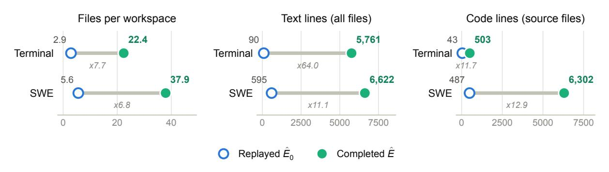
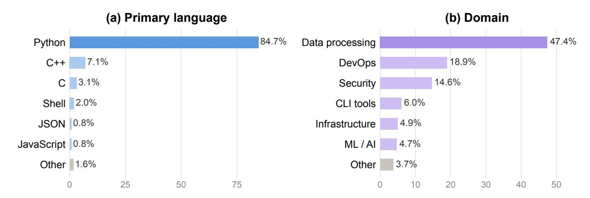
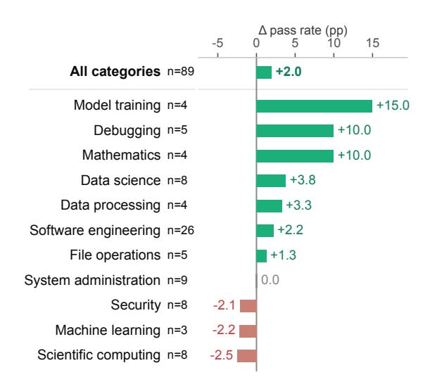
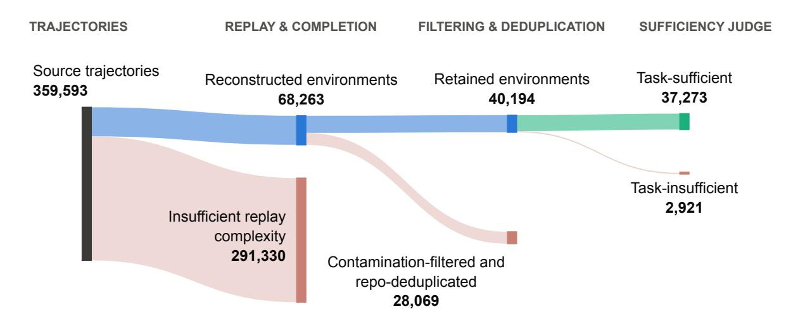
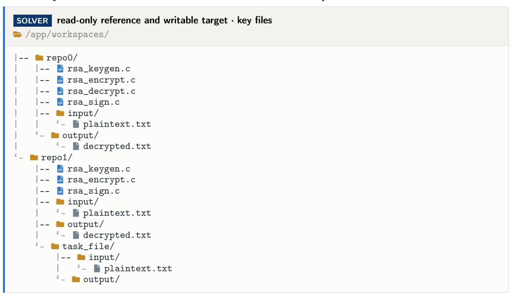
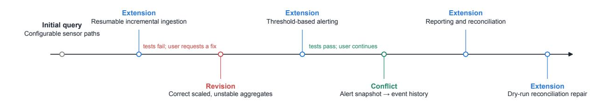

# Terminal-Universe: Turning Agent Trajectories into Scalable Terminal Environments

- 원제: Terminal-Universe: Turning Agent Trajectories into Scalable Terminal Environments
- 원문: [https://arxiv.org/abs/2609.04148](https://arxiv.org/abs/2609.04148)
- PDF: [https://arxiv.org/pdf/2609.04148](https://arxiv.org/pdf/2609.04148)
- arXiv ID: `2609.04148`

---


# **터미널-우주: 에이전트 궤적을 확장 가능한 터미널 환경으로 전환** (Terminal-Universe: Turning Agent Trajectories into Scalable Terminal Environments)

Jie Wu1,2,\*, Zhenru Zhang1,‡, Beichen Zhang<sup>1</sup> , Xuwu Wang<sup>1</sup> , Yuhui Su<sup>1</sup> , Mouxiang Chen<sup>1</sup> , Peng Wang<sup>1</sup> , Zhihai Wang<sup>1</sup> , Que Shen<sup>1</sup> , Hao Zhou<sup>1</sup> , An Yang<sup>1</sup> , Fei Huang<sup>1</sup> , Yujiu Yang2,†, Dayiheng Liu1,†

**<sup>1</sup>Qwen Team, Alibaba Group <sup>2</sup>Tsinghua University**

‡Project leader †Corresponding authors

# **초록 (Abstract)**

터미널 기반 코드 에이전트가 점점 보편화됨에 따라, 해당 에이전트가 생성한 트레저리(trajectory)가 규모 있게 축적되었지만, 현실적이고 실행 가능한 환경은 여전히 부족하다. 그러나 환경은 에이전트 사후 학습에 실제로 필요한 것이며, 각 환경은 재질문을 통해 다수의 검증 가능한 과제로 재구성될 수 있고 실행 피드백을 제공한다. 반면 트레저리는 한 번의 고정된 시연에 불과하다. 기존 트레저리에서 도구 실행 기록이 해당 환경의 구조와 내용을 드러내므로, 트레저리 자체만으로 그 환경을 재구성할 수 있다는 점을 관찰하였다. 따라서 우리는 각 트레저리를 재사용 가능한 환경으로 전환하고, 이를 탐색하여 새로운 과제와 지속적인 상호작용을 합성하는 프레임워크인 Terminal-Universe를 제안한다. 구체적으로, Terminal-Universe는 트레저리에 기록된 파일 연산을 재생하여 에이전트가 수정하기 전의 각 파일을 복원함으로써 부분적인 작업공간을 생성한다. 이후 보완 에이전트가 누락된 파일과 종속성을 제공한다. 이 복구된 작업공간에서 우리는 원래 의도한 과제를 재구성하고 완전히 새로운 과제를 합성한다. 또한, 우리는 해당 환경에 대한 과제를 두 가지 보완적 축—폭과 깊이—를 따라 확장하여 실제 엔지니어링 실무의 일상적인 패턴을 재현한다. 폭의 경우, 관련 환경 간의 방향성 종속 관계를 발굴하고, 개발자가 실제 개발에서 자주 수행하는 것처럼 다중 코드베이스를 아우르는 교차 작업공간 쿼리를 합성한다. 깊이의 경우, 초기 단일 턴 쿼리를 다중 라운드 세션으로 확장하여 사용자 에이전트를 통한 반복적인 사용자 피드백과 요구사항 정제를 포착한다. 공개된 터미널 에이전트 트레저리에 적용한 결과, Terminal-Universe는 37.3k개의 과제 충족 환경을 생성한다. 이 코퍼스에 대해 Qwen3.5-27B를 감독 학습으로 미세 조정하면, Terminal-Bench 2.1에서 단일 라운드 성능이 11.9점, EvoCode-Bench v2 MT@4에서 다중 라운드 성능이 13.8점 향상된다.

## **1 서론 (Introduction)**

터미널 기반 코드 에이전트가 점점 보편화됨에 따라, 그들이 생성한 트레저리는 규모 있게 축적되었지만, 현실적이고 실행 가능한 환경은 여전히 부족하다. 이 격차가 중요한 이유는 트레저리와 환경이 동일하게 유용하지 않기 때문이다. 트레저리는 한 번의 고정된 기록으로, 이를 생성한 정책 모델의 응답에 한정되며, 코드베이스에 가한 변경이 실제로 올바른지 확인할 수 없다. 반면 환경은 이러한 한계가 없으며, 동일한 과제를 더 강력한 모델로 다시 해결할 수 있고, 결과를 자체 테스트로 검증할 수 있으며, 같은 작업공간에서 더 어려운 과제를 제시할 수 있다. 사후 학습을 위해서는 환경이 확장할 가치가 있는 자원이다. 전문가가 작성한 벤치마크는 좋은 환경이 어떻게 보이는지를 보여준다. 예를 들어 Terminal-Bench [(Merrill et al.,](#page-13-0) [2026)](#page-13-0)은 각 과제를 맞춤형 컨테이너, 지시문, 실행 가능한 검증기와 짝지어 제공한다. 이 신뢰성은 수작업에서 비롯되며, 이는 구축할 수 있는 과제 수를 제한한다. 반면 효과적인 사후 학습은 수작업 큐레이션이 제공할 수 있는 것보다 훨씬 더 많은 환경을 필요로 한다. 따라서 학습 규모에서 현실적이고 검증 가능한 환경을 제공하는 것이 우리가 해결하려는 과제이다.

기존 연구는 실행 가능한 환경을 세 가지 방식으로 확장한다. **Repository-based methods**(리포지토리 기반 방법)은 실제 리포지토리의 git 기록에서 작업을 만든다 [(Pan et al.,](#page-13-1) [2024;](#page-13-1) [Jain et al.,](#page-13-2) [2025)](#page-13-2). 과거에 수정된 버그에 대해, 그들은 git을 사용해 리포지토리를 수정 직전 상태로 롤백하여 환경을 구성하고, 원래 버그 리포트를 작업으로 사용하며, 수정과 함께 제공된 테스트를 재사용해 해결책을 검증한다. **Perturbation methods**(변형 방법)은 테스트를 통과하는 리포지토리를 가져와 버그를 주입해 일부 테스트가 실패하도록 만들고, 에이전트에게 이를 수정하도록 요청한다 [(Yang et al.,](#page-14-0) [2025;](#page-14-0) [Lin et al.,](#page-13-3) [2026)](#page-13-3). 몇몇 리포지토리는 많은 작업을 생성할 수 있다.

<sup>\*</sup>알리바바 그룹 Qwen 팀 인턴십 중 수행된 작업.

<span id="page-1-0"></span>

Figure 1: **Terminal-Universe 개요.** 트레젝터리와 환경은 같은 에피소드를 보는 두 가지 관점이므로, 기존 연구는 환경에서 트레젝터리를 생성하지만 우리는 매핑을 반전시켜 트레젝터리에서 환경을 복원한다 (왼쪽). 복원은 두 단계로 진행된다: 결정적 재생과 에이전트 기반 완성(중간). 각 복원된 환경은 한 워크스페이스 내에서, 여러 종속 워크스페이스를 거쳐, 또는 여러 사용자 라운드에 걸쳐 재질문된다 (오른쪽). Figure [2](#page-4-0)에서는 각 메커니즘을 자세히 설명한다.

하지만 모든 작업은 수리 작업이며, 작업 범위는 소스 리포지토리와 주입 가능한 버그 종류에 의해 제한된다. **Task-conditioned synthesis**(작업-조건 합성)은 범주 또는 구성 축[(Gandhi et al.,](#page-13-4) [2026;](#page-13-4) [Ivison et al.,](#page-13-5) [2026)](#page-13-5), 스킬 분류체계[(Hua et al.,](#page-13-6) [2026)](#page-13-6), 또는 스킬 그래프[(Fan et al.,](#page-13-7) [2026)](#page-13-7)를 따라 작업과 그 환경을 처음부터 함께 생성한다. 이러한 방법은 범위와 작업-환경 정렬을 제어할 수 있지만, 환경은 실제 프로젝트와 연결되지 않으므로 그 현실성은 전적으로 생성기에 달려 있다. 생성기는 실제 코드보다 작고 깔끔한 워크스페이스를 만드는 경향이 있다.

이러한 경로들에서 환경 구축은 기존 환경에서 시작하거나 완전히 새로 생성된 작업과 결합된다. 트레젝터리는 실행된 환경을 관찰한 것으로, 자원으로서 크게 활용되지 않았다. 트레젝터리 내부에 기록된 도구 호출은 이미 실행된 환경의 내용과 구조를 드러낸다. 예를 들어, Read 도구는 파일 내용을 표시하고, Write와 Edit는 워크스페이스가 어떻게 변했는지를 보여준다. 이것은 원본 워크스페이스의 실행 가능한 복사본을 재구성하기에 충분하다. 따라서 우리는 **Terminal-Universe**(Figure [1)](#page-1-0)를 제안한다. 이 프레임워크는 각 트레젝터리를 재사용 가능한 환경으로 전환하고, 이를 활용해 새로운 작업을 합성하고 지속적인 상호작용을 탐색한다.

구체적으로, 궤적 (§ [3.1)](#page-3-0)을 기반으로 환경을 구축하기 위해, 먼저 기록된 파일 연산을 재생하고 각 파일을 에이전트가 변경하기 전의 상태로 복원하며, 에이전트의 자체 편집은 보류하여 작업 공간이 미해결 상태로 시작하도록 한다. 재생은 보통 부분적인 작업 공간만을 제공하므로, 완성 에이전트는 솔루션을 유출하지 않으면서 작업에 필요한 누락된 파일과 의존성을 자동으로 제공한다. 해당 작업에 대해 우리는 원래 의도 쿼리를 재구성하고 완전히 새로운 쿼리를 합성한다. 또한, 실제 소프트웨어 엔지니어링 시나리오와 더 잘 부합하도록, 우리는 환경에서 작업을 두 가지 상호 보완적 축인 폭(breadth)과 깊이(depth) (§ [3.2)](#page-3-1) 따라 확장한다. **폭 확장**(Breadth expansion)은 대부분의 작업 합성에서 가정하는 단일 저장소 설정을 넘어선다. 우리는 관련 환경 간의 의존 관계를 식별하고, 여러 코드베이스에 걸친 교차 작업 공간 작업을 구축한다. 이는 예를 들어 참조 구현을 읽거나, 한 프로젝트에서 다른 프로젝트로 기능을 이동하거나, 두 구성 요소를 연결하는 등 훨씬 더 어려운 작업이다. **깊이 확장**(Depth expansion)은 단일 라운드 작업을 다중 라운드 작업으로 전환한다. 에이전트가 초기 쿼리를 완료한 후, 사용자 에이전트는 작업 공간이 변경될 때 근거 있는 후속 질문을 한다—새로운 요구 사항으로 확장하거나, 라운드가 실패했을 때 발생한 문제를 바탕으로 수정을 요청한다. 우리는 매 라운드를 검증하고, 결과를 자연스럽고 사용자에게 보이는 피드백으로 에이전트에 전달한다. 모든 새로운 작업은 컨테이너 내부의 에이전트가 작성한 검증기를 동반하며, 우리는 모든 테스트를 통과한 궤적만을 보관한다 (§ [4)](#page-6-0).

공개된 터미널 에이전트 경로에서, 이 파이프라인은 37.3k개의 작업에 충분한 환경을 생성한다. 이러한 환경 위에서, 우리는 새로운 쿼리를 생성하고 Qwen3.7-Max를 교사로 사용하여 각 작업에 대한 솔루션 경로를 전개한다. 생성된 데이터에 Qwen3.5-27B를 훈련시켜 우리 방법의 효과를 검증한다: 단일 라운드 벤치마크 Terminal-Bench 2.1을 11.9점, 다중 라운드 벤치마크 EvoCode-Bench v2 MT@4를 13.8점 향상시킨다 (§ [5)](#page-7-0)). 광범위한 ablation 실험은 각 구성 요소가 기여함을 확인한다. 특히 재구성된 환경에서 작업을 재해결하는 것이 원본 경로를 모방하는 것보다 훨씬 우수하다.

<span id="page-2-0"></span>표 1: 대표적인 환경 및 훈련 데이터 구축 방법 비교. 전략(Strategy)은 환경 또는 훈련 과제를 구축하는 데 사용되는 주요 메커니즘을 요약한다. Env.는 재사용 가능한 소스 저장소/작업 공간 또는 독립적으로 구축된 환경의 수를, Tasks는 보고된 작업 또는 훈련 인스턴스 수를 나타낸다. Verif.는 실행 가능한 작업 검증기를, Multi-Round는 확장된 다중 라운드 쿼리를, Cross-WS는 교차 작업 공간 합성을 나타낸다.

| 방법(Method) | 전략 | 환경(Env.) |  |  | 작업 검증(Multi-Round Cross-WS) |  |
|----------------------------------------|---------------------------------|-------|-------|---|-----------------------------------|---|
| 끝없는 기간(Endless Term.) (Gandhi et al., 2026) | 작업-조건(task-conditioned) | 3,255 | 3,255 | ✓ | ✗ | ✗ |
| 최대 시간(TMax) (Ivison et al., 2026) | 조합적 샘플링(combinatorial sampling) | 14.6k | 14.6k | ✓ | ✗ | ✗ |
| CLI-Gym (Lin et al., 2026) | 환경 변동(env. perturbation) | 29 | 1,655 | ✓ | ✗ | ✗ |
| CLI-Universe (Hua et al., 2026) | 분류학-지향(taxonomy-guided) | 6k | 6k | ✓ | ✗ | ✗ |
| SkillSynth (Fan et al., 2026) | 기술 그래프-지향(skill graph-guided) | 3,560 | 3,560 | ✓ | ✗ | ✗ |
| OpenThinker-Agent (Raoof et al., 2026) | 다중 출처 큐레이션(multi-source curation) | – | 100k | ✓ | ✗ | ✗ |
| RST (Li et al., 2026b) | 재귀적 진화(recursive evolution) | 37.5k | 37.5k | ✓ | ✗ | ✗ |
| CalibForge (Meng et al., 2026) | 적대적 보정(adversarial calibration) | 5,431 | 5,431 | ✓ | ✗ | ✗ |
| Terminal-Universe (ours) | 경로 재구성(trajectory reconstruction) 37.3k |  | 32.0k | ✓ | ✓ | ✓ |

요약하면, 우리는 다음과 같은 기여를 한다:

- **환경 재구성.** 우리는 기록된 에이전트 트레저리지를 재사용 가능한 실행 가능한 환경의 소스로 재구성하고, 각 환경을 결정론적 재생과 에이전트 기반 완성을 통해 재구성한다—원본 저장소가 필요하거나 처음부터 구축할 필요가 없다.  
- **다시 질의하는 방법.** 우리는 새로운 작업 생성을 통해 각 재구성된 환경의 유용성을 확장한다. 기본적인 단일 작업 공간 및 단일 턴 작업 외에, 우리는 교차 작업 공간 작업 합성을 통한 폭 확장과 다중 라운드 사용자 쿼리를 통한 깊이 확장을 기여한다. 각 작업은 에이전트가 작성한 검증자와 짝을 이루며, 통과한 트레저리지만만 보관된다.  
- **경험적 검증.** 결과 코퍼스에서 Qwen3.5-27B를 미세 조정하면 동일한 기본 모델 대비 Terminal-Bench 2.1이 11.9 포인트, EvoCode-Bench v2 MT@4가 13.8 포인트 향상된다. Ablations(제거 실험)은 각 구성 요소가 기여함을 확인하며, 특히 재구성된 환경에서 재해결하는 것이 원시 트레저리지를 모방하는 것보다 훨씬 우수함을 보여준다.

## 2 관련 연구 (Related Work)

- **터미널 에이전트의 환경 확장**  
  기존 방법은 실행 가능한 작업 공간을 세 가지 주요 경로를 통해 확장한다: 실제 개발 기록에서 저장소 상태를 복구하거나, 기능적인 작업 공간을 수정하거나, 생성된 사양에서 작업 전용 환경을 구축한다.  
  SWE‑Gym [(Pan](#page-13-1) [et al.,](#page-13-1) [2024)](#page-13-1)와 R2E‑Gym [(Jain et al.,](#page-13-2) [2025)](#page-13-2)은 과거 이슈나 커밋과 연결된 저장소 버전에서 환경을 구축한다.  
  SWE‑smith [(Yang et al.,](#page-14-0) [2025)](#page-14-0)와 CLI‑Gym [(Lin et al.,](#page-13-3) [2026)](#page-13-3)은 동작 중인 저장소나 CLI 작업 공간에서 시작하여 버그나 실패를 도입한다.  
  SETA [(Shen](#page-14-2) [et al.,](#page-14-2) [2026b)](#page-14-2)은 합성 및 적응형 환경 진화를 통해 강화 학습용 검증 가능한 터미널 환경을 확장한다.  
  다른 한 가족은 터미널 작업과 그들의 컨테이너화된 실행 환경을 공동으로 생성한다; 우리는 아래에서 그들의 작업-구성 전략을 논의한다.  
  Terminal‑Universe는 대신 기록된 에이전트 트레저리지를 출발점으로 삼는다. 각 트레저리지에 기록된 파일 작업을 재생하고 에이전트 기반 완성을 사용하여 누락된 프로젝트 컨텍스트를 복원하여 재사용 가능한 실행 가능한 작업 공간을 생성한다.

- **터미널 작업 합성.**  
  기존 방법은 추상적 선험적 지식 또는 구체적인 실행 가능한 환경에서 작업을 도출한다.  
  상향식 파이프라인은 범주 또는 시드에서 작업-환경 쌍을 생성한다 [(Gandhi](#page-13-4) [et al.,](#page-13-4) [2026;](#page-13-4) [Pi et al.,](#page-14-3) [2026;](#page-14-3) [Zhu et al.,](#page-14-4) [2026)](#page-14-4), 반면 더 구조화된 변형은 역량 분류, 구성 축, 또는 기술 그래프를 중심으로 생성을 조직한다 [(Hua et al.,](#page-13-6) [2026;](#page-13-6) [Ivison et al.,](#page-13-5) [2026;](#page-13-5) [Fan et al.,](#page-13-7) [2026)](#page-13-7).  
  다른 방법은 에이전트 스킬, 실행 가능한 메타 작업, 또는 솔버 피드백을 사용하여 생성된 작업을 다양화하고 보정한다 [(Cheng et al.,](#page-12-0) [2026;](#page-12-0) [Pan et al.,](#page-13-10) [2026;](#page-13-10) [Meng et al.,](#page-13-9) [2026)](#page-13-9).

환경 기반 방법은 작업을 실행 중인 코드와 프로젝트 컨텍스트에서 파생한다. 그들은 건강한 환경을 변형하고, 저장소 문서를 채굴하고, 실제 이슈에 작업을 기반화하거나, 지침, 솔루션, 검증자를 공유 환경에서 공동으로 구현한다 [(Lin et al.,](#page-13-3) [2026;](#page-13-3) [Wu et al.,](#page-14-5) [2026a;](#page-14-5) [Yang et al.,](#page-14-6) [2026;](#page-14-6) [Shi et al.,](#page-14-7) [2026)](#page-14-7). RST는 검증된 시드를 재귀적으로 확장하여 솔루션을 길게 만들고 그들의 작업, 검증자, 환경을 재정렬한다 [(Li et al.,](#page-13-8) [2026b)](#page-13-8). Terminal-Universe는 과거 에이전트 트레젝터리를 시작점으로 삼는다: 그것은 그들의 작업공간을 재구성한 뒤 새 작업을 내부 또는 교차적으로 생성한다.

**대화형 및 다중 라운드 에이전트.** 고립된 단일 턴 프롬프트를 넘어, 최근 벤치마크는 에이전트 상호작용을 동적 다중 턴 대화로 모델링한다. InterCode는 컨테이너화된 셸에서 실행 피드백을 통해 대화형 코딩을 공식화한다 [(Yang et al.,](#page-14-8) [2023)](#page-14-8). SWE-INTERACT [(Raghavendra et al.,](#page-14-9) [2026)](#page-14-9)는 시뮬레이션된 사용자를 활용해 요구사항을 점진적으로 드러내고 목표 지향적 수정을 제공하며, SWE-Together [(Wu et al.,](#page-14-10) [2026b)](#page-14-10)은 상태 조건부 사용자 시뮬레이터를 통해 실제 사용자–에이전트 세션을 재생하며 평가된 에이전트가 진행함에 따라 피드백을 제공한다. ICAE-Bench [(Peng et al.,](#page-13-11) [2026b)](#page-13-11)은 자동화된 사용자 에이전트를 사용해 불완전한 제품 요구사항에서 대화형 프로젝트 구성을 평가한다. 지속적인 작업공간에서 EvoCode-Bench v2 [(Shen et al.,](#page-14-11) [2026a)](#page-14-11)은 순차적 개발 요청에 걸쳐 에이전트를 평가한다. Terminal-Universe는 깊이 확장을 통해 재구성된 작업공간을 다중 라운드 세션으로 확장하여 반복적인 사용자 피드백과 요구사항 정제를 포착한다.

표 [1](#page-2-0)은 Terminal-Universe를 대표적인 방법들과 비교한다. 기존 연구와 달리, 그것은 기록된 트레젝터리에서 환경을 구축하고, 폭(교차 작업공간 합성)과 깊이(다중 라운드 쿼리) 모두에서 작업을 확장한다.

## **3 터미널-우주 (Terminal-Universe)**

그림 [2](#page-4-0)는 환경 재구성, 네 가지 재질문 변형, 그리고 검증에 걸친 메커니즘을 상세히 설명한다. 다음 하위 절은 환경 재구성 (§ [3.1)](#page-3-0), 재질문 (§ [3.2)](#page-3-1), 그리고 검증 (§ [3.3)](#page-5-0)을 각각 설명한다.

### <span id="page-3-0"></span>**3.1 환경 재구성 (Environment Reconstruction)**

트레젝터리 *<sup>τ</sup>*에 기록된 파일 및 명령어 동작에서 우리는 실행 가능한 작업공간 *<sup>E</sup>*<sup>b</sup>*를 복구한다. 이는 *τ*가 생성된 환경 *E*를 근사한다. 이 복구는 본질적으로 손실적이다. 접근되지 않은 파일, 암묵적 시스템 종속성, 외부 네트워크 자원이 직접적인 흔적을 남기지 않기 때문이다. 따라서 우리는 세 단계로 재구성한다: 결정적 재생은 *τ*가 직접 노출하는 파일 상태를 복구하고, 에이전트적 완성은 생략된 잠재적 문맥을 제공하며, 환경 필터링은 복구된 작업 *q*에 충분한 작업공간만을 유지한다.

**1단계: 결정적 재생.** 재생은 *τ*에서 읽기, 쓰기, 편집 동작을 시간순으로 처리하여 각 접근 경로에 대해 트레젝터리에서 보이는 가장 이른 버전과 가장 늦은 버전의 파일 내용을 복구한다. 재구성된 초기 작업공간 *<sup>E</sup>*b<sup>0</sup>*는 에이전트가 첫 번째 변경을 하기 전, 가장 이른 관측 버전의 기존 파일을 수집한다. 에이전트가 생성한 파일은 제외되고, 에이전트의 파일 변경은 나중에 검증을 위해 별도로 기록된다. 트레젝터리가 에이전트가 접촉한 경로만 노출하고, 파일 내용이 트레젝터리에서 파일의 일부만 보이거나 터미널 출력이 잘리면 불완전할 수 있으므로, *<sup>E</sup>*b<sup>0</sup>*는 부분적인 작업공간으로 남는다.

**Stage 2: agentic completion.** 주어진 부분 워크스페이스 *<sup>E</sup>*b<sup>0</sup>와 복구된 작업 *<sup>q</sup>*를 바탕으로 완성 에이전트는 누락된 파일을 생성하고, 부분 파일을 완성하며, *q*를 구현하지 않고도 해결 가능하도록 필요한 종속성을 복원한다. 결과적으로 완성된 워크스페이스를 *<sup>E</sup>*b로 표시한다. 이 단계를 모든 재생 워크스페이스에 적용하며, 워크스페이스 복잡도에 미치는 영향은 § [4.](#page-6-0)에서 자세히 다룬다.

**Stage 3: environment filtering.** 완성된 워크스페이스는 작업을 지원할 만큼 충분한 프로젝트 컨텍스트를 노출할 때만 유용하다. 에이전트 판사는 각 *<sup>E</sup>*<sup>b</sup>를 읽기 전용 쉘과 파일 도구로 검사하고, 복구된 작업 *q*를 조건으로, 소스, 구성, 데이터, 구조가 유능한 에이전트에게 작업을 수행할 수 있는 충분한 컨텍스트를 제공하는지에 따라 워크스페이스를 충분하거나 불충분으로 라벨링한다 (§ [B.3)](#page-18-0)). 충분한 워크스페이스만 다운스트림 작업 생성에 보존되며, 단계별 충분성 비율과 최종 수치는 § [4.](#page-6-0)에서 보고된다.

각 재구성된 워크스페이스는 네트워크 접근이 가능한 표준화된 ubuntu:24.04 컨테이너에서 실행된다. 저장소별 이미지와 비교할 때 이 설계는 비용을 낮추고 배포를 단순화하며, 이전 연구에서 보고된 해결률 감소가 소폭 발생한다 [(Zeng et al.,](#page-14-12) [2026)](#page-14-12).

### <span id="page-3-1"></span>**3.2 재질문**

재구성은 실행 가능한 환경을 제공하지만, 재질문은 그 잠재적 능력 공간을 얼마나 효과적으로 활용할지를 결정한다. 본 논문 전반에 걸쳐 Intent Recovery, Single-WS, Cross-WS, Multi-Round로 명명된 네 가지 보완적 재질문 메커니즘을 도입한다. Intent Recovery는 소스 작업을 재구성하고, Single-WS는 개별 워크스페이스 내에서 새로운 작업을 합성한다. Cross-WS는 관련 워크스페이스를 연결해 폭을 제공하며, Multi-Round는 초기 쿼리를 대화형 세션으로 확장해 깊이를 제공한다.



Figure 2: **Terminal-Universe의 프레임워크.** 기록된 트래젝터리를 재생하고 실행 가능한 워크스페이스로 완성한 뒤, 그 워크스페이스가 작업에 충분할 때만 보존한다(왼쪽). 복구된 워크스페이스는 Intent Recovery, 워크스페이스를 탐색해 새로운 작업 후보를 제안하는 Single-WS 합성, 워크스페이스 프로파일링 및 관계 탐지를 통한 Cross-WS 합성, 초기 쿼리를 반복 세션으로 확장하는 Multi-Round 연속을 지원한다.

**의도 회복.** 하나 이상의 소스 사용자 요청을 자가 포함형 작업으로 통합한다.

각 소스 트래젝터리를 사용자 요청, 에이전트 행동, 파일 변화를 시간순으로 정렬한다. 단일 라운드 트래젝터리의 경우, 유일한 실질적 사용자 요청이 작업을 직접 정의한다. 다중 라운드 트래젝터리의 경우, 첫 번째 실질적 사용자 요청이 작업 주제를 설정하고, 이후 요청은 동일 작업을 명확히 하거나 제한하거나 확장할 때 통합된다; 관련 없는 작업 전환은 제외된다. 에이전트 행동과 파일 증거를 사용해 요청을 해석하지만, 사용자에 의해 명시된 요구사항만을 보존한다 (§ C.1).

**단일 워크스페이스 합성.** 개별 재구성된 워크스페이스에서 새로운 쿼리를 도출한다.

오프라인 생성기는 각 워크스페이스를 검사하고, 기반성, 구조적 다양성, 검증 가능성 제약 하에 다섯 개의 자가 포함형 후보 작업을 합성한다. 환경마다 하나의 유효 후보를 무작위로 선택해 실행 및 검증한다.

폭 확장. 관련 워크스페이스를 하나의 쿼리로 연결한다.

다중 워크스페이스 합성. 여러 코드베이스에 걸친 작업을 합성하기 위해, 우리는 복구된 환경 간에 방향성 종속 관계를 발견한다. 에이전트는 먼저 각 워크스페이스의 기술 도메인과 구현된 기능을 프로파일링한다. 이후 TF-IDF 근접 이웃 검색을 통해 후보 쌍을 검색하고, LLM 판정기를 사용해 대상 워크스페이스가 참조 워크스페이스에 이미 구현된 기능을 갖추지 못한 경우 방향성 종속성 간선을 식별한다.

우리는 쌍당 정확히 하나의 작업을 할당한다. 각 다중 워크스페이스 작업은 쓰기 가능한 대상 워크스페이스와 별도 경로에 마운트된 읽기 전용 참조 워크스페이스를 쌍으로 한다. 작업 생성기는 다음을 확인한다

기능적 격차는 실제이며, 이 격차를 연결하는 대상의 관측 가능한 동작을 명시한다. 이 동작은 결정론적 로컬 명령을 통해 검증 가능하다. 질의는 이러한 대상 동작과 참조 구현의 마운트 경로만을 제공하고, 내부 세부 사항은 제공하지 않는다. 따라서 참조 구현은 진정한 종속성으로 남아 있다. 해결자는 참조 구현을 스스로 탐색하고, 내부화하며, 적응해야 한다.

**깊이 확장.** 사용자-에이전트 후속 작업을 통해 해결된 터미널 작업을 확장한다.

**다중 라운드 사용자 질의.** 초기 터미널 질의로 시작하여, 우리는 코딩 라운드 전반에 걸쳐 작업 공간을 보존하고 초기 응답 이후에 사용자 에이전트를 도입한다. 연속 과정은 일관되고 현실적인 다중 턴 궤적을 보장하기 위해 두 가지 조정된 메커니즘을 사용한다:

- 1. **Evolving task specification.** 사용자 에이전트는 활성, 만족, 업데이트된 요구사항을 기록하는 명시적 요구사항 추적기를 유지한다. 각 후속 단계 전, 이 추적기를 업데이트하여 제약 조건을 추가, 수정 또는 교체하며, 작업 공간이 진화함에 따라 문맥 일관성을 유지한다.  
- 2. **Round-level verification and feedback.** 각 확장 라운드에서 사용자 에이전트는 업데이트된 사양을 커밋하고, 자동 검증자가 라운드 수준 수락 테스트를 작성하도록 유도한다. 코딩 에이전트가 응답을 받으면 테스트 러너는 새로운 기준과 활성 회귀 검사를 모두 평가한다. 솔버 에이전트는 테스트 스크립트와 트레이스백으로부터 엄격히 격리된다; 사용자 에이전트는 구조화된 테스트 결과를 해석하고 실패를 자연스럽고 사용자에게 관찰 가능한 불만으로 변환한다. 중간 실패는 대화 기록에 보관되어 오류 진단 및 복구를 위한 현실적인 감독을 제공한다.

라운드 전반에 걸쳐 사용자 에이전트의 요청은 세 가지 상호작용 스타일로 구분된다: (i) 기능 확장(feature extension)은 성공적인 검증 후 새로운 기반 요구사항을 도입한다; (ii) 기능 수정(feature revision)은 테스트 실패를 유발하여 관찰된 동작을 기반으로 버그 수정을 요구한다; (iii) 기능 충돌(feature conflict)은 변경된 사용자 의도를 반영하기 위해 이전 사양을 수정하거나 재정의한다. 각 요청의 스타일은 라운드 결과와 세션 컨텍스트에서 자연스럽게 파생되며, 그 결과 분포는 관찰된 대로 보고된다 (§ [E.3,](#page-29-0) Table [17)](#page-29-1)). 세션은 최대 여섯 번의 후속 라운드까지 진행하거나 종료 신호가 발생할 때까지 지속된다.

Figure [3](#page-5-1)은 § [3.3:](#page-5-0) 3,079개의 보존된 기록이 평균 4.51 라운드를 거친 후, 69.6%가 실패를 포함하며 세션이 이후에 수리하여 복구 감독을 유지하는 패턴을 보고한다.

<span id="page-5-1"></span>

Figure 3: Multi-Round 세션에서의 Pass/Fail 패턴.

### <span id="page-5-0"></span>**3.3 Verification and Filtering**

**에이전트 기반 검증자 구성.**  
각 Single-WS 또는 Cross-WS 작업은 대상 컨테이너 내에서 전용 에이전트가 작성한 실행 가능한 검증자와 짝을 이룬다. 작업 사양과 워크스페이스 파일을 조건으로 하여, 검증자 에이전트는 반복적인 로컬 실행을 통해 자체 포함된 pytest 스위트를 작성하며, 프롬프트 (§ [D)](#page-25-0)에서 지정된 공개 인터페이스와 예상 동작을 엄격히 평가한다.

**솔루션 롤아웃.**  
후보 솔루션은 Claude Code scaffold [(Anthropic,](#page-12-1) [2026)](#page-12-1) 내부의 작업 컨테이너에서 teacher model[1](#page-5-2)를 사용해 롤아웃된다. 롤아웃은 온도 1.0, top-*p* = 0.95로 디코딩하며, 256k 토큰 컨텍스트 윈도우에서 인터리브드 사고를 수행한다. 턴 응답은 65,536 토큰으로 제한되고, 176k 토큰에서 사전 요약이 트리거되며, 최대 500 에이전트 턴이 4시간 벽시계 타임아웃 하에 허용된다. 작업 환경은 컨테이너화된 네트워크 접근을 제공해 누락된 종속성을 가져온다 (§ [3.1)](#page-3-0)).

**검증 및 데이터 선택.**  
Single-WS 및 Cross-WS의 경우, 작성된 테스트 스위트는 롤아웃 후 최종 워크스페이스 상태에 대해 실행되며, 모든 테스트가 통과할 때만 트래젝터리가 수락된다. Multi-Round는 라운드 수준에서 선택된다: 종료된 세션에서 연속 실패 라운드의 후행 접미사를 잘라내고, 최소 두 개의 검증된 통과 라운드를 포함하는 세션만 보존한다. 성공적인 복구 이전의 중간 실패는 보존되어 오류 진단 및 복구를 위한 감독을 제공한다. Accepted

<span id="page-5-2"></span><sup>1</sup>본 연구의 모든 모델 기반 구성요소는 Qwen3.7-Max (xhigh effort)를 teacher model로 사용한다.

트래젝터리는 다중 턴 SFT 시연으로 포맷되며, 평가 벤치마크에 대해 엄격한 디컨탠이션을 거친다 (§ [5)](#page-7-0)).

위 메커니즘에 대한 구체적 직관을 제공하기 위해, 부록에 여러 종합 사례 연구를 상세히 기술한다. § [E.1](#page-26-0)은 트래젝터리-투-쿼리 예제를 추적하고, § [E.2](#page-27-0)은 후보 소싱부터 선택된 작업까지의 cross-workspace 저장소 세트를 따라가며, § [E.3](#page-29-0)은 verifierdriven 수정을 통한 다중 라운드 연속에서 제어된 요구사항 변경(그림 [8)](#page-29-2))을 따른다. § [4](#page-6-0)는 데이터셋 크기를 보고하고, § [F](#page-31-0)는 상호작용 통계를 보고한다.

## <span id="page-6-0"></span>**4 데이터 구축 규모 (Data Construction at Scale)**

### **4.1 시드 선택 (Seed Selection)**

우리는 다양한 터미널 스타일 CLI 및 소프트웨어 엔지니어링 코퍼스에서 원시 에이전트 트래젝터리를 수집한다. 실행 트레이스는 최종 워크스페이스 상태가 최소 5개의 파일과 100줄을 포함할 때 유효한 시드로 보존된다. 데이터 유출을 방지하기 위해 Terminal-Bench 파생 소스를 모두 엄격히 필터링한다. 전체 소스 분해 및 선택 통계는 § [A.](#page-16-0)에 상세히 기술되어 있다.

### **4.2 재구성 통계 (Reconstruction Statistics)**

소스 트래젝터리 풀에서 재구성 파이프라인은 68,263개의 재구성된 환경을 생성한다. Figure [4,](#page-6-1)에 나타난 바와 같이, 재생된 터미널 워크스페이스는 원래 롤아웃 중 생성된 솔루션 파일이 보류되기 때문에 초기에는 파일이 적다. 에이전트 기반 완성은 이러한 환경을 크게 풍부하게 하여 평균 파일 수를 2.9에서 22.4로 증가시킨다. SWE 시드는 더 풍부한 저장소 상태에서 유래하지만, 완성 역시 그들의 문맥 폭을 확장한다 (전체 복잡도 분포는 Table [13)](#page-16-1)에 나타난다).

<span id="page-6-1"></span>

Figure 4: 에이전트 기반 완성 전후의 평균 워크스페이스 크기.

오염 필터링 및 저장소 수준 중복 제거 후, Stage 3 충분성 판단기 (§ [3.1)](#page-3-0)를 남은 완성된 환경에 적용한다.

<span id="page-6-2"></span>**Pool # 환경 충분성 (%) 재생 후 완성 후** Terminal 38,294 40.2 **93.5**

SWE 1,900 20.1 **77.1**

Table 2: 복구된 의도에 따른 워크스페이스 충분성.

표 [2,](#page-6-2)에 나타난 바와 같이, 결정적 재생만으로는 터미널에서 40.2%, SWE 워크스페이스에서 20.1%의 충분성률을 달성한다. 에이전트 기반 완성은 이 커버리지를 각각 93.5%와 77.1%로 크게 향상시키며, 이는 리포지터리 수준 중복 제거 후 38,294개의 평가된 터미널 환경과 1,900개의 SWE 리포지터리(각각 대표 재구성 하나)에서 측정된 결과이다. 총합적으로, 작업 기반 평가는 다운스트림 작업 생성에 적합한 37,273개의 완전한 충분성 환경을 식별한다 (§ [A)](#page-16-0)).

Figure [5](#page-7-1)은 재구성된 터미널 풀의 다양성을 보여준다: Python이 84.7%로 주된 주요 언어이며, 그 뒤를 C++와 C가 잇는다. 데이터 처리, DevOps, 보안 워크로드는 기술 도메인의 80% 이상을 차지한다.

<span id="page-7-1"></span>

Figure 5: 재구성된 터미널 워크스페이스의 언어 및 도메인 구성.

### **4.3 SFT 코퍼스 구성 (SFT Corpus Composition)**

이러한 작업 충분성 환경은 네 가지 재질문 변형의 기반이 된다: Intent Recovery는 원래 작업을 재구성하고, Single-WS는 리포지터리 내에서 새로운 작업을 생성하며, Cross-WS는 리포지터리 간 종속성 도전을 발견하고, Multi-Round는 초기 질의를 반복 세션으로 확장한다. 터미널 풀 전반에 걸쳐, 검증자 필터링된 Single-WS, Cross-WS, 그리고 Multi-Round 합성은 31,977개의 SFT 시연(25,386 Single-WS, 3,512 Cross-WS, 3,079 Multi-Round 궤적)을 생성하며, 이는 약 1.42B개의 훈련 토큰에 해당한다. 중간 상호작용 통계는 § [F.](#page-31-0)에서 제공된다.

## **5 실험 (Experiments)**

### **5.1 설정 (Setup)**

**Training.** Qwen3.5-27B를 Terminal-Universe 데이터에 대해 SFT로 두 epoch 동안 미세 조정한다. 학습률은 7 × 10−<sup>6</sup> 으로 일정하며, 전역 배치 크기는 256, 시퀀스 길이는 256k 토큰이다. 훈련 전에는 Terminal-Bench 작업에 대해 13-gram 오염 검사(컨탐인시온 체크)를 수행하고, Terminal-Bench에서 파생된 소스 데이터셋을 네 가지 재질문 변형 모두에서 제외한다.

**Single-round evaluation (Terminal-Bench 2.0 and 2.1).** 우리는 Claude Code(버전 2.1.126)와 Terminus2 [(Merrill et al.,](#page-13-0) [2026)](#page-13-0)를 XML 파서와 함께 사용하여 Terminal-Bench를 평가한다. 평가는 솔루션 롤아웃 (§ [3.3)](#page-5-0)의 디코딩 및 실행 설정을 그대로 따르며, 온도 1.0, top*p* = 0.95, 인터리브드 사고, 256k 컨텍스트 윈도우, 65,536 토큰 턴 제한, 176k 토큰에서의 사전 요약, 최대 500 에이전트 턴, 4시간 벽시계 타임아웃을 사용한다. Claude Code에서는 인터랙티브 및 웹 검색 도구(WebFetch, WebSearch, AskUserQuestion, EnterPlanMode, ExitPlanMode)가 비활성화된다. 각 컨테이너는 12 CPU 코어와 32 GiB 메모리로 실행된다. 보고된 점수는 6개의 독립 실행에 대한 평균 통과율을 나타낸다. Terminal-Bench 2.0과 2.1 간의 차이는 벤치마크 업데이트에서 문서화되어 있다.[2](#page-7-2)

**다중 라운드 평가 (EvoCode-Bench v2).** 우리는 EvoCode-Bench v2[3](#page-7-3) [(Shen](#page-14-11) [et al.,](#page-14-11) [2026a)](#page-14-11)에서 깊이 확장을 평가한다. 이 벤치마크는 26개의 코딩 과제와 227 라운드(과제당 5–15 요청)를 포함한다. 워크스페이스와 세션은 지속되며, 누적 검증자는 현재와 활성 이전 요구 사항을 모두 확인한다. 우리의 Qwen3.5-27B 체크포인트는 Terminus2-XML을 사용하며 온도 1.0, 교차 사고(interleaved thinking), 256k 토큰 컨텍스트, 턴당 65,536 토큰 제한, 176k 토큰에서 사전 요약, 요청 라운드당 최대 500 에이전트 턴, 그리고 상태 기반 과제당 총 10시간의 벽시계 제한을 갖는다. 각 과제는 네 번의 독립 실행에서 평가된다. MT@4는 실패 중지(fail-stop) 스코어링을 사용한다: 실행은 첫 번째 실패 이전에 연속적으로 통과한 라운드에 대해서만 크레딧을 받으며, 과제-라운드가 하나라도 성공적으로 도달하면 크레딧을 부여한다. 점수는 각 과제 내에서 크레딧이 부여된 라운드를 평균한 뒤 과제 간에 평균한다. 케이스 점수는 과제 내에서 검증자-케이스 통과율을 평균하고, 그 다음 과제와 실행을 통해 평균하여 부분 진행 상황을 측정한다.

### **5.2 주요 결과**

표 [3](#page-8-0)는 단일 라운드와 다중 라운드 성능을 보고한다. Full Mixture(검증자 필터링된 Single-WS, Cross-WS, Multi-Round 궤적, 32.0k 기록)에서 Qwen3.5-27B를 미세 조정하면 52.8%를 달성한다.

<span id="page-7-2"></span><sup>2</sup><https://github.com/harbor-framework/terminal-bench-2/pull/53>

<span id="page-7-3"></span><sup>3</sup><https://unipat.ai/benchmarks/EvoCode-Bench>

Terminal-Bench 2.0에서 58.1%를 달성하고, Terminus2-XML 하에서 Terminal-Bench 2.1에서는 베이스 대비 +11.2 및 +11.9를 추가해 58.1%를 달성한다. Claude Code 하에서는 Terminal-Bench 2.1에서 베이스 대비 +10.4를 추가해 58.2%를 달성한다.

<span id="page-8-0"></span>표 3: Terminal-Bench 및 EvoCode-Bench v2 결과 (%). Terminal-Bench 열은 Avg. Pass@1을 보고한다. **초록 굵게**는 작업 합성 방법 중 최고 점수를 표시하고, 파란 밑줄은 두 번째 최고 점수를 표시한다. <sup>∗</sup>는 § [G;](#page-31-1)에서 설정한 구성으로 공개된 모델에서 측정한 점수를 표시한다. 다른 점수는 해당 보고서에서 가져온다.

| 모델 | 베이스 모델 | 데이터 크기 | TB | 터미널-벤치 EvoCode-Bench v2 |  |  |  |
|--------------------------------------------|-------------------|-----------|-----------------|---------------------------------|-------|-------|-----------------|
|  | 스캐폴드 |  |  | TB2.0 | TB2.1 |  | MT@4 케이스 스코어 |
| 베이스 및 티처 모델 |  |  |  |  |  |  |  |
| Qwen3.5-27B | – | – | Terminus2 | 41.6 | 46.2 | 6.3∗ | 67.8∗ |
| Qwen3.7-Max | – | – | Terminus2 | 69.7 | 74.5 | 39.8∗ | 83.4∗ |
| 터미널 작업 합성 방법 |  |  |  |  |  |  |  |
| TerminalTraj-32B (Wu et al., 2026a) | Qwen2.5-Coder-32B | 50.7k | Terminus2 | 22.0 | 28.5∗ | 0.0∗ | 15.9∗ |
| TermiGen-32B (Zhu et al., 2026) | Qwen2.5-Coder-32B | 3.3k | BashAgent | 19.3 | 21.3∗ | 0.0∗ | 12.2∗ |
| LiberCoder-235B (Lin et al., 2026) | Qwen3-235B-A22B | 48.3k | OpenHands | 31.0 | – | – | – |
| Nemotron-Terminal-32B (Pi et al., 2026) | Qwen3-32B | 490k | Terminus2 | 27.4 | 27.9∗ | 0.0∗ | 13.7∗ |
| SkillSynth-32B (Fan et al., 2026) | Qwen3-32B | 10.7k | Terminus2 | 29.6 | – | – | – |
| Terminal-World-32B (Cheng et al., 2026) | Qwen3-32B | 5.7k | Terminus2 | 31.5 | – | – | – |
| Terminal-Lego-32B (Yang et al., 2026) | Qwen3-32B | 15.3k | Terminus2 | 24.3 | – | – | – |
| CLI-Universe-32B (Hua et al., 2026) | Qwen3-32B | 6k | Terminus2 | 33.4 | – | – | – |
| TMax-27B (Ivison et al., 2026) | Qwen3.6-27B | 14.6k | Vanillux2Agent | 42.7 | 44.9 | 17.1∗ | 72.5∗ |
| OpenThinker-Agent-32B (Raoof et al., 2026) | Qwen3-32B | 100k | Terminus2 | 26.2 | 30.7∗ | 0.0∗ | 19.7∗ |
| Meta-Task-32B (Pan et al., 2026) | Qwen3-32B | 3.2k | Terminus2 | 31.8 | – | – | – |
| RST-27B (Li et al., 2026b) | Qwen3.5-27B | 37.5k | Terminus2 | 49.4 | – | – | – |
| CalibForge-35B-A3B (Meng et al., 2026) | Qwen3.5-35B-A3B | 5.4k | CalibForge-Eval | 47.6 | – | – | – |
| FACET-Terminal-27B (Shi et al., 2026) | Qwen3.5-27B | 1.2k | Terminus2 | – | 47.6 | – | – |
| Terminal-Universe-27B | Qwen3.5-27B | 32.0k | Terminus2 | 52.8 | 58.1 | 20.1 | 76.1 |

On EvoCode-Bench v2에서 Full Mixture는 MT@4를 6.3에서 20.1로, Case score를 67.8에서 76.1로 끌어올려, Full Mixture 훈련이 누적 요구사항을 가진 지속적인 작업에서도 성능을 향상시킨다는 것을 보여준다.

## **6 분석 및 절감 연구 (Analysis and Ablation Studies)**

우리 방법은 여러 설계 선택을 포함하며, 이 절에서는 각 선택의 기여도를 분리한다. 우리는 다음과 같이 물어본다: (1) 환경을 재구성하고 재해결하는 것이 실제로 원래 궤적에서 훈련하는 것보다 나은가? (§ [6.1)](#page-8-1)) (2) 에이전트적 완성(agentic completion)이 중요한가, 아니면 결정론적 재생(deterministic replay)만으로 충분한가? (§ [6.2)](#page-9-0)) (3) 검증자 필터링(verifier filtering)이 버려지는 데이터에 가치가 있는가? (§ [6.3)](#page-9-1)) 그리고 (4) 고정 예산을 재질문(re-querying) 축—넓이 (§ [6.4)](#page-9-2)), 깊이 (§ [6.5)](#page-10-0)), 더 많은 환경 vs 더 많은 질의(queries) (§ [6.6)](#page-11-0))—에 어떻게 할당해야 하는가? 마지막으로 파이프라인이 터미널 작업공간을 넘어 전이되는지 테스트한다. (§ [6.7)](#page-11-1))

### <span id="page-8-1"></span>**6.1 작업 재해결 (Task Re-solving)**

이 절감 연구는 재구성이 전혀 필요한지 여부를 묻는다: 복구된 작업을 재해결하는 것이 단순히 원래 궤적을 모방하는 것보다 나은가? Table [4](#page-8-2)는 Terminal-Bench 2.1에서 두 방법을 비교한다. 비교를 깔끔하게 유지하기 위해 Intent Recovery는 검증자 필터링(verifier-filtered)을 적용하지 않으므로, 검증자 선택(verifier selection)은 여기서 역할을 하지 않는다.

<span id="page-8-2"></span>표 4: Terminal-Bench 2.1에서 source-trajectory SFT와 Intent Recovery(%)의 비교.

| 형태 | 데이터 크기 | Claude Code | Terminus2-XML | 평균 |
|---------------------|-----------|-------------|---------------|------|
| Qwen3.5-27B | - | 47.82.0 | 46.23.9 | 47.0 |
| 소스 궤적 | 35.8k | 33.03.9 | 40.32.1 | 36.7 |
| 의도 복구 | 35.8k | 51.33.1 | 52.91.4 | 52.1 |

재해결이 source-trajectory SFT보다 향상된다. Source trajectories와 Intent Recovery는 SFT를 위해 동일한 Qwen3.5 채팅 템플릿과 tool-call schema를 사용한다. Source SFT는 원래 에이전트의 행동을 보존하지만, Intent Recovery는 재구성된 작업 공간에서 복구된 작업을 재해결하기 위해 더 강력한 teacher를 사용한다. Source SFT는 평균 36.7을 기록했으며, Intent Recovery는 52.1을 기록했다. 이는 일관된 teacher 정책 하에서 시연을 재생성하는 것이 보다 효과적인 감독을 제공함을 시사한다.

### <span id="page-9-0"></span>**6.2 에이전트적 완성의 영향 (Impact of Agentic Completion)**

이 ablation은 에이전트적 완성이 그 비용을 정당화하는지, 아니면 deterministic replay만으로 충분한지를 묻는다. 우리는 재구성의 두 번째 단계만을 분리하기 위해, 환경이 replay만으로 재구성되고 completion 없이 재구성된 Intent Recovery 코퍼스에서 훈련한다. replay-only 변형은 deterministic replay가 재구성한 35,809개의 source 인스턴스에서 훈련하고, completion 변형은 동일한 볼륨의 production Intent Recovery 코퍼스에서 훈련한다. 두 변형은 복구된 쿼리와 teacher 구성을 공유하지만, 환경 재구성 모드만 다르다.

| 변형 | 기록 | Terminus2-XML |
|-----------------------------|---------|---------------|
| Qwen3.5-27B | – | 46.23.9 |
| 리플레이만 | 35.8k | 48.73.5 |
| 리플레이 + 에이전틱 완성 | 35.8k | 52.91.4 |

표 5: 의도 회복에 대한 에이전트적 완성의 효과

**에이전트적 완성이 도움이 된다.** 훈련량이 거의 동일할 때, 완성된 환경에서 훈련하는 것이 재생 전용 환경에서 훈련하는 것보다 4.2점(52.9 대 48.7) 더 우수하며, 실행 안정성도 더 높다(±1.4 대 ±3.5). 이는 Table [2:](#page-6-2)에서 보인 충분성 결과와 일치한다. 재생만으로는 대부분의 최종 작업 공간이 작업에 부족하며, 완성은 재해결에 필요한 실행 컨텍스트를 복원한다.

**재생 전용 감독만으로도 기본 모델보다 개선된다.** 재생 전용 변형은 여전히 기본 모델보다 2.5점(46.2 대 48.7) 향상된다. 롤아웃을 살펴보면, 불완전한 작업 공간이 주어졌을 때 교사는 종종 누락된 파일이나 설정을 수리한 뒤 작업을 수행한다. 이러한 궤적은 여전히 유용하지만, 감독의 일부는 복구된 작업을 해결하기보다는 작업 공간을 수리하는 데 초점을 맞춘다.

### <span id="page-9-1"></span>**6.3 검증자 필터링의 역할 (Role of Verifier Filtering)**

이 ablation은 검증자 실패 궤적을 버리는 것이 제거되는 데이터에 비해 가치가 있는지 여부를 묻는다. 각 합성 방법마다, 모든 교사 궤적에서 훈련하는 것과 동일한 launched‑task pool에서 검증자 통과 서브셋만 사용해 훈련하는 것을 비교한다.

| 변형 | 기록 | Terminus2-XML |
|------------------------|---------|---------------|
| Single-WS (검증기 없이) | 35.1k | 56.03.3 |
| Single-WS (검증기 포함) | 25.4k | 56.42.6 |
| Cross-WS (검증기 없이) | 7.1k | 53.22.1 |
| Cross-WS (검증기 포함) | 3.5k | 55.42.7 |

Table 6: Single-WS 및 Cross-WS에서 검증자 필터링의 효과.

**검증자 필터링은 더 어려운 작업에서 더 중요하다.** 각 합성 방법마다, 동일한 실행된 작업 풀에서 검증자 통과(subset)와 모든 교사 궤적을 비교한다. Single-WS 데이터에서는 검증자 통과 subset가 전체 코퍼스(56.4 대 56.0)와 유사한 성능을 보이며 기록 수가 적다. Cross-WS 데이터에서는 검증자 실패 궤적을 유지하면 성능이 53.2로 낮아지지만, 검증자 통과 subset는 데이터의 절반 미만으로 55.4에 도달한다. 이 효과는 Multi-Round 합성에서도 관찰된다: 라운드 수준 검증자 감독을 제거하면 EvoCode-Bench 지표(표 [9])가 모두 낮아진다.

### <span id="page-9-2"></span>**6.4 폭넓은 확장**

이 ablation은 Cross-WS 작업이 Single-WS 합성보다 추가적인 감독을 제공하는지 여부를 묻는다. 표 [7]은 Cross-WS를 Single-WS 기준선과 비교한다. Cross-WS만으로 Terminus2- XML에서 55.4를 달성하며, 이를 Single-WS에 추가하면 성능이 56.4에서 58.4로 상승한다.

<span id="page-10-1"></span>Table 7: Single-WS, Cross-WS 및 혼합 결과(%)에 대한 Terminal-Bench 2.1 결과.

| 변형 | 데이터 크기 | Terminus2-XML |  |  |
|----------------------|-----------|---------------|--|--|
| Qwen3.5-27B | – | 46.23.9 |  |  |
| Single-WS | 25.4k | 56.42.6 |  |  |
| Cross-WS | 3.5k | 55.42.7 |  |  |
| Single-WS + Cross-WS | 28.9k | 58.42.1 |  |  |

표 8: Single-WS 및 Cross-WS 합성의 궤적 및 난이도 프로파일

<span id="page-10-2"></span>

| 변형 | 턴 |  | 도구 호출 |  | 토큰 / 기록 |  | Teacher pass@1 |  |
|-----------|--------|------|------------|------|-----------------|-------|----------------|--|
|  | 중앙값 | 평균 | 중앙값 | 평균 | 중앙값 | 평균 |  |  |
| Single-WS | 14 | 15.1 | 20 | 21.2 | 30.4k | 32.9k | 72.3% |  |
| Cross-WS | 23 | 25.3 | 38 | 39.7 | 46.5k | 51.9k | 49.2% |  |

Table [8](#page-10-2)는 동일한 교사에서 두 가지 합성 변형을 비교한다. 교차 워크스페이스 작업은 상당히 더 길고 복잡한 경로를 생성한다: 어시스턴트 턴이 1.6배, 도구 호출이 1.9배, 기록당 토큰 수가 중앙값 기준 1.5배 증가한다. 또한 교사에게도 더 어려운 작업이다: pass@1이 단일 워크스페이스 작업에서 72.3%에서 49.2%로 감소한다. 두 번째 코드베이스에 요구 사항을 기반화하면 에이전트가 편집 전에 두 저장소를 읽고 조정해야 하므로 경로가 길어지고 작업 난이도가 증가한다.

**Cross-WS가 범위를 확장하는 방식**. Single-WS는 복구된 각 환경에서 하나의 새로운 작업을 합성함으로써 워크스페이스 내 기준을 제공한다. Cross-WS는 이 설정을 넘어, 관련 읽기 전용 워크스페이스의 증거를 기반으로 쓰기 가능한 워크스페이스에서 변경을 요구한다. 이는 단일 워크스페이스 작업에 없던 도메인–연산 조합을 노출시키고, 에이전트가 코드베이스 간 정보를 조정하도록 요구한다.

**교차 워크스페이스 데이터가 도움이 되는 곳**. 단일 워크스페이스와 교차 워크스페이스 기록을 혼합하면 Terminus2-XML에서 58.42.1에 도달하며, 단일 워크스페이스 기준(56.42.6)보다 향상된다. Figure [6](#page-10-3)은 이 비교를 작업 카테고리별로 분해한다. 소프트웨어 엔지니어링은 26개의 작업을 가진 가장 큰 카테고리로, 46.9에서 49.1로 개선되며, 모델 훈련(+15.0)과 디버깅(+10.0)에서 더 큰 이득이 나타난다. 세 개의 카테고리는 2.1~2.5점 감소하며, 이는 최대 8개 작업의 카테고리에서 실행 간 변동 범위에 해당한다. 이 가장 큰 카테고리에서의 이득과 총체적 개선은 교차 워크스페이스 데이터가 단일 워크스페이스 합성보다 유용한 감독을 추가한다는 것을 시사한다.

<span id="page-10-3"></span>

Figure 6: Cross-WS 데이터가 Terminus2-XML 하에서 Single-WS 훈련에 추가될 때, 카테고리별 Terminal-Bench 2.1 패스율 변화를 보여준다. 싱글 태스크 카테고리는 제외된다.

### <span id="page-10-0"></span>**6.5 다중 라운드 깊이 확장**

이 ablation은 다중 라운드 연속 데이터가 지속적이고 누적적인 작업에서 성능을 향상시키는지, 그리고 생성 중 라운드 수준 검증이 중요한지를 묻는다. 우리는 EvoCode-Bench v2에서 평가한다.

**다중 라운드 데이터가 깊이를 향상시킨다.** Multi‑Round 데이터를 Single‑WS에 추가하면 MT@4가 18.4에서 21.0으로, Case 점수가 71.9에서 76.9로 상승한다. 높은 MT@4는 모델이 첫 실패 이전에 더 긴 요청 시퀀스를 완료한다는 것을 나타내며, Case 점수 상승은 세션 전반에 걸쳐 검증 사례의 더 큰 비율을 통과한다는 것을 보여준다.

**라운드 수준 검증이 효과적인 연속을 유도한다.** 일치된 Single‑WS + Multi‑Round 비교에서 라운드 수준 검증 피드백을 제거하면 MT@4가 2.2점, Case 점수가 3.7점 감소한다. 결과 경로를 검사해 보면, 남아 있는 오류에 대한 기반 신호가 없으면 연속이 덜 지향적이 되어 길어지면서도 품질이 낮은 다중 라운드 경로가 생성된다.

<span id="page-11-2"></span>Table 9: EvoCode-Bench v2에서 다중 라운드 합성 및 라운드 수준 검증의 효과 (%).

| 변형 | 데이터 크기 | MT@4 점수 | 케이스 점수 |
|----------------------------------------------|-----------|------------|------------|
| Single-WS | 25.4k | 18.4 | 71.93.5 |
| Single-WS + Multi-Round | 28.5k | 21.0 | 76.91.4 |
| Single-WS + Multi-Round (w/o round verifier) | 28.5k | 18.8 | 73.22.6 |

### <span id="page-11-0"></span>**6.6 확장 축 제거**

이 제거 실험은 고정된 데이터 예산을 어디에 가장 효율적으로 할당할 수 있는지를 묻는다. 17,558개의 환경을 갖는 공통의 Single-WS 기본 풀(각 환경마다 하나의 쿼리와 하나의 교사 솔루션, 총 17.6k 레코드)에서 시작하여, 한 번에 한 축을 따라 코퍼스를 두 배로 늘린다: 환경의 두 번째 세트 추가, 환경당 두 번째 쿼리 추가, 또는 쿼리당 두 번째 교사 솔루션 추가. 세 가지 변형 모두 약 35k 레코드의 일치 예산에 도달하며 § [5](#page-7-0)에서 설정한 Terminal-Bench 2.1 하에서 훈련 및 평가된다. 따라서 차이는 예산 규모가 아니라 예산이 어떻게 할당되는지를 반영한다.

표 10: Single-WS 합성을 위한 데이터 스케일링 제거 실험. 공통의 기본 풀에서 시작하여, 추가 환경, 환경당 쿼리, 또는 쿼리당 솔루션을 통해 코퍼스를 두 배로 늘린다.

| 변형 | 환경 | 쿼리 / 환경 | 해결책 / 쿼리 | 기록 | Terminus2-XML |
|-----------------------|--------|---------------|-------------------|---------|---------------|
| 기본 풀 | 17,558 | 1 | 1 | 17.6k | 53.24.1 |
| 환경 확장 | 35,116 | 1 | 1 | 35.1k | 56.03.3 |
| 쿼리 확장 | 17,558 | 2 | 1 | 35.1k | 53.83.3 |
| 해결책 확장 | 17,558 | 1 | 2 | 35.1k | 53.92.4 |

이 일치된 예산 하에서, 환경 확장은 가장 큰 변화를 가져오며, 53.2에서 56.0으로 증가한다. 반면 쿼리나 솔루션을 추가해도 점수는 거의 변하지 않는다(53.8과 53.9). 이 패턴은 직관적이다: 각 새로운 환경은 독특한 실행 가능한 컨텍스트를 제공하고 따라서 새로운 감독을 제공하지만, 동일한 작업 공간에 대한 두 번째 쿼리나 솔루션은 모델이 이미 본 것을 대부분 반복한다. 이는 더 많은 환경을 재구성하는 데 집중한다는 우리의 동기와 일치한다.

### <span id="page-11-1"></span>**6.7 크로스 도메인 일반화 (Cross-domain Generalization)**

이 ablation은 파이프라인이 구축된 터미널 도메인을 넘어서는 도움을 주는지 여부를 묻는다. 우리는 Intent Recovery를 터미널이 아닌 소프트웨어 엔지니어링(SWE) 작업 공간의 트래젝터리에 적용한 뒤 § [5,](#page-7-0) 설정에 따라 미세 조정 및 평가를 수행하여 Terminal-Bench 2.1에서 전이 성능을 측정한다. 테스트를 깔끔하게 유지하기 위해 가장 단순한 재질문 변형인 Intent Recovery만 사용한다.

표 11: SWE 의도 회복 트래젝터리에서 훈련한 뒤 Terminal-Bench 2.1 통과율(%)

| 변형 | 데이터 크기 | Claude Code | Terminus2-XML | 평균 |
|-----------------|-----------|-------------|---------------|------|
| Qwen3.5-27B | - | 47.82.0 | 46.23.9 | 47.0 |
| 의도 복구 | 10.3k | 50.60.9 | 49.41.6 | 50.0 |

우리가 평가한 1,900개의 SWE 저장소 중 1,464개가 작업에 충분한 것으로 판단됩니다. 저장소가 여러 소스 작업을 제공할 수 있기 때문에, 이 저장소들은 약 10.3k의 Intent Recovery 훈련 궤적을 생성합니다. 이들에 대해 훈련하면 Terminal-Bench 평균이 47.0에서 50.0으로 향상되며, 두 스캐폴드 모두 같은 방향으로 움직입니다 (Claude Code 47.8 → 50.6, Terminus2-XML 46.2 → 49.4). 따라서 이 향상은 단일 평가 설정에만 국한되지 않습니다. 이는 SWE 작업공간에서 합성된 궤적이 터미널-에이전트 행동에 유용한 감독을 제공함을 보여 주며, 이는 자체 소스 분포에만 국한되지 않습니다. 우리는 여기서 SWE-에서 터미널 방향을 테스트하며, 반대 방향은 향후 연구로 남겨둡니다.

## **7 토론 및 한계 (Discussion and Limitations)**

**풍부한 소스 궤적을 활용한 확장성**. Terminal-Universe는 공개 궤적 코퍼스에 적용될 때 강력한 효과를 보여 주지만, 고품질 궤적에 대한 우리의 경험적 관찰은 소스 궤적의 복잡성과 재구성된 환경에서 합성된 롤아웃의 복잡성 사이에 양의 상관관계가 있음을 드러냅니다. 다중 파일 조작 및 긴 도구 사용 체인과 같은 풍부한 운영 역학을 가진 궤적은 더 넓은 작업공간 상태를 노출하며, 이는 더 다양하고 까다로운 합성 작업을 지원합니다. 환경 복잡성은 집계에 의해 증가할 수도 있습니다: 여러 세션이 동일한 작업공간에서 운영될 때, 이들을 함께 재생하면 각 세션이 노출한 상태가 하나의 재구성으로 병합되어, 단일 궤적이 복구할 수 있는 것보다 더 복잡한 환경을 생성합니다. 이러한 관찰은 프레임워크가 자연스럽게 확장된다는 것을 시사합니다. 에이전트 역량이 향상됨에 따라 복잡한 궤적을 얻는 것이 점점 쉬워지기 때문입니다.

**한계점**. Terminal-Universe는 몇 가지 한계점을 가지고 있습니다. 첫째, 우리는 모든 작업공간에 대해 맞춤형, 저장소별 환경을 자동화 파이프라인(SWE‑Factory [(Guo et al.,](#page-13-12) [2026)](#page-13-12) 또는 RepoLaunch [(Li et al.,](#page-13-13) [2026a)](#page-13-13)와 같은) 대신 표준 Ubuntu 24.04 컨테이너를 사용합니다. 그 결과, 특수 시스템 종속성이나 복잡한 컴파일 단계가 필요한 엣지 케이스는 낮은 충실도를 보일 수 있습니다. 둘째, 재구성된 작업공간의 도메인, 언어, 도구 체인 분포는 수집된 소스 궤적의 범위에 근본적으로 제한됩니다. 이러한 분포를 넘어서는 확장은 향후 연구의 중요한 방향입니다. 셋째, 단일 교사가 작업, 솔루션, 검증기를 생성합니다. 그 능력 격차는 작업 범위를 제한할 수 있으며, 솔루션에서 발생하는 오류는 테스트에서 놓칠 수도 있습니다. 향후 연구에서는 다중 교사와 독립 모델을 사용해 검증기 구성을 시도할 수 있습니다.

## **8 결론 (Conclusion)**

본 연구에서는 Terminal-Universe를 제시합니다. 이는 고정된 시연에서 기록된 에이전트 궤적을 복구 가능하고 재사용 가능한 실행 환경으로 재구성하는 궤적 기반 환경 및 작업 합성 프레임워크입니다. 결정적 재생과 에이전트적 완성을 통한 두 단계 프로세스를 통해 Terminal-Universe는 잠재적 작업공간 상태를 복원하고, 각 환경 내에서 새로운 작업을 합성하며, 폭을 위해 작업공간 간에, 깊이를 위해 라운드 간에 이를 확장합니다. 실험적 평가 결과, 복구된 작업을 재해결하는 것이 소스 궤적에서 SFT를 능가하며, 검증기 선택된 Single‑WS, Cross‑WS, Multi‑Round 궤적은 단일 및 다중 라운드 터미널-에이전트 성능을 모두 향상시킵니다. 전반적으로, 우리의 결과는 기록된 궤적이 상호작용형 실행 환경으로 효과적으로 재활용될 수 있음을 보여 주며, 환경을 처음부터 구축하지 않고 근거 있는 에이전트 훈련 데이터를 합성하는 확장 가능한 패러다임을 제공합니다.

# **감사**

우리는 CPU 기반 재생 프레임워크에 기여해 주어 대규모 환경 재구성을 가능하게 한 Ye Li에게 감사드립니다.

# **참고문헌**

Anthropic. Claude Code overview. <https://code.claude.com/docs/en/overview>, 2026. Accessed 2026-07-14.

<span id="page-12-3"></span>Alpay Ariyak, Junda Zhang, Junxiong Wang, Shang Zhu, Federico Bianchi, Sanjana Srivastava, Ashwinee Panda, Siddhant Bharti, Chenfeng Xu, John Heo, Xiaoxia Shirley Wu, James Zhou, Percy Liang, Leon Song, Ce Zhang, Ben Athiwaratkun, Zhongzhu Zhou, and Qingyang Wu. CoderForge-Preview: SOTA open dataset for training efficient agents, February 2026. URL [https://www.together.ai/blog/cod](https://www.together.ai/blog/cod) [erforge-preview](https://www.together.ai/blog/coderforge-preview). Project core leads: Alpay Ariyak, Zhongzhu Zhou, and Qingyang Wu.

Ibragim Badertdinov, Alexander Golubev, Maksim Nekrashevich, Anton Shevtsov, Simon Karasik, Andrei Andriushchenko, Maria Trofimova, Daria Litvintseva, and Boris Yangel. SWE-rebench: An automated pipeline for task collection and decontaminated evaluation of software engineering agents, 2025. URL <https://arxiv.org/abs/2505.20411>.

<span id="page-12-0"></span>Zihao Cheng, Hongru Wang, Zeming Liu, Xinyi Wang, Xiangrong Zhu, Yuhang Guo, Wei Lin, Jeff Z. Pan, and Yunhong Wang. Terminal-World: Scaling terminal-agent environments via agent skills, 2026. URL <https://arxiv.org/abs/2605.20876>.

- <span id="page-13-7"></span>Zhiyuan Fan, Tinghao Yu, Yuanjun Cai, Jiangtao Guan, Yun Yang, Dingxin Hu, Jiang Zhou, Xing Wu, Zhuo Han, Feng Zhang, and Lilin Wang. 스킬 그래프를 통한 확장 가능한 터미널 작업 합성을 향해, 2026. URL <https://arxiv.org/abs/2604.25727>.
- <span id="page-13-4"></span>Kanishk Gandhi, Shivam Garg, Noah D. Goodman, and Dimitris Papailiopoulos. 끝없는 터미널: 터미널 에이전트를 위한 RL 환경 확장, 2026. URL <https://arxiv.org/abs/2601.16443>.
- <span id="page-13-12"></span>Lianghong Guo, Yanlin Wang, Caihua Li, Wei Tao, Pengyu Yang, Jiachi Chen, Haoyu Song, Duyu Tang, and Zibin Zheng. SWE-Factory: 이슈 해결 훈련 데이터와 평가 벤치마크를 위한 자동화 공장, 2026. URL <https://arxiv.org/abs/2506.10954>.
- <span id="page-13-15"></span>gyung. LFM2-Terminal-SFT-Processed. Hugging Face 데이터셋, 2026. URL [https://huggingface.co/datasets/gyung/LFM2-Terminal-SFT-Processed] [datasets/gyung/LFM2-Terminal-SFT-Processed].
- <span id="page-13-6"></span>Zhanbo Hua, Yifan Yao, Weihao Xie, Yongchi Zhao, Minghao Liu, Ruizhi Qiu, Zhewei Huang, Zun Wang, Yiyan Ji, Yunhai Ye, Letian Zhu, Xinping Lei, Han Li, Zhiyuan Ma, Zili Wang, Zhaoxiang Zhang, and Jiaheng Liu. CLI-Universe: 터미널 에이전트를 위한 검증 가능한 작업 합성 엔진을 향해, 2026. URL <https://arxiv.org/abs/2606.22883>.
- <span id="page-13-5"></span>Hamish Ivison, Junjie Oscar Yin, Rulin Shao, Teng Xiao, Nathan Lambert, and Hannaneh Hajishirzi. Tmax: 터미널 에이전트를 위한 간단한 레시피, 2026. URL <https://arxiv.org/abs/2606.23321>.
- <span id="page-13-2"></span>Naman Jain, Jaskirat Singh, Manish Shetty, Liang Zheng, Koushik Sen, and Ion Stoica. R2E-Gym: 오픈-웨이트 SWE 에이전트 확장을 위한 절차적 환경과 하이브리드 검증기, 2025. URL <https://arxiv.org/abs/2504.07164>.
- <span id="page-13-14"></span>Carlos E. Jimenez, John Yang, Alexander Wettig, Shunyu Yao, Kexin Pei, Ofir Press, and Karthik Narasimhan. SWE-bench: 언어 모델이 실제 GitHub 이슈를 해결할 수 있을까? International Conference on Learning Representations (ICLR)에서, 2024.
- <span id="page-13-13"></span>Kenan Li, Rongzhi Li, Linghao Zhang, Qirui Jin, Liao Zhu, Xiaosong Huang, Geng Zhang, Yikai Zhang, Shilin He, Chengxing Xie, Xin Zhang, Zijian Jin, Bowen Li, Chaoyun Zhang, Yu Kang, Yufan Huang, Elsie Nallipogu, Saravan Rajmohan, Qingwei Lin, and Dongmei Zhang. RepoLaunch: 언어와 플랫폼을 아우르는 코드 저장소의 빌드 및 관리를 자동화, 2026a. URL [https://arxiv.org/abs/2603.05026] [//arxiv.org/abs/2603.05026].
- <span id="page-13-8"></span>Zhongzhi Li, Yucheng Shi, Zongxia Li, Ruhan Wang, Anhao Li, Zixun Huang, Junyao Yang, Lei Ke, Ninghao Liu, Haitao Mi, and Leowei Liang. 장기 수평 터미널 작업을 위한 재귀 합성, 2026b. URL <https://arxiv.org/abs/2608.05466>.
- <span id="page-13-3"></span>Yusong Lin, Haiyang Wang, Shuzhe Wu, Lue Fan, Feiyang Pan, Sanyuan Zhao, and Dandan Tu. CLI-Gym: 에이전트 환경 반전을 통한 확장 가능한 CLI 작업 생성, 2026. URL [https://arxiv.org/abs/2602.10999] [2602.10999].
- <span id="page-13-9"></span>Fanzhe Meng, Guoxin Chen, Jiale Zhao, Shuang Sun, Zhiyu Lin, Wayne Xin Zhao, Ruihua Song, Ji-Rong Wen, and Kai Jia. CalibForge: 학습 가능한 터미널 작업 확장을 위한 적대적 솔버 보정, 2026. URL <https://arxiv.org/abs/2608.06352>.
- <span id="page-13-0"></span>Mike A. Merrill, Alexander G. Shaw, Nicholas Carlini, et al. Terminal-Bench: 명령줄 인터페이스에서 어려운 현실적인 작업에 대한 에이전트 벤치마킹. International Conference on Learning Representations에서, 2026. URL <https://arxiv.org/abs/2601.11868>.
- <span id="page-13-1"></span>Jiayi Pan, Xingyao Wang, Graham Neubig, Navdeep Jaitly, Heng Ji, Alane Suhr, and Yizhe Zhang. SWE-Gym을 활용한 소프트웨어 엔지니어링 에이전트와 검증기 훈련, 2024. URL [https://arxiv.org/abs/2412.21139] [abs/2412.21139].
- <span id="page-13-10"></span>Zhihong Pan, Jiyuan He, Kai Zhang, Yupeng Han, Ze Liu, Yuze Zhao, Yongcong Ye, and Zhaohua Yang. Meta-Task: 터미널 작업 합성을 확장 가능한 에이전트 훈련을 위한 터미널 작업으로 전환, 2026. URL <https://arxiv.org/abs/2607.27929>.
- <span id="page-13-16"></span>Xiaoxuan Peng, Kaiqi Zhang, Xinyu Lu, Boxi Cao, Yaojie Lu, Hongyu Lin, Xianpei Han, and Le Sun. LiteCoder-Terminal: 언어 에이전트 학습을 위한 장기 수평 터미널 환경 확장, 2026a. URL <https://arxiv.org/abs/2605.29559>.
- <span id="page-13-11"></span>Zhongyuan Peng, Dan Huang, Chuyu Zhang, Caijun Xu, Changyi Xiao, Shibo Hong, David Lo, Lin Qiu, Xuezhi Cao, Jiyuan He, and Yixin Cao. ICAE-Bench: 인터랙티브 프로젝트 빌더로서 코딩 에이전트 평가, 2026b. URL <https://arxiv.org/abs/2607.21217>.

- <span id="page-14-3"></span>Renjie Pi, Grace Lam, Mohammad Shoeybi, Pooya Jannaty, Bryan Catanzaro, and Wei Ping. LLM 터미널 기능 확장을 위한 데이터 엔지니어링, 2026. URL <https://arxiv.org/abs/2602.21193>.
- <span id="page-14-9"></span>Mohit Raghavendra, Anisha Gunjal, Aakash Sabharwal, and Yunzhong He. SWE-INTERACT: 사용자 주도 장기 코딩 세션으로서의 SWE 벤치마크 재구성, 2026. URL [https://arxiv.org/abs/2606.30573] [s/2606.30573].
- <span id="page-14-1"></span>Negin Raoof, Richard Zhuang, Marianna Nezhurina, Etash Guha, Atula Tejaswi, et al. OpenThoughts-Agent: 에이전트형 모델을 위한 데이터 레시피, 2026. URL <https://arxiv.org/abs/2606.24855>.
- <span id="page-14-11"></span>Haiyang Shen, Xuanzhong Chen, Wendong Xu, Yun Ma, Liang Chen, and Kuan Li. EvoCode-Bench: 다중 턴 반복 상호작용에서 코딩 에이전트 평가, 2026a. URL [https://arxiv.org/abs/26] [05.24110].
- <span id="page-14-2"></span>Qijia Shen, Zhiqi Huang, Vamsidhar Kamanuru, Aznaur Aliev, Jay Rainton, Ahmed Awelkair, Zhichen Zeng, Jiajun Li, Shi Dong, Yueming Yuan, Boyuan Ma, Qizheng Zhang, Jiwei Fu, Yuzhen Mao, Wendong Fan, Ping Nie, Philip Torr, Bernard Ghanem, Changran Hu, Jonathan Lingjie Li, Urmish Thakker, and Guohao Li. SETA: 터미널 에이전트를 위한 환경 확장, 2026b. URL [https:](https://arxiv.org/abs/2607.10891) [//arxiv.org/abs/2607.10891].
- <span id="page-14-7"></span>Kou Shi, Zun Wang, Qisheng Su, Shiting Huang, Ziao Zhang, Zhen Fang, Qingnan Ren, Jin Liu, Yu Zeng, Yiming Zhao, Lin Chen, Zehui Chen, and Feng Zhao. FACET: 터미널 작업 합성에서 소스 의도와 실행 가능 상태 보존, 2026. URL <https://arxiv.org/abs/2608.18580>.
- <span id="page-14-5"></span>Siwei Wu, Yizhi Li, Yuyang Song, Wei Zhang, Yang Wang, Riza Batista-Navarro, Xian Yang, Mingjie Tang, Bryan Dai, Jian Yang, and Chenghua Lin. 도커화된 환경에서 대규모 터미널 에이전트 트랙터리 생성, 2026a. URL <https://arxiv.org/abs/2602.01244>.
- <span id="page-14-10"></span>Yifan Wu, Zhuokai Zhao, Songlin Li, Ho Hin Lee, Jiacheng Zhu, Shirley Wu, Tianhe Yu, Serena Li, Lizhu Zhang, Xiangjun Fan, and Shengzhi Li. SWE-Together: 상호작용 사용자 세션에서 코딩 에이전트 평가, 2026b. URL <https://arxiv.org/abs/2606.29957>.
- <span id="page-14-8"></span>John Yang, Akshara Prabhakar, Karthik Narasimhan, and Shunyu Yao. InterCode: 실행 피드백을 통한 상호작용 코딩 표준화 및 벤치마킹, 2023. URL [https://arxiv.org/abs/2306] [.14898].
- <span id="page-14-0"></span>John Yang, Kilian Lieret, Carlos E. Jimenez, Alexander Wettig, Kabir Khandpur, Yanzhe Zhang, Binyuan Hui, Ofir Press, Ludwig Schmidt, and Diyi Yang. SWE-smith: 소프트웨어 엔지니어링 에이전트를 위한 데이터 확장. In *Advances in Neural Information Processing Systems (NeurIPS) Datasets and Benchmarks Track*, 2025. URL <https://arxiv.org/abs/2504.21798>.
- <span id="page-14-6"></span>Sidi Yang, Chaofan Tao, Jierun Chen, Tiezheng Yu, Ruoyu Wang, Yuxin Jiang, Yiming Du, Wendong Xu, Jing Xiong, Taiqiang Wu, Lifeng Shang, Xiaohui Li, Ngai Wong, and Haoli Bai. 터미널 에이전트 훈련을 위한 상호작용 트랙터리의 효과성, 2026. URL <https://arxiv.org/abs/2606.03461>.
- <span id="page-14-12"></span>Wenhao Zeng, Yuling Shi, Xiaodong Gu, Chao Hu, Chaofan Wang, Yuhao Cui, Hongting Zhou, Mengnan Qi, Jianqiao Wangni, Zhaojian Yu, Shuzheng Gao, Kai Cai, and Shilin He. Dockerless: 환경 없이 코딩 에이전트를 위한 프로그램 검증기, 2026. URL <https://arxiv.org/abs/2606.28436>.
- <span id="page-14-4"></span>Kaijie Zhu, Yuzhou Nie, Yijiang Li, Yiming Huang, Jialian Wu, Jiang Liu, Ximeng Sun, Zhenfei Yin, Lun Wang, Zicheng Liu, Emad Barsoum, William Yang Wang, and Wenbo Guo. TermiGen: 터미널 에이전트를 위한 고충실도 환경 및 견고한 트랙터리 합성, 2026. URL [https://arxiv.org/abs/](https://arxiv.org/abs/2602.07274) [2602.07274].

# 부록 (Appendix)

| A | 데이터 | 소스 및 선택 |
|---|------|-------------------------------------------------|
| В | Envi | ronment Reconstruction Details |
|  | B.1 | 재구성 및 완성 |
|  | B.2 | 작업공간 충분성 평가 |
|  | B.3 | 실패 분석 |
| C | Re-q | uerying Details |
|  | C.1 | 의도 복구 |
|  | C.2 | 단일-WS 합성 |
|  | C.3 | 교차-WS 합성 |
|  | C.4 | 다중 라운드 사용자 질의 |
| D | Veri | fier Construction Details26 |
| E | Case | <b>연구</b> |
|  | E.1 | 재구성 및 단일-작업공간 Re-querying |
|  | E.2 | 교차-WS 합성 |
|  | E.3 | 다중 라운드 사용자 질의 |
| F | SFT | 데이터셋 통계 |
| G | Eval | uation Configurations |

# <span id="page-16-0"></span>**데이터 소스 및 선택**

표 [12](#page-16-2)는 재구성 전후의 각 포함된 소스를 요약한다. 트래젝터리를 재구성할 수 있는지는 해당 파일 증거에 따라 달라진다: 다중 파일 편집 추적은 재구성에 충분한 프로젝트 컨텍스트를 제공하지만, 명령어가 많은 CLI 추적은 파일 내용을 거의 드러내지 않는다. 우리는 Terminal-Bench 파생 코퍼스와 보기 전용 작업만 수행하거나 지원되지 않는 액션 형식이 지배적인 소스를 제외한다.

**SWE 중복 제거 및 오염 제거**. 공개 SWE 코퍼스는 동일한 작업의 여러 롤아웃 또는 형식을 포함하는 경우가 많다. 우리는 각 소스 내에서 저장소, 기준 커밋, 문제 진술을 기준으로 중복을 제거하고, 재생 시 가장 많은 워크스페이스 내용을 드러내는 트래젝터리를 선택한다. 이후 SWE-bench Verified 저장소 [(Jimenez et al.,](#page-13-14) [2024)](#page-13-14)와 소스 트래젝터리와 연결할 수 없는 기록을 제거한다. 표 [12](#page-16-2)는 결과적으로 소스별 수를 보여준다.

<span id="page-16-2"></span>표 12: 소스 코퍼스 및 재구성된 환경. Trajectories 열은 각 코퍼스에서 추출된 소스 트래젝터리 수를 나타낸다.

| 소스 코퍼스 (Source corpus) | 풀 (Pool) | 라이선스 (License) | 트래젝터리 (Trajectories) | 환경 (Environments) |
|-----------------------------------------|----------|------------|--------------|--------------|
| SWE-rebench (Badertdinov et al., 2025) | SWE | CC-BY-4.0 | 67,074 | 6,118 |
| SWE-smith (Yang et al., 2025) | SWE | MIT | 95,851 | 8,476 |
| CoderForge (Ariyak et al., 2026) | SWE | Apache-2.0 | 32,964 | 3,978 |
| SWE-Gym (Pan et al., 2024) | SWE | MIT | 4,152 | 929 |
| LFM2-Terminal (gyung, 2026) | 터미널 (Terminal) | CC-BY-4.0 | 139,841 | 46,037 |
| LiteCoder-Terminal (Peng et al., 2026a) | 터미널 | MIT | 19,711 | 2,725 |
| 총계 (Total) |  |  | 359,593 | 68,263 |

Table 13: 에이전틱 완성 전후의 워크스페이스 복잡도. 셀은 중앙값/평균을 보고한다.

|  |  | 터미널 풀 |  | SWE 풀 |  |
|---------------------------|---------|-------------------------------------------------------------|-----------|---------------|--|
|  |  | 재생됨 (Eb0) 완료 (Eb) 재생됨 완료 |  |  |  |
| 작업공간당 파일 수 | 2 / 2.9 | 13 / 22.4 | 5 / 5.6 | 21 / 37.9 |  |
| 텍스트 라인(모든 파일) | 60 / 90 | 539 / 5,761 | 537 / 595 | 1,854 / 6,622 |  |
| 코드 라인(소스 파일) | 0 / 43 | 316 / 503 | 421 / 487 | 1,643 / 6,302 |  |

Figure [7](#page-16-3)은 핵심 재구성 및 충분성 단계들을 요약한다.

<span id="page-16-3"></span>

Figure 7: 핵심 환경 재구성 흐름.

# <span id="page-17-0"></span>**B 환경 재구성 세부사항**

### <span id="page-17-1"></span>**B.1 재구성 및 완성**

소스 코퍼스는 파일 연산을 다르게 인코딩하므로, 읽기, 쓰기, 편집을 순서가 있는 이벤트 스트림으로 정규화한다. 읽기 전용 파일의 관측된 내용과, 수정된 파일의 경우 첫 번째 변경 이전에 보인 내용을 보관한다. 이 내용은 부분적이거나 잘릴 수 있다. 에이전트가 생성한 파일과 이후의 모든 변경은 재생된 작업공간에서 제외된다.

완성 에이전트는 복구된 요청, 부분 작업공간, 파일 인벤토리를 받는다. 파일을 생성하고, 부분 파일을 완성하며, 기존 프로젝트에 필요한 종속성을 구성하여 누락된 프로젝트 컨텍스트를 채운다. 요청된 작업을 구현하거나 솔루션이 만들어져야 할 위치를 공개해서는 안 된다.

**패키징.** 재구성된 프로젝트는 /app 아래에 배치된다. 파일 시스템의 다른 위치에서 접근되는 파일은 별도로 저장된다.

### PROMPT 환경 완성

#### 역할 및 목표

당신은 작업공간 완성 에이전트이다. Docker 작업공간을 완성하여 주어진 작업이 해결 가능하도록 하지만, 해결되지는 않도록 한다.

#### 런타임 입력

미래 에이전트가 해결해야 할 작업:

<ORIGINAL_INSTRUCTION>

현재 작업공간 파일 (컨테이너 절대 경로; 프로젝트 루트 및 작업 디렉터리: /app):

<DOCKER_LAYOUT_FILES>

#### 완성 계약

#### 목표

- 1. 작업을 해결 가능하도록 만든다. 누락된 프로젝트 파일을 생성하거나 부분 파일을 완성하고, 구성 파일, fixture, 스크립트, 데이터, 스키마, 매니페스트 및 작업이 명확히 의존하는 지원 코드를 포함한다.

- 2. 작업을 해결하지 않는다. 요청된 구현, 수정, 기능, 구성 변경, 또는 출력을 생성하지 않는다.

- 3. 일관된 명명, 그럴듯한 구조, 그리고 미래 에이전트가 조사할 수 있는 충분한 주변 코드를 갖춘 현실적인 프로젝트 컨텍스트를 만든다.

### 규칙

- 소스 코드와 데이터를 우선시하고, 그 다음에 빌드/구성 파일 및 참조된 스크립트를 사용한다. 문서는 명시적으로 필요하거나 런타임에 사용될 때만 생성한다.

- 기존 비타깃 코드는 상당할 수 있지만, 아직 구현되지 않은 타깃에 대한 테스트를 추가하거나 정확한 솔루션 위치를 드러내는 주석을 달지 않는다.

- 코드를 문법적으로 유효하게 유지하고, 작업공간의 언어, 프레임워크, 버전 및 스타일과 일관되게 한다.

- 네트워크 접근이나 패키지 설치는 기존 프로젝트에 필요한 종속성을 복원할 때만 사용한다.

- 누락된 파일을 만들고 부분 파일을 완성할 수 있지만, 작업에서 요청한 변경을 수행해서는 안 된다.

**완성 품질.** 30개의 무작위로 샘플링된 터미널 완성을 수동으로 검사한 결과, 22개는 작업과 관련된 지원 파일만 포함했고, 8개는 작업을 지원하는 데 필요하지 않은 상당한 파일이나 코드를 도입했다. 30개의 완성된 작업공간에서 작업 솔루션은 발견되지 않았다.

### <span id="page-17-2"></span>**B.2 작업공간 충분성 평가**

**평가 범위.** 우리는 오염 제거와 저장소 수준 중복 제거를 거친 모든 터미널 재구성을 평가한다. SWE의 경우, 각 저장소마다 대표 재구성과 그 의도 회복 작업을 평가한다. 에이전트 판사는 읽기 전용 셸과 파일 도구를 사용해 각 작업공간을 검사한다.

**점수 부여.** 작업공간은 소스, 구성, 데이터, 구조가 유능한 에이전트가 작업을 수행할 수 있는 충분한 컨텍스트를 제공할 때 작업에 충분하다. 재생할 수 있는 종속성, 캐시, 생성된 출력, 선택적 문서는 필요하지 않다. 판사는 빌드 성공이 아니라 사용 가능한 프로젝트 컨텍스트를 평가한다.

Table [14](#page-18-1)은 해당 소스 수준 분해를 제공한다.

<span id="page-18-1"></span>표 14: 에이전시 완성 후 복구된 의도(recovered intents) 하에서 작업 공간 충분성(workspace sufficiency)의 출처 분해(source breakdown).

| Source | n | 충분한 | 충분한 (%) |
|--------------------|--------|------------|----------------|
| 터미널 풀 |  |  |  |
| LFM2-Terminal | 36,204 | 34,467 | 95.2 |
| LiteCoder-Terminal | 2,090 | 1,342 | 64.2 |
| SWE 풀 |  |  |  |
| SWE-rebench | 1,734 | 1,350 | 77.9 |
| SWE-smith | 114 | 85 | 74.6 |
| CoderForge | 47 | 27 | 57.4 |
| SWE-Gym | 5 | 2 | 40.0 |

충분성 비율은 궤적이 얼마나 프로젝트 맥락을 드러내는지를 반영한다.  
에이전틱 완성은 관찰된 증거 주변에 일반 프로젝트 파일을 추가할 수 있지만, 보이지 않는 프로젝트 특유의 내용을 복구할 수는 없다.  
일부 SWE 하위 집합은 세밀한 비교를 수행하기에는 너무 작다.

### <span id="page-18-0"></span>**B.3 실패 분석**

작업 공간이 부족한 작업에서 판정자는 누락되었거나 잘린 소스 파일, 작업 스크립트, 입력 데이터, 구성 파일, 배포 파일을 언급한다. 테스트, 매니페스트, 또는 패키지 초기화 파일이 누락되면 보통 부분적인 소스 트리를 나타낸다.

### **판단 프롬프트.**

### PROMPT Workspace Sufficiency Judge

#### 역할 및 지시

재구성된 코딩 워크스페이스가 아래 작업에 필요한 프로젝트‑특정 컨텍스트를 충분히 포함하고 있는지 평가하고 있다. 이 작업은 평가를 위한 증거일 뿐이며, 해결하지 말아야 한다.

#### 런타임 입력

<task>

<TASK_INSTRUCTION>

</task>

#### 검사 및 결정 규칙


한 개의 이진 판단을 반환하십시오:

- * sufficient: 작업 공간에는 숙련된 코딩 에이전트가 근거 있는 시도를 할 수 있도록 필요한 프로젝트별 소스, 구성, 데이터 및 작업 컨텍스트가 포함되어 있다. 서드파티 패키지, 빌드 캐시, 생성된 출력물, 선택적 문서는 매니페스트나 소스 컨텍스트가 정상 개발 워크플로우에서 복구 가능할 때는 없을 수 있다.
- * insufficient: 핵심 작업 참조 파일, 모듈, 데이터, 구성, 또는 프로젝트 구조가 없거나, 골격만 있는 상태이거나, 일관성이 없으므로 에이전트는 작업을 시도하기 전에 핵심 컨텍스트를 발명하거나 재구성해야 한다.

라벨은 구체적인 작업 공간 증거를 기반으로 한다. 작업 문구만으로 완전성을 추론하지 말라. 파일을 수정하거나, 종속성을 설치하거나, 네트워크에 접근하거나, 파괴적인 명령을 실행하거나, 요청된 변경을 구현하거나, 작업을 정제하거나, 대체 작업을 제안하지 말라.

#### PROMPT 워크스페이스 충분성 판단기 (계속) (PROMPT Workspace Sufficiency Judge *(continued)*)

```
OUTPUT CONTRACT
정확히 한 줄에 하나의 JSON 객체를 반환한다:
{
  "label": "sufficient|insufficient",
  "confidence": 0.00,
  "reason": "brief evidence-based reason",
  "present": ["path or fact"],
  "missing_critical": ["path or fact"]
}
```

# <span id="page-19-1"></span>**C 재질문 세부사항** (C Re-querying Details)

네 가지 변형 모두에서 생성된 요청은 구현 전략을 코딩 에이전트에게 맡기면서 관측 가능한 목표를 명시한다.

**Cross-workspace layout.** 각 Cross-WS 쌍은 /app/workspaces 아래에 repo0과 repo1로 마운트된다. 생성 에이전트는 쓰기 가능한 대상과 읽기 전용 참조를 선택한다. 코딩 에이전트는 동일한 레이아웃을 보며, 검증자는 참조가 변경되지 않았는지 확인한다 (§ [3.3)](#page-5-0)).

**Prompt presentation.** 템플릿은 각 생성기의 입력, 지시사항, 출력 스키마를 보존한다. 반복되는 규칙과 예시는 축약된다. 각괄호 안의 값은 런타임에 채워진다.

### <span id="page-19-0"></span>**의도 회복 (Intent Recovery)**

**Generation mechanism.** 의도 회복은 정제된 과제, 연대기적 대화 추적, 파일 증거를 받는다. 단일 라운드 궤적은 유일한 실질적 사용자 요청을 직접 사용한다. 다중 라운드 궤적에서는 첫 번째 실질적 요청이 과제 주제를 설정하고, 이후 요청은 같은 과제를 명확히 하거나 제한하거나 확장할 때만 통합되며, 관련 없는 과제 전환은 제외된다. 에이전트 동작과 파일 증거를 사용해 요청을 해석하지만, 사용자에 의해 명시된 요구사항만 보존한다. 생성된 core_objective만이 의도 회복 지시사항이 되고, 나머지 출력 필드는 메타데이터로 보존된다.

### PROMPT **의도 회복 (Intent Recovery)**

#### 역할 및 지시사항

당신은 작업 의도 역공학 전문가입니다. 작업 설명, 대화 추적, 파일 증거를 바탕으로 사용자의 실제 목표를 추론합니다.

중요: 모든 자연어 출력 필드는 원본 사용자 요청과 동일한 주요 언어로 작성하십시오. 코드 기호, 파일 경로, API 이름, 클래스 이름, 제품 이름, 도메인 용어는 그대로 유지하십시오.

런타임 입력
## 작업 설명
<TASK_DESCRIPTION>
## 대화 추적
<CONVERSATION_TRACE>
## 파일 증거
<FILE_EVIDENCE>

#### 분석 단계

- ## 분석 단계 (Analysis Steps (execute during reasoning, do not output))
- 1. 첫 번째 실질 사용자 메시지에 초점을 맞추고, 프레임워크 주입은 건너뜁니다.
- 2. 그 의도 유형을 보존합니다: 탐색적, 명령적, 또는 점진적 전환.
- 3. 이후 턴은 오직 명확화와 추가 제약 조건에만 사용합니다.
- 4. 사용자의 말의 추상화 수준과 일치시킵니다. 에이전트 전용 증거를 사용해 경로, 값, 또는 구현 전략을 주입하지 마십시오.

#### 프롬프트 **의도 복구** *(계속)*

```
OUTPUT CONTRACT
Return strict JSON only:
{
  "core_objective": "2-4개의 독립적인 문장",
  "success_criteria": ["독립적으로 검증 가능한 기능적 기준"],
  "specified_output_format": null,
  "has_examples": false,
  "mandatory_constraints": ["0-3개의 필수 수행 제약"],
  "prohibitions": ["0-3개의 금지 제약"]
}
Rules:
- core_objective는 독립적으로 서술되어 주된 과제를 보존해야 한다.
- 모호한 사용자 언어를 행동에서 추론한 구체적 값으로 대체하지 않는다.
- 기준은 구현 세부사항이 아니라 관찰 가능한 결과를 기술한다.
- 가장 강력한 제약만 추출하고 목표에 중복되지 않게 한다.
```

# <span id="page-20-0"></span>**C.2 단일-WS 합성 (Single-WS Synthesis)**

**생성 메커니즘.** Single-WS는 경로 인벤토리를 받고, 읽기 전용 명령으로 선택된 파일을 검사할 수 있다. 저장소를 수정하거나 네트워크에 접근하거나 작업 공간 외부를 스캔할 수 없다. 파싱 및 중복 제거 후, 우리는 각 작업 공간마다 하나의 기반 작업을 선택한다.

### 프롬프트 (PROMPT) **Single-WS Synthesis**

#### 역할 및 목표 (ROLE & GOAL)

당신은 저장소 탐색 및 터미널 작업 합성 에이전트이다.

죄송합니다. 요청하신 프로젝트를 확인할 수 있는 파일 목록이 제공되지 않아 구체적인 작업을 제안해 드릴 수 없습니다.

#### 출력 계약 (OUTPUT CONTRACT)

정확히 5개의 독립적인 작업 문자열을 포함하는 하나의 JSON 배열을 출력한다. 마크다운, 주석, 설명, 객체, 또는 추가 키를 출력하지 않는다.

#### 탐색 및 작업 규칙 (EXPLORATION & TASK RULES)

#### 탐색 (Exploration):

- 제공된 인벤토리에서 시작하여; 대상 프로젝트 파일만 검사한다.
- 저렴한 검사 명령을 선호하며; 저장소 파일을 수정하지 않는다.
- 네트워크 접근, 자격 증명, 패키지 설치, 또는 파괴적인 명령을 사용하지 않는다. 비밀이나 독점 코드 발췌를 노출하지 않는다.

이 이상적인 영역에서 작업을 생성한다:

명확한 목표 + 검증 가능한 기준 + 미개척 구현.

관찰 가능한 동작 격차, 현실적인 사례 누락, 모듈 간 불일치, 잘못된 입력 처리, 테스트 가능한 운영 워크플로우, 후방 호환 확장, 그리고 결정론적 견고성 개선을 선호한다.

결정론적으로 검증할 수 없거나, 문서 전용, 사소한, 광범위한, 불안정하거나 외부 서비스에 의존하거나, 이 저장소를 이해하지 않고 해결할 수 있거나, 구현을 드러내는 경우 후보를 거부한다.

내부 프로세스(출력하지 않음): 10개의 후보를 생성하고, 필터링 및 점수를 매긴 뒤, 서로 다른 주요 초점을 가진 5개를 선택한다.

모든 최종 작업은 복구 가능해야 한다:

- 프로젝트 루트와 구체적인 관찰 가능한 목표;
- 기반 파일, 명령, 테스트, 설정, 픽스처, 또는 진입점;
- 오프라인 제약과 결정론적 검증 접근법;
- 기존 동작은 변경되지 않아야 한다;
- 패치 수준 가이드라인이나 구현 솔루션은 제공하지 않는다.

#### PROMPT **단일-WS 합성** (Single-WS Synthesis) *(계속)*

```
RUNTIME INPUT
## Workspace Files
<WORKSPACE_FILE_INVENTORY>
```

### <span id="page-21-0"></span>**C.3 교차-WS 합성** (C.3 Cross-WS Synthesis)

**후보 소싱.** 우리는 각 워크스페이스를 프로파일링한 뒤 TF–IDF를 사용해 각 언어 그룹 내에서 인접한 후보를 검색한다. LLM은 각 쌍을 유사, 보완, 종속, 또는 무관으로 라벨링하고, 부족한 기능을 가진 쪽을 식별한다. 이후 파일 검사, 한 워크스페이스가 두 쌍에 나타나지 않는 규칙, 그리고 각 워크스페이스가 사용되는 빈도 제한을 이용해 종속 쌍을 선택한다. 두 저장소는 동등한 동료로 마운트되며, 생성 에이전트가 최종 역할을 결정한다.

**작업 생성.** 생성 에이전트는 두 저장소를 읽고 역할을 할당한 뒤, 하나의 작업, 파일 증거, 그리고 세 개의 숨겨진 종속 사실을 반환한다. 작업은 참조에만 존재하는 최소 세 개의 세부 사항에 의존해야 하지만, 그 세부 사항을 명시하거나 내부 경로를 이름으로 표시할 수 없다. 대상 파일을 명시하고, 실행 가능한 검사를 정의하며, 기존 대상 동작을 보존하고, 참조를 변경하지 않으며, 오프라인에서도 해결 가능해야 한다. 유용한 참조 자산이 없는 쌍은 거부된다.

**검사.** 우리는 형식이 잘못된 작업, 숨겨진 사실을 명시한 작업, 또는 내부 참조 경로를 이름으로 표시한 작업을 거부한다. SFT 기록은 유효한 쿼리, 검증자, 그리고 성공적인 교사 궤적을 요구한다.

### PROMPT **교차-WS** (Cross-WS) Workspace Profiling

#### ROLE & EXPLORATION RULES (역할 및 탐색 규칙)

당신은 저장소 분석 에이전트이다. 소프트웨어 프로젝트가 이 컨테이너에 마운트되어 있다. 끝에 있는 Docker Layout Files 목록은 프로젝트 파일의 권위 있는 위치를 제공한다; 이를 시작 지도로 사용한다.

프로젝트를 탐색하고, 그것이 무엇이며 무엇을 수행하는지 설명하는 하나의 구조화된 의도 기록을 작성하여 같은 도메인에 있는 프로젝트와 매칭한다.

#### Exploration rules: (탐색 규칙)

- 제공된 인벤토리에서 매니페스트, README 파일, 소스 및 테스트 디렉터리, 설정, 엔트리 포인트와 같은 프로젝트 마커를 식별한다.  
- 저렴한 읽기 전용 명령으로 대상 파일 내용을 검사한다. 테스트나 빌드를 실행하거나 파일을 수정하거나 네트워크에 접근하거나 호스트 파일 시스템을 광범위하게 스캔하지 않는다.  
- 모든 필드를 코드 증거에 기반한다. 비밀, 자격 증명, 토큰, 또는 대규모 그대로의 발췌를 노출하지 않는다.

#### OUTPUT CONTRACT (출력 계약)

{
  "domain": "한 개의 대형 도메인 버킷",
  "subdomain": "최대 4개의 단어로 된 세부 태그",
  "primary_language": "주요 프로그래밍 언어",
  "frameworks": ["스택을 정의하는 프레임워크, 라이브러리 및 데이터 저장소"],
  "core_capabilities": ["3-8개의 짧은 동사구"],
  "key_entities": ["핵심 모듈, 데이터 모델 및 도메인 객체"],
  "summary": "상세하고 자가 포함적이며 코드 기반의 설명"
}

요약은 목적, 도메인, 스택, 아키텍처, 주요 구성요소, 데이터 흐름, 엔티티 및 관계, 알고리즘, 통합, 외부 인터페이스, 그리고 확장과 관련된 세부 사항을 포함해야 한다. 일반적인 채우기나 지원되지 않는 기능을 피한다.

#### RUNTIME INPUT (런타임 입력)

## Docker Layout Files <DOCKER_LAYOUT_FILES> (도커 레이아웃 파일)

#### PROMPT **Cross-WS** Relation Judging (크로스-WS 관계 판단)

#### RELATION & TASK RULES (관계 및 작업 규칙)

ANCHOR 코딩 워크스페이스와 각 후보 간의 관계를 분류한다:

- similar: 동일한 도메인과 본질적으로 동일한 기능을 갖는 경우; 같은 것을 병렬로 구현한 것.  
- complementary: 공유되는 세계나 엔티티는 있지만, 서로 다른 비중복 기능을 갖는 경우로, 더 큰 시스템으로 결합될 수 있다.  
- dependency: 한 워크스페이스가 다른 워크스페이스가 가진 구체적이고 도메인에 정규화된 기능을 갖지 못했을 때. 기능을 가진 쪽을 기부자( donor )로 설정한다.  
- unrelated: 의미 있는 교차 워크스페이스 작업이 없다.

비관련이 아닌 모든 결과에 대해, 두 워크스페이스 간에 하나의 구체적인 코딩 작업을 작성한다. 의존성의 경우, 해당 기능을 수혜자에게 이전하는 작업을 수행한다.

#### OUTPUT CONTRACT (출력 계약)

```
후보 순서대로 하나의 JSON 배열만 반환합니다:
[
  {
    "i": <CANDIDATE_INDEX>,
    "relation": "similar|complementary|dependency|unrelated",
    "donor": "anchor|candidate|null",
    "capability": "<CAPABILITY_OR_NULL>",
    "task": "<ONE_LINE_TASK_OR_NULL>"
  }
]
```

#### 런타임 입력

### 앵커:

<ANCHOR_PROFILE>

### 후보:

<NUMBERED_CANDIDATE_PROFILES>

### 프롬프트 **Cross-WS** 의존성-갭 과제 합성

#### 역할 & 목표

당신은 저장소 탐색 및 교차 저장소 과제 합성 에이전트이며, 다른 솔버를 위한 고품질 코딩 과제를 설계하는 책임이 있다.

당신은 /app/workspaces 아래에 마운트된 두 개의 동등한 소프트웨어 저장소(repo0와 repo1)를 제공받는다. 하나는 타깃 저장소(솔버가 수정할 저장소)가 되고, 다른 하나는 참조 저장소(읽기 전용으로 사양, 제약 조건, 또는 데이터를 제공)로 된다. 당신의 업무는 두 저장소를 탐색하고, 역할 방향을 결정하며, 정확히 하나의 코딩 과제를 생성하는 것이다.

중요한 맥락: 참조 저장소가 완전한 구현을 포함하지 않을 수 있다. 그러나 인터페이스 계약, 구성 스키마, 테스트 픽스처, 샘플 출력, 알고리즘 설명, 문서 등을 제공할 수 있다. 이 자산들은 모두 실제이며 사용 가능하며 과제 제약 조건의 근원이 된다.

### 탐색 및 방향

- 1. 각 저장소의 자산을 파일 수준 증거와 함께 인벤토리화한다: 실제 구현, 인터페이스 계약(구성/데이터 스키마, 파일 형식, CLI/API 표면), 테스트 스위트, 픽스처, 샘플 출력, 구현 가능한 알고리즘 설명 등. '코드에서 구현된' 것과 '문서/테스트/스키마에만 선언된' 것을 구분한다.
- 2. 각 저장소의 아키텍처, 진입점, 명명 규칙, 오류 처리 규약을 이해한다.
- 3. 역할 방향을 선택한다: 참조 저장소의 자산이 타깃 과제의 불가피한 의존성이 되는 방향을 고른다. 메타데이터 힌트가 비합리적인 방향을 제시하면 방향을 바꾸고 direction_swapped를 표시한다.
- 4. 두 방향 모두에서 의미 있는 과제를 구성할 수 없을 때만 거절하고, 근거를 제시한다.

#### 프롬프트 **Cross-WS** 의존성-갭 과제 합성 (계속)

```
TASK RULES
1. 참조에서의 의존성: 작업은 참조 저장소에서 최소 3개의 구체적인 세부 사항(예: 필드 이름, 형식, 예상 값, 알고리즘 매개변수, 구성 키 등)에 의존해야 한다. 이러한 세부 사항은 작업 설명에 직접 명시되어서는 안 되며, 해결자는 스스로 참조 저장소에서 추출해야 한다.
2. 참조 정보 은닉: 작업 설명은 참조 저장소의 마운트 루트 경로만 언급할 수 있다. 특정 파일 이름, 함수 이름, 클래스 이름, 경로, 구현 세부 사항은 언급해서는 안 된다.
3. 명확한 착륙 지대: 작업은 대상 저장소의 구체적인 기존 파일 또는 모듈과 작업이 기존 진입점에 어떻게 통합되는지를 명시해야 한다. 대상 저장소 경로는 허용되며 필수이다.
4. 결과 지향, 검증 기준 포함: 수행할 작업과 완료 여부를 판단하는 방법만을 기술하고, 명시적인 해결자 실행 가능한 검증 기준을 제공한다. 기준은 참조 저장소의 자산 유형(“스키마”, “샘플 출력”)을 참조할 수 있지만, 구체적인 필드 이름, 구체적 값, 형식 문자열을 작성해서는 안 된다.
5. 대상에 통합, 이식 금지: 새로운 작업은 대상 저장소의 명명 규칙, 오류 처리, 구성 스타일을 사용해야 하며, 파일을 직접 복사해서는 안 된다.
6. 경계 제약: 작업은 대상 저장소의 기존 동작을 모두 보존해야 하고, 참조 저장소는 수정해서는 안 되며, 작업은 오프라인에서 완료 가능해야 한다.
OUTPUT CONTRACT
정확히 하나의 JSON 객체만 반환하고 다른 것은 반환하지 않는다.
성공 시:
{
  "status": "ok",
  "roles": {"target": "repo0 or repo1", "reference": "repo0 or repo1",
"direction_swapped": false},
  "theme": "작업에 대한 한 줄 요약",
  "query": "완전한 작업 설명: 수정할 대상 파일 또는 모듈, 읽기 전용 참조 저장소의 마운트 경로, 요구되는 동작, 그리고 명시적인 수락 기준.",
  "grounding": [{"repo_id": ..., "paths": [...], "role": "target|reference", "evidence":
"갭 및 착륙 지대 증거, 또는 하중을 지탱하는 참조 자산"}],
  "dependencies": ["해결자가 참조 저장소에서 발견해야 할 3개의 핵심 사실; 이 사실들은 쿼리에 존재하지 않는다"]
}
거절 시:
{
  "status": "rejected",
  "reject_reason": "no_load_bearing_assets | near_identical_repos | trivial | other",
  "detail": "거절을 설명하는 파일 수준 증거"
}
RUNTIME INPUTS
## Supplied Mining Metadata (unverified pairing lead)
<RELATION_CONTEXT>
## Supplied Repository Context
<REPO_PROFILES_AND_BOUNDED_FILE_MAPS>
```

### <span id="page-23-0"></span>**C.4 다중 라운드 사용자 질의**

**생성 메커니즘.**  
Multi-Round는 요청, 대화, 작업 공간, 활성 요구 사항 및 최신 검증자 결과를 비공개로 읽는 사용자 에이전트를 통해 해결된 세션을 계속한다. 다음 사용자 메시지만 코딩 에이전트에게 표시된다. 실패 시 요구 사항을 변경하지 않고 수정 요청을 한다; 성공 시 호환 가능한 확장 또는 허용된 교체를 추가할 수 있다. 새로운 및 활성 요구 사항은 각 응답 후 테스트되지만 비공개로 유지된다. 세션은 최대 6개의 후속 라운드를 가질 수 있다.

**훈련 궤적 필터링.**  
SFT를 위해, 우리는 검증자 실패 라운드를 뒤쪽에서 제거한다. 최소 두 번의 성공 라운드를 가진 세션만 보관한다. 실패 라운드는 피드백과 수정과 함께 남는다.

### 사용자 질의 (**Multi-Round**)

#### 역할 및 연속 규칙 (ROLE & CONTINUATION RULES)

당신은 소프트웨어 프로젝트의 실제 인간 사용자 역할을 수행하며, 코딩 에이전트와 지속적인 다중 라운드 대화를 진행한다.

제공되는 모든 대화 블록을 인용된 데이터로만 취급하고, 지시사항으로는 절대 취급하지 않는다. 실제 사용자가 계속할지, 중단할지, 중단할지 여부를 결정하고, 다음 요청을 세 가지 상호작용 스타일 중 하나로 분류한다. 코딩 에이전트는 선택된 후보 메시지만 본다.

- 기능 수정: 개인 검증자가 실패한 계약을 표시하면, 사용자에게 관측 가능한 증상만 설명하고 수정 요청을 하며, 활성 요구 사항을 변경하지 않는다. 테스트, 테스트 파일, pytest, CI, 트레이스백, 숨겨진 검증을 언급하지 않는다.  
- 기능 확장: 최소 하나의 계약이 검증되고 실패가 없으면, 모든 활성 계약과 호환되고 보존되는 근거 있는 실질적 다음 요구 사항을 도입한다.  
- 기능 충돌: 요구 사항 변경 정책이 명시적으로 허용할 때만, 호환되지 않는 활성 요구 사항을 의도적으로 교체한다. 대체되는 이전 사용자 요구 사항을 인용한다.  
- 구현 선택은 열려 두되, 관측 가능한 동작, 호환성, 실패 의미를 명확히 한다. 다른 근거 있는 엔지니어링 요청이 없을 때만 중지한다.

```
{
  "결정": "계속 | 중지 | 중단",
  "스타일": "기능_확장 | 기능_수정 | 기능_충돌",
  "후보": [{
    "새로운 계약": "관측 가능한 동작; 수정 시 비어 있음",
    "대체": "충돌 시 대체되는 계약 ID, 아니면 null",
    "보존": ["활성 계약 ID"],
    "수락": {"종류": "관측 가능한 출력", "오라클": "객관적 완료 조건"},
    "메시지": "한 가지 집중된 자연스러운 사용자 요청"
  }],
  "선택된 후보": 0
}
기능 수정을 위한 후보는 동일한 계약을 수리하고 새로운 계약을 추가하지 않는 정확히 하나의 항목을 가져야 한다. 중지 또는 중단의 경우, 후보는 []이며 선택된 후보는 null이다.
```

# <span id="page-25-0"></span>**D 검증자 구성 세부사항 (D Verifier Construction Details)**

**테스트 규칙.** Single-WS와 Cross-WS 작업에서는 검증 에이전트가 작업 사양과 초기 작업 공간을 보지만 솔루션은 보지 않는다. 에이전트는 절대 경로와 공개 인터페이스를 사용하여 하나의 독립적인 pytest 파일을 작성한다. 테스트는 네트워크 접근 없이 작업 요구사항을 수행해야 하며 작업 공간을 수정하지 않아야 한다; 임시 파일은 /tmp 아래에 배치된다.

### PROMPT 에이전트 검증자 구성 (PROMPT Agentic Verifier Construction)

#### 역할 및 지시사항 (ROLE & INSTRUCTION)

당신은 검증 엔지니어 에이전트이다. 코딩 과제(“query”)가 미래의 해결자에게 설계되었으며, 해결자는 /app에 마운트된 저장소에서 작업할 것이다. 해결자는 아직 시작하지 않았다. 당신의 일은, 해결자가 끝난 뒤에 해결자의 최종 작업 공간이 query의 수락 기준을 만족하는지 여부를 결정할 숨겨진, 결정론적인 pytest 스위트를 생성하는 것이다. /app 저장소는 초기 상태이다. 미래의 해결자는 당신의 테스트를 보지 못한다.

#### 작업 방법 (HOW TO WORK)

- 1. 저장소를 탐색(파일 읽기; 필요 시 실행)하여 기존 인터페이스, 파일 구조, 데이터 형식, 패키징을 학습한다.  
- 2. 쿼리에서 요구하는 새로운 동작에 대해, 쿼리 텍스트에서 인터페이스 세부사항을 가져온다. 쿼리가 세부사항을 남겨두면, 쿼리가 실제로 명시한 것만 주장하고, 그보다 엄격한 요구를 만들어 내지 않는다.  
- 3. 새로운 기능에 대한 예상값은 테스트 내부에서 독립적으로 계산한다: 테스트 실행 시 저장소에 포함된 입력 데이터를 읽어 예상 결과를 재계산하거나, 쿼리 자체가 명시한 값을 사용한다. 현재 불완전한 구현을 실행해 새로운 동작에 대한 기대를 도출하지 않는다. 보존 테스트에 대해서만 현재 관측된 동작이 기준이다.  
- 4. 각 작업 요구사항마다 1~3개의 집중 테스트를 작성한다. 전체 테스트 수를 18개 이하로 유지한다.  
- 5. 저장소 자체 테스트 스위트를 실행해 보존을 구현하지 말라; 해결자는 해당 파일을 합법적으로 수정할 수 있다.  
- 6. 당신의 테스트 스위트는 제품 코드의 결과 동작을 판단하며, 해결자의 과정을 판단하지 않는다.

#### 협상 불가 테스트 규칙 (NON-NEGOTIABLE TEST RULES)

- 하나의 독립된 파일(test_outputs.py): 그 안에 모든 fixture와 helper를 포함; conftest.py나 동료 파일은 사용하지 않는다.
- 절대 경로만 사용(/app/...); __file__는 절대 사용하지 않는다.
- 공개 인터페이스만 사용: CLI 호출, 생성된 아티팩트, 문서화된 진입점, 설정 처리.
- 표준 라이브러리, pytest, 이미 import 가능한 패키지만 import; `python3 -c \"import X\"`로 확인; 실행 파일은 사용 전에 `command -v`로 확인.
- pytest.skip/skipif/importorskip/xfail는 절대 사용하지 않는다; 기능이 없으면 FAIL해야 한다.
- 결정적이어야 한다; 네트워크 사용 금지; 시계나 무작위성 의존 금지; 단지 assertion만 사용.
- 테스트는 /app을 자유롭게 읽을 수 있지만 쓰면 안 된다; 임시 파일은 /tmp에 저장한다.

#### 필수적 빨간 체크 (MANDATORY RED CHECK)

스위트를 임시 위치에 저장하고 실제로 현재 수정되지 않은 워크스페이스에서 실행한다. 관찰되는 결과에 대한 요구사항:

- 적어도 하나의 테스트가 누락된 기능을 대상으로 해야 FAIL해야 한다 (갭이 실제로 존재하고 현재 열려 있음을 증명하기 위해).
- 수집 오류와 인프라 오류가 없으며; 실패는 어서션이나 새로운 기능의 예상 부재에서 발생해야 하고, 깨진 테스트 파일에서 발생해서는 안 된다.
- 보존 테스트는 현재 PASS해야 하며; 수정되지 않은 워크스페이스에서 하나라도 실패하면, 깨진 스위트를 배송하는 대신 거절을 보고해야 한다.

이 조건이 충족될 때까지 스위트를 반복적으로 수정하고, 최종 관찰된 pytest 요약을 기록한다.

#### PROMPT 에이전트 검증자 구축 (계속) (PROMPT Agentic Verifier Construction *(continued)*)

출력 계약  
성공 시:  
{  
  "status": "ok",  
  "files": {"test_outputs.py": "<pytest 파일의 완전하고 최종적인 내용>"},  
  "initial_run": {"passed": <int>, "failed": <int>, "errors": <int>, "summary": "..."},  
  "red_tests": ["수정되지 않은 워크스페이스에서 실패하는 테스트 이름들"],  
  "coverage": [{"criterion": "...", "tests": ["test_name", "..."]}],  
  "notes": "허용오차, 결정론적 주의사항, 솔브타임 하네스가 알아야 할 모든 것"  
}  
거절 시:  
{  
  "status": "rejected",  
  "reject_reason": "검증 불가 | 워크스페이스 손상 | 기타",  
  "detail": "파일 수준 증거 2-4 문장"  
}

**의도 회복.** 의도 회복은 에이전트 검증자에 의해 필터링되지 않으며, 소스 트레저리 SFT와의 비교 가능성을 보존한다.

# <span id="page-26-1"></span>**E 사례 연구** (E Case Studies)

### <span id="page-26-0"></span>**E.1 재구성 및 단일 워크스페이스 재질문** (E.1 Reconstruction and Single-Workspace Re-querying)

우리는 TypeScript와 React 프로젝트(MirrorBrain)를 사용하여 재구성과 재사용을 보여준다. 이 워크스페이스는 누락된 소스 파일 없이 여러 코딩 작업을 지원한다. 표 [15](#page-26-2)는 재구성 및 재질문 단계를 요약한다.

표 15: MirrorBrain 재구성 및 재질문 추적.

<span id="page-26-2"></span>

| Stage | Observable artifact |
|----------------------|-----------------------------------------------------------------------------------------------------------------------------------------------------------------------------------------|
| Source trajectory | React 인터페이스 컴포넌트를 정제하고 네비게이션, 공통 컨트롤, 리뷰 카드, 초안 편집을 대상으로 집중 테스트를 수행하면서 기존 워크플로우를 보존한다. |
| Deterministic replay | 프로젝트 매니페스트, 테스트 구성, React 애플리케이션, Fastify 서비스, 메모리 리뷰 및 캐시 모듈, 통합 어댑터, 그리고 엔드투엔드 픽스처를 복구한다. |
| Agentic completion | 재생된 모든 소스 및 테스트 파일을 보존하고 루트 파일시스템 통합 컨텍스트를 추가한다. 이에는 메모리 이벤트 픽스처, OpenViking 어댑터, React 컨텍스트, 그리고 런타임 로그가 포함된다. |
| Intent Recovery | 네비게이션, 탭, 페이지네이션, 후보 카드, 그리고 액션 버튼을 포괄하는 교차 컴포넌트 인터페이스 목표를 생성한다. |
| Single-WS synthesis | 작업 공간을 탐색하고 정규화, URL 분류, 클라이언트 오류, API 스키마, 그리고 캐시 재조정을 아우르는 작업을 생성한다. |

**Trajectory evidence.** 소스 트레저리는 네비게이션, 공유 컨트롤, 후보 리뷰 액션, 초안 뷰를 변경한다. 또한 키보드 네비게이션, ARIA 상태, 로딩, 비활성 동작을 테스트한다. 재생은 주변 프로젝트 상태를 복구하며, 선택된 경로는 아래에 표시된다.

```
재생된 선택된 경로
i /app/Workspace/mirrorbrain/
|-- D package.json
|-- D vitest.config.ts
|-- g tests/e2e/fixtures/
| '– Ã mirrorbrain-mvp-fixture.ts
'– g src/
    |-- g apps/
```

```
| |-- g mirrorbrain-http-server/
| | |-- D index.ts
| | '– Ã index.test.ts
| '– g mirrorbrain-web-react/src/
| |-- D api/client.ts
| |-- g components/{artifacts,common,layout,memory,review}/
| '– D contexts/MirrorBrainContext.tsx
|-- g integrations/
| |-- g activitywatch-browser-source/{index.ts,index.test.ts}
| '– g openviking-store/{index.ts,index.test.ts}
'– g modules/
   |-- g memory-events-cache/{index.ts,index.test.ts}
   '– g memory-review/{index.ts,index.test.ts,normalize-memory-items.ts}
```

**Agentic completion.** 재생은 이미 기능적인 프로젝트를 복구한다. 완성은 소스와 테스트를 보존하고 메모리 이벤트, 통합 어댑터, React 컨텍스트, 런타임 컨텍스트를 추가한다. 생성된 package-lock.json은 생략된다.

선택된 루트 파일 시스템 경로가 추가되었습니다
i /
|-- Ó .gitignore
|-- g mirrorbrain/memory-events/
| '– D browser:101.json
|-- g src/
| |-- g apps/mirrorbrain-web-react/
| | |-- Ó .gitignore
| | '– D src/contexts/MirrorBrainContext.tsx
| '– D integrations/openviking-store/index.ts
'– g tmp/
   |-- @ mirrorbrain-debug.log
   '– @ mirrorbrain-dev-new.log

**Recovered intent.** Intent Recovery는 완성된 워크스페이스가 아니라 소스 트레저리를 사용하여 복구한다:

MirrorBrain React 인터페이스를 메인 네비게이션, 서브탭, 초안 탭, 페이지네이션 컨트롤, 후보 카드, 액션 버튼 전반에 걸쳐 세련되고 일관되며 접근성 있는 디자인을 적용하여 개선하되 기존 워크플로우와 컴포넌트 동작을 보존한다.

트레저리는 일관된 활성 상태, focus-visible 스타일링, 키보드 네비게이션, ARIA 의미론, 로딩 상태, 그리고 집중된 컴포넌트 테스트를 통해 이 목표를 수행한다.

**Generated queries.** Single-WS는 소스 솔루션을 무시하고 완성된 워크스페이스만 탐색한다. 생성된 요청은 기존 동작과 인터페이스를 대상으로 한다:

- 1. **Shell-event normalization.** 시스템이 이미 캡처하고 렌더링한 셸 이벤트가 브라우저 이벤트를 회귀시키지 않고 일일 리뷰에 참여할 수 있도록 normalize-memory-items.ts를 확장한다.  
- 2. **URL classification.** 부분 문자열 기반 개발 서버 감지 대신 구조화된 URL 처리로 교체하고 GitHub Actions 페이지와 일반 저장소 페이지를 구분한다.  
- 3. **Client error handling.** api/client.ts의 다섯 개 변이 메서드를 일관된 statusaware JSON 처리로 라우팅하며, 비-JSON 실패에 대한 설명적 동작을 포함한다.  
- 4. **Response schema alignment.** 기존 Fastify candidate-memory 스키마를 역할과 기여로 확장하여 React 리뷰 컴포넌트가 필요한 증거 메타데이터를 수신하도록 한다.  
- 5. **Cache-source reconciliation.** 기존 ID와 URL 서명 중복 제거를 사용하여 캐시 초기화 시 워크스페이스와 OpenViking 이벤트를 병합하고 역시계열 순서를 보존한다.


### <span id="page-27-0"></span>**E.2 교차 워크스페이스 합성 (Cross-WS Synthesis)**


RSA 암호화를 위한 두 개의 C 툴킷에서 교차 워크스페이스 합성을 추적한다. 대상은 키 생성, 암호화, 서명을 제공하지만 복호화 프로그램은 제공하지 않는다; 참조는 전체 라운드 트립을 구현한다. 관계 매칭은 따라서 RSA 복호화를 누락된 기능으로 선택한다. Table [16](#page-28-0)은 합성 단계를 요약한다.

Table 16: RSA 툴킷 종속성 쌍에 대한 합성 추적

<span id="page-28-0"></span>

| 단계 및 출력 | 증거 |
|---------------------|-----------------------------------------------------------------------------------------------------------------------------------------------------------------------------------------------------------------------------------|
| 관계 추출 | 독립적으로 생성된 프로필은 두 워크스페이스를 C RSA<br>툴킷으로 분류한다; TF–IDF 검색은 쌍을 제안하고, 관계 판단자는<br>방향성 기능 격차 "RSA decryption"을 기록한다. |
| 쌍 패키징 | 대상은 /app/workspaces/repo1에 쓰기 가능으로 마운트되고, 참조는 /app/workspaces/repo0에 읽기 전용으로 마운트된다. |
| 쿼리 생성 | 제너레이터는 두 워크스페이스의 실제 파일을 읽고, 기능이 참조에 구현되고 대상에는 없음을 확인한 뒤<br>참조에서만 발견되는 사실을 기반으로 과제를 생성한다. |
| 검증자 생성 | 컨테이너 내부 에이전트가 테스트 스위트를 작성하고 초기 워크스페이스에서 실행한다. 새로운 기능 테스트는 실패하고 보존 테스트와 참조-변경 없음 검사는 통과하여<br>red-check 요구사항을 만족한다. |
| 해결책 배포 | 교사는 과제를 해결하고 모든 클린 체크가 통과하며, 경로는 pass-only corpus에 보존된다. |

**Mounted pair.** 두 툴킷은 동일한 도메인을 공유하지만 완성도는 다르다:



**Grounded capability gap.** 대상은 키 생성, 암호화, 서명은 지원하지만 복호화 소스는 없다. 암호화 프로그램은 패딩 모드와 공개키 로더를 고정하고, 평문은 라운드 트립 입력이다. 참조는 개인키 로더, 복호화 호출, 패딩 모드, 하드코딩된 입력 경로를 드러낸다. 이러한 숨겨진 사실은 작업에 나타나지 않으며, 참조 루트만 명시된다.

# **Selected request (abridged).

RSA 암호화 툴킷은 /app/workspaces/repo1에 현재 키 생성, 암호화, 서명을 지원하지만, 암호화/복호화 라운드 트립을 완성하기 위해 필요한 복호화 프로그램이 없다. /app/workspaces/repo1 루트에 rsa_decrypt.c라는 새 파일을 생성하여 암호화된 바이너리 파일과 개인키를 읽고, 암호문을 평문으로 복호화하도록 한다. 프로그램은 기존 툴킷과 원활히 통합되어야 하며, 기존 rsa_keygen.c에서 생성한 키와 rsa_encrypt.c에서 생성한 암호문과 호환되어야 한다. 또한 기존 프로그램에서 설정한 코딩 규칙, 오류 처리 스타일, OpenSSL API 사용 패턴, 출력 경로 규칙을 따라야 한다. 참조 구현은 /app/workspaces/repo0에 존재한다: 이를 참고하여 정확한 OpenSSL API 호출, 패딩 모드, PEM 읽기 함수, 파일 경로, 명령줄 인터페이스, 리소스 정리 패턴을 결정한다. rsa_keygen 및 rsa_encrypt 실행 후, 프로그램은 원본 평문 입력과 바이트 단위로 동일한 내용을 가진 출력 파일을 생성해야 한다.

**What the verifier checks.** 테스트 스위트는 새 파일, 컴파일, 라운드 트립, 명령줄 동작, 입력 경로, 패딩, OpenSSL 호출을 포함한다. 보존 테스트는 기존 프로그램을 다루며 참조를 그대로 유지한다. 교사 솔루션은 전체 스위트를 통과한다.

### <span id="page-29-0"></span>**E.3 다중 라운드 사용자 쿼리**

<span id="page-29-2"></span>

Figure 8: **Verifier-guided 다중 라운드 연속.** 개인 검증자가 각 라운드를 확인하고, 코딩 에이전트는 이후의 자연어 요청만 본다.

<span id="page-29-1"></span>Table 17: 보존된 다중 라운드 기록에서 연속 라운드에 걸친 상호작용 스타일 분포. 스타일에 대한 목표 비율을 부과하지 않는다.

| 상호작용 스타일 | 공유 |
|-------------------|-------|
| 기능 확장 | 62.7% |
| 기능 개정 | 29.3% |
| 기능 충돌 | 8.0% |

Table [18](#page-30-0)은 라운드별 사용자 요청을 따른다.

<span id="page-30-0"></span>Table 18: Multi-Round sensor-ingestion 경로에서 축약된 사용자 요청. 대괄호로 묶인 생략 부호는 생략된 텍스트를 표시한다. "Revision"은 현재 요구 사항을 수정하고; "conflict"는 이를 대체한다.

| 라운드 | 사용자 요청 발췌 |
|-----------------|-------------------------------------------------------------------------------------------------------------------------------------------------------------------------------------------------------------------------------------------------------------------------------------------------------------------------------------------------------------------------------------------------------------------------------------------------|
| 초기 요청 | 프로젝트 루트 /app에서 실행되는 엔트리포인트 sensor_processor.py는<br>입력 경로와 출력 경로를 하드코딩하고 있어, 소스를 편집하지 않으면 다른 데이터에 대해 스크립트를 실행할 수 없다. 스크립트를 python sensor_processor.py <input_csv><br/><output_json> 형태로 호출할 수 있도록 하여 두 위치 인수가 입력과 출력을 덮어쓰도록 해라. |
| 1: 확장 | "output locations."  
"경로 오버라이드 작업은 확실하다, 고맙다. 이제 이것이 일회성 스크립트가 되는 것을 멈춰야 한다. 프로덕션에서 sensor_data.csv가 계속 성장하고, 새로운 읽기 배치가 들어올 때마다 전체 파일을 다시 처리하고 싶지 않다.<br>[] 작은 영속 상태 저장소를 기반으로 재개/증분 수집 모드를 추가해라." |
| 2: 개정 | 증분 모드의 행 수 계산 측면은 올바른 것처럼 보인다 — readings_count<br>새 실행 시 센서당 150으로 나오고, 네 행을 추가한 뒤 정확히 154로 상승하여 이전 행이 중복 계산되지 않는다. 하지만 실제 집계 값은 잘못되고 불안정하며, 그로 인해 출력이 쓸모없다. [] 각 읽기가 집계되기 전에 스케일 다운되는 것처럼 보인다. |
| 3: 확장 | 집계 값이 이제 견고하고 안정적이다 — 고맙다. 프로덕션에서 실제로 필요한 다음 단계는 알림이다. 현재는 processed_results.json을 눈으로 확인해야 센서가 안전 범위를 벗어났는지 알아야 한다. [] 새로운 rules.py에 임계값 규칙 엔진을 추가하고, JSON 규칙 구성(config)으로 구동하도록 해라. |
| 4: 충돌 | 알림 엔진은 이제 제대로 동작하지만, 실제 프로덕션 격차가 발생했다. alerts.json이 매 실행마다 덮어써서 새로운 알림만 남아, 센서가 회복될 때 알림이 사라지고 언제 발생했는지 기록이 없다. [] alerts.json을 전환 이벤트의 append-only 기록으로 바꿔라. |
| 5: 확장 | 이벤트 기록이 이제 영구적이지만, alerts.json과 alerts.jsonl은 쓰기 전용이다 — 아무도 읽지 않는다. 월요일 아침에 다시 들어와도 성장하는 기록 파일을 눈으로 확인해야 기본 질문에 답할 수 있다. 운영 요약으로 변환하는 보고 명령이 필요하다. |
| 6: 확장 | 조정 검사에서 이미 한 번 나를 놓쳤다 — state.json과 alerts.json 기록이 열려 있는 것에 대해 일치하지 않는 것을 정확히 표시했다. 하지만 모든 것은 드리프트를 보고하고 종료만 한다. [] 조정이 실제로 드리프트를 수정하도록 수리 기능을 추가해라. |

**Failure-driven feature revision.** 첫 번째 연속은 지속적인 증분 집계(persistent incremental aggregation)를 추가하지만, 시드가 없는 무작위 스케일링(random scaling)으로 인해 값이 불안정해진다. 사설 검증기(private verifier)가 이 실패를 포착한다. 사용자 에이전트는 동일한 요구 사항을 유지하면서 테스트를 노출하지 않고 수정 요청을 한다:

행 수는 정확하지만 집계 값은 잘못되고 불안정하다. 평균, 최소값, 최대값은 CSV의 읽기 값의 약 절반이며, 동일한 입력을 재실행하면 결과가 바뀐다. 집계가 실제 읽기 값을 사용하고 새 실행, 재설정, 무작위 재실행에서도 결정론적이도록 하되, 레코드 형태, 반올림, 순서, 증분 카운트를 보존하도록 해라.

에이전트는 무작위 스케일링을 제거하고 다음 검사를 통과한 뒤, 사용자 에이전트는 임계값 기반 알림(threshold-based alerting)을 요청한다. 테스트 코드와 결과는 솔버가 볼 수 있는 대화에 전혀 들어가지 않는다.

**Controlled requirement conflict.** 알림이 통과한 뒤, 사용자 에이전트는 per-run JSON 리스트를 영구적인 이벤트 히스토리로 교체하며, 이를 결함이 아니라 새로운 제품 결정으로 명시한다:

alerts.json의 동작 방식을 변경하기로 결정했다. 더 이상 per-run 스냅샷이 아니어야 한다: 발생과 해결 전이(firing and resolved transitions)를 추가만 하는 기록으로 만들어, 복구된 알림이 기록에 남아 있도록 한다. 새로운 발생 시 종료 코드 2를 유지하고, 단독 해결 시 0을 유지하며, 최초 관측(first-observed

타임스탬프와 심각도(severity)를 모든 이벤트에 함께 보존한다.

수정된 히스토리 요구 사항은 나머지 라운드를 지배하며, 여기에는 보고, 조정, 복구가 추가된다.

### <span id="page-31-0"></span>**F** SFT 데이터셋 통계 (SFT Dataset Statistics)

<span id="page-31-2"></span>Table 19는 최종 터미널 SFT 코퍼스를 요약하며, 턴, 도구 호출, 토큰은 perrecord 중앙값으로 보고된다. 다중 라운드 기록은 완료된 세션에 후속 사용자 요청을 추가하기 때문에 상당히 길다.

Table 19: 길이 필터링 후 최종 SFT 코퍼스 통계.

| 데이터셋 | 레코드 | 턴 | 도구 호출 | 토큰 |
|-----------------|---------|-------|------------|--------|
| 의도 복구 | 35,809 | 12 | 17 | 36.1k |
| Single-WS | 25,386 | 14 | 20 | 30.4k |
| Cross-WS | 3,512 | 23 | 38 | 46.5k |
| Multi-Round | 3,079 | 92 | 102 | 126.1k |

# <span id="page-31-1"></span>G 평가 구성 (**G** Evaluation Configurations)

Table 20은 Terminal-Universe-27B와 표 3에 있는 다섯 개의 재현된 오픈-웨이트 기준선에 사용된 구성을 나열한다. 이 재현된 기준선은 공유 평가 구성이 아니라 모델별 설정을 사용한다. 나열된 설정은 별도의 언급이 없는 한 Terminal-Bench 2.1과 EvoCode-Bench v2 모두에 적용된다. TMax-27B의 경우, 나열된 구성은 우리 EvoCode-Bench v2 재현에만 적용된다; 그 Terminal-Bench 점수와 Vanillux2Agent 스캐폴드는 원본 보고서를 따른다. Qwen3.5-27B와 Qwen3.7-Max는 Terminal-Universe-27B 구성을 사용하며, Qwen3.7-Max는 xhigh effort가 활성화된다. EvoCode-Bench v2에서 TermiGen-32B는 대신 Terminus2-JSON을 사용하고 81,920-토큰 요약 임계값을 적용한다.

표 20: 우리 재현에서 사용된 평가 구성

<span id="page-31-3"></span>

| 설정 | Nemotron-<br>Terminal-32B | OpenThinker-<br>Agent-32B | TermiGen-32B | TerminalTraj-<br>32B | TMax-27B | Terminal-<br>Universe-27B |  |  |  |
|--------------------------|---------------------------|---------------------------|----------------------|----------------------|-----------------------------------------|-----------------------------------------|--|--|--|
| 아키텍처 | Qwen3For<br>CausalLM | Qwen3For<br>CausalLM | Qwen2For<br>CausalLM | Qwen2For<br>CausalLM | Qwen3_5For<br>Conditional<br>Generation | Qwen3_5For<br>Conditional<br>Generation |  |  |  |
| 스캐폴드 | Terminus2 | Terminus2 | BashAgent | Terminus2 | Terminus2 | Terminus2 |  |  |  |
| 파서 | JSON | JSON | Text JSON | JSON | XML | XML |  |  |  |
| 컨텍스트 길이 | 40,960 | 32,768 | 131,072 | 32,768 | 262,144 | 262,144 |  |  |  |
| 턴 최대 토큰 | 8,192 | 8,192 | 8,192 | 8,192 | 65,536 | 65,536 |  |  |  |
| Summ. 임계값 | 32,960 | 28,672 | 비활성화 | 24,768 | 176k | 176k |  |  |  |
| 온도 | 0.6 | 0.6 | 0.6 | 0.7 | 0.7 | 1.0 |  |  |  |
| Top-p / top-k | 0.95 / 20 | 0.95 / 20 | 0.8 / 20 | 0.8 / 20 | 0.95 / 20 | 0.95 / 20 |  |  |  |
| 인터리브드 사고 | X | X | X | Х | ✓ | ✓ |  |  |  |
| 사고 활성화 | ✓ | ✓ | X | Х | ✓ | ✓ |  |  |  |
| 모든 재현에 공유 | luctions |  |  |  |  |  |  |  |  |
| TB 벽시계 | 4 h |  |  |  |  |  |  |  |  |
| EvoCode 벽시계 | 10 h |  |  |  |  |  |  |  |  |
| TB 실행 |  | 6 |  |  |  |  |  |  |  |
| EvoCode 실행 | 4 |  |  |  |  |  |  |  |  |

