# Show-Harness: Just a VLM Agent Can Play Robots

- 원제: Show-Harness: Just a VLM Agent Can Play Robots
- 원문: [https://arxiv.org/abs/2609.10522](https://arxiv.org/abs/2609.10522)
- PDF: [https://arxiv.org/pdf/2609.10522](https://arxiv.org/pdf/2609.10522)
- arXiv ID: `2609.10522`

---


# Show-Harness: VLM 에이전트가 로봇을 '플레이'할 수 있다 (Show-Harness: Just a VLM Agent Can Play Robots)

Yanzhe Chen\* Zechen Bai\* Zhijun Cao\* Wenzheng Zeng\* Kevin Qinghong Lin Yiqi Lin Guoqiang Liang Kevin Yuchen Ma Qiming Huang Mike Zheng Shou†

Show Lab, 싱가포르 국립대학교

#### 초록 (ABSTRACT)

기초 시각–언어 모델(VLMs)은 세상에 대한 폭넓은 지능을 보이지만, 이 지능을 로봇 제어에 적용하는 것은 여전히 어려운 과제이다. 우리는 **Show-Harness**를 제안한다. *Embodied Harness*는 VLM이 **"play"** 로봇을 수행할 수 있도록, 의도를 행동으로 연결하는 간결한 의미적 인터페이스를 제공한다. Show-Harness는 VLM이 자연스럽게 추론할 수 있는 이산적 의미적 행동 단위를 노출하며, 구현체별 해석기가 이를 결정론적으로 로컬 로봇 행동으로 구체화하여 VLM이 세밀한 물리적 결정을 직접 담당하도록 한다. 동일한 인터페이스를 통해 Show-Harness는 (1) 제로샷 로봇 제어를 위해 폐쇄형 최첨단 VLM을 직접 활용할 수 있는 가능성을, 그리고 (2) 소수 GPU‑시간의 미세조정만으로 저비용 배포를 위한 소규모 오픈소스 VLM을 적응시킬 수 있는 가능성을 보여준다. 우리는 또한 **GUMI** (**GU**I **M**anipulation **I**nterface)를 개발하였다. 이는 동일한 의미적 행동 공간을 GUI 기반 시연 수집에 확장하여, 인간과 에이전트가 특수한 원격 조작 하드웨어 없이 구현체를 넘어 로봇을 "플레이"할 수 있도록 한다. 광범위한 실험을 통해 Show-Harness가 장착된 VLM 에이전트가 작업, 구현체, 환경 전반에 걸쳐 견고하게 일반화되며, 대표적인 에이전트 및 VLA 패러다임을 능가함을 확인하였다. 이 결과는 올바른 인터페이스가 기초 VLM에서 상당한 구현 능력을 끌어낼 수 있음을 시사하며, 추가 모델 용량이나 비용이 많이 드는 구현체별 사전 훈련이 필요하지 않음을 보여준다.

**웹사이트 [Code & Model & Dataset]** : <https://showlab.github.io/Show-Harness>

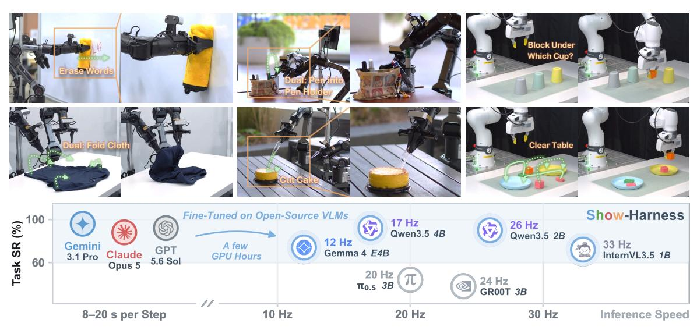

**Figure 1.** Show-Harness는 다양한 작업, 장면 및 로봇 구현체에서 기초 VLM을 활용한 일반화 가능한 구현형 조작을 가능하게 하며, 최첨단 모델을 통한 직접적인 제로샷 배포와 소형 오픈소스 모델의 경량화 적응을 통한 효율적인 제어를 가능하게 한다.

<sup>\*</sup>동일 기여. †응답 저자

<span id="page-1-0"></span>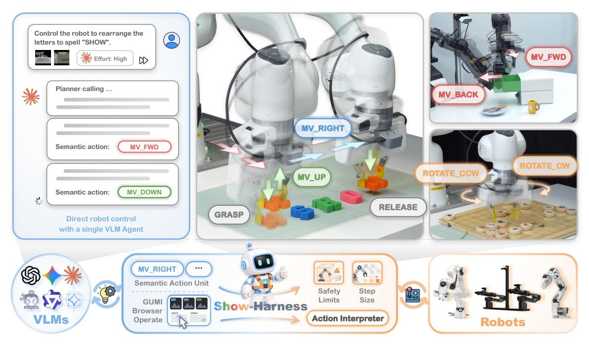

**Figure 2.** Show-Harness는 하나의 의미적 행동 인터페이스를 통해 기초 VLM을 다양한 로봇 구현체와 연결하며, 최첨단 모델을 통한 제로샷 제어와 소형 오픈 모델의 경량화 적응을 가능하게 한다.

## 1 서론 (Introduction)

Foundation vision—language—action (VLA) 모델은 VLM을 낮은 수준의 제어로 끌어들이기 위해 구현체별 연속 행동을 회귀하도록 미세조정함으로써, 광범위한 의미적 지식을 불투명한 픽셀‑투‑액츄에이션 매핑으로 압축하며, 이는 종종 작업, 환경, 구현체마다 반복적인 적응을 필요로 한다[8, 12, 45, 66]. 계층적 및 프로그래밍식 시스템은 반대로 접근한다: VLM은 명시적 중간 추상화를 생성하며, 하위 작업 수준 호출[1, 37, 76, 92]과 손으로 설계된 제어 API를 통한 프로그램[15, 36, 54]을 포함한다. 효과적이지만 물리적 제어는 다운스트림 컨트롤러나 시스템별 메커니즘에 의해 매개되므로, 의미적 의도와 물리적 실행 사이의 직접적인 연결이 약화된다.

우리는 기초 모델 지능을 물리적 세계에 도입하려면 VLM에 의미가 있고 물리적 제어에 충분히 세밀한 행동 공간을 갖춘 적절한 인터페이스가 필요하다고 주장한다. 우리는 Show-Harness, 즉 VLM이 이러한 인터페이스를 통해 로봇을 “플레이”할 수 있도록 해 주는 모델-agnostic Embodied Harness를 소개한다. Fig. 2에 보이듯 Show-Harness는 로봇 제어를 이산적인 의미적 행동 단위 집합으로 재구성한다. 각 단위는 주어진 방향으로의 단일 이동 단계 또는 그리퍼 동작을 지정하여 VLM이 직접 해석할 수 있게 한다. 구현‑특정 인터프리터는 각 단위를 결정론적으로 작은 경계 내 로봇 동작으로 구체화하여 모든 의미적 결정을 물리적 세계에 반영한다. 이 핵심을 둘러싸고 하네스는 루프를 닫는다: 다중 시점 관찰과 고유 감각을 인지적 맥락으로 정리하고, 하위 과제 추론 및 복구를 지원하며, 각 단위 후 실행 피드백을 반환한다. 이를 통해 디지털 VLM을 그들이 자연스럽게 이해하는 의미 공간에서 추론하고 행동하는 상황적 에이전트로 전환시키면서도 세밀한 물리적 결정에 대해 직접 책임을 지게 한다.

Show-Harness는 로봇 제어를 위한 두 가지 모드를 제공한다. 첫 번째는, Fine-tuning 없이 폐쇄형 프론티어 VLM을 무결점(Zero-shot) 로봇 에이전트로 원활하게 전환시켜, 작업, 구현체, 환경을 가리지 않고 대표적인 에이전시 하네스보다 우수한 성능을 보인다. 두 번째는, 가벼운 VLM(예: 2B 규모 모델)이 몇 GPU-시간의 Fine-tuning만으로 동일한 행동 공간에서 로봇을 “플레이”하도록 하여, 통제된 실험에서 대표적인 VLA 패러다임보다 강력한 일반화와 시뮬레이션-실제 전이(sim-to-real transfer)를 달성한다. 이 두 결과를 종합하면, 적절한 의미 인터페이스가 기초 VLM에서 상당한 구현체 능력을 열어줄 수 있음을 시사하며, 이는 프론티어 모델의 발전을 이어받으면서도 더 작은, 저비용 모델에 이러한 제어를 확장할 수 있는 확장 가능한 경로를 제공한다.

행동 공간이 해석 가능하고 인간과 모델 모두가 직접 조작할 수 있기 때문에 Show-Harness는 VLM 기반 로봇 에이전트와 GUI 스타일 인간 제어를 자연스럽게 통합한다. 우리는 또한 **GUMI**, **GU**I 기반 **M**anipulation **I**nterface를 구축하여 인간과 에이전트가 동일한 의미론적 행동 공간에서 로봇 시연을 수집할 수 있도록 하며, 전용 텔레오퍼레이션 하드웨어 없이 자연스럽게 다중 구현체 재사용과 인간–에이전트 협업 데이터 수집을 지원한다. 본 연구의 주요 기여는 다음과 같이 요약된다:

- 우리는 **Show-Harness**를 도입한다. 이는 모델에 독립적인 *Embodied Harness*이며, 기초 VLM이 압축된 의미적 행동 인터페이스를 통해 로봇을 직접 조작할 수 있게 한다.  
- Show-Harness는 폐쇄형 프론티어 VLM을 직접 활용해 제로샷 제어가 가능함을 입증하고, 소규모 모델을 저비용 배포에 효율적으로 적응시킨다.  
- Show-Harness가 장착된 VLM 에이전트는 과제, 구현체, 환경 전반에 걸쳐 강력한 일반화를 보여 주며, 대표적인 에이전시 및 VLA 패러다임을 능가한다. 물리적 및 의미적 적응성에 대한 추가 연구는 효과적인 VLM–로봇 인터페이스의 핵심 특성을 드러낸다.  
- 우리는 **GUMI**를 도입한다. 이는 GUI 기반 조작 인터페이스로, 인간, 에이전트 및 인간–에이전트 협업이 특수한 원격 조작 하드웨어 없이도 구현체 전반에서 동일한 의미적 행동 공간에서 로봇 시연을 수집할 수 있게 한다.

## **2 관련 연구 (Related Work)**

### **2.1 기초 모델을 이용한 로봇 조작 (Foundation Models for Robot Manipulation)**

**저수준 정책으로서의 기초 모델.**  
Vision–language–action (VLA) 모델은 학습된 동작 생성을 사전 학습된 VLM 백본에 연결하고, 저수준 로봇 제어를 예측한다. 이들은 회귀, 확산, 또는 흐름 매칭에 의해 생성된 연속 동작 청크 [&#91;8,](#page-17-0) [&#91;22,](#page-18-1) [&#91;35,](#page-19-4) [&#91;61,](#page-20-1) [&#91;79,](#page-21-2) [&#91;82,](#page-22-0) [&#91;102&#93;](#page-23-1); 이산화된 모터 토큰 [&#91;11,](#page-17-4) [&#91;12,](#page-17-1) [&#91;41,](#page-19-5) [&#91;45,](#page-19-1) [&#91;69&#93;](#page-21-3); 작업 공간에서의 키프레임 또는 공간 격자 동작 [&#91;71,](#page-21-4) [&#91;78&#93;](#page-21-5); 또는 로봇 궤적과 비디오에서 학습된 잠재 동작 코드 [&#91;4,](#page-17-5) [&#91;13,](#page-17-6) [&#91;18,](#page-18-2) [&#91;43,](#page-19-6) [&#91;47,](#page-19-7) [&#91;64,](#page-20-2) [&#91;93,](#page-22-2) [&#91;103&#93;](#page-23-2). 최근 확장들은 동작 예측을 미래 시각 역학과 결합하여 통합 비디오–동작 또는 세계–동작 모델에 적용한다 [&#91;51,](#page-20-3) [&#91;53,](#page-20-4) [&#91;67,](#page-21-6) [&#91;89,](#page-22-3) [&#91;94,](#page-22-4) [&#91;106&#93;](#page-23-3). 로봇 기초 모델은 또한 이질적인 작업과 구현체 전반에 걸쳐 학습된 동작 생성을 확장한다 [&#91;7,](#page-17-7) [&#91;9,](#page-17-8) [&#91;10,](#page-17-9) [&#91;23,](#page-18-3) [&#91;27,](#page-18-4) [&#91;30,](#page-18-5) [&#91;66,](#page-21-0) [&#91;83&#93;](#page-22-5), 그리고 후속 연구는 동작 초기화, 토큰화, 그리고 새로운 구현체와 작업에 대한 적응을 개선한다 [&#91;6,](#page-17-10) [&#91;17,](#page-18-6) [&#91;32,](#page-18-7) [&#91;42,](#page-19-8) [&#91;85,](#page-22-6) [&#91;88&#93;](#page-22-7). 그러나 이 경로는 의미를 제어로 대체한다. 구현체‑특정 모터 신호에 모델을 재조정하면 그 광범위한 사전 학습 지식을 불투명한 감각‑운동 매핑으로 축소하고, 보통 새로운 작업군이나 구현체를 위해 새로운 로봇 궤적이 필요하다 [&#91;44,](#page-19-9) [&#91;104&#93;](#page-23-4)

**중간 결정자 역할을 하는 기초 모델.** 또 다른 경로는 VLM을 저수준 제어 위에 두고, 사전 학습된 의미론적 지식을 사용하여 지시를 분해하고 하위 목표, 핵심 포인트, 활용 가능성 목표, 가치 지도, 또는 공간 제약을 방출한다 [&#91;24,](#page-18-0) [&#91;26,](#page-18-8) [&#91;38–40,](#page-19-10) [&#91;97&#93;](#page-23-0). 하위 컨트롤러

그것은 물리적 구현을 처리한다. 이로써 의미는 보존되지만 물리학은 포기된다: 모델은 구현 방식을 보지 않고 의도를 명시한다 [&#91;29,](#page-18-9) [&#91;34&#93;](#page-19-11), 그리고 각 표현은 정교하게 설계된, 시스템별 특화된 기반화 파이프라인에 묶여 있다 [&#91;26,](#page-18-8) [&#91;38,](#page-19-10) [&#91;39,](#page-19-12) [&#91;60&#93;](#page-20-5). 현실적인 배치는 장기 계획, 폐쇄 루프 피드백, 그리고 실패 복구를 추가로 요구한다 [&#91;29&#93;](#page-18-9), 이로써 이러한 계층적 설계가 다음에 논의될 에이전트형 시스템으로 밀려간다.

### 2.2 에이전트형 로봇 시스템 (Agentic Robot Systems)

**에이전트형 아키텍처.**  

에이전트형 시스템은 foundation VLM을 그대로 유지하면서 하네스 내에서 그 결정들을 로봇 행동으로 변환하고 결과를 피드백하여 지각–결정–실행 루프를 닫는다 [37, 55, 59, 92]. 시스템은 주로 결정이 어떻게 실행되는지에 따라 차이가 있다: 모델은 지각 및 제어 API 위에 프로그램을 구성할 수 있다 [15, 28, 36, 54, 80, 84, 101], 사전 정의된 라이브러리에서 스킬을 선택할 수 있다 [1, 2, 50, 73, 74, 96], 언어 하위 목표를 사용해 학습된 정책(예: VLA)을 조정할 수 있다 [16, 34, 68, 76, 100], 또는 결정들을 기호 플래너와 수치 최적화기에 오프로드할 수 있다 [19, 20, 57, 95]. 하네스는 또한 장기 상호작용을 지속시키는 기계를 제공한다: 작업 컨텍스트와 지속적 메모리 [3, 73, 100], 피드백 기반 모니터링 및 반성 [37, 77], 재계획 및 복구를 위한 실패 탐지 [25, 62, 92].

**구현된 실행을 위한 인터페이스.**  

이러한 패러다임 전반에서 VLM은 궁극적으로 주변 시스템이 노출한 프리미티브를 통해 동작하며, 인터페이스 설계가 핵심적인 질문이 된다. 최첨단 VLM은 추상화 수준에 따라 매우 다른 성능을 보인다 [5, 34]: place(object, target)와 같은 인간이 설계한 추상화는 신뢰성을 향상시키지만, 저수준 지각 및 제어 API를 조합하는 것은 여전히 어렵다 [28, 59]. 따라서 현행 해결책은 전체 스킬, 컨트롤러, 또는 VLA를 호출 가능한 프리미티브로 노출하는 것이다 [1, 16, 68, 76, 100]: 에이전트는 *무엇*을 할지 결정하고, 불투명한 실행자는 *어떻게* 할지를 결정한다 [29]. Show-Harness는 대신 물리적 구현이 결정적이고 투명한 세밀한 의미적 행동 단위를 통해 *어떻게*를 직접 노출함으로써 VLM이 세밀한 물리적 결정에 직접 책임을 지도록 한다.

**디지털 인터페이스에서 물리적 조작으로.**  

Show-Harness의 이산 의미적 행동 공간은 디지털 및 시뮬레이션 에이전트에서의 보다 넓은 인터페이스 원칙을 반영한다: 인간과 foundation VLM 모두가 사용할 수 있는 간결하고 해석 가능한 행동을 노출한다. 컴퓨터 사용 및 게임 에이전트는 마우스, 키보드, 또는 컨트롤러 입력을 통해 동작한다 [56, 65, 70, 86, 99], 반면 시뮬레이션된 구현 에이전트는 이산 또는 스킬 수준의 행동을 사용한다 [48, 49, 52, 91]. 네비게이션에서는 이산 방향 프리미티브가 시뮬레이터와 벤치마크에 기본적으로 존재하며, 최근 범용 에이전트는 이를 경쟁적으로 활용할 수 있다 [105]. 그러나 실제 물리 조작은 비교적 단순하고 광범위하게 사용 가능한 인터페이스가 부족하다: 제어는 일반적으로 구현체 특이적이며 고차원적이고 세밀한 공간 정밀도를 요구한다. Show-Harness는 세밀한 의미적 행동을 물리적 로봇 동작에 결정적으로 기반화함으로써 이 격차를 해소하고, 동일한 행동 공간을 VLM 에이전트와 인간 모두에게 노출한다. 우리의 실험은 이 시스템이 강력한 시뮬레이션-실제 전이 능력을 갖추었음을 추가로 입증한다.

## **3 Show-Harness (Show-Harness)**

### **3.1 개요 (Overview)**

Show-Harness는 기초 시각-언어 모델의 지능을 물리적으로 기반된 로봇 행동으로 변환하도록 설계된 구현형 하네스로, VLM을 반복적인 인지-추론-행동 루프에 배치한다. 각 상호작용 단계에서 모델은 지각 입력을 받고

<span id="page-4-0"></span>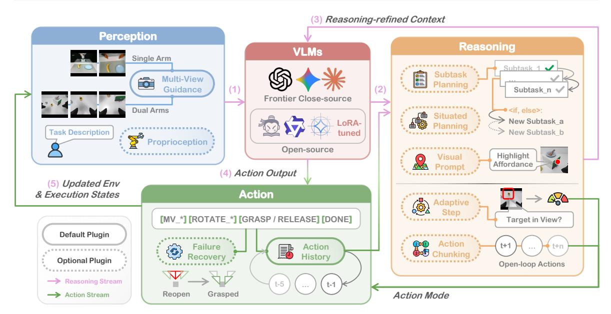

**Figure 3. Show-Harness 아키텍처 (The Show-Harness architecture).** 모듈형 인지–추론–행동 루프가 기초 VLM을 공유 의미적 행동 인터페이스를 통해 로봇 제어에 연결한다.

상호작용 기록을 바탕으로 다음에 할 일을 추론하고, 그 의도를 의미적 행동 결정으로 표현하며, 그 결정이 물리적 로봇 동작에 구체화된 후 발생하는 변화를 관찰한다.

구체적으로, Fig. [3,](#page-4-0)에서 보듯이 언어 지시 ℓ이 주어지면, 단계에서 시스템은 관측값 = (I , )를 캡처한다. 여기서 I는 다중 시점 시각 관측값과 로봇의 고유 감각 상태를 나타낸다. 시스템은 먼저 현재 관측값과 압축된 상호작용 기록 ℎ를 구성 가능한 추론 플러그인 집합 P를 통해 처리하여 추론-정제된 컨텍스트를 생성한다.

$$c_t = \Phi_{\mathcal{P}}(\ell, o_t, h_t). \tag{1}$$

중앙 VLM은 정제된 컨텍스트에 따라 의미적 행동을 선택한다,

<span id="page-4-2"></span>

$$a_t = \pi(c_t) \in \mathcal{A},\tag{2}$$

여기서 A는 VLM과 로봇 사이의 의미적 인터페이스를 정의하는 세밀하고 실행 가능한 단위의 압축된 집합이다. 각 단위는 로봇 구현에 특화된 제어 변수를 모델에 노출시키지 않으면서 직접 해석 가능한 엔드 이펙터 움직임 또는 그리퍼 의도를 명시한다 (Sec. [3.2)](#page-4-1)). 결과적으로 생성된 의미적 결정은 구현 특화 및 모델 무관한 인터프리터에 전달되어 결정론적으로 실행 가능한 로봇 제어로 구체화된다,

$$u_t = g_E(a_t; s_t), \tag{3}$$

여기서 E는 로봇 구현을 나타내고 s_t는 인터프리터의 내부 목표 상태이다. 실행은 로봇과 환경을 업데이트하며, 새로운 관측값과 실행 상태를 생성하여 다음 상호작용 단계에 다시 피드백한다.

### <span id="page-4-1"></span>**3.2 물리적으로 기반된 의미적 행동 인터페이스 (Physically Grounded Semantic Action Interface)**

Show-Harness의 핵심은 VLM 결정이 의미적으로 의미있으면서도 직접 물리적 제어에 충분히 세밀하도록 유지하는 인터페이스이다.

**의미적 행동 공간.** 공유 행동 공간 A는 Eq. [2](#page-4-2)에서 정의된 의미적 행동 단위의 압축된 집합으로 구성된다. 각 단계에서 시스템은 현재 관측값에서 참조 뷰를 결정하여 엔드 이펙터 움직임 방향을 정의한다. 이 뷰를 기준으로 MV_FWD/MV_BACK, MV_LEFT/MV_RIGHT, 그리고 MV_UP/MV_DOWN는 해당 방향으로 엔드 이펙터를 한 단계 이동시킨다. 엔드 이펙터 재지정이 필요한 작업의 경우, ROTATE_CW와 ROTATE_CCW는 각각 지정된 축 (, , 또는 )과 짝을 이루어 그 축을 중심으로 시계 방향 또는 반시계 방향으로 점진적으로 회전시킨다. GRASP와 RELEASE는 그리퍼를 닫고 열며, DONE은 작업 완료를 나타낸다.

어휘는 세 가지 속성을 중심으로 설계되었다. (i) *증분적* (*Incremental*): 각 단위는 작은 국소 물리 변화를 유도하여 VLM이 관측 가능한 행동 효과를 통해 제어 루프에 위치하도록 하고, 연속적인 수정으로 정밀한 행동을 가능하게 한다. 우리는 실험적으로 VLM이 미세 조정 없이 단계 세분화 간에 유연하게 전환할 수 있음을 발견했다 (Sec. [5.3)](#page-10-0)). (ii) *해석 가능하고 구현 무관* (*Interpretable and embodiment-agnostic*): 행동은 수치 목표가 아닌 의미적 기호로 표현되며, 구현 특화된 하위 수준 제어는 다운스트림 인터프리터에 위임되어 모델 대면 공간을 압축적이고 해석 가능하며 로봇 간 재사용 가능하도록 유지한다. (iii) *시각적으로 기반* (*Visually grounded*): 움직임 방향은 관측 가능한 뷰를 기준으로 정의되어 공간적 추론이 행동에 매핑될 수 있다.

**구현 기반 접지.** VLM이 만든 각 의미 결정 ∈ A는 이후 구현-특정 인터프리터에 전달되며, 이 인터프리터는 단위를 로봇 제어에 결정적으로 접지한다. 액션 단위의 경우, 인터프리터는 6-DoF 카르테시안 포즈 세트포인트 = (**x**, )를 다음과 같이 업데이트한다

$$s_{t+1} = \Pi_E(\mathbf{x}_t + \sigma_t R_E d_a, \ \exp(\theta_t [R_E r_a]_\times) Q_t), \tag{4}$$

여기서 **x** ∈ ℝ³와 ∈ SO(3)는 각각 위치와 방향을 나타낸다. 그리고 각각 변환과 회전을 인코딩한다: 회전의 경우 = 0, 변환의 경우 = 0이며, 그 외에는 ∈ {±**e**, ±**e**, ±**e** }. 여기서 [·]^{×}는 반대칭 행렬 연산자이다. 보정된 증분은 변환과 회전의 크기를 설정하고, 동시에 의미 방향과 축을 구현의 동작 프레임에 매핑한다. Π 투영은 구현-특정 작업 공간과 단계별 변환 또는 회전 한계를 강제한다. 그리퍼 단위는 포즈 업데이트를 건너뛰고 바로 열기 또는 닫기 명령으로 매핑된다. 다른 구현은 서로 다른 하위 제어기를 통해 동일한 의미 단위를 실현한다. 예를 들어, Franka는 임피던스 제어로 카르테시안 세트포인트를 추적하고, AgileX는 역운동학과 스트리밍 조인트 타깃을 사용하며, 시뮬레이터는 해당 운영 공간 명령을 실행한다. 구현-특정 제어를 내부에 격리함으로써 의미 모델 인터페이스는 로봇 간에 변하지 않는다. 새로운 구현에 적응하려면 새로운 인터프리터만 필요하다. 작업 공간 및 테이블 높이 한계와 같은 안전 경계는 인터프리터에서 유연하게 구성할 수 있으며, 이를 위반하는 동작은 실행 전에 차단되어 안전한 물리적 상호작용을 보장한다

### <span id="page-5-0"></span>**3.3 구현형 하니스 아키텍처 (Embodied Harness Architecture)**

Embodied Harness는 기초 모델의 상호작용 루프를 세 가지 구성 가능한 단계로 정리한다: *Perception*, *Reasoning*, 그리고 *Action*. Table [1](#page-6-0)은 각 단계에서 인스턴스화된 플러그인을 요약한다

**Perception.** Perception 플러그인은 원시 센서 스트림을 모델이 추론할 수 있는 컨텍스트로 변환한다:

• **Multi-View Guidance**는 VLM에게 서로 다른 카메라 뷰를 어떻게 사용하고 우선순위를 두어야 하는지 알려준다. 예를 들어, 전역적 자아중심/외자중심 뷰는 장면 수준의 컨텍스트를 제공하고, 손목 장착 뷰는 세밀한 정렬 및 조작을 위한 근접 시각 증거를 제공한다

**Table 1.** Harness 플러그인은 인지–추론–행동 루프를 따라 정리된다

<span id="page-6-0"></span>

| 플러그인 | 기능 |
|---------------------|---------------------------------------------------------------------------------|
| 지각 |  |
| 다중 시점 가이드 | 다양한 카메라 시점의 역할과 적절한 사용에 대해 VLM을 안내한다 |
| 자기감각 | 로봇 상태, 접촉, 그리고 그리퍼 상태를 텍스트 피드백으로 변환한다 |
| 추론 |  |
| 하위 작업 계획 | 시각적으로 확인 가능한 완료를 갖춘 순서 있는 하위 작업 계획을 유지한다 |
| 위치 기반 계획 | 불확실한 결정을 미루고 실행이 진행되는 동안 선택적으로 재계획한다 |
| 행동 청킹 | 제어 정밀도와 실행 효율성을 균형 있게 맞추기 위해 행동을 적응적으로 청킹한다 |
| 적응형 단계 | 정밀도와 효율성을 균형 있게 맞추기 위해 단계 크기를 적응적으로 조정한다 |
| 시각적 프롬프트 | 작업 관련 시각적 목표를 강조하고 검증한다 |
| 행동 |  |
| 행동 기록 | 최근 행동을 요약하고 진동 행동을 억제한다 |
| 실패 복구 | 실행 실패를 감지하고 교정 복구를 트리거한다 |

• **Proprioception** 로봇의 내부 상태를 간결한 텍스트 피드백으로 변환한다. 현재 그리퍼 높이, 한 액션 단계에서 발생하는 변위, 단계 인식 실행 힌트(예: 아직 높을 때는 먼저 하강), 접촉 상태, 그리고 그리퍼 상태를 포함한다.

**Reasoning.** 리서닝 플러그인(Reasoning plugins)은 작업을 실행 가능한 중간 결정으로 구조화하고, 현재 컨텍스트를 정제하여 세밀한 액션 수준의 결정을 돕는다:

- **Subtask Planning** 먼저 VLM을 플래너로 호출하여 작업 지시 ℓ을 완료 기준이 있는 순서대로 서브태스크 시퀀스로 분해한다. 실행 중에는 서브태스크 전환이 모델에 속한다: 매 단계마다 현재 이미지와 완료 기준을 비교하고, 미충족 시 계속 행동하며, 서브태스크가 완료되었다고 선언해 계획을 진행한다.  

- **Situated Planning** 불확실한 결정을 미루고, 실행 중에 필요한 정보가 확보되면 선택적으로 재계획을 트리거한다. 모든 미래 분기를 미리 확정하기보다 초기 계획은 해당 결정을 해결되지 않은 상태로 두고, 관련 증거가 관측될 때까지 기다린다. 그 후 VLM은 현재 관측에서 분기를 해결하고 남은 계획을 업데이트한다. 이를 통해 조건부 작업이 매 상호작용 단계마다 재계획 없이 진화하는 실행 상태에 적응할 수 있다.  

- **Action Chunking** 세밀한 피드백이 아직 필요 없을 때(예: 목표가 아직 멀리 있을 때) 모델 쿼리 빈도를 적응적으로 줄여, VLM이 다음 모델 쿼리 전에 오픈 루프에서 실행되는 짧은 시퀀스의 의미적 액션을 발행하도록 한다.  

- **Adaptive Step** 단계 크기를 동적으로 조정하여 효율성과 정밀도를 균형 있게 맞춘다. 목표가 멀 때는 큰 단계, 가까이 있을 때는 작은 단계를 사용한다.  

- **Visual Prompt** 모호한 언어적 목표를 관련 어포던스를 강조하는 시각적 참조로 변환하기 위해 전용 모델 호출을 사용한다. 이를 통해 이후 추론이 시각적 마커에 기반할 수 있다. 이 플러그인은 상호작용 영역을 언어로 명시하기 어려울 때 활성화된다.

**Action.** 물리적으로 기반된 의미적 액션 인터페이스(섹션 3.2에서 소개된)를 기반으로, 액션 단계는 가벼운 상호작용 메모리와 복구 메커니즘을 추가하여

견고한 폐루프 제어를 지원한다. 이 단계에서 두 개의 플러그인이 동작한다:

• **Action History** 최근 액션을 가벼운 컨텍스트로 다음 상호작용 단계에 전달하며, 반대 방향 움직임 사이의 진동을 피하는 등 간단한 사용 지침을 함께 제공한다. 이 간결한 기록은 단계 간에 필요한 시간적 메모리를 모델에 제공한다.

• **Failure Recovery**는 그립 실패를 자동으로 감지하고 그립퍼 상태를 재설정하고 관련 그립 서브태스크로 롤백하여 복구한다.

### 3.4 두 모드 하나의 인터페이스 (Two Modes on One Interface)

공유된 의미 인터페이스는 로봇 제어의 두 가지 상호 보완적인 모드를 지원한다.

**Frontier VLM as zero-shot agents (ZS mode).** Frontier VLM은 어떠한 미세 조정 없이 harness를 통해 로봇을 직접 제어할 수 있다. 이 모드는 frontier-model의 물리적 제어 능력을 직접 개방하며, 점점 더 강력해지는 기초 모델의 발전을 이어받는 확장 가능한 경로를 제공한다.

**Fine-tuning small VLMs (FT mode).** 같은 인터페이스는 소형 오픈소스 VLM의 가벼운 적응을 지원하여 의미적 행동 단위를 직접 예측한다. 공유된 행동 공간에서 수집된 시연 D를 주어진 경우, 정책은 목표 단위의 토큰 수준 교차 엔트로피를 최소화한다,

$$\mathcal{L}(\theta) = -\sum_{(\ell, o, h, a) \in \mathcal{D}} \log \pi_{\theta} (a \mid \Phi_{\mathcal{P}_{\min}}(\ell, o, h)), \qquad (5)$$

Pmin은 통제된 비교와 분석을 용이하게 하기 위해 최소한의 결정 컨텍스트만을 의도적으로 보유하며, 이는 작업 지침 ℓ, 다중 시점 관찰, 그리고 짧은 행동 이력 ℎ으로 구성된다. 핵심적으로, 의미적 행동은 전용 행동 헤드나 특수 토큰 없이 VLM의 기본 어휘를 통해 예측되며, 이는 제한된 시연으로부터 가벼운 저랭크 적응을 가능하게 하고 대표적인 VLA 기준선보다 더 강력한 일반화를 제공한다. 이는 Sec. [5.](#page-8-0)에서 입증되었다.

## 4 GUMI: GUI 기반 조작 인터페이스 (4 GUMI: A GUI-based Manipulation Interface)

**공유 인터페이스: 인간, 에이전트, 정책 학습을 위한**  
세션 [3.2](#page-4-1)에서 언급한 의미적 행동 공간은 이산적이며 직접적으로 조작 가능하므로, 가벼운 그래픽 인터페이스를 통해 자연스럽게 노출될 수 있다. 이 특성을 바탕으로 우리는 **GUMI**를 개발하였다. GUMI는 GUI 기반 조작 인터페이스로, 인간과 에이전트가 동일한 의미적 행동 단위를 사용해 로봇을 조작할 수 있게 한다. Fig. [4,](#page-8-1)에서 보듯이 각 단위는 라벨이 붙은 컨트롤과 키스트로크에 매핑된다: 인간은 키보드에서 로봇을 "재생"할 수 있고, 컴퓨터 사용 에이전트는 동일한 GUI를 조작하며, 일반 VLM 에이전트는 단위를 직접 예측한다. 각 단계에서 GUMI는 실행 전 관찰과 선택된 의미적 행동을 기록하여 정책 준비 쌍 ( , )을 생성한다. 각 의미적 단위는 구현체별 해석기에 의해 결정적으로 기반화되므로, 롤아웃은 해당 저수준 명령과 궤적을 보존할 수 있어, 하나의 시연으로 의미적 행동 및 연속 제어 정책을 모두 학습할 수 있다.

**유연하고 재사용 가능한 데이터 수집.** GUMI는 단계별 제어, 큐된 행동 청크, 단일 및 이중 팔 운영, 그리고 인간이 에이전트 롤아웃을 교정할 수 있는 혼합 인간–에이전트 수집을 지원한다. 전통적인 텔레오퍼레이션 파이프라인이 특수 하드웨어[&#91;21,](#page-18-14) [87,](#page-22-13) [102&#93;](#page-23-1) 또는 시뮬레이션 전용 제어[&#91;58,](#page-20-13) [63,](#page-20-14) [107&#93;](#page-23-9)를 필요로 하는 것과 달리, GUMI는 공유 의미적 행동 공간에서 직접 시연을 기록한다. 따라서 동일한 시연은 동일한 단위를 구현한 해석기를 갖는 구현체 간에 재사용될 수 있으며, 동일한 워크플로우는 시뮬레이션과 실제 세계 모두에 적용된다.

<span id="page-8-1"></span>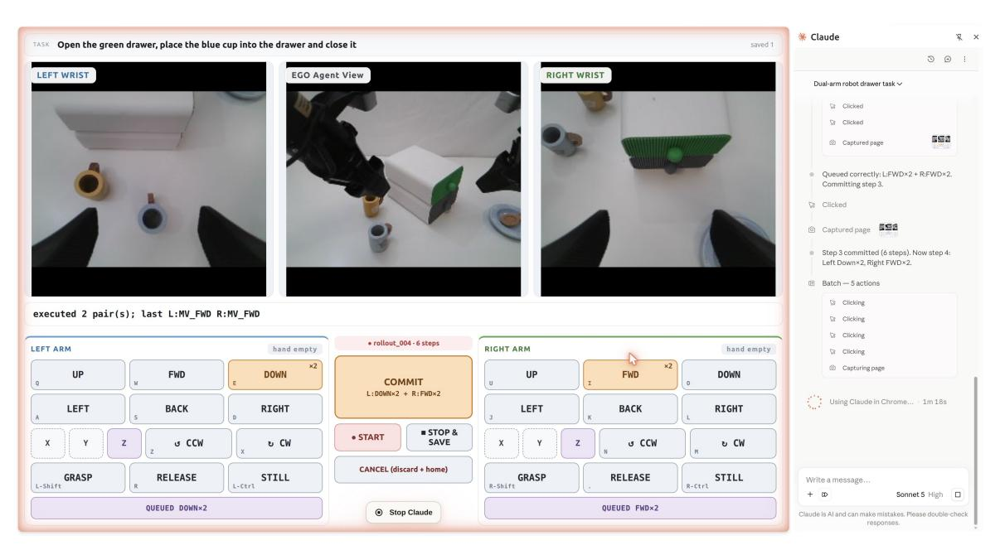

**그림 4. GUMI 인터페이스.** GUMI는 GUI 기반 조작 인터페이스로, 인간과 최첨단 에이전트가 동일한 의미적 제어를 통해 자율적으로 시연을 수집할 수 있게 한다.

전문 텔레오퍼레이션 하드웨어 없이 실제 세계에서도 적용된다. 가벼운 디지털 접근 가능한 설계는 로봇과 물리적으로 동시 위치할 필요 없이 원격 데이터 수집을 추가로 지원한다.

## 5 실험 (5 Experiments)

### 5.1 실험 설정 (5.1 Experimental Setup)

**하드웨어.** 우리의 실험은 병렬 손가락 그리퍼를 장착한 두 개의 로봇 플랫폼을 사용한다 (Figure [5)](#page-8-2)). 첫 번째는 7-DoF Franka Research 3 팔이며, 작업 공간을 바라보는 외심형 Intel RealSense D435와 손목에 장착된 Intel RealSense D405로 관찰되며, 두 개의

<span id="page-8-2"></span>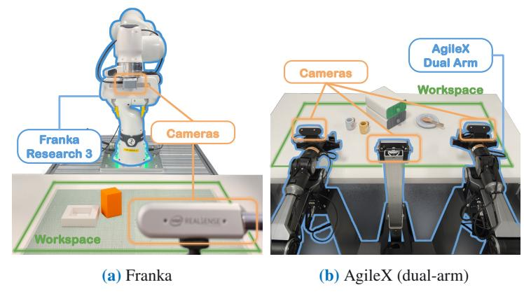

**그림 5.** 실제 로봇 장치.

시야. 두 번째는 두 개의 6-DoF 팔을 갖춘 양손 AgileX 장치이며, 세 개의 Orbbec Dabai DC1 카메라로 관찰된다: 양 팔이 공유하는 자아중심 시야와 각 손목마다 하나의 손목 시야. 로컬 모델은 단일 RTX 5090 GPU에서 제공되며, 최첨단 모델은 API를 통해 접근된다.

**작업 및 지표.** 우리는 다섯 개의 물체와 두 개의 목표 수용기(접시와 그릇)를 짝지어 10개의 실제 로봇 조작 과제를 구성한다. 각 과제는 물체를 찾고, 접근하고, 잡고, 운반하고, 적절히 놓는 과정을 요구한다. 물체는 다양한 물리적 특성을 갖는다: 강직한 기하학(블록), 불규칙한 모양(바나나), 회전 동역학(테니스 공), 변형성(테디 베어), 그리고 정밀 조작(체스 말). 미세 조정된 오픈소스 VLM의 경우, 블록, 바나나, 테니스 공만이 시연에 등장한다. 테디 베어와 체스 말은 OOD 평가를 위해 제외된다. 이 과제들 외에도, Secs. [5.3](#page-10-0)과 [5.4](#page-12-0)는 더 넓은 역량과 설계 선택을 탐구하기 위한 목표 시나리오를 도입한다. 우리는

성공률과 에피소드당 평균 단계 수를 보고한다. 별도로 명시되지 않는 한, 우리는 각 과제마다 무작위 물체 배치를 사용해 10번의 시도를 수행한다. 에피소드는 50단계로 제한되며, 타임아웃은 실패로 계산된다.

**VLM 에이전트와 하네스.** (1) **Frontier VLM을 제로샷 에이전트(ZS 모드)로 사용.** 별도 명시가 없으면 기본 Frontier VLM으로 Gemini-3.1 Pro [31](#page-18-15)를 사용한다. *생각 노력* (thinking effort)을 VLM에 할당되는 추론 시점의 추론 예산으로 정의하고, *낮음*, *중간*, *높음* 세 수준을 고려한다. 기본값은 *중간*이며, 다른 VLM 백본과 추론 예산은 실험에서 분석한다. Adaptive Step 플러그인은 두 번역 단계 크기를 사용한다: 손목 뷰에서 목표가 보일 때는 2 cm의 미세 단계, 그렇지 않을 때는 4 cm의 거친 단계. 이 단순한 설정은 기본적인 픽앤플레이스 작업에 충분하며, VLM은 미세 단계 세분화에 맞게 자유롭게 적응할 수 있다(섹션 [5.3](#page-10-0)). 행동 기록은 가장 최근 5개의 행동을 보관한다. 섹션 [3.3](#page-5-0)의 모든 플러그인은 기본적으로 활성화되며, Situated Planning과 Visual Prompt는 필요할 때만 활성화된다. (2) **소형 VLM의 파인튜닝(FT 모드).** 기본적으로 Qwen3.5-2B [72](#page-21-15)를 사용하며, 실험에서 다양한 모델 용량을 분석한다. 모든 언어 모델 선형 층에 rank-64 LoRA [33](#page-18-16) 어댑터를 적용하고, 비전 인코더와 멀티모달 프로젝터는 고정한다. 파라미터의 약 3%만 업데이트한다.

**베이스라인.** 우리는 세 가지 대표적인 로봇 제어 시스템군과 비교한다: (1) **VLA** 베이스라인은 관측과 지시를 직접 낮은 수준의 로봇 동작으로 매핑한다. 여기에는 0.<sup>5</sup> [9](#page-17-8)와 GR00T [7](#page-17-7)가 포함된다. 통제된 비교를 위해 두 모델 모두 VLM 정책을 훈련시키는 데 사용된 동일한 시연에서 변환된 연속 엔드 이펙터 궤적에 대해 파인튜닝된다. (2) **VLA 중심 에이전트**는 VLA를 주요 물리 실행기로 유지하면서 계획, 모니터링 또는 개입을 위한 외부 에이전트 층을 추가한다. 이는 Harness VLA [100](#page-23-6) (테이블에서 H-VLA)와 Goal-VLA [14](#page-17-15) (테이블에서 G-VLA)로 대표된다. (3) **코드-정책 에이전트**는 고수준 추론을 실행 가능한 프로그램이나 API 호출로 변환한다. 이는 CaP-X [28](#page-18-10)와 RATS [98](#page-23-10)로 대표된다.

**시연 데이터 수집.** 오픈소스 VLM 훈련과 학습 가능한 VLA 기준선을 위해, 우리는 GUMI를 통해 인간 키보드 제어와 브라우저 인터페이스를 통한 frontier-VLM 롤아웃을 사용해 시연 데이터를 수집한다. 총 164개의 실제 로봇 에피소드를 수집했다(7.8K 의사결정 단계), 2cm 변환을 공유하며: 7-DoF Franka에서 101개(5.0K 단계), 단일 팔 AgileX에서 63개(2.8K 단계). 우리의 미세 조정된 정책과 비교된 VLA 기준선은 두 구현체의 시연 데이터를 함께 학습한다. 시뮬레이션-실제 실험을 위해, 모든 비교 모델은 동일한 인터페이스를 통해 수집된 230개의 시뮬레이션 에피소드(13.5K 단계)를 학습한다. 이는 두 시뮬레이터를 포함한다: 스톡 판다 핸드로 100개의 에피소드가 있는 ManiSkill [&#91;81&#93;](#page-22-14)와 12개의 픽 앤 플레이스 작업에 대해 130개의 에피소드가 있는 RoboLab [&#91;90&#93;](#page-22-15). 자세한 내용은 부록 [7.2.](#page-24-0)에서 확인할 수 있다.

### <span id="page-9-0"></span>**5.2 주요 결과: 작업, 환경 및 구현체 간 일반화**

우리는 Tab. [2.](#page-10-1)에 요약된 세 가지 일반화 수준을 평가한다. Cross-task는 모든 10개의 물체–받침 작업을 포함한다. Cross-environment는 훈련 중이나 표준 테스트 설정에서 보지 못한 배경, 조명, 시점, 방해물, 그리고 시뮬레이션-실제 전이 변화를 평가한다. 시뮬레이션-실제에서는 학습 가능한 방법이 동일한 GUMI 인터페이스를 통해 수집된 시뮬레이션 시연만 사용하고 실제 Franka에서 평가한다. Cross-embodiment은 Franka와 AgileX 팔 사이의 전이를 평가한다: 제로샷 에이전트는 구현체별 인터프리터만으로 구현체를 전환하고, 미세 조정된 정책은 두 구현체의 시연을 함께 학습하며 각 팔에서 직접 평가한다.

Table [2](#page-10-1)은 ZS(제로샷 프론티어 모델)와 FT(미세 조정된 소형 오픈소스 모델)가 작업, 환경, 구현체 변동에서 대표적인 기준선을 지속적으로 능가함을 보여준다.

<span id="page-10-1"></span>**Table 2.** 실제 로봇에서 세 가지 일반화 수준에 대한 성능. ZS와 FT는 제로샷 모드(중간 사고 노력의 Gemini-3.1 Pro)와 미세 조정 모드(Qwen3.5-2B)에서 Show-Harness를 나타낸다.

|  | VLA |  | VLA 중심 에이전트 |  | 코드-정책 에이전트 |  | 쇼-핸들 |  |  |  |  |  |
|--------------------------------------------------------------------------------------|---------|---------|---------------------------------------------|--------|--------------------------|---------|--------------|---------|--|--|--|--|
| 설정 | 𝜋0.5 | GR00T | H-VLA | G-VLA | CaP-X | RATS | ZS | FT |  |  |  |  |
| 10개의 객체–받침 작업; †: 미세 조정에서 보지 못한; 작업당 10회 실험<br>교차 작업 |  |  |  |  |  |  |  |  |  |  |  |  |
| 블록 →<br>플레이트 | 6 / 10 | 5 / 10 | 7 / 10 | 2 / 10 | 5 / 10 | 6 / 10 | 10 / 10 | 10 / 10 |  |  |  |  |
| 바나나 →<br>플레이트 | 7 / 10 | 7 / 10 | 8 / 10 | 3 / 10 | 8 / 10 | 8 / 10 | 10 / 10 | 10 / 10 |  |  |  |  |
| 테니스 →<br>플레이트 | 3 / 10 | 3 / 10 | 3 / 10 | 1 / 10 | 4 / 10 | 6 / 10 | 8 / 10 | 8 / 10 |  |  |  |  |
| 테디† →<br>플레이트 | 5 / 10 | 4 / 10 | 5 / 10 | 1 / 10 | 4 / 10 | 6 / 10 | 10 / 10 | 8 / 10 |  |  |  |  |
| 체스† →<br>플레이트 | 1 / 10 | 0 / 10 | 3 / 10 | 0 / 10 | 2 / 10 | 4 / 10 | 10 / 10 | 9 / 10 |  |  |  |  |
| 블록 →<br>볼 | 5 / 10 | 4 / 10 | 6 / 10 | 2 / 10 | 5 / 10 | 5 / 10 | 10 / 10 | 10 / 10 |  |  |  |  |
| 바나나 →<br>볼 | 6 / 10 | 6 / 10 | 7 / 10 | 2 / 10 | 7 / 10 | 8 / 10 | 6 / 10 | 7 / 10 |  |  |  |  |
| 테니스 →<br>볼 | 2 / 10 | 2 / 10 | 3 / 10 | 1 / 10 | 3 / 10 | 5 / 10 | 7 / 10 | 8 / 10 |  |  |  |  |
| 테디† →<br>볼 | 3 / 10 | 4 / 10 | 5 / 10 | 1 / 10 | 4 / 10 | 5 / 10 | 8 / 10 | 7 / 10 |  |  |  |  |
| 체스† →<br>볼 | 1 / 10 | 0 / 10 | 3 / 10 | 0 / 10 | 2 / 10 | 4 / 10 | 10 / 10 | 9 / 10 |  |  |  |  |
| 평균 (%) | 39.0 | 35.0 | 50.0 | 13.0 | 44.0 | 57.0 | 89.0 | 86.0 |  |  |  |  |
| 크로스-환경 |  |  | 2개 작업 (블록 또는 바나나 → |  | Plate); 10번 시도 / 작업 |  |  |  |  |  |  |  |
| 배경 | 11 / 20 | 10 / 20 | 15 / 20 | 4 / 20 | 12 / 20 | 14 / 20 | 20 / 20 | 18 / 20 |  |  |  |  |
| 조명 | 9 / 20 | 9 / 20 | 14 / 20 | 5 / 20 | 11 / 20 | 13 / 20 | 20 / 20 | 19 / 20 |  |  |  |  |
| 시점 | 10 / 20 | 7 / 20 | 10 / 20 | 2 / 20 | 10 / 20 | 12 / 20 | 20 / 20 | 19 / 20 |  |  |  |  |
| 방해 요소 | 10 / 20 | 8 / 20 | 12 / 20 | 1 / 20 | 9 / 20 | 13 / 20 | 20 / 20 | 19 / 20 |  |  |  |  |
| 시뮬레이션-실제 | 0 / 20 | 0 / 20 | – | – | – | – | – | 13 / 20 |  |  |  |  |
| 평균 (%) | 40.0 | 34.0 | 63.8 | 15.0 | 52.5 | 65.0 | 100.0 | 88.0 |  |  |  |  |
| 크로스-체현 |  |  | 5개 Plate 작업; 각 팔마다 10번 시도 / 작업 |  |  |  |  |  |  |  |  |  |
| Franka (7-DoF) | 22 / 50 | 19 / 50 | 26 / 50 | 7 / 50 | 23 / 50 | 30 / 50 | 48 / 50 | 45 / 50 |  |  |  |  |
| AgileX (6-DoF) | 19 / 50 | 17 / 50 | 23 / 50 | 4 / 50 | 20 / 50 | 22 / 50 | 45 / 50 | 42 / 50 |  |  |  |  |
| 평균 (%) | 41.0 | 36.0 | 49.0 | 11.0 | 43.0 | 52.0 | 93.0 | 87.0 |  |  |  |  |

Show-Harness의 이점은 보류된 객체 조합에서도 지속되며, 시뮬레이션-실제 전이에서도 확장된다. FT는 오직 시뮬레이션 시연만으로 성공하지만, 학습 가능한 VLA 기반 기준선은 실패한다. 교차 구현 결과는 동일한 의미 인터페이스가 Franka와 AgileX 사이에서도 효과적으로 전이됨을 보여준다. 이 결과들은 Show-Harness가 최첨단 제로샷 에이전트와 소규모 미세조정 모델을 아우르는 확장 가능한 인터페이스를 제공함을 시사한다.

### <span id="page-10-0"></span>**5.3 역량 분석: 물리적 및 의미적 적응성 (Capability Analysis: Physical and Semantic Adaptability)**

Sec. [5.2](#page-9-0)는 작업, 환경, 구현 변화를 아우르는 광범위한 일반화를 확립한다. 우리는 다음으로 더 어려운 질문을 탐구한다: **Show-Harness가 기초 모델이 새로운 물리적 및 의미적 요구에 적응하도록 얼마나 잘 지원할 수 있는가?** 목표 지향적 시나리오를 통해 우리는 두 가지 상호 보완적 적응 형태를 연구한다: *물리적 적응성*, 이는 정책 재학습 없이 동작 정밀도, 구성, 작업 공간, 구현 변화를 수용하고, *의미적 적응성*, 이는 새로운 시연에서 추론 또는 인컨텍스트 학습을 요구하는 작업을 처리한다 (Fig. [6]에서 보듯이).

<span id="page-11-0"></span>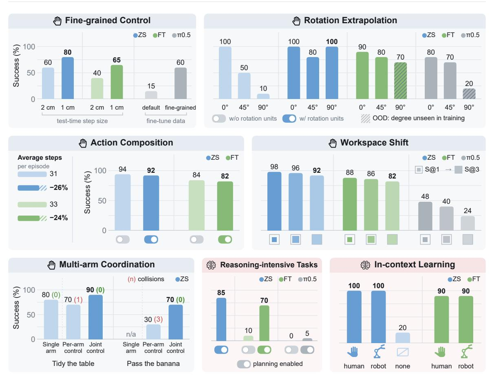

**Figure 6.** Show-Harness의 물리적( § ) 및 의미적( ) 적응성에 대한 역량 분석.

#### **5.3.1 물리적 적응성 (Physical Adaptability)**

**세밀한 제어.** 우리는 블록 쌓기와 핀 삽입을 평가한다. 이 작업은 표준 픽앤플레이스보다 더 세밀한 동작을 요구한다. 우리는 인터프리터 단계 크기를 2 cm에서 1 cm로 단순히 줄였으며, VLM–action 인터페이스를 변경하거나 모델을 재학습하지 않았다. 이로써 ZS는 60 %에서 82 %로, FT는 40 %에서 65 %로 향상된다. 반면 0.<sup>5</sup>는 FT와 동일한 시연으로는 18 %에 머물며, 추가 세밀한 훈련 후에야 62 %에 도달한다. 이는 의미 결정을 메트릭 실행과 분리함으로써 얻는 이점을 강조한다: Show-Harness가 장착된 VLM 에이전트는 인터프리터만으로 새로운 정밀도 요구에 적응하며, 작업별 재학습이 필요 없다.

**행동 조합.** 다섯 개의 Plate 작업에서 두 개의 직교 변환 단위를 하나의 대각선 변위로 조합하면 실행 단계가 크게 줄어들면서 성공률에 눈에 띄는 감소가 없다. 이는 새로운 행동 조합을 인터프리터를 통해 재학습 없이 도입할 수 있음을 보여준다.

**회전 외삽.** 우리는 당근 잡기 작업에서 당근을 그리퍼에 대해 0° , 45° , 또는 보이지 않는 90° 방향으로 배치하고, 각 회전 단위가 15°씩 방향을 바꾸는 구성적 외삽을 테스트한다. Fig. [6,](#page-11-0)에서 보듯이 ZS는 모든 각도에서 견고하게 유지되며, FT는 0°와 45° 시연만으로 훈련했음에도 보이지 않는 90° 방향에서 70 %에 도달한다; 0.<sup>5</sup>는 20 %에 머물러 있다. 이는 점진적 회전이 반복 단위 조합을 통해 더 큰 보이지 않는 방향 변화를 가능하게 하는 반면, 연속 동작 회귀는 시연된 각도 범위에 더 묶여 있음을 보여준다.

**작업 공간 이동.** 다섯 개의 Plate 작업에서 [&#91;17&#93;](#page-18-6)를 따라 중첩 작업 공간 영역을 평가한다,

핵심 25 % (S@1)에서 경계 근처 90 % (S@3)까지. Show-Harness는 작업 공간이 확장됨에 따라 오직 가볍게 저하되지만, 0.<sup>5</sup>는 급격히 감소한다. 이는 시각적으로 기반된 의미 결정을 통해 Show-Harness가 장착된 VLM 에이전트가 작업 공간 이동에 덜 민감해지는 반면, 0.<sup>5</sup>는 훈련 분포에 더 묶여 있음을 시사한다.

**다중 팔 조정.** 우리는 AgileX 쌍에서 두 개의 20번 시도 작업을 평가한다: *테이블 정리*, 각 팔이 근처 물체를 정리하고, *바나나 전달*, 배치 전에 전달이 필요한 작업. 우리는 두 개의 독립적인 단일 팔 에이전트와 각 단계에서 두 팔의 행동을 예측하는 공동 정책을 비교한다. 공동 의사결정은 두 작업 모두에서 성공률을 크게 향상시키고 충돌을 없애 Show-Harness가 공동 행동 예측을 통해 명시적 팔 간 조정을 가능하게 함을 보여준다.

#### **5.3.2 의미적 적응성**

**추론 집약적 작업.** 우리는 조작 전에 고수준 추론이 필요한 두 작업을 평가한다: 세 컵 중 하나 아래에 숨겨진 블록을 찾고, 흩어진 글자를 "SHOW"로 배열하는 것. Situated Planning을 사용한 ZS는 85%를 달성하지만, FT와 0.<sup>5</sup>는 각각 10%와 0%에 머물러 있다. 동일한 Gemini 생성 하위 작업 지침을 사용하면 FT는 70%로 상승하지만 0.<sup>5</sup>는 5%에 머물러 있다. 이는 Show-Harness가 재사용 가능한 의미적 행동 공간을 통해 새로운 지침을 기반화함으로써 VLMs의 지침 따르기 유연성을 더 잘 보존한다는 것을 시사한다.

**비디오를 통한 상황 내 학습.** 우리는 정책에게 인간 또는 로봇 시연이 보여준 순서대로 세 개의 물체를 정리하도록 요청한다. 시연이 없으면 ZS는 *tidy up*라는 지침만 받고, 필요한 순서가 명시되지 않아 20%에 그친다. 비디오 시연이 있으면 ZS는 시연된 순서를 따르고 두 소스 모두에서 20/20 시도에서 성공하며, FT는 동일한 플래너가 추출한 작업 개요에 조건화되면 95%를 달성한다. 이는 Show-Harness가 로봇 제어를 위한 강력한 시각적 상황 내 학습을 가능하게 함을 보여준다.

### <span id="page-12-0"></span>**5.4 제거 연구**

<span id="page-12-1"></span>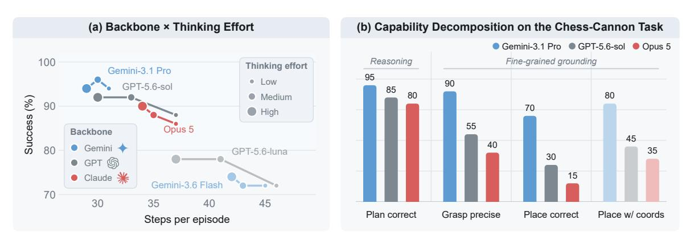

**그림 7.** 프론티어 VLM 선택과 사고 노력의 효과.

#### **5.4.1 프론티어 VLM 선택과 사고 노력**

우리는 다섯 개의 Plate 작업(Fig. [7](#page-12-1) (a))에서 다양한 프론티어 VLM을 평가하고, 가장 강력한 세 모델을 체스-캐논 배치 작업(20 trails)에서 추가로 조사한다. 이 작업은 계획과 세밀한 기반화(프라운딩)를 분리한다(Fig. [7](#page-12-1) (a)). Fig. [7](#page-12-1) (a)에 표시된 바와 같이, 제로샷 성능은 일반적으로 더 강력한

프론티어 VLM, 그들의 기본 모델 역량을 대체로 반영하며, 사고 노력을 늘리면 주로 중복 상호작용 단계를 줄여 성공률에는 거의 이득이 없고, 더 높은 실시간 비용(예: GPT-5.6-sol의 3.4배)을 초래할 수 있다. 또한 모든 모델이 지침을 신뢰성 있게 따르며, 98% 이상의 응답이 유효한 행동 단위를 생성한다. Fig. [7](#page-12-1) (b)는 계획이 주요 병목이 아님을 보여주며, 오류는 세밀한 그립과 배치에 집중된다. 대상 경계 상자를 제공하면 성능이 더욱 향상되어 명시적 시각적 기반화 신호의 가치를 강조한다.

#### **5.4.2 미세 조정된 백본 스케일링**

Fig. [8,](#page-13-0)에 표시된 바와 같이, 성능은 이미 2B에서 강력하지만, 더 큰 백본은 주로 스태킹 및 핀 삽입과 같은 세밀한 작업에 도움이 된다. 1B 수준 모델은 대신 목표 근처에서 과도한 지역 조정으로 인해 더 긴 에피소드를 초래한다. 작은 모델은 여전히 테니스볼 작업에서 더 큰 모델을 능가할 수 있다. 이 작업에서는 움직이는 물체의 시기적절한 교정이 세밀한 정밀도보다 더 중요하다. 전반적으로 2B 백본은 정밀도와 반응성 사이에 좋은 균형을 제공한다.

<span id="page-13-0"></span>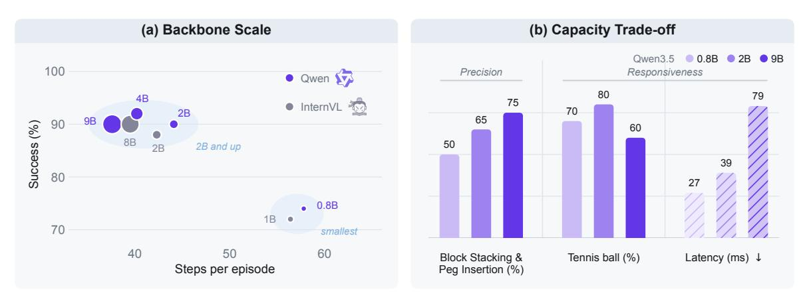

**그림 8.** (a) 다섯 개 Plate 작업에 대한 미세 조정된 백본 스케일링의 효과; 버블 면적은 파라미터 수에 비례한다. (b) 세 Qwen3.5 용량이 세밀한 작업에서의 성능을 보여준다.

#### **5.4.3 Harness 플러그인**

Fig. [9](#page-14-0)은 제로샷 에이전트(Gemini-3.1 Pro)를 사용한 실제 Franka 팔에서 하네스 플러그인을 평가한다. 기본 플러그인은 다섯 개 Plate 과제에서 leave‑one‑out 프로토콜을 따른다. 대신 Visual Prompt와 Situated Planning은 기본 설정에 추가되어 각각 핸들 인식 그립과 세 개의 뒤집힌 컵 아래 숨겨진 물체 탐색(각각 20번 시도)을 요구하는 전용 시나리오에서 평가된다.

**Multi-View Guidance**는 전역 뷰 입력만보다 성능을 크게 향상시킨다, 특히 정밀 정렬이 필요한 작은 물체에 대해 그렇다. 이는 다중 뷰가 공간 인식을 강화하고, 손목 뷰가 세밀한 구분에 특히 유용한 단서를 제공하기 때문이다.

**Proprioception**. 고유 감각 상태를 제거하면 성능이 크게 저하된다, 특히 시각적 단서만으로는 모호한 물체에서 그렇다. 그리퍼 높이와 접촉과 같은 압축된 상태 신호는 외관이나 깊이가 시각적 추정이 불확실할 때 신뢰할 수 있는 안내를 제공한다.

**Subtask Planning**. 계획 없이 수행하면 성공률이 60%로 떨어지며, 모델은 종종 물체를 들어올리지 않고 플레이트 쪽으로 끌어당긴다. 하위 작업 분해는 지역적으로 유효한 단계와 시각적으로 확인 가능한 완료 기준을 통해 의도된 조작 시퀀스를 명시한다.

<span id="page-14-0"></span>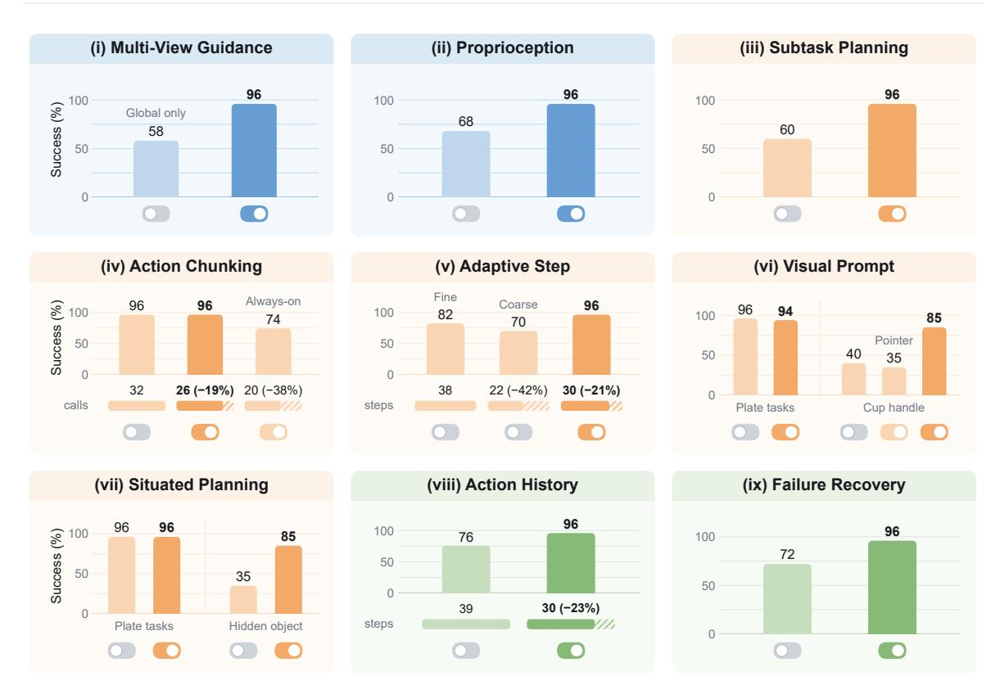

**Figure 9.** Gemini-3.1 Pro를 제로샷 에이전트로 사용한 실제 Franka 팔에서의 플러그인 제거 실험.

**Action Chunking**. 청킹을 비활성화하면 96%의 성공률을 유지하지만 모델 호출이 증가하고, 반대로 전체에 강제하면 호출이 감소하지만 성공률이 74%로 떨어진다. 결과는 선택적 청킹을 선호한다: 중복 운송 단계를 압축하면서 상호작용 근처의 세밀한 피드백을 보존한다.

**Adaptive Step**. 세밀한 제어만은 정밀하지만 비효율적이며 타임아웃이 발생하기 쉽고, 거친 제어만은 빠르지만 과도한 오버슈트가 발생한다. 목표 가시성에 기반한 적응형 전환은 두 가지를 균형 있게 조절하여 평균 에피소드당 30단계에서 96%의 성공률을 달성한다.

**Visual Prompt**. 이 플러그인은 일반 과제에서 거의 효과가 없으며, 기본적으로 꺼져 있는 설계가 적합함을 시사한다. 그러나 핸들 인식 그립(40%에서 85%)을 크게 향상시킨다. 이 이득은 시각적 마커만으로는 아니라, 언어 지침을 표시된 상호작용 지점과 명시적으로 정렬함으로써 나온다.

**Situated Planning**. 이 플러그인은 일반 과제에서 효과가 없지만 숨겨진 물체 탐색(35%에서 85%)을 크게 향상시킨다. 해결되지 않은 결정을 충분한 시각적 증거가 확보될 때까지 미루어 두어, 조기 계획 대신 목표 지향적 탐색을 가능하게 한다.

**Action History**. 행동 이력을 제거하면 성공률이 감소하고 타임아웃이 증가한다. 이는 종종 반대 행동 사이의 진동 때문이며, 최근 행동을 기록하면 이러한 루프를 드러내고 반복적인 역전환을 방지하여 보다 안정적인 폐쇄 루프 제어를 위한 가벼운 메모리를 제공한다.

**Failure Recovery**. 복구 기능을 제거하면 성공률이 72%로 떨어지며, 특히 잡기 어려운 물체에서 가장 큰 감소가 나타난다. 주요 실패 모드는 감지되지 않은 빈 그립이다; 빈 그립 감지는 재시도를 트리거하여 에이전트가 빈 그리퍼로 계속 진행하는 것을 방지한다.

<span id="page-15-0"></span>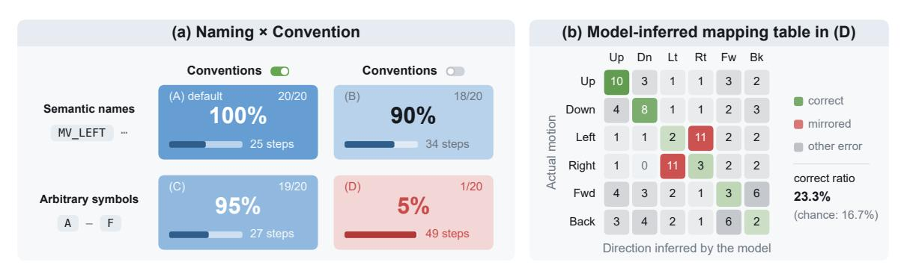

**Figure 10.** (a) 액션 공간 표현에 대한 제거 실험. (b) 설정 (D)에서 20개의 에피소드 동안 모델이 알 수 없는 기호를 탐지하고 관측 변화에서 그 효과를 추론한 액션 매핑.

#### **5.4.4 액션-공간 표현 (Action-space Representation)**

우리는 Gemini-3.1 Pro를 사용한 통제된 소거 실험을 통해 의미 기반 행동 공간이 효과적인 이유를 연구한다. 이때, 여섯 개의 변환 행동 단위의 표현만을 변형하고 나머지 하네스를 고정한다. 2×2 설계는 다음을 비교한다: (A) 물리적 효과를 명시하는 서면 규칙이 있는 의미 기반 행동 이름(기본 설정), (B) 의미 이름만, (C) 규칙이 있는 임의 기호, (D) 규칙이 없는 임의 기호. (D)는 사전 행동 의미를 제공하지 않으므로, 에이전트는 알 수 없는 기호를 탐색하고, 전후 관찰에서 그 효과를 추론하며, 이후 사용을 위해 매핑을 기록한다. 각 변형은 총 20번의 Block/Banana → Plate 과제에서 평가된다.

Fig. [10](#page-15-0) (a)는 명시적 규칙이 있는 임의 기호(C)가 기본 설정과 거의 동일하며, 의미 이름만(B)은 사용 가능하지만 효율성이 떨어진다. 이는 규칙이 대부분의 근거를 제공하고, 의미 이름은 주로 유용한 사전 정보로 작용함을 시사한다. (D)는 20회 중 1회만 성공하며, 추론된 매핑의 정확도가 23.3%에 불과하다 (Fig. [10](#page-15-0) (b)). 명시적 규칙은 시각적 변화만으로 물리적 행동 효과를 추론할 때 발생하는 모호성을 피한다.

### **5.5 정성적 분석 (Qualitative Analysis)**

우리는 다양한 실제 조작 시나리오에 대한 정성적 결과를 추가로 제공한다. Fig. [11,](#page-16-0) Show-Harness는 새로운 물체, 배경 변화, 조명 변화, 혼잡한 장면, 공간 추론 과제, 양손 제어 등 광범위한 시각적·물리적 변화를 성공적으로 처리한다. 표준 pick-and-place를 넘어, 동일한 인터페이스는 의미 목표를 만족하도록 글자 블록을 재배치하거나 두 팔을 조정해 서랍을 열고 물체를 넣는 등 더 도전적인 행동을 지원한다. 이러한 예시는 제안된 의미 기반 행동 인터페이스가 모델‑대면 행동 공간을 재설계하지 않고도 상당히 다른 작업 구조와 조작 요구 사항에 재사용될 수 있음을 정성적으로 입증한다. 우리는 또한 Appendix [7.3.](#page-25-0)에서 0.<sup>5</sup>와의 정성적 비교를 제공한다.

## **6 결론 및 한계 (Conclusion and Limitations)**

본 연구에서는 **Show-Harness**, *Embodied Harness*를 도입하여 기초 VLM에서 컴팩트한 의미 기반 행동 인터페이스를 통해 구현 능력을 열어준다. Show-Harness는 VLM이 자연스럽게 추론할 수 있을 만큼 의미가 충분하면서도 직접 물리적 제어에 충분히 세분화된 행동 공간을 노출한다. 이를 통해 VLM은 폐쇄된 인식–

<span id="page-16-0"></span>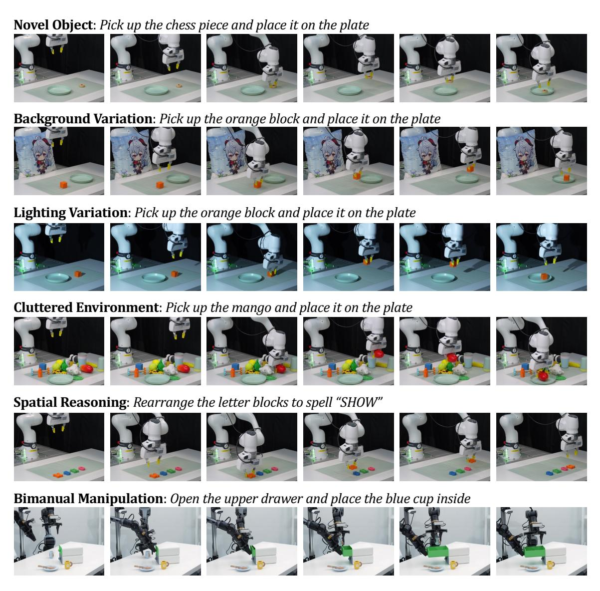

**Figure 11.** Show-Harness의 다양한 작업 및 조건에서의 정성적 실제 시연.

reasoning–action–feedback loop. 이 공유 인터페이스를 기반으로 우리는 **GUMI**를 추가로 도입하였다. GUMI는 인간과 에이전트가 특수한 텔레오퍼레이션 하드웨어 없이 GUI를 통해 로봇 시연을 수집할 수 있게 한다. 광범위한 실험은 Show-Harness가 적용된 VLM 에이전트의 강력한 일반화와 적응성을 입증하며, 올바른 인터페이스가 기초 VLM에 이미 존재하는 상당한 구현 능력을 최소한의 구현‑특정 적응으로 열어줄 수 있음을 시사한다.

Show-Harness는 그 효과에도 불구하고 현재 주로 단일 및 이중 팔 조작과 평행 손가락 그리퍼를 대상으로 평가된다. 보다 복잡한 구현체(예: 인간형 로봇이나 정교한 손)로 프레임워크를 확장하는 것은 가치 있는 방향이다. 향후 연구는 촉각 및 힘 피드백과 같은 추가 구현 모달리티를 인식 측면에 도입하여 보다 접촉이 풍부하고 세밀한 물리적 상호작용을 지원할 수 있다.

## **References**

[1] Michael Ahn, Anthony Brohan, Noah Brown, Yevgen Chebotar, Omar Cortes, Byron David, Chelsea Finn, Chuyuan Fu, Keerthana Gopalakrishnan, Karol Hausman, et al. Do as i can, not as i say: Grounding language in robotic affordances. *arXiv preprint arXiv:2204.01691*, 2022.

- <span id="page-17-11"></span>[2] Michael Ahn, Debidatta Dwibedi, Chelsea Finn, Montse Gonzalez Arenas, Keerthana Gopalakrishnan, Karol Hausman, Brian Ichter, Alex Irpan, Nikhil Joshi, Ryan Julian, et al. *Autort: 대규모 로봇 에이전트 오케스트레이션을 위한 구현형 기반 모델*. *arXiv preprint arXiv:2401.12963*, 2024.
- <span id="page-17-13"></span>[3] Abrar Anwar, John Welsh, Joydeep Biswas, Soha Pouya, and Yan Chang. *Remembr: 장기 시공간 메모리를 활용한 로봇 내비게이션 구축 및 추론*. In *2025 IEEE International Conference on Robotics and Automation (ICRA)*, pages 2838–2845. IEEE, 2025.
- <span id="page-17-5"></span>[4] Erik Bauer, Elvis Nava, and Robert K Katzschmann. *Latent action diffusion for cross-embodiment manipulation*. *arXiv preprint arXiv:2506.14608*, 2025.
- <span id="page-17-14"></span>[5] Shmuel Berman, Michael Ilie, Jia Deng, and Daniel Freeman. *Claude plays robotics*. *Anthropic Research*, 2026. https://www.anthropic.com/research/claude-plays-robotics.
- <span id="page-17-10"></span>[6] Jagdeep Singh Bhatia, Andrew Wagenmaker, William Chen, and Sergey Levine. *Adapting generalist robot policies with semantic reinforcement learning*. *arXiv preprint arXiv:2606.31958*, 2026.
- <span id="page-17-7"></span>[7] Johan Bjorck, Fernando Castañeda, Nikita Cherniadev, Xingye Da, Runyu Ding, Linxi Fan, Yu Fang, Dieter Fox, Fengyuan Hu, Spencer Huang, et al. *Gr00t n1: 범용 휴머노이드 로봇을 위한 공개 기반 모델*. *arXiv preprint arXiv:2503.14734*, 2025.
- <span id="page-17-0"></span>[8] Kevin Black, Noah Brown, Danny Driess, Adnan Esmail, Michael Equi, Chelsea Finn, Niccolo Fusai, Lachy Groom, Karol Hausman, Brian Ichter, et al. *0: 일반 로봇 제어를 위한 시각-언어-행동 흐름 모델*. *arXiv preprint arXiv:2410.24164*, 2024.
- <span id="page-17-8"></span>[9] Kevin Black, Noah Brown, James Darpinian, Karan Dhabalia, Danny Driess, Adnan Esmail, Michael Robert Equi, Chelsea Finn, Niccolo Fusai, Manuel Y Galliker, et al. *0.5: 오픈월드 일반화를 갖는 시각-언어-행동 모델*. In *9th Annual Conference on Robot Learning*, 2025.
- <span id="page-17-9"></span>[10] Konstantinos Bousmalis, Giulia Vezzani, Dushyant Rao, Coline Devin, Alex X Lee, Maria Bauzá, Todor Davchev, Yuxiang Zhou, Agrim Gupta, Akhil Raju, et al. *Robocat: 로봇 조작을 위한 자기 개선 범용 에이전트*. *arXiv preprint arXiv:2306.11706*, 2023.
- <span id="page-17-4"></span>[11] Anthony Brohan, Noah Brown, Justice Carbajal, Yevgen Chebotar, Joseph Dabis, Chelsea Finn, Keerthana Gopalakrishnan, Karol Hausman, Alex Herzog, Jasmine Hsu, et al. *Rt-1: 대규모 실제 제어를 위한 로보틱스 트랜스포머*. *arXiv preprint arXiv:2212.06817*, 2022.
- <span id="page-17-1"></span>[12] Anthony Brohan, Noah Brown, Justice Carbajal, Yevgen Chebotar, Xi Chen, Krzysztof Choromanski, Tianli Ding, Danny Driess, Avinava Dubey, Chelsea Finn, et al. *Rt-2: 웹 지식을 로봇 제어에 전이시키는 시각-언어-행동 모델*. *arXiv preprint arXiv:2307.15818*, 2023.
- <span id="page-17-6"></span>[13] Qingwen Bu, Yanting Yang, Jisong Cai, Shenyuan Gao, Guanghui Ren, Maoqing Yao, Ping Luo, and Hongyang Li. *Univla: 작업 중심 잠재 행동으로 어디서든 행동을 학습*. *arXiv preprint arXiv:2505.06111*, 2025.
- <span id="page-17-15"></span>[14] Haonan Chen, Jingxiang Guo, Bangjun Wang, Tianrui Zhang, Xuchuan Huang, Boren Zheng, Yiwen Hou, Chenrui Tie, Jiajun Deng, and Lin Shao. *Goal-vla: 객체 중심 세계 모델로 무샷 로봇 조작을 강화하는 이미지 생성 VLMS*. *arXiv preprint arXiv:2506.23919*, 2025.
- <span id="page-17-3"></span>[15] Junting Chen, Yao Mu, Qiaojun Yu, Tianming Wei, Silang Wu, Zhecheng Yuan, Zhixuan Liang, Chao Yang, Kaipeng Zhang, Wenqi Shao, et al. *Roboscript: 실제와 시뮬레이션 전반에 걸친 자유형 조작 과제용 코드 생성*. *arXiv preprint arXiv:2402.14623*, 2024.
- <span id="page-17-12"></span>[16] Siyi Chen, Hugo Hadfield, Alex Zook, Mikaela Angelina Uy, Chan Hee Song, Erwin Coumans, Xuning Yang, Faisal Ladhak, Qing Qu, Stan Birchfield, et al. *Volo: 오픈-어휘 장기 조작을 위한 물리적 오케스트레이터*. *arXiv preprint arXiv:2606.07723*, 2026.

<span id="page-18-6"></span>[17] Yanzhe Chen, Kevin Yuchen Ma, Qi Lv, Yiqi Lin, Zechen Bai, Chen Gao, and Mike Zheng Shou. Escaping the diversity trap in robotic manipulation via anchor-centric adaptation. *arXiv preprint arXiv:2605.07381*, 2026.

- <span id="page-18-2"></span>[18] Yi Chen, Yuying Ge, Weiliang Tang, Yizhuo Li, Yixiao Ge, Mingyu Ding, Ying Shan, and Xihui Liu. Moto: 비디오를 통한 로봇 조작 학습을 위한 브리징 언어로서의 잠재적 움직임 토큰. In *2025 IEEE/CVF International Conference on Computer Vision (ICCV)*, pages 19752–19763. IEEE, 2025.

- <span id="page-18-11"></span>[19] Yongchao Chen, Jacob Arkin, Charles Dawson, Yang Zhang, Nicholas Roy, and Chuchu Fan. Autotamp: LLM을 번역기 및 검사기로 활용한 자기회귀적 작업 및 움직임 계획. In *2024 IEEE International conference on robotics and automation (ICRA)*, pages 6695–6702. IEEE, 2024.

- <span id="page-18-12"></span>[20] Yongchao Chen, Yilun Hao, Yang Zhang, and Chuchu Fan. Code-as-symbolic-planner: 기초 모델 기반 로봇 계획을 위한 상징적 코드 생성. In *2025 IEEE/RSJ International Conference on Intelligent Robots and Systems (IROS)*, pages 19248–19254. IEEE, 2025.

- <span id="page-18-14"></span>[21] Cheng Chi, Zhenjia Xu, Chuer Pan, Eric Cousineau, Benjamin Burchfiel, Siyuan Feng, Russ Tedrake, and Shuran Song. Universal manipulation interface: 실제 환경에서 로봇 없이 실제 환경 로봇 교육. In *Robotics: Science and Systems*, 2024.

- <span id="page-18-1"></span>[22] Cheng Chi, Zhenjia Xu, Siyuan Feng, Eric Cousineau, Yilun Du, Benjamin Burchfiel, Russ Tedrake, and Shuran Song. Diffusion policy: 행동 확산을 통한 시각-운동 정책 학습. *The International Journal of Robotics Research*, 44(10-11):1684–1704, 2025.

- <span id="page-18-3"></span>[23] Ria Doshi, Homer Walke, Oier Mees, Sudeep Dasari, and Sergey Levine. Scaling cross-embodied learning: 조작, 탐색, 이동, 항공을 위한 하나의 정책. *arXiv preprint arXiv:2408.11812*, 2024.

- <span id="page-18-0"></span>[24] Danny Driess, Fei Xia, Mehdi SM Sajjadi, Corey Lynch, Aakanksha Chowdhery, Brian Ichter, Ayzaan Wahid, Jonathan Tompson, Quan Vuong, Tianhe Yu, et al. Palm-e: 구현형 멀티모달 언어 모델. *arXiv preprint arXiv:2303.03378*, 2023.

- <span id="page-18-13"></span>[25] Jiafei Duan, Wilbert Pumacay, Nishanth Kumar, Yi Ru Wang, Shulin Tian, Wentao Yuan, Ranjay Krishna, Dieter Fox, Ajay Mandlekar, and Yijie Guo. Aha: 로봇 조작 실패를 감지하고 추론하는 시각-언어 모델. *arXiv preprint arXiv:2410.00371*, 2024.

- <span id="page-18-8"></span>[26] Jiafei Duan, Wentao Yuan, Wilbert Pumacay, Yi Ru Wang, Kiana Ehsani, Dieter Fox, and Ranjay Krishna. Manipulate-anything: 시각-언어 모델을 이용한 실제 로봇 자동화. *arXiv preprint arXiv:2406.18915*, 2024.

- <span id="page-18-4"></span>[27] Pete Florence and Generalist Team. 세계 모델 및 VLAS를 넘어. *Generalist AI Blog*, 2026. https://generalistai.com/blog/beyond-world-models.

- <span id="page-18-10"></span>[28] Letian Fu, Justin Yu, Karim El-Refai, Ethan Kou, Haoru Xue, Huang Huang, Wenli Xiao, Guanzhi Wang, Dantong Niu, Fei-Fei Li, et al. Cap-x: 로봇 조작을 위한 코딩 에이전트 벤치마킹 및 개선 프레임워크. *arXiv preprint arXiv:2603.22435*, 2026.

- <span id="page-18-9"></span>[29] Liane Galanti, Dhruv Shah, and Tri Dao. 일반 로봇의 오케스트레이션 격차를 물리적 대리인을 통해 해결. *arXiv preprint arXiv:2607.21725*, 2026.

- <span id="page-18-5"></span>[30] Generalist Team. Gen-1: 구현형 기초 모델을 마스터리로 확장. *Generalist AI Blog*, 2026. https://generalistai.com/blog/gen-1.

- <span id="page-18-15"></span>[31] Google DeepMind. Gemini 3.1 pro. 모델 카드, 2026년 2월. URL https://deepmind.google/models/model-cards/gemini-3-1-pro/ [model-cards/gemini-3-1-pro/.](https://deepmind.google/models/model-cards/gemini-3-1-pro/)

- <span id="page-18-7"></span>[32] Ankit Goyal, Hugo Hadfield, Xuning Yang, Valts Blukis, and Fabio Ramos. Vla-0: 제로 수정으로 최첨단 VLAS 구축. *arXiv preprint arXiv:2510.13054*, 2025.

- <span id="page-18-16"></span>[33] Edward J Hu, Yelong Shen, Phillip Wallis, Zeyuan Allen-Zhu, Yuanzhi Li, Shean Wang, Lu Wang, and Weizhu Chen. Lora: 대형 언어 모델의 저랭크 적응. *arXiv preprint arXiv:2106.09685*, 2021.

<span id="page-19-11"></span>[34] Jiaheng Hu, Mohit Shridhar, Caden Lu, Dhruv Shah, Hao-Tien Lewis Chiang, Jie Tan, and Annie Xie. What matters in orchestrating robot policies: A systematic study of hierarchical vla agents. *arXiv preprint arXiv:2606.10267*, 2026.

- <span id="page-19-4"></span>[35] Yutong Hu, Jan-Nico Zaech, Nikolay Nikolov, Yuanqi Yao, Sombit Dey, Giuliano Albanese, Renaud Detry, Luc Van Gool, and Danda Paudel. Ar-vla: True autoregressive action expert for vision-language-action models. *arXiv preprint arXiv:2603.10126*, 2026.
- <span id="page-19-3"></span>[36] Siyuan Huang, Zhengkai Jiang, Hao Dong, Yu Qiao, Peng Gao, and Hongsheng Li. Instruct2act: Mapping multi-modality instructions to robotic actions with large language model. *arXiv preprint arXiv:2305.11176*, 2023.
- <span id="page-19-2"></span>[37] Wenlong Huang, Fei Xia, Ted Xiao, Harris Chan, Jacky Liang, Pete Florence, Andy Zeng, Jonathan Tompson, Igor Mordatch, Yevgen Chebotar, et al. Inner monologue: Embodied reasoning through planning with language models. *arXiv preprint arXiv:2207.05608*, 2022.
- <span id="page-19-10"></span>[38] Wenlong Huang, Chen Wang, Ruohan Zhang, Yunzhu Li, Jiajun Wu, and Li Fei-Fei. Voxposer: Composable 3d value maps for robotic manipulation with language models. *arXiv preprint arXiv:2307.05973*, 2023.
- <span id="page-19-12"></span>[39] Wenlong Huang, Chen Wang, Yunzhu Li, Ruohan Zhang, and Li Fei-Fei. Rekep: Spatio-temporal reasoning of relational keypoint constraints for robotic manipulation. *arXiv preprint arXiv:2409.01652*, 2024.
- <span id="page-19-0"></span>[40] Yuheng Ji, Huajie Tan, Jiayu Shi, Xiaoshuai Hao, Yuan Zhang, Hengyuan Zhang, Pengwei Wang, Mengdi Zhao, Yao Mu, Pengju An, et al. Robobrain: A unified brain model for robotic manipulation from abstract to concrete. In *2025 IEEE/CVF Conference on Computer Vision and Pattern Recognition (CVPR)*, pages 1724–1734. IEEE, 2025.
- <span id="page-19-5"></span>[41] Tengyue Jiang, Chunpu Xu, Jiayue Kang, and Yao Mu. Sa-vla: State-aware tokenizer for improving vision-language-action models' performance. *arXiv preprint arXiv:2606.30113*, 2026.
- <span id="page-19-8"></span>[42] Dong Jing, Tianqi Zhang, Jiaqi Liu, Jinman Zhao, Zelong Sun, Li Erran Li, Zhiwu Lu, and Mingyu Ding. Learning action priors for cross-embodiment robot manipulation. *arXiv preprint arXiv:2606.26095*, 2026.
- <span id="page-19-6"></span>[43] Miracle Kang, Lights Shi, Lucy Liang, Roy Gan, Dongxiu Liu, Pushi Zhang, Sylas Chen, Shawn Qin, Yinan Zheng, Jinliang Zheng, et al. X-tokenizer: A multimodal action tokenizer for vision-language-action pretraining. *arXiv preprint arXiv:2606.14752*, 2026.
- <span id="page-19-9"></span>[44] Elis Karcini, Faisal Mehrban, Quang Nguyen, Mac Schwager, Arash Ajoudani, Cesar Cadena, Jan Peters, Marco Hutter, and Haitham Bou-Ammar. Robots need more than vla and world models. *arXiv preprint arXiv:2606.06556*, 2026.
- <span id="page-19-1"></span>[45] Moo Jin Kim, Karl Pertsch, Siddharth Karamcheti, Ted Xiao, Ashwin Balakrishna, Suraj Nair, Rafael Rafailov, Ethan Foster, Grace Lam, Pannag Sanketi, et al. Openvla: An open-source vision-language-action model. *arXiv preprint arXiv:2406.09246*, 2024.
- <span id="page-19-15"></span>[46] Jacob Krantz, Erik Wijmans, Arjun Majumdar, Dhruv Batra, and Stefan Lee. Beyond the nav-graph: Vision-and-language navigation in continuous environments. In *European Conference on Computer Vision*, pages 104–120, 2020.
- <span id="page-19-7"></span>[47] Seungjae Lee, Yibin Wang, Haritheja Etukuru, H Jin Kim, Nur Muhammad Mahi Shafiullah, and Lerrel Pinto. Behavior generation with latent actions. *arXiv preprint arXiv:2403.03181*, 2024.
- <span id="page-19-13"></span>[48] Chengshu Li, Ruohan Zhang, Josiah Wong, Cem Gokmen, Sanjana Srivastava, Roberto Martín-Martín, Chen Wang, Gabrael Levine, Michael Lingelbach, Jiankai Sun, et al. Behavior-1k: A benchmark for embodied ai with 1,000 everyday activities and realistic simulation. In *Conference on Robot Learning*, pages 80–93. PMLR, 2023.
- <span id="page-19-14"></span>[49] Manling Li, Shiyu Zhao, Qineng Wang, Kangrui Wang, Yu Zhou, Sanjana Srivastava, Cem Gokmen,

- Tony Lee, Li E Li, Ruohan Zhang, et al. 본체화된 에이전트 인터페이스: 본체화된 의사결정을 위한 LLM 벤치마킹. *Advances in Neural Information Processing Systems*, 37:100428–100534, 2024.  
- <span id="page-20-8"></span>Ruiying Li, Yunlang Zhou, YuYao Zhu, Kylin Chen, Jingyuan Wang, Sukai Wang, Kongtao Hu, Minhui Yu, Bowen Jiang, Zhan Su, et al. Roboclaw: An agentic framework for scalable long-horizon robotic tasks. *arXiv preprint arXiv:2603.11558*, 2026.  
- <span id="page-20-3"></span>Shuang Li, Yihuai Gao, Dorsa Sadigh, and Shuran Song. Unified video action model. *arXiv preprint arXiv:2503.00200*, 2025.  
- <span id="page-20-12"></span>Siyao Li, Jiawei Gu, Shuai Liu, Kairui Hu, Zekun Li, Linjie Li, Chengcheng Tang, Po-Chen Wu, Ivan Shugurov, Lingni Ma, et al. Humanclaw: Can vision-language models act through a body? *arXiv preprint arXiv:2607.27180*, 2026.  
- <span id="page-20-4"></span>Ziang Li, Dongzhou Cheng, Yibin Wang, Shiyue Wang, Xiaoyang Xu, Lingxuan Weng, Juan Wang, and Jiaqi Wang. Light-wam: Efficient world action models with state-fusion action decoding. *arXiv preprint arXiv:2606.08242*, 2026.  
- <span id="page-20-0"></span>Jacky Liang, Wenlong Huang, Fei Xia, Peng Xu, Karol Hausman, Brian Ichter, Pete Florence, and Andy Zeng. Code as policies: Language model programs for embodied control. In *2023 IEEE International conference on robotics and automation (ICRA)*, pages 9493–9500. IEEE, 2023.  
- <span id="page-20-6"></span>Oscar Lima, Marc Vinci, Martin Günther, Marian Renz, Alexander Sung, Sebastian Stock, Johannes Brust, Lennart Niecksch, Zongyao Yi, Felix Igelbrink, et al. Agentic ai for robot control: Flexible but still fragile. In *Proceedings of the AAAI Symposium Series*, volume 8, pages 465–473, 2026.  
- <span id="page-20-11"></span>Kevin Qinghong Lin, Linjie Li, Difei Gao, Zhengyuan Yang, Shiwei Wu, Zechen Bai, Stan Weixian Lei, Lijuan Wang, and Mike Zheng Shou. Showui: One vision-language-action model for gui visual agent. In *2025 IEEE/CVF Conference on Computer Vision and Pattern Recognition (CVPR)*, pages 19498–19508. IEEE, 2025.  
- <span id="page-20-9"></span>Bo Liu, Yuqian Jiang, Xiaohan Zhang, Qiang Liu, Shiqi Zhang, Joydeep Biswas, and Peter Stone. Llm+ p: Empowering large language models with optimal planning proficiency. *arXiv preprint arXiv:2304.11477*, 2023.  
- <span id="page-20-13"></span>Bo Liu, Yifeng Zhu, Chongkai Gao, Yihao Feng, Qiang Liu, Yuke Zhu, and Peter Stone. LIBERO: Benchmarking knowledge transfer for lifelong robot learning. In *Advances in Neural Information Processing Systems*, 2023.  
- <span id="page-20-7"></span>Haowen Liu, Xirui Li, Shaoxiong Yao, Peng Shi, Tianyi Zhou, Jia-Bin Huang, Furong Huang, and Jiayuan Mao. Guava: An effective and universal harness for embodied manipulation. *arXiv preprint arXiv:2606.18363*, 2026.  
- <span id="page-20-5"></span>Peiqi Liu, Yaswanth Orru, Jay Vakil, Chris Paxton, Nur Muhammad Mahi Shafiullah, and Lerrel Pinto. Ok-robot: What really matters in integrating open-knowledge models for robotics. *arXiv preprint arXiv:2401.12202*, 2024.  
- <span id="page-20-1"></span>Songming Liu, Lingxuan Wu, Bangguo Li, Hengkai Tan, Huayu Chen, Zhengyi Wang, Ke Xu, Hang Su, and Jun Zhu. Rdt-1b: a diffusion foundation model for bimanual manipulation. In *International Conference on Learning Representations*, volume 2025, pages 29982–30009, 2025.  
- <span id="page-20-10"></span>Zeyi Liu, Arpit Bahety, and Shuran Song. Reflect: Summarizing robot experiences for failure explanation and correction. In *Conference on Robot Learning*, 2023.  
- <span id="page-20-14"></span>Ajay Mandlekar, Danfei Xu, Josiah Wong, Soroush Nasiriany, Chen Wang, Rohun Kulkarni, Li Fei-Fei, Silvio Savarese, Yuke Zhu, and Roberto Martín-Martín. What matters in learning from offline human demonstrations for robot manipulation. In *Conference on Robot Learning*, 2021.  
- <span id="page-20-2"></span>Juncheng Mu, Sizhe Yang, Hojin Bae, Feiyu Jia, Qingwei Ben, Boyi Li, Huazhe Xu, and Jiangmiao Pang. One-policy-fits-all: Geometry-aware action latents for cross-embodiment manipulation. *arXiv preprint arXiv:2603.14522*, 2026.

[65] Mingyu Ouyang, Siyuan Hu, Kevin Qinghong Lin, Hwee Tou Ng, and Mike Zheng Shou. Gameworld: Towards standardized and verifiable evaluation of multimodal game agents. *arXiv preprint arXiv:2604.07429*, 2026.

- <span id="page-21-0"></span>[66] Abby O'Neill, Abdul Rehman, Abhiram Maddukuri, Abhishek Gupta, Abhishek Padalkar, Abraham Lee, Acorn Pooley, Agrim Gupta, Ajay Mandlekar, Ajinkya Jain, et al. Open x-embodiment: 로봇 학습 데이터셋 및 rt-x 모델: Open x-embodiment 협업 0. In *2024 IEEE 국제 로보틱스 및 자동화 학회 (ICRA)*, pages 6892–6903. IEEE, 2024.
- <span id="page-21-6"></span>[67] Bikang Pan, Fan Liu, Haotao Lu, Jingya Wang, and Ye Shi. Selfwam: 빠른 로봇 제어를 위한 자기 기반 통합 세계 행동 모델. *arXiv 사전 인쇄 arXiv:2608.00725*.
- <span id="page-21-10"></span>[68] Jiaqi Peng, Xiqian Yu, Delin Feng, Yuqiang Yang, Wenzhe Cai, Jing Xiong, Ganlin Yang, Jinliang Zheng, Jiafei Cao, Xueyuan Wei, et al. Cortex: 장기 조작을 위한 양방향 정렬된 구현형 에이전트 프레임워크. *arXiv 사전 인쇄 arXiv:2607.05377*.
- <span id="page-21-3"></span>[69] Karl Pertsch, Kyle Stachowicz, Brian Ichter, Danny Driess, Suraj Nair, Quan Vuong, Oier Mees, Chelsea Finn, and Sergey Levine. Fast: 시각-언어-행동 모델을 위한 효율적인 행동 토큰화. *arXiv 사전 인쇄 arXiv:2501.09747*.
- <span id="page-21-13"></span>[70] Yujia Qin, Yining Ye, Junjie Fang, Haoming Wang, Shihao Liang, Shizuo Tian, Junda Zhang, Jiahao Li, Yunxin Li, Shijue Huang, et al. Ui-tars: 네이티브 에이전트와의 자동 GUI 상호작용을 선도하는 연구. *arXiv 사전 인쇄 arXiv:2501.12326*.
- <span id="page-21-4"></span>[71] Delin Qu, Haoming Song, Qizhi Chen, Yuanqi Yao, Xinyi Ye, Yan Ding, Zhigang Wang, JiaYuan Gu, Bin Zhao, Dong Wang, et al. Spatialvla: 시각-언어-행동 모델을 위한 공간 표현 탐구. *arXiv 사전 인쇄 arXiv:2501.15830*.
- <span id="page-21-15"></span>[72] Qwen Team. Qwen3.5: 네이티브 멀티모달 에이전트 향해, 2026년 2월. URL [https://qwen.ai/blog?id=](https://qwen.ai/blog?id=qwen3.5) [qwen3.5.](https://qwen.ai/blog?id=qwen3.5)
- <span id="page-21-8"></span>[73] Krishan Rana, Jesse Haviland, Sourav Garg, Jad Abou-Chakra, Ian Reid, and Niko Suenderhauf. Sayplan: 확장 가능한 로봇 작업 계획을 위한 3D 장면 그래프를 활용한 대형 언어 모델 기반화. *arXiv 사전 인쇄 arXiv:2307.06135*.
- <span id="page-21-9"></span>[74] Vitor Gaboardi dos Santos, Ibrahim Khadraoui, Ibrahim Farhat, Hamza Yous, Samy Teffahi, and Hakim Hacid. Alrm: 로봇 조작을 위한 에이전트형 LLM. *arXiv 사전 인쇄 arXiv:2601.19510*.
- <span id="page-21-14"></span>[75] Manolis Savva, Abhishek Kadian, Oleksandr Maksymets, Yili Zhao, Erik Wijmans, Bhavana Jain, Julian Straub, Jia Liu, Vladlen Koltun, Jitendra Malik, et al. Habitat: 구현형 AI 연구를 위한 플랫폼. In *2019 IEEE/CVF 국제 컴퓨터 비전 학회 (ICCV)*, pages 9338–9346, 2019.
- <span id="page-21-1"></span>[76] Lucy Xiaoyang Shi, Brian Ichter, Michael Equi, Liyiming Ke, Karl Pertsch, Quan Vuong, James Tanner, Anna Walling, Haohuan Wang, Niccolo Fusai, et al. Hi robot: 계층적 시각-언어-행동 모델을 통한 개방형 지시 따르기. *arXiv 사전 인쇄 arXiv:2502.19417*.
- <span id="page-21-11"></span>[77] Noah Shinn, Federico Cassano, Ashwin Gopinath, Karthik Narasimhan, and Shunyu Yao. Reflexion: 언어 에이전트와 언어적 강화 학습. Advances in neural information processing systems, 36:8634–8652, 2023.
- <span id="page-21-5"></span>[78] Mohit Shridhar, Lucas Manuelli, and Dieter Fox. Perceiver-actor: 로봇 조작을 위한 다중 작업 트랜스포머. In *Conference on Robot Learning*, pages 785–799. PMLR, 2023.
- <span id="page-21-2"></span>[79] Mustafa Shukor, Dana Aubakirova, Francesco Capuano, Pepijn Kooijmans, Steven Palma, Adil Zouitine, Michel Aractingi, Caroline Pascal, Martino Russi, Andres Marafioti, et al. Smolvla: 저렴하고 효율적인 로봇을 위한 시각-언어-행동 모델. *arXiv 사전 인쇄 arXiv:2506.01844*.
- <span id="page-21-7"></span>[80] Ishika Singh, Valts Blukis, Arsalan Mousavian, Ankit Goyal, Danfei Xu, Jonathan Tremblay, Dieter Fox, Jesse Thomason, and Animesh Garg. Progprompt: 대형 언어 모델을 활용한 상황 기반 로봇 작업 계획 생성. *arXiv 사전 인쇄 arXiv:2209.11302*.

[81] Stone Tao, Fanbo Xiang, Arth Shukla, Yuzhe Qin, Xander Hinrichsen, Xiaodi Yuan, Chen Bao, Xinsong Lin, Yulin Liu, Tse-kai Chan, Yuan Gao, Xuanlin Li, Tongzhao Mu, Nan Xiao, Arnav Gurha, Zhiao Huang, Roberto Calandra, Rui Chen, Shan Luo, and Hao Su. ManiSkill3: GPU parallelized robotics simulation and rendering for generalizable embodied AI. *arXiv preprint arXiv:2410.00425*, 2024.

- <span id="page-22-0"></span>[82] Gemini Robotics Team, Abbas Abdolmaleki, Saminda Abeyruwan, Joshua Ainslie, Jean-Baptiste Alayrac, Montserrat Gonzalez Arenas, Ashwin Balakrishna, Nathan Batchelor, Alex Bewley, Jeff Bingham, et al. Gemini robotics 1.5: 고급 구현된 추론, 사고, 그리고 모션 전이를 통한 범용 로봇의 최전선 확장. *arXiv preprint arXiv:2510.03342*, 2025.
- <span id="page-22-5"></span>[83] Octo Model Team, Dibya Ghosh, Homer Walke, Karl Pertsch, Kevin Black, Oier Mees, Sudeep Dasari, Joey Hejna, Tobias Kreiman, Charles Xu, et al. Octo: 오픈소스 범용 로봇 정책. *arXiv preprint arXiv:2405.12213*, 2024.
- <span id="page-22-8"></span>[84] Sai H Vemprala, Rogerio Bonatti, Arthur Bucker, and Ashish Kapoor. ChatGPT for robotics: 설계 원칙과 모델 능력. *Ieee Access*, 12:55682–55696, 2024.
- <span id="page-22-6"></span>[85] Siyin Wang, Junhao Shi, Senyu Fei, Zhaoyang Fu, Li Ji, Jingjing Gong, and Xipeng Qiu. 인컨텍스트 세계 모델링을 통한 로봇 제어. *arXiv preprint arXiv:2606.26025*, 2026.
- <span id="page-22-11"></span>[86] Zihao Wang, Xujing Li, Yining Ye, Junjie Fang, Haoming Wang, Longxiang Liu, Shihao Liang, Junting Lu, Zhiyong Wu, Jiazhan Feng, et al. Game-tars: 확장 가능한 범용 다중모달 게임 에이전트를 위한 사전 학습된 기초 모델. *arXiv preprint arXiv:2510.23691*, 2025.
- <span id="page-22-13"></span>[87] Philipp Wu, Yide Shentu, Zhongke Yi, Xingyu Lin, and Pieter Abbeel. GELLO: 범용적이고 저비용이며 직관적인 로봇 조작기용 원격 조작 프레임워크. *arXiv preprint arXiv:2309.13037*, 2023.
- <span id="page-22-7"></span>[88] Kechun Xu, Zhenjie Zhu, Anzhe Chen, Rong Xiong, and Yue Wang. Apt: 액션 전문가 사전 학습이 시각-언어-액션 정책의 지시 일반화를 향상. *arXiv preprint arXiv:2606.12366*, 2026.
- <span id="page-22-3"></span>[89] Fan Yang, Yuting Su, Xiaobo Wang, Yuncheng You, Fugui Fan, Yuting Wu, Minghui Wu, Chenxu Zhao, JiaHong Ning, and Peiguang Jing. Lila-wam: 경량 잠재적 추론 세계-액션 모델을 통한 로봇 조작. *arXiv preprint arXiv:2608.03701*, 2026.
- <span id="page-22-15"></span>[90] Jenai Xuning Yang, Rishit Dagli, Alex Zook, Hugo Hadfield, Ankit Goyal, Stan Birchfield, Fabio Ramos, and Jonathan Tremblay. Robolab: 작업 범용 정책 분석을 위한 고충실도 시뮬레이션 벤치마크. *arXiv preprint arXiv:2604.09860*, 2026.
- <span id="page-22-12"></span>[91] Rui Yang, Hanyang Chen, Junyu Zhang, Mark Zhao, Cheng Qian, Kangrui Wang, Qineng Wang, Teja Venkat Koripella, Marziyeh Movahedi, Manling Li, et al. Embodiedbench: 시각 기반 구현 에이전트를 위한 다중모달 대형 언어 모델의 종합 벤치마크. In *International Conference on Machine Learning*, 2025.
- <span id="page-22-1"></span>[92] Zhejian Yang, Yongchao Chen, Xueyang Zhou, Jiangyue Yan, Dingjie Song, Yinuo Liu, Yuting Li, Yu Zhang, Pan Zhou, Hechang Chen, et al. Agentic robot: 구현 에이전트의 시각-언어-액션 모델을 위한 뇌 영감 프레임워크. *arXiv preprint arXiv:2505.23450*, 2025.
- <span id="page-22-2"></span>[93] Seonghyeon Ye, Joel Jang, Byeongguk Jeon, Se June Joo, Jianwei Yang, Baolin Peng, Ajay Mandlekar, Reuben Tan, Yu-Wei Chao, Bill Yuchen Lin, et al. 비디오에서의 잠재 액션 사전 학습. In *International Conference on Learning Representations*, volume 2025, pages 28213–28239, 2025.
- <span id="page-22-4"></span>[94] Seonghyeon Ye, Yunhao Ge, Kaiyuan Zheng, Shenyuan Gao, Sihyun Yu, George Kurian, Suneel Indupuru, You Liang Tan, Chuning Zhu, Jiannan Xiang, et al. 세계 액션 모델은 제로샷 정책이다. *arXiv preprint arXiv:2602.15922*, 2026.
- <span id="page-22-10"></span>[95] Wenhao Yu, Nimrod Gileadi, Chuyuan Fu, Sean Kirmani, Kuang-Huei Lee, Montse Gonzalez Arenas, Hao-Tien Lewis Chiang, Tom Erez, Leonard Hasenclever, Jan Humplik, et al. 로봇 기술 합성을 위한 언어에서 보상으로. *arXiv preprint arXiv:2306.08647*, 2023.
- <span id="page-22-9"></span>[96] Haoqi Yuan, Yu Bai, Yuhui Fu, Bohan Zhou, Yicheng Feng, Xinrun Xu, Yi Zhan, Börje F Karlsson, and

- Zongqing Lu. Being-0: 시각-언어 모델과 모듈러 스킬을 갖춘 인간형 로봇 에이전트. *arXiv preprint arXiv:2503.12533*, 2025.
- <span id="page-23-0"></span>[97] Wentao Yuan, Jiafei Duan, Valts Blukis, Wilbert Pumacay, Ranjay Krishna, Adithyavairavan Murali, Arsalan Mousavian, and Dieter Fox. Robopoint: 시각-언어 모델을 활용한 로봇 공간적 활용성 예측. *arXiv preprint arXiv:2406.10721*, 2024.
- <span id="page-23-10"></span>[98] Junyi Zhang, Jiaxin Ge, Hanjun Yoo, Letian Fu, Zihan Yang, Yaowei Liu, Raj Saravanan, Shaofeng Yin, Justin Yu, Dantong Niu, et al. Playful agentic robot learning. *arXiv preprint arXiv:2606.19419*, 2026.
- <span id="page-23-7"></span>[99] Kuan Zhang, Dongchen Liu, Qiyue Zhao, Tianyu Xin, Yue Su, Haisheng Wang, Han Yin, Hongbo Ma, Peize Li, Tianjun Gu, et al. Towards generalist game players: An investigation of foundation models in the game multiverse. *arXiv preprint arXiv:2605.09965*, 2026.
- <span id="page-23-6"></span>[100] Yixian Zhang, Huanming Zhang, Feng Gao, Xiao Li, Zhihao Liu, Chunyang Zhu, Jiaxing Qiu, Yuchen Yan, Jiyuan Liu, Wenhao Tang, et al. Harness vla: Steering frozen vlas into reliable manipulation primitives via memory-guided agents. *arXiv preprint arXiv:2607.08448*, 2026.
- <span id="page-23-5"></span>[101] Rongfeng Zhao, Xuanhao Zhang, Zhaochen Guo, Xiang Shao, Zhongpan Zhu, Bin He, and Jie Chen. Rosclaw: A hierarchical semantic-physical framework for heterogeneous multi-agent collaboration. *arXiv preprint arXiv:2604.04664*, 2026.
- <span id="page-23-1"></span>[102] Tony Z Zhao, Vikash Kumar, Sergey Levine, and Chelsea Finn. Learning fine-grained bimanual manipulation with low-cost hardware. *arXiv preprint arXiv:2304.13705*, 2023.
- <span id="page-23-2"></span>[103] Jinliang Zheng, Jianxiong Li, Dongxiu Liu, Yinan Zheng, Zhihao Wang, Zhonghong Ou, Yu Liu, Jingjing Liu, Ya-Qin Zhang, and Xianyuan Zhan. Universal actions for enhanced embodied foundation models. In *2025 IEEE/CVF Conference on Computer Vision and Pattern Recognition (CVPR)*, pages 22508–22519. IEEE, 2025.
- <span id="page-23-4"></span>[104] Yifan Zhong, Fengshuo Bai, Shaofei Cai, Xuchuan Huang, Zhang Chen, Xiaowei Zhang, Yuanfei Wang, Shaoyang Guo, Tianrui Guan, Ka Nam Lui, et al. A survey on vision-language-action models: An action tokenization perspective. *arXiv preprint arXiv:2507.01925*, 2025.
- <span id="page-23-8"></span>[105] Jian Zhou, Xunyi Zhao, Gengze Zhou, Zerui Li, Sihao Lin, Jiajun Liu, and Qi Wu. Embodied agents take control: Minimal-interface zero-shot agents rival industrial-scale policies in vision-and-language navigation. *arXiv preprint arXiv:2607.26148*, 2026.
- <span id="page-23-3"></span>[106] Chuning Zhu, Raymond Yu, Siyuan Feng, Benjamin Burchfiel, Paarth Shah, and Abhishek Gupta. Unified world models: Coupling video and action diffusion for pretraining on large robotic datasets. *arXiv preprint arXiv:2504.02792*, 2025.
- <span id="page-23-9"></span>[107] Yuke Zhu, Josiah Wong, Ajay Mandlekar, Roberto Martín-Martín, Abhishek Joshi, Soroush Nasiriany, and Yifeng Zhu. robosuite: A modular simulation framework and benchmark for robot learning. *arXiv preprint arXiv:2009.12293*, 2020.

## **7 부록 (Appendix)**

### **7.1 VLM 미세조정 세부사항 (VLM Fine-Tuning Details)**

경량 VLM 미세조정을 위해, 우리는 7.9K 단일 팔 샘플에서 40 에폭 동안 학습하며, 학습률은 1 × 10−<sup>4</sup>이고, 코사인 스케줄에 0.1의 워밍업 비율을 사용하고, bf16, 256 × 256 뷰, 그리고 32의 유효 배치 크기를 사용한다. 미세조정은 경량이며 24 GB급 GPU에서 수행할 수 있다. 실험에서 Qwen3.5-2B 모델의 미세조정은 단일 H200에서 2시간 미만이 걸린다.

<span id="page-24-1"></span>

|  | 플랫폼 | 작업 | 에피소드 | 에피소드/작업 | 단계 | 단계/에피소드 |
|-------------|----------------------------------|---------|-----------|-------------|--------------|--------------|
| 실제 로봇 | Franka (7-DoF)<br>AgileX (6-DoF) | 9<br>10 | 101<br>63 | 11.2<br>6.3 | 4969<br>2805 | 49.2<br>44.5 |
|  | 총합 | 19 | 164 | 8.6 | 7774 | 47.4 |
| 시뮬레이션 | ManiSkill | 1 | 100 | 100.0 | 5840 | 58.4 |
|  | RoboLab | 12 | 130 | 10.8 | 7683 | 59.1 |
|  | 총합 | 13 | 230 | 17.7 | 13523 | 58.8 |

**Table 3.** GUMI를 통해 수집된 시연 코퍼스.

### <span id="page-24-0"></span>**7.2 시연 데이터 (Demonstration Data)**

Table [3](#page-24-1)는 플랫폼별로 훈련 코퍼스를 분해한다. 코퍼스는 [https://huggingface.co/](https://huggingface.co/showlab/Show-Harness-Data) [showlab/Show-Harness-Data.](https://huggingface.co/showlab/Show-Harness-Data)에서 공개된다.

실제 로봇 시연은 19개의 작업, Franka에서 9개의 서로 다른 객체–목표 조합, AgileX에서 10개의 조합을 다루며, 주로 픽앤플레이스에 집중하고 몇 가지 스태킹 및 선반 재배치 에피소드를 포함한다. 모든 실제 로봇 에피소드는 동일한 2 cm 변위 단계 크기로 GUMI를 통해 기록되므로, 하나의 의미 단위는 Franka와 두 AgileX 구성 모두에서 같은 변위를 나타낸다. 각 에피소드는 매 단계마다 제3자 시점과 손목 프레임을 저장하고, 방출된 단위, 측정된 엔드 이펙터 포즈, 그리고 그리퍼 너비를 함께 저장한다. 훈련 샘플은 한 단계에서 두 뷰를 단위와 함께 매칭하고, 각 에피소드마다 DONE을 방출하는 하나의 종료 샘플을 포함한다. 깨끗한 실행 외에도, 19개의 Franka 에피소드(594 단계)는 그리퍼가 의도된 그립 포인트 앞, 뒤, 또는 양쪽에 위치해 빈 그립이 발생한 후 그리퍼를 들어 올리고 재접근하는 그립 회복용으로 특별히 기록된다. 이 에피소드는 교정 세그먼트만 남도록 잘라내어, 자유롭게 수집된 에피소드의 53 단계에 비해 약 31 단계로 실행된다.

시뮬레이션 데이터는 ManiSkill [&#91;81&#93;](#page-22-14)와 RoboLab [&#91;90&#93;](#page-22-15)에서 수집한다. 두 시뮬레이터 모두에서 우리는 실제 Franka 설정과 일관되게 모델-지향 제어 및 관측 규칙을 유지한다: 각 의미 변환 동작 단위는 2 cm 단일 축 카르테시안 변환에 해당하며, 카메라 뷰는 배포 시 사용되는 동일한 입력 형식으로 변환된다. 동시에 렌더링, 장면 구성, 구현 외형에서 상당한 변화를 유지하여 의미 있는 sim-to-real 격차를 보존한다. ManiSkill은 주황색 블록과 코스터를 포함한 100개의 테이블탑 픽앤플레이스 에피소드를 제공하고, RoboLab은 열두 개의 작업에 걸쳐 130개의 에피소드를 제공한다,

<span id="page-25-1"></span>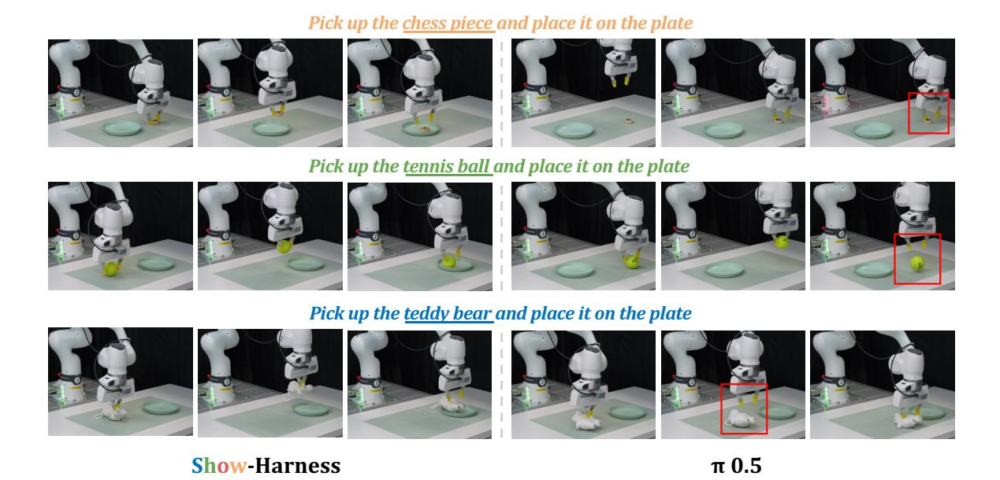

**Figure 12.** 0.5와의 정성적 비교. Show-Harness는 세 예제를 모두 완수하지만, 0.<sup>5</sup>는 조작 실패(예: 그리퍼–객체 충돌 및 불안정한 그립)를 보이며, 이는 빨간 상자로 강조된다.

색깔 블록을 그릇에 넣기, 왼쪽-오른쪽 그릇 선택, 캔음식과 요거트를 용기에 넣기, 루빅스 큐브, 그리고 사과를 버리기 등을 포함한다.

### <span id="page-25-0"></span>**7.3 정성적 비교 (Qualitative Comparison)**

Fig. [12](#page-25-1)은 0.5와의 통제된 정성적 비교를 제공한다. 공정한 비교를 위해 Show-Harness는 수집된 시연에 대해 미세 조정된 Qwen3.5-2B VLM을 사용하고, 0.<sup>5</sup>는 동일한 시연 세트에서 변환된 저수준 동작 궤적에 대해 미세 조정된다. 이 매치된 데이터 설정 하에서 Show-Harness는 체스 피스, 테니스 볼, 테디 베어 예제에서 조작 시퀀스를 일관되게 완수하지만, 0.<sup>5</sup>는 그립 또는 객체 상호작용 실패를 보이며, 이는 빨간색으로 강조된다. 이러한 예제는 공유된 의미적 동작 인터페이스를 통해 학습하는 것이 구현 특화 저수준 동작을 직접 맞추는 것보다 이점을 갖는다는 것을 정성적으로 보여준다.

### **7.4 런타임 프롬프트 (Runtime Prompts)**

우리는 각 개별 모델 역할마다 하나의 표준 프롬프트를 보고하며, 모든 embodimentor 백엔드별 변형을 나열하지 않는다. 중괄호 필드(예: {task})는 모델 호출 직전에 현재 작업, 계획 상태, 측정값 또는 행동 이력을 사용해 채워진다. 이미지는 모델 API를 통해 별도로 제공된다. 기본적으로 회전 관련 가이드와 액션은 프롬프트에서 제외되며, 엔드 이펙터 재배치가 필요한 작업에 대해서만 활성화된다.

#### 7.4.1 프론티어 VLM 에이전트 (7.4.1 Frontier VLM Agent)

Show-Harness는 동일한 VLM을 에이전트 루프 내에서 두 가지 역할로 감싼다: (1) 작업을 시각적으로 검증 가능한 단계로 분해하는 플래너, (2) 현재 컨텍스트에서 다음 의미적 액션을 선택해 로봇을 제어하는 컨트롤러. 런타임 시, 컨트롤러 템플릿은 활성 플러그인 컨텍스트와 출력 계약으로 보강된다.

```
컨트롤러 프롬프트 (Pctrl)
TASK: {task}
STAGE: {stage}
TARGET: {target}
AFFORD: {affordance}
단계 목표: {description}
완료 시: {completion}
그리퍼 상태: {gripper_state}
{mem_text}
{recovery}
{proprio}
방향:
STAGE가 그립을 위한 것이고 TARGET이 손목 뷰 안에 있습니까?
A) 예 -> 손목이 주요 가이드다. AFFORD의 위치를 {gripper_color} 그리퍼와 비교하고 가장 큰 편차 방향을 선택한다:
- AFFORD가 그리퍼의 왼쪽에 있으면 -> MV_LEFT
- AFFORD가 그리퍼의 오른쪽에 있으면 -> MV_RIGHT
- AFFORD가 이미지 하단에 가까우면서 그리퍼에서 멀리 있으면 -> MV_FWD
- AFFORD가 이미지 상단과 그리퍼 사이에 있으면 -> MV_BACK
- AFFORD가 그리퍼 사이에 대략 중앙에 있으면 -> MV_DOWN
{rotation}
B) 아니오 -> AgentView가 주요 가이드다. TARGET의 위치를 엔드 이펙터( GRASP 전) 또는 보유 물체( GRASP 후)와 비교하고 가장 큰 편차 방향을 선택한다:
- TARGET이 이미지 왼쪽에 있으면 -> MV_LEFT
- TARGET이 이미지 오른쪽에 있으면 -> MV_RIGHT
- TARGET이 이미지 하단에 있으면 -> MV_FWD
- TARGET이 이미지 상단에 있으면 -> MV_BACK
C) MV_UP는 다음과 같은 경우:
- 물체를 들어야 할 때
- TARGET에 도달하기에 너무 낮을 때
- RELEASE 후 후퇴할 때
주의:
{mem_text_rules}
- DONE는 이미지에 "DONE WHEN"이 이미 보일 때만 사용한다
그리퍼:
- GRASP는 AgentView와 Wrist view가 {affordance}가 두 그리퍼 중앙 사이에 명확히 있는 것을 확인할 때 수행한다
- RELEASE는 보유 물체가 목적지 위에 있고 그 위에 내려질 때만 수행한다
{variable_step}
{action_chunk}
한 개의 시각적 문장을 생각한 뒤 실행한다.
{output_contract}
```

기본 구조화된 디코딩 경로는 {output_contract}를 다음과 같이 채운다; 추론 지향 백본은 동일한 액션 알파벳을 사용하고 응답에서 최종 단위를 복원한다.

```
원자적 액션 출력 계약
정확히 하나의 액션을 선택한다:
MV_FWD, MV_BACK, MV_LEFT, MV_RIGHT, MV_UP, MV_DOWN, GRASP, RELEASE, DONE
JSON만 반환한다: {"decision":"ONE_ACTION","reasoning":"one visual sentence"}
```

기본 하네스는 이 컨트롤러에 짧고 상태에 따라 달라지는 조각만 추가한다. 아래 목록은 Proprioception, Multi-View Guidance, Action Chunking, Adaptive Step, Action History, Failure Recovery를 구현하는 조각들을 통합한 것이다. 대괄호로 표시된 라벨은 소유 플러그인을 식별하며 모델에 전송되지 않는다.

## 기본 플러그인 주입 (Default plugin injections (ΦP)) [proprioception/block] 그리퍼는 테이블 위에 {gap_cm} cm 높이에 있다; {step_sizes}. {hint} [proprioception/step_sizes_fine] 각 단계는 약 ~{fine_cm} cm 이동한다 [proprioception/step_sizes_coarse] 각 단계는 약 ~{fine_cm} cm 이동한다 ({coarse_cm} cm) [proprioception/hint_descend] 높이가 {high_cm} cm 초과하면 먼저 MV_DOWN 한다. [proprioception/hint_holding] 물체를 잡을 때: 테이블에서 떨어질 때까지 들어 올리고, 놓을 때만 내려간다. [proprioception/descend_stall] 마지막 MV_DOWN은 {moved_cm} cm를 {commanded_cm} cm 중 이동시켰다 -> 이미 접촉 중이므로 MV_DOWN을 다시 하지 않는다. [wrist_marker/marker] WRIST CHECK: TARGET이 손목 뷰에서 보이면 'WRIST: YES'로 시작하고, 보이지 않으면 'WRIST: NO'로 시작한다. [action_chunk/plan] ACTION PLAN -- WRIST: NO (TARGET이 멀 때)만 다음 {step_num} 이동을 'PLAN: M1, M2, ...' (MV_ 토큰만)으로 계획하고 결정은 M1로 설정한다. 각 이동은 높이와 단계 크기를 고려해 계획이 초과하지 않도록 한다 (예: 테이블 위 높이보다 더 많은 MV_DOWN을 계획하지 않는다). WRIST: YES이면 단일 이동을 결정한다. [mem_text/recent] 최근 이동, 최신 순: {moves} [mem_text/rules] - 최근 이동이 GRASP(empty)를 보여주면 다시 그리퍼를 닫지 말고 MV_UP, MV_BACK, MV_DOWN, 또는 MV_FWD를 우선한다. - 진동을 절대 하지 않는다: 최신 이동의 반대 방향을 선택하지 않는다 (쌍: MV_LEFT/MV_RIGHT, MV_FWD/MV_BACK). - 반대 방향이 최근 이동에 나타나면 MV_DOWN 또는 MV_UP를 우선한다. [recovery/context] 복구: {note} [recovery/note_empty_grasp] 빈 닫힘; 가장자리/코너에서 재시도하지 않는다. 몸체를 재중심화하고 깊이를 확인한다. [recovery/note_unverified_grasp] 잡기가 확인되지 않음; 너비와 이미지가 실제 잡힘을 보여줄 때까지 GRASP를 계속한다. [recovery/note_lost_grasp] 잡기가 잃음; GRASP로 돌아가 물체 몸체를 재중심화한 뒤 깊이를 확인한다. [recovery/note_unsettled] 닫힌 너비가 불안정함; 이동하기 전에 기다린다.

### 하위 과제 계획 프롬프트 (Subtask Planning prompt (Pplan))

역할: SubgoalPlanner 과제: {task} {video_ref}

```
Return an ordered JSON plan:
{{
  "subgoals": [
    {{
      "id": "short_snake_case_id",
      "target": "객체 또는 목적지",
      "affordance": "가시적 부위 또는 배치 영역",
      "motion": "의미적 단계 라벨",
      "description": "이 단계에 대한 시각적 전략",
      "completion": "이 단계가 완료되었음을 의미하는 가시적 조건"
    }}
  ]
}}
### 엄격한 규칙 (STRICT RULES)
1. 단계 분할
- 작업을 의미 있는 시각적 이정표(예: GRASP, LIFT, MOVE, PLACE, RELEASE, RETREAT)로 나눈다
- MERGE: 즉각적인 사전 잡기 단계는 분할하지 않는다. 접근, 정렬, 하강, 닫기를 하나의 'GRASP' 단계로 결합한다
- SEPARATE: 성공적인 잡기 후 리프트/클리어런스를 별도의 'LIFT' 단계로 유지한다
- RETREAT: 'RELEASE'마다 그리퍼를 들어 올리는 'RETREAT' 단계를 추가한다
2. 가치 선택
- 하나의 특정 부위 -- 'left end' 또는 'middle'과 같은 대안은 사용하지 않는다
- AgentView에서 가시적이어야 하며, 열린 손가락으로 괄호를 만들 수 있어야 한다
- 용기/구멍이 있는 물체(컵, 그릇): 왼쪽/오른쪽 가장자리 또는 가장자리를 목표로 한다
- 단순한 고체 물체(블록): 본체를 목표로 한다
3. 완료 기준
- 모든 완료 조건은 원시 2D 이미지에서 엄격히 판단 가능해야 한다
- 이동 단계: 그리퍼 이벤트가 아니라 안정적인 시각적 공간 관계로 끝나야 한다
- 옮겨 놓기: 물체를 다른 위치로 이동할 때, 테이블의 원점에서 떨어진 곳에 배치되었는지 확인한다
- 유사한 물체를 구분해야 한다
JSON만 반환한다.
```

이중 팔 배치는 각 팔마다 동일한 구조를 한 번씩 인스턴스화하고 두 동작을 동시에 예측하며, 유휴 팔에는 STILL을 추가한다. 따라서 유사한 컨트롤러와 플래너 템플릿을 반복하지 않는다. 또한, 특수화된 Situated Planning 및 Visual Prompt 역할은 대상 실험에서만 사용되며, 전체 구현 세부 사항은 코드 저장소에 제공된다.

**비디오-조건화된 인컨텍스트 계획**  
비디오 조건화는 시연으로부터 작업 절차를 학습하기 위한 독특한 입력 역할을 도입한다. 분석가는 시간순으로 정렬된 시연 프레임을 텍스트 작업 개요로 변환하여 {video_ref}에 삽입함으로써 에이전트가 문맥에서 시연된 절차를 추론하고 실행 중에 재사용할 수 있도록 한다. 여기서는 단일 팔 버전을 보여주며, 이중 팔 버전은 각 작업에 팔 식별자를 부착하는 것만 다를 뿐이다.

레퍼런스-비디오 분석가 프롬프트  
역할: DemoVideoAnalyst  
당신은 {num_frames} 프레임을 순서대로 샘플링한 하나의 레퍼런스 비디오를 보게 된다. 이 비디오는 테이블탑에서 수행되는 조작을 보여준다.  
하나의 팔(로봇 그리퍼 또는 그 대신 서 있는 인간 손)에 의해 수행되는 조작이다.  
프레임은 라벨이 붙은 카메라 패널(전면 뷰 + 손목 뷰)의 합성일 수 있다; 오버레이 텍스트는 보조적이다.

```
-- 이미지가 보여주는 것을 신뢰하라.
시연된 내용을 정확히, 수행 순서대로, 단계별로 보고한다. 재현을 충실하게 만드는 세부사항을 포함한다:
- 객체: 유사한 것과 혼동되지 않도록 이름을 지정한다 (색상/크기/위치)
- 그립: 정확히 잡힌 부위(줄기, 가장자리, 엣지, 손잡이, 윗면 등)
- 목적지: 최종 위치와 배치 세부(어느 면/반, 위/안, 방향)
프레임이 보여주는 것만 보고, 그 사이나 그 외의 단계는 발명하지 않는다.
JSON만 반환한다:
{{"task":"one line: what the demo achieves","operations":[{{"action":"short verb phrase","object":"...","grasp":"...","destination":"..."}}]}}
```

#### **7.4.2 미세 조정된 경량 VLM 에이전트 (Fine-Tuned Lightweight VLM Agent)**

미세 조정된 경량 VLM은 기본적으로 별도의 플래너 없이 바로 컨트롤러 역할을 한다. 입력으로는 작업 지시, 현재 다중 시점 관찰, 최근 행동 이력, 그리고 공유 행동 어휘만을 사용한다.

```
사후 훈련된 VLM 프롬프트 (Pmin)
두 개의 카메라를 사용해 로봇 팔을 제어하고 있다:
- Agentview: 로봇과 작업 공간의 상단 뷰
- Wristview: 그리퍼에서 가까이 보는 뷰
작업: {task}
최근 이동, 최신 순: {recent_moves}
정확히 하나의 행동 토큰만 출력:
MV_FWD, MV_BACK, MV_LEFT, MV_RIGHT, MV_UP, MV_DOWN, GRASP, RELEASE, DONE
두 카메라 뷰를 모두 확인하고 다음 행동을 선택:
- AgentView를 사용해 대상이 wrist view에 없을 때 위치를 찾는다
- wrist view를 사용해 대상이 가까이 보일 때 정밀 정렬한다
- GRASP를 사용해 그리퍼 손가락이 물체 주위에 정렬되면
- RELEASE를 사용해 물체가 목적지 위에 있을 때
- DONE을 사용해 작업이 완료되면 물체가 목적지에 있고 그리퍼가 비어 있다
- 가장 최근 이동과 충돌하는 방향을 반복하지 않는다
단일 토큰만 반환하고, 구두점이나 설명은 포함하지 않는다:
```

