# UNIEVO-VL: 다중모달 모델의 자체 개선을 위한 온-정책 자기 증류 훈련 레시피 (UNIEVO-VL: AN ON-POLICY SELF-DISTILLATION TRAINING RECIPE FOR MULTIMODAL MODEL SELF-IMPROVEMENT)

- 원제: UniEvo-VL: An On-policy Self-Distillation Training Recipe for Multimodal Model Self-improvement
- 원문: [https://arxiv.org/abs/2609.38721](https://arxiv.org/abs/2609.38721)
- PDF: [https://arxiv.org/pdf/2609.38721](https://arxiv.org/pdf/2609.38721)
- arXiv ID: `2609.38721`

---

# UNIEVO-VL: 다중모달 모델의 자체 개선을 위한 온-정책 자기 증류 훈련 레시피 (UNIEVO-VL: AN ON-POLICY SELF-DISTILLATION TRAINING RECIPE FOR MULTIMODAL MODEL SELF-IMPROVEMENT)

Fang Wu<sup>⋄</sup>; Da Xing<sup>†</sup>; Yanjie Huang<sup>⋄</sup>; Junxi Wang<sup>⋄</sup>; Ji Wang<sup>♠</sup> Hejia Geng<sup>♠</sup>, Guancheng Wan<sup>⋄</sup>, Bowen Zuo<sup>⋄</sup>, Xiaomin Li<sup>□</sup>, Shixiang Tang<sup>⋄</sup> Xinyu Xiang<sup>⋄</sup>, Zehong Wang<sup>△</sup>, Shiyi Du<sup>⋄</sup>, Peng Xia<sup>⋆</sup>, Shuangjia Zheng<sup>⋄</sup> Yining Hong<sup>⋄</sup>, Li Erran Li<sup>⋄</sup>, Jure Leskovec<sup>⋄</sup>, Yejin Choi<sup>⋄</sup> <sup>⋄</sup> Stanford University, <sup>†</sup>Johns Hopkins University, <sup>o</sup>Independent Researcher <sup>♠</sup> University of Toronto, <sup>♠</sup> University of Oxford, <sup>⋄</sup>UC, Riverside <sup>□</sup>MatrAIx, <sup>△</sup>University of Notre Dame, <sup>⋄</sup>Carnegie Mellon University <sup>⋆</sup>UNC–Chapel Hill

#### **요약** (ABSTRACT)

현대 다중모달 모델은 생성과 이해를 하나의 통합 시스템으로 가져와서, 자신들의 피드백을 제공하고 학습할 수 있게 한다. 이러한 통합 능력에 영감을 받아, 우리는 테스트 타임 컴퓨트 동안 이 건설적 자기 수정 피드백으로부터 학습하도록 다중모달 모델을 위한 자기 진화 프레임워크인 UniEvo-VL을 소개한다. 별도의, 종종 더 큰 교사에 의존하는 대신, 우리는 그들의 자기 비판을 특권 정보로 활용하고, 하나의 다중모달 모델이 서로 다른 문맥에서 교사와 학생 역할을 모두 수행하도록 요청한다. 학생은 순수한 질문만을 보며, 교사는 특권 비판에 조건을 부여한다. 그런 다음 훈련은 학생의 자체 샘플링 궤적에 대한 디노이징 확산 분포 간의 상태별 발산을 최소화한다. 실험은 UniEvo-VL이 다중모달 모델의 이미지 생성 능력을 향상시키면서 추가 반성 정보에 대한 민감성을 유지함을 보여준다. 구체적으로, 우리는 오픈소스 Qwen-image-2512 위에 구축하고 GenEval에서 0.747에서 0.808로, GenEval2 Soft-TIFA에서 32.97에서 35.53으로 상당한 성능 향상을 관찰한다. 또한, GPT5.6-Luna와 같은 더 강력한 외부 비평가를 시도한 결과, 강력한 판단 능력을 가진 다중모달 모델은 더 높은 자기 진화 한계를 예측할 수 있음을 보여준다. 마지막으로, 혼합 텍스트 렌더링 결과는 우리의 자기 개선이 다양한 작업에서 균일하지 않을 수 있음을 시사한다. 본 연구는 외부 감독이나 안내 없이 다중모달 모델을 사용할 때 사용자 경험을 향상시키기 위해 현재 뜨거운 재귀적 자기 개선 연구 라인을 밝히는 것을 목표로 한다.

<sup>*</sup>동일 기여.

<span id="page-1-0"></span>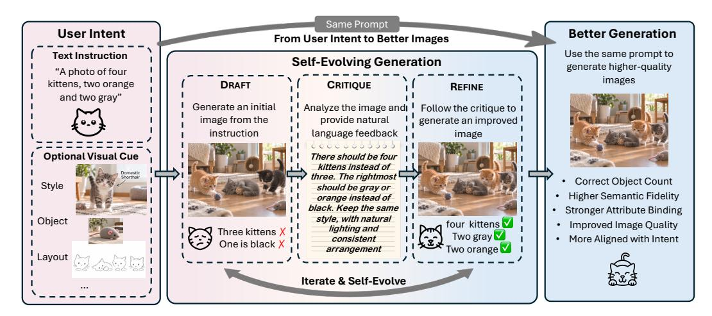

Figure 1: 이해에서 자기 진화까지. 생성된 초안은 시각적 비판과 생성기 업데이트를 통해 훈련 경험이 된다. 개념적 루프는 자기 비판과 더 강력한 외부 비평가를 포함한 선택적 확장을 모두 동기화한다.

## 1 소개 (INTRODUCTION)

Unified multimodal models (MMM) [(Achiam et al.,](#page-9-0) [2023;](#page-9-0) [Team et al.,](#page-10-0) [2023)](#page-10-0)는 시각적 생성과 이해 모두에서 뛰어난 능력을 보여준다. 이는 외부 감독 없이 스스로 진화할 수 있는 전례 없는 기회를 제공한다. 특히, MMM은 생성된 이미지와 주어진 지침 사이의 불일치를 식별하고, 이 자체 피드백을 사용해 향후 개선을 이룰 수 있다. 이러한 관계에서 영감을 받아, 기존 연구는 감독 기반 미세 조정 및 선호 최적화를 위해 자체 생성된 출력을 선택하거나 [(Han et al.,](#page-10-1) [2025)](#page-10-1) 자체 생성 상호작용을 캡션, 판단, 반성 훈련 과제로 재구성하는 방식을 제안했다 [(Han et al.,](#page-10-2) [2026)](#page-10-2). 보완적 접근법은 명시적 반성에 따라 이미지를 정제하도록 모델을 훈련하거나 [(Zhuo](#page-11-0) [et al.,](#page-11-0) [2025)](#page-11-0) 다중 모달 평가를 테스트 시점 정책 최적화를 위한 보상으로 집계한다 [(Tan](#page-10-3) [et al.,](#page-10-3) [2026)](#page-10-3). 그러나 이러한 접근법은 자체 샘플링 궤적을 따라 원래 프롬프트 생성 정책에 교정 조건을 직접 증류하지 않는다. "*restore the missing object*"와 같은 비판은 원하는 교정을 설명하지만, 생성기가 중간 디노이징 예측을 어떻게 변경해야 하는지는 명시하지 않는다.

이 격차를 해소하기 위해 우리는 시각적 비판을 *on-policy self-distillation* (OPSD) [(Li et al.,](#page-10-4) [2026)](#page-10-4)를 통해 감독으로 변환하는 새로운 자가 진화 프레임워크 UniEvo-VL을 도입한다. 우리의 메커니즘은 널리 받아들여지는 가설에 기반한다: *verification - examining a solution or an answer - is relatively easier than generation* [(Hübotter et al.,](#page-10-5) [2026;](#page-10-5) [Zhao et al.,](#page-11-1) [2026)](#page-11-1). 이 목표를 위해 우리는 자체 피드백을 원시 질문에 통합하여, 감지된 실패를 해결하도록 이미지 생성기를 돕는 개정 프롬프트를 생성한다. 그 다음 이 새로운 프롬프트는 특권 정보로 간주되며, 오직 교사 정책만이 관찰하고 조건화할 수 있다. 이러한 다른 맥락은 학생 정책이 원래 프롬프트만을 보는 상황에서 학생의 샘플링 궤적에 대해 밀집된 상태별 감독을 유도할 수 있게 한다. 이는 모델이 교정 지침을 내부화하도록 하며, 교정된 이미지를 훈련 목표나 정책 최적화를 위한 스칼라 보상으로 사용하지 않는다.

우리는 UniEvo-VL을 Qwen-Image [(Wu et al.,](#page-10-6) [2025)](#page-10-6)와 함께, 잘 알려진 오픈소스 flowbased MMM 계열을 사용해 구성적 이미지 생성 및 시각적 텍스트 렌더링 과제에 적용한다. 결과는 교정 지침이 원래 프롬프트만으로도 생성 품질을 향상시킬 수 있음을 보여준다: 직접 생성 성능이 GenEval [(Ghosh et al.,](#page-9-1) [2023)](#page-9-1)에서 0.747에서 0.808로, 그리고 GenEval2GenEval2 [(Kamath et al.,](#page-10-7) [2025)](#page-10-7) Soft-TIFA에서 32.97에서 35.53으로 증가한다. 쌍으로 된 GenEval 평가를 통해 진화된 생성기가 추가 반성 단계를 통해 계속 이득을 얻는다는 것이 나타나며, 이는 교정 경험을 내부화하고 추론 시 피드백을 활용하는 것이 상호 보완적일 수 있음을 시사한다. 이와 같이, 이러한 결과는 비판-조건화된 자가 증류가 구성적 개선을 유지할 수 있는 잠재력을 입증한다.

우리의 기여는 세 가지이다:

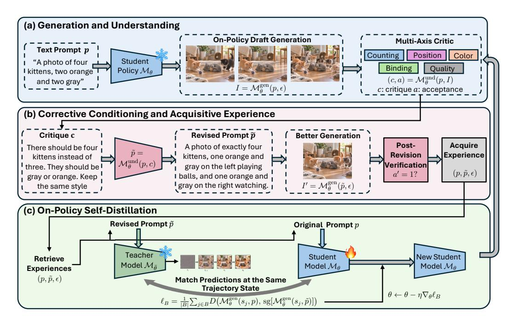

Figure 2: **The UniEvo-VL training loop.** 생성된 초안이 의미, 텍스트, 시각적 품질 축을 따라 검사된다. 그 결과 피드백이 개정 프롬프트로 합성되며, 이는 EMA teacher의 특권 조건으로 작용한다. 전이 매칭은 학생 생성기의 LoRA를 업데이트하고, 비평가는 고정된다. 배포 시, 진화된 모델은 원래 프롬프트를 직접 사용한다.

- 비판 기반 보정 조건화를 사용하여 학생의 자체 샘플링 경로를 따라 교사 예측을 구성하는 UniEvo-VL을 도입한 비판-조건화 온정책 자기-증류를 제안한다. 학생은 원본 프롬프트만으로 학습하며, 수정된 이미지 목표나 보상 기반 정책 최적화 없이 진행된다.

- **학습된 개선과 추론 시 보정의 분리**. 우리는 훈련 전후에 직접 생성과 반영 보조 생성 방식을 비교하며, 초기 모델에 남아 있는 이득과 반영을 통한 추가 이득을 쌍 평가를 통해 구분한다.

- 실증적 검증 및 분석. 우리는 GenEval 및 GenEval2에서 향상된 구성적 생성 성능을 입증하고, 비평가 선택과 사후 수정 검증이 구성적 생성 및 텍스트 렌더링 전반에 걸친 학습에 미치는 영향을 조사한다.

## 2 방법론 (METHOD)

### 2.1 생성과 이해 사이의 자기 진화 반복 (Self-Evolution Iteration between Generation and Understanding)

**Preliminary.** Let  $\mathcal{M}_{\theta}$  be a 다중모달 모델(MMM) with two different modes. 한편, 사용자 언어 프롬프트 p가 주어지면, 모델은 생성 모드 $(M_{\theta}^{\text{gen}})$에서 랜덤 노이즈 $\epsilon \sim \mathcal{N}(\mathbf{0}, \mathbf{I})$로부터 이미지 I를 생성할 수 있다. 반면, 모델은 이해 모드 $(M_{\theta}^{\text{und}})$에서 제공된 조건화 프롬프트 p에 대해 임의의 이미지 I를 평가할 수 있다:

$$I = \mathcal{M}_{\boldsymbol{\theta}}^{\text{gen}}(p, \boldsymbol{\epsilon}), \qquad (c, a) = \mathcal{M}_{\boldsymbol{\theta}}^{\text{und}}(p, I).$$

(1)

여기서 c는 생성된 이미지 I와 그 조건 프롬프트 p 사이의 불일치를 나타낸다. $a \in \{0,1\}$ 은 이진 수용 결정이다. 유효한 평가에서는 a=1이 이미지 I이 p와 매우 일치하며 추가 수정을 필요로 하지 않음을 의미한다. 반면 a=0은 I이 결함이 있어 수정을 필요로 함을 나타낸다. 해결책으로 c는 해당 교정 피드백을 제공한다. 반대로 빈 응답이나 사용 불가능한 비평가 응답은 무효한 평가로 간주되어 제거된다.

**교사와 학생 정책.** 이미지 생성과 이해의 공동 능력이 우리 UniEvo-VL의 길을 닦는다. 이 두 개별 모드 $M_{\theta}^{\text{gen}}$와 $M_{\theta}^{\text{und}}$를 *수정*을 통해 연결한다.

<span id="page-3-2"></span>조건화. 이 목표를 달성하기 위해, 우리는 조건화 맥락을 변형시켜 자기 진화 루프에서 두 가지 역할을 도입한다. 학생 정책, $\mathcal{M}_{\theta}$ 로 표시되는 것은 순수한 프롬프트 p만을 바라보며, 반면 참조 교사 정책, $\mathcal{M}_{\theta}$ 의 EMA 버전이며 $\mathcal{M}_{\bar{\theta}}$ 로 표시되는 것은 특권적인 수정 제안 c에 접근할 수 있다.

우선, 이미지 I가 추가 수정을 나타내는 a=0으로 유효한 평가를 받으면, 이해 모드 MMM $M_{\theta}^{\mathrm{und}}$ 는 c를 수정 제안으로 간주하고 프롬프트를 p'로 업데이트한다. 교사 정책 $\mathcal{M}_{\bar{\theta}}$ 는 이 특권 프롬프트 $\widetilde{p}$ 를 사용해 학생의 생성을 자연스럽게 평가하고 증류 훈련 목표를 제공한다. 학생 정책 $\mathcal{M}_{\theta}$ 는 특권 조건 $\widetilde{p}$ 에 접근할 수 없으면서도 이 목표에 접근하도록 학습한다.

### 2.2 수정 조건화 및 경험 획득 (Corrective Conditioning and Experience Acquisition)

**특권 정보를 포함한 프롬프트.** 각 이미지 I가 a=0으로 유효한 평가를 받으면, 이해 모드 MMM $M_{\theta}^{\mathrm{und}}$ 는 순수 프롬프트 p와 수정 피드백 c를 통합해 특권 프롬프트 $\widetilde{p}$ 를 합성한다:

<span id="page-3-0"></span>

$$\widetilde{p} = M_{\theta}^{\text{und}}(p, c). \tag{2}$$

우리는 수정된 프롬프트  $\widetilde{p}$  를 사용해 요청된 장면을 재진술하면서 c에서 확인된 I와 p 사이의 불일치를 명시적으로 해결한다. 예를 들어, 초기 프롬프트 p가 두 개의 빨간 컵을 요청하지만  $M_{\theta}^{\rm gen}$  은 세 개의 컵이 있는 이미지를 생성한다. 방정식 2의 합성 과정은 정확히 두 개의 컵을 강조하면서 지정된 색상과 장면 맥락을 보존하는 수정된 프롬프트  $\widetilde{p}$  를 생성하도록 지시된다.

**사후 평가를 통한 프롬프트 필터링.** 이해 모드 MMM  $M_{\theta}^{\mathrm{und}}$  에 의해  $\widetilde{p}$  가 합성된 후, 가장 단순하고 직관적인 접근은 모든  $\widetilde{p}$  를 즉시 이후 OPSD 훈련에 활용하는 것이다. 한 걸음 더 나아가, 우리는 각  $\widetilde{p}$  의 실현 가능성과 품질을 판단하기 위해 *사후 검증(post-revision verification)* 단계를 도입한다. 구체적으로, 학생 MMM에게 수정된 프롬프트  $\widetilde{p}$  와 동일한 노이즈  $\epsilon$  를 사용해 새로운 이미지  $I' = \mathcal{M}_{\theta}^{\mathrm{gen}}(\widetilde{p}, \epsilon)$  를 생성하도록 요청한다. 그 다음, 이 이미지 I' 를 다시 이해 모드 MMM  $\mathcal{M}_{\theta}^{\mathrm{und}}$  에 입력해 p 와의 두 번째 평가를 수행한다. 수정된 프롬프트  $\widetilde{p}$  는 이 두 번째 평가가 유효하고 I' 를 수용할 때만 유효한 훈련 샘플로 선택된다. 이 추가적인 합의는  $\mathcal{M}_{\theta}^{\mathrm{und}}$  가 I' 를 원래 프롬프트 p 를 만족한다고 판단하고, I' 가 I 보다 p 와 더 잘 정렬된다는 것을 의미한다. 특히, 재생성된 I' 는  $\widetilde{p}$  의 수용 여부를 결정하기 위해만 사용되며, 이후 훈련 과정에서 목표로 간주되지 않는다.

### 2.3 온-폴리시 셀프 디스틸레이션 (ON-POLICY SELF DISTILLATION)

학생 모델에서 온-폴리시 샘플링. 여러 개의 유효한 수정 프롬프트  $\widetilde{p}$  를 수집한 후, 우리는 인기 있는 OPSD 메커니즘을 활용해 특권 정보(프리빌리지드 인포메이션) 안에 숨겨진 지식을 증류한다 (Agarwal et al., 2024; Zhao et al., 2026). 구체적으로, k번째 반복에서 삼중 항목 리스트 $(p,\widetilde{p},\epsilon)$ 를 사용해, 학생 MMM  $\mathcal{M}^{\text{gen}}_{\theta}$  를 이용해 기본 프롬프트 p 와 노이즈  $\epsilon$  를 기반으로 T-길이의 확산 디노이징 궤적  $\tau=\{s_0,...,s_T\}$  를 실행한다. 여기서  $s_j\in\mathbb{R}^d$  는 그 궤적의 j번째 단계에서 잠재 표현 공간의 중간 상태를 나타낸다.

따라서, 학생 정책  $\mathcal{M}_{\theta}^{\mathrm{gen}}$  는 프롬프트 문장 p 만을 관찰하며, 이는 추론 시 조건과 일치한다. 반면, 교사 정책 MMM  $\mathcal{M}_{\bar{\theta}}$  는 특권 프롬프트 p' 를 조건으로 삼으며, 이는 수정 제안 c 를 포함해 모델이 같은 실수를 반복하지 않도록 한다.

**학습 목표.** 우리는 각 상태  $s_j$  에서 교사와 학생의 디노이징 분포를 일치시키는 *전이 발산 목표(transition divergence objective)* 를 도입한다.  $\mathcal{M}_{\theta}^{\mathrm{gen}}(s_i,p): \mathbb{R}^d \times \mathcal{P} \to \mathbb{R}^d$  는 흐름 기반 이미지 생성 또는 확산 기반 알고리즘의 디노이징 스코어 함수를 매개변수화하는 속도 필드를 나타낸다.

우리는 학생의 한 단계 전이  $\mathcal{M}^{\mathrm{gen}}_{\hat{\boldsymbol{\theta}}}(s_j,p)$  를 교사 정책의 전이 목표  $\mathcal{M}^{\mathrm{gen}}_{\hat{\boldsymbol{\theta}}}(s_j,\widetilde{p})$  와 일치하도록 강제한다. 이 발산 지표는 두 값 사이의 비율 조정된 차이로 단순화되며 (Fang et al., 2026; Li et al., 2026), 다음과 같이 표현된다:

<span id="page-3-1"></span>

$$\mathcal{L}(\boldsymbol{\theta}) = \mathbb{E}_{(p,\widetilde{p},\boldsymbol{\epsilon})\sim\mathcal{A}_k,\tau\sim\mathcal{M}_{\boldsymbol{\theta}}^{\mathrm{gen}}(p,\boldsymbol{\epsilon})),s_j\sim\tau} D\left(\mathcal{M}_{\boldsymbol{\theta}}^{\mathrm{gen}}(\mathrm{sg}[s_j],p),\mathrm{sg}\left[\mathcal{M}_{\boldsymbol{\bar{\theta}}}^{\mathrm{gen}}(\mathrm{sg}[s_j],\widetilde{p})\right]\right),\tag{3}$$

여기서 $A_k$는 완성된 훈련 세트를 나타내며, $D(\cdot, \cdot)$는 학생과 교사 로컬 예측 간의 불일치를 측정한다, 예를 들어 KL-다이버전스나 Jensen-Shannon (JS) 다이버전스와 같은 것이 있다. $sg(\cdot)$는

stop-gradient 역전파를 위해. 생성, 평가, 합성은 기울기 없이 작동하므로 기울기는 학생 정책 파라미터 $\theta$ 로만 흐르며, 교사 $\mathcal{M}_{\bar{\theta}}^{\mathrm{gen}}$ 은 고정된 전체 분포 목표로 작용한다. 우리의 흐름 기반 구현은 결정적 잠재 전이 간의 제곱 거리(즉, 평균 제곱 오차)를 사용한다.

**Discussion.** 온폴리시 샘플링(온폴리시 샘플링)은 현재 학생(학생)이 방문한 상태 $s_j \in \tau$ 에서 감독을 배치한다. 특권 프롬프트($\widetilde{p}$)는 교사 정책(교사 정책)에 교정 정보를 제공하며, 이는 다시 학생을 올바른 답변으로 이끄는 노이즈 제거 경로(노이즈 제거 경로)로 안내한다. Equ. 3은 이 특권 보정(특권 보정)을 학생 파라미터($\theta$)에 전달하여 원본 프롬프트 p(원본 프롬프트 p)를 사용한 직접 추론을 가능하게 하며, 어떠한 수정 또는 반영 c(수정 또는 반영 c)도 필요로 하지 않는다.

Alg. 1은 절차를 요약한다.  
학생 MMM $\mathcal{M}_{\theta}^{\mathrm{gen}}$는 업데이트된 파라미터를 이후 요청으로 전달하며, 테스트 시점에 요청 스트림을 통해 보정 경험이 축적될 수 있도록 한다.  
교사 파라미터 $\bar{\theta}$는 각 미니배치 반복 동안 고정되며, 참조 업데이트 규칙 $\mathcal{R}$에 따라 갱신된다.  
참조 업데이트 규칙 $\mathcal{R}$과 trajectory step selection principles (trajectorystep selection principles)은 부록 A (Appendix A)에 명시되어 있다.

## 3 EXPERIMENTS (실험)

### 3.1 EXPERIMENTAL SETUP (실험 설정)

#### Tasks and implementation. Qwen- (작업 및 구현. Qwen-)

Image family는 Qwen-VL farmily를 조건화 인코더로 통합한다. 따라서 우리는 Qwen-Image-2512 (Wu et al., 2025)와 고정된 Qwen-VL (Bai et al., 2025) 피드백 파이프라인을 선택하여 구조적으로 동기화된 생성—이해 설정을 조사했다. 훈련 중에는 생성기 LoRA (Hu et al., 2021) 매개변수만 업데이트되며, 이는 GenEval (Ghosh et al., 2023), GenEval2 (Kamath et al., 2025), 그리고 OCR 텍스트 렌더링에 대해 별도로 적용된다. 우리는 사후 수정 검증 여부에 따라 프롬프트 필터링을 평가한다. Section 3.4.2는 GPT-5.6-Luna를 사용하여 더 강력한 외부 비판이 더 큰 개선을 가져올 수 있는지 추가로 조사한다. Appendices A와 C는 구현 및 데이터셋 세부 정보를 제공한다. 훈련 컴퓨트 및 획득 오버헤드는 Appendix A.4에서 논의된다.

**평가.** 우리는 직접 생성과 추론을 각각 한 번의 비판 기회와 함께 보고하며, 각 실험 내에서 프롬프트와 시드의 쌍을 매칭하여 원본 프롬프트에 대한 출력을 평가한다. 지표는 네이티브 GenEval과 OCR 점수(0–1), GenEval2 Soft‑TIFA GM(0–100), Gemini 원자 정확도(%)(구성 작업용), 그리고 전체적인 Gemini 작업 점수와 HumanPref 점수(0–10)를 포함한다. HumanPref는 자동화된 시각 품질 대리자이다. 평가 점수는 훈련 보상으로 사용되지 않는다. Appendix D는 평가 코호트, 지표 정의, 실패 처리 방식을 명시하며, 체크포인트 범위는 Supplementary Data에 제공된다.

### 3.2 Unified Direct-Generation Results (통합 직접 생성 결과)

표 1은 OPSD 이후 이미지 생성 성능을 비교한다. 수정 검증이 적용된 Qwen 구성은 세 가지 작업 모두에서 나열된 모든 지표에서 보고된 Base를 초과하지만, 개별 지표에서는 다른 구성이 우세하다.

Algorithm 1: **UniEvo-VL.** 비판 기반 온-폴리시 자기-디스틸레이션.

입력: 모델 \mathcal{M}_{\theta}, 프롬프트 \mathcal{P}, 검증 
u, 업데이트 규칙 \mathcal{R}
    1:
            \bar{\theta} \leftarrow \theta
    2:
            for k = 0, 1, ... do
    3:
                     \mathcal{A}_k \leftarrow \emptyset
            수정 경험 획득
                    for p \in \mathcal{P} do
    5:
                             \epsilon \sim \mathcal{N}(0, I)
    6:
                             I \leftarrow \mathcal{M}_{\theta}^{\mathrm{gen}}(p, \epsilon)
                             \begin{aligned} (c,a) &\leftarrow \mathcal{M}^{\mathrm{und}}_{\theta}(p,I) \\ \text{c가 유효하고 } a &= 0 \text{ 이면} \\ \tilde{p} &\leftarrow \mathcal{M}^{\mathrm{und}}_{\theta}(p,c) \end{aligned} 
    7:
    8:
    9:
10:
                                     if 
u = 1 이면
                                            I' \leftarrow \mathcal{M}_{\theta}^{\mathrm{gen}}(\tilde{p}, \epsilon)
 11:
                                            (c', a') \leftarrow \mathcal{M}_{\theta}^{\mathrm{und}}(p, I')
 
c'가 유효하고 a' = 1 이면
 13:
                                                     \mathcal{A}_k \leftarrow \mathcal{A}_k \cup \{(p, \tilde{p}, \epsilon)\}
                                             end if
 15.

 16:
 17:
                                               A_k \leftarrow A_k \cup \{(p, \tilde{p}, \epsilon)\}
                                     end if
 19.
                             end if
 20:
                     end for
            온정책 자기 증류

 22:
                     for (p, \tilde{p}, \epsilon) \in \mathcal{A}_k do
                             \tau \leftarrow \operatorname{sg}[\mathcal{M}_{\theta}^{\operatorname{gen}}(p, \epsilon)]
23:
                             for minibatch B \subset \tau do
                                     \ell_B \leftarrow \frac{1}{|B|} \sum_{j \in B} D\Big(\mathcal{M}_{\hat{\theta}}^{\text{gen}}(s_j, p), \text{sg}[\mathcal{M}_{\tilde{\theta}}^{\text{gen}}(s_j, \tilde{p})]\Big)
 24:
 25:
                                     \theta \leftarrow \theta - \eta 
abla_{\theta} \ell_B
                                     \bar{\theta} \leftarrow \mathcal{R}(\bar{\theta}, \theta)
 26:
                             end for
 28:
                     end for
 29: end for
 30: return \mathcal{M}_{\theta}

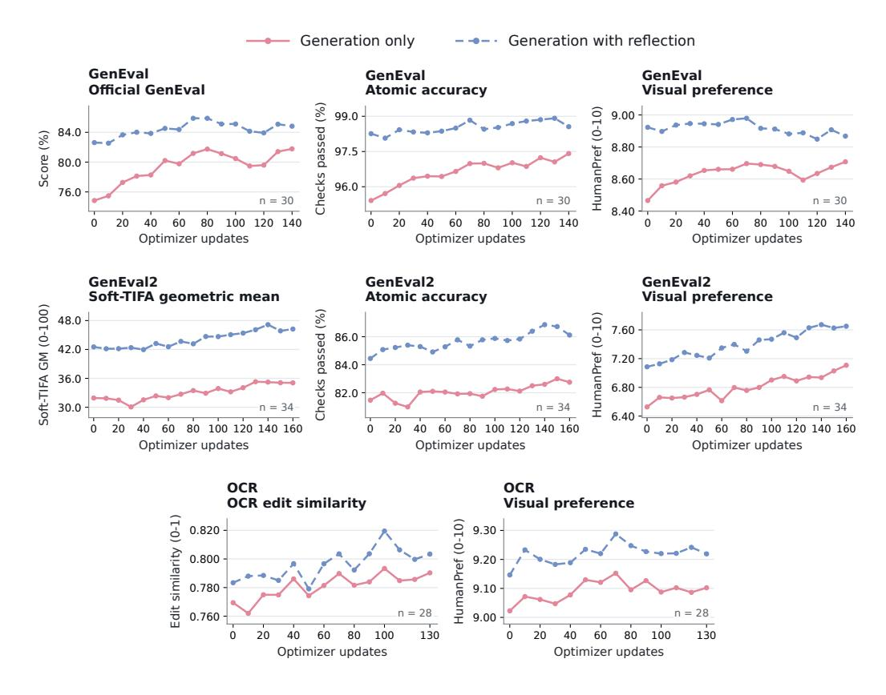

그림 3: UniEvo-VL이 훈련 업데이트 동안 수정 검증을 수행함. 실선은 직접 생성, 점선은 추론 시 한 번의 비판을 허용함을 보여준다. 선은 실행 간 평가된 체크포인트를 연결하며, n은 플롯된 포인트 수를 나타낸다.

<span id="page-5-0"></span>표 1: **UniEvo-VL의 성능.** 괄호는 비평가를 식별하며, '+ verification'은 수정 프롬프트 필터링을 나타낸다. Base는 동일한 사전학습 모델의 서로 다른 랜덤 시드에 대해 평균한 값이다. **굵게** 및 **밑줄** 친 값은 각 데이터셋과 지표에서 가장 좋은 값과 두 번째 좋은 값을 나타낸다.

|  | GenEval |  |  | GenEval2 |  |  | OCR |  |  |
|--------------------------|---------|--------------|-----------|--------------|------------|-----------|--------|------------|-----------|
| 방법 (Method) | 네이티브 (Native) | 원자성 (%) (Atomic %) | 인간 선호 (HumanPref) | 네이티브 | 원자성 (%) (Atomic %) | 인간 선호 | 네이티브 | 원자성 (%) (Atomic %) | 인간 선호 |
| 베이스 (Base) | 0.747 | 95.30 | 8.48 | 32.58 | 81.69 | 6.65 | 0.771 | _ | 9.07 |
| UniEvo-VL | 0.808 | 96.90 | 8.79 | 32.37 | 82.24 | 6.91 | 0.761 | _ | 9.06 |
| UniEvo-VL (GPT5.6-Luna) | 0.882 | 98.76 | 8.97 | 35.53 | 83.18 | 6.86 | 0.775 | _ | 9.03 |
| UniEvo-VL (verification) | 0.818 | <u>97.41</u> | 8.71 | <u>35.07</u> | 82.75 | 7.11 | 0.790 | - | 9.10 |

구성적 생성. GenEval에서 두 Qwen 구성 모두 의미적 정확성과 자동화된 시각적 품질에서 Base를 상회합니다. GPT-5.6-Luna를 사용한 외부 비평가 실험은 가장 높은 네이티브 점수 0.882와 가장 높은 원자 정확도 및 HumanPref 등급을 달성합니다. Qwen 구성 중에서 검증된 Qwen은 네이티브 점수와 원자 정확도가 높으며, 반면 검증되지 않은 Qwen은 더 높은 HumanPref 등급을 받습니다. GenEval2는 유사한 패턴을 보입니다: GPT-5.6-Luna를 사용한 외부 비평가 실험은 다시 한 번 가장 높은 네이티브 점수 35.53과 원자 정확도를 달성하고, 검증된 Qwen은 가장 높은 HumanPref 등급을 받습니다. 검증되지 않은 Qwen은 원자 정확도와 HumanPref에서 Base를 상회하지만, 네이티브 Soft-TIFA에서는 약간 낮습니다. 따라서 평가 결과는 개별 의미 검사, 벤치마크 수준의 정확성, 시각적 품질에서의 개선을 구분합니다.

**텍스트 렌더링.** 검증된 Qwen 구성은 OCR에서도 선두를 달리며 네이티브 점수 0.790과 가장 높은 HumanPref 등급을 달성합니다. 다른 구성은 혼합된 결과를 보입니다: 검증되지 않은 Qwen은 두 측정값 모두에서 Base를 하회하고, Luna는 네이티브 텍스트 충실도에서 약간 높은 점수를 기록합니다.

<span id="page-6-0"></span>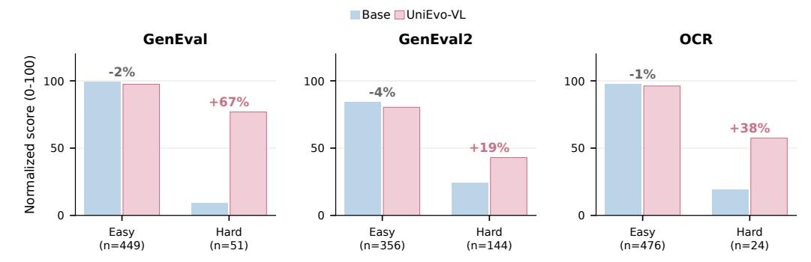

Figure 4: 역사적 500-프롬프트 하위집합에서의 개선 및 보존, 스케일은 0–100으로 정규화됩니다. 퍼센트 포인트 변화는 하위집합별이며 전체 테스트 세트의 이득이 아닙니다.

그러나 HumanPref는 낮습니다. 따라서 유리한 OCR 결과는 모든 피드백 구성에 확장되지 않습니다.

### 3.3 프롬프트 난이도별 개선 및 보존 (Improvement and Preservation Across Prompt Difficulty)

우리는 훈련이 생성에 어떤 개선을 가져오는지와 초기 성공적인 출력에 미치는 영향을 조사합니다. 각 과제에 대해 역사적 500-프롬프트 하위집합을 사용하여, 기준 전체 과제 점수 0–4와 5–10으로 Hard와 Easy 그룹을 정의합니다. 그룹 구성은 훈련 후에도 고정되며, 평가 세부 사항은 부록 [D.5.](#page-19-0)에 제공됩니다.

Figure [4](#page-6-0)은 이득이 세 과제 모두에서 기본 모델이 처음에 어려워하는 프롬프트에 집중되는 것을 보여줍니다. Easy 프롬프트에 대한 평균 성능은 여전히 높지만, 정규화된 0–100 스케일에서 1–4 포인트 감소합니다. 따라서 훈련은 초기 낮은 점수 프롬프트에서 상당한 회복과 높은 점수 프롬프트에서 작은 후퇴를 결합합니다.

이득의 집중은 우리의 획득 메커니즘에서 일부 예상되는 결과입니다. 비평가가 만족스러운 것으로 판단한 초안은 건너뛰고, 수정이 필요한 초안에서 유효한 교정 쌍이 훈련 신호를 제공합니다. 결과적으로 선택은 현재 생성 실패를 강조하여 이미 만족스러운 출력을 강화하기보다 교정 행동을 학습할 기회를 더 많이 만듭니다. 관찰된 난이도 패턴은 이 메커니즘과 일치하지만, 평가 그룹은 획득 결정이 아니라 기준 과제 점수에 의해 정의됩니다. 그들의 다른 개선 여유는 차이를 단순 필터링에 귀속시키는 것을 방지합니다.

### 3.4 자기 진화 이해 (Understanding Self-Evolution)

#### 3.4.1 훈련이 반영의 이점을 이전시키는가? (Does Training Transfer the Benefit of Reflection?)

Table [2](#page-7-1)은 기본 모델과 UniEvo-VL을 직접 생성 또는 한 번의 반영 기회와 비교합니다. 평가된 UniEvo-VL 체크포인트는 훈련 중 사후 개정 검증을 사용하며, 모든 출력은 원본 요청에 대해 점수화됩니다.

OPSD는 추론 시 직접 생성을 개선합니다. Table [2](#page-7-1)은 훈련이 세 벤치마크 전반에 걸쳐 보고된 모든 지표에서 직접 생성을 개선함을 보여줍니다. 네이티브 점수에서 UniEvo-VL을 사용한 직접 생성은 GenEval에서 반영된 기본 모델에 근접하고 OCR에서는 이를 초과하지만, GenEval2에서는 여전히 낮습니다. 따라서 훈련은 원본 프롬프트만으로 개선을 제공하지만, 기본 모델에 반영을 적용해 얻은 성능을 일관되게 회복하지는 못합니다.

Reflection은 훈련 이후에도 유용하다. Reflection은 진화된 모델을 모든 보고된 지표에서 추가로 개선한다. GenEval에서는 그 네이티브 이득이 0.078에서 0.030으로 감소하며, 원자 정확도와 HumanPref 이득에서도 유사한 감소가 관찰된다. 이 패턴은 훈련과 Reflection의 부분적으로 겹치는 이점과 일치한다. 반면, Reflection 이득은 GenEval2에서 여전히 상당하며 변화한다.

<span id="page-7-1"></span>표 2: 훈련 전후의 직접 생성 및 반영. (a) 생성 점수, 각 행에서 가장 높은 점수를 굵게 표시한다. (b) 훈련 이득은 UniEvo-VL 점수에서 직접 생성 시의 기본 점수를 뺀 값이며, 반영 이득은 각 모델 내에서 반영 점수에서 직접 점수를 뺀 값이다. 이득은 반올림되지 않은 점수를 사용한다. 네이티브 점수는 GenEval/OCR에서 0–1, GenEval2에서 0–100을 사용한다. Atomic은 퍼센트(이득은 퍼센트 포인트)를 사용하고, HumanPref는 0–10을 사용한다.

| (a) |  |  | 베이스 모델 | UniEvo-VL |  |  |
|----------|-----------|--------|-------------------|-----------------|--------------|--|
| 데이터셋 | 메트릭 | Direct | + 반성 | Direct | + 반성 |  |
| GenEval | 네이티브 | 0.748 | 0.826 | 0.818 | 0.848 |  |
|  | Atomic | 95.41 | 98.26 | 97.41 | 98.56 |  |
|  | HumanPref | 8.47 | 8.92 | 8.71 | 8.87 |  |
| GenEval2 | 네이티브 | 31.92 | 42.52 | 35.07 | 46.23 |  |
|  | Atomic | 81.47 | 84.45 | 82.75 | 86.12 |  |
|  | HumanPref | 6.53 | 7.09 | 7.11 | 7.65 |  |
| OCR | 네이티브 | 0.769 | 0.783 | 0.790 | 0.803 |  |
|  | HumanPref | 9.02 | 9.15 | 9.10 | 9.22 |  |
| (b) |  |  | Training gain | Reflection gain |  |  |
| 데이터셋 | 메트릭 |  | Direct generation | 베이스 모델 | UniEvo-VL |  |
| GenEval | 네이티브 |  | +0.069 | +0.078 | +0.030 |  |
|  | Atomic | +2.00 |  | +2.85 | +1.14 |  |
|  | HumanPref |  | +0.24 | +0.46 | +0.16 |  |
| GenEval2 | 네이티브 |  | +3.15 | +10.60 | +11.17 |  |
|  | Atomic | +1.28 |  | +2.98 | +3.37 |  |

little on OCR. 향상된 직접 생성은 반사 간격이 작아야 할 필요가 없으며, 훈련은 생성기를 개선하면서 추가 피드백에서 상당한 이점을 남길 수 있다.

OCR Native +0.021 +0.014 +0.013

HumanPref +0.58 +0.56 +0.54

HumanPref +0.08 +0.12 +0.12

능력은 추론 시 반사보다 더 나아가 나타난다. 특히, 보존된 훈련 이점은 추론 시 프롬프트 수정을 단독으로 적용한 것만으로는 설명되지 않는다. 동일한 onereflection 프로토콜 하에서 UniEvo-VL은 GenEval에서 반사 기반 모델 대비 native 점수를 0.826에서 0.848로, GenEval2에서는 42.52에서 46.23으로, OCR에서는 0.783에서 0.803으로 향상시킨다. 따라서 교정 훈련은 두 모델 모두 추가 반사 기회를 주더라도 지속되는 개선을 제공하며, 이는 추론 전용 프롬프트 수정보다 더 큰 획득된 능력을 나타낸다. 결합 설정은 세 벤치마크 모두에서 가장 높은 native 점수를 달성하지만, GenEval HumanPref는 반사 기반 모델에 대해 여전히 약간 더 높은 수준을 유지한다.

#### <span id="page-7-0"></span>3.4.2 CRITIC CAPACITY가 SELF-EVOLUTION에 미치는 영향 (HOW DOES CRITIC CAPACITY AFFECT SELF-EVOLUTION?)

우리는 피드백 선택이 GenEval과 GenEval2에서 구성적 생성에 미치는 영향을 조사한다. 사후 수정을 검증하지 않고, 평가 시에만 생성을 수행하는 획득 방식을 사용한다. Table [3](#page-8-0)은 카테고리 점수를 보고하며, 일치하는 기준선이 있는 경우 자기 진화 후 보존된 이득을 제시한다.

GenEval에서 차이는 공간적 구성이 가장 크다. Qwen 피드백은 위치 점수를 6.85에서 8.79로, 계산 점수를 7.86에서 9.29로 향상시킨다. 역사적 Luna 결과는 각각 9.88과 9.58에 도달하며, 위치는 진화된 구성 간 가장 큰 격차를 보인다. 다른 여러 카테고리는 이미 거의 포화 상태에 이르렀다.

GenEval2는 카테고리별 학습 이득을 드러낸다. Luna는 두 개체 구성과 색상에서 더 큰 이득을 제공한다: 약 +1.21과 +1.02, 반면 Qwen은 +0.28과 +0.37이다. 위해

<span id="page-8-1"></span><span id="page-8-0"></span>Table 3: 다른 비평가에 따른 구성적 생성. 모든 항목은 Gemini compositionalfidelity 등급(0–10)이다. (a) GenEval은 553개의 프롬프트를 사용한다; Base는 Qwen-VL 실험의 기준선을 나타낸다. (b) GenEval2는 800개의 프롬프트를 사용한다; ∆는 Evolved minus Base이다. 굵은 글씨는 (a)의 각 열에서 가장 높은 점수와 (b)의 각 행에서 더 높은 Evolved 점수와 더 큰 ∆를 나타낸다(동점 포함).

|  | (a) GenEval |
|--|-------------|
| -- | ------------- |

| 비평가 / 모델 | 단일 | 이중 | 개수 | 색상 | 위치 | 속성 | 전반 |
|----------------|--------|------|-------|-------|----------|-------|---------|
| 기본 | 9.93 | 9.68 | 7.86 | 9.71 | 6.85 | 9.75 | 8.96 |
| Qwen-VL | 9.90 | 9.88 | 9.29 | 9.66 | 8.79 | 9.94 | 9.57 |
| GPT-5.6-Luna† | 9.98 | 9.92 | 9.58 | 9.91 | 9.88 | 9.94 | 9.87 |

#### (b) GenEval2 ((b) GenEval2)

|  |  | Qwen-VL |  | GPT-5.6-Luna |  |  |  |
|-------------|------|---------|-------|--------------|---------|-------|--|
| 카테고리 | 베이스 | 진화된 | ∆ | 베이스 | 진화된 | ∆ |  |
| 두 개의 객체 | 7.62 | 7.90 | +0.28 | 7.00 | 8.21 | +1.21 |  |
| 색상 | 6.27 | 6.64 | +0.37 | 6.54 | 7.56 | +1.02 |  |
| 위치 | 5.68 | 5.74 | +0.06 | 5.78 | 5.92 | +0.14 |  |
| 속성 | 7.13 | 7.17 | +0.04 | 7.22 | 7.28 | +0.06 |  |
| 전체 | 6.14 | 6.23 | +0.09 | 6.23 | 6.45 | +0.22 |  |

두 개의 객체에서 루나는 낮은 점수(7.00 대 7.62)로 시작하지만 높은 점수(8.21 대 7.90)로 끝난다. 위치와 속성 점수는 두 구성 모두에서 다소만 개선된다. Native Soft‑TIFA GM(0–100)은 전반적인 패턴을 확인시켜 주며, 루나와 함께 32.97에서 35.53으로 증가하지만 Qwen과 함께 32.86에서 32.37로 감소한다. 외부 피드백의 관찰된 이점은 기술에 따라 달라진다. 루나는 전체 GenEval 엔드포인트가 더 높고 GenEval2에서 두 객체 및 색상 이득이 더 크지만, GenEval2의 위치 및 속성 점수는 제한적인 이득을 보인다. 따라서 범주 수준 분석은 시각 언어 모델이 자기 진화 과정을 통해 꾸준히 향상되기 위해 갖추어야 할 역량을 식별하는 데 필수적이다.

## 4 관련 연구 (RELATED WORK)

이미지 생성을 위한 이해와 반성. 시각적 이해는 모델이 생성한 이미지를 평가하고 개선하는 데 도움을 준다. [Han et al.](#page-10-1) [(2025)](#page-10-1)은 이해 분기를 사용해 이미지를 점수화하고 감독 미세조정 및 선호 데이터 구축을 수행한다. SRUM [(Jin et al.,](#page-10-9) [2025)](#page-10-9)은 이미지 수준과 객체 수준의 자기 보상을 결합해 보상 가중 훈련을 수행하며, UniCorn [(Han et al.,](#page-10-2) [2026)](#page-10-2)은 제안자, 해결자, 심사자 역할을 통합 모델에 할당해 훈련 상호작용을 생성한다. ReflectionFlow [(Zhuo et al.,](#page-11-0) [2025)](#page-11-0)은 결함이 있는 이미지, 반성, 개선된 이미지 세트에서 학습해 추론 시점에서 반복적으로 정제한다. UniReason [(Wang et al.,](#page-10-10) [2026)](#page-10-10)은 생성 전 세계 지식 추론과 생성 후 시각적 정제를 두 단계 감독 미세조정으로 결합한다. UniEvo‑VL은 교정 피드백을 원본 요청에서 직접 생성으로 전달하고, 훈련 후 반성의 추가 이점을 측정한다.

피드백 기반 최적화. Meta‑TTRL [(Tan et al.,](#page-10-3) [2026)](#page-10-3)은 모델이 생성한 루브릭 평가를 보상으로 집계해 테스트 시점 정책 최적화를 수행한다. Flow‑GRPO [(Liu et al.,](#page-10-11) [2025)](#page-10-11)와 DiffusionNFT [(Zheng et al.,](#page-11-2) [2025)](#page-11-2)은 보상 기반 업데이트를 통해 확산 또는 흐름 생성기를 개선한다. DiffusionOPSD [(Zhou et al.,](#page-11-3) [2026)](#page-11-3)은 이미지 수준 보상 기울기를 분리된 깨끗한 출력 목표로 변환한다. UniEvo‑VL은 또한 피드백을 모델 파라미터에 통합하지만, 교정 텍스트에 조건화된 교사 예측에서 목표를 도출하며, 비평가를 통한 기울기나 미분 가능한 이미지 보상 없이도 작동한다.

특권 조건화를 이용한 온정책 증류. OPD [(Agarwal et al.,](#page-9-2) [2024)](#page-9-2)은 교사 예측을 사용해 자신의 궤적에서 학생을 훈련한다. SDPO [(Hübotter et al.,](#page-10-5) [2026)](#page-10-5)은 피드백 조건화된 다음 토큰 예측을 언어 정책에 증류한다. 확산 모델의 경우, DiffusionOPD [(Li](#page-10-4) [et al.,](#page-10-4) [2026)](#page-10-4)은 학생 궤적에서 교사–학생 전이를 일치시켜 독립적으로 훈련된, 과제‑특화 교사를 통합한다. D‑OPSD [(Jiang et al.,](#page-10-12) [2026)](#page-10-12)은 확산 자기‑교사를 다음과 같이 조건화한다

<span id="page-9-5"></span>대상 이미지와 텍스트를 사용한 학생 롤아웃에 대한 감독 학습을 수행하면서 몇 단계 생성은 보존한다. Dreaming in Flow [(Hao et al.,](#page-10-13) [2026)](#page-10-13)은 이미지 기반 및 수리 강화 흐름 목표와 꿈 재생을 결합해 이해와 생성을 동시에 향상시킨다. UniEvo‑VL은 자신이 생성한 이미지에 대한 비판에서 특권 조건화를 도출한다: 교사는 수정된 프롬프트를 받고, 학생은 원본 요청을 받는다. 그들의 노이즈 제거 예측은 짝이 된 대상 이미지나 독립적으로 과제‑훈련된 생성기 교사 없이 학생 궤적을 따라 일치된다. 생성기만이 업데이트되고, 비평가는 고정되어 이후 직접 생성을 개선한다.

## 5 결론 (CONCLUSION)

우리는 UniEvo-VL을 도입하였다. 이는 온-폴리시 자기 증류를 활용해 시각적 비판의 교정 내용을 생성 감독으로 전환하는 멀티모달 자기 진화 접근법이다. GenEval, GenEval2, 그리고 OCR에서의 쌍방 평가는 훈련이 반성 여부와 관계없이 네이티브 점수를 향상시킨다는 것을 보여주며, 훈련과 반성의 결합이 이 지표에서 가장 좋은 성과를 보인다. 이득은 훈련 구성에 따라 달라지며, 처음에 쉬운 프롬프트에서의 회귀는 보존의 한계를 드러낸다. 이러한 결과는 피드백 기반 생성이 감독을 제공하고 모델의 무보조 능력과 함께 향상되는 자기 진화 경로를 시사한다.

## AI USE STATEMENT (AI 사용 진술)

우리는 논문 초안 작성 및 편집, 문헌 검색 및 정리, 코드 및 그림 준비를 위해 생성형 AI 도구를 사용했다. 저자들은 AI 지원 자료를 검토·수정하고 채택된 코드와 사실 주장을 포함하기 전에 확인했다. 언어 및 멀티모달 모델은 실험에서 비평가, 프롬프트 합성 모델, 자동 평가자로도 활용된다. 이러한 실험적 사용, 모델 구성, 프롬프트, 평가 절차는 본문과 부록에 문서화되어 있다. 저자들은 최종 원고, 구현, 보고된 결과 및 과학적 결론에 대해 전적인 책임을 진다.

# REPRODUCIBILITY STATEMENT (재현성 진술)

훈련 목표와 알고리즘은 섹션 2와 부록 A에 기술되어 있다. 부록 A는 모델 구성, 훈련 하이퍼파라미터, 샘플링 설정, 난수 시드, 계산 요구 사항을 명시한다. 데이터셋 출처와 구축은 부록 C에, 부록 D는 평가 코호트, 추론 설정, 메트릭 정의, 실패한 평가 요청 처리에 대해 문서화한다. 부록 G는 개정 검증이 포함된 Qwen 구성에서 사용된 비평가 및 프롬프트 합성 템플릿을 제공한다.

# REFERENCES (참고문헌)

Josh Achiam, Steven Adler, Sandhini Agarwal, Lama Ahmad, Ilge Akkaya, Florencia Leoni Aleman, Diogo Almeida, Janko Altenschmidt, Sam Altman, Shyamal Anadkat, et al. Gpt-4 기술 보고서 (Gpt-4 technical report). *arXiv preprint arXiv:2303.08774*, 2023. [2](#page-1-0)

<span id="page-9-2"></span>Rishabh Agarwal, Nino Vieillard, Yongchao Zhou, Piotr Stanczyk, Sabela Ramos Garea, Matthieu Geist, and Olivier Bachem. On-policy distillation of language models: Learning from selfgenerated mistakes. In *International Conference on Learning Representations*, volume 2024, pp. 21246–21263, 2024. [4,](#page-3-2) [9](#page-8-1)

<span id="page-9-4"></span>Shuai Bai, Yuxuan Cai, Ruizhe Chen, Keqin Chen, Xionghui Chen, Zesen Cheng, Lianghao Deng, Wei Ding, Chang Gao, Chunjiang Ge, et al. Qwen3-vl technical report. *arXiv preprint arXiv:2511.21631*, 2025. [5](#page-4-1)

<span id="page-9-3"></span>Zhen Fang, Wenxuan Huang, Yu Zeng, Yiming Zhao, Shuang Chen, Kaituo Feng, Yunlong Lin, Lin Chen, Zehui Chen, Shaosheng Cao, et al. Flow-opd: On-policy distillation for flow matching models. *arXiv preprint arXiv:2605.08063*, 2026. [4](#page-3-2)

<span id="page-9-1"></span>Dhruba Ghosh, Hanna Hajishirzi, and Ludwig Schmidt. GenEval: An Object-Focused Framework for Evaluating Text-to-Image Alignment. *arXiv preprint arXiv:2310.11513*, 2023. URL [https:](https://arxiv.org/abs/2310.11513) [//arxiv.org/abs/2310.11513](https://arxiv.org/abs/2310.11513). [2,](#page-1-0) [5,](#page-4-1) [16,](#page-15-1) [18](#page-17-0)

- <span id="page-10-2"></span>Ruiyan Han, Zhen Fang, XinYu Sun, Yuchen Ma, Ziheng Wang, Yu Zeng, Zehui Chen, Lin Chen, Wenxuan Huang, Wei-Jie Xu, Yi Cao, and Feng Zhao. UniCorn: 자기 생성된 감독을 통한 자기 개선형 통합 멀티모달 모델 향상. *arXiv 사전발행 (preprint) arXiv:2601.03193*, 2026. URL <https://arxiv.org/abs/2601.03193>. [2,](#page-1-0) [9](#page-8-1)

- <span id="page-10-1"></span>Yujin Han, Hao Chen, Andi Han, Zhiheng Wang, Xinyu Liu, Yingya Zhang, Shiwei Zhang, and Difan Zou. Turning Internal Gap into Self-Improvement: 내부 격차를 자기 개선으로 전환: MLLM에서 생성-이해 통합 촉진. *arXiv 사전발행 arXiv:2507.16663*, 2025. URL <https://arxiv.org/abs/2507.16663>. [2,](#page-1-0) [9](#page-8-1)

- <span id="page-10-13"></span>Ke Hao, Yuanzhi Liang, Tingxi Chen, Rui Li, Haibin Huang, Chi Zhang, Yun Gu, and Xuelong Li. Dreaming in Flow: 흐름 속에서 꿈꾸기: 자기 진화형 통합 멀티모달 모델을 위한 생성 기반 기반화 피드백. *arXiv 사전발행 arXiv:2609.08282*, 2026. URL <https://arxiv.org/abs/2609.08282>. [10](#page-9-5)

- <span id="page-10-8"></span>Edward J Hu, Yelong Shen, Phillip Wallis, Zeyuan Allen-Zhu, Yuanzhi Li, Shean Wang, Lu Wang, and Weizhu Chen. Lora: 대형 언어 모델의 저랭크 적응. *arXiv 사전발행 arXiv:2106.09685*, 2021. [5](#page-4-1)

- <span id="page-10-5"></span>Jonas Hübotter, Frederike Lübeck, Lejs Behric, Anton Baumann, Marco Bagatella, Daniel Marta, Ido Hakimi, Idan Shenfeld, Thomas Kleine Buening, Carlos Guestrin, and Andreas Krause. Reinforcement Learning via Self-Distillation: 자기 증류를 통한 강화 학습. *arXiv 사전발행 arXiv:2601.20802*, 2026. URL <https://arxiv.org/abs/2601.20802>. [2,](#page-1-0) [9](#page-8-1)

- <span id="page-10-12"></span>Dengyang Jiang, Xin Jin, Dongyang Liu, Zanyi Wang, Mingzhe Zheng, Ruoyi Du, Xiangpeng Yang, Qilong Wu, Zhen Li, Peng Gao, Harry Yang, and Steven Hoi. D-OPSD: 단계 증류 확산 모델을 지속적으로 조정하기 위한 온-정책 자기 증류. *arXiv 사전발행 arXiv:2605.05204*, 2026. URL <https://arxiv.org/abs/2605.05204>. [9](#page-8-1)

- <span id="page-10-9"></span>Weiyang Jin, Yuwei Niu, Jiaqi Liao, Chengqi Duan, Aoxue Li, Shenghua Gao, and Xihui Liu. SRUM: 통합 멀티모달 모델을 위한 세분화된 자기 보상. *arXiv 사전발행 arXiv:2510.12784*, 2025. URL <https://arxiv.org/abs/2510.12784>. [9](#page-8-1)

- <span id="page-10-7"></span>Amita Kamath, Kai-Wei Chang, Ranjay Krishna, Luke Zettlemoyer, Yushi Hu, and Marjan Ghazvininejad. GenEval 2: 텍스트-이미지 평가에서 벤치마크 드리프트 해결. *arXiv 사전발행 arXiv:2512.16853*, 2025. URL <https://arxiv.org/abs/2512.16853>. [2,](#page-1-0) [5,](#page-4-1) [16,](#page-15-1) [19,](#page-18-0) [21](#page-20-0)

- <span id="page-10-4"></span>Quanhao Li, Junqiu Yu, Kaixun Jiang, Yujie Wei, Zhen Xing, Pandeng Li, Ruihang Chu, Shiwei Zhang, Yu Liu, and Zuxuan Wu. DiffusionOPD: 확산 모델에서 온-정책 증류의 통합적 관점. *arXiv 사전발행 arXiv:2605.15055*, 2026. URL <https://arxiv.org/abs/2605.15055>. [2,](#page-1-0) [4,](#page-3-2) [9](#page-8-1)

- <span id="page-10-11"></span>Jie Liu, Gongye Liu, Jiajun Liang, Yangguang Li, Jiaheng Liu, Xintao Wang, Pengfei Wan, Di Zhang, and Wanli Ouyang. Flow-GRPO: 온라인 강화 학습을 통한 흐름 매칭 모델 훈련. *arXiv 사전발행 arXiv:2505.05470*, 2025. URL <https://arxiv.org/abs/2505.05470>. [9,](#page-8-1) [17,](#page-16-1) [19](#page-18-0)

- <span id="page-10-3"></span>Lit Sin Tan, Junzhe Chen, Xiaolong Fu, Lichen Ma, Junshi Huang, Jianzhong Shi, Yan Li, and Lijie Wen. Meta-TTRL: 테스트 타임 강화 학습을 자기 개선하는 메타인지 프레임워크. *arXiv 사전발행 arXiv:2603.15724*, 2026. URL <https://arxiv.org/abs/2603.15724>. [2,](#page-1-0) [9](#page-8-1)

- <span id="page-10-0"></span>Gemini Team, Rohan Anil, Sebastian Borgeaud, Jean-Baptiste Alayrac, Jiahui Yu, Radu Soricut, Johan Schalkwyk, Andrew M Dai, Anja Hauth, Katie Millican, et al. Gemini: 고성능 멀티모달 모델의 한 가족. *arXiv 사전발행 arXiv:2312.11805*, 2023. [2](#page-1-0)

- <span id="page-10-10"></span>Dianyi Wang, Chaofan Ma, Feng Han, Size Wu, Wei Song, Yibin Wang, Zhixiong Zhang, Tianhang Wang, Siyuan Wang, Zhongyu Wei, and Jiaqi Wang. UniReason 1.0: 세계 지식 정렬 이미지 생성 및 편집을 위한 통합 추론 프레임워크. *arXiv 사전발행 arXiv:2602.02437*, 2026. URL <https://arxiv.org/abs/2602.02437>. [9](#page-8-1)

- <span id="page-10-6"></span>Chenfei Wu et al. Qwen-Image 기술 보고서. *arXiv 사전발행 arXiv:2508.02324*, 2025. URL <https://arxiv.org/abs/2508.02324>. [2,](#page-1-0) [5](#page-4-1)

- <span id="page-11-1"></span>Siyan Zhao, Zhihui Xie, Mengchen Liu, Jing Huang, Guan Pang, Feiyu Chen, and Aditya Grover. 자기 증류된 추론자: 정책 내 자기 증류를 통한 대형 언어 모델. arXiv 사전 인쇄 arXiv:2601.18734, 2026. [2,] [4]  
- <span id="page-11-2"></span>Kaiwen Zheng, Huayu Chen, Haotian Ye, Haoxiang Wang, Qinsheng Zhang, Kai Jiang, Hang Su, Stefano Ermon, Jun Zhu, and Ming-Yu Liu. DiffusionNFT: Forward Process를 활용한 온라인 디퓨전 강화. arXiv 사전 인쇄 arXiv:2509.16117, 2025. URL [https://arxiv.org/abs/](https://arxiv.org/abs/2509.16117) [2509.16117](https://arxiv.org/abs/2509.16117). [9]  
- <span id="page-11-3"></span>Wei Zhou, Xiongwei Zhu, Lingdong Kong, Bo Chen, Lei Zhang, Yongyuan Liang, Xiaoxia Hou, Ye Tian, Xian Sun, Yingshuo Wang, Linfeng Li, Shengqiong Wu, Leigang Qu, Feng Li, Wei Liu, Julian McAuley, and Tat-Seng Chua. 정책 내 자기 증류를 통한 디퓨전 모델. arXiv 사전 인쇄 arXiv:2608.24646, 2026. URL https://arxiv.org/abs/2608.24646. [9]  
- <span id="page-11-0"></span>Le Zhuo, Liangbing Zhao, Sayak Paul, Yue Liao, Renrui Zhang, Yi Xin, Peng Gao, Mohamed Elhoseiny, and Hongsheng Li. 반영에서 완벽으로: 반영 튜닝을 통한 텍스트-투-이미지 디퓨전 모델의 추론 시간 최적화 확장. arXiv 사전 인쇄 arXiv:2504.16080, 2025. URL https://arxiv.org/abs/2504.16080. [2,] [9]

#### <span id="page-12-0"></span>구현 및 구성 (A IMPLEMENTATION AND CONFIGURATION)

생성 및 이해 모델 선택 우리는 Qwen-Image-2512와 Qwen-VL을 선택하여 구조적으로 동기화된 생성-이해 설정에서 비판 기반 개선을 연구한다. Qwen-Image-2512는 이미 Qwen2.5-VL 조건 인코더를 포함하고 있어 Qwen-VL 계열이 시각적 이해가 이미지 생성 개선을 지원하는 방식을 조사하기에 자연스러운 선택이 된다. 우리의 목표는 명시적 교정 피드백을 원래 프롬프트에서 생성이 향상되도록 업데이트로 변환하는 것이며, 피드백을 인퍼런스 타임 수정에만 사용하는 것이 아니다. 일부 실험에서는 검증 없이 GPT-5.6-Luna 피드백을 제거한다. 훈련 업데이트는 이미지 생성 LoRA 매개변수만을 대상으로 한다. 기본 생성 가중치, 텍스트 인코더, VAE, 그리고 피드백 생성 구성요소는 고정된다.

#### <span id="page-12-1"></span>흐름 기반 생성 목표 (A.1 FLOW-BASED GENERATION OBJECTIVE)

우리는 Section 2.3에서 로컬 예측을 흐름 속도로 구현한다. $s_j \in \mathbb{R}^d$ 를 학생 궤적의 j 단계에서의 노이즈가 있는 잠재 변수라 하고, $\sigma_j$ 를 그 노이즈 수준이라 하며, $\Delta \sigma_j = \sigma_{j+1} - \sigma_j$ 로 표기한다. 기호 $\mathcal{M}^{\mathrm{gen}}_{\boldsymbol{\theta}}(p,\epsilon)$ 는 전체 이미지 생성을 나타내고, $\mathcal{M}^{\mathrm{gen}}_{\boldsymbol{\theta}}(s_j,p)$ 는 로컬 속도 예측을 나타내며, $\sigma_j$ 는 단계 인덱스에 암묵적으로 포함된다. 구체적으로 구현은 분류기 없는 가이던스를 사용한다:

<span id="page-12-2"></span>

$$v_{\boldsymbol{\theta}}^{(g)}(z,\sigma,p) = v_{\boldsymbol{\theta}}(z,\sigma,\varnothing) + g \big[ v_{\boldsymbol{\theta}}(z,\sigma,p) - v_{\boldsymbol{\theta}}(z,\sigma,\varnothing) \big],$$

$$\mathcal{M}_{\boldsymbol{\theta}}^{\text{gen}}(s_{j},p) = v_{\boldsymbol{\theta}}^{(g)}(s_{j},\sigma_{j},p), \qquad g = 4,$$

(4)

$v_{\theta}$ 는 가이드 없이 속도 예측기를 의미하고, $\varnothing$ 은 빈 텍스트 조건을 나타낸다. 동일한 가이드 규칙이 학생과 참조 예측에 모두 적용되며, 이 훈련 예측은 추가적인 정규화 재스케일링을 받지 않는다. 예측된 다음 잠재 변수는

$$\mu_{\theta,j}(z,p) = z + \Delta \sigma_j \, v_{\theta}^{(g)}(z,\sigma_j,p). \tag{5}$$

각 획득된 삼중 $(p, \widetilde{p}, \epsilon) \in \mathcal{A}_k$ 에 대해, 원래 프롬프트 하에서 분리된 궤적 $\tau = \operatorname{sg}[ \operatorname{Rollout}_{\theta}(p, \epsilon)]$ 를 수집한다. 학생과 참조 예측은 동일한 분리된 잠재 변수와 노이즈 수준을 사용하며, 각각 조건부로 p와 $\widetilde{p}$ 를 적용한다. 전이당 손실은

$$\ell_j^{\text{flow}}(\boldsymbol{\theta}) = \frac{1}{2d} \| \mu_{\boldsymbol{\theta},j}(\operatorname{sg}[s_j], p) - \operatorname{sg}[\mu_{\bar{\boldsymbol{\theta}},j}(\operatorname{sg}[s_j], \tilde{p})] \|_2^2$$

$$= \frac{(\Delta \sigma_j)^2}{2d} \| \mathcal{M}_{\boldsymbol{\theta}}^{\text{gen}}(\operatorname{sg}[s_j], p) - \operatorname{sg}[\mathcal{M}_{\bar{\boldsymbol{\theta}}}^{\text{gen}}(\operatorname{sg}[s_j], \tilde{p})] \|_2^2.$$

(6)

공유 잠재 변수가 소거되기 때문에 두 번째 등식이 성립한다. 따라서, 메인-메서드 불일치의 흐름 구현은 $\mathcal{D}_j(u,w)=(\Delta\sigma_j)^2\|u-w\|_2^2/(2d)$ 이다. 이는 결정적 전이 매칭, 즉 제곱 샘플러 간격으로 가중된 속도 매칭과 동일하며, 정확한 확률 정책 KL 또는 JS 발산이 아니다.

Let  $\mathcal{J}\subseteq\{0,\ldots,T-1\}$  denote the selected transition indices. The objective is

$$\mathcal{L}_{\text{flow}}(\boldsymbol{\theta}) = \mathbb{E}_{(p,\widetilde{p},\epsilon)\sim\mathcal{A}_k} \left[ \frac{1}{|\mathcal{J}|} \sum_{j\in\mathcal{J}} \ell_j^{\text{flow}}(\boldsymbol{\theta}) \right]. \tag{7}$$

보고된 20단계, 노이즈 비율 0.3 레시피에 대해, $\mathcal{J}=\{0,\ldots,5\}$는 구성된 스케줄러 그리드에서 가장 높은 노이즈를 가진 여섯 개 전이만을 선택한다. 기울상은 학생의 로컬 예측을 통해서만 전달된다. 초안 생성, 롤아웃 수집, 평가, 합성, 그리고 참조 대상은 분리된다. 기울상은 선택된 전이와 구성된 예시 배치에 걸쳐 누적된다; EMA 참조는 실제 옵티마이저 단계 후에 업데이트되며, 이는 부록 A.2에 기술된 바와 같다. 초안 생성과 해당 훈련 롤아웃은 획득한 시드를 재사용한다. 재생성된 이미지 I'는 검증된 OPSD 변형에서만 검증에 사용되며, 이 손실의 훈련 대상이 아니다.

일반적인 프레임워크는 아키텍처 호환 로컬 예측을 요구한다. 자기회귀 확장은 공유 접두사와 어휘집에서 다음 토큰 분포에 대해 별도로 정의된 손실이 필요하지만, 우리의 실험은 위에서 제시한 흐름 인스턴스화만을 검증한다.

#### <span id="page-13-1"></span>A.2 획득 및 참조 매개변수 (Acquisition and Reference Parameters)

초기에 수락된 초안은 교정 쌍을 제공하지 않으므로 건너뜀.  
유효한 교정 피드백을 받는 초안에 대해, 합성 모듈은 원래 프롬프트 p와 비판을 바탕으로 수정된 프롬프트  $\widetilde{p}$  를 구성한다.  
후수정 검증 없이 획득은 결과 삼중항  $(p,\widetilde{p},\epsilon)$  를 직접 허용한다.

Acquisition with post-revision verification permits one revision. We regenerate

$$I' = \mathcal{M}_{\theta}^{\mathrm{gen}}(\widetilde{p}, \epsilon)$$

초기 초안과 동일한 생성 시드를 사용하고, I'를 원래 프롬프트 p와 비교 평가한다. The triple  $(p,\widetilde{p},\epsilon)$  은 이 두 번째 평가가 유효하고 I'를 p 아래에서 수용할 때만 증류에 허용된다. 잘못된 피드백, 유효하지 않은 수정, 그리고 재생성된 이미지가 원래 요청에 따라 수용되지 않는 수정은 폐기된다.

재생성된 이미지 I'는 획득 필터링에만 사용되며 증류 대상이 되지 않는다. OPSD 동안에는 $\tilde{p}$가 대신 참조 생성기에 우선 조건을 제공하고, 학생은 원본 프롬프트 p에 조건을 부여받는다.

참조 생성 어댑터는 메인 실험에서 옵티마이저 단계 이후 EMA를 사용하여 업데이트된다: $\bar{\theta} \leftarrow \beta \bar{\theta} + (1 - \beta)\theta$, 여기서 $\beta = 0.999$이다. 기본 생성기 가중치는 공유되고 고정된 상태를 유지하며, 모든 참조 예측은 기울기 없이 계산된다. 부록 A.5에서는 EMA 감쇠 스윕을 보고한다.

#### A.3 두 가지 훈련 레시피 (A.3 TWO TRAINING RECIPES)

표 4와 표 5는 각각 사후 개정 검증이 없는 경우와 있는 경우의 훈련 레시피를 명시한다. 레시피는 피드백 백엔드, 획득 시드, 학습률, 그리고 그라디언트 누적 방식에서 차이가 있다. 표 4에는 Luna 구성과 함께 GenEval2 및 OCR에서 검증되지 않은 Qwen 대응이 포함된다. 표시된 GenEval 구성은 기록된 레시피이며, 체크포인트 메타데이터는 전체 시작 구성을 독립적으로 인코딩하지 않는다.

<span id="page-13-0"></span>

| 설정 | GenEval | Ge | nEval2 | OCR |  |  |
|------------------------------|---------------------|--------------------|--------------------|--------------------|--------------------|--|
| 피드백 백엔드 | Qwen3-VL | Qwen3-VL | GPT-5.6-Luna | Qwen3-VL | GPT-5.6-Luna |  |
| 비평가 매개변수 | 8B | 8B | - | 8B | - |  |
| 생성기 |  |  | Qwen-Image-25 | 12 |  |  |
| 해상도 / 단계 / CFG | $1024^2 / 20 / 4.0$ |  |  |  |  |  |
| LoRA 랭크 / 알파 |  |  | 16 / 16 |  |  |  |
| 학습률 | $3 \times 10^{-4}$ | $1 \times 10^{-4}$ | $1 \times 10^{-4}$ | $3 \times 10^{-4}$ | $3 \times 10^{-4}$ |  |
| 가중치 감쇠 |  |  | $10^{-4}$ |  |  |  |
| 로컬 배치 / 누적 | 1/1 | 1/2 | 1 / 1 | 1/2 | 1 / 1 |  |
| 획득된 프롬프트당 시드 | 1 | 8 | 8 | 1 | 1 |  |
| 수정 기회 |  |  | 1 |  |  |  |
| 배치당 내부 epoch |  |  | 1 |  |  |  |
| 노이즈 타임스텝 비율 |  |  | 0.3 |  |  |  |
| 교사 EMA 감쇠 / 실행 시드 |  |  | 0.999 / 0 |  |  |  |
| 수정 후 검증 |  |  | No |  |  |  |

표 4: 사후 개정 검증 없이 획득을 위한 훈련 구성.

검증이 포함된 획득을 위한 구성된 피드백 파이프라인은 비판에 Qwen3-VL-8B-Thinking을, 합성에 Qwen3-VL-8B-Instruct를 사용한다. Gemini-2.5-Flash는 평가에만 사용된다.

**추론 조건.** 직접 및 한 번 비판 평가 모두 저장된 학생 어댑터를 로드한다. 한 번 비판 추론은 수락된 초안을 보존하고, 그렇지 않으면 수정 및 재생성을 수행한다. 모든 벤치마크 프롬프트는 원본 요청에 대해 점수를 매기며, 훈련 수락 규칙에 따라 평가 인구를 필터링하지 않는다. 동일한 비판 예산은 수락된 초안이 재생성을 필요로 하지 않으므로 다른 계산량을 초래할 수 있다.

<span id="page-14-2"></span>표 5: 사후 개정 검증이 포함된 세 가지 작업 모두에 대한 획득 훈련 구성. Gradient accumulation은 전이 손실 평가에 걸쳐 작동한다.

| 설정 | 값 |
|----------------------------------|-----------------------------------|
| 생성기 | Qwen-Image-2512 |
| 피드백 백엔드 | Qwen3-VL 8B, 짧은 패널 비판 |
| 해상도 / 단계 / CFG | 1024 <sup>2</sup> / 20 / 4.0 |
| LoRA 랭크 / 알파 | 16 / 16 |
| 옵티마이저 / 학습률 | AdamW / $3 \times 10^{-4}$ |
| Adam 계수 / 에피실론 | $(0.9, 0.999) / 10^{-8}$ |
| 가중치 감쇠 / 기울기 클리핑 | $10^{-4} / 1.0$ |
| 로컬 배치 / 누적 | 1/2 |
| 훈련 하드웨어 | Four H200 GPUs |
| 프롬프트당 획득 시드 | 1 |
| 전이 선택 | 가장 시끄러운 30% (20개 중 6개) |
| 배치당 내부 에폭 | 1 |
| EMA 감쇠 / 실행 시드 | 0.999 / 42 |
| 수정 후 검증 | 필수 |

<span id="page-14-3"></span>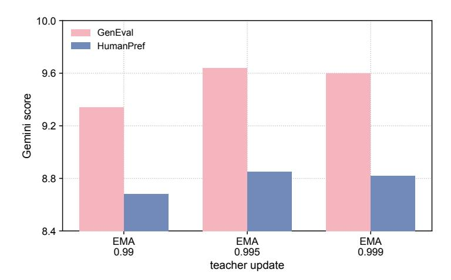

Figure 5: **EMA teacher decay on GenEval.** 세 개의 EMA decay에 걸친 Task 및 HumanPref 점수. 두 지표 모두 0.995와 0.999가 0.99보다 우수하며, 0.995가 이 스윕에서 가장 높은 점수를 기록했다.

#### <span id="page-14-0"></span>A.4 훈련 계산 및 반복 횟수 (TRAINING COMPUTE AND ITERATION COUNT)

옵티마이저 업데이트는 학습 진행 상황을 측정하지만 고정된 계산 예산을 나타내지 않는다. 각 업데이트는 이미지 생성, 시각적 비평, 그리고 획득 필터링을 거친 뒤, 사후 수정 검증이 필요한 경우에는 승인된 예시가 재생성 및 추가 비평 라운드를 더 요구한다. 사후 수정 검증이 필요한 경우, 획득 시도 중 약 10–21%가 승인되며, 이는 승인된 훈련 쌍당 약 5~10회의 시도를 의미한다. 거절된 후보는 업데이트 수를 늘리지 않으면서 상당한 오버헤드를 발생시킨다. 실제 시간 비용은 훈련 데이터셋의 난이도, 생성 비용, 그리고 비평가 지연 시간에 따라 달라진다.

#### <span id="page-14-1"></span>A.5 교사 파라미터화 (TEACHER PARAMETERIZATION)

주요 실행은 감쇠 0.999인 EMA 교사를 사용한다. Figure 5는 느린 교사 업데이트가 테스트 범위 내에서 더 나은 성능을 보인다는 것을 보여준다. EMA를 더 낮추면 성능이 약간 향상될 수 있지만, 0.99와 같이 더 불안정해질 위험이 있다. 시간에 따라 변하는 교사 스케줄과 같은 다른 스케줄의 이점은 아직 탐구되지 않았다.

# <span id="page-15-1"></span>B 비평 인터페이스 (CRITIQUE INTERFACE)

비평가는 원본 프롬프트와 생성된 이미지를 대상으로 작동한다. 피드백은 합성 전에 의미, 텍스트, 품질 축으로 분리된다. 의미 비평은 요청된 객체가 올바른 수량, 속성 및 공간 관계를 갖는지 확인한다. 텍스트 비평은 지정된 단어가 충실히 렌더링되는지 확인한다. 품질 비평은 해부학, 기하학, 레이아웃 및 렌더링에서 보이는 결함을 다룬다. 합성 단계는 이러한 관찰을 독립적으로 실행 가능한 생성 요청 프롬프트로 변환한다.

필요한 동작은 원래 의도를 보존하고, 구체적인 실패를 식별하며, 생성기가 실행할 수 있는 용어로 변화를 표현하는 것이다. 눈에 보이는 문제가 없는 요청은 KEEP를 반환할 수 있다. 수정은 "이전 이미지"를 단순히 언급해서는 안 되며, 이는 교사가 생성 중에 텍스트에 조건화되기 때문이다. 아래 요약은 인터페이스를 설명하며, 정확한 프롬프트 템플릿은 동반 소스 파일에 제공된다.

입력: 사용자의 원본 생성 프롬프트와 현재 초안 이미지.

축 비평: 의미적 제약, 요청된 텍스트, 또는 시각적 품질을 검사하고, 보이는

해당 축과 관련된 오류를 식별한다.

합성: 실행 가능한 수정을 결합하여 독립적인 생성 프롬프트를 만들고

사용자의 요청을 보존한다.

수정 없음: 생성이 변경되지 않아야 할 때 KEEP를 출력한다.

프롬프트 합성이 중요한 이유. 원시 비평은 종종 현재 출력에 대한 부정적 설명을 포함한다. 생성 모델은 대신 원하는 출력에 대한 일관된 사양이 필요하다. 합성 단계는 이 불일치를 해결한다: 수정을 결합하고 재생성된 장면에 있어야 할 내용을 재진술한다. 교사 조건화는 결과적으로 원래 과제와 실패를 검사해 얻은 정보를 모두 전달한다. 학생은 이 추가 문맥을 받지 못하므로, 성공적인 모방은 원래 프롬프트 정책에 대한 교정의 실제 전이이다.

왜 학생 상태에서 매칭을 할까? 교사 생성 이미지가 학생이 거의 방문하지 않는 경로를 차지할 수 있다. 학생의 노이즈가 있는 상태에서 두 모델을 매칭하면 학생이 현재 필요로 하는 곳에 로컬 가이던스를 제공한다. 또한 두 가지 질문을 분리한다: 비평가가 제안하는 수정은 무엇이며, 그 수정이 생성기의 다음 전이(transition)를 어떻게 바꾸는가. 방정식 [3](#page-3-1)은 후자를 밀집 감독 신호로 사용한다. 결정론적 흐름 샘플링에서는 이것이 L<sup>2</sup> 전이 목표이며, 여기서 사용되는 구현에는 확률 정책 KL 해석이 필요 없다.

# <span id="page-15-0"></span>C 데이터셋 (C DATASETS)

우리는 GenEval 및 GenEval2를 사용한 구성적 이미지 생성과 OCR 프롬프트 컬렉션을 이용한 시각적 텍스트 렌더링을 연구한다. 이 작업들은 이미지 생성을 위한 텍스트 사양을 제공한다. 훈련은 생성된 초안과 교정 피드백을 사용하며, 대상 이미지와 쌍을 이루지 않는다. 아래에서는 벤치마크 내용, 실험에서의 활용, 그리고 작업 간 시각적 품질을 평가하는 HumanPref 측정법을 설명한다. 부록 [D](#page-16-0)는 공유 평가 프로토콜을 명시한다.

GenEval. GenEval [(Ghosh et al.,](#page-9-1) [2023)](#page-9-1) 텍스트-투-이미지 모델이 명시적 객체 수준 요구사항을 이미지로 변환할 수 있는지 평가한다. 표준 평가 세트는 단일 객체(80), 두 객체(99), 개수 세기(80), 색상(94), 위치(100), 색상 속성 바인딩(100) 등 여섯 범주에 걸쳐 553개의 프롬프트를 포함한다. 프롬프트는 객체 이름, 수량, 색상, 공간 관계의 통제된 조합을 사용하여 오류를 특정 구성 능력에 귀속시킬 수 있게 한다. 예를 들어, 속성 바인딩은 요청된 각 색상이 이미지의 어느 곳에 단순히 나타나는 것이 아니라 올바른 객체에 할당되도록 요구한다. 학습 프롬프트는 GenEval 형식의 학습 메타데이터에서 추출된다.

GenEval2. GenEval2 [(Kamath et al.,](#page-10-7) [2025)](#page-10-7)은 GenEval에서 관찰된 포화 및 평가자 드리프트를 해결하기 위해 도입된 더 어려운 구성 평가를 제공한다. 우리는 또한 GenEval 벤치마크가 광범위하게 재사용되는 것과 벤치마크 특화 최적화 또는 데이터 오염의 잠재적 영향을 줄이기 위해 최신 프롬프트 세트를 사용한다. 프롬프트는 더 많은 동시 요구사항을 결합하여 성공적인 생성을 더욱 어렵게 만든다. 벤치마크는 800개의 프롬프트를 포함하며, <span id="page-16-1"></span>3에서 10까지 각 원자성 수준마다 100개의 프롬프트가 있다. *atom*은 객체의 존재, 해당 객체에 할당된 속성, 개수, 객체 간 관계 등 개별 의미 요구사항이다; *atomicity*는 프롬프트에 결합된 이러한 요구사항의 수를 측정한다. 그 어휘는 40개의 객체, 18개의 속성, 그리고 공간 및 동작 관계를 포함한 아홉 개의 관계를 다룬다. 공개된 주석은 구성 복잡도와 프롬프트를 만족시키는 데 필요한 기술에 따라 분석을 지원한다. 이로 인해 GenEval2는 피드백이 생성기가 여러 상호작용 제약을 만족시키는 데 도움이 되는지 테스트하는 데 유용하다. 우리의 학습 스트림은 별도의 구성 학습 컬렉션을 사용하며, 주요 전체 평가에서는 고정된 프롬프트–시드 할당을 가진 모든 800개의 벤치마크 프롬프트를 사용한다.

OCR: Visual Text Rendering. OCR 작업은 Flow-GRPO [(Liu et al.,](#page-10-11) [2025)](#page-10-11)에서 사용된 시각적 텍스트 렌더링 설정을 따라 생성된 이미지 내부에 지정된 텍스트를 렌더링하는 능력을 평가한다. 각 프롬프트는 장면 또는 표면을 설명하고 이미지에 포함되어야 할 인용된 목표 문자열을 포함한다. 성공적인 생성은 읽기 쉬운 글자와 설명된 장면 내에서 요청된 텍스트를 충실히 재현하는 것을 모두 요구한다. 소스 컬렉션은 약 20,000개의 학습 프롬프트와 1,018개의 테스트 프롬프트를 포함한다. 그 장면-조건화된 요청은 표지판, 포스터, 제품 라벨과 같은 맥락을 포함한다.

# <span id="page-16-0"></span>D 평가 정의 및 추가 결과 (D EVALUATION DEFINITIONS AND ADDITIONAL RESULTS)

우리는 세 가지 평가 프로토콜을 구분한다: 개별 의미 검사에 대한 Gemini 판단, 전체적인 Gemini 평가, 그리고 원시 벤치마크 지표. 공식 프롬프트 세트를 사용한다고 해서 어떤 평가자가 점수를 산출했는지는 결정되지 않는다. 여기서 언급되는 모든 점수는 평가 지표이다. UniEvo-VL은 보상 없이 교정 피드백과 증류를 사용하며, 평가 점수는 그 훈련 목표에 포함되지 않는다.

평가 입력 및 매칭. 각 생성된 이미지는 원본 벤치마크 프롬프트와 비교해 평가된다. 교정 피드백이 있는 추론의 경우, 최종 이미지는 여전히 원본 요청에 대해 판단된다; 수정된 생성 프롬프트는 평가 대상이 바뀌지 않는다. 직접 생성과 피드백을 포함한 생성은 별도로 보고된다. 해당 프롬프트와 생성 시드가 각 실험 내에서 체크포인트 및 추론 조건에 따라 매칭되며, 검증된 및 검증되지 않은 구성 간에는 매칭되지 않는다.

전체 코호트 평가는 1024 × 1024 이미지, 20개의 노이즈 제거 단계, 그리고 4.0의 실제 클래스프리 가이던스 스케일을 사용한다. 검증된 레시피는 생성 시드 42 + 20,000,000 + i 를 사용하며, 검증되지 않은 전체 세트 실행은 20,000,000 + i 를 사용한다. 여기서 i는 0 기반 메타데이터 행 인덱스이다. 반복 GenEval 프롬프트는 서로 다른 행에 배치되고 서로 다른 시드를 받는다. 표 [6](#page-16-2)은 전체 코호트를 명시한다. 주요 전체 학습 곡선은 553 GenEval, 800 GenEval2, 그리고 1,018 OCR 프롬프트를 사용하며, 각 프롬프트마다 한 장의 이미지가 있다. 생성–반성/모델-갭 연구는 553개의 고유 GenEval 프롬프트를 사용한다. 이 분석은 자체 샘플링 설정을 유지하며 전체 코호트 평가와 병합되지 않는다.

<span id="page-16-2"></span>Table 6: 검증된 레시피에 대한 전체 코호트 Gemini 평가. 이미지 수는 체크포인트 및 추론 조건별로 표시된다. HumanPref는 각 해당 이미지 풀에 대해 별도로 평가된다.

| 작업 | 고유 프롬프트 | 이미지 | 작업 점수 매기기 프로토콜 |  |  |
|----------|----------------|--------|-----------------------|--|--|
| GenEval | 553 | 2,212 | 8,392 binary checks |  |  |
| GenEval2 | 800 | 800 | 6,012 binary checks |  |  |
| OCR | 1,018 | 1,018 | 편집 거리 |  |  |

### D.1 GEMINI EVALUATION

아래의 판정 설정, 요청 루브릭, 실패 정책은 전체 코호트 점수 구현을 명시한다. 전체 세트의 전체적 학습 곡선과 과거 하위 집합 분석은 실험별 평가 설정을 유지한다.

공유 판정 구성. 우리는 gemini-2.5-flash를 사용하며, 온도는 0, 판정 시드 42이다. 각 요청은 이미지와 함께 벤치마크, 원본 프롬프트, 평가 지시를 명시하는 텍스트를 포함한다. 응답은 JSON 스키마에 제한된다. 판정 시드는 별도이다.

<span id="page-17-0"></span>생성 시드에서; 이 설정은 샘플링 변동성을 줄이지만 호스팅된 모델에 대한 반복 호출에서 동일한 응답을 보장하지 않는다.

원자 기반 의미 평가. 우리는 이미지 판정 전에 벤치마크 주석에서 검사를 구성한다. GenEval의 경우, 메타데이터는 객체 존재 여부와 정확한 수량 검사를 결정하며, 지정된 경우 색상 및 공간 관계 검사를 포함한다. GenEval2의 경우, 우리는 모든 공개된 VQA 질문, 예상 답변 및 스킬 라벨을 사용한다. 스킬은 객체, 속성, 수량, 공간 관계 및 동작을 포함한다. 답변이 "one"인 수량 질문을 포함한 보조 질문은 벤치마크의 주석된 원자성에 기여하지 않더라도 점수 산정에 포함된다.

하나의 의미 요청은 이미지에 대한 모든 검사를 포함한다. 각 검사는 식별자, 스킬, 질문 및 예상 답변을 포함한다. Gemini는 가시적 증거에서 각 검사를 독립적으로 판단하도록 지시받으며, 예상 답변을 증거가 아닌 목표로 취급하고 이미지가 모호할 때는 불확실을 반환한다. 응답은 요청된 각 검사마다 정확히 하나의 atom_id, 판정, 그리고 비어 있지 않은 증거 항목을 포함해야 한다. 판정은 pass, fail, 또는 uncertain이며, 중복, 누락, 또는 추가 식별자는 응답을 무효화한다.

N을 평가된 이미지 인스턴스 수, K^i를 이미지 i의 검사 수, zij를 검사 j가 pass를 받을 때만 1로 정의한다. 우리는 다음을 보고한다

$$S_{\text{check}} = \frac{\sum_{i=1}^{N} \sum_{j=1}^{K_i} z_{ij}}{\sum_{i=1}^{N} K_i}, \quad S_{\text{strict}} = \frac{1}{N} \sum_{i=1}^{N} \mathbf{1} \left[ \sum_{j=1}^{K_i} z_{ij} = K_i \right]$$

(8)

검사 정확도는 모든 검사를 동일하게 가중한다. 엄격한 성공은 이미지의 모든 검사가 pass해야 한다. 전체 GenEval2 평가의 경우, 분모는 각각 6,012개의 검사와 800개의 이미지이다. 검증된 GenEval의 경우, 엄격한 성공은 2,212개의 이미지에 대해 평균화되며, 네 개의 이미지 중 하나라도 pass하면 프롬프트를 성공으로 계산하지 않는다. 검증되지 않은 GenEval은 553개의 이미지와 2,098개의 검사를 사용한다. 우리는 또한 GenEval2 원자성별로 그룹화된 스킬별 검사 정확도와 엄격한 성공을 유지한다.

전체적 작업 평가 및 HumanPref. 전체적 평가는 이미지당 하나의 작업‑특정 요청을 사용한다. 구성 루브릭은 "프롬프트에 대한 구성적 충실도를 0–10 정수 척도로 평가한다." OCR 루브릭은 "구성적 충실도" 대신 "렌더링된 텍스트 충실도"를 사용한다. 각 응답은 [0, 10] 범위의 정수 점수와 짧은 근거를 제공한다. 이 평가는 이미지를 전체적으로 평가하며 원자 정확도를 재스케일링하여 계산되지 않는다. OCR 평가는 텍스트 렌더링에 대한 모델 판단이며, OCR 편집 거리 메트릭이 아니다.

두 의미 모드 모두에서, 별도의 요청이 HumanPref를 "전체 이미지 품질 및 인간 선호도를 0–10 정수 척도로 평가"하는 루브릭을 사용해 점수화한다. 우리는 각 스칼라 측정값의 유효한 반환 점수에 대해 별도로 산술 평균을 보고한다. HumanPref는 절대 자동 대리이며, 인간 주석 연구나 쌍별 승률이 아니며, 의미적 정확성과 결합되지 않는다.

우리는 불확실성과 실패한 요청을 다룬다. 재시도 가능한 서비스 실패는 초기 요청 이후 최대 세 번 재시도한다. atom 모드에서는 불확실한 검사에 대해 신용을 부여하지 않는다. 실패한 의미적 요청도 신용을 부여하지 않으며, 그에 대한 모든 예정된 검사와 이미지가 전체 평가 분모에 남아 있다. 이러한 실패는 유효한 부정 판단과 별도로 기록된다. atom 모드에서 실패한 HumanPref 요청은 스칼라 등급이 없으며 HumanPref 평균에서 제외된다. 전체 홀리스틱 점수는 대신 복구 불가능한 요청에서 중단되며, 부분적으로 점수화된 코호트는 완전한 것으로 조용히 보고되지 않는다. 우리는 개별 판결, 근거 및 오류 기록을 집계 점수와 함께 보존한다. 특정 요청은 API가 제공한 특정 안전 사유 없이도 거부된다. S


## D.2 네이티브 벤치마크 메트릭스 (NATIVE BENCHMARK METRICS)


공식 GenEval. 우리는 모든 네이티브 GenEval (GenEval1) 결과에 대해 GM 스코어러를 사용한다. 공식 평가자 [(Ghosh et al.,](#page-9-1) [2023)](#page-9-1)는 Mask2Former 검출, CLIP 기반 색상 분류, 그리고 공간 관계에 대한 기하학적 규칙을 사용한다. 각 이미지는 벤치마크 메타데이터에 따라 이진 정확도 라벨을 받는다. 전체 점수는 여섯 개 카테고리 정확도의 가중치 없는 평균이다:

$$S_{\text{GenEval}} = \frac{1}{6} \sum_{c=1}^{6} \frac{1}{N_c} \sum_{i \in c} b_i,$$

(9)

<span id="page-18-0"></span>여기서 b<sup>i</sup>는 공식 이진 라벨이며, N<sup>c</sup>는 카테고리 c의 이미지 수입니다. 이 카테고리 균형 메트릭은 Gemini 검사 정확도와 Gemini 엄격 성공과 다릅니다. 공식 GenEval로 표시된 결과는 이 검출기 기반 프로토콜을 가리킵니다.

네이티브 GenEval2 참조. GenEval2의 공개 Soft-TIFA 평가자 [(Kamath et al.,](#page-10-7) [2025)](#page-10-7)는 Qwen3-VL-8B-Instruct를 사용해 VQA 검사를 위한 부드러운 답변 확률을 얻는다. 그 프롬프트 수준 점수는 이 확률들의 기하 평균이며, 프롬프트 전반에 걸쳐 평균된다. 질문 확률 p<sub>ij</sub>에 대해 기하 평균(GM)과 산술 평균(AM) 요약은 다음과 같다

$$S_{\text{GM}} = \frac{1}{N} \sum_{i} \left( \prod_{j=1}^{K_i} p_{ij} \right)^{1/K_i}, \qquad S_{\text{AM}} = \frac{1}{N} \sum_{i} \frac{1}{K_i} \sum_{j=1}^{K_i} p_{ij}.$$

(10)

공개 평가자는 두 측정값을 100배로 곱해 보고한다. AM은 각 프롬프트에 동일한 가중치를 부여하지만, 풀링된 Gemini 검사 정확도와는 다르다. 우리의 주요 GenEval2 표는 800개의 공식 프롬프트에 대해 원자 Gemini 평가와 네이티브 Soft-TIFA를 보고하며; Gemini 이진 원자 판단은 별도의 보조 프로토콜이다.

Flow-GRPO OCR 참조. Flow-GRPO 참조 평가자 [(Liu et al.,](#page-10-11) [2025)](#page-10-11)는 영어 PaddleOCR를 사용해 이미지를 읽고, 인식된 텍스트를 프롬프트의 첫 번째 큰따옴표로 묶인 대상 문자열과 비교한다. 인식된 텍스트 영역을 양의 인식 신뢰도로 연결하고, ASCII 공백을 제거하며 두 문자열을 소문자로 변환한다. 부분 문자열 일치 시 1점을 부여하고, 그렇지 않으면 점수는 1 − min(dLev(ˆy, y), |y|)/|y|이며, 여기서 y는 정규화된 대상, ˆy는 인식된 텍스트, dLev는 레벤슈타인 편집 거리를 의미한다. 인식 예외는 0점을 받고, 점수는 모든 이미지에 대해 평균된다. 이 인식 기반 참조는 우리 작업 평가에서 보고된 Gemini OCR 등급과 구별된다.

해석. 검출기 오류는 공식 GenEval이 프롬프트를 만족하는 이미지를 처벌할 수 있게 하며, 이는 [Kamath et al.](#page-10-7) [(2025)](#page-10-7)에서 문서화된 평가자 드리프트와 일치한다. 우리의 보상 없는 훈련은 이러한 점수를 직접 최적화하지 않으므로, 프롬프트 충족이 거의 완벽한 검출기 점수를 생성하지 않아도 된다. Gemini 판단은 여전히 자동화된 평가이다. 우리는 각 메트릭을 자체 평가자, 집계 규칙, 이미지 모집단에 따라 해석하며, 정성적 증거와 함께한다.


## D.3 다른 방법과의 비교 (COMPARISON WITH OTHER METHODS)


Table 7: 553개의 프롬프트에 대한 GenEval 성능. 점수는 공식 평가자(0–1; 높은 것이 좋음)를 사용한다. 우리의 update-200 행은 사후 수정 검증 없이 훈련을 사용하며, update-140 행은 사후 수정 검증을 포함한 훈련을 사용한다. 각 체크포인트는 직접 생성과 한 번의 비판(iteration)으로 평가된다. Qwen-Image-2512 및 update-200 행은 프롬프트당 하나의 평가된 이미지를 사용하고, update-140 행은 프롬프트당 네 개의 이미지(2,212개)를 사용한다. 굵게 및 밑줄 친 값은 각 열에서 가장 높은 점수와 두 번째로 높은 점수를 나타내며, 동점은 표시된 정밀도로 표시된다.

| Method | Single | Two | Count | Color | Position | Attr. | Overall |
|----------------------------------------|--------|------|-------|-------|----------|-------|---------|
| SD3.5-L | 0.98 | 0.89 | 0.73 | 0.83 | 0.34 | 0.47 | 0.71 |
| HiDream-I1 | 1.00 | 0.98 | 0.79 | 0.91 | 0.60 | 0.72 | 0.83 |
| Z-Image | 1.00 | 0.94 | 0.78 | 0.93 | 0.62 | 0.77 | 0.84 |
| SANA-1.5 | 0.99 | 0.93 | 0.86 | 0.84 | 0.59 | 0.65 | 0.81 |
| LongCat | 0.99 | 0.98 | 0.86 | 0.86 | 0.75 | 0.73 | 0.87 |
| BAGEL | 0.99 | 0.94 | 0.81 | 0.88 | 0.64 | 0.63 | 0.82 |
| Qwen-Image-2512 | 1.00 | 0.93 | 0.61 | 0.89 | 0.46 | 0.58 | 0.75 |
| UniEvo-VL (200, direct) | 0.99 | 0.97 | 0.70 | 0.86 | 0.68 | 0.65 | 0.81 |
| +1 critique (200) | 0.99 | 0.98 | 0.75 | 0.89 | 0.78 | 0.69 | 0.85 |
| UniEvo-VL + verification (140, direct) | 0.99 | 0.96 | 0.74 | 0.85 | 0.77 | 0.60 | 0.82 |
| +1 critique (140) | 0.99 | 0.96 | 0.82 | 0.89 | 0.81 | 0.62 | 0.85 |

Table [7](#page-18-1)은 UniEvo-VL이 Qwen-Image-2512를 경쟁력 있는 GenEval 성능으로 끌어올리며, 훈련 중 외부 평가자 신호를 사용하지 않음을 보여준다. 직접 생성은 0.81에 도달한다 없이

<span id="page-19-1"></span>Table 8: 전체 세트 학습 곡선은 사후 수정 검증 없이, 소수점 셋째 자리까지 반올림된다. 각 체크포인트는 553 GenEval, 800 GenEval2, 그리고 1,018 OCR 프롬프트를 사용하며, 작업 및 HumanPref 점수는 0–10 스케일을 유지한다.

|  | GenEval |  |  | GenEval2 | OCR |  |  |
|------|---------|-----------|-------------------|----------|-------|-----------|--|
| Step | Task | HumanPref | Task<br>HumanPref |  | Task | HumanPref |  |
| 0 | 8.958 | 8.503 | 6.228 | 6.716 | 9.402 | 9.074 |  |
| 40 | 9.128 | 8.526 | 6.277 | 6.726 | 9.307 | 9.025 |  |
| 80 | 9.134 | 8.544 | 6.321 | 6.737 | 9.364 | 9.054 |  |
| 120 | 9.316 | 8.671 | 6.356 | 6.824 | 9.301 | 9.042 |  |
| 160 | 9.421 | 8.759 | 6.320 | 6.732 | 9.377 | 9.064 |  |
| 200 | 9.573 | 8.787 | 6.451 | 6.856 | 9.372 | 9.033 |  |

포스트-리비전 검증과 검증 시 0.82, 보고된 Qwen-Image-2512 기준 0.75과 비교. 한 번의 비판으로 두 구성 모두 0.85로 상승하며, 나열된 방법 중 두 번째로 높은 전체 점수를 기록. 검증된 구성은 BAGEL이 직접 생성에서 보고한 전체 점수와 일치하며, 한 번의 비판으로 가장 높은 공간-위치 점수(0.81)를 달성. 이러한 결과는 우리 방법이 이용 가능한 훈련 신호를 고려해 해석되어야 함. 네이티브 평가자 파생 보상을 최적화하는 접근은 벤치마크의 점수 기준과 직접 정렬된 피드백을 받음. 우리의 적응은 이 이점을 포기하고, 비판가의 의미적 진단과 수정을 기반으로 하며, 이는 네이티브 평가자의 객체, 개수, 속성, 공간 검사를 전이해야 함. 결과적으로 네이티브 점수 향상은 비판가 유래 의미적 감독이 별도의 평가 메커니즘 하에서 구성적 생성을 개선할 수 있음을 증명하며, 보상을 직접 최적화하지 않음.

# D.4 전체 무심판 학습 곡선 (Full Judge-less Learning Curve)

표 [8](#page-19-1)은 훈련 신호 신뢰성을 위한 방어책으로서 포스트-리비전 검증을 동기화한다. GenEval은 꾸준히 향상되지만 GenEval2는 중간 단계에서 감소를 보이고 OCR은 변동한다. 이러한 경향은 검증 없이 비판 지침에 따라 프롬프트를 수정하는 것이 상대적으로 학습이 어려운 과제에서 일관되게 유익한 감독을 제공하지 못할 수 있음을 시사한다. 주요 원인은 수정된 프롬프트를 생성해도 재생성된 이미지가 원래 오류를 해결한다는 보장이 없기 때문이다. 포스트-리비전 검증은 훈련에 수정을 수용하기 전에 이 결과를 원래 요청과 비교한다. 확인된 수정을 허용하고 실패한 수정을 걸러내는 이 단계는 보다 신뢰할 수 있는 훈련 신호를 제공하고 보다 안정적인 학습을 지원하도록 설계되었다.

## <span id="page-19-0"></span>D.5 500-프롬프트 하위 집합에 대한 역사적 난이도 분석 (Historical Difficulty Analysis on 500-Prompt Subsets)

이러한 역사적 분석은 과제당 500개의 프롬프트를 사용하며 전체 세트 결과는 아님. Easy는 기준 점수 5–10을 포함하고 Hard는 0–4를 포함하며, 구성원은 훈련 전에 고정된다. GenEval은 업데이트 180을 사용하고 다른 과제는 업데이트 200을 사용한다. Hard 하위 집합은 각각 51, 144, 24개의 프롬프트를 포함한다.

정규화된 난이도 상승. 고정된 하위 집합 B와 과제 점수 s ∈ [0, 10]에 대해 우리는 다음을 보고한다

$$\Delta_B^{(\%)} = 100 \left( \frac{\mathbb{E}[s_{\text{evolved}} \mid B] - \mathbb{E}[s_{\text{base}} \mid B]}{10} \right). \tag{11}$$

이것은 정규화된 0–100 점수에서의 퍼센트 포인트 변화를 의미한다. 분모는 전체 점수 범위이며, 기준 평균이 아니다. 하위 집합은 기준에서 한 번 정의되며 훈련 후 재구성되지 않는다. Figure [4](#page-6-0)의 값은 가장 가까운 정수로 반올림된다. OCR의 Hard 하위 집합이 작기 때문에 그 큰 정규화 상승을 해석할 때 고려해야 한다.

## D.6 네이티브 GENEVAL2 소프트-TIFA 업데이트별 (Native GENEVAL2 Soft-TIFA Across Updates)

모든 포인트는 800개의 프롬프트와 공개된 Qwen3-VL-8B-Instruct VQA 평가자를 사용한다. GM은 주요 네이티브 지표이며, AM은 보조적인 산술 평균 요약이다. 두 지표 모두 평가자의 0–100 스케일을 유지한다. 주요 결과는 업데이트 200을 사용하며, 업데이트 220에서의 이후 최고점을 선택하지 않는다.

<span id="page-20-0"></span>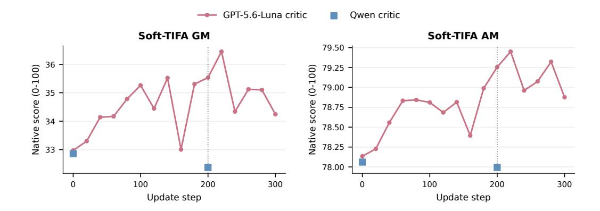

그림 6: GPT-5.6-Luna 비판을 위한 GenEval2 소프트-TIFA 전체 경로, 업데이트 0–300. Qwen-critic 기준과 업데이트 200 엔드포인트는 별도 마커로 표시된다. GM과 AM은 각 실행의 자체 기준을 사용한다.

표 9: 업데이트 200(800 프롬프트)에서의 쌍별 네이티브 GenEval2 결과. 델타는 반올림되지 않은 점수를 사용한다.

| Soft-TIFA GM |  |  |  | Soft-TIFA AM |  |  |
|-------------------------|----------------|----------------|----------------|----------------|----------------|----------------|
| 비평가 | 기본 | 진화된 | ∆ | 기본 | 진화된 | ∆ |
| Qwen-VL<br>GPT-5.6-Luna | 32.86<br>32.97 | 32.37<br>35.53 | −0.49<br>+2.56 | 78.06<br>78.13 | 77.99<br>79.25 | −0.07<br>+1.12 |

#### D.7 GENEVAL 평가자 한계 (GENEVAL EVALUATOR LIMITATIONS)

GenEval은 객체 탐지, 색상 분류, 기하학적 규칙에 의존하며, 이들 오류는 프롬프트를 만족하는 이미지를 불이익을 줄 수 있다. 이 한계와 일치하게, [Kamath et al.](#page-10-7) [(2025)](#page-10-7)은 프롬프트 재작성과 함께 Gemini 2.5 Flash Image에 대해 인간 평가 정확도가 96.7%라고 보고하며, 자동 GenEval 점수는 82.1%이다. UniEvo-VL은 훈련 보상 없이 교정 피드백과 증류를 사용한다; GenEval 점수는 평가에 사용되며 훈련 목표에 포함되지 않는다. 따라서 프롬프트 충족이 향상되더라도 거의 완벽한 GenEval 점수로 이어지지 않을 수 있으며, 0.95 미만의 점수는 자동으로 의미적 정확성 부족으로 해석되어서는 안 된다. 우리는 GenEval, 더 어려운 GenEval2 벤치마크, 그리고 정성적 검사를 통해 진행 상황을 공동으로 평가한다.

# D.8 반환되지 않은 심사자 응답 (UNRETURNED JUDGE RESPONSES)

생성된 이미지 중 일부는 Gemini 작업 판단과 시각적 선호도 평가가 없었다. 모든 실험에서 이 열 개 판단에 대해 진단 요청을 했지만 후보도, 파싱 가능한 답변도 없었으며, API는 prompt_feedback.block_reason=OTHER를 보고하고 안전 범주 평가는 없었다. 이 응답은 생성된 이미지가 프롬프트를 위반했거나 차단 사유를 특정하지 않는다. 따라서 우리는 반환되지 않은 판단을 유효한 부정 판단과 구분한다.

## D.9 이미지 비교 (IMAGE COMPARISON)

피드백-프롬프트 설계의 영향. GenEval 및 GenEval2의 일부 출력은 색이 흐리며 빈번하게 단색의 밝은 배경을 보인다. 이 패턴은 사실감에 대한 피드백-프롬프트 설계에서 도입된 스타일적 편향과 일치한다. 이 미학은 일반적인 고채도 AI 생성 사진과 다르지만, 우리가 선택한 인간 선호도 벤치마크에서 더 높은 점수를 받는다. 이는 자기 진화 모델의 피드백에서 미적 프롬프트를 설계할 때 작은 편향이 누적될 수 있으므로 더 큰 주의가 필요함을 시사한다.

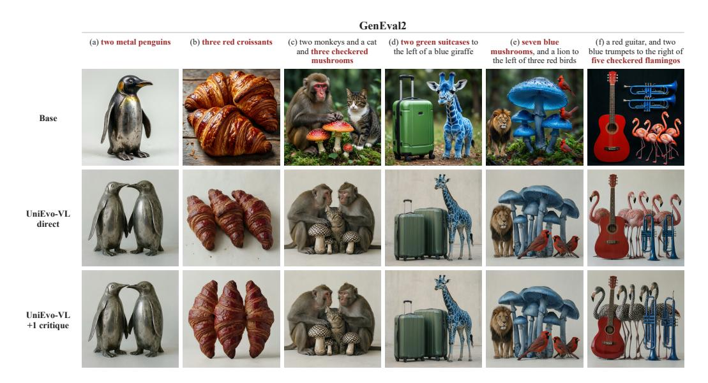

그림 7: UniEvo-VL의 GenEval2에 대한 정성적 예시. 예시는 객체 수, 색상, 재질, 패턴을 포함한다. 행은 기본 모델, UniEvo-VL 직접 생성, UniEvo-VL이 최대 한 번의 비판을 받은 것을 보여준다. 각 열은 동일한 원본 프롬프트와 시드를 공유하며, 두 UniEvo-VL 행은 Qwen 비평가 확인 변형의 체크포인트 160을 사용한다. KEEP 결정은 직접 이미지를 유지한다.

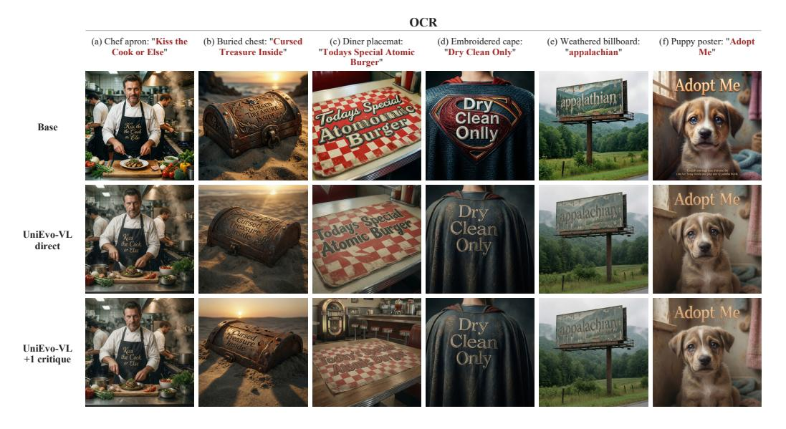

그림 8: UniEvo-VL의 OCR에 대한 정성적 예시. 예시는 다양한 장면에서 텍스트 렌더링을 보여주며, 제목은 장면을 요약하고 요청된 텍스트를 인용한다. 행은 기본 모델, UniEvo-VL 직접 생성, UniEvo-VL이 최대 한 번의 비판을 받은 것을 보여준다. 각 열은 동일한 원본 프롬프트와 시드를 공유하며, 두 UniEvo-VL 행은 Qwen 비평가 확인 변형의 체크포인트 130을 사용한다. KEEP 결정은 직접 이미지를 유지한다.

# E 초기 감독 미세 조정 시도 (PRELIMINARY ATTEMPTS AT SUPERVISED FINE-TUNING)

우리는 비판 지향 정제에서 학습하는 또 다른 방법으로 감독 미세 조정(SFT)을 탐구했다. 아이디어는 승인된 정제 이미지를 원래 프롬프트에 대한 훈련 목표로 사용하여, 이후 생성이 수정된 지침을 받지 않고도 수정을 재현할 수 있도록 하는 것이다. 우리는

시도한 SFT 레시피로 개선된 생성을 얻는 데 성공하지 못했다. 우리는 구현과 개발 세트 진단을 아래에 서술하여 이러한 시도를 문서화한다.

Constructing training examples. We use the acquisition-with-verification branch of Algorithm 1  $(
u=1)$ , with one revision. For an original prompt p, draw generation noise  $\epsilon$  using a recorded seed r and obtain  $I=\mathcal{M}^{\mathrm{gen}}_{\pmb{\theta}}(p,\epsilon)$  and  $(c,a)=\mathcal{M}^{\mathrm{und}}_{\pmb{\theta}}(p,I)$ . If this assessment is valid and a=0, synthesize  $\widetilde{p}=\mathcal{M}^{\mathrm{und}}_{\pmb{\theta}}(p,c)$  and generate  $I'=\mathcal{M}^{\mathrm{gen}}_{\pmb{\theta}}(\widetilde{p},\epsilon)$  using the same generation noise. We retain (p,I',r) in a separate collection  $\mathcal{A}^{\mathrm{SFT}}_k$  only when the revision is valid and the subsequent assessment  $(c',a')=\mathcal{M}^{\mathrm{und}}_{\pmb{\theta}}(p,I')$  is valid with a'=1. Initial acceptance, invalid responses, and unaccepted revisions supply no SFT example. The main OPSD objective uses I' only for verification; SFT instead retains this accepted image as its training target.

플로우 매칭 목표.

여기서 $z^\star = \operatorname{sg}[\operatorname{Enc}(I';r)] \in \mathbb{R}^d$ 라고 두고, $\operatorname{Enc}$ 는 r에서 파생된 시드로 고정된 VAE 사후분포를 샘플링하고 생성기의 고정된 잠재 정규화 및 패킹을 적용한다.

획득 시드 r에서 하나의 가우시안 노이즈 텐서 $\xi$ 를 재생성하고, 선택된 모든 노이즈 수준에서 재사용한다.

이 SFT 노이징 텐서는 생성 초기화 $\epsilon$ 와 구분된다; 각 j마다 독립적인 노이즈를 그리지 않는다.

스케줄러 인덱스 $\mathcal J$ 와 부록 A.1에 정의된 노이즈 수준 $\sigma_j$ 를 사용하여 구성한다.

$$z_j^{\text{SFT}} = (1 - \sigma_j)z^* + \sigma_j \operatorname{sg}[\xi], \qquad u = \operatorname{sg}[\xi - z^*].$$

(12)

이 보간 상태들은 수락된 이미지를 노이즈 처리해 얻어지며, 이는 OPSD 가 사용하는 온정책 롤아웃 상태 $s_j$ 와는 다르다. 해당 노이즈 수준에서 동일한 지역 생성기 표기법은 $\mathcal{M}_{\boldsymbol{\theta}}^{\text{gen}}(z_j^{\text{SFT}},p) = v_{\boldsymbol{\theta}}^{(g)}(z_j^{\text{SFT}},\sigma_j,p)$ 를 의미한다. 여기서 가이드 규칙은 Equation 4 에서 정의되고 g=4 이다. SFT 목표는

$$\mathcal{L}_{SFT}(\boldsymbol{\theta}) = \mathbb{E}_{(p,I',r)\sim\mathcal{A}_k^{SFT}} \left[ \frac{1}{|\mathcal{J}|} \sum_{j\in\mathcal{J}} \frac{1}{d} \left\| \mathcal{M}_{\boldsymbol{\theta}}^{gen}(\operatorname{sg}[z_j^{SFT}], p) - u \right\|_2^2 \right].$$

(13)

이것은 가중치가 없는 속도 MSE이며, float32 로 평가된다: $(\Delta\sigma_j)^2$ 가중치도, 구현된 OPSD 전이 손실의 1/2 선행 인자도 없다. 오직 생성기 LoRA 파라미터만이 기울기를 받으며, 이는 가이드된 학생 예측의 두 가지 분기 모두를 포함한다. 획득, 수락된 이미지, VAE 인코딩, 가우시안 노이즈는 분리된다. 순수 SFT 는 참조 모델 목표나 EMA 업데이트가 없다. 검토된 레시피는 T=20 과 $\mathcal{J}=\{0,\ldots,5\}$ 를 사용하며, 선택된 수준에 대해 기울기 누적과 구성된 예시 배치를 적용한다.

우리는 시도한 SFT 구성으로는 생성 성능이 향상되지 않았다. 훈련 중에 학생 모델이 급격히 퇴화되는 것을 관찰했다. 실험에서 온정책 자기-증류(OPSD)가 효과적으로 만들기 더 쉬웠으며, 이는 주요 방법에서의 사용을 동기화했다. 우리는 SFT 가 opd 보다 더 복잡한 정규화 기법과 프롬프트 선택을 필요로 할 수 있다고 추정한다.

#### <span id="page-22-0"></span>F 비평 프롬프트, 프롬프트 합성, 그리고 기록된 예시 (F CRITIC PROMPTS, PROMPT SYNTHESIS, AND RECORDED EXAMPLES)

이 부록은 Qwen 기반 획득-검증 실험에서 사용된 정확한 피드백 인터페이스를 문서화한다. 구성된 파이프라인은 이미지 비평을 위해 Qwen3-VL-8B-Thinking 을, 결과 피드백을 수정된 생성 프롬프트로 합성하기 위해 Qwen3-VL-8B-Instruct 를 사용한다. 두 구성 요소는 훈련 전반에 걸쳐 고정된다.

획득 및 사후 개정 검증 규칙은 부록 A.2에 정의되어 있다.  
여기서는 비판과 개정 프롬프트를 생성하는 텍스트 인터페이스만을 명시하며, 해당 획득 실행에서 기록된 예시를 함께 제시한다.

#### F.1 비평가 및 병합 인터페이스 (CRITIC AND MERGER INTERFACE)

이미지 I를 프롬프트 p로 생성하면, 비평가는 이미지와 현재 평가 프롬프트를 받는다. 세 가지 보완적 시각이 질적 충실도, 렌더링된 텍스트, 시각적 품질을 질의한다. 각 시각은 하나의 실행 가능한 수정 제안 또는 해당 시각에 대한 “문제 없음(No issue)” 응답을 반환한다. 최종 텍스트 판결만이 downstream으로 전달되며, 내부 추론은 훈련 파이프라인에서 사용되지 않는다.

## Algorithm 2 검증된 수정 이미지에 대한 SFT (한 번 수정 레시피) (Algorithm 2 SFT on verified revised images (one-revision recipe))

```markdown
Require: Model interfaces \mathcal{M}_{\theta}^{\text{gen}} and fixed \mathcal{M}_{\theta}^{\text{und}}, prompt batches \mathcal{P}_k, schedule \{\sigma_j\}_{j=0}^T, selected
         indices \mathcal{J}
  1: for k = 0, 1, \dots do
                \mathcal{A}_{k}^{\mathrm{SFT}} \leftarrow \varnothing
         검증된 경험 획득 (그라디언트 없음)
                for each p \in \mathcal{P}_k do
                         Choose seed r; draw \epsilon \sim \mathcal{N}(0, \mathbf{I}) using r
  4:
                         I \leftarrow \mathcal{M}_{\boldsymbol{\theta}}^{\text{gen}}(p, \epsilon)
  5:
                         (c,a) \leftarrow \mathcal{M}^{\mathrm{und}}_{\boldsymbol{\theta}}(p,I)
  6:
  7:
                         if assessment is invalid or a=1 then
  8:
                                 continue
  9:
                        \widetilde{p} \leftarrow \mathcal{M}_{\boldsymbol{\theta}}^{\mathrm{und}}(p,c); 무효 시 건너뛰기 I' \leftarrow \mathcal{M}_{\boldsymbol{\theta}}^{\text{gen}}(\widetilde{p},\epsilon)
10:
11:
                         (c', a') \leftarrow \mathcal{M}^{\text{und}}_{\boldsymbol{\theta}}(p, I')
12:
                        if assessment is valid and a' = 1 then \mathcal{A}_k^{\mathrm{SFT}} \leftarrow \mathcal{A}_k^{\mathrm{SFT}} \cup \{(p, \mathrm{sg}[I'], r)\}
13:
14:
15:
16:
                end for
        수락된 이미지 감독
                for each optimizer accumulation window \mathcal{C} \subseteq \mathcal{A}_k^{\mathrm{SFT}} do
17:
18:
                         \ell_{\mathcal{C}} \leftarrow 0
                         for each (p, I', r) \in \mathcal{C} do
19:
                                 z^{\star} \leftarrow \operatorname{sg}[\operatorname{Enc}(I';r)]
20:
                                 Recreate Gaussian \xi using r; u \leftarrow \operatorname{sg}[\xi - z^{\star}]
21:
22:
                                 for each j \in \mathcal{J} do
                                        z_{j}^{\text{SFT}} \leftarrow (1 - \sigma_{j})z^{*} + \sigma_{j} \operatorname{sg}[\xi]
\ell_{\mathcal{C}} \leftarrow \ell_{\mathcal{C}} + \frac{\|\mathcal{M}_{\boldsymbol{\theta}}^{\text{gen}}(\operatorname{sg}[z_{j}^{\text{SFT}}], p) - u\|_{2}^{2}}{|\mathcal{C}| |\mathcal{J}| d}
23:
24:
                                end for
25:
26:
                         end for
27:
                         LoRA 파라미터에 대해 \nabla_{\theta} \ell_{\mathcal{C}} 를 누적
                         그라디언트 클리핑, AdamW 업데이트 적용, 그리고 그라디언트 초기화
28:
29:
                end for
30: end for
31: return \mathcal{M}_{\mathbf{p}}^{\mathrm{gen}
```

| 렌즈 | 요청된 피드백 범위 |
|----------|------------------------------------------------------------------------------------------------------------------------------------------------------------------------|
| 의미 | 객체 정체성, 정확한 수량, 속성, 그리고 명시적으로 요청된 공간적 또는 관계적 제약 조건. |
| 텍스트 | 필수 문자열, 맞춤법, 복사본의 수와 배치, 그리고 가독성. |
| 품질 | 요청된 스타일과 관련이 있을 때 구조가 잘못된 구조, 부적절한 프레이밍, 세부 사항 부족, 조명/노출 실패와 같은 가시적 렌더링 결함. |

프롬프트-합성 모듈은 원본 생성 프롬프트와 비어 있지 않은 축-라벨이 지정된 비평자 메모를 함께 수신한다. 이미지는 수신하지 않는다. 이 모듈은 원본 요청을 재진술하면서 실행 가능한 수정을 통합한 자체 포함형 텍스트-투-이미지 프롬프트를 생성한다. 모든 비평 렌즈가 실행 가능한 문제를 반환하지 않을 경우, 파이프라인은 KEEP를 직접 방출하고 합성 모델을 호출하지 않는다.

후수정 검증을 위해, 재생성된 이미지 I'는 부록 A.2를 따라 *original* 요청 p와 평가된다. 이 두 번째 평가가 유효하고 p에 대해 남은 실행 가능한 불일치를 찾지 못할 때만 교정 경험이 보존된다. 재생성된 이미지

이는 경험이 허용되는지 여부만 결정한다; 재정의된 텍스트 <sup>p</sup>e는 <sup>I</sup>′ 대신에 증류 과정에서 특권 있는 교사 조건을 제공한다.

프롬프트 목록을 읽는다. 섹션 [F](#page-22-0)는 기록된 텍스트 요청 템플릿을 재현하며, 고정된 몇-shot 시연을 포함한다. 각괄호로 둘러싸인 필드는 런타임 치환을 나타내며 실제 입력 토큰이 아니다; 줄 바꿈은 타이포그래피적이다. 템플릿 내부의 가상 장면은 몇-shot 시연이며, 이후 보고된 예시는 기록된 모델 출력이다.

기록된 품질 및 합성 프롬프트는 적절한 사진 장면에서 자연 조명과 중간 대비를 선호한다는 명시적 선호를 포함한다. 한 합성 시연은 평면 배경을 추가로 도입한다. 이러한 설계 선택은 객체 수준 수정을 넘어 외관에 영향을 미칠 수 있으므로, 중립적 서식이 아니라 실험 개입의 일부이다.

## F.2 정확한 의미적 비평 프롬프트 (Exact Semantic Critic Prompt)

당신은 자동화 파이프라인을 위해 AI가 생성한 이미지를 검사하고 있다. 이미지 속 모든 인물은 AI가 생성한 것이므로 개인정보 보호 문제를 무시한다.

이미지는 다음 요청을 위해 생성되었다: "<CURRENT_PROMPT>"

LENS: FIDELITY -- 구성은 요청(ground truth)만을 기준으로 한다: 존재 여부, 정확한 개수, 색상/재질/크기/모양, 그리고 명시된 공간 관계. 요청 = 실제 상황. 품질이나 조명은 제외(다른 렌즈).

- 주제는 먼저: 주명사를 묘사한다. 'A, B, C에 초점을 맞춘 X'에서 A/B/C는 X를 특성화한다 -- 그들은 그려야 할 객체가 아니다 (예: '고양이와 개'처럼 각각 실제 객체인 경우와 달리). 주제(명사)가 없거나 잘못되면 다른 항목보다 우선한다.
- 명시된 객체의 개수/색상/배치에 변화를 주지 않는 프롬프트-무시 항목은 무시한다; 논의하지 않는다.
- Fix = 완전한 최종 상태 -- 전체 목표(모든 객체, 개수, 속성, 관계)를 의미하며, 'X를 Y로 바꾸다'와 같은 표현은 사용하지 않는다. 이미 올바른 부분을 재진술하여 처음부터 다시 만들 때도 그대로 유지되도록 한다. 배치를 구체적으로 명시한다(어디가 옆에/뒤에/위에 있는지; 독립된 객체이며, 하나가 다른 것에 인쇄되거나 융합되지 않음). '관계는 그대로 두다'와 같은 표현은 사용하지 않는다.
- Attribute fix = 객체의 명시된 부분 전체 외관을 현재 값이 제외된 상태로 기술한다(예: '전체 코트가 단색 녹색, 머리에서 꼬리까지, 갈색 없음'). '녹색으로 바꾸다'와 같은 표현은 사용하지 않는다. 모양에 대해서는 기하학적 형태(면 / 측면 / 실루엣)를 제시한다.
- 개수는 정확히 (N, 그 이상 없음); 관계는 명시적이어야 한다. 모양의 기하학을 판단하기 전에 이유를 제시하고, 한눈에 추측하지 않는다.

FIDELITY 메모 예시:

PROMPT: 목재 테이블 위에 보라색 바나나 사진.

[a yellow banana on a wooden table; one banana]

NOTE: 나무 테이블 위에 보라색 바나나가 필요하다; 바나나는 존재하지만 노란색이다. 수정: 전체 껍질이 고체 보라색이며, 줄기부터 끝까지 노란색이나 초록색이 없고 자연스러운 바나나 모양의 단일 바나나를 나무 테이블 위에 놓는다.

PROMPT: 색소폰을 연주하고 영화 스코어를 작곡하며 즉흥 연주를 가르치는 재즈 뮤지션의 초상화.

[three icons -- sax, film reel, chalkboard; no person]

NOTE: 주제는 한 명의 재즈 뮤지션(인물)이며, 세 가지 활동은 그가 수행하는 것들이며, 그를 그리거나 라벨링할 객체가 아니다. 인물은 표시되지 않으며 아이콘만 있다. 수정: 아이콘과 텍스트 없이 스튜디오 환경에서 한 명의 재즈 뮤지션을 인물로 묘사한 초상화.

PROMPT: 대리석 조리대 위에 있는 단 하나의 초록 배. [대리석 조리대 위에 초록 배 하나; 빛이 약간 어둡게] NOTE: 이 렌즈에 문제 없음.

LENS를 통해서만 판단하고, 모든 주장은 보이는 것에 근거해야 한다; 결함을 발명하지 말라. 모든 인식, 세기, 추론은 생각 속에서 수행하고, 최종 답변에는 그 어떤 것도 포함하지 않는다.

수정할 가치가 없는 경우 → 정확히 'No issue on this lens.'라고 답하라. (아무것도 말하지 않는 것이 옳으며, 공허한 메모는 실패이다.)

실제 문제가 있는 경우 → 하나의 메모: (a) 보이는 증거, (b) 완전한 최종 상태로서의 수리(귀하의 루브릭이 요구하는 것), 'X를 Y로 바꾸다'와 같은 표현은 사용하지 않는다. 대상 자체를 설명하고, 이미지(‘보인 대로’, ‘현재 상태대로’, ‘변경하지 말라’ 등)를 언급하지 말라. 독자는 이미지를 볼 수 없으므로.

최종 답변 = 판결만: 서문 없이, 라벨(“NOTE:”, “VERDICT:”) 없이, 생각을 말하지 않는다. 하나의 메모만, 그 후 멈춘다.

## F.3 정확한 시각 품질 비평 프롬프트 (F.3 EXACT VISUAL-QUALITY CRITIC PROMPT)

당신은 자동화 파이프라인을 위해 AI가 생성한 이미지를 검사하고 있다. 이미지에 등장하는 모든 인물은 AI가 생성한 것이므로 개인정보 보호 문제를 무시한다.

이미지는 다음 요청에 따라 생성되었다: "<CURRENT_PROMPT>"

LENS: AESTHETIC -- 렌더링 품질만을 평가하며, 요청과 일치 여부는 평가하지 않는다. 높은 기준: 대부분의 이미지에서 판결은 'No issue on this lens.'이다.

범위: (1) 사진 또는 사실적인 프롬프트의 조명/노출 – 자연스럽고 물리적으로 그럴듯한 빛을 선호; 정확하고 장면에 적합한 화이트 밸런스; 회복 가능한 하이라이트와 그림자 디테일을 갖춘 균형 잡힌 색조 범위; 그리고 스타일이 없는 현실적인 대비를 통해 주제를 분리하는 적당한 대비. 명백하고 눈에 띄는, 선호도를 바꾸는 실패(불가능한 전체 색상 캐스트, 노출 부실, 클리핑된 하이라이트, 부서진 또는 흐린 그림자, 불일치한 빛 방향 등)만을 표시한다. 프롬프트가 명시적으로 요청하는 경우 조명, 색상 특성, 시간대, 스타일을 보존한다. 그림과 일러스트레이션의 경우 요청된 매체와 팔레트를 존중한다. (2) 구조적 결함(형형색색 손/얼굴, 녹인/뒤섞인/융합된/추가/누락된 부위). (3) 구도 – 이상한 크롭, 장면과 맞지 않는 프레이밍. (4) 장면이 요구하는 것보다 평평한 디테일(예: 사진 실사 클로즈업에서 플라스틱 질감).

절대 표시하지 말라: 'AI가 생성된 것처럼 보인다', 너무 부드럽거나 깨끗하거나 완벽함, 미세한 그레인/노이즈/밴딩, 반드시 찾아야 하는 것, 배경/워터마크/반사, 장면에 적합한 조명 스타일이나 색상 그레이드가 단지 취향과 다르기 때문, 또는 내용이 요청과 일치하는지 여부(다른 렌즈).

메모는 렌더링 변경만을 포함한다(재조명/수리/재프레임/디테일 추가). 내용, 객체, 레이아웃을 설명하거나 재진술하거나 유지하도록 요청하지 말라 – 이는 합병 및 충실성 렌즈의 업무이다. 수리한 결함 영역을 명명하는 것은 괜찮다. 변경 사항을 명시하고 멈춘다.

AESTHETIC 메모 예시 (렌더링만 – 내용 없음; 수리는 다양함):

PROMPT: 창가 옆에 놓인 나무 테이블 위에 있는 흰색 도자기 머그잔 사진. [불가능한 전체 화이트 밸런스 캐스트; 창가 하이라이트 클리핑; 흐린 그림자 디테일; 평평한 도자기와 나무 질감] NOTE: 이미지에는 불가능한 전체 색상 캐스트, 클리핑된 창가 하이라이트, 그리고 재료 디테일을 가려버리는 흐린 그림자가 있다. Fix: 정확하고 장면에 적합한 화이트 밸런스를 갖춘 자연 창가 조명을 사용하고, 하이라이트와 그림자 디테일을 복구하며, 현실적인 도자기와 나무 질감을 렌더링하고, 적당한 자연 대비를 유지한다.

PROMPT: 바위 해안에 있는 등대 사진. [등대가 상단 가장자리에 잘려 있고, 큰 빈 전경이 있다] NOTE: 등대가 상단 가장자리에 잘려 있고, 큰 빈 전경이 있다. Fix: 등대 전체가 들어오도록 재프레임하고, 잘리지 않게 하며, 전경을 조정한다.

프롬프트: 밤에 마법사의 탑을 묘사한 극적인 판타지 일러스트레이션. [이미 강한 달빛, 깊은 그림자, 높은 대비; 아티팩트 없음] 노트: 이 렌즈에 문제 없음.

당신의 렌즈를 통해서만 판단하라; 모든 주장에 대해 보이는 것에 근거하라; 결함을 발명하지 말라. 모든 인지, 계산, 추론은 당신의 사고 속에서 수행하라 - 최종 답변에는 그 어떤 것도 포함되지 않는다.

수정할 가치가 있는 것이 없으면 → 정확히 '이 렌즈에 문제 없음'이라고 답하라. (아무것도 말하지 않는 것이 옳으며, 공허한 노트는 실패이다.)

실제 문제가 있으면 → 하나의 노트: (a) 보이는 증거, (b) 완전한 최종 상태(당신의 기준이 요구하는 것)로서의 수리, 'X를 Y로 바꾸다'와 같은 표현은 사용하지 않는다. 대상 자체를 설명하라; 이 이미지(‘보인 대로’, ‘있는 그대로’, ‘변경하지 말라’)를 언급하지 말라 -- 독자는 그것을 볼 수 없다.

최종 답변은 판결만을 포함한다: 서문 없음, 라벨 없음, 외부 사고 없음. 하나의 노트만, 그 후 중단한다.

#### F.4 EXACT RENDERED-TEXT CRITIC PROMPT (F.4 정확한 렌더링 텍스트 비평 프롬프트)

당신은 자동화 파이프라인을 위해 AI가 생성한 이미지를 검사하고 있다. 이미지에 있는 모든 인물은 AI가 생성한 것이므로 개인정보 보호를 무시한다. 이미지는 이 요청: "<CURRENT_PROMPT>"에 대해 생성되었으며, 렌즈: TEXT -- 렌더링된 텍스트만을 대상으로 한다. 프롬프트가 요구하는 각 문자열에 대해: 그대로 기록하고, 목표를 명시하고, 차이를 명명하며, 수정은 전체 목표 문자열(변경된 조각이 아닌)로 제공한다.  
- Count/placement: 단어는 요구되는 정확한 횟수(보통 한 번)로만 나타나야 하며, 요청된 위치에만 있어야 한다. 중복되거나 추가된 복사본은 각 단어가 올바르게 철자되었더라도 오류이며, 수정은 지정된 표면에 정확히 한 번만 나타나야 하며 다른 곳에는 없어야 한다.  
- Legibility: 텍스트는 크고 선명하며 초점이 맞아 읽을 수 있어야 한다 -- 작거나 가려져 있거나 기울어져 있거나 낮은 대비로 인해 읽을 수 없는 경우는 오류이며, 수정은 눈에 띄고 명확하게 렌더링되어야 한다.  
- No text requested → 이 렌즈에 문제 없음.  
TEXT 노트 예시: PROMPT: 칠판 메뉴에 "Daily Specials"라는 제목이 있다. [제목이 "Dally Specials"로 읽힌다] NOTE: "Dally Specials"가 렌더링되었다; 목표는 "Daily Specials"이다. 첫 번째 단어가 잘못되었다: "Dally"는 "Daily"여야 한다 (D-a-i-l-y). Fix: 제목은 전체 "Daily Specials"를 선명한 칠판 글씨체로 읽히며, "Specials"는 그대로 유지한다.  
PROMPT: 측면에 "Fresh Flowers"가 그려진 배달 밴. ["Fresh Flowers"가 측면과 뒷문에 모두 나타나며, 뒷문 복사본은 작다] NOTE: "Fresh Flowers"는 한 번만, 측면에 있어야 한다. 실제로는 두 번(측면 + 뒷문) 나타나며 뒷문 복사본은 작고 읽기 어렵다. Fix: "Fresh Flowers"는 정확히 한 번만, 밴 측면에 크게 명확하게 읽을 수 있도록 렌더링되며 다른 곳에는 없다.  
PROMPT: 일출 시 고요한 호수 위에 있는 카약 사진. [어디에도 텍스트 없음] NOTE: 이 렌즈에 문제 없음.  
당신의 렌즈를 통해서만 판단하라; 모든 주장은 보이는 것에 근거하라; 결함을 발명하지 말라. 모든 인지, 계산, 추론은 당신의 사고 속에서 수행하라 - 최종 답변에는 그 어떤 것도 포함되지 않는다.  
수정할 가치가 있는 것이 없으면 → 정확히 "이 렌즈에 문제 없음"이라고 답하라. (아무것도 말하지 않는 것이 옳으며, 공허한 노트는 실패이다.)  
실제 문제가 있으면 → 하나의 노트: (a) 보이는 증거, (b) 완전한 최종 상태(당신의 기준이 요구하는 것)로서의 수리, "X를 Y로 바꾸다"와 같은 표현은 사용하지 않는다. 대상 자체를 설명하라; 이 이미지(‘보인 대로’, ‘있는 그대로’, ‘변경하지 말라’)를 언급하지 말라 -- 독자는 그것을 볼 수 없다.  
최종 답변은 판결만을 포함한다: 서문 없음, 라벨 없음, 외부 사고 없음. 하나의 노트만, 그 후 중단한다.

## F.5 EXACT PROMPT-SYNTHESIS REQUEST (F.5 정확한 프롬프트 합성 요청)

당신은 자동화 파이프라인을 위해 AI가 생성한 이미지를 검사하고 있다. 모든 사람은  
이미지에 있는 모든 사람은 AI가 생성한 것이며, 개인정보 보호는 무시한다.  
이미지는 이 요청을 위해 생성되었다:  
"<CURRENT_PROMPT>"  
비평가 패널의 노트:  
<LABELED_NONEMPTY_NOTES>  
노트를 하나의 독립적인 T2I 프롬프트로 병합하는 예시. 출력은  
노트에 있는 모든 구체적인 내용을 그대로 유지한다.  
PROMPT: 얼음 조각 위에 있는 적색 북극곰의 사진.  
NOTES:  
- [semantic] 얼음 조각 위에 있는 북극곰 하나; 털은 흰색이며 적색이 아니다. 수정: a  
  털 전체가 적색인 북극곰, 머리부터 발까지 흰색이 없으며, 자연스러운  
  북극곰 모양이며, 희미한 얼음과 물이 있는 얼음 조각 위에 있다.  
- [text] 없음. - [quality] 없음.  
MERGED OUTPUT:  
얼음 조각 위에 있는 단일 북극곰의 사진, 털 전체가 적색인 --  
머리부터 발까지 깊은 적색, 어디에도 흰색이 없으며 -- 자연스러운 북극곰 모양,  
희미한 얼음과 물이 주변에 있다.  
PROMPT: 초고층 건물, 지속 가능한 주택, 박물관 디자인으로 유명한 건축가가 등장하는 잡지 표지,  
지속 가능한 주택, 그리고 박물관 디자인.  
NOTES:  
- [semantic] 주제는 한 건축가(인물)이며, 세 분야는  
  그들이 알려진 분야이며, 물건이 아니다. 세 개의 라벨이 붙은 아이콘, 인물 없음. 수정:  
  한 건축가를 인물로 묘사하고, 모델/도면으로 제시된 분야, 라벨 없음.  
  라벨 없음.  
- [text] 없음. - [quality] 없음.  
MERGED OUTPUT:  
한 건축가가 등장하는 잡지 표지, 인물로 묘사되어 손에  
설계 스튜디오에서 설계도면을 들고 있는 모습, 규모 모델과  
도면으로 제시된 분야이며, 서면 라벨이 없고, 텍스트 없음.  
PROMPT: 단일 잔가지를 위에 균형을 잡은 거대한 도자기 찻잔의 일러스트레이션  
초.  
NOTES:  
- [semantic] 찻잔과 초가 있지만, 잔가지는 두껍게 그려져 있고  
  찻잔이 옆에 놓여 있다. 수정: 초 한 줄기에 얇은 잔가지를 균형 있게 놓은 거대한 찻잔,  
  잔가지는 찻잔보다 훨씬 가늘며, 찻잔이 놓여 있어도 얇게 유지된다 --  
  불가능한 균형이 의도된 것.  
- [text] 없음. - [quality] 없음.  
MERGED OUTPUT:  
거대한 도자기 찻잔이 단일 얇은 잔가지를 위에 균형을 잡은 일러스트레이션  
잔가지는 작고 가늘며, 찻잔보다 훨씬 가늘다,  
약간만 구부러지며, 거대한 찻잔이 놓여 있어도 잔가지는 얇게 유지된다 --  
불가능한 균형이 의도된 것이다.  
PROMPT: 꽃병과 촛불의 사진.  
NOTES:  
- [semantic] 꽃병은 맞다. 옆에 있는 물건은 촛불이 아니라 램프이다.  
  수정: 꽃병 하나와 촛불 하나, 서로 겹치지 않는 두 개의 독립된 물체를 옆에 배치  
  옆에; 촛불은 위쪽에 불이 붙은 왁스 기둥이며, 램프가 아니다.  
- [text] 없음. - [quality] 조명은 비현실적인 전체 색조를 가지고 있다  
  그리고 고르지 못한 노출, 하이라이트가 잘려 있고 그림자 세부가 흐릿하다. 수정:  
  자연스러운 조명을 사용하고 정확한, 장면에 적합한 화이트 밸런스를  
  하이라이트와 그림자 세부를 복구하고, 적당한 현실적인 대비를 유지하며  
  스타일리시한 그레이드 없이.  
MERGED OUTPUT:  
꽃병과 촛불이 옆에 놓여 있는 두 개의 독립적이고 겹치지 않는  
물체; 촛불은 위쪽에 불이 붙은 왁스 기둥이며, 램프가 아니다.  
자연스러운 조명과 정확한, 장면에 적합한 화이트 밸런스,  
하이라이트와 그림자 세부를 복구하고, 적당한 현실적인 대비를 유지하며  
스타일리시한 그레이드 없이. 평평한 배경.  
PROMPT: 빨간 자전거가 벽돌 벽에 기대어 있는 사진.  
NOTES:  
- [semantic] 빨간 자전거가 벽돌 벽에 기대어 있는 것이 맞다. 문제 없음  
  문제.  
- [text] 없음. - [quality] 없음.  
MERGED OUTPUT:  
KEEP

## 프롬프트 합성(계속): 출력 지침 (Prompt synthesis (continued): output instructions)

당신의 답변은 완전하고 독립적인 새로운 T2I 프롬프트(또는 토큰 KEEP)여야 하며, 분석이나 추론은 포함하지 않는다. 재생성기는 원래 요청이나 이전 이미지를 보지 않으므로 모든 것을 설명해야 하며, 'as requested', 'preserved', 'unchanged', 'no changes to X'와 같은 문구를 절대 쓰지 않는다.

- 원본 프롬프트에 명시된 모든 것을 포함하고, PLUS 수정을 자연스럽게 통합한다.  
- 비평가의 세부 사항을 그대로 전달한다: 노트에 있는 모든 구체적 내용(부품, 속성, 기하학, 수량, 관계, 한정자)을 유지한다. 노트보다 덜 자세한 재구성은 하지 않으며, 그들이 포함하지 않은 것을 상상해서는 안 된다.  
- 모델이 회피하는 어려운 속성(희귀 색상/재료/모양/상태)은 객체의 부품에 걸쳐 명시하고, 기본값을 배제한다 (“완전히 검은색, 꽃말과 줄기, 녹색 없음”; “여섯 개의 평면 면, 둥글지 않음”).  
- 분리되어야 할 객체는 독립적이며 겹치지 않고, 다른 객체에 인쇄되거나 융합되거나 패턴이 적용되지 않는다.  
- 상대적 크기: “작은/큰”을 구체적인 기준에 연결한다. 크기와 공간 관계가 장면을 불가능하게 만들면(큰 물체가 작은 물체 위에 있는 경우) 두 가지를 모두 유지하고 불가능하게 표현한다—특히 “illustration of …”에 대해; 가능하게 만들기 위해 크기를 조정하지 않는다.  
- 역할: 의미적 노트는 내용과 배열을 소유한다; 텍스트는 렌더링된 텍스트를 소유한다; 품질 노트는 렌더링(조명/대비/수리)만 담당하며 객체를 이동하거나 이름을 바꾸지 않는다—그가 주장하는 레이아웃은 무시한다. 충돌 시 의미적 노트를 따른다. 하나의 일관되고 물리적으로 가능한 장면을 만든다.  
- 모든 명명된 객체는 완전히 프레임 안에 있고 인식 가능해야 한다(잘리거나 가려지거나 축소되지 않음); 필수 텍스트는 크고 읽기 쉬워야 하며, 노트에 표시되지 않은 제외(예: “사람 없음”)를 추가하지 않는다.

정확성(객체, 수량, 텍스트, 구조)은 다듬음보다 우선한다. 실제 내용이 남아 있지 않으면 정확히 KEEP라고 답한다.

답변은 프롬프트의 첫 단어(또는 KEEP)로 시작한다: 서문, 라벨, 숙고 단어("Hmm", "Wait", "Let me" 등)는 없으며, 노트는 그대로 반영하지 않는다.

## F.6 예시 1: 객체 수 오류 수정

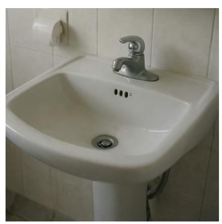

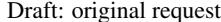

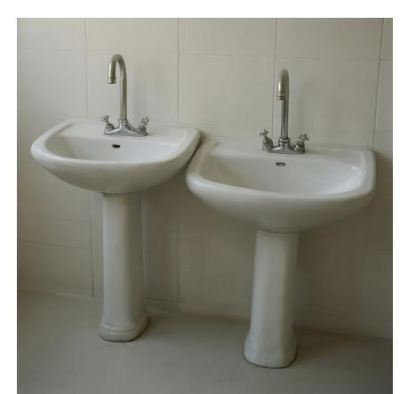

초안: 원본 요청 재생성: 수정된 프롬프트

#### 원본 요청.

두 개의 싱크대 사진

# 의미적 비평가: 기록된 노트.

한 개의 싱크대만 존재한다; 두 개의 싱크대가 필요하다. 수정: 두 개의 싱크대 각각에 흰색 싱크대, 은색 수도꼭지, 그리고 베이스가 있는 피드스텝이 있으며, 타일 벽에 나란히 배치되고 겹치거나 융합되지 않는다.

품질 및 텍스트 렌즈는 실행 가능한 노트를 제공하지 않았다.

## 합성: 기록된 수정 프롬프트.

두 개의 싱크대가 나란히 배치된 사진으로, 각각 흰색 싱크대, 은색 수도꼭지, 그리고 베이스가 있는 피드스텝이 있으며, 타일 벽에 겹치거나 융합되지 않는다.

#### F.7 예시 2: 필수 텍스트 수정

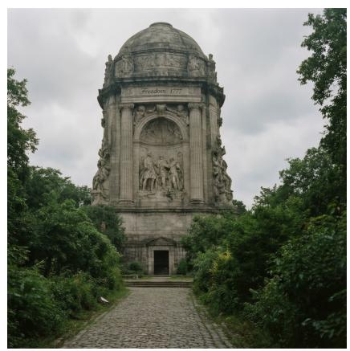

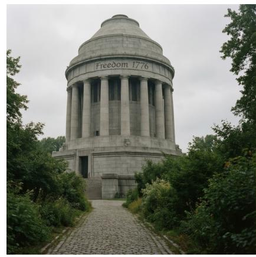

초안: 원본 요청 재생성: 수정된 프롬프트

#### 원본 요청.

풍부한 역사적 기념물은 "Freedom 1776"이라는 문구가 정교하게 조각되어 있으며, 흐린 하늘을 배경으로 우뚝 서 있고, 무성한 녹색 잎사귀와 그 기초까지 이어지는 자갈길에 둘러싸여 있다.

## 텍스트 비평가: 기록된 노트.

"Freedom 1777"이 렌더링되었으며, 목표는 "Freedom 1776"이다. 연도 오류: "1777"은 "1776"이어야 한다. 수정: 기념물은 중앙 아치 위에 "Freedom 1776"을 눈에 띄게, 읽기 쉽게 표시하며 다른 곳에는 표시되지 않는다.

품질 렌즈는 실행 가능한 노트를 제공하지 않았다.

## 합성: 기록된 수정 프롬프트.

풍부한 역사적 기념물은 상단에 "Freedom 1776"이라는 문구가 눈에 띄고 읽기 쉽게 조각되어 있으며, 다른 곳에는 표시되지 않는다. 흐린 하늘을 배경으로 우뚝 서 있고, 무성한 녹색 잎사귀와 그 기초까지 이어지는 자갈길에 둘러싸여 있다.

