# Long-WAM: Scaling the Context of World-Action Models

- 원제: Long-WAM: Scaling the Context of World-Action Models
- 원문: [https://arxiv.org/abs/2610.10528](https://arxiv.org/abs/2610.10528)
- PDF: [https://arxiv.org/pdf/2610.10528](https://arxiv.org/pdf/2610.10528)
- arXiv ID: `2610.10528`

---

## Long-WAM: 세계-행동 모델의 컨텍스트 확장 (Long-WAM: Scaling the Context of World-Action Models)

Wei Huang1 3 *, Bohan Zhang2 *, Chenzhi Liu3 , Isabella Liu1 4, Shuai Yang1 , Weian Mao1 Luozhou Wang1 , Yicheng Xiao3 , Weifeng Lin1 , Qixin Hu, Bryan Chu1 , Sifei Liu1 Linxi "Jim" Fan1 , Xiaojuan Qi3 , Song Han1 2, Yukang Chen1 1NVIDIA 2MIT 3HKU 4UCSD * 동일 기여.

[코드](https://github.com/NVlabs/LongLive/tree/main/Long-WAM) [프로젝트 페이지](https://nvlabs.github.io/LongLive/Long-WAM/)

Abstract: 실시간 로봇 제어는 동작과 작업 진행 상황을 추론하기 위해 충분한 시각적 기록이 필요하지만, 그 기록을 처리하면 행동이 지연될 수 있다. 우리는 실시간 제어 제약 하에서 인과적 세계-행동 모델의 컨텍스트를 확장하기 위한 모델–시스템 프레임워크인 Long-WAM을 제시한다. 우리의 핵심 발견은 기록에 접근하는 것과 실제로 사용하는 것이 동일하지 않다는 점이다: 비디오 기반이 자기회귀(AR) 방식으로 사전 학습된 경우, 더 긴 기록이 훨씬 더 큰 효과를 보인다. 우리는 먼저 로봇 및 자가 시점 비디오에서 행동 라벨 없이 인과적 예측을 학습하고, 이후 세계-행동 적응 과정에서 이 기록-미래 구조를 보존한다. RoboCasa GR-1에서 컨텍스트를 0.0초에서 19.2초로 늘리면 성공률이 63.3%에서 78.7%로 상승하지만, 양방향 사전 학습 초기화는 순이득이 없다; 로봇 도메인 AR 사전 학습은 GR-1과 LIBERO-Long에서 최고 성공률을 더욱 높인다. Long-WAM은 LIBERO-Long, RoboTwin 2.0, DOMINO에서 비교된 방법 중 가장 우수한 결과를 달성한다. 스트리밍 관측 인코딩, 비동기 실행, 하드웨어별 가속화는 RTX 5090, DGX Spark, Jetson AGX Thor에서 미래 예측을 손상시키지 않고 배포를 가능하게 하며, RTX 5090에서 각 행동 청크(미래 비디오 잠재 예측 포함)는 107.4 ms를 소요한다. Unitree G1 및 YAM에서의 실시간 배포는 동적 및 장기 목표 조작을 지원하며, 동적 컵 스태킹에서 95%의 성공률을 달성한다. 이때 0*.*5와 Fast-WAM은 20번 시도 중 아무것도 성공하지 못했다. 메모리 기반 실행기로서 Long-WAM은 복합 작업에서 상위 수준 계획을 보완한다.

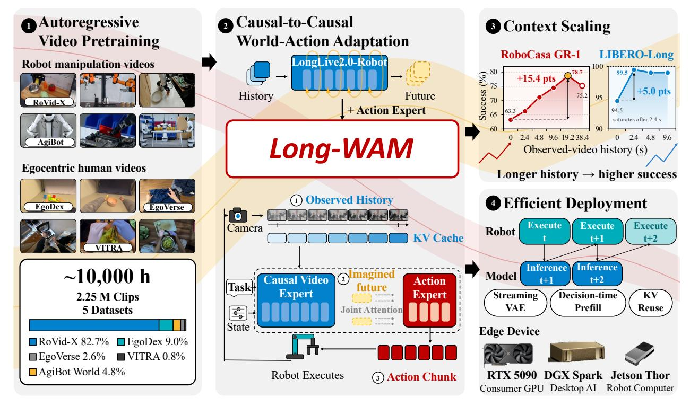

Figure 1 | Long-WAM 개요. (1) AR 비디오 사전 학습. LongLive2.0-Robot는 약 10,000 윈도우-등가 시간의 로봇 및 자가 시점 비디오에서 예측 동역학을 학습한다. (2) 인과-인과 적응. 우리는 관측된 기록에 기반한 행동-청크 디노이징을 조건화하면서 인과적 비디오 종속성을 보존한다. (3) 컨텍스트 확장. 현재 관측만으로 제어할 때보다 RoboCasa GR-1에서 성공률이 63.3%에서 78.7%로, LIBERO-Long에서는 94.5%에서 99.5%로 증가하며, 각각 19.2초와 2.4초의 기록에서 최고치를 기록한다. (4) 효율적 배포. 비동기 실행, 스트리밍 VAE 인코딩, 결정‑시점 전채우기, 호출 내 KV 재사용 등은 RTX 5090, DGX Spark, Jetson AGX Thor에서 실시간 제어를 가능하게 한다…

## 1. 서론 (Introduction)

빠른 로봇 제어는 장면이 어떻게 변하고 있는지를 이해해야 한다. 단일 이미지만으로는 물체의 위치를 알 수 있지만, 그 움직임과 상호작용 진행 상황은 모호하게 남는다. 세계-행동 모델(WAMs)은 비디오 예측을 폐쇄 루프 제어에 도입하여 시각적 기록을 행동에 자연스러운 자원으로 만든다[3, 26, 52]. 그러나 더 많은 기록을 처리하면 개선하려는 반응이 지연될 수 있다. 따라서 우리는 *WAM 제어가 시각적 컨텍스트와 함께 어떻게 확장되는지, 그리고 이러한 이득을 실시간 제약 하에서 어떻게 유지할 수 있는가*를 묻는다.

최근 WAM은 인과 캐시와 지속적 또는 선택적 메모리를 통해 과거를 보존한다 [42,] [44,] [47,] [50]. 그러나 과거에 접근하는 것과 그 과거를 이용해 예측을 학습하는 것은 구분된다. DreamZero [52]와 LingBot-VA [26]는 양방향 사전학습된 비디오 생성기를 인과 비디오–행동 예측에 적응시키는 반면, LingBot-VA 2.0 [55]는 인과 비디오와 학습된 잠재 행동을 공동으로 사전학습한다. 우리는 보완적인 경로를 조사한다: 먼저 자기회귀 비디오 예측을 학습한 뒤, 그 과거-미래 구조를 보존하면서 행동에 적응한다. 부록 [2]에서는 관련 연구를 논의한다.

우리는 실시간 로봇 제어에서 컨텍스트 스케일링을 위한 모델–시스템 프레임워크인 Long-WAM을 소개한다 (Figure [1)](#page-0-0)). 우리의 핵심 발견은 더 긴 컨텍스트의 가치가 비디오 기반이 어떻게 사전학습되는지에 달려 있다는 점이다 (Figure [6)](#page-7-0)). GR-1에서 AR 사전학습된 기반은 컨텍스트를 0.0초에서 19.2초로 확장함으로써 이득을 보이지만, 양방향 초기화는 그렇지 않다; 로봇 도메인 AR 모델의 우위는 과거 없이 3.3점에서 19.2초에서 17.1점으로 증가한다. AR 사전학습은 이미 WAM 적응이 보존하는 인과적 시간 분해를 학습하므로, 모델은 과거를 단순히 접근하는 것이 아니라 활용할 수 있는 기반을 갖는다. 우리의 LongLive2.0-Robot 기반은 약 10,000 창-등가 시간의 로봇 및 자가중심 비디오에서 학습한다; 우리는 행동 적응 중에 그 인과 구조를 보존하며, 로봇 도메인 사전학습은 LIBERO-Long과 GR-1 모두에서 최고 성공률을 더욱 높인다.

더 긴 컨텍스트는 컨트롤러가 여전히 시기에 맞춰 반응할 때만 도움이 되므로, 우리는 미래 예측을 유지하면서 비동기 실행과 엣지 가속화를 공동 설계한다. AR 비디오 기반의 예측적 조건화는 블렌딩이나 접두어 가이던스 없이 부드러운 행동 전환을 지원한다; 스트리밍 VAE는 로봇이 실행 중일 때 들어오는 관측을 인코딩하여 트리거 이후 계산을 줄인다; 그리고 NVFP4 양자화와 장치별 커널 튜닝은 RTX 5090, DGX Spark, Jetson AGX Thor에서 비디오–행동 파이프라인을 가속한다. 전문가당 4개의 노이즈 제거 단계와 함께 최적화된 파이프라인은 RTX 5090에서 행동 청크당 107.4 ms를 소요하며, 이는 전체 관측 VAE 계산을 포함한 BF16 이그리 실행 대비 3*.*3배 가속이다 (Section [4,] Table [8)](#page-10-0)).

RoboCasa [33] GR-1 Tabletop [37]에서 과거 창을 0.0초에서 19.2초로 늘리면 성공률이 63.3%에서 78.7%(+15.4점)으로 상승한다. LIBERO-Long [30]에서는 2.4초의 과거가 성공률을 94.5%에서 99.5%로 향상시킨다. Long-WAM은 RoboTwin 2.0 [9]에서 평균 성공률 94.4%와 DOMINO [15]에서 34.9% 성공률을 달성하며, 비교된 방법 중 가장 높은 성과를 보인다. Unitree G1에서 Long-WAM은 7.5 cm/s로 움직이는 컨베이어에서 컵을 90%의 시도에서 잡고, 움직이는 컵을 95%에서 쌓으며, 이 설정에서 0*.*5 [38]이나 Fast-WAM [54]은 한 번도 성공하지 못한다. YAM에서는 평균 40초가 넘는 작업을 81.7% 성공률로 완료하며, 평가를 빠른 차단에서 지속 실행으로 확장한다. Long-WAM은 또한 RoboCasa365 [34]에서 계층적 시스템의 실행기로서 역할을 하며, 변경되지 않은 체크포인트와 GPT-6 Astra를 결합하면 전체 성공률이 31.4%에서 54.4%로 상승하고, 플래너만의 경우는 25.2%이다. 플래너 보강은 Long-WAM에 대해 (+23.0점)보다 0*.*5에 대해 (+13.6; Section [6)](#page-8-0)) 더 큰 이득을 제공하며, 이는 강력한 실행이 플래닝을 더 효과적으로 만든다는 것을 시사한다. 이 결과들은 컨텍스트가 예측 사전학습과 시기적절한 실행 모두에 달려 있는 생성 제어의 자원임을 시사한다.

## 2. 관련 연구 (Related Work)

비디오 생성기에서의 월드-액션 모델링. WAM은 시각적 역학을 실행 가능한 액션에 연결한다. Motus [&#91;3&#93;]는 사전 학습된 비디오, 비전–언어, 액션 전문가를 결합한다; DreamZero [&#91;52&#93;]와 LingBot-VA [&#91;26&#93;]는 양방향 비디오 백본을 인과적 제어에 적응시킨다. 이들의 비디오 사전 학습은 시각적 선행 정보를 제공하며, 인과적 예측과 액션 결합은 다운스트림에서 학습된다. LingBot-VA 2.0 [&#91;55&#93;]는 대신 인과적 비디오와 학습된 잠재 액션을 공유 표현에서 공동 사전 학습한다. EVA [&#91;48&#93;]는 역동역학 보상을 통해 비디오 생성을 실행 가능한 액션과 정렬하고, -EVA [&#91;45&#93;]는 잠재 액션의 결과를 평가한다. Long-WAM은 단계적 경로를 개발한다: 액션이 없는 로봇-비디오 AR 사전 학습 후 동일한 인과적 순서 하에 액션 적응을 수행한다. 따라서 액션 모델은 역사-투-미래 예측을 명시적으로 학습한 시각적 역학 선행 정보를 상속받아, 예측 사전 학습과 구현체의 액션 표현 학습을 분리한다.

메모리 및 컨텍스트 스케일링. 캐시 용량, 물리적 히스토리 지속 시간, 시각적 컨텍스트 재구성 비용은 서로 다른 양이다. 인과적 캐시, 압축된 히스토리, 이벤트 검색은 상호 보완적인 메모리 인터페이스를 제공한다.

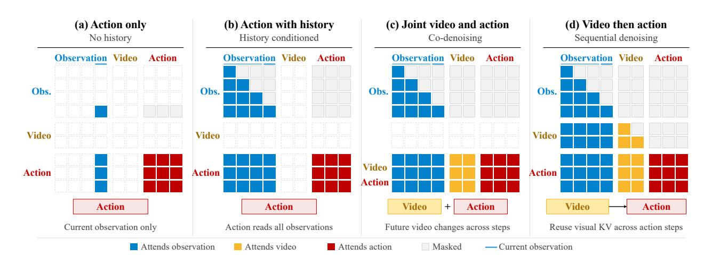

Figure 2 | 주의 패턴 및 비디오–액션 추론 전략. (a) 현재 관측만으로부터의 액션 생성; (b) 미래 예측 없이 히스토리 조건화된 액션 생성; (c) 공동 비디오–액션 공동 노이즈 제거 (CoD); (d) 비디오 예측 후 액션 노이즈 제거 (IDM). IDM은 관측된 히스토리와 예측된 미래 잠재값 모두에 액션을 조건화하며, 액션 노이즈 제거 단계에서 시각적 KV를 재사용한다.

[&#91;26,](#page-12-0) [42,](#page-14-1) [44,](#page-14-2) [47,](#page-14-3) [50,](#page-14-4) [52&#93;](#page-14-0). Echo-Memory [&#91;25&#93;](#page-12-2)는 카메라 조건화 비디오 생성을 위한 메모리를 연구한다; RoboTTT [&#91;20&#93;](#page-12-3)는 로봇 정책에서 컨텍스트 스케일링을 연구한다; WAM-TTT [&#91;16&#93;](#page-12-4)는 인간 비디오에서 메모리를 적응시켜 고정된 WAM을 조정한다. Long-WAM은 로봇이 관측한 상호작용 히스토리를 연구한다: 우리는 훈련된 인과적 WAM 변형들 사이에서 그 시간적 범위를 변동시키고 폐쇄 루프 성공률과 온라인 계산을 검토한다. 우리의 초점은 예측 사전 학습이 더 긴 컨텍스트의 이점을 어떻게 형성하는가이며, 메모리 압축, 검색, 적응에 관한 연구를 보완한다.

효율적이고 배포 가능한 생성 제어. 대형 비디오 백본은 온라인 WAM 제어를 비용이 많이 든다. 기존 시스템은 캐싱, 소수 단계 생성, 파이프라인 실행, 액션 전용 디코딩, 또는 계층적 업데이트 속도를 통해 이 비용을 줄인다 [&#91;7,](#page-11-2) [26,](#page-12-0) [52,](#page-14-0) [54&#93;](#page-14-6). LongLive-2.0는 병렬 AR 훈련, 압축된 KV 캐시, 저정밀 실행, 비동기 VAE 디코딩을 추가로 개발한다 [&#91;11&#93;](#page-11-3). 컴파일, 커널 오케스트레이션, 비디오-DiT 양자화에 관한 보완 연구는 추론 비용을 감소시킨다 [&#91;2,](#page-11-4) [19,](#page-12-5) [57&#93;](#page-15-0). 비동기 배포는 연속 액션 청크 간 일관성을 추가로 요구한다. 기존 방법은 추론 시 가이드, 접두어 조건화 훈련, 또는 노이즈 제거 시 혼합을 통해 이러한 전환을 제한한다 [&#91;5,](#page-11-5) [6,](#page-11-6) [29&#93;](#page-13-5). 경험적 WAM 연구는 시간 정렬의 중요성과 전환 전략의 정밀도–부드러움 트레이드오프를 강조한다 [&#91;32&#93;](#page-13-6). Long-WAM은 직접 비동기 전환에서도 견고한 연속성을 보이며 명시적 미래 시각적 조건화를 유지한다. 우리는 이 imagine-then-act 경로를 보존하고, 스트리밍 관측 인코딩 및 장치별 가속을 통해 순차 비용을 해결하며 연속성과 속도를 동시에 목표로 한다.

## 3. Scaling the Context of WAMs from AR Video Generation

Long-WAM은 컨텍스트 스케일링을 과거로부터 물리적 진화를 예측하는 능력과 연결한다. 먼저 장기 시퀀스 AR 비디오 사전학습을 통해 로봇 동작 및 상호작용 역학을 학습하고, 이후 이 예측 기반을 행동 생성에 전이하면서 인과적 시간 구조를 보존한다. 결과적으로 정책은 관측된 과거와 예상되는 미래 모두에 따라 행동을 조건화하여 예측을 제어를 위한 중간 표현으로 만든다. 이후 추가 과거가 가져오는 이점이 비디오 초기화에 따라 어떻게 달라지는지 연구하며, 더 긴 컨텍스트에 접근하는 것과 이를 활용하는 학습된 능력을 구분한다.

### 3.1. LongLive2.0-Robot: Robot-Domain AR Video Pretraining

데이터 및 초기화. LongLive2.0-Robot은 LongLive-2.0의 16초 AR 체크포인트 [11]에서 훈련을 이어가며, 약 10,000 윈도우-등가 시간의 RoVid-X [14], AgiBot World [1], EgoDex [18], EgoVerse [39], VITRA [27] 데이터를 사용한다. 감독이 비디오 전용이므로 모델은 공유된 행동 공간이 필요 없이 여러 구현체에서 학습할 수 있다. 부록 [B.1]에 데이터 계정이 상세히 기술되어 있다.

**Teacher‑forcing 훈련.** 우리는 최대 30초 길이의 로봇‑비디오 시퀀스를 사전학습하여 모델이 장기 동작 및 상호작용 이력을 학습하도록 한다. 이 시간 범위를 지원하기 위해 LongLive-2.0의 시퀀스‑병렬 AR 훈련 [11]을 채택하여 긴 시퀀스를 GPU에 걸쳐 분할한다. AR 비디오 생성의 teacher‑forcing 공식 [59]에 따라 블록‑인과적 주의는 각 노이즈가 있는 청크를 그라운드‑트루프 접두사와 병렬로 감독하며, 조건화 이미지(conditioning image)는 깨끗하게 유지되고 손실에서 제외된다. 우리는 LongLive-2.0의 SVI에서 파생된 오류 재활용(error recycling) [28]을 그대로 사용한다. 깨끗한 목표 청크 $z_i$ 에 대해, $\bar{z}_i$, $\bar{\epsilon}_i$, 그리고 $h_{< i}$ 를 각각 목표 잠재 변수, 샘플링된 가우시안 노이즈, 그리고 선택적 버퍼‑오류 변동 후의 이전 그라운드‑트루프 컨텍스트로 둔다. 노이즈가 있는 입력과 teacher‑forcing 목표는

$$x_i^{\sigma_i} = (1 - \sigma_i)\bar{z}_i + \sigma_i\bar{\epsilon}_i, \qquad \sigma_i \in [0, 1], \tag{1}$$

$$\mathcal{L}_{\text{TF-AR}} = \mathbb{E}\left[w(\sigma_i) \left\| v_{\theta}(x_i^{\sigma_i}, \sigma_i \mid h_{< i}, c) - (\bar{\epsilon}_i - z_i) \right\|_2^2\right]. \tag{2}$$

여기서 $\sigma_i$는 샘플링된 노이즈 수준, $v_\theta$는 비디오 속도 예측기, c는 언어 조건, w는 스케줄러 가중치이다. 복구 대상은 원래의 $z_i$를 유지하며, 롤아웃과 같은 오류를 교정하도록 가르친다. 하나의 이미지와 언어 프롬프트가 주어지면, 모델은 일관된 로봇 동작과 물체 상호작용을 예측한다 (부록 C), 이는 행동 적응을 위한 예측 사전 정보를 제공한다.

### 3.2. Causal‑to‑Causal World‑Action Adaptation

**인과적 결합.** DreamZero [52]와 LingBot-VA [26]를 따라 우리는 비디오와 행동 전문가를 비대칭 인터페이스를 통해 결합한다. 비디오 쿼리는 자신의 이전 시각 블록만 읽으며 행동 토큰은 읽지 않는다; 행동 쿼리는 관측된 과거, 부분적으로 노이즈가 제거된 미래, 그리고 전체 노이즈가 있는 행동 청크를 읽는다. 이는 사전학습된 인과적 시각 의존성을 보존하면서 과거와 예상되는 상호작용 모두에 행동을 기반화한다. 특히, 과거‑투‑미래 순서는 행동 적응 단계에서만 도입되는 것이 아니라 비디오 사전학습 중에 학습된다. 제어 단계 t에서 결정이 내려질 때, $Z_t^-$ 를 관측된 비디오 잠재 변수, $q_t$ 를 로봇 상태, c 를 언어 지시, 그리고 $\mathbf{A}_t = a_{t:t+H-1}$ 를 H‑단계 행동 청크라 두면, 비디오 전문가 $\theta$ 는 노이즈 수준 $\sigma_\star \in (0,1)$ 에 대해 $K_v$ 개의 미래 잠재 단계 $\widetilde{Z}_t^+$ 를 예측한 뒤, 그들의 공동 시각 캐시 $\mathcal{K}_t$ 를 행동 전문가 $\psi$ 에게 제공한다:

$$\widetilde{Z}_{t}^{+} = \text{Rollout}_{\theta, \sigma_{\star}}(\epsilon^{v} \mid Z_{t}^{-}, c, q_{t}), \quad \mathcal{K}_{t} = \text{Prefill}_{\theta}(Z_{t}^{-}, \widetilde{Z}_{t}^{+}; c, q_{t}, \sigma_{\star}), 
\widetilde{\mathbf{A}}_{t} = \text{Denoise}_{\psi}(\epsilon^{a} \mid \mathcal{K}_{t}, c, q_{t}).$$

(3)

여기서 $\epsilon^v$와 $\epsilon^a$는 독립적인 가우시안 잡음이며, $\mathcal{K}_t$는 레이어별 비디오 키와 값을 포함하고, 관측된 잠재 변수는 전체 과정에서 깨끗하게 유지된다. 우리는 이 predict‑then‑act 모드를 역동학 모델링(IDM, Figure 2)이라고 부른다.

학습과 추론. 학습은 두 단계로 진행된다: 깨끗한 과거에 조건화된 비디오 흐름 매칭, 그리고 과거와 앞으로 노이즈가 가해진 정답 미래에 조건화된 액션 흐름 매칭, $\sigma_{\star}=0.9$ 를 사용한다. 두 번째 단계에서는 시각 캐시를 분리(detach)하므로 액션 손실은 오직 액션 전문가와 고유 감지 어댑터만 업데이트한다. 두 분기 모두 노이즈-마이너스-데이터 속도를 예측하며, 가중 목표는 $\mathcal{L}=\lambda_v\mathcal{L}_{\text{video}}+\lambda_a\mathcal{L}_{\text{action}}$ 이며, 여기서 $\lambda_v$와 $\lambda_a$는 손실을 균형시킨다. 추론 시, 네 개의 비디오 단계(V4)는 깨끗한 비디오 대신 $\sigma_{\star}=0.9$ 에서 멈추며, 미래 잠재 변수는 픽셀로 디코딩되지 않는다; 그 캐시는 액션 디노이즈 전 과정에서 재사용된다. Appendix B.2는 학습 대리자, 마스킹, 캐시 범위를 명시한다.

### 3.3. World-Action 모델의 컨텍스트 스케일링 (Context Scaling of World-Action Models)

우리는 인과 프리픽스에서 실제 관측의 지속 시간을 확장하고, 각 벤치마크 내에서 시각 예측과 액션 수평을 고정한다. 이는 추가 과거 증거가 동일한 근접 제어 결정을 개선하는지, 아니면 모델이 얼마나 멀리 예측하거나 행동하는지를 바꾸는지를 테스트한다. 각 윈도우는 별도로 훈련된 모델을 사용하며, 훈련 컨텍스트 길이에서 평가된다; 0 이력은 현재 관측을 유지한다. 초기 에피소드 이력이 없으면 초기 프레임을 반복한다.

우리는 Wan2.2(양방향), LongLive-2.0(AR), 그리고 LongLive2.0-Robot(로봇 도메인 AR) 초기화를 인과 WAM 적응 하에 비교한다. 여기서 양방향은 사전 훈련을 설명하며, 적응된 정책의 시간 마스크를 의미하지 않는다. 질문은 인과 예측이 액션 적응 전에 학습될 때, 더 긴 컨텍스트가 더 큰 제어 이점을 가져오는가이다. 우리는 RoboCasa GR-1 Tabletop [33, 37]에서 0–38.4초를 스윕하고, LIBERO-Long [30] (Section 5.3)에서 보완적인 컨텍스트 연구를 수행한다. 더 긴 프리픽스는 또한 프리필, 어텐션, 캐시 비용을 증가시킨다. 따라서 우리는 컨텍스트를 실행 자원으로 간주하며, 그 가치는 예측 이점과 응답 시간 모두에 달려 있다; 다음 인프라스트럭처 섹션은 이 배포 비용을 다룬다.

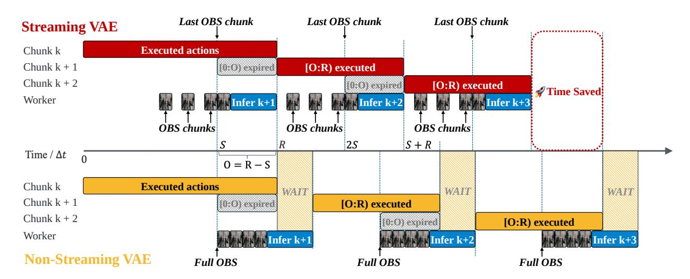

Figure 3 | 스트리밍 VAE를 이용한 비동기 모델–로봇 실행. 두 스케줄은 동일한 명목 트리거 스트라이드 S와 겹침 O=R-S를 사용한다. 스트리밍 VAE(상단)는 도착하는 관측(OBS) 청크를 인코딩하고 핸드오프 마감 시간 $T_{\rm ready} \leq O\Delta t$ 를 충족한다. 풀‑윈도우 인코딩(하단)은 핸드오프와 이후 트리거를 지연시켜 로봇 유휴 시간을 증가시킨다. 시간은 $\Delta t$ 단위로 표시된다.

## 4. Long-WAM 인프라스트럭처: 실시간 엣지 배포 (Long-WAM Infrastructure: Real-Time Edge Deployment)

우리는 실시간 배포가 다음 액션 청크를 준비할 수 있는 시간 안에 과거 관측과 미래 예측을 모두 수용해야 한다. 우리는 비동기 실행과 엣지 가속화를 공동 설계함으로써 이 제약을 해결한다 (그림 3 및 4). 비동기 스케줄링은 모델 추론과 로봇 실행을 겹치게 하고, 스트리밍 인과 VAE 인코딩은 추론 트리거 앞에서 접두사 관측 인코딩을 이동시킨다. NVFP4 양자화와 호출 내 KV 재사용을 포함한 공유 최적화는 장치별 커널 튜닝과 결합하여 RTX 5090, DGX Spark, Jetson AGX Thor에서 비디오—액션 파이프라인을 가속화한다. 이 설계들은 시기적절한 액션 핸드오프를 목표로 하면서 역사 인식 제어를 지원하는 예측 조건화를 유지한다.

### 4.1. 비동기 실행 (Asynchronous Execution)

**순수 비동기 실행만으로 충분하다.** 우리는 블렌딩이나 접두사 가이던스 없이 추론과 로봇 실행을 겹친다. 결정 k(제어 단계 $t_k$)에서 예측된 청크는 $\widehat{\mathbf{A}}_{t_k} \in \mathbb{R}^{H \times d}$이며, 여기서 d는 행동 차원(Section 3.2)이다. 실행 가능한 것은 첫 R 단계뿐이며, 추론은 명목상 stride $S(R/2 \le S < R \le H)$를 갖고, O = R - S 단계의 겹침을 남긴다. 핸드오프 시, 컨트롤러는 경과한 접두사를 버리고 새 청크의 정렬된 접미사를 실행하며, 늦게 도착하면 대기한다 (그림 3).

순수 비동기 실행은 행동 연속성을 방해할 수 있어 [32] 추론 시 가이던스[5]와 훈련 시 행동 조건화[6]를 동기화한다. Long-WAM은 우리 실험에서 둘 다 필요하지 않다. 시간적으로 연속적인 LongLive2.0-Robot 예측에 따라 연속 청크는 겹침에서 일치하는 경향이 있다: RoboTwin 2.0[9]에서는 Long-WAM이 비동기에서도 거의 동기 성공을 유지하지만, Fast-WAM[54]과 LingBot-VA[26]는 각각 15.4와 45.5 퍼센트 포인트를 잃는다 (Table 7).

**스트리밍 VAE.** 겹침을 12 단계에서 8 단계로 줄이면 겹침 RMSE가 약 4배 감소하고 급격함이 거의 3배 감소한다 (Appendix E). 고정 R에서 짧은 겹침은 더 늦은 추론 트리거와 더 긴밀한 핸드오프 마감 시간을 요구한다:

$$T_{\text{ready}} \le O\Delta t = (R - S)\Delta t,$$

(4)

여기서 $\Delta t$는 제어 간격이며, $T_{\rm ready}$는 트리거 관측이 사용 가능해지는 시점부터 전송, 대기, 계산을 포함한다.

스트리밍 인과 VAE 인코딩은 들어오는 프레임 그룹을 처리한다. 트리거 이후, 나머지 프레임을 인코딩하고, 특징을 연결한 뒤, 잠재 변수를 투영하고 정규화한다. 같은 S와 O에서, 이는 전체 창 인코딩의 반복 대기와 누적 유휴 시간을 피하고(그림 3), 더 늦은 트리거와 짧은 겹침을 허용하면서 최신 관측을 유지한다.

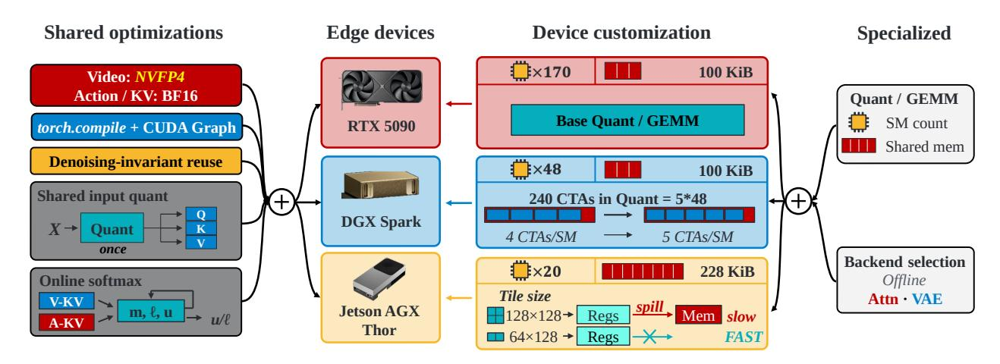

Figure 4 | **효율적인 엣지 배포를 위한 최적화.** 공유 최적화와 장치별 튜닝은 엣지 추론을 가속화한다. 'Base'는 Quant/GEMM 구현을 나타내며, 모양별 디스패치와 자동 튜닝은 활성화된 상태를 유지한다.

### 4.2. 효율적인 엣지 배포 (Efficient Edge Deployment)

로컬 추론은 네트워크 지연을 피하지만, 비디오-우선 예측은 제한된 온보드 컴퓨팅에서 비용이 많이 든다. 우리는 NVIDIA GeForce RTX 5090, DGX Spark, Jetson AGX Thor에서 Long-WAM을 가속화하여 짧은 겹침 실행(Equation 4)을 지원하면서 시각적 상상을 보존한다. 공유 최적화는 공통 계산 및 데이터 이동 비용을 줄이고, 장치별 튜닝은 플랫폼 제약을 해결하여 이식성과 하드웨어 효율성을 균형 있게 조정한다.

**공유 최적화.** 장치 전반(그림 4)에서 비디오 전문가 선형 레이어는 생성 및 키‑값(KV) 프리필([11, 35]) 동안 W4A4 NVFP4(4비트 가중치 및 활성화)를 사용하지만, 액션 계산 및 KV 저장은 BF16을 유지한다. 액션 양자화는 지연 시간 절감이 제한적이며 제어 정밀도를 저해할 수 있으므로 BF16을 유지한다. NVFP4는 계산 및 가중치/활성화 저장을 줄이지만, 작은 양자화 및 스케일링 커널을 추가하여 실행 오버헤드가 계산 절감분을 상쇄할 수 있다. NVFP4가 CUDA Graph 재생([17]) 및 PyTorch 컴파일([2])과 결합될 때 실행 오버헤드가 감소하고 적격 연산이 융합된다. 또한 각 추론 호출 내에서 디노이징 불변 텍스트/상태 KV, 관측 비디오 KV, FP32 RoPE 테이블([43])을 재사용하여 중복 계산을 줄이고, 상태를 업데이트하는 스트리밍‑VAE 연산은 CUDA Graph 캡처 외부에 남는다.

공유 입력 양자화는 공유 입력을 Q/K/V 투영에 한 번만 양자화하고, 세 개의 별도 GEMM에서 양자화된 활성화와 스케일을 재사용한다. 온라인 소프트맥스([31])와 공유 정규화를 사용해 별도 비디오 및 액션 KV 버퍼에 대한 주의를 결합하고 버퍼 연결을 피한다. 각 쿼리에 대해 $(m_j, \ell_j, u_j)$를 최대 주의 로짓, $m_j$로 이동된 지수합, 그리고 세그먼트 $j \in \{v, a\}$에 대한 값 가중합으로 정의하면, 병합된 출력은

$$m = \max(m_v, m_a),$$

Attn =  $\frac{e^{m_v - m}u_v + e^{m_a - m}u_a}{e^{m_v - m}\ell_v + e^{m_a - m}\ell_a}.$

이것은 연결된 KV 버퍼 없이 공동 주의를 보존한다. 또한 메모리 접근을 결합하고, 스케일/바이어스 및 캐스팅 연산을 융합하며, VAE 레이아웃과 패딩을 단순화하여 모양 및 백엔드 제약을 준수한다.

**장치별 튜닝.** Quant/GEMM 튜닝은 타일 크기, 블록당 워프 수, 파이프라인 단계 및 버퍼를 조정한다. 백엔드 선택에는 VAE 레이아웃 및 컨볼루션 튜닝([12])과 RTX 5090/Spark 주의 백엔드가 포함된다. RTX 5090은 모양별 디스패치 및 실행 튜닝과 함께 기본 Quant/GEMM 구현을 유지한다. Spark는 컴팩트 버퍼와 모양별 워프 수 선택으로 양자화 시간을 단축한다. 스트리밍 멀티프로세서(SM)당 더 많은 거주 스레드 블록은 그림에 표시된 그리드를 한 파도에서 실행할 수 있게 한다. Thor의 더 큰 블록당 공유 메모리 예산은 Spark에서 사용할 수 없는 GEMM 구성을 지원하며, 작은 에필로그 타일은 레지스터 스필을 피한다. 이러한 조정은 하드웨어 제약을 반영하며 장치 전용 알고리즘이 아니다. 공유 최적화와 장치별 튜닝을 결합하면 BF16 즉시 실행 대비 3.2–4.1배의 총 속도 향상을 달성한다. 섹션 6.2는 모델 지연 시간과 누적 이득(표 6 및 8)을 비교한다.

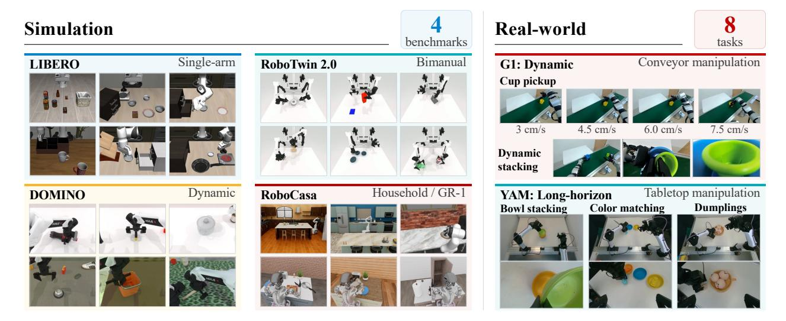

Figure 5 | 시뮬레이션 환경 및 실제 작업. 우리의 평가 범위는 LIBERO, RoboTwin 2.0, DOMINO, RoboCasa의 네 가지 시뮬레이션 벤치마크와 G1 및 YAM에서의 여덟 가지 실제 작업 구성을 포함한다. 여기에는 네 가지 컨베이어 속도에서의 컵 픽업, 동적 컵 스태킹, 그릇 스태킹, 색상별 벽돌 분류, 그리고 팬에 담긴 만두 배치가 포함된다.

Table 1 | LIBERO에서의 성공률 (SR, %). w/o V: 미래 비디오 디노이징 없음; CoD: 비디오–액션 공동 디노이징; IDM: 역동역학 모델링.

Table 2 | RoboTwin 2.0에서의 성공률.

| Method | Spatial | Object | Goal | Long | Avg. | Method | Clean | Rand. | Avg. |
|------------------|---------|--------|------|------|------|------------------|-------|-------|------|
| OpenVLA | 84.7 | 88.4 | 79.2 | 53.7 | 76.5 | 𝜋0 | 65.9 | 58.4 | 62.2 |
| OpenVLA-OFT | 97.6 | 98.4 | 97.9 | 94.5 | 97.1 | 𝜋0.5 | 82.7 | 76.8 | 79.8 |
| GR00T-N1 | 94.4 | 97.6 | 93.0 | 90.6 | 93.9 | Motus | 88.7 | 87.0 | 87.8 |
| 𝜋0 | 96.8 | 98.8 | 95.8 | 85.2 | 94.1 | Motus (Wan2.2) | 77.6 | 77.0 | 77.3 |
| 𝜋0.5 | 98.8 | 98.2 | 98.0 | 92.4 | 96.9 | LingBot-VA | 92.9 | 91.5 | 92.2 |
| UniVLA | 95.4 | 98.8 | 93.6 | 94.0 | 95.5 | LingBot-VA 2.0 | 93.8 | 93.4 | 93.6 |
| X-VLA | 98.2 | 98.6 | 97.8 | 97.6 | 98.1 | Fast-WAM | 91.9 | 91.8 | 91.8 |
| LingBot-VA | 98.5 | 99.6 | 97.2 | 98.5 | 98.5 | AHA-WAM | 93.4 | 92.2 | 92.8 |
| Motus | 96.8 | 99.8 | 96.6 | 97.6 | 97.7 | ABot-M0.5 | 94.0 | 94.2 | 94.1 |
| Fast-WAM | 98.2 | 100.0 | 97.0 | 95.2 | 97.6 | Qwen-RobotManip | 93.7 | 94.0 | 93.9 |
| Long-WAM (w/o V) | 98.0 | 99.5 | 97.0 | 94.5 | 97.3 | Long-WAM (w/o V) | 92.4 | 91.6 | 92.0 |
| Long-WAM (CoD) | 98.6 | 99.8 | 96.8 | 95.8 | 97.8 | Long-WAM (CoD) | 94.0 | 93.1 | 93.6 |
| Long-WAM (IDM) | 99.5 | 100.0 | 98.0 | 99.5 | 99.5 | Long-WAM (IDM) | 94.7 | 94.2 | 94.4 |

## 5. 실험 (Experiments)

### 5.1. 구현 세부사항 (Implementation Details)

LongLive2.0-Robot의 사전 훈련은 64개의 NVIDIA H100 GPU에서 약 30,720 GPU-시간을 사용한다; 다운스트림 WAM은 16 GB200 GPU에서 훈련된다. WAM 훈련은 AdamW를 사용하며, 최고 학습률은 10−4, 코사인 감소, 5% 워밍업, BF16 정밀도, 그리고 1.0의 그래디언트 클리핑을 적용한다. 로봇 실험은 Unitree G1 휴머노이드와 YAM 양손 조작기를 사용한다. 부록 [D](#page-17-1)에는 기준 참조가 나열되어 있다.

### 5.2. 시뮬레이션 벤치마크 결과 (Results on Simulation Benchmarks)

우리는 LIBERO [&#91;30&#93;](#page-13-2), RoboTwin 2.0 [&#91;9&#93;](#page-11-1), DOMINO [&#91;15&#93;](#page-12-1), 그리고 RoboCasa GR-1 [&#91;37&#93;](#page-13-1) (Figure [5)](#page-6-0)를 평가한다. 첫 세 벤치마크의 주요 결과는 최대 2.4초의 컨텍스트를 사용하며, DOMINO는 움직이는 물체를 추가한다, 최근

Figure 6 | 세 개의 비디오 초기화와 함께 컨텍스트 스케일링. 컨텍스트 윈도우는 동일한 간격으로 표시된다. Table 4 | RoboCasa GR-1에서의 성공률 (SR, %)

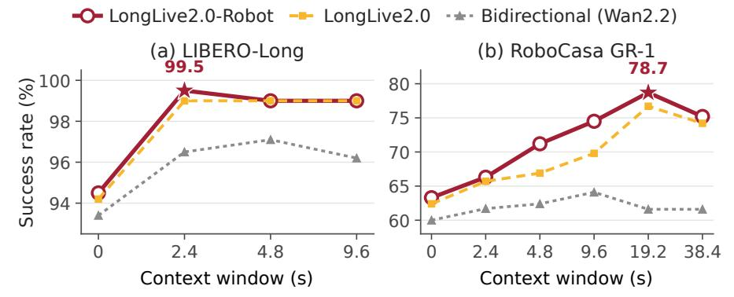

| 방법 | 성공률(SR) ↑ |
|---------------------------------------|--------------|
| 𝜋0 | 62.5 |
| 확산 정책(Diffusion Policy) | 32.7 |
| Fast-WAM | 47.5 |
| GR00T-N1.5 | 64.1 |
| DreamZero | 62.4 |
| Cosmos Policy | 67.1 |
| Long-WAM (2.4 s) Long-WAM (19.2 s) | 63.3 78.7 |

motion은 예측과 차단을 알린다. RoboCasa GR-1은 여러 개체 전송을 연결하는 작업을 수행하며, 더 긴 문맥 연구를 호스팅한다. 우리는 GPT-6 Astra를 고수준 계획자로 사용하여 RoboCasa365에서 구성적 작업을 추가로 평가한다 (부록 [6,](#page-8-0) 표 [5)](#page-8-1).

LIBERO. Long-WAM (IDM)은 평균 성공률이 가장 높으며(99.5%) LIBERO-Long에서도 99.5%를 달성한다 (표 [1)](#page-6-1). 가장 큰 차이는 LIBERO-Long에서 나타나며, 이는 가장 긴 작업을 포함한 스위트이다. 이때 Long-WAM은 LingBot-VA [&#91;26&#93;](#page-12-0)와 Fast-WAM [&#91;54&#93;](#page-14-6)을 각각 1.0점과 4.3점 차이로 앞선다.

RoboTwin 2.0. Long-WAM (IDM)은 평균(94.4%)과 Clean(94.7%)에서 선두를 달리고, 가장 높은 Randomized 점수(94.2%; 표 [2)](#page-6-1)와 동점이다. 평균은 ABot-M0.5와 LingBot-VA 2.0 [&#91;55&#93;](#page-14-5)를 각각 0.3점과 0.8점 차이로 앞선다.

DOMINO. 동적 데이터 파인튜닝 후, Long-WAM은 34.9% SR과 45.1 MS(표 [3)](#page-7-2)로 선두를 달린다. 이는 각 지표에서 가장 강력한 기준선인 Fast-WAM을 15.0 SR 포인트, PUMA [&#91;15&#93;](#page-12-1)을 10.1 MS 포인트로 앞선다. 최근 관측은 단일 이미지가 제공할 수 없는 동작 단서를 제공하여 예측 기반 차단을 지원한다; Section [6.1](#page-9-0)에서는 물리적 컨베이어에서 이 능력을 테스트한다.

Table 3 | DOMINO 결과는 동적 데이터 파인튜닝 후이다. 성공률; 조작 점수(MS).

| 방법 | 성공률(%) ↑ | 평균 점수 ↑ |  |
|--------------|----------|------|--|
| OpenVLA | 1.5 | 6.1 |  |
| 𝜋0 | 8.2 | 24.0 |  |
| 𝜋0.5 | 9.6 | 26.2 |  |
| InternVLA-M1 | 5.4 | 27.6 |  |
| OpenVLA-OFT | 9.1 | 24.1 |  |
| StarVLA-OFT | 10.9 | 30.5 |  |
| PUMA | 17.2 | 35.0 |  |
| Fast-WAM | 19.9 | 33.3 |  |
| Long-WAM | 34.9 | 45.1 |  |

### 5.3. Ablation Studies (제거 실험)

컨텍스트 스케일링. 2.4초의 히스토리를 추가하면 LIBERO-Long의 성공률이 LongLive2.0- Robot에서 94.5%에서 99.5%로, LongLive-2.0에서는 94.2%에서 99.0%로 상승한다](#page-7-0)). RoboCasa GR-1에서는 다단계 작업([&#91;33,](#page-13-0) [37&#93;](#page-13-1))을 위해 선택되었으며, 2.4초에서 19.2초로 스케일링하면 성공률이 각각 66.3%에서 78.7%로, 65.7%에서 76.7%로 향상된다. 다른 최대 컨텍스트 길이는 작업에 따라 메모리 요구가 달라짐을 시사한다: 짧은 히스토리는 LIBERO-Long에서 대부분의 이득을 포착하지만, GR-1은 상당히 긴 상호작용 컨텍스트에서 이득을 본다. Robot-비디오 사전학습은 두 벤치마크 모두에서 더 높은 최고치를 달성한다; 78.7%는 가장 강력한 GR-1 기준선보다 11.6포인트 높은 수준이다 (Table [4)](#page-7-0)). 38.4초에서 성공률은 75.2%와 74.2%로 감소한다; 이 윈도우는 평균 훈련 경로(12.1초)의 세 배이며, 샘플링된 히스토리 프레임의 80.4%가 패딩이다. 우리는 이 감소가 본질적인 메모리 한계보다 제한된 히스토리 범위에 기인한다고 가정한다. 컨텍스트는 비용도 따른다: 8배 더 많은 히스토리는 RTX 5090 지연 시간을 3.2배(107.4ms에서 341.0ms) 증가시킨다 (Appendix [G)](#page-20-0)).

자기회귀(Autoregressive) vs. 양방향(Bidirectional) 사전학습

AR(자기회귀) 이점은 문맥이 늘어날수록 증가한다: GR-1에서 robotdomain AR 변형은 과거 없이 3.3점, 19.2초에서 17.1점을 양방향 초기화보다 앞선다](#page-7-0).

양방향 변형은 2.4초에서 61.7%에서 9.6초에서 64.1%로 상승한 뒤 19.2초에서 61.6%로 다시 감소한다; 반면 두 AR 변형은 2.4초에서 19.2초 사이에 각각 12.4점과 11.0점을 획득한다.

모든 변형은 causal WAM을 사용한다.

Table 5 | RoboCasa365에서의 성공률  
전체 평균 50개 과제: 18개 Atomic-Seen, 16개 Composite-Seen, 16개 Composite-Unseen.  
기준선 출처: 부록 [D.](#page-17-1)

| 방법 | Atomic Seen | Composite Seen | Composite Unseen | Overall |
|------------------------|----------------|-------------------|---------------------|---------|
| Diffusion Policy | 15.7 | 0.2 | 1.3 | 6.1 |
| Azero-Robotics-1 | 30.3 | 3.8 | 1.6 | 12.6 |
| 𝜋0 | 34.6 | 6.1 | 1.1 | 14.8 |
| GigaWorld-Policy 0.1 | 44.4 | 11.8 | 2.9 | 20.7 |
| GR00T N1.6 | 51.1 | 9.4 | 1.7 | 21.9 |
| GR00T N1.5 | 50.7 | 14.8 | 2.7 | 23.9 |
| WorldDreamer | 66.3 | 26.7 | 9.0 | 35.3 |
| RLDX-1 | 67.6 | 27.9 | 8.5 | 36.0 |
| PRTS | 66.3 | 30.3 | 18.8 | 39.6 |
| Qwen-RobotManip | 68.6 | 20.1 | 14.9 | 35.9 |
| ABot-M0.5 | 75.6 | 37.7 | 3.3 | 40.3 |
| GPT-6 Astra | 31.5 | 22.4 | 20.8 | 25.2 |
| 𝜋0.5 | 39.6 | 7.1 | 1.2 | 16.9 |
| 𝜋0.5 + GPT-6 Astra | 46.5 | 24.0 | 19.0 | 30.5 |
| Long-WAM | 67.9 | 15.8 | 6.1 | 31.4 |
| Long-WAM + GPT-6 Astra | 85.6 | 38.8 | 35.0 | 54.4 |

역할 적응은 가능하지만, 역사에만 접근해도 AR 변형의 장기 컨텍스트 이득을 재현하지 못한다. 가능한 설명은 AR pretraining이 action adaptation 중 보존되는 history-to-future dependencies를 학습하여, 추가 관측이 predictive representation을 통해 제어를 안내하도록 한다는 것이다.

비디오–액션 디노이징 전략. 우리는 미래 비디오 예측 없이 액션 디노이징(w/o V), 동시 비디오–액션 디노이징, 그리고 비디오 예측 후 역사 및 예측 조건화된 액션 디노이징(IDM; Tables [1](#page-6-1) 및 [2)](#page-6-1))을 비교한다. IDM의 가장 큰 스위트 수준 이득은 LIBERO-Long에서 발생한다: 99.5%, 반면 94.5% (w/o V)와 97.8% (CoD)보다 높으며, 이는 상호작용이 어떻게 진화할지를 먼저 추정하는 것이 여러 서브스텝에 걸친 이후 액션을 조정하는 데 유용한 조건을 제공함을 시사한다. 결과 정책은 또한 동적 그랩핑(Section [6.1])을 지원한다. 이 이득은 픽셀 수준 합성 없이 부분적으로 디노이즈된 미래 잠재 변수를 사용하며, 예측을 중간 제어 표현으로 강조한다. 우리의 인프라는 순차 추론 비용을 해결하면서 이 예측 경로를 보존한다 (Section [6.2]).

## 6. 원자 실행 및 구성 계획 (Atomic Execution and Compositional Planning)

RoboCasa365 [&#91;34&#93;](#page-13-4)는 원자 가정집 기술을 다중 단계 작업으로 구성된 조합에서 분리하여, Long-WAM을 계층적 로봇 시스템의 실행 기반으로 검토할 수 있게 한다. 우리는 2.4초의 시각적 컨텍스트를 가진 Human300-학습된 체크포인트를 사용한 뒤, 추가 정책 훈련 없이 GPT-6 Astra를 추가한다. 플래너는 작업 목표를 원자 하위 지시로 구체화하고, 실행 접두어 길이를 선택하며, 제한된 엔드에펙터 보정을 발행할 수 있다; Long-WAM은 학습된 행동 청크를 제공한다. 표 [5](#page-8-1)는 GPT-6 Astra 단독, 독립형 및 플래너 보강 정책, 그리고 벤치마크 기준 방법 [&#91;40&#93;](#page-13-11)을 비교한다.

강력한 원자 실행. Long-WAM만으로 67.9% Atomic-Seen 성공을 달성하며, 이는 0*.*5의 39.6%와 GPT-6 Astra만의 31.5%에 비해 높은 물리적 기술 기반을 제공한다. 같은 정책을 15 스텝마다 조회하면 플래너 없이 84.4%를 달성하며, 이는 계층적 시스템의 85.6%에 근접한다.

계획은 보이지 않는 스킬 구성을 열어준다. 정책 체크포인트와 시각적 맥락을 그대로 두고 플래너를 추가하면 Composite-Seen 성공률이 15.8%에서 38.8%로, Composite-Unseen 성공률이 6.1%에서 35.0%로 상승하며, 전체적으로는 31.4%에서 54.4%로 개선된다. 15단계 제어는 composite 분할에서 각각 11.2%와 5.0%에 머무르므로, 짧은 실행 간격만으로는 이러한 이득을 설명할 수 없다.

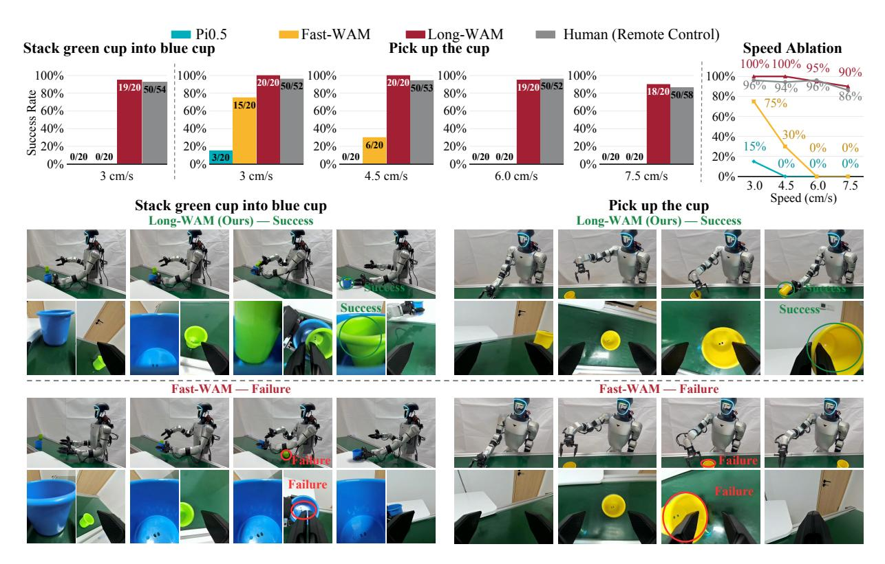

Figure 7 | **Unitree G1에서의 동적 조작.** Long-WAM은 컨베이어 속도에 따라 90–100%의 그립 성공률을 유지하고, 동적 컵 스태킹에서 95% 성공률을 달성한다. 상단: 정책과 인간 원격 조작 비교. 하단: Long-WAM과 Fast-WAM 롤아웃.

강력한 정책은 에이전시 계획을 증폭시킨다. GPT-6 Astra만으로는 전체 성공률이 25.2%에 도달하며, 이를 $\pi_{0.5}$와 결합하면 30.5%에 이른다. 반면 Long-WAM + GPT-6 Astra의 경우 54.4%이다. 보지 않은 조합에서 Long-WAM 계층은 35.0%를 달성하며, GPT-6 Astra만(20.8%)과 $\pi_{0.5}$ 계층(19.0%)을 모두 능가한다. 계획자 보강은 Long-WAM에 대해 더 큰 보고된 전체 이득을 제공한다: 23.0 퍼센트 포인트, 반면 $\pi_{0.5}$는 13.6이다. 이러한 시스템 수준 비교는 실행 품질이 추론에 대한 핵심 보완 요소임을 강조한다: Long-WAM은 강력한 물리적 기술을 제공하고, 고수준 계획은 이를 보지 않은 조합에 적용하도록 확장한다. 이는 부록 A에서 제시된 작업 분담을 뒷받침한다. 부록 A에서는 에이전시 계획과 메모리 기반 실행이 공동으로 보다 능력 있는 장기 수평 행동을 가능하게 한다.

### 6.1. 실세계 배포 (Real-world Deployment)

우리는 Unitree G1에서 동적 조작과 YAM에서 장기 과제를 평가하며, 각 정책과 조건마다 20번의 시도를 수행한다.

**Dynamic Tasks.** 컨베이어 속도는 정책을 구분한다 (Figure 7). 벨트가 3.0에서 7.5 cm/s로 가속될 때, Fast-WAM [54]의 그립 성공률은 75%에서 0%로 떨어지고,  $\pi_{0.5}$ [38]의 성공률은 15%에서 0%로 떨어지지만, Long-WAM은 90–100% (100%, 100%, 95%, 90%)를 유지한다. 3 cm/s로 움직이는 녹색 컵을 파란 컵에 쌓는 작업은 정렬과 배치를 추가로 요구한다; Long-WAM은 20번 중 19번 성공하고, 두 기초 모델은 한 번도 성공하지 못한다.

**Long-Horizon Tasks.** YAM에서 과제가 평균 40초 이상 지속될 때, Long-WAM은 색상별 벽돌 분류(80%), 팬에 만두를 놓기(80%), 그릇 쌓기(85%)에서 각각 80%, 80%, 85%의 성공률을 보이며 (81.7% on

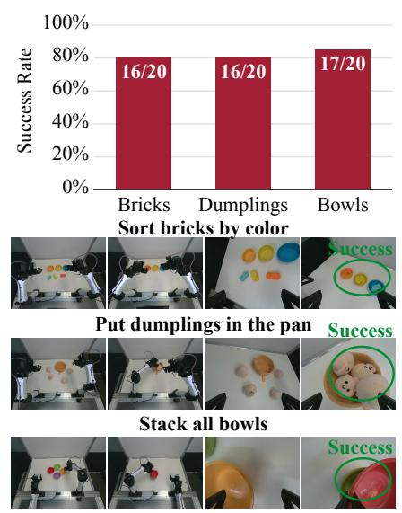

Figure 8 | **YAM에서의 장기 실행:** 20번의 시도 per task.

Table 6 | RTX 5090 종단 지연 및 RoboTwin 2.0 성공률 (SR; 클린/랜덤화 평균). BF16 eager는 최적화되지 않은 V4/A4 기준선이다.

| 방법 | 지연 시간 ↓ | 성공률 (%) ↑ |  |  |  |
|-------------------|----------------|----------|--|--|--|
| LingBot-VA | 3618.4 | 92.2 |  |  |  |
| Motus | 1201.1 | 87.8 |  |  |  |
| Cosmos Policy | 470.6 | – |  |  |  |
| Fast-WAM | 244.1 | 91.8 |  |  |  |
| Long-WAM |  |  |  |  |  |
| BF16 eager | 356.0 | 94.4 |  |  |  |
| Optimized (V4/A4) | 107.4 | 93.5 |  |  |  |
| Optimized (V2/A2) | 81.8 | 92.5 |  |  |  |

Table 7 | RoboTwin 2.0 성공률. Sync: Table [2;](#page-6-1) Async: 우리 평가. Jerk는 이산적 부드러움 지표를 나타낸다; 부록 [E.](#page-18-0) 참조.

| 방법 | 동기화 |  | 비동기화 |  |  |  |
|----------------|------|------|--------|--------|--|--|
|  | SR ↑ | SR ↑ | RMSE ↓ | Jerk ↓ |  |  |
| Fast-WAM | 91.8 | 76.4 | 0.0731 | 0.1316 |  |  |
| LingBot-VA | 92.2 | 46.7 | 0.1432 | 0.6592 |  |  |
| Long-WAM (CoD) | 93.6 | 93.2 | 0.0260 | 0.0479 |  |  |
| Long-WAM (IDM) | 94.4 | 94.2 | 0.0246 | 0.0436 |  |  |

평균; Figure [8)](#page-9-2), 다단계 실행과 빠른 가로채기를 지속한다.

### 6.2. Efficiency

지연시간. RTX 5090에서 Section [4.2](#page-4-2)에 상세히 기술된 최적화는 V4/A4의 엔드‑투‑엔드 추론 지연시간을 107.4 ms로 단축하면서 SR을 크게 보존한다 (BF16: 94.4%; 최적화: 93.5%; Table [6)](#page-10-1). Long‑WAM은 추가적으로 미래 비디오 프레임을 예측함에도 불구하고 Fast‑WAM [&#91;54&#93;](#page-14-6) (244.1 ms) 대비 2*.*3배의 속도 향상을 달성한다. 두 최적화 변형은 추론 지연시간과 보고된 SR 모두에서 기존 기준선보다 우수하다; 특히 V2/A2는 SR을 1.0포인트 정도 낮추면서 추가로 24% 지연시간 감소(81.8 ms)를 달성한다. 다른 기준선은 본래 배포 구성과 노이즈 제거 예산 하에서 평가된다.

Table 8 | 장치별 누적 최적화를 적용한 Long‑WAM의 엔드‑투‑엔드 지연시간(E2E), 전체 VAE 계산 포함. 각 행은 고정 입력에서 이전 모든 최적화를 유지한다; 속도 향상은 BF16 eager 대비이다. 첫 번째 최적화 단계는 NVFP4 양자화, CUDA Graph 재생, 컴파일을 결합한다.

| 최적화 | RTX 5090 |  | DGX Spark |  | Thor |  |
|------------------------------------|------------|-----------|------------|-----------|------------|-----------|
|  | E2E (ms) ↓ | Speedup ↑ | E2E (ms) ↓ | Speedup ↑ | E2E (ms) ↓ | 성능 향상 ↑ |
| 공유 최적화 |  |  |  |  |  |  |
| BF16 eager + NVFP4 양자화 | 356.0 | 1.0× | 1342.8 | 1.0× | 1215.2 | 1.0× |
| + CUDA Graph + 컴파일 | 172.4 | 2.1× | 686.4 | 2.0× | 762.4 | 1.6× |
| + 노이즈 제거 불변 재사용 | 144.9 | 2.5× | 464.5 | 2.9× | 524.5 | 2.3× |
| + 공유 입력 양자화 | 130.3 | 2.7× | 427.8 | 3.1× | 476.5 | 2.6× |
| + 비디오–액션 온라인 소프트맥스 | 126.9 | 2.8× | 419.9 | 3.2× | 468.2 | 2.6× |
| 장치별 튜닝 |  |  |  |  |  |  |
| + Quant/GEMM 튜닝 | 119.1 | 3.0× | 415.6 | 3.2× | 458.9 | 2.6× |
| + 백엔드 선택 | 107.4 | 3.3× | 328.2 | 4.1× | 378.7 | 3.2× |

순수 비동기 실행. Long-WAM은 동기 실행의 성공률을 대부분 보존한다. At = 12 ( = 24)에서 IDM은 0.2 퍼센트 포인트(94.4%에서 94.2%)를 잃고 CoD는 0.4를 잃는다; Fast-WAM과 LingBot-VA[26]는 각각 15.4와 45.5(표 7)를 잃는다. Long-WAM의 겹침 영역 RMSE와 jerk는 Fast-WAM의 약 1/3 수준이다. 짧은 겹침(=16)에서는 비동기 실행 성공률이 95.0%에 도달하여 동기 실행과 동등하다(부록 E).

누적 가속. NVFP4의 계산 절감 효과는 추가된 작은 커널의 실행 오버헤드에 의해 상쇄될 수 있다. CUDA Graph 재생 및 컴파일과 결합하면 NVFP4는 엔드-투-엔드 속도 향상을 제공하면서 가중치와 활성화 저장소를 줄인 상태를 유지한다. 나머지 공유 최적화와 함께, 이는 RTX 5090, Spark, Thor에서 각각 126.9, 419.9, 468.2 ms의 지연을 줄인다(표 8). 장치별 튜닝은 지연을 추가로 15–22 % 감소시켜 107.4, 328.2, 378.7 ms를 제공하며, BF16 eager 대비 총 속도 향상은 3.3×, 4.1×, 3.2×이다. 부록 F는 타이밍 및 구성에 따른 KV 재사용 효과를 상세히 설명한다.

# 참고문헌 (References)

- [1] AgiBot-World-Contributors, Qingwen Bu, Jisong Cai, Li Chen, Xiuqi Cui, Yan Ding, Siyuan Feng, Shenyuan Gao, Xindong He, Xuan Hu, Xu Huang, Shu Jiang, Yuxin Jiang, Cheng Jing, Hongyang Li, Jialu Li, Chiming Liu, Yi Liu, Yuxiang Lu, Jianlan Luo, Ping Luo, Yao Mu, Yuehan Niu, Yixuan Pan, Jiangmiao Pang, Yu Qiao, Guanghui Ren, Cheng Ruan, Jiaqi Shan, Yongjian Shen, Chengshi Shi, Mingkang Shi, Modi Shi, Chonghao Sima, Jianheng Song, Huijie Wang, Wenhao Wang, Dafeng Wei, Chengen Xie, Guo Xu, Junchi Yan, Cunbiao Yang, Lei Yang, Shukai Yang, Maoqing Yao, Jia Zeng, Chi Zhang, Qinglin Zhang, Bin Zhao, Chengyue Zhao, Jiaqi Zhao, and Jianchao Zhu. AgiBot World Colosseo: 확장 가능하고 지능적인 구현 시스템을 위한 대규모 조작 플랫폼, 2025. URL <https://arxiv.org/abs/2503.06669>.
- [2] Jason Ansel, Edward Yang, Horace He, Natalia Gimelshein, Animesh Jain, Michael Voznesensky, Bin Bao, Peter Bell, David Berard, Evgeni Burovski, Geeta Chauhan, Anjali Chourdia, Will Constable, Alban Desmaison, Zachary DeVito, Elias Ellison, Will Feng, Jiong Gong, Michael Gschwind, Brian Hirsh, Sherlock Huang, Kshiteej Kalambarkar, Laurent Kirsch, Michael Lazos, Mario Lezcano, Yanbo Liang, Jason Liang, Yinghai Lu, C. K. Luk, Bert Maher, Yunjie Pan, Christian Puhrsch, Matthias Reso, Mark Saroufim, Marcos Yukio Siraichi, Helen Suk, Shunting Zhang, Michael Suo, Phil Tillet, Xu Zhao, Eikan Wang, Keren Zhou, Richard Zou, Xiaodong Wang, Ajit Mathews, William Wen, Gregory Chanan, Peng Wu, and Soumith Chintala. PyTorch 2: 동적 파이썬 바이트코드 변환 및 그래프 컴파일을 통한 빠른 기계 학습. In *Proceedings of the 29th ACM International Conference on Architectural Support for Programming Languages and Operating Systems, Volume 2*, pp. 929–947. ACM, 2024. doi: 10.1145/3620665.3640366. URL <https://doi.org/10.1145/3620665.3640366>.
- [3] Hongzhe Bi, Hengkai Tan, Shenghao Xie, Zeyuan Wang, Shuhe Huang, Haitian Liu, Ruowen Zhao, Yao Feng, Chendong Xiang, Yinze Rong, Hongyan Zhao, Hanyu Liu, Zhizhong Su, Lei Ma, Hang Su, and Jun Zhu. Motus: 통합 잠재 행동 세계 모델, 2025. URL <https://arxiv.org/abs/2512.13030>.
- [4] Kevin Black, Noah Brown, Danny Driess, Adnan Esmail, Michael Equi, Chelsea Finn, Niccolo Fusai, Lachy Groom, Karol Hausman, Brian Ichter, Szymon Jakubczak, Tim Jones, Liyiming Ke, Sergey Levine, Adrian Li-Bell, Mohith Mothukuri, Suraj Nair, Karl Pertsch, Lucy Shi, Laura Smith, James Tanner, Quan Vuong, Anna Walling, Haohuan Wang, and Ury Zhilinsky. 0: 일반 로봇 제어를 위한 시각-언어-행동 흐름 모델. In *Robotics: Science and Systems XXI*, RSS2025. Robotics: Science and Systems Foundation, June 2025. doi: 10.15607/rss.2025.xxi.010. URL [http:](http://dx.doi.org/10.15607/RSS.2025.XXI.010) [//dx.doi.org/10.15607/RSS.2025.XXI.010](http://dx.doi.org/10.15607/RSS.2025.XXI.010).
- [5] Kevin Black, Manuel Galliker, and Sergey Levine. 실시간 행동 청킹 흐름 정책 실행. In *Advances in Neural Information Processing Systems 38*, NeurIPS 2025, pp. 37596–37620. Neural Information Processing Systems Foundation, Inc. (NeurIPS), 2025. doi: 10.52202/085713-1122. URL <http://dx.doi.org/10.52202/085713-1122>.
- [6] Kevin Black, Allen Z. Ren, Michael Equi, and Sergey Levine. 효율적인 실시간 청킹을 위한 훈련 시 행동 조건화, 2025. URL <https://arxiv.org/abs/2512.05964>.
- [7] Jisong Cai, Long Ling, Shiwei Chu, Zhongshan Liu, Jiayue Kang, Zhixuan Liang, Wenjie Xu, Yinan Mao, Weinan Zhang, Xiaokang Yang, Ru Ying, Ran Zheng, and Yao Mu. AHA-WAM: 관측 가이드 컨텍스트 라우팅을 통한 비동기적 수평 적응형 세계-행동 모델링, 2026. URL <https://arxiv.org/abs/2606.09811>.
- [8] Ronghan Chen, Yandan Yang, Zuojin Tang, Dongjie Huo, Tong Lin, Haoning Wu, Haoyun Liu, Yuzhi Chen, Lulu Zheng, Botai Yuan, Tianlun Li, Mingxin Wang, Dekang Qi, Bin Hu, Wei Mei, Yuze Xuan, Haolong Yang, Yanqing Zhu, Mu Xu, Zhiheng Ma, and Xinyuan Chang. ABot-M0.5: 통합 이동 및 조작 세계 행동 모델, 2026. URL <https://arxiv.org/abs/2607.00678>.
- [9] Tianxing Chen, Zanxin Chen, Baijun Chen, Zijian Cai, Yibin Liu, Zixuan Li, Qiwei Liang, Xianliang Lin, Yiheng Ge, Zhenyu Gu, Weiliang Deng, Yubin Guo, Tian Nian, Xuanbing Xie, Qiangyu Chen, Kailun Su, Tianling Xu, Guodong Liu, Mengkang Hu, Huan ang Gao, Kaixuan Wang, Zhixuan Liang, Yusen Qin, Xiaokang Yang, Ping Luo, and Yao Mu. RoboTwin 2.0: 견고한 양손 로봇 조작을 위한 강력한 도메인 랜덤화를 갖춘 확장 가능한 데이터 생성기 및 벤치마크, 2025. URL <https://arxiv.org/abs/2506.18088>.
- [10] Xinyi Chen, Yilun Chen, Yanwei Fu, Ning Gao, Jiaya Jia, Weiyang Jin, Hao Li, Yao Mu, Jiangmiao Pang, Yu Qiao, Yang Tian, Bin Wang, Bolun Wang, Fangjing Wang, Hanqing Wang, Tai Wang, Ziqin Wang, Xueyuan Wei, Chao Wu, Shuai Yang, Jinhui Ye, Junqiu Yu, Jia Zeng, Jingjing Zhang, Jinyu Zhang, Shi Zhang, Feng Zheng, Bowen Zhou, and Yangkun Zhu. InternVLA-M1: 일반 로봇 정책을 위한 공간 가이드 시각-언어-행동 프레임워크, 2025. URL <https://arxiv.org/abs/2510.13778>.
- [11] Yukang Chen, Luozhou Wang, Wei Huang, Shuai Yang, Bohan Zhang, Yicheng Xiao, Ruihang Chu, Weian Mao, Qixin Hu, Shaoteng Liu, Yuyang Zhao, Huizi Mao, Ying-Cong Chen, Enze Xie, Xiaojuan Qi, and Song Han. LongLive-2.0: 장시간 비디오 생성을 위한 NVFP4 병렬 인프라, 2026. URL <https://arxiv.org/abs/2605.18739>.
- [12] Sharan Chetlur, Cliff Woolley, Philippe Vandermersch, Jonathan Cohen, John Tran, Bryan Catanzaro, and Evan Shelhamer. cuDNN: 딥러닝을 위한 효율적인 프리미티브, 2014. URL <https://arxiv.org/abs/1410.0759>.

- [13] Cheng Chi, Siyuan Feng, Yilun Du, Zhenjia Xu, Eric Cousineau, Benjamin Burchfiel, and Shuran Song. Diffusion Policy: Action Diffusion을 통한 시각-운동 정책 학습. In *Robotics: Science and Systems XIX*, RSS2023. Robotics: Science and Systems Foundation, 2023년 7월. doi: 10.15607/rss.2023.xix.026. URL [http://dx.doi.org/10.15607/RSS.2023.XIX.026] [XIX.026](http://dx.doi.org/10.15607/RSS.2023.XIX.026).

- [14] Yufan Deng, Zilin Pan, Hongyu Zhang, Xiaojie Li, Ruoqing Hu, Yufei Ding, Yiming Zou, Yan Zeng, and Daquan Zhou. 내재된 세계를 위한 비디오 생성 모델 재고, 2026. URL <https://arxiv.org/abs/2601.15282>.

- [15] Heng Fang, Shangru Li, Shuhan Wang, Xuanyang Xi, Dingkang Liang, and Xiang Bai. 동적 환경에서 일반화 가능한 로봇 조작을 향해, 2026. In *European Conference on Computer Vision (ECCV)*, 2026.

- [16] Yusen Feng, Bingchen Han, Jiangran Lyu, Kai Liu, Yixin Zheng, Yuxuan Wan, Weiheng Liu, Sun Han, Ruiqin Li, Yulong Zhang, Fangfu Liu, Xuesong Shi, Libin Liu, Yizhou Wang, Zhizheng Zhang, and He Wang. WAM-TTT: 테스트 시 인간 플레이 관찰을 통한 세계-행동 모델 제어, 2026. URL <https://arxiv.org/abs/2607.06988>.

- [17] Alan Gray. CUDA Graphs 시작하기, NVIDIA Technical Blog, 2019. URL [https://developer.nvidia.](https://developer.nvidia.com/blog/cuda-graphs/) [com/blog/cuda-graphs/](https://developer.nvidia.com/blog/cuda-graphs/).

- [18] Ryan Hoque, Peide Huang, David Yoon, Mouli Sivapurapu, and Jian Zhang. EgoDex: 대규모 자가중심 비디오에서 정교한 조작 학습, In C. Vondrick, B. Hariharan, C. Raffel, L. Pinto, D. Yang, and A. Faust (eds.), *International Conference on Learning Representations*, volume 2026, pp. 4218–4237, 2026. URL [https://proceedings.iclr.cc/](https://proceedings.iclr.cc/paper_files/paper/2026/file/07fcc6e2b89439d3ee5ab60939aaa6a0-Paper-Conference.pdf) [paper\\_files/paper/2026/file/07fcc6e2b89439d3ee5ab60939aaa6a0-Paper-Conference.pdf](https://proceedings.iclr.cc/paper_files/paper/2026/file/07fcc6e2b89439d3ee5ab60939aaa6a0-Paper-Conference.pdf).

- [19] Muyan Hu, Ashwin Venkatram, Shreyashri Biswas, Balamurugan Marimuthu, Bohan Hou, Gabriele Oliaro, Haojie Wang, Liyan Zheng, Xupeng Miao, Jidong Zhai, and Zhihao Jia. Korch를 이용한 텐서 프로그램을 위한 최적 커널 오케스트레이션, In *Proceedings of the 29th ACM International Conference on Architectural Support for Programming Languages and Operating Systems, Volume 3*, pp. 755–769. ACM, 2024. doi: 10.1145/3620666.3651383. URL [https://doi.org/10.1145/](https://doi.org/10.1145/3620666.3651383) [3620666.3651383](https://doi.org/10.1145/3620666.3651383).

- [20] Yunfan Jiang, Yevgen Chebotar, Ruijie Zheng, Fengyuan Hu, Yunhao Ge, Jimmy Wu, Tianyuan Dai, Scott Reed, Li Fei-Fei, Yuke Zhu, and Linxi "Jim" Fan. RoboTTT: 로봇 정책을 위한 컨텍스트 스케일링, 2026. URL [https://arxiv.org/abs/](https://arxiv.org/abs/2607.15275) [2607.15275](https://arxiv.org/abs/2607.15275).

- [21] Dongyoung Kim, Huiwon Jang, Myungkyu Koo, Suhyeok Jang, Taeyoung Kim, Beomjun Kim, Byungjun Yoon, Changsung Jang, Daewon Choi, Dongsu Han, Donguk Lee, Heeseung Kwon, Hojin Jeon, Jaehyun Kang, Jaekyoung Bae, Jihyuk Lee, Jimin Lee, John Won, Joonwoo Ahn, Junhyeong Park, Junyoung Sung, Kyungmin Lee, Minseong Han, Minsung Yoon, Sejune Joo, Seonil Son, Seungcheol Park, Seunggeun Cho, Seungjun Moon, Seungku Kim, Yonghoon Dong, Yongjin Cho, Youngchan Kim, Chang Hwan Kim, Dohyeon Kim, Heecheol Kim, Heewon Lee, Hensen Ahn, Hyungkyu Ryu, Hyunsoo Choi, Hyunsoo Shin, Jaeheon Jung, Jaewoo Kim, Jinwook Kim, Joochul Chang, Joonsoo Kim, Junghun Park, Jungwoo Park, Junho Cho, Junhyeok Park, Junwon Lee, Kangwook Lee, Kwanghoon Kim, Kyoungwhan Choe, Manoj Bhadu, Nayoung Oh, Sangjun Kim, Sangwoo Kim, Seunghoon Shim, Seunghyun Kim, Seungjun Lee, Seungyup Ka, Sungryol Yang, Wook Jung, Yashu Shukla, Yeonjae Lee, Yeonwoo Bae, and Jinwoo Shin. RLDX-1 기술 보고서, 2026. URL <https://arxiv.org/abs/2605.03269>.

- [22] Moo Jin Kim, Karl Pertsch, Siddharth Karamcheti, Ted Xiao, Ashwin Balakrishna, Suraj Nair, Rafael Rafailov, Ethan Foster, Grace Lam, Pannag Sanketi, Quan Vuong, Thomas Kollar, Benjamin Burchfiel, Russ Tedrake, Dorsa Sadigh, Sergey Levine, Percy Liang, and Chelsea Finn. OpenVLA: 오픈소스 비전-언어-행동 모델, 2024. URL [https:](https://arxiv.org/abs/2406.09246) [//arxiv.org/abs/2406.09246](https://arxiv.org/abs/2406.09246).

- [23] Moo Jin Kim, Chelsea Finn, and Percy Liang. 비전-언어-행동 모델 미세조정: 속도와 성공률 최적화, 2025. URL <https://arxiv.org/abs/2502.19645>.

- [24] Moo Jin Kim, Yihuai Gao, Tsung-Yi Lin, Yen-Chen Lin, Yunhao Ge, Grace Lam, Percy Liang, Shuran Song, Ming-Yu Liu, Chelsea Finn, and Jinwei Gu. Cosmos Policy: 시각-운동 제어 및 계획을 위한 비디오 모델 미세조정, 2026. URL <https://arxiv.org/abs/2601.16163>.

- [25] Wayne King, Zeyue Xue, Yuxuan Bian, Jie Huang, Haoran Li, Yaowei Li, Yaofeng Su, Yuming Li, Haoyu Wang, Shiyi Zhang, Songchun Zhang, Yuwei Niu, Sihan Xu, Junhao Zhuang, Haoyang Huang, and Nan Duan. Echo-Memory: 액션 월드 모델에서 메모리의 통제된 연구, 2026. URL <https://arxiv.org/abs/2606.09803>.

- [26] Lin Li, Qihang Zhang, Yiming Luo, Shuai Yang, Ruilin Wang, Fei Han, Mingrui Yu, Zelin Gao, Nan Xue, Xing Zhu, Yujun Shen, and Yinghao Xu. 인과적 세계 모델링을 통한 로봇 제어, 2026. URL <https://arxiv.org/abs/2601.21998>.

- [27] Qixiu Li, Yu Deng, Yaobo Liang, Lin Luo, Lei Zhou, Chengtang Yao, Lingqi Zeng, Zhiyuan Feng, Huizhi Liang, Sicheng Xu, Yizhong Zhang, Xi Chen, Hao Chen, Lily Sun, Dong Chen, Jiaolong Yang, and Baining Guo. 실생활 인간 활동 비디오를 활용한 로봇 조작용 스케일러블 비전-언어-행동 모델 사전학습, 2025. URL [https://arxiv.org/](https://arxiv.org/abs/2510.21571) [abs/2510.21571](https://arxiv.org/abs/2510.21571).

- [28] Wuyang Li, Wentao Pan, Po-Chien Luan, Yang Gao, and Alexandre Alahi. Stable Video Infinity: Infinite-Length Video Generation with Error Recycling. In C. Vondrick, B. Hariharan, C. Raffel, L. Pinto, D. Yang, and A. Faust (eds.), *International Conference on Learning Representations*, volume 2026, pp. 23406–23432, 2026. URL [https://proceedings.iclr.cc/](https://proceedings.iclr.cc/paper_files/paper/2026/file/2858f8c8683aaa8c12d487354cf328dc-Paper-Conference.pdf) [paper_files/paper/2026/file/2858f8c8683aaa8c12d487354cf328dc-Paper-Conference.pdf](https://proceedings.iclr.cc/paper_files/paper/2026/file/2858f8c8683aaa8c12d487354cf328dc-Paper-Conference.pdf).
- [29] Xuewu Lin, Tianwei Lin, Yun Du, Hongyu Xie, Yiwei Jin, Jiawei Li, Shijie Wu, Qingze Wang, Mengdi Li, Mengao Zhao, Ziang Li, Chaodong Huang, Hongzhe Bi, Lichao Huang, and Zhizhong Su. HoloBrain-0 Technical Report, 2026. URL <https://arxiv.org/abs/2602.12062>.
- [30] Bo Liu, Yifeng Zhu, Chongkai Gao, Yihao Feng, Qiang Liu, Yuke Zhu, and Peter Stone. LIBERO: Benchmarking Knowledge Transfer for Lifelong Robot Learning. In A. Oh, T. Naumann, A. Globerson, K. Saenko, M. Hardt, and S. Levine (eds.), *Advances in Neural Information Processing Systems*, volume 36, pp. 44776–44791. Curran Associates, Inc., 2023. doi: 10.52202/075280-1939. URL [https://proceedings.neurips.cc/paper_files/paper/2023/file/](https://proceedings.neurips.cc/paper_files/paper/2023/file/8c3c666820ea055a77726d66fc7d447f-Paper-Datasets_and_Benchmarks.pdf) [8c3c666820ea055a77726d66fc7d447f-Paper-Datasets_and_Benchmarks.pdf](https://proceedings.neurips.cc/paper_files/paper/2023/file/8c3c666820ea055a77726d66fc7d447f-Paper-Datasets_and_Benchmarks.pdf).
- [31] Maxim Milakov and Natalia Gimelshein. Online normalizer calculation for softmax, 2018. URL [https://arxiv.org/](https://arxiv.org/abs/1805.02867) [abs/1805.02867](https://arxiv.org/abs/1805.02867).
- [32] Motubrain Team. World Action Models in Real Time: An Empirical Study of Smooth Execution via Asynchronous Deployment, 2026. URL <https://arxiv.org/abs/2608.01880>.
- [33] Soroush Nasiriany, Abhiram Maddukuri, Lance Zhang, Adeet Parikh, Aaron Lo, Abhishek Joshi, Ajay Mandlekar, and Yuke Zhu. RoboCasa: Large-Scale Simulation of Household Tasks for Generalist Robots. In *Proceedings of Robotics: Science and Systems*, Delft, Netherlands, July 2024. doi: 10.15607/RSS.2024.XX.050. URL [https://www.roboticsproceedings.](https://www.roboticsproceedings.org/rss20/p050.html) [org/rss20/p050.html](https://www.roboticsproceedings.org/rss20/p050.html).
- [34] Soroush Nasiriany, Sep Nasiriany, Abhiram Maddukuri, and Yuke Zhu. RoboCasa365: A Large-Scale Simulation Framework for Training and Benchmarking Generalist Robots. In C. Vondrick, B. Hariharan, C. Raffel, L. Pinto, D. Yang, and A. Faust (eds.), *International Conference on Learning Representations*, volume 2026, pp. 98643–98667, 2026. URL [https://proceedings.iclr.cc/paper_files/paper/2026/file/](https://proceedings.iclr.cc/paper_files/paper/2026/file/a05003fdb1e9562ab0c0a9719ea4de10-Paper-Conference.pdf) [a05003fdb1e9562ab0c0a9719ea4de10-Paper-Conference.pdf](https://proceedings.iclr.cc/paper_files/paper/2026/file/a05003fdb1e9562ab0c0a9719ea4de10-Paper-Conference.pdf).
- [35] NVIDIA. NVIDIA Blackwell Architecture Technical Brief, 2024. URL [https://resources.nvidia.com/](https://resources.nvidia.com/en-us-blackwell-architecture/blackwell-architecture-technical-brief) [en-us-blackwell-architecture/blackwell-architecture-technical-brief](https://resources.nvidia.com/en-us-blackwell-architecture/blackwell-architecture-technical-brief).
- [36] NVIDIA, Johan Bjorck, Fernando Castañeda, Nikita Cherniadev, Xingye Da, Runyu Ding, Linxi "Jim" Fan, Yu Fang, Dieter Fox, Fengyuan Hu, Spencer Huang, Joel Jang, Zhenyu Jiang, Jan Kautz, Kaushil Kundalia, Lawrence Lao, Zhiqi Li, Zongyu Lin, Kevin Lin, Guilin Liu, Edith Llontop, Loic Magne, Ajay Mandlekar, Avnish Narayan, Soroush Nasiriany, Scott Reed, You Liang Tan, Guanzhi Wang, Zu Wang, Jing Wang, Qi Wang, Jiannan Xiang, Yuqi Xie, Yinzhen Xu, Zhenjia Xu, Seonghyeon Ye, Zhiding Yu, Ao Zhang, Hao Zhang, Yizhou Zhao, Ruijie Zheng, and Yuke Zhu. GR00T N1: An Open Foundation Model for Generalist Humanoid Robots, 2025. URL <https://arxiv.org/abs/2503.14734>.
- [37] NVIDIA GEAR. PhysicalAI-Robotics-GR00T-Teleop-Sim: Simulation GR1 Tabletop Task 1K Dataset. Hugging Face dataset, 2025. URL <https://huggingface.co/datasets/nvidia/PhysicalAI-Robotics-GR00T-Teleop-Sim>.
- [38] Physical Intelligence, Kevin Black, Noah Brown, James Darpinian, Karan Dhabalia, Danny Driess, Adnan Esmail, Michael Equi, Chelsea Finn, Niccolo Fusai, Manuel Y. Galliker, Dibya Ghosh, Lachy Groom, Karol Hausman, Brian Ichter, Szymon Jakubczak, Tim Jones, Liyiming Ke, Devin LeBlanc, Sergey Levine, Adrian Li-Bell, Mohith Mothukuri, Suraj Nair, Karl Pertsch, Allen Z. Ren, Lucy Xiaoyang Shi, Laura Smith, Jost Tobias Springenberg, Kyle Stachowicz, James Tanner, Quan Vuong, Homer Walke, Anna Walling, Haohuan Wang, Lili Yu, and Ury Zhilinsky. 0*.*5: a Vision-Language-Action Model with Open-World Generalization, 2025. URL <https://arxiv.org/abs/2504.16054>.
- [39] Ryan Punamiya, Simar Kareer, Zeyi Liu, Josh Citron, Ri-Zhao Qiu, Xiongyi Cai, Alexey Gavryushin, Jiaqi Chen, Davide Liconti, Lawrence Y. Zhu, Patcharapong Aphiwetsa, Baoyu Li, Aniketh Cheluva, Pranav Kuppili, Yangcen Liu, Dhruv Patel, Aidan Gao, Hye-Young Chung, Ryan Co, Renee Zbizika, Jeff Liu, Xiaomeng Xu, Haoyu Xiong, Geng Chen, Sebastiano Oliani, Wenkai Xuan, Chenyu Yang, Xi Wang, James Fort, Richard Newcombe, Josh Gao, Jason Chong, Garrett Matsuda, Aseem Doriwala, Marc Pollefeys, Robert Katzschmann, Xiaolong Wang, Shuran Song, Judy Hoffman, and Danfei Xu. EgoVerse: An Egocentric Human Dataset for Robot Learning from Around the World, 2026. URL <https://arxiv.org/abs/2604.07607>.
- [40] RoboCasa Team. RoboCasa365 Leaderboard. <https://robocasa.ai/leaderboard.html>, 2026. Snapshot updated September 12, 2026; accessed September 16, 2026.
- [41] StarVLA Community. StarVLA: A Lego-like Codebase for Vision-Language-Action Model Developing, 2026. URL [https:](https://arxiv.org/abs/2604.05014) [//arxiv.org/abs/2604.05014](https://arxiv.org/abs/2604.05014).

- [42] Haisheng Su, Zongdai Liu, Xin Jin, Haoxuan Dou, Chengming Hu, Baorun Li, Zhanwang Liu, Ruiyan Xu, Jianjie Fang, Xin Zhang, Zhenjie Yang, Xue Yang, Chen Gao, Junchi Yan, Yong Li, and Wei Wu. WorldScape Policy 2.0: 추론 강화 메모리를 통한 조정 가능한 세계 행동 모델링 강화, 2026. URL <https://arxiv.org/abs/2607.18840>.
- [43] Jianlin Su, Murtadha Ahmed, Yu Lu, Shengfeng Pan, Wen Bo, and Yunfeng Liu. RoFormer: 회전 위치 임베딩을 갖춘 강화된 트랜스포머, *Neurocomputing*, 568:127063, 2024. ISSN 0925-2312. doi: 10.1016/j.neucom.2023.127063. URL <https://doi.org/10.1016/j.neucom.2023.127063>.
- [44] Xiaoquan Sun, Ruijian Zhang, Chen Cao, Yihan Sun, Jiahui Chen, Zetian Xu, Bo Chen, Haijier Chen, Zhen Yang, Jiarun Zhu, Yijun Hong, JingZhe Xu, Jingrui Pang, Mingqi Yuan, and Jiayu Chen. HiMem-WAM: 로봇 조작을 위한 계층적 메모리-게이트 세계 행동 모델, 2026. URL <https://arxiv.org/abs/2606.10363>.
- [45] Zhenguo Sun, Yu Sun, Hande Huang, and Alois Knoll. -EVA: 잠재적 상호작용 세계 모델로 시각화, 검증 및 실행, 2026. URL <https://arxiv.org/abs/2606.09457>.
- [46] Team Wan, Ang Wang, Baole Ai, Bin Wen, Chaojie Mao, Chen-Wei Xie, Di Chen, Feiwu Yu, Haiming Zhao, Jianxiao Yang, Jianyuan Zeng, Jiayu Wang, Jingfeng Zhang, Jingren Zhou, Jinkai Wang, Jixuan Chen, Kai Zhu, Kang Zhao, Keyu Yan, Lianghua Huang, Mengyang Feng, Ningyi Zhang, Pandeng Li, Pingyu Wu, Ruihang Chu, Ruili Feng, Shiwei Zhang, Siyang Sun, Tao Fang, Tianxing Wang, Tianyi Gui, Tingyu Weng, Tong Shen, Wei Lin, Wei Wang, Wei Wang, Wenmeng Zhou, Wente Wang, Wenting Shen, Wenyuan Yu, Xianzhong Shi, Xiaoming Huang, Xin Xu, Yan Kou, Yangyu Lv, Yifei Li, Yijing Liu, Yiming Wang, Yingya Zhang, Yitong Huang, Yong Li, You Wu, Yu Liu, Yulin Pan, Yun Zheng, Yuntao Hong, Yupeng Shi, Yutong Feng, Zeyinzi Jiang, Zhen Han, Zhi-Fan Wu, and Ziyu Liu. Wan: 개방형 및 고급 대규모 비디오 생성 모델, 2025. URL <https://arxiv.org/abs/2503.20314>.
- [47] Kai Wang, Zhaopeng Gu, Yixiang Chen, Yuan Xu, Qisen Ma, Jiabing Yang, Zhaowen Li, Yan Huang, Liang Wang, and Peng Su. DIM-WAM: 다양한 역사적 사건 메모리를 갖춘 세계-행동 모델링, 2026. URL [https://arxiv.org/abs/](https://arxiv.org/abs/2606.27677) [2606.27677](https://arxiv.org/abs/2606.27677).
- [48] Ruixiang Wang, Qingming Liu, Yueci Deng, Guiliang Liu, Zhen Liu, and Kui Jia. EVA: 역동적 보상을 통한 실행 가능한 로봇 행동과 비디오 세계 모델 정렬, 2026. URL <https://arxiv.org/abs/2603.17808>.
- [49] Yuqi Wang, Xinghang Li, Wenxuan Wang, Junbo Zhang, Yingyan Li, Yuntao Chen, Xinlong Wang, and Zhaoxiang Zhang. 통합 시각-언어-행동 모델, 2025. URL <https://arxiv.org/abs/2506.19850>.
- [50] Sizhe Yang, Juncheng Mu, Tianming Wei, Chenhao Lu, Xiaofan Li, Linning Xu, Zhengrong Xue, Zhecheng Yuan, Dahua Lin, Jiangmiao Pang, and Huazhe Xu. MemoryWAM: 지속적 메모리를 활용한 효율적인 세계 행동 모델링, 2026. URL <https://arxiv.org/abs/2606.20562>.
- [51] Angen Ye, Boyuan Wang, Chaojun Ni, Guan Huang, Guosheng Zhao, Hao Li, Hengtao Li, Jie Li, Jindi Lv, Jingyu Liu, Min Cao, Peng Li, Qiuping Deng, Wenjun Mei, Xiaofeng Wang, Xinze Chen, Xinyu Zhou, Yang Wang, Yifan Chang, Yifan Li, Yukun Zhou, Yun Ye, Zhichao Liu, and Zheng Zhu. GigaWorld-Policy: 효율적인 행동 중심 세계-행동 모델, 2026. URL <https://arxiv.org/abs/2603.17240>.
- [52] Seonghyeon Ye, Yunhao Ge, Kaiyuan Zheng, Shenyuan Gao, Sihyun Yu, George Kurian, Suneel Indupuru, You Liang Tan, Chuning Zhu, Jiannan Xiang, Ayaan Malik, Kyungmin Lee, William Liang, Nadun Ranawaka, Jiasheng Gu, Yinzhen Xu, Guanzhi Wang, Fengyuan Hu, Avnish Narayan, Johan Bjorck, Jing Wang, Gwanghyun Kim, Dantong Niu, Ruijie Zheng, Yuqi Xie, Jimmy Wu, Qi Wang, Ryan Julian, Danfei Xu, Yilun Du, Yevgen Chebotar, Scott Reed, Jan Kautz, Yuke Zhu, Linxi "Jim" Fan, and Joel Jang. 세계 행동 모델은 제로샷 정책이다, 2026. URL <https://arxiv.org/abs/2602.15922>.
- [53] Haoqi Yuan, Zhixuan Liang, Anzhe Chen, Ye Wang, Haoyang Li, Pei Lin, Yiyang Huang, Zixing Lei, Tong Zhang, Jiazhao Zhang, Jie Zhang, Jingyang Fan, Gengze Zhou, Qihang Peng, Chenxu Lv, Xiaoyue Chen, An Yang, Fei Huang, Junyang Lin, Dayiheng Liu, Jingren Zhou, Chenfei Wu, and Xiong-Hui Chen. Qwen-RobotManip 기술 보고서: 정렬이 로봇 조작 기반 모델의 규모를 열어준다, 2026. URL <https://arxiv.org/abs/2606.17846>.
- [54] Tianyuan Yuan, Zibin Dong, Yicheng Liu, and Hang Zhao. Fast-WAM: 세계 행동 모델은 테스트 시점 미래 상상력이 필요한가?, 2026. URL <https://arxiv.org/abs/2603.16666>.
- [55] Qihang Zhang, Lin Li, Luyao Zhang, Shuai Yang, Yiming Luo, Shuaiting Li, Ruilin Wang, Junke Wang, Jiahao Shao, Gangwei Xu, Jiaming Zhou, Yishu Shen, Yudong Jin, Fangyi Xu, Shuailei Ma, Jiaqi Liao, Guanxing Lu, Zifan Shi, Yongkun Wen, Yujie Zhao, Weixuan Tang, Xinyang Wang, Chaojian Li, Jiapeng Zhu, Ka Leong Cheng, Nan Xue, Xing Zhu, Yujun Shen, and Yinghao Xu. 네이티브 비디오-행동 사전학습을 통한 일반화 가능한 로봇 제어, 2026. URL [https://arxiv.org/abs/](https://arxiv.org/abs/2607.08639) [2607.08639](https://arxiv.org/abs/2607.08639).
- [56] Yang Zhang, Jiangyuan Zhao, Chenyou Fan, Fangzheng Yan, Tian Li, Haitong Tang, Sen Fu, Xuan'er Wu, Qizhen Weng, Weinan Zhang, Xiu Li, Chi Zhang, Chenjia Bai, and Xuelong Li. PRTS: 대비 표현을 통한 원시적 추론 및 과제 시스템, 2026. URL <https://arxiv.org/abs/2604.27472>.

- [57] Tianchen Zhao, Tongcheng Fang, Haofeng Huang, Rui Wan, Widyadewi Soedarmadji, Enshu Liu, Shiyao Li, Zinan Lin, Guohao Dai, Shengen Yan, Huazhong Yang, Xuefei Ning, and Yu Wang. ViDiT-Q: Efficient and Accurate Quantization of Diffusion Transformers for Image and Video Generation. In Y. Yue, A. Garg, N. Peng, F. Sha, and R. Yu (eds.), *International Conference on Learning Representations*, volume 2025, pp. 65811–65841, 2025. URL [https://proceedings.iclr.cc/paper\\_](https://proceedings.iclr.cc/paper_files/paper/2025/file/a4a1ee071ce0fe63b83bce507c9dc4d7-Paper-Conference.pdf) [files/paper/2025/file/a4a1ee071ce0fe63b83bce507c9dc4d7-Paper-Conference.pdf](https://proceedings.iclr.cc/paper_files/paper/2025/file/a4a1ee071ce0fe63b83bce507c9dc4d7-Paper-Conference.pdf).
- [58] Jinliang Zheng, Jianxiong Li, Zhihao Wang, Dongxiu Liu, Xirui Kang, Yuchun Feng, Yinan Zheng, Jiayin Zou, Yilun Chen, Jia Zeng, Ya-Qin Zhang, Jiangmiao Pang, Jingjing Liu, Tai Wang, and Xianyuan Zhan. X-VLA: Soft-Prompted Transformer as Scalable Cross-Embodiment Vision-Language-Action Model, 2025. URL <https://arxiv.org/abs/2510.10274>.
- [59] Deyu Zhou, Quan Sun, Yuang Peng, Kun Yan, Runpei Dong, Duomin Wang, Zheng Ge, Nan Duan, and Xiangyu Zhang. Taming Teacher Forcing for Masked Autoregressive Video Generation. In *Proceedings of the IEEE/CVF Conference on Computer Vision and Pattern Recognition (CVPR)*, pp. 7374–7384, June 2025. URL [https://openaccess.thecvf.com/content/CVPR2025/html/Zhou\\_Taming\\_Teacher\\_Forcing\\_](https://openaccess.thecvf.com/content/CVPR2025/html/Zhou_Taming_Teacher_Forcing_for_Masked_Autoregressive_Video_Generation_CVPR_2025_paper.html) [for\\_Masked\\_Autoregressive\\_Video\\_Generation\\_CVPR\\_2025\\_paper.html](https://openaccess.thecvf.com/content/CVPR2025/html/Zhou_Taming_Teacher_Forcing_for_Masked_Autoregressive_Video_Generation_CVPR_2025_paper.html).

# A. 토론 및 결론 (Discussion and Conclusion)

Long-WAM은 메모리가 궁극적으로 행동을 지원해야 하는 컨텍스트 스케일링을 연구한다. LIBERO-Long, RoboCasa GR-1, 그리고 실제 세계 조작에서의 실험적 이득은 최근 물리적 기록을 세계-행동 모델링에 유용한 자원으로 만든다. 배포 시스템은 그 자원을 반응형 실행에 연결한다. 이는 정책이 메모리를 갖는가 하는 설계 질문을, 그 컨텍스트, 예측 표현, 실행 예산을 어떻게 함께 설계해야 하는가로 전환한다.

목표는 저수준 컨트롤러에서 무제한 이력을 갖는 것이 아니다. 조작 정책은 동작과 최근 상호작용 상태를 기억하는 데 이점을 얻으며, 반면 시간 규모가 몇 시간인 목표, 추론, 그리고 작업 분해는 자연스럽게 고수준 플래너에 의해 처리된다. 이 역할들은 상호 보완적이다: 플래너는 의미적 연속성을 유지할 수 있고, Long-WAM은 제어에 필요한 물리적 컨텍스트를 갖춘 로컬 목표를 실행한다. 따라서 적절한 윈도우는 보편적인 기간을 따르기보다 작업과 사용 가능한 계산 자원에 따라 달라질 수 있다.

본 연구에서 각 컨텍스트 윈도우는 자체 모델로 훈련되어, 모든 길이에서 이력이 얼마나 도움이 되는지 깨끗하게 보여준다. 자연스러운 다음 단계는 테스트 시 윈도우를 조정하는 단일 정책이다. 측정된 지연 프로파일(이력 없이 74.6 ms, 19.2초에서 341.0 ms; 부록 [G)](#page-20-0)은 이러한 적응성이 얼마나 계산량을 회수할 수 있는지를 나타낸다. 38.4초에서의 감소는 현재 데이터셋에서 희소한 실제 이력(80.4 % 패딩)과 일치하므로, 더 길고 밀집된 로봇 기록은 유용한 윈도우를 확장하는 직접적인 경로를 제공한다. 스트리밍 배포 스택이 마련되면, 실제 로봇 컨텍스트 길이 연구는 자연스러운 다음 단계가 되어, 시뮬레이션 추세가 물리적 상호작용으로 어떻게 이어지는지를 보여준다.

관측된 추세는 적응형 컨텍스트 할당을 동기화한다: 현재 상호작용과 관련된 이력을 보존하면서 계산량을 그 반응 요구사항에 맞춘다. 이는 파워 법칙이나 고정된 메모리 최적값을 규정하지 않는다. 보다 넓게는 Long-WAM이 기억하는 내용, 행동 성능, 새로운 관측을 얼마나 빠르게 통합할 수 있는지를 종합적으로 평가하도록 유도한다.

# B. 데이터 및 모델 훈련 세부사항 (Data and Model Training Details)

#### B.1. 사전 훈련 데이터 (Pretraining Data)

사전 훈련 코퍼스는 다섯 개 데이터셋 패밀리에서 2,294,889개의 모델 준비된 텍스트-이미지-비디오 샘플을 포함한다. Table [9](#page-16-3)은 두 개의 AgiBot World 서브셋을 포함한 여섯 개의 소스 서브셋을 기록한다. 보고된 훈련, 검증, 테스트 분할은 각각 2,251,021, 21,931, 21,937개의 샘플을 포함한다. 약 10,000시간의 훈련 규모는 윈도우 등가 추정치이며, 각 훈련 샘플에 16초를 할당하면 총 10,004.5시간이 된다. 이는 고유한 원시 영상의 측정치가 아니며, 중첩된 윈도우, 소스 클립 길이, 패딩이 그 구분에 영향을 미친다.

Table 9 | 사전 훈련 데이터 구성. 수치는 훈련/검증/테스트 분할 전 전체 코퍼스를 나타내며, 각 소스 데이터셋의 공개 크기를 나타내지 않는다.

| Source subset (소스 서브셋) | 샘플 |
|-----------------------------------|-----------|
| RoVid-X [14] | 1,898,562 |
| AgiBot World: full146 [1] | 69,834 |
| AgiBot World: 5.2–32초 보충 | 40,497 |
| EgoDex [18] | 207,044 |
| EgoVerse [39] | 59,742 |
| VITRA [27] | 19,210 |
| 총계 | 2,294,889 |

Pretraining은 행동 감독 없이 비디오 예측을 사용하므로, 소스들은 행동 좌표나 액추에이터 차원을 공유할 필요가 없다. 행동 공간 독립적인 감독은 이 단계의 특성이며, 보지 못한 구현체로의 향상된 전이에는 별도의 평가가 필요하다.

#### **B.2.** 훈련 목표 및 추론 인터페이스 (Training Objectives and Inference Interface)

**비디오 사전학습.** $z_i$ 를 손상되지 않은 목표 청크로 두고, $\epsilon_i \sim \mathcal{N}(0, I)$ 를 기본 가우시안 노이즈로 둔다. 컨텍스트, 잠재, 노이즈 교란 $\delta_i^c$, $\delta_i^z$, $\delta_i^\epsilon$ 를 사용하면 오류 재순환 입력은 다음과 같다

$$\bar{\epsilon}_i = \epsilon_i + \delta_i^{\epsilon}, \qquad x_i^{\sigma_i} = (1 - \sigma_i)(z_i + \delta_i^z) + \sigma_i \bar{\epsilon}_i, \qquad h_{\leq i} = (z_j + \delta_j^c)_{j \leq i}.$$

(5)

교란은 해당 증강이 활성화될 때 버퍼된 모델 오류에서 샘플링되며, 그렇지 않으면 0 이다. 속도 목표는 $\bar{\epsilon}_i - z_i$ 이며, $\bar{\epsilon}_i - (z_i + \delta_i^z)$ 가 아니다: 잠재 입력 손상은 원본 목표를 향해 정정된다. 조건화 이미지 는 변형되지 않고 손실에서 제외된다. 쌍으로 된 깨끗/노이즈 스트림은 교사 강제(teacher forcing)를 구현한다: 목표 블록은 앞선 컨텍스트 블록과 자신의 노이즈 토큰에 접근하지만, 이후 블록이나 자신의 깨끗한 목표에는 접근하지 않는다. 손실은 적격한 목표 요소에 대해 평균화되고, 스케줄러에 따라 가중치가 부여된다(Equation 2와 동일).

**세계-행동 적응.** 두 분기 모두 흐름 경로 $x^{\sigma} = (1 - \sigma)x + \sigma\epsilon$ 와 목표 $u = \epsilon - x$ 를 사용한다. 분기 $b \in \{v, a\}$ 에 대해, $m_b$ 를 유효한 감독 요소를 선택하도록 하고, $r_b$ 를 예측 잔차로 둔다. 마스킹된 손실은 다음과 같다

$$\mathcal{L}_b = \mathbb{E}\left[w_b(\sigma_b) \frac{\|m_b \odot r_b\|_2^2}{\max(\|m_b\|_1, 1)}\right], \qquad r_b = v_b(x_b^{\sigma_b}, \sigma_b \mid \text{conditioning}) - (\epsilon_b - x_b). \tag{6}$$

$\odot$ 은 원소별 곱셈이며, 시간적 유효성 마스크는 특징 차원에 걸쳐 브로드캐스트된다. 이는 완전히 패딩된 미래 잠재 단계와 패딩된 행동 타임스텝을 제외한다. 비디오 패스는 관측된 접두사를 깨끗하게 고정하면서 노이즈가 있는 미래 잠재를 감독한다. 행동 패스는 관측된 접두사와 실제 미래 잠재를 $\sigma_{\star}=0.9$ 로 전방 노이즈 처리한 분리된 비디오 캐시를 사용한다. 이는 행동 전문가와 공유된 고유 감지 어댑터를 행동-조건화 경로를 통해 업데이트하며, 비디오 캐시로 역전파는 일어나지 않는다. 두 패스 목표는 비디오 사전학습의 쌍 스트림 또는 오류 재순환 증강을 사용하지 않는다.

추론 시, 부분 비디오 롤아웃은 가우시안 노이즈에서 시작해 $\sigma_{\star}$ 에서 멈춘다; 실제 미래 프레임은 관찰하지 않는다. 훈련과 추론은 이 노이즈 수준을 공유하지만, 미래 잠재의 출처는 공유하지 않는다: 훈련 대리자는 잔여 실제 구성 요소를 유지한다. 이는 훈련 근사이며, 동일한 조건화 분포를 주장하는 것은 아니다. 미래 잠재는 잠재 공간에 남아 있으며, 그 결과 생성된 시각적 KV 캐시는 공동 행동-청크 디노이징 전반에 재사용된다.

캐시 범위. 구현은 최신 로봇 상태 $q_t$ 의 투영을 두 전문가의 조건화 토큰에 추가한다. 따라서 시각적 특징은 여러 층에서 $q_t$ 에 의존할 수 있다. 한 행동 해결 내에서의 재사용은 결정 간 재사용과 구분된다: $q_t$ 를 업데이트하거나, 오래된 컨텍스트를 제거하거나, 시간 위치를 변경하면 이전에 계산된 시각적 키와 값을 무효화할 수 있다. 지속 캐시 최적화는 갱신 세미틱스를 명시하고 의도된 관측/위치 정렬을 유지해야 한다.

# C. LongLive2.0-로봇 비디오 예측 (LongLive2.0-Robot Video Predictions)

우리는 단일 이미지와 언어 지침을 주면 LongLive2.0-Robot이 로봇이 환경과 상호작용하는 방식을 예측한다 (Figure 9). 선택된 롤아웃은 프롬프트된 작업을 따르며: 그리퍼가 팬 위에 뚜껑을 놓고 인출하고, 지정된 신발을 컨테이너에 옮기며, 서랍을 열어준다. 물 붓기와 티셔츠 접기는 물체 구성을 바꾸는 협동 동작을 보여준다. 이러한 예시에서 예측된 팔 움직임과 물체 전이들은 단순히 장면 외형을 보존하는 것이 아니라 일관된, 작업 지향적인 시퀀스를 형성한다. 이 정성적 결과는 로봇-비디오 사전학습이 로봇 동작과 물체 상호작용의 예측적 표현을 학습하고, 이후 세계-행동 적응을 위한 작업-조건화된 시각적 사전 정보를 제공한다는 증거를 제공한다.

#### **D.** 기초선 세부사항 (Baseline Details)

우리의 정책 기초 모델은 Diffusion Policy [13], OpenVLA [22], OpenVLA-OFT [23], GR00T [36],  $\pi_0$  [4],  $\pi_{0.5}$  [38], UniVLA [49], X-VLA [58], InternVLA-M1 [10], 그리고 StarVLA [41]를 포함한다. UniVLA는 Wang et al.의 *통합 시각-언어-행동 모델 (Unified Vision-Language-Action Model)*을 가리키며, PUMA는 DOMINO [15]에서 소개된 방법이다.

세계-행동 기준선에는 Motus [3], LingBot-VA [26], LingBot-VA 2.0 [55], Fast-WAM [54], AHA-WAM [7], DreamZero [52], Cosmos Policy [24], 그리고 ABot-M0.5 [8]이 포함된다. RoboCasa365 비교에는 Azero- 를 포함한다.

#### **시작 프레임** Predicted video continuation →

각 행의 시간 순서는 왼쪽에서 오른쪽으로.

**(a)** Prompt: "프라이팬을 유리 뚜껑으로 덮다"

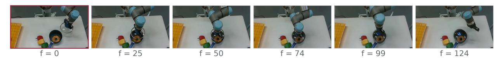

**(b)** Prompt: "갈색 신발을 집어들어 파란 컨테이너에 넣다"

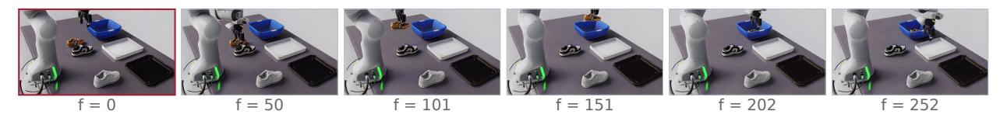

**(c)** Prompt: "서랍을 열다"

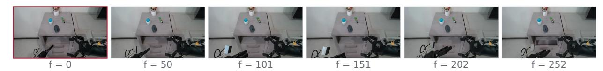

**(d)** Prompt: "그릇에 물 붓다"

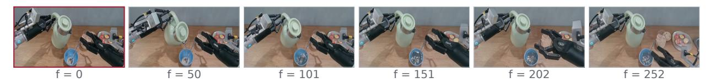

**(e)** Prompt: "티셔츠를 접다"

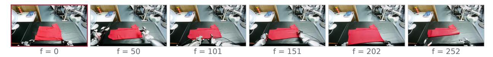

Figure 9 | LongLive2.0-Robot를 사용한 작업-조건화된 비디오 예측. 다섯 개의 선택된 텍스트-이미지-투-비디오(TI2V) 예시로, 각 행 위에 작업 프롬프트가 표시된다. 는 0 기반 프레임 인덱스를 나타낸다. 모든 프레임은 원래 시야를 유지한다.

Robotics-1, WorldDreamer, GR00T N1.5/N1.6, GigaWorld-Policy [51], RLDX-1 [21], 그리고 PRTS [56], 외부 기준선 점수는 리더보드 [40]에서 가져오며, Qwen-RobotManip을 제외하고, 그 점수는 기술 보고서 [53]에서 나온다.

Video initialization comparisons use Wan2.2 [46], LongLive-2.0 [11], 그리고 우리 LongLive2.0-Robot; GPT-6 Astra는 부록 [6]에서 고수준 계획자로 사용된다.

# E. 비동기 겹침 길이 논의

우리는 RoboTwin 2.0 [9]에서 Long-WAM (IDM)을 평가하며, 실행 지평을 24로 고정하고 트리거 스트라이드를 변동시켜 겹침을 12, 8, 4 제어 단계로 만든다. Table 10은 이러한 설정에서 Long-WAM의 성공률과 행동 연속성을 보고한다. 12 결과는 Table 7에서도 사용된다.

연속성 지표. 겹침 RMSE는 겹침 단계 내에서 동일한 절대 제어 단계에 정렬된 예측을 비교한다. Let은 그리퍼가 아닌 동작 차원을 포함하고 = ||. Section 4.1에서 정의된 행동 청크를 사용하여 우리는 계산한다.

$$E_{\text{ovlp}}^k(S) = \frac{\|\widehat{\mathbf{A}}_{t_k}[S:R,\mathcal{C}] - \widehat{\mathbf{A}}_{t_{k+1}}[0:O,\mathcal{C}]\|_F}{\sqrt{Od_c}}.$$

슬라이스는 0부터 시작하며 상한은 제외된다. 제르크(jerk)는 측정된 비그리퍼 관절 상태에서 계산되는 단계별 대리값이다: 우리는 +3 −3+2 + 3+1 − 를 윈도우에 대해 RMS를 취한다. 윈도우는 청크 핸드오프를 가로지며, Δ 3 으로 나누지 않는다. 두 지표는 에피소드마다 계산되고, 유효한 측정값이 있는 에피소드(성공 및 실패 포함)를 동일하게 평균한다.

Table 10 | 비동기 오버랩 길이의 효과. With = 24, 트리거 스트라이드(trigger stride)를 증가시키면 오버랩(overlap)이 단축된다. RMSE와 jerk는 테스트 범위 전반에 걸쳐 감소한다. 반면 가장 높은 관측 성공률은 = 16에서 발생한다. 스트라이드(stride)와 오버랩은 컨트롤 스텝(control steps) 단위로 측정된다.

| 𝑆 | 오버랩 𝑂 | 성공률 (%) ↑ (SR) | 평균제곱근오차 ↓ (RMSE) | 제르크 ↓ (Jerk) |
|----|-----------|----------|--------|--------|
| 12 | 12 | 94.2 | 0.0246 | 0.0436 |
| 16 | 8 | 95.0 | 0.0063 | 0.0156 |
| 20 | 4 | 94.3 | 0.0058 | 0.0143 |

부드러움과 결정 빈도. RMSE와 jerk는 겹침이 짧아질수록 감소하며, 12단계에서 8단계로의 감소가 8단계에서 4단계로의 감소보다 더 크다. 이 경향은 스트리밍 VAE(Section [4.1])에 의해 가능해진 짧은 겹침 실행을 동기화한다. 성공률은 부드러움에 따라 단조롭게 증가하지 않는다: 94.2%에서 95.0%로 상승한 뒤 94.3%로 하락한다. 우리는 이 패턴을 행동 연속성과 결정 빈도 사이의 트레이드오프로 해석한다. 고정된 제어 간격 Δ에서 길이를 늘리면 추론 결정 사이의 명목상 간격이 Δ가 늘어나고, 핸드오프 대기 없이 결정 빈도가 decision = 1*/*(Δ)로 감소한다. 로봇은 여전히 제어 속도 1*/*Δ에서 행동을 실행한다. 느린 피드백은 따라서 부드러운 청크 전환의 이점을 상쇄할 수 있다. 불연속성을 최소화하는 것만으로는 작업 성공률을 최대로 만들 수 없다.

# F. IDM 대 Co-Denoising: 역량 및 추론 지연 (F. IDM versus Co-Denoising: Capability and Inference Latency)

Long-WAM (IDM)은 비디오 우선 인과적 상상을 유지한다: 행동 토큰과 독립적으로 미래 시각 잠재 변수를 예측하고, 그 예측에 조건부로 행동을 디노이즈한다 (Section [3.2]). Co-denoising (CoD)은 대신 미래 비디오와 행동을 공동으로 업데이트하며, 각 디노이즈 단계에서 양방향 상호작용을 수행한다. IDM은 행동 전문가에게 행동을 생성하기 전에 미래에 대한 명시적 예측을 제공하지만, 이는 순차적 비디오 및 행동 추론의 비용을 따른다. IDM은 LIBERO와 RoboTwin 2.0 모두에서 보고된 평균 성공률이 다소 높다 (Tables [1] 및 [2]).

지연 프로토콜. 우리는 NVIDIA GeForce RTX 5090에서 최적화된 엔드-투-엔드 추론 지연을 비교한다. 이때 전체 관측 VAE 계산은 포함하지만, 전처리, 텍스트 인코딩, 컨트롤러/IPC 오버헤드는 제외한다. 두 변형 모두 비디오 NVFP4, BF16 행동 연산 및 KV 저장소를 사용하고, 관측 비디오 KV 재사용을 수행한다. CoD의 경우, 첫 번째 공동 단계가 이후 단계에서 재사용될 역사 KV 캐시를 구축하며, 미래 비디오와 행동 KV는 공동으로 계속 업데이트된다. 각 변형은 자체 훈련된 디노이즈 스케줄을 사용한다.

보고된 지연은 두 개의 독립 프로세스에서 각각 다섯 번의 워밍업을 제외하고 30개의 정상 상태 샘플을 사용한 중앙값의 평균이다. Table [8]에 있는 누적 V4/A4 연구는 동일한 집계 및 샘플 수를 사용하며, 냉각 안정화는 제외하고, 전체 관측 VAE 및 추론 계산을 포함하지만, 설정, 텍스트 인코딩, 컨트롤러 오버헤드 및 IPC는 제외한다. Table [11]은 Table [6]의 IDM 측정값과 CoD 측정값을 결합한다. 이 타이밍 실행은 위의 작업 성공 평가와 별개이며, 비교는 각 변형의 훈련된 스케줄과 캐시 구현을 사용하므로 실행 순서만을 지연 차이의 유일한 원인으로 고정하지 않는다.

역량 및 연산 속도. CoD는 V4/A4에서 90.9 ms, V2/A2에서 65.7 ms를 소요하며, IDM은 107.4 ms와 81.8 ms( Table [11] )와 비교된다. IDM은 별도 작업 평가에서 더 높은 성공률을 달성하지만, 최적화된 추론은 두 예산에서 각각 9.3 Hz와 12.2 Hz에 도달한다. 따라서 두 단계 구성은 100 ms 추론-계산 범위 내에 들어간다.

Table 11 | RTX 5090에서 최적화된 IDM 및 CoD 추론. V4/A4 및 V2/A2는 각각 전문가당 4단계와 2단계; CoD는 전문가 간 denoising 스케줄을 공유. Latency는 관측 VAE 계산을 포함. Rates는 추론 지연의 역수이며, 로봇 제어 주파수는 아님.

|  | V4/A4 |  | V2/A2 |  |
|----------------|----------------|-------------|----------------|-------------|
| 방법 | 지연시간 ↓ | 주파수 (Hz) ↑ | 지연시간 ↓ | 주파수 ↑ |
| Long-WAM (IDM) | 107.4 | 9.3 | 81.8 | 12.2 |
| Long-WAM (CoD) | 90.9 | 11.0 | 65.7 | 15.2 |

Table 12 | RTX 5090에서의 컨텍스트 의존 지연. Long-WAM 인프라를 사용한 액션 청크당 종단 간 추론 시간. 컨텍스트 카운트는 제어 간격 이전을 나타내며, */*20초의 과거와 대응된다; = 0은 현재 관측값을 유지한다.

| 컨텍스트 𝑃 | 히스토리 (s) | 지연 시간 ↓ |
|-----------|-------------|----------------|
| 0 | 0.0 | 74.6 |
| 48 | 2.4 | 107.4 |
| 96 | 4.8 | 138.3 |
| 192 | 9.6 | 204.5 |
| 384 | 19.2 | 341.0 |

예산. 온라인 실행은 전송 및 스케줄링 비용(Equation [4)](#page-4-1))도 수용해야 한다; 비동기 실행은 추론과 진행 중인 로봇 동작을 겹친다. 실세계 결과(Section [6.1](#page-9-0))는 IDM의 비디오-우선 설계가 반응형 조작을 지원한다는 별도 증거를 제공한다.

IDM에서 관찰된 비디오 KV 재사용. 관찰된 비디오 KV 재사용은 토큰 형태를 변경한다. RTX 5090에서, 형태별 디스패치는 기본 양자화기의 588-토큰 타일 선택을 재사용으로 생성된 392/196-토큰 입력으로 확장한다. 완전한 V4/A4 구성에서, 재사용 시 지연은 107.4 ms, 재사용 없이 112.6 ms(4.6%)이다. Spark는 재사용 없이 394.9 ms 대비 328.2 ms(16.9%)를 달성한다. V2/A2에서는 RTX 5090에서 재사용이 지연 감소를 주지 않는다(81.8 vs 81.3 ms), 반면 Spark에서는 280.8 ms에서 254.4 ms(9.4%)로 감소한다. 이 비교는 각 장치와 노이즈 제거 예산 내에서 나머지 구성을 고정한 상태에서 수행된다. 이는 Table [8,](#page-10-0)에서 측정된 재사용 단계 이득과 다르며, 이후 장치별 튜닝 전에 측정된다.

# G. 문맥-의존 추론 지연 (Context-Dependent Inference Latency)

Table [12](#page-20-2)는 RTX 5090에서 우리의 인프라를 사용한 효율적인 장기 문맥 추론을 보여준다: 기록을 8배 늘려 2.4초에서 19.2초로 증가시키면, 엔드-투-엔드 청크 지연이 107.4 ms에서 341.0 ms(약 3.2배)로 상승한다. 이 결과는 Section [4.2.](#page-4-2)에서 사용된 공유 최적화와 장치별 튜닝을 활용한다. 온라인 실행에서는 스트리밍 VAE가 프리픽스 인코딩을 추론 트리거 앞쪽으로 이동시켜 트리거 이후 준비 작업을 줄인다(Section [4.1)](#page-4-3)).

# H. 추가 실세계 배포 시각화 (Additional Real-World Deployment Visualizations)

우리는 Section [6.1.](#page-9-0)의 실제 로봇 평가를 보완하는 상세 롤아웃을 제공한다. 몽타주는 원본 개요 및 손목 카메라 뷰를 유지하며, 실패 이벤트를 빨간 주석으로, 성공 결과를 초록 주석으로 표시한다. 이 선택된 예시들은 실행 동작을 보여주며, 집계 성공률은 본문에 보고된다.

#### H.1. 동적 복합 조작 (Dynamic Composite Manipulation)

Figures [10–](#page-21-0)[12](#page-23-0)는 Unitree G1에서 동적 컵 쌓기를 보여준다. Long-WAM은 파란 컵을 잡고, 움직이는 초록 컵을 가로채며, 초록 컵을 파란 컵 안에 넣는다. 반면 기준 롤아웃은 가로채는 과정에서 초록 컵을 놓친다.

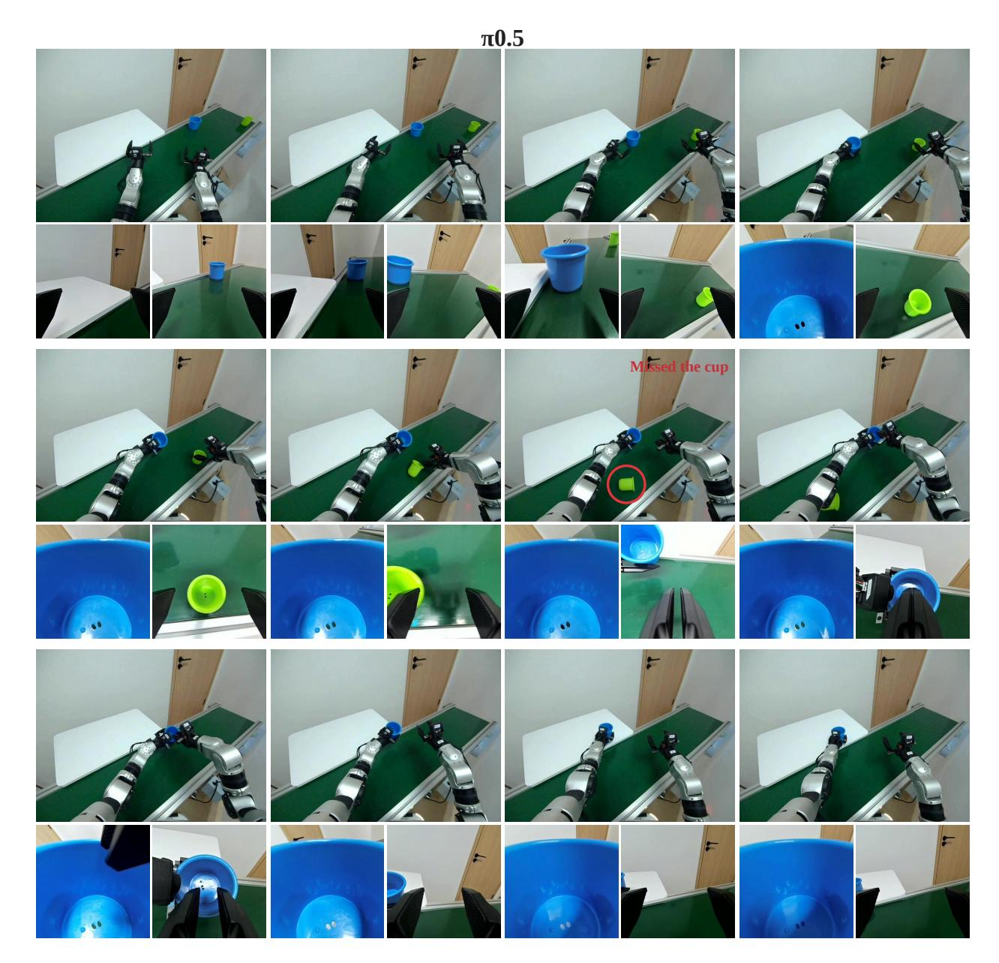

Figure 10 | 0*.*5 초 간격으로 동적 컵 쌓기. 시간은 각 4열 블록 내에서 왼쪽에서 오른쪽으로 진행되며, 그 다음 블록 아래에서 계속된다; 각 개요 프레임은 두 손목 뷰와 함께 제공된다. 정책은 파란 컵을 잡지만 움직이는 초록 컵(빨간 원)을 놓쳐 복합 작업이 완료되지 않는다.

#### H.2. 다른 속도에서의 움직이는 물체 잡기 (Moving-Object Grasping at Different Speeds)

Figures [13](#page-24-0)[–15](#page-26-0)는 네 가지 속도에서 컨베이어 잡기를 비교한다. 기준 예시는 높은 속도에서 가로채기를 놓치는 것을 보여주지만, Long-WAM은 모든 속도에서 그림에 나타난 잡기를 완료하며, 이는 Section [6.1.](#page-9-2)의 동적 제어 결과와 일치한다.

#### H.3. 장기 수평선 조작 (Long-Horizon Manipulation)

Figure [16](#page-27-0)는 연속적인 물체 상호작용을 필요로 하는 세 개의 YAM 작업을 수행하는 Long-WAM을 보여준다. 이 시퀀스는 반복적인 픽업과 배치를 통해 작업 지향적 진행을 보여주며, 앞서 언급한 빠른 동적 동작을 보완한다. 이 작업들은 평균 40초 이상 지속된다(Section [6.1)](#page-9-2).

# **Fast-WAM이 컵을 놓친 경우** (Missed the cup Fast-WAM)

Figure 11 | Fast-WAM을 사용한 동적 컵 쌓기. 이 시퀀스는 Figure [10.](#page-21-0)와 동일한 읽기 순서를 따른다. 파란 컵을 잡은 후, 정책은 초록 컵을 향해 손을 뻗지만, 컨베이어를 따라 움직이는 동안 놓친다. 이후 프레임은 중첩 단계가 완료되지 않았음을 보여준다.

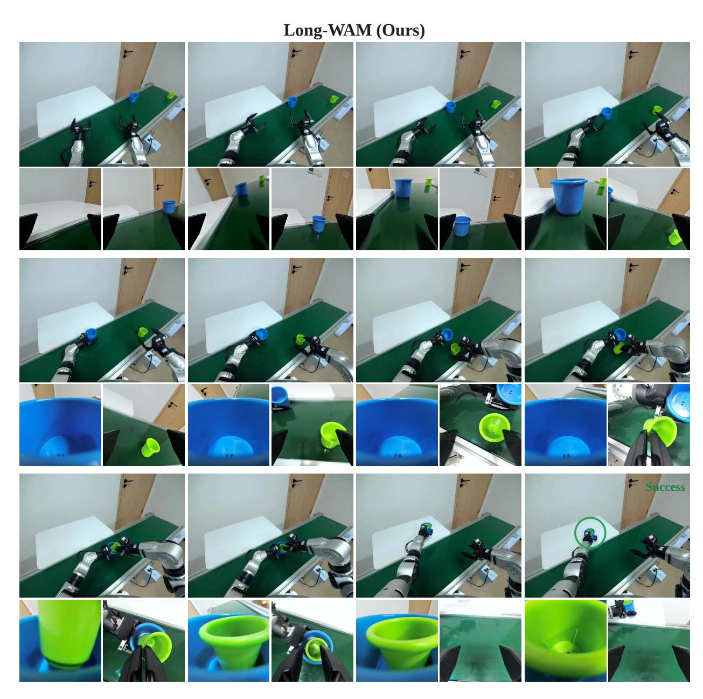

Figure 12 | Long-WAM을 이용한 동적 컵 스태킹. Long-WAM은 파란 컵을 잡고, 움직이는 초록 컵을 가로채며, 초록 컵을 파란 컵 안에 넣는다. 개요 및 손목 뷰는 가로채기에서 정렬 및 삽입으로의 전환을 보여 주며, 이 동적 작업의 단계별 조정된 실행을 시연한다.

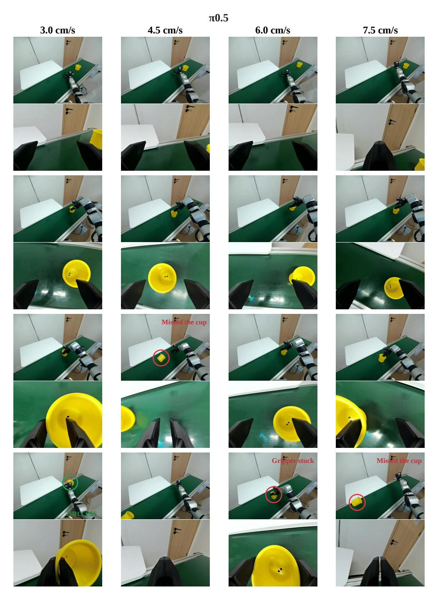

Figure 13 | 0*.*5를 이용한 이동 물체 그랩. 열은 3.0, 4.5, 6.0, 7.5 cm/s를 표시하며, 시간은 상단에서 하단으로 진행되는 개요 및 손목 뷰를 통해 나타난다. 선택된 롤아웃은 3.0 cm/s에서 성공하고, 4.5 및 7.5 cm/s에서는 컵을 놓치며, 6.0 cm/s에서는 주석이 달린 그리퍼-스틱 실패를 보여준다.

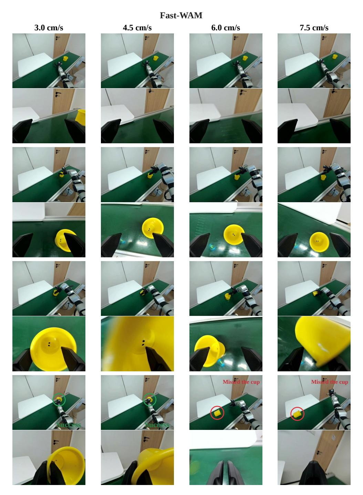

Figure 14 | Fast-WAM을 이용한 이동 물체 그랩. 열과 시간 순서는 Figure [13.](#page-24-0)와 일치한다. 선택된 롤아웃은 3.0 및 4.5 cm/s에서 성공하지만, 6.0 및 7.5 cm/s에서는 컵을 놓친다. 손목 뷰는 안전한 그랩이 성립되기 전에 목표물이 그리퍼를 넘어서는 모습을 보여준다.

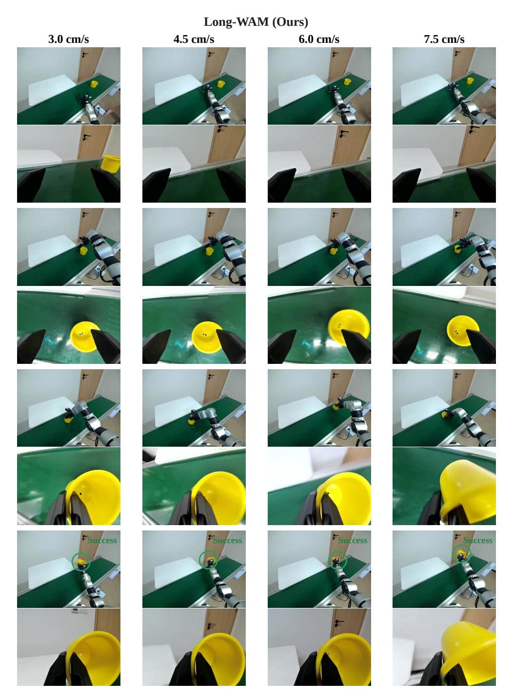

Figure 15 | Long-WAM을 이용한 이동 물체 그랩. 그림에 나타난 롤아웃은 4개의 컨베이어 속도(6.0 및 7.5 cm/s 포함) 모두에서 그랩을 완수한다. 연속된 손목 뷰는 움직이는 컵이 그리퍼에 들어가고 닫힘 후에도 유지되는 모습을 보여 주며, 점진적으로 엄격해지는 타이밍 제약 하에서 반응형 가로채기를 시연한다.

# **성공 성공 성공 Long-WAM (Ours)**

Figure 16 | YAM에서 Long-WAM을 이용한 장기 수평 조작. 상단부터 하단까지: 색상별 벽돌 분류, 팬에 만두 넣기, 그릇 쌓기. 각 작업은 왼쪽에서 오른쪽으로 읽는 여섯 개의 연속적 스냅샷을 포함하며, 각 개요 프레임 아래에 손목 뷰가 쌍으로 배치된다. 최종 스냅샷은 세 작업 모두에서 성공적인 작업 구성을 보여준다.

