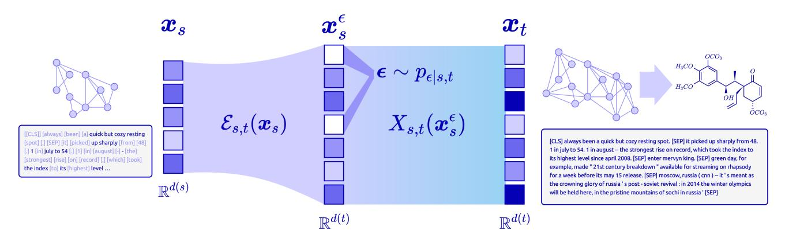
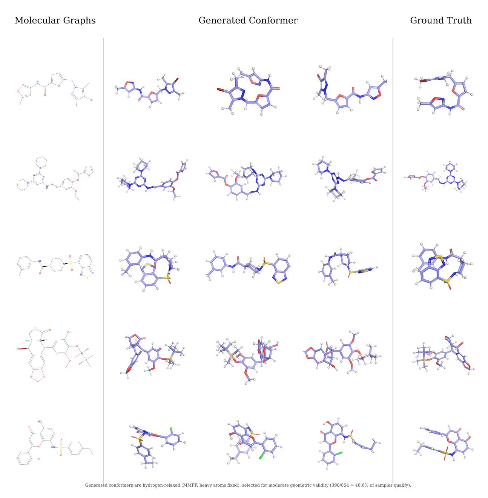
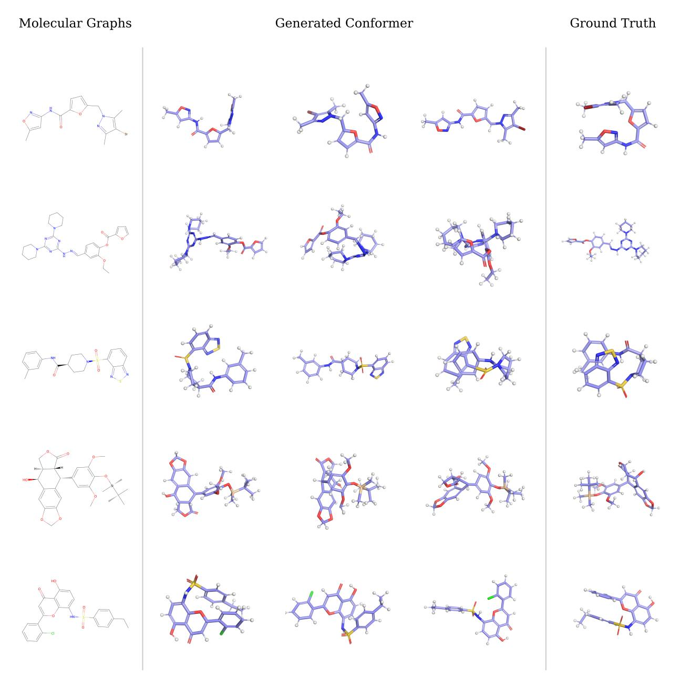

# 흐름 지도 확장 (Expanding Flow Maps)

- 원제: Expanding Flow Maps
- 원문: [https://arxiv.org/abs/2607.21585](https://arxiv.org/abs/2607.21585)
- PDF: [https://arxiv.org/pdf/2607.21585v1](https://arxiv.org/pdf/2607.21585v1)
- arXiv ID: `2607.21585`

---

# **흐름 지도 확장 (Expanding Flow Maps)**

**Sophia Tang**<sup>1</sup> , **Pranam Chatterjee**<sup>1</sup>*,*<sup>2</sup>

<sup>1</sup>*컴퓨터 및 정보과학과 (Department of Computer and Information Science), University of Pennsylvania*, <sup>2</sup>*생명공학과 (Department of Bioengineering), University of Pennsylvania*

**초록.** Flow 기반 생성 모델은 연속 및 이산 상태 공간에서 빠르고 제어 가능한 생성에서 놀라운 진전을 가능하게 했지만, 기존 파라미터화는 고정 차원 또는 고정 시퀀스 길이에 제한됩니다. 여기서 우리는 **확장 생성 흐름** (Expanding Generative Flows) (EFlows)를 도입합니다. 이는 조건부 노이즈를 추가하여 상태를 확장하는 확장 보간기를 따라 *증가하는 차원*의 분포 사이에 흐름을 정의합니다. 이 구조를 기반으로 우리는 **확장 흐름 지도** (Expanding Flow Maps) (EFMs)를 제안합니다. 이는 확장 보간기를 효율적인 몇 단계 생성 모델로 정제한 새로운 흐름 지도 클래스입니다. 각 EFM은 두 시점 사이의 매핑을 두 개의 학습 가능한 연산으로 분해합니다: *확장 연산자* (*expand operator*), 이는 현재 상태에 조건부로 새로운 좌표 또는 토큰을 추가하여 상태 공간을 확장하고, *전송 지도* (*transport map*), 이는 확장된 상태를 보간기를 따라 앞으로 밀어냅니다. 이 연산자들을 조합하면 상태를 동시에 *확장*하고 *노이즈를 제거*하는 단일 매핑이 생성되며, 확장 연산자가 항등인 경우 기존의 고정 캔버스 흐름과 흐름 지도를 특수 사례로 복원합니다. 우리는 또한 이 프레임워크를 이산 단순형으로 확장하여 가변 크기 그래프 생성 및 가변 길이 시퀀스 생성을 가능하게 합니다. 연속 및 이산 양쪽 모달리티에서, 우리는 출력 크기가 학습되고 제어 가능한 자유도인 설정을 위한 원칙적인 프레임워크로 EFlows와 EFMs를 확립합니다.

**연락처:** <sophtang@engineering.upenn.edu>, <pranam@upenn.edu>

# **1 서론 (Introduction)**

Flow 지도는 최근 몇 단계 생성 모델링을 위한 통합 프레임워크로 부상했으며, 연속 [\(Boffi et al.,](#page-12-0) [2025\)](#page-12-0) 및 이산 [\(Roos et al.,](#page-14-0) [2026;](#page-14-0) [Lee et al.,](#page-14-1) [2026;](#page-14-1) [Potaptchik et al.,](#page-14-2) [2026b\)](#page-14-2) 상태 공간을 모두 지원합니다. 스코어 [\(Song et al.,](#page-15-0) [2021;](#page-15-0) [Ho et al.,](#page-13-0) [2020\)](#page-13-0) 및 흐름 기반 [\(Lipman et al.,](#page-14-3) [2022;](#page-14-3) [Tong et al.,](#page-15-1) [2023;](#page-15-1) [Albergo et al.,](#page-12-1) [2025\)](#page-12-1) 모델의 성공을 기반으로, Flow 지도는 노이즈와 데이터 사이의 연속 시간 보간기로 생성을 표현하고, 임의의 시점 쌍 사이의 ODE 궤적을 따라 이산 점프를 파라미터화하는 방법을 학습합니다 [\(Boffi et al.,](#page-12-0) [2025;](#page-12-0) [Geng et al.,](#page-13-1) [2025;](#page-13-1) [Song et al.,](#page-14-4) [2023;](#page-14-4) [Kim et al.,](#page-13-2) [2024\)](#page-13-2). 이들은 일반적으로 *교사 흐름에서의 증류* [\(Boffi et al.,](#page-12-2) [2024;](#page-12-2) [Frans et al.,](#page-13-3) [2025;](#page-13-3) [Zhou et al.,](#page-15-2) [2025;](#page-15-2) [Salimans et al.,](#page-14-5) [2024\)](#page-14-5) 또는 *데이터에서의 자기 증류* [\(Boffi et al.,](#page-12-0) [2025\)](#page-12-0) 를 통해 훈련되며, 이는 한 번 또는 두 번의 함수 평가만으로 샘플링을 가능하게 하면서 다중 단계 모델의 모델링 유연성을 유지합니다.

이러한 진전에도 불구하고, 기존의 흐름 맵(Flow Maps)은 본질적으로 *고정 캔버스*에서의 생성에 제한된다: 고정 차원 *d*를 갖는 연속 상태 공간, 또는 고정 시퀀스 길이 *L*을 갖는 이산 상태 공간. 이러한 엄격한 제약은 많은 실제 생성 작업의 구조와 충돌한다. 출력의 크기가 모델링해야 할 양 자체인 경우가 예를 들어, 가변 해상도 이미지와 3D 형태, 임의 길이의 오디오 및 비디오, 알 수 없는 시퀀스 길이의 언어, 그리고 서로 다른 고유 차원을 가진 모달리티를 교차하는 다중 모달 데이터 등이 있다. 이러한 설정을 다루려면 추론 중에 상태 공간이 *성장*할 수 있는 생성 프레임워크가 필요하며, 초기화 시에 고정되지 않아야 한다. 이는 본 연구를 동기화하는 핵심 질문을 제기한다:

*추론 시 적응형 차원으로 연속 및 이산 데이터를 소수 단계 생성할 수 있도록 어떻게 할 수 있을까?*

우리는 이 질문에 **Expanding Flow Maps** (EFMs)를 도입함으로써 답한다. 이는 연속 및 이산 데이터에 대해 가변 차원과 시퀀스 길이를 갖는 소수 단계 생성 모델링을 위한 일반 프레임워크이다. 핵심 아이디어는 두 시점 사이의 흐름 맵을 두 개의 학습 가능한 연산으로 분해하는 것이다: 새로운 좌표나 토큰을 삽입하여 상태 공간을 확장하는 *확장 연산자(expand operator)*와, 확장된 상태를 보간 함수에 따라 앞으로 이동시키는 *전송 맵(transport map)*. 이 연산자들을 조합하면 상태를 동시에 *확장*하고 *노이즈를 제거*하는 단일 맵을 얻을 수 있으며, 이는 표준 고정 차원 흐름 맵을 배치한다 [\(Boffi et al.,](#page-12-0) [2025;](#page-12-0) [Roos et al.,](#page-14-0)



**Figure 1** *확장 흐름 지도.* R *d*(*s*)에서 시간 s에 있는 저차원 공간에서 R *d*(*t*)에서 시간 t에 있는 고차원 공간으로 이동하는 단계는 (i) 확장 연산자 E*s,t를 적용하고 증강된 잡음 ϵ ∼ pϵ*|*s,t를 사용하며, (ii) 증강 공간에서 수송 맵 Xs,t를 적용한다.

[2026;](#page-14-0) [Lee et al.,](#page-14-1) [2026;](#page-14-1) [Potaptchik et al.,](#page-14-2) [2026b\)](#page-14-2) 확장 연산자가 항등인 경우를 특수 사례로 보았다. 우리의 **주요 기여**는 다음과 같이 요약될 수 있다:

- 1. **확장 생성 흐름**: 우리는 *확장 생성 흐름* (Expanding Generative Flows) (EFlows)를 도입한다. 이는 차원이 증가하는 분포 사이의 *확장 보간* (expanding interpolant) 위에 정의된 생성 모델 클래스이다. 우리는 이를 부드러운 노이즈 제거를 설명하는 전송 항과 고차원으로 점프를 설명하는 점프 커널로 구성된 조각-결정적 마르코프 과정으로 공식화한다.

- 2. **확장 흐름 지도**: 우리는 *확장 흐름 지도* (Expanding Flow Map) (EFM)를 도출한다. 이는 *확장 연산자* (expand operator)와 *전송 지도* (transport map)를 합성하여 확장 보간을 따라 임의의 지점 사이를 점프할 수 있게 한다. *확장 연산자*는 상태에 조건부 노이즈를 추가하고, *전송 지도*는 추가된 상태를 시간 간격을 따라 목표 분포로 밀어낸다.

- 3. **이산 확장 생성 흐름 및 지도**: 우리는 이산 단순형 공간 (discrete simplex space)에 확장 생성 흐름과 흐름 지도를 확장한다. 확장은 시퀀스나 그래프를 따라 삽입으로 공식화되며, 표준 흐름 기반 방법이 적용되지 않는 영역에서 몇 단계 변수 길이 이산 생성의 잠금을 해제한다.

분자 구조체 생성, 이산 분자 그래프 생성, 언어 모델링에 대한 실험을 통해 우리는 EFlow와 EFMs를 도메인 간 및 샘플링 예산에 관계없이 변수 차원 생성에 대한 *단일, 통합 레시피*로 확립한다. 관련 작업에 대한 추가 논의는 부록 [A.](#page-17-0)에서 제공된다.

# **2 전제 (Preliminaries)**

**생성적 흐름과 확률적 보간** 흐름 및 확산 모델에 대한 통합적 관점을 제공하는 것은 *확률적 보간* 프레임워크입니다 [\(Albergo et al.,](#page-12-1) [2025;](#page-12-1) [Albergo and Vanden-Eijnden,](#page-12-3) [2022\)](#page-12-3), 이는 사전 분포 *p*<sup>0</sup>와 데이터 분포 *p*<sup>1</sup> = *pdata* 사이의 연속 시간 경로를 구성합니다. 끝점 x<sup>0</sup> ∼ *p*<sup>0</sup>와 x<sup>1</sup> ∼ *p*1을 주면, 보간은 확률 과정입니다:

$$x_t = I_t(x_0, x_1), \quad \dot{x}_t = b_t(x_t), \quad t \in [0, 1],$$

(1)

여기서 x*<sup>t</sup>*=0 = x<sup>0</sup> ∼ *p*<sup>0</sup>이며, x*<sup>t</sup>*=1 = x<sup>1</sup> ∼ *p*<sup>1</sup>이고, 중간 마진은 x*<sup>t</sup>* ∼ *p<sup>t</sup>* = Law(*It*). 표준 *선형 보간*은 *It*(x0*,* x1) = (1 − *t*)x<sup>0</sup> + *t*x1 으로 정의됩니다. 점 x에서의 속도장 *bt*(x)는 보간의 시간 미분의 조건부 기대값으로 얻을 수 있습니다:

<span id="page-1-0"></span>

$$b_t(\mathbf{x}) = \mathbb{E}[\dot{\mathbf{x}}_t | \mathbf{x}_t = \mathbf{x}] \tag{2}$$

이는 ODE *d*x*<sup>t</sup>* = *bt*(x*t*)*dt* 또는 SDE *d*X*<sup>t</sup>* = *bt*(X*t*)*dt* + *σtd*B*<sup>t</sup>*를 따라 *p*<sup>0</sup>에서 *p*<sup>1</sup>*로 샘플을 운반합니다. 두 개의 경험적 분포를 주어 속도장을 파라미터화하기 위해, 우리는 *조건부 흐름 매칭 목표*를 최소화합니다 [\(Lipman et al.,](#page-14-3) [2022;](#page-14-3) [Albergo and Vanden-Eijnden,](#page-12-3) [2022\)](#page-12-3):

$$\mathcal{L}_{CFM}(\hat{b}) := \int_0^1 \mathbb{E}_{\boldsymbol{x}_0, \boldsymbol{x}_1} \left[ \left\| \hat{b}_t(I_t(\boldsymbol{x}_0, \boldsymbol{x}_1)) - \partial_t I_t(\boldsymbol{x}_0, \boldsymbol{x}_1) \right\|^2 \right] dt$$

(3)

기대값은 $(\boldsymbol{x}_0, \boldsymbol{x}_1) \sim p_0 \otimes p_1$ 에 대해 계산됩니다.

**Flow Maps for Trajectory Distillation** 수치적으로 ODE 또는 SDE를 통합하는 것은 일반적으로 많은 작은 단계가 필요하며, 이는 연속 시간 동역학을 정확히 근사하기 위해 필요합니다. 따라서 목표는 목표 샘플을 생성하는 데 필요한 함수 평가 횟수를 최소화하는 것입니다. 이는 일관성 모델(Song et al., 2023; Song and Dhariwal, 2024)과 흐름 맵(Boffi et al., 2025; Sabour et al., 2025; Geng et al., 2025; Frans et al., 2025; Guo et al., 2025)을 동기화합니다. 흐름 맵은 여러 단계 통합 과정을 몇 단계로 압축하려는 목표를 가집니다. 구체적으로, 흐름 맵은 $X_{s,t}: \mathbb{R}^d \to \mathbb{R}^d$ 이며, 이전 시점 s에서의 상태를 주어 ODE의 시점 t에서의 상태를 직접 출력합니다:

<span id="page-2-1"></span><span id="page-2-0"></span>

$$X_{s,t}(\boldsymbol{x}_s) = \boldsymbol{x}_t = \boldsymbol{x}_s + (t - s)v_{s,t}(\boldsymbol{x}_s), \quad \forall s, t \in [0, 1]$$

$$\tag{4}$$

이는 (t-s) 크기의 스텝을 평균 속도 $v_{s,t}(\boldsymbol{x}_s)$ 를 사용하여 수행하는 것으로 정의될 수 있습니다. t=s 일 때 평균 속도는 순간 속도 $v_{s,s}(\boldsymbol{x}_s) = b_s(\boldsymbol{x}_s)$ 로 축소되며, 이는 (3)에서의 표준 CFM 손실로 훈련될 수 있습니다. 이를 대각 손실 $\mathcal{L}_{\text{diag}}$ 라고 부르며, t=s인 대각선에서 평균 속도를 훈련합니다. $t \neq s$ 일 때 $v_{s,t}(\boldsymbol{x}_s)$ 를 파라미터화하기 위해, 우리는 흐름 맵 $X_{s,t}$ 의 세 가지 동등한 조건을 고려합니다:

라그랑지안 조건:

$$\partial_t X_{s,t}(\boldsymbol{x}_s) = v_{t,t}(X_{s,t}(\boldsymbol{x}))$$

(5a)

오일러 조건:

$$\partial_s X_{s,t}(\mathbf{x}) + v_{s,s}(\mathbf{x}) \cdot \nabla_{\mathbf{x}_s} X_{s,t}(\mathbf{x}) = 0$$

(5b)

세미그룹 조건:

$$X_{u,t}(X_{s,u}(\boldsymbol{x})) = X_{s,t}(\boldsymbol{x})$$

(5c)

모든 $x \in \mathbb{R}^d$와 $s, u, t \in [0, 1]$에 대해.  
이러한 조건들은 각각 조건을 0으로 설정하고 파라미터화된 속도 $\hat{v}_{s,t}$에 대해 제곱 잔차를 취함으로써 일관성 목표 $\mathcal{L}_{cons}$로 변환된다: $\mathbb{R}d \to \mathbb{R}^d$.  
그 다음, 전체 학습 목표는 대각선 목표와 일관성 목표의 합으로 된다: $\mathcal{L}_{FM}(\hat{v}) = \mathcal{L}_{diag}(\hat{v}) + \mathcal{L}_{cons}(\hat{v})$.

이산 데이터용 플로우 맵  
최근, 플로우 맵은 이산 상태 공간(Roos et al., 2026; Lee et al., 2026; Potaptchik et al., 2026b)으로 확장되었으며, 여기서 상태는 어휘집 $|\mathcal{V}| = V$ 를 갖는 심플렉스 공간 $\Delta^{V-1}$ 위의 벡터로 정의된다. 심플렉스 위의 범주형 분포 시퀀스는 $x_t \in \mathcal{V}^L$ 로 표시된다. 이산 데이터를 심플렉스 위의 연속 분포로 표현함으로써 이산 설정에서도 표준 플로우 맵 목표를 재활용할 수 있다. 이산 상태 공간에서 평균 속도의 동등한 파라미터화는 평균 디노이저 $\psi_{s,t}: \mathbb{R}^{L\times V} \to \mathbb{R}^{L\times V}$ 이며, 이는 대각선 t=s 에서 표준 디노이저로 축소되고, 평균 속도 $v_{s,t}$ 방향으로 전체 (1-s) 단계만큼 이동하여 디노이즈된 상태를 정의한다:

$$\psi_{s,t}(\boldsymbol{x}) = \boldsymbol{x} + (1-s)v_{s,t}(\boldsymbol{x}), \quad v_{s,t}(\boldsymbol{x}) = \frac{\psi_{s,t}(\boldsymbol{x}) - \boldsymbol{x}}{1-s}$$

(6)

이는 $v_{s,t}$ 를 (4)에 대입함으로써 흐름 맵의 이산적 아날로그를 제공한다:

<span id="page-2-3"></span>

$$X_{s,t}(\boldsymbol{x}) = \frac{1-t}{1-s}\boldsymbol{x} + \frac{t-s}{1-s}\psi_{s,t}(\boldsymbol{x}), \quad \forall s, t \in [0,1]$$

$$(7)$$

핵심적으로, 평균 노이즈 제거기는 데이터 분포의 조건부 기대값에 대한 가중합으로 표현될 수 있으며, 단순화된 $\psi_{s,t} \in \Delta^{V-1}$ 위에 존재하여, 대각선 및 일관성 목표의 *cross-entropy* 유사체를 통해 학습될 수 있다:

$$\mathcal{L}_{\text{diag}}(\hat{\psi}) = -\sum_{i=1}^{L} D_t(\boldsymbol{x}_t^i) \cdot \log \hat{\psi}_{t,t}(\boldsymbol{x}_t^i), \quad \mathcal{L}_{\text{cons}}(\hat{\psi}) = -\sum_{i=1}^{L} \bar{\psi}_{s,t} \cdot \log \hat{\psi}_{s,t}(\boldsymbol{x}_s^i)$$

(8)

여기서 $\bar{\psi}_{s,t}$는 *lagrangian*, *Eulerian*, 그리고 *semigroup* 조건의 이산적 유사체를 통해 정의된다 (Lee et al., 2026; Potaptchik et al., 2026b).

# <span id="page-2-2"></span>3 Expanding Generative Flows (확장 생성 흐름)

표준 연속 흐름의 **핵심 한계**는 초기화 시 상태 공간이 고정된다는 점이다: $\boldsymbol{x}_0 \in \mathbb{R}^d$는 연속 상태 공간에서 고정된 d를 갖고, $\boldsymbol{x}_0 \in \mathbb{R}^{L \times V}$는 이산 시퀀스 공간에서 고정된 길이 L을 갖는다. 우리는 이 한계를 극복하기 위해 차원이 다른 분포 간의 생성 흐름에 대한 엄밀한 처리를 제시한다

차원성, 특히 소스 분포가 타깃 분포보다 낮은 차원성을 갖는 설정을 말한다. 우리는 이를 세 부분으로 구성한다: 차원 스케줄에 따라 상태를 확장시키는 확장 보간(interpolant), 소스를 타깃 공간으로 올리는 확장 연산자(expand operator), 그리고 확장과 운송을 하나의 잘 정의된 생성 과정으로 통합하는 조각별 결정론적 마르코프 과정(PDMP) 특성화.

**확장 인터폴란트**  
출력 크기가 자체적으로 가변인 생성 작업을 수용하기 위해, 우리는 표준 플로우 인터폴란트 구성을 일반화하여 차원이 경로를 따라 증가하도록 허용한다. 구체적으로, 고정 차원 d를 비감소 차원 스케줄 $d(t): [0,1] \to \mathbb{N}$ 으로 대체하고 $x_t \in \mathbb{R}^{d(t)}$ 로 두어, 주변분포 $p_t \in \mathcal{P}(\mathbb{R}^{d(t)})$ 가 t에 따라 달라지는 상태공간에서 정의된다.

#### 확장 차원으로의 생성 플로우

$$\mathcal{P}(\mathbb{R}^{d(0)}) \ni p_0 \to \cdots \to p_s \to \cdots \to p_t \to \cdots \to p_1 \in \mathcal{P}(\mathbb{R}^{d(1)})$$

여기서 모든 $0 \le s < t \le 1$ 에 대해 $d(s) \le d(t)$ 이다.

이러한 유형의 플로우를 정의하는 핵심 과제는, s < t 이고 d(s) < d(t) 인 경우, 소스 상태 $\boldsymbol{x}_s \in \mathbb{R}^{d(s)}$ 와 타깃 상태 $\boldsymbol{x}_t \in \mathbb{R}^{d(t)}$ 가 서로 다른 차원의 공간에 존재한다는 점이다. 따라서 $\mathbb{R}^{d(s)} \to \mathbb{R}^{d(t)}$ 의 다이프모르피즘이 없으며, $p_s$ 를 $p_t$ 로 운반할 수 있는 고정 차원 속도장도 존재하지 않는다. 이를 해결하기 위해, 우리는 소스 상태를 추가적인 노이즈 좌표로 보강한다. 이 노이즈는 다루기 쉬운 조건부 분포 $p_{\epsilon|s,t} \in \mathcal{P}(\mathbb{R}^{d(t)-d(s)})$ 에서 추출되며, 운반 맵을 적용하기 전에 소스를 타깃 차원으로 올린다.

**주석 3.1** (확장 인터폴란트는 표준 생성 인터폴란트를 일반화한다). 표준 고정 차원 플로우 ODE는 $t \in [0,1]$ 에서 차원 $\mathbb{R}^{d(t)}$ 가 일정한 확장 생성 플로우의 특수한 경우이다.

**확장 연산자** 확장 생성 플로우를 매개화하기 위해, 우리는 각 이산 시간 단계에서 보강된 노이즈 좌표로 상태공간을 확장하고, 그 보강된 상태에서 타깃 시간 단계까지 인터폴란트를 적분하는 *2단계* 과정을 정의한다. 첫 번째 단계는 *확장 연산자* $\mathcal{E}_{s,t}$ 에 의해 수행된다.

#### <span id="page-3-0"></span>**확장 연산자**

$$\mathcal{E}_{s,t}(\boldsymbol{x}_s, \boldsymbol{\epsilon}) : \mathbb{R}^{d(s)} \times \mathbb{R}^{d(t) - d(s)} \to \mathbb{R}^{d(t)}, \quad \boldsymbol{\epsilon} \sim p_{\epsilon|s,t} \in \mathbb{R}^{d(t) - d(s)}$$

(10)

이는 $\epsilon$ 의 좌표가 $x_s$ 와 상대적으로 어디에 삽입되는지를 결정하는 배치 스킴을 정의한다.

보강된 노이즈 변수 $\epsilon$ 는 성장하는 상태공간에 새로운 좌표를 추가하며, 이는 이후 타깃 분포 $p_t$ 에서 샘플로 매핑될 수 있다. 확장 연산자 $\mathcal{E}_{s,t}$ 는 기존 좌표 $\boldsymbol{x}_s$ 와 $\epsilon$ 의 잠재 좌표를 배치 스킴에 따라 결합하여, 보강된 상태에서 새로운 좌표가 나타나는 위치를 지정한다. $\mathcal{E}_{s,t}$ 는 여러 구현 형태를 가질 수 있으며, 예를 들어 다음과 같다:

- (i) **연결**:  $\mathcal{E}_{s,t}(\boldsymbol{x}_s, \boldsymbol{\epsilon}) = \operatorname{Cat}(\boldsymbol{x}_s, \boldsymbol{\epsilon})$  새로운 좌표를 상태의 끝에 추가한다. 이는 자기회귀 시퀀스 생성이나 포인트 클라우드에 포인트를 추가할 때 자연스러운 구현이다.  
- (ii) **위치 삽입**:  $\mathcal{E}_{s,t}(\boldsymbol{x}_s, \boldsymbol{\epsilon})$  ε의 항목을 증강된 상태의 $\{1, \dots, d(t)\}$ 중 일부 위치에 교차 삽입한다. 이 구현은 임의 길이 시퀀스 생성이나 인필링에 유용하다.  
- (iii) **자식 확장**:  $\mathcal{E}_{s,t}(\boldsymbol{x}_s, \boldsymbol{\epsilon})$  각 새로운 좌표를 $\boldsymbol{x}_s$의 부모 항목 $\text{pa}(i)$에 부착하고 그 부모를 기준으로 초기화한다, $\boldsymbol{x}_s^{\epsilon}[i] = \boldsymbol{x}_s[\text{pa}(i)] + \sigma \boldsymbol{\epsilon}_i$ . 이 구현은 구조화된 상태에서 거친-세밀한 생성에 적합하다.

증강된 노이즈와 그 배치는 결정적일 수 있다 (예: 항상 i.i.d. 가우시안 노이즈를 끝에 연결) 또는 파라미터화된 네트워크 $\hat{\mathcal{E}}$를 통해 예측될 수 있다 (예: 각 간격에서 삽입 수를 예측). 모든 경우에, 확장 연산자는 상태를 $\mathbb{R}^{d(t)}$로 올려서 s에서 t까지 보간기에 따라 전달이 $d(t)$-차원 속도장으로 진행될 수 있게 한다. 단순화를 위해 명시적 노이즈 인자를 생략하고 $\mathbf{x}_s^e := \mathcal{E}_{s,t}(\mathbf{x}_s) \equiv \mathcal{E}_{s,t}(\mathbf{x}_s, \epsilon)$ 라고 쓴다.

<span id="page-4-3"></span>**Proposition 3.1** (Expand Operator is Pushforward of Noise Law). 소스와 노이즈 좌표를 한 가지 구현에 따라 배치하는 확장 연산자 $\mathcal{E}_{s,t}: \mathbb{R}^{d(s)} \times \mathbb{R}^{d(t)-d(s)} \to \mathbb{R}^{d(t)}$ 를 고정한다. 그러면 결과 조건부 법칙은 다음과 같다:

$$p_{t|s}(\cdot \mid \boldsymbol{x}_s) = (\mathcal{E}_{s,t}(\boldsymbol{x}_s,\cdot))_{\#} p_{\epsilon|s,t}(\cdot \mid \boldsymbol{x}_s)$$

(11)

증명은 부록 B.5에 제시되어 있다. 이 명제는 expand 연산자만으로 보강된 상태의 조건부 법칙이 고정된다는 것을 보여 주지만, 그 상태가 목표 시점으로 어떻게 전달되는지는 아직 설명하지 않는다. 구조를 완성하기 위해, 우리는 다음으로 각 새로 삽입된 좌표가 보간 함수에 따라 어떻게 노이즈 제거되는지를 명시한다. 이는 삽입된 이후 경과된 시간을 추적해야 한다.

**Local Time Coordinate** 새로 삽입된 좌표가 보간 함수의 서로 다른 지점에서 인스턴스화되므로, 우리는 각 삽입된 구성요소 i에 로컬 타임 좌표 $t_i$ 를 할당하고, 로컬 타임 집합을 $t_{local}$ 로 표시한다. 구성요소 i의 삽입 시점 $t_i^{ins}$ 에서 로컬 타임은 $t_i = 0$ 으로 초기화된다. 전역 시점 $t > t_i^{ins}$ 에서는 다음과 같이 정의된다:

<span id="page-4-2"></span><span id="page-4-0"></span>

$$t_i = \frac{t - t_i^{\text{ins}}}{1 - t_i^{\text{ins}}} \in [0, 1]$$

(12)

이것은 전역 시간을 각 차원 i에 대해 [0,1] 로컬 시간 구간으로 투사하는 전단사이며, 삽입된 모든 차원이 공통 로컬 시계에서 노이즈가 제거되도록 한다.

**확장 보간기에 따른 전송** 확장 연산자를 적용한 후, 우리는 보강된 상태 $x_s^{\epsilon}$에서 목표 상태 $x_t$까지 연속 시간 보간기의 표준 속도장을 $\tau \in [s,t]$ 범위에서 적분한다:

$$\boldsymbol{x}_{t} = \boldsymbol{x}_{s}^{\epsilon} + \int_{s}^{t} b_{\tau}(\boldsymbol{x}_{\tau}^{\epsilon}) d\tau, \quad \boldsymbol{x}_{t}[i] = \boldsymbol{x}_{s}^{\epsilon}[i] + \int_{s_{i}}^{t_{i}} b_{\tau_{i}}(\boldsymbol{x}_{\tau_{i}}^{\epsilon}[i]) d\tau_{i}, \quad b_{t}(\boldsymbol{x}_{t}^{\epsilon}) = \begin{cases} b_{t_{i}}(\boldsymbol{x}_{t_{i}}^{\epsilon}[i]) & t_{i}^{\text{ins}} \leq t \\ \mathbf{0} & t_{i}^{\text{ins}} > t \end{cases}$$

(13)

각 좌표 \(i\)는 자체 로컬 시간 \(\tau_i \in [s_i, t_i]\)에 따라 적분된다. \(b_t : \mathbb{R}^{d(t)} \to \mathbb{R}^{d(t)}\)는 활성 좌표 \((t_i^{\text{ins}} \le t)\)에서 표준 흐름 속도장이다. 우리는 (3)에서 표준 CFM 목표를 최소화하여 이를 \(\hat{b}_t\)로 매개변수화하고, 그렇지 않은 경우에는 0으로 설정하여 비활성 좌표는 그대로 둔다. 확장 연산자와 전송 ODE를 주어지면 *Expanding Generative Flow* (EFlow)를 정의할 수 있다.

<span id="page-4-1"></span>**Definition 3.1** (Expanding Generative Flow). \(0 \le s < t \le 1\)를 가정하고, 주변분포 \(p_s \in \mathcal{P}(\mathbb{R}^{d(s)})\), \(p_t \in \mathcal{P}(\mathbb{R}^{d(t)})\), 확장 연산자 \(\mathcal{E}_{s,t}\) (10), 그리고 조건부 잡음 \(p_{\epsilon|s,t}(\cdot \mid \boldsymbol{x}_s) \in \mathcal{P}(\mathbb{R}^{d(t)-d(s)})\)를 둔다. \(\boldsymbol{x}_s^{\epsilon} := \mathcal{E}_{s,t}(\boldsymbol{x}_s, \boldsymbol{\epsilon})\)와 \(p_{s,t}^{\epsilon} := (\mathcal{E}_{s,t})_{\#}(p_s \otimes p_{\epsilon|s,t})\)라고 쓰자. **expanding generative flow**는 \(p_s\)에서 \(p_t\)로 가는 변환으로서 다음과 같이 구성된다.

$$\Phi_{s,t} := X_{s,t} \circ \mathcal{E}_{s,t} : \mathbb{R}^{d(s)} \to \mathbb{R}^{d(t)}, \tag{14}$$

여기서 \(X_{s,t}: \mathbb{R}^{d(t)} \to \mathbb{R}^{d(t)}\)는 보강된 보간 ODE \(\dot{\boldsymbol{x}}_{\tau}^{\epsilon} = b_{\tau}(\boldsymbol{x}_{\tau}^{\epsilon})\) (13)를 시간 \(s\)에서 \(\boldsymbol{x}_{s}^{\epsilon}\)로 초기화한 시점-\(t\) 흐름 매핑이다. 이 매핑은 주변 제약 \((X_{s,t})_{\#}p_{s,t}^{\epsilon} = p_{t}\)를 만족하며, \(\boldsymbol{x}_{s}^{\epsilon}\)에서 출발하는 결정론적 흐름이므로 전체 결합 \(\boldsymbol{x}_{s}\)와 \(\boldsymbol{x}_{t}\)를 고정한다. 유도된 조건부 법칙은

$$p_{t|s}(\cdot \mid \boldsymbol{x}_s) = (\Phi_{s,t}(\boldsymbol{x}_s, \cdot))_{\#} p_{\epsilon|s,t}(\cdot \mid \boldsymbol{x}_s).$$

(15)

실제로 우리는 확장 연산자와 속도장을 신경망으로 매개변수화한다. \(\Phi_{s,t}\)는 삽입 사이의 구간에서 잘 정의된 흐름이지만, 각 삽입에서 도입되는 점프 불연속성은 그 시점에서 흐름 구성을 깨뜨린다. 따라서 우리는 \(t \in [0,1]\) 전체 구간에서 유효한 대체적인 Expanding Flow의 특성을 제공한다.

Piecewise-Deterministic Markov Processes 확장 연산자와 보간 전송이 함께 두 단계 프로세스를 지정하지만, 아직은 잘 정의된 동역학을 갖는 단일 확률 프로세스는 아니다. 우리는 이제 이 두 단계를 서로 다른 차원의 공간 \(\mathcal{M} := \bigsqcup_t \mathbb{R}^{d(t)}\) 위에서 (Davis, 1984)의 piecewise-deterministic Markov process (PDMP)로 통합할 수 있음을 보인다. PDMP는 확장된 생성자에 의해 특징지어지며, 이 생성자에서 변수 변환 공식과 표준 고정 차원 흐름으로의 축소가 직접적으로 도출된다.

<span id="page-5-2"></span>**Proposition 3.2** (Expanding Flows are Piecewise-Deterministic Markov Processes). \(\mathcal{M} := \bigsqcup_{t \in [0,1]} \mathbb{R}^{d(t)}\)를 상태 공간으로 두고, \((\mathbf{x}_t)_{t \in [0,1]}\)를 Def. 3.1에 따른 확장 생성 흐름으로 두며, 보강된 공간에서의 속도 \(b_t\), 확장 연산자 \(\mathcal{E}_t\), 그리고 잡음 법칙 \(p_{\epsilon|t}\)를 둔다. \(\mathcal{E}_t := \lim_{s \to t} \mathcal{E}_{s,t}\)와 \(p_{\epsilon|t} := \lim_{s \to t} p_{\epsilon|s,t}\)를 시간 \(t\)에서의 순간 삽입 매핑과 잡음 법칙으로 쓰면, 보강된 과정 \(\mathbf{S}_t := (\mathbf{x}_t, \mathbf{t}_{local})\)는 로컬-타임 좌표 \(\mathbf{t}_{local}\)를 운반하며, \(\mathcal{M}\) 위에서 piecewise-deterministic Markov process (PDMP)이며, 확장 생성자가 \(\mathbf{x}\)-함수에 대해 다음과 같이 작용한다:

<span id="page-5-3"></span>

$$\mathcal{L}_{t}f(\boldsymbol{x}) = \underbrace{b_{t}(\boldsymbol{x}) \cdot \nabla f(\boldsymbol{x})}_{transport} + \underbrace{\lambda_{t}(\boldsymbol{x}) \int \left( f(\mathcal{E}_{t}(\boldsymbol{x}, \boldsymbol{\epsilon})) - f(\boldsymbol{x}) \right) p_{\epsilon|t}(d\boldsymbol{\epsilon})}_{jumps, \ kernel = (\mathcal{E}_{t}(\boldsymbol{x}, \cdot))_{\#} p_{\epsilon|t}}, \tag{16}$$

여기서 $\lambda_t$는 삽입 강도이며, 점프 커널은 푸시포워드 $(\mathcal{E}_t(\boldsymbol{x},\cdot))_{\#}p_{\epsilon|t}$이며, 이는 $s \uparrow t$일 때 (11)의 순간 조건부 법칙 $p_{t|s}(\cdot \mid \boldsymbol{x}_s)$와 같다.

증명은 부록 B.4에 제공된다. 이산 설정에서는 삽입 강도가 갭별 삽입 기대값에 대한 명시적 형태를 갖는다. 이산 경우의 전체 특성화는 5절에 연기한다.

보조정리 3.1 (변수 변환 공식). $X_{s,t}$가 보강된 공간에서 ODE의 시간-t 매핑으로 간주될 때, 즉 $\frac{d}{d\tau}\mathbf{x}_{\tau}^{\epsilon} = b_{\tau}(\mathbf{x}_{\tau}^{\epsilon})$에서, 주변 밀도는 순간 변환 공식으로 정의될 수 있다:

$$\forall s \leq t, \quad \log p_t(X_{s,t}(\boldsymbol{x}_s^{\epsilon})) = \log p_s(\boldsymbol{x}_s^{\epsilon}) - \int_s^t \nabla \cdot b_{\tau}(X_{s,\tau}(\boldsymbol{x}_s^{\epsilon})) d\tau, \quad \nabla \cdot b_{\tau} = \sum_{i:t_s^{ins} \leq \tau} \partial_{\boldsymbol{x}^i} b_{\tau}^i$$

(17)

여기서 $b_{\tau}: \mathbb{R}^{d(t)} \to \mathbb{R}^{d(t)}$는 보강된 공간에서의 순간 속도장이다.

발산은 활성 좌표 $(t_i^{\text{ins}} \leq \tau)$에 대해서만 합산되므로, 밀도는 전체적으로 이미 최종 차원에 있는 것처럼 진화하며, 삽입되지 않은 좌표는 삽입 시점까지 아무 기여를 하지 않는다.

# <span id="page-5-1"></span>4 확장 흐름 매핑

*확장 생성 흐름(expanding generative flows)*의 정의를 바탕으로, 우리는 이제 **확장 흐름 매핑(Expanding Flow Map, EFM)**을 정의한다. 이는 두 상태 사이를 확장 보간(interpolant)을 따라 *단일* 학습 단계에서 전달하며, 차원을 동시에 증가시키고 흐름을 시간 방향으로 밀어낸다.

보강된 상태 공간에서의 흐름 매핑. 우리는 확장 흐름 매핑(EFM) $\Phi_{s,t}: \mathbb{R}^{d(s)} \to \mathbb{R}^{d(t)}$를, 차원을 d(s)에서 d(t)로 올리는 확장 연산자 $\mathcal{E}_{s,t}$ (10)와 d(t)-차원 공간에서 상태를 각 차원의 *현지 시간 좌표(local time coordinate)*를 따라 앞으로 밀어내는 운송 매핑 $X_{s,t}$의 합성으로 정의한다. 이 절에서는 연속 상태 공간에 대해 운송 매핑을 평균 속도 $v_{s,t}$로 정의하고, 5절에서는 이산 상태 공간에 대해 평균 디노이저 $\psi_{s,t}$로 정의한다.

#### <span id="page-5-0"></span>**확장 흐름 매핑**

$$\Phi_{s,t} = X_{s,t} \circ \mathcal{E}_{s,t}, \quad \Phi_{s,t}(\boldsymbol{x}_s) := X_{s,t}(\mathcal{E}_{s,t}(\boldsymbol{x}_s)) =: \mathcal{E}_{s,t}(\boldsymbol{x}_s) + (t-s)v_{s,t}(\mathcal{E}_{s,t}(\boldsymbol{x}_s)), \quad \forall s,t \in [0,1]$$

(18)

여기서 $\mathcal{E}_{s,t}: \mathbb{R}^{d(s)} \to \mathbb{R}^{d(t)}$는 확장 연산자이며, $v_{s,t}: \mathbb{R}^{d(t)} \to \mathbb{R}^{d(t)}$는 운송 매핑을 매개화하는 평균 속도이다.

(10)에서 상태 $\mathbf{x}_s \in \mathbb{R}^{d(s)}$를 보간 $\mathbf{x}_t \in \mathbb{R}^{d(t)}$를 따라 목표 차원으로 올리는 확장 연산자 $\mathcal{E}_{s,t}$를 활용하여, 평균 속도 $v_{s,t}$를 통해 흐름 매핑의 표준 잔차 형태를 적용할 수 있다. 이는 접선 조건(Kim et al., 2024)을 만족한다:

$$\lim_{s \to t} \partial_t \Phi_{s,t}(\mathbf{x}) = v_{t,t}(\mathbf{x}) = b_t(\mathbf{x})$$

(19)

여기서 $b_t$는 (13)에서 정의된 표준 흐름 속도장이다. 이 조건은 대각 목표(diagonal objective)를 통해 강제될 수 있다:

$$\mathcal{L}_{\text{diag}}(\hat{v}) := \int_{0}^{1} \mathbb{E} \|\hat{v}_{t,t}(\boldsymbol{x}_{t}) - \dot{\boldsymbol{x}}_{t}\|^{2} dt, \quad \dot{\boldsymbol{x}}_{t} = \begin{cases} \boldsymbol{x}_{1}^{(t)} - \mathcal{E}_{0,t}(\boldsymbol{x}_{0}) & \text{(self-distillation from data)} \\ \hat{b}_{t}(\boldsymbol{x}_{t}) & \text{(distillation from a teacher flow)} \end{cases}$$

(20)

중간 상태는 확장 보간식 $\mathbf{x}_t = (1 - t)\mathcal{E}_{0,t}(\mathbf{x}_0) + t\mathbf{x}_1^{(t)}$ 를 따르며, 여기서 $\mathbf{x}_1^{(t)}$ 는 정제된 시퀀스 $\mathbf{x}_1$ 을 시간 t에서 차원에 맞게 잘라낸 것이고, 회귀 대상은 시계열 도함수 $\dot{\mathbf{x}}_t$ 이다.

**Expanding Flow Map Identities** 접선 조건 외에도 확장 흐름 맵 $\Phi_{s,t}$ 는 유사한 *일관성 제약*을 만족해야 하며, 이는 (5)에서 소개된 유효한 흐름 맵을 특징짓는다. 우리의 파라미터화에 따라, 우리는 연속 상태 공간에서 *확장 연산자* $\hat{\mathcal{E}}_{s,t}$ 와 평균 속도 $\hat{v}_{s,t}$ 에 대해 이러한 제약을 정의한다.

**Proposition 4.1** (Expanding Flow Map Identities). $\mathbf{x}_{s}^{\epsilon} := \mathcal{E}_{s,t}(\mathbf{x}_{s})$ 라고 두면, 확장 흐름 맵 $\Phi_{s,t}(\mathbf{x}_{s})$ 는 다음과 같은 일관성 조건을 만족한다:

Lagrangian:

$$\partial_t \Phi_{s,t}(\mathbf{x}) = v_{t,t}(\Phi_{s,t}(\mathbf{x}))$$

(21a)

<span id="page-6-1"></span>Eulerian:

$$\partial_s \Phi_{s,t}(\mathbf{x}) + \nabla_{\mathbf{x}} \Phi_{s,t}(\mathbf{x}) \tilde{v}_{s,s}(\mathbf{x}) = 0$$

(21b)

Semigroup:

$$\Phi_{u,t}(\Phi_{s,u}(\mathbf{x})) = \Phi_{s,t}(\mathbf{x})$$

(21c)

여기서 $\tilde{v}_{s,s}: \mathbb{R}^{d(s)} \to \mathbb{R}^{d(s)}$ 는 $A_4$ 의 언리프트된 대각 속도이며, $v_{s,s}(\mathcal{E}_{s,t}(\boldsymbol{x})) = E\tilde{v}_{s,s}(\boldsymbol{x})$ 를 만족한다. $\Phi_{s,t}(\boldsymbol{x}) := X_{s,t}(\mathcal{E}_{s,t}(\boldsymbol{x})) = \mathcal{E}_{s,t}(\boldsymbol{x}) + (t-s)v_{s,t}(\mathcal{E}_{s,t}(\boldsymbol{x}))$ 은 연속 상태 공간에서 확장 흐름 맵의 잔차 형태이다.

이 정체성은 고정 차원 흐름 맵 정체성(5)과 일치하며, 증명은 Boffi et al. (2025)에 있다. 유일한 차이점은 유클리드 조건에서, 야코비안 $\nabla_{\boldsymbol{x}}\Phi_{s,t}\in\mathbb{R}^{d(t)\times d(s)}$ 가 직사각형이므로, Assumption A4의 언리프트된 속도 $\tilde{v}_{s,s}(\boldsymbol{x})\in\mathbb{R}^{d(s)}$ 를 곱하면 확장된 상태 $\mathcal{E}_{s,t}(\boldsymbol{x})\in\mathbb{R}^{d(t)}$ 에서 대각 속도 $v_{s,s}$ 를 얻는다. 증명은 App B.6에 제공한다. 이러한 제약을 강제하기 위해, 우리는 유사한 일관성 목표를 정의한다:

$$\mathcal{L}_{LSD}(\hat{\mathcal{E}}, \hat{v}) := \int_{0}^{1} \int_{0}^{t} \mathbb{E} \left\| \partial_{t} \hat{\Phi}_{s,t}(\boldsymbol{x}_{s}) - \operatorname{sg} \left( \hat{b}_{t}(\hat{\Phi}_{s,t}(\boldsymbol{x}_{s})) \right) \right\|^{2} ds dt + \mathcal{L}_{diag}(\hat{v})$$

(22a)

$$\mathcal{L}_{ESD}(\hat{\mathcal{E}, \hat{v}) := \int_{0}^{1} \int_{0}^{t} \mathbb{E} \left\| \partial_{s} \hat{\Phi}_{s,t}(\boldsymbol{x}_{s}) + \operatorname{sg} \left( \nabla_{\boldsymbol{x}} \hat{\Phi}_{s,t}(\boldsymbol{x}_{s}) \hat{b}_{s}(\boldsymbol{x}_{s}) \right) \right\|^{2} ds dt + \mathcal{L}_{diag}(\hat{v})$$

(22b)

$$\mathcal{L}_{PSD}(\hat{\mathcal{E}}, \hat{v}) := \int_{0}^{1} \int_{0}^{t} \int_{s}^{t} \mathbb{E} \left\| \hat{\Phi}_{s,t}(\boldsymbol{x}_{s}) - \operatorname{sg}(\hat{\Phi}_{u,t}(\hat{\Phi}_{s,u}(\boldsymbol{x}_{s}))) \right\|^{2} du ds dt + \mathcal{L_{\operatorname{diag}}(\hat{v})$$

(22c)

고정 차원 흐름 맵과 달리, $\hat{\Phi}_{s,t}$ 는 $\hat{\mathcal{E}}_{s,t}$ 와 $\hat{v}_{s,t}$ 를 모두 통해 파라미터화된다.

**확률적 흐름 지도 해석** 확장 흐름 지도의 주목할 만한 특성은 명시적 조건부 잡음 주입으로부터 발생하는 *확률적 흐름*을 정의한다는 점이다. 결정론적 흐름 지도와 달리, 이 구성은 상태에 잠재 잡음을 추가하고 흐름을 통해 전달함으로써 궤적에 대한 *분포*를 유도한다. 우리는 이 아이디어를 다음 명제에서 공식화한다.

**명제 4.2** (확장 흐름 지도는 확률적 흐름 지도이다). Let  $\Phi_{s,t}(\boldsymbol{x}_s, \boldsymbol{\epsilon})$  be an expanding flow map (18) with conditional noise  $\boldsymbol{\epsilon} \sim p_{\epsilon|s,t}$  satisfying the consistency identities (21). Then for all  $t \in [s,1]$ , the pushforward satisfies  $p_{t|s}(\cdot|\boldsymbol{x}_s) = (\Phi_{s,t}(\boldsymbol{x}_s,\cdot))_{\#}p_{\epsilon|s,t}$ , and recovers the clean posterior  $p_{1|s}(\cdot|\boldsymbol{x}_s)$  at t=1.

증명은 App B.7에 제공된다. 이 속성은 학습된 확장 및 노이즈 제거 연산자들의 합성으로 구성된 확장 흐름 지도의 구성에서 비롯된다. 이는 t > s에서 보간기를 재구성하며, 단일 결정론적 궤적에 전념하는 대신 미래 상태에 대한 전체 사후분포를 포착한다.

### 5. 디스크리트 확장 흐름 지도 (Discrete Expanding Flow Maps)

확장 생성 흐름과 확장 흐름 지도 프레임워크는 *가변 길이* 이산 생성에 자연스럽게 적합하며, 시퀀스나 그래프가 단일 토큰 또는 노드에서 전체 시퀀스 또는 그래프로 동적으로 확장된다. 우리는 섹션 3과 4의 객체를 이산 단순체에 적용한다: 확장 연산자 $\mathcal{E}_{s,t}$는 토큰 삽입이 되고, 운송 연산자 $X_{s,t}$는 토큰 노이즈 제거가 된다.

이산 확장 보간기 for Growing Sequence Lengths: 먼저 이산 확장 보간기를 정의한다. 여기서 토큰 수 $d(t):[0,1]\to\mathbb{N}$는 중간 시간에 걸쳐 증가한다. 훈련 시에는 삽입 스케줄 $\alpha_t$를 고정한다. 이 스케줄은 $\alpha_0=0$과 $\alpha_1=1$ 사이를 보간한다. 중간 시퀀스 $\boldsymbol{x}_t$는 먼저 데이터 분포에서 깨끗한 시퀀스를 샘플링한다 $\boldsymbol{x}_1\sim p_1$, 그리고 각 위치 i에 대해 스케줄에 따라 독립적으로 삽입 시간 $t_i^{\text{ins}}$를 샘플링한다. 각 위치는 아직 삽입되지 않은(빈) 상태이거나, 연속 시간 흐름의 재스케일된 로컬 시간 $t_i$에서 중간 잠재 상태 $\boldsymbol{x}_{t_i}^i$에 있다:

$$\Pr[t_i^{\text{ins}} \le t] = \alpha_t, \quad \boldsymbol{x}_t^i = \begin{cases} (\text{empty}), & t < t_i^{\text{ins}} \\ (1 - t_i)\boldsymbol{x}_0^i + t_i\boldsymbol{x}_1^i, & t \ge t_i^{\text{ins}} \end{cases}, \quad t_i = \frac{t - t_i^{\text{ins}}}{1 - t_i^{\text{ins}}}$$

(23)

따라서 전역 시각 t에서 보간기에 따라 한 시퀀스는 현재 삽입된 토큰들의 부분 시퀀스이다:

<span id="page-7-2"></span><span id="page-7-1"></span>

$$\mathbf{x}_t = (\mathbf{x}_{t_1}^1, \dots, \mathbf{x}_{t_{d(t)}}^{d(t)}) \in \mathbb{R}^{d(t) \times V},$$

(24)

각 토큰 $x_{t_i}^i \in \mathbb{R}^V$ 은 그 로컬 시간 $t_i$ 에 맞게 디노이즈된 잠재 벡터이다.

**토큰 삽입 파라미터화** 주어진 중간 부분 시퀀스 $\boldsymbol{x}_s$ 와 목표 시각 t > s 에 대해, 우리는 (두 시각) **삽입 기대값** $\mathcal{I}_{s,t}(\boldsymbol{x}_s)[i]$ 를 통해 점프에서 삽입할 V-차원 잠재 토큰의 위치와 개수를 결정한다. 이는 (s,t] 동안 활성 토큰 $\boldsymbol{x}_s^{i-1}$ 와 $\boldsymbol{x}_s^i$ 사이의 빈칸 i 에 삽입되는 토큰 수의 기대값이다.

$$\mathcal{I}_{s,t}(\boldsymbol{x}_s)[i] = \frac{\alpha_t - \alpha_s}{1 - \alpha_s} \mathcal{I}_s(\boldsymbol{x}_s)[i], \qquad \mathcal{I}_t(\boldsymbol{x}_t)[i] := \mathbb{E}\big[g_i(t) \mid \boldsymbol{x}_t\big], \quad g_i(t) := \operatorname{ind}_i(t) - \operatorname{ind}_{i-1}(t) - 1$$

(25)

여기서 $g_i(t)$는 t 시점에서 gap i에 아직 남아 있는 누락된 토큰 수이며, $\operatorname{ind}_i(t)$는 $\boldsymbol{x}_1$에서 활성 위치 i의 인덱스이고, $\frac{\alpha_t - \alpha_s}{1 - \alpha_s}$는 (s,t] 동안 삽입된 남은 토큰의 비율이며, 삽입 위험률 $\lambda_t := \frac{\dot{\alpha}_t}{1 - \alpha_t}$는 시점 t에서 아직 삽입되지 않은 토큰의 순간 삽입률을 정의한다. 삽입 헤드 $\hat{\mathcal{I}}_{s,t}(\boldsymbol{x}_s)$는 양 끝점에 조건화되어 있으며, 대각선 및 비대각선 시간 쌍에 대해 삽입 손실과 함께 학습된다:

$$\mathcal{L}_{\text{insert}}(\hat{\mathcal{I}}) = \mathbb{E}_t \mathbb{E}_{\boldsymbol{x}_0, \boldsymbol{x}_1} \left[ \frac{\dot{\alpha}_t}{1 - \alpha_t} \sum_i \phi \left( g_i(t), \hat{\mathcal{I}}_t(\boldsymbol{x}_t)[i] \right) \right] + \mathbb{E}_{s < t} \mathbb{E}_{\boldsymbol{x}_0, \boldsymbol{x}_1} \left[ \sum_i \phi \left( \mu_i(s, t), \hat{\mathcal{I}}_{s, t}(\boldsymbol{x}_s)[i] \right) \right]$$

(26)

여기서 $\phi(a,b) := b - a + a \log \frac{a}{b}$는 평균 b에 대한 카운트 a의 포아송 NLL이며, b와 무관한 상수까지 포함한다. 따라서 $\arg\min_b \mathbb{E}[\phi(A,b)] = \mathbb{E}[A]$ 이다. 두 항 모두 실현된 카운트에 대해 감독하고 그 조건부 평균을 복원한다: 대각선 항은 gap count $g_i(t)$에 대해 감독하며, $\hat{\mathcal{I}}_t = \mathcal{I}_t$를 제공하고, 비대각선 항은 구간 카운트 $\mu_i(s,t) := \#\{j : t_j^{\text{ins}} \in (s,t], j \in \text{gap } i\}$에 대해 감독한다. 이 구간 카운트의 평균은 $\mathcal{I}_{s,t}(\boldsymbol{x}_s)[i]$이며, 따라서 삽입 헤드는 두 시점 카운트를 직접 학습한다.

**Discrete Expand Operator** 학습된 삽입 기대값을 바탕으로, 이산 확장 연산자 $\mathcal{E}_{s,t}$는 잠재 토큰 $\boldsymbol{x}_0 \sim \mathcal{N}(\boldsymbol{0}, \sigma^2 \boldsymbol{I}_V)$를 삽입한다. 여기서 prior scale은 $\sigma$이며, 각 gap에 대해 로컬 타임 $t_i = 0$을 사용하고, gap 길이 $\ell_i$에 따라 삽입한다:

$$\mathcal{E}_{s,t}(\boldsymbol{x}_s) := \boldsymbol{x}_s^{\epsilon} = \left[ \bigoplus_{i=1}^{d(s)} \left( \boldsymbol{x}_0^{\ell_i} \oplus \boldsymbol{x}_{s_i}^i \right) \right] \oplus \boldsymbol{x}_0^{\ell_{d(s)+1}}$$

(27)

헤드가 구간 카운트 $\hat{\mathcal{I}}_{s,t}(\boldsymbol{x}_s)[i]$를 직접 예측하므로, 우리는 $\ell_i$를 보간기의 정확한 조건부 법칙에서 샘플링한다. $L-n_s$개의 아직 삽입되지 않은 토큰이 (s,t] 동안 독립적으로 gap i에 떨어지므로, 우리는 다음과 같다:

<span id="page-7-0"></span>

$$\ell_i \sim \text{Binomial}\left(L - n_s, \frac{\hat{\mathcal{I}}_{s,t}(\boldsymbol{x}_s)[i]}{L - n_s}\right)$$

(28)

이는 예측된 평균과 일치하며, $\mathbb{E}[\ell_i] = \hat{\mathcal{I}}_{s,t}(\boldsymbol{x}_s)[i]$이고, 각 gap를 남은 예산으로 제한한다. 우리는 왼쪽에서 오른쪽으로 공동 샘플링을 자르며, $\sum_i \ell_i \leq L - n_s$가 되도록 한다. $s \to t$ 동안 삽입된 토큰 비율을 $\rho_{s,t} := \frac{\alpha_t - \alpha_s}{1 - \alpha_s}$로 정의하면, 점프 크기가 이 제한이 얼마나 중요한지를 결정한다.

다단계 샘플링은 $\rho_{s,t} \ll 1$을 가지며, 단계당 몇 개의 토큰을 삽입하고 수백 개의 예산에 대해 삽입한다. 따라서 $L - n_s \gg \hat{\mathcal{I}}_{s,t}$이며, (28)은 포아송 연산자 $\ell_i \sim \text{Poisson}(\hat{\mathcal{I}}_{s,t}(\boldsymbol{x}_s)[i])$로 수렴한다. 이는 섹션 3의 PDMP에서 삽입 강도 $\lambda_t := \frac{\dot{\alpha}_t}{1-\alpha_t} \sum_i \mathcal{I}_t(\boldsymbol{x}_t)[i]$를 갖는 무한소 점프 법칙이다.

For 짧은 단계 샘플링에서 점프 간격이 경계 쌍 (s,t) = (0,1)에 접근할 때, 연산자는 한 번의 점프에서 전체 시퀀스를 생성해야 하며, $\rho_{s,t} \to 1$ 이고 $\sum_i \hat{\mathcal{I}}_{s,t}[i] \approx L$ 이다. 이 설정에서 포아송 한계는 무한한 상한과 평균과 같은 높은 분산으로 실패하며, 반면 이항분포는 정확한 개수에 집중되고 분산 np(1-p) (Binomial(n,p))는 $p \to 1$ 에서 사라진다.

**Discrete Expanding Flow Map** 고정 길이 이산 흐름 맵의 *mean denoiser* (6)을 따라, 우리는 확장 평균 노이즈 제거기를 다음과 같이 정의한다:

$$\psi_{s,t}(\mathcal{E}_{s,t}(\boldsymbol{x}_s)) := \mathcal{E}_{s,t}(\boldsymbol{x}_s) + (1-s)v_{s,t}(\mathcal{E}_{s,t}(\boldsymbol{x}_s)) \tag{29}$$

이를 (18)의 확장 흐름 맵 정의에 대입하면 이산 확장 흐름 맵(EFM)이 도출된다.

$\boldsymbol{x}_0$  $\boldsymbol{x}_s$ 확장 연산자  $\boldsymbol{x}_s^\epsilon$  $\left(\boldsymbol{x}_{0}^{\ell_{i}}\oplus\boldsymbol{x}_{i}^{i}\right)$  $\frac{dp_{\tau}}{d\tau}(\boldsymbol{x}_{\tau}^{\epsilon}) = b_{\tau}(\boldsymbol{x}_{\tau}^{\epsilon})$ 전송 맵  $\boldsymbol{x}_1$

디스크리트 확장 흐름 지도. 잠재 토큰은 확장 연산자 $\mathcal{E}_{s,t}$를 통해 삽입되고, 평균 디노이저 $\psi_{s,t}$로 정의된 전송 맵을 통해 디노이즈됩니다.

동시에 토큰을 삽입하고 디노이즈하여 이산 시퀀스를 목표 원-핫 분포로 향하도록 합니다.

#### 디스크리트 확장 흐름 지도 (Discrete Expanding Flow Map)

$$\Phi_{s,t}(\boldsymbol{x}_s) := X_{s,t}(\mathcal{E}_{s,t}(\boldsymbol{x}_s)) = \frac{1-t}{1-s}\mathcal{E}_{s,t}(\boldsymbol{x}_s) + \frac{t-s}{1-s}\psi_{s,t}(\mathcal{E}_{s,t}(\boldsymbol{x}_s))$$

(30)

여기서 $\mathcal{E}_{s,t}(\boldsymbol{x}_s): \mathbb{R}^{d(s)\times V} \to \mathbb{R}^{d(t)\times V}$는 시퀀스 길이 d(s)에서 d(t)로, 어휘 크기 V로 확장하는 연산자이며, $\psi_{s,t}: \mathbb{R}^{d(t)\times V} \to (\Delta^{V-1})^{d(t)}$는 전송 맵을 매개화하는 평균 디노이저입니다.

연속 공간 정의와 달리, 이산 EFM을 매개화하는 평균 디노이저는 각 위치에서의 다면체 $\psi_{s,t}(\boldsymbol{x}_s)[i] \in \Delta^{V-1}$ 에 정의되며 교차 엔트로피 목표로 최적화될 수 있다.

이산 확장 흐름 매핑 항등식 (Discrete Expanding Flow Map Identities). 이산 EFM을 매개화하기 위해, 우리는 연속 시간 일관성 항등식 (21)을 이산 설정에 확장하여 확장된 상태 $\psi_{s,t}(\mathcal{E}_{s,t}(\boldsymbol{x}))$ 에 대한 평균 디노이저와 관련하여 확장한다. 이는 고정 길이 이산 흐름 매핑(Lee et al., 2026; Potaptchik et al., 2026b)에 대한 이전 연구를 확장한 것이다.

**정리 5.1** (Discrete Expanding Flow Map Identities). $x_s^{\epsilon} := \mathcal{E}_{s,t}(x_s)$ 라고 두자. 그러면 s < t (그리고 세미그룹 경우에는 s < u < t) 에 대해, 확장 흐름 매핑 $\Phi_{s,t}(\mathbf{x}_s)$ 와 평균 디노이저 $\psi_{s,t}(\mathbf{x}_s^{\epsilon})$ 는 다음과 같은 일관성 조건을 만족한다:

라그랑지안:

$$\psi_{s,t}(\boldsymbol{x}_s^{\epsilon}) = \psi_{t,t}(\Phi_{s,t}(\boldsymbol{x}_s)) - \gamma_{s,t}\partial_t\psi_{s,t}(\boldsymbol{x}_s^{\epsilon})$$

(31a)

<span id="page-8-0"></span>오일러(형):

$$\partial_s \psi_{s,t}(\boldsymbol{x}_s^{\epsilon}) + J_x \psi_{s,t}(\boldsymbol{x}_s^{\epsilon}) b_s(\boldsymbol{x}_s^{\epsilon}) = \kappa_{s,t}(\psi_{s,t}(\boldsymbol{x}_s^{\epsilon}) - \mathcal{E}_{s,t}(\psi_{s,s}(\boldsymbol{x}_s)))$$

(31b)

세미그룹:

$$\psi_{s,t}(\boldsymbol{x}_s^{\epsilon}) = \omega_{s,u,t}\psi_{s,u}^{(t)}(\boldsymbol{x}_s^{\epsilon}) + (1 - \omega_{s,u,t})\psi_{u,t}(\mathcal{E}_{u,t}(\Phi_{s,u}(\boldsymbol{x}_s)))$$

(31c)

여기서 $J_x\psi_{s,t}(\boldsymbol{x}_s^\epsilon)$는 입력이 d(t)-차원인 $\psi_{s,t}$의 야코비안이며, 계수들은 다음과 같이 정의된다: $\omega_{s,u,t}:=\frac{(u-s)(1-t)}{(t-s)(1-u)},\ 1-\omega_{s,u,t}=\frac{(t-u)(1-s)}{(t-s)(1-u)},\ \gamma_{s,t}:=\frac{(1-t)(t-s)}{1-s},\ \kappa_{s,t}:=\frac{1-t}{(1-s)(t-s)}$ . 우리는 $\psi_{s,u}^{(t)}: \mathbb{R}^{d(t) \times V} \to \mathbb{R}^{d(t) \times V}$ 를 [s,u]에서 평균 노이즈 제거기로 정의하며, 이는 d(t) 차원에서 평가되는 것으로, $\psi_{s,u}$와 동일한 매개화된 맵을 더 긴 입력에 적용한 것이다. (13)의 속도 마스크가 A3를 강제하므로, $\psi_{s,u}^{(t)}$는 (u,t]에 삽입된 좌표를 그대로 두고, 따라서 $\psi_{s,u}^{(t)}(\boldsymbol{x}_{s}^{\epsilon}) = \mathcal{E}_{u,t}(\psi_{s,u}(\mathcal{E}_{s,u}(\boldsymbol{x}_{s})))$.

증명은 부록 B.8에 제공된다. 이 속성들은 $\hat{\mathcal{E}}$와 $\hat{\psi}$를 훈련시키기 위한 일관성 목표를 정의한다. $\hat{\psi}: \mathbb{R}^{d(t)\times V} \to (\Delta^{V-1})^{d(t)}$이므로, 우리는 (Lee et al., 2026)를 따라 교차 엔트로피에서 이산 EFM 목표를 정의한다.

<span id="page-9-1"></span>표 1 GEOM-Drugs 및 GEOM-QM9에서의 분자 구조 생성 결과. 최신 다단계 확산 및 딥 생성 모델과의 비교. +R은 10개의 추가 단계로 샘플링하고 학습된 좌표 정제 네트워크를 사용하는 것을 나타낸다. 보고된 기준값은 (Hu et al., 2026a)에서 가져왔다. 최상위 값은 굵게 표시되고 두 번째 최상위 값은 밑줄 친다.

|  | • | <b>GEOM-QM9</b> ( $\delta = 0.5 \text{ Å}$ ) |  |  | <b>GEOM-Drugs</b> $(\delta = 1.25 \text{ Å})$ |  |  |  |  |
|----------|--------------------|----------------------------------------------|----------------------------------|-------------|-----------------------------------------------|---------------------------|---------------|-------------|---------------|
|  |  | COV-R(%) ↑ | $AMR-R(\mathring{A}) \downarrow$ | COV-P(%) ↑ | AMR-P(Å) ↓ | COV-R(%) ↑ | AMR-R(Å) ↓ | COV-P(%) ↑ | AMR-P(Å) ↓ |
| 모델 | 단계 $\downarrow$ | 평균/중앙값 | 평균/중앙값 | 평균/중앙값 | 평균/중앙값 | 평균/중앙값 | 평균/중앙값 | 평균/중앙값 | 평균/중앙값 |
| GraphDG | 500 | 73.33/84.21 | 0.4245/0.3973 | 43.90/35.33 | 0.5809/0.5823 | 8.27/0.00 | 1.9722/1.9845 | 2.08/0.00 | 2.4340/2.4100 |
| CGCF | 500 | 78.05/82.48 | 0.4219/0.3900 | 36.49/33.57 | 0.6615/0.6427 | 53.96/57.06 | 1.2487/1.2247 | 21.68/13.72 | 1.8671/1.8066 |
| ConfVAE | 500 | 55.84/88.20 | 0.4154/0.3739 | 38.02/34.67 | 0.6215/0.6091 | 55.20/59.43 | 1.2380/1.1417 | 22.96/14.05 | 1.8287/1.8159 |
| GeoMol | 500 | 71.26/72.00 | 0.3731/0.3731 | -/- | -/- | 67.16/71.71 | 1.0875/1.0586 | -/- | -/- |
| ConfGF | 500 | 88.49/94.31 | 0.2673/0.2685 | 46.43/43.41 | 0.5224/0.5124 | 62.15/70.93 | 1.1629/1.1596 | 23.42/15.52 | 1.7219/1.6863 |
| GeoDiff | 500 | 87.80/93.66 | 0.3179/0.3216 | 46.25/45.02 | 0.6173/0.5112 | 64.12/75.56 | 1.1444/1.1296 | 43.16/42.02 | 1.3806/1.3314 |
| SubgDiff | 500 | $89.40/\underline{94.39}$ | $0.2543/\underline{0.2601}$ | 49.21/47.45 | 0.5030/0.4724 | 74.30/77.87 | 1.0003/0.9905 | -/- | -/- |
| MSGEN | 1000 | 88.36/ <b>95.10</b> | $\underline{0.2606}/0.2332$ | 49.54/48.39 | 0.4934/ <b>0.4624</b> | 85.06/ <b>97.16</b> | 0.9538/0.9478 | 49.28/48.20 | 1.3140/1.2719 |
| EFlow | 20 | 88.51/93.01 | 0.3849/0.3585 | 53.07/52.27 | 0.5185/0.4891 | 81.78/90.91 | 0.9971/0.9826 | 55.88/61.58 | 1.2672/1.2028 |
| EFlow+R | 30 | 88.87/94.05 | 0.3212/0.2924 | 54.86/52.38 | 0.4876/0.4636 | 85.80/93.85 | 0.9069/0.8855 | 64.05/70.38 | 1.1663/1.0997 |
| EFM | 1 | 69.21/69.23 | 0.4884/0.4635 | 32.18/29.09 | 0.6093/0.5794 | 63.28/72.47 | 1.1921/1.1721 | 31.03/26.09 | 1.4966/1.4454 |
| EFM | 2 | 72.83/74.25 | 0.4703/0.4436 | 34.09/31.33 | 0.6000/0.5654 | 77.21/88.67 | 1.0740/1.0499 | 47.14/49.24 | 1.3483/1.2966 |
| EFM | 4 | 83.62/86.91 | 0.4165/0.3954 | 48.76/45.26 | 0.5412/0.5159 | 81.26/91.13 | 1.0201/1.0029 | 53.37/56.72 | 1.2883/1.2354 |
| EFM+R | 14 | 87.79/92.01 | 0.3271/0.3049 | 55.56/53.09 | 0.4889/0.4691 | $87.97/\underline{95.45}$ | 0.9029/0.8836 | 64.67/73.25 | 1.1575/1.0875 |

형식:

$$\mathcal{L}_{\text{DEFM}}(\hat{\psi}) := \mathbb{E}_{s,u,t} \mathbb{E}_{\boldsymbol{x}_0,\boldsymbol{x}_1} \left[ -\sum_{i=1}^{d(t)} (\bar{\psi}_{s,t} \cdot \log \hat{\psi}_{s,t}) (\boldsymbol{x}_s^{\epsilon})_i \right] + \mathbb{E}_t \mathbb{E}_{\boldsymbol{x}_0,\boldsymbol{x}_1} \left[ -\sum_{i=1}^{d(t)} (D_t \cdot \log \hat{\psi}_{t,t}) (\boldsymbol{x}_t^i) \right]$$

(32)

여기서 $D_t : \mathbb{R}^{d(t) \times V} \to (\Delta^{V-1})^{d(t)}$ 은 교사 즉시 노이즈 제거기(teacher instantaneous denoiser) 또는 학생 평균 노이즈 제거기의 대각선 값(diagonal values of the student mean denoiser) 중 하나이다. 목표(target)의 두 항은 상태 $\boldsymbol{x}_s^{\epsilon} = \mathcal{E}_{s,t}(\boldsymbol{x}_s)$ 에 대해 동작하며, 이는 한 번 터미널 길이 d(t) 로 확장되고, u 이후 위치가 비어 있는 상태로 삽입된다:

<span id="page-9-3"></span><span id="page-9-2"></span>

$$\bar{\psi}_{s,t}(\boldsymbol{x}_{s}^{\epsilon}) := \operatorname{sg}\left[\omega_{s,u,t}\hat{\psi}_{s,u}^{(t)}(\boldsymbol{x}_{s}^{\epsilon}) + (1 - \omega_{s,u,t})\hat{\psi}_{u,t}(\hat{\Phi}_{s,u}^{(t)}(\boldsymbol{x}_{s}^{\epsilon}))\right]$$

(33)

이는 Prop 5.1에서 제시된 이산 세미그룹 조건(discrete semigroup condition)을 강제하며, App B.8에서 보여진 것과 같이, $\mathcal{L}_{insert}$ 와 함께 평균 노이즈 제거기(mean denoiser)와 확장 연산자(expand operator)를 이산 설정에서 몇 단계 생성(few-step generation)을 위해 훈련한다. 이산 EFlow와 EFM의 훈련 절차는 각각 알고리즘 1과 2에 제공된다.

# 6 실험

EFlow와 EFM을 연속 및 이산 상태 공간에서 가변 캔버스 크기를 갖는 생성 모델링에 대해 일반화 가능한 프레임워크로 확립하기 위해, 우리는 세 가지 다양한 과제에서 접근 방식을 평가한다: 연속 3D 좌표 공간에서의 coarse-to-fine 분자 구조체 생성(Section 6.1), 이산 분자 그래프 생성(Section 6.2), 그리고 언어 모델링(Section 6.3).

#### <span id="page-9-0"></span>6.1 Coarse-to-Fine 분자 구조체 생성

설정 및 훈련 프레임워크 우리는 GEOM-QM9 및 GEOM-Drugs 데이터셋(Axelrod and Gomez-Bombarelli, 2022)에서 분자 구조체 생성을 위해 우리의 프레임워크를 평가한다. GeoDiff 분할(Xu et al., 2022)을 따르고, Coverage(COV)와 Average Minimum RMSD(AMR)를 재현율(R)과 정밀도(P) 형태로 각각 $\delta = 0.5$ Å (QM9) 및 $\delta = 1.25$ Å (Drugs) 임계값에서 보고한다 (Table 1; 실험 세부 사항은 App. E.1 참조). EFlow는 구조체를 coarse-to-fine 연속 공간 확장 보간(interpolant)으로 다룬다: 무거운 원자 백본은 가우시안 노이즈에서 디노이즈되고 삽입‑끝 시간에 고정되며, 이후 수소 원자들이 삽입되고 고정된 백본 주위에서 해결된다. ...

결과 우리는 GeoDiff (Xu et al., 2022), SubgDiff (Zhang et al., 2024), 그리고 500–1000개의 노이즈 제거 단계를 수행하는 2단계 MSGEN (Hu et al., 2026a) 등 강력한 다단계 확산 기반 모델과, 고전적 및 생성 기반 기준선 (App E.1)을 비교한다. 확산 기반 모델보다 16–50배 적은 단계만 사용함에도 불구하고, EFlow는 두 데이터셋 모두에서 경쟁하거나 그들을 능가한다. GEOM-QM9에서 EFlow는 20단계에서 COV-R 88.51%와 COV-P 53.07%를 달성하며, 리파이너는 30단계에서 가장 높은 AMR-P (0.4876 Å)를 제공한다. 이득은 최대 181개의 원자를 가진 더 큰 GEOM-Drugs 분자에서 가장 두드러지며, 우리 방법은 네 가지 지표 모두에서 최고와 두 번째 최고 값을 기록한다. 리파이너는 고정된 무거운 원자 골격 주변의 지역 기하학을 정제함으로써 10개의 추가 평가만으로 정밀도 지표를 일관되게 향상시킨다. 특히, 디스틸레이션 없이도 EFlow는 예산의 일부만으로 다단계 확산의 성능을 이미 능가한다. 디스틸레이션 후, EFM은 생성 과정을 몇 단계 영역으로 밀어내어 4, 2, 심지어 1 단계만으로 컨포머를 생성하며, EFM+R은 GEOM-Drugs의 네 가지 지표에서 단일 최고 점수를 달성한다. 생성된 샘플의 화학적 유효성을 평가하기 위해, 우리는 GEOM-QM9의 30개 분자에 대해 Psi4 (Smith et al., 2020)를 사용해 50개의 생성 컨포머를 대상으로 분자 집합 특성 (Axelrod and Gomez-Bombarelli, 2022)을 평가하고, 이 결과를 표 5에 보고한다. 이 결과는 확장 흐름이 다단계에서 몇 단계로 확장되는 단일 프레임워크임을 확립한다.

#### <span id="page-10-0"></span>6.2 Discrete Molecular Graph Generation

설정 및 훈련 프레임워크 우리는 QM9 데이터셋 (Wu et al., 2018)에서 약물 유사 소분자에 대해 프레임워크를 평가하며, 10,000개의 생성 분자에 대해 유효성, 고유성 및 Fréchet ChemNet Distance (FCD) (Preuer et al., 2018)을 보고한다 (표 2; 실험 세부 사항은 App E.2 참조). EFlow는 분자를 가변 개수의 노드에 대한 이산적 확장 보간기로 간주한다. 상태는 노드 범주와 대칭 엣지-범주 행렬의 쌍 (x, E)이며, 각 노드는 독립적인 삽입 시간을 갖고, 학습된 삽입 헤드는 각 간격에 대한 노드 수를 예측하여 그래프가 빈 상태에서 전체 크기로 성장하도록 한다. 반면, 노드와 엣지 범주는 단일 네트워크에 의해 함께 노이즈 제거된다. 공정한 비교를 위해, 노이즈 제거기는 DeFoG 그래프 트랜스포머 (Qin et al., 2024)이다. 컨포머 생성과 달리, 그래프 크기는 알려져 있지 않으며, 확장 연산자는 샘플링 시점에 삽입할 노드 수를 예측하는 학습된 헤드이다 (이산 그래프 구현 세부 사항은 App D 참조).

결과 먼저, 우리는 디스틸레이션 없이 EFlow를 최첨단 이산 그래프 흐름 모델 DeFoG (Qin et al., 2024)와 비교한다. 100단계 예산에서 EFlow는 이미 DeFoG를 낮은 FCD로 능가하며, 단계 예산이 줄어들수록 개선이 더 크다. 100단계에서 10단계로 줄어들 때, EFlow의 FCD는 약간만 감소하지만 유효성 및 고유성은 95% 이상을 유지한다. DeFoG의 FCD와 유효성은 같은 범위에서 크게 감소하여 4단계에서 53.6%로 떨어지지만, EFlow는 여전히 FCD 1.780에서 91.7%의 유효 분자와 92.8%의 고유 분자를 생성한다. 특히, 이는 디스틸레이션되지 않은 EFlow 교사이며, 몇 단계 영역에서 추가 이득을 위한 의미 있는 여지가 있음을 시사한다.

<span id="page-10-2"></span>표 2 이산 분자 그래프 생성 결과. 최첨단 다단계 기준선 DeFoG (Qin et al., 2024) (상단) 및 흐름 맵 기준선 CFM (Roos et al., 2026) (하단)과의 비교를 10,000개의 분자에서 테스트 분할에 대해 계산된 FCD와 함께 제시한다. 가장 좋은 FCD 값은 굵게 표시된다.

| 다단계 (Multi-Step) | DeFoG |  |  | EFlow (우리 연구) |  |  |  |
|------------|---------|----------|------------------|--------------|------------|--------------------------|--|
| 단계 | 유효성 ↑ | 고유성 ↑ | $FCD \downarrow$ | 유효성 ↑ | 고유성 ↑ | $\mathbf{FCD}\downarrow$ |  |
| 100 | 99.2 | 96.2 | 0.134 | 98.9 | 95.9 | 0.116 |  |
| 50 | 98.8 | 96.2 | 0.260 | 98.8 | 96.1 | 0.131 |  |
| 10 | 88.6 | 92.8 | 1.630 | 97.9 | 96.1 | 0.390 |  |
| 4 | 53.6 | 63.1 | 3.008 | 91.7 | 92.8 | 1.780 |  |
| Few-Step |  | CFM |  |  | EFM (우리 연구) |  |  |
| 단계 | 유효성 ↑ | 고유성 ↑ | $FCD \downarrow$ | 유효성 ↑ | 고유성 ↑ | $\mathbf{FCD}\downarrow$ |  |
| 2 | 91.1 | 97.6 | 0.49 | 90.0 | 97.9 | 0.40 |  |
| 1 | 90.0 | 91.8 | 2.14 | 90.2 | 97.7 | 0.44 |  |

우리는 증류된 EFM 학생을 범주형 흐름 지도 (CFM) (Roos et al., 2026)와 비교하여 1단계에서 2단계까지의 범위 (Table 2)에서 평가한다. 2단계에서는 EFM이 CFM과 유효성 및 고유성에서 동등하며, 낮은 FCD (0.40 vs. 0.49)를 달성한다. EFM의 이점은 단일 단계에서 확대되며, CFM의 FCD가 2.14로 감소하고 고유성이 91.8로 떨어지는 반면, EFM의 FCD는 0.44로 강력하게 유지되고 97.7%의 고유성을 보인다. 단일 단계에서는 EFM의 FCD가 CFM보다 거의 $5 \times 10^{12}$ 낮다 (0.44 vs. 2.14). 이러한 결과는 가변 크기 그래프의 다단계 및 단일 단계 생성을 견고하게 수행하는 단일 프레임워크로서 확장 흐름을 확립한다.

#### <span id="page-10-1"></span>6.3 가변 길이 언어 모델링

**설정 및 훈련 프레임워크** 마지막으로, 우리는 One Billion Word 벤치마크 (LM1B) (Chelba et al., 2013)에서 무조건적 텍스트 생성을 평가하며, GPT-2-Large (Radford et al.) 하에서 생성적 퍼플렉시티를 보고한다,

<span id="page-11-0"></span>Table 3 EFlow 성능 on LM1B. Gen. PPL  $(\downarrow)$  및 샘플링 예산에 따른 엔트로피. FLM 결과는 Lee et al. (2026)에서 공개된 체크포인트를 실행하여 계산된다. 최고 Gen. PPL 값은 **굵게 표시**된다.

|  | EFlow (ou | ırs) | FLM |  |  |
|------------------|-----------|------|-----------|------|--|
| $\mathbf{Steps}$ | Gen. PPL↓ | Ent. | Gen. PPL↓ | Ent. |  |
| 1024 | 103.63 | 4.16 | 111.36 | 4.30 |  |
| 512 | 110.97 | 4.16 | 114.89 | 4.31 |  |
| 256 | 117.69 | 4.16 | 120.19 | 4.32 |  |
| 128 | 126.20 | 4.15 | 129.06 | 4.34 |  |
| 64 | 133.62 | 4.14 | 143.73 | 4.36 |  |

**Table 4** EFM 성능 on LM1B. Generative PPL $(\downarrow)$ 및 entropy $(\uparrow)$는 단계 수 1, 2, 4에 걸쳐 측정됩니다. 모든 보고된 기준선 결과는 Lee et al. (2026)에서 가져온 것입니다. 최고값은 **굵게** 표시되고, 두 번째로 좋은 값은 밑줄로 표시됩니다.

| 단계 | 1 |  | 2 |  | 4 |  |
|-------------|-----------------------|------|-----------------------|------|-----------------------|------|
| 방법 | Gen. PPL $\downarrow$ | Ent. | Gen. PPL $\downarrow$ | Ent. | Gen. PPL $\downarrow$ | Ent. |
| Duo + DCD | 1224.52 | 4.33 | 520.08 | 4.20 | 210.88 | 4.23 |
| Duo + Di4C | 292.94 | 3.79 | 247.69 | 3.87 | 150.67 | 4.00 |
| MDLM + SDTT | 1429.48 | 4.31 | 602.14 | 4.28 | 241.01 | 4.28 |
| MDLM + Di4C | 1217.10 | 4.38 | 621.59 | 4.37 | 247.32 | 4.00 |
| CFM | 269.72 | 3.10 | 267.39 | 3.15 | 267.97 | 3.28 |
| FMLM | <u>119.34</u> | 4.16 | 110.19 | 4.21 | 98.76 | 4.21 |
| EFM (우리) | 98.35 | 3.56 | 125.95 | 3.95 | <u>99.85</u> | 3.93 |

2019) 및 다중 단계와 소단계 영역 모두에서 생성된 토큰 분포의 엔트로피 (표 3 및 4; 실험 세부 사항은 App E.3 참조). 우리는 문장에 대해 이산적 확장 보간(interpolant)을 정의하며, 각 토큰은 독립적인 삽입 시간을 할당받고 학습된 헤드가 각 간격에 대한 삽입을 예측하여 시퀀스가 빈 상태에서 전체 길이로 성장하도록 한다. 샘플링은 학습된 속도를 순간적 디노이저 또는 평균 디노이저를 통해 통합하고 최종 단계에서만 argmax를 취한다. 언어 데이터의 단어 집합 크기가 훨씬 크기 때문에 (V = 30,522 for LM1B), 우리는 삽입 시간을 구간 $[0,t_{\rm ins-end}]$ 로 제한하여 충분한 디노이징 시간을 확보한다. 언어에 특화된 알고리즘 선택은 App C 에서 논의되며 실험 세부 사항은 App E.3 에서 제공된다.

**결과** 표 3에 나타난 바와 같이, EFlow는 평가한 모든 단계 예산에서 고정 길이 흐름 언어 모델 FLM (Lee et al., 2026)을 개선한다. 이는 엄밀히 더 표현력이 높은 가변 길이 문제를 해결했음에도 불구하고이다. 생성 퍼플렉시티는 샘플링 예산이 증가함에 따라 단조롭게 감소하며, 64 단계에서 133.62에서 1024 단계에서 103.63으로 떨어진다. 특히, EFlow는 모든 단계 수에서 FLM보다 Gen. PPL에서 우수하며, 이는 가변 길이 조건화가 샘플 품질을 희생하지 않음을 시사한다. 엔트로피는 스윕 전반에 걸쳐 4.14-4.16으로 일정하며, FLM의 4.30-4.36보다 약간 낮지만 Figure 3에서 보듯 일관성을 유지한다. 이 결과들은 expand-transport 분해가 샘플 품질을 희생하지 않으면서 가변 길이 유연성을 추가함을 나타낸다.

그런 다음 우리는 소단계 영역 (표 4)에서 증류된 EFM 학생을 증류된 확산 및 흐름-맵 기초 모델과 비교 평가한다: Duo (Sahoo et al., 2025) 및 MDLM (Sahoo et al., 2024) 이 DCD, SDTT (Deschenaux and Gulcehre, 2025), 또는 Di4C (Hayakawa et al., 2025) 로 증류된 것, 범주형 흐름 맵 (CFM) (Roos et al., 2026), 그리고 흐름 맵 언어 모델 (FMLM) (Lee et al., 2026). EFM은 2단계와 4단계에서 일관된 텍스트를 생성하며, 모든 증류 확산 기초 모델과 CFM보다 크게 개선하고, FMLM과 경쟁력 있는 성능을 보인다 (예시 생성은 Fig 4 참조). 단일 단계 샘플링은 모드 붕괴를 보이며, 이는 전체 길이 확장을 예측하고 흐름 맵을 한 번에 전체 구간에 적용하는 어려움에 기인한다고 판단한다 (추가 논의는 App C.5 참조). 샘플 엔트로피는 고정 길이 기초 모델보다 낮으며, 이는 EFM이 공유된 균일 스케줄 대신 엄격히 더 큰 지역 시간 좌표 공간에 조건화하기 때문일 가능성이 있다. 우리는 추가 스케줄 튜닝을 통해 성능이 향상될 것으로 기대한다. 우리 지식에 따르면, 이는 가변 길이 이산 시퀀스에서 흐름 맵을 최초로 시연한 사례이며, 균일 시간 조건화가 적용되는 고정 길이 토큰 그리드에서 작동하는 기존 흐름 맵 프레임워크의 설계 공간을 확장한다.

#### 7 결론

본 연구에서는 **Expanding Generative Flows** (EFlow)와 **Expanding Flow Maps** (EFMs)를 도입한다. 이는 생성 모델링을 증가하는 차원성의 주변분포 사이의 확장 보간(interpolant)을 따라 운송을 학습하는 통합 프레임워크로 재구성한다. 우리는 *expand operator* 를 도입하여 조건부 노이즈 증강을 통해 상태를 고차원 공간으로 투영하고, *transport map* 을 통해 확장된 상태를 목표 분포로 밀어낸다. 연속 및 이산 공간 일관성 정체성을 이 설정에 확장함으로써, EFMs는 단일 공식 안에서 차원 간 효율적인 소단계 생성을 가능하게 하며, 흐름 기반 생성기가 고정 차원 상태 공간에 국한되는 한계를 제거한다.

# **8 제한 사항 및 향후 연구**

본 논문의 현재 버전은 GEOM-QM9(최대 29개의 원자), GEOM-Drugs(최대 181개의 원자), 그리고 LM1B(128 길이의 시퀀스로 제한된) 등 다양한 모달리티에서 EFlow와 EFM을 검증한다. 우리는 이항 삽입 파라미터화와 변환 맵이 가변 크기(활성 차원) 입력에 대해 안정적임을 이론적으로 보여준다. 그러나 각 차원에 대한 지역 시간 좌표(고정 스케줄)에 조건화하고, 정제된 데이터 샘플마다 더 큰 보간 함수 공간을 도입함으로써 발생하는 복잡성은 더 큰 차원으로 확장하기 위해 추가 튜닝이 필요함을 시사한다. 이는 대규모 계산 비용 때문에 실험적으로 완전히 탐색하지 못했다. 우리 프레임워크의 여러 구성 요소의 일반적인 구성은 또한 향후 확장 가능성을 시사한다. 예를 들어, 조건부 노이즈 분포는 가우시안 노이즈로 정의되는 것에 제한되지 않으며, 삽입된 차원이 샘플되는 평균과 공분산이 파라미터화되는 추가 학습 가능한 파라미터가 될 수 있다. 또한, 삽입 시간에 *조건화된* 다른 보간 함수, 또는 삽입 시간 순서에 구조를 부여하는 것은 탐색할 가치가 있는 유망한 방향이다. 마지막으로, 우리는 보간 함수가 *증가하는 차원*에 국한하지만, 보간 함수에 따라 차원이 *감소하는 차원*을 PDMP 구성에서의 연산으로 고려할 수 있다.

# **Declarations**

**Acknowledgements** Mark III Systems가 본 논문에 보고된 연구에 기여한 데이터베이스 및 하드웨어 지원을 제공해 주셔서 감사한다.

**Author Contributions** S.T.는 모델 아키텍처와 이론적 공식화를 고안하고 개발했으며 실험을 수행했다. S.T.는 원고를 초안하고 그림을 설계했다. P.C.는 연구를 감독하고 지도했으며 원고를 검토하고 최종 확정했다.

**Data and Materials Availability** 코드베이스는 학계 커뮤니티가 [https://github.](https://github.com/sophtang/ExpandingFlowMaps) [com/sophtang/ExpandingFlowMaps](https://github.com/sophtang/ExpandingFlowMaps) 및 <https://huggingface.co/ChatterjeeLab/ExpandingFlowMaps>에서 자유롭게 접근할 수 있다.

**Funding Statement** 이 연구는 P.C. 연구실에 부여된 NIH 보조금 R35GM155282에 의해 지원되었다.

# **References**

<span id="page-12-1"></span>Michael Albergo, Nicholas M Boffi, and Eric Vanden-Eijnden. 2025. 확률적 보간자: 흐름과 확산을 위한 통합적 프레임워크. *Journal of Machine Learning Research*, 26(209):1–80.

<span id="page-12-3"></span>Michael S Albergo and Eric Vanden-Eijnden. 2022. 확률적 보간자를 이용한 정규화 흐름 구축. *International Conference on Learning Representations*.

<span id="page-12-8"></span>Marianne Arriola, Aaron Gokaslan, Justin T Chiu, Zhihan Yang, Zhixuan Qi, Jiaqi Han, Subham Sekhar Sahoo, and Volodymyr Kuleshov. 2025. 블록 확산: 자기회귀 모델과 확산 언어 모델 사이의 보간. *International Conference on Learning Representations*.

<span id="page-12-4"></span>Simon Axelrod and Rafael Gomez-Bombarelli. 2022. Geom, 에너지 주석이 달린 분자 구조체: 특성 예측 및 분자 생성. *Scientific data*, 9(1):185.

<span id="page-12-2"></span>Nicholas M Boffi, Michael S Albergo, and Eric Vanden-Eijnden. 2024. 확률적 보간자를 이용한 흐름 맵 매칭: 일관성 모델을 위한 수학적 프레임워크. *Transactions in Machine Learning Research*.

<span id="page-12-0"></span>Nicholas M Boffi, Michael S Albergo, and Eric Vanden-Eijnden. 2025. 일관성 모델 구축 방법: 자기 증류를 통한 흐름 맵 학습. *Advances in Neural Information Processing Systems*.

<span id="page-12-5"></span>Ciprian Chelba, Tomas Mikolov, Mike Schuster, Qi Ge, Thorsten Brants, Phillipp Koehn, and Tony Robinson. 2013. 통계적 언어 모델링의 진전을 측정하기 위한 10억 단어 벤치마크. *arXiv preprint arXiv:1312.3005*.

<span id="page-12-7"></span>Yuxin Chen, Chumeng Liang, Hangke Sui, Ruihan Guo, Chaoran Cheng, Jiaxuan You, and Ge Liu. 2026. Langflow: 연속 확산이 언어 모델링에서 이산 모델을 견제한다. *arXiv preprint arXiv:2604.11748*.

<span id="page-12-6"></span>Chaoran Cheng, Jiahan Li, Jiajun Fan, and Ge Liu. 2025. *α*-flow: 연속 상태 이산 흐름 매칭 모델을 위한 통합 프레임워크. *arXiv preprint arXiv:2504.10283*

- <span id="page-13-5"></span>Mark HA Davis. 1984. 조각별 결정적 마코프 과정: 비확산 확률 모델의 일반적 클래스. *Journal of the Royal Statistical Society: Series B (Methodological)*, 46(3):353–376.
- <span id="page-13-11"></span>Oscar Davis, Samuel Kessler, Mircea Petrache, İsmail İ Ceylan, Michael Bronstein, and Avishek J Bose. 2024. 이산 데이터에 대한 생성 모델링을 위한 Fisher 흐름 매칭. *Advances in Neural Information Processing Systems*.
- <span id="page-13-21"></span>Warren L DeLano et al. 2002. Pymol: 오픈소스 분자 그래픽스 도구. *CCP4 Newsl. protein crystallogr*, 40(1):82–92.
- <span id="page-13-7"></span>Justin Deschenaux and Caglar Gulcehre. 2025. 자기 회귀를 넘어: 시간에 따른 자기 증류를 통한 빠른 LLMs. In *International Conference on Learning Representations*.
- <span id="page-13-13"></span>Justin Deschenaux and Caglar Gulcehre. 2026. 초구형 흐름을 이용한 언어 모델링. *arXiv preprint arXiv:2605.11125*.
- <span id="page-13-12"></span>Sander Dieleman, Laurent Sartran, Arman Roshannai, Nikolay Savinov, Yaroslav Ganin, Pierre H Richemond, Arnaud Doucet, Robin Strudel, Chris Dyer, Conor Durkan, et al. 2022. 범주형 데이터용 연속 확산. *arXiv preprint arXiv:2211.15089*.
- <span id="page-13-17"></span>Fangyu Ding, Ding Ding, Sijin Chen, Kaibo Wang, Peng Xu, Zijin Feng, Haoli Bai, Kai Han, Youliang Yan, Binhang Yuan, et al. 2026. 마스크를 넘어: 삭제-삽입 과정을 통한 효율적이고 유연한 확산 언어 모델. *International Conference on Learning Representations*.
- <span id="page-13-3"></span>Kevin Frans, Danijar Hafner, Sergey Levine, and Pieter Abbeel. 2025. 바로가기 모델을 통한 한 단계 확산. *International Conference on Learning Representations*.
- <span id="page-13-19"></span>Octavian Ganea, Lagnajit Pattanaik, Connor Coley, Regina Barzilay, Klavs Jensen, William Green, and Tommi Jaakkola. 2021. Geomol: 분자 3D 구조체 집합의 비틀림 기하학적 생성. *Advances in Neural Information Processing Systems*.
- <span id="page-13-1"></span>Zhengyang Geng, Mingyang Deng, Xingjian Bai, J Zico Kolter, and Kaiming He. 2025. 한 단계 생성 모델링을 위한 평균 흐름. *Advances in Neural Information Processing Systems*.
- <span id="page-13-10"></span>Fabian Gloeckle, Badr Youbi Idrissi, Baptiste Rozière, David Lopez-Paz, and Gabriel Synnaeve. 2024. 다중 토큰 예측을 통한 더 나은 & 빠른 대형 언어 모델. *International Conference on Machine Learning*.
- <span id="page-13-4"></span>Yi Guo, Wei Wang, Zhihang Yuan, Rong Cao, Kuan Chen, Zhengyang Chen, Yuanyuan Huo, Yang Zhang, Yuping Wang, Shouda Liu, et al. 2025. Splitmeanflow: 몇 단계 생성 모델링에서 구간 분할 일관성. *arXiv preprint arXiv:2507.16884*.
- <span id="page-13-16"></span>Marton Havasi, Brian Karrer, Itai Gat, and Ricky TQ Chen. 2025. Edit flows: 편집 연산을 통한 흐름 매칭. *Advances in Neural Information Processing Systems*.
- <span id="page-13-8"></span>Satoshi Hayakawa, Yuhta Takida, Masaaki Imaizumi, Hiromi Wakaki, and Yuki Mitsufuji. 2025. 차원 상관을 통한 이산 확산의 증류. *International Conference on Machine Learning*.
- <span id="page-13-0"></span>Jonathan Ho, Ajay Jain, and Pieter Abbeel. 2020. 노이즈 제거 확산 확률 모델. *Advances in Neural Information Processing Systems*, 33:6840–6851.
- <span id="page-13-14"></span>Peter Holderrieth, Douglas Chen, Luca Eyring, Ishin Shah, Giri Anantharaman, Yutong He, Zeynep Akata, Tommi Jaakkola, Nicholas Matthew Boffi, and Max Simchowitz. 2026a. Diamond maps: 확률적 흐름 지도를 통한 효율적 보상 정렬. *International Conference on Machine Learning*.
- <span id="page-13-15"></span>Peter Holderrieth, Uriel Singer, Tommi Jaakkola, Ricky TQ Chen, Yaron Lipman, and Brian Karrer. 2026b. Glass flows: 흐름과 확산 모델 정렬을 위한 전이 샘플링. *International Conference on Learning Representations*.
- <span id="page-13-6"></span>Jiapeng Hu, Weizhi Gao, Zhichao Hou, and Xiaorui Liu. 2026a. 계층적 다중 규모 분자 구조체 생성. *International Conference on Learning Representations*.
- <span id="page-13-9"></span>Keya Hu, Linlu Qiu, Yiyang Lu, Hanhong Zhao, Tianhong Li, Yoon Kim, Jacob Andreas, and Kaiming He. 2026b. Elf: 임베디드 언어 흐름. *arXiv preprint arXiv:2605.10938*.
- <span id="page-13-20"></span>Wolfgang Kabsch. 1976. 두 벡터 집합을 연결하기 위한 최적 회전의 해. *Foundations of Crystallography*, 32(5):922–923.
- <span id="page-13-18"></span>Olav Kallenberg. 1997. *현대 확률론의 기초*. Springer.
- <span id="page-13-2"></span>Dongjun Kim, Chieh-Hsin Lai, Wei-Hsiang Liao, Naoki Murata, Yuhta Takida, Toshimitsu Uesaka, Yutong He, Yuki Mitsufuji, and Stefano Ermon. 2024. 일관성 궤적 모델: 확산의 확률 흐름 ODE 궤적 학습. *International Conference on Learning Representations*

- <span id="page-14-17"></span>Jaeyeon Kim, Lee Cheuk-Kit, Carles Domingo-Enrich, Yilun Du, Sham Kakade, Timothy Ngotiaoco, Sitan Chen, and Michael Albergo. 2026. 임의 순서 유연 길이 마스킹 확산. *국제 학습 표현 회의*.
- <span id="page-14-1"></span>Chanhyuk Lee, Jaehoon Yoo, Manan Agarwal, Sheel Shah, Jerry Huang, Aditi Raghunathan, Seunghoon Hong, Nicholas M Boffi, and Jinwoo Kim. 2026. 플로우 맵 언어 모델: 연속적 노이즈 제거를 통한 일단계 언어 모델링. *arXiv 사전 인쇄 arXiv:2602.16813*.
- <span id="page-14-19"></span>Jinsong Li, Xiaoyi Dong, Yuhang Zang, Yuhang Cao, Jiaqi Wang, and Dahua Lin. 2025. 고정 초월: 확산 대형 언어 모델을 위한 훈련 없이 변동 길이 노이즈 제거. *국제 학습 표현 회의*.
- <span id="page-14-3"></span>Yaron Lipman, Ricky TQ Chen, Heli Ben-Hamu, Maximilian Nickel, and Matt Le. 2022. 생성 모델링을 위한 플로우 매칭. *arXiv 사전 인쇄 arXiv:2210.02747*.
- <span id="page-14-18"></span>John Nguyen, Marton Havasi, Tariq Berrada, Luke Zettlemoyer, and Ricky TQ Chen. 2025. Oneflow: 편집 플로우를 통한 동시 혼합 모달 및 교차 생성. *arXiv 사전 인쇄 arXiv:2510.03506*.
- <span id="page-14-15"></span>Jingyang Ou, Shen Nie, Kaiwen Xue, Fengqi Zhu, Jiacheng Sun, Zhenguo Li, and Chongxuan Li. 2025. 당신의 흡수형 이산 확산은 비밀리에 깨끗한 데이터의 조건부 분포를 모델링한다. *국제 학습 표현 회의*.
- <span id="page-14-16"></span>Peter Potaptchik, Adhi Saravanan, Abbas Mammadov, Alvaro Prat, Michael S Albergo, and Yee Whye Teh. 2026a. 메타 플로우 맵은 확장 가능한 보상 정렬을 가능하게 한다. *국제 기계 학습 회의*.
- <span id="page-14-2"></span>Peter Potaptchik, Jason Yim, Adhi Saravanan, Peter Holderrieth, Eric Vanden-Eijnden, and Michael S Albergo. 2026b. 이산 플로우 맵. *arXiv 사전 인쇄 arXiv:2604.09784*.
- <span id="page-14-9"></span>Kristina Preuer, Philipp Renz, Thomas Unterthiner, Sepp Hochreiter, and Gunter Klambauer. 2018. 프레셰 케미넷 거리: 약물 발견에서 분자 생성 모델을 위한 지표. *화학 정보 및 모델링 저널*, 58(9):1736–1741.
- <span id="page-14-10"></span>Yiming Qin, Manuel Madeira, Dorina Thanou, and Pascal Frossard. 2024. Defog: 그래프 생성을 위한 이산 플로우 매칭. *국제 기계 학습 회의*.
- <span id="page-14-11"></span>Alec Radford, Jeffrey Wu, Rewon Child, David Luan, Dario Amodei, Ilya Sutskever, et al. 2019. 언어 모델은 감독 없는 다중 작업 학습자이다. *OpenAI 블로그*, 1(8):9.
- <span id="page-14-0"></span>Daan Roos, Oscar Davis, Floor Eijkelboom, Michael Bronstein, Max Welling, İsmail İlkan Ceylan, Luca Ambrogioni, and Jan-Willem van de Meent. 2026. 범주형 플로우 맵. *국제 기계 학습 회의*.
- <span id="page-14-7"></span>Amirmojtaba Sabour, Sanja Fidler, and Karsten Kreis. 2025. 플로우를 정렬하라: 연속 시간 플로우 맵 증류의 확장. *신경 정보 처리 시스템 회의*.
- <span id="page-14-13"></span>Subham Sahoo, Marianne Arriola, Yair Schiff, Aaron Gokaslan, Edgar Marroquin, Justin Chiu, Alexander Rush, and Volodymyr Kuleshov. 2024. 단순하고 효과적인 마스킹 확산 언어 모델. *신경 정보 처리 시스템 회의*.
- <span id="page-14-12"></span>Subham Sekhar Sahoo, Justin Deschenaux, Aaron Gokaslan, Guanghan Wang, Justin Chiu, and Volodymyr Kuleshov. 2025. 확산 이중성. *국제 기계 학습 회의*.
- <span id="page-14-5"></span>Tim Salimans, Thomas Mensink, Jonathan Heek, and Emiel Hoogeboom. 2024. 모멘트 매칭을 통한 다단계 확산 모델 증류. *신경 정보 처리 시스템 회의*.
- <span id="page-14-21"></span>Chence Shi, Shitong Luo, Minkai Xu, and Jian Tang. 2021. 분자 구조 생성을 위한 그래디언트 필드 학습. In *국제 기계 학습 회의*.
- <span id="page-14-14"></span>Jiaxin Shi, Kehang Han, Zhe Wang, Arnaud Doucet, and Michalis Titsias. 2024. 이산 데이터용 단순화 및 일반화된 마스킹 확산. *신경 정보 처리 시스템 회의*.
- <span id="page-14-20"></span>Gregor NC Simm and Jose Miguel Hernandez-Lobato. 2019. 분자 거리 기하학을 위한 생성 모델. *arXiv 사전 인쇄 arXiv:1909.11459*.
- <span id="page-14-8"></span>Daniel GA Smith, Lori A Burns, Andrew C Simmonett, Robert M Parrish, Matthew C Schieber, Raimondas Galvelis, Peter Kraus, Holger Kruse, Roberto Di Remigio, Asem Alenaizan, et al. 2020. Psi4 1.4: 고처리량 양자 화학을 위한 오픈 소스 소프트웨어. *화학 물리학 저널*, 152(18).
- <span id="page-14-6"></span>Yang Song and Prafulla Dhariwal. 2024. 일관성 모델 훈련을 위한 향상된 기법. *국제 학습 표현 회의*.
- <span id="page-14-4"></span>Yang Song, Prafulla Dhariwal, Mark Chen, and Ilya Sutskever. 2023. 일관성 모델. *국제 기계 학습 회의*.

- <span id="page-15-0"></span>Yang Song, Jascha Sohl-Dickstein, Diederik P Kingma, Abhishek Kumar, Stefano Ermon, and Ben Poole. 2021. Score-based generative modeling through stochastic differential equations. *국제 학습 표현 회의 (ICLR)*

- <span id="page-15-8"></span>Hannes Stark, Bowen Jing, Chenyu Wang, Gabriele Corso, Bonnie Berger, Regina Barzilay, and Tommi Jaakkola. 2024. Dirichlet flow matching with applications to dna sequence design. *국제 기계 학습 회의 (ICML)*

- <span id="page-15-9"></span>Sophia Tang, Yinuo Zhang, Alexander Tong, and Pranam Chatterjee. 2025. Gumbel-softmax flow matching with straightthrough guidance for controllable biological sequence generation. *ArXiv (arXiv)*, pages arXiv–2503

- <span id="page-15-13"></span>Sophia Tang, Yuchen Zhu, Molei Tao, and Pranam Chatterjee. 2026. A2d2: Fine-tuning any-length discrete diffusion for adaptive decoding. *arXiv 사전 인쇄물 (arXiv preprint)*

- <span id="page-15-1"></span>Alexander Tong, Kilian Fatras, Nikolay Malkin, Guillaume Huguet, Yanlei Zhang, Jarrid Rector-Brooks, Guy Wolf, and Yoshua Bengio. 2023. Improving and generalizing flow-based generative models with minibatch optimal transport. *arXiv 사전 인쇄물 (arXiv preprint)*

- <span id="page-15-5"></span>Zhenqin Wu, Bharath Ramsundar, Evan N Feinberg, Joseph Gomes, Caleb Geniesse, Aneesh S Pappu, Karl Leswing, and Vijay Pande. 2018. Moleculenet: a benchmark for molecular machine learning. *Chemical science (Chemical science)*, 9(2):513–530

- <span id="page-15-12"></span>Zirui Wu, Lin Zheng, Zhihui Xie, Jiacheng Ye, Jiahui Gao, Shansan Gong, Yansong Feng, Zhenguo Li, Wei Bi, Guorui Zhou, et al. 2026. Dreamon: Diffusion language models for code infilling beyond fixed-size canvas. *국제 학습 표현 회의 (ICLR)*

- <span id="page-15-14"></span>Minkai Xu, Shitong Luo, Yoshua Bengio, Jian Peng, and Jian Tang. 2021a. Learning neural generative dynamics for molecular conformation generation. *국제 학습 표현 회의 (ICLR)*

- <span id="page-15-15"></span>Minkai Xu, Wujie Wang, Shitong Luo, Chence Shi, Yoshua Bengio, Rafael Gomez-Bombarelli, and Jian Tang. 2021b. An end-to-end framework for molecular conformation generation via bilevel programming. In *국제 기계 학습 회의 (ICML)*

- <span id="page-15-3"></span>Minkai Xu, Lantao Yu, Yang Song, Chence Shi, Stefano Ermon, and Jian Tang. 2022. Geodiff: A geometric diffusion model for molecular conformation generation. *국제 학습 표현 회의 (ICLR)*

- <span id="page-15-11"></span>Jingyi Yang, Yuxian Jiang, and Jing Shao. 2026a. *ρ*-eos: Training-free bidirectional variable-length control for masked diffusion llms. *arXiv 사전 인쇄물 (arXiv preprint)*

- <span id="page-15-10"></span>Zhihan Yang, Wei Guo, Shuibai Zhang, Subham Sekhar Sahoo, Yongxin Chen, Arash Vahdat, Morteza Mardani, and John Thickstun. 2026b. Continuous diffusion scales competitively with discrete diffusion for language. *arXiv 사전 인쇄물 (arXiv preprint)*

- <span id="page-15-6"></span>Jaehoon Yoo, Wonjung Kim, and Seunghoon Hong. 2026. Redi: Rectified discrete flow. *신경 정보 처리 시스템의 진보 (NeurIPS)*

- <span id="page-15-4"></span>Jiying Zhang, Zijing Liu, Yu Wang, Bin Feng, and Yu Li. 2024. Subgdiff: A subgraph diffusion model to improve molecular representation learning. *신경 정보 처리 시스템의 진보 (NeurIPS)*

- <span id="page-15-7"></span>Kaiwen Zheng, Yongxin Chen, Hanzi Mao, Ming-Yu Liu, Jun Zhu, and Qinsheng Zhang. 2025. Masked diffusion models are secretly time-agnostic masked models and exploit inaccurate categorical sampling. *국제 학습 표현 회의 (ICLR)*

- <span id="page-15-2"></span>Linqi Zhou, Stefano Ermon, and Jiaming Song. 2025. Inductive moment matching. *국제 기계 학습 회의 (ICML)*

# **부록**

| A | 관련 연구 | 18 |
|---|----------------------------------------------------------|----|
| B | 이론적 증명 | 18 |
|  | B.1<br>표기법 | 18 |
|  | B.2<br>가정<br> | 19 |
|  | B.3<br>가정이 실제에서 성립한다 | 19 |
|  | B.4<br>제3.2절 명제 증명<br> | 20 |
|  | B.5<br>제3.1절 명제 증명<br> | 21 |
|  | B.6<br>제4.1절 명제 증명<br | 22 |
|  | B.7<br>제4.2절 명제 증명<br | 23 |
|  | B.8<br>제5.1절 명제 증명<br | 24 |
| C | 불연속 시퀀스 구현 세부사항 | 26 |
|  | C.1<br>지역 시간 삽입 및 노이즈 제거 | 26 |
|  | C.2<br>시간 재매개화<br | 27 |
|  | C.3<br>시간 조건화<br | 27 |
|  | C.4<br>적응형 손실 가중치 | 27 |
|  | C.5<br>원스텝 샘플링 | 28 |
| D | 이산 그래프 구현 세부사항 | 28 |
|  | D.1<br>표기법 | 28 |
|  | D.2<br>노드별 삽입 시간 및 엣지 활성화<br> | 28 |
|  | D.3<br>노드 및 엣지 보간자 | 29 |
|  | D.4<br>부분적으로 활성화된 그래프 압축<br> | 29 |
|  | D.5<br>노드 및 엣지 삽입<br> | 29 |
|  | D.6<br>노드 및 엣지 노이즈 제거<br> | 30 |
| E | 실험 세부사항 | 30 |
|  | E.1<br>코스 투 파인 분자 컨포머 생성<br> | 30 |
|  | E.2<br>이산 분자 그래프 생성<br> | 32 |
|  | E.3<br>언어 모델링 | 33 |
| F | 알고리즘 | 34 |
|  | G 예시 생성 | 36 |

### <span id="page-17-0"></span>관련 연구 (A Related Works)

Few-Step 생성 모델은 흐름 기반 또는 확산 기반 모델에서 ODE 또는 SDE의 수치적 적분을 필요로 하며, 추론 비용은 함수 평가 횟수에 비례한다. 오랜 연구는 이 비용을 한 번의 네트워크 호출로 두 지점을 연결하는 해석 연산자를 학습함으로써 완화한다. 일관성 모델(Song et al., 2023; Song and Dhariwal, 2024)은 확률 흐름 ODE를 따라 네트워크가 자기 일관성을 갖도록 훈련하고, 흐름 매핑은 이를 일반화하여 임의의 두 시점 s와 t 사이에서 샘플을 전달한다. s=0에서 일관성 모델을 복원하고, $s\to t$에서 순간 속도를 얻는다. 최근 연구는 흐름 매핑의 이론과 훈련 레시피를 개발하였다(Boffi et al., 2025; Geng et al., 2025; Frans et al., 2025; Guo et al., 2025; Sabour et al., 2025), 동시에 Few-Step 이산 언어 생성에 대한 병행 연구가 진행되고 있다(Hu et al., 2026; Deschenaux and Gulcehre, 2025; Gloeckle et al., 2024; Hayakawa et al., 2025; Yoo et al., 2026; Roos et al., 2026; Lee et al., 2026; Potaptchik et al., 2026b).

이산 생성용 연속 흐름 이산 확산(Shi et al., 2024; Sahoo et al., 2024; Ou et al., 2025; Zheng et al., 2025)은 정확한 생성을 위해 많은 함수 평가가 필요하며, 이는 표준 회귀 손실이 불안정한 이산 도메인으로 흐름 매핑을 확장하도록 동기 부여한다. 이산 생성을 위한 연속 공간 매개화는 심플렉스 공간(Stark et al., 2024; Davis et al., 2024; Tang et al., 2025) 또는 연속 임베딩 공간(Cheng et al., 2025; Chen et al., 2026; Dieleman et al., 2022; Hu et al., 2026b; Deschenaux and Gulcehre, 2026; Yang et al., 2026b)에서 수행된다. 이를 기반으로 FMLMs(Lee et al., 2026)과 DFMs(Potaptchik et al., 2026b)은 심플렉스-임베디드 토큰 위의 연속 흐름을 Few-Step 생성기로 증류하고, 심플렉스 인식 교차 엔트로피로 훈련한다. 한편 CFM(Roos et al., 2026)은 심플렉스에 제약된 흐름 매칭 모델을 자체 증류한다. 이들 연구는 손실이 심플렉스 기하학과 일치하면 흐름 매핑 레시피가 범주형 데이터에 적용될 수 있음을 보여준다.

확률적 흐름 매핑 표준 흐름 매핑은 결정적이지만, 후행 샘플링, 보상 정렬, 역문제는 단일 중간 상태에서 많은 독립적인 종단점을 필요로 한다. 흐름 매핑 매칭(Boffi et al., 2024)은 일관성 모델을 일반화한 확률적 보간을 위한 흐름 매핑을 구축한다. 다이아몬드 매핑(Holderrieth et al., 2026a)은 가치 추정에 필요한 노이즈 주입을 보존하면서 많은 SDE 단계를 하나의 호출로 완화하고, 이는 GLASS 흐름(Holderrieth et al., 2026b)에서 증류되었다. 메타 흐름 매핑(Potaptchik et al., 2026a)은 중간 쌍 $(\boldsymbol{x},t)$ 에 조건을 두고, 후행 분포 $p_{u|t}(\cdot \mid \boldsymbol{x})$ 를 생성하는 조건부 흐름 매핑 집합을 학습하며, u=1에서 깨끗한 후행 분포 $p_{1|t}(\cdot \mid \boldsymbol{x})$ 를 복원한다.

가변 길이 생성 대부분의 비자기회귀 모델, 마스킹 확산 및 표준 이산 흐름을 포함하여, 고정 길이 캔버스에서 작동하며, 이는 길이 약속을 미리 강제하고 패딩에 대한 계산을 낭비한다. 이 제한을 제거하는 연구가 늘어나고 있다. FlexMDMs (Kim et al., 2026)는 확률적 보간기 (Albergo et al., 2025; Albergo and Vanden-Eijnden, 2022)를 확장하여 토큰을 삽입한 뒤 마스킹을 해제하여 시퀀스를 구축하며, LLaDA-8B와 같은 사전 훈련된 모델을 리트로핏할 수 있다. Edit Flows (Havasi et al., 2025)는 삽입, 삭제 및 대체 편집에 대한 연속 시간 마르코프 체인으로 생성을 모델링하고, OneFlow (Nguyen et al., 2025)는 이를 텍스트와 이미지가 교차하는 멀티모달 출력으로 확장한다. 마스킹 확산 내에서 여러 방법이 모델 자체 예측을 통해 길이를 조정한다. 예를 들어, 블록 확산 (Arriola et al., 2025), DAEDAL (Li et al., 2025), ρ-EOS (Yang et al., 2026a), DreamOn (Wu et al., 2026), 그리고 Deletion-Insertion Diffusion (Ding et al., 2026) 등이 있다. A2D2 (Tang et al., 2026)는 가변 길이 생성을 제어된 연속 시간 마르코프 체인으로 공식화하고, 보상 기반 미세 조정을 위해 삽입 및 마스킹 해제 정책을 공동 최적화한다. 이러한 연구들은 가변 길이 생성을 확립하지만, 플로우-맵 패러다임 밖에 머무르며, 길이 유연성을 몇 단계 플로우-맵 효율성과 결합하는 방법을 동기화한다.

#### <span id="page-17-1"></span>**B** 이론적 증명

#### <span id="page-17-2"></span>**B.1** 표기법

상태 공간 및 시간 변수 우리는 시간 좌표로 $s, u, t \in [0, 1]$ 를 쓰고, 비감소 차원 스케줄로 $d(t) : [0, 1] \to \mathbb{N}$ 를 사용한다. 연속 설정에서 $\mathbb{R}^{d(t)}$ 는 시점 t에서의 상태 공간이며, 이산 설정에서 $\mathbb{R}^{d(t) \times V}$ 는 길이가 d(t)인 시퀀스의 공간으로, 토큰은 V 차원 잠재 벡터이며, 이는 단순형 $\Delta^{V-1} \subset \mathbb{R}^V$ 에 해석된다. Section 3의 PDMP는 분리된 합집합 $\mathcal{M} := \coprod_t \mathbb{R}^{d(t)}$ 에 존재한다. 각각에 대해

좌표 i, $t_i^{\text{ins}}$ 는 그 삽입 시간이며, $t_i = (t - t_i^{\text{ins}})/(1 - t_i^{\text{ins}})$ 는 그 로컬 시간이다. 로컬 시간 벡터는 $t_{\text{local}}$ 로 표기된다.

**상태와 분포** $x_t$는 시점 t에서의 상태를 나타내며, $\mathbb{R}^{d(t)}$의 잠재 벡터(연속형) 또는 $\mathbb{R}^{d(t)\times V}$의 잠재 벡터 시퀀스(이산형)이다. 우리는 $x_0 \sim p_0$ 를 사전 샘플, $x_1 \sim p_1$ 를 깨끗한 데이터 샘플, 그리고 $x_1^{(t)}$ 를 시점 t에 존재하는 좌표에 제한된 데이터 샘플로 쓴다. 주변 법칙은 $p_t \in \mathcal{P}(\mathbb{R}^{d(t)})$이며 점프의 조건부 법칙은 $p_{t|s}(\cdot \mid x_s)$이다. 보강된 잡음 $\epsilon \sim p_{\epsilon|s,t}$는 차원을 d(s)에서 d(t)로 올려 주며, 보강된 상태는 $x_s^{\epsilon} := \mathcal{E}_{s,t}(x_s) = \mathcal{E}_{s,t}(x_s, \epsilon)$가 된다.

**연산자** $\mathcal{E}_{s,t}$는 확장 연산자, $X_{s,t}$는 보강 공간에서의 전송 맵, 그리고 $\Phi_{s,t} := X_{s,t} \circ \mathcal{E}_{s,t}$는 전체 확장 흐름 맵이다. 전송은 연속 설정에서 평균 속도 $v_{s,t}$에 의해, 이산 설정에서는 단순화된 평균 디노이저 $\psi_{s,t}$(심플렉스에 값이 매핑됨)에 의해 매개된다. 대각선 t=s에서 $b_t$는 순간 속도이고 $D_t$는 순간 디노이저이다. 이산 설정에서 $\alpha_t$는 삽입 스케줄이며 $\Pr[t_i^{\text{ins}} \leq t] = \alpha_t$이고, $\mathcal{I}_{s,t}(\boldsymbol{x}_s)[i]$는 각 갭 삽입 기대값, $\lambda_t$는 PDMP의 삽입 강도이다. 모자는 네트워크 매개화된 객체 $(\hat{v}_{s,t}, \hat{\psi}_{s,t}, \hat{\mathcal{E}}_{s,t}, \hat{\mathcal{I}}_{s,t})$를 나타내며, $\operatorname{sg}(\cdot)$는 일관성 목표에서 사용되는 stop-gradient 연산자이다.

#### <span id="page-18-2"></span>**B.2** 가정

Expand Operator에 대한 가정: Expand Operator $\mathcal{E}_{s,t}$는 다음과 같은 구조적 특성을 준수합니다:

**Assumption A1** (고정 노이즈 미분가능성). 보강된 노이즈 $\epsilon$가 샘플링되면, $\mathcal{E}_{s,t}(\boldsymbol{x}, \epsilon)$는 $\boldsymbol{x}$에 대해 미분가능하며, 그 $\boldsymbol{x}$-도함수는 기존 좌표를 목표 위치에 배치하고 나머지를 $\epsilon$의 항목으로 채우는 임베딩 행렬 $E \in \mathbb{R}^{d(t) \times d(s)}$이다. 특히, $\partial_t \mathcal{E}_{s,t}(\boldsymbol{x}, \epsilon) = 0$ 및 $\partial_s \mathcal{E}_{s,t}(\boldsymbol{x}, \epsilon) = 0$는 고정된 $\epsilon$와 고정된 배치에서 성립하며, $\nabla_{\boldsymbol{x}} \mathcal{E}_{s,t}(\boldsymbol{x}, \epsilon) = E$이다.

**Assumption A2** (구성 가능성). $s \le u \le t$인 경우, 배치가 구성된다: $\mathcal{E}_{s,t} = \mathcal{E}_{u,t} \circ \mathcal{E}_{s,u}$, 노이즈 샘플이 분해 $p_{\epsilon|s,t} = p_{\epsilon|u,t} \otimes p_{\epsilon|s,u}$에서 일관되게 그려질 때.

**Assumption A3** (비활성 좌표는 변하지 않음). $s \le u$인 경우, $\mathbb{R}^{d(t)}$에서의 보강 공간 흐름 $X_{s,u}$는 $d(t)-d(u)$ 좌표를 변경하지 않는다. 이는 $d(t)$-차원에서 $d(u)$-차원으로 삽입될 좌표들이다. 대안적으로, $X_{s,u}^{(t)} \circ \mathcal{E}_{u,t} = \mathcal{E}_{u,t} \circ X_{s,u}$는 $\mathcal{E}_{s,u}$의 이미지에서 성립한다.

**Assumption A4** (활성-비활성 속도 정의). $\mathcal{E}_{s,t}$의 이미지에서 대각 속도는 비활성 좌표에 대한 성분이 없으며, 따라서 $\tilde{v}_{s,s}:\mathbb{R}^{d(s)}\to\mathbb{R}^{d(s)}$가 존재한다.

$$v_{s,s}(\mathcal{E}_{s,t}(\boldsymbol{x})) = E\tilde{v}_{s,s}(\boldsymbol{x}), \quad E := \nabla_{\boldsymbol{x}}\mathcal{E}_{s,t}(\boldsymbol{x},\boldsymbol{\epsilon}) \in \mathbb{R}^{d(t) \times d(s)}$$

(34)

직관적으로, A3은 흐름이 삽입되기 전까지 좌표를 변형하지 않는다는 것을 말한다. A4는 A3을 확장하여 비활성 좌표가 보강 흐름에서 움직이지 않으면, 그 순간 속도가 소멸한다는 것을 명시한다. 따라서 $v_{s,s}(\mathcal{E}_{s,t}(\boldsymbol{x}))$는 활성 블록(즉, E의 열공간)에만 지원된다. 이는 다시 d(s)-차원 속도 $\tilde{v}_{s,s}:\mathbb{R}^{d(s)}\to\mathbb{R}^{d(s)}$로 환원될 수 있음을 의미한다.

#### <span id="page-18-3"></span>**B.3** 실제에서 가정이 성립한다

Expand Operator에 대한 가정은 두 그룹으로 나뉜다. A1(고정 노이즈 미분가능성)과 A2(구성 가능성)는 $\mathcal{E}_{s,t}$의 배치 매핑만을 제한하며, 학습된 속도에 대해 언제든지 성립한다. 반면 A3(비활성 좌표는 변하지 않음)와 A4(활성-비활성 분리)는 학습된 역학을 제한하며, (13)의 로컬 타임 속도에 의해 강제된다. 우리는 각 실험에서 두 그룹이 구성적으로 성립함을 검증한다.

A1과 A2는 expand 연산에 의해 자동으로 강제된다. 모든 실험에서 $\mathcal{E}_{s,t}$는 각 좌표가 어느 슬롯에 들어갈지 결정한다. 그것은 기존 좌표 $\boldsymbol{x}_s$를 그 슬롯에 복사하고, 노이즈 $\boldsymbol{\epsilon}$를 새 슬롯에 넣으며, 값들을 변형하지 않는다. 노이즈와 슬롯이 고정되면 출력은 단순히 $\boldsymbol{x}_s$를 재배열한 것에 상수만 더한 형태이며, 이는 $\boldsymbol{x}_s$에 대해 아핀이며, 도함수는 고정된 0/1 슬롯 선택 행렬 E와 시간에 대한 의존성이 없으므로 A1을 준수한다. 이는 연결(concatenation), 간격별 삽입(gap-wise insertion), 자식 확장(child expansion)에 대해 성립한다.

구성 가능성(A2)은 두 단계로 삽입 $(s \to u \to t)$가 한 단계 삽입 $(s \to t)$와 동일한 슬롯에 각 좌표를 놓는다는 것을 의미한다. 이는 슬롯을 연결하는 것이 결합적이기 때문에 성립한다. 유일한 조건은 다음과 같다

증강된 노이즈는 두 경로에서 일관되게 그려집니다. 고정된 스케줄에 대해, 각 토큰의 삽입 시간은 $\Pr[t_i^{\text{ins}} \leq t] = \alpha_t$ 를 만족하며, 이는 분해(disintegration) $p_{\epsilon|s,t} = p_{\epsilon|u,t} \otimes p_{\epsilon|s,u}$ 를 만족합니다. 간격별 할당이 학습될 때(언어), 식 (25)의 스케줄 팩터와 두 시점 삽입 손실은 헤드가 이 분해를 준수하도록 강제하므로, 고정 스케줄에 의해 합성 가능성이 강제됩니다.

A3와 A4는 속도 마스크에 의해 강제됩니다. 속도 필드는 모든 삽입되지 않은 좌표 $(t_i^{\text{ins}} > t)$ 에 대해 $b_t(x_i^{\epsilon})[i] = \mathbf{0}$ 를 설정하므로, 삽입되지 않은 좌표는 움직이지 않으며(A3) $v_{s,s}(\mathcal{E}_{s,t}(x))$ 는 E에 의해 확장된 활성 블록에만 지원됩니다(A4). 이 마스크는 파라미터화 수준에서 적용되며 학습에 의존하지 않습니다. 컨포머 생성에서는 무거운 원자 백본이 노이즈 제거되고 고정된 뒤 수소가 삽입되며, 이는 해결된 원자에 적용된 A3입니다. 이산 그래프에서는 원자 수가 고정되고 삽입되지 않은 노드와 엣지 좌표는 삽입될 때까지 비어 있습니다. 언어에서는 위치가 삽입된 후에만 평균-노이즈 제거 손실에 포함되므로, 노이즈 제거기는 빈 위치에 대해 기울기를 방출하지 않습니다.

#### <span id="page-19-0"></span>**B.4** 제3.2항 증명 (Proof of Proposition 3.2)

**Proposition 3.2** (확장 흐름은 조각별 결정적 마코프 과정이다) (Expanding Flows are Piecewise-Deterministic Markov Processes). Let  $\mathcal{M} := \bigsqcup_{t \in [0,1]} \mathbb{R}^{d(t)}$  be the state space and  $(\boldsymbol{x}_t)_{t \in [0,1]}$  the expanding generative flow of Def. 3.1, with velocity  $b_t$  in the augmented space, expand operator  $\mathcal{E}_t$ , and noise law  $p_{\epsilon|t}$ . Writing  $\mathcal{E}_t := \lim_{s \to t} \mathcal{E}_{s,t}$  and  $p_{\epsilon|t} := \lim_{s \to t} p_{\epsilon|s,t}$  for the instantaneous insertion map and noise law at time t, the augmented process  $\boldsymbol{S}_t := (\boldsymbol{x}_t, \boldsymbol{t}_{local})$ , carrying the local-time coordinates  $\boldsymbol{t}_{local}$ , is a piecewise-deterministic Markov process (PDMP) on  $\mathcal{M}$  with extended generator acting on  $\boldsymbol{x}$ -functions given by:

$$\mathcal{L}_{t}f(\boldsymbol{x}) = \underbrace{b_{t}(\boldsymbol{x}) \cdot \nabla f(\boldsymbol{x})}_{transport} + \underbrace{\lambda_{t}(\boldsymbol{x}) \int \left( f(\mathcal{E}_{t}(\boldsymbol{x}, \boldsymbol{\epsilon})) - f(\boldsymbol{x}) \right) p_{\epsilon|t}(d\boldsymbol{\epsilon})}_{jumps, \ kernel = (\mathcal{E}_{t}(\boldsymbol{x}, \cdot)) \# p_{\epsilon|t}}, \tag{16}$$

여기서 $\lambda_t$는 삽입 강도이며, 점프 커널은 푸시포워드 $(\mathcal{E}_t(\boldsymbol{x},\cdot))_{\#}p_{\epsilon|t}$이며, 이는 $s \uparrow t$일 때 (11)의 순간 조건부 법칙 $p_{t|s}(\cdot \mid \boldsymbol{x}_s)$와 같다.

*증명.* $\mathcal{M}$ 위의 조각별 결정적 마르코프 과정(PDMP)은 (i) 결정적 흐름 $\dot{\boldsymbol{x}}_{\tau}$, (ii) 점프 강도 $\lambda_t \ge 0$, (iii) 점프 과정의 전이 커널 $Q_t$ 로 특징지어진다. PDMP의 생성자는 다음과 같다:

<span id="page-19-1"></span>

$$\mathcal{L}_t f = \nabla f \cdot b_t + \lambda_t \int (f(\boldsymbol{y}) - f(\boldsymbol{x})) Q_t(\boldsymbol{x}, d\boldsymbol{y})$$

(35)

점프 강도와 운반은 각 좌표가 얼마나 노이즈가 제거되었는지에 따라 달라지므로, 우리는 전체 상태 $S_t := (x_t, t_{local})$ 를 추적한다. 여기서 $t_{local} = \{t_i\}$는 삽입된 좌표의 지역 시간 좌표 $t_i = (t - t_i^{ins})/(1 - t_i^{ins})$ 를 모은 것이며(고정된 t에서 전단사에 의해 삽입 시간과 동일), 우리는 확장되는 생성 흐름의 각 성분을 PDMP 생성자의 성분으로 기록한다.

1단계: 결정적 흐름. 삽입 시점의 순서가 있는 집합 $\{t_k^{\text{ins}}\}$ 가 주어지면, 연속된 두 삽입 시점 $(t_k^{\text{ins}}, t_{k+1}^{\text{ins}})$ 사이의 시간 간격은 고정된 차원 d(t)를 가지며, 정의 3.1에 따라 상태는 보강 공간 ODE $\dot{\boldsymbol{x}}_{\tau} = b_{\tau}(\boldsymbol{x}_{\tau})$ 를 통해 고정 차원 공간 $\boldsymbol{x}_{\tau} \in \mathbb{R}^{d(t_k^{\text{ins}}+)}$ 에서 진화한다. 여기서 +는 오른쪽 극한을 나타내며, 즉 k번째 삽입 직후의 차원을 의미한다. 유한 연속 미분을 갖는 테스트 함수 $f \in C_b^1$ 에 대해 사슬 규칙이 다음을 준다:

$$\frac{d}{dt}f(\boldsymbol{x}_t) = \dot{\boldsymbol{x}}_t \cdot \nabla f(\boldsymbol{x}_t) = b_t(\boldsymbol{x}_t) \cdot \nabla f(\boldsymbol{x}_t)$$

(36)

이는 (35)의 전송 항이다. A3에 의해 $b_{\tau}(\boldsymbol{x})[i] = 0$ 은 삽입되지 않은 모든 좌표 i와 모든 $\boldsymbol{x}$ 에 대해 성립하므로, 속도장은 활성 부분공간으로 매핑되고 그 흐름은 전체 구간 동안 삽입되지 않은 좌표를 고정한다. 따라서 $b_t \cdot \nabla f$ 는 삽입된 좌표에만 지원되며, 흐름은 $\mathbb{R}^{d(t_k^{\text{ins}+})}$ 에 한정된다.

2단계: 차원 간 점프. 각 삽입 시점 $t_k^{\text{ins}}$ 에서 상태는 $\boldsymbol{x} \in \mathbb{R}^{d(t_k^{\text{ins}})}$ 에서 보강된 상태 $\boldsymbol{x}^{\epsilon} = \mathcal{E}_{t_k^{\text{ins}}}(\boldsymbol{x}, \boldsymbol{\epsilon}) \in \mathbb{R}^{d(t_k^{\text{ins}}+)}$ 로 불연속적으로 점프한다. 여기서 $\boldsymbol{\epsilon} \sim p_{\epsilon|t_k^{\text{ins}}}$ 이다. 확장 연산자 $\mathcal{E}_{t_k^{\text{ins}}}(\boldsymbol{x}, \boldsymbol{\epsilon})$ 가 현재 상태 $\boldsymbol{x}$ 와 새로 샘플링된 노이즈 $\boldsymbol{\epsilon}$ 에만 의존하므로, 이 점프는 마코프적이다.

A1에 따라, 고정된 노이즈 $\mathcal{E}_t(\cdot, \boldsymbol{\epsilon})$ 는 $\boldsymbol{x}$ 와 $\boldsymbol{\epsilon}$ 모두에서 아핀이다. 따라서 쌍 $(\boldsymbol{x}, \boldsymbol{\epsilon})$ 에 대한 매핑은 연속이며 보렐 측정 가능하다. 이는 역상 $\{\boldsymbol{\epsilon}: \mathcal{E}_t(\boldsymbol{x}, \boldsymbol{\epsilon}) \in A\}$ 가 측정 가능함을 보장하고, 전이 커널 $Q_t(\boldsymbol{x}, A)$, 즉 $\boldsymbol{x}$ 에서 시작한 확장된 상태가 측정 가능한 집합 A 에 도달할 확률이 잘 정의되어 있음을 의미한다. $\boldsymbol{x}$ 가 주어지면, 확률성은 $\boldsymbol{\epsilon}$ 에 달려 있으므로, A 에 도달할 확률은 $\boldsymbol{\epsilon}$ 가 역상 집합에 속할 확률과 같으며, 이는 푸시포워드 측정과 같다:

$$Q_t(\boldsymbol{x}, A) = p_{\epsilon|t}(\{\boldsymbol{\epsilon} : \mathcal{E}_t(\boldsymbol{x}, \boldsymbol{\epsilon}) \in A\}) = \left( (\mathcal{E}_t(\boldsymbol{x}, \cdot))_{\#} p_{\epsilon|t} \right) (A)$$

(37)

따라서 $Q_t(\boldsymbol{x},\cdot)$ 은 $\mathcal{E}_t(\boldsymbol{x},\boldsymbol{\epsilon})$ 의 분포, 즉 마코프 커널이다. 마코프 점프 과정의 생성자는 점프 강도 $\lambda_t$ 를 갖는 테스트 함수의 기대 순간 변화를 의미한다:

$$\lambda_t \int (f(\boldsymbol{y}) - f(\boldsymbol{x})) Q_t(\boldsymbol{x}, d\boldsymbol{y}) = \lambda_t \int (f(\mathcal{E}_t(\boldsymbol{x}, \boldsymbol{\epsilon})) - f(\boldsymbol{x})) p_{\epsilon|t}(d\boldsymbol{\epsilon})$$

(38)

여기서 우리는 점프 후 상태를 확장된 상태 $\mathcal{E}_t(x, \epsilon)$ 로 대체하고, $\epsilon \sim p_{\epsilon|t}$ 에 대해 적분한다.

3단계: 마코프 성질. 점프 후 상태는 $(\boldsymbol{x}, \boldsymbol{\epsilon})$ 에만 의존하며, $\boldsymbol{\epsilon}$ 는 과거와 독립적으로 샘플링된다. 점프 사이에는 지역 시간이 $\dot{t}_i = (1 - t_i^{\text{ins}})^{-1}$ 로 결정적으로 진행되고, 새로 삽입된 좌표는 $t_i = 0$ 에 진입하므로, $\boldsymbol{t}_{\text{local}}$ 은 상태에 의해 결정된다.

우리는 점프 사이에서 $S_t$가 결정적으로 진화하며, 점프 시에는 $(\boldsymbol{x}, \boldsymbol{\epsilon})$에만 의존하므로 과거는 오직 $S_{t^-}$를 통해서만 의존한다. 따라서 $(S_t)_{t \in [0,1]}$는 마코프 과정이다. 상태 과정 $(\boldsymbol{x}_t)_{t \in [0,1]}$는 자체적으로는 마코프가 아니며, 그 강도와 전송은 $t_{\text{local}}$을 필요로 한다. Prop 3.1에 의해 조건부 법칙은 $p_{t|s}(\cdot \mid \boldsymbol{x}_s) = (\mathcal{E}_{s,t}(\boldsymbol{x}_s, \cdot))_{\#}p_{\epsilon|s,t}$이며, $s \uparrow t$를 취하고 위 커널과 비교하면 $Q_t(\boldsymbol{x}_s, \cdot) = p_{t|s}(\cdot \mid \boldsymbol{x}_s)$가 되고, 분해는 $p_{\epsilon|s,t} = p_{\epsilon|u,t} \otimes p_{\epsilon|s,u}$이며 이는 A2이다.

4단계: 이산형 경우의 점프 강도. 일정 $\Pr[t_i^{\text{ins}} \leq t] = \alpha_t$를 갖는 좌표 삽입은 생존 확률이 $1 - \alpha_t$이고, 위험률이 $-\frac{d}{dt}\log(1-\alpha_t) = \dot{\alpha}_t/(1-\alpha_t)$ (각 예상 미삽입 토큰에 대한 삽입률)이며, 간격 i를 합산하면 $\lambda_t(\boldsymbol{x}) = \frac{\dot{\alpha}_t}{1-\alpha_t} \sum_i \mathcal{I}_t(\boldsymbol{x})[i]$가 된다. 각 점프가 차원을 최소 한 개씩 증가시키고 $d(1) < \infty$이므로 [0,1]에서 유한 개의 점프가 존재하며 과정은 폭발하지 않는다. 결정적 흐름, 삽입 점프, 점프 강도의 생성자 성분을 결합하면 (16)에서 확장 흐름의 PDMP 생성자가 된다.

#### <span id="page-20-0"></span>B.5 Proof of Proposition 3.1

**Proposition 3.1** (확장 연산자는 노이즈 법칙의 푸시포워드이다). 확장 연산자 $\mathcal{E}_{s,t}$ : $\mathbb{R}^{d(s)} \times \mathbb{R}^{d(t)-d(s)} \to \mathbb{R}^{d(t)}$를 고정하고, 원본 및 노이즈 좌표를 한 가지 구현에 따라 배치한다. 그러면 결과 조건부 법칙은 다음과 같다:

$$p_{t|s}(\cdot \mid \boldsymbol{x}_s) = (\mathcal{E}_{s,t}(\boldsymbol{x}_s, \cdot))_{\#} p_{\epsilon|s,t}(\cdot \mid \boldsymbol{x}_s)$$

(11)

*Proof.* $\mathbf{x}_s \in \mathbb{R}^{d(s)}$를 고정하고 전반적으로 고정한다. 그러면 $\mathcal{E}_{s,t}(\mathbf{x}_s,\cdot) : \mathbb{R}^{d(t)-d(s)} \to \mathbb{R}^{d(t)}$는 확장된 노이즈만에서 측정 가능한 사상이며 (측정 가능성은 각 구현에 대해 성립한다. 연속, 위치 삽입, 좌표 정제는 모두 좌표 임베딩과 순열의 합성으로 이루어져 있어 볼레르 측정 가능하다). 확장된 상태는 확률 변수이다:

$$\boldsymbol{x}_t := \mathcal{E}_{s,t}(\boldsymbol{x}_s, \boldsymbol{\epsilon}), \quad \boldsymbol{\epsilon} \sim p_{\boldsymbol{\epsilon}|s,t}(\cdot \mid \boldsymbol{x}_s),$$

(39)

그리고 정의에 따라 조건부 법칙 $p_{t|s}(\cdot \mid \boldsymbol{x}_s)$는 $\boldsymbol{x}_s$가 주어졌을 때 $\boldsymbol{x}_t$의 분포이며, 즉 노이즈 법칙 하에서 $\mathcal{E}_{s,t}(\boldsymbol{x}_s, \boldsymbol{\epsilon})$의 법칙이다.

푸시포워드 측정의 정의에 따라, 모든 보렐 집합 $A \subseteq \mathbb{R}^{d(t)}$에 대해,

$$p_{t|s}(A \mid \boldsymbol{x}_s) = \Pr\left[\mathcal{E}_{s,t}(\boldsymbol{x}_s, \boldsymbol{\epsilon}) \in A \mid \boldsymbol{x}_s\right]$$

(40)

$$= \Pr \left[ \boldsymbol{\epsilon} \in \mathcal{E}_{s,t}(\boldsymbol{x}_s, \cdot)^{-1}(A) \mid \boldsymbol{x}_s \right]$$

(41)

$$= p_{\epsilon|s,t} \left( \mathcal{E}_{s,t}(\boldsymbol{x}_s, \cdot)^{-1}(A) \mid \boldsymbol{x}_s \right)$$

(42)

$$= (\mathcal{E}_{s,t}(\boldsymbol{x}_s,\cdot))_{\#} p_{\epsilon|s,t}(\cdot \mid \boldsymbol{x}_s)(A), \tag{43}$$

세 번째 줄은 $\mathcal{E}_{s,t}(\boldsymbol{x}_s,\cdot)^{-1}(A)$가 측정 가능하다는 사실을 이용하고, 마지막 줄은 $p_{\epsilon|s,t}(\cdot \mid \boldsymbol{x}_s)$를 $\mathcal{E}_{s,t}(\boldsymbol{x}_s,\cdot)$에 따라 푸시포워드한 정의와 정확히 일치한다. 이는 모든 보렐 집합 A에 대해 성립하므로 두 측정이 일치하며 (11)을 얻는다.

#### <span id="page-21-0"></span>B.6 Proof of Proposition 4.1 (제4.1절 증명)

**Setup** 다음과 같이 정의한다: $\boldsymbol{x}_{s}^{\epsilon} = \mathcal{E}_{s,t}(\boldsymbol{x}) \in \mathbb{R}^{d(t)}$ 그리고 $X_{s,t} : \mathbb{R}^{d(t)} \to \mathbb{R}^{d(t)}$ 는 증강 공간 ODE $\dot{\boldsymbol{z}}_{\tau} = b_{\tau}(\boldsymbol{z}_{\tau})$의 시간-t 흐름 맵이다, $\mathbb{R}^{d(t)}$ 위에서 $\boldsymbol{z}_{s} = \boldsymbol{x}_{s}^{\epsilon}$와 함께. Boffi et al. (2025)의 증명에 따라 $X_{s,t}$는 표준 고정 차원 흐름 맵 항등식을 만족한다. 여기서는 이를 $\mathcal{E}_{s,t}$를 통해 $\Phi_{s,t} = X_{s,t} \circ \mathcal{E}_{s,t}$로 올린다.

**Proposition 4.1** (확장 흐름 맵 항등식). 다음과 같이 정의한다: $\mathbf{x}_s^{\epsilon} := \mathcal{E}_{s,t}(\mathbf{x}_s)$. 그러면 확장 흐름 맵 $\Phi_{s,t}(\mathbf{x}_s)$는 다음과 같은 일관성 조건을 만족한다:

라그랑지안:

$$\partial_t \Phi_{s,t}(\mathbf{x}) = v_{t,t}(\Phi_{s,t}(\mathbf{x}))$$

(21a)

오일러안:

$$\partial_s \Phi_{s,t}(\mathbf{x}) + \nabla_{\mathbf{x}} \Phi_{s,t}(\mathbf{x}) \tilde{v}_{s,s}(\mathbf{x}) = 0$$

(21b)

세미그룹:

$$\Phi_{u,t}(\Phi_{s,u}(\mathbf{x})) = \Phi_{s,t}(\mathbf{x})$$

(21c)

여기서  $\tilde{v}_{s,s}: \mathbb{R}^{d(s)} \to \mathbb{R}^{d(s)}$  는 A4의 언리프트된 대각 속도이며, $v_{s,s}(\mathcal{E}_{s,t}(\boldsymbol{x})) = E\tilde{v}_{s,s}(\boldsymbol{x})$ .  $\Phi_{s,t}(\boldsymbol{x}) := X_{s,t}(\mathcal{E}_{s,t}(\boldsymbol{x})) = \mathcal{E}_{s,t}(\boldsymbol{x}) + (t-s)v_{s,t}(\mathcal{E}_{s,t}(\boldsymbol{x}))$  는 연속 상태 공간에서 확장 흐름 맵의 잔여 형태이다.

*Proof.* 이 증명 전체에서 우리는 보강된 잡음 $\epsilon$ 를 고정하고, 표기법을 단순화하기 위해 $\mathcal{E}_{s,t}(\boldsymbol{x}) \equiv \mathcal{E}_{s,t}(\boldsymbol{x}, \epsilon)$ 라고 씁니다. A1에 의해 배치는 고정되어 있으므로, 라그랑지안과 오일러식 항등식은 차원 스케줄 $d(\cdot)$ 이 일정한 시간 구간, 즉 연속 삽입 시간 사이에서 유효한 지역적 진술입니다. 반군 항등식은 미분가능성을 요구하지 않으며 $0 \le s \le u \le t \le 1$ 에 대해 모두 성립합니다. 우리는 각 항등식을 하나씩 증명합니다.

**라그랑지안 항등식** 체인 룰을 $\Phi_{s,t}(\boldsymbol{x}) = X_{s,t}(\mathcal{E}_{s,t}(\boldsymbol{x}))$ 에 적용하면 다음과 같습니다:

$$\partial_t \Phi_{s,t}(\boldsymbol{x}) = \partial_t X_{s,t}(\boldsymbol{y}) \big|_{\boldsymbol{y} = \mathcal{E}_{s,t}(\boldsymbol{x})} + \nabla_{\boldsymbol{y}} X_{s,t}(\boldsymbol{y}) \big|_{\boldsymbol{y} = \mathcal{E}_{s,t}(\boldsymbol{x})} \cdot \underbrace{\partial_t \mathcal{E}_{s,t}(\boldsymbol{x}, \boldsymbol{\epsilon})}_{=0 \text{ by A1}} = \partial_t X_{s,t}(\boldsymbol{y}) \big|_{\boldsymbol{y} = \mathcal{E}_{s,t}(\boldsymbol{x})}$$

(44)

고정 차원 보강 공간 $\mathbb{R}^{d(t)}$에서의 표준 라그랑지안 조건 (5), 즉 $\partial_t X_{s,t}(\boldsymbol{y}) = v_{t,t}(X_{s,t}(\boldsymbol{y}))$, 를 $\boldsymbol{y} = \mathcal{E}_{s,t}(\boldsymbol{x})$ 에서 평가하면 다음과 같다:

$$\partial_t \Phi_{s,t}(\boldsymbol{x}) = v_{t,t}(X_{s,t}(\mathcal{E}_{s,t}(\boldsymbol{x}))) = v_{t,t}(\Phi_{s,t}(\boldsymbol{x})), \tag{45}$$

이는 (21)의 라그랑지 항등식이다.

**오일러 항등식** A1에 의해, $\partial_s \mathcal{E}_{s,t}(\boldsymbol{x}, \boldsymbol{\epsilon}) = 0$ 은 고정된 $\boldsymbol{\epsilon}$ 에 대해 성립하므로, s에 대한 체인룰을 적용하면:

$$\partial_{s}\Phi_{s,t}(\boldsymbol{x}) = \partial_{s}X_{s,t}(\boldsymbol{y})\big|_{\boldsymbol{y}=\mathcal{E}_{s,t}(\boldsymbol{x})} + \nabla_{\boldsymbol{y}}X_{s,t}(\boldsymbol{y})\big|_{\boldsymbol{y}=\mathcal{E}_{s,t}(\boldsymbol{x})} \cdot \underbrace{\partial_{s}\mathcal{E}_{s,t}(\boldsymbol{x},\boldsymbol{\epsilon})}_{=0}$$

$$= \partial_{s}X_{s,t}(\boldsymbol{y})\big|_{\boldsymbol{y}=\mathcal{E}_{s,t}(\boldsymbol{x})}$$

$$(46)$$

마찬가지로, A1에 의해 $\nabla_{\boldsymbol{x}} \mathcal{E}_{s,t}(\boldsymbol{x}, \boldsymbol{\epsilon}) = E \in \mathbb{R}^{d(t) \times d(s)}$ 이므로, $\boldsymbol{x}$에 대한 체인룰은 다음과 같이 주어진다:

$$\nabla_{\boldsymbol{x}} \Phi_{s,t}(\boldsymbol{x}) = \nabla_{\boldsymbol{y}} X_{s,t}(\boldsymbol{y}) \big|_{\boldsymbol{y} = \mathcal{E}_{s,t}(\boldsymbol{x})} E \in \mathbb{R}^{d(t) \times d(s)}$$

$$(47)$$

확장된 공간 $\mathbb{R}^{d(t)}$에서 $\mathbf{y} = \mathcal{E}_{s,t}(\mathbf{x})$에서 평가되는 표준 유클리드 조건 (5)은 다음과 같이 주어진다:

<span id="page-21-3"></span><span id="page-21-2"></span><span id="page-21-1"></span>

$$\partial_s X_{s,t}(\mathbf{y}) + \nabla_{\mathbf{y}} X_{s,t}(\mathbf{y}) v_{s,s}(\mathbf{y}) = 0 \tag{48}$$

A4에 의해 $\mathcal{E}_{s,t}$의 이미지에서 대각선 속도는 $v_{s,s}(\mathcal{E}_{s,t}(\boldsymbol{x})) = E\tilde{v}_{s,s}(\boldsymbol{x})$ 를 만족하며, $\tilde{v}_{s,s}(\boldsymbol{x}) \in \mathbb{R}^{d(s)}$ 이다. (48)의 두 번째 항에 대입하고 (47)을 사용하면 다음과 같다:

$$\nabla_{\boldsymbol{y}} X_{s,t}(\boldsymbol{y}) \big|_{\boldsymbol{y} = \mathcal{E}_{s,t}(\boldsymbol{x})} v_{s,s}(\mathcal{E}_{s,t}(\boldsymbol{x})) = \nabla_{\boldsymbol{y}} X_{s,t}(\boldsymbol{y}) \big|_{\boldsymbol{y} = \mathcal{E}_{s,t}(\boldsymbol{x})} E \tilde{v}_{s,s}(\boldsymbol{x}) \stackrel{(47)}{=} \nabla_{\boldsymbol{x}} \Phi_{s,t}(\boldsymbol{x}) \tilde{v}_{s,s}(\boldsymbol{x})$$

(49)

이와 (46)을 결합하면:

$$\partial_s \Phi_{s,t}(\boldsymbol{x}) + \nabla_{\boldsymbol{x}} \Phi_{s,t}(\boldsymbol{x}) \tilde{v}_{s,s}(\boldsymbol{x}) = 0, \tag{50}$$

(21)에서의 오일러 항등식이다. 두 항은 모두 $\mathbb{R}^{d(t)}$의 벡터이며, $\nabla_{\boldsymbol{x}}\Phi_{s,t}(\boldsymbol{x}) \in \mathbb{R}^{d(t)\times d(s)}$가 벡터 $\tilde{v}_{s,s}(\boldsymbol{x}) \in \mathbb{R}^{d(s)}$를 곱해 $\mathbb{R}^{d(t)}$의 벡터를 만들어 주어 $\partial \Phi_{s,t}(\boldsymbol{x})$와 일치한다.

**세미그룹 항등식** $0 \le s \le u \le t \le 1$ 를 고정한다. 관련 매핑은 서로 다른 차원의 공간 사이에서 동작한다:

$$\Phi_{s,t}: \mathbb{R}^{d(s)} \to \mathbb{R}^{d(t)}, \quad \Phi_{s,u}: \mathbb{R}^{d(s)} \to \mathbb{R}^{d(u)}, \quad \Phi_{u,t}: \mathbb{R}^{d(u)} \to \mathbb{R}^{d(t)}, \tag{51}$$

따라서 주장은 d(s)에서 d(t)로 한 단계에서 확장하고 전달하는 것이 d(u)를 거쳐 두 단계로 수행하는 것과 일치한다는 것이다.

$X_{s,u}^{(t)}: \mathbb{R}^{d(t)} \to \mathbb{R}^{d(t)}$를 [s,u] 동안 확장된 공간 $\mathbb{R}^{d(t)}$에서의 전달 매핑이라고 하자. (13)에 의해 그 속도는 $\ge u$ 시점에 삽입될 좌표에 대해 0이 되므로, $X_{s,u}^{(t)}$는 시간 u까지 활성화된 좌표에 대해 $X_{s,u}$와 동일하게 동작하고, 나머지 d(t)-d(u) 좌표에 대해서는 항등 매핑으로 동작한다. $X_{s,u}^{(t)}$, $X_{u,t}$, $X_{s,t}$는 모두 고정된 공간 $\mathbb{R}^{d(t)}$에서 동일한 ODE의 플로우 매핑이므로, 표준 세미그룹 조건(5)에 의해 다음이 성립한다:

$$\Phi_{s,t}(\boldsymbol{x}) = X_{s,t}(\mathcal{E}_{s,t}(\boldsymbol{x})) = X_{u,t}(X_{s,u}^{(t)}(\mathcal{E}_{s,t}(\boldsymbol{x}))). \tag{52}$$

A2에 의해 배치가 합성되고, $\mathcal{E}_{s,t} = \mathcal{E}_{u,t} \circ \mathcal{E}_{s,u}$가 된다. A3에 의해 확장된 공간의 흐름은 $\ge u$ 시점에 삽입된 좌표를 그대로 두므로, $\mathcal{E}_{s,u}$의 이미지에서 다음이 성립한다:

$$X_{s,u}^{(t)} \circ \mathcal{E}_{u,t} = \mathcal{E}_{u,t} \circ X_{s,u} \tag{53}$$

<span id="page-22-2"></span><span id="page-22-1"></span>

A2와 (53)을 (52)에 대입하면 다음과 같다:

$$\Phi_{s,t}(\boldsymbol{x}) = X_{u,t} \left( X_{s,u}^{(t)} \left( \mathcal{E}_{u,t} (\mathcal{E}_{s,u}(\boldsymbol{x})) \right) \right) = X_{u,t} \left( \mathcal{E}_{u,t} \left( X_{s,u} (\mathcal{E}_{s,u}(\boldsymbol{x})) \right) \right) 
= X_{u,t} \left( \mathcal{E}_{u,t} (\Phi_{s,u}(\boldsymbol{x})) \right) = \Phi_{u,t} (\Phi_{s,u}(\boldsymbol{x}))$$
(54)

<span id="page-22-0"></span>이는 (21)의 세미그룹 항등식이다.

#### B.7 증명: Proposition 4.2 (Proof of Proposition 4.2)

**Proposition 4.2** (확장 흐름 맵은 확률 흐름 맵이다 (Expanding Flow Maps are Stochastic Flow Maps)). $\Phi_{s,t}(\boldsymbol{x}_s, \boldsymbol{\epsilon})$ 를 (18)에서 정의된 확장 흐름 맵으로 두고, 조건부 잡음 $\boldsymbol{\epsilon} \sim p_{\epsilon|s,t}$ 가 일관성 항등식 (21)을 만족한다고 하자. 그러면 모든 $t \in [s,1]$ 에 대해, 푸시포워드는 $p_{t|s}(\cdot|\boldsymbol{x}_s) = (\Phi_{s,t}(\boldsymbol{x}_s,\cdot))_{\#}p_{\epsilon|s,t}$ 를 만족하며, t=1에서 깨끗한 사후분포 $p_{1|s}(\cdot|\boldsymbol{x}_s)$ 를 복원한다.

*Proof.* Definition 3.1에 따르면, 보강된 공간 $X_{s,t}: \mathbb{R}^{d(s)} \times \mathbb{R}^{d(t)-d(s)} \to \mathbb{R}^{d(t)}$ 에서의 흐름 맵은 푸시포워드 항등식을 만족한다:

$$(X_{s,t})_{\#}p_{s,t}^{\epsilon} = (X_{s,t})_{\#}(p_s \otimes p_{\epsilon|s,t}) = p_t$$

$$(55)$$

분해 정리(Kallenberg, 1997)를 사용하면, 우리는 양쪽을 주변분포 $p_s$ 로 분해할 수 있다. 왼쪽 항은 고정된 $\boldsymbol{x}_s$ 에 대해, 맵 $X_{s,t}(\boldsymbol{x}_s,\cdot):\mathbb{R}^{d(t)-d(s)}\to\mathbb{R}^{d(t)}$ 가 오직 $\boldsymbol{\epsilon}$ 의 함수이므로, $\boldsymbol{x}_s$ 에 대한 조건부 측정은 $p_{\epsilon|s,t}$ 를 $X_{s,t}(\boldsymbol{x}_s,\cdot)$ 를 따라 푸시포워드한 것과 같다:

$$[(X_{s,t})_{\#}p_{s,t}^{\epsilon}](\cdot|\mathbf{x}_s) = (X_{s,t}(\mathbf{x}_s,\cdot))_{\#}p_{\epsilon|s,t}$$

(56)

분해의 오른쪽 항은 결합분포 $p_{s,t}(\boldsymbol{x}_s, \boldsymbol{x}_t)$ 를 통해 표현되며, 이는 조건부 분포 $p_{t|s}(\cdot|\boldsymbol{x}_s)$ 로 주어진다:

$$p_t(\cdot) = \int p_{t|s}(\cdot \mid x_s) p_s(dx_s) \tag{57}$$

By the uniqueness of disintegration, we have:

$$p_{t|s}(\cdot|\boldsymbol{x}_s) = (X_{s,t}(\boldsymbol{x}_s,\cdot))_{\#} p_{\epsilon|s,t}$$

(58)

t = 1일 때, 정제된 사후분포가 복원된다:

$$p_{1|s}(\cdot|x_s) = (X_{s,1}(x_s,\cdot))_{\#} p_{\epsilon|s,1}$$

(59)

<span id="page-23-0"></span>이 증명을 마무리한다.

### B.8 명제 5.1의 증명

이산 확장 흐름 맵 설정에서, 우리는 파라미터화를 정의한다:

$$\Phi_{s,t}(\boldsymbol{x}_s) = X_{s,t}(\mathcal{E}_{s,t}(\boldsymbol{x}_s)), \quad X_{s,t}(\boldsymbol{y}) = \frac{1-t}{1-s}\boldsymbol{y} + \frac{t-s}{1-s}\psi_{s,t}(\boldsymbol{y})$$

(60)

이는 접선 조건 $\psi_{s,s}(\mathbf{y}) = \mathbf{y} + (1-s)b_s(\mathbf{y})$ 를 만족한다. 우리는 Proposition B.6의 (A1-A4)와 평균 디노이저에 대한 추가 가정을 사용한다:

**가정 A5** (Diagonal-expand consistency).  $\psi_{s,s}^{(t)}(\mathcal{E}_{s,t}(\boldsymbol{x})) = \mathcal{E}_{s,t}(\psi_{s,s}(\boldsymbol{x}))$  대각선 디노이저에 대해, 여기서  $\psi_{s,s}^{(t)}: \mathbb{R}^{d(t)\times V} \to (\Delta^{V-1})^{d(t)}$  는 확장된 차원 d(t)에서의 대각선 디노이저이며,  $\psi_{s,s}: \mathbb{R}^{d(s)\times V} \to (\Delta^{V-1})^{d(s)}$  는 원래 차원 d(s)에서의 대각선 디노이저이다. 따라서 양쪽은  $(\Delta^{V-1})^{d(t)}$  에 속한다. 다시 말해, 새로 리프트된 상태에서 대각선에 대한 모델의 깨끗한 예측은 리프트되지 않은 상태에서의 깨끗한 예측을 리프트한 것과 같다.

**Proposition 5.1** (Discrete Expanding Flow Map Identities). (이산 확장 흐름 지도 항등식) Let  $\mathbf{x}_s^{\epsilon} := \mathcal{E}_{s,t}(\mathbf{x}_s)$ . Then, for s < t (and s < u < t in the semigroup case), the expanding flow map  $\Phi_{s,t}(\mathbf{x}_s)$  and mean denoiser  $\psi_{s,t}(\mathbf{x}_s^{\epsilon})$  satisfy the following consistency conditions:

Lagrangian: (라그랑지안:)

$$\psi_{s,t}(\boldsymbol{x}_s^{\epsilon}) = \psi_{t,t}(\Phi_{s,t}(\boldsymbol{x}_s)) - \gamma_{s,t}\partial_t\psi_{s,t}(\boldsymbol{x}_s^{\epsilon})$$

(31a)

Eulerian: (오일러안:)

$$\partial_s \psi_{s,t}(\boldsymbol{x}_s^{\epsilon}) + J_x \psi_{s,t}(\boldsymbol{x}_s^{\epsilon}) b_s(\boldsymbol{x}_s^{\epsilon}) = \kappa_{s,t}(\psi_{s,t}(\boldsymbol{x}_s^{\epsilon}) - \mathcal{E}_{s,t}(\psi_{s,s}(\boldsymbol{x}_s)))$$

(31b)

Semigroup: (세미그룹:)

$$\psi_{s,t}(\boldsymbol{x}_s^{\epsilon}) = \omega_{s,u,t}\psi_{s,u}^{(t)}(\boldsymbol{x}_s^{\epsilon}) + (1 - \omega_{s,u,t})\psi_{u,t}(\mathcal{E}_{u,t}(\Phi_{s,u}(\boldsymbol{x}_s)))$$

(31c)

여기서 $J_x\psi_{s,t}(\boldsymbol{x}_s^{\epsilon})$ 는 $\psi_{s,t}$ 의 d(t)-차원 입력에 대한 야코비안을 나타내며, 계수들은 $\omega_{s,u,t} := \frac{(u-s)(1-t)}{(t-s)(1-u)}$, $1-\omega_{s,u,t} = \frac{(t-u)(1-s)}{(t-s)(1-u)}$, $\gamma_{s,t} := \frac{(1-t)(t-s)}{1-s}$, 그리고 $\kappa_{s,t} := \frac{1-t}{(1-s)(t-s)}$ 으로 정의된다. 우리는 $\psi_{s,u}^{(t)} : \mathbb{R}^{d(t) \times V} \to \mathbb{R}^{d(t) \times V}$ 를 [s,u] 범위에서 평균 디노이저로 정의하며, 이는 $\psi_{s,u}$ 와 동일한 매개화된 맵을 더 긴 입력에 적용한 것이다. (13)의 속도 마스크가 A3를 강제하므로, $\psi_{s,u}^{(t)}$ 는 (u,t] 에 삽입된 좌표를 그대로 두며, 따라서 $\psi_{s,u}^{(t)}(\boldsymbol{x}_s^{\epsilon}) = \mathcal{E}_{u,t}(\psi_{s,u}(\mathcal{E}_{s,u}(\boldsymbol{x}_s)))$ 이 된다.

*Proof.* 본 증명에서는 $y := x_s^{\epsilon} = \mathcal{E}_{s,t}(x_s)$ 를 사용한다.

**Lagrangian Identity** $X_{s,t}(y) = \frac{1-t}{1-s}y + \frac{t-s}{1-s}\psi_{s,t}(y)$ 를 t 에 대해 s, y 를 고정하고 미분하면 다음을 얻는다:

$$\partial_t X_{s,t}(\mathbf{y}) = \frac{\psi_{s,t}(\mathbf{y}) - \mathbf{y}}{1 - s} + \frac{t - s}{1 - s} \partial_t \psi_{s,t}(\mathbf{y})$$

(61)

확장된 공간에서 연속 라그랑지안은 $\partial_t X_{s,t}(\boldsymbol{y}) = b_t(X_{s,t}(\boldsymbol{y}))$ 를 주며, 경계 조건 $\psi_{t,t}(\boldsymbol{z}) = \boldsymbol{z} + (1-t)b_t(\boldsymbol{z})$ 은 다음을 의미한다:

<span id="page-23-1"></span>

$$b_t(z) = \frac{\psi_{t,t}(z) - z}{1 - t} \tag{62}$$

z = *Xs,t*(y) 를 *b<sup>t</sup>* 에서 설정하고, 표현을 [\(61\)](#page-23-1) 에서 (1 − *t*) 곱한 것과 같게 설정하면 다음을 얻는다:

$$\frac{1-t}{1-s} \left( \psi_{s,t}(\boldsymbol{y}) - \boldsymbol{y} \right) + \frac{(1-t)(t-s)}{1-s} \partial_t \psi_{s,t}(\boldsymbol{y}) = \psi_{t,t}(X_{s,t}(\boldsymbol{y})) - X_{s,t}(\boldsymbol{y})$$

(63)

우변에서 *Xs,t*(y) = <sup>1</sup>−*<sup>t</sup>* 1−*s* y + *t*−*s* 1−*s ψs,t*(y) 를 대입하면, *y*-항이 소거되고 다음을 얻는다:

$$\left(\frac{1-t}{1-s} + \frac{t-s}{1-s}\right)\psi_{s,t}(\boldsymbol{y}) + \frac{(1-t)(t-s)}{1-s}\partial_t\psi_{s,t}(\boldsymbol{y}) = \psi_{t,t}(X_{s,t}(\boldsymbol{y}))$$

$$\tag{64}$$

괄호 안의 항들은 1로 합산되므로 다음을 얻는다:

$$\psi_{s,t}(\boldsymbol{y}) = \psi_{t,t}(X_{s,t}(\boldsymbol{y})) - \frac{(1-t)(t-s)}{1-s}\partial_t \psi_{s,t}(\boldsymbol{y})$$

(65)

y = E*s,t*(x*s*) = x *ϵ <sup>s</sup>* 와 *Xs,t*(y) = Φ*s,t*(x*s*) 를 대입하면 최종 항등식을 얻는다:

$$\psi_{s,t}(\boldsymbol{x}_{s}^{\epsilon}) = \psi_{t,t}(\Phi_{s,t}(\boldsymbol{x}_{s})) - \gamma_{s,t}\partial_{t}\psi_{s,t}(\boldsymbol{x}_{s}^{\epsilon}), \quad \gamma_{s,t} = \frac{(1-t)(t-s)}{1-s}$$

$(66)$

이는 [\(31\)](#page-8-0)에서 제시된 이산 확장 흐름 지도 라그랑지안 항등식이다.

**오일러 항등식** 부분 미분을 사용하여:

<span id="page-24-1"></span><span id="page-24-0"></span>

$$\partial_s \left( \frac{1-t}{1-s} \right) = \frac{1-t}{(1-s)^2}, \quad \partial_s \left( \frac{t-s}{1-s} \right) = -\frac{1-t}{(1-s)^2} \tag{67}$$

고정된 y*, t*에서 *Xs,t*(y) = <sup>1</sup>−*<sup>t</sup>* 1−*s* y + *t*−*s* 1−*s ψs,t*(y)를 *s*에 대해 미분하면:

$$\partial_s X_{s,t}(\boldsymbol{y}) = -\frac{1-t}{(1-s)^2} \left( \psi_{s,t}(\boldsymbol{y}) - \boldsymbol{y} \right) + \frac{t-s}{1-s} \partial_s \psi_{s,t}(\boldsymbol{y})$$

(68)

연속 오일러 항등식은 R *d*(*t*)에서 다음과 같이 명시된다:

$$\partial_s X_{s,t}(\boldsymbol{y}) + J_{\boldsymbol{y}} X_{s,t}(\boldsymbol{y}) b_s(\boldsymbol{y}) = 0, \quad J_{\boldsymbol{y}} X_{s,t}(\boldsymbol{y}) = \frac{1-t}{1-s} \boldsymbol{I} + \frac{t-s}{1-s} J_{\boldsymbol{y}} \psi_{s,t}(\boldsymbol{y})$$

(69)

[ \(68\) ](#page-24-0)와 [ \(69\) ](#page-24-1)를 결합하면:

$$0 = -\frac{1-t}{(1-s)^2} \left( \psi_{s,t}(\boldsymbol{y}) - \boldsymbol{y} \right) + \frac{t-s}{1-s} \partial_s \psi_{s,t}(\boldsymbol{y}) + \frac{1-t}{1-s} b_s(\boldsymbol{y}) + \frac{t-s}{1-s} J_{\boldsymbol{y}} \psi_{s,t}(\boldsymbol{y}) b_s(\boldsymbol{y})$$

(70)

세 번째 항에서 *bs*(y) = (*ψs,s*(y) − y)*/*(1 − *s*)를 사용하면:

$$0 = -\frac{1-t}{(1-s)^2} \left( \psi_{s,t}(\boldsymbol{y}) - \psi_{s,s}(\boldsymbol{y}) \right) + \frac{t-s}{1-s} \left[ \partial_s \psi_{s,t}(\boldsymbol{y}) + J_{\boldsymbol{y}} \psi_{s,t}(\boldsymbol{y}) b_s(\boldsymbol{y}) \right]$$

(71)

재배열하고 *κs,t* := <sup>1</sup>−*<sup>t</sup>* (1−*s*)(*t*−*s*) 를 정의하면, 우리는 다음을 얻는다:

$$\partial_s \psi_{s,t}(\boldsymbol{y}) + J_{\boldsymbol{y}} \psi_{s,t}(\boldsymbol{y}) b_s(\boldsymbol{y}) = \frac{1-t}{(1-s)(t-s)} (\psi_{s,t}(\boldsymbol{y}) - \psi_{s,s}(\boldsymbol{y}))$$

$$= \kappa_{s,t} (\psi_{s,t}(\boldsymbol{y}) - \psi_{s,s}(\boldsymbol{y}))$$

(72)

y = x *ϵ <sup>s</sup>* 를 대입하고 [A5](#page-23-2)를 사용하여 *ψ* (*t*) *s,s*(x *ϵ s* ) = E*s,t*(*ψs,s*(x*s*)) 를 다시 쓰면, 우리는 다음을 얻는다:

$$\partial_s \psi_{s,t}(\boldsymbol{x}_s^{\epsilon}) + J_x \psi_{s,t}(\boldsymbol{x}_s^{\epsilon}) b_s(\boldsymbol{x}_s^{\epsilon}) = \kappa_{s,t} \left( \psi_{s,t}(\boldsymbol{x}_s^{\epsilon}) - \mathcal{E}_{s,t}(\psi_{s,s}(\boldsymbol{x}_s)) \right)$$

(73)

이는 [\(31\)](#page-8-0)에서의 이산 확장 흐름 맵의 오일러 항등식을 회복한다.

**Semigroup Identity** *s* ≤ *u* ≤ *t* 에 대해, 우리는 *ψ* (*t*) *s,u* : R *<sup>d</sup>*(*t*)×*<sup>V</sup>* → (∆*<sup>V</sup>* <sup>−</sup><sup>1</sup> ) *<sup>d</sup>*(*t*) 를 [*s, u*] 범위에서 두 시점 평균 denoiser 로서, 증강 차원 *d*(*t*) 에 적용하며 (*u, t*] 에 삽입된 차원은 그대로 두는 것으로 정의한다. 그리고 *ψs,u* : R *<sup>d</sup>*(*u*)×*<sup>V</sup>* → (∆*<sup>V</sup>* <sup>−</sup><sup>1</sup> ) *d*(*u*) 를 동일한 denoiser 를 원래 차원 *d*(*u*) 에서 적용한 것으로 정의한다. 네트워크는 수신되는 시퀀스에 대해 적용되므로, 이들은 길이가 다른 입력에 대해 평가된 동일한 매개화된 맵이다. **Given this,** 우리는 *X* (*t*) *s,u* : R *<sup>d</sup>*(*t*)×*<sup>V</sup>* → R *<sup>d</sup>*(*t*)×*<sup>V</sup>* 를 정의하며, 이는 증강 공간에서 세미그룹 조건을 **satisfies** 한다: *X* *s,t* = *Xu,t* ◦ *X* (*t*) *s, u*.

$s \le u \le t$ 인 경우, 우리는 정의 $X_{s,t}(\boldsymbol{y}) = \frac{1-t}{1-s}\boldsymbol{y} + \frac{t-s}{1-s}\psi_{s,t}(\boldsymbol{y})$ 에서 $\psi_{s,t}$ 를 다음과 같이 전개할 수 있다:

<span id="page-25-3"></span><span id="page-25-2"></span>

$$\psi_{s,t}(\mathbf{y}) = \frac{1-s}{t-s} X_{s,t}(\mathbf{y}) - \frac{1-t}{t-s} \mathbf{y}$$

$$\tag{74}$$

증강 공간 세미그룹 $X_{s,t} = X_{u,t} \circ X_{s,u}^{(t)}$ 와 $X_{u,t}$ 의 정의를 적용하면, 우리는 다음을 얻는다:

$$X_{s,t}(\mathbf{y}) = X_{u,t}(X_{s,u}^{(t)}(\mathbf{y})) = \frac{1-t}{1-u}X_{s,u}^{(t)}(\mathbf{y}) + \frac{t-u}{1-u}\psi_{u,t}(X_{s,u}^{(t)}(\mathbf{y}))$$

(75)

(75)를 (74)에 대입하면 다음과 같다:

$$\psi_{s,t}(\mathbf{y}) = \frac{(1-s)(1-t)}{(t-s)(1-u)} X_{s,u}^{(t)}(\mathbf{y}) + \frac{(1-s)(t-u)}{(t-s)(1-u)} \psi_{u,t}(X_{s,u}^{(t)}(\mathbf{y})) - \frac{1-t}{t-s} \mathbf{y}$$

(76)

첫 번째 항에서 $X_{s,u}^{(t)}(\boldsymbol{y}) = \frac{1-u}{1-s}\boldsymbol{y} + \frac{u-s}{1-s}\psi_{s,u}^{(t)}(\boldsymbol{y})$ 를 전개하면 다음과 같다:

<span id="page-25-4"></span>

$$\frac{(1-s)(1-t)}{(t-s)(1-u)}X_{s,u}^{(t)}(\boldsymbol{y}) = \frac{1-t}{t-s}\boldsymbol{y} + \frac{(1-t)(u-s)}{(t-s)(1-u)}\psi_{s,u}^{(t)}(\boldsymbol{y})$$

(77)

$\frac{1-t}{t-s} \boldsymbol{y}$ 를 빼면 $\boldsymbol{y}$ 항이 소거되고, 다음과 같다:

$$\psi_{s,t}(\mathbf{y}) = \frac{(u-s)(1-t)}{(t-s)(1-u)} \psi_{s,u}^{(t)}(\mathbf{y}) + \frac{(t-u)(1-s)}{(t-s)(1-u)} \psi_{u,t}(X_{s,u}^{(t)}(\mathbf{y}))$$

(78)

$\omega_{s,u,t} := \frac{(u-s)(1-t)}{(t-s)(1-u)}$ 를 정의하고 검증한다:

$$1 - \omega_{s,u,t} = \frac{(t-s)(1-u) - (u-s)(1-t)}{(t-s)(1-u)} = \frac{(t-u)(1-s)}{(t-s)(1-u)}$$

(79)

(t-s)(1-u)-(u-s)(1-t)=t-tu-s+su-u+ut+s-st=(t-u)(1-s) 이므로 (78)은 볼록 조합이다. $\boldsymbol{y}=\boldsymbol{x}_s^\epsilon=\mathcal{E}_{s,t}(\boldsymbol{x}_s)$ 를 대입하면 두 번째 항은 A2와 A3에 의해 단순화된다:

$$X_{s,u}^{(t)}(\boldsymbol{x}_{s}^{\epsilon}) = X_{s,u}^{(t)}(\mathcal{E}_{u,t}(\mathcal{E}_{s,u}(\boldsymbol{x}_{s}))) = \mathcal{E}_{u,t}(X_{s,u}(\mathcal{E}_{s,u}(\boldsymbol{x}_{s}))) = \mathcal{E}_{u,t}(\Phi_{s,u}(\boldsymbol{x}_{s}))$$

(80)

따라서

$$\psi_{s,t}(\boldsymbol{x}_{s}^{\epsilon}) = \omega_{s,u,t}\psi_{s,u}^{(t)}(\boldsymbol{x}_{s}^{\epsilon}) + (1 - \omega_{s,u,t})\psi_{u,t}(\mathcal{E}_{u,t}(\Phi_{s,u}(\boldsymbol{x}_{s})))$$

(81)

(31)의 이산 확장 흐름 맵에 대한 세미그룹 항등식을 회복한다. 대안적으로, (78)의 사전 대입 항을 $\boldsymbol{y} = \boldsymbol{x}_s^{\epsilon}$ 에서 유지하고, $\Phi_{s,u}^{(t)}(\boldsymbol{x}_s^{\epsilon}) := \frac{1-u}{1-s}\boldsymbol{x}_s^{\epsilon} + \frac{u-s}{1-s}\psi_{s,u}^{(t)}(\boldsymbol{x}_s^{\epsilon}) = X_{s,u}(\boldsymbol{x}_s^{\epsilon})$ 라고 쓰면 expand-once 형태를 얻는다:

$$\psi_{s,t}(\boldsymbol{x}_{s}^{\epsilon}) = \omega_{s,u,t}\psi_{s,u}^{(t)}(\boldsymbol{x}_{s}^{\epsilon}) + (1 - \omega_{s,u,t})\psi_{u,t}(\Phi_{s,u}^{(t)}(\boldsymbol{x}_{s}^{\epsilon})), \tag{82}$$

두 항 모두 단일 d(t) 상태 $x_s^{\epsilon}$ 에 작용한다. 이는 알고리즘 2에서 구현된 형태이며 세미그룹 훈련 목표(33)로 사용된다. 이는 A2-A3에 의해 위의 네이티브 형태와 동일하다.

# <span id="page-25-0"></span>C 이산 시퀀스 구현 세부사항

#### <span id="page-25-1"></span>**C.1** 로컬 타임 삽입 및 디노이징

삽입과 디노이징을 하나의 흐름 맵 프레임워크에 통합하려면 시퀀스상의 각 위치에 대한 삽입 시간을 정의해야 한다. 이러한 삽입은 주변 문맥과 시퀀스의 디노이징 상태에 의해 결정되어야 한다.

각 위치 i는 삽입 스케줄 $t_i^{\text{ins}} \sim \dot{\alpha}_s ds$ 에서 추출된 삽입 시간 $t_i^{\text{ins}}$ 를 갖고, 로컬 타임은 $t_i \in [0,1]$ 에 걸쳐 시작 및 통합된다. 전역 시간 $t=t_i^{\text{ins}}$ 에서 위치는 순수 노이즈로 초기화되어 $\boldsymbol{x}_{t_i^{\text{ins}}}^i = \boldsymbol{z}$ 이다. 전역 시간 $t>t_i^{\text{ins}$ 에서 로컬 타임은 다음과 같이 정의된다:

$$t_i = \frac{t - t_i^{\text{ins}}}{1 - t_i^{\text{ins}}} \in [0, 1]$$

(83)

이렇게 하면 각 위치는 시간 t 에서 $t_i = t - t_i^{\text{ins}}$ 만큼 디노이징된다. 구체적으로는 다음과 같다:

$$\mathbf{x}_{t_i}^i = (1 - t_i)\mathbf{x}_0^i + t_i\mathbf{x}_1^i, \quad \mathbf{x}_0^i = \mathbf{z} \sim p_0$$

(84)

따라서 시간 t에서, 디노이징 모델에 입력되는 것은 길이 d(t)인 패딩된 시퀀스로, 각 활성 위치는 서로 다른 노이즈 수준을 갖는다  $\mathbf{t}_{local} = (t_1, \dots, t_{d(t)}, 0, \dots, 0)$ , 디노이저에게 풍부한 컨텍스트를 제공한다.

선형 위치별 보간기에 추가하여, 위치별 계수  $\beta:[0,1]\to[0,1]$  (여기서  $\beta(0)=0,\ \beta(1)=1$ ) 를 정의할 수 있는데, 이는  $t^{\rm ins}\to t$  시간 재파라미터화와 독립적으로 보간기를 재매핑한다:

$$\boldsymbol{x}_{t_i}^i = (1 - \beta(t_i))\boldsymbol{z} + \beta(t_i)\boldsymbol{x}_1^i, \quad \sigma_i = 1 - \beta(t_i), \tag{85}$$

이때  $\beta(t_i) = t_i$ 이면 선형 경우를 회복한다. 삽입 컷오프 시간  $t_{\text{ins-end}} \in (0,1]$  은 스케줄을  $\alpha_{t_{\text{ins-end}}}(t) = \alpha(\min(t/t_{\text{ins-end}},1))$  로 재파라미터화함으로써 모든 삽입을 구간  $[0,t_{\text{ins-end}}]$  에 제한한다. 따라서  $t = t_{\text{ins-end}}$  이후에는 위치가 삽입되지 않으며, 구간  $[t_{\text{ins-end}},1]$  은 순수 디노이징 단계가 된다.  $t_{\text{ins-end}} = 1$  으로 설정하면 전체 구간에 걸쳐 삽입이 가능하다.

### <span id="page-26-0"></span>C.2 시간 재파라미터화 (Time Reparameterization)

우리는 Lee et al. (2026)의 시간 재파라미터화 스킴을 채택한다. 이 스킴은 대형 알파벳에서 디코딩 오류  $P_e(t)$  가 대부분의 [0,1] 구간에서 초기값에 근접해 있고, t=1 근처의 얇은 대역에서만 붕괴한다는 것을 보여준다. 따라서 균일한 훈련 시간과 고르게 배치된 추론 그리드는 모델이 거의 학습할 것이 없는 영역에 거의 모든 예산을 할당하게 되어 |V| 가 커질수록 악화된다. 해결책은 시간 축을 부드럽고 단조 증가하는  $\tau:[0,1]\to[0,1]$  으로 구성하는 것으로,  $\tau(0)=0$ ,  $\tau(1)=1$ ,  $\tau\sim\mathcal{U}[0,1]$  를 그려 훈련 시  $t=t(\tau)$  로 설정하고, 왜곡된 그리드  $t_n=t(n/N)$  에서 샘플링한다.  $\tau$ 의 동일한 증가분이 디코딩 오류의 동일한 감소와 대응하도록 요구함으로써

<span id="page-26-3"></span>

$$\tau(t) = \frac{P_e(0) - P_e(t)}{P_e(0)} = 1 - \frac{|V|}{|V| - 1} P_e(t)$$

(86)

이로써 훈련 분포와 추론 그리드를 토큰 정체가 확정되는 윈도우에 집중시킨다. 우리는 (86)을 한 번만 Gauss-Hermite 적분을 사용해 균일한  $10^4$  포인트 그리드에서 평가하고, 양방향으로 삼각형 스플라인을 적합시켜  $\tau(t)$ ,  $t(\tau)$ ,  $d\tau/dt$  를 상수 시간에 평가하도록 한다. 이 왜곡은 훈련과 샘플링에서 무조건 적용된다.

#### <span id="page-26-1"></span>**C.3** 시간 조건화 (Time Conditioning)

확장 흐름 맵  $\Phi_{s,t}$  가 시퀀스를 두 시점 사이에서 전달하고 단일 시점에서 디노이징하지 않으므로, 네트워크는 소스와 타깃 시점 (s,t) 에 조건을 부여해야 한다. 우리는 두 개의 별도 사인형 시간 임베더를 사용하여 그 출력들을 합산하고, 적응형 레이어 정규화(adaLN)를 통해 모든 트랜스포머 블록에 주입한다. 타깃 임베더의 최종 프로젝션은 0 으로 초기화되어 훈련 시작 시 타깃 시점이 영향을 미치지 않으며, 모델은 s 에 조건을 부여한 표준 단일 시점 디노이저처럼 동작한다. 이는 두 시점 흐름‑맵 동작이 학습되기 전 초기 증류 단계가 안정화되는 것을 확인했다.

포지션은 서로 다른 전역 시간 $t_i^{\text{ins}}$ 에 삽입되고, 전역 시간 $t$ 에서 서로 다른 로컬 노이즈 수준 $\mathbf{t}_{\text{local}} = (t_1, \dots, t_{d(t)}, 0, \dots, 0)$ 를 가지므로, 우리는 각 포지션에 대해 소스‑타임 adaLN 조건화를 적용한다. 각 활성 포지션의 로컬 시간 $t_i$ 는 전역 소스 시간 $s$ 에 사용되는 것과 동일한 사인형 소스‑타임 임베더를 통과시켜, 각 포지션마다의 조건화 벡터 $c_i$ 를 생성한다. 이 벡터는 adaLN 을 통해 모든 트랜스포머 블록과 출력 레이어를 조절하며, 타깃‑타임 임베딩은 전역적으로 유지되고 포지션에 걸쳐 방송된다. 각 포지션을 자체 로컬 시간으로 조건화하면, 모든 포지션이 노이즈 수준 $t_i$ 에서 평가된 교사(teacher)의 단일‑타임 디노이저와 유사하게 동작하게 되어, 플로우‑맵 학생이 그로부터 증류된 고정 길이 디노이저와 일관성을 유지한다. 상태가 (아마도 비선형) 계수 $\beta$ 와 혼합되므로, 이 임베더에 공급되는 실제 로컬 시간은 혼합 스케줄을 역전시켜 $t_i = \beta^{-1}(1 - \sigma_i)$ 로 복원된다. 따라서 조건화는 비선형 혼합에서도 정확하며, 노이즈 수준에서 직접 $t_i$ 를 읽어오는 대신에 정확하다.

#### <span id="page-26-2"></span>C.4 적응형 손실 가중치

우리는 학습을 안정화하기 위해 학생 모델과 교사 모델 간의 큰 불일치의 기여를 낮추는 가중치로 디스틸레이션 손실을 스케일링한다 (Potaptchik et al., 2026b). 학생 평균 디노이저 $\psi_{s,t}(x) \in$

$\Delta^{V-1}$ 및 목표 $\bar{\psi}_{s,t}(\boldsymbol{x}) \in \Delta^{V-1}$, 가중치는 다음과 같이 정의된다:

$$w_{s,t}(\boldsymbol{x}) := \operatorname{sg}\left[\left(\|\Delta_{s,t}(\boldsymbol{x})\|^2 + c\right)^{-r}\right], \quad \Delta_{s,t}(\boldsymbol{x}) := \psi_{s,t}(\boldsymbol{x}) - \bar{\psi}_{s,t}(\boldsymbol{x})$$

(87)

여기서  $\Delta_{s,t}$  는 범주형 분포 간의 불일치를 나타내며, c와 r은 조정 가능한 하이퍼파라미터이다. 이는 (32)에서 정의된 교차 엔트로피 손실을 스케일링하는 데 사용된다. 여기서 우리는 c = 1e-6, r = 0.5로 설정한다.

### <span id="page-27-1"></span>C.5 One-Step Sampling (단계별 샘플링)

discrete EFM의 few-step 샘플링 알고리즘에서, one-step 샘플링은 단일 단계에서 (28)의 이항분포를 샘플링하여 삽입할 토큰 수를 결정하고, 이후 완전히 노이즈가 가득한 시퀀스에 대해 모든 삽입된 토큰에 대해 흐름 맵  $\Phi_{0,1}(\cdot)$  를 시간  $t \in [0,1]$  동안 점프한다. 그러나 토큰의 삽입 시간이 1이 될 확률이 거의 0이므로, 모델은 t = 0에서 모든 토큰이 새로 삽입된 노이즈 샘플인 경우에 대해 훈련되지 않으며, 따라서  $\Phi_{0,1}(x_0)$  를 샘플링할 때 분포의 모드로 기본값을 갖는다.

이를 극복하기 위해 우리는 denoising interval을  $[t_{\text{denoise-min}}, 1]$  로 정의하고, one-step map을  $\Phi_{0,1}(\boldsymbol{x}_0) = \psi_{t_{\text{denoise-min}},1}(\mathcal{E}_{0,1}(\boldsymbol{x}_0))$  로 정의한다. 이는 모델이  $t_{\text{denoise-min}}$  단계에서 노이즈가 가득한 시퀀스를 denoise 할 수 있게 하며, 이는 훈련 중에 모델이 이 형태의 시퀀스를 본 시점과 유사하다. 이렇게 하면 denoiser가 훈련 중 거의 접하지 않는 t=0에서 거의 순수 노이즈인 전체 길이 입력에 조건화되지 않도록 보장하면서, 삽입 스케줄은 여전히 실제 시간을 사용한다.

# <span id="page-27-0"></span>D Discrete Graph Implementation Details (Discrete Graph 구현 세부사항)

여기서는 EFlow와 EFM의 그래프 구현을 설명한다. 구성은 시퀀스 변형을 그대로 반영한다. 각 노드는 독립적인 삽입 시간을 가지며, 정제된 타깃은 가우시안-잠재 사전 분포와 보간된다. 학습된 헤드는 간격마다 포아송 삽입을 발생시키고, 디노이저는 결과 흐름 ODE에 대해 오일러 스킴으로 롤아웃된다. 한 가지 차이점은 상태가 정사각형 엣지 행렬 E를 갖는 쌍 (x, E)라는 점이다. 모든 위치 업데이트는 노드 축과 두 엣지 축에 일관되게 적용되며, 엣지 행렬은 항상 대칭이고 대각선이 0이다.

#### <span id="page-27-2"></span>**D.1** 표기법 (Notation)

d(1)개의 노드를 갖는 정제된 그래프는 노드의 이산 공간 $\mathcal{X}_x$와 엣지의 이산 공간 $\mathcal{X}_e$에 존재한다,

$$\mathcal{X}_x = \{0, \dots, V_x - 1\}^{d(1)}, \quad \mathcal{X}_e \in \{0, \dots, V_e - 1\}^{d(1) \times d(1)},$$

(88)

여기서 $V_x$는 노드 카테고리의 수를, $V_e$는 엣지 카테고리의 수를 나타낸다(0은 엣지가 없음을 의미하며, 시퀀스 어휘의 그래프 대응이다). $\mathcal{X}_x$는 '노드 없음' 클래스를 포함하지 않는다. 노드 수는 활성 집합의 속성으로, 아래 삽입 과정에 의해 완전히 제어되며 흡수 노드 카테고리에는 결코 영향을 받지 않는다. 정제된 그래프는 각 노드 i에서의 원-핫 벡터 $\boldsymbol{x}_1^i \in \Delta^{V_x-1}$과 각 순서쌍 (i,j)에서의 원-핫 벡터 $\boldsymbol{e}_1 \in \Delta^{V_e-1}$로 표현된다. 전체 그래프는 노드 텐서 $\boldsymbol{x}_1 \in \mathbb{R}^{d(1) \times V_x}$와 엣지 텐서 $\boldsymbol{E}_1 \in \mathbb{R}^{d(1) \times d(1) \times V_e}$로 구성되며, 엣지 행렬은 대칭이고 대각선이 0이다, $\boldsymbol{E}_1 = \boldsymbol{E}_1^\top$ 그리고 $\operatorname{diag}(\boldsymbol{E}_1) = 0$ .

### <span id="page-27-3"></span>D.2 노드별 삽입 시간 및 엣지 활성화 (Per-node Insertion Times and Edge Activation)

각 노드 i는 스케줄의 역 누적 분포 함수에서 추출된 삽입 시간 $t_i^{\text{ins}} \in [0,1]$를 갖는다.

$$t_i^{\text{ins}} = t(\tau_i), \quad \tau_i \sim \text{Uniform}(0, 1)$$

(89)

패딩 슬롯의 경우 $t_i^{\text{ins}} = 2$로 설정하여 절대 활성화되지 않도록 한다. 전역 시간 t에서, 노드는 삽입 시간이 경과했으면 *active*이다.

span id="page-27-4"

$$a_i(t) = \mathbf{1}\{t_i^{\text{ins}} \le t\} \in \begin{cases} 1 & (\text{active}) \\ 0 & (\text{inactive}) \end{cases}$$

(90)

그리고 각 노드의 로컬 시간과 노이즈 수준은

$$t_i = \frac{t - t_i^{\text{ins}}}{1 - t_i^{\text{ins}}} \cdot a_i(t), \quad \sigma_i = 1 - t_i.$$

(91)

엣지는 연결된 노드의 노이즈 수준을 상속받는다. 순서쌍 (i, j) (i ≠ j)는 양쪽 끝점이 활성화되어 있을 때 활성화되며, 그 로컬 시간은 끝점 로컬 시간의 *최소값*을 상속받는다,

<span id="page-28-3"></span>

$$a_{ij}(t) = a_i(t)a_j(t)(1 - \delta_{ij}), \quad t_{ij} = \min(t_i, t_j)$$

(92)

시퀀스 EFM에서는 활성화 변수가 위치별 a_i 하나뿐이다. 그래프 EFM에서는 엣지가 *연결된* 노드와 (92)를 통해 연결되어 있으므로, 노드 삽입은 활성 엣지 집합을 암묵적으로 증가시키며, 엣지는 어느 한쪽 끝점보다 앞서 denoise 될 수 없다.

### <span id="page-28-0"></span>D.3 Node and Edge Interpolants (노드 및 엣지 보간기)

노드와 엣지는 시퀀스 경우와 동일한 flow-matching 보간기를 사용하여 손상된다. 이는 one-hot 타깃과 Gaussian prior $\mathcal{N}(\mathbf{0}, \sigma^2 \mathbf{I})$ 사이의 Gaussian-latent 경로로 정의된다. 노드의 경우 $\mathbf{x}_0 \sim \mathcal{N}(\mathbf{0}, \sigma^2 \mathbf{I}_{V_r})$ 를 샘플링하고 선형 보간인 $\mathbf{x}_t^i = t_i \mathbf{x}_1^i + (1 - t_i) \mathbf{x}_0^i$ 를 사용한다

$$\mathbf{x}_t^i = t_i \mathbf{x}_1^i + (1 - t_i) \mathbf{x}_0^i, \quad i \in \{1, \dots, d(1)\}$$

(93)

비활성 노드는 $t_i = 0$ 이고 순수 노이즈에 고정된다. 엣지의 경우 $\mathbf{E}_0 \sim \mathcal{N}(\mathbf{0}, \sigma^2 \mathbf{I}_{V_e})$ 를 샘플링하고, $\tilde{\mathbf{E}}_0 = (\mathbf{E}_0 + \mathbf{E}_0^\top)/2$ 로 대칭화한 뒤 보간기를 사용한다

$$\boldsymbol{E}_{t}^{ij} = t_{ij}\boldsymbol{E}_{1}^{ij} + (1 - t_{ij})\boldsymbol{E}_{0}^{ij}, \quad \tilde{\boldsymbol{E}}_{t} := \frac{1}{2}(\boldsymbol{E}_{t} + \boldsymbol{E}_{t}^{\top}), \quad \operatorname{diag}(\tilde{\boldsymbol{E}}_{t}) = 0$$

(94)

여기서 엣지의 로컬 타임 $t_{ij} = \min(t_i, t_j)$ 은 (92)와 같이 그 끝점에서 상속되며, 이는 엣지 행렬을 대칭화하고 대각선(자기 엣지를 나타내는)을 매 단계마다 0으로 설정한다.

### <span id="page-28-1"></span>D.4 부분적으로 활성화된 그래프 압축 (Compacting the Partially Active Graph)

활성 위치를 연속적으로 압축된 부분 그래프를 만들기 위해, 우리는 위치 벡터와 엣지 행렬의 두 축 모두에서 수집한다. 전체 그래프에서 위치 j는 다음과 같은 간격 $\gamma(j)$ 에 속한다

<span id="page-28-4"></span>

$$\gamma(j) = \sum_{k < j} a_k(t) \tag{95}$$

그리고 시간 t에서 각 간격 i에 삽입되지 않은 노드의 수는

$$g_i(t) = \sum_{j:a_j(t)=0} \mathbf{1}\{\gamma(j) = i\}, \quad i \in \{0, \dots, d(t)\}$$

(96)

<span id="page-28-2"></span>

#### D.5 노드 및 엣지 삽입 (Node and Edge Insertions)

압축된 그래프 $(\boldsymbol{x}_s, \boldsymbol{E}_s)$ 가 d(s)개의 활성 노드와 (96)의 per-gap counts $g_i(t)$ 를 갖는 경우, 공유 삽입 헤드는 노드 숨겨진 상태를 읽고 각 간격 $i \in \{0, \ldots, d(s)\}$ 에 대해 두 시점 삽입 기대값 $\hat{\mathcal{I}}_{s,t}(\boldsymbol{x}_s)[i]$ 를 예측한다. 이는 시퀀스 경우 (26)와 동일하게 $g_i(t)$ 에 대해 훈련된다. 그래프 확장 연산자 $\mathcal{E}_{s,t}$ 는 이항분포 (28)에서 per-gap count 를 추출하여 d(s)에서 d(t) 노드로 점프한다.

$$\ell_i \sim \text{Binomial}\left(d_{\text{max}} - d(s), \frac{\hat{\mathcal{I}}_{s,t}(\boldsymbol{x}_s)[i]}{d_{\text{max}} - d(s)}\right),$$

(97)

노드 예산에 따라 좌우로 제한되어 $\sum_{i} \ell_{i} \leq d_{\max} - d(s)$ 가 되며, 다단계 한계에서 $\ell_{i} \sim \text{Poisson}(\hat{\mathcal{I}}_{s,t}(\boldsymbol{x}_{s})[i])$ 로 수렴한다.

시퀀스와 달리, 삽입된 노드는 노드 좌표와 전체 행 및 열의 엣지를 모두 갖는다. A를 d(s)개의 기존 노드, N을 $\sum_i \ell_i$ 개의 새로 삽입된 노드라고 하면, 확장 연산자는 기존 상태를 확장된 d(t)-노드 레이아웃에 분산시키고, 모든 새 좌표를 로컬 타임 $t_i = 0$ 에서 가우시안 잠재 변수로 채운다:

$$\boldsymbol{x}_{s}^{\epsilon}[i] = \begin{cases} \boldsymbol{x}_{s}[i] & i \in A \\ \boldsymbol{z} \sim \mathcal{N}(\boldsymbol{0}, \sigma^{2}\boldsymbol{I}_{V_{x}}) & i \in N \end{cases}, \quad \boldsymbol{E}_{s}^{\epsilon}[i, j] = \begin{cases} \boldsymbol{E}_{s}[i, j] & i, j \in A \\ \tilde{\boldsymbol{e}} \sim \mathcal{N}(\boldsymbol{0}, \sigma^{2}\boldsymbol{I}_{V_{e}}) & i \in N \text{ or } j \in N \end{cases}$$

(98)

따라서 기존의 $A \times A$ 엣지 블록은 복사되고, 새 노드와 접촉하는 모든 쌍( $A \times N$, $N \times A$, $N \times N$ 블록)은 노이즈로 초기화된다. 결과는 대칭화되고 대각선이 0으로 설정된다: $\mathbf{E}_s^{\epsilon} \leftarrow \frac{1}{2}(\mathbf{E}_s^{\epsilon} + \mathbf{E}_s^{\epsilon \top})$ 와 $\operatorname{diag(\mathbf{E}_s^{\epsilon})} = 0$ 이므로, 보강된 상태는 유효한 대칭 그래프를 유지한다. 그래프는 고유한 노드 순서를 갖지 않으므로, per-gap counts 는 (96)의 노드 순서에 대한 훈련 목표를 정의하는 데만 필요하며, 샘플링 시 $\sum_i \ell_i$ 개의 새 노드를 임의로 배치해도 그래프는 재라벨링에 따라 동일하다. 이는 순열 불변성 하에서 위치 삽입이 연결로 붕괴되는 그래프의 예시이다.

### <span id="page-29-1"></span>D.6 노드 및 엣지 디노이징 (Denoising Nodes and Edges)

전송 맵 $X_{s,t}$는 보강된 그래프 $(\boldsymbol{x}_{s}^{\epsilon}, \boldsymbol{E}_{s}^{\epsilon})$를 정제된 원-핫 그래프에 향해 디노이즈한다. 단일 그래프 트랜스포머 $\hat{\psi}_{s,t}$는 보강된 상태, 목표 시간 t, 그리고 각 노드별 소스 로컬 타임을 입력으로 받아, 모든 노드와 엣지에서 단순형 위의 평균 디노이저를 방출한다:

<span id="page-29-4"></span><span id="page-29-3"></span>

$$\hat{\psi}_{s,t}^X(\boldsymbol{x}_s^{\epsilon})[i] \in \Delta^{V_x - 1}, \quad \hat{\psi}_{s,t}^E(\boldsymbol{E}_s^{\epsilon})[i,j] \in \Delta^{V_e - 1}. \tag{99}$$

노드 i는 자체 로컬 타임 $s_i$에 조건화되고, 엣지 (i, j)는 (92)의 상속된 $s_{ij} = \min(s_i, s_j)$에 조건화되므로, 더 최근에 삽입된 좌표는 더 높은 노이즈 수준에서 denoised 된다. 이산 확장 흐름 맵은 노드 축과 두 엣지 축 모두에 동일하게 적용된다,

$$\Phi_{s,t}^{X}(\boldsymbol{x}_{s}^{\epsilon}) = \frac{1-t}{1-s}\boldsymbol{x}_{s}^{\epsilon} + \frac{t-s}{1-s}\hat{\psi}_{s,t}^{X}(\boldsymbol{x}_{s}^{\epsilon}), \quad \Phi_{s,t}^{E}(\boldsymbol{E}_{s}^{\epsilon}) = \frac{1-t}{1-s}\boldsymbol{E}_{s}^{\epsilon} + \frac{t-s}{1-s}\hat{\psi}_{s,t}^{E}(\boldsymbol{E}_{s}^{\epsilon}), \tag{100}$$

같은 전역 (s,t) 계수는 이산 시퀀스 구현과 동일하다. 각 점프 후, 엣지 텐서는 재대칭화되고 대각선이 0으로 설정된다, $\mathbf{E}_t \leftarrow \frac{1}{2}(\mathbf{E}_t + \mathbf{E}_t^{\top})$  그리고  $\operatorname{diag}(\mathbf{E}_t) = 0$ , 대칭성과 자기 엣지의 부재를 보존한다. 비활성 노드와 엣지는 마스킹되어 삽입될 때까지 이전 노이즈를 유지한다.

훈련은 (90)-(92)의 활성 노드 집합 $a_i = 1$ 및 활성 엣지 집합 $a_{ij} = 1$에 대해 합산된 교차 엔트로피 이산 EFM 목표(32)를 사용하며, 두 채널은 엣지 가중치 $\lambda_E$에 의해 균형을 이룬다.

$$\mathcal{L}_{\text{diag}}(\hat{\psi}) = \mathbb{E}_t \mathbb{E}_{\boldsymbol{x}_0, \boldsymbol{x}_1} \left[ -\sum_{i: a_i = 1} \left( D_t^X \cdot \log \hat{\psi}_{t, t}^X \right) (\boldsymbol{x}_t^{\epsilon})[i] - \lambda_E \sum_{(i, j): a_{ij} = 1} \left( D_t^E \cdot \log \hat{\psi}_{t, t}^E \right) (\boldsymbol{E}_t^{\epsilon})[i, j] \right]$$

(101)

$$\mathcal{L}_{\text{cons}}(\hat{\psi}) = \mathbb{E}_{s,u,t} \mathbb{E}_{\boldsymbol{x}_0,\boldsymbol{x}_1} \left[ -\sum_{i:a_i=1} \left( \bar{\psi}_{s,t}^X \cdot \log \hat{\psi}_{s,t}^X \right) (\boldsymbol{x}_s^{\epsilon})[i] - \lambda_E \sum_{(i,j):a_{ij}=1} \left( \bar{\psi}_{s,t}^E \cdot \log \hat{\psi}_{s,t}^E \right) (\boldsymbol{E}_s^{\epsilon})[i,j] \right]$$

(102)

여기서 $D_t^{\{X,E\}}$는 s=t일 때의 순간적인 디노이징 대상이며, $\bar{\psi}_{s,t}^{\{X,E\}}$는 비대각선(s < t) 쌍에 대해 (33)에서 정의된 세미그룹 일관성 대상이다. 디노이저가 순열-등가이며 모든 업데이트가 노드와 두 개의 엣지 축에 동일하게 작용하므로 전체 매핑은 노드 재라벨링에 불변이며, 이는 대상 그래프의 순서가 없는 구조와 일치한다.

# <span id="page-29-2"></span>**E** 실험 세부사항 (Experiment Details)

#### <span id="page-29-0"></span>E.1 Coarse-to-Fine 분자 컨포머 생성 (Coarse-to-Fine Molecular Conformer Generation)

**데이터셋** 우리는 GEOM 데이터셋(Axelrod and Gomez-Bombarelli, 2022)에서 실험을 수행한다. GEOM 데이터셋은 GEOM-QM9와 GEOM-Drugs로 구성된다. GeoDiff(Xu et al., 2022)의 분할 방식을 따르며, 각 데이터셋은 훈련용 40,000분자와 검증용 5,000분자를 제공하며, 각 분자는 5개의 컨포머를 가진다. 테스트용으로는 각 데이터셋당 200분자를 사용하여 QM9에서는 22,409개의 컨포머, Drugs에서는 14,324개의 컨포머를 얻는다. 원자는 원자 번호로 인코딩되고, 결합은 4개의 RDKit 타입(단일, 이중, 삼중, 방향성)으로 인코딩된다. 각 테스트 분자마다 참조 컨포머 수의 두 배를 생성하여 GeoDiff/MSGEN 평가 프로토콜(Hu et al., 2026a)과 일치시킨다.

## 프레임워크 설정 (Framework Setting)

우리 주요 실험은 각 분자를 무거운 원자 백본과 그 수소 원자로 두 단계로 세분화하는 거친-세부(two-stage) 접근 방식을 채택합니다. 이는 무거운 원자가 구조적 골격을 형성하고 수소가 국부적 입체화학과 정밀한 기하학을 지배한다는 사실을 반영합니다. 따라서 백본이 먼저 생성되어 수소 배치를 안내하는 전역 공간 기준점으로 사용됩니다. EFlow는 단일 확장 흐름 내에서 이 계층적 구조를 자연스럽게 구현합니다: 무거운 백본은 가우시안 잡음에서 denoise 되고 $t_{\rm ins\text{-}end}$ 에 의해 고정되며, 이후 수소는 일정한 스케줄에 따라 삽입되고 고정된 백본 주변에서 해결됩니다. 선택적 저잡음 리파이너는 두 번째 단계로 생성된 전원-원자 구조를 다듬습니다.

## 모델 아키텍처 (Model Architecture)

공정한 비교를 위해, 속도 필드는 MSGEN (Hu et al., 2026a)에서 사용되는 GeoDiff 듀얼 인코더 (Xu et al., 2022)입니다. 이는 확장 순서 및 반경 그래프(6개의 상호작용) 위의 전역 SchNet, 결합 그래프(4개의 컨볼루션) 위의 지역 GIN, 고차 확장 엣지(edge_order=3), 반경 컷오프 10 Å를 갖는 모델이며, 모두 은닉 차원 128을 사용합니다. 각 인코더는 per-edge 불변 스칼라를 방출하며, eq_transform은 이를 등가성 per-node 속도로 매핑하고 두 값을 합산합니다 $(v = v_{\text{global}} + v_{\text{local}})$ . 네트워크는 전역 시간 쌍 (s,t)와 Fourier 임베딩(dim=64)을 통해 per-atom local (삽입) 시간을 엣지 특징에 추가하여 조건화됩니다. 리파이너는 동일한 아키텍처를 사용합니다.

## 훈련 세부사항 (Training Details)

훈련 세부사항: 보간 함수는 위치별 가우시안-잠재 선형 보간 함수 $\boldsymbol{x}_s^i = (1-t_i)\boldsymbol{x}_0^i + t_i\boldsymbol{x}_1^i$이며, 각 활성 원자는 로컬 시간 $t_i \in [0,1]$을 가집니다. 무거운 원자는 $\boldsymbol{x}_0^i \sim \mathcal{N}(0,\sigma_z^2\boldsymbol{I})$를 따르며, $\sigma_z = 1.0$입니다. 각 수소는 결합된 무거운 부모에 대해 $\boldsymbol{x}_0^i = \boldsymbol{x}_0^{\operatorname{parent}(i)} + \sigma_h \boldsymbol{\epsilon}$로 고정되며, $\sigma_h = 0.1$입니다. 위치는 매 단계마다 질량 중심을 제거합니다. 무거운 원자는 t=0부터 존재하며 denoise 창 $[0,t_{\operatorname{ins-end}}]$를 가집니다. 각 수소는 $[0,t_{\operatorname{ins-end}}]$에서 코사인 스케줄에 따라 per-atom 시간 $t_i^{\operatorname{ins}}$를 그려내며, 창 $[t_i^{\operatorname{ins}},1]$에서 삽입됩니다. $t_{\operatorname{ins-end}} = 0.6$일 때 무거운 백본은 t=0.6까지 형성되고 고정되며, [0.6,1]에서 수소를 해결하는 꼬리를 남깁니다. 모델은 평균 속도 $v_{s,t}$를 예측하며, 삽입된 원자에 대한 그래프별 평균 제곱 오차로 훈련됩니다. 5,000 단계의 대각선 전용 flow-matching 워밍업 단계와 20,000 단계까지 오프-대각선 범위가 완전으로 annealed됩니다.

## EFlow 훈련 및 리파이너 (EFlow Training and Refiner)

EFlow는 AdamW 옵티마이저를 사용해 학습률 $5 \times 10^{-4}$, 코사인 스케줄을 $10^{-6}$까지, 기울기 클리핑 1.0, 가중치 EMA(감쇠 0.999, 샘플링에 사용)와 함께 훈련됩니다. QM9에서는 배치 크기 256, Drugs에서는 128, 단일 NVIDIA A100 GPU에서 300 에폭 동안 학습합니다. 리파이너는 별도의 단일 스케일 저잡음 전원-원자 denoiser이며, 소스 $\mathbf{x}_0 = \mathbf{x}_1 + \sigma_r \boldsymbol{\epsilon}$ (모든 원자가 존재)로 훈련됩니다. 여기서 $\sigma_r$는 초기 삽입-denoising 과정의 오차를 근사한 값으로, QM9에서는 $\sigma_r = 0.4$, Drugs에서는 1.0입니다.

**샘플링** EFlow(리프리닝 없음)는 20 단계의 균일한 그리드에서 위치별 흐름 ODE를 오일러 적분하여 컨포머를 생성한다. 삽입은 결정론적 원자별 일정(중성 원자는 t=0부터 존재하며, 각 수소는 $t_i^{\rm ins}$ 에 삽입됨)을 따르며 추가적인 네트워크 평가가 필요 없다; 중성 원자는 $t \geq t_{\rm ins-end}$ 일 때 고정된다. 분자 그래프가 원자 수를 고정하기 때문에 expand 연산자는 일반 프레임워크의 결정론적 경우이며, 원자별 삽입 시간 $t_i^{\rm ins}$ 는 적분 전에 삽입 일정에서 한 번만 추출되므로 학습된 삽입 헤드가 필요 없으며 샘플링 시 원자 수를 추론할 필요가 없다. EFlow+R(리프리닝 포함)는 10 단계의 정제 과정을 추가하며, 이는 EFlow 또는 EFM 모델의 출력을 초기값으로 사용하고 모든 원자를 [0,1] 범위에서 적분한다.

EFM은 동일한 삽입 일정을 사용하지만 오일러 단계를 1, 2, 또는 4 단계의 그리드에서 두 시점 흐름-맵 점프 $\Phi_{s,t}$ 로 대체한다. 따라서 네트워크 평가 횟수가 한 자릿수 감소하지만 보간 함수는 변하지 않는다. EFM+R(리프리닝 포함)은 4 단계 흐름 맵을 적용한 뒤 10 단계 정제를 수행한다.

**기준 모델** 우리는 GeoDiff(Xu et al., 2022)를 백본 네트워크로 사용하여 EFlow를 구축하고, 계층적 이단계 변형 GeoDiff+MSGEN(Hu et al., 2026a)을 명명한다. 소수 단계 생성 설정에서 우리는 GeoDiff와 SubgDiff(Zhang et al., 2024)를 500개의 디노이징 단계에서, GeoDiff+MSGEN(Hu et al., 2026a)을 두 개의 500 단계 단계에서 평가한다. 보다 폭넓은 비교를 위해 GraphDG(Simm and Hernandez-Lobato, 2019), CGCF(Xu et al., 2021a), ConfVAE(Xu et al., 2021b), GeoMol(Ganea et al., 2021), ConfGF(Shi et al., 2021)와 같은 딥 생성 모델을 포함한다. 보고된 기준값은 Xu et al.(2022)와 Zhang et al.(2024)에서 가져왔다.

**평가** 우리는 Ganea et al.(2021)이 제안한 Coverage(COV)와 Average Minimum RMSD(AMR) 지표를 모두 recall(R)과 precision(P) 형태로 사용한다. 두 지표는 Kabsch 알고리즘(Kabsch, 1976)에 의해 정렬된 컨포머 간의 평균제곱근편차(RMSD)에서 계산되며, GeoDiff/MSGEN 프로토콜(Xu et al., 2022; Hu et al., 2026a)을 따른다. 임계값 $\delta$(QM9의 경우 0.5 Å, Drugs의 경우 1.25 Å)를 주면 COV-R은 어떤 생성된 컨포머에 의해 $\delta$ 이내로 일치한 참조 컨포머의 비율이며, AMR-R은 가장 가까운 생성된 컨포머까지의 평균 최소 RMSD이다. precision 변형은 생성된 집합과 참조 집합의 역할을 바꾼다. 각 지표는 테스트 분자에 대한 평균과 중앙값으로 보고된다.

**속성 예측 지표** 이 벤치마크는 생성된 컨포머 집합이 분자의 *집합 평균* 양자화학적 거동(Axelrod and Gomez-Bombarelli, 2022)을 재현하는지, 단일 컨포머의 기하학을 재현하는지 평가하는 것을 목표로 한다. Shi et al.(2021)을 따라 우리는 GEOM-QM9에서 30개의 테스트 분자마다 50개의 컨포머를 생성하고, 양자화학 계산 패키지를 사용하여 전자 에너지와 그 HOMO 및 LUMO 수준을 얻는다.

계산 패키지, Psi4(Smith et al., 2020). 이 값을 사용하여 각 분자에 대해 다섯 가지 속성을 계산한다: 평균 및 최소 컨포머 에너지 $\bar{E}$와 $E_{\min}$, 평균 $\Delta \varepsilon$, 최소 $\Delta \varepsilon_{\min}$, 최대 $\Delta \varepsilon_{\max}$ HOMO-LUMO 갭 $\Delta \varepsilon = |\varepsilon_{\text{LUMO}} - \varepsilon_{\text{HOMO}}|$. 동일한 지표를 각 분자의 참조 집합에서 계산하여 모델을 예측값과 참조값 사이의 절대 갭으로 평가하고, 30개의 분자에 대해 중앙값을 취한다. 결과는 Table 5에 eV 단위로 보고되며, 값이 낮을수록 좋다.

<span id="page-31-0"></span>**표 5 (Table 5)** GEOM-QM9에서의 집합 속성 예측, 절대 예측 오차의 중앙값(eV; 값이 낮을수록 좋음)으로 보고된다. 기준값( RDKit, ConfGF)은 Shi et al.(2021)에서 가져왔다.

| 모델 | 단계 $\downarrow$ | $E\downarrow$ | $E_{\min} \downarrow$ | $\Delta \varepsilon_{\rm avg} \downarrow$ | $\Delta \varepsilon_{\min} \downarrow$ | $\Delta \varepsilon_{\rm max} \downarrow$ |
|------------------|--------------------|----------------------|-----------------------|-------------------------------------------|----------------------------------------|-------------------------------------------|
| RDKit<br>ConfGF | 500<br>500 | 0.8914 $0.5328$ | $0.6629 \\ 0.1145$ | $0.2947 \\ 0.3207$ | <b>0.5196</b> 0.7365 | 0.1617 $0.1337$ |
| EFlow+R<br>EFM+R | 30<br>14 | <b>0.4506</b> 2.0521 | <b>0.0731</b> 0.1232 | <b>0.2204</b> 0.3208 | 0.8717 $2.6383$ | <b>0.1156</b> 0.1672 |

### <span id="page-31-1"></span>**E.2** Discrete Molecular Graph Generation

**Dataset** 우리는 EFlow와 EFM을 QM9 데이터셋(Wu et al., 2018)에서 훈련한다. 이 데이터셋은 최대 9개의 무거운 원자를 가진 작은 분자를 포함한다. App D의 상태 공간을 인스턴스화하면, 노드 카테고리는 $V_x = 4$개의 무거운 원자 종류(C, N, O, F)이며, 엣지 카테고리는 $V_e = 5$개의 결합 종류(결합 없음, 단일, 이중, 삼중, 방향족)이다. 노드 버퍼는 $d_{\text{max}} = 9$이다. Roos et al. (2026)을 따라, 우리는 데이터를 훈련용 100K 분자, 검증용 20K 분자, 테스트용 13K 분자로 분할한다.

**Model Architecture** 공정한 비교를 위해, 우리는 DeFoG(Qin et al., 2024)와 동일한 그래프 Transformer 아키텍처를 사용한다. 9개의 레이어를 갖고, 노드/엣지/글로벌 은닉 차원은 $(d_X, d_E, d_y) = (256, 64, 64)$이며, 어텐션 헤드는 8개, FFN 은닉 차원은 (256, 128, 128)이다. 입력 MLP는 차원 (256, 128, 128)으로 투영한다. RRWP 구조적 특징은 k = 12개의 랜덤 워크 스텝으로 계산된다.

**Training Details** EFlow 교사와 EFM 플로우-맵 학생은 모두 배치 크기 256, AdamW(가중치 감쇠 $10^{-12}$), 학습률 $3 \times 10^{-4}$, 1,000 warmup 스텝을 갖는 상수 스케줄, 그리고 단일 NVIDIA A100 GPU에서 최대 $2 \times 10^6$ 훈련 스텝으로 훈련된다.

**Training Details** App D의 가우시안-잠재 인터폴란트는 노드와 엣지 축 모두에 대해 prior scale $\sigma = 1.0$으로 인스턴스화된다. 훈련은 반대 시간 샘플러를 사용하며, 샘플링 시간 하한 $\varepsilon_t = 10^{-3}$, 엣지 손실 가중치 $\lambda_E = 5.0$을 갖는다. 학생은 교사 체크포인트에서 초기화되며, 각 스텝에서 우리는 확률 0.75로 s = t를 샘플링하고, 고정된 EFlow 교사의 엔드포인트 예측에 대해 대각 손실(101)을 훈련한다. 확률 0.25로 s < t를 샘플링하고, 대상 $\hat{\psi}_{s,t}$에 대해 일관성 손실(102)을 훈련한다.

QM9의 크기가 작기 때문에, 우리는 대각 손실(diagonal loss)을 사용해 학습된 gap당 삽입 헤드 (per-gap insertion head)를 훈련시키고 (26)의 비대각 항(off-diagonal term)을 제외하여, 두 시점 카운트(two-time count)를 학습이 아니라 샘플링 시점에 재구성하도록 한다.  

점프 $s \to t$ 에서 우리는 대각 헤드 (diagonal head)를 스케줄 비율 $\rho_{s,t} = \frac{\alpha_t - \alpha_s}{1 - \alpha_s}$ 로 스케일한다.  

우리는 다항 삽입 스케줄 $\rho(t) = (rt^{r-1})/(1-t^r)$ 를 지수 r = 0.5 로 사용하며, $t \in [10^{-4}, 1.0]$ 에 대해 명시적인 삽입 컷오프 $(t_{\text{ins-end}} = 1)$ 를 두지 않는다. 이는 r = 0.5인 다항 스케줄이 오목이며 중앙 삽입 시간이 $t_i^{\text{ins}} = 0.25$ 이기 때문이다.

**샘플링** EFlow는 균일한 그리드에서 $N_{\text{steps}$} 단계에 걸쳐 위치별 흐름 ODE를 오일러 적분하여 생성하며, 각 디노이저 단계 전에 학습된 삽입 헤드를 적용해 그래프를 성장시킨다. 각 간격의 삽입 수는 포아송 법칙 $\ell_i \sim \text{Poisson}(\hat{\mathcal{I}}_{s,t}(\boldsymbol{x}_s, \boldsymbol{E}_s)[i])$에서 추출된다. EFM은 동일한 그리드를 사용하지만 디노이저 대신 흐름 맵을 적용하며, $N_{\text{steps}} = 1$일 때는 $\psi_{0,1}$에 대한 단일 호출로 축소되며, 이는 t = 0에서 한 번의 삽입 헤드 호출에 앞서 수행된다. 보고된 수치는 단계당 10,000 분자이다.

**Baselines** 우리는 DeFoG (Qin et al., 2024)를 대상으로 동일한 모델 아키텍처와 샘플링 단계에서 공개된 체크포인트를 실행하고, 10,000개의 분자마다 단계 수와 범주형 흐름 맵(CFM) (Roos et al., 2026)을 사용한 결과를 그들의 보고된 결과를 통해 비교한다.

**Evaluation** 샘플 품질을 평가하기 위해, 각 방법과 단계 수마다 10,000개의 생성된 그래프 중 RDKit 정제 가능한 분자와 유효한 SMILES를 갖는 비율(Validity), 이 중 가장 큰 조각 SMILES 표준화에 따라 서로 다른 비율(Uniqueness), 그리고 ChemNet의 최종 레이어 임베딩 공간에서 생성된 분자와 참조 분자 사이의 Fréchet ChemNet Distance (FCD)를 테스트 데이터셋에 대해 계산한다.

### <span id="page-32-0"></span>E.3 언어 모델링 (E.3 Language Modeling)

**Dataset** 우리는 One Billion Word Benchmark (LM1B) (Chelba et al., 2013)에서 평가한다. 이는 대규모 언어 모델링을 위한 표준 코퍼스이다. 우리는 vocab size V = 30,522인 bert-base-uncased tokenizer를 사용한다.

**Model Architecture** 아키텍처는 Sahoo et al. (2025)에서 사용된 DDiT 백본을 따르며, 12개의 블록, hidden size 768, 12개의 attention head, conditioning dimension 128, dropout 0.1로 구성된다. App C에 서술된 insertion head는 동일한 768차원 pre-output hidden state를 읽고, 동일한 128차원 time vector에 의해 조건화되며, 백본 위에 0.79M개의 파라미터를 추가한다.

**Training Details** EFlow denoising 백본은 Lee et al. (2026)의 공개된 LM1B FLM 체크포인트에서 warm-start된다. 그러나 우리 프레임워크는 스크래치에서 학습하는 것도 허용한다. warm-start가 수렴을 가속화하지만, 가변 길이, 위치별 denoising 및 insertion 목표는 FLM을 훈련할 때 사용된 것과 다르다는 점을 강조한다.

insertion head는 무작위로 초기화되며, 처음 2,000 스텝 동안 그라디언트는 백본에서 분리(detached)된다. 이는 훈련되지 않은 head가 warm-start된 가중치를 손상시키지 않도록 하기 위함이다. 이후 학습은 4개의 NVIDIA B200 GPU에서 전역 배치 크기 512(각 GPU 배치 크기 128, 그라디언트 누적 없음)으로 $2\times10^5$ 스텝 동안 진행된다. AdamW를 사용하며, $\beta_1 = 0.9$, $\beta_2 = 0.999$, $\varepsilon = 10^{-8}$, 가중치 감쇠(weight decay)는 없으며, 학습률은 $3\times10^{-4}$이고 2,500 warmup 스텝 이후에는 일정(schedule)하다. 그라디언트 클리핑은 1.0, EMA decay는 0.9999이다.

위치별 insertion 시간은 코사인 스케줄을 따르며, 누적 insertion 비율 $\alpha(t) = 1 - \cos(\frac{\pi}{2}t/t_{\text{ins-end}})$는 윈도우 $[0,t_{\text{ins-end}}]$에 제한된다. 따라서 모든 위치는 cutoff(중앙값 insertion 시간 $\frac{2}{3}t_{\text{ins-end}}$)까지 삽입되고, $[t_{\text{ins-end}},1]$ 구간은 순수 denoising에 남는다. insertion head는 insertion cutoff 시간 $t_{\text{ins-end}} = 0.5$, 입력 노이즈 스케일 1.25, 그리고 위치별 adaLN 시간 조건화를 사용해 학습된다.

EFM의 경우, 동일한 동결된 FLM 교사(Lee et al., 2026)에서 distill한다. 그러나 우리 프레임워크는 자기 distillation 또는 EFlow 교사에서 학습하는 것도 허용한다. 우리는 대각선 비율 0.75, 경계 확률 1/32, 그리고 균일 차이(off-diagonal) (s,t) 샘플링을 사용한다. insertion head는 이항 구간 insertion 법칙을 학습하며, 2000 스텝 detached warmup을 갖는다. 두 손실 항은 Potaptchik et al. (2026b)를 따라 gradient surgery로 병합된다.

**Baselines** 우리는 다단계와 소단계 기준선을 모두 비교한다. 다단계 기준선의 경우, EFlow를 고정 길이 flow 언어 모델(FLM) (Lee et al., 2026)과 64에서 1024 스텝까지의 예산에서 비교하며, 공개된 체크포인트를 실행해 평가한다. 소단계 기준선의 경우, EFM을 1, 2, 4 스텝에서 distill diffusion 및 flow-map 기준선과 비교한다. 여기에는 Duo distill with DCD (Sahoo et al., 2025), MDLM with SDTT (Deschenaux and Gulcehre, 2025), Duo와 MDLM이 Di4C로 distill된 것, categorical flow maps (CFM) (Roos et al., 2026), 그리고 flow map 언어 모델(FMLM) (Lee et al., 2026)이 포함되며, 수치는 Lee et al. (2026)에 보고된 값이다.

**Evaluation** 각 스텝 수마다, EMA 가중치 하에서 insertion-denoising 과정을 Euler 통합으로 1024개의 시퀀스를 생성하고, 최종 벡터의 argmax를 취해 bert-base-uncased tokenizer로 디코딩한 뒤 GPT-2 tokenizer로 재인코딩한다. 이후 GPT-2 Large (Radford et al., 2019) 하에서 생성적 perplexity를 계산한다. 또한 샘플 엔트로피를 샘플당 토큰 빈도 엔트로피로서 계산한다.

# <span id="page-33-2"></span>F Algorithms

#### <span id="page-33-0"></span>Algorithm 1 Training Discrete Expanding Generative Flows (EFlows)

```
1: 입력: 데이터셋 \mathcal{D}, 삽입 스케줄 \alpha, 시간 스케줄 t(\cdot), 초기화된 네트워크 \hat{D}, \hat{\mathcal{I}}, 삽입 손실 가중치
        \lambda_{\text{insert}}, 최대 길이 L
  2: 수렴하지 않을 때까지 반복
               \boldsymbol{x}_1 \sim \mathcal{D}, \boldsymbol{x}_0 \sim \mathcal{N}(\boldsymbol{0}, \boldsymbol{I}_{d(0)})
  3:
               \tau \sim \mathcal{U}(0,1), t \leftarrow t(\tau)
                                                                                                                                                               ▷ 전역 시간을 시간 스케줄을 통해 샘플링
  4:
               i를 1부터 L까지 반복
  5:
                      t_i^{\rm ins} \sim \dot{\alpha}_s ds
                                                                                                                                                                         ⊳ 토큰별 삽입 시간을 샘플링
  6:
                      t_i \leftarrow \max\left(0, \frac{t - t_i^{\text{ins}}}{1 - t_i^{\text{ins}}}\right)
             x_{t_i}^i \leftarrow (1-t_i)x_0^i + t_ix_1^i end for
                                                                                                                                                                               ▷ 전역 t에 의해 유도된 로컬 시간
  7.
                                                                                                                                                                               \triangleright 확장 보간기를 샘플링
  8:
  9:
               \boldsymbol{x}_t \leftarrow (\boldsymbol{x}_{t_i}^i : t_i^{\text{ins}} \leq t)
                                                                                                                                                                            \triangleright 활성 서브시퀀스, |x_t| = d(t)
10:
               \hat{\boldsymbol{x}}_1 \leftarrow \hat{D}_t(\boldsymbol{x_t})
11:
               \mathcal{L}_{\text{CE}} \leftarrow -\sum_{i:t^{\text{ins}} < t} \boldsymbol{x}_1^i \cdot \log \hat{\boldsymbol{x}}_1^i
12:
              \mathcal{L}_{\text{insert}} \leftarrow \frac{\dot{\alpha}_t}{1-\alpha_t} \sum_{i=0}^{d(t)} \phi(\text{ind}_i(t) - \text{ind}_{i-1}(t) - 1, \hat{\mathcal{I}_t(\boldsymbol{x}_t))
13:
               \mathcal{L}_{\text{total} \leftarrow \mathcal{L}_{\text{CE}} + \lambda_{\text{insert}} \mathcal{L}_{\text{insert}}
14:
              업데이트 \hat{\mathcal{I}, \hat{D} 를 사용하여 \nabla \mathcal{L}_{\text{total}
15:
16: 반복 종료
17: 반환 \hat{\mathcal{I}}, \hat{D
```

#### <span id="page-33-1"></span>알고리즘 2 Discrete Expanding Flow Maps (EFMs) 훈련 (Algorithm 2 Training Discrete Expanding Flow Maps (EFMs))

```
1: 입력: Dataset \mathcal{D}, insertion schedule \alpha, time schedule t(\cdot), initialized networks \hat{\psi}, \hat{\mathcal{I}}, insertion loss weight
          \lambda_{\text{insert}}, maximum length L
   2: while not converged do
                 \boldsymbol{x}_1 \sim \mathcal{D}, \boldsymbol{x}_0 \sim \mathcal{N}(\boldsymbol{0}, \boldsymbol{I}_{d(0)})
   3:
                 \tau_s, \tau_t \sim \mathcal{U}(0, 1) \text{ 와 } \tau_s \leq \tau_t, \quad \tau_u \leftarrow \frac{1}{2}(\tau_s + \tau_t)
                                                                                                                                                                                                                                   ⊳ 순서가 지정된 전역 시간
   4:
                  s, u, t \leftarrow t(\tau_s), t(\tau_u), t(\tau_t)
   5:
                  for i in 1, \ldots, L do
   6:
                          t_i^{\rm ins} \sim \dot{\alpha}_s ds
   7:
                         s_i \leftarrow \max\left(0, \frac{s - t_i^{\text{ins}}}{1 - t_i^{\text{ins}}}\right)
\boldsymbol{x}_{s_i}^i \leftarrow (1 - s_i)\boldsymbol{x}_0^i + s_i\boldsymbol{x}_1^i
   8:
                                                                                                                                                                                                            ⊳ 샘플 확장 보간기
   9:
                  \begin{aligned} & \boldsymbol{x}_s \leftarrow (\boldsymbol{x}_{s_i}^i: t_i^{\text{ins}} \leq s) \\ & \boldsymbol{x}_s^{\epsilon} \leftarrow (\boldsymbol{x}_{s_i}^i: t_i^{\text{ins}} \leq t) \end{aligned} 
                                                                                                                                                                                                       ▸ 활성 부분 시퀀스, |x_s| = d(s)
  10:
                                                                                                                                       ▸ 한 번 확장하여 d(t)로, (s,t] 범위에서 간격을 잡아 노이즈로 채움 (s_i=0)
  11:
                  \omega_{s,u,t} \leftarrow \frac{(u-s)(1-t)}{(t-s)(1-u)}
  12:
                  \hat{\Phi}_{s,u}^{(t)}(\boldsymbol{x}_{s}^{\epsilon}) \leftarrow \frac{1-u}{1-s} \boldsymbol{x}_{s}^{\epsilon} + \frac{u-s}{1-s} \hat{\psi}_{s,u}^{(t)}(\boldsymbol{x}_{s}^{\epsilon})
                                                                                                                                                                                     ▸ [s, u] 범위에서 차원 d(t)로 흐름 맵
  13:
                  \bar{\psi}_{s,t}(\boldsymbol{x}_{s}^{\epsilon}) \leftarrow \operatorname{sg}\left[\omega_{s,u,t}\hat{\psi}_{s,u}^{(t)}(\boldsymbol{x}_{s}^{\epsilon}) + (1 - \omega_{s,u,t})\hat{\psi}_{u,t}\left(\hat{\Phi}_{s,u}^{(t)}(\boldsymbol{x}_{s}^{\epsilon})\right)\right]
  14:
                  for i in 0, \ldots, d(s) do
  15:
                          \mathcal{I}_s(\boldsymbol{x}_s)[i] \leftarrow \mathbb{E}[\operatorname{ind}_i(s) - \operatorname{ind}_{i-1}(s) - 1 \mid \boldsymbol{x}_s]
                                                                                                                                                              ⊳ 갭당 누락 수
  16:
                          \mathcal{I}_{s,t}(\boldsymbol{x}_s)[i] \leftarrow \frac{\alpha_t - \alpha_s}{1 - \alpha_s} \mathcal{I}_s(\boldsymbol{x}_s)[i]
                                                                                                                                                                                                            ▸ (s,t] 범위에서 예상 삽입 수
  17:
                 end for
  18:
                 \mathcal{L}_{\text{insert}} \leftarrow \sum_{i=0}^{d(s)} \phi\Big(\mathcal{I}_{s,t}(\boldsymbol{x}_s)[i], \hat{\mathcal{I}}_{s,t}(\boldsymbol{x}_s)[i]\Big)
  19:
                 \mathcal{L}_{\text{DEFM}}(\hat{\mathcal{E}}, \hat{\psi}) \leftarrow \sum_{i=1}^{d(t)} \left[ -(\bar{\psi}_{s,t} \cdot \log \hat{\psi}_{s,t}) (\boldsymbol{x}_{s}^{\epsilon})_{i} - (D_{t} \cdot \log \hat{\psi}_{t,t}) (\boldsymbol{x}_{t}^{i}) \right]
  20:
  21:
                  \mathcal{L}_{\text{total}} \leftarrow \mathcal{L}_{\text{DEFM}} + \lambda_{\text{insert}} \mathcal{L}_{\text{insert}
  22:
                  Update \hat{\psi}, \hat{\mathcal{I}} using \nabla \mathcal{L}_{\text{total}}
  23:
  24: end while
  25: return \hat{\psi}, \hat{\mathcal{I}
```

#### Algorithm 3 ExpandOperator: 토큰 사이에 토큰 삽입 (Insert tokens between tokens at parameterized rate)

```
1: Input: Intermediate subsequence \boldsymbol{x}_s, global initial time s, global jump time t, maximum length L
2: n_s \leftarrow \text{length}(\boldsymbol{x}_s) \triangleright 삽입된 토큰 수를 가져옵니다
3: \hat{I}_s(\boldsymbol{x}_s) \leftarrow \text{InsertHead}(\boldsymbol{x}_s)
4: \ell_i \sim \text{Binomial}\left(L - n_s, \frac{\hat{I}_s(\boldsymbol{x}_s)[i]}{L - n_s}\right) \triangleright 각 간격에 삽입할 토큰 수를 샘플링합니다
5: \boldsymbol{x}_0^{\ell_i} \sim \mathcal{N}(\boldsymbol{0}, \sigma^2 \boldsymbol{I}_{\ell_i}) \triangleright 노이즈 토큰을 샘플링합니다
6: \boldsymbol{x}_s^{\epsilon} \leftarrow \left[\bigoplus_{i=1}^{d(s)} \left(\boldsymbol{x}_0^{\ell_i} \oplus \boldsymbol{x}_{s_i}^i\right)\right] \oplus \boldsymbol{x}_0^{\ell_{d(s)+1}} \triangleright 노이즈 토큰을 시퀀스에 삽입합니다
7: return \boldsymbol{x}_s^{\epsilon}
```

#### Algorithm 4 Sampling Discrete Expanding Flow Maps (EFMs): 이산 확장 흐름 매핑 샘플링 (EFMs)

```
1: Input: Trained expanding operator \hat{\mathcal{E}}, mean denoiser \hat{\psi}, time grid \{t_k\}_{k=1}^K, maximum length L
2: \boldsymbol{x}_0 \leftarrow (\text{empty})
3: \boldsymbol{x}_0 \leftarrow \hat{\mathcal{E}}_{0,t_{\text{denoise-min}}}(\boldsymbol{x}_0)
4: \boldsymbol{x}_{t_1} \leftarrow \hat{\psi}_{t_{\text{denoise-min}},t_1}(\boldsymbol{x}_0)
5: for k in 1, \ldots, K-1 do
6: \begin{vmatrix} \boldsymbol{x}_{t_k}^{\epsilon} \leftarrow \text{ExpandOperator}(\boldsymbol{x}_{t_k}, t_k, t_{k+1}, L) \\ \boldsymbol{x}_{t_{k+1}} \leftarrow \hat{\psi}_{t_k,t_{k+1}}(\boldsymbol{x}_{t_k}^{\epsilon}) \\ \boldsymbol{x}_{t_k} \leftarrow \text{ExpandOperator}(\boldsymbol{x}_{t_k}, t_{k+1}, L) \end{vmatrix}
7: end for
8: \boldsymbol{x}_1 \leftarrow \arg\max(\boldsymbol{x}_{t_K})
\Rightarrow one-hot argmax 토큰을 샘플링합니다
9: return \boldsymbol{x}_1
```

# <span id="page-35-1"></span>**G 예시 생성 (G Example Generations)**

### <span id="page-35-0"></span>**단계 = 64 (steps = 64)**

**EFlow (Ours)** 생성 PPL: **54.92** 엔트로피: **4.04**

[CLS] 그쪽. [SEP] 나는 그것이 a와 포인트를 기반으로 한다고 추측하고 있다. [SEP] 그는 오래된 삶을 'bo the, of andal'to mr.'이라고 불렀다. [SEP] 그리고 그의 아버지. [SEP] 주어진 환자에게 hon이 테스트를 하지 않거나 a를 하지 않는다. [SEP] 나는 그녀를 위해 그럴 수 없었다. [SEP] 방법으로, 그것은 a가 될 수 없지만, 재미있게도 사용할 수 있다 - - 마치 파티처럼. [SEP] 나는 각 회사에서 그것이 일어나기를 기다리고 있다. [SEP] 크레이그 워드는 방어 중인 st louisny와 antoine vermo를 위해 13out에서 30개의 세이브를 기록했으며, 그 중 6개를 포함했다 - [SEP]

# **단계 = 264 (steps = 264)**

**EFlow (Ours)** Gen. PPL: **41.29** Entropy: **4.09**

[CLS] 15년 동안 아프가니스탄의 $ 1 million 군사 캠프에서 감옥에 있었습니다. [SEP] 그것에 얼굴이 있는데, 우리는 우리 else처럼 보이지 못합니다. [SEP] 그는 이전의 위대함을 잃지 않았습니다. [SEP] 법원은 화요일에 그녀를 애도했습니다. [SEP] 두 명의 십대가 병원에서 심각한 부상으로 사망했습니다. [SEP] 군대만으로는 포인트를 강제하기에 충분하지 않았습니다. [SEP] 인플레이션을 조정한 결과, m. a. n. m.은 4.2% 상승했지만 약간 상승했습니다. [SEP] "우리가 새 - 커뮤니티 치안 그룹과 함께 동의한 일입니다." [SEP] [SEP]

### **단계 = 128 (steps = 128)**

**EFlow** Gen. PPL: **54.19** Entropy: **4.21**

[CLS] 월요일로 예정되어 있습니다. [SEP] 그들은 어제 두 가지 핵심 항목에 대해 항소하고 있습니다. [SEP] 나는 내가 의미하는 바가 얼마나 되는지 결코 확신하지 못합니다. [SEP] 그는 "친구가 조금 내려와서 다시 가장 많이 만들고 있습니다."라고 말했습니다. [SEP] 그때, 지난 주에, 약 5,000 타밀인들이 그곳에 살고 있었으며, 그 해에, 심지어 s at가 발견되었습니다. [SEP] 가솔린 가격은 전년 대비 2.7% 상승했습니다. [SEP] 다음 날 아침, Mr. Cameron은 방위비용 때문에 런던을 주지 못할 것이라고 말했습니다. [SEP] 그들은 매우 연구합니다. [SEP]

#### **단계 = 512 (steps = 512)**

**EFlow (Ours)** Gen. PPL: **49.89** Entropy: **4.19**

[CLS] - 히터, 벽을 이길 것이다.  
[SEP] 그게 맞았다는 것이 놀랄 일이 아니다?  
[SEP] 월스트리트 기관은 금융 시스템에 가장 큰 위협이 개인과 그들이 보유한 300만 달러 이상의 자산에서 비롯된다고 말했다.  
[SEP] 대학 도서관은 영화에 대한 개요를 제공하고 있다.  
[SEP] 일본 올림픽 위원회는 월요일에 다시 만날 예정이다.  
[SEP] 우리와 함께 결정을 내리는 것은 어렵고(때로는 비싸기도) 있지만, 일반적인 OFS와 함께 수행하려면 시간과 노력이 필요하다.  
[SEP] 세계의 세 개의 저소득 경제국 중 GDP의 22%까지를 직면한 대부분은 [SEP]

**Figure 3** *EFlow 교사에서 64*,* 128*,* 264*, 그리고 512 *샘플링 단계에서 생성된 LM1B 예시. 생성 퍼플렉시티(GPT-2-Large)와 엔트로피가 표시된 개별 샘플에 대해 보고된다.*

### <span id="page-36-0"></span>**단계 = 1**

**EFM (Ours)** 생성 PPL: **47.8** 엔트로피: **3.72**

[CLS] 그 첫 번째 시간 오프 대통령과 그 누구는 - 적어도 [CLS] : 그리고 며칠 후 - 퍼센트의, 언제 그들의 한, 의, 두 개에 대해 오프에 가다 에 대해 안에 두 에 대해 to to a 에 대해 더 그들의 두 번째 안으로 [CLS] t 그들 to 더, 언제 그것을 an 안으로 거래. [CLS]에서 was 그, [CLS].'위에 그 있다 of 당신 두. 위에 만들다 두 존재., 누구 지금 해야 한다 to 다른" 하나의 그 의 with from if alls [CLS]

### **단계 = 4**

# **EFM (Ours)** 생성 PPL: **55.2**

엔트로피: **4.12**

[CLS] 두 번째는 단지 [CLS] 그의 자신의 도시에서, 그가 세 개의 - 세계 국가들, 미국과 같은 곳에 대해 올해도 남아 있다. [CLS] 나보다 더 나중에 내가 해야 할 것보다 나를 asp. [CLS] 나는 세 번 부르고 싶지 않다 그는 24가 되다 [CLS], " 그녀는 말했다. [CLS] 그는 그 다음에 적어도 그녀를 다시 한 번 두 번 더 두 날 동안 할 수 있다. [CLS] 하지만. 나는 대학에 간다. [CLS] 그녀는 아니다 [CLS] 다음 주 또는 이미 언제든지 더 늦은 [CLS]. [CLS], [CLS] 6 ( upi ) - - - 그들은 또 다른 리드가 john에 있다 a를 통해 마지막 - 같은 [CLS]

#### **단계 = 2**

**EFM (Ours)** 생성 PPL: **60.8** 엔트로피: **4.01**

[CLS] 국가. [CLS] 하지만 잘 그가 결국 고등학교에서 보지 못할 것이다, tenn. [CLS] 그의 첫 번째 두 번째 중 가장 중요한 것은 세 해 동안 남은 것보다 더 많은 u. s. 집에 있다. [CLS] 그것은 하며, 그리고 그것은 도시 고점에서 좋은 나라이다. [CLS] 잘, 일주일, 그리고 그는 반 두 점을 올리려고 노력하고 있다. [CLS] 23세의 집, 그들은 더 중요하다 국가의 자체 승리이며, 그들이 한 번 게임에 있다 왜냐하면 그는 다음에 가장 많이 일하기 위해서, 하지만 an [CLS]

### **단계 = 8**

**EFM (Ours)** 생성 PPL: **44.2** 엔트로피: **4.03**

[CLS] 매년. [CLS] 그는 그의 주간 이후 하나였으며, 세계의 정상에 있었다. [CLS] 그는 그의 팀을 닫기에 가졌으며, 적어도 이번 주에. [CLS] "나는 사람들이 그가 파티에서 그것을 유지하기 위해 가까이 있다고 생각하지 않는다," 라고 말했다. [CLS] 지난 주의. 몇 년의 남자 지난 주, 첫 번째 네 명의 아이들은 화요일에 나와 함께 만들어졌다. [CLS] 그게 전부가 아니다. [CLS] 하지만 네 al - qaeda가 있었으며, 그들은 올바른 네 두 명이 나라에 가지 않는다. 그들은 이들의 백만 개의 ifs이다 [CLS]

**Figure 4** *EFM 교사에서 1*,* 2*,* 4*, 그리고 8 *샘플링 단계에서 생성된 LM1B 예시. 생성 퍼플렉시티(GPT-2-Large)와 엔트로피가 표시된 개별 샘플에 대해 보고된다.*



**Figure 5** *분자 그래프, EFlow+R (30 단계)로 생성된 세 개의 구조체와 GEOM-Drugs에서 5개의 테스트 분자에 대한 실제 샘플, PyMol로 시각화 [\(DeLano et al.,](#page-13-21) [2002\)](#page-13-21).*



**Figure 6** *분자 그래프, EFM+R (6 단계)로 생성된 세 개의 구조체와 GEOM-Drugs에서 5개의 테스트 분자에 대한 실제 샘플, PyMol로 시각화 [\(DeLano et al.,](#page-13-21) [2002\)](#page-13-21).*

