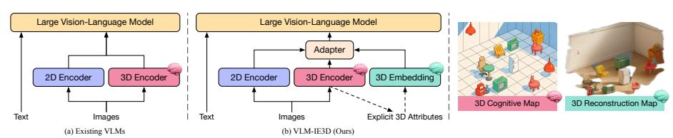
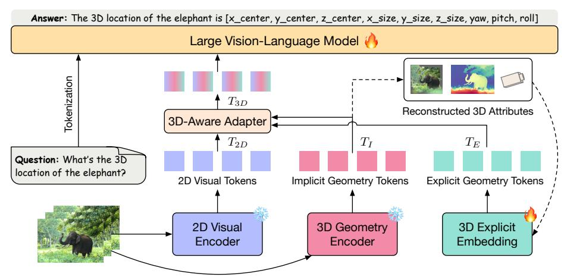
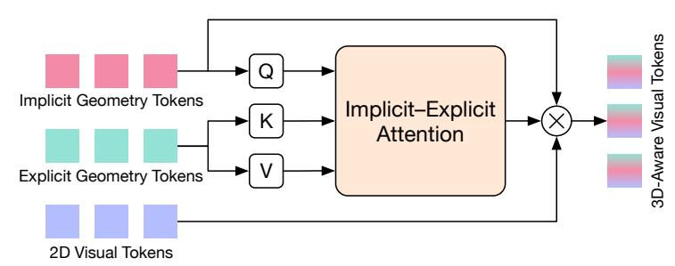
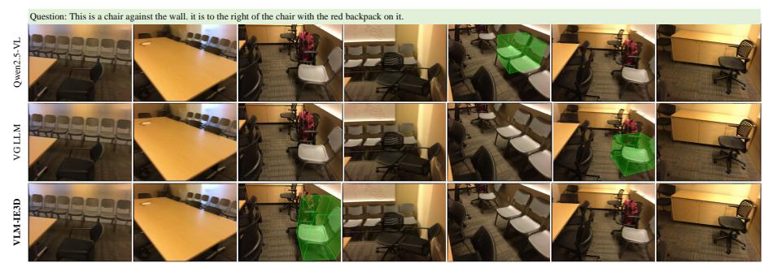
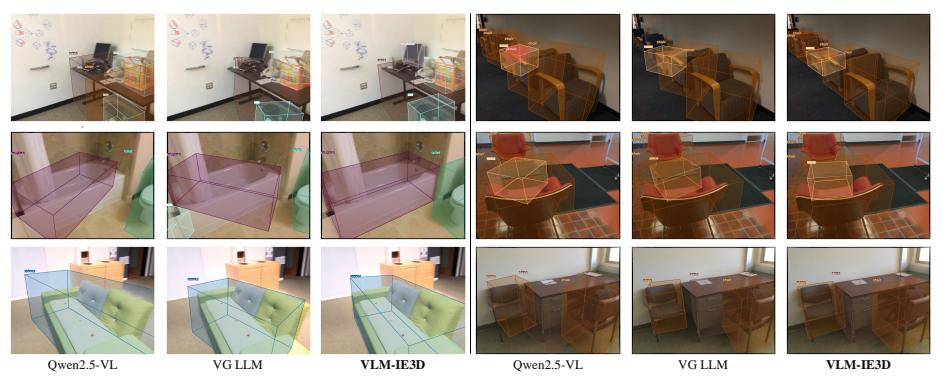
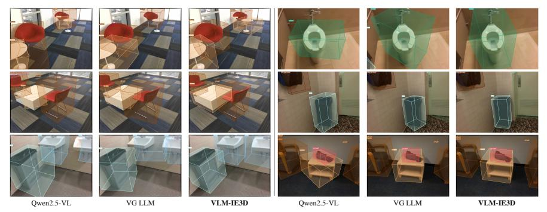
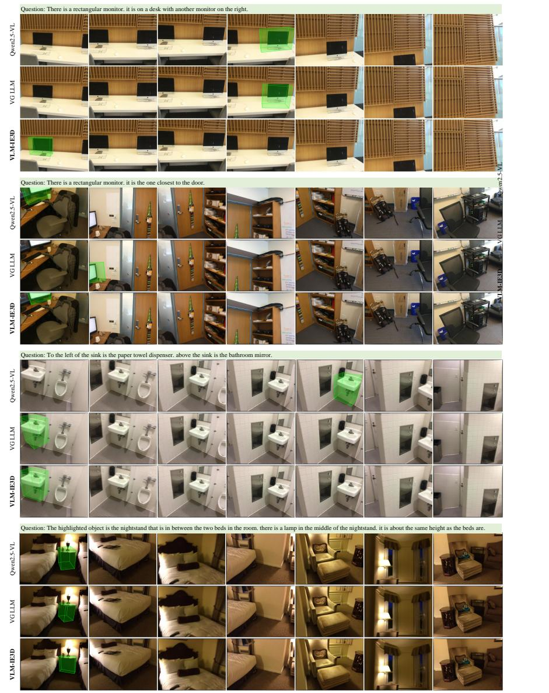

# 암시적 및 명시적 기하학을 활용한 3D 인식 VLM (3D-Aware VLMs with Implicit and Explicit Geometries)

- 원제: 3D-Aware VLMs with Implicit and Explicit Geometries
- 원문: [https://arxiv.org/abs/2607.21595](https://arxiv.org/abs/2607.21595)
- PDF: [https://arxiv.org/pdf/2607.21595v1](https://arxiv.org/pdf/2607.21595v1)
- arXiv ID: `2607.21595`

---

# 암시적 및 명시적 기하학을 활용한 3D 인식 VLM (3D-Aware VLMs with Implicit and Explicit Geometries)

Wenhao Li<sup>1</sup>, Xueying Jiang<sup>1</sup>, Quanhao Qian<sup>2,3</sup>, Deli Zhao<sup>2,3</sup>, Ran Xu<sup>2,3®</sup>, Shijian Lu<sup>1®</sup>, Gongjie Zhang<sup>4®</sup>

$^1{\rm Nanyang}$  Technological University  $^2{\rm DAMO}$  Academy, Alibaba Group  $^3{\rm HuPan}$  Lab  $^4{\rm Alibaba}$  Group

Abstract. 빠른 발전에도 불구하고, 2D 시각 입력으로 구축된 대부분의 기존 시각-언어 모델(VLMs)은 세밀한 공간 이해와 추론이 필요한 다양한 3D 작업을 처리할 때 종종 어려움을 겪는다. 이 격차를 해소하기 위해 우리는 VLM-IE3D를 제시한다. 이는 RGB 비디오에서 학습된 암시적 및 명시적 3D 기하학을 장착함으로써 VLM의 3D 공간 인식을 강화하는 통합 프레임워크이다. VLM-IE3D는 입력 비디오에서 고수준 기하학적 선행 지식을 포착하는 암시적 기하학 토큰(IGTs)과 재구성된 3D 속성에서 상세 기하학 구조를 인코딩하는 보완적 명시적 기하학 토큰(EGTs)을 도입한다. 또한 VLM-IE3D는 두 종류의 기하학적 표현을 2D 시각 단서와 효과적으로 융합하는 3D 인식 어댑터를 제공한다. 이 RGB 전용 설계는 추가 3D 입력 없이도 세밀한 공간 이해와 추론을 위한 강력한 3D 귀납적 편향을 주입한다. 광범위한 실험 결과, VLM-IE3D는 3D 비디오 탐지, 3D 시각 정착, 3D 밀집 캡션 생성, 공간 추론 등 다양한 3D 작업에서 일관되게 우수한 성능을 달성한다. 코드와 모델은 https://github.com/Vegetebird/VLM-IE3D 에서 확인할 수 있다.

키워드: 시각-언어 모델 · 암시적 및 명시적 기하학

#### 1 소개 (Introduction)

시각-언어 모델(VLMs)은 구현형 탐색[48,51], 시각-언어-행동(VLA)[23,29], 3D 장면 이해[18,46] 등 다양한 공간 이해 및 추론 작업에서 큰 잠재력을 보여왔다. 최근 한 유망한 이니셔티브[11,17,40,50]는 명시적 3D 데이터(예: 포인트 클라우드) 대신 2D 시각 관찰에서 직접 3D 표현을 학습하려 시도하며, 특수 3D 센서에 대한 의존도를 완화하고 실제 시나리오에서 보다 접근 가능한 2D RGB 데이터를 통해 VLM의 적용 범위를 확장한다. 한 가지 널리 사용되는 접근법은 3D 기하학 인코더[19,36]를 도입하여 비디오 시퀀스에서 암시적 3D 표현을 학습함으로써 VLM에 3D 공간 인식을 부여한다. 그러나 학습된 암시적 3D 표현은 종종 장면의 거친 전역 공간 배치를 포착하며, 이는 다양한

<sup>&</sup>lt;sup>™</sup> 해당 저자.

<span id="page-1-0"></span>

Fig. 1: (a) 기존 VLM은 단지 암시적 기하학적 표현만 학습하여 거친 "3D 인지 지도"를 제공함으로써 3D 인식을 획득한다. (b) 제안된 VLM-IE3D는 재구성된 3D 속성에서 명시적 기하학적 표현을 도입하여 "3D 재구성 지도"를 제공하며, 이는 암시적 표현을 보완하는 세밀한 지역 기하학을 갖는다. 이 두 보완적 표현은 2D 시각적 단서와 결합되어 VLM의 3D 인식을 거친 전역 레이아웃과 세밀한 지역 기하학적 세부 정보를 모두 강화한다.

정밀한 공간 위치 지정 및 추론을 위해 세밀한 장면 구조와 기하학을 요구하는 3D 이해 작업.

이 제한은 인지과학 [21,22]의 통찰을 반영하며, 인간은 종종 기하학적 세부 정보를 제외하고 거친 장면 인식을 위해 추상적인 “3D 인지 지도”를 형성한다. 마찬가지로, 현재 VLMs의 3D 기하학 인코더에서 추출되는 암시적 표현은 고수준 공간 선행 지식을 제공한다. 그러나 이 표현은 압축되고 잠재적이기 때문에 언어 모델이 정량적 기하학적 속성을 해석하기 어렵다, 심지어 그러한 정보가 잠재적으로 인코딩되어 있더라도 말이다. 이로 인해 세밀한 기하학적 정보는 기존 VLMs에서 정밀한 추론 작업에 접근할 수 없게 된다.

반면, 로봇 시스템은 일반적으로 깊이 맵과 포인트 클라우드와 같은 명시적 3D 표현에 의존하며, 이는 구조화된 “3D 재구성 지도”를 형성하여 정밀한 공간 작업(예: 탐색 및 위치 추정)에서 정량적 기하학 데이터를 직접 접근 가능하게 한다. 이러한 구조화되고 해석 가능한 기하학 표현은 정밀한 공간 이해에 필수적이지만 RGB-전용 VLM 프레임워크에서는 대부분 활용되지 않는다. 우리의 연구는 이 격차를 메우는 데 동기를 부여한다: VLMs에 “3D 인지 지도”의 추상적 공간 인식(전역 선행 지식)과 “3D 재구성 지도”의 세밀한 구조적 이해(세밀한 구조)를 모두 장착한다 (그림 1 참조).

이 격차를 해소하기 위해 우리는 VLM-IE3D를 제안한다. 이는 RGB 비디오에서 추출된 암시적 및 명시적 3D 기하학 표현을 모두 갖춘 통합 프레임워크이다. 이전 연구들 [11,17,40,50]이 오직 암시적 3D 표현에만 의존하는 것과 달리, VLM-IE3D는 VLM에 강력한 3D 유도 편향을 본질적으로 주입하기 위해 두 가지 상호 보완적인 기하학 인식 표현을 도입한다: (i) 암시적 기하학 토큰(IGTs)은 3D 기하학 인코더에 의해 생성되어 전역 장면 이해를 위한 거친 고수준 공간 정보를 캡처한다; (ii) 명시적 기하학 토큰(EGTs)은 재구성된 명시적 3D 표현(예: 깊이 맵 및 포인트 클라우드)에서 가벼운 임베딩 모듈을 통해 인코딩되어 세밀한 공간 이해를 위한 상세 구조 정보를 보존한다. 이 두 종류의 토큰은 자연스럽게 상호 보완적이다: IGTs는 고수준 및 거친 전역 기하학 선행 지식을 제공하고, EGTs는 특정하고 세밀한 지역 기하학 구조를 포착한다. 또한, 우리는 3D-인식 어댑터를 개발한다

어댑터는 이러한 암시적 및 명시적 3D 표현을 2D 시각적 단서와 효과적으로 통합하여, VLM이 추가적인 3D 입력 없이도 전체적 및 세밀한 수준에서 포괄적인 공간 이해와 추론을 수행할 수 있도록 하는 통합된 3D-인식 시각 임베딩을 생성한다.

우리는 3D 비디오 객체 탐지, 3D 시각적 정착, 3D 밀집 캡션 생성, 그리고 공간 추론 등 다양한 3D 이해 및 추론 과제에서 광범위한 실험을 수행한다. 결과는 VLM-IE3D가 RGB-전용 방법들 중에서 최첨단 성능을 달성함을 보여 주며, 암시적 및 명시적 기하학 표현을 결합한 효과를 검증한다.

우리의 주요 기여는 세 가지 측면으로 요약된다. 첫째, 우리는 순수 RGB 비디오 시퀀스에서 암시적 및 명시적 기하학 표현을 모두 활용하여 VLM에 강력한 3D 유도 편향을 본질적으로 주입하는 통합 프레임워크 VLM-IE3D를 제시한다. 둘째, 우리는 두 가지 상호 보완적인 기하학 인식 표현을 도입한다: IGTs는 고수준 3D 선행 지식을 인코딩하고, EGTs는 상세한 3D 구조를 제공한다. 또한, 우리는 2D 시각 단서와 이러한 표현을 효과적으로 통합하기 위한 3D-인식 어댑터를 설계한다. 셋째, 광범위한 실험은 VLM-IE3D가 추가적인 3D 입력 없이도 다수의 3D 장면 이해 및 공간 추론 과제에서 경쟁력 있는 성능을 달성함을 입증한다.

## 2 관련 연구 (Related Work)

시각-언어 모델. 시각-언어 모델(VLMs) [\[1,](#page-14-3) [27,](#page-15-6) [28,](#page-15-7) [30\]](#page-15-8)은 시각과 언어를 통합하는 데 있어 눈에 띄는 성공을 거두었다. CLIP [\[32\]](#page-15-9)와 같은 초기 연구는 대조 학습을 사용해 이미지와 텍스트 표현을 정렬하고, 이후 BLIP [\[24\]](#page-15-10)와 같은 모델은 더 큰 데이터셋과 향상된 학습 전략으로 CLIP을 강화한다. 최근 개발 [\[25,](#page-15-11)[26,](#page-15-12)[44\]](#page-16-5)은 VLM을 정적 이미지에서 동적 비디오로 확장했다. 예를 들어, Qwen2.5-VL [\[2\]](#page-14-4)은 동적 해상도 메커니즘과 절대 시간 인코딩을 통해 시간적 추론을 강화한다. 대규모 이미지–텍스트 코퍼스에서 사전 학습된에도 불구하고, 이 모델들은 3D 기하학 정보를 명시적으로 캡처하도록 최적화되지 않아 3D 기능을 제한한다.

3D 시각-언어 모델(3D 입력). 최근 VLM의 진전은 명시적 3D 데이터를 입력으로 활용해 2D에서 3D 장면 이해로 기능을 확장했다 (예: 깊이 맵 및 포인트 클라우드) [\[9,](#page-14-5) [12,](#page-14-6) [31,](#page-15-13) [35\]](#page-15-14). 예를 들어, 3D-LLM [\[13\]](#page-14-7)은 다중 뷰 2D 특징을 집계해 얻은 3D 장면 표현을 대형 언어 모델에 주입해 3D 추론을 수행한다. PointLLM [\[41\]](#page-16-6)은 포인트 인코더와 대형 언어 모델을 결합해 기하학, 외관, 언어 정보를 융합해 포인트 클라우드 이해를 수행한다. Video-3D LLM [\[49\]](#page-16-7)은 깊이 맵의 각 픽셀을 3D 좌표로 역투영하고, 이 공간적 단서를 비디오 특징에 주입한다. 이러한 진전에도 불구하고, 이 방법들은 추가적인 명시적 3D 입력에 의존한다. 그러나 고품질 3D 데이터를 얻으려면 비싸고 배치가 어려운 전용 센서가 필요하며, 대부분의 실제 상황에서는 단지 2D 데이터(이미지 또는 비디오)만이 제공된다.

단지 2D 입력만으로 3D 시각-언어 모델. 명시적 3D 데이터에 대한 의존성을 극복하기 위해, 최근 연구 [\[11,](#page-14-1)[20,](#page-15-15)[40,](#page-16-3)[43,](#page-16-8)[50\]](#page-16-4)은

<span id="page-3-0"></span>

Fig. 2: VLM-IE3D 프레임워크 개요. VLM-IE3D는 명시적 3D 입력 없이 RGB 프레임을 직접 처리하며, 세 개의 스트림을 사용한다: (1) 2D 시각 인코더가 2D 시각 토큰을 추출; (2) 3D 기하학 인코더가 고수준 3D 정보를 위한 암시적 기하학 토큰(IGTs)을 생성; (3) 3D 명시적 임베딩이 재구성된 3D 명시적 표현(예: 깊이 맵 및 포인트 클라우드)을 명시적 기하학 토큰(EGTs)으로 변환해 세밀한 구조적 세부 사항을 인코딩. 마지막으로, 3D 인식 어댑터가 이 보완 토큰들을 통합하고 기하학 풍부한 특징으로 융합하여 VLM에 제공한다.

RGB 비디오만으로 3D 장면을 이해한다. 이러한 방법들은 일반적으로 3D 기하학 인코더 [19,36]를 사용하며, 이는 대규모 2D-RGB 및 3D 페어링 데이터에서 사전 학습되어 암시적 3D 표현을 추출해 3D 기하학 사전 지식을 얻고 이를 VLM에 주입해 3D 기능을 강화한다. 이러한 암시적 표현은 장면의 전역 3D 구조적 관계(예: 방 안의 가구 전체 배치)를 인코딩할 수 있다. 본 연구에서는 이 패러다임이 3D 기하학 인코더의 잠재력을 완전히 활용하지 못한다고 주장한다. 왜냐하면 이러한 암시적 표현은 종종 거친 전역 공간 사전 지식을 인코딩해 세밀한 3D 이해 과제에 어려움을 겪기 때문이다. 반면, 우리 VLM-IE3D는 암시적 및 명시적 3D 기하학 표현을 공동 활용해 전역 3D 공간 사전 지식과 세밀한 3D 구조 정보를 VLM에 통합하는 새로운 패러다임을 도입한다.

#### 3 방법 (Method)

우리의 제안된 VLM-IE3D의 개요는 Figure 2에 나타나 있다.

RGB 비디오 시퀀스 $\left\{I^i\right\}_{i=1}^f$와 자연어 질의 Q가 주어지면, 우리는 먼저 2D 시각 토큰 $T_{2D} \in \mathbb{R}^{f \times n \times c}$를 2D 시각 인코더를 사용해 추출한다.

여기서 $I^i \in \mathbb{R}^{h \times w \times 3}$, f는 시퀀스 길이, $n = \left\lfloor \frac{h}{p} \right\rfloor \times \left\lfloor \frac{w}{p} \right\rfloor$, p는 패치 크기, c는 채널 차원이다.

비디오 시퀀스는 또한 3D 기하학 인코더 [19]에 의해 처리되어 암시적 기하학 토큰(IGTs) $T_I \in \mathbb{R}^{f \times n \times c}$와 해당

3D 속성.

재구성된 3D 속성은 3D 명시적 임베딩 모듈에 의해 추가 변환되어 명시적 기하학 토큰(EGTs) T<sup>E</sup> ∈ R f×n×c 를 생성한다. 이후 세 종류의 토큰은 3D-aware 어댑터를 통해 융합되어 향상된 3D-aware 시각 토큰 T3D를 생성한다. 마지막으로 사전 학습된 VLM 백본 [\[2\]](#page-14-4)은 T3<sup>D</sup>와 Q를 입력으로 받아 최종 응답을 생성한다.

#### 3.1 암시적 및 명시적 기하학 토큰 (Implicit and Explicit Geometry Tokens)

우리는 기존의 공간 VLMs [\[11,](#page-14-1) [17,](#page-14-2) [40,](#page-16-3) [50\]](#page-16-4)가 3D 기하학 인코더(3D geometry encoder)에서 추출한 암시적 3D 표현(implicit 3D representations)만을 사용하고, 명시적 3D 표현(explicit 3D representations)의 잠재력을 간과하고 있음을 관찰한다 (Figure [1](#page-1-0) (a) 참조). 이 한계를 해결하기 위해 우리는 Implicit Geometry Tokens (IGTs)와 Explicit Geometry Tokens (EGTs)를 도입한다. 이 두 종류의 표현은 본질적으로 상호 보완적이다: IGTs는 고수준의 전역적 암시적 3D 공간 사전(implicit 3D spatial priors)을 제공하고, EGTs는 특정하고 세밀한 명시적 3D 구조 세부사항을 제공하여 보다 포괄적인 3D 이해와 추론을 가능하게 한다. 아래에서는 제안된 IGTs와 EGTs에 대한 세부 사항을 제시한다.

Implicit Geometry Tokens. 3D geometry encoders [\[19,](#page-15-2) [33,](#page-15-16) [36,](#page-15-3) [37\]](#page-15-17)는 (예: 깊이 추정 및 포인트 재구성)과 같은 다양한 3D 기하학 과제에 대해 사전 학습(pre-trained)되어 2D 이미지에서 3D 기하학 정보를 학습하고 표현하는 데 강력한 역량을 보여왔다. 이 모델들은 장면을 토큰 시퀀스로 인코딩하여 3D 재구성을 가능하게 하며, 일반적으로 세 가지 핵심 구성요소를 갖는다: (1) 프레임별 특징을 추출하는 이미지 인코더, (2) 프레임별 및 전역 자기 주의(attention) 메커니즘을 번갈아 사용하여 프레임 간 상호작용을 촉진하는 융합 디코더, 그리고 (3) 깊이 맵과 같은 3D 속성을 추정하기 위한 작업별 예측 헤드.

이러한 발전에 영감을 받아 우리는 AnySplat [\[19\]](#page-15-2)를 3D 기하학 인코더로 사용하고, 융합 디코더의 출력에서 추출한 암시적 3D 표현을 IGTs T<sup>I</sup> ∈ R f×n×c 로 활용한다. IGTs는 암시적 잠재 벡터 형태로 장면의 전반적인 배치(예: 침실의 전형적인 구조)와 물체 간의 공간 관계(예: "TV가 벽에 장착되고 소파가 TV 앞에 배치된다")와 같은 고수준의 전역적 3D 공간 사전(prior)을 인코딩한다. 이러한 표현을 학습함으로써 우리 방법은 강력한 일반화 성능을 달성하며, 명시적 3D 입력 없이도 다양한 장면의 3D 구조 모델링에 빠르게 적응할 수 있다.

Explicit Geometry Tokens. IGTs가 전역 장면 표현을 학습하는 데 강점을 가지고 있음에도 불구하고, 그 압축되고 잠재적인 형태는 언어 모델이 정량적 기하학적 속성을 해석하기 어렵게 만들어 정량적 공간 이해 및 추론에서의 효과를 제한한다. 이를 해결하기 위해 우리는 재구성된 명시적 3D 속성에서 명확한 기하학적 해석 가능성을 갖는 상세한 3D 구조 정보를 인코딩하는 Explicit Geometry Tokens (EGTs)를 도입한다.

Specifically, we obtain depth maps, camera poses, and 3D Gaussian splats directly from the corresponding prediction heads of the 3D geometry encoder [\[19\]](#page-15-2). The point maps are derived by back-projecting reconstructed depth maps into 3D coordinates using reconstructed camera poses. The well-defined 3D attributes

<span id="page-5-0"></span>

**Fig. 3:** Illustration of our 3D-aware adapter architecture. It takes the implicit and explicit 3D geometry tokens along with 2D visual tokens as input to generate the final 3D-aware visual tokens. The token compression operation is omitted for clarity.

$X_E \in \mathbb{R}^{f \times h \times w \times c'}$ 은 경량 3D 명시적 임베딩 모듈을 통해 EGTs $T_E \in \mathbb{R}^{f \times n \times c}$ 로 임베딩됩니다. 여기서 c'는 채널 차원으로, 서로 다른 3D 속성 유형마다 달라집니다. 효율성과 확장성을 위해 우리는 무거운 복잡한 3D 백본(예: DepthAnything V2 [42]) 대신 단일 레이어 패치 임베딩과 최소한의 구조적 변경 및 학습 비용을 갖는 두 레이어 MLP를 사용합니다. EGTs는 공간적 정량 측정을 갖는 명시적 3D 구조 데이터의 잠재 표현으로서, IGT가 포착한 암시적 사전 지식과 보완되는 명시적 기하학적 사전 지식을 제공합니다. 이러한 명시적 사전 지식은 세밀한 3D 구조 세부 사항에 초점을 맞추며, VLM에 보다 정량적 이해와 추론 작업을 위한 구체적인 위치 정보를 제공할 수 있습니다.

(blank line)
#### 3.2 3D-Aware Adapter
(blank line)

위 과정을 거친 뒤, 우리는 2D 시각 토큰 $T_{2D}$, IGTs $T_I$, 그리고 EGTs $T_E$ 세 종류의 토큰을 얻습니다. 이후 우리는 이 세 종류의 토큰을 효과적으로 통합하기 위해 3D 인식 어댑터를 설계합니다 (Figure 3 참조). 구체적으로 Qwen2.5-VL [2]의 공간 병합 전략을 따라, 각 토큰 종류 내에서 인접한 $2 \times 2$ 특징을 연결하고 두 레이어 MLP에 입력하여 압축된 토큰 $\{\tilde{T}_{2D}, \tilde{T}_I, \tilde{T}_E\} \in \mathbb{R}^{f \times m \times c}$ 를 생성하며, 여기서 $m = \left|\frac{h}{2p}\right| \times \left|\frac{w}{2p}\right|$ 입니다.

암시적과 명시적 3D 기하학 표현 사이의 격차를 해소하기 위해, 우리는 이 보완적 표현을 정렬하고 융합하는 암시적—명시적 주의(IEA) 모듈을 개발합니다. 이는 다중 헤드 교차 주의(MCA) 레이어를 통해 IGTs와 EGTs 사이의 상호작용을 수행합니다. 공식적으로 MCA의 점곱 주의[34]는 다음과 같이 표현됩니다:

$$Attention(Q, K, V) = Softmax\left(QK^{T}/\sqrt{d}\right)V, \tag{1}$$

여기서 쿼리 $Q \in \mathbb{R}^{n_q \times d}$, 키 $K \in \mathbb{R}^{n_k \times d}$, 값 $V \in \mathbb{R}^{n_v \times d}$이며, d는 특징 차원을 나타냅니다.

각 프레임 i에 대해, MCA는 압축된 IGTs $\tilde{T}_I^i$ 를 쿼리로, 압축된 EGTs $\tilde{T}_E^i$ 를 키와 값으로 사용하고, 이후 잔차 연결을 수행합니다:

$$\tilde{T}_{3D}^{i} = \tilde{T}_{I}^{i} + \text{MCA}(\tilde{T}_{I}^{i}, \tilde{T}_{E}^{i}, \tilde{T}_{E}^{i}), \tag{2}$$

$MCA(\cdot)$ 은 다중 헤드 교차 주의 함수를 나타내며, 그 입력은 쿼리, 키, 값입니다.

다음으로, 우리는 3D 토큰 $\tilde{T}_{3D}$ 를 압축된 2D 시각 토큰 $\tilde{T}_{2D}$ 와 원소별 덧셈을 통해 융합합니다:

<span id="page-6-0"></span>

$$T_{3D} = \tilde{T}_{2D} + \tilde{T}_{3D}. (3)$$

3D 인식 어댑터를 통해, 우리의 VLM-IE3D는 통합된 3D 인식 시각 표현 $T_{3D}$ 를 생성하며, 이는 사전 학습된 VLM에 텍스트 임베딩과 함께 최종 예측을 위해 입력됩니다. 이 설계는 모델이 암시적 및 명시적 3D 공간 관계를 동시에 활용하면서 2D 시각 의미를 보존하도록 합니다.

(blank line)
#### 4 Experiments
(blank line)

(blank line)
#### 4.1 Implementation Details
(blank line)

우리는 Qwen2.5-VL-3B [2]를 VLM 백본으로, AnySplat [19]를 3D 기하학 인코더로 채택한다. 2D 시각 인코더는 Qwen2.5-VL [2]의 것과 동일하다. 우리는 Adam 옵티마이저를 사용해 warmup 비율 0.03으로 한 epoch 동안 모델을 학습한다. 학습률은 점진적으로 1e-5까지 증가한 뒤 0으로 감소한다. 배치 크기는 GPU당 1으로 설정한다. 학습 중 2D 시각 인코더와 3D 기하학 인코더는 고정되고, VLM 백본과 3D 명시적 임베딩은 학습 가능 상태를 유지한다. 모든 실험은 8개의 H100 80G GPU에서 수행된다.

입력 이미지는 $392 \times 518$으로 재스케일링 및 크롭된다. 패치 크기 p=14, 채널 차원 c=2048, 최대 시퀀스 길이 f=32를 설정한다. 토큰 수는 n=1036, 압축 토큰 수는 m=252이다. 명시적 3D 표현을 위해 세 가지 3D 속성: 깊이 맵(c'=1), 포인트 맵(c'=3), 3D 가우시안 스플랫(c'=86)을 탐색한다. 우리 방법은 실제 3D 장면 정보를 필요로 하지 않으므로, 일반적인 3D 기하학 인코더 [19,36]를 따라 첫 번째 프레임을 모든 작업의 기준 좌표계로 채택한다. 단, 3D 시각적 정규화에서는 바운딩 박스가 각 프레임의 로컬 좌표계로 표현된다. 우리는 EGT에서 깊이 맵을 명시적 3D 속성으로 사용한다. 이는 대규모 모델 학습을 위해 RGB-D 센서에서 보다 쉽게 얻을 수 있기 때문이다.

(blank line)
#### 4.2 최첨단 방법과의 비교 (Comparison with State-of-the-Art Methods)
(blank line)

VLM-IE3D의 효과를 검증하기 위해, 우리는 3D 장면 이해 및 공간 추론 과제에 대해 광범위한 실험을 수행하여 그 3D 이해 및 추론 능력을 종합적으로 평가한다. 공정한 비교를 위해, 두 종류의 과제에 대해 개별 모델을 별도로 학습한다.

방법 3D 장면 입력 C@0.5↑ M@0.5↑ Scan2Cap [10] 39.122.0 3DJCG [3 49.5 24.2 1 D3Net [5] 62.625.7Vote2Cap-DETR [8] 111 61.8 26.2 LL3DA [7] 65.2 26.0 Grounded 3D-LLM [9] 70.2 27.9 LEO [15] 72.4Chat-Scene [14] 77.1LLaVA-3D [52] 30.2 Video-3D LLM [49] 80.0 28.5Qwen2.5-VL-3B [2] Х 58.0 26.9 VG LLM [50] 78.6 28.6 VLM-IE3D (우리) 80.4 28.8

표 1: Scan2Cap에 대한 정량적 결과.

3D 장면 이해에 대한 결과. 우리는 결합된 데이터셋에서 다중 작업 학습을 사용해 모델을 훈련하고, 세 가지 기본 3D 장면 이해 과제에서 평가한다:

(i) 3D 밀집 캡셔닝은 3D 객체 제안(프로포절)을 감지하고 객체 좌표를 기반으로 설명을 생성한다. 우리는 Scan2Cap [10] 벤치마크에서 평가한다. 이전 연구 [49, 50, 52]를 따라, LEO [15]에서 추출한 Mask3D-감지 객체 제안을 활용하며, 모델은 객체 중심 좌표에 조건화된 캡션을 생성하도록 과제된다.

(ii) 3D 시각적 정규화는 목표 객체가 나타나는 첫 번째 프레임과 그 3D 바운딩 박스를 카메라 좌표계에서 찾는 것을 목표로 한다. 우리는 ScanRefer [4] 데이터셋을 사용한다. 이 데이터셋은 562개의 실내 스캔에서 축 정렬 바운딩 박스와 짝을 이룬 36,665개의 객체 설명을 포함한다. [45,50]을 따라, 우리는 사전 감지된 객체 제안과 예측된 바운딩 박스를 매칭하여 예측을 정제한다.

(iii) 3D 비디오 감지는 연속 프레임 시퀀스 전반에 걸쳐 모든 가시 객체에 대해 3D 바운딩 박스를 예측한다. 우리는 EmbodiedScan [38]에서 정제된 [50] 데이터셋을 사용한다. 이 데이터셋은 실내 장면에서 해당 객체 주석이 있는 연속 프레임 시퀀스를 포함한다. 각 샘플은 1 FPS 속도로 캡처된 네 개의 연속 프레임으로 구성된다. [50]을 따라, 우리는 데이터를 958개의 훈련 장면과 243개의 평가 장면으로 분할하고, 각 장면에서 무작위로 150개와 10개의 샘플을 훈련 및 평가에 선택한다. 우리는 일상 생활에서 20개의 일반 객체 범주에 대해 성능을 평가하고, IoU 임계값 0.25에서 평균 정밀도, 재현율, F1 점수 $P_{25}$, $R_{25}$, $F_{125}$를 보고한다.

Our VLM-IE3D는 세 가지 3D 장면 이해 과제 전반에서 강력한 성능을 보여주며, 2D 시각 입력만 사용하는 방법을 지속적으로 능가하면서 3D 장면 입력 접근 방식과 경쟁력 있는 결과를 달성합니다.

3D Dense Captioning (Scan2Cap)의 경우, 표 1에 표시된 바와 같이 VLM-IE3D는 비교된 모든 방법 중 최고 C@0.5(80.4)를 달성하고, 2D-visual-input 방법 중 최고 M@0.5(28.8)를 기록합니다. 기준선과 비교했을 때, VLM-IE3D는 Qwen2.5-VL-3B [2] 대비 C@0.5에서 22.4, 그리고 1.8에서 개선을 보여줍니다.

<span id="page-8-0"></span>**Table 2:** ScanRefer에 대한 정량적 결과. 괄호("()") 안의 내용은 제안 정제 결과를 나타냅니다.

| 방법 | 3D 장면 입력 | Acc@0.25 | Acc@0.50 |
|---------------------|----------------|--------------------|--------------------|
| ScanRefer [4] | ✓ | 37.3 | 24.3 |
| MVT [16] | ✓ | 40.8 | 33.3 |
| ViL3DRel [6] | ✓ | 47.9 | 37.7 |
| Grounded 3D-LLM [9] | ✓ | 47.9 | 44.1 |
| Chat-Scene [14] | ✓ | 55.5 | 50.2 |
| LLaVA-3D [52] | ✓ | 54.1 | 42.4 |
| Video-3D LLM [49] | ✓ | 58.1 | 51.7 |
| SPAR [45] | Х | 31.9 (48.8) | 12.4 (43.1) |
| Qwen2.5-VL-3B [2] | × | 34.0 (50.7) | 10.6~(44.7) |
| VG LLM [50] | × | 36.4 (53.5) | 11.8(47.5) |
| VLM-IE3D (우리) | Х | <b>43.2</b> (55.4) | <b>16.9</b> (48.9) |

<span id="page-8-1"></span>**Table 3:** 3D 비디오 감지에 대한 정량적 결과. 초당 프레임 수(FPS)는 단일 H100 GPU에서 계산되었습니다.

| 방법 | 파라미터 (B) | FPS | $P_{25}$ | $R_{25}$ | $F1_{25}$ |
|----------------------------------|--------------|---------|----------------|----------------|----------------|
| Qwen2.5-VL-3B [2]<br>VG LLM [50] | 3.09<br>3.13 | 14<br>7 | $32.1 \\ 41.7$ | $30.1 \\ 35.7$ | $30.9 \\ 38.2$ |
| VLM-IE3D (우리 연구) | 3.23 | 6 | 44.2 | 41.9 | 42.8 |

C@0.5 over VG LLM [50], 우리 IGTs와 EGTs가 3D 공간 이해 능력을 효과적으로 향상시킴을 보여준다.

Table 2는 3D 시각적 정착(ScanRefer) 작업에 대한 결과를 제시한다. VLM-IE3D는 IoU 임계값 0.25와 0.50에서 각각 43.2 %와 16.9 % 정확도를 달성하며, 3D 입력이 없는 모든 방법을 능가한다. Qwen2.5-VL-3B [2] 대비 Acc@0.25에서 9.2, VG LLM [50] 대비 6.8의 향상은 우리 방법의 우수한 객체 위치 지정 능력을 입증한다. 제안 정제(Proposal refinement)를 통해 우리 방법은 55.4 %와 48.9 % 정확도를 달성하여 3D‑시나리오 입력 방법과의 격차를 좁힌다. 이는 명시적 3D 입력이 정밀한 위치 지정에 이점을 제공하지만, 우리 암시적 및 명시적 기하학 인코딩 접근 방식이 경쟁력 있는 대안을 제공함을 시사한다.

Table 3은 3D 비디오 탐지 작업에 대한 결과를 보여준다. VLM-IE3D는 44.2 % P<sub>25</sub>, 41.9 % R<sub>25</sub>, 42.8 % F1<sub>25</sub>를 달성하며, 이는 기준선 Qwen2.5-VL-3B [2] 대비 12.1, 11.8, 11.9의 향상과 VG LLM [50] 대비 2.5, 6.2, 4.6의 향상을 나타낸다. 모든 지표에서 일관된 이득은 우리 제안한 IGTs와 EGTs가 모델의 3D 비디오 장면에서 객체를 탐지하고 위치 지정하는 능력을 효과적으로 향상시킴을 보여준다.

효율성 및 복잡도 분석. 우리 방법은 가볍고 효율적이다. Table 3에 나타난 바와 같이 VG LLM은 3.13 B의 학습 가능한 파라미터를 필요로 하는 반면, VLM-IE3D는 3.23 B를 갖는다. 3D 명시적 임베딩 모듈, 3D 인식 어댑터, 그리고 EGTs를 위한 3D 속성 재구성 단계를 포함함에도 불구하고 VLM-IE3D는 0.10 B의 추가 파라미터만을 도입한다(3.2 %의 소폭 증가). 또한 암시적 기준선 VG LLM과 비교했을 때, 우리의 추론 속도는 단지 1 FPS(단일 H100 GPU에서 7 FPS에서 6 FPS)만 감소한다. 이 약간의 속도 감소는 매우 수용 가능한 트레이드오프이다.

<span id="page-9-0"></span>Table 4: VSI-Bench에서 최첨단 방법과의 정량적 비교.

| 객체 수, 절대 거리, 객체 크기, 방 크기, 상대 거리, 상대 방향. |  |  |  |  |  |  | 경로 계획 | 근사 순서 |  |  |
|----------------------------------------------------------------|------|------|------------------|------|------|------------------------|------------|-------------|------|--|
| 모델 | 평균 |  | 수치 답변 |  |  | 객관식 답변 |  |  |  |  |
| 독점 모델 (AP | PI) |  |  |  |  |  |  |  |  |  |
| GPT-40 | 34.0 | 46.2 | 5.3 | 43.8 | 38.2 | 37.0 | 41.3 | 31.5 | 28.5 |  |
| Gemini-1.5-Flash | 42.1 | 49.8 | 30.8 | 53.5 | 54.4 | 37.7 | 41.0 | 31.5 | 37.8 |  |
| Gemini-1.5-Pro | 45.4 | 56.2 | 30.9 | 64.1 | 43.6 | 51.3 | 46.3 | 36.0 | 34.6 |  |
| 오픈소스 모델 |  |  |  |  |  |  |  |  |  |  |
| InternVL2-8B | 34.6 | 23.1 | 28.7 | 48.2 | 39.8 | 36.7 | 30.7 | 29.9 | 39.6 |  |
| InternVL2-40B | 36.0 | 34.9 | 26.9 | 46.5 | 31.8 | 42.1 | 32.2 | 34.0 | 39.6 |  |
| Qwen2.5-VL-3B | 30.6 | 24.3 | 24.7 | 31.7 | 22.6 | 38.3 | 41.6 | 26.3 | 21.2 |  |
| Qwen2.5-VL-72B | 37.0 | 25.1 | 29.3 | 54.5 | 38.8 | 38.2 | 37.0 | 34.0 | 28.9 |  |
| LongVA-7B | 29.2 | 38.0 | 16.6 | 38.9 | 22.2 | 33.1 | 43.3 | 25.4 | 15.7 |  |
| VILA-1.5-40B | 31.2 | 22.4 | 24.8 | 48.7 | 22.7 | 40.5 | 25.7 | 31.5 | 32.9 |  |
| VideoLLaMA3-7B | 35.8 | 41.9 | 23.5 | 42.2 | 27.1 | 39.4 | - | 32.0 | 31.4 |  |
| LLaVA-OneVision-72B | 40.2 | 43.5 | 23.9 | 57.6 | 37.5 | 42.5 | 39.9 | 32.5 | 44.6 |  |
| LLaVA-NeXT-Video-72B | 40.9 | 48.9 | 22.8 | 57.4 | 35.3 | 42.4 | 36.7 | 35.0 | 48.6 |  |
| 공간 강화 모델 | s |  |  |  |  |  |  |  |  |  |
| SAT-LLaVA-Video-7B | - | - | - | - | 47.3 | 41.1 | 37.1 | 36.1 | 40.4 |  |
| SPAR-8B | 41.1 | - | - | - | - | - | - | - | - |  |
| RynnEC-7B | 45.8 | 58.5 | 25.4 | 54.9 | 42.7 | 44.2 | - | 38.7 | 30.5 |  |
| VG LLM-4B | 47.3 | 66.0 | 37.8 | 55.2 | 59.2 | 44.6 | 45.6 | 33.5 | 36.4 |  |
| VLM-IE3D-4B (Ours) | 47.6 | 67.5 | 38.5 | 55.0 | 58.7 | 47.7 | 45.1 | 36.6 | 31.9 |  |

considering the consistent performance improvements (e.g., +4.6 in F1<sub>25</sub> for 3D video detection compared to VG LLM). The lightweight nature of our explicit geometry embedding (which relies on a simple MLP rather than a heavy deep encoder) ensures that the computational overhead remains negligible, facilitating potential deployment in real-world scenarios.

Qualitative Results Analysis. Figure 4 and Figure 5 illustrate qualitative comparisons among Qwen2.5-VL [2], VG LLM [50], and VLM-IE3D on 3D visual grounding and 3D video detection, respectively. As shown in Figure 4, when given a complex natural language query referring to a target in a video, baseline models like Qwen2.5-VL and VG LLM often struggle to accurately identify the exact first frame where the object appears, and they fail to precisely localize it in 3D space, producing bounding boxes that deviate from actual object boundaries. In contrast, VLM-IE3D correctly grounds the target in the temporal sequence and produces much tighter, more precise 3D bounding boxes. Similarly, in the 3D video detection task (Figure 5), VLM-IE3D captures fine-grained local geometries better, significantly alleviating typical failure cases such as scale mismatch or floating predictions observed in the implicit-only baseline (VG LLM). These qualitative results intuitively validate that complementing high-level IGTs with fine-grained structural EGTs effectively improves both the spatio-temporal and 3D geometric awareness of VLMs.

Results on Spatial Reasoning. We follow the training protocol of [50] for a fair comparison, utilizing subsets from SPAR-7M [45] (234K samples, 3% of the full dataset) and the LLaVA-Hound split of LLaVA-Video-178K [47] (63K samples, 25% of the original data). We then evaluate VLM-IE3D on VSI-Bench, a spatial reasoning benchmark that assesses egocentric-allocentric transformation and relational reasoning capabilities.

Table 4 presents a comprehensive comparison of VLM-IE3D against state-of-the-art methods on VSI-Bench. Despite using only 4B parameters, our method achieves the best average performance of 47.6%, outperforming all baselines

<span id="page-10-0"></span>

Fig. 4: Qualitative comparison of 3D visual grounding among Qwen2.5-VL, VG LLM, and our VLM-IE3D. This task aims to localize the first frame in the video that contains the object described in the text. Our VLM-IE3D achieves superior localization accuracy and produces more precise object bounding boxes.

<span id="page-10-1"></span>

Fig. 5: Qualitative comparison of 3D video detection among Qwen2.5-VL, VG LLM, and our VLM-IE3D. Our method produces more accurate 3D bounding box predictions with superior shape alignment and spatial localization, precisely capturing object geometry.

including proprietary models like Gemini-1.5-Pro (45.4%), and open-source models with significantly larger parameter counts such as LLaVA-NeXT-Video-72B (40.9%). On numerical answer tasks, our model excels particularly in object counting (67.5%), outperforming the previous best spatial-enhanced model VG LLM by 1.5. For multiple-choice tasks, VLM-IE3D achieves competitive performance, particularly in tasks demanding high geometric perception where explicit structures are critical. For instance, on VSI-Bench (Relative Distance), we achieve a notable gain of +3.1 over VG LLM (47.7% vs. 44.6%). These improvements demonstrate that explicit representations effectively capture fine-grained information to resolve complex spatial ambiguities where purely implicit baselines (VG LLM) struggle, validating our motivation that combining implicit and explicit 3D representations provides complementary strengths for comprehensive spatial reasoning.

<span id="page-11-0"></span>Table 5: 암시적 및 명시적 3D 특징 표현에 대한 ablation 연구 (Ablation study on implicit and explicit 3D feature representations).

| 방법 | P25 | R25 | F125 |
|-----------------------------------|----------------------|----------------------|----------------------|
| 기준 (Baseline) [2] | 32.1 | 30.1 | 30.9 |
| + EGTs<br>+ IGTs<br>+ IGTs + EGTs | 36.1<br>41.8<br>44.2 | 33.7<br>39.7<br>41.9 | 34.7<br>40.5<br>42.8 |

<span id="page-11-1"></span>표 6: IGT와 EGT를 위한 다양한 융합 전략에 대한 절제 연구 (Ablation study on different fusion strategies for IGTs and EGTs).

| 방법 | P25 | R25 | F125 |
|------------------------|------|------|------|
| VLM-IE3D, Concat | 42.7 | 40.8 | 41.5 |
| VLM-IE3D, Addition | 43.4 | 41.9 | 42.4 |
| VLM-IE3D, Weighted | 42.3 | 40.4 | 41.2 |
| VLM-IE3D, Proposed IEA | 44.2 | 41.9 | 42.8 |

#### 4.3 Ablation Study

제안된 모델에서 각 구성 요소와 설계가 미치는 영향을 검증하기 위해, 우리는 3D 비디오 탐지에 대해 광범위한 Ablation 실험을 수행한다.

암시적 및 명시적 기하학 토큰. 우리는 3D 기하학 정보를 포함하지 않는 Qwen2.5-VL-3B [\[2\]](#page-14-4)를 기준 모델로 채택하고, 제안된 IGT와 EGT의 효과를 조사하기 위해 Ablation 연구를 수행한다. 결과는 표 [5.](#page-11-0)에 요약되어 있다. 결과는 암시적 또는 명시적 3D 표현을 도입하면 VLM 성능이 크게 향상됨을 보여준다. 구체적으로, 기준 모델에 EGT를 장착하면 F1<sup>25</sup>이 30.9에서 34.7로 개선되고, IGT를 도입하면 30.9에서 40.5로 더 큰 개선이 나타난다. 이러한 향상은 IGT가 포착한 고수준 3D 사전 지식과 EGT가 제공하는 상세 구조 정보를 통해 설명될 수 있으며, 이는 우리의 핵심 통찰을 검증한다. 특히 IGT는 EGT보다 더 큰 개선을 제공하며, 이는 IGT가 풍부하고 일반적인 3D 사전 지식을 인코딩하여 보다 포괄적인 기하학 정보를 제공하기 때문이다. 암시적 및 명시적 3D 표현을 모두 통합할 때, 우리 방법은 추가적인 성능 향상을 달성하여 F1<sup>25</sup>을 42.8에 도달한다. 이는 기준 모델 대비 11.9(30.9에서 42.8), EGT만 사용한 기준 대비 8.1(34.7에서 42.8), IGT만 사용한 기준 대비 2.3(40.5에서 42.8)의 개선을 의미한다. 이러한 결과는 암시적 및 명시적 3D 표현이 상호 보완적이며, 그 공동 통합이 VLM의 3D 기능을 효과적으로 향상시킨다는 것을 보여주어 우리의 동기를 검증한다.

융합 전략. 암시적 및 명시적 표현(즉, IGT와 EGT) 사이의 다양한 융합 메커니즘의 효과를 조사하기 위해, 표 [6.](#page-11-1)에 표시된 대로 Ablation 연구를 수행한다. 우리는 다음과 같은 융합 전략을 Ablation한다: (i) Concat: 특징을 연결한 뒤 차원을 정렬하기 위해 선형 투영을 수행한다. (ii) Addition: 두 특징 맵을 원소별로 더한다. (iii) Weighted: 두 개의 학습 가능한 가중치를 사용한 원소별 합산이다. (iv) 제안된 IEA: IGT와 EGT 사이에서 정보를 동적으로 교환하는 우리의 IEA 모듈이다. 이 전략들 중에서 제안된 IEA가 가장 좋은 성능을 보인다.

방법 P<sup>25</sup> R<sup>25</sup> F1<sup>25</sup> 기준 [\[2\]](#page-14-4) 32.1 30.1 30.9 + IGTs 41.8 39.7 40.5 + IGTs + EGTs (포인트) 44.3 41.7 42.6 + IGTs + EGTs (깊이) 44.2 41.9 42.8

<span id="page-12-0"></span>Table 7: 다양한 명시적 3D 속성에 대한 Ablation 연구 (Ablation study on different explicit 3D attributes)

<span id="page-12-1"></span>Table 8: 3D 명시적 임베딩의 다양한 설계 선택에 대한 Ablation 연구 (Ablation study on different design choices of the 3D explicit embedding)

+ IGTs + EGTs (가우시안) 43.9 41.6 42.5

| Method | P25 | R25 | F125 |
|--------------------------------|------|------|------|
| VLM-IE3D, 없음 | 41.8 | 39.7 | 40.5 |
| VLM-IE3D, 풀링 | 43.6 | 41.0 | 42.0 |
| VLM-IE3D, 위치 임베딩 | 44.0 | 41.5 | 42.5 |
| VLM-IE3D, 딥 인코더 | 38.5 | 34.0 | 35.9 |
| VLM-IE3D | 44.2 | 41.9 | 42.8 |

performance, indicating its effectiveness in integrating implicit and explicit representations. We also explore different fusion strategies for 2D and 3D token fusion as described in Eq. [3.](#page-6-0) Empirical results show that the direct and non-parametric addition operation is sufficient to achieve strong performance. Therefore, we choose the proposed IEA for fusing IGTs and EGTs and the addition operation for fusing 2D and 3D tokens.

Explicit 3D Attribute. We further investigate the impact of different explicit 3D attributes, including depth maps, point maps, and 3D Gaussians. As shown in Table [7,](#page-12-0) incorporating any of these explicit 3D representations consistently improves performance across all metrics, achieving highly comparable results (F1<sup>25</sup> scores ranging from 42.5% to 42.8%). This indicates that as long as the explicit representation provides physically meaningful spatial measurements, it can effectively compensate for the lack of fine-grained structures in IGTs. Consequently, we opt for depth maps in our default setting, as they are the most accessible and parameter-efficient representation among the three. These results validate that different explicit 3D representations can serve as robust geometric complements to IGTs, thereby consistently enhancing the spatial awareness of VLMs.

3D Explicit Embedding. Table [8](#page-12-1) presents an ablation study examining different design choices for the 3D explicit embedding module in VLM-IE3D. We evaluate four alternative approaches for embedding explicit geometry: (i) None: removing the 3D explicit embedding and EGTs entirely. (ii) Pooling: replacing the one-layer patch embedding in our method with the average pooling operation. (iii) Positional Encoding: using average pooling with sinusoidal positional embedding [\[34\]](#page-15-18). (iv) Deep Encoder: treating depth maps as images and utilizing DepthAnything V2 [\[42\]](#page-16-9) as a deep encoder. The results demonstrate the effectiveness of our simple and lightweight design for the 3D explicit embedding module, which introduces only 0.008B parameters (a negligible 0.25% of the 3.23B trainable parameters) while achieving significant performance gains. Surprisingly, we observe that a deep

<span id="page-13-0"></span>Table 9: 서로 다른 3D 기하학 인코더에 대한 ablation 연구.

| 방법 | P25 | R25 | F125 |
|----------------------------------------------------------------------------------------------------|------------------------------|------------------------------|------------------------------|
| 기준선 [2] | 32.1 | 30.1 | 30.9 |
| 3<br>VLM-IE3D, π<br>VLM-IE3D, VGGT<br>VLM-IE3D, AnySplat<br>VLM-IE3D, AnySplat w. DepthAnything V2 | 43.6<br>43.1<br>44.2<br>43.8 | 41.2<br>40.9<br>41.9<br>41.5 | 42.1<br>41.7<br>42.8<br>42.5 |

우리는 인코더 아키텍처가 훈련이 어려우며 성능이 최적 이하임을 관찰한다. 우리는 가설을 제시한다: 복잡한 딥 모델은 입력을 과도하게 처리하고 고수준 추상 의미 특징을 추출하는 경향이 있다. 이는 본질적으로 IGTs의 역할과 겹치며, 특징 중복을 일으킨다. 반대로 명시적 기하학은 공간 좌표의 직접 매핑을 요구한다. 우리의 경량 설계는 과도한 추상화 없이 이러한 세밀한 세부 정보를 정확히 보존하며, 추상화가 많은 IGTs에 이상적인 보완 역할을 한다.

3D 기하학 인코더. 본 방법의 일반화 능력을 다양한 3D 기하학 인코더에 대해 평가하기 위해 VGGT [\[36\]](#page-15-3), AnySplat [\[19\]](#page-15-2), 그리고 π 3 [\[39\]](#page-16-14)를 사용한 소거 연구를 수행한다. 표 9에 나타난 바와 같이, 테스트된 모든 인코더는 기준 모델 [\[2\]](#page-14-4)보다 일관되게 성능을 향상시킨다. 또한 AnySplat의 깊이 맵을 DepthAnything V2 [\[42\]](#page-16-9)로 재구성한 깊이 맵으로 교체하여, 서로 다른 소스 모델에서 IGTs와 EGTs를 얻는다. 이 변형 역시 강력한 성능을 보이며, IGTs와 EGTs가 별개의 모델에서 추출될 수 있음을 입증한다. 효율성과 단순성을 위해, 최종 프레임워크에서는 단일 3D 기하학 인코더를 사용해 IGTs와 EGTs를 모두 얻는다. 이 결과는 VLM-IE3D 프레임워크의 견고한 일반화 능력을 입증하며, 다양한 3D 기하학 인코더와의 원활한 통합을 위한 유연성을 강조한다. 이는 향후 3D 기하학 인코더의 발전을 활용할 수 있는 강력한 잠재력을 시사한다.

## 5 Conclusion

본 논문은 VLM-IE3D를 제시한다. VLM-IE3D는 순수 2D 시각 입력에서 암시적 및 명시적 3D 기하학적 표현을 통합함으로써 VLM의 3D 공간 인식을 향상시키는 통합 프레임워크이다. IGTs와 EGTs의 상호 보완적 설계와 3D 인식 어댑터의 효과적 융합을 통해, 본 방법은 VLM에 강력한 3D 유도 편향을 주입하고 3D 입력 없이 전체적 및 세밀한 3D 이해와 추론을 달성한다. 다양한 3D 장면 이해 및 공간 추론 과제에서의 실험은 제안된 VLM-IE3D의 효과를 검증하며, 2D 시각 입력 방법보다 우수한 성능을 보이고 3D 장면 입력 방법과 경쟁력 있는 결과를 보여준다.

감사의 글. 본 연구는 싱가포르 교육부(Ministry of Education Singapore)의 Tier-2 프로젝트 체계에 따라 프로젝트 번호 MOET2EP20123-0003으로 자금을 지원받았다.

## References

- <span id="page-14-3"></span>1. Alayrac, J.B., Donahue, J., Luc, P., Miech, A., Barr, I., Hasson, Y., Lenc, K., Mensch, A., Millican, K., Reynolds, M., et al.: Flamingo: 소수 샷 학습을 위한 시각 언어 모델. In: NeurIPS. vol. 35, pp. 23716–23736 (2022)
- <span id="page-14-4"></span>2. Bai, S., Chen, K., Liu, X., Wang, J., Ge, W., Song, S., Dang, K., Wang, P., Wang, S., Tang, J., Zhong, H., Zhu, Y., Yang, M., Li, Z., Wan, J., Wang, P., Ding, W., Fu, Z., Xu, Y., Ye, J., Zhang, X., Xie, T., Cheng, Z., Zhang, H., Yang, Z., Xu, H., Lin, J.: Qwen2.5-VL 기술 보고서. arXiv preprint arXiv:2502.13923 (2025)
- <span id="page-14-9"></span>3. Cai, D., Zhao, L., Zhang, J., Sheng, L., Xu, D.: 3DJCG: 3D 포인트 클라우드에서의 결합된 밀집 캡션 생성 및 시각적 기반화를 위한 통합 프레임워크. In: CVPR. pp. 16464–16473 (2022)
- <span id="page-14-15"></span>4. Chen, D.Z., Chang, A.X., Nießner, M.: ScanRefer: 자연어를 이용한 RGB-D 스캔에서의 3D 객체 위치 지정. In: ECCV. pp. 202–221 (2020)
- <span id="page-14-10"></span>5. Chen, D.Z., Wu, Q., Nießner, M., Chang, A.X.: D{}^{\mbox {3}}net: 3D 밀집 캡션 생성 및 시각적 기반화를 위한 통합 스피커-리스너 아키텍처. In: ECCV. pp. 487–505 (2022)
- <span id="page-14-17"></span>6. Chen, S., Guhur, P.L., Tapaswi, M., Schmid, C., Laptev, I.: 3D 객체 기반화를 위한 언어 조건부 공간 관계 추론. In: NeurIPS. vol. 35, pp. 20522–20535 (2022)
- <span id="page-14-12"></span>7. Chen, S., Chen, X., Zhang, C., Li, M., Yu, G., Fei, H., Zhu, H., Fan, J., Chen, T.: LL3DA: 옴니-3D 이해, 추론 및 계획을 위한 시각적 인터랙티브 지시 튜닝. In: CVPR. pp. 26428–26438 (2024)
- <span id="page-14-11"></span>8. Chen, S., Zhu, H., Chen, X., Lei, Y., Yu, G., Chen, T.: Vote2Cap-DETR을 이용한 엔드-투-엔드 3D 밀집 캡션 생성. In: CVPR. pp. 11124–11133 (2023)
- <span id="page-14-5"></span>9. Chen, Y., Yang, S., Huang, H., Wang, T., Xu, R., Lyu, R., Lin, D., Pang, J.: 참조 토큰을 사용한 기반화된 3D-LLM. arXiv preprint arXiv:2405.10370 (2024)
- <span id="page-14-8"></span>10. Chen, Z., Gholami, A., Nießner, M., Chang, A.X.: Scan2Cap: RGB-D 스캔에서의 문맥 인식 밀집 캡션 생성. In: CVPR. pp. 3193–3203 (2021)
- <span id="page-14-1"></span>11. Fan, Z., Zhang, J., Li, R., Zhang, J., Chen, R., Hu, H., Wang, K., Wang, P., Qu, H., Zhou, S., et al.: VLM-3R: 지시 정렬된 3D 재구성을 보강한 시각-언어 모델. In: CVPR. pp. 31054–31065 (2026)
- <span id="page-14-6"></span>12. Fu, R., Liu, J., Chen, X., Nie, Y., Xiong, W.: Scene-LLM: 3D 시각적 추론을 위한 언어 모델 확장. In: WACV. pp. 2195–2206 (2025)
- <span id="page-14-7"></span>13. Hong, Y., Zhen, H., Chen, P., Zheng, S., Du, Y., Chen, Z., Gan, C.: 3D-LLM: 3D 세계를 대형 언어 모델에 주입. In: NeurIPS. vol. 36, pp. 20482–20494 (2023)
- <span id="page-14-14"></span>14. Huang, H., Chen, Y., Wang, Z., Huang, R., Xu, R., Wang, T., Liu, L., Cheng, X., Zhao, Y., Pang, J., et al.: Chat-Scene: 객체 식별자를 통해 3D 장면과 대형 언어 모델을 연결. In: NeurIPS. vol. 37, pp. 113991–114017 (2024)
- <span id="page-14-13"></span>15. Huang, J., Yong, S., Ma, X., Linghu, X., Li, P., Wang, Y., Li, Q., Zhu, S.C., Jia, B., Huang, S.: 3D 세계에서 구현된 범용 에이전트. In: ICML (2023)
- <span id="page-14-16"></span>16. Huang, S., Chen, Y., Jia, J., Wang, L.: 3D 시각적 기반화를 위한 다중 시점 트랜스포머. In: CVPR. pp. 15524–15533 (2022)
- <span id="page-14-2"></span>17. Huang, X., Wu, J., Xie, Q., Han, K.: MLLMs는 장면 이해를 위해 3D 인식형 표현 감독이 필요하다. arXiv preprint arXiv:2506.01946 (2025)
- <span id="page-14-0"></span>18. Jia, B., Chen, Y., Yu, H., Wang, Y., Niu, X., Liu, T., Li, Q., Huang, S.: Sceneverse: 기반화된 장면 이해를 위한 3D 시각-언어 학습 확장. In: ECCV. pp. 289–310 (2024)

- <span id="page-15-2"></span>19. Jiang, L., Mao, Y., Xu, L., Lu, T., Ren, K., Jin, Y., Xu, X., Yu, M., Pang, J., Zhao, F., et al.: AnySplat: 제약이 없는 관점에서의 피드포워드 3D 가우시안 스플래팅. ACM Transactions on Graphics 44(6), 1–16 (2025)
- <span id="page-15-15"></span>20. Jiang, X., Li, W., Qian, Q., Zhao, D., Lu, S., Zhang, G., Xu, R.: Towards camerarobust 3D localization: 방정식 기반 도구 사용 for MLLMs. arXiv preprint arXiv:2605.19528 (2026)
- <span id="page-15-4"></span>21. Johnson-Laird, P.N.: 인지과학에서의 정신 모델. Cognitive science 4(1), 71–115 (1980)
- <span id="page-15-5"></span>22. Johnson-Laird, P.N.: 정신 모델: 언어, 추론 및 의식의 인지과학을 향해. No. 6, Harvard University Press (1983)
- <span id="page-15-0"></span>23. Kim, M.J., Pertsch, K., Karamcheti, S., Xiao, T., Balakrishna, A., Nair, S., Rafailov, R., Foster, E., Lam, G., Sanketi, P., et al.: OpenVLA: 오픈소스 비전-언어-행동 모델. In: CoRL (2024)
- <span id="page-15-10"></span>24. Li, J., Li, D., Xiong, C., Hoi, S.: Blip: 통합 비전-언어 이해 및 생성 위한 언어-이미지 사전 훈련 부트스트래핑. In: ICML. pp. 12888–12900 (2022)
- <span id="page-15-11"></span>25. Li, K., He, Y., Wang, Y., Li, Y., Wang, W., Luo, P., Wang, Y., Wang, L., Qiao, Y.: Videochat: 채팅 중심 비디오 이해. arXiv preprint arXiv:2305.06355 (2023)
- <span id="page-15-12"></span>26. Lin, B., Ye, Y., Zhu, B., Cui, J., Ning, M., Jin, P., Yuan, L.: Video-LLaVA: 정렬을 통한 통합 시각 표현 학습. In: EMNLP. pp. 5971–5984 (2024)
- <span id="page-15-6"></span>27. Liu, H., Li, C., Li, Y., Lee, Y.J.: 시각 지침 튜닝을 통한 향상된 기준선. In: CVPR. pp. 26296–26306 (2024)
- <span id="page-15-7"></span>28. Liu, H., Li, C., Wu, Q., Lee, Y.J.: 시각 지침 튜닝. In: NeurIPS. vol. 36, pp. 34892–34916 (2023)
- <span id="page-15-1"></span>29. Ma, Y., Song, Z., Zhuang, Y., Hao, J., King, I.: 구현형 AI를 위한 비전–언어–행동 모델에 대한 조사. IEEE Transactions on Neural Networks and Learning Systems (2026)
- <span id="page-15-8"></span>30. Peng, Z., Wang, W., Dong, L., Hao, Y., Huang, S., Ma, S., Ye, Q., Wei, F.: 멀티모달 대형 언어 모델을 세계에 기반화. In: ICLR. vol. 2024, pp. 51575–51598 (2024)
- <span id="page-15-13"></span>31. Qi, Z., Zhang, Z., Fang, Y., Wang, J., Zhao, H.: GPT4Scene: 비전-언어 모델로 비디오에서 3D 장면 이해. In: ICLR (2026)
- <span id="page-15-9"></span>32. Radford, A., Kim, J.W., Hallacy, C., Ramesh, A., Goh, G., Agarwal, S., Sastry, G., Askell, A., Mishkin, P., Clark, J., et al.: 자연어 감독으로부터 전이 가능한 시각 모델 학습. In: ICML. pp. 8748–8763 (2021)
- <span id="page-15-16"></span>33. Tang, Z., Fan, Y., Wang, D., Xu, H., Ranjan, R., Schwing, A., Yan, Z.: MV-DUSt3R+: 희소 관점에서 2초 만에 단일 단계 장면 재구성. In: CVPR. pp. 5283–5293 (2025)
- <span id="page-15-18"></span>34. Vaswani, A., Shazeer, N., Parmar, N., Uszkoreit, J., Jones, L., Gomez, A.N., Kaiser, Ł., Polosukhin, I.: 주의만이 당신이 필요로 하는 것. In: NeurIPS. pp. 5998–6008 (2017)
- <span id="page-15-14"></span>35. Wang, H., Zhao, Y., Wang, T., Fan, H., Zhang, X., Zhang, Z.: Ross3D: 3D 인식과 함께하는 재구성적 시각 지침 튜닝. In: ICCV. pp. 9275–9286 (2025)
- <span id="page-15-3"></span>36. Wang, J., Chen, M., Karaev, N., Vedaldi, A., Rupprecht, C., Novotny, D.: VGGT: 시각 기하학 기반 변환기. In: CVPR. pp. 5294–5306 (2025)
- <span id="page-15-17"></span>37. Wang, S., Leroy, V., Cabon, Y., Chidlovskii, B., Revaud, J.: Dust3R: 기하학적 3D 비전을 쉽게 만들다. In: CVPR. pp. 20697–20709 (2024)

- <span id="page-16-12"></span>38. Wang, T., Mao, X., Zhu, C., Xu, R., Lyu, R., Li, P., Chen, X., Zhang, W., Chen, K., Xue, T., et al.: EmbodiedScan: A holistic multi-modal 3D perception suite towards embodied AI. In: CVPR. pp. 19757–19767 (2024)
- <span id="page-16-14"></span>39. Wang, Y., Zhou, J., Zhu, H., Chang, W., Zhou, Y., Li, Z., Chen, J., Pang, J., Shen, C., He, T.: π 3 : Scalable permutation-equivariant visual geometry learning. arXiv preprint arXiv:2507.13347 (2025)
- <span id="page-16-3"></span>40. Wu, D., Liu, F., Hung, Y.H., Duan, Y.: Spatial-MLLM: Boosting MLLM capabilities in visual-based spatial intelligence. In: NeurIPS. vol. 38, pp. 13569–13597 (2026)
- <span id="page-16-6"></span>41. Xu, R., Wang, X., Wang, T., Chen, Y., Pang, J., Lin, D.: PointLLM: Empowering large language models to understand point clouds. In: ECCV. pp. 131–147 (2024)
- <span id="page-16-9"></span>42. Yang, L., Kang, B., Huang, Z., Zhao, Z., Xu, X., Feng, J., Zhao, H.: Depth anything v2. In: NeurIPS. vol. 37, pp. 21875–21911 (2024)
- <span id="page-16-8"></span>43. Zhang, G., Li, W., Qian, Q., Wang, J., Zhao, D., Lu, S., Xu, R.: On the generalization capacities of MLLMs for spatial intelligence. In: ICLR (2026)
- <span id="page-16-5"></span>44. Zhang, H., Li, X., Bing, L.: Video-LLaMA: An instruction-tuned audio-visual language model for video understanding. In: EMNLP. pp. 543–553 (2023)
- <span id="page-16-11"></span>45. Zhang, J., Chen, Y., Xu, Y., Huang, Z., Mei, J., Chen, C., Zhou, Y., Yuan, Y.J., Cai, X., Huang, G., et al.: From flatland to space: Teaching vision-language models to perceive and reason in 3D. In: NeurIPS. vol. 38 (2026)
- <span id="page-16-2"></span>46. Zhang, T., He, S., Dai, T., Wang, Z., Chen, B., Xia, S.T.: Vision-language pretraining with object contrastive learning for 3D scene understanding. In: AAAI. vol. 38, pp. 7296–7304 (2024)
- <span id="page-16-13"></span>47. Zhang, Y., Wu, J., Li, W., Li, B., Ma, Z., Liu, Z., Li, C.: LLaVA-Video: Video instruction tuning with synthetic data. arXiv preprint arXiv:2410.02713 (2024)
- <span id="page-16-0"></span>48. Zhang, Y., Ma, Z., Li, J., Qiao, Y., Wang, Z., Chai, J., Wu, Q., Bansal, M., Kordjamshidi, P.: Vision-and-language navigation today and tomorrow: A survey in the era of foundation models. arXiv preprint arXiv:2407.07035 (2024)
- <span id="page-16-7"></span>49. Zheng, D., Huang, S., Wang, L.: Video-3D LLM: Learning position-aware video representation for 3D scene understanding. In: CVPR. pp. 8995–9006 (2025)
- <span id="page-16-4"></span>50. Zheng, D., Li, Y., Wang, L., et al.: Learning from videos for 3D world: Enhancing mllms with 3D vision geometry priors. In: NeurIPS. vol. 38, pp. 20560–20586 (2026)
- <span id="page-16-1"></span>51. Zhou, G., Hong, Y., Wu, Q.: NavGPT: Explicit reasoning in vision-and-language navigation with large language models. In: AAAI. vol. 38, pp. 7641–7649 (2024)
- <span id="page-16-10"></span>52. Zhu, C., Wang, T., Zhang, W., Pang, J., Liu, X.: LLaVA-3D: A simple yet effective pathway to empowering LMMs with 3D capabilities. In: ICCV. pp. 4295–4305 (2025)

## 보충 자료 (Supplementary Material)

이 보충 자료는 다음 세부 사항을 다룹니다:

- 3D 장면 이해 과제용 프롬프트 (Sec. [A\)](#page-17-0)).
- 추가 시각화 결과 (Sec. [B\)](#page-17-1)).

## <span id="page-17-0"></span>예시 프롬프트 (A Example Prompts)

세 개의 3D 장면 이해 과제에 대한 상세 프롬프트는 표 [10.](#page-18-0)에 제공됩니다.

## <span id="page-17-1"></span>추가 시각화 결과 (B Additional Visualization Results)

우리는 3D 비디오 감지 및 3D 시각적 기반화에서 VLM-IE3D와 Qwen2.5-VL [\[2\]](#page-14-4) 및 VG LLM [\[50\]](#page-16-4)을 비교한 정성적 결과를 Figures [6](#page-18-1) 및 [7,](#page-19-0)에 제시합니다. VLM-IE3D는 자연어 쿼리로 객체를 보다 정확하게 위치시키고, 감지 정밀도를 향상시킨 tighter bounding box를 생성합니다. 이러한 시각적 결과는 IGTs와 EGTs를 통해 암시적 및 명시적 3D 기하학적 선행 지식을 통합함으로써 VLM의 3D 기능을 크게 향상시켜 보다 견고한 객체 기반화 및 감지 성능을 가져온다는 것을 확인합니다.

Table 10. 3D 장면 이해 작업을 위한 프롬프트 (The prompts for 3D scene understanding tasks.)

```
3D Visual Grounding
Question: Frame-0: <image> Frame-1: <image> Frame-2: <image> Frame-3: <image>· · ·
Localize the first clear frame in the video showing the object described in the text.
Text: There is an upper cabinet in the room. It has a fridge to its right.
Answer:
```JSON
{"frame": 7, "bbox_3d": [-0.2, -0.07, 2.3, 1.23, 0.33, 0.84, -0.5, 1.53, -2.1]} ```
3D Dense Captioning
Question: <image><image><image><image>· · ·
Carefully watch the video and describe the object located at [3.38, -0.19, 2.07] in detail.
Answer: The object is a cabinet on the right side of the room at the end of the walkway
with a red chair against the wall. It is white and has a swivel chair sitting in front of it.
3D Video Object Detection
Question: <image><image><image><image>· · ·
Detect the 3D bounding boxes in the camera coordinate system of the first frame.
Output a JSON list where each entry contains the object name in "label" and its 3D
bounding box in "box_3d".
The 3D bounding box format should be [x_center, y_center, z_center, x_size, y_size,
z_size, yaw, pitch, roll].
Answer:
```JSON
[
     {"label": "socket", "bbox_3d": [0.85, -0.54, 0.5, 0.01, 0.11, 0.11, 1.34, 0.74, -3.11]},
     {"label": "doorframe", "bbox_3d": [0.3, -0.62, 0.86, 0.1, 0.9, 2.08, 1.35, 0.74, -3.11]},
     · · ·
] ```
```



Fig. 6: Qwen2.5-VL, VG LLM 및 우리 VLM-IE3D 간의 3D 비디오 감지 정성적 비교 (Qualitative comparison of 3D video detection among Qwen2.5-VL, VG LLM, and our VLM-IE3D.)

<span id="page-19-0"></span>

Fig. 7: Qwen2.5-VL, VG LLM 및 우리 VLM-IE3D 간의 3D 시각적 기반화 정성적 비교 (Qualitative comparison of 3D visual grounding among Qwen2.5-VL, VG LLM, and our VLM-IE3D). 이 작업은 텍스트에 묘사된 객체를 포함하는 비디오의 첫 번째 프레임을 위치시키는 것을 목표로 합니다.

