# MIRROR: 다중 모달 추론을 위한 다른 관점에서의 학습 (MIRROR: Learning from the Other View for Multi-Modal Reasoning)

- 원제: MIRROR: Learning from the Other View for Multi-Modal Reasoning
- 원문: [https://arxiv.org/abs/2607.21552](https://arxiv.org/abs/2607.21552)
- PDF: [https://arxiv.org/pdf/2607.21552v1](https://arxiv.org/pdf/2607.21552v1)
- arXiv ID: `2607.21552`

---

# MIRROR: 다중 모달 추론을 위한 다른 관점에서의 학습 (MIRROR: Learning from the Other View for Multi-Modal Reasoning)

Wen Ye<sup>1</sup>\*, Yuxiao Qu<sup>2</sup>\*, Aviral Kumar<sup>2</sup>, Xuezhe Ma<sup>1</sup>
<sup>1</sup>University of Southern California, <sup>2</sup>Carnegie Mellon University

#### **초록**

대형 언어 모델(LLMs)은 강력한 추론 능력을 보이지만, 시각-언어 모델(VLMs)은 시각적 추론에서 어려움을 겪으며, 특히 텍스트, 다이어그램, 그리고 결합된 다이어그램+텍스트 관점이 동일한 기하학 문제를 허용하는 경우에도 그렇습니다. 우리는 이러한 관점이 종종 서로 다른 행동을 유발함을 보여줍니다: 모델이 텍스트에서 문제를 해결하지만 해당 다이어그램에서는 실패하거나, 시각적으로는 성공하지만 텍스트적으로는 실패할 수 있습니다. 이러한 불일치는 서로 다른 관점이 보완적인 추론 경로와 실패 모드를 드러내며, 표준 다중 모달 사후 학습이 이를 완전히 활용하지 못한다는 것을 시사합니다. 이 현상을 연구하고 활용하기 위해, 우리는 동일한 문제의 텍스트-우세, 이미지-우세, 그리고 결합된 이미지+텍스트 관점을 갖는 고품질의 쌍별 다중 모달 기하학 데이터셋 ODA-Data를 구축하고, 학습 및 모달리티-의존 추론 행동 평가를 위한 분할을 제공합니다. 이후 우리는 Modality-Informed Reciprocal Reasoning Optimization (MIRROR)이라는 강화 학습 접근법을 개발하여 자기 지도 학습을 통해 다중 모달 추론을 개선합니다. 각 문제에 대해 MIRROR는 모든 관점에서 모델을 평가하고, 가장 성능이 좋은 관점을 교사로 선택하며, 다른 관점을 교사에 대한 reverse-KL 목표로 훈련합니다. 기하학 문제를 평가하는 추론 벤치마크 전반에서 MIRROR는 표준 RL보다 개선되며, 모달리티 간에 더 정확하고 일관된 행동을 제공합니다.

## 1 서론

시각-언어 모델은 다중 모달 추론에서 상당한 진전을 이루었지만 [3, 10], 그들의 행동은 정보가 어떻게 제시되는지에 대해 여전히 매우 민감합니다 [23, 25, 57]. 실험에서도 확인한 바와 같이, 모델은 관련 관계가 텍스트로 작성될 때 문제를 해결할 수 있지만, 그 관계를 이미지에서 복원해야 할 때 실패할 수 있습니다; 반대로, 이미지는 순수한 텍스트 설명에서는 드러나지 않는 방식으로 기하학적 구조를 부각시킬 수 있습니다. 이러한 불일치는 기저 추론 문제가 변하지 않고 입력 관점만 바뀐다는 점에서 특히 우려됩니다. 이는 현재 VLM이 문제 난이도 [55]에만 제한되는 것이 아니라, 기초화 및 추론에서 관점에 따른 실패에 의해 제한된다는 것을 시사합니다. 우리의 목표는 이러한 실패를 연구하고 해결하는 것입니다.

이를 위해 우리는 이 현상을 연구하기 위한 자연스러운 테스트베드 역할을 하는 기하학 문제에 초점을 맞춥니다. 많은 기하학 문제는 동일한 기초 수학 구조의 여러 관점을 허용합니다: 양과 관계가 언어로 나열되는 *텍스트-우세* 관점; 이미지가 필수적인 기하학 정보를 담고, 동반 텍스트가 주로 질문을 명시하는 *이미지-우세* 관점; 그리고 두 소스가 모두 제공되는 *결합* 이미지+텍스트 관점. 많은 다중 모달 설정에서 시각 입력이 언어에서 불가능한 정보를 도입하는 것과 달리 [2, 29], 기하학은 동일한 문제를 텍스트, 다이어그램, 또는 둘 다를 통해 표현할 수 있습니다. 이는 기저 의미를 변경하지 않으면서 관점 간 추론을 통제된 비교가 가능하게 합니다. 표 1에서 확인한 바와 같이, 이 통제된 비교는 유용한 비대칭성을 드러냅니다: 동일한 모델이 한 관점에서는 유효한 추론 경로를 보여주지만 다른 관점에서는 실패할 수 있습니다. 이는 교차 관점 불일치가 단순히 견고성 실패가 아니라 잠재적인 감독 신호임을 시사합니다.

<sup>\*</sup>동일 기여. 담당 저자: yewen@usc.edu, yuxiaoq@andrew.cmu.edu

#### **같은 문제, 다른 관점은 모달리티 비대칭을 초래하며, MIRROR는 이를 학습 신호로 전환한다**

<span id="page-1-0"></span>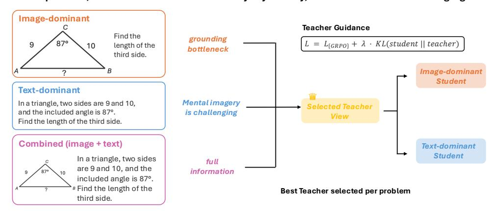

Figure 1: 모달리티-인포메드 리커시브 리저닝 최적화 (MIRROR). MIRROR는 각 문제의 가장 성능이 좋은 뷰를 교사로 선택하고, 약한 학생 뷰를 교사 분포에 정규화하여 외부 감독 없이 성능을 향상시킵니다.

다중모달 리저닝에 대한 기존 연구는 종종 외부 교사 [27](#page-12-1), 선별된 근거 [59](#page-14-2), 또는 시각적 입력과 텍스트 입력을 결합하는 방법을 가르치는 특수 훈련 데이터를 사용하여 모델을 향상시킵니다 [5,](#page-10-3) [13](#page-11-2). 그러나 이러한 감독은 모든 대상 설정에서 사용 가능하지 않을 수 있으며, 외부 교사로부터의 증류는 분포 불일치 하에서 취약할 수 있습니다 [24](#page-11-3). 반면에, 우리는 동일한 문제의 쌍으로 된 뷰가 자기 감독의 한 형태를 제공할 수 있는지 연구합니다: 모델이 한 뷰에서는 성공하고 다른 뷰에서는 실패할 때, 성공한 뷰가 약한 뷰를 개선하는 데 도움이 될 수 있는가?

본 논문에서는 MIRROR (모달리티-인포메드 리커시브 리저닝 최적화)를 제안합니다. MIRROR는 문제의 강력한 뷰에서의 추론을 활용하여 약한 뷰에서의 추론을 향상시키는 훈련 프레임워크입니다. 각 문제마다 텍스트-우세, 이미지-우세, 그리고 결합된 이미지+텍스트 뷰를 구성합니다 (Figure [1])(#page-1-0), 현재 모델을 각 뷰에서 평가하고 가장 성능이 좋은 뷰를 문제별 교사로 선택합니다. 학생은 텍스트-우세 또는 이미지-우세 중 하나인 정보 중복이 없는 제한된 뷰에서 훈련됩니다. 도전 과제는 학생이 자신의 뷰에서 이용할 수 없는 정보를 기반으로 한 궤적을 모방하도록 강제하지 않으면서 교사 신호를 전달하는 것입니다. MIRROR는 온-폴리시 증류를 통해 이를 해결합니다: 학생은 자신의 뷰에서 롤아웃을 샘플링하고, 선택된 교사 뷰는 동일한 학생 생성 궤적을 재점수화합니다. 학생 뷰에서의 결과 보상 RL과 결합하면, 제한된 뷰 학생이 실제로 방문한 상태에서 최적화를 유지하면서 풍부한 교사 지도를 제공합니다.

우리 접근법을 구현하기 위해, 우리는 동일한 기본 문제의 텍스트-우세, 이미지-우세, 그리고 결합된 이미지+텍스트 뷰를 갖는 쌍으로 된 기하학 데이터셋 ODA-Data를 구성합니다. ODA-Data는 뷰 간에 문제 정체성을 보존하여 정확도와 교차 뷰 일관성을 모두 측정할 수 있게 합니다. 우리는 ODA-Train을 사후 훈련에 사용하고, ODA-Val을 보류된 벤치마크로 사용하여 뷰에 따른 해결 가능성을 측정합니다: 모델이 서로 다른 뷰를 통해 제시될 때 같은 문제를 일관되게 해결하는지 여부. 실험적으로, MIRROR는 프롬프트 혼합과 최근 오픈소스 사후 훈련 VLM에 대해 모두 우수합니다. ODA-Val에서 MIRROR는 모든 이미지 및 텍스트 검증 지표에서 최상의 성능을 달성하며, 이미지 pass@16을 14.49%, 텍스트 pass@16을 5.88% 향상시킵니다. 이러한 이득은 외부 기하학 벤치마크에도 전이됩니다: GeoInt에서 MIRROR는 base 모델 대비 pass@16에서 7.59%를 개선하고, MathVerse에서는 평균 판사 점수를 5.22% 향상시킵니다. 정확도를 넘어, ODA-Train에서 이미지-우세와 텍스트-우세 두 뷰 모두에서 해결된 문제 비율이 MIRROR 훈련으로 42.5%에서 60.7%로 증가합니다. MIRROR는 또한 해결 가능한 예시 집합을 확장하여 ODA-Data에서 순수 해결 가능성 증가가 +8.95%로 가장 큰 이득을 달성합니다. 이러한 결과는 쌍으로 된 뷰가 더 강력하고 일관된 다중모달 리저닝을 위한 효과적인 자기 감독 신호를 제공함을 보여줍니다.

## 2 관련 연구 (Related Work)

Multimodal mathematical reasoning benchmarks and data scaling. Prior work shows that specialized multimodal math data can substantially improve MLLM reasoning. For example, Math-LLaVA fine-tunes LLaVA-1.5 on MathV360K [39], and MultiMath-7B trains on MultiMath-300K with image captions and step-by-step solutions [31]. Several benchmarks have also been introduced for visual mathematical reasoning, including MATH-Vision [44], MathVerse [57], and geometry-focused benchmarks such as LeanGeo-Bench [40], GeoInt [48], and GeoGoal [7]. More recently, CROSS-MATH studies modality gaps using matched text-dominant, image-dominant, and the combined image+text versions of synthetic puzzles [49]. These works motivate our focus on geometry and provide evaluation settings that we build on, including MathVerse and GeoInt. Instead of focusing on scaling data or constructing benchmarks, our goal is algorithmic: how paired views of the same problem can be used during RL training to transfer reasoning behavior across modalities?

**RL** 및 멀티모달 모델을 위한 교차 모달 전이.

최근 연구에서는 멀티모달 추론을 위해 RL과 교차 모달 전이를 탐구했다. Vision-R1은 합성 chain-of-thought 데이터와 점진적 RL [20]을 사용한다; R1-OneVision은 이미지 를 텍스트 설명으로 변환한 뒤 SFT와 RL [54]을 수행한다; FAST는 난이도 인식 보상을 KL-regularized GRPO [12]와 함께 사용한다. 우리 설정에 가장 가까운 것은 VOLD로, 강력한 텍스트 전용 LLM 교사로부터 VLM 학생에게 온-정책 디스틸레이션과 GRPO [5]를 사용해 지식을 증류한다. 이러한 방법들은 강력한 교사가 멀티모달 추론을 향상시킬 수 있음을 보여준다. 반면에 우리는 *self-supervised* 개선을 목표로 한다: 동일한 문제의 쌍으로 된 관점은 교차 모달 성능 비대칭을 드러내며, 이는 모달 간 추론을 향상시키는 감독으로 활용될 수 있다.

**On-policy Distillation.**  
온-폴리시 디스틸레이션은 표준 행동 복제(behavioral cloning)의 분포 불일치를 줄이면서 교사로부터 학습할 수 있는 방법으로 부상했다: 교사가 생성한 트레이스만으로 훈련하는 대신, 학생은 자신의 롤아웃을 샘플링하고 실제 방문하는 상태에서 토큰 수준의 지침을 교사로부터 받는다 [1, 16].  
더 넓게는, 자기 개선(self‑improvement)에 관한 이전 연구가 언어 모델 에이전트를 훈련시켜 재귀적 자기 피드백을 통해 자신의 응답을 비판하고 반복적으로 정제하도록 했다 [32].  
온-폴리시 자기‑디스틸레이션은 내부 개선을 위한 보완적 메커니즘을 제공하며, 여기에는 시연에서의 자기‑디스틸레이션 [37], 피드백에 조건화된 자기‑교사 [22], 그리고 특권적 컨텍스트 교사 [60]가 포함된다.  
최근의 다중 교사 또는 다중 모델 확장 [9, 50, 51]은 전문화된 교사, 토론 [52], 또는 보정된 교사 신호를 사용하여 상호 보완적인 기능을 하나의 학생으로 통합한다 [19, 42, 43, 53].  
MIRROR는 교사 신호의 출처와 구조 모두에서 차별화된다: 외부의 더 강력한 모델, 고정된 교사 풀, 또는 특권적 솔루션 트레이스에서 디스틸레이션하는 대신, 동일한 문제에 대한 특정 관점에서 가장 강력한 온-폴리시 생성물을 문제‑특정 교사로 선택하여 모델을 개선하기 위한 자기‑감독 접근 방식을 구축한다.

시각적 추론을 위한 명시적 중간 구조. 보완적인 연구 라인은 유익한 시각적 증거를 적극적으로 선택하거나 인식과 추론 사이에 중간 구조를 도입함으로써 시각적 추론을 개선한다. Act2See는 보다 효과적인 비디오 추론을 위해 시각적 관찰을 적응적으로 선택하고 처리하는 방법을 학습한다 [28]. 시각적 수학적 추론을 위해 MathCoder-VL은 이미지-투-코드 감독을 사용한다 [45]. Zhang 등은 시각적 프리미티브를 인식하기 위한 기하학 전문 비전 인코더를 도입한다 [58]. 평면-기하학 공식화에 관한 관련 연구 [11]도 유사하게 구조화된 표현을 노출한다. 이러한 접근법은 적극적 인식, 코드, 상징적 설명, 공식적 증명, 또는 기하학 사전 지식을 통해 귀납적 편향을 도입한다. 반면, MIRROR는 원본 입력 뷰를 유지하고 엔드-투-엔드로 남아 있다: 증거를 명시적으로 선택하거나 중간 표현을 구성하는 대신, 모델이 교차 모달 감독과 정규화를 통해 전이 가능한 추론 구조를 내부화하도록 장려한다.

## 3 전제 및 표기법 (Preliminaries and Notation)

우리는 서로 다른 입력 뷰로 제시될 수 있는 문제 인스턴스에 대해 파라미터 $\theta$를 갖는 다중모달 언어 모델 $\pi_{\text{base}}$의 사후 훈련을 연구한다. 문제 $\mathbf{x} \sim \rho$에 대해, 동일한 기본 문제 내용을 갖는 사용 가능한 뷰 집합을 $\mathcal{M}(\mathbf{x})$라고 정의한다. 본 연구에서는 두 가지 뷰에 초점을 맞춘다: 텍스트 중심 뷰 $\mathbf{x}^{\text{text}}$와 이미지 중심 뷰 $\mathbf{x}^{\text{img}}$. 우리는 또한 두 뷰를 동시에 포함하는 결합 뷰 $\mathbf{x}^{comb} := (\mathbf{x}^{\text{text}}, \mathbf{x}^{\text{img}})$를 쉽게 구성할 수 있다. 임의의 입력 뷰 $\tilde{\mathbf{x}} \in \mathcal{M}(\mathbf{x})$에 대해, 롤아웃 $\mathbf{y} \sim \pi(\cdot \mid \tilde{\mathbf{x}})$는 문제를 해결하려 시도한다. 표준 결과-보상 RL과 같이, 우리는 정답이 최종 답변에서 평가될 수 있다고 가정하고, 이진 보상 $r(\mathbf{x}, \mathbf{y}) \in \{0, 1\}$를 정의한다. 우리는 각 모달리티에서 pass@k [8]를 사용해 성능을 평가한다.

#### <span id="page-2-0"></span>4 모달리티 간 추론 차이 이해 (Understanding Differences in Reasoning Across Modalities)

우리 접근법을 소개하기 전에, 우리는 같은 기본 문제를 서로 다른 입력 뷰에서 해결할 때 베이스 모델 Qwen3-VL-4B-Instruct [4]의 추론 행동을 먼저 분석한다. 이 섹션에서는 텍스트 중심, 이미지 중심, 또는 결합 텍스트-이미지 입력이 서로 다른 추론 행동과 성능을 유도하는 시점을 규명한다. 구체적으로, 우리는 세 가지 질문을 제기한다: (1) 모델의 추론 경로가 서로 다른 모달리티에 조건화될 때 어떻게 달라지는가? (2) 한 모달리티에서의 추론이 다른 모달리티보다 체계적으로 더 쉬운 경우는 언제인가? 그리고 (3) 텍스트와 이미지를 모두 접근할 때 단일 모달리티에서는 숨겨진 감독 신호를 드러낼 수 있는가?

<span id="page-3-0"></span>Table 1: 대표적인 모달리티-의존 추론 행동. 각 열은 교차 모달 감독의 한 소스를 보여준다; 전체 프롬프트와 완성은 부록 D와 추가 예시와 함께 제공된다.

|  | <b>예시 1:</b> 이미지 $\rightarrow$ 텍스트 | <b>예시 2:</b> 텍스트 $\rightarrow$ 이미지 | <b>예시 3:</b> 이미지+텍스트 $\rightarrow$ 이미지 |  |  |  |
|--------------------|-----------------------------------------------------------------------------------------------------------------------------------------------------------------------------------------------------------------------------------------------------------------|--------------------------------------------------------------------------------------------------------------------------------------------------------------------------------------------------------------------------------------------------------------|----------------------------------------------------------------------------------------------------------------------------------------------------------------------------------------------------------------------------------------------------------------|--|--|--|
| 1 이미지 |  |  |  |  |  |  |
| 질문 | 다음과 같은 네 개의 고정 점 $A(-3,0)$, $B(1,-1)$, $C(0,3)$, $D(-1,3)$와 움직이는 점 $P$가 주어졌을 때, $\min_P PA + PB + PC + PD$를 구하시오. | 13-14-15 삼각형에서 세 개의 반원은 각 변을 지름으로 하고 다른 두 변에 접하도록 그려진다. 이들의 면적 곱은 구의 표면적의 세제곱과 같다. 구의 부피가 $\frac{a\pi\sqrt{b}}{c}$라면 $a+b+c$를 구하시오. | 원 $O$에서 $BC$는 지름이고, $AB \perp BC$, $ADOE$는 직선이며, $AP = AD$, 그리고 $AB = 2R$이다. 다음 중 올바른 선택지는? (A) $AP^2 = PB \cdot AB$ . (B) $AP \cdot DO = PB \cdot AD$ . (C) $AB^2 = AD \cdot DE$ . (D) $AB \cdot AD = OB \cdot AO$ . (E) None. |  |  |  |
| Before<br>training | Image-dominant: $3\sqrt{2} + 2\sqrt{5}$ 로 정확히 해결한다.  Text-dominant: $P$ 가 $AC$와 $BD$의 교점에서 원하는 양을 최소화한다는 것을 인식하지 못하고, 가능한 $P$ 위치를 수치적으로 탐색하여 $8.74$ 를 추정한다. | 텍스트-우세: 873으로 정확히 해결한다.  

이미지-우세: 실제로 각 반원의 직경이 삼각형의 한 변보다 짧음에도 불구하고, 각 반원의 직경을 삼각형의 각 변의 lenfth와 정확히 동일하다고 잘못 해석한다.  

모델은 잘못 3249를 예측한다. | 이미지 중심: 다이어그램에서 $AP = AD$ 조건을 놓치고 잘못 B를 선택한다.  이미지+텍스트 결합: 명시적으로 $AP = AD$라고 언급된 텍스트 관계를 사용하여 올바르게 A를 선택한다. |  |  |  |
| After<br>training | <b>Text-dominant:</b> recovers the structural solution and predicts $3\sqrt{2} + 2\sqrt{5}$ . | <b>Image-dominant:</b> avoids the visual grounding error and predicts 873. | $\label{eq:mage-dominant: notes the tick marks} \mbox{Image-dominant: notes the tick marks} \mbox{indicating } AD = AP \mbox{ and now chooses A.} $ |  |  |  |
| Takeaway | 다이어그램은 기하학적 구조를 부각시켜, 이미지 중심 추론이 텍스트 중심 추론을 감독한다. | 텍스트는 지각적 병목 현상을 제거하므로, 텍스트 중심 추론이 이미지 중심 추론을 감독한다. | Combined image+text view는 explicitextual 설명과 시각적 구조를 함께 활용하여 모호성을 제거합니다. 따라서 combined image+text reasoning은 이미지 중심의 추론을 감독합니다. |  |  |  |

문제마다 다른 모달리티의 추론 트레이스를 비교하기 위해, 우리는 OpenDataArena/ODA-Math-460k [6]에서 파생된 기하학 데이터셋 **ODA-Data**를 구축한다. 각 예시는 동일한 문제의 두 가지 관점을 포함한다: “텍스트-우세” 관점과 “이미지-우세” 관점. 분석 및 훈련 과정에서 우리는 또한 텍스트-우세 프롬프트와 이미지-우세 관점의 이미지를 연결해 즉시 생성되는 세 번째 결합 이미지+텍스트 관점을 고려한다. 순수 텍스트 데이터셋 ODA-Math-460k에서 시작하여, 먼저 쉬운 문제를 필터링하고, Gemini-3-Pro-Preview [14]를 사용해 TikZ 기반 다이어그램을 생성 및 검증하며, 다이어그램에 이미 포함된 정보를 더 이상 포함하지 않도록 이미지-우세 프롬프트를 재작성한다. 이후 기본 모델 Qwen3-VL-4B-Instruct [4]로 모달리티별 평가를 수행하고, 한 관점에서는 해결되지만 다른 관점에서는 해결되지 않는 문제를 보존하여 약 2K개의 선별된 예시를 얻는다. 데이터셋은 무작위로 85:15 비율로 **ODA-Train**(후속 훈련용)과 **ODA-Val**(평가용)으로 분할된다. 자세한 내용은 부록 C를 참조하라. ODA-Data가 모달리티에 따라 달라지는 예시만을 남기도록 필터링되었기 때문에, ODA-Val은 교차 관점 성능 비대칭과 전이를 이해하기 위한 진단 벤치마크가 된다.

### 4.1 추론 트레이스가 모달리티마다 어떻게 다른가? (How do Reasoning Traces Differ Across Modalities?)

우리는 먼저 동일한 기본 문제에 대해 텍스트 중심 보기, 이미지 중심 보기, 그리고 결합된 이미지+텍스트 보기에 의해 유도되는 추론 경로를 비교한다. 모든 보기에는 과제를 해결하기에 충분한 정보가 포함되어 있지만, 종종 상당히 다른 경로를 유도한다. 텍스트 기반 추론은 언어에 명시적으로 제시된 관계를 따르는 경향이 있는 반면, 이미지 기반 추론은 먼저 다이어그램에서 객체, 관계 및 공간 구조를 복원한다. 이 기반화 단계는 텍스트 보기에는 없던 오류를 도입할 수 있다. 그러나 다이어그램은 때때로 기하학적 구조를 시각적으로 돋보이게 하여 텍스트 중심 보기에서 생성된 것보다 더 신뢰할 수 있는 해결 경로를 제공할 수 있다. 전반적으로 우리는 다이어그램을 사용한 추론의 장단점을 모두 관찰한다.

표 1은 세 가지 대표 사례를 요약한다. 예제 1에서 이미지 중심 입력은 네 점의 기하학적 구성을 시각적으로 돋보이게 한다. 이미지 기반 모델은 올바른 구조적 해답을 찾는 반면, 텍스트 기반 모델은 수치 탐색으로 되돌아간다; MIRROR로 훈련한 후, 텍스트 기반 모델은 동일한 구조적 추론 패턴을 회복한다. 예제 2에서 텍스트 중심 입력은 13–14–15 삼각형의 변 길이를 명시적으로 제공하지만, 이미지 중심 입력은 모델이 다이어그램에서 이를 추론하도록 요구한다. 이미지 기반 모델은 처음에 그려진 반원 직경을 잘못 해석하지만, 이 기반화 오류를 피하고 훈련 후에 올바른 텍스트 감독 답변을 회복한다.

예제 3에서 제한된 두 보기 모두 완전히 신뢰할 수 없다: 텍스트 중심 모델은 기하학적 구성을 해결할 수 없고, 이미지 중심 모델은 다이어그램에서 AP = AD 관계를 놓친다. 결합된 이미지+텍스트 보기는 텍스트를 사용해 관계를 검증하면서 동시에 다이어그램에서 추론을 기반화함으로써 성공한다; 훈련 후, 이미지 중심 모델은 누락된 조건을 식별하고 올바른 옵션을 예측한다. 이러한 예제에 대한 보다 자세한 모델 응답은 부록 [D.](#page-19-0)에 포함한다.

이 예시들은 교차 모달 감독의 세 가지 상호 보완적인 출처를 강조한다. 다이어그램이 유용한 구조를 드러낼 때, 이미지 조건부 추론은 텍스트 조건부 추론을 감독할 수 있다. 텍스트가 지각 병목 현상을 회피할 때, 텍스트 조건부 추론은 이미지 조건부 추론을 감독할 수 있다. 두 제한된 관점이 모두 완전히 신뢰할 수 없을 때, 결합된 관점은 시각 구조와 명시적 텍스트 관계를 공동으로 조건화함으로써 더 강력한 교사를 제공할 수 있다. 그러나 단일 방향이 일관되게 신뢰할 수 있는 것은 아니다: 최적의 교사는 병목 현상이 텍스트 제약 해석, 시각적 근거화, 혹은 결손된 교차 관점 컨텍스트에 따라 달라진다. 이로 인해 우리는 텍스트 우세, 이미지 우세, 그리고 결합 관점에 대한 적응형 교사 선택을 사용하게 된다.

정량적 분석. 우리는 다음으로 ODA-Train에서 Qwen3-VL-4B-Instruct를 사용해 이러한 관점 의존적 차이를 정량화하고 pass@1 지표를 살펴본다. 집계 수준에서, 텍스트 우세는 29.58%, 이미지 우세는 10.54%, 결합 이미지+텍스트 프롬프트는 26.84%를 달성한다. ODA-Train 전반에서 텍스트 우세 관점은 51.14%의 문제에서 가장 우수하며, 이미지 우세 관점은 37.98%, 결합 이미지+텍스트 관점은 10.88%이다. 따라서 평균적으로 텍스트 우세 프롬프트가 가장 강력하지만, 거의 절반의 문제는 비텍스트 우세 관점에 의해 가장 잘 감독된다. 이 결과는 표 [1](#page-3-0)의 정성적 행동이 고립된 일화가 아니라 모달리티 비대칭의 반복되는 원천임을 시사한다.

### 4.2 혼합 모달리티 RL이 관점 간에 전이되는가?

위의 비대칭성을 고려할 때, 자연스러운 질문은 표준 RL이 단순히 함께 훈련함으로써 다중 관점을 활용할 수 있는가이다. 즉, 모델이 RL 중 동일한 문제의 텍스트 우세와 이미지 우세 관점을 관찰한다면, 더 성능이 좋은 관점에서 성공적인 추론 행동이 자동으로 덜 성능이 좋은 관점으로 전이될까? 우리는 이러한 질문에 대해, 기본 GRPO [&#91;36&#93;](#page-12-8)를 사용해 텍스트 우세와 이미지 우세 두 관점 모두에서 나타나는 단일 문제 데이터셋에 대해 훈련함으로써 답한다. 또한, 우리는 다음 섹션에서 소개될 우리 방법의 미리보기로 Figure [2](#page-4-0)에 MIRROR를 포함한다. 우리는 방법 세부사항과 주요 평가를 이후 섹션으로 미루고 있다. 표준 혼합-

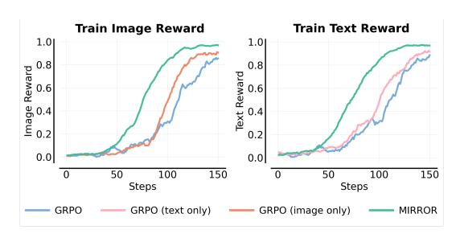

<span id="page-4-0"></span>Figure 2: 단일 문제 분석. 두 관점 모두에서 MIRROR는 가장 높은 훈련 보상을 달성하며, 그 뒤를 이어 해당 단일 모달리티에서 훈련된 GRPO가 오고, 혼합 모달리티 관점에서의 순진한 GRPO가 가장 낮은 성능을 보인다. 이는 RL이 동일한 기본 문제의 다중 관점에 노출되는 것만으로는 신뢰할 수 있는 교차 모달 전이를 달성하기에 충분하지 않음을 보여준다. 명시적 전이 방향이 없으면 희소 보상 신호가 이질적인 문제-관점 쌍에 걸쳐 희석될 수 있다.

모달리티 RL은 각 관점을 독립적인 RL 프롬프트로 취급하고, 공유 정책 업데이트를 통해 모달리티 간 전이를 유도한다. 기본 문제의 단일 관점에서 훈련된 RL은 이러한 관점 간 이질성을 제거하고 오직 단일 학생 관점에 대해서만 최적화한다.

Figure [2,](#page-4-0)에 표시된 바와 같이 순진한 혼합 모달리티 RL (GRPO)은 텍스트 우세와 이미지 우세 학생 관점 모두에서 가장 낮은 훈련 보상을 달성한다. 동일한 질문의 이질적인 입력 관점에서 GRPO를 훈련시키면 각 관점에서의 성능 향상을 억제할 수 있으며, 자동으로 성공적인 추론을 관점 간에 전이시키지 않는다. 반대로, 다음 섹션에서 소개되는 우리 접근법 MIRROR는 두 학생 관점 모두에서 가장 높은 훈련 보상을 달성한다. 이러한 순서는 동일한 질문의 다중 관점을 RL에 통합하는 것이 자동으로 유익한 것은 아님을 나타낸다. 우리는 다음으로 MIRROR를 소개한다. MIRROR는 각 문제의 가장 강력한 관점을 교사 신호로 변환하여 학생 관점을 훈련한다.

#### <span id="page-5-0"></span>5 우리의 접근법: MIRROR

우리의 목표는 학생 관점에서 추론을 개선하는 것으로, 텍스트 지배적 관점 또는 이미지 지배적 관점 중 하나를 선택하는 것이다. 섹션 4에서는 단일 관점이 항상 최선이 아니라는 것을 보여주며, MIRROR는 이 관점에 따른 이질성을 자기 지도 신호로 변환한다. 각 문제마다 현재 모델이 가장 잘 수행하는 관점을 문제별 교사로 선택한다. 제한된 관점의 학생은 표준 결과 보상 RL과 보조 reverse‑KL 정규화 항을 사용해 훈련된다. 특히 학생은 항상 자신의 제한된 관점에서 롤아웃을 생성하며, 선택된 교사 관점은 그 학생이 생성한 경로를 평가하는 데만 사용된다.

최우수 모달리티 교사 선택. 각 문제는 세 가지 후보 교사 관점을 갖는다: 텍스트 지배적  $\mathbf{x}^{\text{text}}$ , 이미지 지배적  $\mathbf{x}^{\text{img}}$ , 그리고 결합된 이미지+텍스트  $\mathbf{x}^{\text{comb}} = (\mathbf{x}^{\text{text}}, \mathbf{x}^{\text{img}})$ . 후보 교사 관점을 나타내는 집합을  $\mathcal{M} = \{\text{text}, \text{img}, \text{comb}\}$  로 두자. 교사 선택은 현재 정책 모델을 사용해 훈련 중 온라인으로 수행된다. 각 문제  $\mathbf{x}$ 와 각 후보 관점  $j \in \mathcal{M}$  에 대해 K = 16개의 롤아웃을 샘플링하고 관점별 성공률을 추정한다. 그 다음 가장 성능이 좋은 관점을 선택하며, 동점일 경우 균일 확률로 무작위 선택한다. 교사 분포는 선택된 교사 관점에 조건부인 모델의 느리게 움직이는 복사본으로 정의된다:  $\pi_{\text{teach}}(\cdot \mid \mathbf{x}) = \pi_{\bar{\theta}}(\cdot \mid \mathbf{x}^{(j^*(\mathbf{x}))})$ , 여기서  $\bar{\theta}$  는 정책 파라미터의 지수 이동 평균(EMA)이며 아래에서 설명한다. 따라서 교사 방향은 각 문제마다 독립적으로 선택되며 훈련 전반에 걸쳐 적응할 수 있다. 교사 선택이 세 가지 후보 관점을 고려하지만, 텍스트 지배적 및 이미지 지배적 롤아웃은 이미 표준 온라인 GRPO 롤아웃으로 생성되므로 MIRROR가 추가로 생성해야 할 롤아웃은 결합된 이미지+텍스트 관점에 한정되며, 이는 계산 오버헤드를 거의 없게 한다. Appendix A에서는 혼합 모달리티 GRPO와의 FLOPs 비교를 제공한다.

제한된 관점에서의 훈련. 제한된 관점  $m \in \{\text{text}, \text{img}\}$  에 대해 학생은 해당 입력  $\mathbf{x}^{(m)}$  를 받고 롤아웃  $\mathbf{y} \sim \pi_{\theta}(\cdot \mid \mathbf{x}^{(m)})$  를 샘플링한다. 선택된 교사는 다른 관점  $\mathbf{x}^{(j^{\star}(\mathbf{x}))}$  에 조건부될 수 있으며, 여기에는 결합된 이미지+텍스트 관점이 포함된다. 따라서 도전 과제는 더 강력한 교사 관점을 사용하면서 학생을 오프‑정책 교사 생성 경로에 훈련시키거나 제한된 입력에서 사용할 수 없는 정보를 의존하도록 강제하지 않는 것이다. 우리는 결과 보상 RL과 온‑정책 reverse‑KL 정규화 항의 가중합을 최적화함으로써 이를 해결한다:

<span id="page-5-2"></span><span id="page-5-1"></span>

$$\mathcal{L}(\theta; m) = \mathcal{L}_{RL}(\theta; m) + \lambda_{KL} \mathcal{L}_{rKL}(\theta; m), \tag{1}$$

여기서  $\lambda_{\text{KL}} \geq 0$  은 교사 지침의 강도를 제어한다. RL 항은 제한된 학생 관점에서 최종 답변 정확도를 최적화하는 GRPO 스타일의 온‑정책 목표이다. 아래에서 정의되는 reverse‑KL 항은 선택된 교사 관점에서 토큰 수준 선호도를 전달하면서 제한된 관점 학생에 대해 롤아웃을 온‑정책으로 유지한다.

역 KL은 자기 지도 학습, 정책 기반 증류에 사용된다. 보조 손실은 선택된 교사 모델의 추론 선호도를 제한된 시각의 학생에게 증류하지만 교사로부터 경로를 샘플링하지 않는다. 학생 시각 $m \in \{\text{text}, \text{img}\}$ 에 대해, 먼저 학습 중인 정책에서 롤아웃을 샘플링한다: $\mathbf{y} \sim \pi_{\theta}(\cdot \mid \mathbf{x}^{(m)})$ . 그 다음 이 학생이 생성한 토큰 시퀀스를 고정하고, 각 샘플된 토큰이 선택된 교사 시각에서 얼마나 가능성이 있는지 평가한다. 구체적으로, 각 접두사 $y_{1:t}$ 에 대해, 제한된 입력 $\mathbf{x}^{(m)}$ 에서 학생의 다음 토큰 로그 확률과 동일한 샘플된 토큰이 교사 시각 $\mathbf{x}^{(j^*(\mathbf{x}))}$ 에서의 로그 확률을 비교한다:

$$\mathcal{L}_{\text{rKL}}(\theta; m) = \mathbb{E}_{\mathbf{x}, \mathbf{y} \sim \pi_{\theta}(\cdot | \mathbf{x}^{(m)})} \left[ \sum_{t=1}^{|\mathbf{y}|-1} \left( \log \pi_{\theta}(y_{t+1} \mid \mathbf{x}^{(m)}, y_{1:t}) - \log \pi_{\bar{\theta}}(y_{t+1} \mid \mathbf{x}^{(j^{\star}(\mathbf{x}))}, y_{1:t}) \right) \right]. \tag{2}$$

기대값이 $\mathbf{y} \sim \pi_{\theta}(\cdot | \mathbf{x}^{(m)})$ 에 대해 계산되므로, 식 (2)는 제한된 시각의 학생에서 선택된 교사 시각으로의 역 KL 스타일 목표의 온-폴리시 몬테카를로 추정치이다. 실제로 교사는 학생이 샘플링한 자신의 궤적을 재점수화하는 데만 사용된다: 우리는 학생의 토큰이 더 강력한 교사 시각과 얼마나 호환되는지를 묻는다. 이는 최적화가 훈련 중인 정책에 의해 유도된 상태에서만 발생하므로 불필요한 분포 변화를 피한다.

**EMA 교사.** 식 (2)에서 교사는 훈련 중인 동일한 네트워크에서 파생되므로 가장 직접적인 선택은 현재 파라미터 $\theta$ 로 교사 항을 점수화하는 것이다. 그러나 이는 디스틸레이션 목표가 매 단계마다 움직이게 하며, 학생은 자신의 업데이트에 의해 이동되는 목표를 추격한다. 실험적으로 이 자기 참조적 결합은 정책 엔트로피와 참조 정책 KL의 느린 팽창을 유발하여 결국 장기 학습을 불안정하게 만든다 (섹션 6). 따라서 우리는

<span id="page-6-1"></span>Table 2: MIRROR은 표준 GRPO보다 단일 시각 추론을 향상시킨다. 우리는 보류된 이미지/텍스트 ODA-Val 문제와 GeoInt에서 pass@1 및 pass@16, MathVerse에서 평균 판사 점수를 보고한다. 훈련 데이터는 보고된 사후 훈련 샘플 수를 나타내며, 훈련 단계는 해당되는 경우 표시된다. 초록 태그는 개선을, 분홍색 둥근 태그는 Qwen3-VL-4B Instruct 기반 모델에 비해 감소를 나타낸다. **굵은** 숫자는 최상의 결과를 나타낸다.

| 접근 방식 | 학습 데이터 | ODA-Val 이미지 |  | ODA-Val 텍스트 |  | GeoInt |  | MathVerse |
|---------------------------|---------------|---------------|--------------|--------------|-------------|-------------|-------------|-------------|
|  | post-train | pass@1 | pass@16 | pass@1 | pass@16 | pass@1 | pass@16 | 평균 |
| 기존 모델 |  |  |  |  |  |  |  |  |
| Vision-R1-7B (Qwen2.5-VL) | 210K | 7.41 | 19.48 | 9.67 | 29.35 | 23.30 | 52.80 | 47.21 |
| PAPO-7B (Qwen2.5-VL) | 39K | 11.38 | 25.77 | 16.88 | 39.57 | 29.90 | 60.30 | 48.50 |
| Vero-8B (Qwen3-VL) | 600K | 16.16 | 39.74 | 35.48 | 71.73 | 67.30 | 77.42 | 69.33 |
| 기본 모델 |  |  |  |  |  |  |  |  |
| Qwen3-VL-4B Instruct |  | 12.30 | 42.57 | 32.91 | 80.22 | 58.62 | 70.79 | 41.31 |
| 표준 GRPO | 2K |  |  |  |  |  |  |  |
| text-dominant GRPO |  | 17.32 +5.02 | 43.29 +0.72 | 39.92 +7.01 | 81.06 +0.84 | 63.02 +4.40 | 78.95 +8.16 | 45.22 +3.91 |
| image-dominant GRPO |  | 20.38 +8.08 | 48.78 +6.21 | 41.06 +8.15 | 83.16 +2.94 | 62.30 +3.68 | 79.69 +8.90 | 39.47 -1.84 |
| mixed-modality GRPO |  | 17.99 +5.69 | 45.68 +3.11 | 39.18 +6.27 | 81.66 +1.44 | 61.68 +3.06 | 75.21 +4.42 | 44.25 +2.94 |
| MIRROR |  | 23.57 +11.27 | 57.06 +14.49 | 45.67 +12.76 | 86.10 +5.88 | 66.15 +7.53 | 78.38 +7.59 | 46.53 +5.22 |

the teacher with an exponential moving average (Polyak average) of the policy parameters,

<span id="page-6-2"></span>

$$\bar{\theta} \leftarrow \alpha \bar{\theta} + (1 - \alpha) \theta,$$

(3)

모든 정책 업데이트 후에 적용되며, $\bar{\theta}$는 시작 시 $\theta$로 초기화된다. EMA 교사는 선택된 교사 뷰(전방향만, 기울기 없음)에서 학생이 샘플링한 토큰을 재점수화하는 데만 사용된다; 교사 선택은 여전히 현재 정책의 롤아웃을 사용한다. 이는 가치 기반 RL의 타깃 네트워크[26, 30]와 자기 지도 학습의 가중치 평균 교사[15, 17, 41]를 반영한다: 교사는 느린 시간 척도에서 향상되는 정책을 추적하며, 점진적으로 향상되지만 안정적인 목표를 제공한다. 기울기는 오직 학생 뷰의 로그 확률을 통해서만 적용되며, 교사 뷰의 로그 확률은 stop-gradient 목표로 처리된다.

식 1의 두 항은 상호 보완적인 역할을 한다: GRPO 항은 제한된 뷰에서 최종 답변의 정확성을 최적화하고, 반면 reverse-KL 항은 학생의 자체 경로에서 가장 강력한 뷰로부터 토큰 수준의 밀집 가이던스를 제공한다. 외부 교사 분포에서 샘플링하거나 모방하는 방법과 달리, MIRROR는 제한된 뷰 학생에 대해 온정책 롤아웃을 유지하고 선택된 교사 뷰를 오직 감독 신호로만 사용한다. MIRROR 업데이트의 전체 의사코드는 Algorithm 1을 참고하라.

## <span id="page-6-0"></span>6 Experimental Evaluation

우리 실험의 목표는 MIRROR가 뷰 간의 비대칭을 효과적인 자기 지도 신호로 전환하여 멀티모달 추론을 향상시킬 수 있는지를 평가하는 것이다. 이 장에서는 네 가지 질문에 답한다: (1) MIRROR가 단일 뷰 및 혼합 모달리티 GRPO 기준보다 제한된 뷰 추론을 개선하는가? (2) 각 문제마다 교사 뷰를 별도로 선택하는 것이 고정된 전역 교사 뷰를 사용하는 것보다 우수한가? (3) MIRROR가 훈련 후 해결 가능한 문제 인스턴스의 집합을 확장하는가? (4) 모달리티 비대칭 훈련 예제가 무작위 짝 예제보다 더 유용한가, 그리고 MIRROR가 교차 뷰 KL 계수 $\lambda_{KL}$와 교사(현재 정책 vs. 느리게 움직이는 EMA)의 파라미터화에 얼마나 민감한가?

실험 설정. 우리는 Qwen3-VL-4B-Instruct를 사후 훈련하고 verl [38]에서 MIRROR를 구현한다. 모델은 최대 응답 길이 16,384, 샘플링 온도 0.8, GRPO 클리핑 범위 $\epsilon_{\rm low}=0.2,\epsilon_{\rm high}=0.26$, 참조-정책 KL 계수 0.001, 엔트로피 계수 0.001로 훈련된다. MIRROR는 reverse-KL 계수 0.01과 EMA 가중치 $\alpha=0.99$를 사용한다. 우리의 인분포 평가는 ODA-Val을 사용하며, 짝지어진 뷰가 문제 정체성을 보존하고 각 뷰에서 pass@k를 측정하고 훈련이 뷰 간 문제 수준의 해결 가능성에 미치는 변화를 추적할 수 있다. 또한 공개 멀티모달 기하학 벤치마크 GeoInt [47]과 MathVerse [57]에서도 평가한다. GeoInt에서는 답변 기반 질문만 고려한다. 최종 답변 정확도를 pass@1과 pass@16으로 평가하며, 이는 32개의 롤아웃으로 추정된다. MathVerse에서는 gpt-4o-2024-11-20 [21]을 판사로 사용하고 LMMs-Eval 스위트 [56]를 통해 판사 점수 [61]를 보고한다.

**기준선 및 비교.** 우리는 MIRROR를 세 그룹의 기준선과 비교한다. 첫째, 우리는 기본 Qwen3-VL-4B-Instruct 모델과 다양한 훈련 목표를 가진 기존 멀티모달 추론 모델을 평가한다. Vision-R1-7B [20]은 Qwen2.5-VL-7B-Instruct에서 초기화된다.

그리고 시각적 수학적 추론을 목표로 두 단계의 콜드 스타트와 RL 레시피를 사용합니다. PAPO-7B [46]은 Qwen2.5-VL-7B-Instruct에서 초기화되며, 원본과 마스크된 이미지 롤아웃을 대비시켜 인지 인식 목표를 통해 RL 중 시각적 기반을 향상시킵니다. Vero-8B [34]은 Qwen3-VL-8B-Instruct에서 초기화되며, 다양한 멀티모달 도메인에서 작업 라우팅된 검증자와 함께 폭넓은 일반 시각적 추론 레시피를 사용합니다. 둘째, 우리는 단일 뷰를 사용해 ODA-Train에서 훈련된 표준 GRPO 기준선과 비교합니다: 텍스트 지배형 GRPO는 텍스트 지배형 프롬프트에만 훈련되고, 이미지 지배형 GRPO는 이미지 지배형 프롬프트에만 훈련됩니다. 셋째, 우리는 텍스트 지배형과 이미지 지배형 뷰를 모두 포함하는 전체 ODA-Train 혼합에서 훈련된 혼합 모달리티 GRPO와 비교합니다. 이 기준선은 두 모달리티가 훈련 프롬프트에 모두 존재할 때 단순히 표준 RL에서 교차 뷰 전이(cross-view transfer)가 발생하는지 여부를 테스트합니다. MIRROR는 동일한 전체 학생 뷰 혼합에서 훈련됩니다. 마지막으로, 우리는 항상 동일한 뷰를 갖는 고정 교사(fixed-teacher) 변형 MIRROR를 포함합니다.

결과 1: MIRROR는 표준 및 혼합 모달리티 GRPO보다 우수합니다. 표 [2](#page-6-1)는 MIRROR를 기본 모델, 기존 추론 기반 VLM, 그리고 표준 RL 기준선과 비교합니다. ODA-Val에서 MIRROR는 모든 이미지 및 텍스트 검증 지표에서 최상의 성능을 달성합니다. 가장 강력한 단일 뷰 GRPO 기준선과 비교할 때, MIRROR는 이미지 pass@16을 48.78%에서 57.06%로, 텍스트 pass@16을 83.16%에서 86.10%로 개선하여 각각 +8.28%와 +2.94%의 절대적 이득을 보입니다. 혼합 모달리티 GRPO와 비교하면 이득이 더 큽니다: 이미지 pass@16에서 +11.38%, 텍스트 pass@16에서 +4.44%입니다. 이러한 이득은 ODA-Val을 넘어 GeoInt에서도 전이됩니다. GeoInt에서 MIRROR는 기본 모델 대비 pass@1을 58.62%에서 66.15%로, pass@16을 70.79%에서 78.38%로 개선하여 +7.53%와 +7.59%의 이득을 얻습니다. 특히 MIRROR는 훨씬 더 큰 데이터로 사후 훈련된 VLM과 경쟁력이 있습니다: ODA-Val 및 GeoInt의 모든 지표에서 Vision-R1-7B와 PAPO-7B를 능가하고, 2K 훈련 샘플만 사용하면서도 모든 ODA-Val 이미지/텍스트 검증 지표에서 Vero-8B를 초과합니다. 반면 Vision-R1-7B는 200K 멀티모달 CoT 콜드 스타트 샘플과 10K 멀티모달 수학 RL 샘플을 사용하고, PAPO-7B는 38.9K 멀티모달 추론 샘플을 사용하며, Vero-8B는 약 600K 샘플로 사후 훈련됩니다. Vero-8B는 MathVerse에서 여전히 가장 강력하지만, MIRROR는 Qwen3-VL-4B 기본 모델을 41.31%에서 46.53%로 개선합니다. 이 결과들은 교차 뷰 비대칭이 분포 내 검증 세트를 넘어서는 유용한 훈련 신호를 제공하며, 이전 멀티모달 추론 모델보다 수십 배 적은 사후 훈련 데이터를 사용해 더 작은 기본 모델을 크게 향상시킬 수 있음을 시사합니다.

Mixed-modality GRPO is the most direct test of whether paired views are sufficient by themselves. Although this baseline trains on both textdominant and image-dominant views of the same underlying problems, it treats each view as an independent RL prompt and relies on transfer emerging implicitly through shared parameters. Figure [2] and [3] show that this is not reliable: mixed-view GRPO obtains lower training reward than single-view GRPO in both the controlled setting and full-dataset training. This behavior is also consistent with *ray interference* in heterogeneous on-policy RL mixtures [33]. In our setting, views differ in grounding requirements, and access to explicit relations. Optimizing all

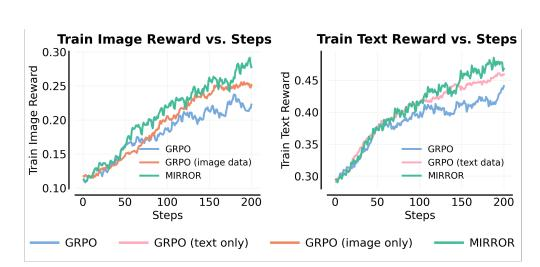

<span id="page-7-0"></span>그림 3: Mixed-modality GRPO는 시각 간에 추론을 자동으로 전이하지 않는다. 전체 데이터셋으로 훈련할 때, mixed-view GRPO는 해당 제한된 시각에서 직접 훈련된 GRPO보다 성능이 떨어지며, MIRROR는 방향성으로 쌍으로 된 시각을 사용하여 가장 강력한 훈련 보상을 얻는다.

희소한 결과 보상을 가진 시각은 더 쉬운 시각에서의 업데이트가 더 어려운 제한된 시각을 가르친다는 것을 보장하지 않는다. MIRROR는 전송 방향을 지정함으로써 이를 해결한다: 가장 성능이 좋은 시각을 선택하여 제한된 시각 학생을 그 교사 분포에 정규화한다. Appendix [A,](#page-15-0) 에 자세히 설명된 바와 같이 MIRROR는 표준 혼합 모달리티 GRPO보다 업데이트당 약 37.5% 더 많은 FLOPs를 발생시킨다. 이 차이를 통제하기 위해 우리는 단계 150에서 MIRROR를, 단계 200에서 GRPO를 비교한다. 이는 대략적으로 일치하는 누적 계산량에 해당한다. 이 계산량이 일치한 비교에서도 MIRROR는 이미지 보상(0.2625 vs. 0.2368)과 텍스트 보상(0.4581 vs. 0.4387)을 더 높게 달성하며, 이는 추가 계산량만으로는 설명되지 않는 이득을 나타낸다.

결과 2: 적응형 교사 선택이 가장 일관된 이득을 제공한다. 다음으로 교사 시각을 전역적으로 고정할지, 문제마다 적응적으로 선택할지를 평가한다. Table [3](#page-8-0) 은 MIRROR와 세 가지 고정 교사 변형을 비교한다: 항상 텍스트 지배적 교사를 사용, 항상 이미지 지배적 교사를 사용, 그리고 항상 결합된 이미지+텍스트 교사를 사용. 고정 교사 변형들

<span id="page-8-0"></span>Table 3: Adaptive teacher choice outperforms fixed cross-modal teachers. (적응형 교사 선택이 고정 교차 모달 교사보다 우수합니다.) 우리는 고정 교사 선택을 MIRROR와 비교한다. MIRROR는 각 문제마다 가장 강력한 모달리티별 교사를 적응적으로 선택한다. 단일 고정 교사를 사용하면 특정 학생 시각을 개선할 수 있지만, 어떤 모달리티가 교사로 선택되는지에 민감하다. 문제마다 교사를 선택함으로써 MIRROR는 모달리티에 따라 달라지는 강점을 더 잘 활용하고, 보다 일관된 교차 모달 가이던스를 제공한다.

| 교사 선택 | ODA-Val 이미지 |  | ODA-Val 텍스트 |  | GeoInt |  | MathVerse |  |
|----------------------------------------------------------|----------------|----------------|----------------|----------------|----------------|----------------|----------------|--|
|  | pass@1 | pass@16 | pass@1 | pass@16 | pass@1 | pass@16 | 평균 |  |
| 텍스트 중심 교사 | 19.12 | 51.03 | 39.78 | 83.59 | 64.41 | 79.59 | 45.56 |  |
| 이미지 중심 교사 | 18.95 | 49.10 | 43.43 | 83.77 | 63.80 | 79.50 | 43.13 |  |
| 이미지+텍스트 결합 교사<br>적응형 교사 (MIRROR) | 20.99<br>23.57 | 52.28<br>57.06 | 43.35<br>45.67 | 82.33<br>86.10 | 64.56<br>66.15 | 78.77<br>78.38 | 47.19<br>46.53 |  |

Table 4: Ablation on the reverse-KL coefficient. 우리는 MIRROR에서 사용되는 크로스-모달 reverse-KL 정규화 항의 강도를 스윕하면서 다른 모든 구성 요소를 고정하고 100 스텝 동안 실행한다. 이 ablation은 MIRROR이 정렬 강도에 얼마나 민감한지 테스트하고 온-폴리시 RL과 크로스-모달 증류를 가장 잘 균형 잡는 영역을 식별한다.

| 역 KL 계수 | ODA-Val 이미지 |  | ODA-Val 텍스트 |  | GeoInt |  | MathVerse |
|------------------------|---------------|---------|--------------|---------|--------|---------|-----------|
|  | pass@1 | pass@16 | pass@1 | pass@16 | pass@1 | pass@16 | 평균 |
| λKL<br>= 0.001 | 18.26 | 49.98 | 42.03 | 85.21 | 62.30 | 77.24 | 44.50 |
| λKL<br>= 0.005 | 17.74 | 49.45 | 40.83 | 86.70 | 62.13 | 76.71 | 45.41 |
| λKL<br>= 0.01 | 21.74 | 52.36 | 44.44 | 85.25 | 64.58 | 79.70 | 46.57 |
| λKL<br>= 0.05 | 18.75 | 54.73 | 39.67 | 85.07 | 61.46 | 77.17 | 46.62 |

MIRROR은 상호 보완적인 강점을 보이지만, 어느 하나가 일관되게 최선인 것은 아니다. 이미지 지배적 평가에서는 텍스트 지배적 교사가 이미지 지배적 교사를 능가하고, 반대로 텍스트 지배적 평가에서는 이미지 지배적 교사가 텍스트 지배적 교사를 능가한다. 이 패턴은 교차 시점 감독이 단순히 학생의 자체 시점을 강화하는 것보다 더 유용할 수 있음을 시사한다. 그러나 이미지+텍스트를 결합한 교사는 MathVerse에서 가장 좋은 성능을 보이며, 가장 유용한 교사 신호가 두 모달리티를 동시에 조건화함으로써 올 수 있음을 보여준다. 이러한 혼합된 선호도는 최적의 감독 소스가 문제에 따라 달라진다는 것을 나타낸다. 단일 전역 전이 방향에 고정하기보다, MIRROR은 문제마다 가장 성능이 좋은 시점을 선택하여 관측된 모달리티 비대칭에 맞춰 교사를 매칭한다. 이 적응형 전략은 대부분의 검증 및 GeoInt 지표에서 최상의 결과를 가져온다. 이 결과들은 MIRROR의 핵심 설계 원칙을 뒷받침한다: 교차 시점 감독은 교사가 전역적으로 고정되는 대신 적응적으로 선택될 때 가장 효과적이다.

결과 3: MIRROR은 해결 가능성을 확장하고 교차 시점 일관성을 향상시킨다. 집계된 pass@k 점수는 사후 훈련이 모델이 해결할 수 있는 문제 집합을 어떻게 바꾸는지를 완전히 포착하지 못한다. 따라서 우리는 훈련 전후의 ODA-Train에서 해결 가능성을 측정한다. 순 해결 가능성 증가는 최소 한 번의 성공적인 롤아웃을 가진 샘플링된 문제 비율의 전후 변화를 의미한다. Figure [4,](#page-8-1)에 표시된 바와 같이 모든 GRPO 변형은 순 해결 가능성을 향상시키지만, MIRROR은 +8.95%라는 가장 큰 증폭을 달성한다. 해결 가능한 예시 집합을 확장하는 것 외에도 MIRROR은 교차 시점 일관성도 개선한다. ODA-Train에서, 기본 모델은 텍스트 지배적 및 이미지 지배적 시점 모두에서 42.5%의 문제만 해결 가능하다. 표준 GRPO는 이 양쪽 시점 해결 가능성 비율을 향상시킨다

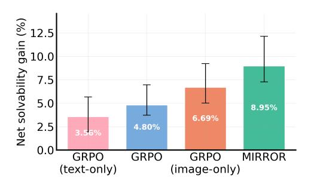

<span id="page-8-1"></span>Figure 4: 훈련 후 순 해결 가능성 증대. 각 막대는 3개의 랜덤 시드에서 기본 모델 대비 해결된 예시 비율의 변화를 보여준다. 각 랜덤 시드는 검증 세트와 동일한 크기인 309개의 문제를 샘플링한다. 오차 막대는 시드 간 최소값과 최대값을 나타낸다. MIRROR은 가장 큰 순 증가를 보인다.

53.6%까지, MIRROR은 이를 60.7%까지 더 증가시킨다. 이는 MIRROR이 각 제한된 시점에서의 한계 정확도를 향상시킬 뿐만 아니라, 모달리티 간에 동일한 기본 문제를 일관되게 해결할 가능성을 높인다는 것을 보여준다.

Ablation 1: 정렬은 모달리티 비대칭 쌍에서 가장 효과적이다. Section [4,](#page-2-0) 에서 설명한 바와 같이 ODA-Data는 모달리티 비대칭을 보이는 문제들을 포함한다. 이 비대칭이 중요한지 테스트하기 위해, 우리는 동일한 수의 적절히 짝지어진 예시를 사용해 명확한 모달리티 비대칭을 보이지 않는 대조 모델과 MIRROR을 비교한다. 하이퍼파라미터는 동일하게 사용한다.

<span id="page-9-0"></span>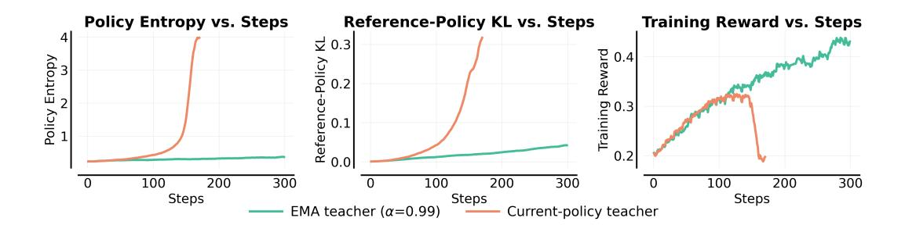

Figure 5: EMA 교사는 장기 수평 붕괴를 방지한다. 현재 정책으로 평가된 교사(EMA 없음)와 EMA 교사(α=0.99)를 사용해 MIRROR을 훈련시키는 경우, 나머지는 동일하다. 왼쪽: 정책 엔트로피. 가운데: 참조 정책 KL. 오른쪽: 이미지와 텍스트 모달리티를 평균한 훈련 보상. 현재 정책 교사는 약 90 스텝 이후 불안정해지고 약 170 스텝에서 붕괴된다; EMA 교사는 안정적으로 유지되며 더 높은 보상을 달성한다.

비대칭 예시를 사용한 훈련은 쌍대조제 세트에 비해 텍스트 지배적 검증 pass@1을 4.43% 향상시키며, 반면 대조 모델은 이미지 지배적 검증에서 22.15% 더 나쁜 성능을 보인다. 이 결과는 단독으로 짝지어진 표현만으로는 충분하지 않음을 보여준다. 유용한 감독은 성공적인 시점이 실패한 시점에 문제‑특정 지침을 제공할 때 발생하며, 이는 모달리티 비대칭이 MIRROR에서 자기 감독의 주요 원천이라는 가설을 지지한다.

Ablation 2: reverse‑KL 계수의 효과. Table [4](#page-8-2)는 모든 다른 훈련 구성 요소를 고정한 채 100 스텝 동안 reverse‑KL 정규화의 강도를 연구한다. 우리는 λKL = 0.01이 전체적으로 가장 좋은 순위를 달성한다는 것을 발견했고, 따라서 계속 훈련에 이를 사용한다. 0.1과 같은 더 큰 계수는 훈련 붕괴를 초래했으며, 이는 과도한 정렬이 RL 목표를 압도할 수 있음을 시사한다.

Ablation 3: 장기 안정성을 위해 느리게 움직이는 EMA 교사가 필요하다. Figure [5](#page-9-0)는 MIRROR의 EMA 교사(α = 0.99)와 현재 정책 파라미터 θ를 사용해 평가한 교사를 동일한 설정(λKL = 0.01) 하에서 비교한다. 실행은 처음 약 50 스텝 동안 유사하게 동작하지만, 이후 현재 정책 교사는 자기 강화 드리프트를 보인다: 엔트로피가 약 0.3에서 3.9로 상승하고, 참조 정책 KL이 0.33에 도달하며, 응답 길이가 약 9,000에서 3,700 토큰으로 감소하고, 보상이 약 165 스텝에서 0.34에서 0.21로 떨어진다. 반대로 EMA 교사는 엔트로피와 참조 KL을 약 0.29와 0.02 근처에 유지하며, 보상은 290 스텝에서 0.48까지 계속 향상된다. 우리는 현재 정책 교사의 실패를 가치 기반 RL에서 타깃 네트워크가 해결한 불안정성과 유사한 이동 타깃 효과로 해석한다[30]: 타깃의 시간 척도를 학생과 분리하면 최적화를 안정화하면서도 최종 성능을 희생하지 않는다.

## 7 논의 및 향후 연구 전망 (Discussion and Perspectives on Future Work)

이 연구에서 우리는 모달리티 간의 추론 비대칭성을 다중모달 추론을 위한 자기 지도 학습의 원천으로 식별한다. 우리는 Modality-Informed Reciprocal Reasoning Optimization (MIRROR)을 도입하여 각 문제의 가장 성능이 좋은 뷰를 내부 교사로 선택하고 RL 동안 학생 뷰 정책을 그 방향으로 정규화한다. 우리의 결과는 쌍으로 된 다중모달 데이터가 훈련 목표가 뷰 간의 대응을 명시적으로 활용할 때 가장 효과적임을 보여준다. 텍스트 중심과 이미지 중심 뷰를 RL 분포에 단순히 혼합하면 추론이 신뢰성 있게 전달되지 않는다. 왜냐하면 각 뷰는 여전히 독립적인 프롬프트로 최적화되기 때문이다. 반대로 MIRROR은 전이 방향을 명시적으로 만든다: 성공한 뷰가 훈련 중인 뷰에 대한 지침을 제공한다. 이는 더 강력하고 일관된 추론을 가져오며, 한 뷰는 성공하고 다른 뷰는 실패하는 모달리티 비대칭 예제에서 가장 큰 이득을 보인다.

더 넓게는, 우리의 발견은 다중모달 데이터를 사용하는 다른 방식을 제시한다. 서로 다른 입력 형식을 독립적인 예제로 다루는 대신, 우리는 그것들을 같은 잠재 문제의 대안적 뷰로 간주하고 그들의 불일치를 사용해 누락된 추론 능력을 드러낼 수 있다. 이 관점은 미래 연구를 위한 여러 방향을 열어준다. 기하학을 넘어 과학적 그림, 차트, 표, 로보틱스 관측, 또는 더 넓은 시각적 추론으로 확장하려면 정보 등가 뷰를 신뢰성 있게 구성하는 방법이 필요하다. 교사 선택은 불확실성 인식 가중치나 중간 추론 단계에서의 정렬을 통해 개선될 수 있다. 전반적으로, 우리의 발견은 교차 모달 불일치를 강건성 문제에서 학습에 유용한 신호로 전환할 수 있는 더 넓은 기회를 제시한다. 이는 정보가 어떻게 표현되는지에 덜 민감하고 더 강력한 다중모달 추론자를 학습시키는 데 도움이 된다.

## 참고문헌 (References)

- <span id="page-10-5"></span>[1] Rishabh Agarwal, Nino Vieillard, Yongchao Zhou, Piotr Stanczyk, Sabela Ramos, Matthieu Geist, and Olivier Bachem. On-policy distillation of language models: Learning from selfgenerated mistakes, 2024. URL <https://arxiv.org/abs/2306.13649>.
- <span id="page-10-2"></span>[2] Aishwarya Agrawal, Jiasen Lu, Stanislaw Antol, Margaret Mitchell, C. Lawrence Zitnick, Dhruv Batra, and Devi Parikh. Vqa: Visual question answering, 2016. URL [https://arxiv.](https://arxiv.org/abs/1505.00468) [org/abs/1505.00468](https://arxiv.org/abs/1505.00468).
- <span id="page-10-0"></span>[3] Jinze Bai, Shuai Bai, Shusheng Yang, Shijie Wang, Sinan Tan, Peng Wang, Junyang Lin, Chang Zhou, and Jingren Zhou. Qwen-vl: A versatile vision-language model for understanding, localization, text reading, and beyond, 2023. URL <https://arxiv.org/abs/2308.12966>.
- <span id="page-10-9"></span>[4] Shuai Bai, Yuxuan Cai, Ruizhe Chen, Keqin Chen, Xionghui Chen, Zesen Cheng, Lianghao Deng, Wei Ding, Chang Gao, Chunjiang Ge, Wenbin Ge, Zhifang Guo, Qidong Huang, Jie Huang, Fei Huang, Binyuan Hui, Shutong Jiang, Zhaohai Li, Mingsheng Li, Mei Li, Kaixin Li, Zicheng Lin, Junyang Lin, Xuejing Liu, Jiawei Liu, Chenglong Liu, Yang Liu, Dayiheng Liu, Shixuan Liu, Dunjie Lu, Ruilin Luo, Chenxu Lv, Rui Men, Lingchen Meng, Xuancheng Ren, Xingzhang Ren, Sibo Song, Yuchong Sun, Jun Tang, Jianhong Tu, Jianqiang Wan, Peng Wang, Pengfei Wang, Qiuyue Wang, Yuxuan Wang, Tianbao Xie, Yiheng Xu, Haiyang Xu, Jin Xu, Zhibo Yang, Mingkun Yang, Jianxin Yang, An Yang, Bowen Yu, Fei Zhang, Hang Zhang, Xi Zhang, Bo Zheng, Humen Zhong, Jingren Zhou, Fan Zhou, Jing Zhou, Yuanzhi Zhu, and Ke Zhu. Qwen3-vl technical report, 2025. URL <https://arxiv.org/abs/2511.21631>.
- <span id="page-10-3"></span>[5] Walid Bousselham, Hilde Kuehne, and Cordelia Schmid. Vold: Reasoning transfer from llms to vision-language models via on-policy distillation, 2025. URL [https://arxiv.org/abs/](https://arxiv.org/abs/2510.23497) [2510.23497](https://arxiv.org/abs/2510.23497).
- <span id="page-10-10"></span>[6] Mengzhang Cai, Xin Gao, Yu Li, Honglin Lin, Zheng Liu, Zhuoshi Pan, Qizhi Pei, Xiaoran Shang, Mengyuan Sun, Zinan Tang, et al. Opendataarena: A fair and open arena for benchmarking post-training dataset value. *arXiv preprint arXiv:2512.14051*, 2025.
- <span id="page-10-4"></span>[7] Jianlong Chen, Daocheng Fu, Shengze Xu, Jiawei Chen, Yuan Feng, Yue Yang, Junchi Yan, Hongyuan Zha, and Renqiu Xia. Milestones over outcome: Unlocking geometric reasoning with sub-goal verifiable reward, 2026. URL <https://arxiv.org/abs/2601.05073>.
- <span id="page-10-8"></span>[8] Mark Chen, Jerry Tworek, Heewoo Jun, Qiming Yuan, Henrique Ponde de Oliveira Pinto, Jared Kaplan, Harri Edwards, Yuri Burda, Nicholas Joseph, Greg Brockman, Alex Ray, Raul Puri, Gretchen Krueger, Michael Petrov, Heidy Khlaaf, Girish Sastry, Pamela Mishkin, Brooke Chan, Scott Gray, Nick Ryder, Mikhail Pavlov, Alethea Power, Lukasz Kaiser, Mohammad Bavarian, Clemens Winter, Philippe Tillet, Felipe Petroski Such, Dave Cummings, Matthias Plappert, Fotios Chantzis, Elizabeth Barnes, Ariel Herbert-Voss, William Hebgen Guss, Alex Nichol, Alex Paino, Nikolas Tezak, Jie Tang, Igor Babuschkin, Suchir Balaji, Shantanu Jain, William Saunders, Christopher Hesse, Andrew N. Carr, Jan Leike, Josh Achiam, Vedant Misra, Evan Morikawa, Alec Radford, Matthew Knight, Miles Brundage, Mira Murati, Katie Mayer, Peter Welinder, Bob McGrew, Dario Amodei, Sam McCandlish, Ilya Sutskever, and Wojciech Zaremba. Evaluating large language models trained on code, 2021. URL [https:](https://arxiv.org/abs/2107.03374) [//arxiv.org/abs/2107.03374](https://arxiv.org/abs/2107.03374).
- <span id="page-10-6"></span>[9] Yiqun Chen, Wei Yang, Erhan Zhang, Shijie Wang, Qi Liu, Zechun Niu, Bin Zhang, Haitao Li, Rui Li, Lingyong Yan, et al. Unitymas-o: A general rl optimization framework for llm-based multi-agent systems. *arXiv preprint arXiv:2605.26646*, 2026.
- <span id="page-10-1"></span>[10] Zhe Chen, Jiannan Wu, Wenhai Wang, Weijie Su, Guo Chen, Sen Xing, Muyan Zhong, Qinglong Zhang, Xizhou Zhu, Lewei Lu, Bin Li, Ping Luo, Tong Lu, Yu Qiao, and Jifeng Dai. Internvl: Scaling up vision foundation models and aligning for generic visual-linguistic tasks, 2024. URL <https://arxiv.org/abs/2312.14238>.
- <span id="page-10-7"></span>[11] Xiaoteng Cui and Yi Liu. Plane geometry diagram formalization via vision-language models. In *2nd AI for Math Workshop@ ICML 2025*, 2025.

- <span id="page-11-5"></span>[12] Xingjian Diao, Zheyuan Liu, Chunhui Zhang, Weiyi Wu, Keyi Kong, Lin Shi, Kaize Ding, Soroush Vosoughi, and Jiang Gui. 게이트된 인지-추론 최적화를 통한 대형 비전-언어 모델에서의 과잉 사고 해결, 2026. URL [https://arxiv.org/abs/2601.](https://arxiv.org/abs/2601.04442) [04442](https://arxiv.org/abs/2601.04442).

- <span id="page-11-2"></span>[13] Yuhao Dong, Zuyan Liu, Hai-Long Sun, Jingkang Yang, Winston Hu, Yongming Rao, and Ziwei Liu. Insight-v: 다중모달 대형 언어 모델을 활용한 장기 체인 시각적 추론 탐구, 2025. URL <https://arxiv.org/abs/2411.14432>.

- <span id="page-11-9"></span>[14] Google DeepMind. Gemini 3 pro 모델 카드. [https://storage.googleapis.com/deepmind-media/Model-Cards/Gemini-3-Pro-Model-Card.pdf](https://storage.googleapis.com/deepmind-media/Model-Cards/Gemini-3-Pro-Model-Card.pdf), December 2025. Model card for Gemini 3 Pro.

- <span id="page-11-10"></span>[15] Jean-Bastien Grill, Florian Strub, Florent Altche, Corentin Tallec, Pierre Richemond, Elena ´ Buchatskaya, Carl Doersch, Bernardo Avila Pires, Zhaohan Guo, Mohammad Gheshlaghi Azar, et al. Bootstrap your own latent-a: 자기 지도 학습을 위한 새로운 접근법. *Advances in neural information processing systems*, 33:21271–21284, 2020.

- <span id="page-11-6"></span>[16] Yuxian Gu, Li Dong, Furu Wei, and Minlie Huang. Minillm: 대형 언어 모델의 온-정책 증류, 2026. URL <https://arxiv.org/abs/2306.08543>.

- <span id="page-11-11"></span>[17] Kaiming He, Haoqi Fan, Yuxin Wu, Saining Xie, and Ross Girshick. 비지도 시각적 표현 학습을 위한 모멘텀 대비. In *Proceedings of the IEEE/CVF conference on computer vision and pattern recognition*, pages 9729–9738, 2020.

- <span id="page-11-13"></span>[18] Jordan Hoffmann, Sebastian Borgeaud, Arthur Mensch, Elena Buchatskaya, Trevor Cai, Eliza Rutherford, Diego de Las Casas, Lisa Anne Hendricks, Johannes Welbl, Aidan Clark, Tom Hennigan, Eric Noland, Katie Millican, George van den Driessche, Bogdan Damoc, Aurelia Guy, Simon Osindero, Karen Simonyan, Erich Elsen, Jack W. Rae, Oriol Vinyals, and Laurent Sifre. 컴퓨트 최적화 대형 언어 모델 훈련, 2022. URL [https://arxiv.org/](https://arxiv.org/abs/2203.15556) [abs/2203.15556](https://arxiv.org/abs/2203.15556).

- <span id="page-11-8"></span>[19] Wenjin Hou, Shangpin Peng, Weinong Wang, Zheng Ruan, Yue Zhang, Zhenglin Zhou, Mingqi Gao, Yifei Chen, Kaiqi Wang, Hongming Yang, Chengquan Zhang, Zhuotao Tian, Han Hu, Yi Yang, Fei Wu, and Hehe Fan. Uni-opd: 이중 관점 레시피를 통한 온-정책 증류 통합, 2026. URL <https://arxiv.org/abs/2605.03677>.

- <span id="page-11-4"></span>[20] Wenxuan Huang, Bohan Jia, Zijie Zhai, Shaosheng Cao, Zheyu Ye, Fei Zhao, Zhe Xu, Xu Tang, Yao Hu, and Shaohui Lin. Vision-r1: 다중모달 대형 언어 모델에서 추론 능력 유도, 2026. URL <https://arxiv.org/abs/2503.06749>.

- <span id="page-11-12"></span>[21] Aaron Hurst, Adam Lerer, Adam P Goucher, Adam Perelman, Aditya Ramesh, Aidan Clark, AJ Ostrow, Akila Welihinda, Alan Hayes, Alec Radford, et al. Gpt-4o 시스템 카드. *arXiv preprint arXiv:2410.21276*, 2024.

- <span id="page-11-7"></span>[22] Jonas Hubotter, Frederike L ¨ ubeck, Lejs Behric, Anton Baumann, Marco Bagatella, Daniel ¨ Marta, Ido Hakimi, Idan Shenfeld, Thomas Kleine Buening, Carlos Guestrin, and Andreas Krause. 자기 증류를 통한 강화 학습. *arXiv preprint arXiv:2601.20802*, 2026.

- <span id="page-11-0"></span>[23] Mohamed Insaf Ismithdeen, Muhammad Uzair Khattak, and Salman Khan. Promptception: 대형 다중모달 모델은 프롬프트에 얼마나 민감한가?, 2025. URL [https://arxiv.org/](https://arxiv.org/abs/2509.03986) [abs/2509.03986](https://arxiv.org/abs/2509.03986).

- <span id="page-11-3"></span>[24] Yaxuan Li, Yuxin Zuo, Bingxiang He, Jinqian Zhang, Chaojun Xiao, Cheng Qian, Tianyu Yu, Huan-ang Gao, Wenkai Yang, Zhiyuan Liu, et al. 대형 언어 모델의 온-정책 증류 재고: 현상학, 메커니즘, 그리고 레시피. *arXiv preprint arXiv:2604.13016*, 2026.

- <span id="page-11-1"></span>[25] Zongxia Li, Xiyang Wu, Hongyang Du, Fuxiao Liu, Huy Nghiem, and Guangyao Shi. 최첨단 대형 비전-언어 모델에 대한 조사: 정렬, 벤치마크, 평가 및 도전 과제, 2025. URL <https://arxiv.org/abs/2501.02189>.

- <span id="page-12-9"></span>[26] Timothy P. Lillicrap, Jonathan J. Hunt, Alexander Pritzel, Nicolas Heess, Tom Erez, Yuval Tassa, David Silver, and Daan Wierstra. 딥 강화 학습을 이용한 연속 제어, 2019. URL <https://arxiv.org/abs/1509.02971>.
- <span id="page-12-1"></span>[27] Haotian Liu, Chunyuan Li, Qingyang Wu, and Yong Jae Lee. 시각적 지시 튜닝, 2023. URL <https://arxiv.org/abs/2304.08485>.
- <span id="page-12-7"></span>[28] Martin Q Ma, Yuxiao Qu, Aditya Agrawal, Willis Guo, Paul Pu Liang, Ruslan Salakhutdinov, and Louis-Philippe Morency. Act2see: 비디오 추론을 위한 자발적 활성 시각 인식. In *Proceedings of the IEEE/CVF Conference on Computer Vision and Pattern Recognition*, pages 5455–5464, 2026.
- <span id="page-12-0"></span>[29] Ahmed Masry, Do Xuan Long, Jia Qing Tan, Shafiq Joty, and Enamul Hoque. Chartqa: 시각 및 논리적 추론을 통한 차트에 대한 질문 응답 벤치마크, 2022. URL <https://arxiv.org/abs/2203.10244>.
- <span id="page-12-10"></span>[30] Volodymyr Mnih, Koray Kavukcuoglu, David Silver, Andrei A Rusu, Joel Veness, Marc G Bellemare, Alex Graves, Martin Riedmiller, Andreas K Fidjeland, Georg Ostrovski, et al. 딥 강화 학습을 통한 인간 수준의 제어. *nature*, 518(7540):529–533, 2015.
- <span id="page-12-3"></span>[31] Shuai Peng, Di Fu, Liangcai Gao, Xiuqin Zhong, Hongguang Fu, and Zhi Tang. Multimath: 대형 언어 모델을 위한 시각 및 수학적 추론 연결, 2024. URL [https:](https://arxiv.org/abs/2409.00147) [//arxiv.org/abs/2409.00147](https://arxiv.org/abs/2409.00147).
- <span id="page-12-5"></span>[32] Yuxiao Qu, Tianjun Zhang, Naman Garg, and Aviral Kumar. Recursive introspection: 언어 모델 에이전트가 스스로 개선하는 방법을 가르치기. *Advances in Neural Information Processing Systems*, 37:55249–55285, 2024.
- <span id="page-12-14"></span>[33] Yuxiao Qu, Amrith Setlur, Virginia Smith, Ruslan Salakhutdinov, and Aviral Kumar. Pope: 특권 온-정책 탐색을 통한 어려운 문제에 대한 추론 학습, 2026. URL [https:](https://arxiv.org/abs/2601.18779) [//arxiv.org/abs/2601.18779](https://arxiv.org/abs/2601.18779).
- <span id="page-12-13"></span>[34] Gabriel Sarch, Linrong Cai, Qunzhong Wang, Haoyang Wu, Danqi Chen, and Zhuang Liu. Vero: 일반 시각 추론을 위한 공개 RL 레시피, 2026. URL [https://arxiv.org/abs/](https://arxiv.org/abs/2604.04917) [2604.04917](https://arxiv.org/abs/2604.04917).
- <span id="page-12-15"></span>[35] Nikhil Sardana, Jacob Portes, Sasha Doubov, and Jonathan Frankle. Beyond chinchilla-optimal: 언어 모델 스케일링 법칙에서 추론을 고려하기, 2025. URL [https://arxiv.org/](https://arxiv.org/abs/2401.00448) [abs/2401.00448](https://arxiv.org/abs/2401.00448).
- <span id="page-12-8"></span>[36] Zhihong Shao, Peiyi Wang, Qihao Zhu, Runxin Xu, Junxiao Song, Xiao Bi, Haowei Zhang, Mingchuan Zhang, Y. K. Li, Y. Wu, and Daya Guo. Deepseekmath: 공개 언어 모델에서 수학적 추론의 한계를 확장하기, 2024. URL [https://arxiv.org/abs/](https://arxiv.org/abs/2402.03300) [2402.03300](https://arxiv.org/abs/2402.03300).
- <span id="page-12-6"></span>[37] Idan Shenfeld, Mehul Damani, Jonas Hubotter, and Pulkit Agrawal. Self-distillation이 지속적 학습을 가능하게 함, 2026. URL <https://arxiv.org/abs/2601.19897>.
- <span id="page-12-12"></span>[38] Guangming Sheng, Chi Zhang, Zilingfeng Ye, Xibin Wu, Wang Zhang, Ru Zhang, Yanghua Peng, Haibin Lin, and Chuan Wu. Hybridflow: 유연하고 효율적인 RLHF 프레임워크. In *Proceedings of the Twentieth European Conference on Computer Systems*, pages 1279–1297, 2025.
- <span id="page-12-2"></span>[39] Wenhao Shi, Zhiqiang Hu, Yi Bin, Junhua Liu, Yang Yang, See-Kiong Ng, Lidong Bing, and Roy Ka-Wei Lee. Math-llava: 다중 모달 대형 언어 모델을 위한 수학적 추론 부트스트랩, 2024. URL <https://arxiv.org/abs/2406.17294>.
- <span id="page-12-4"></span>[40] Chendong Song, Zihan Wang, Frederick Pu, Haiming Wang, Xiaohan Lin, Junqi Liu, Jia Li, and Zhengying Liu. Leangeo: Lean에서 경쟁적 기하학 문제를 공식화하기, 2025. URL <https://arxiv.org/abs/2508.14644>.
- <span id="page-12-11"></span>[41] Antti Tarvainen and Harri Valpola. Mean teachers are better role models: 가중 평균 일관성 목표가 반지도 딥러닝 결과를 개선한다. *Advances in neural information processing systems*, 30, 2017.

- <span id="page-13-6"></span>[42] Core Team, Bangjun Xiao, Bingquan Xia, Bo Yang, Bofei Gao, Bowen Shen, Chen Zhang, Chenhong He, Chiheng Lou, Fuli Luo, Gang Wang, Gang Xie, Hailin Zhang, Hanglong Lv, Hanyu Li, Heyu Chen, Hongshen Xu, Houbin Zhang, Huaqiu Liu, Jiangshan Duo, Jianyu Wei, Jiebao Xiao, Jinhao Dong, Jun Shi, Junhao Hu, Kainan Bao, Kang Zhou, Lei Li, Liang Zhao, Linghao Zhang, Peidian Li, Qianli Chen, Shaohui Liu, Shihua Yu, Shijie Cao, Shimao Chen, Shouqiu Yu, Shuo Liu, Tianling Zhou, Weijiang Su, Weikun Wang, Wenhan Ma, Xiangwei Deng, Bohan Mao, Bowen Ye, Can Cai, Chenghua Wang, Chengxuan Zhu, Chong Ma, Chun Chen, Chunan Li, Dawei Zhu, Deshan Xiao, Dong Zhang, Duo Zhang, Fangyue Liu, Feiyu Yang, Fengyuan Shi, Guoan Wang, Hao Tian, Hao Wu, Heng Qu, Hongfei Yi, Hongxu An, Hongyi Guan, Xing Zhang, Yifan Song, Yihan Yan, Yihao Zhao, Yingchun Lai, Yizhao Gao, Yu Cheng, Yuanyuan Tian, Yudong Wang, Zhen Tang, Zhengju Tang, Zhengtao Wen, Zhichao Song, Zhixian Zheng, Zihan Jiang, Jian Wen, Jiarui Sun, Jiawei Li, Jinlong Xue, Jun Xia, Kai Fang, Menghang Zhu, Nuo Chen, Qian Tu, Qihao Zhang, Qiying Wang, Rang Li, Rui Ma, Shaolei Zhang, Shengfan Wang, Shicheng Li, Shuhao Gu, Shuhuai Ren, Sirui Deng, Tao Guo, Tianyang Lu, Weiji Zhuang, Weikang Zhang, Weimin Xiong, Wenshan Huang, Wenyu Yang, Xin Zhang, Xing Yong, Xu Wang, Xueyang Xie, Yilin Jiang, Yixin Yang, Yongzhe He, Yu Tu, Yuanliang Dong, Yuchen Liu, Yue Ma, Yue Yu, Yuxing Xiang, Zhaojun Huang, Zhenru Lin, Zhipeng Xu, Zhiyang Chen, Zhonghua Deng, Zihan Zhang, and Zihao Yue. Mimo-v2-flash 기술 보고서, 2026. URL <https://arxiv.org/abs/2601.02780>.

- <span id="page-13-7"></span>[43] Jianze Wang, Ying Liu, Jinlong Chen, Xuchun Hu, Qilong Zhang, Yu Cao, Jun Wang, Hua Yang, Yong Xie, and Qianglong Chen. Mad-opd: 다중 에이전트 토론을 통한 온-폴리시 디스틸레이션에서 천장을 깨는, 2026. URL <https://arxiv.org/abs/2605.01347>.

- <span id="page-13-0"></span>[44] Ke Wang, Junting Pan, Weikang Shi, Zimu Lu, Mingjie Zhan, and Hongsheng Li. math-vision 데이터셋을 사용한 멀티모달 수학적 추론 측정, 2024. URL [https://arxiv.](https://arxiv.org/abs/2402.14804) [org/abs/2402.14804](https://arxiv.org/abs/2402.14804).

- <span id="page-13-9"></span>[45] Ke Wang, Junting Pan, Linda Wei, Aojun Zhou, Weikang Shi, Zimu Lu, Han Xiao, Yunqiao Yang, Houxing Ren, Mingjie Zhan, and Hongsheng Li. Mathcoder-vl: 향상된 멀티모달 수학적 추론을 위한 비전과 코드 연결, 2025. URL [https://arxiv.org/](https://arxiv.org/abs/2505.10557) [abs/2505.10557](https://arxiv.org/abs/2505.10557).

- <span id="page-13-11"></span>[46] Zhenhailong Wang, Xuehang Guo, Sofia Stoica, Haiyang Xu, Hongru Wang, Hyeonjeong Ha, Xiusi Chen, Yangyi Chen, Ming Yan, Fei Huang, et al. 멀티모달 추론을 위한 인지 인식 기반 정책 최적화. *arXiv preprint arXiv:2507.06448*, 2025.

- <span id="page-13-10"></span>[47] Jingxuan Wei, Caijun Jia, Qi Chen, Honghao He, Linzhuang Sun, Conghui He, Lijun Wu, Bihui Yu, and Cheng Tan. Geoint-r1: 동적 보조 구조를 통한 멀티모달 기하학적 추론 공식화. *arXiv preprint arXiv:2508.03173*, 2025.

- <span id="page-13-1"></span>[48] Jingxuan Wei, Caijun Jia, Qi Chen, Honghao He, Linzhuang Sun, Conghui He, Lijun Wu, Bihui Yu, and Cheng Tan. Geoint-r1: 동적 보조 구조를 통한 멀티모달 기하학적 추론 공식화, 2025. URL <https://arxiv.org/abs/2508.03173>.

- <span id="page-13-2"></span>[49] Yige Xu, Yongjie Wang, Zizhuo Wu, Kaisong Song, Jun Lin, and Zhiqi Shen. 시각-언어 모델이 실제로 시각적 추론을 수행하는가? 모달리티 격차에 대한 엄격한 연구, 2026. URL <https://arxiv.org/abs/2604.16256>.

- <span id="page-13-3"></span>[50] Wei Yang and Jesse Thomason. 사고를 배우다: 다중 에이전트 강화 학습을 통한 에이전트형 llm의 메타-정책 협업. *arXiv preprint arXiv:2509.03817*, 2025.

- <span id="page-13-4"></span>[51] Wei Yang, Jiacheng Pang, Shixuan Li, Paul Bogdan, Stephen Tu, and Jesse Thomason. Maestro: 다중 에이전트 llm을 위한 조건부 리스트별 정책 최적화를 통한 협업 학습. *arXiv preprint arXiv:2511.06134*, 2025.

- <span id="page-13-5"></span>[52] Wei Yang, Shixuan Li, Heng Ping, Peiyu Zhang, Paul Bogdan, and Jesse Thomason. 다중 에이전트 llm 추론 트리 감사가 다수결 및 llm-as-judge보다 우수하다. *arXiv preprint arXiv:2602.09341*, 2026.

- <span id="page-13-8"></span>[53] Wenkai Yang, Weijie Liu, Ruobing Xie, Kai Yang, Saiyong Yang, and Yankai Lin. 교사 초월 학습: 보상 외삽을 통한 일반화 온-폴리시 디스틸레이션, 2026. URL <https://arxiv.org/abs/2602.12125>.

- <span id="page-14-3"></span>[54] Yi Yang, Xiaoxuan He, Hongkun Pan, Xiyan Jiang, Yan Deng, Xingtao Yang, Haoyu Lu, Dacheng Yin, Fengyun Rao, Minfeng Zhu, Bo Zhang, and Wei Chen. R1-onevision: 교차 모달 공식화를 통한 일반화된 멀티모달 추론 향상, 2025. URL [https:](https://arxiv.org/abs/2503.10615) [//arxiv.org/abs/2503.10615](https://arxiv.org/abs/2503.10615).

- <span id="page-14-1"></span>[55] Ruilin Yao, Bo Zhang, Jirui Huang, Xinwei Long, Yifang Zhang, Tianyu Zou, Yufei Wu, Shichao Su, Yifan Xu, Wenxi Zeng, Zhaoyu Yang, Guoyou Li, Shilan Zhang, Zichan Li, Yaxiong Chen, Shengwu Xiong, Peng Xu, Jiajun Zhang, Bowen Zhou, David Clifton, and Luc Van Gool. Lens: 대형 언어 모델을 활용한 멀티모달 추론의 다중 수준 평가, 2025. URL <https://arxiv.org/abs/2505.15616>.

- <span id="page-14-6"></span>[56] Kaichen Zhang, Bo Li, Peiyuan Zhang, Fanyi Pu, Joshua Adrian Cahyono, Kairui Hu, Shuai Liu, Yuanhan Zhang, Jingkang Yang, Chunyuan Li, and Ziwei Liu. Lmms-eval: 대형 멀티모달 모델 평가에 대한 현실 점검, 2024. URL <https://arxiv.org/abs/2407.12772>.

- <span id="page-14-0"></span>[57] Renrui Zhang, Dongzhi Jiang, Yichi Zhang, Haokun Lin, Ziyu Guo, Pengshuo Qiu, Aojun Zhou, Pan Lu, Kai-Wei Chang, Peng Gao, and Hongsheng Li. Mathverse: 당신의 멀티모달 LLM이 시각적 수학 문제의 다이어그램을 실제로 보는가?, 2024. URL [https://arxiv.org/abs/](https://arxiv.org/abs/2403.14624) [2403.14624](https://arxiv.org/abs/2403.14624).

- <span id="page-14-5"></span>[58] Shan Zhang, Aotian Chen, Yanpeng Sun, Jindong Gu, Yi-Yu Zheng, Piotr Koniusz, Kai Zou, Anton van den Hengel, and Yuan Xue. Open eyes, then reason: MLLMs에서 세밀한 시각적 수학 이해, 2025. URL <https://arxiv.org/abs/2501.06430>.

- <span id="page-14-2"></span>[59] Zhuosheng Zhang, Aston Zhang, Mu Li, Hai Zhao, George Karypis, and Alex Smola. 언어 모델에서의 멀티모달 체인-오브-씽크 추론, 2024. URL [https://arxiv.org/](https://arxiv.org/abs/2302.00923) [abs/2302.00923](https://arxiv.org/abs/2302.00923).

- <span id="page-14-4"></span>[60] Siyan Zhao, Zhihui Xie, Mengchen Liu, Jing Huang, Guan Pang, Feiyu Chen, and Aditya Grover. Self-distilled reasoner: 대형 언어 모델을 위한 온정책 자기 증류, 2026. URL <https://arxiv.org/abs/2601.18734>.

- <span id="page-14-7"></span>[61] Lianmin Zheng, Wei-Lin Chiang, Ying Sheng, Siyuan Zhuang, Zhanghao Wu, Yonghao Zhuang, Zi Lin, Zhuohan Li, Dacheng Li, Eric P. Xing, Hao Zhang, Joseph E. Gonzalez, and Ion Stoica. Judging llm-as-a-judge with mt-bench and chatbot arena: mt-bench와 챗봇 아레나를 이용한 LLM-as-a-judge 평가, 2023. URL [https://arxiv.org/](https://arxiv.org/abs/2306.05685) [abs/2306.05685](https://arxiv.org/abs/2306.05685).

## Appendices

## <span id="page-15-0"></span>A FLOPs Estimation (FLOPs 추정)

MIRROR의 계산 오버헤드를 표준 혼합 모달리티 GRPO와 비교하여 추정한다. 언어 모델 스케일링 분석에서 흔히 사용되는 근사치를 따라, D 토큰에 대한 한 번의 순방향 전송만을 약 2ND FLOPs로 계산한다 [35](#page-12-15), 여기서 N은 모델 파라미터 수이며, 순방향 및 역전파를 포함한 한 번의 학습 패스는 약 6ND FLOPs로 계산한다 [18](#page-11-13). 이는 롤아웃 생성, 교사 로짓 평가, 그리고 그래디언트 업데이트 간의 상대 비용을 대략적이지만 유용하게 추정한다.

설정. 표준 혼합 모달리티 GRPO는 두 개의 제한된 학생 뷰: 텍스트 지배형과 이미지 지배형에서 학습한다. 각 문제마다 각 뷰에서 K개의 롤아웃을 샘플링하여 2K개의 온라인 학생 롤아웃을 생성한다. MIRROR는 학생 RL 훈련을 위해 동일한 두 제한된 뷰를 사용하지만, 세 개의 후보 뷰에 대해 교사 선택을 수행한다:

$$\mathcal{M} = \{text, img, comb\}$$

텍스트-우세 및 이미지-우세 후보 롤아웃은 이미 GRPO에 대해 생성된 온라인 롤아웃과 동일하므로 재계산할 필요가 없다. 따라서 MIRROR에서 추가로 필요한 롤아웃 생성은 결합된 이미지+텍스트 뷰에서의 K 롤아웃이다.

혼합 모달리티 GRPO 비용. D를 평균 롤아웃 길이라고 하자. 표준 혼합 모달리티 GRPO는 문제당 2K 롤아웃을 생성하므로, 순방향 롤아웃 생성 비용은 대략

$$C_{\text{mixed-GRPO,gen}} \approx 2K \cdot 2ND = 4KND.$$

(4)

그 다음에 이 2K 롤아웃에 대해 학생 측 정책 업데이트를 한 번 수행한다. 표준 훈련 근사치를 사용하면 순방향-역방향 업데이트 비용은

$$C_{\text{mixed-GRPO,train}} \approx 2K \cdot 6ND = 12KND.$$

(5)

따라서 구현 세부 상수들을 무시하면 총 비용은

$$C_{\text{mixed-GRPO}} \approx 4KND + 12KND = 16KND.$$

(6)

MIRROR 비용. MIRROR는 혼합 모달리티 GRPO와 동일한 2K 텍스트-우세 및 이미지-우세 학생 롤아웃을 재사용한다. 또한 온라인 교사 선택을 위해 K개의 결합 뷰 롤아웃을 샘플링한다. 따라서 그 롤아웃 생성 비용은

$$C_{\text{MIRROR,gen}} \approx 3K \cdot 2ND = 6KND.$$

(7)

교사 뷰를 선택한 후, MIRROR는 2K 학생 뷰 롤아웃에 대해 reverse-KL 정규화 항을 계산한다. 이를 위해 선택된 교사 뷰 하에서 교사 강제(forced) 전방 패스를 수행하여 EMA 교사 가중치를 사용해 동일한 생성 토큰에 대한 교사 로그 확률을 계산해야 한다. 이 과정은 전방 전용이며 그라디언트가 차단되므로, 비용은 대략

$$C_{\text{MIRROR}, \text{KL-eval}} \approx 2K \cdot 2ND = 4KND.$$

(8)

The student-side GRPO update is unchanged from mixed-modality GRPO:

$$C_{\text{MIRROR,train}} \approx 2K \cdot 6ND = 12KND.$$

(9)

Therefore, the total cost of MIRROR is approximately

$$C_{\text{MIRROR}} \approx 6KND + 4KND + 12KND = 22KND. \tag{10}$$

상대 오버헤드. 이 거친 FLOPs 모델에서, MIRROR의 상대 비용은 표준 혼합 모달리티 GRPO와 비교하면

$$\frac{C_{\text{MIRROR}}}{C_{\text{mixed-GRPO}}} \approx \frac{22KND}{16KND} = 1.375. \tag{11}$$

따라서 MIRROR는 단일 업데이트 계산 기준에서 표준 혼합 모달리티 GRPO보다 약 37.5% FLOPs를 추가한다. 이 오버헤드는 오직 순방향 계산에서만 발생한다: 교사 선택을 위한 K개의 추가 결합 뷰 롤아웃과 역 KL 정규화기용 교사 로짓 평가 패스. MIRROR는 동일한 학습 가능한 모델, 동일한 2K 학생 뷰 RL 롤아웃, 그리고 혼합 모달리티 GRPO와 동일한 수의 역방향 업데이트를 사용한다. 표준 GRPO가 유사한 계산량 하에서 비슷한 최적화 이득을 얻을 수 있는지 확인하기 위해, 우리는 그림 [3,](#page-7-0)에 표시된 MIRROR 단계 150과 GRPO 단계 200에서의 실행 평균 훈련 보상을 살펴본다. 이는 대략적으로 유사한 누적 FLOPs에 해당한다. 이 시점에서 MIRROR는 이미지 보상(0.2625 vs. 0.2368)과 텍스트 보상(0.4581 vs. 0.4387)이 더 높다. 이는 이점이 단지 추가 업데이트 계산 때문만은 아님을 시사한다.

EMA 교사 오버헤드. EMA 교사는 위에서 언급한 FLOPs 계산을 변경하지 않는다: 교사-로짓 평가 패스 (CMIRROR,KL-eval ≈ 4KND)는 현재 가중치 θ 대신 EMA 가중치 ¯θ로 단순히 실행되며, 방정식 [3](#page-6-2)에서 Polyak 업데이트는 훈련 단계마다 단일 O(N) 요소별 연산이다 (우리 실행에서는 단계당 1초 미만, 전체 훈련 단계당 약 20분). 주요 비용은 메모리이다: 정책 파라미터의 추가적인 순방향 전용 복사본이 fp32로 보관되어 수치적으로 안정적인 고감쇠 평균화를 위해 사용되고, 교사 평가 사이에 CPU로 오프로드된다. 체크포인트는 EMA 파라미터를 추가로 저장하여 훈련이 정확히 재개될 수 있도록 한다.

## B 훈련 세부사항 (B Training Details)

우리는 모든 모델을 GRPO와 verl [38](#page-12-12)로 훈련한다. 특별히 명시되지 않는 한, 실험에서는 Qwen3-VL-4B-Instruct를 기본 모델로, vLLM을 롤아웃 엔진으로, 8개의 노드에 8개의 H200 GPU를 사용한다. 각 훈련 실행은 최대 프롬프트 길이 4096 토큰과 최대 응답 길이 16,384 토큰을 사용한다. 샘플링 온도 0.8을 사용하고 프롬프트마다 n = 16개의 롤아웃을 생성한다. 훈련 배치 크기는 256이며, PPO 미니배치 크기는 128, GPU당 마이크로배치 크기는 1이다. GRPO를 사용하며 클리핑 임계값 ϵlow = 0.2와 ϵhigh = 0.26을 적용한다. 학습률 1 × 10<sup>−</sup><sup>6</sup>, 엔트로피 계수 0.001, 그리고 저변동 KL 추정기를 사용한 참조 정책 KL 손실 계수 0.001로 훈련한다. MIRROR의 경우, 기본적으로 교차 모달 역-KL 정규화 λKL = 0.01을 활성화하고, 정책의 EMA 복사본에서 감쇠 α = 0.99를 사용해 교사 대상 로그 확률을 계산하며, 이는 액터 단계마다 업데이트된다. EMA 복사본은 fp32로 보관되며 전진 전용(옵티마이저 상태 없음)이다. 각 체크포인트와 함께 저장되어 훈련이 정확히 재개된다.

각 RL 훈련 작업은 8개의 노드에 8개의 H200 GPU를 사용하며, 훈련 단계마다 약 20분이 소요되고, 최소 200 단계 동안 훈련된다. 이는 약 67 벽시계 시간 또는 모델당 약 4,267 H200 GPU-시간에 해당한다.

| 카테고리 | 설정 |  |  |
|----------------------------------------|---------------------------|--|--|
| 기본 모델 | Qwen/Qwen3-VL-4B-Instruct |  |  |
| 훈련 프레임워크 | verl [38] |  |  |
| RL 알고리즘 | GRPO |  |  |
| 롤아웃 엔진 | vLLM |  |  |
| 최대 프롬프트 길이 | 4096 토큰 |  |  |
| 최대 응답 길이 | 16,384 토큰 |  |  |
| 프롬프트당 롤아웃 수 | 16 |  |  |
| 샘플링 온도 | 0.8 |  |  |
| 훈련 배치 크기 | 256 |  |  |
| PPO 미니배치 크기 | 128 |  |  |
| PPO 마이크로배치 크기 (GPU당) | 1 |  |  |
| 학습률 | 1 × 10−6 |  |  |
| 클립 비율 낮음 | 0.2 |  |  |
| 클립 비율 높음 | 0.26 |  |  |
| 엔트로피 계수 | 0.001 |  |  |
| 참조 KL 손실 | 활성화 |  |  |
| 참조 KL 계수 | 0.001 |  |  |
| 참조 KL 유형 | 저분산 KL |  |  |
| 총 epoch 수 | 200 |  |  |
| 교차 모달 역-KL 계수 λKL | 0.01 (MIRROR 전용) |  |  |
| EMA 교사 감쇠 α | 0.99 (MIRROR 전용) |  |  |
| EMA 교사 정밀도 | fp32, forward-only |  |  |

표 5: 주요 훈련 하이퍼파라미터. 별도로 명시되지 않는 한, 모든 MIRROR 및 GRPO 기반 모델은 동일한 훈련 구성을 사용합니다. 방법별 차이점은 교차 모달 역 KL 정규화가 활성화되는지 여부와 그 EMA 교사(감쇠 0.99)입니다.

## <span id="page-17-0"></span>ODA-Data 구성 (C ODA-Data Construction)

기저 문제를 고정한 채 모달리티에 따라 달라지는 추론을 연구하기 위해, 우리는 ODA-Data를 구성한다. 이는 각 문제를 텍스트 중심 보기와 이미지 중심 보기라는 두 개의 정렬된 시각으로 표현하는 쌍형 멀티모달 기하학 데이터셋이다. OpenDataArena/ODA-Math-460k [&#91;6&#93;](#page-10-10)에서 97K개의 기하학 스타일 문제를 시작으로, 먼저 pass@5=1로 주석이 달린 쉬운 질문을 제거하는 난이도 필터를 적용하여 16K개의 후보 질문을 얻는다. 각 후보에 대해, LLM에게 TikZ 코드(프로그래밍 벡터 그래픽스용 표준 LaTeX 패키지)로 다이어그램을 생성하도록 요청한다. TikZ 코드가 성공적으로 컴파일되는 다이어그램만 보존하고, LLM 판사를 사용해 생성된 다이어그램이 원래 문제 진술과 의미적으로 정렬되는지 검증한다.

이미지 중심 보기를 구성하기 위해, 우리는 판사에게 다이어그램에 이미 제시된 정보를 텍스트에서 제거하도록 추가로 요청한다. 이렇게 하면 남은 텍스트와 이미지가 상호 보완적인 정보를 제공한다. 모든 LLM 기반 생성 및 판정 단계는 Gemini-3-Pro-Preview를 사용한다. 이후 우리는 기본 모델을 사용해 모달리티별 롤아웃 평가를 수행하고, 기본 모델이 텍스트 중심 보기와 이미지 중심 보기 모두에서 신뢰성 있게 해결하는 질문을 제거한다. 이렇게 하면 최종 데이터셋은 입력 표현에 따라 해결 가능성이 달라지는 문제를 강조한다. 이 과정은 약 2K개의 선별된 쌍형 멀티모달 예제를 생성한다.

우리는 이 예제들을 85:15 비율로 ODA-Train과 ODA-Val로 분할한다. 데이터셋의 15%를 검증용으로 보류한다. ODA-Train은 교차 모달 후처리 훈련에 사용되고, ODA-Val은 모달리티에 따라 달라지는 추론, 교차 모달 일관성, 단일 측면 해결 가능성을 평가하기 위한 보류 벤치마크 역할을 한다. 각 예제는 원본 텍스트 문제, 생성된 다이어그램, 이미지 중심 프롬프트, 텍스트 중심 프롬프트, 답변 주석, 그리고 모달리티별 롤아웃/평가 메타데이터를 포함한다. 이러한 구조는 ODA-Data가 MIRROR 훈련뿐 아니라 VLM이 텍스트와 시각적 표현에서 동일한 수학 문제를 일관되게 해결하는지 연구하는 데에도 유용하게 만든다.

TikZ 코드 생성을 위한 프롬프트는 다음과 같다:

#### TikZ 코드 생성을 위한 프롬프트 (Prompt for Tikz Code Generation)

<question>

당신의 과제는 문제에 서술된 기하학적 다이어그램을 그리는 TikZ (LaTeX) 코드만 생성하는 것이다.

중요 규칙:

- 문제를 해결하지 마십시오.
- 색상을 사용할 수 있습니다 (예: 명확성 또는 강조를 위해), 단:
  - 완전히 아래 선이나 모양을 가려버리는 채우기를 사용하지 마십시오.
  - 'fill'을 사용한다면 'opacity' 값(예: 'fill opacity=0.2')을 포함하거나 매우 연하게 해야 합니다.
  - 채워진 영역보다 'draw', 'dashed', 'thick', 또는 색상화된 윤곽선을 선호하십시오.
- 문제에 명시되지 않은 불필요한 장식이나 스타일 선택을 피하십시오.
- 다이어그램이 명확하고, 혼잡하지 않으며, 기하학적으로 일관되도록 하십시오.

TikZ 코드를 *latex* 블록 안에만 반환하십시오.

tikz로 컴파일된 이미지를 질문과 비교하기 위해, 프롬프트는 다음과 같습니다:

## 이미지 검증 프롬프트 (Prompt for Image Verification)

당신은 엄격한 기하학 다이어그램 심사관입니다.

당신에게는 다음이 주어집니다:

- 1. 텍스트로 설명된 기하학 문제
- 2. 그 문제를 나타내려는 다이어그램 이미지

당신의 과제는 다이어그램이 문제 텍스트를 정확하고 충실하게 표현했는지 판단하는 것입니다.

주의 깊게 확인하십시오:

- 1. 텍스트에 언급된 모든 기하학적 객체(점, 선, 각도, 도형, 객체)가 도면에 나타난다.  
- 2. 공간적 관계가 텍스트와 일치한다(상대 위치, 교차, 평행, 수직, 포함, 움직임(설명된 경우)).  
- 3. 각도 표시가 정확하다:  
  - 각도는 올바른 꼭짓점에 표시된다.  
  - 표시된 각도는 의도된 각도와 일치하며 보완각이나 보충각이 아니다.  
  - 각도를 정의하는 광선이 텍스트 설명과 일치한다.  
- 4. 명시된 각도 측정값이나 기호(예: 90◦, 100◦, α, β)는 올바른 기하학적 영역에 적용된다.  
- 5. 도면은 오해를 불러일으키는 구성, 추가 제약, 또는 텍스트와 모순되는 대안적 해석을 도입하지 않는다.  
- 6. 시각적 스케일 정확도를 기준으로 판단하지 말라:  
  - 세그먼트 길이, 비율, 또는 도면 스케일의 차이(예: 길이 15인 세그먼트가 길이 13인 세그먼트보다 길어 보이지 않음)는 텍스트에서 상대 길이 순서가 명시적으로 요구되지 않는 한 오류로 간주해서는 안 된다.

필요한 요소가 누락되었거나, 잘못 표시되었거나, 모호하게 표현되었거나, 오해를 불러일으키는 경우 도면을 부정확하다고 판단한다.

다음 형식으로 정확히 응답하십시오:

판단: 정확하거나 부정확

이유: 핵심 정확성 또는 주요 문제를 식별하는 간단한 설명(1–2문장). 이제 다음을 평가하십시오.

[PROBLEM TEXT]

[QUESTION TEXT]

[DIAGRAM IMAGE]

<IMAGE>

이미지 질문을 재작성하여 도면에 있는 정보를 질문에서 제거하려면 프롬프트는 다음과 같습니다:

#### Tikz 코드 생성 프롬프트

당신은 도표/이미지가 함께 제공되는 수학 문제를 받습니다. 당신의 과제는 이미 이미지에 표시된 정보를 텍스트에서 제거하도록 문제 문장을 다시 작성하는 것입니다.

## Rules (규칙):

- 1. 이미지에서 추출할 수 있는 기하학적 구성, 다이어그램, 모양, 각도, 변 길이, 점 위치 등과 같은 텍스트 설명을 제거합니다.  
- 2. 이미지에 명시적으로 표시된 속성만 제거합니다. 예를 들어, 텍스트에 '이등변 삼각형'이라고 적혀 있고 다이어그램이 이등변 삼각형처럼 보이지만 명시적 표시(예: 같은 변에 표시된 점선, '이등변'이라는 라벨)가 없으면 '이등변 삼각형'은 텍스트에 그대로 유지해야 합니다. 같은 규칙이 직각(정사각형 모서리 표시가 없으면 유지), 평행선(화살표 표시가 없으면 유지), 같은 길이의 선분(점선이 없으면 유지) 등에 적용됩니다.  
- 3. 항상 최종 질문(예: '길이를 구하시오...', '값을 구하시오...', '결정하시오...')를 유지합니다.  
- 4. 항상 답변 형식 지시(예: '최종 답을 ...에 넣으시오', '최종 답: ')를 유지합니다.  
- 5. 이미지에 묘사되지 않은 순수한 대수적 제약이나 조건은 유지합니다.  
- 6. 질문이 순수 대수식이며 시각적 정보를 제거할 것이 없으면 그대로 반환합니다.  
- 7. 새로운 정보를 추가하거나 질문을 재구성하지 말고, 중복되는 부분만 제거합니다.  
- 8. 재작성된 질문 텍스트만 반환하고, 다른 것은 반환하지 않습니다.  
- 9. ¡image¿와 같은 자리 표시자 토큰을 추가하지 않습니다.

## 원본 질문: <question>

## 재작성된 질문 (시각적 중복 정보 제거):

## <span id="page-19-0"></span>D 예시

#### D.1 예시 1 (Example 1)

#### 요약 (Summary)

정답은 3 √ 2 + 2<sup>√</sup> 5 이다. 이미지 중심 응답은 P가 AC와 BD의 교차점에 있어야 |P A| + |P B| + |P C| + |P D| 를 최소화한다는 것을 직관적으로 이해한다. 반면 텍스트 중심 응답은 이를 인식하지 못하고 단순히 추측하고 P의 다양한 위치를 시도해 보며 |P A|+|P B|+|P C|+|P D| ≈ 8.74 정도의 대략적인 추정치에 그친다.

#### 이미지 중심 프롬프트 (Image-dominant Prompt)

카르테시안 좌표 평면에서, 고정된 점 A, B, C, D와 움직이는 점 P가 있다. |P A| + |P B| + |P C| + |P D| 의 최소값은 얼마인가?

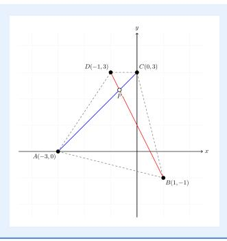

...

25단계: 최적 점이 수선분의 교점이거나 다른 것일 수 있음을 고려한다

...

최종 답:  $3\sqrt{2} + 2\sqrt{5}$

#### **텍스트-우세 프롬프트**

좌표 평면에서 고정된 점 A(-3,0), B(1,-1), C(0,3), D(-1,3)과 움직이는 점 P가 있다. |PA| + |PB| + |PC| + |PD|의 최소값은 얼마인가?

## **텍스트-우세 응답**

...

P = (0, 3)을 시도해 보니 - 9.36

또는 P = (0, 2)를 시도해 보니 - 9.18

또는 P = (-1, 2)를 시도해 보니 - 8.848

또는 P = (0, 2.5)를 시도해 보니 - 8.756 또는 P = (-0.5, 2.5)를 시도해 보니 - 8.756

또는 P = (-0.5, 2.4)를 시도해 보니 - 8.744

또는 P = (-0.5, 2.34)를 시도해 보니 - 8.741

아마 최소값은 8.74일지도 모른다.

아마 답은 8.74 X일지도 모른다.

## D.2 예시 2

## 요약

정답은 873이다. 텍스트-우세 응답은 이 질문의 설정을 성공적으로 추론했으며, 이미지-우세 응답은 각 반원 반지름을 삼각형 한 변의 절반으로 잘못 읽었다. 텍스트-우세 응답은 한 변에 놓인 반원의 직경이 그 변보다 작아야 한다는 것을 깨닫는다.

#### **이미지-우세 프롬프트**

삼각형에서 세 개의 반원을 그릴 수 있다. 각 반원의 직경은 삼각형의 한 변 위에 놓이며, 각 반원은 다른 두 변에 접한다. 이 세 반원의 면적의 곱은 어떤 구의 표면적의 세제곱과 수치적으로 같다.

이 구의 부피는 $\frac{a\pi\sqrt{b}}{c}$ 형태로 표현될 수 있다. 여기서 a와 c는 서로소인 정수이며, b는 서로 다른 소수들의 곱이다. a+b+c를 구하시오.

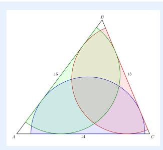

AB를 지름으로 하는 반원을 고려해 보자. M을 AB의 중점이라고 하자. AB를 지름으로 하는 반원의 중심은 M이며, 반지름은 $r=\frac{AB}{2}=7.5$ 이다. 이 반원이 AC와 BC에 접하려면, 점 M에서 직선 AC와 BC까지의 거리가 반지름 r=7.5와 같아야 한다.

[...] 따라서 a + b + c = 455 + 2730 + 64 = 32493249 X

#### **텍스트 중심 프롬프트 (Text-dominant Prompt)**

삼각형의 변의 길이가 13, 14, 15인 삼각형에서, 각 변 위에 지름이 놓여 있고, 각 반원은 다른 두 변에 접하도록 세 개의 반원을 그릴 수 있다. 이 세 반원의 면적의 곱은 어떤 구의 표면적의 세제곱과 수치적으로 같다. 이 구의 부피는 $\frac{a\pi\sqrt{b}}{c}$ 형태로 표현될 수 있으며, 여기서 a와 c는 서로소인 정수이고 b는 서로 다른 소수의 곱이다. a+b+c를 구하시오.

#### **텍스트-우세 응답** (Text-dominant Response)

[...]

하지만 — 삼각형에서 AB 변에 지름을 갖는 반원을 그리고 AC와 BC 변에 접하도록 하면, 그 반원은 삼각형 **안쪽**에 있어야 하며, 그 중심은 AB 위에 있고 AC와 BC에 접한다.

따라서 a = 784, b = 2, c = 87, a + b + c = 784 + 2 + 87 = 873 따라서 873  $\checkmark$

#### D.3 예시 3 (Example 3)

#### **요약 (Summary)**

정답은 A이다. 특권 응답은 필요한 모든 조건을 갖추었기 때문에 정답에 도달한다. 이미지 중심 응답은 필요한 모든 조건을 갖추었음에도 불구하고 다이어그램에서 AP=AD 조건을 읽지 못해 잘못된 asswer B에 도달했다.

#### **이미지 중심 프롬프트 (Image-dominant Prompt)**

원 O에서 AB의 길이는 반지름 R의 두 배이다. 그러면

(A)  $AP^2 = PB \cdot AB$ .

(B)  $AP \cdot DO = PB \cdot AD$ .

(C)  $AB^2 = AD \cdot DE$ .

(D)  $AB \cdot AD = OB \cdot AO$ .

(E) 위 항목 중 해당 없음.

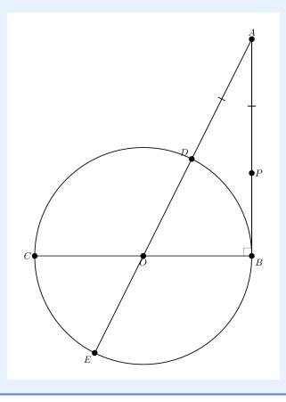

원 O를 중심으로 하는 원이 주어지고, 원 밖에 있는 점 A가 있으며, AB가 점 B에서 원에 접선이고 AB = 2R, 여기서 R은 반지름이다.

또한, $AB \perp OB$ , 접선이 접점에서 반지름에 수직이기 때문이다. 따라서 삼각형 ABO는 B에서 직각을 이루는 직각삼각형이다.

또한, D는 원 위에 있고 AO 위에도 있으므로 D는 A에서 O까지의 선분 위에 있다. O가 중심이므로 OD = R(반지름)이고, AO는 A에서 중심으로 향하는 선이므로 AB = 2R이다. 따라서 AO는 직각삼각형 ABO의 빗변이며, 변 AB = 2R, OB = R이다. AO를 계산해 보자:

직각삼각형 ABO에서:

$$AO = \sqrt{AB^2 + OB^2} = \sqrt{(2R)^2 + R^2} = \sqrt{4R^2 + R^2} = \sqrt{5R^2} = R\sqrt{5}$$

이제 D가 AO 위에 있고 OD = R이므로 $AO = R\sqrt{5}$ 이다. 따라서 $AD = AO - OD = R\sqrt{5} - R = R(\sqrt{5} - 1)$ 이다.

주어진 옵션 중 어느 것이 참인지 확인해야 한다.

각 옵션을 하나씩 분석해 보자.

...

따라서 정답은 (B)이다.

최종 답변: (B) X

## **결합 이미지+텍스트 프롬프트 (Combined Image+Text Prompt)**

원 O에서 BC는 원의 지름이며, $AB \perp BC$ 이다. 또한, ADOE는 직선이며, AP = AD, 그리고 AB의 길이는 반지름 R의 두 배이다. 그러면

(A)

$$AP^2 = PB \cdot AB$$

.

(B)

$$AP \cdot DO = PB \cdot AD$$

.

$$(C) AB^2 = AD \cdot DE.$$

(D)

$$AB \cdot AD = OB \cdot AO$$

.

(E) 위의 어느 것도 아니다.

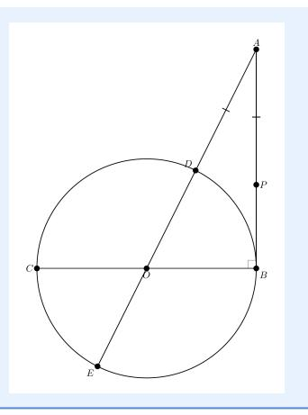

#### 결합 이미지+텍스트 응답 (Combined Image+Text Response)

## 1단계: 다이어그램과 주어진 데이터 이해하기 (Step 1: Understand the diagram and given data)

- BC는 지름이다 → 따라서 BC = 2R이며, O는 BC의 중점이다.  
- AB ⟂ BC → 따라서 삼각형 ABC는 B에서 직각이다.  
- ADOE는 직선이다 → 점 A, D, O, E는 일직선상에 있다.  
- AP = AD → 점 P는 AB 위에 있으며 AP = AD이다.  
- AB = 2R.

...

— 따라서 (A)만이 옳다.

— 최종 답: (A) ✓

### D.4 Example 4

#### Summary

이미지 중심 응답은 5 √ 2 구간을 AF가 아니라 HF로 잘못 읽는다. 필요한 정확한 정보를 갖지 못하면 이미지 중심 응답은 결론에 도달하지 못한다.

#### Image-dominant Prompt

주어진 조건은 E가 정사각형 ABCD의 BC 변의 연장선상에 있는 점이며, AE를 한 변으로 하는 정사각형 AEFG가 구성된다. 그러면 BE의 길이는 얼마인가?

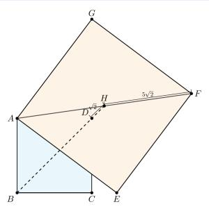

우리는 다음과 같이 주어진다:

- 사각형 ABCD이므로 모든 변이 같고 모든 각이 $90^{\circ}$ 이다.  
- 점 E는 BC 변의 \*\*연장선\*\*에 있으며, 이는 C점을 넘어서는 것을 의미한다.  
- 사각형 AEFG이 AE를 한 변으로 하여 구성된다.  
- $AF=5\sqrt{2}$의 길이와 $DH=\sqrt{2}$의 길이(여기서 H는 AF 위의 점으로, DH가 그려져 $\sqrt{2}$로 표시됨)를 주어진다.

우리는 BE의 길이를 찾아야 한다.

...

## **Text-dominant Prompt**

주어진 조건은 E가 정사각형 ABCD의 BC 변의 연장선상에 있는 점이며, AE를 한 변으로 하는 정사각형 AEFG가 구성된다. 또한 A와 G는 BE의 같은 쪽에 있다. BD의 연장선이 AF를 H점에서 교차하며, $HD = \sqrt{2}$이고 $FH = 5\sqrt{2}$이다. 그러면 BE의 길이는 얼마인가?

## **Text-dominant Response**

우리는 정사각형 ABCD가 주어지고, 점 E가 변 BC의 연장선상에 있다. 정사각형 AEFG가 AE를 한 변으로 하여 구성되며, 점 A와 G는 선 BE의 같은 쪽에 있다. 대각선 BD의 연장선이 선 AF와 점 H에서 교차하며, $HD = \sqrt{2}$이고 $FH = 5\sqrt{2}$이다. 우리는 BE의 길이를 찾아야 한다. [...]

최종 답: 8 🗸

#### D.5 Example 5

#### **Summary**

텍스트 중심 응답은 '정사각형 A와 B가 공통 변을 공유한다'를 변의 길이가 같다고 해석하여 문제를 해결할 수 없다고 본다.

#### **Text-dominant Prompt**

정사각형 A는 변의 길이가 20미터이며, 면적이 정사각형 B와 정사각형 C의 면적 합과 같다. 정사각형 A와 B는 공통 변을 공유한다. 정사각형 B와 C도 공통 변을 공유한다. 정사각형 B와 C의 합계 둘레(미터 단위)는 얼마인가?

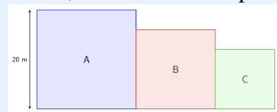

#### **Text-dominant Response**

우리는 다음과 같이 주어진다:

- Square A has side length **20 meters**, so its area is:

Area_A =

$$20 \times 20 = 400 \text{ m}^2$$

- The area of square A equals the **combined areas** of square B and square C:

$$Area_B + Area_C = 400$$

- Square A와 Square B는 **공통 변을 공유**한다는 의미로, 인접해 있다 — 측면이 나란히 있거나 쌓여 있을 수 있지만, 두 사각형이 모두 정사각형이고 변을 공유하므로 **그 변의 길이는 동일해야 한다**. 왜? 두 정사각형이 변을 공유하면 그 변은 두 사각형 모두에서 같은 길이를 가져야 하기 때문이다. 그래서:

Side length of square B = Side length of square A = 20 meters

Wait — but that would make area of B = 400 m², and then area of C would be 0, which is impossible.

그래서 아마도 그들은 같은 길이의 변을 공유하지 않을까요? 하지만 문제는 “공통 변을 공유한다”라고 말합니다. 이는 공통 변이 두 정사각형 모두에서 같은 길이여야 함을 의미합니다.

따라서 정사각형 A와 정사각형 B가 한 변을 공유한다면, 두 정사각형은 그 변을 변의 길이로 가져야 한다. 그런데 정사각형 B도 변이 20이 되어야 하므로 면적은 400이 되고, C는 면적이 0이 된다 — 불가능하다. 따라서 공통 변이 정사각형의 변이 **아닌** 것일 수도 있다 — 그럴 수는 없다. …

✗

## 텍스트 중심 프롬프트 (Text-dominant Prompt)

정사각형 A의 면적은 정사각형 B와 정사각형 C의 면적 합과 같다. 정사각형 B와 정사각형 C의 합계 둘레를 미터 단위로 합한 값은 얼마인가?

## 이미지 중심 응답 (Image-dominant Response)

정사각형 A의 면적이 정사각형 B와 정사각형 C의 면적 합과 같으며, 정사각형 A의 한 변의 길이는 **20미터**로 주어진다.

— 단계 1: 정사각형 A의 면적을 구한다

[...]

최종 답변: 112미터 ✓

## E MIRROR 의사코드 (E Pseudocode for MIRROR)

Algorithm [1](#page-26-0) 은 MIRROR의 학습 루프를 개요한다.

#### Algorithm 1 MIRROR 업데이트 루프 (Algorithm 1 MIRROR update loop)

**필수:** 정책  $\pi_{\theta}$ , 고정된 참조 정책  $\pi_{\text{ref}}$ , EMA 교사 감쇠  $\alpha$ , 쌍 데이터셋  $\mathcal{D}$ , 프롬프트당 롤아웃 수 K, 역-KL 계수  $\lambda_{\text{KL}}$ , 학습률  $\eta$

- 1: **데이터셋.** 각 문제는 동일한 쌍 식별자를 공유하는 텍스트 중심 $x^{\rm text}$와 이미지 중심 $x^{\rm image}$ 뷰를 갖는다. 각 행은 또한 데이터셋 생성 시 사전 계산된 고정된 결합 이미지+텍스트 입력 $x^{\rm comb}$ 를 갖는다.  
- 2: **샘플러.** 같은 문제의 쌍 행이 같은 미니배치와 같은 데이터-병렬 랭크에 나타나도록 미니배치 를 구성한다.  
- 3: **EMA 교사.** EMA 매개변수 $\bar{\theta} \leftarrow \theta$ 를 초기화한다.

4: 각 epoch마다 수행
           for each minibatch B do
5:
                 Set \pi_{\text{old}} \leftarrow \pi_{\theta}.
6:
                 학생 관점에서 표준 롤아웃 수행.
7:
                  for each row x \in B do
8:
                       N개의 응답 \{y_i\}_{i=1}^N \sim \pi_{\text{old}}(\cdot \mid x) 를 샘플링한다.
보상 r_i \leftarrow R(x,y_i) 를 i=1,\ldots,K에 대해 계산한다.
9:
10:
11:
12:
                 결합된 관점 롤아웃.
                  for each row x \in B do
13:
                       N개의 응답 \{y_j^{\text{comb}}\}_{j=1}^K \sim \pi_{\text{old}}(\cdot \mid x^{\text{comb}}) 를 샘플링하고, 보상 r_j^{\text{comb}} \leftarrow R(x^{\text{comb}}, y_j^{\text{comb}}) 를 j=1,\ldots,K에 대해 계산한다.
14:
15:
                 end for
16:
                  교사 선택.
17:
18:
                  for each row x \in B do
                       같은 문제의 짝이 된 관점 x^{pair} 를 정의한다.
19:
                       \mathcal{T}(x) 에는 세 후보가 포함된다: 현재 롤아웃 \pi_{\text{old}}(\cdot \mid x), 짝이 된 관점 롤아웃 \pi_{\text{old}}(\cdot \mid x^{\text{pair}}), 그리고 결합된 관점 롤아웃 \pi_{\text{old}}(\cdot \mid x_{\text{comb}}).
20.
      롤아웃 \pi_{\text{old}}(\cdot \mid x^{\text{pair}}) 및 결합된 관점 롤아웃 \pi_{\text{old}}(\cdot \mid x_{\text{comb}}).
                       각 후보를 그 롤아웃 보상을 사용해 점수화한다.
21:
                       가장 높은 점수를 받은 유효 후보 관점 x^{\rm sel} 를 선택하고, 그 관점에서 EMA 모델을 교사로 정의한다:
22:
      모델 그 관점에서: \pi_T(\cdot \mid x) \leftarrow \pi_{\bar{\theta}}(\cdot \mid x^{\text{sel}}).
                       선택된 교사가 현재 관점이라면, x 를 역 KL 손실에서 제외한다.
23:
                 end for
24:
                 GRPO 손실.
25:
                  표준 롤아웃 보상 \{r_i\}_{i=1}^K 에서 GRPO 이점을 계산한다.
26:
                  \mathcal{L}_{GRPO} 를 \pi_{\theta}, \pi_{old}, \pi_{ref} 및 표준 롤아웃을 사용해 계산한다.
27:
                  역 KL 손실.
28:
                  역 KL 손실 \mathcal{L}_{\text{rKL}} \leftarrow \mathbb{E}_{x:\pi_T(\cdot|x) \text{ defined}} [D_{\text{KL}} (\pi_{\theta}(\cdot \mid x) \| \pi_T(\cdot \mid x))] 를 계산한다.
29:
                  업데이트.
30:
                  \mathcal{L}_{\text{total}} \leftarrow \mathcal{L}_{\text{GRPO}} + \lambda_{\text{KL}} \mathcal{L}_{\text{rKL}}.
31:
                  \theta 를 \mathcal{L}_{\text{total}} 를 최소화하면서 학습률 \eta 로 업데이트한다.
32:
                  \bar{\theta} \leftarrow \alpha \, \bar{\theta} + (1 - \alpha) \, \theta

⊳ EMA 교사 업데이트

end for
34.
35: end for
```

