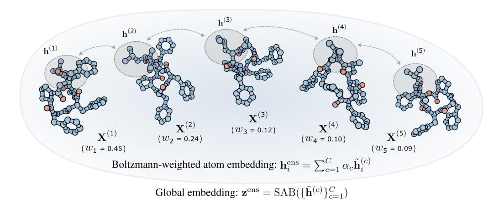
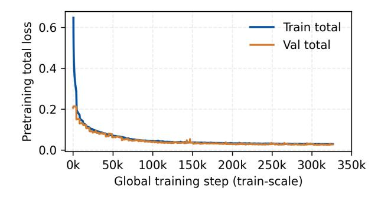
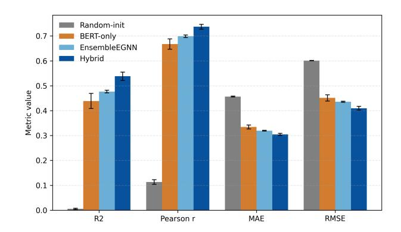
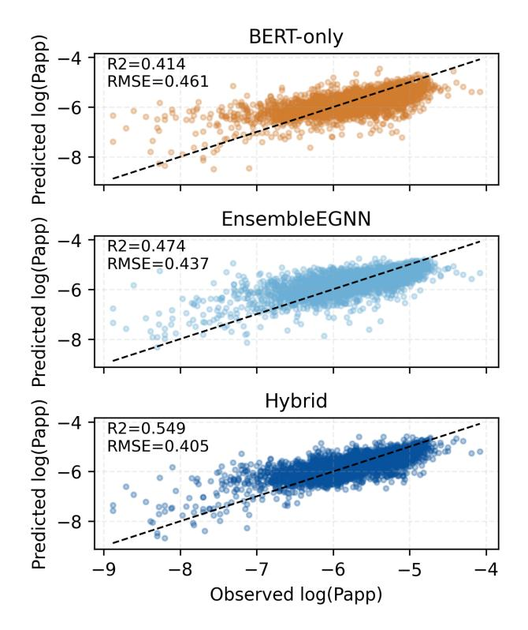

# 순환 펩타이드 집합에 대한 그래프 학습: 분자 집합 모델링에 대한 조사 (Graph Learning on Ensembles of Cyclic Peptides: An Investigation of Molecular Ensemble Modeling)

- 원제: Graph Learning on Ensembles of Cyclic Peptides: An Investigation of Molecular Ensemble Modeling
- 원문: [https://arxiv.org/abs/2607.21561](https://arxiv.org/abs/2607.21561)
- PDF: [https://arxiv.org/pdf/2607.21561v1](https://arxiv.org/pdf/2607.21561v1)
- arXiv ID: `2607.21561`

---

# 순환 펩타이드 집합에 대한 그래프 학습: 분자 집합 모델링에 대한 조사 (Graph Learning on Ensembles of Cyclic Peptides: An Investigation of Molecular Ensemble Modeling)

Aaron Feller 1 2 Kris Deibler <sup>2</sup> Maxim Secor <sup>2</sup>

# 초록 (Abstract)

구조를 기반으로 한 분자 특성 예측은 종종 단일 대표 구조를 사용하지만, 실제로는 많은 분자가 용액에서 구조적 집합으로 존재합니다. 우리는 EnsembleEGNN을 도입합니다. 이는 분자 집합 기반 기초 모델로, 먼저 각 구조체를 공유된 등변 그래프 신경망(EGNN) 층으로 인코딩한 뒤, 생성된 구조체 표현을 Set Attention Block으로 풀링하여 집합을 인코딩합니다. 우리는 CREMP라는 순환 펩타이드 집합 데이터셋에서 마스킹된 토큰 복원, 노이즈가 있는 좌표 재구성, 그리고 쌍거리 재구성을 결합한 다중 과제 자기지도 학습 목표를 사용해 모델을 사전 학습합니다. CREMP-CycPeptMPDB 데이터셋에서 EnsembleEGNN을 처음부터 학습시키는 것은 완전히 실패합니다 (R² = 0.005). 그러나 사전 학습된 모델은 R² = 0.477, Pearson r = 0.699를 달성하며, 시퀀스 전용 BERT 기준선 (R² = 0.439, Pearson r = 0.667)을 능가합니다. EnsembleEGNN을 BERT 시퀀스 인코더와 엔드투엔드로 공동 학습할 때, 하이브리드 모델은 R² = 0.538, Pearson r = 0.737로 더욱 향상됩니다. 이 결과는 구조적 집합을 단일 열역학적으로 정보화된 임베딩으로 인코딩함으로써 순환 펩타이드 특성 예측이 향상된다는 것을 보여줍니다.

## 1. 서론 (Introduction)

그래프 기초 모델(GFMs)은 한 번 사전 학습하고 최소한의 미세 조정으로 노드, 엣지, 그래프 수준의 작업에 전이하려는 목표를 가집니다 [\(Liu et al., 2025\)](#page-6-0). 분자 영역에서 GFMs는 소분자와 단백질에 대해 유망함을 보였습니다 [\(Mendez-Lucio et al., 2024;](#page-6-1) [Hsu et al., 2022\)](#page-5-0), 그러나 아직은 ´

*Proceedings of the* 43 rd *International Conference on Machine Learning*, 서울, 한국. PMLR 306, 2026. 저작권 2026 저자(들)에게 귀속됩니다.

기본적인 표현 불일치가 지속됩니다. 용액에서 많은 분자는 단일 고정 구조를 차지하지 않고, 볼츠만 가중치가 부여된 구조체 집합으로 이해됩니다 [\(Chandler, 1987;](#page-5-1) [Tuckerman, 2023\)](#page-6-2). 이 불일치는 특히 순환 펩타이드에 해로우며 [\(Hui](#page-5-2) [et al., 2025;](#page-5-2) [Bayaraa et al., 2026;](#page-5-3) [Damjanovic et al., 2021\)](#page-5-4). 이 스캐폴드는 본질적으로 유연하며, 열역학적 집합은 궁극적으로 막 투과성, 단백질 분해 효소 저항성, 타깃 결합과 같은 중요한 특성을 결정합니다 [\(Yudin, 2015;](#page-6-3) [Calvo-Barreiro et al., 2025\)](#page-5-5).

구조체 집계 문제. 구조 기반 방법은 일반적으로 단일 구조체를 처리합니다 [\(Otero et al.,](#page-6-4) [2025;](#page-6-4) [Liu et al., 2026\)](#page-6-5) 또는 단순 풀링을 적용합니다 [\(Zhu et al.,](#page-6-6) [2024\)](#page-6-6). 유연한 순환 펩타이드의 경우, 이는 원자들이 접근 가능한 상태를 가로질러 어떻게 움직이는지에 대한 중요한 열역학적 맥락을 버립니다. 핵심 과제는 여전히 남아 있습니다: 볼츠만 가중치 (wc)를 가진 N개의 원자를 가진 C개의 구조체가 주어졌을 때, 모델은 이 기하학적 정보를 단일 임베딩으로 효율적으로 집계할 수 있을까요? 구조체 생성 파이프라인이 개선됨에 따라 [\(Aranganathan et al., 2025\)](#page-5-6), 집합 수준에서 인코딩할 수 있는 모델은 점점 더 유용해질 것입니다.

우리는 우리의 접근 방식을 제시한다. EnsembleEGNN은 공유된 등변 그래프 신경망(EGNN) [\(Satorras et al., 2021\)](#page-6-7)을 사용하여 각 컨포머를 개별적으로 인코딩한 뒤, 그 컨포머 수준의 표현을 하나의 앙상블 임베딩으로 결합합니다. 이 관점에서 동일한 순서의 원자 집합이 여러 3D 컨포머에서 관측되어, 모델이 분자의 고유한 유연성을 명시적으로 포착할 수 있게 합니다. C개의 컨포머 상태에 걸친 볼츠만 가중치가 부여된 원자 임베딩을 사전 학습함으로써, 모델은 앙상블 전체에서 기하학적 문맥을 집계하도록 강제됩니다 (Figure [1\)](#page-2-0)). 이후 컨포머는 세트 어텐션 블록 [\(Lee et al., 2019\)](#page-6-8)을 사용해 풀링되며, 이로써 어텐션 메커니즘은 각 과제별로 중요한 컨포머를 우선순위화하도록 학습합니다. 이 설계는 낮은 복잡성을 유지하면서도 단일 정적 구조가 아닌 전체 열역학적 분포에서 학습하도록 합니다.

기여. 우리는 세 가지 주요 기여를 제시합니다: (1) 세트 어텐션 풀링을 사용해 다수의 컨포머에서 단일 임베딩을 학습하는 앙상블 기하학 인코더;

<sup>1</sup> 학제간 생명과학, University of Texas at Austin, Austin, TX. <sup>2</sup> 분자 AI, Novo Nordisk, Lexington, MA. Correspondence to: Aaron Feller <aaron.feller@utexas.edu>

(2) 마스크 토큰 복구, 노이즈가 있는 좌표 재구성, 거리 재구성을 포함한 다중 과제 사전 학습 목표로, 볼츠만 정보를 활용한 원자 풀링을 활용하며 CREMP (Grambow et al., 2024)으로 평가됩니다; 그리고 (3) CREMP-CycPeptMPDB에서 교차 검증을 수행해 막막 투과성을 예측하며, a) 사전 학습이 필요함을, b) 컨포머 인식 기하학 모델링이 시퀀스 인코더 기반 기준보다 우수함을 입증합니다.

## 2. Method (방법)

### 2.1. Data Representation for Conformer Ensembles (컨포머 앙상블의 데이터 표현)

1D 토큰 정체성과 3D 기하학을 연결하기 위해, 우리는 각 펩타이드를 원자 토큰의 집합으로 표현하며, 동일한 노드를 다른 위치 좌표로 재사용하는 여러 컨포머를 포함합니다.

각 분자는 세 가지 정보를 포함합니다: 노드(원자) 정체성(a), 3D 컨포머 좌표(X), 그리고 컨포머 가중치(w). 본 논문에서 사용된 전원자 실험에서는 노드 토큰이 원자 수준 토큰이며, 좌표는 전원자 컨포머 좌표입니다. 모델의 목표는 a) 앙상블을 위한 사전 학습 과제를 구성하고, b) 앙상블을 단일 임베딩으로 압축해 다운스트림 예측에 활용하는 것입니다.

CREMP (Grambow et al., 2024)에서 이러한 입력을 구성하기 위해, 사용 가능한 모든 컨포머를 추출하고, 볼츠만 가중치에 따라 순위를 매기며, 상위 C=5 상태를 보존하고, 직렬화 전에 해당 가중치를 1이 되도록 재정규화합니다. 노드(원자) 토큰(a)은 원자 정체성과 직접적으로 대응하며, 이는 $C\times a\times 3$ 형태의 좌표 텐서와 각 컨포머 가중치를 제공합니다.

### 2.2. Architecture (아키텍처)

**컨포머별 인코딩.** 각 컨포머는 L개의 EGNN 레이어(Satorras et al., 2021)를 거칩니다. 모델은 해당 컨포머 내에서만 로컬 k-최근접 이웃 그래프를 통해 메시지를 전달함으로써 노드 특징과 좌표를 동시에 업데이트합니다. 아래와 같이 표시됩니다:

$$\mathbf{h}_{i}^{(c,\ell+1)}, \mathbf{x}_{i}^{(c,\ell+1)} = \text{EGNNLayer}\left(\mathbf{h}_{i}^{(c,\ell)}, \mathbf{x}_{i}^{(c,\ell)}, \mathcal{N}_{k}(i,c)\right)$$

(1)

초기 노드 특징은 $\mathbf{h}_i^{(c,0)} = \mathrm{Embed}(a_i)$, 초기 좌표는 $\mathbf{x}_i^{(c,0)} = \mathbf{X}_i^{(c)}$이며, $\mathcal{N}_k(i,c)$는 컨포머 c에서 노드 i의 k개의 가장 가까운 공간 이웃을 나타냅니다. 이러한 특정 이웃 집합에 대한 제한은 모델이 임의의 분자 크기로 확장될 수 있게 하고, 직관적인 사전 학습을 가능하게 합니다.

EGNN 층의 선택은 각 컨포머에 대한 메시지 전달이 3D 공간에서 회전과 변환에 대해 엄격히 등가성을 보장한다. 이 특성은 모델이 비용이 많이 드는 좌표 프레임 정렬이나 공간 데이터 증강에 의존하지 않고 견고한 기하학적 표현을 학습할 수 있게 한다.

**컨포머 융합.** Let  $\tilde{\mathbf{h}}^{(c)} \in \mathbb{R}^{N \times d}$  denote the final post-EGNN node (i.e. atom) features for conformer c. To pool these separate structures into a unified representation, each conformer receives an attention weight driven by two signals: a learned score from the mean ensemble embedding and a thermodynamic prior from the Boltzmann weight. We compute these attention weights as:

$$\alpha_c = \frac{\exp(f_{\phi}(\bar{\mathbf{h}}^{(c)}) + \log w_c)}{\sum_{c'} \exp(f_{\phi}(\bar{\mathbf{h}}^{(c')}) + \log w_{c'})}$$

(2)

where  $\bar{\mathbf{h}}^{(c)}=\frac{1}{N}\sum_i \tilde{\mathbf{h}}_i^{(c)}$  is the mean node feature for conformer c and  $f_\phi$  is a 2-layer MLP.

Using these attention weights, we compute two distinct ensemble embeddings:

$$\mathbf{h}_{i}^{\text{ens}} = \sum_{c=1}^{C} \alpha_{c} \,\tilde{\mathbf{h}}_{i}^{(c)}, \qquad \mathbf{z}^{\text{ens}} = \text{SAB}\Big(\{\bar{\mathbf{h}}^{(c)}\}_{c}\Big) \qquad (3)$$

첫 번째 항은 $\mathbf{h}_i^{\mathrm{ens}}$이며, 이는 모든 컨포머에서 각 원자에 대한 어텐션 가중 평균을 취해 얻은 원자별 임베딩입니다. 두 번째 항은 $\mathbf{z}^{\mathrm{ens}} \in \mathbb{R}^d$이며, 이는 컨포머 임베딩을 Set Attention Block (SAB) (Lee et al., 2019)를 통해 전달하여 생성된 전역 그래프 수준 임베딩입니다.

SAB를 유도점과 함께 활용하면, 제곱형 어텐션과 함께 $O(N^2)$에서 O(nm)으로 컨포머 융합 복잡도를 감소시켜, 대규모 구조 집합에서 효율적인 확장을 가능하게 합니다.

### 2.3. 사전학습 목표 (pretraining Objective)

프리트레이닝 중에 우리는 노드 식별자와 좌표를 모두 손상시킵니다. 우리는 마스크 토큰 감독을 위해 유효한 노드 위치의 15%를 무작위로 선택합니다. BERT 스타일의 손상 스킴을 따라, 선택된 위치의 80%는 마스크 토큰으로 교체되고, 10%는 무작위 토큰으로 교체되며, 10%는 그대로 유지됩니다.

우리는 또한 유효한 노드와 컨포머 위치에 가우시안 노이즈를 추가하여, 모델이 깨끗한 구조로 다시 정제해야 하는 노이즈가 있는 좌표 텐서를 생성합니다.

The composite pretraining loss is:

$$\mathcal{L} = 0.3(\mathcal{L}_{\text{tok}}) + 0.5(\mathcal{L}_{\text{coord}}) + 0.2(\mathcal{L}_{\text{dist}})$$

(4)

<span id="page-2-0"></span>

그림 1. (Figure 1.)  
EnsembleEGNN에서의 정보 흐름 및 컨포머 융합. 모델은 3D 좌표 $\mathbf{X}^{(c)}$와 볼츠만 가중치 $w_c$로 정의된 C개의 서로 다른 공간 상태를 포함하는 열역학적 집합을 처리한다. 음영 처리된 영역은 집합 전체에서 단일 공유 원자(node i)의 지역 k-최근접 이웃 그래프를 강조한다. 각 컨포머 EGNN 층이 지역 기하학을 업데이트한 후, 최종 노드 특징 $(\tilde{\mathbf{h}}_i^{(c)})$는 볼츠만 기반 주의 메커니즘 $(\alpha_c)$를 통해 집계되어 단일 통합 원자 임베딩 $(\mathbf{h}_i^{\text{ens}})$를 생성한다. 마지막으로 Set Attention Block (SAB)은 전체 컨포머 집합을 통해 거시적 전역 임베딩 $(\mathbf{z}^{\text{ens}})$를 생성하여 다운스트림 속성 예측에 사용한다.

# **알고리즘 1** EnsembleEGNN 컨포머 인식 융합 전방 패스 (Algorithm 1 EnsembleEGNN Conformer-Aware Fusion Forward Pass)

```
1: 입력: N개의 원자를 가진 펩타이드:
    원자 종류 \{a_i\}_{i=1}^N,
    각 컨포머별 원자 좌표 \{\mathbf{X}^{(c)}\}_{c=1}^C,
    그리고 볼츠만 가중치 \{w_c\}_{c=1}^C
```


2: Initialize atom features \mathbf{h}_i^{(c,0)} = \operatorname{Embed}(a_i)

3: for \ell = 0 to L - 1 do

4: Update \mathbf{h}_i^{(c,\ell+1)}, \mathbf{x}_i^{(c,\ell+1)} via EGNN

5: end for

6: Let \tilde{\mathbf{h}}^{(c)} = \mathbf{h}^{(c,L)}는 최종 원자 특징을 나타낸다

7: for c = 1 to C do

8: Conformer 토큰: \tilde{\mathbf{h}}^{(c)} = \frac{1}{N} \sum_{i=1}^{N} \tilde{\mathbf{h}}_i^{(c)}

9: Attention 로짓: u_c = f_{\phi}(\tilde{\mathbf{h}}^{(c)}) + \log w_c

10: end for

11: Attention 가중치: \alpha_c = \frac{\exp(u_c)}{\sum_{c'} \exp(u_{c'})}

12: Ensemble 원자: \mathbf{h}_i^{\text{ens}} = \sum_{c=1}^{C} \alpha_c \tilde{\mathbf{h}}_i^{(c)}

13: 전역 임베딩: \mathbf{z}^{\text{ens}} = \operatorname{SAB}(\{\tilde{\mathbf{h}}^{(c)}\}_{c=1}^C)

14: 출력: \mathbf{h}^{\text{ens}} and \mathbf{z}^{\text{ens}}

마스크된 토큰 항목 $(\mathcal{L}_{\mathrm{tok}})$ 은 마스크된 유효 노드에서 계산되는 교차 엔트로피 손실로, 각 원자 임베딩이 손상된 입력에서 원래 토큰 정체성을 복원하도록 훈련한다. 좌표 항목 $(\mathcal{L}_{\mathrm{coord}})$ 은 최종 EGNN 정제 좌표와 깨끗한 컨포머 좌표 사이의 MSE 손실이며, 기하학적 백본이 각 컨포머를 디노이즈하도록 훈련한다.

거리 항목 $(\mathcal{L}_{\mathrm{dist}})$ 은 투영된 원자 임베딩에서 계산된 쌍별 거리를 볼츠만 가중 평균으로 계산된 쌍별 거리와 비교한다.

좌표 집합은 원자별 임베딩에 대한 거친 정규화 역할을 합니다. 특히, 이 목표는 컨포머 전반의 쌍별 거리 평균이 아니라 볼츠만 가중 평균 구조에서의 거리를 기반으로 합니다.

## 3. 실험 (Experiments)

### 3.1. 사전학습 최적화 및 수렴 모니터링

자기 지도 사전학습 동안, 우리는 최적화 과정 전반에 걸쳐 훈련 및 검증 총 손실을 기록하고, 훈련 스케일된 전역 단계 축에서 수렴을 추적합니다. 모델은 모든 원자 표현과 12개의 가장 가까운 이웃을 사용해 훈련되었습니다. 이러한 학습 역학은 부드러운 훈련 손실 궤적과 훈련 손실에 비례하여 감소하는 검증 손실을 보여주었습니다 (Figure 2).

<span id="page-2-1"></span>

**Figure 2.** EnsembleEGNN 사전학습 손실 동역학. 전역 훈련 단계에 대해 50단계 이동 평균으로 표시된 훈련 손실과 검증 손실의 궤적이 CREMP 데이터셋에서 안정적인 모델 수렴을 보여줍니다.

### 3.2. 데이터셋 및 프로토콜

정량적 평가를 위해 우리는 CREMP-CycPeptMPDB [\(Grambow et al., 2024\)](#page-5-7)를 사용했습니다. 이 데이터셋은 인공 막 permeation 점수와 짝을 이룬 순환 펩타이드 컨포머를 포함하며, 경계 필터링 전에는 n = 3003개의 라벨이 지정된 측정값이 있었습니다. 우리는 log(Papp) = -10.0, -8.0, -4.0에서 정확한 경계 목표를 제거하여 최종 평가 세트는 n = 2979가 되었습니다. 우리는 고정된 분할로 5‑겹 교차 검증을 수행하고, 모든 보류된 예제에 대해 폴드별 및 집계 지표를 보고합니다. 각 실행에서 3개의 폴드는 훈련에, 1개의 폴드는 검증에 사용되며, 1개의 폴드는 사후 훈련 예측에만 사용되는 보이지 않는 테스트 폴드로 보관됩니다. EnsembleEGNN은 12개의 가장 가까운 이웃과 함께 모든 원자 표현(즉, 원자 수준 노드 토큰 및 컨포머 좌표)을 사용하고, BERT는 1D 시퀀스를 사용합니다. 목표는 log(Papp)이며, 우리는 MAE, RMSE, Pearson r, R<sup>2</sup>를 평가했습니다. 모든 모델은 동일한 데이터 분할 및 미세 조정 프로토콜 [\(Table S1\)](#page-7-0)을 사용했습니다.

### 3.3. 기준선 (Baselines)

우리는 동일한 훈련 및 평가 분할 하에서 네 가지 전이 변형을 비교했습니다: (1) BERT‑only, PeptideCLM-2 인코더 [\(Feller et al.,](#page-5-8) [2026\)](#page-5-8)를 활용한 시퀀스 전용 기준선; (2) EnsembleEGNN‑random-init, 사전학습 없이 무작위 초기화에서 훈련된 기하학 모델; (3) EnsembleEGNN, 사전학습된 기하학 모델; 그리고 (4) Hybrid, 연결된 임베딩을 사용한 EnsembleEGNN과 PeptideCLM-2의 완전 공동 훈련.

### 3.4. 결과 (Results)

PAMPA 데이터셋에서의 전체 성능은 사전 학습된 conformer-aware 접근법의 필요성을 상세히 보여준다 (Table [1\)](#page-4-0)). 무작위로 초기화된 EnsembleEGNN은 거의 무작위 수준에 근접한 성능을 보였다 (R<sup>2</sup> = 0.005), 반면 CREMP에서 사전 학습된 모델은 시퀀스 전용 BERT 기준선보다 우수했다 (R<sup>2</sup> = 0.477 vs. 0.439). 공동 학습된 Hybrid 모델은 궁극적으로 가장 강력한 집계 지표를 달성했으며, 최종 R<sup>2</sup>를 0.538로 향상시켜 Pearson r을 0.737로 만들었다.

Hybrid 모델은 모든 5개의 개별 교차 검증 폴드에서 평균 R<sup>2</sup> 성능이 가장 뛰어남을 일관되게 보였다 (Table [2\)](#page-4-1)). 전체 지표의 시각화는 이 성능 격차를 더욱 입증하며 (Fig. [3\)](#page-3-0)), 모델별 보류 예측 산점도 (Fig. [4\)](#page-4-2))로 지원된다. 특히 EnsembleEGNN 모델은 20 epoch fine-tuning에서 무작위 수준을 초과하는 성능을 달성하려면 사전 학습이 필요하다.

## 4. 토론 (Discussion)

Ensemble 표현은 GFM 원시(primitive)이다. Conformer 집계 문제는 펩타이드에만 국한되지 않는다. Protein loop flexibility [\(Marks et al., 2018\)](#page-6-9), RNA secondary-

<span id="page-3-0"></span>

Figure 3. 교차 검증 폴드 전반에 걸친 집계 성능. EnsembleEGNN (사전 학습 없이), BERT-전용, EnsembleEGNN 사전 학습, 그리고 Hybrid 아키텍처의 평균 평가 지표를 held-out PAMPA 데이터셋에서 비교. 공동 학습된 Hybrid 모델은 모든 평가 지표에서 가장 강력한 전반적 성능을 일관되게 달성한다. 오차 막대는 세 개의 독립적인 훈련 실행에 대한 표준 오차를 나타낸다.

구조 집합 [\(Bauskar et al., 2025\)](#page-5-9), 그리고 소분자 타우머스 [\(Greenwood et al., 2010\)](#page-5-10)는 모두 분자 구조에 대한 분포를 포함한다. 우리의 결과는 단일 구조로 즉시 축소하기보다 여러 conformer에서 명시적으로 학습하는 것이 분자 기초 모델에 유용한 설계 원칙이 될 수 있음을 시사한다.

전이 학습과 확장성. 기하학적 conformer 모델을 무작위 초기화에서 downstream 작업에 대해 학습하려는 시도는 완전히 실패했다 (R<sup>2</sup> = 0.005). 공유 EGNN 백본은 CREMP에서 자기 지도 목표로 사전 학습되어 물리적 선행 지식을 확립한 뒤 downstream 회귀 작업에 전이되어야 한다. 이는 확장된 연구를 통해 모델이 학습 분포 외부로 일반화될 수 있다는 희망을 제공한다. 이는 기초 모델 패러다임과 일치하며, conformer 데이터셋과 모델 용량을 모두 확장함으로써 자기 지도 기하학적 사전 학습의 표현 이점이 복합적으로 증가할 것이라고 예상한다. 특히 현재 아키텍처는 11.3M 파라미터를 갖고 있으면서 114M 파라미터를 포함하는 BERT 스타일 아키텍처보다 우수하다.

계산 효율성과 확장성. 유도점(inducing points)을 갖는 SAB를 활용하면, 유도점 수가 고정된 경우 conformer 수에 대해 conformer 융합이 효과적으로 선형이 되며, 이는 표준 자기 주의(attention)에서의 이차적 관계와 다르다. 향후 애플리케이션이 더 큰 conformer 세트를 모델링해야 할 경우, per-conformer 기하학적 인코딩과 ensemble 풀링 사이의 분리는 여전히 유용할 것이다. 동일한 분해는 모델이 분자 크기와 conformer 수에 독립적으로 확장될 수 있게 한다.

<span id="page-4-0"></span>Table 1. 모델 성능 지표. heldout CREMP-CycPeptMPDB 데이터(n = 2979)에서 예측 정확도의 교차 검증. 값은 3개의 독립적인 훈련 복제본에 대한 평균 ± 표준 오차로 보고된다.

| 모델 | 결정계수 (R2) | 피어슨 상관계수 (Pearson r) | 평균 절대 오차 (MAE) | 평균 제곱근 오차 (RMSE) |
|--------------|---------------|---------------|---------------|---------------|
| 무작위 초기화 (Random-init) | 0.005 ± 0.004 | 0.113 ± 0.016 | 0.457 ± 0.003 | 0.601 ± 0.001 |
| BERT 전용 (BERT-only) | 0.439 ± 0.053 | 0.667 ± 0.035 | 0.334 ± 0.014 | 0.451 ± 0.022 |
| EnsembleEGNN | 0.477 ± 0.009 | 0.699 ± 0.009 | 0.319 ± 0.002 | 0.436 ± 0.004 |
| 하이브리드 (Hybrid) | 0.538 ± 0.029 | 0.737 ± 0.016 | 0.304 ± 0.008 | 0.409 ± 0.013 |

<span id="page-4-1"></span>표 2. 세부 폴드별 R<sup>2</sup> 평가. 다섯 개의 별도 테스트 폴드에 걸친 예측 성능 비교. 결과는 세 개의 독립적인 복제본의 평균 ± 표준오차를 나타내며, BERT-only, EnsembleEGNN, Hybrid 아키텍처가 데이터의 서로 다른 조각에서 상대적으로 안정적임을 보여준다.

| Fold | BERT 전용 | EnsembleEGNN | 하이브리드 |
|------|---------------|---------------|---------------|
| 1 | 0.426 ± 0.019 | 0.503 ± 0.007 | 0.565 ± 0.011 |
| 2 | 0.472 ± 0.026 | 0.456 ± 0.012 | 0.494 ± 0.035 |
| 3 | 0.430 ± 0.061 | 0.509 ± 0.031 | 0.553 ± 0.018 |
| 4 | 0.462 ± 0.057 | 0.451 ± 0.016 | 0.526 ± 0.054 |
| 5 | 0.402 ± 0.060 | 0.460 ± 0.012 | 0.552 ± 0.018 |

우리는 접근법이 세 가지 주요 제한 사항을 가지고 있음을 인정한다. 구조적으로, 현재 EGNN 층은 각 conformer 내에서만 메시지 전달을 수행하며, conformer 간 상호작용은 명시적인 cross-conformer 메시지 전달이 아니라 conformer pooling을 통해 나중에 도입된다. 데이터 측면에서 이 연구는 사전 계산된 CREMP ensembles의 범위와 정확성에 엄격히 제한되었다. 마지막으로, 우리 하이브리드 모델이 이 벤치마크에서 시퀀스 기반 baseline을 능가하지만, CREMP-CycPeptMPDB 데이터셋은 낮은 데이터 영역(n = 2979)으로 남아 있어 일반화된 cross-paper 비교를 할 때 주의가 필요하다. 향후 연구에서는 보다 풍부한 cross-conformer 상호작용 메커니즘을 탐구하고, 기존 라이브러리 제약을 넘어 확장 가능한 고품질 conformer 생성을 통합할 예정이다.

## 5. 결론 (Conclusion)

우리는 EnsembleEGNN을 제시한다. EnsembleEGNN은 공유 EGNN 층을 사용하여 분자 ensemble을 인코딩하고, conformer 표현을 하나의 열역학적으로 정보가 포함된 임베딩으로 풀링한다. CREMP에서 다중 작업 자기 지도 사전 학습을 통해 모델은 마스킹된 토큰을 복원하고, 노이즈가 있는 좌표를 정제하며, 대략적인 ensemble 기하학을 보존하는 방법을 학습한다. CREMP-CycPeptMPDB 벤치마크(n = 2979)로 전이 학습을 수행하면 EnsembleEGNN은 사전 학습된 BERT 아키텍처를 능가한다. 하이브리드 모델은 sequenceonly baseline보다 R<sup>2</sup>에서 +0.099, Pearson r에서 +0.070 향상을 보이며, 그에 따라 MAE와 RMSE가 낮아진다. 보다 넓게는, 이 연구는 conformer ensemble에서 직접 학습함으로써 순환 펩타이드 표현 학습을 향상시킬 수 있음을 보여준다.

<span id="page-4-2"></span>

그림 4. 보류된 PAMPA 측정값에 대한 예측 성능. 전체 평가 세트(n = 2979)에서 예측값과 실험값 log(Papp) 값을 비교한 parity plot. 대각선 정체선에 가까운 정도가 예측 정확도를 보여 주며, 하이브리드 모델이 달성한 더 강한 상관관계를 강조한다.

# 임팩트 (Impact)

본 논문은 분자 설계 및 초기 단계 약물 발견을 위한 기계 학습 분야를 발전시키는 것을 목표로 하는 연구를 제시한다. 고유연성 순환 펩타이드의 특성 예측을 개선함으로써 EnsembleEGNN과 같은 아키텍처는 새로운 치료제 개발을 가속화하고 고처리량 물리적 스크리닝과 관련된 시간 및 자원 비용을 줄이는 데 도움을 줄 수 있다. 계산 기반 약물 설계가 극도로 긍정적인 사회적 이점을 제공하지만, 이 분야의 기계 학습 모델은 단독으로 사용되어서는 안 된다는 점을 인정한다. 우리 기초 모델이 생성한 예측은 물리적 실험 검증을 안내하기 위한 가설 생성 도구로 사용되며, 생물학적 효능이나 안전성에 대한 확정적 주장으로 사용되어서는 안 된다. 본 연구에서 제시된 방법론적 진보로부터 직접적인 부정적 윤리적 결과가 발생할 것이라고는 예상하지 않는다.

### LLM 사용 (LLM usage)

LLMs는 원고 준비 과정에서 오타 및 문법 오류를 잡아내고, 문체와 LaTeX 서식을 개선하기 위한 글쓰기 보조 도구로만 사용되었다.

# 코드 가용성 (Code availability)

재현성을 보장하고 과학 공동체가 이 개념을 기반으로 구축할 수 있도록, 우리는 모델 아키텍처, 사전 학습된 체크포인트, 훈련 코드, 그리고 이 논문의 원고 그림 생성을 https://github.com/AaronFeller/EnsembleEGNN에서 공개한다.

# 감사의 글 (Acknowledgments)

A.L.F.는 Novo Nordisk 팀이 개방형 연구를 지원해 주었으며, 이는 이 원고의 완성과 모든 코드를 MIT 라이선스 하에 공개하는 데 기여했다는 점에 감사한다.

# 참고문헌 (References)

Aranganathan, A., Gu, X., Wang, D., Vani, B. P., and Tiwary, P. 인공지능 기반 방법을 사용한 보울츠만 가중 구조 집합의 단백질 모델링. *Current opinion in structural biology*, 91:103000, 2025.

- <span id="page-5-9"></span>Bauskar, S., Jiao, J., Kannan, N., Kimm, A., Baker, J. M., Tyler, M. J., Bertozzi, A. L., and Andrews, A. M. 아프타머 라이브러리를 위한 볼츠만 그래프 앙상블 임베딩. In *2025 IEEE International Conference on Data Mining Workshops (ICDMW)*, pp. 1–6, 2025. doi: 10.1109/ICDMW69685.2025.00125.
- <span id="page-5-3"></span>Bayaraa, N., Secor, M., Descoteaux, M. L., and Lin, Y.-S. 확산 모델을 통한 혼합-시랄리티 순환 펩타이드의 시뮬레이션 품질 구조 앙상블 빠른 생성. *Journal of Chemical Theory and Computation*, 22(6): 3103–3113, 2026.
- <span id="page-5-5"></span>Calvo‑Barreiro, L., Secor, M., Damjanovic, J., Abdel‑Rahman, S. A., Lin, Y.-S., and Gabr, M. icos/icos‑l 단백질-단백질 상호작용을 표적으로 하는 이사이클릭 펩타이드 억제제의 계산적 설계. *Chemical Biology & Drug Design*, 105(5):e70117, 2025.
- <span id="page-5-1"></span>Chandler, D. 현대 통계역학 입문. *Mechanics. Oxford University Press, Oxford, UK*, 5(449): 11, 1987.
- <span id="page-5-4"></span>Damjanovic, J., Miao, J., Huang, H., and Lin, Y.-S. 분자 동역학 시뮬레이션을 이용한 순환 펩타이드의 용액 구조 해명. *Chemical reviews*, 121(4):2292–2324, 2021.
- <span id="page-5-8"></span>Feller, A. L., Secor, M., Swanson, S., Wilke, C. O., and Deibler, K. 치료용 펩타이드 공학을 위한 SMILES 기반 화학 언어 모델 확장. *Biorxiv: the Preprint Server for Biology*, 2026.
- <span id="page-5-7"></span>Grambow, C. A., Weir, H., Cunningham, C. N., Biancalani, T., and Chuang, K. V. CREMP: 기계 학습을 위한 거대 순환 펩타이드의 컨포머‑로타머 앙상블. *Scientific Data*, 11(1):859, 2024.
- <span id="page-5-10"></span>Greenwood, J. R., Calkins, D., Sullivan, A. P., and Shelley, J. C. 수용액에서 약물 유사 분자의 유리한 툴로머 상태를 포괄적이고 빠르며 정확하게 예측하기 위한 연구. *Journal of computeraided molecular design*, 24(6):591–604, 2010.
- <span id="page-5-0"></span>Hsu, C., Verkuil, R., Liu, J., Lin, Z., Hie, B., Sercu, T., Lerer, A., and Rives, A. 수백만 개의 예측 구조에서 역폴딩 학습. In *International Conference on Machine Learning*, pp. 8946–8970. PMLR, 2022.
- <span id="page-5-2"></span>Hui, T., Secor, M., Ho, M. N., Bayaraa, N., and Lin, Y.-S. 전형 및 비전형 아미노산을 위한 분자 동역학(md)-파생 특징. *Journal of Chemical Information and Modeling*, 65(4):1837–1849, 2025.

- <span id="page-6-8"></span>Lee, J., Lee, Y., Kim, J., Kosiorek, A., Choi, S., and Teh, Y. W. Set transformer: 주의 기반 순열 불변 신경망을 위한 프레임워크. In *국제 기계 학습 회의* (International Conference on Machine Learning), pp. 3744–3753. PMLR, 2019.
- <span id="page-6-0"></span>Liu, J., Yang, C., Lu, Z., Chen, J., Li, Y., Zhang, M., Bai, T., Fang, Y., Sun, L., Yu, P. S., and Shi, C. Graph foundation models: 개념, 기회 및 도전 과제. *IEEE 패턴 분석 및 기계 지능 학술지* (IEEE Transactions on Pattern Analysis and Machine Intelligence), 2025.
- <span id="page-6-5"></span>Liu, J., Pan, T., Guo, X., Ran, Z., Hao, Y., Yang, Y., Ng, A. P., Pan, S., Song, J., and Li, F. Molx: 단백질–리간드 모델링을 위한 기하학적 기초 모델. *bioRxiv* (bioRxiv), pp. 2026–02, 2026.
- <span id="page-6-9"></span>Marks, C., Shi, J., and Deane, C. M. 루프 구조적 집합 예측. *Bioinformatics*, 34(6):949–956, 2018.
- <span id="page-6-1"></span>Mendez-Lucio, O., Nicolaou, C. A., and Earnshaw, B. Mole: 분자 그래프를 위한 분리된 주의 사용 기초 모델. *Nature communications* (Nature communications), 15(1):9431, 2024.
- <span id="page-6-4"></span>Otero, D. G., Akbari, O., and Bilodeau, C. Pepmnet: 계층적 그래프 표현을 사용한 펩타이드 특성 예측을 위한 하이브리드 딥러닝 모델. *Molecular Systems Design & Engineering* (Molecular Systems Design & Engineering), 10(3):205–218, 2025.
- <span id="page-6-7"></span>Satorras, V. G., Hoogeboom, E., and Welling, M. E(n) 등가 그래프 신경망. In *국제 기계 학습 회의*, pp. 9323–9332. PMLR, 2021.
- <span id="page-6-2"></span>Tuckerman, M. E. *통계 역학: 이론 및 분자 시뮬레이션* (Statistical mechanics: theory and molecular simulation). Oxford university press, 2023.
- <span id="page-6-3"></span>Yudin, A. K. 매크로사이클: 먼 과거에서 배운 교훈, 최근 발전, 그리고 미래 방향. *Chemical Science* (Chemical Science), 6(1):30–49, 2015.
- <span id="page-6-6"></span>Zhu, Y., Hwang, J., Adams, K., Liu, Z., Nan, B., Stenfors, B., Du, Y., Chauhan, J., Wiest, O., Isayev, O., Coley, C. W., Sun, Y., and Wang, W. 분자 구조체 집합에 대한 학습: 데이터셋 및 벤치마크. In *12번째 국제 학습 표현 회의* (Proceedings of the Twelfth International Conference on Learning Representations), 2024. URL [https://](https://openreview.net/forum?id=vXm9S99v8X) [openreview.net/forum?id=vXm9S99v8X](https://openreview.net/forum?id=vXm9S99v8X).

# <span id="page-7-0"></span>**보충 표**

**표 S1. EnsembleEGNN 아키텍처 및 훈련 하이퍼파라미터**. 보고된 실험에서 사용된 검증된 백본, 컨포머-퓨전, 사전 학습 및 다운스트림 최적화 설정의 요약. 값은 보고된 모든-원자 EnsembleEGNN 실행의 실제 구성을 반영한다.

| 범주 | 매개변수 | 값 |  |
|---------------------------|-------------------------------------------------------------------------------------|----------------------------------------------------------------------------|--|
| EGNN 백본 | 매개변수 | 7.85M |  |
|  | EGNN 레이어 수 $(L)$ | 6 |  |
|  | 유효 은닉 차원 (d) | 448 |  |
|  | 이웃 수 (k) | 12 |  |
|  | 드롭아웃 | 0.1 |  |
| 컨포머 융합 | 매개변수 | 3.42M |  |
|  | 융합 모드 | setattn |  |
|  | Set-attention 블록 | 2 |  |
|  | 유도 포인트 | 4 |  |
|  | 어텐션 헤드 | 8 |  |
|  | 컨포머-프리어 바이어스 | 활성화됨 |  |
| 사전학습: EnsembleEGNN | 에폭 | 80 |  |
|  | 배치 크기 | 8 |  |
|  | 학습률 | $2 \times 10^{-4}$ |  |
|  | 가중치 감쇠 | $1 \times 10^{-4}$ |  |
|  | 마스킹 비율 | 15% |  |
|  | 손상 확률 (mask/random/keep) | 0.8 / 0.1 / 0.1 |  |
|  | 좌표 노이즈 표준편차 ( $\sigma$ ) | 0.15 Å |  |
|  | 손실 가중치 ( $\lambda_{\rm tok}$ , $\lambda_{\rm coord}$ , $\lambda_{\rm dist}$ ) | 0.3 / 0.5 / 0.2 |  |
| 파인튜닝: EnsembleEGNN | 에폭 | 20 |  |
| <b>g</b> | 배치 크기 | 8 |  |
|  | 학습률 | $1 \times 10^{-4}$ |  |
|  | 가중치 감쇠 | $1 \times 10^{-4}$ |  |
|  | 회귀 헤드 레이어 | 2 |  |
|  | 헤드 드롭아웃 | 0.1 |  |
|  | 조기 종료 관용 | 3 |  |
| 파인튜닝: BERT | 인코더 | aaronfeller/peptideclm-2-hybrid-base |  |
| vuinig. DZIXI | 에폭 | 20 |  |
|  | 배치 크기 | 16 |  |
|  | 학습률 | $3 \times 10^{-4}$ |  |
|  | 가중치 감쇠 | $1 \times 10^{-2}$ |  |
|  | 회귀 헤드 레이어 | $1 \times 10$ $2$ |  |
|  | 헤드 드롭아웃 | 0.1 |  |
|  | 조기 종료 관용 | 3 |  |
| 파인튜닝: Hybrid | 기하학적 초기화 체크포인트 | best_pretrain.pt |  |
| rine-tuning. Hybrid | 에폭 | 20 |  |
|  | 배치 크기 | 8 |  |
|  | 학습률 (head / ensemble / CLM) | 0.00000000000000000000000000000000000 |  |
|  | 2 , | $2 \times 10^{-7} 1 \times 10^{-7} 2 \times 10^{-5}$<br>$1 \times 10^{-4}$ |  |
|  | 가중치 감쇠 |  |  |
|  | 회귀 헤드 레이어 | 2 |  |
|  | 헤드 드롭아웃 | 0.1 |  |
|  | 조기 종료 관용 | 3 |  |

