# 로토그라비어 인쇄 품질 관리 자동화를 위한 합성 데이터 생성 프레임워크

- 원제: Synthetic data generation framework for quality control automation in gravure printing
- 원문: [https://arxiv.org/abs/2607.21577](https://arxiv.org/abs/2607.21577)
- PDF: [https://arxiv.org/pdf/2607.21577v1](https://arxiv.org/pdf/2607.21577v1)
- arXiv ID: `2607.21577`

---

# 로토그라비어 인쇄 품질 관리 자동화를 위한 합성 데이터 생성 프레임워크

Korota Arsène COULIBALY<sup>1</sup>,<sup>2</sup>,<sup>∗</sup> , Mohamed HAMLICH<sup>1</sup> , Khalid HMALI<sup>2</sup> , Andrea TROMBIN<sup>2</sup>

<sup>1</sup>LCCPS Lab, ENSAM, Hassan II University of Casablanca, 150 Bd du Nil, Casablanca, 20670, , 모로코 <sup>2</sup>Plastima, Commune Chellalat, Route Secondaire 3002, Mohammedia, Casablanca, , , 모로코

## Abstract

인쇄, 특히 로토그라비어 인쇄에서 품질 관리는 여전히 느리고 비용이 많이 들며 주관적인 수동 검사에 의존합니다. 자동 표면 결함 검출은 로토그라비어 인쇄에서 고품질 기준을 유지하는 데 필수적입니다. 딥러닝 모델은 자동화 가능성을 제시합니다. 그러나 YOLO나 Vision Transformers와 같은 견고한 딥러닝 모델을 훈련시키는 것은 실제 산업 결함 이미지의 극심한 부족으로 인해 크게 방해받습니다. 이 한계를 극복하기 위해 본 논문은 로토그라비어 인쇄 품질 관리를 위해 맞춤화된 새로운 합성 데이터 생성 프레임워크를 소개합니다. 제안된 파이프라인은 특정 인쇄 결함(주름, 줄무늬, 미스레지스터레이션 등)의 고충실도 이미지를 자동으로 생성하고 해당 경계 상자와 주석을 출력합니다. 프레임워크를 검증하기 위해 7533개의 이미지로 구성된 합성 데이터셋을 생성하고 최첨단 객체 탐지 모델 RFDETR을 훈련시켰습니다. 실험 결과, 합성 데이터로 훈련된 모델이 실제 산업 테스트 샘플에서 평균 정밀도(mAP)가 80.9%에 도달함을 보여줍니다. 이 프레임워크는 대규모 수동 데이터 수집 없이 인쇄 라인에서 결함 검사를 자동화하기 위한 무비용, 신속 배포 솔루션을 제공합니다.

<sup>∗</sup>응답 저자.

이메일 주소: korota.colibaly-etu@etu.univh2c.ma (Korota Arsène COULIBALY)

URL: https://github.com/Korotaa/STAGE-PLASTIMA (Korota Arsène COULIBALY)

## 1. Introduction

우수한 인쇄 품질을 유지하는 것은 그라비어 인쇄 산업의 기본 축입니다. 이는 고객 만족도와 회사의 명성에 직접적인 영향을 미칩니다. 전통적으로 품질 관리는 전용 기계인 뷰잉 머신에서 전문가가 시각적으로 검사하는 것에 기반합니다. 이 수동 과정은 느리고 노동 집약적이며, 운영자의 주관성과 피로에 영향을 받는 고유한 한계를 가지고 있습니다. Industry 4.0, 컴퓨터 비전, 딥러닝, 특히 의미론적 분할 모델의 등장으로 이 검사를 자동화하고 객관화할 수 있는 전례 없는 기회가 제공됩니다 [1], [2].

이러한 기술은 이미지에서 이상이 존재함을 감지할 뿐만 아니라 픽셀 수준의 정확도로 위치를 파악하고 분류하여 근본 원인 진단에 필수적인 정보를 제공한다 [3],[4],[5]. [6]에 제시된 실시간 결함 탐지 시스템은 CCD 카메라로 촬영한 인쇄 이미지를 프레임 그라버를 통해 스캔하고, 결함이 없는 골드 마스터 이미지와 비교한다. 결함 탐지는 픽셀 강도 차이를 기반으로 한 윤곽선 검출 알고리즘으로 영역(ROI)을 식별하는 것에 기반한다. 상관 차감은 정확한 비교를 위해 이미지 동기화를 보장한다. 결함 픽셀은 상관 분석에 의해 그룹화되고, 그 후 크기와 구조에 따라 분류된다. 그러나 이러한 컴퓨터 비전 시스템을 배포하는 데는 산업 비전 분야에서 잘 알려진 주요 장애물, 즉 충분한 훈련 데이터를 확보하기 어려운 문제가 있다 [7]. 그라비어 인쇄에서 픽셀 수준으로 충분히 크고 다양하며 특히 정밀하게 라벨링된 데이터셋을 만드는 것은 매우 복잡한 과정이며, 결함이 매우 작기 때문에 (fisheyes) 종종 어려움을 겪는다. 실제 결함의 수천 개 예시를 수집하고, 이는 본질적으로 드문 사건이며, 수작업으로 정확히 주석을 달아야 하는 것은 시간과 자원에 대한 투자를 필요로 하며, 이는 종종 산업 프로젝트(마감일, 예산)의 제약과 맞지 않는다. 이 도전은 고객 주문을 충족하기 위해 인쇄 패턴이 지속적으로 변하는 생산 현실에 의해 증폭된다. 이 동적 환경은 참조 패턴과 비교하거나 모든 패턴을 학습하는 AI 모델에 기반한 이상 탐지 접근법을 구현하기 어렵게 만들며, 참조 모델을 지속적으로 변경해야 한다. 따라서 새로운 디자인의 지속적인 흐름에 적응할 수 있는 유연한 시스템이 필수적이다. 이러한 도전에 대응하기 위해 본 논문은 자동화되고 정확하며 유연한 컴퓨터 비전 품질 관리 시스템을 훈련할 수 있도록 설계된 종합적인 합성 데이터 생성 프레임워크를 제시한다.

본 연구의 주요 기여는 다음과 같다:

- 1. 다중 클래스 인쇄 결함 시뮬레이션 프레임워크. 우리는 물리적으로 현실적인 결함(흑자, 주름, 미등록 등)의 다양한 범위를 모델링하고 생성하는 방법론을 제안하여 딥 컨볼루션 신경망(CNN) 시스템을 위한 대규모 데이터셋 생성을 가능하게 한다.

- 2. 의미론적 분할을 위한 자동 라벨링 방법. 우리의 접근법은 결함이 있는 이미지와 완벽한 픽셀 수준 분할 마스크를 생성하여 비용이 많이 들고 오류가 발생하기 쉬운 수동 주석의 필요성을 없앤다.

본 논문은 다음과 같이 구성된다. 2장(재료 및 방법)은 관련 연구를 개관하고 합성 데이터를 생성하기 위한 우리의 혁신적인 프레임워크를 설명한다. 시뮬레이션 결과는 3장(결과)에 제시된다. 4장(논의)은 이러한 결과를 심층적으로 분석하고, 그라비어 인쇄 산업에 대한 시사점, 현재의 제약, 잠재적 개선점을 탐구한 뒤 5장에서 결론을 맺는다.

#### 2. 재료 및 방법 (Material and methods)

우리의 프레임워크는 로토그라비어 인쇄 또는 롤-투-롤 인쇄 분야에 적용된다. 이는 그라비어로 인쇄된 잉크를 종이, 플라스틱, 금속 필름과 같은 연속 기판에 전사하는 산업 인쇄 기술이며, 한 실린더에서 다른 실린더로 롤링된다. 정밀도와 일관성이 필수적인 포장, 장식, 출판, 인쇄 전자 등 다양한 분야에서 널리 사용된다 [8].

## 2.1. 관련 연구 (Related Works)

[9]는 공장의 디지털 트윈을 사용하여 CNN 훈련용 합성 데이터를 생성하는 방법론을 제시하며, 이를 통해 다양한 시나리오를 시뮬레이션하고 온라인 품질 관리에 사용 가능한 데이터 다양성을 증가시킨다. 유사하게, [10]에서는 MicroFactory라는 자율 디지털 트윈을 도입하여 롤‑투‑롤 프린터로 인쇄된 광전지 생산을 최적화하기 위해 합성 데이터를 생성한다. 이 접근법은 고처리량 장치 제조와 기계 학습 모델을 결합하여 다양한 생산 구성을 시뮬레이션하고 최적 매개변수를 식별하며 복잡한 프로세스 최적화를 위한 합성 데이터의 잠재력을 보여준다. [11]에서는 픽셀 수준 결함 매핑에 대한 선구적 접근법을 개발하였다. DeepLab‑v3+ 기반의 의미론적 분할 프레임워크는 혁신적인 합성 데이터 생성 방법으로 특징지어졌다. 실제 주석 데이터셋이 부족한 상황에서, 그들은 고급 광학 및 색상 재구성 기법을 통합하여 어두운 줄무늬와 밴딩 결함을 합성하였다. 보다 구체적으로, 결함 시뮬레이션은 Perlin 노이즈를 적용하여 색상 강도가 변하는 질감이 있는 어두운 줄무늬를 삽입하고, CMYK (Cyan, Magenta, Yellow, Black) 채널을 조작하여 얻은 직사각형 색상 밴드를 겹쳐 넣으며, 이중 모드 가우시안 분포를 통해 픽셀 강도 변화를 모델링하였다. 인쇄 및 스캔 효과를 정확히 재현하기 위해, 그들은 실제 장치의 RGB (Red, Green, Blue) 톤 곡선을 보정하고 선형 최소제곱 회귀를 사용하여 색상 변환 모델을 구축하였다.

본 연구는 롤‑투‑롤 프린터에서의 그라버 인쇄 결함 검사를 위해 합성 데이터 생성의 이러한 원칙을 확장하고 적용한다. 변형된 이미지와 해당 분할 마스크가 동시에 생성된다. 우리는 이 생산 방식에 핵심적인 결함 범위(미스레지스트레이션, 피시아이, 줄무늬, 주름)를 픽셀 수준에서 식별하고 매핑하는 데 집중한다. 이 접근법은 모든 매개변수를 제어할 수 있어 빠르게 대규모, 다양한 데이터셋을 정확히 주석화하여 분할 모델 훈련에 필수적인 데이터를 구축할 수 있게 한다. 목표는 의미론적 분할의 장점과 합성 데이터 생성의 유연성을 활용하여 고정밀, 완전 자동화된 검사 시스템을 개발하는 것이며, 이는 까다로운 산업 환경에서 필수적이다.

## 2.2. 합성 데이터 생성 프레임워크 (Synthetic data generation Framework)

이 프레임워크는 프로젝트의 제약에 대한 직접적인 대응이다. 어려움은 5개월이라는 마감 기간 내에 충분한 양의 실제 데이터를 확보하고 라벨링하는 데 있다. 결함을 모델링함으로써 우리는 이 제약을 이점으로 전환한다. 생성되는 데이터의 다양성과 양을 완전히 제어할 수 있다. 각 결함의 마스크가 결함 자체와 동시에 생성되기 때문에 완벽한 라벨을 얻을 수 있다.

그라버 인쇄 결함(미스레지스트레이션, 주름, 줄무늬, 피시아이)을 모델링하기 위해, 롤‑투‑롤 시스템에서의 실린더 역학 및 레지스트레이션 제어에 관한 [12],[13],[14],[15],[16]의 연구에서 영감을 얻어 이를 본 연구 사례에 적용하였다. 이러한 원칙을 바탕으로 실린더의 기계적 매개변수와 잉크 증착을 결합한 적절한 시뮬레이션 모델을 개발하여 컴퓨터 비전 시스템 훈련과 품질 관리 전략 평가를 위한 현실적인 합성 데이터를 생성하였다.

## 2.2.1. 프레임워크 아키텍처 (Framework architecture)

그림 1에 표시된 우리 프레임워크는 세 단계로 운영된다:

- 설정: 저장 폴더, 시뮬레이션할 결함 종류(이미지당 결함 수 등)를 구성하고, 다른 필요한 매개변수를 초기화합니다.  
- 결함 생성: 각 이미지에 무작위 결함을 적용합니다. 프레임워크는 결함의 정밀 위치(분할 마스크), 결함이 적용된 이미지, 시각화를 용이하게 하기 위한 시각 마스크를 생성합니다.  
- 저장: 결함이 있는 이미지, 분할 마스크, 시각 마스크 등 모든 생성된 구성 요소를 저장하여 합성 데이터셋을 구축했습니다.

## 2.2.2. 프레임워크 알고리즘 (Framework algorithm)

이 과정은 알고리즘 1에 공식화되어 있으며, 건강한 이미지 집합을 순회하면서 모델링된 결함을 적용합니다. 각 이미지마다 무작위 개수의 결함이 순차적으로 적용됩니다. 각 단계에서 시뮬레이션 함수(주름, 이동 등)가 무작위로 선택되고, 무작위 매개변수(크기, 위치)를 사용하여 다양성을 확보합니다(10-12줄).

#### 2.2.3. 피시아이 결함 (fisheye defect)

이들은 불완전한 잉크 증착으로 인해 발생하는 작은 원형 또는 타원형 점이며, 일반적으로 캘린더링 과정에서 도입된 외부 오염물에 의해 발생합니다. 흰 점 결함, 즉 피시아이 결함은 인쇄 표면에 단일 화학 오염물의 영향을 모델링함으로써 시뮬레이션됩니다. 알고리즘은 원본 이미지 I<sup>0</sup>에 N개의 위치에 분화 효과를 적용하여 최종 결함 이미지 I<sup>f</sup>를 생성합니다. 단일 점의 효과

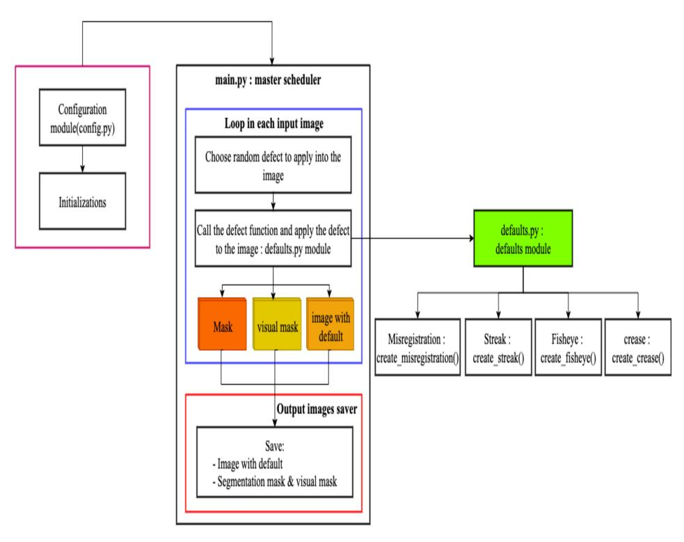

그림 1: 프레임워크 아키텍처

(cx, cy)를 중심으로 하는 오염은 다음 방정식으로 설명되며, 이는 결함의 중심으로부터의 거리에 따라 픽셀 I0(x, y)의 값을 변경한다:

$$I_f(x,y) = \begin{cases} C_{\text{ground}} & \text{if } d(x,y) \le r_c \\ I_0(x,y) \cdot \beta & \text{if } r_c < d(x,y) \le r \\ I_0(x,y) & \text{else} \end{cases}$$

(1)

방정식 1의 각 항목은 분화 효과의 일부를 나타낸다:

- I<sup>f</sup>(x, y)는 (x, y) 위치에서 수정된 이미지의 픽셀 값을 나타낸다.  
- I0(x, y)는 원본 이미지의 픽셀 값을 나타낸다.  
- d(x, y)는 픽셀 (x, y)가 결함의 중심 (cx, cy)에서 떨어진 유클리드 거리를 나타내며, d(x, y) = p (x − cx) <sup>2</sup> + (y − cy) 2 로 정의된다.  
- r은 결함의 전체 반경이다.

- r<sup>c</sup>는 분화의 밝은 중심 반경이며, 일반적으로 r<sup>c</sup> ≈ 0.7 · r 이다.  
- Cground는 이미지 배경의 평균 색상으로, 잉크가 완전히 없음을 시뮬레이션한다.  
- β는 잉크 구슬의 어둠 계수이며, β < 1 (예: 0.85) 이다.

각 오염 지점마다 알고리즘은 원형 영역을 정의한다. 픽셀이 내부 원(분화 중심, d ≤ rc)에 있으면 색상이 배경 색상으로 대체된다. 픽셀이 외부 원(리미, r<sup>c</sup> < d ≤ r)에 있으면 색상이 어둡게 된다. 원 밖의 픽셀은 이 결함의 영향을 받지 않는다. 이 모델의 구현은 알고리즘 2에 자세히 설명되어 있다.

```
Algorithm 2: Fisheye Algorithm
  Data: I0: The original RGB image
  Data: Nspots : The number of defects to generate
  Data: Rrange : The range [rmin, rmax] for the spot radius
  Data: Cvalue : The integer class value for the segmentation mask
  Result: If : The final image with fisheye defects
  Result: Mseg : The corresponding segmentation mask
1 Function GenerateFisheyeDefect(I0, Nspots , Rrange , Cvalue)
2 If ← ConvertToFloat(I0)
3 h, w ← GetDimensions(I0)
4 Mseg ← CreateZeroMatrix(h, w)
5 Cfond ← CalculateBackgroundColor(I0)
6 for i ← 1 to Nspots do
7 cx ← RandomInteger(0, w − 1)
8 cy ← RandomInteger(0, h − 1)
9 r ← RandomInteger(Rrange,min, Rrange,max)
10 rc ← ⌊r × 0.7⌋
11 β ← 0.85
        // 결함 영역용 마스크 생성
12 Mcenter ← CreateCircleMask((cx, cy), rc)
13 Mring ← CreateRingMask((cx, cy), rc, r)
        // 방정식을 기반으로 시각 효과 적용
14 SetValueWhere(If , Mcenter , Cfond )
15 MultiplyValueWhere(If , Mring , β)
        // 최종 세그멘테이션 마스크 업데이트
16 Mspot ← Mcenter ∨ Mring
17 SetValueInMask(Mseg , Mspot, Cvalue)
18 end
19 If ← ClipAndConvertToUInt8(If , 0, 255)
20 return If , Mseg
21 end
```

#### 2.2.4. 스트릭 결함 (Streak defect)

이것들은 비균일한 잉크 분포나 실린더 또는 스퀴지의 기계적 고장으로 인해 발생하는 미세한 선 또는 원치 않는 스트릭입니다. 스트릭 결함은 수직 밴드에서 국소적인 광학 변형으로 모델링됩니다. 단순한 균일 색상의 선이 인위적으로 보이는 것을 피하기 위해, 우리의 시뮬레이션은

각 지점에서 어둠의 강도를 정의하기 위해 세 가지 구성 요소를 결합합니다. 최종 결함 이미지 I<sup>f</sup>는 원본 이미지 I<sup>0</sup>의 픽셀 값을 스트릭 영역 내에서 감쇠 계수 S(x, y)와 곱하여 얻습니다.

$$I_f(x,y) = \begin{cases} I_0(x,y) \cdot (1 - S(x,y)) & \text{si } (x,y) \in \text{Area}_{\text{streak}} \\ I_0(x,y) & \text{else} \end{cases}$$

(2)

스트라이프의 강도 인자 S(x, y)는 세 개의 서로 다른 함수의 곱으로 정의됩니다:

$$S(x,y) = A \cdot P(x) \cdot \Pi(y) \tag{3}$$

식 (3)의 각 항은 스트릭의 물리적 특성을 모델링한다:

- A는 스트릭의 기본 강도이며, 전역 파라미터이다.  
- P(x)는 스트릭의 가로 프로파일 함수로, 스트릭의 가장자리를 부드럽게 한다. 이는 스트릭의 중심(x = xc)에서 최대값을 갖고 가장자리에선 0이 되는 포물선 함수로 표현된다. 폭이 W이고 중심이 xc인 스트릭의 경우 다음과 같이 정의된다:

$$P(x) = 1 - \left(\frac{2(x - (x_c - W/2))}{W} - 1\right)^2$$

• Π(y)는 스트릭을 따라 잉크 밀도의 변화를 시뮬레이션하는 종방향 텍스처 함수이다. 이는 1D Perlin 노이즈를 사용해 0과 1 사이로 정규화된다. 이 함수는 스트릭에 유기적이고 불균일한 외관을 부여한다 [17].

이 복합 접근법은 알고리즘 3에 자세히 설명된 대로 높은 현실감을 가진 합성 스트릭을 생성할 수 있게 한다.

```
알고리즘 3: Streak Algorithm
  Data: I0: The original RGB image
  Data: xc: The center x-coordinate of the streak
  Data: W: The width of the streak
  Data: A: The base intensity of the streak
  Data: Cvalue : The integer class value for the segmentation mask
  Result: If : The final image with the streak defect
  Result: Mseg : The corresponding segmentation mask
1 Function GenerateStreakDefect(I0, xc, W, A, Cvalue)
2 If ← ConvertToFloat(I0)
3 h, w ← GetDimensions(I0)
4 Mseg ← CreateZeroMatrix(h, w)
     // 단계 1: 종방향 텍스처 생성
5 Π ← GeneratePerlinNoise1D(h) // h 크기의 벡터를 반환한다
      크기 h
     // 단계 2: 열 단위로 효과를 적용
6 xstart ← xc − ⌊W/2⌋
7 xend ← xc + ⌈W/2⌉ − 1
8 for x ← xstart to xend do
9 if 0 ≤ x < w then
           // 횡단 프로파일 계산
10 Px ← 1 −
```

```
                      2(x−xstart )
                         W − 1
                                 2
           // 최종 강도 벡터를 열에 대해 계산
               column
11 S⃗
             x ← A · Px · Π
           // 이미지 열에 어두운 효과를 적용
               column
12 If [:, x] ← If [:, x] × (1 − S⃗
                                  x)
           // 세분화 마스크를 업데이트
13 Mseg [:, x] ← Cvalue
14 end
15 end
16 If ← ClipAndConvertToUInt8(If , 0, 255)
17 return If , Mseg
18 end
```

#### 2.2.5. 잘못된 정렬 결함 (Misregistration defect)

잘못 정렬은 인쇄 실린더의 정렬 불일치로 인해 발생하며, 그 결과 색상 오버레이가 부정확하게 이루어진다. 물리적으로 일관된 형태로 잘못 정렬 결함을 시뮬레이션하기 위해 우리는 복합 수학 모델을 개발하였다. 이 모델은 매우 높은 정확도로 모든 패턴의 윤곽선을 감지하도록 훈련한 윤곽선 감지 CNN [18],[19]의 예측 결과를 기반으로 한다. 이 수학 모델은 최종 결함 이미지를 $I_f$ (식 4에 표시)로 정의하며, 이는 원본 이미지 $I_0$의 함수이다. 이 접근 방식은 다음에 제시된 합성 방정식에 따라 기본 이미지에 하나 이상의 시뮬레이션된 잉크 줄무늬를 투명하게 겹쳐 넣는 것으로 구성된다.

$$I_f(x,y) = (1-\alpha)I_0(x,y) + \alpha \sum_{i=1}^N C_{c_i} \cdot (D_k \circ T_{\vec{v_i}}) (M_{\text{edges}} \wedge M_{\text{color}}(c_i))(x,y)$$

$$\tag{4}$$

식 4의 각 항은 실제 인쇄 과정을 모방하는 우리의 시뮬레이션 알고리즘의 특정 단계에 해당한다. 우리는 다음과 같이 식을 분해한다:

- $I_0(x,y)$  및  $\alpha$ : 항목 $I_0(x,y)$ 은 잘 정렬된 실린더에 의해 이미 정확히 인쇄된 기판(우리의 PVC 필름)을 나타낸다. 항목 $\alpha \cdot (\dots)$ 은 오프셋 잉크 침착을 시뮬레이션하며, 여기서 $\alpha$ 는 이 겹쳐진 결함 층의 투명도 계수이다.
- $M_{edges} \wedge M_{color}(c_i)$ : 이 항은 특정 실린더에 새겨진 정보를 나타낸다. 이를 얻기 위해 두 단계로 진행한다. 첫째, $M_{edges}$ 는 최종 이미지에서 패턴의 모든 가장자리를 식별한다. 둘째, $M_{color}(c_i)$ 는 실린더에 특화된 색 영역을 분리한다. 이 두 마스크의 논리적 교집합 ($\wedge$) 은 실린더 $c_i$ 의 색으로 인쇄되어야 할 모양의 가장자리만을 남긴다.
- $(D_k \circ T_{\vec{v_i}})$ : 이 연산자는 기계적 결함과 그 결과를 시뮬레이션한다. $T_{\vec{v_i}}$ (이동)은 기계적 이동 자체를 시뮬레이션하고, $D_k$ (팽창)은 잉크의 약간의 확산을 시뮬레이션한다.
- $\sum_{i=1}^{N} C_{c_i} \cdot (\ldots)$ : 이 항은 다중 실린더 [20] 인쇄 과정을 시뮬레이션한다. $C_{c_i}$ 는 잉크 색이며, $\sum$ (합계)는 각 오프셋 실린더에 대한 프리즘을 계산하고 더해 전체 결함 층을 얻는다.

수학 모델은 결함을 물리적 원인으로 분해한다. 실린더에서 정보를 분리하고, 잘못된 기계적 정렬을 시뮬레이션하며, 해당 잉크를 최종 이미지에 적용한다 (구현은 알고리즘 4를 참조).

```
Algorithm 4: Misregistration Algorithm
  Data: I0: The original RGB image
  Data: S: A list of shift tasks, where each task is (ci
                                                 , ⃗vi)
  Data: Medge: The pre-trained edge detection model
  Result: If : The final image with the defect
  Result: Mseg: The corresponding segmentation mask
1 Function GenerateMisregistrationDefect(I0, S, Medge)
2 h, w ← GetDimensions(I0) // 먼저 차원을 가져옵니다
3 If ← Copy(I0)
4 Mseg ← CreateZeroMatrix(h, w)
5 Lcombined ← CreateZeroMatrix(h, w, 3, float)
     // 단계 1: 전체 이미지에서 깨끗한 주요 윤곽선을 추출합니다
6 Mcontours ← ExtractCleanContours(I0, Medge)
     // 단계 2: 각 이동 작업에 대해 프리즘을 생성하고 누적합니다
7 for each (ci
                , ⃗vi) in S do
        // 현재 실린더의 프리즘을 분리, 이동 및 칠합니다
8 Lfringe, Mfringe ← CreateShiftedFringe(I0, Mcontours, ci
                                                           , ⃗vi)
9 Lcombined ← Lcombined + Lfringe
10 Mseg ← Mseg ∨ Mfringe // 논리 OR을 사용해 마스크를 병합합니다
11 end
     // 단계 3: 결합된 프리즘을 원본 이미지에 겹칩니다
12 If ← AlphaBlend(If , Lcombined , α)
13 return If , Mseg
14 end
```

## 2.2.6. Crease 결함 (Crease defect)

크리즈 결함은 패턴의 기하학과 광학적 외관 모두에 영향을 미치는 이상 현상이다. 우리의 시뮬레이션은 이 두 가지 효과를 모두 모델링한다. 최종 결함 이미지는 I<sup>f</sup> (식 5)으로, 원본 이미지 Id의 기하학적으로 왜곡된 버전에 시각 효과 층 E를 적용하여 얻어진다.

$$I_f(x,y) = \text{clip}_0^{255} \left( I_d(x,y) + E(x,y) \right)$$

결함 이미지 Id는 식 6에 표시된 대로 원본 이미지 I0에 비선형 재매핑 함수 R을 적용하여 얻어지며, 이는 기판이 주름선으로 쥐어지는 것을 시뮬레이션합니다.

결함 이미지 Id는 식 6에 표시된 대로, 원본 이미지 I0에 비선형 재매핑 함수 R을 적용하여 얻어지며, 이는 기복선으로 향해 기판이 끌어당겨지는 것을 시뮬레이션한다.

$$I_d(x,y) = I_0 \left[ (x,y) + A_{\text{max}} \exp\left(-\frac{d(x,y)^2}{2\sigma^2}\right) \hat{v}(x,y) \right], \tag{6}$$

어디서:

- Amax는 픽셀 변위의 최대 진폭입니다.
- d(x, y)는 픽셀 (x, y)에서 접힘선 세그먼트까지의 유클리드 거리입니다.
- \exp\left(-\frac{d(x,y)^2}{2\sigma^2}\right)는 가우시안 함수로, 변형력이 접힘선에서 최대이며 거리에 따라 감소하도록 보장합니다.
- \hat{v}(x,y)는 픽셀 (x, y)에서 접힘선의 가장 가까운 점으로 향하는 단위 벡터이며, 핀치 방향을 정의합니다.

효과 레이어 E(x, y)는 곡선 궤적 P(t)를 따라 그림자와 반사를 추가하여 주름의 리리프를 시뮬레이션함으로써 더 사실적인 표현을 구현합니다. 이 궤적상의 각 점 p_i 에 대해 밝기 변형이 E 레이어에 추가됩니다. 이러한 효과의 강도 F(p_i)는 기저 색상의 채도와 퍼린 노이즈에 의해 조절되어 보다 자연스러운 렌더링을 제공합니다.

효과 레이어 E(x, y)는 곡선 궤적 P(t) 따라 그림자와 반사를 추가하여 주름의 리프레스를 시뮬레이션함으로써 더 사실적인 효과를 구현한다.  
이 궤적 상의 각 점 p<sup>i</sup>마다 밝기 변형이 E 레이어에 추가된다.  
이러한 효과의 강도, F(pi), 는 기저 색상의 채도와 퍼린 노이즈에 의해 조절되어 보다 자연스러운 렌더링을 제공하며, 다음과 같이 표시된다.

$$F(p_i) = V \cdot \Pi(t_i) \cdot S(p_i) \tag{7}$$

세 가지 효과가 적용됩니다: 드롭 섀도우, 스페큘러 반사, 그리고 잉크 마모를 시뮬레이션하는 중앙선입니다. 이 모델의 구현은 알고리즘 5에 자세히 설명되어 있습니다.

Algorithm 5: Crease Algorithm
  Data: I0: 원본 RGB 이미지
  Data: P1, P2: Crease 라인의 시작 및 끝 점
  Data: Amax: 왜곡에 대한 최대 픽셀 변위
  Data: β: 중심선의 밝기 인자
  Data: Cvalue: 분할 마스크의 정수 클래스 값
  Result: If , Mseg: 최종 및 분할 마스크 이미지
1 Function Crease defect(I0, P1, P2, Amax, β, Cvalue)
     // Step 1: 기하학적 왜곡
2 h, w ← GetDimensions(I0)
3 Rx, Ry ← CreateIdentityRemap(h, w)
4 for each pixel (x, y) in I0 do
5 d, vˆ ←
         CalculateDistanceAndVectorToSegment((x, y), P1, P2)
6 ∆⃗ ← Amax · exp(−d
                          2/(2σ
                               2
                                )) · vˆ
7 Rx[y, x] ← x + ∆⃗
                        x
8 Ry[y, x] ← y + ∆⃗
                        y
9 end
10 Id ← Remap(I0, Rx, Ry)
     // Step 2: 광학 효과 레이어
11 E ← CreateZeroMatrix(h, w, 3, float)
12 Smap ← GetSaturationMap(I0)
13 Lpath ← Length(P1, P2) // 연산 분해
14 Πnoise ← GeneratePerlinNoise1D(Lpath)
15 Ppath ← CalculateWobblePath(P1, P2, Amax)
16 for each point pi at step ti along Ppath do
17 F ← CalculateEffectStrength(Smap[pi
                                             ], Πnoise[ti
                                                     ])
18 AddShadowEffect(E, pi
                              , F)
19 AddHighlightEffect(E, pi
                                 , F)
20 AddCenterlineEffect(E, pi
                                  , F, β)
21 end
     // Step 3: 최종 합성 및 마스크 생성
22 If ← Id + E
23 If ← ClipAndConvertToUInt8(If , 0, 255)
24 Mseg ← CreateMaskFromDistortion(offset_scale, Cvalue )
25 return If , Mseg
26 end

Algorithm 1: Synthetic print defect dataset generation
  Data: Dclean: 입력 이미지 파일 경로 집합
  Data: Fdefects: 결함 시뮬레이션 함수 집합 {f1, f2, ..., fk}
  Data: Nmax: 이미지당 적용할 최대 결함 수
  Result: Ddefective: 합성 결함 이미지 집합
  Result: Msegmentation: 해당 분할 마스크 집합
1 Function GenerateSyntheticDataset(Dclean, Fdefects, Nmax)
2 Ddefective ← ∅
3 Msegmentation ← ∅
4 foreach image_path in Dclean do
5 Ioriginal ← LoadImage(image_path)
6 height, width ← GetDimensions(Ioriginal)
7 If inal ← Copy(Ioriginal)
8 Mf inal ← CreateZeroMatrix(height, width)
9 ndefects ← RandomInteger(1, Nmax)
10 for i ← 1 to ndefects do
11 fselected ← ChooseRandomly(Fdefects)
12 parameters ←
             GenerateRandomParameters(fselected, width, height)
            // 결함을 적용하고 수정된 이미지와 마스크를 가져옴
13 Itemp, Mtemp ← fselected(If inal, parameters)
            // 최종 이미지와 전역 마스크를 업데이트
14 If inal ← Itemp
15 Mf inal ← Mf inal ∨ Mtemp // 논리 OR 연산으로 마스크 병합
16 end
17 Add(Ddefective, If inal)
18 Add(Msegmentation, Mf inal)
19 end
20 return Ddefective, Msegmentation
21 end

## 3. Results (결과)

## 3.1. Experimental setup (실험 설정)

Figure 2는 흰 점 결함이 추가된 복잡한 패턴을 보여준다. 이 시뮬레이션이 특히 성공적인 이유는 결함의 정교함(빨간색으로 원형 표시) 때문이다. 이들은 거친 흰 구멍이 아니라, 비효율적인 탐지 시스템에 의해 쉽게 놓칠 수 있는 작은 결함이다. 특징적인 분화 효과를 관찰할 수 있다: 잉크가 부족한 것을 시뮬레이션한 매우 밝은 중심과 약간 어두운 가장자리(거부된 잉크의 비드). 표면 전체에 무작위로 분포된 이 결함은 캘렌더링 과정에서 먼지나 실리콘과 같은 입자에 의한 오염을 완벽하게 모방한다.

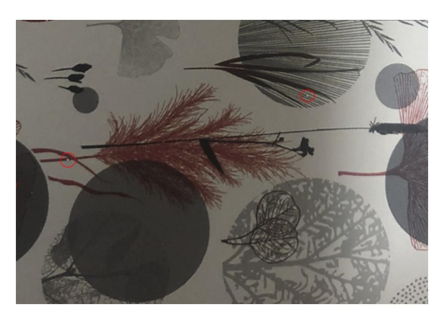

Figure 2: 빨간 원으로 둘러싸인 일부 물구나무선 결함

Figure 3은 Figure 5의 결함 이미지와 연관된 분할 마스크를 보여준다. 이는 흑백 이진 이미지로, 시뮬레이션 중 결함 이미지를 형성하기 위해 참조 이미지에 추가된 fisheyes를 정확히 식별하고 위치를 지정한다(시각은 Figure 2 참조).

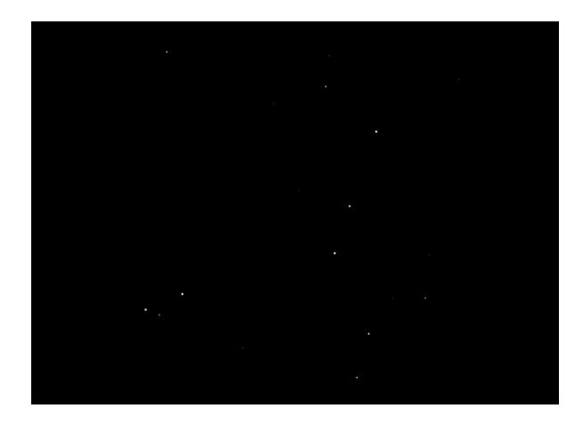

Figure 3: Fisheye mask (fisheye 마스크)

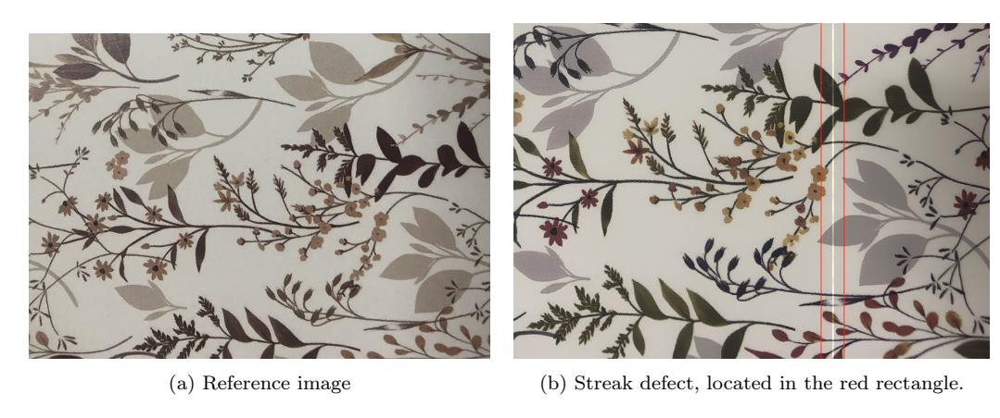

Figure 4: Streak defect (스트릭 결함)

Algorithm 3을 Figure 4a에 적용한 결과는 Figure 4b에 나타난다. 이 시뮬레이션은 스트릭 결함에 의해 영향을 받은 밝은 배경 위에 반복되는 꽃무늬 패턴을 보여주며, 이는 붉은 사각형 4b에 의해 경계된 얇은 어두운 또는 약간 포화된 수직선으로 나타난다. 이 좁고 선형적이며 균일한 결함은 패턴 자체를 변경하지 않으며, 물리적 변형이 아니라 잉크 침착 이상을 나타낸다. 그라브르 인쇄에서 스트릭은 불필요한 연속적이거나 반복적인 선 또는 띠로, 어두운(잉크 과다, 번짐, 이물질) 또는 밝은(잉크 부족, 차단) 형태이며, 보통은

그라브르 실린더, 스퀴지, 입자, 또는 잉크와 관련된다. 시뮬레이션은 결함의 선형성, 대비, 균일성, 그리고 수직 방향성을 강조함으로써 이러한 산업적 특성을 정확히 재현한다. 우리의 프레임워크는 또한 이러한 매개변수를 제어할 수 있는 가능성을 제공한다.

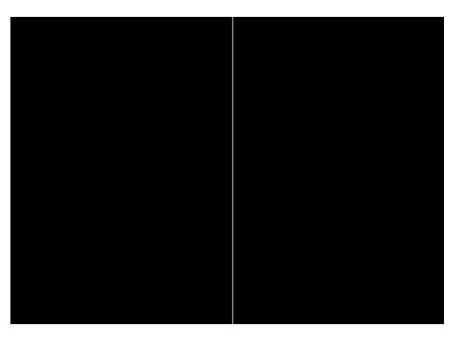

Figure 5: Streak mask (스트릭 마스크), 결함의 정확한 영역을 분리하는 이진 이미지로, 그 선형성 및 정확한 위치를 확인한다.

Figure 6a의 입력 이미지는 결함이 없는 깨끗한 패턴이다. 우리 방법의 첫 번째 단계는 구조화된 윤곽선 검출 모델을 사용하여 패턴의 주요 윤곽선인 Mcontours의 정밀한 지도를 추출하는 것이다. 이 연산의 결과는 존재하는 모든 형태의 골격을 나타내는 이진 마스크이다.

Figure 6a에 misregistration 알고리즘을 적용하면 Figure 6b에 나타난 결과를 얻는다. 이 시뮬레이션에서 프레임워크는 순서대로 magenta, black, direct orange, direct green, 그리고 varnish/white의 다섯 개 실린더를 선택했으며, black 실린더를 기준으로 사용했다. 알고리즘은 이후 이 중 네 개의 실린더에 각각 무작위 변환 벡터를 적용하기로 결정했다: Direct Green과 Magenta는 (−3, 4) 픽셀만큼, Varnish/White는 (3, 5) 픽셀만큼, Direct Orange는 (−1, 1) 픽셀만큼 오프셋했다. 여러 반투명 겹침 색 프린지(프레임)가 관찰된다. Direct Orange 실린더에 해당하는 금색 프린지는 패턴 시트 가장자리에 특히 눈에 띈다. 이 프린지들은 추출된 윤곽선을 정확히 따르며, 여러 실린더의 기계적 정렬 불량을 특징으로 하는 매우 현실적인 잉크 번짐 효과를 만든다.

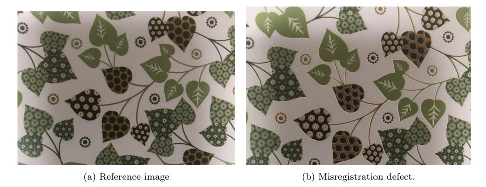

Figure 6: Misregistration defects (misregistration 결함). 실린더 오프셋 정렬은 해당 색상의 부정확한 중첩을 초래한다.

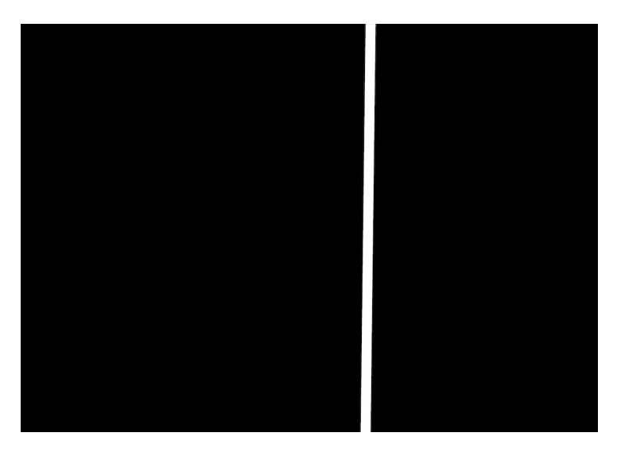

Figure 9: Crease mask defect (크레이스 마스크 결함).

해당 분할 마스크는 적절하다. 얇은 선 대신 부드러운 가장자리를 가진 영향 영역을 나타내며, 변형의 전체 범위를 포착한다. 이 (이미지, 마스크) 쌍은 실제 크레이스 결함의 복잡성을 정확히 시뮬레이션하는 이상적인 필드 트루스로 구성된다.

#### 3.2. Quantitative (정량적)

제안된 합성 데이터 생성 프레임워크의 효과를 평가하기 위해, 7,533개의 합성 데이터를 포함하는 종합 데이터셋을 구성하였다-

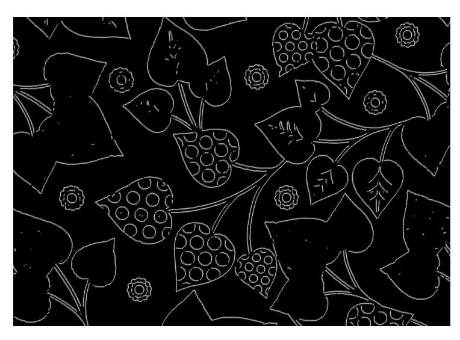

Figure 7: Misregistration defect mask (misregistration 결함 마스크). 마스크는 시뮬레이션 중 이동된 모든 실린더의 벽(그림 또는 윤곽선)에 해당한다.

ated images가 사용되었습니다.  
생성된 데이터셋은 엄격한 평가 과정을 보장하기 위해 Roboflow 플랫폼에서 구조화되고 분할되었습니다.  
결함 탐지 및 세분화 작업을 위해 최첨단 Roboflow RF-DETR Instance Segmentation (Large) 아키텍처[21]가 배포되었습니다.  
모델은 합성 샘플을 사용해 생성된 주석과 결함 특징이 견고한 산업용 비전 모델에 얼마나 성공적으로 전이될 수 있는지 평가하기 위해 학습되었습니다.  
테스트는 실시간 제조 운영 중 생산 라인에서 직접 캡처된 실제 결함 이미지를 포함하는 독립적이고 실제적인 테스트 세트에서 엄격히 수행되었습니다.

| 모델 유형 | 정밀도 | 재현율 | F1-점수 | mAP@50 |
|-----------------|-----------|--------|----------|--------|
| RF-DETR (Large) | 85.6% | 78.3% | 81.7% | 80.9% |

표 1: 합성 데이터로 훈련된 RF-DETR Large 모델의 성능 지표

Figure 8b에서 Algorithm 5를 Figure 8a의 이미지에 적용해 얻은 결함 이미지는 단순히 한 줄만 보이는 것이 아니라, 빨간 사각형 안에서 패턴이 자연스럽고 완벽히 직선이 아닌 궤적을 따라 눈에 띄게 압축되는 설득력 있는 기하학적 왜곡을 보여준다. 이 왜곡은 빛과 그림자의 미묘한 광학 효과에 의해 강화되어 결함에 물리적 부피감을 부여한다.

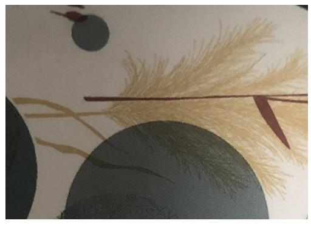

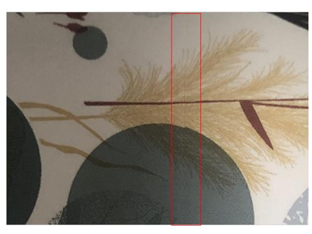

(a) 기준 이미지 (b) 빨간 사각형에 위치한 주름 결함

Figure 8: 주름 결함

프레임워크의 정성적 성능은 Fig. 11에서 더욱 입증되며, 이는 실제 인쇄 라인 결함에 대한 대표적인 추론 결과를 보여준다. 모델은 높은 신뢰도로 경계 이상을 성공적으로 감지하고 분할하며, 테스트 단계에서 얻은 85.6%의 높은 정밀도 지표를 시각적으로 확인한다.

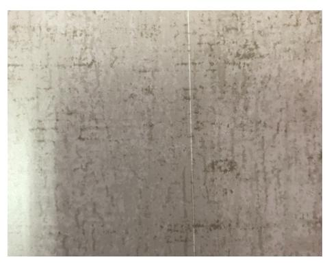

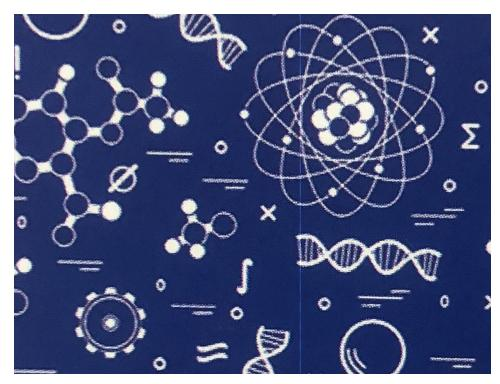

(a) 실제 생산 라인 또는 스트릭 결함 (b) 합성으로 생성된 라인 또는 스트릭 결함

Figure 10: 평가 데이터셋의 시각적 샘플: (a) 실시간 생산 라인에서 직접 촬영한 실제 인쇄 스트릭 결함 이미지, (b) RF-DETR 모델 훈련을 위해 제안된 프레임워크가 생성한 합성 스트릭 샘플.

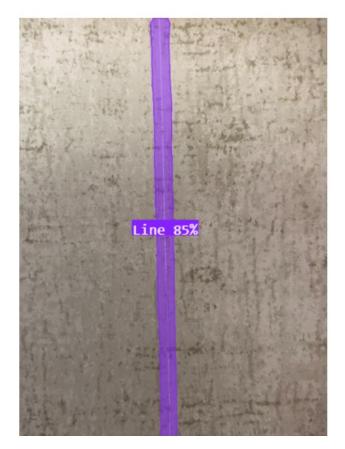

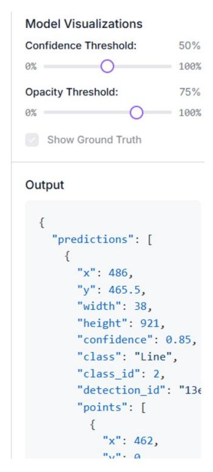

Figure 11: 실제 생산 스트릭 결함에서 평가된 RF-DETR 모델의 추론 샘플. 시각화는 성공적인 인스턴스 세분화와 바운딩 박스 회귀를 보여주며, 전체 테스트 정밀도 85.6%에 기여한다.

#### 4. 논의 (Discussion)

우리의 합성 데이터 생성 프레임워크의 결과는 misregistration, crease, streak, fisheye 아티팩트의 시뮬레이션으로 설명되며, 우리의 접근 방식이 풍부하고 다양하며 고충실도 데이터셋을 생성할 수 있음을 보여준다. 이러한 시뮬레이션의 분석은 우리의 방법론을 검증하는 여러 핵심 포인트를 제시한다. 우리의 주요 목표는 시각적으로 현실적인 결함을 만드는 것뿐만 아니라 각 이상 현상의 물리적 서명을 시뮬레이션하는 것이었다. 예를 들어, crease 시뮬레이션은 단순히 선을 추가하는 것이 아니라, 비선형 기하학적 변형을 적용하여 기저 패턴을 조여 실제 기판의 늘어남을 모방한다. 마찬가지로 misregistration 시뮬레이션은 색 블록을 단순히 이동시키는 것이 아니라, 모양의 정확한 윤곽에 반투명 잉크 프린지를 생성하여 불완전한 실린더 겹침 효과와 일치한다. 이 접근 방식은 물리적

원인들을 기반으로 하여, 훈련 데이터가 AI 모델에 복잡하고 현실적인 특성을 노출하도록 보장하며, 단순한 인공 아티팩트보다 훨씬 뛰어난 수준을 제공한다.

특히 misregistration 결함에 대한 시뮬레이션 품질은 중간 단계로 고급 분석 도구를 사용하는 데 기반한다. 구조화된 엣지 검출 모델을 사용해 패턴의 골격을 식별하고 CMYK 공간 분해를 통해 색 영역을 분리함으로써, 결함이 기저 패턴과 일관되게 적용되도록 보장한다. 시안 색 프린지는 시안이 포함된 모양의 가장자리에만 나타난다. 이러한 상위 지능은 필수적이며, 불가능한 결함 생성을 방지하고 데이터셋의 신뢰성을 향상시킨다.

우리는 연구의 가장 중요한 결과 중 하나가 완벽한 분할 마스크를 동시에 생성하는 것이라고 제시합니다. 그림에서 보듯이, 이 마스크들은 단순한 근사치가 아닙니다. 접힘의 마스크는 그 Gaussian 영향 영역을 포착하고, 이동의 마스크는 프린지의 정확한 모양을 제한하며, 어안 렌즈의 마스크는 분화구를 나타냅니다. 이 픽셀 수준의 정확도는 수작업 주석 비용 없이 달성되었으며, 이는 주요 전략적 이점을 나타냅니다. 이는 컴퓨터 비전 프로젝트의 주요 병목 현상을 우회할 수 있게 할 뿐만 아니라, 수작업으로는 달성할 수 없는 품질의 정답을 모델에 제공하여 분할에서 높은 성능을 달성하기 위한 전제 조건이 됩니다.

각 시뮬레이션 함수를 구성함으로써, 우리 프레임워크는 생성되는 결함의 다양성에 대해 완전한 제어를 제공합니다. 우리는 미묘하고 거의 보이지 않는 결함부터 매우 뚜렷한 결함까지 만들 수 있습니다. 우리는 단일 실린더 또는 여러 실린더에서 동시에 정렬 불일치를 시뮬레이션할 수 있습니다. 생산에서 거의 보지 못하는 극단적인 경우를 포함한 다양한 시나리오를 생성할 수 있는 이 능력은 예측 불가능한 상황에 일반화할 수 있는 견고한 모델을 훈련시키는 데 필수적입니다.

실험 결과는 로토그라브 인쇄에서 품질 관리를 자동화하기 위한 제안된 프레임워크의 산업적 실현 가능성을 검증합니다. 엄격한 산업 표준 설정에서 85.6%의 정밀도를 달성한 것은 우리 프레임워크가 생성한 합성 이미지가 현실적인 질감과 경계 영역을 제공함을 증명합니다. 이 높은 정밀도는 실제 인쇄 라인에서 불필요한 기계 정지를 방지하기 위해 필수적인 거짓 양성률을 최소화합니다. 또한 모델은 mAP@50 80.9%와 F1-Score 81.7%를 달성했습니다. 이 견고한 성능은 RF-DETR 모델이 전적으로 합성 데이터로 훈련되고 별도의 테스트 세트에서 평가되었음에도 불구하고 특히 의미가 있습니다. 78.3%의 재현율은 네트워크가 인쇄의 다양한 기하학적 변형과 색상 이상을 성공적으로 학습했음을 나타냅니다.

과도한 과적합 없이 결함을 학습합니다. 이러한 결과는 7533개의 합성 생성 샘플이 산업 비전에서 현실 격차를 성공적으로 메우며, 데이터 부족 병목 현상을 우회하는 무비용, 빠른 배포 솔루션을 제공함을 확인합니다.

#### 5. 결론 (Conclusion)

본 논문에서는 로토그라브 인쇄에서 품질 관리를 위한 라벨링 데이터 수집의 부족과 비용이라는 근본적인 문제를 해결하기 위해 합성 데이터를 생성하는 종합적인 프레임워크를 제시했습니다. 실제 결함 예시를 확보하고 패턴의 지속적인 변동성을 다루는 어려움에 직면하여, 우리는 시뮬레이션 기반 접근법이 딥러닝(컴퓨터 비전)의 적용을 위한 기반을 제공하는 실행 가능하고 효과적인 솔루션임을 입증했습니다. 이 연구는 광범위한 인쇄 결함의 물리적 서명을 모델링하는 견고한 방법론입니다. 주름의 기하학적 왜곡, 정렬 불일치로 인한 색상 프린지, 튀어오름, 또는 줄무늬의 질감과 같은 복잡한 특징을 시뮬레이션함으로써, 우리 프레임워크는 결함이 있는 이미지와 해당 분할 마스크(분할 모델을 학습하고 싶다면)를 픽셀 수준의 정확도로 자동으로 생성합니다. 생성된 데이터셋은 YOLO 및 RT-DETR과 같은 대체 비전 모델에도 적용될 수 있습니다.

제안된 접근법은 컴퓨터 비전 시스템을 훈련시키기 위한 현실적인 데이터셋을 저비용으로 생성할 수 있게 합니다. 이는 포장, 장식, 인쇄 전자제품과 같은 분야에서 정밀도, 생산성, 결함 예방이 필수적인 AI 기반 품질 관리 솔루션의 배포를 촉진합니다.

본 연구는 결함 모델링을 위해 롤 투 롤 인쇄 시스템의 모델링을 단순화한다. 실제로 이 유형의 기계는 원통, 스크레이퍼, 모터 및 장력 메커니즘의 복잡한 세트를 포함하며, 이들은 정밀하고 균일한 잉크 증착을 보장하기 위해 상호작용한다 [22],[23],[24]. 현재 연구는 잉크 증착, 결함의 원인, 각 원통에 적용된 설계에 초점을 맞추고 있지만, 그들의 운동학적 매개변수, 모터 속도 또는 필름 장력은 고려하지 않는다. 이러한 결과는 합성 데이터셋에서 제안된 RT-DETR 모델이 달성한 80.9% mAP50 정확도율을 설명한다. 이러한 요인의 통합은 향후 연구에서 탐구될 수 있다.

따라서 향후 연구에서는 이 합성 데이터셋을 활용하여 최첨단 세분화 모델, 특히 YOLOv8 seg를 훈련 및 검증하는 데 초점을 맞출 것이다. 이 모델은 이후 Raspberry Pi 및 NVIDIA Jetson Orin Nano와 같은 자원 제약이 있는 임베디드 시스템에서 실제 생산 환경에 배포되어 고속 로토그라버 프로세스에서 인쇄 결함을 자동으로 품질 관리할 것이다.

## 참고문헌 (References)

- [1] J. Villalba-Diez, D. Schmidt, R. Gevers, J. Ordieres-Meré, M. Buchwitz, W. Wellbrock, Deep learning for industrial computer vision quality control in the printing industry 4.0, Sensors 19 (18) (2019) 3987.
- [2] W. Wu, W. Ma, X.-T. Wu, X.-D. Chen, Weakly supervised learning for 3D mesh segmentation via pixel-level labeling, Computer-Aided Design 199 (2026) 104109. doi:10.1016/j.cad.2026.104109.
- [3] J. Chen, Y. Lu, Q. Yu, X. Luo, E. Adeli, Y. Wang, L. Lu, A. L. Yuille, Y. Zhou, TransUNet: Transformers make strong encoders for medical image segmentation, arXiv preprint arXiv:2102.04306 (2021).
- [4] L.-C. Chen, G. Papandreou, F. Schroff, H. Adam, Rethinking atrous convolution for semantic image segmentation, arXiv preprint arXiv:1706.05587 (2017).
- [5] A. Hatamizadeh, Y. Tang, V. Nath, D. Yang, A. Myronenko, B. Landman, H. R. Roth, D. Xu, UNETR: Transformers for 3D medical image segmentation, in: Proceedings of the IEEE/CVF Winter Conference on Applications of Computer Vision (WACV), 2022, pp. 574–584.
- [6] N. G. Shankar, N. Ravi, Z. W. Zhong, A real-time print-defect detection system for web offset printing, Measurement 42 (5) (2009) 645–652.
- [7] H. M. Ahmad, A. Rahimi, Deep learning methods for object detection in smart manufacturing: A survey, Journal of Manufacturing Systems 64 (2022) 181–196.
- [8] J. Noh, D. Yeom, C. Lim, H. Cha, J. Han, J. Kim, Y. Park, V. Subramanian, G. Cho, Scalability of roll-to-roll gravure-printed electrodes on plastic foils, IEEE Transactions on Electronics Packaging Manufacturing 33 (4) (2010) 275–283.

- [9] M. Urgo, W. Terkaj, G. Simonetti, AI를 활용한 제조 시스템 모니터링: 합성 데이터를 사용해 CNN을 훈련시키는 디지털 팩토리 트윈 기반 방법 (Monitoring manufacturing systems using AI: A method based on a digital factory twin to train CNNs on synthetic data), CIRP Journal of Manufacturing Science and Technology 50 (2024) 249–268.
- [10] L. W. T. Ng, N. G. An, L. Yang, Y. Zhou, D. W. Chang, J.-E. Kim, L. J. Sutherland, T. Hasan, M. Gao, D. Vak, A printing-inspired digital twin for the self-driving, high-throughput, closed-loop optimization of roll-to-roll printed photovoltaics (A printing-inspired digital twin for the self-driving, high-throughput, closed-loop optimization of roll-to-roll printed photovoltaics), Cell Reports Physical Science 5 (6) (2024) 102038.
- [11] A. C. Valente, C. Wada, D. Neves, D. Neves, F. V. M. Perez, G. A. S. Megeto, M. H. Cascone, O. Gomes, Q. Lin, Print defect mapping with semantic segmentation (Print defect mapping with semantic segmentation), in: Proceedings of the IEEE Winter Conference on Applications of Computer Vision (WACV), 2020, pp. 3540–3548.
- [12] Z. Chen, L. Shan, T. Zhang, Hybrid modeling and compensation register control for the speed-up phase of roll-to-roll (R2R) gravure printing presses (Hybrid modeling and compensation register control for the speed-up phase of roll-to-roll (R2R) gravure printing presses), ISA TransactionsIn press (2025).
- [13] H. Kang, R. R. Baumann, Mathematical modeling and simulations for machine directional register in hybrid roll-to-roll printing systems (Mathematical modeling and simulations for machine directional register in hybrid roll-to-roll printing systems), International Journal of Precision Engineering and Manufacturing 15 (10) (2014) 2109–2116.
- [14] Y. Lee, M. Kim, J. Noh, G. Cho, C. Lee, Data-driven fault detection and positioning of eccentric rolls in roll-to-roll systems using wrap angle and sensor proximity (Data-driven fault detection and positioning of eccentric rolls in roll-to-roll systems using wrap angle and sensor proximity), Results in Engineering 24 (2024) 103629.
- [15] T. Zhang, Y. Zheng, Z. Chen, Model based precise register control method for shaft-driven roll-to-roll (R2R) systems (Model based precise register control method for shaft-driven roll-to-roll (R2R) systems), Control Engineering Practice 147 (2024) 105937.
- [16] W. Chen, X. Sun, W. Chen, G. Xie, S. Chen, J. Wang, Nonlinear web tension control of a roll-to-roll printed electronics system (Nonlinear web tension control of a roll-to-roll printed electronics system), Precision Engineering 76 (2022) 88–94.
- [17] D. Li, S. Jabbireddy, Y. Zhang, C. Metzler, A. Varshney, Instant-SFH: Non-iterative sparse Fourier holograms using Perlin noise (Instant-SFH: Non-iterative sparse Fourier holograms using Perlin noise), Sensors 24 (22) (2024) 7358.

- [18] G. Bertasius, J. Shi, L. Torresani, DeepEdge: A multi-scale bifurcated deep network for top-down contour detection (DeepEdge: A multi-scale bifurcated deep network for top-down contour detection), in: Proceedings of the IEEE Conference on Computer Vision and Pattern Recognition (CVPR), 2015, pp. 4380–4389.
- [19] W. Shen, X. Wang, Y. Wang, X. Bai, Z. Zhang, DeepContour: A deep convolutional feature learned by positive-sharing loss for contour detection (DeepContour: A deep convolutional feature learned by positive-sharing loss for contour detection), in: Proceedings of the IEEE Conference on Computer Vision and Pattern Recognition (CVPR), 2015, pp. 3982–3991.
- [20] J. Noh, D. Yeom, C. Lim, H. Cha, J. Han, J. Kim, Y. Park, V. Subramanian, G. Cho, Scalability of roll-to-roll gravure-printed electrodes on plastic foils (Scalability of roll-to-roll gravure-printed electrodes on plastic foils), IEEE Transactions on Electronics Packaging Manufacturing 33 (4) (2010) 275–283.
- [21] I. Robinson, P. Robicheaux, M. Popov, D. Ramanan, N. Peri, RF-DETR: Neural architecture search for real-time detection transformers (RF-DETR: Neural architecture search for real-time detection transformers), arXiv preprint arXiv:2511.09554 (2025).
- [22] Q. Zhao, N. Hong, D. Chen, W. Li, A dynamic system model for rollto-roll dry transfer of two-dimensional materials and printed electronics (A dynamic system model for rollto-roll dry transfer of two-dimensional materials and printed electronics), Journal of Dynamic Systems, Measurement, and Control 144 (7) (2022) 071004.
- [23] A. Seshadri, P. R. Pagilla, J. E. Lynch, Modeling print registration in roll-to-roll printing presses (Modeling print registration in roll-to-roll printing presses), Journal of Dynamic Systems, Measurement, and Control 135 (3) (2013) 031016.
- [24] C.-G. Kang, B.-J. Lee, Design parameter analysis of a roll-to-roll printing machine (Design parameter analysis of a roll-to-roll printing machine), IFAC Proceedings Volumes 41 (2) (2008) 11883–11888.

