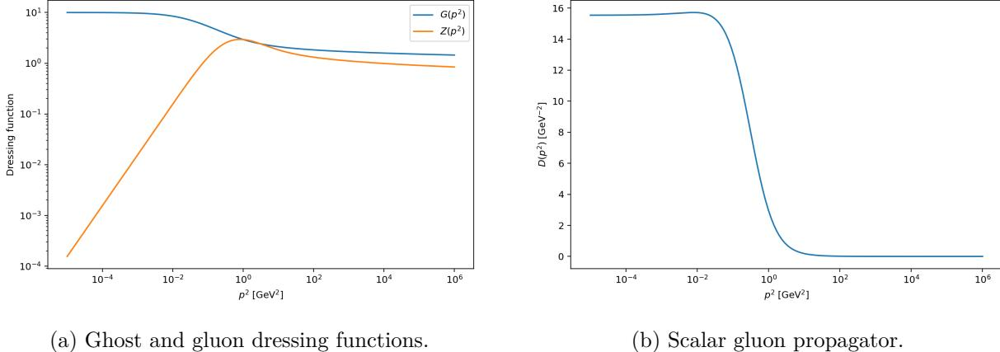
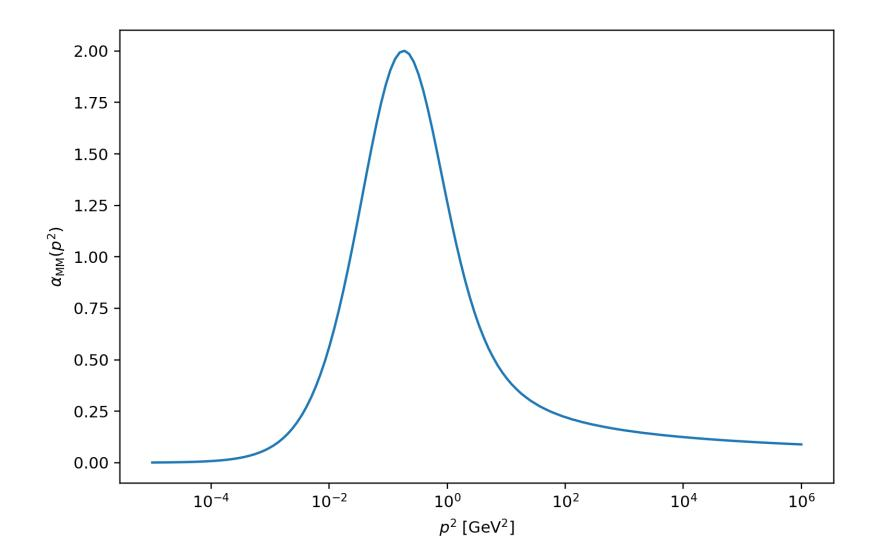
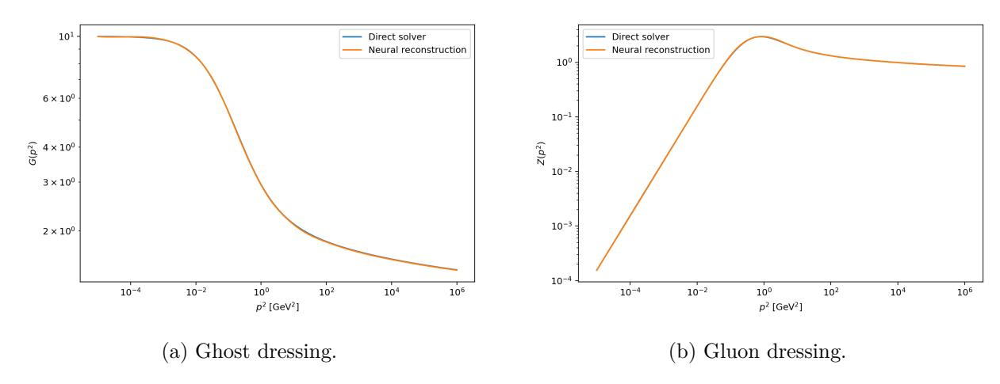
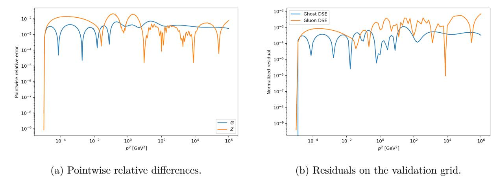
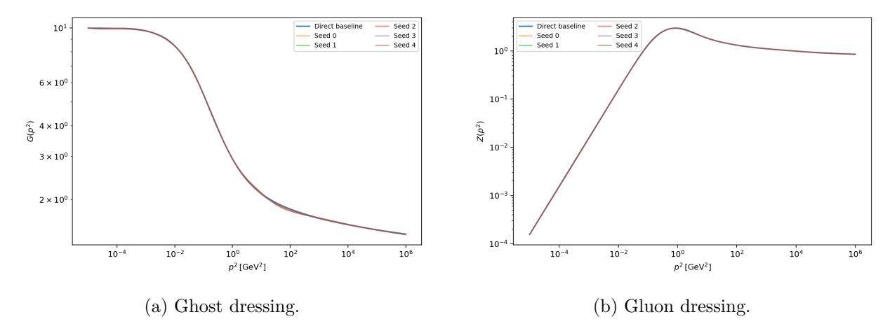
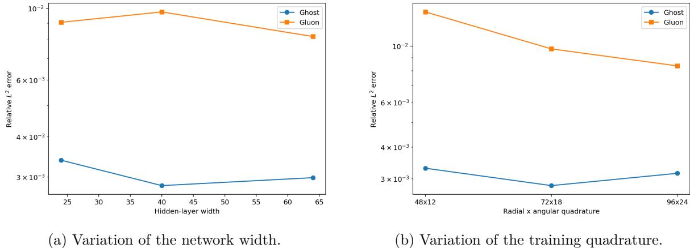
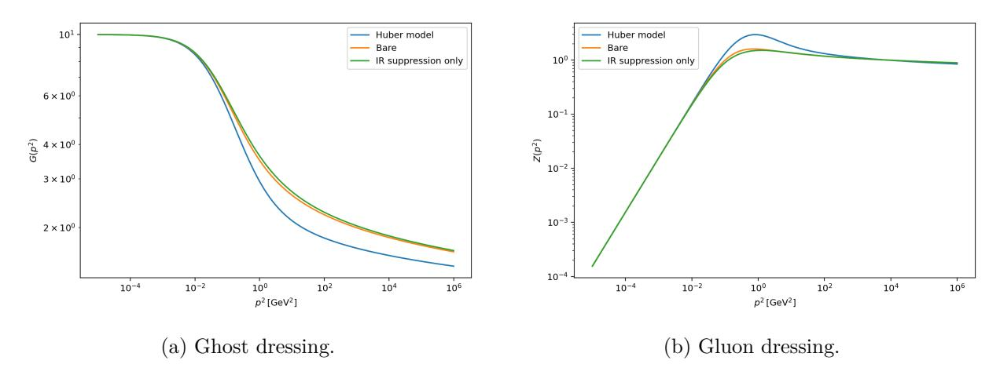
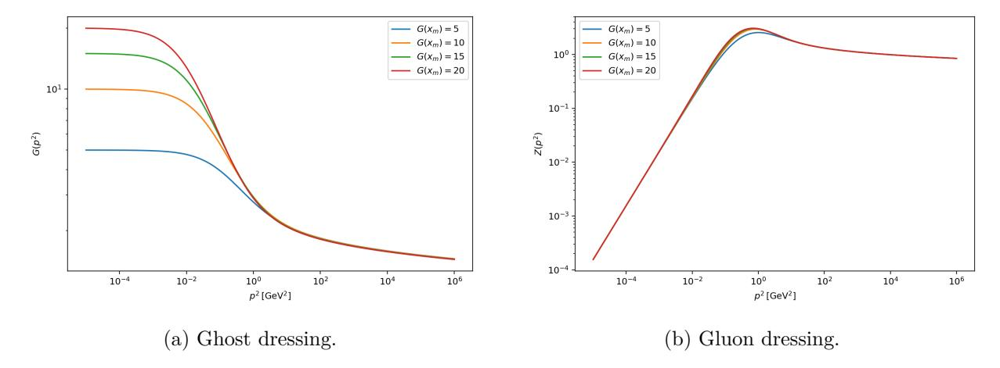
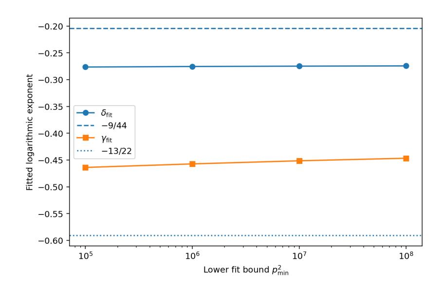

# Landau 게이지에서 결합된 유령과 글루온 Dyson–Schwinger 방정식의 신경망 솔루션 (Neural solutions of coupled ghost and gluon Dyson–Schwinger equations in Landau gauge)

- 원제: Neural solutions of coupled ghost and gluon Dyson--Schwinger equations in Landau gauge
- 원문: [https://arxiv.org/abs/2607.21548](https://arxiv.org/abs/2607.21548)
- PDF: [https://arxiv.org/pdf/2607.21548v1](https://arxiv.org/pdf/2607.21548v1)
- arXiv ID: `2607.21548`

---

# Landau 게이지에서 결합된 유령과 글루온 Dyson–Schwinger 방정식의 신경망 솔루션 (Neural solutions of coupled ghost and gluon Dyson–Schwinger equations in Landau gauge)

#### Rodrigo Carmo Terin

King Juan Carlos University, 실험과 기술 과학 학부, 응용 물리학과, Av. del Alcalde de Móstoles, 28933 마드리드, 스페인 rodrigo.carmo@urjc.es

#### **Abstract (Abstract)**

네트워크 표현을 사용해 정규화된 방정식 잔여만으로 훈련된 네트워크를 통해 4차원 Landau 게이지 양–밀스 이론의 결합된 유령과 글루온 Dyson–Schwinger 방정식 (DSEs)을 해결하였다. 신경망 솔루션과 고정점 솔루션은 퍼센트 수준에서 일치하며, 초기화, 네트워크 크기, 적분 격자, 그리고 적색 경계 조건의 변화에도 안정적으로 유지된다. 세 글루온 정점 모델의 변형은 신경망 오차보다 훨씬 큰 효과를 나타낸다. MiniMOM 자외선 구동과 글루온 Schwinger 함수의 부호 변화도 절단의 한계 내에서 재현된다.

**Keywords:** Dyson–Schwinger 방정식 (Dyson–Schwinger equations), 양–밀스 이론 (Yang–Mills theory), Landau 게이지 (Landau gauge), 물리 기반 신경망 (physics-informed neural networks), 유령 전파자 (ghost propagator), 글루온 전파자 (gluon propagator)

## **1 Introduction (Introduction)**

양자 색역학 (QCD)은 쿼크와 글루온 사이의 강한 상호작용을 기술한다 [&#91;1,](#page-13-0) [2&#93;](#page-13-1). 큰 모멘텀 스케일에서는 결합이 약해져 전개 이론을 사용할 수 있다 [&#91;3,](#page-13-2) [4&#93;](#page-13-3). 그러나 해드론 스케일에서는 이 이론을 비전개적으로 다루어야 한다. 억제와 동적 체르미시 대칭 파괴는 이 영역에서 두 가지 기본적인 특성이다. 이들의 설명은 이론의 상관 함수와 밀접하게 관련되어 있다 [&#91;5–](#page-13-4)[8&#93;](#page-14-0). 이러한 상관 함수는 해드론과 그 특성의 연속 계산에도 들어간다 [&#91;9–](#page-14-1)[11&#93;](#page-14-2). 비전개 영역에 대해 다양한 방법이 존재한다. 예를 들어, 격자 계산 (Lattice calculations)은 이산화된 시공간 (discretized space-time)에서 첫 번째 원리적 공식화 (first-principles formulation)를 제공하며, 많은 양에 대해 성공적으로 사용되었다 [&#91;12,](#page-14-3) [13&#93;](#page-14-4). 기능 방정식은 연속 대안이다. Dyson–Schwinger 방정식 (Dyson–Schwinger equations), 기능 재정의-그룹 방정식 (functional renormalization-group equations), 그리고 *n*PI 방정식 (nPI equations)은 게이지 고정된 행동에서 도출될 수 있지만 실제 계산에서는 무한 시스템을 절단해야 한다 [&#91;5,](#page-13-4) [14–](#page-14-5)[17&#93;](#page-14-6). 따라서 두 가지 다른 문제가 고려되어야 한다: 보존된 방정식은 충분한 수치 정확도로 해결되어야 하며, 무시되거나 모델링된 상관 함수의 효과를 이해해야 한다.

지난 몇 년 동안, 기능 방정식의 더 큰 시스템이 접근 가능해졌다. 모델 입력은 동적으로 계산된 정점으로 대체되었고, 추가 다이어그램의 효과가 조사되었다 [17,] [18]. 이 진전은 다른 결과들 중에서 파라미터가 없는 Landau-가우스 상관 함수의 계산과 격자 시뮬레이션과 정량적으로 일치하는 글루보울 스펙트럼을 가져왔다 [18,] [19].

초기에 기술적인 것처럼 보였던 일부 측면이 이 수준에서 중요해진다는 점을 주목해야 한다. 예로는 글루온 방정식에서의 허위 발산과 절단된 시스템에서의 소위 퍼터비티브 재합산의 실현이 있다 [17,] [20].

Landau-가우스 YM 전파자는 이러한 문제를 연구할 수 있는 간단한 시스템을 제공한다. 유령과 글루온 방정식은 결합된 비선형 적분 방정식이다. 4차원에서는 동시에 적색 해와 로그 유라비트 주기를 설명해야 한다. 적색 해는 엔드포인트 스케일링 해를 갖는 분리 해들의 가족을 형성하며, 4차원 격자 계산은 분리형을 제공한다 [17, 21].

정량적 결과는 또한 3-글루온 정점에 의존한다. 축소된 전파자 절단에서는 이 정점이 일반적으로 모델링되며, 다른 선택은 글루온 전파자를 상당히 바꿀 수 있다 [22–24].

신경망 표현은 미분 방정식과 적분 방정식을 해결하는 또 다른 방법을 제공한다. 초기 접근법은 경계 조건을 명시적으로 포함한 시도 함수(trial functions)를 사용하였다 [25]. 물리 기반 신경망(PINNs)에서는 방정식 잔차가 손실 함수의 일부가 된다 [26, 27]. 유사한 기법은 다체 파동 함수, 양자역학 시스템, 그리고 연산자 학습에 적용되었다 [28–30]. 함수 방정식의 경우, 신경망 표현은 연속적이고 미분 가능하며 비국소적 적분에 직접 삽입될 수 있기 때문에 매력적이다. 반면, 훈련 포인트에서의 작은 손실만으로는 충분하지 않다. 잔차는 독립적인 적분법으로도 확인해야 하며, 해에서 얻은 관측값은 별도의 수렴 분석이 필요할 수 있다. 우리는 이전 연구 중 하나에서 유클리드 QED 다이슨-슈윙거 방정식의 물리 기반 신경망 해를 연구하였다 [31]. 또한, 최근 마인코프스키 공간 분석에서 한 영역에서 유용한 제약이 해석 구조가 변할 때 불일치할 수 있음을 보여주었다 [32]. 여기서는 이 방법을 YM 고스트와 글루온 전파자에 적용한다. 감소된 일루프 절단을 의도적으로 사용한다. 같은 방정식은 직접 고정점 반복과 신경망 고정점 절차로 해결된다. 우리의 목적은 신경망 표현이 전파자 데이터 없이도 같은 해에 도달하는지 여부를 확인하고, 그 수치 오차를 이산화 및 정점 모델 효과와 비교하는 것이다. 우주선(ultraviolet) 행동과 슈워커 함수는 추가 테스트로 고려된다.

연결된 방정식과 그 재정규화가 2절에서 소개된다. 직접 및 신경망 솔루션 방법이 3절에서 설명된다. 수렴 테스트와 삼글루온 정점에 대한 의존성을 포함한 수치 결과가 4절에 제시된다. 결과는 5절에서 논의되며, 6절에는 결론이 포함된다. 추가적인 신경망 수렴 테스트는 부록 A에 수집되며, 계산에 사용된 물리적 및 수치적 매개변수는 부록 B에 요약된다.

## 2 결합 유령 및 글루온 방정식 (Coupled ghost and gluon equations)

우리는 4차원 유클리드 공간에서 순수 $SU(N_c)$ YM 이론을 고려합니다. Landau-가우스는 조건 $\partial_{\mu}A_{\mu}^{a}=0$ 으로 고정됩니다. 글루온 전파자는 그 다음으로 수직이 됩니다 [33]. 유령 및 글루온 전파자는 다음과 같이 쓰여집니다

$$D_G^{ab}(p) = -\delta^{ab} \frac{G(p^2)}{p^2},\tag{1}$$

$$D_{\mu\nu}^{ab}(p) = \delta^{ab} P_{\mu\nu}(p) \frac{Z(p^2)}{p^2}, \qquad P_{\mu\nu}(p) = \delta_{\mu\nu} - \frac{p_{\mu}p_{\nu}}{p^2}.$$

(2)

글루온 전파기의 스칼라 부분은 다음과 같이 표시된다.

$$D(p^2) = \frac{Z(p^2)}{p^2}. (3)$$

아래에서 고려되는 해는 디커플링(분리) 유형이다. 따라서, 고스트 드레싱은 적색(infrared)에서 유한하며, 글루온 전파기는 0이 아닌 값을 향한다. 유클리드 모멘텀 축에서 양의 드레싱 함수가 반드시 양의 스펙트럼 표현을 의미하지는 않는다. 전파기 방정식은 한 루프에서 절단되며, 고스트 방정식은 고스트–글루온 루프를 포함한다. 글루온 방정식에서는 고스트와 글루온 루프가 유지된다. 고스트–글루온 정점은 트리 레벨에서 유지되며, 세 글루온 정점의 경우 트리 레벨 텐서에 스칼라 드레싱을 곱한다. 태드폴은 적색 조건에 흡수되고, 선셋 및 스쿼인트 다이어그램은 포함되지 않는다. 이 시스템은 참조문헌 [17, 22, 34]에서 논의된 절단의 축소 버전이다. 그 크기는 여전히 결합된 신경망 솔루션을 테스트하기에 충분하며, 동시에

같은 적분 방정식은 전통적인 반복법으로 독립적으로 해결될 수 있다. $x=p^2$, $y=q^2$, $z=(p+q)^2$ 를 두고 스칼라 방정식은 다음과 같다

$$\frac{1}{G(x)} = \tilde{Z}_3 + N_c g^2 \int_q Z(y) G(z) K_G(x, y, z), \tag{4}$$

$$\frac{1}{Z(x)} = Z_3 + N_c g^2 \int_q \left[ G(y)G(z)K_Z^{\text{gh}}(x,y,z) + Z(y)Z(z)K_Z^{\text{gl}}(x,y,z)C^{AAA}(x,y,z) \right] - \frac{C_{\text{sub}}}{x}, \quad (5)$$

여기서 $\int_q = \int d^4q/(2\pi)^4$ 이다. 외부와 루프 모멘텀 사이의 각도는 $u = \cos \theta$ 로 표시된다. 수직 투사자를 사용하면 커널은 다음과 같다

$$K_G(x, y, z) = -\frac{1 - u^2}{yz},$$

(6)

$$K_Z^{\text{gh}}(x, y, z) = \frac{1 - u^2}{3xz},$$

(7)

$$K_Z^{\text{gl}}(x,y,z) = -\frac{2(1-u^2)}{3xyz^2} \left[ u^2xy + 6u\sqrt{xy}(x+y) + 3x^2 + 8xy + 3y^2 \right]. \tag{8}$$

이 표현들은 참조문헌 [17]에 수집된 한 루프 커널과 동일하다. 기준 계산을 위해 세 글루온 정점 드레싱은 다음과 같이 선택된다

$$C_{\text{base}}^{AAA}(x,y,z) = \frac{G(\bar{p}^2)}{Z(\bar{p}^2)} \frac{\bar{p}^2}{\bar{p}^2 + \Lambda_s^2}, \qquad \bar{p}^2 = \frac{x+y+z}{2},$$

(9)

$\Lambda_s^2 = 1.54 \,\mathrm{GeV}^2$ 이다. G/Z 인수는 단순한 재정규화 그룹 개선을 구현한다. 추가적인 적색 감쇠 없이 이 형태는 글루온 루프에서 강한 증강을 초래한다. 따라서 유리 인수가 포함된다. 유사한 효과적 구성은 전파기 계산에서 사용되었다 [17, 22]. 이는 동적으로 계산된 세 글루온 정점과 혼동해서는 안 된다. 이 입력의 효과를 추정하기 위해 세 가지 추가 선택이 사용된다

$$C_{\text{bare}}^{AAA} = 1, \tag{10}$$

$$C_{\text{supp}}^{AAA} = \frac{\bar{p}^2}{\bar{p}^2 + \Lambda_s^2},\tag{11}$$

$$C_{\text{no IR}}^{AAA} = \frac{G(\bar{p}^2)}{Z(\bar{p}^2)}.$$

(12)

베어 및 억제 전용 모델은 G/Z 인수를 서로 다른 방식으로 제거한다. 마지막 선택은 적색 억제 없이 이 인수를 유지하며, 절단된 방정식의 안정성을 테스트하는 데 사용된다

고스트 방정식은 모멘텀 서브트랙션으로 재정규화된다. 강한 컷오프가 사용될 때, 글루온 방정식에도 인위적인 2차 발산이 포함된다. 그 서브트랙션에 대한 다양한 규정이 알려져 있다 [17, 20]. 여기서는 질량 반대항이 적색 전파기 조건에 의해 고정된다. 방정식은 다음과 같이 명시된다

$$G(x_m) = G_m, Z(x_s) = 1, D(x_m) = D_0,$$

(13)

$x_m$ 은 적색 점이며, $x_s$ 는 서브트랙션 점이다. $\Sigma_G$ 와 $\Sigma_Z$ 를 고스트 및 글루온 방정식의 루프 기여도로 둔다. 서브트랙션된 고스트 방정식은 다음과 같다

$$\frac{1}{G(x)} = \frac{1}{G_m} + \Sigma_G(x) - \Sigma_G(x_m). \tag{14}$$

두 개의 글루온 조건은 다음과 같다

$$C_{\text{sub}} = \frac{x_m x_s}{x_s - x_m} \left[ \Sigma_Z(x_m) - \Sigma_Z(x_s) \right] + \frac{x_m x_s}{x_s - x_m} - \frac{x_s}{x_s - x_m} D_0^{-1}.$$

(15)

수치 해를 위해, 역 스칼라 전파자 $\Gamma_D(x) = x/Z(x)$에 대한 글루온 방정식을 쓰는 것이 유용하다,

$$\Gamma_D(x) = x + x \left[ \Sigma_Z(x) - \Sigma_Z(x_s) \right] + C_{\text{sub}} \left( \frac{x}{x_s} - 1 \right). \tag{16}$$

이 형태는 적색 영역에서 1/x에 비례하는 항들의 상쇄를 피한다. $C_{\text{sub}}$의 값은 규제자와 적분법에 따라 달라지며, 아래에서는 정규화된 전파자만을 비교한다. MiniMOM 결합은 다음과 같이 정의된다

$$\alpha_{\text{MM}}(p^2) = \alpha(x_s)G^2(p^2)Z(p^2),$$

(17)

여기서 라우누 가우스 게스트-글루온 정점의 테일러 운동학에서의 유한성[35–37]이 사용된다.

## 3 Numerical methods (수치 방법)

표준 매개변수는 다음과 같다

$$\alpha(x_s) = 0.05$$

,  $G_m = 10$ ,  $D_0 = 15.54 \,\text{GeV}^{-2}$ ,  $x_m = 10^{-5} \,\text{GeV}^2$ ,  $x_s = 7720 \,\text{GeV}^2$ , (18)

$N_c = 3$와 함께 외부 모멘텀은 $10^{-5}$에서 $10^6 \,\text{GeV}^2$까지 취한다. 반경적분은 $10^{-8}$에서 $10^8 \,\text{GeV}^2$까지 확장된다. 변환 $v = \ln y$ 후, 반경적분은 Gauss–Legendre 적분법으로 평가된다. 각도 적분은

$$\int_{-1}^{1} du \sqrt{1 - u^2} f(u), \tag{19}$$

Gauss-Chebyshev 2차 적분법을 사용한다. 초기 그리드는 140개의 외부 점, 140개의 반경 노드, 36개의 각도 노드를 포함한다. 방정식은 과소 수렴 고정점 반복으로 풀며, 로그 변수를 사용해 드레싱 함수를 양수로 유지한다. 반복 n에서 오른쪽 항이 $G_{\rm DSE}^{(n)}$와 $Z_{\rm DSE}^{(n)}$를 주면 업데이트는

$$\ln G^{(n+1)} = (1 - \omega) \ln G^{(n)} + \omega \ln G_{\text{DSE}}^{(n)}, \tag{20}$$

$$\ln Z^{(n+1)} = (1 - \omega) \ln Z^{(n)} + \omega \ln Z_{\rm DSE}^{(n)}, \tag{21}$$

여기서 $\omega=0.08$이다. 반복은 가장 큰 로그 변화가 $2\times 10^{-6}$보다 작아질 때 멈춘다. 네트워크의 입력은 $t=\ln x$이며, 두 개의 출력 $N_G(t)$와 $N_Z(t)$를 가진다. 이 함수들은 정규화 조건을 만족하는 해석적 기준 함수에 곱해진다. 기준 네트워크는 너비 40의 두 개의 은닉층과 쌍곡선 탄젠트 활성화 함수를 갖는다. 전체적으로 이중 정밀도가 사용된다. 구현은 PyTorch[38]를 기반으로 한다. 게스트 드레싱을 위해 표준 함수는

$$G_{\text{base}}(x) = 1 + (G_m - 1)\frac{1 + (x_m/s_G)^{\nu_G}}{1 + (x/s_G)^{\nu_G}}, \qquad s_G = 0.1 \,\text{GeV}^2, \qquad \nu_G = \frac{1}{2},$$

(22)

그리고 $G_{\text{base}}(x_m) = G_m$이다. 글루온 드레싱을 위해 우리는

$$Z_{\text{base}}(x) = \frac{x/(x+m_0^2)}{x_s/(x_s+m_0^2)}, \qquad m_0^2 = \frac{x_s(1-D_0x_m)}{D_0x_s-1}, \tag{23}$$

이를 사용하면 $Z_{\text{base}}(x_s) = 1$과 $Z_{\text{base}}(x_m)/x_m = D_0$가 된다. 신경망 드레싱 함수는 다음과 같이 정의된다

$$G_{\theta}(x) = G_{\text{base}}(x) \exp\left[h_G(t)N_G(t)\right],\tag{24}$$

$$Z_{\theta}(x) = Z_{\text{base}}(x) \exp\left[h_Z(t)N_Z(t)\right], \tag{25}$$

여기서

$$h_G(t) = \tanh \frac{t - t_m}{2},\tag{26}$$

$$h_Z(t) = \tanh \frac{t - t_m}{2} \tanh \frac{t - t_s}{2},\tag{27}$$

여기서 $t_m = \ln x_m$ 이고 $t_s = \ln x_s$ 이다. 이렇게 하면 Eq. (13)의 세 조건이 정확히 충족된다. 지수형식은 유클리드 드레싱 함수가 양수임을 유지한다. 앞서 언급한 바와 같이, 이는 반사 양성성 또는 칼렌-레만 밀도(Källén-Lehmann density)의 양성성을 부과하지 않는다. 일반 초기화에서 방정식 잔차를 직접 최소화하려고 하면 수치적으로 불안정한 것으로 나타난다. 그 이유는 글루온 방정식에서 큰 항들의 상쇄 때문이다. 따라서 먼저 고정점 반복의 신경망 형태를 사용한다. 외부 반복 n에서 신경망 함수는 Eq. (14)와 (16)의 우변에 삽입된다. 이는 함수 $G_{\rm DSE}^{(n)}$ 와 $Z_{\rm DSE}^{(n)}$ 를 제공한다. 혼합 목표는 다음과 같이 정의된다.

$$\ln G_{\text{tar}}^{(n)} = (1 - \rho) \ln G_{\theta}^{(n)} + \rho \ln G_{\text{DSE}}^{(n)}, \tag{28}$$

$$\ln Z_{\text{tar}}^{(n)} = (1 - \rho) \ln Z_{\theta}^{(n)} + \rho \ln Z_{\text{DSE}}^{(n)}, \tag{29}$$

여기서 $\rho = 0.10$ 이다. 매 외부 반복마다 50개의 Adam 스텝을 사용해 네트워크를 이 타깃에 투영한다. 참조 설정 계산은 70개의 외부 반복을 포함하며, 타깃은 방정식 자체에 의해 생성된다. 수렴된 전파자 솔루션은 훈련 중에 사용되지 않는다. 이 전처리 후 방정식 잔차를 직접 최소화한다. $R_G$ 와 $R_D$ 를 각각 소거된 고스트와 역전파자 방정식의 오른쪽 변으로 두고, 정규화된 잔차는

$$r_G(x) = \frac{G_{\theta}^{-1}(x) - R_G(x)}{1 + \frac{1}{2} \left( |G_{\theta}^{-1}(x)| + |R_G(x)| \right)},\tag{30}$$

$$r_D(x) = \frac{x/Z_{\theta}(x) - R_D(x)}{1 + \frac{1}{2} \left( |x/Z_{\theta}(x)| + |R_D(x)| \right)},\tag{31}$$

그리고 손실 함수는

$$\mathcal{L}_{DSE} = \left\langle r_G^2 \right\rangle_x + \left\langle r_D^2 \right\rangle_x. \tag{32}$$

최종 최적화는 학습률 $3 \times 10^{-4}$ 로 60개의 Adam 스텝으로 구성된다. 훈련 그리드는 80개의 외부 점, 72개의 반경 노드, 18개의 각도 노드를 갖는다. 검증에서는 120개의 외부 점, 112개의 반경 노드, 30개의 각도 노드를 사용한다. 따라서 아래에 인용된 잔차는 훈련 사분법으로 평가되지 않는다. 직접 해는 신경망 계산 이후에만 사용되며 독립적인 비교를 제공하기 위한 목적이다. 상대 오차는 다음과 같이 정의된다

$$\varepsilon_2[F] = \frac{\|F_\theta - F_{\text{dir}}\|_2}{\|F_{\text{dir}}\|_2}.$$

(33)

우주선 분석을 위해 드레싱 함수는 다음과 같이 적합됩니다.

$$G(p^2) \propto \left[ \ln \frac{p^2 + \Lambda^2}{\Lambda^2} \right]^{\delta}, \qquad Z(p^2) \propto \left[ \ln \frac{p^2 + \Lambda^2}{\Lambda^2} \right]^{\gamma},$$

(34)

여기서 $\Lambda^2=0.04\,\mathrm{GeV}^2$ 입니다. 일루프 순수 YM 이론에서 $\delta=-9/44,\,\gamma=-13/22,\,\mathrm{and}\,\,2\delta+\gamma=-1$ 은 MiniMOM 결합에 해당합니다. 영공간-모멘텀 Schwinger 함수는 다음과 같습니다.

$$\Delta(t) = \frac{1}{\pi} \int_0^{p_{\text{max}}} dp \, \cos(pt) D(p^2). \tag{35}$$

이 함수의 음수 부분은 반사 양성성 위반을 입증하기에 충분합니다 [17, 39, 40]. 이 기준은 글루온 2점 함수와 관련이 있지만, 구속에 대한 완전한 기준은 아닙니다.

그림 1: 직접 기준 솔루션. 드레싱 함수 *G*(*p* 2 )와 *Z*(*p* 2 )가 왼쪽 패널에 표시됩니다. 오른쪽 패널은 *D*(*p* 2 ) = *Z*(*p* 2 )*/p*2 를 보여줍니다. 저에너지 값은 *D*(*xm*) = 15*.*54 GeV−2 으로 고정됩니다.

그림 2: 직접 기준 솔루션에서 얻은 MiniMOM 결합. 결합은 저에너지에서 소멸하고, *p*2 = 0*.*19 GeV2 근처에서 최대를 가지며, 큰 모멘텀에서 로그적으로 감소합니다.

## **4 수치 결과**

직접 참조 설정 계산은 165번의 반복 후에 수렴합니다. 적외선 점에서의 조건은 다음과 같이 얻어집니다

$$G(x_m) = 9.9999999, D(x_m) = 15.5400000 \,\text{GeV}^{-2}.$$

(36)

글루온 드레싱은 최대값 *Z*max = 2*.*954를 가지며, 이는 *p*2 = 0*.*806 GeV2에서 발생한다. 글루온 전파자는 적색점에서 유한하며, *p*2 = 8*.*47 × 10−3 GeV2에서 15*.*714 GeV−2의 얕은 최대값을 갖는다. MiniMOM 결합은 이 분리 해의 적색점 끝에서 0으로 사라진다. 그 최대값은 *α* max MM = 2*.*001이며, 이는 *p*2 = 0*.*188 GeV2에서 발생한다.

디스크리타이제이션 오류를 추정하기 위해, 시뮬레이션은 세 개의 격자에서 반복하였다. 표 [1](#page-6-0)의 오류는 가장 정밀한 결과를 기준으로 상대적으로 표시된다. 기본 격자에서는 유령 드레싱에 대해 상대 오류가 5 × 10−4 이하이며, 글루온 드레싱에 대해서는 약 3*.*5 × 10−3 정도이다. 글루온 방정식의 더 큰 민감도는 신경망 계산에서도 관찰될 것이다. 분석적 표준 함수에서 시작하여, 신경망 고정점 반복은 직접 사용 없이 수렴한다.

| 계산 | Nx | Ny | Nu | (ε2[G], ε2[Z]) |
|-------------|-----|-----|----|---------------------------------------------------|
| coarse | 100 | 90 | 24 | 10−3 10−2 (1.44 × , 1.06 × ) |
| baseline | 140 | 140 | 36 | 10−4 10−3 (4.24 × , 3.52 × ) |
| fine | 190 | 200 | 52 | reference |

표 1: 세 가지 이산화에 대한 직접 해. 상대 오차는 공통 로그 스케일 모멘텀 그리드에서 정밀 해를 기준으로 계산된다.

그림 3: 기본 절단에 대한 직접 및 신경망 해. 직접 해는 신경망 훈련 중에 사용되지 않는다. 일치성은 전체 모멘텀 구간에 걸쳐 있다.

해. 대표적인 기본 실행에 대해 상대 오차는 다음과 같다

$$\varepsilon_2[G] = 2.82 \times 10^{-3}, \qquad \varepsilon_2[Z] = 9.76 \times 10^{-3}.$$

(37)

가장 큰 점별 차이는 고스트 드레싱에서 0*.*71%, 글루온 드레싱에서 2*.*07%이다. 직접 정제 테스트와 마찬가지로 글루온이 수치 처리에 더 민감하다.

독립 검증 그리드에서 가장 큰 잔차는 다음과 같다

$$\max_{x} |r_G(x)| = 8.34 \times 10^{-4}, \qquad \max_{x} |r_D(x)| = 6.80 \times 10^{-3}. \tag{38}$$

해당 평균 제곱값은 8*.*8 × 10−8과 5*.*0 × 10−6이다. 잔차 테스트는 직접 곡선과의 비교에 추가적으로 필요하다. 그렇지 않으면 일치는 적분 방정식의 동일하게 정확한 해 없이 보간으로 인해 발생할 수 있다. 폭-40 네트워크에는 다섯 개의 매개변수 초기화가 사용되었다. 마지막 층은 0으로 설정되었으므로 초기 드레싱 함수는 동일하지만 숨겨진 표현은 달랐다. 결과 오차는 다음과 같다

$$\varepsilon_2[G] = (3.25 \pm 0.77) \times 10^{-3},$$

(39)

$$\varepsilon_2[Z] = (9.48 \pm 0.29) \times 10^{-3}.$$

(40)

전체 모멘텀 구간에서 가장 큰 상대 표준 편차는 고스트에서 0*.*81%, 글루온에서 0*.*75%이다. 세 개의 추가 실행은 마지막 층의 0이 아닌 변동으로부터 시작되었으며 동일한 가지로 수렴한다. 그들의 고스트 오차는 3*.*78×10−3와 5*.*41 × 10−3 사이이며, 글루온 오차는 7*.*15 × 10−3와 1*.*14 × 10−2 사이이다.

숨겨진 층 폭이 24에서 64로 변경되었다. 고스트 오차는 3×10−3에 근접한 상태를 유지한다. 글루온은 9*.*06 × 10−3에서 8*.*19 × 10−3로 변하며 폭에 대한 단조적 의존성이 발견되지 않는다. 이 정확도에서 최적화, 적분, 초기화의 효과는 비슷한 크기를 가진다. 폭 스캔은 따라서 안정성을 테스트하지만 비평적 수렴 법칙을 제공하지 않는다.

수렴 법칙. 적분 그리드에 대해 더 명확한 의존성이 얻어졌다. 반경–각도 적분을 48×12에서 96×24로 증가시키면 글루온 오차가 1*.*36×10−2에서 8*.*36×10−3로 변한다. 고스트 오차는 2*.*8 × 10−3와 3*.*3 × 10−3 사이에 머물며, 이는 글루온 방정식이 결합 시스템에서 더 까다로운 부분임을 확인시켜 준다.

그림 4: 기본 신경망 해의 수치 테스트. 왼쪽 패널은 직접 결과와의 차이를 보여준다. 오른쪽 패널은 훈련에 사용된 것보다 더 정밀한 적분으로 평가된 고스트 및 역-글루온-전파자 잔차를 보여준다.

그림 5: 다섯 개 매개변수 초기화에 대한 신경망 해. 방정식과 정규화 조건은 모든 실행에서 동일하다.

그림 6: 서로 다른 네트워크 폭과 적분 그리드에 대한 상대 신경망 오차. 글루온 해는 폭 변동보다 적분 정제에 더 크게 변한다.

그림 7: 세 가지 3-글루온 정점 모델에 대한 직접 해. 모든 경우에 동일한 정규화 조건이 사용된다. 주요 변화는 최대값 주변의 글루온 드레싱에서 발생한다.

가장 큰 변화는 세 개의 글루온-버텍스 모델을 변형할 때 달성된다. 베어와 억제 전용 모델은 모두 양의 유클리드 해를 낸다. 기준 계산과 비교하면, 글루온 드레싱은 상대적인 *L* 2 노름에서 약 33–36% 변한다. 글루온 드레싱과 MiniMOM 결합의 최대값은 표 [2.](#page-8-0)에 주어진다. 세 가지 절단 각각에 대해, 신경망 솔루션은 해당 직접 솔루션에 비해 백분율 수준 이하로 남는다.

| 정점 모델 | Zmax | 최대 α MM | ε2[Gθ] | ε2[Zθ] |
|----------------------------------------|-------|----------------|-------------------|-------------------|
| 베이스라인 G/Z IR 억제와 함께 | 2.954 | 2.001 | 10−3 2.82 × | 10−3 9.76 × |
| bare | 1.602 | 1.643 | 10−3 3.16 × | 10−3 5.14 × |
| IR 억제만 | 1.510 | 1.536 | 10−3 × 3.57 | 10−3 × 2.07 |

Table 2: 세 개의 수렴 정점 모델에 대한 결과. 신경망 오류는 동일한 절단을 사용한 직접 해법으로 계산됩니다.

Figure 8: 네 개의 적외선 유령 조건에 대한 직접 해법. 적외선 글루온 전파자는 고정됩니다. 해법은 같은 자외선 정규화를 가지지만 전이 영역에서는 다릅니다.

적외선 억제 없이 모델은 같은 양의 가지에 수렴하지 않는다. 고정점 반복이 붕괴되기 전, 글루온 장식의 최대값이 약 9.5로 증가하고 MiniMOM 결합이 약 4.69에 도달한다. 불안정성은 이미 직접 계산에서 발생한다. 따라서 이는 절단된 방정식에 의해 발생하며 신경망 표현에 의해 발생한 것이 아니다. 여기서 고려한 계산에서는 정점 의존성이 직접 이산화 오차나 신경망 재구성 오차보다 훨씬 크다. 이 관찰은 수치적으로 정확한 신경망 결과를 해석하는 데 중요하다. 고정 연산자의 보다 정확한 해법은 모델링된 정점에 의해 발생한 불확실성을 줄이지 않는다.

함수 방정식의 분리 해는 적외선 경계 조건 [17, 21]에 의해 선택된다. 우리는 다음을 사용한다

$$G(x_m) = 5, 10, 15, 20$$

(41)

그때 $D(x_m) = 15.54 \,\text{GeV}^{-2}$ 은 고정된다. 직접 반복은 네 값 모두에서 수렴한다. 글루온 장식에서 가장 큰 변화는 그 최대값 주변에서 발생한다. MiniMOM 결합의 최대값은 1.16에서 2.58로 증가한다.

신경망 계산은 또한 $G(x_m) = 5$, 15, 20에 대해 수행되었다. 상대 유령 오차는 $2.47 \times 10^{-3}$, $3.21 \times 10^{-3}$, $4.26 \times 10^{-3}$ 이다. 대응하는 글루온 오차는 $7.76 \times 10^{-3}$, $7.47 \times 10^{-3}$, $1.09 \times 10^{-2}$ 이다. 따라서 신경망 반복은 기준 경계 조건에 제한되지 않는다. 그것은 분리 가족의 다른 구성원을 따른다.

자외선(UV) 분석을 위해 외부 모멘텀 구간을 $p^2 = 10^{10} \,\text{GeV}^2$ 로 확장하고, 반경 컷오프를 $10^{12} \,\text{GeV}^2$ 로 한다. 가장 높은 적합 구간에서 직접 해법은 다음을 제공한다

$$\delta_{\text{dir}} = -0.2744, \qquad \gamma_{\text{dir}} = -0.4467.$$

(42)

이상한 값은 -9/44와 -13/22와 다르다. 축소된 일루프 트렁케이션과 효과적인 정점은 따라서 두 개의 이상 차원( anomalous dimensions)을 별도로 재현하지 않는다. 그들의 조합은

$$2\delta_{\rm dir} + \gamma_{\rm dir} = -0.9955,\tag{43}$$

이는 MiniMOM 결합의 일루프 값 -1에 가깝다.

확장된 신경망 해법의 경우 상대 오차는 다음과 같다

$$\varepsilon_2[G] = 7.35 \times 10^{-3}, \qquad \varepsilon_2[Z] = 1.80 \times 10^{-2}.$$

(44)

가장 높은 구간에서 추출된 조합은 다음과 같다

$$2\delta_{\theta} + \gamma_{\theta} = -1.012. \tag{45}$$

Figure 9: 확장된 직접 해법의 자외선 지수, 적합 구간의 서로 다른 하한 경계에 대해. 수평선은 *δ* = −9*/*44와 *γ* = −13*/*22를 보여준다.

| 해결책 | [GeV−1 첫 번째 0 t0 ] | 최소값 ∆(t) |
|--------------------------------|---------------------------------|------------------------------------------|
| 직접 기준선 직접 정제 | 7.459 7.408 | 10−2 −3.53 × 10−2 −3.60 × |
| 신경망, 대표 시드 | 7.054 | 10−2 −5.11 × |

Table 3: *p*max = 1000 GeV에서 글루온 슈윙거 함수의 첫 번째 0점과 최소값.

따라서, 우리의 신경망 시뮬레이션은 직접 결과의 두 가지 특징을 모두 재현한다: 올바른 MiniMOM 조합과 이동된 개별 지수. 이는 단지 절단된 방정식만을 사용하는 솔버의 예상되는 동작임을 주의해야 한다. 누락된 UV 구조는 절단에서 개선되어야 하며, 수치 방법으로는 제공될 수 없다.

마지막으로, 슈윙거 함수는 직접 코사인 적분으로 평가된다. 컷오프 *p*max = 100, 300, 1000 GeV가 사용된다. 첫 번째 0점은 이 변동에 대해 안정적이다. *p*max = 1000 GeV에 대한 결과는 표 [3.](#page-10-1)에 나열되어 있다.

두 개의 직접 이산화는 첫 번째 0점이 1 % 미만 차이가 낸다. 신경망 0점은 정밀 직접 결과에 비해 약 5 % 정도 이동한다. 그럼에도 불구하고, 음수 부분은 모든 경우에 존재한다. 따라서 반사 양성성의 위반이 정성적으로 재현된다. 음수 영역의 위치와 깊이는 유클리드 드레싱 함수 자체보다 더 민감하다.

## **5 논의 (Discussion)**

결과는 불확실성의 다양한 원인을 비교할 수 있게 한다. 첫 번째는 직접 적분 방정식의 이산화이다. 기준 설정 그리드에서는 유령에 대해 퍼밀리레벨 이하이며 글루온에 대해서는 몇 퍼밀리레벨 수준이다. 두 번째는 이러한 이산화 방정식의 신경망 해법이다. 그 오류는 다소 크지만 퍼밀리레벨에서 퍼센트 수준에 머무른다. 서로 다른 초기화, 네트워크 폭, 적분 그리드로 수행한 테스트는 동일한 고정점을 얻는 것을 나타낸다. 독립 그리드에서의 잔차는 이 결론을 지지한다. 세 글루온 정점에 의해 유발되는 훨씬 큰 효과가 있다. 초기 모델을 베어 또는 억제 전용 드레싱으로 교체하면 글루온 해법이 30 % 이상 변한다. 우리의 신경망 해법은 이러한 선택마다 정확성을 유지한다. 현재 절단에서, 다음의 크기는

Figure 10: 기준 직접, 정밀 직접, 그리고 신경망 전파기로부터의 글루온 슈윙거 함수. 세 함수 모두 음수가 된다. 신경망 결과의 첫 번째 0점은 더 작은 유클리드 시간에서 발생한다.

따라서 세 가지 효과는 다음과 같이 요약될 수 있다

직접 이산화 오류 ≲ 신경망 재구성 오류 ≪ 세 글루온 정점 의존성*.* (46)

이 비교는 또한 수치적 오류와 절단 오류를 별도로 유지해야 하는 이유를 보여준다. 네트워크 크기를 늘려도 누락되거나 모델링된 상관 함수를 보상할 수 없다. UV 계산은 이 점의 예시를 제공한다. 직접 절단은 두 전파기의 개별적인 올바른 비정상 차원을 제공하지 않는다. 그러나 그들의 MiniMOM 조합은 좋은 정확도로 재현된다. 우리의 신경망 시뮬레이션은 동일한 결과를 제공한다. 이는 우리의 신경망 솔버의 단점이 아니라, 해결되는 방정식의 소위 소위?

Schwinger 함수는 유클리드 축에서의 점별 비교보다 전파자에 더 민감하다. 직접 전파자와 신경망 전파자는 몇 퍼센트 차이만 보이지만, 첫 번째 영점은 약 5% 정도 변하고 최소값은 더 크게 변한다. 진동 변환은 따라서 원래의 드레싱 함수에 필요한 정확도보다 더 높은 정확도를 요구할 수 있다. 음수 부분 자체는 안정적이다. 이러한 점에서 결과는 양성성 특성이 해법 이후에 확인되어야 하며, 그 위반 신호를 제거하는 방식으로 강제되어서는 안 된다는 관찰과 일치한다 [32]. 계산에 대한 몇 가지 제한 사항을 염두에 두어야 한다. 그로우스-글루온 정점은 베어이다. 세 개의 글루온 정점은 하나의 모델링된 스칼라 드레싱만을 포함한다. 네 개의 글루온 정점과 글루온 방정식의 이중 루프 다이어그램은 포함되지 않는다. 질량 반대항은 선행 컷오프 의존성을 제거하지만, 그 처리는 절단의 일부이다. 또한, 유클리드 순수 YM 이론만을 고려한다. 따라서 결과는 고정 전파자 절단의 수치 해법 연구이며, YM 상관 함수의 새로운 최첨단 계산이 아니다.

정점 테스트는 가장 유용한 다음 단계임을 시사한다. 세 개의 글루온 정점의 신경망 표현은 그 DS 또는 3PI 방정식에 결합될 수 있다. 이는 전파자 시스템에서 모델 입력을 줄여줄 것이다. 또한 세 점 함수가 여러 모멘텀 변수를 의존하기 때문에 신경망 절차에 대한 보다 까다로운 테스트를 제공한다. 적색 영역 가족을 위한 매개변수 의존 네트워크는 또 다른 가능한 확장이다. 복소 모멘텀과 미분시공간은 추가 작업이 필요하다. 그 경우, 부호가 불확정인 스펙트럼 함수와 복소 특이점은 처음부터 활성화되어야 한다.

## **6 결론 (Conclusions)**

우리는 신경망 표현을 사용하여 결합된 그로우스와 글루온 DSE를 해결하였다. 계산은 Landau gauge에서 4차원 YM 이론에서 수행되었다. 모델링된 세 개의 글루온 정점을 갖는 1루프 전파자 절단이 사용되었다. 동일한 정규화된 방정식은 전통적인 고정점 반복법으로도 해결되었다.

우리의 신경망 계산은 수렴된 전파자 데이터를 사용하지 않음을 언급하는 것이 중요하다. 방정식에서 나온 목표값은 고정점 전처리에 사용되며, 정규화된 잔차는 이후 최소화된다. 기본 시스템에서는 그로우스 드레싱의 상대 오차가 2.*8 × 10−3, 글루온 드레싱의 상대 오차가 9.*8 × 10−3이다. 다른 초기화, 네트워크 폭, 적분 그리드, 적색 경계 조건에서도 유사한 결과가 얻어진다. 더 정밀한 사분법으로 평가된 잔차는 일치가 훈련 포인트에만 국한되지 않음을 보여준다. 세 개의 글루온 정점 모델이 나머지 수치 오차보다 더 중요하다는 것이 드러난다. 대체 정점 모델은 글루온 드레싱을 30% 이상 변경하지만, 각 고정 절단의 신경망 해법은 퍼센트 수준 이하로 유지된다. UV 테스트도 유사한 교훈을 준다. MiniMOM 조합의 이상 차원은 얻어지지만, 별개의 지수는 얻어지지 않는다. 우리의 신경망 결과는 절단된 방정식의 이와 같은 행동을 따른다. Schwinger 함수는 직접 및 신경망 전파자에 대해 음수가 되지만, 첫 번째 영점의 위치는 작은 전파자 차이에 더 민감하다. 따라서 신경망 표현은 결합되고 정규화된 기능 방정식에 전통적인 수치 방법과 비교 가능한 정확도로 사용될 수 있다. 그 유용성은 일반적인 절단 문제를 제거하지 않는다. 여기서 고려한 시스템에서는 정점 영역의 개선이 전파자-네트워크 크기를 더 늘리는 것보다 더 중요하다. 세 개의 글루온 정점의 동적 신경망 계산은 자연스러운 다음 단계이다.

### **신경 수렴 테스트 요약 (A Summary of neural convergence tests)**

| 숨겨진 너비 | ε2[G] | ε2[Z] |
|--------------|-------------------|-------------------|
| 24 | 10−3 3.39 × | 10−3 9.06 × |
| 40 | 10−3 × 2.82 | 10−3 × 9.76 |
| 64 | 10−3 × 2.99 | 10−3 × 8.19 |

표 4: 고정 깊이와 사분면에서의 네트워크 폭 스캔 (Network-width scan at fixed depth and quadrature.)

| 반경–각도 사분법 | ε2[G] | ε2[Z] |
|---------------------------|-------|-------|
| 48 | 10−3 | 10−2 |
| × | 3.31 | 1.36 |
| 12 | × | × |
| 72 | 10−3 | 10−3 |
| × | 2.82 | 9.76 |
| 18 | × | × |
| 96 | 10−3 | 10−3 |
| × | 3.16 | 8.36 |
| 24 | × | × |

Table 5: 훈련 중에 사용된 사분법에 따른 신경망 재구성의 의존성 (Dependence of the neural reconstruction on the quadrature used during training). 모든 잔차는 이후에 공통의 더 정밀한 검증 사분법에서 평가된다 (All residuals are subsequently evaluated on a common finer validation quadrature).

| $G(x_m)$ | $Z_{\rm max}$ | $\alpha_{\mathrm{MM}}^{\mathrm{max}}$ | $(\varepsilon_2[G], \varepsilon_2[Z])$ |
|----------|---------------|---------------------------------------|------------------------------------------------|
| 5 | 2.553 | 1.164 | $(2.47 \times 10^{-3}, 7.76 \times 10^{-3})$ |
| 10 | 2.954 | 2.001 | $(2.82 \times 10^{-3},  \ 9.76 \times 10^{-3})$ |
| 15 |  |  | $(3.21 \times 10^{-3}, 7.47 \times 10^{-3})$ |
| 20 | 3.065 | 2.585 | $(4.26 \times 10^{-3}, 1.09 \times 10^{-2})$ |

표 6: 적외선 계통 전반에 걸친 직접 관측값과 신경망 오류. 기준 행은 비교를 위해 포함되어 있다.

### B 수치 매개변수

| quantity | baseline value |
|--------------------------------------------------|------------------------------------|
| color number | $N_c = 3$ |
| subtraction-point coupling | $\alpha(x_s) = 0.05$ |
| infrared ghost condition | $G(x_m) = 10$ |
| infrared gluon condition | $D(x_m) = 15.54 \text{GeV}^{-2}$ |
| infrared point | $x_m = 10^{-5} \mathrm{GeV}^2$ |
| subtraction point | $x_s = 7720 \text{GeV}^2$ |
| three-gluon damping scale | $\Lambda_s^2 = 1.54  \text{GeV}^2$ |
| direct external/radial/angular points | 140/140/36 |
| neural training external/radial/angular points | 80/72/18 |
| neural validation external/radial/angular points | 120/112/30 |
| hidden layers and width | $2 \times 40$ |
| outer neural Picard steps | 70 |
| Adam projection steps per outer iteration | 50 |
| residual fine-tuning steps | 60 |

표 7: 기본 물리 및 수치 매개변수 (Baseline physical and numerical parameters).

#### 참고문헌 (References)

- [1] William J. Marciano and Heinz Pagels. 양자 색역학 (Quantum chromodynamics): 리뷰. Physics Reports, 36:137-276, 1978. doi: 10.1016/0370-1573(78)90208-9.
- [2] N. Brambilla et al. 양자 색역학 (Qcd)과 강하게 결합된 게이지 이론: 도전과 전망. European Physical Journal C, 74:2981, 2014. doi: 10.1140/epjc/s10052-014-2981-5.
- [3] David J. Gross and Frank Wilczek. 비아벨 게이지 이론 (non-abelian gauge theories)의 자외선 행동. Physical Review Letters, 30:1343–1346, 1973. doi: 10.1103/PhysRevLett.30.1343.
- [4] H. David Politzer. 강한 상호작용에 대한 신뢰할 수 있는 퍼터비티브 결과? Physical Review Letters, 30:1346–1349, 1973. doi: 10.1103/PhysRevLett.30.1346.
- [5] Craig D. Roberts and Anthony G. Williams. 다이슨-슈윙거 방정식 (Dyson—schwinger equations)과 그들의 하드론 물리학에 대한 적용. Progress in Particle and Nuclear Physics, 33:477–575, 1994. doi: 10.1016/0146-6410(94)90049-3.
- [6] Reinhard Alkofer and Lorenz von Smekal. QCD 그린 함수의 적색 행동 (qcd green's functions): 억제, 동적 대칭 파괴, 그리고 상대론적 결합 상태로서의 하드론. Physics Reports, 353:281–465, 2001. doi: 10.1016/S0370-1573(01)00010-2.

- [7] Craig D. Roberts and Sebastian M. Schmidt. 다이슨–슈윙거 방정식: 밀도, 온도 및 연속 강한 QCD. *Progress in Particle and Nuclear Physics*, 45:S1–S103, 2000. doi: 10.1016/S0146-6410(00)90011-5.
- [8] Christian S. Fischer. 다이슨–슈윙거 방정식에서 온도와 화학적 잠재력이 유한한 QCD. *Progress in Particle and Nuclear Physics*, 105:1–60, 2019. doi: 10.1016/j.ppnp. 2019.01.002.
- [9] Adnan Bashir, Lei Chang, Ian C. Cloet, Bruno El-Bennich, Yu-Xin Liu, Craig D. Roberts, and Peter C. Tandy. 다이슨–슈윙거 방정식 QCD의 진보에 대한 집단적 관점. *Communications in Theoretical Physics*, 58:79–134, 2012. doi: 10.1088/0253-6102/58/1/16.
- [10] Gernot Eichmann, Helios Sanchis-Alepuz, Richard Williams, Reinhard Alkofer, and Christian S. Fischer. 상대론적 3-쿼크 결합 상태로서의 바리온. *Progress in Particle and Nuclear Physics*, 91:1–100, 2016. doi: 10.1016/j.ppnp.2016.07.001.
- [11] Minghui Ding, Craig D. Roberts, and Sebastian M. Schmidt. 하드론 질량과 구조의 출현. *Particles*, 6(1):57–120, 2023. doi: 10.3390/particles6010005.
- [12] Kenneth G. Wilson. 쿼크의 억제. *Physical Review D*, 10:2445–2459, 1974. doi: 10.1103/PhysRevD.10.2445.
- [13] S. Aoki et al. 저에너지 입자 물리학과 관련된 격자 결과 리뷰. *European Physical Journal C*, 77:112, 2017. doi: 10.1140/epjc/s10052-016-4509-7.
- [14] Freeman J. Dyson. 양자 전자기학에서의 S 행렬. *Physical Review*, 75:1736–1755, 1949. doi: 10.1103/PhysRev.75.1736.
- [15] Julian Schwinger. 양자화된 장의 그린 함수에 대하여. i. *Proceedings of the National Academy of Sciences*, 37:452–455, 1951. doi: 10.1073/pnas.37.7.452.
- [16] Julian Schwinger. 양자화된 장의 그린 함수에 대하여. ii. *Proceedings of the National Academy of Sciences*, 37:455–459, 1951. doi: 10.1073/pnas.37.7.455.
- [17] Markus Q. Huber. 양–밀스 이론의 비정밀성 특성. *Physics Reports*, 879: 1–92, 2020. doi: 10.1016/j.physrep.2020.04.004.
- [18] Markus Q. Huber. 라그랑주 게이지 양–밀스 이론의 상관 함수. *Physical Review D*, 101:114009, 2020. doi: 10.1103/PhysRevD.101.114009.
- [19] Markus Q. Huber, Christian S. Fischer, and Helios Sanchis-Alepuz. 기능적 방법에서 스칼라 및 반스칼라 글루보의 스펙트럼. *European Physical Journal C*, 80:1077, 2020. doi: 10.1140/epjc/s10052-020-08649-6.
- [20] Markus Q. Huber and Lorenz von Smekal. 다이슨–슈윙거 방정식에서의 허위 발산. *Journal of High Energy Physics*, 2014(6):015, 2014. doi: 10.1007/JHEP06(2014)015.
- [21] Christian S. Fischer, Axel Maas, and Jan M. Pawlowski. 라그랑주 게이지 양–밀스 이론의 저주파 동작. *Annals of Physics*, 324:2408–2437, 2009. doi: 10.1016/j.aop.2009. 07.009.
- [22] Markus Q. Huber and Lorenz von Smekal. 라그랑주 게이지 양–밀스 이론의 전파자에 대한 3점 함수의 영향. *Journal of High Energy Physics*, 2013(4): 149, 2013. doi: 10.1007/JHEP04(2013)149.
- [23] Adrian Blum, Markus Q. Huber, Mario Mitter, and Lorenz von Smekal. 순수 라그랑주 게이지 QCD에서의 글루온 3점 상관. *Physical Review D*, 89:061703, 2014. doi: 10.1103/PhysRevD.89.061703.

- [24] Gernot Eichmann, Richard Williams, Reinhard Alkofer, and Milan Vujinovic. 라우 가우스에서의 삼글루온 정점 (The threegluon vertex in Landau gauge). 물리학 리뷰 D (Physical Review D), 89:105014, 2014. doi: 10.1103/PhysRevD. 89.105014.

- [25] Isaac E. Lagaris, Aristidis Likas, and Dimitrios I. Fotiadis. 일반 및 편미분 방정식 해결을 위한 인공 신경망 (Artificial neural networks for solving ordinary and partial differential equations). IEEE 신경망 거래 (IEEE Transactions on Neural Networks), 9:987–1000, 1998. doi: 10.1109/72.712178.

- [26] Maziar Raissi, Paris Perdikaris, and George E. Karniadakis. 물리 기반 신경망: 비선형 편미분 방정식을 포함하는 정방향 및 역방향 문제 해결을 위한 딥러닝 프레임워크 (Physics-informed neural networks: A deep learning framework for solving forward and inverse problems involving nonlinear partial differential equations). 계산 물리학 저널 (Journal of Computational Physics), 378:686–707, 2019. doi: 10.1016/j.jcp.2018.10.045.

- [27] George E. Karniadakis, Ioannis G. Kevrekidis, Lu Lu, Paris Perdikaris, Sifan Wang, and Liu Yang. 물리 기반 기계 학습 (Physics-informed machine learning). 자연 리뷰 물리학 (Nature Reviews Physics), 3:422–440, 2021. doi: 10.1038/s42254-021-00314-5.

- [28] David Pfau, James S. Spencer, Alexander G. D. G. Matthews, and W. M. C. Foulkes. 딥 신경망을 이용한 다전자 슈뢰딩거 방정식의 아비 initio 해 (Ab initio solution of the many-electron Schrödinger equation with deep neural networks). 물리학 연구 리뷰 (Physical Review Research), 2:033429, 2020. doi: 10.1103/PhysRevResearch.2.033429.

- [29] Lorenzo Brevi, Antonio Mandarino, and Enrico Prati. 물리 기반 신경망을 이용한 양자 비-퇴화 조화 진동자의 비-퇴화 영역 해결 (Addressing the non-perturbative regime of the quantum anharmonic oscillator by physics-informed neural networks). 새로운 물리학 저널 (New Journal of Physics), 26:103015, 2024. doi: 10.1088/1367-2630/ad7f4b.

- [30] Lu Lu, Pengzhan Jin, Guofei Pang, Zhongqiang Zhang, and George E. Karniadakis. 연산자 보편 근사 정리에 기반한 Deeponet을 통한 비선형 연산자 학습 (Learning nonlinear operators via Deeponet based on the universal approximation theorem of operators). 자연 기계 지능 (Nature Machine Intelligence), 3:218–229, 2021. doi: 10.1038/s42256-021-00302-5.

- [31] Rodrigo Carmo Terin. QED의 다이슨–슈윈저 방정식 해결을 위한 물리 기반 신경망 관점 (Physics-informed neural networks viewpoint for solving the Dyson–Schwinger equations of QED). SciPost 물리 핵심 (SciPost Physics Core), 8:054, 2025. doi: 10.21468/SciPostPhysCore.8.3.054.

- [32] Rodrigo Carmo Terin. 신경망 재구성을 통한 미인슈타인 양자 전자기학의 스펙트럼 함수 (Spectral functions in Minkowski quantum electrodynamics from neural reconstruction). 고에너지 물리학 저널 (Journal of High Energy Physics), 2026. in press.

- [33] Ludvig D. Faddeev and Victor N. Popov. 양–밀스 장을 위한 파인만 다이어그램 (Feynman diagrams for the Yang–Mills field). 물리학 편지 B (Physics Letters B), 25:29–30, 1967. doi: 10.1016/0370-2693(67)90067-6.

- [34] Lorenz von Smekal, Andreas Hauck, and Reinhard Alkofer. 라우 가우스에서 글루온과 유령의 결합 다이슨–슈윈저 방정식에 대한 해 (A solution to coupled Dyson–Schwinger equations for gluons and ghosts in Landau gauge). 물리학 연속 (Annals of Physics), 267:1–60, 1998. doi: 10.1006/aphy.1998.5806.

- [35] Lorenz von Smekal, Reinhard Alkofer, and Andreas Hauck. 라우 가우스 QCD에서 글루온과 유령 전파기의 적외선 행동 (The infrared behavior of gluon and ghost propagators in Landau gauge QCD). 물리학 리뷰 레터 (Physical Review Letters), 79:3591–3594, 1997. doi: 10.1103/PhysRevLett.79.3591.

- [36] Lorenz von Smekal, Kim Maltman, and Andre Sternbeck. 최소 MOM 체계에서 강한 결합과 그 4루프까지의 구동 (The strong coupling and its running to four loops in a minimal MOM scheme). 물리학 편지 B (Physics Letters B), 681:336–342, 2009. doi: 10.1016/j.physletb.2009.10.030.

- [37] Philippe Boucaud, Feliciano De Soto, Jean-Pierre Leroy, Alain Le Yaouanc, Jean Micheli, Olivier Pene, and Jose Rodriguez-Quintero. 유령-글루온 구동 결합, 전력 보정 및 λms 결정 (Ghost-gluon running coupling, power corrections and the determination of λms). 물리학 리뷰 D (Physical Review D), 79:014508, 2009. doi: 10.1103/PhysRevD. 79.014508.

- [38] Adam Paszke et al. PyTorch: 명령형 스타일의 고성능 딥러닝 라이브러리 (PyTorch: An imperative style, high-performance deep learning library). 신경 정보 처리 시스템의 진보 (Advances in Neural Information Processing Systems), 32, 2019.

- [39] Konrad Osterwalder and Robert Schrader. 유클리드 그린 함수에 대한 공리. *Communications in Mathematical Physics*, 31:83–112, 1973. doi: 10.1007/BF01645738.
- [40] Konrad Osterwalder and Robert Schrader. 유클리드 그린 함수에 대한 공리. ii. *Communications in Mathematical Physics*, 42:281–305, 1975. doi: 10.1007/BF01608978.

