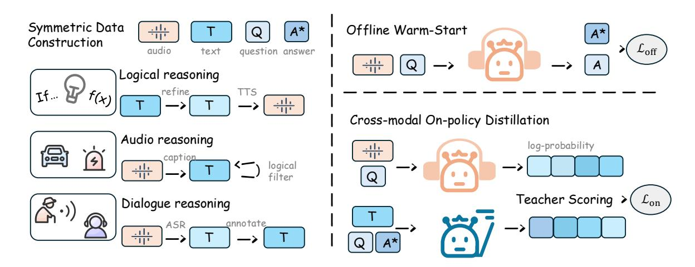

# X$^3$-OPD: Distilling Reasoning into Large Audio-Language Models via On-Policy Alignment

- 원제: X$^3$-OPD: Distilling Reasoning into Large Audio-Language Models via On-Policy Alignment
- 원문: [https://arxiv.org/abs/2607.21550](https://arxiv.org/abs/2607.21550)
- PDF: [https://arxiv.org/pdf/2607.21550v1](https://arxiv.org/pdf/2607.21550v1)
- arXiv ID: `2607.21550`

---

#### X 3 -OPD: 온-폴리시 정렬을 통한 대형 오디오-언어 모델에의 추론 증류

Dongjie Fu1,2, Di Cao1 , Xize Cheng2 , Zihan Zhang2 , Wenxu Jia2 , Yifu Chen2 , Shengpeng Ji1,2 , Yu Zhang2 , Tao Jin2*

1Tencent Hunyuan 2Zhejiang University

## 초록

오디오 대형 언어 모델은 청각 인지에서 눈에 띄는 진전을 이루었지만, 여전히 텍스트 기반 대형 언어 모델에 비해 깊은 논리적 추론 능력에서 뒤처지고 있다. 이러한 성능 격차는 주로 고품질 오디오 추론 데이터의 부족에서 비롯된다. 이 모달리티 격차를 해소하기 위해 우리는 새로운 교차 모달 온-폴리시 증류 프레임워크를 제안한다. 우리의 접근 방식은 강력한 텍스트 모델을 교사로 활용하여 온-폴리시 탐색 중에 오디오 기반 모델에 동적 교정과 지도를 제공한다. 또한, 우리는 논리적 추론, 복잡한 오디오 추론, 음성 대화를 포함하는 3계층 대칭 데이터셋을 구축한다. 고소음 청각 공간에서 학생 모델의 추론 궤적을 깨끗한 텍스트 공간에서 교사 모델의 사전 지식과 동적으로 정렬함으로써, 우리의 방법은 견고한 추론 능력을 오디오 도메인에 효과적으로 증류한다. 광범위한 실험 결과, 우리의 모델은 오디오 및 음성 이해 벤치마크에서 상당한 향상을 달성하여 포괄적 오디오-언어 이해를 위한 새로운 길을 열었다.

## 1 서론

최근 대형 오디오-언어 모델(LALMs)의 발전은 자동 음성 인식과 텍스트 전용 대형 언어 모델(LLMs)을 결합한 전통적인 파이프라인 패러다임에서 중요한 전환을 의미한다[(Zhang et al.,](#page-10-0) [2023;](#page-10-0) [Tang et al.,](#page-10-1) [2023;](#page-10-1) [Xu et al.,](#page-10-2) [2025b)](#page-10-2). 인지 수준에서 LALMs는 연속적인 음향 신호를 본래적으로 모델링함으로써 억양, 감정, 화자 전환, 음향 이벤트 등과 같은 부언성 및 환경적 단서를 보존하며, 이는 중간 전사 단계에서 불가역적으로 사라진다. 보다 근본적으로, 이 본연의 인터페이스는 추론 패러다임을 재구성한다: 정제된 텍스트 전사에 대해 추론을 수행하는 대신, 모델은

음향 신호에 직접적으로, 억양 강조, 주변 맥락, 그리고 시간적으로 구조화된 음향 이벤트를 활용하여, 이는 신뢰할 수 있는 텍스트 대체물이 없다[(Xu et al.,](#page-10-3) [2025c;](#page-10-3) [Tian et al.,](#page-10-4) [2025)](#page-10-4). 이렇게 함으로써 LALMs는 인지와 추론이 손실이 있는 전사 경계에 걸쳐 분리되지 않고, 엔드-투-엔드로 통합되는 포괄적 오디오-언어 이해를 향한 길을 열어준다.

이러한 인지적 이점에도 불구하고, LALMs와 텍스트 전용 LLMs 사이에는 여전히 상당한 추론 격차가 존재한다. 근본 원인은 데이터 비대칭성에 있다: 현대 LLMs는 수조 개의 논리적으로 밀집된 텍스트 토큰에 대해 최적화되어 있지만[(OpenAI et al.,](#page-9-0) [2024;](#page-9-0) [Guo et al.,](#page-8-0) [2025)](#page-8-0), 오디오 기반 모델은 주로 전사, 캡션, 또는 짧은 형태의 질문 응답과 같은 얕은 정렬 목표에 대해 훈련된다. 따라서 음향 입력에 대한 다단계 추론을 유도하려면 대규모 Audio Chain-of-Thought 감독이 필요하지만, 고도로 변동적인 연속 오디오에 대한 단계별 논리적 궤적을 수동으로 주석화하는 것은 계산적으로 불가능하고 비용이 과도하다. 자연스러운 대안은 강력한 텍스트 교사로부터 오디오 학생에게 추론 능력을 지식 증류를 통해 전송하는 것이며, 이는 LLMs가 이미 인코딩한 풍부한 텍스트 논리 감독을 활용한다.

이러한 방향의 초기 시도는 오프라인 디스틸레이션을 채택한다. 여기서 고정된 텍스트 교사는 학생이 모방하도록 훈련되는 정적 추론 경로를 생성한다[(Xie et al.,](#page-10-5) [2025)](#page-10-5). 감독은 이후 학생이 절대로 생성하지 않는 상태에 엄격히 연결되며, 학생의 음향 인식이 교사의 텍스트 전제와 일치하지 않을 때, 오프라인 목표는 분포 밖이 되어 학생이 가장 필요로 하는 시점에서 교정 신호를 제공하지 못한다. 이러한 교차 모달 노출 편향은 최근 오디오–텍스트 설정에서 온-폴리시 디스틸레이션 연구를 촉발했다[(Cao et al.,](#page-8-1) [2026;](#page-8-1) [Hu et al.,](#page-9-1) [2026)](#page-9-1), 이 연구는 학생이 자체 음향 조건 하에서 롤아웃하고, 생성된 경로를 교사의 ...와 정렬한다

*응답 저자.

토큰 수준 KL 스타일 감독을 통해 교사.

이러한 알고리즘적 진보에도 불구하고, 기존 온-폴리시 방법이 다루는 교차 모달 영역은 여전히 좁다. 교사 신호는 거의 전적으로 텍스트 전용 논리적 추론 코퍼스에서 유래하므로, 결과적으로 학생은 텍스트로 기록 가능한 내용에 대한 사상 연쇄 역량을 상속받지만, 오디오 이해의 구성 요소인 두 가지 추론 영역에 대해 과소 감독을 받는다: 증거가 전사본에서 복원 불가능한 비언어적 음향 사건에 기반한 추론, 그리고 프로소디, 주저, 말하기 대화에서의 감정 변화와 같은 부언어적 단서에 조건화된 추론. 따라서 오디오-텍스트 추론 격차를 해소하려면 통합적 접근이 필요하다: 디스틸레이션 알고리즘을 발전시키면서 음향 모달리티에 독특한 영역을 포함하도록 감독 분포를 근본적으로 확장한다.

본 연구는 단일 프레임워크인 X 3 -OPD 아래에서 두 가지 측면을 동시에 다루며, 오디오 추론의 세 가지 구별되는 층을 목표로 한다. 데이터 측면에서는 세 단계 대칭 코퍼스를 구축한다—음성으로 변환된 텍스트 추론, 캡션 기반 오디오 이벤트 추론, 그리고 프로소디 인식이 포함된 말하기 대화—따라서 모든 사례가 균일한 (xt , xa, q, a⋆ ) 스키마 하에서 텍스트 측면과 오디오 측면 입력을 모두 허용한다. 알고리즘 측면에서는 이 코퍼스를 기반으로 교차 모달 온-폴리시 디스틸레이션 절차를 구축한다: 음향 학생은 자신의 음향 인식 xa에 따라 추론 경로를 롤아웃하고, 텍스트 교사는 일치하는 xt 하에서 토큰 단위로 그 경로를 점수화한다. 핵심적으로 교사는 xt 와 함께 정답에 대한 특권적 접근을 허용받아, 증명 가능한 올바른 추론 경로를 따라 학생을 안내한다. 또한, 개방형 질문에 대해 이 토큰 수준 점수화는 교사가 정적 목표를 강제하기보다 동적으로 자신의 견고한 추론 트레이스를 전달할 수 있게 한다. 이 동적 재정렬은 학생의 인지 전제가 교사의 논리적 매니폴드에서 벗어날 때 정확히 그 단계에서 발생한다. 두 구성 요소는 상호 보완적이다: 온-폴리시 롤아웃은 감독이 학생이 실제로 방문하는 상태에 도달하도록 보장하고, 세 단계 대칭 코퍼스는 교사의 감독이 논리적, 음향적, 부언어적 추론 전반에 걸쳐 적용 가능하도록 한다.

## • 세 단계 대칭 추론 코퍼스 (A three-tier symmetric reasoning corpus)

텍스트 추론, 오디오 이벤트 추론, 그리고 부언어적 말하기 대화를 포함한 쌍으로 된 텍스트와 오디오 입력을 다루며, 이전 온-폴리시 방법의 텍스트-논리 영역을 넘어선 교차 모달 디스틸레이션 감독을 확장한다.

- 교차 모달 온-폴리시 증류 프레임워크는 매칭된 텍스트 입력 하에서 텍스트 교사(teacher)를 사용해 학생(student)의 음향-조건부 정책(acoustic-conditioned policy)으로부터 궤적(trajectory)을 점수화하며, 온-폴리시 상태에서 감독을 anchoring하고 견고한 텍스트-조건부 신호를 보존한다.  
- MMAU, MMSU, 그리고 BIG Bench Audio에 대한 종합적인 실증적 증거는 강력한 오프라인 및 온-폴리시 기준선에 비해 상당한 이득을 보여주며, 텍스트 도메인 기능 보존과 교차 모달 정렬의 기여를 분리한 견고성 분석을 함께 제공한다.

## 2 Related Work (관련 연구)

### 2.1 Reasoning in Large Audio Language Models (대형 오디오 언어 모델에서의 추론)

Cascaded 음성 시스템에서 LALMs(대형 오디오 언어 모델)로의 전환은 모달리티 인터페이스를 근본적으로 변형시켜 연속 표현 내에서 풍부한 음향 및 부언어적 뉘앙스를 보존한다 [(Ji et al.,](#page-9-2) [2024;](#page-9-2) [Luo et al.,](#page-9-3) [2026;](#page-9-3) [Fu et al.,](#page-8-2) [2025)](#page-8-2). 초기 시스템 [(Zhang et al.,](#page-10-0) [2023;](#page-10-0) [Huang et al.,](#page-9-4) [2024)](#page-9-4)는 이산 음성 토큰 또는 전문가 오디오 모듈을 LLM과 결합하고, 엔드‑투‑엔드 모델 [(Chu et al.,](#page-8-3) [2023,](#page-8-3) [2024;](#page-8-4) [Tang et al.,](#page-10-1) [2023;](#page-10-1) [Kong](#page-9-5) [et al.,](#page-9-5) [2024)](#page-9-5)는 경량 어댑터를 통해 연속 오디오 인코더를 사전 학습된 LLM과 정렬한다. 최근의 옴니‑모달 시스템 [(Xu et al.,](#page-10-2) [2025b](#page-10-2)[,c;](#page-10-3) [OpenAI,](#page-9-6) [2024;](#page-9-6) [Comanici et al.,](#page-8-5) [2025)](#page-8-5)은 음성, 오디오, 비전 및 텍스트를 단일 백본(backbone)으로 통합한다.

대형 언어 모델의 놀라운 추론 능력 [(Yang et al.,](#page-10-6) [2025;](#page-10-6) [OpenAI et al.,](#page-9-0) [2024)](#page-9-0)은 LALMs에서 패러다임 전환을 촉진했으며, 연구 초점을 기본적인 오디오 인식에서 복잡한 추론으로 확장했다. CoT prompting, which has demonstrated profound efficacy in textual reasoning, is increasingly recognized as equally pivotal for audio-centric tasks [(Guo et al.,](#page-8-6) [2026)](#page-8-6). 순수히 텍스트 기반의 추론과 달리, 오디오 추론은 연속적인 음향 단서(예: 음성 감정, 억양, 오디오 이벤트)에서 답을 추론해야 한다. 이를 해결하기 위해 일부 기존 방법론은 오디오 전용

Supervised Fine-Tuning (SFT)용 CoT 데이터셋 [(Xie et al.,](#page-10-5) [2025;](#page-10-5) [Li et al.,](#page-9-7) [2026)](#page-9-7). 또한, 강화 학습(RL) 기법이 최근 도입되어 모델을 장려하고 있다 [(Tian et al.,](#page-10-4) [2025;](#page-10-4) [Zhong et al.,](#page-10-7) [2025)](#page-10-7), 이는 진정한 오디오 기반 추론을 육성하고 모델이 텍스트 사전 지식에 과도하게 의존하는 것을 완화하려는 목표를 가진다.

그러나 SFT에 대한 과도한 의존은 오디오 CoT 주석의 막대한 비용과 복잡성으로 인해 병목 현상을 겪고 있으며, 편향된 데이터 분포는 일반화 성능을 더욱 저하시킨다. 한편, RL 접근법은 여전히 희소 보상으로 인해 어려움을 겪고 있다 [(Fan et al.,](#page-8-7) [2025)](#page-8-7). 따라서 LALMs에서 추론을 위한 새로운 학습 패러다임을 탐구하는 것은 여전히 시급한 필요이다.

### 2.2 지식 증류 (Knowledge Distillation) for Large Language Models

지식 증류(KD) [(Hinton et al.,](#page-9-8) [2015)](#page-9-8)는 전통적으로 대형 교사 모델의 성능을 소형 학생 모델로 전이하는 데 사용되어 왔다. 초기 텍스트 도메인 확장에서는 학생이 정적이며 교사가 생성한 코퍼스나 추론 트레이스를 학습하는 오프라인 형태를 채택했다 [(Kim and Rush,](#page-9-9) [2016;](#page-9-9) [Sanh et al.,](#page-9-10) [2020)](#page-9-10). 이러한 감독은 학생이 절대로 생성하지 않는 시퀀스에만 엄격히 연결되어, 학생을 훈련–추론 분포 불일치, 흔히 노출 편향이라고 부르는 현상에 노출시켜 테스트 시점에 오류가 누적된다. 이로 인해 온폴리시 증류가 동기를 부여받는다. 온폴리시 증류에서는 학생이 자신의 연속을 샘플링하고 실제 방문한 상태에서 토큰 단위로 교사 피드백을 받는다. 일반화된 지식 증류(GKD) [(Tan et al.,](#page-10-8) [2023)](#page-10-8)와 MiniLLM [(Gu et al.,](#page-8-8) [2026)](#page-8-8)은 이 관점을 공식화하고 온폴리시 업데이트가 노출 편향을 크게 완화하며, 추론 정책이 정적 훈련 분포에서 벗어나면 엄격히 더 강력한 감독 신호를 제공함을 보여준다. 최근 연구는 증류의 토큰 수준 감독을 강화 학습의 온폴리시 특성과 통합하여, 보상만 있는 RL보다 상당한 효율성을 달성하면서도 트레젝터리 수준 목표를 유지한다 [(Lu and Lab,](#page-9-11) [2025;](#page-9-11) [Song and Zheng,](#page-10-9) [2026)](#page-10-9).

음성 및 오디오 커뮤니티는 반대로 주로 표현 압축 또는 자기 증류를 위해 증류를 사용해 왔으며, 생성적 추론에 대한 참여는 제한적이다 [(Chang et al.,](#page-8-9) [2022;](#page-8-9) [Baevski et al.,](#page-8-10) [2022)](#page-8-10). 최근 LALM은 증류를 음성-텍스트 생성에 확장했지만 여전히 정적, 오프라인 교사 트레이스를 사용한다 [(Milbich et al.,](#page-9-12) [2020;](#page-9-12) [Li](#page-9-7) [et al.,](#page-9-7) [2026)](#page-9-7).

트레이스와 따라서 텍스트 환경에서 문서화된 노출 편향을 상속받으며, 이는 LALM과 텍스트 전용 버전 간에 뚜렷한 추론 격차로 나타난다. 최근 연구는 단일 모달 텍스트 설정을 넘어 온폴리시 증류를 확장하기 시작했다. X-OPD [(Cao et al.,](#page-8-1) [2026)](#page-8-1)는 교차 모달 사례를 다루며, 학생의 온폴리시 롤아웃에 토큰 수준 KL을 적용해 두 모달리티를 정렬한다. CORD [(Hu et al.,](#page-9-1) [2026)](#page-9-1)는 토큰 수준에서 중요도 가중 역 KL을 적용해 중요한 초기 단계 편차를 우선시한다. 두 방법 모두 온폴리시 KL 기반 감독이 오디오-텍스트 추론 격차를 효과적으로 연결할 수 있음을 입증한다.

그러나 이러한 진전은 주로 텍스트 기반 논리적 추론 증류에 국한되어 있으며, 연속 음향 신호에 기반한 인식과 추론이라는 오디오 모델의 근본적 본질을 간과한다. 학생이 음향 신호를 흡수할 때 감독 경계는 진정한 교차 모달이 되며, 학생의 경로를 잔여 인지 불확실성 하에서 수정해야 한다. 기존 온폴리시 증류 방법은 이를 명시적으로 고려하지 못한다. 이 중요한 격차를 메우기 위해 X 3 -OPD가 제안되었으며, 온폴리시 증류 패러다임을 교차 모달 영역으로 체계적으로 확장하고, 학생의 추론 경로를 연속 음향 공간 내에서 직접 정렬한다.

## 3 전제 지식 (Preliminaries)

### 3.1 문제 설정 (Problem Setting)

본 연구는 텍스트–오디오 모달리티 경계에서의 추론 증류를 목표로 한다. πT(· | xt, q, a⋆; θT) 를 θT 파라미터를 갖는 고정된 텍스트 교사로 정의하고, 이는 텍스트 입력 xt, 질문 q 및 정답 a⋆를 받아들인다. πS(· | xa, q; θS)를 θS 파라미터를 갖는 학습 가능한 오디오 학생으로 정의하며, 이는 음성 입력 xa와 동일한 질문을 받아들인다. 본 연구 전반에 걸쳐, 대칭 샘플은 (xt, xa, q, a⋆) 튜플이며, 여기서 xt와 xa는 각각의 모달리티에서 동일한 기본 내용을 인코딩하고, a⋆는 정답이다. 추론 경로 y = (y1, …, yL)은 중간 사상-사고 체인과 최종 답변을 연결한 것으로, πT 또는 πS 에서 자기회귀적으로 샘플링된다.

### 3.2 오프라인 증류 및 그 한계

표준 오프라인 증류 목표는 한 번 샘플링되어 고정된 교사 경로를 모방하도록 학생을 훈련한다:

Figure 1: X³-OPD 개요. **Left:** 세 단계의 대칭 코퍼스—Logical (텍스트 + TTS 음성), Audio (음성 + 정제된 캡션), 그리고 Dialogue (대화 + 프로소디 인식 메타 캡션)—각 인스턴스에 대해 $(x_t, x_a, q, a^*)$ 를 제공한다. **Right:** 오프라인 워밍‑스타트 ( $\mathcal{L}_{\text{off}}$, Eq. 1) 이후 크로스‑모달 온‑폴리시 증류가 진행되며, 학생은 $(x_a, q)$ 아래에서 롤아웃하고, 고정된 교사는 동일한 경로를 $(x_t, q, a^*)$ 아래에서 점수화하여 $\mathcal{L}_{\text{on}}$ (Eq. 3)를 계산한다.

$$\mathcal{L}_{\text{off}}(\theta_S) = \mathbb{E}_{(x_t, x_a, q) \sim \mathcal{D}}$$

$$\mathbb{E}_{y \sim \pi_T(\cdot \mid x_t, q)} [-\log \pi_S(y \mid x_a, q; \theta_S)]. \tag{1}$$

단일 모달 텍스트 설정에서는 $x_t = x_a$이고 $\pi_T$, $\pi_S$가 입력 공간을 공유할 때, 식 (1)은 교사(teacher)와 학생(student) 사이의 모집단 KL에 대한 신뢰할 수 있는 대리값이다. 입력 모달리티가 분리되면, 이 오프라인 목표와 관련해 두 가지 문제가 발생한다. 표준 단일 모달 증류나 텍스트 분야의 사전 온정책 연구(Lu and Lab, 2025)에서는 이 문제들을 해결할 수 없다.

**Perception–text divergence** 학생(student)의 입력 $x_a$는 의미 내용이 잠재적 지각 s에 대한 사후분포 $p(s \mid x_a)$까지만 복원되는 음향 신호이다. 교사(teacher)는 $x_t$를 기반으로 추론하며, 이는 설계상 이 사후분포에서 하나의 점에 해당한다. 따라서 그 궤적은 학생이 훈련 시 토큰-토큰으로 거의 일치하지 않으며, 테스트 시 잡음이나 억양 변동에 의해 거의 일치하지 않는다는 지각 전제를 암묵적으로 가정한다.

다중 모달리티에서의 노출 편향  
Because the teacher trajectories in Eq. (1) are independent of  $\theta_S$ , the student is supervised only at states it would not have visited on its own. As soon as the student commits to a different intermediate token, which frequently occurs when its acoustic perception diverges from  $x_t$ , the offline target is out of distribution with respect to the student's induced state distribution, a cross-modal instance of the exposure bias studied in sequence modeling (Bengio et al.,

2015). The supervisory signal is then strongest exactly where it is least informative.

이 두 가지 실패 모드의 직접적인 결과는 $\mathcal{L}_{\text{off}}$가 자신의 인식이 잘못될 수 있다는 점을 감안할 때 학생에게 어떻게 추론하도록 가르칠 수 없다는 점이다. Section 4는 $\pi_S$ 자체에서 궤적을 샘플링하고 매칭된 텍스트 입력에 대해 $\pi_T$로 점수를 매김으로써 두 문제를 모두 해결한다.

#### 4 방법 (Method)

제안된 프레임워크는 세 가지 구성 요소를 갖는다: (i) 텍스트 추론, 오디오‑이벤트 추론, 그리고 구어 대화를 통합하는 균일한 $(x_t, x_a, q, a^*)$ 스키마를 구축하는 3계층 모달리티‑페어드 코퍼스; (ii) 일치된 텍스트 입력에 따라 학생 롤아웃을 평가하는 크로스‑모달 온‑폴리시 디스틸레이션 목표; 그리고 (iii) 짧은 오프라인 워밍 스타트와 온‑폴리시 최적화를 결합한 훈련 레시피. 개요는 Figure 1에 제시된다.

#### 삼단계 대칭 데이터 구축 (Three-Tier Symmetric Data Construction)

다중 모달 환경에서 모델의 추론 능력을 종합적으로 향상시키기 위해, 우리는 세 가지 난이도와 모달 강조를 포함하는 데이터셋을 구축한다. 구체적으로, 이 데이터셋은 세 단계의 추론 과제 계층을 정의한다: 텍스트 의미 전사에 기반한 순수 논리 추론, 복잡한 음향 장면에 기반한 오디오 이벤트 추론, 그리고 파라언어 및 사회적 신호에 의존하는 음성 대화 상호작용 추론. 이 삼단계 데이터 구축을 통해 우리는 모델이 기초적인 의미 및 논리 이해에서부터 실제 물리적 음향 장면의 심층 분석으로 점진적으로 전환하도록 유도하고자 한다.

논리적 이해에서 실제 물리적 음향 장면의 심층 분석으로 전환한다.

#### 텍스트 기반 추론을 음성으로 변환 (Tier 1: Textual reasoning rendered into speech.)

대규모 텍스트 전용 추론 코퍼스 [(Lambert](#page-9-13) [et al.,](#page-9-13) [2025;](#page-9-13) [Shao et al.,](#page-10-10) [2023)](#page-10-10)는 텍스트 측면 xt, 질문 q, 그리고 골드 답변 a⋆를 제공한다. 데이터의 자연스러움을 확보하기 위해 음성 측면 xa의 생성은 엄격한 파이프라인을 거친다: 먼저, 원본 텍스트 코퍼스가 말하기 표현에 더 적합한 형식으로 재작성된다. 이후, 고품질 텍스트-투-스피치(TTS) 시스템을 사용해 렌더링되고, 자동 음성 인식(ASR) 시스템을 통한 폐쇄 루프 검증을 거쳐 생성 품질이 낮은 오디오 데이터를 걸러낸다. 이 단계는 밀집된 논리적 감독을 제공하며 모델의 추론 신호를 위한 주요 기초 자료 역할을 한다.

# 오디오 기반 추론을 캡션에 기반한 (Tier 2: Audio reasoning grounded in captions.)

Tier 2 샘플은 실제 오디오 클립과 구조화된 캡션이 짝을 이루며, 주요 음향 이벤트, 음원, 그리고 시간 구조를 설명한다. 이 캡션은 처음에 기존 오픈소스 데이터셋 [(Drossos et al.,](#page-8-12) [2019;](#page-8-12) [Kim et al.,](#page-9-14) [2019)](#page-9-14)에서 파생되며, 이후 고급 캡션 모델 [(Xu et al.,](#page-10-3) [2025c)](#page-10-3)을 사용해 재구성되고, 엄격한 인간 검증을 거쳐 음향 특징 설명의 정밀도와 차원적 풍부함을 확보한다. 이 기반 위에서 우리는 음향 설명, 질문, 답변 간의 논리적 일관성에 따라 데이터를 엄격히 필터링하며, 비합리적인 추론 체인이나 사실 오류가 있는 샘플을 제거한다. 교사 모델은 이러한 고품질 캡션을 xt로 사용해 각 추론 단계에서 음향 증거를 명시적으로 인용하는 chain-of-thought를 생성하도록 질의한다; 반대로 학생 모델은 동일한 질문 q와 함께 원시 오디오를 xa로 직접 받는다.

Tier 3: 음성 대화와 prosody-aware 캡션. Tier 3는 말투 경계, 망설임, 강조, 음조 변화, 미묘한 감정 변동 등과 같은 부언어적 단서에 의존하는 추론을 다룬다—일반적인 순수 텍스트 전사에서는 전달되지 않는 복잡한 의미 차원이다. 각 사례는 실제 상황에서 나온 다중 턴 음성 대화를 메타 캡션과 짝지어, 전사를 정밀한 prosody 및 턴 수준 주석으로 심층적으로 보강한다. 교사 모델은 메타 캡션을 xt로 처리하여 대화 뒤에 숨겨진 서브텍스트를 포착할 수 있게 하며, 학생 모델은 동일한 질문 q와 함께 원시 오디오를 xa로 직접 받아 학습한다.

원시 음성 파형을 xa로 사용한다. 이 계층의 설계는 모델이 말한 내용을 이해할 뿐만 아니라 그 말이 어떻게 전달되는지도 이해하도록 요구하며, 이는 모델의 공감 능력과 복잡한 인간-컴퓨터 상호작용 시나리오에서 대화 의도를 인식하는 예리함을 크게 향상시킨다.

실제 훈련 과정에서는 이 세 가지 별개의 계층에서 나온 데이터를 완전히 섞어 혼합한다. 이러한 공동 최적화 전략은 학생 모델이 단일 훈련 목표 하에서 텍스트 논리 추론, 오디오 특징 파싱, 그리고 구어 대화 상호작용 기능을 원활하게 통합하도록 하여, 서로 다른 모달 특징 간의 지식 전이를 효과적으로 촉진한다.

### 4.2 오프라인 워밍스타트 (Offline Warm-start)

온-폴리시 최적화는 학생의 초기 롤아웃이 교사의 분포와 멀리 떨어져 있을 때 불안정하다. 초기 단계의 안정화를 위해 π^S는 먼저 교사 생성 트래젝터리를 사용해 Eq. [(1)](#page-3-0)에서 짧은 SFT 패스를 통해 미세 조정된다. 워밍 스타트는 의도적으로 짧게 설정되어 학생을 교사의 추론 스타일 안에 배치하지만, 섹션 3에서 분석한 오프라인 실패 모드가 뿌리내리기에는 충분히 길지 않다.

#### 4.3 교차 모달 온폴리시 디스틸레이션 (Cross-modal On-policy Distillation)

온-폴리시 멀티-패스 롤아웃. 각 대칭 샘플마다, 학생 모델은 먼저 현재 정책 πS(θS) 하에서 자기 자신의 음향 인식 xa와 질문 q에 조건부로 자기 회귀적 생성을 수행한다. 단일trajectory 롤아웃에서 발생하는 높은 분산을 완화하고 정책 공간을 보다 광범위하게 탐색하기 위해, 우리는 각 입력마다 독립적으로 K개의 후보 트레젝토리 Y = {y (1), y(2), . . . , y(K)}를 샘플링한다. 이러한 트레젝토리들이 학생 모델에서 직접 추출되기 때문에, 현재 음향 전제 하에서 방문된 실제 상태 공간을 정확히 반영하며, 이후 감독 신호가 온-폴리시 조건을 엄격히 준수하도록 보장한다.

크로스-모달 교사 스코어링. 학생 모델 πS가 교사 모델 πT의 논리적 추론 능력을 충실히 계승하도록 보장하기 위해, 우리는 크로스-모달 이점 함수를 도입한다. k번째 샘플링된 궤적 y (k) 에 대해, y (k) t 를 t번째 토큰이라고 하자. 고성능 교사 모델은 일치된 텍스트 입력 xt와 함께

정답 $a^\star$ 은 토큰 수준 로그 확률이 올바른 결론에 고정된 높은 신뢰도 참조 분포를 형성하도록 한다. 교차 모달 이점 $A(y_t^{(k)})$ 은 교사 모델의 텍스트 기반 논리 분포와 학생 모델의 음성 조건화 출력 사이의 로그 확률 격차를 연결하도록 정의된다:

$$A(y_t^{(k)}) = \log \pi_T(y_t^{(k)} \mid x_t, q, a^*, y_{< t}^{(k)}) - \log \pi_S(y_t^{(k)} \mid x_a, q, y_{< t}^{(k)})$$

(2)

이 이점을 계산함으로써, 텍스트 기반 교사 모델은 학생의 음향 표현이 올바른 논리 매니폴드를 벗어나게 하는 정확한 상태에서 실시간 교차 모달 가이드 신호를 제공한다.

크로스-모달 디스틸레이션 목표 (Cross-Modal Distillation Objective). 다중 경로 롤아웃과 크로스-모달 이점을 통합하여, 우리는 정책 그라디언트 기반 디스틸레이션 손실을 공식화한다. K개의 샘플링된 궤적을 활용하여, 최적화 목표는 기대 크로스-모달 이점을 최대화하도록 공식화되며, 이는 크로스-모달 추론 전이를 달성한다:

span id="page-5-0"

$$\mathcal{L}_{\text{on}}(\theta_S) = -\mathbb{E}_{(x_t, x_a, q)} \left[ \frac{1}{K} \sum_{k=1}^K \frac{1}{|y^{(k)}|} \right]$$

$$\sum_{t=1}^{|y^{(k)}|} r_{k,t}(\theta_S) A(y_t^{(k)})$$

(3)

where  $r_{k,t}(\theta_S) = \frac{\pi_S(y_t^{(k)}|x_a,q,y_{< t}^{(k)};\theta_S)}{\pi_{old}(y_t^{(k)}|x_a,q,y_{< t}^{(k)})}$  은 현재 정책 $\pi_S$와 샘플링 정책 $\pi_{old}$ 사이의 확률 비율을 나타낸다. 이 수식은 단일하고 매우 효율적인 목표를 제공한다: 완전히 온정책(on-policy)이며, 정답이 없는 개방형 지시형 데이터에 적합하여 학생 모델이 교차 모달 정렬만으로 교사의 개방형 추론 능력을 내재화하도록 한다.

## 5 실험 (Experiments)

### 5.1 실험 설정 (Experimental Setup)

**Backbones.** 학생은 Qwen3-Omni-30B-A3B-Thinking (Xu et al., 2025c)에서 초기화되며, 이 모델의 음성 인코더와 LLM 백본은 함께 학습 가능하도록 유지하고, 음성 토크나이저는 고정된다. 교사는 Qwen3-235B-A22B-Thinking (Yang et al., 2025)을 사용하며, 전체 과정에서 고정된다. 교사는 $x_t$를 읽고, 학생은 Section 4.1의 모달리티-페어링 스키마에 따라 $x_a$를 읽는다.

**학습 데이터.** 세 단계로 구성된 코퍼스는 27.8K Tier-1, 32K Tier-2, 12K Tier-3 인스턴스를 포함하며, 배치 수준에서 완전히 섞여 있다. Tier-1은 Tulu 3 (Lambert et al., 2025)와 NaturalReasoning (Yuan et al., 2025)에서 텍스트 프롬프트를 가져와 Gemini-3-Flash-Preview로 구어체 스타일로 재작성하고, CosyVoice 3 (Du et al., 2025)를 사용해 24 kHz에서 오디오를 합성하며, SenseVoice (SpeechTeam, 2024) ASR 백번역으로 필터링한다. Tier-2는 AudioCaps (Kim et al., 2019)와 Clotho v2.1 (Drossos et al., 2019)에서 오디오와 캡션을 가져오며, 캡션은 Qwen3-Omni-30B-A3B-Captioner로 재구성되고 5 % 하위집합에서 인간이 검증한 뒤 캡션‑질문‑답변 일관성 필터링을 거친다. 캡션은 WER $\leq 5\%$를 만족한다. Tier-3은 IEMOCAP (Busso et al., 2008)와 MELD (Poria et al., 2019)에서 가져온 이중 및 다중 참여자 구어 대화를 기반으로 하며, prosody‑ 및 turn‑level 메타 캡션으로 보강된다. 오프라인 워밍 스타트 SFT 패스는 5:3:2의 티어 비율로 샘플링된 12 K 하위집합을 사용하며, Tier-1과 Tier-3을 의도적으로 과다 가중하여 모델의 논리적 추론 형식과 부언성 단서에 대한 민감도를 RL 단계 이전에 고정한다.

**Training configuration.** 오프라인 워밍 스타트: 1 epoch, 배치 크기 128, 학습률 $1\times10^{-5}$, 코사인 스케줄. 크로스-모달 온정책 단계: 샘플당 K=4 롤아웃, AdamW와 상수 학습률 $2\times10^{-6}$. 롤아웃은 vLLM (Kwon et al., 2023)을 온도 1.0으로 사용한다. 모든 실행은 verl (Sheng et al., 2025) 프레임워크에서 $32\times$ NVIDIA H20에서 수행된다.

공정한 비교를 위해, 우리는 동일한 Qwen3-Omni-30B-A3B-Thinking 학생 체크포인트에서 초기화된 두 개의 베이스라인을 추가로 훈련한다: (1) 표준 SFT, 각 프롬프트가 텍스트 전용 교사 Qwen3-235B-A22B-Thinking이 오프라인에서 생성한 추론 트레이스와 정답을 함께 갖는 감독형 코퍼스에서 미세 조정된다. 이를 통해 학생은 교사의 사상 연쇄(chain-of-thought)를 모방하고 올바른 최종 응답을 생성하도록 학습한다; (2) 일반화된 지식 증류(GKD) (Tan et al., 2023), 이는 온정책 학생 롤아웃에서 전방 KL 발산(forward KL divergence)을 사용해 동일한 교사에 대해 학생 정책을 최적화한다.

**Evaluation benchmarks.** 우리는 도메인 전이(domain shift)의 세 수준에서 프레임워크를 평가한다. 인도메인 평가는 오디오 기반 추론을 직접 탐지하는 벤치마크를 다룬다: MMSU (Wang et al., 2026)와 그 네 축(Semantics, Phonology, Style, Traits), MMAU (Sakshi et al., 2024).

|  | MMSU |  |  |  | MMAU |  |  | BIG Bench |
|----------------------------------------|------|-------|-------|--------|-------|--------|-------|-----------|
| 모델 | 의미론 | 음성학 | 스타일 | 특성 | 음향 | 음성 | 음악 | 오디오 |
| 폐쇄형 LALMs |  |  |  |  |  |  |  |  |
| GPT-4o-Audio(OpenAI, 2024) | 59.7 | 41.6 | 21.4 | 39.7 | 64.6 | 66.7 | 56.3 | 88.5 |
| Gemini-3-Flash(Comanici et al., 2025) | 70.2 | 53.6 | 38.5 | 46.1 | 75.4 | 80.6 | 71.0 | 80.8 |
| 오픈-웨이트 LALMs |  |  |  |  |  |  |  |  |
| Qwen2-Audio-Instruct(Xu et al., 2025b) | 38.5 | 29.4 | 21.7 | 26.1 | 55.0 | 42.0 | 51.0 | 32.5 |
| GLM-4-Voice(Zeng et al., 2024) | 41.2 | 31.8 | 24.5 | 28.4 | 52.4 | 50.6 | 49.1 | 35.2 |
| Qwen2.5-Omni-7B(Xu et al., 2025a) | 55.1 | 37.3 | 39.4 | 42.5 | 67.9 | 59.8 | 69.2 | 62.2 |
| Qwen3-Omni-Instruct(Xu et al., 2025c) | 81.6 | 70.0 | 54.0 | 35.3 | 80.5 | 78.1 | 74.3 | 85.7 |
| Qwen3-Omni-Thinking(Xu et al., 2025c) | 81.8 | 73.2 | 65.2 | 42.7 | 85.7 | 81.5 | 74.9 | 87.9 |
| Ablation Baselines |  |  |  |  |  |  |  |  |
| SFT (Loff ) | 82.1 | 69.7 | 62.4 | 42.8 | 86.4 | 81.9 | 70.7 | 86.7 |
| GKD | 80.2 | 68.4 | 63.1 | 41.1 | 85.1 | 82.3 | 69.2 | 84.3 |
| 3 -OPD (우리의) X | 83.7 | 72.1 | 64.2 | 42.9 | 88.3 | 82.9 | 72.4 | 93.6 |

Table 1: MMSU, MMAU 및 BIG Bench Audio에 대한 주요 평가 결과. MMSU 평가 차원은 Semantics (Sem.), Phonology (Phon.), Style, Traits를 포함한다. 각 열에서 가장 우수한 성능은 굵은 글씨로 표시된다.

Sound/Speech/Music 및 BIG Bench Audio에서 음향 QA, 다중 이벤트 추론, 오디오-시간적 기반화, 그리고 언어 외 추론을 통합한다. 이후 우리는 보류된 MMAR 벤치마크에서 중간 추론 품질을 스트레스 테스트한다. 이때 두 개의 CoT 품질 지표인 *Rubrics*와 *CRS*를 평가한다. 마지막으로, 오디오-비주얼 WorldSense [(Xu](#page-10-3) [et al.,](#page-10-3) [2025c)](#page-10-3)와 비디오 추론 DailyOmni를 포함한 도메인 이동이 큰 벤치마크에서 분포 외 일반화를 평가한다.

### 5.2 주요 결과 (Main Results)

Table [1](#page-6-0)은 X 3 -OPD와 최첨단 폐쇄형 및 오픈소스 시스템, 그리고 통제된 사내 기준 모델을 대비한다. 아래에서 우리의 핵심 관찰을 요약한다.

크로스-모달 추론에서의 상당한 향상. Qwen3-Omni-Thinking 기반으로 X 3 -OPD는 복잡한 오디오 기반 추론에서 상당한 개선을 보여준다. 기본 모델과 비교했을 때, X 3 -OPD는 BIG Bench Audio (BAB) 점수를 87.9에서 93.6으로 끌어올려 (+5.7 향상) 뿐만 아니라, 의미 및 음향 이벤트 이해에서도 견고한 성과를 달성한다 (예: MMSU-Semantics에서 +1.9, MMAU-Sound에서 +2.6). 또한, X 3 -OPD는 독점 시스템과의 경쟁에서도 높은 성능을 보이며, BAB에서 GPT-4o-Audio를 +5.1 포인트 앞선다.

On-Policy Distillation을 통한 지각 회귀 완화. 오프-폴리시 방법과의 비교에서 정적 정렬에서 구조적 노출 편향이 드러난다. 오프-폴리시 SFT는 약간 개선하지만

고신호 의미 작업에서 Qwen3-Omni-Thinking 기준선보다 향상되지만, 저신호 지각 축(Phonology −3.5, Style −2.8, Music −4.2)에서는 적극적으로 회귀한다. X 3 -OPD는 이 저하를 효과적으로 완화한다. 학생이 자신의 궤적에 대해 교사 피드백을 받을 수 있게 함으로써, 온-폴리시 distillation은 지각 작업에서의 성능 하락을 크게 줄이며, BAB와 같은 추론 중심 축에서 눈에 띄는 이득을 달성한다.

지각 축에서의 잔여 격차. 전반적인 개선에도 불구하고, X 3 -OPD는 순수 지각 축인 MMSU-Phonology, MMSU-Style, MMAU-Music에서 기본 모델보다 약간 뒤처진다. 이는 교차 모달 distillation의 본질적 특성 때문이라고 생각한다: 텍스트 측 교사가 제공하는 보상 신호는 주로 의미 및 논리 경로를 따라 전달되어, 음악 및 순수 파라언어적 스타일과 같은 비의미적 음향 표현에 대해 최적화 과정에서 충분한 기울기 업데이트가 이루어지지 않는다. 놀랍게도, 모델이 논리적 추론을 유도하도록 특별히 설계된 합성 데이터 스트림에서 훈련되었음에도 불구하고—불가피한 분포 변화를 초래하지만—이 순수 지각 벤치마크에서의 성능 저하는 매우 미미하다 (하락 ≤ 2.6).

## 5.3 CoT 품질 평가

다중 단계 오디오 작업에서 모델의 중간 추론 품질을 엄밀히 평가하기 위해, 우리는 MMAR 벤치마크 [(Ma](#page-9-18) [et al.,](#page-9-18) [2025)](#page-9-18)에서 X 3 -OPD를 평가한다. 우리의 평가는 명확한 Sound 및 Speech 분할에 특히 초점을 맞춘다,

|  | MMAR | 정확도 (%) | <b>CoT 품질</b> |  |  |
|----------------------------|-------|----------|--------------------|------|--|
| 모델 | 소리 | 음성 | 루브릭 | CRS |  |
| Step-Audio-R1 | 32.5 | 68.7 | 46.6 | 0.79 |  |
| Audio-Reasoner | 42.4 | 42.5 | 28.4 | 0.68 |  |
| Qwen3-Omni-Thinking | 64.2 | 79.3 | 58.0 | 0.85 |  |
| X 3 -OPD (우리의) | 65.8 | 80.6 | 60.4 | 0.86 |  |

Table 2: MMAR 결과 및 CoT 품질 점수. **Bold**는 각 열에서 가장 좋은 결과를 표시합니다.

CoT 자체의 품질을 평가하는 데 주된 초점을 둡니다. 표준 정확도 외에도 Rubrics와 CRS (Correct Reasoning Score) 지표(Ma et al., 2026)를 채택하여 생성된 추론 단계가 음향 전제에 잘 기반을 두고 있는지를 정량화합니다. Table 2에 표시된 바와 같이 X3-OPD는 Qwen3-Omni-Thinking 기준선(Sound +1.6, Speech +1.3) 대비 정확도를 꾸준히 향상시키면서 동시에 CoT 품질 점수(Rubrics +2.4, CRS +0.01)를 상승시킵니다. 정확한 예측과 추론 구조의 동시적 향상은 온-폴리시 증류가 중간 단계를 음향 입력에 실제로 고정시키는 것을 확인시켜 주며, 단지 통계적 지름길을 이용해 최종 답변에 도달하는 것이 아님을 입증합니다. 또한 Step-Audio-R1과 같은 현대 기준선과 비교했을 때, Step-Audio-R1은 음성에 편향된 보상 신호 때문에 비음성 Sound 분할(32.5%)에서 심각한 성능 붕괴를 겪지만, $X^3$ -OPD는 견고하고 균형 잡힌 음성 추론 능력을 유지하며, MMAR-특정 도메인 감독 없이 추론 방식을 효과적으로 향상시킨다는 것을 보여줍니다.

(blank line)
### 5.4 도메인 전이 하에서의 역량 보존 (Capability Preservation under Domain Shift)
(blank line)

모달리티별 데이터에 대한 미세 조정 시 관찰되지 않은 도메인의 파괴적 망각이 주요 우려입니다. Table 3은 우리 말뭉치에 포함되지 않은 두 개의 분포 외 벤치마크, 즉 오디오-비주얼 추론( WorldSense)과 비디오 추론( DailyOmni)에서 모델을 스트레스 테스트합니다. 우리는 원시 점수와 기준 모델에 대한 절대 성능 하락 $(\Delta)$를 모두 보고합니다.

결과는 오프-폴리시 모방 방법이 심각한 교차 모달 저하를 겪는다는 것을 보여줍니다. SFT와 GKD는 시각 및 비디오 과제에서 5.3~6.6 포인트를 잃으며 상당한 성능 저하를 보입니다. 이는 텍스트 교사에 대한 정적 토큰 수준 모방이 공유 LLM 백본 내에서 전역 정책 드리프트를 유발한다는 것을 시사합니다. 반면 $X^3$ -OPD는 기준 모델의 초기화를 보존합니다.

|  | 세계 | 감각 | DailyOmni |  |  |
|-----------------------------------------------------|-------|-------|-----------|------|--|
| 모델 | 점수 | Δ | 점수 | Δ |  |
| Qwen3-Omni-Thinking | 54.0 | _ | 75.8 | _ |  |
| $\overline{\rm SFT}\left({\cal L}_{\rm off}\right)$ | 48.7 | -5.3 | 69.2 | -6.6 |  |
| GKD | 47.9 | -6.1 | 69.5 | -6.3 |  |
| X 3 -OPD (우리의) | 52.8 | -1.2 | 73.5 | -2.3 |  |

Table 3: 도메인 전이 하에서의 역량 보존. WorldSense (audio-visual)와 DailyOmni (video)는 우리의 미세조정 코퍼스에 완전히 부재한 모달리티를 나타낸다.

거의 완벽하게, 경미한 변동(-1.2 및 -2.3)으로. 교차 모달 이점(Eq. 3)을 사용해 학생의 온-폴리 롤아웃을 동적으로 점수화함으로써, $X^3$-OPD는 본질적으로 고성능의 동결된 텍스트 교사에 대한 역KL 발산을 최소화한다. 이 교사는 관측되지 않은 도메인 전반에 걸쳐 강력한 범용 추론 능력을 유지하므로, 그 밀집 토큰 수준 피드백은 지속적인 역량 앵커 역할을 하여 학생이 퇴화된 모달리티 특화 지름길로 기울어지는 것을 효과적으로 제한한다. 이는 기존의 시각 또는 비디오 능력에 다중모달 세금을 지불하지 않고도 고급 오디오 추론을 배양할 수 있음을 확인한다.

## 6 결론 (Conclusion)

본 연구에서는 $X^3$-OPD를 도입하였다. 이는 텍스트 기반 대형 언어 모델과 대형 오디오-언어 모델 (LALMs) 사이의 추론 격차를 해소하도록 설계된 새로운 교차 모달 온-폴리 디스틸레이션 프레임워크이다. 표준 오프라인 디스틸레이션에 내재된 노출 편향과 지각-텍스트 발산을 해결하기 위해, 본 접근법은 학생의 음향 조건화된 추론 경로를 교사의 텍스트 기반 사전 지식과 동적으로 정렬한다. 텍스트 추론, 오디오 이벤트 이해, 언어 외적 구어 대화를 아우르는 새로 구축된 3단계 대칭 코퍼스에 의해 지원되는 X3-OPD는 다중 음향 추론 영역에 걸쳐 포괄적인 감독을 제공한다. 광범위한 실험은 본 프레임워크가 주요 오디오 추론 벤치마크에서 상당한 성과를 달성하면서 치명적 망각을 완화하고, 궁극적으로 연속 음향 신호에서 직접 수행되는 교차 모달 추론을 위한 견고한 패러다임을 구축함을 입증한다.

# 한계 (Limitations)

X 3 -OPD는 오디오 기반 추론을 크게 진전시켰지만, 향후 연구에서 해결해야 할 몇 가지 한계가 남아 있다. 첫째, 현재의 3단계 대칭 코퍼스는 아직 음향 현상의 전체 스펙트럼을 포괄하지 못한다. 특히, 복잡한 음악적 추론과 고도로 전문화된 비언어적 소리 풍경이 훈련 데이터에서 과소 대표되어, 순수 지각 축인 MMAU-Music과 같은 지표에서 남아 있는 성능 격차가 반영된다. 데이터셋 구축 파이프라인을 확장하여 보다 다양한 음향 도메인을 포괄하는 것이 중요한 다음 단계이다.

둘째, 현재 프레임워크는 텍스트 기반 교사의 토큰 수준 로그확률만을 감독 신호로만 의존한다. 텍스트 교사는 캡션이나 전사로 완벽히 포착될 수 없는 비의미적 음향 신호를 본질적으로 인지하지 못하므로, 이 보상 신호는 다소 제한적이다. 이는 학습 과정을 의미 논리로 편향시키는 동시에 순수 음향 또는 언어 외적 맥락에서의 지각 오류를 과소 처벌한다. 이 한계를 극복하기 위해, 향후 연구에서는 다차원 보상 메커니즘을 도입해야 한다. 직접 음향 기반 보상 모델(RM), 환경 검증자, 또는 규칙 기반 다목적 신호를 통합하는 것이 LALMs에서 진정으로 포괄적이고 자율적인 추론 능력을 배양하는 데 필수적이다.

## References (참고문헌)

- Alexei Baevski, Wei-Ning Hsu, Qiantong Xu, Arun Babu, Jiatao Gu, 그리고 Michael Auli. 2022. [data2vec:](https://arxiv.org/abs/2202.03555) [음성, 시각 및 언어에서의 자기 지도 학습을 위한 일반 프레임워크](https://arxiv.org/abs/2202.03555) [을 학습하는.](https://arxiv.org/abs/2202.03555) *Preprint*, arXiv:2202.03555.

- Samy Bengio, Oriol Vinyals, Navdeep Jaitly, 그리고 Noam Shazeer. 2015. [시퀀스 예측을 위한 스케줄드 샘플링](https://arxiv.org/abs/1506.03099) [반복 신경망으로.](https://arxiv.org/abs/1506.03099) *Preprint*, arXiv:1506.03099.

- Carlos Busso, Murtaza Bulut, Chi-Chun Lee, Abe Kazemzadeh, Emily Mower, Samuel Kim, Jeannette N Chang, Sungbok Lee, 그리고 Shrikanth S Narayanan. 2008. Iemocap: 대화형 감정 이중 모션 캡처 데이터베이스. *Language resources and evaluation*, 42:335–359.

- Di Cao, Dongjie Fu, Hai Yu, Siqi Zheng, Xu Tan, 그리고 Tao Jin. 2026. [X-opd: 크로스모달 온-폴리시 디스틸라](https://arxiv.org/abs/2603.24596) [speech llms에서의 능력 정렬을 위한.](https://arxiv.org/abs/2603.24596) *Preprint*, arXiv:2603.24596.

- Heng-Jui Chang, Shu wen Yang, and Hung yi Lee. 2022. [Distilhubert: 음성 표현 학습](https://arxiv.org/abs/2110.01900)[레이어별 증류를 통한 hidden-unit BERT 학습](https://arxiv.org/abs/2110.01900) *사전출판*, arXiv:2110.01900.

- Yunfei Chu, Jin Xu, Qian Yang, Haojie Wei, Xipin Wei, Zhifang Guo, Yichong Leng, Yuanjun Lv, Jinzheng He, Junyang Lin, and 1 others. 2024. Qwen2-audio 기술 보고서. *arXiv 사전출판 arXiv:2407.10759*.

- Yunfei Chu, Jin Xu, Xiaohuan Zhou, Qian Yang, Shiliang Zhang, Zhijie Yan, Chang Zhou, and Jingren Zhou. 2023. Qwen-audio: 통합 대규모 오디오-언어 모델을 통한 보편적 오디오 이해 향상. *arXiv 사전출판 arXiv:2311.07919*.

- Gheorghe Comanici, Eric Bieber, Mike Schaekermann, Ice Pasupat, Noveen Sachdeva, Inderjit Dhillon, Marcel Blistein, Ori Ram, Dan Zhang, Evan Rosen, and 1 others. 2025. Gemini 2.5: 고급 추론, 멀티모달성, 장기 컨텍스트, 차세대 에이전트 기능으로 한계를 확장. *arXiv 사전출판 arXiv:2507.06261*.

- Konstantinos Drossos, Samuel Lipping, and Tuomas Virtanen. 2019. [Clotho: 오디오 캡션 데이터셋.](https://arxiv.org/abs/1910.09387) *사전출판*, arXiv:1910.09387.

- Zhihao Du, Changfeng Gao, Yuxuan Wang, Fan Yu, Tianyu Zhao, Hao Wang, Xiang Lv, Hui Wang, Xian Shi, Keyu An, and 1 others. 2025. Cosyvoice 3: 스케일업 및 사후 훈련을 통한 실제 환경 음성 생성 향상. *arXiv 사전출판 arXiv:2505.17589*.

- Jiajun Fan, Roger Ren, Jingyuan Li, Rahul Pandey, Prashanth Gurunath Shivakumar, Ivan Bulyko, Ankur Gandhe, Ge Liu, and Yile Gu. 2025. [인센티브 부여](https://arxiv.org/abs/2510.20867) [일관적이고 효과적이며 확장 가능한 추론 능력](https://arxiv.org/abs/2510.20867) [음성 LLM에서 추론 프로세스 보상을 통한](https://arxiv.org/abs/2510.20867) *사전출판*, arXiv:2510.20867.

- Dongjie Fu, Xize Cheng, Linjun Li, Xiaoda Yang, Lujia Yang, and Tao Jin. 2025. [PACHAT: 페르소나 인식](https://doi.org/10.18653/v1/2025.emnlp-main.1492) [음성 어시스턴트 for multi-party dialogue.](https://doi.org/10.18653/v1/2025.emnlp-main.1492) In *2025년 자연어 처리 경험적 방법 회의 논문집*, pages 29325–29342, Suzhou, China. Association for Computational Linguistics.

- Yuxian Gu, Li Dong, Furu Wei, and Minlie Huang. 2026. [Minillm: 대규모 언어 모델의 온-폴리시 증류](https://arxiv.org/abs/2306.08543) *사전출판*, arXiv:2306.08543.

- Daya Guo, Dejian Yang, Haowei Zhang, Junxiao Song, Ruoyu Zhang, Runxin Xu, Qihao Zhu, Shirong Ma, Peiyi Wang, Xiao Bi, and 1 others. 2025. Deepseek-r1: 강화 학습을 통한 LLM의 추론 능력 인센티브 부여. *arXiv 사전출판 arXiv:2501.12948*.

- Zhihan Guo, Wenqian Cui, Guan-Ting Lin, Daxin Tan, Jingyao Li, Qiyong Zheng, Dingdong Wang, Jing Xiong, Han Shi, Jiaya Jia, and Irwin King. 2026. [A](https://arxiv.org/abs/2605.21008) [멀티모달 기초 모델에서의 오디오 추론에 대한 조사](https://arxiv.org/abs/2605.21008) *사전출판*, arXiv:2605.21008.

- Geoffrey Hinton, Oriol Vinyals, and Jeff Dean. 2015. [신경망의 지식 증류.](https://arxiv.org/abs/1503.02531) *Preprint*, arXiv:1503.02531.
- Jing Hu, Danxiang Zhu, Xianlong Luo, Dan Zhang, Shuwei He, Yishu Lei, Haitao Zheng, Shikun Feng, Jingzhou He, Yu Sun, Hua Wu, and Haifeng Wang. 2026. [Cord: 오디오-텍스트 추론 연결](https://arxiv.org/abs/2601.16547) [가중치 기반 온-폴리시 크로스-모달 증류를 통한 격차.](https://arxiv.org/abs/2601.16547) *Preprint*, arXiv:2601.16547.
- Rongjie Huang, Mingze Li, Dongchao Yang, Jiatong Shi, Xuankai Chang, Zhenhui Ye, Yuning Wu, Zhiqing Hong, Jiawei Huang, Jinglin Liu, and 1 others. 2024. Audiogpt: 음성, 음악, 소리 및 대화형 헤드 이해 및 생성. In *Proceedings of the AAAI Conference on Artificial Intelligence*, volume 38, pages 23802–23804.
- Shengpeng Ji, Yifu Chen, Minghui Fang, Jialong Zuo, Jingyu Lu, Hanting Wang, Ziyue Jiang, Long Zhou, Shujie Liu, Xize Cheng, and 1 others. 2024. Wavchat: 구어 대화 모델에 대한 조사. *arXiv preprint arXiv:2411.13577*.
- Chris Dongjoo Kim, Byeongchang Kim, Hyunmin Lee, and Gunhee Kim. 2019. [AudioCaps: 야생 오디오에 대한 캡션 생](https://doi.org/10.18653/v1/N19-1011)[션을 위한 야생 오디오.](https://doi.org/10.18653/v1/N19-1011) In *Proceedings of the 2019 Conference of the North American Chapter of the Association for Computational Linguistics: Human Language Technologies, Volume 1 (Long and Short Papers)*, pages 119–132, Minneapolis, Minnesota. Association for Computational Linguistics.
- Yoon Kim and Alexander M. Rush. 2016. [시퀀스 수준 지식 증류.](https://arxiv.org/abs/1606.07947) *Preprint*, arXiv:1606.07947.
- Zhifeng Kong, Arushi Goel, Rohan Badlani, Wei Ping, Rafael Valle, and Bryan Catanzaro. 2024. Audio flamingo: 소수샷 학습 및 대화 능력을 갖춘 새로운 오디오 언어 모델. *arXiv preprint arXiv:2402.01831*.
- Woosuk Kwon, Zhuohan Li, Siyuan Zhuang, Ying Sheng, Lianmin Zheng, Cody Hao Yu, Joseph E. Gonzalez, Hao Zhang, and Ion Stoica. 2023. [효](https://arxiv.org/abs/2309.06180)[율적인 메모리 관리 대형 언어](https://arxiv.org/abs/2309.06180)[모델 서빙과 페이지어텐션.](https://arxiv.org/abs/2309.06180) *Preprint*, arXiv:2309.06180.
- Nathan Lambert, Jacob Morrison, Valentina Pyatkin, Shengyi Huang, Hamish Ivison, Faeze Brahman, Lester James Validad Miranda, Alisa Liu, Nouha Dziri, Xinxi Lyu, Yuling Gu, Saumya Malik, Victoria Graf, Jena D. Hwang, Jiangjiang Yang, Ronan Le Bras, Oyvind Tafjord, Christopher Wilhelm, Luca Soldaini, and 4 others. 2025. [Tulu 3: 프론티어 밀어 올리기](https://openreview.net/forum?id=i1uGbfHHpH)[프론티어 공개 언어 모델 사후 훈련에서](https://openreview.net/forum?id=i1uGbfHHpH) In *Second Conference on Language Modeling*.
- Longhao Li, Hongjie Chen, Zehan Li, Qihan Hu, Jian Kang, Jie Li, Lei Xie, and Yongxiang Li. 2026. [Audio-cogito: 대규모 오디오 언어 모델에서 깊은 오디오 추론을 향해](https://arxiv.org/abs/2604.12527)[오디오 언어 모델.](https://arxiv.org/abs/2604.12527) *Preprint*, arXiv:2604.12527.

- Kevin Lu와 Thinking Machines Lab. 2025. [정책 증류에 대하여](https://doi.org/10.64434/tml.20251026)[정책 증류.](https://doi.org/10.64434/tml.20251026) *Thinking Machines Lab: Connectionism*. Https://thinkingmachines.ai/blog/onpolicy-distillation.
- Kaiwen Luo, Zhenhong Zhou, Leo Wang, Liang Lin, Yang Xiao, Tianyu Shao, Yuanhe Zhang, Yuxuan Li, Miao Yu, Kailin Lyu, Jiaming Zhang, Dongrui Liu, Li Sun, Yueming Wu, Kai Li, Ting Dang, Xiaojun Jia, Rohan Kumar Das, Xinfeng Li, and 15 others. 2026. [대형 오디오 언어 모델에 대한 조사: 일반화](https://arxiv.org/abs/2605.20266)[신뢰성 및 전망.](https://arxiv.org/abs/2605.20266) *Preprint*, arXiv:2605.20266.
- Ziyang Ma, Yinghao Ma, Yanqiao Zhu, Chen Yang, Yi-Wen Chao, Ruiyang Xu, Wenxi Chen, Yuanzhe Chen, Zhuo Chen, Jian Cong, and 1 others. 2025. Mmar: 음성, 오디오, 음악 및 그 혼합에서의 심층 추론을 위한 도전적인 벤치마크. *arXiv preprint arXiv:2505.13032*.
- Ziyang Ma, Ruiyang Xu, Yinghao Ma, Chao-Han Huck Yang, Bohan Li, Jaeyeon Kim, Jin Xu, Jinyu Li, Carlos Busso, Kai Yu, Eng Siong Chng, and Xie Chen. 2026. [Interspeech 2026 오디오 추론 챌린지: 추론 과정 품질 평가](https://arxiv.org/abs/2602.14224)[오디오 추론 모델 및 에이전트용.](https://arxiv.org/abs/2602.14224) *Preprint*, arXiv:2602.14224.
- Timo Milbich, Karsten Roth, Homanga Bharadhwaj, Samarth Sinha, Yoshua Bengio, Björn Ommer, and Joseph Paul Cohen. 2020. [Diva: 다양한 시각적 특징](https://arxiv.org/abs/2004.13458)[집계 for 심층 메트릭 학습.](https://arxiv.org/abs/2004.13458) *Preprint*, arXiv:2004.13458.
- OpenAI. 2024. Gpt-4o 시스템 카드. *https://cdn.openai.com/gpt-4o-system-card.pdf*.
- OpenAI, Josh Achiam, Steven Adler, Sandhini Agarwal, Lama Ahmad, Ilge Akkaya, Florencia Leoni Aleman, Diogo Almeida, Janko Altenschmidt, Sam Altman, Shyamal Anadkat, Red Avila, Igor Babuschkin, Suchir Balaji, Valerie Balcom, Paul Baltescu, Haiming Bao, Mohammad Bavarian, Jeff Belgum, and 262 others. 2024. [Gpt-4 technical report.](https://arxiv.org/abs/2303.08774) *Preprint*, arXiv:2303.08774.
- Soujanya Poria, Devamanyu Hazarika, Navonil Majumder, Gautam Naik, Erik Cambria, and Rada Mihalcea. 2019. [Meld: 다중모달 다중 참여자](https://arxiv.org/abs/1810.02508)[데이터셋 for 대화에서 감정 인식.](https://arxiv.org/abs/1810.02508) *Preprint*, arXiv:1810.02508.
- S Sakshi, Utkarsh Tyagi, Sonal Kumar, Ashish Seth, Ramaneswaran Selvakumar, Oriol Nieto, Ramani Duraiswami, Sreyan Ghosh, and Dinesh Manocha. 2024. [Mmau: 대규모 다중 작업 오디오 이해](https://arxiv.org/abs/2410.19168)[및 추론 벤치마크.](https://arxiv.org/abs/2410.19168) *Preprint*, arXiv:2410.19168.
- Victor Sanh, Lysandre Debut, Julien Chaumond, and Thomas Wolf. 2020. [Distilbert, bert의 증류 버전:](https://arxiv.org/abs/1910.01108)[작고, 빠르고, 저렴하고, 가벼움.](https://arxiv.org/abs/1910.01108) *Preprint*, arXiv:1910.01108.

- Yunfan Shao, Linyang Li, Junqi Dai, and Xipeng Qiu. 2023. [Character-llm: 역할 수행을 위한 학습 가능한 에이전트](https://arxiv.org/abs/2310.10158) *Preprint*, arXiv:2310.10158.
- Guangming Sheng, Chi Zhang, Zilingfeng Ye, Xibin Wu, Wang Zhang, Ru Zhang, Yanghua Peng, Haibin Lin, and Chuan Wu. 2025. Hybridflow: 유연하고 효율적인 RLHF 프레임워크. In *Proceedings of the Twentieth European Conference on Computer Systems*, pages 1279–1297.
- Mingyang Song and Mao Zheng. 2026. [대형 언어 모델을 위한 온-폴리시 디스틸레이션에 대한 조사](https://arxiv.org/abs/2604.00626) *Preprint*, arXiv:2604.00626.
- Tongyi SpeechTeam. 2024. Funaudiollm: 인간과 LLM 간 자연스러운 상호작용을 위한 음성 이해 및 생성 기반 모델. *arXiv preprint arXiv:2407.04051*.
- Shicheng Tan, Weng Lam Tam, Yuanchun Wang, Wenwen Gong, Yang Yang, Hongyin Tang, Keqing He, Jiahao Liu, Jingang Wang, Shu Zhao, Peng Zhang, and Jie Tang. 2023. [Gkd: 대규모 사전 학습 언어 모델을 위한 일반 지식 디스틸레이션 프레임워크](https://arxiv.org/abs/2306.06629) *Preprint*, arXiv:2306.06629.
- Changli Tang, Wenyi Yu, Guangzhi Sun, Xianzhao Chen, Tian Tan, Wei Li, Lu Lu, Zejun Ma, and Chao Zhang. 2023. Salmonn: 대형 언어 모델을 위한 일반적인 청각 능력 향상. *arXiv preprint arXiv:2310.13289*.
- Fei Tian, Xiangyu Tony Zhang, Yuxin Zhang, Haoyang Zhang, Yuxin Li, Daijiao Liu, Yayue Deng, Donghang Wu, Jun Chen, Liang Zhao, Chengyuan Yao, Hexin Liu, Eng Siong Chng, Xuerui Yang, Xiangyu Zhang, Daxin Jiang, and Gang Yu. 2025. [Step-audio r1 기술 보고서](https://arxiv.org/abs/2511.15848) *Preprint*, arXiv:2511.15848.
- Dingdong Wang, Junan Li, Jincenzi Wu, Dongchao Yang, Xueyuan Chen, Tianhua Zhang, and Helen Meng. 2026. [Mmsu: 대규모 다중 태스크 음성 언어 이해 및 추론 벤치마크](https://arxiv.org/abs/2506.04779) *Preprint*, arXiv:2506.04779.
- Zhifei Xie, Mingbao Lin, Zihang Liu, Pengcheng Wu, Shuicheng Yan, and Chunyan Miao. 2025. [Audio reasoner: 대형 음성 언어 모델의 추론 능력 향상](https://arxiv.org/abs/2503.02318) *Preprint*, arXiv:2503.02318.
- Jin Xu, Zhifang Guo, Jinzheng He, Hangrui Hu, Ting He, Shuai Bai, Keqin Chen, Jialin Wang, Yang Fan, Kai Dang, Bin Zhang, Xiong Wang, Yunfei Chu, and Junyang Lin. 2025a. Qwen2.5-omni 기술 보고서. *arXiv preprint arXiv:2503.20215*.
- Jin Xu, Zhifang Guo, Jinzheng He, Hangrui Hu, Ting He, Shuai Bai, Keqin Chen, Jialin Wang, Yang Fan, Kai Dang, and 1 others. 2025b. Qwen2.5-omni 기술 보고서. *arXiv preprint arXiv:2503.20215*.
- Jin Xu, Zhifang Guo, Hangrui Hu, Yunfei Chu, Xiong Wang, Jinzheng He, Yuxuan Wang, Xian Shi, Ting He, Xinfa Zhu, and 1 others. 2025c. Qwen3-omni 기술 보고서. *arXiv preprint arXiv:2509.17765*.

- An Yang, Anfeng Li, Baosong Yang, Beichen Zhang, Binyuan Hui, Bo Zheng, Bowen Yu, Chang Gao, Chengen Huang, Chenxu Lv, and 1 others. 2025. Qwen3 기술 보고서 (Qwen3 technical report). *arXiv preprint arXiv:2505.09388*.
- Weizhe Yuan, Jane Yu, Song Jiang, Karthik Padthe, Yang Li, Ilia Kulikov, Kyunghyun Cho, Dong Wang, Yuandong Tian, Jason E Weston, and 1 others. 2025. Naturalreasoning: 야외에서 2.8M 도전적인 질문으로 추론하기 (Naturalreasoning: Reasoning in the wild with 2.8 m challenging questions). *arXiv preprint arXiv:2502.13124*.
- Aohan Zeng, Zhengxiao Du, Mingdao Liu, Kedong Wang, Shengmin Jiang, Lei Zhao, Yuxiao Dong, and Jie Tang. 2024. Glm-4-voice: 지능적이고 인간 같은 종단 간 음성 챗봇을 향해 (Glm-4-voice: Towards intelligent and human-like end-to-end spoken chatbot). *arXiv preprint arXiv:2412.02612*.
- Dong Zhang, Shimin Li, Xin Zhang, Jun Zhan, Pengyu Wang, Yaqian Zhou, and Xipeng Qiu. 2023. Speechgpt: 대형 언어 모델을 내재적 교차 모달 대화 능력으로 강화하기 (Speechgpt: Empowering large language models with intrinsic cross-modal conversational abilities). *arXiv preprint arXiv:2305.11000*.
- Hao Zhong, Muzhi Zhu, Zongze Du, Zheng Huang, Canyu Zhao, Mingyu Liu, Wen Wang, Hao Chen, and Chunhua Shen. 2025. [Omni-r1: 두 시스템 협업을 통한 옴니모달 추론을 위한 강화 학습](https://arxiv.org/abs/2505.20256) [옴니모달 추론을 위한 두 시스템을 통한 학습](https://arxiv.org/abs/2505.20256) [협업.](https://arxiv.org/abs/2505.20256) *Preprint*, arXiv:2505.20256.

## A 추가 실험 세부사항 (Additional Experiment Details)

훈련 설정 및 하이퍼파라미터. 우리는 Megatron-LM 위에 verl [(Sheng](#page-10-13) [et al.,](#page-10-13) [2025)](#page-10-13) 를 사용하여 훈련 프레임워크를 구현하고, vLLM [(Kwon et al.,](#page-9-16) [2023)](#page-9-16) 를 롤아웃 엔진으로 사용합니다. 32×H20 GPU 예산 내에서 30B 학생 모델과 235B 교사 모델을 모두 수용하기 위해, 우리는 하이브리드 병렬화 (PP = 2, TP = 4, EP = 4, CP = 1)와 함께 메모리 최적화(교사 파라미터 오프로드 및 전체 활성화 재계산)를 적용합니다.

온-폴리시 최적화 단계에서는 배치 크기를 256, GPU당 마이크로 배치 크기를 4로 사용합니다. 우리는 Generalized Advantage Estimation (GAE)를 건너뛰고 대신 단순한 이점 추정기를 사용하며, 교차 모달 로그-비율 (Eq. [3)](#page-5-0) 에서 토큰당 신호를 활용합니다. 생성 단계에서는 온도 1.0에서 프롬프트당 K = 4개의 응답을 샘플링합니다.

구현 세부사항. 롤아웃과 업데이트가 비동기일 때 Eq. [3](#page-5-0)와 수학적 일관성을 유지하기 위해, 우리는 중요도 비율 rk,t 를 명시적으로 추적하고 계산하며, 이를 하나로 압축하지 않습니다. 또한, vLLM 추론과 훈련 엔진 간 로그 확률의 정밀도 차이를 완화하기 위해, 업데이트 단계에서 훈련 엔진 내부에서 교사와 학생의 모든 로그 확률을 정확히 재계산합니다.

## B 기준선 설명 (Baseline Descriptions)

완전성을 위해, 본 논문의 주요 결과(표 [1)](#page-6-0)와 CoT 품질 평가(표 [2)](#page-7-0)에 등장하는 모든 기준 모델에 대한 간결한 설명을 제공합니다. 기준 모델은 비교에서 수행하는 역할에 따라 그룹화됩니다.

# B.1 Closed-Source LALMs (폐쇄형 LALM)

GPT-4o-Audio [(OpenAI,](#page-9-6) [2024)](#page-9-6). OpenAI의 GPT-4o 계열의 오디오 활성화 버전으로, 원시 음성 및 오디오를 기본 입력 모달리티로 받아들이고 텍스트(및 실시간 변형에서는 음성) 출력을 생성합니다. 일반 오디오-언어 이해를 위한 강력한 독점 참조로 활용되며, 단일 턴, 비스트리밍 모드에서 공개 API를 통해 질의됩니다.

Gemini-3-Flash [(Comanici et al.,](#page-8-5) [2025)](#page-8-5). Google의 Gemini 3 가족의 지연(latency) 중심 멤버로, 오디오, 비전, 텍스트에 대한 네이티브 멀티모달 입력을 지원한다. 우리는 이를 대표적인 고용량 독점 LALM으로 사용하고, 그 공개 API를 통해 GPT-4o-Audio와 동일한 단일 턴 프로토콜로 평가한다.

공개 API를 통해 GPT-4o-Audio와 동일한 단일 턴 프로토콜로 평가한다.

#### B.2 오픈-웨이트 LALM

Qwen2-Audio-Instruct [(Xu et al.,](#page-10-2) [2025b)](#page-10-2). Whisper 스타일 오디오 인코더와 Qwen2 LLM 백본을 오디오 어댑터를 통해 결합한 널리 사용되는 오픈소스 LALM입니다. 주로 지각 지향 작업(ASR, 캡션링, 짧은 형식 QA)에서 훈련되었으며, LALM의 사전 추론 생성을 위한 자연스러운 참조가 됩니다.

GLM-4-Voice [(Zeng et al.,](#page-10-15) [2024)](#page-10-15). GLM-4 백본을 기반으로 한 엔드-투-엔드 음성-텍스트 모델로, 음성을 네이티브로 토큰화하고 통합된 LLM 디코더와 결합합니다. 이는 이산 음성 토큰 패러다임을 연속 오디오 LALM과 대비하기 위해 포함되었습니다.

Qwen2.5-Omni-7B [(Xu et al.,](#page-10-16) [2025a)](#page-10-16). 오디오, 비전, 텍스트를 동시에 처리하는 7B omni-modal 모델입니다. 이는 Qwen-Omni 라인의 이전 세대를 대표하며, 우리 학생 모델과 동일한 모델 계열에서 소규모, 지시 튜닝된 참조를 제공합니다.

Qwen3-Omni-Instruct [(Xu et al.,](#page-10-3) [2025c)](#page-10-3). Qwen3-Omni의 지시 튜닝된 30B-A3B (MoE) 변형입니다. 이는 우리 학생의 가장 가까운 비-생각형 친척이며, *명시적 사고*의 기여를 우리의 증류 절차 기여와 분리합니다.

Qwen3-Omni-Thinking [(Xu et al.,](#page-10-3) [2025c)](#page-10-3). Qwen3-Omni의 사고 모드 30B-A3B 변형이며, 우리 학생 모델의 정확한 초기화입니다. 따라서 모든 X3 -OPD 개선을 해석할 때의 주요 베이스 모델 기준이 됩니다.

# B.3 추론 전문 LALM (Section [5.3,](#page-6-1) Table [2)](#page-7-0)

CoT 품질 평가를 위해, 우리는 오디오에 대한 확장된 사상 연쇄(reasoning)를 생성하도록 명시적으로 설계된 최근의 두 LALM과 추가적으로 비교합니다.

Audio-Reasoner [(Xie et al.,](#page-10-5) [2025)](#page-10-5). COTA라는 120만 샘플 구조화된 사상 연쇄 코퍼스에서 미세 조정된 Qwen2- Audio 기반 LALM입니다. Audio-Reasoner는 고정된 4단계 reasoning 템플릿—*Planning* → *Captioning* → *Reasoning* → *Summary*—를 채택하고, 오프라인 교사 트레이스에 대한 감독 학습만으로 훈련되어

정적 오프라인-CoT 패러다임의 강력한 대표 모델입니다.

Step-Audio-R1 [(Tian et al.,](#page-10-4) [2025)](#page-10-4). Qwen2 오디오 인코더와 Qwen2.5-32B 디코더를 기반으로 구축된 33B 오디오 reasoning 모델입니다. Step-Audio-R1은 Modality-Grounded Reasoning Distillation (MGRD) 프레임워크를 통해 '텍스트 대체 reasoning' 문제를 명시적으로 목표로 하며, 이는 음향 단서에 기반한 reasoning 트레이스를 필터링하는 반복적 자기 증류 절차와 검증된 보상을 사용한 강화 학습을 따릅니다. 이는 증류와 RL을 결합한 현재 공개된 가장 강력한 경쟁자입니다.

이 두 기준은 함께 reasoning-LALM 설계 공간을 둘러싸며: Audio-Reasoner는 완전히 오프라인 구조화된-CoT SFT에 의존하고, Step-Audio-R1은 증류에 온정책 RL을 추가하지만 단일 소스(자기 증류)로 남아 있습니다. 두 모델 모두 모달리티-쌍 대칭 코퍼스에서 *크로스-모달* 온정책 증류를 수행하지 않으며, 이는 X3 -OPD가 메우는 격차입니다.

# C 제거 연구

X 3 -OPD의 실증적 이득을 개별 설계 선택에 귀속시키기 위해, 우리는 두 축을 따라 체계적인 제거(ablation)를 수행합니다: 세 단계 대칭 코퍼스의 구성을 (Section [4.1)](#page-3-3)와 오프라인 워밍스타트와 순수 온정책 증류(Section [4.3)](#page-4-0) 사이의 훈련 레시피 선택입니다. 모든 변형은 전체 모델과 동일한 학생 초기화, 옵티마이저, 스케줄, 롤아웃 예산을 공유하므로, 관찰된 차이는 제거된 구성요소에만 기인합니다. 계층별 기여를 가장 잘 드러내기 위해, 우리는 MMSU-Sem., MMAU-Sound, MMAU-Music, 그리고 BIG Bench Audio라는 네 개의 대표 열을 보고합니다.

개별 데이터 계층의 기여도. Tier-1(텍스트 기반 추론을 음성으로 변환한 것)을 제거하면 MMSU-Sem에서 가장 큰 감소(−3.1)와 BAB에서(−4.5)를 초래하지만, MMAU-Sound/Music에서는 오직 미미한 회귀만 발생한다. 이는 Tier-1의 예상되는 특징이다: 가장 밀집된 논리적 사유 체인 감독 소스를 제공하며, 이를 없애면 학생은 프레임워크가 증류하도록 설계된 역량을 잃게 된다. Tier-2(캡션에 기반한 오디오 이벤트 추론)를 제거하면 상황이 반전된다: MMAU-Sound는 4.1점, MMAU-Music은 2.9점 감소하지만, MMSU-Sem은 본질적으로 보존된다. 이는 캡션 기반 오디오 추론이 교사의 논리적 신호를 비언어적 음향 이벤트에 결합시키는 역할을 한다는 것을 확인시켜 준다. Tier-3(프로소디 인식 음성 대화를) 제거하면 MMSU-Sem에서 놀랍도록 가파른 감소(−3.3)를 초래하고, BAB에서도 상당한 회귀(−2.6)를 보인다. 이는 프로소디와 대화 맥락이 단순한 스타일적 래퍼가 아니라, 구어 상호작용의 근본적 의미를 깊이 파악하기 위한 필수 구조적 신호임을 시사한다. 이러한 요소가 없으면 모델의 텍스트-논리 추론은 실제 대화 음성에서 제대로 기반을 잡지 못한다.

SFT 워밍 스타트 기간의 영향. 오프라인 워밍 스타트를 완전히 제거하면 (*w/o warm-start*) MMSU-Sem에서 1.9점, BAB에서 3.1점을 손해본다. 학습 곡선을 살펴보면, SFT 단계 없이 순수한 온폴리시 훈련은 초기 단계에서 현저히 불안정하다: 초기 롤아웃이 교사의 분포와 충분히 멀리 떨어져 있어 Eq. [(3)](#page-5-0)에서 교차 모달 이점이 높은 분산 보정 항에 의해 지배된다. 워밍 스타트는 온폴리시 최적화가 시작되기 전에 학생을 교사의 사유 스타일 안에 배치함으로써 이를 완화한다.

전체 코퍼스 워밍 스타트에서의 노출 편향. 단순한 대안은 먼저 학생을 전체 3계층 코퍼스에서 SFT한 뒤 OPD 단계를 실행하는 것이다 ("full-data warm-start → OPD"). 흥미롭게도, 이 변형은 MMAU-Sound를 전체 모델보다 더 높게 (+0.8) 끌어올리지만, 보류된 MMAU-Music 축에서 심각한 붕괴(−4.2)를 일으킨다. 우리는 이 이중 효과를 두 가지 메커니즘을 통해 해석한다. 첫째, 섹션 3에서 논의한 바와 같이, 전체 코퍼스에 대한 긴 오프라인 패스는 학생을 교사 측 입력 xt에 따른 교사 궤적에 과적합시켜, 학생의 음향 측 롤아웃이 거의 재방문하지 않는 상태를 고착시켜, 이후 온폴리시 단계의 보정 신호를 약화시킨다. 둘째, 고도로 구조화된 도메인 특화 코퍼스에서 광범위한 SFT는 필연적으로 분포 외 음향 도메인의 파국적 망각을 유발한다. 모델이 도메인 내 사운드 이벤트에서 과적합되고 뛰어나지만, 사전 훈련에서 상속받은 보다 넓은 지각 표현(예: 음악)을 덮어쓴다. 향후 연구에서는 데이터를 보다 일반적인 분포로 확장하면 일반화 가능성을 희생하지 않고 전체 데이터 워밍 스타트의 확장 잠재력을 열 수 있다 [(Lu and](#page-9-11) [Lab,](#page-9-11) [2025)](#page-9-11).

| Variant | MMSU-Sem. | MMAU-Sound | MMAU-Music | BAB |  |  |  |
|------------------------------------------------------------|------------------|--------------------|-------------|-------------|--|--|--|
| X 3 -OPD (full) | 83.7 | 88.3 | 72.4 | 93.6 |  |  |  |
| 데이터 구성 (대칭 코퍼스에서 한 계층을 제외) |  |  |  |  |  |  |  |
| Tier-1 제외 (텍스트 추론 $\rightarrow$ TTS) | 80.6 (-3.1) | 87.5 (-0.8) | 71.6 (-0.8) | 89.1 (-4.5) |  |  |  |
| Tier-2 제외 (오디오 + 캡션) | 82.9(-0.8) | 84.2 (-4.1) | 69.5 (-2.9) | 90.4 (-3.2) |  |  |  |
| Tier-3 제외 (prosody-aware 대화) | $80.4 \; (-3.3)$ | 87.6 (-0.7) | 71.9 (-0.5) | 91.0(-2.6) |  |  |  |
| 훈련 레시피 |  |  |  |  |  |  |  |
| warm-start 제외 (순수 on-policy) | 81.8(-1.9) | 86.0 (-2.3) | 70.7 (-1.7) | 90.5 (-3.1) |  |  |  |
| 전체 데이터 warm-start $\to$ OPD | 83.2 (-0.5) | <b>89.1</b> (+0.8) | 68.2 (-4.2) | 92.4 (-1.2) |  |  |  |

표 4: 세 단계 대칭 코퍼스와 훈련 레시피의 Ablation (Table 4: Ablation of the three-tier symmetric corpus and the training recipe). 괄호 안의 숫자는 전체 $X^3$-OPD 모델에 대한 절대 감소를 나타낸다.

# D 프롬프트 템플릿 (D Prompt Templates)

본 부록은 X3-OPD 파이프라인에서 비트리비얼한 역할을 수행하는 세 가지 프롬프트 템플릿을 수집한다: (i) 교차 모달 온-정책 증류 동안 사용되는 교사 측 추론 프롬프트, (ii) 텍스트 추론 코퍼스를 TTS 호환 발화로 변환하기 위해 사용되는 Tier-1 음성 스타일 재작성 프롬프트, 그리고 (iii) 기존 오디오-캡션 데이터셋을 추론 준비가 된 음향 설명으로 업그레이드하기 위해 사용되는 Tier-2 캡션 재구성 프롬프트. 표 5는 각 프롬프트가 파이프라인에서 사용되는 위치를 요약하고, 원문 템플릿이 뒤따른다.

| 프롬프트 (Prompt) | 스테이지 (Stage) | 소비자 (Consumer) |
|-------------------------------------------------------------------|------------------------------------------------------------------------------------------------------|----------------------------------------------------------------------------|
| P1: Teacher CoT P2: Tier-1 TTS 재작성 P3: 캡션 재구성 | OPD 스코어링 (Sec. 4.3) Tier-1 데이터 구축 (Sec. 4.1) Tier-2 데이터 구축 (Sec. 4.1) | Qwen3-235B-A22B-Thinking Gemini-3-Flash-Preview Qwen3-Omni-Captioner |

Table 5: $X^3$ -OPD 파이프라인에서 사용되는 프롬프트 템플릿 요약.

#### P1: 교사 사유 체인 프롬프트 (OPD

**stage).** 온-정책 디스틸레이션 동안, 모든 학생 롤아웃 $y^{(k)}$ 는 일치된 텍스트 입력 $x_t$, 질문 q, 그리고 골드 답변 $a^*$ 아래에서 고정된 텍스트 교사에 의해 토큰 단위로 재점수화된다. 프롬프트는 교사의 결과 토큰별 로그 확률이 고신뢰, 답변 기반 참조 분포를 형성하도록 설계되어, 학생 궤적과 대비된다 (Eq. 3).

#### P2: Tier-1 음성 스타일 재작성 프롬프트.

Tier-1은 Tulu 3 및 NaturalReasoning에서 가져온 프롬프트를 사용하며, 이들은 구두점, 수식, URL, 마크다운이 포함된 밀집된 텍스트 스타일로 작성되어 TTS 렌더링에서 생존하지 않는다. 다음 프롬프트는 Gemini-3-Flash-Preview와 함께 사용되어 각 인스턴스를 다운스트림 TTS 엔진이 자연스럽게 음성화할 수 있는 형태로 정규화하고, 폐쇄 루프 ASR 재검증기가 검증할 수 있도록 한다.

P3: Tier-2 캡션 재구성 프롬프트. 원본 AudioCaps 및 Clotho 캡션은 짧은 캡션 평가용으로 작성되며 일반적으로 하나의 미정의 문장이다. 이를 추론 준비된 설명으로 전환하기 위해, 모든 오디오 클립은 다음 구조화된 프롬프트에 따라 Qwen3-Omni-30B-A3B-Captioner에 의해 재캡션된다. 재구성된 캡션은 Tier-2의 교사 측 입력 $x_t$ 로 사용된다.

#### **Prompt 1: 교사 사유 체인**

당신은 전문적인 추론 교사입니다. 음향 장면 또는 발화 (TEXT)의 설명, 이에 대한 질문 (QUESTION), 그리고 검증된 정답 (ANSWER)이 주어집니다.

당신의 과제는 TEXT와 QUESTION에서 ANSWER로 이어지는 신뢰할 수 있는 단계별 사유 체인을 작성하는 것입니다.

엄격한 요구사항: 1. TEXT에 있는 증거만으로 *추론*한다. 언급되지 않은 음향 내용을 발명하지 않는다. 2. 각 단계에서 의존하는 특정 단서(사건, 억양, 어휘 내용, 화자 전환, 시간 순서)를 인용한다. 3. 추론 체인은 제공된 정확한 ANSWER로 종료되어야 하며, 대안을 제시하지 않는다. 4. 체인은 간결하고 논리적으로 밀접하게 유지하며, 채우기, 재진술, 혹은 회피 표현을 피한다.

출력 형식: <think> ... 단계별 추론 ... </think> <answer> ... ANSWER ... </answer>

TEXT: {x_t} QUESTION: {q} ANSWER: {a⋆ }

## **Prompt 2: 음성 스타일 재작성**

당신은 TTS(텍스트-투-스피치) 시스템용 텍스트 정규화 전문가입니다. 다음과 같은 엄격한 규칙에 따라 사용자의 입력 텍스트를 처리하는 것이 과제입니다:

1. 언어 검사: 텍스트의 주요 언어가 중국어(ZH)도 아니고 영어(EN)도 아닌 경우, 숫자 0만 정확히 출력하고 다른 것은 출력하지 않는다. 2. TTS 정규화: 특수 문자, 기호, 숫자, 약어, URL, 또는 마크다운 서식을 식별하고 해당 언어에서 자연스러운 음성 등가물로 변환한다. 음성 의미가 없는 순수 시각 기호는 제거한다. 3. 원본 유지: 일반 단어를 재작성, 요약, 번역하지 않는다. 원본 텍스트가 이미 TTS 읽기에 완전히 적합한 경우, 원본 텍스트를 그대로 출력한다. 4. 출력 형식: 최종 처리된 텍스트 또는 0만 출력한다. 설명, 인용부호, 마크다운 서식을 포함하지 않는다.

### **Prompt 3: 캡션 재구성**

당신은 전문 오디오 주석가입니다. 짧은 오디오 클립과 기존 참조 캡션을 함께 받게 됩니다. 당신의 과제는 다단계 추론을 지원할 만큼 정밀한 단일, 잘 구성된 음향 설명을 작성하는 것입니다.

설명은 오디오에 관련 증거가 있을 때마다 다음 순서대로 명시적으로 다루어야 한다: 1. 장면 (Scene): 전체 음향 환경(실내 / 실외 / 스튜디오 / 차량 / 군중 / 자연 등). 2. 음향 이벤트 (Sound events): 모든 눈에 띄는 이벤트를 구체적인 명사구 라벨(예: 유리 깨짐 (glass breaking), 여성 웃음 (female laughter), 일렉트릭 기타 리프 (electric guitar riff))으로 표시한다. 3. 출처 (Sources): 각 이벤트의 추정 출처(인간 / 동물 / 기계 / 음악 / 환경)와, 해당되는 경우 화자의 성별 또는 연령대. 4. 시간 구조 (Temporal structure): 이벤트의 시간 순서와 상대적 지속 시간(연속 / 겹침 / 연속 / 일회성). 5. 눈에 띄는 음향 특성 (Salient acoustic attributes): 음정, 음량, 음색, 템포, 또는 리더링 단서 등 추론에 유용한 음향 특성.

엄격한 요구사항: a) 오디오에서 들리는 것만 기술한다. 외부 맥락, 의도, 서사를 추론하지 않는다. b) 참조 캡션을 그대로 복사하지 않는다; 검증용으로만 사용한다. c) 오디오에서 속성을 판단할 수 없으면 추측하지 말고 생략한다. d) 한 단락의 일반 텍스트를 출력한다. 마크다운을 사용하지 않는다. REFERENCE CAPTION: {caption_ref} AUDIO: <audio clip>

