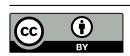
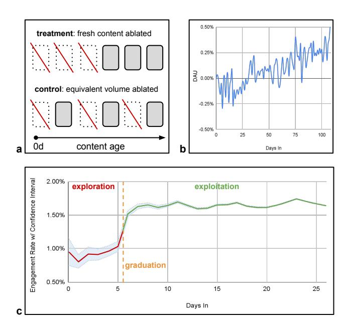
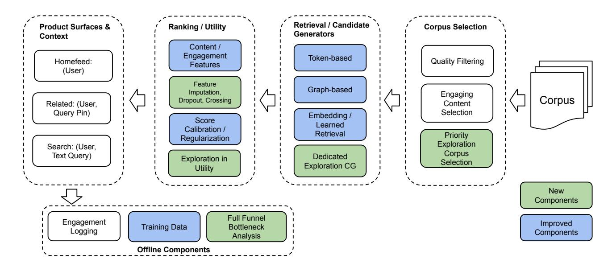

# PinEqualizer: Pinterest에서의 전체 퍼널 콘텐츠 탐색 및 편향 제거 시스템

- 원제: PinEqualizer: Full Funnel Content Exploration and Debiasing System at Pinterest
- 원문: [https://arxiv.org/abs/2607.22518](https://arxiv.org/abs/2607.22518)
- PDF: [https://arxiv.org/pdf/2607.22518v1](https://arxiv.org/pdf/2607.22518v1)
- arXiv ID: `2607.22518`

---

# PinEqualizer: Pinterest에서의 전체 퍼널 콘텐츠 탐색 및 편향 제거 시스템

Olafur Gudmundsson ogudmundsson@pinterest.com Pinterest, Inc. 미국 캘리포니아 주 샌프란시스코

Sai Xiao sxiao@pinterest.com Pinterest, Inc. 미국 캘리포니아 주 샌프란시스코

Zihao Chen zichen@pinterest.com Pinterest, Inc. 미국 캘리포니아 주 샌프란시스코

Andreanne Lemay alemay@pinterest.com Pinterest, Inc. 미국 캘리포니아 주 샌프란시스코

Bo Zhao bozhao@pinterest.com Pinterest, Inc. 미국 캘리포니아 주 샌프란시스코

Heath Vinicombe heathvinicombe@pinterest.com Pinterest, Inc. 미국 캘리포니아 주 샌프란시스코

Junpeng Hou jhou@pinterest.com Pinterest, Inc. 미국 캘리포니아 주 샌프란시스코

Wei-Ting Lin wlin@pinterest.com Pinterest, Inc. 미국 캘리포니아 주 샌프란시스코

Zhiqing Rao zrao@pinterest.com Pinterest, Inc. 미국 캘리포니아 주 샌프란시스코

Huayi Liao hliao@pinterest.com Pinterest, Inc. 미국 캘리포니아 주 샌프란시스코

Mostafa Keikha mkeikha@pinterest.com Pinterest, Inc. 미국 캘리포니아 주 샌프란시스코

Weijie Jiang weijiejiang@pinterest.com Pinterest, Inc. 미국 캘리포니아 주 샌프란시스코

Keyvan Moghadam∗ keyvanrmo@gmail.com Pinterest Inc. 미국 캘리포니아 주 샌프란시스코

Zhihua Zhang zzhang@pinterest.com Pinterest, Inc. 미국 캘리포니아 주 샌프란시스코

Anna Kiyantseva akiyantseva@pinterest.com Pinterest, Inc. 미국 캘리포니아 주 샌프란시스코

Luke DeLuccia ldeluccia@pinterest.com Pinterest, Inc. 미국 캘리포니아 주 샌프란시스코

Bhawna Juneja bjuneja@pinterest.com Pinterest, Inc. 미국 캘리포니아 주 샌프란시스코

Jiaxing Qu jqu@pinterest.com Pinterest, Inc. 미국 캘리포니아 주 샌프란시스코

# Abstract

본 논문에서는 산업 규모의 검색 및 추천 시스템에서 콘텐츠 콜드 스타트 문제를 해결하기 위한 새로운 솔루션을 제안한다. 기존 접근 방식과 비교할 때, 우리는 다음과 같은 새로운 기여를 한다: 1) 우리의 솔루션은 전체 다단계 퍼널을 아우르며 검색과 추천 표면 모두에 대해 잘 일반화된다; 2) 우리의 솔루션은 기존 콘텐츠를 선호하는 편향을 줄여, 콘텐츠 유형 전반에 걸쳐 보다 정확한 모델 예측을 가능하게 하고, 명시적 콘텐츠 탐색이 대규모로 발생할 때의 단기적인 트레이드오프를 감소시킨다; 3) 우리의 솔루션은 장기적인 영향을 검증하면서도 빠른 단기 실험을 가능하게 하는 확장 가능한 측정 프레임워크로 평가된다. 우리는 지난 두 년 동안 이 새로운 시스템을 반복적으로 구축하고 Pinterest에서 성공적으로 배포했으며, 신선한 콘텐츠 탐색, 전체 사용자 참여, 콘텐츠 생태계 건강에서 상당한 개선을 관찰했다.

#### CCS Concepts

• 정보 시스템 → 추천 시스템.

∗Pinterest에서 수행된 작업.

[이 작업은 Creative Commons Attribution 4.0 International License에 따라 라이선스가 부여됩니다.](https://creativecommons.org/licenses/by/4.0) KDD '26, 제주도, 대한민국 © 2026 저작권은 소유자/저자에게 있습니다. ACM ISBN 979-8-4007-2259-2/2026/08 <https://doi.org/10.1145/3770855.3818461>

#### Keywords

추천 시스템, 콜드 스타트, 탐색, 편향 제거

#### ACM Reference Format:

Olafur Gudmundsson, Bo Zhao, Huayi Liao, Anna Kiyantseva, Sai Xiao, Heath Vinicombe, Mostafa Keikha, Luke DeLuccia, Zihao Chen, Junpeng Hou, Weijie Jiang, Bhawna Juneja, Andreanne Lemay, Wei‑Ting Lin, Keyvan Moghadam, Jiaxing Qu, Zhiqing Rao, and Zhihua Zhang. 2026. PinEqualizer: Pinterest에서의 전체 퍼널 콘텐츠 탐색 및 편향 제거 시스템. In Proceedings of the 32nd ACM SIGKDD Conference on Knowledge Discovery and Data Mining V.2 (KDD '26), 2026년 8월 9–13, 제주도, 대한민국. ACM, New York, NY, USA, [10](#page-9-0) 페이지. <https://doi.org/10.1145/3770855.3818461>

## 1 Introduction

우수하고 매력적인 콘텐츠의 생태계를 유지하는 것은 모든 성공적인 검색 및 추천 시스템(RecSys)의 생명줄이다. Pinterest는 5억 명이 넘는 사용자와 수조 개의 고유 콘텐츠 항목('Pins')을 보유한 시각적 탐색 엔진으로, 예외는 아니다. 끊임없이 진화하는 코퍼스에서 콘텐츠를 소싱하여 이러한 사용자와 매칭하려면 '콜드 스타트' 문제[&#91;15&#93;](#page-8-0)를 해결해야 한다. 이 문제에서 사전 노출이 적은 콘텐츠는 인지도를 얻기 어려워한다.

콜드 스타트 문제는 잘 연구되어 왔으며, 가장 효과적인 해결책 중 하나는 사용자와 항목 간의 콘텐츠 기반 매칭을 활용하는 것이다. 다른 산업 규모 플랫폼과 마찬가지로 Pinterest 시스템은 이미 콘텐츠 기반 신호와 고유한 핀-보드 그래프 구조를 크게 활용하고 있다. 예를 들어, 그래프

무작위 워크[&#91;8&#93;](#page-8-1)는 후보 생성 단계에서 같은 보드에 저장된 다른 관련 핀을 가져오는 데 사용되며, 그래프 최적화 콘텐츠 임베딩[&#91;23&#93;](#page-9-1)과 해당 사용자 임베딩[&#91;11,](#page-8-2) [23&#93;](#page-9-1) 및 사용자 활동 시퀀스[&#91;21&#93;](#page-9-2)는 우리 랭킹 모델에서 가장 효과적인 신호 중 하나이다. 그러나 콘텐츠 확보가 시간이 지남에 따라 진화함에 따라 새로운 콘텐츠의 상당 부분이 사용자 생성 핀-보드 그래프와 잘 연결되지 않게 된다. 따라서 콜드 스타트 문제는 시간이 지남에 따라 더 심각해지고 콘텐츠 생태계의 건강을 악화시키기 시작한다: 풍부한-풍부한 효과가 발생하여 기존 콘텐츠 제공자에게 유리하게 된다.

이러한 과제를 해결하기 위해 우리는 Pinterest의 세 가지 주요 제품 표면인 Homefeed, Related Pins, Search 전반에 걸쳐 새로운 엔드-투-엔드 솔루션을 구축하고 프로덕션에 배포했다. 이 솔루션은 플랫폼 전체 콘텐츠 노출의 92%를 담당한다. 이전에 발표된 연구와 비교하여 우리는 다음 영역에서 기여와 혁신을 이루었다:

전체 퍼널 접근 방식: 산업 규모의 RecSys는 일반적으로 다단계 시스템이다. 우리 시스템은 코퍼스 선택, 검색, 후기 단계 랭킹 및 유틸리티까지 퍼널 전반에 걸쳐 혁신을 이룬다. 제안된 솔루션은 검색과 추천 표면 모두에서 잘 일반화될 수 있으며, 우리는 또한 강력한 의미적 관련성을 보장하는 검색 전용 최적화를 구축했다.

기존 콘텐츠의 편향 제거: 우리는 전체 퍼널에서 기존 콘텐츠를 선호하는 편향이 자주 존재함을 발견했고, 따라서 탐색 메커니즘에만 집중하기보다 이러한 편향을 줄이는 것이 중요하다. 편향 제거는 모델이 모든 콘텐츠에 대해 보다 정확하게 예측하도록 하며, 그 결과 명시적 탐색(예: UCB 또는 Thompson Sampling)과 그에 따른 단기 참여 트레이드오프의 필요성을 줄인다.

확장 가능한 측정 프레임워크: 우리는 종합적인 측정 프레임워크를 제안한다. 콘텐츠 홀드아웃 실험을 배포하여 프로덕션에서 콘텐츠 탐색 및 편향 제거 개선의 장기 가치를 지속적으로 측정한다. 또한, 장기 결과와 상관 관계가 있는 단기 실험 지표를 식별했으며, 이는 사용자 세분화된 A/B 실험을 통해 측정 가능하여 엔지니어링 팀이 새로운 개선 사항을 구축하고 테스트하는 속도를 크게 가속화한다. 우리의 설정은 복잡성이 낮으며 이전 연구[&#91;17&#93;](#page-8-3)와 비교하여 산업 규모 프로덕션 시스템의 여러 한계를 성공적으로 해결할 수 있다.

우리는 2024년 이후 전체 시스템의 다양한 부분을 반복적으로 구축하고 성공적으로 프로덕션에 배포했으며, 그 결과 Pinterest에서 신선한 콘텐츠 노출이 350% 증가하고 사용자 참여와 콘텐츠 생태계 건강(예: 콘텐츠 제공자 다양성)에서 장기적인 개선을 달성했다. 본 논문에서 제시한 솔루션과 통찰력이 유사한 과제를 해결하려는 RecSys 실무자에게 가치를 제공할 수 있기를 희망한다.

## 2 측정 및 지표 (Measurement & Metrics)

본 연구에서는 빠른 실험을 가능하게 하면서 전체 퍼널 콘텐츠 탐색의 장기 가치를 측정하는 전체적인 측정 프레임워크를 제시한다. 우리의 솔루션은 세 가지 층으로 구성된다: (1) 장기적인 “신선한 콘텐츠 보류 (fresh content holdout)”가

그림 1: (Figure 1) a) 공정한 신선한 콘텐츠 보류 실험 설정, 보류 그룹(처리)은 신선한 콘텐츠를 제거하고, 생산 그룹(대조)은 같은 양의 콘텐츠를 무작위로 제거한다. b) 장기 신선한 콘텐츠 보류는 탐색의 단기 비용이 장기 보유 이점에 의해 상쇄됨을 보여준다. c) 콘텐츠 졸업은 항목의 참여 가치가 불확실한 상태에서 예측 가능한 상태로 전환되는 임계값을 나타낸다.

신선한 콘텐츠 보류는 콘텐츠의 누적 가치에 대한 북스탠드 역할을 하며, (2) 콘텐츠 수준 “졸업 (graduation)” 코퍼스 메트릭은 중간 대리 지표로 기능하고, (3) 사용자 세분화된 A/B 실험을 통해 측정 가능한 민감한 사용자 수준 단기 실험 메트릭은 빠른 엔지니어링 반복과 출시 결정을 촉진한다.

우리는 또한 이전에 제안된 사용자-코퍼스 코디버트 실험 설계 [&#91;17&#93;](#page-8-3)를 평가했다. 이 설계는 콘텐츠 수준 메트릭을 측정할 때 처리 누수 문제를 해결할 수 있지만, 우리는 생산 환경에서 이 접근 방식에 세 가지 주요 과제가 있음을 발견했다. (1) 우리는 검색과 추천을 아우르는 세 가지 주요 제품 표면에서 작업하며, 각 표면은 이미지, 비디오, 제품 등 서로 다른 코퍼스를 가진 여러 후보 생성기를 갖는다. 모든 이러한 콘텐츠 코퍼스와 제품 표면 전역에서 콘텐츠를 버킷으로 분할하는 것은 비용이 많이 든다. (2) 이러한 설정에서 실험이 x%일 때 결과는 오직 x%의 콘텐츠 코퍼스에 기반하므로 사용자 수준 메트릭을 정확히 측정할 수 없다. 그러나 생산 환경에서는 전체 콘텐츠 코퍼스를 기반으로 한 콘텐츠 탐색 개선을 위해 사용자 수준 메트릭을 정확히 측정하는 것이 중요하다. (3) 콘텐츠 코퍼스를 x%로 제한하면 사용자 메트릭이 손상되고, 따라서 병렬로 실행할 수 있는 실험 수가 제한되어 실험 속도가 저하된다.

### 2.1 신선한 콘텐츠 가치 (Fresh Content Value (North Star))

전체 퍼널 콘텐츠 탐색의 목표는 새로 수집된 콘텐츠가 생성하는 장기 사용자 가치를 극대화하는 것이다. 우리는 이를 모든 주요 발견 표면(홈피드, 관련 핀, 검색)에서 일관되게 적용되는 장기 신선한 콘텐츠 보류를 통해 측정한다. 이 설계에서 보류 코호트는 실험 시작 전 생성된 콘텐츠에 한정되며, 생산 코호트는 새로 생성된 콘텐츠를 포함한다. 더 큰 후보 풀의 고유한 이점을 제거하기 위해 우리는 생산 그룹에서 동일한 양의 콘텐츠를 무작위로 제거한다(모든 요청에 대해 동일한 콘텐츠가 일관되게 제거되도록 콘텐츠 ID 해시를 기반으로 함), 이는 그림 1.a에 시각화되어 있다. 관측된 참여 차이는 따라서 새로 생성되고 탐색된 코퍼스의 점증적 이점을 정량화한다(그림 1.b). 더 큰 탐색된 콘텐츠 코퍼스가 더 높은 사용자 참여를 유도한다는 것을 입증하는 대신(이미 [17]에서 잘 확립됨), 우리의 주요 목표는 가장 신선한 탐색된 코퍼스가 보류(대규모, 완전히 탐색된 콘텐츠 코퍼스를 갖는)보다 점증적 가치를 제공하도록 보장하는 것이다.

### 2.2 콘텐츠 졸업 코퍼스 메트릭스 (Content Graduation Corpus Metrics)

장기 보류는 신선한 콘텐츠 가치를 위한 실제 기준을 제공하지만, 상당한 피드백 지연이 발생한다.  

전체 퍼널 탐색의 누적 이점은 초기 개입 창을 훨씬 넘어 지속되는 경우가 많다.  

따라서 우리는 콘텐츠 졸업 지표를 강건한 중간 대리 지표로 정의한다.  

우리의 방법론은 성공적인 탐색이 고분산의 “탐색” 단계에서 안정적인 “활용” 단계로 콘텐츠를 전환한다는 관찰에 기반한다.  

형식적으로, 우리는 **content graduation** 지표를 새로 수집된 콘텐츠가 수집 후 Y일 이내에 X개의 긍정적 참여를 축적한 양(및 비율)으로 정의한다. 여기서 우리는 참여율의 분산이 크게 감소하는 경험적 데이터에 기반해 특정 누적 참여 임계값 X를 식별하였다 (Figure 1.c).

또한, [17]과 달리, 우리는 참여 가능성이 낮은 콘텐츠를 탐색하는 데 트래픽을 낭비하고 싶지 않다. 따라서 우리는 **explored low-engaging content** 지표를 참여율의 상한 신뢰 구간이 임계값 Z보다 작은 완전히 탐색된 콘텐츠의 수량으로 정의한다. 두 지표를 결합하여 우리는 **under-explored content**를 "graduated"도 아니고 "explored low-engaging"도 아닌 콘텐츠로 공식적으로 정의한다.

### 2.3 미개발 콘텐츠 참여량 (Under-Explored Content Engagement Volume (Experiment Metrics))

이전 연구 [17]에서 언급한 바와 같이, 사용자 세그먼트별 A/B 실험은 양쪽 그룹 간에 공유되는 코퍼스 때문에 콘텐츠 수준의 지표를 평가할 수 없습니다.  

본 연구에서는 전통적인 사용자 세그먼트별 A/B 실험에서 시스템 개선을 측정하기 위해 **미탐색 콘텐츠 참여도 (under-explored content engagement)**, 즉 미탐색 콘텐츠가 받은 긍정적 참여의 양으로 정의되는 지표를 사용합니다.

이 실험 설계에는 몇 가지 장점이 있다: (1) 이 지표는 콘텐츠 졸업과 강하게 상관관계가 있다. 탐색이 덜 된 콘텐츠에 대한 더 많은 참여가 직접적으로 졸업으로 이어지기 때문이다, (2) 성공 기준으로 노출 수 대신 긍정적 참여를 사용하면 높은 관련성과 낮은 참여 트레이드오프를 가진 탐색 알고리즘을 장려한다, (3) 출시 결정을 내릴 때 전체 사용자 수준의 참여 트레이드오프를 자신 있게 평가할 수 있다, 그리고 (4) 표준 사용자 A/B 설정이 사용되므로 실험 속도가 최대화된다.

이론적으로, 이 설정에서는 콘텐츠 수준 유출이 여전히 가능하며, 이는 이 지표의 이득을 과소평가하게 만든다 (즉, 처리군에서 더 나은 탐색이 진행되면, 미탐색 콘텐츠가 대조군에서 트래픽을 얻을 수 있다). 실제로 우리는 이것이 최소화된 것으로 관찰한다, 왜냐하면 (1) 처리군이 콘텐츠 성장을 가속화하면, 성과된 콘텐츠는 다음 날 지표에 포함되지 않으며, (2) 사용자가 대조군과 처리군에서 보는 콘텐츠는 일반적으로 구분된다, 특히 실험 트래픽이 낮을 때 그렇다.

## 3 시스템 개요 (System Overview)

이 섹션에서는 고수준 시스템 아키텍처에 대해 논의합니다: 엔드 투 엔드로 전체 퍼널 검색 및 추천 스택에서 새로운 구성 요소를 추가하고 기존 구성 요소를 개선한 위치를 설명합니다. 또한 이 시스템 개발을 이끈 구체적인 통찰력과 분석을 공유할 것입니다.

### 3.1 전체 퍼널 탐색 및 편향 제거 접근법 (The Full-funnel Exploration and Debiasing Approach)

그림 2는 Pinterest의 주요 추천 및 검색 제품 화면에 대한 산업 규모의 다단계 퍼널 다이어그램을 보여준다. 각 제품 화면은 시스템에 대한 쿼리 입력으로서 고유한 문맥을 갖는다: homefeed는 사용자 정보만을 입력으로 받는 추천 화면이며, 반면 search는 개인화를 위해 사용자 정보와 함께 현재 사용자의 쿼리를 받아 결과의 관련성을 보장한다.

콜드스타트 콘텐츠를 성공적으로 도입하고 사용자 피드백을 수집하려면 전체 콘텐츠 퍼널이 단계별로 개선되어야 한다. 어느 단계에서든 중요한 병목 현상이 발생하면 사용자에게 배포가 제한된다. 본 연구의 핵심 발견 및 기여는 콜드스타트 콘텐츠가 퍼널의 모든 단계에서 랭킹 및 선택 과정에서 기존 콘텐츠와 효과적으로 경쟁해야 하며, 새로운 콘텐츠가 공정한 기회를 가질 수 있도록 시스템 전체의 기존 콘텐츠에 대한 편향을 줄이는 것이 중요하다는 인식이다.

**코퍼스 선택** 단계는 전체 코퍼스에서 낮은 품질 및/또는 정책 위반 콘텐츠를 제거하고 고품질, 매력적인 콘텐츠를 식별하여 인덱싱할 활성 코퍼스를 선택하는 책임이 있다. 우리는 Pinterest 규모에서 모든 신규 콘텐츠를 완전히 탐색하는 것이 인프라와 참여 측면에서 매우 비용이 많이 드는 만큼, 가장 유망한 신규 콘텐츠를 효과적으로 선택하기 위한 새로운 구성 요소를 구축했다. 검색 단계에는 컨텍스트 쿼리를 기반으로 가장 관련성 높은 콘텐츠를 검색하기 위한 다양한 후보 생성기가 포함되어 있으며, 예를 들어 검색 쿼리와 같은 텍스트 토큰, 그래프 랜덤 워크[8], 임베딩 또는 ML 기반 이중 타워 아키텍처를 사용한다. 여기서 우리는 기존 메커니즘을 개선하고 콜드스타트 콘텐츠를 위한 전용 후보 생성기를 구축했다. 전체 랭킹 단계에서 우리의 주요 목표는 기능, 아키텍처, 손실 함수, 보정 및 탐색을 위한 최종 유틸리티 함수 최적화 개선을 통해 신규 및 기존 콘텐츠 모두에 대한 모델 편향을 줄이는 것이다. 오프라인 구성 요소에서는 훈련 데이터 샘플링을 개선하고, 전체 퍼널 분석을 배포하여 병목 현상을 식별하고 향후 개발 우선순위를 안내했다.

Figure 2: 시스템 다이어그램: 전체 퍼널 콘텐츠 탐색 및 편향 제거

### 3.2 전체 퍼널 병목 분석 (Full-funnel Bottleneck Analysis)

다층 추천 퍼널의 단계들은 서로 밀접하게 상호 의존적이며, 특정 단계(예: 랭킹)에서의 개선이 실현되는 영향은 이전 단계(예: 코퍼스 선택 및 검색)의 상태에 의해 제한될 수 있다. 따라서 퍼널 전체에 걸친 병목 현상과 가장 높은 ROI를 가진 개입 지점을 종합적으로 파악하는 것이 중요하다. 이를 위해 우리는 각 단계마다 입력 구성을 분석하고, 콜드 스타트와 기존 콘텐츠의 출력 생존율을 조사하는 전체 퍼널 로그 및 병목 분석을 수행한다. 구체적으로는:

- 입력 가용성: Y일 이내에 탐색되지 않았고 수집된 입력 콘텐츠 비율;  
- 출력 생존율: 탐색되지 않았고 새로 수집된 콘텐츠 중 상위 k 결과에 남아 있을 확률;

직관적으로, 특정 단계가 병목이 되거나 적어도 비효율적일 수 있는 경우는 신선한 콘텐츠가 입력에 충분히 존재하지만 출력에서의 생존율이 낮을 때이다. 제품 표면 특성의 차이와 현재 기반 생산 시스템의 상태에 따라 이러한 비효율성은 표면마다 달라질 수 있어, 전체 퍼널 관점이 작업을 효과적으로 순차화하는 데 중요하다.

**분석에서 얻은 예시 통찰:** 특정 시점에 Related Pins 표면에서 상위 퍼널(코퍼스 및 검색)은 더 이상 주요 제약이 아니었으며, 신선한 콘텐츠가 기존 콘텐츠와 비슷한 비율로 반환되었다. 그러나 랭킹 단계에서 상당한 감소가 발생했다: 대부분의 신선한 콘텐츠가 최종 출력에서 k 이하로 랭크되었다. 이로 인해 우리는 랭킹 개선에 초점을 옮기게 되었다.

같은 시간 프레임 동안 Search surface에서 병목 현상이 검색 단계에서 시작된다는 것을 발견했습니다. 검색에서 높은 관련성 기준을 고려할 때, 쿼리에 대해 코퍼스에 충분한 관련 콘텐츠가 있는지 가설을 세웠습니다. 이를 측정하기 위해 소규모 쿼리 샘플에 대해 프로덕션 시스템보다 훨씬 더 많은 신선한 콘텐츠를 과다 검색하고 결과에 관련성 모델을 적용했습니다; 이는 코퍼스 수준에서 관련 콘텐츠가 충분히 존재함을 검증했고, 따라서 병목 현상이 검색 단계에 있음을 확인했습니다.

## 4 Components

이 섹션에서는 각 퍼널 단계에 추가된 새로운 또는 개선된 구성 요소를 자세히 논의합니다.

### 4.1 Corpus Selection

Pinterest에 매일 업로드되는 Pins의 양이 많아 모든 항목을 색인하고 탐색하는 것이 불가능합니다. 따라서 우리는 고잠재력 신선 항목의 하위 집합을 효과적으로 식별하는 코퍼스 선택 파이프라인을 구축했습니다. 전용 탐색 코퍼스를 유지하고 가장 유망한 신선 항목을 우선시함으로써 시스템은 더 빠르게 학습하고 참여 가능성이 낮은 콘텐츠에 대한 낭비 트래픽을 줄입니다.

**Thompson Sampling:** 우리의 첫 번째 접근 방식은 탐색/활용을 위한 고전적인 방법인 Thompson sampling을 활용하는 것이었습니다. 각 항목에 대해, 우리는 $Beta(\alpha + e, n - e)$에서 사후 참여율을 샘플링합니다. 여기서 e는 긍정적 참여 수, n은 노출 수이며, $\alpha$는 콘텐츠 제공자의 전체 참여율을 기반으로 한 사전입니다. 그런 다음 가장 높은 샘플링 점수를 가진 항목을 선택합니다. 또한, 코퍼스에서 콘텐츠 제공자의 다양성을 보장하는 등 다른 비즈니스 로직을 적용합니다.

**Model-based Prior:** 시간이 지남에 따라 이미지 품질, 콘텐츠 및 제공자에 대한 오프플랫폼 정보 등 다른 신호를 사전에 통합하고자 합니다. 자연스럽게 우리는 콘텐츠와 오프플랫폼 신호를 기반으로 각 항목의 경험적 참여율을 예측하는 ML 모델을 구축했습니다.

이 모델의 상세 구현은 주요 결과에 비해 중요하지 않지만, 고수준에서는: 각 항목에 대해 모델이 그 참여율을 다음과 같이 예측합니다. 그 다음 경험적 참여율과 결합하여 사후를 계산하고, 이는 최종 선택에 사용됩니다:

$$\hat{r} = \frac{\alpha N + e}{N + n},\tag{1}$$

여기서 관측된 참여 수는, 노출 수는, 그리고 사전의 강도를 제어한다.

선택: 각 파이프라인 새로 고침 시, 사후 점수 ˆ에 따라 순위가 매겨진 상위-개 항목을 선택합니다. 탐색 코퍼스는 미졸업 콘텐츠 정의에 맞게 동적으로 업데이트됩니다: 항목은 1) 탐색에서 졸업될 만큼 충분한 긍정적 참여를 축적했거나 2) 참여율의 상한 신뢰 구간이 임계값보다 낮을 때 퇴출됩니다. 이 새로 고침-교체 정책은 가장 유망한 신선 콘텐츠에 대한 탐색 용량을 우선시합니다.

### 4.2 Feature Improvements

적절한 기능은 ML 모델의 편향을 해소하는 데 중요하며, 이 섹션에서는 우리가 개발한 성공적인 기법들을 논의합니다. 일부는 신선 콘텐츠에 대한 예측을 개선하는 데 효과적이며, 다른 일부는 기존 오래된 콘텐츠를 선호하는 모델의 편향을 줄일 수 있습니다. 이러한 기능 개선은 모두 검색 단계 모델(예: 두 타워 학습 검색)과 최종 순위 모델에 적용될 수 있습니다.

Advanced Content Understanding Signals: 콜드 스타트에서 콘텐츠 기반 기능을 활용하는 것은 잘 연구된 주제입니다 [&#91;15&#93;](#page-8-0). Pinterest의 프로덕션 시스템에서 이미 콘텐츠 기능이 널리 활용되었지만, 우리는 추가적인 개선을 이루었습니다.

- Content-only Embeddings: 기존 시스템은 PinSage[23] (#page-9-1) 및 ItemSage[2] (#page-8-4)와 같이 핀보드 그래프 또는 콘텐츠 공동 참여에 최적화된 콘텐츠 임베딩 신호를 많이 활용한다. 그러나 상당량의 신규 콘텐츠가 그래프와 잘 연결되지 않기 때문에 이러한 임베딩에 의존하면 신규 콘텐츠에 대한 편향이 발생한다. 따라서 우리는 Unified Visual Embedding[24] (#page-9-3)과 같은 콘텐츠 전용 임베딩을 추가하고, 최근에는 대형 Visual‑Language 모델(VLM)과 CLIP 시각-텍스트 정렬을 활용한 새로운 임베딩인 PinCLIP[3] (#page-8-5)을 도입하는 것이 효과적임을 확인했다.

- Semantic ID: 최근에는 semantic id가 콘텐츠 표현을 위한 새로운 기법으로 제안되었다[14] (#page-8-6). 콘텐츠 전용 임베딩과 유사하게, 기존 모델에 semantic id를 추가 기능으로 넣는 것이 신규 콘텐츠에 도움이 된다는 것을 확인했다.

Feature Imputation: 고급 콘텐츠 임베딩을 생성하려면 종종 무거운 ML 추론이 필요하며, 이는 콘텐츠가 생성된 직후에 기능이 즉시 사용 가능하지 않음을 의미한다. 결측 기능을 단순한 기본값으로 처리하면 신규 콘텐츠에 큰 패널티가 발생할 수 있는데, 우리는 단순한 기능 보간이 이 문제를 완화하는 데 효과적임을 발견했다. 구체적으로, 우리는 콘텐츠 코퍼스에서 해당 차원의 경험적 분포를 기반으로 추정된 파라미터를 가진 정규 분포에서 독립적으로 샘플링하여 임베딩의 각 차원을 보간한다.

Engagement Feature Dropout: 전통적인 협업 필터링(CF) 기반 추천 모델에서는 콜드 스타트에 효과적인 기법으로 dropout[18]이 제안되었다. Pinterest와 같은 산업 규모 설정에서는 랭킹 모델이 전통적인 CF가 아니라 사용자, 아이템 및 그 상호작용을 나타내는 다양한 기능을 갖춘 딥 뉴럴 네트이다. 아이템의 과거 참여 수와 비율은 종종 미래 참여를 매우 잘 예측하므로, 단순한 모델은 과적합되고 이러한 기능에 과도하게 의존할 수 있다. 그 결과 모델은 신규 콘텐츠를 과소평가하고 오래된 콘텐츠를 과대평가하는 경향이 있다.

이 문제를 완화하기 위해 우리는 훈련 중에 과거 아이템 참여 기능에 dropout을 적용하여 모델이 더 잘 일반화되고 콘텐츠 신호에 더 많이 의존하도록 한다. 우리는 두 가지 무작위 dropout 전략을 평가한다: (1) Uniform dropout, 모든 아이템 참여 기능을 동시에 드롭하는 방식. (2) Individual dropout, 각 아이템 참여 기능을 독립적으로 드롭하는 방식. 실험적으로, Individual dropout이 지속적으로 더 나은 성능을 보인다. 기능 중요도 분석은 이 효과를 확인한다: Individual dropout으로 훈련된 모델은 참여 기능에 덜 의존하고 콘텐츠 및 컨텍스트 기반 기능에 가중치를 이동한다. 사용자 수준 과거 참여 기능을 드롭하는 것은 효과적이지 않다고 판단했으므로, 사용자 수준 개인화에는 영향을 주지 않는다.

Feature Crossing: Feature dropout는 전반적으로 참여 기능에 대한 의존도를 낮추지만, 원칙적으로 랭킹 모델은 콜드 스타트 아이템에 대해 콘텐츠 기능을 더 많이 활용하고, 콘텐츠가 더 많은 신호를 얻을수록 아이템 참여 이력을 더 활용하여 예측을 개선해야 한다. 이러한 기능 상호작용을 딥 뉴럴 네트에서 구현하기 위해 우리는 콘텐츠 연령 신호, 콘텐츠 기능 및 과거 참여 기능을 명시적 기능 교차 모듈 DCNv2[20] (#page-9-4)에 추가하는 것이 효과적임을 발견했다.

오프 플랫폼 참여 데이터: 콘텐츠는 Pinterest에 업로드되기 훨씬 전에 존재했을 수 있으므로, Pinterest에 새로 등장한 항목은 플랫폼 외부에서 활용할 수 있는 풍부한 신호를 가질 수 있다. 예를 들어, 구매 가능한 제품의 경우, 많은 상점이 Pinterest 과거 거래 데이터를 전송한다. 이러한 추가 데이터 소스를 활용해 항목과 콘텐츠 제공자(예: 각 상점의 상위 판매자, 인기 상점)에 대한 강력한 사전 정보를 구축하는 것은 신선한 콘텐츠 성능을 향상시키는 데 매우 효과적이다.

근실시간 참여 기능: Flink와 같은 데이터 스트리밍 프레임워크를 사용해 항목의 참여율을 근실시간으로 계산할 수 있다면, 모델은 일일 배치 파이프라인보다 더 빠르게 반응할 수 있다. 이는 콘텐츠가 아직 초기 탐색 단계에 있을 때 특히 중요하다. 따라서, 우리는 신선한 콘텐츠를 위해 근실시간 항목 참여 파이프라인을 구축했으며, 노후화되는 콘텐츠에 대한 인프라 비용을 줄이기 위해 배치 파이프라인을 유지한다.

### 4.3 검색 (Retrieval)

Pinterest에서는 토큰 검색, 그래프 검색, 임베딩 검색이라는 세 가지 검색 전략을 사용한다. 토큰 검색은 문서가 역색인에 인덱싱되고, 쿼리가 구조화된 쿼리 트리로 표현되어 일치하는 문서를 효율적으로 가져오는 용어 매칭 검색 설정이다. 그래프 검색 [&#91;8&#93;](#page-8-1)은 쿼리 노드에서 시작해 그래프 내에서 무작위 워크를 수행한다.

방문한 노드(문서)를 후보로 반환한다. 임베딩 검색은 쿼리와 문서 임베딩 유사도를 기반으로 한 ANN(Approximate Nearest Neighbor) 기반 검색이다.

토큰 검색: 코퍼스 선택에서 언급한 바와 같이, 우리는 미탐색 콘텐츠만 포함하는 전용 코퍼스를 만든다. 토큰 검색을 위해, 탐색 코퍼스에 대해 별도의 역색인을 구축했다. 이렇게 하면 검색 시 이 인덱스에서 일정량의 후보를 가져오고, 나머지 후보는 완전히 탐색되고 높은 참여도를 가진 일반 코퍼스에서 가져온다. 이 전용 탐색 검색 채널은 이후 단계에서 탐색 항목의 흐름을 보장한다.

그래프 검색: Pixie는 쿼리 핀(예: 사용자가 최근에 참여한 핀)에서 시작해 양분 Pin-Board 그래프를 따라 무작위 워크를 수행하고 방문한 Pin 노드를 후보로 반환하는 그래프 후보 생성기 계열이다 [&#91;8&#93;](#page-8-1). 이러한 그래프는 더 많은 보드에 저장된 오래된 콘텐츠를 반환하는 경향이 있다. 왜냐하면 이러한 핀은 보드와의 연결이 더 많기 때문이다. 이 후보 생성기의 편향을 해소하고 더 많은 미탐색 콘텐츠를 반환하기 위해, 그래프 순회 알고리즘을 가중 무작위 워크로 수정한다. 이때 미탐색 핀에 연결된 엣지는 더 높은 가중치를 부여한다.

임베딩 검색: 임베딩 기반 검색에서는 일반적으로 두 가지 전략을 사용한다: 1) PinCLIP 임베딩 [&#91;3&#93;](#page-8-5)와 같이 쿼리와 콘텐츠를 표현할 수 있는 사전 학습된 콘텐츠 임베딩을 기반으로 한다, 2) 표면의 참여 데이터를 사용해 쿼리용 타워와 콘텐츠용 타워를 갖는 이중 타워 네트워크를 학습한다 [&#91;6&#93;](#page-8-8). 그 후 효과적인 탐색을 위해 다음과 같은 접근 방식을 개발했다:

- 전용 탐색 채널: 우리는 사전 학습된 콘텐츠 임베딩을 사용하여 탐색 코퍼스용 전용 ANN 인덱스를 구축할 수 있다. 학습 기반 검색을 위해서는 모든 참여 관련 특징을 제거하여 편향을 최소화하면서 탐색 콘텐츠에 대해서만 전용 모델을 훈련시킬 수 있다 (비슷한 방식으로 [19](#page-8-9)).
- 통합 학습 기반 검색 모델: 탐색용 전용 모델을 훈련시키는 것은 편향을 최소화할 수 있지만, 시간이 지남에 따라 인프라와 엔지니어링 유지보수 비용에 상당한 오버헤드를 발생시킨다. 따라서 우리는 콜드 스타트와 기존 콘텐츠를 모두 처리할 수 있는 통합 학습 기반 검색 모델을 개발하였다. 이전 섹션에서 언급한 더 나은 특징과 편향 제거 기법을 활용함으로써, 이 접근 방식이 충분한 신선한 콘텐츠를 효과적으로 반환하면서 비용을 크게 절감할 수 있음을 관찰하였다.
- 쿼리 타워 편향 제거: 관련 표면에서 쿼리는 (핀, 사용자, 추가 컨텍스트)이다. 우리는 쿼리가 기존 핀인 경우, 쿼리 측면 특징이 모델에 편향을 도입하여 결과에서 오래된 콘텐츠를 선호하도록 만들 수 있다는 것을 발견하였다. 따라서 우리는 쿼리 타워의 편향을 제거하기 위한 개선을 수행하였다. 구체적으로, 신경망의 더 깊은 수준에서 콘텐츠와 참여 특징을 교차시키는 대신, 다양한 특징 유형(예: 콘텐츠 특징, 참여 특징)에 대해 별도의 임베딩을 먼저 학습한 뒤 후기 단계 융합/교차를 수행한다. 이는 최종 쿼리 임베딩이 더 많은 콘텐츠 특징을 인코딩하도록 보장하며, 결과에서 편향을 효과적으로 줄일 수 있다.

### 4.4 최종 순위 및 유틸리티 레이어 (Final Ranking and Utility Layer)

검색 및 추천 퍼널의 후기 단계로 이동함에 따라, 우리는 가장 진보된 아키텍처와 특징을 갖춘 하나 또는 다수의 다중 작업 무거운 순위 모델이 사용자에게 아이템의 다양한 보상을 예측하는 전형적인 설정을 갖는다 (예: 저장 확률, 클릭 확률, 혹은 관련성 점수); 그리고 이러한 보상과 다양성 같은 다른 전역 요인을 결합하는 최종 유틸리티 레이어가 최종 결과 순서를 형성하여 사용자에게 제시한다.

이 단계에는 두 가지 핵심 과제가 있다. 첫째, 훈련 데이터에서 콜드 스타트 아이템의 희소성과 같은 요인으로 인해 랭킹 모델은 종종 신선한 콘텐츠에 대한 보상을 과소 예측하고 오래된 콘텐츠에 대해 과대 예측하는 경향이 있다. 이 문제를 해결하기 위해, 이전에 논의한 기능 개선 외에도 우리는 모델의 편향을 해소하기 위한 다음과 같은 추가 기법을 개발하였다:

콘텐츠 유형 인식 보정 (Content-type-aware Calibration): 보정 레이어는 모델 예측 점수를 경험적 행동 확률과 정렬시켜 최종 유틸리티 레이어가 다양한 보상을 정확히 균형 있게 조정할 수 있도록 한다. 그러나 순진한 전역 보정은 신선한 콘텐츠나 다른 과소 대표되는 콘텐츠 유형과 같이 서로 다른 콘텐츠 유형에 특이한 보정 문제를 효과적으로 줄이지 못한다. 이 문제를 완화하기 위해 우리는 중요한 콘텐츠 카테고리를 보정 모델에서 범주형 신호로 고려하여 모델이 모든 주요 콘텐츠 코호트에서 잘 보정되도록 한다.

점수 정규화 및 훈련 데이터 증강: 우리는 또한 손실 함수에 추가 정규화 항을 도입하여 모델이 신규 콘텐츠와 기존 콘텐츠의 점수 분포를 유사한 콘텐츠 표현과 정렬하도록 유도하였다. 콜드 스타트와 기존 항목의 잠재적 특성 값 분포 차이를 처리하기 위해, 우리는 혼합 특성 공간을 사용한 증강 훈련 데이터를 생성하는 기법을 개발하였다. 이 작업에 대한 자세한 내용은 [&#91;7&#93;](#page-8-10)에서 확인할 수 있다. 주의할 점은, 서로 다른 제품 표면의 고유한 특성 때문에, 훈련 데이터 증강이나 손실 함수에 초점을 맞춘 기법은 표면마다 상당한 조정이 필요할 수 있다는 것이다. 예를 들어, 여기서 논의된 정규화 개선은 원래 Related Pins 표면에서 개발되었지만, Search에서 실험했을 때 강한 정규화가 핀-쿼리 관련성 저하를 초래함을 발견했고, 따라서 훨씬 더 보수적이어야 한다.

모델 예측 편향 이후, 대규모 검색 및 추천 시스템에서 두 번째 주요 과제는 피드백 루프이다: 사용자 참여를 예측하기 위한 훈련 데이터는 실제 사용자 참여 기록에서 수집되며, 이는 최초에 프로덕션 시스템이 사용자에게 무엇을 보여줄지 결정하는 것에 달려 있다. 이는 잘 알려진 문제이며, 본 논문의 맥락에서 이는 프로덕션 시스템이 신선한 콘텐츠를 심각하게 과소 예측할 경우, 신선한 콘텐츠에 대한 훈련 데이터 양이 더욱 감소하고, 단순한 업샘플링이나 오프-정책 보정만으로는 충분하지 않다는 것을 의미한다. 이 문제를 해결하기 위해 우리는 콜드 스타트 아이템의 탐색을 더 허용하도록 최종 유틸리티 레이어를 개선하는 여러 기법을 개발했다:

UCB with Real-time Impressions: Upper Confidence Bound (UCB) [1](#page-8-11)은 가치 추정의 불확실성을 기반으로 항목에 낙관적 보너스를 부여하는 탐색-활용 트레이드오프에 대한 고전적인 접근 방식이다. 대규모 시스템에서는 분산이나 불확실성을 정확히 추정하는 것이 쉽지 않으므로, 우리는 실시간 노출 수를 사용하여 불확실성을 추정하는 간단한 휴리스틱을 적용한다: 노출 수가 적을수록 불확실성이 높다. 구체적으로:

$$UCB_i = \frac{\alpha}{\sqrt{1 + \beta \cdot impressions_i}}$$

(2)

여기서  $\alpha$ 는 탐색 강도를 제어하고  $\beta$ 는 누적 노출에 따라 보너스가 얼마나 빨리 감소하는지를 결정한다.

우리는 두 가지 통합 접근 방식을 실험했다: (1) UCB 항을 순위 모델 내에서 로짓 조정으로 직접 추가하고, (2) 이를 유틸리티 레이어에 명시적 항으로 포함시키는 것이다. 두 구현 모두 선택 편향을 줄이고 훈련 데이터 품질을 향상시키는 데 강력한 성능을 보였으며, 유틸리티 레이어 통합은 모델 재학습 없이 독립적으로 튜닝할 수 있는 더 큰 유연성을 제공했다.

**Neural Linear UCB:** 인상 기반 UCB 접근 방식의 한 가지 문제는 콘텐츠의 특징 공간을 완전히 무시한다는 점이다. Neural Linear UCB [22]는 신경망의 마지막 은닉층을 특징 표현  $\phi(x)$ , 도출된 원시 모델 입력 x 에서 대략 선형 관계를 가진 목표 보상과 함께 활용하는 단순하고 확장 가능한 접근 방식이다: $y = \phi(x)^T \theta$ . 이를 통해 LinUCB 알고리즘 [9]을 사용하여 샘플 i 에 대한 상한 불확실성 경계를 계산할 수 있다.

$$\hat{y}_i = \phi(x_i)^\top \theta + \alpha \sqrt{\phi(x_i)^\top \Sigma \phi(x)}, \tag{3}$$

여기서 공분산 행렬  $\Sigma = H^{-1}$  은 설계 행렬에서 파생된다:

$$H = \sum_{i=1}^{N} \phi(x_i)\phi(x_i)^{\top} + \lambda I.$$

(4)

우리 솔루션을 통합하기 위해, 우리의 랭킹 모델 학습 과정은 두 단계로 구성된다: 1) 샘플링된 대규모 훈련 데이터를 사용하여 메인 모델 아키텍처를 대규모로 학습하는 단계, 2) 샘플링 로직에 편향되지 않은 작은 샘플 세트를 사용하여 예측을 경험적 참여율에 맞춰 보정하는 가벼운 보정 단계. 우리는 단계 (1)에서 학습된 특성 표현 $\phi(x)$ 를 사용하지만, 단계 (2)에서 최신 데이터를 사용해 공분산 행렬을 업데이트한다.

본질적으로 이진적인 작업(예: 클릭 및 저장 예측)을 처리하기 위해, [17]과 유사하게 우리는 릿지 회귀 파라미터 $\theta$를 명시적으로 계산하는 대신 사전 학습된 이진 예측의 로짓을 평균 보상에 대한 저렴한 대체물로 사용한다. 이 설정에서 직면한 또 다른 실용적인 문제는 Eq. 4의 설계 행렬 H의 크기가 샘플 크기 N에 대략적으로 비례하여 확장되기 때문에, 사후 불확실성이 $1/\sqrt{N}$에 비례하도록 경향이 있다는 점이다. 단계 (2)에서의 샘플 크기 N이 단계 (1)의 사전 학습 과정과 독립적으로 변할 수 있기 때문에, 이는 탐색의 전체 규모가 때때로 의도치 않게 변동될 위험이 있다. 이를 극복하기 위해 우리는 Eq. 3의 $\alpha$ 파라미터에 스케일링 항을 추가한다, $\alpha=\sqrt{\frac{N}{N_o}}\alpha_o$, 여기서 $N_o$는 안정성을 유지하기 위해 기준 배치 크기로 설정된다.

검색 유틸리티에서의 관련성 역할: 검색 표면은 쿼리와 결과 사이에 훨씬 높은 의미적 관련성 기준을 갖는다. 따라서 검색 스택은 주로 콘텐츠 기반 특징을 사용하는 고급 관련성 모델을 갖추고 있으며, 이는 참여 예측과 함께 최종 유틸리티에 중요한 기여를 한다. 관련성 모델이 훨씬 더 많은 콘텐츠 기반 특징을 사용하기 때문에, 신선한 콘텐츠에 대한 편향이 참여보다 훨씬 낮다

모델. 또한, 관련성 모델의 개선은 종종 새로운 콘텐츠에도 이점을 가져다 준다. 이를 바탕으로 우리는 검색 표면에 대해 몇 가지 구체적인 최적화를 수행했다: 1) 새로운 콘텐츠에 대한 관련성의 유틸리티 가중치를 증가시켜, 참여 모델의 과소 예측에도 불구하고 매우 관련성 높은 새로운 콘텐츠가 높은 순위에 오를 수 있도록 한다. 2) UCB에서는 최소 관련성 임계값을 적용하고 탐색 항을 관련성으로 스케일한다: $\text{UCB}_i' = \text{relevance}_i^{\gamma} \cdot \text{UCB}_i$ 를 통해 낮은 관련성 콘텐츠가 큰 탐색 이점을 받지 않도록 한다.

## 5 Experiments (실험)

### 5.1 Overall Impact: (전체 영향)

우리는 2024년부터 전체 시스템의 다양한 부분을 배포하고 반복적으로 개선하기 시작했으며, Table 1에 제시된 특정 전면 지표 향상을 통해 사용자 참여와 콘텐츠 생태계 건강에 상당한 영향을 미쳤습니다.

신규 콘텐츠 보유에서의 영향: 앞서 설명한 바와 같이, 신규 콘텐츠 보유는 새로 생성되고 탐색된 콘텐츠(시스템의 북스탠 목표)로부터 사이트 전반의 사용자 참여(내부 정의에 따른 성공 세션 측정)에 미치는 증분 영향을 측정한다. 표 1에 나타난 바와 같이, 우리 시스템으로 인한 세션 영향의 연간 대비 상대 성장률이 유의미하게 증가한 것을 관찰하였다 (참고: 2025 vs 2024는 2024 vs 2023에서도 상당한 성장이 있었으므로 전체 영향을 완전히 포착하지 못한다). 이 영향은 북미 및 국제 시장의 우선 순위 시장 전반에 걸쳐 나타난다. 또한 북미, Pinterest의 주요 쇼핑 시장 내에서 제품 콘텐츠 탐색이 강화되어 쇼핑 세션이 크게 개선된 것을 관찰하였다. 2025 콘텐츠 보유 데이터는 총 쇼핑 세션 증가가 18.5%임을 보여 주며, 이는 북미의 전체 비쇼핑 세션 증가보다 5.3배, 국제적으로는 8.3배 높은 수준이다. 이는 특히 쇼핑 콘텐츠 배포가 신규 항목에 크게 의존한다는 것을 시사하며, 효율적인 탐색 및 편향 제거의 필요성을 강조한다. 실제로, 이러한 콘텐츠는 상인 카탈로그에서 직접 대량 업로드되는 고용량으로 인해 기존 사용자 큐레이션 핀 보드 그래프와의 연결 부족으로 인해 더 급격한 콜드 스타트 도전에 직면한다.

졸업 코퍼스 및 미개척 콘텐츠 참여량:  
표 1에 나타난 바와 같이, 우리는 28일 이내에 졸업된 콘텐츠 코퍼스(졸업 코퍼스)에서 연간 대비 큰 성장을 관찰했으며, Pinterest의 세 가지 주요 표면에서 실험 지표(즉, 사이트 전반의 미개척 콘텐츠 참여량)에서도 큰 성과를 기록했습니다.  
보고된 지표는 각 제품 표면에서 장기 A/B 실험 보류(holdout) 이후 H2 2024부터 누적된 이득입니다.  
이러한 지표 이득은 우리 전체 시스템의 효과를 입증했습니다.  
또한, 이는 견고한 3계층 측정 프레임워크의 실질적 효과를 보여줍니다: 미개척 참여량 이득이 졸업 코퍼스의 성장을 이끌고, 그 다음에 신선한 콘텐츠 보류에서 전체 사용자 참여 영향이 증가합니다.

**콘텐츠 제공자 구성:**  
사용자 참여에 영향을 주는 것 외에도, 우리 시스템은 더 건강한 콘텐츠 생태계를 조성합니다.  
"rich-get-richer" 효과를 줄임으로써, 시스템은 더 많은 콘텐츠 제공자가 더 성공할 수 있도록 합니다.  
우리는 성공적인

표 1: 전체 사이트 전반적인 영향

| Metric | Relative Lift |
|----------------------------------------------|---------------|
| Incremental Session Gain from Fresh Content |  |
| Holdout YoY 2025 vs 2024 |  |
| - Overall Successful Session (North America) | +24% |
| - Overall Successful Session (i18n) | +49% |
| - Shopping Session (North America) | +63% |
| - Shopping Session (i18n) | +29% |
| Graduated Content Corpus (28-day) |  |
| YoY 2025 vs 2024 | +41% |
| Cumulative Gain Site-wide Under-explored |  |
| Content Engagement Volume |  |
| - Homefeed Surface Holdout | +37% |
| - Search Surface Holdout | +13% |
| - Related Surface Holdout | +27% |
| Number of Successful Content Providers |  |
| YoY 2025 vs 2024 | +99% |

콘텐츠 제공자는 그들의 콘텐츠가 사이트 전체에서 참여량 비중이 일정 임계값을 초과하는 경우이며, 우리는 이 지표에서 전년 대비 99% 증가를 관찰했다.

Table 2: Related Pins 표면에서의 통합된 구성요소 수준 A/B 실험 영향.

| 구성요소 | 참여량 상승 |  |
|----------------------------------|------------------------|---------------|
|  | 모두 새로 | 미개척 |
| 코퍼스 선택 |  |  |
| 및 검색 | - | - |
| - 탐색 코퍼스 | +7.75% | +16.92% |
| - 그래프 검색 | +3.91% | +3.71% |
| 특징 개선 | - | - |
| - 검색 | +2.48% | +3.97% |
| - 랭킹 | +5.57% | +18.52% |
| 모델 아키텍처 | - | - |
| - 검색 | +5.95% | +5.52% |
| - 랭킹 | +8.63% | +6.57% |
| UCB 탐색 | - | - |
| - 노출 기반 휴리스틱 | +2.95% | +3.12% |
| - Neural Linear (휴리스틱보다 우위) | +5.83% | +5.32% |

### 5.2 컴포넌트 수준의 영향 및 통찰:

우리는 연구 전반에 걸쳐 통계적으로 유의미한 성과를 보여준 일련의 실험을 진행해 왔습니다. 각 컴포넌트에서 개선이 가져온 영향을 통찰하기 위해, 우리는 주로 타깃으로 하는 컴포넌트별로 이 실험들을 그룹화하고 결과를 표 [2.](#page-7-1)에 요약했습니다. 표 [1](#page-7-0)에서 측정한 표면 수준의 장기 보류(holdout)로 얻은 전체 영향 이득과 달리, 여기서의 지표는 2024년 이후 개별 실험에서 얻은 이득을 단순히 집계한 것입니다. 컴포넌트 간 비교를 보다 의미 있게 만들기 위해, 우리는 보고할 단일 추천 표면(Related Pins)을 선택했으며, 다른 제품 표면에서의 발견 및 결론도 방향성적으로 일관됩니다. 콜드 스타트 개선에 대한 추가 통찰을 제공하기 위해, 우리는

모든 신규(생성된 지 < N일) 콘텐츠와 미탐색 콘텐츠 모두에 대한 참여 상승(engagement lift)을 보여줍니다. 우리가 진행한 모든 실험은 전반적인 참여 트레이드오프에 대해 엄격한 가드레일을 적용했습니다.

표 [2,](#page-7-1)에서 명백히 보듯이, 전체 풀-펀넬 시스템의 다양한 구성 요소에서 최종 지표 상승이 관찰됩니다. 그러나 검색을 위한 전용 신규 콘텐츠 탐색 코퍼스를 도입하고, 랭킹 기능 개선(예: 향상된 콘텐츠 임베딩)을 함께 적용함으로써, 미탐색 영역의 성능이 불균형적으로 향상되었습니다. UCB 기반 탐색을 위해, 우리는 Eq. [2](#page-6-2)에 있는 휴리스틱 실시간 인상 기반 방법과 Eq. [3.](#page-6-1)에 있는 Neural Liner Bandit (NLB)를 비교합니다. 우리는 NLB가 휴리스틱 접근 방식보다 점진적인 성과 향상을 달성함을 관찰합니다. 그러나 휴리스틱의 단순성과 더 쉬운 해석 가능성 때문에, 우리는 특정 프로덕션 시나리오에서 더 복잡한 NLB보다 휴리스틱을 선택합니다. 예를 들어, Related Pins surface에서는 가벼운 초기 펀넬 랭커에 휴리스틱 접근 방식을 배포하고, 가장 고급의 최종 후기 단계 랭킹 모델에서만 NLB를 사용합니다.

마지막으로, 최종적인 성과를 달성하기 위해 우리 개발 여정에서 얻은 핵심 실무 교훈은 다단계 생산 시스템에서 어느 단계에 집중할지에 대한 올바른 순서와 우선순위를 갖는 것이 중요하다는 점이다. 전반적으로 우리는 코퍼스 및 검색 단계에서 노력을 시작했으며, 이는 랭킹 단계에 충분한 최신 콘텐츠가 전달되도록 보장하고, 비최적의 랭킹 단계에서도 상당한 영향을 실현할 수 있었기 때문이다. 그 후, 풀-펀넬 분석을 통해 랭킹 단계의 병목 현상이 훨씬 더 중요해졌음을 관찰했고, 이는 랭킹 개선에 더 많은 투자를 하게 된 계기가 되었다. 랭킹 단계 내에서는 훈련 데이터에서 콜드스타트 콘텐츠의 가용성을 검토하여 기능/아키텍처 개선을 우선시할지, 아니면 유틸리티에서 명시적 UCB 탐색을 우선시할지를 결정한다.

## 6 Related Work

콜드 스타트 콘텐츠: 콘텐츠 콜드 스타트 문제는 협업 필터링이 주된 접근 방식이었던 전통적인 추천 시스템 연구에서 광범위하게 연구되었습니다. 가장 효과적인 고수준 방향은 모델에 더 많은 콘텐츠 기반 매칭을 추가하는 것입니다 [12,] [15]. 또 다른 연구 방향은 과거 참여 기능에서 발생하는 편향을 직접 완화하는 데 초점을 맞춥니다. 이러한 과거 기능에 드롭아웃과 같은 기법 [18]은 비용 효율적인 솔루션을 제공하지만 원치 않는 성능 트레이드오프를 초래할 수 있습니다. 특히, 매우 큰 아이템 공간에서 희소한 아이템 ID 임베딩 기능은 콜드 스타트 성능이 저하될 가능성이 높습니다. 이 ID 희소성을 해결하기 위해 [16]은 콘텐츠 의미를 압축적이고 계층적인 표현으로 활용하는 Semantic IDs [13]를 활용하는 것을 제안합니다. 다른 전략은 메타러닝을 사용하여 콜드 아이템에 대한 콘텐츠 기반 대체물을 도출하는 것입니다 [10]. 추가적인 접근 방식으로는 전이 학습 방법이 있으며, 이는 모델 학습 전에 아이템을 클러스터링하고 각 클러스터 내에서 워밍 아이템에서 콜드 아이템으로 지식을 효과적으로 전이하도록 하는 손실 항을 포함합니다 [4].

탐색 방법: 다중 사다리대 접근법 [&#91;1&#93;](#page-8-11)은 탐험과 활용의 균형을 달성하여 동적 시스템에서 장기 보상을 최적화하고, 온라인 추천 시스템의 피드백 루프를 완화하는 데 활용될 수 있다. 고전적인 선형 컨텍스추얼 밴딧 접근법 LinUCB는 [&#91;9&#93;](#page-8-12)에서 제안되었으며, 이후 NeuralUCB [&#91;26&#93;](#page-9-6), Neural Linear UCB [&#91;22&#93;](#page-9-5) 및 Neural Thompson Sampling (NeuralTS) [&#91;25&#93;](#page-9-7)은 고전적인 UCB를 확장하였다 or

Thompson Sampling approaches in modern Deep Neural Networks (DNNs).

콜드 스타트(Cold-start)에 대한 산업 규모 솔루션:  
현대 산업 규모의 추천 시스템은 일반적으로 광범위한 콘텐츠 기반 매칭과 과거 사용자 참여를 활용하는 다단계 하이브리드 시스템이다.  
그러나 콘텐츠 콜드 스타트에 대한 도전 과제는 여전히 상당하다.  
[&#91;17,](#page-8-3) [19&#93;](#page-8-9)는 탐색이 콘텐츠 수준 지표에 미치는 영향을 측정할 때 코퍼스 누수 문제를 방지하기 위해 사용자-코퍼스 공동 전환 실험 설계를 제안했다.  
[&#91;17&#93;](#page-8-3)은 더 큰 발견 가능한 코퍼스가 장기 사용자 참여에 미치는 영향을 확립했다.  
[&#91;19&#93;](#page-8-9)는 콜드 스타트 콘텐츠 전용으로 전용 두 타워 검색 모델을 훈련시키는 것을 제안했고, [&#91;17&#93;](#page-8-3)은 명시적 탐색 메커니즘으로 Neural Thompson Sampling을 사용하도록 제안했고, [&#91;5&#93;](#page-8-18)은 콜드 스타트 아이템이 추가 트래픽과 관련 사용자 코호트를 받아야 할지 동적으로 결정하는 item to user mechanism을 제안했다.  
이들 작업과 비교할 때, 우리의 새로운 시스템은 측정과 전체 검색/추천 퍼널의 모든 단계에서 혁신을 이루었으며 산업 규모에서 입증된 효과를 보였다.

## 7 결론 및 향후 연구 (Conclusion & Future Work)

요약하면, 본 논문에서는 산업 규모의 검색 및 추천 시스템에서 콘텐츠 콜드 스타트 문제를 해결하기 위한 새로운 솔루션을 제안한다. 풀-펀넬 접근법, 모든 콘텐츠의 편향 제거에 초점을 맞춘 혁신, 그리고 견고한 측정 프레임워크는 강력한 성능을 입증했으며 Pinterest 콘텐츠 생태계에 상당한 영향을 미쳤다. 향후 연구에서는 핵심 구성 요소를 지속적으로 개선하고 탐색에서 생성되는 장기 창작자 가치와 같은 보다 정교한 목표를 시스템에 통합할 계획이다.

# 감사의 글 (Acknowledgments)

우리는 이 연구가 가능하게 해준 귀중한 기여에 대해 Nivedita Bhaskhar, Joseph Bongo, Subrato Chakravorty, Yilin Chen, Pak Ming Cheung, Arkin Dharawat, Huizhong Duan, Weihao Gao, Rahul Goutam, Kurchi Subhra Hazra, Bella Huang, Jongho Kim, James Li, Liyao Lu, Sameed Qureshi, Dan Sedra, Eesha Shetty, Saurabh Wadwekar, Dylan Wang, Qi Wang, Weiguang Wang, Yi-Chin Wu, Jaewon Yang, Hao Zhang, Liang Zhang, Xianxing Zhang에게 감사드립니다.

# 참고문헌 (References)

- [1] Peter Auer, Nicolò Cesa-Bianchi, and Paul Fischer. 2002. 다중 팔 밴딧 문제의 유한 시간 분석. Machine learning 47, 2 (2002), 235–256.

- [2] Paul Baltescu, Haoyu Chen, Nikil Pancha, Andrew Zhai, Jure Leskovec, and Charles Rosenberg. 2022. ItemSage: Pinterest에서 쇼핑 추천을 위한 제품 임베딩 학습. In Proceedings of the 28th ACM SIGKDD Conference on Knowledge Discovery and Data Mining (워싱턴 DC, 미국) (KDD '22). Association for Computing Machinery, 뉴욕, NY, 미국, 2703–2711. [doi:10.](https://doi.org/10.1145/3534678.3539170) [1145/3534678.3539170](https://doi.org/10.1145/3534678.3539170)

- [3] Josh Beal, Eric Kim, Jinfeng Rao, Rex Wu, Dmitry Kislyuk, and Charles Rosenberg. 2026. PinCLIP: Pinterest에서 대규모 기초 멀티모달 표현. arXiv[:2603.03544](https://arxiv.org/abs/2603.03544) [cs.CV]<https://arxiv.org/abs/2603.03544>

- [4] Bo Chang, Changping Meng, He Ma, Shuo Chang, Yang Gu, Yajun Peng, Jingchen Feng, Yaping Zhang, Shuchao Bi, Ed H. Chi, and Minmin Chen. 2024. 추천 시스템에서 인기 편향을 완화하기 위한 클러스터 앵커 정규화. In Companion Proceedings of the ACM Web Conference 2024 (싱가포르, 싱가포르) (WWW '24). Association for Computing Machinery, 뉴욕, NY, 미국, 151–160. [doi:10.1145/3589335.3648312](https://doi.org/10.1145/3589335.3648312)

- [5] Gaode Chen, Ruina Sun, Yinjie Jiang, Tianxiang Li, Yinlong Dai, Qifan Shi, Xiaojie Qin, Jialong Fu, Piaoyi Chen, Ronggeng Huang, Na Li, Qi Zhang, Jiang Liang, Han Li, and Kun Gai. 2025. 짧은 동영상 관점에서 설계된 쿠아이쇼우의 콜드 스타트 추천 시스템. In Companion Proceedings of the ACM Web Conference 2024 (싱가포르, 싱가포르) (WWW '24). Association for Computing Machinery, 뉴욕, NY, 미국, 151–160. [doi:10.1145/3589335.3648312](https://doi.org/10.1145/3589335.3648312)

- ACM 웹 컨퍼런스 2025 (시드니 NSW, 호주) (WWW '25). 컴퓨터 과학 협회, 뉴욕, NY, 미국, 124–132. [doi:10.1145/3701716.](https://doi.org/10.1145/3701716.3715205) [3715205](https://doi.org/10.1145/3701716.3715205)

- [6] Paul Covington, Jay Adams, and Emre Sargin. 2016. YouTube 추천을 위한 딥 뉴럴 네트워크. 10번째 ACM 추천 시스템 회의 논문집 (Boston, Massachusetts, USA) (RecSys '16). 컴퓨터 과학 협회, 뉴욕, NY, 미국, 191–198. [doi:10.1145/2959100.](https://doi.org/10.1145/2959100.2959190) [2959190](https://doi.org/10.1145/2959100.2959190)

- [7] Saeed Ebrahimi, Weijie Jiang, Jaewon Yang, Olafur Gudmundsson, Yucheng Tu, and Huizhong Duan. 2026. Warmer for Less: A Cost-Efficient Strategy for Cold-Start Recommendations at Pinterest. ACM 웹 컨퍼런스 2026 (United Arab Emirates) (WWW '26). 컴퓨터 과학 협회, 뉴욕, NY, 미국, 8105–8114. [doi:10.1145/3774904.3792824](https://doi.org/10.1145/3774904.3792824)

- [8] Chantat Eksombatchai, Pranav Jindal, Jerry Zitao Liu, Yuchen Liu, Rahul Sharma, Charles Sugnet, Mark Ulrich, and Jure Leskovec. 2018. Pixie: A System for Recommending 3+ Billion Items to 200+ Million Users in Real-Time. 2018 세계 웹 컨퍼런스 논문집 (Lyon, France) (WWW '18). 국제 세계 웹 컨퍼런스 이사회, 제네바, CHE, 1775–1784. [doi:10.1145/3178876.3186183](https://doi.org/10.1145/3178876.3186183)

- [9] Lihong Li, Wei Chu, John Langford, and Robert E. Schapire. 2010. A contextualbandit approach to personalized news article recommendation. 19번째 국제 세계 웹 컨퍼런스 (Raleigh, North Carolina, USA) (WWW '10). 컴퓨터 과학 협회, 뉴욕, NY, 미국, 661–670. [doi:10.1145/1772690.1772758](https://doi.org/10.1145/1772690.1772758)

- [10] Yunze Luo, Yuezihan Jiang, Yinjie Jiang, Gaode Chen, Jingchi Wang, Kaigui Bian, Peiyi Li, and Qi Zhang. 2025. Online Item Cold-Start Recommendation with Popularity-Aware Meta-Learning. 31번째 ACM SIGKDD 컨퍼런스 (Toronto ON, Canada) (KDD '25). 컴퓨터 과학 협회, 뉴욕, NY, 미국, 927–937. [doi:10.1145/3690624.3709336](https://doi.org/10.1145/3690624.3709336)

- [11] Nikil Pancha, Andrew Zhai, Jure Leskovec, and Charles Rosenberg. 2022. Pinner-Former: Sequence Modeling for User Representation at Pinterest. 28번째 ACM SIGKDD 컨퍼런스 (Washington DC, USA) (KDD '22). 컴퓨터 과학 협회, 뉴욕, NY, 미국, 3702–3712. [doi:10.1145/3534678.3539156](https://doi.org/10.1145/3534678.3539156)

- [12] Deepak Kumar Panda and Sanjog Ray. 2022. Approaches and algorithms to mitigate cold start problems in recommender systems: a systematic literature review. J. Intell. Inf. Syst. 59, 2 (Oct. 2022), 341–366. [doi:10.1007/s10844-022-](https://doi.org/10.1007/s10844-022-00698-5) [00698-5](https://doi.org/10.1007/s10844-022-00698-5)

- [13] Shashank Rajput, Nikhil Mehta, Anima Singh, Raghunandan Hulikal Keshavan, Trung Vu, Lukasz Heldt, Lichan Hong, Yi Tay, Vinh Tran, Jonah Samost, et al. 2023. Recommender systems with generative retrieval. Advances in Neural Information Processing Systems 36 (2023), 10299–10315.

- [14] Shashank Rajput, Nikhil Mehta, Anima Singh, Raghunandan Keshavan, Trung Vu, Lukasz Heidt, Lichan Hong, Yi Tay, Vinh Q. Tran, Jonah Samost, Maciej Kula, Ed H. Chi, and Maheswaran Sathiamoorthy. 2023. Recommender systems with generative retrieval. 37번째 국제 신경 정보 처리 시스템 컨퍼런스 논문집 (New Orleans, LA, USA) (NIPS '23). Curran Associates Inc., Red Hook, NY, 미국, Article 452, 17 pages.

- [15] Andrew I. Schein, Alexandrin Popescul, Lyle H. Ungar, and David M. Pennock. 2002. Methods and metrics for cold-start recommendations. 25번째 국제 ACM SIGIR 컨퍼런스 논문집 (Tampere, Finland) (SIGIR '02). 컴퓨터 과학 협회, 뉴욕, NY, 미국, 253–260. [doi:10.1145/564376.564421](https://doi.org/10.1145/564376.564421)

- [16] Anima Singh, Trung Vu, Nikhil Mehta, Raghunandan Keshavan, Maheswaran Sathiamoorthy, Yilin Zheng, Lichan Hong, Lukasz Heldt, Li Wei, Devansh Tandon, Ed Chi, and Xinyang Yi. 2024. Better Generalization with Semantic IDs: A Case Study in Ranking for Recommendations. 18번째 ACM 추천 시스템 컨퍼런스 논문집 (Bari, Italy) (RecSys '24). 컴퓨터 과학 협회, 뉴욕, NY, 미국, 1039–1044. [doi:10.1145/3640457.](https://doi.org/10.1145/3640457.3688190) [3688190](https://doi.org/10.1145/3640457.3688190)

- [17] Yi Su, Xiangyu Wang, Elaine Ya Le, Liang Liu, Yuening Li, Haokai Lu, Benjamin Lipshitz, Sriraj Badam, Lukasz Heldt, Shuchao Bi, Ed H. Chi, Cristos Goodrow, Su-Lin Wu, Lexi Baugher, and Minmin Chen. 2024. Long-Term Value of Exploration: Measurements, Findings and Algorithms. 17번째 ACM 국제 웹 검색 및 데이터 마이닝 컨퍼런스 논문집 (Merida, Mexico) (WSDM '24). 컴퓨터 과학 협회, 뉴욕, NY, 미국, 636–644. [doi:10.1145/3616855.3635833](https://doi.org/10.1145/3616855.3635833)

- [18] Maksims Volkovs, Guangwei Yu, and Tomi Poutanen. 2017. DropoutNet: addressing cold start in recommender systems. 31번째 국제 신경 정보 처리 시스템 컨퍼런스 논문집 (Long Beach, California, USA) (NIPS'17). Curran Associates Inc., Red Hook, NY, 미국, 4964–4973.

- [19] Jianling Wang, Haokai Lu, Sai Zhang, Bart Locanthi, Haoting Wang, Dylan Greaves, Benjamin Lipshitz, Sriraj Badam, Ed H. Chi, Cristos J. Goodrow, Su-Lin Wu, Lexi Baugher, and Minmin Chen. 2023. Fresh Content Needs More Attention: Multi-funnel Fresh Content Recommendation. 29번째 ACM SIGKDD 컨퍼런스 논문집 (Long Beach, CA, USA) (KDD '23). 컴퓨터 과학 협회, 뉴욕, NY, 미국, 8105–8114.

- 5082–5091. [doi:10.1145/3580305.3599826](https://doi.org/10.1145/3580305.3599826)

- [20] Ruoxi Wang, Rakesh Shivanna, Derek Cheng, Sagar Jain, Dong Lin, Lichan Hong, and Ed Chi. 2021. DCN V2: 개선된 딥 & 크로스 네트워크 및 웹 규모 학습 순위 시스템을 위한 실용적 교훈. 2021년 웹 컨퍼런스(루블랴나, 슬로베니아) (WWW '21) 논문집에 수록. 컴퓨팅 기계 협회, 뉴욕, NY, USA, 1785–1797. [doi:10.1145/3442381.3450078](https://doi.org/10.1145/3442381.3450078)

- [21] Xue Xia, Pong Eksombatchai, Nikil Pancha, Dhruvil Deven Badani, Po-Wei Wang, Neng Gu, Saurabh Vishwas Joshi, Nazanin Farahpour, Zhiyuan Zhang, and Andrew Zhai. 2023. TransAct: Pinterest에서 추천을 위한 Transformer 기반 실시간 사용자 행동 모델. 29번째 ACM SIGKDD 지식 발견 및 데이터 마이닝 회의(롱비치, CA, USA) (KDD '23) 논문집에 수록. 컴퓨팅 기계 협회, 뉴욕, NY, USA, 5249–5259. [doi:10.1145/3580305.3599918](https://doi.org/10.1145/3580305.3599918)

- [22] Pan Xu, Zheng Wen, Handong Zhao, and Quanquan Gu. 2020. 딥 표현과 얕은 탐색을 갖는 신경망 컨텍스추얼 밴딧. arXiv[:2012.01780](https://arxiv.org/abs/2012.01780) [cs.LG]

- [23] Rex Ying, Ruining He, Kaifeng Chen, Pong Eksombatchai, William L. Hamilton, and Jure Leskovec. 2018. 웹 규모 추천 시스템을 위한 그래프 컨볼루션 신경망. 24번째 ACM SIGKDD 국제 지식 발견 및 데이터 마이닝 회의(런던, 영국) (KDD '18) 논문집에 수록. 컴퓨팅 기계 협회, 뉴욕, NY, USA, 974–983. [doi:10.1145/3219819.3219890](https://doi.org/10.1145/3219819.3219890)

- [24] Andrew Zhai, Hao-Yu Wu, Eric Tzeng, Dong Huk Park, and Charles Rosenberg. 2019. Pinterest에서 시각 검색을 위한 통합 임베딩 학습. 25번째 ACM SIGKDD 국제 지식 발견 및 데이터 마이닝 회의(앵커리지, AK, USA) (KDD '19) 논문집에 수록. 컴퓨팅 기계 협회, 뉴욕, NY, USA, 2412–2420. [doi:10.1145/3292500.3330739](https://doi.org/10.1145/3292500.3330739)

- [25] Weitong Zhang, Dongruo Zhou, Lihong Li, and Quanquan Gu. 2021. 신경망 Thompson 샘플링. arXiv[:2010.00827](https://arxiv.org/abs/2010.00827) [cs.LG]

- [26] Dongruo Zhou, Lihong Li, and Quanquan Gu. 2020. UCB 기반 탐색을 갖는 신경망 컨텍스추얼 밴딧. 37번째 국제 기계 학습 회의(ICML'20) 논문집에 수록. JMLR.org, 온라인, 기사 1065, 11쪽.

