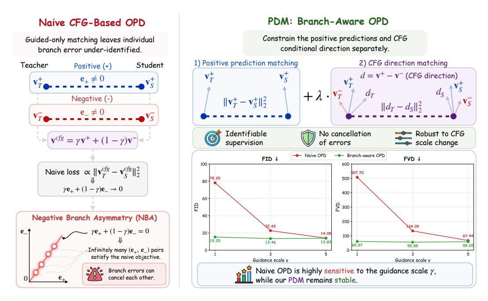
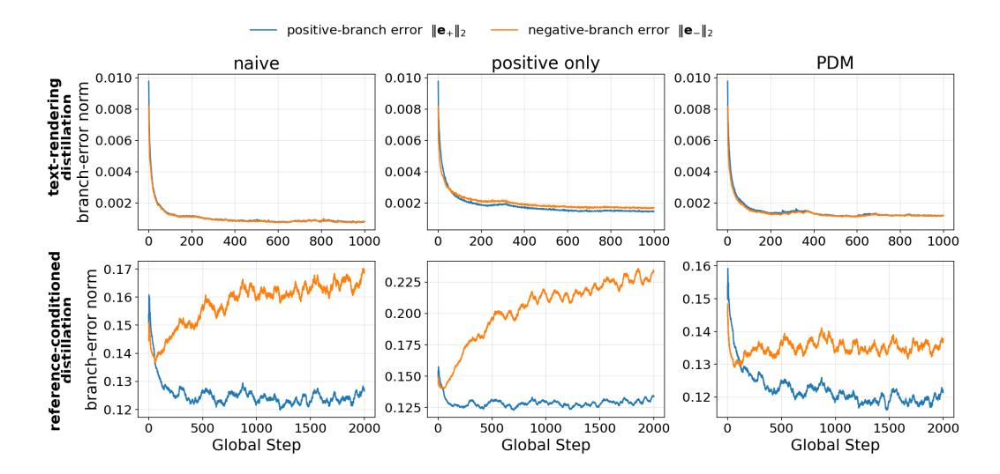
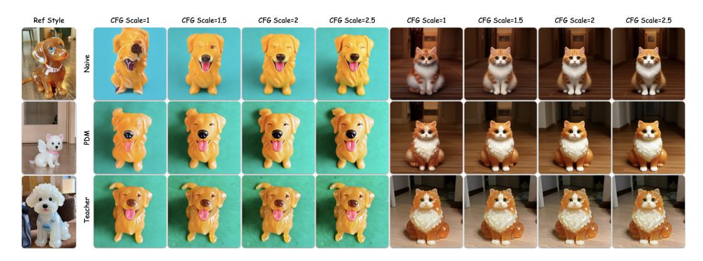
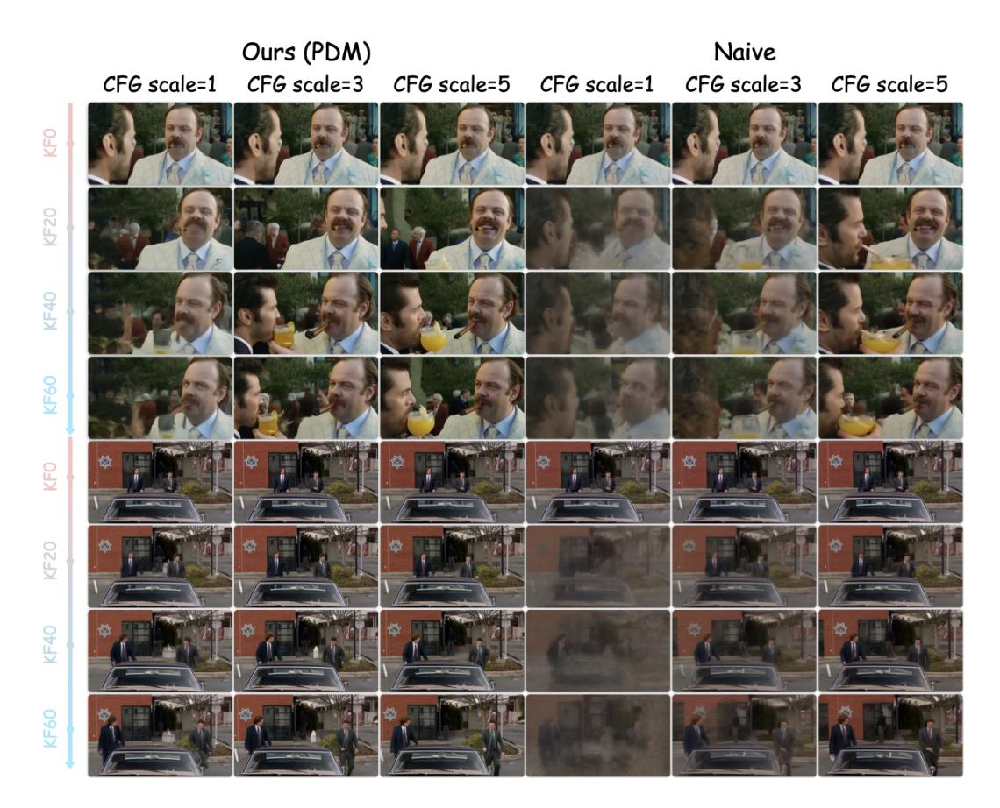
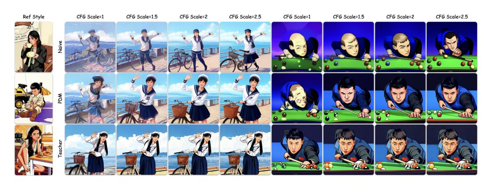
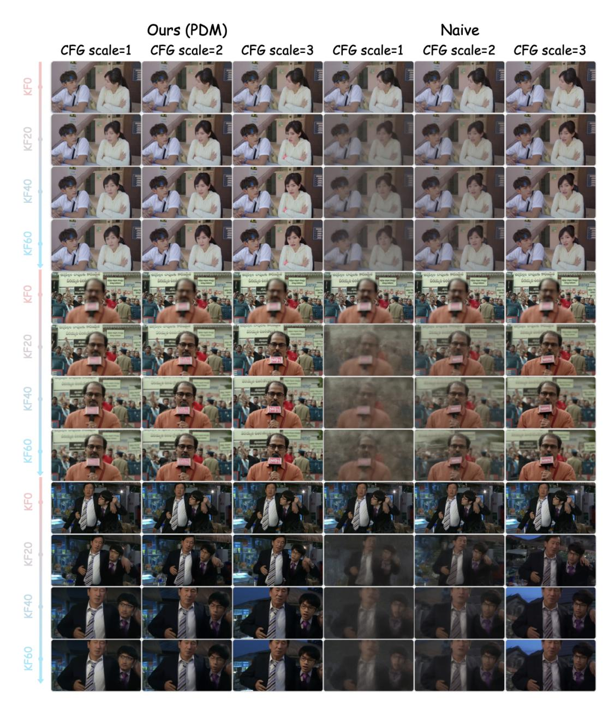
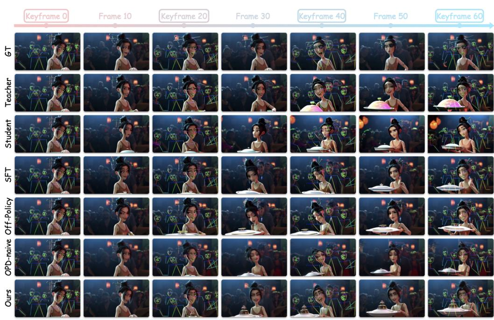
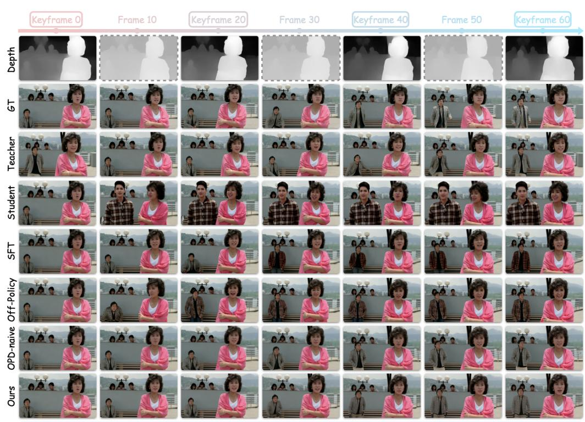
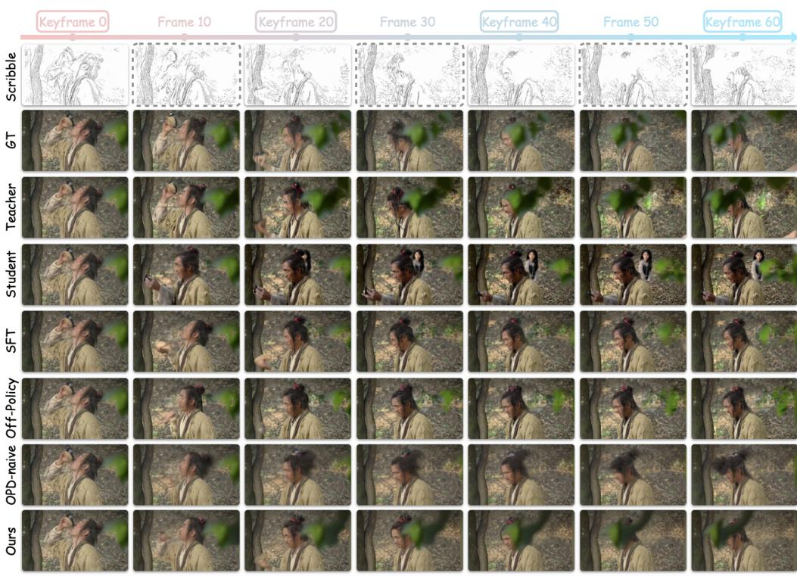

# Rethinking Classifier-Free Guidance in On-Policy Diffusion Distillation

- 원제: Rethinking Classifier-Free Guidance in On-Policy Diffusion Distillation
- 원문: [https://arxiv.org/abs/2607.24731](https://arxiv.org/abs/2607.24731)
- PDF: [https://arxiv.org/pdf/2607.24731v1](https://arxiv.org/pdf/2607.24731v1)
- arXiv ID: `2607.24731`

---

### References (참고문헌)

## 2 PRELIMINARIES (전제)

알리바바 Qwen 비즈니스 유닛, † 교신 저자 jmliu1217@gmail.com https://rethinking-cfg-opd.github.io

Figure 1: **Naive CFG-based OPD는 분기 모호성을 겪는다.** CFG로 구성된 예측만 매칭하면 양쪽 분기 오류가 상쇄되어 무한히 많은 퇴화된 해를 만들 수 있다. 우리의 분기 인식 목표인 Positive–Direction Matching (PDM)은 양쪽 예측과 CFG 조건 방향을 별도로 제약함으로써 이 모호성을 해결하고, 가이드 스케일에 걸쳐 식별 가능한 감독과 견고한 distillation을 복원한다.

#### **ABSTRACT (초록)**

On-policy distillation (OPD)은 현재 학생이 생성한 경로를 따라 교사 모델을 쿼리함으로써 diffusion 모델을 적응시키지만, 현대 diffusion 시스템의 기본 구성 요소인 classifier-free guidance (CFG) 하에서 어떻게 동작해야 하는지는 아직 잘 이해되지 않는다. 기존 OPD 방법은 자연스럽게 velocity matching을 CFG로 구성된 예측에 확장하여 교사와 학생의 가이드된 속도를 직접 매칭한다. 우리는 이 목표가 분기 수준에서 식별되지 않음을 보여준다: 양쪽 분기 오류가 가이드된 예측에서 상쇄될 수 있다. 두 가지 대조적인 사례를 통해, 양쪽 분기 오류가 함께 감소하는 공유된 부정 조건 하에서는 순진한 매칭이 여전히 효과적임을 발견했다. 그러나 모델의 기본 CFG 스키마가 학생이 접근할 수 없는 교사의 부정 분기에서 특권 정보를 보유하고 있을 때, 이 공동 감소는 무너지고 구성된 목표는 반대 방향의 분기 오류 역학을 유도하여 양쪽 분기 오류를 감소시키면서 부정 분기 오류를 증가시킨다. 우리는 이 실패 모드를 Negative Branch Asymmetry (NBA)라고 부른다. NBA를 해결하기 위해, 우리는 Positive-Direction Matching (PDM)을 도입한다. 이는 분기 인식 OPD 목표로, 양쪽 예측과 CFG 조건 방향을 별도로 제약한다. 우리는 PDM을 dense-to-sparse 비디오 제어에 적용한다. 여기서 순진한

가이드 매칭은 추론 가이드 스케일에 매우 민감하지만, 분기 인식 감독은 보다 견고하고 효과적인 지식 전달을 가능하게 한다.

## 3 NEGATIVE BRANCH ASYMMETRY AND BRANCH-AWARE OPD (부정 분기 비대칭 및 분기 인식 OPD)

Classifier-free guidance (CFG) (Ho & Salimans, 2022)는 거의 모든 현대 diffusion 모델을 구동하지만, 그가 denoise하는 속도는 네트워크가 직접적으로 생성하지 않는다. 대신, CFG는 모델을 두 번 평가한다: 목표 텍스트 조건 하의 양쪽 분기와 모델의 null 또는 부정 텍스트 조건 하의 부정 분기. 그런 다음 결과 속도 예측을 $\tilde{\mathbf{v}} = \gamma \mathbf{v}^+ + (1-\gamma)\mathbf{v}^-$ 형태로 합성한다. 여기서 가이드 스케일 $\gamma$는 추론 시 선택되는 배포 조정값이며, 종종 훈련 이후 오랜 시간이 지난 뒤에 결정된다.

On-policy distillation (OPD)은 학생이 현재 정책으로 denoising 경로를 생성하도록 하여, 동일한 학생이 방문한 상태에서 교사와 학생을 평가하고, 학생을 교사의 지역 속도와 일치하도록 업데이트한다 (Jiang et al., 2026; Fang et al., 2026; Li et al., 2026b). 온-폴리시 상태 커버리지와 밀집된 단계별 감독의 결합은 OPD를 오프라인 distillation 및 스칼라 보상 최적화에 대한 매력적인 대안으로 만든다 (Agarwal et al., 2024; Zhong et al., 2026; Wang et al., 2026b).

가이드된 교사와 마주했을 때, 확산 증류는 CFG를 다양한 방식으로 처리할 수 있다. 일부 방법은 CFG로 정의된 교사 필드를 단일 학생 예측에 흡수하여, 목표를 구성하는 데 사용된 가이드 강도를 내부화한다 (Luo et al., 2023; Yin et al., 2024b; Zhou et al., 2026). 그러나 여기서 고려되는 설정에서는 교사와 학생 모두 기본 확산 모델의 표준 CFG 인터페이스를 유지하고 별도의 양성 및 음성 예측을 생성한다 (Fang et al., 2026; Li et al., 2026b). OPD의 자연스러운 확장은 그들의 CFG-구성된 속도를 일치시키는 것이다, $\mathcal{L}_{\text{naive}} \propto \|\widetilde{\mathbf{v}}^T - \widetilde{\mathbf{v}}^S\|_2^2$ . 두 가지 분기가 여전히 사용 가능하기 때문에, 학생은 추론 시 다른 가이드 스케일로 평가될 수 있다; 그러나 훈련 손실은 오직 훈련 스케일에서의 그들의 구성을 제약한다.

이 합성 목표는 분기 수준에서 식별이 불가능하다. $\mathbf{e}_+ = \mathbf{v}_T^+ - \mathbf{v}_S^+$ 와 $\mathbf{e}_- = \mathbf{v}_T^- - \mathbf{v}_S^-$ 를 각각 양성-분기 오류와 음성-분기 오류라고 하자. 가이드 매칭은 오직 $\gamma \mathbf{e}_+ + (1-\gamma)\mathbf{e}_-$ 만을 제약하여 두 오류가 합성 예측을 바꾸지 않고 상쇄될 수 있도록 한다. 분기 모호성만으로는 실패를 의미하지 않는다. 공유 음성 조건 하에서는 공유 파라미터 업데이트가 두 분기 오류를 동시에 줄일 수 있다. 그러나 특권 음성 조건 하에서는 우리의 실험이 이 공동 감소가 붕괴될 수 있음을 보여 주며, 합성 목표의 보상 자유도를 드러낸다.

부정-분기 조건화가 OPD 최적화에 미치는 영향을 조사하기 위해, 우리는 두 이미지 도메인 증류 설정에서 훈련 전반에 걸쳐 양성-분기 및 부정-분기 오류를 추적한다. 텍스트 렌더링 증류(Li et al., 2026b)에서는 두 오류가 함께 감소하며 순진한 매칭이 여전히 효과적이다. 참조-조건화 증류(Jiang et al., 2026)에서는 교사의 부정-분기가 특권 정보를 받으므로, 순진한 매칭은 오히려 양성-분기 오류를 감소시키면서 부정-분기 오류를 증가시켜, 대립적인 분기-오류 역학을 유도한다. 우리는 이 실패 모드를 부정-분기 비대칭(Negative Branch Asymmetry, NBA)이라고 부른다.

NBA는 훈련에 사용되는 가이드라인 스케일에서 숨겨질 수 있다. 이는 반대 분기(branch) 오류가 합성 예측에서 보상되기 때문이다. 추론 시 가이드라인 스케일이 바뀌면 분기들이 다른 가중치로 재구성되고 학습된 보상이 더 이상 성립하지 않는다. 따라서 가이드라인 스케일 민감도는 NBA의 직접적인 관측 가능한 결과이다: 학생은 $\gamma_{\rm train}$에서 교사를 밀접하게 따라갈 수 있지만 다른 가이드라인 스케일에서 평가될 때 편향될 수 있다. 그림 1은 이 분기 모호성과 가이드라인 스케일 변화에 따른 효과를 보여준다.

해결책은 합성 전에 감독하는 것이다. 우리의 주요 목표인 *양방향 매칭* (PDM)은 양쪽 예측과 CFG 조건 방향 $\mathbf{v}^+ - \mathbf{v}^-$을 별도로 제약한다. PDM 손실이 0이면 두 분기 오류를 모두 0으로 만들며, 합성 목표가 한 분기를 개선하면서 다른 분기를 희생하는 것을 방지한다. 대조적으로, 우리는 *독립 분기 매칭* (IBM)을 연구한다. 이는 양쪽 분기를 직접 매칭한다. 두 목표 모두 가이드 전용 매칭의 보상 자유도를 제거하며, 분기 수준 감독의 가중치를 다르게 한다.

NBA가 발생하는 시점을 분리한 뒤, 우리는 분기 인식 OPD를 Wan‑VACE (Jiang et al., 2025)에서 밀집-희소 비디오 제어에 적용한다. 교사는 밀집된 프레임별 제어를 관찰하는 반면,

우리는 오직 희소한 키프레임만을 받는 학생 모델을 다룹니다. 이 실용적인 설정에서, 순진한 가이드 매칭은 추론 가이드 스케일이 훈련 값에서 벗어날 때 급격히 저하되지만, PDM과 IBM은 안정적입니다. PDM은 또한 포즈, 깊이, 그리고 스크리블 모달리티 전반에 걸쳐 제어 정확도를 향상시켜, 브랜치 인식 감독이 이미지 도메인 사례 연구를 넘어 더 견고하고 효과적인 지식 전이를 가능하게 함을 보여줍니다.

우리의 기여는 다음과 같이 요약됩니다:

- 우리는 CFG로 구성된 OPD가 브랜치 수준에서 과소식별되고, 이 모호성이 해로워지는 시점을 식별합니다. 공유된 부정 조건 하에서는 무해하지만, 특권 부정 조건이 공동 브랜치 오류 감소를 깨고 적대적 브랜치 오류 역학을 유도할 때 NBA를 생성합니다.
- 우리는 *Positive–Direction Matching* (PDM)을 도입합니다. 이는 브랜치 인식 OPD 목표로, 양성 예측과 CFG 조건 방향을 별도로 감독하여 교차 브랜치 오류 보상을 방지하고 추론 가이드 스케일 전반에 걸쳐 견고성을 향상시킵니다. 또한 브랜치 인식 대조군으로 Independent Branch Matching (IBM)을 포함합니다.
- 우리는 브랜치 인식 OPD를 밀집-희소 비디오 제어에 적용하고, 포즈, 깊이, 스크리블 모달리티 전반에 걸친 정량적 증거를 제공합니다. 순진한 매칭은 가이드 스케일에 극단적으로 민감하지만, 브랜치 인식 감독은 밀집 제어 지식을 보다 신뢰성 있게 전이합니다.

### 3.1 NEGATIVE BRANCH ASYMMETRY (부정 브랜치 비대칭)

## 6 CONCLUSIONS AND LIMITATIONS (결론 및 한계)

Diffusion on-policy distillation (OPD)는 자신의 진화하는 생성 과정에서 샘플링된 상태를 사용하여 학생 모델을 훈련합니다 [(Jiang et al., 2026;](#page-11-3) [Fang et al., 2026;](#page-11-4) [Li et al., 2026b)](#page-11-5). Let

$$\mathbf{x}_t^S \sim p_{\theta} \tag{1}$$

이는 현재 학생에 의해 생성된 궤적을 따라 방문되는 노이즈 상태를 나타냅니다. 이 상태에서 교사와 학생은 각각 cT와 cS에 조건화된 로컬 디노이징 전이를 정의합니다. 교사는 학생이 접근할 수 없거나 부분적으로만 접근 가능한 특권 정보를 가질 수 있으므로 cT와 cS는 동일할 필요가 없습니다.

기존 diffusion OPD 공식 [(Jiang et al., 2026;](#page-11-3) [Fang et al., 2026;](#page-11-4) [Li et al., 2026b)](#page-11-5)는 학생이 방문한 상태에서 교사와 학생 전이 간의 불일치를 최소화합니다. 이들은 유도와 최적화 절차가 다르지만, 전이 수준 목표는 시점에 따라 가중치가 부여된 한계까지 해당 모델 예측을 일치시키는 것으로 축소됩니다:

$$\mathcal{L}_{\text{OPD}} = \mathbb{E}_{\mathbf{x}_{t}^{S} \sim p_{\theta}, t} \left[ w(t) \left\| \mathbf{v}_{T} \left( \mathbf{x}_{t}^{S}, t, \mathbf{c}_{T} \right) - \mathbf{v}_{S} \left( \mathbf{x}_{t}^{S}, t, \mathbf{c}_{S} \right) \right\|_{2}^{2} \right], \tag{2}$$

여기서 vT와 vS는 교사와 학생의 속도 예측을 나타내며, w(t)는 파라미터화 및 솔버에 따라 가중치를 흡수합니다. 본 논문 전반에 걸쳐 속도 예측을 사용하지만, 동일한 공식은 등가 노이즈, 스코어, 또는 플로우 파라미터화에도 적용됩니다.

### 3.2 DIFFUSION OPD WITH CLASSIFIER-FREE GUIDANCE (분류자-프리 가이드가 있는 diffusion OPD)

다음으로, 가이드 스케일 γ > 1을 갖는 분류자-프리 가이드(CFG)를 사용하는 diffusion 모델을 고려합니다. 디노이징에 사용되는 속도는

$$\widetilde{\mathbf{v}} = \gamma \mathbf{v}^+ + (1 - \gamma) \mathbf{v}^-, \tag{3}$$

여기서 v+와 v−는 각각 양성 및 부정 브랜치 예측을 나타냅니다. 우리는 각 모델의 원래 훈련 및 추론 파이프라인에서 지정된 CFG 스키마를 유지합니다. 많은 모델에서 부정 브랜치는 텍스트 조건을 변경하면서 참조 이미지나 기타 제어 신호와 같은 보조 입력을 유지합니다.

양성 및 부정 브랜치 불일치를 다음과 같이 정의합니다.

$$\mathbf{e}_{+} = \mathbf{v}_{T}^{+} - \mathbf{v}_{S}^{+}, \qquad \mathbf{e}_{-} = \mathbf{v}_{T}^{-} - \mathbf{v}_{S}^{-}. \tag{4}$$

이러한 불일치를 CFG로 구성된 매칭 목표에 대입하면

$$\mathcal{L}_{\text{naive}} = \mathbb{E}_{\mathbf{x}_{t}^{S} \sim p_{\theta, t}} \left[ w(t) \left\| \gamma \mathbf{e}_{+} + (1 - \gamma) \mathbf{e}_{-} \right\|_{2}^{2} \right]. \tag{5}$$

Figure 2: 공유 및 특권 부정 조건화 하에서의 분기 오류 동역학. 우리는 텍스트 렌더링(상단)과 참조 조건화(하단) 증류 동안 양쪽 분기 ℓ2 오류 노름을 추적한다. 공유 부정 조건화 하에서는 모든 목표에 대해 두 오류가 함께 감소한다. 특권 참조 조건화 하에서는 순수 매칭과 양성 전용 매칭이 양성 오류를 줄이면서 부정 오류를 증가시켜, 반대되는 분기 오류 동역학을 나타낸다. PDM은 양성 예측과 CFG 조건 방향을 명시적으로 제약함으로써 부정 분기 저하를 억제한다.

기존 분기 보존 OPD 설정 [(Fang et al., 2026;](#page-11-4) [Li et al., 2026b)](#page-11-5)은 주로 텍스트-투-이미지 증류에서 연구되며, 여기서 교사와 학생은 부정 분기에서 동일한 null-text 조건화를 공유한다. 이러한 대칭은 특권 정보를 가진 OPD에서는 보장되지 않는다. 교사는 참조 또는 제어 정보를 받을 수 있지만, 학생은 이를 사용할 수 없거나 부분적으로만 사용할 수 있다. 모델의 기본 CFG 스키마가 부정 분기에 이 정보를 보존할 수 있기 때문에, 특권 부정 조건화는 실제 지식 전송 설정에서 자연스럽게 발생한다. 우리는 그 결과를 다음에서 분석한다.

## 3 부정 분기 비대칭 및 분기 인식 OPD

### 3.1 부정 분기 비대칭

특권 부정 조건화 하에서 교사의 부정 목표는 학생의 부정 입력에서 직접 재현될 수 없다. 그럼에도 불구하고 Eq. [5](#page-2-0)는 오직 CFG로 구성된 불일치를 제약한다. 어느 감독 상태에서도 가이드된 예측을 매칭하려면 다음만 필요하다

$$\gamma \mathbf{e}_{+} + (1 - \gamma)\mathbf{e}_{-} = \mathbf{0},\tag{6}$$

또는 다음과 동일하게,

$$\mathbf{e}_{+} = \frac{\gamma - 1}{\gamma} \mathbf{e}_{-}.\tag{7}$$

이 조건은 무한히 많은 비제로 분기 오류 쌍을 허용하며, 두 오류가 가이드된 예측을 바꾸지 않고 상쇄될 수 있게 한다.

Equation [7](#page-3-0)는 분기 모호성을 확립하지만 그 최적화 역학을 결정하지 않는다. 따라서 우리는 이 모호성이 실험적으로 해로워지는 시점을 Section [4.1.](#page-5-0)에서 조사한다. 두 개의 통제된 이미지 도메인 사례에서, 우리는 공유 부정 조건화 하에서는 분기 오류가 함께 감소하는 것을 관찰하지만, 특권 부정 조건화 하에서는 반대되는 분기 오류 동역학을 관찰한다.

정의: 부정 분기 비대칭 (NBA). 분기 모호성만으로는 실패를 구성하지 않는다. 우리는 NBA를 특권 부정 조건화 하에서 발생하는 실패 모드로 정의한다.

Figure 3: **특권 참조 조건 하에서의 증류 유발 CFG 민감도.** 왼쪽 열은 참조 스타일 예시를 보여준다. 두 개의 보류된 프롬프트에 대해, 우리는 참조 조건화된 교사와 단순 매칭 또는 PDM을 사용해 훈련된 텍스트 전용 학생들을 $\gamma_{\rm train}=2$에서 비교한다. 모든 출력은 일치된 프롬프트와 초기 노이즈를 사용한다. 교사는 추론 가이드 스케일 전반에 걸쳐 참조 제공 스타일을 보존하며, PDM은 이 행동을 밀접하게 따른다. 반면 단순 매칭은 시각적 왜곡과 스타일 드리프트가 더 강하게 나타나며, 특히 $\gamma=1$에서 두드러진다. 추가 예시는 부록 7.2에 제공된다.

순진한 CFG-구성 매칭은 적대적인 브랜치-오류 역학을 유발하며, $\|\mathbf{e}_+\|_2$를 감소시키고 $\|\mathbf{e}_-\|_2$를 증가시킨다. 반대되는 오류는 훈련 가이드 스케일에서는 숨겨질 수 있으며, 브랜치가 다른 스케일에서 재구성될 때 드러난다.

가이드 스케일 변화에 따른 절대적인 성능 하락은 단독으로 NBA의 증거가 되지 않는다. 교사가 본질적으로 CFG에 의존할 수 있기 때문이다. 관련 서명은 순진한 디스틸레이션에 의해 도입된 과도한 저하이다: 학생이 교사의 가이드 스케일 동작에서 벗어나거나 브랜치 인식 동료보다 더 강하게 저하된다. 섹션 4.1에서 이러한 예측을 실험적으로 검증한다.

### 3.2 브랜치 인식 OPD (3.2 Branch-Aware OPD)

교차 브랜치 오류 보상을 방지하기 위해, 우리는 CFG 구성을 하기 전에 예측을 감독한다. $\ell$는 학생이 방문한 상태 $\mathbf{x}_t^S$와 타임스텝 t에서 평가되는 포인트별 디스틸레이션 손실을 나타낸다. 이에 해당하는 OPD 목표는

$$\mathcal{L}_{\text{OPD}}[\ell] = \mathbb{E}_{\mathbf{x}_{t}^{S} \sim p_{\theta}, t} \left[ w(t) \, \ell(\mathbf{x}_{t}^{S}, t) \right]. \tag{8}$$

**양방향 매칭.** 모델 $M \in \{T, S\}$에 대해, 그 CFG 조건 방향을 정의한다:

$$\mathbf{d}_M = \mathbf{v}_M^+ - \mathbf{v}_M^-.\tag{9}$$

우리의 주요 목표인 양방향 매칭(PDM)은 양성 예측과 조건 방향을 별도로 매칭한다:

$$\ell_{\text{PDM}} = \|\mathbf{e}_{+}\|_{2}^{2} + \lambda \|\mathbf{d}_{T} - \mathbf{d}_{S}\|_{2}^{2} = \|\mathbf{e}_{+}\|_{2}^{2} + \lambda \|\mathbf{e}_{+} - \mathbf{e}_{-}\|_{2}^{2},$$

(10)

여기서 $\lambda>0$는 방향 매칭 강도를 제어한다. 첫 번째 항은 양성 예측을 고정시키고, 두 번째 항은 CFG 조건 방향을 보존한다. PDM 손실이 0이 되려면 $\mathbf{e}_+=\mathbf{e}_-=\mathbf{0}$이어야 하며, 이는 가이드 전용 매칭의 보상 자유도를 제거한다.

**기준: 독립 브랜치 매칭.** 브랜치 수준 감독의 이점을 PDM의 특정 설계와 분리하기 위해, 우리는 독립 브랜치 매칭(IBM)을 기준으로 포함한다:

$$\ell_{\text{IBM}} = \gamma^2 \|\mathbf{e}_+\|_2^2 + (\gamma - 1)^2 \|\mathbf{e}_-\|_2^2. \tag{11}$$

IBM은 확장된 순진한 목표의 브랜치별 가중치를 유지하지만 교차 브랜치 상호작용 항을 제거한다. PDM과 마찬가지로 $\gamma>1$에 대해 고유한 브랜치 수준의 0 손실 해를 갖지만, 양성 예측과 조건 방향을 보존하기보다는 두 브랜치를 직접 매칭한다. 우리는 표 2에서 이 두 브랜치 인식 형식의 경험적 행동을 비교한다.

표 1: 텍스트 렌더링 디스틸레이션에서의 내재적 CFG 민감도. OCR 보상 $(\%, \uparrow)$ 1,018개의 보류 프롬프트에서. 모든 모델은 추론 가이드 스케일에 대해 유사한 반응을 보이며, $\gamma = 1$에서의 감소가 교사로부터 상속된 것이며 순진한 디스틸레이션에 의해 도입된 것이 아님을 보여준다.

| 방법 | $(\gamma)=1$ | $(\gamma)=2$ | $(\gamma)=3$ | $(\gamma)=4$ | $(\gamma)=4.5$ |
|-------------|----------------|----------------|----------------|----------------|------------------|
| 교사 | 75.24 | 92.91 | 94.16 | 94.43 | 94.09 |
| OPD (순진한) (Naive) | 73.87 | 92.72 | 94.52 | 94.43 | 94.11 |
| OPD (PDM) | 74.48 | 93.73 | 93.99 | 94.02 | 94.38 |

### 3.3 효율적인 감독: 밀집-투-희소 비디오 제어 (EFFICIENT SUPERVISION FOR DENSE-TO-SPARSE VIDEO CONTROL)

전체 경로 OPD는 비디오에서 특히 비용이 많이 듭니다. 이는 모든 디노이징 단계에서 교사 평가가 필요하기 때문입니다. 우리 밀집-투-희소 비디오 적용에서는 학생 경로의 초기 일부만 감독하는 것이 이 비용을 크게 줄이면서 성능을 유지한다는 것을 독립적으로 발견했습니다. 관련 관찰은 DanceOPD에서도 동시에 보고되었습니다 (Zhou et al., 2026).

Let  $\{\mathbf{x}_{t_k}^S\}_{k=0}^{N-1}$  denote the states visited by the student in denoising order. 우리는 첫 번째 K 상태만 감독한다:

$$\mathcal{L}_{\text{OPD}}^{(K)} = \mathbb{E}_{\{\mathbf{x}_{t_k}^S\}_{k=0}^{N-1} \sim p_{\theta}} \left[ \frac{1}{K} \sum_{k=0}^{K-1} w(t_k) \, \ell(\mathbf{x}_{t_k}^S, t_k) \right].$$

(12)

학생은 여전히 전체 디노이징 롤아웃을 완료하지만, 교사 감독은 이 K 상태에 대해서만 계산됩니다. 여기서 K=N이면 전체 경로 감독을 복원하고, 더 작은 Kx는 훈련 비용을 줄입니다. 이 설계는 밀집-투-희소 비디오 실험에만 사용되며, 이미지 도메인 사례 연구는 각각의 표준 감독 프로토콜을 따릅니다. 우리는 Section 4.3.2에서 K의 효과를 연구합니다.

## 4 EXPERIMENTS

우리는 먼저 CFG-구성 매칭의 분기 모호성이 NBA로 발전하는 시점을 조사합니다. 그 다음, 밀집-투-희소 비디오 제어에서 분기 인식 OPD를 평가하고 주요 설계 선택을 분석합니다.

### 4.1 When Does NBA Emerge?

#### 4.1.1 EXPERIMENTAL SETUP

우리는 서로 다른 부정 조건을 가진 두 가지 이미지 도메인 증류 설정을 대비한다. 텍스트 렌더링 증류에서는 DiffusionOPD (Li et al., 2026b)를 따르고, 시각적 텍스트 렌더링에 특화된 SD3.5-Medium 기반 (Esser et al., 2024) OCR 교사 모델을 사용한다. 교사와 학생은 양성 분기에서 동일한 프롬프트를 받고, 부정 분기에서는 동일한 null-text 조건을 받는다:

$$\mathbf{c}_T^+ = \mathbf{c}_S^+ = \mathbf{y}, \qquad \mathbf{c}_T^- = \mathbf{c}_S^- = \varnothing.$$

(13)

모델은 $\gamma_{\rm train}=4.5$ 에서 훈련되고, 1,018개의 보류된 프롬프트에서 평가된다.

참조 조건화 증류 (Jiang et al., 2026)에서는 FLUX-2-klein-base-4B (Labs, 2025)를 사용해 실험을 수행하며, 교사는 텍스트 전용 학생이 볼 수 없는 참조 이미지 ${\bf r}$ 을 관찰한다:

$$\mathbf{c}_{T}^{+} = (\mathbf{y}, \mathbf{r}), \quad \mathbf{c}_{S}^{+} = \mathbf{y},$$

$$\mathbf{c}_{T}^{-} = (\varnothing, \mathbf{r}), \quad \mathbf{c}_{S}^{-} = \varnothing.$$

(14)

따라서 교사는 부정 분기에서 특권 정보를 받는다. 모델은 $\gamma_{\rm train}=2$ 에서 훈련되고, 추론 가이드 스케일 전반에 걸쳐 보류된 프롬프트에서 평가된다.

분기 결합을 진단하기 위해, 우리는 순수 매칭, PDM, 그리고 양성 전용 절제( $\ell_+ = \|\mathbf{e}_+\|_2^2$ )를 훈련시키고, 훈련 전반에 걸쳐 양쪽 분기 오류를 추적한다. 양성 전용 절제는 양성 목표에 대한 업데이트가 부정 분기 오류에 미치는 영향을 고립한다. 이는 오직 이 최적화 진단을 위해 사용되며, 생성 비교는 동일한 훈련 프로토콜 하에서 순수 매칭과 PDM을 사용한다. 전체 구현 세부 사항은 부록 7.1에 제공된다.

표 2: 밀집-희소 비디오 제어에 대한 주요 결과. 모델은 포즈, 깊이, 스크리블 제어를 공동으로 훈련하고, 각 모달리티를 별도로 평가한다. 평가 시 훈련 가이드 스케일 γ = 5 를 사용한다. 굵게 및 밑줄 친 값은 교사를 제외한 최상 및 두 번째 최상의 결과를 나타낸다.

| 전체 | 핵심 | 전체 | 핵심 | 전체 | 핵심 | FID | FVD |
|--------|-----------------------|----------------------------------------------|-------------------------|----------------------------------------------------|-------------------------|-------------------------------------|---------------------------------------------------|
| 3.03 | 2.82 | 96.02 | 96.46 | 91.15 | 92.23 | 14.13 | 56.01 |
|  |  |  |  |  |  |  | 81.41 |
| 5.02 | 3.31 | 90.36 | 94.77 | 76.72 | 88.55 | 14.11 | 63.90 |
| 5.14 | 3.44 | 89.78 | 94.09 | 75.46 | 87.48 | 14.49 | 68.50 |
| 4.43 | 3.14 | 91.84 | 95.25 | 80.28 | 89.35 | 13.49 | 65.12 |
|  |  |  |  |  |  |  | 65.72 |
| 4.13 | 2.83 | 92.98 | 96.12 | 82.48 | 91.03 | 13.52 | 62.77 |
| 상관계수 ↑ |  | RMSE ↓ |  |  | SI-RMSE ↓ |  |  |
| 전체 | 핵심 | 전체 | 핵심 | 전체 | 핵심 | FID | 프레셰 비디오 거리 (FVD) |
| 96.98 | 97.58 | 7.50 | 6.36 | 6.19 | 5.23 | 11.02 | 36.89 |
| 83.21 | 91.27 | 16.87 | 11.13 | 14.36 | 9.37 | 15.03 | 71.33 |
| 88.39 | 96.17 | 13.83 | 7.80 | 11.96 | 6.52 | 12.87 | 58.13 |
| 88.25 | 96.01 | 13.98 | 8.00 | 12.10 | 6.64 | 12.66 | 59.35 |
| 90.58 | 96.56 | 12.39 | 7.47 | 10.69 | 6.16 | 12.08 | 72.20 |
|  |  |  |  |  |  |  | 60.38 |
| 91.24 | 97.13 | 11.95 | 6.91 | 10.31 | 5.68 | 11.64 | 60.60 |
|  |  |  |  | F1 ↑ |  | 품질 ↓ |  |
| 전체 | 핵심 | 전체 | 핵심 | 전체 | 핵심 | FID | FVD |
| 93.26 | 94.40 | 94.26 | 95.27 | 93.73 | 94.81 | 9.56 | 24.22 |
| 64.20 | 82.93 | 65.50 | 83.78 | 64.70 | 83.24 | 12.29 | 69.13 |
| 67.23 | 89.03 | 69.52 | 90.66 | 68.27 | 89.79 | 10.69 | 50.56 |
| 70.98 | 91.55 | 72.15 | 91.73 | 71.49 | 91.60 | 11.60 | 52.90 |
| 74.78 | 90.77 | 75.38 | 91.34 | 75.00 | 90.99 | 10.53 | 59.95 |
| 75.92 | 92.23 | 76.47 | 92.70 | 76.13 | 92.43 | 10.12 | 52.67 |
| 76.42 | 93.03 | 76.13 | 92.86 | 76.22 | 93.03 | 10.34 | 50.53 |
|  | 5.92 4.20 91.14 | MPJPE ↓ 4.10 2.88 96.91 재현율 ↑ | 86.78 92.93 12.03 | PCK@0.2 ↑ 91.89 96.11 7.11 정밀도 ↑ | 69.97 82.27 10.37 | PCK@0.1 ↑ 82.53 90.95 5.85 | 품질 ↓ 15.81 13.26 품질 ↓ 11.76 |

#### 4.1.2 브랜치-오류 동역학

Figure [2](#page-3-1)은 두 가지 뚜렷한 최적화 영역을 보여준다. 텍스트 렌더링 디스틸레이션에서, 양수 전용 훈련은 두 브랜치 오류를 모두 감소시켜, 양수 브랜치 업데이트가 음수 브랜치를 개선한다는 것을 보여준다. Naive matching과 PDM은 동일한 공동 오류 감소를 보이며, 이는 유해하지 않은 영역을 나타낸다.

Reference-conditioned distillation은 반대의 행동을 보인다. 양수 전용 훈련은 양수 브랜치 오류를 감소시키지만, 음수 브랜치 오류를 크게 증가시켜, 특권적 조건화 하에서 양수 브랜치 업데이트가 더 이상 음수 브랜치를 이롭게 하지 않는다는 것을 보여준다. Naive matching은 동일한 대립적 패턴을 따르며, 양수 오류를 감소시키면서 음수 오류를 증가시킨다. PDM은 대신 양수 오류를 감소시키면서 지속적인 음수 오류 성장을 방지한다. Naive matching 하에서의 대립적 궤적은 NBA의 최적화 시그니처이며, PDM은 공동 브랜치 수준의 감독을 복원한다.

#### 4.1.3 내재적 및 디스틸레이션 유도 CFG 민감도

위의 브랜치-오류 궤적은 최적화 과정에서 유해하지 않은 공동 감소와 NBA를 구분한다. 다음으로, 이러한 영역이 추론 시 가이드 변동 하에서 어떻게 나타나는지 살펴본다. 훈련 가이드 스케일에서 벗어난 절대 성능 하락은 NBA의 충분한 증거가 아니며, 이는 교사가 본질적으로 CFG에 의존할 수 있기 때문이다. 표 [1](#page-5-1)은 텍스트 렌더링 디스틸레이션에서 두 학생이 가이드 스윕 전반에 걸쳐 교사를 밀접하게 따라간다는 것을 보여준다. γ = 1에서 교사는,

|  |  | MPJPE ↓ | PCK@0.2 ↑ |  |  | PCK@0.1 ↑ |  | 품질 ↓ |  |
|---------------|------|---------|-----------|-------|-------|-----------|-------|-----------|--|
| 방법 | 전체 | 핵심 | 전체 | 핵심 | 전체 | 핵심 | FID | FVD |  |
| Naive (γ = 5) | 4.62 | 3.22 | 91.35 | 95.01 | 79.39 | 89.54 | 14.05 | 67.44 |  |
| Naive (γ = 3) | 4.94 | 3.31 | 90.23 | 94.53 | 77.92 | 88.22 | 22.66 | 134.09 |  |
| Naive (γ = 1) | 8.98 | 6.23 | 80.08 | 87.42 | 69.14 | 81.57 | 78.20 | 507.70 |  |
| IBM (γ = 5) | 4.28 | 2.91 | 92.67 | 95.95 | 81.69 | 91.03 | 12.99 | 53.83 |  |
| IBM (γ = 3) | 4.42 | 3.04 | 92.09 | 95.53 | 81.41 | 90.81 | 13.69 | 56.85 |  |

IBM (γ = 1) 4.91 3.43 90.92 94.69 80.66 89.98 18.00 71.17 PDM (γ = 5) 4.27 2.75 92.71 96.38 82.12 91.66 13.83 58.65 PDM (γ = 3) 4.17 2.73 92.81 96.61 82.27 91.81 13.46 55.85 PDM (γ = 1) 4.48 2.90 92.14 95.64 81.72 91.15 15.25 60.97

Table 3: 포즈 제어에서 가이드스케일 일반화. 모델은 γtrain = 5에서 훈련되고, 다양한 추론 가이드스케일에서 평가됩니다.

naive student와 PDM student는 각각 OCR 보상을 75.24, 73.87, 74.48을 얻으며, 가이드가 증가함에 따라 모두 유사하게 향상됩니다. 따라서 두 목표 모두 교사의 본질적인 CFG 의존성 외에 상당한 민감도를 도입하지 않습니다.

Reference-conditioned distillation은 다른 패턴을 보입니다. Figure [3](#page-4-0)은 교사가 가이드스케일 전반에 걸쳐 reference-supplied 스타일을 보존하고, PDM이 이 행동을 밀접하게 따라간다는 것을 보여줍니다. Naive matching은 대신 교사에서 벗어나 시각적 왜곡과 스타일 드리프트를 생성하며, 이는 γ = 1에서 가장 두드러집니다. 여기서 CFG는 양성 예측으로 축소됩니다. 교사와 PDM 모두에 비해 과도한 저하가 naive distillation이 도입한 민감도를 분리합니다. Figure [2,](#page-3-1)의 branch-error 궤적과 함께, 이 결과는 NBA가 교사의 본질적인 CFG 의존성 외에 가이드스케일 민감도를 유발함을 보여줍니다.

발견: Branch Ambiguity가 언제 해로운가? 공유된 부정적 조건화 하에서는 두 branch error가 동시에 감소하고 학생이 교사의 본질적인 CFG 반응을 따릅니다. 특권 부정적 조건화 하에서는 naive matching이 반대 branch-error 역학과 과도한 가이드스케일 민감도를 유발하지만, PDM은 둘 다 억제합니다. 따라서 교사 또는 branch-aware 학생에 비해 과도한 저하—절대적인 CFG-free 성능 하락이 아니라—가 NBA의 진단적 시그니처입니다.

### 4.2 DENSE-TO-SPARSE 비디오 제어에 대한 적용 (APPLICATION TO DENSE-TO-SPARSE VIDEO CONTROL)

#### 4.2.1 실험 설정 (EXPERIMENTAL SETUP)

우리는 Wan-VACE [(Jiang et al., 2025)](#page-11-8)를 사용하여 dense-to-sparse 비디오 제어에 branch-aware OPD를 적용합니다. 교사는 dense control sequence pdense를 받고, 학생은 sparse keyframes psparse만 관찰합니다:

$$\mathbf{c}_{T}^{+} = (\mathbf{y}, \mathbf{p}_{\text{dense}}), \quad \mathbf{c}_{S}^{+} = (\mathbf{y}, \mathbf{p}_{\text{sparse}}), 
\mathbf{c}_{T}^{-} = (\varnothing, \mathbf{p}_{\text{dense}}), \quad \mathbf{c}_{S}^{-} = (\varnothing, \mathbf{p}_{\text{sparse}}).$$

(15)

우리는 OpenHumanVid [(Li et al., 2025)](#page-11-9)에서 600개의 테스트 클립을 포함하는 벤치마크를 구축하고, dense-to-four-keyframe 설정에서 포즈, 깊이, 그리고 스크리블 제어를 평가합니다. 기준선은 조정되지 않은 sparse-control 학생, 데이터에서 파생된 diffusion 상태에 대한 SFT, 그리고 off-policy teacher matching을 포함하며, 모든 방법은 동일한 학생 아키텍처와 훈련 예산을 사용합니다.

특히 명시되지 않은 경우, PDM은 λ = 1을 사용하고 첫 번째 K = 8 학생 방문 상태를 감독합니다. 주요 결과는 세 가지 제어 모달리티를 모두 포함한 공동 훈련을 사용합니다. 가이드스케일 및 하이퍼파라미터 연구는 포즈 전용 모델을 사용하여 반복 훈련 비용을 줄입니다; 따라서 두 프로토콜의 결과는 직접적으로 비교할 수 없습니다. 완전한 데이터, 지표, 구현 세부 사항은 Appendix [7.1.](#page-13-0)에 제공됩니다.

Figure 4: dense-to-sparse 비디오 제어에서 가이드스케일 견고성. 모델은 γ = 5에서 훈련됩니다. PDM은 추론 스케일 전반에 걸쳐 안정적이지만, naive OPD는 오프 스케일에서 저하됩니다.

#### 4.2.2 주요 결과 (MAIN RESULTS)

Table [2](#page-6-0)는 훈련 가이드스케일 γ = 5에서의 결과를 보고한다. PDM은 포즈, 깊이, 스크리블 전반에 걸쳐 가장 일관된 컨트롤‑프리디시 향상을 제공하며, IBM도 대부분의 컨트롤 메트릭에서 naive matching을 능가한다. IBM의 성능은 교차 브랜치 보상을 제거하는 이점을 지지하며, PDM의 전반적으로 더 강력한 결과는 그 양의 방향 파라미터화의 이점을 뒷받침한다.

이러한 매치된 스케일 결과는 가이드스케일 변동과 무관하게 브랜치‑인식 OPD의 실용적 가치를 확립한다. γ = γtrain에서 PDM은 naive OPD, SFT, 그리고 오프폴리시 distillation보다 세 가지 모달리티 모두에서 컨트롤 프리디시를 향상시킨다. 따라서 브랜치‑인식 온‑폴리시 감독은 단순히 오프‑스케일 저하를 교정하는 것이 아니라, 밀집‑투‑희소 지식 전이를 자체적으로 개선한다.

#### 4.2.3 가이드스케일 일반화 (GUIDANCE-SCALE GENERALIZATION)

Table [3](#page-7-0)는 γtrain = 5에서 훈련된 포즈 전용 모델을 다양한 가이드스케일에서 테스트한 결과를 평가한다. naive matching은 추론 스케일이 훈련에서 멀어질수록 급격히 저하되며, γ = 1에서 가장 큰 감소를 보인다. 반면 PDM과 IBM은 스윕 전반에 걸쳐 안정적이며, 이는 브랜치‑인식 감독이 구성된 매칭에 의해 유발되는 과도한 가이드 민감도를 방지함을 보여준다. PDM은 평가된 스케일 전반에서 가장 일관된 컨트롤 프리디시를 제공한다.

Figure [4](#page-8-0)는 NBA 하에서 기대되는 naive OPD의 과도한 가이드스케일 민감성을 정성적으로 보여준다. 포즈, 깊이, 스크리블 제어 생성에 대한 추가 정성적 비교는 부록 [7.2.](#page-16-0)에 제공된다.

Table 4: 포즈 전용 ablation 설정에서 조건 방향 가중치 λ의 효과. 굵게 및 밑줄 친 숫자는 각각 가장 좋은 결과와 두 번째로 좋은 결과를 나타낸다.

|  |  | 평균 관절 위치 오차 (MPJPE) ↓ | 정확한 관절 비율 (PCK)@0.2 ↑ |  | 정확한 관절 비율@0.1 ↑ |  | 품질 ↓ |  |
|--------------|------|---------|-----------|-------|-----------|-------|-----------|-------|
| 방법 | 전체 | 키 | 전체 | 키 | 전체 | 키 | FID | FVD |
| 포즈 분포 모델 (PDM) (λ = 0) | 4.24 | 2.81 | 92.71 | 96.24 | 81.80 | 91.05 | 13.97 | 59.72 |
| 포즈 분포 모델 (λ = 1) | 4.27 | 2.75 | 92.71 | 96.38 | 82.12 | 91.66 | 13.83 | 58.65 |
| 포즈 분포 모델 (λ = 3) | 4.36 | 2.95 | 92.08 | 95.77 | 81.25 | 90.39 | 13.33 | 61.79 |
| 포즈 분포 모델 (λ = 5) | 4.40 | 3.00 | 92.27 | 95.96 | 80.89 | 90.75 | 12.97 | 56.85 |
| 포즈 분포 모델 (λ = 10) | 4.49 | 3.07 | 91.60 | 95.35 | 80.21 | 89.93 | 12.96 | 56.91 |

표 5: 포즈 전용 ablation 설정에서 OPD 감독 수평 K의 효과. Wall-clock 훈련 시간은 최적화 단계당 초 단위로 보고됩니다. 굵게 및 밑줄이 그려진 숫자는 각각 최상위 및 두 번째 최상위 결과를 나타냅니다.

|  | MPJPE ↓ |  | PCK@0.2 ↑ |  | PCK@0.1 ↑ |  | 품질 ↓ |  | 시간 ↓ |  |
|--------------|---------|------|-----------|-------|-----------|-------|-----------|-------|-----------|--|
| 방법 | — | 핵심 | — | 핵심 | — | 핵심 | FID | FVD | 
 s/step |  |
| PDM (K = 1) | 4.33 | 2.98 | 92.53 | 95.68 | 81.19 | 90.57 | 13.70 | 54.41 | ∼23 |  |
| PDM (K = 2) | 4.45 | 3.11 | 92.18 | 95.57 | 80.78 | 90.51 | 13.89 | 60.63 | ∼38 |  |
| PDM (K = 4) | 4.27 | 2.86 | 92.59 | 95.98 | 81.71 | 91.13 | 13.58 | 57.08 | ∼69 |  |
| PDM (K = 8) | 4.27 | 2.75 | 92.71 | 96.38 | 82.12 | 91.66 | 13.83 | 58.65 | ∼132 |  |
| PDM (K = 50) | 4.65 | 3.14 | 91.34 | 95.25 | 80.81 | 90.09 | 13.91 | 61.95 | ∼790 |  |

### 4.3 절제 연구 (ABLATION STUDIES)

#### 4.3.1 방향 일치 가중치의 효과 (EFFECT OF THE DIRECTION-MATCHING WEIGHT)

Table [4](#page-9-1)는 PDM에서 방향 일치 가중치 λ를 연구한다. λ = 0일 때 PDM은 양수 전용 매칭으로 축소된다. 우리는 λ = 1이 가장 좋은 전체 제어 신뢰도를 제공한다는 것을 발견했다. 이는 가장 낮은 키프레임 MPJPE와 가장 높은 PCK@0.1을 포함한다. 더 큰 값은 일부 분포 품질 지표를 개선하지만 제어 정확도를 약화시킨다. 따라서 우리는 λ = 1을 기본값으로 사용한다.

#### 4.3.2 감독 수평의 효과 (EFFECT OF THE SUPERVISION HORIZON)

Table [5](#page-9-2)는 밀집-희소 비디오 적용에서 감독 상태 수 K를 연구한다. K를 증가시키면 K = 1일 때 단계당 23초에서 K = 50인 전체 경로 감독 하에 790초로 훈련 비용이 상승한다. 평가된 설정 중에서 K = 8은 가장 강력한 제어 신뢰도를 제공하면서 전체 경로 감독보다 훨씬 효율적이다. 따라서 우리는 주요 비디오 실험에 K = 8을 사용한다.

## 5 관련 연구 (RELATED WORK)

### 5.1 확산 모델 증류 (DIFFUSION MODEL DISTILLATION)

우리의 목표가 몇 단계 생성이 아니더라도, 기존의 확산 증류는 교사 감독과 분류기-프리 가이던스가 일반적으로 학생에게 어떻게 전달되는지를 이해하는 가장 가까운 맥락을 제공한다. 대부분의 기존 방법은 추론 시 필요한 디노이징 단계 수를 줄이는 데 초점을 맞춘다. Progressive Distillation은 여러 교사 단계를 재귀적으로 압축하여 단일 학생 단계로 만든다 [(Salimans & Ho, 2022)](#page-12-5). Consistency 기반 방법들, 예를 들어 Consistency Models [(Song](#page-12-6) [et al., 2023;](#page-12-6) [Kim et al., 2024)](#page-11-10) 및 Latent Consistency Models [(Luo et al., 2023)](#page-11-7)은 동일한 확률 흐름 궤적을 따라 상태 간 일관된 출력을 생성하도록 모델을 훈련시켜 한 단계 또는 몇 단계 생성이 가능하도록 한다. Distribution Matching Distillation (DMD)은 학생 분포를 교사와 매칭시키는 점수 함수를 통해 매칭한다 [(Yin et al., 2024b)](#page-12-3), 다른 접근 방식은 확산 감독을 적대적 훈련과 결합한다 [(Sauer et al., 2024;](#page-12-7) [Yin et al., 2024a)](#page-12-8).

이러한 방법들 중 다수는 분류기-프리 가이던스를 학생에게 증류한다. 추론 시 별도의 양수와 음수 분기를 유지하는 대신, 그들은 CFG로 구성된 교사 예측을 증류 대상로 사용하여 가이던스 효과를 단일 학생 예측에 녹여낸다 [(Luo](#page-11-7) [et al., 2023;](#page-11-7) [Yin et al., 2024b;](#page-12-3) [Wu et al., 2026;](#page-12-9) [Huang et al., 2025)](#page-11-11). 이 설계는 CFG를 위한 두 모델 평가를 피함으로써 샘플링 효율성을 향상시키고, 더 넓게는 강하게 가이드된 교사 분포를 압축된 몇 단계 생성기로 이전한다.

우리의 설정은 목표와 목적 모두에서 다르다. 우리는 주로 다단계 가이드된 교사를 CFG-프리 몇 단계 학생으로 압축하려는 것이 아니다. 대신, 우리는 교사와 학생이 각각 양수와 음수 분기에서 자체 가이드된 예측을 구성하는 확산 OPD를 연구한다. 최종 가이드된 예측만 매칭하는 것은 분기 수준에서 과소식별된다. 이 모호성은 교사의 음수 분기에 학생이 접근할 수 없는 특권 정보를 포함할 때 해로워져 두 분기 오류가 공동으로 감소되지 못하게 한다.

### 5.2 확산 모델을 위한 온정책 증류 (ON-POLICY DISTILLATION FOR DIFFUSION MODELS)

최근 연구는 현재 학생으로부터 샘플링된 상태에서 교사를 질의함으로써 온-폴리시 디스틸레이션을 확산 및 흐름 모델에 확장하였다. D-OPSD는 특권적 컨텍스트를 사용한 온-폴리시 자기-디스틸레이션을 수행하여 학생이 자신의 노이즈 제거 경로를 따라 평가된 더 강력한 교사로부터 학습할 수 있게 한다 [(Jiang et al., 2026)](#page-11-3). Flow-OPD는 온-폴리시 샘플링과 단계별 밀집 감독을 통해 과제 특화된 흐름 매칭 교사들을 통합된 학생으로 디스틸한다 [(Fang et al., 2026)](#page-11-4). DiffusionOPD는 전이 수준 KL 발산을 통해 이 과정을 공식화하고, 표준 확산 전이 하에서는 예측 매칭으로 축소된다는 것을 보여준다 [(Li et al., 2026b)](#page-11-5). 동시에 DanceOPD는 생성 능력을 속도 필드로 간주하고, CFG와 같은 운영자 정의 필드를 온-폴리시 필드 매칭을 통해 단일 학생 예측에 내부화한다 [(Zhou et al., 2026)](#page-12-4). 여기서 연구된 분기 보존 설정과 달리, 이러한 학생은 추론 시 별도의 양성 및 음성 예측을 더 이상 노출하지 않는다.

파생 및 최적화에서 차이가 있음에도 불구하고, 이들 방법은 동일한 핵심 원칙을 공유한다: 학생이 궤적을 생성하고, 교사는 학생이 방문한 상태에서 밀집된 지역 감독을 제공한다. 그들이 연구한 구성은, 그러나, CFG를 단일 학생 예측으로 압축하거나, 교사와 학생 사이에 동일한 부정 조건을 공유하면서 별도의 분기를 유지한다. 후자의 경우, 부정 분기 오류는 정확히 0일 필요는 없지만, 공유 조건은 두 분기 오류를 공동으로 감소시킬 수 있게 한다. 따라서 기존 연구는 교사의 부정 분기에서 특권 정보가 분기 보존 학생의 최적화에 어떻게 변화를 주는지 조사하지 않는다.

우리 연구는 이 누락된 영역을 다룬다. 우리는 CFG-구성 매칭이 교차-분기 오류 보상을 허용한다는 것을 보여주며, 이 모호성이 언제 해로워지는지를 식별한다: 공유된 부정적 조건화 하에서는 두 분기 오류가 동시에 감소할 수 있고, 특권 부정적 조건화 하에서는 반대되는 분기 오류 역학을 유도할 수 있다. 우리는 이 실패 모드를 NBA라고 명명한다. 또한 우리는 분기 인식 OPD 목표를 도입하며, PDM을 주요 공식화로 사용하여 이러한 오류 보상을 방지하고 추론 가이드 스케일 전반에 걸쳐 견고성을 향상시킨다.

## 6 결론 및 한계 (CONCLUSIONS AND LIMITATIONS)

우리는 CFG-구성 OPD가 분기 수준에서 과소식별(under-identified)된다는 것을 보여 주지만, 이 모호성이 항상 실패를 초래하지는 않는다는 것을 보여준다.  
공유된 부정적 조건화 하에서, 양성-분기와 음성-분기 오류는 동시에 감소할 수 있다.  
그러나 교사의 음성-분기에 학생이 접근할 수 없는 특권 정보가 포함되어 있을 경우, 공동 오류 감소는 붕괴될 수 있고, 순진한 매칭은 적대적 분기-오류 역학을 유발한다.  
우리는 이 실패 모드를 부정적 분기 비대칭성(Negative Branch Asymmetry, NBA)으로 식별한다.  
이를 해결하기 위해, 우리는 양성-방향 매칭(PDM, Positive–Direction Matching)을 도입한다. 이는 양성 예측과 CFG 조건 방향을 별도로 감독한다.  
이미지 도메인 연구와 대비하여 NBA가 언제 나타나는지를 검증하고, 밀집-희소 비디오 제어를 통해 분기 인식 감독이 지식 전달과 추론 가이드 규모 전반에 걸친 견고성을 향상시킨다는 것을 보여준다.

이러한 결과에도 불구하고, 브랜치 인식 목표의 상대적 행동은 아직 완전히 이해되지 않았다. PDM과 IBM은 비퇴화 가중치 하에서 동일한 브랜치 수준의 제로-로스 솔루션을 공유하므로, PDM의 관측된 이점은 현재 이론적이라기보다는 경험적이다. 향후 연구는 이들의 서로 다른 최적화 행동을 특성화하고 NBA 분석을 다른 가이드 메커니즘 및 교사–학생 조건부 비대칭성에 확장할 수 있다.

# 참고문헌 (REFERENCES)

- Rishabh Agarwal, Nino Vieillard, Yongchao Zhou, Piotr Stanczyk, Sabela Ramos Garea, Matthieu Geist, and Olivier Bachem. 언어 모델의 온-폴리시 디스틸레이션: 자가 생성된 실수에서 학습하기. In *International Conference on Learning Representations*, volume 2024, pp. 21246–21263, 2024.

- Cheng Cui, Ting Sun, Manhui Lin, Tingquan Gao, Yubo Zhang, Jiaxuan Liu, Xueqing Wang, Zelun Zhang, Changda Zhou, Hongen Liu, et al. Paddleocr 3.0 기술 보고서. *arXiv preprint arXiv:2507.05595*, 2025.

- Patrick Esser, Sumith Kulal, Andreas Blattmann, Rahim Entezari, Jonas Muller, Harry Saini, Yam ¨ Levi, Dominik Lorenz, Axel Sauer, Frederic Boesel, et al. 고해상도 이미지 합성을 위한 정정된 플로우 트랜스포머 스케일링. In *Forty-first international conference on machine learning*, 2024.

- Zhen Fang, Wenxuan Huang, Yu Zeng, Yiming Zhao, Shuang Chen, Kaituo Feng, Yunlong Lin, Lin Chen, Zehui Chen, Shaosheng Cao, et al. Flow-opd: 플로우 매칭 모델을 위한 온-폴리시 디스틸레이션. *arXiv preprint arXiv:2605.08063*, 2026.

- Jonathan Ho and Tim Salimans. 클래시피어-프리 디퓨전 가이던스. *arXiv preprint arXiv:2207.12598*, 2022.

- Edward J Hu, Yelong Shen, Phillip Wallis, Zeyuan Allen-Zhu, Yuanzhi Li, Shean Wang, Liang Wang, Weizhu Chen, et al. Lora: 대형 언어 모델의 저랭크 적응. *Iclr*, 1(2):3, 2022.

- Yubo Huang, Hailong Guo, Fangtai Wu, Weiqiang Wang, Shifeng Zhang, Shijie Huang, Qijun Gan, Lin Liu, Sirui Zhao, Enhong Chen, et al. Live avatar: 무한 길이의 실시간 오디오 기반 아바타 생성 스트리밍. *arXiv preprint arXiv:2512.04677*, 2025.

- Dengyang Jiang, Xin Jin, Dongyang Liu, Zanyi Wang, Mingzhe Zheng, Ruoyi Du, Xiangpeng Yang, Qilong Wu, Zhen Li, Peng Gao, et al. D-opsd: 단계 디스틸레이션된 디퓨전 모델을 지속적으로 튜닝하기 위한 온-폴리시 자기 디스틸레이션. *arXiv preprint arXiv:2605.05204*, 2026.

- Zeyinzi Jiang, Zhen Han, Chaojie Mao, Jingfeng Zhang, Yulin Pan, and Yu Liu. Vace: 올인원 비디오 생성 및 편집. In *Proceedings of the IEEE/CVF International Conference on Computer Vision*, pp. 17191–17202, 2025.

- Dongjun Kim, Chieh-Hsin Lai, WeiHsiang Liao, Naoki Murata, Yuhta Takida, Toshimitsu Uesaka, Yutong He, Yuki Mitsufuji, and Stefano Ermon. Consistency trajectory models: 확률 흐름 ODE 궤적을 학습하는 디퓨전. In *International Conference on Learning Representations*, volume 2024, pp. 44493–44525, 2024.

- Black Forest Labs. FLUX.2: 프론티어 비주얼 인텔리전스. <https://bfl.ai/blog/flux-2>, 2025.

- Bingnan Li, Chen-Yu Wang, Haiyang Xu, Xiang Zhang, Ethan Armand, Divyansh Srivastava, Shan Xiaojun, Zeyuan Chen, Jianwen Xie, and Zhuowen Tu. Overlaybench: 밀집 겹침을 가진 레이아웃-투-이미지 생성용 벤치마크. *Advances in Neural Information Processing Systems*, 38, 2026a.

- Hui Li, Mingwang Xu, Yun Zhan, Shan Mu, Jiaye Li, Kaihui Cheng, Yuxuan Chen, Tan Chen, Mao Ye, Jingdong Wang, et al. Openhumanvid: 인간 중심 비디오 생성 향상을 위한 대규모 고품질 데이터셋. In *Proceedings of the Computer Vision and Pattern Recognition Conference*, pp. 7752–7762, 2025.

- Quanhao Li, Junqiu Yu, Kaixun Jiang, Yujie Wei, Zhen Xing, Pandeng Li, Ruihang Chu, Shiwei Zhang, Yu Liu, and Zuxuan Wu. Diffusionopd: 디퓨전 모델에서 온-폴리시 디스틸레이션의 통합적 관점. *arXiv preprint arXiv:2605.15055*, 2026b.

- Simian Luo, Yiqin Tan, Longbo Huang, Jian Li, and Hang Zhao. Latent consistency models: 적은 단계 추론으로 고해상도 이미지 합성. *arXiv preprint arXiv:2310.04378*, 2023.

- Rene Ranftl, Katrin Lasinger, David Hafner, Konrad Schindler, and Vladlen Koltun. 강건한 단일 카메라 깊이 추정으로 향하기: 데이터셋 혼합을 통한 제로샷 크로스-데이터셋 전이. *IEEE 패턴 분석 및 기계 지능 학회 논문집*, 44(3):1623–1637, 2020.

- Tim Salimans and Jonathan Ho. 빠른 확산 모델 샘플링을 위한 점진적 증류. *arXiv 사전 인쇄 arXiv:2202.00512*, 2022.

- Axel Sauer, Dominik Lorenz, Andreas Blattmann, and Robin Rombach. 적대적 확산 증류. In *유럽 컴퓨터 비전 학회*, pp. 87–103. Springer, 2024.

- Yang Song, Prafulla Dhariwal, Mark Chen, and Ilya Sutskever. 일관성 모델. 2023.

- Team Wan, Ang Wang, Baole Ai, Bin Wen, Chaojie Mao, Chen-Wei Xie, Di Chen, Feiwu Yu, Haiming Zhao, Jianxiao Yang, et al. Wan: 공개 및 고급 대규모 비디오 생성 모델. *arXiv 사전 인쇄 arXiv:2503.20314*, 2025.

- Haozhe Wang, Weijia Feng, Jinpeng Yu, Che Liu, Ping Nie, Fangzhen Lin, Jiaming Liu, Ruihua Huang, Jimmy Lin, Wenhu Chen, et al. 가르칠 수 있는 것 이상의 탐색: 에이전트 비주얼 생성에서 지식 경계 진화. *arXiv 사전 인쇄 arXiv:2607.05382*, 2026a.

- Haozhe Wang, Cong Wei, Weiming Ren, Jiaming Liu, Fangzhen Lin, and Wenhu Chen. Rational-Rewards: 추론 보상이 훈련 및 테스트 시 모두 시각 생성 규모를 확장. *arXiv 사전 인쇄 arXiv:2604.11626*, 2026b. URL <https://arxiv.org/abs/2604.11626>.

- Fangtai Wu, Hailong Guo, Shijie Huang, Jiayi Song, Yubo Huang, Mushui Liu, Zhao Wang, Yunlong Yu, Jiaming Liu, and Ruihua Huang. Collectionlora: 다중 교사 온-정책 증류를 통해 1 lora에 50가지 효과 수집. *arXiv 사전 인쇄 arXiv:2605.25378*, 2026.

- Zhendong Yang, Ailing Zeng, Chun Yuan, and Yu Li. 두 단계 증류를 통한 효과적인 전신 포즈 추정. In *IEEE/CVF 국제 컴퓨터 비전 학회 논문집*, pp. 4210–4220, 2023.

- Tianwei Yin, Michael Gharbi, Taesung Park, Richard Zhang, Eli Shechtman, Fredo Durand, and ¨ William T Freeman. 빠른 이미지 합성을 위한 향상된 분포 매칭 증류. *신경 정보 처리 시스템 학회 논문집*, 37:47455–47487, 2024a.

- Tianwei Yin, Michael Gharbi, Richard Zhang, Eli Shechtman, Fredo Durand, William T Freeman, ¨ and Taesung Park. 분포 매칭 증류를 이용한 일단계 확산. In *IEEE/CVF 컴퓨터 비전 및 패턴 인식 학회 논문집*, pp. 6613–6623, 2024b.

- Wenliang Zhao, Lujia Bai, Yongming Rao, Jie Zhou, and Jiwen Lu. Unipc: 빠른 확산 모델 샘플링을 위한 통합 예측자-보정자 프레임워크. *신경 정보 처리 시스템 학회 논문집*, 36:49842–49869, 2023.

- Qiyong Zhong, Mao Zheng, Mingyang Song, Xin Lin, Jie Sun, Houcheng Jiang, Xiang Wang, and Junfeng Fang. Sod: 소형 언어 모델 에이전트를 위한 단계별 온-정책 증류. *arXiv 사전 인쇄 arXiv:2605.07725*, 2026.

- Wei Zhou, Xiongwei Zhu, Zelin Xu, Bo Dong, Lixue Gong, Yongyuan Liang, Meng Chu, Leigang Qu, Lingdong Kong, Wei Liu, et al. Danceopd: 온-정책 생성 필드 증류. *arXiv 사전 인쇄 arXiv:2606.27377*, 2026.

## 7 부록

### 7.1 추가 실험 세부사항

#### 7.1.1 텍스트 렌더링 증류

모델. 기본 모델은 Stable Diffusion 3.5-Medium [(Esser et al., 2024)](#page-11-2)이다. 교사와 학생 모두 LoRA 어댑터 [(Hu et al., 2022)](#page-11-12)이며, 랭크 r = 32 및 스케일 α = 64를 갖는다. 이 어댑터는 MM-DiT transformer의 모든 자기- 및 교차-주의 블록에서 쿼리/키/값 및 출력 프로젝션에 적용되며; 나머지 모든 가중치는 동결된다. 우리는 DiffusionOPD [(Li et al., 2026b)](#page-11-5)에서 사용된 것과 동일한 OCR 교사 모델을 사용한다; 학생은 기본 모델(아이덴티티 어댑터)에서 초기화되며, 증류 과정에서 업데이트되는 유일한 모듈이다.

목표. 동일한 롤아웃과 하이퍼파라미터 하에서, 순진한 CFG-구성 목표, λ = 2인 Positive-Direction Matching, 그리고 양성 전용 ablation을 비교한다. 방법마다 차이 나는 것은 오직 포인트와이즈 목표뿐이다. Figure [2](#page-3-1)에 보고된 양성 및 음성 분기 오류는 전이 평균 공간에서의 전이당 ℓ2 노름 ∥e±∥2이며, 지도된 타임스텝에 대해 평균화되고 매 옵티마이저 스텝마다 기록된다.

최적화. 우리는 AdamW (β1=0.9, β2=0.999, ϵ=10−8 , 가중치 감쇠 10−4 )를 사용하며, 고정 학습률 3 × 10−4와 노름 1.0에서 그라디언트 클리핑을 수행하고, 학습 가능한 파라미터의 EMA를 유지한다 (감쇠 0.9, 8 스텝마다 업데이트). 훈련은 8×H100 GPU에서 fp16 혼합 정밀도로 실행되며, GPU당 샘플링 배치는 3개의 프롬프트, 프롬프트당 한 이미지, 그리고 업데이트마다 3개의 샘플링 배치를 누적한다. 이로써 효과적인 배치는 8 × 3 × 3 = 72 트래젝터리 (× K 전이) 스텝당이 된다. 각 라운드는 단일 옵티마이저 업데이트를 수행한다; 우리는 1000 업데이트를 시드 42로 훈련한다.

데이터 및 보상. 프롬프트는 DiffusionOPD [(Li et al., 2026b)](#page-11-5)에서 사용된 OCR 텍스트 렌더링 세트(19,652 train / 1018 test)에서 추출되며, 렌더링할 대상 문자열 s는 따옴표로 주어진다. 평가를 위해, 우리는 PaddleOCR [(Cui et al., 2025)](#page-11-13)를 사용해 생성된 이미지에서 텍스트 sˆ를 읽어 점수를 매긴다.

$$R_{\text{OCR}} = 1 - \frac{\text{Lev}(\hat{s}, s)}{\max(|\hat{s}|, |s|)} \in [0, 1],$$

(16)

여기서 Lev(ˆs, s)는 두 문자열 사이의 레벤슈타인(편집) 거리이며, 이는 sˆ를 s로 변환하기 위해 필요한 단일 문자 삽입, 삭제 또는 치환의 최소 횟수이다. | · |는 문자열 길이를 나타낸다. 점수 1은 렌더링된 텍스트가 정확히 읽혀지는 것을 의미하고, 0은 문자 하나도 일치하지 않음을 의미한다.

평가. 명시되지 않는 한, 모델은 fp16에서 40개의 디노이징 스텝을 사용하여 전체 1018-프롬프트 테스트 세트에서 평가된다. 가이드 스케일 일반화 연구를 위해 우리는 추론 가이드 γ ∈ {1, 2, 3, 4, 4.5}를 스윕하면서 γtrain = 4.5인 훈련 구성을 고정한다.

#### 7.1.2 REFERENCE-CONDITIONED DISTILLATION (참조-조건부 증류)

데이터 및 과제 구성. [Jiang et al.,](#page-11-3) 의 스타일 학습 실험을 따라, 우리는 [A]–[F] 자리 표시자로 표시된 여섯 가지 서로 다른 시각적 스타일을 포괄하는 스타일-증류 설정을 구성한다. 각 스타일마다 4개의 훈련 시연 [(Wu et al., 2026;](#page-12-9) [Wang et al., 2026a)](#page-12-10)을 제공하며, 각 시연은 텍스트 프롬프트와 대상 스타일을 교사에게 노출시키는 참조 이미지를 쌍으로 한다. 이로써 총 6 × 4 = 24개의 훈련 시연이 생성된다. 시연은 스타일별로 정리된다: 스타일 [A]의 모든 시연은 동일한 대상 외형을 공유하며, [B]–[F]도 마찬가지다. 우리는 LoRA를 2000개의 그래디언트 스텝 동안 훈련시키며, 각 스텝마다 16개의 샘플링된 레코드 배치를 추출한다. 서로 다른 방문은 독립적으로 샘플링된 초기 잡음과 디노이징 상태를 사용하므로, 시연에 반복적으로 노출되더라도 훈련 관측은 여전히 확률적이다. 정성적 평가를 위해, 우리는 동일한 스타일 자리 표시자를 호출하면서 주변 내용, 구도, 상호작용을 변경한 12개의 보류된 테스트 프롬프트를 구성한다. 목표는 LoRA가 보인 시연에서 노출된 스타일 지식을 가중치에 증류하고, 추론 시 학습된 스타일을 보이지 않는 텍스트 프롬프트에 전이할 수 있는지를 테스트하는 것이다. 결과 평가에서는 텍스트 전용 학생이 특정 훈련 장면을 재현하기보다 OPD를 통해 참조 제공 스타일을 내부화하는지를 검증한다.

모델 및 조건화. 우리는 512×512 해상도에서 [(Labs, 2025)](#page-11-1) 의 다단계 FLUX.2-klein-4B-base 모델을 사용한다. 각 참조 이미지는 RGB로 변환되고, bicubic 방식으로 타깃 캔버스를 덮도록 리사이즈되며, 중앙 크롭되고, VAE 인코딩 전에 [−1, 1] 범위로 정규화된다. 학생은 원본 텍스트-투-이미지 인터페이스를 따르며, 프롬프트만을 받는다. 교사는 이미지 편집 인터페이스에서 동일한 확산 백본을 사용한다: 교사는 학생이 방문한 노이즈 라텐트와 인코딩된 참조 이미지 라텐트를 함께 받고, 텍스트 조건은 "Make the overall style consistent with the reference image."라는 지시를 덧붙인다. 교사의 부정 예측에서는 텍스트를 null 프롬프트로 교체하고 참조 이미지 라텐트를 유지한다. 학생의 부정 예측은 참조 라텐트 없이 동일한 null 프롬프트를 사용한다.

파라미터화 및 교사 업데이트. 우리는 VAE, 텍스트 인코더, 그리고 기본 확산 트랜스포머 가중치를 고정하고, rank 64와 스케일링 파라미터 α = 128을 갖는 LoRA 어댑터를 최적화한다. 어댑터는 자기- 및 컨텍스트-어텐션 모듈의 쿼리, 키, 값, 출력 프로젝션에 적용되며, 각 트랜스포머 블록의 해당 피드‑포워드 프로젝션에도 적용된다. 우리는 동일한 가중치에서 초기화된 별도의 학생 어댑터와 교사 어댑터를 유지한다. 각 학생 업데이트 후, 우리는 지수 이동 평균 decay 0.9999를 사용해 교사 어댑터를 업데이트한다. 교사 예측은 그래디언트 없이 평가된다.

온정책 목표. 각 배치마다, 학생은 텍스트 전용 조건 하에서 가우시안 잡음으로부터 궤적을 초기화한다. 우리는 30단계 디노이징 그리드를 갖는 원시 FLUX.2-klein [(Labs, 2025)](#page-11-1) 스케줄러를 사용한다. 모든 감독 상태에서 교사와 학생은 각각 자신의 양성 및 부정 예측을 구성한다. 학생 롤아웃은 γtrain = 2에서 CFG-구성된 속도를 사용하며, 교사는 동일한 학생 방문 상태에서 평가된다. 우리는 CFG 구성을 거친 뒤 교사와 학생을 매칭함으로써 단순한 OPD를 구현한다. PDM은 대신 교사의 양성 예측과 CFG 조건 방향을 별도로 매칭하며, λ = 1을 사용한다. 비교되는 모든 목표는 동일한 기본 모델, 참조–프롬프트 쌍, 학생 롤아웃 상태, 그리고 최적화 예산을 사용한다.

Optimization. 우리는 AdamW를 사용하여 학습률 10−4, β1 = 0.9, β2 = 0.999, 가중치 감쇠를 0으로 하고, gradient-norm 클리핑을 1.0으로 설정합니다. 학습은 프로세스당 배치 크기 2와 그라디언트 누적 없이 8개의 프로세스를 사용하여 전역 배치 크기 16을 가집니다. 학습 가능한 모델과 VAE에 bfloat16 혼합 정밀도를 사용하고, gradient 체크포인팅과 DeepSpeed ZeRO-2를 적용합니다.

Inference and qualitative evaluation. 추론 시에는 교사 어댑터와 참조 이미지를 버리고, 학생은 보류된 텍스트 프롬프트만 받습니다. 우리는 512×512 이미지를 40 단계의 디노이징으로 생성하고 가이드 스케일 γ ∈ {1, 1.5, 2, 2.5}를 평가합니다. 주어진 평가 프롬프트에 대해 모든 목표와 가이드 스케일은 동일한 초기 노이즈를 사용하여, 학습 목표와 CFG 구성이 초래한 변화를 고립시킵니다. 우리는 결과 이미지를 정성적으로 평가하여, 정의된 시각적 지식을 보존하면서 평가 프롬프트의 변경된 맥락을 따르고 생성 품질을 유지하는지 검사합니다. 이 실험은 일례적인 정성적 사례 연구이며, 성능의 집계 추정으로 해석하지 않습니다.

#### 7.1.3 DENSE-TO-SPARSE VIDEO BENCHMARK (밀집-투-희소 비디오 벤치마크)

우리의 dense-to-sparse 비디오 벤치마크는 OpenHumanVid (OHV) [(Li et al., 2025)](#page-11-9)에서 파생되었습니다. 12부작 OHV 릴리스(≈ 91K 클립, DWPose 주석 포함)에서 시작하여, 먼저 최소 길이와 모션 크기에 따라 클립을 필터링합니다. 이후 비디오를 RGB와 컨트롤 스트림 간 픽셀 정렬을 유지하면서 832 × 480 해상도에서 겹치지 않는 81프레임 클립으로 분할합니다.

난이도 층화. 더 쉬운 샘플에 대한 평가 편향을 줄이기 위해 [(Li et al., 2026a)](#page-11-14), 렌더링된 DWPose 스켈레톤의 프레임 간 차이를 기반으로 모션 스코어를 계산한다. 이 스코어에 따라 클립을 여섯 개의 난이도 버킷으로 나누고, 각 버킷에서 무작위로 100개의 클립을 샘플링하여 600개의 클립으로 구성된 테스트 세트를 만든다. 나머지 클립은 학습 및 검증에 사용된다. 자세한 내용은 표 [6](#page-15-0)을 참조하십시오.

#### 7.1.4 SPARSE KEYFRAME CONTROL (희소 키프레임 제어)

모든 비디오 실험은 밀집-희소 설정을 대상으로 한다: 교사는 *every* 프레임에서 제어 신호를 받고, 학생은 픽셀 공간 키프레임의 희소 집합에서만 받는다. Following the

| 버킷 | 모션 점수 | #테스트 (Test) | #트레인 (Train) |
|-------------|--------------|-------|--------|
| 차이1.5-2.0 | [1.5, 2.0) | 100 | 2,194 |
| 차이2.0-2.5 | [2.0, 2.5) | 100 | 6,355 |
| 차이2.5-3.5 | [2.5, 3.5) | 100 | 8,992 |
| 차이3.5-5.0 | [3.5, 5.0) | 100 | 4,851 |
| 차이5.0-7.0 | [5.0, 7.0) | 100 | 1,319 |
| 차이7.0+ | [7.0, ∞) | 100 | 364 |
| 총합 |  | 600 | ≈24K |

테이블 6: 난이도별 벤치마크. 테스트 세트는 6개의 모션 난이도 버킷 각각에서 100개의 클립을 추출한다(총 600개); 모션 점수는 렌더링된 DWPose 스켈레톤의 프레임 간 평균 픽셀 차이이다.

| 베이스 모델 & 어댑터 |  |
|-----------------------------------------------------------------|-------------------------------------------------------------------------------------------------------------------------------------------------------|
| 베이스 모델 어댑터 LoRA 타깃 정밀도 | Wan2.1-VACE-1.3B (동결됨) LoRA, rank 32, α = 32 self/cross-attn {q, k, v, o}, ffn {0, 2} per VACE 블록 bf16 autocat, gradient 체크포인팅 |
| 최적화 |  |
| 옵티마이저 학습률 학습 단계 장치 / 배치 | AdamW, β = (0.9, 0.999), wd = 0, ϵ = 10-8 1 × 10-4 (상수) 2000 8 GPUs (DDP), GPU당 배치 1 |
| 확산 & 롤아웃 |  |
| 솔버 / 스케줄 OPD 롤아웃 K 가이드 스케일 γ | UniPC, 50 스텝, shift= 16 8 활성 스텝 ("8-of-50") 5.0 |
| 데이터 |  |
| 해상도 / 길이 키프레임 학습 / 검증 / 테스트 | 480×832, 81 frames pixel {0, 20, 40, 60} (0 = 참조) ≈24K / 24 / 600 클립 |

표 7: 모든 증류 목표에서 공유되는 훈련 및 추론 하이퍼파라미터.

VACE [(Jiang et al., 2025)](#page-11-8) 기반 모델의 마스킹된 비디오-투-비디오 (MV2V) 인터페이스, 학생 입력 프레임 스택 F와 마스크 M(81 프레임, 480×832 해상도, [−1, 1] 범위)은 다음과 같이 구성된다

- F[0] = 참조 이미지(외관 앵커), M[0] = 0(제공된 값, 생성되지 않음);
- F[k] = 각 포즈 키프레임 k∈{20, 40, 60}의 제어 프레임;
- 나머지 모든 프레임은 빈(−1)이며, M[·] = 1(합성될 것).

우리는 전체적으로 균일한 레이아웃 픽셀 kf={0, 20, 40, 60}을 사용한다: 인덱스 0은 참조 이미지를 위해 예약되어 있으므로, 모델은 81 프레임 중 세 개의 내부 키프레임에서 포즈에 조건화된다. 키프레임은 *픽셀* 공간에서 인덱싱된다; VACE VAE(시간축 4배, 공간축 8배 압축) 하에서는 이것이 잠재 프레임으로 비선형적으로 매핑되므로, 모든 마스크는 픽셀 공간에서 구성된 뒤 압축된다. 이 같은 희소 구조는 훈련 중 온-폴리시 롤아웃과 추론 모두에서 사용되며, 대신 교사 모델은 밀집된 프레임별 제어를 받는다.

#### 7.1.5 평가 지표 (EVALUATION METRICS)

모든 방법은 600개의 클립으로 구성된 테스트 세트에서 독립적으로 평가된다. 점수는 각 클립마다 계산되며 데이터셋 전체에 대해 평균을 낸다.

제어 보정(모달리티별). 각 제어 모달리티마다 생성된 비디오에서 해당 주석자(annotator)를 사용해 제어 신호를 *재추출*하고, 입력된 제어와 비교한다.

- **Pose.** 우리는 생성된 비디오에서 DWPose (Yang et al., 2023)를 실행하고 18개의 본체 관절을 정규화된 [0,1] 이미지 좌표에서 사용합니다. 관절은 GT와 예측 신뢰도가 모두 0.3을 초과할 때만 계산됩니다; 유효 관절이 3개 미만인 프레임은 건너뜁니다. 우리는 MPJPE (정규화 좌표에서 평균 관절별 $\ell_2$ 오차)와 $PCK@\tau$ 를 $\tau \in \{0.2, 0.1\}$ 에 대해 보고합니다. 여기서 관절이 정확한 것은 오차가 $\tau \cdot s$ 미만일 때이며, s는 GT 골격의 프레임별 바운딩 박스 크기 $s = \max(\Delta x, \Delta y)$ 입니다. 지표는 *all* 프레임과 *keyframe* 하위 집합에 대해 별도로 보고합니다.

- **Depth.** 우리는 생성된 프레임에서 DPT-Hybrid (MiDaS) (Ranftl et al., 2020)를 사용해 깊이를 재추출하고, 밀집 깊이 제어(같은 주석자)와 비교합니다. 이 깊이들은 *상대적* 깊이이므로, 스케일/시프트 모호성을 닫힌형식 최소제곱 affine 정렬 $a \cdot \hat{d} + b \approx d$ 로 제거하고, affine-불변 *SI-RMSE* (주요 지표), 원시 RMSE, 그리고 Pearson 상관계수를 보고합니다.

- **Scribble.** 우리는 생성된 프레임에서 VACE 스크리블 주석자를 사용해 신경 라인아트( neural line-art)를 재추출하고, 밀집 라인아트 제어와 비교합니다. 라인 픽셀은 프레임별 중앙값(> 40/255)에서의 편차로 이진화되며, 우리는 2픽셀 확장 허용 범위로 허용적 경계 F1 (정밀도/재현율)을 보고합니다.

**Distributional quality.** 컨트롤 적합성에 관계없이, 우리는 GT 분포에 대해 지각적 및 시간적 현실성을 측정한다: *FID* (clean-fid, InceptionV3 특징, 클립당 8 프레임)은 프레임별 외관을 포착하고, *FVD* (I3D가 Kinetics-400에서 사전학습된, 클립당 16 프레임을 선형 간격으로 샘플링한)은 시공간 일관성을 포착한다.

#### 7.1.6 구현 및 하이퍼파라미터 (IMPLEMENTATION AND HYPERPARAMETERS)

모든 방법은 동일한 Wan2.1-VACE-1.3B (Jiang et al., 2025) 베이스 모델을 LoRA (Hu et al., 2022) 어댑터(베이스 가중치는 고정)로 파인튜닝하므로 차이는 훈련 목표만으로 설명된다. LoRA (rank 32,  $\alpha=32$ )는 자기-주의와 교차-주의의 쿼리/키/값/출력 프로젝션과 각 VACE 블록 내 두 개의 피드-포워드 선형에 적용된다. 우리는 AdamW (lr =  $10^{-4}, \beta=(0.9,0.999)$ , 가중치 감쇠 없음)으로 8개의 GPU(DDP, GPU당 배치 1)에서 2000 스텝 동안 훈련하며, bf16 혼합 정밀도와 그래디언트 체크포인팅을 사용한다. 추론 및 온-폴리시 롤아웃은 50-스텝 스케줄(shift= 16)에서 UniPC 솔버 (Zhao et al., 2023)를 사용한다. 모든 모델은 분류기-프리 가이던스 스케일 $\gamma=5$에서 증류 및 배포된다. 비디오는 81 프레임, 해상도 $480\times832$이다. Table 7은 전체 구성을 나열한다.

오프-폴리시 디스틸레이션 베이스라인.  
오프-폴리시 베이스라인은 OPD와 동일한 교사-학생 예측 매칭 손실을 사용하지만, 표준 데이터에서 유도된 확산 상태에서 평가한다.  
실제 비디오 잠재 변수 $\mathbf{x}_0$ 를 주어진 상태에서, 우리는 t와 $\epsilon \sim \mathcal{N}(\mathbf{0},\mathbf{I})$ 를 샘플링하고, $\mathbf{x}_t^{\text{off}} = \alpha_t \mathbf{x}_0 + \sigma_t \epsilon$ 를 구성한다.  
SFT는 이 상태에서 학생 예측을 실제 속도 목표와 일치시키지만, 오프-폴리시 베이스라인은 그 목표를 밀집 제어 하에서 교사 예측으로 대체한다.  
학생은 희소 제어 하에서 동일한 상태에서 평가된다.  
따라서 OPD와의 차이점은 상태 분포에만 있으며, 학생이 방문한 상태 대신 노이즈가 가미된 실제 잠재 변수를 사용한다.

### 7.2 More Qualitative Results

그림 5와 6은 특권적 조건화 하에서 증류에 의해 유발된 CFG 민감성에 대한 추가적인 정성적 증거를 제공한다. 참조 기반 증류에서는 PDM이 교사를 보다 밀접하게 따르며 가이드 스케일 전반에 걸쳐 참조가 제공한 스타일을 보존한다. 반면 순진한 매칭은 외관 드리프트와 시각적 아티팩트를 나타낸다. 밀집-희소 비디오 제어에서는 PDM이 추론 스케일이 변해도 피사체의 외관과 제어된 구조를 유지하지만, 순진한 매칭은 크게 저하된다. 이러한 결과는 NBA와 관련된 과도한 가이드 민감도를 더욱 입증한다.

그림 7, 8, 9는 기본 가이드 스케일 하에서 포즈, 깊이 및 스크리블 제어에 대한 정성적 비교를 확장한다. 세 가지 모달리티 전반에 걸쳐 PDM은 희소 구조적 조건을 보다 충실히 따르면서 일관된 시각적 내용을 유지한다. 이러한 결과는 브랜치 인식 감독의 이점이 조건 비대칭의 다양한 형태에 걸쳐 일관적임을 보여준다.

Figure 5: 참조 기반 증류에 대한 추가적인 정성적 결과.  
왼쪽 열은 참조 스타일 예시를 보여 주며, 이어서 추론 가이드 스케일에 따라 두 개의 보류된 프롬프트에 대한 출력이 나옵니다.  
텍스트 전용 학생 모델은 γtrain = 2에서 단순 매칭(naive matching) 또는 PDM을 사용해 훈련되며, 비교를 위해 참조 기반 교사 모델이 표시됩니다.  
PDM은 교사를 보다 일관되게 따르고 참조에서 제공된 스타일을 보존하는 반면, 단순 매칭은 특히 γ = 1에서 더 강한 외관 변동과 시각적 아티팩트를 나타냅니다.

Figure 6: 밀집-희소 비디오 제어에서 NBA의 추가적인 정성적 시각화. 모델은 γtrain = 5에서 훈련되고, 낮은 추론 가이드 스케일에서 평가된다. 단순 CFG 기반 OPD는 γtest가 훈련 구성에서 벗어날 때 심각한 흐림과 구조적 저하를 보이며, 특정 CFG 구성을 민감하게 반응함을 드러낸다. PDM은 양성 예측과 CFG 조건 방향을 별도로 매칭함으로써 가이드 스케일 전반에 걸쳐 피사체 외관과 비디오 구조를 일관되게 보존한다.

영상에서, 어두운 머리카락과 밝은 피부 톤을 가진 단일 애니메이션 여성 캐릭터가 자신감 있게 뚜껑이 있는 쟁반을 들고, 끈이 없는 반짝이는 상의와 함께, 활기찬 군중의 어두운 조명 배경 속에서 움직입니다. 캐릭터의 독특한 업두와 머리핀은 축제 분위기를 가로지르며 돋보입니다.

Figure 7: 기본 가이드 스케일 γ = 5 하에서 밀집-희소 포즈 제어 증류에 대한 정성적 비교. 교사는 밀집 포즈 가이던스를 받고, 학생은 희소 키프레임에만 조건화됩니다. PDM은 다른 증류 목표에 비해 더 일관된 구조와 시각적 품질을 달성합니다.

영상에는 아마도 공원일 가능성이 있는 캐주얼한 야외 환경에서 다섯 명의 인물이 풍경이 있는 언덕과 물이 있는 배경과 함께 등장합니다. 분홍색 카디건을 입은 여성이 전경에 서서 플레드 재킷을 입은 남성과 대화를 나누고, 세 명의 젊은 인물은 배경에 있는 벤치에 앉아 관심과 참여가 섞인 모습으로 장면을 관찰합니다.

Figure 8: 밀집-투-희소 깊이 제어 증류에서 기본 가이드 스케일 γ = 5를 사용한 정성적 비교. 교사는 밀집 깊이 가이던스를 받고, 학생은 희소 키프레임에만 조건화된다. PDM은 다른 증류 목표에 비해 더 일관된 구조와 시각적 품질을 달성한다.

# 비디오 설명 (Video Description)

- 비디오는 **노딱한, 나이가 많은 남자**와 **젊은 여성** 두 인물을 특징으로 한다.
- 그들은 고요한 숲에 배치되어 있다.
- 그 남자는 **흙빛 색상의 로브**를 입고 작은 물체를 던질 준비를 하거나 집중해서 검사하고 있다.
- 그때, 여성은 **현대적인 복장**을 입고 배경에서 관찰하며 움직임이 미묘하고 절제되어 있다.
- 설명은 표준 글꼴로 작성되어 있다.

Figure 9: 밀집-투-희소 스크리블 제어 증류에서 γ = 5를 사용한 정성적 결과. 다른 증류 목표와 비교할 때 Positive–Direction Matching은 스크리블 가이드 구조를 더 잘 보존하고 희소 제어 감독 하에서 더 일관된 시각적 결과를 생성한다.

