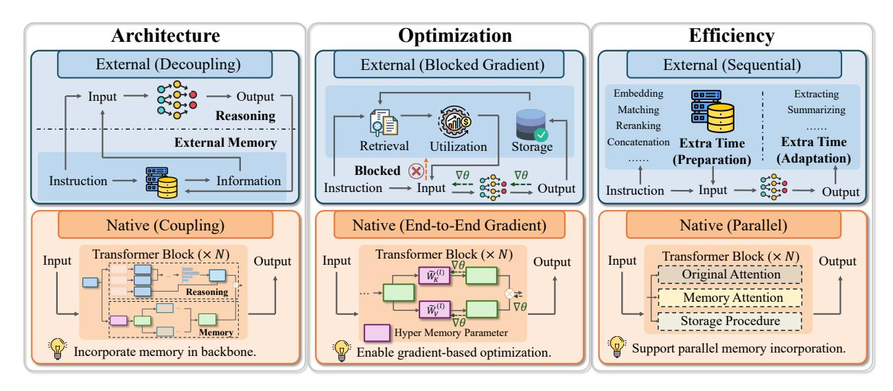
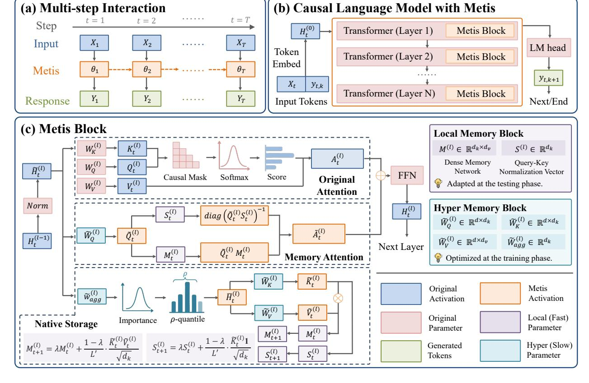
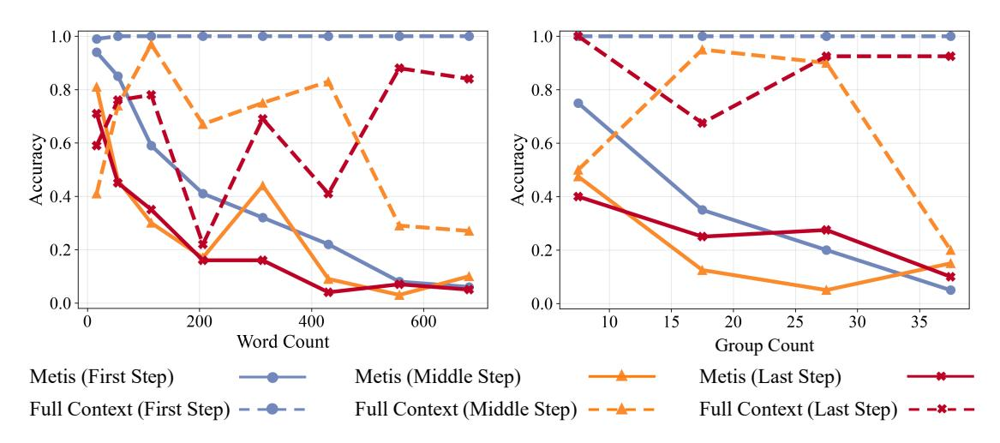
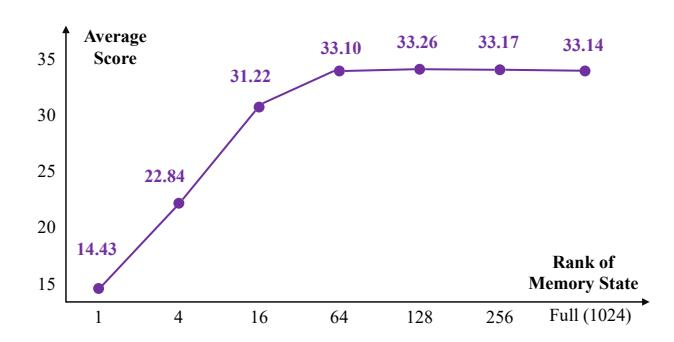
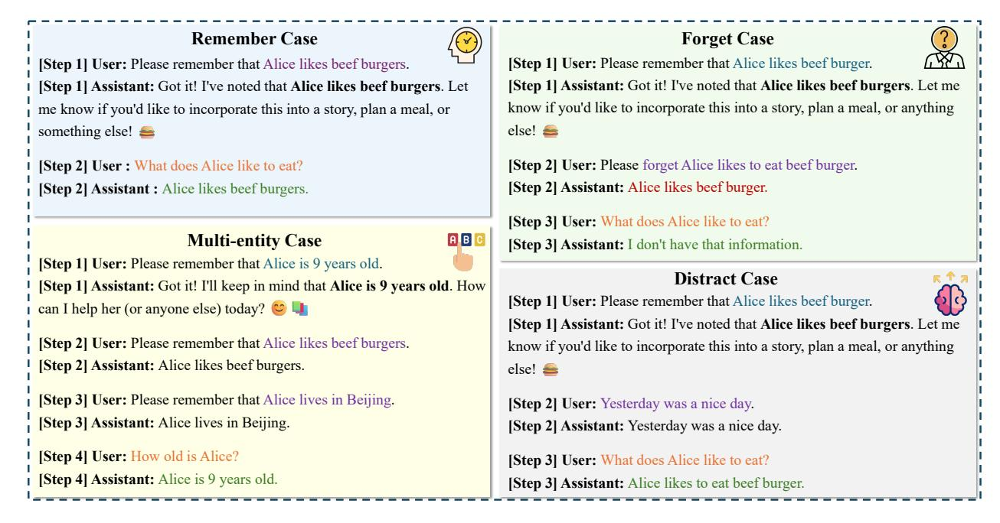
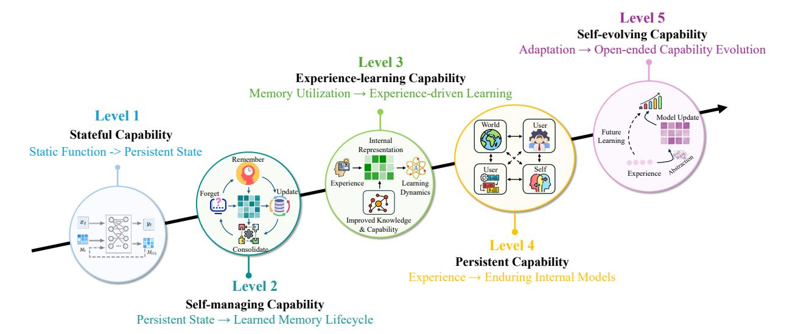
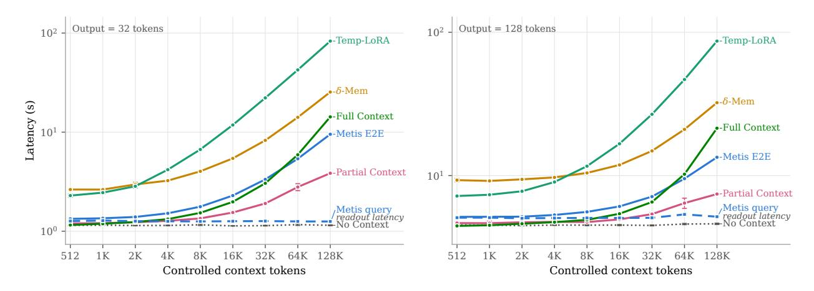
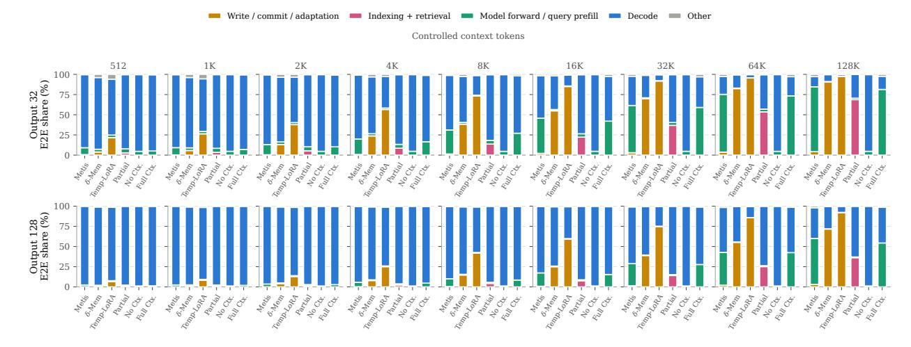
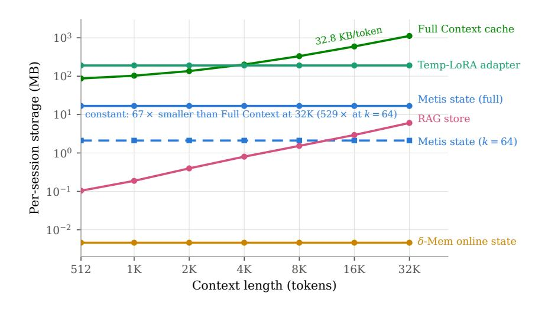

# Metis: Memory Foundation Model

- 원제: Metis: Memory Foundation Model
- 원문: [https://arxiv.org/abs/2607.26760](https://arxiv.org/abs/2607.26760)
- PDF: [https://arxiv.org/pdf/2607.26760v1](https://arxiv.org/pdf/2607.26760v1)
- arXiv ID: `2607.26760`

---


# 메티스: 메모리 기반 모델 (Metis: Memory Foundation Model)

Zeyu Zhang<sup>1,2\*</sup>, Ziliang Guo<sup>1\*</sup>, Yihang Sun<sup>1,4\*</sup>, Xichong Zhang<sup>1\*</sup>, Xixuan Hao<sup>1</sup>, Zehao Lin<sup>1</sup>, Yang Zhang<sup>3</sup>, Xiaoyan Zhao<sup>3</sup>, Tong Shen<sup>1,4</sup>, Bo Tang<sup>1</sup>, Zhi-Qin John Xu<sup>4</sup>, Junchi Yan<sup>4</sup>, Haofen Wang<sup>5</sup>, Xu Chen<sup>2†</sup>, Feiyu Xiong<sup>1</sup>, Zhiyu Li<sup>1†</sup>, Tat-Seng Chua<sup>3</sup>

<sup>1</sup>MemTensor (Shanghai) Technology Co., Ltd., <sup>2</sup>중국 인민대학교, <sup>3</sup>싱가포르 국립대학교, <sup>4</sup>상하이 교통대학교, <sup>5</sup>통지대학교

#### 초록 (Abstract)

최근 AI 에이전트의 발전은 기반 모델에 본래의 기능을 점점 더 내재화하여 멀티모달 기반 모델과 대규모 추론 모델을 탄생시켰다. 그러나 에이전트 메모리는 여전히 주로 외부 모듈을 통해 구현되어 있으며, 본래 메모리 기능은 크게 탐색되지 않았다. 본 논문에서는 메모리 기반 모델을 도입함으로써 기반 모델에 본래 메모리 기능을 부여하는 방향으로 첫 걸음을 내딛는다. 우리는 본래 메모리를 두 관점에서 공식화한다: 백본 내에서 지속적이고 동적으로 진화하는 메모리 상태, 그리고 모델 계산을 통해 자율적으로 정보를 저장하고 활용하는 본래 메모리 절차. 본래 메모리는 아키텍처, 엔드‑투‑엔드 최적화, 효율성 측면에서 이점을 제공한다. 이 공식화를 바탕으로 우리는 메모리 기반 모델의 첫 프로토타입인 Metis를 제안한다. Metis는 본래 메모리 상태를 갖춘 새로운 아키텍처를 도입하여 과거 정보를 모델에 압축하고 메모리 주의를 통해 접근할 수 있게 한다. 우리는 대규모 메모리 전용 훈련 데이터를 구축하고, 중간 훈련을 통해 이러한 본래 메모리 절차를 획득하기 위한 다중 최적화 목표를 도입한다. Metis의 온라인 메모리 유지보수는 그라디언트-프리이며, 메모리 업데이트는 오직 전방 패스만 필요로 한다. 추론 시에는 모든 학습된 모델 가중치가 고정되고, 본래 메모리 상태는 표준 전방 계산을 통해 자율적으로 변환된다. 광범위한 실험을 통해 Metis가 본래 메모리 기능을 갖추었음을 보여주며, 그 강점, 한계 및 동작에 대한 상세 분석을 제공한다. 메모리 기반 모델에 대한 향후 연구를 촉진하기 위해 우리는 프로젝트와 모델 체크포인트를 공개한다.

날짜: 2026년 7월 30일

연락처: lizy@memtensor.cn, xu.chen@ruc.edu.cn  
저자 설명: \*공동 초저자, †교신 저자

Code: https://github.com/MemTensor/Metis

Model: https://huggingface.co/collections/IAAR-Shanghai/metis

## 1 서론 (Introduction)

최근 몇 년간, 대규모 기반 모델은 급속한 발전을 이루었으며, 언어 모델링[1, 2], 코드 생성[3–5], 복잡한 추론[6–8] 등 다양한 측면에서 뛰어난 성능을 보여준다. 이는 AI 에이전트를 구축하기 위한 견고한 기반을 제공한다. 기반 모델의 추론 능력 외에도, 메모리는 AI 에이전트의 또 다른 핵심 능력으로, 과거 정보를 보존하고 이를 활용해 미래 추론을 지원한다[9, 10]. 대부분의 이전 연구에서는 메모리를 기반 모델 외부 모듈로 구현하였다.

<span id="page-1-0"></span>

Figure 1 외부 메모리에서 내재 메모리로

기반 모델 외부 모듈로 구현되는 경우가 많으며, 이는 그들의 아키텍처에 본래적으로 통합되지 않는다[11–14]. 대표적인 접근법으로는 Retrieval-Augmented Generation(RAG)이 있으며, 이는 관련 텍스트 정보를 검색해 프롬프트에 통합해 추론을 용이하게 한다[11].

그러나 외부 메모리는 그림 1에 제시된 여러 제한 사항을 갖는다. 첫째, 외부 메모리는 목표와 처리 단계가 분리된 상태로 백본과 분리되어 있다 [11, 13]. 외부 메모리는 일반적으로 정보를 담은 컨텍스트를 입력으로 구성하는 것을 목표로 하며, 백본은 구성된 컨텍스트에 대해 조건부 언어 모델링만 수행한다. 따라서 외부 메모리는 백본 추론을 지원하는 데 가장 유용한 정보를 제공하지 못할 수 있으며, 백본은 메모리를 최적으로 활용하지 못할 수 있다. 둘째, 외부 메모리는 이산 메모리 연산을 통해 기울기가 효과적으로 전파되지 않기 때문에 엔드‑투‑엔드 최적화가 어렵다 [15]. 그 결과 도메인별 사후 학습을 수행하는 것이 매우 어려워진다. 일부 RL 기반 전략 [16, 17]은 보상 신호를 사용해 메모리 연산을 최적화함으로써 이 문제를 부분적으로 완화할 수 있지만, 효율성 문제에 시달린다. 마지막으로, 외부 메모리는 백본 외부 저장소에 대한 추가 명시적 연산을 필요로 하여 온라인 추론 지연 시간을 불가피하게 증가시킨다 [9].

외부 메모리의 한계를 해결하기 위해, 우리는 대규모 기초 모델을 **자체 메모리**(native memory)로 강화하는 **메모리 기초 모델**(memory foundation models)를 도입한다. 이는 메모리를 외부 모듈에서 백본의 내부 메커니즘으로 변환하여 순방향 계산에 직접 참여하도록 한다. 구체적으로, 메모리 기초 모델은 입력 지침과 자체 메모리를 기반으로 응답을 생성하며, 자율적인 메모리 변환을 수행한다. 우리는 자체 메모리를 두 가지 핵심 측면에서 정의한다:

- **자체 메모리 상태**(Native Memory State). 전통적인 대규모 기초 모델과 달리, 메모리 기초 모델은 다수의 추론에 걸쳐 본질적으로 상태를 유지하며, 이전 추론에서 백본 내부에 메모리 상태를 형성, 유지 및 활용할 수 있다. 이들의 메모리 상태는 백본 파라미터의 일부로 동적으로 표현되며, 그 의미 공간은 사전 학습 또는 중간 학습 단계에서 정렬된다.
- **자체 메모리 절차**(Native Memory Procedure). 메모리 엔지니어링과 달리, 메모리 기초 모델은 추론 과정에 본질적으로 메모리 절차를 통합한다. 기억, 망각, 업데이트와 같은 특정 메모리 연산은 백본의 순방향 계산과 함께 자율적으로 수행되며, 입력 지침에 따라 자체 메모리 상태에 영향을 준다.

메모리 기초 모델은 메모리 기능을 모델의 순방향 계산에 내재화하려 한다. 메모리 상태는 백본의 동적 파라미터로 표현될 수 있으며, 메모리 절차는 계산을 통해 실행된다. 따라서 일반 기초 모델과 마찬가지로, 메모리 기초 모델은 사후 학습을 통해 데이터 기반으로 특정 도메인에 최적화 및 적응될 수 있다. 이 변환은 대규모 기초 모델에서 대규모 추론 모델로의 진화와 유사하며, 이때 Chain-of-Thought (CoT) [7]가 성능과 효율성을 향상시키기 위해 추론에 본질적으로 통합된다 [8]. 또한, 자체 메모리 절차가 모델의 계산에 통합될 수 있기 때문에 메모리 처리의 병렬 효율성을 개선하는 기반을 제공한다.

우리는 메모리 기반 모델(memory foundation models)의 첫 번째 프로토타입인 Metis를 구현한다. 우리는 Fast Weight Programming(FWP) [18]에서 영감을 받아 네이티브 메모리 상태(native memory)를 갖는 새로운 모델 아키텍처를 설계하고, 메모리 어텐션(memory attention)을 통해 백본 연산에 통합한다. 구체적으로, 우리는 메티스 블록(Metis blocks)을 네이티브 메모리의 기본 단위로 제안한다. 각 블록은 주로 하이퍼 메모리 블록(hyper memory block)과 로컬 메모리 블록(local memory block)으로 구성된다. 또한, 우리는 메모리 재구성(memory reconstruction)과 메모리 연산 목표(memory operation objectives)를 포함한 특정 최적화 목표를 설계함으로써 Metis에 네이티브 메모리 절차(native memory procedure)를 부여한다. 이 두 목표는 메모리 상태의 압축 상한(compression upper limit)과 연산 목표(operation targets)를 나타낸다. 우리는 또한 정규화 목표(regularization objective)를 설계하여 복잡한 시나리오(complex scenarios)에서 강건성(robustness)을 향상시킨다. 이 훈련을 지원하기 위해 공개 데이터셋(publicly available datasets)에서 대규모 메모리 전용 데이터(memory-specific data)를 합성하여, Metis가 중간 훈련(mid-training) 동안 네이티브 메모리 기능(native memory capabilities)을 습득하도록 한다. 마지막으로, 우리는 제안한 프레임워크(framework)의 효과를 입증하기 위해 광범위한 실험(extensive experiments)을 수행하고, 추가적인 분석을 탐구한다.

메모리 기반 모델의 근본적인 문제는 온라인 정보의 시간 스트리밍 특성(time-streaming property)에서 비롯된다. 저장 단계(storage stage)에서는 메모리 시스템이 수신된 정보를 미래에 어떻게 활용할지 결정할 수 없다. 추론 단계(inference stage)에서는 원본 정보가 더 이상 접근할 수 없으며, 저장된 정보만 활용된다. 따라서 메모리는 수신된 정보를 미래에 어떻게 활용할지 예측하는 문제(prediction problem)로 간주될 수 있다. 기계 학습의 다른 예측 과제와 마찬가지로, 메모리 능력(memory capability)은 프리트레이닝 단계(pre-training stage)에서 획득될 수 있고, 다른 도메인에 일반화될 수 있으며, 메모리 기반 모델은 아키텍처 및 최적화 기반(architectural and optimization foundation)을 제공한다.

그럼에도 불구하고, 메모리 기반 모델을 구현하는 것은 여전히 매우 도전적이다. 그 최종 목표는 외부 메모리(external memory)의 의존을 완전히 제거하는 것이기 때문이다. Metis는 메모리 관련 작업에서 뛰어난 성능을 보이지만, 여전히 몇 가지 한계를 갖는다. 첫째, 고정 크기 파라미터(fixed-size parameters)에 압축될 때 정보 손실이 발생해 장기 작업(long-term tasks)에서 성능이 저하된다. 둘째, 잠재 공간(latent space) 내에서 의미가 혼합되어 일부 경우에 정보 혼란(information confusion)이 발생한다. 이러한 한계에도 불구하고 Metis는 메모리 기반 모델을 실현할 수 있는 잠재적 경로(potential pathway)를 제공한다. 연구 커뮤니티(research community)와 산업계(industry)를 위해, 우리는 프로젝트(project)를 https://github.com/MemTensor/Metis 에 공개한다.

우리의 기여는 다음과 같이 요약된다:

- 우리는 메모리 기반 모델과 네이티브 메모리를 정식 정의(formal definitions)로 도입하고, 네이티브 메모리 상태(native memory state)와 네이티브 메모리 절차의 관점에서 추가 분석을 제공한다.  
- 우리는 메모리 기반 모델의 첫 번째 프로토타입(first prototype)을 Metis 라고 명명하고, 새로운 메모리 아키텍처(novel memory architectures)와 최적화 과제(optimization tasks)로 구현하였다.  
- 우리는 모델의 효과를 검증하기 위해 광범위한 실험을 수행하고, 여러 관점(multiple perspectives)에서 세부 연구(detailed studies)를 진행하였다. 또한 연구 커뮤니티와 산업계를 위해 프로젝트를 공개적으로 공개한다(publicly release).

본 논문의 나머지는 다음과 같이 구성된다. 2절에서는 메모리 기반 모델의 정식 정의를 제공한다. 3절에서는 Metis의 모델 아키텍처를 상세히 기술한다. 이후 4절에서는 데이터 구축 파이프라인을 소개하고, 5절에서는 최적화를 개요한다. 6절에서는 광범위한 실험 결과와 분석을 제시한다. 마지막으로 7절에서는 관련 연구를 검토하고, 8절에서는 결론을 제시한다.

## <span id="page-2-0"></span>2 메모리 기반 모델(Memory Foundation Model)

우리는 메모리 기반 모델의 공식 정의를 제시한다. 이후, 네이티브 메모리를 네이티브 메모리 상태와 절차의 관점에서 소개한다. 그 다음, 메모리 기반 모델을 기존 연구와 비교한다. 마지막으로, 메모리 기반 모델을 평생 학습과 AI 에이전트의 진화 추세의 관점에서 논의한다.

### 2.1 정의 (Definition)

우리는 메모리 기반 모델을 다단계 시나리오(multi-step scenario)에서 정의한다. 연속 상호작용 과정(continuous interaction process)을 $t \in \{1, 2, ..., T\}$ 의 이산 시간 단계(discrete time steps) 시퀀스로 공식화한다. 각 단계 t 에서, 기반 모델은 입력 지시 시퀀스(input instruction sequence) $X_t$ 를 받고 응답 시퀀스(response sequence) $Y_t$ 를 생성한다.

전통적인 기반 모델(traditional foundation models)은 메모리를 갖지 않으며, 생성은 현재 입력 컨텍스트에만 완전히 의존한다. 응답의 k번째 토큰에 대한 자기회귀 디코딩(autoregressive decoding)은 일반적으로 $y_{t,k} \sim P(y \mid X_t, Y_{t,< k}; \theta)$ 로 표현된다. 여기서 $Y_{t,< k}$ 는 단계 t 에서 이전에 생성된 토큰을 나타내며, $\theta$ 는 백본(backbone)의 고정 파라미터를 나타낸다.

외부 메모리를 갖는 기반 모델의 경우, 자기회귀 디코딩 과정은 입력 지시와 함께 컨텍스트(context) $C_t$ 에 조건화된다. 이는 $y_{t,k} \sim P(y \mid C_t, X_t, Y_{t,< k}; \theta)$ 로 표현될 수 있다. 여기서 $C_t$ 는 이전 정보 $\{(X_i, Y_t)\}_{i=1}^{t-1}$ 에서 얻어질 수 있다. 외부 메모리 프레임워크는 일반적으로 저장 절차(storage procedure) $C_t = C_{t-1} \oplus \{(X_t, Y_t)\}$ 와 검색 절차(retrieval procedure) $C_t = C_{t-1} \otimes X_t$ 를 갖는다. 여기서 $\oplus$ 는 일반적인 쓰기 연산(writing operation)을 나타내며, $\otimes$ 는 텍스트 메모리 저장소(textual memory storage) $C_{t-1}$ 에 대한 일반적인 읽기 연산(reading operation)을 나타낸다. 이 둘은 모델 추론 과정(model inference process) 밖에서 실행된다.

**Definition 1** (메모리 기반 기초 모델 (Memory Foundation Model)). 메모리 기반 기초 모델은 다중 단계 상호작용을 통해 **네이티브 메모리** 로 강화된 자기회귀 기초 모델로 정의된다. 각 단계 t에서, k번째 토큰의 생성은 입력 지시문 $X_t$와 이전에 생성된 토큰들 $Y_{t, < k}$에 의해 조건화된다.

$$y_{t,k} \sim P(y \mid X_t, Y_{t,<k}; \theta_t),$$

모델 파라미터 $\theta_t$는 이전 단계의 정보를 그 자체의 파라미터 공간 (*i.e.*, 네이티브 메모리 상태)에 통합한다. 동시에, $\theta_{t+1}$는 입력 지시 $X_t$와 출력 $Y_t$에 따라 모델 내부의 순방향 계산 중 자율적으로 변형된다 (*i.e.*, 네이티브 메모리 절차).

반면, 메모리 기반 모델은 메모리를 백본의 계산에 내재화하며, 이는 네이티브 메모리로 강화된다. 외부 명시적 저장소 $C_t$와 컨텍스트 $C_t$에 의존하는 대신, 네이티브 메모리 상태를 유지하며 이는 다중 단계에 걸쳐 동적 파라미터로 작용한다. 또한, 백본 외부에서 메모리 절차를 명시적으로 실행하는 대신, 메모리 기반 모델의 메모리 절차는 순방향 계산과 자율적으로 동시에 발생한다. 예를 들어, 기억, 망각, 업데이트와 같은 작업이 포함된다.

### 2.2 네이티브 메모리 상태 (Native Memory State)

본 논문에서는 메모리의 출처에 대해 엄격한 정의를 채택한다. 온라인 상호작용 중에 획득된 정보만을 메모리로 간주하며, 상호작용이 시작되기 전에 이용 가능한 정보는 제외한다. 실제로, 이러한 오프라인 정보는 개인화에 필요한 경로별 특수 정보를 포함하지 않으며 실시간 적응을 요구하지 않으므로, 메모리라기보다는 지식(knowledge)으로 보는 것이 더 적절하다.

저장된 정보가 단계마다 다르기 때문에 파라미터 $\theta_t$는 완전히 정적일 수 없다. 따라서 입력에 따라 최소한 일부 파라미터는 동적으로 변해야 하며, 이 동적 부분을 메모리 상태 $\mathbf{M}_t$라고 부른다. 메모리 기반 모델에서 저장된 정보의 표현은 백본과 결합되어 순방향 계산에 참여해야 한다. 따라서 네이티브 메모리 상태는 파라미터 형태로 표현되어야 한다. 텍스트 메모리는 해석 가능성과 모델 간 호환성에서 장점을 제공하지만, 그 이산적 표현은 정보 밀도가 낮고 반복적인 사전 채우기를 필요로 한다. 반면 파라미터 메모리는 사전 정보를 밀집 형태로 표현하여 저장 및 활용 효율을 높인다.

또한, 동적 파라미터 $\mathbf{M}_t$와 정적 파라미터 $\mathbf{\Phi} = \theta_t \setminus \mathbf{M}_t$의 의미 공간은 온라인 추론을 수행하기 전에 사전 훈련 또는 중간 훈련 단계에서 정렬되어야 한다. 이 정렬은 서로 다른 단계의 동적 파라미터가 정적 파라미터와 협력적으로 계산할 수 있게 한다. 온라인 상호작용 중에 네이티브 메모리 상태는 네이티브 메모리 절차를 통해 업데이트되고 활용될 수 있어, 메모리 기반 모델이 단계 간 상태성을 갖도록 한다.

### <span id="page-3-0"></span>2.3 네이티브 메모리 절차 (Native Memory Procedure)

메모리 관점에서 저장과 활용은 시간 스트리밍 특성을 가진 온라인 정보를 처리하기 위한 두 가지 핵심 절차이다. 메모리 저장은 과거 정보를 보존하고, 메모리 활용은 이 저장된 정보를 활용해 모델 추론을 지원한다. 이들은 정보 공급과 사용 사이의 시간적 불일치를 해결하려는 목적을 가진다.

메모리 저장 절차는 일반적으로 기억, 망각, 업데이트와 같은 여러 구체적 연산을 포함한다. 기초 모델 관점에서 입력 지시는 정보 처리의 의도와 내용을 모두 담고 있다. 예를 들어, “Alice는 24세이다”는 그녀의 나이를 기억한다는 의미이고, “Bob은 런던에서 보스턴으로 이사했다”는 그의 위치를 업데이트한다는 의미이다. 네이티브 저장 절차는 입력 지시를 메모리 상태의 업데이트 값에 직접 매핑해야 한다. 반면 외부 메모리는 의도와 내용을 별도로 처리하기 위해 규칙 기반 및 사전 정의된 연산에 의존한다. 대부분의 연산은 삽입, 삭제, 수정으로 분류될 수 있지만, 의미적 의도와 내용은 이산 규칙으로 쉽게 분리될 수 없다. 실제로 저장 절차는

본질적으로 현재 정보가 미래에 어떻게 사용될지를 예측한다. 규칙 기반 절차는 이산 함수 공간에서 작동하기 때문에 최적의 예측 성능을 달성하기 어렵다.

메모리 활용 절차의 주요 목표는 저장된 정보를 활용해 추론을 지원하는 것이다. 기초 모델 관점에서 이는 입력 지시가 요구하는 정보를 순방향 계산에 참여시키는 것으로 볼 수 있다. 예를 들어, “Bob은 지금 어디에 사는가?”에 답하려면 이전에 저장된 거주 정보를 활용해야 한다. 따라서 네이티브 메모리 활용 절차는 입력 지시와 메모리 상태를 직접 매핑해 생성된 출력을 도출해야 한다. 외부 메모리는 검색, 재랭킹, 연결을 유발하는 규칙을 설계한다. 그러나 정보 요구는 이산적이고 유한한 규칙으로 정의·포착할 수 없다. 예를 들어, 지시는 의미적 유사성, 감정, 혹은 암시적 지표의 복합 조합에 기반한 정보를 요구할 수 있다. 메모리 활용 절차는 정보 요구를 예측하며, 이는 추론 과정과 결합된다. 따라서 이 절차는 이산 함수 공간에 의해 제한되는 이산 단계로 나누어져서는 안 된다.

따라서, 메모리 절차는 연속 함수 공간 내에서 모델링되어 수치 계산을 통해 구현되어야 하며, 이는 백본의 전방 계산과 밀접하게 결합된다. 메모리 기반 모델에서는 네이티브 메모리 절차가 전방 계산 중에 메모리 저장과 활용을 자율적으로 수행한다. 이 네이티브 메모리 절차는 사전 훈련 또는 중간 훈련 단계에서 구축되어야 한다. 또한, 이 메모리 절차 패러다임은 효율성과 엔드-투-엔드 최적화 모두에서 상당한 이점을 갖는다.

### 2.4 이전 연구와의 비교 (Comparison with Previous Works)

테스트 타임 트레이닝. 메모리 기반 모델은 테스트 타임 트레이닝(TTT)과 세 가지 핵심 측면에서 다르다. 첫째, TTT는 일반적으로 단일 시퀀스 내에서 모델을 적응시켜 동적 파라미터를 현재 입력에 더 잘 맞도록 업데이트한다. 반면, 메모리 기반 모델은 다단계 상호작용 하에서 정의된다. 그들의 동적 파라미터는 이전 단계에서 정보를 저장하고 미래 추론을 지원하는 지속적인 네이티브 메모리 상태로서 기능한다.

둘째, TTT는 명시적으로 네이티브 메모리 절차를 제공하지 않는다. 그 업데이트는 일반적으로 자기 지도 언어 모델링에 의해 주도되어 현재 시퀀스 내에서 모델이 이전 정보를 흡수하도록 돕는다. 그러나 입력 지침에 따라 모델이 어떻게 의미적으로 기억하고, 잊고, 업데이트하거나 정보를 반영해야 하는지 명시하지 않는다. 반면, 메모리 기반 모델은 메모리 재구성 및 연산 목표로 훈련되어, 잠재적 파라미터 공간에서 의미적 메모리 연산을 자율적으로 수행하고 네이티브 메모리 상태를 그에 따라 변형시킬 수 있다.

셋째, 많은 TTT 방법은 효율적인 장기 컨텍스트 모델링을 동기로 하며, 종종 전체 어텐션을 대체하기 위해 순환 층을 도입한다. 그러나 메모리 기반 모델은 다른 목표를 추구한다. 그들은 현재 단계 내에서 표준 전체 어텐션 계산을 대체하려는 것이 아니다. 대신, 이전 상호작용 단계의 정보를 네이티브 메모리 상태를 통해 잔여(residual)로 도입한다.

요약하면, TTT는 주로 추론 시 적응 메커니즘이며, 반면 메모리 기반 모델은 메모리를 지속적이고, 지시 기반이며, 절차 인식 능력으로 정의한다.

메모리 증강 신경망(Memory-Augmented Neural Networks, MANNs). 메모리 증강 신경망은 미분 가능한 메모리 슬롯과 학습된 읽기-쓰기 연산 등 추가 메모리 모듈을 신경 모델에 도입한다 [19](#page-27-7). 이러한 모델은 신경망이 외부 정보를 저장하고 나중 계산에 이를 검색할 수 있음을 보여준다. 그러나 메모리 기반 모델은 메모리가 백본과 통합되는 방식에서 차이를 보인다. MANNs에서는 메모리 모듈이 일반적으로 신경 컨트롤러에 의해 제어되는 별도의 저장소 구성요소이다. 연산이 미분 가능할 수 있지만, 메모리는 여전히 주요 모델 파라미터와는 독립적으로 설계되는 외부 저장소이다.

반면, 메모리 기반 모델은 메모리를 백본 계산에 내부화한다. 메모리 상태는 파라미터 형태로 표현되어 직접 전방 계산에 참여한다. 메모리 절차는 명시적 슬롯 위의 별도 컨트롤러로 구현되는 것이 아니라 백본과 동일한 연속 함수 공간으로 모델링된다. 따라서 메모리 기반 모델은 외부로 증강된 메모리에서 내부 네이티브 메모리로의 전환 단계로 간주될 수 있다.

메모리 기반 모델은 문맥에서 텍스트 메모리를 완전히 제거한다. In-place TTT[20], MemGen[21] 및 -Mem[22]와 비교하면, 이들은 여전히 문맥에서 텍스트 메모리를 사용하고 추가 잠재 요약을 활용해 추론을 개선한다. MEMO[23]와 MemFT[24]와 비교하면, 이들은 주로 오프라인 문서를 다루는 반면 메모리 기반 모델은 테스트 시점 정보를 중심으로 한다. Memory³[25]와 비교하면, 이 모델은 텍스트 RAG를 넘어 지식을 검색 가능한 명시적 메모리에 인코딩하는 중요한 단계를 거친다. 메모리 기반 모델은 이 방향을 네이티브 메모리로 더욱 확장한다. Memory³는 주로 오프라인 코퍼스에서 명시적 메모리를 구성하고 이를 검색해 어텐션 계산을 보강하는 반면, 메모리 기반 모델은 온라인 상호작용에서 획득한 정보를 백본 내 지속적인 동적 상태로 내재화한다. 또한 이러한 상태를 다중 상호작용 단계에서 네이티브 메모리 절차를 통해 자율적으로 유지·변환할 수 있게 한다.

### 2.5 토론 (Discussion)

메모리 기반 모델의 경우, 상호작용의 시작은 정적 지식 획득에서 동적 지식 획득으로의 핵심 전환을 나타낸다. 상호작용 이전에 획득된 지식은 오프라인 사전 훈련에서 유래하며 정적 파라미터에 보존된다. 반면 상호작용 중에 수신되는 정보는 테스트 시점에 획득되어 동적 메모리 상태에 저장된다. 따라서 $\theta_1$ 은 사전 훈련 외부에서 초기 보조 정보로도 활용될 수 있다. $\theta_1$ 이 전이 가능한 도메인 지식을 포착하므로, 유사 도메인에 배포된 모델은 동일한 $\theta_1$ 으로 초기화하여 기초 정보를 제공할 수 있다.

또한 네이티브 메모리는 기초 모델의 진화 추세와 부합한다. 대형 추론 모델[8]에서 영감을 받아, 우리는 에이전트의 외부 능력이 최적화를 통해 기초 모델에 네이티브하게 표현될 수 있음을 발견했다. 즉, 목표 행동의 감독 데이터는 내부 능력을 활성화하고 이를 다른 과제에 일반화할 수 있다. 이러한 네이티브 능력은 일반화, 효율성, 최적화 특성에서 이점을 제공한다. 메모리 역시 전통적으로 외부 모듈에 의존해온 중요한 에이전트 능력이다. 따라서 우리는 메모리도 메모리 전용 과제를 통해 네이티브하게 유발될 수 있다고 주장한다. 그러나 추론과 달리, 메모리는 순수한 과정이 아니라 저장 엔터티를 포함한다. 이는 모델 아키텍처를 수정하여 저장 엔터티를 메모리 상태로 통합하도록 요구한다. 그 다음, 메모리 상태와 절차는 협업 함수 공간에서 모델링되어야 한다. 이를 통해 우리는 최적화 기반 접근법을 통해 기초 모델에 메모리 능력을 부여할 수 있다.

## <span id="page-5-0"></span>3 메티스 아키텍처 (Metis Architecture)

본 절에서는 먼저 몇 가지 전제 조건을 제시한다. 그 다음, 메티스 블록을 갖는 메모리 기반 모델의 프로토타입으로 메티스를 소개한다. 이후 이 아키텍처가 계산을 통해 네이티브 메모리 저장 및 활용 절차를 어떻게 지원하는지 보여준다. 마지막으로 이론적 통찰, 이론적 오류 분석 및 추가 논의를 제공한다. 메티스 프레임워크의 개요는 그림 2에 제시된다.

### 3.1 전제 조건 (Preliminaries)

우리는 메모리 기반 모델의 주요 구현으로 인과적 언어 모델을 채택한다. 이는 현대 기초 모델에서 주로 사용되기 때문이다. 인과적 언어 모델의 표준 아키텍처를 제시한다. 이 아키텍처는 주로 *N* 개의 스택된 Transformer 블록과 그 뒤를 잇는 언어 모델링 헤드로 구성된다.

**Transformer Block.** 핵심 아키텍처를 강조하기 위해 우리는 인과적 자기 주의(attention)와 피드포워드 네트워크(FFN)에 초점을 맞춘다. 이 두 요소는 현대 Transformer의 주요 구성 요소이다. 위치 임베딩, 멀티헤드 어텐션 전략, 하이브리드 어텐션 메커니즘 등 다른 세부 사항은 우리의 프레임워크에 직접 통합될 수 있으므로 생략한다.

l번째 Transformer 블록의 입력을  $\mathbf{H}^{(l-1)} \in \mathbb{R}^{L \times d}$  로 표시한다. 여기서 L은 시퀀스 길이, d는 은닉 상태 차원이다. PreNorm 전정규화 함수를 적용한 뒤  $\tilde{\mathbf{H}}^{(l)} = \operatorname{PreNorm}(\mathbf{H}^{(l-1)})$  를 인과적 자기 주의의 입력으로 사용한다.  $\mathbf{W}_Q^{(l)}, \mathbf{W}_K^{(l)} \in \mathbb{R}^{d \times d_k}, \mathbf{W}_V^{(l)} \in \mathbb{R}^{d \times d_v}$  를 이 층의 쿼리, 키, 밸류 투영 행렬로 둔다. 그 다음, l번째 층의 쿼리 상태, 키 상태, 밸류 상태를 다음과 같이 얻는다

$$\mathbf{Q}^{(l)} = \tilde{\mathbf{H}}^{(l)} \mathbf{W}_{O}^{(l)}, \quad \mathbf{K}^{(l)} = \tilde{\mathbf{H}}^{(l)} \mathbf{W}_{K}^{(l)}, \quad \mathbf{V}^{(l)} = \tilde{\mathbf{H}}^{(l)} \mathbf{W}_{V}^{(l)}.$$

그 후 인과적 자기 주의는 다음과 같이 계산된다

<span id="page-5-1"></span>

$$\mathbf{A}^{(l)} = \operatorname{Softmax} \left( \frac{\mathbf{Q}^{(l)} (\mathbf{K}^{(l)})^{\mathsf{T}}}{\sqrt{d_k}} + \operatorname{Mask}(L) \right) \mathbf{V}^{(l)}, \tag{1}$$

여기서  $d_k$  은 어텐션 헤드 차원이며,  $\operatorname{Mask}(L)$  은  $\operatorname{Mask}(L)_{i,j} = -\infty$  (j > i 인 경우) 그리고 0 (그 외) 로 정의되는 인과 마스크이다. 이후, 투영된 어텐션 출력을 잔여 연결에 더해 준다

$$\mathbf{H}^{\prime(l)} = \mathbf{H}^{(l-1)} + \mathbf{A}^{(l)} \mathbf{W}_{O}^{(l)},$$

<span id="page-6-0"></span>

Figure 2 Metis 아키텍처 개요.

여기서  $\mathbf{W}_O^{(l)} \in \mathbb{R}^{d_v \times d}$  이다. 마지막으로,  $\mathbf{H}'^{(l)}$  를 FFN에 통과시키고 잔여 연결을 더해 l번째 층 출력을 얻는다

$$\mathbf{H}^{(l)} = \mathbf{H}^{\prime(l)} + \text{FFN}(\text{Norm}(\mathbf{H}^{\prime(l)})),$$

여기서 활성화  $\mathbf{H}^{(l)}$  는 (l+1)번째 층의 입력이 된다.

Causal Language Model. 입력 토큰 시퀀스를  $X = (x_1, x_2, ..., x_L)$  로 표시한다. 인과적 언어 모델은 먼저 이 이산 토큰들을 연속 벡터 표현으로 매핑한다.  $\mathbf{E} \in \mathbb{R}^{|\mathcal{V}| \times d}$  를 토큰 임베딩 행렬이라 두면,  $|\mathcal{V}|$  은 어휘 크기이다. 초기 은닉 상태  $\mathbf{H}^{(0)} \in \mathbb{R}^{L \times d}$  은 해당 임베딩을 추출하고 위치 임베딩과 결합해 얻는다. 이후, 이 초기 표현을 N개의 Transformer 블록 스택을 통해 순차적으로 처리한다

$$\mathbf{H}^{(l)} = \text{TransformerBlock}^{(l)}(\mathbf{H}^{(l-1)}), \quad \text{for } l = 1, 2, \dots, N.$$

그 다음, 최종 은닉 상태  $\mathbf{H}^{(N)}$  는 문맥화된 입력을 나타내며, 언어 모델링 헤드는 이 최종 상태를 어휘 공간으로 다시 매핑해 다음 토큰에 대한 확률 분포를 예측한다. 이 과정은 일반적으로 정규화 후 선형 투영과 소프트맥스 함수를 통해 모델링된다

$$P(\cdot \mid x_{\leq i}) = \text{Softmax}(\text{Norm}(\mathbf{H}_{(i)}^{(N)})\mathbf{W}_{\text{LM}}),$$

여기서  $\mathbf{H}_{(i)}^{(N)} \in \mathbb{R}^d$  는 위치 i에서의 최종 은닉 벡터이며,  $\mathbf{W}_{\text{LM}} \in \mathbb{R}^{d \times |\mathcal{V}|}$  는 투영 행렬이다.  $x_{i+1} \sim P(x_{i+1} \mid x_{\leq i})$ 를 샘플링한 뒤, 이 새 토큰을 시퀀스에 추가하고 모델은 종료 토큰을 디코딩하거나 최대 길이에 도달할 때까지 과정을 반복한다.

전이 학습 단계에서, 인과적 언어 모델은 표준 자기회귀 다음 토큰 예측 목표를 사용하여 최적화된다. 이는 훈련 시퀀스의 음의 로그 가능도를 최소화한다.

$$\theta = \arg\min_{\theta} \sum_{X \in \mathcal{D}} \sum_{i=1}^{|X|-1} -\log P(x_{i+1} \mid x_{\leq i}; \theta),$$

여기서  $\mathcal{D}$  는 전이 학습 코퍼스를 나타내고,  $\theta$  는 모델의 모든 학습 가능한 파라미터를 포함한다.

### 3.2 네이티브 메모리 상태 (Native Memory State)

네이티브 메모리 상태를 구현하기 위해, 우리는 Figure 2(b)에서 Transformer 블록 내부에 Metis 블록을 제안한다. 각 Metis 블록은 Figure 2(c)에서 로컬 메모리 블록과 하이퍼 메모리 블록으로 구성된다. 로컬 메모리 블록은 이전 정보의 밀집 표현을 유지하는 역할을 하고, 하이퍼 메모리 블록은 네이티브 메모리 절차가 메모리 상태를 변환하도록 파라미터화된 함수 공간을 구축한다.

**로컬 메모리 블록.** 로컬 메모리 블록은 현재 단계에서 메모리 상태를 유지하므로, 우리는 l번째 로컬 메모리 블록 내부에 밀집 메모리 네트워크  $\mathbf{M}^{(l)} \in \mathbb{R}^{d_k \times d_v}$ 를 정의한다. 단계 t에서 이를  $\mathbf{M}_t^{(l)}$ 로 표시한다. 모델은 또한 쿼리-키 정규화 벡터  $\mathbf{S}_t^{(l)} \in \mathbb{R}^{d_k}$ 를 유지한다.  $\mathbf{M}^{(l)}$ 와  $\mathbf{S}_t^{(l)}$ 는 서로 다른 단계에서 업데이트되는 동적 파라미터이다. 구체적으로, 우리는 기본적으로  $\mathbf{M}_1^{(l)} = \mathbf{0}$  그리고  $\mathbf{S}_1^{(l)} = \mathbf{0}$ 를 설정한다.

**하이퍼 메모리 블록.** 하이퍼 메모리 블록은 현재 입력  $X_t$ 와 출력  $Y_t$ 의 중간 활성화에 따라 로컬 메모리 블록의 동적 파라미터를 업데이트하는 역할을 한다. 각각은 중간 훈련을 통해 얻은 정적 파라미터로 구성되며, 상호작용 중에는 변하지 않는다. 이는 네이티브 메모리 저장 절차의 파라미터 기반을 제공한다. 구체적으로, 각 하이퍼 메모리 블록은 여러 최적화 가능한 파라미터로 매개화된다. 첫째, 적응형 집계에 대한 중간 활성화를 점수화하는 학습 가능한 중요도 벡터  $\tilde{\mathbf{w}}_{\text{agg}}^{(l)} \in \mathbb{R}^d$ 를 갖는다. 또한, 메모리 키와 값 투영 행렬  $\tilde{\mathbf{W}}_K^{(l)} \in \mathbb{R}^{d \times d_k}$ 와  $\tilde{\mathbf{W}}_V^{(l)} \in \mathbb{R}^{d \times d_v}$ 를 설정하여 선택된 은닉 상태를 로컬 메모리의 메모리 키와 값으로 매핑한다. 또한, 네이티브 메모리 활용 절차에서 오류를 줄이기 위해 메모리 쿼리 투영 행렬  $\tilde{\mathbf{W}}_Q^{(l)} \in \mathbb{R}^{d \times d_k}$ 를 설정한다.

### 3.3 네이티브 메모리 절차 (Native Memory Procedure)

네이티브 메모리 절차는 메모리 저장 및 활용 절차로 구성된다, 이는 **Section 2.3**에서 논의한다. 우리 프레임워크의 네이티브 메모리 저장 절차에서 하이퍼 메모리 블록은 중간 활성화를 기반으로 모델 계산의 일부로 로컬 메모리 블록을 업데이트한다. 네이티브 메모리 활용 절차에서는 로컬 메모리 블록이 현재 메모리 상태를 순방향 계산에 통합한다.

네이티브 메모리 저장 절차. 단계 t를 완료한 뒤, l번째 층의 입력 은닉 상태를  $\mathbf{H}_t^{(l-1)}$  로 표시한다. 그 다음, 하이퍼 메모리 블록은 학습된 적응형 집계를 통해 이를 압축 표현으로 집계한다. 구체적으로, 우리는 은닉 상태를  $\tilde{\mathbf{H}}_t^{(l)} = \operatorname{PreNorm}(\mathbf{H}_t^{(l-1)})$  로 사전 정규화하고, 각 L 토큰을 학습 가능한 중요도 벡터  $\tilde{\mathbf{w}}_{\text{agg}}^{(l)} \in \mathbb{R}^d$  로 점수화하여 중요도 분포를 얻는다.

$$\mathbf{p}_{t}^{(l)} = \operatorname{Softmax}\left(\frac{\tilde{\mathbf{H}}_{t}^{(l)}\tilde{\mathbf{w}}_{\operatorname{agg}}^{(l)}}{\tau}\right) \in \mathbb{R}^{L},$$

여기서 $\tau$는 온도 계수이다. 그 다음, 우리는 top-$\rho$에 기반한 위치의 부분집합을 얻는다. 이 확률들을 내림차순으로 정렬하면 $p_{(1)} \ge p_{(2)} \ge \cdots \ge p_{(L)}$가 되고, 누적값이 임계값 $\rho$에 도달하는 가장 짧은 접두사를 유지한다. 선택된 위치의 수는 다음과 같이 표현할 수 있다.

$$L_t' = \operatorname{clip}\left(\min\left\{k: \sum
olimits_{r=1}^k p_{(r)} \geq \rho\right\}, \ K_{\min}, \ L\right),$$

여기서 $K_{\min}$은 선택된 위치의 최소 개수를 나타낸다. 이 $L'_t$개의 최고 점수를 가진 위치들은 선택된 집합 $\mathcal{S}_t^{(l)}$를 형성하며, 우리는 해당 숨겨진 상태를 수집한다. by

$$\tilde{\mathbf{H}}_t^{(l)} = \mathbf{\Pi}_t^{(l)} \tilde{\mathbf{H}}_t^{(l)} \in \mathbb{R}^{L_t' \times d}, \quad \text{with } L_t' \ll L,$$

여기서 $\Pi_t^{(l)} \in \{0,1\}^{L_t' \times L}$ 은 $S_t^{(l)}$ 의 행이 원-핫 인디케이터이다. top- $\rho$ 선택이 미분 불가능하므로, 우리는 직통 추정기를 채택하여 기울기를 밀집 분포 $\mathbf{p}_t^{(l)}$ 를 통해 전달하고, 이로써 스코어러 $\tilde{\mathbf{w}}_{\text{agg}}^{(l)}$ 를 엔드-투-엔드로 학습 가능하게 한다. 그 후, 우리는 투영된 메모리 키 상태와 메모리 값 상태를 다음과 같이 계산한다

$$\tilde{\mathbf{K}}_t^{(l)} = \bar{\mathbf{H}}_t^{(l)} \tilde{\mathbf{W}}_K^{(l)}, \quad \tilde{\mathbf{V}}_t^{(l)} = \bar{\mathbf{H}}_t^{(l)} \tilde{\mathbf{W}}_V^{(l)}.$$

마지막으로, 밀집 메모리 네트워크는 $\tilde{\mathbf{K}}_{t}^{(l)}$와 $\tilde{\mathbf{V}}_{t}^{(l)}$를 기반으로 업데이트된다.

$$\mathbf{M}_{t+1}^{(l)} = \lambda \mathbf{M}_{t}^{(l)} + \frac{(1-\lambda)}{L_{t}'} \cdot \frac{\tilde{\mathbf{K}}_{t}^{(l)\top}}{\sqrt{d_{k}}} \tilde{\mathbf{V}}_{t}^{(l)}, \tag{2}$$

여기서 $\lambda$는 할인 계수(discount factor)를 나타낸다. 또한, 쿼리-키 정규화 벡터는 업데이트될 수 있다. by

$$\mathbf{S}_{t+1}^{(l)} = \lambda \mathbf{S}_{t}^{(l)} + \frac{(1-\lambda)}{L_{t}'} \cdot \frac{\tilde{\mathbf{K}}_{t}^{(l)\top} \mathbf{1}}{\sqrt{d_{k}}}.$$

(3)

(3)

이 네이티브 저장 절차는 Figure 2(c)에 제시된다. 구축된 함수 공간을 기반으로, 우리는 최적화를 통해 다양한 메모리 연산을 모델의 계산에 내부화하려 한다. 구체적으로, 선택과 투영은 모델에 압축 기능을 제공한다. 한편, 의미 기반 계산은 메모리 지시문을 잠재 공간 내에서 이해하고 적용할 수 있게 한다. 실제로, 선형 업데이트를 Gated Delta Network (GDN)-기반 [26] 업데이트로 대체하면 더 나은 성능을 얻는 것을 발견했으므로, Metis는 최종적으로 GDN 기반 업데이트(GDU) 전략을 채택한다. Section 6.3과 Appendix C는 두 구현을 ablation 연구를 통해 비교한다

네이티브 메모리 활용 절차. 우리는 메모리 어텐션을 다음과 같이 정의한다

$$\tilde{\mathbf{A}}_{t}^{(l)} = \operatorname{diag}\left(\tilde{\mathbf{Q}}_{t}^{(l)}\mathbf{S}_{t}^{(l)}\right)^{-1}\tilde{\mathbf{Q}}_{t}^{(l)}\mathbf{M}_{t}^{(l)},\tag{4}$$

여기서 $\tilde{\mathbf{Q}}_t^{(l)} = \tilde{\mathbf{H}}_t^{(l)} \tilde{\mathbf{W}}_Q^{(l)}$ 는 최적화 가능한 파라미터 $\tilde{\mathbf{W}}_Q^{(l)} \in \mathbb{R}^{d \times d_k}$ 를 갖는 메모리 쿼리 상태를 나타낸다. 실제로 우리는 정규화 분모에 항등 벡터를 추가하여 수치 오버플로우를 방지하고 수치 안정성을 향상시킨다. 그 다음, 메모리 어텐션은 메인 브랜치의 어텐션에 통합되며, 식 (1)을 대체한다.

$$\mathbf{A}_{t}^{(l)} = \gamma \cdot \operatorname{Softmax} \left( \frac{\mathbf{Q}_{t}^{(l)} (\mathbf{K}_{t}^{(l)})^{\mathsf{T}}}{\sqrt{d_{k}}} + \operatorname{Mask}(L) \right) \mathbf{V}_{t}^{(l)} + (1 - \gamma) \cdot \operatorname{Norm} \left( \tilde{\mathbf{A}}_{t}^{(l)} \right), \tag{5}$$

여기서 Norm(·)은 메모리 읽기 결과에 적용되어 원래의 어텐션 분기와 스케일을 맞춘다.  $\mathbf{K}_t^{(l)}$ ,  $\mathbf{V}_t^{(l)}$ 는 현재 단계에서 입력되는 키 상태와 값 상태이며,  $\gamma \in [0,1]$ 은 두 분기를 균형시킨다.

### 3.4 네이티브 메모리 절차의 이론적 통찰 (Theoretical Insight of Native Memory Procedures)

우리는 Metis 블록을 통해 이전 단계의 정보가 이후 추론에 어떻게 영향을 미치는지에 대한 이론적 통찰을 제공한다. 단계 t에서, 우리는 l번째 어텐션 층의 입력  $\tilde{\mathbf{H}}_t^{(l)}$ 에 추가 가상 메모리 접두사  $\mathbf{P}_t^{(l)} \in \mathbb{R}^{L_p \times d}$ 를 앞에 붙여, 증강된 입력을 얻는다.

$$\hat{\mathbf{H}}_t^{(l)} = \begin{bmatrix} \mathbf{P}_t^{(l)} \\ \tilde{\mathbf{H}}_t^{(l)} \end{bmatrix}.$$

그 다음, 대응되는 쿼리 상태  $\hat{\mathbf{Q}}_{t}^{(l)}$ 를 다음과 같이 계산한다.

$$\hat{\mathbf{Q}}_t^{(l)} = \hat{\mathbf{H}}_t^{(l)} \mathbf{W}_Q^{(l)} = \begin{bmatrix} \mathbf{P}_t^{(l)} \mathbf{W}_Q^{(l)} \\ \mathbf{Q}_t^{(l)} \end{bmatrix}.$$

마찬가지로, 키 상태와 값 상태는 다음과 같다.

$$\hat{\mathbf{K}}_t^{(l)} = \begin{bmatrix} \mathbf{P}_t^{(l)} \mathbf{W}_K^{(l)} \\ \mathbf{K}_t^{(l)} \end{bmatrix}, \quad \hat{\mathbf{V}}_t^{(l)} = \begin{bmatrix} \mathbf{P}_t^{(l)} \mathbf{W}_V^{(l)} \\ \mathbf{V}_t^{(l)} \end{bmatrix}.$$

그 다음, 수정된 인과 마스크  $\operatorname{Mask}(L_p + L) \in \mathbb{R}^{(L_p + L) \times (L_p + L)}$ 를 사용하여 어텐션 출력  $\hat{\mathbf{A}}_t$ 를 계산한다.

$$\hat{\mathbf{A}}_t = \operatorname{Softmax} \left( \frac{\hat{\mathbf{Q}}_t^{(l)} \hat{\mathbf{K}}_t^{(l) \top}}{\sqrt{d_k}} + \operatorname{Mask}(L_p + L) \right) \hat{\mathbf{V}}_t^{(l)}.$$

구체적으로, 인과 마스크를 다음과 같이 네 부분으로 나눈다.

$$\operatorname{Mask}(L_p + L) = \begin{bmatrix} \mathbf{0}_{L_p \times L_p} & -\infty_{L_p \times L} \\ \mathbf{0}_{L \times L_p} & \operatorname{Mask}(L) \end{bmatrix},$$

여기서  $\mathbf{0}_{L \times L_p}$  은 가상 메모리 접두사 토큰이 입력 토큰에 보이도록 허용한다. 이후, 어텐션 계산을 다음과 같이 분해한다.

$$\hat{\mathbf{A}}_{t} = \begin{bmatrix} \operatorname{소프트맥스(Softmax)} \left( \frac{\left(\mathbf{P}_{t}^{(l)} \mathbf{W}_{Q}^{(l)}\right) \left(\mathbf{P}_{t}^{(l)} \mathbf{W}_{K}^{(l)}\right)^{\top}}{\sqrt{d_{k}}} \right) & \mathbf{0}_{L_{p} \times L} \\ \operatorname{소프트맥스*(Softmax*)}^{*} \left( \frac{\mathbf{Q}_{t}^{(l)} \left(\mathbf{P}_{t}^{(l)} \mathbf{W}_{K}^{(l)}\right)^{\top}}{\sqrt{d_{k}}} \right) & \operatorname{소프트맥스*(Softmax*)}^{*} \left( \frac{\mathbf{Q}_{t}^{(l)} \mathbf{K}_{t}^{(l) \top}}{\sqrt{d_{k}}} + \operatorname{마스크(Mask)}(L) \right) \end{bmatrix} \begin{bmatrix} \mathbf{P}_{t}^{(l)} \mathbf{W}_{V}^{(l)} \\ \mathbf{V}_{t}^{(l)} \end{bmatrix},$$

여기서 Softmax $^*$  (·) 은 전체 행에 적용되는 전역 소프트맥스 함수를 의미한다. 이후, 비가상 토큰에 해당하는 어텐션 출력을 다음과 같이 유지한다.

<span id="page-9-0"></span>

$$\mathbf{A}_{t}^{(l)} = \underbrace{\operatorname{Softmax}^{*} \left( \frac{\mathbf{Q}_{t}^{(l)} \mathbf{K}_{t}^{(l) \top}}{\sqrt{d_{k}}} + \operatorname{Mask}(L) \right) \mathbf{V}_{t}^{(l)}}_{\text{원본 어텐션}} + \underbrace{\operatorname{Softmax}^{*} \left( \frac{\mathbf{Q}_{t}^{(l)} \left( \mathbf{P}_{t}^{(l)} \mathbf{W}_{K}^{(l)} \right)^{\top}}{\sqrt{d_{k}}} \right) \left( \mathbf{P}_{t}^{(l)} \mathbf{W}_{V}^{(l)} \right)}_{\text{메모리 어텐션}}.$$

(6)

원래 어텐션과 메모리 어텐션의 파티션 항목을 각각  $\mathbf{z}_{\text{orig}}$  과  $\mathbf{z}_{\text{mem}}$  라고 두자.

$$\mathbf{z}_{\text{orig}} = \exp\left(\frac{\mathbf{Q}_{t}^{(l)} \mathbf{K}_{t}^{(l)^{\top}}}{\sqrt{d_{k}}} + \text{Mask}(L)\right) \mathbf{1}_{L}, \quad \mathbf{z}_{\text{mem}} = \exp\left(\frac{\mathbf{Q}_{t}^{(l)} \left(\mathbf{P}_{t}^{(l)} \mathbf{W}_{K}^{(l)}\right)^{\top}}{\sqrt{d_{k}}}\right) \mathbf{1}_{L_{p}}.$$

(7)

그 다음, 요소별 합으로 요소별 나눗셈을 수행하여 가중치 행렬을 얻는다.

$$\Lambda_{\text{orig}} = \text{diag}\left(z_{\text{orig}} \oslash \left(z_{\text{orig}} + z_{\text{mem}}\right)\right), \quad \Lambda_{\text{mem}} = \text{diag}\left(z_{\text{mem}} \oslash \left(z_{\text{orig}} + z_{\text{mem}}\right)\right) = I - \Lambda_{\text{orig}}.$$

그 다음, 방정식 (6)은 각 부분에 대해 정규 Softmax 함수를 적용한 방정식과 동등하다:

$$\mathbf{A}_{t}^{(l)} = \mathbf{\Lambda}_{\text{orig}} \cdot \operatorname{Softmax} \left( \frac{\mathbf{Q}_{t}^{(l)} \mathbf{K}_{t}^{(l) \top}}{\sqrt{d_{k}}} + \operatorname{Mask}(L) \right) \mathbf{V}_{t}^{(l)} + \left( \mathbf{I} - \mathbf{\Lambda}_{\text{orig}} \right) \cdot \operatorname{Softmax} \left( \frac{\mathbf{Q}_{t}^{(l)} \left( \mathbf{P}_{t}^{(l)} \mathbf{W}_{K}^{(l)} \right)^{\top}}{\sqrt{d_{k}}} \right) \left( \mathbf{P}_{t}^{(l)} \mathbf{W}_{V}^{(l)} \right).$$

두 어텐션 구성요소의 영향을 제어하기 위해, 전역 가중치 매개변수 $\gamma \in [0, 1]$ 를 도입하여 원래 가중치 행렬을 근사한다.

$$\mathbf{A}_{t}^{(l)} = \gamma \cdot \operatorname{Softmax}\left(\frac{\mathbf{Q}_{t}^{(l)}\mathbf{K}_{t}^{(l)^{\top}}}{\sqrt{d_{k}}} + \operatorname{Mask}(L)\right)\mathbf{V}_{t}^{(l)} + (1 - \gamma) \cdot \operatorname{Softmax}\left(\frac{\mathbf{Q}_{t}^{(l)}\left(\mathbf{P}_{t}^{(l)}\mathbf{W}_{K}^{(l)}\right)^{\top}}{\sqrt{d_{k}}}\right)\left(\mathbf{P}_{t}^{(l)}\mathbf{W}_{V}^{(l)}\right).$$

그 다음, $\mathbf{P}_t^{(l)}$ 에 대한 이 특정 메모리 어텐션 부분을 다음과 같이 표기한다:

$$\check{\mathbf{A}}_{t}^{(l)} = \operatorname{Softmax}\left(\frac{\mathbf{Q}_{t}^{(l)} \left(\mathbf{P}_{t}^{(l)} \mathbf{W}_{K}^{(l)}\right)^{\mathsf{T}}}{\sqrt{d_{k}}}\right) \left(\mathbf{P}_{t}^{(l)} \mathbf{W}_{V}^{(l)}\right).$$

우리는 $\mathbf{Q}_t^{(l)}$ 와 $\mathbf{P}_t^{(l)}\mathbf{W}_K^{(l)}$ 사이의 유사성 함수를 다음과 같이 정의한다:

$$\operatorname{Sim}\left(\mathbf{Q}_{t}^{(l)}, \mathbf{P}_{t}^{(l)} \mathbf{W}_{K}^{(l)}\right) = \exp\left(\frac{\mathbf{Q}_{t}^{(l)} \left(\mathbf{P}_{t}^{(l)} \mathbf{W}_{K}^{(l)}\right)^{\mathsf{T}}}{\sqrt{d_{k}}}\right).$$

그 다음, 메모리 어텐션은 다음과 같이 다시 쓸 수 있다:

$$\check{\mathbf{A}}_{t}^{(l)} = \operatorname{diag}\left(\operatorname{Sim}\left(\mathbf{Q}_{t}^{(l)}, \mathbf{P}_{t}^{(l)}\mathbf{W}_{K}^{(l)}\right) \cdot \mathbf{1}\right)^{-1}\operatorname{Sim}\left(\mathbf{Q}_{t}^{(l)}, \mathbf{P}_{t}^{(l)}\mathbf{W}_{K}^{(l)}\right)\left(\mathbf{P}_{t}^{(l)}\mathbf{W}_{V}^{(l)}\right).$$

$\mathbf{Q}_t^{(l)}$ 부분과 $\mathbf{P}_t^{(l)}\mathbf{W}_K^{(l)}$ 부분을 분해하기 위해, 유사성을 다음과 같이 근사한다:

$$\operatorname{Sim}\left(\mathbf{Q}_{t}^{(l)}, \mathbf{P}_{t}^{(l)} \mathbf{W}_{K}^{(l)}\right) = \frac{\mathbf{Q}_{t}^{(l)} \left(\mathbf{P}_{t}^{(l)} \mathbf{W}_{K}^{(l)}\right)^{\mathsf{T}}}{\sqrt{d_{k}}}.$$

따라서 메모리 어텐션은 다음과 같이 다시 쓸 수 있다:

$$\check{\mathbf{A}}_{t}^{(I)} = \operatorname{diag}\left(\mathbf{Q}_{t}^{(I)} \frac{\left(\mathbf{P}_{t}^{(I)} \mathbf{W}_{K}^{(I)}\right)^{\mathsf{T}}}{\sqrt{d_{k}}} \cdot \mathbf{1}\right)^{-1} \mathbf{Q}_{t}^{(I)} \left[\frac{\left(\mathbf{P}_{t}^{(I)} \mathbf{W}_{K}^{(I)}\right)^{\mathsf{T}}}{\sqrt{d_{k}}} \left(\mathbf{P}_{t}^{(I)} \mathbf{W}_{V}^{(I)}\right)\right].$$

(8)

마지막으로, 접두어 토큰 $\mathbf{P}_t^{(l)}$ 를 c번째 단계(c < t)의 집계 결과 $\bar{\mathbf{H}}_c^{(l)}$ 로 간주하면, 우리는 다음을 얻는다:

<span id="page-10-0"></span>

$$\check{\mathbf{A}}_{t}^{(l)} = \operatorname{diag}\left(\mathbf{Q}_{t}^{(l)} \frac{\left(\bar{\mathbf{H}}_{c}^{(l)} \tilde{\mathbf{W}}_{K}^{(l)}\right)^{\mathsf{T}}}{\sqrt{d_{k}}} \cdot \mathbf{1}\right)^{-1} \mathbf{Q}_{t}^{(l)} \left[\frac{\left(\bar{\mathbf{H}}_{c}^{(l)} \tilde{\mathbf{W}}_{K}^{(l)}\right)^{\mathsf{T}}}{\sqrt{d_{k}}} \left(\bar{\mathbf{H}}_{c}^{(l)} \tilde{\mathbf{W}}_{V}^{(l)}\right)\right],\tag{9}$$

여기서 $\tilde{\mathbf{W}}_K^{(l)}$, $\tilde{\mathbf{W}}_V^{(l)}$는 하이퍼 메모리 블록의 파라미터이다. 실제로는 참조 단계 c가 사전에 접근할 수 없으며, 단계 t에서 필요한 증거가 하나 이상의 단계에 걸쳐 있을 수 있다는 점을 주목할 필요가 있다. 한편, 서로 다른 단계의 메모리 키 상태와 메모리 값 상태는 고정 크기 메모리 네트워크 $\mathbf{M}_t^{(l)}$와 정규화 벡터 $\mathbf{S}_t^{(l)}$ 안에서 결합되어, 비참조 단계 $(j 
eq c)$가 읽기 출력에 노이즈로 누출되는 것을 불가피하게 만든다. 이러한 노이즈의 영향을 완화하기 위해, 방정식 (9)에서 원시 어텐션 쿼리 $\mathbf{Q}_t^{(l)}$를 직접 재사용하는 대신, 학습 가능한 메모리 쿼리 $\tilde{\mathbf{Q}}_t^{(l)} = \tilde{\mathbf{H}}_t^{(l)} \tilde{\mathbf{W}}_O^{(l)}$를 사용한다.

<span id="page-10-2"></span>

$$\check{\mathbf{A}}_{t}^{(l)} = \operatorname{diag}\left(\tilde{\mathbf{Q}}_{t}^{(l)} \frac{\left(\tilde{\mathbf{H}}_{c}^{(l)} \tilde{\mathbf{W}}_{K}^{(l)}\right)^{\mathsf{T}}}{\sqrt{d_{k}}} \cdot \mathbf{1}\right)^{-1} \tilde{\mathbf{Q}}_{t}^{(l)} \left[\frac{\left(\tilde{\mathbf{H}}_{c}^{(l)} \tilde{\mathbf{W}}_{K}^{(l)}\right)^{\mathsf{T}}}{\sqrt{d_{k}}} \left(\tilde{\mathbf{H}}_{c}^{(l)} \tilde{\mathbf{W}}_{V}^{(l)}\right)\right],\tag{10}$$

여기서 $\tilde{\mathbf{W}}_Q^{(l)} \in \mathbb{R}^{d \times d_k}$는 최적화 가능한 프로젝션이다. 이는 메모리 쿼리를 원래 어텐션에서 분리하고, 교차 단계 유사성 $\tilde{\mathbf{Q}}_t^{(l)} \tilde{\mathbf{K}}_j^{(l)\top}$를 재구성할 자유를 제공한다. 따라서 관련 단계는 강조하고 무관한 단계는 억제하여 메모리 쿼리 상태를 사용할 때 노이즈의 영향을 줄일 수 있다. 자세한 이론적 오차 분석은 3.5절에 제공한다.

### <span id="page-10-1"></span>3.5 Theoretical Error Analysis

표준 Transformer가 모든 과거 KV 쌍을 성장하는 캐시에 저장하는 것과 달리, 하이퍼 메모리 블록은 정보를 고정 크기 행렬에 압축한다. 모델이 c번째 단계에서 정보를 추출해야 한다고 가정하면, 밀집 메모리 네트워크는 다음과 같이 표현될 수 있다.

$$\mathbf{M}_t^{(l)} = \sum_{j=1}^{t-1} \lambda^{t-(j+1)} \cdot \frac{(1-\lambda)}{L_j'} \cdot \frac{\tilde{\mathbf{K}}_j^{(l)\top}}{\sqrt{d_k}} \tilde{\mathbf{V}}_j^{(l)}.$$

그런 다음, 메모리 쿼리 $\tilde{\mathbf{Q}}_t^{(l)} = \tilde{\mathbf{H}}_t^{(l)} \tilde{\mathbf{W}}_Q^{(l)}$를 사용하여 밀집 메모리 네트워크에서 정보를 추출하고, 쿼리-키 정규화 벡터를 다음과 같이 정의한다.

$$\begin{split} \tilde{\mathbf{A}}_{t}^{(l)} = & \operatorname{diag}\left(\tilde{\mathbf{Q}}_{t}^{(l)}\mathbf{S}_{t}^{(l)}\right)^{-1}\tilde{\mathbf{Q}}_{t}^{(l)}\mathbf{M}_{t}^{(l)} \\ = & \operatorname{diag}\left(\sum_{j=1}^{t-1}\lambda^{t-(j+1)}\frac{(1-\lambda)}{L_{j}'}\tilde{\mathbf{Q}}_{t}^{(l)}\frac{\tilde{\mathbf{K}}_{j}^{(l)\top}}{\sqrt{d_{k}}}\mathbf{1}\right)^{-1} \\ \cdot \left(\sum_{j=1}^{t-1}\lambda^{t-(j+1)}\cdot\frac{(1-\lambda)}{L_{j}'}\tilde{\mathbf{Q}}_{t}^{(l)}\frac{\tilde{\mathbf{K}}_{j}^{(l)\top}}{\sqrt{d_{k}}}\tilde{\mathbf{V}}_{j}^{(l)}\right). \end{split}$$

위 합산에서 개별 항을 다음과 같이 정의한다.

$$\mathbf{U}_j = \lambda^{t-(j+1)} \frac{(1-\lambda)}{L_j'} \tilde{\mathbf{Q}}_t^{(l)} \frac{\tilde{\mathbf{K}}_j^{(l)\top}}{\sqrt{d_k}} \mathbf{1},$$

$$\mathbf{R}_{j'} = \lambda^{t-(j'+1)} \cdot \frac{(1-\lambda)}{L'_{j'}} \tilde{\mathbf{Q}}_t^{(l)} \frac{\tilde{\mathbf{K}}_{j'}^{(l)\top}}{\sqrt{d_k}} \tilde{\mathbf{V}}_{j'}^{(l)},$$

그리고 $\tilde{\mathbf{A}}_{t}^{(l)}$는 다음과 같이 다시 쓸 수 있다

$$\tilde{\mathbf{A}}_t^{(l)} = \operatorname{diag}\left(\sum_{j=1}^{t-1} \mathbf{U}_j\right)^{-1} \left(\sum_{j'=1}^{t-1} \mathbf{R}_{j'}\right).$$

우리의 목표 정보가 *c*-단계에 저장되어 있다고 가정한다 (즉, 유사도 $\tilde{\mathbf{Q}}_t^{(l)}\tilde{\mathbf{K}}_c^{(l)}$가 다른 것보다 현저히 높다). 그러면 방정식을 더 다시 쓸 수 있다

$$\begin{split} \tilde{\mathbf{A}}_{t}^{(I)} = & \operatorname{diag}\left(\mathbf{U}_{c} + \sum_{j=1, j 
eq c}^{t-1} \mathbf{U}_{j}\right)^{-1} \left(\mathbf{R}_{c} + \sum_{j'=1, j' 
eq c}^{t-1} \mathbf{R}_{j'}\right). \\ = & \left(\operatorname{diag}\left(\mathbf{U}_{c}\right) \left(\mathbf{I} + \operatorname{diag}\left(\mathbf{U}_{c}\right)^{-1} \cdot \operatorname{diag}\left(\sum_{j=1, j 
eq c}^{t-1} \mathbf{U}_{j}\right)\right)\right)^{-1} \left(\mathbf{R}_{c} + \sum_{j'=1, j' 
eq c}^{t-1} \mathbf{R}_{j'}\right). \end{split}$$

1차 테일러 전개에 따라 다음과 같다

$$\begin{split} \tilde{\mathbf{A}}_{t}^{(l)} \approx & \left( \mathbf{I} - \operatorname{diag} \left( \mathbf{U}_{c} \right)^{-1} \cdot \operatorname{diag} \left( \sum_{j=1, j 
eq c}^{t-1} \mathbf{U}_{j} \right) \right) \operatorname{diag} \left( \mathbf{U}_{c} \right)^{-1} \left( \mathbf{R}_{c} + \sum_{j'=1, j' 
eq c}^{t-1} \mathbf{R}_{j'} \right), \\ = & \operatorname{diag} \left( \mathbf{U}_{c} \right)^{-1} \mathbf{R}_{c} + \operatorname{diag} \left( \mathbf{U}_{c} \right)^{-1} \sum_{j'=1, j' 
eq c}^{t-1} \mathbf{R}_{j'} - \operatorname{diag} \left( \mathbf{U}_{c} \right)^{-1} \cdot \operatorname{diag} \left( \sum_{j=1, j 
eq c}^{t-1} \mathbf{U}_{j} \right) \operatorname{diag} \left( \mathbf{U}_{c} \right)^{-1} \mathbf{R}_{c} \\ - & \operatorname{diag} \left( \mathbf{U}_{c} \right)^{-1} \cdot \operatorname{diag} \left( \sum_{j=1, j 
eq c}^{t-1} \mathbf{U}_{j} \right) \operatorname{diag} \left( \mathbf{U}_{c} \right)^{-1} \sum_{j'=1, j' 
eq c}^{t-1} \mathbf{R}_{j'}, \\ & \underbrace{ \left( \mathbf{R}_{c} + \sum_{j'=1, j' 
eq c}^{t-1} \mathbf{R}_{j'} + \sum_{j'=1, j' 
eq c}^{t-1} \mathbf{R}_{j'} \right)}_{\boldsymbol{\epsilon}_{3}} \end{split}$$

첫 번째 항은 방정식 (10)의 $\check{\mathbf{A}}_t^{(l)}$와 동일하며, $\tilde{\mathbf{K}}_c^{(l)} = \bar{\mathbf{H}}_c^{(l)} \tilde{\mathbf{W}}_K^{(l)}$ 및 $\tilde{\mathbf{V}}_c^{(l)} = \bar{\mathbf{H}}_c^{(l)} \tilde{\mathbf{W}}_V^{(l)}$에 의해

$$\begin{split} \operatorname{diag}\left(\mathbf{U}_{c}\right)^{-1}\mathbf{R}_{c} = &\operatorname{diag}\left(\tilde{\mathbf{Q}}_{t}^{(l)}\frac{\tilde{\mathbf{K}}_{c}^{(l)\top}}{\sqrt{d_{k}}}\mathbf{1}\right)^{-1}\tilde{\mathbf{Q}}_{t}^{(l)}\frac{\tilde{\mathbf{K}}_{c}^{(l)\top}}{\sqrt{d_{k}}}\tilde{\mathbf{V}}_{c}^{(l)} \\ = &\operatorname{diag}\left(\tilde{\mathbf{Q}}_{t}^{(l)}\frac{\left(\bar{\mathbf{H}}_{c}^{(l)}\tilde{\mathbf{W}}_{K}^{(l)}\right)^{\top}}{\sqrt{d_{k}}}\mathbf{1}\right)^{-1}\tilde{\mathbf{Q}}_{t}^{(l)}\frac{\left(\bar{\mathbf{H}}_{c}^{(l)}\tilde{\mathbf{W}}_{K}^{(l)}\right)^{\top}}{\sqrt{d_{k}}}\left(\bar{\mathbf{H}}_{c}^{(l)}\tilde{\mathbf{W}}_{V}^{(l)}\right) \\ = &\tilde{\mathbf{A}}_{t}^{(l)}. \end{split}$$

따라서, $||\tilde{\mathbf{A}}_t^{(l)} - \check{\mathbf{A}}_t^{(l)}||_2$ 에 대한 세 가지 오차 항이 존재한다. $\epsilon_2$와 $\epsilon_3$는 전역 정규화에 의해 발생하는 구조적 오차이며, 반면 $\epsilon_1$은 무관한 정보에 의해 도입된 어텐션 오차이다. 이 세 항 중에는 항상 합산에서 $j 
eq c$인 $\tilde{\mathbf{Q}}_t^{(l)} \tilde{\mathbf{K}}_j^{(l)\top}$의 한 요인이 존재한다. 따라서 이 유사도가 낮을 때는 결과 오차가 작을 것으로 예상된다.

### 3.6 효율성 분석 (Efficiency Analysis)

Metis는 외부 메모리와 비교해 추가 추론 오버헤드가 제한적인 네이티브 메모리를 도입한다. 핵심 이유는 원본 어텐션, 메모리 어텐션, 메모리 저장 절차가 크게 병렬로 실행될 수 있기 때문이다. l번째 레이어의 t 단계에서 원본 어텐션 분기는 현재 입력에 대해 토큰-토큰 어텐션을 계산하고, 메모리 활용 분기는 네이티브 메모리 상태 $\mathbf{M}_t^{(l)}$와 $\mathbf{S}_t^{(l)}$에 대해 메모리 어텐션을 수행한다. 이 두 분기는 동일한 입력 은닉 상태에 의존하지만 서로에 대해 순차적 의존성이 없다. 따라서 메모리 어텐션은 원본 어텐션의 출력을 기다릴 필요가 없으며, 두 분기가 모두 끝난 뒤에만 결과를 융합할 수 있다.

메모리 저장 절차는 현재 추론 경로와도 분리될 수 있다. 이는 미래 단계에 대한 메모리 상태를 업데이트하고, 현재 단계에서는 기존 메모리 상태만 읽는다. 따라서 필요한 은닉 상태가 준비되면 저장 분기는 원본 어텐션 및 메모리 활용과 병렬로 실행될 수 있으며, 추가적인 순차 단계가 되지 않는다. 결과적으로 레이어 수준 지연은 다음과 같이 표현될 수 있다.

$$T_{\text{parallel}}^{(l)} = \max \left( T_{\text{orig}}^{(l)}, T_{\text{util}}^{(l)}, T_{\text{store}}^{(l)} \right) + T_{\text{fuse}}^{(l)}. \tag{11}$$

또한 Metis는 과거 정보를 고정 크기의 네이티브 메모리 상태에 저장하고, 검색된 텍스트 메모리를 입력 컨텍스트에 추가하지 않는다. 따라서 메모리 활용 비용은 메모리 상태 크기에 주로 의존하며, 과거 상호작용 수에 따라 선형적으로 증가하지 않는다. 이는 Metis가 외부 메모리 시스템이 일반적으로 도입하는 검색, 연결, 사전 채우기 오버헤드를 피하면서 네이티브 메모리 기능을 제공할 수 있게 한다.

## 4 데이터 구성 (Data Construction)

일반 기반 모델을 중간 훈련 단계에서 Metis를 구축하기 위해, 기존 공개 데이터셋을 기반으로 종합적인 훈련 데이터셋을 합성한다. 이 데이터셋은 메인 데이터와 보조 데이터로 구성되며, 메인 데이터는 네이티브 메모리 절차를 훈련하고 복잡한 시나리오에서 일반화를 향상시키는 데 사용된다.

### 4.1 메인 데이터 (Primary Data)

메인 데이터는 네이티브 메모리 절차를 훈련하기 위한 핵심 감독 역할을 한다. 이는 최적화를 통해 메모리 기반 모델이 순방향 계산에서 다양한 메모리 연산을 수행하도록 가르치며, 이를 통해 다양한 시나리오에 일반화한다. 네이티브 메모리 절차는 수동 규칙이 아니라 최적화를 통해 획득되므로, 메인 데이터는 원하는 메모리 연산에 대한 명시적 감독을 제공해야 한다.

**데이터 원칙.** 우리는 두 가지 데이터 원칙을 강조한다. 첫째, 데이터는 온라인 정보의 시간 스트리밍 특성을 반영하는 상호작용 단계의 시간순서가 있는 시퀀스로 구성되어야 한다. 둘째, 데이터는 상태 일관성을 가져야 한다. 이후 질의에 대한 응답은 이전 연산에 의해 형성된 메모리 상태와 일치해야 한다. 이 두 속성은 모델이 정보를 저장하고 적절한 이후 단계에서 활용하도록 가르친다.

Table 1 주요 데이터 요약.

각 메모리 연산에 대한 샘플은 공개 벤치마크에서 합성되며, 독특한 다중 턴 골격을 따르며, 최종 질의에 대한 답변은 이전 메모리 연산과 일관된다.

| Operation | Interaction Streaming | Source Benchmarks |
|-----------|-------------------------------------|-------------------------------------------------------------------------------------------------------------------------------------------------------------------------------------------|
| Remember | Info(A1) → Query(A) | LoCoMo [27], LongMemEval [28], NeedleInAHaystack [29], RULER [30],<br>LongBench [31], ∞Bench [32], L-Eval [33], BABILong [34], Bam<br>boo [35], NaturalQuestions [36], LongChat-Eval [37] |
| Update | Info(A1) → Info(A2) → Query(A) | ZsRE [38], RippleEdits [39], KnowEdit [40], TemporalWiki [41] |
| Forget | Info(A1) → Info(A¯<br>1) → Query(A) | TOFU [42], WMDP [43], MUSE [44], RWKU [45], WhoIsHarryPot<br>ter [46], BLUR [47], LKF [48], CLEAR [49], CounterFact [50] |
| Reflect | Info(A1) → Info(B1) → Query(A ∩ B) | MuSiQue [51], StrategyQA [52], Bamboogle [53] |

데이터를 처음부터 생성하는 대신, 우리는 기존 공개 벤치마크에서 주요 데이터를 합성한다. 이 선택은 세 가지 장점을 제공한다. 성숙한 벤치마크는 검증된 사실과 추론 체인을 제공하여, 이를 장기 상호작용 시퀀스로 확장할 때 환각을 줄여준다. 허구, 과학, 뉴스, 논리적 추론에 대한 광범위한 범위는 문맥을 풍부하게 하고 일반화를 향상시킨다. 또한, 모든 합성 샘플은 소스 사실에 연결되어 있어, 코퍼스를 추적 가능하고 검증하기 쉽도록 한다.

데이터 요약. 우리는 Table [1](#page-13-0)에 표시된 것처럼 네 가지 메모리 연산에 걸쳐 27개의 공개 벤치마크를 선택한다. 주요 데이터를 세 가지 직교 차원으로 구성한다: (1) 메모리 연산은 *remember*, *forget*, *update*, *reflect*를 포함하며, 이는 네이티브 메모리의 핵심 행동을 모두 포괄한다. 각 연산마다 구조화된 사실이 합성 단위로 사용되며, 최종 질의는 앞선 턴에서 도입된 정보만으로 답변할 수 있다. *remember* 샘플은 사실을 제시한 뒤 그 사실을 질의하고, *reflect* 샘플은 여러 단일 홉 사실을 도입한 뒤 그 다중 홉 합성을 질의한다. *update* 샘플은 질의 전에 이전에 제시된 사실을 수정하고, *forget* 샘플은 질의 전에 이전에 제시된 사실을 철회한다. (2) 지시의 선명도는 명시적 메모리 명령에서 자연 서술에 정보를 삽입하는 암시적 진술까지 다양하다. (3) 잡음 수준은 깨끗한 시퀀스가 기본 사례를 이루고, 잡음이 있는 시퀀스는 무관한 턴을 삽입하여 생성된다. 이 세 차원은 메모리 절차가 연산, 지시 스타일, 잡음 수준 전반에 걸쳐 일반화하도록 유도한다.

구성 파이프라인. 우리의 데이터 합성 파이프라인은 시드 추출, 정적 합성, 품질 검증의 세 주요 단계로 구성된다.

*Step 1: Seed Extraction.* 각 소스 데이터셋에서 소스 참조, 질의, 답변을 추출해 기본 대화를 구성한다. 그 다음, 기저 사실을 구조화된 시드로 요약하여 주제, 관계, 대상과 함께 업데이트된 대상이나 다중 홉 체인과 같은 연산별 필드를 기록한다. 또한 각 질의와 논리적으로 직교하는 디스트랙터 대화 풀을 수집해 시퀀스 길이를 연장하는 데 사용한다.

*Step 2: Static Synthesis.* 구조화된 시드를 기반으로 강력한 지시 따르기 언어 모델이 각 기본 대화를 두 가지 선명도 스타일로 재작성한다. 명시적 스타일은 참조를 명확한 메모리 지시로 표현하고, 암시적 스타일은 같은 사실을 명시적 지시 없이 서술으로 제시한다. 장기 메모리를 포괄하기 위해 참조와 질의 사이에 가변 수의 디스트랙터 턴을 삽입하여 두 스타일 모두에 대한 디스트랙트 변형을 생성한다.

*Step 3: Quality Verification.* 언어 모델이 자동 심사자로서 여러 품질 기준에 따라 샘플을 필터링한다. 일관성 체크는 최종 답변이 의도된 메모리 상태를 충실히 반영하는지 확인하고, 직교성 체크는 삽입된 디스트랙터가 핵심 사실을 유출하지 않는지 보장하며, 지름길 체크는 참조 없이 답변 가능한 질의를 제거한다. 또한 템플릿 붕괴를 방지하기 위해 질의의 의미적 다양성을 모니터링한다. 어느 한 체크라도 실패한 샘플은 폐기되어, 신뢰할 수 있는 샘플만 최종 코퍼스에 포함된다.

<span id="page-13-1"></span>데이터 통계. 합성된 기본 데이터의 통계는 Table [2](#page-14-0)에 보고한다. 필터링 후, 코퍼스는 357,137개의 샘플과 약 406백만 토큰을 포함하며, 이는 27개의 소스 벤치마크에서 추출되었다. 샘플은 명시적( explicit ), 암시적( implicit ), 방해( distractor ) 스타일에 걸쳐 분포되어 있으며, 이는 지시의 중요도와 노이즈 수준을 균형 있게 한다. 토큰 수는 방해 샘플에 의해 지배되며, 특히 *remember*에 대해 장기 무관한 문맥이 삽입되어 장기 기억을 강화한다. 이 프로필은 기본 데이터가 다양한 상호작용 길이에서 다양한 메모리 연산을 포함하고 있음을 나타내며, 이는 네이티브 메모리 절차를 훈련시키는 견고한 기반을 제공한다.

<span id="page-14-0"></span>Table 2 합성된 기본 데이터의 통계. 명시적, 암시적, 방해 열은 각 스타일의 샘플 수를 보고하고, 마지막 열은 토큰 총 수를 백만 단위로 보고한다.

| 운영 | 소스 | 명시적 | 암시적 | 산만 | 모든 샘플 | 토큰 (M) |
|-----------|---------|----------|----------|----------|-------------|------------|
| 기억 | 11 | 14,682 | 13,671 | 28,502 | 56,855 | 362.0 |
| 망각 | 9 | 59,900 | 8,251 | 68,120 | 136,271 | 21.7 |
| 업데이트 | 4 | 33,452 | 7,300 | 40,749 | 81,501 | 11.0 |
| 반영 | 3 | 20,646 | 20,615 | 41,249 | 82,510 | 11.4 |
| 총합 | 27 | 128,680 | 49,837 | 178,620 | 357,137 | 406.1 |

Table 3 보조 데이터 요약. 각 하위 유형은 사실 또는 대화를 복잡한 상호작용 패턴으로 구성하며, 최종 답변은 의도된 메모리 상태와 일관성을 유지한다.

| Auxiliary Subtype | Interaction Streaming | Construction Source |  |  |
|----------------------------|--------------------------------------------------------------|---------------------------------------------------------|--|--|
| Multi-Entity Binding | Info(A1) → Info(B1) → Query(A) →<br>Query(B) | Paired facts synthesized from primary<br>source facts |  |  |
| Selective Forgetting | Info(A1) → Info(B1) → Info(B¯<br>1) →<br>Query(B) → Query(A) | Paired facts synthesized from primary<br>source facts |  |  |
| Post-Memory Dialogue | Info(A1) → Query(A) → Chat | Primary memory samples with curated<br>normal dialogues |  |  |
| Memory-Irrelevant Dialogue | Info(A1) → Chat<br>Chat → Chat<br>/ | Primary memory samples with curated<br>normal dialogues |  |  |

### 4.2 Auxiliary Data

보조 데이터는 모델의 일반화를 향상시키는 데 사용된다. 또한 다중 엔티티 작업 및 혼합 대화와 같은 복잡한 시나리오에서 메모리 기반 모델의 기능을 더욱 강화한다.

구성 원칙. 기본 데이터는 단일 사실 연산부터 다중 사실 추론 사례에 이르는 기본 메모리 연산 상호작용으로 구성된다. 그러나 실제 상호작용은 훨씬 복잡하다. 여러 유사 사실이 공존할 수 있고, 일부 사실은 폐지될 수 있으며 다른 사실은 지속될 수 있고, 메모리 턴은 종종 일반 대화와 교차된다.

첫 번째는 간섭으로, 모델이 유사 사실을 혼동하거나 잊어버리기 연산이 파라미터 공간에서 보존된 사실을 손상시키도록 허용한다. 두 번째는 메모리 오염으로, 모델이 저장된 값을 필요 없는 질문에 적용한다. 보조 데이터는 이러한 시나리오를 정확히 겨냥함으로써 기본 데이터를 보완한다. 동일한 사실 수준 구조를 유지하면서 사실과 대화를 보다 도전적인 상호작용 패턴으로 구성하여 네이티브 메모리의 일반화와 강건성을 향상시킨다.

데이터 요약. 우리는 보조 데이터를 네 가지 하위 유형(subtypes)으로 구성한다. 이 하위 유형은 표 [3](#page-14-1)에 표시된다. 첫 번째 두 하위 유형은 다중 사실 시나리오(multi-fact scenarios)를 다룬다. (1) 다중 엔티티 바인딩(multi-entity binding)은 두 개의 혼동 가능한 사실(confusable facts)을 동시에 저장하고 둘 다 질의하여, 모델이 각 값(value)을 자신의 사실에 바인딩하도록 훈련한다. (2) 선택적 망각(selective forgetting)은 한 사실을 취소하고 다른 사실은 유지하여, 모델이 한 사실을 선택적으로 잊도록 훈련한다. 나머지 두 하위 유형은 메모리 오염(memory pollution)을 다룬다. (3) 포스트 메모리 대화(post-memory dialogue)는 메모리 쿼리(memory query) 직후 일반 대화를 이어서, 모델이 저장된 값을 관련 없는 답변에 가져가지 않도록 한다. (4) 메모리 무관 대화(memory-irrelevant dialogue)는 메모리 상태(memory state)가 존재해도 메모리가 필요 없는 질문에 답변하여, 모델이 메모리가 반응에 영향을 주어서는 안 되는 시점을 학습하도록 한다. 따라서 이 네 가지 하위 유형은 기본 데이터(primary data)를 현실적인 혼합 상호작용(mixed interactions)으로 확장한다.

구성 파이프라인. 보조 데이터는 합성된 페어드 팩트(paired fact)와 준비된 일반 대화(normal dialogues)를 포함한 두 가지 공통 재료로부터 구축되며, 이후 네 가지 하위 유형으로 공식화된다.

*페어드 팩트 합성(paired fact synthesis).* 다중 엔티티 바인딩과 선택적 망각 하위 유형은 유사한 사실의 쌍을 필요로 한다. 각 원본 사실(source fact)은 주어(subject), 관계(relation), 값으로 표현되며, 우리는 하나의 혼동 가능한 대조 사실(confusable counterpart fact)을 합성한다. 각 대조 사실은 원본 사실에 대해 네 가지 변환 중 하나를 사용해 생성된다. 주어는 유지하면서 관계를 바꾸고, 관계는 유지하면서 주어를 바꾸고, 값 형식을 모방하며, 의미상 인접한 상태를 유지한다. 언어 모델(language model)은 각 대조 사실을 생성하고, 검증자(verifier)는 원본과 모순되거나 재진술되거나 의존하는 사실을 제외한다. 이후 우리는 검증된 사실을 자연스러운 문장(natural statements), 질의(queries), 해지 스니펫(revocation snippets)으로 재작성하여 유창성과 다양성(diversity)을 확보한다.

<span id="page-15-1"></span>**표 4** 합성된 보조 데이터의 통계(statistics). 우리는 각 하위 유형의 샘플 수(samples)를 보고하며, 품질 검증(quality verification)에 실패한 모든 샘플을 제외한다.

| 목표 (Target) | 보조 하위 유형 (Auxiliary Subtype) | 샘플 |
|---------------------|----------------------------|---------|
| 다중 사실 시나리오 (Multi-fact Scenario) | 다중 엔터티 결합 | 76,153 |
|  | 선택적 망각 | 76,153 |
| 메모리 오염 | 메모리 이후 대화 | 357,137 |
|  | 메모리 무관 대화 | 100,000 |
| 전체 (All) | 총합 (Total) | 609,443 |

우리는 일반 대화 풀을 세 가지 출처에서 준비한다. 이는 일상 요청을 위한 일반 어시스턴트 대화, 공개 코퍼스에서 가져온 오픈 도메인 대화, 저장된 사실과 주제적으로 관련이 있지만 그 사실 없이도 답변 가능한 엔티티 관련 대화이다. 메모리 단서, 실시간 사실, 또는 위험한 내용을 포함한 턴을 필터링하고 중복을 제거한다.

다중 엔티티 바인딩 하위 유형은 쌍으로 된 사실을 차례로 제시한 뒤 두 사실 모두를 질의하여 모델이 각 값을 올바른 사실에 바인딩하도록 강제한다. 선택적 망각 하위 유형은 두 사실을 제시하고 하나를 철회한 뒤 두 사실을 모두 질의하여 철회된 사실은 사용 불가능하게 만들고 남은 사실은 올바른 상태를 유지한다. 포스트-메모리 대화 하위 유형은 메모리 질의 뒤에 무관한 일반 턴을 추가하여 모델이 저장된 값을 유출하지 않고 정상 대화로 복귀하도록 한다. 메모리 무관 대화 하위 유형은 메모리 상태를 유지하지만 일반 턴 전에 질의를 삭제하고, 메모리를 전혀 포함하지 않는 독립 대화도 포함한다.

데이터 통계. 합성 보조 데이터의 통계는 표 4에 보고한다. 쌍 사실 합성은 품질 검증 후 76,153개의 자연스러운 스니펫 세트를 생성한다. 이 스니펫은 76,153개의 다중 엔티티 바인딩 샘플과 76,153개의 선택적 망각 샘플을 지원한다. 대화 기반 하위 유형은 전체 기본 메모리 샘플 세트를 재사용하기 때문에 더 크다. 포스트-메모리 대화는 357,137개의 샘플을 제공하고, 메모리 무관 대화는 100,000개의 샘플을 제공한다. 총합으로 보조 데이터는 다중 사실 추론과 오염 방지 대화를 강조하는 609,443개의 샘플을 추가한다. 기본 데이터와 함께 단일 사실 연산부터 복합 혼합 상호작용까지 폭넓은 범위를 제공한다.

## <span id="page-15-0"></span>5 모델 최적화 (Model Optimization)

Metis를 네이티브 메모리 절차로 강화하기 위해 중간 훈련 단계에서 여러 훈련 목표를 설계한다. 이 목표들은 주로 메모리 재구성, 메모리 연산, 정규화로 구성된다. 세 목표는 공통적인 우도 형태를 공유하지만 서로 다른 데이터를 대상으로 한다. 이들은 네이티브 메모리 상태와 절차를 공동으로 형성한다.

### 5.1 개요 (Overview)

우리는 각 훈련 샘플을 다단계 상호작용 $s = \{(X_t, Y_t)\}_{t=1}^{T_s}$ 로 구성한다. 이는 섹션 2의 정의를 따른다. 단계 t에서 모델은 입력 지시문 $X_t$ 를 읽고 어시스턴트 응답 $Y_t = (y_{t,1}, \ldots, y_{t,|Y_t|})$ 를 생성한다. 모든 단계는 순차적으로 전달되며, 네이티브 메모리 절차는 다음 단계가 시작되기 전에 각 단계의 정보를 메모리 상태에 저장한다. 따라서 단계 t의 파라미터 $\theta_t$ 는 이미 이전 단계 $\{(X_t, Y_t)\}_{t < t}$ 에서의 메모리 상태를 통합한다. 우리는 라벨이 지정된 어시스턴트 응답이 있는 쿼리 단계의 부분 집합 $Q_s \subseteq \{1, \ldots, T_s\}$ 만 감독한다. 참조 단계와 연산 단계는 라벨이 없지만, 여전히 메모리 상태 업데이트를 위해 응답이 생성되거나 제공된다. 또한 세 목표는 아래의 단계별 손실을 공유하며, 차이점은 훈련 데이터에서 감독 대상 $Y_t$ 를 어떻게 구성하느냐에 있다. 감독 단계 $t \in Q_s$ 에 대해 단계별 손실은 토큰 평균 음의 로그 우도이다.

<span id="page-15-2"></span>

$$\ell(s,t) = -\frac{1}{|Y_t|} \sum_{k=1}^{|Y_t|} \log P(y_{t,k} \mid X_t, Y_{t,< k}; \theta_t), \tag{12}$$

여기서 $Y_{t, < k}$ 는 단계 t에서 이전에 생성된 토큰을 나타내고, $\theta_t$ 는 이전 단계에 의해 형성된 메모리 상태에 조건화된다. 샘플의 손실은 감독 단계에 걸쳐 $\sum_{t \in Q_s} \ell(s, t)$ 로 집계되며, 이는 단일 궤적을 허용한다.

우리는 여러 응답을 감독하기 위해. 중간 훈련 동안, 우리는 백본 파라미터를 고정하고 네이티브 메모리 파라미터만 최적화한다.

세 가지 목표는 다섯 개의 데이터 하위 집합에 해당하며, 우리는 명시적 손실 계수 대신 작업 가중 샘플러(task-weighted sampler)를 통해 그 기여도를 제어한다. 훈련 epoch e에서 하위 집합 $\tau$ 의 샘플링 확률은

$$\pi_{\tau}(e) = \frac{w_{\tau}(e)}{\sum_{\tau' \in \mathcal{T}} w_{\tau'}(e)}, \qquad w_{\tau}(e) = w_{\tau}^{s} + \left(w_{\tau}^{e} - w_{\tau}^{s}\right) \cdot \min\left(\frac{e}{E - 1}, 1\right), \tag{13}$$

여기서  $\mathcal{T}$  는 부분집합들의 집합, E 는 전체 epoch 수, 그리고  $w_{\tau}^{s}$ ,  $w_{\tau}^{e}$  는 부분집합  $\tau$  의 시작 및 끝 가중치이다. 이 선형 annealing 은 저장 지향 데이터에서 더 어려운 장거리 및 정규화 데이터로 샘플링 질량을 점진적으로 이동시키는 커리큘럼을 형성한다. 가중치가 샘플링 빈도만 조절하므로, 중간 훈련 목표의 기대값은 다음과 같이 쓸 수 있다

$$\mathcal{L} = \sum_{\tau \in \mathcal{T}} \pi_{\tau}(e) \cdot \mathbb{E}_{s \sim \mathcal{D}_{\tau}} \left[ \sum_{t \in \mathcal{Q}_{s}} \ell(s, t) \right], \tag{14}$$

여기서 $\mathcal{D}_{\tau}$는 부분집합 $\tau$의 데이터이며, 샘플링된 각 단계는 방정식 (12)에서 무가중 손실을 기여한다.

### 5.2 메모리 재구성 목표 (Memory Reconstruction Objective)

메모리 재구성 목표는 Metis가 정보를 저장하고 재구성할 수 있게 한다. 이는 초기화된 모델이 일반적으로 이러한 기능을 갖추지 못하기 때문에 모델의 워밍업 단계에서 중요한 학습 신호를 제공한다. 또한, 완전 무손실 압축 및 재구성을 통해 정보 저장의 상한을 목표로 한다. 그러나 이 목표와 네이티브 메모리 절차 사이에는 트레이드오프가 존재한다. 첫째, 재구성과 지시 따르기는 각각 특이성과 일반화를 요구하므로 모순된다. 둘째, 예측 과제 관점에서 네이티브 메모리 절차는 입력 지시로 안내되는 손실 압축을 필요로 한다. 반면 메모리 재구성은 손실 압축에 반대한다.

이 목표는 Section 4.1의 기본 데이터에서 파생된 재구성 하위 집합 $\mathcal{D}_{rec}$ 에 기반한다. 각 샘플에서 참조 문단이 제시되고 초기 단계에서 메모리 상태에 저장되며, 이후 쿼리 단계에서는 모델이 그 내용을 재생성해야 한다. 감독된 응답 $Y_t$ 가 저장된 참조를 재현하므로 메모리 상태는 최소 손실로 소스를 보존해야 한다. 우리는 이 하위 집합에 대한 단계별 손실을 다음과 같이 정의한다.

$$\mathcal{L}_{\text{rec}} = \pi_{\text{rec}}(e) \mathbb{E}_{s \sim \mathcal{D}_{\text{rec}}} \left[ \sum_{t \in Q_s} \ell(s, t) \right], \tag{15}$$

기대값(expectation)은  $\mathcal{D}_{rec}$  에서 추출된 샘플들에 대해 평균을 취한다.  $\ell(s,t)$  는 쿼리 단계 t 에서 저장된 내용을 재구성하는 음의 로그우도(negative log-likelihood)를 측정한다. 단계 t 에서는 참조 문단(reference passage)이 이미 네이티브 메모리 상태인  $\theta_t$  에 저장되어 있다.  $\mathcal{L}_{rec}$  를 최소화함으로써 하이퍼 메모리 블록은 참조를 메모리 활용 절차(memory utilization procedure)가 복구할 수 있는 상태에 인코딩하도록 유도한다.

### 5.3 메모리 운영 목표 (Memory Operation Objective)

재구성이 무손실 저장을 확립하는 반면, 네이티브 메모리는 입력 주도형 연산을 추가로 지원해야 한다. 메모리 운영 목표는 Metis가 기억, 망각, 업데이트, 반영을 학습하도록 하여 메모리 상태가 각 단계에서 지시에 따라 진화하도록 한다. 이는 제어된 지시 강조와 잡음 하에서 이러한 연산을 나타내는 기본 데이터에 기반한다.

우리는 기본 데이터의 두 개의 보완적 서브셋을 사용한다. 첫 번째 서브셋은  $\mathcal{D}_{op}^{e/i}$  로 표시되며, 명시적 및 암시적 샘플을 포함한다. 명시적 샘플은 명령을 명확히 표현하고, 암시적 샘플은 동일한 정보를 자연스러운 서술 안에 삽입한다. 이 대비는 모델이 표면 키워드가 아니라 의도에서 연산을 추론하도록 강제한다. 두 번째 서브셋은  $\mathcal{D}_{op}^d$  로 표시되며, 참조와 질의 사이에 무관한 턴이 삽입된 방해 샘플을 포함한다. 이는 장거리 보존과 중간 잡음에 대한 견고성을 촉진한다.

모든 연산 샘플에서, 감독된 응답은 이전 단계의 정보와 일관성을 유지한다. *update* 샘플의 경우, 답변은 이전 값이 아니라 새로운 값을 반영한다. *forget* 샘플의 경우, 답변은

잊혀진 값을 노출하지 않는다. *reflect* 샘플의 경우, 답변은 여러 저장된 사실을 다중 홉 추론으로 구성한다. 따라서, 단일 확률 목표만으로 모든 연산을 감독할 수 있다.

$$\mathcal{L}_{op} = \pi_{e/i}(e) \mathbb{E}_{s \sim \mathcal{D}_{op}^{e/i}} \left[ \sum_{t \in Q_s} \ell(s, t) \right] + \pi_{d}(e) \mathbb{E}_{s \sim \mathcal{D}_{op}^{d}} \left[ \sum_{t \in Q_s} \ell(s, t) \right], \tag{16}$$

여기서  $\theta_t$  는 이전 연산 시퀀스가 메모리 상태에 미치는 순 효과를 인코딩한다. 재구성과 달리, 목표는 저장된 내용의 복사본이 아니므로, 모델은 지침에 따라 메모리 상태를 변환하고 읽는 법을 학습한다.

### 5.4 정규화 목표 (Regularization Objective)

재구성 및 연산 목표는 주로 단순 상호작용 패턴에 기반하며, 이는 복잡한 시나리오에서 모델을 취약하게 만든다. 정규화 목표는 메모리가 현실적인 상호작용에서 작동할 때 발생하는 두 가지 실패 모드를 완화한다. 첫 번째는 간섭으로, 유사한 사실이 혼동되거나 잊기 연산이 보존된 사실을 손상시킬 때 발생한다. 두 번째는 메모리 오염으로, 저장된 값이 필요하지 않은 응답에 누출될 때 발생한다 [54]. 이 목표는 섹션 4.2의 보조 데이터를 기반으로 하며, 사실과 대화를 보다 복잡하고 현실적인 상호작용 패턴으로 구성한다.

우리는 보조 데이터의 두 서브셋을 사용한다. 다중 사실 서브셋  $\mathcal{D}_{mf}$  은 간섭을 목표로 한다. 그 다중 엔티티 바인딩 샘플은 두 개의 혼동 가능한 사실을 동시에 제시하고 모델에게 두 사실 모두를 질의한다. 이는 메모리 활용 절차가 각 값을 자신의 키에 바인딩하도록 제한한다. 선택적 잊기 샘플은 한 사실을 취소하면서 다른 사실을 보존하는 지시를 포함하며, 이는 잊기 연산이 국소적으로 작용하도록 제한한다. 메모리 오염 서브셋  $\mathcal{D}_{mp}$  은 누출을 목표로 한다. 그 메모리 이후 대화 샘플은 메모리 질의 직후 일반 대화를 이어가며, 메모리 무관 샘플은 메모리 상태가 존재해도 메모리가 필요 없는 질문에 답한다. 두 경우 모두 모델이 관련 없는 응답에 메모리를 주입하는 것을 억제한다.

이러한 서브셋은 정규화 역할을 수행한다. 왜냐하면 보다 현실적이고 다양한 상호작용 시나리오에서 메모리 동작을 제한하기 때문이다. 감독 대상은 사실 간섭, 부수적 잊기, 값 누출을 벌점으로 부과하며, 이는 항상 메모리 상태를 읽거나 덮어쓰는 퇴화된 해를 억제한다. 우리는 목표를 다음과 같이 정의한다.

$$\mathcal{L}_{\text{reg}} = \pi_{\text{mf}}(e) \mathbb{E}_{s \sim \mathcal{D}_{\text{mf}}} \left[ \sum_{t \in Q_s} \ell(s, t) \right] + \pi_{\text{mp}}(e) \mathbb{E}_{s \sim \mathcal{D}_{\text{mp}}} \left[ \sum_{t \in Q_s} \ell(s, t) \right], \tag{17}$$

여러 샘플이 다중 감독 단계를 노출하므로  $|Q_s| > 1$  은 한 상호작용 내에서 보존된 사실과 취소된 사실을 동시에 제한한다. 메모리 무관 경우에는 감독 단계가 메모리 상태와 무관한 일반 턴이며, 그 목표는 메모리 상태와 독립적이다.

## <span id="page-17-0"></span>6 실험 (Experiments)

### 6.1 실험 설정 (Experimental Settings)

우리는 Metis를 메모리 연산 과제와 메모리 기반 질문-답변(QA) 과제에서 평가한다. 메모리 연산 과제는 메모리 연산을 수행하는 성능을 평가한다. 또한, 네이티브 메모리 상태의 효과를 검증하기 위해 메모리 기반 QA 과제에서 성능을 평가한다. 우리의 주요 실험은 주로 상대적으로 단기 과제를 통해 네이티브 메모리 상태와 절차를 평가하는 데 초점을 맞춘다. 장기 능력에 대해서는 6.5절에서 메모리 능력 관점에서 탐구한다.

데이터셋 및 지표. 메모리 연산을 위해 우리는 MemOps [55]를 사용한다. 이는 기억, 망각, 업데이트와 같은 메모리 연산에 초점을 맞춘 특정 벤치마크이다. <u>Full</u> 설정에서는 모델이 24개의 발화를 포함한 세 개의 완전한 증거 세그먼트를 받는다. <u>Gold</u> 설정에서는 질문에 필요한 오라클 턴만 받는다. 또한, 우리가 구성한 데이터셋의 <u>Test</u> 세트 성능을 제시한다. 메모리 기반 QA 과제에서는 LoCoMo의 골든-세션 설정(LoCoMo (Gold))에서 실험을 수행한다. 여기서는 골드 증거 세션을 입력으로 제공한다. 또한, NextMem [56]의 문맥 생성 과제 데이터셋을 추가 분석에 활용한다. 이 데이터셋은 모델이 제공된 정보를 활용해 질문에 정확히 답할 수 있는지를 평가하며, SQuAD [57], HotpotQA [58], LoCoMo [27], LongMemEval [28]로 구성된다. 모든 설정에서 우리는

<span id="page-18-0"></span>**표 5** 메모리 연산 과제의 전체 성능. 전체-컨텍스트와 부분-컨텍스트 결과는 회색으로 표시되어 컨텍스트 접근 설정과 무컨텍스트 비교를 시각적으로 구분한다. 무컨텍스트 설정에서는 최고와 두 번째 최고 점수가 각각 **굵게**와 밑줄로 표시된다. Avg.는 마이크로 평균 성능을 나타낸다.

| Туре |  |  |  | Metis 테스트 세트 |  |  |  |  |  |  |  |
|-----------------|---------------|----------|--------|----------------|---------|-------|--------------|--------|--------|---------|-------|
|  | 방법 | 기억 | 업데이트 | 망각 | 반성 | 평균 | 기억 | 업데이트 | 망각 | 반성 | 평균 |
| 전체 컨텍스트 | Qwen3.5-4B | 84.97 | 86.34 | 81.36 | 85.17 | 84.56 | 80.07 | 70.31 | 70.42 | 83.13 | 75.18 |
|  | Qwen3.5-9B | 88.54 | 88.43 | 82.73 | 86.90 | 86.86 | 78.18 | 69.48 | 67.50 | 84.38 | 73.89 |
|  | Qwen3.5-27B | 91.37 | 90.74 | 84.32 | 84.48 | 87.90 | 81.01 | 73.44 | 75.83 | 88.75 | 78.87 |
|  | Qwen3.5-4B | 38.84 | 33.56 | 24.55 | 21.90 | 30.18 | 70.05 | 63.12 | 59.90 | 67.81 | 64.82 |
| 부분 컨텍스트 | Qwen3.5-9B | 30.51 | 26.62 | 20.23 | 11.55 | 22.41 | 70.40 | 55.10 | 55.00 | 64.69 | 60.68 |
|  | Qwen3.5-27B | 37.05 | 35.88 | 22.05 | 16.21 | 28.01 | 70.28 | 63.33 | 66.46 | 60.47 | 65.40 |
|  | Qwen3.5-4B | 4.17 | 0.00 | 1.59 | 0.00 | 1.65 | 12.03 | 0.00 | 49.58 | 0.00 | 16.96 |
|  | Qwen3.5-9B | 4.17 | 1.85 | 0.91 | 0.00 | 1.88 | 11.79 | 5.42 | 49.90 | 0.63 | 18.64 |
|  | Qwen3.5-27B | 3.57 | 0.93 | 0.91 | 0.69 | 1.69 | 10.73 | 2.08 | 47.50 | 1.25 | 16.87 |
|  | Temp-LoRA-4B | 15.33 | 10.19 | 2.95 | 4.83 | 8.85 | 15.80 | 27.71 | 15.21 | 17.66 | 19.34 |
|  | Temp-LoRA-9B | 23.81 | 13.43 | 5.00 | 8.10 | 13.51 | 20.05 | 17.71 | 20.21 | 20.47 | 19.51 |
| 컨텍스트 없음 | Temp-LoRA-27B | 20.68 | 6.48 | 2.50 | 4.83 | 9.70 | 25.94 | 18.65 | 25.21 | 26.87 | 23.86 |
|  | $\delta$ -Mem | 7.44 | 6.02 | 1.82 | 1.55 | 4.38 | 13.92 | 21.77 | 12.40 | 10.31 | 15.03 |
|  | Metis-4B | 19.35 | 27.55 | 7.27 | 16.90 | 17.84 | 52.24 | 63.85 | 31.25 | 90.16 | 56.72 |
|  | Metis-9B | 25.89 | 23.61 | 11.59 | 15.52 | 19.63 | <u>58.14</u> | 63.33 | 30.42 | 90.78 | 57.92 |
|  | Metis-27B | 28.27 | 31.02 | <u>10.91</u> | 26.55 | 24.76 | 61.08 | 68.13 | 77.50 | 93.44 | 73.77 |

gpt-4.1-mini를 사용해 각 예측을 참조 답안과 세 번 반복 평가에서 비교한다. 이후 LLM-as-a-judge 점수의 중앙값을 보고한다. 각 데이터셋마다 서로 다른 유형에 대해 마이크로 평균을 사용해 평균 성능(Avg.)을 계산한다. 메모리용 엔티티 범위를 넓히기 위해 LoCoMo와 LongMemEval 등 다양한 공개 데이터셋에서 시드 엔티티를 추출해 학습 데이터를 합성한다. 그러나 학습 단계에서 그들의 정확한 QA 동작을 유출하지는 않는다.

기준선. 우리는 네 가지 범주의 기준선을 대상으로 우리 접근법을 종합적으로 평가한다. 전체 정보를 문맥에 덧붙여 평가되는 백본 모델의 경우, 4B, 9B, 27B 크기의 Qwen3.5 [59]를 사용한다. 부분 문맥 기준선의 경우, 이 백본 모델에 RAG [60]를 적용한다. RAG는 관측값과 질의를 밀집 표현으로 인코딩하고, 질의와 모든 관측값 간의 코사인 유사도를 계산한다. 상위 5개의 관측값을 문맥에 덧붙인다. TTT 기반 모델의 경우, Temp-LoRA [61]를 기준선으로 평가한다. Temp-LoRA는 추론 시 이전 텍스트 청크에 대해 임시 LoRA 모듈을 훈련시켜 정보를 모델에 융합하며, 과거 문맥을 일시적 파라미터 업데이트로 인코딩한다. 구체적으로, 우리는 Qwen3.5 백본에 해당하는 크기로 Temp-LoRA를 구현한다. 파라메트릭 메모리 모델에 관해서는, 저차원 보정으로 어텐션을 조정하는 $\delta$-Mem [22]와 비교한다. 자세한 내용은 부록 E에 제공된다.

훈련 구성. 보고된 Metis 모델은 Qwen3.5 백본을 기반으로 하며 $8\times H100$ GPU에서 훈련된다. 훈련 중 백본은 고정되고, 학습 가능한 메모리 파라미터는 해당 백본 층의 키와 값 투영 행렬을 사용해 초기화된다. 우리는 AdamW를 사용하며 학습률은 $2\times 10^{-4}$, 200 warmup 단계 이후 일정 스케줄, 가중치 감쇠 0.01, $\beta=(0.9,0.999)$, $\epsilon=10^{-8}$, 그리고 기울기 클리핑을 1.0으로 설정한다. 훈련은 BF16을 사용하고 seed 42를 적용하며, 2,000 스텝마다 체크포인트를 저장한다. Metis-4B의 경우 14,000 스텝(1 epoch) 동안 훈련한다. Metis-27B는 동일한 훈련 스텝 수를 사용하며 약 0.4 epoch에 해당한다. Metis-9B는 8,000 스텝(약 0.5728 epoch)을 사용하며, 이는 검증 세트 성능에 대한 조기 종료를 통해 선택되었다.

평가 파이프라인. 메모리 연산 및 메모리 기반 QA 과제에 대해 정적 평가 패러다임을 채택한다. 각 테스트 트래젝터리는 두 개의 순차 단계로 나뉜다. 첫 번째 단계는 모델에 필요한 문맥을 제공하는 정보 단계이며, 두 번째 단계는 모델이 이전 정보를 바탕으로 질문에 답해야 하는 질의 단계이다. 마지막으로, 평가는 질의 단계에서 모델의 출력과 정답을 비교해 성능 지표를 계산한다. 정보 단계와 질의 단계의 프롬프트는 부록 F.2에, LLM-as-a-Judge의 프롬프트는 부록 F.3에 제공된다.

**Table 6** 메모리 기반 QA 과제의 전반적 성능. 전체 문맥과 부분 문맥 결과는 회색으로 표시되어 문맥 접근 설정과 무문맥 비교를 시각적으로 구분한다. 무문맥 설정 내에서 최고 및 두 번째 최고 점수는 각각 **굵게** 표시되고 <u>밑줄</u>이 그려진다. Single과 Multi는 LoCoMo(Gold)에서 단일 홉 검색과 다중 홉 검색 설정을 나타낸다. Temporal과 Open은 LoCoMo(Gold)에서 시간 추론 설정과 개방형 도메인 지식 설정을 의미한다. 대시(-)는 해당 결과가 적용되지 않음을 나타낸다. Avg.는 마이크로 평균 성능을 나타낸다.

| Туре | 방법 | LoCoMo (Gold) |  |  |  |  |  | NextMem (Contextual Generation) |  |  |  |  |
|-----------------|---------------|---------------|-------|----------|-------|-------|-------|---------------------------------|-------------|--------|-------|--|
|  |  | 단일 | 다중 | 시간적 | 오픈 | 평균 | SQuAD | HotpotQA | LongMemEval | LoCoMo | 평균 |  |
| 전체 컨텍스트 | Qwen3.5-4B | 85.12 | 65.92 | 15.78 | 23.88 | 63.52 | 91.00 | 88.28 | 45.21 | 61.00 | 77.15 |  |
|  | Qwen3.5-9B | 84.43 | 64.93 | 16.64 | 21.35 | 63.00 | 91.00 | 87.61 | 45.79 | 60.65 | 77.05 |  |
|  | Qwen3.5-27B | 85.83 | 69.96 | 15.55 | 31.18 | 65.03 | 91.80 | 89.18 | 48.43 | 64.47 | 78.80 |  |
|  | Qwen3.5-4B | 36.28 | 10.79 | 6.17 | 5.62 | 23.54 | - | - | - | - | - |  |
| 부분 컨텍스트 | Qwen3.5-9B | 34.05 | 8.27 | 7.50 | 2.81 | 21.97 | - | - | - | - | - |  |
|  | Qwen3.5-27B | 35.63 | 10.07 | 7.73 | 1.97 | 23.17 | - | - | - | - | - |  |
|  | Qwen3.5-4B | 0.00 | 0.36 | 0.00 | 1.97 | 0.18 | 11.24 | 25.22 | 2.86 | 0.48 | 11.86 |  |
|  | Qwen3.5-9B | 0.00 | 0.36 | 0.00 | 0.00 | 0.07 | 14.92 | 34.98 | 2.86 | 0.48 | 15.93 |  |
|  | Qwen3.5-27B | 0.00 | 0.36 | 0.00 | 0.00 | 0.07 | 16.73 | 38.90 | 3.14 | 0.48 | 17.75 |  |
|  | Temp-LoRA-4B | 10.92 | 11.24 | 1.80 | 26.69 | 9.99 | 26.19 | 38.62 | 9.71 | 11.12 | 24.20 |  |
|  | Temp-LoRA-9B | 13.33 | 13.31 | 2.42 | 25.00 | 11.72 | 29.52 | 45.07 | 12.93 | 12.80 | 28.12 |  |
| 컨텍스트 없음 | Temp-LoRA-27B | 4.29 | 5.49 | 1.25 | 10.67 | 4.24 | 37.68 | 51.46 | 6.57 | 5.86 | 30.97 |  |
|  | $\delta$ -Mem | 12.86 | 10.16 | 3.28 | 20.22 | 10.79 | 20.74 | 33.02 | 9.79 | 10.29 | 20.42 |  |
|  | Metis-4B | 18.90 | 15.29 | 7.03 | 28.37 | 16.31 | 29.62 | 58.13 | 39.36 | 50.48 | 41.69 |  |
|  | Metis-9B | 18.87 | 18.53 | 7.03 | 27.25 | 16.81 | 33.06 | 63.45 | 33.36 | 51.56 | 43.39 |  |
|  | Metis-27B | 31.01 | 27.97 | 13.83 | 28.93 | 26.74 | 43.42 | 66.54 | 39.71 | 60.41 | 50.82 |  |

### 6.2 전반적 성능 (Overall Performance)

메모리 연산 작업. 금속 설정(*i.e.*, MemOps (Gold))과 Metis 테스트 세트의 MemOps 결과가 표 5에 제시되어 있다. 페이지 제한으로 인해 MemOps의 전체 설정(*i.e.*, MemOps (Full))에 대한 실험 결과와 분석은 부록 B에 넣었다. 예상대로, 전체 컨텍스트 모델이 가장 강력한 전반적 성능을 달성하며, 컨텍스트를 제거하면 표준 백본에 상당한 성능 저하가 발생한다. 부분 컨텍스트는 Metis 테스트 세트에서 일부 정보를 보존하지만 MemOps (Gold)에서는 성능이 저조하며, 불완전한 기록이 메모리 연산을 신뢰할 수 있게 지원하지 못함을 보여준다. Temp-LoRA와  $\delta$-Mem은 잃어버린 성능의 일부를 회복하지만, 그 이득은 제한적이다. 동일한 무컨텍스트 설정에서 Metis는 MemOps (Gold)와 Metis 테스트 세트 모두에서 가장 높은 평균 결과를 달성한다. 이 결과는 Metis가 자체 메모리 상태에 정보를 보존하고 원래 컨텍스트를 재생하지 않고도 이후 단계에서 이를 사용할 수 있음을 시사한다.

Metis-27B는 무컨텍스트 설정에서 두 벤치마크 모두에서 가장 높은 평균 성능을 달성한다. Metis-4B 및 Metis-9B와 비교해 기억, 업데이트, 반성, 전반적 성능에서 명확한 향상을 보인다. 향상은 Metis 테스트 세트에서 망각에 대해 특히 크다. 이 결과는 충분히 큰 백본이 자체 메모리 상태를 더 잘 형성하고 활용할 수 있음을 시사한다. 또한, 망각은 Metis-27B에서도 외부 MemOps (Gold) 벤치마크에서 가장 어려운 연산이다. 이는 공유 잠재 상태에서 정보를 제거하거나 억제하는 것이 저장하거나 업데이트하는 것보다 일반화하기 더 어렵다는 것을 시사한다. 전반적으로 Metis는 단기 시나리오에서 메모리 연산 작업에 강력한 성능을 보인다.

메모리 기반 QA 작업. 메모리 기반 QA 작업의 결과가 표 6에 제시되어 있다. 전체 컨텍스트 모델은 원본 증거를 직접 주목할 수 있기 때문에 강력한 상한선을 제공한다. 부분 컨텍스트만 있을 때 성능이 급격히 감소한다. 컨텍스트가 없으면 원본 Qwen3.5 모델은 LoCoMo (Gold)에서 거의 0점에 가까운 점수를 얻으며, 답변이 백본 지식만으로는 신뢰할 수 있게 복원되지 않음을 확인한다. 반대로, Metis는 무컨텍스트 설정에서 두 벤치마크 모두에서 가장 높은 평균 성능을 달성한다. Metis-27B는 모든 작업 범주에서 가장 높은 점수를 얻어 다른 기준선보다 우수하다. 이 결과는 자체 메모리 상태가 유용한 정보를 보존하고 원래 컨텍스트를 재생하지 않고도 질문에 답할 수 있음을 보여준다.

Metis의 장점은 복잡하거나 장거리 메모리 요구가 있는 작업에서 특히 명확하다. NextMem (Contextual Generation)에서 Metis는 HotpotQA, LongMemEval, LoCoMo 하위 집합에서 큰 이득을 얻는다. 또한 LoCoMo (Gold)에서 다중 홉 및 시계열 질문 응답을 크게 개선한다. 이는 자체 메모리가 상대적으로 단순한 사실 질문에 대해 효과를 유지하면서 더 까다로운 작업에서 더 큰 이득을 제공함을 나타낸다. 시계열 질문에서의 강력한 개선은 더 큰 Metis 모델이 관계를 더 잘 보존하고 활용할 수 있음을 시사한다.

다른 상호작용 단계에 걸쳐. 그러나 개방형 LoCoMo (Gold) 질문에서의 이득은 상대적으로 제한적이며, 이는 모델 용량이 증가해도 일부 작업 유형이 여전히 어려움을 보인다는 것을 시사한다.

또한, Metis-4B와 Metis-9B 사이의 향상은 적당하지만 Metis-27B는 평균 점수를 크게 개선한다. 이 패턴은 백본 스케일링이 모델 용량이 도달하면 자체 메모리 기능을 향상시킬 수 있음을 시사하지만, 이득은 작업마다 균일하지 않다. 이 결과는 Metis가 단기 QA 작업과 상대적으로 긴 LoCoMo (Gold) 설정 모두에서 강력한 메모리 기반 QA 성능을 제공함을 나타낸다.

### <span id="page-20-0"></span>6.3 제거 실험 (Ablation Studies)

우리는 Metis-4B에 대해 학습 데이터와 모델 구조의 관점에서 ablation 연구를 수행한다. 주요 실험 설정을 따라, 우리는 메모리 기반 QA 과제에서 LoCoMo (Gold)와 NextMem을 평가한다. 또한 메모리 연산 과제에서 Metis 테스트 세트와 MemOps (Gold)를 사용한다. 모든 ablation 모델은 Metis-4B를 사용하며, 주요 결과와 동일한 학습 구성 및 평가 파이프라인을 따른다.

데이터 ablation. 우리는 두 가지 변형을 통해 서로 다른 학습 데이터의 기여도를 평가한다. w/o MS에서는 Multi-fact Scenario 데이터를 제거한다. w/o MS+MP에서는 Multi-fact 및 Memory Pollution 데이터를 포함한 전체 보조 데이터 세트를 제거하여 메모리 학습 및 일반화에 대한 전반적인 기여도를 조사한다.

표 [7](#page-21-1)에 나타난 바와 같이, Multi-fact Scenario 데이터를 제거하면 두 종류의 과제 모두에서 성능이 일관되게 감소한다. 이 결과는 multi-fact 감독이 Metis가 관련 정보를 통합하고 일관된 메모리 상태를 유지하도록 돕는다는 것을 시사한다. 이 감소는 MemOps (Gold)와 Metis 테스트 세트에서 더욱 뚜렷하며, 이러한 데이터가 신뢰할 수 있는 메모리 연산을 학습하는 데 특히 중요함을 시사한다. 전체 보조 데이터 세트를 제거하면 전반적인 성능 저하가 훨씬 커진다. 이 감소는 Metis 테스트 세트에서 특히 명확하며, LoCoMo (Gold)와 NextMem에서도 성능이 일관되게 감소한다. 이는 보조 데이터가 다양한 시나리오에서 네이티브 메모리 절차의 견고성과 일반화를 향상시킨다는 것을 보여준다.

구조 ablation. 우리는 네이티브 메모리 절차의 주요 구성 요소를 추가로 ablate한다. w/o GDU에서는 GDU를 선형 업데이트(LU)로 교체한다. w/o SA에서는 적응형 집계 메커니즘을 제거하고 마지막 토큰의 은닉 상태를 직접 메모리 저장에 사용한다. w/o OQ에서는 최적화 가능한 메모리 쿼리 투영을 제거하고 원본 어텐션의 쿼리를 재사용한다. w/o QKN에서는 메모리 어텐션에서 쿼리-키 정규화를 제거한다.

이러한 변형 중에서 적응형 집계 제거가 가장 큰 성능 저하를 초래한다. 마지막 토큰을 직접 사용하는 것은 입력 시퀀스에 분산된 정보를 효과적으로 포착하지 못한다. 결과적으로 모델은 유익한 메모리 상태를 구성하지 못한다. 또한 쿼리-키 정규화 제거는 특히 LoCoMo (Gold)와 NextMem에서 상당한 저하를 초래한다. 이 정규화가 없으면 관련 없는 정보가 더 강한 간섭을 유발할 수 있다. 더 나아가 원본 어텐션 쿼리를 재사용하면 모든 벤치마크에서 성능이 감소한다. 이 감소는 메모리 기반 QA 과제에서 더 크며, 별도의 메모리 쿼리가 관련된 과거 정보를 잡음에서 구분하는 데 중요함을 시사한다. 이 관찰은 이론적 분석과 일치하며, 추가 쿼리 투영이 교차 단계 유사성을 재구성하고 관련 없는 메모리로부터의 간섭을 억제한다.

우리는 또한 GDU를 선형 업데이트로 교체하면 전체 평균에 미미한 영향을 미친다는 것을 발견했다. 선형 업데이트는 MemOps (Gold)와 Metis 테스트 세트에서 약간 더 나은 성능을 보이지만, LoCoMo (Gold)에서는 명백히 약하다. 이는 선형 업데이트가 단순하고 단기 메모리 연산을 처리할 수 있지만, GDU는 장기 시나리오에서 더 나은 균형을 제공한다는 것을 시사한다. 이 결과는 GDU가 보다 안정적인 모델 동작을 생성할 수 있다는 우리의 엔지니어링 관찰과 일치하며, Metis에서의 사용을 동기화한다. 부록 [C](#page-33-0)에서는 9B 및 27B 규모에서 LU와 GDU의 과제별 성능을 추가로 비교한다.

### 6.4 OOD 메모리 과제 (Out-of-Distribution Memory Tasks)

우리는 Section [6.2](#page-18-1)에서 보고된 강력한 성능이 데이터-구성 분포를 넘어 일반화되는지 확인하기 위해, Metis를 데이터 구축에 사용되지 않은 두 개의 out-of-distribution (OOD) 벤치마크에서 추가로 평가한다. 모든 방법은 no-context 설정에서 평가된다.

우리는 ATM-Bench [62]을 공식 표준 분할에서 평가한다. MemDaily [63]의 경우, 주석이 달린 검색 대상 메시지가 쿼리 이전에 나타나는 공식 사전 생성 릴리스의 하위 집합을 사용한다. Gold 설정에서는 모델이 벤치마크 주석이 달린 증거만을 받는다: SGM에서 텍스트로 표현된 인간 주석 메모리 항목을

<span id="page-21-1"></span>Table 7 Metis-4B의 ablation 연구 결과. 우리는 Avg.를 사용하여 서로 다른 그룹에서의 매크로 평균 성능을 보고하고, $\Delta$ Avg.를 활용하여 전체 모델과 비교한 상대 성능 차이를 나타낸다.

| 타입 | 모델 | 메모리 연산 과제 |  |  |  | 메모리 기반 QA 과제 |  |  |  | 전체 |  |
|------------|-----------|-----------------------|----------------|-------|---------|----------------------|---------|-------|---------|---------|---------|
|  |  | MemOps (Gold) | Metis Test Set | 평균 | Δ평균 | LoCoMo (Gold) | NextMem | 평균 | Δ평균 | 평균 | Δ평균 |
| 전체 모델 | Metis | 17.84 | 56.72 | 37.28 | - | 16.31 | 41.69 | 29.00 | - | 33.14 | - |
| 데이터 | w/o MS | 14.64 | 51.53 | 33.08 | -11.26% | 14.78 | 37.79 | 26.29 | -9.36% | 29.68 | -10.43% |
| Ablation | w/o MS+MP | 14.45 | 42.17 | 28.31 | -24.07% | 14.18 | 36.17 | 25.17 | -13.20% | 26.74 | -19.31% |
|  | w/o GDU | 18.50 | 58.54 | 38.52 | 3.32% | 11.97 | 42.78 | 27.37 | -5.60% | 32.95 | -0.58% |
| Structure | w/o SA | 3.67 | 19.72 | 11.70 | -68.63% | 9.84 | 18.49 | 14.16 | -51.16% | 12.93 | -60.98% |
| Ablation | w/o OQ | 13.89 | 53.93 | 33.91 | -9.04% | 11.46 | 37.07 | 24.26 | -16.33% | 29.09 | -12.23% |
|  | w/o QKN | 9.32 | 48.74 | 29.03 | -22.13% | 10.00 | 26.80 | 18.40 | -36.55% | 23.72 | -28.44% |

<span id="page-21-2"></span>**Table 8** OOD 메모리 벤치마크에서의 결과. 최고 점수와 유일한 두 번째 최고 점수는 각각 **굵게** 표시되고 <u>밑줄</u>이 그려진다. 평균 점수는 공식 카테고리 수를 기준으로 계산된다.

| 방법 | ATM-Bench (Gold) |  |  |  | MemDaily (Gold) |  |  |  |  |  |  |
|---------------|------------------|--------|-------|-------|-----------------|-------|-------|-------|------------|--------|-------|
| 11201104 | 목록 | 숫자 | 오픈 | 평균 | 집계 | 압축 | 조건 | 노이즈 | 후처리 | 단순 | 평균 |
| δ-Mem | 0.00 | 1.94 | 3.11 | 2.27 | 29.44 | 21.14 | 44.40 | 38.40 | 59.00 | 45.58 | 39.84 |
| Temp-LoRA-4B | 0.00 | 0.00 | 5.06 | 2.57 | 30.74 | 30.49 | 50.80 | 43.60 | 60.60 | 52.01 | 44.92 |
| Temp-LoRA-9B | 0.00 | 0.00 | 5.64 | 2.86 | 45.24 | 31.91 | 58.40 | 46.40 | 66.80 | 59.04 | 51.42 |
| Temp-LoRA-27B | 0.00 | 0.00 | 5.06 | 2.57 | 61.90 | 40.24 | 61.00 | 50.60 | 74.20 | 68.67 | 59.45 |
| Metis-4B | 1.08 | 14.17 | 9.92 | 10.22 | 45.02 | 54.67 | 51.00 | 44.60 | 64.80 | 54.62 | 52.54 |
| Metis-9B | 0.00 | 24.72 | 15.18 | 16.49 | 30.30 | 34.35 | 53.00 | 43.60 | 66.80 | 54.22 | 47.29 |
| Metis-27B | 0.00 | 31.39 | 14.59 | 18.56 | 40.69 | 66.06 | 56.60 | 52.80 | 75.40 | 61.45 | 59.04 |

ATM-Bench와 MemDaily의 검색 대상 메시지. ATM-Bench는 리스트-리콜, 숫자, 그리고 개방형 질문을 각각 Jaccard 유사도, 후처리된 정확 매치, 그리고 LLM 판정자를 사용해 평가한다. MemDaily는 모든 여섯 가지 질문 유형에 대해 결정론적 단일 선택 정확도를 보고한다.

표 8에 나타난 바와 같이 Metis는 OOD 전이에서 강력한 성능을 보이며, 모델 규모와 대부분의 질문 유형에서 메모리 기반 기준 모델을 지속적으로 능가한다. 이 이점은 개방형 질문에 사용되는 LLM 판정자의 단순한 효과가 아니라, 결정론적으로 점수화된 숫자 질문에서도 동일하게 나타난다. ATM-Bench는 모델이 개인 기록에서 추출한 이질적인 증거를 보존하고 통합하도록 요구하기 때문에, 이러한 결과는 Metis가 학습한 원시 메모리 절차가 훈련 중 관찰된 패턴을 넘어 전이된다는 것을 시사한다. MemDaily에 대한 결과는 보다 혼합적이다: Metis는 경쟁력을 유지하지만 메모리 기준 모델을 일관되게 앞서지 않는다. 두 벤치마크를 함께 보면 Metis의 원시 메모리 능력이 훈련 데이터에 사용되지 않은 벤치마크에도 일반화된다는 증거를 제공한다.

### <span id="page-21-0"></span>6.5 메모리 용량 연구

이 부분에서는 Metis의 장기 메모리 능력을 추가로 탐구한다. 우리는 메모리 용량을 모델링함으로써 이 능력을 평가한다. 메모리 용량은 단계별(step‑level) 용량과 궤적별(trajectory‑level) 용량으로 구성된다. 단계별 용량은 단일 업데이트 내에 수용 가능한 최대 토큰 수를 의미한다. 반면 궤적별 용량은 상호작용 궤적 내에서 최대 업데이트 단계 수를 나타낸다.

우리는 40개의 서로 다른 원자적 페르소나 도메인으로 구성된 공유 스키마 위에 정의된 20개의 가상 사용자를 포함하는 테스트 데이터셋을 만든다. 먼저 모델은 인구통계, 교육, 관계 등 40개의 세분화된 도메인을 생성한다. 그 다음 각 사용자에 대해 도메인을 고정된 시드로 섞어 순차적으로 인스턴스화한다. 이전에 생성된 속성은 불변 컨텍스트로 제공되어 각 페르소나 내에서 논리적 일관성을 보장한다. 각 속성은 처음에 전체 페르소나를 조건으로 한 전기 스타일 문장으로 확장된다. 그 후 각 도메인마다 하나의 직접 질문이 생성되어 모든 사용자에 재사용된다. 마지막으로 각 전기 스타일 메시지는 해당 사실만을 표현하는 간결한 1인칭 진술로 다시 작성된다. 평가 시각에서는 각 사용자의 40개 기록이 순서가 있는 궤적을 형성한다. 진술은 순차적으로 메모리에 저장되고, 쿼리는 모델을 탐지하는 데 사용된다. 또한 사용자 속성은 LLM 기반 판정의 골드 답변 역할을 한다. 이 데이터셋을 바탕으로 우리는 Qwen3.5‑4B(전체 컨텍스트)와 Metis‑4B를 두 평가 설정에서 비교한다.

단계별 용량. 이 설정은 모델이 단일 메모리 업데이트 내에서 얼마나 많은 정보를 인코딩할 수 있는지를 평가한다.

<span id="page-22-0"></span>

그림 3 단계별(왼쪽) 및 궤적별(오른쪽) 메모리 용량 결과.

업데이트. 각 사용자에 대해 단계마다 메모리 상태가 재설정되고, 첫 번째 진술이 연결되어 한 번에 업데이트된다. 이후 모델은 업데이트된 내용에서 첫 번째, 중간, 마지막 사실에 대해 질의된다. 전체 이력이 각 단계에서 처음부터 인코딩되므로 이 설정은 입력 길이가 증가함에 따라 단일 업데이트의 용량을 고립시킨다. 결과는 그림 [3](#page-22-0) (왼쪽)에 제시된다.

Metis는 단일 업데이트가 소량의 정보만 포함할 때 단계별 설정에서 잘 동작하지만, 입력이 길어질수록 정확도가 급격히 감소한다. 첫 번째 사실에 대한 성능은 가장 뚜렷한 하향 추세를 보이며, 중간 및 마지막 사실은 더 큰 변동성을 나타낸다. 입력이 수백 단어를 초과하면 세 위치 모두 성능이 낮아진다. 반면, 전체 컨텍스트 기반 기준은 특히 첫 번째 사실에서 훨씬 강력한 성능을 유지한다.

경로 수준 용량. 이 설정은 모델이 메모리 업데이트 시퀀스에서 얼마나 많은 정보를 보존할 수 있는지를 평가한다. 각 사용자마다 메모리 상태는 한 번만 초기화되고 이후 경로 전체에 걸쳐 누적된다. 40개의 진술은 기본적으로 5개씩 연속 그룹으로 나뉘며, 각 그룹은 Metis에 순차적으로 연결·업데이트된다. 그룹 수준 업데이트마다 모델은 첫 번째, 중간, 현재 업데이트된 사실에 대해 질의된다. 이 설정은 반복 업데이트 하에서 진화하는 메모리 상태의 용량을 측정하며, 성능은 업데이트된 경로 단계 수에 따라 보고된다. 결과는 Figure [3](#page-22-0) (오른쪽)에 제시된다.

경로 수준 설정에서도 업데이트 단계 수가 증가함에 따라 성능이 감소한다. 첫 번째 사실의 정확도는 거의 연속적으로 감소하여 초기 정보가 이후 업데이트에 의해 점진적으로 약화되는 것을 보여준다. 중간 및 최신 사실 역시 불안정하게 유지되며, 이는 새로운 업데이트가 가장 오래된 정보만 덮어쓰는 것이 아니라 전체 메모리 상태에 간섭을 일으킨다는 것을 시사한다. 각 업데이트의 정보량이 고정되어 있음에도 불구하고, 경로가 길어질수록 성능이 명확히 감소한다. 이는 반복적인 상태 전이와 누적 압축 오류가 네이티브 메모리의 또 다른 주요 한계를 형성함을 확인한다.

### 6.6 일반 능력 연구 (General Capability Studies)

이전 실험에서는 Metis가 메모리 관련 과제에서 효과적임을 입증하였다. 그러나 네이티브 메모리를 순방향 계산에 통합하면 백본의 원래 동작에 영향을 미쳐 일반적인 성능이 감소할 가능성이 있다. 본 절에서는 Metis가 원래 백본과 비교해 일반 과제에서 어떻게 수행되는지 추가로 탐구한다. Metis-4B와 Qwen3.5-4B를 비교하고 두 모델 간 성능 차이를 보고한다. 구체적으로, Metis의 일반 능력을 서로 다른 단계에서 평가하기 위해 두 가지 설정을 설계하였다. 첫 번째는 초기 단계(Initial Stage)로, 메모리에 어떠한 정보도 저장되기 전, 즉 step = 1에 해당하는 일반 과제 성능을 측정한다. 이 설정에서 Metis는 벤치마크에서 원래 프롬프트를 받기 전에 빈 메모리 상태로 재설정되며, 백본은 동일한 프롬프트를 받는다. 두 번째는 활성 단계(Active Stage)로, 이전 상호작용 단계에서 무관한 정보를 축적한 후 Metis를 평가한다. 여기서 step > 1이다. Metis의 경우, 메모리 상태를 재설정하고 벤치마크 프롬프트를 제공하기 전에 작업과 무관한 메시지를 저장한다. 백본의 경우, 동일한 메시지를 프롬프트 앞에 덧붙인다. 우리의 실험은 MMLU-Pro [&#91;64&#93;](#page-29-13), IFEval [&#91;65&#93;](#page-29-14), GSM8K [&#91;66&#93;](#page-29-15), 그리고 MMMLU [&#91;67&#93;](#page-29-16)에서 수행된다.

<span id="page-23-0"></span>표 9 일반 능력 과제 결과. 차이는 Metis-4B의 성능에서 Qwen3.5-4B의 성능을 뺀 값으로 계산된다.

|  | 초기화 | 초기 단계 |  | 활성 단계 |  |  |  |
|-----------|------------|-----------|-------|--------------|----------|--------|--|
| 벤치마크 | Qwen3.5-4B | Metis-4B | 갭 | Qwen3.5-4B | Metis-4B | 갭 |  |
| MMLU-Pro | 46.00 | 45.20 | -0.80 | 46.00 | 40.90 | -5.10 |  |
| IFEval | 79.30 | 79.85 | +0.55 | 76.71 | 54.53 | -22.18 |  |
| GSM8K | 83.09 | 82.03 | -1.06 | 84.53 | 78.92 | -5.61 |  |
| MMMLU | 61.30 | 60.50 | -0.80 | 59.90 | 56.60 | -3.30 |  |

IFEval에서는 엄격한 평가 설정을 채택하여, 느슨한 기준에서 사용되는 응답 변환을 적용하지 않고 원본 모델 응답에 대해 지시 준수를 직접 검증한다. 무관한 메시지의 상세 프롬프트는 **부록 F.4 (Appendix F.4)** 에 제공된다. 결과는 **표 9 (Table 9)** 에 제시된다.

결과는 Metis가 초기 단계에서 원래 백본의 일반적인 능력을 크게 보존한다는 것을 보여준다. 다른 과제에서는 오직 소폭의 감소만 나타난다. 이는 추가된 메모리 아키텍처와 메모리 전용 훈련이 메모리 상태가 비어 있을 때 모델의 동작을 크게 바꾸지 않는다는 것을 시사한다. 활성 단계에서는 다른 추세가 나타난다. 무관한 정보가 저장된 후 Metis는 모든 벤치마크에서 일관된 성능 저하를 보인다. MMLU-Pro, GSM8K, MMMLU에서는 감소가 보통 수준이지만 IFEval에서는 훨씬 큰 감소가 나타난다. 이는 무관한 네이티브 메모리가 순방향 계산에 잡음을 도입하고 현재 일반 과제의 처리에 방해가 될 수 있음을 시사한다, 특히 엄격한 지시 준수에서 그렇다. 전반적으로 Metis는 메모리가 활성화되기 전에는 대부분의 원래 일반 능력을 유지하지만, 메모리 상태에 더 많은 정보가 저장될수록 성능이 감소한다.

### 6.7 낮은 랭크 분해 (Low-rank Decomposition)

저장 오버헤드는 메모리의 핵심 효율성 지표이다. 제한된 정보를 가진 단기 과제에서는 파라메트릭 메모리 표현을 추가로 압축할 수 있다. 따라서 Metis의 저장 최적화 잠재력을 탐색하기 위해, 우리는 메모리 상태에 낮은 랭크 분해를 적용하여 효율적인 저장을 수행하고 메모리 활용 전에 재구성한다. 구체적으로, 메모리 상태 $\mathbf{M}_t^{(l)}$ 를 FP32로 캐스팅하고 마지막 두 차원에 대해 SVD를 계산한다. 따라서 보존된 랭크 k에 대해 분해 과정은 다음과 같이 표현될 수 있다

$$\mathbf{M}_t^{(l)} = \mathbf{U}_t^{(l)} \boldsymbol{\Sigma}_t^{(l)} \mathbf{V}_t^{(l) \top}.$$

우리는 원래 전체 랭크 인자를 대신해 저랭크 근사 $\hat{\mathbf{U}}_t^{(l)} = \mathbf{U}_{t,:,1:k}^{(l)}, \hat{\boldsymbol{\Sigma}}_t^{(l)} = \boldsymbol{\Sigma}_{t,1:k,1:k}^{(l)}$, 그리고 $\hat{\mathbf{V}}_t^{(l)} = \mathbf{V}_{t,:,1:k}^{(l)}$ 를 유지한다. 여기서 $\mathbf{U}_{t,:,1:k}^{(l)}$ 와 $\mathbf{V}_{t,:,1:k}^{(l)}$ 는 각각 $\mathbf{U}_t^{(l)}$ 와 $\mathbf{V}_t^{(l)}$ 의 첫 번째 k 열을 나타내며, $\boldsymbol{\Sigma}_{t,1:k,1:k}^{(l)}$ 는 $\boldsymbol{\Sigma}_t^{(l)}$ 의 선두 $k \times k$ 대각 하위 행렬을 나타낸다. 그러면 재구성은 다음과 같이 표현될 수 있다.

$$\hat{\mathbf{M}}_{t}^{(l)} = \hat{\mathbf{U}}_{t}^{(l)} \hat{\boldsymbol{\Sigma}}_{t}^{(l)} \hat{\mathbf{V}}_{t}^{(l)\top}.$$

우리는 $k \in \{1, 4, 16, 64, 128, 256\}$ 를 Metis-4B와 Section 6.2에 맞춰 네 개의 벤치마크에서 평가한다. 이 모델들을 낮은 랭크 메모리 상태를 가진 모델과 원래 Metis 모델과 비교하여 성능 저하 추세를 특성화한다. 전체 메모리 상태 차원은 1024이다. 결과는 Figure 4에 제시되며, 보존된 랭크가 증가함에 따라 명확한 추세가 나타난다. 1과 4와 같은 극히 낮은 랭크는 상당한 성능 저하를 초래한다. 이는 소수의 특이 방향이 메모리 상태에 저장된 의미 정보를 보존하기에 충분하지 않음을 시사한다. 랭크가 16으로 증가하면 성능이 급격히 향상되고, 랭크가 64일 때는 전체 랭크 모델에 근접한다. 랭크를 64에서 256으로 더 증가시켜도 거의 추가적인 향상이 없다. 이러한 결과는 메모리 상태의 유용한 정보가 주로 상대적으로 낮은 차원 서브스페이스에 집중되어 있음을 시사한다.

Table 10은 서로 다른 데이터셋에서 저랭크 분해에 대한 민감도를 보여준다. 결과는 서로 다른 벤치마크가 공격적인 저랭크 압축에 대해 서로 다른 수준의 민감도를 보인다는 것을 나타낸다. 매우 작은 랭크에서는 모든 데이터셋에서 성능이 명확히 감소한다. 감소는 Metis 테스트 세트와 MemOps (Gold)에서 특히 크며, 이는 메모리 연산 작업이 연산 관련 정보를 보존하기 위해 충분한 표현 용량을 필요로 함을 시사한다. LoCoMo (Gold)는 k = 1에서 상대적으로 덜 민감하지만, 매우 작은 랭크에서는 성능이 변동한다. 이는 일부 유용한 대화 정보를 소수의 지배적인 방향에 집중시킬 수 있음을 나타낼 수 있다. 그러나 이러한 방향만으로는 안정적인 메모리 활용을 지원하기에 충분하지 않다. MemOps (Gold)는 k = 16에서 전체 랭크 성능을 회복하고, 더 큰 랭크에서도 안정적으로 유지된다. 반면 Metis 테스트 세트는 계속해서 개선된다.

<span id="page-24-1"></span>

Figure 4 메모리 상태의 서로 다른 랭크에서의 저랭크 분해 결과.

Table 10 다른 데이터셋에서의 저랭크 분해 결과. 괄호 안의 값은 Full 대비 회복률을 보여주며, 100%를 초과하는 값은 개선이 아니라 판단 변동으로 처리된다.

| 데이터셋 | 𝑘 = 1 | 𝑘 = 4 | 𝑘 = 16 | 𝑘 = 64 | 𝑘 = 128 | 𝑘 = 256 | Full |
|---------------|---------------|---------------|----------------|----------------|----------------|----------------|----------------|
| LoCoMo (Gold) | 11.31 (69.4%) | 10.81 (66.3%) | 14.21 (87.1%) | 16.00 (98.1%) | 16.36 (100.3%) | 16.14 (99.0%) | 16.31 (100.0%) |
| NextMem | 22.80 (54.7%) | 27.83 (66.7%) | 38.69 (92.8%) | 41.43 (99.4%) | 41.78 (100.2%) | 41.71 (100.0%) | 41.69 (100.0%) |
| Metis Test | 17.99 (31.7%) | 41.26 (72.7%) | 53.64 (94.6%) | 56.63 (99.8%) | 56.75 (100.1%) | 56.04 (98.8%) | 56.72 (100.0%) |
| MemOps (Gold) | 5.60 (31.4%) | 11.49 (64.4%) | 18.36 (102.9%) | 18.36 (102.9%) | 18.17 (101.8%) | 18.79 (105.3%) | 17.84 (100.0%) |
| 전체 | 14.43 (43.5%) | 22.84 (68.9%) | 31.22 (94.2%) | 33.10 (99.9%) | 33.26 (100.4%) | 33.17 (100.1%) | 33.14 (100.0%) |

메모리 용량이 16에서 64로 증가함을 시사한다. 이 차이는 두 메모리 연산 벤치마크가 서로 다른 수준의 메모리 용량을 요구함을 시사한다. 모든 데이터셋에서 성능은 at = 64에서 전체 모델에 가깝게 된다. 전체 복구율은 99.9%에 도달하며, 랭크를 더 높여도 추가적인 이득이 거의 없다. 이 결과는 메모리 상태가 여전히 상당한 중복성을 포함하고 있으며, 대부분의 유용한 정보가 상대적으로 낮은 차원의 부분공간에 존재함을 확인한다. 또한 적절한 압축 수준은 작업에 따라 달라지며, 서로 다른 벤치마크는 서로 다른 양과 유형의 메모리 정보를 요구함을 보여준다.

### 6.8 사례 연구 (Case Studies)

우리는 다양한 시나리오에서 Metis-4B의 동작을 보여주기 위해 정성적 사례 연구를 수행한다. 각 턴에서 모델은 먼저 현재 입력과 기존 메모리를 기반으로 응답을 생성한 뒤, 메모리 상태에 사용자 입력을 업데이트한다. 우리는 Figure [5](#page-25-0)에 몇 가지 대표적인 사례를 제시하여 Metis-4B의 네이티브 메모리 동작을 정성적으로 검토한다. 각 사례는 빈 네이티브 메모리 상태에서 시작하며, 모델은 이전 상호작용 단계에서 저장된 정보를 사용해야 한다. 기억 사례에서는 Metis가 Alice의 음식 선호도를 올바르게 저장하고 이후 질의에서 이를 검색한다. 다중 사실 사례에서는 모델이 Alice에 대한 여러 속성을 보존하고 다른 속성이 도입된 뒤 그녀의 나이를 올바르게 선택한다. 이 결과는 Metis가 서로 다른 값을 해당 속성에 바인딩하고 관련 사실 간의 간섭을 줄일 수 있음을 시사한다. 방해 사례는 무관한 대화 턴이 저장된 선호도를 덮어쓰지 않음을 추가로 보여준다. 따라서 Metis는 유용한 메모리를 일반 대화 내용과 구분할 수 있다.

잊어버리기 사례는 네이티브 메모리 상태가 단순히 추가만 되는 것이 아님을 보여준다. 잊어버리기 지시를 받은 후 Metis는 이후 질의에서 제거된 선호도를 더 이상 제공하지 않는다. 이는 모델이 지시의 의미적 의도에 따라 잠재 메모리 상태를 수정할 수 있음을 나타낸다. 그러나 잊어버리기 지시에 대한 즉각적인 응답은 여전히 이전 사실을 반복하며, 제거를 명시적으로 확인하지 않는다. 최종 메모리 상태는 정확하지만, 연산 단계에서의 응답은 의도된 메모리 연산과 완전히 일치하지 않는다. 이 행동은 현재 단계가 이전 메모리 상태를 과도하게 강조했기 때문일 수 있다. 전반적으로 이러한 사례들은 Metis의 효과성을 보여주지만, 일관성 측면에서 개선의 여지가 있음을 드러낸다.

## <span id="page-24-0"></span>7 관련 연구 (Related Work)

### 7.1 LLM과 에이전트의 메모리 (Memory of LLMs and Agents)

최근 몇 년간, 대규모 기초 모델과 에이전트는 개인 비서 [&#91;60,](#page-29-9) [63&#93;](#page-29-12), 심층 연구 [&#91;68–](#page-29-17)[70&#93;](#page-29-18), 그리고 코딩 에이전트 [&#91;3–](#page-26-2)[5&#93;](#page-26-3)와 같은 분야에 널리 적용되고 있다. 이러한 시스템의 핵심 역량은 메모리이며, 이는 과거 정보를 저장하여 미래 추론을 지원한다 [&#91;9&#93;](#page-26-6). 그들의 표현 형태를 기반으로, 대규모

<span id="page-25-0"></span>

Figure 5 Metis의 다양한 대화 시나리오에 대한 사례 연구.

기초 모델과 에이전트는 일반적으로 텍스트 메모리, 잠재 메모리, 파라미터 메모리 세 가지 유형으로 분류된다[9,10]. 텍스트 메모리는 일반적으로 정보를 텍스트로 표현하며, 저장 및 검색을 위해 RAG를 활용한다. 이러한 방법들은 인컨텍스트 학습(ICL)을 통해 백본이 추론을 지원하도록 정보를 제공한다[71]. 예를 들어, MemoryBank[11]은 이중 타워 밀집 검색을 이용한 계층적 저장 방식을 제안하여 사용자와의 과거 대화를 유지한다. MemTree[72]는 트리 구조 메모리 메커니즘을 설계하여 정보의 추상화 수준을 모델링하며, 의미 임베딩에 따라 동적으로 업데이트된다. 반면, 잠재 메모리는 모델의 중간 활성화를 통해 메모리를 캡처한다. 예를 들어, NextMem[56]은 자기회귀 오토인코더를 통해 사실적 메모리를 잠재 표현으로 압축하고, MemGen[21]은 추론 과정에 엮이는 잠재 메모리 토큰을 생성한다. 또한, 파라미터 메모리는 내부 모델 파라미터에 지식을 주입한다. 예를 들어, Locas[73]는 FFN을 소프트 룩업 테이블로 보고, 우회 FFN을 추가함으로써 키-값 관점에서 테스트 시점 정보를 저장한다. 또한, 지식 편집도 파라미터 메모리 방법으로 간주될 수 있다[9]. ROME[50]은 투영 행렬을 연관 메모리로 보고, 랭크-원 업데이트를 통해 새로운 사실적 연관을 삽입한다. 산업계에서는 텍스트 메모리가 여전히 가장 효과적인 접근 방식이지만, 잠재 메모리와 파라미터 메모리는 유망한 연구 방향으로 부상하고 있다.

### 7.2 빠른 가중치 프로그래밍 (Fast Weight Programming)

최근 FWP는 광범위한 관심을 끌고 있다. 이 패러다임은 훈련 중에 학습된 파라미터(즉, 느린 가중치)뿐만 아니라 추론 시에 동적 파라미터(즉, 빠른 가중치)를 유지하여 시퀀스 의존 정보를 포착한다[18]. 이 분야의 기존 방법들은 일반적으로 몇 가지 주요 방향을 따른다. 선형 어텐션은 소프트맥스 커널을 피처 맵으로 대체하여 선형 복잡도와 재귀 상태를 달성한다[74]. 또한, 선형 트랜스포머가 비밀리에 빠른 가중치 프로그래머임이 입증되었다[75]. 이후 연구들은 RetNet[76]과 RWKV[77]와 같은 업데이트 규칙을 풍부하게 한다. 또한, 상태 공간 모델은 시퀀스를 선형 시간 계산으로 고정 크기 재귀 상태에 압축한다. 예를 들어, S4[78]와 Mamba[79]가 있으며, Mamba-2[80]는 상태 공간 모델과 어텐션 사이의 이중성을 더욱 드러낸다. TTT도 재귀 상태를 추론 시 자기 지도형 경사 하강법으로 최적화되는 빠른 가중치로 간주한다. 예를 들어, TTT 레이어[81]와 Titans[82]가 있다.

### 7.3 메모리 증강 신경망 (Memory-Augmented Neural Networks)

MANNs는 추론 시 작업별 정보를 저장하고 검색하는 모델의 능력을 향상시키기 위해 명시적 메모리 모듈을 도입한다. 초기 연구로는 Memory Networks [&#91;83&#93;](#page-30-12)와 Neural Turing Machines [&#91;19&#93;](#page-27-7)가 있으며, 이들은 외부 메모리를 신경망 컨트롤러에 추가하고 메모리 슬롯에 대한 미분 가능한 읽기 및 쓰기 연산을 학습한다. 이러한 방법들은 신경망 모델이 비-파라미터 메모리를 사용하여 연관 회상, 알고리즘적 추론, 소수 샷 적응을 지원할 수 있음을 보여준다. 그러나 이들의 메모리는 보통 별도의 저장 모듈로 유지되며, 메모리 절차는 백본 연산과 독립적으로 설계되는 경우가 많다. 최근 모델들은 추론 중에도 순환 메모리 [&#91;84&#93;](#page-30-13)와 같은 동적 상태를 유지한다. 훈련 중에 학습된 정적 모델 파라미터와 달리, 이러한 동적 상태는 현재 입력 시퀀스에 따라 업데이트되며 시간에 따라 변하는 정보를 포착한다. 본 연구는 이러한 일반적인 방향을 따르지만, 메모리 저장 및 활용을 모델 연산에 직접 통합하는 데 초점을 맞추어 모델이 순차적 의존 정보를 보다 자연스럽게 유지할 수 있도록 한다.

## <span id="page-26-9"></span>8 결론 (Conclusion)

본 논문에서는 메모리 기반 모델을 도입하고, 메모리 상태와 메모리 절차를 기반으로 한 네이티브 메모리의 공식 정의를 제시한다. 이 정의를 바탕으로 메모리 기반 모델의 최초 프로토타입인 Metis를 제안한다. 우리는 로컬 메모리 블록과 하이퍼 메모리 블록으로 구성된 Metis 블록을 도입하여, 모델이 상호작용 단계 전반에 걸쳐 압축된 조밀 메모리 상태를 유지하고 현재 입력 및 생성된 응답에 따라 이를 업데이트할 수 있도록 한다. 또한 공개 벤치마크에서 메모리 전용 데이터셋을 구축하고, 메모리 재구성, 메모리 연산, 정규화 목표를 갖는 중간 훈련 프레임워크를 설계한다. 우리의 실험은 Metis의 효과를 검증하고, 다각도에서 그 동작을 분석한다.

이러한 유망한 결과에도 불구하고 Metis는 여전히 메모리 기반 모델로 가는 초기 단계에 불과하다. 현재의 네이티브 메모리 상태는 정보를 고정 크기의 잠재 파라미터에 압축하므로, 극히 장기 시나리오에서 성능이 저하될 수 있으며, 의미적으로 유사한 사실들이 잠재 공간에서 혼동될 때가 있다. 따라서 네이티브 메모리는 외부 메모리를 완전히 대체할 수 있는 것으로 보기는 어렵다. 대신, 우리는 네이티브 메모리가 보다 효율적이고 최적화 가능하며 깊이 통합된 메모리 기능을 갖춘 미래의 기반 모델을 구축하는 보완적 방향을 열어준다고 믿는다. 향후 연구는 메모리 용량, 제어 가능성, 해석 가능성을 더욱 향상시키고, 네이티브와 외부 메모리를 결합한 하이브리드 시스템을 탐색하며, 네이티브 메모리 훈련을 더 넓은 도메인과 더 긴 상호작용으로 확장할 수 있다.

# References

- <span id="page-26-0"></span>[1] Wayne Xin Zhao, Kun Zhou, Junyi Li, Tianyi Tang, Xiaolei Wang, Yupeng Hou, Yingqian Min, Beichen Zhang, Junjie Zhang, Zican Dong, et al. 대형 언어 모델(large language models)에 대한 조사. arXiv preprint arXiv:2303.18223, 1(2):1–124, 2023.
- <span id="page-26-1"></span>[2] Shervin Minaee, Tomas Mikolov, Narjes Nikzad, Meysam Chenaghlu, Richard Socher, Xavier Amatriain, and Jianfeng Gao. 대형 언어 모델: 조사. arXiv preprint arXiv:2402.06196, 2024.
- <span id="page-26-2"></span>[3] Juyong Jiang, Fan Wang, Jiasi Shen, Sungju Kim, and Sunghun Kim. 코드 생성용 대형 언어 모델에 대한 조사. ACM Transactions on Software Engineering and Methodology, 35(2):1–72, 2026.
- [4] Mark Chen, Jerry Tworek, Heewoo Jun, Qiming Yuan, Henrique Ponde De Oliveira Pinto, Jared Kaplan, Harri Edwards, Yuri Burda, Nicholas Joseph, Greg Brockman, et al. 코드에서 훈련된 대형 언어 모델을 평가. arXiv preprint arXiv:2107.03374, 2021.
- <span id="page-26-3"></span>[5] Baptiste Roziere, Jonas Gehring, Fabian Gloeckle, Sten Sootla, Itai Gat, Xiaoqing Ellen Tan, Yossi Adi, Jingyu Liu, Romain Sauvestre, Tal Remez, et al. Code llama: 코드용 공개 기반 모델. arXiv preprint arXiv:2308.12950, 2023.
- <span id="page-26-4"></span>[6] Fengli Xu, Qianyue Hao, Chenyang Shao, Zefang Zong, Yu Li, Jingwei Wang, Yunke Zhang, Jingyi Wang, Xiaochong Lan, Jiahui Gong, et al. 대형 추론 모델을 향해: 대형 언어 모델을 활용한 강화 추론에 대한 조사. Patterns, 6(10), 2025.
- <span id="page-26-8"></span>[7] Jason Wei, Xuezhi Wang, Dale Schuurmans, Maarten Bosma, Fei Xia, Ed Chi, Quoc V Le, Denny Zhou, et al. 사고 연쇄 프롬프트(chain-of-thought prompting)가 대형 언어 모델에서 추론을 유도한다. Advances in neural information processing systems, 35:24824–24837, 2022.
- <span id="page-26-5"></span>[8] Daya Guo, Dejian Yang, Haowei Zhang, Junxiao Song, Peiyi Wang, Qihao Zhu, Runxin Xu, Ruoyu Zhang, Shirong Ma, Xiao Bi, et al. Deepseek-r1: 강화 학습을 통한 llms에서 추론 능력 유도. arXiv preprint arXiv:2501.12948, 2025.
- <span id="page-26-6"></span>[9] Zeyu Zhang, Quanyu Dai, Xiaohe Bo, Chen Ma, Rui Li, Xu Chen, Jieming Zhu, Zhenhua Dong, and Ji-Rong Wen. 대형 언어 모델 기반 에이전트의 메모리 메커니즘에 대한 조사. ACM Transactions on Information Systems, 43(6):1–47, 2025.
- <span id="page-26-7"></span>[10] Yuyang Hu, Shichun Liu, Yanwei Yue, Guibin Zhang, Boyang Liu, Fangyi Zhu, Jiahang Lin, Honglin Guo, Shihan Dou, Zhiheng Xi, et al. AI 에이전트 시대의 메모리. arXiv preprint arXiv:2512.13564, 2025.

- <span id="page-27-0"></span>[11] Wanjun Zhong, Lianghong Guo, Qiqi Gao, He Ye, and Yanlin Wang. Memorybank: 대형 언어 모델을 장기 메모리로 강화한다. In Proceedings of the AAAI conference on artificial intelligence, volume 38, pages 19724–19731, 2024.
- [12] Wujiang Xu, Zujie Liang, Kai Mei, Hang Gao, Juntao Tan, and Yongfeng Zhang. A-mem: llm 에이전트를 위한 에이전시 메모리. Advances in Neural Information Processing Systems, 38:17577–17604, 2026.
- <span id="page-27-2"></span>[13] Charles Packer, Sarah Wooders, Kevin Lin, Vivian Fang, Shishir G. Patil, Ion Stoica, and Joseph E. Gonzalez. Memgpt: llm을 운영 체제로 향하는, 2024.
- <span id="page-27-1"></span>[14] Zhiyu Li, Chenyang Xi, Chunyu Li, Ding Chen, Boyu Chen, Shichao Song, Simin Niu, Hanyu Wang, Jiawei Yang, Chen Tang, et al. Memos: ai 시스템을 위한 메모리 OS. arXiv preprint arXiv:2507.03724, 2025.
- <span id="page-27-3"></span>[15] Zeyu Zhang, Quanyu Dai, Rui Li, Xiaohe Bo, Xu Chen, and Zhenhua Dong. Learn to memorize: 적응형 메모리 프레임워크로 llm 기반 에이전트 최적화. arXiv preprint arXiv:2508.16629, 2025.
- <span id="page-27-4"></span>[16] Shengtao Zhang, Jiaqian Wang, Ruiwen Zhou, Junwei Liao, Yuchen Feng, Zhuo Li, Yujie Zheng, Weinan Zhang, Ying Wen, Zhiyu Li, et al. Memrl: 에피소드 메모리에서 런타임 강화 학습을 통한 자기 진화 에이전트. arXiv preprint arXiv:2601.03192, 2026.
- <span id="page-27-5"></span>[17] Ziliang Guo, Ziheng Li, Bo Tang, Feiyu Xiong, and Zhiyu Li. Memfactory: 에이전트 메모리를 위한 통합 추론 및 훈련 프레임워크. arXiv preprint arXiv:2603.29493, 2026.
- <span id="page-27-6"></span>[18] Jimmy Ba, Geoffrey E Hinton, Volodymyr Mnih, Joel Z Leibo, and Catalin Ionescu. 빠른 가중치를 사용해 최근 과거에 주목하기. Advances in neural information processing systems, 29, 2016.
- <span id="page-27-7"></span>[19] Alex Graves, Greg Wayne, and Ivo Danihelka. 신경 튜링 머신. arXiv preprint arXiv:1410.5401, 2014.
- <span id="page-27-8"></span>[20] Guhao Feng, Shengjie Luo, Kai Hua, Ge Zhang, Di He, Wenhao Huang, and Tianle Cai. 인플레이스 테스트 타임 훈련. arXiv preprint arXiv:2604.06169, 2026.
- <span id="page-27-9"></span>[21] Guibin Zhang, Muxin Fu, and Shuicheng Yan. Memgen: 자기 진화 에이전트를 위한 생성 잠재 메모리 엮기. arXiv preprint arXiv:2509.24704, 2025.
- <span id="page-27-10"></span>[22] Jingdi Lei, Di Zhang, Junxian Li, Weida Wang, Kaixuan Fan, Xiang Liu, Qihan Liu, Xiaoteng Ma, Baian Chen, and Soujanya Poria. -mem: 대형 언어 모델을 위한 효율적 온라인 메모리. arXiv preprint arXiv:2605.12357, 2026.
- <span id="page-27-11"></span>[23] Ryan Wei Heng Quek, Sanghyuk Lee, Alfred Wei Lun Leong, Arun Verma, Alok Prakash, Nancy F Chen, Bryan Kian Hsiang Low, Daniela Rus, and Armando Solar-Lezama. Memo: 메모리를 모델로. arXiv preprint arXiv:2605.15156, 2026.
- <span id="page-27-12"></span>[24] Ziwen Xu, Haiwen Hong, Linsong Yu, Benglei Cui, Longtao Huang, Hui Xue, and Ningyu Zhang. How lora remembers? llm 파인튜닝을 위한 파라메트릭 메모리 법칙. arXiv preprint arXiv:2605.30260, 2026.
- <span id="page-27-13"></span>[25] Hongkang Yang, Zehao Lin, Wenjin Wang, Hao Wu, Zhiyu Li, Bo Tang, Wenqiang Wei, Jinbo Wang, Zeyun Tang, Shichao Song, Chenyang Xi, Yu Yu, Kai Chen, Feiyu Xiong, Linpeng Tang, and Weinan E. Memory³: 명시적 메모리로 언어 모델링. Journal of Machine Learning, 3(3):300–346, 2024.
- <span id="page-27-14"></span>[26] Songlin Yang, Jan Kautz, and Ali Hatamizadeh. Gated delta networks: delta 규칙으로 mamba2 개선. In International Conference on Learning Representations, volume 2025, pages 29687–29707, 2025.
- <span id="page-27-15"></span>[27] Adyasha Maharana, Dong-Ho Lee, Sergey Tulyakov, Mohit Bansal, Francesco Barbieri, and Yuwei Fang. llm 에이전트의 매우 장기 대화 메모리 평가. In Proceedings of the 62nd Annual Meeting of the Association for Computational Linguistics (Volume 1: Long Papers), pages 13851–13870, 2024.
- <span id="page-27-16"></span>[28] Di Wu, Hongwei Wang, Wenhao Yu, Yuwei Zhang, Kai-Wei Chang, and Dong Yu. Longmemeval: 장기 상호작용 메모리에서 챗 어시스턴트 벤치마킹. arXiv preprint arXiv:2410.10813, 2024.
- <span id="page-27-17"></span>[29] Gregory Kamradt. Needle in a haystack - llm 압력 테스트. GitHub repository, 2023.
- <span id="page-27-18"></span>[30] Cheng-Ping Hsieh, Simeng Sun, Samuel Kriman, Shantanu Acharya, Dima Rekesh, Fei Jia, Yang Zhang, and Boris Ginsburg. Ruler: 장기 컨텍스트 언어 모델의 실제 컨텍스트 크기는? arXiv preprint arXiv:2404.06654, 2024.
- <span id="page-27-19"></span>[31] Yushi Bai, Xin Lv, Jiajie Zhang, Hongchang Lyu, Jiankai Tang, Zhidian Huang, Zhengxiao Du, Xiao Liu, Aohan Zeng, Lei Hou, et al. Longbench: 장기 컨텍스트 이해를 위한 이중 언어, 다중 작업 벤치마크. In Proceedings of the 62nd annual meeting of the association for computational linguistics (volume 1: Long papers), pages 3119–3137, 2024.
- <span id="page-27-20"></span>[32] Xinrong Zhang, Yingfa Chen, Shengding Hu, Zihang Xu, Junhao Chen, Moo Hao, Xu Han, Zhen Thai, Shuo Wang, Zhiyuan Liu, et al. ∞bench: 10만 토큰을 초과하는 장기 컨텍스트 평가 확장. In Proceedings of the 62nd Annual Meeting of the Association for Computational Linguistics (Volume 1: Long Papers), pages 15262–15277, 2024.

- <span id="page-28-0"></span>[33] Chenxin An, Shansan Gong, Ming Zhong, Xingjian Zhao, Mukai Li, Jun Zhang, Lingpeng Kong, and Xipeng Qiu. L-eval: Instituting standardized evaluation for long context language models. In Proceedings of the 62nd Annual Meeting of the Association for Computational Linguistics (Volume 1: Long Papers), pages 14388–14411, 2024.
- <span id="page-28-1"></span>[34] Yuri Kuratov, Aydar Bulatov, Petr Anokhin, Ivan Rodkin, Dmitry Sorokin, Artyom Sorokin, and Mikhail Burtsev. Babilong: Testing the limits of llms with long context reasoning-in-a-haystack. Advances in Neural Information Processing Systems, 37:106519–106554, 2024.
- <span id="page-28-2"></span>[35] Zican Dong, Tianyi Tang, Junyi Li, Wayne Xin Zhao, and Ji-Rong Wen. Bamboo: A comprehensive benchmark for evaluating long text modeling capacities of large language models. In Proceedings of the 2024 Joint International Conference on Computational Linguistics, Language Resources and Evaluation (LREC-COLING 2024), pages 2086–2099, 2024.
- <span id="page-28-3"></span>[36] Tom Kwiatkowski, Jennimaria Palomaki, Olivia Redfield, Michael Collins, Ankur Parikh, Chris Alberti, Danielle Epstein, Illia Polosukhin, Jacob Devlin, Kenton Lee, et al. Natural questions: a benchmark for question answering research. Transactions of the Association for Computational Linguistics, 7:453–466, 2019.
- <span id="page-28-4"></span>[37] Dacheng Li, Rulin Shao, Anze Xie, Ying Sheng, Lianmin Zheng, Joseph Gonzalez, Ion Stoica, Xuezhe Ma, and Hao Zhang. How long can context length of open-source llms truly promise? In NeurIPS 2023 Workshop on Instruction Tuning and Instruction Following, 2023.
- <span id="page-28-5"></span>[38] Omer Levy, Minjoon Seo, Eunsol Choi, and Luke Zettlemoyer. Zero-shot relation extraction via reading comprehension. In Proceedings of the 21st Conference on Computational Natural Language Learning (CoNLL 2017), pages 333–342, 2017.
- <span id="page-28-6"></span>[39] Roi Cohen, Eden Biran, Ori Yoran, Amir Globerson, and Mor Geva. Evaluating the ripple effects of knowledge editing in language models. Transactions of the Association for Computational Linguistics, 12:283–298, 2024.
- <span id="page-28-7"></span>[40] Ningyu Zhang, Yunzhi Yao, Bozhong Tian, Peng Wang, Shumin Deng, Mengru Wang, Zekun Xi, Shengyu Mao, Jintian Zhang, Yuansheng Ni, et al. A comprehensive study of knowledge editing for large language models. arXiv preprint arXiv:2401.01286, 2024.
- <span id="page-28-8"></span>[41] Joel Jang, Seonghyeon Ye, Changho Lee, Sohee Yang, Joongbo Shin, Janghoon Han, Gyeonghun Kim, and Minjoon Seo. Temporalwiki: A lifelong benchmark for training and evaluating ever-evolving language models. In Proceedings of the 2022 Conference on Empirical Methods in Natural Language Processing, pages 6237–6250, 2022.
- <span id="page-28-9"></span>[42] Pratyush Maini, Zhili Feng, Avi Schwarzschild, Zachary C Lipton, and J Zico Kolter. Tofu: A task of fictitious unlearning for llms. arXiv preprint arXiv:2401.06121, 2024.
- <span id="page-28-10"></span>[43] Nathaniel Li, Alexander Pan, Anjali Gopal, Summer Yue, Daniel Berrios, Alice Gatti, Justin D Li, Ann-Kathrin Dombrowski, Shashwat Goel, Long Phan, et al. The wmdp benchmark: Measuring and reducing malicious use with unlearning. arXiv preprint arXiv:2403.03218, 2024.
- <span id="page-28-11"></span>[44] Weijia Shi, Jaechan Lee, Yangsibo Huang, Sadhika Malladi, Jieyu Zhao, Ari Holtzman, Daogao Liu, Luke Zettlemoyer, Noah Smith, and Chiyuan Zhang. Muse: Machine unlearning six-way evaluation for language models. In International Conference on Learning Representations, volume 2025, pages 27797–27818, 2025.
- <span id="page-28-12"></span>[45] Pengfei Cao, Chenhao Wang, Zhitao He, Hongbang Yuan, Jiachun Li, Yubo Chen, Kang Liu, Jun Zhao, et al. Rwku: Benchmarking real-world knowledge unlearning for large language models. Advances in Neural Information Processing Systems, 37:98213–98263, 2024.
- <span id="page-28-13"></span>[46] R Eldan and M Russinovich. Who's harry potter? approximate unlearning in llms, arxiv. arXiv preprint arXiv:2310.02238, 2023.
- <span id="page-28-14"></span>[47] Shengyuan Hu, Neil Kale, Pratiksha Thaker, Yiwei Fu, Steven Wu, and Virginia Smith. BLUR: A benchmark for LLM unlearning robust to forget-retain overlap, 2026.
- <span id="page-28-15"></span>[48] Naman Deep Singh, Maximilian Müller, Francesco Croce, and Matthias Hein. Unlearning that lasts: Utility-preserving, robust, and almost irreversible forgetting in llms. arXiv preprint arXiv:2509.02820, 2025.
- <span id="page-28-16"></span>[49] Alexey Dontsov, Dmitrii Korzh, Alexey Zhavoronkin, Boris Mikheev, Denis Bobkov, Aibek Alanov, Oleg Rogov, Ivan Oseledets, and Elena Tutubalina. Clear: Character unlearning in textual and visual modalities. In Findings of the Association for Computational Linguistics: ACL 2025, pages 20582–20603, 2025.
- <span id="page-28-17"></span>[50] Kevin Meng, David Bau, Alex Andonian, and Yonatan Belinkov. Locating and editing factual associations in gpt. Advances in neural information processing systems, 35:17359–17372, 2022.

- <span id="page-29-0"></span>[51] Harsh Trivedi, Niranjan Balasubramanian, Tushar Khot, and Ashish Sabharwal. Musique: 단일 홉 질문 구성을 통한 다중 홉 질문. Transactions of the Association for Computational Linguistics, 10:539–554, 2022.
- <span id="page-29-1"></span>[52] Mor Geva, Daniel Khashabi, Elad Segal, Tushar Khot, Dan Roth, and Jonathan Berant. Did aristotle use a laptop? 암시적 추론 전략을 갖는 질문 응답 벤치마크. Transactions of the Association for Computational Linguistics, 9:346–361, 2021.
- <span id="page-29-2"></span>[53] Ofir Press, Muru Zhang, Sewon Min, Ludwig Schmidt, Noah A Smith, and Mike Lewis. 언어 모델에서 구성성 격차를 측정하고 좁히기. In Findings of the Association for Computational Linguistics: EMNLP 2023, pages 5687–5711, 2023.
- <span id="page-29-3"></span>[54] Zehao Lin, Xixuan Hao, Renyu Fu, Shaobo Cui, Kai Chen, Chunyu Li, Zhiyu Li, and Feiyu Xiong. LLM 에이전트의 장기 메모리 보안에 관한 조사: 메모리 수명 주기 전반에 걸친 공격, 방어, 거버넌스, 2026.
- <span id="page-29-4"></span>[55] Xixuan Hao, Zeyu Zhang, Zehao Lin, Yihang Sun, Ziliang Guo, Xichong Zhang, Yuxuan Liang, Feiyu Xiong, and Zhiyu Li. Memops: 장기 대화에서 수명 주기 메모리 연산을 벤치마킹, 2026.
- <span id="page-29-5"></span>[56] Zeyu Zhang, Rui Li, Xiaoyan Zhao, Yang Zhang, Wenjie Wang, Xu Chen, and Tat-Seng Chua. Nextmem: LLM 기반 에이전트를 위한 잠재적 사실 메모리 향상. arXiv preprint arXiv:2603.15634, 2026.
- <span id="page-29-6"></span>[57] Pranav Rajpurkar, Jian Zhang, Konstantin Lopyrev, and Percy Liang. Squad: 텍스트 기계 이해를 위한 100,000개 이상의 질문. In Proceedings of the 2016 conference on empirical methods in natural language processing, pages 2383–2392, 2016.
- <span id="page-29-7"></span>[58] Zhilin Yang, Peng Qi, Saizheng Zhang, Yoshua Bengio, William Cohen, Ruslan Salakhutdinov, and Christopher D Manning. Hotpotqa: 다양하고 설명 가능한 다중 홉 질문 응답을 위한 데이터셋. In Proceedings of the 2018 conference on empirical methods in natural language processing, pages 2369–2380, 2018.
- <span id="page-29-8"></span>[59] Qwen Team. Qwen3.5: 네이티브 멀티모달 에이전트를 향해, 2026년 2월.
- <span id="page-29-9"></span>[60] Patrick Lewis, Ethan Perez, Aleksandra Piktus, Fabio Petroni, Vladimir Karpukhin, Naman Goyal, Heinrich Küttler, Mike Lewis, Wen-tau Yih, Tim Rocktäschel, et al. Retrieval-augmented generation for knowledge-intensive nlp tasks. Advances in neural information processing systems, 33:9459–9474, 2020.
- <span id="page-29-10"></span>[61] Yan Wang, Dongyang Ma, and Deng Cai. 더 많은 텍스트는 더 큰 필요성을 가져온다: 추론 시점 훈련이 긴 텍스트 생성을 돕는다. arXiv preprint arXiv:2401.11504, 2024.
- <span id="page-29-11"></span>[62] Jingbiao Mei, Jinghong Chen, Guangyu Yang, Xinyu Hou, Margaret Li, and Bill Byrne. 내가 말하길: 장기 개인화된 참조 메모리 QA. arXiv preprint arXiv:2603.01990, 2026.
- <span id="page-29-12"></span>[63] Zeyu Zhang, Quanyu Dai, Luyu Chen, Zeren Jiang, Rui Li, Jieming Zhu, Xu Chen, Yi Xie, Zhenhua Dong, and Ji-Rong Wen. Memsim: LLM 기반 개인 비서의 메모리를 평가하기 위한 베이지안 시뮬레이터. Advances in Neural Information Processing Systems, 38:90475–90511, 2026.
- <span id="page-29-13"></span>[64] Yubo Wang, Xueguang Ma, Ge Zhang, Yuansheng Ni, Abhranil Chandra, Shiguang Guo, Weiming Ren, Aaran Arulraj, Xuan He, Ziyan Jiang, et al. Mmlu-pro: 보다 견고하고 도전적인 다중 작업 언어 이해 벤치마크. arXiv preprint arXiv:2406.01574, 2024.
- <span id="page-29-14"></span>[65] Jeffrey Zhou, Tianjian Lu, Swaroop Mishra, Siddhartha Brahma, Sujoy Basu, Yi Luan, Denny Zhou, and Le Hou. 대형 언어 모델을 위한 지시 따르기 평가. arXiv preprint arXiv:2311.07911, 2023.
- <span id="page-29-15"></span>[66] Karl Cobbe, Vineet Kosaraju, Mohammad Bavarian, Mark Chen, Heewoo Jun, Lukasz Kaiser, Matthias Plappert, Jerry Tworek, Jacob Hilton, Reiichiro Nakano, et al. 수학 단어 문제를 해결하기 위한 검증자 훈련. arXiv preprint arXiv:2110.14168, 2021.
- <span id="page-29-16"></span>[67] Dan Hendrycks, Collin Burns, Steven Basart, Andy Zou, Mantas Mazeika, Dawn Song, and Jacob Steinhardt. 거대한 다중 작업 언어 이해 측정. arXiv preprint arXiv:2009.03300, 2020.
- <span id="page-29-17"></span>[68] Yuxuan Huang, Yihang Chen, Haozheng Zhang, Kang Li, Huichi Zhou, Meng Fang, Linyi Yang, Xiaoguang Li, Lifeng Shang, Songcen Xu, et al. 딥 리서치 에이전트: 체계적 검토 및 로드맵. arXiv preprint arXiv:2506.18096, 2025.
- [69] Yuxiang Zheng, Dayuan Fu, Xiangkun Hu, Xiaojie Cai, Lyumanshan Ye, Pengrui Lu, and Pengfei Liu. Deepresearcher: 실제 환경에서 강화 학습을 통한 딥 리서치 확장. In Proceedings of the 2025 Conference on Empirical Methods in Natural Language Processing, pages 414–431, 2025.
- <span id="page-29-18"></span>[70] Mingxuan Du, Benfeng Xu, Chiwei Zhu, Xiaorui Wang, and Zhendong Mao. Deepresearch bench: 딥 리서치 에이전트를 위한 종합 벤치마크. arXiv preprint arXiv:2506.11763, 2025.

- <span id="page-30-0"></span>[71] Qingxiu Dong, Lei Li, Damai Dai, Ce Zheng, Jingyuan Ma, Rui Li, Heming Xia, Jingjing Xu, Zhiyong Wu, Baobao Chang, et al. 인컨텍스트 학습에 관한 조사. 2024년 자연어 처리 경험적 방법 회의 논문집에 수록, 페이지 1107–1128, 2024.
- <span id="page-30-1"></span>[72] Alireza Rezazadeh, Zichao Li, Wei Wei, and Yujia Bao. 고립된 대화에서 계층적 스키마로: llms를 위한 동적 트리 메모리 표현. 국제 학습 표현 회의에 수록, 볼륨 2025, 페이지 990–1023, 2025.
- <span id="page-30-2"></span>[73] Sidi Lu, Zhenwen Liang, Dongyang Ma, Yan Wang, Haitao Mi, and Dong Yu. Locas: 귀하의 모델은 지역 지원 파라메트릭 메모리의 원칙적 초기화기입니다. arXiv 사전 인쇄 arXiv:2602.05085, 2026.
- <span id="page-30-3"></span>[74] Angelos Katharopoulos, Apoorv Vyas, Nikolaos Pappas, and François Fleuret. Transformers는 rnns입니다: 선형 어텐션을 갖는 빠른 자동회귀 Transformers. 국제 기계 학습 회의에 수록, 페이지 5156–5165. PMLR, 2020.
- <span id="page-30-4"></span>[75] Imanol Schlag, Kazuki Irie, and Jürgen Schmidhuber. Linear transformers는 비밀리에 빠른 가중치 프로그래머입니다. 국제 기계 학습 회의에 수록, 페이지 9355–9366. PMLR, 2021.
- <span id="page-30-5"></span>[76] Yutao Sun, Li Dong, Shaohan Huang, Shuming Ma, Yuqing Xia, Jilong Xue, Jianyong Wang, and Furu Wei. Retentive network: 대형 언어 모델을 위한 Transformer의 후계자입니다. arXiv 사전 인쇄 arXiv:2307.08621, 2023.
- <span id="page-30-6"></span>[77] Bo Peng, Eric Alcaide, Quentin Anthony, Alon Albalak, Samuel Arcadinho, Stella Biderman, Huanqi Cao, Xin Cheng, Michael Chung, Leon Derczynski, et al. Rwkv: Transformer 시대를 위한 rnns의 재창조입니다. 연구 결과: 계산 언어학 협회: EMNLP 2023에 수록, 페이지 14048–14077, 2023.
- <span id="page-30-7"></span>[78] Albert Gu, Karan Goel, and Christopher Ré. 구조화된 상태 공간을 사용한 긴 시퀀스의 효율적 모델링입니다. arXiv 사전 인쇄 arXiv:2111.00396, 2021.
- <span id="page-30-8"></span>[79] Albert Gu and Tri Dao. Mamba: 선택적 상태 공간을 이용한 선형 시간 시퀀스 모델링입니다. arXiv 사전 인쇄 arXiv:2312.00752, 2023.
- <span id="page-30-9"></span>[80] Tri Dao and Albert Gu. Transformers는 ssms입니다: 구조화된 상태 공간 이중성을 통한 일반화된 모델과 효율적 알고리즘입니다. arXiv 사전 인쇄 arXiv:2405.21060, 2024.
- <span id="page-30-10"></span>[81] Yu Sun, Xinhao Li, Karan Dalal, Jiarui Xu, Arjun Vikram, Genghan Zhang, Yann Dubois, Xinlei Chen, Xiaolong Wang, Sanmi Koyejo, et al. Learning to (learn at test time): 표현력이 풍부한 은닉 상태를 갖는 Rnns입니다. arXiv 사전 인쇄 arXiv:2407.04620, 2024.
- <span id="page-30-11"></span>[82] Ali Behrouz, Peilin Zhong, and Vahab Mirrokni. Titans: 테스트 시에 기억을 학습하는 방법입니다. 신경 정보 처리 시스템의 진보, 38:113506–113543, 2026.
- <span id="page-30-12"></span>[83] Jason Weston, Sumit Chopra, and Antoine Bordes. Memory networks. arXiv 사전 인쇄 arXiv:1410.3916, 2014.
- <span id="page-30-13"></span>[84] Aydar Bulatov, Yury Kuratov, and Mikhail Burtsev. Recurrent memory transformer. 신경 정보 처리 시스템의 진보, 35:11079–11091, 2022.

# 메모리 기반 모델을 위한 로드맵 (A Roadmap for Memory Foundation Models)

우리는 메모리 기반 모델 개발에서 다섯 단계의 능력을 상정한다: 상태 기반 능력, 자가 관리 능력, 경험 학습 능력, 지속적 인지 능력, 그리고 자가 진화 능력. 이 능력들은 메모리가 점진적으로 기반 모델 자체에 통합되는 방식을 특징지으며, 지속적인 상태에서 자율적인 메모리 조직, 경험 기반 학습, 지속적 인지, 그리고 지속적인 능력 진화로 진행된다.

<span id="page-31-0"></span>

그림 6 메모리 기반 모델의 로드맵. 네이티브 메모리는 무상태 예측기에서 상태 기반 학습기로, 궁극적으로 지속적인 자기 진화가 가능한 모델로 점진적으로 변환하는 것을 목표로 한다. 다섯 가지 능력은 모델의 계산, 메모리 조직, 학습 과정, 인지 표현, 그리고 능력 형성에 점점 더 깊은 변화를 나타낸다. 이들의 발전은 메모리 아키텍처, 학습 목표, 확장 가능한 훈련, 해석 가능성 및 제어, 장기 평가의 진보에 의해 지원된다.

레벨 I: 상태 기반 능력. 대부분의 기존 기반 모델은 본질적으로 무상태 조건부 예측기이다. 각 추론 단계에서 그들의 출력은 고정된 모델 파라미터와 현재 컨텍스트에 의해 결정되며, 상호작용 간의 연속성은 주로 외부 컨텍스트로 과거 정보를 반복적으로 제공함으로써 유지된다. 따라서 첫 번째 단계는 정적 함수에서 지속적인 상태로의 전환이다. 메모리 기반 모델은 추론 단계 간에 동적인 내부 상태를 유지한다. 그 출력은 현재 입력과 이전 상태에 의해 공동으로 결정되며, 각 상호작용은 이후 계산에 사용되는 상태를 업데이트한다:

$$(Y_t, \mathbf{M}_{t+1}) = f_{\Phi}(X_t, \mathbf{M}_t),$$

여기서 Φ는 고정된 모델 파라미터를 나타내고, **M**은 단계에서의 네이티브 메모리 상태를 나타낸다. 모델 외부에서 공급되는 텍스트 컨텍스트와 달리, **M**은 모델 내부 계산과 직접 결합되어 상호작용 중에 지속적으로 진화한다. 이 전환은 기반 모델의 기본 계산 단위를 변경한다. 모델은 더 이상 입력을 출력으로 단순히 매핑하는 정적 시스템이 아니라, 시간이 지남에 따라 진화하는 상태 기반 계산 시스템이 된다.

레벨 II: 자가 관리 능력. 지속적인 상태를 갖는 것만으로는 완전한 메모리 능력을 구성하지 않는다. 실제 환경에서 관측되는 정보는 중요성, 유효성, 추상화 수준, 시간 규모, 보안 요구사항이 다르다. 따라서 모델은 내부 상태를 자율적으로 조직하고 유지하는 방법을 배워야 한다. 두 번째 단계는 지속적인 상태에서 학습된 메모리 수명 주기로 이동한다. 모델은 입력되는 정보의 의미, 예상되는 미래 유용성, 그리고 적용 가능한 프라이버시 및 안전 제약에 따라 무엇을 기억하고, 업데이트하고, 통합하고, 잊어야 할지를 결정해야 한다. 이 단계에서 메모리 연산은 더 이상 주로 외부 규칙이나 분리된 워크플로우를 통해 구현되지 않는다. 대신, 메모리 상태와 이를 변형시키는 절차는 모두 기반 모델의 네이티브하고 학습 가능한 구성 요소가 된다. 이로써 메모리는 모델의 연속적인 계산 공간 내에서 선택되고, 조직되며, 진화할 수 있다.

Level III: 경험-학습 능력. 모델이 자율적으로 기억을 유지할 수 있게 되면, 기억의 역할은 정보 지원에서 능력 적응으로 확장될 수 있다. 모델은 단순히 일어난 일을 기억하는 것뿐 아니라, 경험한 내용에 따라 변해야 한다. 세 번째 단계는 기억 활용에서 경험 기반 학습으로의 전환을 의미한다. 상호작용 기록은 모델이 표현, 지식, 행동 규칙성을 정제하는 데 사용할 수 있는 보상 신호가 된다. 성공, 실패, 피드백, 또는 환경 변화를 포함한 경험은 고립된 기록이 아니라 재사용 가능한 내부 능력으로 변환될 수 있다. 이러한 방향은 사전 학습, 컨텍스트 내 학습, 테스트 시 적응, 지속적 학습을 통합된 프레임워크 내에서 점진적으로 연결할 수 있다. 훈련 후 완전히 고정되는 대신, 기초 모델은 새로운 사용자, 작업, 환경에 지속적으로 적응하면서 이전에 획득한 능력을 보존할 수 있다.

Level IV: 지속적 인지 능력. 경험 학습은 모델이 상호작용을 통해 어떻게 적응할 수 있는지를 설명하지만, 보다 고급 인공지능은 구조화되고 지속적이며 지속적으로 업데이트되는 내부 인지의 형성을 필요로 한다. 다음 단계는 축적된 경험에서 지속적인 내부 모델로의 전환이다. 기초 모델은 세계, 사용자, 작업, 시간, 그리고 자신에 대한 진화하는 표현을 유지해야 한다. 이러한 표현은 시간적 변화, 인과적 의존성, 불확실성, 그리고 새로운 증거와 기존 신념 사이의 충돌을 포착해야 한다. 환경이 변할 때, 모델은 전역 일관성을 보존하면서 내부 표현을 수정할 수 있어야 한다. 이 단계에서 기억은 더 이상 연결되지 않은 과거 정보 조각으로 구성되지 않는다. 대신, 모델이 장기간에 걸쳐 인지 연속성을 유지하는 기반이 된다. 계획, 개인화, 복잡한 의사결정은 이 능력의 하위 표현으로 등장할 수 있지만, 정의적인 변환은 외부 에이전트 워크플로우가 아니라 기초 모델의 내부 인지 표현 안에서 일어난다.

Level V: 자기 진화 능력. 기억 기반 모델의 장기 목표는 축적된 경험을 모델 자체의 지속적인 능력 개발로 전환하는 것이다. 모델은 현재 상태를 적응시키는 것뿐 아니라 과거 경험을 반성하고, 추상화하며 재구성하여 새로운 지식 구조와 학습 전략을 발견해야 한다. 최종 단계는 지역적 적응에서 개방형 능력 진화로의 전환을 나타낸다. 모델은 장기적 가치가 있는 경험을 식별하고, 특정 상호작용에서 전이 가능한 지식을 추상화하며, 그 결과 통찰을 미래 학습에 통합한다. 그 후 탐사와 활용은 기억 기반 모델과 환경 사이의 지속적인 피드백 루프를 구성한다.

전망. 기억 기반 모델은 더 강력한 저장 모듈을 갖춘 기존의 기초 모델로 보아서는 안 된다. 이들은 기초 모델 패러다임의 근본적 변화를 가리킨다. 이러한 관점에서 기억은 계산, 학습, 인지, 지속적 자기 진화를 연결하는 기초 메커니즘이 될 수 있다.

### **가능한 패러다임 전환** (A POSSIBLE PARADIGM SHIFT)

기초 모델은 상태 없는 예측기에서 상태 있는 학습기로 진화하고, 궁극적으로는 자율적으로 기억을 조직하고 지속적 인지를 유지하며 축적된 경험을 통해 새로운 능력을 개발하는 학습 시스템이 될 수 있다.

# <span id="page-32-0"></span>B 광범위한 실험 결과 (Extensive Experiment Results)

MemOps (Full)에서의 메모리 운영 작업 결과는 표 [11](#page-33-1)에 제시된다. 결과에 따르면 완전한 텍스트 증거에 접근하는 것이 가장 강력한 설정으로 남는다. Full-context 모델은 네 가지 작업 전반에 걸쳐 일관되게 높은 성능을 달성하며, 백본 크기를 늘리면 중간 정도의 전반적 향상을 보인다. 반대로, 부분적인 컨텍스트만 사용 가능한 경우 성능이 급격히 감소한다. Standard Qwen 모델은 컨텍스트 없이 거의 0점에 가까운 점수를 얻어, 이러한 작업이 백본 지식만으로는 신뢰성 있게 수행될 수 없음을 확인한다. 부분 컨텍스트 결과는 모델 크기를 늘려도 누락된 역사적 증거를 보완할 수 없음을 보여준다.

no-context 방법 중 Metis-27B가 가장 높은 전반적 성능을 달성한다. 업데이트에서 가장 높은 점수를 획득한다.

<span id="page-33-1"></span>표 11 MemOps (Full)에서의 메모리 운영 작업 성능. Full-context와 partial-context 결과는 회색으로 표시되어 컨텍스트 접근 설정과 no-context 비교를 시각적으로 구분한다. No Context 설정 내에서 최고 및 두 번째 최고 점수는 각각 굵게 표시되고 밑줄이 그어진다. 평균은 마이크로 평균 성능을 나타낸다.

| 형식 | 방법 | 기억 | 업데이트 | 잊기 | 반영 | 평균 |
|-----------------|---------------|----------|--------|--------|---------|---------|
|  | Qwen3.5-4B | 87.05 | 85.42 | 81.36 | 79.66 | 83.52 |
| 전체 문맥 | Qwen3.5-9B | 89.58 | 89.58 | 77.95 | 84.14 | 85.69 |
|  | Qwen3.5-27B | 91.52 | 92.13 | 81.82 | 82.59 | 87.19 |
|  | Qwen3.5-4B | 31.55 | 23.15 | 20.23 | 14.48 | 22.83 |
| 부분 문맥 | Qwen3.5-9B | 25.30 | 12.96 | 15.23 | 7.24 | 15.77 |
|  | Qwen3.5-27B | 28.42 | 15.28 | 17.50 | 10.17 | 18.50 |
|  | Qwen3.5-4B | 3.57 | 0.00 | 1.82 | 0.00 | 1.51 |
|  | Qwen3.5-9B | 3.57 | 1.85 | 0.68 | 0.00 | 1.65 |
|  | Qwen3.5-27B | 4.17 | 0.93 | 0.68 | 0.69 | 1.84 |
|  | Temp-LoRA-4B | 14.88 | 14.35 | 2.95 | 6.38 | 9.98 |
|  | Temp-LoRA-9B | 19.79 | 14.58 | 4.09 | 7.76 | 12.19 |
| 문맥 없음 | Temp-LoRA-27B | 20.68 | 10.88 | 2.50 | 5.69 | 10.83 |
|  | 𝛿-Mem | 4.46 | 5.09 | 1.36 | 1.21 | 3.06 |
|  | Metis-4B | 10.42 | 13.66 | 4.77 | 9.66 | 9.70 |
|  | Metis-9B | 13.84 | 14.81 | 7.27 | 9.66 | 11.53 |
|  | Metis-27B | 17.26 | 17.13 | 3.86 | 20.52 | 15.35 |

반성(Reflection)과 함께, Metis-9B는 망각(Forgetting)에서 가장 우수하다. 특히, 반성에서의 상당한 개선은 네이티브 메모리가 개별 사실을 단순히 보존하는 것보다 저장된 정보에 대한 고수준 추론(Higher-level Reasoning)을 지원할 수 있음을 시사한다. Temp-LoRA는 기억(Remembering)에서 가장 강력하며, 이는 임시 파라미터 적응이 직접적인 정보 보존에 효과적임을 나타낸다. 그러나 Metis는 메모리 연산(Memory Operations) 전반에 걸쳐 보다 균형 잡힌 이점을 제공하며, 전체 평균(Overall Average)에서 Temp-LoRA를 능가한다.

Metis를 4B에서 9B로 확장하면 소폭의 개선만 나타나지만, Metis-27B는 평균 점수를 크게 증가시킨다. 이는 충분한 모델 용량이 있을 때 더 큰 백본이 네이티브 메모리 연산을 강화할 수 있음을 보여준다. 그러나 이득은 연산별로 균일하지 않다. 예를 들어, Metis-27B는 업데이트(Updating)와 반성을 개선하지만, 망각에서는 Metis-9B보다 성능이 떨어진다. 이는 서로 다른 메모리 연산이 다른 메커니즘을 필요로 할 수 있으며, 백본 스케일링에 동일하게 이익을 주지 않을 수 있음을 시사한다. 이러한 개선에도 불구하고, 전체 컨텍스트 설정(Full-context Setting)과의 큰 격차가 남아 있으며, 이는 복잡한 이력을 정확히 저장, 수정, 그리고 추론하는 것이 여전히 어려움을 나타낸다.

# <span id="page-33-0"></span>C 업데이트 설계 (Update Designs) (모델 규모별)

섹션 [6.3](#page-20-0)에서 논의한 바와 같이, GDN 기반 업데이트를 대체하는 선형 업데이트를 사용하면 4B 규모에서 경쟁력 있는 성능을 얻는다. 이 부분에서는 9B와 27B 규모에서의 성능을 추가로 탐구한다. 훈련 단계에서 Metis-9B LU는 검증 곡선에서 급격한 변동을 보이지 않아 조기 중단 없이 14k 스텝까지 훈련되었다. 보고된 Metis-9B GDU 결과는 8k 체크포인트를 기반으로 한다.

세 규모 모두에서 LU는 Metis 테스트 세트에서 높은 점수를 기록하지만, LoCoMo(Gold)에서는 낮은 점수를 기록한다. 이 반복되는 분리는 직접 메모리 연산과 장기 대화 메모리(Long Conversational Memory) 사이의 작업 의존적 트레이드오프(task‑dependent trade‑off)를 시사한다. 집계 비교는 9B에서 Metis 테스트 세트와 27B에서 LoCoMo(Gold)에 의해 주도되며, 두 업데이트는 4B에서 거의 동등하다. 또한 LU는 LoCoMo(Gold)에서 급격한 하락을 보이며, 이는 LU가 장기 대화 경로에서 더 취약할 수 있음을 나타낸다. 더불어 LU는 Metis 테스트 세트에서 일관되게 더 나은 성능을 보이며, 이는 단순한 업데이트 규칙이 훈련 중 강조된 메모리 연산에 더 잘 맞는다는 점에서일 수 있다. 두 업데이트 규칙은 보고된 체크포인트에서 더 큰 규모에서 더 높은 Overall을 달성하지만, 단일 실행 결과와 미비치된 9B 체크포인트 및 후보 27B 체크포인트를 함께 고려할 때 일반적인 스케일링 법칙이나 통계적 이점을 확립하기에는 부족하다.

표 12 Metis와 LU, GDU의 성능 비교(다른 모델 규모별). Overall은 네 개 벤치마크의 동일 가중치 매크로 평균이다.

| Scale | Update | LoCoMo (Gold) | NextMem | Metis Test Set | MemOps (Gold) | Overall |
|-------|--------|---------------|---------|----------------|---------------|---------|
|  | GDU | 16.31 | 41.69 | 56.72 | 17.84 | 33.14 |
| 4B | LU | 11.97 | 42.78 | 58.54 | 18.50 | 32.95 |
|  | GDU | 16.81 | 43.39 | 57.92 | 19.63 | 34.44 |
| 9B | LU | 15.37 | 40.16 | 68.66 | 18.17 | 35.59 |
|  | GDU | 26.74 | 50.82 | 73.77 | 24.76 | 44.02 |
| 27B | LU | 14.16 | 52.09 | 75.32 | 24.44 | 41.50 |

표 13 Backbone-transfer 평가. 전체는 동일 가중치 매크로 평균이다.

<span id="page-34-1"></span>

| 방법 | LoCoMo (Gold) | NextMem | Metis 테스트 세트 | MemOps (Gold) | 전체 |
|-----------------------------|---------------|----------------|----------------|---------------|---------|
| Llama-3.1-8B (No Context) | 0.25 | 19.27 | 19.98 | 3.25 | 10.69 |
| Llama-3.1-8B (Full Context) | 62.80 | 75.75<br>73.42 |  | 70.48 | 70.61 |
| Metis (Llama-3.1-8B) | 20.56 | 39.98 | 72.33 | 11.25 | 36.03 |
| Metis-4B | 16.31 | 41.69 | 56.72 | 17.84 | 33.14 |
| Metis-9B | 16.81 | 43.39 | 57.92 | 19.63 | 34.44 |

# D Llama Backbone로의 전이 (D Transfer to a Llama Backbone)

구조적으로 Metis는 본질적으로 다양한 호환 가능한 인과적 디코더 전용 Transformer 백본에 적용될 수 있으며, 그들의 Transformer 레이어에 네이티브 메모리 컴포넌트를 통합함으로써 가능하다. 메인 실험에서는 Qwen3.5 백본을 사용하므로, 우리는 Metis를 Llama-3.1-8B에 적용하여 이 구조적 유연성을 테스트한다.

설정. 우리는 Llama-3.1-8B를 백본으로 사용하고 메인 실험과 동일한 훈련 및 평가 설정을 따르며, 모델을 14,000 스텝 동안 훈련한다. 평가는 메인 실험과 동일한 벤치마크 데이터셋을 사용한다. 우리는 결과 모델을 동일한 Llama 백본을 사용한 no-context 및 full-context 조건과, 메인 평가에서의 Qwen3.5 기반 Metis-4B 및 Metis-9B 결과와 비교한다.

결과. Table [13](#page-34-1)에 표시된 바와 같이, Metis (Llama-3.1-8B)는 메인 실험과 동일한 전반적 패턴을 보인다: 네 개의 벤치마크에서 Llama no-context 제어보다 우수하지만, 여전히 full-context 제어를 따라잡지 못한다. 또한 두 Qwen 기반 Metis 변형보다 Overall 점수가 약간 더 높다. 그러나 이 이점은 작업마다 일관되지 않다: Llama 기반 변형은 LoCoMo (Gold)와 Metis 테스트 세트에서 두 Qwen 기반 변형을 능가하지만, NextMem 및 MemOps (Gold)에서는 두 변형보다 성능이 떨어진다. 이러한 작업별 분기점은 백본 선택이 프레임워크가 성공적으로 전이되더라도 작업 수준의 성능 프로필을 형성함을 시사하며, 백본 독립적 행동이나 보편적 우월성을 암시하지 않으면서 모델 계통 전반에 걸친 적용 가능성을 지원한다.

# <span id="page-34-0"></span>E 평가 구현 세부사항 (E Evaluation Implementation Details)

DenseRAG. 우리는 현재 테스트 인스턴스에 보이는 컨텍스트만으로 검색 코퍼스를 구성한다. 컨텍스트는 문장 경계에서 분할되며, 256 임베딩 모델 토큰을 초과하는 문장은 연속적인 청크로 추가로 분할된다. 검색은 코사인 유사도를 사용해 수행되며, 상위 5개의 청크가 해당 Qwen3.5-4B, 9B, 또는 27B 생성기에 제공된다. 골드 답변, 증거 식별자, 그리고 미래 턴은 검색 코퍼스에 포함되지 않는다.

Temp-LoRA. 공식 저장소의 원시 텍스트 적응 설계에 따라, 우리는 Qwen3.5-4B, 9B, 27B용 Temp-LoRA의 공식과 유사한 메모리-태스크 적응을 구현한다. 각 테스트 인스턴스마다 LoRA와 옵티마이저를 재설정하고, 각 메모리 스텝은 4,096 토큰(보고된 벤치마크에 충분)으로 제한되며 1,024 토큰 청크로 분할된다. 우리는 BF16에서 배치 크기 1과 AdamW (학습률 5 × 10−<sup>5</sup>, 무게 감쇠 0, 스케줄러 없음)로 청크당 두 번 업데이트를 수행한다. LoRA는 rank 64, 스케일링 팩터 64, 드롭아웃 0.05를 사용하며, 어텐션 및 피드포워드 프로젝션에 적용된다. 그 매개변수와 옵티마이저 상태는 인스턴스 내에서 지속되며, 다음 인스턴스 전에 폐기된다.

-Mem. 우리는 공식적으로 공개된 delta-mem_qwen3_4b-instruct 어댑터와 Qwen3-4B-Instruct-2507 백본 및 공식 -Mem 런타임을 사용한다. 각 원시 메모리 스텝은 별도의 사용자 메시지로 입력된다. 질문 전용 쿼리를 발행하기 전에, 우리는 온라인 -Mem 상태만 보유하고 채팅 기록, 처리된 입력 ID, 그리고 KV 캐시를 비운다. 우리는 각 인스턴스 전에 -Mem을 재설정한다.

Metis. 우리는 각 인스턴스 전에 Metis를 빈 LocalMemory 상태로 재설정한다. 쿼리 단계에서는 Metis가 질문 프롬프트만 받는다.

# F 프롬프트 (F Prompts)

## F.1 프롬프트 표기법 및 범위 (F.1 Prompt Notation and Coverage)

이중 중괄호, 예를 들어 {{question}},는 런타임에 삽입되는 값을 나타낸다. 프롬프트 텍스트만 그대로 표시된다. 인스턴스별 질문, 컨텍스트, 검색된 청크, 그리고 답변은 생략된다. 프롬프트 박스 내부의 자동 래핑은 오직 타이포그래피적이다. Ablation 및 LowRank 실행은 자연어 프롬프트를 추가하지 않는다.

# <span id="page-35-0"></span>F.2 기준선의 정보 및 쿼리 프롬프트 (F.2 Information and Query Prompts of Baselines)

# F.2.1 Qwen3.5 백본 (Qwen3.5 Backbone)

메모리 기반 QA 작업의 쿼리 (No-context).

```
Question: {{question}}
짧은 문구로 답하십시오. 주어진 정보에서 답을 알 수 없으면 'No information available'라고 말하십시오.
```

### 메모리 연산 작업 쿼리 (Query of Memory Operation Tasks (No-context))

```
Question: {{question}}
메모리 컨텍스트를 사용해 질문에 답하십시오. 간결하게 답하되 필요한 모든 세부 정보를 포함하십시오. 주어진 정보에서 답을 알 수 없으면 'No information available'라고 말하십시오.
```

### 메모리 기반 QA 작업 쿼리 (Query of Memory-based QA Tasks (Partial-context))

옵션 메타데이터 필드는 사용 가능한 경우에만 발행됩니다.

```
Retrieved context:
[chunk 1 | date={{optional_date_time}} | session={{optional_session_id}} |
speaker={{optional_speaker}}]
{{retrieved_chunk_text}}
Question: {{question}}
검색된 컨텍스트만 사용해 짧은 문구로 답하십시오. 검색된 컨텍스트에서 답을 알 수 없으면 'No information available'라고 말하십시오.
Short answer:
```

### 메모리 연산 작업 쿼리 (Query of Memory Operation Tasks (Partial-context))

```
검색된 컨텍스트:
[chunk 1]
{{retrieved_chunk_text}}
Question: {{question}}
검색된 컨텍스트만 사용해 짧은 문구로 답하십시오. 검색된 컨텍스트에서 답을 알 수 없으면 'No information available'라고 말하십시오.
Short answer:
```

### LoCoMo (Gold) 기반 메모리 QA 작업 쿼리 (Query of LoCoMo (Gold) in Memory-based QA Tasks (Full-context))

```
증거 세션 컨텍스트:
SESSION: {{session_id}}
DATE: {{date_time}}
{{dialogue_turn_id}} {{speaker}} said: "{{dialogue_text}}" Shared image caption:
{{optional_image_caption}}
Question: {{question}}
짧은 문구로 답하십시오. 주어진 정보에서 답을 알 수 없으면 'No information available'라고 말하십시오.
```

### NextMem 기반 메모리 QA 작업 쿼리 (Query of NextMem in Memory-based QA Tasks (Full-context))

```
참조 컨텍스트:
{{reference_context}}
Question: {{question}}
짧은 문구로 답하십시오. 주어진 정보에서 답을 알 수 없으면 'No information available'라고 말하십시오.
```

### 메모리 연산 작업 쿼리 (Query of Memory Operation Tasks (Full-context))

컨텍스트 블록은 각 정규화된 컨텍스트 항목마다 반복됩니다.

```
메모리 컨텍스트:
{{context_id}}:
{{memory_context}}
Question: {{question}}
메모리 컨텍스트를 사용해 질문에 답하십시오. 간결하게 답하되 필요한 모든 세부 정보를 포함하십시오. 주어진 정보에서 답을 알 수 없으면 'No information available'라고 말하십시오.
```

# 메타스, 템프-LoRA, 그리고 -Mem (F.2.2 Metis, Temp-LoRA, and -Mem)

정보 단계에서는 각 방법의 메서드별 쓰기 인터페이스를 유지하면서 순서가 지정된 메모리 단계 내용은 고정합니다. Metis는 메모리 단계마다 고정된, 답변과 무관한 커밋 지시문을 메모리 커밋 연산 전에 앞에 붙입니다. Temp-LoRA는 임시 LoRA를 메모리 컨텍스트에 직접 업데이트합니다. -Mem은 각 원시 메모리 단계를 공식적으로 출시된 런타임의 기본 채팅 메시지 수집 경로를 통해 사용자 메시지로 전달하여 온라인 상태를 업데이트합니다. 쿼리 시점에 세 가지 방법 모두 동일한 프롬프트를 사용합니다.

#### Metis, Temp-LoRA, 그리고 -Mem 공유 쿼리 (Share Query of Metis, Temp-LoRA, and -Mem)

```
정보 단계에서 생성된 학습된 메모리 상태에서 답하십시오. 가능한 가장 짧은 사실적 답변을 제공하십시오. 설명하지 마십시오.
Question: {{question}}
Short answer:
```

#### 메타스의 메모리 기반 QA 작업 정보 단계 프롬프트 (Information-stage Prompt of Metis in Memory-based QA Tasks)

```
대화 메모리 세그먼트.
다음 날짜가 지정된 대화 세그먼트를 메모리에 커밋하여 나중에 질문에 답할 수 있도록 하십시오.
{{memory_step.content}}
```

#### 메타스의 대화 메모리 연산 작업 정보 단계 프롬프트 (Information-stage Prompt of Metis in Conversation Memory Operation Tasks)

```
대화 메모리 세그먼트.
다음 날짜가 지정된 대화 세그먼트를 메모리에 커밋하여 나중에 질문에 답할 수 있도록 하십시오.
{{memory_step.content}}
```

### Temp-LoRA 및 -Mem의 정보 단계 페이로드 (Information-stage Payload of Temp-LoRA and -Mem)

이 방법들은 정보 단계에서 memory_steps[*].content를 직접 전달합니다.

```
{{memory_step.content}}
```

# <span id="page-37-0"></span>LLM-as-a-Judge용 프롬프트 (F.3 Prompts for LLM-as-a-Judge)

공식 점수 매기는 방식은 gpt-4.1-mini를 온도 0, 세 번 반복하여 사용합니다. 각 예제마다 점수는 세 번의 LLM-as-a-judge 점수 중 중앙값입니다.

### 시스템 메시지 (System Message)

{
  "partial_credit_policy": "Conservative: award credit only when the submitted answer matches the expected answer or a known equivalent form. No credit for incomplete or partially correct matches.",
  "equivalent_answer_acceptance": true,
  "aliases_allowed": true,
  "abbreviations_allowed": true,
  "harmless_formatting_differences_allowed": true,
  "evaluation_strategy": "Exact string match after normalizing case, whitespace, and punctuation. Known aliases and abbreviations are mapped to canonical forms before comparison. No partial scoring; the answer is either correct or incorrect."
}


### 사용자 지침 (User Instruction.)


질문에 대해 model_output을 gold_answer와 비교하여 평가한다. JSON 형식으로 반환하며, 키는 다음과 같다: score (0~1), pass (불리언), matched_points (문자열 배열), missed_points (문자열 배열), rationale (짧은 문자열). 엄격한 평가 기준을 사용한다: 답변이 요청된 핵심 개체/값/날짜/관계(동의어 및 의미상 동등 표현 허용)를 포함할 때만 1.0을 부여한다. 핵심 답변은 포함하지만 약간의 부가 문구, 미세한 부정확성, 혹은 한 가지 부수적 누락이 있을 경우 0.5~0.75를 부여한다. 다른 인물, 조직, 장소, 수치, 날짜, 제목, 관계, 혹은 답변 선택지가 있을 때, gold_answer가 특정 개체인 경우 일반 범주를 제시하거나, gold_answer와 단순히 공통 단어를 공유하거나, 정확한 답변을 뒷받침하지 않는 그럴듯한 추측, 또는 모델이 답변이 없다고 말하면서 gold_answer가 답변 가능한 경우에는 0을 부여한다. 최종 답변이 틀렸다면 설명의 질을 보상하지 않는다. 질문이 국가/주/형태를 묻고 모델이 정확히 그 국가/주/형태를 제시하면, 세계 지식으로 추측 가능하더라도 정답으로 간주한다.

### 사용자 페이로드 (JSON Schema).

{
  "지시사항": "{{judge_instruction_above}}",
  "질문": "{{question}}",
  "정답": "{{gold_answer}}",
  "모델 출력": "{{model_output}}",
  "원본 카테고리": "{{raw_category}}",
  "적대적 여부": "{{is_adversarial}}",
  "기준": "{{baseline}}"
}

**표 14** LoCoMo(Gold) 증거 세션 설정에서 엔드투엔드 지연, 쿼리 지연, 입력 길이, 생성 길이 및 유효 처리량. 가장 작은 지연 값과 두 번째로 작은 지연 값은 각각 **굵게**되고 <u>밑줄이 그어짐</u>.

| 방법 | E2E<br>지연시간 (초) |  | 쿼리<br>지연시간 (초) |  | 프롬프트 토큰 (평균/95퍼센타일) | 커밋된 토큰 (평균/95퍼센타일) | 생성된<br>토큰 |  | 효과적인<br>처리량 |
|-----------------|--------------------|-------|----------------------|-------|--------------------------|-----------------------------|---------------------|------|-------------------------|
|  | 평균 | 95퍼센타일 | 평균 | 95퍼센타일 | ( 8-/ 1 00) | ( 8-/ 2 00) | 평균 | 95퍼센타일 | (토큰/초) |
| 컨텍스트 없음 | 0.149 | 0.145 | 0.149 | 0.145 | 50.2 / 58.0 | _ | 3.0 | 3.0 | 20.16 |
| 전체 컨텍스트 | 0.607 | 3.012 | 0.607 | 3.012 | 1410.6 / 3345.8 | _ | 5.7 | 16.0 | 9.37 |
| 부분 컨텍스트 | 0.268 | 0.456 | 0.223 | 0.412 | 290.5 / 322.0 | _ | 4.0 | 11.0 | 17.73 |
| Temp-LoRA | 1.567 | 3.292 | 0.305 | 0.746 | 56.2 / 64.0 | 1386.0 / 3365.2 | 5.2 | 15.0 | 17.11 |
| $\delta$ -메모리 | 0.884 | 1.600 | 0.656 | 1.365 | 49.2 / 57.0 | 1377.2 / 3353.1 | 8.8 | 21.0 | 13.44 |
| Metis | 0.562 | 0.926 | 0.360 | 0.609 | 56.2 / 64.0 | 1449.0 / 3515.4 | 8.3 | 15.0 | 23.15 |

# <span id="page-38-0"></span>F.4 일반 역량 연구에서의 프롬프트 (Prompts in General Capability Study)

활성 단계 설정은 두 모델 모두 동일한 메시지를 사용한다. Qwen3.5-4B의 경우, 이 메시지는 전체 벤치마크 프롬프트 앞에 추가된다. Metis-4B의 경우, 모델은 각 예제마다 재설정되고, 메시지는 메모리 상태에 저장되며, 변경되지 않은 벤치마크 프롬프트가 제공된다.

이 세션은 범용 평가를 위한 것이다. 향후 질문이 있을 때는 지시를 정확히 따르고 필요할 때 신중히 추론하며, 사용 가능한 정보를 기반으로 답변한다.

MMLU-Pro, IFEval, GSM8K, 그리고 MMMLU는 각 인스턴스에 대한 원본 벤치마크 프롬프트를 그대로 유지한다.

# G 효율성 (Efficiency)

이 부록은 4B 규모에서 Metis의 추론 효율성을 평가하며, 네이티브 메모리의 이점과 도입되는 비용을 모두 특성화한다. 먼저 LoCoMo (Gold)에서 애플리케이션 수준의 엔드-투-엔드 및 쿼리 지연을 측정한다. 또한 512에서 128K까지의 컨텍스트 토큰을 통제된 스위프로 변동시키며 히스토리의 효과를 분리하고, 지연을 세분화된 단계별 구성요소로 분해한다. 마지막으로 지연을 넘어, 고정 크기 메모리 상태를 유지하는 저장 효율성을 검토하며, 히스토리가 증가함에 따라 각 방법이 세션마다 유지해야 하는 저장소를 측정한다.

### G.1 LoCoMo (Gold)에서의 엔드-투-엔드 지연 (End-to-End Latency on LoCoMo (Gold))

평가 프로토콜. 우리는 LoCoMo (Gold) 증거 세션 설정에서 1,527개의 예제에 대해 모든 방법을 평가하며, Section 6에 서술된 기본 구성에 따라 진행한다. 각 예제는 콜드 스타트 프로토콜 하에서 독립적으로 평가된다: 방법별 상태가 재설정되고, 증거 세션이 처리되며, 질문은 예제 간 상태 재사용 없이 답변된다. 모든 방법은 최대 96개의 생성 토큰을 사용한 그리디 디코딩을 사용한다. 각 실행은 측정되지 않은 워밍업 예제 하나를 포함하며, CUDA 동기화가 모든 타이밍 경계에서 적용된다. 엔드-투-엔드 지연은 검색, 테스트 시 적응, 필요 시 메모리 기록을 포함하며, 그 뒤에 쿼리 생성이 이어진다. 쿼리 지연은 이러한 준비 작업이 완료된 후 시작된다. 모델 로딩 및 답변 평가는 제외된다. 생성은 자연스러운 종료 동작을 사용하므로, 결과는 제어된 디코드 전용 지연이 아니라 애플리케이션 수준 지연을 측정한다.

결과. Partial Context는 과거 정보를 활용하는 방법 중 가장 낮은 종단(end-to-end) 지연 시간을 보이며, 평균 0.268초, P95 0.456초를 기록한다. Metis는 평균 지연 시간을 0.562초로 달성하며, 이는 Full Context의 0.607초보다 약간 낮다. 동시에 P95 지연 시간을 3.012초에서 0.926초로 줄여 69.3% 감소를 보인다. $\delta$ -Mem과 비교할 때 Metis는 평균 및 P95 종단 지연 시간을 각각 36.4%와 42.2% 감소시킨다; Temp-LoRA와 비교하면 해당 감소율은 64.1%와 71.9%이다. Metis는 또한 $\delta$ -Mem에 비해 평균 쿼리 지연 시간을 0.656초에서 0.360초로 줄이며, P95는 1.365초에서 0.609초로 감소한다.

분석. 전체 컨텍스트에 비해 평균 지연이 약간 낮고 P95 지연이 크게 낮은 것은, Metis가 다양한 역사 길이를 가진 LoCoMo (Gold) 인스턴스에서 보다 안정적인 쿼리 경로를 제공함을 시사한다. 전체 컨텍스트는 평균 1,410.6개의 프롬프트 토큰과 P95에서 3,345.8개의 토큰을 처리한다. Metis는 평균 1,449.0 토큰, P95에서 3,515.4 토큰의 유사한 양의 역사 정보를 커밋하지만, 이후 쿼리에는

<span id="page-39-0"></span>

**Figure 7** 제어된 컨텍스트 길이가 증가함에 따라 엔드-투-엔드 지연이 변하는 모습, 32개 생성 토큰(왼쪽)과 128개 생성 토큰(오른쪽). Metis E2E는 스트리밍 히스토리 수집과 쿼리 생성을 포함하고, Metis query는 수집을 제외한다. 읽기 지연은 Metis query 지연에서 No Context 지연을 뺀 값으로 계산된다. Metis E2E와 전체 컨텍스트 사이의 첫 번째 교차점은 두 출력 길이 모두에서 64K에서 발생한다.

평균 56.2개의 프롬프트 토큰과 P95에서 64개의 토큰을 사용한다. 따라서 Metis는 과거 정보 처리를 별도의 메모리‑쓰기 단계로 이동시키고, 쿼리 시 원본 증거를 재생하지 않음으로써 낮은 쿼리 및 꼬리 지연을 달성한다. Metis가 $\delta$-Mem보다 갖는 이점은 주로 메모리 구축이 아니라 메모리 활용에서 비롯된다: 평균 쓰기 지연은 0.199초로 0.227초보다 다소 낮으며, 평균 및 P95 쿼리 지연을 각각 45.2 %와 55.4 % 감소시킨다. 반면 Temp-LoRA는 1.186초의 테스트‑타임 적응에 의해 지배된다. 이러한 비교는 Metis가 두 가지 상태 기반 파라메트릭 메모리 기준선보다 낮은 온라인 오버헤드를 갖는다는 것을 보여준다. Partial Context는 여전히 가장 빠른 콜드 스타트 방법이다. 그 이유는 검색 단계가 평균 0.044초만 소요되고 290.5 토큰의 압축된 쿼리 프롬프트를 생성하기 때문이다. $\delta$-Mem의 토큰 통계는 Qwen3 토크나이저를 따르며, 다른 방법들은 Qwen3.5 토크나이저를 사용한다.

### G.2 지연 시간 스케일링 (Latency Scaling with Context Length)

평가 프로토콜. 우리는 512에서 128K 토큰까지의 통제된 이력을 사용해 NVIDIA A800 GPU 하나에서 4B 규모의 모든 여섯 가지 방법을 평가한다. 각 최종 쿼리는 메서드별 템플릿을 제외하고 512개의 내용 토큰을 포함하며, 배치 크기 1로 32개 또는 128개의 토큰을 생성한다. 각 방법, 컨텍스트 길이, 출력 길이에 대해, 커널 초기화를 제거하기 위해 한 번의 워밍업 실행 후 다섯 번의 측정 실행에서 평균과 표준 편차를 보고한다. Metis는 최대 2K 토큰 단위로 이력을 처리하므로 커밋 수는 컨텍스트 길이에 따라 자연스럽게 증가한다. Partial Context는 매 실행마다 전체 이력에 대한 인덱스를 재구성하고 상위 다섯 개 문장 청크를 검색한다. 이는 답변 점수 없이 생성만 수행하는 실험이다. 엔드‑투‑엔드 지연은 모든 방법별 이력 준비 또는 기록과 그 이후의 쿼리를 포함하며, 쿼리 지연은 이력 준비가 완료된 후 측정된다.

결과. 컨텍스트 길이가 32K까지인 경우 Metis는 Full Context보다 약간 높은 엔드‑투‑엔드 지연을 보인다. 두 출력 길이에 대해 첫 번째로 측정된 64K 지점에서 순서는 반전된다: 32개의 생성 토큰에 대해 Full Context와 Metis는 각각 5.909초와 5.390초를 소요하며, 이는 1.096배의 속도 향상을 의미한다; 128개의 생성 토큰에 대해 각각 10.228초와 9.522초를 소요해 1.074배의 속도 향상을 나타낸다. 128K에서 이 E2E 속도 향상은 각각 1.497배(14.254초 대 9.521초)와 1.595배(21.404초 대 13.423초)로 증가하며, 이는 Figure 7에 표시된다.

Figure 8은 순수 메모리 커밋이 Metis 지연의 작은 비율임을 추가로 보여준다. 64K와 128K에서 커밋은 각각 약 0.203 초와 0.406 초를 차지하며, 두 출력 길이에서 Metis 종단‑간( E2E ) 지연의 2.1–4.3 %에 불과하다. 대신 대부분의 인게스션 시간은 역사‑인코딩 백본 포워드에서 발생하며, 이는 약 3.86 초에서 7.65 초로 증가한다. Metis는 측정된 모든 컨텍스트와 출력 길이에서 두 상태‑기반 기준선보다 낮은 E2E 지연을 보인다. 128K에서 Metis는 δ‑Mem보다 2.40–2.67 배, Temp‑LoRA보다 6.46–8.71 배 빠르다. 이 격차와 일치하게, 128K에서 δ‑Mem E2E 지연의 71.7–90.8 %는 상태 기록에 기여하고, Temp‑LoRA의 경우 92.2–97.7 %는 임시 적응에 기여한다.

<span id="page-40-0"></span>

그림 8 32-토큰(상단) 및 128-토큰(하단) 출력에 대한 컨텍스트 길이별 정규화된 엔드-투-엔드 지연 시간 분해. Metis의 경우, 모델 전방/쿼리 프리필(model forward/query prefill)은 history-encoding forwards와 최종 쿼리 프리필(final query prefill)을 포함하고, write/commit/adaptation은 순수한 메모리 업데이트(pure memory update)만 포함한다. δ-Mem과 Temp-LoRA의 경우, 후자 범주는 각각 상태 기록(state writing)과 임시 적응(temporary adaptation)을 나타내며, 인덱싱 및 검색(indexing and retrieval)은 Partial Context에 대해 별도로 보고된다. 기타 항목에는 리셋(reset), 토크나이제이션(tokenization), 프롬프트 구성(prompt construction), 동기화(synchronization), 텍스트 디코딩(text decoding), 그리고 분리되지 않은 호스트 측 작업(unseparated host-side work)이 포함된다.

분석. E2E 결과는 두 가지 상호 보완적인 효율성 이점을 드러낸다. Full Context와 비교하여, Metis는 장기 컨텍스트 영역에서 기록이 증가함에 따라 점점 더 유리해진다. 교차점은 64K에서만 처음 관찰된다. 이는 Qwen3.5-4B가 이미 32개의 레이어 중 24개에서 선형 어텐션을 사용하여 Full Context의 컨텍스트 의존 KV 트래픽을 크게 줄여, Metis에 유리하게 E2E 교차점을 지연시키기 때문이다. 나머지 8개의 풀 어텐션 레이어의 KV 캐시가 계속 증가함에 따라 Metis의 이점이 더욱 두드러진다: 컨텍스트가 64K에서 128K로 두 배가 되면 Full Context의 프리필은 약 2.67배(4.34초에서 11.60초) 증가하고 디코드는 약 1.65배(32-토큰 출력의 1.40초에서 2.31초, 128-토큰 출력의 5.74초에서 9.45초) 증가하여 E2E 지연 격차를 확대한다. 두 상태 기반 기준선과 비교할 때, Metis는 세션 재개에 필요한 상태 기록이나 임시 적응이 점점 비싸지는 것을 피하기 때문에 전체 컨텍스트 길이 스윕 동안 낮은 E2E 지연을 유지한다. 우리는 메모리 읽기 비용을 분리하기 위해 쿼리 지연만 사용한다. 이는 Metis 쿼리 지연에서 No Context 지연을 뺀 값으로 추정된다. 32-토큰 출력의 경우, 추정 읽기는 64K에서 0.091초, 128K에서 0.106초이며, 128-토큰 출력의 경우는 각각 0.770초와 0.559초이다. 이 값은 Metis 쿼리 지연의 7.2–14.4%에 불과하며, 기록이 두 배가 되더라도 증가하지 않는다. Figure 8은 또한 순수 메모리 커밋이 64K와 128K에서 Metis E2E 지연의 2.1–4.3%만을 차지하며, 대부분의 인게스션 시간은 기록 인코딩 백본 포워드에 소비된다는 것을 보여준다. 따라서 메모리 읽기나 순수 메모리 커밋은 주요 지연 병목이 아니다. 원칙적으로 두 단계는 백본 어텐션과 별도의 CUDA 스트림에서 동시에 실행될 수 있다. 그러나 이러한 비동기 겹침은 더 세밀한 커널 실행과 스트림 간 동기화가 필요하며, 이로 인한 실행 및 스케줄링 오버헤드는 이 규모에서 숨겨진 지연을 상쇄할 수 있다. 따라서 우리는 최종 구현에서 이 최적화를 활성화하지 않는다.


### 컨텍스트 길이에 따른 세션별 저장소 (Per-Session Storage across Context Lengths)


**평가 프로토콜 (Evaluation Protocol)** 우리는 또한 512에서 32K 토큰까지 다양한 컨텍스트 길이에서 4B 방법의 지속적인 세션별 저장소를 측정한다. 모든 값은 파라미터 수를 분석적으로 추정하는 대신 런타임 객체에서 얻어진다. Full Context의 경우, 세션을 재개하기 위해 기록을 재생하지 않고 필요한 KV 캐시를 보존한다; 측정에는 제어된 컨텍스트, 고정된 512-토큰 쿼리 프롬프트, 그리고 32개의 생성 토큰이 포함된다. KV 캐시와 모델 상태는 BF16으로 저장된다. RAG 저장소는 FP32 BGE-M3 임베딩과 해당 청크 텍스트를 포함한다. 상태 기반 방법(state-based methods)의 경우, 우리는 각 세션에 별도로 보존해야 하는 상태만 계산한다.

결과. Full Context 저장소는 512 컨텍스트 토큰에서 87.06 MB에서 32K에서 1,118.86 MB로 증가한다. 그 8개의 풀 어텐션 레이어는 토큰당 32.8 KB의 KV 캐시를 추가하고, 24개의 선형 어텐션 레이어는 51.90 MB의 상수 상태를 기여한다. 반면 Metis Full은 16.79 MB를 유지하고 Metis k = 64는 2.11 MB를 유지한다. 32K에서 Full Context는 따라서 Metis Full 상태의 $67\times$와 Metis k = 64 상태의 $529\times$를 차지한다; 측정된 선형 추세를 128K로 외삽하면 각각 약 $256\times$와 $2,000\times$가 된다. 다른 상수 크기 상태는 4.6 KB의 $\delta$ -Mem과 190.3 MB이다.



Figure 9 세션별 저장소가 컨텍스트 길이에 따라 어떻게 변하는지

Temp-LoRA의 경우, 반면 RAG Store는 512 토큰에서 0.104 MB에서 32K에서 6.051 MB로 증가한다.

분석. Metis는 컨텍스트에 따라 달라지는 저장소 성장을 제거한다: Full Context KV 캐시는 32K에서 1,066.96 MB에 도달하지만, Metis 상태는 모두 일정하다. Low‑rank persistence는 특히 효율적인 운영점을 제공한다: Metis (k = 64)는 Metis Full 상태의 1/8만 사용하면서 평균적으로 전체 상태 성능의 99.9 %를 유지한다.  $\delta$‑Mem은 4.6 KB만 차지한다. 이는 공식 rank‑8 설정이 36개의 어텐션 모듈 각각에 8 × 8 BF16 온라인 행렬을 저장하여 각 세션을 저차원 상태로 압축하기 때문이다; 이 제한된 용량은 낮은 LoCoMo 점수(표 6)와 일치한다. 작은 상태에도 불구하고, 모든 쿼리 토큰은 36개의 어텐션 모듈에서 이를 읽고 추가적인 q/k/v/o 델타 프로젝션을 적용하여 백본 어텐션 위에 레이어별 행렬 연산과 커널 실행을 도입한다. RAG Store 역시 기록에 따라 성장하며 별도의 검색 및 인덱싱 파이프라인에 의존한다; Metis k = 64는 약 11K 토큰에서 더 작아지고, 측정된 16K 및 32K 포인트에서도 더 작게 유지된다. Temp‑LoRA는 세션당 190.3 MB 어댑터를 필요로 하며, 이는 Metis Full 상태의 11.3 배이다. 전체적으로 Metis는 긴 텍스트에 대해 높은 저장 효율을 제공한다: Metis Full과 k = 64 모두 일정하게 유지되며 Full Context보다 훨씬 작고, k = 64는 기록이 증가함에 따라 RAG Store보다 더 작아진다. 80 GB GPU에서 약 72 GB가 4B 모델 가중치 이후 남는 저장소 전용 상한선으로서, 32K Full Context 캐시는 약 64개의 재주민 세션을 수용할 수 있는 반면, 약 4,000개의 전체 상태 Metis 세션을 수용한다; 전자는 기록 길이에 따라 감소하지만 후자는 기록에 독립적이다.

