# Recursive Synthesis for Long-Horizon Terminal Tasks

- 원제: Recursive Synthesis for Long-Horizon Terminal Tasks
- 원문: [https://arxiv.org/abs/2608.05466](https://arxiv.org/abs/2608.05466)
- PDF: [https://arxiv.org/pdf/2608.05466v1](https://arxiv.org/pdf/2608.05466v1)
- arXiv ID: `2608.05466`

---


# 장기 수평 터미널 작업을 위한 재귀 합성 (Recursive Synthesis for Long-Horizon Terminal Tasks)

Zhongzhi Li*1,<sup>2</sup> , Yucheng Shi*†<sup>1</sup> , Zongxia Li*1,<sup>3</sup> , Ruhan Wang1,<sup>6</sup> , Anhao Li<sup>5</sup> , Zixun Huang<sup>4</sup> , Junyao Yang1,<sup>7</sup> , Lei Ke<sup>1</sup> , Ninghao Liu<sup>8</sup> , Haitao Mi<sup>1</sup> , Leowei Liang<sup>1</sup>

<sup>1</sup>Tencent HY LLM Frontier <sup>2</sup>조지아 대학교 (University of Georgia) <sup>3</sup>메릴랜드 대학, 컬리지 파크 (University of Maryland, College Park) <sup>4</sup>펜실베이니아 대학교 (University of Pennsylvania) <sup>5</sup>미네소타 대학교, 트윈 시티스 (University of Minnesota, Twin Cities) <sup>6</sup>인디애나 대학교 (Indiana University) <sup>7</sup>싱가포르 국립대학교 (National University of Singapore) <sup>8</sup>홍콩 폴리텍 대학교 (Hong Kong Polytechnic University)

[zl22754@uga.edu, zhongzhili@global.tencent.com](mailto:zl22754@uga.edu, zhongzhili@global.tencent.com)

[Hugging Face: 재귀적 작업 합성](https://huggingface.co/collections/Zhongzhi1228/recursive-task-synthesis) [프로젝트 웹사이트](https://zhongzhi660.github.io/recursive-verified-synthesis-site/?case=jobs-diff-01-3341b098)

터미널 에이전트용 고품질 장기 수평 훈련 데이터는 생산 비용이 비싸며, 작업당 수백에서 수천 달러가 들는 경우가 많다. 이는 각 작업이 지시문, 환경, 참조 솔루션, 검증기 간의 상호 일관성을 유지해야 하기 때문이다. 인간이 직접 작성해도 확장성이 없으며, 대형 언어 모델(LLM)로 직접 생성하면 이러한 의존성을 자주 깨뜨린다. 우리는 Recursive Synthetic Terminal Tasks (RST)를 제시한다. RST는 장기 수평 터미널 에이전트 작업을 대규모로 구성하기 위한 재귀 검증 합성 프레임워크이다. 검증된 시드 작업에서 시작해 RST는 참조 솔루션을 확장하고, 검증기와 지시문을 새로운 워크플로에 재정렬하며, 새 샌드박스에서 결과를 검증하고, 승인된 작업을 다음 라운드의 시드로 재사용한다. 15번의 재귀 라운드를 거쳐 RST는 약 \\$0.05/작업에 해당하는 37,484개의 합성 터미널 에이전트 작업을 생성한다. 작업 난이도는 라운드가 진행될수록 크게 증가한다: 참조 솔루션의 중간값이 67줄에서 374줄로, 실행된 명령 수의 중간값이 40개에서 244개로 증가하며, DeepSeek-V4-Pro의 pass@4는 R<sup>1</sup>에서 90%에서 R15에서 2.5%로 떨어진다. 교육 효과를 입증하기 위해, 우리는 합성 작업에서 거부-샘플링된 Qwen3.5 트래젝터리를 수집하고 이를 감독 학습 파인튜닝에 사용한다. 이 트래젝터리로 파인튜닝하면 Qwen3.5-27B와 Qwen3.5-122B-A10B가 Terminal-Bench 2, Terminal-Bench Hard, Long-Horizon Terminal Bench에서 최대 10점까지 향상된다. 또한, agentic PPO는 Qwen3.5-27B를 세 벤치마크에서 각각 49.44%, 32.00%, 22.07%로 끌어올려, 기본 모델 대비 20.0%, 41.2%, 21.9%의 상대적 향상을 보인다. 더불어 15라운드 이후에도 재귀는 한계가 없음을 보여준다: 합성 수율과 검증률은 난이도가 상승해도 안정적으로 유지되며, 이 과정은 보고된 규모를 훨씬 넘어 계속될 수 있음을 시사한다.

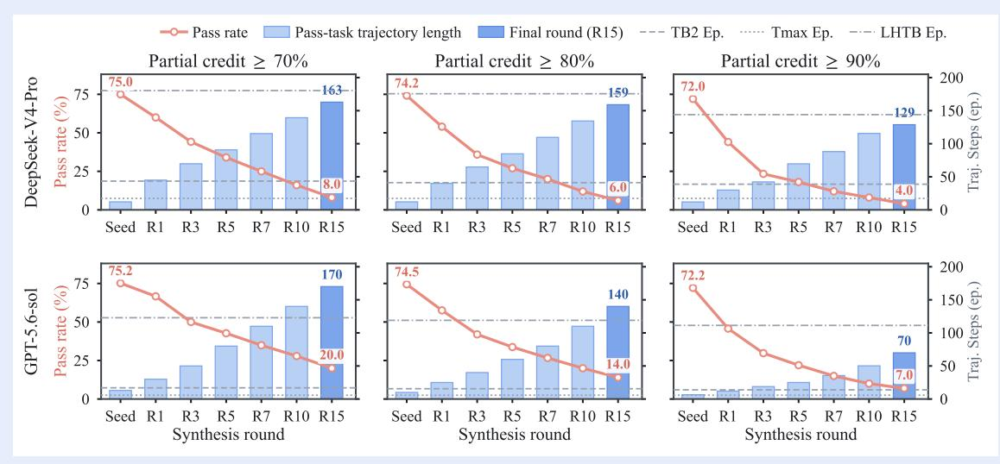

Figure 1은 DeepSeek-V4-Pro와 GPT-5.6-sol의 70%, 80%, 90% 부분 점수 임계값 하에서 재귀 합성 라운드별 통과율과 트래젝터리 길이를 보여준다.

<sup>*</sup>동일 기여, † 프로젝트 리드.

## 1 서론 (Introduction)

대형 언어 모델은 단일 답변 생성기보다 에이전트로 점점 더 많이 사용된다. 단일 답변을 제공하는 대신 복잡한 워크플로우를 실행하고 목표를 향해 나아갈 것으로 기대된다. 단순한 채팅에서 다단계 작업으로의 전환은 도구 사용 및 소프트웨어 에이전트에 관한 최근 연구에 반영된다[2,] [6,] [17] 예를 들어 웹, 컴퓨터 사용, 장기 문제 해결을 위한 대화형 벤치마크[22,] [24,] [41]가 있다. 터미널 기반 작업에서는 에이전트가 저장소 컨텍스트, 명령줄 상호작용, 실행 피드백을 장기 워크플로우에 걸쳐 조정해야 한다[5,] [23,] [43]. 결과적으로 진전은 더 강력한 모델뿐 아니라 하네스[11]와 신뢰할 수 있는 장기 행동을 가르치는 실행 가능한 훈련 데이터[21]에 달려 있다.

그러나 고품질 장기 작업은 규모에 따라 확보하기 어렵다[34]. 터미널 에이전트를 위한 유용한 훈련 데이터는 실행 가능한 작업공간에서 지침, 의미 있는 실행 피드백, 성공 여부를 확인할 수 있는 신뢰할 수 있는 검증자를 통해 검증되어야 한다[11, 17, 23]. 인간이 작성한 작업과 성공적인 궤적은 생산 비용이 높으며, 작업당 수백에서 수천 달러에 이른다[5, 36, 43]. 기존 실행 기반 벤치마크와 최근 벤치마크 빌더는 데이터 소싱 및 환경 구축의 일부를 자동화할 수 있음을 시사하지만[17, 35, 45] 아직 고품질 검증된 터미널 에이전트 데이터를 구축할 수 있는 확장 가능한 방법을 제공하지는 않는다.

본 논문에서는 검증 가능한 터미널 에이전트 작업을 합성하기 위한 재귀적 프레임워크인 RST를 제안한다. RST는 기존 시드 작업에서 시작하여 참조 솔루션을 확장해 더 길고 까다로운 솔루션을 만든다. 이후 검증자와 지침을 새 솔루션에 맞게 업데이트하고 사방(샌드박스)에서 전체 작업을 검증한다. 검증된 작업은 훈련 궤적을 수집하고 다음 합성 라운드의 시드가 된다. 우리는 DeepSeek-V4-Pro[4]를 사용해 점점 더 어려운 작업과 해당 궤적을 재귀적으로 생성하여 에이전트 훈련에 활용한다. 합성 데이터의 유용성을 검증하기 위해 15라운드의 재귀 합성을 수행하고 639개의 시드 작업에서 37,484개의 검증된 터미널 작업을 생산했다. 이후 라운드에서는 상당히 더 많은 작업이 필요하다: 중앙값 솔루션 길이는 5.6배, 명령 사용량은 6.1배 증가하지만 지침 길이는 1.4배에 불과하다. 동일한 솔버를 라운드별로 평가할 때 가장 엄격한 기준에서 통과율은 DeepSeek-V4-Pro의 72%에서 4%로, GPT-5.6-sol의 72.2%에서 7%로 감소한다(Seed에서 R15까지). 이 작업에서 Qwen3.5를 자체 롤아웃하여 수집한 궤적은 Terminal-Bench 2, Terminal-Bench Hard, Long-Horizon Terminal Bench에서 Qwen3.5-27B와 Qwen3.5-122B-A10B를 감독적 미세조정으로 개선한다. 또한 PPO 훈련이 세 벤치마크에서 각각 Qwen3.5-27B를 8.24%, 9.33%, 3.97% 더 향상시킨다.

본 연구는 다음과 같은 통찰을 제시한다:

- 1. 장기 목표를 위한 확장 가능하고 저비용의 합성. 재귀적이며 솔루션 우선 합성 프레임워크에서 수락된 모든 작업은 해결 가능성의 실행 가능한 증거를 담고 있다. 639개의 시드 작업에서 15라운드가 진행되어 약 0.05달러(≈$0.05)당 통과된 작업당 37,484개의 검증된 종단 작업을 생성하며, 인간 저작은 루프에 포함되지 않는다. 중앙값 솔루션 길이는 5.6배, 명령 사용은 6.1배 증가하고, 후반 라운드 작업에서 성공적인 GPT-5.6-sol 경로가 100단계를 초과한다.

- 2. 표준 훈련 하에서 일관된 다운스트림 개선. Qwen3.5가 자체 수집한 경로가 Qwen3.5-27B와 Qwen3.5-122B-A10B를 Terminal-Bench 2, Terminal-Bench Hard, Long-Horizon Terminal Bench에서 단순 감독 미세 조정을 통해 개선하며, 최대 10점의 향상을 보인다.

- 3. 관측된 한계 없음. 15번 재귀 라운드 후, 통과 작업 수율과 후보 통과율은 안정적이며, 라운드당 구조적 성장도 양수이며, 도메인, 연산자, 재작성-가족 다양성은 모두 보존된다. 이는 해결자 통과율이 70% 초과에서 4–7%로 떨어져도 마찬가지다. 재귀는 포화나 붕괴의 징후가 없으며, 파이프라인은 특정 시드 도메인이나 생성 모델에 의존하지 않는다. 이는 합성이 데이터 양과 질 모두에서 계속 확장될 수 있음을 시사한다.

## 2 Related Work (Related Work)

터미널-에이전트 벤치마크 및 장기 목표 평가. SWE-Bench 및 Multi-SWE-Bench와 같은 저장소 수준 벤치마크는 에이전트가 코드베이스를 수정하고 실행 가능한 테스트를 만족할 수 있는지 평가한다. [&#91;17,](#page-15-0) [45&#93;](#page-17-2)

표 1 대표적인 작업 데이터셋 및 환경 생성 파이프라인 비교. 작업과 경로 수는 실행 가능한 환경과 에이전트 상호작용 추적이 서로 다른 데이터 단위이므로 별도로 보고된다. 선행 연구의 속성은 해당 논문 및 릴리스를 따른다.

| 데이터셋 | 도메인 |  | 작업† 궤적‡ 기반? 실행 가능? 적응성? |  |  |  | RL-검증? | 재시드? |
|-----------------------------------------|-----------|--------|------------------------------------------------------|---|---|---|---------------|------------|
| WizardLM [42] | 일반 | – | 250,000a | × | × | × | × (SFT) | × |
| SWE-Gym [25] | SWE | 2,438 | N/R | ✓ | ✓ | × | × (SFT) | × |
| OpenThoughts-Agent-v1-SFT [29] Terminal |  | N/R | 15,209 | △ | ✓ | × | × (SFT) | × |
| TermiGen [52] | Terminal | 3,500+ | 3,291 | × | ✓ | × | × (SFT) | × |
| RLVE-Gym [47] | Math/Algo | 400 | N/R | ✓ | × | ✓ | ✓ (DAPO) | × |
| ScaleEnv [33] | Tool-Use | 2,560 | N/R | × | ✓ | × | ✓ (GRPO) | × |
| Endless Terminals [9] | Terminal | 3,255 | N/R | × | ✓ | × | ✓ (PPO) | × |
| Terminal-Corpus [27] | Terminal | N/R | 254,000+ | ✓ | ✓ | × | × (SFT) | × |
| TMax-15K [16] | Terminal | 14,600 | N/Rb | × | ✓ | × | ✓ (GRPO) | × |
| SETA [30] | Terminal | 4,567 | 1,112c | ✓ | ✓ | ✓ | ✓ (GRPO) | × |
| RST (우리의) | Terminal | 37,484 | 327,189 | ✓ | ✓ | ✓ | ✓ (SFT, PPO) | ✓ |

†작업. 모델 실행이 아니라 재사용 가능한 작업 또는 환경 인스턴스를 계산한다. ‡트레저리 카운트는 에이전트 상호작용 추적을 수집한다. N/R은 고정된 트레저리-코퍼스 크기가 보고되지 않았음을 나타낸다. <sup>a</sup>WizardLM은 터미널-에이전트 트레저리 대신 단일 턴 명령–응답 예시를 보고한다. <sup>b</sup>TMax는 별도로 추가 2.2k-환경 워밍스타트 세트에서 생성된 16.5k SFT 트레저리를 보고한다. 이는 TMax-15K에서의 트레저리로 계산되지 않는다. <sup>c</sup>SETA는 수집된 1,488 롤아웃 중 1,112개의 성공적인 SFT 트레저리를 보유한다. △는 기반 및 합성 생성 소스의 혼합을 나타낸다.

SWE-Bench++와 SWE-Marathon은 이 설정을 보다 광범위하고 까다로운 소프트웨어 엔지니어링 작업으로 확장한다 [&#91;5,](#page-14-2) [35&#93;](#page-16-3). Terminal-Bench는 대화형 명령줄 워크플로우를 평가하고, Harbor는 샌드박스 실행과 검증기 기반 채점에 대한 공통 인터페이스를 제공한다 [&#91;11,](#page-15-3) [23&#93;](#page-15-2). Long-Horizon-Terminal-Bench는 수백 번의 상호작용이 필요한 상태 기반 터미널 작업으로 이 설정을 확장하고, 부분 진행을 측정하기 위해 밀집형 검증기 기반 보상을 사용한다 [&#91;21&#93;](#page-15-4). TerminalWorld는 실제 상호작용 기록에서 검증된 터미널 작업을 구성하며, 50단계 이상이 필요한 워크플로우를 포함한다 [&#91;3&#93;](#page-14-5). 더 넓은 스위트는 웹, 데스크톱, 다중 애플리케이션 환경에서 에이전트를 평가한다 [&#91;22,](#page-15-1) [24,](#page-16-0) [50&#93;](#page-17-5). 최근 연구는 장기 평가에서 지속적인 상태, 지연된 피드백, 반복적인 도구 사용을 더욱 강조한다 [&#91;18,](#page-15-6) [41&#93;](#page-17-0). 에이전트는 일반적으로 SWE-agent와 OpenHands와 같은 공유 스캐폴드로 평가된다 [&#91;36,](#page-16-2) [43&#93;](#page-17-1). 이 연구들은 주로 평가 설정을 정의하는 반면, RST는 실행 가능한 작업을 재귀적으로 확장하고 이를 사용해 훈련 트레저리를 수집한다.

합성 작업 및 검증 가능한 환경. 최근 연구는 도구 사용, 코딩, 에이전트 훈련을 위한 작업과 환경을 생성한다 [&#91;40,](#page-17-6) [51,](#page-17-7) [53&#93;](#page-18-1). 다른 시스템은 웹, 데스크톱, 일반 디지털 환경을 확장하여 인간 작성량을 줄인다 [&#91;7,](#page-14-6) [32,](#page-16-9) [37&#93;](#page-17-8), 지속적인 세계 생성 및 자동 환경 구축은 이 방향을 진화하는 상호작용 설정으로 확장한다 [&#91;39,](#page-17-9) [47,](#page-17-4) [48&#93;](#page-17-10). 터미널 에이전트를 위해 Endless Terminals 및 LiteCoder‑Terminal은 실행 가능한 훈련 환경을 구성한다 [&#91;9,](#page-14-4) [26&#93;](#page-16-10), CLI‑Universe와 SETA는 감독 및 강화 학습에서의 사용을 연구한다 [&#91;14,](#page-15-7) [30&#93;](#page-16-8). 비교된 방법 중 RST는 여러 합성 세대에 걸쳐 검증된 작업 번들을 시드로 반복적으로 사용하는 유일한 방법이다.

재귀적 합성 및 에이전트 자기 개선. 자기 훈련과 자기 플레이는 새로운 예시를 생성하고 피드백으로 필터링함으로써 추론 모델을 향상시킨다 [&#91;1,](#page-14-7) [12,](#page-15-8) [20,](#page-15-9) [31,](#page-16-11) [46&#93;](#page-17-11). 자기 보상 및 검증자 지향 방법은 학습된 또는 실행 가능한 보상 신호를 통해 이 접근법을 확장한다 [&#91;13,](#page-15-10) [15,](#page-15-11) [19,](#page-15-12) [44&#93;](#page-17-12). 그러나 재귀적 훈련은 필터링이 약하거나 보상이 잘못 지정될 때 불안정해질 수 있다 [&#91;8,](#page-14-8) [28,](#page-16-12) [49&#93;](#page-17-13). 최근 몇 가지 방법이 작업 진화를 에이전트 설정에 도입한다. SETA는 종단 환경의 난이도와 다양성을 조정한다 [&#91;30&#93;](#page-16-8). BenchEvolver는 더 어려운 코딩 작업과 테스트를 도출하기 전에 실행 가능한 솔루션을 수정한다 [&#91;38&#93;](#page-17-14). TRACE는 검증되고 재현 가능한 경로를 통해 에이전트 작업을 진화시킨다 [&#91;10&#93;](#page-15-13). RST는 작업 공간, 참조 솔루션, 검증자, 공개 지침을 포함한 완전한 종단 작업을 재귀적으로 진화시킨다. 각 재작성 후 이러한 구성 요소는 함께 재정렬되고 검증된다. 수락된 작업은 이후 합성 시드 풀에 포함되며 검증자 기반 강화 학습의 훈련 작업 풀을 직접 구성한다. 이러한 작업에서 수집된 성공적인 롤아웃은 감독된 미세 조정 경로로 보존된다.

## 3 전제조건 (Preliminaries)

우리는 실행 가능한 종단 작업 표현, 롤아웃 프로토콜, 그리고 합성된 작업을 수락하는 데 사용되는 기준을 공식화한다. 종단 작업은 자체 포함된 실행 가능한 문제이며, 다음과 같은 구성 요소를 포함한다:

- instruction.md: 공개 작업 설명;  
- task.toml: 런타임 메타데이터 및 구성;  
- environment/Dockerfile: 초기 환경 및 작업 공간;  
- solution/solve.sh: 참조 솔루션;  
- tests/test.sh 및 tests/test_state.py: 개인 검증자.

모델 상호작용 및 평가 평가는 Harbor를 통해 Terminus-2를 에이전트 하네스로 사용하여 관리된다 [&#91;11&#93;](#page-15-3). 각 롤아웃마다 Harbor는 격리된 샌드박스를 생성하고 Terminus-2에 공개 지침과 초기화된 작업 공간을 제공한다. Terminus-2는 파일을 검사하고 명령을 실행하며 작업 공간을 수정할 수 있지만, 참조 솔루션이나 개인 검증자에 접근할 수 없다. 상호작용이 끝난 후 Harbor는 최종 작업 공간 상태에서 검증자를 실행한다. 검증자는 고정된 명령 시퀀스가 아니라 작업 결과를 확인하여 서로 다른 유효한 솔루션이 점수를 받을 수 있도록 한다.

합성된 작업은 두 가지 조건을 만족할 때만 수락된다. 첫째, 참조 솔루션이 새 샌드박스에서 개인 검증자를 통과해야 하며, 이를 오라클 유효성(oracle validity)이라고 부른다. 둘째, 검증자가 확인하는 모든 요구 사항은 공개 지침에 명시되거나 작업 공간에서 추론 가능해야 하며, 이를 계약 유효성(contract validity)이라고 부른다. 첫 번째 조건은 작업이 실행 가능함을 확립하고, 두 번째 조건은 개인 테스트가 에이전트에게 숨겨진 요구 사항을 도입하는 것을 방지한다.

우리는 15개의 합성 라운드를 R1, …, R15로 표시한다. 이 과정은 639개의 검증된 부트스트랩 작업으로 시작하며, 부트스트랩 작업 자체는 합성 라운드로 계산되지 않는다. 각 r = 2, …, 15에 대해 Rr−<sup>1</sup>에서 선택된 작업이 변환 및 검증되며, 수락된 후보가 Rr을 형성한다. 수락된 작업은 이후 합성 라운드의 시드가 될 수 있고, 검증자 기반 강화 학습의 작업 풀을 직접 구성한다. 이러한 작업에서 수집된 성공적인 롤아웃은 감독된 미세 조정 경로로 보존된다.

## 4 방법 (Method)

RST는 다중 합성 라운드를 거쳐 터미널-에이전트 훈련 과제를 구성한다. 각 라운드에서 이전 라운드에서 승인된 과제들이 시드로 선택된다. 각 시드에 대해 참조 솔루션을 확장하고, 검증자와 공개 지침을 새로운 워크플로우에 맞게 업데이트하며, 결과 과제를 새 사바운드에서 검증한다. 이 실행 가능한 과제 형식은 저장소 수준 벤치마크 [&#91;17,](#page-15-0) [35,](#page-16-3) [45&#93;](#page-17-2) 및 터미널 벤치마크 [&#91;23&#93;](#page-15-2)를 따른다. 승인된 과제는 다음 합성 시드 풀과 강화 학습 과제 풀 모두에 포함되며, 성공적인 롤아웃은 감독 학습(SFT) 트레이젝터리를 제공한다.

그림 2는 과제 합성과 모델 훈련 간의 상호작용을 요약한다. 검증된 시드에서 시작해 프레임워크는 참조 솔루션을 확장하고 검증자와 공개 지침을 업데이트하여 더 어려운 후보를 만든다. 후보는 사바운드에서 검증되며, 해결 불가능한 과제는 버려지고, 승인된 과제는 검증 풀에 들어간다. 이 풀은 이후 합성 라운드의 시드와 검증자 기반 RL 과제를 제공하며, 성공적인 롤아웃은 SFT 트레이젝터리를 제공한다.

각 합성 라운드는 네 단계로 구성된다. 첫째, RST는 실행 가능한 재작성 연산자를 선택하고 시드 과제를 기반으로 기대되는 결과를 정의한다. 이후 실행 가능한 워크플로우를 확장하고 솔루션, 검증자, 지침, 환경을 일관되게 업데이트한다. 각 후보는 정적 검사, 단축 방지 및 누수 감사를 거치고 새 사바운드에서 검증된다; 복구 가능한 실패는 제한된 수리(바운드드 리페어)를 받는다. 마지막으로 승인된 과제는 선택되고 코호트 캡을 적용해 다음 라운드 시드 풀을 만든다.[1](#page-3-0)

<span id="page-3-1"></span><span id="page-3-0"></span><sup>1</sup>프롬프트 템플릿과 구현 세부사항은 부록 B와 부록 C에 제공된다.

<span id="page-4-0"></span>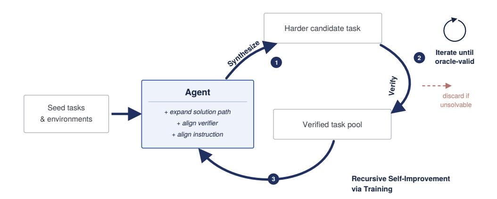

그림 2 RST에서의 재귀적 과제 합성과 에이전트 훈련. 승인된 과제는 이후 합성 라운드의 시드가 되고 강화 학습 과제 풀을 형성하며, 성공적인 롤아웃은 감독 학습 트레이젝터리를 제공한다.

### 4.1 시드 풀과 다양성 제한 선택 (Seed Pool and Diversity-Capped Selection)

우리는 639개의 검증된 과제를 부트스트랩 시드로 사용해 합성 파이프라인을 초기화한다. 이 시드들은 실제 상호작용 기록으로부터 구축된 검증된 터미널 과제 데이터셋인 TerminalWorld [&#91;3&#93;](#page-14-5)에서 샘플링된다. 이 시드에 합성 및 검증 과정을 적용하면 2,820개의 승인 과제가 생성되며, 이는 R1을 정의한다; 639개의 부트스트랩 시드는 합성 라운드로 계산되지 않는다. 다양성 분석을 위해 부트스트랩 시드의 원래 카테고리 라벨을 19개 도메인으로 통합한다. 그림 4에 표시된 바와 같이 도메인 구성이 시드 풀에서 R15까지 광범위하게 분포되어 있다: 가장 큰 도메인은 풀의 1/4 이하이며, 정규화된 엔트로피는 0.821에서 0.817로 변동하고, 도메인의 유효 수는 거의 변하지 않는다(11.22 대 11.09). 이 결과는 광범위한 도메인 붕괴의 증거가 없음을 보여준다.[2](#page-4-1)

각 이후 라운드 Rr( r = 2, …, 15)에서는 Rr−1의 승인 풀에서 시드를 선택한다. 필수 구성요소가 누락된 과제는 선택 전에 제거된다. 남은 후보는 부모 계통, 카테고리, 재작성 패밀리, 생성 코호트에 대한 캡을 적용해 선택된다. 이러한 제약은 소수의 부모나 재작성 패턴이 이후 라운드를 지배하는 것을 방지한다. 선택된 과제는 다음 합성 라운드에 들어가며, 승인된 자식은 Rr을 형성한다.

### 4.2 목표 선택 및 과제 계약 (Target Selection and Task Contract)

각 합성 라운드는 적절한 재작성 연산자(rewrite operator)를 선택하는 것으로 시작한다. 파이프라인은 시드 작업(seed task)을 검사하며, 그 파일, 도구, 종속성 및 기존 워크플로우를 포함해 어떤 확장(extension)이 가능한지 판단한다. 그런 다음 그림 5에 표시된 40개의 연산자 중 하나를 선택한다. 이 연산자들은 다섯 개의 가족(family)으로 그룹화된다: 구성 및 제어 상태(Configuration and Control State), 데이터, 매니페스트 및 스키마 상태(Data, Manifest, and Schema State), 파일 시스템 및 리소스 바인딩(Filesystem and Resource Binding), 빌드, 캐시 및 아티팩트 상태(Build, Cache, and Artifact State), 그리고 런타임, 도구 및 진단(Runtime, Tooling, and Diagnostics). [3](#page-4-2)

작업을 수정하기 전에 생성기는 재작성 계획을 기록한다. 이 계획은 새로운 요구 동작, 참조 솔루션에 대한 대응 변경, 검증자가 확인하는 중간 및 최종 결과, 그리고 지시문이나 작업 공간을 통해 에이전트가 이용할 수 있는 정보를 정의한다. 또한 검증자가 거부해야 할 지름길을 식별한다. 계획은 단지 외관상만 변경하거나 실행 가능한 워크플로우와 무관한 검사를 추가하거나 필수 정보를 비공개 테스트에만 배치할 경우 거부된다. 승인된 계획은 이후 솔루션, 검증자, 지시문 및 환경에 대한 업데이트를 안내한다.

### 4.3 리라이트: 솔루션 성장, 그 다음 정렬

리라이트는 실행 가능한 동작과 런타임 조건에서 공개 작업 사양으로 진행된다. 먼저, 생성자는 solve.sh를 확장하여 파일 검사, 값 도출, 호출

<span id="page-4-1"></span><sup>2</sup>완전한 도메인 매핑은 부록 [A.]에 제공된다.

<span id="page-4-2"></span><sup>3</sup>자세한 연산자 정의는 부록 [C.]에 제공된다.

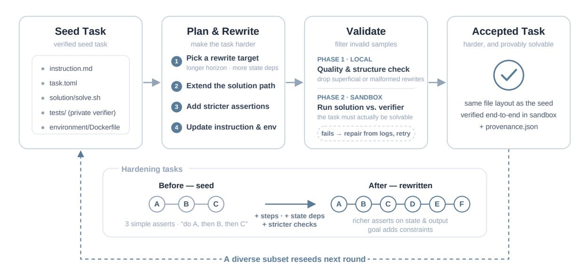

그림 3 한 번의 재귀 합성 라운드의 상세 파이프라인. 검증된 시드 작업은 목표 선택, 단계별 리라이트, 로컬 및 샌드박스 검증, 그리고 다양성 제어된 재시드를 거친다.

도구, 상태 관리, 중간 산출물 생성, 또는 최종 출력 검증.  
그 후 환경이 이러한 작업을 지원하도록 수정된다.  
이러한 수정은 새로운 종속성 및 CLI 도구를 설치하고, 추가 파일, 픽스처 또는 구성을 제공하며, 서비스와 프로세스를 초기화하거나, 권한, 경로, 리소스 한계 및 런타임 설정을 조정할 수 있다.  
해결책과 환경이 완전한 실행 경로를 정의하면, 검증자는 결과 산출물과 상태 전이를 확인하도록 업데이트되며, 자리 표시자, 하드코딩된 출력 및 생략된 중간 작업을 거부한다.  
공개 지침은 새로운 목표를 명시하고 환경에서 파악할 수 없는 필수 정보를 식별하도록 개정된다.  
수정된 환경이 다른 리소스, 타임아웃 또는 실행 설정을 요구할 때 작업 메타데이터가 업데이트된다.

### 4.4 검증: 로컬 필터와 샌드박스 오라클

검증은 두 단계로 진행된다. 먼저, 정적 검사는 시드와 거의 동일한 후보, 필수 파일을 누락한 후보, 잘못된 메타데이터를 포함한 후보, 또는 공개 지시문에 비공개 검증자 세부 정보를 노출한 후보를 거부한다. 이 단계는 샌드박스를 할당하기 전에 명백한 실패를 제거한다.

정적 검사를 통과한 후보는 새 샌드박스에서 평가된다. 환경은 초기 상태에서 구축되고, 참조 솔루션이 실행되며, 비공개 검증자가 결과 작업공간에서 실행된다. 실패가 수리 가능하면, 검증 로그는 승인된 파일에 한정된 제한된 수의 수리를 위해 사용된다. 그런 다음 후보를 다시 검증한다; 지속적인 실패는 폐기된다. 우리는 샌드박스에서 참조 솔루션이 비공개 검증자를 통과한 후보에 대해 oracle-passed를 사용한다. 후보는 지시문-검증자 일관성 검사를 통과한 후에만 수락된다.[4](#page-5-0)

## 5 실험

우리는 RST를 두 관점에서 평가한다: 합성 파이프라인의 성능과 모델 학습을 위한 합성 데이터의 활용도. 합성 평가는 15라운드에 걸쳐 효율성, 구조적 성장, 유효성, 다양성, 작업 난이도를 포함한다. 효율성은 정규화된 수율과 생성 비용으로 측정되며, 구조적 성장은 해결책과 검증기의 변화를 통해, 유효성은 지시-검증기 일관성으로, 다양성은 재작성-가족 균형, 연산자 범위, 계보 보존, 새로움, 근접 중복으로 측정된다.

<span id="page-5-0"></span><sup>4</sup>완전한 필터와 수리 절차는 부록 [D.](#page-22-1)에 제공된다.

<span id="page-6-0"></span>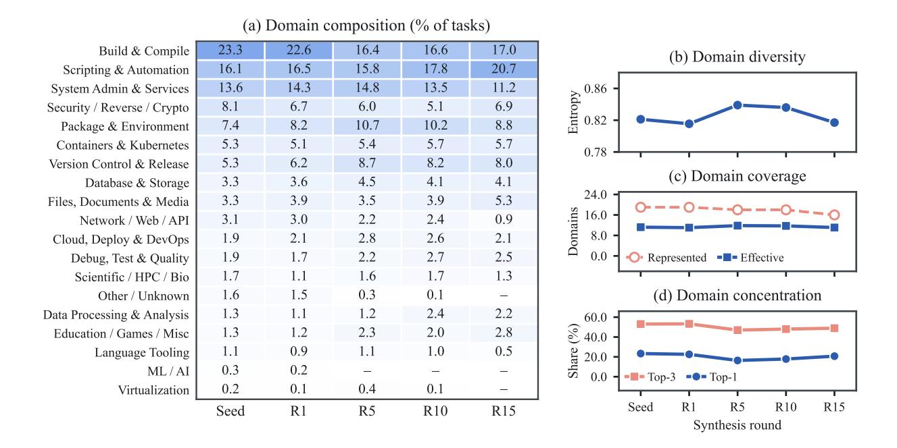

Figure 4 639개의 부트스트랩 시드에서 재귀 합성을 거쳐 도메인 구성을 및 안정성을 보여준다. (a) 시드 풀과 오라클 통과 작업의 조상 도메인 비율은 $R_1$, $R_5$, $R_{10}$, $R_{15}$에서 측정된다. (b) 분포 균등성은 정규화된 샤논 엔트로피로 측정된다. (c) 도메인 폭은 대표되는 도메인 수와 유효 도메인 수로 측정된다. (d) 도메인 농도는 Top-1 및 Top-3 도메인에 속한 작업 비율로 측정된다. 안정된 엔트로피와 유효 도메인 수는 $R_{15}$까지 도메인 다양성이 유지되며, 광범위한 도메인 붕괴가 없음을 나타낸다.

유사성. 작업 난이도는 각 라운드의 하위 집합에서 DeepSeek-V4-Pro pass@4와 부분 점수(partial credit)를 사용해 평가된다. pass@4는 네 번의 시도 내에 전체 완료를 측정하며, 부분 점수는 롤아웃 후 검증기 체크 중 통과된 비율을 나타낸다. 훈련 활용도는 Qwen3.5-27B와 Qwen3.5-122B-A10B의 지도 학습 기반 미세 조정 및 Qwen3.5-27B의 검증기 기반 강화 학습을 통해 평가된다. Terminal-Bench 2는 실행 가능한 평가가 가능한 표준화된 샌드박스 환경에서 광범위한 터미널 실행을 평가한다[23]. 우리는 Terminal-Bench Hard(100작업 하위 집합, TMax-15K에서 추출)를 사용해 독립적으로 구성된 작업 분포로의 전이(transfers)를 평가한다[16]. Long-Horizon Terminal Bench는 다수의 종속 상호작용과 밀집된 부분 점수 평가를 가진 지속적이고 다단계 터미널 워크플로우를 평가한다[21]. 관찰된 전이가 벤치마크 누수에 의해 설명되지 않도록, 우리는 $R_1$, $R_5$, $R_{10}$, $R_{15}$의 샘플을 모든 89 TB2 작업, 100 Terminal-Bench Hard 작업, 46 LHTB 작업(표 2)과 비교하는 작업-설명 감사(task‑description audit)를 수행한다. 정규화된 13-토큰 슬라이딩 윈도우 기준에서 벤치마크 작업이 어떤 합성 라운드와도 일치하지 않으며, 최대 쌍별 5-그램 Jaccard 유사성은 0.009 이하이다. 또한, unigram Jensen-Shannon 발산은 $R_1$에서 $R_{15}$로 증가하여, 재귀 합성이 벤치마크 분포에 수렴하기보다 점점 더 구별되는 작업 분포를 생성함을 나타낸다.

합성 과정은 639개의 검증된 부트스트랩 작업으로 시작된다. 이 작업들에 합성 및 검증 파이프라인을 적용하면 2,820개의 수락된 작업이 생성되어 $R_1$을 정의한다; 부트스트랩 작업은 합성 라운드로 계산되지 않는다. 각 $r=2,\ldots,15$에 대해, $R_{r-1}$의 수락된 작업 중 일부를 시드 풀로 선택하고, 새로운 합성 라운드의 수락된 출력이 $R_r$을 형성한다. 결과적으로 $R_1$–$R_{15}$ 풀은 37,484개의 작업을 포함한다. 제출된 각 시드는 하나의 합성 시도로 계산되며, 합성 수율은 라운드 간 비교를 위해 1,000 시도당 정규화된다. 구조적, 유효성, 다양성 통계는 수락된 작업 풀에서 계산되고, 해결기 난이도는 매칭된 하위 집합에서 평가된다. 모든 값은 원본 생성 및 검증 기록에서 파생된다.

<span id="page-7-0"></span>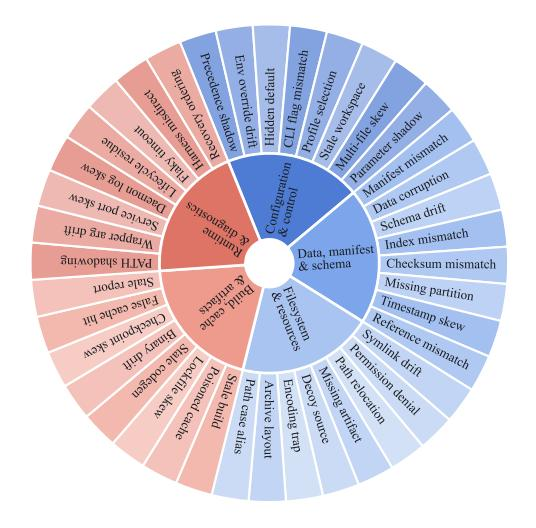

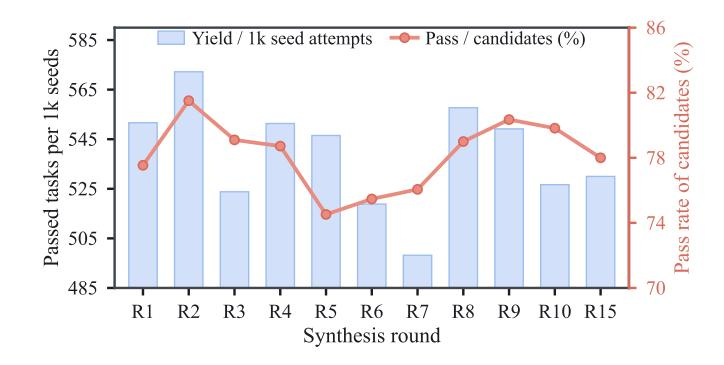

Figure 5 터미널-에이전트 프리미티브의 개념적 분류 체계는 기능 범위 특성을 설명하는 데 사용된다. 링 라벨은 축약되었으며, 구현 수준 재작성 패밀리와 그 40개의 연산자는 별도로 부록 C에서 정의된다.

Figure 6 재귀 합성 라운드 전반에 걸친 1,000개의 시드 시도당 통과된 작업 수와 후보 통과율. 두 지표 모두 $R_{15}$까지 안정적으로 유지되며, 합성 처리량이나 검증 성공률에 체계적인 감소가 없다.

<span id="page-7-1"></span>**Table 2** 재귀 합성 라운드 전반에 걸친 작업-설명 거리 및 오염 분석. Unigram JSD(단어 단일 분포 차이)는 각 라운드와 해당 벤치마크 간의 어휘 분포 차이를 측정하며, Max $J_5$(최대 5-그램 Jaccard 유사도)는 가장 큰 쌍별 5-그램 Jaccard 유사도를 보고한다. Exact 13-token overlap(정확한 13-토큰 겹침)는 최소 하나의 일치하는 정규화된 13-토큰 윈도우를 포함하는 벤치마크 작업 수를 보고한다.

|  | 1 | Unigram JSD |  |  |  |
|-----------|---------------------|-------------|-------|---------------|----------|
| Max $J_5$ | TB Hard | LHTB | TB2 | Median tokens | Round |
| 0.0081 | 0.331 | 0.441 | 0.358 | 87.5 | $R_1$ |
| 0.0042 | 0.359 | 0.461 | 0.387 | 104.0 | $R_5$ |
| 0.0028 | 0.394 | 0.484 | 0.426 | 116.0 | $R_{10}$ |
| 0.0051 | 0.406 | 0.485 | 0.433 | 121.5 | $R_{15}$ |
| _ | 0.406<br>Hard 0/100 |  |  |  |  |

### 5.1 재귀적 작업 합성 결과 (Recursive Task Synthesis Results)

재귀 합성은 반복 재사용에 의해 붕괴되는 대신 15라운드 동안 안정적으로 유지된다. 그림 6은 합성 안정성의 두 가지 척도를 보고한다: 1,000개의 시드 시도당 통과 작업 수익률과 후보 통과율. 통과 작업 수익률은 라운드 전반에 걸쳐 498.2에서 572.2 사이를 유지하며, $R_{15}$에서 530.0에 도달하고 $R_1$에서는 551.6에 이른다. 후보 통과율도 74.5%에서 81.5% 사이의 좁은 범위 내에 머물며, $R_1$과 $R_{15}$에서 유사한 값(77.5%와 78.0%)을 보인다. 이 결과는 파이프라인이 15라운드의 재귀 재사용 이후에도 생성 및 검증 성능을 유사하게 유지함을 보여준다.

동시에, 이후 라운드의 작업은 프롬프트 길이만 늘어나는 것이 아니라 실행 가능한 작업이 상당히 복잡해진다. 그림 7–9는 $R_1$에서 $R_{15}$까지 중간값 솔루션 길이가 67줄에서 374줄로, 명령 수가 40개에서 244개로, 고유 CLI 도구가 17개에서 71개로, 제어 흐름 연산이 6개에서 45개로, 파일 연산이 2개에서 14개로, 검증자 어설션이 17개에서 57개로 증가함을 보여주며, 명령어 길이는 85단어에서 122단어로 훨씬 느리게 증가한다. 상위 분위수도 병행해서 상승하여, 이 성장이 소수의 이상치에 의해 주도되는 것이 아니라 작업 모집단 전체에 걸쳐 분포되어 있음을 시사한다. 그림 8은 같은 패턴을 확장 요인으로 요약하고, 그림 9는 작업 수준에서 이를 확인한다: $R_{15}$에서 중간값 부모-자식 변화는 솔루션 라인 22, 명령 18, 검증자 어설션 3에서 양수 변화를 유지하며, 양수 델타는

<span id="page-8-0"></span>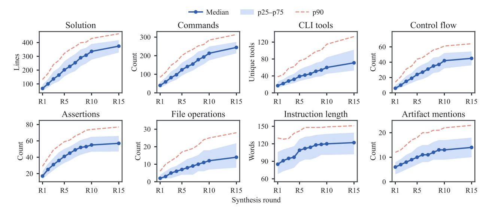

그림 7은 $R_1$에서 $R_{15}$까지의 여덟 개 작업 구조 지표(task-structure metrics)의 분위수 추세(Quantile trends)를 보여준다. 중앙값(median)과 상위 분위수 값(upper-quantile values)은 해결 길이(solution length), 명령어 사용(command use), CLI 도구(CLI tools), 제어 흐름(control flow), 단언(assertions), 파일 연산(file operations)에서 가장 크게 증가하며, 지시문 길이(instruction length)는 비교적 느리게 증가한다.

각각 78%, 78%, 그리고 65%의 쌍이 해당된다. 따라서 재귀 합성은 실행 가능한 작업량을 증가시키면서도 개별 작업 수준에서 작업을 계속 추가한다.

<span id="page-8-1"></span>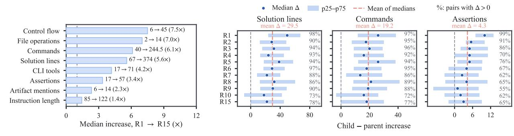

그림 8 중앙값 확장 계수는 $R_1$에서 $R_{15}$까지 작업-구조 지표에 걸쳐 나타난다. 실행 가능한 작업과 관련된 지표는 명령어 길이보다 훨씬 빠르게 증가한다.

그림 9 부모-자식 관계에서 해결책 길이, 명령어 수, 검증자 주장 수가 $R_1$에서 $R_{15}$까지 변화. 대부분의 승인된 자식은 즉각적인 부모에 비해 양의 변화를 보이며, 이는 개별 작업 수준에서 지속적인 구조적 성장을 나타낸다.

후반 단계의 과제는 더 복잡할 뿐만 아니라 공개 지침과도 더 잘 부합한다. 그림 10과 11은 숨김-검사 보호가 38.2%에서 63.5%로 증가하고, 짧은 지침 위험이 41.6%에서 7.5%로 감소함을 보여준다. 사설 테스트와 문자 그대로 유출에 대한 언급은 0.1%와 0%에 머물며, 이는 $R_{15}$에서 각각 나타난다. 중간 요구 사항 충족률은 0.42에서 0.57로 상승하고, 약하게 기반된 과제 비율은 32.8%에서 1.2%로 감소하며, 강하게 기반된 비율은 14.3%에서 38.0%로 증가한다. 이 모든 결과는 후반 과제가 더 잘 명시되었으며, 이진 성공과 부분 점수 모두 공개 과제 계약을 보다 충실히 반영한다는 것을 시사한다.

### 5.2 작업 난이도 분석 (Task Difficulty Analysis)

위에서 관찰된 작업 측면의 성장이 에이전트 측 난이도로 전환되는지 테스트하기 위해, 고정된 추론 설정 하에서 각 합성 라운드의 일치된 작업 하위 집합에서 DeepSeek-V4-Pro를 평가한다. Pass@4는 네 번의 시도 내에서 전체 작업 완료를 측정하며, 부분 점수는 검증자 검사 중 만족된 비율을 측정한다.

<span id="page-9-0"></span>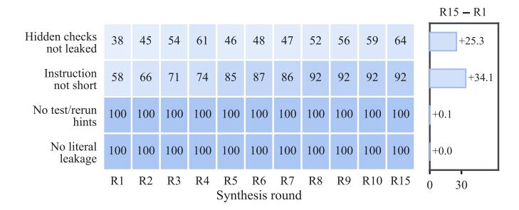

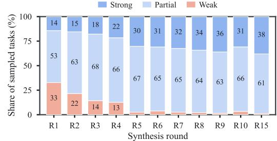

Figure 10 공개 지침 감사: R<sup>1</sup>에서 R15까지. 숨김 검사 보호가 증가하고 짧은 지침 위험이 감소하며, 사설 테스트 및 리터럴 누출에 대한 언급은 여전히 무시할 수 있다.

Figure 11 요구사항-검증기 정렬: R<sup>1</sup>에서 R15까지. 샘플링된 작업은 실행 가능한 검사에 반영된 공개 요구사항 비율에 따라 그룹화되어, 지침-검증기 일관성의 직접적인 측정을 제공한다.

<span id="page-9-1"></span>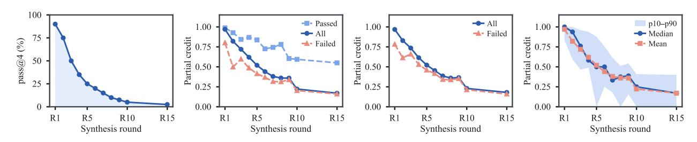

Figure 12 DeepSeek-V4-Pro의 pass@4가 재귀 합성 라운드에 걸친 작업 하위 집합에서 나타난다. 성공률은 R<sup>1</sup>에서 90%에서 R15까지 2.5%로 단조 감소한다. Figure 13 DeepSeek-V4-Pro가 달성한 검증기 기반 부분 점수의 평균은 R<sup>1</sup>에서 0.970에서 R15까지 0.170으로 감소한다. Figure 14 R<sup>1</sup>에서 R15까지의 시도 수준 부분 점수, 모든 시도와 실패 시도에 대해. Figure 15 작업 수준 부분 점수 분포로, 중앙값과 p10–p90이 라운드에 따라 하향 이동한다.

후반 라운드의 작업은 고정된 솔버에 대해 상당히 어려워진다. Figure [12](#page-9-1)는 DeepSeek-V4-Pro의 pass@4가 R<sup>1</sup>에서 90%에서 R15까지 2.5%로 단조 감소하며, 전체 작업 성공률이 36배 감소함을 보여준다. Figure [13](#page-9-1)는 평균 부분 점수가 0.970에서 0.170으로 동반 감소함을 보여준다. 솔버와 추론 설정이 라운드마다 변하지 않으므로, 이 감소는 모델 능력의 변화가 아니라 작업 분포의 변화를 반영한다. 따라서 결과는 재귀 합성에 의해 생성된 구조적 성장이 실제로 더 큰 작업 난이도와 일치함을 보여준다.

이 난이도 증가는 집계 아티팩트나 소수의 이상치에 의해 주도되는 것이 아니라 광범위하다. Figure [14](#page-9-1)는 평균 시도 수준 부분 점수가 R<sup>1</sup>에서 0.968에서 R15까지 0.180으로 감소하고, 실패 시도의 평균이 0.782에서 0.160으로 떨어져, 감소된 진행이 개별 롤아웃 전반에 걸쳐 일관되게 나타남을 시사한다. Figure [15](#page-9-1)는 전체 작업 수준 부분 점수 분포가 하향 이동함을 추가로 보여준다: 중앙값이 1.0에서 0.170으로 떨어지고, p10이 0에 도달하며, p90이 R15까지 0.400으로 감소한다. 따라서 난이도 증가는 후반 라운드 작업 전반에 걸쳐 광범위하게 분포되어 좁은 상위 꼬리에 집중되지 않는다.

후반 라운드 실패도 정성적으로 더 어렵다. 근접 실패가 훨씬 적고 반복 샘플링에서 회복이 거의 없다. Figure [16](#page-10-0)는 검증기 검사 중 최소 75%를 만족하는 실패 시도가 R<sup>1</sup>에서 86.4%에서 R15까지 1.2%로 감소하고, 검사 절반 이하의 작업 비율이 0%에서 97.5%로 상승함을 보여준다. Figure [17](#page-10-0)는 DeepSeek-V4-Pro가 R<sup>7</sup> 이후부터 최대 15%의 작업만 해결하며, pass@4가 R15에서 2.5%로 감소함을 보여준다. 이 결과들은 재귀 합성이 단순히 이진 성공률을 낮추는 것이 아니라, 동일한 솔버가 후반 라운드 작업에서 부분 진행을 현저히 적게 하고 완전한 솔루션을 훨씬 적게 회복하도록 만든다는 것을 보여준다.

<span id="page-10-0"></span>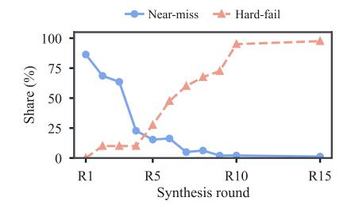

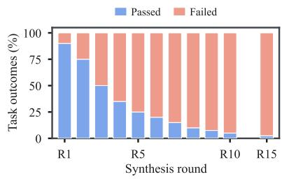

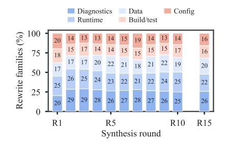

Figure 16 부분 점수 결과의 분포 이동. 0.75 이상의 부분 점수를 가진 실패 시도가 86.4%에서 1.2%로 감소하고, 0.50 이하의 작업이 0%에서 97.5%로 상승한다.

Figure 17 DeepSeek-V4-Pro의 작업 수준 pass@4 결과. pass율이 R<sup>1</sup>에서 90%에서 R<sup>6</sup>에서 20%로, R15에서 2.5%로 감소한다.

Figure 18 다섯 개 재작성 패밀리 전반에 걸친 수락된 작업 분포. 엔트로피가 최대에 가깝게 유지되며, 어느 라운드에서도 어떤 패밀리도 29%를 초과하지 않는다.

<span id="page-10-1"></span>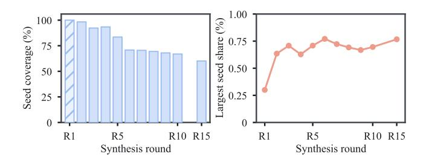

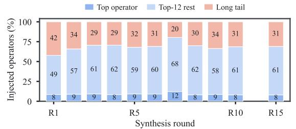

그림 19 재귀 라운드 전반에 걸친 부트스트랩 시드 커버리지. R<sup>15</sup>는 R1에 나타난 363개의 시드 중 218개를 보유하며, 단일 시드가 R<sup>15</sup> 작업의 0.77%를 초과 기여하지 않는다.

그림 20 R<sup>1</sup>에서 R15까지의 리라이트-연산자 커버리지. 각 라운드는 40개의 사용 가능한 연산자 중 31~38개를 사용하며, 가장 빈번한 연산자는 작업의 최대 12.2%를 차지한다.

### 5.3 데이터 다양성 및 중복 분석 (Data Diversity and Duplication Analysis)

재귀 합성은 작업 생성의 단일 모드로 붕괴되는 대신 도메인과 리라이트 패밀리 전반에 걸쳐 광범위한 다양성을 보존한다. 그림 [4]는 작업 풀이 합성 라운드 전반에 걸쳐 광범위한 도메인 커버리지를 유지함을 보여주며, 그림 [18]은 리라이트-패밀리 엔트로피가 2.26~2.31 비트 사이에 머물러 있음을 나타낸다. 이는 다섯 패밀리의 최대값인 log<sup>2</sup> 5 = 2.32 비트에 가깝다. 가장 큰 패밀리는 라운드 전반에 걸쳐 승인된 작업의 24.9%~28.9%만을 차지하며, R<sup>15</sup> 분포는 진단 및 포렌식, 런타임 서브스트라이트, 데이터 및 아티팩트 처리, 빌드 및 테스트 워크플로우, 구성 및 상태 마이그레이션 전반에 걸쳐 잘 분산되어 있다. 그림 [7][–9]에 보고된 구조적 성장은 단일 지배적 리라이트 패턴이 아니라 다중 형태의 작업 확장을 반영한다.

반복 재시딩은 데이터셋이 소수의 부모 또는 연산자에 의해 지배되는 것을 초래하지 않는다. 그림 [19]는 부트스트랩 시드 커버리지가 R<sup>2</sup>에서 98.3%에서 R15까지 60.1%로 점진적으로 감소함을 보여주며, 이는 일부 시드 소스가 시간이 지남에 따라 필터링됨을 시사한다. 그러나 어떤 라운드에서도 단일 시드가 작업의 0.77%를 초과 기여하지 않으므로 남은 풀은 소수의 계통에 집중되지 않는다. 그림 [20] 역시 파이프라인이 광범위한 리라이트 연산자를 계속 사용함을 보여준다: 40개의 연산자 중 36개가 R15에 대표되며, 가장 빈번한 연산자는 작업의 8.0%만을 차지하고, 가장 흔한 열두 연산자 외의 연산자도 31.0%를 차지한다. 따라서 재귀 재사용은 조상과 변환 메커니즘 모두에서 다양성을 유지한다.

후반 라운드 작업이 다소 유사해지지만 재귀 합성은 반복 복사로 붕괴되지 않는다. 그림 [21]과 [22]는 R<sup>15</sup>에서 지시문, 해결책, 검증기의 부모-자식 새로움이 각각 0.36, 0.18, 0.33을 유지함을 보여주며, 이는 후손이 부모로부터 더 많은 구현 내용을 보존하면서도 세 가지 작업 구성요소를 모두 수정한다는 것을 나타낸다. 라운드 내 최단 이웃 유사도는 R<sup>1</sup>에서 0.223의 중앙값에서 R15에서 0.464로 증가하지만 중앙값은

<span id="page-11-0"></span>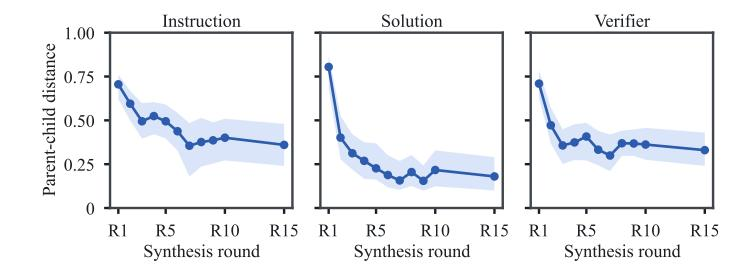

Median p90 p95

0.80 reference

0.80 reference

0.80 reference

R1 R5 R10 R15

Synthesis round

**그림 21** 지시문, 해결책, 검증기에서 토큰 수준의 부모-자식 새로움이 $R_1$에서 $R_{15}$까지. 이후 라운드 리라이트는 부모로부터 더 많은 내용을 보존하면서도 세 가지 작업 구성요소를 모두 수정한다.

그림 22 라운드 내 최단 이웃 유사도가 $R_1$에서 $R_{15}$까지. $R_{15}$의 중앙값은 0.5 미만이며, p95는 0.703에 도달해, 제한된 고유사성 꼬리와 함께 광범위한 작업 변이를 나타낸다.

<span id="page-11-1"></span>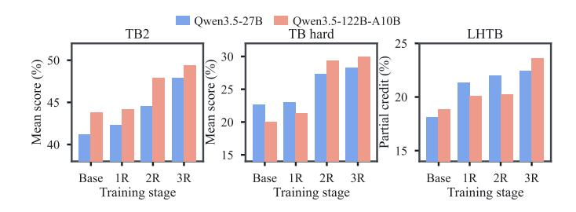

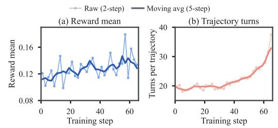

그림 23 Qwen3.5-27B와 Qwen3.5-122B-A10B의 벤치마크 성능은 점진적으로 더 많은 합성 라운드에서 추적 데이터를 사용해 감독 학습 후, Terminal-Bench 2, Terminal-Bench Hard, Long-Horizon Terminal Bench(평균 부분 점수)에서 보고된다.

그림 24 합성된 터미널 과제에서의 강화학습 동역학: (a) 평균 검증자 보상, 약 0.11에서 0.14 이상으로 상승, (b) 경로당 평균 상호작용 턴 수, 19–20에서 30 턴 이상으로 상승.

0.5 이하, 즉 일반적인 $R_{15}$ 과제는 가장 가까운 이웃과 결합된 지시문, 솔루션, 검증자 토큰의 절반 이하만 공유한다는 의미이다. 0.703의 p95 값은 높은 유사성이 전체 과제 풀에 걸쳐 퍼지기보다 제한된 상위 꼬리에서 집중된다는 것을 보여준다. 이 결과들을 종합하면, 재귀적 합성이 중복으로 붕괴되지 않으면서 난이도를 증가시키며, 동시에 미래 중복 제거를 위한 관리 가능한 고유사성 꼬리를 강조한다.

### 5.4 감독 기반 미세 조정 결과 (Supervised Fine-Tuning Results)

이전 분석은 재귀적 합성이 검증 안정성과 광범위한 데이터 범위를 유지하면서 점점 더 어려운 과제를 생성함을 보여준다. 다음으로 우리는 이러한 과제에서 수집된 경로가 터미널 에이전트 성능을 향상시키는지 평가한다. 성공적인 Qwen3.5 롤아웃은 Qwen3.5-27B와 Qwen3.5-122B-A10B를 미세 조정하는 데 사용된다. 훈련된 체크포인트는 Terminal-Bench 2 [23], Terminal-Bench Hard [16], Long-Horizon Terminal Bench [21]에서 평가된다. 각 체크포인트는 동일한 평가 구성 하에서 해당 기본 모델과 비교되며, 전체 훈련 이득과 추가 재귀 라운드 통합 효과를 측정할 수 있다.

그림 23과 표 3은 한 번, 두 번, 세 번의 재귀 합성 단계에서 경로를 사용해 미세 조정된 체크포인트와 기본 모델을 비교한다. 세 벤치마크 모두에서 두 모델 크기에 대해 성능이 단조롭게 증가한다. 세 라운드 단계에서 Terminal-Bench 2는 Qwen3.5-27B에서 41.2%에서 47.9%로, Qwen3.5-122B-A10B에서 43.8%에서 49.4%로 향상된다. Terminal-Bench Hard는 각각 22.7%에서 28.3%로, 20.0%에서 30.0%로 향상된다. Long-Horizon Terminal Bench에서는 Qwen3.5-27B의 평균 부분 점수가 18.1%에서 22.4%로, Qwen3.5-122B-A10B는 18.9%에서 23.6%로 증가한다.

모든 체크포인트는 동일한 벤치마크 구성 하에서 평가되고 해당 기본 모델과 비교된다. 훈련 단계 전반에 걸친 일관된 이득은 추가 합성 라운드에서 수집된 경로를 추가함으로써 초기 라운드를 넘어 성능이 계속 향상됨을 보여준다. 두 모델 크기 모두에서의 향상은

<span id="page-12-0"></span>표 3 Qwen3.5-27B 및 Qwen3.5-122B-A10B의 연속적인 훈련 라운드에 대한 평가 (Terminal-Bench 2 (TB2), Terminal-Bench Hard, Long-Horizon Terminal Benchmark (LHTB)). Base는 훈련 전 체크포인트를 나타내며, Round 1–3은 연속적인 훈련 라운드 후 얻은 체크포인트를 나타낸다. 각 항목은 평가 평균 ± 표준편차를 보고한다.

| 모델 (비생각 모드) | 학습 단계 | 통과율 (% , 평균 ± 표준편차) |  |  |  |
|---------------------------|----------------|----------------------------|---------------------|--------------|--|
|  |  | Terminal-Bench 2 | Terminal-Bench Hard | LHTB |  |
|  | 베이스 | 41.20 ± 1.72 | 22.67 ± 2.52 | 18.10 ± 0.89 |  |
|  | 라운드 1 | 42.32 ± 4.68 | 23.00 ± 1.73 | 21.32 ± 0.86 |  |
| Qwen3.5-27B | 라운드 2 | 44.57 ± 4.25 | 27.33 ± 1.53 | 21.99 ± 1.39 |  |
|  | 라운드 3 | 47.94 ± 2.34 | 28.33 ± 0.58 | 22.44 ± 0.40 |  |
|  | 베이스 | 43.82 ± 2.97 | 20.00 ± 1.00 | 18.85 ± 1.16 |  |
|  | 라운드 1 | 44.19 ± 1.30 | 21.33 ± 3.21 | 20.06 ± 0.32 |  |
| Qwen3.5-122B-A10B | 라운드 2 | 47.94 ± 1.72 | 29.33 ± 2.08 | 20.24 ± 0.60 |  |
|  | 라운드 3 | 49.44 ± 1.12 | 30.00 ± 1.73 | 23.63 ± 2.76 |  |

이 이점은 단일 모델 규모에 국한되지 않는다. Terminal-Bench 2, Terminal-Bench Hard, 그리고 Long-Horizon Terminal Bench에서의 성능 향상은 광범위한 터미널 실행, 독립적으로 구성된 과제, 그리고 장기 상호작용 전반에 걸친 전이 효과를 보여준다.

### 5.5 터미널 에이전트 강화 학습 결과 (Terminal Agentic Reinforcement Learning Results)

그 다음에 우리는 합성 과제에서의 에이전트 강화 학습 동적을 보고한다. 정책은 Qwen3.5-27B 베이스 체크포인트에서 초기화되며, 이는 롤아웃 단계 0에서 공개된 베이스 가중치에서 차가운 액터를 시작하는 것과 동일하다. PPO 값 헤드는 이전 터미널-에이전트 크리틱 체크포인트에서 워밍로드되며, 두 단계의 크리틱 전용 워밍업을 받는다. 옵티마이저는 액터–크리틱 값 함수와 일반화된 이점 추정(generalized advantage estimation)을 사용한 PPO를 사용한다. KL 패널티와 엔트로피 보너스는 비활성화되고, PPO 클리핑은 ϵ = 0.2를 사용하며, 이점은 배치마다 평균 0, 분산 1로 화이트닝된다.

RL 훈련 풀은 37,484개의 합성 터미널-에이전트 과제로 구성된 synth-all 세트이며, 이는 R<sup>1</sup> 합성 풀과 자기 개선 루프의 R2–R<sup>15</sup>에서 오라클을 통과한 과제들로 구성된다. 리라이트 변형은 중복 제거 없이 보존된다. 각 과제는 과제 메타데이터, 공개 지침, 검증자 테스트, 참조 솔루션, Dockerfile을 포함한 독립적인 터미널 환경이며, Daytona sandbox에서 실행된다. 풀은 각 epoch마다 재배열되어 각 배치가 라운드와 난이도 수준을 혼합하도록 한다. 보상은 각 과제의 내장 검증자에서 맞춤형 보상 형상을 사용해 계산된다. Figure [24](#page-11-1)은 두 단계 간격으로 기록된 원시 측정값과 다섯 단계 이동 평균을 함께 보여준다.

Figure [24(](#page-11-1)a)는 PPO 훈련 중 평균 검증자 보상을 보고한다. 보상은 각 배치가 서로 다른 난이도와 검증자 체크 수를 포함하기 때문에 업데이트마다 변동한다. 그럼에도 불구하고 다섯 단계 이동 평균은 훈련 초기에 약 0.11에서 이후 업데이트에서 0.14를 초과하며, 최고값은 55~60 단계 근처에서 나타난다. 이 증가는 정책이 훈련이 진행됨에 따라 더 많은 검증자 체크를 만족시키고, 합성 과제가 효과적인 단계별 학습 신호를 제공함을 시사한다. Figure [24(](#page-11-1)b)는 평균 궤적 길이도 훈련 중 증가함을 보여준다. 다섯 단계 이동 평균은 초기 업데이트에서 19~20턴 근처에 머물다가 약 30 단계 이후에 상승을 시작하고 이후 단계에서 30턴을 초과한다. 이 증가는 검증자 보상의 상승과 함께 발생하며, 더 긴 상호작용이 실행 품질의 즉각적인 저하가 아니라 더 큰 과제 진행과 연관되어 있음을 나타낸다. 따라서 정책은 더 많은 검증자 체크를 만족시키면서 더 긴 터미널 상호작용을 지속하도록 학습한다.

<span id="page-13-1"></span>Table 5 한 개의 정확한 재귀 계통에 대한 사례 연구. 과제는 동일한 핵심 목표를 유지하며 신뢰할 수 있는 JSON-diff 회귀 출력을 생성하지만, 이후 라운드에서는 구성, 실패 진단, 릴리스 노트 업데이트, 그리고 수량 조정이 추가된다. 마지막 열은 참조 솔루션/solve.sh의 비어 있지 않은 줄 수를 보고한다.

|  | 체크포인트 공개 과제 | 추가된 맥락 | 에이전트 작업 필요 | 줄 |
|------|--------------------------------------------------------------------------------------------|------------------------------------------------------------------------------|-------------------------------------------------------------------------------------------------------------------------|-------|
| 시드 | 고정된 fixture 쌍에서 6개의 JSON-diff 보고서를 생성합니다.<br> | 고정된 입력 파일을 사용한 수동 CLI 예시입니다.<br> | 두 개의 JSON fixture 쌍에 대해 gendiff를 실행하고, 세 가지 출력 형식으로 결과를 생성합니다.<br> | 10 |
| R1 | tasks.json에 지정된 모든 diff 출력을 생성합니다.<br> | 비교 매트릭스가 구성으로 이동되었습니다.<br> | tasks.json을 읽고, 모든 비교를 일괄 실행한 뒤 검증 보고서를 작성합니다.<br> | 66 |
| R5 | tasks.json과 check_config.sh를 사용하여 수리하고, diff를 재생성합니다.<br> | 구성은 유효할 수 있으며 진단이 필요합니다.<br> | 체커를 실행하고, 실패를 해석하며, 작업 목록을 수정하고, 스위트를 재실행한 뒤 변경 수를 집계합니다.<br> | 219 |
| R10 | CHANGELOG.md를 사용하여 새로운 중첩 fixture 회귀 사례를 추가합니다.<br> | 릴리스 노트가 새로운 fixture와 필요한 비교를 소개합니다.<br> | 회귀 매트릭스를 업데이트하고, 새로운 출력을 생성하며, 로컬 리포트 검증기를 만족시킵니다.<br> | 264 |
| R15 | 불일치하는 구성과 fixture 데이터를 수리하고, 예상 diff 수를 조정합니다.<br> | 구성, fixture, 예상 수, 그리고 테스트가 일치해야 합니다.<br> | tasks.json과 JSON fixture를 수정하고, 모든 diff를 재생성하며, 진단 및 검증 보고서를 작성하고 테스트를 통과합니다. | 347 |

<span id="page-13-0"></span>Table 4 DeepSeek-V4-Pro, Qwen3.5-27B Base, Qwen3.5-122B-A10B Base, 그리고 Qwen3.5-27B-RL의 Terminal-Bench 2, Terminal-Bench Hard, Long-Horizon Terminal Bench에서의 벤치마크 성능. 모든 점수는 세 번의 독립적인 평가 실행에 대해 평균한 값이다. 마지막 행은 Qwen3.5-27B-RL이 Qwen3.5-27B Base에 비해 상대적인 성능 향상을 보고한다.

| 모델 (비생각 모드) | 터미널-벤치 2 | 터미널-벤치 하드 | LHTB |
|---------------------------|------------------|---------------------|---------|
| Deepseek-V4-Pro | 51.68 | 36.00 | 30.00 |
| Qwen3.5-27B Base | 41.20 | 22.67 | 18.10 |
| Qwen3.5-122B-A10B Base | 43.82 | 20.00 | 18.85 |
| Qwen3.5-27B-RL | 49.44 | 32.00 | 22.07 |
| 상대적 이득 | +20.00% | +41.16% | +21.93% |

표 [4](#page-13-0)는 세 번의 평가 실행에 대한 평균 성능을 보고한다. Qwen3.5-27B-RL은 Terminal-Bench 2에서 49.44%, Terminal-Bench Hard에서 32.00%, Long-Horizon Terminal Bench에서 22.07%를 달성한다. Qwen3.5-27B Base와 비교할 때, 이 결과는 각각 20.00%, 41.16%, 21.93%의 향상을 나타낸다. 가장 큰 상대적 이득은 Terminal-Bench Hard에서 발생하며, 이는 검증기 기반 RL이 훈련 풀과 독립적으로 구성된 작업에 전이된다는 것을 시사한다. DeepSeek-V4-Pro는 세 벤치마크 모두에서 더 강력한 성능을 보이며, 상당한 성능 여지가 남아 있음을 보여준다.

### 5.6 사례 연구: JSON-Diff 회귀 작업의 재귀적 성장 (Recursive Growth of a JSON-Diff Regression Task)

작업이 라운드를 거치며 어떻게 진화하는지 보여주기 위해, 우리는 부트스트랩 시드에서 R15까지 하나의 계통을 따라간다. 원래 작업은 에이전트에게 고정된 JSON 피처스 쌍에 대해 gendiff 명령줄 도구를 실행하고 생성된 보고서를 저장하도록 요구한다. 이후 라운드에서는 이 목표를 유지하면서 구성 파일, 회귀 사례, 실패 진단, 릴리스 노트 업데이트, 실행 가능한 테스트를 추가한다.

표 [5](#page-13-1)은 이 계통에서 다섯 개의 체크포인트를 보여준다. 난이도 증가는 더 긴 지시문이 아니라 새로운 실행 요구사항에서 비롯된다. 이후 버전에서는 tasks.json에 작업 매트릭스를 도입하고, 잘못된 구성을 검사하며, 새로운 회귀 사례를 추가하고, 피처스, 예상 카운트, 보고서, 테스트 간의 일관성 제약을 도입한다. R15까지 에이전트는 구성 및 피처스 데이터를 복구하고, 모든 보고서를 재생성하며, 관측된 카운트와 예상 카운트를 조정하고, 프로젝트 테스트 스위트를 통과해야 한다.

이 계통은 그림 [7–](#page-8-0)[9.](#page-8-1)에 표시된 복잡성 증가의 구체적인 예를 제공한다. 핵심 목표는 변하지 않지만, 각 라운드마다 더 많은 실행 가능한 작업이 추가된다. 에이전트는 작업 공간 증거를 검사하고, 불일치 상태를 진단하며, 구성 및 데이터를 복구하고, 산출물을 재생성하며, 실행 가능한 테스트를 통과해야 한다. 그 결과, 참조 솔루션은 기초를 바꾸지 않고 10줄에서 347줄의 비어 있지 않은 셸 라인으로 성장한다.

작업 도메인.

## 6 Conclusion (Conclusion)

우리는 RST, 검증된 터미널-에이전트 과제를 재귀적으로 구성하는 프레임워크를 제시하였다. 각 합성 라운드는 참조 솔루션을 확장하여 추가 실행 가능한 작업을 도입하고, 검증자와 공개 지침을 업데이트하여 동일한 과제를 설명하며, 새로운 샌드박스에서 전체 후보를 검증한다. 과제는 참조 솔루션이 비공개 검증자를 통과하고, 테스트된 모든 요구사항이 지침에 명시되거나 작업 공간에서 발견될 수 있을 때만 수락된다. 수락된 과제는 이후 합성 라운드의 시드가 되며, 검증자 기반 강화 학습을 위한 과제 풀을 직접 형성한다. 동일한 과제에서 수집된 성공적인 롤아웃은 감독 학습을 위한 트레이젝터리를 제공한다.

15개의 합성 라운드에 걸쳐 RST는 37,484개의 검증된 과제를 생성하며, 1,000개 수락된 과제당 약 \\$50의 비용을 발생시키면서 안정적인 검증 수율을 유지한다. R<sup>1</sup>에서 R15까지, 중간 솔루션 길이는 5.6배, 명령 사용량은 6.1배 증가하고, 지침 길이는 1.4배에 불과하다. DeepSeek-V4-Pro의 pass@4는 90%에서 2.5%로 감소하고, 평균 부분 점수는 0.970에서 0.170으로 감소하여 이후 과제들이 훨씬 더 많은 에이전트 능력을 요구함을 확인한다. 감독 학습은 Qwen3.5-27B와 Qwen3.5-122B-A10B 모두를 Terminal-Bench 2, Terminal-Bench Hard, Long-Horizon Terminal Bench에서 개선한다. Qwen3.5-27B-RL은 세 벤치마크에서 각각 46.07, 32.00, 22.07을 달성하며, 이는 기본 모델 대비 11.82%, 41.16%, 21.93%의 상대적 이득에 해당한다. 도메인, rewrite-family, 그리고 연산자 범위는 라운드 전반에 걸쳐 넓게 유지되지만, 고유사도 높은 꼬리가 추가 확장 시 목표 지향적 중복 제거를 유도한다.

## References (References)

- <span id="page-14-7"></span>[1] Zixiang Chen, Yihe Deng, Huizhuo Yuan, Kaixuan Ji, and Quanquan Gu. Self-play fine-tuning은 약한 언어 모델을 강력한 언어 모델로 변환한다. arXiv preprint arXiv:2401.01335, 2024.

- <span id="page-14-0"></span>[2] Sadia Sultana Chowa, Riasad Alvi, Subhey Sadi Rahman, Md Abdur Rahman, Mohaimenul Azam Khan Raiaan, Md Rafiqul Islam, Mukhtar Hussain, and Sami Azam. 언어에서 행동으로: 대형 언어 모델을 자율 에이전트 및 도구 사용자로서 검토한다. Artificial Intelligence Review, 59(2):71, 2026.

- <span id="page-14-5"></span>[3] Zhaoyang Chu, Jiarui Hu, Xingyu Jiang, Pengyu Zou, Han Li, Chao Peng, Peter O'Hearn, Earl T. Barr, Mark Harman, Federica Sarro, and He Ye. TerminalWorld: 실제 터미널 작업에서 에이전트를 벤치마킹한다, 2026. URL <https://arxiv.org/abs/2605.22535>.

- <span id="page-14-3"></span>[4] DeepSeek-AI. Deepseek-v4: 대규모 토큰 컨텍스트 인텔리전스를 향한 고효율화, 2026. URL [https:](https://arxiv.org/abs/2606.19348) [//arxiv.org/abs/2606.19348](https://arxiv.org/abs/2606.19348).

- <span id="page-14-2"></span>[5] Rishi Desai, Jesse Hu, Ke Huang, Joan Cabezas, Neel Harsola, Pratyush Shukla, Daniel Wang, Xiangyi Li, Roey Ben Chaim, Adnan El Assadi, Omkaar Mukund Kamath, Fenil Faldu, Prannay Hebbar, Jiankai Sun, Yiyuan Li, Pramod Srinivasan, Ishan Gupta, Christopher Settles, Derek Chen, Pranav Raja, Albert Liu, Marek Šuppa, Nevasini Sasikumar, Luyang Kong, Erik Quintanilla, Ivan Bercovich, and Steven Dillmann. SWE-Marathon: 에이전트가 자율적으로 초장기 소프트웨어 작업을 완료할 수 있는가? <https://arxiv.org/abs/2606.07682>, 2026. Benchmark and evaluation code available at <https://github.com/abundant-ai/swe-marathon>.

- <span id="page-14-1"></span>[6] Shangheng Du, Jiabao Zhao, Jinxin Shi, Zhentao Xie, Xin Jiang, Yanhong Bai, and Liang He. 대형 언어 모델 기반 에이전트의 최적화에 관한 조사. ACM Computing Surveys, 58(9):1–37, 2026.

- <span id="page-14-6"></span>[7] Tianqing Fang, Hongming Zhang, Zhisong Zhang, Kaixin Ma, Wenhao Yu, Haitao Mi, and Dong Yu. Webevolver: 공진화 세계 모델을 통한 웹 에이전트 자기 개선 강화, 2025. URL [https://arxiv.org/abs/2504.](https://arxiv.org/abs/2504.21024) [21024](https://arxiv.org/abs/2504.21024).

- <span id="page-14-8"></span>[8] Shi Fu, Yingjie Wang, Yuzhu Chen, Li Shen, and Dacheng Tao. Self-Verification은 재귀적 합성 훈련에서 모델 붕괴를 확증적으로 방지한다. In Advances in Neural Information Processing Systems, 2025. URL <https://mlanthology.org/neurips/2025/fu2025neurips-selfverification/>. 

- <span id="page-14-4"></span>[9] Kanishk Gandhi, Shivam Garg, Noah D. Goodman, and Dimitris Papailiopoulos. Endless terminals: 터미널 에이전트를 위한 RL 환경 확장, 2026. URL <https://arxiv.org/abs/2601.16443>.

- <span id="page-15-13"></span>[10] Dadi Guo, Tianyi Zhou, Dongrui Liu, Chen Qian, Qihan Ren, Shuai Shao, Zhiyuan Fan, Yi R. Fung, Kun Wang, Linfeng Zhang, and Jing Shao. 자기-진화형 벤치마크를 향해: validate-by-reproduce 패러다임 하에서 테스트 타임 탐색을 통해 에이전트 트래젝터리를 합성한다, 2026. URL <https://arxiv.org/abs/2510.00415>
- <span id="page-15-3"></span>[11] Harbor Framework Team. Harbor: 컨테이너 환경에서 에이전트와 모델을 평가하고 최적화하는 프레임워크, 2026. URL <https://doi.org/10.5281/zenodo.20953922>
- <span id="page-15-8"></span>[12] Yicheng He, Chengsong Huang, Zongxia Li, Jiaxin Huang, and Yonghui Yang. Visplay: 이미지에서 자기-진화형 시각-언어 모델을 생성한다. arXiv preprint arXiv:2511.15661, 2025
- <span id="page-15-10"></span>[13] Arian Hosseini, Xingdi Yuan, Nikolay Malkin, Aaron Courville, Alessandro Sordoni, and Rishabh Agarwal. V-star: 자기-가르침 추론자용 검증자를 훈련한다. arXiv preprint arXiv:2402.06457, 2024
- <span id="page-15-7"></span>[14] Zhanbo Hua, Yifan Yao, Weihao Xie, Yongchi Zhao, Minghao Liu, Ruizhi Qiu, Zhewei Huang, Zun Wang, Yiyan Ji, Yunhai Ye, Letian Zhu, Xinping Lei, Han Li, Zhiyuan Ma, Zili Wang, Zhaoxiang Zhang, and Jiaheng Liu. Cli-universe: 터미널 에이전트를 위한 검증 가능한 작업 합성 엔진을 향해, 2026. URL [https://arxiv.org/abs/](https://arxiv.org/abs/2606.22883) [2606.22883](https://arxiv.org/abs/2606.22883)
- <span id="page-15-11"></span>[15] Chengsong Huang, Wenhao Yu, Xiaoyang Wang, Hongming Zhang, Zongxia Li, Ruosen Li, Jiaxin Huang, Haitao Mi, and Dong Yu. R-zero: 제로 데이터에서 자기-진화형 추론 LLM을 만든다, 2026. URL <https://arxiv.org/abs/2508.05004>
- <span id="page-15-5"></span>[16] Hamish Ivison, Junjie Oscar Yin, Rulin Shao, Teng Xiao, Nathan Lambert, and Hannaneh Hajishirzi. Tmax: 터미널 에이전트를 위한 간단한 레시피, 2026. URL <https://arxiv.org/abs/2606.23321>
- <span id="page-15-0"></span>[17] Carlos E Jimenez, John Yang, Alexander Wettig, Shunyu Yao, Kexin Pei, Ofir Press, and Karthik Narasimhan. Swe-bench: 언어 모델이 실제 GitHub 이슈를 해결할 수 있는가? In B. Kim, Y. Yue, S. Chaudhuri, K. Fragkiadaki, M. Khan, and Y. Sun, editors, International Conference on Learning Representations, volume 2024, pages 54107–54157, 2024. URL [https://proceedings.iclr.cc/paper_files/paper/2024/file/](https://proceedings.iclr.cc/paper_files/paper/2024/file/edac78c3e300629acfe6cbe9ca88fb84-Paper-Conference.pdf) [edac78c3e300629acfe6cbe9ca88fb84-Paper-Conference.pdf](https://proceedings.iclr.cc/paper_files/paper/2024/file/edac78c3e300629acfe6cbe9ca88fb84-Paper-Conference.pdf)
- <span id="page-15-6"></span>[18] Thomas Kwa, Ben West, Joel Becker, Amy Deng, Katharyn Garcia, Max Hasin, Sami Jawhar, Megan Kinniment, Nate Rush, Sydney Von Arx, Ryan Bloom, Thomas Broadley, Haoxing Du, Brian Goodrich, Nikola Jurkovic, Luke Harold Miles, Seraphina Nix, Tao Lin, Chris Painter, Neev Parikh, David Rein, Lucas Jun Koba Sato, Hjalmar Wijk, Daniel M. Ziegler, Elizabeth Barnes, and Lawrence Chan. 장기 소프트웨어 작업을 완료하는 AI 능력 측정, 2026. URL <https://arxiv.org/abs/2503.14499>
- <span id="page-15-12"></span>[19] Zongxia Li, Wenhao Yu, Chengsong Huang, Zhenwen Liang, Rui Liu, Fuxiao Liu, Jingxi Che, Dian Yu, Jordan Boyd-Graber, Haitao Mi, et al. 추론 분해를 통한 자기 보상형 시각-언어 모델. arXiv preprint arXiv:2508.19652, 2025
- <span id="page-15-9"></span>[20] Zongxia Li, Hongyang Du, Chengsong Huang, Xiyang Wu, Lantao Yu, Yicheng He, Jing Xie, Xiaomin Wu, Zhichao Liu, Jiarui Zhang, et al. Mm-zero: 제로 데이터에서 자기-진화형 다중 모델 시각-언어 모델을 만든다. arXiv preprint arXiv:2603.09206, 2026
- <span id="page-15-4"></span>[21] Zongxia Li, Zhongzhi Li, Yucheng Shi, Ruhan Wang, Junyao Yang, Zhichao Liu, Xiyang Wu, Anhao Li, Yue Yu, Ninghao Liu, Lichao Sun, Haotao Mi, and Leowei Liang. Long-horizon-terminal-bench: 밀집 보상 기반 평가를 통해 장기 터미널 작업에서 에이전트의 한계를 테스트한다, 2026. URL <https://arxiv.org/abs/2607.08964>
- <span id="page-15-1"></span>[22] Xiao Liu, Hao Yu, Hanchen Zhang, Yifan Xu, Xuanyu Lei, Hanyu Lai, Yu Gu, Hangliang Ding, Kaiwen Men, Kejuan Yang, Shudan Zhang, Xiang Deng, Aohan Zeng, Zhengxiao Du, Chenhui Zhang, Sheng Shen, Tianjun Zhang, Yu Su, Huan Sun, Minlie Huang, Yuxiao Dong, and Jie Tang. Agentbench: LLM을 에이전트로 평가한다, 2025. URL <https://arxiv.org/abs/2308.03688>
- <span id="page-15-2"></span>[23] Mike A. Merrill, Alexander G. Shaw, Nicholas Carlini, Boxuan Li, Harsh Raj, Ivan Bercovich, Lin Shi, Jeong Yeon Shin, Thomas Walshe, E. Kelly Buchanan, Junhong Shen, Guanghao Ye, Haowei Lin, Jason Poulos, Maoyu Wang, Marianna Nezhurina, Jenia Jitsev, Di Lu, Orfeas Menis Mastromichalakis, Zhiwei Xu, Zizhao Chen, Yue Liu, Robert Zhang, Leon Liangyu Chen, Anurag Kashyap, Jan-Lucas Uslu, Jeffrey Li, Jianbo Wu, Minghao Yan, Song Bian, Vedang Sharma, Ke Sun, Steven Dillmann, Akshay Anand, Andrew Lanpouthakoun, Bardia Koopah, Changran Hu, Etash Guha, Gabriel H. S. Dreiman, Jiacheng Zhu, Karl Krauth, Li Zhong, Niklas Muennighoff, Robert Amanfu, Shangyin Tan, Shreyas Pimpalgaonkar, Tushar Aggarwal, Xiangning Lin, Xin Lan, Xuandong Zhao, Yiqing Liang, Yuanli Wang, Zilong Wang, Changzhi Zhou, David Heineman, Hange Liu, Harsh Trivedi, John Yang, Junhong Lin, Manish Shetty, Michael Yang, Nabil Omi, Negin Raoof, Shanda Li, Terry Yue Zhuo, Wuwei Lin, Yiwei Dai, Yuxin Wang, Wenhao Chai, Shang Zhou, Dariush Wahdany, Ziyu She, Jiaming Hu, Zhikang

- Dong, Yuxuan Zhu, Sasha Cui, Ahson Saiyed, Arinbjörn Kolbeinsson, Jesse Hu, Christopher Michael Rytting, Ryan Marten, Yixin Wang, Alex Dimakis, Andy Konwinski, and Ludwig Schmidt. Terminal-bench: 명령줄 인터페이스에서 어려운 현실적인 과제에 대한 에이전트 벤치마킹, 2026. URL <https://arxiv.org/abs/2601.11868>
- <span id="page-16-0"></span>[24] Grégoire Mialon, Clémentine Fourrier, Craig Swift, Thomas Wolf, Yann LeCun, and Thomas Scialom. Gaia: 일반 AI 어시스턴트를 위한 벤치마크, 2023. URL <https://arxiv.org/abs/2311.12983>
- <span id="page-16-4"></span>[25] Jiayi Pan, Xingyao Wang, Graham Neubig, Navdeep Jaitly, Heng Ji, Alane Suhr, and Yizhe Zhang. swe-gym을 이용한 소프트웨어 엔지니어링 에이전트 및 검증기 훈련, 2025. URL <https://arxiv.org/abs/2412.21139>
- <span id="page-16-10"></span>[26] Xiaoxuan Peng, Kaiqi Zhang, Xinyu Lu, Boxi Cao, Yaojie Lu, Hongyu Lin, Xianpei Han, and Le Sun. Litecoderterminal: 장기 수평 터미널 환경을 확장하여 언어 에이전트 학습, 2026. URL [https://arxiv.](https://arxiv.org/abs/2605.29559) [org/abs/2605.29559](https://arxiv.org/abs/2605.29559)
- <span id="page-16-7"></span>[27] Renjie Pi, Grace Lam, Mohammad Shoeybi, Pooya Jannaty, Bryan Catanzaro, and Wei Ping. LLM 터미널 기능 확장을 위한 데이터 엔지니어링, 2026. URL <https://arxiv.org/abs/2602.21193>
- <span id="page-16-12"></span>[28] Archiki Prasad, Weizhe Yuan, Richard Yuanzhe Pang, Jing Xu, Maryam Fazel-Zarandi, Mohit Bansal, Sainbayar Sukhbaatar, Jason Weston, and Jane Yu. 자기 일관성 선호 최적화. arXiv preprint arXiv:2411.04109, 2024.
- <span id="page-16-5"></span>[29] Negin Raoof, Richard Zhuang, Marianna Nezhurina, Etash Guha, Atula Tejaswi, Ryan Marten, Charlie F. Ruan, Tyler Griggs, Alexander Glenn Shaw, Hritik Bansal, E. Kelly Buchanan, Artem Gazizov, Reinhard Heckel, Chinmay Hegde, Sankalp Jajee, Daanish Khazi, Emmanouil Koukoumidis, Xiangyi Li, Hange Liu, Shlok Natarajan, Harsh Raj, Nicholas Roberts, Ethan Shen, Nishad Singhi, Michael Siu, Ashima Suvarna, Hanwen Xing, Patrick Yubeaton, Robert Zhang, Leon Liangyu Chen, Xiaokun Chen, Steven Dillmann, Saadia Gabriel, Xunyi Jiang, Anurag Kashyap, Boxuan Li, Yein Park, Minh Pham, Sujay Sanghavi, Lin Shi, Ke Sun, Yixin Wang, Zhiwei Xu, Erica Zhang, Siyan Zhao, Wanjia Zhao, Jenia Jitsev, Alex Dimakis, Benjamin Feuer, and Ludwig Schmidt. Openthoughts-agent: 에이전트 모델을 위한 데이터 레시피, 2026. URL <https://arxiv.org/abs/2606.24855>
- <span id="page-16-8"></span>[30] Qijia Shen, Zhiqi Huang, Vamsidhar Kamanuru, Aznaur Aliev, Jay Rainton, Ahmed Awelkair, Zhichen Zeng, Jiajun Li, Shi Dong, Yueming Yuan, Boyuan Ma, Qizheng Zhang, Jiwei Fu, Yuzhen Mao, Wendong Fan, Ping Nie, Philip Torr, Bernard Ghanem, Changran Hu, Jonathan Lingjie Li, Urmish Thakker, and Guohao Li. Seta: 터미널 에이전트를 위한 환경 확장, 2026. URL <https://arxiv.org/abs/2607.10891>
- <span id="page-16-11"></span>[31] Avi Singh, John D. Co-Reyes, Rishabh Agarwal, Ankesh Anand, Piyush Patil, Xavier Garcia, Peter J. Liu, James Harrison, Jaehoon Lee, Kelvin Xu, Aaron Parisi, Abhishek Kumar, Alex Alemi, Alex Rizkowsky, Azade Nova, Ben Adlam, Bernd Bohnet, Gamaleldin Elsayed, Hanie Sedghi, Igor Mordatch, Isabelle Simpson, Izzeddin Gur, Jasper Snoek, Jeffrey Pennington, Jiri Hron, Kathleen Kenealy, Kevin Swersky, Kshiteej Mahajan, Laura Culp, Lechao Xiao, Maxwell L. Bileschi, Noah Constant, Roman Novak, Rosanne Liu, Tris Warkentin, Yundi Qian, Yamini Bansal, Ethan Dyer, Behnam Neyshabur, Jascha Sohl-Dickstein, and Noah Fiedel. 인간 데이터 초월: 언어 모델을 활용한 문제 해결을 위한 자기 훈련 확장, 2024. URL <https://arxiv.org/abs/2312.06585>
- <span id="page-16-9"></span>[32] Xiaoshuai Song, Haofei Chang, Guanting Dong, Yutao Zhu, Zhicheng Dou, and Ji-Rong Wen. Envscaler: 프로그래밍 합성을 통한 LLM 에이전트를 위한 도구 상호작용 환경 확장. arXiv preprint arXiv:2601.05808, 2026.
- <span id="page-16-6"></span>[33] Dunwei Tu, Hongyan Hao, Hansi Yang, Yihao Chen, Yi-Kai Zhang, Zhikang Xia, Yu Yang, Yueqing Sun, Xingchen Liu, Furao Shen, Qi Gu, Hui Su, and Xunliang Cai. Scaleenv: 일반화된 상호작용 도구 사용 에이전트 훈련을 위한 환경 합성 확장, 2026. URL <https://arxiv.org/abs/2602.06820>
- <span id="page-16-1"></span>[34] Bertie Vidgen, Austin Mann, Abby Fennelly, John Wright Stanly, Lucas Rothman, Marco Burstein, Julien Benchek, David Ostrofsky, Anirudh Ravichandran, Debnil Sur, Neel Venugopal, Alannah Hsia, Isaac Robinson, Calix Huang, Olivia Varones, Daniyal Khan, Michael Haines, Austin Bridges, Jesse Boyle, Koby Twist, Zach Richards, Chirag Mahapatra, Brendan Foody, and Osvald Nitski. Apex-agents, 2026. URL <https://arxiv.org/abs/2601.14242>
- <span id="page-16-3"></span>[35] Lilin Wang, Lucas Ramalho, Alan Celestino, Phuc Anthony Pham, Yu Liu, Umang Kumar Sinha, Andres Portillo, Onassis Osunwa, and Gabriel Maduekwe. Swe-bench++: 오픈소스 저장소에서 소프트웨어 엔지니어링 벤치마크를 확장 가능하게 생성하는 프레임워크, 2025. URL <https://arxiv.org/abs/2512.17419>
- <span id="page-16-2"></span>[36] Xingyao Wang, Boxuan Li, Yufan Song, Frank F. Xu, Xiangru Tang, Mingchen Zhuge, Jiayi Pan, Yueqi Song, Bowen Li, Jaskirat Singh, Hoang H. Tran, Fuqiang Li, Ren Ma, Mingzhang Zheng, Bill Qian, Yanjun Shao, Niklas Muennighoff, Yizhe Zhang, Binyuan Hui, Junyang Lin, Robert Brennan, Hao Peng, Heng Ji, and

- Graham Neubig. Openhands: AI 소프트웨어 개발자를 위한 범용 에이전트용 개방형 플랫폼, 2025. URL <https://arxiv.org/abs/2407.16741>.

- <span id="page-17-8"></span>[37] Yiming Wang, Da Yin, Yuedong Cui, Ruichen Zheng, Zhiqian Li, Zongyu Lin, Di Wu, Xueqing Wu, Chenchen Ye, Yu Zhou, and Kai-Wei Chang. LLMs를 확장 가능하고 범용적인 시뮬레이터로 활용하여 진화하는 디지털 에이전트 훈련, 2025. URL <https://arxiv.org/abs/2510.14969>.

- <span id="page-17-14"></span>[38] Yangzhen Wu, Aaron J. Li, Wenjie Ma, Li Cao, Ziheng Zhou, Mert Cemri, Shu Liu, Yuran Xiu, Chenxiao Yan, Haikun Zhao, Bin Yu, Ion Stoica, and Dawn Song. Benchevolver: 솔루션 중심 진화를 통한 최첨단 과제 합성, 2026. URL <https://arxiv.org/abs/2606.01286>.

- <span id="page-17-9"></span>[39] Yifan Wu, Yiran Peng, Yiyu Chen, Jianhao Ruan, Zijie Zhuang, Cheng Yang, Jiayi Zhang, Man Chen, Yenchi Tseng, Zhaoyang Yu, Liang Chen, Yuyao Zhai, Bang Liu, Chenglin Wu, and Yuyu Luo. Autowebworld: 유한 상태 기계를 통해 무한히 검증 가능한 웹 환경 합성, 2026. URL <https://arxiv.org/abs/2602.14296>.

- <span id="page-17-6"></span>[40] Peng Xia, Kaide Zeng, Jiaqi Liu, Can Qin, Fang Wu, Yiyang Zhou, Caiming Xiong, and Huaxiu Yao. Agent0: 도구 통합 추론을 통해 제로 데이터에서 자가 진화 에이전트 해방, 2025. URL [https://arxiv.org/](https://arxiv.org/abs/2511.16043) [abs/2511.16043](https://arxiv.org/abs/2511.16043).

- <span id="page-17-0"></span>[41] Tianbao Xie, Danyang Zhang, Jixuan Chen, Xiaochuan Li, Siheng Zhao, Ruisheng Cao, Toh Jing Hua, Zhoujun Cheng, Dongchan Shin, Fangyu Lei, Yitao Liu, Yiheng Xu, Shuyan Zhou, Silvio Savarese, Caiming Xiong, Victor Zhong, and Tao Yu. Osworld: 실제 컴퓨터 환경에서 개방형 과제를 위한 멀티모달 에이전트 벤치마킹, 2024. URL <https://arxiv.org/abs/2404.07972>.

- <span id="page-17-3"></span>[42] Can Xu, Qingfeng Sun, Kai Zheng, Xiubo Geng, Pu Zhao, Jiazhan Feng, Chongyang Tao, Qingwei Lin, and Daxin Jiang. Wizardlm: 대규모 사전 학습 언어 모델이 복잡한 지침을 따르도록 강화. In B. Kim, Y. Yue, S. Chaudhuri, K. Fragkiadaki, M. Khan, and Y. Sun, editors, International Conference on Learning Representations, volume 2024, pages 30745–30766, 2024. URL [https://proceedings.iclr.cc/paper\\_files/](https://proceedings.iclr.cc/paper_files/paper/2024/file/82eec786fdfbbfa53450c5feb7d1ac92-Paper-Conference.pdf) [paper/2024/file/82eec786fdfbbfa53450c5feb7d1ac92-Paper-Conference.pdf](https://proceedings.iclr.cc/paper_files/paper/2024/file/82eec786fdfbbfa53450c5feb7d1ac92-Paper-Conference.pdf).

- <span id="page-17-1"></span>[43] John Yang, Carlos E. Jimenez, Alexander Wettig, Kilian Lieret, Shunyu Yao, Karthik Narasimhan, and Ofir Press. Swe-agent: 에이전트-컴퓨터 인터페이스가 자동화된 소프트웨어 엔지니어링을 가능하게 함, 2024. URL [https://arxiv.org/](https://arxiv.org/abs/2405.15793) [abs/2405.15793](https://arxiv.org/abs/2405.15793).

- <span id="page-17-12"></span>[44] Weizhe Yuan, Richard Yuanzhe Pang, Kyunghyun Cho, Xian Li, Sainbayar Sukhbaatar, Jing Xu, and Jason Weston. 자기 보상 언어 모델, 2025. URL <https://arxiv.org/abs/2401.10020>.

- <span id="page-17-2"></span>[45] Daoguang Zan, Zhirong Huang, Wei Liu, Hanwu Chen, Linhao Zhang, Shulin Xin, Lu Chen, Qi Liu, Xiaojian Zhong, Aoyan Li, Siyao Liu, Yongsheng Xiao, Liangqiang Chen, Yuyu Zhang, Jing Su, Tianyu Liu, Rui Long, Kai Shen, and Liang Xiang. Multi-swe-bench: 다국어 이슈 해결 벤치마크, 2025. URL <https://arxiv.org/abs/2504.02605>.

- <span id="page-17-11"></span>[46] Eric Zelikman, Yuhuai Wu, Jesse Mu, and Noah Goodman. Star: 추론으로 추론을 부트스트랩, Advances in Neural Information Processing Systems, 35:15476–15488, 2022.

- <span id="page-17-4"></span>[47] Zhiyuan Zeng, Hamish Ivison, Yiping Wang, Lifan Yuan, Shuyue Stella Li, Zhuorui Ye, Siting Li, Jacqueline He, Runlong Zhou, Tong Chen, Chenyang Zhao, Yulia Tsvetkov, Simon Shaolei Du, Natasha Jaques, Hao Peng, Pang Wei Koh, and Hannaneh Hajishirzi. Rlve: 적응형 검증 가능한 환경으로 언어 모델 강화 학습 확장, 2025. URL <https://arxiv.org/abs/2511.07317>.

- <span id="page-17-10"></span>[48] Ziyun Zhang, Zezhou Wang, Xiaoyi Zhang, Zongyu Guo, Jiahao Li, Bin Li, and Yan Lu. Infiniteweb: GUI 에이전트 훈련을 위한 확장 가능한 웹 환경 합성, 2026. URL <https://arxiv.org/abs/2601.04126>.

- <span id="page-17-13"></span>[49] Andrew Zhao, Yiran Wu, Yang Yue, Tong Wu, Quentin Xu, Yang Yue, Matthieu Lin, Shenzhi Wang, Qingyun Wu, Zilong Zheng, and Gao Huang. Absolute zero: 제로 데이터로 강화된 자기 플레이 추론, 2025. URL <https://arxiv.org/abs/2505.03335>.

- <span id="page-17-5"></span>[50] Shuyan Zhou, Frank F. Xu, Hao Zhu, Xuhui Zhou, Robert Lo, Abishek Sridhar, Xianyi Cheng, Tianyue Ou, Yonatan Bisk, Daniel Fried, Uri Alon, and Graham Neubig. Webarena: 자율 에이전트 구축을 위한 현실적인 웹 환경, 2024. URL <https://arxiv.org/abs/2307.13854>.

- <span id="page-17-7"></span>[51] Yifei Zhou, Sergey Levine, Jason Weston, Xian Li, and Sainbayar Sukhbaatar. Self-challenging language model agents. In D. Belgrave, C. Zhang, H. Lin, R. Pascanu, P. Koniusz, M. Ghassemi, and N. Chen, editors, Advances in Neural Information Processing Systems, volume 38, pages 113959–113991.

- Curran Associates, Inc., 2025. URL [https://proceedings.neurips.cc/paper_files/paper/2025/file/](https://proceedings.neurips.cc/paper_files/paper/2025/file/a5a305fac88fb4ae40969cfec5eef48d-Paper-Conference.pdf) [a5a305fac88fb4ae40969cfec5eef48d-Paper-Conference.pdf](https://proceedings.neurips.cc/paper_files/paper/2025/file/a5a305fac88fb4ae40969cfec5eef48d-Paper-Conference.pdf).
- <span id="page-18-0"></span>[52] Kaijie Zhu, Yuzhou Nie, Yijiang Li, Yiming Huang, Jialian Wu, Jiang Liu, Ximeng Sun, Zhenfei Yin, Lun Wang, Zicheng Liu, Emad Barsoum, William Yang Wang, and Wenbo Guo. Termigen: 고충실도 환경 및 견고한 궤적 합성을 위한 종단 에이전트, 2026. URL <https://arxiv.org/abs/2602.07274>.
- <span id="page-18-1"></span>[53] Yiqi Zhu, Apurva Gandhi, and Graham Neubig. 합성 환경에서 다용도 코딩 에이전트 훈련, 2025. URL <https://arxiv.org/abs/2512.12216>.

## 2 부트스트랩 시드 풀 다양성 (A Bootstrap Seed Pool Diversity)

Section [4.1](#page-3-1)은 639개의 oracle-valid bootstrap tasks를 설명하며, 그 고수준 도메인 분포는 Figure [4.](#page-6-0)에 표시된다. 우리는 원래 세분화된 카테고리 라벨을 분석을 위해 더 넓은 도메인으로 통합한다. Table [6](#page-20-0)은 원래 카테고리와 결과 분석 그룹 간의 완전한 매핑을 제공한다.

## <span id="page-19-0"></span>B Recursive Synthesis Implementation (B 재귀 합성 구현)

재귀 합성 시스템은 매니페스트 기반 작업 팩토리로 구현되며, 모든 변환, 검증 결과 및 라운드 간 전환이 명시적으로 기록된다. 각 시드 매니페스트 항목은 작업 디렉터리를 식별하고 작업 ID, 원본 라운드, 원본 루프, 원본 코호트, 원본 부모, 리라이트 패밀리, 리라이트 연산자, 수리 이력을 보존한다. 변환 전에 팩토리는 시드가 공개 지시문, 작업 구성, 오라클 솔루션, 검증기 진입점, 검증기 검사, 환경 정의 등 필수 작업 구성 요소를 포함하고 있는지 확인한다. 이후 전체 시드 디렉터리를 격리된 출력 디렉터리로 복사한다. 생성은 여섯 개의 작업 파일: instruction.md, solution/solve.sh, tests/test.sh, tests/test_state.py, environment/Dockerfile, task.toml로 제한된다. 이 허용 목록 외부 또는 복사된 작업 디렉터리 외부에 대한 파일 쓰기는 거부된다.

리라이트 대상은 40개의 연산자에 대한 분류 체계를 사용하여 다섯 개의 패밀리(환경 및 런타임 기질, 빌드 및 실행, 데이터 및 아티팩트 처리, 구성 및 상태 마이그레이션, 진단 및 감사)로 그룹화된다. 각 시드마다 로컬 어포던스 스캔이 지시문, 솔루션, 검증기, 구성 및 환경 파일의 제한된 표현을 검사한다. 연산자는 패키지 매니페스트, 구조화된 데이터 형식, 빌드 스크립트, 명령줄 인터페이스, 아카이브, 데이터베이스, 로그, 권한, 서비스, 버전 제약 조건 등 관찰 가능한 신호에 따라 점수를 매긴다. 연산자 선택은 이 로컬 호환성 점수와 패밀리 균형 항, 그리고 현재 배치 내에서 이미 할당된 연산자에 대한 역주파수 패널티를 결합한다. 이렇게 하면 광범위하게 적용 가능한 소수의 연산자가 생성된 풀을 지배하는 것을 방지한다. 선택기는 하나의 선호 연산자, 최대 다섯 개의 실현 가능한 대안, 그리고 시드에 적용해서는 안 되는 연산자를 기록한다. 추가 모델 기반 순위 단계는 선호 연산자가 자연스럽고 안전하며 시드에 충분히 지원되는지 평가한다. 선호 연산자를 유지하거나 기록된 대안 중 하나로 교체할 수 있지만, 로컬 스캔에서 제외된 연산자를 도입할 수는 없다.

선택된 연산자는 직접 적용되는 대신 명시적 변환 계약으로 먼저 변환된다. 이 계약은 보존되어야 할 원래 동작, 새로운 터미널-네이티브 요구사항, 검사, 도출, 실행, 검증, 최종화의 예상 순서, 그리고 각 단계와 연관된 관찰 가능한 산출물을 명시한다. 또한 발견 가능한 증거, 중간 출력, 최종 출력, 검증자 검사, 그리고 빈, 오래된, 하드코딩된, 또는 검증자 전용 단축키를 거부하는 조건을 정의한다. 계약은 증거 발견, 중간 상태 유효성, 최종 의미적 정확성, 단축키 거부를 포함하는 최소 네 가지 구별 가능한 검사를 요구한다. 또한 공개 지침에 반드시 나타나야 할 내용과 로컬 문서, 설정 파일, 픽스처, 로그, 소스 파일, 또는 일반 명령 출력에서 발견될 수 있는 암시적 내용이 무엇인지 별도로 기록한다.

작업 구성은 이후 순서대로 파일 범위 단계로 진행된다. 오라클-솔루션 단계는 solution/solve.sh를 확장하여 보존된 시드 동작과 초기 샌드박스 상태에서의 새로운 요구사항을 모두 완성하도록 한다. 검증자 단계는 솔루션에서 임시 명령을 복사하는 대신 변환 계약에서 검사를 도출한다. 이는 의미적 내용과 상태를 검사하고, 부모 작업에서 관련 검사를 보존하며, 단지 자리 표시자 산출물만 생성하는 솔루션을 거부한다. 지침 단계는 사용자에게 보이는 목표, 소수의 공정한 시작점, 그리고 필요한 산출물을 표현하지만, 사설 검증자 경로, 정확한 솔루션 명령, 또는 완전한 수락 체크리스트를 노출하지 않는다. 환경 정렬 단계는 확장이 로컬 종속성, 픽스처, 설정, 또는 메타데이터 변경을 필요로 할 때만 호출된다. 이러한 단계 이후, 교차 파일 일관성 검사는 지침, 솔루션, 검증자, 환경, 그리고 변환 계약을 비교한다. 이는 계약에 누락된 솔루션에서 생성된 산출물, 공개 증거에 의해 지원되지 않는 검증자 요구사항, 또는 지침 요구사항이 아닌 것과 같은 불일치를 수리한다.

<span id="page-20-0"></span> **Table 6** Figure 4의 고수준 도메인 라벨에서 639 oracle-valid bootstrap 태스크에 대한 원래 카테고리로 매핑. 도메인은 겹치는 원시 카테고리의 사후 합병이며, 데이터셋의 기본 필드는 아니다.

| 도메인 | # Tasks | #Tasks Original TerminalWorld categories |
|---------------------------------|---------|-----------------------------------------------------------------------------------------------------------|
| 빌드 및 컴파일 | 149 | 149 빌드-시스템, 소프트웨어-개발, 소프트웨어-공학 |
| 스크립팅 및 자동화 | 103 | 스크립팅, 스크립팅-자동화 |
| 시스템 관리 및 서비스 | 87 | 프로세스-관리, 시스템-관리 |
| 보안 / 역공학 / 암호화 | 52 | 보안 |
| 패키지 및 환경 | 47 | 환경-설정, 패키지-관리 |
| 버전 관리 및 릴리스 | 34 | 버전-관리 |
| 컨테이너 및 쿠버네티스 | 34 | 컨테이너-클라우드-네이티브, 컨테이너-운영, 컨테이너-오케스트레이션 |
| 데이터베이스 및 저장소 | 21 | 데이터-관리, 데이터베이스, 데이터베이스-운영 |
| 파일, 문서 및 미디어 | 21 | 문서-처리, 문서화, 파일-관리, 파일-운영, 텍스트-처리 |
| 네트워크 / 웹 / API | 20 | 블록체인, 네트워킹 |
| 디버그, 테스트 및 품질 | 12 | 디버깅, 디버깅-문제해결, 성능-최적화, 테스트 |
| 클라우드, 배포 및 DevOps | 12 | 클라우드-인프라, 클라우드-서비스, 배포, DevOps, 분산-컴퓨팅, 모니터링-관측성 |
| 과학 / HPC / 생물학 | 11 | 생물정보학, 과학-컴퓨팅 |
| 기타 / 미확인 | 10 | 미확인 |
| 교육 / 게임 / 기타 | ∞ | 과제-연습, 게임-엔터테인먼트, 프로그램-실행 |
| 데이터 처리 및 분석 | ∞ | 데이터-분석, 데이터-처리 |
| 언어 도구 | 7 | 개발자-도구, 개발-도구, 프로그래밍, 시스템-프로그래밍, 시스템-프로그래밍 |
| $\mathrm{ML} \ / \ \mathrm{AI}$ | 2 | ml-트레이닝 |
| 가상화 | 1 | 가상화 |
|  |  |  |

평가됨.

두 개의 결정적 게이트가 샌드박스 실행 전에 적용된다. 생성 품질 게이트는 후보가 실질적인 파일 간 변환을 나타내는지 확인한다. 현재 구현에서는 최소 세 개의 작업 파일이 변경되어야 하고, 오라클 솔루션에는 최소 여덟 줄의 변경이 포함되어야 하며, 검증기에는 최소 열두 줄의 변경이 포함되어야 한다. 같은 게이트는 개인 테스트 경로를 노출하거나 단계별 명령 레시피와 유사하거나 과도한 구현 세부 사항을 나열하거나 180단어를 초과하거나 상위 지시문의 길이의 1.6배를 초과하는 지시문을 거부한다. 정적 사전검사 게이트는 Docker 빌드 일관성, 필수 작업 파일, 핵심 아티팩트 경로, 그리고 검증기가 요구하는 아티팩트와 솔루션 또는 환경이 생성한 아티팩트 간의 일치를 확인한다. 또한 계약에서 발견 가능하도록 선언된 증거가 작업 번들에 존재하는지 확인한다. 실패는 계약, 생성 품질, 또는 정적 사전검사 실패로 별도로 기록되어, 실행 검증 중 발생한 실패와 구분할 수 있다.

결정적 게이트를 통과한 후보자들은 Harbor를 통해 새로운 Daytona 샌드박스에서 오라클 에이전트와 함께 평가된다. 각 후보자는 한 번의 오라클 실행을 받고, 그 후에 생성된 환경에서 비공개 검증기가 실행된다. 검증기가 보상 1을 반환하고 실행 예외가 없을 때만 후보자는 오라클 통과로 간주된다. 다른 결과는 보상 0, 빌드 실패, 타임아웃, 런타임 오류, 과다 출력, 또는 알 수 없는 실패로 분류된다. 구성된 수리 범주에서 실패한 후보자들은 제한된 피드백-수리 절차에 진입한다. 수리 모델은 변환 계약과 함께 잘린 빌드 로그, 실행 로그, 검증 결과, 실패 메타데이터를 받는다. 모델은 특정 실패 유형을 식별해야 하며, 허용된 여섯 개의 작업 파일만 수정할 수 있다. 수리된 모든 후보자는 다시 정적 사전 점검을 거치고 새로운 샌드박스에서 재검증된다. 보고된 설정은 피드백-수리 라운드를 최대 두 번으로 제한하여 원래 변환을 가려버리는 무제한 재생성을 방지한다. 최종 매니페스트에는 마지막 검증 시도를 통과한 후보자만 포함되며, 그들의 초기 결과, 최종 결과, 재작성 메타데이터, 수리 횟수, 작업 디렉터리, 부모 식별자, 그리고 출처가 기록된다.

라운드 간 조정은 이전 라운드에서 생성된 모든 final_manifest.json에서 passed_tasks 기록을 읽는 것으로 시작된다. 기록은 해결된 작업 경로를 기준으로 중복을 제거하면서 소스 실행, 루프, 코호트, 패밀리, 연산자, 수리 횟수, 원본 부모를 보존한다. 결과 pool_manifest.jsonl은 다음 라운드의 완전한 후보 풀이다. 시드 선택은 각 후보자에게 정적 위험, 환경 비용, 재작성 메타데이터, 검증 이력을 기반으로 점수를 부여한다. 긴 빌드 타임아웃과 자원 집약적인 환경 기능은 페널티를 받는다. 한 번의 수리가 필요한 작업은 실행 검증을 통과했으므로 여전히 자격이 있으며, 반복 수리가 필요한 후보자는 안정성 페널티를 받는다. 롤아웃 통계가 사용 가능할 때, 선택기는 비제로이지만 비트리비얼한 성공률, 낮은 인프라 오류율, 중간 상호작용 길이를 가진 작업을 선호한다. 매우 높은 통과율을 가진 작업은 너무 쉬울 수 있으므로 페널티를 받고, 거의 성공 실행이 없거나 높은 오류율을 보이는 작업은 잠재적으로 불안정하다고 판단되어 페널티를 받는다.

후에 점수를 매긴 뒤, 후보들은 결정적으로 정렬되고 원본 부모, 작업 카테고리, 리라이트 패밀리, 소스 코호트에 대한 다양성 제약을 만족하도록 선택된다. 표준 설정은 1,000개의 시드를 목표로 하며, 한 부모에서 최대 네 개의 자식, 한 카테고리에서 최대 160개의 작업, 한 리라이트 패밀리에서 최대 320개의 작업, 한 소스 코호트에서 최대 280개의 작업을 허용한다. 이러한 제약이 목표 크기를 달성하지 못할 경우, 컨트롤러는 미리 정해진 일정에 따라 제약을 완화하고 각 시도에 사용된 캡 구성을 기록한다. 컨트롤러는 다양성 제약 없이 남은 위치를 무시하고 채우지 않는다. 선택된 작업 번들은 로컬 시드 디렉터리에 구현되고, 구현된 경로와 원본 소스 경로를 모두 포함하는 새로운 매니페스트가 작성된다. 구현 단계에서는 선택된 모든 번들이 성공적으로 복사될 수 있는지와 작업 구성이 존재하는지 확인한 뒤 합성이 시작된다.

선택기(selector)와 재료화기(materializer)는 재귀적 조상 관계를 추가로 보호한다.  

부모 식별자(parent identifiers)는 명시적 parent_seed, original_seed, source_task_id, task ID, source path 필드에서 복구된다.  

재귀적으로 생성된 작업 이름이 파일시스템 한계를 초과할 수 있으므로, 긴 이름은 원래 bootstrap-parent identifier를 보존하고 안정적인 해시를 추가하여 최대 96자 이하로 압축된다.  

최소 20개의 레코드를 포함하는 매니페스트(manifests)에서는 컨트롤러(controller)가 복구 가능한 bootstrap lineage를 보존하는 레코드가 최소 80% 이상이어야 한다고 요구한다.  

같은 검사는 선택 전, 선택 후, 재료화 후에 적용된다.  

검사 실패 시 종료된다.

생성 전 라운드.  
이 방어 조치는 부모 정체성 상실이 부모별 상한을 무효화하고 계통-커버리지 및 부모-자식 신규성 분석을 무효화할 수 있기 때문에 필요하다.

## <span id="page-22-0"></span>C Operator Taxonomy (C Operator Taxonomy)

합성 공장은 실행 난이도의 다섯 가지 출처에 따라 재작성 대상을 조직한다: 명령이 실행되는 런타임 환경, 빌드 및 실행 과정, 생성되거나 변환되는 아티팩트, 유지되는 구성 또는 영속 상태, 그리고 실패를 식별하고 해결하기 위해 필요한 진단 증거. 우리는 이 다섯 개의 범주를 선택한 이유는 터미널 작업에 추가적인 난이도가 도입될 수 있는 다섯 개의 서로 다른 위치를 포착하기 때문이다. 런타임 환경과 서브스트레이트는 작업이 실행되기 전에 설정되어야 하는 실행 조건을 다루며, 여기에는 의존성, 권한, 경로, 프로세스 및 자원 제약이 포함된다. 빌드, 테스트 및 실행은 작업을 완료하는 데 필요한 명령 시퀀스와 프로그램 동작을 다룬다. 데이터, 아티팩트 및 보고서 처리는 구체적인 출력을 생성하거나 검증하는 것을 주요 목표로 하는 변환을 다룬다. 구성 및 상태 마이그레이션은 버전, 실행 또는 복구 작업 전반에 걸쳐 일관성을 유지해야 하는 영속적이거나 파일 간 상태를 다룬다. 진단, 감사 및 포렌식은 로그, 추적, 실패, 권한 또는 기타 시스템 증거에서 필요한 조치를 추론하는 것이 핵심 과제인 작업을 다룬다. 이 분류는 세 가지 기준에 따라 선정되었다. 첫째, 실행 설정에서 증거 기반 진단에 이르기까지 터미널 상호작용에서 마주치는 주요 복잡성 출처를 포괄한다. 둘째, 각 범주는 관찰 가능한 파일, 프로세스, 명령 또는 시스템 상태 변화를 인스턴스화할 수 있어 생성된 작업이 실행 가능하고 자동으로 검증 가능하도록 만든다. 셋째, 이 범주들은 소프트웨어 공학, 데이터 처리, 보안과 같은 애플리케이션 도메인이 아니라 변환 메커니즘을 설명한다. 이러한 경계는 겹치며 시드를 어떻게 더 어렵게 만들지 명시하지 않는다. 세밀한 구분은 각 범주 내에서 여덟 개의 연산자로 표현되며, 각 재작성을 지배적인 메커니즘에 할당함으로써 라운드 수준 분포를 측정 가능하게 하고 지나치게 분산된 분류 체계를 방지한다. 따라서 각 연산자는 호환 가능한 시드 가능성, 구성 패턴, 증거 소스, 예상 아티팩트, 검증자 및 지시 전략, 단축 거절 기준을 명시하는 실행 카드와 함께 제공된다. 표 [7](#page-24-0)은 로컬 가능성 스캔 및 계약 구성 단계에서 사용되는 전체 분류 체계를 나열한다.

## <span id="page-22-1"></span>D 로컬 필터, 사전 점검 및 복구 정책

생성 품질 필터. 샌드박스 실행 전에 파이프라인은 재작성이 실질적이며 공개적으로 해결 가능한지 여부를 확인한다. 후보는 알 수 없는 연산자를 사용하거나, 추적되는 파일을 세 개 미만 변경하거나, 해결책을 8줄 미만으로 수정하거나, 검증기를 12줄 미만으로 수정할 경우 거부된다. 이러한 임계값은 표면적이거나 검증기 전용 재작성을 방지하며 난이도 측정에 사용되지 않는다. 필터는 또한 개인 테스트 경로를 노출하거나, 테스트 기반 수락 루프를 지시하거나, 180단어를 초과하거나 시드 길이의 1.6배를 초과하거나, 과도한 경로 또는 명령을 열거하거나, 검증기 세부 정보를 공개하는 지시를 거부한다. 경계 사례는 경고와 함께 보존된다.

정적 사전 점검. 정적 사전 점검은 비용이 많이 드는 샌드박스 검증 전에 파일 간 실행 가능성을 검사한다. 이 과정에서 잘못된 Dockerfile, 누락된 COPY 소스, 기타 환경 불일치를 감지한다. 또한 계약 또는 검증자가 요구하는 아티팩트가 솔루션에 의해 생성되었거나 환경에 제공되었는지, 그리고 약속된 증거가 작업 파일에서 발견 가능한지 검증한다. shebang이나 set -e와 같은 셸 안전 규칙이 누락되면 거절 대신 경고를 발생시킨다. 하드 사전 점검 실패가 있는 후보자는 Daytona에 제출되지 않는다.

샌드박스 오라클 검증 및 피드백 수리. 정적 게이트를 모두 통과한 후보는 참조 솔루션에 의해 새 Daytona 샌드박스에서 실행되며, 검증자가 실행 예외 없이 전체 보상을 반환할 때만 수락된다. 실패는 0 보상, 빌드 실패, 런타임 오류, 타임아웃, 또는 알 수 없는 실패로 분류된다. 복구 가능한 실패는 작업 계약과 Daytona 로그에 따라 제한된 수리 루프에 진입할 수 있다. 수리는 솔루션, 검증자, 지침, 환경, 작업 구성 파일만 수정할 수 있다. 구현 또는 계약 불일치를 수정할 수 있지만, 의미적 검사를 약화시키거나 단축 보호를 제거하거나 지침에 비공개 요구사항을 노출할 수 없다. 각 수리된 작업은 정적 사전 검사와 Daytona 검증을 다시 통과해야 한다. 구성된 수리 라운드 이후에도 여전히 실패하는 후보는 허용된 매니페스트에서 제외된다.

### D.1 작업 품질 관리 및 검증 (Task Quality Control and Validation)

요구 사항 탐지 가능성. 파이프라인은 검증기 보상을 변경할 수 있는 모든 조건을 식별하고, 에이전트가 행동하기 전에 해당 조건을 알 수 있는지 확인한다. 각 조건은 다음 네 가지 방법 중 하나로 처리된다:

- 공개 소스가 없는 의미적 요구 사항은 지침에 직접 명시되어야 한다.
- 로컬 README, 사양, 구성, 또는 픽스처에 문서화된 요구 사항은 그대로 두어도 되지만, 지침은 이를 찾을 수 있는 명확한 시작점을 제공해야 한다.
- 보조 산출물은 지침에 명명되어야 하며, 그 상세 스키마는 탐색 가능한 작업 공간 문서에 남아 있을 수 있다.
- 자리 표시자, 오래된 출력, 또는 하드코딩된 답변만을 거부하는 검사는 새로운 의미적 요구 사항을 추가하지 않으므로 명시할 필요가 없다.

따라서 검증기는 명시되지 않았거나 탐색할 수 없는 행동을 요구할 수 없다.

공개 지침 경계. 공개 지침은 작업 목표와 작업 공간에서 발견할 수 없는 모든 보상 관련 조건을 명시한다. 검증기 구현 세부 사항, 비공개 테스트 경로, 또는 오라클 솔루션에서 사용되는 명령을 노출하지 않는다. 정확한 값, 경로, 또는 스키마가 로컬 README, 사양, 구성, 또는 픽스처에 이미 존재할 경우, 지침은 그 증거 출처를 식별하고 내용을 반복하지 않는다. 이는 성공에 필요한 정보를 숨기지 않으면서 작업을 간결하게 유지한다.

계약 세분화 변형. 지침 구체화의 효과를 연구하기 위해, 선택적 분석 단계는 환경과 오라클 솔루션을 고정한 채 다섯 개의 지침-검증기 변형을 만든다. 변형은 목표 수준 탐색 계약부터 수용 조건의 거의 완전한 진술에 이르기까지 다양하다. 낮은 세분화에서는 지침에서 생략된 조건이 검증기에서도 제거되어야 한다. 높은 세분화에서는 남아 있는 검증기 조건을 명시적으로 진술하거나 작업 공간에서 발견 가능한 증거와 연결해야 한다. 따라서 어떤 변형도 공개되지 않은 의미적 요구 사항을 평가하지 않는다.

## E 합성 프롬프트 템플릿 (E Synthesis Prompt Templates)

이 부록은 RST에서 사용되는 핵심 프롬프트 템플릿을 제시한다. 모든 고정 지침은 구현에서 그대로 재현된다. 실행 시에 제공되는 함수에 의해 대체되는 각진입 입력(시드-태스크 파일, 연산자 카드, 태스크 계약, Daytona 피드백 등)은 각괄호로 표시된 자리 표시자로 교체된다.

<span id="page-24-0"></span>표 7 RST에서 사용되는 Rewrite operator 분류표. Family ID는 구현과 일치하며, operator ID는 단계별 재작성 전에 할당되는 소프트 타깃이다.

| 가족 | 운영자 ID | 정의 |
|------------------------------------|----------------------------------------------------------|-------------------------------------------------------------------------------------------------------------------------|
| 환경<br>런타임 기반 | 의존성_버전<br>정렬 | 의존성/런타임 버전을 정렬하고 도구 체인을 검증한다. |
|  | 경로_작업디렉터리_정렬<br>실행권한 | 작업 디렉터리와 경로/엔트리포인트 불일치를 해결한다.<br>실행 파일 비트, 소유권, 또는 접근 권한을 필요에 따라 복구한다. |
|  | 정렬 | 워크플로우. |
|  | 환경변수<br>해결 | 환경 변수, 로케일, 시간대, 셸 초기화, 또는 프로파일을 추론/구성한다. |
|  | 도구 체인_가용성<br>검사 | 필요한 컴파일러/인터프리터/CLI 도구가 존재하는지 확인한다. |
|  | 컨테이너_빌드_정렬 | Dockerfile, 빌드 컨텍스트, 이미지 설정을 정렬한다. |
|  | 서비스_프로세스_수명주기<br>자원_정리_및_제한 | 로컬 서비스, 데몬, 포트를 시작/중지/검사한다.<br>임시 파일, 타임아웃, 로그 증가, 정리를 처리한다. |
| 빌드/테스트<br>실행 워크플로우 | 컴파일_링크_패키지<br>워크플로우 | 실행 가능한 아티팩트를 컴파일, 링크, 패키지, 또는 조립한다. |
|  | 단위테스트_실패_수리 | 단위 테스트를 실행하고 실패를 해석하며 워크플로우를 완료한다. |
|  | 통합테스트_워크플로우 | 여러 구성 요소를 조정하고 통합된 동작을 검증한다. |
|  | CLI_인수_동작 | CLI 플래그, stdio, 종료 코드, 인수 동작을 검증한다. |
|  | 리스트_포맷_정적_검사 | 리스트/포맷/타입 검사를 실행하고 표면화된 문제를 해결한다. |
|  | 런타임_오류_디버그_루프<br>아티팩트_생성 | 런타임 예외/스택 트레이스를 진단하고 동작을 복구한다.<br>바이너리/패키지/번들을 생성하고 사용 가능성을 검증한다. |
|  | 성능_또는_벤치마크 | 제한된 벤치마크/스모크 검사를 실행하고 결과를 기록한다. |
|  | 스모크 |  |
| 데이터/아티팩트<br>보고서 처리 | 형식_변환<br>검증 | 형식을 변환하면서 의미 보존을 검증한다. |
|  | 스키마_내용_검증 | 스키마, 필드, 타입, 범위, 또는 완전성을 검증한다. |
|  | 집계_요약_보고서<br>아티팩트_재고 | 집계값을 계산하고 요약/보고서를 생성한다.<br>출력, 매니페스트, 디렉터리 재고를 조정한다. |
|  | 조정<br>아카이브_압축<br>추출 | tar/zip/gzip 등 아카이브를 추출/패킹/검사한다. |
|  | 중복제거_정렬_정규화 | 아티팩트를 중복 제거, 정렬, 정규화, 또는 정규화한다. |
|  | 체크섬_해시_계통 | 해시/체크섬/계통을 생성하거나 검증한다. |
|  | 미디어_또는_바이너리_메타데이터<br>처리 | 경량 미디어/바이너리 메타데이터를 검사한다. |
| 구성<br>상태_마이그레이션 | 구성_데이터_일관성 | 구성 및 데이터/소스 일관성을 조정한다. |
|  | 매니페스트_락파일 | 매니페스트, 락파일, 또는 패키지 메타데이터를 정렬한다. |
|  | 조정 | 형식/버전/레이아웃 간에 상태를 마이그레이션한다. |
|  | 상태_마이그레이션_변환<br>캐시_인덱스_재생성 | 캐시, 인덱스, 또는 파생 메타데이터를 재생성한다. |
|  | 데이터베이스_또는_파일_상태 | 파일 기반/DB 상태를 초기화하고 검증한다. |
|  | 초기화 |  |
|  | 템플릿_렌더_일관성 | 템플릿과 렌더링된 출력을 일관되게 유지한다. |
|  | 프로파일_특징_플래그<br>선택 | 프로파일 또는 기능 플래그 브랜치를 선택/검증한다. |
|  | 백업_롤백_멱등성 | 백업, 롤백, 멱등성 재실행을 지원한다. |
| 진단<br>감사_포렌식 | 로그_오류_진단 | 로그/표준오류를 검사하고 원인을 파악하며 워크플로우를 완료한다. |
|  | 트레이스_이벤트_상관관계 | 소스 간 로그/이벤트/타임스탬프를 상관관계한다. |
|  | 검증자_실패 | 로컬 검증 출력을 사용해 누락된 상태를 추론한다. |
|  | 해석<br>보안_권한_감사 | 권한, 민감 파일, 또는 위험한 구성을 감사한다. |
|  | 데이터_품질_이상 | 누락/중복/이상 데이터를 조사한다. |
|  | 조사 |  |
|  | 프로세스_엔드포인트_검사 | 로컬 프로세스, 포트, 소켓, 또는 엔드포인트를 검사한다. |
|  | git_역사_차이_포렌식 | git 역사/차이를 사용해 진단하거나 상태를 생성한다. |
|  | 증거_번들_생성 | 로그/보고서와 함께 검증 가능한 증거 번들을 생성한다.<br>25 |

### 시스템 프롬프트 (SYSTEM Prompt)

당신은 고품질의 TerminalWorld 작업 변환을 생성합니다.

유효한 JSON만 반환하십시오. 마크다운을 사용하지 마십시오.

#### 규칙:

- 원본 작업을 인식 가능하게 유지하십시오.
- 이 단계에서 명시적으로 요청된 파일만 재작성하십시오.
- 전체 파일 내용을 반환하고 패치를 사용하지 마십시오.
- 벤치마크 캔리 텍스트를 추가하지 마십시오.
- 네트워크 전용 요구사항이나 무거운 새로운 종속성을 추가하지 마십시오. 시드가 이미 자연스럽게 사용하는 경우를 제외하고는.
- 최종 작업은 재작성된 솔루션으로 해결 가능하고 테스트로 검증할 수 있어야 합니다.
- 사용자 지침은 전체 솔루션이나 개인 테스트 하니스 경로를 유출해서는 안 됩니다.
- 재작성된 작업은 시드의 주요 워크플로우를 보존하고 하나의 현실적인 터미널 기반 하위 목표를 추가해야 합니다.
- 파일 시스템 검사, CLI 조합, 구성/데이터 검증, 로그/오류 해석, 관찰 가능한 아티팩트 검사를 요구하는 작업을 선호하십시오.
- 작업을 좁은 "이 버그를 고쳐라" 프롬프트로 바꾸지 마십시오. 수리/디버깅은 더 큰 목표 지향 워크플로우의 일부여야 합니다.
- instruction.md를 간결한 공개 목표로 유지하고, 수락 루브릭이 아니도록 하십시오. 발견 불가능한 어려운 요구사항만 게시하고, 발견 가능한 세부사항은 작업 공간 문서에 두고 가리키십시오. 수락 기준을 tests/ 내부에만 두지 말고, 경로 인벤토리, 필드 스키마, 단계 체크리스트를 덤프하여 보상 해킹을 유도하지 마십시오.

- 원래 작업이 인식 가능하도록 유지한다.  
- 이 단계에서 명시적으로 요청된 파일만 재작성한다.  
- 패치가 아니라 전체 파일 내용을 반환한다.  
- 벤치마크 캐나리 텍스트를 추가하지 않는다.  
- 시드가 이미 자연스럽게 사용하는 경우가 아니라면 네트워크 전용 요구사항이나 무거운 새 종속성을 추가하지 않는다.  
- 최종 작업은 재작성된 솔루션으로 해결 가능하며 테스트로 검증할 수 있어야 한다.  
- 사용자 지침은 전체 솔루션이나 비공개 테스트 하니스 경로를 유출해서는 안 된다.  
- 재작성된 작업은 시드의 주요 워크플로우를 보존하고 하나의 현실적인 터미널 기반 하위 목표를 추가해야 한다.  
- 파일 시스템 검사, CLI 조합, 설정/데이터 검증, 로그/오류 해석, 관찰 가능한 아티팩트 검증을 요구하는 작업을 선호한다.  
- 작업을 좁은 '이 버그를 고쳐라' 프롬프트로 전환하지 말고, 수리/디버깅은 더 큰 목표 지향 워크플로우의 일부여야 한다.  
- instruction.md를 압축된 공개 목표로 유지하고, 수락 루브릭이 아니도록 한다. 발견 불가능한 강제 요구사항만 게시하고, 발견 가능한 세부사항은 워크스페이스 문서에 두고 가리킨다. 수락 기준을 tests/ 내부에만 두지 말고, 경로 목록, 필드 스키마, 단계 체크리스트를 덤프하여 보상 해킹을 유도하지 않는다.

### 어퍼던스 랭킹 프롬프트 (AFFORDANCE RANKING Prompt)

### STEP 0: 작업 변환 계약 프롬프트 (STEP 0: Task Transformation Contract Prompt (Part 1/3))

STEP 0: 작업 변환 계약. 이 단계에서는 파일을 재작성하지 마십시오.

#### 역할:

제어 가능하고 검증 가능한 TerminalWorld 재작성 계약을 하나 설계하십시오. 작업은 시드의 핵심 워크플로우를 보존하고 워크플로우 깊이를 증가시키는 하나의 현실적인 터미널 기반 요구사항을 추가해야 합니다.

#### 재작성 대상 프로토콜:

- 선호 연산자가 이 시드에 자연스럽다면 사용하십시오.
- 선호 연산자가 인위적이거나 안전하지 않다면 대체 연산자를 선택하고 그 이유를 설명하십시오.
- 차단된 연산자는 선택하지 마십시오.
- 시드가 실제로 구성/데이터 관계를 노출하지 않는 한 구성/데이터 일관성으로 축소하지 마십시오.
- 연산자는 주요 변환 메커니즘을 결정해야 하지만 작업은 여전히 일반적인 터미널 워크플로우처럼 느껴져야 합니다.

#### 연산자 카드 프로토콜:

```

- 선택된 연산자 카드를 라벨이 아니라 단순한 구성 레시피로 취급한다.  
- 카드의 construction_pattern을 사용해 구체적인 task_chain을 만든다.  
- 카드의 evidence_sources를 사용해 숨겨진 세부사항이 어디에서 발견될 수 있는지 결정한다.  
- 카드의 expected_artifacts를 사용해 증거, 중간, 최종 산출물을 정의한다.  
- 카드의 verifier_strategy와 anti_shortcut_strategy를 사용해 reward_checks를 정의한다.  
- 카드의 instruction_strategy를 톤/간결성에 대한 스타일 힌트로 사용하고, 수락 기준을 숨기는 허가로 사용하지 않는다.

#### 품질 기준:

- 작업은 중간 실패 상태가 아니라 원래 시드 초기 상태에서 시작한다.  
- 새로운 요구사항은 산출물, 명령 출력, 상태, 보고서를 통해 사용자에게 보인다.  
- 세부사항은 지시문에서 숨길 수 있지만, 지시문이 공정하게 가리키는 로컬 파일, 스크립트, 설정, 픽스처, 로그, 또는 정상적인 명령 출력에서 여전히 발견 가능할 때만 허용된다.  
- 필요한 작업은 검사, 도출, 실행, 검증, 최종화 등을 포함해야 하며, 단일 결정적 파일 쓰기만으로는 안 된다.  
- 검증자는 의미적 정확성을 검사하고 지름길을 거부할 수 있지만, 조용한 수락 기준을 만들어서는 안 된다.  
- 계약은 짧은 task_chain과 최소 네 개 이상의 관찰 가능한 reward_checks를 정의해야 한다.  
- 공개 지시문은 검증자 접근 없이 해결 가능해야 하지만, 보상 해킹을 방지하기 위해 간결해야 한다: 목표, 공정 시작, 주요 산출물/완료 신호를 언급하고, 작업 공간 문서에서 발견할 수 없는 정확한 상수만 포함한다.  
- 스키마, 경로 목록, 운영 단계 인라인보다 instruction_boundary.hide + 작업 공간 증거를 선호한다. 검증자에만 존재하고 발견 가능한 증거가 없는 의미적 검사를 숨기지 않는다.

### 하드 제약 조건:

- 솔루션 스타일의 피상적 리팩터링;  
- 사용자에게 보이는 작업을 변경하지 않고 단순히 테스트를 강화하는 것;  
- 지시문이 결코 암시하지 않으며 에이전트가 작업 공간 증거에서 발견할 수 없는 숨겨진 요구사항;  
- 대규모 종속성, 인터넷 접근, 서비스, 또는 장기 실행 워크로드를 추가하는 것;  
- 단순히 "버그 수정"인 작업을 만드는 것;  
- 에이전트에게 /tests, tests/test.sh, 또는 pytest를 검사하거나 재실행하도록 지시하는 것을 수락 루프로 삼는 것.

### STEP 0: 작업 변환 계약 프롬프트 (Task Transformation Contract Prompt) (Part 2/3)

{
  "status": "ok|blocked",
  "rewrite_family": "선택된 패밀리 ID",
  "rewrite_operator": "선택된 연산자 ID",
  "operator_fit": "preferred|fallback",
  "why_fit": "이 연산자가 시드에 자연스럽게 맞는 짧은 이유",
  "goal": "재작성된 작업에 대한 한 줄의 사용자 친화적 목표",
  "preserved_workflow": "원본 워크플로우 중 남아 있는 부분",
  "new_requirement": "추가된 터미널 네이티브 요구사항",
  "task_chain": [
    {"stage": "inspect", "artifact_or_state": "검사할 로컬 구성/스키마/로그/소스/빌드 출력"},
    {"stage": "derive", "artifact_or_state": "로컬 증거에서 추론할 규칙/스키마/경로/예상 상태"},
    {"stage": "execute", "artifact_or_state": "실행 또는 편집으로 생성할 중간 또는 최종 아티팩트/상태"},
    {"stage": "validate", "artifact_or_state": "로컬 검증/체크 결과 또는 파싱 가능한 증거"},
    {"stage": "finalize", "artifact_or_state": "최종 전달물 또는 검증된 상태"}
  ],
  "expected_artifacts": [
    {"path": "작업에서 사용되는 상대 또는 절대 경로", "role": "evidence|intermediate|final", "requirement": "관측 가능한 내용/상태 요구사항"}
  ],
  "reward_checks": [
    {"name": "check_01_required_evidence", "checks": "발견 가능한 증거 소스가 존재하고 사용되거나 참조됩니다"},
    {"name": "check_02_intermediate_artifact", "checks": "중간 아티팩트/상태가 존재하고 파싱 가능하며 비어 있지 않습니다"},
    {"name": "check_03_final_semantics", "checks": "최종 출력/상태가 의미론적 작업 목표를 만족합니다"},
    {"name": "check_04_no_shortcut", "checks": "플레이스홀더, 빈, 오래된, 하드코딩된, 또는 검증기 전용 출력은 거부합니다"}
  ]
}

### STEP 0: 작업 변환 계약 프롬프트 (Part 3/3) (STEP 0: Task Transformation Contract Prompt (Part 3/3))

```
"instruction_boundary": {
    "mention": ["공개 목표", "최대 1-2개의 공정한 시작점", "주요 최종 전달물 또는 완료 신호", "발견 불가능한 하드 수용 상수만"],
    "hide": ["단계별 명령", "경로/필드 인벤토리", "스키마/포맷 덤프", "오라클 수리 레시피", "단축 방지 구현 세부사항", "테스트/ 아래의 개인 하네스 경로", "로컬 문서에 속하는 발견 가능한 세부사항"]
  },
  "environment_changes": ["없음, 또는 소규모 로컬 증거/의존성 변경 필요"],
  "rationale": "선택된 연산자가 적합한 이유와 재작성은 더 어려우나 통제 가능한 이유"
}
Rewrite target context:
<json.dumps(target_context, ensure_ascii=False, indent=2)>
Current seed task:
<json_task_context(task_dir)>
```

STEP 1: Oracle Solution Prompt  
STEP 1: oracle solution protocol. Rewrite solution/solve.sh only.  
Role:  
oracle 계약을 위한 셸 구현을 작성한다. 솔루션은 원래 초기 상태에서부터 전체 워크플로우를 완료하고, 강력한 터미널 에이전트의 성공적인 궤적처럼 동작해야 한다.  
Implementation requirements:  
- 시드의 주요 워크플로우를 보존하고 선택된 rewrite operator의 요구사항을 추가한다.  
- contract.task_chain의 모든 단계를 순서대로 구현한다: inspect, derive, execute, validate, finalize.  
- 변환하기 전에 입력을 검사한다; 최종 아티팩트를 무조건 덮어쓰지 않는다.  
- 의미 있는 내용으로 모든 예상 아티팩트를 생성하거나 업데이트한다.  
- contract.reward_checks에 필요한 관찰 가능한 중간/최종 아티팩트를 생성한다.  
- 최종 출력 전에 중간 아티팩트에 대한 제한된 검증을 포함한다.  
- 스크립트는 가능한 한 결정적이고, 재실행 시 안전하며, idempotent하게 유지한다.  
- 터미널 에이전트가 발견할 수 있는 로컬 파일, CLI 도구, 설정, fixture, 로그, 빌드/테스트 명령을 사용한다.  
Forbidden shortcuts:  
- 검증자 전용 상수를 하드코딩하거나, 발견 가능한 증거에서 도출하거나 정당화하지 않는다.  
- 시드가 요구하지 않는 한, 작업을 no-op 또는 단순한 echo/write로 대체하지 않는다.  
- 새로운 검증자를 쉽게 만들기 위해 시드 동작을 제거하지 않는다.  
- 인터넷 접근, 외부 서비스, 무제한 백그라운드 작업에 의존하지 않는다.  
Return schema:  
{  
  "status": "ok|blocked",  
  "rationale": "short reason",  
  "files": {"solution/solve.sh": "FULL FILE CONTENT"}  
}  
Task contract:  
<json_contract_context(contract)>  
Current task:  
<json_task_context(task_dir)>

STEP 2: Verifier Prompt  
STEP 2: verifier protocol. Allowed outputs are tests/test_state.py and tests/test.sh.  
Role:  
계약을 위한 oracle 검증자를 작성한다. solution/solve.sh의 세부 구현이 아니라 계약에 대한 검증을 수행한다.  
Verification requirements:  
- 사용자에게 보이는 목표, 보존된 시드 동작, 그리고 모든 예상 아티팩트를 확인한다.  
- contract.reward_checks를 가능한 한 명확한 이름으로 별도 검증 서브체크로 전환한다.  
- 최소 네 개의 밀집된 체크를 포함한다: 증거/발견, 중간 아티팩트 유효성, 최종 의미적 정확성, 그리고 shortcut 거부.  
- 파일 존재 여부만이 아니라 의미적 내용/상태를 검증한다.  
- contract.reward_checks에서 요구하는 shortcut 검사를 강제한다.  
- 시드-작업에 대한 중요한 체크는 계약이 명시적으로 덮어쓰지 않는 한 보존한다.  
- 명령 순서나 정확한 구현보다 견고한 predicate를 선호한다.  
- 테스트는 결정적이고, 빠르며, Daytona sandbox 실행에 호환된다.  
Failure quality:  
- 오류 메시지는 누락된 아티팩트, 잘못된 형식, 또는 일관성 없는 상태를 진단하는 데 도움이 된다.  
- 전체 솔루션 레시피를 노출하지 않는다.  
Return schema:  
{  
  "status": "ok|blocked",  
  "rationale": "short reason",  
  "files": {  
    "tests/test_state.py": "FULL FILE CONTENT",  
    "tests/test.sh": "FULL FILE CONTENT"  
  }  
}  
Task contract:  
<json_contract_context(contract)>  
Current task:  
<json_task_context(task_dir)>

```
STEP 3: 공개 지침 프롬프트 (1/2 파트)
 STEP 3: 공개 지침 재작성 (발견 가능성 필터링). instruction.md만 재작성한다.
 역할:
 instruction.md를 Terminal-Bench / TerminalWorld 스타일의 터미널 에이전트를 위한 공정한 공개 사용자 요청으로 작성한다.
 해결책은 이미 존재한다. 검증자를 복사용 루브릭으로 취급하지 말라.
 원하는 스타일 예시 (내용을 복사하지 말고, 간결함을 맞춘다):
 Poetry를 사용해 /app에 Python 프로젝트를 설정한다. '.gitignore'에 포함시키는
 'test/inner_project/inner_project', 'poetry install'을 실행하고, 해당 환경에서 'inner_project'가 정상적으로 import되는지 확인한 뒤, 프로젝트의 콘솔 스크립트를 사용해
 유효한 JSON 보고서를 '/app/report.json'에 작성한다 (인수에 대한 '--help' 참조).
 핵심 반해킹 규칙:
 - instruction.md에 많은 절대 경로, 스키마 필드, 정확한 형식, 번호가 매겨진 운영 단계 등을 덤프하면
      에이전트가 단축/보상 해킹을 할 수 있다.
 - 간결한 목표와 로컬 문서에 대한 포인터를 선호한다. 발견 가능한 세부 사항은 지침이 아니라 워크스페이스 파일에 넣는다.
 경로 예산 (Terminal-Bench / TerminalWorld 규범에 부합):
 - 절대 경로는 허용되지만, 보통 1-2개(예: /app과 하나의 주요 산출물)만 사용한다.
 - 총 절대 경로는 최대 ~3개. 중간/메타 아티팩트의 경로 목록을 절대 나열하지 않는다.
 - 더 많은 위치가 중요하다면, 목록 대신 로컬 README/스펙/구성을 가리킨다.
 사용할 수 있는 입력:
 - 현재 지침
 - 오라클 솔루션(워크플로우 컨텍스트만)
 - 발견 가능성 필터링된 수락 체크리스트
 - 작업 계약 범위
 전체 테스트/내용을 사용하거나 재진술하지 말라. 체크리스트가 이미 필터링했다.
 공정성/발견 가능성 (지침 수리와 동일 정책):
 - must_publish_in_instruction에 있는 항목(지침에 누락되고 워크스페이스 문서에서 발견 불가능)을 반드시 포함한다.
      . 목록이 길면 2차 경로보다 주요 산출물 경로를 선호한다.
 - point_to_workspace_docs_instead에 대해: 에이전트에게 해당 파일을 따르도록 지시하고, 전체 내용을 재진술하지 말라.
 - meta_artifacts_name_only: 필요하면 산출물 이름만 언급하고, 내부 스키마는 포함하지 않는다.
 - dropped_as_discoverable: 이들을 지침에 덤프하지 말라.
```

{"status":"blocked","rationale":"No instruction content provided to translate or generate."}

{"status":"ok","rationale":"No environment changes required","files":{}}

```
STEP 5: 일관성 수리 프롬프트
 STEP 5: 일관성 수리 프로토콜.
 교차 파일 불일치를 수정하여 오라클 솔루션이 새 샌드박스 빌드에서 검증기를 통과하도록 한다.
 필수 감사 절차:
 1. 검증기가 테스트에서 존재하거나 특정 내용을 포함해야 하는 모든 파일/경로를 나열한다.
 2. solution/solve.sh가 생성하거나 업데이트하는 모든 파일/경로를 나열한다.
 3. contract.expected_artifacts에 약속된 모든 파일/경로와 contract.task_chain에 암시된 모든 아티팩트/상태를 나열한다.
 4. contract.reward_checks에 있는 모든 밀집 보상 검사를 나열하고, 이를 강제하는 검증기 하위 검사를 식별한다.
 5. 이 목록들을 비교한다; 검증기에 필요한 경로 또는 보상 검사 아티팩트가 솔루션 계획에 없으면 버그이다.
 6. solution/solve.sh를 순서대로 정신적으로 실행한다; 단계가 실패하거나 아티팩트를 건너뛴다면 솔루션을 수정한다.
 7. environment/Dockerfile이 config/scripts/fixtures를 제공해야 한다면, 실제로 Dockerfile에서 생성되는지 확인한다.
      Dockerfile.
 8. instruction이 경로, config, 검증 스크립트, README, fixture, 또는 로그를 가리키면, 증거가 존재하거나
       환경에 의해 생성되는지 확인한다.
 9. instruction 공정성 감사:
    - instruction이 /tests, tests/test.sh, pytest 수락 루프, 또는 "until tests pass"를 언급하면, 해당 누수를 제거한다.
    - instruction이 이미 가리키는 작업 공간 증거(README/spec/config)를 추가/수리하여 불공정한 격차를 수정하는 것을 선호한다.
      지점을 가리키는 것이 아니라, 검증기 경로/필드/단계를 instruction.md에 덤프하는 것이 아니다.
    - instruction.md에 정확한 문자열/경로/완성 상수를 게시하는 것은 작업 공간에서 발견할 수 없을 때만 한다.
      증거.
    - 불공정한 격차를 숨기기 위해 검증기 검사를 약화시키지 않는다.
    - instruction을 검증기 덤프, 스키마 인벤토리, 또는 번호 매긴 워크스루(보상 해킹)로 전환하지 않는다.
 실제 일관성 문제만 수리한다. 선택된 rewrite_family/rewrite_operator를 변경하거나 새로운
      작업을 발명하지 않는다.
 검증기 검사를 약화시키는 것보다 솔루션/환경/instruction 불일치를 수정하는 것을 선호한다.
 instruction.md를 간결하게 유지한다; 몇 개의 발견할 수 없는 하드 상수에 대해서만 확장한다.
 변경된 파일에 대해서만 전체 파일 내용을 반환한다. 이 허용 목록 외에 새로운 파일을 생성하지 않는다:
 solution/solve.sh, tests/test_state.py, tests/test.sh, instruction.md, environment/Dockerfile, task.toml.
 반환 스키마:
 {
   "상태": "ok|blocked",
   "근거": "short reason",
   "검증기_필요_경로": ["paths or artifacts checked by verifier"],
   "솔루션_생성_경로": ["paths or artifacts created by solution"],
   "계약_약속_경로": ["paths or artifacts promised by contract.expected_artifacts/task_chain/reward_checks"],
   "발견_문제": ["specific cross-file inconsistency, or empty list"],
   "수리_내용": ["specific repair made, or empty list"],
   "파일": {
     "solution/solve.sh": "FULL FILE CONTENT IF CHANGED",
     "tests/test_state.py": "FULL FILE CONTENT IF CHANGED",
     "tests/test.sh": "FULL FILE CONTENT IF CHANGED",
     "instruction.md": "FULL FILE CONTENT IF CHANGED",
     "environment/Dockerfile": "FULL FILE CONTENT IF CHANGED",
     "task.toml": "FULL FILE CONTENT IF CHANGED"
   }
 }
 작업 계약:
 <json_contract_context(contract)>
 현재 작업:
 <json_task_context(task_dir)>
```

## F 훈련 및 평가 구현 (F Training and Evaluation Implementation)

SFT 런처는 클러스터 오케스트레이션을 실험 구성과 분리한다.  
다중 노드 래퍼는 클러스터 네트워크 위에서 Ray를 초기화하고 SLIME 훈련을 Ray 작업으로 제출한다.  
64‑GPU Qwen3.5‑ 27B 구성은 각 8개의 GPU를 갖는 8개의 노드를 사용하며, 터미널‑에이전트 트래젝터리를 메시지 및 메타데이터 기록으로 저장하고, Qwen3.5 전용 손실 마스킹, TP4/PP2/CP2 병렬화, 코사인 감쇠를 적용한 Adam, 옵티마이저 CPU 오프로드, 그리고 플래시 어텐션을 사용한다.  
YAML 기반 런처는 4노드 실행에 대해 동일한 훈련 경로를 제공하면서 데이터, 체크포인트, 스케줄, 옵티마이저 설정을 구성 필드로 노출한다.  
결합 데이터 실험은 10,778개의 예제에서 전역 배치 크기 128, 최대 컨텍스트 길이 262,145, 학습률 3 × 10−<sup>6</sup>에서 3 × 10−<sup>7</sup> 사이에서 한 에폭 동안 훈련한다.  
Qwen3.5‑122B‑A10B는 모델 전용 스크립트와 TP2/PP8/CP2/EP4 병렬화를 사용하여 동일한 오케스트레이션 레이어를 재사용한다.

{"status":"blocked","failure_type":"other","root_cause":"Missing evidence data","repairs_made":[],"files":{}}

### 혼합 전문가 아키텍처 (mixture-of-experts architecture).

평가에는 Harbor와 Daytona와 함께 로컬 OpenAI 호환 SGLang 엔드포인트가 사용된다.  
각 실행은 모델 서버를 시작하고, 채팅 완성 요청으로 준비 상태를 확인하며, 경로 기록이 포함된 Harbor 설정을 생성하고, 샌드박스 평가를 실행한다.  
체크포인트 큐는 Terminal-Bench 2, Terminal-Bench Hard, Long-Horizon Terminal Bench에서 기본 및 미세 조정된 Qwen3.5-27B와 Qwen3.5-122B-A10B 체크포인트를 평가한다.  
세 벤치마크는 하나의 서빙 구성을 공유하지만 벤치마크별 동시성, 턴 제한, 타임아웃 설정을 사용한다.  
세 개의 평가 레인은 별도의 GPU 노드에서 실행되며, 일시적인 Harbor 및 Daytona 실패에 대한 재시도 및 정리 처리를 수행한다.  
합성 작업 롤아웃은 분산된 작업 복제본, 제어된 샘플링 온도, 제한된 상호작용 길이, 노드별 Daytona 자격 증명을 갖춘 동일한 인프라를 사용한다.  
DeepSeek-V4-Pro와 GPT-5.6-Sol 고정 솔버 평가는 로컬 모델 서버를 OpenAI 호환 외부 API 프록시로 교체하면서 동일한 작업 물질화, Harbor 실행, Daytona 검증 프로토콜을 유지한다.

