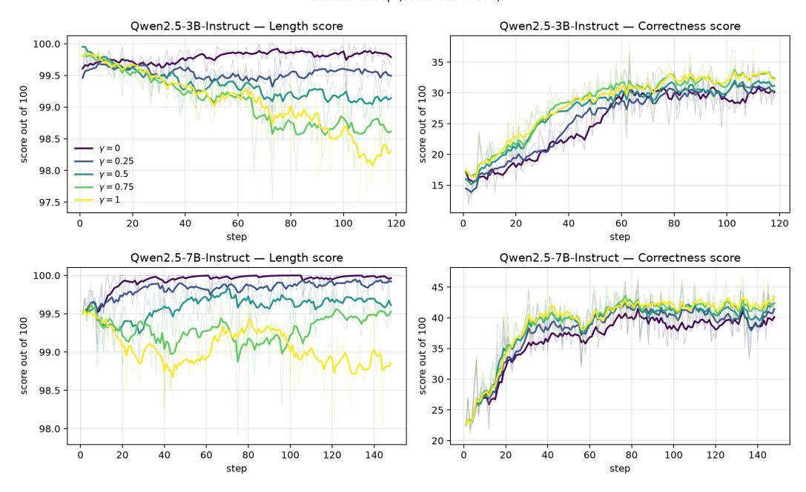

# 남은 것을 배우고, 숙달된 것을 배우지 않는다: 다중 보상 정책 최적화를 위한 포화 인식 이점 재가중치 (Learn What's Left, Not What's Mastered: Saturation Aware Advantage Reweighting for Multi-Reward Policy Optimization)

- 원제: Learn What's Left, Not What's Mastered: Saturation Aware Advantage Reweighting for Multi-Reward Policy Optimization
- 원문: [https://arxiv.org/abs/2608.16072](https://arxiv.org/abs/2608.16072)
- PDF: [https://arxiv.org/pdf/2608.16072v1](https://arxiv.org/pdf/2608.16072v1)
- arXiv ID: `2608.16072`

---

# 남은 것을 배우고, 숙달된 것을 배우지 않는다: 다중 보상 정책 최적화를 위한 포화 인식 이점 재가중치 (Learn What's Left, Not What's Mastered: Saturation Aware Advantage Reweighting for Multi-Reward Policy Optimization)

Yixuan Wang♠∗ Yifei Chen♡∗ Haichao Zhang♣ Haozheng Luo♢ Xander Wu⋆ Jie Ni♦ Yun Fu♣ Nuno Vasconcelos♡ Yijiang Li♡† ♠플로리다 대학교 (University of Florida) ♡캘리포니아 대학교 샌디에이고 (UC San Diego) ♣노스이스트 대학교 (Northeastern University) ♢노스웨스턴 대학교 (Northwestern University) ⋆스탠포드 대학교 (Stanford University), Zillion Network ♦인스브루크 대학교 (Universität Innsbruck) ∗동일 기여. †교신 저자 및 프로젝트 리더. yijiangli@ucsd.edu

# 초록 (Abstract)

그룹 상대 이점을 갖는 강화 학습(RL)은 사후 훈련 언어 모델 추론기에서 사실상 표준이 되었다. 그러나 다중 보상 목표를 최적화할 때 기존 방법은 일반적으로 보상 벡터를 고정 가중 합으로 스칼라화한 뒤 그룹별 표준화를 수행한다. 우리는 이 설계가 두 가지 근본적인 문제를 야기한다는 것을 보여준다: 서로 다른 보상 프로필을 가진 롤아웃이 동일한 이점을 받을 수 있고, 모든 목표는 현재 포화 수준과 관계없이 고정된 상대 가중치로 최적화된다. 결과적으로 훈련은 이미 해결된 목표에 기울기 예산을 할당하고 남은 여유가 큰 목표에 집중하지 못한다.

우리는 다중 보상 정책 최적화를 위한 포화 인식 이점 재가중치(Saturation Aware Advantage Reweighting for Multi-Reward Policy Optimization (SA-MRPO))를 도입한다. 이 방법은 각 보상 목표를 독립적으로 표준화하고, 배치 수준의 목표 포화 추정에 따라 기여도를 적응적으로 할인한다. 이를 통해 최적화 노력이 아직 충분히 최적화되지 않은 목표에 동적으로 재배치되며, 이미 잘 만족된 목표의 성능은 실험적으로 유지된다. 또한 포화 인식 재가중치가 업데이트의 부호를 반전시킬 수 있음을 보여준다. 두 개와 세 개의 목표 보상 조합을 갖는 수학적 추론 전반에서 SA-MRPO는 GDPO보다 15개의 벤치마크 중 12개에서 더 어려운 정확성 목표를 개선하며, AIME24에서 최대 5%의 향상을 보인다. 적응형 추론에서는 다섯 개 벤치마크 모두에서 정확도를 평균 3.8% 향상시키며 AMC23에서는 최대 9.2%를 달성하고, 코딩 벤치마크에서는 합격률을 최대 2.3%까지 개선한다. 모든 설정에서 더 쉬운 목표는 이미 만족된 수준 근처를 유지한다.

## 1 서론 (Introduction)

검증 가능한 보상을 갖는 강화 학습(RLVR)은 대형 언어 모델의 추론 능력을 향상시키는 표준 접근법으로 부상했다. 그룹 상대 정책 최적화(Group Relative Policy Optimization, GRPO) [Shao et al., 2024]와 그 변형들 [Guo et al., 2025]은 롤아웃 그룹에서 이점을 추정함으로써 PPO [Schulman et al., 2017]이 요구하는 학습된 가치 함수를 회피하여 이 과정을 단순화한다. 그러나 본질적으로 GRPO는 각 롤아웃에 대해 단일 스칼라 보상을 가정한다. 실제로 추론 모델은 종종 다중 목표를 최적화한다 [Guo et al., 2025,] [Fang et al., 2025]. 응답은 단순히 정확할 뿐만 아니라 길이 [Luo et al.,] [2026,] [Fu et al., 2025,] [Feng et al., 2025]에 대한 제약, 형식, 안전성 [Zhang et al., 2026,] [Chen et al., 2025] 또는 실행 가능성 등을 만족해야 할 수도 있다. 표준 접근법은 이러한 목표를 고정 가중 합으로 결합한 뒤, 각 롤아웃 그룹 내에서 발생한 스칼라 보상을 표준화한다. 우리는 두 가지 한계를 식별한다

First, *스칼라화( scalarization )는 보상 해상도를 잃는다*: 다른 가중치의 목표 보상 합계가 동일한 스칼라 값을 생성할 수 있어, 따라서 동일한 이점을 받는다. Second, *고정 가중치는 목표 포화를 무시한다*: 각 목표는 포화에 얼마나 가까운지와 관계없이 훈련 전반에 걸쳐 동일한 상대 가중치를 유지한다. 따라서 최적화는 잘 최적화된 목표를 계속 우선시하면서, 더 어려운 미흡한 목표는 간과될 수 있다.

다중 보상 정책 최적화를 위한 Saturation-aware Advantage Reweighting (SA-MRPO)를 도입한다. SA-MRPO는 목표별 정규화를 유지하면서 각 목표의 현재 포화 정도에 따라 가중치를 동적으로 재조정한다. 구체적으로, 목표가 달성 가능한 범위에 대한 배치 평균 보상을 사용해 포화를 추정하고, 목표가 최대값에 가까워질수록 가중치를 점진적으로 낮춘다. 이로써 발생한 이점은 미흡하게 최적화된 목표에 최적화 노력을 재배치하고, 이미 잘 최적화된 목표의 기울기를 완화한다. 단일 지수 γ가 이 포화 인식 재가중치의 강도를 제어한다. 따라서 상당히 미흡한 목표는 더 큰 비중을 받고, 포화에 가까워지는 목표는 점진적으로 가중치가 낮아진다. SA-MRPO는 학습 전반에 걸쳐 남은 여유가 큰 목표에 최적화 노력을 재배치하고, 이미 잘 학습된 목표에 대한 비중을 줄이며, 기본 GRPO 정책 업데이트를 변경하지 않는다. 우리는 이 재가중치가 업데이트의 크기뿐 아니라 *방향*을 바꿀 수 있음을 보여준다. 이는 롤아웃의 집계 이점 부호를 반전시켜 달성된다. 또한 SA-MRPO가 Group reward-Decoupled Policy Optimization (GDPO) [Liu et al., 2026b]와 Group Relative Policy Optimization (GRPO) [Shao et al., 2024]를 특수 사례로 엄격히 일반화한다는 것을 보인다. 포화 인식 재가중치를 비활성화하면 GDPO로 수렴하며, GDPO는 집계 전에 각 보상 차원을 독립적으로 정규화한다. 단일 목표 설정에서는 GRPO로 수렴한다. DVAO [Jiang et al., 2026]와 GD²PO [Liu et al., 2026a]와 같은 동시 접근 방식은 보상 분산 또는 이점 일관성을 사용해 다중 보상 최적화를 조정하지만, 각 목표가 포화에 얼마나 가까운지를 명시적으로 고려하지 않는다. 그 결과 이미 포화된 목표가 상당히 개선 여지가 있는 목표와 비슷한 영향을 미칠 수 있다. SA-MRPO는 최적화 노력의 할당을 각 목표의 남은 여유에 명시적으로 의존하도록 하여 이 한계를 해결하며, 기본 GRPO 정책 업데이트는 그대로 둔다.

우리는 SA‑MRPO를 수학적 추론, 제어된 적응 추론, 그리고 코드 생성에 대해 다양한 기반 모델, 학습 데이터 및 구성을 통해 평가한다.  
표준 두-목표 및 세-목표 수학적 추론 설정에서 SA‑MRPO는 15개의 벤치마크 비교 중 12개에서 GDPO보다 정확도를 향상시키면서 포화 목표의 성능을 크게 유지한다.  
적응 추론에서는 SA‑MRPO가 5개의 모든 벤치마크에서 GDPO보다 정확도를 향상시켜 평균 3.8%의 개선을 보이며, 응답 길이를 제한 한계 내에 유지한다.  
같은 행동은 코드 생성에도 확장된다. 실행 가능성 및 테스트 케이스 통과율을 동시에 최적화할 때, SA‑MRPO는 4개의 벤치마크 중 3개에서 통과율을 향상시키며 최대 2.3%의 이득을 보이고, 비슷한 실행 가능성을 유지한다.

To summarize, our contributions are:

- 우리는 스칼라화된 다중 보상 정책 최적화의 두 가지 한계를 식별한다: *rewardresolution loss*와 *optimization ignores objective saturation*이며, 후자는 보상 분리 후에도 지속된다는 것을 보여준다.  
- 우리는 SA-MRPO를 제안한다. 이는 정규화된 보상 목표를 최적화된 포화도에 따라 동적으로 재가중한다. SA-MRPO가 정책 업데이트 방향을 바꿀 수 있고, GDPO와 GRPO를 특수 사례로 엄격히 일반화한다는 것을 보인다.  
- 우리는 수학적 추론, 적응적 추론, 코드 생성 등에서 SA-MRPO의 효과를 실험적으로 검증한다. 이는 포화된 목표에서 덜 최적화된 목표로 최적화 노력을 재분배하여, 이미 잘 최적화된 목표를 보존하면서 미흡한 목표에 지속적으로 개선을 가져온다는 것을 보여준다.

## 2 관련 연구 (Related Work)

RLVR 및 다중 목표 정렬. 검증 가능한 보상을 갖는 강화 학습은 언어 모델 추론을 개선하기 위한 표준 접근 방식이 되었으며, GRPO [Shao et al., 2024], DeepSeek R1 [Guo et al., 2025], DAPO [Yu et al., 2026], REINFORCE++ [Hu et al., 2025]가 포함된다.

점검자 없이 정책 최적화 방식을 점점 더 효과적으로 개발하고 있다. 단일 보상 최적화를 넘어, 언어 모델 정렬은 정확성, 효율성, 유용성, 무해성 및 기타 선호 차원을 포함한 다중 목표를 자주 포함한다. 이전 연구는 조건부 선호 제어, 다중 목표 선호 최적화, 파레토 최적화, 적응적 보상 가중치 등을 통해 이 문제를 연구했다 [Zhou et al., 2024, Mukherjee et al., 2024, Li et al., 2025, Liu et al., 2025, Liu et al., 2026]. 이러한 연구는 서로 다른 목표의 상대적 중요성이 최적화 전반에 걸쳐 고정될 필요가 없음을 입증한다.

다중 보상 그룹 상대 정책 최적화. 최근 연구는 다중 보상이 그룹 상대 정책 최적화 내에서 어떻게 결합되어야 하는지를 직접 연구한다. GDPO [Liu et al., 2026b]는 집계 전에 각 보상 차원을 독립적으로 정규화하여, 그룹 정규화 전에 이질적 보상을 스칼라화함으로써 발생하는 정보 손실을 방지한다. DVAO [Jiang et al., 2026]는 보상 분산에 따라 목표 가중치를 조정하고, GD2PO [Liu et al., 2026a]는 보상별 이점 간의 충돌을 해결한다. 관련 방법은 보상 상관관계, 작업 불균형, 대체 다중 보상 최적화 전략을 추가로 고려한다 [Ramesh et al., 2026, Liang et al., 2026, Wang et al., 2026]. 이러한 접근법은 다중 보상 최적화 신호의 구성을 개선하지만, 목표 중요성은 일반적으로 보상 통계, 일치, 또는 최적화 구조에 의해 결정되며, 남은 달성 가능한 보상 범위에 의해 직접적으로 결정되지는 않는다.

**동적 목표 할당.** 우리 연구와 가장 밀접하게 관련된 Dynamic Reward Weighting [Lu et al., 2026], SAW [He et al., 2026], Focal Reward [Huang et al., 2026]는 목표가 서로 다른 속도로 진행될 수 있음을 인식하고, 최적화 노력이 그에 따라 진화해야 함을 인정한다. SAW는 보상 변동성을 목표 정보성의 척도로 사용하고, Focal Reward는 루브릭 기반 보상 기준의 포화도를 추정한다. SA-MRPO는 대신 경계가 있는 검증 가능한 보상에 초점을 맞추고, 달성 가능한 보상 범위의 이미 달성된 비율에서 직접 포화도를 정의한다. 이는 독립적으로 정규화된 보상 이점을 포화도 인식 재가중화하면서 표준 GRPO 정책 업데이트를 유지한다.

## 3 전제 조건 (Preliminaries)

우리는 다중 보상 목표를 가진 자동 회귀 언어 모델에 대한 강화 학습을 연구한다. $\pi_{\theta}$ 를 $\theta$ 로 매개화된 정책이라고 하자. 쿼리 q 가 주어지면, 정책은 출력 시퀀스 $o \triangleq (o_1, \ldots, o_{|o|})$ 에 대해 자동 회귀 분포를 정의한다: $\pi_{\theta}(o \mid q) \triangleq \prod_{t=1}^{|o|} \pi_{\theta}(o_t \mid q, o_{1:t-1})$, 여기서 $o_{1:t-1} \triangleq (o_1, \ldots, o_{t-1})$ 은 토큰 $o_t$ 앞의 접두사를 나타낸다. 각 정책 업데이트 시, 데이터 분포 $\mathcal{D}$ 에서 B 개의 쿼리 $\{q_i\}_{i=1}^B$ 를 샘플링한다. 각 쿼리 $q_i$ 에 대해, 고정된 행동 정책 $\pi_{\theta_{\text{old}}}$ 가 $G \geq 2$ 개의 롤아웃을 생성한다,

$$o_{i,j} \sim \pi_{\theta_{\text{old}}}(\cdot \mid q_i), \quad j \in \{1, \dots, G\}.$$

$o_{i,j} \triangleq (o_{i,j,1},\dots,o_{i,j,|o_{i,j}|})$ 를 쿼리 $q_i$ 와 연관된 j 번째 롤아웃이라고 하고, $o_{i,j,< t} \triangleq (o_{i,j,1},\dots,o_{i,j,t-1})$ 를 토큰 t 이전의 접두사라고 하자. 정책은 n 개의 보상 목표로 훈련된다. 목표 $k \in \{1,\dots,n\}$ 에 대해, $R^{(k)}$ 를 그 보상 함수라고 하고, $w_k \geq 0$ 를 지정된 가중치라고 하자. 보상 목표 k 가 롤아웃 $o_{i,j}$ 에 부여하는 보상은 $r_k^{(i,j)} \triangleq R^{(k)}(q_i,o_{i,j})$ 이다. 유한한 집합 $S \triangleq \{x_1,\dots,x_m\}$ 에 대해, S 의 평균과 표준편차는 다음과 같이 표현된다:

$$mean(S) = \frac{1}{m} \sum_{l=1}^{m} x_l, \quad std(S) = \sqrt{\frac{1}{m} \sum_{l=1}^{m} (x_l - mean(S))^2},$$

각각.

**Group Relative Policy Optimization.** GRPO는 동일한 쿼리에서 생성된 다른 롤아웃과 비교하여 롤아웃의 이점을 추정한다. 다중 보상 목표를 가진 경우, 표준 접근법은 먼저 개별 보상을 스칼라 점수 $r_{\text{sum}}^{(i,j)} \triangleq \sum_{k=1}^n w_k r_k^{(i,j)}$ 로 결합한다. 그 결과 점수는 쿼리 $q_i$ 에 대해 생성된 그룹 내에서 표준화된다. GRPO 이점은

|  | 롤아웃 1 (rollout) | 롤아웃 2 (rollout) | 롤아웃 3 (rollout) | 롤아웃 4 (rollout) |
|--------------------------------------------------------------|-----------|----------------|----------------|----------------|
| 보상 수령 (REWARD RECEIVED) |  |  |  |  |
| • <b>형식 (format)</b> 포화 · 상한에 근접 · $s_1 = 0.98$ | 97/100 | 99/100 | 100/100 | 98/100 |
| • <b>정확성 (correctness)</b> 포화되지 않음 · 하한에 근접 · $s_2 = 0.02$ | 0/100 | 1/100 | 0/100 | 5/100 |
| 장점 할당 (ADVANTAGE ASSIGNED) |  |  |  |  |
| GRPO | ▼ -1.41 | 0.00 | 0.00 | <b>▲</b> +1.41 |
| GDPO | ▼ -2.07 | <b>▲</b> +0.20 | <b>4</b> +0.61 | <b>▲</b> +1.25 |
| SA-MRPO ours | ▼ -0.74 | ▼ -0.23 | ▼ -0.69 | <b>▲</b> +1.65 |

그림 1: GRPO, GDPO, SA-MRPO의 G=4 롤아웃 그룹에서 포화된 포맷 목표와 비포화된 정확도 목표에 대한 비교. 롤아웃 2와 3은 같은 스칼라 보상을 가지지만 보상 프로파일이 다르므로 GRPO는 두 롤아웃 모두 0 장점을 부여한다. GDPO는 두 프로파일을 구분하지만 롤아웃 3에 더 큰 장점을 부여하며, 이는 0 정확도임에도 불구하고. SA-MRPO는 포화된 포맷 목표를 할인하고 대신 롤아웃 3에 롤아웃 2보다 더 부정적인 장점을 부여하며, 가장 높은 정확도를 달성한 롤아웃 4를 선호한다.

$o_{i,j}$의 보상은 다음과 같이 정의된다.

$$A_{\mathrm{GRPO}}^{(i,j)} \triangleq \frac{r_{\mathrm{sum}}^{(i,j)} - \mathrm{mean}\left\{r_{\mathrm{sum}}^{(i,1)}, \dots, r_{\mathrm{sum}}^{(i,G)}\right\}}{\mathrm{std}\left\{r_{\mathrm{sum}}^{(i,1)}, \dots, r_{\mathrm{sum}}^{(i,G)}\right\}}.$$

클리핑 임계값 $\epsilon>0$에 대해 $\mathrm{clip}(x,a,c)\triangleq \max\left(a,\min(x,c)\right)$ 를 정의한다. GRPO는 클리핑된 대리 목표를 최대화한다.

$$\mathcal{J}_{\mathrm{GRPO}}(\theta) = \mathbb{E}\left[\frac{1}{G}\sum_{j=1}^{G}\frac{1}{|o_{i,j}|}\sum_{t=1}^{|o_{i,j}|}\min\left(\rho_{i,j,t}(\theta)A_{\mathrm{GRPO}}^{(i,j)},\,\mathrm{clip}\left(\rho_{i,j,t}(\theta),1-\epsilon,1+\epsilon\right)A_{\mathrm{GRPO}}^{(i,j)}\right)\right],$$

기댓값은 $q_i \sim \mathcal{D}$와 $\{o_{i,j}\}_{j=1}^G$가 $\pi_{\theta_{\text{old}}}(\cdot \mid q_i)$에서 샘플링될 때 취해진다.

$$\rho_{i,j,t}(\theta) \triangleq \frac{\pi_{\theta}\left(o_{i,j,t} \mid q_{i}, o_{i,j,< t}\right)}{\pi_{\theta_{\text{old}}}\left(o_{i,j,t} \mid q_{i}, o_{i,j,< t}\right)}.$$

표준 GRPO와 같이 고정된 참조 정책에 대한 KL 패널티를 계수 $\beta \geq 0$와 함께 추가할 수 있다. 이 항은 본 연구에서 다루는 보상 구성과 독립적이므로 생략한다.

## 4 포화 인식 장점 재가중치 (Saturation Aware Advantage Reweighting)

GRPO 구성은 모든 보상 차원을 결합한 뒤 그룹 상대 장점을 계산한다. 이 스칼라화는 두 가지 한계를 도입한다. 첫째, 서로 다른 보상 프로파일이 같은 스칼라 보상으로 붕괴될 수 있다. 예를 들어, 동일 가중치 하에서 (1,0)과 (0,1)은 구분할 수 없게 된다. 둘째, 스칼라화는 각 목표에 남아 있는 개선량을 고려하지 않는다. 정책은 이미 포화된 목표를 계속 선호할 수 있으며, 여전히 개선이 필요한 목표에 업데이트를 더 많이 할당하지 못한다. 그림 1에서 보듯이, 이 두 한계는 목표별 상대 성능과 각 목표의 현재 최적화 상태를 분리하도록 동기를 부여한다.

### 4.1 포화 인식 그룹 상대 장점 (Saturation Aware Group Relative Advantage)

각 쿼리 $q_i$에 대해, $r_k^{(i,j)}$는 목표 k가 롤아웃 $o_{i,j}$에 부여한 보상을 나타낸다. 여기서 $i \in \{1, \ldots, B\}$, $j \in \{1, \ldots, G\}$, $k \in \{1, \ldots, n\}$이다. 다중 목표 정책 업데이트는

각 목표에 대한 롤아웃의 상대적 품질과 해당 목표의 현재 최적화 상태를 모두 고려해야 한다. 우리는 이 두 정보를 직접 하나의 그룹 상대 장점에 통합한다.

각 목표 k에 대해 쿼리 $q_i$와 관련된 그룹 통계량을 정의한다.

$$\boldsymbol{\mu}_k^{(i)} \triangleq \operatorname{mean}\left\{r_k^{(i,1)}, \dots, r_k^{(i,G)}\right\}, \quad \boldsymbol{\sigma}_k^{(i)} \triangleq \operatorname{std}\left\{r_k^{(i,1)}, \dots, r_k^{(i,G)}\right\}.$$

목표 k의 현재 최적화 상태를 특징화하기 위해, 현재 배치에서의 평균 보상을 사용한다.

$$\bar{r}^{(k)} \triangleq \operatorname{mean} \left\{ r_k^{(i,j)} : i \in \{1,\dots,B\}, j \in \{1,\dots,G\} \right\}.$$

$r_{\min}^{(k)}$와 $r_{\max}^{(k)}$는 각각 목표 k의 달성 가능한 하한 및 상한 보상 범위를 나타낸다. 따라서 목표 k의 포화 비율을 다음과 같이 정의한다.

$$s^{(k)} \triangleq \frac{\bar{r}^{(k)} - r_{\min}^{(k)}}{r_{\max}^{(k)} - r_{\min}^{(k)}} \in [0, 1].$$

작은 $s^{(k)}$는 달성 가능한 보상 범위의 더 큰 비율이 아직 실현되지 않았음을 나타내며, 반대로 큰 $s^{(k)}$는 목표가 보상 상한에 더 가까워졌음을 나타낸다.

지정된 목표 가중치 $\{w_k\}_{k=1}^n$과 포화 지수 $\gamma \geq 0$이 주어지면, 최종 배치 정규화(batch normalization) 전에 포화 인식 그룹 상대 이점(saturation aware group relative advantage)을 정의한다.

$$\widetilde{A}^{(i,j)} \triangleq \sum_{k=1}^{n} \widetilde{w}_k A_k^{(i,j)},$$

여기서

$$A_k^{(i,j)} \triangleq \frac{r_k^{(i,j)} - \mu_k^{(i)}}{\sigma_k^{(i)}}, \qquad \widetilde{w}_k \triangleq w_k \left(1 - s^{(k)}\right)^{\gamma}.$$

항목 $A_k^{(i,j)}$는 해당 롤아웃 그룹 내에서 목표 k에 대한 롤아웃 $o_{i,j}$의 상대 품질을 측정하며, $\widetilde{w}_k$는 목표 k의 기여도를 지정된 중요도와 현재 포화 수준에 따라 조절한다. 구체적으로, 계수 $\left(1-s^{(k)}\right)^{\gamma}$는 현재 정책이 목표 k의 달성 가능한 보상 범위의 더 큰 비율을 실현할수록 목표 k의 영향력을 감소시킨다. 따라서 각 목표는 지정된 중요도, 남은 개선 여력, 그리고 현재 롤아웃의 상대 품질에 따라 집계 이점(aggregate advantage)에 기여한다.

훈련 중에 포화 비율이 변동되므로, $\widetilde{A}^{(i,j)}$의 규모는 정책 업데이트마다 달라질 수 있다. 따라서 우리는 현재 배치에 대한 집계된 이점을 다음과 같이 정규화한다

$$\widehat{A}_{\mathrm{SA}}^{(i,j)} \triangleq \frac{\widetilde{A}^{(i,j)} - \mathrm{mean}(\mathcal{A})}{\mathrm{std}(\mathcal{A})}, \qquad \mathcal{A} \triangleq \left\{ \widetilde{A}^{(i,j)} : i \in \{1, \dots, B\}, j \in \{1, \dots, G\} \right\}. \tag{1}$$

결과적으로 도출된 이점은 표준 클리핑된 그룹 상대 대리 목표에 직접 사용된다.

$$\mathcal{J}_{\mathrm{SA-MRPO}}(\theta) = \mathbb{E}\left[\frac{1}{G}\sum_{j=1}^{G}\frac{1}{|o_{i,j}|}\sum_{t=1}^{|o_{i,j}|}\min\left(\rho_{i,j,t}(\theta)\widehat{A}_{\mathrm{SA}}^{(i,j)},\operatorname{clip}\left(\rho_{i,j,t}(\theta),1-\epsilon,1+\epsilon\right)\widehat{A}_{\mathrm{SA}}^{(i,j)}\right)\right].$$

SA-MRPO는 롤아웃 이점(rollout advantage)의 구성을 변경할 뿐, 기본적인 그룹 상대 정책 최적화 목표(group relative policy optimization objective)는 그대로 유지한다.

알고리즘 1은 결과 정책 업데이트를 요약한다. 포화 규칙은 적응형 할당 메커니즘을 제공하지만, 목표 간 상대 할당을 변경하는 것은 두 가지 질문을 제기한다: 포화되지 않은 목표를 강조하면 이미 최적화된 목표를 저하시킬 수 있는가, 그리고 포화 추정 자체가 남은 최적화 잠재력을 부정확하게 나타낼 수 있는가.

## Algorithm 1 SA-MRPO 정책 업데이트 (Algorithm 1 SA-MRPO policy update)

Require: queries  $\{q_i\}_{i=1}^{B}$ , weights  $\{w_k\}_{k=1}^{n}$ , reward bounds  $\{(r_{\min}^{(k)}, r_{\max}^{(k)})\}_{k=1}^{n}$ , saturation exponent  $\gamma$ , clipping threshold  $\epsilon$ 1: 샘플링  $\{o_{i,j}\}_{j=1}^{G} \sim \pi_{\theta_{\text{old}}}(\cdot \mid q_i)$  각 i에 대해 2: 계산  $r_k^{(i,j)} = R^{(k)}(q_i, o_{i,j})$  모든 i, j, k에 대해 3: k=1부터 n까지 반복
4:  $\bar{r}^{(k)} \leftarrow \text{mean}\{r_k^{(i,j)}\}_{i,j}$ 5:  $s^{(k)} \leftarrow \frac{\bar{r}^{(k)} - r_{\min}^{(k)}}{r_{\max}^{(k)} - r_{\min}^{(k)}}$

5: 

$$s^{(k)} \leftarrow \frac{\bar{r}^{(k)} - r_{\min}^{(k)}}{r_{\max}^{(k)} - r_{\min}^{(k)}}$$

6: end for
7: **for** 각 쿼리 i와 롤아웃 j에 대해 **do**
8: 

$$\widetilde{A}^{(i,j)} \leftarrow \sum_{k=1}^{n} w_k \left(1 - s^{(k)}\right)^{\gamma} \frac{r_k^{(i,j)} - \operatorname{mean}\{r_k^{(i,1)}, \dots, r_k^{(i,G)}\}}{\operatorname{std}\{r_k^{(i,1)}, \dots, r_k^{(i,G)}\}}$$

9: **end for** 10:  $\widetilde{A}_{\mathrm{SA}}^{(i,j)} \leftarrow \big(\widetilde{A}^{(i,j)} - \mathrm{mean}\{\widetilde{A}\}\big)/\mathrm{std}\{\widetilde{A}\}$  for all i,j
11: update  $\theta$  by ascending  $
abla_{\theta} \mathcal{J}_{\mathrm{SA-MRPO}}(\theta)$  using  $\{\widehat{A}_{\mathrm{SA}}^{(i,j)}\}$

제안된 구조는 정적 목표 할당을 특수한 경우로 포함한다. $\gamma = 0$ 일 때, 포화 인자는 모두 1과 동일하며

$$\widetilde{w}_k = w_k, \quad \widetilde{A}^{(i,j)} = \sum_{k=1}^n w_k A_k^{(i,j)},$$

이는 동일한 목표 가중치와 정규화- 하에서 해당 GDPO 이점을 복원한다.

포화 인식 재가중치는 지정된 할당에 비해 더 포화된 목표의 상대적 기여를 감소시킨다. $\gamma$ 를 증가시키면 상대 할당이 더 큰 남은 보상 헤드룸을 가진 목표로 이동한다. 두 목표 a와 b가 $w_a > 0$, $w_b > 0$, 그리고 $s^{(a)}, s^{(b)} \in [0, 1)$ 를 만족할 때,

$$\frac{\widetilde{w}_a}{\widetilde{w}_b} = \frac{w_a}{w_b} \left( \frac{1 - s^{(a)}}{1 - s^{(b)}} \right)^{\gamma}.$$

만약 $s^{(a)} > s^{(b)}$ 이면, $(1-s^{(a)})/(1-s^{(b)}) < 1$ 이다. 따라서 비율 $\widetilde{w}_a/\widetilde{w}_b$ 는 $\gamma$ 에 대해 엄격히 감소한다. 특히, 모든 $\gamma > 0$ 에 대해 $\widetilde{w}_a/\widetilde{w}_b < w_a/w_b$ 이다.

### 4.2 목표 충돌 및 실패 모드 (Objective Conflict and Failure Modes)

포화 인식 재가중화는 남은 보상 여유에 따라 최적화 강조를 재배치하지만, 이전에 최적화된 목표가 보존되어야 한다는 제약을 부과하지 않는다. 이 구분은 두 목표가 상충하는 정책 업데이트를 유도할 때 중요해진다. 목표별 정책 대리자 $J_k(\theta)$ 를 정의하고, $g_k(\theta) \triangleq 
abla_{\theta} J_k(\theta)$ 라고 하자. 포화 가중 상승 방향에 대해

$$d(\theta) \triangleq \sum_{k=1}^{n} \widetilde{w}_k g_k(\theta),$$

이 방향에 따라 목표 a의 1차 변화는 다음과 같이 특징지어집니다.

$$DJ_a(\theta)[d] = \widetilde{w}_a \|g_a(\theta)\|^2 + \sum_{k 
eq a} \widetilde{w}_k g_a(\theta)^\top g_k(\theta).$$

첫 번째 항은 목표 a가 자기 개선에 기여하는 부분이며, 교차 목표 항은 나머지 목표들에 의해 유도된 업데이트가 목표 a에 미치는 영향을 설명한다. $g_a(\theta)^{\top}g_k(\theta) \ge 0$ 가 양의 가중치를 갖는 모든 목표 k에 대해 성립하면, 집계 방향은 1차적으로 $J_a$ 를 감소시킬 수 없다. 반대로 목표 a는 다음과 같은 경우에 감소한다

$$\sum_{k 
eq a} \widetilde{w}_k g_a(\theta)^\top g_k(\theta) < -\widetilde{w}_a \|g_a(\theta)\|^2.$$

(2)

Equation [(2)](#page-5-1)은 다른 목표들로부터의 충돌이 목표 a 자체가 유도하는 개선을 압도하는 정확한 지역 조건을 제공한다. wea = wa(1 − s(a)) γ는 목표 a가 더 포화될수록 감소하므로, 포화 인식 할당은 해당 목표를 보호하는 자기 개선 항을 의도적으로 감소시킨다. 따라서, 덜 포화된 목표가 충분히 충돌하는 기울기를 가질 때, 그 목표를 향해 최적화 노력을 재배치하면 이전에 잘 최적화된 목표의 성능을 감소시킬 수 있다. 이 행동은 목표들이 동일한 유한 모델 용량을 위해 경쟁할 때 특히 관련이 있다. 비록 제한된 용량이 부정적 기울기 정렬을 일으킬 수 있는 가능한 메커니즘 중 하나일 뿐이지만 말이다. 따라서 SA-MRPO는 모든 포화 목표의 단조적 보존을 보장하는 제약 다목적 방법이 아니라 적응형 목표 할당 규칙으로 해석되어야 한다. 따라서 실증적 질문은 남은 헤드룸이 더 큰 목표에서 얻은 이득이 최적화 압력이 감소된 목표의 성능 저하를 상쇄하는가라는 점이다.

분리된 고려 사항은 명목상 보상 여유가 반드시 최적화 가능한 여유와 일치하지 않을 수 있다는 점이다. 설계상으로는 1 − s (k)가 지정된 보상 범위 중 아직 실현되지 않은 비율을 측정한다. 보상 한계가 보상 함수에 의해 직접 지정될 때 이 양은 정확히 관측 가능하며 보상 천장을 추정할 필요가 없다. 그러나 남은 보상 범위가 크다고 해서 현재 정책 클래스가 해당 개선을 실현할 충분한 용량을 갖추었다고 할 수는 없다. 특히, 목표가 지정된 최대값에서 멀리 떨어져 있을 수 있는데, 현재 모델이 표현할 수 있는 최선의 정책이 제한된 추가 개선만을 달성할 수 있을 때이다. 따라서 s (k)는 남은 명목상 보상 여유를 측정하는 지표로 해석되어야 하며, 남은 달성 가능한 개선을 보증하는 증명서가 아니다. 우리는 이 불일치를 제안된 포화 측정의 실패 모드로 보지 않는다. 포화 비율은 지정된 보상 범위 내에서의 진행 상황을 올바르게 나타내며, 남은 보상의 달성 불가능성은 오히려 기저 정책 클래스의 용량에 의해 부과된다.

## 5 실험 (Experiments)

우리는 세 가지 질문을 염두에 두고 SA-MRPO를 평가한다. 첫 번째는 포화 인식 재가중치가 다중 보상 목표 하에서 정책 최적화를 개선하는가이다. 두 번째는 개선이 이미 포화된 목표에서 최적화 노력을 재배분하는 것과 일관되는가이다. 세 번째는 같은 행동이 수학적 추론을 넘어 확장되는가이다.  

우선 표준 다중 목표 수학적 추론 설정에서 SA-MRPO를 평가한다.  

그 다음 명시적 포화 영역을 갖는 적응형 추론 설정을 구성하여 제안된 메커니즘을 보다 직접적으로 연구한다.  

마지막으로 이 방법을 코드 추론에 적용해 평가하고 포화 지수 γ의 효과를 연구한다.

### 5.1 실험 설정 (Experimental Setup)

훈련 프로토콜. 별도로 명시되지 않는 한, 모든 실험은 verl로 구현되고 vLLM을 사용하여 롤아웃 생성을 수행한다. 각 훈련 프롬프트마다 G = 8개의 응답을 샘플링하고, 그 결과 그룹을 보상 계산 및 우위 추정에 사용한다. 모든 모델을 3 에폭 동안 전역 배치 크기 256과 최대 응답 길이 4096 토큰으로 훈련한다. 수학 및 적응형 추론 실험은 약 40K개의 대회 수준 수학 추론 문제를 포함하는 DeepScaleR-Preview [Luo et al.](#page-12-12) [&#91;2025&#93;](#page-12-12)에서 수행된다. 모델 아키텍처, 보상 구성, 그리고 이 프로토콜에서의 작업별 편차는 해당 하위 절에 기술되어 있다.

평가 프로토콜. 수학적 추론에서는 vLLM을 온도 0.6, top-p 0.95, 최대 생성 길이 4096 토큰으로 사용한다. 문제당 16개의 응답을 샘플링하고 평균 pass@1 정확도를 보고한다. 코드 추론에서는 동일한 온도와 top-p를 사용하며 최대 생성 길이를 2048 토큰으로 설정한다. 작업별 보조 지표는 해당 실험과 함께 도입된다. 모든 평가 표에서 "Base"는 RL 훈련 전의 해당 모델을 나타낸다.

### 5.2 수학적 추론 (Mathematical Reasoning)

우리는 saturation-aware reweighting이 일반 다목적 추론 성능을 향상시키는지 조사한다. Qwen2.5-3B-Instruct와 Qwen2.5-7B-Instruct를 Section [5.1.](#page-6-0)에서 설명한 훈련 프로토콜에 따라 훈련한다. 우리는 두 개와 세 개의 목표 설정을 모두 고려한다. 두 개 목표 설정은 정확도와 응답 길이 준수성을 최적화하고, 세 개 목표 설정은 형식 목표를 추가로 포함한다. 후자는 훈련의 다른 단계에서 높은 보상 수준에 도달할 수 있는 여러 보조 목표를 도입한다.

보상 목표는 다음과 같이 정의된다.

길이 보상. l = 4000을 응답 길이 예산으로 둔다. 우리는 다음과 같이 정의한다

$$\mathcal{R}_{\text{길이(length)}}(o) = \begin{cases} 1, & |o| \leq l, \\ 0, & |o| > l. \end{cases}$$

정확도 보상. y를 정답으로, Extract(o)를 응답 o에서 파싱된 최종 답변으로 둔다. 우리는 다음과 같이 정의한다

$$\mathcal{R}_{correct}(o) = \begin{cases} 1, & \text{Extract}(o) = y, \\ 0, & \text{Extract}(o) 
eq y. \end{cases}$$

형식 보상. 형식 보상은 생성된 응답이 요구되는 XML 스타일 추론 형식을 따르는지 평가한다. 구체적으로, 응답은 정확히 하나의 <answer> 블록과 하나의 </answer> 블록을 포함해야 하며, 전체 응답은 <think>...</think>
<answer>...</answer>와 일치해야 한다. 우리는 다음과 같이 정의한다

$$\mathcal{R}_{\text{format}}(o) = \begin{cases} 1, & \text{if } o \text{ matches $^{\text{think}.*?\$,} \\ 1, & \text{and } N_{\text{canswer}>}(o) = 1, & N_{\text{canswer}>}(o) = 1, \\ 0, & \text{otherwise.} \end{cases}$$

우리는 AIME24 [&#91;Zhang and Math-AI, 2024&#93;](#page-13-4), AMC23 [1](#page-7-0), MATH500 [&#91;Hendrycks et al., 2021&#93;](#page-11-8), Minerva Math [2](#page-7-1), 그리고 OlympiadBench [&#91;He et al., 2024&#93;](#page-11-9)에서 평가한다. 정확도 외에 EXCEED를 보고한다. EXCEED는 생성된 응답 중 4000 토큰 예산을 초과하는 비율이다.

Table 1: GDPO와 SA-MRPO의 수학적 추론에서 두 개 및 세 개 보상 목표에 대한 비교. 정확도는 높을수록 좋으며, EXCEED는 4000 토큰 길이 한도를 초과하는 응답 비율을 나타내며 낮을수록 좋다. Qwen2.5-3B-Instruct 베이스 모델은 두 보상 설정에서 공유된다.

|  |  | Qwen2.5-7B-Instruct |  |  | Qwen2.5-3B-Instruct |  |  |  |  |  |
|---------------------|----------|---------------------|-------|---------|---------------------|--------------------|-------------|------------------------------|-------------|--|
| 벤치마크 지표 |  | 세 가지 목표 |  |  | 기본 | Rcorrect + Rlength |  | Rcorrect + Rlength + Rformat |  |  |
|  |  | 기본 | GDPO | SA-MRPO |  | GDPO2obj | SA-MRPO2obj | GDPO3obj | SA-MRPO3obj |  |
| AIME24 | Acc ↑ | 11.7% | 11.5% | 16.5% | 0.6% | 5.0% | 8.5% | 6.7% | 8.1% |  |
|  | Exceed ↓ | 3.5% | 1.2% | 1.5% | 6.2% | 0.0% | 0.6% | 0.6% | 1.7% |  |
| Minerva | Acc ↑ | 16.1% | 24.2% | 24.8% | 6.7% | 16.2% | 16.6% | 16.9% | 18.1% |  |
|  | Exceed ↓ | 0.4% | 0.1% | 0.0% | 0.4% | 0.1% | 0.1% | 0.1% | 0.1% |  |
| AMC23 | Acc ↑ | 41.1% | 44.6% | 43.5% | 10.7% | 33.2% | 34.9% | 31.5% | 35.2% |  |
|  | Exceed ↓ | 1.0% | 1.2% | 1.1% | 1.7% | 0.0% | 0.1% | 0.4% | 0.6% |  |
| MATH500 | Acc ↑ | 50.0% | 64.2% | 67.7% | 26.3% | 57.1% | 58.2% | 58.9% | 59.5% |  |
|  | Exceed ↓ | 0.7% | 0.0% | 0.1% | 0.6% | 0.0% | 0.1% | 0.1% | 0.1% |  |
| Olympiad | Acc ↑ | 23.8% | 25.3% | 26.1% | 4.5% | 20.6% | 19.3% | 20.6% | 20.0% |  |
|  | Exceed ↓ | 2.5% | 0.2% | 0.7% | 3.3% | 0.1% | 0.3% | 0.2% | 0.6% |  |

표 [1](#page-7-2)은 모델 규모와 보상 구성을 가로질러 GDPO와 SA-MRPO를 비교한다. 세 가지 구성에서 SA-MRPO는 15개의 벤치마크 비교 중 12개에서 GDPO보다 높은 정확도를 달성한다. Qwen2.5-7B-Instruct의 세 가지 보상 목표에 대해 SA-MRPO는 다섯 개 벤치마크 중 네 개를 개선하며, AIME24에서는 5.0 퍼센트 포인트, MATH500에서는 3.5 퍼센트 포인트의 향상을 보인다. Qwen2.5-3B-Instruct에서도 동일한 패턴이 관찰되며, SA-MRPO는 네 개를 개선한다.

1https://huggingface.co/datasets/math-ai/amc23

2https://huggingface.co/datasets/math-ai/minervamath

Table 2: 명시적으로 포화된 길이 목표를 갖는 적응형 추론

Table 3: Qwen2.5-7B-Instruct의 코드 추론 결과

| 벤치마크 | SA-MRPO |  | GDPO |  | ∆ Acc. |  |  | 베이스 | GDPO | SA-MRPO |
|-----------|---------|------|------|------|--------|------------|--------|-------|-------|---------|
|  | Acc. | Len. | Acc. | Len. |  | APPS | Pass ↑ | 43.8% | 53.2% | 53.8% |
| AIME24 | 7.3 | 804 | 5.2 | 566 | +2.1 |  | Bug ↓ | 19.6% | 8.5% | 9.9% |
| Minerva | 15.9 | 277 | 15.4 | 214 | +0.5 | CodeCont. | Pass ↑ | 12.4% | 19.2% | 20.6% |
| AMC23 | 37.5 | 417 | 28.3 | 290 | +9.2 |  | Bug ↓ | 32.9% | 15.5% | 15.5% |
| MATH500 | 51.5 | 270 | 47.1 | 187 | +4.4 |  | Pass ↑ | 8.7% | 10.6% | 12.9% |
| Olympiad | 20.9 | 529 | 18.1 | 406 | +2.8 | Codeforces | Bug ↓ | 34.4% | 8.6% | 9.0% |
| 평균 | 26.6 | 459 | 22.8 | 333 | +3.8 | TACO | Pass ↑ | 29.0% | 36.0% | 35.6% |
|  |  |  |  |  |  |  | Bug ↓ | 23.1% | 11.0% | 12.4% |

두 목표와 세 목표 설정 모두에서 다섯 개의 벤치마크에서  
이러한 정확도 향상은 일반적으로 EXCEED의 작은 변화만 동반되며, 이는 정확도 향상이 보조 길이 목표를 포기할 필요가 없음을 시사한다.

### 5.3 적응형 추론 (Adaptive Reasoning)

이전 실험은 표준 다중 목표 보상 구조에서 SA-MRPO를 평가한다. 다음으로는 한 보상 목표에 포화가 명시적으로 포함된 설정을 고려하여 제안된 할당 메커니즘을 보다 직접적으로 검토한다.

우리는 DeepSeek-R1-Distill-Qwen-7B를 두 가지 규칙 기반 목표인 정확도와 길이 효율성으로 훈련한다. 학습된 판사나 외부 보상 모델은 사용하지 않는다. 훈련 구성은 Section [5.1.](#page-6-0)을 따른다. 정확도 보상은 Section [5.2.](#page-6-1)에 정의된 Rcorrect와 동일하다.

위의 이진 길이 제약과 달리, 우리는 등급화된 길이 보상을 정의한다

$$\mathcal{R}_{\text{length}}(o) = \begin{cases} 1, & |o| \leq B_{\text{min}}, \\ \frac{B_{\text{max}} - |o|}{B_{\text{max}} - B_{\text{min}}}, & B_{\text{min}} < |o| < B_{\text{max}}, \\ 0, & |o| \geq B_{\text{max}}, \end{cases}$$

여기서 Bmin = 1024, Bmax = 2048이다. 이 구성은 명시적인 포화 영역을 갖는다: 응답이 Bmin 토큰 이하일 때 길이 보상이 최대값에 도달하며, 추가 단축은 더 이상의 보상을 제공하지 않는다. 따라서 이 설정은 보조 목표가 포화되는 동시에 정확도가 상당한 개선 여지를 남기는 SA-MRPO를 동기화하는 영역을 포착한다. 우리는 Section [5.2.](#page-6-1)와 동일한 다섯 개의 수학적 추론 벤치마크에서 평가하고, 정확도와 함께 LEN, 즉 생성된 토큰의 평균 수를 보고한다.

Table [2](#page-8-0)은 SA-MRPO가 GDPO보다 모든 다섯 개 벤치마크에서 정확도를 향상시킨 것을 보여주며, 평균 3.8% 포인트의 이득을 보인다. 가장 큰 개선은 AMC23에서 나타나며, 정확도가 28.3%에서 37.5%로 상승한다. 동시에 SA-MRPO는 평균 응답 길이를 333에서 459 토큰으로 증가시키며 다소 긴 응답을 생성한다.

중요하게도, 두 방법 모두에서 평균 응답 길이는 포화 임계값 Bmin = 1024 이하로 유지된다. 따라서 SA-MRPO가 사용한 추가 토큰은 의도된 할당 메커니즘과 일치한다: 길이 목표가 이미 높은 보상 영역에 있을 때, 응답을 과도하게 단축하면 최적화 가치가 감소하고, 정확도는 여전히 상당한 개선 여지를 가진다. SA-MRPO는 포화된 길이 목표의 상대적 영향을 줄이고 추가 추론 용량을 정확도에 활용한다. 결과적으로 3.8 포인트의 평균 정확도 향상은 남은 보상 헤드룸에 따라 최적화 노력을 재배치한다는 직접적인 실증적 근거를 제공한다.

### 5.4 코드 생성 (Code Generation)

다음으로 포화 인식 재가중치가 수학적 추론을 넘어 확장되는지 평가한다. 우리는 Eurus-2-RL 데이터셋 [Cui et al.](#page-11-10) [&#91;2025&#93;](#page-11-10)에서 두 가지 규칙 기반 보상 목표인 테스트 케이스 통과율과 실행 가능성을 사용해 Qwen2.5-7B-Instruct를 훈련한다. 훈련은 verl을 사용해 3 에폭 동안 수행된다. 별도로 명시되지 않는 한, 나머지 모든 구성은 Section [5.1.](#page-6-0)을 따른다. GDPO와 SA-MRPO는 동일한 훈련 데이터, 보상 함수, 최적화 하이퍼파라미터를 사용하며, 차이점은 집계 이점의 구성에 있다.

통과율 보상은 다음과 같이 정의된다

$$\mathcal{R}_{\mathrm{pass}} = \frac{\# \ passed \ test \ cases}{\# \ total \ test \ cases}$$

.

실행 가능성 보상은 다음과 같다

$$\mathcal{R}_{\mathrm{exec}} = \begin{cases} 1, & \text{if the generated program compiles and executes without errors,} \\ 0, & \text{otherwise.} \end{cases}$$

실행 가능성은 전체 기능적 정확성보다 먼저 만족될 수 있는 기본적인 유효성 요구사항을 포착한다. 통과율 목표는 더 까다롭다. 이는 생성된 프로그램이 테스트 케이스 전반에 걸쳐 올바른 동작을 수행하도록 요구하기 때문이다. 따라서 이 설정은 한 목표가 다른 목표보다 상당히 만족하기 쉬워질 수 있는 질적으로 다른 사례를 제공한다.

우리는 APPS [Hendrycks et al.](#page-11-8) [&#91;2021&#93;](#page-11-8), CodeContests [Li et al.](#page-12-13) [&#91;2022&#93;](#page-12-13), Codeforces, 그리고 TACO [Li et al.](#page-12-14) [&#91;2023&#93;](#page-12-14)에서 평가한다. 각 문제마다 온도 0.6, top-p = 0.95, 최대 생성 길이 2048 토큰으로 16개의 응답을 샘플링한다. 우리는 PASS, 즉 평균 테스트 케이스 통과율, 그리고 BUG, 즉 컴파일 또는 런타임 오류가 발생한 생성 프로그램의 비율을 보고한다.

표 [3](#page-8-0)은 두 방법이 기본 모델에 비해 기능적 정확성과 실행 가능성을 크게 향상시킨다는 것을 보여준다. GDPO와 비교할 때, SA-MRPO는 네 개의 벤치마크 중 세 개에서 더 높은 통과율을 달성하며, APPS, CodeContests, Codeforces에서 각각 0.6, 1.4, 2.3 퍼센트 포인트의 개선을 보인다. TACO에서는 통과율이 GDPO보다 0.4 퍼센트 포인트 낮다. 해당 버그율은 비슷한 수준을 유지하며, 두 방법 모두 기본 모델보다 훨씬 적은 수의 유효하지 않은 프로그램을 생성한다.

이 결과는 포화 인식 할당 효과(saturation aware allocation effect)를 수학적 추론을 넘어 확장한다. 실행 가능성(executability)은 상대적으로 기본적인 제약을 나타내는 반면, 테스트 케이스 통과율(test case pass rate)은 기능적 정확성(functional correctness)의 더 어려운 목표를 포착한다. SA-MRPO는 대부분의 벤치마크에서 후자를 개선하면서 GDPO가 달성한 실행 가능성 향상 효과를 대부분 유지한다. 이는 남은 여유가 더 큰 목표에 최적화 노력을 재배분하는 것과 일치한다.

### 5.5 포화 강도의 효과 (Effect of the Saturation Strength)

우리는 최종적으로 포화 지수 γ가 SA-MRPO 가중 규칙에 의해 예측된 방식으로 최적화 노력을 할당하는지 여부를 검토한다. 다시 상기하면

$$\widetilde{w}_k = w_k \left( 1 - s^{(k)} \right)^{\gamma},$$

so increasing γ more aggressively suppresses objectives with large saturation s (k) .

본 실험에서는 Qwen2.5-3B-Instruct와 Qwen2.5-7B-Instruct를 DeepScaleR-Preview에서 한 에폭 동안 학습한다. 모든 실행은 문제당 8개의 롤아웃, 배치 크기 256, 최대 응답 길이 4096 토큰을 사용한다. 우리는 섹션 [5.2.](#page-6-1)에 정의된 정답성 및 길이 보상만 사용한다.

Figure [2](#page-10-0)은 γ가 증가함에 따라 두 보상 차원에서 체계적인 변화를 보여준다. γ = 0과 비교하면, γ의 양수 값은 일반적으로 훈련 중 정확도 보상을 높인다. 동시에, 길이 보상은 γ가 커질수록 점진적으로 감소하며, 특히 γ = 0.75와 γ = 1.0에서 두드러진다. 이러한 현상은 제안된 메커니즘과 일치한다: γ를 증가시키면 과도하게 포화된 길이 목표가 더 강하게 할인되어, 상대적 최적화 압력이 정확도 쪽으로 이동한다. 결과적으로 이 변화는 단순히 하이퍼파라미터 민감도 효과가 아니라, 포화 가중 규칙에 의해 직접 제어되는 할당 트레이드오프를 반영한다.

테이블 [4](#page-10-1)은 다운스트림 평가에서 같은 트레이드오프를 확인한다. γ의 모든 양의 값은 γ = 0에 비해 다섯 개 벤치마크에서 평균 수학적 추론 정확도를 향상시킨다. Among

Figure 2: 포화 지수 γ의 다른 값에 따른 훈련 보상 궤적. γ가 클수록 포화된 길이 목표에 대한 상대적 가중치를 낮추고 정확성에 대한 상대적 강조를 높인다.

Table 4: Qwen2.5-3B-Instruct에서 두 가지 목표 설정 Rcorrect + Rlength 하에서 saturation exponent γ의 효과. 정확도는 백분율로 보고된다. EXCEED는 미리 정의된 길이 예산을 초과한 생성 응답의 비율을 나타낸다. γ = 0.25 설정은 Table [1.](#page-7-2)에서 SA-MRPO2obj 결과와 동일하다.

| 벤치마크 (Benchmark) | 지표 (Metric) | 기준 (Base) | Qwen2.5-3B-Instruct, Rcorrect + Rlength |  |  |  |  |  |
|-----------|----------|-------|--------------------------------------------|----------|---------|----------|---------|--|
|  |  |  | γ = 0 | γ = 0.25 | γ = 0.5 | γ = 0.75 | γ = 1.0 |  |
| AIME24 | 정확도 상승 (Acc ↑) | 0.6% | 5.0% | 8.5% | 9.0% | 8.7% | 7.4% |  |
|  | 초과 감소 (Exceed ↓) | 6.2% | 0.0% | 0.6% | 0.7% | 0.8% | 1.1% |  |
| Minerva | 정확도 상승 | 6.7% | 16.2% | 16.6% | 16.9% | 17.0% | 16.8% |  |
|  | 초과 감소 | 0.4% | 0.1% | 0.1% | 0.2% | 0.1% | 0.3% |  |
| AMC23 | 정확도 상승 | 10.7% | 33.2% | 34.9% | 35.6% | 35.3% | 34.8% |  |
|  | 초과 감소 | 1.7% | 0.0% | 0.1% | 0.2% | 0.2% | 0.4% |  |
| MATH500 | 정확도 상승 | 26.3% | 57.1% | 58.2% | 58.6% | 58.8% | 58.5% |  |
|  | 초과 감소 | 0.6% | 0.0% | 0.1% | 0.1% | 0.2% | 0.3% |  |
| 올림피아드 (Olympiad) | 정확도 상승 | 4.5% | 20.6% | 19.3% | 20.1% | 19.4% | 20.7% |  |
|  | 초과 감소 | 3.3% | 0.1% | 0.3% | 0.1% | 0.7% | 0.3% |  |

우리는 평가된 설정에서 γ = 0.5가 가장 높은 평균 정확도를 달성하고 AIME24 및 AMC23에서 가장 강력한 성능을 제공한다. γ의 더 큰 값은 정확도에서 여전히 경쟁력이 있지만 일반적으로 EXCEED를 증가시켜 Figure [2.](#page-10-0)에서 관찰된 길이 보상의 감소와 일치한다. 따라서 γ는 최적화 노력을 정확성 향상에 재배분하고 이미 높은 만족도를 보이는 길이 목표에 대한 압력을 유지하는 균형을 직접 제어한다. 중간값이 현재 실험에서 가장 강력한 전체 균형을 제공한다.

## 6 결론 (Conclusion)

우리는 훈련의 서로 다른 단계에서 목표 간에 최적화 노력이 어떻게 배분되는지를 관점으로 다중 보상 정책 최적화를 연구하였다. 보상 분리(decoupling)는 개별 보상 차원에서 정보를 보존하지만, 아직 어려운 목표와 이미 포화에 가까운 목표를 구분하지 못한다. 우리는 이 한계를 해결하기 위해 각 목표의 현재 포화 상태에 따라 기여도를 조정하면서 표준 GRPO 정책 업데이트를 유지하는 SA-MRPO를 도입하였다. 수학적 추론, 적응적 추론, 그리고 코딩 과제에서 SA-MRPO는 남은 여유가 큰 목표에 최적화 노력을 지속적으로 이동시켜 대부분의 설정에서 더 어려운 목표를 개선하면서 이미 만족된 목표를 크게 보존한다. 포화 지수에 대한 제거(ablation)를 통해 이 재배분이 제어 가능함을 보여 주며, 최적화된 목표를 개선하고 포화된 보조 목표를 보존하는 직접적인 트레이드오프를 드러낸다. 이러한 결과는 효과적인 다중 보상 정책 최적화가 보상 신호의 상대적 규모뿐 아니라 각 목표에 남아 있는 유용한 개선 정도를 고려해야 함을 시사한다.

# 참고문헌 (References)

- Zhaorun Chen, Mintong Kang, and Bo Li. Shieldagent: 검증 가능한 안전 정책 추론을 통한 방어 에이전트. In *제42회 국제 기계 학습 회의*, 2025.
- Ganqu Cui, Lifan Yuan, Zefan Wang, Hanbin Wang, Yuchen Zhang, Jiacheng Chen, Wendi Li, Bingxiang He, Yuchen Fan, Tianyu Yu, et al. 암시적 보상을 통한 프로세스 강화. *arXiv preprint arXiv:2502.01456*, 2025.
- Gongfan Fang, Xinyin Ma, and Xinchao Wang. Thinkless: LLM이 언제 생각해야 하는지 학습한다. In *제39회 신경 정보 처리 시스템 연례 회의*, 2025.
- Sicheng Feng, Gongfan Fang, Xinyin Ma, and Xinchao Wang. 효율적인 추론 모델: 설문 조사. *기계 학습 연구 거래*, 2025. ISSN 2835-8856.
- Tianyu Fu, Yi Ge, Yichen You, Enshu Liu, Zhihang Yuan, Guohao Dai, Shengen Yan, Huazhong Yang, and Yu Wang. R2r: 소형-대형 모델 토큰 라우팅으로 이질적인 추론 경로를 효율적으로 탐색한다. In *제39회 신경 정보 처리 시스템 연례 회의*, 2025.
- Daya Guo, Dejian Yang, Haowei Zhang, Junxiao Song, Peiyi Wang, Qihao Zhu, Runxin Xu, Ruoyu Zhang, Shirong Ma, Xiao Bi, et al. Deepseek-r1: 강화 학습을 통한 llms의 추론 능력 인센티브화. *arXiv preprint arXiv:2501.12948*, 2025.
- Chaoqun He, Renjie Luo, Yuzhuo Bai, Shengding Hu, Zhen Thai, Junhao Shen, Jinyi Hu, Xu Han, Yujie Huang, Yuxiang Zhang, et al. Olympiadbench: 올림피아드 수준의 이중 언어 다중모달 과학 문제로 AGI를 촉진하는 도전적인 벤치마크. In *계산 언어학 협회 62회 연례 회의 논문집 (볼륨 1: 장문 논문)*, pages 3828–3850, 2024.
- Yuchen He, Baolong Bi, Shenghua Liu, Huaming Liao, Yuyao Ge, Bolin Wan, Siqian Tong, Juan Chen, Jiafeng Guo, and Xueqi Cheng. Saw: 대형 언어 모델에서 다목적 강화 학습을 위한 단계 인식 동적 가중치. *arXiv preprint arXiv:2606.07705*, 2026.
- Dan Hendrycks, Collin Burns, Saurav Kadavath, Akul Arora, Steven Basart, Eric Tang, Dawn Song, and Jacob Steinhardt. 수학 데이터셋으로 수학 문제 해결 측정. *arXiv preprint arXiv:2103.03874*, 2021.
- Jian Hu, Jason Klein Liu, Haotian Xu, and Wei Shen. Reinforce++: 전역 이점 정규화를 통한 비비평가 정책 최적화 안정화. *arXiv preprint arXiv:2501.03262*, 2025.
- Yu Huang, Zihua Zhao, Zhaoxin Huan, Wanli Gu, Feng Hong, Xinmu Ge, Lin Yuan, Weichang Wu, Qiang Hu, Xiaolu Zhang, et al. Focal reward: 루브릭 기반 보상 하에서 균형 잡힌 강화 학습. *arXiv preprint arXiv:2605.26579*, 2026.

- Guochao Jiang, Jingyi Song, Guofeng Quan, Chuzhan Hao, Guohua Liu, and Yuewei Zhang. Dvao: 다중 보상 강화 학습을 위한 동적 분산 적응형 이점 최적화. *arXiv preprint arXiv:2605.25604*, 2026.

- Chengao Li, Hanyu Zhang, Yunkun Xu, Hongyan Xue, Xiang Ao, and Qing He. Gradient-adaptive policy optimization: 대형 언어 모델의 다중 목표 정렬을 향해. *컴퓨터 언어학 협회(Association for Computational Linguistics) 63회 연례 회의(볼륨 1: 장문) 논문집*, 2025.

- Rongao Li, Jie Fu, Bo-Wen Zhang, Tao Huang, Zhihong Sun, Chen Lyu, Guang Liu, Zhi Jin, and Ge Li. Taco: 알고리즘 코드 생성 데이터셋의 주제. *arXiv preprint arXiv:2312.14852*, 2023.

- Yujia Li, David Choi, Junyoung Chung, Nate Kushman, Julian Schrittwieser, Rémi Leblond, Tom Eccles, James Keeling, Felix Gimeno, Agustin Dal Lago, et al. Competition-level code generation with alphacode. *Science*, 378(6624):1092–1097, 2022.

- Ruiming Liang, Yi Zhong, Yizhen Yuan, Yinan Zheng, Tianyi Tan, Tianyue Wang, Haiyun Guo, Jinqiao Wang, and Xianyuan Zhan. 보상을 섞지 말고 정책을 섞으라: 다중 보상 RL을 위한 정책 분해 및 최적화. *arXiv preprint arXiv:2607.29246*, 2026.

- Haotian Liu, Yihao Liu, Jingwei Ni, Siyuan Huang, Xinpeng Liu, Pengyu Cheng, Jiajun Song, Ruijin Ding, Junfeng Li, Zhechao Yu, et al. Gd^2 po: 그룹-동적 보상 분리 정책 최적화를 통한 다중 보상 충돌 완화. *arXiv preprint arXiv:2606.16771*, 2026a.

- Qi Liu, Jingqing Ruan, Hao Li, Haodong Zhao, Desheng Wang, Jiansong Chen, Wan Guanglu, Xunliang Cai, Zhi Zheng, and Tong Xu. Amopo: 보상 모델 및 참조 모델 없이 적응형 다중 목표 선호 최적화. *컴퓨터 언어학 협회 ACL 2025 연구 결과*, 2025.

- Shih-Yang Liu, Xin Dong, Ximing Lu, Shizhe Diao, Peter Belcak, Mingjie Liu, Min-Hung Chen, Hongxu Yin, Yu-Chiang Frank Wang, Kwang-Ting Cheng, et al. Gdpo: 다중 보상 RL 최적화를 위한 그룹 보상 분리 정규화 정책 최적화. *arXiv preprint arXiv:2601.05242*, 2026b.

- Yining Lu, Zilong Wang, Shiyang Li, Xin Liu, Changlong Yu, Qingyu Yin, Zhan Shi, Zixuan Zhang, and Meng Jiang. 동적 보상 가중치를 통한 다중 목표 정렬 최적화 학습. *컴퓨터 언어학 협회 거래소*, 2026.

- Haozheng Luo, Zhuolin Jiang, Md Zahid Hasan, Yan Chen, and Soumalya Sarkar. FROST: 효율적 추론을 위한 주의(attention)로 추론 이상치 필터링. *The Fourteenth International Conference on Learning Representations*, 2026.

- Michael Luo, Sijun Tan, Justin Wong, Xiaoxiang Shi, William Y Tang, Manan Roongta, Colin Cai, Jeffrey Luo, Li Erran Li, Raluca Ada Popa, et al. Deepscaler: RL 확장을 통해 1.5b 모델로 o1-preview를 능가하다. Notion Blog, 3(5), 2025.

- Subhojyoti Mukherjee, Anusha Lalitha, Sailik Sengupta, Aniket Deshmukh, and Branislav Kveton. 하이퍼볼륨 최대화를 통한 대형 언어 모델의 다중 목표 정렬. *arXiv preprint arXiv:2412.05469*, 2024.

- Shyam Sundhar Ramesh, Xiaotong Ji, Matthieu Zimmer, Sangwoong Yoon, Zhiyong Wang, Haitham Bou Ammar, Aurelien Lucchi, and Ilija Bogunovic. Multi-task grpo: 작업 간 신뢰할 수 있는 LLM 추론. *arXiv preprint arXiv:2602.05547*, 2026.

- John Schulman, Filip Wolski, Prafulla Dhariwal, Alec Radford, and Oleg Klimov. 근접 정책 최적화 알고리즘. *arXiv preprint arXiv:1707.06347*, 2017.

- Zhihong Shao, Peiyi Wang, Qihao Zhu, Runxin Xu, Junxiao Song, Xiao Bi, Haowei Zhang, Mingchuan Zhang, YK Li, Yang Wu, et al. Deepseekmath: 개방형 언어 모델에서 수학적 추론의 한계를 뛰어넘다. *arXiv preprint arXiv:2402.03300*, 2024.

- Wen Wang, Jiahua Bao, Tu Yongsiqi, Yihao Liu, Haotian Zhou, Haoxuan Ma, Mengyu Zhou, Wenkui Fan, Junwei He, Xiaoxi Jiang, et al. Smopd: Multi-reward reinforcement learning via specialize-and-merge online policy distillation. *arXiv preprint arXiv:2608.03092*, 2026.
- Qiying Yu, Zheng Zhang, Ruofei Zhu, Yufeng Yuan, Xiaochen Zuo, Yu Yue, Weinan Dai, Tiantian Fan, Gaohong Liu, Lingjun Liu, et al. Dapo: An open-source llm reinforcement learning system at scale. *Advances in Neural Information Processing Systems*, 38:113222–113244, 2026.
- Yichi Zhang, Yue Ding, Jingwen Yang, Tianwei Luo, Dongbai Li, Ranjie Duan, Qiang Liu, Hang Su, Yinpeng Dong, and Jun Zhu. Towards safe reasoning in large reasoning models via corrective intervention. In *International Conference on Learning Representations*, volume 2026, pages 53421–53444, 2026.
- Yifan Zhang and Team Math-AI. American invitational mathematics examination (aime) 2024, 2024.
- Zhanhui Zhou, Jie Liu, Jing Shao, Xiangyu Yue, Chao Yang, Wanli Ouyang, and Yu Qiao. Beyond one-preference-fits-all alignment: Multi-objective direct preference optimization. In *Findings of the Association for Computational Linguistics: ACL 2024*, pages 10586–10613, 2024.

