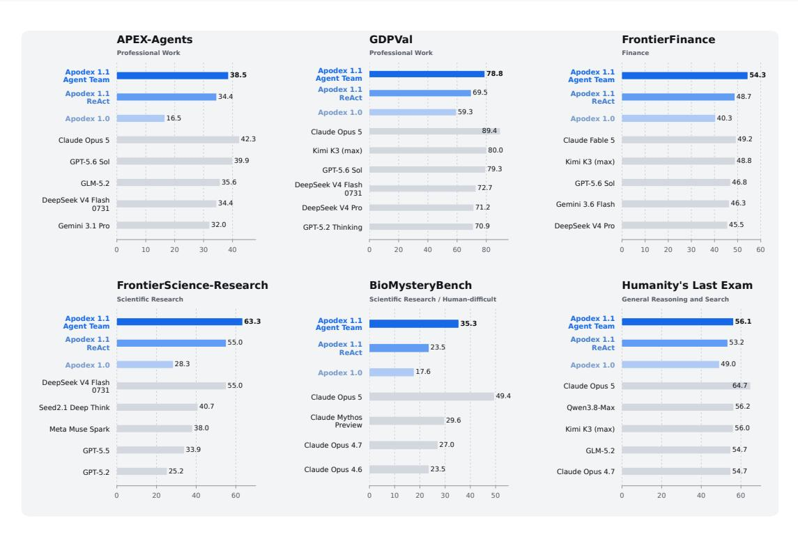
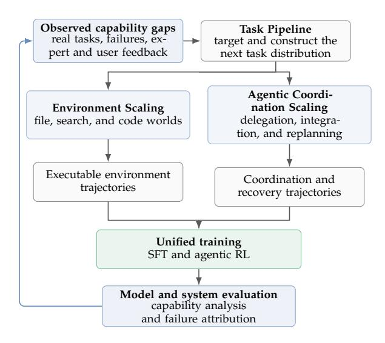
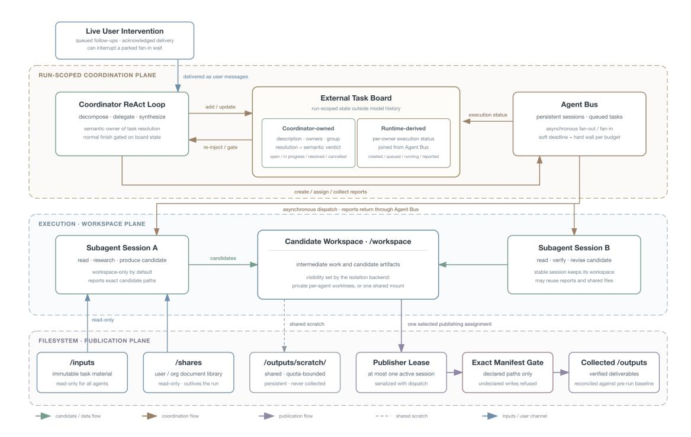
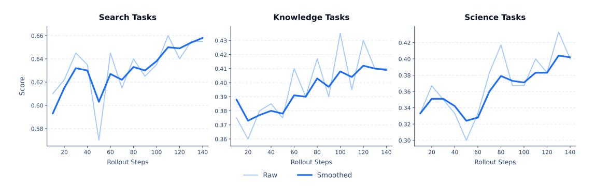
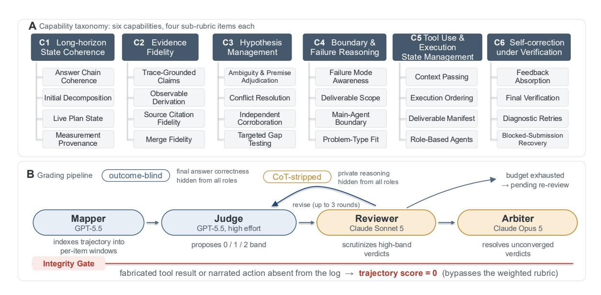
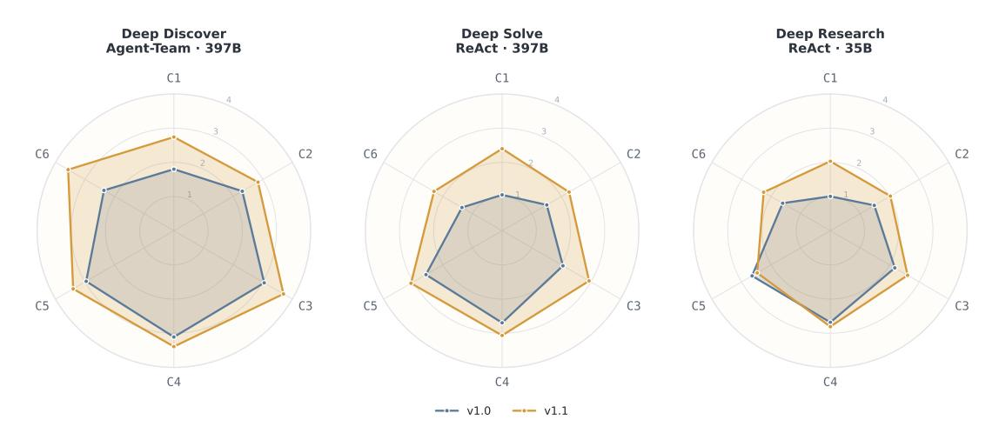
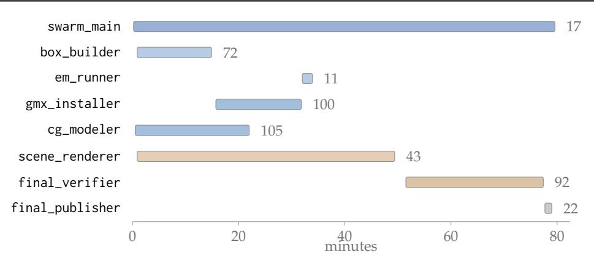

# Apodex 1.1: Scaling Agentic Intelligence for Complex Work

- 원제: Apodex 1.1: Scaling Agentic Intelligence for Complex Work
- 원문: [https://arxiv.org/abs/2608.23283](https://arxiv.org/abs/2608.23283)
- PDF: [https://arxiv.org/pdf/2608.23283v2](https://arxiv.org/pdf/2608.23283v2)
- arXiv ID: `2608.23283`

---


# Apodex 1.1: 복잡한 작업을 위한 에이전트 지능 확장 (Apodex 1.1: Scaling Agentic Intelligence for Complex Work)

Apodex 팀

**공식 웹사이트** <https://www.apodex.ai>

**API 플랫폼** <https://platform.apodex.ai>

**GitHub 저장소** <https://github.com/ApodexAI/FrontierAgent>

**모델 가중치** <https://huggingface.co/collections/apodex/apodex-11>

## 개요 (Abstract)

일반 목적 언어 모델은 추론하고 지식을 합성할 수 있지만, 복잡한 작업은 파일, 정보원, 실행 가능한 코드와의 지속적인 상호작용과 상태 유지, 실패 복구, 검증 가능한 전달을 필요로 한다. 우리는 이를 *작업 능력(working capability)*이라고 부른다: 현실 세계 목표를 향한 지속적이고 검증 가능한 진전. Apodex 1.1은 이 능력을 두 가지 상호 보완적 차원에서 개발한다. *환경 확장(Environment Scaling)*은 실행 파일, 검색, 코드 환경의 다양성과 검증 가능성을 확장하고, *에이전트 조정 확장(Agentic Coordination Scaling)*은 에이전트가 장기 목표 작업을 분해하고, 병렬 작업을 위임하며, 비동기 결과를 통합하고, 재계획하도록 훈련한다. 공유 실행 하네스와 AgentOS는 도구와 에이전트 간에 작업 상태와 출처를 유지하며, 훈련은 환경 궤적과 조정 추적을 신뢰할 수 있는 행동으로 전환한다. 복잡한 전문 작업, 금융, 과학 연구, 수학, 코딩, 검색 전반에서 Apodex 1.1은 많은 최첨단 시스템보다 훨씬 작은 모델을 사용함에도 선도적인 성능 대역에 도달한다. 35B-파라미터 Apodex 1.1 Mini는 로컬 배포 가능한 형태에서도 강력한 작업 능력을 유지한다. 이 결과는 시간이 지남에 따라 완료되는 유용하고 검증 가능한 작업에 에이전트 지능을 기반화하고, 야심찬 장기 실행 작업을 위한 *Heavy-Duty Solver*를 구축하려는 우리의 목표를 진전시킨다.



Figure 1: Apodex 1.1은 전문 작업, 금융, 과학 연구, 일반 추론 전반에서 선도적인 성능 대역에 도달한다.

## 목차 (Contents)

| 1 | ## 서론 (Introduction) | 3 |
|---|------------------------------------------------------------------|----|
| 2 | ## 핵심 통찰 및 설계 원칙 (Core Insights and Design Principles) | 4 |
|  | ## 2.1 완성된 작업은 에이전시 지능의 단위이다 (Completed Work Is the Unit of Agentic Intelligence) | 4 |
|  | ## 2.2 실행 가능한 환경은 확장 표면이다 (Executable Environments Are a Scaling Surface) | 6 |
|  | ## 2.3 에이전시 조정은 확장 표면이다 (Agentic Coordination Is a Scaling Surface) | 6 |
|  | ## 2.4 공통 하네스가 두 확장 차원을 연결한다 (A Common Harness Connects Both Scaling Dimensions) | 7 |
|  | ## 2.5 훈련은 두 확장 차원을 모두 활용한다 (Training Exploits Both Scaling Dimensions) | 7 |
|  | ## 2.6 평가가 확장 설계를 반영한다 (Evaluation Mirrors the Scaling Design) | 8 |
| 3 | ## Apodex 1.1 (Apodex 1.1) | 8 |
|  | ## 3.1 환경 확장 | 9 |
|  | ## 3.2 Apodex Agent Team 1.1: 상호작용적 자가 조직 팀 (Apodex Agent Team 1.1: Interactive Self-Organizing Teams) | 12 |
|  | ## 3.3 AgentOS: 장기 작업을 위한 실행 기질 (AgentOS: An Execution Substrate for Long-Horizon Work) | 14 |
|  | ## 3.4 훈련 (Training) | 18 |
| 4 | ## 평가 (Evaluation) | 19 |
|  | ## 4.1 경험적 설정 (Empirical Setup) | 19 |
|  | ## 4.2 주요 결과 (Main Results) | 20 |
|  | ## 4.3 역량 분석 (Capability Analysis) | 22 |
|  | ## 4.4 내부 평가 (Internal Evaluation) | 24 |
|  | ## 4.5 중장비 솔버(HDS6) 분석 (Heavy-Duty Solver (HDS6) Analysis) | 26 |
| 5 | ## 관련 연구 (Related Work) | 28 |
| 6 | ## 결론 (Conclusion) | 29 |
|  | ## 참고문헌 (References) | 30 |
| ## A (A) | ## 사례 연구 (Case Studies) | 35 |
| ## B (B) | ## 기여자 (Contributors) | 46 |

## <span id="page-2-0"></span>1 서론 (Introduction)

범용 언어 모델은 지식, 추론, 수학, 코딩 분야에서 급속히 발전했다. 그러나 모델이 정답을 제시할 수 있어도 많은 가치 있는 작업은 여전히 어려운 상태이다. 이는 작업이 장기적으로 전개되기 때문이다. 모델은 증거를 찾아 해석하고, 다양한 파일을 다루며, 코드를 실행하고 디버깅하고, 여러 단계에 걸쳐 일관된 계획을 유지하고 수정하며, 유효한 진행을 버리지 않고 실패한 행동에서 회복하고, 다른 사람이 검토하거나 계속 사용할 수 있는 산출물을 제공해야 한다. 추론-행동, 학습된 도구 사용, 상호작용 에이전트 평가에 관한 선행 연구는 답변 품질과 신뢰할 수 있는 행동 사이의 격차를 드러냈다 [(Yao et al.,](#page-32-0) [2022;](#page-32-0) [Schick](#page-31-0) [et al.,](#page-31-0) [2023;](#page-31-0) [Liu et al.,](#page-31-1) [2023;](#page-31-1) [Xie et al.,](#page-32-1) [2024)](#page-32-1). 따라서 한계는 고립된 추론이 아니라, 추론을 변화하는 환경 속에서 지속적인 작업으로 전환하는 능력이다.

Apodex 1.1은 복잡한 작업을 위해 에이전트 지능을 확장하는 범용 모델 및 실행 시스템이다. 우리는 이 목표를 *작업 수행 능력*으로 정의한다: 목표를 이해하고 도구와 상태 기반 환경을 통해 행동하며, 관측이 문제를 바꾸면 계획을 수정하고, 실패에서 회복하며, 납품 계약을 만족시키는 장기적 유용한 진전을 이룰 수 있는 능력. 이 능력의 단위는 고립된 응답이 아니라 완성된 작업이다. 이는 장기 전문 워크플로우, 아티팩트 중심 파일 및 코드 작업, 개방형 과학 및 금융 조사, 그리고 검증 가능해야 하는 어려운 추론 문제 등 장기적 업무에 적용된다. 작업 수행 능력은 점점 더 야심차고 장기적이며 검증 가능한 작업을 책임질 수 있는 *Heavy-Duty Solver*라는 장기 목표의 모델 수준 기반이다.

우리는 작업 수행 능력을 두 가지 상호 보완적인 확장 차원에서 개발한다. 첫 번째는 *환경 확장*이다: 모델이 학습하고 행동하는 파일, 검색, 코드 세계의 다양성, 충실도, 검증 가능성을 확장한다. 이러한 환경은 상태, 도구, 전이, 상호작용 예산, 실패 조건, 완료 검사를 지정한다. 이들은 행동, 관측, 파일 변경, 코드 출력, 회복 결정, 그리고 산출물을 학습 분포의 일부로 만들며, 도구를 정적 예시와 연결된 텍스트 설명으로 취급하지 않는다.

두 번째는 *에이전트 조정 확장*이다: 에이전트, 작업 분기, 시간에 걸쳐 작업이 조직되는 방식을 확장한다. Apodex 1.1은 목표를 분해하고, 작업을 위임하고, 비동기 결과를 통합하고, 공유 계획을 수정하며, 미완성 분기를 재구성하는 방법을 학습한다. *에이전트 팀(Agent Team)*은 증거 수집, 파일 분석, 구현, 검증, 반분석을 통한 적응형 병렬 노력을 통해 이러한 행동을 실현한다. 기존 시스템은 대화형 조정, 역할 전문화, 다중 에이전트 가설 생성에서 이득을 보여준다 [(Wu et al.,](#page-32-2) [2023;](#page-32-2) [Hong et al.,](#page-30-0) [2023;](#page-30-0) [Chen et al.,](#page-30-1) [2023;](#page-30-1) [Gottweis](#page-30-2) [et al.,](#page-30-2) [2025)](#page-30-2). 따라서 관련 확장 변수는 단순히 에이전트 수나 샘플 수가 아니라 목표가 진화함에 따라 조정될 수 있는 유용한 작업량이다.

두 차원 모두 공통 실행 하네스에 의존한다.  
하네스는 모델을 File, Search, Code 환경에 연결하고, 워크스페이스, 아티팩트, 출처, 브랜치 상태를 유지하며, 관찰 및 완료 계약을 정의하고, 재생 및 검증 훅을 제공한다.  
AgentOS는 이 하네스 아래에 지속적인 런타임을 제공하며, 도구, 에이전트, 컨텍스트 압력, 개입, 부분 실패 전반에 걸쳐 권위 있는 상태를 보존한다.  
같은 실행 계약은 훈련 중 트레젝터리 수집과 런타임에서 지속적인 작업 실행을 지원하며, 환경 상호작용과 에이전트 조정을 공통 모델-시스템 스택 내에 유지한다.

훈련은 두 스케일링 차원을 모두 활용하도록 조직된다.  
통합된 SFT 혼합은 추론, 도구, 복구, 전달, 다중 에이전트 조정 전반에 걸쳐 공통 행동을 확립한다.  
그 다음에 에이전트 기반 RL은 실행 가능한 환경 트레젝터리와 조정 추적을 통한 장기 결정력을 향상시킨다.  
실제 작업, 벤치마크 오류, 런타임 실패는 역량 격차로 분류된다; Task Pipeline은 그 격차를 새로운 작업으로 변환한다; Environment Scaling은 해당 세계와 검증자를 제공한다; 평가, 전문가 리뷰, 사용자 피드백은 다음 훈련 노력 배분을 결정한다.  
우리는 *self-evolution*을 이 관리된 엔지니어링 루프에만 사용하고, 무제한 모델 자체 수정에는 사용하지 않는다.

평가는 이 분해를 반영한다.  
ReAct는 모델의 작동 능력을 낮은 스캐폴드 관점에서 제공하며, Agent Team은 훈련된 조정 행동과 추가 조직화된 계산에서 얻은 시스템 수준의 향상을 측정한다.  
전체 Apodex 1.1 Agent Team 시스템은 우리 FrontierFinance 및 FrontierScience-Research 비교에서 보여지는 가장 강력한 값을 달성하며, 전문 작업, 추론, 검색, 수학, 코딩 전반에서 경쟁력을 유지한다.  
35B-파라미터 Apodex 1.1 mini는 보완적인 효율성을 제공하며, 선택된 프론티어 시스템의 성능 대역에 도달하고, 겹치는 작업에서 Apodex 1.0 mini보다 현저히 향상된다.  
공유된 주요 표 뒤에는 역량 분석과 엔드-투-엔드 사례가 따른다.  
모델, 스케일된 환경, 조정 패러다임, 하네스, 훈련 루프가 함께 Apodex 1.1을 Heavy-Duty Solver로 향하는 구체적인 단계로 만든다.

**공헌.** 보고서는 다음과 같은 공헌을 한다:

- **장기적 복잡한 작업을 위한 에이전트 지능 확장.** Apodex 1.1은 추론, 도구 사용, 파일 처리, 코드 실행, 상태 유지, 복구, 전달을 분리된 전문 모드가 아니라 공통 정책으로 개발한다.
- **작업 능력을 위한 환경 확장.** 다양하고 신뢰할 수 있으며 검증 가능한 파일, 검색, 코드 환경은 통합 정책이 학습할 수 있는 실행 가능한 궤적 분포를 확장한다.
- **조직적 작업을 위한 에이전트 조정 확장.** Apodex는 위임, 단계별 결과 통합, 공유 상태 수정, 동적 재계획을 모델 행동으로 훈련시키며, Agent Team은 이를 런타임에서 적응형 비동기 작업으로 구현한다.
- **두 확장 차원을 위한 공통 실행 하네스.** 하네스는 모델을 실행 가능한 환경, 지속적인 작업 공간 및 분기 상태, 아티팩트 출처, 재생, 검증에 연결하며, AgentOS가 기본 런타임을 제공한다.
- **환경 및 조정 궤적 전반에 걸친 훈련.** 통합 SFT와 에이전트 RL은 실행 가능한 작업 추적 및 Agent Team 상호작용을 사용해 하나의 정책 안에서 작업 실행, 복구, 전달, 조정을 개선한다.
- **일반 능력에서 전문 전달까지의 평가.** 주요 벤치마크 표 뒤에는 과학, 금융 및 전문 파일 작업, IMO 금메달 수준 수학, 코딩, 내부 장기 작업, 종단 사례에 대한 분석이 이어진다.

## <span id="page-3-0"></span>2 핵심 통찰력 및 설계 원칙 (Core Insights and Design Principles)

Apodex 1.1은 모델 수준의 관찰을 기반으로 한다: 고품질 추론은 복잡한 작업에 필요하지만 충분하지 않다, 특히 작업이 장기적으로 전개될 때. 에이전시 지능을 확장하려면 모델이 환경에서 행동하고, 권위 있는 상태를 보존하며, 중간 결과를 더 나은 결정으로 전환하고, 유효한 진행을 잃지 않고 복구하며, 추가 계산을 조직하고, 검증 가능한 전달 목표를 충족해야 한다. 우리의 장기 목표는 점점 더 야심차고 장기 실행되는 작업에 책임을 질 수 있는 *Heavy-Duty Solver*이다. 우리는 이 보고서 전반에 걸쳐 사용되는 동일한 서사 순서에 따라 설계를 여섯 가지 원칙에 따라 구성한다: 완료된 작업 정의, 환경 확장, 에이전시 조정 확장, 공통 하네스로 양쪽 연결, 결과 경로를 통한 학습, 그리고 나타나는 역량 평가.

### <span id="page-3-1"></span>2.1 완료된 작업이 에이전시 지능의 단위이다

전통적인 언어 모델 평가는 종종 프롬프트를 답변에 매핑하지만, 에이전시 벤치마크는 점점 정책을 상호작용 세계에 배치하고 결과 상태를 평가한다 [(Liu et al.,](#page-31-1) [2023;](#page-31-1) [Yao](#page-32-3) [et al.,](#page-32-3) [2024;](#page-32-3) [Xie et al.,](#page-32-1) [2024;](#page-32-1) [Vidgen et al.,](#page-32-4) [2026)](#page-32-4). 우리는 이 보고서 전반에 걸쳐 하나의 작업 계약을 사용한다:

<span id="page-3-2"></span>

$$\mathcal{E} = (\mathcal{W}, W_0, q, \mathcal{A}, \mathcal{T}, \Omega, \mathbf{B}, D, V_D). \tag{1}$$

여기서 W는 작업 공간-상태 공간이며, *W*<sup>0</sup> ∈ W는 초기 작업 공간이다; *q*는 목표이며; A는 해결자에게 사용 가능한 행동 집합이다; T는 상태 전이 연산자이며; Ω는 관측 인터페이스이고; *B*는 자원 예산 벡터이며; *D*는 전달 계약이고; *V<sup>D</sup>*는 해당 계약과 연결된 작업 수준 검증자이다. 전이 연산자는 확률적일 수 있으므로, 재생을 위해서는 환경 매니페스트가 작업이 노출하거나 제어하는 외생 상태, 도구 버전, 그리고 난수 시드를 보존해야 한다. 예산 벡터는 턴, 도구 호출, 토큰, 벽시계 시간, 또는 동시 실행을 제한할 수 있다. 이후 섹션에서는 스칼라 예산이 필요할 때 *B*turn 또는 *B*tool과 같은 명명된 구성 요소를 사용한다.

초기 사용자 입력 *u*<sup>0</sup>는 자연어 작업 요청이다. 목표 *q*는 그 요청에서 유도된 정규화된 작업 목표이며, 전달 계약 *D*는 무엇을 전달해야 하는지, 전달물에 적용되는 제약 조건, 그리고 완료가 어떻게 판단되는지를 명시한다. 따라서 *u*<sup>0</sup>와 *q*는 관련이 있지만 동일하지 않은 객체이다: 전자는 입력 메시지이고, 후자는 작업 사양의 일부이다. *D*의 수락 조항은 작업별이며 *q*, 요청된 전달물, 그리고 적용 가능한 제약 조건을 함께 도출한다. *q*와 *D*는 하나의 작업 계약 내에서 고정되지만, 다른 작업은 서로 다른 (*q*, *D*) 쌍을 인스턴스화할 수 있다. 요청된 결과를 바꾸지 않고 증거, 우선순위, 또는 방법을 명확히 하는 사용자 메시지는 같은 작업의 일부로 남는다. 목표 또는 필수 전달물을 실질적으로 변경하는 메시지는 새로운 작업 계약을 인스턴스화한다, 심지어 런타임이 이전 작업의 유효한 작업 공간 상태를 재사용하더라도.

작업공간(workspace)은 로컬 파일, 검색된 증거, 실행 가능한 상태, 그리고 이전에 생성된 아티팩트를 포함할 수 있다. U는 사용자 메시지(U)의 공간이다. 실행 중에 t > 0에 대해 u^t ∈ U ∪ {∅}는 비동기 사용자 개입(u^t)을 나타낸다; 개입이 없는 결정 단계에서는 비어 있다. 개입의 수용은 모델이 선택한 행동이 아니라 추적에 기록되는 런타임 업데이트이다. 다음 모델 행동 전에 런타임은 개입과 그에 수반되는 아티팩트를 솔버-가시 작업 상태(W^t)에 수용한다. 따라서 W^t는 이 수용 단계 이후의 작업공간을 나타낸다. 모델은 이후 a^t ∈ A를 선택한다. 행동은 환경 도구(environment tool)를 호출하거나, 조정 도구(coordination tool)를 업데이트하거나, 하위 에이전트(subagent)를 배포하거나 수집하거나, 솔버-가시 검증기(solver-visible verifier)를 호출할 수 있다. 환경은 행동을 작업공간에 적용하고 관찰(observation)을 반환한다:

$$W_{t+1} = \mathcal{T}(W_t, a_t), \tag{2}$$

$$o_{t+1} = \Omega(W_t, a_t, W_{t+1}).$$

(3)

여기서 *u<sup>t</sup>*는 사용자 입력을 위해 예약되어 있고, *ot*+<sup>1</sup>*는 도구나 런타임으로부터의 솔버가 볼 수 있는 응답이다. 특히, 서브에이전트 보고서, 솔버가 볼 수 있는 검증기 결과, 도구 실패, 타임아웃, 실행 상태 업데이트는 도구 응답이며 사용자 입력이 아니다. 무작위 전이(노-옵)는 읽기 전용 행동을 허용한다. 작업 보드와 같은 조정 상태는 *W<sup>t</sup>* 내부에 존재하며 일반 도구 호출을 통해 읽거나 변형할 수 있다; 그 스키마는 Section [3.3,](#page-13-0)에서 설명된 harness 선택이며 일반 작업 정의의 일부가 아니다.

Let *H* denote the realized trajectory horizon and let

$$\tau_H = (u_0, a_0, o_1, \dots, u_{H-1}, a_{H-1}, o_H)$$

(4)

실행 추적을 나타낸다. 여기서 *u*<sup>0</sup>*는 초기 요청이며, *t* > 0인 경우 *u<sup>t</sup>*는 비동기 개입을 기록하거나 개입이 없으면 ∅를 기록한다. 자연어 답변이나 보고서는 *WH*의 아티팩트가 될 수 있지만, 그것만으로는 성공을 정의하지 않는다. 작업 수준 검증기는 계약별 결과를 반환한다

<span id="page-4-0"></span>

$$S_D = V_D(W_0, W_H, \tau_H) \in \mathcal{Y}_D, \tag{5}$$

여기서 Y*<sup>D</sup>*는 *D*의 조항에 의해 유도된 결과 공간이며, *S<sup>D</sup>*는 스칼라 점수, 검사 벡터, 또는 구조화된 판결일 수 있다. 이 최종 검증기는 솔버에 도구로 노출되는 검증기와 개념적으로 구분된다: 후자는 일반 관측값 *ot*+<sup>1</sup>*를 생성하여 추가 작업을 안내할 수 있지만, *V<sup>D</sup>*는 완료된 전달물을 판단한다. *D*의 개별 조항은 테스트, 정확한 재계산, 소스 정렬, 구조화된 루브릭, 또는 인간 검토를 사용할 수 있다. 따라서 성공은 유용한 결과와 입력에서 전달물까지의 정당화 가능한 경로를 모두 요구한다.

이 공식화는 제목 주장을 구체화한다. 복잡한 작업을 위한 에이전트 지능을 확장하려면 에이전트가 궤적 전반에 걸쳐 진행을 지속하고, 파일, 코드, 증거 및 아티팩트 간의 유효한 종속성 및 출처 관계를 보존하며, 관측값이 문제를 변경할 때 계획을 수정하고, 실패한 행동에서 회복하면서 유효한 작업을 삭제하지 않으며, 실행 가능하고 증거적 제약을 만족시키는 것이 필요하다. 이는 과학적 분석, 저장소 작업, 전문 문서 제작, 명령줄 작업에도 동일한 추상화를 적용한다.

### <span id="page-5-0"></span> 2.2 실행 가능한 환경은 확장 표면 (Executable Environments Are a Scaling Surface)

전통적인 스케일링은 모델 파라미터, 데이터, 또는 추론 연산량을 확장한다. 작업 능력은 또 다른 중요한 표면을 도입한다: 정책이 행동을 학습하는 환경이다. 실행 가능한 환경은 모델이 관찰할 수 있는 상태, 취할 수 있는 행동, 그 행동이 세계를 어떻게 바꾸는지, 어떤 실패를 겪는지, 그리고 완료가 어떻게 검증되는지를 결정한다. 재현 가능한 대화형 벤치마크는 성공이 도구 설명만이 아니라 진화하는 브라우저, 데스크톱, 저장소, 데이터베이스, 또는 파일 상태에 달려 있음을 보여준다 [(Zhou et al.,](#page-33-0) [2023;](#page-33-0) [Drouin et al.,](#page-30-3) [2024;](#page-30-3) [Xie](#page-32-1) [et al.,](#page-32-1) [2024;](#page-32-1) [Yang et al.,](#page-32-5) [2024)](#page-32-5).

방정식 [(1)](#page-3-2)는 환경 구축이 확장할 수 있는 부분을 구분한다: 초기 작업공간과 목표(*W*0, *q*), 허용된 행동 A, 전이 및 관측 구조 (T , Ω), 자원 계약 *B*, 그리고 전달-검증 쌍 (*D*, *VD*). 따라서 환경을 확장하는 것은 더 많은 프롬프트를 생성하는 것과 동일하지 않다. 이는 정책이 일반화해야 할 실행 가능한 작업 계약의 분포를 확장하면서 유효한 전이와 평가 가능한 결과를 보존한다. 충실도 없이 다양성은 실제 도구에서 실패하는 행동을 가르치고, 충분한 범위 없이 충실도는 소수의 워크플로우에 과적합된다; 검증 없이 상호작용은 완료된 작업보다 그럴듯한 활동을 보상한다.

Apodex 1.1은 따라서 보완적인 파일, 검색, 코드 세계를 확장한다. 파일 환경은 모델이 이질적인 아티팩트를 검사하고 변환하며 보존하도록 가르치고; 검색 환경은 불완전한 정보 하에서 증거 획득과 조정을 가르치며; 코드 환경은 실행 가능한 변환, 테스트, 복구를 가르친다. 이들의 조합이 중요하다: 검색에서 발견된 증거는 코드의 입력이 되어야 하고, 코드는 권위 있는 파일 버전을 대상으로 해야 하며, 결과 아티팩트는 두 가지 모두와 방어 가능한 관계를 유지해야 한다. 환경 스케일링은 이 범위를 개별 도구 전문가가 아닌 공통 정책을 위한 훈련 궤적로 전환한다.

### <span id="page-5-1"></span>2.3 에이전트적 조정은 확장 표면이다 (Agentic Coordination Is a Scaling Surface)

장기 작업은 조정 문제와 계산 문제를 동시에 만든다. 능력 있는 모델은 목표를 어떻게 분해할지, 어떤 분기가 독립적으로 진행될 수 있는지, 부분 결과가 공유 계획을 언제 바꿔야 하는지, 그리고 오래된 작업이 언제 중단되어야 하는지를 결정해야 한다. 이는 추론 시 래퍼의 속성만이 아니라 훈련 궤적에 나타낼 수 있는 정책 행동이다. 다중 에이전트 프레임워크는 역할 기반 대화, 소프트웨어 개발 조직, 토론, 그리고 동적 과학 가설 생성을 탐구했다 [(Wu et al.,](#page-32-2) [2023;](#page-32-2) [Hong et al.,](#page-30-0) [2023;](#page-30-0) [Qian et al.,](#page-31-2) [2023;](#page-31-2) [Du et al.,](#page-30-4) [2023;](#page-30-4) [Gottweis et al.,](#page-30-2) [2025)](#page-30-2).

따라서 Agent Team의 중요한 속성은 에이전트 수나 병렬 샘플 수가 아니다. 그것은 활동적인 작업을 통해 결과, 결정, 사용자 피드백이 지속적으로 이동하는 것이다. 서브에이전트는 사용 가능한 즉시 유용한 중간 결과를 반환한다. 리드 에이전트는 그 결과를 공유 상태에 통합하고, 우선순위를 수정하며, 다른 분기를 알리거나 종료하고, 증거가 문제를 바꾸면 새로운 작업 흐름을 만든다. 느리거나 실패한 분기는 다른 곳에서 완료된 작업을 지우지 않으며, 사용자는 다른 분기가 계속되는 동안 우선순위를 바꾸거나 경로를 중단할 수 있다.

Apodex는 모델의 작업 정책의 일환으로 분해, 위임, 결과 통합 및 재계획을 훈련시키고, 이후 런타임에 Agent Team을 통해 이러한 행동을 구현한다. 병렬 실행은 폭을 제공하고, 단계적 반환과 재계획은 피드백을 제공하며, 공유 상태는 한 분기가 다른 분기의 가치를 향상시킬 수 있게 하고, 명시적 종료는 오래된 작업이 남은 예산을 소비하는 것을 방지한다. 우리는 이 공동 훈련-런타임 패러다임을 *Agentic Coordination Scaling*이라고 부른다. 이는 조직을 확장한다

작업은 샘플 수를 단순히 늘리는 대신 에이전트, 작업 분기, 시간에 걸쳐 확장된다

### <span id="page-6-0"></span>2.4 공통 하네스가 두 확장 차원을 연결한다

환경 확장과 에이전트 조정 확장은 공유 실행 계약을 필요로 한다. 환경 측면에서 하네스는 도구, 관찰, 작업 공간 상태, 산출물, 상호작용 예산, 완료 검사를 정의한다. 조정 측면에서는 하위 에이전트 실행 상태, 단계적 반환, 공유 산출물, 수명 주기 제어, 검증 훅을 정의한다. 하나의 계약을 사용하면 궤적 수집, 재생, 훈련, 런타임 실행이 정렬된 상태를 유지하고, 각 기능이 호환되지 않는 인터페이스 뒤에서 개발되는 것을 방지한다

장기 작업은 더 큰 컨텍스트 창으로 환원될 수 없다. 작업은 외부 상태를 축적한다: 파일이 생성되고 수정되며, 증거가 수락되거나 거부되고, 프로그램이 출력을 생성하며, 중간 산출물이 이후 결정의 종속성이 된다. 전사본을 확장한다고 해서 이러한 객체가 권위적이거나 인과적으로 일관된 상태를 유지한다는 보장은 없다. 따라서 AgentOS는 하네스 아래에 지속적인 런타임을 제공하여 검색, 파일 처리, 코드 실행, 산출물, Agent Team 결과를 하나의 작업 상태에 유지한다

지속적인 상태는 개입과 복구를 조합 가능하게 한다. 새로운 데이터가 가설을 바꾸거나, 중간 결과가 잘못된 입력을 드러내거나, 사용자 입력이 미완성 작업을 재지정할 수 있다. 이는 작업 수준 목표나 전달 계약을 변경하지 않는다. 하네스는 영향을 받지 않은 산출물을 보존하고, 종속성이 변경된 자손을 무효화하며, 인과적으로 독립적인 진행을 버리지 않고 보류 중인 작업을 수정해야 한다. 사용자가 *q* 또는 *D*를 실질적으로 변경하면 런타임은 유효한 상태를 이어갈 수 있지만, 공식은 연속을 새로운 작업 계약으로 처리한다

같은 계약은 사적인 사고 과정을 노출하지 않고 검사와 검증을 지원한다. 운영 기록은 계획, 활성 및 완료된 단계, 산출물, 종속성, 실패, 필수 결정, 다음 행동을 드러낸다. Statement Review는 이후 주장들을 출처, 계산, 산출물 계통과 대조한다. 관련 접근법은 반복적 자기 피드백, 언어적 강화, 독립적 검증 질문, 또는 학습된 프로세스 보상을 사용한다 [(Madaan et al.,](#page-31-3) [2023;](#page-31-3) [Shinn et al.,](#page-32-6) [2023;](#page-32-6) [Dhuliawala et al.,](#page-30-5) [2023;](#page-30-5) [Lightman et al.,](#page-30-6) [2023)](#page-30-6); 여기서 이러한 검사는 두 확장 차원 모두에 공유되는 지속적인 실행 상태에 부착된다

### <span id="page-6-1"></span>2.5 훈련은 두 확장 차원을 모두 활용한다

런타임 조정만으로는 신뢰할 수 있는 파일 처리, 코드 실행, 추론, 또는 장기 제어를 만들 수 없다. 반대로 분리된 답변을 대상으로 훈련하면 실행 가능한 환경에서 신뢰성 있게 동작하는 모델을 구축할 수 없다. 그림 [2](#page-7-2)는 두 확장 차원이 모델 역량으로 변환되는 방식과 관찰된 실패가 다음 개발 주기를 결정하는 방식을 보여준다

Training은 두 스케일링 차원을 모델 역량으로 전환하는 메커니즘이다. Environment Scaling은 명시적 상태 전이와 검증자를 갖는 실행 파일, 검색, 코드 궤적을 생성한다. Agentic Coordination Scaling은 분해, 위임, 단계적 반환, 통합, 재계획, 복구의 흔적을 생성한다. 통합된 SFT 혼합은 공통 작업 실행 및 조정 행동을 확립하며, agentic RL은 두 궤적 계열에 걸친 장기 결정력을 향상시킨다. Toolformer은 자기지도형 도구 호출 학습을 확립했으며, Search-R1, RAGEN, 그리고 최근의 agentic-RL 시스템은 검색 또는 다중 턴 환경 상호작용에 대한 정책을 최적화한다 [(Schick et al.,](#page-31-0) [2023;](#page-31-0) [Jin et al.,](#page-30-7) [2025;](#page-30-7) [Wang et al.,](#page-32-7) [2025c](#page-32-7)[;b;](#page-32-8) [Yao et al.,](#page-32-9) [2025)](#page-32-9).

루프는 의도적으로 제어된다. 런타임 실패와 벤치마크 오류는 다음 환경, 조정 예시, 작업이 구축되어야 할 위치를 결정한다; 전문가와 사용자 피드백은 어떤 격차가 중요한지를 결정하며, 이후 훈련은 그에 따라 노력을 재배치한다. 따라서 훈련은 세 번째 독립 스케일링 축으로 제시되지 않는다. 이는 Apodex가 첫 두 차원에 의해 확장된 세계와 조정 구조에서 학습하는 방식이다.

<span id="page-7-2"></span>

Figure 2: 제어된 역량 개발 루프. Environment Scaling과 Agentic Coordination Scaling은 훈련에 사용되는 실행 가능한 궤적을 생성한다; 평가, 실제 실패, 인간 피드백은 다음 Task Pipeline이 목표로 삼아야 할 역량 격차를 결정한다.

### <span id="page-7-0"></span>2.6 평가가 스케일링 설계를 반영한다 (Evaluation Mirrors the Scaling Design)

우리는 agentic 인텔리전스를 작업 역량을 통해 측정한다. 이는 본질적으로 다목적이다. 우리는 작업 정확성, 산출물 완전성, 출처 신뢰성, 도구 또는 가정 실패에서의 복구, 개입에 대한 반응, 실제 시간, 총 계산량을 구분한다. 답변 전용 점수는 이 벡터의 한 축만 관찰한다.

평가 설계는 앞서 도입된 층을 분리한다. ReAct 실행은 최소한의 스캐폴드를 사용해 기본 모델 정책을 드러내며, Agent Team 실행은 추가 조직화된 계산을 통해 훈련된 조정 행동이 달성할 수 있는 것을 측정한다. 주요 표는 공유 시스템 스냅샷을 제공하고, 역량 분석은 과학 연구, 전문 작업, 수학, 검색, 코딩, 내부 평가를 검토한다; 엔드투엔드 사례는 작업 공간 전이, 산출물, 전달을 검사한다. Section [4](#page-18-0)은 시스템을 단일 종합 점수로 축소하지 않고 이 결과를 보고한다.

이러한 원칙들은 다음에 기술된 기술적 분해를 의미한다. Apodex 1.1은 중앙에 위치한 범용 모델이다; Environment Scaling은 학습하고 행동하는 세계를 확장한다; Agentic Coordination Scaling은 작업 조직 방식을 확장한다; 하네스와 AgentOS는 지속적인 실행 상태를 통해 두 차원을 연결한다; SFT와 RL은 그 궤적에서 학습한다; 평가는 기본 정책, 조정된 시스템, 완성된 작업을 측정한다. 이는 강력한 언어 모델에서 보고서 나머지 부분에서 개발되는 Heavy-Duty Solver로 가는 경로다.

## <span id="page-7-1"></span>3 Apodex 1.1 (3 Apodex 1.1)

Apodex 1.1은 장기 작업을 위한 공통 정책 및 실행 스택으로 구성된다. 모델은 추론, 검색, 파일 조작, 코드 실행, 실패한 행동에서 복구, 병렬 작업 조정, 검증 가능한 산출물 전달을 학습하며, 이러한 행동을 분리된 전문 모드로 취급하지 않는다. 작업 공간은 논문, 측정값, 스프레드시트, 이미지, 또는 저장소로 시작할 수 있으며, 고정된 작업 목표 *q*와 전달 계약 *D* 하에 증거, 실행 가능한 분석, 중간 산출물, 최종 산출물을 축적한다.

아키텍처는 섹션 [2.](#page-3-0)에서 소개된 두 가지 스케일링 차원에 따라 설계된다. 환경 스케일링은 정책이 학습하고 행동하는 실행 파일, 검색, 코드 세계를 확장한다. 에이전트 조정 스케일링은 작업이 에이전트와 시간에 걸쳐 분해, 위임, 통합, 검증, 수정되는 방식을 확장한다. 공통 하네스는 두 차원을 지속적인 상태, 유형화된 관측, 재생, 완료 검사에 연결하며, AgentOS는 기본 실행 기초를 제공한다. 다음 섹션에서는 두 스케일링 차원, 그 런타임 지원, 그리고 그 궤적을 모델 역량으로 변환하는 훈련 과정을 설명한다.

### <span id="page-8-0"></span>3.1 Environment Scaling
  
  
3.1 환경 스케일링

복잡한 작업은 세계와의 상호작용을 통해 학습되며, 단지 정답만으로는 학습되지 않는다. 모델은 작업에 필요한 지식을 보유하고 있을 수 있지만, 권위 있는 파일을 찾지 못하거나 도구 호출 간에 상태를 보존하지 못하거나 실행 오류에서 복구하지 못하거나 상충되는 증거를 조정하지 못하거나 전달된 산출물이 실제로 완전한지 판단하지 못하면 실패한다. 이러한 실패는 주변적인 도구 사용 오류가 아니다. 이들은 추론이 긴 궤적 동안 신뢰할 수 있는 작업으로 전환될 수 있는지를 결정한다.

환경 스케일링은 이러한 세계의 구축을 주요 스케일링 표면으로 간주한다. 모델 스케일링은 정책 용량을 늘리고, 추론 스케일링은 한 작업에 할당되는 계산량을 늘린다; 환경 스케일링은 정책이 학습하는 실행 상황의 범위, 충실도, 구조적 깊이를 증가시킨다. 목표는 모델에 더 많은 도구를 부착하거나 더 많은 프롬프트를 생성하는 것이 아니다. 대신 공통 정책을 점점 더 다양한 상태 전이, 정보 획득 문제, 실패 모드, 검증 가능한 배달 요구사항에 노출시키면서 실제 작업의 인과 구조를 보존하는 것이다.

우리는 방정식 [(1)](#page-3-2)에서 정의된 작업 계약 E를 사용한다. 환경 스케일링은 초기 작업공간과 목표, 행동 공간 A, 전이 및 관측 구조(T, Ω), 자원 예산 *B*, 배달-검증 쌍에 대한 분포를 확장한다. Apodex 1.1은 파일, 검색, 코드 세계에 걸쳐 이 분포를 개발한 뒤, 세 가족 모두에 공통적인 구축, 검증, 재생 요구사항을 적용한다.

#### **3.1.1 Environment Families**
  
  
3.1.1 환경 가족 (Environment Families)

세 가족은 서로 다른 병목 현상을 강조하지만 하나의 작업 계약을 공유하며 동일한 궤적 내에서 조합될 수 있다. 파일 세계는 권한과 변환을 중심으로, 검색 세계는 발견과 증거 정렬을 중심으로, 코드 세계는 실행 변환과 검증을 중심으로 한다.

**파일 세계: 권한과 변환.** 프롬프트 내에 정보를 집중시키는 작업과 달리, 파일 지향 작업은 중첩 디렉터리, 과거 버전, 이종 형식, 파일 간 참조를 포함하는 작업공간에 필요한 정보를 분산시킨다. 프롬프트는 목표를 지정하고, 작업공간은 사실, 규칙, 맥락, 진화 역사를 담는다. 에이전트는 권위 있는 자료를 찾고, 파일 간 관계를 재구성하며, 중복되거나 오래된 기록을 필터링하고, 그 이해를 전문 산출물로 구현해야 한다.

파일 세계를 구축하는 것은 하나를 해결하는 역과 같다. 먼저 기초 비즈니스 상태, 권한 관계, 파생 논리, 배달 요구사항을 정의한 뒤 이를 작업공간에 투영한다. 파일 세계에서는 *W*<sup>0</sup>가 제공된 파일과 초기화된 실행 런타임을 포함하고, A는 검사, 파싱, 계산, 작성 동작을 포함하며, T는 편집과 실행 상태를 저장하고, Ω는 동작이 요청한 내용만 노출하면서 *B*의 관련 구성요소를 소비한다. 결과 산출물은 *D*를 만족해야 하며, 그 조항은 *VD*에 의해 판단된다.

파일-세계 스케일링은 범위와 구조적 깊이를 모두 확대한다. 범위는 직업에 따라 조정된다: 유지되는 시나리오 레지스트리가 도메인을 직업으로, 직업을 전달 가능한 클러스터로, 클러스터를 작업별 각도로 확장한다. 현재 레지스트리는 33개의 도메인, 318개의 직업, 1,208개의 전달 가능한 클러스터를 포함하며, 각도 레이어는 직업 내에서 별개의 작업을 생성한다. 구조적 깊이는 기여 시스템의 수와 역사, 재구성해야 하는 비즈니스 로직 체인의 길이, 프롬프트에서 복사되지 않고 문맥에서 추론해야 하는 전달 계약의 비율에 따라 달라진다. 이 차원들은 파일 수와 독립적이며, 디렉터리를 확장하는 것만으로는 세계를 더 어렵게 만들지 않는다

그 자체만으로는 더 어려운 세계를 만든다

검증은 독립적으로 복구 가능한 증거에 기반한다. 등급화된 양은 권위 있는 출처에서 코드로 재계산되거나 기록된 출처를 통해 실제 문서와 연결되어야 한다. 작업은 독립적인 도출이 일치하기 때문에 허용되며, 생성된 답변이 그럴듯해 보인다고 해서가 아니다

**검색 세계: 발견 및 증거 정렬.** 검색 환경은 오픈 웹 연구를 발견, 획득, 증거 종합으로 모델링한다. 에이전트는 구조화된 검색을 사용해 후보 소스를 발견하고, 가져오기를 통해 선택된 페이지를 검사하며, 일반 검색과 가져오기로 복구할 수 없는 정보를 위해 제한된 셸 경로를 사용한다

에이전트는 쿼리를 공식화하고 정제하며, 후보 소스를 선별하고, 참조를 따라가며, 증거를 조정하고, 지원이 충분한 시점을 결정해야 한다. 따라서 골드 객체는 최종 답변보다 풍부하다: 관련 소스 집합, 주장-증거 정렬, 그리고 소스가 충돌할 때 명시적 불확실성을 포함한다. 검색 출처의 기원은 의미적 지원이 제한된 모델 기반 검토를 필요로 할 때에도 정확한 출처를 유지한다.

검색-세계 확장은 단순히 말뭉치 크기를 늘리는 것이 아니라 획득 문제의 구조를 바꾼다. 증거는 소스에 분산될 수 있고, 초기 쿼리와 중간 개체에 의해 분리되며, 그럴듯하지만 권위가 없는 후보와 혼합되거나, 이질적인 접근 경로를 통해 노출될 수 있다. 더 깊은 구조는 쿼리 재구성, 소스 선별, 탐색, 교차 소스 조정, 그리고 규율 있는 중단을 요구한다.

**코드 세계: 실행 가능한 변환 및 검증.** 코드 세계는 에이전트가 저장소, 종속성, 프로세스를 변경한 뒤 결과 실행 상태로부터 피드백을 받는 상태 기반 환경이다. 구축은 재사용 가능한 인프라와 작업별 상태를 분리한다: 공유 기반 이미지가 인터프리터, 툴체인, 테스트, 공통 종속성을 제공하고, 각 작업은 자신의 저장소 상태와 요구 사항을 기여한다. 장기 꼬리 환경은 한 번 구축되어 캐시되므로 대부분의 새로운 세계는 반복적인 인프라 구축이 아니라 상태 조립의 연습이 된다.

커버리지는 실제 풀 리퀘스트에 기반한 수확된 세계와 저장소 배포를 넘어서는 합성 세계를 결합한다. 합성 작업은 검증된 시드에서 구성, 추상화 전환, 요청 변형, 적대적 입력 변화를 통해 확장된다. 이러한 변환은 기존 그레이더를 무효화할 수 있으므로, 검증자 강화가 작업 변형 전에 이루어져야 한다; 그렇지 않으면 결과는 새로운 실행 가능한 세계가 아니라 손상된 작업이 된다.

코드 검증은 샌드박스 실행에 기반한다. 수확된 세계들에서 실패-통과 테스트는 기본 상태에서 실패하고 참조 변경 후에는 통과해야 하며, 통과-통과 테스트는 두 상태 모두에서 성공해야 한다. 합성된 세계들은 외부 오라클이 없으므로 참조 솔루션을 통과하는 것만으로는 충분하지 않다. 우리는 또한 해결자가 실제로 과제를 완료하지 않고도 보상을 얻을 수 있는지 테스트하며, 샌드박스에서 성공한 공격만이 검증자 실패로 간주된다. 점수 매기는 과정은 해결자와 분리되어 있어 해결자가 검증자를 수정할 수 없도록 한다. 실패한 실행은 또한 구축 오류를 진단하는 데 사용된다: 수정 지점 이전에 통과하는 테스트는 잘못된 테스트 선택을, 수정 지점 이후에 실패하는 테스트는 컨테이너, 종속성, 실행 명령에 문제를 나타낸다. 이는 검증을 보상 해킹에 대한 방어이자 환경 수리를 위한 실행 가능한 피드백 소스로 만든다.

표 [1](#page-10-1)은 세 환경군의 서로 다른 구축 및 보증 경계를 요약한다.

#### **3.1.2 확장 범위 및 난이도 (Scaling Coverage and Difficulty)**

환경 분포를 확장한다는 것은 볼륨을 균일하게 늘리는 것이 아니라 능력 격차에 새로운 세계를 할당하는 것을 의미한다. 각 훈련 라운드 후, 실패한 궤적은 반복되는 실패 모드를 분석하고 이를 능력 수준 결함으로 추상화한다. 이러한 결함은 다음 Task Pipeline의 사양이 되어 현재 정책이 드러낸 약점에 맞춰 구축을 전환한다. 새로

<span id="page-10-1"></span>Table 1: 환경군과 그 보증 경계. “Exact”은 코드에서 파생되었거나 독립적으로 조정된 것을 의미하며, 언어 모델 판사만으로는 수락되지 않는다.

| 가족 | 구축 | 검증 경계 | 역할 |
|---------------|---------------------------------------------------|-----------------------------------------------|-------------------------------------|
| 파일 세계 | 전문가-조건화된<br>다중-형식 작업공간 | 코드 파생 값 또는<br>기록된 출처 | 권위와 변환 |
| 검색 세계 | 색인된 또는 공개 증거<br>소스 | 출처 + 주장 검토 | 발견 및 증거<br>정렬 |
| 코드 세계 | 저장소 및 상태 저장<br>샌드박스 | 테스트 + 아티팩트 검사 | 실행 가능한 변환 |

생성된 작업은 훈련 신호를 제공하기 전에 동일한 가족별 검증 파이프라인으로 다시 진입한다. 모델 기반 진단은 탐색 위치를 결정하고, 환경 검증은 어느 결과 세계가 훈련에 충분히 신뢰할 수 있는지를 판단한다.

난이도는 또한 세계가 가르치려는 행동에 맞춰 조정되어야 한다. 파일 및 검색 작업은 종종 제한된 정보 획득에 의해 지배된다: 권위 있는 경로가 명확할 때 파일, 페이지, 토큰이 많아져도 작업이 더 어려워지지 않는다. 이러한 획득 중심 세계에 대해, *N*cand(E)를 비용이 많이 드는 검사 필요가 있는 실현 가능한 후보 수, *N*hop(E)를 부하를 지탱하는 증거 전이 수, *B*tool(E)를 도구 호출 예산으로 두고, 우리는

$$\rho_{\rm acq}(\mathcal{E}) = \frac{N_{\rm cand}(\mathcal{E}) + N_{\rm hop}(\mathcal{E})}{B_{\rm tool}(\mathcal{E})}$$

(6)

이를 첫 번째 차수의 획득 압력 좌표로 사용하며, 환경 난이도의 보편적 척도로 사용하지 않는다. *ρ*acq 압력을 높이면 분류, 탐색, 상태 추적, 중지 규율이 강화된다. 코드 세계는 종속성 깊이, 상태 전이 깊이, 테스트 관측 가능성, 실패와 실행 가능한 검증 신호 사이의 거리를 포함한 다른 보정 좌표를 필요로 한다.

#### **3.1.3 Verification, Isolation, and Replay (검증, 격리 및 재생)**

확장 가능한 작업 분배는 상호작용 하에서도 피드백이 신뢰할 수 있을 때만 유용하다. 생성된 작업, 그 테스트, 그리고 참조 솔루션 간의 합의는 세 가지가 동일한 오류를 공유할 수 있을 때 불충분하다. 실행 가능한 검사, 독립적인 유도, 출처 제약, 또는 한정된 의미 검토는 후보 결과를 생성하는 경로 외부에서 검증자를 확립해야 한다. 무시된 솔버 프로브는 거짓 음성을 드러내며, 충실한 솔루션과 채점자 간의 불일치는 작업 구성으로 다시 전달되고 모델 실패로 조용히 재레이블되지 않는다.

각 롤아웃은 불변의 세계 매니페스트와 새로운 가변 샌드박스를 받는다. 하네스는 초기 상태를 재현하고 세션 전반에 걸쳐 보존하며, 닫기 또는 유휴 타임아웃 시 샌드박스를 회수한다. 스티키 라우팅은 세션을 한 워커에 유지한다. 학습 서비스는 대화와 보상을 구성하고, 하네스는 물리적 실행을 담당한다; 솔버 관찰, 숨겨진 검증자 상태, 사후 라벨은 분리된다.

트레이젝터리는 초기 상태를 재구성할 수 있고, 도구 실행이 격리되며, 검증자가 재생될 수 있을 때만 보존된다. 재생 기록에는 세계 시드와 생성기 버전, 도구 버전, 행동/관찰 시퀀스, 파일 델타, 검증자 버전, 종료 사유가 포함된다. 재생 검사는 트레이젝터리가 훈련 신호를 제공하기 전에 인프라 실패와 정책 실패를 구분한다.

<span id="page-10-0"></span>결과적인 구성 원칙은 “전방은 저렴하고 역방은 비싸다”이다. 생성기는 잠재 상태나 참조 프로그램을 사용해 세계를 저렴하게 구성하고 해결한다; 에이전트는 렌더링된 작업 공간만 보고 제약 하에서 관련 경로를 복구해야 한다. 이 비대칭성은 모든 유기적 작업이 기계적으로 증명된 의미를 갖는다고 가정하지 않고도 규모와 검증이 공존하도록 한다.

### 3.2 Apodex Agent Team 1.1: Interactive Self-Organizing Teams (상호작용적 자기조직화 팀)

Apodex 1.1은 Apodex 1.0 Agent Team [(Apodex Team,](#page-29-1) [2026)](#page-29-1)의 핵심 아키텍처를 유지한다: 주요(리드) 에이전트가 문제를 전역적으로 먼저 추론하고, 연구 가능한 하위 문제로 분해한 뒤 필요에 따라 특화된 서브에이전트를 구축한다. 따라서 팀은 고정된 역할 카탈로그에서 선택되는 것이 아니라 문제에 의해 유도된다. Apodex 1.1은 이 아키텍처를 지속적인 작업 보드에 외부화하고, 비동기 인간 개입, 비대칭 검증, 적응형 최대 팀 노력, 증거 기반 합성이라는 네 가지 기능을 추가한다.

#### **3.2.1 From Latent Decomposition to an Explicit Task Board (잠재적 분해에서 명시적 작업 보드로)**

Apodex 1.0에서는 분해가 주로 내부 조정 결정이었으며: 메인 에이전트가 질문을 추론하고 전문가 하위 에이전트를 배치했다. Apodex 1.1은 그 결정을 작업 상태의 명시적 부분으로 만든다. 위임 전에 메인 에이전트는 분해를 작업 보드에 기록한다. 보드 항목은 제한된 목표, 종속성, 해결 상태, 할당된 에이전트, 반환된 증거 또는 산출물을 기록한다. 보드는 단순히 사적 추론의 시각화가 아니다. 모델, 런타임, 사용자 간의 공유 조정 기록이다: 하위 에이전트는 보드에서 범위를 받으며, 완료된 작업은 보드에 첨부되고, 계획 수정은 도구 매개 편집으로 표현된다.

계획을 외부화하면 조정의 의미가 바뀐다. 결과는 즉시 종속 작업을 잠금 해제할 수 있고; 실패하거나 대체된 전제는 자손만 무효화할 수 있으며; 느린 분기점은 더 이상 독립 작업의 진행을 방해하지 않는다. 더욱 중요한 것은 메인 에이전트가 내부 전략을 검사 가능한 작업 상태와 지속적으로 조정해야 한다는 점이다. 이는 분해를 일회성 서문에서 장기 작업을 위한 지속적인 제어면으로 바꾼다.

#### **3.2.2 비동기 인간 개입**

실제 연구 과제는 시작 시에 명세가 부족하며 실행을 통해 더 잘 명시된다. 소스가 원래 전제가 틀렸음을 드러낼 수 있고, 예비 분석이 새로운 가설을 촉발할 수 있으며, 사용자가 떠오르는 보고서가 잘못된 목표를 최적화하고 있음을 인식할 수 있다. 실행 전만 명확히 할 수 있는 계획은 에이전트가 오래된 해석에 충실하도록 강제한다. Apodex 1.1은 대신 실행 중에 사용자 메시지 *u<sup>t</sup>* 를 받아 정책이 조정 도구를 통해 실시간 작업 보드를 업데이트하도록 한다. 기여는 인터럽트 버튼이 아니라, 개입이 무엇을 바꾸고, 무엇이 유효한지, 진행 중인 작업이 어떻게 이어져야 하는지를 결정하도록 훈련된 정책이다.

우리는 요구사항 명확화, 작업 사실 수정, 우선순위 변경, 새로운 파일 또는 증거, 수정된 가설 또는 방법, 소스 및 도구 제약, 예산 또는 마감일 변경, 일시정지–재개–취소 명령, 진행 상황 질의, 출력 형식 및 언어 선호, 그리고 무관한 부수 질문을 포함하는 개입 경로를 구축한다. 이러한 메시지는 서로 다른 행동을 요구한다. 수락 조항이 변하지 않는 명확화, 우선순위 변경, 방법 수정은 관련 보드 항목을 갱신하고, 영향을 받은 자손을 무효화하며, 활성 하위 에이전트에게 알리면서 를 보존한다. 메시지가 목표, 필수 산출물, 또는 수락 제약을 실질적으로 변경하면 런타임은 새로운 작업 계약을 시작하면서 유효한 작업 공간 상태를 그대로 이어간다. 작업 보존 질의는 독립 실행이 계속되는 동안 시기적절한 짧은 응답을 받는다. 이러한 경우를 통해 훈련된 메인 에이전트는 모든 작업을 재시작하거나 모든 사용자 메시지를 무차별적으로 최종 보고서에 첨부하기보다 인과 연속성을 보존하도록 학습한다.

이러한 공식화는 전면에 명확화만으로는 해결할 수 없는 경우를 다룬다. 사용자는 관련 정보가 생길 때 제공할 수 있고, 모델은 이미 투입된 계산을 포기하지 않고 진행 상황 질의에 답할 수 있다. 개입은 연구 과정 자체의 일부가 된다: 미래 행동을 변경하면서 인과적으로 유효한 완료된 작업을 보존한다.

#### **3.2.3 비대칭 검증**

Apodex 1.0은 주요 에이전트와 분리된 컨텍스트에서 충돌 검토자, 사실 확인자, 초안 검토자를 도입했다 [(Apodex Team,](#page-29-1) [2026)](#page-29-1). 컨텍스트 분리는 필수적이다. 왜냐하면 생성자의 전체 트레저리지를 상속받은 검증자는 동일한 가정에 쉽게 묶이기 때문이다. 단독의 독립성만으로는 충분하지 않다. 비슷한 역량을 가진 검증 에이전트가 전체 문제를 다시 해결하도록 요청받으면, 그 응답은 두 번째로 동일하게 제약이 없는 오류 체인을 도입할 수 있다. 그러면 검증자는 교정 신호가 아니라 또 다른 컨텍스트 오염의 원천이 된다.

Apodex 1.1은 *검증 비대칭성*을 구축한다: 검증은 의도적으로 생성보다 좁다. 전체 솔루션을 일상적으로 재생산하는 대신, 검증자는 특정 주장, 그 주장을 뒷받침하는 증거, 그리고 적용 가능한 전달 제약을 받는다. 그 임무는 반례를 찾고, 진정으로 독립적인 소스 클래스를 삼각측량하며, 이름, 날짜, 숫자, 공식과 같은 원자적 세부사항을 확인하거나, 형식 및 사양 요구사항 준수를 테스트함으로써 그 주장을 공격하는 것이다. 목표 지향적 검증 질문은 이미 생성과 검증 사이의 결합을 줄이는 것으로 알려져 있다 [(Dhuliawala](#page-30-5) [et al.,](#page-30-5) [2023)](#page-30-5); 여기서는 같은 원칙이 실시간 에이전트 팀 내에서 적용된다.

비대칭성은 작업에 있으며, 반드시 모델 크기와는 관련이 없다. 명시된 주장을 위조하거나 누락된 인용을 찾거나 계약 위반을 감지하는 것은 보고서를 처음부터 생성하는 것보다 덜 개방형 합성을 요구한다. 또한 더 실행 가능한 신호를 생성한다: 피드백은 논란이 되는 주장, 반증 증거 또는 실패한 검증, 그리고 필요한 수리를 명시한다. 따라서 주요 에이전트는 한 개의 보드 항목을 다시 열고, 집중된 후속 조치를 배포하며, 강력한 증거를 덮어쓰지 않고 수정을 통합할 수 있다.

#### **3.2.4 적응형 최대 팀 노력 (Adaptive Max Team Effort)**

테스트 타임 스케일링은 더 많은 추론 연산을 투입함으로써 어려운 또는 모호한 결론을 개선할 수 있지만, 균일한 스케일링은 이미 해결된 하위 문제에 예산을 낭비한다. Adaptive Max Team Effort는 이 원칙을 팀 수준에 적용한다: 주요 에이전트는 약하거나 논란이 있거나 부하를 지닌 주장에만 추가적으로 독립적으로 범위가 지정된 조사를 할당한다. 정책은 진정으로 다른 가설, 방법, 소스 클래스, 또는 질의 프레이밍을 따라 확산된다; 이후 파동을 미해결 또는 반증된 분기에 할당하며, 부하를 지닌 결론이 최종화되기 전에 집중된 검증을 요구한다. 할당은 각 반환 후에 수정되므로, 스케일링 변수는 고정된 에이전트 수나 샘플이 아니라 조정된 협업 작업에 유용하다. 이러한 행동은 훈련 트레저리에서 표현되고, 추론 시 Agent Team 실행 계약을 통해 활성화된다.

#### <span id="page-12-0"></span>**3.2.5 증거 기반 통합 (Evidence-Grounded Synthesis)**

장기 팀 실행과 최종 통합은 서로 다른 요구를 부과한다. 리드 에이전트는 계획을 세우고, 배포하고, 부분 결과를 통합하며, 새로운 증거에 반응해야 한다. 반면 최종 산출물은 결정적인 세부사항, 출처, 불일치, 그리고 여러 트레저리에서 축적된 해결되지 않은 불확실성을 보존해야 한다. 리드 에이전트의 최종 컨텍스트에서 이를 직접 압축하면 초기 증거가 손실되거나 일시적인 분기 결과가 근거 없는 결론으로 전환될 위험이 있다. 따라서 Apodex 1.1은 팀 실행 및 검증 이후 전용 통합 단계를 추가한다. 이 단계는 최종 작업 보드, 서브에이전트 보고서, 검색된 증거, 생성된 산출물, 그리고 검증자 결과를 소비한다; 리드 에이전트의 마지막 메시지를 보고 상태로 취급하지 않는다.

합성 단계는 두 번의 패스를 거친다. **Evidence-graph construction**은 겹치는 분기 결과를 주장–증거 그래프로 통합하고, 어떤 주장이 부하를 지지하고, 확인되었으며, 논란이 있거나 미해결인지 표시하는 작성 개요를 도출한다 [(Zhang et al.,](#page-33-1) [2026)](#page-33-1). **Agentic synthesis**는 이 그래프를 작가 에이전트에게 전달하여, 나머지 시스템과 동일한 도구, 인용, 전달 제약 조건 하에서 요청된 산출물을 생성한다. 증거나 계산으로 추적할 수 없는 주장은 자격을 부여하거나 생략되며, 부하를 지지하는 종속성이 누락된 경우에는 합리적인 문장으로 채우는 대신 리드 에이전트에게 추가 작업을 반환한다.

합리적인 문장.

비대칭 검증은 이 표현을 직접 실행 가능하게 만든다. 각 검증자가 주장과 그 근거에 대한 목표 지침을 반환하므로, 그래프 구성은 확인된 주장을 보존하고, 거부된 주장을 분리하며, 초안 작성 전에 불일치를 드러낼 수 있다. 따라서 검증은 최종 증거 상태에 남을 수 있는 것을 결정하고, 합성은 그 상태가 어떻게 전달되는지를 결정한다. 이는 합성을 별도의 제품 워크플로우로 만들거나 작가 에이전트가 팀의 증거 결정을 덮어쓰는 것을 허용하지 않으면서 Agent Team 루프를 닫는다.


### <span id="page-13-0"></span>3.3 AgentOS: An Execution Substrate for Long-Horizon Work (3.3 AgentOS: 장기 수평 작업을 위한 실행 기판)


AgentOS는 Apodex 1.1에서 단일 에이전트와 다중 에이전트 작업 모두를 위한 공유 실행 기판이다. 지속적인 작업공간과 도구 상태를 유지하고, 런타임 이벤트를 모델이 인식할 수 있는 관찰로 변환하며, 긴 경로에서 유용한 진행 상황을 보존하고, 중간 산출물이 최종 산출물이 되는 방식을 제어한다. Agent Team은 이 공통 기판 위에 명시적 조정 계층을 구축한다; 기판 자체를 정의하지는 않는다. Apodex 1.1은 AgentOS 1.0에서 도입된 작업-무관 커널–플러그인 아키텍처와 일반 ReAct 루프를 유지하면서, 지속 실행, 비동기 제어, 다중 에이전트 조정, 그리고 제어된 산출물 전달을 위한 런타임을 확장한다 [(Apodex Team,](#page-29-1) [2026)](#page-29-1).


#### **3.3.1 Persistent Workspace and Tool Execution** (3.3.1 지속적인 작업공간 및 도구 실행)


AgentOS는 Eq. [(1)](#page-3-2)에서 정의된 일반 작업공간 *W<sup>t</sup>* ∈ W를 다음과 같이 인스턴스화한다

<span id="page-13-1"></span>

$$W_t = (F_t, Q_t, C_t, I_t, G_t, K_t),$$

(7)

*F<sup>t</sup>*는 파일 상태, *Q<sup>t</sup>*는 검색된 증거, *C<sup>t</sup>*는 실행 가능한 상태와 로그, *I<sup>t</sup>*는 산출물 인덱스, *G<sup>t</sup>*는 소스, 동작, 산출물을 연결하는 종속성 그래프, 그리고 *K<sup>t</sup>*는 선택적 런타임 제어 상태를 나타낸다. 단일 에이전트 실행에서는 *K<sup>t</sup>*가 가벼운 계획 및 실행 메타데이터만 포함할 수 있으며, Agent Team은 이를 Task Board와 Agent Bus를 통해 명시적 조정 상태로 인스턴스화한다. 이는 작업 계약을 확장하는 것이 아니라 하네스 수준에서 작업공간을 인스턴스화한 것이다. T의 각 적용은 하나 이상의 구성 요소를 업데이트할 수 있으며, 해당 산출물과 출처 관계를 *I<sup>t</sup>*와 *Gt*에 기록한다.

장기 실행은 안정적인 이름과 외부 상태에 대한 명시적 가시성 규칙을 필요로 한다. 따라서 각 실행은 세 개의 파일시스템 네임스페이스를 받는다: /inputs, 작업에서 제공된 파일의 읽기 전용 뷰; /workspace, 에이전트가 계산, 메모, 후보 산출물을 보관하는 곳; 그리고 /outputs, 최종 산출물의 수집 루트. 이 구분은 섹션 [2](#page-3-0)의 전달 계약 *D*를 검증 가능하게 만든다: 검증자는 제공된 자료와 중간 작업, 실행이 전달한다고 주장하는 파일을 구분할 수 있다. /outputs에 수락된 비스크래치 콘텐츠만 사용자에게 보이는 산출물이 될 수 있다.

모든 네임스페이스가 실행에 표시되는 것은 실행 범위에 속하지 않는다. 배포는 추가로 /shares를 마운트할 수 있는데, 이는 단일 실행을 초월하는 영구적인 개인 및 조직 문서 라이브러리의 읽기 전용 뷰다. 라이브러리는 실행이 생성한 것이 아니라 사용자 소유이므로 계약은 의도적으로 좁다: 접근은 읽기 전용이며, 마운트는 작업 요청이 아니라 배포에 의해 구성되고, 팀이 참조하는 파일은 실행 범위 증거와 함께 최종 보고서에 인용될 수 있다.

/workspace의 가시성은 격리 백엔드(isolation backend)에 따라 달라진다: 에이전트별 격리(per-agent isolation) 하에서는 각 하위 에이전트가 조정자(coordinator)가 검사할 수 있는 개인 워크트리(private worktree)에서 작업하지만 형제(siblings)는 할 수 없으며, 컨테이너 격리(container isolation) 하에서는 작업공간이 공유되고 브랜치(branches)는 전통(convention)에 따라 분리된 경로(disjoint paths)를 유지한다. 두 모드 모두 입력(inputs)은 읽기 전용(read-only)이며 출력(outputs)은 공유(shared)된다. Figure [3](#page-15-0)은 이러한 상태와 가시성 경계를 요약한다.

파일 접근은 능력 범위(capability-scoped)이며, 주변(ambient) 방식이 아니다.  
실행 프로파일은 모델이 파일 리더(file readers), 구조화된 파일 생성자(structured file constructors), 편집기(editors), 또는 셸(shell)을 받는지 선택한다.  
Agent Team에서는 조정자와 생산 하위 에이전트(production subagents)가 서로 다른 프로파일을 받을 수 있다.  
후보 생산(candidate production)과 최종 출판(final publication)도 분리된다: 일반 실행은 /workspace 아래에 기록하고, /outputs로의 출판은 아래에 설명된 통제된 전달 계약(controlled delivery contract)을 따른다.

#### **3.3.2 에이전트 팀의 조정 상태 (Coordination State for Agent Teams)**

메시지 기록은 장기 실행 계획을 단독으로 표현하기에 부적합하다: 반복적으로 재구성되고 압축되며 대형 도구 결과와 교차 삽입된다. AgentOS 1.1은 따라서 조정자에게 LLM 컨텍스트 외부에 런스코프된 작업 보드를 제공한다. Eq. [(7)](#page-13-1)의 표기법에 따르면, 보드는 *K<sup>t</sup>*의 도구가 관리하는 구성요소이다: 읽거나 변형하는 것은 일반적인 동작 *a<sup>t</sup>*이며, 도구 결과는 *ot*+1로 반환된다. 각 항목은 안정적인 식별자, 구체적인 설명, 소유자 집합, 선택적 종속성 참조, 선택적 그룹, 선택적 반환된 증거 또는 아티팩트에 대한 참조, 그리고 {열림, 진행 중, 해결됨, 취소됨} 중 하나의 해결 상태를 가진다. 종속성 참조는 다른 보드 항목을 가리키며, 워크스페이스 출처 그래프 *G<sup>t</sup>*를 통해 항목이 의존하는 증거 또는 아티팩트를 가리킨다; 반환 결과 참조는 아티팩트 인덱스 *I<sup>t</sup>*의 항목을 가리킨다. 소유자 집합은 어떤 에이전트가 항목에 책임이 있는지를 기록하지만, 실행 시 권한을 부여하지 않는다. 해결 상태는 조정자가 작업 항목에 대해 가벼운 의미적 판단을 내리는 것이다. 특히, resolved는 요청된 결과가 반환되고 충분히 검증되었음을 의미하며, 단순히 관련 프로세스가 종료되었음을 의미하지 않는다.

조정자는 이 의미 체계들(semantic fields)을 소유하고, 런타임(runtime)은 각 배포된 실행(dispatched execution)의 상태를 소유한다. 이 분리는 작업 보드(Task Board) 업데이트가 실시간 비동기 작업의 상태를 덮어쓰는 것을 방지한다. 런타임은 주기적으로 보드의 렌더링을 조정자의 기록(history)에 다시 주입하여, 컨텍스트 압축(context compaction) 이후에도 계획(plan)이 보이도록 한다. 보드 변형(Board mutations)은 대화형 클라이언트(interactive client)를 위해 점진적 관측(incremental observations)으로도 스트리밍된다.

계획 모드가 활성화되면 보드는 명시적인 단계 경계를 형성한다. finish_planning 이전에는 조정자가 읽기 전용 검사 및 보드 작업에 제한되며; 팀 생성, 배포, 파일 변형 및 최종화는 기본적으로 거부된다. 실행 중에는 보드가 여전히 가변 상태를 유지하며, 증거가 계획을 변경할 때 새로운 하위 질문을 등록할 수 있다. 정상적인 최종 답변은 모든 활성 항목이 해결되거나 취소된 후에만 수락된다. 계획 모드가 활성화되면 최종화 게이트는 최소한 하나의 위임된 분기가 실행되었고 독립 검증자가 사용되었는지도 추가로 요구한다. 따라서 보드는 프레젠테이션 전용 체크리스트가 아니라 외부 메모리와 런타임 최종화 게이트 두 가지 역할을 한다.

**Subagent 실행 수명 주기.** 실행 수명 주기는 배포된 서브에이전트 할당에 속하며, 지속적인 서브에이전트 정체성이나 작업 항목 자체에는 속하지 않는다. 정상적인 런타임 경로는 생성, 대기, 실행, 보고의 단계로 구성된다. 실패, 취소, 시간 초과는 별도로 종료 사유로 기록되며, 해당 비종료 상태에서 실행을 종료할 수 있다. 이 값들은 서브에이전트 관리 도구를 통해 노출되는 런타임 사실이다. 이들은 Task Board 해결과 의도적으로 구분된다. 서브에이전트 실행은 보고가 불완전하거나 모순되거나 검증 대기 중일 때 항목이 열려 있는 상태에서도 보고될 수 있으며, 반대로 조정자는 여러 실행의 증거를 사용해 항목을 해결할 수 있다. 이는 새로운 원칙이나 에이전트 지능 모델이 아니라 가벼운 AgentOS 하네스 정의이다.



<span id="page-15-0"></span>Figure 3: 공유 AgentOS 워크스페이스에 대한 Agent Team 조정 확장. Task Board는 모델 메시지 기록 외부에 조정자 소유의 해결 상태를 저장하고, Agent Bus는 런타임 실행 상태를 노출한다. 에이전트는 불변 입력과 선택적 교차 실행 문서 라이브러리를 읽고, 백엔드 종속 워크스페이스에서 후보를 생성하며, 단일 승인된 할당을 통해 선언된 매니페스트를 게시한다.

#### **3.3.3 장기 지속성 실행 (Execution Continuity over Long Horizons)**

장기 실행 작업은 초기 질의가 제출될 때 존재하지 않았던 정보를 수용해야 한다. AgentOS는 실행 범위 메시지 큐를 기반으로 한 옵트인 제어 채널을 노출한다: 클라이언트는 보류 중인 후속 조치를 추가, 업데이트 또는 철회할 수 있으며, 런타임은 메시지가 모델 가시 기록에 새로운 사용자 입력으로 들어간 뒤에만 전달을 확인한다. 보류 중인 개입은 일반적으로 다음 모델 호출 전에 비워지므로, ReAct와 Agent Team 실행 모두 유효한 워크스페이스 상태를 버리지 않고 미래 행동을 수정할 수 있다.

Agent Team는 비동기 팬인 전반에 걸쳐 동일한 채널을 확장한다. 서브에이전트 보고를 기다리는 조정자는 해당 서브에이전트가 실행을 계속하는 동안 깨워질 수 있으며, 개입을 전체 팬인 이후가 아니라 다음 모델 요청 전에 배치한다. 유형화된 지시문은 거부된 계획이 수정될 때까지 위임 또는 게시를 차단할 수도 있다. 새로운 후속 조치를 수락하면 실행의 벽 시간 예산이 갱신되어 추가 요청이 기존 예산의 나머지 부분이 아니라 새로운 실행 창을 받는다.

**컨텍스트 압력 및 부드러운 예산 소진.** 장기 경로는 두 가지 특징적인 방식으로 실패한다: 컨텍스트가 추론 엔드포인트가 수용할 수 있는 범위를 초과하고, 유용한 작업이 아직 통합 중일 때 취소된다. AgentOS 1.1은 두 실패를 별도로 해결한다.

계층적 압축은 로컬 텍스트 추정이 아니라 추론 엔드포인트가 보고한 토큰 사용량에 의해 트리거된다. 첫 번째 저렴한 계층은 메시지 구조, 최근 결과, 보호된 팬인 보고를 보존하면서 오래된 도구 관찰의 본문을 제거한다; 측정된 완화가 충분하지 않을 경우에만 두 번째 계층이 LLM을 사용해 경로의 오래된 중간 부분을 요약한다. 따라서 상승은 실제로 얻은 완화에 의해 주도되며, 고정된 일정에 의해 결정되지 않는다.

시계 초과의 경우, 각 실행 예산은 부드러운 마감일과 외부 하드 타임아웃을 모두 제공한다. 부드러운 마감일이 다가오면 관찰자는 활성 에이전트에게 결과를 통합하도록 요청하고, 모델

재시도와 도구 호출은 남은 시간에 맞춰 대기 시간을 제한한다. Agent Team은 서브에이전트 실행과 차단 팬인에도 동일한 규칙을 적용한다. 부드러운 마감일에 도달하면 루프가 정상적으로 종료되고, 그 후에는 제한된, 도구가 없는 최종화 호출이 이미 완료된 작업에서 유용한 부분 결과를 복구한다; 하드 취소는 최후의 수단으로만 남는다.

일시정지와 취소는 이 예산 경로와 구분된다: 협력적 일시정지는 진행 중인 것을 취소하기보다 완료된 턴 사이에서 관찰된다. 일시정지 또는 비정상 종료 시, 완료된 관측, 증거 및 파일은 각각의 저장소에 남아 있다; Agent Team은 추가로 가장 최근의 작업 보드 예측과 완료된 서브에이전트 보고서를 보관한다.

#### **3.3.4 Controlled Artifact Delivery (제어된 아티팩트 전달)**

AgentOS는 아티팩트 생성을 최종 납품물로 선언하는 것과 분리한다. 퍼블리싱 실행은 /outputs 아래의 경로를 정확히 명시한 매니페스트를 선언한다; 실행 범위 임대는 한 번에 최대 하나의 활성 세션에만 커밋 권한을 부여한다. 이 구분은 아티팩트 생성 실행에 모두 적용되며, 여러 Agent Team 브랜치가 공유 납품물에 기여할 때 필수적이다. 임대는 다른 세션으로 이동할 수 있고, 보유자는 통제된 조건 하에서만 매니페스트를 수정할 수 있다; 대체된 항목은 조용히 선언되지 않은 납품물이 되지 않는다.

매니페스트(Manifest)는 내장 파일 및 셸 쓰기 표면에서 실행 전에 강제된다: 비퍼블리셔(Non-publisher)는 /outputs에 대한 쓰기를 실패-닫기(fail-closed) 처리하고, 퍼블리셔(Publisher)는 선언된 경로만 쓸 수 있다. 종료 시, 각 매니페스트 항목은 리스(Lease)가 부여될 때 캡처된 기준 스냅샷과 재조정된다. 따라서 빈 파일—또는 이전 라운드에서 남겨진 같은 이름의 오래된 파일—은 배달 계약(delivery contract)을 만족시킬 수 없다. 최종 답변(terminal answer) 역시 매니페스트가 다루지 않는 배달 주장(delivery claims)을 검사한다; 불완전하거나 검증되지 않은 배달(unverified delivery)은 성공으로 보고되는 대신 명시적으로 표출된다.

한 네임스페이스는 의도적으로 단일 작성자 파티션 밖에 있다: /outputs/scratch/는 라운드 간에 살아남아야 하는 중간 제품을 위한 공유, quotabounded 영역이다. 모든 할당이 쓰기 가능하며 수집에서 제외되어 재사용 가능한 중간 상태와 최종 전달을 혼동하지 않고 협업을 지원한다.

표 [2](#page-16-0)은 각 런타임 메커니즘과 그 메커니즘이 설계된 실패 모드들을 포함하도록 요약한다.

Table 2: AgentOS 1.1 mechanisms and the failure modes they address.

| 우려 | 실패 모드 | 메커니즘 |
|--------------------|------------------------------------------------------------------------|------------------------------------------------------------------------------------------------------|
| 워크스페이스 상태 | 모호한<br>소유권<br>또는<br>백엔드<br>종속 가시성 | 안정적인 세 영역 네임스페이스와 명시적인<br>비공개/공유 워크스페이스 토폴로지 |
| 참조 라이브러리 | 변경에 노출된 내구성 있는 사용자 문서 | 읽기 전용 /shares 마운트, 배포에 의해<br>구성됨 |
| 조정 상태 | 계획 및 완료 상태가 압축 중에 사라짐 | 외부 작업 보드, 주기적 재주입, 그리고<br>완료 게이트 |
| 실시간 개입 | 후속 작업이 긴 팬인 연산 뒤에서 대기하거나 보고서와 경쟁함 | 메시지 주소 지정 가능한 큐,<br>인터럽트 가능한<br>대기, 전달 확인, 그리고 임대<br>갱신 |
| 컨텍스트 압력 | 추정 기반 압축이 너무 일찍 또는 너무 늦게 실행됨 | 제공자 보고 트리거, 도구 결과 퇴출,<br>및 조건부 LLM 요약 |
| 예산 집행 | 강제 취소가 진행 중인 작업을 버림 | 공유 소프트/하드 예산, 마감 제한된<br>대기, 그리고 제한된 보고서 복구 |
| 공유 전달 | 동시, 선언되지 않은, 오래된, 또는 불완전한<br>출력 파일 | 단일 게시자 임대, 정확한 매니페스트, 범위 지정<br>쓰기 정책, 그리고 기준점 조정 |

**운영 경계.** 위의 메커니즘은 상태, 실행, 전달에 대한 런타임 계약을 정의한다; 그러나 검색된 소스, 계산, 과학적 방법, 최종 결론이 정확하다는 보장은 하지 않는다. 이러한 주장들은 여전히 작업에 적합한 검증, 재현 가능한 계산, 그리고 고위험 환경에서의 인간 검토를 필요로 한다.

출판 가드는 AgentOS의 내장 파일 및 쉘 쓰기 인터페이스를 조정한다; 이는 시스템 호출 수준 파일시스템 모니터가 아니다. 출력 경로를 결정할 수 없는 명령은 신뢰에 의존해 허용하기보다 거부된다. 또한 격리 백엔드가 허용하는 경우, 도구 수준 정책을 지원하는 독립적인 마운트 수준 제한이 적용된다.

조정 평면도 실행 범위에 한정되며 영속적인 분산 데이터베이스가 아니다. 현재의 작업 보드와 Agent Bus 세션은 워커 프로세스에 존재하며, 런타임은 작업 공간 파일시스템과 함께 원자적으로 체크포인트를 저장하지 않는다. 클라이언트는 일시 중지나 비정상 종료 시 마지막으로 스트리밍된 보드를 보존할 수 있지만, 프로세스 재시작 복구와 과거 파일시스템 되감기는 현재 계약 범위 밖이다. 재개된 실행은 현재 존재하는 작업 공간만 관찰할 수 있으며, 파일시스템을 이전 단계로 되돌릴 수 없다. 따라서 조정 상태, 메시지 기록, 작업 공간의 공동 버전 관리는 여기서 설명한 메커니즘의 자연스러운 확장이다.

### <span id="page-17-0"></span>3.4 훈련 (Training)

이전 섹션들은 훈련이 강화해야 할 환경, 조정, 런타임 동작을 명시한다. 위임, 단계적 반환, 합성, 분기 수정, 복구는 추론 시 래퍼의 속성으로만 다루는 대신 훈련 궤적에 나타난다.

**3.4.1 감독형 미세조정**

SFT 단계는 이후 훈련을 위한 행동적 콜드 스타트를 제공한다. 그 혼합은 일반 추론, 에이전트형 도구 사용, 탐색, 파일 상호작용, 코딩, 수학, 과학 및 금융 추론, 전문 전달, 다중 에이전트 조정을 포함한다. 이러한 도메인의 예시들은 공통의 상태 기반 상호작용 스키마로 정규화되어, 도구 사용, 계획, 복구, 조정 동작이 단일 정책 내에서 결합될 수 있다.

필터링은 행동적 유효성을 우선시한다. 무효한 도구 상호작용, 일관성 없는 상태, 무시된 관찰, 불완전한 전달을 가진 궤적을 제거하고, 비동기 에이전트 상호작용 데이터에 대해 역할 교대 시퀀스 제약을 완화한다. 금전적 답변이 제공될 때는 표준 거부 샘플링을 적용한다. 루브릭 기반 평가 과제의 경우, 우리는 단일 종합 판정 점수에 의존하지 않고, 과제와 관련된 루브릭 차원과 임계값을 선택해 고품질 시연을 유지한다.

전문화와 일반 역량의 균형을 위해, 우리는 일반, 에이전트형, 코딩 데이터를 포함한 주요 역량 도메인에서 SFT 변형을 훈련하고, 모델‑소프 병합을 통해 결합한다. 결과 체크포인트는 이후 최적화 단계의 통합 행동 초기화로 사용된다.

**3.4.2 강화 학습**

우리의 강화 학습 단계는 장기 에이전트 과제에서 지속적인 진전을 목표로 한다. 파일, 코드, 탐색, 조정 환경은 이질적인 상호작용 패턴, 실행 비용, 궤적 길이, 실패 모드를 유발하며, 성공적인 실행은 종종 하나의 과제 내에서 여러 역량을 결합한다. 주요 알고리즘 문제는 터미널 결과가 어떤 결정을 바꿔야 할지 거의 알려주지 않는 궤적에서 유용한 보상을 할당하는 것이다. 최근 연구는 유사하게 유익한 중간 턴을 선택하면 에이전트형 사후 훈련을 크게 더 효율적으로 만들 수 있음을 보여준다 [(Yi 등, 2026)](#page-32-10). PIVOT‑RL은 이 문제를 지역화된 궤적 최적화를 통해 해결하며, 비동기 최적화는 결과적으로 불규칙한 롤아웃 스트림에서 학습을 실용적으로 만든다.

**PIVOT-RL: Localized Optimization at Consequential Decisions.**

최종 결과는 긴 에이전트 경로에 대해 거친 감독만을 제공하며, 유용한 중간 작업이 늦은 실패 이전에 발생할 수 있고, 성공적인 추적에서도 비효율적이거나 근거가 약한 결정을 포함할 수 있다. PIVOT-RL은 대규모 정책 훈련 코퍼스에서 후향적 가이드 트레젝터리 로컬라이제이션을 사용한다. 후향적 분석은 모델이 비생산적 전략을 따르기 시작하거나 불충분한 증거에 의존하거나 도구를 오용하거나 가정을 수정하지 못하는 등, 결정적 결정 지점—*pivots*—를 식별한다.

각 pivot에서 우리는 유용한 접두사를 보존하고 짧은 교정 힌트와 함께 국지화된 연속 작업을 구성한다. 힌트는 지역 교정을 위한 방향 지침을 제공하며, 예측 대상이 아니고 추론 시에는 존재하지 않는다; 상태가 있는 작업의 경우, 해당 실행 가능한 환경 상태도 복원한다. 국지화된 연속 작업은 힌트가 없는 전체 작업 질문과 혼합되어, 실패와 관련된 상태에서 효율적인 학습과 자율적인 종단 간 문제 해결을 결합한다. 이는 조각 수준의 신용 할당을 목표 지향 정책 최적화로 전환한다: 완성된 접두사는 보존되고, 학습은 결과에 영향을 미치는 교정이 필요한 구간에 집중된다. Figure [4](#page-18-2)는 검색, 지식, 과학 과제에서 RL 훈련 역학을 보여 주며, 모두 강화 학습이 확장됨에 따라 일관되게 개선된다.



<span id="page-18-2"></span>Figure 4: RL 계산이 증가함에 따라 세 개의 보류된 에이전트 평가에서 확장 추세

다양한 에이전트 작업 부하에서 효율적으로 훈련하기 위해, 완성된 경로는 느린 에피소드를 기다리지 않고 비동기적으로 최적화에 진입한다. 이는 검색, 코드 실행, 파일 처리, 조정 등 장기 수평 작업에 특히 유용하며, 학습 목표가 유사하더라도 벽시계 비용이 크게 달라진다. 이 시스템 메커니즘은 훈련 처리량을 지원하며, 작업별 환경과 검증자는 상호작용 상태와 보상 행동을 정의하기 계속한다.

## <span id="page-18-0"></span>4 평가 (Evaluation)

Apodex 1.1을 세 단계에서 평가한다. 첫째, 공개 벤치마크는 모델의 범위와 Agent Team 조정으로 얻은 추가 이득을 측정한다. 둘째, 내부 구조화 검색 벤치마크의 결과를 보고하고, 종단 간 연구 전달을 위한 보완 벤치마크를 도입한다. 셋째, HDS6은 최종 점수뿐 아니라 실행 프로세스의 품질을 평가한다. 이 진행은 결과에서부터 능력‑특정 증거, 그리고 이를 생성하는 작업의 신뢰성으로 이동한다.

이러한 관점에서 Apodex 1.1은 복잡한 작업에서 현재 에이전트 시스템의 선도 성능 대역에 속한다. Agent Team 시스템은 여러 전문‑작업, 금융, 과학 연구 평가에서 보고된 강력한 기준점을 일치시키거나 초과하며, 일반 추론, 검색, 수학, 코딩에서도 광범위하게 경쟁력을 유지한다. 35B‑파라미터 Apodex 1.1 mini는 모델 규모 효율성을 직접 테스트하며, 대표적 작업, 금융, 과학 연구 과제에서 선택된 최첨단 시스템의 성능 대역에 도달하고, 겹치는 평가에서 Apodex 1.0 mini보다 크게 향상된다.

### <span id="page-18-1"></span>4.1 실험 설정 (Empirical Setup)

Apodex는 *ReAct*와 *Agent Team* 두 실행 모드에서 평가한다. 점수는 벤치마크의 기본 단위가 다르지 않으면 소수점 한 자리까지 보고한다. 의미적 평가는 벤치마크가 명시한 심사자 또는 루브릭을 사용하며, 캡션은 내부 재현된 비교 결과를 식별한다.

**ReAct.** 모델은 간단한 ReAct 스타일 루프를 통해 작동하며, 추론, 도구 상호작용, 관찰을 번갈아 수행한다. 이 설정은 추가적인 오케스트레이션을 최소화하여 성능이 주로 모델의 추론 및 도구 사용 정책을 반영하도록 한다.

**Agent Team.** 주요 에이전트는 필요에 따라 작업을 병렬화하거나 전문화하기 위해 서브에이전트를 동적으로 생성할 수 있으며, 집중 검증을 할당할 수 있다. 이 설정은 훈련된 작업 분해, 작업 위임, 결과 통합, 그리고 추가 조직화된 계산 하에서 공유 계획을 수정하는 능력을 평가한다. Section [3.2.5](#page-12-0)는 온라인 제품에만 사용되며 오프라인 평가에는 포함되지 않는다.

### <span id="page-19-1"></span><span id="page-19-0"></span>4.2 주요 결과 (Main Results)

| (a) Professional Work |  |  |  |  |
|--------------------------------------------|-------------|--------|--|--|
| Models | APEX-Agents | GDPVal |  |  |
| DeepSeek-V4-Pro (DeepSeek-AI, 2026) | 24.3 | 71.2 |  |  |
| Gemini-3.1-Pro (Google, 2026a) | 32.0 | – |  |  |
| Claude-Opus-4.6 (Anthropic, 2026b) | 33.0 | – |  |  |
| GPT-5.4 (OpenAI, 2026b) | 33.3 | – |  |  |
| DeepSeek-V4-Flash-0731 (DeepSeek-AI, 2026) | 34.4 | 72.7 |  |  |
| GLM-5.2 (Zeng et al., 2026) | 35.6 | – |  |  |
| GPT-5.5 (OpenAI, 2026c) | 38.5 | – |  |  |
| GPT-5.6-Terra (OpenAI, 2026d) | 38.9 | – |  |  |
| Claude-Opus-4.8 (Anthropic, 2026d) | 39.4 | 80.2 |  |  |
| GPT-5.6-Sol (OpenAI, 2026d) | 39.9 | 79.3 |  |  |
| Kimi-K3 (max) (Team et al., 2026) | 41.0 | 80.0 |  |  |
| Claude-Opus-5 (Anthropic, 2026) | 42.3 | 89.4 |  |  |
| Apodex 1.0 (Apodex Team, 2026) | 16.5 | 59.3 |  |  |
| Apodex 1.1 w/ ReAct | 34.4 | 69.5 |  |  |
| Apodex 1.1 w/ Agent Team | 38.5 | 78.8 |  |  |

| (b) 금융 및 비즈니스 시뮬레이션 |  |  |  |
|--------------------------------------------|-----------------|-----------------------------------|--|
| 모델 | FrontierFinance | YC-Bench Final<br>순자산 (USD) |  |
| Gemini-3.1-Pro (Google, 2026a) | 30.5 | \\$66,104 |  |
| Gemini-3.5-Flash | 36.1 | \\$987,017 |  |
| GLM-5.2 (Zeng et al., 2026) | 42.8 | \\$1,013,158 |  |
| DeepSeek-V4-Flash-0731 (DeepSeek-AI, 2026) | 44.2 | – |  |
| DeepSeek-V4-Pro (DeepSeek-AI, 2026) | 45.5 | \\$1,066,426 |  |
| Gemini-3.6-Flash (Google, 2026b) | 46.3 | – |  |
| GPT-5.6-Sol (OpenAI, 2026d) | 46.8 | \\$685,879 |  |
| Kimi-K3 (max) (Team et al., 2026) | 48.8 | – |  |
| Claude-Fable-5 (Anthropic, 2026a) | 49.2 | \\$1,977,573 |  |
| Apodex 1.0 (Apodex Team, 2026) | 40.3 | \\$47,966 |  |
| Apodex 1.1 w/ ReAct | 48.7 | \\$1,038,255 |  |
| Apodex 1.1 w/ Agent Team | 54.3 | †<br>– |  |

Table 3: 전문 업무, 금융 및 비즈니스 시뮬레이션 벤치마크에서의 성능. 굵은 글씨는 각 벤치마크 열에서 가장 높은 결과를 나타낸다. Apodex 결과는 수평선 아래에 그룹화된다. 모든 GDPVal 항목은 승률을 보고하며, 여기 표시된 모든 외부 모델 GDPVal 결과는 Apodex 하네스 하에서 우리의 재현이다. Claude Opus 5 APEX-Agents 결과도 내부적으로 재현된다. YC-Bench [(He et al.,](#page-30-11) [2025)](#page-30-11)은 USD 단위의 평균 최종 순자산을 보고하며, 외부 YC-Bench 결과는 공식 리더보드에서 가져온다. DeepSeek V4 항목은 FrontierFinance에서 명시된 벤치마크 지표에 따라 내부적으로 재현되며, 나머지 외부 FrontierFinance 항목은 참조 결과로 보고된다. †YC-Bench는 벤치마크의 기본 에이전트 구성을 사용하며, 별도의 Agent Team 결과는 보고되지 않는다.

Tables [3](#page-19-1)과 [4](#page-20-0)은 공개 에이전트 및 지식 집약적 평가 전반에 걸친 공통 스냅샷을 제공한다. Table [5](#page-21-1)은 35B-parameter Mini 모델을 별도로 분리하여 모델 규모 효율성을 명확히 한다.

<span id="page-20-0"></span>

| (a) 과학 연구 |  |  |  |  |
|------------------------------------------------|-----------------------------|----------------------------------------|--|--|
| 모델 | FrontierScience<br>연구 | BioMysteryBench<br>인간-난이도 세트 |  |  |
| Gemini-3.1-Pro (Google, 2026a) | 16.7 | – |  |  |
| Claude-Opus-4.5 (Anthropic, 2025a) | 17.5 | – |  |  |
| Claude-Opus-4.7 (Anthropic, 2026c) | 20.0 | 27.0 |  |  |
| GPT-5.2 (OpenAI, 2026a) | 25.2 | – |  |  |
| Seed2.1-Turbo (ByteDance Seed Team, 2026) | 33.3 | – |  |  |
| GPT-5.5 (OpenAI, 2026c) | 33.9 | – |  |  |
| Meta-Muse-Spark (Meta AI, 2026) | 38.0 | – |  |  |
| Seed2.1-Deep-Think (ByteDance Seed Team, 2026) | 40.7 | – |  |  |
| DeepSeek-V4-Flash-0731 (DeepSeek-AI, 2026) | 55.0 | – |  |  |
| Claude-Opus-4.6 (Anthropic, 2026b) | – | 23.5 |  |  |
| Claude-Mythos-Preview (Anthropic, 2026b) | – | 29.6 |  |  |
| Claude-Opus-5 (Anthropic, 2026) | – | 49.4 |  |  |
| Apodex 1.0 (Apodex Team, 2026) | 28.3 | 17.6 |  |  |
| Apodex 1.1 w/ ReAct | 55.0 | 23.5 |  |  |
| Apodex 1.1 w/ Agent Team | 63.3 | 35.3 |  |  |

| (b) 일반적 추론 및 깊이 탐색 |  |  |  |
|---------------------------------------|-------------------------|--------------|--|
| 모델 | 인류의 마지막<br>시험 | DeepSearchQA |  |
| DeepSeek-V4-Pro (DeepSeek-AI, 2026) | 48.2 | – |  |
| Gemini-3.1-Pro (Google, 2026a) | 51.4 | 81.9 |  |
| GPT-5.5 (OpenAI, 2026c) | 52.2 | 94.0 |  |
| Claude-Opus-4.6 (Anthropic, 2026b) | 53.0 | 91.3 |  |
| Qwen3.7-Max | 53.5 | – |  |
| Kimi-K2.6 (Moonshot AI, 2026) | 54.0 | 92.5 |  |
| GLM-5.2 (Zeng et al., 2026) | 54.7 | – |  |
| Claude-Opus-4.7 (Anthropic, 2026c) | 54.7 | 91.7 |  |
| Kimi-K3 (max) (Team et al., 2026) | 56.0 | 95.0 |  |
| Qwen3.8-Max | 56.2 | – |  |
| Claude-Opus-5 (Anthropic, 2026) | 64.7 | 95.0 |  |
| Apodex 1.0 (Apodex Team, 2026) | 49.0 | 84.6 |  |
| Apodex 1.1 w/ ReAct | 53.2 | 88.2 |  |
| Apodex 1.1 w/ Agent Team | 56.1 | 92.4 |  |

표 4: 과학 연구, 일반 추론, 심층 검색 벤치마크에서의 성능. 볼드체는 각 벤치마크 열에서 가장 높은 보고된 결과를 나타낸다. Apodex 결과는 수평선 아래에 그룹화된다. DeepSearchQA는 F1을 보고하며, BioMysteryBench는 Human-difficult 하위 집합을 사용한다.

교차 벤치마크 패턴은 단일 순위보다 더 많은 정보를 제공한다. ReAct 설정은 이미 기본 모델을 여러 작업군에서 강력한 프런티어 기준에 가깝게 배치한다; Agent Team은 추가적인 조정된 계산을 더 큰 이득으로 전환하며, 이는 FrontierFinance 및 FrontierScience-Research 비교 표에 나타난 가장 강력한 값과 GDPVal, APEX-Agents, HLE, DeepSearchQA에서의 경쟁력 있는 성능을 포함한다. 이러한 폭과 모델 규모 효율성의 조합이 Apodex 1.1의 주요 실증 결과이다.

**35B 모델 규모 효율성.** Apodex 1.1 mini는 이득이 가장 큰 모델에만 국한되지 않음을 보여준다. FrontierFinance와 APEX-Agents 평가에서 ReAct는 Apodex 1.0 mini를 각각 33.2에서 40.0, 15.4에서 24.2로 개선한다. ReAct만으로 35B 모델은 FrontierFinance에서 40.0, FrontierScience-Research에서 45.0, APEX-Agents에서 24.2를 달성하며, 다중 에이전트 조정이 추가되기 전에도 강력한 기본 정책을 확립한다. Agent Team은 이 점수를 50.2, 51.7, 27.7로 끌어올려 각각 10.2, 6.7, 3.5 포인트의 이득을 얻는다. 결과 시스템은 선택된 FrontierFinance 비교에서 선두를 달리고, FrontierScience-Research에서 DeepSeek V4 Flash 0731에 근접하며, APEX-Agents에서 Kimi K2.6의 성능 범위와 일치한다. 이 결과는 개별 순위 이상의 의미를 갖는다: 더 넓은 실행 환경, 에이전트 기반 훈련, 조직화된

<span id="page-21-1"></span>

| Models | FrontierFinance | FrontierScience<br>Research | APEX-Agents |
|--------------------------------------------|-----------------|-----------------------------|-------------|
| 독점 모델 |  |  |  |
| Gemini-3.1-Pro (Google, 2026a) | 30.5 | 16.7 | 32.0 |
| GPT-5.6-Sol (OpenAI, 2026d) | 46.8 | – | 39.9 |
| Qwen3.7-Plus (Qwen Team, 2026) | – | – | 22.4 |
| Muse-Spark-1.0 (Meta AI, 2026) | – | 38.0 | – |
| 오픈-웨이트 모델 |  |  |  |
| Kimi-K2.6 (Moonshot AI, 2026) | 32.3 | – | 27.9 |
| DeepSeek-V4-Pro (DeepSeek-AI, 2026) | 45.5 | – | 24.3 |
| GLM-5.2 (Zeng et al., 2026) | 42.8 | – | 35.6 |
| DeepSeek-V4-Flash-0731 (DeepSeek-AI, 2026) | 44.2 | 55.0 | 34.4 |
| Apodex 1.0 mini w/ ReAct | 33.2 | 25.0 | 15.4 |
| Apodex 1.1 mini w/ ReAct | 40.0 | 45.0 | 24.2 |
| Apodex 1.1 mini w/ Agent Team | 50.2 | 51.7 | 27.7 |

표 5: Apodex mini models(35B 파라미터)의 모델 규모 효율적인 에이전트 성능. 모델은 가용성에 따라 그룹화되며, Apodex 결과는 최종 규칙 아래에 나타난다. 대시(-)는 사용 불가능한 일치 결과를 나타낸다. 굵은 글씨는 선택된 비교 행 중 각 벤치마크 열에서 가장 우수한 결과를 나타낸다.

조정은 35B 모델 규모에서 최첨단-대역 복잡 작업 능력을 생성할 수 있다. 비교는 의도적으로 성능-대역 결과로 명시된다: 여러 독점 참조 시스템의 파라미터 수는 공개되지 않는다.

### <span id="page-21-0"></span>4.3 능력 분석 (Capability Analysis)

주요 표는 범위를 확립하며, 이후 분석은 전문 업무, 과학 연구, 일반 추론 및 검색, 수학, 소프트웨어 공학에서 해당 능력을 검토한다.

#### **4.3.1 전문 업무** (Professional Work)

복잡한 전문 업무는 도메인 추론과 실무 검토를 견디는 산출물 생산을 결합한다. 우리는 광범위한 전문 산출물과 이를 생산하기 위해 필요한 전문 금융 워크플로우를 모두 평가한다.

**전문 업무 영역.** GDPVal과 APEX-Agents는 전문 업무의 상호 보완적인 측면을 포착한다. GDPVal은 광범위한 직업 분포에 걸친 완성된 작업 제품의 품질을 강조하며, 반면 APEX-Agents는 엄격한 완료 기준 하에서 고맥락 파일과 애플리케이션 전반에 걸친 지속적인 실행을 강조한다. 함께 이들은 모델이 생성하는 것의 품질과 그것을 생산하기 위해 수행해야 할 작업을 수행하는 능력을 평가한다.

GDPVal은 44개 직업과 9개 산업에 걸쳐 경제적으로 가치 있는 실제 지식 작업을 평가하며, 작업은 숙련된 전문가가 만들고 대표적인 작업 제품에 기반한다 [(Patwardhan et al.,](#page-31-11) [2025)](#page-31-11). 프롬프트는 참조 파일과 맥락을 포함하며, 예상 출력은 문서, 슬라이드, 다이어그램, 스프레드시트 및 기타 전문 산출물을 포함한다. 우리는 GDPVal을 승률만으로 보고한다. Apodex 1.1은 Agent Team으로 78.8, ReAct으로 69.5를 달성하며, 9.3점의 향상은 조정이 완전한 전문 산출물의 품질을 향상시킨다는 것을 보여준다.

APEX-Agents는 투자 은행 분석가, 경영 컨설턴트, 기업 변호사가 33개의 데이터 풍부한 세계에서 구성한 480개의 장기 목표, 교차 애플리케이션 작업으로 이 관점을 보완한다 [(Vid](#page-32-4)[gen et al.,](#page-32-4) [2026)](#page-32-4). 에이전트는 현실적인 파일 시스템과 소프트웨어를 탐색하고, 확장된 워크플로우에서 맥락을 유지하며, 전문가가 정의한 작업 완료 기준을 충족해야 한다. Apodex 1.1은 ReAct으로 34.4, Agent Team으로 38.5를 달성하며, 이는 Apodex 1.0의 16.5와 비교된다. ReAct 결과는 이전 버전을 두 배 이상 향상시키며, Agent Team은 추가로 4.1점을 더한다.

두 벤치마크는 동일한 개선의 서로 다른 부분을 드러낸다. GDPVal은 직업 전반에 걸친 산출물 품질에서 더 넓은 향상을 보여주며, APEX-Agents는 파일, 도구 및 장기 제어를 필요로 하는 전문 서비스 워크플로우에서 더 강력한 지속성과 완료를 보여준다. Apodex 1.0에서 Apodex 1.1로 ReAct 하에서의 개선은 더 강력한 기본 작업 정책을 나타내며, 추가적인 Agent Team 향상은 이 정책이 조정된 계산을 생산적으로 활용할 수 있음을 보여준다. 이 결과를 종합하면 Apodex 1.1은 복잡한 전문 업무에 대해 매우 유능한 시스템임을 확립한다.

**금융 도메인**. FrontierFinance는 스크리닝 및 탐색부터 기업 연구, 재무 모델링, 수익 분석, 포트폴리오 모니터링에 이르기까지 전체 투자 워크플로우에 대한 지원을 측정한다 [(Samaya Research,](#page-31-12) [2026)](#page-31-12). 이 도구는 220개의 개방형 질문을 11,543개의 전문가가 작성하고 출처가 명시된 루브릭 항목에 따라 평가한다. 주요 점수는 질문별 루브릭 자격률을 매크로 평균한 값이며, 답변이 없는 질문은 0점으로 처리된다. API 기준은 유지보수자의 Finance Agent v2 스캐폴드를 사용한다 [(Vals AI,](#page-32-13) [2026)](#page-32-13); Apodex 실행은 동일한 공개 데이터 경계, 공식 채점기 및 지표를 사용하며, 선언된 ReAct 또는 Agent Team 하네스를 유지한다.

표 [3,](#page-19-1)에 표시된 바와 같이 Apodex 1.1은 ReAct를 사용해 48.7점을 기록한다. Agent Team은 점수를 54.3으로 끌어올려 5.6점의 상승을 보이며, 이는 증거 수집, 정량적 분석, 검증이 워크스트림 전반에 걸쳐 조정될 때 금융 연구가 혜택을 받는다는 것을 보여준다.

#### **4.3.2 과학 연구 (Scientific Research)**

우리는 과학적 역량을 두 가지 보완적 관점에서 평가한다. FrontierScience-Research는 교차 도메인, 전문가 수준의 과학적 추론을 측정하며, BioMysteryBench는 이질적인 생물학 데이터의 종단 간 분석을 측정한다. 이 두 지표는 시스템이 단편적인 과학 질문 응답을 넘어 증거 수집, 분석, 검증을 지속할 수 있는지를 테스트한다.

**FrontierScience.** FrontierScience-Research는 물리학, 화학, 생물학을 아우르는 60개의 연구 수준 과제를 포함한다. 각 응답은 10점 루브릭에 따라 채점되며, 과제는 최소 7점 이상의 루브릭 점수를 받을 때 통과한다 [(Wang et al.,](#page-32-14) [2025a)](#page-32-14). Apodex 1.1은 ReAct를 사용해 55.0%, Agent Team을 사용해 63.3%를 기록하며, 이는 에이전트 조정으로 8.3점의 상승을 의미한다. 이는 Apodex 1.0의 28.3%와 대비된다. 해당 평균 루브릭 점수는 각각 6.7과 6.9이다.

**BioMysteryBench.** BioMysteryBench는 자체적으로 완결된 질문이 아닌 현실적이고 노이즈가 있는 데이터셋을 사용해 생물정보학 연구를 평가한다 [(Anthropic,](#page-29-9) [2026a)](#page-29-9). 개정된 17개 과제인 Human-difficult Set에서 Apodex 1.1은 ReAct를 사용해 23.5% (4/17), Agent Team을 사용해 35.3% (6/17)를 기록하며, Claude Opus 5는 49.4%를 보고한다. 표 [4](#page-20-0)의 Claude 4.x 값은 원래 23개 과제 세트를 사용하며, 역사적 참고 자료로 포함된다.

두 벤치마크 모두에서 Agent Team은 ReAct보다 향상되며, 특히 생물의학 과제에서 큰 상승을 보인다. 이 결과는 연구 문제를 분해하고, 병렬 증거 라인을 유지하며, 중간 결론을 검증하는 에이전트 조정이 효과적임을 뒷받침한다.

#### **4.3.3 일반적 추론 및 탐색 (General Reasoning and Search)**

Humanity's Last Exam은 도구를 활용한 폭넓은 전문가 수준의 추론을 테스트하며, DeepSearchQA는 다단계 증거 탐색 및 종합을 강조한다. Apodex 1.1은 Agent Team을 사용해 HLE에서 56.1, DeepSearchQA에서 92.4 F1을 기록하며, 이는 ReAct의 53.2와 88.2에 비해 높다.

#### **4.3.4 수학적 추론 (Mathematical Reasoning)**

수학은 동일한 에이전트 시스템이 검색 없이 공식적 추론을 지속할 수 있는지를 평가하는 간결한 테스트를 제공한다. 표 [6,](#page-23-1)에 요약된 대로, 일치된 Agent Team 비교는 큰 세대적 상승을 보여준다: Apodex 1.1은 MathArena-derived[1](#page-23-2) 점수를 Apodex 1.0 대비 평가된 IMO 2025 세트에서 12.5에서 36.5로, IMO 2026에서는 13.0에서 30.5로, USAMO 2026에서는 5.8에서 26.5로 올린다. Apodex 1.1 내에서 Agent Team은 ReAct보다 각각 24.3, 18.5, 16.0으로 향상된다. 해당 기준 임계값은 35, 29, 25이다. IMO-ProofBench는 별도의 증명 지향 검사를 제공한다: Agent Team은 Basic에서 96.7%, Advanced에서 63.3%를 기록하며, 이는 ReAct의 80.0%와 46.4%에 비해 높다. Apodex 1.1 with Agent Team은 평가된 세 세트 모두에서 명시된 기준 임계값을 초과하며, IMO 금메달 컷오프를 포함한다.

<span id="page-23-1"></span>

| 모델 | IMO | IMO | USAMO | ProofBench | ProofBench |
|--------------------------|------|------|-------|------------|------------|
|  | 2025 | 2026 | 2026 | 기본 | 고급 |
| 참조 임계값 | 35 | 29 | 25 | – | – |
| Apodex 1.0 w/ 에이전트 팀 | 12.5 | 13.0 | 5.8 | 63.3 | 20.0 |
| Apodex 1.1 w/ ReAct | 24.3 | 18.5 | 16.0 | 80.0 | 46.4 |
| Apodex 1.1 w/ 에이전트 팀 | 36.5 | 30.5 | 26.5 | 96.7 | 63.3 |

표 6: 수학적 추론 결과를 경쟁 수준의 증명 과제에 대해 제시한다. IMO 2025, IMO 2026, 그리고 USAMO 2026은 MathArena 프로토콜에 따라 채점된다.

#### 4.3.5 코딩 및 소프트웨어 엔지니어링 (Coding and Software Engineering)

코딩 평가는 다른 형태의 복잡한 작업을 테스트한다: 모델은 기존 저장소나 터미널 상태를 검사하고 실행 가능한 변경을 수행하며, 테스트나 명령으로부터 피드백을 받아 실패를 수리해야 한다. 본 보고서는 두 가지 확립된, 환경 기반 평가에 초점을 맞춘다 [(Jimenez et al.,](#page-30-13) [2024;](#page-30-13) [Merrill](#page-31-13) [et al.,](#page-31-13) [2026)](#page-31-13). Terminal-Bench 2.1은 현실적인 명령줄 환경에서 지속적인 실행을 측정하고, SWE-bench Verified는 실행 가능한 테스트에 대한 저장소 수준 이슈 해결을 측정한다.

표 7: Terminal-Bench 2.1 및 SWE-bench Verified에서의 코딩 에이전트 결과. 각 벤치마크마다 모델당 하나의 결과만 보존하며, 여러 설정이 있는 경우 가장 높은 보고된 점수가 표시된다.

| 벤치마크 | 모델 | 점수 ↑ |
|--------------------|--------------------------------------------------------------------------------------|--------------------------------------|
| Terminal-Bench 2.1 | Gemini 3.6 Flash<br>Kimi K3<br>DeepSeek V4 Flash 0731<br>Claude Opus 5<br>Apodex 1.1 | 91.9<br>88.3<br>82.7<br>77.3<br>70.8 |
| SWE-bench Verified | Claude Opus 5<br>Kimi K3<br>DeepSeek V4 Pro<br>Apodex 1.1 | 92.2<br>80.8<br>80.6<br>77.7 |

Apodex 1.1은 Terminal-Bench 2.1에서 70.8, SWE-bench Verified에서 77.7을 기록한다.

### <span id="page-23-0"></span>4.4 내부 평가 (Internal Evaluation)

공개 벤치마크는 폭넓은 범위를 제공하지만, 구조화된 검색 결과물이나 개방형 연구 실행을 완전히 포착하지 못한다. 따라서 우리는 구조화된 증거 획득을 위한 FrontierSearchBench 결과를 보고하고, 엔드-투-엔드 과학 전달의 보완 평가로 FrontierResearchBench를 개요한다.

<span id="page-23-2"></span><sup>1</sup><https://github.com/eth-sri/matharena>

#### **4.4.1 FrontierSearchBench**

FrontierSearchBench는 41개의 검증 가능한 딥-서치 과제를 포함한 내부 벤치마크이다 [(Apodex Team,](#page-29-1) [2026)](#page-29-1). 각 과제는 열거된 집합, 순서가 있는 목록, 또는 숫자 요약과 같은 구조화된 전달물을 지정하며, 그 구성 요소는 여러 출처에서 수집되고 조정되어야 한다. 채점은 단일 정답 문자열이 아니라 과제별로 정답 차원 집합을 검사한다. 과제는 정답이 검색 날짜에 따라 변하지 않도록 구성되었으며, 과제 구성, 정답 주석, 채점기 구현은 모든 평가 실행 이전에 독립적으로 완료되었다.

채점은 과제당 세 단계로 진행된다: 추출 단계는 전달된 보고서를 구조화된 주장으로 변환하고, 주장은 고정된 판사 모델 패널에 의해 동결된 정답 차원에 정렬되며, 루브릭은 정규화된 과제 점수 *r<sup>i</sup>* ∈ [−1, 1]을 결정적으로 할당한다. 부정확한 주장은 0 이하로 패널티를 부여해 과도한 추측을 억제한다. 각 *r<sup>i</sup>*는 Eq. [(5)](#page-4-0)에서 정의된 *i*번째 과제 계약의 스칼라 결과이다. FrontierSearchBench는 과제 수준 결과를 다음과 같이 집계한다

$$s_{\text{FSB}} = \frac{100}{N} \sum_{i=1}^{N} r_i, \tag{8}$$

여기서 *N* = 41은 스위트에 포함된 과제 계약 수이다. 보고된 수치는 100점 척도에서 가중치가 없는 평균이며, 수학적 범위는 [−100, 100]이다. 하드-네거티브 패널티가 양의 크레딧을 초과할 때 음수 총합이 가능하다. 또한 우리는 양수, 0, 음수 *r<sup>i</sup>*를 가진 과제 비율을 보고한다.

<span id="page-24-0"></span>Table 8: FrontierSearchBench 결과: 41개 과제에 대한 평균 정규화된 과제 점수(100점 척도), 양수, 0, 음수 점수 비율. 음수 총합 점수는 가능하다. 열별 최고값은 굵게 표시된다.

| 모델 | 양성(%) ↑ | 제로(%) ↓ | 음성(%) ↓ | 평균 점수 ↑ |
|-------------------------------------------------|----------------|-------------|----------------|--------------|
| DeepSeek-V4-Flash-0731 (DeepSeek-AI, 2026) | 75.6 | 19.5 | 4.9 | 54.9 |
| Kimi-K3 (Team et al., 2026) | 75.6 | 22.0 | 2.4 | 60.1 |
| DeepSeek-V4-Pro (DeepSeek-AI, 2026) | 85.4 | 14.6 | 0.0 | 61.3 |
| Claude-Opus-5 (Anthropic, 2026) | 85.4 | 12.2 | 2.4 | 64.4 |
| GPT-5.6-Sol (OpenAI, 2026d) | 85.4 | 14.6 | 0.0 | 67.4 |
| Apodex 1.1 w/ ReAct<br>Apodex 1.1 w/ Agent Team | 75.6<br>87.8 | 19.5<br>9.8 | 4.9<br>2.4 | 57.0<br>69.1 |

Table [8](#page-24-0)은 FrontierSearchBench에서의 결과를 제시한다. Apodex 1.1 with ReAct는 오픈-웨이트 시스템과 경쟁력이 있으며, Agent Team은 평균 점수를 가장 강력한 독점 참조를 넘어 올려 비교에서 가장 좋은 결과를 달성한다. Agent Team은 ReAct에 비해 신용을 받지 못한 작업 비율을 거의 반으로 줄이며, 이는 모든 시스템 중 가장 낮은 비율이며, 동시에 부정확한 주장은 드물게 유지된다.

#### **4.4.2 FrontierResearchBench**

FrontierResearchBench는 고난이도, 엔드‑투‑엔드 과학 워크플로우를 목표로 하며, 고립된 과학 질문 응답이 아니라 전체 과정을 다룬다. 우리는 내부 벤치마크 컬렉션인 FrontierChallenge를 구축했으며, 재료 과학, 화학, 화학공학, 생명 과학, 생물정보학, 의료 영상, 환경 분석, 계산 화학, 분자 시뮬레이션, 물리 모델링 등 97개의 실행 가능한 작업을 포함한다. 고정된 목표와 작업별 Docker 환경에서의 입력 데이터를 주어진 상태에서, 에이전트는 분석을 완료하고 실행 가능한 코드, 구조화된 데이터, 그림, 도메인‑특정 파일, 서면 보고서 등 상호 일관된 연구 산출물 세트를 제공해야 한다. 완전한 예시는 부록 [A,](#page-34-0) Case 1에 제공되며, 여기서 에이전트는 이식 후 EASIX의 예후적 역할을 분석하고 Excel 및 Word 산출물로 전체 통계 워크플로우를 제공한다.

벤치마크는 실행 가능하고 교차 산출물 검증을 통해 연구 엄격성을 구현한다. 각 작업은 필요한 파일, 수치 결과, 형식, 실행 결과, 산출물 간 일관성을 검사하는 맞춤형 Grader를 갖는다; 그럴듯한 서사는 무효한 분석이나 상호 일관되지 않은 산출물을 보완할 수 없다. 결정론적 규칙은 정성적 과학 평가가 필요할 때 GPT‑5.6‑Sol의 루브릭 정의된 의미 판단과 결합되며, 최종 결과는 Judge 모델이 아니라 작업 Grader가 계산한다. 우리는 *Pass Rate*를 보고한다. 이는 전체 점수를 받는 작업 비율이며, 요구 사항이 충족되지 않으면 패스하지 않는다. Table [9](#page-25-1)의 각 행은 모델–하네스 시스템이며, Apodex 1.1 *w/ Agent Team*는 FrontierAgent 하네스에서 평가된다.

<span id="page-25-1"></span>Table 9: FrontierResearchBench 결과. Pass Rate는 전체 점수를 받은 작업 비율이다. 열에서 가장 높은 값은 굵게 표시된다.

| 모델 | 하네스 | 통과율(%) ↑ |
|--------------------------|---------------|-----------------|
| GPT-5.6-Sol | Codex | 20.6 |
| Grok-4.6 | Claude Code | 20.6 |
| Kimi-K3 | Claude Code | 17.5 |
| Claude-Opus-5 | Claude Code | 17.5 |
| Qwen3.8-Max | Claude Code | 15.5 |
| DeepSeek-V4-Flash-0731 | Claude Code | 12.4 |
| DeepSeek-V4-Pro-0813 | Claude Code | 13.4 |
| Qwen3.5-397B-A17B | Claude Code | 4.1 |
| GLM-5.2 | Claude Code | 3.1 |
| Apodex 1.1 w/ Agent Team | FrontierAgent | 12.4 |
| Apodex 1.1 | Claude Code | 10.3 |

이러한 고난이도 워크플로우에서 Apodex 1.1 *w/ Agent Team*은 12.4 %의 통과율을 달성한다. Apodex 1.1은 최첨단 시스템에 뒤처지지만, GPT‑5.6‑Sol(코덱스와 함께)과 Grok‑4.6(클로드 코드와 함께)도 작업의 20.6 %에만 완전한 점수를 받는다. 지정된 과학 워크플로우를 신뢰성 있게 완수하고 모든 요구되는 아티팩트를 제공하는 것은 평가된 모든 시스템에 대해 여전히 어려운 과제이다. 이 능력은 AI 기반 과학 발견의 핵심이며, 우리는 모델과 과학 실행 시스템을 모두 강화할 것이다.

### <span id="page-25-0"></span>4.5 Heavy-Duty Solver (HDS6) 분석 (Heavy-Duty Solver (HDS6) Analysis)

결과 점수는 작업이 완료되었는지를 판단하지만, 근본적인 작업이 일관성 있고 근거가 있으며 복구 가능한지를 보여주지 않는다. 따라서 우리는 평가를 **HDS6**으로 마무리한다. **HDS6**은 Section [1.](#page-2-0)에서 소개된 작업-능력 목표와 일치하는 프로세스 검증 프레임워크이다. **HDS6**은 장기적 상태 일관성, 증거 충실도, 가설 관리, 경계 및 실패 추론, 도구 사용 및 실행 상태 관리, 검증 하에서의 자기 수정이라는 여섯 가지 프로세스 역량을 평가한다. 각 역량은 네 개의 평가 항목으로 구성되어 총 24개의 항목을 생성하며, 기록된 경로에 별도의 무결성 게이트가 적용된다. 따라서 이 프레임워크는 성공적인 전달이 단지 그럴듯한 최종 산출물에만 의존하는 것이 아니라, 방어 가능한 실행 과정을 통해 지원되는지를 테스트한다.

**프로세스 수준 판단 프로토콜.**

수백 단계에 걸쳐 여러 동시 활성 에이전트가 참여하는 경로는 너무 길고 구조적으로 불규칙하여 단일 전방 패스로 모든 24개 평가 항목에 대해 신뢰할 수 있게 점수를 매길 수 없다. 따라서 우리는 **HDS6**을 비동기 다중 에이전트 경로를 위한 에이전트 기반, 프로세스 수준 판단자로 변형한다: 도구 호출, 서브에이전트 배포, 중간 관찰이 단일 순서 로그로 연결되고, 그 로그는 역할별 매핑, 판단, 검토, 중재 단계에 의해 처리된다. 각 루브릭 항목은 0/1/2 밴드(실패, 충족, 초과)를 받으며, 보이는 실행 로그에 대한 인용으로 지원된다. 채점은 결과에 무관하며 사적 추론을 제외한다; 인용된 모든 사건은 판결을 지지하기 전에 기록된 경로에 대해 재기초화된다. 단일 무결성 게이트가 루브릭 위에 존재하며, 가짜 도구 결과나 실제로 발생하지 않은 서술된 행동은 전체 경로를 즉시 무효화하고 가중 점수를 우회한다.

**발견.** Figure [6](#page-26-0)은 Apodex 1.0과 1.1 사이의 HDS6 비교를 제시한다. 세 개의 패널은 하나의 파이프라인 단계가 아니라 평가 슬라이스이다. *Deep Discover*는 Agent와 함께 397B 모델을 평가한다.

<span id="page-26-1"></span>

Figure 5: HDS6 능력 분류 체계와 프로세스-평가 파이프라인. 여섯 개의 능력 그룹은 각 그룹마다 네 개의 루브릭 항목을 포함하며; 정합성 게이트는 가중 루브릭과는 독립적으로 적용된다.

팀: Apodex 1.0 결과는 8개의 독립 실행을 집계하고, Apodex 1.1 결과는 단일 실행에서 얻어졌다. *Deep Solve*은 ReAct를 사용해 397B 모델을 평가하고, *Deep Research*는 ReAct를 사용해 35B 모델을 평가한다. 패널은 HDS6 rubric을 공유하지만, 작업군, 모델 규모, 실행 모드, 그리고 Deep Discover v1.0의 경우 집계 프로토콜이 다르다. 따라서 점수는 패널 간 직접 비교가 아니라 패널 내 시스템 비교로 해석해야 하며, Deep Discover는 엄밀히 일치된 단일 실행 모델 ablation으로 읽어서는 안 된다. C1–C6은 Figure 5에 정의된 여섯 개의 프로세스-능력 범주에 해당한다.

<span id="page-26-0"></span>

그림 6: HDS6 비교는 Apodex v1.0과 v1.1을 세 가지 평가 설정에서 비교한다. Deep Discover에서는 v1.0이 397B Agent Team과 8회 실행 집계(aggregation)를 사용하고, v1.1은 단일 실행을 사용한다. C1–C6은 그림 5의 프로세스-능력 분류학(process-capability taxonomy)을 따르며, 비교는 패널 간이 아니라 패널 내에서 이루어진다.

패턴은 모델과 실행 하네스 모두에서의 이득과 일치한다. 가장 큰 두 개의 단일 항목 델타는 *초기 분해* (+1.3)와 *최종 검증* (+0.8)이며, 이는 각각 하네스 지원 작업 조직과 강화된 검증 행동과 일치한다. 증거 신뢰성(evidence fidelity)과 가설 관리(hypothesis management)도 그 구성 요소 항목에서 개선되어 Apodex 1.1이 확장된 실행을 어떻게 기반화하고, 수정하며, 완성하는지에 대한 더 넓은 이득을 나타낸다. HDS6은 개별 시스템 구성 요소의 인과적 기여를 분리하지 않는다.

인과적 기여를 개별 시스템 구성 요소에 분리하지 않고, 대신 결합된 모델, 환경, 조정, 하네스 변화가 작업 프로세스에서 가시화되는 지점을 국지화한다.

**정성적 사례.** 집계 점수는 임상 생존 분석, 분자 도킹, 전기화학 부식 분석을 포함한 세 개의 종단(end-to-end) 사례로 보완된다. Appendix [A](#page-34-0)은 입력, 작업 분할, 도구 실행, 중간 점검, 전달된 산출물을 문서화하며, 주요 정량적 진행을 방해하지 않는다.

## <span id="page-27-0"></span>5 관련 연구 (Related Work)

**일반 목적 에이전트 모델 (General-purpose agentic models).** 최근 최첨단 모델 출시들은 에이전트 작업을 일반 지능의 핵심 표현으로 다루는 경향이 커지고 있다, 애플리케이션 특정 계층이 아니라. Kimi K3, GPT-5.6, Claude Fable 5, GLM-5.2, 그리고 DeepSeek V4는 장기 맥락 추론, 코딩, 도구 사용, 정보 탐색, 지속적인 작업 실행 등 다양한 조합으로 일반 목적 모델을 확장한다. [(Team](#page-32-12) [et al.,](#page-32-12) [2026;](#page-32-12) [OpenAI,](#page-31-6) [2026d;](#page-31-6) [Anthropic,](#page-29-5) [2026a;](#page-29-5) [Zeng et al.,](#page-32-11) [2026;](#page-32-11) [DeepSeek-AI,](#page-30-8) [2026)](#page-30-8). 그들의 아키텍처, 훈련 레시피, 런타임 시스템은 다르지만, 고립된 응답 최적화에서 도구와 환경을 통해 더 긴 시간 동안 운영할 수 있는 모델로의 전환을 공유한다. Apodex 1.1은 이 일반 목적 방향을 따르지만, 두 개의 명시적 확장 표면을 중심으로 개발을 조직한다: 환경 확장은 작업 능력이 학습되는 실행 가능한 세계를 확장하고, 에이전트 조정 확장은 그 능력이 에이전트, 작업 분기, 시간에 걸쳐 어떻게 조직되는지를 확장한다.

**실행 가능한 환경과 실제 작업.** ReAct는 환경 상호작용을 위한 추론–행동–관찰 루프를 구축한다 [(Yao et al.,](#page-32-0) [2022)](#page-32-0), 반면 Toolformer는 모델이 외부 API를 언제 어떻게 호출해야 하는지를 학습하는 방법을 연구한다 [(Schick et al.,](#page-31-0) [2023)](#page-31-0). WebArena는 장기 웹 에이전트를 위한 재현 가능한 웹사이트와 기능적 작업 검사를 제공한다 [(Zhou et al.,](#page-33-0) [2023)](#page-33-0); WorkArena와 BrowserGym은 환경 기반 평가를 기업 지식 작업으로 확장한다 [(Drouin et al.,](#page-30-3) [2024)](#page-30-3); 그리고 OSWorld는 실행 기반 채점자를 사용해 실제 운영 체제에서 교차 애플리케이션 작업을 평가한다 [(Xie et al.,](#page-32-1) [2024)](#page-32-1). 소프트웨어 공학에서는 SWE-bench가 저장소 테스트에 대한 이슈 해결을 측정한다 [(Jimenez](#page-30-13) [et al.,](#page-30-13) [2024)](#page-30-13), 그리고 SWE-agent는 에이전트–컴퓨터 인터페이스가 저장소 수준 성능에 실질적인 영향을 미침을 보여준다 [(Yang et al.,](#page-32-5) [2024)](#page-32-5). Terminal-Bench는 이 방향을 현실적인 명령줄 작업으로 확장한다 [(Merrill et al.,](#page-31-13) [2026)](#page-31-13). APEX-Agents는 변호사, 투자 은행가, 경영 컨설턴트가 설계한 장기, 교차 애플리케이션 작업을 추가로 평가하며, 전문 평가에 필요한 파일, 루브릭, 골드 전달물 등을 포함한다 [(Vidgen et al.,](#page-32-4) [2026)](#page-32-4). Apodex의 File, Search, Code 환경은 동일한 실행 기반 원칙을 따르지만, 작업 합성, 훈련, 재생, 평가를 위해 공동으로 사용된다.

**검색 및 딥 리서치 에이전트.** 딥 리서치 시스템은 추론과 행동을 개방형 정보 탐색, 증거 조정, 보고서 합성으로 확장한다. 제품 시스템에는 OpenAI Deep Research, Claude Research, Kimi-Researcher, Grok DeepSearch 등이 있다 [(OpenAI,](#page-31-14) [2025;](#page-31-14) [Anthropic,](#page-29-10) [2025b;](#page-29-10) [Moonshot AI,](#page-31-15) [2025;](#page-31-15) [xAI,](#page-32-15) [2025)](#page-32-15). 공개 연구는 이 행동에 대한 감독 및 강화 학습 레시피를 검토했다. WebThinker는 자율 검색과 장문 추론을 통합한다 [(Li et al.,](#page-30-14) [2025b)](#page-30-14); DeepResearcher는 실제 웹 환경에서 훈련한다 [(Zheng et al.,](#page-33-2) [2025)](#page-33-2); WebDancer와 WebSailor는 자율 정보 탐색과 어려운 웹 탐색을 연구한다 [(Wu et al.,](#page-32-16) [2025;](#page-32-16) [Li](#page-30-15) [et al.,](#page-30-15) [2025a)](#page-30-15); Search-R1은 결과 기반 강화 학습으로 다중 턴 검색을 학습한다 [(Jin et al.,](#page-30-7) [2025)](#page-30-7); 그리고 Tongyi DeepResearch는 광범위한 벤치마크 분석과 함께 종단 간 에이전트 훈련 레시피를 제시한다 [(Team et al.,](#page-32-17) [2025)](#page-32-17). Apodex는 검색을 보다 넓은 작업 프로세스 내의 하나의 환경으로 통합한다: 검색된 증거는 기본적으로 보고서로 종료되는 대신 코드, 파일 변환, 병렬 조사, 전달 수준 검증에 입력될 수 있다.

**과학적 발견을 위한 에이전트.** 과학 에이전트 연구는 유용한 작업이 실행 가능한 방법과 산출물을 포함해야 함을 보여준다. ChemCrow는 합성, 약물 발견, 재료 과제에 대한 화학 도구를 언어 모델에 추가한다 [(Bran et al.,](#page-29-11) [2023)](#page-29-11). AI Scientist는 아이디어 생성, 코드 실행, 실험, 시각화, 논문 작성, 그리고 시뮬레이션 리뷰를 자동화된 연구 루프에 통합한다 [(Lu et al.,](#page-31-16) [2024)](#page-31-16); 그 후속 모델은 에이전트 트리 탐색과 전용 실험 관리자를 도입한다 [(Yamada et al.,](#page-32-18) [2025)](#page-32-18). AI 공동 과학자는 비동기적 전문 에이전트 연합을 사용해 연구자 지침 하에 과학 가설을 생성, 토론, 순위 매기기, 진화시킨다 [(Gottweis et al.,](#page-30-2) [2025)](#page-30-2). 이 시스템들은 과학 과정의 서로 다른 부분을 강조한다. Apodex는 대신 도메인 특화 실험실 에이전트가 아니라 범용 모델과 실행 런타임에서 에이전트 지능을 확장한다: 과학 워크플로우가 주요 사용 사례이지만 동일한 파일–검색–코드 정책은 소프트웨어 및 전문 작업에서도 평가된다.

**다중 에이전트 조정 및 테스트 시 확장.** AutoGen은 프로그래밍 가능한 대화를 통해 에이전트를 조정한다 [(Wu et al.,](#page-32-2) [2023)](#page-32-2); MetaGPT와 ChatDev는 구조화된 소프트웨어 개발 워크플로우를 중심으로 전문 역할을 조직한다 [(Hong et al.,](#page-30-0) [2023;](#page-30-0) [Qian et al.,](#page-31-2) [2023)](#page-31-2); 그리고 AgentVerse는 협업 그룹과 부상 행동을 연구한다 [(Chen et al.,](#page-30-1) [2023)](#page-30-1). 다중 에이전트 토론은 대신 독립적인 해결책과 비판을 사용해 추론이나 사실성을 향상시킨다 [(Du et al.,](#page-30-4) [2023;](#page-30-4) [Liang et al.,](#page-30-16) [2023)](#page-30-16). 최근 과학 시스템은 가설 생성을 위한 동적 작업 할당과 비동기 실행을 보여준다 [(Gottweis et al.,](#page-30-2) [2025)](#page-30-2). 이 결과는 또한 추가 에이전트가 항상 유익한 것은 아니라는 점을 경고한다: 협업은 작업을 분해하고 정보를 신뢰성 있게 통합할 수 있을 때 가장 유용하다. Apodex의 Agent Team은 고정된 대화 그래프나 다수결 투표 앙상블 대신 단계별 결과 반환, 공유 작업 상태, 하위 에이전트 실행 제어, 사용자 개입을 중심으로 설계되었다.

**검증 및 프로세스 감독.** Self‑Refine는 생성과 자기 피드백을 반복한다 [(Madaan et al.,](#page-31-3) [2023)](#page-31-3), 그리고 Reflexion은 이전 시도에서 얻은 구두 피드백을 저장해 이후 결정을 안내한다 [(Shinn et al.,](#page-32-6) [2023)](#page-32-6). Chain‑of‑Verification는 답변을 수정하기 전에 목표 검증 질문을 생성한다 [(Dhuliawala](#page-30-5) [et al.,](#page-30-5) [2023)](#page-30-5), 반면 프로세스‑감독 작업은 보상 모델을 훈련시켜 중간 추론 단계를 평가한다 [(Lightman et al.,](#page-30-6) [2023)](#page-30-6). 이 방법들은 비판이 생성자에 의해 만들어지는지, 별도의 프롬프트 역할에 의해 만들어지는지, 혹은 학습된 검증자에 의해 만들어지는지에 따라 다르다. Apodex는 세 가지 검증 수준을 결합한다: 실행 가능한 결과에 대한 환경 검사, 완성된 작업 공간에 대한 산출물 및 출처 검사, 그리고 독립적인 역할과 문맥을 가진 결과 주장에 대한 Statement Review.

**환경 스케일링과 에이전트적 강화 학습**.  
최근 연구는 환경 구축 자체를 에이전트 학습의 스케일링 차원으로 점점 더 다루고 있다. Environment Scaling은 더 넓은 상호작용 세계에서 일반 에이전트적 지능으로 가는 경로를 연구한다 [(Fang et al.,](#page-30-17) [2025)](#page-30-17); ScaleEnv는 처음부터 합성된 도구 사용 환경을 스케일링한다 [(Tu et al.,](#page-32-19) [2026)](#page-32-19); Agent-World는 지속적으로 진화하는 일반 에이전트를 위해 실제 세계 환경 합성을 개발한다 [(Dong et al.,](#page-30-18) [2026)](#page-30-18); 그리고 TaskCraft와 Agent Learning via Early Experience는 에이전트 능력의 원천으로서 과제 생성과 초기 상호작용 경험을 연구한다 [(Shi et al.,](#page-31-17) [2025;](#page-31-17) [Zhang et al.,](#page-33-3) [2025)](#page-33-3). 보완적인 훈련 작업은 이러한 환경이 만든 최적화 과제를 다룬다. 지속적 사전 훈련은 초기 단계에서 광범위한 도구 사용 행동을 확립할 수 있다 [(Su et al.,](#page-32-20) [2025)](#page-32-20); Search-R1과 RAGEN은 다중 턴 상호작용을 최적화한다 [(Jin](#page-30-7) [et al.,](#page-30-7) [2025;](#page-30-7) [Wang et al.,](#page-32-7) [2025c)](#page-32-7); DAPO와 관련 방법은 정책 최적화 안정성을 향상시킨다 [(Yu et al.,](#page-32-21) [2025;](#page-32-21) [Qi et al.,](#page-31-18) [2026)](#page-31-18); 그리고 ROLL과 ROLL Flash는 확장 가능한 비동기 RL 인프라를 제공한다 [(Wang](#page-32-8) [et al.,](#page-32-8) [2025b;](#page-32-8) [Yao et al.,](#page-32-9) [2025)](#page-32-9). Apodex는 파일, 검색, 코드 세계를 통해 이러한 방향을 통합하며, 공유 전달 계약, 아티팩트 및 출처 상태, 재생 요구 사항, 독립 검증, 훈련된 에이전트 팀 조정, 실패 기반 과제 구성 루프를 제공한다.

## <span id="page-28-0"></span>6 결론 (Conclusion)

Apodex 1.1은 복잡한 작업을 위한 에이전트적 지능의 모델 수준 관점을 발전시킨다: 능력은 모델이 변화하는 과제를 통해 진행을 지속할 수 있는지, 도구와 증거를 효과적으로 활용할 수 있는지, 실패에서 회복할 수 있는지, 검증 가능한 결과를 제공할 수 있는지에 따라 측정되어야 한다. 우리는 이 능력을 두 가지 상호 보완적인 스케일링 차원에서 개발한다. Environment Scaling은 모델이 학습하고 행동하는 실행 파일, 검색, 코드 세계를 확장하고, Agentic Coordination Scaling은 작업이 에이전트와 시간에 걸쳐 분해, 위임, 통합, 재구성되는 방식을 확장한다. 공통 하네스와 AgentOS는 두 차원 모두에 필요한 지속적인 실행 상태를 제공하며, 통합 훈련은 환경과 조정 궤적을 더 강력한 실행 정책으로 변환한다.

평가는 동일한 목표를 중심으로 설계된다. 과학 연구, 전문 작업, 수학, 검색, 코딩, 내부 장기 평가에 걸친 결과는 기저 모델의 폭을 테스트하며, ReAct와 Agent Team 간의 비교는 추가 조직화된 계산 하에서 훈련된 조정의 시스템 수준 향상을 추정한다. HDS6 분석과 엔드-투-엔드 사례는 성공적인 출력이 일관된 도구 사용, 증거, 수리, 대안, 검토 가능한 아티팩트에 의해 지원되는지를 추가로 검토한다. 이 모든 평가를 종합하면 Apodex 1.1은 과제별 에이전트 모음이 아니라, 다양한 형태의 작업에서 능력이 구성되는 공통 모델 및 실행 스택으로 자리매김한다.

35B Apodex 1.1 mini는 특히 직접적인 효율성을 제공한다: 대표적인 전문, 금융, 과학 과제에서 선별된 최첨단 시스템의 성능 범위에 도달하고, 겹치는 평가에서 Apodex 1.0 mini를 능가하며, 에이전트 팀 조정에서 상당한 이득을 유지한다. 이는 두 스케일링 차원이 최고 시스템 성능뿐 아니라 소형 모델 규모에서 얻은 능력까지 향상시킨다는 것을 보여준다.

우리의 장기 목표는 *Heavy-Duty Solver*이다: 점점 더 야심차고 장기 실행되며 검증 가능한 작업을 책임질 수 있는 시스템이다. 이 목표를 향한 진전은 실행 가능한 환경의 범위와 충실도를 확장하고, 더 긴 시점에서 학습된 조정력을 강화하며, 계층적 추적에서의 훈련과 신용 할당을 개선하고, 실제 실패, 작업 구성, 훈련 및 평가 사이의 루프를 닫음으로써 이루어질 것이다. Apodex 1.1은 이 개발 경로를 제시하고, 완성된 작업을 중심으로 에이전트 지능을 확장할 수 있음을 보여준다.

## <span id="page-29-0"></span>참고문헌 (References)

<span id="page-29-6"></span>Anthropic. claude opus 4.5를 소개합니다. <https://www.anthropic.com/news/claude-opus-4-5>, 2025a. 공식 발표.

<span id="page-29-10"></span>Anthropic. claude research를 소개합니다. <https://www.anthropic.com/news/research>, 2025b. 공식 제품 발표.

<span id="page-29-9"></span>Anthropic. claude의 생물정보학 연구 역량을 biomysterybench으로 평가합니다. [https://www.anthropic.](https://www.anthropic.com/research/Evaluating-Claude-For-Bioinformatics-With-BioMysteryBench) [com/research/Evaluating-Claude-For-Bioinformatics-With-BioMysteryBench](https://www.anthropic.com/research/Evaluating-Claude-For-Bioinformatics-With-BioMysteryBench), 2026a.

<span id="page-29-2"></span>Anthropic. claude opus 4.6를 소개합니다. <https://www.anthropic.com/news/claude-opus-4-6>, 2026b. 공식 발표.

<span id="page-29-7"></span>Anthropic. claude opus 4.7을 소개합니다. <https://www.anthropic.com/news/claude-opus-4-7>, 2026c. 공식 발표.

<span id="page-29-3"></span>Anthropic. claude opus 4.8을 소개합니다. <https://www.anthropic.com/news/claude-opus-4-8>, 2026d. 공식 발표.

<span id="page-29-4"></span>Anthropic. claude opus 5를 소개합니다. <https://www.anthropic.com/news/claude-opus-5>, 2026.

<span id="page-29-5"></span>Anthropic. Claude fable 5와 claude mythos 5. <https://www.anthropic.com/news/claude-fable-5-mythos-5>, 2026a. 공식 발표.

<span id="page-29-8"></span>Anthropic. Claude Mythos 미리보기 시스템 카드. [https://www-cdn.anthropic.com/](https://www-cdn.anthropic.com/7624816413e9b4d2e3ba620c5a5e091b98b190a5/Claude%20Mythos%20Preview%20System%20Card.pdf) [7624816413e9b4d2e3ba620c5a5e091b98b190a5/Claude%20Mythos%20Preview%20System%20Card.pdf](https://www-cdn.anthropic.com/7624816413e9b4d2e3ba620c5a5e091b98b190a5/Claude%20Mythos%20Preview%20System%20Card.pdf), 2026b. 공식 시스템 카드.

<span id="page-29-1"></span>Apodex Team. Apodex-1.0: A verification-centric agent team for discoverative intelligence. Technical report, Apodex, 2026. URL https://github.com/ApodexAI/AgentHarness.

Andres M. Bran, Sam Cox, Oliver Schilter, Carlo Baldassari, Andrew D. White, and Philippe Schwaller. ChemCrow: Augmenting large-language models with chemistry tools. *arXiv preprint arXiv:2304.05376*, 2023. URL [https:](https://arxiv.org/abs/2304.05376) [//arxiv.org/abs/2304.05376](https://arxiv.org/abs/2304.05376).

- <span id="page-30-12"></span>ByteDance Seed Team. Seed2.1 공식 출시: AI 생산성 향상. [https://seed.bytedance.com/zh/](https://seed.bytedance.com/zh/blog/seed2-1-officially-released-advancing-ai-productivity) [blog/seed2-1-officially-released-advancing-ai-productivity](https://seed.bytedance.com/zh/blog/seed2-1-officially-released-advancing-ai-productivity), June 2026. 공식 출시 블로그 및 모델가족 평가 개요.

- <span id="page-30-1"></span>Weize Chen, Yusheng Su, Jingwei Zuo, Cheng Yang, Chenfei Yuan, Chen-Ming Chan, Heyang Yu, Yaxi Lu, Yi-Hsin Hung, Chen Qian, Yujia Qin, Xin Cong, Ruobing Xie, Zhiyuan Liu, Maosong Sun, and Jie Zhou. AgentVerse: 다중 에이전트 협업을 촉진하고 부상 행동을 탐구한다. *arXiv preprint arXiv:2308.10848*, 2023.

- <span id="page-30-8"></span>DeepSeek-AI. DeepSeek-V4: 수백만 토큰 컨텍스트 지능을 향한 고효율, 2026. URL [https://arxiv.](https://arxiv.org/abs/2606.19348) [org/abs/2606.19348](https://arxiv.org/abs/2606.19348).

- <span id="page-30-5"></span>Shehzaad Dhuliawala, Mojtaba Komeili, Jing Xu, Roberta Raileanu, Xian Li, Asli Celikyilmaz, and Jason Weston. Chain-of-verification은 대형 언어 모델에서 환각을 줄인다. *arXiv preprint arXiv:2309.11495*, 2023.

- <span id="page-30-18"></span>Guanting Dong, Junting Lu, Junjie Huang, Wanjun Zhong, Longxiang Liu, Shijue Huang, Zhenyu Li, Yang Zhao, Xiaoshuai Song, Xiaoxi Li, Jiajie Jin, Yutao Zhu, Hanbin Wang, Fangyu Lei, Qinyu Luo, Mingyang Chen, Zehui Chen, Jiazhan Feng, Ji-Rong Wen, and Zhicheng Dou. Agent-World: 실제 환경 합성을 확장하여 진화하는 일반 에이전트 지능을 달성한다. *arXiv preprint arXiv:2604.18292*, 2026. URL [https://arxiv.org/abs/2604.](https://arxiv.org/abs/2604.18292) [18292](https://arxiv.org/abs/2604.18292).

- <span id="page-30-3"></span>Alexandre Drouin, Maxime Gasse, Massimo Caccia, Issam H. Laradji, Manuel Del Verme, Tom Marty, Léo Boisvert, Megh Thakkar, Quentin Cappart, David Vazquez, et al. WorkArena: 웹 에이전트가 일반 지식 업무 과제를 해결하는 데 얼마나 유능한가? *arXiv preprint arXiv:2403.07718*, 2024. URL <https://arxiv.org/abs/2403.07718>.

- <span id="page-30-4"></span>Yilun Du, Shuang Li, Antonio Torralba, Joshua B. Tenenbaum, and Igor Mordatch. 다중 에이전트 토론을 통해 언어 모델의 사실성 및 추론을 향상한다. *arXiv preprint arXiv:2305.14325*, 2023.

- <span id="page-30-17"></span>Runnan Fang, Shihao Cai, Baixuan Li, Jialong Wu, Guangyu Li, Wenbiao Yin, Xinyu Wang, Xiaobin Wang, Liangcai Su, Zhen Zhang, Shibin Wu, Zhengwei Tao, Yong Jiang, Pengjun Xie, Fei Huang, and Jingren Zhou. 환경 확장을 통한 일반 에이전트 지능을 향해. *arXiv preprint arXiv:2509.13311*, 2025. URL [https://arxiv.](https://arxiv.org/abs/2509.13311) [org/abs/2509.13311](https://arxiv.org/abs/2509.13311).

- <span id="page-30-9"></span>Google. Gemini 3.1 pro: 최신 Gemini AI 모델을 발표한다. [https://blog.google/innovation-and-ai/](https://blog.google/innovation-and-ai/models-and-research/gemini-models/gemini-3-1-pro/) [models-and-research/gemini-models/gemini-3-1-pro/](https://blog.google/innovation-and-ai/models-and-research/gemini-models/gemini-3-1-pro/), 2026a. 공식 발표.

- <span id="page-30-10"></span>Google. gemini 3.6 flash, 3.5 flash-lite, 그리고 3.5 flash cyber를 소개한다. [https://blog.google/innovation-and-ai/](https://blog.google/innovation-and-ai/models-and-research/gemini-models/gemini-3-6-flash-3-5-flash-lite-3-5-flash-cyber/) [models-and-research/gemini-models/gemini-3-6-flash-3-5-flash-lite-3-5-flash-cyber/](https://blog.google/innovation-and-ai/models-and-research/gemini-models/gemini-3-6-flash-3-5-flash-lite-3-5-flash-cyber/), 2026b. 공식 발표.

- <span id="page-30-2"></span>Juraj Gottweis, Wei‑Hung Weng, Alexander Daryin, Tao Tu, Anil Palepu, Petar Sirkovic, Artiom Myaskovsky, Felix Weissenberger, Keran Rong, Ryutaro Tanno, et al. AI 공동 과학자를 향해. *arXiv preprint arXiv:2502.18864*, 2025. URL <https://arxiv.org/abs/2502.18864>.

- <span id="page-30-11"></span>Muyu He, Adit Jain, Anand Kumar, Vincent Tu, Soumyadeep Bakshi, Sachin Patro, and Nazneen Rajani. YC-Bench: 장기 계획 및 일관된 실행을 위한 AI 에이전트 벤치마킹. [https://collinear‑ai.github.io/](https://collinear‑ai.github.io/yc-bench/) [yc-bench/](https://collinear‑ai.github.io/yc-bench/), 2025.

- <span id="page-30-0"></span>Sirui Hong, Xiawu Zheng, Jonathan Chen, Yuheng Cheng, Jinlin Wang, Ceyao Zhang, Zili Wang, Steven Ka Shing Yau, Zijuan Lin, Liyang Zhou, Chenyu Ran, Lingfeng Xiao, Chenglin Wu, and Jürgen Schmidhuber. MetaGPT: 다중 에이전트 협업 프레임워크를 위한 메타 프로그래밍. *arXiv preprint arXiv:2308.00352*, 2023.

- <span id="page-30-13"></span>Carlos E Jimenez, John Yang, Alexander Wettig, Shunyu Yao, Kexin Pei, Ofir Press, and Karthik R Narasimhan. SWE-bench: 언어 모델이 실제 GitHub 문제를 해결할 수 있는가? *International Conference on Learning Representations*에서, 2024.

- <span id="page-30-7"></span>Bowen Jin, Hansi Zeng, Zhenrui Yue, Dong Wang, Hamed Zamani, and Jiawei Han. Search‑R1: 강화 학습으로 LLM을 훈련시켜 추론하고 검색 엔진을 활용한다. *arXiv preprint arXiv:2503.09516*, 2025. URL <https://arxiv.org/abs/2503.09516>.

- <span id="page-30-15"></span>Kuan Li, Zhongwang Zhang, Huifeng Yin, Liwen Zhang, Litu Ou, Jialong Wu, Wenbiao Yin, Baixuan Li, Zhengwei Tao, Xinyu Wang, et al. Websailor: 웹 에이전트를 위한 초인간 수준 추론 탐색. *arXiv preprint arXiv:2507.02592*, 2025a.

- <span id="page-30-14"></span>Xiaoxi Li, Jiajie Jin, Guanting Dong, Hongjin Qian, Yongkang Wu, Ji‑Rong Wen, Yutao Zhu, and Zhicheng Dou. Webthinker: 깊은 연구 능력으로 대형 추론 모델을 강화한다. *arXiv preprint arXiv:2504.21776*, 2025b.

- <span id="page-30-16"></span>Tian Liang, Zhiwei He, Wenxiang Jiao, Xing Wang, Yan Wang, Rui Wang, Yujiu Yang, Zhaopeng Tu, and Shuming Shi. 다중 에이전트 토론을 통해 대형 언어 모델에서 발산적 사고를 장려한다. *arXiv preprint arXiv:2305.19118*, 2023.

- <span id="page-30-6"></span>Hunter Lightman, Vineet Kosaraju, Yura Burda, Harri Edwards, Bowen Baker, Teddy Lee, Jan Leike, John Schulman, Ilya Sutskever, and Karl Cobbe. 단계별로 검증하자. *arXiv preprint arXiv:2305.20050*, 2023.

- <span id="page-31-1"></span>Xiao Liu, Hao Yu, Hanchen Zhang, Yifan Xu, Xuanyu Lei, Hanyu Lai, Yu Gu, Hangliang Ding, Kejuan Men, Kejuan Yang, et al. AgentBench: LLM을 에이전트로 평가하기. *arXiv 사전발행 arXiv:2308.03688*, 2023. URL <https://arxiv.org/abs/2308.03688>.

- <span id="page-31-16"></span>Chris Lu, Cong Lu, Robert Tjarko Lange, Jakob Foerster, Jeff Clune, and David Ha. AI 과학자: 완전 자동화된 개방형 과학적 발견을 향해. *arXiv 사전발행 arXiv:2408.06292*, 2024. URL [https://arxiv.org/abs/](https://arxiv.org/abs/2408.06292) [2408.06292](https://arxiv.org/abs/2408.06292).

- <span id="page-31-3"></span>Aman Madaan, Niket Tandon, Prakhar Gupta, Skyler Hallinan, Luyu Gao, Sarah Wiegreffe, Uri Alon, Nouha Dziri, Shrimai Prabhumoye, Yiming Yang, Shashank Gupta, Bodhisattwa Prasad Majumder, Katherine Hermann, Sean Welleck, Amir Yazdanbakhsh, and Peter Clark. Self-Refine: 자기 피드백을 통한 반복적 정제. *arXiv 사전발행 arXiv:2303.17651*, 2023.

- <span id="page-31-13"></span>Mike A Merrill, Alexander Glenn Shaw, Nicholas Carlini, Boxuan Li, Harsh Raj, Ivan Bercovich, Lin Shi, Jeong Yeon Shin, Thomas Walshe, E. Kelly Buchanan, Junhong Shen, Guanghao Ye, Haowei Lin, Jason Poulos, Maoyu Wang, Marianna Nezhurina, Di Lu, Orfeas Menis Mastromichalakis, Zhiwei Xu, Zizhao Chen, Yue Liu, Robert Zhang, Leon Liangyu Chen, Anurag Kashyap, Jan-Lucas Uslu, Jeffrey Li, Jianbo Wu, Minghao Yan, Song Bian, Vedang Sharma, Ke Sun, Steven Dillmann, Akshay Anand, Andrew Lanpouthakoun, Bardia Koopah, Changran Hu, Etash Kumar Guha, Gabriel H. S. Dreiman, Jiacheng Zhu, Karl Krauth, Li Zhong, Niklas Muennighoff, Robert Kwesi Amanfu, Shangyin Tan, Shreyas Pimpalgaonkar, Tushar Aggarwal, Xiangning Lin, Xin Lan, Xuandong Zhao, Yiqing Liang, Yuanli Wang, Zilong Wang, Changzhi Zhou, David Heineman, Hange Liu, Harsh Trivedi, John Yang, Junhong Lin, Manish Shetty, Michael Yang, Nabil Omi, Negin Raoof, Shanda Li, Terry Yue Zhuo, Wuwei Lin, Yiwei Dai, Yuxin Wang, Wenhao Chai, Shang Zhou, Dariush Wahdany, Ziyu She, Jiaming Hu, Zhikang Dong, Yuxuan Zhu, Sasha Cui, Ahson Saiyed, Arinbjörn Kolbeinsson, Christopher Michael Rytting, Ryan Marten, Yixin Wang, Jenia Jitsev, Alex Dimakis, Andy Konwinski, and Ludwig Schmidt. Terminal-bench: 명령줄 인터페이스에서 어려운 현실적인 과제에 대한 에이전트 벤치마킹. In *International Conference on Learning Representations*, 2026.

- <span id="page-31-8"></span>Meta AI. muse spark 소개: 개인 초지능을 향한 확장. [https://ai.meta.com/blog/](https://ai.meta.com/blog/introducing-muse-spark-msl/) [introducing-muse-spark-msl/](https://ai.meta.com/blog/introducing-muse-spark-msl/), 2026.

- <span id="page-31-15"></span>Moonshot AI. Kimi-Researcher: 자율 연구 에이전트를 위한 End-to-end RL 훈련. [https://moonshotai.github.io/Kimi-Researcher/](https://moonshotai.github.io/Kimi-Researcher/) [io/Kimi-Researcher/](https://moonshotai.github.io/Kimi-Researcher/), 2025. Official release blog.

- <span id="page-31-9"></span>Moonshot AI. Kimi k2.6: 오픈소스 코딩 발전. <https://www.kimi.com/blog/kimi-k2-6>, 2026. Official technical blog.

- <span id="page-31-14"></span>OpenAI. deep research 소개. <https://openai.com/index/introducing-deep-research/>, 2025. Official product announcement.

- <span id="page-31-7"></span>OpenAI. gpt-5.2 소개. <https://openai.com/index/introducing-gpt-5-2/>, 2026a. Official announcement.

- <span id="page-31-4"></span>OpenAI. gpt-5.4 소개. <https://openai.com/index/introducing-gpt-5-4/>, 2026b. Official announcement.

- <span id="page-31-5"></span>OpenAI. gpt-5.5 소개. <https://openai.com/index/introducing-gpt-5-5/>, 2026c. Official announcement.

- <span id="page-31-6"></span>OpenAI. Gpt-5.6: 당신의 야망에 따라 확장되는 최첨단 인텔리전스. <https://openai.com/index/gpt-5-6/>, 2026d. Official announcement.

- <span id="page-31-11"></span>Tejal Patwardhan, Rachel Dias, Elizabeth Proehl, Grace Kim, Michele Wang, Olivia Watkins, Simón Posada Fishman, Marwan Aljubeh, Phoebe Thacker, Laurance Fauconnet, Natalie S. Kim, Patrick Chao, Samuel Miserendino, Gildas Chabot, David Li, Michael Sharman, Alexandra Barr, Amelia Glaese, and Jerry Tworek. GDPval: 실제 경제적으로 가치 있는 작업에서 AI 모델 성능 평가, 2025. URL <https://arxiv.org/abs/2510.04374>.

- <span id="page-31-18"></span>Hao Qi et al. LLM 강화학습에서 신뢰 영역 재고. *arXiv 사전발행 arXiv:2602.04879*, 2026. URL <https://arxiv.org/abs/2602.04879>.

- <span id="page-31-2"></span>Chen Qian, Wei Liu, Hongzhang Liu, Nuo Chen, Yufan Dang, Jiahao Li, Cheng Yang, Weize Chen, Yusheng Su, Xin Cong, Juyuan Xu, Dahai Li, Zhiyuan Liu, and Maosong Sun. ChatDev: 소프트웨어 개발을 위한 의사소통 에이전트. *arXiv 사전발행 arXiv:2307.07924*, 2023.

- <span id="page-31-10"></span>Qwen Team. Qwen3.7-Plus: 다중모달 에이전트 인텔리전스, 2026년 5월. URL [https://qwen.ai/blog?id=qwen3.](https://qwen.ai/blog?id=qwen3.7-plus) [7-plus](https://qwen.ai/blog?id=qwen3.7-plus).

- <span id="page-31-12"></span>Samaya Research. FrontierFinance: 금융 추론 에이전트를 위한 벤치마크. [https://samaya.ai/blog/](https://samaya.ai/blog/frontier-finance) [frontier-finance](https://samaya.ai/blog/frontier-finance), 2026. Leaderboard: <https://research.samaya.ai/benchmarks/frontier-finance>.

- <span id="page-31-0"></span>Timo Schick, Jane Dwivedi-Yu, Roberto Dessì, Roberta Raileanu, Maria Lomeli, Luke Zettlemoyer, Nicola Cancedda, and Thomas Scialom. Toolformer: 언어 모델이 도구 사용을 스스로 가르칠 수 있다. *arXiv 사전발행 arXiv:2302.04761*, 2023. URL <https://arxiv.org/abs/2302.04761>.

- <span id="page-31-17"></span>Dingfeng Shi, Jingyi Cao, Qianben Chen, Weichen Sun, Weizhen Li, Hongxuan Lu, Fangchen Dong, Tianrui Qin, King Zhu, Minghao Liu, et al. Taskcraft: 에이전트 작업의 자동 생성. *arXiv 사전발행 arXiv:2506.10055*, 2025.

- <span id="page-32-6"></span>Noah Shinn, Federico Cassano, Edward Berman, Ashwin Gopinath, Karthik Narasimhan, and Shunyu Yao. *Reflexion: 언어 에이전트와 언어적 강화 학습.* *arXiv preprint arXiv:2303.11366*, 2023.
- <span id="page-32-20"></span>Liangcai Su, Zhen Zhang, Guangyu Li, Zhuo Chen, Chenxi Wang, Maojia Song, Xinyu Wang, Kuan Li, Jialong Wu, Xuanzhong Chen, et al. *Scaling agents via continual pre-training.* *ICLR 2026*, 2025.
- <span id="page-32-12"></span>Kimi Team, Tongtong Bai, Yifan Bai, Yiping Bao, M. C., Jianfeng Cai, Xinyuan Cai, Peizhou Cao, Yuxuan Cao, Ziwei Chai, et al. *Kimi k3: Open frontier intelligence.* 2026. URL <https://arxiv.org/abs/2607.24653>.
- <span id="page-32-17"></span>Tongyi DeepResearch Team, Baixuan Li, Bo Zhang, Dingchu Zhang, Fei Huang, Guangyu Li, Guoxin Chen, Huifeng Yin, Jialong Wu, Jingren Zhou, et al. *Tongyi deepresearch technical report.* *arXiv preprint arXiv:2510.24701*, 2025.
- <span id="page-32-19"></span>Dunwei Tu, Hongyan Hao, Hansi Yang, Yihao Chen, Yi-Kai Zhang, Zhikang Xia, Yu Yang, Yueqing Sun, Xingchen Liu, Furao Shen, Qi Gu, Hui Su, and Xunliang Cai. *ScaleEnv: Scaling environment synthesis from scratch for generalist interactive tool-use agent training.* *arXiv preprint arXiv:2602.06820*, 2026. URL <https://arxiv.org/abs/2602.06820>.
- <span id="page-32-13"></span>Vals AI. *finance-agent-v2: Reference agent scaffold for FrontierFinance.* [https://github.com/vals-ai/](https://github.com/vals-ai/finance-agent-v2) [finance-agent-v2](https://github.com/vals-ai/finance-agent-v2), 2026. Open-source reference implementation.
- <span id="page-32-4"></span>Bertie Vidgen, Austin Mann, Abby Fennelly, John Wright Stanly, Lucas Rothman, Marco Burstein, Julien Benchek, David Ostrofsky, Anirudh Ravichandran, Debnil Sur, et al. *APEX-Agents.* *arXiv preprint arXiv:2601.14242*, 2026. URL <https://arxiv.org/abs/2601.14242>.
- <span id="page-32-14"></span>Miles Wang, Robi Lin, Kat Hu, Joy Jiao, et al. *Frontierscience: Evaluating ai's ability to perform expert-level scientific tasks.* *arXiv preprint arXiv:2601.21165*, 2025a.
- <span id="page-32-8"></span>Shuo Wang et al. *ROLL: Reinforcement learning optimization for large-scale learning.* *arXiv preprint arXiv:2506.06122*, 2025b. URL <https://arxiv.org/abs/2506.06122>.
- <span id="page-32-7"></span>Zihan Wang, Kangrui Wang, Qineng Wang, Pingyue Zhang, Linjie Li, Zhengyuan Yang, Kefan Yu, Minh Nhat Nguyen, Licheng Liu, Eli Gottlieb, et al. *RAGEN: Understanding self-evolution in LLM agents via multi-turn reinforcement learning.* *arXiv preprint arXiv:2504.20073*, 2025c. URL <https://arxiv.org/abs/2504.20073>.
- <span id="page-32-16"></span>Jialong Wu, Baixuan Li, Runnan Fang, Wenbiao Yin, Liwen Zhang, Zhengwei Tao, Dingchu Zhang, Zekun Xi, Gang Fu, Yong Jiang, et al. *Webdancer: Towards autonomous information seeking agency.* *arXiv preprint arXiv:2505.22648*, 2025.
- <span id="page-32-2"></span>Qingyun Wu, Gagan Bansal, Jieyu Zhang, Yiran Wu, Beibin Li, Erkang Zhu, Li Jiang, Xiaoyun Zhang, Shaokun Zhang, Jiale Liu, Ahmed Hassan Awadallah, Ryen W. White, Doug Burger, and Chi Wang. *AutoGen: Enabling next-gen LLM applications via multi-agent conversation.* *arXiv preprint arXiv:2308.08155*, 2023.
- <span id="page-32-15"></span>xAI. *Grok DeepSearch.* <https://x.ai/news/grok-deepsearch>, 2025. Official product announcement.
- <span id="page-32-1"></span>Tianbao Xie, Danyang Zhang, Jixuan Chen, Xiaochuan Li, Siheng Zhao, Ruisheng Cao, Toh Jing Hua, Zhoujun Cheng, Dongchan Shin, Fangyu Lei, et al. *OSWorld: Benchmarking multimodal agents for open-ended tasks in real computer environments.* *arXiv preprint arXiv:2404.07972*, 2024. URL <https://arxiv.org/abs/2404.07972>.
- <span id="page-32-18"></span>Yutaro Yamada, Robert Tjarko Lange, Cong Lu, Shengran Hu, Chris Lu, Jakob Foerster, Jeff Clune, and David Ha. *The AI scientist-v2: Workshop-level automated scientific discovery via agentic tree search.* *arXiv preprint arXiv:2504.08066*, 2025. URL <https://arxiv.org/abs/2504.08066>.
- <span id="page-32-5"></span>John Yang, Carlos E Jimenez, Alexander Wettig, Kilian Lieret, Shunyu Yao, Karthik Narasimhan, and Ofir Press. *Swe-agent: Agent-computer interfaces enable automated software engineering.* In *Advances in Neural Information Processing Systems*, volume 37, pp. 50528–50652, 2024.
- <span id="page-32-0"></span>Shunyu Yao, Jeffrey Zhao, Dian Yu, Nan Du, Izhak Shafran, Karthik R Narasimhan, and Yuan Cao. *React: Synergizing reasoning and acting in language models.* In *The Eleventh International Conference on Learning Representations*, 2022.
- <span id="page-32-3"></span>Shunyu Yao, Noah Shinn, Pedram Razavi, and Karthik Narasimhan. *τ*-bench: A benchmark for tool-agent-user interaction in real-world domains. *arXiv preprint arXiv:2406.12045*, 2024. URL <https://arxiv.org/abs/2406.12045>.
- <span id="page-32-9"></span>Zhenyu Yao et al. *ROLL Flash: Accelerating RLVR and agentic training with asynchrony.* *arXiv preprint arXiv:2510.11345*, 2025. URL <https://arxiv.org/abs/2510.11345>.
- <span id="page-32-10"></span>Junkeun Yi, Damon Mosk-Aoyama, Baihe Huang, Ritu Gala, Charles Wang, Sugam Dipak Devare, Khushi Bhardwaj, Abhibha Gupta, Oleksii Kuchaiev, Jiantao Jiao, Jian Zhang, and Venkat Srinivasan. *PivotRL: High accuracy agentic post-training at low compute cost.* *arXiv preprint arXiv:2603.21383*, 2026. URL <https://arxiv.org/abs/2603.21383>.
- <span id="page-32-21"></span>Qiying Yu et al. *DAPO: An open-source LLM reinforcement learning system at scale.* *arXiv preprint arXiv:2503.14476*, 2025. URL <https://arxiv.org/abs/2503.14476>.
- <span id="page-32-11"></span>Aohan Zeng et al. *Glm-5: From vibe coding to agentic engineering.* *arXiv preprint arXiv:2602.15763*, 2026. URL <https://arxiv.org/abs/2602.15763>.

- <span id="page-33-3"></span>Kai Zhang, Xiangchao Chen, Bo Liu, Tianci Xue, Zeyi Liao, Zhihan Liu, Xiyao Wang, Yuting Ning, Zhaorun Chen, Xiaohan Fu, et al. 조기 경험을 통한 에이전트 학습. *arXiv preprint arXiv:2510.08558*, 2025.
- <span id="page-33-1"></span>Zhen Zhang, Liangcai Su, Zhuo Chen, Xiang Lin, Haotian Xu, Simon Shaolei Du, Kaiyu Yang, Bo An, Lidong Bing, and Xinyu Wang. Argus: 확장 가능한 딥 리서치 에이전트를 위한 증거 조립, 2026. URL [https://arxiv.org/](https://arxiv.org/abs/2605.16217) [abs/2605.16217](https://arxiv.org/abs/2605.16217).
- <span id="page-33-2"></span>Yuxiang Zheng, Dayuan Fu, Xiangkun Hu, Xiaojie Cai, Lyumanshan Ye, Pengrui Lu, and Pengfei Liu. Deepresearcher: 실제 환경에서 강화 학습을 통한 딥 리서치 확장. *arXiv preprint arXiv:2504.03160*, 2025.
- <span id="page-33-0"></span>Shuyan Zhou, Frank F. Xu, Hao Zhu, Xuhui Zhou, Abishek Sridhar, Xianyi Cheng, Yonatan Bisk, Daniel Fried, Uri Alon, and Graham Neubig. WebArena: 자율 에이전트 구축을 위한 현실적인 웹 환경. *arXiv preprint arXiv:2307.13854*, 2023. URL <https://arxiv.org/abs/2307.13854>.

## <span id="page-34-0"></span>A Case Studies (사례 연구)

다음은 세 개의 기록된 실행 사례이다. 각 실행은 원시 파일과 산출물 목록을 제공받았으며, 답변이 아니라 완성되고 검증 가능한 결과물을 만들어야 했다.

**Case 1**은 단백질 시뮬레이션을 위한 실행 가능한 시작점을 만든다. 모든 원자를 모델링하는 것은 너무 느려서, 표준 방법은 원자 그룹을 하나의 비드로 묶어 거친 모델링(3785개의 비드)을 수행하는 것이다. 이 모델에서 실행은 비드 간 상호작용을 설명하는 파일, 소금물 속에 단백질 세 복사본을 담은 박스, 그리고 불편한 접촉을 완화하는 첫 번째 계산을 수행해야 한다. 총 18개의 상호 연결된 파일이 필요하며, 박스 치수나 입자 수가 다른 파일과 일치하지 않으면 엔진이 모두 거부한다.

**Case 2**는 사망한 세포 수를 계산한다. 여섯 장의 현미경 사진 각각에서 파란색은 모든 핵을 표시하고 초록색은 죽어가는 세포를 표시한다. 따라서 파란색 대비 초록색이 많을수록 사망이 많음을 의미한다. 세 장은 대조군, 세 장은 처리군이며, 실행은 픽셀에서 비율을 측정하고 두 그룹을 비교한 뒤 표, 통계 파일, 그리고 플롯을 제공해야 한다.

**Case 3**은 50마리 돼지에서 측정 가능한 특성 뒤에 있는 유전자를 찾는다. 함께 상승·하락하는 유전자는 관련된 기능을 수행하는 경향이 있으므로, 5,000개의 유전자를 서로 얼마나 밀접하게 움직이는지에 따라 10개의 그룹으로 정렬한다. 각 그룹은 체중, 등지방 두께 등 특성과 매칭되며, 각 특성에 가장 잘 맞는 그룹은 후보 유전자 목록을 제공한다.

각 사례는 사용자가 입력한 내용을 그대로 시작으로 하고, 전달된 결과를 축약된 형태로 인용하고 전체 파일 목록으로 마무리한다. 그 사이에서 사례 1과 2는 실행된 에이전트를 통해 설명된다: 리드 에이전트 swarm_main이 입력을 읽고 t1, t2, … 와 같은 번호가 매겨진 작업 보드를 작성한 뒤, 서브에이전트를 만들고 항목을 배포한다. 각 에이전트는 하나의 블록을 갖는다—이름, 소유 항목, 도구별 도구 호출, 수행한 작업, 반환한 내용—배달된 파일과 보고서, 작업 파일을 구분하며, 사례는 각 에이전트가 활동한 시점을 나타내는 타임라인으로 끝난다. 사례 3의 에이전트 수준 추적은 보존되지 않았으므로, 그 블록은 파이프라인 단계 이름으로 명명된다.

#### **Case 1: 단백질 헥사머의 거친 구조 준비 및 에너지 최소화 (Coarse-Grained Structure Preparation and Energy Minimisation of a Protein Hexamer)**

여기서의 산출물은 답변이 아니라 실행 가능한 시뮬레이션 패키지이다: 분자역학 엔진이 하나의 일관된 시스템으로 받아들여야 할 18개의 상호 연결된 파일. 실행이 포함된 이유는 필요한 시뮬레이션 엔진이 설치되지 않았고 호출이 허용되지 않았으며, 추적의 후반부가 이미 팀이 구축한 파일의 결함을 찾고 수리하는 데 사용되었기 때문이다.

#### 사용자 입력 (**User input**)

#### 단백질 구조에서 코어스-그레인 초기 구조 및 에너지 최소화 입력 구축 (# Build a coarse-grained initial structure and energy-minimisation inputs from a protein structure)

입력 디렉터리에서 7M6J_fixed.pdb를 읽어라. 현재 생물학적 시스템에서 가장 널리 사용되는 코어스-그레이닝(force field)을 적용하라. 그리고 생성된 cg.pdb에서 무료 오픈소스 분자동역학 소프트웨어에서 사용 가능한 force-field 토폴로지 파일과 구조 스냅샷 scene.bmp를 생성하라. 그 다음 적절한 매개변수를 가진 실행 제어 파일을 작성하라. 생리학적 염 용액에서 단백질 세 개 복사본을 포함하는 시뮬레이션 박스를 구축하라. 에너지 최소화 입력을 생성하고 최소화를 실행하라. 모든 것을 /app/output/에 기록하라.

- **## Required deliverables** cg.pdb; martini.itp; molecule_A.itp부터 molecule_F.itp까지 (각 체인마다 하나); topol.top; scene.bmp; hexamer_3copies.pdb; ions.itp; ions.mdp; em.mdp; ionized.gro; em.tpr; em.gro; em.log.
- **## Interface constraints** 체인 식별자 A–F는 체인 토폴로지 파일의 안정적인 정체 키이다. PDB 사이트 기록은 Å 단위 좌표를, GRO 기록은 nm 단위 좌표를 담는다. topol.top은 시스템 토폴로지를 표현해야 하며, 제출된 force-field, 체인 및 이온 토폴로지에 대한 참조를 포함해야 한다. 상대적으로 참조된 파일은 자체적으로 필수 산출물이며 그 경로는 해석 가능해야 한다. em.log은 제출된 최소화 입력 및 결과와 동일한 실행에 속해야 한다. 추가 보조 파일은 허용되지만 필수 파일을 대신할 수 없다.

7M6J_fixed.pdb (입력 구조: 6체인 단백질, 체인 A–F) 2,117,776 B

**swarm_main — 주도.** 17 tool calls: 1 glob_search , 1 grep_search , 15 collect_reports .

**Did.** 여섯 항목으로 구성된 보드를 작성했다: t1 입력을 체인 수, 잔여물 수 및 형식 문제를 검사; t2 Martini 3으로 코어-그레인하여 cg.pdb, martini.itp 및 여섯 체인 토폴로지를 생성; t3 스냅샷을 렌더링; t4 세 복사 박스를 구축하고 용매화 및 이온화; t5 em.mdp를 작성하고 em.tpr를 생성하며 최소화 실행; t6 모든 산출물이 존재하고 형식이 유효한지 확인. 일곱 개의 서브에이전트를 구성하고 자체적으로 bash 호출을 발행하지 않았으며, 79분 동안 15회 반환을 수집했다—에이전트보다 수집이 많았는데, 결함이 발생한 세 개가 재배포되었기 때문이다.

**Returned.** 보드가 종료되었으며, 6/6 항목이 해결되었다; 최종 보고서.

**box_builder — board t4, 준비.** 72 도구 호출: 56 bash , 11 web_fetch , 3 web_search , 1 create_file , 1 read_file .

**Did.** 박스를 여기서 전혀 구축할 수 없음을 확인했다: which gmx가 아무 것도 반환하지 않고, 샌드박스가 명령을 완전히 거부하며, /usr/share/gromacs/top이 존재하지 않고 $GMXLIB가 비어 있다. 중단하기보다, 그들은 상위 소스에서 공식 Martini 3.0.0 파일 네 개를 가져와 바이트 크기와 MD5로 고정했다. 이후 이들에서 이온 및 용매 정의를 직접 읽어들였으며—[ defaults ] 1 2 시그마-엡실론 형식, NA/CL이 비드 타입 TQ5에, 그리고 W가 nrexcl 1에 있는 것을 확인했다—그리고 공식 물 박스가 올바른 Martini 밀도를 갖는지 확인한 뒤 이를 용매화 소스로 채택했다.

**Returned.** 산출물이 없다. gmx와 모든 여덟 개의 필수 서브커맨드가 응답하지 않으면 중단되는 강력한 런타임 게이트를 갖춘 빌드 계획이 열리며, 초안 ions.mdp, em.mdp 및 topol.top, 그리고 단계별 힘장도 포함된다. 도구 계층이 표시된 출력에서만 /app을 다른 경로로 재작성한다는 것을 기록하고, 계획 파일 자체가 올바른 타깃을 그대로 담고 있는지 바이트 단위로 검증했다.

**em\_runner — board t5, 초안 전용.**

**Did.** 동일한 환경 판결을 독립적으로 확인하고, 모든-원자 입력을 직접 특성화했다: 26,141개의 원자 레코드가 6개의 체인에 걸쳐 있으며, 체인별 수는 A 3844에서 F 4161까지이며, 체인 범위는 TER 라인에서 읽어들였다. 두 개의 제어 파일을 주어진 매개변수에 따라 작성했고, 그 중 하나를 버전 위험으로 표시했다: 요청된 vdwtype = Shift는 더 이상 사용되지 않으므로, 초안은 grompp이 레거시 형식을 거부할 경우를 대비해 현대적 동등 항목을 인라인 주석으로 포함했다.

**Returned.** 전달물 없음. em.mdp와 ions.mdp 초안을 작성했으며, board 항목이 아직 실행하지 말라고 했으므로 grompp이나 mdrun은 시도하지 않았다.

**gmx_installer.** 100개의 도구 호출: 99개는 bash, 1개는 create_file.

**Did.** 도구 체인 문제를 해결했다. apt-get은 허용된 명령 목록에 없고 conda나 mamba도 없으므로 두 가지 명백한 설치 경로가 정책 게이트에서 실패했다; 대신 패키지는 워크스페이스에 배치된 conda-forge 빌드에서 가져와 전체 프리픽스로 풀어냈다. 남은 장애물은 감사 필터 자체로, gmx라는 토큰을 포함하는 명령을 금지한다—따라서 바이너리는 라이브러리 경로를 설정하고 실행하는 python3 래퍼를 통해 접근된다. 이후 모든 여덟 개의 서브커맨드를 개별적으로 검증했고, 코어-그레인 도구가 알려진 버전에서 가져올 수 있음을 확인했다.

**Returned.** 작동하는 GROMACS 2024.5 호출 경로와 이후 에이전트가 사용하는 래퍼를 제공했다. 전달물 파일 없음.

#### **cg_modeler — 보드 t1–t2, 그 후 수리. (cg_modeler — board t1–t2, then repair.)** 105 tool calls: 105 bash .

**Did.** 재배포 시 이 에이전트의 패스는 수리 패스이며, 이미 존재하던 파일에서 네 가지 결함을 지적했다. hexamer_3copies.pdb의 CRYST1이 nm 값을 사용해 작성되었는데, PDB 사양은 이를 Å로 해석한다—즉, 10배의 박스 오류이며, 이를 83.154 × 92.632 × 821.164 Å로 교체했다. ionized.gro에서 3309개의 용액 비드가 주기적 박스 밖에 있었으며, 최소 이미지 래핑을 적용해 원자 순서와 전체 11,355-사이트 단백질 블록을 바이트-동일하게 유지했다. em.mdp에 epsilon_r = 15가 누락돼 최소화가 엔진 기본값으로 실행되었으므로, grompp과 mdrun을 재실행해 세트의 일관성을 유지했다. 또한 두 이전 서술이 불일치했던 수치를 정정했다: cg.pdb는 3785 사이트를 보유하고 있으며, 3385가 아니라—파일은 항상 정확했고 작은 숫자는 전사 오류였다.

**Returned.** 수정된 패키지, 재생성된 MD5 인벤토리와 함께 22개의 파일이 준비되었으며, cg.pdb의 체인과 항목별로 교차 검증한 6개의 체인 토폴로지에서 불일치가 0개였다. 또한 수정이 허용되지 않은 하나의 결함을 그대로 전달했다: 코어-그레인 모델의 잔여 서열이 입력과 131개 위치에서 다르고, 번호 매김이 세 체인 내에서 재시작되는 것은 매핑 단계에서 상속된 것이다. 제약 조건이 cg.pdb나 토폴로지를 건드리는 것을 금지했으며, 엔진은 현재 상태를 수용하므로 결함은 수리 대신 보고되었다.

## **scene_renderer — 보드 t3. (scene_renderer — board t3.)** 43 tool calls: 40 bash , 3 read_file .

**Did.** 재렌더링 대신 기존 스냅샷을 검증했다. 검증이 실패할 경우를 대비해 재렌더 경로를 준비했다. BMP 헤더를 바이트 단위로 파싱해 12개의 속성을 서로 비교했다—매직 바이트, 선언된 크기와 실제 크기, 오프셋, 847 × 817, 24비트/픽셀, 비압축, 그리고 stride × height가 선언된 이미지 크기와 일치—그 다음 전체 픽셀 배열을 로드해 잘리거나 손실된 부분이 없음을 증명했고, 이미지 자체를 읽어 제목, 6체인 범례, 축 라벨이 존재하고 잘리지 않았음을 확인했다.

**Returned.** 전달물 없음; 재렌더링 필요 없음. 그림 자체 제목에 표시된 비드 수는 3785로 합산되며, cg.pdb의 6체인과 일치하여 스냅샷이 그 구조를 자체 검증한다.

## **final_verifier — 보드 t6. (final_verifier — board t6.)** 92 tool calls: 91 bash , 1 read_file .

수정된 파일의 7단계 재검증을 수행하였다. 결정적인 검사는 엔진 없이 진행되었으며, 이진 em.tpr 헤더를 수동으로 디코딩하고, 내장된 시작 좌표를 ionized.gro와 비교하였다. 63,484개의 입자에 대해 최대 절대 차이가 0이었으며, 이는 최소화 입력이 사전 복사본이 아니라 제출된 구조에서 생성되었음을 증명한다. 또한 변경되지 말아야 할 모든 파일의 해시를 다시 계산했고, ionized.gro와 em.gro 사이에 이온 잔여물 이름이 다른 한 가지 차이를 증거를 통해 해명하였다: 엔진이 토폴로지에서 이름을 도출하기 때문이며, 이는 정상 동작이고 결함이 아니다.

반환됨. 전달물 없음. 7/7 PASS, 제출 준비 완료. 기록된 바에 따르면, 수리 패스는 이전에 수렴된 실행—기본 유전율에서 218 단계—을 제출된 255 단계 실행으로 교체했으며, 대체된 스크래치 파일은 제출에 포함되지 않는다.

### **전달된 결과 (Delivered result)**

수행. 모든 22개의 매니페스트 파일을 출판 루트에 복사하고, 각 파일을 바이트 길이와 MD5를 기준으로 스테이징 소스와 비교해 검증했다. 이후 개수를 확인: 정확히 22개 존재, 추가 파일 없음. /app/output을 만들 수 없었다—계정이 해당 대상에 접근할 수 없기 때문—따라서 보고서는 매니페스트와 모든 하위 참조에서 /app/output/를 표준 경로로 유지하고, 게시된 디렉터리를 그대로 이동시키고 topol.top의 상대 포함을 재작성하지 않도록 지시한다.

반환됨. 22개의 게시 파일, 불일치 0.

## **전달된 결과 (Delivered result)**

**topol.top** + **em.log** — 시스템 구성 및 그 위에서 수행된 최소화

**A Martini 3 세 복사 시스템이 생리학적 염 용액에서 최소화되었으며, 입력, 로그 및 출력 구조가 하나의 실행에서 나온 것임이 검증되었습니다.**

| topol.top — [ 분자 ] |  |
|---------------------------------------------------------------------------------|----------------------------------------------------------------|
| molecule_A molecule_F<br>W | 각 3개<br>50957 |
| NA | 601 |
| CL | 571 |
| em.log — GROMACS 2024.5, gmx mdrun |  |
| 최급강하(steepest descents)가 Fmax < 1000에 수렴<br>최대 힘<br>전위 에너지 | 255 단계에서<br>9.029 × 10^2 kJ/mol/nm<br>−1.77496 × 10^6 kJ/mol |

이 결론은 주장의 대신 이진 증거에 의해 확립된다: em.tpr에 포함된 좌표가 모든 63,484개의 입자에 대해 ionized.gro와 최대 절대 차이가 0인 상태로 일치하므로, 제출된 입력, 로그 및 출력 구조가 복구된 파일에서 하나의 실행에 속함을 증명한다. 명시된 경계: 패키지는 평형화 시작점이며, 생산 시뮬레이션이 아니다 — 결합, 제약 처리 및 출력 빈도는 연구 질문에 맞게 설정해야 하며, em.mdp, ionized.gro 또는 topol.top을 편집하면 제출된 em.tpr이 무효화된다. 한 가지 결함이 수정되지 않은 채 공개된다: 코어스-그레인드 모델의 잔여체 시퀀스가 입력 구조와 131개 위치에서 일치하지 않으며, 번호가 세 개 체인 내부에서 재시작된다. 이는 매핑 단계에서 상속되었으며, 제약 조건이 cg.pdb 또는 체인 토폴로지를 편집하는 것을 금지했기 때문에 그대로 두었다.

| 파일 | 내용 | 크기 |
|---------------------|-------------------------------------------------------------|------------------|
| cg.pdb | 3785개의 코어-그레인드 사이트, 체인 A–F, Å | 299,015 B |
| martini.itp | 포스필드 진입점; 상대 경로로 ff/ 포함 | 670 B |
| molecule_A–F.itp | 체인별 결합, 제약 및 가상-사이트 토폴로지 | 98,506–126,931 B |
| ions.itp | Martini 3 이온 토폴로지, NA/CL | 7,853 B |
| topol.top | 6개의 체인 × 3, 물 및 이온; 순전하 0 | 849 B |
| hexamer_3copies.pdb | 11,355개의 사이트 = 3 × 3785; CRYST1은 Å 단위 | 908,492 B |
| ionized.gro | 63,484개의 입자, 박스는 nm 단위, 셀 내부에 래핑 | 2,856,866 B |
| ions.mdp | 이온 배치 단계 제어 파일, 생산 매개변수 아님 | 1,283 B |
| em.mdp | 최급강하; epsilon_r = 15, 제약 없음 | 1,542 B |
| em.tpr | 바이너리 최소화 입력, 63,484개의 입자 | 1,505,592 B |
| em.gro | 최소화된 구조, 동일한 박스 및 입자 수 | 2,856,855 B |
| em.log | 255 단계에서 수렴; em.tpr/em.gro와 동일한 실행 | 99,569 B |
| scene.bmp | 인간 검토용만을 위한 구조 스냅샷 | 2,078,502 B |
| ff/ | Martini 3.0.0 파라미터, 이온, 용매, 물 박스 | 4개의 파일, 16.1 MB |



Figure 7: **Top:** 공개 패키지 — 18개의 필수 파일과 그들이 참조하는 로컬 force-field 디렉터리; ff/ 자체가 필수 납품물이며, martini.itp가 상대 경로로 포함하기 때문이다. **Bottom:** 에이전트별 활성 창, 오른쪽에 도구 호출 수. Agent Team Mode, Apodex 1.1; 82.4분 벽시계; 864 기록된 단계 = 402 추론 + 462 도구 호출; 보드 6/6 해결. **box_builder**와 **em_runner**는 시뮬레이션 엔진이 **gmx_installer**가 끝날 때까지 사용 불가하여 준비만 할 수 있었으며; **cg_modeler**의 창은 수리 패스에서 닫히고, **final_verifier**만이 실행의 도구 호출 중 92개를 차지한다.

#### **Case 2: 플루오레선 마이크로그래프에서의 TUNEL/DAPI 세포사멸 정량화 (TUNEL/DAPI Apoptosis Quantification from Fluorescence Micrographs)**

여기서 입력은 사진이며 표가 아니다: 보고된 모든 수치를 측정해야 하는 여섯 개의 원시 현미경 내보내기. 이 실행은 두 측정 에이전트가 같은 단어 "intensity"를 두 가지 합리적인 방식으로 읽고, 두 측정값이 두 그룹이 차이가 있는지 여부에 대해 의견이 다르기 때문에 포함된다.

#### **사용자 입력 (User input)**

#### **# TUNEL/DAPI 형광 이미지 정량화 (TUNEL/DAPI fluorescence image quantification)**

**## Input** 여섯 개의 형광 현미경 이미지 (C1–C3.jpeg, E1–E3.jpeg), 모두 TUNEL/DAPI 면역형광 염색.

#### **## Output (Output)**

- result.csv: 가로 형식, 다섯 개의 열—Sample, Group, TUNEL 형광 강도, DAPI 형광 강도, TUNEL/DAPI 형광 강도 비율 (%)—헤더와 함께 여섯 개의 데이터 행. 행 키 Sample은 입력 파일명(확장자 제외)에서 가져온다.  
- statistics.json: 그룹 간 비교를 담은 파일로, group_c/group_e 객체가 평균(mean), 표준편차(sd), 표준오차(sem), n, 효과크기(effect_size), p값(p_value), 통계방법(statistical_method), 오류바 유형(error_bar_type)을 포함한다. n은 정수이며 나머지는 숫자다. 평면 별칭 group_c_mean 및 group_e_mean도 허용되며, 추가 필드가 허용된다.

- TUNEL_Ratio_Plot.pdf: 두 그룹의 평균 ± SEM 오류 막대를 포함한 막대 차트, 그룹 라벨, 축 이름 및 *p*-값 주석을 포함한다.  
- output.zip: ZIP 루트에 세 파일이 포함되며, 중첩 디렉터리가 없고, 개별 파일과 바이트 단위로 동일하다.

## 제약 조건 (Constraints)

모든 값은 원본 이미지의 실제 측정값에서 가져와야 하며, 하드코딩되거나 가공된 값은 허용되지 않는다. 원본 이미지는 수정해서는 안 된다. 모든 여섯 샘플은 동일한 규칙에 따라 처리되어야 한다.

C1, C2, C3 .jpeg (대조군, 2880 × 1642 RGB) 170,094 / 173,155 / 175,369 B  
E1, E2, E3 .jpeg (실험군, 동일한 기하학) 143,525 / 160,638 / 139,848 B

**swarm_main — lead.** 9 도구 호출: 2 glob_search , 7 collect_reports .

**Did.** 일곱 항목으로 구성된 보드를 작성했다: t1 TUNEL을 운반하는 RGB 채널과 DAPI를 운반하는 RGB 채널을 결정한다; t2 재현 가능한 강도 규칙—ROI, 채널 분리, 배경—을 고정하고 모든 여섯 샘플을 측정한다; t3 측정을 독립적으로 재현하고 교차 검증한다; t4 통계 및 statistics.json을 그룹화한다; t5 플롯을 만든다; t6 result.csv와 아카이브를 만든다; t7 모든 것을 독립적으로 검증한다. t3을 두 에이전트에게 동시에 할당했다—두 번째 측정 에이전트와 중재자—단일 검사자 대신; bash 호출을 하지 않았다.

**Returned.** 보드가 닫혔으며 7/7이 해결되었다; 최종 보고서는 무시된 측정 정의를 조용히 버리는 대신 명시적으로 기록한다.

```
img_measure_a — board t1–t2. 27 tool calls: 20 bash , 6 read_file , 1 create_file .
```

**Did.** 이미지를 특성화했다: 여섯 개 모두 2880 × 1642 RGB uint8이며, 빨간 채널 평균은 0.31–0.44 AU에 불과해 빨간 형광체가 존재하지 않는다. 두 개의 분리된 색상 군집을 찾았다—초록 ≈ 110–185◦, 파랑 ≈ 185–255◦—히스토그램 골짜기는 ≈175–200◦에 위치하며, 형태학적으로 파랑이 점상 핵 DAPI 신호이고 초록이 확산형 TUNEL 신호임을 확인했다. HSV에서 *V* > 8, *S* > 10, 색상 컷 185◦ 으로 분할한 뒤 각 형광체의 평균을 *자신의* 마스크 위에서 계산했다.

**Returned.** 전달물 없음. measure_a.py, measurements_a.csv: 그룹 평균 84.17±21.98 대 88.39±8.43, Welch *P* = 0.78, *d* = 0.25 — **그룹 간 차이 없음**.

```
img_measure_b — board t3. 25개의 도구 호출: 16개의 bash, 9개의 read_file .
```

**Did.** 고의적으로 다른 구분자를 사용해 재측정: *k*-means (*K* = 3, 고정 시드) 를 원형 색상 특징(cos *θ*, sin *θ*)에 적용하고 *θ* = atan2(*B*, *G*) 으로 계산, 클러스터는 중심각에 따라 염료에 할당하고 엄격한 *θ* < 40◦ / *θ* > 50◦ 분할과 교차검증. 하나의 *shared* 조직 ROI에서 두 채널 평균을 취함, {*V* > 35} ∩ {chroma > 0.20}.

**Returned.** 전달물 없음. measure_b.py, measurements_b.csv: 114.12 ± 31.50 대 47.42 ± 9.09, Welch *P* = 0.0574, *d* = 2.88 — **그룹 C는** 2.4× **그룹 E**. 같은 픽셀, 같은 채널 할당, 반대 결론.

#### **local_verifier — board t3, arbitration.** 34개의 도구 호출: 23개의 bash, 11개의 read_file.

**Did.** 두 스크립트를 샘플별로 재실행하고 두 표를 정확히 재현하여, 첫 번째로 두 에이전트가 산술 오류를 범하지 않았으며 충돌이 정의상의 차이임을 확인했다. 이후 자체 임계값, {*V* > 32} ∩ {chroma > 0.18} 하에서 세 번째 측정을 수행하고, *V* > 25/30/35/40, 두 개의 크로마 컷 및 Otsu를 통해 두 정의를 스트레스 테스트했다. 공유-ROI 필드 평균은 유지되었다: Welch *P* = 0.057–0.069, *d* = 2.70–2.88, Mann–Whitney *P* = 0.10 전반에 걸쳐. 반면 마스크별 평균은 그렇지 않았다: C1의 TUNEL 값은 바닥이 *V* > 6 → 8 → 32로 이동함에 따라 36.3 → 45.0 → 101.5 AU로 변동하며, 그룹 비교는 그 범위에서 *방향을 역전*한다 (*E* > *C* at *P* = 0.49; "차이 없음" at *P* = 0.78; *C* > *E* at *P* = 0.16).

**Returned.** recommended_rows.json, statistics_arb.json. 공유-ROI 필드 평균을 기준으로 네 가지 근거에서 판결: 요청된 필드는 영역 전체의 표준 평균 형광 강도이며, 양성 픽셀의 밝기가 아니다; 비율은 세포 사멸 지수이며 신호 *abundance*에 민감해야 하고, 마스크별 평균은 그룹을 구분하는 ≈2.7× TUNEL-양성 영역 차이를 정확히 제외한다; 두 채널을 하나의 ROI에서 평균화하면 비교가 대칭적이다; 그리고 임의의 강도 바닥에 따라 부호가 결정되는 정의는 재현 불가능하다. 또한 승리 에이전트를 수정했다: 비율

은 *가능한 조직* ROI 전반에서 안정적이며, 모든 ROI 전반에서는 그렇지 않다—배경 흐림이 C1을 83.6에서 103.6으로 이동시킨다.

#### **stats_plot — board t4–t5.** 12개의 도구 호출: 7개의 bash, 4개의 read_file, 1개의 create_file.

**Did.** 재분할 없이 중재된 행에서 CSV를 구축하고, CSV 비율 열에서 모든 통계량을 계산해 전달된 표가 유일한 데이터 소스가 되도록 하였으며, 재계산으로 자체 검증—15/15 항목. 플롯은 pre-save get_window_extent를 사용해 clip_box 검사를 각 텍스트 요소와 범례에 적용해 렌더링했다.

**Returned.** result.csv, statistics.json, TUNEL_Ratio_Plot.pdf. *P* = 0.0593 > 0.05이므로, 그림은 "p = 0.0593 (ns)"로 주석이 달리고 유의성 별표가 없다.

## **publisher — board t6.** 15개의 도구 호출: 15개의 bash.

**Did.** 세 개의 아티팩트를 복사하고, arcname을 파일명만으로 설정해 ZIP 루트가 평면 구조를 유지하도록 아카이브를 구축했다. 이후 구조와 바이트 일치를 검증—모든 네 개의 게시 파일에 대해 MD5, testzip(), 그리고 압축 해제된 항목을 느슨한 복사본과 멤버별로 비교했다.

**Returned.** 네 개의 게시 파일, 일치 없음.

## **fs_explorer.** 19개의 도구 호출: 19개의 bash.

**Did.** /app/output에 쓰기가 불가능한 이유를 조사했다. 에이전트는 uid 999로 실행되지만 /app은 root:root 0755이다; 도구 계층은 또한 리터럴 /app을 /mnt/agent로 재작성하므로 mkdir 실패가 명령이 사용하지 않은 경로를 가리킨다. /proc/self/mountinfo를 읽어 /outputs가 동일한 오버레이의 일반적인 최상위 디렉터리이며 /app/output의 호스트 매핑이 아님을 확인했다.

**Returned.** 배달물 없음. 모든 네 파일이 게시물 루트에 존재하고 올바르게 형성되어 있음을 확인했으며, 작업 설명과 관측된 파일 시스템 사이에 한 가지 불일치를 표시했다: /app은 실제 디렉터리이며, 설명이 암시하는 심볼릭 링크가 아님.

## **final_verifier — board t7.** 25개의 도구 호출: 22개는 bash, 3개는 read_file.

**Did.** 8점 감사. 게시된 ROI의 최대 절대 편차가 CSV 5.23 × 10−5인 원시 픽셀에서 모든 6개 샘플을 재측정한 뒤, Otsu를 포함한 자체 정의된 5개의 ROI 및 임계값 정의로 측정을 반복하여 결론을 깨뜨리려 시도했다. scipy로 CSV의 통계치를 재계산하고, JSON 타입, CSV 인코딩 및 행 수를 확인했으며, PDF를 렌더링하고 텍스트 추출 및 시각적 방법으로 다시 읽었고, ZIP의 모든 멤버를 재해시했다.

**Returned.** 배달물 없음. **8/8 PASS**, 판정 CONFIRMED, 신뢰도 0.97. 모든 통계가 statistics.json과 일치했으며, 다섯 가지 대체 정의 모두 *C* > *E* 를 보존했고 *C/E* ≈ 2.3–2.4였다. 한 가지 비오류를 기록: *P* = 0.0593 은 경계값이며 *α* = 0.1에서 교차할 것이다.

#### **전달 결과 (Delivered result.)**

**result.csv** + **statistics.json** — 샘플별 측정값과 그룹 비교

**Group C carries** 2.4배 **그룹 E의 TUNEL/DAPI 비율 — 매우 큰 효과이지만 …에 도달하지 않는다**

| 샘플 | 그룹 | TUNEL (AU) | DAPI (AU) | 비율 (%) |
|--------|--------------|------------|-----------|-----------|
| C1 | 대조군 | 70.4417 | 84.3945 | 83.4671 |
| C2 | 대조군 | 85.7051 | 77.0177 | 111.2798 |
| C3 | 대조군 | 96.5947 | 65.8671 | 146.6508 |
| E1 | 실험군 | 57.2276 | 100.1187 | 57.1597 |
| E2 | 실험군 | 36.8663 | 93.4199 | 39.4631 |
| E3 | 실험군 | 44.4751 | 96.0397 | 46.3091 |

대조군 113.80 ± 31.67 (SEM 18.28), 실험군 47.64 ± 8.92 (SEM 5.15), *n* = 3 각각; 차이 66.2 퍼센트 포인트; Cohen의 *d* = 2.84; Welch 두 표본 *P* = 0.0593, Mann–Whitney *P* = 0.10. 강도는 공유 조직 ROI {*V* > 32} ∩ {chroma > 0.18}에서 채널 평균이며, TUNEL = G, DAPI = B를 동일하게 적용한 여섯 이미지에 대해; 비율 = 100 × TUNEL/DAPI. 여섯 개의 CSV 행이 JSON과 그림에 대한 유일한 입력이다.

| 파일 | 내용 | 출처 |
|----------------------------------------------------|----------------------------------------------------------------------------------|----------------|
| 전달됨 — 4개의 파일, SHA-256이 추적에 기록됨 |  |  |
| result.csv | 7줄: 헤더 + 6개의 샘플 × 5개 열 | 349 B |
| statistics.json | group_c/group_e 객체, 효과 크기, P,<br>방법, 오차 막대 유형, 플랫 별칭 | 536 B |
| TUNEL_Ratio_Plot.pdf | 1페이지; 두 막대, 평균 ± SEM, p = 0.0593<br>(ns), d = 2.84 | 20,987 B |
| output.zip | 플랫 루트, 3개의 멤버, 느슨한 복사본과 바이트 동일 | 13,745 B |
| 작업 파일, 전달되지 않음 |  |  |
| measure_a.py<br>measurements_a.csv | Per-mask 정의 — 측정 후<br>거부됨 | img_measure_a |
| measure_b.py<br>measurements_b.csv | Shared-ROI 정의, k-평균 색조<br>분리 | img_measure_b |
| recommended_rows.json<br>statistics_arb.json | 중재된 행과 통계 | local_verifier |
| build_stats.py | 중재된 CSV, JSON 및 그림 | stats_plot |
|  | rows |  |
| plot-1.png | PDF 래스터화된 시각적 클리핑<br>검사 | final_verifier |
| swarm_main | 9 |  |
| img_measure_a | 27 |  |
| img_measure_b<br>25 |  |  |
| local_verifier | 34 |  |
| stats_plot | 12 |  |
| publisher | 15 |  |
| fs_explorer | 19 |  |
| final_verifier | 25 |  |
| 0<br>5 | 10<br>15<br>20<br>분 |  |

Figure 8: **Top:** 실행이 생성한 모든 파일. **Bottom:** 에이전트별 활성 창, 오른쪽에 도구 호출 수. Agent Team Mode, Apodex 1.1; 24.7분 벽시계; 324 기록 단계 = 151 추론 + 166 도구 호출 + 7 에이전트 반환; 보드 7/7 해결. **img_measure_a**와 **img_measure_b**는 동일한 이미지에서 서로 다른 측정 정의로 동시에 실행되었으며, **local_verifier**는 단일 결과를 재검사하기보다 중재를 위해 배치되었다.

## **Case 3: WGCNA of a Pig RNA-seq Cohort with Twenty Specified Deliverables (돼지 RNA-seq 코호트의 WGCNA, 20개의 지정된 산출물)**

이 요청은 14개의 분석 단계와 각 단계에 선언된 열 스키마를 가진 파일을 지정하여, 인터페이스가 통계와 동등한 비중을 차지하도록 한다. Case 1과 마찬가지로 에이전트 수준 추적은 보존되지 않았으며, 아래 블록은 실행 자체 보고서에 기록된 파이프라인 단계에 따라 구성되며, 모든 그림은 전달된 표에서 다시 읽어온다.

#### **User input (사용자 입력)**

#### **WGCNA 분석 및 결과 시각화 (# WGCNA analysis and result visualisation)**

돼지 RNA-seq 원시 카운트, 샘플 표현형 데이터 및 유전자 주석을 입력 폴더에서 읽어 세 가지 입력 파일을 읽고 검사한다. 유전자 ID와 샘플 ID가 중복되는지 확인한다. 표현식 행렬을 샘플 이름으로 표현형 데이터와 매칭하고 순서를 동일하게 만든다. 저발현 유전자를 필터링하고 카운트를 변환한 뒤 WGCNA를 위해 5000개의 고변동성 유전자를 선택한다. 결측값, 0분산 유전자 및 부적합 샘플을 확인한다. 시퀀싱 깊이, 검출된 유전자 수, PCA, 샘플 클러스터링 및 샘플 연결성을 모두 샘플과 유전자에 대한 품질 관리로 수행한다. 소프트 임계값을 평가하고 공동 발현 네트워크를 구축한다. 유전자 모듈을 식별하고 병합한다. 모듈 고유 유전자와 모든 표현형 간의 상관관계를 *P* 값과 수정된 *P* 값으로 계산한다. 모든 유전자에 대해 모듈 멤버십(MM)과 유전자 중요도(GS)를 계산한다. 각 표현형에 대한 후보 허브 유전자를 선별한다.

- **## 필수 산출물 (Required deliverables)** analysis.R 및 analysis_report.md; selected_genes.tsv, selected_samples.tsv, wgcna_expression.tsv, wgcna_traits.tsv; sample_qc.tsv, soft_threshold_statistics.tsv, network_parameters.tsv; 다섯 개 PNG 그림; gene_module_assignment.tsv, module_sizes.tsv, module_trait_results.tsv, gene_MM_GS_results.tsv, hub_gene_candidates.tsv; wgcna_results.RData.  
- **## 인터페이스 제약조건 (Interface constraints)** 모든 TSV는 UTF-8, 탭으로 구분된 헤더를 가진다; 열 순서는 자유롭지만 추가 열은 지정된 필드를 덮어쓰거나 충돌해서는 안 된다. 각 파일마다 고정 키가 주어진다 — gene_id, sample_id, power, module_color, 그리고 module_color×trait 쌍. wgcna_traits.tsv는 정확히 다섯 개의 명명된 표현형만을 포함해야 하며 다른 것은 포함해서는 안 된다; wgcna_expression.tsv는 선택된 유전자 집합 외의 열을 포함해서는 안 되고, 행 순서는 wgcna_traits.tsv와 정확히 일치해야 한다. gene_MM_GS_results.tsv는 각 모듈마다 MM.<module>과 p.MM.<module>, 각 표현형마다 GS.<trait>과 p.GS.<trait>를 필요로 한다. hub_gene_candidates.tsv는 유전자–표현형–모듈 레코드마다 한 행을 유지하며, 하나의 유전자가 두 표현형을 담당하면 두 행을 가진다.  
- pig_raw_counts.tsv (6000 유전자 × 50 샘플, 정수 카운트) 1,162,652 B  
- pig_traits.tsv (50 샘플 × 5 표현형: treatment, body weight, backfat, feed conversion, serum IGF-1) 1,880 B  
- pig_gene_annotation.tsv (6000 유전자 기록; 해석에만 사용, 키로는 절대 사용하지 않음) 405,467 B

#### **입력 감사. (Input audit.)** 제외 항목 없음.

감사는 조용히 수리하기보다 크게 실패하도록 작성되었다: 중복 ID, 누락된 안정적인 키, 또는 일치할 수 없는 샘플이 파이프라인을 중단시키며, 병합하거나 위치에 따라 정렬되는 대신. 이 입력에서 6000개의 유전자와 50개의 샘플 Pig_001–Pig_050을 찾았으며, gene_id 중복은 0, 샘플 열 중복은 0, 50개의 고유 sample_id가 모든 다섯 가지 표현형을 완전하게 갖고, 카운트 열이 특성 ID와 집합 및 순서 모두에서 일치했다. sample_id에 따라 명시적으로 재정렬을 유지했으므로, 보장은 입력 행 순서에 의존하지 않는다. 주석 테이블의 6000개의 고유 ID는 의도적으로 *not* 기본 키로 승격되지 않았다: counts 파일의 gene_id가 전체에서 키로 남아 있고, 주석은 후보를 해석하는 데만 사용된다.

#### **필터링 및 유전자 선택. (Filtering and gene selection)** 6000 → 5983 → 5000 genes.

저발현 필터링은 50개의 샘플 중 최소 25개에서 CPM > 1을 요구하여 5983개의 유전자를 남겼다; 수량은 log<sup>2</sup> (CPM + 1)으로 변환되어 라이브러리 크기 차이가 깊게 시퀀싱된 샘플의 전체 발현 프로필을 상승시키고 샘플 상관관계, PCA, 유전자 상관 행렬을 오염시키지 않도록 했다. 분산이 가장 높은 5000개의 유전자를 네트워크 구축에 사용했으며, 이는 제외된 유전자가 정보가 없다는 주장보다 노이즈 및 비용 감소 단계로 기록되었다.

#### **샘플 및 유전자 품질 관리. (Sample and gene quality control)** All 50 samples retained.

라이브러리 크기는 601,830에서 1,576,901까지이며, 감지된 유전자는 5932에서 5950까지이다; *Z* connectivity는 −2.506에서 1.611까지 변동하며 전통적인 임계값을 교차하지 않는다. PCA와 계층적 클러스터링은 고립된 샘플이 없음을 보여준다. candidate_outlier는 모든 50개 샘플에 대해 FALSE이다. 모든 것을 보존하려는 정당화는 깊이 분포가 무시할 만한 것이 아니라 여러 지표에서 동시에 샘플이 표시되지 않았다는 점이다. 보고서는 같은 이름을 공유하는 두 개의 양을 구분한다: sample_qc.tsv의 connectivity는 샘플 간이며 샘플 수에 따라 스케일되며, soft_threshold_statistics.tsv의 connectivity는 유전자 네트워크 양이며 유전자 수에 따라 스케일된다. 후자를 샘플을 판단하는 데 사용하는 것은 오류가 된다.

#### **소프트 임계값 및 네트워크 구축. (Soft threshold and network construction)** selected_power = 20, as a fallback.

Power 1–20이 평가되었으며 *none*이 사전 설정된 scale-free fit of *R* <sup>2</sup> ≥ 0.85를 달성하지 못했다. 가장 높은 적합도는 power 20에서 *R* <sup>2</sup> = 0.8486, 기울기 −1.917, 평균 유전자 connectivity 4.13을 보였으며, 따라서 power 20은 만족 기준이 아니라 최대 적합도 대체값으로 기록되었다 — 보고서는 이 값을 무조건 최적이라고 해석되는 것을 방지하기 위해 명시적으로 언급한다. 네트워크는 bicor 상관과 signed TOM으로 서명되었으며, min_module_size 30, merge threshold 0.25, 50개의 샘플과 5000개의 유전자를 대상으로 한다. Dynamic tree cutting 후 eigengene-similarity merging을 통해 10개의 모듈이 생성되었다: grey 1560, turquoise 590, blue 589, brown 550, yellow 541, green 528, pink 228, red 155, black 131, magenta 128.

## **모듈–특성 연관 및 허브 후보. (Module–trait association and hub candidates)** 437 candidate records.

모든 50개의 모듈–특성 조합이 테스트되고 BH-corrected가 함께 적용되었다. 허브 스크리닝은 각 표현형마다 FDR < 0.05인 가장 강력한 비회색 모듈을 선택하고 |MM| > 0.8 및 |GS| > 0.2인 유전자를 보유하여 437개의 기록을 생성했다: 치료에 대해 93개, 체중_kg에 대해 72개, backfat_mm에 대해 72개, feed_conversion_ratio에 대해 81개, serum_igf1_ng_ml에 대해 119개. 한 가지 결과는 부드럽게 처리하기보다 표시된다: GS는 부호가 있는 상관계수이지만 스크린은 절댓값을 사용하므로 후보가 목표 모듈 내부를 통과하면서 자신의 GS 부호가 모듈 eigengene의 방향과 반대일 수 있다 — 후보를 해석하기 전에 gene_MM_GS_results.tsv에서 부호를 다시 읽어야 한다. 허브 유전자는 주석, 풍부화 및 검증을 위한 순위 후보로 구성되며, 인과적이거나 조절 유전자로 해석되지 않는다.

### **잔여 제한. (Residual limitation)** analysis.R was not executed end to end.

R은 이 샌드박스에서 실행할 수 없었다. 스크립트는 입력에서 필요한 모든 파일까지 재현 가능한 경로로 제공되었으며, 수치 결과는 파일 수준 일관성 검사를 수행한 동등한 구현으로 생성 및 교차 검증되었지만, 보고서는 잔여 위험을 명확히 명시한다: 표준 R 환경에서 analysis.R을 재실행하면 버전 또는 패키지-API 차이가 드러날 수 있으며, 비교해야 할 첫 번째 파일은 selected_genes.tsv, module_sizes.tsv, module_trait_results.tsv이다. 사례 1과 같이 /app/output/는 읽기 전용이었으므로 패키지는 컬렉션 디렉터리에 게시되었고, 보고서는 지정된 경로를 유지한다. 요청에 명시된 입력 경로도 존재하지 않았으며, 파일은 샌드박스의 실제 입력 디렉터리에 위치했다.

### **전달된 결과 (Delivered result.)**

**module_trait_results.tsv** + **network_parameters.tsv** — 각 표현형마다 가장 강한 비회색 모듈

**각 5개의 표현형은 서로 다른 비회색 모듈에 매핑되며, 모두 FDR** < 10−<sup>16</sup> **— 상관 구조이며, 개입 효과가 아니다.**

| Phenotype | Module | n genes | Correlation | FDR |
|-----------------------|---------|---------|-------------|-------------|
| treatment | pink | 228 | −0.8890 | 6.5 × 10−17 |
| body_weight_kg | black | 131 | −0.9118 | 5.9 × 10−19 |
| backfat_mm | red | 155 | −0.9287 | 1.3 × 10−20 |
| feed_conversion_ratio | magenta | 128 | +0.9231 | 3.7 × 10−20 |
| serum_igf1_ng_ml | brown | 550 | +0.8901 | 6.5 × 10−17 |

네트워크: 부호형, bicor 상관, 부호형 TOM, 최대 스케일-프리 적합에 따라 선택된 power 20 (0.85에 도달한 power 없음), 최소 모듈 크기 30, 병합 임계값 0.25, *n* = 50 샘플 및 5000 유전자.

제시된 한계: *n* = 50은 상관 네트워크를 지원하지만 공변량 모델링을 제한한다; 배치 정보가 없었으므로, 표현형과 혼합된 배치는 이 상관에 흡수된다; 상관은 방향을 제공하지 않는다; 모듈 분할은 power, 발현 필터, 유전자 수 및 두 모듈 병합 매개변수에 민감하므로, 지속 가능한 결과는 모듈-특성 연관 및 후보 순위이며, 모듈 색상 자체는 아니다. Grey의 1560 유전자는 할당되지 않았으며 하나의 생물학적 과정으로 해석할 수 없다.

표 [10](#page-44-0)은 WGCNA 사례에 대한 완전한 전달 세트를 나열한다.

<span id="page-44-0"></span>표 10: 20개의 필수 전달물과 3개의 보조 파일. 모든 TSV 행 수는 게시된 파일에서 다시 읽어왔다.

| File | Content | Size |
|--------------------------------|-------------------------------------------------------------------------|-------------|
| analysis.R | 재현 가능한 파이프라인, 필요한 모든 파일에 대한 입력 | 39,191 B |
| analysis_report.md | QC, 이상치 추론, 네트워크 진단, 회색 처리,<br>제한 | 19,097 B |
| selected_genes.tsv | 5000유전자, 네트워크에 진입 | 95,008 B |
| selected_samples.tsv | 50개 보존된 샘플 | 410 B |
| wgcna_expression.tsv | 50행 × 5000유전자 열, 변환됨 | 3,044,699 B |
| wgcna_traits.tsv | 50행, 정확히 지정된 5개 표현형, 행 순서<br>일치 | 1,829 B |
| sample_qc.tsv | 50행: 라이브러리 크기, 검출된 유전자, 연결성, Z, 이상치<br>플래그 | 3,337 B |
| soft_threshold_statistics.tsv | 20개 후보 전원, 적합도 및 연결성 진단 | 1,636 B |
| network_parameters.tsv | 단일 행: 유형, 상관, 전원, TOM, 모듈 매개변수 | 237 B |
| gene_module_assignment.tsv | 5000유전자, 모듈 번호 및 색상 | 135,505 B |
| module_sizes.tsv | 10개 모듈, 총 5000유전자 | 124 B |
| module_trait_results.tsv | 50 모듈–표현형 행: 상관, P, FDR | 3,264 B |
| gene_MM_GS_results.tsv | 5000유전자 × 모듈별 MM 및 표현형별 GS, P 값 | 2,189,810 B |
| hub_gene_candidates.tsv | 437 유전자–표현형–모듈 기록 | 17,492 B |
| sample_QC_PCA.png | 이상치 뷰를 포함한 샘플 PCA | 151,904 B |
| sample_dendrogram_traits.png | 표현형 밴드를 포함한 샘플 클러스터링 | 132,931 B |
| soft_threshold.png | 20개 후보 전원에 대한 네트워크 진단 | 144,196 B |
| gene_dendrogram_modules.png | 모듈 파티션을 포함한 유전자 클러스터링 | 63,318 B |
| module_trait_heatmap.png | 모듈–표현형 상관 관계 맵 | 144,196 B |
| wgcna_results.RData | 계속 분석 및 재현을 위한 객체 | 4,413,697 B |
| Auxiliary, not required |  |  |
| wgcna_TOM.npz | 추가 검사를 위한 토폴로지 겹침 행렬 | 100.0 MB |
| hub_gene_candidates_detail.tsv | MM 및 GS 값과 부호를 포함한 후보 | 54,270 B |
| pipeline_summary.json | 카운트, 매개변수 및 주요 결과를 한 파일에 담음 | 2,823 B |

## <span id="page-45-0"></span>B 기여자 (B Contributors)

기여자는 이름 앞글자 이니셜을 기준으로 알파벳순으로 정렬된다.

B. An, B. Li, B. Wang, B. Zhang, B.L. Wang, C. Feng, C. Wei, C. Xue, C. Zhang, D. Ng, D. Ye, E. Min, F. Chen, F. Liu, F. Yang, F. Ye, G. Sun, H. Ji, H. Xu, H. Yang, H. Ye, H. Zhang, H. Zhao, J. Li, J. Lin, J. Xia, K. Jin, K. Wang, K. Yang, L. Bing, L. Lei, L. Su, Le. Wang, Lu. Wang, N. Wang, Q. Ren, Q. Yang, R. Li, S. Bai, S. Du, S. Li, S. Lin, S. Nie, S. Wang, S. Zhang, S.Z. Wang, T. Ge, Ta.Q. Fang, Ti.Q. Fang, W. Fang, W. Li, W. Zhang, X. Chen, X. Li, X. Tang, X. Wang, X. Xu, X. Zhang, X.Q. Wang, X.Y. Wang, Y. Deng, Y. Gao, Y. Hu, Y. Li, Y. Sui, Y. Wang, Y. Xiao, Y. Zhang, Y. Zhou, Z. Chen, Z. Cheng, Z. Feng, Z. Liang, Z. Liu, Z. Zhang.

