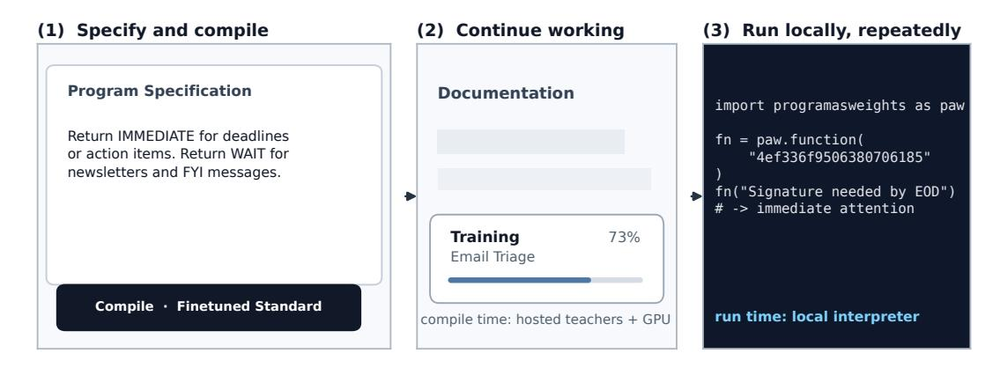
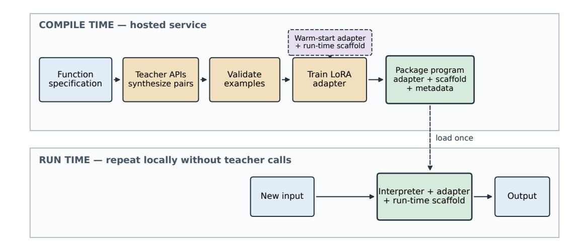
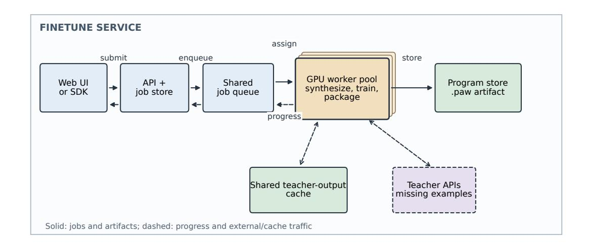
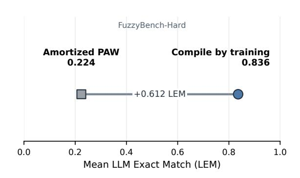
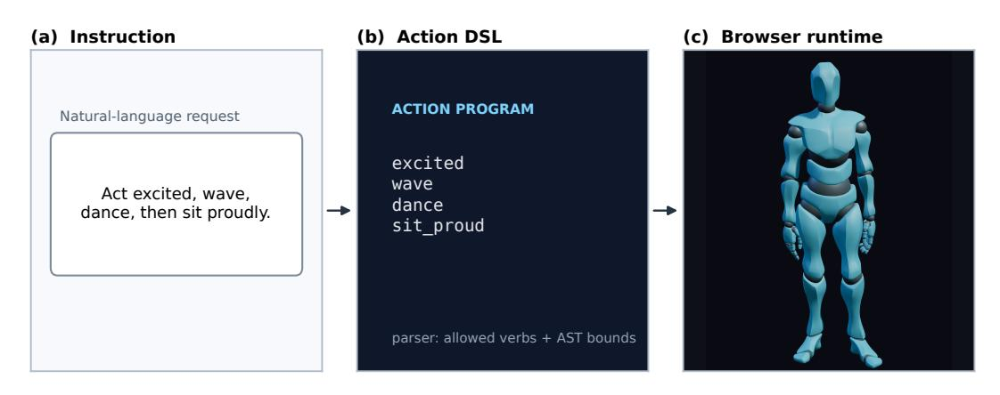

# 컴파일을 통한 학습: 자연어 사양을 로컬 신경망 함수로 변환 (Compile by Training: Turning Natural-Language Specifications into Local Neural Functions)

- 원제: Compile by Training: Turning Natural-Language Specifications into Local Neural Functions
- 원문: [https://arxiv.org/abs/2609.04199](https://arxiv.org/abs/2609.04199)
- PDF: [https://arxiv.org/pdf/2609.04199](https://arxiv.org/pdf/2609.04199)
- arXiv ID: `2609.04199`

---

# 컴파일을 통한 학습: 자연어 사양을 로컬 신경망 함수로 변환 (Compile by Training: Turning Natural-Language Specifications into Local Neural Functions)

## 윤티안 덕 (Yuntian Deng)

워털루 대학교 yuntian@uwaterloo.ca

## 펑유 니에 (Pengyu Nie)

워털루 대학교 pynie@uwaterloo.ca

## 스튜어트 시버 (Stuart Shieber)

하버드 대학교 shieber@seas.harvard.edu

### 초록 (Abstract)

많은 반복되는 텍스트 기능은 설명하기는 쉽지만 규칙으로 구현하기는 어렵다. 반면에 매 입력마다 대형 원격 모델을 호출하면 반복적인 비용, 지연, 공급자 의존성이 발생한다. 우리는 *compile by training*을 제시한다. 이는 자연어 사양을 재사용 가능한 신경망 함수로 변환한다. 컴파일 시, 교사 모델이 작업별 예시를 생성하고, 이를 사용해 작은 어댑터를 훈련시켜 컴팩트한 인터프리터를 만든다. 결과 함수는 교사 없이 실행되며 저장, 버전 관리, 일반 소프트웨어처럼 조합이 가능하다. FuzzyBench-Hard에서 Program-as-Weights 빠른 컴파일러가 정확 매치를 생성하지 못한 하위 집합에서 compile by training은 83.6%의 의미적 정확도를 달성한다. 이 높은 정확도는 컴파일 시간 비용이 증가한다: 빠른 컴파일러의 몇 초 대신 약 1분이 소요된다. 우리는 공개 인터랙티브 서비스에 컴파일러를 배포하고, 다중 사이트 웹사이트 헬퍼, 언어 제어 3D 아바타, 양방향 영어–Claudish 번역기에서 컴파일된 함수를 시연한다.

## 1 서론 (Introduction)

예를 들어, "Signature needed by EOD"를 즉시 처리하고 뉴스레터는 대기하도록 매핑하는 이메일 트리어지 함수가 있다. 의도된 동작은 설명하기 쉽고 수천 개의 메시지에 유용하지만, 규칙으로 인코딩하기는 번거롭다. 일반적인 원격 LLM은 이 작업을 수행할 수 있지만, 매 메시지마다 호출하면 네트워크 지연, 공급자 비용, 외부 서비스 의존성이 반복적으로 발생한다. 많은 반복 텍스트 기능은 이 두 옵션 사이에 있다: 전통적인 코드로는 너무 모호하고, 매 호출마다 대형 모델 호출을 정당화하기에는 너무 좁고 빈번하다.

우리는 *compile by training*을 제안한다: 대형 모델을 한 번만 사용해 더 작고 재사용 가능한 신경망 함수를 만든다. 개발자는 자연어 사양을 작성하고, 교사 모델이 원하는 동작의 예시를 생성하며, 경사 하강법이 그 예시를 사용한다.

컴팩트한 인터프리터를 특화한다. 컴파일은 약 1분이 소요되지만, 결과 함수는 교사를 호출하지 않고도 새로운 입력을 처리할 수 있다. 이 관점에서 적응은 소프트웨어 빌드 단계가 되고, 대형 언어 모델은 런타임 의존성 대신 도구 빌더 역할을 한다.

우리 시스템은 Program-as-Weights (PAW) [(Zhang et al.,](#page-7-0) [2026)](#page-7-0) 위에 구축된다. 이 시스템에서 신경망 프로그램은 공유 로컬 인터프리터를 특화한다. PAW는 단일 전방 패스로 이러한 프로그램을 예측하는 아모티즈드 컴파일러를 도입했다. 이는 컴파일을 빠르게 하지만, 모든 함수에 동일한 고정 계산량을 소모한다. compile by training은 동일한 프로그램 형식과 런타임 인터페이스를 유지하고, 아모티즈드 예측을 시작점으로 사용한 뒤, 교사 합성 및 사양별 최적화에 추가 계산을 투자한다. 결과 프로그램은 여전히 버전 관리, 캐시, 일반 소프트웨어와 조합이 가능하다.

이 접근법은 세 가지 실용적인 질문을 제기한다. 첫째, 추가적인 컴파일 타임 투자가 한 번에 가중치를 예측하는 것보다 더 나은 함수를 생성하는가? 둘째, 분당 규모의 빌드가 대화형 서비스에서 여전히 사용 가능한가? 셋째, 독립적으로 컴파일된 신경망 함수가 더 큰 애플리케이션의 구성 요소로 활용될 수 있는가? 우리는 PAW fast compiler가 정확한 일치를 생성하지 못한 예시들의 하위 집합인 FuzzyBench-Hard에서 정확성을 평가한다. 또한 배포된 컴파일러에서 지연 시간과 응답성을 측정하고, 다중 사이트 웹사이트 헬퍼, 언어 제어 3D 아바타, 양방향 영어–Claudish 번역기에서의 조합을 시연한다. 온라인 데모는 [https://programasweights.com/](https://programasweights.com/playground?compiler=paw-ft-bs48) [playground?compiler=paw-ft-bs48](https://programasweights.com/playground?compiler=paw-ft-bs48)에서 이용 가능하다.

## 2 시스템 개요 (System Overview)

시스템은 신경망 함수를 구축하는 것과 사용하는 것을 분리한다. 개발자는 먼저 de-를 설명한다.

<span id="page-1-0"></span>

그림 1: 한 개의 사양, 한 개의 컴파일 작업, 한 개의 로컬 함수. 실행 중인 이메일 트리아지 예시는 공개 플레이그라운드에 입력되고, 사용자가 계속 탐색하는 동안 비동기적으로 컴파일되며, 이후 로컬 SDK를 통해 호출된다. 교사와 GPU는 컴파일 타임 의존성이며; 반복 함수 호출은 패키지된 프로그램을 사용한다.

자연어로 원하는 행동을 기술하고, 그 사양을 재사용 가능한 프로그램으로 컴파일한다. 완성된 프로그램은 교사 모델을 다시 호출하지 않고도 새로운 입력에 대해 반복적으로 호출될 수 있다.

형식적으로, 시스템은 인터페이스를 노출한다.

$$p_s = \text{Compile}(s), \qquad \hat{y} = \text{Run}(p_s, x),$$

여기서 s는 자연어 함수 사양, p<sup>s</sup>는 컴파일된 프로그램, x는 새로운 입력, 그리고 yˆ는 프로그램의 출력이다. 공유된 동결된 언어 모델은 *interpreter* 역할을 하며, 각 컴파일된 프로그램은 하나의 함수에 특화된 어댑터와 프롬프트를 제공한다.

그림 [1](#page-1-0) 은 해당 사용자 워크플로우를 보여준다:

- 1. Specify. 자연어로 텍스트-투-텍스트 함수를 설명한다.  
- 2. Compile. 빌드 작업을 제출하고 그 큐와 훈련 진행 상황을 모니터링한다.  
- 3. Run. 완성된 프로그램을 열거나 다운로드하고 SDK를 통해 새로운 입력에 대해 실행한다.

다운로드된 .paw 아티팩트는 사양과 공유 인터프리터를 특화하는 데 필요한 구성 요소를 패키징한다. 이는 일반 소프트웨어 아티팩트처럼 저장, 버전 관리, 캐시, 재사용이 가능하다. 실행 시 SDK는 각 새로운 입력을 프로그램의 런타임 프롬프트와 어댑터와 결합한 뒤 공유 인터프리터를 실행한다.

컴파일은 호스팅된 프로세스이다: 함수 사양은 PAW 서비스와 교사 API에 전송되어 감독을 생성하고 프로그램을 학습한다. 반대로 로컬 SDK 실행은 향후 입력을 PAW나 교사에게 전송하지 않는다.

## 3 학습을 통한 컴파일 (Compile by Training)

학습을 통한 컴파일은 자연어 사양을 재사용 가능한 신경 프로그램으로 변환한다. 첫 번째 단계에서 교사 모델은 원하는 함수의 예시를 합성한다. 두 번째 단계에서 그 예시들은 공유 인터프리터를 특화하는 가벼운 어댑터를 전문화시키며, 이후 이를 미래 실행을 위해 패키징한다.

### 3.1 사양에서 감독으로 (From Specification to Supervision)

사양은 원하는 동작을 설명하지만 직접 학습에 필요한 충분한 라벨링 예시를 제공하지 않는다. 따라서 우리는 하나 이상의 교사 모델을 사용해 작업 특화 데이터셋을 합성한다.

$$D_s = \{(x_i, y_i)\}_{i=1}^n \sim T(s),$$

여기서 s는 사양이며 각 쌍은 함수가 입력 x<sup>i</sup>를 출력 y<sup>i</sup>로 매핑해야 함을 보여준다.

교사는 구조화된 JSON 형식을 사용하도록 요청한다. 이렇게 하면 생성된 예제가 학습 파이프라인(training pipeline)에 자동으로 입력될 수 있다. 컴파일러(compiler)는 각 응답을 검증하고, 잘못되었거나 불완전한 배치(batch)를 거부한 뒤, 승인된 예제만 트레이너(trainer)에게 제공한다. 우리의 공공 서비스(public service)는 대부분의 예제를 제공하는 저비용 교사(lower-cost teacher)와 보완적 감독(complementary supervision)을 제공하는 대형 교사(larger teacher)를 결합한다.

예를 들어, /pdf/ 링크에서 arXiv 식별자를 추출하고 /abs/ 링크는 무시하는 사양에 대해, 교사가 생성한 예시는 다음과 같다:

Input: 다음 논문을 확인하세요: [https://arxiv.](https://arxiv.org/pdf/2607.02512.pdf) [org/pdf/2607.02512.pdf](https://arxiv.org/pdf/2607.02512.pdf) and [https://arxiv.](https://arxiv.org/abs/2507.08800) [org/abs/2507.08800](https://arxiv.org/abs/2507.08800).

출력: ["2607.02512"]

### 3.2 특수화 및 패키징 (Specialization and Packaging)

각 사양마다 별도의 전체 모델을 훈련시키면 컴파일 및 저장 비용이 지나치게 비싸진다. 대신 모든 프로그램은 동결된 Qwen3-0.6B 인터프리터 [(Yang et al.,](#page-7-1) [2025)](#page-7-1)를 공유하고, 각 함수는 경량 LoRA 어댑터 [(Hu et al.,](#page-7-2) [2022)](#page-7-2)와 실행 시 스캐폴드로 표현된다. 여기서 스캐폴드는 컴파일러가 생성한 프롬프트 템플릿으로, 사용자의 자유형 사양을 구조화된 작업 지시문과 예제로 인코딩하고 실행 시 입력을 위한 자리 표시자를 남긴다.

분산 PAW 컴파일러는 초기 어댑터 파라미터 θ (0) <sup>s</sup>와 스캐폴드 rs를 제공한다. 이 예측은 몇 초 안에 완료되며 함수별 시작점을 제공하고, 이후 합성 데이터셋을 사용해 정제된다. 훈련은 다음을 최소화한다

$$\mathcal{L}(\theta_s) = \sum_{(x,y) \in D_s} -\log p_{\theta_s}(y \mid r_s(x)).$$

최적화 후, 컴파일러는 어댑터 θs, 스캐폴드 rs, 원본 사양, 그리고 인터프리터 메타데이터를 프로그램 ps에 패키징한다. Figure [2](#page-3-0)는 자연어 설명에서 재사용 가능한 아티팩트까지의 경로를 요약한다.

공개 구성. 공개 *Finetuned Standard* 컴파일러는 양자화된 Qwen3-0.6B 인터프리터, 혼합 교사, 알파 16의 rank-64 LoRA 어댑터, 분산 컴파일러 워밍 스타트, 그리고 100단계 코사인 스케줄을 사용한다. 부록 표 [2](#page-8-0)는 완전한 레시피를 제공한다.

## 4 인터랙티브 분 단위 컴파일 (Interactive Minute-Scale Compilation)

훈련을 통한 컴파일은 단일 모델 호출보다 수십 초가 걸린다. 이 빌드 단계를 대화형으로 사용 가능하게 만들려면 시스템은 비판적 경로를 단축하고, 컴파일이 진행되는 동안 사용자가 계속 작업할 수 있도록 해야 한다. 우리는 세 단계에서 이 요구사항을 해결한다: 합성과 훈련의 겹침, 공유 워커 간 작업 조정, 그리고 각 컴파일을 지속적인 백그라운드 작업으로 제시.

### 4.1 합성 및 훈련 겹치기 (Overlapping Synthesis and Training)

순차 파이프라인에서는 컴파일러가 인터프리터를 로드하고 최적화를 시작하기 전에 모든 교사 생성 예제를 기다린다. 이는 가장 느린 교사 응답을 기다리는 동안 GPU가 유휴 상태가 된다. 우리는 배포된 *streaming compile path*에서 교사 요청, 모델 로딩, 훈련을 동시에 시작한다.

훈련은 첫 번째 배치에 필요한 예제가 준비되는 즉시 시작되며, 합성과 추적되는 경우에만 차단된다. 교사 응답이 서로 다른 시점에 도착할 수 있기 때문에 스케줄러는 먼저 이전 배치에 필요한 열린 슬롯에 들어오는 예제를 할당하고, 승인된 예제나 지정된 훈련 순서를 변경하지 않는다. 이 겹침은 교사 합성이 개별 훈련 단계보다 훨씬 느리고 변동성이 크기 때문에 비판적 경로를 단축한다.

### 4.2 작업 조정 및 재사용 (Coordinating Jobs and Reusing Work)

서비스는 합성 및 학습을 수행하는 컴파일러 작업자와 작업 조정 기능을 분리한다. API는 제출된 각 작업의 영속적 기록을 유지하고, 공유 큐는 대기 중인 작업을 사용 가능한 GPU 작업자에게 배포한다. 새로운 예제를 요청하기 전에 작업자는 캐시를 확인하고 일치하는 교사 출력 결과를 재사용한다. 완료된 프로그램은 공유 아티팩트 저장소에 기록되고, 영속적 작업 기록에 다시 연결된다. Figure [3](#page-4-0)은 이 서비스 아키텍처를 요약한다.

이 분리는 API가 응답성을 유지하면서 작업자가 장시간 실행되는 빌드를 수행하도록 하고, 사용 가능한 GPU가 컴파일 작업으로 공급되도록 한다.

### 4.3 상호작용 설계 (Interaction Design)

인터페이스는 컴파일을 차단형 폼 제출이 아니라 백그라운드 소프트웨어 빌드로 처리한다. 사양을 제출한 후, 사용자는 인터페이스가 작업 대기열 위치와 학습 진행 상황을 보고하는 동안 계속 탐색할 수 있다.

작업과 그 진행 상황은 페이지 탐색 및 새로 고침을 거쳐도 지속된다, Figure [1(](#page-1-0)2)에서 보여지는 것처럼. 컴파일이 끝나면 동일한 작업 기록이 완성된 프로그램에 접근할 수 있게 한다.

## 5 평가 및 검증 (Evaluation and Validation)

### 5.1 메트릭 및 벤치마크 (Metric and benchmark)

많은 작업에서 여러 출력이 모두 유효할 수 있다. 예를 들어, 두 개의 JSON 출력은 값은 동일하지만 공백이나 키 순서만 다를 수 있으나, 정확히 일치하는 메트릭은 이를 다르게 취급한다. 따라서 우리는 LLM Exact Match(LEM)를 보고한다: 사양에 따라 LLM 판사가 의미적으로 올바르다고 판단한 예측의 비율. 각 판단은 사양, 입력, 참조 출력, 모델 예측을 기반으로 한다. 선택된 GPT-5.5 판사는 정확도 0.977과 Cohen's κ = 0.946을 달성한다.

<span id="page-3-0"></span>

그림 2: 컴파일은 훈련을 통해 수행된다. 컴파일 시점에, 교사 모델은 사양을 검증된 감독으로 변환하며, 이는 컴팩트한 동결된 인터프리터용 LoRA 어댑터를 특화한다. 컴파일러는 어댑터와 런타임 스캐폴드를 재사용 가능한 프로그램으로 패키징하며, 이는 교사 호출 없이 런타임에 새로운 입력을 처리한다.

128개 저자 라벨에 대해 (Appendix Table [3)](#page-8-1). Appendix [E](#page-8-2)는 전체 채점자 프롬프트와 사용자 템플릿을 제공한다.

본 연구에서는 PAW를 평가하기 위해 사용되는 FuzzyBench 벤치마크의 하위 집합인 *FuzzyBench-Hard*를 평가한다. [(Zhang et al.,](#page-7-0) [2026)](#page-7-0). 이 하위 집합은 PAW 빠른 컴파일러가 정확한 일치를 생성하지 못한 사양들로 구성된다. 아래와 같이, 빠른 컴파일러는 일부 예측이 참조 출력과 정확히 일치하지 않음에도 불구하고 의미적으로 올바르기 때문에 LEM 점수가 0이 아니다.

### 5.2 훈련이 정확성을 향상시키는가? (Does training improve correctness?)

Figure [4](#page-4-1)은 FuzzyBench-Hard에서 두 컴파일러를 비교한다. 학습 기반 컴파일은 평균 LEM을 0.224에서 0.836으로 0.612 절대 증가시킨다. 이 개선은 더 긴 컴파일 시간의 대가를 치른다: 50.9초, 반면 PAW의 빠른 amortized compiler는 3.5초이다.

### 5.3 감독 선택이 정확성에 미치는 영향은? (How do supervision choices affect correctness?)

Table [1](#page-3-1)은 개발 사양에 대한 기존 스위프를 보고한다. 3600개의 고유 쌍을 반복해 6400개의 예제로 구성된 학습 세트에서 GPT-5.4-mini와 GPT-5.5의 2:1 혼합 감독은 GPT-5.4-mini 단독에 비해 평균 LEM을 0.746에서 0.851로 상승시킨다. 별도의 데이터 스케일링 스위프에서는 평균 LEM이 1440개의 고유 쌍에서 0.821에서 2400개에서 0.836으로 상승하고, 3600개에서도 0.836을 유지하며, 7200개에서 0.866에 도달한다. Appendix [C](#page-8-3)은 스위프의 세부 사항을 제공한다.

| sweep | setting | LEM |  |
|--------------|------------------------------|-------|--|
| teacher mix | mini only (3600/0) | 0.746 |  |
| teacher mix | 2:1 mini/GPT-5.5 (2400/1200) | 0.851 |  |
| 데이터 스케일링 | 1440개의 고유 쌍 | 0.821 |  |
| 데이터 스케일링 | 2400개의 고유 쌍 | 0.836 |  |
| 데이터 스케일링 | 3600개의 고유 쌍 | 0.836 |  |
| 데이터 스케일링 | 7200개의 고유 쌍 | 0.866 |  |

<span id="page-3-1"></span>Table 1: 제어된 교사 혼합 및 데이터 스케일링 스윕에서의 평균 LEM.

### 5.4 컴파일이 상호작용에 충분히 빠른가? (Is compilation fast enough for interaction?)

우리는 2026년 5월에 서비스 시작 시 컴파일 지연을 측정했다. 캐시된 교사 출력이 없는 콜드 컴파일은 같은 대표 사양에서 B300에서 50.9초, H200에서 68.2초, RTX GPU에서 99.2초를 걸렸다. 네 개의 컴파일 작업을 동시에 제출한 부하 테스트에서 모든 작업은 평균 1.01초의 대기 시간으로 완료되었으며, 작업자 간 활용이 균등했다. 교사 합성이 종단 지연을 지배하므로, 합성과 훈련을 겹치면 서비스의 핵심 경로가 직접 단축된다.

## 6 배포 및 응용 (Deployment and Applications)

### 6.1 많은 컴파일된 함수 조합 (Composing many compiled functions)

FuzzyBench-Hard는 컴파일된 함수를 개별적으로 평가한다. 실제 애플리케이션은 여러 컴파일된 함수를 일반 코드와 함께 동작하도록 필요로 할 수 있다. Paw-helper는 배포된 웹사이트 어시스턴트에서 이 설정을 시연한다.

Paw‑helper[1](#page-3-2)는 일반 파이프라인 실행을 분리한다-

<span id="page-3-2"></span><sup>1</sup> [https://github.com/programasweights/](https://github.com/programasweights/paw-helper) [paw-helper](https://github.com/programasweights/paw-helper)

<span id="page-4-0"></span>

Figure 3: 배포된 파인튜닝 서비스. API는 공유 큐에 작업을 제출하고, 큐는 사용 가능한 GPU에 할당한다. 작업자는 캐시된 교사 출력을 재사용하고, 누락된 예시를 위해 교사를 호출하며, Figure [2,](#page-3-0)에서 컴파일러를 실행하고 진행 상황을 보고한다. 완성된 아티팩트는 중앙에 저장되고 동일한 작업 기록을 통해 반환된다. 실선 화살표는 요청 또는 아티팩트이며, 점선 화살표는 상태 및 캐시 트래픽이다.

<span id="page-4-1"></span>

Figure 4: 컴파일 타임 최적화가 큰 정확성 향상을 가져온다. PAW의 빠른 평균화 컴파일러와 우리 compile‑by‑training 컴파일러에 대한 FuzzyBench‑Hard의 평균 LEM.

router는 사이트별 콘텐츠 팩에서. 배포된 팩에는 30개의 컴파일된 프로그램이 포함되어 있으며, 28개는 실시간 라우팅에 참여하고, 두 개는 평가 및 역호환성을 지원한다. 하나의 백엔드는 네 개의 웹사이트를 서비스한다: [the first author’s personal website,](https://yuntiandeng.com) [the site for his introductory AI course at the Univer](https://yuntiandeng.com/teaching/spring2026/cs486-introduction-to-artificial-intelligence/#ask)[sity of Waterloo (CS 486),](https://yuntiandeng.com/teaching/spring2026/cs486-introduction-to-artificial-intelligence/#ask) [NeuralOS](https://neural-os.com) [(Rivard et al.,](#page-7-3) [2026)](#page-7-3), 그리고 [the PAW website.](https://programasweights.com) 라우터는 현재 웹사이트와 페이지를 컨텍스트로 받아 각 질문을 트리의 작은 부분만 통해 보낸다.

학생이 'Assignment 1에 어떤 변화가 있었나요?'라고 물으면, paw‑helper는 먼저 질문이 링크를 요구하는지 서면 답변을 요구하는지 결정한다…

이것은 일반적인 업무 분담을 보여준다: 컴파일된 함수는 모호한 결정을 내리고, 일반 코드는 정확한 작업(검색, 캐시, 분기 제어 등)을 처리한다…

### 6.2 실행 가능한 동작 생성 (Generating executable behavior)

우리는 라벨이나 자유형 답변보다 풍부한 출력을 보여주기 위해, Avatar Director[2](#page-4-2)는 사용자가 자연어 지시로 3D 캐릭터를 제어할 수 있게 한다. 예를 들어, 사용자는 '두 번 점프하고, 그 다음 춤춰'라고 요청하면, 아바타가 순서대로 해당 동작을 수행한다. 미세 조정된 PAW 프로그램은 자연어 지시를 작은 액션 DSL로 변환한다. 이 DSL은 시퀀스, 지속시간, 반복, 그리고 호환 가능한 병렬 동작을 지원하며, 브라우저가 이를 검증하고 실행해 캐릭터를 애니메이션한다. 따라서 사용자는 액션 프로그램을 직접 작성하지 않고도 자신의 말로 움직임을 묘사할 수 있다. 44개의 수작업 검증 지시문 중, 프로그램은 43건에서 기대한 액션 구조를 생성했다.

그림 [6](#page-5-1)은 생성된 액션 프로그램과 그에 따른 브라우저 애니메이션을 보여준다.

<span id="page-4-2"></span><sup>2</sup> <https://programasweights.com/avatar>

## <span id="page-5-0"></span>30개의 고정 프로그램, 28개의 활성 신경 노드, 4개의 페이지 컨텍스트; 실선 = 이 경로; 점선 = 오프-패스 페이지 컨텍스트 + 질문 경로 사이트 / 주제 분류 링크 / 답변 열기 링크 코스 답변자 + 검증자 피자 검색 (BM25) 선택기 + 피자 답변자 "모르겠어요" 주요, 결합, 또는 피자 인용 코스 답변 **(a) 프로그램 트리를 통한 하나의 질문** 링크 병렬 거부 라이브 CS486 요청이 코스 답변과 클릭 가능한 피자 인용을 반환한다. **(b) 라이브 인용 답변**

그림 5: 프로그램 트리로서의 웹사이트 헬퍼. (a) 페이지 인식 질문은 미세 조정된 분류기, 답변자, 선택기, 검증자와 함께 결정론적 링크 및 검색을 통해 라우팅된다. 강조된 CS486 경로는 코스 답변과 피자 검색 및 병합을 결합한다. (b) 라이브 코스 헬퍼는 결과를 반환한다.

<span id="page-5-1"></span>

그림 6: 언어에서 실행 가능한 동작으로. 미세 조정된 PAW 프로그램은 자연어 명령을 액션 프로그램으로 매핑한다; 결정론적 브라우저 코드는 DSL을 파싱하고 검증한 뒤 결과 동작을 렌더링한다. 라이브 웹 데모에서는 DSL 해석과 3D 렌더링이 브라우저에서 실행된다.

### 6.3 영어와 Claudish 간 번역

*Claudish*는 최근 Claude Code와 관련된 독특한 산문 스타일을 가리키는 비공식 명칭으로 등장했다.[3](#page-5-2) 이 스타일은 명시적 대비, *gate*, *boundary*, *loadbearing* 구조의 은유, 그리고 *X-shaped*, *X-gated*와 같은 하이픈 연결어를 자주 사용한다. 우리는 Claudish와 일반 영어 간의 양방향 번역 서비스를 구축했다.[4](#page-5-3)

번역기를 구축하기 위해, 우리는 각 방향에 대해 하나의 자연어 사양을 작성했다. 그

English-to-Claudish 사양은 프로그램이 입력의 의미를 보존하면서 스타일의 특징적인 어휘, 복합어, 수사적 패턴, 문장 구조를 채택하도록 요구한다. 반대로 Claudish-to-English 방향에서는 사양이 프로그램에게 입력을 직접적인 영어로 재작성하도록 요구하며, 중복 대비와 구조적 은유를 제거하면서 의미를 보존한다. 이러한 사양에서 합성 예시를 학습하고 공유 0.6B 인터프리터에 대해 각 방향마다 하나의 어댑터를 미세 조정하여 컴파일한다. 결과적으로 두 프로그램이 라이브 서비스를 구동한다.

그림 [7](#page-6-0)은 웹 인터페이스에서 한 번역 예시를 보여준다. 두 프로그램 모두 로컬에서 다운로드 및 실행이 가능하며, 그 사양과 지원

<span id="page-5-2"></span><sup>3</sup>우리 데모는 이전의 [Claudish-to-English](https://github.com/gvzdv/claudish-to-english) 프로젝트에서 영감을 받았다. 또한 [Lorenz (2026)](https://www.usermag.co/p/vibe-coders-now-have-their-own-language) 를 참고하면 용어에 대한 보다 폭넓은 논의가 있다.

<span id="page-5-3"></span><sup>4</sup> <https://programasweights.com/claudish>

<span id="page-6-0"></span>

그림 7: English to Claudish. 실시간 인터페이스는 plain-English 문장에 English-to-Claudish PAW 프로그램을 적용한다. 방향을 전환하면 별도로 fine-tuned된 Claudish-to-English 프로그램이 호출된다.

코드는 공개 저장소에서 확인할 수 있다.[5](#page-6-1) 2026년 8월 22일 공개 출시 이후 9월 2일까지 웹 데모는 100,747건의 성공적인 번역 요청을 처리했다.

## 7 Related Work (관련 연구)

합성 감독 및 파라미터 효율적 적응. 대형 모델은 지시를 따르는 예시를 생성해 작은 모델을 훈련시킬 수 있으며, 지식 증류는 작은 모델이 큰 교사 모델을 모방하도록 훈련한다 [(Wang](#page-7-4) [et al.,](#page-7-4) [2023;](#page-7-4) [Taori et al.,](#page-7-5) [2023;](#page-7-5) [Hinton et al.,](#page-7-6) [2015;](#page-7-6) [Hsieh et al.,](#page-7-7) [2023)](#page-7-7). Compile by training은 두 아이디어를 하나의 사용자 정의 함수에 적용한다: 교사 모델은 사양에서 입력-출력 쌍을 생성하고, 그 쌍은 컴팩트 인터프리터용 LoRA 어댑터를 훈련한다. LoRA [(Hu](#page-7-2) [et al.,](#page-7-2) [2022)](#page-7-2), 어댑터 [(Houlsby et al.,](#page-7-8) [2019)](#page-7-8), prefix/prompt 튜닝 [(Li and Liang,](#page-7-9) [2021;](#page-7-9) [Lester](#page-7-10) [et al.,](#page-7-10) [2021)](#page-7-10), QLoRA [(Dettmers et al.,](#page-7-11) [2023)](#page-7-11), 그리고 AdaLoRA [(Zhang et al.,](#page-7-12) [2023)](#page-7-12)는 소수의 파라미터만 업데이트해 적응 비용을 줄인다. Prompt2Model [(Viswanathan et al.,](#page-7-13) [2023)](#page-7-13)는 작업 설명을 fine-tune 파이프라인으로 변환하고, LoRA Land [(Zhao et al.,](#page-7-14) [2024)](#page-7-14)는 공유 기반 모델에서 여러 작업별 LoRA 어댑터를 제공한다. 우리 시스템은 공유된 동결된 인터프리터용 버전된 프로그램을 생성하고, 사양별 훈련을 초기화하기 위해 amortized 컴파일러를 사용한다.

## 8 Conclusion (결론)

우리는 compile by training을 도입한다. 이는 사용자 제공 함수 설명에서 신경망 프로그램을 컴파일한다. 먼저 대형 언어 모델을 사용해 설명에서 예시를 합성하고, 그 다음 LoRA 어댑터를 fine-tune해 작은 인터프리터 모델을 특화한다. 이는 PAW의 속도–정확도 tradeoff에 또 다른 점을 추가한다: 빠른 컴파일러는 단일 전방 패스에서 LoRA 어댑터를 생성하고 수초만 걸리지만, compile by training은 약 1분을 소요해 더 높은 정확도를 얻는다. PAW 빠른 컴파일러가 정확 매치를 생성하지 못한 FuzzyBench-Hard 작업 집합에서 compile by training은 83.6%의 의미적 정확도를 달성한다. 우리는 이를 공개 PAW 데모에 동일 컴파일러 인터페이스의 또 다른 옵션으로 추가했고, 생성된 프로그램을 사용해 다중 사이트 웹사이트 헬퍼, 언어 제어 3D 아바타, 양방향 English–Claudish 번역기를 구축했다.

## 9 Limitations (제한 사항)

합성 감독은 교사 모델의 오류를 물려받을 수 있다. 보장된 정확성이 요구되는 응용 분야는 출력 검증을 하거나 결정론적 제어 경로를 유지해야 한다. 우리의 적용 사례 증거는 구성 및 구조화된 실행에 초점을 맞추었으며, 체계적인 사용자 연구는 향후 과제로 남는다.

### Acknowledgments (감사의 글)

Yuntian Deng은 NSERC의 자금 지원 번호 RGPIN-2024-05178과 TPUs를 활용한 기계 학습 연구 및 교육용 Google Research Award를 통해 지원을 받았음을 인정한다. Pengyu Nie는 NSERC의 자금 지원 번호 RGPIN-2024-04909에 의해 지원을 받았음을 인정한다.

<span id="page-6-1"></span><sup>5</sup> <https://github.com/programasweights/claudish>

## References (참고문헌)

- <span id="page-7-11"></span>Tim Dettmers, Artidoro Pagnoni, Ari Holtzman, and Luke Zettlemoyer. 2023. [QLoRA: 효율적인 미세](https://doi.org/10.52202/075280-0441)[양자화된 LLM의 미세 조정.](https://doi.org/10.52202/075280-0441) In *Advances in Neural Information Processing Systems*, volume 36, pages 10088–10115. Curran Associates, Inc.
- <span id="page-7-6"></span>Geoffrey Hinton, Oriol Vinyals, and Jeff Dean. 2015. [신경망에서 지식 증류.](https://doi.org/10.48550/arXiv.1503.02531) *arXiv preprint arXiv:1503.02531*.
- <span id="page-7-8"></span>Neil Houlsby, Andrei Giurgiu, Stanislaw Jastrzebski, Bruna Morrone, Quentin De Laroussilhe, Andrea Gesmundo, Mona Attariyan, and Sylvain Gelly. 2019. [NLP를 위한 파라미터 효율적인 전이 학습.](https://proceedings.mlr.press/v97/houlsby19a.html) In *Proceedings of the 36th International Conference on Machine Learning*, volume 97 of *Proceedings of Machine Learning Research*, pages 2790–2799. PMLR.
- <span id="page-7-7"></span>Cheng-Yu Hsieh, Chun-Liang Li, Chih-kuan Yeh, Hootan Nakhost, Yasuhisa Fujii, Alex Ratner, Ranjay Krishna, Chen-Yu Lee, and Tomas Pfister. 2023. [증류](https://doi.org/10.18653/v1/2023.findings-acl.507)[단계별! 더 큰 언어 모델을 능가하는](https://doi.org/10.18653/v1/2023.findings-acl.507)[훈련 데이터와 작은 모델 크기로](https://doi.org/10.18653/v1/2023.findings-acl.507)[크기.](https://doi.org/10.18653/v1/2023.findings-acl.507) In *Findings of the Association for Computational Linguistics: ACL 2023*, pages 8003–8017, Toronto, Canada. Association for Computational Linguistics.
- <span id="page-7-2"></span>Edward J. Hu, Yelong Shen, Phillip Wallis, Zeyuan Allen-Zhu, Yuanzhi Li, Shean Wang, Lu Wang, and Weizhu Chen. 2022. [LoRA: 대형 언어 모델의 저랭크 적응](https://openreview.net/forum?id=nZeVKeeFYf9) In *International Conference on Learning Representations*.
- <span id="page-7-10"></span>Brian Lester, Rami Al-Rfou, and Noah Constant. 2021. [파라미터 효율적인 프롬프트 튜닝을 위한 규모의 힘](https://doi.org/10.18653/v1/2021.emnlp-main.243) In *Proceedings of the 2021 Conference on Empirical Methods in Natural Language Processing*, pages 3045–3059, Online and Punta Cana, Dominican Republic. Association for Computational Linguistics.
- <span id="page-7-9"></span>Xiang Lisa Li and Percy Liang. 2021. [Prefix-tuning: 생성용 연속 프롬프트 최적화](https://doi.org/10.18653/v1/2021.acl-long.353) In *Proceedings of the 59th Annual Meeting of the Association for Computational Linguistics and the 11th International Joint Conference on Natural Language Processing (Volume 1: Long Papers)*, pages 4582–4597, Online. Association for Computational Linguistics.
- <span id="page-7-3"></span>Luke Rivard, Sun Sun, Hongyu Guo, Wenhu Chen, and Yuntian Deng. 2026. [NeuralOS: 신경 생성 모델을 통한 운영 체제 시뮬레이션](https://doi.org/10.48550/arXiv.2507.08800) In *International Conference on Learning Representations*.
- <span id="page-7-5"></span>Rohan Taori, Ishaan Gulrajani, Tianyi Zhang, Yann Dubois, Xuechen Li, Carlos Guestrin, Percy Liang, and Tatsunori B. Hashimoto. 2023. Stanford alpaca: 지시를 따르는 LLaMA 모델. [https://](https://github.com/tatsu-lab/stanford_alpaca) [github.com/tatsu-lab/stanford_alpaca](https://github.com/tatsu-lab/stanford_alpaca).

Vijay Viswanathan, Chenyang Zhao, Amanda Bertsch, Tongshuang Wu, and Graham Neubig. 2023. [Prompt2Model: 자연어 지침으로부터 배포 가능한 모델 생성](https://doi.org/10.18653/v1/2023.emnlp-demo.38) [자연어 지침.](https://doi.org/10.18653/v1/2023.emnlp-demo.38) In *2023년 자연어 처리 경험적 방법 회의: 시스템 시연 논문집*, pages 413–421, Singapore. Association for Computational Linguistics.  
Yizhong Wang, Yeganeh Kordi, Swaroop Mishra, Alisa Liu, Noah A. Smith, Daniel Khashabi, and Hannaneh Hajishirzi. 2023. [Self-instruct: 언어 모델을 자체 생성 지침과 정렬](https://doi.org/10.18653/v1/2023.acl-long.754) [모델과 자체 생성 지침.](https://doi.org/10.18653/v1/2023.acl-long.754) In *Association for Computational Linguistics(ACL) 61번째 연례 회의(볼륨 1: 장문 논문집) 논문집*, pages 13484–13508, Toronto, Canada. Association for Computational Linguistics.  
An Yang, Anfeng Li, Baosong Yang, Beichen Zhang, Binyuan Hui, Bo Zheng, Bowen Yu, Chang Gao, Chengen Huang, Chenxu Lv, Chujie Zheng, Dayiheng Liu, Fan Zhou, Fei Huang, Feng Hu, Hao Ge, Haoran Wei, Huan Lin, Jialong Tang, and 41 others. 2025. [Qwen3 기술 보고서.](https://doi.org/10.48550/arXiv.2505.09388) *사전발표*, arXiv:2505.09388.  
Qingru Zhang, Minshuo Chen, Alexander Bukharin, Pengcheng He, Yu Cheng, Weizhu Chen, and Tuo Zhao. 2023. [Adaptive budget allocation for](https://openreview.net/forum?id=lq62uWRJjiY) [parameter-efficient fine-tuning.](https://openreview.net/forum?id=lq62uWRJjiY) In *제11회 학습 표현 국제 회의*.  
Wentao Zhang, Liliana Hotsko, Woojeong Kim, Pengyu Nie, Stuart Shieber, and Yuntian Deng. 2026. [Program-as-weights: 퍼지 함수에 대한 프로그래밍 패러다임](https://doi.org/10.48550/arXiv.2607.02512) [퍼지 함수.](https://doi.org/10.48550/arXiv.2607.02512) *사전발표*, arXiv:2607.02512.  
Justin Zhao, Timothy Wang, Wael Abid, Geoffrey Angus, Arnav Garg, Jeffery Kinnison, Alex Sherstinsky, Piero Molino, Travis Addair, and Devvret Rishi. 2024. [LoRA land: 310개의 미세 조정된 LLM](https://doi.org/10.48550/arXiv.2405.00732) [GPT-4와 경쟁하는 기술 보고서.](https://doi.org/10.48550/arXiv.2405.00732) *사전발표*, arXiv:2405.00732.

### A 추가 실험 세부 사항

이 부록은 본 논문을 해석하는 데 가장 유용한 세부 사항을 수집한다.

| 항목 | 값 |
|--------------|-------------------------------------------------------------|
| 인터프리터 | Qwen3-0.6B, 양자화된 로컬 실행<br>시간 |
| 교사 | GPT-5.4-mini와 GPT-5.5를 2:1 비율로 혼합<br>조합 |
| 데이터 | 2400개의 고유 쌍을 6400개의 학습 예제로 확장<br>함 |
| 최적화 | 배치 48; 100 스텝; 코사인 학습률<br>감쇠 |
| 어댑터 | LoRA 랭크 64, 알파 16; 하이퍼네트워크<br>초기화 |
| 실행 | 합성 및 학습이 겹치는 섞인 배치 |

표 2: 공개 파인튜닝 표준 구성.

## B LEM Grader 요약 (B LEM Grader Summary)

LLM Exact Match(LEM)은 (specification, input, reference output, model output)에 대한 이진, 사양 기반 의미적 정확성 판단의 평균이다. 선택된 GPT-5.5 그레이더는 서식 차이를 허용하지만 값, 순서, 구조, 논리의 오류와 부적절한 거절을 거부한다.

| 채점자 | n | acc | FPR | FNR | 카파 |
|--------------|-----|-------|-------|-------|-------|
| GPT-5.5 | 128 | 0.977 | 0.025 | 0.023 | 0.946 |
| GPT-5.4-mini | 128 | 0.938 | 0.05 | 0.068 | 0.858 |

<span id="page-8-1"></span>Table 3: Compact LEM grader validation.

## <span id="page-8-3"></span>C Supervision Sweep Protocol

Main Table [1](#page-3-1)은 개발 사양에 대한 기존 스윕을 보고한다.  

teacher-mixture 행은 GPT-5.4-mini와 GPT-5.5 예시의 수를 비교하며, 3600개의 고유한 쌍을 반복해 6400개 예시의 학습 세트를 구성하고 배치 64, 학습률 2 × 10−<sup>4</sup> , 그리고 100 스텝을 고정한다.  

데이터 스케일링 행은 배치 48, 학습률 2 × 10−<sup>4</sup> , 그리고 100 스텝을 사용한다.

## D Teacher Synthesis Prompt

두 교사는 요청마다 n과 제출된 사양을 채워 넣은 다음 다음 템플릿을 사용합니다.

### System prompt.

,→

{"examples":[{"input":"Hello, how are you?","output":"안녕하세요, 어떻게 지내세요?"},{"input":"I love machine learning.","output":"나는 기계 학습을 사랑한다."},{"input":"The quick brown fox jumps over the lazy dog.","output":"빠른 갈색 여우가 게으른 개를 뛰어넘는다."}]}

### User template.

```
Generate {n} diverse (input, output) example
,→ pairs that follow this specification.
```

```
[SPEC]
{spec}
[END_SPEC]
```

## <span id="page-8-2"></span>E LEM Grader Prompt

### 시스템 프롬프트.

```
당신은 'fuzzy function' 벤치마크의 평가자입니다.
    벤치마크. 각 항목은
    자연어 사양(SPECIFICATION)의
    함수, 입력(INPUT), 참조 출력(REFERENCE OUTPUT)
    (해당 입력에 대한 하나의 유효한 답변)
    사양), 그리고 모델 출력(MODEL OUTPUT)
    판단 대상인 후보).
,→
,→
,→
,→
,→
,→
```

당신의 업무는 엄격한 의미적 동등성 판단이다: MODEL OUTPUT이 SPEC를 INPUT에 올바르게 적용한 것인지 여부를 결정한다. 다음 규칙을 사용한다: ,→ ,→ ,→

1. SPEC를 진리의 원천으로 간주한다. REFERENCE OUTPUT은 하나의 유효한 답변이며, spec이 여러 개의 동등하게 유효한 출력을 허용하는 경우(예: 항목 목록에서 글머리 기호 스타일이나 JSON 공백을 고정하지 않는 경우), spec에 따라 올바른 모든 출력을 허용한다. ,→ ,→ ,→ ,→ ,→ ,→ ,→

2. spec에 명시적으로 요구되지 않는 경우, 이러한 외형적 차이(공백(추가/누락된 공백, ,<sup>→</sup> 새 줄, 탭, 끝 공백))를 무시한다. ,→ ,→ ,→ - 공백

- JSON 키/값 공백( {"a":1} vs {"a": 1}) 및 들여쓰기, spec이 고정하지 않는 경우 객체의 키 순서 ,→ ,→ - 글머리 기호 스타일('- x' vs '* x' vs '1. x' ,<sup>→</sup> vs 'x
')

- 뒤쪽 구두점이 의미를 바꾸지 않는 경우 ,<sup>→</sup> - 문자열이 따옴표로 감싸져 있는지 여부 ,<sup>→</sup> 스펙이 두 형태를 허용할 때 - 토큰의 대소문자 차이가 스펙에 따라 대소문자 구분이 아닌 경우 ,<sup>→</sup>

3. 실질적인 차이를 무시해서는 안 된다: - 다른 값, 누락된 항목, 추가 항목

,<sup>→</sup> 항목 - 스펙이 특정 순서를 요구할 때 순서가 잘못된 경우 ,<sup>→</sup>

- 구조적으로 다른 경우 (리스트 vs 스칼라, ,<sup>→</sup> 객체 vs 배열)

- 사실적 또는 논리적 오류

- 모델이 'I cannot'이라고 말하거나 거절할 때, 참조가 유효한 답을 제공하는 경우 ,→ ,→

4. 스펙이 명시적으로 형식을 지정하면 (예: '출력은 문자열의 JSON 배열이어야 한다'), 그 형식을 엄격히 적용한다. ,→ ,→

5. 출력 컨테이너 유연성. 사양이 WHAT(출력할 내용)을 지정하지만(예: "output normalized identifiers like '#123'") HOW(여러 출력을 어떻게 패키징할지)를 지정하지 않으면(예: 'JSON array', 'newline-separated list', 'comma-separated' 등 명시적 언급이 없을 때), 같은 값들을 같은 순서로 나열하는 합리적인 컨테이너를 허용한다 -- 예를 들어 gt='["#5", "#6", "#7"]'와 pred='#5
#6
#7'는 사양이 'identifiers'만 요구하고 컨테이너를 고정하지 않을 때 동일하게 유효하다. 컨테이너 유연성은 값, 항목 수, 순서를 변경하는 것에는 적용되지 않는다.
,→
,→
,→
,→
,→
,→
,→
,→
,→
,→
,→
,→
,→
,→
6. 모델 출력이 비어 있거나 공백만 포함하고 사양이 비어 있지 않은 답변을 요구할 때는 INCORRECT로 표시한다.
,→
,→
단일 JSON 객체를 두 개의 키와 함께 출력한다:
  reason -- 판단을 설명하는 1-3문장, 관련이 있을 때 위의 특정 규칙을 인용한다.
  ,→
  ,→
  verdict -- 정확히 문자열 "CORRECT"
  ,→ 또는 "INCORRECT".
Reason을 먼저, 그 다음 verdict를 출력한다. JSON 외부에 어떤 서술도 포함하지 않는다. 확신이 없으면 INCORRECT를 기본값으로 한다.
,→
,→

### 사용자 템플릿 (User template.)

{"reason":"Insufficient information to evaluate the correctness of the model output against the reference output.","verdict":"INCORRECT"}

