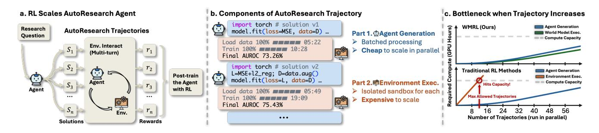
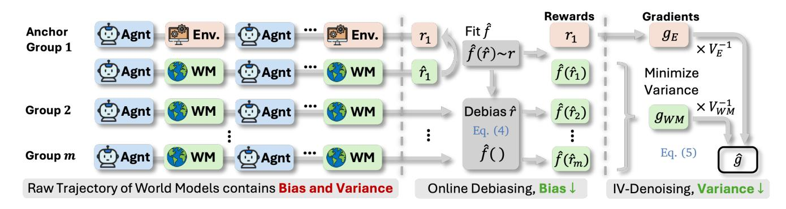
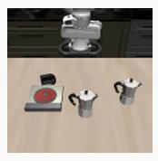
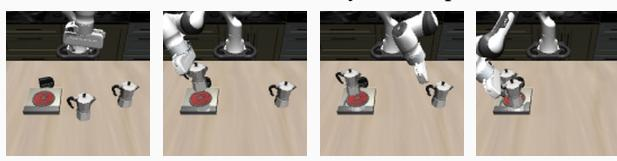

# Scaling Automatic Research Agents via World Models

- 원제: Scaling Automatic Research Agents via World Models
- 원문: [https://arxiv.org/abs/2608.12564](https://arxiv.org/abs/2608.12564)
- PDF: [https://arxiv.org/pdf/2608.12564](https://arxiv.org/pdf/2608.12564)
- arXiv ID: `2608.12564`

---

**Xiyuan Yang**1† , **Sheikh Sarwar**<sup>2</sup> , **Jingru Cheng**<sup>2</sup> , **Zhan Shi**<sup>2</sup> , **Duanshun Li**<sup>2</sup> , **Huiyuan Chen**<sup>2</sup> , **Haiyang Zhang**<sup>2</sup> , **Xing Fan**<sup>2</sup> , **Chenlei Guo**<sup>2</sup> , **Jingrui He**1<sup>∗</sup> , **Zhenyu Liao**2<sup>∗</sup>

<sup>1</sup>University of Illinois Urbana-Champaign <sup>2</sup>Amazon <sup>∗</sup>Corresponding authors

**Abstract:** 실험적 연구를 자동화하는 것은 AI의 오랜 방향이다. 최근 자동 연구(AutoResearch) 에이전트는 현대 LLM이 솔루션을 독립적으로 구현하고 실행 결과에서 학습할 수 있는 능력을 보여 주면서 이 목표를 달성 가능하게 한다. 이러한 성과 뒤에는 사후 훈련 (post-training) (특히 RL)이 핵심 역할을 한다. 본 논문에서는 이러한 에이전트에 대해 RL을 확장할 때 발생하는 근본적인 긴장을 식별한다: 모든 AutoResearch 궤적의 두 구성 요소(에이전트 생성과 환경 실행)는 매우 다른 방식으로 확장된다. 모든 생성은 배치 처리로 연산을 공유하지만, 각 실행은 고유한 샌드박스와 실제 기계 시간을 차지한다. 결과적으로 환경 실행이 훈련 비용을 지배하며 궤적이 커질수록 병목 현상이 된다. 이 긴장을 해결하기 위해 우리는 *World Model RL* (WMRL)을 제안한다. WMRL은 환경 실행을 세계 모델로 대체하여 이 병목 현상을 제거한다. 또한 세계 모델은 불완전할 수 있다. 그 보상은 편향과 잡음에 의해 손상된다. 따라서 우리는 WMRL에 두 가지 완화책, *Online Debiasing*과 *Inverse-Variance Denoising*을 추가한다. 이 두 완화책은 각각 편향을 보정하고 잡음을 억제한다. 이론적으로 우리는 WMRL의 두 완화책이 수렴 보장을 엄격히 개선함을 증명한다. 실험적으로, WMRL은 다양한 작업과 다른 에이전트 규모에서 3–4배의 속도로 훈련을 가속화하며, 표준 RL 기준보다 성능을 초과한다. 또한, 우리의 사후 훈련된 (post-trained) 4B와 9B 에이전트는 보유된 벤치마크에서 48B와 120B의 훨씬 큰 오픈-웨이트 에이전트를 능가한다. AutoResearch를 넘어, WMRL은 사후 훈련 구현형 VLA 정책에도 전이된다. 이는 우리의 방법이 일반화 가능함을 보여준다.

**Project Page:** <https://xiyuanyang45.github.io/WMRL/>

## <span id="page-0-0"></span>**1. 서론 (Introduction)**

An Automatic Research (AutoResearch) 에이전트는 독립적으로 경험적 연구를 수행하는 언어 모델이다. [&#91;1,](#page-11-0) [2,](#page-11-1) [3&#93;](#page-11-2). 연구 질문이 주어지면, 아이디어를 구상하고, 실험을 구현하며, 결과를 분석하고, 반복한다. [&#91;4,](#page-11-3) [5,](#page-11-4) [6&#93;](#page-11-5). 이러한 에이전트는 이미 다양한 분야에서 능력을 입증했다. In



**Figure** 1: **AutoResearch 경로는 비대칭적으로 확장되어 환경 실행이 병목이 되고, 우리의 WMRL은 이를 제거한다. (a)** 연구 질문마다, 에이전트는 실행에 따라 보상 *r<sup>i</sup>* 으로 평가되는 솔루션 집합 *S<sup>i</sup>* 를 제안하며, RL은 이러한 경로의 대량을 요구한다. **(b)** 각 경로마다, 생성은 배칭을 통해 연산을 amortize하지만 실행은 솔루션마다 하나의 격리된 샌드박스를 필요로 한다. **(c)** 따라서 실행 연산은 전통적인 RL에서 먼저 용량을 초과하지만, WMRL은 이 한계를 없이 확장된다.

<sup>†</sup>아마존 인턴십에서 수행된 작업.

자연과학의 예로, 그들은 화학 합성을 설계하고 이후 습식 실험으로 검증되는 반응 조건을 제안한다 [7, 8, 9]; 머신러닝과 데이터 과학에서는 실제 데이터셋을 탐색하고 인간 전문가를 능가하는 훈련 파이프라인을 구축한다 [10, 11, 12]. AutoResearch 작업에서는 에이전트가 솔루션을 반복적으로 생성하고 실행한다. 이러한 상호작용은 경로를 형성하며, 실행 결과는 보상을 제공한다. 경로와 보상이 모두 존재하면, AutoResearch는 강화 학습(RL)에 자연스럽게 부합한다 [13, 14, 15, 16], 이는 이러한 능력을 더욱 향상시키는 유망한 방향이다.

RL의 대부분 성공 사례와 마찬가지로, 강력한 AutoResearch 에이전트 훈련은 규모가 필요하다, 즉 훈련 중에 수집되는 대규모 온라인 트레젝터리[16]가 필요하다. 그러나 우리는 이 요구의 뒤에 있는 근본적인 긴장을 식별한다: 트레젝터리의 두 구성요소(에이전트 생성 및 환경 실행)는 트레젝터리 볼륨이 증가함에 따라 서로 다른 방식으로 확장된다. 생성 측면에서는 롤아웃이 현대 추론 백엔드(예: vLLM[17] 및 SGLang[18])에 의해 제공되며, 배치 기법을 통해 동시 트레젝터리가 연산을 공유할 수 있어 추가 트레젝터리 비용이 무시 가능하다. 반대로 실행 비용은 이와 같이 상쇄될 수 없다. 모든 후보 솔루션은 데이터 로드 및 실제 GPU에서 모델을 훈련하는 격리된 샌드박스에서 실행되어야 하므로, 각 추가 트레젝터리는 전체 비용을 발생시키며 총 비용은 트레젝터리 수에 따라 선형적으로 증가한다. 이 비대칭성은 AutoResearch 에이전트를 위한 RL 확장 시 환경 실행을 지배적인 병목 현상으로 만든다. 이러한 병목 현상은 두 가지 연구 질문을 유도한다:

- (i) 비싼 환경(병목)을 빠르고 확장 가능한 신호로 대체할 수 있을까?  
- (ii) 무료 점심은 없으므로 이 신호의 비용은 얼마인가? (그리고 우리는 어떻게 비용을 지불할까?)

질문 (i)의 답은 세계 모델( world model)을 도입하는 것이다. 이 모델은 환경 정보와 에이전트 솔루션을 입력으로 받아 실제 실행 결과의 시뮬레이션을 출력한다. 이러한 시뮬레이션(잠재적으로 결함이 있을 수 있음)은 실제 실행 없이 몇 번의 순방향 패스만으로 수행되므로, 생성과 마찬가지로 트레젝터리 전반에 걸쳐 배치 및 상쇄된다. RL 훈련에서는 에이전트가 실제 환경 대신 세계 모델과 상호작용하고, 예측된 결과에서 보상을 받는다. 결과적으로 비싼 실행은 이제 생성만큼 부드럽게 확장되며 RL의 규모를 더 이상 제한하지 않는다.

We answer question (ii) by modeling the world model's imperfection as a bias and a noise on the reward, and tracing both through the policy gradient into the convergence bound. Specifically, we consider the world model's output as an erroneous signal that deviates from real execution by a bias term b with  $|b| \leq B$  and a zero-mean noise  $\xi$  with standard deviation  $\sigma$ . As shown in Theorem 3, the bias and the noise hinder the final convergence through two extra error terms of  $O(B^2)$  and  $O(\sigma^2)$  respectively. To reduce both terms, we introduce an *Online Debiasing* mechanism that recasts the world model outputs to offset the bias, and an *Inverse-Variance Denoising* mechanism to minimize the variance; we further ground both mechanisms in Theorem 4 with a strictly improved convergence guarantee.

우리의 기여는 다음과 같이 요약된다:

- 우리는 AutoResearch 에이전트의 RL 훈련에 세계 모델을 도입한다. 이는 비용이 많이 드는 환경 실행을 몇 번의 순방향 패스로 대체한다. 이로써 중요한 스케일링 병목을 제거하고 전체 훈련 속도를 $3-4\times$ 가속한다 (Section 3.2).  
- 우리는 온라인 디바이싱(Online Debiasing)과 역분산 디노이징(Inverse-Variance Denoising)이라는 두 개의 보정 메커니즘을 설계한다. 이 메커니즘은 세계 모델의 편향과 노이즈를 상쇄한다. 두 메커니즘을 모두 적용하면 가속된 훈련이 실제 환경으로 훈련할 때와 동일하거나 더 높은 성능을 보인다 (Section 3.3).  
- 우리는 전체 프레임워크를 이론적으로 정당화한다. 불완전한 세계 모델은 수렴 경계에 두 개의 오차 항을 도입한다.

수렴 경계(Section [4.2)](#page-6-1))에 두 개의 오차 항이 도입되며, 우리의 두 메커니즘은 이를 증명적으로 감소시켜 엄격히 개선된 수렴 보장을 제공한다 (Section [4.3)](#page-6-2)).

• 두 개의 에이전트 규모에 걸친 다양한 AutoResearch 과제에서 실험을 통해 효율성과 성능 향상을 모두 검증한다 (Section [5.2)](#page-8-0)); 우리는 또한 VLA 사후 훈련 과제에 우리의 방법을 확장하여 일반화 가능성을 입증한다 (Section [5.3)](#page-9-0).

## **2. 관련 연구 (Related Work)**

**AutoResearch 에이전트와 사후 훈련.** 언어 모델 에이전트는 이제 자율 화학 실험 [7]과 개방형 과학적 발견 [1]부터 머신러닝 엔지니어링까지, 해결 코드 공간을 탐색하고 에이전트형 데이터 과학자로서 데이터를 큐레이션하며 재귀적 자기 개선을 추구하는 등 경험적 연구의 상당 부분을 수행한다 [10, 23, 24], [25, 26], [27, 28]. 벤치마크 라인은 MLE-Bench [29], 그 상호작용 확장 MLE-Dojo [19], DSBench [30], MLGym [31]을 포함한 실제 카글 스타일 대회에서 이 능력을 측정한다. 소프트웨어 엔지니어링 에이전트는 실제 저장소에서 동일한 실행 기반 레시피를 따르며, 대규모로 구축된 훈련 환경을 갖춘다 [32, 33, 34], [35]. 프롬프트를 넘어 RL 사후 훈련은 이러한 에이전트를 더욱 향상시키며, 일반적으로 대규모 RL 시스템에 의해 제공되는 그룹 상대적 목표 [14]와 함께 수행된다 [36], 합성 작업은 훈련 코퍼스를 확장할 수 있다 [37]. 이 파이프라인에서 보상은 에이전트의 솔루션 실행에서 나오므로 훈련은 Section [1,]에서 다루는 실행 병목을 상속한다. 이러한 발전은 보상이 소비되는 방식을 정제한다 [38, 39], 반면 우리는 보상이 어디에서 오는지를 바꾸므로 두 가지는 직교하며 결합된다.

**Learned reward signals and their errors.** 비용이 많이 드는 진실을 학습된 신호로 대체하는 것은 RLHF의 보상 모델 [40]에서 LLM 판사 [41]까지, 제어를 위한 환경을 시뮬레이션하는 세계 모델이 모델 기반 RL을 오랫동안 지원해온 것처럼 반복되는 패턴이다 [21, 22, 42]. 이러한 세계 모델은 이제 물리 세계의 기초 모델 [43]에 확장되거나 LLM에 의해 실행 가능한 코드로 작성된다 [44, 45], 그리고 실행 환경의 학습 대리 모델이 최근 소프트웨어 에이전트에 탐색되었다 [20]. 이러한 프록시의 오류는 동일하게 문서화되어 있으며, 불완전한 보상 모델에 대해 최적화하면 프록시가 과도하게 신뢰될 때 실제 성능이 저하된다 [46, 47], 편향된 기울기를 가진 SGD 이론은 체계적인 기울기 오류가 수렴에 하한을 두어 훈련량이 아무리 많아도 제거되지 않는다는 것을 보여준다 [48]. 이전의 해결책은 대부분 프록시를 오프라인에서 재조정하거나 정책이 이를 악용하지 못하도록 제한한다 [49, 50]. 오프폴리시 RL에서는 리플레이 버퍼와 타깃 정책 사이의 분포 불일치를 학습된 보정 비율로 수정하는 관련 라인이 있다 [51, 52], 이는 우리가 다루는 보상 통계보다 더 정밀한 객체다. 우리는 대신 훈련 루프 안에 작은 진실 스트림을 유지하고, 프록시의 편향과 분산을 온라인으로 교정하며, 두 교정을 수렴 경계에 직접 정량화한다.

## <span id="page-2-1"></span>**3. 방법론 (Method)**

이 섹션에서는 WMRL을 다음과 같이 소개한다. 먼저, 표준 RL 훈련 절차를 공식화하고 표기법을 정의한다 (Section [3.1)](#page-2-0). 다음으로, 질문 (i)에 답하기 위해 세계 모델을 RL 파이프라인에 빠르고 확장 가능한 신호로 통합한다 (Section [3.2)](#page-3-0). 이후 질문 (ii)에 답하기 위해 RL 수렴에서 추가적인 오류 항을 드러내고, 그에 대한 완화책을 제공한다 (Section [3.3)](#page-4-0), 이는 세계 모델에 의해 도입된 오류 항을 상쇄한다.

<span id="page-3-3"></span>

**Figure 2: WMRL이 두 단계에서 세계 모델 보상을 수정한다.** 각 행은 배치에서 m개의 그룹 중 하나이다. 각 그룹은 세계 모델에 의해 편향되고 잡음이 있는 점수 $\hat{r}$ 로 평가되며, 앵커 그룹은 실제 실행에 의해 평가된다. 단조 매핑 $\hat{f}$ 는 점수 쌍에 대해 (*온라인 디바이싱* (Online Debiasing))을 적용해 편향을 제거하고, $g_E$ 와 $g_{WM}$ 은 (*역분산 디노이징* (Inverse-Variance Denoising)) 으로 융합되어 업데이트 분산을 낮춘다.

### 3.1. 전제 (Preliminaries)

일반적으로 AutoResearch 작업은 에이전트에게 연구 질문, 데이터 형식 및 출력 요구 사항을 제공한다. 이 맥락에서 에이전트 정책 $\pi_{\theta}$ 는 (예: 격리된 Docker 컨테이너)와 같은 환경과 여러 턴에 걸쳐 상호작용하며, 사전 정의된 기준에 도달할 때까지 솔루션을 반복적으로 정제한다. 이러한 상호작용은 궤적 $\tau$ 를 형성하며, 솔루션은 품질을 측정하는 $r(\tau) \in [0,1]$ 점수를 받는다.

에이전트 정책을 강화하기 위해, 다양한 연구가 RL을 활용해 기대 점수 $J(\theta) := \mathbb{E}_{\tau \sim \pi_{\theta}}[r(\tau)]$ 를 최대화한다. 이는 그룹 상대 정책 최적화(GRPO) [14]<sup>1</sup> 로 다음과 같이 수행된다: 각 작업마다 GRPO는 $n \geq 2$ 개의 독립 궤적 $\tau_1, \ldots, \tau_n$ 을 병렬로 샘플링하고, 각 궤적의 등급 $r(\tau_i)$ 를 환경에서 최종 솔루션을 실행해 부여한다. 그런 다음 점수는 그룹 내에서 보상으로 정규화되어 이점 $A_i := r(\tau_i) - \frac{1}{n} \sum_j r(\tau_j)$ 가 되고, 이는 기울기 추정치를 제공한다.

<span id="page-3-2"></span>

$$\hat{g} := \frac{1}{n} \sum_{i=1}^{n} A_i s_i, \qquad s_i := 
abla_{\theta} \log \pi_{\theta}(\tau_i), \tag{1}$$

여기서 $s_i$는 원시 정책 기울기이며, 파라미터는 $\theta_{t+1} = \theta_t + \gamma \, \hat{g}_t$로 T 단계 동안 스텝 크기 $\gamma$로 업데이트된다. 훈련 전반에 걸쳐 각 단계는 온라인 보상을 발생시킨다. 각 보상은 독점 GPU 할당이 있는 새로운 환경에서 솔루션을 실행해야 한다.

### <span id="page-3-0"></span>3.2. 세계 모델을 환경으로 (World Model as an Environment)

빠르고 확장 가능한 환경 신호를 제공하기 위해 (질문 (i)에서 요구한 것처럼), 우리는 비용이 많이 드는 실행을 대체할 세계 모델을 도입한다. 이는 WMRL의 핵심이다. 본 설정에서는 세계 모델로 일반 언어 모델을 채택한다. 이 모델은 환경을 시뮬레이션하며(잠재적 오류가 있을 수 있음), 에이전트와 동일한 백본으로 구현되고 실행 결과를 질의한다. 동일한 작업 컨텍스트와 에이전트 솔루션을 입력으로 받아 실행 결과를 출력으로 예측하며, 여기서 추정 점수 $\hat{r}(\tau_i)$ 를 실제 점수 $r(\tau_i)$ 대신 읽어낸다. 이 인터페이스는 실제 환경과 동일하기 때문에

<span id="page-3-1"></span><sup>&</sup>lt;sup>1</sup>우리는 규모가 큰 에이전트 RL에서 가장 일반적인 목표인 GRPO를 채택한다 [16, 36], 특정 RL 목표는 우리의 기여와는 독립적이며, 주로 보상 측면에서 작용하고 업데이트 규칙에는 거의 영향을 미치지 않는다.

3.1절의 파이프라인은 추정 점수와 함께 그대로 실행된다:

<span id="page-4-5"></span>

$$\hat{A}_i := \hat{r}(\tau_i) - \frac{1}{n} \sum_j \hat{r}(\tau_j), \tag{2}$$

그리고 방정식 (1)의 기울기 추정치는 $A_i$ 대신 $\hat{A}_i$ 로 계산된다. 결과적으로 파라미터는 이제 대리 목표 $\mathbb{E}_{\tau \sim \pi_{\theta} }[\hat{r}(\tau)]$ 를 상승시키며, $J(\theta)$ 대신한다. 따라서 궤적의 실행 부분은 생성 측면만큼 부드럽게 확장되며, 이는 실행 병목 현상을 직접적으로 제거한다. 그러나 이 대체는 비용이 없지 않으며, 예측된 결과가 실제 실행 결과와 다를 수 있다. 우리는 이러한 편차를 3.3절에서 특성화하고 완화한다.

### <span id="page-4-0"></span>3.3. 오류 교정을 위한 앵커 신호 (Anchor Signal for Error Correction)

이제 질문에 답한다. 모든 세계 모델에 대해, 예측 점수의 편차는 다음과 같이 체계적인 부분과 무작위적인 부분으로 분해될 수 있다:

<span id="page-4-3"></span>

$$\hat{r}(\tau) = r(\tau) + b(\tau) + \xi(\tau), \tag{3}$$

여기서 편향 $b(\tau) := \mathbb{E}[\hat{r}(\tau) \mid \tau] - r(\tau)$ 은 평균화에 남는 체계적인 부분을 모아 두고, 잡음 $\xi(\tau)$ 는 평균이 0인 나머지이다. 점수는 자연스럽게 한계가 있으므로, 편향의 최대 크기를 $B := \sup_{\tau} |b(\tau)|$ 로, 잡음의 최대 표준편차를 $\sigma := \sup_{\tau} \operatorname{std}(\xi(\tau))$ 로 정의한다. 아래 주석은 두 부분이 수렴에 미치는 영향을 요약한다.

<span id="page-4-2"></span>**Remark 1** (세계 모델 교체의 비용). 실제 실행 보상을 사용하면, 표준 RL은 최적 점수 $J^* := \sup_{\theta} J(\theta)$ 에 대한 격차에 대해 $J^* - \mathbb{E}[J(\theta_T)] \leq \varepsilon(T)$ 라는 한계로 수렴한다. 세계 모델 보상을 사용하면 같은 분석이 다음과 같이 된다

$$J^{\star} - \mathbb{E}[J(\theta_T)] \leq \varepsilon(T) + O(B^2) + O(\sigma^2),$$

여기서 $\varepsilon(T)$ 는 표준 수렴 항(정리 3)이며, 다음으로 $O(B^2)$ 과 $O(\sigma^2)$ 항을 해결한다.

우리의 목표는 Remark 1에서 두 개의 추가 오류($O(B^2)$ 과 $O(\sigma^2)$)를 제거하거나 줄이는 것이다. 이를 제거하려면 먼저 이들을 추정해야 하며, 방정식 (3)에 의해 두 항은 실제 점수 $r(\tau)$ 를 기준으로 정의된다. 세계 모델 자체는 이를 제공하지 않으므로, 진실은 환경 실행에서만 얻을 수 있다. 따라서 우리는 작은 단계로 뒤로 물러서서 이 추정을 위해 소량의 실행을 재도입한다(이것이 Section 4에서 충분함을 증명한다). WMRL은 따라서 훈련 중에 얇은 실제 데이터 흐름을 유지하며, 이를 *anchor signal* 이라고 부른다. 그룹의 소수( *anchor groups* )는 세계 모델과 실제 실행 모두에 의해 평가되며, <sup>2</sup> 그 결과 점수 쌍 $\mathcal{P} = \{(\hat{r}_i, r_i)\}$ 가 아래 두 메커니즘(그림 2)에 공급된다.

우선 **편향**을 *Online Debiasing* 으로 교정한다. 이는 단조 분포 재조정이다. 훈련 점수 쌍은 세계 모델 점수가 진실에서 얼마나 벗어나는지를 보여 주므로, 우리는 이 모든 쌍에 대해 매핑 함수를 적합한다,

<span id="page-4-1"></span>

$$\hat{f} = \arg\min_{f} \sum_{(\hat{r}_j, r_j) \in \mathcal{P}} (f(\hat{r}_j) - r_j)^2, \tag{4}$$

여기서 f 는 단조 함수 집합이며, 등방 회귀(isotonic regression) [49] 로 해결된다. 이 매핑을 사용하면 모든 세계 모델 점수는 장점이 계산되기 전에 $\hat{f}(\hat{r}(\tau_i))$ 로 재구성되며, 새로운 쌍이 도착할 때마다 $\hat{f}$ 가 재적합되어 훈련 중 드리프트를 추적한다.

<span id="page-4-4"></span><sup>&</sup>lt;sup>2</sup>실제로 anchor groups는 전체 그룹의 약 10%를 차지한다.

**노이즈** 부분은 점별로 추정할 수 없으므로, *Inverse-Variance Denoising* 으로 억제한다. 이는 두 보상 흐름을 융합하여 분산을 낮춘다. 각 단계에서 m 개의 그룹 인덱스는 anchor 집합 $\mathcal{G}_E$ 와 세계 모델 집합 $\mathcal{G}_{WM}$ 으로 나뉘며, 각 그룹 k 는 같은 정책 기울기에 대한 추정치 $\hat{g}_k$ 를 제공하고, 그 분산은 평가 방식에 따라 $V_E$ 또는 $V_{WM}$ 이다. 따라서 어떻게 결합할 것인가가 문제이며, 한 흐름은 드물지만 세계 모델 잡음이 없고 다른 흐름은 풍부하지만 잡음이 있다. Lemma 12 를 따라, 최소 분산 결합은 각 흐름을 그 분산의 역수로 가중하고, 단일 흐름보다 분산이 낮은 결합을 얻는다. 따라서 우리는 다음과 같이 결합한다,

<span id="page-5-0"></span>

$$\hat{g} = \frac{V_E^{-1} g_E + V_{WM}^{-1} g_{WM}}{V_E^{-1} |\mathcal{G}_E| + V_{WM}^{-1} |\mathcal{G}_{WM}|}, \qquad g_E := \sum_{k \in \mathcal{G}_E} \hat{g}_k, \quad g_{WM} := \sum_{k \in \mathcal{G}_{WM}} \hat{g}_k,$$

(5)

여기서 스트림 기울기 $g_E$와 $g_{WM}$은 그룹 추정치 $\hat{g}_k = \frac{1}{n} \sum_{i=1}^n A_{k,i} s_{k,i}$를 합산하며, 각각 방정식 (1)을 그룹 k에 적용하여 $\mathcal{G}_E$의 실제 점수와 $\mathcal{G}_{WM}$의 보정 점수를 사용한다.

Equation (5)는 융합의 개념적 형태이며, $V_E$와 $V_{WM}$이 주어지면 최소 분산을 달성한다.  
구현에서는 Equation (5)가 단순한 형태 $\hat{g} = (\rho g_E + g_{WM})/(\rho |\mathcal{G}_E| + |\mathcal{G}_{WM}|)$ 로 축소되며, 남는 유일한 미지수는 비율 $\rho := V_{WM}/V_E$ 이다.  
이 비율을 도출하기 위해 먼저 Section 4에서 $\rho = 1 + c \sigma^2$ 를 보이며, 여기서 보상 잡음 $\sigma^2$ 는 측정 가능하고 상수 c는 추정 가능하다.  
그 다음 우리는 anchor 그룹의 보정된 점수와 실제 점수 사이의 평균 제곱 잔차 $\hat{\eta}^2$ 로 $\sigma^2$ 를 측정하고, warmup 단계 끝에 기록된 한 잔차의 역수로 c 를 추정한다: $c := 1/\hat{\eta}_{cal}^2$.  
anchor 그룹은 이제 Equation (5)에 비중 $\rho = 1 + \hat{\eta^2}/\hat{\eta}_{cal}^2$ 로, world model 그룹은 비중 1 로 들어가며, 이는 자유 파라미터를 포함하지 않는 규칙이다.  
우리는 Remark 8에서 이 추정치의 최적성을 이론적으로 및 실험적으로 정당화한다. 추정 오차의 선행 항이 정확히 구조상으로 소멸하고, 나머지 고차 오차는 우리 실험에서 최대 몇 퍼센트에 불과하기 때문이다.  
두 가지 완화책은 Section 5에서 실험적으로 검증되고 Section 4에서 분석된다.

### 3.4. 논의 (Discussion)

우리는 제안된 노이즈 제거 가중치가 이론적으로도 (Section 4)만 아니라 실험적으로도 해석 가능함을 지적한다. anchor 그룹에서는 추적된 잔차 $\hat{\eta}^2$가 보정 예측이 실제 점수에서 얼마나 떨어지는지를 측정하며, 이를 통해 훈련 전반에 걸쳐 세계 모델을 감시한다. 감시가 악화되면 Equation (5)에서 anchor 가중치가 상승한다. 해결책이 솔루션을 읽어도 드러나지 않는 무작위성에 의존하는 작업을 고려해 보라. 이 경우 $\hat{\eta}^2$는 크게 유지되고 기울기는 anchor 그룹에 의해 전달되므로 WMRL은 손상된 신호에서 학습하기보다 Section 3.1의 표준 GRPO로 퇴화한다. 이 fallback은 사전에 고정된 혼합 비율이 아니라 측정 자체에서 따온다.

또한, 이 설계는 AutoResearch의 실행 병목을 목표로 하지만 이 시나리오에 한정되지 않는다. 구조는 보상이 실행에 비용이 많이 들지만 에이전트가 생성한 아티팩트에서 예측 가능하고, 작은 양의 실제 데이터가 anchor로 사용될 수 있을 때만 필요하다. 사후 학습된 구현 정책은 한 예로, 실제 롤아웃은 느리고 학습된 시뮬레이터는 저렴하며, 우리는 Section 5에서 VLA 작업에 대해 이 전이성을 검증한다.

## <span id="page-5-1"></span>4. 이론적 분석 (Theoretical Analysis)

이 절에서는 먼저 불완전한 세계 모델이 도입하는 추가 오류 항을 분석하고, 이후 수렴 분석을 통해 완화책을 정당화한다. Section 4.2(Theorem 3)에서 세계 모델 보상만을 사용한 훈련의 수렴을 한계화하고, Section 4.3(Theorem 4)에서 WMRL의 수렴을 한계화한 뒤 두 항을 항별로 비교한다. 전체 증명과 보조 정리는 Appendix B에 수록한다.

### 4.1. 설정 (Setup)

우리는 Section 3.1의 RL 훈련 절차를 분석한다. 즉, Equation (1)의 기울기 추정기에 대해 단계 크기 $\gamma$를 갖는 T번 상승 단계이며, 진행 상황을 최적 점수와의 기대 간격 $J^* - \mathbb{E}[J(\theta_T)]$로 측정한다. 여기서 $J^* := \sup_{\theta} J(\theta)$이고 $\Delta_0 := J^* - J(\theta_0)$이다. 분석은 하나의 표준 가정에 기초한다.

**Assumption 2** (Regularity). J는 L-부드럽고, 그라디언트 지배 조건 $\|
abla J(\theta)\|^2 \ge 2\mu \left(J^* - J(\theta)\right)$ 를 만족하며, 어떤 $\mu > 0$ , 그리고 로그우도 그라디언트는 모든 $\tau$에 대해 $\|
abla_{\theta} \log \pi_{\theta}(\tau)\| \le M$ 로 제한된다.

세계 모델이 기여하는 모든 것은 Section 3.3에서 언급된 두 개의 양, 편향 크기 B와 Equation (3)의 노이즈 표준편차 $\sigma$, 그리고 Equation (5)의 두 개의 그룹 분산 $V_E$와 $V_{WM}$을 통해서만 전달된다. Equation (1)의 기울기 추정기는 보상에 선형이므로 두 개의 오차 부분은 기울기에 별도로 작용한다. 편향은 결정적이며 평균을 이동시킨다. 노이즈는 평균이 0이며, 세계 모델 그룹의 분산만을 확대한다. 즉, $V_{WM} = (1 + c \sigma^2) V_E$와 같이 $c = 4M^2/(nV_E)$로 정의된다. Section 3.3에서 이 변동 부분을 측정하고 스케일을 정규화함으로써 $c \sigma^2$만이 경계에 들어가므로, 각각을 따로 필요로 하지 않는다. 전반적으로 우리는 $\gamma \leq 1/(8L)$를 가정한다.

### <span id="page-6-1"></span>4.2. 세계 모델 보상의 비용

우리는 먼저 Section 3.2의 설정을 고려한다. 여기서 모든 그룹은 세계 모델에 의해 평가되고 실제 실행은 일어나지 않으므로 보상은 매 단계마다 Equation (3)의 편향과 노이즈를 포함한다. Equation (2)에서 구축된 기울기 추정기는 보상에 선형이므로 두 편차는 기울기에 서로 다른 방식으로 도달한다. 편향은 평균을 이동시키고, 노이즈는 분산을 확대한다. 따라서 이들은 Remark 1에서 발표된 두 개별 항으로 수렴 경계에 들어간다.

<span id="page-6-0"></span>**Theorem 3** (세계 모델 보상으로 인한 수렴). *Assumption 2 하에서, 세계 모델 보상으로 훈련된 GRPO는 다음을 만족한다*

$$J^{\star} - \mathbb{E}[J(\theta_T)] \leq \left(1 - \frac{\gamma\mu}{4}\right)^T \Delta_0 + \underbrace{O(M^2B^2)}_{\textit{world model bias}} + \underbrace{O(\gamma V_{\textit{WM}})}_{\textit{world model variance}},$$

여기서 $V_{WM} = (1 + c \sigma^2) V_E$는 노이즈를 운반하며, 분산 항은 Remark 1에서 $O(\sigma^2)$로 제시되고, 숨겨진 상수는 L과 $\mu$에만 의존한다. 전체 증명은 부록 B.2에 있다.

첫 번째 항은 노이즈가 없는 RL 설정에서의 표준 지수적 감쇠이며, 학습이 진행됨에 따라 소멸한다. 편향 항은 T나 $\gamma$를 포함하지 않으므로, 어떠한 양의 훈련과 스텝 사이즈 선택에도 제거되지 않으며, 달성 가능한 점수는 세계 모델의 편향에 의해 제한된다. 분산 항은 $V_{WM}$을 통해 노이즈와 함께 증가하고, 마찬가지로 최종 오차를 확대한다. 따라서 두 항 모두 수정이 필요하다.

### <span id="page-6-2"></span>4.3. 우리의 완화 효과

이제 우리는 WMRL을 분석한다. Section 3.3의 두 개의 보정은 각각 Theorem 3의 한 항을 개선한다. 두 보정 모두 anchor 신호에 의존하며, 실제 실행은 그룹의 일부를 평가하고 훈련 전반에 걸쳐 점수 쌍을 제공한다. 이러한 쌍을 통해 Equation (4)의 Online Debiasing은 Appendix B.3에 주어진 상수 $T_0$ 로 표시되는 속도로 잔여 편향을 축소한다. Equation (5)의 Inverse-Variance Denoising은 두 기울기 흐름을 융합하여, 각 흐름보다 적은 노이즈를 가진 업데이트를 만든다. 아래 문장에서는 $\tilde{O}$ 가 로그 인자를 숨긴다.

<span id="page-7-0"></span>**Theorem 4** (WMRL의 수렴)**.** *Assumption [2](#page-6-3)와 Appendix [B.3,](#page-19-0)의 조건 하에서, WMRL은 높은 확률로 다음을 만족한다*

$$J^{\star} - \mathbb{E}[J(\theta_T)] \leq \left(1 - \frac{\gamma\mu}{4}\right)^T \Delta_0 + \underbrace{\widetilde{O}\left(\frac{M^2B^2}{1 + T/T_0}\right)}_{contractive \ bias} + \underbrace{O\left(\frac{\gamma \ V_{WM}}{1 + V_{WM}/V_E}\right)}_{reduced \ variance}. $$

*전체 증명은 Appendix [B.3.](#page-19-1)에 있다*

두 경계는 동일한 선행 항을 공유하며 항마다 정렬된다. Theorem [4](#page-7-0)의 각 남은 항은 Theorem [3](#page-6-0)의 대응 항을 1보다 큰 인수로 나눈 것과 같다. 편향 항은 동일한 *M*2*B* 2를 1 + *T*/*T*0으로 나눈 것과 같으므로, 영구적 바닥은 훈련이 진행됨에 따라 수축하고 한계에서 사라진다. 분산 항은 동일한 *γVWM*를 1 + *VWM*/*VE*로 나눈 것이며, 이는 어느 스트림이 단독으로 달성하는 것보다 낮으며, 인수는 앵커 스트림이 상대적으로 더 신뢰할 수 있게 될수록 증가한다. 따라서 두 항은 세계 모델이 편향되거나 노이즈가 있을 때마다 엄격히 작아지며, *T* → ∞를 허용하면 편향 항이 완전히 제거된다. 이 의미에서 WMRL은 실제 실행으로 훈련할 때와 동일한 최적점에 수렴하지만, 소수의 그룹에 대해 실제 실행 비용을 지불한다.

## <span id="page-7-1"></span>**5. 실험** (Experiments)

우리는 WMRL의 효과를 Section [1,](#page-0-0) 에 있는 두 질문에 대해 실험적으로 검증한다. 즉, 세계 모델이 약속된 속도 향상(질문 **(i)**)을 제공하는지, 그리고 최종 성능에 비용이 발생하는지(질문 **(ii)**)를 확인하며, 주요 비교는 Section [5.2](#page-8-0) (Table [1)](#page-8-1)에서 이루어진다. 이후 우리는 우리의 레시피가 Section [5.3](#page-9-0) (Table [2)](#page-9-1)에서 다른 사후 훈련 도메인에 어떻게 일반화되는지와 두 개의 보정이 Section [5.4](#page-9-2) (Table [3)](#page-9-3)에서 어떻게 작용하는지를 보여준다.

### <span id="page-7-2"></span>**5.1. 실험 설정** (Experimental Setup)

**벤치마크.** 우리는 AutoResearch 과제와 vision-languageaction (VLA) 사후 훈련 과제를 포함한 다양한 도메인에서 WMRL을 평가한다. AutoResearch 평가에서는 MLE-Dojo [&#91;19&#93;](#page-12-4), MLE-Bench [&#91;29&#93;](#page-13-0)의 대화형 상위 집합을 사용하며, Kaggle 머신러닝 대회 기반으로 구축되었고, 일반적인 관행 [&#91;53,](#page-14-11) [54,](#page-14-12) [55&#93;](#page-14-13)을 따라 풀을 MLE-Dojo (train)와 MLE-Dojo (test)로 카테고리 균형 방식으로 수동 분할한다. 이는 MLE-Bench의 원래 테스트 분할이 여러 평가 문제를 가지고 있기 때문이다 (Appendix [C)](#page-24-0)). 우리는 선택 규칙과 전체 과제 목록을 Appendix [C.](#page-24-0) 에 넣는다. MLE 스타일 과제 외에도 우리는 Kaggle 모델링 과제 기반으로 구축되었으며, 우리의 훈련 세트와 완전히 분리된 데이터 과학 벤치마크인 DSBench [&#91;30&#93;](#page-13-1) 에서 추가로 평가한다. VLA 평가에서는 LIBERO-Long [&#91;56&#93;](#page-15-0), 표준 시뮬레이션 조작 벤치마크를 사용하며, 정책은 이미지 관측과 언어 지침으로부터 장기 수평 과제를 완료하기 위해 로봇 팔을 제어한다.

**모델 및 훈련.** AutoResearch 과제의 경우, 우리는 Qwen3.5-4B와 Qwen3.5-9B [&#91;57&#93;](#page-15-1) 두 규모에서 연구 에이전트를 사후 훈련한다. RL 절차는 Section [3.](#page-2-1) 를 따른다. 세계 모델의 경우, 각 규모에서 에이전트와 동일한 백본을 사용하고, 결과 예측을 위해 프롬프트를 제공한다 (Appendix [D)](#page-27-0)). 하나의 백본을 공유함으로써 외부 지식이 제외되므로, 이득은 더 강력한 모델을 암묵적으로 증류한 것에서 비롯되지 않는다. 훈련 전반에 걸쳐 연구 에이전트만 업데이트되고 세계 모델은 변하지 않는다. 모든 실행은 동일한 A100 GPU 할당을 사용하며, 총 훈련 계산량을 GPU-시 단위로 보고한다. VLA 과제의 경우, 에이전트는 MiniVLA-1B [&#91;58&#93;](#page-15-2) 이며, 이는 LIBERO-90에서 사전 훈련된 컴팩트한 vision‑language‑action 모델이며, 세계 모델은 Robometer [&#91;59&#93;](#page-15-3) 이며, 이는 오프‑더‑쉘프 VLM으로 과제 성공률을 예측한다.

<span id="page-8-1"></span>Table 1: **주요 결과 (리더보드 백분위, 높은 것이 좋음)**. 두 벤치마크는 훈련되지 않은 작업을 보류하며, **GPU-시**는 총 훈련 계산량을 계산한다. 점수는 작업당 avg@8이며, 각 카테고리 내에서 평균을 내고, **Avg**는 카테고리별 평균이다. **Bold**는 열당 최우수 값을 표시하고, 초록(빨강) 화살표는 같은 규모 GRPO 대비 WMRL의 이득(감소)을 표시한다.

|  |  |  | MLE-Dojo (test) |  |  |  |  | DSBench |  |  |
|--------------------------|-----------|--------------|-----------------|----------|-----------|-----------|-----------|-----------|-----------|-----------|
| 방법 | GPU-시간 | 표 | 텍스트 | 이미지 | 평균 | 이진 분류 | 다중 분류 | 회귀 | 기타 | 평균 |
| 기준 모델 |  |  |  |  |  |  |  |  |  |  |
| Qwen3.5-4B | — | 13.7 | 8.0 | 0.2 | 7.3 | 21.9 | 11.8 | 25.8 | 8.8 | 17.1 |
| Qwen3.5-9B | — | 17.4 | 8.1 | 3.4 | 9.6 | 29.1 | 16.0 | 36.3 | 14.1 | 23.9 |
| 대형 에이전트 |  |  |  |  |  |  |  |  |  |  |
| Kimi-48B-A3B | — | 12.3 | 10.1 | 2.0 | 8.1 | 20.3 | 10.0 | 29.0 | 9.8 | 17.3 |
| Nemotron-120B-A12B | — | 35.1 | 18.8 | 7.6 | 20.5 | 38.7 | 26.6 | 40.7 | 20.6 | 31.7 |
| 실제 환경에서의 RL |  |  |  |  |  |  |  |  |  |  |
| Qwen3.5-4B-GRPO | 883 | 24.8 | 16.6 | 4.3 | 15.2 | 34.3 | 17.8 | 28.3 | 22.4 | 25.7 |
| Qwen3.5-9B-GRPO | 1174 | 33.3 | 17.1 | 5.9 | 18.8 | 40.9 | 26.8 | 40.4 | 16.7 | 31.2 |
| 순수 월드 모델을 이용한 RL |  |  |  |  |  |  |  |  |  |  |
| Qwen3.5-4B-WM | 269 | 21.2 | 14.6 | 3.0 | 12.9 | 27.1 | 16.9 | 32.5 | 16.0 | 23.1 |
| Qwen3.5-9B-WM | 330 | 28.0 | 15.9 | 4.5 | 16.1 | 35.4 | 21.8 | 37.9 | 16.9 | 28.0 |
| WMRL(우리) |  |  |  |  |  |  |  |  |  |  |
| Qwen3.5-4B-Ours | 286 | 28.0<br>↑3.2 | 16.1 ↓0.5 | 5.2 ↑0.9 | 16.4 ↑1.2 | 35.8 ↑1.5 | 22.3 ↑4.5 | 32.3 ↑4.0 | 24.7 ↑2.3 | 28.8 ↑3.1 |
| Qwen3.5-9B-Ours | 349 | 38.0 ↑4.7 | 19.4 ↑2.3 | 7.4 ↑1.5 | 21.6 ↑2.8 | 45.4 ↑4.5 | 26.9 ↑0.1 | 39.2 ↓1.2 | 19.8 ↑3.1 | 32.8 ↑1.6 |

from images.  
우리는 먼저 각 작업의 공식 시연에 대해 에이전트를 미세 조정하고, 같은 RL 절차로 사후 훈련한다.  
나머지 세부 사항과 하이퍼파라미터는 부록 [D.](#page-26-0)에 나열되어 있다.

**Metrics.** AutoResearch 작업에서는 MLE-Dojo [&#91;19,](#page-12-4) [54&#93;](#page-14-12)의 공식 지표를 채택한다. 이 지표는 각 제출물을 해당 실제 대회 리더보드에서의 백분위수로 평가한다. 백분위수는 자연스럽게 0–1 범위로 정규화되므로, 작업 간 점수를 비교할 수 있다. VLA 작업에서는 각 롤아웃이 성공했는지 여부로 점수를 매긴다. 두 도메인 모두에서 보고되는 모든 결과는 8번 시도 평균(avg@8)이다.

**Baselines.** 우리는 WMRL을 네 가지 유형의 기준선과 비교한다. 미학습된 기반 모델 Qwen3.5-4B와 Qwen3.5-9B는 사후 훈련 전 백본의 초기 수준을 제공한다. 대형 공개 가중치 에이전트 Kimi-48B-A3B와 Nemotron-120B-A12B는 강력한 오프더쉘프 참조로 활용되며, 모델 규모만으로 사후 훈련을 대체할 수 있는지 테스트한다. 실 환경에서의 GRPO는 WMRL이 일치시키려는 표준 전체 비용 훈련이며, 주요 비교 대상이다. 순수 세계 모델 기준선은 예측 보상만으로 훈련되며, 보정 없이 원시 세계 모델이 제공하는 성능을 보여준다. 모든 훈련된 모델은 스캐폴드, 하이퍼파라미터, 데이터 분할을 공유한다.

### <span id="page-8-0"></span>**5.2. AutoResearch 작업의 주요 결과**

표 [1](#page-8-1)은 섹션 [5.1,](#page-7-2)의 네 가지 유형 기준선을 두 규모와 두 벤치마크에서 비교하며, WMRL이 약속한 속도 향상을 제공하고 저렴한 신호가 최종 성능에 비용을 지불하는지 여부를 검토한다. 두 측면 모두 긍정적이다. 첫째, WMRL은 실제 실행 GRPO의 훈련 계산량을 3.1배와 3.4배 절감하면서도 모든 벤치마크에서 더 높은 점수를 기록한다. 최대 3.1점의 향상을 보이며, 절감은 최종 성능에 비용을 지불하지 않는다. 둘째, 사후 훈련된 에이전트는 훨씬 더 큰 오프더쉘프

<span id="page-9-1"></span>표 2: **VLA 사후 훈련 결과 (LIBERO-Long, 성공률 %, 높은 것이 좋음)** 우리는 도메인 내 성능, 분포 외 일반화, 그리고 전체 평균을 보고한다. 전체 평균은 모든 초기 상태(보인 것과 보이지 않은 것)를 포함한다. Best@8은 여덟 개 중 최소 하나가 성공한 경우를 세며, All@8은 여덟 개 모두를 세는 경우이다. 모든 RL 행은 SFT 초기화를 공유한다. **굵은** 글자는 각 열에서 가장 좋은 값을 표시하며, 초록(빨간) 화살표는 MiniVLA-1B-GRPO 대비 WMRL의 향상(감소)을 표시한다.

|  | 인 도메인 |  |  | 아웃오브분포 |  |  |  |
|--------------------------|-----------|-----------|-----------|---------------------|-----------|-----------|-----------|
| 방법 | 평균 | Best@8 | All@8 | 평균 | Best@8 | All@8 | 전체 |
| 기준 모델 |  |  |  |  |  |  |  |
| MiniVLA-1B | 5.6 | 5.6 | 5.6 | 2.9 | 2.9 | 2.9 | 3.8 |
| MiniVLA-1B-SFT | 37.3 | 41.3 | 33.1 | 37.5 | 44.7 | 32.1 | 37.4 |
| 실제 환경에서의 RL |  |  |  |  |  |  |  |
| MiniVLA-1B-GRPO | 39.3 | 48.8 | 34.4 | 37.8 | 45.3 | 31.2 | 38.3 |
| 순수 월드 모델을 이용한 RL |  |  |  |  |  |  |  |
| MiniVLA-1B-WM | 39.1 | 45.6 | 34.4 | 39.3 | 45.6 | 34.1 | 39.2 |
| WMRL (우리 모델) |  |  |  |  |  |  |  |
| MiniVLA-1B-Ours | 41.2 ↑1.9 | 47.5 ↓1.3 | 37.5 ↑3.1 | 41.2 ↑3.4 | 48.8 ↑3.5 | 37.1 ↑5.9 | 41.2 ↑2.9 |

에이전트는, 우리 4B 모델이 48B 에이전트를, 그리고 우리 9B 모델이 120B 에이전트를 두 평균 모두에서 능가한다는 사실을 보여준다.

### <span id="page-9-0"></span>**5.3. Embodied VLAs에서의 일반화 능력 (Generalization Ability on Embodied VLAs)**

다음으로 WMRL이 다른 도메인으로 전이되는지 테스트하고, 우리는 시각-언어-행동(VLA) 사후 훈련을 선택한다. 이는 구현 학습의 활발한 연구 분야이다 [&#91;60,](#page-15-4) [61,](#page-15-5) [62&#93;](#page-15-6). 두 개의 보정 메커니즘은 AutoResearch에 특화되지 않으므로, 우리는 Section [5.1.](#page-7-2)의 VLA 설정에 동일한 레시피를 적용한다. 여기서 Robometer는 각 롤아웃에서 샘플링된 여덟 프레임에 대해 진행값을 예측하여 밀집 보상으로 사용하고, 롤아웃 끝에서 환경이 반환하는 단일 희소 성공(success)은 기준(anchor) 역할을 한다. Table [2](#page-9-1)의 결과 성공률은 Table [1.](#page-8-1)의 패턴을 반복한다. 어느 신호만으로는 정책이 거의 움직이지 않는다. 희소 결과에 대한 RL은 SFT 기준선보다 0.9점을 추가하고, 원시 세계 모델 신호에 대한 RL은 1.8점을 추가한다. WMRL은 두 신호를 결합하여 전체 성공률을 3.8점 상승시키며, 가장 큰 차이는 보이지 않는 초기 상태에서 나타난다. 따라서 이 레시피는 도메인, 에이전트 아키텍처, 보상 유형을 넘어 전이된다.

### <span id="page-9-2"></span>**5.4. Ablation Study (제거 실험)**

그런 다음 우리는 두 개의 보정 항목을 두 스케일에서 모두 제거(ablate)한다 (Table [3)](#page-9-3)). 모든 실행은 WMRL과 동일한 비율로 두 보상 스트림을 사용하며, 활성화된 보정 항목만 다르다. 특히 첫 번째 행은 두 신호를 GRPO에 그대로 공급하면서 보정 없이 직접 혼합한 것이다. 이 기준에서 우리는 Inverse-Variance Denoising만, Online Debiasing만, 그리고 마지막으로 두 가지를 모두 추가한다.

<span id="page-9-3"></span>Table 3: **두 보정 항목에 대한 Ablation (리더보드 백분위, 카테고리 평균)** OD는 Online Debiasing, IVD는 Inverse-Variance Denoising, 채워진 원은 보정이 활성화된 것을 표시하며, 마지막 행은 WMRL을 복원한다. 녹색 화살표는 보정되지 않은 첫 번째 행에 대한 이득을 나타낸다.

|  |  |  | 4B Agent |  | 9B Agent |
|----|-----|-----------|-----------|-----------|-----------|
| OD | IVD | MLE | DS | MLE | DS |
| ◦ | ◦ | 13.5 | 25.3 | 16.8 | 29.5 |
| ◦ | • | 14.9 | 26.2 | 18.0 | 31.2 |
| • | ◦ | 15.7 | 28.1 | 19.4 | 31.7 |
| • | • | 16.4 ↑2.9 | 28.8 ↑3.5 | 21.6 ↑4.8 | 32.8 ↑3.3 |

WMRL을 복구한다. 단순 혼합은 충분하지 않다. 그 점수는 모든 열에서 Table [1]에 있는 real-execution GRPO보다 낮게 머물러 있다. 각 보정은 독자적으로 도움이 된다. Inverse-Variance Denoising만으로 0.9~1.7점이 추가되고, Online Debiasing만으로 2.2~2.8점이 추가된다. 디바이징 이득의 더 큰 부분은 정리 [3,]와 일치한다. 여기서 편향( bias )은 한계에 전체 크기로 들어가고, 노이즈( noise )는 스텝 크기( step size )에 의해 감쇠되어 들어간다. 두 보정을 동시에 활성화하면 모든 열이 2.9~4.8점 상승한다. 이는 각각의 보정만으로는 못하는 수준이며, 두 메커니즘은 상호 보완적이며 중복되지 않는다. 각각은 다른 메커니즘이 남긴 용어를 제거한다.

## **6. 결론** (Conclusion)

본 연구는 비용이 많이 드는 환경 실행을 세계 모델로 대체하고, 실제 실행의 작은 고정된 스트림을 통해 편향과 잡음을 교정함으로써 AutoResearch 에이전트의 RL을 확장한다. 두 가지 교정은 세계 모델 훈련의 영구적인 오류 바닥을 수축 항으로 바꾸고, 두 보상 스트림 중 어느 하나만으로도 분산을 줄이며, 훈련 계산량을 3~4배 절감하면서 두 규모에서 완전한 실제 실행 RL과 일치하거나 초과한다. 훈련 후 VLA로의 전이는 실행이 병목인 곳에서 RL을 확장하는 일반적인 경로를 제시한다.

## 참고문헌 (References)

- <span id="page-11-0"></span>[1] Chris Lu, Cong Lu, Robert Tjarko Lange, Jakob Foerster, Jeff Clune, and David Ha. The AI scientist: Towards fully automated open-ended scientific discovery. *arXiv preprint arXiv:2408.06292*, 2024.
- <span id="page-11-1"></span>[2] Juraj Gottweis, Wei-Hung Weng, Alexander Daryin, Tao Tu, Anil Palepu, Petar Sirkovic, Artiom Myaskovsky, Felix Weissenberger, Keran Rong, Ryutaro Tanno, et al. Towards an AI co-scientist. *arXiv preprint arXiv:2502.18864*, 2025.
- <span id="page-11-2"></span>[3] Samuel Schmidgall, Yusheng Su, Ze Wang, Ximeng Sun, Jialian Wu, Xiaodong Yu, Jiang Liu, Zicheng Liu, and Emad Barsoum. Agent laboratory: Using LLM agents as research assistants. *arXiv preprint arXiv:2501.04227*, 2025.
- <span id="page-11-3"></span>[4] Shunyu Yao, Jeffrey Zhao, Dian Yu, Nan Du, Izhak Shafran, Karthik Narasimhan, and Yuan Cao. ReAct: Synergizing reasoning and acting in language models. In *International Conference on Learning Representations*, 2023.
- <span id="page-11-4"></span>[5] Shunyu Yao, Dian Yu, Jeffrey Zhao, Izhak Shafran, Tom Griffiths, Yuan Cao, and Karthik Narasimhan. Tree of thoughts: Deliberate problem solving with large language models. In *Advances in Neural Information Processing Systems*, 2023.
- <span id="page-11-5"></span>[6] Noah Shinn, Federico Cassano, Ashwin Gopinath, Karthik Narasimhan, and Shunyu Yao. Reflexion: Language agents with verbal reinforcement learning. In *Advances in Neural Information Processing Systems*, 2023.
- <span id="page-11-6"></span>[7] Daniil A. Boiko, Robert MacKnight, Ben Kline, and Gabe Gomes. Autonomous chemical research with large language models. *Nature*, 624(7992):570–578, 2023.
- <span id="page-11-7"></span>[8] Andres M Bran, Sam Cox, Oliver Schilter, Carlo Baldassari, Andrew D White, and Philippe Schwaller. Augmenting large language models with chemistry tools. *Nature Machine Intelligence*, 6(5):525–535, 2024.
- <span id="page-11-8"></span>[9] Nathan J Szymanski, Bernardus Rendy, Yuxing Fei, Rishi E Kumar, Tanjin He, David Milsted, Matthew J McDermott, Max Gallant, Ekin Dogus Cubuk, Amil Merchant, et al. An autonomous laboratory for the accelerated synthesis of novel inorganic materials. *Nature*, 624:86–91, 2023.
- <span id="page-11-9"></span>[10] Zhengyao Jiang, Dominik Schmidt, Dhruv Srikanth, Dixing Xu, Ian Kaplan, Deniss Jacenko, and Yuxiang Wu. AIDE: AI-driven exploration in the space of code. *arXiv preprint arXiv:2502.13138*, 2025.
- <span id="page-11-10"></span>[11] Siyuan Guo, Cheng Deng, Ying Wen, Hechang Chen, Yi Chang, and Jun Wang. DS-Agent: Automated data science by empowering large language models with case-based reasoning. In *International Conference on Machine Learning*, 2024.
- <span id="page-11-11"></span>[12] Qian Huang, Jian Vora, Percy Liang, and Jure Leskovec. MLAgentBench: Evaluating language agents on machine learning experimentation. In *International Conference on Machine Learning*, 2024.
- <span id="page-11-12"></span>[13] John Schulman, Filip Wolski, Prafulla Dhariwal, Alec Radford, and Oleg Klimov. Proximal policy optimization algorithms. *arXiv preprint arXiv:1707.06347*, 2017.
- <span id="page-11-13"></span>[14] Zhihong Shao, Peiyi Wang, Qihao Zhu, Runxin Xu, Junxiao Song, Xiao Bi, Haowei Zhang, Mingchuan Zhang, et al. DeepSeekMath: Pushing the limits of mathematical reasoning in open language models. *arXiv preprint arXiv:2402.03300*, 2024.

- <span id="page-12-0"></span>[15] Nathan Lambert, Jacob Morrison, Valentina Pyatkin, Shengyi Huang, Hamish Ivison, Faeze Brahman, Lester James V Miranda, Alisa Liu, Nouha Dziri, Shane Lyu, et al. Tulu 3: 공개 언어 모델 사후 훈련에서의 경계 확장. *arXiv preprint arXiv:2411.15124*, 2024.

- <span id="page-12-1"></span>[16] Daya Guo, Dejian Yang, Haowei Zhang, Junxiao Song, Ruoyu Zhang, Runxin Xu, Qihao Zhu, Shirong Ma, Peiyi Wang, Xiao Bi, et al. DeepSeek-R1: 강화 학습을 통한 LLM의 추론 능력 인센티브화. *arXiv preprint arXiv:2501.12948*, 2025.

- <span id="page-12-2"></span>[17] Woosuk Kwon, Zhuohan Li, Siyuan Zhuang, Ying Sheng, Lianmin Zheng, Cody Hao Yu, Joseph E. Gonzalez, Hao Zhang, and Ion Stoica. Efficient memory management for large language model serving with pagedattention. In *Proceedings of the 29th Symposium on Operating Systems Principles*, 2023.

- <span id="page-12-3"></span>[18] Lianmin Zheng, Liangsheng Yin, Zhiqiang Xie, Chuyue Sun, Jeff Huang, Cody Hao Yu, Shiyi Cao, Christos Kozyrakis, Ion Stoica, Joseph E. Gonzalez, Clark Barrett, and Ying Sheng. SGLang: 구조화된 언어 모델 프로그램의 효율적 실행. In *Advances in Neural Information Processing Systems*, 2024.

- <span id="page-12-4"></span>[19] Rushi Qiang, Yuchen Zhuang, Yinghao Li, Dingu Sagar V K, et al. MLE-Dojo: 기계 학습 엔지니어링에서 LLM 에이전트를 강화하기 위한 인터랙티브 환경. *arXiv preprint arXiv:2505.07782*, 2025.

- <span id="page-12-5"></span>[20] Shuang Sun, Huatong Song, Lisheng Huang, Jinhao Jiang, Ran Le, Zhihao Lv, Zongchao Chen, Yiwen Hu, Wenyang Luo, Wayne Xin Zhao, Yang Song, Hongteng Xu, Tao Zhang, and Ji-Rong Wen. SWE-World: 도커 없이 소프트웨어 엔지니어링 에이전트 구축. *arXiv preprint arXiv:2602.03419*, 2026.

- <span id="page-12-6"></span>[21] David Ha and Jürgen Schmidhuber. World models. *arXiv preprint arXiv:1803.10122*, 2018.

- <span id="page-12-7"></span>[22] Danijar Hafner, Jurgis Pasukonis, Jimmy Ba, and Timothy Lillicrap. Mastering diverse control tasks through world models. *Nature*, 640(8059):647–653, 2025.

- <span id="page-12-8"></span>[23] Alexander Novikov, Ngân Vu, Marvin Eisenberger, et al. Alphaevolve: 과학적 및 알고리즘적 발견을 위한 코딩 에이전트. *arXiv preprint arXiv:2506.13131*, 2025.

- <span id="page-12-9"></span>[24] Yutaro Yamada, Robert Tjarko Lange, Cong Lu, Shengran Hu, Chris Lu, Jakob Foerster, Jeff Clune, and David Ha. The AI scientist-v2: 에이전트 트리 탐색을 통한 워크숍 수준 자동 과학적 발견. *arXiv preprint arXiv:2504.08066*, 2025.

- <span id="page-12-10"></span>[25] Ilia Kulikov, Chenxi Whitehouse, Tianhao Wu, Yixin Nie, Swarnadeep Saha, Eryk Helenowski, Weizhe Yuan, Olga Golovneva, Jack Lanchantin, Yoram Bachrach, Jakob Foerster, Xian Li, Han Fang, Sainbayar Sukhbaatar, and Jason Weston. Autodata: 고품질 합성 데이터를 생성하는 에이전트 데이터 과학자. *arXiv preprint arXiv:2606.25996*, 2026.

- <span id="page-12-11"></span>[26] Martin Bertran, Riccardo Fogliato, and Zhiwei Steven Wu. Many ai analysts, one dataset: 에이전트 데이터 과학 다중우주 탐색. *Proceedings of the National Academy of Sciences*, 123(29):e2606495123, 2026.

- <span id="page-12-12"></span>[27] Junlin Yang, Che Jiang, Yu Fu, Tianwei Luo, Can Ren, Weizhi Wang, Kaikai Zhao, Hongyi Liu, et al. Frontis-MA1: 기계 학습 엔지니어링에서 재귀적 자기 개선을 향한 AI4AI 모델 훈련. *arXiv preprint arXiv:2607.28568*, 2026.

- <span id="page-12-13"></span>[28] Recursive. 자동 AI 연구를 향한 첫걸음. [https://www.recursive.com/articles/](https://www.recursive.com/articles/first-steps-toward-automated-ai-research) [first-steps-toward-automated-ai-research](https://www.recursive.com/articles/first-steps-toward-automated-ai-research), 2026.

- <span id="page-13-0"></span>[29] Jun Shern Chan, Neil Chowdhury, Oliver Jaffe, James Aung, Dane Sherburn, Evan Mays, Giulio Starace, Kevin Liu, et al. MLE-bench: Evaluating machine learning agents on machine learning engineering. *arXiv preprint arXiv:2410.07095*, 2024.
- <span id="page-13-1"></span>[30] Liqiang Jing, Zhehui Huang, Xiaoyang Wang, Wenlin Yao, Wenhao Yu, Kaixin Ma, Hongming Zhang, Xinya Du, et al. DSBench: How far are data science agents from becoming data science experts? *arXiv preprint arXiv:2409.07703*, 2024.
- <span id="page-13-2"></span>[31] Deepak Nathani, Lovish Madaan, Nicholas Roberts, Nikolay Bashlykov, et al. MLGym: A new framework and benchmark for advancing AI research agents. *arXiv preprint arXiv:2502.14499*, 2025.
- <span id="page-13-3"></span>[32] Carlos E Jimenez, John Yang, Alexander Wettig, Shunyu Yao, Kexin Pei, Ofir Press, and Karthik Narasimhan. SWE-bench: Can language models resolve real-world GitHub issues? In *International Conference on Learning Representations*, 2024.
- <span id="page-13-4"></span>[33] John Yang, Carlos E Jimenez, Alexander Wettig, Kilian Lieret, Shunyu Yao, Karthik Narasimhan, and Ofir Press. SWE-agent: Agent-computer interfaces enable automated software engineering. In *Advances in Neural Information Processing Systems*, 2024.
- <span id="page-13-5"></span>[34] Xingyao Wang, Boxuan Li, Yufan Song, Frank F Xu, Xiangru Tang, Mingchen Zhuge, Jiayi Pan, Yueqi Song, Bowen Li, Jaskirat Singh, et al. OpenHands: An open platform for AI software developers as generalist agents. In *International Conference on Learning Representations*, 2025.
- <span id="page-13-6"></span>[35] Jiayi Pan, Xingyao Wang, Graham Neubig, Navdeep Jaitly, Heng Ji, Alane Suhr, and Yizhe Zhang. Training software engineering agents and verifiers with SWE-Gym. In *International Conference on Machine Learning*, 2025.
- <span id="page-13-7"></span>[36] Guangming Sheng, Chi Zhang, Zilingfeng Ye, Xibin Wu, et al. HybridFlow: A flexible and efficient RLHF framework. *arXiv preprint arXiv:2409.19256*, 2024.
- <span id="page-13-8"></span>[37] Jian Xie, Tianhe Lin, Zilu Wang, Yuting Ning, Yuekun Yao, Tianci Xue, Zhehao Zhang, Zhongyang Li, Kai Zhang, Yufan Wu, Shijie Chen, Boyu Gou, Mingzhe Han, Yifei Wang, Vint Lee, Xinpeng Wei, Xiangjun Wang, Yu Su, and Huan Sun. QUEST: Training frontier deep research agents with fully synthetic tasks. *arXiv preprint arXiv:2605.24218*, 2026.
- <span id="page-13-9"></span>[38] Qiying Yu, Zheng Zhang, Ruofei Zhu, Yufeng Yuan, Xiaochen Zuo, Yu Yue, Tiantian Fan, Gaohong Liu, Lingjun Liu, Xin Liu, et al. DAPO: An open-source LLM reinforcement learning system at scale. *arXiv preprint arXiv:2503.14476*, 2025.
- <span id="page-13-10"></span>[39] Yuxiao Qu, Amrith Setlur, Virginia Smith, Ruslan Salakhutdinov, and Aviral Kumar. POPE: Learning to reason on hard problems via privileged on-policy exploration. *arXiv preprint arXiv:2601.18779*, 2026.
- <span id="page-13-11"></span>[40] Long Ouyang, Jeffrey Wu, Xu Jiang, Diogo Almeida, Carroll L. Wainwright, Pamela Mishkin, Chong Zhang, Sandhini Agarwal, Katarina Slama, Alex Ray, John Schulman, Jacob Hilton, Fraser Kelton, Luke Miller, Maddie Simens, Amanda Askell, Peter Welinder, Paul F. Christiano, Jan Leike, and Ryan Lowe. Training language models to follow instructions with human feedback. In *Advances in Neural Information Processing Systems*, volume 35, pages 27730–27744, 2022.
- <span id="page-13-12"></span>[41] Lianmin Zheng, Wei-Lin Chiang, Ying Sheng, Siyuan Zhuang, Zhanghao Wu, Yonghao Zhuang, Zi Lin, Zhuohan Li, Dacheng Li, Eric P. Xing, Hao Zhang, Joseph E. Gonzalez, and Ion Stoica. Judging LLM-asa-judge with MT-bench and chatbot arena. In *Advances in Neural Information Processing Systems 36: Datasets and Benchmarks Track*, volume 36, pages 46595–46623, 2023.

- <span id="page-14-0"></span>[42] Jake Bruce, Michael D Dennis, Ashley Edwards, Jack Parker-Holder, Yuge Shi, Edward Hughes, Matthew Lai, Aditi Mavalankar, Richie Steigerwald, Chris Apps, et al. Genie: Generative interactive environments. *International Conference on Machine Learning*에서, 2024.
- <span id="page-14-1"></span>[43] NVIDIA. Cosmos world foundation model platform for physical AI. *arXiv preprint arXiv:2501.03575*, 2025.
- <span id="page-14-2"></span>[44] Nicola Dainese, Matteo Merler, Minttu Alakuijala, and Pekka Marttinen. Generating code world models with large language models guided by monte carlo tree search. *Advances in Neural Information Processing Systems*에서, 2024.
- <span id="page-14-3"></span>[45] Hao Tang, Darren Key, and Kevin Ellis. Worldcoder, a model-based LLM agent: Building world models by writing code and interacting with the environment. *Advances in Neural Information Processing Systems*에서, 2024.
- <span id="page-14-4"></span>[46] Leo Gao, John Schulman, and Jacob Hilton. Scaling laws for reward model overoptimization. *Proceedings of the 40th International Conference on Machine Learning*에서, volume 202, pages 10835–10866, 2023.
- <span id="page-14-5"></span>[47] Thomas Coste, Usman Anwar, Robert Kirk, and David Krueger. Reward model ensembles help mitigate overoptimization. *International Conference on Learning Representations*에서, 2024.
- <span id="page-14-6"></span>[48] Ahmad Ajalloeian and Sebastian U. Stich. On the convergence of SGD with biased gradients. *arXiv preprint arXiv:2008.00051*, 2020.
- <span id="page-14-7"></span>[49] Bianca Zadrozny and Charles Elkan. Transforming classifier scores into accurate multiclass probability estimates. *Proceedings of the ACM SIGKDD International Conference on Knowledge Discovery and Data Mining*에서, 2002.
- <span id="page-14-8"></span>[50] Chuan Guo, Geoff Pleiss, Yu Sun, and Kilian Q. Weinberger. On calibration of modern neural networks. *Proceedings of the 34th International Conference on Machine Learning*에서, volume 70, pages 1321–1330, 2017.
- <span id="page-14-9"></span>[51] Ofir Nachum, Yinlam Chow, Bo Dai, and Lihong Li. DualDICE: Behavior-agnostic estimation of discounted stationary distribution corrections. *Advances in Neural Information Processing Systems*에서, 2019.
- <span id="page-14-10"></span>[52] Jiachen Li, Shuo Cheng, Zhenyu Liao, Huayan Wang, William Yang Wang, and Qinxun Bai. Off-policy reinforcement learning with optimistic exploration and distribution correction. *Deep Reinforcement Learning Workshop, NeurIPS*에서, 2022.
- <span id="page-14-11"></span>[53] Zexi Liu, Jingyi Chai, Xinyu Zhu, Shuo Tang, Rui Ye, Bo Zhang, Lei Bai, and Siheng Chen. ML-Agent: Reinforcing LLM agents for autonomous machine learning engineering. *arXiv preprint arXiv:2505.23723*, 2025.
- <span id="page-14-12"></span>[54] Yuzhu Cai, Zexi Liu, Xinyu Zhu, Cheng Wang, Yanfeng Wang, and Siheng Chen. AceGRPO: Adaptive curriculum enhanced group relative policy optimization for autonomous machine learning engineering. *arXiv preprint arXiv:2602.07906*, 2026.
- <span id="page-14-13"></span>[55] Yuhang Zhou, Lizhu Zhang, Yifan Wu, Jiayi Liu, Xiangjun Fan, Zhuokai Zhao, and Hong Yan. Synthetic sandbox for training machine learning engineering agents. *arXiv preprint arXiv:2604.04872*, 2026.

- <span id="page-15-0"></span>[56] Bo Liu, Yifeng Zhu, Chongkai Gao, Yihao Feng, Qiang Liu, Yuke Zhu, and Peter Stone. LIBERO: 지속적인 로봇 학습을 위한 지식 전이 벤치마킹. 2023년 *Advances in Neural Information Processing Systems*에서 발표.  
- <span id="page-15-1"></span>[57] Qwen Team. Qwen3.5. <https://qwen.ai/blog?id=qwen3.5>, 2026.  
- <span id="page-15-2"></span>[58] Suneel Belkhale and Dorsa Sadigh. MiniVLA: 더 작은 풋프린트의 더 나은 VLA. [https://github.](https://github.com/Stanford-ILIAD/openvla-mini) [com/Stanford-ILIAD/openvla-mini](https://github.com/Stanford-ILIAD/openvla-mini), 2024.  
- <span id="page-15-3"></span>[59] Anthony Liang, Yigit Korkmaz, Jiahui Zhang, Minyoung Hwang, Abrar Anwar, Sidhant Kaushik, Aditya Shah, Alex S. Huang, Luke Zettlemoyer, Dieter Fox, Yu Xiang, Anqi Li, Andreea Bobu, Abhishek Gupta, Stephen Tu, Erdem Biyik, and Jesse Zhang. Robometer: 궤적 비교를 통한 범용 로봇 보상 모델 확장. *arXiv preprint arXiv:2603.02115*, 2026.  
- <span id="page-15-4"></span>[60] Moo Jin Kim, Karl Pertsch, Siddharth Karamcheti, Ted Xiao, Ashwin Balakrishna, Suraj Nair, Rafael Rafailov, Ethan Foster, Grace Lam, Pannag Sanketi, et al. OpenVLA: 오픈소스 비전-언어-행동 모델. 2024년 *Conference on Robot Learning*에서 발표.  
- <span id="page-15-5"></span>[61] Physical Intelligence, Kevin Black, Noah Brown, et al. *π*0.5: 오픈월드 일반화가 가능한 비전-언어-행동 모델. *arXiv preprint arXiv:2504.16054*, 2025.  
- <span id="page-15-6"></span>[62] Shuanghao Bai, Jing Lyu, Wanqi Zhou, Zhe Li, Dakai Wang, Lei Xing, Xiaoguang Zhao, Pengwei Wang, Zhongyuan Wang, Cheng Chi, Badong Chen, and Shanghang Zhang. Latent reasoning VLA: 비전-언어-행동 모델을 위한 잠재적 사고와 예측. 2026년 *International Conference on Machine Learning*에서 발표.  
- <span id="page-15-7"></span>[63] Peter Auer, Nicolò Cesa-Bianchi, and Paul Fischer. 다중 팔 밴딧 문제의 유한 시간 분석. *Machine Learning*, 47:235–256, 2002.  
- <span id="page-15-8"></span>[64] Jinglin Chen and Nan Jiang. 배치 강화 학습에서의 정보 이론적 고려사항. 2019년 *International Conference on Machine Learning*에서 발표.  
- <span id="page-15-9"></span>[65] Cun-Hui Zhang. 등차 회귀에서의 위험 경계. *The Annals of Statistics*, 30(2):528–555, 2002.  
- <span id="page-15-10"></span>[66] OpenAI. MLE-bench: 기계 학습 엔지니어링에서 기계 학습 에이전트 평가. 2024년 [https:](https://openai.com/index/mle-bench/) [//openai.com/index/mle-bench/](https://openai.com/index/mle-bench/)

## **Appendix** (Appendix)

| A | 표기법 | 18 |
|---|--------------------------------------------------------|----|
| B | 증명 | 18 |
|  | B.1<br>워밍업: 표준 RL의 수렴<br> | 18 |
|  | B.2<br>정리의 증명<br>3<br> | 19 |
|  | B.3<br>정리의 증명<br>4<br>및 비교<br> | 20 |
|  | B.4<br>보조 정리<br> | 21 |
| C | 작업 풀 선택 | 25 |
| D | 실험 세부사항 | 27 |
| E | 프롬프트 | 29 |
|  | E.1<br>AutoResearch Agent<br> | 29 |
|  | E.2<br>VLA Agent<br | 32 |

### <span id="page-17-1"></span>A. 표기법 (Notation)

Table 4는 본문에서 처음 등장하는 순서대로 표기법을 정리한다.

Table 4: 본문에서 사용되는 표기법.

| 기호 | 의미 |
|-------------------------------------------|----------------------------------------------------------------------------------------------|
| $\tau, r(\tau)$ | 실제 실행에서의 궤적과 그 실제 점수 $r(\tau) \in [0,1]$ |
| $\pi_{\theta}$ , $J(\theta)$ | 에이전트 정책 (agent policy)과 그 기대 점수 (expected score) $\mathbb{E}_{\tau \sim \pi_{\theta}}[r(\tau)]$ |
| $n, A_i, s_i$ | 그룹 크기 (group size), 우위 (advantage), 그리고 궤적 $\tau_i$의 정책 기울기 (policy gradient) |
| $\hat{g}$ , $\gamma$ , $T$ | 그라디언트 추정치 (gradient estimate), 스텝 크기, 그리고 훈련 단계 수 (number of training steps) |
| $\hat{r}(\tau)$ , $\hat{A}_i$ | 세계 모델 점수 (world model score)와 그로부터 계산된 우위 |
| $b(\tau)$ , $\xi(\tau)$ | 편향과 평균이 0인 잡음 (zero-mean noise) |
| $B, \sigma$ | 최대 편향 크기 (maximal bias magnitude)와 최대 잡음 표준편차 (maximal noise standard deviation) |
| ${\cal P}$ | 앵커 그룹에서 수집된 점수 쌍 $(\hat{r}_j, r_j)$의 풀 (pool of score pairs) |
| $\hat{f}$ | 단조 재조정 맵 (monotone recalibration map) ${\mathcal P}$에 맞춰 적합된 |
| $m, \mathcal{G}_E, \mathcal{G}_{WM}$ | 단계별 그룹 수 (groups per step)와 앵커 및 세계 모델 그룹의 인덱스 집합 (index sets of the anchor and world model ones) |
| 8E,8WM | 그룹 추정치 $\hat{g}_k$의 $\mathcal{G}_E$와 $\mathcal{G}_{WM}$에 대한 합계 (sums of the group estimates) |
| $V_E$ , $V_{WM}$ | 두 스트림의 그룹별 그라디언트 분산 (per-group gradient variances) |
| ρ, c | 분산 비율 $V_{WM}/V_E=1+c\sigma^2$와 그 변환 상수 (conversion constant) |
| $\hat{\eta}^2$ , $\hat{\eta}_{\rm cal}^2$ | 보정된 점수의 추적 잔차와 그 워밍업 값 |
| $J^{\star}$ , $\Delta_0$ | 최적 점수 (optimal score)와 초기 격차 $J^* - J(\theta_0)$ (initial gap) |
| $L, \mu, M$ | 부드러움 (smoothness), 그라디언트 지배 (gradient domination), 그리고 그라디언트 상한 상수 (gradient bound constants) |
| $\varepsilon(T)$ | 표준 RL의 수렴 항 (convergence term) (Proposition 5) |
| $T_0$ | 정리 4의 재조정 시간 척도 (recalibration time scale) |

### <span id="page-17-0"></span>B. Proofs (증명)

이 부록(부록)은 섹션 4(Section 4)의 모든 주장을 이야기 순서대로 증명한다. 부록 B.1(부록 B.1)은 실제 실행(real execution)으로 훈련할 때 주목 1(Remark 1)의 표준 수렴 항 $\varepsilon(T)$ 를 도출한다. 부록 B.2(부록 B.2)는 세계 모델 보상(world model rewards)으로 훈련할 때 정리 3(Theorem 3)을 증명하고, 부록 B.3(부록 B.3)은 WMRL에 대해 정리 4(Theorem 4)를 증명하며 항목별 비교(term-by-term comparison)로 결론을 맺는다. 그 과정에서 인용되는 보조 정리(auxiliary lemmas)는 단지 인용만 하고, 그 정리들의 명제와 전체 증명(full proofs)은 부록 B.4(부록 B.4)에 수집되어 있다. 전반적으로, 확률 벡터(random vector)의 분산(variance)은 스칼라(scalar) $Var(X) := \mathbb{E}\|X - \mathbb{E}X\|^2$ 이며, 이는 공분산 행렬(covariance matrix)의 트레이스(trace)이며, 다음을 만족한다: $\mathbb{E}\|X\|^2 = \|\mathbb{E}X\|^2 + Var(X)$.

### <span id="page-17-2"></span>B.1. Warm-up: convergence of standard RL (표준 RL 수렴성 예비)

우선 실제 실행으로 훈련할 때 만족되는 상한을 도출한다. 이는 세계 모델의 기여가 없으며 Remark 1의 $\varepsilon(T)$ 와 정확히 동일하다.

**Proposition 5** (Standard RL) (표준 RL). Assumption 2와 $\gamma \leq 1/(8L)$ 가 주어지면, 실제 실행 보상으로 훈련된 GRPO는 다음을 만족한다.

$$J^{\star} - \mathbb{E}[J(\theta_T)] \leq \left(1 - \frac{\gamma \mu}{4}\right)^T \Delta_0 + \frac{4L\gamma}{\mu} V_E =: \varepsilon(T).$$

*Proof.* 세 단계로 진행한다.

1단계에서는 추정치가 정확하다. $\mathbb{E}_t$ 를 $\theta_t$ 를 조건으로 한 기대값으로 두면, $J(\theta_t)$ 와 그 기울기는 $\mathbb{E}_t$ 하에서 고정된다. Appendix B.4에서 증명된 Lemma 10(i)에 따라, 방정식 (1)의 추정기는 $\mathbb{E}_t[\hat{g}_t] = \kappa 
abla J(\theta_t)$ 를 만족하며, 여기서 $\kappa = 1 - \frac{1}{n} \in [\frac{1}{2}, 1)$ 이고 $\text{Var}(\hat{g}_t \mid \theta_t) \leq V_E$ 이다. 따라서 $\|\mathbb{E}_t \hat{g}_t\| = \kappa \|
abla J(\theta_t)\| \leq \|
abla J(\theta_t)\|$ 이므로, 제2순간은 $\mathbb{E}_t \|\hat{g}_t\|^2 = \|\mathbb{E}_t \hat{g}_t\|^2 + \text{Var}(\hat{g}_t \mid \theta_t) \leq \|
abla J(\theta_t)\|^2 + V_E$ 를 만족한다.

*2단계, 일단계 진행.*

작성하라  $
abla := 
abla J(\theta_t)$ . By *L*-smoothness of *J*,

$$J(\theta_{t+1}) \geq J(\theta_t) + \gamma \langle 
abla, \hat{g}_t \rangle - \frac{L\gamma^2}{2} \|\hat{g}_t\|^2.$$

Taking expectations conditioned on $\theta_t$ and inserting Step 1,

$$\mathbb{E}_t J(\theta_{t+1}) \geq J(\theta_t) + \gamma \left(\kappa - \frac{L\gamma}{2}\right) \|
abla\|^2 - \frac{L\gamma^2}{2} V_E \geq J(\theta_t) + \frac{\gamma}{8} \|
abla\|^2 - \frac{L\gamma^2}{2} V_E,$$

where the last step uses $\kappa \geq \frac{1}{2}$ and $L\gamma \leq \frac{1}{8}$.

3단계, 그라디언트 지배 및 언롤링.  
가정 2에 의해, $\|
abla\|^2 \ge 2\mu (J^* - J(\theta_t))$.  
여기서 $\delta_t := J^* - \mathbb{E}[J(\theta_t)]$ 라고 두고 전체 기대값을 취하면,

$$\delta_{t+1} \leq \left(1 - \frac{\gamma\mu}{4}\right)\delta_t + \frac{L\gamma^2}{2}V_E.$$

Unrolling over  $t=0,\ldots,T-1$  and bounding the geometric sum by  $\sum_{k\geq 0}(1-\frac{\gamma\mu}{4})^k=\frac{4}{\gamma\mu}$  gives  $\delta_T\leq (1-\frac{\gamma\mu}{4})^T\Delta_0+\frac{2L\gamma}{\mu}V_E$ , and we state the looser constant  $\frac{4L\gamma}{\mu}$  to share constants with the perturbed case below.

#### <span id="page-18-0"></span>**B.2.** Proof of Theorem 3 (Theorem 3 증명)

예측 보상(predicted rewards)으로 추정(estimate)이 더 이상 깔끔하지 않다. 레마 10(Lemma 10)(부록 B.4(Appendix B.4)에 명시되고 증명됨)에 따르면, 예측 점수(predicted scores)로 계산된 추정량(estimator)은 $\hat{g}_k^{WM} = \hat{g}_k + g_b + g_{\xi}$ 로 분해된다. 여기서 $g_b$는 편향에 의해 유도된 유한한 결정적 이동(bounded deterministic shift)이며, $g_{\xi}$는 노이즈에 의해 유도된 평균 0인 변동(zero-mean fluctuation)이다. 제안 5(Proposition 5)의 재귀(recursion)는 두 가지 수정으로 진행된다: 분산이 증가하고 왜곡 항(perturbation term)이 나타난다. 이는 부록 B.4의 레마 9(Lemma 9)의 내용이다.

**정리** (세계 모델 보상으로 수렴, 섹션 4.2의 정리 3, 명시적 상수 포함). *Assumption 2에 따라, 세계 모델 보상으로 훈련된 GRPO가 $\gamma \leq 1/(8L)$일 때* 다음을 만족한다

$$J^{\star} - \mathbb{E}[J(\theta_T)] \leq \left(1 - \frac{\gamma \mu}{4}\right)^T \Delta_0 + \frac{32M^2}{\mu} B^2 + \frac{4L\gamma}{\mu} V_{WM}.$$

*증명.* 계획은 Lemma 9의 가정이 Lemma 10이 제공한 분해에 대해 충족되는지 확인하고, 그 다음에 한계를 도출하는 것이다. Lemma 10에 의해, 예측 점수로 계산된 추정치는 u+d 형태로 분리되며, 여기서 $u:=\hat{g}_k+g_{\xi}$, $d:=g_b$ 이다. u 부분은 깨끗한 추정치에 조건부로 평균이 0인 변동을 더한 것이므로, 그 평균은 변하지 않은 $(1-\frac{1}{n})
abla J$ 이고, $\hat{g}_k$와 $g_{\xi}$가 서로 상관되지 않으므로 분산은 $V_E+4M^2\sigma^2/n=V_{WM}$ 이다. d 부분은 거의 확실히 $\|d\|\leq 2MB$ 를 만족하며, 이는 상수 변동 한계 D 로 사용된다. Lemma 9를 $\kappa_t=1-\frac{1}{n}\geq \frac{1}{2}, V=V_{WM}$, D=2MB 로 적용하면 주장된 세 항, 기하급수적 감쇠, 상수 편향 항 $\frac{8}{\mu}(2MB)^2=\frac{32M^2}{\mu}B^2$, 그리고 분산 항 $\frac{4L\gamma}{\mu}V_{WM}$ 가 도출된다.

### <span id="page-19-1"></span>B.3. 정리 4와 비교의 증명

Appendix B.2와 비교하면, WMRL에서는 두 가지가 개선된다. 재보정이 변동 한계를 시간이 지남에 따라 축소시키고, 융합이 분산을 조화롭게 만든다. 재보정을 분석하려면 Assumption 2를 넘어서는 하나의 모델링 가정이 필요하다.

**Assumption 6** (점수 스케일). 편향은 점수 스케일에서 단조 왜곡으로 작용한다. 즉, $b(\tau) = \phi(r(\tau)) - r(\tau)$ 가 비감소 함수 $\phi$ 에 대해 성립하며, 잡음 $\xi$ 는 궤적마다 독립이고 $|\xi| \leq 1$ 이다.

이것이 편향을 단조 적합으로 학습 가능하게 만드는 이유다. 학습 속도는 Lemma 11에 의해 정량화되며, 그 상수 $c_f$ 는 재보정 오차가 얼마나 빨리 감소하는지를 측정한다. 정리 4의 상수 $T_0$ 는 $T_0 := c_f^2/B^2$ 로 정의되며, 이는 재보정된 점수의 잔여 편향이 세계 모델의 원시 편향보다 작아지는 단계 수이다.

**정리** (WMRL의 수렴, 섹션 4.3의 정리 4, 명시적 상수 포함). *Assumption 2와 6, 그리고 $\gamma \leq 1/(8L)$에 따라, WMRL은 확률 $1-\delta$ 이상으로 만족한다*

$$J^{*} - \mathbb{E}[J(\theta_{T})] \leq \left(1 - \frac{\gamma\mu}{4}\right)^{T} \Delta_{0} + \frac{64 c_{f}^{2} M^{2}}{\mu} \cdot \frac{\log(2KT/\delta)}{T} + 4\gamma T M^{2} B^{2} \left(1 - \frac{\gamma\mu}{4}\right)^{T/2} + \frac{4L\gamma}{\mu} \left(\frac{1}{V_{E}} + \frac{1}{V_{WM}}\right)^{-1},$$

where  $V_{WM}$  is formed with the post-recalibration noise and  $c_f$  is the constant of Lemma 11. The third term decays exponentially in T, and the whole perturbation is at most  $\frac{8}{\mu}M^2B^2$  at every T. Since  $\min(B^2, c_f^2/T)$  and  $B^2/(1+T/T_0)$  with  $T_0:=c_f^2/B^2$  agree up to a factor of two, this is the form stated in Section 4.3.

*증명.* 증명은 두 부분으로 이루어진다. 먼저 융합된 추정치가 Lemma 9의 가정을 충족하는지 확인한다. 이때 분산은 작아지고 변동은 시간이 지남에 따라 축소된다. 이후 발생하는 변동 합을 한계화하며, 이 과정에서 편향이 수축되는 원인을 찾는다.

레마 11 (Lemma 11)의 성공 사건에 대해 작업한다. 이 사건은 확률이 최소 $1-\delta$ 이다.  
이 사건에서 재조정된 점수는 단계 t에서 체계적 오차가 최소 $(B, c_f \sqrt{\log(2KT/\delta)/t})$ 이하이다. 재조정이 점수 범위에 매핑되므로 오차는 B를 초과하지 않으며, 충분한 anchor pairs가 축적되면 레마 11 (Lemma 11)의 더 엄격한 한계가 적용된다.  
레마 10 (Lemma 10)을 재조정된 점수에 적용하면 세계 모델 추정이 $u_{WM} + d_{WM}$ 으로 분해된다. 여기서 $\text{Var}(u_{WM}) \leq V_{WM}$ 이고, $\|d_{WM}\| \leq 2M \min(B, c_f \sqrt{\log(2KT/\delta)/t})$ 이다. 반면 anchor estimate는 동일한 평균 $(1-\frac{1}{n})
abla J$ 를 갖고, 분산은 $V_E$ 이며, 두 추정은 서로 독립적이다. 이는 서로 다른 그룹에서 계산되었기 때문이다.  
레마 12 (Lemma 12)에 의해 역분산 가중치 (inverse-variance weights)를 사용해 두 추정을 융합하면 조화 평균 분산 (harmonic variance)을 얻는다. 가중치의 합이 1이므로 융합 추정 (fused estimate)은 공통 평균 (common mean)을 유지한다. 따라서 레마 9 (Lemma 9)가 적용된다. 여기서 $\kappa_t = 1 - \frac{1}{n}$, $V = (1/V_E + 1/V_{WM})^{-1}$, 그리고 $D_t = 2M \min(B, c_f \sqrt{\log(2KT/\delta)/t})$ 이며, 이는 이미 기하급수 항 (geometric term)과 분산 항 (variance term)을 생성한다.

2부, 변동합. 남은 것은 Lemma 9의 중간 항이다,

$$2\gamma \sum_{t < T} \left(1 - \frac{\gamma \mu}{4}\right)^{T - 1 - t} D_t^2, \qquad D_t^2 \ \leq \ 4M^2 \min\left(B^2, \ c_f^2 \frac{\log(2KT/\delta)}{t}\right).$$

두 가지 요인은 반대 방향으로 감소하며, 기하급수적 가중치는 초기 t에서 작고, 합산 항인 $D_t^2$ 는 후기 t에서 작으므로, 우리는 합을 T/2에서 나누어 각 절반에서 더 강한 효과를 사용한다. $t \geq T/2$ 일 때 합산 항은 작으며, $D_t^2 \leq 8M^2c_f^2\log(2KT/\delta)/T$ 이고, 기하급수적 가중치의 합은 최대 $\frac{4}{\gamma\mu}$ 이므로, 이

이 절반은 최대 $\frac{64c_f^2M^2}{\mu}\log(2KT/\delta)/T$ 를 기여한다, 이는 수축 편향 항이다. t < T/2 일 때 가중치는 작으며, $(1-\frac{\gamma\mu}{4})^{T-1-t} \leq (1-\frac{\gamma\mu}{4})^{T/2}$ 이고, 대략적인 한계 $D_t^2 \leq 4M^2B^2$ 를 T/2 개 항에 적용하면 이 절반은 최대 $4\gamma TM^2B^2(1-\frac{\gamma\mu}{4})^{T/2}$ 를 기여한다. 이는 T 에 대해 지수적으로 소멸한다. 마지막으로 같은 합을 상수 $D \equiv 2MB$ 로 한정하면 $\frac{8}{\mu}M^2B^2$ 가 된다. 따라서 교란은 Theorem 3 의 바닥값을 초과하지 않으며 $\widetilde{O}(M^2c_f^2/T)$ 로 감소한다. 이는 Section 4.3 에서 제시된 수축 형태이다.

**Corollary 7.** 추가로 재조정 맵이 비확장적이라면, 재조정 후 잡음이 $\eta^2 \leq \sigma^2$ 를 만족한다. 그러면 Theorem 4와 Theorem 3을 항별로 비교하면 선행 항이 일치하고, 유한한 $T_1$ 이 존재하여 모든 $T \geq T_1$ 에 대해 WMRL의 편향 항이 $\frac{32M^2}{\mu}B^2$ 보다 엄격히 작으며 $T \to \infty$ 에서 0 으로 수렴하고, WMRL의 분산 항은 $1 + V_{WM}/V_E > 1$ 인 인수만큼 더 작다.

*Proof.* 선행 항은 구성에 의해 동일하다. 편향에 대해, Theorem 4의 항은 $\frac{32M^2}{\mu}B^2$ 를 넘어서며, 이는 $\log(2KT/\delta)/T \leq B^2/(2c_f^2)$ 가 되는 순간이며, 지수적으로 감소하는 나머지는 같은 임계값 이하이며, 이 두 조건은 어떤 유한한 $T_1$ 이후 모든 T 에 대해 성립하고 항 자체는 0 으로 수렴한다. 분산에 대해, Lemma 12는 융합 분산을 $V_{WM}/(1+V_{WM}/V_E)$ 로 적는다. 비확장성은 $\eta^2 \leq \sigma^2$ 를 주므로, Theorem 4의 $V_{WM}$ (재조정 후 잡음 $\eta$ 로 구성된)은 Theorem 3의 $V_{WM}$ (잡음 $\sigma$ 로 구성된) 보다 크지 않다.

Remark 8 (Plug-in weights). 위에서 제시된 경계는 정확한 분산으로 명시되었으나, 훈련에서는 Section 3.3의 plug-in 비율을 사용한다. 이 비율의 변동 부분은 온라인으로 측정되며, 정규화 $c:=1/\hat{\eta}_{cal}^2$ 로 한 번 고정된다. 잘못된 스케일은 일반적으로 1차 항을 발생시킨다. 여기서는 그렇지 않다. 왜냐하면 역분산 가중치가 융합 분산의 최소값에 위치해 있어 1차 항이 완전히 소멸하기 때문이다. 실제 비율을 $\rho:=V_{WM}/V_E$, 사용된 비율을 $\hat{\rho}$, 그리고 그 상대 오차를 $\varepsilon_{\rho}:=(\hat{\rho}-\rho)/\rho$ 라고 두면, Lemma 12의 마지막 주장에 $\alpha=\rho/(1+\rho)$ 를 대입하면

$$\frac{\mathrm{Var}(\hat{g}_{\hat{\rho}})}{\mathrm{Var}(\hat{g}_{\rho})} = 1 + \frac{\rho}{(1+\rho)^2} \, \varepsilon_{\rho}^2 + O(\varepsilon_{\rho}^3), \qquad \frac{\rho}{(1+\rho)^2} \leq \frac{1}{4},$$

따라서 비율의 상대 오차는 이 차수에서 분산을 최대 $\varepsilon_{\rho}^2/4$ 만큼 확대한다. 우리 실험(Appendix D)에서 측정된 스케일은 보정 지점에서 이 초과를 세 퍼센트 이하로 만든다. 따라서 Theorem 4의 분산 항은 본질적으로 영향을 받지 않는다.

### <span id="page-20-1"></span>**B.4.** 보조 정리 (Auxiliary lemmas)

이 하위 절은 위에서 사용된 네 개의 정리를 모은다. 각 정리 앞에서 우리는 그 정리가 필요한 이유와 사용되는 위치를 상기시킨다.

첫 번째 정리는 두 정리의 핵심 엔진이다. 이 정리는 추정치가 유한한 교란과 추가 분산을 포함할 때, 경사 상승이 얼마나 더 진행될 수 있는지를 답한다. 이 논문의 모든 수렴 명제는 이 정리의 예시이며, Proposition 5는 $D_t \equiv 0$ 으로, Theorem 3은 $(V, D) = (V_{WM}, 2MB)$ 로, Theorem 4는 조화 분산과 수축하는 $D_t$ 로 적용된다. 그 한계의 중간 항은 두 정리가 서로 다른 방식으로 제어하는 가중치가 있는 텔레스코핑 합이다.

<span id="page-20-2"></span>**Lemma 9** (기울기 지배 하에서의 섞인 상승). Let $\theta_{t+1} = \theta_t + \gamma \hat{g}_t$ with $\gamma \le 1/(8L)$. Suppose that, conditioned on $\theta_t$, the estimate decomposes as $\hat{g}_t = u_t + d_t$, where $\mathbb{E}[u_t \mid \theta_t] = \kappa_t 
abla J(\theta_t)$ with $\kappa_t \in [\frac{1}{2}, 1]$ ,

$Var(u_t \mid \theta_t) \leq V$ , and  $||d_t|| \leq D_t$  almost surely. Then

$$J^{\star} - \mathbb{E}[J(\theta_T)] \leq \left(1 - \frac{\gamma\mu}{4}\right)^T \Delta_0 + 2\gamma \sum_{t=0}^{T-1} \left(1 - \frac{\gamma\mu}{4}\right)^{T-1-t} D_t^2 + \frac{4L\gamma}{\mu} V.$$

In particular, if  $D_t \equiv D$ , the middle term is at most  $\frac{8}{u}D^2$ .

*증명.* 계획은 Proposition 5의 세 단계와 일치한다. 우리는 유용한 진행량 $\langle 
abla, \hat{g}_t \rangle$ 를 하한으로 설정하고, 해로운 2차 모멘트 $\|\hat{g}_t\|^2$ 를 상한으로 설정하며, 부드러움을 통해 두 개를 결합하여 $\delta_t$에 대한 재귀식으로 만든다. $
abla := 
abla J(\theta_t)$ 라고 정의하고, $\mathbb{E}_t$ 를 $\theta_t$에 조건부인 기대값으로 둔다. $\mathbb{E}_t$ 하에서는 $J(\theta_t)$와 $
abla$가 고정되므로, $\hat{g}_t$ 를 포함하는 항만 영향을 받는다. *L*-부드러움에 의해, $J(\theta_{t+1}) \geq J(\theta_t) + \gamma \langle 
abla, \hat{g}_t \rangle - \frac{L\gamma^2}{2} \|\hat{g}_t\|^2$ .

1단계, 진행 항.

분리하면 $\hat{g}_t = u_t + d_t$ 이 되고, 내적은 신호와 오염으로 분리된다, $\mathbb{E}_t \langle 
abla, \hat{g}_t \rangle = \kappa_t \|
abla\|^2 + \langle 
abla, \mathbb{E}_t d_t \rangle$ .

오염은 Cauchy–Schwarz에 의해만 한정될 수 있다, $\langle 
abla, \mathbb{E}_t d_t \rangle \geq -\|
abla\|D_t$ , 두 다른 양의 곱은 재귀에서 불편하므로 Young의 부등식 $ab \leq a^2/4 + b^2$ 로 분리한다.

$$\mathbb{E}_t\langle 
abla, \hat{g}_t \rangle \ge \kappa_t \|
abla\|^2 - \|
abla\|D_t \ge \left(\kappa_t - \frac{1}{4}\right) \|
abla\|^2 - D_t^2.$$

$\frac{1}{4}$의 선택은 신호의 사분의 일을 희생하여 교차 항을 순수한 $D_t^2$로 바꾼다.

2단계, 두 번째 모멘트. 평균과 변동을 별도로 제어한다. 평균은 $\|\mathbb{E}_t\hat{g}_t\| \le \kappa_t \|
abla\| + D_t$ 를 만족하고, $(a+b)^2 \le 2a^2 + 2b^2$ 를 이용하면 $\|\mathbb{E}_t\hat{g}_t\|^2 \le 2\|
abla\|^2 + 2D_t^2$ 가 된다. 변동은 $\operatorname{Var}(\hat{g}_t) \le 2\operatorname{Var}(u_t) + 2\operatorname{Var}(d_t) \le 2V + 2D_t^2$ 를 만족한다. 두 결과를 합치면 $\mathbb{E}_t\|\hat{g}_t\|^2 \le 2\|
abla\|^2 + 4D_t^2 + 2V$ 가 된다.

3단계, 결합 및 펼침. 두 가지 한계를 부드러움 불평등에 대입하고, $\kappa_t \geq \frac{1}{2}$ 와 $L\gamma \leq \frac{1}{8}$ 를 이용해 단순화한다.

$$\mathbb{E}_{t}J(\theta_{t+1}) \geq J(\theta_{t}) + \gamma \left(\kappa_{t} - \frac{1}{4} - L\gamma\right) \|
abla\|^{2} - \gamma D_{t}^{2}(1 + 2L\gamma) - L\gamma^{2}V$$
  
$$\geq J(\theta_{t}) + \frac{\gamma}{8} \|
abla\|^{2} - 2\gamma D_{t}^{2} - L\gamma^{2}V.$$

그라디언트 지배는 그라디언트를 갭으로 대체한다, $\|
abla\|^2 \ge 2\mu (J^* - J(\theta_t))$ , 그리고 타워 성질을 통해 전체 기대값을 취하면 표시된 식이 결정적 시퀀스 $\delta_t := J^* - \mathbb{E}[J(\theta_t)]$ 에 대한 재귀식으로 바뀐다.

$$\delta_{t+1} \leq \left(1 - \frac{\gamma\mu}{4}\right)\delta_t + 2\gamma D_t^2 + L\gamma^2 V.$$

단계-t 부등식을 $(1-\frac{\gamma\mu}{4})^{T-1-t}$ 로 곱하고 $t=0,\ldots,T-1$ 에 대해 합산하면 중간 $\delta_t$ 가 전개적으로 소거되고 주장이 성립한다. 상수 D 에 대해 기하급수 $\sum_{k\geq 0}(1-\frac{\gamma\mu}{4})^k=\frac{4}{\gamma\mu}$ 가 중간 항을 $\frac{8}{\mu}D^2$ 로, 마지막 항을 $\frac{4L\gamma}{\mu}V$ 로 제한한다.

두 번째 보조정리는 Lemma 9에 세계 모델 보상을 공급할 수 있게 해준다. 이는 방정식 (3)의 보상 수준 오류 모델을 Lemma 9가 소비하는 정확히 세 가지 양, 즉 깨끗한 부분의 평균, 그 분산, 그리고 변동의 거의 확실한 크기로 변환하며, 또한 Section 3.3에서 사용되는 분산 관계 $V_{WM} = (1 + c \sigma^2)V_E$ 를 생성한다.

<span id="page-21-0"></span>**Lemma 10** (보상 오류에서 기울기 오류로). 여기서 $\hat{g}_k$는 실제 점수로 계산되고 $\hat{g}_k^{WM}$는 예측 점수로 계산된다. Assumptions 2와 6에 따라, $\hat{g}_k^{WM} = \hat{g}_k + g_b + g_{\xi}$, 여기서

(i)

$$\mathbb{E}[\hat{g}_k] = (1 - \frac{1}{n})
abla J(\theta)$$

그리고 $V_E = \operatorname{Var}(\hat{g}_k) \leq M^2$ ;

- (ii) $g_b = \frac{1}{n} \sum_i (b_i \bar{b}) s_i$ 은 거의 확실히 $||g_b|| \le 2MB$ 를 만족하며, 그룹 내에서 b가 일정할 때는 소멸한다; - (iii) $g_{\xi}$ 은 조건부 평균이 0이며, $\hat{g}_k$ 와 상관관계가 없고, $\mathbb{E}\|g_{\xi}\|^2 \leq 4M^2\sigma^2/n$ 를 만족한다. 따라서 $V_{WM} = V_E + 4M^2\sigma^2/n = (1+c\sigma^2)V_E$ 이며, 여기서 $c = 4M^2/(nV_E)$ 은 섹션 3.3 에서 사용되는 관계이다;

*Proof.* 방정식 (5)에서 $\hat{g}_k = \frac{1}{n} \sum_i A_i s_i$ 이고, 여기서 이득 $A_i = r_i - \frac{1}{n} \sum_j r_j$ 은 그 그룹의 점수에 대한 선형 함수임을 기억한다. $r_i := r(\tau_i)$, $b_i := b(\tau_i)$, 그리고 $\xi_i := \xi(\tau_i)$ 로 약칭한다.

*분해는 순수한 대수이다*.

모든 실제 점수를 예측 점수로 대체하면 같은 선형 공식에 대입되므로,  $\hat{r}_i = r_i + b_i + \xi_i$  새로운 이점은

$$\hat{A}_i = \hat{r}_i - \frac{1}{n} \sum_j \hat{r}_j = A_i + (b_i - \bar{b}) + (\xi_i - \bar{\xi}),$$

그룹 평균인 $\bar{b}$와 $\bar{\xi}$를 사용한다. $s_i/n$를 곱하고 i를 걸러 합산하면 $\hat{g}_k^{WM} = \hat{g}_k + g_b + g_{\bar{\xi}}$가 되고, 여기서 $g_b := \frac{1}{n} \sum_i (b_i - \bar{b}) s_i$, $g_{\bar{\xi}} := \frac{1}{n} \sum_i (\xi_i - \bar{\xi}) s_i$이다. 확률적 논증은 포함되지 않으며, 세 부분은 각각 점수, 편향, 잡음 기여를 단순히 모은다. 따라서 각 부분을 Lemma 9가 요구하는 형태로 제어해야 한다. 즉, 정제된 부분의 평균과 분산, 편향 부분의 거의 확실한 크기, 잡음 부분의 두 번째 모멘트이다.

- (i) 깨끗한 부분. 이득을 전개하면,  $\mathbb{E}[A_is_i] = \mathbb{E}[r_is_i] \frac{1}{n}\sum_j \mathbb{E}[r_js_i]$ . $j 
eq i$인 경우, 두 궤적은 작업이 주어졌을 때 독립이므로 기대값이 분해되고, $\mathbb{E}[s_i] = \mathbb{E}[
abla \log \pi_{\theta}] = 0$가 항을 소멸시킨다; j=i인 항은 $\frac{1}{n}\mathbb{E}[r_is_i]$를 기여한다. i를 합산하면, $\mathbb{E}[\hat{g}_k] = (1-\frac{1}{n})\mathbb{E}[r(\tau)
abla \log \pi_{\theta}(\tau)] = (1-\frac{1}{n})
abla J(\theta)$이며, 마지막 단계는 정책 경사식 항등식이다. 분산에 대해, $r_i \in [0,1]$는 $|A_i| \leq 1$을 강제하므로, $\|\hat{g}_k\| \leq \frac{1}{n}\sum_i \|s_i\| \leq M$이며, M으로 제한된 벡터의 분산은 최대 $\mathbb{E}\|\hat{g}_k\|^2 \leq M^2$이므로 $V_E \leq M^2$이다.
- (ii) *편향 부분.* 궤적이 주어졌을 때 결정적이므로, Lemma 9가 필요로 하는 것은 거의 확실한(almost-sure) 한계이다. $|b_i| \le B$이므로, 중심화된 값은 $|b_i \bar{b}| \le 2B$를 만족하며, 따라서 $||g_b|| \le \frac{1}{n} \sum_i |b_i \bar{b}| \, ||s_i|| \le 2MB$이다. b가 그룹 내에서 상수라면, 중심화가 이를 완전히 제거하므로 $b_i \bar{b} = 0$이 되고, 이 때문에 편향의 그룹 내 변동성만이 실제로 기울기에 영향을 미친다.
- (iii) *노이즈 부분.* 이는 추가적인 분산으로 작용해야 하므로, 조건부로 평균이 0임을 검증하고 두 번째 모멘트를 계산한다. $g_{\xi} = \frac{1}{n} \sum_{i} \xi_{i}(s_{i} \bar{s})$를 $\bar{s} := \frac{1}{n} \sum_{j} s_{j}$와 함께 다시 쓰면, 궤적에 조건부로 $\xi_{i}$는 독립적이고 평균이 0이므로 $\mathbb{E}[g_{\xi} \mid \tau_{1:n}] = 0$이며, $\mathbb{E}\|g_{\xi}\|^{2}$의 모든 교차 항은 소멸하여 남는다

$$\mathbb{E}\|g_{\xi}\|^2 = \frac{1}{n^2} \sum_{i} \mathbb{E}\left[\mathbb{E}[\xi_i^2 \mid \tau] \|s_i - \bar{s}\|^2\right] \leq \frac{\sigma^2}{n^2} \cdot n \cdot (2M)^2 = \frac{4M^2\sigma^2}{n}.$$

같은 조건부 평균이 0임으로 인해 $g_{\xi}$는 $\hat{g}_k$와 상관이 없으며, 따라서 두 분산이 더해진다. 즉, $V_{WM} = V_E + 4M^2\sigma^2/n = (1+c\sigma^2)V_E$이며, 여기서 $c = 4M^2/(nV_E)$이다. 이는 명시된 관계이다.

세 번째 보조정리는 Theorem 4의 증명에서 사용되는 수축 변형 경계 $D_t$를 제공한다. 이는 방정식 (4)의 등방성 재보정이 축적되는 앵커 쌍으로부터 왜곡 $\phi$를 얼마나 빠르게 학습하는지를 정량화하며, 그 $1/\sqrt{t}$ 속도는 궁극적으로 편향 항의 수축이 된다.

<span id="page-22-0"></span>**Lemma 11** (재보정 오류 (Recalibration error)). 가정 6 (Assumption 6) 하에서, 확률이 최소 $1 - \delta$인 경우에, 모든 $1 \le t \le T$에 대해 동시에, 재보정 지도 $\hat{f}_t$는 충분한 앵커 쌍이 축적되면 잘 정의된다, 그리고 재보정된 점수의 체계적 오류는 다음을 만족한다

$$\left| \mathbb{E}[\hat{f}_t(\hat{r}) \mid \tau] - r(\tau) \right| \leq c_f \sqrt{\log(2KT/\delta)/t},$$

여기서 K는 벤치마크가 생성하는 서로 다른 점수의 수이며, 상수 $c_f$는 증명에서 방정식 (6)에 주어진다.

증명. 우리는 먼저 벤치마크가 생성하는 점수에 대한 표기법을 고정한다. 리더보드 백분위수는 유한한 리더보드에 대해 계산되며 VLA 보상은 이진이므로 실제 점수는 유한한 값 $\ell_1 < \cdots < \ell_K$ 를 갖는다. 방정식 (4)의 재보정은 각 레벨마다 하나의 정점을 맞춘다. $\Delta_\ell := \max_k (\ell_{k+1} - \ell_k)$ 를 인접 레벨 사이의 가장 큰 간격으로, $\Delta_\phi := \min_k \left(\phi(\ell_{k+1}) - \phi(\ell_k)\right)$ 를 왜곡이 두 레벨 사이에 남기는 가장 작은 분리로 정의한다. q는 어떤 레벨이 받는 앵커 쌍의 가장 작은 비율이며, q는 한 단계마다 생성되는 새로운 쌍의 수이다. 아래의 비율은 $\Delta_\phi > 0$ 이고 q > 0 일 때 유익하다. 즉, 왜곡이 두 레벨을 하나로 압축하지 않고 어떤 레벨도 앵커 쌍이 부족하지 않을 때, 이는 밴딧 분석 [63]의 팔 간격과 오프-정책 평가 [64]의 커버리지 조건의 이산 레벨 아날로그이며, 이는 등각 회귀를 최악의 경우 문제에서 파라메트릭 속도 [65]를 갖는 문제로 바꾸는 원인이다. 이 양자들을 기준으로 명제의 상수는

<span id="page-23-1"></span>

$$c_f := \frac{2\Delta_\ell}{\Delta_\phi} \sqrt{\frac{1}{2qa}}.$$

(6)

증명은 재보정 파이프라인을 반영하는 세 단계로 구성된다. 먼저 각 점수 레벨에서 예측의 경험적 평균이 수렴함을 보이고, 그 다음 등각 투영이 이 정확성을 유일하게 상속할 수 있음을 보이며, 마지막으로 보간된 맵이 정확한 정점을 정확한 보정 점수로 전환함을 보인다.

1단계, 레벨 평균이 수렴한다. 커버리지가 이 단계를 가능하게 한다. 왜냐하면 쌍을 받지 못한 레벨은 결코 보정될 수 없기 때문이다. 단계 t에서 각 레벨은 최소 qat 쌍을 보유하며, 각 쌍은 $\hat{r} = \phi(\ell_k) + \xi$ 형태이며 $\xi$는 평균이 0이고 $|\xi| \leq 1$ 이다. 따라서 Hoeffding 불평등은 $\Pr(|\hat{\mu}_k - \phi(\ell_k)| \geq s) \leq 2e^{-2qats^2}$ 를 준다. 이 보장은 모든 레벨과 모든 단계에서 동시에 필요하므로, 우리는 K 레벨과 T 단계에 대해 합집합 한계를 취하고, $s = e(t) := \sqrt{\log(2KT/\delta)/(2qat)}$ 를 선택하여 전체 실패 확률을 $\delta$ 이하로 유지한다.

2단계, 투영이 해를 끼치지 않는다. 등각 적합은 원시 평균 $\hat{\mu}_k$ 를 가장 가까운 단조 수열 $\hat{\phi}_k$ 로 대체하며, 이 투영이 추정치를 진실에서 멀어지게 할 수 없음을 확인해야 한다. 최소–최대 표현식 $\hat{\phi}_k = \min_{v \geq k} \max_{u \leq k} \operatorname{avg}(\hat{\mu}_u, \dots, \hat{\mu}_v)$ 은 모든 적합값을 원시 평균의 평균으로 표현하며, 각 평균은 실제 값에서 e(t) 이내에 있다. 어떤 $v \geq k$ 에 대해, $\phi$ 의 단조성은 $\max_{u \leq k} \operatorname{avg}[u,v] \geq \operatorname{avg}[k,v] \geq \operatorname{avg}(\phi(\ell_k),\dots,\phi(\ell_v)) - e(t) \geq \phi(\ell_k) - e(t)$ 를 준다. v 에 대한 최소값을 취하면 한계가 유지되며, v = k 를 선택하면 대칭적으로 $\hat{\phi}_k \leq \phi(\ell_k) + e(t)$ 가 된다. 따라서 적합된 정점은 원시 평균만큼 정확하다.

3단계: 정점에서 보정된 점수로  
분리는 이 단계가 가능하게 하는 핵심이며, 왜곡이 서로 겹쳐진 수준들은 단조적 적합으로는 구분할 수 없기 때문이다.  
만약 $e(t) \le \Delta_{\phi}/4$ 이면, 연속된 적합된 정점은 분리되어 있으며, $\hat{\phi}_{k+1} - \hat{\phi}_k \ge \Delta_{\phi} - 2e(t) \ge \Delta_{\phi}/2$ 이므로, 분할선형 보간 $\hat{f}_t$ 는 잘 정의되고 그 Lipschitz 상수는 최대 $\Delta_{\ell}/(\Delta_{\phi}/2) = 2\Delta_{\ell}/\Delta_{\phi}$ 이다.  
실제 점수 $\ell_k$ 를 갖는 궤적은 조건부 평균 $\phi(\ell_k)$ 로 예측을 생성하며, $\hat{f}_t$ 는 적합된 정점 $\hat{\phi}_k$ 를 정확히 $\ell_k$ 로 매핑한다. 따라서 보정된 점수의 체계적 오차는 Lipschitz 상수와 정점 오차의 곱보다 크지 않으며, $|\hat{f}_t(\phi(\ell_k)) - \ell_k| = |\hat{f}_t(\phi(\ell_k)) - \hat{f}_t(\hat{\phi}_k)| \le \frac{2\Delta_{\ell}}{\Delta_{\phi}} e(t)$ 이다. 이것이 주장이다.

마지막 보조정리는 식 (5)의 융합 규칙을 정당화하며, 정리 4의 증명에 사용되는 분산 V 를 제공한다. 그 최종 주장은 융합된 분산이 최적 가중치 주변에서 평탄하다는 것으로, 이는 비고 8이 추정 비율에 대한 견고성을 주장할 때 인용한다.

<span id="page-23-0"></span>**Lemma 12** (최적 선형 융합). $g_1$ 과 $g_2$ 가 동일한 양의 독립적 편향이 없는 추정치이며, 각각의 분산이 $V_1$ 과 $V_2$ 라면, 그들의 모든 편향이 없는 선형 조합, 즉 가중치가 1로 합산되는 경우 중에서

분산은 $V_1^{-1}$ 과 $V_2^{-1}$ 비례 가중치에 의해 최소화되며, 최소값은

$$\left(\frac{1}{V_1} + \frac{1}{V_2}\right)^{-1} < \min(V_1, V_2).$$

또한 $g_1$ 에 대한 임의의 가중치 $\alpha$ 에 대해, $Var(\hat{g}_{\alpha}) = Var(\hat{g}_{\alpha^*}) + (V_1 + V_2)(\alpha - \alpha^*)^2$ 이므로, 잘못 지정된 가중치는 오직 2차 항만 비용을 발생시킨다.

*Proof.* 단일 가중치로 조합을 적는다, $\hat{g}_{\alpha} = \alpha g_1 + (1 - \alpha)g_2$, 이는 모든 $\alpha$에 대해 편향이 없으므로 선택은 분산만 다르다. 독립성에 의해 $Var(\hat{g}_{\alpha}) = \alpha^2 V_1 + (1 - \alpha)^2 V_2$, 이는 $\alpha$에 대한 엄격히 볼록한 2차식이므로 유일한 최소값은 도함수를 0으로 두어 찾는다, $\alpha^* = V_2/(V_1 + V_2)$, 즉 가중치는 역분산에 비례한다. $\alpha^*$를 다시 대입하면 $V_1 V_2/(V_1 + V_2)$가 되고, 이는 명시된 조화형과 같으며 두 분산 $V_1$과 $V_2$ 각각보다 작다, 왜냐하면 두 정밀도가 양수이기 때문이다. 마지막으로 최소값 주위에서 2차식 확장을 하면 $Var(\hat{g}_{\alpha}) = Var(\hat{g}_{\alpha^*}) + (V_1 + V_2)(\alpha - \alpha^*)^2$가 되고, 이는 2차 도함수가 $2(V_1 + V_2)$이기 때문이다; 이는 Remark 8에서 언급된 2차 민감도와 일치한다.

비고 13 (선형 조합에 제한할 때). Lemma 12 는 선형 집합 내에서 최적화하며, 이는 두 추정치의 2차 모멘트만 사용하고 분포에 관계없이 편향이 없음을 보존하기 때문에 우리 설정에 가장 약한 요구사항이다. 추정치가 추가적으로 가우시안이라고 가정하면, 그룹 평균이 그룹 크기에 따라 접근하므로 동일한 역분산 가중치가 모든 편향이 없는 추정치 중 최소 분산을 갖는다. 따라서 선형 제한이 결과를 제한하는 요소는 아니다.

## <span id="page-24-0"></span>C. 작업 풀 선택

섹션 5.1 은 세 가지 이유로 MLE-Bench 대신 MLE-Dojo 에서 작업 풀을 구축한다.

첫째, 원래 풀의 일부는 더 이상 사용 불가능하다. 두 개의 기본 Kaggle 대회, detecting-insults-in-social-commentary 와 the-icml-2013-whale-challenge-right-whale-redux 가 영구적으로 종료되었으며, 그 공식 데이터 다운로드와 제출 항목이 사라졌다.

둘째, 메달 기반 지표는 모델의 능력을 측정하는 데 실패한다. MLE-Bench는 에이전트를 금, 은, 동 메달 수로 평가한다. 우리가 연구하는 모델 규모에서는 에이전트가 한두 개의 고정된 대회에서만 메달을 획득하므로, 메달 수는 에이전트가 나머지 풀에서 얼마나 향상되었는지와 상관없이 일정하게 유지된다. 또한, 공개 평가에서는 금메달이 은·동메달보다 더 많아 편향이 있다[31]. 이는 몇몇 과제에서 거의 완벽한 정확도를 허용하고 금메달을 수여하는 반면, 나머지 과제에서는 아무 메달도 수여하지 않기 때문이다. 인간 경쟁자와의 순위가 능력을 반영하므로, 우리의 프로토콜은 리더보드 백분위수를 보고한다. 이는 모든 과제에서의 향상을 인정한다.

셋째, 오염(컨탐인테이션). 대회와 그 승리 솔루션 중 다수는 현재 모델의 사전 학습 코퍼스보다 앞선 시기에 존재했으며, 이는 원본 릴리스[29]와 동반되는 OpenAI 블로그 포스트[66] 모두에서 인정된 위험이다. 공개 평가도 이후로 적극적으로 유지되지 않았다.

MLE-Dojo는 동일한 대회의 슈퍼셋을 실시간 채점이 가능한 대화형 환경에 래핑하여, 사라진 항목을 방지하고 리더보드 백분위수를 직접 노출하며 풀을 자유롭게 재분할할 수 있다. 공개 풀을 학습용과 테스트용으로 수동 분할하는 것은 일반적인 관행이며, 우리의 분할은 한 번 고정되어 모든 구성에서 공유된다.

이러한 학습 및 테스트 세트의 이유는 무엇인가. 분할은 학습 전 고정된 하나의 결정론적 규칙을 따르며, 양쪽 모두에서 카테고리를 균형 있게 유지하도록 설계되었다. 세 가지 카테고리(테이블, 텍스트,

image), 데이터셋 크기 기준으로 가장 작은 20개의 대회를 선택하여 모든 과제가 실행 샌드박스에 맞도록 하고, 그 중 가장 작은 15개를 학습 세트로, 나머지 5개를 보류 세트로 구성한다. 오디오 대회는 샌드박스에 맞지 않으므로 제외되며, 보류 과제 중 하나인 (billion‑word‑imputation)는 그 채점기가 우리 환경에서 사용할 수 없는 패키지에 의존하므로 제외된다. 결과적으로 45개의 학습 대회와 14개의 보류 대회가 남는다. 이 규칙은 유용한 부작용을 갖는다. 즉, 보류 과제는 해당 카테고리의 모든 학습 과제보다 크므로, 보류 평가도 작은 학습 과제에서 더 큰 미지의 과제로의 외삽을 측정한다. 또한, 양쪽에 동일한 과제가 나타나지 않음을 확인했다.[3](#page-25-0) 모든 대회의 데이터는 사전에 로컬에 캐시되었으므로, 학습과 채점은 Kaggle 서버에 의존하지 않는다. Table [5](#page-25-1)은 학습 대회를, Table [6](#page-26-1)은 보류 대회를 나열한다.

<span id="page-25-1"></span>Table 5: **MLE-Dojo의 45개 훈련 경쟁(학습), 카테고리별**

| 표 | 텍스트 | 이미지 |
|-----------------------------------------------------------|-----------------------------------------------------|------------------------------------------------|
| mercedes-benz-greener<br>제조 | kaggle-llm-science-exam | aerial-cactus<br>식별 |
| icr-identify-age-related<br>조건 | movie-review-sentiment<br>분석 커널스 전용 | leaf-classification |
| kobe-bryant-shot<br>선택 | llm-detect-ai-generated<br>텍스트 | denoising-dirty<br>문서 |
| home-data-for-ml-course | random-acts-of-pizza | facial-keypoints<br>검출 |
| spooky-author<br>식별 | chaii-hindi-and-tamil<br>질문-답변 | statoil-iceberg<br>분류기 챌린지 |
| liberty-mutual-group<br>재산검사<br>예측 | nbme-score-clinical<br>환자 기록 | tgs-salt-identification<br>챌린지 |
| detecting-insults-in<br>소셜 논평 | 20-newsgroups-ciphertext<br>챌린지 | global-wheat-detection |
| walmart-recruiting-store<br>매출 예측 | word2vec-nlp-tutorial | whale-categorization<br>놀이터 |
| prudential-life<br>보험 평가 | jigsaw-toxic-comment<br>분류 챌린지 | dog-breed-identification |
| unimelb | text-normalization<br>영어 챌린지<br>언어 | plant-pathology-2020-<br>fgvc7 |
| nomad2018-predict<br>투명전도체 | wsdm-cup-multilingual<br>챗봇 아레나 | dogs-vs-cats-redux<br>커널스 에디션 |
| amazon-employee-access<br>챌린지 | text-normalization<br>러시아어 챌린지<br>언어 | petfinder-pawpularity<br>점수 |
| poker-rule-induction | llm-classification<br>미세조정 | plant-seedlings<br>분류 |
| allstate-purchase<br>예측 챌린지 | stumbleupon | shopee-product-matching |
| dont-call-me-turkey | linking-writing<br>작성 프로세스<br>품질 | the-nature-conservancy<br>어업 모니터링 |

<span id="page-25-0"></span><sup>3</sup>한 개의 hold-out 과제는 훈련 과제와 Jigsaw 대회 패밀리를 공유하지만, 데이터와 메트릭이 다르다.

<span id="page-26-1"></span>표 6: **MLE-Dojo의 14개 hold-out 대회 (테스트).**

| Competition | Category | Task |
|------------------------------------------------------|----------|---------------------------------------------------------|
| GiveMeSomeCredit | Tabular | Predict two-year default risk of<br>borrowers |
| forest-cover-type-kernels-only | Tabular | Predict forest cover type from<br>cartographic features |
| novozymes-enzyme-stability<br>prediction | Tabular | Rank thermostability of enzyme<br>variants |
| integer-sequence-learning | Tabular | Predict the next term of integer<br>sequences |
| afsis-soil-properties | Tabular | Predict five soil properties from infrared<br>spectra |
| quora-question-pairs | Text | Decide whether two questions are<br>duplicates |
| AI4Code | Text | Recover the order of markdown cells in<br>notebooks |
| jigsaw-unintended-bias-in<br>toxicity-classification | Text | Detect toxicity while controlling<br>identity bias |
| quora-insincere-questions<br>classification | Text | Flag insincere questions |
| uw-madison-gi-tract-image<br>segmentation | Image | Segment stomach and bowel in MRI<br>scans |
| invasive-species-monitoring | Image | Detect an invasive plant species in<br>photos |
| kuzushiji-recognition | Image | Detect and transcribe cursive Japanese<br>characters |
| bengaliai-cv19 | Image | Classify components of handwritten<br>Bengali graphemes |
| cassava-leaf-disease<br>classification | Image | Classify cassava leaf diseases |

**DSBench.** 전이 스위트는 DSBench [&#91;30&#93;](#page-13-1)의 데이터-모델링 분할이며, 그 작업들은 모두 Kaggle에서 가져온 것(논문에 따르면 74개, 공개 데이터에는 75개 작업 디렉터리)이다. 우리는 사각형에서 끝까지 실행되는 60개의 작업만 보관한다. 나머지 15개는 훈련 데이터가 사각형에 너무 크기 때문에 제외된다(7개), 샘플 제출이 없어서 제외된다(8개), 또는 제출 형식이 스캐폴드의 열 한계를 초과하기 때문에 제외된다(1개). Table [1](#page-8-1)의 카테고리 열에는 19개의 이진 분류, 10개의 다중 클래스 분류, 23개의 회귀 작업이 포함되어 있으며, 나머지 8개의 비표준 메트릭을 가진 작업은 Other 열에 포함된다. 또한 우리는 이 60개의 작업을 45개의 훈련 대회와 정확, 정규화, 퍼지 이름 매칭으로 비교했으며, 중복이 없음을 확인했다.

## <span id="page-26-0"></span>**D. 실험 세부사항 (Experimental Details)**

**Training configuration.** 두 스케일 모두 GRPO를 사용해 훈련하며, 단계당 8개의 그룹과 그룹당 *n* = 8개의 궤적을 사용하고, 궤적당 최대 4개의 상호작용 턴, 턴당 최대 4096개의 생성 토큰, 관측은 1024 토큰으로 잘라낸다. 최적화는 1 × 10<sup>−6</sup>의 일정 학습률, KL 계수 0.04, 엔트로피 계수 0.002를 사용하며, 롤아웃은 온도 1.0, top-*p* 1.0으로 샘플링한다. Real execution

각 솔루션은 1200초 예산을 가진 격리된 환경에서 실행된다. 세계 모델은 에이전트 백본에 12k 토큰 컨텍스트를 제공하고, 1024 토큰 예산 내에서 예측을 반환하며, 매 단계마다 최소 하나의 그룹이 실제 실행에 의해 평가되어 앵커 풀에 공급된다.

**Sandbox environment.** 각 솔루션은 Linux에서 Python 3.11 가상 환경으로 구축된 격리된 샌드박스에서 실행되며, 단일 ~40 GB NVIDIA GPU와 에이전트 프롬프트의 경로 계약을 사용하고, 입력은 DATA_DIR에서 읽고 제출은 SUBMISSION_PATH에 기록한다. 환경은 122개의 패키지(간접 종속성 포함)를 보유하며, Table 7에 직접 요청된 세트를 깨끗한 가상 환경에 설치하면 그대로 재현된다.

<span id="page-27-1"></span>Table 7: 실행 샌드박스에 사전 설치된 라이브러리, 카테고리별, 정확한 버전 포함.

| 카테고리 | 라이브러리 (버전) |
|----------------------|--------------------------------------------------------------------------------------------|
| 과학 계산 | numpy 1.26.4, pandas 2.2.3, scipy 1.17.1, statsmodels 0.14.6, sympy 1.14.0, networkx 3.6.1 |
| 전통적 기계 학습 | scikit-learn 1.4.2, xgboost 3.2.0, lightgbm 4.6.0, catboost 1.2.10, joblib 1.5.3 |
| 딥러닝 (GPU) | torch 2.12.0 (CUDA 13.0), torchvision 0.27.0, tensorflow 2.21.0, keras 3.14.1 |
| 자연어 처리 | transformers 5.12.1, tokenizers 0.22.2, nltk 3.9.4 |
| 이미징 및 시각화 | Pillow 12.2.0, matplotlib 3.10.9, seaborn 0.13.2, plotly 6.6.0 |
| 유틸리티 | h5py 3.14.0, tqdm 4.67.3, requests 2.34.2, regex |

**Prompting the world model.** 세계 모델은 전혀 미세 조정되지 않으며, 프롬프트만으로 동작한다. 프롬프트에는 에이전트가 보는 동일한 작업 설명과 에이전트의 현재 솔루션이 포함되며, 실행을 시뮬레이션하고 실제 환경과 동일한 형식으로 결과를 보고하도록 지시한다. 이 보고된 결과를 통해 점수가 집계된다. 컨텍스트는 12k 토큰으로 제한되고 예측은 1024 토큰으로 제한된다. 부록 E는 이 프롬프트와 에이전트 프롬프트의 구조를 개략적으로 제시한다.

**Recalibration.** 방정식 (4)의 단조 매핑은 200개의 앵커 쌍이 축적될 때까지 항등 함수이며, 그 시점에서 처음 적합되고 이후 매 64개의 새로운 쌍마다 재적합되어 보정이 세계 모델의 드리프트를 따르도록 한다.

Calibrating the reference disagreement. 불일치 $\hat{\eta}^2$ 는 실제 점수의 그룹 내 분산으로 정규화되며, 이 정규화가 보상 수준 통계가 기울기 수준 비율을 추정하도록 한다. 샘플링 분산 $V_E$ 와 노이즈 주입 초과 $V_{WM}$ 은 동일한 추정기를 동일한 궤적에 적용해 얻어지므로, 점수 변동에서 기울기 변동으로의 변환은 비율에서 크게 상쇄되고 남는 것은 점수의 자연스러운 분산에 대해 측정된 노이즈 분산이며, 이는 두 스트림 간에 공유되는 1 차수 정도의 변환 계수까지 $\hat{\eta}^2$ 와 같다. 워밍업 끝에서 단일 측정으로 이 계수를 고정한다, $c = 1/\hat{\eta}_{cal}^2$, 그리고 실제 실행 중 하나에서 보정된 값이 0.96임을 확인해 이는 실제로 1 차수 정도임을 증명한다. 융합 분산은 가중치에 대해 2 차원으로 무감각하다 (레마 12), 따라서 이 단일 측정의 정밀도는 중요하지 않다.

**Bounded anchor weight.** 훈련 안정성을 위해 방정식 (5)의 앵커 계수를 $[1, w_{\text{max}}]$ 범위로 제한한다. 여기서 $w_{\text{max}} = 4$ 이며, 이는 융합 기울기에 대한 정규화 역할을 한다. 하한은 앵커 그룹을 유지한다.

예측된 그룹 아래에서 가중치를 낮추는 것과, 상한은 측정된 불일치가 일시적인 급증을 일으켜 몇 개의 앵커 그룹이 배치를 지배하도록 방지한다. 추적되는 노이즈 역시 풀 P의 최근 윈도우에서 추정되며 전체 이력 대신 현재 정책을 반영한다.

**VLA 설정.** 정책은 MiniVLA-1B [&#91;58&#93;](#page-15-2)이며, Qwen2.5-0.5B 언어 백본과 8단계 액션 청크를 7개의 이산 토큰으로 인코딩하는 벡터-양자화 액션 헤드를 갖는 Prismatic 스타일 모델이다. 모든 모델은 먼저 각 과제당 50개의 공식 시연에 대해 감독 기반 미세 조정(supervised fine‑tuning)을 수행하고, 이후 GRPO를 40 단계 동안 실행한다. 각 단계는 과제당 64개의 롤아웃을 샘플링하며, 각 롤아웃은 최대 520개의 환경 단계(environment steps)를 수행한다. 이는 벤치마크의 표준 수평(horizon)이다. 학습은 각 과제의 최초 16개 공식 초기 상태를 사용하고, 평가에서는 모든 50개를 사용한다. 따라서 대부분의 평가된 초기 상태는 학습에서 한 번도 보지 못한다. 평가 방식은 탐욕적(greedy)이며, 각 초기 상태마다 8번 반복한다. 이는 시뮬레이터의 물리학이 확률적(stochastic)이기 때문이다.

## <span id="page-28-0"></span>프롬프트 (E. Prompts)

본 부록은 평가 도메인인 AutoResearch 에이전트와 그 세계 모델(Appendix [E.1,](#page-28-1)) 및 VLA 정책과 그 세계 모델(Appendix [E.2.](#page-31-0))에 대해 우리가 프롬프트를 주는 모든 모델의 인터페이스를 문서화한다. AutoResearch 프롬프트는 전체를 재현하기에는 너무 길어서 구조를 개략적으로 제시하고, 핵심 구문을 그대로 인용하며, 생략된 부분은 [. . . ]으로 표시한다. VLA 인터페이스는 충분히 짧아 전체를 제공한다.

## <span id="page-28-1"></span>**E.1. AutoResearch 에이전트 (AutoResearch Agent)**

**에이전트 프롬프트.** 각 턴마다 AutoResearch 에이전트는 고정된 시스템 프롬프트, 자동으로 생성된 작업 개요를 담은 사용자 프롬프트, 그리고 이전 시도들의 실행 피드백이 포함된 전체 이력을 본다. 시스템 프롬프트는 아래에 스케치된 일곱 개의 세그먼트로 구성된다. 사용자 프롬프트는 대화의 첫 번째 사용자 메시지이며, 이후 턴은 그 위에 상호작용 이력을 단순히 누적한다. 내부의 작업 개요는 작업 파일에 대한 순수한 내성으로 생성되며, 수동적인 작업별 정보는 포함되지 않는다. 이 개요가 프롬프트를 구체화하는 역할을 하므로, 우리는 하나의 작업에 대해 이를 인스턴스화하고 나머지 부록에서도 동일한 작업을 진행한다. 즉, Kaggle 대회 jigsaw-toxic-comment-classificationchallenge, 우리 훈련 풀에서 온 6개 라벨의 텍스트 분류 작업이다. 아래 섹션은 빌더가 실제로 출력하는 내용이며, 전체 텍스트가 길어 일부는 [... ]으로 축약된다.

### **시스템 프롬프트 (System prompt of the AutoResearch agent)**

#### **역할 및 목표 (Role and objective)**

당신은 최대 K번의 시도에서 리더보드 포지션 스코어를 최대화하려는 전문가 ML 엔지니어이다 (포지션 스코어 = 백분위수, 높을수록 좋음; 코드가 실행되어 유효한 제출을 작성할 때만 획득). [...]

#### **2단계 전략 (Two-phase strategy)**

PHASE 1 –- LAND A VALID SUBMISSION FIRST (turn 1): SIMPLE 솔루션을 작성하라. 당신이 확신하는 대로 엔드‑투‑엔드로 실행되고 SUBMISSION_PATH를 정확한 형식으로 작성한다. 유효한 제출은 당신의 안전망이다. [...]

PHASE 2 –- IMPROVE INCREMENTALLY (later turns): 마지막으로 동작하는 코드를 복사하고, 턴마다 정확히 하나의 항목만 변경한다. [...]

변경이 ERRORS를 발생시키거나 성능이 WORSE하면 버리고 다른 단일 변경을 시도한다. 무언가가 동작하면 처음부터 다시 작성하지 않는다.

**환경 계약 (Environment contract)**

## 환경 계약 (ENVIRONMENT CONTRACT)

- **DATA_DIR**: 아래에 나열된 데이터 파일이 있는 폴더의 절대 경로.
- **SUBMISSION_PATH**: 제출 CSV를 저장할 절대 경로.
- 현대형 NVIDIA GPU(~40 GB)가 사용 가능합니다.
- **'/kaggle/...', '/content/...', 또는 다른 경로를 하드코딩하지 마세요.**
- 샌드박스 런타임.
- **런타임**: Python 3.11 on Linux (이것은 당신의 코드가 실행되는 샌드박스입니다).
- 가져올 수 있는 설치된 라이브러리 (이름 버전):  
  `numpy 1.26`, `pandas 2.2`, `scikit-learn 1.4`, `xgboost 3.2`, `torch 2.12 (CUDA)`, `transformers 5.12`.  
  이 목록에 없는 것은 설치되지 않음 (예: opencv, jax 없음).

## 설명 (Description)

jigsaw-toxic-comment-classification-challenge  
다중 헤드 모델을 구축하여 Wikipedia 토크 페이지 댓글에서 서로 다른 유형의 독성을 감지합니다 –- **toxic**, **severe_toxic**, **obscene**, **threat**, **insult**, **identity_hate** –-.

평가: 여섯 개 라벨 열에 대한 평균 열별 ROC AUC.

## 데이터 인벤토리 (Data inventory)

- **train.csv**: 159 571 행 × 8 열  
  `[id (str), comment_text (str), toxic (int), severe_toxic (int), obscene (int), threat (int), insult (int), identity_hate (int)]`  
  문자열 열 예시 → `id`: 예시 `'0000997932d777bf'`; `comment_text`: 예시 `"Explanation Why the edits made"`

- **test.csv**: 153 164 행 × 2 열  
  `[id (str), comment_text (str)]`

- **sample_submission.csv**: 153 164 행 × 7 열  
  `[id (str), toxic (float), severe_toxic (float), obscene (float), threat (float), insult (float), identity_hate (float)]`

## 대상 열 (Target columns)

`['toxic', 'severe_toxic', 'obscene', 'threat', 'insult', 'identity_hate']`  
(이 열들은 **train**에 존재하지만 **test**에는 존재하지 않음.)

## 제출 계약 (Submission contract)

- **columns** = `['id', 'toxic', 'severe_toxic', 'obscene', 'threat', 'insult', 'identity_hate']`
- 예측 열에 모델 출력을 채워 넣으세요: `['toxic', ..., 'identity_hate']`
- 열 `['id']`를 테스트 세트에서 그대로 복사하세요 (id / 패스스루).

**예시 행 (셀 내용은 표시를 위해 축약됨):**  
`00001cee341fdb12 0.5 0.5 0.5 0.5 0.5 0.5`  
`0000247867823ef7 0.5 0.5 0.5 0.5 0.5 0.5`

## AutoResearch 에이전트 대회 사용자 프롬프트 (User prompt of the AutoResearch agent Competition)

```
트리거.
시작.
```

**세계 모델 프롬프트.** 세계 모델은 8개의 병렬 단일 측면 검사에 걸쳐 하나의 시뮬레이터 시스템 프롬프트를 공유한다. 이 검사들은 가져오기와 이름, 설치된 버전에 대한 API 호출, 데이터 인벤토리에 대한 파일 및 열 참조, 모양과 데이터 타입, 계산 예산, 남은 런타임 오류, 제출 유효성, 그리고 솔루션 품질을 다룬다. 모든 8개의 검사는 동일한 시스템 프롬프트를 공유한다. 각 검사의 사용자 프롬프트는 특정 지침과 그 뒤에 사례 블록(즉, 위의 작업 개요와 1부터 시작하는 줄 번호가 매겨진 에이전트 코드)을 포함하며, 검사는 엄격한 JSON으로 판결을 반환한다. 판결은 이후 스칼라 점수 *r*ˆ으로 집계되며, 실패는 점수를 제한하고 유효한 솔루션은 품질 검사를 통해 점수가 매겨진다. 아래 사용자 프롬프트는 파일 및 열 참조 검사에 해당하며, 위와 동일한 작업과 실제 첫 번째 시도에서 인스턴스화된다. 그 시도는 환경에서 읽어들이는 대신 두 변수에 문자열 "DATA_DIR"과 "SUBMISSION_PATH"를 그대로 할당하므로 첫 번째 read_csv가 존재하지 않는 경로를 반환한다. 이는 검사에서 포착하려는 정확한 실패이며, 우리는 프롬프트 아래에 반환되는 판결을 출력한다.

{"reason":"No code provided to analyze.", "verdict":"pass", "confidence":0.9, "error_type":[],"error_line":[],"env_feedback":[]}

세계 모델의 사용자 프롬프트  
지침 확인.  
CHECK: 이 코드가 FileNotFoundError 또는 KeyError(column)를 발생시킬까? 즉, 데이터 인벤토리와 일치하지 않는 파일/경로/열을 참조하는가? [...]  
결정 규칙.  
verdict=fail if a FileNotFoundError or KeyError가 확실한 경우; env_feedback = 정확한 메시지.  
작업.  
jigsaw-toxic-comment-classification-challenge  
작업 개요 및 데이터 인벤토리 (에이전트가 받은 동일한 개요를 그대로 재현).  
다양한 유형의 독성을 감지하는 다중 헤드 모델을 구축한다 [...]  
train.csv: 159571 행 × 8 열: [id (str), comment_text (str), toxic (int), ...] [...]  
에이전트 코드 (검토 중인 시도, 1-indexed 라인).  
  1 import os  
  2 import pandas as pd  
  3 import numpy as np  
     [...]  
  9 # 경로 (제공된 환경 변수를 사용)  
 10 DATA_DIR = "DATA_DIR"  
 11 SUBMISSION_PATH = "SUBMISSION_PATH"  
 12  
 13 # 데이터 로드  
 14 train_df = pd.read_csv(os.path.join(DATA_DIR, "train.csv"))  
 15 test_df = pd.read_csv(os.path.join(DATA_DIR, "test.csv"))  
     [...]

{
  "이유": "DATA_DIR는 os.environ['DATA_DIR'] 대신 문자 그대로 \"DATA_DIR\" 문자열이어서 read_csv가 'DATA_DIR/train.csv'를 찾으려 하지만 존재하지 않는다.",
  "판단": "실패",
  "신뢰도": 0.95,
  "오류 유형": "FileNotFoundError",
  "오류 라인": 14,
  "환경 피드백": "=== 코드 실행 결과 ===
실행 실패: Traceback (most
recent call last):
 File \"/tmp/tmph32t8gzr.py\", line 28, in <module>
 train_df = pd.read_csv(os.path.join(DATA_DIR, \"train.csv\")) [...]"
}

### <span id="page-31-0"></span>**E.2. VLA 에이전트 (E.2. VLA Agent)**

**에이전트 프롬프트.** 모든 제어 단계에서 VLA 에이전트는 처음부터 프롬프트를 받는다. 정책은 메모리리스이며 첫 번째 메시지 위에 상호작용 기록이 쌓이지 않는다. MiniVLA-1B는 openvla-mini (Prismatic) 코드베이스를 기반으로 하며, 프롬프트 빌더를 그대로 재사용한다. 따라서 프롬프트는 백본의 Qwen-2 채팅 템플릿이며, 시스템 턴 하나와 사용자 턴 하나가 있다. 자체 프롬프트 엔지니어링은 추가하지 않는다: 시스템 턴은 백본의 기본 라인이며, 사용자 턴은 현재 카메라 이미지와 소문자로 된 작업 지시만을 담는다. 템플릿을 업스트림과 바이트 단위로 동일하게 유지하는 것이 중요하다. 시작 체크포인트가 정확히 이 템플릿 뒤에서 사전학습되었기 때문에, 문구, 대소문자, 채팅 구조의 어느 한 부분이라도 벗어나면 정책이 RL이 시작되기 전에 사전학습 분포에서 벗어나게 된다. 아래에서 LIBERO-Long의 작업 8, *모카 냄비 두 개를 가스레인지에 올려라*에 대해 인스턴스화하고, 이 하위 절 전체에 걸쳐 그 작업을 수행한다.

#### **VLA 에이전트의 시스템 프롬프트**

**역할** (백본의 기본 라인, 변경 없음)**.**

<|im_start|>system

당신은 Alibaba Cloud에서 만든 Qwen입니다. 당신은 도움이 되는 어시스턴트입니다.<|im_end|>

## **VLA 에이전트의 사용자 프롬프트**

**시각적 관찰** (시뮬레이터가 현재 단계에서 렌더링하는 제3인칭 에이전트뷰 프레임, 224 × 224로 크기 조정됨; 텍스트가 아니라 투영 패치 임베딩으로 시퀀스에 입력됨)**.**



### **지시.**

<|im_start|>user

로봇이 모카 냄비 두 개를 가스레인지에 올리기 위해 어떤 행동을 취해야 합니까?<|im_end|> <|im_start|>assistant

#### **응답 형식.**

<정확히 7개의 이산 행동 토큰, 각 7개의 잔여 코드북에서 하나의 코드; 자유 형식 텍스트는 생성되지 않음>

**세계 모델 프롬프트.** 이 도메인의 세계 모델은 Robometer-4B이며, Qwen3-VL-4B-Instruct를 로봇 진행 데이터에 대해 완전 파인튜닝한 모델이다. AutoResearch 세계 모델과 달리, 실행하지 않은 실행을 시뮬레이션하도록 요청받지 않는다. 대신 정책이 실제로 생성한 프레임을 읽어 각 프레임에서 작업이 얼마나 진행되었는지 추정한다. 또한 시스템 프롬프트를 전혀 갖지 않는다. 하나의 롤아웃은 하나의 단일 턴 대화가 되며, 사용자 메시지에는 아래 지시문과 정책이 관찰한 프레임이 포함된다. 프레임은 균일하게 8개로 샘플링되며, 모델이 학습한 윈도우를 따른다. 응답은 프레임별 진행 값과 프레임별 성공 확률이다.

### **세계 모델의 사용자 프롬프트**

**지시** (그대로; 작업 문자열이 삽입됨)**.**

로봇의 작업은 '모카 냄비 두 개를 가스레인지에 올려라'이다. 주어진 궤적 비디오를 바탕으로 각 프레임에서 작업 진행도를 예측하라. 로봇이 작업을 얼마나 진행했는지를 0과 1 사이의 실수로 나타내며, 0은 시작 상태, 1은 작업이 완료된 상태를 의미한다. 로봇이 동일한 작업을 수행하지 않는 경우 0 진행도를 예측한다.

**롤아웃 프레임** (롤아웃에서 균일하게 8개로 샘플링된 프레임; 그 중 4개가 표시되며, 에피소드 시작부터 끝까지를 포괄)**.



#### **응답 형식.**

<각 8 프레임에 대해 [0,1] 범위의 진행 값과 [0,1] 범위의 성공 확률을, 이산 진행 헤드와 성공 헤드가 읽어내는 형식>

