# 그룹화된 값 주의: 온디맨드 키 재구성을 통한 효율적인 KV 캐싱 (Grouped Value Attention: Efficient KV Caching via On-Demand Key Reconstruction)

- 원제: Grouped Value Attention: Efficient KV Caching via On-Demand Key Reconstruction
- 원문: [https://arxiv.org/abs/2609.13285](https://arxiv.org/abs/2609.13285)
- PDF: [https://arxiv.org/pdf/2609.13285](https://arxiv.org/pdf/2609.13285)
- arXiv ID: `2609.13285`

---

# 그룹화된 값 주의: 온디맨드 키 재구성을 통한 효율적인 KV 캐싱 (Grouped Value Attention: Efficient KV Caching via On-Demand Key Reconstruction)

Vishesh Tripathi* Abhay Kumar* Ramsha Khan† FrontiersMind

#### 초록 (Abstract)

KV 캐시는 Transformer 디코딩에서 주요 병목 현상이다: 메모리 사용량과 캐시 읽기 트래픽이 시퀀스 길이에 따라 증가한다. Grouped-query attention (GQA, 그룹화된 쿼리 주의)은 키–값 헤드를 공유함으로써 이 비용을 줄이지만, 여전히 각 단계에서 키와 값을 모두 저장한다. 우리는 Grouped Value Attention (GVA, 그룹화된 값 주의)을 도입한다. GVA는 그룹화된 값을 저장하고 학습된 선형 매핑으로 내용 키를 재구성한다. 추론 시, 이 매핑은 쿼리에 흡수될 수 있어, 의도된 디코드 경로에서 내용 키를 물리적으로 생성할 필요가 없어진다. 작은 공유형 분리된 RoPE 채널은 별도로 캐시된 위치 키를 통해 위치 정보를 보존한다. 연구된 설정에서 이 표현은 일치하는 GQA 대비 지속적인 캐시 스칼라를 약 45–47% 감소시킨다. 350M 파라미터 규모와 30B FineWeb-Edu 토큰에서, 16차원 위치 변형은 5개 과제에서 평균 정확도 44.35를 달성하며, 이는 GQA의 44.36과 MLA의 43.88에 비해 거의 동일하다. 이 결과는 보다 압축된 캐시 표현으로 거의 GQA 수준의 벤치마크 정확도를 보여준다. 이 압축된 표현을 더 빠른 자기회귀 추론으로 전환하기 위해, 우리는 맞춤형 디코딩 커널을 개발했으며, 곧 공개될 오픈소스 릴리스를 통해 종합 추론 성능을 평가 중이다.

## 1 서론 (Introduction)

Transformer는 쿼리, 키, 값 표현에서 주의를 계산한다 [1](#page-8-0). 자기회귀 디코딩에서는 최신 쿼리만 필요하고, 이전 토큰들의 키와 값은 재사용된다. 따라서 구현은 KV 캐시를 유지한다. 이 캐시의 크기는 컨텍스트 길이에 따라 선형적으로 증가하며, 장기 컨텍스트 서비스에서 종종 주된 용량 및 대역폭 비용이 된다 [2,](#page-9-0) [7](#page-9-1).

Grouped-query attention (GQA, 그룹화된 쿼리 주의)는 쿼리 헤드 그룹 간에 키–값 헤드를 공유함으로써 이 비용을 줄인다 [3](#page-9-2). GQA는 여전히 각 단계에서 키와 값을 모두 기록하므로 캐시는 두 개의 스트림을 유지한다. Multi-head latent attention (MLA, 다중 헤드 잠재 주의)는 키와 값을 공동 잠재 공간으로 압축한다 [4](#page-9-3). 이는 캐시를 더 축소하지만, 추가 투영과 더 복잡한 디코드 경로라는 비용을 따른다.

우리는 Grouped Value Attention (GVA)를 소개한다. GVA는 GQA의 값에 대한 그룹화를 유지하지만 키에는 적용하지 않는다: G개의 그룹화된 값 스트림을 캐시하고, 학습된 헤드별 선형 매핑을 통해 H개의 쿼리 헤드마다 별도의 콘텐츠 키를 재구성한다.

<span id="page-0-0"></span>

$$K_h = V_{g(h)}M_h, \qquad h = 1, \dots, H, \tag{1}$$

여기서 g(h)는 쿼리 헤드 h에 할당된 값 그룹이다. 값은 이미 어텐션 출력에 전달되는 콘텐츠를 담고 있다; M<sup>h</sup>는 헤드 h가 스코어링에 사용하는 특징을 선택한다. 별도의 키는 없다.

<sup>∗</sup>첫 번째 저자: Vishesh Tripathi와 Abhay Kumar.

<sup>†</sup>두 번째 저자: Ramsha Khan.

<sup>{</sup>vishesh.tripathi,a.kumar,ramsha.khan}@frontiersmind.ai

프로젝션이 없으며, 콘텐츠 키는 캐시에 기록되지 않는다. 헤드와 그룹 인덱스가 필요 없을 때는 [(1)](#page-0-0)을 K = V M 으로 축약한다. 각 M<sup>h</sup>가 추론 시 고정되므로 쿼리에 흡수될 수 있다: 각 캐시 위치에 대한 콘텐츠 스코어는 저장된 값과의 단일 내적이 되며, 따라서 의도된 디코드 경로는 콘텐츠-키 스트림을 기록할 필요가 없다.

표준 RoPE를 쿼리와 재구성된 키에 적용하면 이 흡수가 깨진다. 쿼리와 캐시된 키 사이의 회전은 위치 쌍에 따라 달라지므로, 캐시된 위치 전반에서 재사용되는 단일 변환된 쿼리로 포함될 수 없다. 이를 유지하려면 위치에 따라 달라지는 키 재구성 또는 전체 키 캐시가 필요하다. 따라서 우리는 DeepSeek MLA[4]를 따라 작은 공유 분리형 RoPE 채널을 채택한다: 저장된 값에서 재구성된 회전되지 않은 콘텐츠 슬라이스와 헤드 전반에 공유되는 짧은 회전된 슬라이스. 위치는 전체 키 캐시를 복원하지 않고 보존되며, 위치 키가 공유되므로 토큰당 d^r 스칼라만 추가되고 Gdr은 아니다.

시스템 사례는 직관적이다. 토큰별 디코딩은 반복적으로 어텐션 캐시를 읽으며, 종종 메모리 대역폭에 의해 제한된다. GVA는 매칭된 GQA 대비 약 45–47% 정도 지속 캐시를 줄여 더 빠르고 메모리 효율적인 자동 회귀 추론을 목표로 한다. Prefill은 캐시가 아니라 계산에 의해 제한되므로 GVA는 이 부분에서 이점을 찾지 않는다; Prefill 비용은 GQA와 거의 비슷하며, 결합된 콘텐츠와 위치 폭이 기준선이 이미 차지한 헤드 차원 타일을 초과하지 않는 한(섹션 [6](#page-8-1))이다. 현재 실험에서는 지연 시간이나 디코드 처리량 향상이 확인되지 않는다. MLA와 비교해 GVA는 별도의 공동 잠재 변수가 아닌 값 자체를 지속 콘텐츠 상태로 사용하여 직접적인 값 경로를 보존한다.

Figure [1](#page-1-0)은 어텐션 캐싱 전략과 GVA의 값 전용 콘텐츠 캐시 개요를 제공한다.

우리의 기여는 다음과 같다:

- Grouped Value Attention(GVA)은 그룹화된 값을 캐시하고, 추론 시에 선형 매핑을 쿼리에 흡수시켜 각 헤드별 콘텐츠 키를 재구성함으로써 콘텐츠-키 스트림을 캐시에서 제거한다.
- 키와 값 그룹화 사이의 비대칭성: GVA는 G개의 캐시된 값 스트림만으로 H개의 서로 다른 콘텐츠 키를 재구성하지만, GQA는 그룹 내 모든 쿼리 헤드에 동일한 키를 부여한다. 헤드별 특화.

<span id="page-1-0"></span>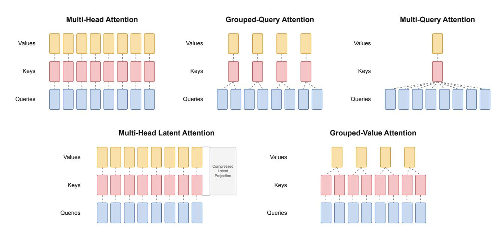

그림 1: 여덟 개의 쿼리 헤드를 위한 어텐션 캐싱 전략. GVA는 네 개의 그룹화된 값을 캐시하고 콘텐츠 키를 K = V M 으로 재구성한다. 표시된 콘텐츠 캐시는 매칭된 GQA의 절반 크기이며, 공유 위치 키를 포함하면 전체 의도된 캐시는 연구된 구성에서 약 45–47% 더 작다.

콘텐츠 키(content keys)는 지속적인 캐시가 축소되는 동안 보존된다.

- 작은 공유형 분리된 RoPE 채널이 이 재구성과 호환되는 위치 인코딩을 유지하며, 토큰당 d<sup>r</sup>개의 추가 캐시 스칼라를 사용한다.
- 제안된 decoupled-RoPE GVA 표현은 캐시 스칼라를 약 45–47% 감소시킨다; 16차원 위치 변형은 GQA의 44.36에 대해 44.35의 평균 정확도를 달성하며, 이는 시드 변동 범위 내에서 0.01 포인트 차이이며, MLA에서는 43.88을 기록한다. 점수는 서로 다른 시드로 세 번 실행한 평균이다.

## 2 관련 연구 (Related Work)

표기법. H를 쿼리 헤드 수, G를 키–값 그룹 수, d<sup>h</sup>를 헤드 폭, T를 캐시 길이라고 하자. 층과 시퀀스마다 다중 헤드 어텐션은 각 헤드에 대해 별도의 키와 값을 저장한다 [&#91;1,](#page-8-0) [2&#93;](#page-9-0):

$$N_{\rm MHA} = 2 T H d_h. \tag{2}$$

멀티-쿼리 어텐션. 자동 회귀 디코딩은 매 단계마다 키와 값을 로드하는 대역폭에 의해 제한된다 [&#91;2&#93;](#page-9-0). 멀티-쿼리 어텐션(MQA)은 H개의 쿼리 헤드를 유지하지만 단일 공유 키–값 헤드(G=1)를 사용한다 [&#91;2&#93;](#page-9-0). 캐시는

$$N_{\text{MQA}} = 2 T d_h, \tag{3}$$

다중 헤드 어텐션보다 H배 작다. 이는 디코딩 속도를 높이지만 품질과 일부 설정에서는 훈련 안정성을 희생한다 [&#91;2,](#page-9-0) [3&#93;](#page-9-2).

그룹화된 쿼리 어텐션. GQA는 멀티-헤드 어텐션과 MQA 사이를 보간한다: 쿼리 헤드가 G개의 그룹으로 나뉘며, 각 그룹은 하나의 키–값 헤드를 공유한다 [3](#page-9-2). 캐시는

$$N_{\text{GQA}} = 2 TG d_h. \tag{4}$$

G=H 및 G=1인 경우 멀티-헤드 어텐션과 MQA를 복원한다 [3](#page-9-2). 적당한 G를 사용하면 GQA는 Ainslie 등(2024)의 실험에서 멀티-헤드 어텐션에 가까운 품질과 MQA에 가까운 속도를 달성한다 [3](#page-9-2). 또한 Llama 2 70B 같은 공개 모델에서도 사용된다 [16](#page-9-4).

멀티-헤드 잠재 어텐션. DeepSeek MLA는 키와 값을 너비 dc의 저랭크 잠재 공간으로 압축하고, 너비 dr의 작은 공유 RoPE 슬라이스를 추가하여 전체 헤드 대신 이를 캐시한다 [4](#page-9-3):

$$N_{\text{MLA}} = T(d_c + d_r). \tag{5}$$

디코드 시에는 키 업-프로젝션을 쿼리 프로젝션에 흡수시켜 어텐션이 전체 컨텐츠-키 텐서를 실체화할 필요가 없도록 할 수 있다 [4](#page-9-3).

## 3 그룹화된 값 어텐션 (Grouped Value Attention)

우리는 컨텐츠 키가 값에서 유도될 수 있다고 가정한다. 두 값은 동일한 기본 컨텐츠에 대한 정보를 인코딩하므로 별도의 컨텐츠-키 캐시가 필요 없게 된다.

GVA는 GQA 그룹핑을 기반으로 한다: H개의 쿼리 헤드는 G개의 값 헤드를 공유한다. 키만 변경된다. 먼저 값을 키로 재사용한 뒤, 저장된 값에서 선형 매핑으로 대체했다. 본 섹션 전반에 걸쳐 행 벡터를 사용한다; g(h)는 쿼리 헤드 h에 할당된 값 그룹을 나타낸다.

### <span id="page-3-1"></span>3.1 값 전용 캐시 및 K<sup>h</sup> = Vg(h)M<sup>h</sup>

GQA는 그룹화된 키와 그룹화된 값을 모두 캐시한다. 두 스트림은 같은 형태를 가지므로 가장 단순한 절단은 그 중 하나만 저장하는 것이다. 값은 어텐션이 집계하는 대상이므로 지속되어야 한다.

공유 KV. 첫 번째 설계에서는 키 프로젝션을 제거하고 K = V 로 설정했다. 캐시는 그 결과 GQA의 절반이 되지만, 훈련 손실은 GQA 기준선으로 회복되지 않았다 (Figure [3)](#page-8-2). 하나의 벡터가 점수 매김과 검색 모두를 수행하도록 요구된다. 우리는 쿼리 정규화를 적용한 초기 공유-KV 접근법으로 Lumma-0.6B를 훈련시켰으며, 이는 쿼리 정규화 없이 공유 KV보다 약간의 개선을 가져왔고, Hugging Face에 Lumma-0.6B-Base로 공개했다 [19](#page-9-5).

선형 재구성. 따라서 우리는 전용 값을 유지하고 각 쿼리 헤드에 대해 컨텐츠 키를 재구성한다,

$$K_h = V_{g(h)}M_h, \qquad M_h \in \mathbb{R}^{d_h \times d_n}, \qquad h = 1, \dots, H.$$

(6)

여기서 d<sup>n</sup>은 컨텐츠-키 너비이며, 위치 슬라이스가 없을 때 d<sup>n</sup> = d<sup>h</sup> 이다. GVA는 각 쿼리 헤드마다 하나의 재구성 매핑 M<sup>h</sup>를 사용한다. 단일 헤드를 논의할 때는 헤드와 그룹 인덱스를 생략하고 M만 사용한다. 독립적인 키 프로젝션은 없다. 그룹화된 값 Vg(h)만이 컨텐츠 캐시에 기록된다. 값은 출력에 전달되는 컨텐츠를 담고, M<sup>h</sup>는 점수 매김에 사용되는 특징을 선택한다. 헤드별 매핑은 작은, 시퀀스에 독립적인 파라미터 비용으로 헤드별 컨텐츠 키를 유지한다.

키 다양성. 헤드별 매핑을 사용하면 GVA는 G개의 값 스트림을 캐시하지만 재구성을 통해 H개의 서로 다른 컨텐츠-키 스트림을 생성할 수 있다. GQA에서는 그룹 내의 모든 쿼리 헤드가 동일한 키 벡터에 대해 점수를 매긴다; GVA는 이 키 공유를 제거하고 헤드별 키 다양성을 복원하며, 연구된 구성에서는 GQA보다 작은 지속 캐시를 가진다. 이 키들은 그룹화된 값의 선형 변환으로 남아 있으며, 무제한 독립 프로젝션이 아니다. 이는 GQA에 대한 장점이며 MLA에 대한 것은 아니다: MLA 역시 공유 잠재 위에서 헤드별 키 업-프로젝션을 사용한다 [4](#page-9-3). Table [1](#page-3-0)은 컨텐츠-키와 캐시-스트림 수를 요약한다.

<span id="page-3-0"></span>Table 1: 레이어별 헤드별 컨텐츠-키 표현 및 지속 캐시 스트림. 공유 위치 스트림의 너비는 dr이다.

| 방법 | 고유한 콘텐츠 키 | 캐시된 스트림 |  |
|--------|-----------------------|---------------------------------|--|
| MHA | H | 2H |  |
| GQA | G | 2G |  |
| GVA | H | rope)<br>G<br>k<br>(plus shared |  |

초기 스케일. GQA는 같은 hidden state의 별도 projection에서 Q와 K를 얻으므로, 공통 초기화 규칙이 두 스케일 모두에 대한 기준을 제공하지만 일치하도록 보장하지는 않는다. GVA에서는 K<sup>h</sup> = Vg(h)M<sup>h</sup>가 projection의 projection이다; 초기 실행에서는 M<sup>h</sup>의 기본 초기화가 키를 쿼리보다 훨씬 낮은 스케일로 만들어 거의 균일한 attention을 생성하고, 초기 훈련에서 이 불일치를 회복하는 데 시간을 소비했다. 따라서 우리는 각 map을 내용 키와 쿼리의 초기 RMS와 일치하도록 초기화한다: σ<sup>M</sup> = σQ/(σ<sup>V</sup> √ din), 여기서 din = d<sup>h</sup>는 map에 의해 축소된 value width이며 σ<sup>Q</sup>는 쿼리 정규화 후 측정된다. Appendix [A](#page-10-0) 에서는 유도와 가정이 제공된다.

#### 3.2Absorption at decode (디코드 시 흡수)

인퍼런스 시 $M_h$가 고정되므로, 컨텐츠 키는 물리화될 필요가 없다. 쿼리 헤드 h에 대해, 캐시된 위치 j에 대한 컨텐츠 점수는

<span id="page-4-0"></span>

$$q_h k_{j,h}^{\top} = q_h (v_{j,g(h)} M_h)^{\top} = (q_h M_h^{\top}) v_{j,g(h)}^{\top} = \tilde{q}_h v_{j,g(h)}^{\top}, \tag{7}$$

여기서  $\tilde{q}_h = q_h M_h^{\top}$  은 쿼리 토큰과 헤드마다 한 번 계산된다. $q_h$와 $k_{j,h}$는 별도의 위치 슬라이스가 존재할 때 내용 슬라이스를 나타낸다. 아래 단일 헤드 표현에서는 헤드와 그룹 인덱스를 생략한다. 내용 attention은 값 캐시만 읽는다. 이 항등식은 정확하다. 융합 디코드 형식에서는 attention이 임시 키 텐서를 저장하지 않고 값 캐시 위에서 직접 $\tilde{q}$를 사용한다.

표준 RoPE를 쿼리와 재구성된 키에 적용하면 (7)에서의 흡수가 깨진다. 헤드와 그룹 인덱스를 생략하고, $q_t$를 위치 t에서 회전되지 않은 쿼리로 둔다. 행 벡터 표기법으로는

$$q_t^{\text{rot}} = q_t R_t^{\top}, \qquad k_j^{\text{rot}} = (v_j M) R_j^{\top},$$

따라서 점수는

$$q_t^{\mathrm{rot}}(k_j^{\mathrm{rot}})^{\top} = q_t R_t^{\top} R_j M^{\top} v_j^{\top} = q_t R_{j-t} M^{\top} v_j^{\top}, \qquad R_{j-t} = R_t^{\top} R_j.$$

상대 회전은 쿼리–키 위치 쌍에 따라 달라지며 $q_t$와 $M^{\top}$ 사이에 존재한다. 고정된 쿼리 위치 t에 대해서도 캐시된 위치 j에 따라 변하므로, 일반적으로 학습된 M에 대해 모든 캐시 위치에서 재사용되는 단일 변환된 쿼리로 합칠 수 없다.

### <span id="page-4-2"></span>3.3 Decoupled RoPE (분리된 RoPE)

우리는 각 쿼리와 키 헤드를 회전되지 않은 내용 슬라이스(폭 $d_n$)와 회전된 위치 슬라이스(폭 $d_r$)로 분할하고, 값은 폭 $d_h$를 유지한다. DeepSeek MLA[4]의 분리된 RoPE 전략을 채택한다: RoPE는 위치 슬라이스에만 적용되며, 위치 키는 헤드 간에 공유된다:

$$k_{j,h}^{\text{nope}} = v_{j,g(h)} M_h, \qquad M_h \in \mathbb{R}^{d_h \times d_n},$$

$$k_j^{\text{rope}} = (x_j W_r) R_j^{\top}, \qquad W_r \in \mathbb{R}^{d_{\text{model}} \times d_r}.$$

$$(9)$$

$$k_j^{\text{rope}} = (x_j W_r) R_j^{\top}, \qquad W_r \in \mathbb{R}^{d_{\text{model}} \times d_r}.$$

(9)

쿼리도 같은 방식으로 분할되며, 각 헤드마다 위치 슬라이스가 쿼리 위치 t에서 $R_t$에 의해 회전된다. 헤드와 그룹 인덱스를 생략하면 점수는

$$qk_j^{\top} = q^{\text{nope}}(k_j^{\text{nope}})^{\top} + q^{\text{rope}}(k_j^{\text{rope}})^{\top}. \tag{10}$$

첫 번째 항은 여전히 흡수된다: $q^{\text{nope}}(v_j M)^{\top} = (q^{\text{nope}} M^{\top}) v_j^{\top}$ . 두 번째 항은 캐시된 이미 회전된 $k_i^{\text{rope}}$를 사용한다. 두 회전 사이에 학습된 것이 없으므로 상대 위치가 보존된다. $k^{\text{rope}}$가 공유되므로 토큰당 $d_r$ 스칼라만 필요하며 $Gd_r$는 아니다. 점수 스케일링에 사용되는 전체 쿼리/키 폭은 $d_{qk} = d_n + d_r$ 이다.

#### <span id="page-4-3"></span>Cache size (캐시 크기)

GQA stores two grouped streams,

$$N_{\text{GOA}} = 2TGd_h. \tag{11}$$

포지셔널 슬라이스 없이 Shared KV와 GVA는 값만 저장하며, $TGd_h$는 정확히 절반이다. 분리된 RoPE를 사용하면 지속 상태는

<span id="page-4-1"></span>

$$N_{\text{GVA}} = TGd_h + Td_r, \tag{12}$$

#### <span id="page-5-0"></span>알고리즘 1 GVA의 분리된 RoPE를 사용한 디코드 단계 (Algorithm 1 One decode step of GVA with decoupled RoPE)

```
 \begin{array}{l} \textbf{요구사항:} \ \text{현재 은닉 상태} \ x_t; \ \text{매핑} \ W_Q, W_V, W_r, \{M_h\}_{h=1}^H; \ \text{캐시} \ V_{1:t-1,g} \ \text{for} \ g=1,\ldots,G \ \text{and} \ k_{1:t-1}^{\text{rope}}. \\ \textbf{보장:} \ \text{헤드별 주의 출력} \ \{o_{t,h}\}_{h=1}^H. \\ 1: \ q_t \leftarrow x_t W_Q; \ \text{각 헤드를 분할} \ q_{t,h}^{\text{rope}}, \ q_{t,h}^{\text{nope}} \\ 2: \ v_t \leftarrow x_t W_V \\ 3: \ \text{각 값 그룹} \ g=1,\ldots,G \ \text{do} \\ 4: \ V_{1:t,g} \leftarrow [V_{1:t-1,g}; v_{t,g}] \\ 5: \ \text{end for} \\ 6: \ k_t^{\text{rope}} \leftarrow (x_t W_r) R_t^\top \\ 7: \ k_{1:t}^{\text{rope}} \leftarrow [k_{1:t-1}^{\text{rope}}; k_t^{\text{rope}}] \\ 8: \ \text{각 쿼리 헤드} \ h=1,\ldots,H \ \text{do} \\ 9: \ q_{t,h}^{\text{rope}} \leftarrow q_{t,h}^{\text{rope}} R_t^\top \\ 10: \ \tilde{q}_{t,h} \leftarrow q_{t,h}^{\text{rope}} M_h^\top \left\{ \text{흡수; K^{nope}를 형성하지 않음} \right\} \\ 11: \ s_{t,h} \leftarrow \tilde{q}_{t,h}^{\text{tope}} M_h^\top \left\{ \text{흡수; K^{nope}를 형성하지 않음} \right\} \\ 12: \ o_{t,h} \leftarrow \text{softmax}(s_{t,h}/\sqrt{d_{qk}}) V_{1:t,g(h)} \\ 13: \ \text{end for} \\ 14: \ \text{return} \ \{o_{t,h}\}_{h=1}^H \end{aligned}
```

$$\frac{N_{\text{GVA}}}{N_{\text{GOA}}} = \frac{1}{2} + \frac{d_r}{2Gd_h}.$$

(13)

두 번째 항은 우리가 사용하는 너비에 대해 몇 퍼센트이며, 따라서 GVA가 GQA 캐시를 대략 절반으로 만든다고 말한다. 내용 너비 위에 포지셔널 차원을 추가하면 파라미터와 쿼리/키 너비가 바뀌지만 (12)의 형태는 변하지 않는다: V는 $d_h$-넓이를 유지하고 $k^{\text{rope}}$는 공유된다; $d_r$의 변화는 $Td_r$ 항에 의해 반영된다.

일반적인 연결과 출력 프로젝션은 헤드별 출력을 결합한다. 훈련은 동일한 내용-위치 분할과 표준 인과주의 주의를 사용한다. 알고리즘 1은 의도된 디코드 경로를 설명하며, (12)의 캐시 수는 측정된 최대 서비스 메모리가 아니라 지속 상태를 나타낸다. 우리는 맞춤형 디코딩 커널을 개발했으며 현재 추론 성능을 테스트 중이며 곧 오픈소스 릴리스를 계획하고 있다.

## 4 실험 (Experiments)

우리는 350M 파라미터 규모의 디코더 전용 Transformer를 FineWeb-Edu [8]의 30B 토큰 샘플에서 처음부터 훈련한다. 모든 모델은 변형이 명시되지 않는 한 동일한 데이터 순서, 토큰 예산, 옵티마이저, 컨텍스트 길이를 사용한다. GQA 기준 모델은 그룹화된 키-값 헤드를 사용한다; MLA와 모든 GVA 실행은 동일한 쿼리 헤드 수를 유지하므로 비교는 캐시 표현에 대한 것이지 쿼리 너비에 대한 것이 아니다.

프리트레이닝 중에 우리는 ZClip [18]을 사용하여 그래디언트 스파이크를 완화하고 손실 스파이크를 방지했다. ZClip은 그래디언트 노름에 대한 z-점수 기반 이상 탐지를 사용해 그래디언트를 적응적으로 클립한다.

### 4.1 변형 (Variants)

**Shared KV.** 첫 번째 캐시 절단은 K = V를 설정하고 그룹화된 값만 저장한다. 우리는 이를 기준으로 보고한다: 캐시는 GQA의 정확히 절반이지만 손실은 회복되지 않는다 (Figure 3). 이는 제안된 시스템이 아니다.

**GQA**와 **MLA**. GQA는 그룹화된 키와 값을 캐시한다 [3]. MLA는 공동 잠재 변수와 공유된 RoPE 슬라이스를 캐시한다 [4]. 두 모델 모두 GVA와 동일한 레시피로 훈련된다.

**GVA.** GVA는 그룹화된 값을 저장하고 K<sup>h</sup> = Vg(h)Mh를 사용해 키를 재구성한다. 모든 GVA 변형에서 쿼리 헤드마다 하나의 재구성 맵을 사용한다. 우리는 비교한다:

- GVA baseline: M의 표준 초기화로 선형 재구성을 수행한다.  
- GVA, scale-matched: M을 초기화하여 K와 Q가 동일한 RMS로 시작하도록 한다 (Appendix [A)](#page-10-0), 쿼리 RMSNorm을 사용한다.  
- GVA, variance-fixed: 동일한 M 초기화, 쿼리 RMSNorm 없이. 이는 decoupled RoPE가 없는 기본 GVA이다.  
- GVA + decoupled RoPE: 기본 GVA에 d<sup>r</sup> ∈ {16, 24} 너비의 공유 위치 슬라이스를 추가한다 (Section [3.3)](#page-4-2).

공유 KV와 decoupled RoPE가 없는 GVA는 재구성된 키에 일반 RoPE를 적용한다. 이 경로는 디코드 시 M을 흡수할 수 없으므로, 재구성을 위치 설계와 분리하기 위해 여전히 보고한다.

### 4.2 Evaluation

우리는 언어 모델 훈련 손실을 훈련 단계에 따라 보고하고, HellaSwag [&#91;9&#93;](#page-9-8), WinoGrande [&#91;10&#93;](#page-9-9), OpenBookQA [&#91;11&#93;](#page-9-10), 그리고 ARC의 Easy 및 Challenge 분할 [&#91;13&#93;](#page-9-11)에 대한 제로샷 정확도를 보고한다. 각 설정마다 서로 다른 난수 시드로 세 번의 실행을 수행하고, 각 작업에 대해 세 정확도의 산술 평균을 보고한다. 평균은 이 다섯 작업 수준 평균의 가중치 없는 평균이다. 시드 간 변동성을 평가하지 않고 작은 차이를 통계적으로 유의미하다고 해석해서는 안 된다.

캐시 크기는 Section [3.4:](#page-4-3)을 따른다. GQA는 2T Gdh를 저장하고, rope 슬라이스가 없는 공유 KV와 GVA는 T Gdh를 저장하며, decoupled RoPE가 있는 GVA는 T Gd<sup>h</sup> + T dr를 저장한다.

우리는 맞춤형 디코딩 커널을 개발했으며, MLA 및 GQA와 비교하기 위해 융합 디코딩 처리량을 포함한 종단 간 추론 성능을 현재 평가 중이다. 이 시스템 측정값은 여기서 보고되지 않으며, 곧 오픈소스 릴리스를 계획하고 있다.

## 5 Results

학습 손실. Figure [2](#page-7-0)는 GQA, MLA 및 GVA 변형에 대한 언어 모델 손실을 나타낸다. 초기 과도 이후, 스케일 매칭된 GVA는 GQA와 MLA를 따라간다. 표준 초기화된 M을 갖는 기본 GVA는 초기에는 더 나쁘지만 이후 차이를 좁히며, 이는 부록 [A.](#page-10-0)의 스케일 설명과 일치한다. Decoupled-RoPE 실행은 동일한 대략적 경로를 따른다; M이 스케일 매칭되면 두 번째 붕괴를 관찰하지 못한다.

공유 KV. Figure [3](#page-8-2)는 첫 번째 절단을 보여준다: K = V는 GQA 캐시를 반으로 줄이지만, 손실은 표시된 전체 실행 동안 GQA보다 높게 유지된다. 단일 벡터는 키/값 분할을 복구하지 못한다. 모든 이후 GVA 실행은 전용 값을 유지하고 키를 재구성한다.

하위 작업 정확도. Table [2](#page-7-1)는 각 구성에 대해 서로 다른 난수 시드로 세 번 실행한 결과의 평균 제로샷 정확도를 보고한다. 평균은 다섯 개 작업 수준 평균 정확도의 가중치 없는 평균이다.

쿼리 RMSNorm이 적용된 스케일 매칭 GVA는 가장 강력한 GVA 행(44.41)이며 GQA(44.36)에 가깝다. 쿼리 RMSNorm이 없는 기본 설정은 약간 낮은(43.77) 값이지만 MLA(43.88)에 가깝다. 일치 초기화가 없는 GVA 기본값은 43.91에 도달한다: 재구성만으로도 이미 이 범위에 속하며, 스케일 매칭은 주로 초기 손실을 개선하고 변형 간 최종 평균을 일관되게 개선하지는 않는다.

Decoupled RoPE는 제안된 서비스 설계이다. dr=16일 때 평균은 44.35이며, GQA보다 0.01 퍼센트 포인트 낮다. dr=24일 때는 44.29이다. 우리는 dr=16을 두 테스트 폭 중 더 나은 운영 지점으로 간주한다.

<span id="page-7-0"></span>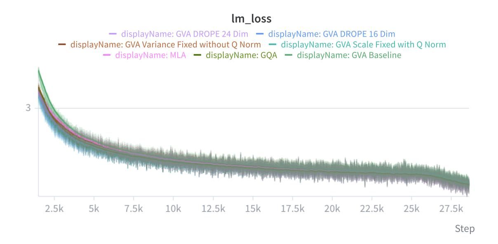

Figure 2: FineWeb-Edu에서 GQA, MLA 및 GVA의 학습 손실을 학습 단계에 따라 플롯한 것. 초기화가 스케일 매칭되면 GVA는 GQA와 유사한 경로를 따른다. 공유 KV는 여기서 생략되었으며, Figure 3을 참조한다.

테스트된 두 가지 폭. 이 실행은 위치 폭과 내용 폭 할당의 효과를 분리하지 않는다. DRoPE 행 중 어느 것도 평균에서 GQA를 능가하지 않으며, 주장은 GQA 수준에 근접한 품질을 가진 훨씬 작은 캐시를 목표로 한다는 것이지, 품질 승리라기보다.

Cache. GQA와 비교할 때, 별도의 위치 슬라이스 없이 shared KV와 GVA는 값만 보존할 때 캐시 스칼라를 절반만 필요로 한다. DRoPE를 사용하면 비율이  $\frac{1}{2} + d_r/(2Gd_h)$  (Section 3.4)이며, 이는 우리 그룹핑에서 $d_r$ =16일 때 약 47%, $d_r$ =24일 때 약 45%를 절약한다. 이는 표현 수준의 개수이며, 실제 서비스 메모리 절감량은 아니다. Ordinary-RoPE 변형은 흡수된 디코드 경로를 사용할 수 없으며, 위치에 따라 달라지는 키 재구성이 필요하다.

<span id="page-7-1"></span>Table 2: Accuracy(%)는 다섯 개 벤치마크에서 측정되며, 각 구성에 대해 서로 다른 난수 시드를 사용한 세 번의 실행을 평균한 값이다. 평균은 다섯 개 작업 수준 평균의 가중치 없는 평균이다. 굵게 표시된 항목이 각 열에서 가장 좋은 항목을 표시한다.

| 방법 | HellaSwag | WinoGrande | OBQA | ARC-E | ARC-C | 평균 |
|-------------------------------|-----------|------------|-------|-------|-------|-------|
| GQA | 43.41 | 52.48 | 33.40 | 63.42 | 29.09 | 44.36 |
| MLA | 43.20 | 51.61 | 34.60 | 62.87 | 27.13 | 43.88 |
| GVA baseline | 42.12 | 52.96 | 34.80 | 61.95 | 27.73 | 43.91 |
| GVA, scale-matched $+$ Q-norm | 42.05 | 53.51 | 34.40 | 62.75 | 29.35 | 44.41 |
| GVA, variance-fixed, no | 42.71 | 53.35 | 32.20 | 62.33 | 28.24 | 43.77 |
| Q-norm |  |  |  |  |  |  |
| GVA + DRoPE $d_r$ =24 | 42.94 | 53.12 | 33.20 | 63.69 | 28.50 | 44.29 |
| ${\rm GVA+DRoPE}\;d_r{=}16$ | 42.69 | 53.35 | 33.60 | 63.81 | 28.32 | 44.35 |

<span id="page-8-2"></span>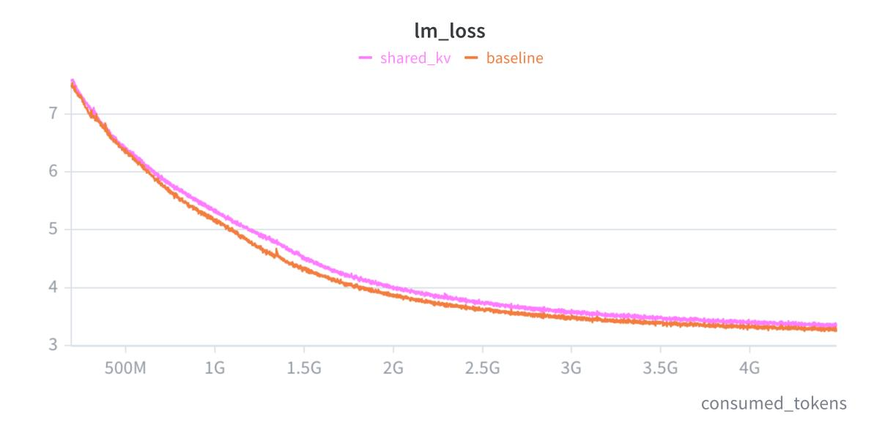

그림 3: 공유 KV (K = V) 대비 GQA 기준의 훈련 손실. 캐시는 GQA의 절반이지만 격차는 닫히지 않는다. 이는 전용 값에서 키를 재구성하도록 동기를 부여한다 (Section [3.1)](#page-3-1)).

## <span id="page-8-1"></span>6 제한 사항 (Limitations)

대략 45–47%의 캐시 감소는 decoupled-RoPE GVA가 의도한 디코드 상태를 설명한다: 그룹화된 V와 공유된 k rope. 위치 슬라이스를 생략하면 이론상 50% 값 전용 감소가 된다. 우리는 맞춤형 디코딩 커널을 개발했으며 현재 그 추론 성능을 테스트 중이며, 곧 오픈소스 릴리스를 계획하고 있다. 융합 디코드 처리량, 최대 서비스 메모리, 배치 용량 측정값은 여기서 보고되지 않는다.

모든 보고된 비교 실행은 하나의 규모(약 350M 파라미터), 하나의 데이터 믹스(30B FineWeb-Edu 토큰), 그리고 벤치마크 구성마다 세 가지 다른 난수 시드를 사용하며, 점수는 실행 간 평균을 취한다. dr=24인 DRoPE는 평균적으로 GQA보다 뒤처진다; 우리는 RoPE 폭, 덧셈형 대 비트형 할당, 또는 더 긴 컨텍스트를 체계적으로 스윕하지 않았다. Shared KV는 실패한 첫 번째 시도이며, 우리는 이를 권장하는 기준으로 삼지 않는다.

## 7 결론 (Conclusion)

GVA는 그룹화된 값을 저장하고 선형 매핑 K = V M을 사용해 키를 재구성한다. 하나의 벡터를 키와 값으로 공유하면 캐시가 절반으로 줄어들지만 관측된 실행에서는 GQA와 일치하지 않는다. 키를 재구성하고 그 초기 스케일을 쿼리와 일치시키면 GQA에 근접한 품질을 얻는다. 작은 공유 decoupled RoPE 채널은 디코드 시 M을 흡수하면서 위치 호환성을 유지한다. GQA에 비해 의도된 지속 캐시는 대략 절반이며, 다운스트림 품질은 동일한 넓은 범위(표 [2)](#page-7-1))를 유지한다. 우리는 맞춤형 디코딩 커널을 개발했으며 현재 그 종단 간 추론 성능을 테스트 중이며, 곧 오픈소스 릴리스를 계획하고 있다. 추가 작업에는 이 평가를 완료하고 RoPE 폭, 모델 규모, 난수 시드를 보다 광범위하게 스윕하는 것이 포함된다.

### 참고문헌 (References)

<span id="page-8-0"></span>[1] A. Vaswani et al. Attention Is All You Need. NeurIPS, 2017.

- <span id="page-9-0"></span>[2] N. Shazeer. 빠른 Transformer 디코딩: One Write-Head는 전부다. arXiv:1911.02150, 2019.
- <span id="page-9-2"></span>[3] J. Ainslie, J. Lee-Thorp, M. de Jong, Y. Zemlyanskiy, F. Lebrón, and S. Sanghai. GQA: 다중-쿼리 Transformer 모델을 다중-헤드 체크포인트에서 훈련한다. EMNLP, 2023.
- <span id="page-9-3"></span>[4] DeepSeek-AI. DeepSeek-V2: 강력하고 경제적이며 효율적인 Mixture-of-Experts 언어 모델. arXiv:2405.04434, 2024.
- <span id="page-9-12"></span>[5] B. Zhang and R. Sennrich. Root Mean Square Layer Normalization. NeurIPS, 2019.
- [6] T. Dao, D. Y. Fu, S. Ermon, A. Rudra, and C. Ré. FlashAttention: 빠르고 메모리 효율적인 정확한 Attention with IO-Awareness. NeurIPS, 2022.
- <span id="page-9-1"></span>[7] W. Kwon et al. PagedAttention를 이용한 대형 언어 모델 서비스의 효율적인 메모리 관리. SOSP, 2023.
- <span id="page-9-6"></span>[8] G. Penedo, H. Kydlíček, L. Ben Allal, A. Lozhkov, M. Mitchell, C. Raffel, L. von Werra, and T. Wolf. FineWeb 데이터셋: 대규모에서 가장 정제된 텍스트 데이터를 추출한다. arXiv:2406.17557, 2024.
- <span id="page-9-8"></span>[9] R. Zellers, A. Holtzman, Y. Bisk, A. Farhadi, and Y. Choi. HellaSwag: 기계가 실제로 당신의 문장을 완성할 수 있을까? ACL, 2019.
- <span id="page-9-9"></span>[10] K. Sakaguchi, R. Le Bras, C. Bhagavatula, and Y. Choi. WinoGrande: 대규모에서의 적대적 Winograd 스키마 챌린지. AAAI, 2020.
- <span id="page-9-10"></span>[11] T. Mihaylov, P. Clark, T. Khot, and A. Sabharwal. 갑옷이 전기를 전도할 수 있을까? 오픈북 질문 답변을 위한 새로운 데이터셋. EMNLP, 2018.
- [12] Y. Bisk, R. Zellers, R. Le Bras, J. Gao, and Y. Choi. PIQA: 자연어에서 물리적 상식에 대한 추론. AAAI, 2020.
- <span id="page-9-11"></span>[13] P. Clark et al. 질문 답변을 해결했다고 생각하나요? ARC, AI2 추론 챌린지를 시도해 보세요. arXiv:1803.05457, 2018.
- [14] Z. Liu et al. KIVI: 튜닝 없이 비대칭 2비트 양자화로 KV 캐시를 최적화. ICML, 2024.
- [15] G. Hinton, O. Vinyals, and J. Dean. 신경망에서 지식을 증류한다. arXiv:1503.02531, 2015.
- <span id="page-9-4"></span>[16] H. Touvron et al. Llama 2: 오픈 기반 및 미세 조정된 챗 모델. arXiv:2307.09288, 2023.
- [17] V. Tripathi and A. Kumar. Grouped Query Experts: GQA Self-Attention에서 Mixture-of-Experts. arXiv:2606.20945, 2026.
- <span id="page-9-7"></span>[18] A. Kumar, L. Owen, N. Roy Chowdhury, and F. Güra. ZClip: LLM 사전 훈련을 위한 적응형 스파이크 완화. arXiv:2504.02507, 2025.
- <span id="page-9-5"></span>[19] FrontiersMind. Lumma-0.6B-Base. Hugging Face 모델 저장소, 2026. [https://huggingface.](https://huggingface.co/FrontiersMind/Lumma-0.6B-Base) [co/FrontiersMind/Lumma-0.6B-Base](https://huggingface.co/FrontiersMind/Lumma-0.6B-Base).

#### <span id="page-10-0"></span>쿼리-키 스케일 (A Query-Key Scale)

쿼리와 키 좌표가 중심화되고 약간 상관관계가 있을 때, 표준편차가 $\sigma_Q$와 $\sigma_K$인 경우 행 벡터에 대해

$\operatorname{Var}\left(\frac{qk^{\top}}{\sqrt{d_h}}\right) \approx \sigma_Q^2 \sigma_K^2.$  (14)

곱이 너무 작으면 softmax가 거의 같은 로짓을 보고 attention이 평평해진다. 반대로 너무 크면 몇몇 위치가 지배적이 된다. Figure 4는 두 경우를 모두 보여준다.

GQA는 같은 은닉 상태의 별도 투영에서 Q와 K를 얻어, 일치 여부를 보장하기보다는 초기 스케일에 대한 기준을 제공한다. GVA에서는 K = VM이므로 K의 스케일도 M에 의존한다. 초기 실행에서는 기본 초기화가 K를 Q보다 훨씬 낮게 두었고, 초기 훈련 단계에서 이 불일치를 조정하는 데 시간이 소요되었다.

**초기화.** $d_{\text{in}}$를 M의 입력 폭, 즉 값 폭으로 두자. 초기 맵 항목과 독립적인, 대략 중심화된 값 좌표가 분산 $\sigma_V^2$를 갖는다고 가정하면, 우리는

$$M_{ij} \sim \mathcal{N}\left(0, \frac{\sigma_Q^2}{\sigma_V^2 d_{\rm in}}\right).$$

(15)

그런 다음 $\operatorname{Var}(K_j) \approx d_{\operatorname{in}} \sigma_V^2 \operatorname{Var}(M_{ij}) = \sigma_Q^2$ 이므로 K는 Q와 거의 같은 RMS로 시작한다. 타깃은 쿼리 정규화 이후의 쿼리 스케일을 사용한다. 초기화 후 M은 학습 가능하다. 선택적 쿼리 RMSNorm [5]는 쿼리 스케일을 제어하지만, Table 2의 분산 고정 행은 그것 없이도 경쟁력이 있다. 이 초기화는 캐시된 값들을 정규화하지 않는다.

**Decoupled RoPE.** 슬라이스마다 동일한 규칙을 적용한다. M의 fan-in은 값 너비이며, 내용 너비가 아니다. 공유된 위치-키 투영을 초기화하여 $k^{\text{rope}}$ 가 $q^{\text{rope}}$ 의 초기 RMS와 일치하도록 한다. 위치와 내용 스케일을 별도로 평가한다: 이들을 하나의 키 분산으로 풀링하면 초기 실행에서 불일치를 숨겼다.

Figure 5는 쿼리와 키 스케일을 함께 변형하여 Figure 4를 보완하며, 동일한 스케일만으로는 평평하거나 과도하게 집중된 어텐션을 방지할 수 없음을 보여준다.

<span id="page-10-1"></span>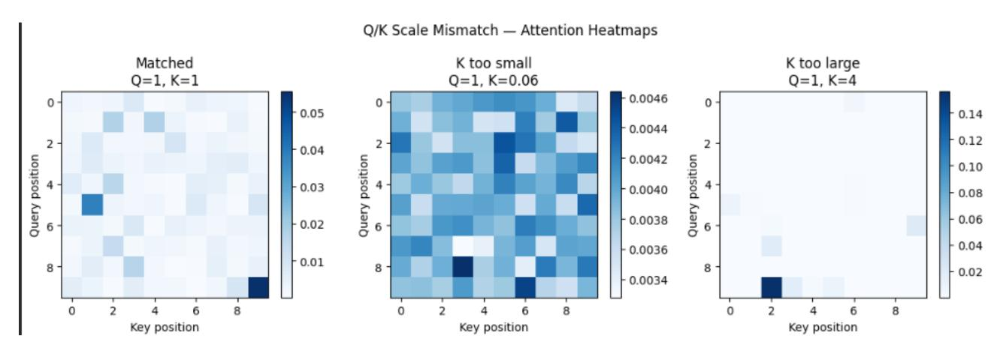

Figure 4: 10-포지션 시퀀스에서 쿼리와 키 스케일이 일치한 경우(왼쪽), 키가 너무 작은 경우(가운데), 키가 너무 큰 경우(오른쪽)의 시각화된 어텐션 히트맵. 작은 키는 거의 균일한 어텐션을 생성하고, 큰 키는 가중치를 집중시킨다. 각 패널은 자체 색상 스케일을 사용한다.

<span id="page-11-0"></span>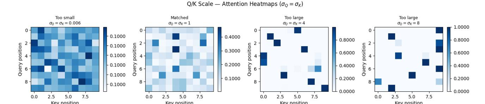

Figure 5: 10 × 10 어텐션 히트맵으로, 일치된 스케일 σ^Q = σ^K ∈ {0.006, 1, 4, 8} (왼쪽에서 오른쪽). 작은 σ는 거의 균일한 가중치(≈ 0.1 per key)를 제공하고, 단위 σ는 중간 정도 변동을, 큰 σ는 피크가 높고 거의 one-hot 행을 만든다. 각 패널은 자체 색상 스케일을 사용한다. 절대 스케일은 소프트맥스가 평평한지, 선택적인지, 피크가 높은지를 결정한다.


### B 추가 평가 곡선 (Extra Evaluation Curves)


Table [2.](#page-7-1)의 일곱 가지 구성에 대한 학습 과정별 작업별 정확도. 플롯은 원래 실행 이름과 가로축 단위를 유지한다.

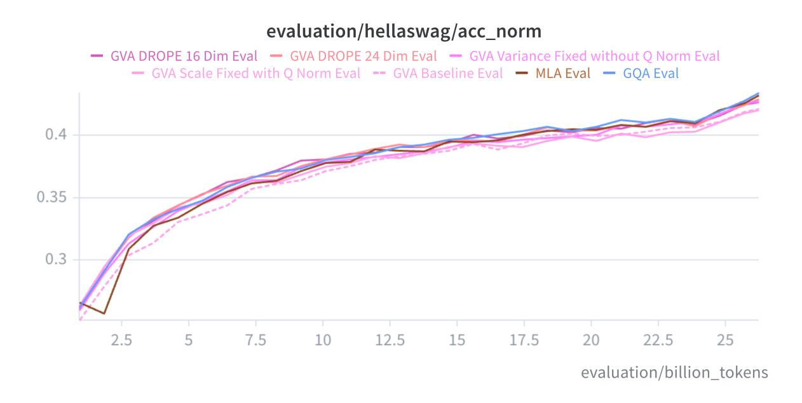

Figure 6: HellaSwag 정확도(학습 과정).

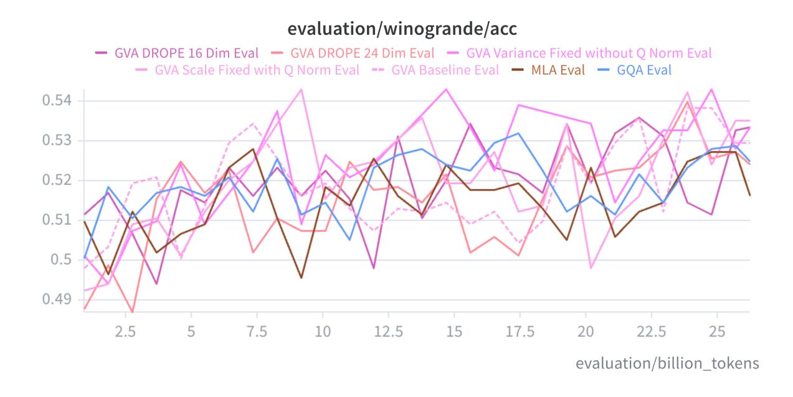

Figure 7: WinoGrande 정확도(학습 과정).

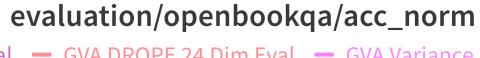

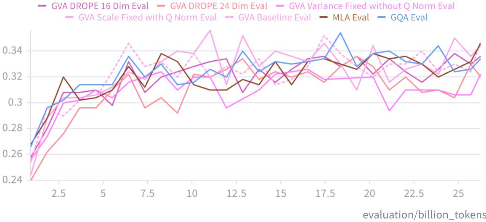

Figure 8: OpenBookQA 정확도(학습 과정).

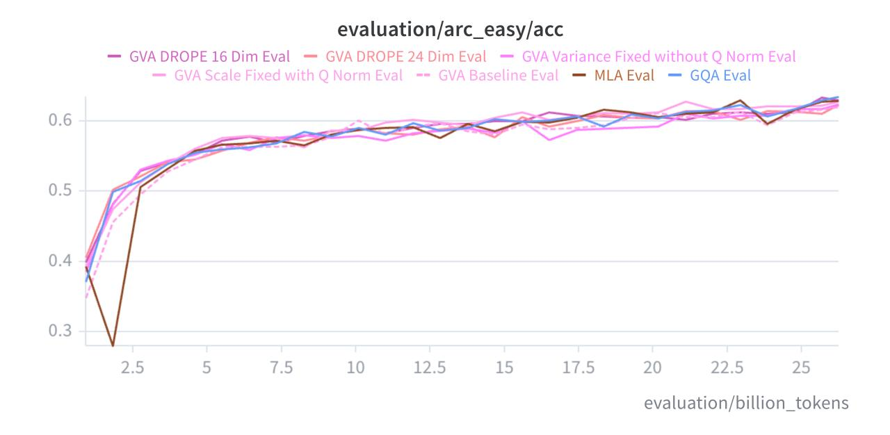

Figure 9: ARC-Easy 정확도(학습 과정).

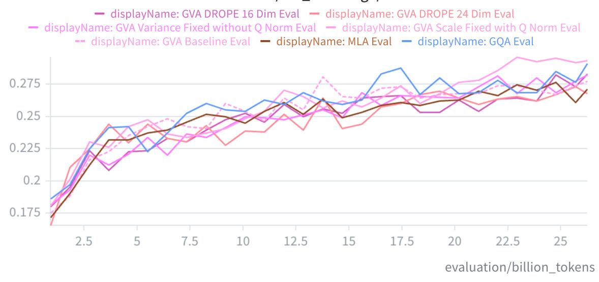

Figure 10: ARC-Challenge 정확도(학습 과정).

