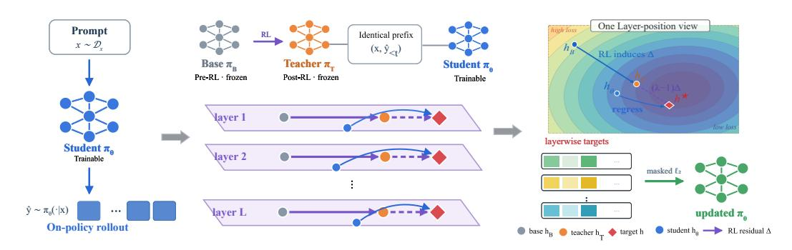
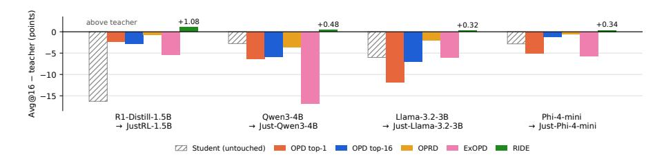
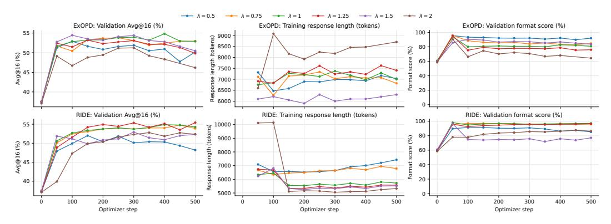
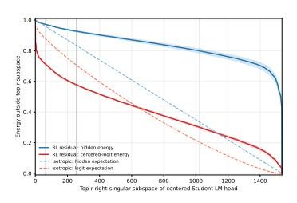
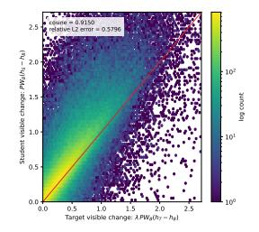
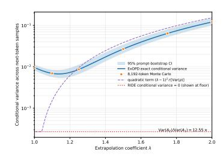
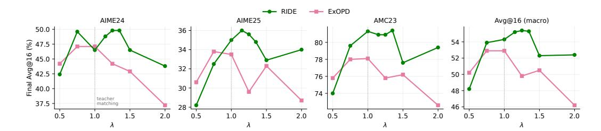
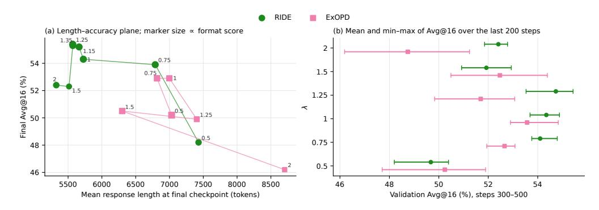

# 교사는 방향이지 목적지가 아니다: RL-유도 표현 잔여를 온-정책 증류에서 외삽하기 (THE TEACHER IS A DIRECTION, NOT A DESTINATION: EXTRAPOLATING RL-INDUCED REPRESENTATION RESIDUALS IN ON-POLICY DISTILLATION)

- 원제: The Teacher Is a Direction, Not a Destination: Extrapolating RL-Induced Representation Residuals in On-Policy Distillation
- 원문: [https://arxiv.org/abs/2609.36484](https://arxiv.org/abs/2609.36484)
- PDF: [https://arxiv.org/pdf/2609.36484](https://arxiv.org/pdf/2609.36484)
- arXiv ID: `2609.36484`

---

# 교사는 방향이지 목적지가 아니다: RL-유도 표현 잔여를 온-정책 증류에서 외삽하기 (THE TEACHER IS A DIRECTION, NOT A DESTINATION: EXTRAPOLATING RL-INDUCED REPRESENTATION RESIDUALS IN ON-POLICY DISTILLATION)

Hao Li $^{1,*}$  Mei Jia Chen $^{2,*}$  Wei jie Ren $^{3,*}$  Donghan Li $^4$  Zi jun Tian $^4$  Jingchun Huang $^4$  Nai bo Wang $^{3,\dagger}$

1중국 과학기술대학교 2루터스 대학교 3저장대학교 4독립 연구자

haoli2101@mail.ustc.edu.cn mc2989@rutgers.edu mikeli1997qwe@gmail.com yaynetian@gmail.com jh2688@cornell.edu

wangnaibo@zju.edu.cn

\*Equal contribution. †Corresponding author.

#### **요약** (ABSTRACT)

온-정책 증류(OPD)는 학생이 자신의 궤적에서 교사의 다음 토큰 분포와 일치하도록 훈련시키며, 상당한 실험적 이득을 가져왔다. 일반화된 변형은 출력 공간에서 암시적 보상을 외삽함으로써 학생이 교사를 능가하도록 허용한다. 그러나 언어 모델 헤드는 이 변화를 비등방성으로 감쇠시킨다: 교사의 은닉 상태에 인코딩된 변화 대부분이 로짓에 소수의 가중치만을 통해 전달되고, 출력 공간 외삽에 의존하는 샘플링된 토큰 로그-확률 비율은 외삽이 증폭시키는 노이즈를 주입해 학습을 불안정하게 만든다. 우리는 강화 학습(RL)이 모델의 내부 표현을 기본 체크포인트에 비해 이동시키며, 이 이동 방향은 모든 층에서 측정될 수 있음을 관찰한다. 이 관찰에 동기를 부여해 우리는 RIDE(RL-Induced Direction Extrapolation)를 제안한다. RIDE는 RL-유도 변화를 표현 공간에서 직접 외삽한다: 각 층과 토큰 위치에서 RIDE는 교사와 사전-RL 체크포인트 사이의 잔여를 계산하고, 이 잔여를 따라 교사를 넘어선 목표로 학생의 은닉 상태를 회귀시킨다. 샘플링된 궤적에 조건부로 이 회귀는 교사를 중심으로 한 2차 패널티 하에 잔여에 의해 정의된 선형 방향 보상을 최대화하는 것과 동등하며, 이는 목표가 RL-유도 방향을 따라 학생을 이동시키면서 교사로부터의 편차를 제한하는 방식을 명시한다. 서로 다른 규모, 아키텍처, 사전 훈련 계통을 아우르는 네 개의 기본/ RL-교사 쌍에서 RIDE는 모든 쌍에서 RL-훈련 교사에 접근하거나 초과하며, 평균적으로 그렇게 하는 유일한 방법이며, 교사가 기본에 가까울 때마다 학생을 저하시시키는 출력 공간 외삽보다 일관되게 우수하다. 프로젝트 페이지: https://github.com/xixixixxxx/RIDE.

## 1 서론 (Introduction)

증류는 교사로부터 학생에게 능력을 전달한다(Hinton et al., 2015), 그리고 온-정책 증류는 언어 모델 사후 훈련의 표준 단계가 되었다(Yang et al., 2025; Xiao et al., 2026). OPD에서 학생은 자신의 궤적을 샘플링하고 실제로 방문한 문맥에서 교사로부터 토큰 단위 감독을 받으며, 이는 노출 편향을 줄이고 밀집된 학습 신호를 제공한다(Agarwal et al., 2024; Gu et al., 2024; Lu & Thinking Machines Lab, 2025). 일반적인 활용은 강화 학습 교사의 이득을 초기화가 공유되는 학생에게 전달하는 것이다. 예를 들어 도메인 전문가를 병합하거나 비용이 많이 드는 RL 실행을 다시 기본 모델에 증류할 때(Xiao et al., 2026; Yang et al., 2026b).

Figure 1: 언어 모델 헤드는 RL-유도 표현 변화를 불균형적으로 감쇠시킨다. (a) 헤드를 통한 투영 전후의 잔여 외삽. (b) 헤드의 특이 방향에 걸친 교사-기본 잔여의 은닉 상태 및 중심-로짓 에너지 비율. 수염은 프롬프트-부트스트랩 95% 신뢰 구간을 보여준다.

표준 OPD는 교사를 학습의 최종 지점으로 취급하지만, 학생들은 그곳에서 멈출 필요가 없다: 교사-참조 로그-확률 비율은 암묵적 보상으로 작용한다 [(Rafailov et al., 2023;](#page-11-1) [Yuan et al.,](#page-12-3) [2025;](#page-12-3) [Cui et al., 2025)](#page-10-3), KL 제약에 비해 이를 가중치하면 교사를 능가하는 학생을 얻을 수 있다 [(Yang et al., 2026b)](#page-12-2), 그리고 관련 방법들은 매개변수 또는 로짓 공간에서 변위를 외삽한다 [(Li et al., 2026b;](#page-11-2) [Zheng et al., 2025)](#page-12-4). RL 업데이트가 작고 구조적이며 실행 간 일관적이다 [(Mukherjee et al., 2025;](#page-11-3) [Zhu et al., 2025;](#page-13-0) [Shenfeld et al., 2026)](#page-11-4), RL 훈련된 교사는 방향과 목적지를 모두 제공하며, 같은 체크포인트에서 시작하는 학생은 그 방향을 따라 계속할 수 있다.

그러나 출력 공간에서 외삽하면, 헤드가 대부분을 감쇠한 뒤에 이 방향을 측정한다. 언어 모델 헤드는 그 비등방성 특이값 스펙트럼에 따라 표현 변화를 재가중한다 [(Yang et al., 2018;](#page-12-5) [2026a)](#page-12-6): [Fig. 1,](#page-1-0) 그 512개의 가장 약한 방향은 교사-기본 잔여의 숨겨진 상태 에너지의 79.8%를 운반하지만, 중심화된 로짓 에너지의 30.0%만을 운반한다. 따라서 출력 공간 목표는 잔여의 대부분을 약하게 감독하고 초기 층을 무제한으로 둔다. 샘플링된 토큰 로그-비율은 길이 편향이 있고 과적합에 취약하다 [(Park et al.,](#page-11-5) [2024b;](#page-11-5) [Rafailov et al., 2024)](#page-11-6), 그리고 이를 전역 계수로 스케일링하면 극단적 보상을 증폭시키고 훈련을 불안정하게 만든다 [(Yang et al., 2026b;](#page-12-2) [Sun et al., 2026;](#page-12-7) [Li et al., 2026a)](#page-11-7). 숨겨진 상태는 헤드 이전의 변화를 보존한다: 특성 수준의 증류는 이미 이를 감독으로 사용한다 [(Romero et al.,](#page-11-8) [2015;](#page-11-8) [Sun et al., 2019;](#page-11-9) [Jiao et al., 2020)](#page-10-4), 그 온정책 형태 OPRD는 결정론적 롤아웃별 기울기로 층별로 학생과 교사의 상태를 일치시킨다 [(Yang et al., 2026a)](#page-12-6), 그리고 숨겨진 상태 방향은 가산적으로 조정될 수 있는 행동을 인코딩한다 [(Park et al., 2024a;](#page-11-10) [Turner et al., 2023;](#page-12-8) [Zou et al.,](#page-13-1) [2023;](#page-13-1) [Arditi et al., 2024)](#page-10-5), 이는 잔여 외삽을 이 공간에서 자연스러운 연산으로 만든다.

따라서 우리는 *RIDE* (RL-Induced Direction Extrapolation)를 제안한다. 학생을 교사의 pre-RL 체크포인트에서 초기화하면, 세 모델은 동일한 표현 공간을 공유한다. 각 학생이 생성한 컨텍스트마다, RIDE는 고정된 교사와 pre-RL 체크포인트를 동일한 토큰에 대해 평가하고, 그 층별 숨겨진 상태 차이를 RL-induced residual로 취한다. 각 목표를 이 잔여를 따라 교사보다 한 단계 더 나아가게 한 계수로 배치하고, 학생의 숨겨진 상태를 그 방향으로 회귀시킨다. 롤아웃에 조건화된 이 회귀는 교사를 중심으로 한 2차 패널티 아래에서 선형 방향 보상을 최대화하며, 공유 선형 헤드 하에서 [Yang et al.](#page-12-2) [(2026b)](#page-12-2)의 출력 공간 외삽 목표는 RIDE 목표의 헤드-투영 이미지이다; RIDE는 샘플링된 토큰 로그-비율을 결정론적 숨겨진 상태 기울기로 대체하면서 보상-외삽 관점을 유지한다.

다양한 규모, 모델 계통, 어휘를 아우르는 네 개의 base/RL-교사 쌍(R1-Distill-1.5B, Qwen3-4B, Llama-3.2-3B, Phi-4-mini)에서, RIDE는 각 쌍에서 OPRD와 출력 공간 기준선보다 AIME24, AIME25, AIMO에서 평균 Avg@16을 더 높게 달성하고, RL 훈련된 교사 자체에 근접하거나 이를 초과한다. 반면 출력 공간 외삽은 모든 쌍에서 교사보다 낮은 성능을 보인다.

우리의 기여는 다음과 같다.

• 우리는 RL에 의해 유도된 표현 잔여(레지듀얼)를 식별한다. 이는 교사와 동일한 온-폴리시 컨텍스트에서 RL 이전 체크포인트와의 층별 차이이며, RL이 모델의 계산을 어떻게 바꾸는지를 측정하는 척도이다. 두 체크포인트는 동일 초기화 디스틸레이션 설정에서 사용 가능하다.

- 우리는 RIDE를 제안한다. RIDE는 이 잔여를 따라 숨겨진 상태 목표를 외삽하며, 단일 계수로 λ = 1에서 OPRD를 복원한다. 우리는 목적 함수를 이차 패널티를 둔 보상 최대화로 해석한다. 이는 출력 공간 보상 외삽의 표현 공간 대응이다.
- 우리는 RIDE가 네 개의 베이스/교사 쌍에서 모두 RL로 훈련된 교사를 근접하거나 초과하며, 일관되게 OPRD와 출력 공간 외삽을 능가함을 보인다. 또한 헤드 감쇠와 조건부 분산 분석을 통해 학습 신호를 특성화한다.

## 2 관련 연구 (RELATED WORK)

온-폴리시 디스틸레이션. 시퀀스 수준 모방과 달리 [(Hinton et al., 2015;](#page-10-0) [Kim & Rush, 2016)](#page-11-11), 온-폴리시 디스틸레이션은 학생 모델에서 샘플링하고 그가 방문하는 접두어를 감독한다 [(Agarwal et al.,](#page-10-1) [2024;](#page-10-1) [Gu et al., 2024;](#page-10-2) [Ko et al., 2024)](#page-11-12); 샘플링된 토큰 형태는 이제 표준 사후 훈련 단계가 되었다 [(Lu & Thinking Machines Lab, 2025;](#page-11-0) [Yang et al., 2025;](#page-12-0) [Xiao et al., 2026)](#page-12-1). 최근 변형들은 교사 로짓의 필요성을 제거한다 [(Ye et al., 2025)](#page-12-9), 안정성을 위해 목표를 재구성한다 [(Jang et al., 2026;](#page-10-6) [Jin](#page-10-7) [et al., 2026)](#page-10-7), 실패 모드를 분석한다 [(Fu et al., 2026;](#page-10-8) [Li et al., 2026c)](#page-11-13), 또는 특권 정보를 가진 모델 자체를 자신의 교사로 사용한다 [(Zhao et al., 2026;](#page-12-10) [Hubotter et al., 2026)](#page-10-9). 이러한 모든 접근법은 중간 상태가 아니라 출력만을 감독한다.

교사를 넘어선 학습. OPD를 암시적 로그-비율 보상을 갖는 KL-제약 RL로 보는 [(Rafailov et al., 2023;](#page-11-1) [Yuan et al., 2025;](#page-12-3) [Cui et al., 2025)](#page-10-3), 일반화된 OPD는 이 보상을 가중하고 교사를 초과하는 학생을 얻는다 [(Yang et al., 2026b)](#page-12-2). 그러나 전역 계수는 학생을 극단적 보상 피크로 이끈다 [(Sun et al., 2026)](#page-12-7) 그리고 거의 결정론적 출력을 붕괴시킬 수 있다 [(Li et al., 2026a)](#page-11-7), 이는 길이 편향과 로그-비율 보상의 과최적화를 반영한다 [(Park et al., 2024b;](#page-11-5) [Rafailov et al., 2024)](#page-11-6). 다른 방법들은 파라미터 또는 로짓 공간에서 외삽한다. 이는 정책의 자체 RL 궤적을 따라 [(Li et al., 2026b)](#page-11-2) 또는 미세 조정된 모델과 초기화 사이의 차이를 따라 [(Ilharco et al., 2023;](#page-10-10) [Zheng et al., 2025)](#page-12-4). RIDE는 RL에 의해 유도된 변화가 사용 가능한 방향이라는 전제를 공유하지만, 이를 숨겨진 상태, 각 층, 헤드 이전, 그리고 학생의 자체 컨텍스트에서 측정한다.

Representation-level distillation. 중간 표현은 오랫동안 distillation targets(분산화 대상)로 사용되어 왔다 [(Romero et al., 2015;](#page-11-8) [Zagoruyko & Komodakis, 2017;](#page-12-11) [Tian et al., 2020;](#page-12-12) [Sun et al., 2019;](#page-11-9) [Jiao et al., 2020;](#page-10-4) [Wang et al., 2020)](#page-12-13). OPRD는 정책에 대해 층별 hidden-state 회귀를 적용하여, deterministic per-rollout gradient와 output-space losses가 헤드를 통해 볼 수 없는 감독을 얻는다 [(Yang et al., 2026a)](#page-12-6); PHF는 대신 hiddenstate 전이의 방향과 기하학을 매칭한다 [(Li et al., 2026d)](#page-11-14). RIDE는 pre-RL 체크포인트에서 teacher까지의 residual을 사용하여 teacher를 넘어서는 targets를 배치하고, hidden space에서 행동 방향의 대략 선형 구조를 활용한다 [(Park et al., 2024a;](#page-11-10) [Turner et al., 2023;](#page-12-8) [Zou et al., 2023;](#page-13-1) [Arditi et al.,](#page-10-5) [2024)](#page-10-5) 그리고 RL 업데이트의 구조적이고 일관된 특성에 기반한다 [(Mukherjee et al., 2025;](#page-11-3) [Zhu et al.,](#page-13-0) [2025;](#page-13-0) [Shenfeld et al., 2026)](#page-11-4).

## 3 전제 조건 (PRELIMINARIES)

Notation. π^θ를 학습 가능한 학생, π^T를 고정된 교사라고 하자. 두 모델은 L개의 층, hidden dimension d, 공유 어휘 V, 언어 모델 헤드 Whead ∈ R^{|V|×d}를 갖는 디코더 전용 트랜스포머이다. 프롬프트 x ∼ Dx에 대해 학생은 yˆ = (ˆy1, …, yˆ^T) ∼ πθ(· | x)를 샘플링한다. 우리는 모든 모델을 동일한 학생 생성 프리픽스 (x, yˆ<t)에서 평가하고, 모델의 다음 토큰 분포를 π(· | x, yˆ<t)로 표기하며, 위치 t에서의 층-l residual-stream 상태를 h^{(l)}_{π,t} ∈ R^d로 표기한다.

On-policy distillation. 고전적인 knowledge distillation은 학생을 교사의 출력이나 샘플에 대해 훈련한다 [(Hinton et al., 2015;](#page-10-0) [Kim & Rush, 2016)](#page-11-11). On-policy distillation (OPD)은 대신 학생의 응답을 샘플링하고, 방문한 프리픽스에서 교사와의 reverse KL divergence를 최소화한다 [(Agarwal et al., 2024;](#page-10-1) [Gu et al., 2024)](#page-10-2); KL divergence의 체인 룰에 의해,

$$\mathcal{L}_{\text{OPD}}(\theta) = \mathbb{E}_{x, \, \hat{y} \sim \pi_{\theta}} \left[ \sum_{t=1}^{T} D_{\text{KL}} \left( \pi_{\theta}(\cdot \mid x, \hat{y}_{< t}) \mid \mid \pi_{T}(\cdot \mid x, \hat{y}_{< t}) \right) \right]. \tag{1}$$

샘플링된 토큰에서 각 로컬 KL을 추정하면 일반적으로 사용되는 토큰별 업데이트가 제공된다

$$g_{\text{OPD}}^{\text{token}}(\theta) = \mathbb{E}_{x, \, \hat{y} \sim \pi_{\theta}} \left[ \sum_{t=1}^{T} r_t \, 
abla_{\theta} \log \pi_{\theta}(\hat{y}_t \mid x, \hat{y}_{< t}) \right], \qquad r_t = \log \frac{\pi_{\theta}(\hat{y}_t \mid x, \hat{y}_{< t})}{\pi_T(\hat{y}_t \mid x, \hat{y}_{< t})}, \qquad (2)$$

여기서 −r^t는 dense per-token advantage(밀집 토큰별 이점) 역할을 한다 [(Lu & Thinking Machines Lab, 2025;](#page-11-0) [Xiao et al.,](#page-12-1) [2026)](#page-12-1). 어떤 reference policy πref에 대해, 같은 목적은 implicit reward log π^T − log πref를 갖는 KL-regularized RL과 동일하며 [(Rafailov et al., 2023;](#page-11-1) [Yang et al., 2026b)](#page-12-2); output-space extrapolation은 이 보상을 확장한다 [(Section A.1)](#page-13-2).

On‑policy supervision as target matching. 위치 t에서의 모델 양자 s_{π,t}와 목표 τ^t, 그리고 불일치 측정기 ℓ을 정의한다:

$$\mathcal{L}(\theta) = \mathbb{E}_{x \sim \mathcal{D}_x, \ \hat{y} \sim \pi_{\theta}(\cdot|x)} \left[ \frac{1}{T} \sum_{t=1}^{T} \ell(s_{\theta,t}, \ \text{sg}(\tau_t)) \right], \tag{3}$$

여기서 sg는 타깃을 통한 그래디언트 흐름을 차단한다.  
출력 공간 교사 매칭은 sπ,t를 다음 토큰 분포로 두고 ℓ을 역 KL 발산으로 둔다.  
표현 매칭은 sπ,t = h (l) π,t 를 l ∈ Llayer에 속하는 여러 층에서 정의하고, 마스크 mt ∈ {0, 1}에 의해 선택된 위치에서 차원 정규화된 제곱 오차를 사용한다.

$$\ell(h_{\theta,t}^{(l)}, \tau_t^{(l)}) = \frac{1}{d} \|h_{\theta,t}^{(l)} - \tau_t^{(l)}\|_2^2, \tag{4}$$

이는 온정책(feature) distillation이며 [(Romero et al., 2015;](#page-11-8) [Jiao et al., 2020;](#page-10-4) [Yang et al., 2026a)](#page-12-6)이다. 롤아웃에 조건화되면 그 기울기는 결정적이며, [Eq. (2).](#page-3-0)와 달리이다. 두 경우 모두 τt = sT ,t를 설정하므로 교사는 학습의 최종점이다.

동일 초기화 설정. 우리는 베이스 체크포인트에서 RL로 얻은 교사 πT = RL(πB)와 그 체크포인트에서 초기화된 학생 πθ0 = πB를 연구한다. 이 설정은 RL 결과가 다시 베이스 모델에 증류될 때 또는 베이스를 공유하는 RL 훈련된 전문가들이 병합될 때 발생한다 [(Xiao et al., 2026;](#page-12-1) [Yang et al., 2026b)](#page-12-2). 세 모델은 아키텍처, 토크나이저, 그리고 표현 기원을 공유하므로, 공통 접두사에서 sT ,t−sB,t 차이는 RL이 해당 문맥에서 무엇을 바꿨는지를 측정한다: 출력 공간에서는 암묵적 보상 log πT − log πB [(Rafailov et al., 2023)](#page-11-1); 표현 공간에서는 헤드 이전의 각 층에서 벡터이다.

## 4 방법론 (Method)

RIDE는 RL로 훈련된 교사가 목적지 외에 방향을 지정한다는 전제에 기반한다: 교사가 πB에서 벗어난 변위가 RL이 기여한 것이며, πB에서 초기화된 학생은 그 방향을 따라 계속 진행할 수 있다 [(Fig. 2)](#page-4-0). 우리는 대상-회귀 템플릿 [(Section 4.1)](#page-3-1)에서 구성을 명시하고, 이를 숨겨진 상태에 적용한다 [(Section 4.2)](#page-4-1), 이 공간 선택을 정당화한다 [(Section 4.3)](#page-4-2), 그리고 목표를 보상 최대화로 해석한다 [(Section 4.4;](#page-5-0) 구현은 [Section G)](#page-17-0)에서 한다.

### 4.1 교사 매칭에서 잔차 외삽으로 (FROM TEACHER MATCHING TO RESIDUAL EXTRAPOLATION)

안에서 [Eq. (3),](#page-3-2) teacher matching은 τt = s_T,t 를 선택한다. 대신 우리는 RL에 의해 유도된 변화에 따라 target을 teacher에서 이동시킨다.

$$\tau_t(\lambda) = s_{T,t} + (\lambda - 1)(s_{T,t} - s_{B,t}) = \lambda s_{T,t} + (1 - \lambda) s_{B,t}, \qquad \lambda \ge 0.$$

(5)

λ = 1일 때 target은 teacher이며 [Eq. (3)](#page-3-2)가 복원된다. λ ∈ (0, 1)일 때는 base와 teacher 사이에 위치한다; λ > 1이면 teacher를 넘어선 위치에 있다. 따라서 student은 RL이 시작한 변화를 계속한다. s_T,t − s_B,t는 각 rollout과 prefix마다 재계산되므로 방향은 고정된 오프셋이 아니라 student이 방문하는 context에서 RL에 의해 유도된 변화이다. log-확률에서 [Eq. (5)](#page-3-3)는 λ log πT + (1 − λ) log πB의 affine 조합을 제공하며, 이는 output-space reward extrapolation [(Yang et al., 2026b)](#page-12-2)의 기반이 된다. 아래에서는 이가 head가 대부분을 감쇠한 뒤에만 변위를 측정한다는 점을 주장하고, 대신 [Eq. (5)](#page-3-3)를 hidden state에 적용한다.

Figure 2: **RIDE 개요.** student이 생성한 prefix에서, 고정된 base와 teacher는 layerwise residual을 정의한다. RIDE는 이 residual을 따라 hidden-state target을 외삽하고, masked regression을 통해 student을 훈련시킨다. 오른쪽: 단일 layer와 위치에서의 target geometry.

### 4.2 RL-유도 표현 잔여 및 RIDE 목표 (RL-INDUCED REPRESENTATION RESIDUAL AND THE RIDE OBJECTIVE)

학생 롤아웃이 주어졌을 때, 동결된 모델 $\pi_T$와 $\pi_B$는 동일한 접두사 $(x,\hat{y}_{< t})$에서 평가되며, 레이어 l과 위치 t에서의 *RL-유도 잔차*는 $\Delta_t^{(l)} = h_{T,t}^{(l)} - h_{B,t}^{(l)}$이다. 두 모델이 동일한 토큰을 처리하므로, $\Delta_t^{(l)}$는 다른 궤적의 효과가 아니라 해당 컨텍스트 처리에서 RL이 바꾼 부분을 분리한다. 이는 학생의 은닉 상태 공간에 존재하며, 모든 레이어에서 정의되고, 샘플링이 아니라 두 개의 순방향 패스를 통해 결정적으로 계산된다.

식 (5)를 은닉 상태에 적용하면 RIDE 목표가 도출된다,

$$h_t^{\star(l)} = h_{T,t}^{(l)} + (\lambda - 1) \Delta_t^{(l)} = \lambda h_{T,t}^{(l)} + (1 - \lambda) h_{B,t}^{(l)}, \tag{6}$$

그리고 학습 목표는 식 (4)의 표현 공간 회귀를 이 목표로 향하도록 하는 것이다,

$$\mathcal{L}_{\lambda}(\theta) = \mathbb{E}_{x, \hat{y} \sim \pi_{\theta}} \left[ \frac{1}{|\mathcal{L}_{\text{layer}}|} \sum_{l \in \mathcal{L}_{\text{layer}}} \frac{1}{M} \sum_{t=1}^{T} m_{t} \frac{1}{d} \left\| h_{\theta, t}^{(l)} - \text{sg} \left( h_{t}^{\star(l)} \right) \right\|_{2}^{2} \right], \tag{7}$$

여기서 $M=\sum_t m_t$ 이다. 로그-확률 대응물과 달리, 식 (6)은 파티션 함수를 포함하지 않는다. 우리는 모든 L 레이어와 최종 k개의 응답 위치를 감독한다. 이곳에서 학생–교사 불일치가 집중된다 (Yang et al., 2026a). 목표만이 표현 매칭과 다르므로 $\lambda=1$ 은 OPRD를 정확히 복원하며, 두 방법 간의 차이는 오직 잔여 항에 기인한다. 식 (4)가 정규화되지 않았기 때문에 손실 규모는 $\lambda$ 에 따라 증가한다. 우리는 이 형태를 유지하여 $\lambda=1$ 이 정확히 OPRD로 감소하도록 하고, 대신 손실 계수를 재조정한다 (Remark G.1).

### 4.3 왜 변위가 숨겨진 상태에서 측정되어야 하는가 (Why the Displacement Should Be Measured in Hidden States)

두 가지 주장이 식 (5)에서 숨겨진 상태가 로그-확률보다 우수함을 뒷받침한다: 잔여가 헤드에서 얼마나 살아남는지, 그리고 목표가 교사보다 벗어났을 때 추정 노이즈가 어떻게 동작하는지.

헤드는 잔여를 비등방성으로 감쇠시킨다. $\tilde{h}$ 를 헤드에 입력되는 표현으로 두고 $z=W_{\rm head}\tilde{h}$ 를 로짓으로 둔다. 헤드가 선형이므로, 잔여를 따라 입력을 변위시키면 로짓은 해당 로짓 잔여를 따라 변위된다,

$$W_{\text{head}}(\tilde{h}_T + (\lambda - 1)\tilde{\Delta}) = z_T + (\lambda - 1)(z_T - z_B) = \lambda z_T + (1 - \lambda)z_B.$$

(8)

소프트맥스에 의해 제거된 로그-분할 상수까지, 오른쪽 항은 식 (5)의 로그-확률 목표이며, 따라서 출력-공간 목표는 헤드 아래에서 RIDE 목표의 이미지이다. 반대가 두 가지 이유로 실패한다. 첫째, 로짓 목표는 $W_{\text{head}}$가 가장 적게 증폭하는 방향을 따라 $\tilde{h}$를 약하게 제약하고, 섹션 5.4는 RL에 의해 유도된 잔여가 바로 이러한 방향에 집중된다는 것을 보여 주므로, 이들은 가중치의 작은 비율에서 출력-공간 손실에 도달한다. 둘째, 로짓 목표는 마지막 층 아래의 층에 대해 제약을 두지 않으며, 반면 식 (6)은 모든 감독 층에서 전체 벡터를 명시한다. 따라서 출력-공간 보상 외삽은 표현 외삽의 헤드 투영이며, 이는 모든 방향에서 잔여를 전체 가중치로 외삽한다; 식 (8)과 헤드-드리프트 항 뒤에 있는 가정은 섹션 E에서 논의된다.

외삽은 출력 공간 노이즈를 증폭시키지만 숨겨진 상태 노이즈는 증폭시키지 않는다. 롤아웃과 위치 t를 고정하고 다음과 같이 쓰자 $p=\pi_{\theta}(\cdot\mid x,\hat{y}_{< t}), \ q=\pi_{T}(\cdot\mid x,\hat{y}_{< t}), \ \text{and} \ b=\pi_{B}(\cdot\mid x,\hat{y}_{< t}), \ \text{and} \ \text{let} \ v\sim p$  은 샘플링된 토큰이다. 여기서 $\ell(v)=\log p(v)-\log q(v)$  와  $\rho(v)=\log q(v)-\log b(v), \ \text{output-space}$  외삽은 보상 $A_{\lambda}(v)=\ell(v)-(\lambda-1)\rho(v)$  를 Eq. (2) (Section A.1)의 토큰 단위 업데이트에 사용한다; 두 구성 요소는 하나의 샘플링된 토큰에서 평가된다.

**Proposition 4.1** (추가화에 따른 조건부 분산). *전제에 따라, 샘플링된 토큰에 대한 출력 공간 이점의 분산은 만족한다*

$$\operatorname{Var}_{v \sim p} \left[ A_{\lambda}(v) \right] = \operatorname{Var}_{v \sim p} [\ell(v)] + (\lambda - 1)^{2} \operatorname{Var}_{v \sim p} [\rho(v)] - 2(\lambda - 1) \operatorname{Cov}_{v \sim p} [\ell(v), \rho(v)]. \tag{9}$$

두 번째 항은 $p \to q$ 로 갈 때 $\log q - \log b$ 가 q의 지지 집합에서 상수일 때를 제외하고는 소멸하지 않는다. 같은 접두사에 조건부로, Eq. (7)에서 RIDE 목적함수의 기울기는 모든 $\lambda$ 에 대해 결정적이므로 그 조건부 분산은 0 이다.

증명은 Section A에 있다.  
출력 공간에서 외삽된 성분은 $\rho$의 샘플링된 추정치이며, 그 노이즈는 $(\lambda-1)^2$에 의해 스케일링된다. 학생이 교사와 얼마나 가깝든지 간에, 이는 대규모 스케일링 인자에서 보고된 불안정성을 설명한다 (Yang et al., 2026b; Sun et al., 2026; Li et al., 2026a);  
숨겨진 상태 공간에서는 잔차가 샘플링되는 대신 계산된다. 따라서 $\lambda$는 목적지만 변경한다.

### 4.4 최적화 해석 (OPTIMIZATION INTERPRETATION)

식 (7)의 회귀는 근접 제약 하에서 보상 최대화로 해석될 수 있다. 롤아웃, 감독 레이어, 위치를 고정하고, $h=h_{\theta,t}^{(l)}, h_T=h_{T,t}^{(l)}$ , 그리고  $\Delta=\Delta_t^{(l)}$ 를 적는다.

**Proposition 4.2** (보상과 벌칙 형태). 롤아웃에 대해, 각 감독 레이어와 위치에서 학생의 은닉 상태에 대해 $\mathcal{L}_{\lambda}$ 를 최소화하는 것은 양의 곱셈 인자와 상수 항을 더한 뒤, 최대화에 동등하다

$$(\lambda - 1) r(h) - \frac{1}{2} \|h - h_T\|_2^2,$$

(10)

여기서

$$r(h) = \langle h - h_T, \Delta \rangle$$

. 최적화 대상은 $h^* = h_T + (\lambda - 1)\Delta$이며, $
abla_h \mathcal{L}_{\lambda} = \frac{2}{d}(h - h^*)$이다.

보상 r은 학생이 교사로부터 이동한 변위와 RL에 의해 유도된 잔차의 내적이며, 패널티는 같은 변위에 대해 제곱형이며, $\lambda-1$은 서로를 가중한다; $\lambda=1$에서 보상 가중치는 사라지고 OPRD가 회복된다. 이는 KL-제한 RL 관점의 출력-공간 외삽의 표현-공간 대응이며 (Yang et al., 2026b); 유도는 섹션 A.3을 참조한다.

## 5 실험 (EXPERIMENTS)

### 5.1 실험 설정 (EXPERIMENTAL SETUP)

**모델.** 우리는 네 개의 베이스/ RL-교사 쌍을 사용한다; 각 쌍에서 학생은 베이스 체크포인트(섹션 3)에서 초기화된다. R1-Distill-1.5B 쌍은 DeepSeek-R1-Distill-Qwen-1.5B와 JustRL-DeepSeek-1.5B(Guo et al., 2025; He et al., 2025)로 구성된다. 나머지 교사들, Just-Qwen3-4B, Just-Llama-3.2-3B, 그리고 Just-Phi-4-mini는 같은 RL 레시피(He et al., 2025)를 Qwen3-4B(Yang et al., 2025), Llama-3.2-3B(Grattafiori et al., 2024), Phi-4-mini(Abouelenin et al., 2025)에 적용해 얻은 것들이다. 각 쌍 내에서 베이스, 교사, 학생은 아키텍처, 토크나이저, 언어 모델 헤드를 공유하여 직접적인 은닉 상태 비교가 가능하다; 쌍 간에는 깊이, 폭, 어휘, 사전 훈련 계통이 모두 다르다.

**훈련 데이터 및 프로토콜.**  
프롬프트는 DAPO-Math-17K (Yu et al., 2025)에서 추출된다. 각 방법은 자체 현재 학생 정책에서 롤아웃을 샘플링하며, 필요 시 고정된 교사와 기본 체크포인트를 해당 프리픽스에서 평가한다. 모든 실행은 프롬프트 데이터셋, 샘플링 설정, 옵티마이저 스케줄, 그리고 500 단계의 훈련 예산을 공유한다. 특이하게 명시되지 않는 한, Sections 5.3~5.5는 R1-Distill-1.5B 쌍을 사용하며, RIDE는 모든 L 레이어와 마지막 k=2,000 응답 위치를 $\lambda=1.25$로 감독하고 손실 스케일링을 $\lambda^{-2}$로 수행한다. 하이퍼파라미터와 하드웨어는 Section G에 나열되어 있다.

Figure 3: Table 1의 모든 방법 및 베이스/교사 쌍에 대해 RL-훈련 교사와의 Avg@16 상대값(포인트; 수평선은 교사). RIDE는 네 쌍 모두에서 평균이 선 위에 있는 유일한 방법이며, 교차 시드 표준편차는 Table 4에 있다.

**Baselines.** 우리는 샘플링된 토큰 OPD (출력 공간 교사 매칭) (top-1)과 top-16 OPD (출력 공간 교사 매칭) (Agarwal et al., 2024; Lu & Thinking Machines Lab, 2025)를 비교한다; 표현 공간 매칭을 위한 OPRD (representation-space matching), 이는 $\\lambda=1$에서 RIDE와 일치한다 (Yang et al., 2026a); 그리고 출력 공간 외삽을 위한 ExOPD (output-space extrapolation), 이는 동일한 $\\lambda$와 pre-RL 체크포인트를 사용한다 (Yang et al., 2026b). 고정된 교사와 변형되지 않은 학생은 기준점으로 사용된다. 스케일링 계수는 RIDE와 동일한 그리드에서 스윕된다. 우리는 가중치 공간 외삽을 생략한다, 왜냐하면 같은 설정에서 ExOPD가 더 강력했기 때문이다 (Zheng et al., 2025; Yang et al., 2026b).

**평가.** AIME 2024, AIME 2025, 그리고 AIMO(AMC 2022–2023) (AIMO, 2024a; OpenCompass, 2025; AI-MO, 2024b)에서 Avg@16을 보고한다. 각 훈련 실행마다 문제당 16개의 샘플링된 응답에 대한 정답률을 평균하고, 이후 각 벤치마크 내 문제에 대해 평균한다; Avg.는 세 벤치마크 점수의 가중치 없는 평균이다. Table 1의 각 훈련 방법에 대해 독립적인 세 개의 훈련 시드(14, 42, 2027)를 사용하며, 이는 실행 수준 점수의 평균을 보고한다. 교사와 변하지 않은 학생은 고정 체크포인트 기준 평가이므로 그 변동은 훈련 시드 변동이 아니다. 샘플링 및 채점 세부사항은 섹션 G에 있다.

### 5.2 주요 결과 (MAIN RESULTS)

Table 1은 네 개의 베이스/RL-교사 쌍에 대한 Avg@16을 보고하고, Fig. 3은 각 방법의 평균을 교사에 대한 상대값으로 플롯하며, Table 4는 OPRD와 RIDE의 교차 시드 표준편차를 보고한다. RIDE는 모든 쌍에서 평균이 교사 선 위에 있는 유일한 방법이며, 세 쌍에서는 마진이 한 교차 시드 표준편차 이내이다 (Table 4). 모든 교사 매칭 방법은 목표에 따라 선 아래에 머물며, 출력 공간 외삽도 선 아래에 있다. RIDE는 OPRD와 목표만 다르므로, OPRD 대비 마진(0.97~4.06 포인트)은 공유 프로토콜 하에서 잔여 외삽의 이점을 분리한다.

Figure 3은 외삽이 수행되는 공간과 외삽 자체를 분리한다: ExOPD와 RIDE는 동일한  $\lambda$ 와 pre-RL 참조를 사용하며, 변위가 측정되는 위치만 다르다. ExOPD는 모든 쌍에서 교사보다 낮은 성능을 보이며, R1-Distill 쌍에서도 샘플링된 토큰 OPD의 기준선(49.87 대 52.90)보다 낮은 성능을 보인다. 이는 RL이 이 교사를 기반으로부터 16.3 포인트 이동시켰음에도 불구하고이다. 변화가 작은 3개의 쌍(2.8~6.0 포인트)에서는 ExOPD가 변경되지 않은 학생보다 14.1 포인트 낮은 성능을 보인다(Qwen3-4B). 이는 Proposition 4.1이 예측한 바와 같다: 샘플링된 이점의 외삽된 성분은 로그비가 얼마나 신호를 담고 있든지 간에 $(\lambda-1)^2$에 의해 스케일되며, 손상은 교사와 기반 사이의 격차가 작을 때 가장 크다. 반면 RIDE는 모든 쌍에서 학생과 OPRD보다 개선되며, 평균 9.1 포인트 ExOPD보다 우수하다. Llama-3.2-3B 쌍에서 AIME 벤치마크는 평가 바닥 근처에 위치하므로, 그곳의 증거는 주로 AIMO에 기반한다.

### 5.3 EXTRAPOLATION COEFFICIENT의 효과 (EFFECT OF THE EXTRAPOLATION COEFFICIENT)

Figure 4는 R1-Distill-1.5B 쌍에서 $\lambda \in \{0.5, 0.75, 1, 1.25, 1.5, 2\}$에 대해 RIDE와 ExOPD를 비교한다. $\lambda = 1$에서 두 방법은 각각 OPRD와 샘플링 토큰 OPD로 축소되므로 각 행은 한 공간 내에서의 외삽을 고립한다. RIDE의 경우 최종 Avg@16은 $\lambda = 0.5$에서 48.2에서 $\lambda = 1$에서 54.3으로 상승하고, 1.25에서 55.4로 최고점을 찍는다. 인접한 계수인 $\lambda = 1.15$와 1.35는 각각 55.2와 55.3을 제공하므로, $\lambda \in [1.15, 1.35]$ 범위의 모든 값이 OPRD보다 향상된다 (전체 수치는 Section B에 기재). $0.75 \le \lambda \le 1.35$ 범위의 모든 실행은 전체 예산에 걸쳐 꾸준히 향상되며, 형식 점수는 94–97%를 기록한다. 그리고 $\lambda = 1.35$를 넘어서는 경우

Table 1: 네 개의 base/RL-teacher 쌍에 대한 주요 결과 (Avg@16, %). Trained‑method 항목은 세 개의 독립적인 훈련 시드에 대한 평균이며, 교사와 변형되지 않은 학생은 고정 체크포인트 참조 평가이다. 각 실행은 자체 on‑policy rollouts를 사용하며, 한 쌍 내에서는 모든 실행이 프롬프트, 샘플링 설정, 그리고 옵티마이저 스케줄을 공유한다. ExOPD와 RIDE는 pre‑RL 체크포인트를 기준으로 $\lambda=1.25$를 사용한다. 굵은 글씨는 각 열에서 가장 좋은 증류 방법을 표시한다.

|  | R1-Distill-1.5B $\rightarrow$ JustRL-1.5B |  |  | Qwen3-4B $\rightarrow$ Just-Qwen3-4B |  |  |  |  |
|------------|----------------------------------------------|--------|-------|--------------------------------------|--------|--------|-------|-------|
| 방법 | AIME24 | AIME25 | AIMO | 평균 | AIME24 | AIME25 | AIMO | 평균 |
| 교사 | 50.80 | 35.60 | 79.50 | 55.30 | 63.13 | 51.04 | 82.61 | 65.59 |
| 학생 | 32.90 | 21.90 | 62.20 | 39.00 | 61.25 | 48.75 | 78.46 | 62.82 |
| OPD top-1 | 47.10 | 33.50 | 78.10 | 52.90 | 52.50 | 45.83 | 79.40 | 59.24 |
| OPD top-16 | 47.10 | 34.00 | 76.50 | 52.53 | 52.92 | 47.08 | 79.22 | 59.74 |
| OPRD Î | 49.80 | 34.60 | 79.10 | 54.50 | 61.46 | 44.38 | 80.20 | 62.01 |
| ExOPD | 44.20 | 29.60 | 75.80 | 49.87 | 41.88 | 28.54 | 75.83 | 48.75 |
| RIDE | 50.21 | 37.29 | 81.63 | 56.38 | 63.13 | 52.92 | 82.15 | 66.07 |
|  | Llama-3.2-3B $\rightarrow$ Just-Llama-3.2-3B |  |  | Phi-4-mini → Just-Phi-4-mini |  |  |  |  |
| 방법 | AIME24 | AIME25 | AIMO | 평균 | AIME24 | AIME25 | AIMO | 평균 |
| 교사 | 13.75 | 0.42 | 24.85 | 13.01 | 11.46 | 6.04 | 36.37 | 17.96 |
| 학생 | 4.17 | 0.63 | 16.19 | 6.99 | 7.92 | 4.79 | 32.68 | 15.13 |
| OPD top-1 | 0.63 | 0.21 | 2.41 | 1.08 | 6.25 | 3.75 | 28.69 | 12.90 |
| OPD top-16 | 2.08 | 0.63 | 15.21 | 5.97 | 10.00 | 5.63 | 34.64 | 16.76 |
| OPRD Î | 7.92 | 1.04 | 23.87 | 10.94 | 10.21 | 6.46 | 35.32 | 17.33 |
| ExOPD | 3.33 | 0.42 | 17.09 | 6.95 | 7.29 | 1.67 | 27.71 | 12.22 |
| RIDE | 13.50 | 1.30 | 25.20 | 13.33 | 10.21 | 7.50 | 37.20 | 18.30 |

Figure 4: ExOPD(상단)와 RIDE(하단)가 R1-Distill-1.5B 쌍에서 여섯 개의 외삽 계수에 대해 (각각 한 번 실행): AIME24, AIME25, AIMO를 평균한 검증 Avg@16 (%); 이전 50 단계의 평균 응답 길이; 검증 형식 점수.

저하가 부드럽게 진행되며, $\lambda=1.5$와 2에서 각각 52.3과 52.4로 끝난다. 교사보다 더 이동( $\lambda\geq 1$ )하면 응답 길이가 5.3–5.7k 토큰으로 단축되고, 반대로 기초로 이동( $\lambda<1$ )하면 길이가 6.8–7.4k로 늘어난다. ExOPD는 $\lambda\leq 1$에서 가장 우수하며(0.75과 1에서 각각 52.9), 모든 $\lambda>1$에서는 손상된다: 외삽 실행은 조기에 최고점을 달성한다( $\lambda=1.25$와 1.5에서 150단계까지) 그 후 감소한다( $\lambda=1.25$에서 49.9, $\lambda=2$에서 46.2), 형식 점수는 $\lambda=0.5$에서 92%에서 2에서 64%로 떨어지고, 응답 길이는 8,700 토큰으로 늘어난다. 이는 Proposition 4.1이 예측한 행동이다: 샘플링된 이점 잡음은 $(\lambda-1)^2$에 비례하므로, RIDE를 RL 유도 방향으로 더 이동시키는 계수는 ExOPD를 교사의 형식에서 벗어나 교사 일치 기준 이하로 이동시킨다. 다른 곳에서는 두 방법 모두에 $\lambda=1.25$를 사용한다; 이는 RIDE에 가장 좋은 값이며 ExOPD에 가장 작은 외삽 값을 제공한다.

### 5.4 메커니즘 분석 (MECHANISTIC ANALYSIS)

**Head 감쇠가 학습 신호에 도달한다.** 잔여는 등규모 등방성 방향의 헤드 이득의 0.59만을 유지하며, 그 에너지는 가장 약한 헤드 방향에 집중된다.

- (a) 상위 r 헤드 방향 외부의 잔여 에너지.
- (b) 학생과 목표 간 변화.
- (c) $\lambda$ 전반에 걸친 조건부 분산.

Figure 5: R1-Distill-1.5B 쌍에 대한 기전적 분석 ( $\lambda=1.25$ , step 500, 최종 레이어). (a) 512개의 가장 약한 헤드 방향이 잔여의 hidden-state 에너지의 79.8%를 차지하며, 등방성 하에서는 33.3%이다. (b) 실현된 학생 변화와 목표. (c) ExOPD 이점과 RIDE 기울기 노름의 다음 토큰 조건부 분산이 $\lambda$ 전반에 걸쳐.

(Fig. 5a); 이 방향들은 표현 손실 기울기의 73.0%를 받지만 헤드 입력에서 출력-KL 기울기의 48.6%만을 받으므로 헤드 감쇠가 출력 공간 학습 신호를 약화시킨다. 중심화된 헤드는 전순위이며, 특이값이 71.7에서 1.8까지 분포하므로 잔여는 주된 방향을 따라 최대 40배까지 감쇠되며 제거되지 않는다: 출력 공간 목표는 여전히 RL에 의해 유도된 변화를 인식하지만 그 무게의 일부만을 반영한다. 학생의 업데이트는 잔여와 정렬된다(코사인 0.954) 그리고 헤드에 보이는 성분은 목표를 추적한다(Fig. 5b, 코사인 0.895), 잔여에 대한 투영은 1.69로 목표 계수 1.25보다 크며,  $\lambda$는 실현된 변위가 아니라 목표를 지정한다. 따라서 학생은 같은 방향으로 목표를 넘어선다. RL 동안 교사 헤드는 $W_B$에서 단지 1.65%만 이동하므로 Eq. (8) 뒤의 공유 헤드 가정이 지지된다; 표현 공간 목표에는 헤드 드리프트 항이 포함되지 않는다. 추가 측정은 Section E에 있다.

학습 신호는 표현 공간에서 결정적이다.  
고정된 접두어에서 ExOPD의 샘플링된 토큰 이점은 다음 토큰에 따라 변하지만, RIDE 기울기는 변하지 않는다 (Proposition 4.1).  
방법마다 9,152개의 온‑폴리시 검증 접두어(Fig. 5c)에서 ExOPD의 조건부 분산은 $\lambda=1$에서 $\lambda=2$로 $12.6\times$ 증가하며, $\lambda\approx1.3$를 초과하면 외삽 항이 지배적이지만, 다음 토큰을 재샘플링해도 RIDE의 위치별 기울기 노름은 모든 접두어와 모든 $\lambda$에서 변하지 않는다 (로그 축의 바닥에 그려짐).  
Eq. (9)의 분해는 ExOPD가 1보다 약간 높은 계수를 허용하는 이유도 설명한다: 공분산 항이 음수이므로 분산은 $(\lambda-1)^2$ Var $[\rho]$ 항이 지배하기 전 $\lambda\approx1.14$ 근처에서 얕은 최소값을 갖는다. 이는 Section 5.3의 스윕과 일치하며, 그곳에서 ExOPD는 $\lambda=1.25$에서 저하되고 $\lambda=2$에서 붕괴한다.  
샘플링 프로토콜, 분산 분해, 불확실성 추정은 Section F에 있다.

### 5.5 절제: 잔여 방향 (5.5 ABLATION: THE RESIDUAL DIRECTION)

이동된 목표는 RL에 의해 유도된 잔여와 무관한 이유, 예를 들어 정규화 역할을 하거나 손실 스케일을 확대함으로써 도움이 될 수 있다. 따라서 우리는 R1-Distill-1.5B 쌍에서 잔여 방향을 제거하고, 변위 크기를 고정하고 방향만 바꾸는 네 가지 제어를 사용한다 (섹션 C의 표 3). *random* 제어는  $\Delta_t^{(l)}$ 를 같은 노름을 가진 가우시안 벡터로 대체한다; *reversed* 제어는  $\lambda < 1$ 를 사용하여 목표를  $\pi_B$ 쪽으로 이동시킨다; *mismatched-origin* 제어는 Qwen2.5-Math-1.5B-Instruct (Yang et al., 2024) 와 아키텍처는 공유하지만 훈련 계보는 공유하지 않는 모델에 대해 잔여를 계산한다. 따라서  $h_T - h_{B'}$ 는 RL에 의해 생성된 변화가 아니라 서로 관련 없는 모델 간의 차이를 반영한다; 그리고 *trajectory-mismatched* 제어는 동일한 학생 프리픽스 대신 별도로 생성된 트레저리에서  $h_T$ 와  $h_B$ 를 계산하여 섹션 4.2에서 주장한 고정된 컨텍스트가 잔여에 의미를 부여한다는 주장을 테스트한다. OPRD(54.50)에 비해 random, reversed, mismatched-origin, trajectory-mismatched 제어는 각각 55.04, 53.90, 54.75, 55.12를 달성하며 모두 한 포인트 이내이며, RL에 의해 유도된 잔여를 사용한 RIDE는 56.38에 도달한다.

## 6 결론 (6 CONCLUSION)

RL 훈련된 교사는 방향과 목적지를 모두 제공한다. 동일한 접두사에서 교사와 그 RL 이전 체크포인트 사이의 층별 은닉 상태 차이는 RL이 무엇을 바꿨는지를 측정하며, RIDE는 그 방향을 따라 표현 매칭 목표를 교사보다 더 멀리 이동시킨다; 목표만 변하므로 λ = 1일 때 OPRD가 복원된다. 헤드 앞에서 측정하는 것이 중요한 이유는 헤드가 잔여를 비등방성으로 감쇠하고 이전 층을 제약하지 않으며, 출력 공간 외삽은 샘플링된 토큰 노이즈를 (λ − 1)²배로 증폭하지만 RIDE 기울기는 롤아웃에 따라 결정적이기 때문이다. 네 쌍의 베이스/교사에서 RIDE는 교사에 근접하거나 초과하며, OPRD와 출력 공간 외삽보다 일관되게 우수하고, 후자가 붕괴되는 곳에서도 안정적이며, 방향 제어 실험이 보여주듯 RL에 의해 유도된 잔여 자체가 성능 향상의 원인이다. RIDE는 RL 이전 체크포인트와 공유 표현 공간이 필요하며, 단일 전역 λ를 사용하고, 한 가지 RL 레시피로 수학적 추론에서만 평가되었다. 이러한 제약을 완화하고 은닉 상태 목표로 훈련된 학생들의 안전성과 보정성을 연구하는 것은 향후 과제로 남겨졌다.

## 윤리 성명 (ETHICS STATEMENT)

본 연구는 RL 훈련된 교사로부터 수학적 추론 능력을 증류하기 위한 학습 목표를 연구한다. 모든 실험은 공개된 모델 체크포인트와 공개 프롬프트 및 평가 세트(DAPO-Math-17K, AIME 2024, AIME 2025, 그리고 AIMO AMC 2022–2023 문제)를 사용한다. 인간 피험자, 개인 데이터, 또는 독점 데이터는 포함되지 않으며, 과제 영역(경쟁 수학)은 직접적인 위험을 수반하지 않는다. 그러나 두 가지 고려 사항이 존재한다. 첫째, 모든 증류 방법과 마찬가지로 RIDE는 교사의 행동을 학생에게 전달하며, 따라서 RL이 도입한 편향이나 오류도 함께 전달된다. RIDE가 목표를 교사 *beyond*에 이동시키기 때문에 이러한 특성은 단순히 복사되는 것이 아니라 증폭될 가능성이 있다. 둘째, 학생은 실제로 모델이 생성하지 않은 숨겨진 상태 목표에 대해 감독된다. 따라서 학생의 보정 및 안전 행동이 교사와 일치할 것이라는 보장은 없으며, 배포 전에 독립적으로 평가해야 한다. 이 한계를 [Section 6.](#page-9-0)에서 언급한다. 본 방법에 특화된 남용 가능성은 일반적인 온-폴리시 증류를 넘어서는 것으로 예상되지 않으며, 본 연구 결과를 재현하는 환경적 비용을 평가할 수 있도록 사용된 연산량을 [(Table 5)](#page-17-2)에서 보고한다.

## 재현성 진술 (REPRODUCIBILITY STATEMENT)

우리는 결과를 재현 가능하도록 하기 위해 다음과 같은 조치를 취했다. RIDE 목표는 [Eqs. (6)](#page-4-3)와 [(7)](#page-4-5)로 완전히 정의되며, [Remark G.1,](#page-17-1)에서의 손실 재스케일링과 OPRD 파이프라인 위에 구현된 내용은 [Section G,](#page-17-0)에서 설명된다. 여기에는 사전 RL 체크포인트가 어떻게 호스팅되고, 목표가 어떻게 형성되고 전달되는지도 포함된다. [Table 5](#page-17-2)는 모든 방법이 공유하는 학습 및 평가 하이퍼파라미터(프롬프트 세트, 롤아웃 설정, 옵티마이저, 스케줄, 정밀도, 하드웨어, 감독 레이어 및 위치, λ, 평가 온도, 벤치마크 크기)를 나열하고, [Table 6](#page-17-3)은 각 방법의 롤아웃당 비용을 명시한다. 모든 기본 체크포인트와 JustRL-DeepSeek-1.5B 교사는 공개되어 있다. 나머지 교사들은 공개된 기본 모델에 [(He et al., 2025)](#page-10-12)에서 발표한 JustRL 레시피를 적용하여 얻어지며, 이는 [Section 5.1.](#page-5-3)에서 설명된다. [Propositions 4.1](#page-5-1)과 [4.2](#page-5-4)의 완전한 증명과 외삽 이점의 도출은 [Section A.](#page-13-3)에서 제공된다. [Fig. 4,](#page-7-2) 뒤에 있는 전체 외삽 계수 스윕은 벤치마크별 숫자, 최고 체크포인트, 형식 점수, 응답 길이를 포함해 [Table 2,](#page-14-1)에 표기되어 있다. 모든 진단에 대한 샘플링 프로토콜과 샘플 크기는 [Section 5.4](#page-7-0)에서 명시되고, [Sections E](#page-16-0)와 [F.](#page-16-2)에서 상세히 기술된다. 훈련 코드, RL 훈련된 교사 체크포인트, 평가 스크립트는 발표 시 공개될 예정이다.

## AI 사용 선언 (AI USE STATEMENT)

본 연구에서는 언어 다듬기, 용어 및 표기법 일관성 확인, 보고된 결과의 프레젠테이션 및 해석 검토, 그리고 출처 기록과의 서지 메타데이터 검증을 위해 생성형 AI 도구를 사용하였다. 이 도구들은 실험 설계, 실행, 또는 보고된 측정치, 그림, 표를 생성하지 않았다. 저자들은 연구 결정, 기술 주장 및 최종 원고에 대한 책임을 지며, AI 보조 편집을 포함한다.

# 참고문헌 (REFERENCES)

- Abdelrahman Abouelenin, Atabak Ashfaq, Adam Atkinson, Hany Awadalla, Nguyen Bach, Jianmin Bao, et al. Phi-4-Mini 기술 보고서: 혼합-오브-LoRAs를 통한 컴팩트하면서도 강력한 멀티모달 언어 모델. *arXiv preprint arXiv:2503.01743*, 2025.

- Rishabh Agarwal, Nino Vieillard, Yongchao Zhou, Piotr Stanczyk, Sabela Ramos, Matthieu Geist, and Olivier Bachem. 언어 모델의 온-폴리시 디스틸레이션: 자가 생성된 실수에서 학습. In *International Conference on Learning Representations*, 2024.

- AI-MO. AIMO 검증 AIME. [https://huggingface.co/datasets/AI-MO/](https://huggingface.co/datasets/AI-MO/aimo-validation-aime) [aimo-validation-aime](https://huggingface.co/datasets/AI-MO/aimo-validation-aime), 2024a.

- AI-MO. AIMO 검증 AMC. [https://huggingface.co/datasets/AI-MO/](https://huggingface.co/datasets/AI-MO/aimo-validation-amc) [aimo-validation-amc](https://huggingface.co/datasets/AI-MO/aimo-validation-amc), 2024b.

- Andy Arditi, Oscar Obeso, Aaquib Syed, Daniel Paleka, Nina Panickssery, Wes Gurnee, and Neel Nanda. 언어 모델에서 거절은 단일 방향에 의해 매개된다. In *Advances in Neural Information Processing Systems*, volume 37, pp. 136037–136083, 2024. doi: 10.52202/079017-4322.

- Ganqu Cui, Lifan Yuan, Zefan Wang, Hanbin Wang, Yuchen Zhang, Jiacheng Chen, Wendi Li, Bingxiang He, Yuchen Fan, Tianyu Yu, et al. 암시적 보상을 통한 프로세스 강화. *arXiv preprint arXiv:2502.01456*, 2025.

- Yuqian Fu, Haohuan Huang, Kaiwen Jiang, Jiacai Liu, Zhuo Jiang, Yuanheng Zhu, and Dongbin Zhao. 온-폴리시 디스틸레이션 재검토: 경험적 실패 모드와 간단한 수정. *arXiv preprint arXiv:2603.25562*, 2026.

- Aaron Grattafiori, Abhimanyu Dubey, Abhinav Jauhri, Abhinav Pandey, Abhishek Kadian, et al. Llama 3 모델 군. *arXiv preprint arXiv:2407.21783*, 2024.

- Yuxian Gu, Li Dong, Furu Wei, and Minlie Huang. MiniLLM: 대형 언어 모델의 지식 디스틸레이션. In *International Conference on Learning Representations*, 2024.

- Daya Guo, Dejian Yang, Haowei Zhang, Junxiao Song, Peiyi Wang, Qihao Zhu, Runxin Xu, Ruoyu Zhang, Shirong Ma, Xiao Bi, et al. DeepSeek-R1은 강화 학습을 통해 LLM에서 추론을 유도한다. *Nature*, 645(8081):633–638, 2025. doi: 10.1038/s41586-025-09422-z.

- Bingxiang He, Zekai Qu, Zeyuan Liu, Yinghao Chen, Yuxin Zuo, Cheng Qian, Kaiyan Zhang, Weize Chen, Chaojun Xiao, Ganqu Cui, et al. JustRL: 단순 RL 레시피로 1.5B LLM 확장. *arXiv preprint arXiv:2512.16649*, 2025.

- Geoffrey Hinton, Oriol Vinyals, and Jeff Dean. 신경망의 지식 디스틸레이션. *arXiv preprint arXiv:1503.02531*, 2015.

- Jonas Hubotter, Frederike L ¨ ubeck, Lejs Behric, Anton Baumann, Marco Bagatella, Daniel Marta, ¨ Ido Hakimi, Idan Shenfeld, Thomas Kleine Buening, Carlos Guestrin, and Andreas Krause. 자기 디스틸레이션을 통한 강화 학습. In *International Conference on Machine Learning*, 2026.

- Gabriel Ilharco, Marco Tulio Ribeiro, Mitchell Wortsman, Suchin Gururangan, Ludwig Schmidt, Hannaneh Hajishirzi, and Ali Farhadi. 작업 산술을 통한 모델 편집. In *International Conference on Learning Representations*, 2023.

- Ijun Jang, Jewon Yeom, Juan Yeo, Hyunggyu Lim, and Taesup Kim. 적응형 목표 재구성을 통한 안정적인 온-폴리시 디스틸레이션. In *Findings of the Association for Computational Linguistics: ACL 2026*, pp. 42217–42227, 2026. doi: 10.18653/v1/2026.findings-acl.2094.

- Xiaoqi Jiao, Yichun Yin, Lifeng Shang, Xin Jiang, Xiao Chen, Linlin Li, Fang Wang, and Qun Liu. TinyBERT: 자연어 이해를 위한 BERT 디스틸레이션. In *Findings of the Association for Computational Linguistics: EMNLP 2020*, pp. 4163–4174, 2020.

- Woogyeol Jin, Taywon Min, Yongjin Yang, Dennis Wei, Yi Zhou, Swanand Ravindra Kadhe, Nathalie Baracaldo, and Kimin Lee. 언어 모델의 엔트로피 인식 온-폴리시 디스틸레이션. In *International Conference on Machine Learning*, 2026.

- Yoon Kim and Alexander M. Rush. 시퀀스 수준 지식 증류. In *2016년 자연어 처리 경험적 방법 회의 논문집*, pp. 1317–1327, 2016.
- Jongwoo Ko, Sungnyun Kim, Tianyi Chen, and Se-Young Yun. DistiLLM: 대형 언어 모델을 위한 간소화된 증류를 향해. In *국제 기계 학습 회의*, volume 235, pp. 24872–24895, 2024.
- Xin Li, Hao Jiang, Annan Wang, Yichi Zhang, and Chau Yuen. 거의 결정론적 구조화된 출력의 온정책 증류에서의 외삽 경계. *arXiv preprint arXiv:2605.08737*, 2026a.
- Yang Li, Semih Yavuz, and Shafiq Joty. RISE: 자기 외삽 정책 증류를 통한 재귀적 개선. *arXiv preprint arXiv:2609.05295*, 2026b.
- Yaxuan Li, Yuxin Zuo, Bingxiang He, Jinqian Zhang, Chaojun Xiao, Cheng Qian, Tianyu Yu, Huanang Gao, Wenkai Yang, Zhiyuan Liu, and Ning Ding. 대형 언어 모델의 온정책 증류 재고: 현상학, 메커니즘, 그리고 레시피. *arXiv preprint arXiv:2604.13016*, 2026c.
- Yuhan Li, Mingxu Zhang, Dazhong Shen, and Ying Sun. PHF: 온정책 자기 증류를 위한 특권적 숨겨진 흐름. *arXiv preprint arXiv:2606.29340*, 2026d.
- Kevin Lu and Thinking Machines Lab. 온정책 증류. *Thinking Machines Lab: 연결주의(Connectionism)*, 2025. doi: 10.64434/tml.20251026. URL [https://thinkingmachines.ai/blog/](https://thinkingmachines.ai/blog/on-policy-distillation/) [on-policy-distillation/](https://thinkingmachines.ai/blog/on-policy-distillation/).
- Sagnik Mukherjee, Lifan Yuan, Dilek Hakkani‑Tur, and Hao Peng. 강화 학습이 대형 언어 모델에서 작은 서브네트워크를 미세 조정한다. In *신경 정보 처리 시스템의 진보*, volume 38, pp. 132119–132138, 2025. doi: 10.52202/085713-4399.
- OpenCompass. AIME 2025. [https://huggingface.co/datasets/opencompass/](https://huggingface.co/datasets/opencompass/AIME2025) [AIME2025](https://huggingface.co/datasets/opencompass/AIME2025), 2025.
- Kiho Park, Yo Joong Choe, and Victor Veitch. 선형 표현 가설과 대형 언어 모델의 기하학. In *국제 기계 학습 회의*, volume 235, pp. 39643–39666, 2024a. URL [https://proceedings.mlr.press/v235/park24c.](https://proceedings.mlr.press/v235/park24c.html) [html](https://proceedings.mlr.press/v235/park24c.html).
- Ryan Park, Rafael Rafailov, Stefano Ermon, and Chelsea Finn. 직접 선호 최적화에서 길이와 품질을 분리한다. In *계산 언어학 협회 결과: ACL 2024*, pp. 4998–5017, 2024b.
- Rafael Rafailov, Archit Sharma, Eric Mitchell, Christopher D. Manning, Stefano Ermon, and Chelsea Finn. 직접 선호 최적화: 당신의 언어 모델은 비밀리에 보상 모델이다. In *신경 정보 처리 시스템의 진보*, volume 36, pp. 53728–53741, 2023.
- Rafael Rafailov, Yaswanth Chittepu, Ryan Park, Harshit Sikchi, Joey Hejna, W. Bradley Knox, Chelsea Finn, and Scott Niekum. 직접 정렬 알고리즘에서 보상 모델 과최적화에 대한 스케일링 법칙. In *신경 정보 처리 시스템의 진보*, volume 37, pp. 126207–126242, 2024. doi: 10.52202/079017-4009.
- Adriana Romero, Nicolas Ballas, Samira Ebrahimi Kahou, Antoine Chassang, Carlo Gatta, and Yoshua Bengio. FitNets: 얇은 깊은 네트워크를 위한 힌트. In *국제 학습 표현 회의*, 2015.
- Idan Shenfeld, Jyothish Pari, and Pulkit Agrawal. RL의 면도날: 온라인 강화 학습이 덜 잊는 이유. In *국제 학습 표현 회의*, 2026.
- Siqi Sun, Yu Cheng, Zhe Gan, and Jingjing Liu. BERT 모델 압축을 위한 인내심 있는 지식 증류. In *2019년 자연어 처리 경험적 방법 회의 및 제9회 국제 공동 자연어 처리 회의(EMNLP‑IJCNLP) 논문집*, pp. 4323–4332, 2019.

- Yang Sun, Lichao Ma, Houyuan Qin, Yuxin Liu, Hanyang Lu, Yao Zhu, Pinlong Cai, and Guohang Yan. REOPD: 신뢰성-적응형 보상 외삽을 통한 온-정책 증류. *arXiv preprint arXiv:2608.11698*, 2026.
- Yonglong Tian, Dilip Krishnan, and Phillip Isola. 대조적 표현 증류. In *국제 학습 표현 회의 (International Conference on Learning Representations)*, 2020.
- Alexander Matt Turner, Lisa Thiergart, Gavin Leech, David Udell, Juan J. Vazquez, Ulisse Mini, and Monte MacDiarmid. 활성화 공학을 통한 언어 모델 지향. *arXiv preprint arXiv:2308.10248*, 2023.
- Wenhui Wang, Furu Wei, Li Dong, Hangbo Bao, Nan Yang, and Ming Zhou. MiniLM: 사전 학습된 변환기의 작업-무관 압축을 위한 심층 자기 주의 증류. In *신경 정보 처리 시스템의 진보 (Advances in Neural Information Processing Systems)*, volume 33, pp. 5776–5788, 2020.
- Bangjun Xiao, Bingquan Xia, Bo Yang, Bofei Gao, Bowen Shen, Chen Zhang, Chenhong He, Chiheng Lou, Fuli Luo, Gang Wang, et al. MiMo-V2-Flash 기술 보고서. *arXiv preprint arXiv:2601.02780*, 2026.
- An Yang, Beichen Zhang, Binyuan Hui, Bofei Gao, Bowen Yu, Chengpeng Li, Dayiheng Liu, Jianhong Tu, Jingren Zhou, Junyang Lin, et al. Qwen2.5-Math 기술 보고서: 자기 개선을 통한 수학 전문가 모델 향상. *arXiv preprint arXiv:2409.12122*, 2024.
- An Yang, Anfeng Li, Baosong Yang, Beichen Zhang, Binyuan Hui, Bo Zheng, Bowen Yu, Chang Gao, Chengen Huang, Chenxu Lv, et al. Qwen3 기술 보고서. *arXiv preprint arXiv:2505.09388*, 2025.
- Shenzhi Yang, Guangcheng Zhu, Bowen Song, Haobo Wang, Mingxuan Xia, Xing Zheng, Yingfan Ma, Zhongqi Chen, Weiqiang Wang, Junbo Zhao, and Gang Chen. OPRD: 온-정책 표현 증류. *arXiv preprint arXiv:2606.06021*, 2026a.
- Wenkai Yang, Weijie Liu, Ruobing Xie, Kai Yang, Saiyong Yang, and Yankai Lin. 교사 초월 학습: 보상 외삽을 통한 일반화 온-정책 증류. *arXiv preprint arXiv:2602.12125*, 2026b.
- Zhilin Yang, Zihang Dai, Ruslan Salakhutdinov, and William W. Cohen. 소프트맥스 병목 해제: 고랭크 RNN 언어 모델. In *국제 학습 표현 회의*, 2018.
- Tianzhu Ye, Li Dong, Zewen Chi, Xun Wu, Shaohan Huang, and Furu Wei. 대형 언어 모델의 블랙박스 온-정책 증류. *arXiv preprint arXiv:2511.10643*, 2025.
- Qiying Yu, Zheng Zhang, Ruofei Zhu, Yufeng Yuan, Xiaochen Zuo, Yu Yue, Weinan Dai, Tiantian Fan, Gaohong Liu, Juncai Liu, Lingjun Liu, et al. DAPO: 대규모에서의 오픈소스 LLM 강화 학습 시스템. In *신경 정보 처리 시스템의 진보*, volume 38, pp. 113222–113244, 2025. doi: 10.52202/085713-3775.
- Lifan Yuan, Wendi Li, Huayu Chen, Ganqu Cui, Ning Ding, Kaiyan Zhang, Bowen Zhou, Zhiyuan Liu, and Hao Peng. 프로세스 라벨 없이 자유로운 프로세스 보상. In *국제 기계 학습 회의 (International Conference on Machine Learning)*, volume 267, pp. 73511–73525, 2025. URL [https://proceedings.](https://proceedings.mlr.press/v267/yuan25c.html) [mlr.press/v267/yuan25c.html](https://proceedings.mlr.press/v267/yuan25c.html).
- Sergey Zagoruyko and Nikos Komodakis. 주의에 더 집중하기: 주의 전이를 통한 합성곱 신경망 성능 향상. In *국제 학습 표현 회의*, 2017.
- Siyan Zhao, Zhihui Xie, Mengchen Liu, Jing Huang, Guan Pang, Feiyu Chen, and Aditya Grover. 자기 증류된 추론자: 대형 언어 모델을 위한 온-정책 자기 증류. In *국제 기계 학습 회의*, 2026.
- Chujie Zheng, Ziqi Wang, Heng Ji, Minlie Huang, and Nanyun Peng. 모델 외삽이 정렬을 가속화한다. In *컴퓨터 언어학 협회 연례 회의 63회 회의록 (Proceedings of the 63rd Annual Meeting of the Association for Computational Linguistics)* (Volume 1: Long Papers), pp. 1025–1041, 2025. doi: 10.18653/v1/2025.acl-long.51.

Hanqing Zhu, Zhenyu Zhang, Hanxian Huang, DiJia Su, Zechun Liu, Jiawei Zhao, Igor Fedorov, Hamed Pirsiavash, Zhizhou Sha, Jinwon Lee, et al. The path not taken: RLVR provably learns off the principals. *arXiv preprint arXiv:2511.08567*, 2025.

Andy Zou, Long Phan, Sarah Chen, James Campbell, Phillip Guo, Richard Ren, Alexander Pan, Xuwang Yin, Mantas Mazeika, Ann-Kathrin Dombrowski, et al. Representation engineering: A top-down approach to AI transparency. *arXiv preprint arXiv:2310.01405*, 2023.

## A 유도 및 증명 (A DERIVATIONS AND PROOFS)

#### A.1 온-정책 디스틸레이션을 암시적 보상 강화 학습으로 (On-Policy Distillation as Implicit-Reward Reinforcement Learning)

프리픽스를 고정하고 $p = \pi_{\theta}(\cdot \mid x, \hat{y}_{< t})$, $q = \pi_{T}(\cdot \mid x, \hat{y}_{< t})$ 라고 두고, $\pi_{\text{ref}}$ 를 완전 지지(full support)를 갖는 임의의 참조 정책으로 둔다. Eq. (1)의 지역 KL 내부에 $\log \pi_{\text{ref}}$ 를 더하고 빼면 다음과 같다.

$$D_{\text{KL}}(p \| q) = D_{\text{KL}}(p \| \pi_{\text{ref}}) - \mathbb{E}_{v \sim p} [\log q(v) - \log \pi_{\text{ref}}(v)], \tag{11}$$

따라서 OPD 손실을 최소화하는 것은 암시적 보상 $\log q - \log \pi_{\rm ref}$ 를 갖는 KL-정규화된 RL이며, 보상과 KL 항이 동일한 가중치를 갖는다 (Yang et al., 2026b). 보상을 $\lambda$ 로 가중치 부여하면, 지역 목표 $\lambda \, \mathbb{E}_{v \sim p}[\log q - \log \pi_{\rm ref}] - D_{\rm KL}(p \, \| \, \pi_{\rm ref})$ 가 다음에 의해 최대화된다.

$$\log p^* = \lambda \log q + (1 - \lambda) \log \pi_{\text{ref}} - \log Z, \tag{12}$$

여기서 Z는 $p^*$를 정규화한다. $\pi_{ref} = \pi_B$ 일 때, 이는 로그 확률에 대한 Eq. (5)와 같다. 샘플링된 토큰 추정기인 Eq. (2)를 사용하여 $D_{KL}(p \parallel p^*)$ 를 최소화하면, 토큰당 양을 사용한다.

$$\log p(v) - \log p^{*}(v) = \ell(v) - (\lambda - 1)\rho(v) + \log Z, \tag{13}$$

Section 4.3에서와 같이  $\ell$ 와  $\rho$ 를 사용한다. 상수  $\log Z$ 는 v에 의존하지 않으며, 조건부 평균이 0인 점수 함수와 곱해져, 외삽된 이점은  $A_{\lambda}(v) = \ell(v) - (\lambda - 1)\rho(v)$ 이다. 토큰 단위 업데이트는 샘플링된 접두사를 고정된 것으로 취급한다; 시퀀스 수준 목표를 Eq. (1)에서 미분하면 이전 행동이 이후 접두사를 어떻게 바꾸는지도 추가적으로 고려된다.

#### A.2 제안 4.1의 증명 (PROOF OF PROPOSITION 4.1)

확률 변수 X, Y 와 상수 c 에 대해 $\mathrm{Var}[X-cY] = \mathrm{Var}[X] + c^2 \mathrm{Var}[Y] - 2c \, \mathrm{Cov}[X,Y]$ 이다. $X = \ell(v), Y = \rho(v), c = \lambda - 1$, 그리고 $v \sim p$ 를 취하면 Eq. (9)가 된다. q 와 b 가 고정되어 있으므로 $\rho$ 는 $\theta$ 에 의존하지 않으며, 두 번째 항은 $\lambda - 1$ 에 대해 제곱으로 증가한다. $p \to q$ 일 때 $\mathrm{Var}_{v \sim p}[\rho(v)] \to \mathrm{Var}_{v \sim q}[\rho(v)]$ 이며, 이는 $\log q - \log b$ 가 q 의 지지 집합에서 상수일 때만 사라진다, 즉 RL 이 이 프리픽스에서 다음 토큰 분포를 바꾸지 않았을 때만 그렇다.

RIDE 에서 학생 상태 $h_{\theta,t}^{(l)}$ 는 $\theta$ 와 프리픽스의 결정적 함수이며, 목표 $h_t^{\star(l)}$ 는 프리픽스와 두 개의 고정 모델의 결정적 함수이다. 두 변수 모두 위치 t 에서 샘플링된 토큰에 의존하지 않으므로, 위치별 손실과 그에 대한 $\theta$ 의 기울기는 해당 토큰을 재샘플링해도 변하지 않으며, 조건부 분산은 0 이다.

## A.3 보상 및 패널티 형태: 제안 4.2 도출 (REWARD-AND-PENALTY FORM: DERIVATION OF PROPOSITION 4.2)

$h, h_T$ 와 $\Delta$ 를 Section 4.4 에서와 같이 두고, 목표에 대한 제곱 거리 를 전개하면 다음과 같다.

$$\|h - h_T - (\lambda - 1)\Delta\|_2^2 = \|h - h_T\|_2^2 - 2(\lambda - 1)\langle h - h_T, \Delta \rangle + (\lambda - 1)^2 \|\Delta\|_2^2, \tag{14}$$

in which the final term is independent of  $\theta$ . The squared distance therefore equals  $\|h-h_T\|_2^2 - 2(\lambda-1)\,r(h)$  plus a constant, and multiplying by  $-\frac{1}{2}$  gives Eq. (10) up to an additive constant; the per-position loss is this squared distance scaled by the positive factor 1/d. The objective in Eq. (10) is strictly concave in h with gradient  $(\lambda-1)\Delta-(h-h_T)$ , which vanishes at  $h^\star=h_T+(\lambda-1)\Delta$ . Differentiating  $\frac{1}{d}\|h-h^\star\|_2^2$  gives  $\frac{2}{d}(h-h^\star)$ .

The reward r measures the extent to which the student's displacement from the teacher is aligned with the RL-induced residual, the penalty is quadratic in the same displacement, and  $\lambda-1$  weights the reward against the penalty. This mirrors the view of output-space extrapolation as KL-constrained RL around the teacher (Yang et al., 2026b), with the KL constraint replaced by a quadratic one, the log-ratio reward by an inner product with the residual, and the score-function estimator by a vector gradient. At  $\lambda=1$  the reward weight vanishes: teacher matching is a special case of RIDE rather than its point of departure.

# B 확장된 외삽계수 스윕 (EXTENDED EXTRAPOLATION-COEFFICIENT SWEEP)

[Table 2](#page-14-1)는 [Fig. 4:](#page-7-2)에서 AIME24, AIME25, AIMO의 최종 체크포인트에서의 검증 Avg@16, 검증 포맷 점수, 그리고 최종 체크포인트 직전 50 스텝 동안의 평균 훈련 응답 길이를 나열한다. 추가로 두 개의 RIDE 계수 λ = 1.15와 1.35가 포함되며, 이들은 λ = 1.25를 감싸고 두 값 모두 OPRD(55.2와 55.3 대 54.3)보다 높다. 따라서 [1.15, 1.35] 범위의 모든 계수는 교사 매칭보다 향상되며, λ = 1.25가 가장 좋다. 스윕은 각 계수마다 하나의 훈련 시드만 사용하지만, [Table 1](#page-7-1)은 세 개의 시드를 평균한다. 따라서 [Table 2](#page-14-1)의 λ = 1과 λ = 1.25 행은 단일 실행(54.3과 55.4)이며, [Table 1](#page-7-1)의 해당 세 시드 평균(54.50과 56.38)과 비교하면 약 한 표준편차 차이가 있다[(Table 4)](#page-16-1). [Figure 6](#page-15-2)는 λ에 따른 각 벤치마크의 최종 Avg@16을 보여준다: λ = 1.25 주변에서 RIDE의 향상과 λ = 1 초과에서 ExOPD의 감소가 세 벤치마크 모두에서 나타나며, 이는 단지 매크로 평균에 국한되지 않는다. [Figure 7a](#page-15-3)는 모든 실행을 길이–정확도 평면에 배치한다; λ를 증가시키면 RIDE는 짧고 더 정확한 응답으로 이동하며 높은 포맷 점수를 유지하고, ExOPD는 길고 덜 정확한 응답으로 이동한다. [Figure 7b](#page-15-3)은 [Fig. 4](#page-7-2)에서 각 실행의 마지막 200 훈련 스텝을 평균과 300–500 스텝 동안의 검증 Avg@16 최소–최대 범위로 요약한다. RIDE의 경우, λ = 1에서 54.3에서 λ = 1.25에서 54.7로 상승하며, λ ≥ 0.75인 모든 실행은 윈도우 전체에서 50.9를 초과한다. ExOPD의 경우, λ > 1인 모든 실행의 후기 훈련 평균은 λ = 1(53.6)보다 낮으며, 범위는 3.2–5.1 포인트로 확대되고, λ = 2 실행은 윈도우 내에서 51.2에서 46.2로 이동한다. 따라서 RIDE를 향상시키는 계수는 ExOPD를 악화시키고 후기 훈련 동작을 덜 안정적으로 만든다. RIDE의 경우, λ ≥ 1.15인 모든 실행은 OPRD보다 응답 길이를 단축시키고, λ ≤ 0.75는 길이를 늘린다. ExOPD의 경우, 최종 Avg@16은 λ에 대해 비단조이며, λ > 1인 모든 실행은 λ = 1 실행보다 낮으며, 포맷 점수는 λ와 함께 감소하지만 λ = 1.5에서 부분 회복이 있다.

Table 2: R1-Distill-1.5B 쌍에서 외삽계수 스윕(각 계수마다 한 번 실행). Perbenchmark 및 Avg@16 열은 최종 체크포인트에서의 검증 Avg@16(%)이며, "Format"은 검증 포맷 점수(%), "Length"는 최종 체크포인트 직전 50 스텝 동안의 평균 응답 길이(토큰)이다. 볼드체는 각 방법 내에서 가장 좋은 최종 Avg@16을 표시한다.

| 방법 | λ | AIME24 | AIME25 | AIMO | Avg@16 | 형식 | 길이 |
|--------|----------|--------|--------|------|--------|--------|--------|
| RIDE | 0.5 | 42.4 | 28.2 | 74.0 | 48.2 | 85.3 | 7430 |
|  | 0.75 | 49.6 | 32.5 | 79.6 | 53.9 | 96.0 | 6789 |
|  | 1 (OPRD) | 46.5 | 35.0 | 81.3 | 54.3 | 97.2 | 5726 |
|  | 1.15 | 48.8 | 36.0 | 80.9 | 55.2 | 96.4 | 5663 |
|  | 1.25 | 49.8 | 35.6 | 80.9 | 55.4 | 96.6 | 5569 |
|  | 1.35 | 49.8 | 34.8 | 81.4 | 55.3 | 94.2 | 5570 |
|  | 1.5 | 46.5 | 32.9 | 77.6 | 52.3 | 77.1 | 5514 |
|  | 2 | 43.8 | 34.0 | 79.4 | 52.4 | 86.4 | 5325 |
| ExOPD | 0.5 | 44.2 | 30.6 | 75.8 | 50.2 | 92.1 | 7032 |
|  | 0.75 | 47.1 | 33.8 | 78.0 | 52.9 | 84.7 | 6816 |
|  | 1 (OPD) | 47.1 | 33.5 | 78.1 | 52.9 | 80.9 | 6998 |
|  | 1.25 | 44.2 | 29.6 | 75.8 | 49.9 | 76.0 | 7404 |
|  | 1.5 | 42.9 | 32.3 | 76.2 | 50.5 | 83.7 | 6300 |
|  | 2 | 37.2 | 28.7 | 72.6 | 46.2 | 64.4 | 8704 |

Figure 6: R1-Distill-1.5B 쌍에서 외삽 계수의 함수로서 벤치마크별 최종 Avg@16(%)를 나타낸다 (각 계수마다 한 번 실행). 점선은 $\lambda=1$을 표시하며, 이는 RIDE의 OPRD와 ExOPD의 샘플링 토큰 OPD에 해당한다.

Figure 7: 실행별로 본 외삽 계수 스윕. (a) 최종 체크포인트에서 평균 응답 길이에 대한 최종 Avg@16; 마커는 $\lambda$로 라벨링되고, 증가하는 $\lambda$ 순서로 연결되며, 검증 포맷 점수에 따라 크기가 조정된다. (b) Fig. 4에서 추적한 여섯 개 계수에 대해 마지막 200 훈련 단계(300–500 단계) 동안 검증 Avg@16의 평균(마커)과 최소–최대 범위(바)를 나타낸다.

## C 방향 제어 (C DIRECTION CONTROLS)

Table 3은 Section 5.5에서 논의된 방향 제어 결과를 나열한다. 모든 제어는 훈련 프로토콜, 변위 크기 $|\lambda-1| \|\Delta_t^{(l)}\|$ 및 RIDE의 레이어와 위치 집합을 고정하고, 변위 방향만 변경한다.

Table 3: 고정 변위 크기에서의 방향 제어; R1-Distill-1.5B 쌍에서 AIME24, AIME25, AIMO를 평균한 Avg@16(%); 명시되지 않은 경우 $\lambda=1.25$.

| Target construction | Avg@16 |
|-------------------------------------------------------------------------------------------------------------------------------------|----------------------------------|
| 교사 매칭 (OPRD, $\lambda = 1$ ) | 54.50 |
| 무작위 방향, 같은 노름 역방향 ( $\lambda=0.75$ ) 불일치 원점 ( $h_T-h_{B'}$ ) 경로 불일치 잔차 | 55.04 53.90 54.75 55.12 |
| RIDE (RL-유도 잔차) | 56.38 |

#### D 훈련 시드 요약 (D TRAINING-SEED SUMMARY)

표 4는 네 개의 기본/RL-교사 쌍에서 OPRD와 RIDE에 대한 메인 테이블 매크로 Avg@16 평균과 시드 간 표준 편차를 요약한다. 각 실행 단계의 매크로 점수는 5.1절과 같이 세 개의 벤치마크 Avg@16 점수를 동일 가중치로 평균한 것이다. 세 개의 독립적인 훈련 시드는 14, 42, 2027이다.

표 4: 세 개의 독립적인 훈련 실행(시드 14, 42, 2027)에서의 macro Avg@16(%)의 평균  $\pm$  SD. 평균은 표 1에서 가져온 것이며, 표준편차는 훈련 시드 간의 차이를 나타낸다. 교사 점수는 고정된 체크포인트 참조이다.

| 베이스/RL-교사 쌍 | 교사 | OPRD | RIDE |
|-----------------------------------------------------------|----------------------------------|---------------------------------------------------------------------|---------------------------------------------------------------------|
| R1-Distill-1.5B Qwen3-4B Llama-3.2-3B Phi-4-mini | 55.30 65.59 13.01 17.96 | $54.50 \pm 1.04$ $62.01 \pm 0.96$ $10.94 \pm 0.90$ $17.33 \pm 1.06$ | $56.38 \pm 0.97$ $66.07 \pm 0.88$ $13.33 \pm 1.13$ $18.30 \pm 1.05$ |

## E 추가 헤드 진단 (E ADDITIONAL HEAD DIAGNOSTICS)

그림 5의 측정은 R1‑Distill‑1.5B 쌍에서 292,864개의 위치를 사용한다: 143개의 문제, 각 문제마다 16개의 롤아웃, 그리고 단계 500에서 마지막 2,000개의 응답 토큰 중 128개의 위치를 롤아웃당 사용한다. 잔차의 정규화된 헤드 이득은 0.59이며(프롬프트 부트스트랩 95 % CI [0.585, 0.596]), 그 숨겨진 상태 에너지가 상위‑r 헤드 하위공간 외부에서 모든 r에서 등방성 기대치를 초과한다. 중심화된 헤드는 전순위이며, 특이값은 71.70 에서 1.78까지 범위이며, 따라서 잔차는 제거되지 않고 감쇠된다. 훈련 단계 전반에 걸쳐, 512개의 가장 약한 방향이 Eq. (7)의 표현 손실 기울기의 73.00 %를 운반하며, 이는 헤드 입력에서 출력‑KL 기울기의 48.60 %와 대비된다.

Scope of Eq. (8). Equation (7)은 사전 정규화 잔차 스트림을 감독하므로 Eq. (8)은 최종 정규화가 대상에 적용된 후에 성립한다; 정체성은 헤드 입력에서 명시되어 정확히 성립하도록 한다. 또한 베이스와 스튜던트가 공유하는 헤드를 가정한다: RL 중에 헤드가 이동한 교사는 추가 항 $(W_T - W_B)\tilde{h}_T$ 를 그 고유 출력 공간 목표에 기여하며, 이는 아래에서 정량화된다. $W_B$ 가 고정된 상태에서 RIDE 목표의 헤드 이미지는 상대 오차 $6.50 \times 10^{-7}$ 으로 $\lambda z_T + (1-\lambda)z_B$ 와 일치한다. RL 동안 교사 헤드는 상대 Frobenius 노름에서 1.65 %만큼 $W_B$ 에서 이동한다. 결과 항 $(W_T - W_B)\tilde{h}_T$ 는 고유 로짓 변화의 노름의 50 %를 가지며, 이는 표현 항의 94 %와 대비된다; 두 항의 코사인 유사도는 -0.23이다. 고정 헤드와 고유 헤드 목표는 평균 상대 로짓 오차에서 18.70 % 차이를 보이며, 대응 분포는 평균 KL 발산이 0.0058, top‑1 일치율이 96.90 %이다. 표현 공간 목표에는 헤드 드리프트 항이 포함되지 않는다. 그림 5(b)의 학생 업데이트에서 잔차 정렬 코사인은 0.954(프롬프트 부트스트랩 95 % CI [0.949, 0.958]), 헤드 가시 코사인은 $5.20 \times 10^5$ 좌표에서 0.895, 잔차를 따라 평균 투영은 1.69(CI [1.65, 1.73])이다.

## F 추가 학습 신호 진단 (F ADDITIONAL LEARNING-SIGNAL DIAGNOSTICS)

각 방법의 온-폴리시 검증 롤아웃에서 우리는 143개의 문제, 문제당 4개의 롤아웃, 롤아웃당 16개의 위치를 마지막  $2{,}000$  응답 토큰에서 균일하게 추출하여, 각 방법당  $9{,}152$  고정 접두사를 얻는다. ExOPD의 경우, 각 접두사에서 전체 어휘집인  $151{,}936$  토큰을 합산하면 정확한 조건부 모멘트  $\mathrm{Var}[\ell]$ ,  $\mathrm{Var}[\rho]$ , 그리고  $\mathrm{Cov}[\ell,\rho]$ 를 얻을 수 있으며, 따라서 임의의  $\lambda$ 에 대해  $\mathrm{Var}_{v\sim p}[A_\lambda]$  를 계산할 수 있다. 다음 토큰을  $8{,}192$  번 재샘플링하면 정확한 값을 0.38% 이내로 재현한다. RIDE의 경우, 우리는 각 고정 접두사에서  $\|
abla_h\mathcal{L}_\lambda\|_2$  를 측정하고, 다음 토큰을  $8{,}192$  번 재샘플링한다 (총  $(7{,}50\times10^7$  번의 추출, 인접 추출이  $19{,}50\%$  경우에 차이가 난다).

접두사를 평균하면, ExOPD 조건부 분산은 Eq. (9)와 일치하며 적합된 계수를 따른다.

$$Var[A_{\lambda}] = 0.0096 - 0.0421(\lambda - 1) + 0.153(\lambda - 1)^{2}.$$

용어는  $\mathrm{Var}[\ell] = 0.0096, \ -2\,\mathrm{Cov}[\ell,\rho] = -0.0421,$  그리고  $\mathrm{Var}[\rho] = 0.153.$  음의 공분산 항은 $\lambda \approx 1.14$ 에서 0.0067의 최소값을 생성하며, 이 지점을 넘어선 뒤에는 이차 항이 지배적이 되어 $\lambda = 1.50$ 에서는 $\lambda = 1$ 변동성의 $2.80\times$ 를, $\lambda = 2$ 에서는 $12.60\times$ 를 제공한다 (0.121 대 0.0096; prompt-bootstrap 95% 신뢰구간 [0.101,0.146] 및 [0.0084,0.0111], 각각). 그림 5c 에서 음영은 이 신뢰구간을 보여 주며, 점선 곡선은 $(\lambda - 1)^2\,\mathrm{Var}[\rho]$ 를 분리해 보여 주며, 이는 $\lambda \approx 1.30$ 을 넘어서는 거의 모든 성장을 설명한다.

RIDE의 경우, 목표 $h^*$는 프리픽스와 고정된 모델에 따라 달라지지만 다음에 그려지는 토큰에는 영향을 받지 않는다. 재샘플링된 토큰에 대한 각 위치의 기울기 노름의 분산은 따라서 모든 프리픽스와 모든 $\lambda$에서 정확히 0이며, 빨간 곡선은 플로팅 바닥에 배치되어 측정된 양의 값을 표시하지 않는다.

측정된 양의 값. 기울기 노름은 프리픽스 간에 변동한다 (프리픽스 간 분산 $\approx 4 \times 10^3$ at every $\lambda$), 이는 다음 토큰 샘플링 잡음이 아니라 데이터의 변동을 반영한다.

## G 구현 및 진단 (G IMPLEMENTATION AND DIAGNOSTICS)

**훈련 및 평가 구성.** Table 5는 모든 방법이 공유하는 구성을 나열하며, 목표 구성만이 실행 간에 다르다. 최종 답변은 표준 박스 파서(boxed parser)를 사용해 추출하고 정확 매칭으로 채점한다. Table 6은 OPRD에 비해 각 방법의 롤아웃당 비용을 요약한다: RIDE는 교사 워커에서 $\pi_B$의 한 번의 고정된 순방향 패스를 추가하고, 추가 통신이 없으며, $h^*$는 바로 형성되고 단일 은닉 상태 텐서가 전송되므로 OPRD와 동일하다.

Table 5: 모든 방법과 모든 네 개의 베이스/교사 쌍에 대해 공유되는 훈련 및 평가 구성.

| Rollout |  |  |  |
|-----------------------------------------|----------------------------------------------------|--|--|
| 프롬프트 데이터셋 | DAPO-Math-17K |  |  |
| 단계당 프롬프트 수 / 프롬프트당 응답 수 | 8 / 2 |  |  |
| 샘플링 온도 | 1.00 |  |  |
| 최대 응답 길이 | 16,384 tokens |  |  |
| 최적화 |  |  |  |
| 단계 | 500 |  |  |
| 옵티마이저 / 최고 학습률 | AdamW / $1 \times 10^{-5}$ |  |  |
| 스케줄 | 3% 선형 워밍업, 코사인 감쇠 |  |  |
| 정밀도 / 병렬화 | bf16 / FSDP (verl) |  |  |
| 하드웨어 | $4 \times H200$ |  |  |
| RIDE 목표 |  |  |  |
| 감독 레이어 / 위치 | all L layers / last $k = 2{,}000$ positions |  |  |
| 외삽 계수 $\lambda$ | 1.25 (sweep in Section B) |  |  |
| 손실 계수 | 배율이 $\lambda^{-2}$ (Remark G.1) |  |  |
| 참조 체크포인트 | pre-RL 기반 (pre-RL base) $\pi_B$ (동결된) |  |  |
| 평가 |  |  |  |
| 지표 | Avg@16, temperature 0.70 |  |  |
| 벤치마크 (문제) | AIME24 (30), AIME25 (30), AIMO (83; AMC 2022–2023) |  |  |

Table 6: 각 방법의 롤아웃당 비용. "Frozen passes"는 학생 롤아웃에서 고정 모델의 순방향 패스 수를 세며; "Reference"는 사전 RL 체크포인트를 로드해야 하는지를 나타낸다; "To trainer"는 교사 워커가 롤아웃마다 전송하는 감독 텐서를 의미한다 (V: 어휘 크기; L, d: 감독 층 수와 은닉 너비).

| Method | Frozen passes | Reference | To trainer | Target computed |
|--------------------|-------------------|-----------|--------------------------------------------------------------------------------------------------------------------------------------|-------------------|
| OPD top-1 / top-16 | 1 (교사) | 없음 | $T \times 1 / T \times 16$ log-probs $T \times L \times d$ hidden states $T \times 1$ log-ratios $T \times L \times d$ hidden states | 트레이너에서 |
| OPRD | 1 (교사) | 없음 |  | 교사 워커에서 |
| ExOPD | 2 (교사, 기본) | 예 |  | 트레이너에서 |
| RIDE | 2 (교사, 기본) | 예 |  | 교사 워커에서 |

**목표 구성.** 동결된 pre-RL 체크포인트가 이미 교사를 호스팅하고 있는 워커에 로드된다. 각 롤아웃마다 이 워커는 추가로 하나의 순방향 패스 $\pi_B$ 를 실행하고, Eq. (6)에 따라 $h^*$ 를 현장에서 형성한 뒤, 단일 숨겨진 상태 텐서를 트레이너에게 전송한다. 따라서 전송량은 OPRD와 동일하다. 손실, 레이어 정렬, 위치 마스크는 OPRD와 동일하며, 마스크 외부 또는 응답 길이를 초과하는 위치는 두 숨겨진 상태 텐서 모두 제로 패딩된다. 이때 $h^*$ 는 해당 위치에서 소멸하고 마스킹된 손실은 영향을 받지 않는다. $\lambda=1$ 이거나 베이스 체크포인트가 제공되지 않을 경우, 베이스 모델은 로드되거나 평가되지 않으며, 훈련은 OPRD와 일치한다.

주석 G.1 (손실 스케일). 초기화 시 학생 모델은 베이스와 일치한다, $h_{\theta_0} = h_B$, 따라서 $h_{\theta_0} - h^* = -\lambda \Delta$ 이고 초기 위치별 손실은 $\lambda^2 \|\Delta\|_2^2/d$ 이며, 이는 OPRD보다 $\lambda^2$ 배 크다. Eq. (4)가 정규화되지 않았으므로 $\lambda$를 변경하면 효과적인 스텝 크기도 변한다. 우리는 정규화되지 않은 형태를 유지하여 $\lambda = 1$일 때 OPRD를 정확히 복원하고, 그리고 손실 계수를 곱한다

λ^{-2}는 모든 λ에 대해 초기 손실을 OPRD와 동일하게 만들며, 서로 다른 λ의 손실 값은 이 재스케일링 후에 비교된다.

진단. 훈련 중 hB와 hT 사이의 코사인 유사도를 기록하고, 잔차 노름 비율 ∥∆∥2/∥hT∥2 를 전체와 각 레이어별로 기록하며, 목표 노름 비율 ∥h⋆∥2/∥hT∥2 를 기록한다. 이는 [Remark G.1.](#page-17-1) 에서 설명한 스케일 민감도를 직접 모니터링한다.

