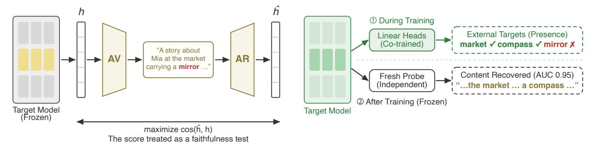
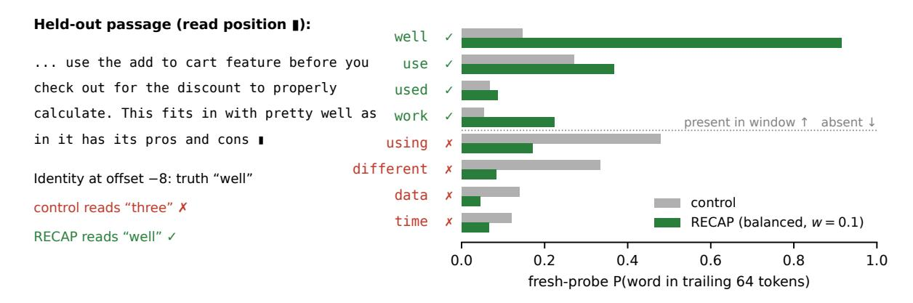
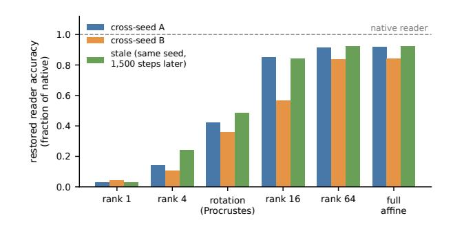
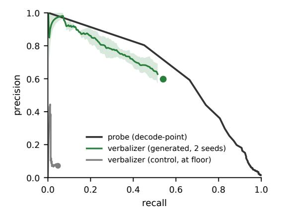

# Train the Model, Not the Reader: Decodability Supervision for Verifiable Activation Explanations

- 원문: [https://arxiv.org/abs/2607.20379](https://arxiv.org/abs/2607.20379)
- PDF: [https://arxiv.org/pdf/2607.20379v1](https://arxiv.org/pdf/2607.20379v1)
- arXiv ID: `2607.20379`

---

# **모델을 훈련하라, 독자를 훈련하지 말라: 검증 가능한 활성화 설명을 위한 가독성 감독** ## **Hiskias Dingeto** StackOne Technologies hiskias@stackone.com #### **요약** 자연어 자동인코더는 숨겨진 활성화의 설명을 재구성으로 평가한다: 설명이 활성화를 재생성할 수 있다면 신뢰할 수 있다고 간주된다. 이 테스트는 개별 허위 주장에 구조적으로 무감각하다: 주장의 부정이 재구성을 변경하지 않는 한, 그 주장은 결코 벌점을 받지 않는다. 우리는 이 테스트가 두 가지 방식으로 통과됨을 보여주며, 그 둘 모두 신뢰할 수 없다. 공개된 Qwen-2.5-7B 언어화기에서 설명은 기회 수준보다 훨씬 높은 수준으로 재구성되지만, 그 특정 주장 중 단지 약 2%만이 재구성에 의존한다. 따라서 점수는 입력의 핵심 의미를 추적할 뿐, 구체적인 사실은 추적하지 않는다. 정확한 합성 정답을 사용한 실험에서, 표준 방법은 5/5번의 실행에서 모두 공유된 개인 코드(재구성에 의존하는 허위 표현)를 개발하며, 대상 모델을 변경하지 않는 수정은 도움이 되지 않는다. 우리는 두 가지 감사 프로토콜, 즉 근거-진실 교차와 평가자 교환, 그리고 RECAP(공동 훈련된 보조 예측기를 통한 가독성 있는 인코딩)을 제안한다: 대상 모델과 함께 훈련되는 선형 헤드로 지정된 내용을 가독성 있게 유지한다. RECAP으로 훈련된 샌드박스 모델에서, 새로운 언어화기는 지정된 내용을 진실하게 기술하며 코드는 사라지며, 비용은 +0.001-nat에 불과하다. 이 결과는 사전 훈련된 Pythia-160M에서도 재현된다. 우리가 식별한 대상-설계 규칙 하에서, 내용은 신뢰할 수 있게 프로브로 재구성 가능해지며, 새로운 언어화기는 이를 부분적으로만 전달한다(진실도 0.44–0.46, 근사 제로 대조군 대비). 해석 가능성 측면에서, 이 감사는 활성화 설명에 대한 주장 수준의 증거 기준을 설정한다: 높은 재구성 점수는 개별 주장의 신뢰성을 보증하지 않는다. AI 안전성 측면에서, RECAP은 모델이 조작할 수 있는 언어화기 문장이 아닌, 프로브와 독립적으로 검증 가능한 지정된 내부 내용을 제공한다. 사전 훈련된 모델에서, 독립적 프로브는 언어화기의 진실한 주장에 대해 허위 주장보다 신뢰할 수 있게 높은 점수를 부여한다(AUC 0.96, RECAP 없이 0.82 대비). 따라서 지정된 내용에 대한 허위 주장은 프로브 검사로 포착된다. 적대자가 설명을 편집하여 재구성 점수를 극대화하면서 거짓을 말할 때, RECAP 및 대조군 모델 모두에서 점수의 거짓 벌점 약 87%가 억제되지만, RECAP 프로브는 여전히 거짓을 표시한다(AUC 0.95), 반면 대조군 프로브는 기회 수준으로 붕괴한다(0.51). ### **1 서론** 자연어 자동인코더(NLA)는 모델이 자신의 숨겨진 상태를 설명할 수 있게 한다: 언어화기는 활성화를 텍스트 설명으로 변환하고, 재구성기는 그 설명을 다시 활성화로 변환하며, 이 순환의 품질은 각 설명에 대한 신뢰성 테스트로 간주된다(Fraser-Taliente et al. 2026). 이 아이디어는 감독 측면에서 매력적이다. 라벨이나 인간 개입 없이, 단지 모든 설명에 부여된 숫자만으로 비지도 학습 및 자기 검사가 가능하기 때문이다. 여러 오픈 모델에 대해 공개된 언어화기/재구성기 쌍이 존재하며, 관련 목적을 가진 활성화 독자 훈련 방법이 점차 늘어나고 있다(Pan, Chen, and Steinhardt 2026; Karvonen et al. 2025; Huang et al. 2025). 이 테스트에는 구조적 간극이 존재한다. 재구성은 충분성을 보상한다. 설명은 활성화를 재생성할 수 있을 만큼 충분한 정보를 포함해야 하기 때문이다. 그러나 동일한 재구성을 유도하는 주장 값들 사이에 선호도가 없기 때문에, 허위 추가는 벌점이 주어지지 않는다. 이 무감각성은 모델이나 규모와 무관하게 목적 함수 자체에서 비롯된다. 우리는 실제로 이 테스트가 두 가지 방식으로 통과됨을 보여준다. 이 둘 모두 주장 수준의 신뢰성을 갖지 않는다. *핵심의 관점*: 공개된 Qwen-2.5-7B 기반 NLA에서 설명은 r˜ = 0.84의 수준으로 재구성되지만, 플립 감사에서는 그 주요 구체적 주장 중 단지 약 2%만이 근거를 갖는 것으로 감지된다. 이는 민감도 한계 하한선이다. *코드의 관점*: 정확한 정답을 가진 합성 테스트베드에서, 공동 훈련된 언어화기/재구성기 쌍은 두 도메인에 걸쳐 5/5번의 표준 방법 실행에서 일관되게 개인 코드를 개발한다(근거-진실 차이 0.30–0.80). 테스트를 목표로 하는 훈련도 실패한다. 숨겨진 상태와 그 재구성 사이의 거리를 최소화하면 이전에는 프로브로 재구성 가능했던 내용이 사라진다. 언어화기의 근거를 보상하면, 메트릭이 카운트하는 문장의 구조를 재구성함으로써 대리 점수를 향상시키지만, 주장 수준의 근거는 증가하지 않는다. 우리의 통제를 통과한 개입은 *대상 모델*을 훈련시키며, *활성화 독자*는 훈련하지 않는다(Figure 1b): RECAP은 모델과 공동 훈련되는 외부 목표에 대한 선형 헤드이다(§5). RECAP으로 훈련된 새로운 NLA는 공동 훈련된 평가자와 독립적 평가자 모두에서 샌드박스 내에서 지정된 내용을 신뢰하게 기술하며, 코드 표시는 사라진다. 해석 가능성 기반의 두 가지 대안은 모두 식별된 이유로 실패한다. 재구성 목표는 가독성 있는 내용을 붕괴시키고, 고정된 프로브 접근법은 표현의 이동에 따라 쇠퇴하며, 이는 라벨 없는 재정렬로 완전히 복구된다. 우리의 기여: • **감사.** 재구성 점수로 평가된 설명에 대한 반사실적, 주장 수준의 감사. 각 수정에 대한 유효성 통제를 포함하며, 공개된 언어화기가 그 구체적 주장이 대부분 근거를 갖지 않음에도 불구하고 테스트를 통과함을 보여준다; #### **(a) 자연어 자동인코더** ### **(b) RECAP: 모델을 훈련한 후 읽어라**  그림 1: 두 가지 아키텍처. (a) 자연어 자동인코더(기존 연구)(Fraser-Taliente et al. 2026): AV는 활성화를 텍스트로 매핑하고, AR은 이를 다시 매핑하며, 재구성 품질이 테스트로 간주된다. AV와 AR만 훈련된다. 텍스트가 근거 없는 구체적 내용(빨간 "거울")을 주장하더라도 점수는 높게 유지될 수 있다. (b) RECAP(본 연구): *대상 모델*을 훈련한다. 상단: 공동 훈련된 선형 헤드가 외부 목표에 대해 지정된 내용을 가독성 있게 유지한다. 하단: 훈련 후, *독립적*인 새로운 프로브(헤드가 아님)가 내용을 복원한다(AUC 0.95) 및 새로운 언어화기가 이를 진실하게 기술한다. 변환 통제는 핵심이 점수를 지배하며, 구체적인 표현은 그렇지 않음을 보여준다. - **발견.** 공동 훈련된 언어화기/재구성기 쌍은 정확한 정답을 가진 샌드박스에서 공유된 개인 코드를 개발한다. 근거-진실 교차와 평가자 교환이 이를 탐지하고 정량화한다. - **실패 분석.** 자연 훈련 방법은 식별된 메커니즘으로 실패한다: 재구성 목표는 가독성 있는 내용을 붕괴시키고, 고정된 프로브는 복구 가능한 이동에 실패한다. - **방법.** RECAP은 샌드박스에서 주장 수준의 신뢰성을 복원한다(5/5번 실행)하며, Pythia-160M으로 전이된다. 대상-설계 규칙 하에서 측정된 비용으로 지정된 내용이 프로브로 재구성 가능해지며, 자유형 언어화기는 그 내용을 부분적으로만 전달한다(§5.4). - **적대적 테스트.** 배포된 재구성 점수를 최적화하는 보고 공간의 적대자는 RECAP 및 대조군 모델 모두에서 거의 속인다(거짓 벌점의 약 87% 억제). 그러나 RECAP 활성화 프로브는 여전히 거짓을 표시한다(AUC 0.95, 재현율 0.86), 반면 대조군 프로브는 기회 수준으로 붕괴한다(0.51). 따라서 RECAP의 지정된 내용 가독성은 보고 공간의 조작을 견딘다. 이 효과는 활성화 자체를 읽는 것이 아니라, 그 가독성에서 비롯되며, 재구성 점수 자체는 진리 신호로 사용되어서는 안 된다. # **2 사전 지식 및 실험 설정** ## **2.1 재구성 테스트 및 감사 프로토콜** 자연어 자동인코더(NLA)는 *활성화 언어화기*(AV)와 *활성화 재구성기*(AR)를 쌍으로 구성한다. AV는 숨겨진 활성화 h에 대한 텍스트 설명 z를 생성하고, AR은 z를 다시 추정값 hˆ로 매핑한다. AV는(냉각 시작 단계 이후) 재구성 보상에 대해 훈련된다. 대상 모델의 가중치 θ는 고정되고 h는 그 탭 활성화일 때, 이 쌍은 다음을 최적화한다: $$\mathcal{J}_{\text{read}} = \max_{\text{AV, AR}} \cos(\text{AR}(\text{AV}(h)), h),$$ (1) 생성된 설명의 재구성 품질은 그 신뢰성 테스트로 간주된다(Figure 1a). 시스템 자체는 이를 명시적으로 밝힌다: 상승하는 재구성은 설명의 정보량을 추적한다고 주장하면서도, 목적 함수가 신뢰성을 강제하지 않는다는 경고를 한다(Fraser-Taliente et al. 2026). 그러나 각 설명에 대한 점수는 이러한 시스템이 보고하는 숫자이며, 실무자들이 적용하는 주요 기준이다. 우리는 그 점수가 각 설명의 개별 주장에 대해 무엇을 의미하는지 묻는다. 우리는 층-정규화된 중심 코사인으로 재구성을 측정한다. floor을 재구성과 *불일치* 활성화 사이의 평균 코사인(기회 수준)으로 정의하자. 그러면 r˜ = (cos(h, hˆ)−floor)/(1−floor): 기회 수준에서 0, 완벽한 재구성에서 1. 우리의 공개 시스템 측정은 공개된 Qwen-2.5-7B(Qwen Team 2025) 레이어-20 AV/AR 쌍을 사용하며, 모든 생성은 탐욕적이다. *근거*. z 내의 주장 c에 대해, z<sup>¬</sup><sup>c</sup>를 c만 최소한으로 부정한 z(최소 쌍 반사실적 수정, 우리는 이를 플립이라 부른다)라고 하자. 주장의 근거는 재구성 감소량이다: $$\Delta \tilde{r}(c) = \tilde{r}(z) - \tilde{r}(z_{\neg c}), \tag{2}$$ 그리고 ∆˜r(c) ≥ τ 일 때 c는 *근거가 있다*고 한다. 여기서 근거는 *재구성*이 주장 부정에 민감한 정도를 의미한다. 논문의 주장은 재구성 민감성이 모델의 동일한 부정에 대한 계산적 민감성과 다르며, 실제에서는 둘이 분리된다는 것이다. 수정의 유효성은 각 수정마다 검사된다: 목표 주장보다 더 많은 내용을 변경하는 수정은 명백한 근거를 수배로 과대평가한다(부록). 근거와 진실을 교차시키면 이차원 분류를 얻는다: 모든 주장은 근거가 있거나 없고, 원본에 대해 참이거나 거짓이다. 우리는 *근거가 있지만 거짓*인 셀에 초점을 맞춘다: 재구성에 의존하지만 그 진술된 내용은 거짓인 표현. 이러한 표현이 공동 훈련된 쌍에만 고유한 관례일 때(평가자 교환에 의해 드러남, §3.2), 우리는 이를 *공유된 개인 코드*라 부른다. 이 셀 라벨은 운영적이다. 의도적 입장은 함의하지 않는다. r˜co와 r˜ind를 각각 공동 훈련된 재구성기와 독립적 재구성기 하에서의 점수로 정의할 때, 점수의 *평가자 갭*은 r˜co − r˜ind이다. *용어*. 대상 모델의 활성화는 *활성화 위치*(우리는 이를 탭이라 약칭한다)에서 읽힌다. 이는 선택된 레이어와 위치이다. 활성화는 *프로브*(새롭게 적합된 선형 디코더) 또는 재구성기(AR)로 읽힐 수 있다. *핵심*은 입력의 전체 의미이며, 구체적인 사실과 대비된다. 내용은 *지정된* 것이라 불리며, 보조 예측기가 그것을 예측하도록 공동 훈련될 때(§5). 내용은 *가독성 있는* 것이라 불리며, 새롭게 적합된 선형 프로브가 그것을 읽을 수 있을 때. 본 논문에서 신뢰성은 항상 주장 수준이다: 설명이 진술한 내용이 활성화에 대해 참이고, 그것에 근거를 두고 있는가. 신뢰성은 설명이 모델의 하류 계산을 기술하는지 여부를 의미하지 않는다. (여기서 근거는 *재구성*이 주장 부정에 민감한 정도를 의미하며, 세계적 근거를 의미하지 않는다.) **설정.** 우리는 세 가지 설정에서 평가한다: 분포 내 웹 텍스트(n=1,517 감사된 주장)에서 공개된 Qwen-2.5-7B 레이어-20 NLA; 정확한 정답을 가진 *샌드박스*로, 두 개의 템플릿화된 합성 도메인에서 탭 위치가 활성화가 가질 수 있는 내용을 고정한다(각 슬롯은 유지, 흐릿화, 또는 읽을 수 없음). 따라서 모든 감사 수치는 심판 없이 계산 가능하다; 그리고 Pythia-160M(Biderman, Schoelkopf et al. 2023)의 지속적인 사전 훈련으로, *세금*은 보유된 언어 모델링 손실에서 공통 대조군을 뺀 값이다. 전체 프로토콜, 도메인 문법, 시드, 하이퍼파라미터는 기술적 부록에 있다. # **3 재구성 점수로 평가된 설명의 감사** 두 가지 실패는 서로 다른 메커니즘을 가진다. 공개 시스템에서는 부족한 구체적 내용이 대부분 탭에서 *부재*하므로, 높은 점수는 활성화의 구체적 내용이 아니라 핵심에 의존한다. 샌드박스에서는 내용은 존재하지만 표현은 공동 훈련된 쌍에만 고유한 *관례*이며, 평가자 교환에 의해 드러난다. 샌드박스 실패만이 순수한 메트릭 아티팩트이며, 공개 시스템 실패는 메트릭의 상류에서 내용이 누락됨을 반영한다.

## **3.1 공개된 언어 생성기의 반사실적 감사**  
온라인 텍스트 내부 분포에서, 공개된 시스템의 설명은 r˜ = 0.84에서 재구성되며, 감사 과정은 유효한 최소 쌍 전환 하에서 이 LLM의 핵심 주장 중 약 2%에서 근거를 감지한다(τ = 0.02 / 0.05 / 0.10에서 각각 4.2% / 2.1% / 1.6%; τ별 표는 부록 참조). 이 추정치는 두 가지 제한을 가진다. 첫째, 이는 *민감도 제한 하한*이다: 재구성 기반 도구는 낮은 민감도를 가지므로, 약 2%는 실제 근거를 과소평가할 가능성이 높다. 추가 및 순위付け 제어 실험은 알려진 인코딩된 주제를 단지 28%의 원시 정확도로 복원한다. 둘째, 가장 견고한 통계는 개요 대 구체적 내용의 상대적 격차이다: 구체적 내용은 개요보다 약 3배 더 나쁘게 복원된다(약 6% 대 약 18%의 무작위 보정 확률; 위치별 평균 풀링된 개요는 약 50%에 도달함, 부록 참조). 우리는 n=1,517개의 기본 시스템 주장(두 학습된 변형에서는 각각 1,428–1,471개)을 감사했다. 임계값별 부트스트랩 간격과 경험적 전환 노이즈 귀무가설은 부록에 있으며, 귀무가설은 가장 작은 임계값보다 낮다. 이러한 결과는 시스템이 대부분의 감사된 구체적 주장에 대한 약한 의존성에도 불구하고 높은 재구성을 달성함을 보여준다. 변환 프로파일 제어(재작성 및 콘텐츠 마스킹 소거)는 이를 직접 확인한다: 재작성 시 재구성은 지속되지만, 핵심 단어가 마스킹될 때 붕괴된다(부록 참조). 즉, 개요가 점수를 담당하며 구체적인 표현은 아니다. 이 격차는 16–27층에서 일관되며, 재구성 스타일의 읽기 출력에만 특화된다: 모델 자체의 언임베딩은 다음 토큰 형태로 이 후기 층의 구체적 내용을 인식한다(부록 참조). 언어 생성기를 직접 근거에 맞춰 학습하는 것도 가능하다. 우리는 두 가지 접근법을 시도했다: 거부 샘플링과 절차 수준 근거 보상에 대한 GRPO. 두 방법 모두 대리 지표는 개선되었으나, 독립적인 주장 수준 감사는 모든 τ에서 여전히 null이었다(신뢰구간이 0을 가로지름). 텍스트 통계는 이 개선을 정책이 제어하는 단위의 문장 재구성, 병합 및 패키징에 기인시키며, 주장 수준 근거의 증가에는 기인하지 않는다. 이는 모든 양이 정확한 환경—샌드박스—를 설정할 동기를 제공한다.

### **3.2 합성 진실 하에서의 감사**  
테스트를 통과하는 두 번째 방식은 정확한 합성 진실 하에서 나타난다. 모든 샌드박스 실행에서, 간단한 NLA는 모든 슬롯을 확신하며 테스트를 r˜ 0.71–0.86 범위에서 통과한다(5/5 실행, 두 도메인 모두; 부록에 대표적 예시). 진실 추적은 복원 가능성과 느슨하게만 연관된다: 완전히 복원 가능한 슬롯은 시드마다 0.44–0.96 범위에서 진실하게 기술되지만(모든 경우 근거는 0.76–0.88), 부분적으로 복원 가능한 슬롯은 0.15–0.26, 읽을 수 없는 슬롯은 무작위 수준이다. 훈련 신호는 그러한 요구를 포함하지 않기 때문에, 이 테스트는 진실한 주장과 거짓 주장 사이를 구분하지 못한다. 진실률을 넘어서, 공동 학습된 쌍은 두 번째 체계적 현상을 생성한다. 두 도메인 모두에서 5/5 표준 레시피 실행에서, 이들은 *공동 적응된 사적 코드*를 개발한다: 이 코드는 표현이 거짓이지만 재구성에 의존하는 표현 선택이며, 근거-진실 격차는 0.30–0.80이다. 근거-진실 교차점이 감지기이다: 코드는 *근거를 가지며 거짓이다*. 코드는 여러 슬롯을 동시에 점유할 수 있다. 도메인 2에서 한 코드는 *읽을 수 없는* 슬롯을 점유한다: 재구성자가 의존하는 어떤 표현이든 충분하며, 그 내용이 진실이거나 가능 여부와 무관하다. 이 경우 쌍은 활성화를 기술하는 것이 아니라 문장을 커뮤니케이션 채널로 사용한다. 평가자 교환은 이 채널이 공동 학습된 쌍에만 특화된 관례임을 입증한다. 독립적 평가자(감사된 쌍의 출력에 노출되지 않고 학습됨) 하에서, 코드-슬롯 근거는 0.53–0.89에서 0.08–0.23으로 붕괴되지만, 진실한 주장의 근거는 유지된다. 교환은 근거-진실 표의 모든 주장 위치를 명확히 한다. 교차 평가자 r˜ 격차(표준 실행에서 0.17–0.38 대 RECAP 실행에서 ∼0.003, §5)는 통과 점수의 평가자 격차이다. 진실 주장의 근거가 교환 후에도 유지되므로, 이 격차는 평가자 품질이 아니라 공동 적응에 기인한다. 표현 수준에서도 독립성이 유지된다: *서로 겹치지 않는* 재작성 집합(다른 프레임과 슬롯 순서, 슬롯 단어만 공유)으로 학습된 독립적 평가자는 세 개의 시드에서 동일한 패턴을 ∼0.05 이내로 재현한다: 코드-슬롯 근거는 붕괴된 채 유지되며, 진정한 근거는 생존한다(RECAP 슬롯은 1.00). 따라서 이 채널은 공유 템플릿 관례가 아니라 공동 학습된 쌍에만 고유하다. 마지막으로, 표준 레시피 언어 생성기는 존재하는 콘텐츠조차도 *과소 읽는다*: 도메인 2에서 타겟 모델로부터 55–72% 복원 가능한 슬롯은 단지 15–26%의 경우에만 진실하게 기술되며, 이는 *읽기 격차*이다(콘텐츠는 존재하지만 언어 생성기에서 전달되지 않음).

| 구성 | tax (nats) | 프로브 AUC |
|------------------------|------------|-----------|
| 제어(기준) | n/a | 0.77–0.80 |
| K=8, 무차별, w=1.0 | +0.047 | 1.000 |
| K=64, 무차별, w=1.0 | +0.064 | 0.95–0.97 |
| K=64, 균형, w=0.1 | +0.010 | 0.97–0.99 |
| K=512, 균형, w=1.0 | +0.14–0.20 | 0.97–0.99 |

**표 1**: 대규모 RECAP: 보유된 tax(LM 손실에서 제어 차이, nats) 및 지정된 타겟에 대한 신규 프로브 AUC. K=64 균형 tax는 3시드 쌍차이(95% CI [−0.015, +0.034]); 다른 균형 행은 3시드 범위, 나머지는 단일 시드.  

## **4 표현 붕괴 및 프로브 이동**  
가장 자연스러운 타겟 측 목적은 활성화를 자체 재구성으로 이동시켜 프로브가 복원하는 내용과 모델이 계산하는 내용이 일치하도록 하는 것이다. 이 목적은 복원 가능한 콘텐츠를 붕괴시킨다: 모든 테스트된 강도에서, 초기화에 관계없이 3/3 시드에서 복원 가능한 슬롯 콘텐츠를 제거하면서 퍼플렉시티는 변하지 않는다. 새로 학습된 프로브도 정확도를 잃으므로, 정보 자체가 사라졌으며 단지 프로브가 읽지 못하는 서브스페이스로 회전된 것이 아니다. 이 메커니즘은 비대조적 자기지도 학습 붕괴 설명(Chen and He 2021; Tian, Chen, and Ganguli 2021)과 일치한다. 재구성은 상태의 손실 있는 투영이므로, 상태-재구성 유사도를 증가시키면 프로브 서브스페이스 외부의 변동성을 줄이고 프로브가 복원할 수 없는 모든 콘텐츠를 제거한다. 두 번째 실패 모드는 지속 학습 중 표현 이동이다. 훈련 모델에 매칭된 프로브는 1,500개의 지속 학습 단계 내에서(3/3 시드) 거의 무작위 수준으로 붕괴되며, 시드 간에 무작위 수준에 도달한다(6/6 쌍). 그러나 정보 자체는 여전히 intact하며 정확히 복원 가능하다. 쌍으로 연결된 활성화에 적합한 선형 맵(라벨 불필요)은 9/9 경우에서 원래 프로브 성능을 복원한다. 해당 맵의 분해(부록의 모드 스윕 그림)는 회전만으로 약 절반의 이동을 복원하며, 완전한 복원은 약 16–64의 비직교 차원 변화가 필요하다. Duan (2026)은 2B 및 7B 파라미터 모델에서도 동일한 노후화-복구 현상을 동시에 보고했다. 이 이동-복구 발견은 배포에 영향을 미친다: 여전히 학습 중인 모델의 프로브 기반 모니터링에는 명시적인 재조정 절차가 포함되어야 한다. 재정렬은 프로브가 타겟 모델이 저장한 내용에 접근할 수 있게 하지만, 모델이 올바른 콘텐츠를 저장하는지가 근본적인 문제이다. 재정렬은 좌표를 조정하며, RE-CAP은 그 좌표가 무엇을 나타내는지를 변경한다. 다음의 보조 명제가 도출된다: 표현이 아핀 맵에 의해 다르므로, 어댑터 기반의 프로브 모델 간 전이가 가능해야 한다(Zhao et al. 2026).

## **5 RECAP 목적함수**

### **5.1 방법**  
RECAP(공동 학습된 보조 예측기를 통한 가독성 있는 인코딩)은 타겟 모델의 학습 중 선형 *보조 예측기*(헤드)를 추가하여 지정된 콘텐츠가 선택된 은닉 상태에서 계속 복원 가능하도록 한다. 각 헤드는 탭 레이어 은닉 상태를 읽고 외부 타겟을 예측한다: 샌드박스에서는 슬롯 값, 대규모에서는 자기지도 텍스트 함수. 헤드 손실은 언어 모델링 손실에 추가된다. 헤드 파라미터를 ϕ, 외부 타겟을 y라 할 때,  
$$\mathcal{J}_{\text{model}} = \min_{\theta, \phi} \mathcal{L}_{\text{LM}}(\theta) + w \mathcal{L}_{\phi}(h(\theta), y), \quad (3)$$  
여기서 L<sup>ϕ</sup>는 존재에 대한 클래스 균형 BCE와 정체성에 대한 CE(균형은 §5.3의 단순한 단축을 방지함). 식 3을 식 1과 비교하면, 이 논문의 주장을 명확히 한다: Jread는 고정된 모델의 활성화에 대해 언어 생성기와 재구성기를 최적화하며 θ에는 전혀 영향을 주지 않지만, Jmodel은 θ 자체를 학습하고 언어 모델링 손실에 언어 생성기와 재구성기가 필요로 하는 진실에 대한 항을 추가한다. 이전의 모든 실패 모드는 수리가 아니라 구조적으로 해결된다.  
- **이동**: 헤드는 타겟 모델과 공동 학습되므로, 노후화될 고정된 프로브가 존재하지 않는다.  
- **붕괴**: 타겟은 모델의 자체 재구성이 아니라 외부 진실이므로, 붕괴로 이어지는 자기 참조 목적은 존재하지 않는다.  
- **코드**: 헤드는 중간 텍스트 표현 없이 활성화에서 직접 예측한다.  
공동 학습된 예측기가 모델과 공동 적응할 수 있으므로, 우리가 보고하는 모든 복원 가능성 수치는 독립적으로 적합된 신규 프로브에서 유래하며, 헤드에서 유래하지 않는다. RECAP은 심층 감독 계열(Lee et al. 2015; Szegedy et al. 2015)의 복원 가능성 감독이다. 우리의 기여는 해석 가능성 동기화 대안이 왜 실패하는지 식별하고, 타겟 모델의 복원 가능성이 언어 생성기의 진실성으로 전파됨을 보여주는 것이다.

### **5.2 샌드박스 결과**  
타겟 모델에서 RECAP은 의도한 효과를 생성한다. 지정된 콘텐츠는 독립적으로 적합된 프로브에 의해 +0.001 nats의 비용으로 5/5 실행에서 100% 복원 가능성이 달성된다(도메인 1에서는 튜플-불교차 분할, 도메인 2에서는 보유 분할). 읽을 수 없는 타겟은 모든 실행에서 무작위 수준을 유지하며, 불가능성 제어를 확인한다: 헤드는 인과 구조가 배제한 콘텐츠를 인코딩할 수 없다. 우리는 아래에서 사전 학습된 Pythia-160M에서 이 능력 비용을 재추정하며, 이는 +0.010 nats(0.06-nat 시드 분포 내)이며 타겟 설계에 의존한다. 우리는 160M을 초과하는 모델 규모는 변경하지 않았다. 전파는 이를 학습 트릭과 구분한다. RECAP 타겟 모델에서 학습된 신규 NLAs는 공동 학습된 평가자와 독립적 평가자 모두에서 지정된 콘텐츠를 약 1.00의 진실성과 근거로 기술하며, 나머지 거짓 콘텐츠는 근거 약 0에서 표시한다. 모든 RECAP 실행에서 코드 서명은 나타나지 않는다: 독립적 시드에서의 전체 지정 실행 0/5, 한 시드에서의 부분 지정 변형 0/3(등장 기록은 부록 참조). 두 NLA는 모두 동일한 훈련을 받으며, 황금 설명에 대한 콜드 스타트 SFT도 포함된다. 오직 RECAP 타겟 모델의 활성화에서 학습된 NLA만 거의 완벽한 진실성과 근거를 유지하므로, 이 차이는 타겟 모델의 복원 가능성이 가져오는 효과를 고립시킨다. 용량 실험은 우리 자신의 초기 설명을 수정한다. 우리는 부분 지정 하에서 코드가 지정되지 않은 슬롯으로 이동할 것이라 예측했으나, 오히려 어떤 용량도 코드를 완전히 방지했다(단일 도메인 및 시드). 우리는 메커니즘을 고립시키지 않았다. 한 가지 가능성은 외부 진실 채널이 근거 해결책을 더 낮은 손실로 만드므로, 경사가 코드를 선호하지 않는다는 것이다. 부분 지정은 샌드박스에서 지정되지 않은 콘텐츠의 복원 가능성을 *억제*했다(0.21–0.27에서 0.10–0.15로), 그러나 이는 대규모에서는 재현되지 않았다.

#### **5.3 Pythia-160M으로 확장**

다음으로, RECAP이 Pythia-160M의 지속적인 사전 학습에 전이되는지 테스트한다. (설정: §2.1; 표 1; 그림 2는 하나의 읽기 결과를 보여준다.) 세 가지 결과가 도출된다. *감독 신호가 전이된다*: 지정된 콘텐츠는 K=8 및 K=64에서 새로운 프로브를 사용할 때 0.95–1.00 AUC에 도달하며, 이는 0.77–0.80의 대조 베이스라인과 대비된다. *독립적 감사가 규모에서 중요하다*: K=512에서 순진한 존재 헤드는 훈련 손실을 최소화했지만, 새로운 프로브로는 아무것도 복원할 수 없었다(부록). 드문 타겟은 항상 "부재"라고 예측함으로써 높은 점수를 얻을 수 있는데, 이는 독립적 프로브만이 드러내는 단축 경로이다. 클래스 빈도에 따라 손실을 균형 있게 조정하면 두 용량 모두에서 이 단축 경로가 차단된다(512개 타겟 전부에서 0.97–0.99). 설계 규칙은 진정한 구분 없이 손실을 최소화할 수 없는 타겟을 사용하는 것이다. *복원 가능성 비용은 타겟 설계에 의존한다*. 효과적인 설계에서는 64개 타겟에 대한 비용은 +0.010 nats(쌍체 95% 신뢰구간 [−0.015, +0.034], 각각 3개 시드)로, 시드 간 퍼짐(0.06 nats) 내에 있으며 0과 구분되지 않는다. d=768로 512개 타겟을 적용할 경우 비용은 +0.14–0.20 nats로 상승한다. 구분 가능한 정체성 타겟은 전체 가중치의 1/33에 해당하는 w=0.03에서도 복원 가능하며, 비용은 노이즈 수준 내에서 0에 가깝다. 지정되지 않은 프로브 버킷은 모든 8개의 감독 실행에서 대조 수준에 머물렀다. 복원 가능성은 헤드 용량과 탭 선택에도 강건하다: 비선형(MLP) 헤드는 레이어 6에서 동일한 0.98–0.99 지정 프로브 AUC에 도달하며, 레이어 9의 선형 헤드는 대조(0.77–0.79)에서 +0.01 nats로 AUC를 0.95–0.98로 끌어올린다. 프로그램에서 변동된 전체 가중치 스윕 및 나머지 요소(끌기 강도, 지정 용량, 재정렬 맵 클래스, 평가자, 도메인, 헤드 용량, 탭 레이어)는 기술적 부록에 결과와 함께 인덱싱된다. ### **5.4 대규모 언어화 감사** 전파는 첫 번째 실제 모델 증거를 제시한다. 공개된 레시피의 구조를 사용하여 이 탭에서 학습된 AV/AR 쌍은 정확한 자기지도 학습 진실과 비교하여 감사되었다. RECAP 모델에서는 맥락 단어가 0.44에서 진술되며, 대조 모델에서는 0.06이다(탭 클러스터 부트스트랩 95% 구간: 각각 0.39–0.51 대 0.04–0.09). 대조 모델은 규모에서 지정된-거짓 신호를 재현한다: 진술된 단어는 0.48에서 지정되지만 진실은 단지 0.06이다. RECAP은 이 지정-진실 차이를 +0.42에서 +0.33으로 줄이지만 완전히 제거하지는 않는다: 규모에서 콘텐츠는 더 진실하게 진술되지만 코드 자유롭지는 않다. 진실도 향상은 단순한 선택성만이 아니다: 공유된 존재 콘텐츠 단어 집합(400개 탭에서 381개)에서, RECAP은 더 많은 단어를 복원한다(재현율 0.29 대 0.07)하면서 각 설명당 진술하는 단어 수는 줄인다(0.63 대 1.02). 이 차이는 재구성기 강도에 강건하다: 더 높은 신호 재구성기(r˜ 0.30)는 진실(0.57 대 0.15)과 재현율(0.47 대 0.04) 모두에서 RECAP을 앞선다. 대조 모델은 더 적은 단어(92 대 312)를 진술하지만 여전히 둘 다 뒤처진다. 세 개의 RECAP 타겟 모델 시드(각각 고유한 새로운 NLA를 가짐: RECAP 모델에 3개, 대조에 3개)에서 진술된 단어의 진실도는 안정적이다(0.44–0.46 대 대조의 0.00–0.07). 그러나 언어화기는 활성화가 포함하는 내용의 일부만 전달하며, 이 부족은 저장이 아니라 생성의 특성이다. 언어화기의 재현율 수준에서, 동일한 탭에 대한 새로운 프로브는 정밀도 약 0.80에 도달하지만, 언어화기는 재구성기 및 시드에 따라 0.44–0.63의 정밀도를 가진다(부록에 정밀도-재현율 도표 있음). 우리는 이 부족을 생성 자체에 국한시켰다. 재구성기를 재설계했다: 표준화된 다토큰 주입, MLP 용량, 정확한 윈도우 발생 진실(외부 레이블, 학습된 모니터가 아님)에 기반한 디코드 포인트 존재 헤드. 이는 지정된 콘텐츠를 자신의 디코드 포인트 은닉 상태에서 선형적으로 0.79–0.81(두 시드)로 복원 가능하게 만든다. 그러나 동일한 재구성기의 생성 정밀도는 여전히 0.56–0.63이다. 일치하는 대조 모델의 디코드 포인트 상태는 동일한 헤드 하에서 우연 수준(0.03)으로 읽히므로, 복원 가능한 콘텐츠는 헤드의 것이 아니라 RECAP의 것이다. 재구성기 규모, 재구성 최적화, 직접 진실 보상, 주입 대역폭, 명시적 부정 감독 모두 이 차이를 해소하지 못한다(3B 재구성기는 0.5B와 동일하다). 규모에서 RECAP의 보장은 *복원 가능성*이다: 지정된 콘텐츠는 존재하며 프로브로 검증 가능하다. 재구성 계열 언어화기는 이를 텍스트로 부분적으로만 전달한다. 따라서 자유형 설명은 활성화가 보유한 내용의 손실 있는 표현이며, 우리의 프로브 기반 모니터는 문장에 신뢰를 두지 않고 내부와 비교하여 주장을 검증한다. (오프셋-8 타겟은 전파되지 않지만, 그 진실 토큰은 탭의 2.2%에서만 지정된 슬롯이며, 이는 특성화하기에 너무 적다. 우리는 이를 복원되지 않음으로 보고하며 코드로 간주하지 않는다.) 복원 가능성은 일회성 설정이 아니라 지속적인 비용이다: 헤드 없는 미세 조정 후 몇 백 스텝 내에서 퇴화하며, 지속적으로 유지되어야 한다(+0.010 nats) 또는 약 1/10의 컴퓨팅 비용으로 주기적으로 유지되어야 하므로, 시작부터 훈련하는 것이 나중에 복원하는 것보다 낫다(부록). ## **6 프로브 기반 모니터링** 우리는 감사자가 이제 검증할 수 있는 내용을 통해 RECAP의 가치를 측정한다. 샌드박스에서 가장 단순한 감독 도구를 구축했다: 새로운 슬롯별 프로브가 탭 활성화를 읽고, 언어화기는 슬롯 값을 진술하며, 확신 있는 프로브(p>0.9)가 모순하는 모든 주장은 후보 불일치로 표시된다. 정확한 실제 진실이 이 탐지기를 평가한다(전체 프로토콜 및 단계별 카운트는 부록 참조). 표준 타겟 모델에서 탐지기는 신뢰할 수 있지만 재현율이 낮다. 모든 표시는 진짜 거짓 주장이다(거짓 경고 없음), 그러나 대부분의 탭 전 주장은 복원 가능성이 낮아 확신 있는 읽기 불가능한 슬롯에 있으므로, 733개 중 단 27개만 포착한다. RECAP 타겟 모델에서는 결과가 반전된다: 탭 전 거짓 주장은 사라지고, 자제는 0으로 줄어들어 모든 주장은 신뢰가 아닌 내부와 비교하여 *검증*된다. 지정된 탭 전 콘텐츠의 검증 커버리지는 37%에서 100%로 상승한다. 이 향상은 탐지기의 정밀도가 아니라 지정된 콘텐츠의 커버리지에 있으며, 이 커버리지는 전체 활성화로 확장되지 않는다.  그림 2: 실제 모델의 은닉 상태에서 콘텐츠 복원(하나의 보유된 Pile(Gao et al. 2020) 문장; 새로운 프로브가 표시된 위치의 레이어-6 상태를 읽음). RECAP 학습 모델에서는 프로브가 트레일링 윈도우 콘텐츠 단어와 오프셋-8 토큰을 복원하며, 대조 모델에서는 읽기 결과가 혼란스럽다. 동일한 프로브 레시피와 데이터; 유일하게 다른 것은 타겟 모델이다. 후속 탭 주장은 두 타겟 모델 모두에서 올바르게 자제된다. 왜냐하면 활성화가 명백히 보유하지 않는 콘텐츠는 읽기만으로 판단할 수 없기 때문이다. 이들을 포착하는 것은 지정의 교차점의 역할이며, 두 도구는 감사를 분할한다(하나의 도메인, 하나의 시드, 하나의 임계값; 전체 프로토콜은 부록 참조). 이 모니터는 실제 모델로 확장된다. Pythia-160M에서 새로운 존재 프로브는 진실 주장과 거짓 주장의 순위를 AUC 0.965 대 0.823(대조)로 정렬한다(95% 신뢰구간 [0.956, 0.973] 및 [0.759, 0.879], 672개 보유된 주장; 구간은 겹치지 않음). 또한, 분리된 캘리브레이션 분할에 설정된 플래그 임계값에서, 거짓 주장은 0.93 재현율[0.90, 0.96]과 0.87 정밀도로 표시된다. 따라서 RECAP은 프로브가 읽는 내용뿐 아니라 언어화기를 모니터링하는 능력도 향상시킨다. 규모의 1.5% 기본률에서 샌드박스의 확신 있는 주장당 커버리지 지표는 전이되지 않으므로, 탐지기 AUC 및 플래그 정밀도-재현율 점을 보고한다. 언어화기는 제안하고, 프로브는 검증한다: 규모에서 프로브, 즉 자유형 설명이 아니라 신뢰할 수 있는 읽기이다. 이는 모델을 콘텐츠가 검증 가능하도록 학습시키는 것에 초점을 맞추며, 문장에 신뢰를 두지 않는다. #### **모니터는 점수 조작을 시도하는 적대적 공격을 견딘다.** 재구성 점수를 신뢰하는 배포는 보고 공간 적대자에 노출된다: 정직한 설명에서 진실로 진술된 단어를 부재 단어로 편집하여 재계산된 점수를 최대화하는 편집을 선택한다(기술적 부록에 전체 프로토콜 및 단계 있음). 점수 최적 편집에서 거짓 벌칙은 두 모델 모두 거의 사라진다: 진실 단어에 대한 최적 거짓은 r˜을 단지 0.022(95% CI [0.017, 0.027])만큼 낮추며, 무작위 거짓은 0.173으로, 약 87% 억제된다. 그러나 외부 진실 활성화 프로브는 여전히 RECAP 모델에서 거짓을 AUC 0.952(재현율 0.86)로 표시하지만, 대조 모델에서는 우연 수준으로 붕괴한다(AUC 0.508, 재현율 0.01). 이 생존은 따라서 RECAP-복원 가능 콘텐츠에 특화된다. 대조 프로브도 보고 공간 적대자가 손댈 수 없는 활성화를 읽지만 실패한다: 편집 가능한 보고 이전의 신호를 읽는 것은 필수적이지만 충분하지 않다. 콘텐츠는 또한 복원 가능해야 하며, 이는 RECAP이 제공한다. 선택 누출은 보이지만 작다(RECAP 프로브는 점수 최적 부재 단어가 의미적으로 가까워질수록 AUC 0.993에서 0.952로 이동). 따라서 보고 공간 위협 모델(활성화 수준 공격이 아님, Bailey et al. 2024) 내에서는 면역성이 구조적이고, 후보 선택에 대해서는 경험적이다. 심지어 모니터 누출을 가정하는 프로브 인식 선택 적대자(우리 위협 모델 외부)도 RECAP 모니터를 AUC 0.909로만 저하시키며, 대조는 우연 이하인 0.242로 떨어뜨린다(백박스 선택 공격의 예상 신호). 이 분리는 적대자 강도가 증가함에 따라 확대된다. 배포된 점수는 이러한 적대자에 대해 진실 신호로 사용되어서는 안 되며, RECAP-복원 가능 콘텐츠에 대한 프로브는 사용할 수 있다. 이 0.9 정밀도 작동점은 평가 세트에서 조정되지 않았다: 분리된 분할에서 플래그 임계값을 재조정해도 재현율은 본질적으로 변하지 않는다(0.88 고정 대 0.86 평가 조정). 대조 프로브 임계값은 무작위 거짓에도 0.9 정밀도에 도달하지 못한다. 이 효과는 지정된 콘텐츠에만 국한된다: 모델이 결코 복원 가능하게 학습되지 않은 보유된 어휘 밴드(단어 순위 64–128)에서, RECAP 모니터는 대조보다 우위가 없다(정직한 경우 AUC 0.66 대 0.70, 계단 전체에서 아ーム 간격 ±0.06 내; 약 0.07 이상의 간격 감지에 충분한 힘). 따라서 지정은 이 효과의 메커니즘과 범위 모두이다(부록에 전체 프로토콜 및 밴드 표 있음). # **7 관련 연구** **활성화 언어화 및 그 비판.** NLA 레시피(§2)(Fraser-Taliente et al. 2026)를 넘어서, 빠르게 확장되는 연구군은 *독자*를 개선한다: 감독된 질문-답변 디코더(Pan, Chen, and Steinhardt 2026), 일반 목적 활성화 설명자(Karvonen et al. 2025; Bauer et al. 2026), 해석 보조자(Huang et al. 2025), 학습 불필요한 읽기(Ghandeharioun et al. 2024), 및 모델 간 어댑터(Zhao et al. 2026). 희소 자동 인코더는 비감독 독자군이다(Huben et al. 2024); 오래된 독자는 어떤 고정된 독자에게도 적용된다. 모델 생성 설명은 체인오브생각에서 가능성 검사를 통과하지만 신뢰성은 부족하다(Turpin et al. 2023; Lanham et al. 2023); 뉴런 설명의 인과 테스트는 높은 오류와 낮은 효율성을 발견했다(Huang et al. 2023); 대조적 신뢰성 테스트는 우리의 플립 프로토콜을 예고한다(Atanasova et al. 2023). 기존 언어화 비판은 벤치마크 수준이다: 많은 작업은 타겟 내부 없이도 해결 가능하다(Li et al. 2025). 우리는 두 축 모두에서 다르다: 우리는 테스트 자체를 감사한다(주장별, 대조적, 공개된 시스템에서), 그리고 우리의 수리법은 더 나은 독자가 아니라 *타겟 모델*을 학습시킨다.

**学习通道中的隐写术。** 自CycleGAN（Chu、Zhmoginov和Sandler，2017）以来，重建类目标一直在其通道中隐藏信息。在大语言模型中，编码推理在优化压力下于思维链中浮现（Roger和Greenblatt，2023），并在过程监督下泛化（Skaf等，2025）。错误设定的激励会导致隐写式共谋（Mathew等，2025），工具使用拓宽了通道（Rippin等，2026），而内部探测可检测共谋（Rose等，2026）。优化可使激活值对潜在监控器产生混淆（Bailey等，2024），而针对思维链监控器进行训练则产生混淆的奖励作弊，而非诚实行为（Baker等，2025）。所有这些通道均由激励、过程监督或对抗者诱导产生。我们的编码仅源于标准重建流程本身，位于可解释性流水线内部，没有任何隐写目标或通信奖励。在先前研究建议“不针对监控器进行优化”之处，我们展示了互补路径：以外部真实值监督目标模型，可使其内容可解码，而无需施加压力使其欺骗探测器或重建器。

### **表示漂移、拼接与监控器陈旧。** 网络学习到的表示在变换下是等价的（Lenc和Vedaldi，2015；Kornblith等，2019；Moschella等，2023）；仿射映射可在语言模型间转移特征（Chen等，2025）；预训练动态在不同随机种子下保持稳定（van der Wal等，2025）；调优透镜是其陈旧性我们加以刻画的仿射阅读器（Belrose等，2023）。与此同时，Duan（2026）在20亿和70亿参数模型上报告了相同的陈旧性与无标签修复，为部署规模提供了收敛证据；重新训练探测器也能在探测感知微调后恢复可检测性（Wehner和Fritz，2025）。我们的新增内容：恢复解剖结构（§4）、跨种子失败、信息寿命超越其阅读器的确凿证据，以及漂移与坍塌的区分。

**深度监督与内在可解释性。** 隐藏层上的辅助头属于深度监督（Lee等，2015；Szegedy等，2015）；其目标是*任务*标签；我们的目标是外部*内容*，以保持其可解码性。概念瓶颈将所有信息流导向命名概念（Koh等，2020；Sun等，2025），概念白化约束了几何结构（Chen、Bei和Rudin，2020），码本特征离散化表示（Tamkin、Taufeeque和Goodman，2023），梯度路由局部化计算（Cloud等，2024）；我们新增了不约束信息流的线性头。解释侧监督可追踪行为变化（Guo等，2026）；我们的方法位于目标模型侧。

## **8 讨论与局限性**  
*范围与局限。* 我们的证据来自一个合成沙盒、一个已发布的NLA（Qwen-2.5-7B），以及一个小型模型（Pythia-160M）的持续预训练，主要基于单一随机种子；前沿规模尚未测试。四项局限性约束了我们的结论。第一，我们的沙盒与规模审计仅覆盖闭合词汇、模板解析的声明，且监控器仅覆盖指定内容；开放式的忠实性未被衡量。第二，RECAP必须共同训练，无法后置到冻结模型上，且依赖于选择一个良好的目标：一个选择不当的目标可能报告成功，却无法解码任何内容。第三，可解码性不等于可言说性：内容可被探测器解码，但自由形式的言说者仅传达部分信息，因此探测器是更可靠的输出方式。第四，RECAP认证的是激活值存储的内容，而非模型实际使用的内容：指定内容可能存在且可核查，但行为上无作用（修补水龙头几乎不改变行为，约0.003），模型也可能绕过被监控的子空间进行计算（Mahinpei等，2021；Margeloiu等，2021）。重建测试的言说成功意味着：解释的具体主张经目标模型验证、内容缺失时校准的 abstention，以及具备重校准协议的监控器，而非更高的r˜。

## **9 结论**  
我们审计了自然语言激活解释背后的重建测试。该测试可通过概要与私有编码通过，而针对该测试的训练会产生坍塌或代理博弈，而非忠实性。在我们的控制下仍能存活的修复方法是RECAP：训练目标模型，而非阅读器。它在沙盒中产生声明忠实的言说者（5/5次运行），并在Pythia-160M上使指定内容可被探测器解码，其中新言说者以0.44–0.46的真实度陈述（三个目标模型种子）；使用更强重建器时最高可达0.57，而对照组接近零。在沙盒中，基于探测器的指定内容覆盖率从37%提升至100%；在规模上，探测器将言说者的真主张排在假主张之上，AUC为0.965，优于0.823（95%置信区间互不重叠），比言说者生成内容更可靠地读取内容。普遍教训是方法论层面的：对模型自身解释的学习测试，可能被该模型本身操纵。因此，将可解码性直接训练进目标模型，比事后审计已训练模型更为可靠。

### **参考文献**  
Atanasova, P.; Camburu, O.-M.; Lioma, C.; Lukasiewicz, T.; Simonsen, J. G.; and Augenstein, I. 2023. Faithfulness Tests for Natural Language Explanations. In *ACL*. ArXiv:2305.18029.  
Bailey, L.; Serrano, A.; Sheshadri, A.; Seleznyov, M.; et al. 2024. Obfuscated Activations Bypass LLM Latent-Space Defenses. *arXiv preprint arXiv:2412.09565*.  
Baker, B.; Huizinga, J.; Gao, L.; Dou, Z.; Guan, M. Y.; Madry, A.; Zaremba, W.; Pachocki, J.; and Farhi, D. 2025. Monitoring Reasoning Models for Misbehavior and the Risks of Promoting Obfuscation. *arXiv preprint arXiv:2503.11926*.  
Bauer, J.; De Schamphelaere, C.; Karvonen, A.; Luick, N.; and Nanda, N. 2026. Building Better Activation Oracles. *arXiv preprint arXiv:2606.02609*.  
Belrose, N.; Ostrovsky, I.; McKinney, L.; Furman, Z.; Smith, L.; Halawi, D.; Biderman, S.; and Steinhardt, J. 2023. Eliciting Latent Predictions from Transformers with the Tuned Lens. *arXiv preprint arXiv:2303.08112*.  
Biderman, S.; Schoelkopf, H.; et al. 2023. Pythia: A Suite for Analyzing Large Language Models Across Training and Scaling. In *International Conference on Machine Learning*.  
Chen, A.; Merullo, J.; Stolfo, A.; and Pavlick, E. 2025. Transferring Linear Features Across Language Models With Model Stitching. *arXiv preprint arXiv:2506.06609*.  
Chen, X.; and He, K. 2021. Exploring Simple Siamese Representation Learning. In *CVPR*.  
Chen, Z.; Bei, Y.; and Rudin, C. 2020. Concept Whitening for Interpretable Image Recognition. *Nature Machine Intelligence*, 2: 772–782.  
Chu, C.; Zhmoginov, A.; and Sandler, M. 2017. CycleGAN, a Master of Steganography. In *NIPS Workshop on Machine Deception*. ArXiv:1712.02950.  
Cloud, A.; Goldman-Wetzler, J.; Wybitul, E.; Miller, J.; and Turner, A. M. 2024. Gradient Routing: Masking Gradients to Localize Computation in Neural Networks. *arXiv preprint arXiv:2410.04332*.  
Duan, E. 2026. Do Activation Monitors Survive Model Updates? Benchmarking, Predicting, and Repairing Activation-Monitor Staleness. *arXiv preprint arXiv:2606.15980*.  
Fraser-Taliente, K.; Kantamneni, S.; Ong, E.; Mossing, D.; Lu, C.; et al. 2026. Natural Language Autoencoders Produce Unsupervised Explanations of LLM Activations. Transformer Circuits Thread. Transformer-circuits.pub/2026/nla.  
Gao, L.; Biderman, S.; Black, S.; et al. 2020. The Pile: An 800GB Dataset of Diverse Text for Language Modeling. *arXiv preprint arXiv:2101.00027*.  
Ghandeharioun, A.; Caciularu, A.; Pearce, A.; Dixon, L.; and Geva, M. 2024. Patchscopes: A Unifying Framework for Inspecting Hidden Representations of Language Models. In *ICML*.  
Guo, Z. C.; Ruis, L.; Andreas, J.; and Li, B. Z. 2026. Introspective Coupling: Self-Explanation Training Tracks Behavioral Change Despite Fixed Supervision. *arXiv preprint arXiv:2606.32038*.  
Huang, J.; Geiger, A.; D'Oosterlinck, K.; Wu, Z.; and Potts, C. 2023. Rigorously Assessing Natural Language Explanations of Neurons. In *Proceedings of the 6th BlackboxNLP Workshop*, 317–331. ArXiv:2309.10312.  
Huang, V.; Choi, D.; Johnson, D. D.; Schwettmann, S.; and Steinhardt, J. 2025. Predictive Concept Decoders: Training Scalable End-to-End Interpretability Assistants. *arXiv preprint arXiv:2512.15712*.  
Huben, R.; Cunningham, H.; Riggs Smith, L.; Ewart, A.; and Sharkey, L. 2024. Sparse Autoencoders Find Highly Interpretable Features in Language Models. In *ICLR*. ArXiv:2309.08600.  
Karvonen, A.; Chua, J.; Dumas, C.; Fraser-Taliente, K.; Kantamneni, S.; et al. 2025. Activation Oracles: Training and Evaluating LLMs as General-Purpose Activation Explainers. *arXiv preprint arXiv:2512.15674*.  
Koh, P. W.; Nguyen, T.; Tang, Y. S.; Mussmann, S.; Pierson, E.; Kim, B.; and Liang, P. 2020. Concept Bottleneck Models. In *ICML*.  
Kornblith, S.; Norouzi, M.; Lee, H.; and Hinton, G. 2019. Similarity of Neural Network Representations Revisited. In *ICML*.  
Lanham, T.; Chen, A.; Radhakrishnan, A.; Steiner, B.; et al. 2023. Measuring Faithfulness in Chain-of-Thought Reasoning. *arXiv preprint arXiv:2307.13702*.  
Lee, C.-Y.; Xie, S.; Gallagher, P.; Zhang, Z.; and Tu, Z. 2015. Deeply-Supervised Nets. In *AISTATS*.  
Lenc, K.; and Vedaldi, A. 2015. Understanding Image Representations by Measuring Their Equivariance and Equivalence. In *CVPR*.  
Li, M.; Ceballos Arroyo, A. M.; Rogers, G.; Saphra, N.; and Wallace, B. C. 2025. Do Activation Verbalization Methods Convey Privileged Information? *arXiv preprint arXiv:2509.13316*.  
Mahinpei, A.; Clark, J.; Lage, I.; Doshi-Velez, F.; and Pan, W. 2021. Promises and Pitfalls of Black-Box Concept Learning Models. *arXiv preprint arXiv:2106.13314*.  
Margeloiu, A.; Ashman, M.; Bhatt, U.; Chen, Y.; Jamnik, M.; and Weller, A. 2021. Do Concept Bottleneck Models Learn as Intended? *arXiv preprint arXiv:2105.04289*.  
Mathew, Y.; Matthews, O.; McCarthy, R.; Velja, J.; Schroeder de Witt, C.; Cope, D.; and Schoots, N. 2025. Hidden in Plain Text: Emergence and Mitigation of Steganographic Collusion in LLMs. In *IJCNLP-AACL*. ArXiv:2410.03768.  
Moschella, L.; Maiorca, V.; Fumero, M.; Norelli, A.; Locatello, F.; and Rodolà, E. 2023. Relative Representations Enable Zero-Shot Latent Space Communication. In *ICLR*. ArXiv:2209.15430.  
Pan, A.; Chen, L.; and Steinhardt, J. 2026. LatentQA: Teaching LLMs to Decode Activations Into Natural Language. In *ICLR*. ArXiv:2412.08686.  
Penedo, G.; et al. 2024. The FineWeb Datasets: Decanting the Web for the Finest Text Data at Scale. *arXiv preprint arXiv:2406.17557*.  
Qwen Team. 2025. Qwen2.5 Technical Report. arXiv preprint arXiv:2412.15115.  
Rippin, J. L.; Marshall, S. C.; Africa, D. D.; and Schroeder de Witt, C. 2026. Tool Use Enables Undetectable Steganography in Multi-Agent LLM Systems. *arXiv preprint arXiv:2606.28425*.  
Roger, F.; and Greenblatt, R. 2023. Preventing Language Models From Hiding Their Reasoning. *arXiv preprint arXiv:2310.18512*.  
Rose, A.; Cullen, C.; Abdelnabi, S.; Torr, P.; Kaplowitz, B. G.; and Schroeder de Witt, C. 2026. Detecting Multi-Agent Collusion Through Multi-Agent Interpretability. *arXiv preprint arXiv:2604.01151*.

- Skaf, J.; et al. 2025. Large Language Models Can Learn and Generalize Steganographic Chain-of-Thought Under Process Supervision. *arXiv preprint arXiv:2506.01926*.  
- Sun, C.-E.; Oikarinen, T.; Ustun, B.; and Weng, T.-W. 2025. Concept Bottleneck Large Language Models. In *ICLR*. ArXiv:2412.07992.  
- Szegedy, C.; Liu, W.; Jia, Y.; Sermanet, P.; et al. 2015. Going Deeper with Convolutions. In *CVPR*.  
- Tamkin, A.; Taufeeque, M.; and Goodman, N. D. 2023. Codebook Features: Sparse and Discrete Interpretability for Neural Networks. *arXiv preprint arXiv:2310.17230*.  
- Tian, Y.; Chen, X.; and Ganguli, S. 2021. Understanding Self-Supervised Learning Dynamics without Contrastive Pairs. In *ICML*.  
- Turpin, M.; Michael, J.; Perez, E.; and Bowman, S. R. 2023. Language Models Don't Always Say What They Think: Unfaithful Explanations in Chain-of-Thought Prompting. In *NeurIPS*. ArXiv:2305.04388.  
- van der Wal, O.; Lesci, P.; Müller-Eberstein, M.; Saphra, N.; Schoelkopf, H.; Zuidema, W.; and Biderman, S. 2025. PolyPythias: Stability and Outliers across Fifty Language Model Pre-Training Runs. *arXiv preprint arXiv:2503.09543*.  
- Wehner, J.; and Fritz, M. 2025. Probe-based Fine-tuning for Reducing Toxicity. *arXiv preprint arXiv:2510.21531*.  
- Zhao, H.; He, Z.; Wang, G.; Payani, A.; Li, Y.; and Du, M. 2026. Universal Activation Verbalizer: A Unified Framework for Cross-Model Activation Explanation. *arXiv preprint arXiv:2605.25903*.  

## **A 최소 쌍 반전에 대한 편집 유효성**  
측정의 품질은 그 측정을 생성하는 편집의 품질에 따라 결정된다. 편집은 정확히 하나의 진술만을 뒤집고 나머지 모든 내용을 변경하지 않을 때 *유효*하다고 정의된다. 우리는 공개된 시스템에서 두 가지 편집 생성기를 감사했다. 폐쇄형 모델 판정자는 68.4%의 확률로 유효한 편집을 생성했고, 본 논문 전반에 걸쳐 사용된 개방형 판정자(Gemma-4-12B, 고정 버전, 온도 0)는 99.3%의 확률로 유효한 편집을 생성했다. 유효하지 않은 편집은 대부분 *과도하게 크다*는 특징을 보였는데, 이는 대상 진술뿐 아니라 주변 문장을 함께 재작성하여 추가적인 손상을 초래했고, 이로 인해 표면적인 기반화가 약 7배로 부풀어 올랐다. 따라서 논문의 모든 기반화 비율은 편집별 유효성 필터링을 적용한 개방형 판정자를 사용하며, 본문은 이를 한 문장으로 보고하고, 감사 자료는 진술별 재구성 차이로 유지된다. 동일한 대면 비교는 판정자 없이 마스크-및-점수 신호를 반전 도구와 비교했으며(검증된 판정자 하에서 합의 AUC 0.997), 이는 부록 G에서 사용되었다.  

## **B 안전 실험 1: 불일치 탐지기**  
**질문.** 감사자가 대상 모델의 활성화를 프로브를 통해 읽을 수 있고, 동시에 언어화기가 *말하는 내용*도 읽을 수 있다면, 두 결과 사이의 불일치는 후보 거짓 진술이 된다. 이 탐지기는 얼마나 유용하며, 그 유용성은 무엇에 의존하는가?  

**프로토콜.** 샌드박스, 도메인 1, 시드 1, 대상 모델당 400개의 보유된 탭. 각 슬롯 유형에 대해, 탭의 프로브 분할에서 새로운 다항 로지스틱 프로브(선형, 256차원 입력)를 적합시켜 탭 활성화에서 슬롯 값을 읽어낸다. 평가 탭에서 언어화기는 설명을 생성하며, 각 슬롯 유형의 첫 번째 언급된 단어를 프로브의 예측과 비교한다. 프로브의 신뢰도가 0.9를 초과하고 언급된 단어와 불일치할 경우 진술은 *플래그*되고, 프로브 신뢰도가 임계값 이하일 경우 *자제*된다. 정확한 튜플 기준 진실은 모든 결정을 점수화한다.  

| 모델 | 단계 | 총 진술 | 거짓 진술 | 플래그된 거짓 진술 | 정밀도 | 자제율 |  
|---------------|----------------|------|-----|----------------------|----------|---------------|  
| control | pre-tap | 1200 | 733 | 27 | 1.000 | 0.632 |  
| control | post-tap | 800 | 698 | 0 | — | 1.000 |  
| RECAP pre-tap | | 1200 | 0 | 0 | — | 0.000 |  
| RECAP post-tap | 800 | 706 | 0 | — | 1.000 |  

**표 2**: 불일치 탐지기, 대상 모델당 2,000개 진술. 정밀도는 플래그된 진술 중 실제로 거짓인 비율, 재현율은 거짓 진술 중 플래그된 비율, 자제율은 프로브가 임계값에서 판단할 수 없었던 진술의 비율이다.  

**결과.** (i) 탐지기는 작동 가능한 모든 경우에서 신뢰할 수 있다: 27개의 플래그는 모두 실제로 거짓 진술이었으며(어디에서도 잘못된 경고 없음). (ii) 병목은 탐지기의 품질이 아니라 대상 모델의 해독 가능성이다: 컨트롤 대상 모델에서, pre-tap 진술의 63%는 신뢰할 수 있는 읽기 가능성이 낮은 슬롯에 속해, 733개의 거짓 진술에 대한 재현율은 3.7%에 불과하다. (iii) RECAP 대상 모델에서는 pre-tap 거짓 진술 문제가 원천적으로 사라진다(1,200개 중 0개의 거짓 진술, 전파 결과와 일치) 및 자제율이 0%로 감소한다: 감사자의 입장은 “대부분을 확인할 수 없음”에서 “모든 것을 검증함”으로 변화한다. (iv) post-tap 진술은 두 대상 모델 모두에서 100% 자제되며, 이는 활성화에 증명적으로 존재하지 않는 콘텐츠는 활성화를 읽음으로써 판단할 수 없기 때문에 정확하다. 이러한 허구를 포착하는 것은 기반화 교차의 임무이다. 본문에서 사용된 한 줄 요약: 검증 커버리지는 해독 가능성에 의해 제한되며, RECAP은 pre-tap 커버리지를 37%에서 100%로 이동시킨다.  

**주의사항.** 하나의 도메인, 하나의 시드, 하나의 임계값(0.9); “해독 가능”은 선형적으로 읽을 수 있음을 의미한다.  

## **C 안전 실험 2: 헤드 제거 미세 조정 하의 가독성 지속성**  
**질문.** RECAP이 학습한 해독 가능성은, 실제 후속 훈련 파이프라인에서 헤드를 제거하는 후속 훈련에도 생존하는가?  

**프로토콜.** RECAP Pythia-160M 체크포인트(K=64, 클래스 균형 존재, w=0.1) 및 컨트롤 체크포인트에서 시작하여, 두 모델 모두 헤드 없이 언어 모델링 손실만으로 131M 토큰의 의도적으로 변형된 말뭉치(FineWeb (Penedo et al. 2024), Pile 훈련 분포 대비)에서 미세 조정한다. 훈련은 배치 64 × 1024, 학습률 10<sup>−4</sup>, 2,000 스텝으로 진행하며, 250/1,000/2,000 스텝에서 스냅샷을 저장한다. 각 스냅샷은 표준 새 프로브 파이프라인으로 다시 프로빙된다: 릿지 프로브는 분리된 보유된 시퀀스 블록에 적합되고 평가되므로, 측정은 의도적으로 독자 노후화에 면역된다: 프로브는 각 스냅샷마다 새로 적합되며, 절대 이전 상태를 유지하지 않는다.  

| | RECAP 실행 | | | 컨트롤 | |  
|------|-------------|-------|------|-------------|-------|  
| 스텝 | b1 / b2 | ident | b4 | b1 / b2 | ident |  
| 0 | .983 / .992 | .991 | .808 | .768 / .796 | .115 |  
| 250 | .827 / .849 | .320 | .805 | .769 / .795 | .151 |  
| 1000 | .806 / .823 | .180 | .810 | .771 / .795 | .118 |  
| 2000 | .789 / .812 | .169 | .802 | .770 / .793 | .136 |  

**표 3**: 헤드 제거 미세 조정 중 새 프로브 가독성. b1/b2 = 두 지정된 랭크 버킷에서의 평균 AUC; ident = 64클래스 동일성 정확도; b4 = RECAP 실행에서 지정되지 않은 버킷.  

**결과.** RECAP의 초과 성능은 250스텝 내 대부분 사라지고, 2,000스텝에서는 컨트롤 기준선에 근접한다(작은 잔여 이점이 남아 있음). 컨트롤 실행과 지정되지 않은 버킷은 전체 기간 동안 일정하므로, 이 감소는 지정된 콘텐츠에 특화된다. 프로브는 모든 스냅샷마다 새로 적합되므로, 이는 해독 가능성 손실(선형 해독 가능성 자체가 사라짐)이며, 이는 드리프트 결과의 고정된 독자 노후화보다 훨씬 강력하다: 거기에서는 정보가 지속되었고 재정렬이 이를 복구했지만, 여기에서는 새 프로브가 접근을 잃는다. 배포 규칙: RECAP은 일회성 구매가 아니라 지속적인 비용이다. K=64일 때, 이를 유지하는 데 드는 비용은 +0.010 nats(쌍체 95% 신뢰구간 [−0.015, +0.034], 각각 3개 시드).  

**후속 실행.** 두 가지 추가 실행이 명백한 질문을 마무리한다. *보지 못한 동일 분포* 데이터(훈련, 검증, 프로브 데이터와 겹치지 않는 새 Pile 토큰)에서 헤드 제거 미세 조정을 수행하면, 해독 가능성은 동일하게 퇴화한다(2,000스텝에서 b1/b2/ident: .790/.811/.151 대비 이동된 데이터에서 .789/.812/.169), 따라서 퇴화는 말뭉치 이동 효과가 아니라 헤드 제거에 내재된 현상이다. 이동된 미세 조정 중 매 10번째 스텝마다 헤드 손실을 적용하면 대부분의 해독 가능성을 유지한다(2,000스텝에서 .849/.900/.891, 250스텝부터 거의 일정). 원본 훈련 로그는 w=0.1에서 가독성이 천천히 형성됨을 보여준다(400스텝 후 동일성 손실이 우연 수준에 가까움), 따라서 후속으로 이를 확립하는 것은 빠른 수리가 아니라 상당한 작업이다: 유지가 복구보다 낫다.  

**주의사항.** 각 실행당 하나의 시드; 2,000스텝; 간헐적 실행의 언어 모델링 비용은 별도로 측정되지 않았다(주장은 감독 빈도에 관한 것이다).  

## **D 합성 도메인**  
두 샌드박스 도메인 모두 폐쇄된 어휘를 기반으로 한 템플릿 문법이다. 이야기는 각 슬롯에 대해 하나의 값을 샘플링하고 고정된 템플릿에 임의의 채움 문장을 삽입하여 생성되므로, 모든 이야기는 정확한 기준 튜플을 가지며, 모든 감사 수치는 판정자 없이 계산 가능하다.  

**도메인 1(이야기).** 다섯 개의 슬롯: 이름(20개 값), 장소(12), 물건(12), 활동(8), 결말(8). 이름, 장소, 물건은 탭 이전에 언급되며, 활동과 결말은 탭 이후에만 언급된다. 탭 문장은 고정된 텍스트이므로, 탭은 모든 이야기에서 동일한 토큰 오프셋에 위치한다. 슬롯 설계는 탭 활성화가 *포함할 수 있는* 내용을 고정한다: 이름은 탭 이후에도 재사용된다(대상 모델은 이를 유지해야 함); 장소와 물건은 탭 이전에 끝나며(소멸됨); 활동과 결말은 탭 이전에 절대 등장하지 않는다(읽을 수 없고, 증명적으로 부재함, 불가능성 통제).  

**도메인 2(시장).** 외부 타당성을 위한 구조적 변형 도메인: 다섯 개의 서로 다른 크기 어휘(고객 20, 상점 10, 품목 14, 결제 6, 결과 10), 각 이야기당 *두 가지* 템플릿 변형, 그리고 *변동하는* 탭 위치(탭 마커 이전의 템플릿 의존적 채움 길이). 고객, 상점, 품목은 탭 이전에 등장하며, 결제와 결과는 탭 이후에 등장한다. 파이프라인의 나머지 모든 부분은 도메인 매개변수화되어 동일하게 유지된다.  

| | 도메인 1(이야기) | 도메인 2(시장) |  
|----------------------|--------------|------------------------------------|  
| 슬롯(탭 전/후) | 3 / 2 | 3 / 2 |  
| 어휘 크기 | 20/12/12/8/8 | 20/10/14/6/10 |  
| 템플릿 | 1 | 2 |  
| 탭 위치 | 고정 | 변동 |  

**표 4**: 두 합성 도메인. 대상 모델은 8층, d=256 트랜스포머로 120,000개의 이야기에서부터 새로 훈련되었으며, 탭은 8층 중 4층에서 읽힌다. 도메인-2 대상 모델은 도메인 1과 동일한 훈련 퍼플렉서티(1.304)에 도달하며, 등장 레저의 모든 현상이 도메인 간에 전이된다(표 5).  

| 현상 | 도메인 1 | 도메인 2 | 합계 |  
|----------------------------|----------|----------|-------|  
| 코드, 표준 | 3/3 | 2/2 | 5/5 |  
| 코드, RECAP (5시드) | 0/3 | 0/2 | 0/5 |  
| 코드, RECAP 복용량 (시드 1) | 0/3 | — | 0/3 |  
| RECAP 상한선 1.0 | 3/3 | 2/2 | 5/5 |  
| 전파 | 3/3 | 2/2 | 5/5 |  

**표 5**: 도메인 간 등장 레저: 각 현상을 보여주는 실행. 복용량 변형은 도메인-1 시드 1에서의 세 가지 부분 지정 수준(— = 실행하지 않음). **그림 3**은 보유된 이야기의 예시와 표준 및 RECAP 대상 모델이 생성한 설명을 보여준다.  

```  
진실: Mia, forest, compass (post-tap: juggle, bead)  
AV (r̃ r̃=0.94): "A story about Mia at the market carrying a mirror; Mia then goes on to paint and finally finds a shell."  
name "Mia" T Δr̃r̃=+0.01 → true, ungrounded  
(a) 표준 레시피  
```  

```  
place "market" F Δr̃r̃=+0.10 → CODE (grounded, false)  
object "mirror" F Δr̃r̃=+0.11 → CODE (grounded, false)  
activity "paint" F Δr̃r̃=+0.14 → CODE (grounded, false)  
ending "shell" F Δr̃r̃=+0.00 → ungrounded, false  
```  

#### **(b) RECAP 학습 대상 모델**

``` truth: Mia, forest, compass (post-tap: juggle, bead) AV (r̃ r̃=0.99): "Mia가 숲에서 나침반을 들고 있는 이야기; Mia는 이후 점프를 하며 결국 도토리를 찾는다." ``` ``` name "Mia" T Δr̃r̃=+0.33 → grounded & true place "forest" T Δr̃r̃=+0.32 → grounded & true object "compass" T Δr̃r̃=+0.33 → grounded & true activity "juggle" T Δr̃r̃=+0.00 → true, ungrounded ending "acorn" F Δr̃r̃=+0.00 → ungrounded, false ``` 그림 3: 하나의 대표적 보유된 이야기, 두 개의 타겟 모델(시드 1). 각 명시된 요소는 정확한 튜플과 flip-grounded(∆˜r; τ=0.05에서 grounded)에 대해 참 또는 거짓으로 표시된다. 컨트롤 설명은 r˜=0.94에서 테스트를 통과한다(예제별 점수; 실행 수준 평균은 0.71–0.86). 재구성은 세 개의 거짓 주장(코드)에 의존하며, RECAP 학습 모델의 설명은 모든 pre-tap 슬롯에서 grounded-and-true이며, 거짓 post-tap 주장은 약 0의 grounding을 보인다. ### **E 공개 시스템 감사 세부 사항** **설정.** 모든 공개 시스템 측정은 in-distribution 웹 텍스트에서 공개된 Qwen-2.5-7B 레이어-20 AV/AR 쌍을 사용하며, greedy decoding과 방향 전용 재구성을 적용한다. 최소 쌍 편집은 고정 버전의 오픈 검사자에서 가져오며, 편집당 유효성 필터링을 적용한다(부록 A); 모든 per-claim 재구성 델타는 지속된다(n=1,517 베이스 시스템 주장). 각 τ에 대한 grounded 비율(위 표)은 임계값 안정적이며, 학습된 변형은 모든 임계값에서 베이스 시스템의 부트스트랩 구간 내에 위치한다. 베이스 시스템 부트스트랩 95% 구간은 τ=0.02/0.05/0.10에서 각각 3.2–5.2% / 1.5–2.9% / 1.0–2.2%이다. flip 노이즈 바닥은 가장 작은 임계값보다 낮다: |∆˜r|의 95번째 백분위수는 0.017이며, 잘못된 방향 감소 ≥0.02는 경험적 귀무분포에서 2×10−<sup>4</sup>의 비율로 발생한다. 디코더 한계: 입력 특정 요소는 읽기 레이어에서 단일 위치 잔차 벡터에서 약 6%의 확률로 디코딩되며(임의 정정 기준), 이 수치는 레이어 16–27 및 모든 접두사 위치에서 동일하다. 평균 풀링 시 핵심은 최대 50%까지 디코딩된다. 우리가 평가한 가장 강력한 학습된 읽기 출력(재구성 계열 AR 자체)은 리지 한계를 초과하지 않는다. 범위: 이러한 한계 수치는 재구성 스타일의 읽기 출력만을 제한한다; 모델 자체의 언임베딩은 후기 레이어의 특정 요소를 다음 토큰 형태로 확인한다(아래에서 정량화됨). **도구 타당성 통제.** 세 가지 통제가 감사 도구 자체를 검증한다(598개 in-distribution 문장, 위치 ≥50). *바닥*: 불일치하는 활성화에 대해 재구성을 점수화하면 평균 중심 코사인은 −0.001로, r˜의 바닥 정규화는 정확히 조정되었고, 불일치 쌍은 임의 수준으로 붕괴된다. *입력 에코*: 설명은 원본 입력 접두사의 0.27과 유사화된 입력 접두사의 0.24에 비해 r˜=0.84에서 자신의 활성화를 재구성하므로, 설명은 입력을 단순히 반복하는 것을 훨씬 초월하는 신호를 담고 있다(재구성기가 설명 스타일 텍스트에 특화된 부분은 격차의 일부를 설명하지만, 대부분은 아니다). *변환 프로필*(표 7): 점수는 의미를 유지하는 재작성에 견디며, 내용어를 마스킹할 때 붕괴된다. 이는 의미 수준 디코딩의 특징이다. 표면 형태 코드는 반대 패턴을 보일 것이다. 이는 핵심이 아니라 단어 표현이 공개 시스템의 점수를 담고 있음을 직접 증명한다. | z의 변환 | r˜ | 유지된 비율 | |----------------------|------|---------------| | 없음(원본) | 0.84 | 1.00 | | 유사화 | 0.75 | 0.89 | | 동의어 치환 | 0.70 | 0.83 | | 기능어 마스킹 | 0.72 | 0.85 | | 단어 셔플 | 0.32 | 0.37 | | 내용어 마스킹 | 0.04 | 0.04 | 표 7: 설명의 변환 하에서 재구성 유지(공개 시스템). 의미를 유지하는 변경은 점수를 유지하고, 내용어를 제거하면 점수가 파괴된다. **후기 레이어 재고.** 깨끗한 단일 토큰 참 값이 있는 각 감사된 거짓 주장(n=316)에 대해, 우리는 해당 값을 두 가지 읽기 방식으로 레이어별로 순위를 매긴다: 모델 자체의 로짓 렌즈(최종 정규화 + 언임베딩)와 일치하는 용량의 문서 폴드 리지 프로브(표 8). 모델 자체의 읽기 방식은 레이어 27에서 읽기 레이어보다 17배 더 높은 확률로 놓친 값을 어휘 상위 50위에 등장시킨다(0.6%에서 10.1%), 반면 일반 학습된 프로브는 일정하게 유지되므로, 후기 레이어 신호는 모델 자체의 출력 기저에 존재한다. 따라서 후기 레이어를 읽는 것은 실제이지만 부분적인 수단이다: 복구는 약 10% 근처에서 최고조에 달하므로, 대부분 놓친 특정 요소는 이 읽기 방식으로 스택 어디에서도 복구할 수 없다. 우리는 은닉 상태를 출력 위치로 인덱싱한다(임베딩은 0), 따라서 레이어-20 탭은 표 8에서 인덱스 21이다. 디코더 스윕(16–27)은 동일한 인덱싱을 사용한다. | 레이어 | 로짓-렌즈 상위 50 | 리지-프로브 상위 50 | |-----------------|-------------------|--------------------| | 15 | 0.000 | 0.054 | | 21 (읽기 레이어) | 0.006 | 0.047 | | 24 | 0.035 | 0.044 | | 26 | 0.073 | 0.051 | | 27 | 0.101 | 0.060 | 표 8: 레이어 및 읽기 방식별로 놓친 참 값이 어휘 상위 50위에 순위화된 비율(공개 시스템, n=316 거짓 주장). **컨트롤 설계 교훈.** 한계 프로브의 부정적 통제(다른 문서의 활성화에 대해 프로브를 점수화)는 처음에 한 행 이동하여 0.163에서 임의보다 높은 수준에 도달했다. 이는 인접 행이 종종 동일 문서의 두 위치이며 동일한 특정 요소를 인코딩하기 때문이다. 데이터셋의 절반을 이동하면 정확한 임의 수준으로 복원되었다. 우리는 이를 보고한다. 근접 중복 통제는 이러한 종류의 감사가 스스로를 과대평가하는 쉬운 방법이기 때문이다. ## **F 적대적 모니터: 거짓 계단** **질문.** 배포 시스템이 재구성 점수 r˜을 진실 신호로 신뢰한다면, 설명을 편집하여 r˜을 극대화하는 보고 공간 적대자에게 거짓 주장이 통과될 수 있는가? 그리고 활성화 프로브 모니터는 그 적대자에 견딜 수 있는가? **프로토콜.** RECAP 및 컨트롤 Pythia-160M(K=64 균형). 보유된 탭에서 정직한 언어화 생성을 가져오고, 각 명시된 단어를 *존재하지 않는* 상위 64단어로 편집한다(참→부재 거짓). 그런 다음 실제 재구성기를 통해 편집된 텍스트에 대해 r˜을 재계산하고, 외부 진실 존재 프로브(훈련 탭에서 학습되었으며 언어화 출력에는 절대 사용되지 않음)로 거짓을 점수화한다. 점점 강력해지는 적대자 단계: L1 임의의 부재 단어; L2 임베딩 근처의 부재 단어; L3 모든 후보에 대해 per-claim arg max-r˜ 부재 단어(편집 계열에서 가장 강력한 r˜-조작 거짓); 그리고 위협 모델 밖의 최악의 경계로, L4 프로브 인식 적대자로, 프라이빗 모니터가 유출된다고 가정하고, r˜을 정직한 값에서 0.05 이내로 유지하는 부재 거짓 중에서 프로브가 가장 자주 존재로 오인하는 것을 선택한다. 0.05 예산은 가장 강력한 순수 점수 거짓(L3)의 0.022 점수 비용의 두 배 이상이므로, L4는 의도적으로 관대하고 보수적인 경계이며, 조정된 허용치가 아니다. 분리된 설계(긍정 = 실제로 존재하는 단어; 편집 슬롯 = 언어화의 명시된 단어)로 양쪽 모두 강력하게 설계됨: RECAP n=758, 컨트롤 n=200; 정직한 r˜ 0.304 / 0.275. 편집 기반, 강화 학습 없음. **결과.** (i) r˜은 L3에서 거의 조작된다: 명시된 참 단어에 대해 최적의 거짓은 임의의 거짓이 발생시키는 벌금의 약 87%를 억제한다(RECAP ∆˜r 0.022, CI [0.017, 0.027]). (ii) RECAP 프로브는 구분력을 유지한다(AUC 0.952), 반면 컨트롤 프로브는 임의 수준이다(0.508): 견고한 모니터링은 내용이 디코딩 가능해야 하며, RECAP이 제공한다. 단순히 편집 가능한 보고서 이전에 존재하는 신호를 읽도록 위치한 프로브만으로는 충분하지 않다. (iii) 선택 유출은 작다(RECAP AUC 0.993 → 0.952 단계 하락): 면역은 점수 조작에 대해 구조적이고, 후보 선택에 대해 경험적이다. (iv) 프로브 인식 선택 적대자(L4, 위협 모델 밖, 모니터 유출 가정)는 RECAP을 AUC 0.909(재현율 0.70)로만 약화시키며, 컨트롤은 임의 이하인 0.242로 떨어진다. 임의 이하 값은 이 약한 컨트롤 프로브가 과대평가하는 부재 단어를 선택하는 화이트박스 공격의 예상되는 특징이며, 이상 현상이 아니다. RECAP–컨트롤 분리는 적대자가 강해질수록 커진다(L1에서 0.27, L4에서 0.67). 이는 RECAP의 프로브 여유가 컨트롤이 부족한 선택 압력을 흡수하기 때문이다. **주의사항.** 보고 공간 적대자; 프로브 인식 보고 공간 *선택* 적대자는 최악의 경계로 테스트된다(L4). 활성화 수준 공격(목표의 프로브 인식 *훈련*, 입력 변형)은 활성화 자체를 움직이는 것이며, 어떤 단어를 명시할지 선택하는 것이 아니므로 범위 밖이다(본문). r˜은 거의, 그러나 문자 그대로는 주장에 무감각하다: 잔차는 집합적 효과이며 실용적으로 사용 가능한 개별 신호는 없다. **순환성 방지: 고정 임계값과 보유된 범위.** 모니터 프로브는 RECAP이 감독하는 동일한 상위 64 존재 예측을 검사하므로, 두 가지 추가 조치로 이것이 학습된 여유를 단순히 재측정하는 것인지 테스트한다(n=2800 감사 탭, n을 두 배로 늘려 헤드라인 재현). *(a) 고정 임계값.* 분리된 분할에서 0.9 정밀도 플래그 임계값을 조정하면 RECAP 재현율은 L3에서 0.878, L4에서 0.732로, 평가 조정된 0.86 / 0.70과 일치한다. 따라서 운영 지점은 평가 과대평가가 아니다. 컨트롤 임계값은 임의의 거짓(L1)에도 0.9 정밀도에 도달하지 못하므로, 컨트롤 재현율은 정의되지 않으며 단지 낮은 것이 아니다. *(b) 보유된 범위.* RECAP 헤드가 감독하지 않은 64–128위 단어의 존재를 모니터링할 때, RECAP의 이점은 사라진다(표 10). 이 범위의 귀무가 이 탭에서 선형 디코딩 가능성을 의미하는 것이지, 모델 내에 이 범위가 존재하지 않음을 증명하는 것이 아니다. 고정 임계값은 동일한 실행의 분리된 분할이며, 시간적으로 보유된 배포 임계값이 아니다. 범위 아머는 비대칭이다. 따라서 지정은 메커니즘과 범위 모두이다: RECAP은 지정된 내용에 대한 거짓을 정밀도 제어 운영 지점에서 감지 가능하게 만들며, 지정된 어휘 외의 주장에는 보호를 제공하지 않는다. ## **G API 없이도 가능한 Grounding 신호 및 선택 귀무** flip 도구는 각 주장당 최소 쌍 편집을 작성하는 검사자를 필요로 한다. 더 저렴한 신호는 아무것도 필요하지 않다: 주장의 단어를 중립적 채우기로 마스킹하고 고정된 재구성기로 설명을 다시 점수화한다. 부록 A의 검사자 대결에서, 이 마스킹 및 재점수화 신호는 검증된 오픈 검사자 하에서 flip 도구와 AUC 0.997로 일치하므로, 추론 시 per-claim grounding을 한 번의 추가 고정 독자 통과로 모니터링할 수 있으며, 검사자는 개입하지 않는다. 이 실험의 이전 버전은 필터 정밀도와 grounded 기본률도 보고했으나, 이들은 검증 전 flip 레이블에 기반했고, 이후 타당성 감사에서 약 3분의 1이 과도한 편집으로 오염되었음을 발견했다(부록 A). 따라서 우리는 검증된 검사자 하에서 측정된 일치 수치만 보고하고, 나머지는 철회한다. 오염은 철회된 수치에만 국한된다: 논문에 유지된 모든 수치는 타당성 필터 이후의 것이다. **추론 시간 선택이 사는 것이 아니다.** 외부 진실 검사자에 의한 최고 N 선택(N=5, 특이도 일치, 평가용 독립 검사자)은 거짓 주장 비율을 무작위 샘플의 0.747에서 0.688로만 이동시킨다: 샘플 근처에서 신뢰할 수 있는 설명은 드물므로, 선택은 그에 도달할 수 없다. # **H 독자 이동 및 재정렬**

훈련 대상 모델에 매칭된 리더는 1,500번의 지속적인 훈련 단계 내에서(3/3 개의 시드) 우연 수준으로 성능이 급격히 저하되었고, 모든 시드 간에 전혀 정보를 읽지 못했다(6/6 쌍). 그러나 정보는 여전히 정확히 복원 가능하다: 약 7,000개의 쌍으로 된 활성화 값(레이블 없음)에 대해 적합된 선형 맵이 9/9 경우에서 원래 리더의 성능을 복원한다. 세 개의 리더 쌍(두 개는 시드 간, 하나는 오래된)에 걸쳐 표현력 클래스별로 이 맵을 분해하면, 랭크-1과 랭크-4 맵은 거의 아무것도 복원하지 못하고, 순수한 회전(프로크루스테스)은 약 절반을 복원하며, 비직교 변화의 랭크 16–64는 거의 전체를 복원한다. 붕괴는 구별된다: 그 경우 새로 재훈련된 프로브도 실패하므로, 어떤 재정렬도 존재하지 않는다.  그림 4: 실패한 리더를 복원하는 데 필요한 것: 라벨 없는 맵의 점점 높아지는 표현력에 따라 복원된 정확도. 두 개의 시드 간 쌍과 하나의 오래된(동일 시드, 후기 체크포인트) 사례에 대해. 단순한 회전만으로 약 절반을 복원하며, 비직교 변화의 랭크 16–64는 거의 전체를 복원한다. ### **I 소거 지수** **본문에서 상세히 설명되지 않은 요소.** 풀 강도(λ=0–10): 모든 설정에서 붕괴 발생. 지정 용량(1–3 슬롯): 모든 용량에서 코드가 차단됨. 재정렬 맵 클래스(랭크 | 적대적 레벨 | RECAP AUC/재현율 | 제어 AUC/재현율 | |-------------------|--------------------|----------------------| | L1 무작위 | 0.993 / 0.99 | 0.729 / 0.06 | | L2 임베딩 근처 | 0.971 / 0.93 | 0.635 / 0.06 | | L3 r˜-최적 | 0.952 / 0.86 | 0.508 / 0.01 | | L4 프로브 인식∗ | 0.909 / 0.70 | 0.242 / 0.00 | 표 9: 라이 계단: 점점 강해지는 보고 공간 적대자에 대한 프로브-모니터 AUC 및 플래그 재현율(정밀도 0.9 기준), RECAP 대 제어. r˜-최적 레벨에서, 양쪽 모두에서 거짓 벌칙이 거의 사라진다(진실한 단어에 대해 최적의 거짓은 RECAP ∆˜r을 단지 0.022만 낮춤, CI [0.017, 0.027], 무작위 거짓은 0.173); RECAP 프로브는 유지되는 반면 제어 프로브는 우연 수준으로 떨어진다. <sup>∗</sup>L4는 보고 공간 위협 모델 밖의 프로브 인식 선택 적대자(개인 모니터가 유출된다고 가정)이며, 최악의 경우 경계로 보고됨: RECAP 모니터는 AUC 0.909까지만 저하되지만, 제어 모니터는 우연 수준 아래인 0.242로 뒤집힘. | 적대적 레벨 | RECAP AUC | 제어 AUC | 차이 | |-------------------|-----------|-------------|--------| | L1 무작위 | 0.661 | 0.702 | −0.041 | | L2 임베딩 근처 | 0.633 | 0.662 | −0.029 | | L3 r˜-최적 | 0.546 | 0.585 | −0.039 | | L4 프로브 인식∗ | 0.290 | 0.226 | +0.064 | 표 10: 보유된 밴드(순위 64–128 단어, 비감독): RECAP 모니터는 지정되지 않은 어휘에 대해 제어 모니터보다 우위가 없다. 정직한 경우 AUC 0.66–0.70은 스며들기 효과를 감지할 여유를 남기며, 한리-맥닐 표준 오차는 약 0.07 이상의 차이를 감지할 통계적 힘을 제공(감독된 차이 0.23–0.64의 한 계수 미만); 따라서 이는 통계적 힘을 갖춘 귀무가설이다. L1 제어점 추정치는 RECAP보다 약간 높지만 유의미하지 않음(p≈0.10). <sup>∗</sup>L4는 위협 모델 밖. 1에서 완전한 아핀까지): 그림 4. 평가자(공동 훈련 대 독립): 독립적 평가자 하에서 코드 기반 붕괴 발생. 도메인(이야기 대 시장): 모든 현상이 전이됨(교차 도메인 장부 표, 본문 참조). 헤드 용량(K=64, 균형, w=0.1): 비선형 MLP 헤드는 레이어 6에서 지정된 프로브 AUC 0.98–0.99에 도달(세금 +0.09), 선형 헤드와 동일한 성능. 탭 레이어: 레이어 9의 선형 헤드는 제어의 0.77–0.79에서 +0.01 nats로 AUC를 0.95–0.98까지 끌어올리므로, 복원 가능성은 레이어 6 탭에 특화되지 않음. 변경되지 않음: 160M 파라미터를 초과하는 모델 규모. **보조 가중치 스윕 (**K=64**).** 표 12는 규모에 따른 복원 가능성 비용을 대상 유형별로 분리(각 포인트는 단일 시드): 동일성 대상은 w=1.0에서 w=0.03까지 읽을 수 있으며, 이때 보유된 세금은 잡음 수준에 가까워지지만, 순진한 존재 대상은 w=1.0 아래에서 즉시 읽을 수 없어진다. 이 정밀도에서 단일 시드 세금은 w에 대해 단조적이지 않다. 섹션 번호(§)는 본문을 참조하며, "App." 참조는 본 보조 자료의 섹션을 의미한다. 단일 시드 요소(규모 실행, 안전 실험)는 보고된 곳에 표시됨. ## **J 규모 언어화자 감사 프로토콜** 규모 전파 결과(§5.4)는 Pythia-160M 탭에 대해 공개된 레시피 구조로 훈련된 AV/AR 쌍을 감사한다. *리더*: 0.5B 파라미터 언어 모델에 LoRA 어댑터(랭크 16)와 768차원 탭 상태에서 리더 임베딩 폭으로의 선형 차원 어댑터를 사용하며, 표시된 위치에 정규화 일치 방식으로 활성화를 주입. *훈련*: 고정된 템플릿을 사용해 생성된 금지 설명에 대한 콜드 스타트 SFT(후행 윈도우 단어와 8개 위치 앞의 토큰을 명시), 이후 재구성자 적합과 두 번의 거부 샘플링 라운드를 반복(재구성 보상 대상). 두 조건 모두 동일한 절차를 사용하며, 단지 기본 대상 모델(RECAP 대 제어)만 다름. *감사*: 각 조건당 프로브 영역에서 400개의 보유된 탭; 설명은 템플릿 파싱을 통해 명시된 컨텍스트 단어와 -8 위치의 명시된 토큰으로 분해됨. 명시된 단어는 *진실*일 때, 그것이 후행 64토큰 윈도우에 정확히 존재할 때(정확, 자기감독, 심사자 없음); 기반 전환은 명시된 단어를 상위 64어휘 단어 중 다른 단어로 교체하고, 공동 훈련 재구성자 하에서 ∆˜r을 측정. 구간은 탭 클러스터 부트스트랩 95% 구간(탭과 그 주장으로 10,000회 재샘플링): RECAP 모델은 0.385–0.506, 제어는 0.040–0.085. 파서는 설명당 최대 세 개의 주장 생성하지만, 여기서 최대 두 개의 주장만 탭을 공유하므로, 비클러스터된 윌슨 구간(0.384–0.506 / 0.042–0.089)을 거의 확장하지 않음. 표 13은 본문의 숫자 뒤에 있는 전체 읽기 결과를 제공한다. **재구성자 강도에 대한 강건성.** 동일한 대상 모델에서 AV/AR 쌍을 더 강하게 재훈련(LoRA 랭크 32, 더 많은 SFT, 재구성자 및 거부 샘플링 라운드)하면 평균 r˜은 제어에서 0.208, RECAP에서 0.300으로 상승. 양축 모두 차이 유지: RECAP은 진실 단어를 0.574로 명시하고 제어는 0.152이며, 공유된 381개 존재 단어에서 재현율은 0.470 대 0.037로 복원. 제어는 더 적은 단어(92 대 312)를 명시하지만 정밀도와 재현율 모두 뒤떨어지므로, 더 높은 진실률은 선택성에 기인. -8 오프셋 진실은 여전히 거의 제로(0.028/0.026), 이는 2.2% 저장 가능한 탭 기본률에 기인하며 코드가 아님. 결과는 시드 간에도 안정적: 세 개의 클래스 균형 RECAP 대상 모델 시드에서 명시된 단어 진실률은 0.444, 0.455, 0.443이며, 세 개의 제어 NLA 시드는 0.062, 0.060, 0.000. **복원 가능성은 언어화 가능성보다 높음(읽기 재설계).** 언어화자의 진실과 탭이 포함하는 내용 사이의 차이를 찾기 위해, 먼저 언어화자를 적합된 프로브의 정밀도-재현율 곡선에 배치: 언어화자의 자체 재현율에서 프로브는 약 0.80 정밀도에 도달(지정된 콘텐츠 AUC 0.99), 반면 언어화자는 0.44–0.63에서 생성. 공정한 비교는 실제 0.99 대 0.57 차이가 아니라 AUC 대 정밀도 불일치. 이후 리더를 재구성: 표준화된 | 요소 | 테스트 | 결과 | 위치 | |------------------|--------------------|--------------------------------|--------| | 대상 $K$ | 8/64/512 | 세금 증가; 순진한 512 실패 | §5.3 | | 보조 가중치 $w$ | 1.0-0.03 | 동일성은 0.03에서 자유로움 | §5.3 | | 존재 손실 | 순진/균형 | 균형화로 복구 | §5.3 | | 풀 강도 | $\lambda = 0 - 10$ | 모든 강도에서 붕괴 | §4 | | 지정 용량 | 1–3 슬롯 | 모든 용량에서 코드 차단 | §5.2 | | 재정렬 맵 | 랭크 1–완전 | 회전 약 절반 | App. H | | 평가자 | 공동 훈련/독립 | 코드 기반 붕괴 | §3.2 | | 도메인 | 이야기/시장 | 모든 현상 전이 | §5.2 | | 시드 | 3+2(샌드박스) | 모든 주장 재현 | §3-5 | | FT 지속성 | 0-2000 단계 | 250 이내 침식 | App. C | | z 변환 | 5가지 유형 | 핵심이 점수 전달 | App. E | | 읽기 레이어 | 15–27 | 상위 50 복원 $\leq$ 0.10 | App. E | | 최고 $N$ | N=5 | 오류율 0.75에서 0.69로 감소 | App. G | | 헤드 용량 | 선형/MLP | 복원 가능성 변화 없음 | 아래 | | 탭 레이어 | 6/9 | 9에서도 재현 | 아래 | | 리더 규모 | 0.5B/3B | 진실 변화 없음 | §5.4 | | RAFT 라운드 | 재구성 보상 | 점수 상승; RECAP | §5.4 | | | | 평평해짐, 제어 하락 | | | 리더 보상 | 재구성/진실 | 둘 다 진실 상승시키지 않음 | §5.4 | | 주입 | 1/6 토큰 | 디코드 포인트 정보 복원 | §5.4 | | 부정적 감독 | on/off | 정밀도 변화 없음 | §5.4 | 표 11: 프로그램에서 변경된 레시피 선택, 테스트된 값, 결과 보고 위치(별도 명시되지 않으면 본문 섹션); 하단 블록은 언어화 가능성 결과(§5.4) 뒤의 규모 리더 측 소거를 나열. (샘플당 정규화 제거 없음) 주입, MLP 어댑터를 통한 여섯 개의 주입 토큰, MLP-LoRA, 정확한 윈도우 발생 레이블(외부 진실, 학습된 모니터 아님)에 대해 훈련된 디코드 포인트 존재 헤드. 이는 지정된 콘텐츠를 리더의 *자신의* 마지막 프롬프트 숨겨진 상태에서 0.79–0.81(두 시드)로 선형적으로 읽을 수 있게 하지만, 생성된 정밀도는 여전히 0.56–0.63; 동일한 헤드 하에서 대조군은 동일한 지점에서 0.03을 읽음. 단어별 신뢰도 스윕은 언어화자의 생성 PR 곡선 전체를 프로브 아래에 위치시킴(그림 5). 리더 규모(0.5B 대 3B), RAFT 재구성 보상, 직접 진실 보상, 주입 대역폭, 명시적 부정적 감독을 모두 시도했으나, 생성된 정밀도를 높이지 못했으므로, 잔여는 희소한 중첩된 특징을 생성을 통해 직렬화하는 비용과 일치하며, 정보 누락이 아님. | $\overline{w}$ | 세금(nats) | 존재 | 동일성 | |----------------|------------|-------------|----------| | 1.0 | +0.064 | 0.95-0.97 | 1.000 | | 0.3 | +0.027 | 0.79 - 0.81 | 1.000 | | 0.1 | +0.052 | 0.79 - 0.81 | 0.997 | | 0.03 | -0.003 | 0.79 – 0.81 | 0.953 | 표 12: K=64(순진한 존재 손실)에서의 보조 가중치 스윕, 각 포인트 단일 시드. 20M 보유 토큰에 대한 공유 제어 대비 세금; 존재 = 평균 AUC, 범위는 두 지정된 랭크 버킷(시드 또는 신뢰구간 아님)을 포함; 동일성 = 64클래스 정확도.  그림 5: 규모에서 복원 가능성은 언어화 가능성보다 높음(Pythia-160M, 지정된 콘텐츠). 재구성자의 디코드 포인트 숨겨진 상태를 읽는 새 프로브(검정)는 작동점 전체에서 지정된 콘텐츠를 복원; 재구성 언어화자의 *생성된* 정밀도-재현율 곡선(녹색, 두 재구성자 시드)은 그 아래에 있으며, 작동점은 약 0.60 정밀도 근처에 위치. 콘텐츠는 존재하며 프로브로 복원 가능; 자유형 생성은 그 일부만 전달. 제어 언어화자(회색)는 바닥 수준. ## K 하이퍼파라미터 및 재현성 노트

스케일 실행 (Pythia-160M). pileuncopyrighted 데이터셋에 대한 지속적인 사전 학습: 각 실행당 5억 토큰, 실행 간 동일한 데이터 및 순서; 배치 크기 $64 \times 1024$ 토큰, AdamW ($10^{-4}$, 코사인 스케줄링으로 10%까지, 워밍업 100 스텝, 가중치 감쇠 0.01, 그래디언트 클리핑 1.0), bf16 오토캐스트와 fp32 가중치 사용. 헤드: 레이어-6 잠재 상태에 대한 선형 헤드. 존재 타겟은 K에 걸친 BCE 평균을 사용하며, 클래스 균형 버전은 양성 샘플을 경험적 역 윈도우 기준률의 역수로 가중치를 부여하고, 이 값은 100으로 클램프하며, 처음 2백만 개의 학습 토큰에서 추정한다. 항등 타겟은 오프셋 -8에서의 상위-K 콘텐츠 어휘에 대한 교차 엔트로피를 사용한다. 신규 프로브: 고정된 $\lambda = 10^4$ 에 대한 닫힌 형태의 릿지 회귀를 각 랭크 버킷마다 적용하며, 검증용 프로브 시퀀스의 처음 80%에 적합시키고 마지막 20%에서 평가한다(겹치지 않는 연속 블록; 긴 문서는 경계를 가로질러 있을 수 있음); 항등 프로브는 64클래스 로지스틱이다. 이전 버전은 $\{10, 10^2, 10^3, 10^4\}$ 중에서 검증 분할 AUC를 기준으로 각 버킷마다 $\lambda$를 선택했으나, $\lambda$를 고정한 전체 재실행은 보고된 모든 버킷 AUC를 | 지표(각각 400개 탭) | 컨트롤 | RECAP | |-------------------------------|---------|-------| | 명시된 단어 주장 | 406 | 252 | | 단어 진실 | 0.062 | 0.444 | | 단어 근거 @ τ=0.02 | 0.48 | 0.78 | | 단어 근거 @ τ=0.05 | 0.29 | 0.65 | | 단어 근거 @ τ=0.10 | 0.15 | 0.47 | | 근거-진실 차이 | +0.42 | +0.33 | | 오프셋-8 단어 진실 | 0.043 | 0.039 | | 오프셋-8 근거 @ τ=0.05 | 0.32 | 0.43 | | 평균 r˜ | 0.19 | 0.24 | 표 13: 스케일 언어화자 감사, 전체 읽기(각 조건당 하나의 시드). 컨트롤은 근거 있고 거짓인 특징을 재현하며, RECAP 모델은 훨씬 더 자주 단어를 진실로 명시한다(0.44 대 0.06). 오프셋-8 진실 및 근거는 모든 탭에 대해 계산되지만, 진실한 오프셋-8 토큰은 단지 2.2%의 탭에서만 지정된 상위-64 타겟이다(n≈9); 그 근소한 진실도는 기준률 아티팩트이다(언어화자는 매 탭마다 주장 생성하도록 학습됨), 너무 적어 특성화할 수 없으므로 우리는 이를 코드가 아닌 "회복되지 않음"으로 보고한다. 세 자리 소수점으로 보고하므로 보고된 숫자에는 선택 편향이 개입되지 않는다. 최적화기 하이퍼파라미터(학습률, 워밍업, 가중치 감쇠, 그래디언트 클리핑)는 표준값으로 고정하고 탐색하지 않았다. 방법별 하이퍼파라미터(보조 가중치, 타겟 개수 K, 지정 빈도, 탭 레이어, 헤드 용량)가 변동되었으며, 범위와 선택 규칙은 Ablation Index에 명시되어 있다. 검증용 언어 모델링 손실은 2천만 토큰에서 측정된다. 유의성은 항상 95% 부트스트랩 신뢰구간과 겹치지 않는 구간 비교(검증 대역의 귀무가설에 대한 Hanley–McNeil 파워 분석 포함)로 평가되며, 고정된 수준의 가설 검정으로 평가하지 않는다. 모든 실험은 단일 NVIDIA A100-80GB GPU에서 Modal(Debian-slim, Python 3.12; PyTorch, Transformers, Accelerate, NumPy; 정확한 버전은 공개된 환경 파일에 고정됨) 하에서 실행된다. 설정 중 발견된 한 가지 주의사항: 최신 라이브러리 기본값은 fp16 체크포인트를 원래 형식으로 로드하며, fp16에서의 AdamW는 엡실론 언더플로우로 단일 스텝에서 모든 가중치를 파괴하지만 손실과 그래디언트는 여전히 유한한 값을 읽는다. 모든 실행은 fp32 파라미터를 강제로 사용한다. **샌드박스 실행.** 두 개의 합성 도메인(이야기; 시장)에 대해 닫힌 어휘를 사용; 타겟 모델은 처음부터 학습된 8층, d=256 트랜스포머; 간단한 NLA는 0.5B 파라미터의 AV/AR 쌍과 차원 어댑터, 정규화 일치 활성화 주입, 전체 이야기 설명에 대한 콜드 스타트 SFT를 사용하며, 이후 재구성 보상에 대한 재구성기 적합과 거부 샘플링 라운드를 번갈아 수행한다(공개된 레시피 구조). 감사는 명시된 구체적 내용을 정확한 닫힌 어휘 스캔으로 파싱한다. 근거 뒤집기는 명시된 단어를 동일한 유형의 어휘 단어로 교체하고 재구성 감소를 측정한다. RECAP 실행은 보조 가중치 0.3, 3,000 스텝, 배치 128, 학습률 3×10<sup>−</sup><sup>4</sup>, 30,000 프로브 탭을 사용한다. 시드: 도메인 1은 세 개, 도메인 2는 두 개; 각 실행은 torch.manual\_seed에 전달된 단일 정수 시드로 제어되며(CUDA 샘플링을 위한 일치하는 생성기 포함), 초기화, 데이터 순서, 확률적 학습 및 평가를 고정한다. RECAP 상한은 도메인 1의 튜플-비교 분할과 도메인 2의 검증 분할에서 독립적으로 적합된 프로브로 평가된다.

