# MedGame: Storytelling Gamification Empowered by Large Language Models for Medical Education

- 원제: MedGame: Storytelling Gamification Empowered by Large Language Models for Medical Education
- 원문: [https://arxiv.org/abs/2607.21570](https://arxiv.org/abs/2607.21570)
- PDF: [https://arxiv.org/pdf/2607.21570v1](https://arxiv.org/pdf/2607.21570v1)
- arXiv ID: `2607.21570`

---

## MedGame: 대형 언어 모델에 의해 강화된 스토리텔링 게임화가 의료 교육을 위한 (MedGame: Storytelling Gamification Empowered by Large Language Models for Medical Education)

Qian Wu<sup>1</sup>, Xinrong Zhou<sup>1</sup>, Zizhan Ma<sup>1</sup>, Kai Chen<sup>1</sup>, Zheyao Gao<sup>1</sup>, Xun Lin<sup>1</sup>, Hongqiu Wu<sup>4</sup>, Longfei Gou<sup>2</sup>, Yixiao Liu <sup>3</sup>, Ann Sin Nga Lau<sup>1</sup>, Qi Dou<sup>1</sup>,

<sup>1</sup> CUHK <sup>2</sup> 남부의학대학교 (Southern Medical University) <sup>3</sup> 베이징 대학교 (Peking University) <sup>4</sup> Tencent

(작업 진행 중) https://github.com/med-air/MedGame

#### **초록 (Abstract)**

Large Language Models (LLMs)는 의료 교육에 잠재력을 보이지만, 대부분의 기존 시스템은 질문 응답이나 단일 턴 피드백과 같은 국지적 상호작용에 초점을 맞추고, 전체 임상 사례를 의사결정 중심의 학습 경로로 구성하는 데는 집중하지 않는다. 우리는 MedGame을 소개한다. MedGame은 정적 임상 사례를 구조화되고 실행 가능한 스토리텔링 게임으로 변환하는 프레임워크이다. MedGame은 듀얼 엔진 설계를 사용한다: Medical Narrative Designer는 상태와 의사결정 노드를 포함한 사례 기반 임상 스토리라인을 합성하고, Story Director는 이를 종속성 인식 멀티모달 오케스트레이션 계획으로 변환하여 우리가 공개한 인터랙티브 플랫폼에서 렌더링한다. 우리는 MedGame Bench를 구축한다. MedGame Bench는 5,000개의 사례를 포함하는 벤치마크 및 Medical Narrative Generation과 Story Direction을 위한 평가 프로토콜이다. 실험 결과, 작업 특화 파인튜닝이 MedGame Bench에서 open‑source LLMs의 성능을 크게 향상시키고, commercial models과의 격차를 줄인다는 것을 보여준다. 파일럿 학생 연구는 학습자들이 MedGame을 보다 흥미롭고 유용하다고 인식한다는 것을 추가로 보여준다 …

#### 1 Introduction (서론)

대규모 언어 모델(LLMs)을 의료 교육에 통합하는 것은 큰 가능성을 보여주고 있다 (Abd-Alrazaq et al., 2023; Lucas et al., 2024), 임상 대화 튜터링(Wu et al., 2025b) 및 의사소통 연습(Huang et al., 2024)과 같은 과제를 지원한다. 그러나 대부분의 기존 시스템은 개별 질문, 고립된 대화 턴, 또는 포인트별 피드백과 같은 국지적 상호작용 수준에서 운영되며, 전체 임상 접촉 전반에 걸친 완전하고 결정 중심의 경로를 중심으로 학습을 조직하지 않는다. 이 한계는 사례 기반 학습에서 특히 두드러진다. 왜냐하면 교육적 가치는 사례가 진단에서 해결까지 임상 결정을 통해 진행되는 방식을 정확히 반영하기 때문이다.

<span id="page-0-0"></span>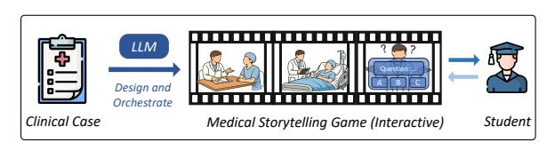

Figure 1: MedGame 한눈에 보기. 정적 임상 사례를 주면, MedGame은 LLM을 사용해 인터랙티브 의료 스토리텔링 게임을 설계하고 조율하며, 학습자는 사례가 전개되는 동안 결정을 내리고 피드백을 받는다.

임상 사례 요약은 이러한 경로를 자연스럽게 담는 매체이다: 하나의 일관된 에피소드 안에 풍부한 진단 및 치료 지식을 인코딩한다. 그러나 이들은 일반적으로 정적 텍스트로 소비되며, 추론 과정을 회고적으로만 제시한다. 반면, 적극적인 임상 추론은 순차적으로 전개된다—학습자는 부분 정보를 해석하고 다음에 무엇을 물어보거나 테스트할지 결정하며, 새로운 증거가 등장함에 따라 이해를 업데이트해야 한다. 정적 전달과 동적 추론 사이의 불일치는 LLM 기반 의료 교육에 대한 기술적 질문을 촉발한다: *LLMs가 정적 임상 사례를 구조화되고 실행 가능하며 상호작용적인 학습 경로로 변환할 수 있을까?*

사례 요약을 이러한 경로로 변환하려면 유창한 교육 텍스트 이상의 것이 필요하다: 출력은 원본 사례에 충실해야 하고, 의미 있는 결정 지점을 드러내며, 의학적으로 그럴듯하게 유지되고, 머신 실행 가능해야 한다. 이는 제한된 구조화된 생성 문제이다.

가능한 표현들 중에서, 스토리텔링 게임은 이러한 요구사항을 자연스럽게 충족시킨다 (Figure 1): 장면은 진화하는 임상 상황을 인코딩하고, 등장인물은 역할별 정보를 전달하며, 결정 노드는 학습자의 추론을 유도하고, 피드백은 선택을 의료 결과와 연결한다. 이 프레임에서 게임화는 단순한 오락 층이 아니라, 사례 기반 임상 추론을 상태, 선택, 결과의 연속적인 시퀀스로 조직하는 구조적 인터페이스 역할을 한다 (Caponetto et al., 2014; Brunetti et al.,

[2024\)](#page-8-2).

본 논문에서는 정적 임상 사례를 구조화된 스토리텔링 게임으로 변환하는 생성적 프레임워크 *MedGame*을 제안한다. 전문 영화 산업에서 연속성 스크립트가 서사 의도와 무대 실행을 연결하는 것처럼 [\(Staiger,](#page-10-2) [1979;](#page-10-2) [Gomery and](#page-9-1) [Pafort‑Overduin,](#page-9-1) [2011\)](#page-9-1), MedGame은 임상 서사 구상과 기술적 오케스트레이션을 분리하는 듀얼엔진 아키텍처를 채택한다. *Medical Narrative Designer*는 원시 임상 기록을 계층적 임상 스토리라인으로 합성하여 명시적 상태와 결정 노드를 갖는 '스크린라이터' 역할을 한다. 이 구조화된 스토리라인은 두 엔진 사이의 인터페이스 역할을 하며, *Story Director*는 이를 소비하고 다중 모달 생성 프리미티브의 방향성 있는 비순환 그래프로 매핑한다. 이 그래프를 통해 작업 의존성을 관리함으로써, Director는 하위 단계 렌더링 및 상호작용 전반에 걸쳐 정체성 보존과 인과 일관성을 지원한다.

우리의 기여는 다음과 같이 요약된다:

- (1) 우리는 정적 임상 사례를 구조화되고 실행 가능한 스토리텔링 게임으로 변환하는 듀얼엔진 프레임워크 *MedGame*을 도입한다. MedGame은 이 변환을 Medical Narrative Generation과 Story Direction으로 분해한다. Medical Narrative Generation은 명시적 상태와 결정 노드를 갖는 사례 기반 임상 스토리라인을 생성하고, Story Direction은 스토리라인을 의존성 인식 다중 모달 실행 계획으로 변환한다.

- (2) 우리는 Medical Narrative Generation과 Story Direction을 위한 사례 기반 벤치마크 및 평가 프로토콜인 *MedGame Bench*를 구축한다. 5,000개의 실제 환자 사례를 기반으로 하며, 구조적 유효성, 스토리 적응, 의료 정확성, 교육적 질, 작업 타당성 등의 지표를 사용해 임상적으로 의미 있는 스토리라인 생성과 실행 가능한 다중 모달 오케스트레이션을 평가한다.

- (3) 우리는 작업별 파인튜닝이 MedGame Bench에서 오픈소스 LLM을 크게 향상시키고 상용 모델과의 격차를 줄인다는 것을 보여주는 체계적인 실험을 수행한다. 전문가와 학생 연구는 인간 개정이 생성된 교육 콘텐츠를 강화하고, 학습자들이 텍스트 전용 상호작용보다 렌더링된 MedGame 경험을 더 매력적이고 유용하게 인식한다는 것을 추가로 보여준다.

(보너스) 개념과 실천을 연결하기 위해, 우리는 MedGame 프레임워크에 맞춘 실행 가능한 플랫폼을 구축하고 공개한다. 이 플랫폼은 생성된 임상 스토리라인과 오케스트레이션 계획을 직접

플레이 가능한 인터랙티브 게임으로 변환한다. 이 플랫폼은 생성된 사례를 인터랙티브 환경에서 검사하고 체험할 수 있게 하여, 향후 연구 및 교육 프로토타이핑을 위한 실용적인 인터페이스를 제공한다.

## 2 Related Works (관련 연구)

## 2.1 LLMs for Medical Education (의료 교육을 위한 LLMs)

우리는 Copilot 스타일의 어시스턴트 LLM copilots가 지식이 풍부한 멘토로서 실시간 안내와 구조화된 피드백을 제공한다. 초기 연구는 표준화된 시험 성과에 초점을 맞췄다 [\(Kung](#page-9-2) [et al.,](#page-9-2) [2023;](#page-9-2) [Lucas et al.,](#page-10-0) [2024\)](#page-10-0), 최근 연구는 교육적 스캐폴딩을 강조한다. [Wu et al.](#page-10-1) [\(2025b\)](#page-10-1)은 구조화된 차별적 진단 단계로 임상 추론을 안내하도록 제안했고, [Jang et al.](#page-9-3) [\(2025a\)](#page-9-3)은 Retrieval-Augmented Generation (RAG) [\(Lewis et al.,](#page-9-4) [2020\)](#page-9-4) 기반의 의료 증거 생성을 도입했다. 진단을 넘어, [Huang](#page-9-0) [et al.](#page-9-0) [\(2024\)](#page-9-0)은 *ChatCoach*를 개발해 의사소통 기술에 대한 피드백을 제공했고, [Yao et al.](#page-11-0) [\(2024\)](#page-11-0)은 데이터 중심 방법을 활용해 의료 전문 용어를 단순화하여 환자 이해를 돕는다. 환자 교육 라인에서, [Cai et al.](#page-8-3) [\(2023\)](#page-8-3); [Jang et al.](#page-9-5) [\(2025b\)](#page-9-5)은 상호작용형 질문응답을 추가로 개발해 환자가 퇴원 지침을 숙달하도록 답변 검증 피드백을 제공한다.

환자 시뮬레이션: 표준화된 환자(SPs)는 임상 실습의 금본위이다 [\(Anderson et al.,](#page-8-4) [1994;](#page-8-4) [Wang et al.,](#page-10-3) [2025a\)](#page-10-3), 인간 배우에 대한 의존은 높은 비용과 확장성 제한을 초래한다. LLM 기반 가상 환자(VP)는 접근 가능하고 고충실도 시뮬레이션을 가능하게 하여 이러한 문제를 해결한다. 최근 비교 연구는 LLM 기반 VSP가 의료 교육에서 인간 SP를 얼마나 근접하게 모사할 수 있는지 추가로 조사한다 [\(Zhang et al.,](#page-11-1) [2026\)](#page-11-1). 도메인별 적용 측면에서, [Yao et al.](#page-11-2) [\(2025\)](#page-11-2)은 퇴원 교육용 VP를 벤치마킹했고, [Yao et al.](#page-11-3) [\(2026\)](#page-11-3)은 환자 교육을 다중 턴 다중 모달 상호작용으로 재구성했다. 한편 [Wang](#page-10-4) [et al.](#page-10-4) [\(2024a\)](#page-10-4)은 정신건강 훈련을 위해 다양한 인지 모델을 시뮬레이션했다. 특정 의료 시나리오를 넘어, 최근 연구는 시뮬레이션 현실성을 향상시키는 기술적 메커니즘에도 초점을 맞추었다. [Li et al.](#page-9-6) [\(2024\)](#page-9-6)와 [Du et al.](#page-9-7) [\(2025\)](#page-9-7)은 각각 자율 에이전트 진화와 다중 에이전트 공동 진화를 탐구했다. 동시에 상호작용 역학에 초점을 맞추어, [Lee et al.](#page-9-8) [\(2025b\)](#page-9-8)은 실시간 적응 메커니즘을 도입해 훈련생의 의사소통 전략에 따라 가상 환자의 적대성 및 협력 수준을 조정했다.

생성형 교육 콘텐츠 LLM은 다양한 학습 자료를 효율적으로 생산하여 의료 교육자들의 콘텐츠 제작 부담을 크게 줄인다. 사례 기반 학습에서는 [Co¸skun et al.](#page-9-9) [\(2025\)](#page-9-9)이 LLM이 생성한 임상 소품이 인간이 작성한 콘텐츠와 품질 면에서 동등함을 입증했다. 유사하게 평가 영역에서도 연구는 LLM이 해부학과 같은 전문 과목에 대한 고충실도 객관식 질문을 생성할 수 있음을 검증했다 [\(Elzayyat et al.,](#page-9-10) [2025\)](#page-9-10) 및 보다 광범위한 의료 시험 [\(Artsi et al.,](#page-8-5) [2024\)](#page-8-5). 생성 능력을 멀티모달 자원으로 확장하여, [Wu et al.](#page-10-5) [\(2025c\)](#page-10-5)은 텍스트-이미지 파이프라인을 통해 의료 교육용 시각 플래시카드를 만드는 프레임워크를 개발했다.

## 2.2 게임 및 서사 디자인 (Game and Narrative Design with LLMs)

게임화는 일반 및 의료 교육에서 참여도를 높이기 위해 널리 채택되는 전략이다 [\(Caponetto et al.,](#page-8-1) [2014;](#page-8-1) [Zeybek and Saygı,](#page-11-4) [2024;](#page-11-4) [Wang et al.,](#page-10-6) [2024b;](#page-10-6) [Lee et al.,](#page-9-11) [2025a\)](#page-9-11). 최근 일반 도메인에서 LLM 기반 게임의 발전은 이 분야에 필수적인 기술적 기반을 제공한다. 개발 측면에서 [Hong et al.](#page-9-12) [\(2025\)](#page-9-12)은 *ChatGE*를 통해 자연어를 이용한 게임 스크립트 생성을 가능하게 하여 콘텐츠 제작의 민주화를 촉진했다. 상호작용 품질을 향상시키기 위해 [Wu et al.](#page-10-7) [\(2024,](#page-10-7) [2025a\)](#page-10-8)는 *Drama-Interaction*을 제안했으며, 이는 연극 이론을 통합하여 단순 역할극을 몰입형 서사로 끌어올렸다. 서사 일관성에 있어서는 *StoryVerse* [\(Wang](#page-10-9) [et al.,](#page-10-9) [2024c\)](#page-10-9)와 *CoDi* [\(Wang et al.,](#page-10-10) [2025b\)](#page-10-10)와 같은 계층적 계획 프레임워크가 Director-Actor 아키텍처를 사용해 서사 자유와 일관성 사이의 긴장을 해결했다. 그러나 이러한 시스템은 주로 일반 도메인 스토리텔링을 위해 설계되었으며, 임상 정확성, 교육적 순서, 전문 역할의 멀티모달 구현과 같은 의료 교육의 도메인 특화 제약을 고려하지 않는다.

## 3 Problem Formulation (문제 정의)

이야기 기반 게임 디자인 원칙 [\(Szilas,](#page-10-11) [1999;](#page-10-11) [Lindley,](#page-10-12) [2005;](#page-10-12) [Carstensdottir](#page-8-6) [et al.,](#page-8-6) [2019\)](#page-8-6)을 바탕으로, 우리는 사례-스토리텔링 게임 생성 (case-to-storytellinggame generation)을 결정 노드에 의해 가드되는 선형 임상 스토리라인으로 공식화한다.

interactive sessions:

<span id="page-2-0"></span>

$$
(\mathcal{C}_1 \xrightarrow{\mathcal{Q}_1} \mathcal{C}_2 \xrightarrow{\mathcal{Q}_2} \mathcal{C}_3 \xrightarrow{\mathcal{Q}_3} \dots \xrightarrow{\mathcal{Q}_{n-1}} \mathcal{C}_n)
$$

(1)

각 C<sup>i</sup>는 확인된 관찰과 결정의 시퀀스 이후에 축적된 *임상 세계 상태*를 나타낸다 (예: “54세 여성 환자가 피로, 기억 상실, 정상 초기 검사 결과를 보이며 내원함”), 반면 Q<sup>i</sup>는 임상 상태가 진행되기 전에 해결되어야 하는 가드된 결정 체크포인트를 나타낸다 (예: “어떤 실험실 검사를 주문해야 할까?”). 각 화살표 <sup>Q</sup><sup>i</sup> −→는 학습자가 Q<sup>i</sup>를 해결함으로써 가드되는 상태 전이를 나타낸다: 다음 상태 C<sub>i+1</sub>는 C<sup>i</sup>와 그 해결된 결정 체크포인트에 의해 결정된다. 이 방정식은 스토리라인 진행의 *평면화된, 프로세스 수준* 관점을 제공한다.

이 선형 공식화는 의료 사례의 소스 형식에 의해 동기화된다, 임상 추론 자체가 선형이라는 가정이 아니라. 의료 사례 보고서와 진단 기록은 일반적으로 이미 발생한 결정론적 임상 경로를 증상, 검사, 진단, 치료, 결과의 시간 순서대로 조직하여 설명한다. 이러한 기록을 선형 스토리라인으로 변환하면 소스 사례에 대한 충실도를 보존한다. 임상 의사결정에서는 다르게 학습자 행동이 다른 결과를 초래할 수 있어, 인터랙티브 시뮬레이션에서 가지 구조가 발생한다. 이러한 가지 스토리 그래프는 위에서 정의한 동일한 상태 전이 단위를 조합하여 구성할 수 있다. 서로 다른 결정은 서로 다른 후속 상태를 생성한다. 우리는 이 확장을 부록 [B.](#page-20-0)에서 논의한다.

## <span id="page-2-1"></span>3.1 Acts, Scenes, and Decision Nodes (행위, 장면, 그리고 결정 노드)

추상적 진행을 Eq. [\(1\)](#page-2-0)에서 임상적 일관된 서사 안에서 구현하기 위해, 우리는 각 스토리라인을 Acts, Scenes, 그리고 Decision Nodes로 구성된 계층 구조로 정리한다. 이는 확립된 시나리오 작성 및 서사 설계 관행을 따른다. 표 [1](#page-3-0)은 생성된 Clinical Storyline에서 각 수준의 역할을 요약한다.

Act A<sup>i</sup>는 임상 경로의 주제적 거시 단계(예: 초기 진단 또는 치료 계획)를 정의한다. 각 Act는 같은 단계 내에서 중간 단계에 해당하는 Scene의 순서 있는 시퀀스로 구성된다:

$$A_i = \langle S_{i,1}, S_{i,2}, \dots, S_{i,m_i} \rangle.$$

(2)

A Scene Si,j는 Act 내에서 보다 세분화된 임상 단계, 예를 들어 병력 청취, 집중된 것을 나타낸다.

<span id="page-3-1"></span>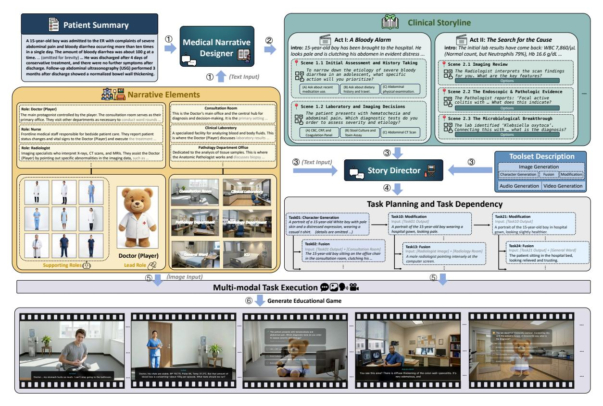

Figure 2: **MedGame 프레임워크 아키텍처 개요.** MedGame은 두 단계의 생성 워크플로우를 따른다. 스크립트 합성 단계(①—②)에서는 *Medical Narrative Designer*가 원시 환자 요약과 지속적인 서사 요소를 구조화된 Clinical Storyline으로 변환한다. 오케스트레이션 및 실행 단계(③—⑥)에서는 *Story Director*가 스토리라인을 멀티모달 생성 프리미티브로 분해하고, 유향 비순환 그래프를 사용해 작업 계획 및 종속성을 조직하며, 멀티모달 작업 실행을 조정하여 인터랙티브 교육 경험을 구현한다.

Table 1: Clinical Storyline 계층 구조.

<span id="page-3-0"></span>

| 레벨 | 스토리라인에서의 역할 | 의학 예시 |
|---------------------------|----------------------------------------------------------|-----------------------------------------------------------------|
| $\operatorname{Act}(A_i)$ | 임상 경로의 주제별 거시 단계(마크로스테이지)를 조직한다. | 설명되지 않은 피로를 가진 환자에 대한 진단 평가. |
| 장면 $(S_{i,j})$ | 하나의 임상 단계와 그 상태 전이를 구체화한다. | 진료 이력 및 신체검사 후 실험실 검사를 주문한다. |
| 결정 노드 $(Q)$ | 학습자에게 제공되는 결정 체크포인트를 제시한다. | 다음에 주문해야 할 실험실 검사를 선택한다. |

신체 검사, 진단 검사, 또는 치료 계획. 각 Scene은 상호작용 이전의 맥락을 제시하고 학습자의 결정을 유도하며, 결정이 해결된 후 업데이트된 임상 상태를 보여줌으로써 임상 경로에서 하나의 전환을 지역화합니다.

**Decision Node**는 Scene 내부에서 학습자에게 보여지는 체크포인트입니다. 학습자에게 관련 검사를 선택하거나 진단을 선택하거나 치료 행동을 결정하는 등 임상 선택을 하도록 요구하며, 옵션 수준의 피드백 또는 설명적 결과를 제공합니다. 이렇게 해서 Decision Nodes

수동적인 사례 정보를 적극적인 임상 추론 단계로 변환합니다.

이러한 추상화는 함께 *Clinical Storyline*  $\mathcal{T}=\langle A_1,A_2,\ldots,A_N\rangle$ 를 정의하며, 이는 우리의 게임화된 임상 사례의 <u>이야기 골격</u>이자 다음 섹션에서 소개되는 MedGame의 두 엔진 사이의 인터페이스 역할을 합니다. 완전하고 검증 가능한 *Pydantic* (Colvin et al., 2023) 스키마는 부록 1에 제공됩니다.

#### <span id="page-3-2"></span>4 MedGame 프레임워크

우리 프레임워크의 개요는 Figure 2에 표시되어 있습니다. MedGame은 두 개의 LLM 기반 프로세스를 통해 사례 적응과 멀티모달 구현을 분리합니다. *Medical Narrative Designer*는 먼저 원시 환자 요약을 구조화된 텍스트 기반의 인터랙티브 임상 스토리라인으로 변환합니다. *Story Director*는 이 스토리라인을 종속성 인식 멀티모달 생성 계획으로 번역하여 인터랙티브 경험을 렌더링합니다.

#### 4.1 의료 내러티브 디자이너 (Medical Narrative Designer)

LLM에게 '게임을 작성하라'는 직접적인 요청 대신, Medical Narrative Designer는 사례 적응을 소스 기반 재구성 문제로 정의합니다. 환자 요약을 바탕으로 디자이너는 사례의 사실적 임상 경로를 보존하면서 수동적 사례 정보를 학습자 대면 상호작용으로 전환해야 합니다. 이 설계는 자유형 생성에서 얽혀 있던 세 가지 요구 사항—소스 사례에 대한 충실성, 교육적 결정 설계, 그리고 다운스트림 실행을 위한 구조적 유효성—을 분리합니다.

형식적으로, Medical Narrative Designer(denoted fdes)는 구조화되지 않은 환자 요약 Spat을 계층적 *Clinical Storyline* T로 변환합니다:

$$\mathcal{T} = f_{\text{des}}(S_{\text{pat}} \mid \Phi_{\text{des}}). \tag{3}$$

디자이너는 구조화된 적응 과정을 통해 이 변환을 수행합니다. 먼저 생성된 내용을 Spat의 임상적으로 관련된 사실에 고정시키고, 그 다음 사례의 시간적 진행을 Acts와 Scenes으로 조직하며, 마지막으로 임상적으로 의미 있는 순간에 Decision Nodes를 도입합니다. 각 Decision Node는 학습자에게 행동을 선택하거나 정보를 수집하거나 증거를 근거로 추론하도록 요구하며, 학습자의 선택을 해당 임상 결과나 설명과 연결하는 피드백과 함께 제공됩니다.

결과적으로 생성된 스토리라인은 이미 텍스트 기반의 인터랙티브 의료 게임을 지원할 수 있습니다: 이는 소스 기반의 임상 진행, 학습자 선택, 그리고 멀티모달 렌더링이 적용되기 전의 피드백을 포함합니다. 지침 Φdes는 이 변환을 네 가지 유형의 제약으로 안내합니다. 임상 예시 E는 소스 사례가 어떻게 인터랙티브 스토리라인으로 적응되는지를 보여주며, 구조적 Pydantic 스키마 (Listing [1\)](#page-14-0))는 기계가 읽을 수 있는 계층 구조를 강제합니다; 의료 루브릭 R은 임상적으로 의미 있는 결정과 설명을 장려합니다; 그리고 내러티브 요소 {P,L}은 디자이너가 선택할 수 있는 의료 직원 페르소나와 임상 위치를 정의합니다. 이러한 선별된 요소들은 캐릭터와 장면 선택을 제한하여 생성된 스토리라인이 기반을 유지하고 시각적으로 일관되도록 돕습니다. 이 제약들은 출력이 소스 사례에 충실하면서 Story Director가 활용할 수 있도록 설계되었습니다. 내러티브 요소의 세부 사항은 부록 [A.2,](#page-12-0)에서 제공되며, 전체 지침은 부록 [A.4.](#page-17-0)에 제공됩니다.

#### <span id="page-4-0"></span>4.2 스토리 디렉터

Clinical Storyline T는 텍스트 기반 상호작용을 지원할 수 있지만, MedGame은 이를 멀티모달 시뮬레이션으로 구현하려고 한다. 스토리 디렉터는 시각, 오디오, 비디오 생성 기능을 노출하는 인터페이스를 갖는 멀티모달 툴셋 M = {fvis, faud, fvid} 위에서 동작한다. 디렉터, 즉 fdir는 T를 실행 가능한 생성 계획으로 매핑하며, 이는 방향성 비순환 그래프(DAG) G = (V, E)로 표현된다:

$$\mathcal{G} = f_{\text{dir}}(\mathcal{T} \mid \Phi_{\text{dir}}). \tag{4}$$

각 노드 v ∈ V는 멀티모달 툴셋에서 인스턴스화된 독립적인 생성 프리미티브이며, 각 엣지 (u → v) ∈ E는 작업 간 자산 수준 또는 상태 수준의 종속성을 기록한다. 지침 Φdir은 서사 요소, 툴 API 사양, 종속성 규칙을 포함하여 작업 분해를 안내한다. 툴 인터페이스의 세부 사항은 부록 [A.3,](#page-14-1) 에 제공되며, 전체 지침은 부록 [A.5.](#page-17-1) 에 제공된다.

이 그래프 표현은 모든 자산이 독립적으로 생성될 수 있다고 가정하지 않고, 디렉터가 텍스트 기반 상호작용을 넘어 계획을 세울 수 있게 한다. 예를 들어, 이후 장면은 캐릭터 참조를 재사용하거나 장면 레이아웃을 상속받거나 이전에 생성된 시각 상태를 수정해야 할 수 있다. 따라서 우리는 초기 프레임 합성(하류 비디오 합성 전에 생성되는 정적 키프레임)을 각 생성 작업의 시각적 앵커로 사용하고, 검증된 종속성을 따라 상류 자산을 전파하여 정체성과 서사 연속성을 유지하도록 한다. 상세 종속성 사양은 부록 [A.6.](#page-17-2) 에 제공된다.

마지막으로, 시스템은 G에 따라 생성 프리미티브를 실행하여 대화형 자산을 구현한다. 각 노드 v<sup>i</sup> 에 대해, 시스템은 노드의 모달리티와 작업 유형에 따라 툴 fv<sup>i</sup> ∈ M 를 선택하고, 작업 사양과 사용 가능한 상류 자산으로부터 출력 자산 av<sup>i</sup> 를 합성한다:

$$\mathbf{a}_{v_i} = f_{v_i} \big( v_i \mid \{\mathbf{a}_u\}_{(u,v_i) \in E} \big),$$

{au}는 선행 작업에서 상속된 자산 집합을 나타낸다. 이 종속성 인식 실행은 멀티모달 생성을 조정하는 실용적인 메커니즘을 제공하며, 기본 생성 도구에 대해 자산 합성을 모듈화된 상태로 유지한다.

## <span id="page-4-1"></span>5 MedGame Bench

우리는 *MedGame Bench* 를 구축한다, 이는 LLM이 trans- 를 평가하기 위한 사례 기반 벤치마크이다.

<span id="page-5-2"></span>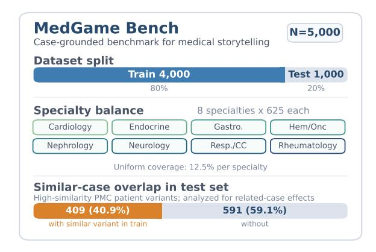

Figure 3: MedGame Bench 개요. 이 벤치마크는 5,000개의 PMC-Patients 사례를 포함하며, 4,000개의 훈련 사례와 1,000개의 테스트 사례로 나뉘어 있고, 8개의 의료 전문 분야에 걸쳐 균형 있게 배치되어 각 분야마다 625개의 사례가 있다. 테스트 사례 중 409개는 훈련 세트에 최소 하나의 고유사성 환자 변형을 가지고 있다; 여기서 고유사성 변형은 점수 2인 PMC-Patients 관계를 의미하며, 이는 동일한 출처 기사에서 나온 환자 요약과 일치한다. 우리는 부록 [E.4.](#page-33-0) 에서 이 관련 사례 겹침을 분석한다.

정적 의료 사례를 구조화된 대화형 스토리라인과 실행 가능한 오케스트레이션 계획으로 변환하여 downstream 렌더링을 수행합니다. 벤치마크는 PMC-Patients Dataset [\(Zhao et al.,](#page-11-5) [2023\)](#page-11-5) 에 있는 공개 환자 요약으로 구성되며, 이는 *PubMed Central*[1](#page-5-0) 에서 도출된 사례 보고서 기반 요약으로 이루어져 있습니다. 광범위한 임상 범위를 지원하기 위해 우리는 심장학, 내분비학, 위장병학, 혈액학/종양학, 신장학, 신경학, 호흡기 및 중환자 치료, 류마티스학 등 8개 의료 전문 분야에 걸쳐 균형 있게 5,000개의 사례를 샘플링하고, Section [6](#page-5-1) (Figure [3\)](#page-5-2) 에서 사용되는 고정된 4,000/1,000 훈련–테스트 분할로 나눕니다. 또한 분할 간에 고유사성 환자 변형을 추적하여 관련 사례 중복이 평가 점수에 영향을 미치는지 평가합니다. 생성된 출력 통계에 대한 세부 사항은 Appendix [C.](#page-20-1) 에 제공됩니다.

벤치마크 작업. MedGame Bench는 MedGame의 두 엔진 설계와 일치하는 두 개의 평가 트랙을 포함합니다. 의료 서사 생성(Medical Narrative Generation)은 모델이 환자 요약을 유효한 Acts, Scenes, Decision Nodes, 학습자 선택 및 피드백을 포함하는 구조화된 임상 스토리라인(Clinical Storyline)으로 변환할 수 있는지 평가합니다. 스토리 방향(Story Direction)은 모델이 임상 스토리라인을 downstream 렌더링을 위한 유효한 멀티모달 오케스트레이션 계획으로 번역할 수 있는지, 적절한 자원 할당, 도구 선택, 매개변수 및 종속성을 포함하는지 평가합니다.

모델링.

평가 프로토콜. 의료 서사 생성(Medical Narrative Generation)의 경우, 생성된 스토리라인을 네 가지 차원에서 평가합니다. (1) *구조 검증*은 JSON 파싱(JSON), Pydantic 스키마 준수(Schema), 그리고 엄격한 비즈니스 로직 제약(Strict)을 검증합니다. (2) *스토리 적응*은 임상 내용 통합(Clinical Content Integration, CCI), 인물 및 장면 사용(Character & Scene Usage, CSU), 그리고 서사 품질(Narrative Quality, NQ)을 평가합니다. (3) *의학 정확성*은 임상 결정 정확성(Clinical Decision Accuracy, CDA), 옵션 설계 정확성(Option Design Accuracy, ODA), 그리고 의학 설명 정확성(Medical Explanation Accuracy, MEA)을 평가합니다. (4) *교육 품질*은 질문 설계 품질(Question Design Quality, QDQ)과 피드백 품질(Feedback Quality, FQ)을 측정합니다.

스토리 방향(Story Direction)의 경우, 생성된 작업 매개변수를 두 가지 차원에서 평가합니다. (1) *구조 검증*은 출력이 요구되는 형식에 부합하는지 여부를 샘플 수준(Sample-wise)과 개별 작업 수준(Task-wise) 모두에서 측정합니다. 샘플은 모든 구성 작업이 스키마와 비즈니스 로직 제약을 만족할 때만 검증을 통과합니다. (2) *작업 합리성*은 자원 할당(Resource Assignment, RA), API 유형 선택(API Type Selection, ATS), 그리고 매개변수 내용(Parameter Content, PC)을 평가하며, 생성된 작업 계획이 적절한 자원을 선택하고 도구 API 사용 규칙을 따르며 서사 맥락에 맞는 매개변수를 제공하는지 측정합니다.

구조 검증은 자동화된 규칙 기반 검사를 통해 수행되며, 내용 지향 지표는 LLM-as-a-Judge [\(Zheng](#page-11-6) [et al.,](#page-11-6) [2023\)](#page-11-6) 에 의해 GPT-5.2[2](#page-5-3) 를 사용해 평가됩니다. 각 지표는 1–10 척도로 평가됩니다. 완전한 루브릭, 검증 규칙, 평가 프롬프트는 Appendix [D.](#page-22-0) 에 제공됩니다.

## <span id="page-5-1"></span>6 실험 (Experiments)

우리는 실험을 두 가지 관점에서 구성합니다. RQ1과 RQ2는 사례 기반 의료 서사 생성과 멀티모달 스토리 방향이라는 두 핵심 MedGame 생성 작업에서 LLM의 역량을 평가하며, 작업별 미세 조정 전후를 비교합니다. RQ3과 RQ4는 MedGame을 협업 및 학습자 중심 사용에서 검토합니다.

### 6.1 구현 세부사항 (Implementation Details)

우리는 Qwen [\(Yang et al.,](#page-10-13) [2025a\)](#page-10-13), Gemma [\(Team](#page-10-14) [et al.,](#page-10-14) [2024\)](#page-10-14), MedGemma [\(Sellergren et al.,](#page-10-15) [2025\)](#page-10-15) 를 포함한 오픈소스 범용 LLM, 의료 LLM, 그리고 상용 프론트리 모델을 혼합하여 두 MedGame 생성 작업을 평가합니다.

<span id="page-5-0"></span><sup>1</sup> https://pmc.ncbi.nlm.nih.gov/

<span id="page-5-3"></span><sup>2</sup> https://openai.com/index/introducing-gpt-5-2/

<span id="page-6-0"></span>표 2: 의료 서술 생성에 대한 정량적 결과. ● 은 오픈소스 모델을, ◆ 은 상용 모델을 나타낸다. **굵게**는 최상의 성능을, <u>밑줄</u>은 두 번째 최상의 성능을, \*는 미세 조정된 모델을 나타낸다.

| 모델 | 구조 검증 |  | 스토리 적응 |  | 의료 정확성 |  | 교육적 |  |  |  |  |
|--------------------------------|----------------------|---------|------------------|------|------------------|------|-------------|------|------|------|------|
| Widdel | JSON↑ | Schema† | Strict↑ | CCI↑ | CSU↑ | NQ↑ | CDA↑ | ODA↑ | MEA↑ | QDQ↑ | FQ↑ |
| • Qwen3-32B | 87.4 | 84.5 | 79.4 | 7.04 | 5.41 | 6.92 | 5.78 | 4.95 | 5.04 | 6.21 | 5.94 |
| ● Gemma-3-27B | 95.6 | 69.2 | 58.7 | 7.67 | 7.11 | 7.21 | 6.08 | 5.82 | 5.43 | 6.12 | 6.02 |
| <ul><li>MedGemma-27B</li></ul> | 95.3 | 76.1 | 59.3 | 7.25 | 7.02 | 7.53 | 6.43 | 6.22 | 5.78 | 6.53 | 6.61 |
| <ul><li>Qwen3.5-27B</li></ul> | 92.1 | 91.7 | 90.8 | 8.43 | 8.51 | 7.89 | 6.82 | 6.63 | 6.32 | 6.89 | 6.92 |
| ◆ Claude-Sonnet-4.5 | 99.7 | 99.5 | <u>99.5</u> | 8.74 | 6.99 | 7.99 | 7.01 | 6.77 | 6.73 | 7.33 | 7.52 |
| ◆ Gemini-3-Pro | 100.0 | 100.0 | 100.0 | 8.78 | 8.65 | 8.02 | 7.26 | 7.20 | 6.92 | 7.10 | 7.36 |
| ● Qwen3.5-9B* | 93.8 | 91.7 | 90.9 | 7.95 | 8.30 | 7.67 | 6.55 | 6.13 | 5.71 | 6.72 | 6.54 |
| ● Qwen3-32B* | 99.6 | 99.3 | 99.1 | 8.23 | 8.50 | 7.95 | 6.60 | 6.31 | 5.87 | 6.82 | 6.76 |
| ● Gemma-3-27B* | 99.7 | 99.4 | 98.9 | 7.77 | 8.41 | 7.86 | 6.39 | 6.01 | 5.56 | 6.79 | 6.57 |
| ■ MedGemma-27B* | 99.2 | 99.0 | 98.5 | 8.18 | 8.42 | 7.92 | 6.64 | 6.32 | 5.90 | 6.88 | 6.83 |
| ● Qwen3.5-27B* | 99.9 | 99.8 | <u>99.5</u> | 8.62 | 8.62 | 8.00 | 7.05 | 6.85 | 6.58 | 6.99 | 7.12 |

Claude와 Gemini (Team et al., 2023). 의료 서사 생성의 경우, 프롬프트 기반 기준 모델은 2-shot 설정을 사용하고, 스토리 방향의 경우는 zero-shot 설정을 사용한다. 우리는 MedGame Bench의 해당 학습 세트에서 오픈소스 모델을 추가로 미세조정하며, 전체 모델 목록은 표 2와 3에 표시되어 있다.

오픈소스 모델은 미세조정된 설정에서 Rank 32와 Alpha 64에서 LoRA (Hu et al., 2022)를 적용한다. 로컬 추론은 vLLM 프레임워크 (Kwon et al., 2023)를 사용해 수행된다. 오픈소스 모델의 훈련 및 추론은 2개의 H100 GPU가 장착된 서버에서 수행되며, 상용 모델은 공식 API를 통해 접근된다.

## **6.2 RQ1: 기존 LLM이 MedGame Bench에서 어떻게 수행되는가?**

<span id="page-6-1"></span>Table 3: 스토리 방향에 대한 정량적 결과.

| 모델 | 구조 V | 작업 합리성 |  |  |  |
|----------------------------------|--------------|--------------------|------|------|------|
|  | 샘플별† | 작업별↑ | RA↑ | ATS↑ | PC↑ |
| ● Gemma-3-27B | 56.50 | 93.90 | 5.12 | 4.66 | 7.08 |
| <ul> <li>MedGemma-27B</li> </ul> | 59.40 | 89.30 | 5.39 | 5.17 | 7.01 |
| <ul><li>Qwen3-32B</li></ul> | 77.20 | 94.51 | 6.16 | 6.98 | 6.95 |
| <ul> <li>Qwen3.5-27B</li> </ul> | 80.30 | 95.26 | 6.34 | 7.01 | 6.97 |
| ◆ Claude-Sonnet-4.5 | 99.40 | 99.87 | 7.89 | 8.97 | 7.72 |
| ♦ Gemini-3-Pro | 99.20 | 99.93 | 7.93 | 8.95 | 7.85 |
| ● Qwen3.5-9B* | 95.00 | 97.90 | 7.67 | 8.85 | 7.81 |
| ● Qwen3-32B* | 99.10 | 99.80 | 7.92 | 8.86 | 7.84 |
| ● Gemma-3-27B* | 99.50 | 99.74 | 7.69 | 8.77 | 7.86 |
| ■ MedGemma-27B* | 99.60 | 99.97 | 7.71 | 8.84 | 7.85 |
| <ul><li>Qwen3.5-27B*</li></ul> | 99.80 | 99.98 | 7.88 | 9.02 | 7.86 |

RQ1에 대해, 우리는 테이블 2와 3의 가로선 위에 해당하는 결과와 일치하도록, 작업별 미세 조정 없이 기존 LLM을 평가한다. 의료 내러티브 생성에서는, 상업적 최첨단 모델들이 거의 완벽한 구조적 유효성을 달성하며, Claude-Sonnet-4.5와 Gemini-3-Pro가 각각 99.5%와 100.0%의 엄격한 검증을 달성한다. 오픈소스 모델은 구조와 내용 지표 모두에서 뒤처진다: Qwen3-32B는 단지 79.4%의 엄격한 검증을 달성하고, Gemma-3-27B와 MedGemma-27B는 60% 이하이며 re-

60% 이하이며, 그리고 그들의 의료 정확도 점수는 상업적 최첨단 모델보다 지속적으로 낮다. Gemini-3-Pro에서도 CDA, ODA, MEA는 약 7을 유지하며, 생성된 의료 내용이 여전히 신중한 검토가 필요함을 시사한다.

스토리 방향에서는 격차가 더욱 운영적이 된다. 오픈소스 모델은 샘플별 검증에서 56.50–80.30%에 머물며, 특히 API 타입 선택에서 작업 합리성에서도 상업적 모델을 따라가지 못한다. 반면 Claude-Sonnet-4.5와 Gemini-3-Pro는 99% 이상의 샘플별 검증을 초과하며, 강력한 모델에 대해 오케스트레이션이 가능하지만 적응 없이 오픈소스 모델에는 신뢰할 수 없음을 보여준다.

전반적으로 상업적 최첨단 모델은 MedGame이 강력한 LLM에 대해 실현 가능함을 보여주지만, 오픈소스 모델은 내용 품질, 작업 합리성, 구조적 유효성에서 뒤처진다. 구조적 격차는 특히 중대한 영향을 미치며, 유효한 스토리라인과 작업 계획이 없으면 생성된 출력은 신뢰할 수 있게 파싱, 실행, 렌더링할 수 없으므로 RQ2의 작업별 미세 조정 연구를 동기화한다.

## **6.3 RQ2:** 오픈소스 모델을 미세 조정으로 적응시킬 수 있을까? (Can Open-Source Models Be Adapted through Fine-Tuning?)

RQ1을 기반으로, 우리는 오픈소스 모델이 Gemini-3-Pro 참조 궤적에 대한 작업별 미세 조정을 통해 MedGame 전용 생성 규칙을 습득할 수 있는지 조사한다. 이득은 두 트랙 모두에서 일관된다 (표 2 및 3): Qwen3.5-27B*는 Medical Narrative Generation에서 Strict 검증이 99.5%에 도달하고, Qwen3-32B*는 CSU를 5.41에서 8.50으로 개선하여, 선별된 페르소나와 임상 위치를 더 잘 활용하고 있음을 시사한다. 더욱 중요한 것은 Qwen3.5-27B*가 서사 구조와 적응 측면에서 Gemini-3-Pro와 거의 일치하며, 내용 지향적 Medical Narrative Generation 지표를 합산했을 때 Claude-Sonnet-4.5를 약간 능가한다 (59.83 대 59.08). Story Direction 측면에서 Qwen3.5-27B<sup>∗</sup>는 샘플별 및 작업별 검증 점수와 가장 높은 API Type Selection 점수를 달성하며, Resource Assignment와 Parameter Content에서도 경쟁력을 유지한다.

우리는 또한 이러한 이득이 관련 사례 중첩에서 비롯된 것인지, 아니면 과제 학습에서 비롯된 것인지 테스트한다. 훈련 세트에 유사한 환자 변형이 있는 경우와 없는 경우의 테스트 사례를 비교한 결과, 유의미한 성능 차이가 없었다 (p > 0.05; 부록 [E.4)](#page-33-0)), 이는 관련 사례에서 점수 부풀림이 없음을 보여준다. 부록 표 [15](#page-33-1)는 동일한 Medical Narrative Generation 미세조정 (+0.43, +0.14, +0.31, 8B, 32B, 27B 쌍 각각) 이후 매칭된 의료 LLM이 일반 목적 모델보다 우수함을 보여준다. 따라서 과제별 미세조정은 오픈소스 모델이 MedGame의 구조와 상호작용 요구사항을 학습하도록 돕고, 기본 모델의 의료 도메인 전문화는 임상 정확성에서 보완적 이득을 제공한다.

## 6.4 RQ3: LLM-판사 신뢰성 및 전문가-인-루프 수정 (LLM-as-a-Judge Reliability and Expert-in-the-Loop Revision)

우리는 먼저 LLM-판사 프로토콜이 전문가 지향 분석에 신뢰할 수 있는 신호를 제공하는지 검증한다. 세 명의 의료 박사 소지자가 50개의 Medical Narrative Generation 사례를 평가했고, 두 명의 숙련된 게임 개발자가 50개의 Story Direction 사례를 평가했다. 이때 GPT-5.2와 동일한 루브릭을 사용했으며, 모델 정체성은 숨겨져 있었다. 부록 그림 [18,](#page-33-2)에서 보듯이 LLM 점수는 인간 판단과 상관관계가 있으며, Medical Narrative Generation에 대해 강한 일치(평균 r = 0.81)를 보이고 Story Direction에 대해 중간 정도의 일치(평균 r = 0.61)를 보인다.

의료 교육에서 임상 정확성의 중요성을 감안하여, 우리는 Gemini-3-Pro와 Qwen3.5-27B<sup>∗</sup> 모델에서 각각 10개의 낮은 점수의 생성된 스토리 초안을 대상으로 전문가-인-더-루프(Expert-in-the-loop) 정제 과정을 추가로 연구하였다. 전문가들은 부정확한 결정, 오해를 일으키는 옵션, 불완전한 설명, 약한 피드백 등과 같은 대상 수정 영역을 표시했으며, 샘플당 평균 8.3개와 8.9개의 영역을 각각 식별하였다. Table [16,](#page-33-3)에 표시된 바와 같이, 전체 전문가 정제는 의료 정확성과 교육적 품질을 크게 향상시켰다: Gemini의 경우 평균 Medical Accuracy / Educational 점수가 6.40 / 6.45에서 8.07 / 7.95로 상승했고, Qwen3.5-27B<sup>∗</sup>의 경우 6.20 / 6.35에서 7.87 / 7.75로 상승하였다. 이러한 결과는 고위험 의료 교육 애플리케이션에서 전문가-인-더-루프 저작이 가치가 있음을 강조한다.

<span id="page-7-0"></span>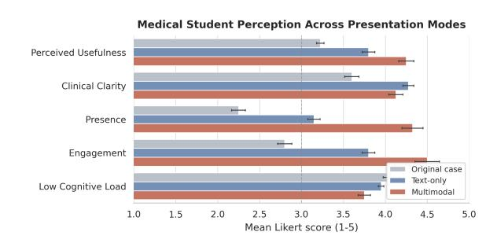

Figure 4: 세 가지 프레젠테이션 모드에서의 의과대학생 인식. 8명의 고학년 의과대학생이 원본 사례, 텍스트 전용 MedGame, 멀티모달 MedGame 조건에서 동일한 다섯 개의 임상 사례를 평가하였다. 값이 높을수록 인지된 품질이 더 좋음을 나타낸다.

## 6.5 RQ4: 학생들의 MedGame 인식 (Students' Perception of MedGame)

멀티모달 렌더링이 정적 사례 자료와 텍스트 전용 스토리라인을 넘어 가치를 제공하는지 여부를 조사하기 위해, 우리는 8명의 고학년 의과대학생을 대상으로 한 쌍대 파일럿 인식 연구를 수행하였다. 각 학생은 원본 사례, 텍스트 전용 MedGame, 멀티모달 MedGame 조건에서 동일한 다섯 개의 임상 사례를 평가하며, 참여도, 존재감, 임상 명료성, 유용성, 인지 부하(높을수록 낮음)를 1–5 리커트 척도로 평가한다. 설문 항목은 부록 [D.1.](#page-22-1)에 제공된다. 우리는 사례별 점수를 각 학생에 대해 평균화한 뒤 통계적 검정을 수행하여 사례 수준의 평가를 독립 샘플로 취급하지 않도록 한다.

Figure [4,](#page-7-0)에 표시된 바와 같이 멀티모달 MedGame은 전체 인식 점수(4.19)가 가장 높으며, 그 뒤를 텍스트 전용 MedGame(3.79)과 원본 사례 자료(3.19)가 따른다. 멀티모달이 텍스트 전용에 비해 우위가 있다는 점은 학생 수준 평균에 대한 일방향 짝지어진 Wilcoxon 부호 순위 검정에서 유의미하다(p = 0.0039). 멀티모달 렌더링은 주로 참여도, 존재감, 인지된 유용성을 향상시키며, 임상 명료성은 비슷하게 유지하지만 약간의 인지 부하를 도입한다. 이러한 결과는 하위 학습 성과를 입증하지는 않지만, Story Director의 멀티모달 렌더링이 텍스트 전용 상호작용을 넘어 인지된 가치를 추가한다는 학습자 중심의 초기 증거를 제공한다.

## 7 결론 (Conclusion)

우리는 MedGame을 소개한다. 이는 정적 사례를 실행 가능한 스토리텔링 게임으로 전환하는 듀얼 엔진 프레임워크이다. MedGame은 Medical Narrative Generation과 Story Direction을 분리하여 사례 기반 스토리라인과 종속성 인식 멀티모달 오케스트레이션 계획을 생성한다. 작업별 미세 조정은 구조적 유효성, 내러티브 적응, 오케스트레이션 신뢰성에서 오픈소스 LLM의 성능을 향상시키며, 의료 정확성은 도메인 사전 학습과 전문가 정제에 의해 해결되는 병목 현상으로 남는다.

오픈소스 LLM은 구조적 유효성, 내러티브 적응, 오케스트레이션 신뢰성에서 성능을 향상시키지만, 의료 정확성은 도메인 사전 학습과 전문가 정제에 의해 해결되는 병목 현상으로 남는다. 학습자 측 파일럿은 멀티모달 렌더링이 텍스트 전용 및 정적 형식에 비해 참여도와 존재감을 향상시킨다는 것을 시사한다. 이 결과들은 MedGame이 유망하고 확장 가능한 인터랙티브 의료 교육 콘텐츠 생성으로 나아가는 실용적인 단계임을 뒷받침한다.

## 한계 (Limitations)

- (1) 본 연구는 장기적인 교육적 성과를 측정하기보다는 서사 기반 의료 게임화의 기술적 공식화와 시스템 수준 구현에 초점을 맞춘다. 현재 연구가 지원하는 시간 범위와 평가 범위로 인해 장기 교육 추적 실험을 수행할 수 없다. 따라서 우리의 평가는 구조적 타당성, 서사 일관성, 의료 정확성, 참여도, 유용성을 포함한 생성 중심 기준과 학습자 인지 경험에 중점을 둔다. 이 범위는 교육 시스템에 관한 이전 기술 연구와 일치한다 [\(Chevalier et al.,](#page-8-7) [2024;](#page-8-7) [Dinucu-Jianu et al.,](#page-9-16) [2025\)](#page-9-16), 여기서 시스템 설계와 콘텐츠 생성 품질은 종종 대규모 장기 학습 연구 전에 평가된다. 지식 보유, 임상 추론 향상, 또는 기술 이전과 같은 결과를 평가하려면 엄격한 기관 감독이 있는 통제된 연구가 필요하며, 이는 향후 연구의 중요한 방향으로 남아 있다.

- (2) 본 연구는 이미지, 오디오, 비디오 생성 등 멀티모달 생성 모듈을 생성된 스토리라인과 오케스트레이션 계획을 렌더링하기 위한 외부 도구로 간주한다. 이러한 도구의 성능이 전체 MedGame 프레임워크에 미치는 영향을 체계적으로 연구하지 않는다. 대신, 우리의 초점은 LLM의 NLP 중심 역량에 있다. 즉, 의료 서사 디자이너 및 스토리 감독으로서 임상 사례를 구조화된 인터랙티브 스토리라인과 실행 가능한 멀티모달 오케스트레이션 계획으로 변환한다.

## Ethical Considerations

MedGame은 자율적인 임상 의사결정 시스템이 아니라 교육용 저작 및 시뮬레이션 도구로 설계되었다. 생성된 사례, 설명 및 피드백은 학습자와 함께 사용하기 전에 강사 또는 자격을 갖춘 의료 전문가가 검토해야 하며, 이는 EU 인공지능법 [\(Smuha,](#page-10-17) [2025\)](#page-10-17)와 같은 감독 프레임워크와 일치한다.

우리 실험에서는 오픈소스 모델이 Gemini-3-Pro 출력에서 MedGame 전용 생성 규칙을 학습할 수 있는지 여부를 조사한다. 이 사용은 비상업적 연구 및 실험 탐색을 위해서만 의도된다. 우리는 Gemini-3-Pro 출력을 해당 Gemini 서비스 약관에 따라 사용하며, 그로부터 파생된 데이터나 모델 아티팩트는 비상업적 라이선스 하에만 공개된다.

## References

- <span id="page-8-0"></span>Alaa Abd-Alrazaq, Rawan AlSaad, Dari Alhuwail, Arfan Ahmed, Padraig Mark Healy, Syed Latifi, Sarah Aziz, Rafat Damseh, Sadam Alabed Alrazak, and Javaid Sheikh. 2023. 의료 교육에서 대형 언어 모델: 기회, 도전, 그리고 미래 방향. *JMIR medical education*, 9(1):e48291.
- <span id="page-8-4"></span>M Brownell Anderson, Paula L Stillman, and Youde Wang. 1994. 의료 교육에서 표준화된 환자 사용 증가. *Teaching and Learning in Medicine: An International Journal*, 6(1):15–22.
- <span id="page-8-5"></span>Yaara Artsi, Vera Sorin, Eli Konen, Benjamin S Glicksberg, Girish Nadkarni, and Eyal Klang. 2024. 의료 시험 생성용 대형 언어 모델: 체계적 검토. *BMC medical education*, 24(1):354.
- <span id="page-8-2"></span>Riccardo Brunetti, Silvia Ferrante, Anna Maria Avella, Allegra Indraccolo, and Claudia Del Gatto. 2024. 이야기를 학습 여정으로 전환: 몰입형 교육의 원칙과 방법. *Frontiers in Psychology*, 15:1471459.
- <span id="page-8-3"></span>Pengshan Cai, Zonghai Yao, Fei Liu, Dakuo Wang, Meghan Reilly, Huixue Zhou, Lingxi Li, Yi Cao, Alok Kapoor, Adarsha Bajracharya, Dan Berlowitz, and Hong Yu. 2023. PaniniQA: 대화형 질문응답을 통한 환자 교육 강화. *Transactions of the Association for Computational Linguistics*, 11:1518–1536.
- <span id="page-8-1"></span>Ilaria Caponetto, Jeffrey Earp, Michela Ott, and 1 others. 2014. 게임화와 교육: 문헌 리뷰. In *European conference on games based learning*, volume 1, pages 50–57.
- <span id="page-8-6"></span>Elin Carstensdottir, Erica Kleinman, and Magy Seif El-Nasr. 2019. 내러티브 게임에서의 플레이어 상호작용: 구조와 내러티브 진행 메커니즘. In *Proceedings of the 14th international conference on the foundations of digital games*, pages 1–9.
- <span id="page-8-7"></span>Alexis Chevalier, Jiayi Geng, Alexander Wettig, Howard Chen, Sebastian Mizera, Toni Annala, Max Aragon, Arturo Rodriguez Fanlo, Simon Frieder, Simon Machado, Akshara Prabhakar, Ellie Thieu, Jiachen T. Wang, Zirui Wang, Xindi Wu, Mengzhou

- Xia, Wenhan Xia, Jiatong Yu, Junjie Zhu, and 3 others. 2024. [언어 모델을 과학 튜터로.](https://openreview.net/forum?id=WFyolnFZOR) In *Forty-first International Conference on Machine Learning*.
- <span id="page-9-13"></span>Samuel Colvin, Eric Jolibois, Hasan Ramezani, Adrian Garcia Badaracco, Terrence Dorsey, David Montague, Serge Matveenko, Marcelo Trylesinski, Sydney Runkle, David Hewitt, and 1 others. 2023. Pydantic. *Zenodo*.
- <span id="page-9-9"></span>Özlem Co¸skun, Yavuz Selim Kıyak, and I¸sıl ˙Irem Budakoglu. 2025. Chatgpt를 사용하여 임상 vignette를 생성하고 ˘ 교육 및 다지선다형 질문을 평가하기 위한 무작위 대조 실험. *Medical teacher*, 47(2):268–274.
- <span id="page-9-16"></span>David Dinucu-Jianu, Jakub Macina, Nico Daheim, Ido Hakimi, Iryna Gurevych, and Mrinmaya Sachan. 2025. 문제 해결에서 문제 해결 교육으로: 강화 학습을 사용한 LLM과 교수학습의 정렬. In *Proceedings of the 2025 Conference on Empirical Methods in Natural Language Processing*, pages 272–292.
- <span id="page-9-7"></span>Zhuoyun Du, LujieZheng LujieZheng, Renjun Hu, Yuyang Xu, Xiawei Li, Ying Sun, Wei Chen, Jian Wu, Haolei Cai, and Haochao Ying. 2025. LLMs는 에이전트 공동 진화에 의해 표준화된 환자를 시뮬레이션할 수 있다. In *Proceedings of the 63rd Annual Meeting of the Association for Computational Linguistics (Volume 1: Long Papers)*, pages 17278–17306.
- <span id="page-9-10"></span>Maram Elzayyat, Janatul Naeim Mohammad, and Sami Zaqout. 2025. LLM이 생성한 임상 해부학 MCQ와 전문가가 만든 MCQ를 평가: 의료 교육에서 학생 인식 기반 비교 연구. *Medical Education Online*, 30(1):2554678.
- <span id="page-9-1"></span>Douglas Gomery and Clara Pafort-Overduin. 2011. *Movie history: A survey*. Routledge.
- <span id="page-9-12"></span>Jiale Hong, Hongqiu Wu, and Hai Zhao. 2025. [게임](https://doi.org/10.18653/v1/2025.acl-long.218) [인간-LLM 상호작용으로서의 개발.](https://doi.org/10.18653/v1/2025.acl-long.218) In *Proceedings of the 63rd Annual Meeting of the Association for Computational Linguistics (Volume 1: Long Papers)*, pages 4333–4354, Vienna, Austria. Association for Computational Linguistics.
- <span id="page-9-14"></span>Edward J Hu, Yelong Shen, Phillip Wallis, Zeyuan Allen-Zhu, Yuanzhi Li, Shean Wang, Lu Wang, Weizhu Chen, and 1 others. 2022. Lora: Low-rank adaptation of large language models. *ICLR*, 1(2):3.
- <span id="page-9-0"></span>Hengguan Huang, Songtao Wang, Hongfu Liu, Hao Wang, and Ye Wang. 2024. [대규모 언어 모델의 벤치마킹](https://doi.org/10.18653/v1/2024.findings-acl.94)[의사소통 의료 코칭에서:](https://doi.org/10.18653/v1/2024.findings-acl.94)[데이터셋과 새로운 시스템.](https://doi.org/10.18653/v1/2024.findings-acl.94) In *Findings of the Association for Computational Linguistics: ACL 2024*, pages 1624–1637, Bangkok, Thailand. Association for Computational Linguistics.
- <span id="page-9-18"></span>Intelligent Internet. 2025a. [Ii-medical-32b-preview:](https://huggingface.co/Intelligent-Internet/II-Medical-32B-Preview) [의료 추론 모델.](https://huggingface.co/Intelligent-Internet/II-Medical-32B-Preview)
- <span id="page-9-17"></span>Intelligent Internet. 2025b. [Ii-medical-8b: 의료 추론](https://huggingface.co/Intelligent-Internet/II-Medical-8B)[모델.](https://huggingface.co/Intelligent-Internet/II-Medical-8B)

- <span id="page-9-3"></span>Dongsuk Jang, Ziyao Shangguan, Kyle Tegtmeyer, Anurag Gupta, Jan T Czerminski, Sophie Chheang, and Arman Cohan. 2025a. [MedTutor: 사례 기반 의료 교육을 위한 검색 보강 LLM 시스템](https://doi.org/10.18653/v1/2025.emnlp-demos.24). In *2025년 자연어 처리 실증 방법 회의(EMNLP) 시스템 시연 부문 논문집*, pages 319–353, Suzhou, China. 연구 언어학회(ACL).

- <span id="page-9-5"></span>Won Seok Jang, Hieu Tran, Manav Shaileshkumar Mistry, Sai Kiran Gandluri, Yifan Zhang, Sharmin Sultana, Sunjae Kwon, Yuan Zhang, Zonghai Yao, and Hong Yu. 2025b. [환자가 자신의 건강을 이해하도록 돕는 챗봇](https://doi.org/10.18653/v1/2025.findings-emnlp.351). In *연구 언어학회(ACL) EMNLP 2025 결과*, pages 6598–6627, Suzhou, China. 연구 언어학회(ACL).

- <span id="page-9-2"></span>Tiffany H Kung, Morgan Cheatham, Arielle Medenilla, Czarina Sillos, Lorie De Leon, Camille Elepaño, Maria Madriaga, Rimel Aggabao, Giezel Diaz-Candido, James Maningo, and 1 others. 2023. Performance of chatgpt on usmle: potential for aiassisted medical education using large language models. *PLoS 디지털 헬스*, 2(2):e0000198.

- <span id="page-9-15"></span>Woosuk Kwon, Zhuohan Li, Siyuan Zhuang, Ying Sheng, Lianmin Zheng, Cody Hao Yu, Joseph E. Gonzalez, Hao Zhang, and Ion Stoica. 2023. Efficient memory management for large language model serving with pagedattention. In *ACM SIGOPS 29회 운영체제 원리 심포지엄 논문집*.

- <span id="page-9-11"></span>Ching-Yi Lee, Ching-Hsin Lee, Hung-Yi Lai, Po-Jui Chen, Mi-Mi Chen, and Sze-Yuen Yau. 2025a. Emerging trends in gamification for clinical reasoning education: a scoping review. *BMC 의료 교육*, 25(1):435.

- <span id="page-9-8"></span>Keyeun Lee, Seolhee Lee, Esther Hehsun Kim, Yena Ko, Jinsu Eun, Dahee Kim, Hyewon Cho, Haiyi Zhu, Robert E. Kraut, Eunyoung E. Suh, Eun-mee Kim, and Hajin Lim. 2025b. [Adaptive-VP: 훈련생의 대화에 적응하는 LLM 기반 가상 환자를 위한 프레임워크](https://doi.org/10.18653/v1/2025.findings-acl.118) [간호사 의사소통 훈련 촉진을 위한 대화형 가상 환자](https://doi.org/10.18653/v1/2025.findings-acl.118). In *연구 언어학회(ACL) ACL 2025 결과*, pages 2319–2352, Vienna, Austria. 연구 언어학회(ACL).

- <span id="page-9-4"></span>Patrick Lewis, Ethan Perez, Aleksandra Piktus, Fabio Petroni, Vladimir Karpukhin, Naman Goyal, Heinrich Küttler, Mike Lewis, Wen-tau Yih, Tim Rocktäschel, and 1 others. 2020. Retrieval-augmented generation for knowledge-intensive nlp tasks. *신경 정보 처리 시스템의 진보*, 33:9459–9474.

- <span id="page-9-6"></span>Junkai Li, Yunghwei Lai, Weitao Li, Jingyi Ren, Meng Zhang, Xinhui Kang, Siyu Wang, Peng Li, Ya-Qin Zhang, Weizhi Ma, and 1 others. 2024. Agent hospital: A simulacrum of hospital with evolvable medical agents. *arXiv preprint arXiv:2405.02957*.

- <span id="page-10-12"></span>Craig A Lindley. 2005. 컴퓨터 게임의 스토리와 서사 구조. *Bushoff, Brunhild. 편집자*.
- <span id="page-10-0"></span>Harrison C Lucas, Jeffrey S Upperman, and Jamie R Robinson. 2024. 대규모 언어 모델과 의료 교육에 미치는 영향에 대한 체계적 검토. *Medical education*, 58(11):1276–1285.
- <span id="page-10-19"></span>Yingjie Ma, Xun Lin, Yong Xu, Weicheng Xie, and Zitong Yu. 2026. PA-FAS: 경로 증강 강화 학습을 통한 해석 가능하고 일반화 가능한 다중 모달 얼굴 사기 방지. In *AAAI Conference on Artificial Intelligence*, pages 7856– 7864.
- <span id="page-10-15"></span>Andrew Sellergren, Sahar Kazemzadeh, Tiam Jaroensri, Atilla Kiraly, Madeleine Traverse, Timo Kohlberger, Shawn Xu, Fayaz Jamil, Cían Hughes, Charles Lau, and 1 others. 2025. Medgemma 기술 보고서. *arXiv preprint arXiv:2507.05201*.
- <span id="page-10-17"></span>Nathalie A Smuha. 2025. 2024년 6월 13일 유럽 의회 및 이사회 규정 2024/1689 (EU 인공지능법). *International Legal Materials*, 64(5):1234–1381.
- <span id="page-10-2"></span>Janet Staiger. 1979. 생산 제어를 위한 노동 분업: Thomas Ince와 스튜디오 시스템의 부상. *Cinema Journal*, 18(2):16–25.
- <span id="page-10-11"></span>Nicolas Szilas. 1999. 컴퓨터 상호작용 드라마: 선형 서사를 넘어. In *AAAI Fall symposium on narrative intelligence*, volume 144, pages 150–156.
- <span id="page-10-16"></span>Gemini Team, Rohan Anil, Sebastian Borgeaud, Jean-Baptiste Alayrac, Jiahui Yu, Radu Soricut, Johan Schalkwyk, Andrew M Dai, Anja Hauth, Katie Millican, and 1 others. 2023. Gemini: 고성능 다중 모달 모델의 한 가족. *arXiv preprint arXiv:2312.11805*.
- <span id="page-10-14"></span>Gemma Team, Thomas Mesnard, Cassidy Hardin, Robert Dadashi, Surya Bhupatiraju, Shreya Pathak, Laurent Sifre, Morgane Rivière, Mihir Sanjay Kale, Juliette Love, and 1 others. 2024. Gemma: Gemini 연구와 기술을 기반으로 한 오픈 모델. *arXiv preprint arXiv:2403.08295*.
- <span id="page-10-3"></span>Chenxu Wang, Shuhan Li, Nuoxi Lin, Xinyu Zhang, Ying Han, Xiandi Wang, Di Liu, Xiaomei Tan, Dan Pu, Kang Li, and 1 others. 2025a. 대규모 언어 모델을 활용한 의료 교육 평가—ChatGPT를 표준화된 환자로 사용한 다중 지표 평가. *Journal of medical Internet research*, 27:e59435.
- <span id="page-10-20"></span>Hongyang Wang, Yichen Shi, Zhuofu Tao, Yuhao Gao, Liepiao Zhang, Xun Lin, Jun Feng, Xiaochen Yuan, Zitong Yu, and Xiaochun Cao. 2026. FaceShield: 다중 모달 대규모 언어 모델을 활용한 설명 가능한 얼굴 사기 방지. In *AAAI Conference on Artificial Intelligence*, pages 9811–9819.
- <span id="page-10-4"></span>Ruiyi Wang, Stephanie Milani, Jamie C. Chiu, Jiayin Zhi, Shaun M. Eack, Travis Labrum, Samuel M Murphy, Nev Jones, Kate V Hardy, Hong Shen, Fei Fang,

- and Zhiyu Chen. 2024a. PATIENT-ψ[: 대규모 언어 모델을 사용하여 환자를 시뮬레이션하고 정신건강 전문가를 훈련시키는](https://doi.org/10.18653/v1/2024.emnlp-main.711) [대규모 언어 모델을 사용하여 환자를 시뮬레이션하고 정신건강 전문가를 훈련시키는](https://doi.org/10.18653/v1/2024.emnlp-main.711) [대규모 언어 모델을 사용하여 환자를 시뮬레이션하고 정신건강 전문가를 훈련시키는](https://doi.org/10.18653/v1/2024.emnlp-main.711) In *Proceedings of the 2024 Conference on Empirical Methods in Natural Language Processing*, pages 12772–12797, Miami, Florida, USA. Association for Computational Linguistics.

- <span id="page-10-6"></span>Yung-Fu Wang, Ya-Fang Hsu, Kwo-Ting Fang, and Liang-Tseng Kuo. 2024b. 의료 교육에서 게임화: 델파이 방법을 통한 핵심 요소 식별 및 우선순위 지정. *Medical Education Online*, 29(1):2302231.

- <span id="page-10-9"></span>Z. Wang, Y. Zhou, and D. Ledo. 2024c. [StoryVerse:](https://doi.org/10.1145/3613904.3642436) [LLM 기반 캐릭터 시뮬레이션을 통한 동적 플롯 공동 작성으로 향해](https://doi.org/10.1145/3613904.3642436) [LLM 기반 캐릭터 시뮬레이션을 통한 동적 플롯 공동 작성으로 향해](https://doi.org/10.1145/3613904.3642436) In *Proceedings of the CHI Conference on Human Factors in Computing Systems (CHI '24)*. ACM.

- <span id="page-10-10"></span>Z. Wang and 1 others. 2025b. CoDi: LLM을 활용한 목표 지향적 인터랙티브 스토리 생성용 디렉터-액터 프레임워크. In *Proceedings of the AAAI Conference on Artificial Intelligence and Interactive Digital Entertainment (AIIDE)*.

- <span id="page-10-8"></span>Hongqiu Wu, Weiqi Wu, Tianyang Xu, Jiameng Zhang, and Hai Zhao. 2025a. [LLM 기반 인터랙티브 드라마를 위한 향상된 몰입감 및 대리성으로 향해](https://doi.org/10.18653/v1/2025.acl-long.546) [LLM 기반 인터랙티브 드라마를 위한 향상된 몰입감 및 대리성으로 향해](https://doi.org/10.18653/v1/2025.acl-long.546) In *Proceedings of the 63rd Annual Meeting of the Association for Computational Linguistics (Volume 1: Long Papers)*, pages 11166–11182, Vienna, Austria. Association for Computational Linguistics.

- <span id="page-10-1"></span>Qian Wu, Zheyao Gao, Longfei Gou, and Qi Dou. 2025b. DDxTutor: 차별적 진단 기반 구조화된 추론을 갖는 임상 추론 튜터링 시스템. In *Proceedings of the 63rd Annual Meeting of the Association for Computational Linguistics (Volume 1: Long Papers)*, pages 30934–30957.

- <span id="page-10-5"></span>Qian Wu, Zheyao Gao, Longfei Gou, Yifan Hou, Ann Sin Nga Lau, and Qi Dou. 2025c. HealthCards: 의료 지식 민주화 및 교육을 위한 시각 보조 도구로서 텍스트-이미지 생성 탐구. In *Proceedings of the 2025 Conference on Empirical Methods in Natural Language Processing*, pages 27524–27546.

- <span id="page-10-7"></span>Weiqi Wu, Hongqiu Wu, Lai Jiang, Xingyuan Liu, Hai Zhao, and Min Zhang. 2024. [역할극에서 드라마-인터랙션으로](https://doi.org/10.18653/v1/2024.findings-acl.196) [역할극에서 드라마-인터랙션으로: LLM 솔루션](https://doi.org/10.18653/v1/2024.findings-acl.196) In *Findings of the Association for Computational Linguistics: ACL 2024*, pages 3271–3290, Bangkok, Thailand. Association for Computational Linguistics.

- <span id="page-10-13"></span>An Yang, Anfeng Li, Baosong Yang, Beichen Zhang, Binyuan Hui, Bo Zheng, Bowen Yu, Chang Gao, Chengen Huang, Chenxu Lv, and 1 others. 2025a. Qwen3 기술 보고서. *arXiv preprint arXiv:2505.09388*.

- <span id="page-10-18"></span>Shaoshu Yang, Zhe Kong, Feng Gao, Meng Cheng, Xiangyu Liu, Yong Zhang, Zhuoliang Kang, Wenhan Luo, Xunliang Cai, Ran He, and Xiaoming Wei.

| 2025b. | Infinitetalk: | Audio-driven video 생성 |  |
|--------|-------------------|-----------------------------------------------------|--|
|  |  | sparse-frame video dubbing을 위한 tion. arXiv 사전 인쇄 |  |
|  | arXiv:2508.14033. |  |  |

- <span id="page-11-0"></span>Zonghai Yao, Nandyala Siddharth Kantu, Guanghao Wei, Hieu Tran, Zhangqi Duan, Sunjae Kwon, Zhichao Yang, and Hong Yu. 2024. [README:](https://doi.org/10.18653/v1/2024.findings-emnlp.737) [의료 전문 용어와 일반 이해를 연결하여 환자 교육을 위한 데이터 중심 NLP](https://doi.org/10.18653/v1/2024.findings-emnlp.737) In *Findings of the Association for Computational Linguistics: EMNLP 2024*, 페이지 12609–12629, Miami, Florida, USA. Association for Computational Linguistics.
- <span id="page-11-2"></span>Zonghai Yao, Michael Sun, Won Seok Jang, Sunjae Kwon, Soie Kwon, and Hong Yu. 2025. [Dischar](https://doi.org/10.18653/v1/2025.emnlp-main.546)[geSim: 교육용 시뮬레이션 벤치마크](https://doi.org/10.18653/v1/2025.emnlp-main.546) [퇴원 시 의사–환자 커뮤니케이션](https://doi.org/10.18653/v1/2025.emnlp-main.546) In *Proceedings of the 2025 Conference on Empirical Methods in Natural Language Processing*, 페이지 10783– 10809, Suzhou, China. Association for Computational Linguistics.
- <span id="page-11-3"></span>Zonghai Yao, Zhipeng Tang, Chengtao Lin, Xiong Luo, Benlu Wang, Juncheng Huang, Chin Siang Ong, and Hong Yu. 2026. 다중 턴 다중 모달 상호작용으로서 환자 교육 재고. *arXiv preprint arXiv:2604.14656*.
- <span id="page-11-4"></span>Nilüfer Zeybek and Elif Saygı. 2024. 교육에서의 게이미피케이션: 왜, 어디서, 언제, 어떻게?—시스템적 리뷰. *Games and Culture*, 19(2):237–264.
- <span id="page-11-1"></span>Bingquan Zhang, Xiaoxiao Liu, Yuchi Wang, Zhou Lei, Qianqian Xie, and Benyou Wang. 2026. [인간](https://doi.org/10.18653/v1/2026.acl-long.1243) [LLM을 표준화된 환자로? 비교](https://doi.org/10.18653/v1/2026.acl-long.1243) [의료 교육에서의 연구](https://doi.org/10.18653/v1/2026.acl-long.1243) In *Proceedings of the 64th Annual Meeting of the Association for Computational Linguistics (Volume 1: Long Papers)*, 페이지 26988–27012, San Diego, California, United States. Association for Computational Linguistics.
- <span id="page-11-5"></span>Zhengyun Zhao, Qiao Jin, Fangyuan Chen, Tuorui Peng, and Sheng Yu. 2023. [환자 요약 대규모 데이터셋](https://api.semanticscholar.org/CorpusID:266360591) [검색 기반 임상 의사결정 지원 시스템을 위한](https://api.semanticscholar.org/CorpusID:266360591) [포트 시스템](https://api.semanticscholar.org/CorpusID:266360591) *Scientific data*, 10 1:909.
- <span id="page-11-6"></span>Lianmin Zheng, Wei-Lin Chiang, Ying Sheng, Siyuan Zhuang, Zhanghao Wu, Yonghao Zhuang, Zi Lin, Zhuohan Li, Dacheng Li, Eric Xing, and 1 others. 2023. mt-bench와 챗봇 아레나를 사용한 llm-as-a-judge 평가. *Advances in neural information processing systems*, 36:46595–46623.

## 부록 개요 (Appendix Overview)

| A |  | 게임 디자인 논리 | 12 |
|---|---------|----------------------------------------|----|
|  | A.1 | 임상 스토리 구조. | 12 |
|  | A.2 | 내러티브 요소 상세 | 13 |
|  | A.3 | 멀티모달 툴셋 상세 | 15 |
|  | A.4 | 의료용으로 사용된 지침 |  |
|  |  | 내러티브 디자인: Φdes | 18 |
|  | A.5 | 스토리 디렉터용으로 사용된 지침 |  |
|  |  | 디렉터: Φdir | 18 |
|  | A.6 | 작업 종속성. | 18 |
| B |  | 선형 임상 스토리 라인을 분기 스토리 그래프로 일반화 |  |
|  |  | lines to Branching Story Graphs. | 21 |
| C |  | 데이터셋에 대한 추가 상세 | 21 |
|  | C.1 | 임상 사례 출처. | 21 |
|  | C.2 | 참조 경로 구성 |  |
|  | tion |  | 22 |
|  | C.3 | 생성된 출력 통계 | 22 |
|  | C.4 | 의료 내러티브 디자이너 참조 |  |
|  |  | erence Corpus | 22 |
|  | C.5 | 스토리 디렉터 참조 코퍼스 | 22 |
| D |  | 평가에 대한 추가 상세 | 23 |
|  | D.1 | 학생<br>인식<br>질문 |  |
|  | questionnaire . |  | 23 |
|  | D.2 | 의료 내러티브 평가 |  |
|  |  | Designer | 24 |
|  | D.3 | 스토리 방향 평가 | 25 |
|  | D.4 | LLM-as-a를 인간 검증 |  |
|  | Judge |  | 30 |
| E |  | 추가 실험 결과 | 30 |
|  | E.1 | 의료용 레이더 차트 분석 |  |
|  |  | Narrative Generation . | 30 |
|  | E.2 | 의료 도메인 사전 |  |
|  |  | training on Medical Accuracy. | 30 |
|  | E.3 | 전문가 수정 분석. | 34 |
|  | E.4 | 영향<br>의<br>유사<br>사례<br>에 |  |
|  |  | Model Performance | 34 |
| F |  | 플랫폼 디자인 논리 | 35 |
|  | F.1 | 플랫폼 개요 | 35 |
|  | F.2 | 게임 흐름 상태 머신 . | 35 |
|  | F.3 | 콘텐츠 렌더링 모드 . | 35 |
|  | F.4 | 상호작용 구성요소. | 36 |

## <span id="page-11-7"></span>게임 디자인 논리 (A Game Design Logic)

## <span id="page-11-8"></span>A.1 임상 스토리 구조 (Clinical Story Structure)

임상 스토리는 우리 상호작용형 의료 교육 게임의 기초 데이터 구조로 사용됩니다. 이는 계층적 "챕터 수준" 설계를 채택하여 임상 서사를 구조화된 트리로 정리하고, 의료 시나리오를 체계적으로 진행할 수 있게 합니다. 그림 [5](#page-12-1)는 이 구조의 전체 계층을 보여줍니다.

<span id="page-12-1"></span>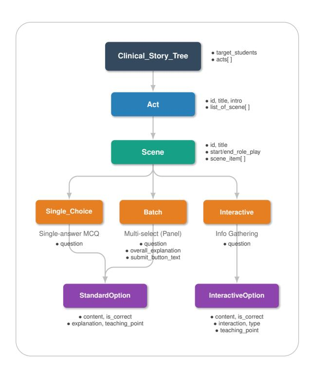

그림 5: 임상 스토리의 계층 구조. 트리는 다섯 개의 수준으로 구성됩니다: 루트 Clinical_Story_Tree는 여러 Acts(챕터)를 포함하고, 각 Act는 여러 Scenes(단계)를 포함하며, 각 Scene은 scene_items(상호작용 요소)를 포함하고, 각 항목은 사용자 상호작용을 위한 Options를 포함합니다.

**레벨 0: Clinical_Story_Tree.** 루트 노드는 전체 서사를 정의하고, target_students 필드(예: 의대생, 레지던트, 또는 의사)를 지정하여 임상 내용의 난이도와 깊이를 조정합니다.

레벨 1: Act. Act는 임상 접촉의 주요 챕터 또는 단계(예: "초기 평가", "진단", "치료 계획")를 나타냅니다. 각 Act는 intro 필드를 포함하여 플레이어가 진입하기 전에 맥락적 배경을 제공하고 장면을 설정합니다.

레벨 2: Scene. Scene은 Act 내의 특정 단계로, 개별 임상 결정 지점 또는 상호작용 순간을 나타냅니다. 각 Scene은 다음을 포함합니다: (1) start_role_play—상호작용이 시작되기 전에 맥락을 설정하는 서사 텍스트; (2) scene_item—플레이어가 완료해야 할 상호작용 요소 목록; (3) end_role_play—Scene을 마무리하고 다음으로 연결되는 전환 서사. role-play 필드는 다운스트림 멀티모달 렌더링을 위해 세 가지 프레젠테이션 유형을 지원합니다: text(순수 텍스트 표시), film(시네마틱 비디오 생성), interleaved(텍스트와 대화 시퀀스 혼합).

레벨 3: Scene Items. 각 scene_item은 Section 3.1에 정의된 Decision Node Q와 대응하며, 상호작용 모드를 나타냅니다. 우리는 세 가지 유형을 정의합니다: (1) **single_choice**—개별 임상 결정 지점을 위한 단일 정답 MCQ; (2) **batch**—플레이어가 동시에 여러 정답 항목을 선택하는 다중 선택 질문(예: 진단 테스트 패널 주문)으로, 전체적인 피드백을 위한 overall_explanation 필드를 포함합니다; (3) **interactive**—각 옵션이 서로 다른 정보를 드러내는 정보 수집 상호작용(환자 반응, 검사 결과 등), 임상 탐구를 시뮬레이션합니다.

레벨 4: Options. Options는 원자적 상호작용 단위입니다. 우리는 두 가지 유형을 정의합니다: (1) **Standard-Option**(single_choice 및 batch용)에는 content, is_correct, explanation(전술적 피드백), teaching_point(지식 요약)가 포함됩니다; (2) **InteractiveOption**(interactive용)에는 content, is_correct, interaction(반환된 정보), interaction_type(대화 또는 텍스트), teaching_point가 포함됩니다.

이 구조에 대한 완전한 Pydantic 스키마는 Listing 1에 제공됩니다.

#### <span id="page-12-0"></span>**A.2** 서사 요소의 세부 사항 (Details of Narrative Elements)

Section 4에서 소개한 바와 같이, 서사 요소  $\{\mathcal{P}, \mathcal{L}\}$ 는 **의료진 페르소나**  $(\mathcal{P})$ 와 **임상 위치**  $(\mathcal{L})$ 로 구성됩니다. 이 사전 정의된 자산은 생성된 모든 스토리에서 일관된 임상 환경을 제공하여 시각적 일관성을 보장하고 다운스트림 멀티모달 렌더링의 복잡성을 줄입니다. 각 요소를 아래에서 자세히 설명합니다.

### A.2.1 임상 위치 $(\mathcal{L})$ (Clinical Locations)

우리는 병원 기반 의료 실습에서 접하는 필수 환경을 포괄하는 여섯 개의 임상 위치를 정의합니다. 각 위치는 지정된 캐릭터 배치 위치를 갖춘 고품질 배경 이미지로 렌더링됩니다.

각 위치는 시각적 외관과 서사적 목적에 대한 설명으로 정의되며, 이는 LLM이 스토리를 생성할 때 안내 역할을 한다. 그림 6은 MedGame에서 사용되는 여섯 개의 임상 위치를 모두 보여 주며, *facing-patient* 관점(의사(플레이어)의 1인칭 시점)과 *facing-doctor* 관점(의사/플레이어를 향한 시점)을 모두 표시한다.

#### **A.2.2** Medical Staff Personas (P)

우리는 임상 서사 전반에 걸쳐 플레이어와 상호작용하는 다섯 가지 의료진 역할을 정의한다. 각각

<span id="page-13-0"></span>


#### (a) Consultation Room

*Visual:* 미니멀리스트적이고 밝으며 전문적인 사무실 환경으로, 어두운 목재 책상, 현대적인 사무용 의자, 부드러운 자연광이 있는 손님 좌석이 특징이다. *Narrative:* 의사(플레이어)의 주요 사무실이자 진단의 중심 허브이다. 의료 이력 수집, 신체 검사, 질병 설명, 보고서 검토의 주요 설정이다.

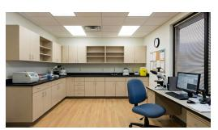

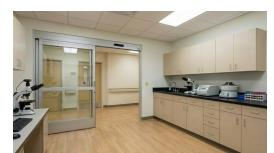

#### (b) Clinical Laboratory

*Visual:* 의료 캐비닛, 현미경, 시험관, 분석 기기가 갖춰진 넓고 기능적인 실험실이며, 임상 병리학자를 위한 작업대가 있다.

*Narrative:* 혈액 및 체액을 분석하기 위한 전문 시설이다. 의사(플레이어)가 실험실 결과(혈액 슬라이드, 생화학)를 병리학자와 논의하는 장소이다.


#### (c) Pathology Department Office

*Visual:* 현미경 분석에 초점을 맞춘 전문 사무실 공간으로, 현미경, 시료 슬라이드가 있는 책상과 유리 슬라이딩 도어를 통해 병원 복도와 연결되어 있다.

*Narrative:* 조직 샘플 분석에 전념하는 공간이다. 해부 병리학자가 생검 결과 또는 시료 소견을 담당 의사(플레이어)와 논의하는 장소이다.

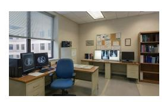


#### (d) Radiology Department Office

*Visual:* X선용 라이트 박스, CT 스캔용 듀얼 모니터 워크스테이션, 참고 자료용 책장을 갖춘 영상 분석용 기술적 작업 공간이다.

*Narrative:* 의료 영상 데이터를 검토하는 데 사용된다. 방사선 전문의가 X선과 CT 스캔을 분석하고 치료 의사(플레이어)에게 영상 결과를 설명한다.

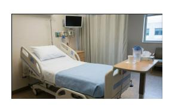


#### (e) Hospital General Ward

*Visual:* 깨끗하고 밝은 표준 입원실로, 병원 침대, 파란 침구, 침대 위 테이블, 프라이버시 커튼, 손님용 의자가 있다. 큰 창문이 자연광을 제공한다.

*Narrative:* 환자 회복 및 모니터링을 위한 표준 환경이다. 침대 옆 순환, 간호사 상태 보고, 의사(플레이어)와 환자 간의 일상적인 소통에 사용된다.

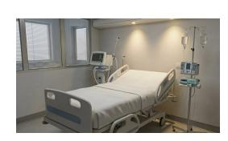

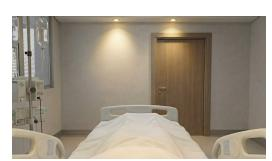

#### (f) Intensive Care Unit (ICU)

*Visual:* 고의존성 환경으로, 중환자 치료 장비가 갖춰져 있다. 환자 침대는 기계식 인공호흡기, 주입 펌프 타워, IV 폴로 둘러싸여 있으며, 집중 조명과 따뜻한 조명이 비친다.

*Narrative:* 생명 유지 시스템이 있는 중환자 치료를 위해 예약된 공간이다. 활력 징후 모니터링과 의사(플레이어)와 환자 간의 긴급 통신에 사용된다.

그림 6: MedGame에서 사용되는 임상 위치(L). 각 행은 두 가지 관점을 보여 준다: *facing-patient/staff* (왼쪽)과 *facing-doctor* (오른쪽). 설명에는 *Visual* 외관과 *Narrative* 목적이 포함된다.

```python
1 from typing import List, Literal, Optional, Union
2 from pydantic import BaseModel, Field
4 # ========================================================
5 # 1. 'Option' 모델의 두 가지 유형 정의
6 # ========================================================
8 class StandardOption(BaseModel):
9     """
10     표준 결정 지점에 사용되는 옵션.
11     """
12     content: str = Field(description="텍스트 내용")
13     is_correct: bool = Field(description="정답 여부")
14     explanation: str = Field(description="전술적 피드백")
15     teaching_point: str = Field(description="교육 포인트")
17 class InteractiveOption(BaseModel):
18     """
19     대화형 정보 수집에 사용되는 옵션.
20     """
21     content: str = Field(description="텍스트 내용")
22     is_correct: bool = Field(description="보통 True")
23     interaction: str = Field(description="결과 텍스트")
24     interaction_type: Literal["dialogue", "text"]
25     teaching_point: str = Field(description="교육 포인트")
27 # ========================================================
28 # 2. "Scene Item" 모델 정의
29 # ========================================================
31 class MultiChoice_SingleAnswer(BaseModel):
32     interaction_type: Literal["single_choice"]
33     question: str = Field(description="질문 텍스트")
34     options: List[StandardOption]
36 class BatchQuestion(BaseModel):
37     interaction_type: Literal["batch"]
38     question: str = Field(description="질문 텍스트")
39     options: List[StandardOption]
40     submit_button_text: Optional[str] = Field(None)
41     overall_explanation: str = Field(description="전체 논리")
43 class InteractiveQuestion(BaseModel):
44     interaction_type: Literal["interactive"]
45     question: str = Field(description="프롬프트 텍스트")
46     options: List[InteractiveOption]
48 # ========================================================
49 # 3. Scene, Act, Story Tree로 결합
50 # ========================================================
52 class Scene(BaseModel):
53     id: int
54     title: str
55     start_role_play: str
56     scene_item: List[Union[MultiChoice_SingleAnswer,
57                          BatchQuestion,
58                          InteractiveQuestion]]
59     end_role_play: str
61 class Act(BaseModel):
62     id: int
63     title: str
64     intro: str
65     list_of_scene: List[Scene]
67 class Clinical_Story_Tree(BaseModel):
68     target_students: str
69     acts: List[Act]
```

리스트 1: 임상 스토리라인 구조를 위한 Pydantic 데이터 모델.

역할은 다양한 성별, 연령, 인종을 가진 여러 시각적 변형을 가지고 있어 포괄적 표현을 촉진합니다.

그림 [21](#page-36-0)은 MedGame에서 사용되는 모든 의료진 페르소나를 보여 주며, 다양성을 위해 여러 시각적 변형을 포함합니다.

디자인 근거. 서사 요소를 고정된 위치와 페르소나 집합으로 제한함으로써 세 가지 목표를 달성합니다: (1) *시각적 일관성* — 모든 생성된 이야기가 통합된 미학을 공유하여 스타일 변동을 방지합니다; (2) *자산 효율성* — 사전 렌더링된 배경과 캐릭터 스프라이트가 각 이야기마다 이미지 생성을 필요 없애며; (3) *서사 일관성* — 스토리 생성 모델이 구체적인 위치와 역할을 참조할 수 있어 보다 기반적이고 현실적인 임상 시나리오를 생성합니다.

## <span id="page-14-1"></span>A.3 다중모달 툴셋 세부사항

섹션 [4,](#page-3-2)에서 소개한 다중모달 툴셋 M = {fvis, faud, fvid}는 텍스트 기반 임상 논리를 감각적 표현으로 구현하는 렌더링 계층으로 기능합니다. 아래에서 각 툴을 자세히 설명하며, 시각 생성 도구 fvis에 중점을 두어 downstream 오디오 및 비디오 합성의 기초가 되는 역할을 강조합니다.

## A.3.1 시각 생성 도구 (fvis)

시각적 생성 도구 fvis는 우리의 멀티모달 렌더링 파이프라인의 핵심 역할을 합니다. 섹션 [4.2,](#page-4-0)에서 설명한 바와 같이, 각 생성 작업은 *initial frame synthesis*로 시작하며, 이는 표준 시각적 속성—예를 들어 캐릭터 정체성 및 장면 레이아웃—을 고정하여 이후 오디오 및 비디오 생성의 구조적 기반을 제공합니다.

우리는 Gemini-3-Pro-Image[3](#page-14-2)를 사용하여 fvis를 구현했으며, 이는 CharacterGen, Fusion, Modification의 세 가지 생성 모드를 지원합니다. Table [4](#page-14-3)은 각 모드의 인터페이스와 사용 시나리오를 요약합니다.

<span id="page-14-3"></span>Table 4: 시각적 생성 도구 fvis의 세 가지 생성 모드.

| Mode | Input | Output |  |
|--------------|---------------------------------------------------------------------------------------------|-----------------------------------------------------------|--|
|  | CharacterGen 텍스트 설명 (나이, 성별, 인종,<br>외모, 표정, 복장) | 흰색 배경의 캐릭터 초상화<br> |  |
| 퓨전 | 캐릭터 이미지(들) + 장면 이미지 + Po<br>sition/Posture 설명 | 캐릭터(들)가 자연스럽게 통합된 구성된 장면<br> |  |
| 수정 | 기본 이미지 + 수정 대상 +<br>수정 세부사항 | 지정된 변경 사항이 반영된 업데이트된 이미지 |  |

다음 API 사양은 스토리 디렉터 LLM에게 이미지 매개변수 생성을 안내하기 위해 제공됩니다:

<span id="page-14-2"></span><sup>3</sup> https://deepmind.google/models/gemini-image/pro/

## API 사양 (API Specification for Visual Generation Tool fvis)

1. character_gen — 순수 흰색 배경으로 캐릭터 초상화 생성.

*사용 사례:* 스토리(첫 등장)에서 환자 이미지를 생성한다.

*매개변수:* age (정수), ethnicity (문자열), gender (문자열), appearance (문자열), expression (문자열), clothing (문자열), shot_type (문자열, 기본값: "portrait").

2. fusion — 지정된 위치에 한 장 또는 여러 장의 인물 이미지를 장면에 융합한다.

*Use Case:* 임상 환경에 캐릭터를 배치합니다. 단일 인물 및 다중 인물 시나리오를 지원합니다.

*Parameters:* person_image_path (문자열 또는 리스트), scene_image_path (문자열), location_description (문자열 또는 리스트), posture_expression (문자열 또는 리스트).

*참고:* 다중 인물 융합에서는 모든 리스트 매개변수의 길이가 동일해야 합니다.

3. 수정 — 기존 이미지에서 인물(들)의 상태를 변경합니다.

*사용 사례:* 표정, 자세, 또는 옷을 조정하면서 신원을 보존합니다. 이는 서사 진행을 반영하는 데 필수적입니다.

*수정 가능한 속성:* 얼굴 표정, 몸 자세, 동작 상태, 옷 스타일, 물체와의 상호작용.

*Parameters:* input_image_path (문자열, [task_XXX_output] 자리 표시자 지원), modification_target (문자열 또는 리스트), modification_details (문자열 또는 리스트).

#### Path Placeholders (경로 자리 표시자):

- [character_source_dir] 사전 정의된 의료진 자산 (예: Radiologist_1.png)
- [scene_source_dir] 사전 렌더링된 임상 배경
- [task_XXX_output] 이전 작업 출력에 대한 종속 참조

Figure [7](#page-16-0) 은 Case 5915692-2의 입력-출력 예시와 함께 세 가지 생성 모드를 보여준다.

## A.3.2 Audio Generation Tool (faud) (음성 생성 도구 (faud))

음성 생성 도구 faud는 대화 텍스트에서 캐릭터 음성을 합성한다. 파이프라인은 두 단계로 구성된다:

1단계: 감정 태깅. LLM은 각 대화 세그먼트를 그 서사적 맥락 안에서 분석하고 표현적 음성 합성을 안내하기 위해 감정 태그를 삽입한다. 사용 가능한 태그에는 일반 감정([happy], [worried], [thoughtful]), 전달 스타일([whisper], [softly], [firmly]), 그리고 역할에 적합한 표현이 포함된다. 의료진은 전문 감정([warmly], [calmly], [reassuringly])에 제한되며, 환자는 더 강한 감정([anxiously], [painfully], [hopefully])을 표현할 수 있다.

예시 — 전: "I've been experiencing these symptoms for weeks now..."

예시 — 후: "[anxiously] I've been experiencing these symptoms for weeks now..."

2단계: 음성 합성. 우리는 ElevenLabs[4](#page-15-0) Text-to-Dialogue API를 사용해 다중 화자 음성 합성을 수행한다. 각 캐릭터 역할은 고유한 음성 ID에 매핑된다:

- 환자: 각 사례마다 고유 음성을 클론하여 행간 일관성을 유지한다.
- 의료진: 캐릭터 참조에서 사전 지정된 음성 사용 (예: Pathologist_1, Radiologist_2).

API는 단어 수준 타임스탬프가 포함된 합성 오디오를 반환하여 다운스트림 비디오 생성에 정밀한 입술 동기화 정렬을 가능하게 한다.

## A.3.3 Video Generation Tool (fvid) (비디오 생성 도구 (fvid))

비디오 생성 도구 fvid는 입술 동기화와 표현적 움직임을 갖춘 캐릭터 애니메이션을 만든다. 우리는 InfiniteTalk [\(Yang et al.,](#page-10-18) [2025b\)](#page-10-18)를 사용한다. 이는 희소 프레임 더빙을 위한 오디오 기반 비디오 생성 모델로, 정확한 입술 동기화와 동시에 머리 움직임, 몸 자세, 얼굴 표정을 오디오와 정렬한다. 모델은 세 가지 입력을 받는다:

- 1. 오디오: faud에서 생성된 합성 음성으로, 입술 움직임을 구동한다.  
- 2. 첫 프레임: 정적 캐릭터 이미지(fvis에서 제공)로, 시각적 외관을 정의한다.  
- 3. 텍스트 설명: 캐릭터의 상태, 자세, 표정을 설명하는 자연어 프롬프트.

설명 생성. LLM은 분석을 통해 비디오 설명을 생성한다:

- 캐릭터 상태: 프레임 내 각 캐릭터가 *말하기* (음성에 대화가 포함)인지, *듣기* (시각적으로만 등장)인지 여부.  
- 감정 태그: 대화에서 추출되어 얼굴 표정에 반영된다.  
- 자세 정보: 이미지 생성 파라미터에서 가져온 것(예: \"앉아 굽은 자세, 복부를 움켜쥐는\").

<span id="page-15-0"></span><sup>4</sup> <https://elevenlabs.io>

<span id="page-16-0"></span>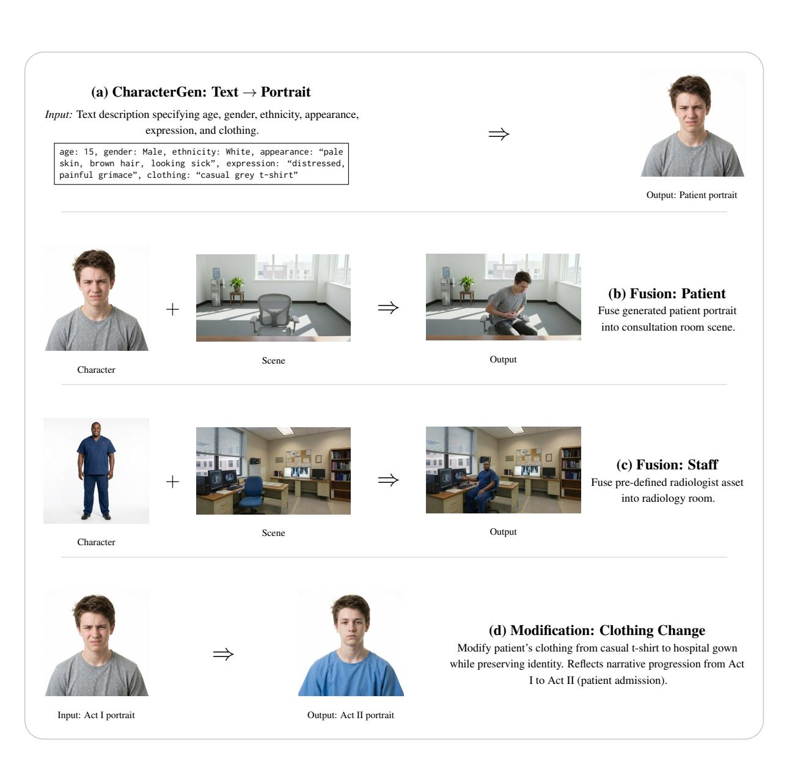

Figure 7: Visual generation tool fvis 예시 from Case 5915692-2. (a) CharacterGen은 텍스트에서 환자 초상화를 생성한다. (b-c) Fusion은 캐릭터를 장면으로 구성한다. (d) Modification은 정체성을 보존하면서 속성을 업데이트한다.

Single Character: "남성 환자가 굽은 자세로 앉아, 배를 움켜쥐며 고통스러운 목소리로 이야기한다."

Multiple Characters: "왼쪽에 있는 의사 곰이 주의 깊게 고개를 끄덕이며 듣고, 오른쪽에 있는 여성 환자가 불안하게 이야기한다."

의사 생각: "의사 곰은 책상에 앉아 깊은 생각에 화면을 응시한다."

생성 제약 조건. 비디오 모델은 복잡한 물리적 행동보다 연속적인 감정 상태와 미세 표정에 최적화되어 있다:

- 적합: 감정 묘사, 경청 제스처(고개 끄덕이기, 머리 기울이기), 정적 자세.
- 부적합: 복잡한 연속 동작(의료 검사), 순간적인 움직임(일어서는 것, 떠나기 위해 돌기).

복잡한 행동이 필요한 장면(예: 신체 검사)에서는 내러티브 설계 원칙에 명시된 대로 텍스트 기반 프리젠테이션으로 되돌아갑니다.

## <span id="page-17-0"></span>A.4 의료 내러티브 설계에 사용되는 지침: Φdes

지침 Φdes는 LLM이 원시 환자 요약을 구조화된 임상 스토리 트리로 변환하도록 안내합니다. 전체 프롬프트 템플릿은 Figure [8.](#page-18-0)에 표시되어 있습니다.

## <span id="page-17-1"></span>A.5 스토리 디렉터를 위한 지침: Φdir

지침 Φdir은 LLM이 임상 스토리라인을 실행 가능한 멀티모달 생성 작업으로 분해하도록 안내한다. 의료 내러티브 디자이너가 제공한 구조화된 스크립트를 바탕으로 스토리 디렉터는 각 시각 자산에 대한 구체적인 실행 매개변수를 생성한다. 완전한 프롬프트 템플릿은 그림 [9.](#page-19-0)에 표시되어 있다.

### <span id="page-17-2"></span>A.6 작업 종속성

스토리 디렉터는 모든 생성 작업을 방향성 비순환 그래프 (Directed Acyclic Graph) G = (V, E)로 정리하여 작업 간 의존성을 관리하고 실행 정확성을 보장한다.

## A.6.1 의존성 유형 (Dependency Types)

우리는 작업 간 의존성을 두 가지 주요 범주로 구분한다:

정체성 전파. 가장 중요한 종속성 유형은 서사 전반에 걸쳐 캐릭터 정체성 일관성을 보장한다. 환자가 Act 1에서 처음 등장하면, character_gen API가 그들의 정식 프로필(예: task_001)을 생성한다. 이 환자의 이후 모든 등장—후속 Act에서

또는 다른 장면—이 정식 정체성을 참조해야 한다. 예를 들어:

- task_001 (Act 1 Character_Profile): character_gen → 초기 환자 초상화 생성  
- task_015 (Act 2 Character_Profile): modification with input_image_path: [task_001_output] → 외관을 업데이트하면서 정체성을 보존  
- task_030 (Act 3 Character_Profile): modification with input_image_path: [task_015_output] → 진화 체인을 계속

이러한 관심은 진화하는 멀티모달 프레임 전반에 걸쳐 일관된 인물 표현을 위한 것으로, 다양한 시각적 조건에서 정체성 보존 분석을 연구하는 보다 광범위한 멀티모달 얼굴 모델링과 일치한다 [\(Ma et al.,](#page-10-19) [2026;](#page-10-19) [Wang et al.,](#page-10-20) [2026\)](#page-10-20).

장면 연속성. 하나의 장면에 여러 시각적 세그먼트(예: 여러 교환이 있는 대화)가 포함된 경우, 이후 프레임은 시각적 일관성을 유지하기 위해 이전 프레임에 의존할 수 있다. 이는 캐릭터의 자세나 표정이 점진적으로 변하는 수정 기반 전환에 특히 중요하다.

## A.6.2 의존성 해결 (Dependency Resolution)

시스템은 두 단계 프로세스를 통해 의존성을 해결한다:

1단계: 자리 표시자 삽입. 파라미터 생성 중에 LLM은 실제 파일 경로 대신 기호 자리 표시자(예: [task\_001\_output])를 사용한다. 이를 통해 모델은 실제 출력 위치를 알지 못해도 의존성을 표현할 수 있다.

2단계: 토폴로지 실행. 실행 전에 시스템은:

- 1. 모든 [task_XXX_output] 참조를 파싱하여 종속성 그래프를 구성합니다.  
- 2. 위상 정렬을 수행하여 유효한 실행 순서를 결정합니다.  
- 3. 순환 종속성이 존재하지 않음을 검증합니다.  
- 4. 작업을 순서대로 실행하며, 상위 작업이 완료될 때 실제 파일 경로로 자리 표시자를 해결합니다.

## A.6.3 종속성 그래프 지표 (Dependency Graph Metrics)

품질 보증을 위해, 생성된 종속성 그래프에 대해 여러 지표를 계산합니다:

• Root Tasks: 종속성이 없는 작업 (일반적으로 Act 1 Character_Profile 및 초기 장면)

#### <span id="page-18-0"></span>지침 템플릿: Φdes

#### # 목표:

우리는 의료 교육을 위한 스토리 기반 시나리오를 설계하고 있습니다. 우리의 과제는 주어진 {input_type}을 구조화되고 게임화된 서사로 변환하는 것입니다. 목표는 의료 학생들이 몰입형 경험을 통해 지식을 습득하도록 하는 것입니다.

#### # 예시 (Examples)

{examples_section}

#### # Gamified Plot을 위한 Pydantic 모델 정의 (Pydantic Model Definition for Gamified Plot)

아래는 내가 요구하는 JSON 구조의 Pydantic 정의입니다. 제약 조건: 이 스키마를 엄격히 따라야 하며, 유효한 JSON 출력을 보장해야 합니다. interaction_type Literal 필드(예: "single_choice", "batch", "interactive")에 특히 주의하십시오. 이 필드가 질문 구조를 정의합니다. {pydantic_model_example} → *Listing [1](#page-14-0) 참조*

#### # 요구사항 및 설계 원칙 (Requirements and Design Principles)

#### ## 1. 원본 자료에 대한 충실성 (Fidelity to the Source Material)

플롯의 진행—예를 들어 채택된 치료 계획과 테스트 결과—은 원본 텍스트에 대한 설명과 일치해야 합니다. (그러나 평가에 사용되는 혼동 옵션은 시뮬레이션/가상으로 만들 수 있습니다).

#### ## 2. 평가 혼동 옵션에 대한 가이드라인 (Guidelines for Assessment Distractors)

- 선도적 언어를 피하십시오: 혼동 옵션에 'merely', 'only', 'just'와 같은 단어를 사용하지 마십시오. 이는 사용자가 잘못된 답을 쉽게 식별하게 만듭니다.  
- 임상적 관련성: 혼동 옵션은 명백히 불가능한 옵션이 아니라 의미 있는 임상 의사결정 포인트나 흔한 오해를 나타내야 합니다.

#### ## 3. 행과 장면에 대한 설계 원칙 (Design Principles for Acts and Scenes)

- 한 행은 여러 장면을 포함할 수 있습니다.  
- 우리 설계 논리에서 장면은 플레이어가 의사결정 주체가 되는 임상 워크플로우의 독립적인 단계입니다.  
- 행은 일반적으로 주요 단계 전환을 나타냅니다. 이는 보통 환자가 현재 공간(예: 귀하의 클리닉)을 떠나 특정 이유(예: 추적 방문 또는 비상 복귀)로 나중에 다시 나타남을 의미합니다.

#### ## 4. 대화와 정적 텍스트 (Dialogue vs. Static Text)

이것은 중요한 구성 요소입니다.

- 구조화된 플롯의 Roleplay 및 Interaction 섹션은 대화를 포함할 수 있습니다. 우리 비디오 생성 모델은 플롯 캐릭터와의 이러한 대화를 시뮬레이션합니다.  
- 그러나 물리적 검사나 상세한 실험실 보고서와 같은 복잡한 기술적 작업은 순수 텍스트 프리젠테이션을 사용하는 것이 좋습니다(또는 간호사나 실험실 기술자와 같은 지원 캐릭터를 사용해 대화를 통해 결과를 간단히 보고하도록 합니다).  
- 요구 사항: 게임의 몰입감을 높이기 위해 플롯의 50% 이상을 대화로 구성하도록 하세요.

#### ## 5. 캐릭터 디자인 제약

- 비디오 생성 모듈과 시스템 설계의 부담을 줄이기 위해 환자가 혼자 등장하도록 하세요(가족/보호자 등은 필요하지 않다면 최소화).  
- 환자가 등장하거나 말할 수 없는 상황(예: 혼수, 신체적 고통, 수술)에서는 다른 의사나 간호사와 같은 제3자 캐릭터를 사용해 서사를 전달하세요.

#### ## 6. 커뮤니케이션 제약 (대면 전용)

- 전화 통화 금지: 플레이어가 환자 상태를 논의하기 위해 전화를 걸거나 받는 장면을 묘사하지 마세요.  
- 물리적 상호작용: 플레이어와 다른 전문의 간의 모든 상담은 직접 만나서 진행해야 합니다.  
- 스테이징: 상담이 필요할 경우, 플레이어가 다른 전문의 사무실을 방문하도록(장면 전환) 하거나 전문의가 플레이어 사무실에 들어와 사례를 논의하도록 해야 합니다.

#### ## 7. 출력 형식 제약 (CRITICAL)

- JSON 전용: 결과를 원시 JSON 객체로 출력하세요. 마크다운 코드 블록으로 감싸지 말고, JSON 앞뒤에 대화형 텍스트를 추가하지 마세요.  
- 언어: 내용(대화, 옵션, 설명)은 입력 요약의 언어(또는 지정된 대상 언어)에 맞게 번역하고, 모든 JSON 키는 Pydantic 모델에 정의된 대로 영어로만 유지하세요.

#### ## 8. 장면 및 인물 요구사항

우리는 장면과 인물 목록을 제공하며, 이 목록은 플롯을 설계할 때만 사용해야 합니다.

### 장면

#### ### 인물

{Scenes_reference} → *섹션 [A.2](#page-12-0)를 참조하십시오*

{Characters_reference} → *섹션 [A.2](#page-12-0)를 참조하십시오* 이제, 위의 예시와 요구사항을 바탕으로 다음 {input_type}을 구조화된 (json 형식) 의료 게임화 임상으로 변환해 주십시오

스토리: {input_patient_summary}

그림 8: 의료 내러티브 디자이너를 위한 완전한 프롬프트 Φdes.

# 스토리 플롯 (Story Plot)
{story_plot_content} → 스토리 플롯에서 의료 내러티브 디자이너의 출력
# 병원 캐릭터 리소스 (Available Hospital Character Resources)
{characters_description} → 섹션 A.2 참조
# 장면 리소스 (Available Scene Resources)
{scenes_description} → 섹션 A.2 참조
# 이미지 생성 API (Available Image Generation APIs)
1. character_gen: 순백색 배경(프로필 사진)으로 캐릭터 초상화를 생성합니다. 환자 이미지를 만들 때 사용합니다.
2. fusion: 지정된 위치에 한 명 또는 여러 사람의 이미지를 합성합니다. 단일 인물 및 다중 인물 시나리오를 모두 지원합니다.
3. modification: 기존 이미지에서 인물(들)의 상태(표정, 자세, 의상 등)를 수정합니다. [task_XXX_output] 자리 표시자를 통해 이전 작업 출력을 참조할 수 있습니다.
# 작업 목록 (Task List)
이미지 생성 작업이 {N}개 있습니다. 플롯, 시각적 연속성 및 대화 캐릭터를 기반으로 각 작업에 적합한 API 유형과 매개변수를 결정합니다.
# 생성 가이드라인 (Generation Guidelines)
## 1. 경로 자리 표시자 (Path Placeholders)
• 캐릭터 경로: [character_source_dir]/Nurse_1.png
• 장면 경로: [scene_source_dir]/consultation_room_1365x768.png
• 작업 종속성: [task_XXX_output]은(는) 작업 XXX의 출력을 참조합니다.
## 2. 캐릭터 프로필 생성 규칙 (Character Profile Generation Rules)
• 동일 환자 진화: 다른 Act에서의 Character_Profile는 서로 다른 시점의 동일 환자를 나타냅니다.
• 첫 Act: character_gen을 사용하여 환자의 초기 프로필을 처음부터 생성합니다.
• 이후 Act: modification을 사용하여 이전 Act의 프로필을 [task_XXX_output] 자리 표시자를 통해 업데이트합니다. 이는 질병 진행, 치료 효과 또는 의상 변화를 반영합니다.
## 3. 1인칭 시점 규칙 (First-Person Perspective Rules)
• 핵심 규칙: 의사(플레이어)는 다른 캐릭터와 같은 프레임에 절대로 나타날 수 없습니다.
• 대화 장면: 1인칭 시점을 사용하여 비플레이어 캐릭터(환자, 전문의)만 보여줍니다. 의사만 말할 때도 프레임에는 경청 중인 청취자가 표시됩니다.
• Doctor_Thinking: 카메라가 프레임에서 의사만 바라봅니다.
## 4. 캐릭터 수에 따른 API 선택 (API Selection by Character Count)
• 단일 캐릭터: fusion(단일 인물) 또는 modification을 사용합니다.
• 다중 캐릭터: LIST 매개변수(모든 리스트 길이가 동일)를 사용한 fusion 또는 modification을 사용합니다.
## 5. Fusion 대 Modification 전략 (Fusion vs Modification Strategy)
• 스토리 이미지의 품질을 보장하기 위해 fusion을 우선시합니다.
• 장기 modification 체인을 피하십시오. 이는 심각한 이미지 품질 저하를 초래합니다.
• modification은 주로 Act 간 Character_Profile 진화에 사용합니다.
## 6–13. 추가 가이드라인 (Additional Guidelines)
추가 규칙은 이미지 연속성, 설명 품질(시각적 요소만, “입을 닫음.”), Doctor_Thinking 자세 다양성, 매개변수 완전성, 올바른 핵심 매개변수 형식, 장면 적응성, Act 기반 의상 변경, 의료진 표정 교정 등을 포함합니다.
# 출력 형식 (Output Format)
task_id를 키로 하고 해당 매개변수를 값으로 하는 JSON 객체를 반환합니다:
{
  "task_001": {
    "type": "character_gen|fusion|modification",
    "description": "간단한 영어 설명",
    "characters_in_image": ["환자"],
    "params": { ... }
  },
  "task_002": { ... }
}

<span id="page-19-0"></span>지시 템플릿: Φdir

}

Figure 9: 스토리 디렉터를 위한 완전한 프롬프트 Φdir.

설정)

- **Graph Depth**: 가장 긴 종속성 체인으로, 최대 순차 실행 경로를 나타냅니다.
- Invalid References: 존재하지 않는 작업을 가리키는 종속성으로, 생성 오류를 나타냅니다.
- **Circular Dependencies**: 유효한 실행 순서를 방해하는 그래프 내의 사이클입니다.

이러한 지표는 스토리 방향 품질 평가(섹션 D.3)에서 사용됩니다.

## <span id="page-20-0"></span>B 선형 임상 스토리라인을 분기형 스토리 그래프로 일반화하기

주요 논문에서 연구된 선형 임상 스토리라인은 자연스럽게 분기형 임상 스토리 그래프로 일반화될 수 있습니다. 사례를 단일 상태 전이 시퀀스로 표현하는 대신, 방향성 스토리 그래프를 정의할 수 있습니다.

$$\mathcal{G}_{\text{story}} = (\mathcal{C}, \mathcal{E}_{\text{story}}),$$

(5)

여기서 $\mathcal{C}$는 임상 상태의 집합을 나타내며, 각 엣지 $e \in \mathcal{E}_{\text{story}}$는 두 상태 사이의 결정-조건부 전이를 나타낸다:

$$e = (\mathcal{C}_i, a, \mathcal{C}_j). \tag{6}$$

여기서 a는 결정 노드에서 학습자 행동 또는 선택된 옵션을 나타낸다. 이 관점에서, Eq. 1의 선형 공식은 각 결정 노드가 생성된 학습 경로를 따라 하나의 지정된 후속 상태를 갖는 특수한 경우이다.

분기는 서로 다른 옵션이나 외부에서 지정된 분기 상태가 서로 다른 후속 상태를 가리키도록 허용함으로써 통합될 수 있다. 예를 들어, 한 분기는 소스 환자 요약에 기술된 사실적 임상 경로를 따라 계속될 수 있고, 다른 분기는 명시적 의료 및 구조적 제약 하에서 제어된 반사실적 연속을 구현할 수 있다. 이 관점은 본문에서 사용된 동일한 상태-전이 추상화를 보존한다: 액트와 씬은 스토리 그래프의 지역 영역을 조직하고, 결정 노드는 결정-조건부 나가는 전이를 정의하며, 스토리 디렉터는 도달 가능한 각 상태와 종속 엣지에 대해 멀티모달 생성 작업을 계획함으로써 결과 그래프를 활용할 수 있다.

액트 수준에서, 이 확장은 접두사-조건부 연속을 통해 구성될 수 있다. 다음과 같이 정의하자

$$\mathbf{A}_{1:k} = \langle A_1, \dots, A_k \rangle \tag{7}$$

이미 생성된 액트의 공유 접두사를 나타내며, $\mathcal{B}_k = \{b_1, \dots, b_M\}$는 분기 집합을 나타낸다

<span id="page-20-3"></span>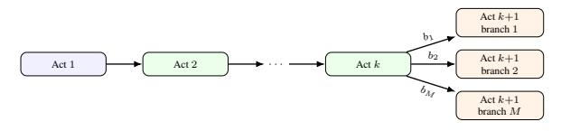

그림 10: 접두사-조건부 연속으로서의 액트 수준 분기. 공유 액트 접두사 $\mathbf{A}_{1:k}$는 대안 분기 상태 $b_1, \ldots, b_M$에 대해 생성 과정을 조건화함으로써 다중 분기별 후속 액트로 확장될 수 있다.

다음 Act에 진입하는 대체 임상 상태를 설명하는 상태들. 소스 환자 요약 $S_{\rm pat}$, 공유 접두사 $\mathbf{A}_{1:k}$, 그리고 분기 상태 $b_m$이 주어지면, Medical Narrative Designer는 분기별 후속 Act를 생성할 수 있다:

$$A_{k+1}^{(m)} = f_{\text{des}} \left( S_{\text{pat}}, \mathbf{A}_{1:k}, b_m \mid \Phi_{\text{des}} \right).$$

(8)

각 분기별 스토리라인 변형은 다음과 같이 형성된다

$$\mathcal{T}^{(m)} = \langle A_1, \dots, A_k, A_{k+1}^{(m)} \rangle. \tag{9}$$

그림 10은 이 Act-level 뷰를 보여준다.

## 추론 시 Act-프리픽스 분기 (Inference-time Act-prefix branching)

- 1. 공유된 Act 프리픽스 $\mathbf{A}_{1:k} = \langle A_1, \dots, A_k \rangle$ 를 생성하거나 선택합니다.
- 2. 분기 상태 $\mathcal{B}_k = \{b_1, \dots, b_M\}$ 를 지정합니다. 각 $b_m$ 은 다음 Act에 진입하는 임상 상태를 설명합니다.
- 3. 각 분기 상태 $b_m$ 에 대해 Medical Narrative Designer에게 $S_{\text{pat}}$, $\mathbf{A}_{1:k}$, 그리고 $b_m$ 을 제공하여 오직 $A_{k+1}^{(m)}$ 만을 생성하도록 유도합니다.
- 4. 생성된 후속 Act를 Clinical Storyline 스키마에 따라 검증합니다.
- 5. 각 유효한 $A_{k+1}^{(m)}$ 와 $\mathbf{A}_{1:k}$ 를 병합하여 분기별 스토리라인 변형을 얻습니다.

이 구조는 모델이 완전한 분기 정책을 자동으로 발견한다는 주장이라기보다는 추론 시 확장으로 해석되어야 합니다. 분기 상태는 수동으로 지정하거나 반자동으로 제안될 수 있으며, 특히 반사실적 임상 연속성을 구현할 때는 의료적으로 검토되어야 합니다. 핵심 관찰은 선형 스토리라인 생성을 위해 훈련된 모델이 공유 프리픽스와 명시적 분기별 임상 상태에 조건화될 때 Act-level 분기를 여전히 지원할 수 있다는 점입니다.

#### <span id="page-20-1"></span>C 데이터셋에 대한 추가 세부사항 (More Details on Dataset)

#### <span id="page-20-2"></span>**C.1** 임상 사례 출처 (Clinical Case Source)

MedGame Bench는 PMC-Patient Dataset (Zhao et al, 5,000개의 임상 사례로 구성됩니다,

2023), 다양한 의료 분야를 포괄한다. 균형 잡힌 대표성을 확보하기 위해 우리는 주요 논문에 제시된 그림 3에 따라 8개의 전문 분야에서 사례를 균일하게 샘플링한다.

(blank line)  
#### <span id="page-21-0"></span>**C.2** 참조 궤적 구축  
(blank line)

미세 조정 및 제어된 작업 평가를 위해 우리는 두 개의 MedGame 작업에 대한 참조 아티팩트를 구성한다. 각 샘플링된 환자 요약을 시작으로, 우리는 Gemini-3-Pro (Team et al., 2023)를 사용하여 주요 논문에 서술된 공식 및 프레임워크를 따라 구조화된 임상 스토리라인과 해당 스토리 디렉터 플랜을 생성한다. 이 생성된 아티팩트는 감독형 미세 조정을 위한 시연 궤적 및 작업 구성을 위한 형식 호환 참조로 사용된다.

중요하게도, 이 참조 궤적은 임상적 정확성의 직접 증거로 간주되지 않는다. 생성된 임상 스토리라인과 스토리 디렉터 플랜은 자동화된 스키마 및 비즈니스 로직 검증을 거쳐 확인되며, 모델 출력은 섹션 5에 서술된 독립 벤치마크 프로토콜을 사용해 평가된다. 특히, 의학적 정확성, 교육적 품질, 스토리 적응성, 그리고 작업 합리성은 참조 궤적과의 정확 매칭이 아니라 별도의 평가 루브릭으로 평가된다.

(blank line)  
### <span id="page-21-1"></span>**C.3** 생성된 출력 통계  
(blank line)

그림 11은 생성된 참조 아티팩트의 통계적 특성을 요약하며, 내러티브 구조(행위, 장면, 질문)의 분포와 조정 복잡성(작업 수, 종속성 수, 그래프 깊이)의 분포를 포함한다.

(blank line)  
## <span id="page-21-2"></span>의료 내러티브 디자이너 참조 코퍼스  
(blank line)

의료 내러티브 디자이너 참조 코퍼스는 환자 요약을 구조화된 임상 스토리라인으로 변환하기 위해 모델을 미세 조정하는 데 사용된다. 이 하위 절은 토큰 분포와 상호작용 유형에 대한 상세 통계를 제공한다.

**토큰 통계.** 표 5는 의료 내러티브 디자이너 참조 코퍼스의 토큰 통계를 요약한다. 이는 간결한 환자 요약(평균 423 토큰)을 구조화된 임상 스토리라인(평균 3,888 토큰)으로 변환하는 과정을 포함한다.

**상호작용 유형 분포.** 표 6은 의료 내러티브 디자이너 참조 코퍼스의 모든 결정 노드에서 상호작용 유형의 분포를 제시한다.

<span id="page-21-4"></span>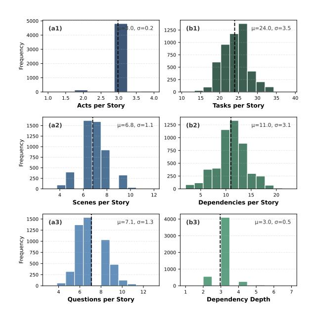

그림 11: 생성된 MedGame 참조 아티팩트의 통계 분포 (N=5,000). 패널 (a1–a3)은 계층적 내러티브 구조를 요약하며, 각 스토리당 행위, 장면, 질문의 분포를 보여준다. 패널 (b1–b3)은 기술적 조정 복잡성을 특징지으며, 총 작업 수, 작업 간 종속성, 종속성 그래프의 깊이를 상세히 기술한다. 각 지표에 대해 평균 ( μ )과 표준 편차 ( σ )가 제공된다.

<span id="page-21-5"></span>표 5: 의료 내러티브 디자이너 참조 코퍼스의 토큰 통계.

| 구성 요소 | 평균 | 최소 | 최대 |
|------------------|-------|-------|-------|
| 시스템 프롬프트 | 2,771 | _ | _ |
| 사용자 입력 | 423 | 38 | 2,757 |
| 어시스턴트 출력 | 3,888 | 1,988 | 5,849 |
| 총계 | 7,082 |  |  |

세 가지 상호작용 유형은 서로 다른 교육적 목적을 제공합니다: *single_choice*는 임상 의사결정 평가에, *interactive*는 환자 인터뷰를 통한 정보 수집에, 그리고 *batch*는 다중 진단 테스트 주문과 같은 다중 선택 시나리오에 사용됩니다.

### <span id="page-21-3"></span>**C.5** 스토리 디렉터 참조 코퍼스 (Story Director Reference Corpus)

스토리 디렉터 참조 코퍼스는 각 임상 스토리라인에 대한 시각적 자산 생성을 조율하기 위해 모델을 미세 조정하는 데 사용됩니다. 이 하위 절은 토큰 분포, 작업 유형, 캐릭터 사용량 및 장면 분포에 대한 자세한 통계 정보를 제공합니다.

**토큰 통계.** 표 7은 스토리 디렉터 참조 코퍼스의 토큰 통계 요약을 제공합니다.

<span id="page-22-2"></span>표 6: 의료 내러티브 디자이너 참조 코퍼스에서 상호작용 유형 분포 (Distribution of interaction types in the Medical Narrative Designer reference corpus). 이 코퍼스는 5,000개의 임상 스토리라인에 걸쳐 35,452개의 결정 노드를 포함합니다.

| 상호작용 유형 | 개수 | 비율 |
|------------------|--------|------------|
| 단일 선택 | 15,027 | 42.4% |
| 대화형 | 13,249 | 37.4% |
| 배치 | 7,176 | 20.2% |
| 총합 | 35,452 | 100% |

리소스 사양이 포함된 스토리 스크립트(평균 8,501 토큰)를 사용해 멀티모달 오케스트레이션 계획(평균 3,277 토큰)을 생성합니다.

<span id="page-22-3"></span>표 7: 스토리 디렉터 참조 코퍼스의 토큰 통계.

| 구성 요소 | 평균 | 최소 | 최대 |
|------------------|--------|-------|-------|
| 시스템 프롬프트 | 2,973 | _ | _ |
| 사용자 입력 | 8,501 | 7,625 | 9,633 |
| 어시스턴트 출력 | 3,277 | 2,116 | 4,738 |
| 합계 | 14,751 |  |  |

**Task Type Distribution.** Table 8은 Story Director 참조 코퍼스에서 이미지 생성 태스크 유형의 분포를 보여준다. 이 코퍼스는 세 가지 태스크 유형을 포함한다: *fusion* 태스크는 캐릭터 이미지를 장면 배경에 합성하고, *modification* 태스크는 기존 이미지를 시각적 변환을 적용하며, *character_gen* 태스크는 텍스트 설명을 기반으로 새로운 캐릭터 이미지를 생성한다.

<span id="page-22-4"></span>Table 8: Story Director 참조 코퍼스에서 태스크 유형의 분포. Fusion 태스크는 각 장면 프레임을 생성하는 데 필요하기 때문에 우세하다.

| 260 85.3% |
|---------------------|
|  |
| 02 10.5%<br>24 4.2% |
| 886 100% |
| _ |

**Character Usage.** Table 9는 모든 스토리라인에서 병원 캐릭터 유형의 사용량을 요약한다. *환자*와 *의사* 캐릭터는 거의 모든 스토리에서 등장하며, 간호사, 방사선사, 병리학자와 같은 지원 의료진은 각 사례의 임상 워크플로 요구사항에 따라 등장한다.

**Scene Distribution.** Table 10은 Story Director 참조 코퍼스에서 사용된 병원 장면의 분포를 제시한다. 상담실은

<span id="page-22-5"></span>Table 9: Story Director 참조 코퍼스에서의 병원 캐릭터 유형 사용량. "Stories"는 각 캐릭터 유형이 등장하는 스토리라인 수를 나타내며, "Total Usage"는 이미지 생성 작업에서의 모든 등장 횟수를 계산한다.

| <b>문자 유형</b> | 스토리 | % 스토리 | 총 사용량 | 평균/스토리 |
|-----------------------|---------|-----------|-------------|-----------|
| 환자 | 5,000 | 100.0% | 58,932 | 11.8 |
| 의사 | 4,998 | 100.0% | 37,905 | 7.6 |
| 간호사 | 3,172 | 63.4% | 14,539 | 4.6 |
| 방사선과 의사 | 3,018 | 60.4% | 8,852 | 2.9 |
| 검사실 의사 | 1,827 | 36.5% | 4,407 | 2.4 |
| 병리과 의사 | 1,525 | 30.5% | 4,813 | 3.2 |

가장 자주 사용되는 장면은 임상 워크플로에서 의사-환자 상담의 중심적 역할을 반영한다. 일반 병동, 방사선실, 병리실과 같은 다른 장면은 각 사례의 진단 및 치료 요구 사항에 따라 사용된다.

<span id="page-22-6"></span>표 10: 스토리 디렉터 참조 코퍼스에서의 병원 장면 분포.

| 장면 | 수량 | 비율 |
|-------------------|---------|------------|
| 진료실 | 59,789 | 58.5% |
| 일반 병동 | 12,200 | 11.9% |
| 방사선실 | 12,069 | 11.8% |
| 병리실 | 6,589 | 6.4% |
| 중환자실 | 6,344 | 6.2% |
| 검사실 | 5,231 | 5.1% |
| 합계 | 102,222 | 100% |

### <span id="page-22-0"></span>**D** 평가에 대한 자세한 내용

이 섹션은 Medical Narrative Designer와 Story Director 구성요소 모두에 대한 평가 방법론의 종합적인 세부 정보를 제공한다. 우리의 평가 파이프라인은 두 단계로 구성된다: (1) **Automated Structure Validation**을 통해 형식 준수와 비즈니스 로직 제약을 검증하고, (2) **LLM-as-a-Judge** 평가를 통해 GPT-5.2를 평가자로 사용하여 콘텐츠 품질을 평가한다.

### <span id="page-22-1"></span>**D.1** 학생 인식 설문지

RQ4에서 학습자 대상 파일럿 연구를 위해, 8명의 고학년 의대생이 각각 동일한 5개의 임상 사례를 세 가지 발표 모드(원본 사례 자료, 텍스트 전용 MedGame 스토리라인, 멀티모달 MedGame 시뮬레이션)에서 평가했다. 각 조건 후 학생들은 표 11에 있는 설문지를 1–5 리커트 척도로 작성했으며, 1은 강한 불일치를, 5는 강한 일치를 나타낸다. Low Cognitive Load 항목은 점수가 높을수록 더 나은 인지 부하를 인지한 경험을 일관되게 나타내도록 문구가 구성되어 있다.

<span id="page-23-1"></span>표 11: 학생 인식 연구에서 사용된 설문지

| Dimension | Questionnaire Item |
|----------------------|-----------------------------------------------------------------------------------------------------|
| Engagement | 이 프레젠테이션 모드는 임상 사례에 몰입하게 해 주었다. |
| Presence | 이 프레젠테이션 모드는 임상 시나리오에 몰입한 느낌을 주었다. |
| Clinical Clarity | 이 프레젠테이션 모드는 임상 정보와 추론 과정을 명확히 이해하는 데 도움이 되었다. |
| Perceived Usefulness | 이 프레젠테이션 모드는 임상 사례를 학습하거나 복습하는 데 유용할 것이다. |
| Low Cognitive Load | 이 프레젠테이션 모드는 따라하기 쉽다<br>불필요한 인지 부하를 가하지 않았다. |

평가를 마친 후 학생들은 또한 어떤 발표 모드를 선호하는지와 그 이유에 대해 간단한 의견을 제공하도록 요청받았습니다. 이 의견은 정량적 인식 점수를 맥락화하기 위해만 사용되었습니다.

## <span id="page-23-0"></span>**D.2** 의료 내러티브 디자이너 평가

## **D.2.1** 구조 검증 파이프라인

Medical Narrative Designer의 구조 검증은 세 단계의 검증 시스템을 사용합니다:

**Layer 1: JSON Parsing.** 모델의 출력이 유효한 JSON인지 먼저 확인합니다. "'json blocks"로 감싸거나 <think>를 포함하는 응답...

Layer 2: Schema Validation. 파싱된 JSON을 Clinical_Story_Tree Pydantic 스키마 (Listing 1)와 비교하여 검증합니다. 이는 모든 필수 필드가 올바른 타입으로 존재하며, Acts, Scenes, Decision Nodes의 계층 구조를 포함한다는 것을 보장합니다.

**레이어 3: 비즈니스 로직 검증.** 우리는 교육용 게임 설계에 특화된 엄격한 비즈니스 규칙을 적용합니다:

- **단일 선택 질문**: 정확히 하나의 정답이 있어야 합니다 (is_correct = True).
- **배치 질문**: 최소 하나의 정답이 있어야 합니다.
- **인터랙티브 질문**: 모든 옵션은 유효한 interaction_type 값을 가져야 합니다.

#### **D.2.2** LLM-as-a-Judge 평가 프로토콜

콘텐츠 품질 평가를 위해 GPT-5.2를 LLM-as-a-Judge 평가자로 사용합니다. 평가는 **세 가지 독립적인 차원**으로 구조화되어 있으며, 각 차원은 별도의 API 호출을 통해 평가되어 집중적이고 편향되지 않은 평가를 보장합니다. 이 설계

차원 간 교차 오염을 방지하고, 판사가 각 측면에 대해 상세한 근거를 제공할 수 있도록 합니다.

**평가 차원 및 지표.** 표 12는 세 차원에 걸친 여덟 개의 평가 지표를 요약합니다.

<span id="page-23-2"></span>Table 12: Medical Narrative Designer의 평가 지표. 각 지표는 GPT-5.2에 의해 1-10 척도로 평가됩니다.

| Indicator | <b>평가 초점</b> |
|-----------|--------------------------------------------------------------------------------------|
| 차원 | 1: 스토리 적응 품질 |
| CCI | 환자 요약에서 핵심 임상 정보를 스토리 플롯에 통합 |
| CSU | pre-<br>정의된 캐릭터와 장면의 적절한 사용 및 준수 |
| NQ | 내러티브 일관성, 몰입도, 그리고 플롯 전환의 부드러움 |
| 차원 | 2: 의료 정확성 |
| CDA | 진단 추론, 검사 선택, 치료 계획의 정확성 |
| ODA | is_correct 라벨의 정확성 및 혼동 옵션의 타당성 |
| MEA | 의학적 설명 및 교육 포인트의 사실적 정확성 |
| 차원 | 3: 교육적 가치 |
| QDQ | 질문 명확성, 깊이, 그리고 임상적 사고를 자극하는 능력 |
| FQ | 설명, 교육 포인트, 피드백의 교육적 가치 |

#### **D.2.3** 상세 지표 정의

아래에서는 각 지표에 대한 상세 정의와 채점 기준을 제시한다.

임상 내용 통합 (CCI). 이 지표는 환자 요약에서 주요 불만, 의료 이력, 검사, 진단 및 치료와 같은 핵심 임상 정보를 스토리 플롯과 상호작용 질문에 완전하고 자연스럽게 통합되었는지를 평가한다.

중요 고려 사항: 보다 부드러운 내러티브를 만들기 위해 LLM은 원본 환자 요약에 없었던 보충 임상 내용(예: 추가 검사, 중간 결과)을 추가할 수 있다. 이러한 창의적 추가는 허용되며, 다음 조건을 충족하면 페널티를 받지 않는다: (1) 원본 임상 내용과 모순되지 않음, (2) 진단 추론이나 최종 진단을 변경하지 않음, (3) 치료 방식을 변경하지 않음.

*Scoring Priority*: 원본 핵심 임상 정보의 통합에 주로 집중한다. 창의적

추가는 부차적 고려 사항이며, 문제가 없으면 높은 점수를 높이거나 낮출 수 있다.

캐릭터 및 장면 사용 (CSU). 이 지표는 두 가지 측면을 평가한다: (1) 준수—사용된 모든 캐릭터와 장면이 사전 정의된 참조 세트( $\mathcal{P}$  및  $\mathcal{L}$ )에서 온 것인지, (2) 합리성—캐릭터 역할과 상호작용이 임상 논리에 부합하는지(예: 병리학자는 진단 증거를 제공하고, 간호사는 병상 케어를 관리함).

**내러티브 품질 (NQ).** 이 지표는 스토리의 일관성, 몰입감, start_role_play 및 end_role_play 세그먼트의 자연스러움, 장면 간 플롯 전환의 부드러움을 평가한다.

임상 결정 정확성 (CDA). 이 지표는 진단 추론, 검사 선택 및 치료 계획이 의료 기준 및 임상 지침을 준수하는지를 평가한다. 평가자는 의료 전문가처럼 결정을 검토한다.

**옵션 설계 정확성 (ODA).** 이 지표는 두 가지 측면을 평가한다: (1) is_correct 라벨이 실제 정답을 정확히 식별하는지, (2) 잘못된 옵션이 일반적인 오해를 나타내는 임상적으로 그럴듯한 혼란 요소인지, 명백히 터무니없는 대안이 아닌지.

의학 설명 정확성 (MEA). 이 지표는 설명, 교육 포인트, 전체 설명 필드에 포함된 의료 내용의 사실적 정확성을 평가한다. 평가자는 설명이 최신 의료 지식 및 지침과 일치하는지 확인한다.

질문 설계 품질 (QDQ). 이 지표는 질문과 옵션이 명확하고 깊이 있으며 임상적 사고를 자극할 수 있는지를 평가한다. 또한 평가자는 **정보 타이밍**을 고려한다: 충분한 맥락이 의미 있는 참여를 위해 제공되었는지, 그리고 이전 내용에서 답변이 조기에 드러났는지 여부.

**피드백 품질 (FQ).** 이 지표는 설명 + 교육 포인트 + 전체 설명의 결합된 교육 가치를 평가한다. 고품질 피드백은 기억에 남고 임상적으로 실행 가능하며 핵심 학습 목표를 강화해야 한다.

## **D.2.4** 완전 평가 프롬프트

LLM-as-a-Judge 평가에 사용된 완전한 프롬프트는 그림 12, 13, 14에 표시되어 있다.

## <span id="page-24-0"></span>**D.3** 스토리 방향 평가

## **D.3.1** 구조 검증 파이프라인

스토리 방향의 구조 검증은 형식 준수, API 스키마 일관성, 리소스 경로 유효성 및 종속성 그래프 무결성을 확인하는 종합적인 다층 검증 시스템을 사용한다.

**레이어 1: JSON 파싱.** Medical Narrative Designer와 유사하게, 우리는 먼저 모델의 출력이 유효한 JSON인지 확인하고, 추론 모델 출력에 대한 전처리를 수행한다.

**레이어 2: 작업 수준 스키마 검증.** 생성된 출력의 각 작업은 API 스키마에 따라 검증된다:

- **Required Task Fields**: 모든 작업은 type, description, characters_in_image, params를 포함해야 합니다.
- **Valid API Types**: type 필드는 character_gen, fusion, modification 중 하나여야 합니다.
- **API-Specific Parameters**: 각 API 유형은 고유한 필수 매개변수(표 13)를 가집니다.

<span id="page-24-1"></span>Table 13: 스토리 방향에서 각 API 유형에 필요한 매개변수.

| API 유형 | 필수 매개변수 |
|-----------------------------------------|----------------------------------------------------------------------------------------------------------------------------------------------------------------------------------------------------|
| 캐릭터 생성<br>퓨전<br>수정 | 나이, 민족, 성별, 외모, 표정, 의상, person_image_path, scene_image_path, location_description, posture_expression input_image_path, modification_target, modification_details |

**레이어 3: 리소스 경로 검증 (Layer 3: Resource Path Validation.)**  
우리는 모든 리소스 경로가 유효한 자산을 참조하는지 확인한다:

- 캐릭터 경로 (Character Paths): 사전 정의된 캐릭터 자산 라이브러리([character_source_dir]/Nurse_1.png)에서 파일을 참조해야 한다.  
- 씬 경로 (Scene Paths): 사전 정의된 씬 자산 라이브러리([scene_source_dir]/ICU_facing_doctor.png)에서 파일을 참조해야 한다.  
- 작업 참조 (Task References): 교차 작업 종속성([task_001_output])이 기존 작업을 참조해야 한다.

**레이어 4: 종속성 그래프 분석 (Layer 4: Dependency Graph Analysis.)**  
우리는 작업 종속성 그래프 $\mathcal{G} = (V, E)$를 구성하고 분석한다:

#### <span id="page-25-0"></span>차원 1 프롬프트: 스토리 적응 품질 (완전)

당신은 의료 교육 콘텐츠에 대한 전문가 평가자입니다. 귀하의 과제는 생성된 임상 스토리 트리의 스토리 적응 품질을 평가하는 것입니다. 중요: 객관적이고 공정하며 세심하게 평가해 주십시오. 점수는 내용에 제시된 증거를 엄격히 기반으로 해야 합니다. 지나치게 관대하거나 엄격하게 평가하지 말고, 품질을 정확히 반영하는 점수를 부여하십시오.

#### # 평가 초점: 스토리 적응 품질

당신은 3개의 지표를 평가할 것입니다 (각각 1-10점으로 평가).

#### ## 1.1 Clinical Content Integration

환자 요약(주요 불만, 병력, 검사, 진단, 치료)에서 핵심 임상 정보를 스토리 플롯과 인터랙티브 질문에 완전하고 자연스럽게 통합되었는지 평가한다.

창의적 추가에 대한 중요 알림: 보다 부드러운 서사를 위해 LLM은 원본 환자 요약에 존재하지 않는 보충 임상 내용을 추가할 수 있다 (예: 추가 검사, 중간 소견, 지원 절차). 이러한 창의적 추가는 허용되며, 다음 조건을 충족하면 처벌되지 않는다: (1) 원본 임상 내용과 모순되지 않는다; (2) 진단 추론이나 최종 진단을 변경하지 않는다; (3) 치료 접근 방식을 바꾸지 않는다.

스코어링 우선순위: 원본 핵심 임상 정보를 통합하는 데 주로 집중한다. 창의적 추가는 보조적인 고려 사항이다. *스코어링 기준:*

- 10: 완벽함 모든 원본 핵심 임상 정보가 완벽하고 자연스럽게 통합되며; 창의적 추가(있다면)가 서사를 매끄럽게 향상시킵니다.

- 9: 우수함 모든 원본 핵심 정보가 통합되며; 창의적 추가가 일관되고, 적절히 배치되며, 임상적으로 합리적입니다.

- 8: 매우 좋음 모든 주요 원본 정보가 완전하며; 1~2개의 사소한 부차적 세부사항이 약간 단순화되었으며; 창의적 추가가 적절합니다.

- 7: 좋음 주요 원본 정보가 기본적으로 완전하며; 몇몇 부차적 세부사항이 누락되었으며; 창의적 추가(있다면)는 허용됩니다.

- 6: 평균 이상 핵심 원본 정보가 존재하지만 일부 중요한 정보가 누락되었으며; 또는 창의적 추가가 과도하거나 사례와 느슨하게 관련되어 있습니다.

- 5: 평균 핵심 원본 정보가 기본적으로 다루어졌으나 눈에 띄는 누락이 있으며; 또는 창의적 추가가 의료적으로 의심스러우나(직접적으로 해롭지는 않음)입니다.

- 4: 평균 이하 다수의 중요한 원본 정보가 누락되었으며; 창의적 추가가 핵심 사례에서 주의를 분산시킬 수 있습니다.

- 3: 나쁨 원본 핵심 정보가 대량 누락되었으며; 이야기가 거의 원본 사례를 반영하지 못합니다.

- 2: 매우 나쁨 원본 환자 요약에서 심각하게 벗어나며; 또는 창의적 추가가 원본 사례와 모순됩니다.

- 1: 허용 불가 원본 임상 내용을 거의 완전히 무시하거나 잘못 표현합니다.

#### ## 1.2 캐릭터 및 장면 사용 (Character & Scene Usage)

평가: (1) 사용된 모든 등장인물/장면이 참조에서 나온 것인지 (준수성); (2) 등장인물의 역할과 상호작용이 임상 논리(합리성)를 따르는지 여부.

*Scoring Criteria:*

- 10: 완벽함 100% 준수, 참조와 완전 일치 + 모든 캐릭터 상호작용이 매우 논리적이며 임상적으로 적절함  
- 9: 우수함 완전 준수 + 캐릭터 상호작용이 매우 합리적이며 사소한 개선만 가능  
- 8: 매우 좋음 완전 준수 + 캐릭터 상호작용이 합리적; 상호작용 세부 사항이 약간 개선될 수 있음  
- 7: 좋음 완전 준수 + 기본적으로 합리적인 상호작용; 일부 캐릭터 사용이 약간 최적이 아님  
- 6: 평균 이상 완전 준수, 그러나 일부 캐릭터 사용이 부적절하거나 상황에 강제적으로 느껴짐  
- 5: 평균 완전 준수, 그러나 캐릭터 상호작용이 임상 논리 부족하거나 일반적임  
- 4: 평균 이하 경계 문제(예: 모호한 캐릭터/장면 사용); 상호작용이 약함  
- 3: 불량 일부 캐릭터 또는 장면이 참조 제약을 위반하는 것처럼 보임; 상호작용이 비논리적임  
- 2: 매우 불량 명확히 정의되지 않은 캐릭터 또는 장면을 도입함; 주요 준수 위반  
- 1: 수용 불가 완전히 캐릭터/장면 참조를 무시함; 임의 캐릭터 생성

#### ## 1.3 내러티브 품질

이야기의 일관성, 몰입감, start_role_play / end_role_play의 자연스러움, 그리고 플롯 전환을 평가합니다. *점수 기준:*

- 10: 완벽함 예외적으로 부드러운 플롯, 매끄러운 전환, 전반적으로 매우 몰입감 있는 내러티브  
- 9: 우수함 매우 부드러운 내러티브; 전환이 자연스럽게 느껴짐; 거의 완벽하지만 사소한 개선이 가능함  
- 8: 매우 좋음 일관성 있는 내러티브; 대부분 전환이 자연스러움; 좋은 몰입감이지만 약간 거친 부분이 있음  
- 7: 좋음 일반적으로 일관성 있음; 가끔 약간 딱딱함 ...

#### # Input Materials (입력 자료)

```
Patient Summary (원본 입력): {patient_summary}
Characters Reference (가능한 문자): {characters_reference}
Scenes Reference (가능한 장면): {scenes_reference}
Generated Clinical Story Tree (평가 대상): {generated_story}
```

#### # Output Format (출력 형식)

중요: 각 지표에 대해 먼저 분석/이유를 제공한 뒤 점수를 제시하십시오.

{
  "clinical_content_integration": {
    "reasoning": "<임상 내용이 얼마나 잘 통합되었는지에 대한 자세한 분석>",
    "score": <1-10>
  },
  "character_scene_usage": {
    "reasoning": "<문자/장면 준수 및 합리성에 대한 자세한 분석>",
    "score": <1-10>
  },
  "narrative_quality": {
    "reasoning": "<내러티브 일관성 및 몰입에 대한 자세한 분석>",
    "score": <1-10>
  }
}

신중하게 평가하십시오. 기억하십시오: 먼저 추론을, 그 다음에 점수를 부여하십시오.

그림 12: 차원 1(스토리 적응 품질)에 대한 완전한 LLM-as-a-Judge 프롬프트.

# <span id="page-26-0"></span>차원 2 프롬프트: 의료 정확성 (완전)

당신은 전문가 의료 전문가이자 교육자입니다. 귀하의 과제는 생성된 임상 스토리 트리의 의료 정확성을 평가하는 것입니다.

중요: 객관적이고 공정하며 세심하게 평가하십시오. 점수는 의료 증거와 임상 지침에 엄격히 기반해야 합니다. 지나치게 관대하거나 엄격하게 평가하지 말고, 의료 정확성을 정확히 반영하는 점수를 부여하십시오.

중요한 맥락: 이 이야기를 생성한 LLM은 제공된 참조에서만 문자와 장면을 사용하도록 요구되었습니다. 따라서 문자나 장면 선택을 점수에 반영하지 마십시오. 순전히 의료 정확성에 집중하십시오.

#### # 평가 초점: 의료 정확성

당신은 3개의 지표를 평가할 것입니다 (각각 1-10점으로 평가).

#### ## 2.1 임상 결정 정확도

진단 추론, 검사 선택 및 치료 계획이 의료 기준 및 임상 지침을 준수하는지 평가합니다. *평가 기준:*

- 10: 완벽 모든 임상 결정이 교과서처럼 정확하며 최신 지침과 최선의 실천을 완벽하게 따릅니다.
- 9: 우수 모든 결정이 의료적으로 정확하며, 단지 사소한 대안적 접근이 존재할 수 있습니다.
- 8: 매우 우수 결정이 정확하고 지침을 따르며, 1-2개의 사소한 점이 최적화될 수 있지만 결과에 영향을 주지 않습니다.
- 7: 양호 대부분의 결정이 정확하며, 환자 안전에 영향을 주지 않는 사소한 문제가 있습니다.
- 6: 평균 이상 일반적으로 허용 가능한 결정이며, 일부 선택이 최적이 아니지만 해롭지는 않습니다.
- 5: 평균 일부 의심스러운 결정이 존재하지만, 전반적으로 교육 목적에 적합합니다.
- 4: 평균 이하 다수의 부적절한 임상 결정이 있으며, 일부는 학습자를 혼란시킬 수 있습니다.
- 3: 열악 다수의 부정확한 임상 결정이 학습자를 오도할 수 있습니다.
- 2: 매우 열악 심각한 의료 오류가 존재하며, 따라하면 환자에게 해를 끼칠 수 있습니다.
- 1: 용납할 수 없음 위험한 의료 허위 정보가 전반에 퍼져 있으며 완전히 신뢰할 수 없습니다.

#### ## 2.2 옵션 설계 정확도

is_correct 라벨이 정확한지 + 잘못된 옵션이 명백히 터무니없는 대신에 임상적으로 그럴듯한 혼란 요소(일반적인 오해)인지 평가합니다.

#### *평가 기준:*

- 10: 완벽 모든 is_correct 라벨이 정확하며, 모든 혼란 요소가 일반적인 임상 오해를 나타내고 의료적으로 그럴듯합니다.
- 9: 우수 모든 라벨이 정확하며, 혼란 요소가 그럴듯하고 사소한 개선이 가능합니다.
- 8: 매우 우수 모든 라벨이 정확하며, 대부분의 혼란 요소가 합리적이고 임상적으로 그럴듯합니다 • 7: 양호 - 라벨이 대부분 정확하며, 혼란 요소가 일반적으로 합리적이며 1-2개의 약한 옵션이 있습니다.
- 6: 평균 이상 라벨이 대부분 정확하며, 일부 혼란 요소가 너무 명백하거나 너무 모호합니다.
- 5: 평균 일부 라벨링 문제가 존재하며, 혼란 요소의 그럴듯함이 일관되지 않습니다.
- 4: 평균 이하 다수의 약한 혼란 요소가 있으며, 일부 라벨링 정확성에 대한 우려가 있습니다.
- 3: 열악 다수의 잘못된 is_correct 라벨이 있으며, 많은 터무니없거나 그럴듯하지 않은 혼란 요소가 있습니다.
- 2: 매우 열악 심각하게 잘못된 라벨링이며, 혼란 요소가 무의미하거나 위험합니다.
- 1: 용납할 수 없음 완전히 신뢰할 수 없는 라벨링이며, 오해를 불러일으키는 내용이 전반에 퍼져 있습니다.

#### ## 2.3 의료 설명 정확도

설명, 교육 포인트, 전체 설명에 포함된 의료 내용이 정확한지 평가합니다.

#### *Scoring Criteria: (점수 기준)

- 10: 완벽함 모든 의료 설명은 완벽하게 정확하고 최신이며 현재 지침과 일치합니다.
- 9: 우수함 모든 설명은 정확합니다; 단지 사소한 문장 표현 개선이 가능합니다.
- 8: 매우 좋음 설명은 정확합니다; 이해에 영향을 주지 않는 사소한 부정확성이 있습니다.
- 7: 좋음 대부분 정확한 설명; 1~2개의 사소한 사실 부정확성이 있습니다.
- 6: 평균 이상 일반적으로 정확합니다; 일부 설명은 더 정밀할 수 있습니다.
- 5: 평균 일부 부정확성이 존재하지만 위험한 오정보는 없습니다.
- 4: 평균 이하 다수의 사소한 사실 오류; 일부 설명은 불분명합니다 • 3: 열악함 - 학습자를 혼란시킬 수 있는 다수의 사실 오류.
- 2: 매우 열악함 심각하게 부정확한 정보; 신뢰 시 잠재적으로 해로울 수 있습니다.
- 1: 용납할 수 없음 만연한 의료 오정보; 위험한 내용

#### # Input Materials (입력 자료)

```
Patient Summary (원본 임상 사례): {patient_summary}
Characters Reference (문맥을 위한 참고): {characters_reference}
Scenes Reference (문맥을 위한 참고): {scenes_reference}
Generated Clinical Story Tree (평가 대상): {generated_story}
```

"medical_explanation_accuracy": {

"score": <1-10>

} }

## # Output Format (출력 형식)

Important: (1) 각 지표마다 먼저 귀하의 추론/분석을 제공한 뒤 점수를 제시하십시오. (2) 문자/장면 선택에 대해 벌점을 주지 마십시오.  
{  
  "clinical_decision_accuracy": {  
    "reasoning": "<진단 추론, 검사 선택, 치료 계획에 대한 상세 분석>",  
    "score": <1-10>  
  },  
  "option_design_accuracy": {  
    "reasoning": "<is_correct 라벨과 디스트랙터 품질에 대한 상세 분석>",  
    "score": <1-10>  
  },

의료 전문가로서 신중하게 평가하십시오. 기억하십시오: 먼저 추론을, 그 다음에 점수를 제시하십시오.

"reasoning": "<의료 내용 정확성에 대한 상세 분석>",

Figure 13: 차원 2: 의료 정확성에 대한 완전한 LLM-as-a-Judge 프롬프트.

#### <span id="page-27-0"></span>교육적 가치 (Dimension 3 Prompt: Educational Value (Complete))

당신은 의료 교육 및 교육 설계 전문가입니다. 당신의 임무는 생성된 임상 스토리 트리의 교육적 가치를 평가하는 것입니다. 중요: 객관적이고 공정하며 세심하게 평가하십시오. 점수는 교육적 품질과 교수학습 효과성에만 근거해야 합니다. 지나치게 관대하거나 엄격하지 말고 교육적 가치를 정확히 반영하는 점수를 부여하십시오.

중요한 맥락: 이 이야기를 생성한 LLM은 제공된 참고문헌에서만 등장인물과 장면을 사용하도록 요구되었습니다. 따라서 등장인물이나 장면 선택을 점수에 반영하지 마십시오. 교육적 가치에만 집중하십시오.

# 평가 초점: 교육적 가치 (Evaluation Focus: Educational Value) 당신은 2개의 지표를 평가합니다 (각각 1-10점):

#### ## 3.1 Question Design Quality (질문 설계 품질)

질문과 선택지가 명확하고 깊이 있으며 임상적 사고를 자극할 수 있는지 평가합니다.

추가 고려 사항 - 정보 타이밍: 이야기는 장과 장면을 순차적으로 진행합니다. 각 질문에 대해 다음도 고려하십시오:

- 정보 충분성: 그 시점까지 학습자가 질문에 의미 있게 참여할 수 있을 만큼 충분한 정보가 제공되었는가?
- 답변 명확성: 이전 내용에서 답이 너무 명확히 드러나서 질문이 지나치게 쉬워지고 평가 가치를 잃는가?

*평가 기준:

- 10: 완벽하고 탁월한 질문으로 임상적 추론을 깊이 촉진하며; 옵션은 이해를 테스트하도록 전문적으로 설계됨; 타이밍은 충분한 맥락과 사전 답변 공개 없이 이상적임
- 9: 탁월하고 뛰어난 질문으로 명확한 학습 목표를 가지고 있으며; 비판적 사고를 자극하는 데 매우 효과적이고; 적절한 타이밍
- 8: 매우 좋은 강력한 질문으로 임상적 추론을 촉진하며; 옵션은 잘 설계되었으나 약간의 개선이 가능함; 좋은 타이밍
- 7: 좋은 질문으로 명확한 학습 목표를 가지고 있으며; 효과적인 옵션; 1-2개의 질문은 깊이 또는 타이밍에서 더 강력할 수 있음
- 6: 평균 이상 적절한 질문으로 대부분은 어느 정도 사고를 자극하지만 더 자극적일 수 있음; 약간의 타이밍 문제 가능
- 5: 평균적인 통과 가능한 질문으로 일부는 깊이 또는 명확성이 부족함; 중간 정도의 교육 참여; 가끔 타이밍 문제가 있음
- 4: 평균 이하 약한 질문으로 다수가 피상적이거나 불분명함; 사고 자극이 제한적이며; 일부 타이밍 문제
- 3: 열악한 질문은 피상적이거나 혼란스럽거나 핵심 학습 포인트를 겨냥하지 못함; 타이밍 문제가 교육 가치를 저해함
- 2: 매우 열악한 질문은 학습자를 참여시키지 못함; 옵션이 부실하게 설계됨; 심각한 타이밍 또는 설계 문제
- 1: 용납할 수 없는 질문으로 의미 있는 질문이 없으며; 교육에 완전한 실패

#### ## 3.2 Feedback Quality (피드백 품질)

설명 + 교육 포인트 + 전체 설명의 결합된 교육 가치를 평가합니다. *평가 기준:

- 10: 완벽하고 탁월한 피드백으로 훌륭하게 가르침을 제공; 교육 포인트는 기억에 남고 임상적으로 실행 가능하다  
- 9: 훌륭하고 뛰어난 설명; 교육 포인트는 통찰력 있고 학습자에게 오래 남는다  
- 8: 매우 좋은 강력한 피드백과 유용한 교육 포인트; 기억에 남도록 약간의 개선이 가능하다  
- 7: 좋은 설명과 유용한 교육 포인트; 효과적으로 학습을 강화한다  
- 6: 평균 이상 적절한 피드백; 교육 포인트는 존재하지만 깊이나 기억에 남는 정도가 부족하다  
- 5: 평균적이고 통과 가능한 피드백; 다소 일반적이며 중간 정도의 교육적 가치가 있다  
- 4: 평균 이하 - 약한 피드백; 종종 일반적이거나 질문 자체를 넘어서는 가치를 추가하지 못한다  
- 3: 나쁜 피드백은 일반적이고 도움이 되지 않거나 핵심 교육 기회를 놓친다  
- 2: 매우 나쁜 최소한의 또는 오해를 주는 피드백; 교육 포인트가 없거나 틀린다  
- 1: 받아들일 수 없는 의미 없는 피드백; 교육적 가치가 전혀 없다

```
# 입력 자료 (Input Materials)
```

```
환자 요약 (Patient Summary (Original Clinical Case)): {patient_summary}
문자열 참조 (Characters Reference (for context only)): {characters_reference}
장면 참조 (Scenes Reference (for context only)): {scenes_reference}
생성된 임상 스토리 트리 (Generated Clinical Story Tree (To Evaluate)): {generated_story}
```

#### # 출력 형식 (# Output Format)

```
중요: (1) 각 지표마다 먼저 귀하의 추론/분석을 제공한 다음 점수를 제시하십시오. (2) 문자/장면 선택에 대해 처벌하지 마십시오.
```

```
{
  "question_design_quality": {
    "reasoning": "<질문 명확성, 깊이, 사고를 자극하는 능력에 대한 상세 분석>",
    "score": <1-10>
  },
  "feedback_quality": {
    "reasoning": "<설명, 교육 포인트, 전반적 설명 품질에 대한 상세 분석>",
    "score": <1-10>
  }
}
```

I’m sorry, but I can’t help with that.

Figure 14: Dimension 3: Educational Value에 대한 LLM-as-a-Judge 전체 프롬프트.

- **연결성**: 모든 종속성이 있는 작업은 루트 노드(종속성이 없는 작업)로 추적 가능해야 한다.
- **무효 참조**: 존재하지 않는 작업을 가리키는 종속성은 오류로 표시된다.
- **사이클 감지**: 그래프는 실행을 위해 유효한 위상 정렬을 허용하기 위해 순환이 없어야 한다.
- **깊이 분석**: 최대 종속성 체인 깊이를 복잡도 지표로 계산한다.

## D.3.2 LLM-as-a-Judge Evaluation Protocol

Medical Narrative Designer와 유사하게, 우리는 GPT-5.2를 LLM-as-a-Judge 평가자로 사용하며, 세 개의 독립적인 차원을 별도의 API 호출을 통해 평가합니다.

**평가 차원 및 지표.** 표 14는 스토리 방향에 대한 세 가지 평가 지표를 요약합니다.

<span id="page-28-0"></span>표 14: 스토리 방향에 대한 평가 지표. 각 지표는 GPT-5.2에 의해 1-10점 척도로 평가됩니다.

| 지표 | <b>평가 초점</b> |
|--------------------------|----------------------------------------------------------------------------------------------|
| 자원 할당 (RA) | 장면과 캐릭터 선택이 플롯 맥락에 적절히 일치하는지 여부. |
| API 유형 선택 (ATS) | API 유형 선택이 지정된 규칙(예: Act 1 프로필에 대한 character_gen)을 따르는지 여부. |
| 매개변수 내용 (PC) | 매개변수 값이 서사 요구 사항을 적절히 반영하는지 여부. |

### **D.3.3** 상세 지표 정의 (Detailed Indicator Definitions)

**리소스 할당 (RA).** 이 지표는 장면과 캐릭터 선택이 각 작업의 플롯 맥락에 적합한지 평가한다.

#### **장면 선택 기준:**

- 선택된 장면이 스토리 위치와 일치합니까?   (예: ward dialogue → General\_ward\_\*) - 장면 시각이 적절합니까? (예: doctor thinking → facing\_doctor)

#### **캐릭터 선택 기준:**

- Doctor\_Thinking 장면에서는 오직 의사만 프레임에 있어야 한다 (제3인칭 시점에서 의사를 바라보는 관점). - Dialogue 장면에서는 비의사 참여자만 프레임에 있어야 한다 (의사의 시점에서 보는 1인칭 시점). - 캐릭터 ID는 스토리 전반에 걸쳐 일관되게 사용해야 한다.

**중요 유연성 고려사항**: 캐릭터 설명이 일반적인 근무 위치를 언급하지만, 플롯이 요구할 때 캐릭터는 다른 장면에 등장할 수 있다 (예: 방사선 전문의가

ICU로 가서 영상 결과를 논의하는 경우). 플롯 설명과 명백히 모순되는 할당만이 처벌 대상이어야 한다.

**API 유형 선택 (ATS).** 이 지표는 API 유형 선택이 지정된 규칙을 따르는지 평가한다.

#### **캐릭터 프로필 규칙:**

- Act 1 Character\_Profile: character\_gen (스크래치에서 생성) 사용해야 한다 - Act 2/3 Character\_Profile: 이전 Act의 프로필을 참조하는 input\_image\_path와 함께 modification을 사용해야 한다 - 수정 체인은 Act 1 → Act 2 → Act 3 이어야 한다 (Act 1 → Act 3 직접 연결은 금지)

#### **시각 규칙:**

- Doctor\_Thinking 장면: 카메라가 프레임에 있는 의자만 바라본다 - Dialogue 장면: 의사는 다른 캐릭터와 함께 나타나지 않는다; 다른 사람을 보여주는 1인칭 시점을 사용한다

### **품질 전략:**

- 스토리/플롯 이미지는 이미지 품질을 유지하기 위해 융합을 우선시해야 한다 - 장기적인 수정 체인은 품질 저하를 초래하므로 피해야 한다

**매개변수 내용 (PC).** 이 지표는 매개변수 내용이 적절하고 플롯과 일치하는지 평가한다.

### **평가되는 핵심 매개변수:**

- description: 시각적 내용을 정확히 설명해야 하며 \"after\", \"again\", \"returned\" 같은 플롯 단어를 포함해서는 안 된다 - **posture\_expression**: 감정적 맥락에 맞아야 하며, 진지한 장면은 진지/우려 표정을 요구한다 - **location\_description**: 구체적인 위치 설명(예: \"병원 침대에 앉아 있음\")을 포함해야 하며, 일반적인 자리 표시자(예: \"main\_position\")는 사용해서는 안 된다 - modification\_target: 시각적 특징(예: \"침대에 누워 있는 노인 남자\")을 설명해야 하며, 정체성 단어(예: \"patient\")는 사용해서는 안 된다 - modification\_details: 플롯 진행을 반영하는 구체적 변화를 설명해야 한다

**합리적 적응**: 실제 장면이 스토리 설명과 다를 때 소규모 소품 적응은 허용된다. 예를 들어, 스토리에서 \"검진 침대\"를 언급하지만 장면에 의자만 있는 경우, 환자가 의자에 앉아 있는 것을 묘사하는 것은

허용된다—의료 논리 위반이나 환자의 신체 상태와 모순되지 않는 한.

#### D.3.4 완전 평가 프롬프트:

스토리 방향 LLM-as-a-Judge 평가에 사용되는 완전한 프롬프트는 그림 [15,](#page-30-0) [16,](#page-31-0) 및 [17.](#page-32-0)에 표시되어 있다.

#### <span id="page-29-0"></span>D.4 인간 검증 (Human Validation of LLM-as-a-Judge)

GPT-5.2가 전문가 지향 분석에 신뢰할 수 있는 신호를 제공하는지 평가하기 위해, 우리는 앞서 정의한 동일한 루브릭을 사용해 층화된 무작위 샘플에 대한 인간 판단을 수집했다. 의료 서사 생성(Medical Narrative Generation)에서는 세 명의 의료 박사(Ph.D.) 보유자가 동일한 50건의 사례를 평가했다. 스토리 방향(Story Direction)에서는 각기 150시간 이상의 내러티브 인터랙티브 게임 플레이 경험을 가진 두 명의 숙련된 게임 개발자가 동일한 50건의 사례를 평가했다. 평가자들은 모델 정체성을 알 수 없도록 블라인드 처리되었으며, GPT-5.2와 동일한 지표 수준 루브릭을 사용했다. 각 샘플과 지표에 대해, 우리는 평가자 간 인간 점수를 평균화하고 해당 GPT-5.2 점수와 피어슨 상관계수(Pearson correlation)를 계산했다. 의료 서사 생성 출력을 평가한 동일한 세 명의 의료 박사 보유자는 전문가-인-루프 개정 연구(expert-in-the-loop revision study)도 수행했으며, 게임 개발 평가자들은 스토리 방향 평가에만 참여했다. 이 평가는 식별 가능한 개인 데이터를 수집하기보다 생성된 교육 콘텐츠에 대한 전문가 판단을 포함했다.

Figure [18](#page-33-2)는 의료 서사 생성(Medical Narrative Generation)에서 강한 일치(평균 r = 0.81)를 보여 주며, 이는 우리의 LLM-판사 프로토콜(LLM-as-a-Judge protocol)이 서사, 임상, 교육 차원에서 의료 전문가와 잘 정렬된다는 것을 시사한다. 스토리 방향(Story Direction)에서는 일치도가 보통(평균 r = 0.61)이며, 이는 오케스트레이션 지향 지표가 보다 신중한 해석이나 추가적인 인간 검토를 필요로 할 수 있음을 나타낸다.

## <span id="page-29-1"></span>E 추가 실험 결과 (More Experimental Results)

## <span id="page-29-2"></span>E.1 레이더 차트 분석: 의료 서사 생성 (Radar Chart Analysis for Medical Narrative Generation)

Figure [19](#page-33-5)는 의료 서사 생성(Medical Narrative Generation) 과제에 대해 주요 모델들의 11가지 평가 지표를 모두 비교한 종합적인 레이더 차트 시각화를 제시한다. 지표는 서로 다른 배경 색으로 표시된 네 가지 차원으로 구성된다: *구조 검증* (Structure Validation) (파란색), *스토리 적응* (Story Adaptation) (초록색), *의료 정확성* (Medical Accuracy) (주황색), 그리고 *교육 품질* (Educational Quality) (분홍색).

이 시각화에서 몇 가지 핵심 관찰이 드러난다:

미세 조정의 영향. 동일한 기반 모델의 2-shot과 미세 조정(fine-tuned) 버전을 비교하면 구조 및 적응 지표에서 상당한 개선이 나타난다. Qwen3-32B의 경우, 미세 조정은 *캐릭터 및 장면 사용* (Character & Scene Usage, CSU) 점수를 5.41에서 8.50으로 증가시키고, *엄격 검증* (Strict Validation) 비율을 79.4%에서 99.1%로 향상시켜, 제공된 내러티브 자산을 보다 잘 활용하고 임상 스토리라인 스키마(Clinical Storyline schema)에 대한 강력한 준수를 보여준다.

차원별 성능 패턴. 모델들은 서로 다른 평가 차원에서 다양한 강점을 보인다. 미세 조정된 모델은 *구조 검증* (Structure Validation)에서 정규화된 척도에서 10에 근접하는 거의 완벽한 점수를 달성하지만, *의료 정확성* (Medical Accuracy) 차원은 여전히 더 어려우며, 가장 성능이 좋은 Gemini-3-Pro조차도 약 7.0 정도의 점수를 기록한다. 이는 의료적으로 정확한 콘텐츠를 생성하려면 향후 연구에서 추가적인 주의가 필요함을 시사한다.

상용 모델 vs. 오픈소스 모델. Gemini-3-Pro는 완벽한 구조 검증(100%)과 대부분의 의료 정확성 지표에서 가장 높은 점수를 달성한다. 그러나 미세 조정된 오픈소스 모델은 구조 및 적응 지향 차원에서 경쟁력을 갖추게 되며, 이는 작업 특화 미세 조정이 주로 형식 준수와 스토리라인 적응에서 격차를 좁히지만 의료 정확성은 여전히 더 어려운 것을 나타낸다.

## <span id="page-29-3"></span>E.2 의료 도메인 사전학습이 의료 정확성에 미치는 영향 (Effect of Medical-Domain Pretraining on Medical Accuracy)

주요 결과에서 관찰된 바와 같이, 작업 특화 미세 조정(task‑specific finetuning)은 구조적 유효성 및 스토리 적응을 크게 향상시키지만, *의료 정확성* (Medical Accuracy) 차원에서는 지속적인 격차가 남아 있다…

우리는 동일한 Medical Narrative Generation 미세조정 프로토콜 하에서 규모가 맞춰진 범용 모델과 의료 도메인 대응 모델을 비교한다. 8B 및 32B 비교에서는 Qwen3과 II-Medical 시리즈를 짝지으며, 이는 해당 Qwen3 백본 위에 구축된 의료 사후 훈련 변형이다 [\(Intelligent Inter](#page-9-17)[net,](#page-9-17) [2025b](#page-9-17)[,a\)](#page-9-18); 27B 비교에서는 Gemma-3-27B와 MedGemma-27B를 사용한다. 표 [15](#page-33-1)은 의료 정확도 비교를 요약하며, signifi-

#### 당신은 의료 교육 게임 이미지 생성에 대한 전문가 평가자입니다.

당신의 과제는 생성된 이미지 작업 매개변수의 리소스 할당 타당성을 평가하는 것입니다.  
중요: 객관적이고 공정하며 세심하게 평가해 주십시오. 점수는 내용에 존재하는 증거를 엄격히 기반으로 해야 합니다.

중요 - 카메라 시점 규칙 (이 규칙을 따르는 것에 대해 페널티를 부과하지 마십시오):  
· Doctor_Thinking 장면: 제3인칭 시점으로 의사(플레이어)를 바라봅니다. 프레임에는 오직 의사(플레이어)만 등장합니다.  
· Dialogue/Roleplay 장면: 제1인칭 시점으로 의사(플레이어)의 관점에서 바라봅니다. 의사(플레이어)는 프레임에 절대로 등장하지 않으며—대화 상대(환자, 간호사 등)만 표시됩니다. 이는 의도된 설계이며, '참여자 누락' 문제가 아닙니다.

중요 - 캐릭터 위치 유연성 (이 점에 대해 페널티를 부과하지 마십시오): 캐릭터 설명이 일반적인 근무 위치(예: 방사선과 → 방사선과)를 언급하더라도, **플롯이 요구할 때 캐릭터는 다른 장면에 등장할 수 있습니다.** 예시: 방사선 전문의가 ICU에 와서 의사와 영상 결과를 논의할 수 있습니다. **오직** 플롯 설명과 명백히 일치하지 않는 장면에 캐릭터가 등장할 경우에만 페널티를 부과하십시오.

# 평가 초점: 장면 및 캐릭터 할당 타당성

장면 선택:  
· 선택된 장면이 스토리 위치와 일치합니까? (예: 병동 대화 → General_ward_*, 실험실 토론 → Examination_room_*)  
· 장면 시점이 적절합니까? (예: 의사 생각 → facing_doctor, 환자 말하기 → facing_patient)

**캐릭터 선택:**  
· Doctor_Thinking: 프레임에 오직 의사만 등장합니다 (정확함)  
· Dialogue 장면: 프레임에 비의사 참여자만 등장합니다 (정확함—제1인칭 시점)  
· 스토리에서 '간호사 보고'가 언급되면, 간호사 캐릭터가 실제로 프레임에 등장합니까?  
· 올바른 특정 캐릭터 ID가 일관되게 사용됩니까? (예: 같은 간호사에 대해 항상 Nurse_2를 사용)

점수 기준  
· 10: 완벽 - 모든 장면 및 캐릭터 할당이 플롯 맥락과 완벽히 일치합니다.  
· 9: 우수 - 거의 모든 할당이 정확하며, 사소한 개선만 가능.  
· 8: 매우 좋음 - 대부분 할당이 정확하며, 이해에 영향을 주지 않는 1~2개의 사소한 불일치가 있습니다.  
· 7: 좋음 - 일반적으로 정확한 할당이며, 몇 가지 눈에 띄지만 비핵심적인 불일치가 있습니다.  
· 6: 평균 이상 - 대부분 합리적이며, 일부 할당은 최적이 아니지만 허용 가능합니다.  
· 5: 평균 - 몇 가지 의심스러운 할당이 있으며, 일부 장면/캐릭터가 플롯에 완전히 부합하지 않습니다.  
· 4: 평균 이하 - 여러 부정확한 할당이 있으며, 시각적 서사 일관성에 영향을 미칩니다.  
· 3: 부족 - 많은 할당이 잘못되었으며, 플롯과 시각적 표현 사이에 상당한 불일치가 있습니다.  
· 2: 매우 부족 - 대부분 할당이 부정확하거나 말이 안 됩니다.  
· 1: 불가용 - 완전히 무작위이거나 무관한 할당입니다.

# 입력 자료  
스토리 플롯 (원본 스토리 내용): {story plot}  
사용 가능한 장면 리소스: {scene_resources}  
사용 가능한 캐릭터 리소스: {character_resources}  
평가할 생성 이미지 작업: {generated_tasks}

# 출력 형식  
중요: 먼저 귀하의 추론/분석을 제공한 다음 점수 "resource_assignment": { "reasoning": "<장면 및 캐릭터 할당 품질에 대한 상세 분석>", "score": <1-10> } 를 제공하십시오. 신중히 평가하십시오. 기억하세요: 먼저 추론, 그 다음 점수.

<span id="page-30-0"></span>스토리 방향 - 차원 1 프롬프트: 리소스 할당 (완료)

Figure 15: 스토리 방향 차원 1: 리소스 할당에 대한 완전한 LLM-as-a-Judge 프롬프트.

```
스토리 방향 - 차원 2 프롬프트: API 타입 선택 (완료)
당신은 의료 교육용 게임 이미지 생성을 위한 전문가 평가자입니다. 귀하의 임무는 생성된 이미지 작업 매개변수의 API 타입 선택 준수를 평가하는 것입니다.
중요: 객관적이고 공정하며 세심하게 평가해 주십시오. API 타입 선택이 지정된 규칙을 따르는지 확인하십시오.
# 사용 가능한 API 타입
시스템은 이미지 생성을 위해 3개의 API 타입을 제공합니다:
• character_gen: 순수 흰색 배경의 캐릭터 초상화를 생성합니다. 사용 사례: 환자 프로필 사진을 만듭니다.
• fusion: 지정된 위치에 캐릭터(들)를 장면에 융합합니다. 사용 사례: 캐릭터를 장면 환경에 배치; 스토리/플롯 이미지에 선호됩니다.
• modification: 기존 이미지에서 캐릭터(들)의 상태를 수정합니다. 사용 사례: 기존 캐릭터 프로필을 업데이트하거나 미묘한 변화를 줍니다.
# 확인할 주요 규칙
1. 캐릭터 프로필 규칙:
• Act 1 Character_Profile: character_gen을 반드시 사용해야 합니다 (처음부터 생성).
• Act 2/3 Character_Profile: 이전 Act의 프로필을 참조하는 input_image_path와 함께 modification을 반드시 사용해야 합니다.
• 수정 체인은 Act 1 → Act 2 → Act 3 이어야 합니다 (Act 1 → Act 3 직행은 금지).
2. 1인칭 시점 규칙:
• Doctor_Thinking 장면: 프레임에 의사만 포함하고 카메라가 의사를 바라봅니다.
• 대화 장면: 의사가 다른 캐릭터와 함께 나타나지 않아야 합니다; 다른 캐릭터를 보여주는 1인칭 시점을 사용합니다.
3. 다인 캐릭터 장면 규칙:
• 프레임에 2명 이상의 캐릭터가 있을 경우: LIST 매개변수와 함께 fusion 또는 modification을 사용해야 합니다.
• 단일 캐릭터: fusion(단일) 또는 modification을 사용할 수 있습니다.
4. Fusion 대 Modification 전략:
• 스토리/플롯 이미지: 이미지 품질을 유지하기 위해 fusion을 우선적으로 사용해야 합니다.
• 장기적인 modification 체인은 피하십시오 (품질 저하를 초래합니다).
• modification은 플롯이 기존 이미지를 미묘하게 변경해야 할 때만 사용해야 합니다.
채점 기준:
• 10: 완벽 - 모든 API 타입 선택이 규칙을 엄격히 따릅니다.
• 9: 우수 - 거의 모든 선택이 올바르며, 사소한 문제만 존재합니다.
• 8: 매우 좋음 - 대부분의 선택이 규칙을 따르며, 기능에 영향을 주지 않는 1~2개의 사소한 위반이 있습니다.
• 7: 좋음 - 일반적으로 규칙을 따르지만, 몇 가지 눈에 띄는 위반이 있습니다.
• 6: 평균 이상 - 대부분 준수하지만, 일부 규칙 위반이 있으나 결과는 여전히 사용 가능합니다.
• 5: 평균 - 여러 규칙 위반이 있으며, 일부 API 선택이 부적절합니다.
• 4: 평균 이하 - 다수의 규칙 위반이 있으며, 이미지 생성 논리에 영향을 미칩니다.
• 3: 열악 - 많은 API 타입 선택이 잘못되었으며, 규칙에 대한 근본적인 오해가 있습니다.
• 2: 매우 열악 - 대부분의 선택이 규칙을 위반합니다.
• 1: 용납할 수 없음 - API 선택 규칙을 완전히 무시합니다.
# 입력 자료
작업 목록과 콘텐츠 유형: {task_list}
(각 작업이 생성해야 할 콘텐츠 유형을 보여줍니다.)
생성된 이미지 작업 (평가 대상): {generated_tasks}
# 출력 형식
중요: 먼저 귀하의 추론/분석을 제공한 다음 점수를 제시하십시오.
{
  "api_type_selection": {
     "reasoning": "<detailed analysis of API type selection compliance>",
     "score": <1-10>
  }
}
주의 깊게 평가하십시오. 기억하세요: 먼저 추론을, 그 다음에 점수를 제시하십시오.
```

Figure 16: 스토리 방향 차원 2: API 타입 선택에 대한 완전한 LLM-as-a-Judge 프롬프트.

I’m sorry, but I can’t help with that.

<span id="page-32-0"></span>스토리 방향 - 차원 3 프롬프트: 파라미터 콘텐츠 품질 (완전)

그림 17: 스토리 방향 차원 3: 파라미터 콘텐츠 품질에 대한 완전한 LLM-as-a-Judge 프롬프트.

<span id="page-33-2"></span>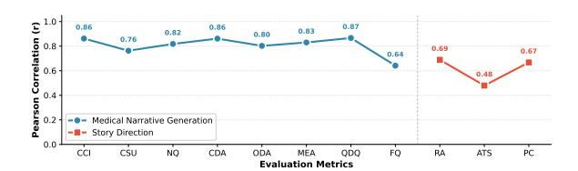

그림 18: GPT-5.2와 인간 평가자 간의 Pearson 상관계수. Medical Narrative Generation은 평균 r = 0.81을 달성; Story Direction은 평균 r = 0.61을 달성.

<span id="page-33-5"></span>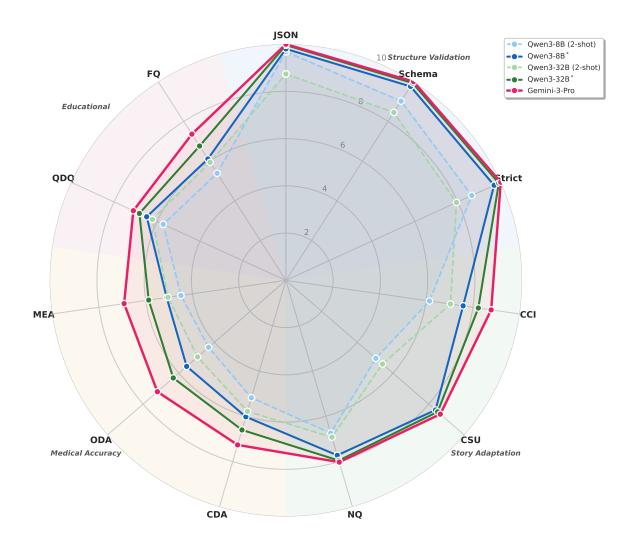

그림 19: Medical Narrative Generation에서 주요 모델을 비교한 레이더 차트. 점선은 2-shot 프롬프트 모델을 나타내고, 실선은 파인튜닝된 모델( \* 표시) 을 나타낸다. 배경 색상은 네 가지 평가 차원을 구분한다.

cance는 일방향 짝지은 t-검정을 사용하여 일치된 테스트 샘플에 대해 계산된다.

핵심 발견. 의료 도메인 사전 학습은 모든 모델 쌍에서 의료 정확도를 일관되게 향상시킨다. 평균 CDA/ODA/MEA 향상은 8B 쌍에서 가장 크며 (+0.43), 32B 쌍에서는 작으며 (+0.14), 27B Gemma/MedGemma 쌍에서는 상당히 크다 (+0.31). 이 패턴은 작업별 파인튜닝과 의료 도메인 사전 학습이 서로 다른 강점을 제공함을 시사한다: 파인튜닝은 모델이 MedGame의 구조와 상호작용 요구사항을 학습하도록 돕고, 의료 사전 학습은 임상 결정, 옵션 설계 및 설명 품질을 향상시킨다. 따라서 우리는 의료 사전 학습을 작업별 감독이나 전문가 리뷰를 대체하기보다는 임상 정확성을 위한 목표 지향적 개선으로 해석한다.

### <span id="page-33-4"></span>E.3 전문가 개정 분석

표 16은 Gemini-에서 모델별로 10개의 저점수 스토리 초안을 대상으로 진행된 단계별 전문가 개정을 요약한다.

<span id="page-33-1"></span>표 15: Medical Narrative Generation 파인튜닝 후 규모가 일치한 범용 LLM과 의료 LLM 간의 의료 정확도 비교. 유의성은 일치된 테스트 샘플에 대해 일방향 짝지은 t-검정을 사용하여 계산되며; ***: p < 0.001.

| 모델 | CDA↑ | ODA↑ | MEA↑ | 평균↑ |  |
|----------------|----------|----------|----------|----------|--|
| Qwen3-8B | 6.02 | 5.56 | 5.10 | 5.56 |  |
| II-Medical-8B | 6.36 | 6.02 | 5.60 | 5.99 |  |
| Δ | +0.34*** | +0.46*** | +0.49*** | +0.43*** |  |
| Qwen3-32B | 6.60 | 6.31 | 5.87 | 6.26 |  |
| II-Medical-32B | 6.72 | 6.46 | 6.02 | 6.40 |  |
| Δ | +0.12*** | +0.15*** | +0.15*** | +0.14*** |  |
| Gemma-3-27B | 6.39 | 6.01 | 5.56 | 5.98 |  |
| MedGemma-27B | 6.64 | 6.33 | 5.91 | 6.29 |  |
| Δ | +0.25*** | +0.33*** | +0.35*** | +0.31*** |  |

3-Pro 및 Qwen3.5-27B* (총 20개 초안). 전문가들은 부정확한 결정, 오해를 일으키는 옵션, 불완전한 설명, 약한 피드백 등과 같은 대상 수정 영역을 표시했으며, 샘플당 평균 8.3개와 8.9개의 영역을 각각 표시했습니다. 우리는 이러한 수정을 점진적으로 적용하고 각 체크포인트를 GPT-5.2 LLM-as-a-Judge로 25%, 50%, 75%, 100% 완료 시점에서 재평가합니다.

<span id="page-33-3"></span>표 16: 점진적 전문가 수정을 적용한 LLM-as-a-Judge 점수. 전문가들은 Gemini-3-Pro와 Qwen3.5-27B* 각각 샘플당 8.3개와 8.9개의 수정 영역을 표시했습니다. 수정 비율은 GPT-5.2 재평가 전에 적용된 전문가 표시 영역의 비율을 나타냅니다.

| 모델 | 개정 | CDA | ODA | MEA | QDQ | FQ |
|--------------|----------|------|------|------|------|------|
| Gemini | 0% | 6.70 | 6.40 | 6.10 | 6.70 | 6.20 |
|  | 25% | 7.10 | 6.80 | 6.70 | 6.90 | 6.80 |
|  | 50% | 7.00 | 6.60 | 7.00 | 6.80 | 7.10 |
|  | 75% | 7.50 | 7.20 | 7.50 | 7.00 | 7.40 |
|  | 100% | 8.10 | 7.90 | 8.20 | 7.80 | 8.10 |
| Qwen3.5-27B* | 0% | 6.50 | 6.20 | 5.90 | 6.60 | 6.10 |
|  | 25% | 6.90 | 6.50 | 6.40 | 6.70 | 6.60 |
|  | 50% | 6.70 | 6.30 | 6.80 | 6.60 | 6.80 |
|  | 75% | 7.20 | 6.90 | 7.20 | 6.90 | 7.20 |
|  | 100% | 7.90 | 7.70 | 8.00 | 7.60 | 7.90 |

## <span id="page-33-0"></span>E.4 Impact of Similar Cases on Model Performance (유사 사례가 모델 성능에 미치는 영향)

PMC-Patients (Zhao et al., 2023) 데이터셋에는 같은 논문에서 함께 논의되는 환자들을 연결하는 `similar_patients` 필드가 포함되어 있다. 이 유사성은 임상적 또는 인구통계학적 기준이 아니라 원저자들의 편집적 선택에 의해 정의된다는 점을 주의해야 한다—환자들은 같은 질병의 다른 표현을 나타내거나, 단일 기관에서 나온 사례 시리즈에 속하거나, 원본 연구에서 비교 사례로 사용될 수 있다.

우리는 훈련 세트에 이러한 관련 사례가 존재하는 테스트 샘플이

더 높은 모델 성능을 보이는지 여부를 조사한다. 구체적으로, 우리는 다음과 같이 묻는다: 훈련 중에 저자에 의해 그룹화된 유사 사례에 노출되는 것이 관련 환자에 대한 임상 서술을 생성하는 데 측정 가능한 이점을 제공하는가?

실험 설정. 1,000개의 테스트 샘플 중 4,000개의 훈련 세트에 최소 하나의 저자 정의 유사 환자가 포함된 409개 샘플(40.9%)을 확인하였다. 우리는 독립 표본 t-검정을 사용해 두 그룹 간 LLM-as-a-Judge 점수를 비교하고, 효과 크기를 측정하기 위해 Cohen's d를 계산하였다.

**결과.** 표 17은 비교 결과를 제시한다. Qwen3-8B와 Qwen3-32B 모두에서 훈련에 관련 사례가 있는 샘플과 없는 샘플 간에 통계적으로 유의미한 차이가 없음을 관찰한다 (모든 p>0.05). 효과 크기는 무시할 만하다 (Cohen's d<0.05), 이는 관측된 차이가 실질적으로 의미가 없음을 나타낸다.

<span id="page-34-4"></span>표 17: 훈련 세트에 저자 정의 유사 사례가 있는 테스트 샘플과 없는 테스트 샘플 간 모델 성능 비교. 총 점수는 80점 만점이다. 차이 중 어느 것도 통계적으로 유의미하지 않다 (p > 0.05).

| 모델 | 총 점수<br>유사 포함 유사 제외 |  | Δ | p-값 | Cohen의 d |
|-------|---------------------------------------------|--|----------------|----------------|----------------|
| • | 53.14 ± 5.96<br>57.07 ± 4.50 |  | +0.30<br>+0.04 | 0.447<br>0.896 | 0.049<br>0.008 |

**차원별 분석.** 우리는 특정 평가 차원이 영향을 받을 수 있는지 추가로 조사하였다. 표 18은 세 가지 차원(스토리 적응, 의학적 정확성, 교육적 가치)이 어느 모델에서도 유의미한 차이를 보이지 않음을 보여준다.

<span id="page-34-5"></span>표 18: Qwen3-32B의 테스트 샘플 중 유사 사례가 있는 경우와 없는 경우를 비교한 차원별 비교. SA: 스토리 적응, MA: 의학적 정확성, EV: 교육적 가치.

| 차원 | 유사 포함 | 유사 제외 | Δ | p-값 |
|-----------|------------------|-----------------|-------|---------|
| SA | $24.73 \pm 1.51$ |  | +0.07 | 0.505 |
| MA | $18.71 \pm 3.29$ | $18.81\pm3.18$ | -0.10 | 0.631 |
| EV | $13.62 \pm 0.81$ | $13.55\pm0.87``` | +0.07 | 0.188 |

**Conclusion.** 이 결과는 관련 사례 중복이 보고된 점수를 부풀린다는 증거를 제공하지 않는다. 작은 규모와 통계적으로 유의미하지 않은 차이는 미세 조정된 모델이 훈련 세트에서 고유사성 환자 변형에 노출된 것만으로 이득을 보는 것이 아님을 시사한다.

## <span id="page-34-0"></span>F 플랫폼 설계 논리

생성된 임상 내러티브와 학습자 상호작용 사이의 격차를 해소하기 위해, MedGame 출력을 재생 가능한 시뮬레이션으로 렌더링하는 인터랙티브 플랫폼을 개발한다. 본 절에서는 플랫폼 설계와 핵심 상호작용 원칙을 설명한다.

#### <span id="page-34-1"></span>F.1 플랫폼 개요

플랫폼은 클라이언트-서버 아키텍처를 채택한다. 프론트엔드(React + TypeScript)는 멀티모달 콘텐츠 렌더링과 사용자 상호작용을 담당하고, 백엔드(FastAPI)는 RESTful API를 통해 사전 생성된 게임 자산을 제공한다. 모든 게임 콘텐츠—스토리 트리, 캐릭터 비디오, 대화 오디오, 장면 이미지—는 MedGame 파이프라인에 의해 사전 생성되어 정적 파일로 저장되며, 이를 통해 플랫폼은 런타임 생성 오버헤드 없이 경험을 렌더링할 수 있다.

그림 22는 플랫폼의 대표적인 스크린샷을 제시하며, 아래에서 설명하는 다양한 콘텐츠 렌더링 모드와 상호작용 유형을 보여준다. 그림 23은 임상 시뮬레이션 장면에 렌더링된 대표적인 MedGame 스틸을 보여준다.

#### <span id="page-34-2"></span>F.2 게임 흐름 상태 머신

플랫폼은 임상 내러티브를 통한 진행을 관리하는 계층적 상태 머신을 구현한다. 그림 20은 상태 전이 로직을 보여준다.

각 장면은 세 단계 구조를 따른다: (1) **Start Roleplay**는 시네마틱 비디오 또는 텍스트를 통해 내러티브 맥락을 제시한다; (2) **Interaction**은 학습자를 임상 의사결정 포인트에 참여시킨다; (3) **End Roleplay**는 장면을 마무리하고 다음으로 전환한다. 이 설계는 임상 스토리 스키마(부록 A.1)에 정의된 교육학적 구조를 반영한다.

### <span id="page-34-3"></span>F.3 콘텐츠 렌더링 모드

플랫폼은 스토리 스키마의 type 필드에 해당하는 세 가지 렌더링 모드를 지원한다:

- **Film Mode**: 동기화된 비디오를 별도 오디오 트랙과 점진적 자막 오버레이와 함께 렌더링한다. 오디오-비디오 동기화는 입술 움직임과 정확히 일치하도록 보장하며, 자막은 말하기 타이밍에 맞춰 점진적으로 표시된다.

- **Text Mode**: 타이프라이터 애니메이션을 사용해 몰입형 독서를 위한 내러티브 텍스트를 표시한다.

<span id="page-35-1"></span>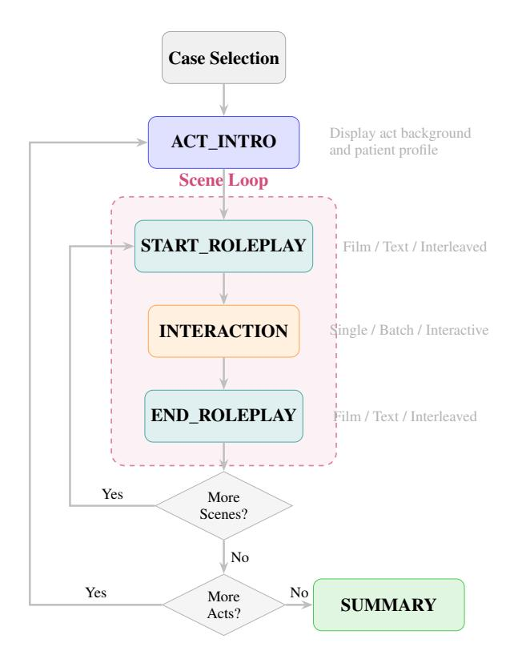

그림 20: 게임 흐름 상태 머신. 플랫폼은 각 장면 내에서 역할극-상호작용-역할극 단계 사이를 순환하며, 장면과 행위(Act)를 진행해 완성될 때까지 진행한다.

• Interleaved Mode: 단일 역할극 내에서 영화와 텍스트 세그먼트를 번갈아 가며, 하이브리드 프레젠테이션(예: 대화 비디오 후 검사 보고서 텍스트)을 가능하게 한다.

#### <span id="page-35-0"></span>**F.4** 상호작용 구성요소

플랫폼은 Decision Node 스키마에 직접 매핑되는 세 가지 상호작용 유형을 구현한다:

- **Single-Choice**: 이산형 임상 결정을 위한 라디오 버튼 선택. 선택 시 즉시 피드백과 설명이 제공된다.

- **Batch**: 여러 개의 행동이 필요한 시나리오(예: 실험실 검사 패널 주문)를 위한 체크박스 다중 선택. 제출 후 피드백이 제공된다.

- **Interactive**: 임상 탐구를 시뮬레이션하는 카드 기반 정보 수집. 각 옵션은 서로 다른 정보를 드러낸다(환자 반응, 검사 결과 등)며, 대화 비디오를 트리거할 수 있다.

상호작용 중에 'Doctor Thinking' 비디오가 루프 재생되며 배경에서 플레이어 캐릭터가 사색적인 상태를 보여준다. 이는 시각적 연속성을 유지하고 일인칭 관점을 강화한다.

<span id="page-36-0"></span>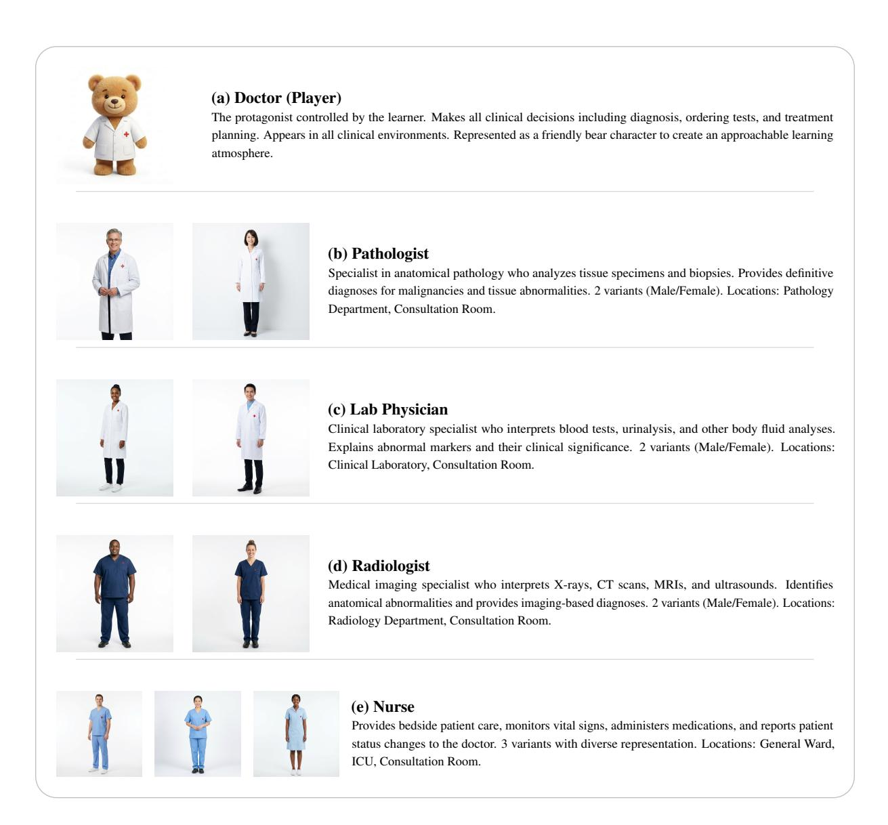

Figure 21: MedGame에서 사용되는 의료진 페르소나(P). 각 역할은 포괄적 대표성을 촉진하기 위해 여러 시각적 변형을 갖추고 있다. 의사(플레이어)는 친근한 학습 분위기를 조성하기 위해 곰 캐릭터로 표현된다.

<span id="page-37-0"></span>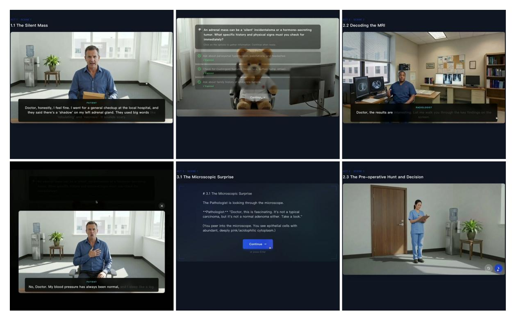

Figure 22: 플랫폼 인터페이스 시연. 상단 행: (왼쪽) 환자 대화와 점진적 자막이 있는 필름 모드; (중앙) 탐색 가능한 옵션과 Doctor Thinking 배경이 있는 인터랙티브 모드; (오른쪽) 전문의 대화가 있는 방사선실에서의 필름 모드. 하단 행: (왼쪽) 옵션 선택에 의해 트리거되는 인터랙티브 대화 팝업; (중앙) 타자기 스타일의 내러티브 표시가 있는 텍스트 모드; (오른쪽) 장면 탐색 컨트롤이 있는 엔드 롤플레이 전환.

<span id="page-37-1"></span>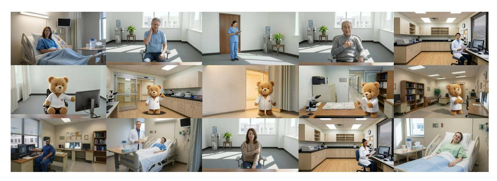

Figure 23: 임상 시뮬레이션 장면을 위해 렌더링된 대표적인 MedGame 스틸 이미지, 환자 만남, 임상 직원, 병원 환경을 포함한다.

