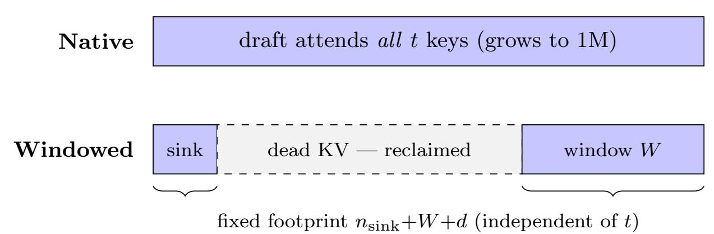
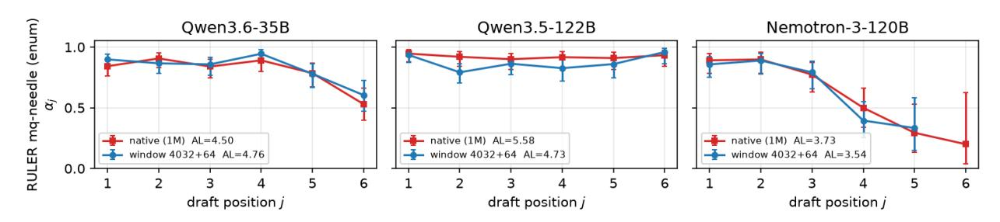
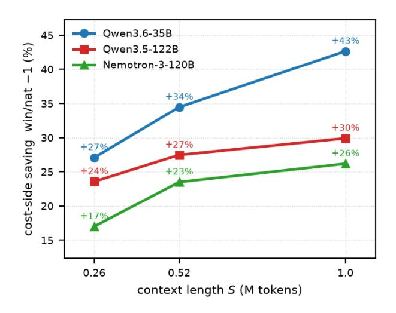
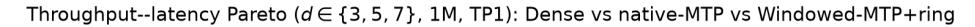
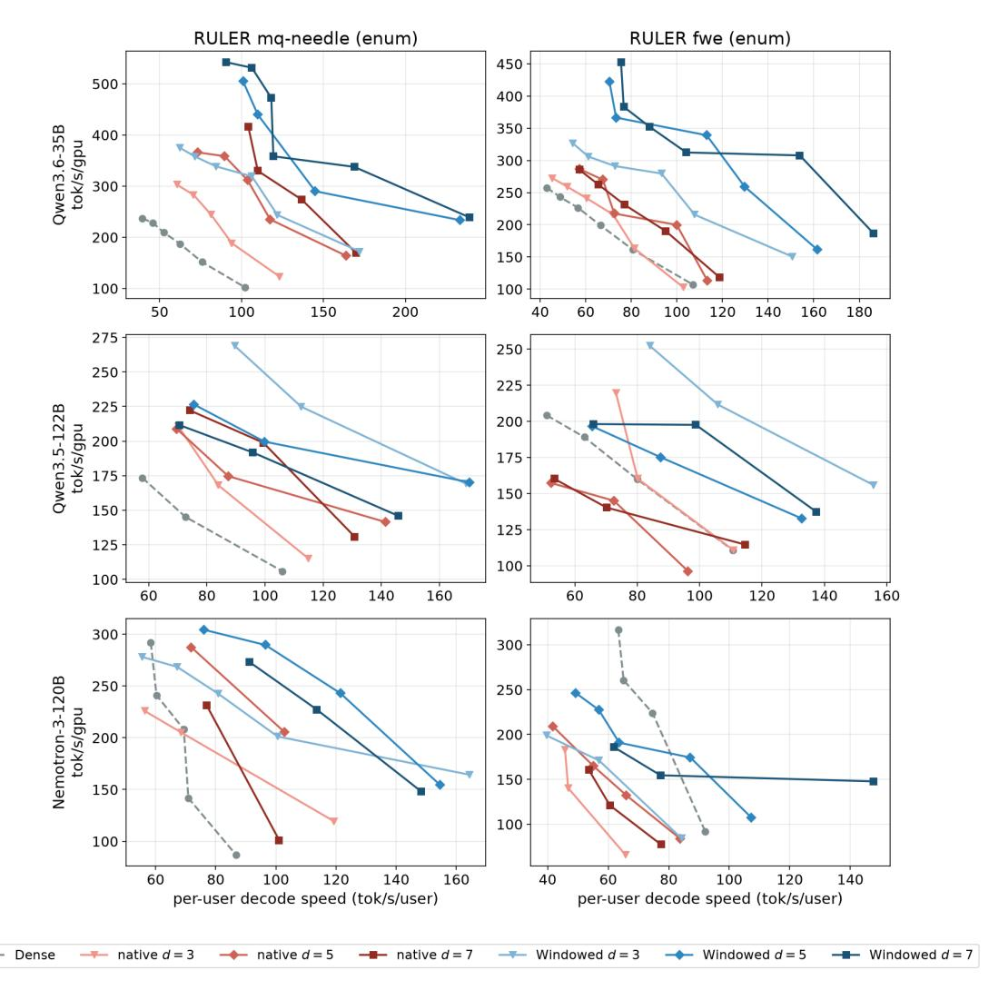
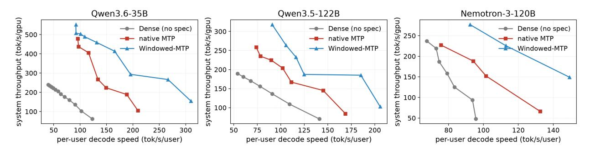

# 윈도우드-MTP: 100만 토큰 컨텍스트에서 전체-컨텍스트 초안-KV 세금 제거 (Windowed-MTP: Removing the Full-Context Draft-KV Tax at Million-Token Context)

- 원제: Windowed-MTP: Removing the Full-Context Draft-KV Tax at Million-Token Context
- 원문: [https://arxiv.org/abs/2607.21535](https://arxiv.org/abs/2607.21535)
- PDF: [https://arxiv.org/pdf/2607.21535v1](https://arxiv.org/pdf/2607.21535v1)
- arXiv ID: `2607.21535`

---

# 윈도우드-MTP: 100만 토큰 컨텍스트에서 전체-컨텍스트 초안-KV 세금 제거 (Windowed-MTP: Removing the Full-Context Draft-KV Tax at Million-Token Context)

Alagappan Valliappan NVIDIA avalliappan@nvidia.com

#### 초록 (Abstract)

스펙큘러 디코딩은 저렴한 초안이 토큰을 제안하고, 타깃이 병렬로 검증함으로써 자기 회귀 생성의 속도를 가속화합니다. 최첨단 모델들은 점점 더 내장형 Multi-Token-Prediction (MTP /NEXTN) 초안 헤드를 탑재하며, 초안이 무시할 수 있을 만큼 저렴하다는 가정이 지배적입니다. 하지만 100만 토큰 컨텍스트에서는 이 가정이 깨집니다. 일반적으로 MTP 초안 헤드는 매 초안 단계마다 전체 KV 캐시에서 완전 주의를 수행하므로, 그 읽기 비용은 컨텍스트에 따라 선형적으로 증가하며 초안 비용을 지배하게 됩니다—이는 스펙큘레이션이 가장 가치 있는 장기 컨텍스트 영역에서 정확히 그렇습니다. 이 효과는 초안 길이와 함께 복합적으로 작용합니다—어려운, 낮은 수용률 워크로드에서는 깊은 네이티브 MTP 초안이 순수하게 부정적이 되어 스펙큘레이션이 전혀 없을 때보다 느려질 수 있으며, 하이브리드/선형 주의 대상으로의 전환은 이를 더욱 부각시킵니다: 저렴한 검증은 초안의 완전 주의 읽기를 노출시키므로, 장기 컨텍스트에서는 각 디코드 단계의 상당하고 더 이상 무시할 수 없는 비중이 됩니다. 우리는 StreamingLLM 스타일의 슬라이딩 윈도우와 주의 싱크를 초안의 주의에만 적용합니다 (Windowed-MTP), 완전 주의 검증은 그대로 둡니다. 이 방식은 훈련이 필요 없으며, 바로 적용 가능하고, 본질적으로 무손실입니다: 완전 주의 타깃은 여전히 모든 수용된 토큰을 결정하므로, 윈도우링은 제안되는 토큰만 바꾸고 수용되는 토큰은 바꾸지 않습니다. 이 방식은 초안의 KV 작업 세트를 상수로 제한하여 1M에서 초안의 읽기 경로에서 약 99%의 KV 항목을 드롭합니다. SGLang [&#91;Zheng et al., 2024&#93;](#page-18-0)에서 단일 GPU에서 1M 컨텍스트를 사용한 세 가지 아키텍처 패밀리(Qwen GDN-MoE 35B/122B 및 Mamba2 하이브리드 NoPE 120B)에서 MTP 초안을 윈도우링하면, 배송된 네이티브 MTP 초안 대비 디코드 단계당 비용(한 번의 스펙큘러 반복: γ 초안 전방 + 검증)을 +28%에서 +44%까지 절감합니다—입력에 독립적인 마진으로, 컨텍스트 길이가 늘어날수록 확대됩니다. 토큰당 지연은 이 디코드 단계당 비용을 수용 길이로 나눈 값이므로, 수용률이 일치할 때 전체 디코드 지연은 같은 비율로 개선되며, 윈도우링이 수용률을 높이는 워크로드에서는 더 크게 개선됩니다—타깃의 검증된 출력 분포(정확한 산술에서 greedy-exact)를 보존하면서 ([§4)](#page-4-0)). 마지막으로, 윈도우드 초안은 KV 캐시 중 W+sink를 제외한 모든 항목을 읽지 않으므로, 그 캐시(1M에서 총 KV의 7.7–11%로 측정됨)는 수용률이나 품질에 비용을 들이지 않고 컴팩트 링 버퍼를 통해 회수됩니다—왜냐하면 윈도우드 초안이 실제로 읽지 않는 항목만 드롭하기 때문입니다.

## 1 서론 (Introduction)

스펙큘러 디코딩(SD) [&#91;Leviathan et al., 2023,](#page-17-0) [Chen et al., 2023a&#93;](#page-16-0)은 자기 회귀 LLM의 토큰당 지연을 줄이기 위한 표준 도구입니다: 초안이 γ개의 후보 토큰을 제안하고, 타깃이 한 번의 배치 전방에서 이를 검증하여 가장 긴 올바른 접두사를 수용합니다. 타깃이 수용 여부를 결정하므로 SD는 정확합니다—출력 분포는 표준 디코딩과 동일합니다. 최근 최첨단 모델들은 초안을 가볍게 Multi-Token-Prediction(MTP) 또는 NEXTN 헤드 [&#91;DeepSeek-AI, 2024,](#page-16-1) [Qwen Team, 2025&#93;](#page-17-1)로 타깃에 통합하므로 별도의 초안 모델이 필요 없습니다.

우리는 SD의 표준 비용 모델이 초안(draft)을 무료로 취급한다는 사실을 보인다—짧은 컨텍스트에서는 초안 전방이 목표 검증(target verify)의 작은 비율에 해당하므로 사실이지만, 긴 컨텍스트에서는 실패하며 모델 설계 트렌드가 이 실패를 가중시킨다. 프론티어 모델들은 점점 목표를 하이브리드 또는 선형 어텐션(hybrid or linear attention) (GDN, Mamba2)으로 옮겨 긴 컨텍스트 KV 비용을 억제하고 검증 단계의 크기를 줄이고 있다; 그러나 그들의 내장 MTP/NEXTN 초안 헤드는 여전히 전체(softmax/GQA) 어텐션을 사용한다. 각 초안 전방은 KV 캐시의 O(S)를 읽으므로, 검증이 더 저렴해질수록 초안이 각 디코드 단계에서 차지하는 비율이 균등 분배되는 대신 드러나며, S = 10<sup>6</sup>에서 초안 단계 tdraft를 지배한다. 그 결과는 긴 컨텍스트 초안 세금(long‑context draft tax)으로, 이는 SD가 제공하려는 속도 향상을 침식하고—하드, 낮은 수락률 워크로드에서는 반전시킨다: d=7 운영 포인트에서 배송된 네이티브 초안은 하드 1M 작업에서 no‑speculation dense baseline보다 낮아진다 (Qwen‑122B 코드 QA에서 0.80×, 하이브리드 Nemotron에서 0.97×; Table [13)](#page-24-0)), 그리고 더 깊은 d=9 초안은 이를 구제하지 못한다 ([§6)](#page-8-0)).

우리의 관찰은 단순하다: 초안은 충분히 좋은 추측가일 뿐이며, 좋은 지역 추측은 전체 백만 토큰 히스토리를 필요로 하지 않는다. 따라서 우리는 초안의 어텐션에만 StreamingLLM 스타일 슬라이딩 윈도우와 어텐션 싱크([Xiao et al., 2024])를 적용하고, 검증은 전체 어텐션으로 둔다. 이는 초안의 KV 작업 세트를 W + sink 토큰(4K 윈도우는 1M의 0.4%)으로 제한하며, 구조상 무손실이다: 전체 어텐션 대상은 여전히 모든 수락된 토큰을 결정하므로, 윈도우링은 제안되는 토큰만 바꾸고 수락되는 토큰은 바꾸지 않는다—훈련, 추가 파라미터, 또는 디스틸레이션 없이.

#### 기여 (Contributions).

- 1. 우리는 내장된 MTP 헤드에서 장기 컨텍스트 드래프트-어텐션 세금을 식별하고 정량화한다—1M(γ=6)에서 드래프트 단계만으로도 기본 검증 위에 +92%에서 +138%를 추가하여 디코드 단계를 거의 두 배로 만든다—그리고 깊은 네이티브 드래프트의 속도 향상이 균형으로 붕괴하거나 밀집보다 순속도 저하로 전환되는 시점을 예측하는 디코드 단계별 지연 모델을 제시한다 ([§3)](#page-3-0)).

- 2. 우리는 드래프트 어텐션에 단순하고 훈련이 필요 없는 윈도우+싱크를 적용한다 (Windowed-MTP[1](#page-1-0) )—드래프트의 드롭인, 무손실 윈도우링: 무손실은 전체 어텐션 대상이 여전히 모든 수락된 토큰을 검증하기 때문이며, 모든 셀 그리디 출력 차이로 검증자의 기존 bf16 비결정성을 넘어선 발산이 없음을 확인하였다 ([§4)](#page-4-0)).

- 3. 우리는 속도 향상이 세 가지 아키텍처 패밀리 전반에 걸쳐 일반화되고 컨텍스트와 함께 증가함을 보여준다: 입력 불변의 +28%에서 +44%의 이득/네이티브 감소가 1M(B=1)에서 디코드 단계당 비용(한 번의 투기적 반복: γ 드래프트 포워드와 검증)에서 나타나며, 그 크기는 드래프트 비용의 윈도우 가능한 비율을 추적한다 ([§6)](#page-8-0)).

- 4. 우리는 수용에 대한 기전적 설명을 제공한다: 윈도우 크기 투여-반응, 위치별 조건부 수용 분해, 그리고 직접 실행 중 결정 불변성 탐지로 윈도우링이 수용 프로파일을 보존함을 보여준다—드래프트의 top-1 제안이 86–94%의 시간 동안 변하지 않으며, 전체 어텐션 수용을 신뢰 구간 내에서 추적한다. 잔여 차이는 작고 2차이며 입력 및 깊이에 따라 부호가 달라지지만, 항상 단계별 속도 향상에 의해 상쇄되어 엔드 투 엔드 결과가 회귀하지 않는다 ([§5)](#page-6-0)).

- 5. 우리는 드래프트 KV 풀이 세 모델에서 1M에서 총 KV의 7.7–11%로 측정됨을 보여준다; 윈도우링은 W+sink를 제외한 나머지를 비활성화하고, 품질이나 속도 비용 없이 압축된 링 버퍼로 재활용한다 ([§6)](#page-8-0)).

<span id="page-1-0"></span><sup>1</sup>재현 패키지 (SGLang 패치, 실행/구성 스크립트, 시드 입력): [https://github.com/](https://github.com/avalliappan-nvidia/windowed-mtp-b200) [avalliappan-nvidia/windowed-mtp-b200](https://github.com/avalliappan-nvidia/windowed-mtp-b200).

## 2 배경 및 관련 연구 (Background and related work)

스펙추얼 디코딩과 MTP 헤드. SD [&#91;Leviathan et al., 2023,](#page-17-0) [Chen et al., 2023a&#93;](#page-16-0)는 초안과 대상 검증기를 매칭한다. 초안 설계는 별도의 소형 모델 [&#91;Leviathan et al.,](#page-17-0) [2023&#93;](#page-17-0)에서부터 대상 자체에 추가 예측 헤드를 갖는 자체 초안 방식 [&#91;Cai et al., 2024&#93;](#page-16-2)까지, 그리고 특징 수준 자가 회귀(EAGLE) [&#91;Li et al., 2024a,](#page-17-3)[b&#93;](#page-17-4)까지 다양하다. DeepSeek-V3 [&#91;DeepSeek-AI,](#page-16-1) [2024&#93;](#page-16-1) 및 Qwen3 [&#91;Qwen Team, 2025&#93;](#page-17-1)와 같은 최첨단 모델은 내장된 MTP / NEXTN 헤드를 제공하며, 우리는 여기서 이를 대상으로 한다. 수용 길이 AL(검증 단계당 평균 토큰 수)은 속도 향상을 결정하며, 이전 연구는 더 나은 초안 정렬 또는 트리 초안을 통해 AL을 최적화했다 [&#91;Li et al., 2024b&#93;](#page-17-4). 우리의 연구는 직교적이다: 우리는 검증기를 건드리지 않고 장기 컨텍스트에서 초안의 비용을 줄인다.

장기 컨텍스트 SD. MagicDec [&#91;Chen et al., 2024&#93;](#page-16-3)은 장기 컨텍스트와 대규모 배치에서 SD 병목이 KV 로딩으로 이동한다는 것을 관찰하고, 지연–처리량 tradeoff를 깨기 위해 고정 크기 KV 초안을 사용한다. 우리는 그 진단을 공유하지만, 배송 모델의 내장 MTP 초안 헤드에 초점을 맞추고, (대상이 모든 수용 토큰을 검증한다는) 무손실 논거를 추가하며, 수용이 보존되거나 교환되는 시점을 기계적 분석한다. 우리와 가장 가까운 연구로는 LongSpec [&#91;Yang et al., 2026&#93;](#page-18-1)과 SpecExtend [&#91;Cha et al., 2026&#93;](#page-16-4)이 장기 컨텍스트 SD를 가속화한다: LongSpec은 고정 크기 KV 캐시와 하이브리드 트리 어텐션(밀집 대상, ≤64K)을 갖는 전용 초안을 훈련시키고, SpecExtend는 훈련이 필요 없고 바로 적용 가능하지만 별도의 초안 모델과 교차 모델 검색 KV 정책에 의존하며, 우리가 목표로 하는 1M보다 짧은 장기 컨텍스트 환경에서 평가된다. 우리는 세 가지 축에서 차이를 둔다: (i) 별도 또는 훈련된 초안 대신 이미 배송된 MTP/NEXTN 헤드의 읽기를 윈도우링한다; (ii) 1M 토큰에서 하이브리드 어텐션 모델을 대상으로 하며, 저렴한 검증기가 초안의 O(S) 읽기를 노출한다; (iii) 단일 요청 지연 하네스 대신 연속 배치, 페이지/라디스 KV, CUDA-graph 캡처를 갖춘 생산 서비스 프레임워크 내에서 비용을 특성화한다.

스트리밍 어텐션과 컨텍스트 확장. StreamingLLM [&#91;Xiao et al., 2024&#93;](#page-17-2)는 몇 개의 초기 'sink' 토큰과 최근 윈도우를 유지함으로써 제한된 어텐션에서도 유창성을 보존한다는 것을 보여준다. 우리는 이를 초안 전용 근사치로 재활용한다. SpecExtend [&#91;Cha et al., 2026&#93;](#page-16-4)는 StreamingLLM 스타일 윈도우링이 바늘 검색에서 어려움을 겪는다고 주장하지만, 이는 바늘을 자체적으로 검색해야 하는 별도의 소형 초안에 관한 것이다; 우리의 윈도우형 초안은 모든 토큰이 대상 검증을 거치는 제안 헤드이므로, 멀리 놓인 토큰을 놓쳐도 최대 비용은 거절(낮은 AL)이며, 잘못된 답변은 발생하지 않는다. 1M 장기 컨텍스트 디코드에서 내장 MTP 헤드의 경우, 수용 손실이 제한적이며([§5)](#page-6-0) 시스템 이득이 우세함을 발견한다. 동시 연구 [&#91;Eldenk et al., 2026&#93;](#page-17-5)는 초안 작성자의 '어텐션 드리프트'가 최근 토큰( EAGLE-3 및 MTP 헤드)으로 향한다는 것을 독립적으로 보고하고, 훈련 시점 후 정규화 수정을 동반해 평가 도구로서 초안을 ≤32K 윈도우링한다; 우리는 윈도우링을 훈련이 필요 없는 1M 서비스 기술로 만들고 초안-KV 회수 기능을 추가한다. RoPE [&#91;Su et al., 2024&#93;](#page-17-6)와 위치 보간 [&#91;Chen et al., 2023b&#93;](#page-16-5) 및 YaRN [&#91;Peng et al., 2023&#93;](#page-17-7)은 우리가 연구하는 백만 토큰 컨텍스트를 가능하게 한다; 세금과 그 수정을 RoPE에 국한되지 않음을 보여주기 위해, 우리는 위치 임베딩을 사용하지 않는 어텐션을 갖는 Mamba2-hybrid [&#91;Gu and Dao, 2023,](#page-17-8) [Dao and Gu, 2024&#93;](#page-16-6)도 평가한다.

Serving systems. 우리는 paged-KV 서빙 [&#91;Kwon et al., 2023&#93;](#page-17-9)을 기반으로 하고 SGLang [&#91;Zheng et al., 2024&#93;](#page-18-0)에서 Windowed-MTP를 구현한다. 윈도우는 초안의 요청당 paged 블록 테이블을 sink + 최근 블록으로 축소함으로써 실현되며, 이는 FlashInfer와 Triton draft 백엔드 모두에서 실행되는 새로운 커널이 필요 없는 그래프-안전한 변경이다. SGLang의 기존 –speculative-draft-window-size 플래그 [&#91;SGLang contributors, 2026&#93;](#page-17-10)는 두 개의 초안 경로—DFLASH [&#91;Chen](#page-16-7) [et al., 2026&#93;](#page-16-7) 별도로 훈련된 drafter와 Llama-family EAGLE-3 [&#91;Li et al., 2025&#93;](#page-17-11) 초안—에만 연결되어 있다

우리가 목표로 하는 내장 MTP/NEXTN 헤드에 대해 이는 no-op이며; 또한 어텐션 싱크와 KV 회수 기능이 없으므로 우리 설정에 재사용될 수 없다. Windowed-MTP는 대신 내장 MTP/NEXTN(및 EAGLE 스타일) 헤드를 캐노니컬 draft-decode 인덱스 빌더에서 일반적으로 윈도우링하고, 그 윈도우링과 함께 StreamingLLM 싱크와 물리적 KV 회수를 추가한다: 사라진 draft KV는 $O(n_{\text{sink}}+W+d)$ 링 버퍼에 압축되어 HBM을 추가 동시성에 활용한다 (§6). (현재 compact-ring 회수는 인덱스 재매핑을 위해 Triton draft 백엔드를 필요로 한다)

### <span id="page-3-0"></span>3 장기 컨텍스트 초안-어텐션 과세

**단계별 지연 모델.** 스펙티컬 디코드 단계는 $\gamma$개의 초안 전방 패스를 실행하며, $\gamma$개의 초안 토큰 체인을 제안한다; 타깃은 한 번의 전방에서 체인을 검증하고 보너스 토큰 하나를 추가한다. 따라서 단계는 1개에서 $\gamma+1$개 토큰을 방출한다—단계당 이론적 최대는 $\gamma+1$이다. 단계당 평균 방출 토큰 수는 수락 길이 $AL \in [1, \gamma+1]$이다. 우리는 이 최대값 $d \equiv \gamma+1$(SGLang의 num_draft_tokens)으로 실행을 인덱싱하고, $d \in \{3,5,7\}$를 스윕한다, 즉 $\gamma \in \{2,4,6\}$개의 초안 전방 패스를 사용한다 (App. B의 수락-프리 지연-맞춤 분해는 post-cliff 선형 영역에 제한된 더 세밀한 스윕을 사용한다, 그 이유는 그곳에 명시되어 있다).<sup>2</sup>

<span id="page-3-4"></span>

$$step = t_{verify} + t_{draft}, \quad t_{draft} = t_{draft}^{ctx} + \gamma t_{draft}^{fwd}, \quad TPOT = \frac{step}{AL}, \quad \gamma = d - 1.$$

(1)

A decode step splits into two measurable phases (validated kernel-by-kernel in App. B, where they sum exactly to the step): a part  $t_{\text{verify}}$  that is identical across native and windowed, and the draft phase  $t_{\text{draft}}$ , the only lever windowing touches.  $t_{\text{verify}} \equiv t_{\text{verify}}^{\text{base}} + t_{\text{verify}}^{\text{ovh}}$  bundles the target's verify and the fixed speculative bookkeeping; windowing leaves both untouched. The draft phase in turn splits into a once-per-decode-step  $\mathcal{O}(S)$  KV-index/context build  $t_{\text{draft}}^{\text{ctx}}$  (the draft rebuilds and re-reads the cache) plus the  $\gamma$  per-token forwards  $\gamma t_{\text{draft}}^{\text{fwd}}$ . The draft's  $\mathcal{O}(S)$  context cost thus enters in both sub-terms—the index/extend build  $t_{\rm draft}^{\rm ctx}$ , and again inside each forward whose softmax next-n head re-reads the cache, so  $t_{\rm draft}^{\rm fwd}$  scales with S too. All of  $t_{\rm verify}$ ,  $t_{\rm draft}^{\rm ctx}$ ,  $t_{\rm draft}^{\rm fwd}$  are acceptance-independent at fixed context: forward compute is content-free.<sup>3</sup> Windowing bounds the draft's KV working set to W+sink, shrinking both  $\mathcal{O}(S)$  terms ( $t_{\mathrm{draft}}^{\mathrm{ctx}}$  and the per-forward part of  $t_{\mathrm{draft}}^{\mathrm{fwd}}$ ) to  $\mathcal{O}(W)$ ; the entire per-step saving is therefore in  $t_{\text{draft}}$ , with  $t_{\text{verify}}$  unchanged. That saving has two substantial components (App. B). One is the once-per-step  $\mathcal{O}(S)$  KV-index/context build  $t_{\text{draft}}^{\text{ctx}}$  ( $\approx 3.5 \, \text{ms}$  on Qwen-35B, well above the  $\approx 0.3$  ms bandwidth floor for the equivalent 1M read on a B200), which windowing essentially eliminates (>99%); this term is implementation-dependent (a leaner runtime would shrink the native cost too), so we deliberately do not rest the technique on it. The other is the  $\gamma$  per-forward draft attention, which windowing cuts from  $\mathcal{O}(S)$  to  $\mathcal{O}(W)$ : a durable, hardware-level reduction that scales with  $\gamma$  and context and survives any runtime—here the latency fit's per-forward slope drops by 22-40% across the three models (Qwen-35B  $1.19\rightarrow0.71\,\mathrm{ms/forward}$ ). We keep both parts of the draft-phase reduction  $\Delta$  explicit—the once-per-step  $t_{\rm draft}^{\rm ctx}$  term and the durable  $\gamma$ -scaling  $t_{\rm draft}^{\rm fwd}$  term:

<span id="page-3-3"></span>

$$step^{win} = step^{native} - \Delta, \qquad \Delta = \Delta t_{draft} = \Delta t_{draft}^{ctx} + \gamma \Delta t_{draft}^{fwd}.$$

(2)

일치하는 d에서 순수 윈도우 대 네이티브 비율은 다음과 같습니다

<span id="page-3-5"></span>

$$\frac{\text{win}}{\text{native}} = \frac{\text{step}^{\text{native}}}{\text{step}^{\text{win}}} \cdot \frac{\text{AL}^{\text{win}}}{\text{AL}^{\text{native}}}.$$

(3)

<span id="page-3-1"></span> $<sup>^2\</sup>gamma$  는 Leviathan et al. [2023]에서 정의한 초안 길이이며, 초안 전방 패스(동등하게 제안된 토큰)의 수입니다. 우리는 $d=\gamma+1$ 로 보고합니다, 왜냐하면 이는 AL의 상한이며 엔진의 num_draft_tokens knob과 일치하기 때문입니다.

<span id="page-3-2"></span> $<sup>^{3}</sup>$  대상 검증은 또한 S와 함께 증가하지만, 윈도우링은 대상 경로를 그대로 두므로 여기서는 레버가 아닙니다.

첫 번째 요인은 *입력 불변* (전방 계산은 내용이 없습니다); 두 번째는 작업 부하에 따라 달라지는 수용성 변화 (§5)입니다.

측정된 비용. Table 1은 1M 컨텍스트, B=1에서의 per-decode-step 비용을 보고한다 (step = $T_{\text{iter}}$ = accept_len/throughput; Appendix B 참조). $t_{\text{verify}}$가 native와 windowed에서 동일하기 때문에 전체 절감은 draft phase의 collapse, $\Delta = \Delta t_{\text{draft}}$에 있다. 이는 7.3–8.1 ms이며, native에서는 이 draft phase(고정된 speculative bookkeeping 포함)가 bare full-attention verify 위에 +92 %에서 +138 %를 추가해 decode step을 거의 두 배로 만든다. Windowed-MTP는 이를 +45 %에서 +72 %로 줄인다 (App. B). acceptance-free fit인 step = $\gamma t_{\text{draft}}^{\text{fwd}} + (t_{\text{verify}} + t_{\text{draft}}^{\text{ctx}})$는 $\Delta t_{\text{draft}}$를 두 개의 sub-term으로 분해한다 (App. B; Qwen-122B/Nemotron에서는 post-cliff regime $\gamma \in [4,7]$를 fit해 d=5에서 verify-kernel tiling step을 피한다). 두 sub-term은 $\mathcal{O}(S)$이며 컨텍스트와 함께 증가한다: index build $t_{\text{draft}}^{\text{ctx}}$와 durable, hardware-level per-forward term $t_{\text{draft}}^{\text{fwd}}$ ($\approx$ 1.9–2.9 ms 여기서), 후자가 hybrid/linear-attention targets가 verification을 저렴하게 만들 때 가장 중요한 lever이다 (전체 $t_{\text{draft}}^{\text{ctx}}/t_{\text{draft}}^{\text{fwd}}$ split은 App. B에 있다). 결과적으로 matched-acceptance ratio step<sup>native</sup>/step<sup>win</sup>는 Nemotron에서 +28 %에서 Qwen-35B에서 +44 %이며, MoE-FFN Qwen drafts에서 가장 크다.

<span id="page-4-1"></span>표 1: d=7에서의 Per-step decode 비용 (γ=6), 1M, B=1 (bf16 KV, single B200) on niah_multiquery_enum; 입력 불변 일치된 컨텍스트 (콘텐츠 확산 ≤ 7%). Since  $t_{\text{verify}}$  is identical across native and windowed, the saving  $\Delta=\text{step}^{\text{nat}}-\text{step}^{\text{win}}=\Delta t_{\text{draft}}$  (acceptance-free fit, App. B; Eq. 2); last column is the matched-acceptance win/nat ratio. (Table 1: Per-step decode cost at d=7 (γ=6), 1M, B=1 (bf16 KV, single B200) on niah_multiquery_enum; input-invariant at matched context (content spread ≤ 7%). Since  $t_{\text{verify}}$  is identical across native and windowed, the saving  $\Delta=\text{step}^{\text{nat}}-\text{step}^{\text{win}}=\Delta t_{\text{draft}}$  (acceptance-free fit, App. B; Eq. 2); last column is the matched-acceptance win/nat ratio.)

| 모델 | 단계 <sup>nat</sup> (ms) | 단계 <sup>win</sup> (ms) | $\Delta \text{ (ms)}$ | win/nat |
|-----------------------------------------------------------------------------|--------------------------|--------------------------|-----------------------|----------------------------------|
| Qwen3.6-35B (GDN-MoE)<br>Qwen3.5-122B (GDN-MoE)<br>Nemotron-3-120B (Mamba2) | 26.4<br>34.5<br>33.1 | 18.3<br>26.5<br>25.8 | 8.0 | $^{+44.3\%}_{+30.2\%}_{+28.3\%}$ |

Why native-MTP's speedup collapses at long context. This is specifically a native-MTP failure: because its draft reads the full context, its draft-phase cost  $t_{\rm draft}$  grows with S (the  $\mathcal{O}(S)$  term  $t_{\rm draft}^{\rm ctx}$  of Eq. 1) and deeper drafts add more forwards, while AL is capped by task difficulty. On hard tasks AL saturates well below d, so the numerator of Eq. 1 keeps rising with d and S while the denominator does not—eventually TPOT climbs back to, and past, the dense baseline, erasing and even reversing the speculative speedup. A framework artifact compounds this on the large models: a verify-kernel tiling step at d=5 (App. B) adds a one-time  $\approx 6$  ms to  $t_{\rm verify}$ , so native depths beyond d=4 pay it for no acceptance gain once AL has plateaued. We observe the native draft dropping below dense already at the d=7 operating point on the hardest inputs (to  $0.80\times$  on Qwen-122B code QA and  $0.97\times$  on Nemotron fwe; Table 13), and going deeper does not rescue it (§6). This is also why the tax is intrinsically long-context and largely invisible to prior short-context work: a single draft layer's KV is only  $\approx 1-2$  KB/token (2 KB for the Qwen drafts, 1 KB for Nemotron), so the draft's  $\gamma$  repeated full-KV reads per decode step have a working set of just  $\approx 8-64$  MB at 8-32K context—resident in a  $\sim 50$  MB-class L2, hence effectively free re-reads—whereas at 1M the  $\approx 1-2$  GB draft KV cannot cache at any level, exposing  $\gamma \times$  HBM reads every step.

#### <span id="page-4-0"></span>4 방법: Windowed-MTP

**Mechanism.** 각 초안 디코드 단계에서 우리는 초안 어텐션에 축소된 키 세트: 첫 번째 $n_{\text{sink}}$ 토큰(주의 싱크)과 가장 최근 W 토큰을 제시합니다. 페이지드-KV 서빙 시스템에서는 초안의 요청당 블록 테이블을 [sink blocks] $\parallel$ [recent W blocks]로 축소함으로써 구현됩니다. with

해당 시퀀스 길이와 추가적인 인과 윈도우 마스크를 비활성화합니다 (축소된 테이블이 키 세트입니다).  
RoPE가 캐시된 키에 내장되어 있기 때문에, 축소된 테이블에서 블록의 절대 위치가 점수를 변경하지 않습니다.  
타깃 검증은 그대로 유지되며 전체 컨텍스트에 대해 주의를 기울입니다.  
새로운 커널, 파라미터, 또는 훈련은 필요하지 않으며, 변경 사항은 초안의 KV-인덱스 구성에서 몇 줄만 수정하면 되고, 그래프 안전합니다.



그림 1: 윈도우링 전후의 드래프트 어텐션. 네이티브 MTP 드래프트는 전체, 증가하는 키 세트를 주시합니다 (따라서 드래프트 단계당 비용과 KV 풋프린트가 컨텍스트 t에 따라 확장됩니다). 윈도우드-MTP는 드래프트를 고정된 nsink sink 토큰과 가장 최근 W 키에 제한합니다; 중간 키는 드래프트에 의해 읽히지 않으며, 드래프트 KV를 nsink+W+d 링 버퍼에 물리적으로 저장함으로써 회수됩니다 (이 예산을 더 큰 배치/타깃 KV에 할당).

손실 없음. 목표가 전체 컨텍스트에서 다음 토큰 분포 \(p(\cdot \mid x<t)\) 를 유도하도록 하자. SD는 표준 거절/탐욕 규칙을 \(p\) 하에서 평가하여 제안된 토큰 \(x\tilde{<sup>t</sup>}\) 를 수락한다; 거절된 위치는 \(p\) 에서 다시 샘플링된다. 초안 분포 \(q\) 는 제안되는 토큰과 수락 확률에 영향을 미치지만, 수락되거나 재샘플링된 모든 토큰은 목표의 \(p\) 에서 추출된다. \(q\) (전체 주의 초안)를 \(q_{\text{win}}\) (윈도우 초안) 으로 교체하면 출력 분포는 정확히 \(p\) 가 된다; AL(따라서 속도)만 변한다. 탐욕적 디코딩과 정확한 산술 하에서 이는 비트 정확한 진술이다. 실제로 bf16 SD는 밀집 모델에 대해 비트 정확하지 않다: 하나의 배치 전방에서 \(d+1\) 토큰을 검증하면 부동소수점 축소가 재정렬되어 가끔 argmax 근접 동점이 뒤집히고 이어서 복합된다. 핵심적으로 이 변동은 윈도우링이 아니라 검증 배치의 특성이다—네이티브와 윈도우 초안 모두 동일하게 영향을 받으며, 두 개의 네이티브 초안 깊이를 구분하는 것과 같다. 따라서 올바른 실험적 검증은 윈도우 대 네이티브이며, 이는 통과한다: 실행하는 모든 \((\text{모델} \times \text{입력})\) 셀과 \(d \in \{3, 5, 7\}\) \([§6)](#page-8-0)\)에서 윈도우와 네이티브 초안은 동일한 검증-노이즈 범위 안에 있다—그들의 탐욕적 출력이 다를 때는 배치-검증 축소 순서 노이즈가 네이티브와 밀집(또는 한 네이티브 깊이와 다른 깊이)를 동일하게 구분한다; 윈도우 효과는 아니다. 윈도우링은 이 검증 노이즈를 넘어선 발산을 추가하지 않는다.

메모리. 드래프트의 KV 풀은 W + nsink 링 버퍼로 제한될 수 있어, 그렇지 않으면 전체 길이의 드래프트 캐시가 차지하던 나머지를 해제한다. 세 모델 전반에 걸쳐 이 드래프트 풀은 구조적으로 고정된 전체 KV의 7.7–11.1%이며, 품질이나 속도에 비용이 들지 않는다. 회수된 예산은 바로 서비스 여유로 전환된다—같은 메모리에서 추가 정착 요청을 처리하거나 더 깊은 드래프트를 위한 공간을 마련한다. 구체적으로, 단일 B200에서 1M을 실행할 때 링 버퍼는 Qwen-35B(d=7)가 6.28M-토큰 KV 풀에서 Beff=6개의 동시 요청을 처리하도록 허용한다. 이는 동일한 메모리에서 네이티브 MTP의 전체 길이 드래프트가 적합하지 않으며—이 배치에서 윈도우링이 이를 제공할 때 네이티브 OOM이 발생한다. 배치 전반에 걸친 전체 처리량–지연 트레이드오프는 Fig. [4](#page-11-0) ([§6)](#page-8-0)에 있다.

### <span id="page-6-0"></span>5 왜 윈도우링이 수락률을 보존하는가

Eq. [3](#page-3-5)는 속도 향상이 두 가지 요인으로 구성되어 있음을 보여준다: 비용 요인(stepnative/stepwin > 1, 항상 유리함)과 수락 요인(ALwin/ALnative). 단순한 기대는 윈도우링이 수락을 잃을 수밖에 없다는 것(초안이 덜 보게 된다). 실제로는 그렇지 않다: 수락이 보존되며, 일부 입력에서는 깊이에서 오히려 상승한다.

용량-반응. d=7(γ=6 드래프트 포워드)를 고정하고 niah_multiquery_enum 1M(Qwen3.6-35B, 동일한 단일 빌드)에서 드래프트 윈도우 W+sink를 스윕하면, 수용률은 ∼4K 운영 윈도우에서 최고점을 찍으며, 이는 전체 컨텍스트 드래프트보다 높고, 토큰당 지연 시간은 그 지점에서 최소화된다. 윈도우가 그보다 커질 때는 전체 컨텍스트 비용으로 다시 상승한다:

| 창 | 1K | 2K | 4K | 8K | 네이티브 (1M) |
|-----------|------|------|------|------|-------------|
| AL | 3.79 | 4.74 | 4.74 | 4.16 | 4.49 |
| TPOT (ms) | 4.89 | 3.85 | 3.85 | 4.50 | 6.04 |

The ∼4K 히어로 윈도우는 공동 최적점에 위치합니다: 전체 컨텍스트 초안보다 수용률을 높이고(4.49 → 4.74) 토큰당 지연 시간을 1.57배(6.04 → 3.85 ms) 단축합니다. (2K와 4K 포인트는 통계적으로 동등합니다: 1M에서 초안 윈도우는 목표의 전체 주의 검증에 비해 무시할 수 있는 비율이므로, 2K에서 4K로 두 배로 늘려도 토큰당 지연 시간은 마이크로초 이하로 이동합니다.) 양쪽 방향으로 벗어나면 성능이 나빠집니다—1K로 축소하면 검색에 너무 제한적이며 수용률이 감소합니다(4.74 → 3.79), 반대로 윈도우를 전체 컨텍스트 방향으로 다시 늘리면 초안의 O(S) 컨텍스트 세금을 지불하지만 정확도 향상 없이(네이티브는 느리고, 여기서는 약간 덜 정확함; 비단조로운 8K 포인트는 윈도우 초안에 대해 측정한 실행 간 수용률 변동 범위 내에 있으며 추세가 아님). 싱크 크기는 64(StreamingLLM 표준)으로 유지됩니다. 이 윈도우 크기 스윕은 하나의 입력에 대해 수행되었지만 패턴은 일반적입니다. 전체 d=7 스윕(표 [13])에서 윈도우링은 모든 (모델, 입력) 셀에서 네이티브 초안보다 빠릅니다(win/nat ≥ 1.04×); 수용률 인자 ALwin/ALnative는 입력 및 모델에 따라 부호가 달라지는 작은 2차 항으로, 때로는 이득(예: Qwen-35B 멀티니들, 4.49 → 4.74), 때로는 교환이지만, 단계별 비용 승리를 뒤집을 만큼 충분하지 않으므로 엔드투엔드 결과는 결코 감소하지 않습니다. 아래의 위치별 분해(Fig. [2]), 주의 질량 분석(표 [12]), 그리고 직접 실행 중 결정 불변성 탐지(표 [11])는 윈도우 초안이 왜 먼 컨텍스트를 절약할 수 있는지 설명합니다: 깊이에서 수용률과 관련된 질량이 거의 없으며, 윈도우링은 초안의 top-1 제안을 86–94%의 시간 동안 변경하지 않습니다.

위치별 분해. 우리는 SGLang의 요청당 수용률 히스토그램 H[n] (정확히 n개의 초안 토큰을 수용한 검증 단계 수)를 읽고, 초안 위치 j에서의 조건부 수용률을 도출합니다,

$$\alpha_{j} = \text{Pr}[\text{accept } j \mid \text{reached } j] = \frac{\sum_{n \geq j} H[n]}{\sum_{n \geq j-1} H[n]},$$

$$\text{AL} = 1 + \sum_{j \geq 1} \prod_{k \leq j} \alpha_{k}.$$

$$(4)$$

Figure [2](#page-7-0)은 (d=7, γ=6, 1M) 조건에서 native와 windowed drafts의 α<sup>j</sup>를 세 모델 모두에 대해 retrieval hero 입력(niah_multiquery_enum)에서 보여준다. Windowed 프로파일은 native 프로파일을 위치별로 추적하며, 거의 모든 j에서 95% Wilson 구간 내에 머무른다: α<sup>1</sup> (local prediction)은 변하지 않으며, 깊이 있는 compounding 위치들은 창이 일찍 붕괴되는 대신 함께 감소한다. 순수 수용률은 이에 따라 거의 비슷하다—Qwen-35B는 (AL 4.50→4.76, windowed α<sup>j</sup>가 6개 위치 중 4개에서 native 이상), Nemotron은 (3.73→3.54, CI 전반에 걸쳐 일치), 그리고

Qwen-122B—가장 강력한 drafter로, 전체 컨텍스트 읽기가 실제로 multi-needle retrieval에 도움이 되는—작은 회복을 보여준다 $(5.58\rightarrow4.73)$. 이는 멀리 있는 컨텍스트가 *유익한* 대신 희석이 아니라 *유익한* 작업 부하이며; 그럼에도 창은 수용률 *형태*를 보존하고 잘라내지 않으므로 작은 수용률 비용은 단계별 속도 향상(표 1)으로 여러 번 상쇄된다. 우리가 테스트한 입력(표 13) 전반에 걸쳐 잔여 수용률 변화는 작고 입력에 따라 부호가 달라지며; 창화는 체계적으로 수용률을 침식하지 않는다.

수용 효과는 깊이별 특이적이다. 그 부호가 무엇이든, 윈도우링된 것과 네이티브 사이의 수용 차이는 *깊은* 초안 위치에 한정된다. 이는 위치별 프로파일이 구체적으로 보여 주는 바다 (그림 2): $\alpha_1$ — 얕은, 지역 예측 — 은 윈도우링에 의해 변하지 않으며, 두 프로파일은 깊은, 누적되는 위치에서만(가능하다면) 분리된다. 얕은 초안(d=3, $\gamma$=2)은 오직 초기 위치만을 활용하므로 본질적으로 윈도우링에 불변이다; 그 격차—작고 부호가 입력 및 모델에 따라 달라진다—는 d가 증가하고 초안이 깊은 위치에 도달할 때만 나타난다. 이때 네이티브 초안의 먼 읽기는 (희석 맥락) 희석하거나 (유익한 검색) 실제로 도움을 준다 (부록 C). *비용* 요인(식 3)은 모든 깊이에서 유리하며, 수용 요인은 그 위에 추가되는 2차, 깊이 및 입력에 따라 달라지는 항이다.

위치별 조건부 수용  $\alpha_i$  (d=7,  $\gamma$ =6, 1M) [3/3 패널 채워짐]

<span id="page-7-0"></span>

그림 2: 위치별 조건부 수용  $\alpha_j$  (d=7,  $\gamma$ =6, 1M) 은 검색 영웅 입력(niah_multiquery_enum)에서, 네이티브(full-1M)와 윈도우링(4032+64) 대비, 세 모델(열)에서 나타난다. 윈도우링 프로파일은 거의 모든 위치에서 95% 윌슨 구간 내에서 네이티브를 추적한다:  $\alpha_1$  은 변하지 않으며 깊은 위치는 함께 감소하므로 윈도우링은 수용 형태를 붕괴시키기보다 보존한다. 순수 AL: Qwen-35B 4.50 $\rightarrow$ 4.76, Nemotron 3.73 $\rightarrow$ 3.54, Qwen-122B 5.58 $\rightarrow$ 4.73 (강력한 초안자는 멀리 있는 맥락이 유익한 검색에서 조금씩 교환한다). 오차 막대는 95% 윌슨 구간이다; 각  $\alpha_j$  은 위치 j-1에 도달한 디코드 단계에 대한 이항 비율이며(분모는 j와 함께 줄어들어 깊은 위치는 더 넓은 구간을 갖는다; Nemotron의 윈도우링 초안은 j=6에서 단계에 도달하지 않는다).

분할 함수 관점. 초안 쿼리가 로짓 $z_k$ 를 가진 키에 주의를 기울일 때, 윈도우를 넘어선 소프트맥스 질량,  $Z_{\text{far}}/Z = \sum_{k \, \text{far}} e^{z_k}/\sum_k e^{z_k}$ , 은 지역 예측이 필요로 하지 않는 맥락에 할당된 주의 예산이다. 길이 확장 RoPE 하에서 먼, 낮은 빈도 위치는 또한 가장 신뢰성이 낮다. 윈도우링은 그 질량을 제거한다. 우리는 네이티브 초안에서  $Z_{\text{far}}/Z$  를 직접 측정한다 (부록 C, 표 12): RoPE Qwen 초안에서 탈출 질량은 확산되어—많은 낮은 가중치 키에 퍼져 있다—즉 지역 예측이 필요로 하지 않는 예산과 일치하며, 윈도우링이 수용을 보존하는 것과 일관된다. 먼 질량이 대신 몇 개의 진정으로 유익한 먼 키에 집중되었다면 윈도우링에서 수용이 감소할 수 있다; 우리가 관찰한 가장 큰 효과는 Qwen-122B의 다중-니들 검색에서 작은 ( $\leq 15\%$ ) AL 교환이며, 항상 비용 이득에 의해 상쇄된다. 우리는 인과 방향을 해석으로 취급한다—제어된 먼-맥락 내용 교환은 실제 희석과 위치 확장 손상을 더 분리할 것이며, 이는 향후 연구로 남겨둔다.

#### <span id="page-8-0"></span>6 실험

설정. 명시되지 않는 한, 우리는 단일 NVIDIA B200 GPU(텐서-병렬 정도 1)에서 bf16 KV를 사용하여 SGLang [Zheng et al., 2024]에서 평가한다. 내장된 MTP/NEXTN 사전 추정 디코딩 엔진과 CUDA 그래프를 사용한다; 배치 동시성 연구(Fig. [5])는 대신 TP2에서 두 개의 B200을 사용한다. 모델( NVFP4 가중치; 정확한 체크포인트는 App. [A]에 있음): Qwen3.6-35B-A3B (GDN-MoE, MoE-FFN MTP), Qwen3.5-122B-A10B (GDN-MoE, MoE-FFN MTP), 그리고 Nemotron-3-Super-120B-A12B (Mamba2-hybrid, 8 GQA full-attn 레이어, MoE-FFN MTP, NoPE). Windowed-MTP는 W=4032, nsink=64를 사용한다. 고정된 1.04M-token 입력 범위에서 RULER [Hsieh et al., 2024] (단일/다중값/다중-쿼리 니들 검색, 변수 추적, 일반-/빈번-단어 집계)를 통제된 쉬움→어려움 난이도 축으로 사용한다; LongBench-v2 [Bai et al., 2024]는 현실적인 장기-컨텍스트 코드 추론 QA; 그리고 BABILong [Kuratov et al., 2024]는 다중 사실 추론 QA를 사용한다. 우리는 수락 길이, 토큰당 지연 시간(TPOT), 그리고 네이티브 MTP 드래프트와 사전 추정이 없는 밀집 기준선 모두에 대한 속도 향상을 보고하고, 모든 세대에서 퇴화된 반복을 스크린한다. 구체적으로, "1M context"는 모든 벤치마크에 대해 고정된 1,040,000-token 프롬프트이다; 모든 작업은 QA 모드에서 실행된다(생성은 EOS에서 중지), 모델의 실제 답변을 512개의 새 토큰으로 제한하면서 타이밍을 측정한다. ∼1M-token 입력은 디코드를 장기-컨텍스트 영역에 배치한다: 모든 드래프트 및 검증 단계는 ∼1M-token KV 캐시를 대상으로 실행되며, 짧은 생성(≤ 512 토큰)은 이 길이를 사실상 고정한다. 이는 현실적인 장기 프롬프트/짧은 완성 서빙 설정이며, 드래프트의 컨텍스트 비용—따라서 윈도잉의 이점—이 드러나는 정확한 지점이다; 효과는 짧은 컨텍스트에서 구조적으로 사라진다. 메커니즘은 드래프트가 주의하는 KV 길이 S에만 의존하며, 그것이 어떻게 발생하든 상관없다: 대칭적인 짧은 프롬프트/장기 생성 영역은 누적 디코드를 통해 동일한 S에 도달하며, 윈도잉은 그곳에서 드래프트의 단계별 비용을 동일하게 제한한다.

1M 입력의 재현성. 입력은 길이를 달성하기 위해 타일링되거나 반복되지 않는다. RULER는 표준 공개 길이-제어 구성(디스트랙터 헤이스택에 삽입된 니들/쿼리)을 사용한다; LongBench-v2와 BABILong은 자연스럽게 1M 토큰보다 긴 실제 문서를 사용하며, 정확한 윈도우에 맞게 꼬리 부분을 잘라낸다. 모든 입력은 시드가 설정된, 저장소 내 생성기로 생산되며 바이트 단위로 정확히 재현된다. 1M에서의 위치 유효성은 모델 수준에서 처리된다—Qwen 모델에는 YaRN, Nemotron에는 네이티브 NoPE를 사용하며, 이는 밀집 기준선과 모든 사전 추정 변형에 동일하게 적용되어 보고된 속도 향상에 영향을 주지 않는다.

Cross-model 속도 향상 at 1M. Table [2](#page-9-0)은 true-1M niah_multiquery_enum 검색 입력에서 d=7일 때의 엔드-투-엔드 속도 향상을 보고한다. Windowed-MTP는 native MTP보다 +11%에서 +53% 빠르고, dense(스펙을 사용하지 않음)보다 1.58–2.55배 빠르다. win-vs-native 요인은 입력에 무관한 비용 측면 감소( Table [1,](#page-4-1) +28–44%)를 per-input 수락 비율 ALwin/ALnative (Eq. [3)](#page-3-5)로 조절한 것이다: 여기서 수락은 약 ±10% 이내로 보존되므로 엔드-투-엔드는 비용 측면을 따라간다—Qwen-35B는 이를 초과한다(윈도우링이 AL을 4.49→4.74로 끌어올리기도 함) 반면 Qwen-122B는 이를 밑돌는다(그의 native draft가 d=7에서 더 많이 수락함, 5.57→4.74, 엔드-투-엔드 격차를 줄임). 그와 같은 불리한 경우에도 TPOT는 여전히 감소한다(6.09→5.46 ms, Table [2)](#page-9-0): per-step 비용 절감이 수락 손실을 상쇄하므로 결과는 회귀가 아니라 순수한 속도 향상이다. 비용 측면에서, 절감액은 draft의 windowable per-token KV 읽기( Table [1)](#page-4-1)와 비례한다: 세 모델 모두 2 GQA KV 헤드를 가진 MoE-FFN MTP 헤드를 실행하지만, Nemotron의 attention은 더 좁다(head_dim=128 vs. 256, 즉 per-token KV 읽기의 절반) 그리고 그 MoE-FFN MTP는 더 무겁다(top-22 of 512 experts vs. top-8 of 256), 따라서 windowable O(S) attention 스캔은 그 per-draft-step 비용의 더 작은 비율을 차지한다—Qwen draft의 +30–44%에 비해 여전히 상당한 +28%를 제공한다.

<span id="page-9-0"></span>Table 2: 1M 컨텍스트, d=7, B=1, bf16 KV, single B200, RULER niah_multiquery_enum (멀티-니들 검색). win vs native는 엔드-투-엔드(수락 포함)이며, win vs dense는 스펙을 사용하지 않은 경우와 비교한다; 매치된 수락 비용 측면은 Table [1.](#page-4-1)에 있다. AL: 평균 수락 길이 (native→windowed); TPOT: per-output-token 지연(ms) (native→windowed). AL이 감소하는 경우(Qwen-122B)에도 TPOT는 여전히 감소한다, 왜냐하면 per-step 비용 절감이 수락 변화를 상쇄하기 때문이다.

| 모델 | 윈 vs 네이티브 | 윈 vs 밀집 | AL (nat→win) | TPOT ms (nat→win) |
|---------------------------------|---------------|----------------|------------------------|------------------------|
| Qwen3.6-35B | +53% | 2.55× | 4.49→4.74 | 5.94→3.89 |
| Qwen3.5-122B<br>Nemotron-3-120B | +11%<br>+23% | 1.75×<br>1.58× | 5.57→4.74<br>3.75→3.61 | 6.09→5.46<br>8.77→7.15 |

The per-step cost saving grows with context. The windowing wedge widens as context grows because windowing removes the draft's O(S) context cost while leaving the target's full-attention verify (itself O(S)) untouched: as S grows the native draft's scan inflates the per-step cost, while the windowed draft's stays near-fixed (4K is 1.6% of 261K but 0.4% of 1M). Sweeping the true-1M input (niah_multiquery_enum, d=7, matched acceptance, Table [1)](#page-4-1) from 261K to 1M (Fig. [3)](#page-9-1), the cost-side ratio stepnat/stepwin rises with context for all three models (Qwen-35B +27%→ + 43%, Qwen-122B +24%→ + 30%, Nemotron +17%→ + 26%); the per-step saving ∆ roughly doubles in each case (3.4→7.9, 3.5→7.8, 3.2→6.8 ms). The 1M endpoints reproduce Table [1](#page-4-1) to within run-to-run noise (≤ 3 pts).

<span id="page-9-1"></span>

그림 3: 윈도우링 웨지가 문맥과 함께 확대된다. 입력 불변, 매치된 수락 비용 측면 비율 stepnat/stepwin−1 (Titer=AL · TPOT, 따라서 수락이 상쇄된다) vs. 문맥 길이 S, d=7, B=1, bf16, niah_multiquery_enum에서. 세 가지 절감액이 1M에 가까워진다; 1M 엔드포인트는 run-to-run 노이즈 내에서 Table [1](#page-4-1)와 일치한다.

윈도잉은 고난도 과제 영역을 구제한다.

RULER 입력( Qwen-35B, 1M, d=7; Table [13)](#page-24-0) 전반에 걸쳐, 엔드-투-엔드 윈도우 엣지는 수용이 드문 곳에서 가장 크게 나타난다.

네이티브 초안 수용률에 따라 정렬하면, 과제 난이도에 따라 단조롭게 증가한다: 쉬운 niah_multivalue에서 +4%(ALnat 5.9), 중간 vt에서 +17%(4.2), 그리고 어려운 cwe에서 +38%(2.8) — 여기서 더 깊은 네이티브 d=9 초안은 네이티브 팔을 구제하지 못한다(밀집 기준선 아래에 머무른다).

윈도잉은 깊은 초안 추측을 명확히 순이익으로 유지한다.

Best-depth baseline. 실무자는 (모델, 태스크)마다 초안 깊이를 조정하고 가장 빠른 것을 유지하므로, 공정한 비교는 네이티브가 최적 깊이에서, 윈도우드가 최적 깊이에서 수행되는 경우이다. 표 [3](#page-10-0)은 d ∈ {3, 5, 7, 9}에 대한 최소 TPOT 깊이를 보고한다. 각 방법의 최적 깊이에서, 윈도우드-MTP는 모든 (모델, 태스크) 셀에서 네이티브보다 엄격히 빠르다 (1.22–1.58배); 최저값은 Code-QA에서 Qwen-122B (1.22배)이며, 따라서 최악의 셀에서도 코드 추론을 포함해 처리량 감소가 없다. 이러한 현상을 이끄는 두 가지 요인이 있다. 첫째, 네이티브의 TPOT는 d에 대해 비단조적이다: 전체 컨텍스트 초안 세금이 사용 가능한 깊이를 제한한다 (그리고 d=9는 Qwen-122B/Nemotron에서 1M에서 불가능하다—전체 초안 풀 OOM 발생), 반면 윈도우링은 그 세금을 제거하므로 윈도우드 초안은 더 깊어질수록 성능이 향상된다. 둘째, 윈도우드 초안이 저렴하기 때문에 최적값이 더 얕은 깊이(예: Qwen-122B는 cwe/Code-QA에서 d=3, Nemotron은 NIAH-mq에서 d=3)을 선택해도 TPOT에서 네이티브를 이길 수 있다—따라서 얕은 윈도우드 최적값이 약간 적은 토큰을 수용하더라도, 단계당 저렴한 초안이 그 비용을 충분히 상쇄한다.

표 3: 최적 깊이 기준선 (1M, B=1, single B200): 네이티브 (전체 컨텍스트, FlashInfer) vs. 윈도우형 (링 버퍼, Triton), 각각 자체 최소 TPOT 깊이를 d ∈ {3, 5, 7, 9}에서 갖는다 (TPOT ms, 가장 좋은 d는 괄호 안에 표시; Nemotron은 두 개의 깨끗한 장기 디코드 입력을 사용한다). 최적 깊이에서 윈도우형-MTP가 보고된 모든 셀에서 네이티브보다 빠르다. 어떤 셀도 최적 깊이가 d=9가 아니다: 네이티브는 초안 세금(draft tax)을 초과해 회귀하고, d=9는 1M에서 q122/nem에 대해 OOM 불가능하다. 각 셀마다 단일 실행.

| 모델 | 작업 | 네이티브 (d) | 윈도우드 (d) | win/nat |
|-------|----------|------------|--------------|---------|
| q35 | CWE | 8.28 (5) | 5.42 (5) | 1.53× |
|  | Code-QA | 7.95 (5) | 5.03 (5) | 1.58× |
|  | BABILong | 8.41 (5) | 6.26 (7) | 1.34× |
| q122 | CWE | 9.01 (5) | 6.08 (3) | 1.48× |
|  | Code-QA | 9.50 (5) | 7.77 (3) | 1.22× |
|  | BABILong | 8.93 (7) | 6.92 (7) | 1.29× |
| nem | NIAH-mq | 8.71 (7) | 5.98 (3) | 1.46× |
|  | FWE | 11.24 (5) | 8.78 (5) | 1.28× |

메모리. SGLang의 KV‑풀 할당 로그(1M 기준)에서 초안(MTP) KV 풀은 전체 KV의 7.7–11.1%(Qwen‑122B 7.7%, Qwen‑35B 9.1%, Nemotron 11.1%)로 측정되며, 이는 아키텍처적 1/(F+1) 비율( F = 전체 주의 레이어: 12/10/8 )과 일치합니다. 두 풀은 `max_total_num_tokens`에 맞춰 크기가 정해집니다 — SGLang이 mem‑fraction 설정에서 시작 시점에 HBM을 포화시키기 위해 예약한 KV 예산, 즉 전체 배치×컨텍스트 예산이며, 실행 중인 배치와 무관하게 사전에 할당됩니다. 따라서 7.7–11.1%는 특정 요청이 아니라 모델 아키텍처와 포화된 KV 예산의 특성입니다; 이 비율은 GPU 크기와 KV 정밀도에 무관하며, 절대 GB는 예산에 따라 선형적으로 스케일됩니다. 윈도우링은 초안 단계마다 `min(seq, W+nsink)`개의 기본 토큰만 읽습니다(초안‑KV 인덱스 빌더에 의해 구조적으로 보장됨). 따라서 1M(`W+nsink=4096`, 풀의 ≤ 0.35%)에서 초안 풀의 > 99%가 비활성화되고 회수 가능합니다. 이를 `W+nsink` 링 버퍼로 제한하면 품질이나 속도에 비용을 들이지 않고 배치/컨텍스트 헤드룸을 회복합니다. 이 링 버퍼는 구현된 것이지 추론된 것이 아닙니다: 본 논문에서 모든 Windowed‑MTP 결과가 이를 실행합니다(초안 KV 풀은 요청당 `nsink+W+d` 슬롯에 물리적으로 할당되며, 동일한 할당 로그에서 확인됩니다). 그 실현된 보상은 Fig. [4—](#page-11-0)에서 배치 헤드룸이며, 압축된 초안 풀은 윈도우가 동일한 메모리에서 추가 동시 1M‑컨텍스트 요청을 수용할 수 있게 해 주는 정확한 이유이며, 반면 네이티브 MTP의 전체 길이 초안 풀은 대상 KV를 붐비게 하고 OOM 한계를 배치보다 일찍 도달합니다. 그 OOM 한계는 전후 비교이며: 같은 GPU, 같은 컨텍스트, 더 높은 실현 가능한 배치.

Throughput–latency Pareto. Figure [4](#page-11-0)는 1M 컨텍스트에서 배치 크기 B를 세 모델(행)과 두 워크로드(열) 모두에 걸쳐 한 개의 B200에서 스윕합니다, 드래프트 깊이 d ∈ {3, 5, 7}; 여기서는 Qwen-35B(상단 행)를 살펴봅니다. Windowed-MTP는 모든 배치에서 두 축 모두에서 Dense와 native MTP를 Pareto 지배합니다: B=1에서 Dense의 사용자당 디코드 속도(218 vs. 100 토큰/초/사용자)의 2.2배를 제공하며, 최고 시스템 처리량(473 토큰/초/GPU, B=5)은 Dense의 2.1배, native MTP의 1.5배입니다. 이 지배는 여섯 개 패널 중 다섯 개에서 유지됩니다; 예외는 우리 세트에서 가장 낮은 수락률을 가진 워크로드인 Nemotron+FWE이며, 여기서 경계가 분리됩니다—윈도우링은 여전히 지연 측면에서 승리하지만, Dense는 높은 배치에서 최고 처리량을 차지합니다, 이는 낮은 수락 길이가 배치가 계산에 의해 제한될 때 투기(speculation)를 비수익화하는 예상되는 경계입니다.





Figure 4: 1M에서의 처리량–지연 Pareto (B sweep over d ∈ {3, 5, 7}; single B200, TP1). 행: Qwen3.6-35B, Qwen3.5-122B, Nemotron-3-120B; 열: niah_multiquery_enum 및 fwe (위쪽 오른쪽이 더 좋음). Windowed-MTP+ring (파랑)은 네이티브 MTP (빨강)와 Dense (회색)보다 다섯 개 중 여섯 개 패널에서 프론티어를 유지한다; 예외는 Nemotron+FWE (본문 참조)이다. 또한 링은 더 많은 1M 요청을 수용한다 (네이티브 MTP가 35B에서 한 배치 앞서 OOM되는 것보다).

텐서-병렬 스케일링 및 배치 동시성 (TP2). TP2의 주요 목적은 용량이다: 두 개의 B200은 하나보다 더 많은 동시 1M 요청을 처리하며, 낮은 배치에서 단일 요청 지연 시간을 단축한다. 우리는 TP2에서 배치 크기 B를 스윕한다 (2×B200, 1M, d=7, niah_multiquery_enum) 라디우스 캐시를 비활성화한 상태에서 (모든 배치 스윕과 마찬가지로; 각 요청은 완전하고 독립적인 1M KV를 운반한다). 스윕은 완전히 TP2에서 실행되며, B=1부터 요청당 전체 1M KV를 수용할 수 있는 최대 배치 크기까지 진행된다 (Qwen-35B의 경우 B=13, Qwen-122B/Nemotron의 경우 B=7). 그림 [5](#page-12-0)는 모델별로 얻은 처리량–지연 시간 파레토 프론티어를 플롯한다 (사용자당 디코드 속도 대 물리 GPU당 처리량). Windowed-MTP는 모든 배치에서 Dense와 native MTP를 파레토 지배한다. 세 모델 모두에 대해 B=1일 때 사용자당 Dense보다 1.4–2.5배, native보다 1.2–1.5배 빠르며, B가 증가함에 따라 컴팩트 드래프트 풀이 추가 동시 1M 요청을 수용해, 달성 가능한 처리량 한계가 native보다 약 1.15–1.25배, Dense보다 약 1.7–2.3배 확장된다. 우리는 수용률 대신 비용 측면(TPOT/처리량)을 보고한다. 이는 AL이 TP 정도에 따라 비트 안정성이 없기 때문이다 (어텐션 헤드 분할이 bf16 감소를 재정렬함으로써, [§6;](#page-8-0) 비용 측면의 이득은 영향을 받지 않는다). Nemotron에서는 TP2 프론티어가 더 많은 실행 간 변동성을 보인다—GPU 간 감소 재정렬이 가끔 디코드 단계를 이동시키지만, 여전히 Windowed가 지배한다.

<span id="page-12-0"></span>

그림 5: TP2 배치 동시성 파레토 프론티어 (2×B200, 1M, d=7, niah_multiquery_enum): 사용자당 디코드 속도 (x) 대 물리 GPU당 처리량 (y), 배치 B 스윕 (비지배점만). Windowed-MTP (파랑) vs. native MTP (빨강) vs. Dense (회색).

크로스 하드웨어 일반성 (H100). 이 승리는 Blackwell 메모리 대역폭에 특화된 것이 아니다. 우리는 공개 FP8 체크포인트 (RedHatAI/Qwen3.6-35B-A3B-FP8)를 사용해 NVIDIA H100-80GB 하나에서 단일 GPU 결과를 재현한다. B=1, 1M 컨텍스트, d=7, bf16 KV, 동일한 true-1M 다중 쿼리 검색 입력( nia h_multiquery_enum; Table [4)](#page-12-1)에서 수행한다. Windowed-MTP는 다시 Dense(2.43배)와 native MTP(1.48배)를 파레토 개선하며, 수용률을 상승시킨다 (4.34→4.53)—비용 측면의 윈도우링 메커니즘이 Blackwell이 아닌 하드웨어에도 직접 포팅된다.

<span id="page-12-1"></span>Table 4: H100-80GB 복제: Qwen-35B FP8 (공개 체크포인트), 1M, B=1, d=7, bf16 KV, niah_multiquery_enum. Windowed-MTP는 Dense와 native에서 파레토 개선하며 AL을 상승시킨다.

| 방법 | AL | TPOT (ms) | 속도 향상 |
|----------|------|-----------|---------|
| Dense | 1.00 | 12.26 | 1.00× |
| 네이티브 | 4.34 | 7.48 | 1.64× |
| 윈도우형 | 4.53 | 5.05 | 2.43× |

백엔드가 혼란의 원인이 아니다. Native MTP는 FlashInfer에서 실행되지만, compact-ring window는 인덱스 재배치를 위해 Triton draft 백엔드를 필요로 하므로, 이 승리는 원칙적으로는 윈도우가 아니라 FlashInfer → Triton 아티팩트일 수 있다. 그렇지 않다—실제로 Triton은 불리한 요소이다: 일치하는 지점에서 (Table [5)](#page-13-0) native를 Triton으로 옮기면 full-read draft-extend가 현저히 느려지지만, Triton에서의 Windowed-MTP는 여전히 FlashInfer의 native보다 우수하다—따라서 승리는 백엔드가 아니라 감소된 KV 읽기 때문이다. 한 가지 예외는 Triton의 ragged draft-extend이며, 그 비용은 accept 길이에 따라 증가한다 (FlashInfer의 패딩된 BatchPrefill은 그렇지 않다). 따라서 높은 acceptance에서는 윈도우링 승리의 일부를 차지할 수 있다 (Table [8)](#page-21-1). FlashInfer가 일반적으로 Triton보다 빠르기 때문에, native FlashInfer ring-buffer 커널은 승리를 더욱 확대할 가능성이 있다; 그 구현은 Triton 인덱스 재배치보다 더 복잡하므로, 우리는 이를 향후 연구로 남겨 두고 Triton 수치를 보수적인 하한선으로 간주한다.

Table 5: 일치 지점에서의 백엔드 제거 (q35, d=5, 1M, RULER 공통-단어 추출, B=1).  
Triton은 네이티브 전체 읽기 draft-extend에 대해 약 6배의 불리함이지만, Triton에서의 윈도우드 드래프트가 FlashInfer에서 네이티브를 이긴다—따라서 승리는 백엔드가 아니라 윈도우다.  
네이티브는 FlashInfer에서 실행된다; native‑Triton 행은 윈도우를 백엔드와 분리하기 위한 의도적인 스트레스 제거(운영 포인트가 아님)이다.

| 초안 경로 | 백엔드 | TPOT (ms) |
|----------------------------|------------|-----------|
| 네이티브 | FlashInfer | 8.13 |
| 네이티브 | Triton | 50.59 |
| Windowed-MTP (링 버퍼) | Triton | 5.37 |

# <span id="page-13-1"></span>7 논의 및 한계 (Discussion and limitations)

수용 최적화 SD와의 관계. 최근 초안 품질 연구(예: EAGLE 스타일 트리 [&#91;Li](#page-17-4) [et al., 2024b&#93;](#page-17-4) 및 DeepSeek의 투기적 스택 [&#91;DeepSeek-AI, 2025&#93;](#page-16-9))는 단기-중기 컨텍스트를 목표로 하고 AL을 증가시킨다. Windowed-MTP는 직교적이며 보완적이다: 이는 장기 컨텍스트 영역을 위한 비용 측면 개입이며, 주의 창을 노출하는 모든 초안과 결합된다.

기준선 선택. 우리는 대상이 이미 제공하는 네이티브 전체 컨텍스트 MTP 헤드와 비교하고, EAGLE-3 같은 별도로 훈련된 초안과는 비교하지 않는다. 이는 의도적이다. 우리의 주장은 초안의 주의에 대한 훈련 없이 비용 측면 변화를 다루는 것이므로, 과학적으로 통제된 기준선은 창이 비활성화된 동일한 헤드이다: 이는 모든 다른 요소(가중치, 검증기, 트리 형태)를 고정한 채 창 효과를 고립시키며, 직접적인 창 대비 네이티브 출력 차이를 통해 무손실성을 검증할 수 있다. 훈련된 EAGLE-3 헤드와의 헤드‑투‑헤드 비교는 대신 두 독립 축—초안 훈련 품질 대 우리의 주의 비용—을 혼합하게 되어 가설을 테스트하지 못한다. 핵심적으로, EAGLE/EAGLE-3 헤드는 자체적으로 전체 KV 캐시를 주의하는 트랜스포머 레이어이므로 1M에서 동일한 O(S) 초안 주의 과세를 지불하며 동일한 창에서 혜택을 받을 것이다; 훈련된 EAGLE-3 초안에 Windowed-MTP를 적용하는 것은 자연스러운 향후 연구이며 경쟁 기준선이 아니다. 동일한 논리는 DFlash 같은 (블록-)확산 초안 클래스에도 확장된다. DFlash는 5–8 레이어 초안이 대상 숨겨진 특징을 레이어별 KV 항목으로 주입받아 컨텍스트와 함께 토큰당 하나씩 증가시키며, 1M에서 훨씬 더 큰 O(d·S) 초안-KV 과세를 발생시킨다; 따라서 동일한 창이 적용되어야 하지만—이러한 초안이 MTP 헤드보다 주입된 컨텍스트에 더 많이 의존하기 때문에—AL에 미치는 효과는 아직 연구가 필요하다.

왜 동적 KV 선택을 사용하지 않나요? 정적 창에 대한 대안은 동적 KV 선택, 예를 들어 Quest에서처럼 초안 단계별 top‑k 스코어링([&#91;Tang et al., 2024&#93;](#page-17-14)) 또는 SpecExtend의 교차 모델 검색([&#91;Cha et al., 2026&#93;](#page-16-4))—전체 컨텍스트에서 가장 관련성 높은 키를 선택하는 방식이다. 우리는 초안에 대해 의도적으로 이를 추구하지 않는다, 세 가지 이유가 있다. (i) 전체 KV를 메모리에 보관해야 선택할 수 있어, 여기서 핵심 이점인 초안 풀 회수(reclamation)를 포기한다. (ii) 추가 스코어링/검색 및 불규칙한 수집은 우리가 비용을 낮추려는 초안 전방에 계산을 더해 지연 시간 이득을 감소시킨다. (iii) 정적 싱크+창은 이미 깊이에서 네이티브와 동일하거나 그 이상인 초안 수용률을 유지하므로, 더 복잡한 선택기가 회복할 수 있는 수용 여유가 거의 없다. 따라서 고정 창은 비용이 저렴하고, 경험적으로 충분하다.

창을 언제 적용하고 W를 어떻게 선택하나요? 창은 초안 단계별 컨텍스트 스캔이 초안 전방의 비중이 상당할 때, 즉 장기 컨텍스트에서 정확히 효과가 있다. S ≲ W일 때 창은 이미 전체 시퀀스를 포괄하므로 Windowed-MTP는 비용이나 수용률에 변화 없이 네이티브 MTP로 퇴화한다; 따라서 비정확성 이유가 없으며, 짧은 컨텍스트에서는 이점이 사라지므로 서버는 컨텍스트 길이 임계값에서 이를 가드할 수 있다. 남은 조정 knob은 W이며, 경험적으로 관대하다: 1M에서 검색 영웅 입력(d=7, Table [10])에서 운영 창(W=4032)은 세 모델 모두에 대해 순이익(1.11–1.57×)을 제공하며 수용률은 네이티브와 약 15% 이내로 유지된다; 그 외에서는 스윕이 비모노토닉이며, 몇몇 부적합 창은 약간 순손실을 보인다(Qwen-122B 2K, Nemotron 2K/8K). 따라서 W는 수용률 조정이 아니라 초안 풀 메모리/비용 예산에 의해 선택된다; 우리는 모든 곳에서 단일 W=4032, nsink=64를 사용한다.

Adaptive draft depth. Because windowing makes every draft step cheap—removing the O(S) per-step context read and collapsing the draft-cost slope in d from ∝ d · S to ∝ d · W ([§3)](#page-3-0))—the best draft depth is set mostly by acceptance rather than by a rising draft tax, and it varies by (model, task). The best-depth analysis (Table [3)](#page-10-0) bears this out: the windowed optimum is d=7 on only two of eight cells and sits at d=5 (Qwen-35B cwe/Code-QA, Nemotron FWE) or even d=3 (Qwen-122B cwe/Code-QA, Nemotron NIAH-mq) on the rest, since the cheap windowed draft reaches its min-TPOT at a shallower depth. This makes an adaptive-d policy appealing and cheap under windowing: raise d while the marginal accepted length exceeds the (small, windowed) marginal draft cost, and back off where an input offers little acceptance headroom ([§6)](#page-8-0)). We leave an online controller to future work. Our headline numbers fix d=7 so that native and windowed are contrasted at the same depth—the standard MTP setting, and the depth at which native's long-context collapse is clearest—whereas Table [3](#page-10-0) gives the complementary tuned-vs-tuned view with each method at its own best depth; windowing wins every reported cell in both, so adaptive-d only widens an already-positive margin.

트리 스펙(tree speculation)과의 호환성. 우리는 체인 스펙(chain speculation) (eagle-topk=1)을 평가하지만, 윈도우링(windowing)은 스펙 트리(speculation tree)와는 직교한다: 윈도우는 드래프트(draft)가 주목하는 KV만 바꾸고, 후보 트리의 모양이나 너비는 바꾸지 않는다. 전체 주의 대상(full-attention target)은 여전히 모든 노드를 검증한다. 따라서 Windowed-MTP는 트리/다중 후보 스펙(tree/multi-candidate speculation)과 변경 없이 결합된다. 유일한 부기(bookkeeping) 변경은 링 버퍼 크기(ring-buffer sizing)이다: 체인은 요청당 nsink+W+d 드래프트-KV 슬롯을 예약하지만, 너비 k인 트리(tree of width k)는 nsink+W+d·k (후보들은 sink+window prefix를 공유하고 마지막 d 위치에서만 분기한다)만큼 예약한다. 따라서 해제(reclamation)는 비례적으로 축소되지만 1M에서 전체 길이 드래프트 풀(full-length draft pool)의 큰 비율을 유지한다. 경험적 트리 스펙 연구(empirical tree-speculation study)는 향후 작업이다.

Prefill sparsification과 TTFT. 우리의 측정된 이득은 디코드 측면에 있지만, 윈도잉은 또한 prefill 기회를 노출시킨다. 추측을 시드하기 위해, 내장된 draft head는 프롬프트 위에 자체 KV를 구축한다 (prefill 청크마다 한 번의 draft pass). 윈도잉이 그 draft KV의 마지막 W+nsink를 제외한 모든 것을 죽게 만들기 때문에, 중간 청크의 draft pass는 불필요하다: draft는 sink와 최종 윈도우만 필요하므로, 그 prefill 작업과 일회성 KV 구축을 O(S) 대신 O(W+nsink)로 절단할 수 있다. 1M 프롬프트에서 이는 draft의 prefill 비용을 거의 전부 제거하며, per-token 디코드 속도 향상 위에 TTFT를 낮춘다. 타깃의 prefill은 그대로 남아 있으므로, 이는 동일한 논리로 무손실이다. 우리는 커널 수준 구현을 향후 작업으로 남겨 둔다.

KV 캐시 양자화에 대한 견고성. 서비스가 fp8 KV로 이동함에 따라, Windowed-MTP가 여전히 도움이 되는지 여부가 자연스러운 질문이 된다. 그렇다, 그리고 그 상대적 이점은 대부분 정밀도에 무관하다: 윈도우링은 초안이 읽는 KV 항목 수를 줄인다 (O(S)→ O(W+nsink), 1M에서 약 99% 감소), 반면 KV dtype은 항목당 바이트 수만 설정한다. 두 요소가 결합되므로 fp8 하에서 초안은 여전히 KV 바이트의 약 99%를 회피한다; 절대적으로 절약되는 시간은 바이트/항목에 비례한다 (이점 ∝ ctx × KV-bytes), 따라서 낮은 정밀도의 KV는 비율 이득을 축소하지만—디코드가 KV 대역폭에 제한될 정도라면—제거하지는 않는다. niah_multiquery_enum에서 fp8 대 bf16 KV 스윕을 매치-수용성으로 수행한 결과가 이를 입증한다 (비용 측면 비율 stepnat/stepwin, 따라서 수용성은 상쇄된다):

|  |  | 261K | 1M |  |  |
|-----------------------------------|-------------------------|-------------------------|-------------------------|-------------------------|--|
| 모델 | bf16 | fp8 | bf16 | fp8 |  |
| Qwen-35B<br>Qwen-122B<br>Nemotron | 1.28×<br>1.23×<br>1.18× | 1.20×<br>1.14×<br>1.16× | 1.46×<br>1.29×<br>1.26× | 1.22×<br>1.15×<br>1.26× |  |

윈도우링은 모든 셀에서 이득을 보인다 (+14–46%); 일치된 컨텍스트에서 fp8은 Qwen 초안에 대한 비율을 줄인다 (Qwen-35B 1M에서 +46%→+22%, Qwen-122B +29%→+15%), ∝KV-바이트 예측과 일치하며, 반면 Nemotron의 좁은 어텐션 읽기는 거의 변동이 없다 (+26% at 1M). 무손실성은 영향을 받지 않는다—타깃 검증은 어떤 KV 정밀도에서도 모든 수락된 토큰을 결정하며, 회수 가능한 초안 풀 비율 1/(F+1)은 변하지 않는다 (절대 GB만 스케일된다). 우리는 bf16-KV 델타를 주요 수치로 보고한다: 우리가 사용하는 공개 체크포인트는 가중치 양자화만 되어 있고 KV 양자화는 되어 있지 않으며, 우리 스택의 fp8-KV 경로는 융합 어텐션 커널이 없어서 절대 fp8 지연이 증가한다. 따라서 우리는 절대 fp8 시간이 아니라 윈도우링 델타를 관심 대상 수치로 취급한다.

제한 사항. 우리의 주장에는 몇 가지 주의가 필요하다. (1) 비용 측면의 이득은 초안의 단계별 비용에서 윈도우링이 가능한 비율에 따라 달라진다: O(S) 어텐션 스캔이 그 비용의 작은 비율을 차지하는 초안은 더 작은 (여전히 상당한) 이득을 보인다—Nemotron은 +28%, Qwen MoE 초안은 +30–44% (일치된 수락, Table [1)](#page-4-1)). (2) 우리의 주요 입력당 수치는 B=1, TP1, 단일 GPU이지만, 이점은 그 지점에 국한되지 않는다: 단일 GPU 배치 스윕을 B=6까지 (Fig. [4)](#page-11-0) 하고, 전체 TP2 스윕 (B=1~B=13, Fig. [5)](#page-12-0)) 모두 윈도우링이 최전선에 머물며 시스템 처리량이 증가함을 보여준다. 정확한 비율은 설정에 따라 달라진다—TP 정도와 KV/계산 균형이 이를 바꾸므로, 우리는 모든 규제에서 그대로 옮겨진다고 주장하지 않는다. 크기는 또한 프레임워크에 상대적이다: SGLang에서 측정되며, 보고된 비율은 프레임워크별 초안 컨텍스트 비용과 프레임워크별 디코드 단계당 시간의 비율이므로, 더 (또는 덜) 최적화된 초안 경로를 가진 스택은 더 작은 (또는 더 큰) 이득을 보일 것이다—O(S) 메커니즘과 그 방향은 일반적이며, 정확한 비율은 아니다. (3) 무손실성은 정확한 산술에서만 정확하다; bf16 배치 검증은 밀집 데이터에 대해 비트 정확하지 않지만, 네이티브와 윈도우드 초안을 동일하게 교란한다 ([§4,](#page-4-0) [§6)](#page-8-0)), 그리고 샘플링 하에서는 보장은 분포적이며 비트 동일한 샘플이 아니다. (4) 수락 개선 메커니즘 ([§5)](#page-6-0)은 d=7에서 가장 강력하다

(γ=6) 자연 텍스트/QA에서; W × d×model 스윕 (Table [10)](#page-22-0)과 직접 Zfar/Z 어텐션-마스 측정 (Table [12)](#page-23-0)이 이를 뒷받침한다—원거리 마스 윈도우링 드롭은 측정된 입력 전반에 걸쳐 확산되어 있으므로, 즉 예산의 로컬 예측은 필요하지 않다 (Appendix [C)](#page-21-0).

## 8 Conclusion

내장된 MTP 드래프트 헤드들은 드래프트 단계마다 전체 컨텍스트 드래프트 KV 세금을 조용히 지불하며, 이는 백만 토큰 컨텍스트에서 지배적인 비용이 되고, 깊은 사전 추정이 없을 때보다 느려질 수 있다. Windowed-MTP는 드래프트 어텐션에 훈련이 필요 없고, 타깃 분포를 보존하며, 드롭인 윈도우를 적용해 그 비용을 제거한다. 이를 통해 1M에서 세 가지 아키텍처에 걸쳐 입력에 무관한 +28%에서 +44%까지의 디코드 단계당 비용 감소를 제공하며, 이는 컨텍스트가 늘어날수록 증가하는 마진이다. 동시에 타깃의 출력 분포를 보존하고 드래프트 수용을 유지한다. 깊이에서 잔여 수용 변화는 작으며, 부호는 입력 및 모델에 따라 달라진다 (때때로 상승하는데, 이는 윈도우링이 먼 컨텍스트 희석을 되돌리기 때문). 이 변화는 항상 단계별 속도 향상에 의해 상쇄되므로, 전체 결과는 결코 후퇴하지 않는다.

# References

- <span id="page-16-8"></span>Yushi Bai 외. LongBench v2: 현실적인 장기 컨텍스트 다중 과제에 대한 더 깊은 이해와 추론을 향해. arXiv preprint arXiv:2412.15204, 2024.
- <span id="page-16-2"></span>Tianle Cai, Yuhong Li, Zhengyang Geng, Hongwu Peng, Jason D Lee, Deming Chen, and Tri Dao. Medusa: 다중 디코딩 헤드를 갖는 단순 LLM 추론 가속화 프레임워크. In International Conference on Machine Learning (ICML), 2024.
- <span id="page-16-4"></span>Jungyoub Cha, Hyunjong Kim, and Sungzoon Cho. SpecExtend: 장기 시퀀스의 투기적 디코딩을 위한 드롭인 향상. In Findings of the Association for Computational Linguistics (ACL Findings), 2026. arXiv:2505.20776.
- <span id="page-16-0"></span>Charlie Chen, Sebastian Borgeaud, Geoffrey Irving, Jean-Baptiste Lespiau, Laurent Sifre, and John Jumper. 투기적 샘플링을 통한 대형 언어 모델 디코딩 가속화. arXiv preprint arXiv:2302.01318, 2023a.
- <span id="page-16-3"></span>Jian Chen, Vashisth Tiwari, Ranajoy Sadhukhan, Zhuoming Chen, Jinyuan Shi, Ian En-Hsu Yen, and Beidi Chen. MagicDec: 장기 컨텍스트 생성에서 투기적 디코딩을 통한 지연-처리량 tradeoff 해제. arXiv preprint arXiv:2408.11049, 2024.
- <span id="page-16-7"></span>Jian Chen, Yesheng Liang, and Zhijian Liu. DFlash: 플래시 투기적 디코딩을 위한 블록 디퓨전, 2026. arXiv:2602.06036.
- <span id="page-16-5"></span>Shouyuan Chen, Sherman Wong, Liangjian Chen, and Yuandong Tian. 위치 보간을 통한 대형 언어 모델의 컨텍스트 윈도우 확장. arXiv preprint arXiv:2306.15595, 2023b.
- <span id="page-16-6"></span>Tri Dao and Albert Gu. Transformers는 SSMs이다: 구조화된 상태 공간 이중성을 통한 일반화 모델 및 효율적 알고리즘. In International Conference on Machine Learning (ICML), 2024.
- <span id="page-16-1"></span>DeepSeek-AI. DeepSeek-V3 기술 보고서. arXiv preprint arXiv:2412.19437, 2024.
- <span id="page-16-9"></span>DeepSeek-AI. DeepSpec / DSpark: DeepSeek 모델을 위한 투기적 디코딩, 2025. [https:](https://github.com/deepseek-ai/DeepSpec) [//github.com/deepseek-ai/DeepSpec](https://github.com/deepseek-ai/DeepSpec).

- <span id="page-17-5"></span>Doğaç Eldenk, Payal Mohapatra, Yigitcan Comlek, Kaan Oktay, Hongyang Zhang, and Stephen Xia. Attention drift: What autoregressive speculative decoding models learn. (Attention drift: What autoregressive speculative decoding models learn.) arXiv preprint arXiv:2605.09992, 2026.

- <span id="page-17-8"></span>Albert Gu and Tri Dao. Mamba: Linear-time sequence modeling with selective state spaces. (Mamba: Linear-time sequence modeling with selective state spaces.) arXiv preprint arXiv:2312.00752, 2023.

- <span id="page-17-12"></span>Cheng-Ping Hsieh, Simeng Sun, Samuel Kriman, Shantanu Acharya, Dima Rekesh, Fei Jia, and Boris Ginsburg. RULER: What's the real context size of your long-context language models? (RULER: What's the real context size of your long-context language models?) In Conference on Language Modeling (COLM), 2024.

- <span id="page-17-13"></span>Yuri Kuratov, Aydar Bulatov, Petr Anokhin, Ivan Rodkin, Dmitry Sorokin, Artyom Sorokin, and Mikhail Burtsev. BABILong: Testing the limits of LLMs with long context reasoning-in-a-haystack. (BABILong: Testing the limits of LLMs with long context reasoning-in-a-haystack.) Advances in Neural Information Processing Systems (NeurIPS), 2024.

- <span id="page-17-9"></span>Woosuk Kwon, Zhuohan Li, Siyuan Zhuang, Ying Sheng, Lianmin Zheng, Cody Hao Yu, Joseph E Gonzalez, Hao Zhang, and Ion Stoica. Efficient memory management for large language model serving with PagedAttention. (Efficient memory management for large language model serving with PagedAttention.) Symposium on Operating Systems Principles (SOSP), 2023.

- <span id="page-17-0"></span>Yaniv Leviathan, Matan Kalman, and Yossi Matias. Fast inference from transformers via speculative decoding. (Fast inference from transformers via speculative decoding.) In International Conference on Machine Learning (ICML), 2023.

- <span id="page-17-3"></span>Yuhui Li, Fangyun Wei, Chao Zhang, and Hongyang Zhang. EAGLE: Speculative sampling requires rethinking feature uncertainty. (EAGLE: Speculative sampling requires rethinking feature uncertainty.) In International Conference on Machine Learning (ICML), 2024a.

- <span id="page-17-4"></span>Yuhui Li, Fangyun Wei, Chao Zhang, and Hongyang Zhang. EAGLE-2: Faster inference of language models with dynamic draft trees. (EAGLE-2: Faster inference of language models with dynamic draft trees.) arXiv preprint arXiv:2406.16858, 2024b.

- <span id="page-17-11"></span>Yuhui Li, Fangyun Wei, Chao Zhang, and Hongyang Zhang. EAGLE-3: Scaling up inference acceleration of large language models via training-time test. (EAGLE-3: Scaling up inference acceleration of large language models via training-time test.) In Annual Conference on Neural Information Processing Systems (NeurIPS), 2025.

- <span id="page-17-7"></span>Bowen Peng, Jeffrey Quesnelle, Honglu Fan, and Enrico Shippole. YaRN: Efficient context window extension of large language models. (YaRN: Efficient context window extension of large language models.) arXiv preprint arXiv:2309.00071, 2023.

- <span id="page-17-1"></span>Qwen Team. Qwen3 technical report, 2025. (Qwen3 technical report, 2025.) arXiv preprint arXiv:2505.09388.

- <span id="page-17-10"></span>SGLang contributors. SGLang: DFLASH speculative decoding support (–speculative-draft-window-size). (SGLang: DFLASH speculative decoding support (–speculative-draft-window-size).) <https://github.com/sgl-project/sglang/pull/22077>, 2026. Merged 2026-04-07; draft-KV sliding window for DFLASH and EAGLE-3.

- <span id="page-17-6"></span>Jianlin Su, Murtadha Ahmed, Yu Lu, Shengfeng Pan, Wen Bo, and Yunfeng Liu. RoFormer: Enhanced transformer with rotary position embedding. (RoFormer: Enhanced transformer with rotary position embedding.) Neurocomputing, 568, 2024.

- <span id="page-17-14"></span>Jiaming Tang, Yilong Zhao, Kan Zhu, Guangxuan Xiao, Baris Kasikci, and Song Han. Quest: Query-aware sparsity for efficient long-context LLM inference. (Quest: Query-aware sparsity for efficient long-context LLM inference.) In International Conference on Machine Learning (ICML), 2024.

- <span id="page-17-2"></span>Guangxuan Xiao, Yuandong Tian, Beidi Chen, Song Han, and Mike Lewis. Efficient streaming language models with attention sinks. (Efficient streaming language models with attention sinks.) In International Conference on Learning Representations (ICLR), 2024.

<span id="page-18-1"></span>Penghui Yang, Cunxiao Du, Fengzhuo Zhang, Haonan Wang, Tianyu Pang, Chao Du, and Bo An. LongSpec: Long-context lossless speculative decoding with efficient drafting and verification. In Annual Meeting of the Association for Computational Linguistics (ACL), 2026. arXiv:2502.17421.

Lianmin Zheng, Liangsheng Yin, Zhiqiang Xie, Chuyue Sun, et al. SGLang: 구조화된 언어 모델 프로그램의 효율적인 실행. Advances in Neural Information Processing Systems (NeurIPS), 2024.

# <span id="page-18-2"></span>재현성 (A Reproducibility)

코드 및 아티팩트. 자체 포함된 B200 재현 패키지—SGLang 예측 디코딩 패치 (Windowed-MTP + draft-KV 링 버퍼), 정확한 실행/구성 스크립트, 시드된 RULER 입력 생성기, 그리고 엔드-투-엔드 설정 지침—는 [https://github.com/](https://github.com/avalliappan-nvidia/windowed-mtp-b200) [avalliappan-nvidia/windowed-mtp-b200] 에서 공개된다. 단일 B200 노드에서 헤드라인 nativevs-windowed 및 window-ablation 결과를 바이트 단위로 재현한다; 아래에서 언급된 플래그와 모델별 설정은 해당 저장소에 포함된다.

모델 (정확한 체크포인트). RedHatAI/Qwen3.6-35B-A3B-NVFP4 및 nvidia/Qwen3.5-122B-A10B-NVFP4 (NVFP4 가중치, config.json에 YaRN rope_scaling 계수 4를 적용해 native 262,144 윈도우에서 1M 윈도우를 달성) 및 nvidia/NVIDIA-Nemotron-3-Super-120B-A12B-NVFP4 (NVFP4, native NoPE 어텐션, rope 편집 없음). 모두 가중치 양자화됨; 체크포인트는 FP8 KV 스케일을 포함하며, 우리는 이를 오버라이드해 KV를 bf16으로 표준화한다 (kv_cache_dtype=bfloat16).

엔진 및 플래그. SGLang은 nvcr.io/nvidia/sglang:26.06-py3 이미지와 우리 로컬 예측 디코딩 패치 (Windowed-MTP + draft-KV 링 버퍼)를 사용해 제공되며, 아티팩트와 함께 공개된다. 서비스 관련 설정은 단일 요청(헤드라인) 실행에 mem-fraction-static 0.85, 배치/파레토 스윕에 0.87–0.98 (각 arm마다 상승—컴팩트 윈도우드 드래프트 풀은 KV를 해제하므로 윈도우 arm은 높은 값에서 실행; 정확한 모델별 값은 릴리스에 포함). 따라서 프론티어 비교는 동일한 정적 할당이 아니라 각 방법의 유효 KV 예산 하에서 사용 가능한 서비스 용량을 측정한다. native arm의 더 큰 드래프트 풀을 윈도우 arm에 강제하면 윈도우가 실제로 해제하는 용량을 과소평가하기 때문이다. 다른 설정: page-size 1, target attention backend FlashInfer, CUDA graphs on, 그리고 NEXTN speculation with num-steps= γ = d−1, eagle-topk 1. Native MTP는 FlashInfer 드래프트 백엔드를 사용; Windowed-MTP는 Triton 드래프트 백엔드(링 버퍼 인덱스 리매핑에 필요)를 사용한다. 정확한 window/sink/ring 플래그, GDN/Mamba KV-pool knobs, 그리고 모델별 설정은 릴리스된 실행 구성에 포함된다.

측정 프로토콜. 입력 길이는 1,040,000 토큰으로 고정된다. 각 실행은 JIT/자동 튜닝을 트리거하기 위해 작은 워밍업 생성(64-토큰 프롬프트 ×B)을 수행하고, 캐시 플러시, 그리고 한 번의 타임드 실행(전체 프리필 + 타임드 디코드)을 수행한다. TPOT는 steady-state per-output-token 지연이며, per-step 스케줄러 로그(accepted tokens/s X<sup>i</sup> 및 accept length AL<sup>i</sup>, decode-log-interval 1에서 매 단계 기록)에서 #running-req= Beff(≥5 단계 지속된 최대 동시성)에서 계산된다. 우리는 B를 중앙값 처리량으로 나누지 않는다: 기록된 AL이 정수로 스냅되므로 중앙값 처리량 추정기는 반정수 수용에 편향된다. 대신 우리는 periteration wall T<sup>i</sup> = ALi/X<sup>i</sup> (accept length가 각 구간 내에서 정확히 상쇄됨)를 형성하고, steady 단계에서 band-clipped median을 취한 뒤 평균 accept length로 정규화한다: TPOT = medi(Ti) Beff/AL. 수백 단계에 걸쳐 집계하면 각 보고된 TPOT는 낮은 변동성을 가진 within-run 추정치가 된다.

모든 보고된 실행은 실제 입력 QA 모드를 사용한다: 모델은 실제 답변을 디코드한다(EOS에서 중지, 512개의 새 토큰으로 제한). 하나의 실제 레코드는 따라서 B=1이다; 모든 배치/파레토 스윕(단일 GPU, Fig. 4, 및 TP2, Fig. 5)은 B>1에 도달하도록 한 레코드를 배치에 복제하며, radix/prefix 캐시가 비활성화되어 B개의 동일한 프롬프트가 단일 공유 KV로 축소되지 않는다: 각 요청은 완전하고 독립적인 1M KV를 가지고 있으며, prefix 공유로 인한 동시성 증가는 발생하지 않는다. 모든 입력은 시드된, 저장소 내 생성기로 만들어져 바이트 단위로 재현된다.

통계 프로토콜. 각 셀은 하나의 시드가 지정된 실행이며, 보고되는 수량은 실행 내 여러 이벤트의 집계값이므로, 단순한 점 추정치 대신 정확한 구간을 부착한다. 조건부 수락률 $\alpha_j$는 이항 비율(수락 vs. 위치 j-1에서 도달)이며, 우리는 위치별 시도 수에 대한 95% 윌슨 점수 구간(그림 2)을 보고한다. 이 구간은 분모가 줄어들면서 깊은 위치에서 넓어진다. 수락 길이 AL과 TPOT는 실행의 $n_{\text{steady}}$ steady-state 디코드 단계(보통 90–160; 포인트별 보고)에서 평균과 견고한 중앙값을 취한 값으로, 각각 낮은 분산의 실행 내 추정치가 된다. 그리디 디코딩에서는 보고된 집계가 고정된 구성에서 반복 실행 간에 안정적이며, 작은 잔여 차이만 남아 목표-검증된 출력 분포를 변경하지 않는다; 시드 변동성은 샘플링 시에만 나타난다. 전체 다중 시드 샘플링 캠페인은 향후 작업이며, 여덟 개의 매우 다른 워크로드(§6)에서 윈도잉 승리의 입력 불변성이 이미 실질적 효과를 제한한다.

윈도잉 변경 (가상 코드). Windowed-MTP는 드래프트 단계의 요청별 KV-인덱스 구축에서 몇 줄에 해당하며, 타깃 검증은 그대로 유지된다.

```
# 드래프트 단계, 요청 r, 시퀀스 길이 S:\nif WINDOW and S > n_sink + W:
    keep = range(0, n_sink)  # 싱크
```

RoPE는 캐시된 키에 내장되어 있으므로, 테이블이 축소되더라도 블록의 절대 위치는 변하지 않는다; 새로운 커널이나 마스크가 필요 없으며 경로는 CUDA-graph 안전하다.

# <span id="page-19-0"></span>B 지연 모델 적합

수락 없이 반복 단위 시간. 우리는 TPOT 대신 반복 단위 시간을 기준으로 적합하여 수락을 혼란 요인으로 제거한다. steady state에서 스케줄러는 반복 i마다 수락된 토큰 수 $AL_i$와 처리량 $X_i$를 보고하며, 반복 벽 시간은

$$T_{\text{iter},i} = \frac{AL_i}{X_i} = AL_i \cdot \text{TPOT}_i,$$

왜냐하면 TPOT<sub>i</sub> = $1/X_i$는 이미 수락된 토큰을 세므로 AL이 정확히 소거된다. 따라서 $T_{\text{iter}}$는 한 번의 투기적 반복에 대한 수락 독립 비용이며, 이는 하드웨어에 의해 설정되고 워크로드에 의해 결정되지 않는다.

**디코드 단계별 분해 및 적합.** 드래프트 단계 자체는 디코드 단계마다 한 번씩 수행되는 $\mathcal{O}(S)$ 인덱스/컨텍스트 구축 $t_{\mathrm{draft}}^{\mathrm{ctx}}$와 토큰당 $\gamma$ 전방 처리 $\gamma t_{\mathrm{draft}}^{\mathrm{fwd}}$( $t_{\mathrm{draft}} = t_{\mathrm{draft}}^{\mathrm{ctx}} + \gamma t_{\mathrm{draft}}^{\mathrm{fwd}}$)로 분리된다. 전체 반복을 이에 맞게 작성하면,

$$T_{\text{iter}}(\gamma) = \gamma t_{\text{draft}}^{\text{fwd}} + c, \qquad c \equiv t_{\text{verify}} + t_{\text{draft}}^{\text{ctx}}$$

우리는 드래프트 길이를 세밀하게 스윕하고 최소제곱법으로 직선을 적합한다. Qwen-122B와 Nemotron에서 d=5( $\gamma:3\rightarrow 4$ , 아래 자세히)에서 한 번의 verify-kernel 타일링 단계가 낮은 $\gamma$ 범위에서 친화성을 깨뜨리므로, 우리는 클리프 이후 선형 영역 $\gamma\in[4,7]$(즉, $d\in\{5,\ldots,8\}$)만 적합한다—보고된 d=7 운영 포인트가 해당 범위에 속한다. 기울기는 한 번의 드래프트 전방($t_{\rm draft}^{\rm fwd}$)이며, 절편 c는 두 개의 $\gamma$-독립 항인 verify $t_{\rm verify}$(전체 주의력 verify + 투기적 bookkeeping)와 드래프트의 $\mathcal{O}(S)$ 인덱스 구축 $t_{\rm draft}^{\rm ctx}$를 묶는다. 윈도잉이 $t_{\rm verify}$를 그대로 두므로 절편 감소는 전적으로 인덱스 구축 제거에 의한 것이며, $\Delta c = \Delta t_{\rm draft}^{\rm ctx}$이다. 표 6은 niah_multiquery_enum(실제 1M 검색 입력으로 두 arm 모두에서 전체 깊이 스윕을 수행한 경우)의 적합 결과를 보고한다.

표 6: 디코드 단계별 지연 시간 적합 $T_{\text{iter}} = \gamma t_{\text{draft}}^{\text{fwd}} + c$ (ms), 절편 $c \equiv t_{\text{verify}} + t_{\text{draft}}^{\text{ctx}}$, 포스트-클리프 영역 $\gamma \in [4, 7]$에서 1M, B=1 (niah_multiquery_enum; Qwen-122B는 $\gamma \in [4, 6]$에서 d=8이 1M에서 불가능; d=5 타일링 단계는 제외, 본문 참조). 윈도잉은 기울기 $t_{\text{draft}}^{\text{fwd}}$와 절편 c를 모두 낮춘다; $t_{\text{verify}}$가 arm마다 동일하므로 절편 감소 $\Delta c = \Delta t_{\text{draft}}^{\text{ctx}}$는 드래프트의 $\mathcal{O}(S)$ 인덱스/컨텍스트 빌드를 제거한다.

|  | native |  | windowed |  |  |  |
|-------|---------------------------|-------|---------------------------|-------|------------|----------------|
| model | $t_{\rm draft}^{\rm fwd}$ | c | $t_{\rm draft}^{\rm fwd}$ | c | $\Delta c$ | $\mathbb{R}^2$ |
| q35 | 1.19 | 19.25 | 0.71 | 14.17 | -5.08 | $\ge 0.98$ |
| q122 | 1.16 | 27.62 | 0.85 | 21.49 | -6.13 | $\ge 0.97$ |
| nem | 1.45 | 24.63 | 1.13 | 19.12 | -5.51 | $\geq 0.99$ |

두 가지 관찰이 있다. (i) 클리프 이후 적합이 밀접하다 $(R^2 \geq 0.97 \text{ on both arms})$, 타일링 단계를 제외하면 $\gamma$에 선형인 형태가 확인된다. (ii) 윈도우링은 두 적합 항목을 모두 낮춘다. 절편 감소 $(\Delta c = \Delta t_{\mathrm{draft}}^{\mathrm{ctx}} \approx 5.1\text{--}6.1 \,\mathrm{ms})$ 은 모델 간 거의 동일하다: nsys 속성 $(\gamma = 6; \, \text{Table 8})$ 은 디코드 단계마다 한 번 발생하는 $\mathcal{O}(S)$ KV 인덱스 구축—generate_draft_decode_kv_indices ($\approx 3.5 \,\mathrm{ms/iter}$) 과 약 $1 \,\mathrm{ms}$ create_flashinfer_kv_indices 호출이 윈도우링 하에서 거의 0으로 수축되는 것을 지배한다. 전방향 기울기 역시 감소한다 $\Delta t_{\mathrm{draft}}^{\mathrm{fwd}} \approx 0.3\text{--}0.5 \,\mathrm{ms/forward}$ —$\gamma$에 따라 스케일되는 디스크의 어텐션 읽기에서 지속적이고 하드웨어 수준의 감소이다 ($\approx 1.9\text{--}2.9 \,\mathrm{ms}$ at $\gamma = 6$). 이 두 가지가 결합해 표 1의 $\approx 7\text{--}8 \,\mathrm{ms}$ per-step 승리를 만든다. 절편 부분은 구현에 따라 달라지며—더 가벼운 인덱스 커널이면 축소될 수 있다—하지만 전방향 기울기 감소는 전체 컨텍스트 대신 제한된 윈도우를 읽는 것에 본질적이며, 어떤 백엔드에서도 지속된다.

왜 피팅이 클리프 이후에 제한되는가: d=5에서 verify‑kernel 타일링 단계 ( $\gamma:3\rightarrow 4$ ). 선형 형태 $T_{\text{iter}} = \gamma \, t_{\text{draft}}^{\text{fwd}} + c$ 은 Qwen-122B와 Nemotron에서 한 번의 단계에서 깨진다: 더 세밀한 $\gamma=1...8$ 스윕은 native $T_{\text{iter}}$ 가 $\gamma:3\rightarrow 4$ 에서 초선형적으로 점프함을 보여준다 (Qwen-122B 24.8 $\rightarrow 32.2\,\text{ms}$ ; Nemotron 24.5 $\rightarrow 30.7$ ), nsys attribution이 점프의 약 $\approx 90\%$ 를 verify attention 에 배치한다. verify forward 의 query 길이는 draft_tokens = $\gamma+1$ 이다; $4\rightarrow 5$ query 행을 넘어가면 flashinfer 의 paged‑prefill kernel 이 query‑tile/CTA 경계 너머로 넘어가, 콜당 비용을 대략 두 배로 늘린다 (593 $\rightarrow$ 1133 $\mu$ s)—한 번 발생하는 $\approx+6\,\text{ms}$ 비용이 $t_{\text{verify}}$ 에 (따라서 절편 c 에) 포함된다. 이는 $t_{\text{draft}}^{\text{fwd}}$ 의 변화가 아니며 (전방향 기울기는 양쪽에서 보존된다) native 와 windowed (두 경우 모두 전체 KV 를 verify) 에 공통적이므로 $\Delta c$ 에서 상쇄된다. post‑cliff 영역만 적합(표 6) 하면 모든 점—보고된 d=7 운영 포인트—을 단계 한쪽에 유지하여 전체 범위 적합이 가져올 수 있는 스트래들 바이어스를 피한다.

디코드 반복의 직접적인 벽시계 분해는 외삽 없이 적합을 확인한다. 각 반복을 프레임워크-커널 경계에서 분할하여 Eq. 1의 정규 단계(정확히 측정된 반복 시간에 합산되는; 표 7)로 나누면 적합이 확인된다: $t_{\rm verify}$는 네이티브와 동일하다

윈도우 방식으로, 그리고 전체 반복당 속도 향상(1.2–1.4×)은 초안 단계 $t_{\rm draft}$의 축소에 기인한다.  

다른 관점에서 보면, 표는 투기 자체의 비용을 분리한다: 기본 전체-주의 검증 $t_{\rm verify}^{\rm base}$ (대상자가 무조건 지불하는 비용) 위에 $\gamma=6$ 초안이 활성화되면 $t_{\rm draft}+t_{\rm verify}^{\rm ovh}-+92\%$를 +138% 자연적으로 추가한다. 따라서 초안 단계만으로도 디코드 단계가 거의 두 배가 되며, 이는 투기가 저렴해야 할 정확한 위치다.  

Windowed-MTP는 이 투기 오버헤드를 +45%에서 +72%로 줄이며, 대상의 검증된 출력에는 영향을 주지 않는다.

<span id="page-21-2"></span>Table 7: nsys 추적에서 얻은 1회 반복당 벽시계 단계 분해 ( $\gamma=6/d=7$ , 1M, B=1; 18번 디코드 반복의 정상상태 평균, native $\rightarrow$ windowed).  $t_{\text{verify}}^{\text{base}}$는 대상의 전체 주의(풀 어텐션) 검증이며, $t_{\text{verify}}^{\text{ovh}}$는 고정된 추측적 회계(트리 빌드, 인덱스/샘플링)이다; 두 값은 native와 windowed에서 본질적으로 동일하며(그 합은 피팅에 사용되는 인터셉트 측면의 $t_{\text{verify}}$이다). 전체 절감량은 $t_{\text{draft}}$에 있다; 세 단계의 합은 반복(반올림까지)과 같다.

| 모델 | $t_{\rm verify}^{\rm base}$ (1 | $t_{\rm verify}^{\rm ovh}$ ms/iter, nat | $t_{\rm draft}$ ive $\rightarrow$ windowed | Iteration d) |
|-------|--------------------------------|-----------------------------------------|--------------------------------------------|-------------------------|
| q35 | $12.5 {\to} 12.4$ | $4.6 {\to} 4.6$ | $12.7{\rightarrow}4.3$ | $29.7 \rightarrow 21.3$ |
| q122 | $19.5{\rightarrow}19.6$ | $4.3{\rightarrow}4.2$ | $13.6 {\rightarrow} 7.3$ | $37.4{\rightarrow}31.1$ |
| nem | $19.0{\rightarrow}19.0$ | $5.8{\rightarrow}4.6$ | $11.6 {\rightarrow} 4.0$ | $36.5{\rightarrow}27.6$ |

Table 8은 동일한 트레이스에서 가장 큰 $t_{\rm draft}$ 커널을 분해하여 붕괴를 구체적으로 보여준다. (이 GPU-활성 합계는 유휴 및 CPU 측 부수 작업을 생략하기 때문에 벽 $t_{\rm draft}$ 아래에서 실행된다.)

<span id="page-21-1"></span>Table 8: $t_{\rm draft}$의 몇 가지 큰 구성요소 (nsys GPU-활성, $\gamma=6$, 1M, B=1, 평균 $\mu s/{\rm iter}$), native (FlashInfer, full pool) vs. windowed+ring (Triton, compact pool). 전체 컨텍스트 $\mathcal{O}(S)$ KV-인덱스 커널은 윈도우링 하에서 거의 0에 가까워지고, 드래프트 어텐션은 워킹 세트와 함께 축소된다; 가장 나쁜 q122 윈도우드 드래프트-익스텐드 어텐션은 Triton의 래그드 익스텐드 커널이며, 윈도우가 아니라—native FlashInfer 링이 이를 제거할 것이므로, 이 숫자들은 보수적인 하한값이다 (§6).

| draft kernel ( $\mu$ s/iter) | q35 | q122 | nem |
|--------------------------------------------------------|------|------|------|
| 네이티브 (FlashInfer draft, full pool) |  |  |  |
| <pre>generate_draft_decode_kv_indices</pre> | 3588 | 3655 | 2891 |
| ${\tt create_flashinfer_kv_indices}\ ({\tt draft})$ | 1047 | 1068 | 1032 |
| 드래프트-디코드 어텐션 $(\times 6)$ | 1608 | 1598 | 853 |
| 드래프트-익스텐드 어텐션 | 423 | 818 | 404 |
| $windowed + ring \ (Triton \ draft, \ compact \ pool)$ |  |  |  |
| <pre>generate_draft_decode_kv_indices</pre> | 3.0 | 3.1 | 3.1 |
| 링 인덱스 커널 | 2.0 | 2.2 | 2.0 |
| 드래프트-디코드 어텐션 $(\times 6)$ | 348 | 976 | 149 |
| 드래프트-익스텐드 어텐션 | 550 | 2908 | 143 |

# <span id="page-21-0"></span>C 위치별 및 용량-반응 세부사항 (C Per-position and dose–response details)

Table 9 gives the conditional acceptance  $\alpha_j$  at d=7 ( $\gamma=6$ ) on the retrieval hero input (niah\_multiquery\_enum at 1M) for all three models, native vs. windowed—the numeric companion to Fig. 2. The pattern: the windowed profile tracks the native one across positions, staying within the 95% Wilson intervals throughout;  $\alpha_1$  (local prediction) is essentially unchanged and the deep positions are matched rather than sacrificed. Each  $\alpha_j$  is a binomial proportion over the decode steps that reached position j-1, so the deepest bins carry the widest intervals; Nemotron's

짧은 윈도우드 초안(AL≈3.5)은 j=6에 도달하지 않으므로 빈 셀이 있다. 위치별 Wilson 구간은 Fig. [2.](#page-7-0)에 그려져 있다.

<span id="page-22-1"></span>Table 9: 초안 위치 j에 따른 조건부 수용률 α<sup>j</sup> (d=7, γ=6, niah_multiquery_enum multineedle retrieval 1M); Fig. [2.](#page-7-0)의 숫자 동반자. 굵게 표시된 부분은 윈도우드가 네이티브보다 큰 경우. Nemotron의 윈도우드 α<sup>6</sup> ("–")는 빈 셀이다: 짧은 윈도우드 초안이 깊이 6에서 단계에 도달하지 못했다.

| 모델 | 초안 | α1 | α2 | α3 | α4 | α5 | α6 |
|-------|--------|------|------|------|------|------|------|
| q35 | 네이티브 | 0.84 | 0.91 | 0.84 | 0.89 | 0.78 | 0.53 |
|  | 윈도우 | 0.90 | 0.87 | 0.86 | 0.94 | 0.78 | 0.60 |
| q122 | 네이티브 | 0.95 | 0.92 | 0.90 | 0.92 | 0.91 | 0.93 |
|  | 윈도우 | 0.94 | 0.79 | 0.86 | 0.83 | 0.86 | 0.96 |
| nem | 네이티브 | 0.89 | 0.90 | 0.77 | 0.50 | 0.29 | 0.20 |
|  | 윈도우 | 0.86 | 0.89 | 0.79 | 0.40 | 0.33 | – |

윈도우 크기 용량 반응. Table [10](#page-22-0)은 검색 영웅 입력(niah_multiquery_enum, 1M)에서 고정된 d=7에 대해 윈도우 W를 스윕하며, 수락 길이와 네이티브 풀-컨텍스트 초안 대비 순 TPOT 가속도를 보고한다. 우리가 전반적으로 사용하는 운영 윈도우(W=4032)에서 윈도우링은 세 모델 모두에 대해 순 양성(net-positive)이다(1.11–1.57×): 수락 길이는 네이티브 대비 약 15% 이내로 보존된다(Qwen-35B 4.49→4.74, 작은 이득; Nemotron 3.75→3.59; Qwen-122B 5.57→4.74, 교환), 그리고 AL이 감소할 때 단계별 가속도가 그만큼 보상되지 않는다(Qwen-122B는 여전히 1.11×). 운영 지점에서 벗어나면 스윕은 부드럽게 피크되는 대신 비단조(non-monotonic)하다: 이 검색 입력에서 니들은 4K와 8K 윈도우 모두에서 멀리 떨어져 있으므로 W를 4K를 초과해 늘리면 로컬 예측이 필요로 하지 않는 먼 컨텍스트만 추가된다—수락은 개선되지 않으며, 몇몇 불일치 윈도우는 약간 순 음수(net-negative)로 떨어진다(Qwen-122B는 2K, Nemotron은 2K/8K). 따라서 우리는 스윕에 단조로운 추세를 읽지 않는다; 견고한 사실은 고정된 운영 지점 W=4032가 세 모델 모두에서 순 양성이라는 점이며, 따라서 우리는 작업 부하별 튜닝 없이 단일 W=4032를 사용한다([§7)](#page-13-1)).

<span id="page-22-0"></span>Table 10: d=7에서 RULER 다중 니들 검색(niah_multiquery_enum, 1M, B=1)에서 윈도우 크기 용량 반응. 각 윈도우마다: 수락 길이 AL과 동일한 깊이에서 네이티브 풀-컨텍스트 초안(W=∞) 대비 순 TPOT 가속도. 운영 윈도우(W=4032, 굵게)는 세 모델 모두에서 순 양성이며, 그 외에서는 스윕이 비단조(non-monotonic)하다(본문 참조).

| 모델 |  | 네이티브 | W=960 | W=1984 | W=4032 | W=8128 |
|-------|-----|--------|-------|--------|--------|--------|
|  | AL | 4.49 | 3.79 | 4.74 | 4.74 | 4.16 |
| q35 | net | 1.00× | 1.24× | 1.57× | 1.57× | 1.34× |
|  | AL | 5.57 | 4.38 | 4.20 | 4.74 | 4.66 |
| q122 | net | 1.00× | 1.02× | 0.97× | 1.11× | 1.08× |
|  | AL | 3.75 | 3.64 | 2.89 | 3.59 | 2.89 |
| nem | net | 1.00× | 1.23× | 0.95× | 1.21× | 0.95× |

직접 결정 불변성 프로브. 앞서 언급한 분석은 읽기 출력 변동을 제한한다; 수용 여부를 결정하는 것은 그 변동이 드래프트의 결정을 바꾸는가이다. 우리는 네이티브(전체 컨텍스트) 드래프트에서 인런 A/B 프로브를 통해 이를 직접 측정한다: 각 장기 컨텍스트 디코드 단계(1M, d=7, niah_multiquery_enum)에서 드래프트 헤드를 실행한 뒤, 동일한 은닉 상태, 위치, RNG를 사용해 드래프트 KV를 sink+window로 슬라이스한 상태에서 즉시 재실행하고 두 top-1 제안을 비교한다—즉 차이점은 윈도우드 리드뿐이다. 275–512 디코드 단계(표 [11])에서 윈도우링은 드래프트의 top-1 토큰을 86–94%의 시간 동안 변하지 않게 유지하며, 불일치는 진단적이다. Qwen-35B와 Nemotron 드래프트의 경우, 뒤집힘은 낮은 신뢰도의 근접 동점에서 발생한다—뒤집힌 위치에서 전체 모델 top1–top2 로짓 간격(≈0.5)은 모든 단계 평균(3–5)보다 몇 배 작다. 핵심적으로, 결정 변화는 변동 크기의 단순 함수가 아니다: 윈도우링 하에서 Nemotron 드래프트는 MoE 전문가의 약 절반(라우터-오버랩 Jaccard ≈0.5)을 재선택한다—큰 내부 변동이지만 top-1은 86%의 시간 동안 유지된다. 예외는 Qwen-122B이며, 그 뒤집힘은 확신이 높은 위치(뒤집힘 마진 6.8 ≈ 평균 7.2)에서 발생한다—가장 강력한 드래프터가 실제로 멀리 있는 컨텍스트를 사용해 다중 니들(needles)을 구분한다. 이는 우리가 보고한 단일 수용 트레이드( Qwen-122B NIAH-mq, AL 5.57→4.74, 표 [13])의 메커니즘이다; 모든 수용된 토큰은 여전히 타깃 검증을 거치므로 트레이드는 지연을 비용으로 하며 정확성은 손상되지 않는다. 프로브는 네이티브 궤적에 대한 단계별 반사실이며, 종합적인 종단 간 효과는 표 [13]의 윈도우 전용 실행에서 직접 측정된다.

<span id="page-23-1"></span>표 11: 직접 결정 불변성 프로브 (네이티브 드래프트, 인런 A/B, 이거리; 1M, B=1, d=7, niah_multiquery_enum). agree = 윈도우드래프트 top-1 제안이 전체 컨텍스트 드래프트와 일치하는 디코드 단계 비율; flip = 1−agree. margin 열은 전체 모델 top1–top2 로짓 간격을 모든 단계 대비 뒤집힌 단계만 평균한 값이다: q35/nem의 뒤집힘은 거의 동등한 경우(flip-margin ≪ 평균)에 집중되며, q122의 뒤집힘은 확신이 높은 위치(멀티-니들 검색 트레이드)에서 발생한다.

모델 | 일치 | 뒤집힘 | 마진 평균 | 마진 뒤집힘
------|------|------|-----------|------------
q35 | 0.86 | 0.14 | 3.5 | 0.5
nem | 0.94 | 0.06 | 4.2 | 0.5
q122 | 0.86 | 0.14 | 7.2 | 6.8

| 모델 | 단계 | 동의 | 플립 | 마진 (전체) | 마진 (플립) |
|-------|-------|-------|------|--------------|----------------|
| q35 | 512 | 0.94 | 0.06 | 5.16 | 0.49 |
| q122 | 465 | 0.87 | 0.13 | 7.18 | 6.80 |
| nem | 275 | 0.86 | 0.14 | 3.02 | 0.54 |

두 개의 초안(family)은 모두 재귀-하이브리드 기반에 위치한다 (Qwen: Gated-DeltaNet, Nemotron: Mamba2, 각각 몇 개의 전체 컨텍스트 GQA 어텐션 레이어를 포함), 따라서 예측에 필요한 장거리 종속성은 재귀 경로를 통해 전달되고 초안의 소프트맥스 어텐션이 먼 컨텍스트를 다시 읽는 것은 대부분 중복된다 (동시적인 어텐션 드리프트 결과와 일치한다 [Eldenk] [et al., 2026]). 초안은 어텐션이 도달하는 범위, 즉 위치 인코딩에 따라만 차이가 있다: Qwen 헤드는 길이 확장된 RoPE를 사용하므로 소프트맥스 질량이 로컬에 집중된다 (≈75–80% 인-윈도우, Table [12]) 그리고 윈도우링은 읽기 결과를 거의 움직이지 않는다 (∼15%); Nemotron 헤드는 NoPE를 사용하므로 어텐션이 전역적으로 퍼진다 (인-윈도우는 ≈16%만) 그리고 윈도우링은 읽기 결과를 100% 이상 방해한다—하지만 Mamba2 상태는 이미 그 먼 컨텍스트를 인코딩하고 있으므로 재읽기는 확인적이다 (잔여 공유 ∥Woo∥/∥ht∥≈0.5). 어쨌든 윈도우링은 중복을 제거하고 신호를 제거하지 않으며, 우리가 직접 검증하는 것은 결정이며, 크기가 아니라 (Table [11])이다.

<span id="page-23-0"></span>Table 12: 운영 윈도우에서 네이티브 초안에 대한 초안 어텐션 질량 (W=4032, sink=64; 1M, B=1, d=5) retrieval hero 입력 (niah_multiquery_enum, Table [11]과 같이). in-win mass = 윈도우 내부의 소프트맥스 질량 비율; win_perturb = ∥ofull−owin∥/∥ofull∥ = 먼 꼬리를 버렸을 때 값 가중 읽기 결과 o= P_j p_j v^j 의 상대 L<sup>2</sup> 변화; tail out-frac = 먼 키에서의 ∥o∥ 비율. 크기는 결정을 예측하지 않는다: NoPE Nemotron 헤드는 가장 많이 움직이지만 top-1은 동일하게 보존된다 (Table [11; 본문 참조).

| 모델 | in-win mass | win_perturb | tail out-frac |
|-------|-------------|-------------|---------------|
| q35 | 0.748 | 0.139 | 0.246 |
| q122 | 0.805 | 0.169 | 0.184 |
| nem | 0.160 | 1.059 | 0.822 |

#### D 전체 결과 표 (Full results tables)

<span id="page-24-0"></span>Table 13: d=7에서의 전체 헤드라인 스윕 (γ=6) (1M 컨텍스트, B=1, bf16 KV, 단일 B200; RULER niah_*/vt/cwe/fwe enum-answer 입력, LongBench-v2 code QA, BABILong qa2). Dense = 추측 없음 (TPOT in ms). "native" = 전체 컨텍스트 MTP 초안; "Windowed-MTP" = 윈도우드 초안 주의 (4032+64). Speedups (spd)는 Dense 대비이며, 마지막 열은 Windowed-MTP-overnative TPOT 비율이다. 굵은 글씨는 Windowed-MTP가 native를 이긴 셀을 표시한다. Nemotron은 두 개의 열거 입력 (mq-needle, fwe)에서 보여지며, 이는 유사한 긴 디코드 창을 유발한다; 그 짧은 답변 입력 (1-/mv-needle, vt, cwe, code, babilong)은 디코드가 너무 짧아 아르모 간 비교가 불가능하다.

|  |  | 밀집 | 네이티브 MTP (d=7) |  | 윈도우드-MTP (d=7) |  |  | win/nat |  |
|-----------------|----------|-------|------------------|-------|--------------------|------|------|---------|--------|
| 모델 | 입력 | TPOT | AL | TPOT | spd | AL | TPOT | spd | (TPOT) |
|  | NIAH-s | 9.81 | 5.40 | 4.90 | 2.00× | 5.28 | 3.55 | 2.77× | 1.38× |
|  | NIAH-mv | 9.92 | 5.89 | 4.52 | 2.20× | 4.30 | 4.33 | 2.29× | 1.04× |
|  | NIAH-mq | 9.90 | 4.49 | 5.94 | 1.67× | 4.74 | 3.89 | 2.55× | 1.53× |
|  | VT | 9.70 | 4.20 | 6.38 | 1.52× | 3.37 | 5.46 | 1.78× | 1.17× |
| Qwen3.6-35B | CWE | 9.30 | 2.77 | 8.88 | 1.05× | 2.72 | 6.41 | 1.45× | 1.38× |
|  | FWE | 9.51 | 2.94 | 8.43 | 1.13× | 2.57 | 6.87 | 1.38× | 1.23× |
|  | Code-QA | 9.93 | 3.16 | 8.31 | 1.19× | 3.10 | 5.95 | 1.67× | 1.40× |
|  | BABILong | 9.55 | 2.78 | 9.22 | 1.04× | 2.86 | 6.31 | 1.52× | 1.46× |
|  | NIAH-s | 9.60 | 4.06 | 8.33 | 1.15× | 3.74 | 7.16 | 1.34× | 1.16× |
|  | NIAH-mv | 9.51 | 4.00 | 8.71 | 1.09× | 4.38 | 6.07 | 1.57× | 1.43× |
|  | NIAH-mq | 9.56 | 5.57 | 6.09 | 1.57× | 4.74 | 5.46 | 1.75× | 1.11× |
|  | VT | 9.45 | 4.34 | 7.89 | 1.20× | 3.66 | 7.41 | 1.28× | 1.07× |
| Qwen3.5-122B | CWE | 8.77 | 3.18 | 9.98 | 0.88× | 3.10 | 8.00 | 1.10× | 1.25× |
|  | FWE | 9.03 | 3.68 | 8.79 | 1.03× | 3.24 | 7.79 | 1.16× | 1.13× |
|  | Code-QA | 9.52 | 2.91 | 11.90 | 0.80× | 2.93 | 9.09 | 1.05× | 1.31× |
|  | BABILong | 9.32 | 3.79 | 8.92 | 1.05× | 3.79 | 6.92 | 1.35× | 1.29× |
|  | NIAH-mq | 11.27 | 3.75 | 8.77 | 1.28× | 3.61 | 7.15 | 1.58× | 1.23× |
| Nemotron-3-120B | FWE | 11.03 | 2.62 | 11.38 | 0.97× | 2.54 | 9.36 | 1.18× | 1.22× |

Table [13](#page-24-0)은 완전한 헤드라인 스윕을 나타낸다; 모든 셀은 하나의 빌드를 공유하므로 Dense 기준선은 행마다 동일하다. Windowed-MTP는 보고된 모든 셀에서 네이티브 MTP보다 +4%에서 +53% 빠르며, 여러 입력에서 AL도 개선한다. 네이티브 MTP 자체는 가장 어려운 입력에서 d=7일 때 Dense를 밑돌며 (q122/Code-QA 0.80×, q122/CWE 0.88×, nem/fwe 0.97×)—긴 컨텍스트 초안 세금—이 Windowed-MTP에 의해 각 경우에서 복원된다.

