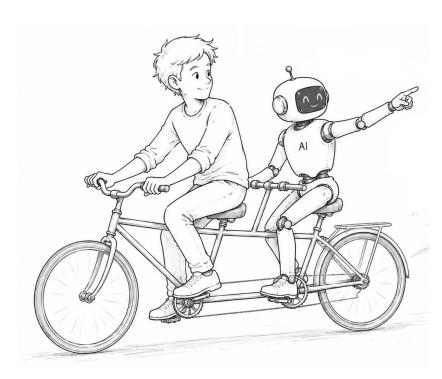
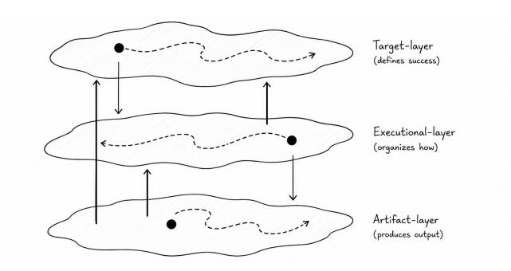
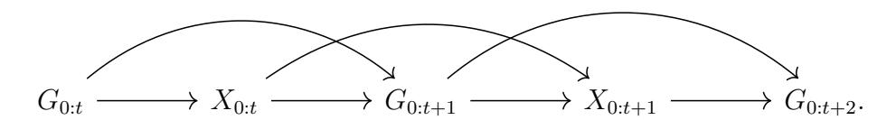

# 자동화의 경계: 지속적인 인간 참여에 관한 이론 (The Boundaries of Automation: A Theory of Persistent Human Participation)

- 원제: The Boundaries of Automation: A Theory of Persistent Human Participation
- 원문: [https://arxiv.org/abs/2607.21547](https://arxiv.org/abs/2607.21547)
- PDF: [https://arxiv.org/pdf/2607.21547v1](https://arxiv.org/pdf/2607.21547v1)
- arXiv ID: `2607.21547`

---

# 자동화의 경계: 지속적인 인간 참여에 관한 이론 (The Boundaries of Automation: A Theory of Persistent Human Participation)

Fares Fourati Hinrich Schütze 도르트문트 공과대학교 (TU Darmstadt) 루트비히 막스-밀러 대학 (LMU Munich), MCML

Eyke Hüllermeier Iryna Gurevych 루트비히 막스-밀러 대학 (LMU Munich), MCML 도르트문트 공과대학교 (TU Darmstadt), ATHENE

#### 초록 (Abstract)

AI의 급속한 발전은 오랫동안 이어져 온 자동화 추구를 가속화했다: 가능한 모든 곳에서 인간 참여를 알고리즘으로 대체한다. 이 추구에는 인간이 현재 AI 시스템이 아직 충분히 능력치가 없기 때문에 루프에 남아 있다는 가정이 내포되어 있다. 본 논문은 그 가정을 도전한다. 자동화가 얼마나 확장될 수 있는가를 묻기보다, 그 개념적 한계가 어디에 있는지를 묻고, 고성능 AI 시스템에서도 인간 참여가 세 가지 구별되는 이유로 지속될 수 있다고 주장한다. 기술적 혹은 보완적 근거는 인간이 AI가 갖지 못한 능력이나 관점을 제공할 때 발생한다. 규범적 혹은 발달적 근거는 참여 자체가 인간의 대리성이나 학습에 가치가 있을 때 발생한다. 가장 중요한 것은 목표가 사전에 완전히 명시되지 않고 상호작용을 통해 등장하는 목표 발생에서 비롯되는 출현적 근거이다. 이러한 경우 인간 참여는 단순히 실행을 개선하는 수단이 아니라 목표가 생성되는 구성 요소이다. 인간–AI 공동구성은 인간과 AI 시스템이 공동으로 결과를 생산하는 것으로 이해되며, 따라서 이는 불완전한 AI에 대한 일시적 대응이 아니라 참여를 통해 목표가 등장하는 활동의 지속적인 특징이다. 이 관점은 자동화의 한계와 미래 AI 시스템의 설계, 평가, 윤리에 중요한 함의를 가진다.

## 1 서론 (Introduction)

최근의 발전은 소프트웨어 엔지니어링[\\[Kwa et al., 2026\\]](#page-28-0), 과학적 발견[\\[Lu](#page-28-1) [et al., 2026,](#page-28-1) [Gottweis et al., 2026,](#page-26-0) [Ghareeb et al., 2026\\]](#page-26-1), 그리고 수학[\\[Hubert](#page-27-0) [et al., 2025\\]](#page-27-0)과 같은 분야에서 AI 시스템이 수행할 수 있는 작업 범위를 확장했다. 이러한 발전은 기본 능력의 향상을 반영한다[\\[Brown](#page-24-0)

그림 1: 인간–AI 공동구성에서 목표 발생을 위한 동기 부여 은유. 대형 자전거는 목적지가 반드시 사전에 완전히 명시되지 않은 탐색 여정에서 공동 참여를 상징한다. AI의 제스처는 상호작용을 통해 목표를 드러내거나 정제하거나 변형시킬 수 있는 새로운 가능성과 방향을 도입함을 나타낸다.

[et al., 2020\]](#page-24-0), 더 긴 문맥 창 [\\[Bai et al., 2024\\]](#page-24-1), 테스트‑타임 스케일링 [\\[Wei et al.,](#page-31-0) [2022,](#page-31-0) [Snell et al., 2024\\]](#page-30-0), 도구 사용 [\\[Schick et al., 2023,](#page-30-1) [Qin et al., 2024\\]](#page-29-0), 적응적 교정 [\\[Shinn et al., 2023,](#page-30-2) [Madaan et al., 2023\\]](#page-28-2), 그리고 강화 학습 [\\[Sutton et al., 1998,](#page-30-3) [Guo et al., 2025,](#page-26-2) [Fourati, 2026\\]](#page-26-3). 결과적으로 AI …

이러한 경로는 완전 자동화에 대한 관심을 증대시켰다. 그러나 현재 시스템은 여전히 불완전하다: 부정확한 정보를 제공할 수 있다[\\[Huang et al., 2025\\]](#page-27-1), 맥락을 오해할 수 있다[\\[Zhu et al., 2024\\]](#page-32-0), 입력 변동에 민감하다[\\[Chatterjee et al., 2024,](#page-25-0) [Kharrat et al., 2025\\]](#page-27-2), 일부 추상적 추론 형태에 어려움을 겪는다[\\[Berglund et al., 2024,](#page-24-3) [Foundation, 2026\\]](#page-26-4), 그리고 도메인별로 성능이 불균형하다[\\[Fourati, 2025\\]](#page-26-5). 따라서 인간 참여는 AI 시스템이 신뢰할 수 없을 때 판단, 지식, 감독, 피드백을 제공하기 위해 여전히 필요하며, 이는 인간–AI 협업에 대한 관심을 높이고 있다.

Jacoby와 Ochs가 공동구성을 “형태, 해석, 입장, 행동, 활동, 정체성, 제도, 기술, 이데올로기, 감정, 또는 다른 문화적으로 의미 있는 현실의 공동 창조”라고 정의한 개념을 바탕으로, 우리는 이 용어를 사용하여 결과가 한 참가자만이 아니라 여러 참가자의 기여에서 비롯된다는 점을 강조한다. [\[Jacoby and Ochs,](#page-27-3) [1995\]](#page-27-3) 그들의 설명과 일치하게, 공동구성은 협업, 협력, 조정 등을 포함하지만, 조화롭거나 지지적인 상호작용을 반드시 포함할 필요는 없으며, 교정, 불일치, 협상, 혹은 비대칭적 참여를 포함할 수도 있다.

따라서 우리는 인간–AI 공동구성을 특정 방법론, 상호작용 패러다임, 또는 설계 프레임워크를 나타내는 것이 아니라, 인간과 AI 시스템이 상호작용을 통해 공동으로 결과를 형성하는 접근법의 포괄적 개념으로 사용한다.  

이러한 사용은 HAI-Co2 [\[Dutta et al., 2024\]](#page-25-1)와 같은 프레임워크를 포함한다. HAI-Co2는 선호 기반 협력을 통해 목표와 솔루션 공동구성을 연구하며, 특정 형태의 인간–AI 협력도 포함된다.

\[Akata et al., 2020\], AI-assisted design \[De Peuter et al., 2023\], interactive humanin-the-loop systems \[Mosqueira-Rey et al., 2023\], continual and interactive learning from human feedback \[Zhou et al., 2024, Zhang et al., 2024, Kaufmann et al., 2025\], learning from natural-language interactions \[Li et al., 2025\], and related forms of collaborative problem-solving.

이전 연구는 인간과 AI 시스템이 협력할 수 있는 방법을 주로 조사해 왔으며, 협업 문제 해결 과정에서 목표와 해결책이 공동으로 구성될 수 있는 메커니즘을 포함해 왔다 [\[Dutta et al., 2025\]](#page-25-1). 반대로 본 논문은 AI 시스템이 점점 더 능력 있게 될 때 의미 있는 인간–AI 공동 구성(co-construction)이 왜 그리고 어떤 조건에서 여전히 필요할 수 있는지를 묻는다. 미래 AI 시스템이 더 신뢰할 수 있고, 더 지식이 풍부하며, 인간의 선호를 더 잘 추론하고, 인간 수준의 지능 또는 그 이상에 도달할 수 있다면 [\[Turing, 2007,](#page-31-3) [Hendrycks et al., 2025,](#page-26-6) [Fourati, 2025\]](#page-26-5), 실질적인 인간 참여가 점차 사라져야 할까? 아니면 현재의 기술적 한계와 무관하게 인간–AI 공동 구성이 지속되는 이유가 있을까? 이러한 질문에 대한 답은 공동 구성이 언제 필요할 수 있는지와 미래 인간–AI 시스템이 어떻게 설계되어야 하는지를 명확히 한다.

본 논문은 그 능력 기반 설명을 도전한다. 기술적 한계와 보완적 인간–AI 역량은 의심할 여지 없이 인간–AI 공동 구축의 다양한 형태를 촉진하지만, 인간 참여가 지속될 수 있는 이유를 모두 설명하지는 않는다. 참여는 규범적 또는 개발적 이유로도 필요할 수 있으며, 현재 논증의 핵심은 목표 자체의 형성에서 발생하는 부상( emergence) 이유에 있다 (동기를 부여하는 은유는 Figure [1\)](#page-1-0) 에 표시되어 있다).

More broadly, this view aligns with philosophical, cognitive, decision-theoretic, and behavioral perspectives that treat preferences, objectives, and evaluative criteria as constructed through interaction with environments and social contexts rather than fixed in advance \[Heidegger, 1962, Roy, 1993, Jacoby and Ochs, 1995, Hutchins, 1995, Slovic, 1995, Roy, 1996, Dewey, 1999, Schön, 2017, De Peuter et al., 2023, Huellermeier and Słowiński, 2024\].

계획 및 설계 분야의 관련 연구는 고정된 문제 가정에 도전한다. 악의 문제는 해결 시도와 함께 진화한다 [\[Rittel](#page-29-3) [and Webber, 1973\]](#page-29-3); 계산 모델은 설계를 문제와 해결 공간의 공동 진화로 특징지어준다 [\[Maher and Poon, 1996\]](#page-28-5); 그리고 경험적 연구는 디자이너가 새로운 솔루션과 함께 문제를 반복적으로 재구성함을 보여준다 [\[Dorst and Cross, 2001\]](#page-25-4). 의미 형성 연구 역시 이해를 표현을 구성하고 수정하는 반복적 과정으로 다룬다 [\[Russell et al.,](#page-29-4) [1993,](#page-29-4) [Pirolli and Card, 2005\]](#page-29-5), 상황 기반 행동은 의미 있는 행동이 완전히 명시된 계획을 실행하는 것이 아니라 특정 상황과의 지속적인 참여를 통해 발생한다고 강조한다 [\[Suchman, 1987\]](#page-30-6). 이 관점은 또한

인간–AI 공동 진화에 관한 최근 연구와 연결된다. 이 연구는 AI 시스템이 인간의 인지와 행동을 어떻게 형성하는지를 조사한다 [\[Pedreschi et al., 2025\]](#page-28-6), 그리고 구성적 정렬에 연결된다. 구성적 정렬은 정렬을 고정된 선호 만족이 아니라 진화하는 인간 선호 궤적에 대한 제어 문제로 다룬다 [\[Kanwal and Tran,](#page-27-7) [2026\]](#page-27-7). 또한 이 연구는 [Dutta et al.](#page-25-1) [\[2025\]](#page-25-1)의 프레임워크와 연결된다. 이 프레임워크는 인간–AI 문제 해결에서 목표와 솔루션이 어떻게 공동으로 구성될 수 있는지를 연구한다.

이러한 문헌은 협업, 문제 재구성, 표현 변화의 메커니즘을 설명하지만, AI 시스템이 매우 능력 있게 될 때에도 의미 있는 인간–AI 공동 구성 시스템이 왜 필요할 수 있는지를 설명하지는 않는다. 따라서 우리의 기여는 목표 공동 구성이나 선호 거버넌스를 위한 또 다른 메커니즘이 아니라 인간 참여가 언제 그리고 왜 지속되는지에 대한 설명이다.

우리는 목표 부상(target emergence)의 개념을 개발하고, 이를 인간–AI 시스템에서의 목표 공동 구성과 구분한다. 목표 공동 구성은 인간과 AI 시스템이 목표를 공동으로 개발, 협상, 수정하는 협업 과정을 의미하는 반면, 목표 부상은 특정 과제의 특성이다: 평가 대상은 상호작용 전에 완전히 결정되지 않으며, 대신 후보 아티팩트, 설명, 비교, 또는 대안과의 참여를 통해 점진적으로 드러나고 정제되거나 구성된다 (부록 [C\)](#page-36-0)). 목표 공동 구성 시스템 [\[Dutta et al., 2025\]](#page-25-1)은 목표 부상이 발생할 수 있는 한 메커니즘을 제공하지만, 목표 부상은 훨씬 단순한 인간–AI 상호작용에서도 발생할 수 있다. 반대로, 목표가 이미 충분히 잘 정의되어 있을 때는 목표 공동 구성이 상당한 목표 부상을 필요로 하지 않는다. 요컨대, 목표 부상은 인간 참여가 왜 필요할 수 있는지를 설명하고, 목표 공동 구성 시스템은 그 참여를 조직하는 한 가지 방법을 제공한다.

이 논문의 중심 주장은 다음과 같다:

인간–AI 공동 구성 시스템은 AI 시스템이 기술적 한계를 가질 뿐만 아니라, 일부 과제에서는 목표가 상호작용을 통해서만 결정되기 때문에 필요할 수 있다.

기여. 본 논문은 세 가지 기여를 제시한다. 첫째, 인간–AI 공동 구성을 현재 AI 한계를 넘어 확장하고, 지속적인 인간 참여의 세 가지 근거를 구분한다: 기술적 또는 보완적, 규범적 또는 발달적, 그리고 부상(Section [2\)](#page-4-0)). 둘째, 목표 부상 이론을 개발하여 AI 시스템이 점점 더 능력 있게 되더라도 인간 참여가 왜 필요할 수 있는지를 설명한다(Section [3\)](#page-6-0)). 셋째, 고급 공동 구성 시스템의 윤리, 평가, 설계에 대한 시사점을 도출한다(Section [4\)](#page-19-0)).

| 표 1: (Table 1) |  |  |  |  | 인간–AI 공동 구축을 위한 여러 근거. |
|----------|--|--|--|--|------------------------------------------------|
| ---------- | -- | -- | -- | -- | ------------------------------------------------ |

| 기초 | AI-능력 독립적? | 참여-가치 독립적? | 지속됩니까 AI가 향상됨에 따라? |
|------------------------------|-------------------------------|-------------------------------------|-----------------------------|
| 기술적 또는 보완성 | 아니오 | 예 | 아니오† |
| 규범적 또는 개발적 | 예 | 아니오 | 예‡ |
| 출현 | 예 | 예 | 예 |

† 일부 기술적 한계나 유익한 인간–인공지능 차이가 지속적인 AI 발전에도 불구하고 지속된다면.

# 2 인간-인공지능 공동 구축의 근거

본 논문은 인간–인공지능 공동 구축을 위한 세 가지 근거를 구분한다[1](#page-4-1) (표 [1\)](#page-4-2). 첫 번째는 능력 기반으로, 인간 참여가 가치 있는 이유는 AI 시스템이 관련 능력을 갖추지 못하거나 인간과 협업을 유익하게 만드는 방식으로 차이가 있기 때문이다. 나머지 두 가지는 능력 기반 고려에 의존하지 않는다. 본 논문은 지속적인 인간 참여를 위한 가장 강력한 근거인 출현 근거에 초점을 맞춘다.

첫 번째 범주는 기술적 또는 상호보완성이다. 보상적 관점은 현재 AI의 한계를 기준으로 인간–인공지능 공동 구축을 설명한다. 인간 참여가 필요하다. AI 시스템은 환각을 일으키고, 맥락을 놓치고, 모호성을 잘못 처리하고, 지식이 부족하거나 복잡한 작업을 수행하지 못하기 때문이다[\[Dutta et al.,](#page-25-1) [2025,](#page-25-1) [Zou et al., 2025,](#page-32-1) [Sahnan et al., 2026,](#page-29-6) [Zou et al., 2026\]](#page-32-2). 또한 오류 수정을 넘어, 인간과 AI 시스템은 서로 다른 발달 경로, 경험, 그리고 표현 구조에서 비롯되기 때문에 상호보완적인 기여를 할 수 있다. 이는 하이브리드 인텔리전스와 밀접한 관련이 있다[\[Kamar,](#page-27-8) [2016,](#page-27-8) [Dellermann et al., 2019,](#page-25-5) [Akata et al., 2020,](#page-24-4) [Jarrahi et al., 2022\]](#page-27-9). 실증적 증거는 이러한 상호보완성이 공동 성능을 향상시킬 수 있음을 시사한다[\[Vaccaro et al., 2024\]](#page-31-4).

목표가 비교적 명확하고 AI 시스템이 매우 유능할 때에도, 이질적인 지능 형태 간의 상호작용은 관점, 가설, 휴리스틱, 또는 평가적 고려를 도입함으로써 탐색, 창의성, 견고성, 문제 해결을 향상시킬 수 있다. 이는 어느 참여자도 단독으로 생성하기 어려운 요소들이다[\[Dellermann et al., 2019\]](#page-25-5). 예를 들어, 식품 제품 개발에서는 AI 시스템이 화학적으로 유망한 레시피나 재료 조합을 식별할 수 있지만, 인간은 맛, 냄새, 및

‡ 인간이 참여를 계속해서 가치 있게 여긴다면, 그들이 배우거나 경험하고자 하는 것이 바뀔 수 있다.

1 이 근거들은 상호 배타적이지 않으며 상호작용할 수 있다. 특정 작업은 하나, 두 개, 또는 세 가지 모두에 대해 공동 구축이 필요할 수 있다.

질감 인식. 협업의 가치는 제품 평가에 직접적으로 관련된 생물학적 인식 형태와 계산적 탐색을 결합하는 데 있다. 따라서 고급 AI가 여러 도메인에서 독립적인 인간 성능을 능가하더라도, 인간–인공지능 파트너십은 일부 작업에서 어느 참여자보다 더 우수할 수 있다[\[Vaccaro et al., 2024\]](#page-31-4).

이 근거는 인간과 AI 인지 사이의 의미 있는 차이에 의존한다. 상호보완성은 AI 시스템이 인간의 체화된 경험에 뿌리를 둔 독특한 기여, 즉 인간의 감각 및 운동 장치에 의해 형성된 능력과 세상과의 평생 사회적, 문화적, 물리적 상호작용을 재현할 수 없을 때에만 공동 구축의 근거가 된다.

우리는 상호보완성이 현재 AI 실패를 근거로 한 주장보다 더 견고할 수 있지만, 이를 인간 참여의 장기적 지속성에 대한 결정적 근거로 간주하지 않는다. 인간과 AI 시스템의 설계 또는 개발 이력이 시간이 지나면서 유용하게 남아있을 필요는 없다: 한 시스템이 다른 시스템의 기능적으로 관련된 역량을 재현하거나 대체 수단으로 우수한 성능을 달성할 수 있다. 따라서 인간의 역량은 구현형 AI [\[Duan et al., 2022,](#page-25-6) [Liu et al., 2025,](#page-28-7) [Ma](#page-28-8) [et al., 2026\]](#page-28-8), 지속적 학습 [\[Wang et al., 2024,](#page-31-5) [Yu et al., 2026\]](#page-31-6), 강화 학습 [\[Sutton et al., 1998\]](#page-30-3), 그리고 세계 모델 [\[Ha and Schmidhuber, 2018,](#page-26-8) [Ding](#page-25-7) [et al., 2025\]](#page-25-7)의 발전으로 AI 시스템이 기능적 이점을 복제하거나 직접 재현하지 않고도 이를 능가할 수 있게 되면서 덜 관련성이 높아질 수 있다.

이러한 근거는 인간–AI 공동 구축 시스템 설계를 정당화하기에 충분하지만, 유일한 정당화는 아니다.

만약 공동 구축 시스템이 현재 AI의 한계에만 근거를 두고 정당화된다면, 이 관점에서 충분히 유능한 AI는 결국 이를 불필요하게 만들 것이다. 시스템이 더 신뢰할 수 있게 되면, 명확화, 수정, 지시, 전문가 개입이 덜 필요해져 인간–AI 공동 구축을 자율 실행으로 가는 전환 단계로 축소시킬 것이다.

최근 실증 연구는 이 가능성을 점점 더 구체화한다. [Kwa et al.](#page-28-0) [\[2026\]](#page-28-0)은 최첨단 AI 시스템이 신뢰성, 도구 활용, 적응적 수정, 장기 계획의 개선을 통해 자율적으로 수행할 수 있는 소프트웨어 작업의 기간과 복잡성을 확장하고 있다고 주장한다. 이러한 추세가 지속된다면, 시스템은 제한된 인간 개입으로 점점 더 복잡한 작업을 수행할 수 있다. 그럼에도 불구하고, 기술적 한계가 지속되는 한 실질적인 인간 참여는 필요할 수 있다.

두 번째 범주는 규범적이거나 개발적이다. 목표가 명확하고 AI 시스템이 유능하며 상호보완성이 필요 없더라도, 인간은 여전히 참여를 필요로 하거나 가치를 둘 수 있다.

고위험 영역에서는 사람들이

검사, 이의 제기, 또는 그들이 책임을 지는 결과를 승인해야 할 수 있다 [\[Bengio](#page-24-2) [et al., 2026\]](#page-24-2). 예를 들어, 의사는 AI 시스템이 적절한 치료를 권장하도록 의존할 수 있지만, 여전히 권고를 검토하고 승인해야 한다. 이는 임상 결정에 대한 책임이 여전히 의사에게 있기 때문이다.

참여는 또한 판단, 직관, 기술, 이해를 함양할 수 있다. 학생은 증명을 수행하고, 과학자는 분석에 기여하며, 디자이너는 단순히 결과물을 얻기 위해서가 아니라 생산과 평가에 관여하는 역량을 개발하기 위해 디자인을 반복할 수 있다 [\[Hogg, 2026\]](#page-26-9). 교육 분야에서 인간–AI 공동 창작에 관한 연구는 생성형 AI와의 협업 참여가 인지 참여, 지식 구축, 학습을 지원할 수 있음을 유사하게 시사한다 [\[Pramod, 2026\]](#page-29-7). 보다 넓게는, 사람들은 이러한 활동이 제공하는 창의성, 발견, 개인적 성장 때문에 가치를 둘 수 있다.

세 번째 범주는 출현이다. 사람들이 더 이상 참여를 가치 있게 여기지 않더라도, 공동 구축은 반드시 사라지지 않는다. 이 근거는 목표 형성 현상 자체에서 비롯되며, AI 시스템이 매우 유능하고 상호보완적 인간 기여의 이점을 더 이상 얻지 못하며, 인간이 독자적으로 참여를 가치 있게 여기지 않을 때에도 지속될 수 있다.

본 논문은 보상적 관점에 가장 강력한 도전을 제공하기 때문에 출현 근거에 초점을 맞춘다. 다른 근거와 달리, 이는 AI의 한계, 인간–AI 상호보완성, 또는 참여의 독립적 가치가 아니라 특정 과제의 특성에서 비롯된다. 나머지 논문은 이 주장을 전개한다.

### 3 공동 구축을 위한 출현 근거 (The Emergence Ground for Co-construction)

이 섹션은 인간–AI 공동 구축을 위한 다른 메커니즘을 제안하지 않는다. 대신 공동 구축 시스템이 여전히 필요할 수 있는 이유를 설명한다.

### 3.1 출현 근거에 대한 논증과 동기 (Argument and Motivation for the Emergence Ground)

X를 가능한 산출물(텍스트, 프로그램, 계획, 설계, 설명, 평가, 이미지, 초안 및 기타 생성된 상태)을 포함하는 공간이라고 하자. 인간–AI 공동 구축 논의에서 종종 혼동되는 세 가지 요소를 구분한다: 목표, 실행 전략, 그리고 산출물.

인간–AI 상호작용은 논문 작성, 코드 생성, 인터페이스 설계, 음악 작곡 등과 같은 광범위한 목표로 시작될 수 있다. 이러한 목표는

행동을 유도하지만 많은 평가적 질문을 해결하지 못한다. 성공적인 결과가 무엇인지에 대해서는 사전에 완전히 결정되지 않는 경우가 많다.

정의 1 (목표 (Target)). 목표 (Gt ∈ G)는 성공, 관련성, 개선 또는 실패(시간 t에서)를 어느 정도 결정하는 기준을 갖는 평가 구조이다.

이 용어는 포괄적 개념으로 의도된다: 목표, 선호, 제약, 효용, 지시 등은 각각 목표를 표현하거나 부분적으로 구성할 수 있으며, 논증은 이러한 형태 간의 명확한 구분을 요구하지 않는다. 부록 [A](#page-33-0)는 인접 개념에 대한 목표 출현 (target emergence)을 위치시킨다. 본 논문 전반에 걸쳐 우리는 인간 주도 목표에 초점을 맞춘다: 그 근거가 참여자의 지속적인 평가 활동에 있으며, 내용은 AI 시스템과의 상호작용을 통해 점진적으로 형성될 수 있는 목표들이다.

목표는 성공을 이진적으로 정의할 필요가 없다. 산출물은 목표를 다양한 정도로 충족시킬 수 있으며, 품질, 우아함, 효율성, 견고성, 해석 가능성, 또는 사용성에서 차이를 보인다. 따라서 목표는 산출물이 허용 가능한지 여부뿐 아니라 산출물을 어떻게 비교하고 개선해야 하는지도 결정한다.

목표는 사용자의 개인적 선호를 넘어서는 사용 상황의 특징을 포함할 수 있다. 여기에는 의도된 청중, 의사소통 목적, 매체 제약, 기관 또는 학문적 규범, 그리고 의도된 효과가 포함된다.

목표와 산출물은 동일한 표현 형태를 공유할 필요가 없다. 목표는 과학적 설명, 이미지, 혹은 이야기를 다룰 수 있으며, 상호작용은 가설, 코드, 서술과 같은 산출물을 통해 진행된다. 이러한 산출물은 목표 자체가 목표가 아니더라도 목표 실현에 기여할 수 있다.

참여는 다양한 인간–AI 커뮤니케이션 형태를 통해 매개될 수 있다.[2](#page-7-0) 인간의 참여는 가끔의 승인, 수정, 선호 판단에서부터 지속적인 협업에 이르기까지 다양하다.[3](#page-7-1) 중간 형태는 주도권, 권한, 전문성, 통제력에서 차이를 보인다. 본 논문은 커뮤니케이션 매체와 참여 구조 모두에 대해 중립적이다.

인간–AI 상호작용은 확립된 목표에 비해 산출물을 개선할 수 있다. 그러나 일부 과제에서는 상호작용이 목표 자체를 설정하는 데에도 도움을 준다.

생성된 초안, 이미지, 설명, 계획, 또는 제안은 숨겨진 가정, 눈치채지 못한 트레이드오프를 드러내고, 재해석을 유발하며, 선호를 안정시키거나 인간 참여자가 목표로 인식하는 것을 변형시킬 수 있다.

2사용자는 초안을 편집하거나 이미지나 코드를 수정하고, 공유된 추론 트레이스를 주석 달고 [\\[Sahnan et al., 2026\\]](#page-29-6), 대안 중에서 선택하고, 파일을 업로드하거나 자연어 피드백을 제공할 수 있다. 커뮤니케이션은 텍스트, 음성, 시각, 제스처, 비디오 기반, 또는 멀티모달일 수 있다 [\\[Liu et al., 2023,\\](#page-28-9) [Team et al., 2023,\\](#page-31-7) [Wu et al., 2024,\\](#page-31-8) [Singh](#page-30-7) [et al., 2025\\]](#page-30-7). 미디어가 시스템 설계에 중요하지만, 상호작용이 주로 아티팩트, 실행, 또는 목표 수준에서 발생하는지를 결정하지는 않는다.

3공동 구성은 대칭일 필요가 없다. AI 시스템은 인간 판단을 보조할 수 있고, 인간은 대부분 자율적인 프로세스를 감독하고 필요할 때만 개입할 수 있다.

동적 관점은 행동적 의사결정 이론에서의 건설적 선호 연구와 유사하며, 이 연구는 선호를 고정된 내부 순서가 아니라 유도와 평가의 맥락에 민감한 산물로 간주한다 [\\[Slovic, 1995,\\](#page-30-4) [Kanwal and Tran,](#page-27-7) [2026\\]](#page-27-7). 해석과 의미 역시 단순히 전달되는 것이 아니라 상호작용을 통해 달성될 수 있다 [\\[Jacoby and Ochs, 1995\\]](#page-27-3).

탐색, 시행착오, 그리고 후보 아티팩트와의 상호작용을 통해 이전에 암묵적이었던 우선순위가 명시화되고, 트레이드오프가 가시화되며, 목표 자체가 더 구체화된다 [\\[De Peuter et al., 2023\\]](#page-25-2).

추가적인 근거는 Simon의 한계합리성 이론에서 나온다. 의사결정자는 고정된 목표를 최적화하기보다 적응적 열망 수준에 따라 만족시킨다 [\\[Simon, 1955,\\](#page-30-8) [1956\\]](#page-30-9). 상호작용이 달성 가능한 것을 드러내면, 이러한 기준은 상승하거나 하락하거나 탐색을 재지향할 수 있다. 이러한 의미에서 목표는 상호작용 이력에 따라 진화한다.

다중 목표 최적화는 또 다른 출현 근거의 특수 사례를 제공한다. 품질과 비용과 같은 목표를 동시에 추구해야 할 때, 관련 트레이드오프가 후보 솔루션을 통해서만 드러나므로 상대적 중요성을 사전에 지정하기 어려울 수 있다. 참가자는 처음에 품질과 비용을 동일하게 중요하게 여길 수 있지만, 예를 들어 가용 대안 간에 비용 변동이 거의 없다는 것을 관찰한 뒤 품질에 더 큰 비중을 두게 된다. 또한, 선호는 제시된 대안 집합에 따라 달라질 수 있으며, 이는 타협 효과(compromise effect)로 설명된다. 타협 효과는 추가 옵션을 도입하면 중간 대안이 더 매력적으로 보이게 만드는 현상이다. 이러한 경우, 상호작용은 선호되는 아티팩트뿐만 아니라 목표를 구성하는 가중치와 트레이드오프를 바꾼다.

다중 기준 의사결정 지원에서 유사한 관점이 나타난다. 여기서 의사결정은 기존 선호를 단순히 보고하는 것이 아니라 선호와 평가 기준이 점진적으로 공동으로 구성되는 과정으로 이해된다 [\\[Roy,\\](#page-29-1) [1993,\\](#page-29-1) [1996,\\](#page-29-2) [Huellermeier and Słowiński, 2024\\]](#page-27-6). Dutta et al. (#page-25-1) [\\[2025\\]](#page-25-1)의 문제 해결 프레임워크도 문제와 해결책을 잠재적으로 공동 구성될 수 있는 것으로 다루며, 인간–AI 공동 진화에 관한 연구는 AI 시스템이 인간의 인지와 행동을 형성할 수 있음을 시사한다 [\\[Pedreschi et al., 2025\\]](#page-28-6).

더 넓게는, 철학, 인지과학, 행동적 의사결정 이론, 의사결정 지원, AI 정렬 분야의 연구는 인간의 선호, 목표, 평가 기준을 아티팩트, 환경, 사회적 맥락, AI 시스템과의 상호작용을 통해 구성된 것으로 보으며, 사전에 고정된 것이 아니라는 점을 강조한다 [\\[Heidegger, 1962,\\](#page-26-7) [Roy,\\](#page-29-1) [1993,\\](#page-29-1) [Jacoby and Ochs, 1995,\\](#page-27-3) [Hutchins, 1995,\\](#page-27-5) [Slovic, 1995,\\](#page-30-4) [Roy, 1996,\\](#page-29-2) [Dewey, 1999,\\](#page-25-3)]

4Human–AI 공동구성은 인간–인간 공동구성을 복제할 필요가 없으며, 유사한 효과를 낼 수 있다. AI 시스템은 후보 아티팩트를 빠르게 생성하고 외부화하여 검사와 비교를 가능하게 한다. 대안의 범위를 확장함으로써 목표를 보다 명확하게 하고 반성, 논쟁, 개정에 열려 있게 할 수 있다.

Figure 2: 인간–AI 상호작용 단계. 아티팩트 수준 상호작용은 출력물을 수정하고, 실행 수준 상호작용은 출력물이 생성되는 방식을 수정하며, 목표 수준 상호작용은 성공으로 간주되는 것을 수정한다. 수평 화살표는 같은 단계 내에서의 변화를 나타내고, 수직 화살표는 한 단계의 변화가 다른 단계에 영향을 미칠 수 있음을 나타낸다.

[Schön, 2017,](#page-30-5) [De Peuter et al., 2023,](#page-25-2) [Huellermeier and Słowiński, 2024,](#page-27-6) [Kanwal](#page-27-7) [and Tran, 2026\]](#page-27-7).

목표의 출현 가능성은 과학적 발견에서 특히 뚜렷하다 [\[Lu et al., 2026,](#page-28-1) [Gottweis et al., 2026,](#page-26-0) [Ghareeb et al., 2026\]](#page-26-1). 과학자가 익숙하지 않은 생물학적 메커니즘을 조사하기 위해 AI 시스템과 협업한다고 가정해 보자. 초기에 과학자는 완전히 구체화된 설명적 목표보다는 현상을 이해하려는 폭넓은 관심만을 가질 수 있다. 상호작용을 통해 AI는 가설을 제안하고, 이상을 강조하며, 실험을 제안하고, 변수 간의 예상치 못한 관계를 밝혀낸다 [\[Gottweis et al., 2026\]](#page-26-0). 과학자가 이러한 가능성을 평가함에 따라 탐구 목표가 진화할 수 있다: 처음에는 한 메커니즘에 관한 질문처럼 보였던 것이 다른 메커니즘에 관한 질문으로 바뀔 수 있다. 이러한 경우, 인간–AI 상호작용은 고정된 목표에 대한 실행을 단순히 개선하는 것이 아니라 목표 자체를 결정하는 데 도움을 준다.

이러한 고려를 종합하면, 최소한 일부 인간–AI 과제에서는 목표가 상호작용 이전에 완전히 명시되지 않고 상호작용을 통해 등장한다는 것을 시사한다. 이러한 경우, 상호작용은 고정된 목표에 비해 더 나은 아티팩트를 식별하는 데 그치지 않고, 목표 자체를 구성하고, 정제하며, 안정화하는 데 도움을 준다. 인간–AI 공동구성을 위한 출현 기반은 이러한 가능성에서 비롯된다.

### 3.2 예시: 이미지 생성 (An Illustrative Example: Image Generation)

상호작용은 Figure [2.](#page-9-0)에서 보여지는 것처럼 여러 수준에서 작동할 수 있다. 아티팩트 수준에서는 출력물을 수정하고, 실행 수준에서는 출력물이 생성되는 방식을 수정하며, 목표 수준에서는 성공으로 간주되는 것을 명확히 하고, 안정화하며, 운영화하고, 협상하고, 재구성하거나 변형함으로써 무엇이 성공인지 수정한다. the

목표. 관련 구분은 상호작용이 얼마나 일어나는가가 아니라 상호작용이 무엇을 바꾸는가이다. [5](#page-10-0)

이러한 구분은 이미지 생성 과제를 통해 설명할 수 있다 (추가 예시는 Appendix [B](#page-34-0)를 참조). 사용자가 AI 시스템과 상호작용하여 현대 커피숍의 이미지를 생성한다고 가정해 보자.

#### 아티팩트 수준 상호작용: 생성된 이미지를 수정한다:

"이미지를 밝게 하고 배경 흐림을 줄여라."

목표는 변하지 않는다; 현재 아티팩트만 수정된다.

#### 실행 수준 상호작용: 목표를 추구하는 절차를 수정한다:

"먼저 다른 카메라 각도로 여러 개의 대략적인 버전을 생성한다. 그런 다음 가장 좋은 버전을 조명 개선으로 정제한다."

작업 흐름은 변경되지만 목표는 대체로 안정적이다.

#### 목표 수준 상호작용: 아티팩트가 달성하려는 것을 수정한다:

"이러한 이미지를 본 뒤, 나는 현대 커피숍보다 따뜻하고 조용한 동네 카페를 원한다는 것을 깨달았다."

우리는 평가 기준이 바뀌었습니다: 후보 이미지가 이제 다른 목표에 대해 평가됩니다. 따라서 참가자는 생성된 아티팩트가 충분히 실현되었더라도 목표를 거부할 수 있습니다.

이러한 수준 간의 경계는 항상 뚜렷하지 않습니다. 보통 아티팩트 수준의 변화가 목표 수준에서의 불안정을 드러낼 수 있습니다. 예를 들어, 이미지를 “더 인간적으로” 만들라는 반복적인 요청은 처음에는 지역적 수정을 나타내는 것처럼 보이지만 결국 평가 지향의 변화와 다른 목표의 등장으로 드러납니다.

이 구분은 인간–AI 공동 구성(co-construction)이 아티팩트, 실행 절차, 목표, 참가자 평가가 함께 진화할 수 있는 동적 과정임을 시사합니다. 한 수준의 변화가 다른 수준의 변화를 유도할 수 있습니다. 다음 공식은 이러한 결합된 역학을 추상적으로 나타냅니다.

5멀티턴 상호작용은 목표 수준 공동 구성에 필요하거나 충분하지 않습니다. 긴 교환은 단지 안정된 목표 하에서 실행을 순차적으로 수행할 뿐이며, 단일 개입은 목표를 바꿀 수 있습니다.

### 3.3 목표 등장: 동적 모델

인간–AI 공동 구성은 상호작용이 아티팩트뿐만 아니라 목표 자체를 바꿀 수 있는 동적 과정으로 모델링될 수 있습니다. 이 섹션은 모델의 핵심 구조를 제시합니다; 전체 역사 의존적 확률적 공식화, 평가 상태 분해, 그리고 정확한 사전 재구성에 대한 특수 사례는 부록 [D.](#page-37-0)에 나와 있습니다.

상호작용 라운드 (t)에서 다음과 같이 정의하자

- Gt ∈ G는 현재 목표이다;
- Et ∈ E는 현재 실행 상태이며, 목표가 어떻게 추구되는지를 명시한다;
- Xt ∈ X는 현재 아티팩트 또는 생성된 상태이다; 그리고
- St ∈ S는 참가자의 평가 상태이며, 목표, 실행 상태, 아티팩트에 대한 평가를 요약한다.

이러한 구성 요소는 분석적으로 구분됩니다. 목표가 적절하더라도 아티팩트가 부적절할 수 있고; 실행 전략이 목표를 올바르게 표현했음에도 불구하고 비효율적일 수 있으며; 만족스러운 아티팩트가 참가자가 더 이상 지지하지 않는 목표를 실현할 수 있습니다. 따라서 상호작용은 아티팩트, 실행, 목표, 또는 이들 중 어느 하나에 대한 참가자의 평가를 수정할 수 있습니다.

전통적인 최적화 프레임워크에서는 목표가 고정된 것으로 간주됩니다. 아티팩트는 초기 목표(G0)를 기준으로 생성되고 수정됩니다:

$$G_0 \longrightarrow X_{0:t} \longrightarrow X_{0:t+1} \rightarrow X_{0:t+2}$$

(X0:t)는 상호작용 라운드 (t)까지의 아티팩트 이력을 나타냅니다.

이 표현에서는 상호작용이 연속적인 아티팩트를 개선할 수 있지만, 평가 기준은 고정된 상태를 유지합니다.

현재 설명은 목표를 진화하는 상호작용 상태의 일부로 다룹니다. (Ht)를 라운드 (t)까지의 인간–AI 상호작용 이력으로 정의하자. 이 이력에는 이전 아티팩트, 인간 및 AI 행동, 실행 변화, 평가가 포함된다. 목표 등장( emergence)은 다음과 같이 표현된다:

$$G_{t+1} = \Phi_G(\mathcal{H}_t), \tag{1}$$

(ΦG)는 목표-업데이트 프로세스이다.

식 [\(1\)](#page-11-0)은 고정 목표 최적화에서 벗어난 점을 나타낸다: 다음 목표는 초기 목표만으로는 복원될 필요가 없으며, 대안이 생성되고, 검사되고, 비교되고, 평가되는 상호작용 궤적에 따라 달라질 수 있다.

생성된 아티팩트는 목표의 가능한 해석을 외부화하고, 숨겨진 가정을 드러내며, 트레이드오프를 부각시키고, 제약을 밝히거나 새로운 가능성을 도입할 수 있다. 그 평가가 상호작용 이력에 반영되어 이후 목표 형성을 형성한다:

타깃에서 아티팩트로 향하는 화살표는 현재 타깃 하에서의 생산과 평가를 나타내며; 아티팩트에서 이후 타깃으로 향하는 화살표는 그 아티팩트와의 상호작용을 통해 타깃의 드러남, 정제, 또는 구성을 나타낸다.

평가 상태(St)는 타깃 변화와 그 변화를 지지하는 것을 구분한다. 타깃은 더 결정적이 될 수 있지만 더 바람직해지지는 않을 수 있고, 참가자는 아티팩트를 지지하면서 그 아티팩트가 실현하는 타깃을 거부할 수 있다. 따라서(St)는 지지, 만족, 신뢰, 불확실성 및 관련 평가의 추상적 요약으로 다뤄지며, Appendix [D](#page-37-0)에서는 보다 상세한 분해를 제시한다.

이 모델은 모든 상호작용이 타깃을 바꾸는 것을 의미하지 않는다. 많은 과제에서 (Gt)는 안정적이며 상호작용은 주로 아티팩트 또는 실행 수준에서 발생한다. 등장 주장(emergence claim)은 일부 과제에서 일부 t에 대해...

$$G_{t+1} \neq G_t$$

왜냐하면 상호작용이 타깃을 드러내거나 정제하거나 구성하는 데 기여하기 때문이다.

\n### 3.4 타깃 등장 분류학 (A Taxonomy of Target Emergence)\n

타깃(Gt)은 공유된 인간–AI 상호작용 상태에서 충분한 구체성을 가지고 아티팩트의 생산, 평가 또는 개정에 지침을 제공할 수 있을 때 공동으로 작동한다.

정의 2 (타깃 등장). 타깃 등장은 타깃 궤적(Gt)이 공동으로 작동하게 되고, 더 큰 결정성, 실행 가능성, 검사 가능성, 또는 안정성을 획득하거나, 그 기저 평가 구조가 변형되는 과정을 말한다.

타깃 등장(발현)은 질적으로 다른 방식으로 발생할 수 있다. 본 논문은 타깃 변화의 세 가지 점점 강해지는 형태를 구분한다: 드러남(revelation), 정제(refinement), 그리고 구성(constitution).

사용자는 이미 비교적 안정적인 타깃을 가지고 있을 수 있지만, 이를 효과적으로 전달하기 위한 어휘, 예시, 또는 문맥적 단서가 부족할 수 있다. 생성된 아티팩트와의 상호작용을 통해 그 타깃의 이전에 암묵적이었던 측면이 검사 가능하고 전달 가능해진다.[6](#page-13-0)

정의 3 (드러난 타깃). 타깃은 상호작용이 기존에 존재하지만 이전에 이용 불가능하거나 충분히 표현되지 않았던 타깃을 공동으로 작동하게 만들 때 드러난다.

연구자는 논문의 핵심 기여를 알고 있지만 이를 표현하는 데 어려움을 겪을 수 있다. 반복적인 초안 작성과 대안적 표현의 비교를 통해 그 기여는 과학적 목표를 바꾸지 않으면서 명시적이고 전달 가능해진다.

상호작용은 단순히 드러내는 것뿐만 아니라 점진적으로 타깃을 정교화할 수도 있다. 광범위한 방향성은 보다 운영 가능해지며: 모호한 포부는 구체적인 기준을 갖게 되고, 암묵적 우선순위는 정렬되며, 미지정된 트레이드오프는 명시화된다. 평가 방향은 크게 변하지 않는다.

정의 4 (정제된 타깃). 타깃은 상호작용이 그 구체성, 실행 가능성, 안정성, 또는 검사 가능성을 증가시키면서 이전 평가 구조와 상당한 연속성을 유지할 때 정제된다.

연구자는 처음에 설득력 있는 논문을 쓰는 것을 목표로 할 수 있다. 반복적인 초안 작성을 통해 이 타깃은 명확성, 경험적 엄밀성, 접근성 측면에서 운영화되며 동일한 기여를 향해 계속 지향한다.

구성은 가장 강력한 형태의 타깃 등장이다: 상호작용은 과제를 만족시키는 것으로 여겨지는 것을 바꾼다. 초기에는 미니멀리즘 미학을 우선시하는 디자이너가 생성된 대안을 탐색한 뒤 프로젝트를 접근성 또는 해석 가능성으로 재조정함으로써 후보 디자인을 평가하는 기준을 바꾼다.

정의 5 (구성된 타깃). 타깃은 상호작용이 평가 기준을 형성, 변형, 재구성, 또는 교체할 때 구성된다.

6목표는 관련 문화적, 상황적, 역사적, 또는 사회적 맥락을 공유하는 인간 협력자에게 충분히 명시될 수 있지만, 그 맥락을 신뢰할 수 있게 우선순위를 정하지 못하거나 결여한 AI 시스템에는 여전히 접근 불가능할 수 있다. 상호작용은 잠재적 제약을 외부화하여 목표를 공동으로 작동하게 만들며, 그 평가 구조를 변경하지 않는다.

인간–AI 공동구성은 단순히 불완전한 의사소통을 수리하는 수단이 아니라, 더 강력한 경우에는 목표 자체가 개발되는 과정이다.

분류법은 목표 출현 형태를 분류하지만, 출현만으로는 진화하는 목표를 추구해야 하는지 여부를 결정하지 않는다. 목표는 더 결정적이 되더라도 만족스럽지 않을 수 있다. 이는 평가에 관한 별개의 질문들을 제기한다. 목표가 행동을 안내하기에 충분히 안정적이 되는 시점은 언제인가? 불만족이 개정, 분기, 또는 교체로 이어지는 조건은 무엇인가? 다음 소절이 이러한 질문들을 다룬다.

#### 평가 역학, 수렴 및 분기 (Evaluative Dynamics, Convergence, and Branching)

목표 진화와 목표 평가는 인간—AI 공동구성의 별개의 측면이다. 목표는 더 결정적이 되더라도 더 바람직해지지 않을 수 있으며, 참여자는 목표를 실현하는 아티팩트를 지지하면서도 그 목표를 의문시할 수 있다. 따라서 목표 안정성은 목표 지지와 혼동해서는 안 된다.

이 구분은 평가 상태 $(S_t)$ 로 표현되며, 여러 투영을 포함한다. $(S_t^X)$ 는 현재 아티팩트에 대한 만족도를 측정하고, $(S_t^G)$ 는 현재 목표에 대한 지지를 측정하며, $(S_t^{X|G,E})$ 는 현재 실행 계획 하에서 아티팩트가 목표를 얼마나 잘 실현하는지에 대한 만족도를 측정하고, $(S_t^{E|G,X})$ 는 현재 목표와 아티팩트에 대한 실행 계획에 대한 만족도를 측정한다. 아티팩트 만족만으로는 충분하지 않다, 왜냐하면 아티팩트는 평가되는 목표에 따라 그 의미를 얻기 때문이다.

또한 분석 편의를 위해, 목표 상태는 상호작용 라운드 간 비교를 허용할 수 있다. 정의하자

$$\Delta_t = D(G_t, G_{t+1})$$

연속적인 상호작용 라운드 사이의 목표 변화량을 나타내며, $D: \mathbb{G} \times \mathbb{G} \to \mathbb{R}_{\geq 0}$ 은 목표 불일치의 추상적 측정치이다.

양자  $\Delta_t$  는 목표 진화의 지역적 동역학을 나타낸다.  큰 값의  $\overline{\Delta}_{t,k}$ , k 기간에 대한 이동 평균으로 정의되는 값은 지속적인 목표 수정을 나타내며, 반면 작은 값은 상대적으로 목표가 안정적임을 나타낸다.

**수렴.** 궤적은 목표 변화가 지속적인 기간 동안 낮게 유지되고 참여자가 현재 목표와 그 실현을 모두 지지할 때 수렴을 나타낸다. 형식적으로, 수렴은 낮은 $(\overline{\Delta}_{t,k})$ 와 높은 $(S_t^G)$, $(S_t^{E|G,X})$, $(S_t^{X|G,E})$ 로 특징지어진다. 이 경우, 상호작용

&lt;sup>7여기서 $0 \le k < t$ 일 때, $\overline{\Delta}_{t,k} = \frac{1}{k+1} \sum_{i=t-k}^{t} D(G_i, G_{i+1})$ 를 정의한다.

주로 실질적인 목표 개정보다 지역적 정제(local refinements)를 생성하며 자연스러운 정지점에 도달할 수 있다. 수렴은 반드시 고정된 목표에 대한 최적화를 의미하지는 않는다: 제한된 합리성 하에서, 상호작용은 참여자가 달성 가능한 것을 학습하면서 적응된 포부 수준을 만족하는 아티팩트가 생길 때 종료될 수 있다.

탐색과 정제. ∆t,k가 높을 때 궤적은 탐색적 상태를 유지하며, 이는 자동으로 실패로 해석되어서는 안 된다. 창의적, 과학적, 디자인 맥락에서 높은 ∆t,k는 참가자들이 새로운 가능성을 발견하고, 트레이드오프를 명확히 하거나, 보다 적절한 평가 기준을 개발함으로써 생산적인 목표 형성을 나타낼 수 있다. 따라서 탐색은 개방형이지만 다른 영역으로 전환될 수 있다.

안정된 불만족. 궤적은 지역적으로 안정적이면서도 만족스럽지 않을 수 있다. 이는 목표 변화가 작아지지만 목표 수준(targetlevel), 아티팩트-관련, 또는 실행 만족도가 낮을 때 발생한다. 이러한 상황은 서로 다른 대응을 유도한다: 첫 번째 경우에는 목표 수정을, 두 번째 경우에는 아티팩트 수정을, 세 번째 경우에는 실행 수정을 한다.

분기. 불만족이 반드시 종료를 의미하지는 않는다. 대신 상호작용을 다른 목표로 재지향하여 새로운 목표 궤적을 시작할 수 있다. 분기는 목표 구성 단계에서 특히 중요하며, S X t가 높더라도 발생할 수 있다: 아티팩트는 만족스럽지만 참가자가 더 이상 지지하지 않는 목표에 대해 만족스러울 수 있다.

#### 3.6 Objections and Boundary Cases

이 설명은 모든 상호작용이 공동 구성적이거나 목표가 모든 영역에서 발생한다는 것을 의미하지 않는다. 다음 사례들은 그 범위를 명확히 한다.

자동화. 이 설명은 자동화에 대한 반대 논거가 아니다. 일부 작업은 이미 작동 중인 목표를 가지고 있어 대부분 자율적으로 실행될 수 있다. 참조 형식 지정, 음성 전사, 단위 변환, 기록 정렬, 그리고 잘 정의된 변환 적용은 목표가 명확해지면 거의 또는 전혀 목표 상호작용이 필요하지 않을 수 있다. 복잡한 영역에서도, 발생 목표 단계는 안정 목표 단계에 이어질 수 있다: 디자이너는 탐색 중에 목표를 공동 구성하고, 우선순위가 안정되면 일상 구현을 자동화할 수 있다. 공동 구성을 지원하려면 여전히 시스템이

다중 턴 상호작용, 진화하는 맥락 추적, 대안 비교, 트레이드오프 노출, 그리고 부분적으로 지정된 목표에 대응한다. 따라서 이는 전체 자동화에 대한 단순히 더 쉬운 대안이 아니라 별개의 설계 문제이다.

더 나은 목표 추론. 한 가지 반론은 점점 더 능력 있는 AI 시스템이 인간 목표를 매우 정확하게 추론하여 공동 구성이 불필요해질 수 있다는 점이다. 이 반론은 상대적으로 안정된 목표가 단지 불완전하게 전달될 때 강력하다. 더 나은 추론은 명확화 필요성을 줄일 수 있다. 그러나 예측과 공동 구성은 동일하지 않다. 예측은 기존 선호도나 진화하는 선호도의 모델링된 궤적을 바탕으로 사용자가 지지할 가능성이 있는 것을 추정한다 [\[Kanwal and Tran, 2026\]](#page-27-7). 상호작용 자체가 목표를 명확히 하거나, 안정화하거나, 수정하거나 변형할 때 예측만으로는 충분하지 않다.

잠재 목표. 관련된 반론은 겉보기에 발생한 목표가 단순히 숨겨져 있지만 이미 존재하는 선호도를 반영할 수 있다는 점이다. 이는 일부 드러난 목표 사례(정의 [3\)](#page-13-1)를 plausibly 설명한다: 사용자는 이미 안정적인 미학적 선호를 가지고 있지만 이를 표현할 수 있는 어휘가 부족할 수 있다. 그러나 이 반론은 정제(정의 [4\)](#page-13-2))와 구성(정의 [5\)](#page-13-3)) 사례에서 약해진다. 정제에서는 목표가 처음에 광범위한 방향성으로만 존재하며 점차적으로 실행 가능하도록 된다. 구성에서는 평가 구조 자체가 변한다. 예를 들어 디자이너가 생성된 대안을 탐색한 뒤 시각적 우아함에서 접근성으로 프로젝트를 재조정하는 경우와 같다.

컨텍스트 비대칭. 관련된 반론은, 관련 문화적, 상황적, 역사적, 혹은 사회적 맥락을 공유하는 인간 협력자에게는 충분히 명시된 목표가 AI에게는 접근할 수 없거나 그 맥락을 신뢰할 수 있게 우선시할 수 없어서 불충분하게 남아 있을 수 있다는 것이다. 이 상황은 현재의 설명 범위를 벗어나지 않는다. 오히려 이는 드러난 목표의 특정 형태(정의 [3\)](#page-13-1))를 구성한다: 상호작용은 점진적으로 인간에게는 암묵적이지만 AI의 목표에 대한 실행 가능한 표현에는 부재한 맥락적 제약을 외부화하고 재구성한다. 목표 자체는 변할 필요가 없다. 대신, 공동 구성은 잠재적 맥락 가정을 명시화함으로써 협력자 간의 인식적 비대칭을 줄이는 역할을 한다.

목표 진화 모델링. 더 강력한 반론은 충분히 발전한 AI 시스템이 결국 참가자의 현재 목표뿐 아니라 그 목표가 진화할 경로까지 모델링할 수 있다는 점이다. 극단적인 경우, 그러한 시스템은 탐색, 비교, 반성, 수정 과정을 거친 뒤 참가자가 지지하게 될 목표를 정확히 예측할 것이다.

비록 이 한계 상황은 실제로는 멀리 떨어져 있지만, 공조를 우회하기 위해 필요한 것이 무엇인지 명확히 해 주기 때문에 철학적으로 중요하다. 전체 목표 형성 경로를 예측하는 것은 참가자의 현재 목표를 예측하는 것보다 훨씬 더 어렵다. 이러한 경로는 부분적으로 관측 가능한 인지 상태, 진화하는 아티팩트, 해석, 학습, 맥락 변화, 인간과 AI 행동 모두에서의 확률적 변동에 의존한다. 또한 각 상호작용이 이후 상호작용이 발생하는 조건을 바꾸기 때문에 작은 예측 오류가 상호작용 기록을 통해 전파되어 정확한 장기 재구성을 점점 더 어렵게 만든다.[8](#page-17-0)

이 반론은 또한 참가자의 목표 궤적이 안정적인 최종점으로 수렴한다는 가정에 의존한다. 이는 비자명한 가정이다. Section [3.5,](#page-14-1)에서 논의한 바와 같이 인간–AI 상호작용은 대신 개방형으로 남을 수 있다: 목표는 탐색과 정제 과정을 통해 계속 진화하며 최종 상태로 수렴하지 않을 수 있다. 따라서 이 반론은 상호작용이 최소한 이론적으로 예측 가능한 잘 정의된 최종점을 갖는 설정에서만 유효하다. 논증을 위해 이 가정을 인정하고, AI 시스템이 최종점과 이를 달성하는 데 필요한 상호작용 라운드 수를 모두 식별할 수 있다고 가정해 보자.

이러한 가정 하에서도 시스템은 공동 구성의 부상 역할을 제거하지 못한다. 이 반론은 상호작용을 주로 미지의 미래 목표를 발견하는 수단으로 본다. 그러나 상호작용은 이미 지지될 운명인 목표가 무엇인지 단순히 드러내는 것에 그치지 않는다; 어느 궤적이 실현되는지를 부분적으로 결정한다.

예를 들어, Section [3.2.](#page-9-1)에서 언급한 이미지 생성 예시를 다시 살펴보자. 참가자가 처음에 현대적인 커피숍의 이미지를 요청했다고 가정하자. 이제 AI 시스템이 참가자가 장기간 탐색 과정을 거친 뒤 따뜻한 동네 카페를 선호하게 될 것이라고 정확히 예측한다고 상상해 보자. 따라서 시스템은 즉시 동네 카페 이미지를 생성한다.

참가자는 그럼에도 불구하고 이미지를 거부할 수 있다, 예측된 목표가 부정확해서가 아니라, 그 목표가 설득력 있게 되기 위해 필요한 비교, 발견, 수정 과정이 발생하지 않았기 때문이다. 따라서 예상된 목표는 시스템이 우회한 궤적과 독립적이지 않다. 그 목표의 지지는 적어도 일부는 그 궤적에 의해 생성된 평가적 발전에 달려 있다.

This distinction highlights the importance of evaluative dynamics. The inter-

8Appendix [D.1](#page-39-0)은 단순한 확률 모델을 사용하여, 실제 목표 궤적을 정확히 재구성할 확률이 상호작용 수평에 따라 지수적으로 감소한다는 현상을 보여준다.

행동 궤적은 따라서 미래 목표에 대한 정보 이상의 것을 제공한다. 또한 특정 목표가 수용 가능해지는 평가 조건을 설정하는 데 도움을 준다.

예측된 목표로 인간을 설득하기. 이 반론은 더 강화될 수 있다. 시스템이 오라클 같은 능력을 통해 참가자의 최종 목표를 예측할 뿐만 아니라, 그 목표를 가장 잘 실현하는 아티팩트와 함께 왜 목표와 아티팩트가 모두 지지되어야 하는지에 대한 설득력 있는 설명을 생성한다고 가정해 보자. 서로 다른 설명, 예시, 비교, 또는 상호작용 이력이 참가자를 동일한 목표를 지지하도록 이끌 수 있다. 따라서 AI가 참가자를 그 목표를 지지하도록 성공적으로 이끄는 어떤 설명, 비교, 또는 상호작용 시퀀스를 제공하면 충분한 것처럼 보인다. 탐색과 개정의 장기적인 과정을 거치기보다, 시스템은 예측된 목표, 해당 아티팩트, 그리고 이를 수용하는 이유를 제시할 수 있다. 인간–AI 공동구성은 그때 필요 없어진 것처럼 보일 수 있다.

이 강한 반론은 상호작용이 충분히 안정적이고 지지 가능한 목표로 수렴한다는 것을 전제로 한다. 본 논문에서 개발한 프레임워크는 그러한 결과를 요구하지 않는다. 인간–AI 상호작용은 무한히 탐색적일 수 있다(섹션 [3.5\)](#page-14-1 참조), 목표를 수렴 없이 계속 정제하거나, 참가자가 목표, 아티팩트, 또는 실행 전략에 불만족한 상태에서 안정화될 수 있다. 이러한 경우, 시스템이 예측하고 제시할 수 있는 지지된 목표가 없으므로 반론이 발생하지 않는다.

그러나 그러한 목표가 등장하는 경우, 반론은 인간–AI 공동구성을 우회하려면 무엇이 필요한지를 명확히 한다. 시스템은 참가자가 결국 지지할 목표를 추론할 뿐만 아니라, 그 목표가 지지 가능해지는 과정을 재현하거나 성공적으로 대체해야 한다.

그러나 설명이 참가자의 평가 상태를 바꾸어 참가자가 궁극적으로 수용하는 목표를 형성한다면, 그 설명 자체가 목표 형성 과정의 일부로 기능한다. 이는 이전에 놓쳤던 고려사항을 드러내고, 우선순위를 재조정하며, 새로운 평가 기준을 도입하거나 참가자의 아티팩트 해석을 바꿀 수 있다. 중요한 것은 상호작용이 연장되었는지 대화형인지가 아니라, 목표가 지지 가능해지는 작업을 수행하는가이다. 이러한 경우, 공동구성은 사라지지 않았으며, 단일 설득 교환으로 압축된 것이다.

따라서 참가자의 궤적이 수용 가능한 목표로 수렴하는 제한된 경우에서, 시스템은 연장된 상호작용을 우회할 수 있는 유일한 방법은 상호작용이 만들어내는 형성 효과를 압축된 형태로 재현하는 것뿐이다,

그렇지 않으면 만들어졌을 것이다. 따라서 반론은 목표 부상 역할을 제거하지 않는다.

다중 참가자 설정. 현재의 설명은 주로 단일 인간 참가자가 AI 시스템과 상호작용하는 형태로 공식화되었지만, 부상 포인트는 다중 참가자 설정에도 확장된다. 많은 실제 도메인에서 목표는 팀, 조직, 이해관계자, 그리고 여러 AI 시스템 간의 상호작용을 통해 부상한다. 이러한 설정에서의 공동구성은 집단적 해석, 협상, 조정, 개정을 포함한다. 핵심 주장은 변하지 않는다: 관련 개별 또는 집단 목표가 사전에 완전히 결정되지 않은 경우, 유능한 AI는 그 목표가 형성되고 지지되는 과정을 직관적으로 대체할 수 없다.

### 4 Empirical, Ethical, and Design Implications

### 4.1 Towards an Empirical Study of Target Emergence

현재 연구는 측정 프레임워크를 제안하지 않지만, 타깃 등장(target emergence)을 연구할 수 있는 일련의 실증적 질문을 제시한다. 앞서 논의한 바와 같이, 타깃 등장(target emergence)은 반드시 직접 추정해야 할 숨겨진 양이 아니라 인간–AI 상호작용 역학의 속성이다.

이 이론은 다른 실증적 기대치를 낳는다. G0를 사용자가 처음에 명시한 타깃으로, Gt를 AI 시스템과의 장기 상호작용 후 암묵적으로 지지한 타깃으로 둔다. 표준 선호도 유도(preference‑elicitation) 가정 하에서는 Gt가 G0에서 대부분 복원 가능해야 하며, 중간 상호작용은 주로 추정치를 개선하는 역할을 한다. 그러나 타깃 등장(target‑emergence) 가정 하에서는 Gt가 상호작용 자체의 궤적에 체계적으로 의존할 수 있다. AI가 생성한 제안, 비교, 수정의 서로 다른 그러나 동등하게 그럴듯한 시퀀스는 사용자가 비슷한 초기 조건에서 시작하더라도 서로 다른 타깃으로 이어질 수 있다.

과학적 결과를 전달하기 위한 시각화를 구축하도록 과제된 전문가들을 고려해 보자. AI 어시스턴트는 후보 차트를 반복적으로 제안하고, 피드백을 받고, 수정을 수행한다. 최종 산출물의 품질만을 평가하는 대신, 연구는 전문가의 평가 기준이 상호작용 전반에 걸쳐 어떻게 진화하는지를 살펴본다. 예를 들어, 사용자는 처음에 시각적 단순성을 우선시하다가 대안 디자인을 탐색한 뒤 해석 가능성이나 접근성에 점차 더 큰 가중치를 두게 될 수 있다. 이 경우 관심 대상은 단순히 최종 선택된 차트가 아니라 후보 차트를 판단하는 기준이 시간이 지남에 따라 어떻게 변하는가이다.

이러한 상황에서 관련될 수 있는 몇 가지 관찰 가능한 현상이 있다. 한 가지 가능성은 명시적 작업 사양의 체계적 개정이다. 사용자는 산출물뿐 아니라 이를 평가하는 기준까지 수정한다. 또 다른 가능성은 상호작용 라운드에 걸친 선호도의 재정렬이다. 초기에는 열등하다고 판단되었던 대안이 사용자의 평가 관점이 변한 뒤 선호되는 경우가 있다. 세 번째 가능성은 경로 의존성(path dependence)이다. 비슷한 초기 타깃을 가진 사용자가 서로 다른 제안, 예시, 비교 시퀀스를 접한 뒤 서로 다른 최종 타깃에 도달할 수 있다. 보다 일반적으로, 상호작용 이력은 사용자의 초기 사양만으로는 복원할 수 없는 최종 타깃에 대한 정보를 포함할 수 있다.

이러한 현상 중 어느 하나만으로는 타깃 등장(target emergence)을 확립하기에는 충분하지 않다. 선호도 불안정, 불완전한 명시, 맥락적 학습, 또는 평범한 마음가짐 변화는 겉으로는 유사한 효과를 낼 수 있다. 그럼에도 불구하고 그들의 체계적 출현은 상호작용이 이미 고정된 타깃을 단순히 드러내는 정적 선호도 유도 모델로는 설명하기 어려울 것이다. 따라서 실증적 도전은 단순히 사용자 선호도를 더 정확히 예측하는 것이 아니라, 상호작용이 평가와 행동을 이끄는 타깃을 언제, 어떻게 형성하는지를 이해하는 데 있다. 이러한 역학을 연구함으로써 인간–AI 상호작용이 기존 타깃을 주로 드러내는 경우와 타깃의 등장에 참여하는 경우 사이의 경계를 명확히 할 수 있다.

### 4.2 Ethical Implications of Target Emergence

핵심 윤리적 우려는 AI 시스템이 단순히 지원하는 대신 목표 형성을 왜곡할 수 있다는 점이다. 생성된 아티팩트가 주의, 중요성, 비교, 탐색을 형성함으로써 가능성의 공간을 조기에 좁히고, 추론된 선호에 과적합하며, 기존 편향을 강화하거나 상업적·기관적 선호 결과로 사용자를 유도할 수 있다. 이 위험의 한 구체적 형태를 목표 붕괴(target collapse)라고 부를 수 있다: 시스템이 강조하는 옵션, 프레이밍, 평가 기준의 한정된 집합을 중심으로 목표 형성이 조기에 좁혀지는 현상. 생성 모델링에서의 모드 붕괴(mode collapse)와 유사하게, 목표 붕괴는 상호작용이 가능한 목표 궤적의 다양성을 감소시켜 서로 다른 사용자나 상황이 유사한 시스템형 목표로 이끄는 경우에 발생한다 [\[Kossale et al., 2022\]](#page-27-10).

이 우려는 영향 가능한 보상 함수에 관한 연구와 공명한다. 정적 선호 가정에 기반한 정렬 방법이 사용자가 스스로 지지하지 않을 방식으로 사용자 선호를 형성하도록 AI 시스템을 보상할 수 있다고 주장한다 [\[Carroll et al., 2024\]](#page-25-8). 따라서 목표 부상은 중립적인 명료화 과정으로 이해되어서는 안 된다. 일부 경우에 사용자는 시스템이 도입한 제안이나 우선순위를 채택하고 나중에 이를 자신의 선호로 인식하며, 대안의 프레이밍이 그들의 판단을 어떻게 형성했는지 인식하지 못한다 [\[Tversky and](#page-31-9) [Kahneman, 1981,](#page-31-9) [Schaeffer, 2025\]](#page-30-10).

참가자가 보다 유익한 목표를 발견, 정제, 또는 구성하도록 돕는 상호작용 과정은 또한 해롭거나 오도하거나 편향되거나 다른 방식으로 근거가 부족한 목표로 이끌 수 있다. 이러한 가능성은 상호작용 자체의 형성적 역할을 없애지 않으면 제거될 수 없다. 따라서 윤리적 도전은 목표 부상에서 AI의 영향을 제거하는 것이 아니라, 그러한 영향이 의미 있는 인간의 주체성과 호환되도록 보장하는 것이다.

중요한 것은 이 영향이 더 나은 시스템 설계를 통해 제거할 수 있는 우발적 실패 모드에 불과하지 않다는 점이다. 목표가 상호작용을 통해 부상할 때마다 AI 시스템은 그 목표가 발전하는 궤적을 형성하는 데 필연적으로 참여한다. 목표 구성의 경우, 이러한 참여는 부수적인 것이 아니라 본질적이다. 따라서 관련 윤리적 질문은 AI 시스템이 목표 형성에 영향을 미치는지 여부가 아니라, 그 영향이 어떻게 행사되고, 제한되며, 통제되는가이다.

이 관점은 영향과 조작 사이의 중요한 구분을 제시한다. 영향은 목표 부상 상호작용의 고유한 특징이다: 모든 제안, 표현, 질문은 사용자가 가능한 목표를 이해하고 평가하는 방식을 형성할 잠재력을 가진다. 반면 조작은 시스템이 참가자의 평가 궤적을 유도하면서 그들이 그 영향을 인식하고, 검사하고, 반박하거나 재지향할 수 있는 능력을 약화시키는 규범적으로 문제가 되는 영향 형태이다. 따라서 목표 형성에 대한 인간의 권위는 상호작용과 독립적으로 존재하는 고정된 목표를 보존하는 것으로 이해되어서는 안 된다. 오히려 이는 참가자들이 목표가 부상하는 궤적을 비판적으로 반성하고, 수정하고, 거부하며, 재지향할 수 있는 지속적인 능력을 보존하는 것에 해당한다.

이러한 위험은 완전 자동화와 대비해 인간–AI 공동 구축의 주장을 약화시키지 않는다. 오히려 언제 그리고 어떻게 공동 구축이 이루어져야 하는지를 명확히 한다. 기술적 근거가 있을 때 인간 참여는 감독, 수정, 그리고 상황적 판단을 지원한다. 규범적 또는 개발적 근거가 있을 때는 책임, 학습, 숙고, 그리고 주체성을 지원한다. 부상적 근거가 있을 때는 공동 구축이 단순히 완전 자동화보다 바람직한 것이 아니라 필수적이다

이러한 의미에서 인간의 참여는 인간을 완전히 배제하는 것보다 선호되며 때로는 필요하다. 그러나 이러한 참여는 AI 시스템의 일반적인 위험([Dahl et al., 2024,](#page-25-9) [Huang et al.,](#page-27-1) [2025,](#page-27-1) [Denecke et al., 2025,](#page-25-10) [Bengio et al., 2026](#page-24-2))와 공동 구축 자체가 초래하는 특정 위험([Dutta et al., 2025](#page-25-1)) 모두에 주의를 기울여 신중하게 설계되어야 한다. 공동 구축 시스템은 따라서

투명하고, 추적 가능하며, 검사 가능하고, 되돌릴 수 있어야 하며, 이를 통해 사용자는 아티팩트, 실행 및 목표가 시간에 따라 어떻게 진화하는지(섹션 [4](#page-19-0))를 검토할 수 있다. 사용자는 또한 비판적으로 참여하고 AI의 한계에 주의를 기울이며 AI를 사용하거나 공동 구축할 때 발생할 수 있는 위험을 인식해야 한다 [Bengio et al., 2026](#page-24-2).

### 4.3 인간–AI 시스템 설계에 대한 시사점 (Implications for Human–AI System Design)

이전 논의는 인간–AI 시스템의 장기적인 역할이 단순히 실행을 자동화하는 것뿐만 아니라 목표의 출현을 지원하고, 인간 참여의 규범적 또는 발전적 형태와 함께한다는 것을 시사한다. AI 시스템이 계획, 분해, 검색, 최적화, 구현, 다중 턴 명령 수행 등에서 점점 더 능숙해짐에 따라, 핵심 설계 과제는 인간을 루프에서 제거하는 방법보다 그 안에서 생산적인 인간 참여를 어떻게 지원할 것인가가 될 수 있다.

목표 지원 상호작용 평가. 최근 연구는 진화하는 선호와 제약을 가진 다중 턴 명령 수행([Canaverde et al., 2026](#page-24-5))을 포함하여 보다 상호작용적인 환경에서 AI 시스템을 평가하기 시작했다. 또한 과학적 글쓰기와 같은 개방형 과제([Şahinuç et al., 2025,](#page-29-8) [2026](#page-29-9))도 포함한다. 이러한 노력은 품질이 맥락, 수정 및 과제 민감한 판단에 달려 있는 영역으로 평가를 이동시킨다. 적응형 명령 수행은 인간–AI 공동 구축의 한 차원을 포착하지만, 주로 시스템이 진화하는 지침을 추적, 조정 및 실행할 수 있는지 여부에 초점을 맞춘다. 목표 출현에 대한 설명은 추가적인 평가 과제를 제시한다: 시스템은 목표 자체의 형성을 얼마나 잘 지원하는지에 따라 평가되어야 한다. 이는 AI 시스템이 인간이 목표를 명확히 하고, 검사하고, 협상하고, 정제하고, 변형하는 데 도움을 주는지를 평가해야 함을 요구한다.

목표 출현을 위한 일반 원칙. 따라서 고급 인간–AI 시스템의 핵심 설계 문제는 실행을 최적화하는 것뿐만 아니라 인간과 AI 시스템이 안전하게 목표를 공동 개발할 수 있도록 상호작용을 구조화하는 방법이다. 시스템은 비교, 되돌리기, 투명성, 반성, 그리고 대안 경로의 보존을 지원해야 한다. 이러한 기능은 사용자가 출력뿐만 아니라 가정도 검토하고 목표가 조기 안정화되기 전에 진화를 재지정할 수 있게 해준다. 보다 일반적으로, 인간–AI 공동 구축을 위한 인터페이스는 아티팩트, 실행 계획, 목표 전반에 걸쳐 유연하고 세밀한 상호작용 채널을 제공해야 한다. 사용자는 생성된 아티팩트를 직접 편집하고, 이전 상태로 되돌리고, 절차와 분해를 수정하며, 지원 근거를 검사하고 수정하고, 목표를 재구성할 수 있어야 한다.

상호작용을 통해 명확해질 때까지. 이 설명은 통신 매체에 대해 중립적이지만, 효과적인 공동 구축은 자연어에만 국한되지 않고, 텍스트, 음성, 시각, 제스처, 다중 모달 피드백 형태를 수용해야 한다. 이러한 인터페이스의 목표는 …

## 5 결론 (Conclusion)

인간–AI 공동 구축은 약한 AI에 대한 보상으로만, 혹은 주로 그렇게 이해되어서는 안 된다. 기술적 한계는 현재 인간 참여의 한 가지 중요한 근거를 제공하지만, 공동 구축이 지속될 수 있는 이유를 모두 설명하지는 않는다. 인간 참여는 책임성, 저작권, 학습, 판단력 함양 등 규범적 또는 발전적 이유로도 여전히 중요할 수 있다. 가장 중요한 것은 본 논문이 등장 기반을 주장했다는 점이다: 일부 영역에서는 인간 참여가 필요하게 되는 작업 클래스가 존재하는데, 이는 목표가 상호작용을 통해서만 결정되기 때문이다.

상호작용은 단순히 고정된 목표 하에서의 실행이 아니다; 시간이 지남에 따라 목표를 드러내고, 정제하고, 안정화하고, 협상하거나 구성할 수 있다. 따라서 관련 문제는 미리 정의된 대안 중 어느 옵션이 선호되는가 하는 것뿐만 아니라, 어떤 평가적 고려사항, 비교 차원, 성공 기준이 작동하게 되는가 하는 것이다.

이 관점은 또한 자동화에 대한 다른 경계를 제시한다. 목표가 더 명확해지고, 안정적이며, 운영화될수록 자동화는 인간의 실행 노동을 점점 더 대체할 수 있다. 그러나 목표가 여전히 발생적일 때는 상호작용이 필요하다. 따라서 AI의 장기적 역할은 단순히 고정된 목표 하에서 실행을 최적화하는 것이 아니라, 인간의 목표를 지속적으로 형성하고, 명확히 하며, 변형하는 과정에 참여하는 것이다.

기존의 공동 구축 프레임워크는 인간과 AI 시스템이 어떻게 공동으로 목표와 해결책을 개발할 수 있는지를 설명한다. 본 연구는 이러한 프레임워크를 보완하여, AI 시스템이 점점 더 능력 있는 상황에서도 공동 구축 메커니즘이 필요하게 되는 조건을 식별한다.

## 6 감사의 말 (Acknowledgment)

우리는 Henri Beyer, Subhabrata Dutta, Cynthia Huang, Florian Müller, Petros Raptopoulos, Imbesat Hassan Rizvi, Furkan Sahinuc, 그리고 Bhavyajeet Singh에게 세심한 리뷰와 귀중한 피드백에 감사한다.

### 참고문헌 (References)

- Zeynep Akata, Dan Balliet, Maarten De Rijke, Frank Dignum, Virginia Dignum, Guszti Eiben, Antske Fokkens, Davide Grossi, Koen Hindriks, Holger Hoos, et al. 하이브리드 인텔리전스에 대한 연구 의제: 협업적, 적응적, 책임감 있는, 그리고 설명 가능한 인공지능으로 인간 지능을 강화하기. Computer, 53(8):18–28, 2020.

- Yushi Bai, Xin Lv, Jiajie Zhang, Hongchang Lyu, Jiankai Tang, Zhidian Huang, Zhengxiao Du, Xiao Liu, Aohan Zeng, Lei Hou, et al. LongBench: 장기 문맥 이해를 위한 이중 언어, 다중 과제 벤치마크. In Proceedings of the 62nd Annual Meeting of the Association for Computational Linguistics (volume 1: Long papers), pages 3119–3137, 2024.

- Yoshua Bengio, Stephen Clare, Carina Prunkl, Maksym Andriushchenko, Ben Bucknall, Malcolm Murray, Rishi Bommasani, Stephen Casper, Tom Davidson, Raymond Douglas, et al. 국제 AI 안전 보고서 2026. arXiv preprint arXiv:2602.21012, 2026.

- Lukas Berglund, Meg Tong, Maximilian Kaufmann, Mikita Balesni, Asa Stickland, Tomek Korbak, and Owain Evans. 역전의 저주: 'a는 b이다'로 훈련된 LLM이 'b는 a이다'를 학습하지 못한다. In International Conference on Learning Representations, volume 2024, pages 18623–18642, 2024.

- Tom Brown, Benjamin Mann, Nick Ryder, Melanie Subbiah, Jared D Kaplan, Prafulla Dhariwal, Arvind Neelakantan, Pranav Shyam, Girish Sastry, Amanda Askell, et al. 언어 모델은 소수샷 학습자이다. Advances in Neural Information Processing Systems, 33:1877–1901, 2020.

- Beatriz Canaverde, Duarte M Alves, José Pombal, Giuseppe Attanasio, and André FT Martins. Sequor: 현실적인 제약 따르기를 위한 다중 턴 벤치마크. arXiv preprint arXiv:2605.06353, 2026.

- Micah Carroll, Davis Foote, Anand Siththaranjan, Stuart Russell, and Anca Dragan. AI 정렬: 변화하고 영향받을 수 있는 보상 함수와 함께. 국제 기계 학습 학회 (International Conference on Machine Learning)에서, 페이지 5706–5756. PMLR, 2024.
- Anwoy Chatterjee, HSVNS Kowndinya Renduchintala, Sumit Bhatia, and Tanmoy Chakraborty. Posix: 대형 언어 모델을 위한 프롬프트 민감도 지수. 계산 언어학 협회 연구 결과: EMNLP 2024 (Findings of the Association for Computational Linguistics: EMNLP 2024)에서, 페이지 14550–14565, 2024.
- Matthew Dahl, Varun Magesh, Mirac Suzgun, and Daniel E Ho. 대형 법률 허구: 대형 언어 모델에서의 법률 환각 프로파일링. 법률 분석 저널 (Journal of Legal Analysis), 16(1):64–93, 2024.
- Sebastiaan De Peuter, Antti Oulasvirta, and Samuel Kaski. 디자이너가 설계할 수 있도록 하는 AI 어시스턴트로 향해. AI 매거진 (AI Magazine), 44(1):85–96, 2023.
- Dominik Dellermann, Philipp Ebel, Matthias Söllner, and Jan Marco Leimeister. 하이브리드 인텔리전스. 비즈니스 및 정보 시스템 공학 (Business & Information Systems Engineering), 61(5):637–643, 2019.
- Kerstin Denecke, Guillermo Lopez-Campos, Octavio Rivera-Romero, and Elia Gabarron. 의료 분야에서 인공지능의 예상치 못한 해악: 네 가지 실제 사례에 대한 반성. 디지털 시대의 의료 서비스 재정의 (Redefining Healthcare Delivery in the Digital Era)에서, 페이지 55–60. IOS Press, 2025.
- John Dewey. 논리: 탐구 이론, 1938. 존 듀이의 후기 작품 (The Later Works of John Dewey), 12, 1999.
- Jingtao Ding, Yunke Zhang, Yu Shang, Yuheng Zhang, Zefang Zong, Jie Feng, Yuan Yuan, Hongyuan Su, Nian Li, Nicholas Sukiennik, et al. 세계를 이해할 것인가, 미래를 예측할 것인가? 세계 모델에 대한 종합적 조사. ACM 컴퓨팅 서베이 (ACM Computing Surveys), 58(3):1–38, 2025.
- Kees Dorst and Nigel Cross. 디자인 프로세스에서의 창의성: 문제–해결의 공동 진화. 디자인 연구 (Design studies), 22(5):425–437, 2001.
- Jiafei Duan, Samson Yu, Hui Li Tan, Hongyuan Zhu, and Cheston Tan. 구현된 AI에 대한 조사: 시뮬레이터에서 연구 과제로. IEEE 신흥 인공지능 주제 거래 (IEEE Transactions on Emerging Topics in Computational Intelligence), 6(2):230–244, 2022.
- Subhabrata Dutta, Timo Kaufmann, Goran Glavaš, Ivan Habernal, Kristian Kersting, Frauke Kreuter, Mira Mezini, Iryna Gurevych, Eyke Hüllermeier,

- and Hinrich Schuetze. 인간–AI 선호 기반 협력을 통한 문제 해결. Computational Linguistics, 51(4):1337–1372, 2025.  
- Evgeni˘ı Borisovich Dynkin. 마르코프 과정. In Markov Processes: Volume 1, pages 77–104. Springer, 1965.  
- ARC Foundation. ARC-AGI-3: 최첨단 에이전시 지능을 위한 새로운 도전. arXiv preprint arXiv:2603.24621, 2026.  
- Fares Fourati. 일관성 기반 AGI 측정. arXiv preprint arXiv:2510.20784, 2025.  
- Fares Fourati. 제한된 피드백 하에서 대규모 행동 공간에서의 강화 학습 및 최적화. 2026.  
- Ali Essam Ghareeb, Benjamin Chang, Ludovico Mitchener, Angela Yiu, Caralyn J Szostkiewicz, Dmytro Shved, Gavin J Gyimesi, Jon M Laurent, Samantha M Wright, Muhammed T Razzak, et al. 과학적 발견 자동화를 위한 다중 에이전트 시스템. Nature, pages 1–3, 2026.  
- Juraj Gottweis, Wei-Hung Weng, Alexander Daryin, Tao Tu, Petar Sirkovic, Artiom Myaskovsky, Grzegorz Glowaty, Felix Weissenberger, Alessio Orlandi, Dan Popovici, et al. 공동 과학자와 함께 과학적 발견 가속화. Nature, pages 1–3, 2026.  
- Daya Guo, Dejian Yang, Haowei Zhang, Junxiao Song, Peiyi Wang, Qihao Zhu, Runxin Xu, Ruoyu Zhang, Shirong Ma, Xiao Bi, et al. DeepSeek-R1: 강화 학습을 통한 LLM의 추론 능력 유도. arXiv preprint arXiv:2501.12948, 2025.  
- David Ha and Jürgen Schmidhuber. 순환 세계 모델이 정책 진화를 촉진한다. Advances in Neural Information Processing Systems, 31, 2018.  
- Martin Heidegger. 존재와 시간 (J. Macquarrie & E. Robinson, 번역). 1962.  
- Dan Hendrycks, Dawn Song, Christian Szegedy, Honglak Lee, Yarin Gal, Erik Brynjolfsson, Sharon Li, Andy Zou, Lionel Levine, Bo Han, et al. AGI의 정의. arXiv preprint arXiv:2510.18212, 2025.  
- David W Hogg. 우리는 왜 천체 물리학을 하는가? arXiv preprint arXiv:2602.10181, 2026.

- Lei Huang, Weijiang Yu, Weitao Ma, Weihong Zhong, Zhangyin Feng, Haotian Wang, Qianglong Chen, Weihua Peng, Xiaocheng Feng, Bing Qin, 등. 대형 언어 모델에서의 환각에 관한 조사: 원칙, 분류법, 도전 과제 및 미해결 질문 (A survey on hallucination in large language models: Principles, taxonomy, challenges, and open questions). ACM Transactions on Information Systems, 43(2):1–55, 2025.
- Thomas Hubert, Rishi Mehta, Laurent Sartran, Miklós Z Horváth, Goran Žužić, Eric Wieser, Aja Huang, Julian Schrittwieser, Yannick Schroecker, Hussain Masoom, 등. 올림피아드 수준의 형식적 수학적 추론과 강화 학습 (Olympiad-level formal mathematical reasoning with reinforcement learning). Nature, pages 1–3, 2025.
- Eyke Huellermeier와 Roman Słowiński. 선호 학습 및 다중 기준 의사결정 지원: 차이점, 공통점 및 시너지—파트 ii (Preference learning and multiple criteria decision aiding: differences, commonalities, and synergies—part ii). 4OR, 22(3): 313–349, 2024.
- Edwin Hutchins. 야생에서의 인지 (Cognition in the Wild). MIT Press, 1995.
- Sally Jacoby와 Elinor Ochs. 공동 구성: 서론 (Co-construction: An introduction). Research on Language and Social Interaction, 28(3):171–183, 1995.
- Mohammad Hossein Jarrahi, Christoph Lutz, 그리고 Gemma Newlands. 상호 증강 기반의 인공지능, 인간 인지 및 하이브리드 인지 (Artificial intelligence, human intelligence and hybrid intelligence based on mutual augmentation). Big Data & Society, 9(2):20539517221142824, 2022.
- Ece Kamar. 하이브리드 인지의 방향: 인간 인지로 AI 시스템 보완 (Directions in hybrid intelligence: Complementing AI systems with human intelligence). In IJCAI, pages 4070–4073. New York, NY, 2016.
- Max Kanwal과 Caryn Tran. 건설적 정렬: 인간-AI 상호작용에서 선호 동역학 관리 (Constructive alignment: Governing preference dynamics in human-AI interaction). arXiv preprint arXiv:2607.00001, 2026.
- Timo Kaufmann, Paul Weng, Viktor Bengs, 그리고 Eyke Hüllermeier. 인간 피드백을 통한 강화 학습 조사 (A survey of reinforcement learning from human feedback). Transactions on Machine Learning Research, 2025. ISSN 2835-8856. URL [https://openreview.net/forum?id=](https://openreview.net/forum?id=f7OkIurx4b) [f7OkIurx4b](https://openreview.net/forum?id=f7OkIurx4b). Survey Certification.
- Salma Kharrat, Fares Fourati, 그리고 Marco Canini. Acing: 블랙박스 LLM에서의 지시 학습을 위한 액터-크리틱 (Acing: Actor-critic for instruction learning in black-box LLMs). In Proceedings of the 2025 Conference on Empirical Methods in Natural Language Processing, pages 19086–19113, 2025.
- Youssef Kossale, Mohammed Airaj, 그리고 Aziz Darouichi. 생성적 적대 신경망에서의 모드 붕괴: 개요 (Mode collapse in generative adversarial networks: An overview). In 2022 8th International Conference on Optimization and Applications (ICOA), pages 1–6, 2022. doi: 10.1109/ ICOA55659.2022.9934291.

- Thomas Kwa, Ben West, Joel Becker, Amy Deng, Katharyn Garcia, Max Hasin, Sami Jawhar, Megan Kinniment, Nate Rush, Sydney Von Arx, et al. AI가 긴 소프트웨어 작업을 완료하는 능력 측정. Advances in Neural Information Processing Systems, 38:92213–92266, 2026.
- Belinda Li, Alex Tamkin, Noah Goodman, and Jacob Andreas. 언어 모델을 사용한 인간 선호도 유도. In International Conference on Learning Representations, volume 2025, pages 80984–81013, 2025.
- Haotian Liu, Chunyuan Li, Qingyang Wu, and Yong Jae Lee. 시각적 지시 튜닝. Advances in Neural Information Processing Systems, 36:34892–34916, 2023.
- Yang Liu, Weixing Chen, Yongjie Bai, Xiaodan Liang, Guanbin Li, Wen Gao, and Liang Lin. 사이버 공간을 물리적 세계와 정렬하기: 구현형 AI에 대한 종합적 조사. IEEE/ASME Transactions on Mechatronics, 2025.
- Chris Lu, Cong Lu, Robert Tjarko Lange, Yutaro Yamada, Shengran Hu, Jakob Foerster, David Ha, and Jeff Clune. AI 연구의 종단 간 자동화를 향해. Nature, 651(8107):914–919, 2026.
- Yueen Ma, Zixing Song, Yuzheng Zhuang, Jianye Hao, and Irwin King. 구현형 AI를 위한 시각–언어–행동 모델에 대한 조사. IEEE Transactions on Neural Networks and Learning Systems, 2026.
- Aman Madaan, Niket Tandon, Prakhar Gupta, Skyler Hallinan, Luyu Gao, Sarah Wiegreffe, Uri Alon, Nouha Dziri, Shrimai Prabhumoye, Yiming Yang, et al. Selfrefine: 자기 피드백을 통한 반복적 정제. Advances in Neural Information Processing Systems, 36:46534–46594, 2023.
- Mary Lou Maher and Josiah Poon. 공진화를 설계 탐색으로 모델링. Computer-Aided Civil and Infrastructure Engineering, 11(3):195–209, 1996.
- Eduardo Mosqueira-Rey, Elena Hernández-Pereira, David Alonso-Ríos, José Bobes-Bascarán, and Ángel Fernández-Leal. 인간-루프 기계 학습: 최신 동향. Artificial Intelligence Review, 56(4):3005–3054, 2023.
- Dino Pedreschi, Luca Pappalardo, Emanuele Ferragina, Ricardo Baeza-Yates, Albert-László Barabási, Frank Dignum, Virginia Dignum, Tina Eliassi-Rad, Fosca Giannotti, János Kertész, et al. 인간-AI 공진화. Artificial Intelligence, 339:104244, 2025.

- Peter Pirolli와 Stuart Card. 인지 과제 분석을 통해 식별된 분석가 기술을 위한 의미화 과정 및 활용 포인트. 국제 인텔리전스 분석 학회 논문집, 제5권, 2–4쪽. 미국 VA 주 McLean, 2005.
- Dhanya Pramod. Gen Z 세대 간 인간–AI 공동 창작을 통한 지식 구축 및 학습 효과성. Scientific Reports, 2026.
- Martin L Puterman. 마코프 결정 과정: 이산 확률 동적 프로그래밍. John Wiley & Sons, 2014.
- Yujia Qin, Shihao Liang, Yining Ye, Kunlun Zhu, Lan Yan, Yaxi Lu, Yankai Lin, Xin Cong, Xiangru Tang, Bill Qian, 등. ToolLLM: 16000개 이상의 실제 API를 마스터하도록 대형 언어 모델을 지원. International Conference on Learning Representations, 제2024권, 9695–9717쪽, 2024.
- Horst WJ Rittel과 Melvin M Webber. 계획의 일반 이론에서의 딜레마. Policy sciences, 4(2):155–169, 1973.
- Bernard Roy. 의사결정 과학인가 의사결정 보조 과학인가? European Journal of Operational Research, 66(2):184–203, 1993.
- Bernard Roy. 의사결정 보조를 위한 다기준 방법론, 제12권. Springer Science & Business Media, 1996.
- Daniel M Russell, Mark J Stefik, Peter Pirolli, Stuart K Card. 의미화의 비용 구조. INTERACT'93 및 CHI'93 인간-컴퓨터 상호작용 학회 논문집, 269–276쪽, 1993.
- Furkan Şahinuç, Subhabrata Dutta, Iryna Gurevych. 자동화된 관련 작업 생성의 전문가 선호 기반 평가. arXiv 사전 인쇄 arXiv:2508.07955, 2025.
- Furkan Şahinuç, Subhabrata Dutta, Iryna Gurevych. 과학적 글쓰기 평가를 위한 보상 모델링. Association for Computational Linguistics 64차 연례 회의 논문집 (제1권: 장문), 12438–12479쪽, 미국 캘리포니아 주 샌디에이고, 2026년 7월. Association for Computational Linguistics. ISBN 979-8-89176-390-6. doi: 10.18653/v1/2026.acl-long.567. URL <https://aclanthology.org/2026.acl-long.567/>.
- Dhruv Sahnan, Subhabrata Dutta, Tanmoy Chakraborty, Preslav Nakov, Iryna Gurevych. Co-factchecker: 인간-AI 협업 주장 검증 프레임워크

- 대규모 추론 모델을 이용한 검증 (verification using large reasoning models). arXiv preprint arXiv:2604.13706, 2026.

Jean-Marie Schaeffer. Mythologies web : 검색 엔진, 소셜 네트워크 및 인공지능 (Mythologies web : moteurs de recherche, réseaux sociaux et intelligence artificielle). Number 72 in Tracts. Gallimard, Paris, 2025. ISBN 9782073152626.

Timo Schick, Jane Dwivedi-Yu, Roberto Dessì, Roberta Raileanu, Maria Lomeli, Eric Hambro, Luke Zettlemoyer, Nicola Cancedda, and Thomas Scialom. Toolformer: 언어 모델이 스스로 도구를 사용하는 방법을 배울 수 있다 (Toolformer: Language models can teach themselves to use tools). Advances in Neural Information Processing Systems, 36:68539–68551, 2023.

Donald A Schön. 반성적 실무자: 전문가가 행동에서 어떻게 생각하는가 (The reflective practitioner: How professionals think in action). Routledge, 2017.

Noah Shinn, Federico Cassano, Ashwin Gopinath, Karthik Narasimhan, and Shunyu Yao. Reflexion: 언어 에이전트가 언어적 강화 학습을 사용하는 (Reflexion: Language agents with verbal reinforcement learning). Advances in Neural Information Processing Systems, 36:8634–8652, 2023.

Herbert A. Simon. 합리적 선택의 행동 모델 (A behavioral model of rational choice). The Quarterly Journal of Economics, 69(1):99–118, 1955. doi: 10.2307/1884852.

Herbert A. Simon. 합리적 선택과 환경 구조 (Rational choice and the structure of the environment). Psychological Review, 63(2):129–138, 1956. doi: 10.1037/h0042769.

Aaditya Singh, Adam Fry, Adam Perelman, Adam Tart, Adi Ganesh, Ahmed El-Kishky, Aidan McLaughlin, Aiden Low, AJ Ostrow, Akhila Ananthram, et al. OpenAI GPT-5 시스템 카드 (OpenAI GPT-5 system card). arXiv preprint arXiv:2601.03267, 2025.

Paul Slovic. 선호의 구성 (The construction of preference). American Psychologist, 50(5):364, 1995.

Charlie Snell, Jaehoon Lee, Kelvin Xu, and Aviral Kumar. LLM 테스트 시 계산을 최적화하는 것이 모델 파라미터를 확장하는 것보다 더 효과적일 수 있다 (Scaling LLM test-time compute optimally can be more effective than scaling model parameters). arXiv preprint arXiv:2408.03314, 2024.

Lucille Alice Suchman. 계획과 상황화된 행동: 인간-기계 통신의 문제 (Plans and situated actions: The problem of human-machine communication). Cambridge university press, 1987.

Richard S Sutton, Andrew G Barto, et al. 강화 학습: 입문, 제1권 (Reinforcement learning: An introduction, volume 1). MIT Press Cambridge, 1998.

- Gemini Team, Rohan Anil, Sebastian Borgeaud, Jean-Baptiste Alayrac, Jiahui Yu, Radu Soricut, Johan Schalkwyk, Andrew M Dai, Anja Hauth, Katie Millican, et al. Gemini: 매우 유능한 멀티모달 모델의 한 가족. arXiv preprint arXiv:2312.11805, 2023.
- Alan M Turing. 계산 기계와 지능. In Parsing the Turing test: Philosophical and methodological issues in the quest for the thinking computer, pages 23–65. Springer, 2007.
- Amos Tversky and Daniel Kahneman. 의사결정의 프레이밍과 선택의 심리학. Science, 211(4481):453–458, 1981.
- Michelle Vaccaro, Abdullah Almaatouq, and Thomas Malone. 인간과 AI의 조합이 유용한 경우: 체계적 검토 및 메타분석. Nature Human Behaviour, 8(12):2293–2303, 2024.
- Liyuan Wang, Xingxing Zhang, Hang Su, and Jun Zhu. 지속적 학습에 대한 종합적 조사: 이론, 방법 및 적용. IEEE Transactions on Pattern Analysis and Machine Intelligence, 46(8):5362–5383, 2024.
- Jason Wei, Xuezhi Wang, Dale Schuurmans, Maarten Bosma, Fei Xia, Ed Chi, Quoc V Le, Denny Zhou, et al. Chain-of-thought 프롬프트가 대형 언어 모델에서 추론을 유도한다. Advances in Neural Information Processing Systems, 35: 24824–24837, 2022.
- Shengqiong Wu, Hao Fei, Leigang Qu, Wei Ji, and Tat-Seng Chua. NExT-GPT: Any-to-any 멀티모달 LLM. In International Conference on Machine Learning, pages 53366–53397. PMLR, 2024.
- Dianzhi Yu, Xinni Zhang, Yankai Chen, Aiwei Liu, Yifei Zhang, Philip S Yu, and Irwin King. 멀티모달 지속적 학습의 최근 발전: 종합적 조사. IEEE Transactions on Neural Networks and Learning Systems, 2026.
- Han Zhang, Yu Lei, Lin Gui, Min Yang, Yulan He, Hui Wang, and Ruifeng Xu. Cppo: 인간 피드백을 통한 강화 학습용 지속적 학습. In The Twelfth International Conference on Learning Representations, 2024.
- Yifei Zhou, Andrea Zanette, Jiayi Pan, Sergey Levine, and Aviral Kumar. ArCHer: 계층적 다중 턴 RL을 통한 언어 모델 에이전트 훈련. In Proceedings of the 41st International Conference on Machine Learning, volume 235 of Proceedings of Machine Learning Research, pages 62178–62209. PMLR, 21–27 Jul 2024. URL https://proceedings.mlr.press/v235/zhou24t.html.

Yilun Zhu, Joel Ruben Antony Moniz, Shruti Bhargava, Jiarui Lu, Dhivya Piraviperumal, Site Li, Yuan Zhang, Hong Yu, and Bo-Hsiang Tseng. 대형 언어 모델이 문맥을 이해할 수 있을까? In Findings of the Association for Computational Linguistics: EACL 2024, pages 2004–2018, 2024.

Henry Peng Zou, Wei-Chieh Huang, Yaozu Wu, Chunyu Miao, Dongyuan Li, Aiwei Liu, Yue Zhou, Yankai Chen, Weizhi Zhang, Yangning Li, et al. 협업 인공지능을 위한 호소: 인간-에이전트 시스템이 AI 자율성보다 앞서야 하는 이유. arXiv preprint arXiv:2506.09420, 2025.

Henry Peng Zou, Wei-Chieh Huang, Yaozu Wu, Jizhou Guo, Yankai Chen, Chunyu Miao, Hoang H Nguyen, Yue Zhou, Weizhi Zhang, Liancheng Fang, Hanrong Zhang, Fangxin Wang, Pengfei Zhang, Langzhou He, Yangning Li, Dongyuan Li, Renhe Jiang, and Philip S. Yu. LLM 기반 인간-에이전트 협업 및 상호작용 시스템: 설문 조사. In Findings of the Association for Computational Linguistics: ACL 2026, pages 36335–36364, San Diego, California, United States, July 2026. Association for Computational Linguistics. ISBN 979-8-89176-395-1. doi: 10.18653/v1/2026.findings-acl.1811. URL [https://aclanthology.org/](https://aclanthology.org/2026.findings-acl.1811/) [2026.findings-acl.1811/](https://aclanthology.org/2026.findings-acl.1811/).

### 용어 구분 (A Terminological Distinctions)

표 2: 대상 및 관련 평가 개념.

| 개념 (Notion) | 주요 초점 (Primary focus) |
|------------------|-----------------------------------------------------------------|
| 선호 (Preference) | 다른 대안보다 선호되는 대안을 표현한다. |
| 효용 함수 (Utility function) | 대안에 대한 선호를 수치적으로 표현한 것. |
| 보상 함수 (Reward function) | 학습 또는 최적화를 안내하는 피드백 신호. |
| 목표 (Objective) | 최적화, 달성 또는 만족시켜야 할 것을 지정한다. |
| 지시 (Instruction) | 요청, 지시 또는 행동에 대한 사양을 전달한다. |

본 논문 전반에 걸쳐 'target'이라는 용어는 성공적인 결과를 판단하는 평가 구조를 나타낸다. 이 용어를 도입하는 목적은 새로운 형식적 원시 개념을 제안하기 위함이 아니라, 다양한 인간–AI 설정에 걸쳐 적용 가능한 표현 독립적 개념을 제공하기 위함이다. 애플리케이션에 따라 이 평가 구조는 목표(objectives), 선호(preferences), 효용 함수(utility functions), 보상 함수(reward functions), 자연어 지시문(natural-language instructions) 또는 이들의 조합으로 표현될 수 있다 (표 2 (Table [2](#page-33-1))).

이러한 개념들은 서로 다른 역할을 한다. 선호(preferences)는 대안 간의 비교 판단을 표현한다. 효용 함수(utility functions)는 이러한 선호를 수치적으로 나타낸다. 보상 함수(reward functions)는 학습 신호를 제공한다. 목표(objectives)는 원하는 결과를 명시하고, 지시문(instructions)은 행동이나 요구사항을 전달한다. 이러한 개념들을 대체하기보다는, target 개념은 그들의 표현 차이를 추상화하고, 그들이 명시, 근사, 제약, 또는 전달하는 평가 구조를 가리킨다.

이 구분은 특히 유용하다. 많은 인간–AI 공동 구축 작업은 완전히 명시된 평가 구조로 시작하지 않기 때문이다. 과학적 발견, 엔지니어링 설계, 창작 작업, 정책 결정, 또는 복잡한 의사결정 지원 등에서 참가자들은 만족스러운 결과를 구성하는 개념을 부분적이거나 진화 중이거나 내부적으로 충돌하는 형태로 시작하는 경우가 많다. 후보 아티팩트, 설명, 비교, 또는 대안과의 상호작용을 통해 평가 구조 자체가 보다 정밀해지고, 안정화되거나, 심지어 정성적으로 달라질 수 있다.

본 논문의 핵심 기여는 target 발생 현상에 관한 것이다. 주장하는 바는 목표(objectives), 선호(preferences), 효용(utilities)이 부적절한 개념이라는 것이 아니며, target이 근본적으로 다른 존재론적 범주를 구성한다는 것이 아니다. 오히려 주장은 표현 독립적이다: 작업을 안내하는 평가 구조를 표현하는 데 사용되는 어떤 형식이든, 그 구조는 상호작용을 통해 점진적으로 드러나거나 정제되거나 구성될 수 있다. target이라는 용어는 이 발생 현상을 논의할 수 있게 해 주기 때문에 채택되었다.

특정 표현 형식에 전념하지 않으면서.

따라서 본 논문의 주장은 목표(objectives), 선호(preferences), 효용(utilities) 또는 다른 평가 표현을 통해 동일하게 공식화될 수 있다. 중요한 것은 용어가 아니라, 작업을 안내하는 평가 구조가 상호작용 이전에 완전히 결정될 필요가 없다는 관찰이다. target 발생은 평가 구조의 상호작용 의존적 진화를 정확히 나타낸다.

### B 추가 예시 (Additional Examples)

아티팩트-, 실행-, 및 target 수준 상호작용의 구분은 이미지 생성 외에도 일반화된다. 아래 예시들은 상호작용이 아티팩트를 어떻게 수정하고, 절차를 어떻게 바꾸며, target 자체를 어떻게 변형시킬 수 있는지를 보여준다.

### B.1 기계 학습 연구 (Machine Learning Research)

연구자가 식물 질병을 탐지하기 위한 분류기를 개발하고 있다고 가정한다.

"분류기를 수정하여 예측 확률과 예측 클래스를 모두 보고하도록 하라."

생성된 산출물은 변하지만, 목표와 평가 기준은 동일하게 유지된다.

전체 모델과 데이터 증강, 사전 학습, 어텐션 레이어가 없는 버전을 비교하는 ablation 연구를 수행하십시오. 그런 다음 최적 모델을 최첨단 기준 모델과 비교하십시오.

목표를 추구하는 절차는 변하지만, 목표 자체는 그대로 유지됩니다.

"벤치마크가 의미 있는 개선을 구분하기에는 너무 단순해 보입니다. 벤치마크 정확도를 최대화하기보다는 보다 유익한 평가 환경을 개발하는 데 집중하고 싶습니다."

평가 기준이 바뀝니다: 성공은 더 이상 벤치마크 성능에 주로 정의되지 않고, 평가 프레임워크 자체의 품질에 의해 정의됩니다.

#### B.2 소프트웨어 엔지니어링 (Software Engineering)

소프트웨어 엔지니어가 인간–AI 공동 구축을 위한 플랫폼을 개발하고 있다고 가정해 보자.

"공유된 아티팩트의 이전 버전을 표시하는 시각적 이력 패널을 추가하세요."

시스템은 변하지만 목표는 동일하게 유지된다.

"사용자 스토리를 생성하고, 사용성 테스트를 수행한 뒤, 결과를 바탕으로 디자인을 개선하세요."

개발 과정은 변하지만 목표는 안정적으로 유지된다.

"사용자들은 아티팩트를 편집하는 것보다 목표가 어떻게 변하는지 이해하는 데 더 어려움을 겪는다. 플랫폼은 사용자가 변화하는 목표를 점검하고 반성하도록 돕는 데 초점을 맞춰야 한다."

성공 개념은 효율적인 아티팩트 생산에서 목표 형성과 반성을 지원하는 것으로 바뀐다.

#### B.3 과학적 글쓰기 (Scientific Writing)

연구자가 인간–AI 공동 구축에 관한 논문을 작성하고 있다고 가정해 보자.

"서론을 명확하고 간결하게 다듬어 보세요."

원고는 변하지만 목표는 고정된다.

"개요를 작성하고, 각 섹션을 별도로 초안한 뒤, 약점을 파악하고 그에 따라 수정하세요."

작성 절차는 변하지만 논문의 목표는 변하지 않는다.

"흥미로운 질문은 인간과 AI 시스템이 어떻게 협력하는가가 아니라, 고성능 AI 시스템에서도 인간 참여가 왜 지속될 수 있는가이다."

의도된 기여는 논문의 목표를 단순히 실행을 개선하는 것이 아니라, 목표 자체를 전환시키는 것으로 바뀐다.

### C 목표 등장과 HAI-Co2 (Target Emergence and HAI-Co2)

본 논문에서 개발된 목표 등장 개념은 HAI-Co2가 제안한 목표 공동 구축 프레임워크와 구분되어야 한다 [\[Dutta et al.,](#page-25-1) [2025\]](#page-25-1). 두 개념은 상호 보완적이지만 서로 다른 개념적 수준에서 작동한다.

목표 등장(target emergence)은 상호작용 프레임워크, 방법론, 또는 설계 선택이 아니다. 오히려 특정 작업군의 특성이다. 평가 대상이 상호작용 전에 완전히 결정되지 않고, 대신 후보 아티팩트, 설명, 비교, 대안과의 교류를 통해 점진적으로 드러나거나 정제되거나 구성될 때 발생한다. 따라서 목표 등장 여부는 지원에 사용되는 특정 인간–AI 아키텍처보다 작업의 성격에 주로 의존한다.

HAI-Co2는 목표 등장(target emergence)이 전개될 수 있는 인간–AI 공동 구축을 위한 한 가지 가능한 메커니즘을 제공하지만, 목표 등장 자체는 특정 메커니즘에 묶여 있지 않다. HAI-Co2와 같은 풍부한 협업 프레임워크 내에서 발생할 수 있을 뿐 아니라, 훨씬 약한 상호작용 프로토콜에서도 발생할 수 있다. 예를 들어, AI 시스템이 반복적으로 후보 아티팩트를 제안하고 인간이 단지 수용-거부(binary accept-or-reject) 피드백만 제공하는 상황을 생각해 보자. 이 상호작용은 명시적 목표 협상 없이도, 연속적인 제안이 이전에 눈치채지 못했던 트레이드오프를 드러내고, 새로운 평가 차원을 부각시키거나 참가자의 성공 기준을 바꿀 수 있다. 따라서 상호작용은 목표를 추정하는 데만 기여하는 것이 아니라, 목표의 진화에도 기여한다.

반대로, 목표 공동 구축(objective co-construction)은 반드시 상당한 목표 등장(target emergence)을 의미하지는 않는다. 협업 프레임워크가 이미 충분히 결정된 목표를 기반으로 작동한다면, 상호작용은 주로 실행, 조정, 또는 커뮤니케이션을 개선하고, 근본적인 평가 목표를 바꾸지는 않는다. 따라서 공동 구축 설정이 존재한다고 해서 목표가 본질적으로 등장한다는 것을 의미하지는 않는다.

따라서 두 개의 설명은 경쟁이 아니라 상호 보완적으로 이해되는 것이 가장 적절하다. HAI-Co2는 인간과 AI 시스템이 공동으로 목표와 해결책을 구축할 수 있는 설계된 프레임워크를 제공한다. 본 논문에서 개발된 출현 이론은 반대로, 특정 상호작용 프레임워크와 무관하게 어떤 형태의 목표 민감 상호작용이 여전히 필요할 수 있는 조건을 식별한다. 이러한 의미에서, 목표 출현은 의미 있는 인간–AI 상호작용이 여전히 필요할 수 있는 이유를 설명하고, 반면 HAI-Co2와 같은 프레임워크는 그 상호작용을 조직할 수 있는 한 가지 가능한 방식을 설명한다.

# D Target Emergence: A Mathematical Formulation

이 부록의 목적은 목표 형성의 계산 모델을 제안하는 것이 아니라, 목표 발생이 항상 역사 의존적 동적 시스템의 한 구성 요소로 추상적으로 표현될 수 있음을 보여 주는 것이다. 이 공식화는 의도적으로 일반적이며, 기저 업데이트 메커니즘의 함수형태, 계산 가능성, 또는 관측 가능성에 대해 어떠한 가정도 하지 않는다.

Human–AI 공동 구축은 목표, 산출물, 실행 절차, 평가가 상호작용을 통해 공동으로 진화하는 상호 연결된 동적 과정으로 간주된다. 생성된 산출물은 목표가 해석되는 방식을 영향을 줄 수 있고, 목표는 산출물의 평가 방식을 영향을 줄 수 있으며, 평가 상태는 상호작용이 계속되는지 아니면 방향이 바뀌는지를 결정할 수 있고, 실행 전략은 목표가 더 결정적이 될수록 적응할 수 있다.

Let the artifact history up to time t be

$$X_{0:t} = (X_0, X_1, \dots, X_t),$$

여기서 X0은 초기 아티팩트 상태(아마도 비어 있을 수 있음)를 나타내며, Xt ∈ X는 현재 아티팩트를 나타낸다.

Similarly, let the interaction history be

$$I_{0:t}=(I_0,\ldots,I_t),$$

여기서 Ii = (Ui , Ai) ∈ I2 은 단계 i에서 인간과 AI의 행동을 나타낸다. Let

$$E_{0:t}=(E_0,E_1,\ldots,E_t)$$

실행 이력을 나타내며, 각 Et ∈ E는 현재 목표를 추구하기 위해 사용되는 워크플로우, 분해, 도구, 정책 또는 계획 절차를 포함한 현재 실행 전략을 나타낸다.

목표와 실행 상태 간의 구분은 중요하다. 시스템은 비효율적인 절차를 통해 목표를 추구하면서도 달성해야 할 것을 올바르게 해석할 수 있으며, 반대로 부적절한 목표를 위해 효과적인 절차를 실행할 수도 있다. 따라서 목표 형성과 실행 적응은 분석적으로 별개의 과정으로 다뤄져야 한다.

Let

$$G_{0:t} = (G_0, G_1, \dots, G_t)$$

denote the history of target states.

목표 진화는 참가자의 그 진화에 대한 평가와 구분되어야 한다.  
우리는 시간 t에서의 참가자 평가 상태를 St 로 표시한다.  
본 프레임워크의 목적을 위해, 우리는 이 상태의 분석적으로 관련된 여러 측면 또는 투영을 구분한다.  
이러한 투영은 인간 평가의 완전한 분류, 상호 독립적인 심리 변수, 또는 반드시 일차원적인 수치적 양으로 이해되어서는 안 된다.  
대신에 이들은 정성적, 다차원적, 확률적, 또는 다른 구조를 가질 수 있다.

In particular, let

$$\left(S_t^G, S_t^X, S_t^E, S_t^{X|G,E}, S_t^{E|G,X}\right)$$

St 내에서 표시된 선택된 평가 관계를 나타낸다. 이들은 상호작용 역학 내에서 수정의 다양한 가능한 원천에 해당하기 때문에 도입된다:

- S G t는 참가자가 현재 목표를 지지하는 정도를 나타낸다;
- S X t는 참가자가 현재 아티팩트를 전반적으로 평가하는 정도를 나타낸다;
- S E t는 참가자가 현재 실행 전략에 대한 자신감 또는 지지를 나타낸다;
- S X|G,E t는 현재 실행 전략 하에서 현재 아티팩트가 현재 목표를 얼마나 적절히 실현하는지를 평가하는 정도를 나타낸다; 그리고
- S E|G,X t는 현재 목표와 아티팩트를 고려할 때 현재 실행 전략이 얼마나 적절한지를 평가하는 정도를 나타낸다.

분해는 심리적이기보다 기능적이다: 아티팩트에 대한 불만은 아티팩트 개정, 실행 전략에 대한 불만은 절차적 개정, 목표에 대한 불만은 목표 개정 또는 분기화를 유도할 수 있다. 따라서 나열된 투영은 포괄적이거나 독점적으로 특권을 부여하지 않는다. 불확실성 같은 추가 평가 측면을 이론적 주장을 바꾸지 않고 통합할 수 있다.

이러한 평가 관계는 독립적으로 변할 수 있다. 참가자는 목표를 강하게 지지하면서 현재 아티팩트가 그 목표를 잘 실현하지 못했다고 판단할 수 있고; 아티팩트를 성공적이라고 여기면서 그 아티팩트가 실현하는 목표에 불만을 가질 수 있으며; 또는 목표와 아티팩트를 모두 지지하면서 아티팩트가 만들어진 실행 전략에 대해 불확실할 수 있다.

마지막으로, let

$$\xi_{0:t} = (\xi_0, \xi_1, \dots, \xi_t)$$

은 관찰 가능한 상호작용 변수에 명시적으로 표현되지 않은 잠재적 영향을 포착하는 교란 이력이다. 이는 관찰되지 않은 인지 상태, 주의력 변동, 해석, 학습 또는 기타 확률적 변동 원인을 포함할 수 있다.

따라서 전체 상호작용 이력은

$$\mathcal{H}_t = (G_{0:t}, X_{0:t}, E_{0:t}, S_{0:t}, I_{0:t}, \xi_{0:t}),$$

여기서 S0:t = (S0, . . . , St).

마르코프 모델과 달리 [\[Dynkin, 1965,](#page-26-10) [Puterman, 2014\]](#page-29-10), 미래 상태가 현재 상태에만 의존한다는 가정은 하지 않는다. 대신 시스템의 진화는 전체 상호작용 이력에 의존할 수 있다.

따라서 인간–AI 공동 구축은 추상적으로 이력에 조건화된 확률적 동적 시스템으로 표현된다

$$Z_{t+1} = \Phi(\mathcal{H}_t),$$

여기서

$$Z_t = (G_t, X_t, E_t, S_t)$$

은 현재 공동 구축 상태를 나타내며, Φ는 추상적 확률적 업데이트 연산자이다.

목표가 공동 상태의 한 구성요소이므로, 공동 업데이트 연산자의 존재는 즉시 대응하는 목표 업데이트 맵을 유도한다. 즉, 구성요소 연산자가 존재한다

ΦG

그때

$$G_{t+1} = \Phi_G(\mathcal{H}_t).$$

Φ 또는 ΦG에 대해 특별한 가정은 부과되지 않는다. 이들은 계산 가능하거나 미분 가능, 연속적이거나 명시적으로 알려져 있을 필요가 없다. 이 공식은 인간–AI 공동 구축이 공동 이력 의존 상태 진화를 허용할 때, 목표 부상이 그 시스템의 한 구성요소의 진화로 표현될 수 있음을 단지 입증한다.

#### D.1 처음부터 전체 경로를 시뮬레이션하기

원격 반론(섹션 [3.6\)](#page-15-0)은 충분히 능력 있는 AI 시스템이 내부적으로 초기 목표 G0에서부터 목표 부상의 전체 경로를 시뮬레이션함으로써 공동 구축을 제거할 수 있다는 것이다. 장기간의 상호작용에 참여하는 대신, 시스템은 참가자가 결국 도달할 목표를 직접 제시한다.

또한 AI 시스템이 참가자의 목표 경로가 수렴하는 데 필요한 상호작용 라운드 수(T)를 정확히 식별할 수 있다고 가정하자.

아래의 이진 확률 과정은 목표 발생의 일반 모델로 의도된 것이 아니다. 오히려, 업데이트 규칙이 계산적으로 단순한 경우에도 불가분 불확실성이 정확한 전진 재구성을 방해할 수 있음을 보여주기 위해 도입된 역사 조건형식 Gt+1 = ΦG(Ht)의 특수 사례이다.

이 반론은 복잡한 목표-업데이트 함수를 필요로 하지 않는다. 목표 공간을 고려해 보자.

$$\mathbb{G} = \{0, 1\},$$

여기서 Gt ∈ G는 상호작용 라운드 t에서의 타깃을 나타낸다. 이진 상태 공간은 단순성을 위해서만 선택되었으며, 논증은 G의 원소 수나 구조에 의존하지 않는다. 타깃이 다음과 같이 진화한다고 가정한다

$$G_{t+1} = G_t \oplus \xi_t,$$

여기서 ⊕는 배타적 논리합을 나타내며.

$$\xi_t \sim \text{Bernoulli}(\varepsilon), \qquad 0 < \varepsilon < \frac{1}{2},$$

이는 잠재적 인지 상태, 주의, 해석, 학습 또는 기타 확률적 영향으로부터 발생하는 관측되지 않은 교란을 나타낸다.

우리는 교란이 상호작용 라운드마다 독립적이며, 실현되기 전에는 관측할 수 없다고 가정한다. 즉,

$$\xi_1, \ldots, \xi_T \stackrel{\text{i.i.d.}}{\sim} \text{Bernoulli}(\varepsilon),$$

그리고 각 ξt는 상호작용 라운드 t 이전에 AI가 이용할 수 있는 모든 정보와 독립적이다.

따라서, 각 상호작용 라운드에서 목표는 확률 1 − ε로 변하지 않고, 확률 ε로 전환된다. 업데이트 규칙 자체는 계산적으로 단순하다: ξt가 알려진다면, 각 목표 업데이트는 단 하나의 이진 연산만 필요하다.

이제 AI 시스템이 왜곡 시퀀스가 실제로 발생하기 전에 실현된 목표 궤적을 재구성하려고 시도한다고 가정해 보자. 시스템은 초기 목표 G0, 업데이트 규칙, 그리고 모든 왜곡의 정확한 확률 분포를 알고 있을 수 있다. 그러나 알 수 없는 것은 실제로 어떤 특정 왜곡 시퀀스가 발생할지이다.

최적 예측기 하에서, 각 목표 전이는 확률이 최대 1 − ε 이하로 올바르다. 따라서,

$$\Pr(\widehat{G}_{1:T} = G_{1:T} \mid G_0) \le (1 - \varepsilon)^T.$$

왜냐하면

$$\lim_{T \to \infty} (1 - \varepsilon)^T = 0,$$

따라서 전체 실현 궤적을 재구성할 확률은 상호작용 수평선이 커질수록 0으로 수렴한다. 따라서 임의로 작은 불가피한 불확실성이라도 정확한 장기 재구성을 극도로 불가능하게 만든다. 예를 들어, 5%의 한 단계 불확실성만 있을 때,

$$0.95^{100} \approx 0.0059.$$

중요하게도, 이 한계는 시스템이 가능한 목표 궤적에 대한 확률 분포를 올바르게 표현하는 것을 방해하지 않는다. 오히려, 시스템이 실제로 실현될 궤적을 교란이 발생하기 전에 식별하는 것을 방해한다. 따라서 확률적 예측은 실제 상호작용의 정확한 시뮬레이션과 동등하지 않다.

또한 목표 진화는 일반적으로 과거에 의존한다. 초기 목표 상태가 잘못 재구성되면 이후 상호작용은 다른 과거에서 전개된다. 이후 목표 업데이트는 다른 상호작용 과거에 조건화되므로, 초기의 작은 불일치가 단순히 지역 예측 오류를 초래하는 대신 완전히 다른 목표 궤적로 과정을 재정향시킬 수 있다.

이 예시는 모든 목표 궤적이 예측 불가능함을 보여주려는 것이 아니다. 오히려, 여기서 요구되는 좁은 주장을 확립한다: 업데이트 규칙이 완전히 알려져 있고 계산적으로 단순하더라도 실제 궤적을 정확히 재구성할 수 없는 허용 가능한 목표-업데이트 역학이 존재한다. 따라서 장애물은 계산 복잡성이 아니라 목표 등장 자체의 불가피한 불확실성이다.

