# OPENFORGE RL: 모든 환경에서 하니스 기반 에이전트 훈련

- 원제: OpenForgeRL: Train Harness-native Agents in Any Environment
- 원문: [https://arxiv.org/abs/2607.21557](https://arxiv.org/abs/2607.21557)
- PDF: [https://arxiv.org/pdf/2607.21557v1](https://arxiv.org/pdf/2607.21557v1)
- arXiv ID: `2607.21557`

---

# OPENFORGE RL: 모든 환경에서 하니스 기반 에이전트 훈련

Xiao Yu1, Baolin Peng3†, Ruize Xu2, Hao Zou1, Qianhui Wu3, Hao Cheng3 Wenlin Yao3, Nikhil Singh2, Zhou Yu1\*, Jianfeng Gao3\*

1콜럼비아 대학교 2다트머스 대학 3Microsoft Research xy2437@columbia.edu, baolinpeng@microsoft.com

#### **초록**

현대 AI 에이전트는 Claude Code, Codex, OpenClaw와 같은 정교한 추론 하니스에 의존하여 다중 턴 추론, 도구 사용, 외부 시스템 접근을 수행한다. 강력하지만 이러한 복잡한 하니스는 오픈 인프라에서 엔드‑투‑엔드로 훈련하기 어렵게 만들며, SFT/RL 스택이 상태를 갖는 다중 프로세스 하니스 추론을 원시적으로 표현할 수 없기 때문이다. 이를 해결하기 위해 우리는 OPENFORGE RL, 즉 다양한 환경에서 하니스 기반 에이전트를 엔드‑투‑엔드로 훈련할 수 있는 오픈소스 프레임워크를 제시한다. OPENFORGE RL은 하니스의 모델 호출을 서비스하면서 이를 표준 RL 코드베이스(예: veRL)의 훈련 데이터로 기록하는 경량 프록시와 각 롤아웃을 자체 원격 컨테이너에서 실행하는 Kubernetes 오케스트레이터를 통해, 모든 하니스와 모든 환경에서 대규모로 훈련을 가능하게 한다. 훈련과 추론을 분리함으로써 OPENFORGE RL은 연구자들이 실제 하니스와 배포 환경에서 직접 에이전트를 쉽게 훈련, 연구, 개선할 수 있게 한다. 우리는 도구/클로우 기반 에이전트와 멀티모달 GUI 브라우저 및 컴퓨터 사용 에이전트를 포함한 다양한 복잡한 하니스와 환경에서 프레임워크를 검증한다. 수백에서 수천 개의 작업만으로 OpenForge‑Claw는 ClawEval에서 31.7 (pass3) 및 55.9 (pass@3), Qwen‑ClawBench에서 33.7을 달성한다. OpenForge‑GUI는 OSWorld‑Verified에서 37.7, Online‑Mind2Web에서 63.0, WebVoyager에서 72.3을 기록한다. 두 모델은 거의 모든 벤치마크에서 유사한 크기의 오픈 베이스라인을 능가하며, GUI 설정에서는 수배 규모의 모델과 일치하거나 이를 초과한다. 벤치마크를 넘어, 우리는 하니스 선택(예: ZeroClaw, OpenClaw, Codex)과 RL이 에이전트 행동을 어떻게 형성하는지 분석한다. 일부 하니스는 다른 것보다 학습하기 훨씬 어렵고, RL은 자기 검증, 도구 활용 범위, 다단계 계획 완수와 같은 에이전트 신뢰성을 향상시키지만, 오류 복구와 같은 핵심 능력은 여전히 약하다. 우리는 하니스 기반 에이전트 연구를 촉진하기 위해 코드, 데이터, 모델을 공개할 예정이다.

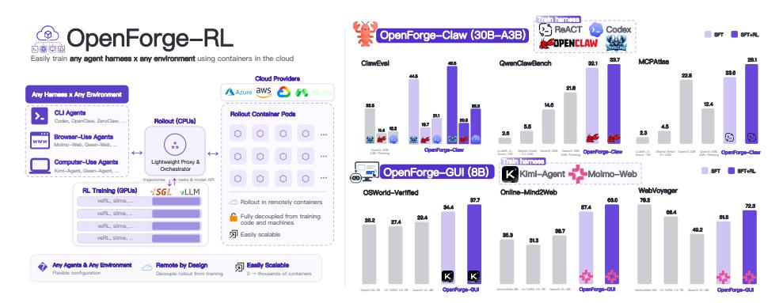

Figure 1: 왼쪽: OPENFORGE RL은 Orchard Env (Peng et al., 2026)를 기반으로 하며, 모든 하니스 × 모든 환경을 veRL과 같은 표준 RL 코드베이스에 연결하여 훈련-배포 불일치를 없앤다. 오른쪽: OPENFORGE로 훈련된 모델이 여섯 개의 하니스와 여섯 개의 Claw 및 GUI 환경에서 평가된다.

*동등 자문 기여; † 프로젝트 리드

# 1 INTRODUCTION (소개)

현대 AI 에이전트는 소프트웨어 엔지니어링 [\(Jimenez et al., 2024;](#page-11-0) [Yang et al., 2024;](#page-14-0) [Merrill et al., 2026\)](#page-11-1) 및 도구 사용 [\(Bandi et al.,](#page-10-0) [2026;](#page-10-0) [Patil et al., 2025\)](#page-12-1)에서부터 실제 웹 브라우저와 데스크톱 제어 [\(Zhou et al., 2024;](#page-14-1) [Xue et al.,](#page-14-2) [2025;](#page-14-2) [Xie et al., 2024\)](#page-13-0)까지 점점 더 복잡하고 개방형 환경에 배포되고 있다. 이러한 환경에서 효과적으로 작동하려면 최첨단 에이전트는 거의 언어 모델이나 시각-언어 모델만으로는 부족하며, 대신 점점 더 정교해지는 *추론 하네스*에 래핑된다: Claude Code [\(Anthropic, 2025\)](#page-10-1), Codex [\(OpenAI,](#page-12-2) [2025a\)](#page-12-2), OpenClaw [\(OpenClaw, 2025\)](#page-12-3)와 같은 오케스트레이션 스캐폴드가 다중 턴 상호작용, 도구 사용, 컨텍스트를 관리하면서 MCP 서버 [\(Anthropic, 2024\)](#page-10-2), 브라우저, GUI와 같은 외부 시스템과 모델을 연결한다. 이 하네스 계층은 이제 에이전트 능력의 핵심이 되었다: 에이전트 벤치마크의 최근 진전은 하네스와 강력한 기반 모델 모두에서 비롯된다 [\(Yang et al., 2024;](#page-14-0) [OpenAI, 2026\)](#page-12-4).

하네스가 장착된 에이전트는 놀라울 정도로 유능하지만, 이를 *엔드-투-엔드*로 개선하는 것은 두 가지 이유로 대부분의 공개 연구 커뮤니티에 아직 접근 불가능하다. 첫째, 하네스는 추론을 상태를 갖는 다중 프로세스 절차로 바꾸며, 중첩된 도구 호출, 서브에이전트, 장기 컨텍스트를 포함한다. 이는 공개 훈련 스택 [\(Sheng et al., 2024;](#page-12-5) [Zhu et al., 2025;](#page-15-0) [Cao et al., 2025\)](#page-10-3)에서 자연스럽게 표현할 수 없다. 공개 노력은 종종 훈련용으로 단순화된 하네스를 재구현해야 하며 [\(Wei et al., 2025;](#page-13-1) [Wang et al., 2026\)](#page-13-2), 훈련-배포 불일치를 만든다. 둘째, 하네스를 대규모로 실행하려면 훈련 노드에 공동 배치할 수 없는 전용 컨테이너화된 환경이 필요하지만, 대부분의 공개 RL 프레임워크는 롤아웃이 트레이너 내부에서 로컬로 실행된다고 가정한다. 이러한 격차는 독점 하네스 기반 시스템이 연구 커뮤니티가 훈련하고 연구할 수 있는 것보다 점점 앞서 나가게 한다.

이러한 격차를 해소하기 위해 우리는 OPENFORGE RL을 소개한다. 이는 하네스 기반 에이전트를 엔드-투-엔드로 훈련할 수 있도록 접근성을 제공하는 공개 프레임워크다. 핵심적으로 OPENFORGE RL은 두 가지 경량 컴포넌트로 이러한 장애물을 해결한다 (Figure [1](#page-0-0) 왼쪽 또는 Figure [2\)](#page-3-0) 참조). 첫째, 경량 프록시가 하네스의 추론 프로세스를 추상화하고 훈련과 분리하여 *어떤* 하네스든 자체 임의 추론을 실행할 수 있게 한다. 자동 트래젝터리 재구성과 결합하면 기록된 프롬프트-응답 쌍이 veRL [\(Sheng et al., 2024\)](#page-12-5)와 같은 모든 RL 코드베이스와 호환되는 표준 샘플이 된다. 둘째, Kubernetes 오케스트레이터는 [Peng et al.](#page-12-0) [\(2026\)](#page-12-0)를 따라 Microsoft Azure와 같은 클라우드 제공업체에서 각 롤아웃을 원격 컨테이너로 실행하며, 많은 동시 환경에 탄력적으로 확장한다. 이 두 가지는 풍부한 하네스 생태계를 직접 재사용하고, 도구 사용부터 GUI에 이르기까지 환경을 포괄하며, 기본 RL 알고리즘에 무관하게 동작한다.

우리는 OPENFORGE RL을 일상적인 도구 사용 및 클로우 기반 에이전트에서 멀티모달 GUI 브라우저 및 컴퓨터 사용 에이전트에 이르기까지 복잡한 에이전트 설정의 광범위한 스펙트럼에서 검증합니다. 일상 도구 사용 설정에서 OpenForge-Claw (30B-A3B MoE)는 표준 ReACT 루프 외에 3개의 인기 있는 하네스(ZeroClaw, OpenClaw, Codex)를 사용해 학습하며, ClawEval [\(Ye et al., 2026\)](#page-14-3)에서 31.7 (pass3) 및 55.9 (pass@3), QwenClawBench [\(Qwen Team & Data](#page-12-6) [Team, 2026\)](#page-12-6)에서 33.7, MCPAtlas [\(Bandi et al., 2026\)](#page-10-0)에서 28.1을 달성합니다. GUI 설정에서 OpenForge-GUI (8B)는 (수정된 버전의) Kimi-Agent [\(Xie et al., 2024\)](#page-13-0)와 Molmo-Web [\(Gupta et al., 2026\)](#page-11-2)를 학습하며, OSWorld-Verified에서 37.7, Online-Mind2Web에서 63.0, WebVoyager에서 72.3을 달성해 유사 규모의 공개 기준선보다 뛰어나며, 수배 규모의 모델과도 일치하거나 능가합니다. 가장 중요한 것은 OPENFORGE RL이 에이전트를 실제 배포 하네스에서 학습시키기 때문에 하네스 선택과 RL 훈련이 에이전트 행동을 어떻게 형성하는지 연구할 수 있다는 점입니다. 이는 이전 공개 연구가 쉽게 물어볼 수 없었던 질문이며 (섹션 [5\)](#page-8-0): 일부 하네스는 다른 것보다 훨씬 학습하기 어렵고, RL은 전반적으로 *에이전트 신뢰성*을 향상시키지만 오류 복구와 같은 능력은 여전히 약합니다.

요약하면, 우리의 기여는 세 가지입니다:

- 우리는 OPENFORGE RL을 도입합니다. 이는 *어떤 하네스든 어떤 환경과도* 유연하게 매칭할 수 있는 확장 가능한 훈련 인프라로, 실제 하네스 생태계와 클라우드 서비스 제공업체의 원격 샌드박스를 강력한 RL 코드베이스(예: veRL)와 연결합니다.  
- 우리는 도구 사용/클로우 및 GUI(브라우저 및 컴퓨터 사용) 에이전트 전반에 걸친 광범위한 실증 연구를 수행하며, 거의 모든 벤치마크에서 유사 규모의 공개 모델을 능가하고, 몇몇 경우에는 수배 규모의 모델보다도 우수합니다.  
- 실제 배포 하네스에서 학습함으로써, 우리는 하네스 선택과 RL이 에이전트를 어떻게 형성하는지 분석합니다: 단순하고 더 잘 정렬된 하네스는 학습하기 쉽고, 훈련은 유사 하네스에 걸쳐 일반화되며, RL은 전반적으로 *에이전트 신뢰성*을 향상시킵니다(예: 자체 검증, 도구 활용도, 과제 완료). 그러나 오류 복구는 여전히 학습하기 어려운 과제입니다.

# 2 관련 연구 (RELATED WORK)

추론 하네스를 갖춘 에이전트. LLM 기반 코딩 에이전트가 등장함에 따라, 초기 연구인 SWE-Agent [\(Yang et al., 2024\)](#page-14-0)는 정교하게 설계된 에이전트-컴퓨터 인터페이스가 과제 성공률을 크게 향상시킨다는 것을 보여주었습니다 [\(Jimenez et al., 2024;](#page-11-0) [Xia et al., 2024;](#page-13-3) [Wang et al., 2025a\)](#page-13-4). 이후 Claude Code [\(Anthropic, 2025\)](#page-10-1)와 Codex [\(OpenAI, 2025a\)](#page-12-2)와 같은 하네스는 소프트웨어 엔지니어링을 위한 이 레시피를 정제했으며, OpenClaw [\(OpenClaw, 2025\)](#page-12-3)와 같은 오픈소스 노력은 이를 일상 작업과 GUI 작업까지 확장했습니다 [\(Hong et al., 2024;](#page-11-3) [Qin et al., 2025;](#page-12-7) [Xie et al.,](#page-13-0) [2024;](#page-13-0) [Agashe et al., 2024\)](#page-10-4). 우리는 하네스를 개발하는 대신, 이러한 하네스를 사용해 LLM- 및 VLM 기반 에이전트를 엔드-투-엔드로 훈련하는 방법을 연구하며, 에이전트 훈련을 실제 사용 환경과 정렬시켜 모델이 배포되는 동일한 설정에서 학습할 수 있도록 합니다.

하네스 기반 에이전트 훈련.

# 3 방법 (METHODS)

# 3.1 표기법 (NOTATION)

복잡하고 장기적인 환경에서 과제를 완수하는 것은 일반적으로 마코프 결정 과정(Markov Decision Process, MDP) ⟨S, A, T , R, γ⟩으로 공식화된다. 다중 단계 과제의 각 단계 t에서, LLM 기반 에이전트 πθ는 관찰 st ∼ S와 함께 과제 지시를 받고, 행동 at ∼ π(·|st)를 생성하며, 다음 관찰 st+1 ∼ S로 전이한다. 단순 추론(예: ReACT [Yao](#page-14-5) [et al.](#page-14-5) [\(2023\)](#page-14-5)) 하에서는, 에이전트는 원시 상호작용 기록 ⟨st−H, at−H, …, st⟩를 받고, 다음 행동 at를 내보내기 전에 추론한다. 이 루프는 과제가 완료되거나 최대 단계 수에 도달할 때까지 반복되며, 그 시점에서 최종 보상 rT ∼ R(aT, sT)가 성공 여부를 나타낸다. 그러나 코딩 및 GUI 제어와 같은 복잡한 과제에서는, 사전 연구가 정교하게 설계된 도구와 고급 제어 흐름—하위 에이전트, 스킬, 계획 모드—이 에이전트 성능을 크게 향상시킨다는 것을 보여주었다 [\(Wang et al., 2023;](#page-13-5) [Wu et al., 2023;](#page-13-6) [Agashe et al., 2024\)](#page-10-4). 실제로, 에이전트는 내부적으로 이러한 도구와 제어 흐름을 제공하는 하네스 H(π)로 래핑되므로, 그 효과적인 컨텍스트는 더 이상 원시 상호작용 기록이 아니다. 이 복잡성을 추상화하기 위해, 우리는 (i) 하네스 추론 중 생성된 각 프롬프트-응답 쌍을 (H(st), at)로 표시하고, (ii) 전체 궤적을 순서가 없는 모음 τ = ⟨(H(s0), a0),(H(s1), a1), …,(H(sT), aT)⟩로 정의한다.

# 3.2 OPENFORGE RL (OPENFORGE RL)

소프트웨어 엔지니어링을 넘어서는 새로운 에이전트 도메인들은 점점 더 잘 벤치마크되고 있지만 [\(Patil et al., 2025;](#page-12-1) [Wu et al., 2025;](#page-13-7) [Bandi et al., 2026\)](#page-10-0) , 이러한 도메인에서 하네스 기반 에이전트를 엔드-투-엔드로 훈련하는 것을 지원하는 오픈소스 인프라가 거의 없다. 이는 두 가지 이유로 어려운 문제이다. 첫째, 기존 RL 프레임워크는 훈련자가 모델의 프롬프트에 직접 접근하고 완전한 제어를 가질 수 있다고 가정한다.

1Polar와 같은 동시 연구 [\(Xu et al., 2026\)](#page-13-8)는 유사한 접근법을 제안하지만 소프트웨어 엔지니어링 작업(SWE-Bench-Verified)에 초점을 맞춘다. 우리 연구는 텍스트 기반 클로우 작업과 시각 기반 GUI 작업을 포함한 여섯 개 벤치마크에 걸쳐 훨씬 더 넓은 설정을 다루며, 하네스 선택과 RL이 에이전트 행동을 어떻게 형성하는지도 추가로 분석한다.

2기술적으로, 우리 환경에서 에이전트로 들어오는 모든 입력은 관측값(부분 관측 마르코프 결정 프로세스, POMDP)이다; 표기법을 단순화하기 위해 환경으로부터 받은 입력 데이터를 s로 표시한다.

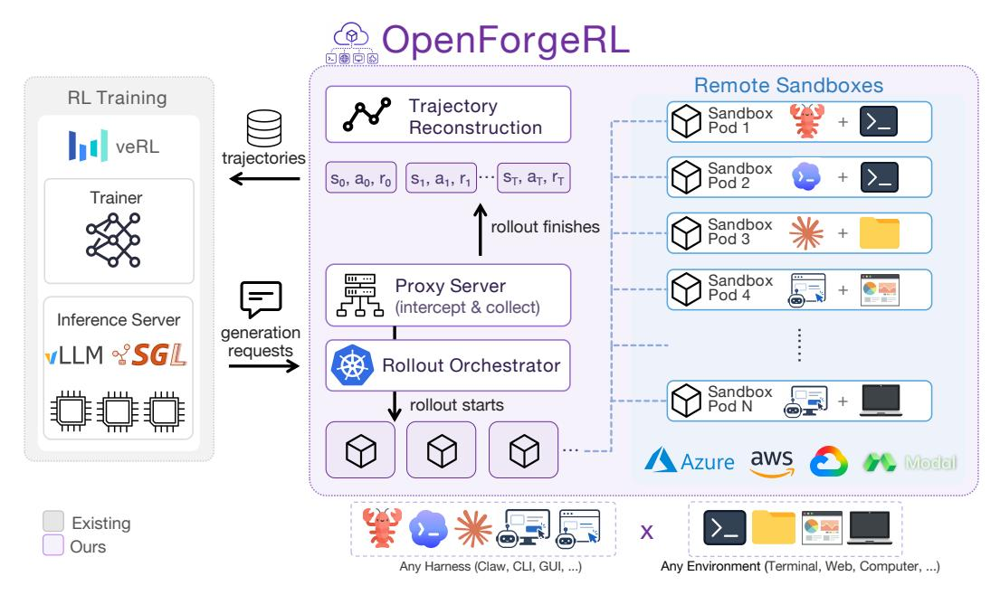

Figure 2: OPENFORGE RL 개요. 오케스트레이터는 원격 샌드박스를 생성하며, 그 안에서 LLM/VLM이 하네스를 통해 환경과 상호작용한다. 프록시는 하네스의 LLM 호출을 가로채어 RL 프레임워크의 추론 엔진으로 라우팅하고, 교환된 입력-출력 쌍을 학습 트레젝터리로 기록한다. 새로운 하네스나 환경을 지원하려면 샌드박스만 수정하면 된다.

롤아웃 전반에 걸친 과다 생성; 하네스는 이 가정을 깨는데, 그들의 제어 흐름, 서브에이전트, 컨텍스트 관리는 트레이너에게 노출되지 않기 때문이다. 둘째, 하네스 롤아웃은 전용 CPU와 메모리를 갖춘 컨테이너화된 환경이 필요하며, 이는 훈련 노드에 *대규모*로 함께 배치될 수 없다. 더 넓게 보면, 공개 모델은 배포되는 하네스에서 훈련되는 경우가 드물어, 폐쇄형 최첨단 모델과의 격차가 커진다.

우리는 이를 OPENFORGE RL로 해결한다. OPENFORGE RL은 인기 있는 RL 프레임워크(예: veRL)를 분산 하네스 롤아웃(그림 2)과 연결하는 플러그 앤 플레이 롤아웃 인터페이스다. 추론 서버(예: vLLM Kwon et al. (2023))가 주어지면, OPENFORGE RL은 (1) Microsoft Azure와 같은 클라우드 공급자에서 롤아웃 컨테이너 포드를 생성, 관리, 삭제하는 Kubernetes 오케스트레이터를 실행하고, (2) 추론 서버를 감싸고 해당 컨테이너가 발행하는 모든 생성 요청을 가로채는 프록시를 실행한다. 롤아웃이 끝나면, 프록시는 컨테이너에서 최종 보상 $r_T$(일반적으로 작업 성공)와 프롬프트-응답 쌍 $(s^{\mathcal{H}}, a)$를 수집하고, 학습 샘플을 다음과 같이 재구성한다:

$$\tau = (s_0^{\mathcal{H}}, a_0, r_0), (s_1^{\mathcal{H}}, a_1, r_1), \dots, (s_T^{\mathcal{H}}, a_T, r_T); \quad r_t = \gamma^{T-t} \cdot r_T$$

(1)

보통 $\gamma=1.0$을 사용한다. GRPO와 같은 그룹 기반 알고리즘으로 최적화할 때, Feng et al. (2025)를 따르며 같은 그룹 내 서로 다른 트레젝터리의 평균 샘플 보상을 비교해 아드밴티지를 계산한다. 원격 컨테이너에 롤아웃을 오프로드하면 많은 동시 환경으로 확장할 수 있지만, 세 가지 실용적인 과제가 발생한다. 우리는 아래에서 이를 해결한다.

**롤아웃 오케스트레이션.** 다수의 롤아웃 컨테이너의 수명 주기를 관리하기 위해, 우리는 Orchard(Peng et al., 2026)를 기반으로 Microsoft Azure와 같은 클라우드 공급자에서 롤아웃 컨테이너를 생성, 삭제, 리소스를 할당하는 Kubernetes 오케스트레이터를 구현한다. 이로써 우리는 훈련 노드를 과부하시키지 않고 동시 롤아웃 수를 탄력적으로 쉽게 관리하고 확장할 수 있다.

비동기 롤아웃 및 타임아웃. 각 롤아웃이 원격에서 실행되고 트레이너의 제어 밖에 있기 때문에, 하나의 응답이 없는 롤아웃이 전체 훈련 배치 수집을 차단하고 이후 훈련을 정지시킬 수 있다. 롤아웃당 턴 수를 제한하는 것(Jin et al., 2025; Yu et al., 2025b)은 일반적인 방어책이지만, 이 환경에서는 신뢰할 수 없다: 일부 하네스(예: Codex)는 턴 제한을 노출하지 않으며, "턴"이 하네스마다 일관되지 않게 정의된다. 우리는 대신 각 롤아웃 작업에 (관대한) 월클록 타임아웃을 부과한다. 작업이 타임아웃을 초과하면, 우리는 이를 종료하고 반환한다.

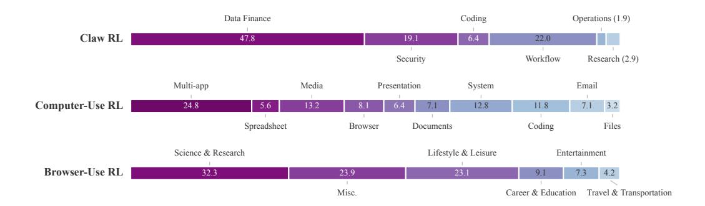

그림 4: OPENFORGE RL 훈련을 위한 Claw, Computer-Use, Browser-Use 도메인에서 사용된 작업의 분포(%) (상단부터 하단까지). SFT 작업 분포는 유사하며 그림 A6에 표시되어 있다.

오류 신호를 프록시와 궤적 재구성 모듈에 전달하여, 훈련은 종료된 롤아웃에 의해 차단되지 않고 나머지 롤아웃에서 계속 수집된다.

**오류 처리.** 이러한 복잡한 환경에서 롤아웃은 정책 모델과 무관한 이유(네트워크 문제, 하네스 충돌, 타임아웃 등)로 실패할 수 있다. DAPO(Yu et al., 2025a)를 따라, 우리는 그러한 오류로 끝난 궤적의 모든 샘플을 버리는 간단한 전략을 고려한다. 왜냐하면 부분 롤아웃은 잘못된 훈련 신호를 주입할 수 있기 때문이다(예: 부정적 보상을 받는 올바른 접두사). 이러한 부분 롤아웃에 대한 더 나은 크레딧 할당 설계는 유망한 방향이며, 우리는 이를 향후 연구로 남겨둔다.

#### 3.3 데이터 합성 (DATA SYNTHESIS)

본 연구는 코딩을 넘어 브라우저 및 컴퓨터 사용과 같은 다양한 환경에서 하네스 기반 에이전트를 엔드-투-엔드로 훈련하는 것을 목표로 한다. 코딩(Badertdinov et al., 2026)과 달리, 이 도메인들은 훨씬 적은 수의 훈련 작업, 하네스, RL 준비 환경을 제공한다. 다양한 환경에서 우리의 프레임워크를 실험하기 위해, 우리는 데이터가 부족한 도메인(예: claw/일일 도구 사용 및 컴퓨터 사용)을 위해 SFT와 RL 작업을 합성하는 간단한 파이프라인을 구축했다. 아래에 고수준 개요를 제시하고, 전체 세부 사항은 Section B.1에 맡긴다.

파이프라인은 인간이 작업을 선별하는 방식을 모방하도록 설계되었다(Xie et al., 2026; Zhou et al., 2025). 목표 도메인과 작업 수가 주어지면, 병렬로 에이전트를 생성하여 (1) **제안** 현실적인 시나리오에 기반한 후보 지침을 웹/X API 또는 참조 자산 및 지침 풀에서 가져온다; (2) **제거** 저품질 및 중복 작업을; (3) **구축** 각 작업에 대한 실행 가능한 환경과 검증 스크립트를; (4) **테스트** 별도의 오픈 LLM/VLM을 롤아웃하여 작업을; 그리고 (5) **정제** 결함을 패치하여 모든 검사를 통과할 때까지 수행한다. 테스트 및 정제 단계는 필수적이며, 각 작업을 끝까지 검증한다.

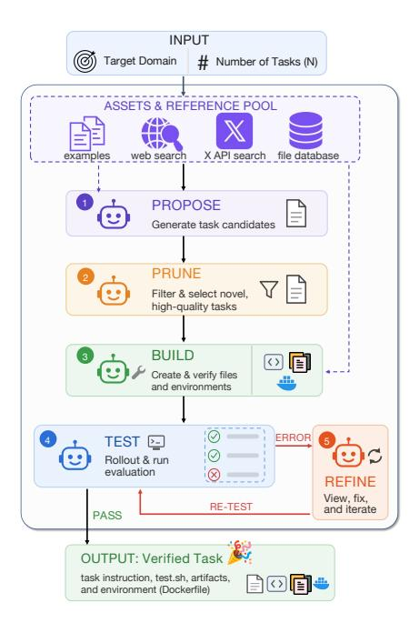

그림 3: 우리 데이터/작업 합성 파이프라인 개요.

데이터셋에 들어가기 전에 끝난다. 그림 3은 파이프라인을 보여주며 Section B.1은 전체 세부 사항을 제공한다. 각 환경은 사용자 정의 Dockerfile로 정의되므로, 파이프라인은 Linux/CLI 작업(예: claw)에서 GUI 및 컴퓨터 사용 작업(예: Xvfb로 가상 디스플레이 렌더링)으로 자연스럽게 확장되며 OpenClaw 및 Codex와 같은 임의의 하네스를 사전 설치할 수 있다. 결과 작업과 환경은 SFT(강력한 모델의 롤아웃에서 증류를 통해)와 RL을 모두 지원한다. 우리는 이 데이터와 파이프라인을 향후 사용을 위해 공개할 것이다.

표 1: Claw 및 GUI 에이전트 훈련에 사용된 SFT 및 RL 데이터 통계. GUI의 경우, 우리는 Kimi-Agent 및 Molmo-Web 하네스의 약간 수정된 버전을 사용했다(섹션 [C.3](#page-19-0) 및 [C.4\)](#page-20-0) 참조).

|  | Claw | GUI(컴퓨터) | GUI(브라우저) |
|--------------------|--------------------------------|---------------|--------------|
| 활용 | ReACT*,ZeroClaw,OpenClaw,Codex | Kimi-Agent* | MolmoWeb* |
| # SFT 궤적 (SFT Trajectories) | 892 | 795 | 1,496 |
| # RL 작업 (RL tasks) | 343 | 252 | 900 |

# 4 실험 (4 EXPERIMENTS)

이 섹션에서는 OPENFORGE RL을 사용하여 다양한 하네스와 환경에서 에이전트를 훈련합니다. 그런 다음 훈련된 에이전트를 텍스트 기반 도구 사용(claw)과 멀티모달 GUI(브라우저 및 컴퓨터 사용) 도메인을 아우르는 여섯 개의 인기 벤치마크에서 평가합니다. 다음 섹션에서는 *how* OPENFORGE RL 훈련이 에이전트 행동을 어떻게 재구성하는지, 도구 사용 패턴, 보지 못한 하네스에 대한 일반화, 그리고 SFT 위에 RL이 도입하는 행동 변화를 조사합니다.

## 4.1 CLAW 에이전트 (4.1 CLAW AGENTS)

우리는 먼저 OPENFORGE RL을 사용하여 *diverse harnesses*에서 에이전트를 훈련합니다. 여기서는 환경 유형을 텍스트 기반 작업으로 고정하고, LLM 기반 에이전트를 일상적인 작업(이메일 읽기, 지식 베이스 검색, 헬프데스크 티켓 업데이트 등)에서 훈련 및 평가합니다. 이 작업들은 ZeroClaw, OpenClaw, Codex와 같은 하네스에서 수행됩니다.

SFT 및 RL 데이터 우리는 Section [3.3](#page-4-1)에서 우리의 파이프라인을 사용하여 SFT와 RL 모두를 위한 대규모 작업 및 실행 가능한 환경 풀을 자동으로 생성합니다. 제안 단계의 시드를 위해, 우리는 파이프라인에 (1) ClawHub access[3](#page-5-0)와 (2) ZClaw-Bench [\(AI, 2026\)](#page-10-8)에서 가져온 자산 및 참조 풀을 제공합니다. 이 두 가지는 사람들의 일상적인 claw-based agents 사용을 반영하는 예시를 제공합니다. Table [1](#page-5-1)과 Figure [4](#page-4-2)는 생성된 작업의 통계와 카테고리 분포를 보고합니다. 다양한 하네스에서의 훈련 효과를 연구하기 위해, 우리는 각 작업을 Rollouts에 대해 네 가지 하네스 중 하나와 짝지웁니다: ReACT (간단한 루프를 통해 작업 해결), ZeroClaw, OpenClaw, Codex. 훈련 데이터셋 통계는 Table [1](#page-5-1)과 Figure [4.](#page-4-2)에 표시됩니다. 자세한 내용은 Section [B.2.](#page-17-1)을 참조하십시오.

Training Details 우리는 Qwen3-30B-A3B-Thinking [\(Yang et al., 2025\)](#page-14-8)를 백본 모델로 사용합니다. SFT의 경우, 우리는 더 강력한 교사 모델(MiniMax-M2.5, [Mini-](#page-12-9)[Max](#page-12-9) [\(2026\)](#page-12-9))에서 궤적을 증류합니다: 각 작업마다 N = 3 rollouts를 샘플링하고 성공한 것만 훈련에 사용합니다. RL의 경우, 우리는 SFT 체크포인트에서 계속 진행하고 GRPO [\(Guo et al., 2025;](#page-11-8) [Shao et al., 2024\)](#page-12-10)를 사용해 훈련합니다. OPENFORGE RL을 구현하기 위해, 우리는 veRL [\(Sheng et al., 2024\)](#page-12-5)를 훈련 백엔드로 사용하고 Microsoft Azure를 롤아웃 컨테이너용 클라우드 공급자로 사용합니다. 배치 크기는 8, 그룹 크기는 8이며, 8×B200 GPU에서 훈련합니다. 추가 세부 사항(훈련 하이퍼파라미터 및 훈련 곡선 포함)은 Section [A.1.](#page-16-0)을 참조하십시오.

Evaluation Benchmarks 우리는 두 개의 인기 있는 claw-based 벤치마크, ClawEval [\(Ye](#page-14-3) [et al., 2026\)](#page-14-3)와 QwenClawBench [\(Qwen Team & Data Team, 2026\)](#page-12-6), 그리고 더 넓은 도구 호출 벤치마크인 MCPAtlas [\(Bandi et al., 2026\)](#page-10-0)를 평가합니다. ClawEval의 경우, 우리는 2026-04-08 릴리스를 사용하고 공식 프로토콜을 따르며, 벤치마크의 기본 ReACT 루프를 하네스로 사용해 pass3 및 pass@3을 보고합니다. QwenClawBench의 경우, 우리는 공식 구현을 따르고 OpenClaw [\(OpenClaw, 2025\)](#page-12-3)를 사용해 작업을 해결합니다. 주요 지표로 pass@1을 보고합니다. MCPAtlas의 경우, 우리는 벤치마크의 기본 20-서버 구성을 사용하며, 이는 재현성을 위해 서드파티 자격 증명이나 서비스별 데이터 초기화가 필요한 선택적 서버를 제외합니다. 총 89개의 작업이 포함되며, 이 작업들의 실제 예상 도구 호출은 이 서버 세트에 완전히 지원됩니다. 공식 설정을 따르고 벤치마크의 LLM-as-judge claim-coverage 평가자를 사용해, 커버리지 점수가 0.75 이상인 경우 작업을 성공으로 간주합니다. 주요 지표로 pass@1을 보고합니다. 평가에 대한 자세한 내용은 Section [C.](#page-19-1)을 참조하십시오.

3 에이전트는 <https://clawhub.ai/>에서 인기 있는 스킬/사용 사례를 명령줄로 조회할 수 있습니다.

| 시스템 | ClawEval |  | QwenClawBench | MCPAtlas♠ |  |
|----------------------------------------|---------------------|--------------|---------------|-----------|--|
| 시스템 | $\overline{pass^3}$ | pass@3 | pass@1 | pass@1 |  |
| 최첨단 대형 언어 모델 (SOTA Large Language Models) |  |  |  |  |  |
| Claude Opus 4.6*† | 70.8 | 80.8 | 59.5 | 76.4 |  |
| GPT 5.4* † | 60.2 | 75.8 | 56.7 | 68.5 |  |
| Gemini 3.1 Pro* | 55.9 | 80.8 | _ | _ |  |
| Qwen3.5 397A17B* | 57.8 | 70.8 | 54.2 | 66.3 |  |
| GLM 5 Turbo* | 52.8 | 73.3 | _ | 67.4 |  |
| MiniMax M2.7* | 49.7 | 72.0 | 50.5 | 50.6 |  |
| MiniMax M2.5 | 47.2 | 65.2 | 51.2 | 57.3 |  |
| Kimi K2.5*† | 36.6 | 67.1 | 51.9 | 52.8 |  |
| 유사 크기 기준선 및 우리 모델 ( | (30B-A3B | ; ~3B active | ) |  |  |
| LLaMA-4-Scout-17B-16E-Instruct | 0.6 | 16.8 | 2.6 | 2.3 |  |
| Mistral-Small-3.1-24B-Instruct | 3.1 | 19.3 | 5.5 | 4.5 |  |
| Qwen3-32B | 6.8 | 31.7 | 14.6 | 22.5 |  |
| Qwen3-30B-A3B-Thinking | 14.3 | 39.8 | 21.8 | 12.4 |  |
| Qwen3-Coder-30B-A3B-Instruct | 30.4 | 49.7 | 24.3 | 19.1 |  |
| OpenForge-Claw(SFT) | 21.7 | 52.1 | 32.1 | 23.6 |  |
| OpenForge-Claw(SFT+RL) | 31.7 | 55.9 | 33.7 | 28.1 |  |

Table 2: Claw-Eval, QwenClawBench, 그리고 MCPAtlas에서의 Claw-agent 성능. Claw-Eval에서는 일반 도메인(0408)을 사용합니다. *는 Claw-Eval 리더보드의 숫자를 표시합니다. †는 QwenClawBench 리더보드의 숫자를 표시합니다. MCPAtlas♠ 결과는 자격증명 서버 구성이 없는 89개 과제에서의 pass@1입니다.

**결과** 우리는 Table 2에 우리의 결과를 제시합니다. 유사한 크기(약 30B, 또는 MoE 모델과  $\sim$ 3B 활성 파라미터) 및 훈련되지 않은 Qwen3-30B-A3B-Thinking 백본과 비교할 때, 우리의 OpenForge-Claw 모델은 세 가지 벤치마크 전반에서 우수한 성과를 달성합니다. 이는 OpenClaw와 같은 하네스를 통해 모델이 일상적인 작업을 해결할 수 있도록 유용한 학습 신호를 제공하는 정제된 과제와 환경의 효과성을 나타냅니다. 다음으로, OpenForge-Claw(SFT)와 비교할 때, 우리의 OpenForge-Claw(SFT+RL)은 ClawEval에서의 $pass^3$와 QwenClawBench 및 MC-PAtlas에서의 pass@1 평균 성공률 모두에서 상당한 개선을 보여줍니다. 이는 모델이 환경 및 하네스와의 온라인 상호작용을 통해 탐색하고 학습할 수 있도록 하는 OPENFORGE RL 훈련 인프라의 효과성을 나타냅니다. 다른 하네스 전반에 걸친 평가와 보지 못한 하네스에 대한 일반화에 대해서는 각각 Section 5.1 및 Section 5.2를 참조하십시오.

#### 4.2 GUI 에이전트 (GUI AGENTS)

다양한 하네스 외에도, 우리는 *다양한 환경*에서 OPENFORGE RL 훈련을 탐구합니다. 예를 들어, 시각 인식과 컴퓨터 사용 및 브라우저 사용 과제에서 저수준 마우스 및 키보드 제어가 필요한 멀티모달 GUI 환경이 있습니다.

SFT 및 RL 데이터 섹션 4.1과 동일한 절차를 따라, 우리는 섹션 3.3의 파이프라인을 사용하여 대규모 과제 및 환경 풀을 자동으로 생성합니다. 컴퓨터 사용 과제의 제안 단계에 시드를 주기 위해, 우리는 파이프라인에 (1) X(이전의 Twitter) 검색 API 접근4, (2) AgentNet (Wang et al., 2025b)에서 가져온 22k개의 지침, (3) Synthetic-Computer-Use (Ge et al., 2026)에서 가져온 합성 파일 및 데이터를 포함하는 참조 및 아티팩트 풀을 제공합니다. 이는 각 환경을 현실적인 자산으로 채웁니다. 컨테이너화된 컴퓨터 사용 환경을 구축하기 위해, 우리는 Xvfb로 가상 디스플레이를 렌더링하고 GUI 하네스(예: Kimi-Agent)를 사전 설치하여 VLM이 시뮬레이션된 마우스 클릭(예: left_click(x,y)) 및 키보드 동작(예: type(\"text\"))을 통해 기계를 제어할 수 있도록 합니다. 브라우저 사용의 경우, 현실적인 웹사이트와 그 데이터베이스를 합성하는 것이 비현실적이므로, 우리는 대신 OpenWebRL (Yang et al., 2026)을 따르고 기존 데이터셋에서 실제 웹사이트 과제를 추출합니다. 구체적으로, 우리는 (1) WebGym (Bai et al., 2026)에서 과제를 시작합니다;

&lt;sup>4 에이전트는 X 검색 API를 사용하여 컴퓨터 사용 에이전트의 실제 사용 사례를 찾을 수 있습니다.

| 시스템 | #단계 | OSWorld-Verified | OnlineMind2Web | WebVoyager |
|--------------------------------|-----------|------------------|----------------|------------|
| 최첨단 비전-언어 모드 | ls |  |  |  |
| GPT 5.4* † | 100 | 75.0 | 92.8 | _ |
| Claude Opus 4.6*† | 100 | 72.7 | 84.0 | _ |
| Gemini 3.1 Pro* | 100 | 76.2 | _ | _ |
| Kimi K2.5* | 100 | 63.3 | 60.4 | 74.3 |
| Qwen3-VL 235BA22B* | _ | 38.1 | 63.7 | 66.4 |
| OpenCUA-32B* | 50 | 34.1 | _ | _ |
| 유사 크기 기준선 및 우리 | 모델 (~{ | 8B) |  |  |
| MolmoWeb-8B † | 30 | _ | 35.3 | 78.2 |
| OpenCUA-7B* | 50 | 28.2 | _ | _ |
| UI-TARS-1.5-7B* † | 100 | 27.4 | 31.3 | 66.4 |
| Qwen3-VL-8B | 50 | 29.4 | 38.7 | 49.2 |
| OpenForge-GUI(SFT) | 30 | 34.4 | 57.4 | 61.5 |
| OpenForge-GUI(SFT+RL) | 30 | 37.7 | 63.0 | 72.3 |

Table 3: OSWorld-verified, OnlineMind2Web, WebVoyager에서의 GUI-에이전트 성능. 모든 결과는 pass@1이다. *모델의 공식 기술 보고서에 보고된 숫자; †Yang et al. (2026); Gupta et al. (2026)에 보고된 숫자. 최고값은 **굵게**, 두 번째 값은 회색으로 표시된다.

(2) 평가 벤치마크와 겹치는 작업을 필터링하고 인기 있는 웹사이트에 제한한다; (3) 중복 제거를 수행한다. 결과적으로 SFT 풀은 2500개의 작업과 900개의 RL 작업이 된다. Open-WebRL과 같이, 우리는 GPT-4.1 (OpenAI, 2025b)를 평가자로 사용하여 SFT 데이터 구축과 RL 훈련 중 작업 성공 여부를 판단한다. 컨테이너화된 브라우저 사용 환경을 구축하기 위해 GUI-브라우저 하네스(즉, Molmo-Web)를 사전 설치하고 Browser-Use (Browser Use, 2026)의 원격 브라우저 서비스를 사용해 실제 웹사이트와 상호작용한다. 훈련 데이터셋 통계는 Table 1과 Figure 4에 표시된다. GUI 훈련 데이터에 대한 자세한 내용은 Section B.3을 참고한다.

**Training Details** 우리는 모든 훈련에 Qwen3-VL-8B-Thinking (Yang et al., 2025)을 백본 모델로 사용한다. SFT의 경우, 더 강력한 교사 모델(Kimi-K2.5, Team et al. (2026))에서 궤적을 증류한다: 각 작업마다 N=3개의 롤아웃을 샘플링하고 성공한 것만 훈련에 사용한다. RL의 경우, 이전 섹션을 따르며 OPENFORGE RL을 veRL을 훈련 백엔드로, Microsoft Azure를 롤아웃 컨테이너용 클라우드 제공자로 인스턴스화한다. 우리는 배치 크기 8, 그룹 크기 8인 GRPO를 사용하고 $8\times B200$ GPU에서 훈련한다. 모든 모델은 훈련과 평가 모두에서 스크린샷을 시각 입력으로 사용한다. 추가적인 세부 사항(훈련 하이퍼파라미터 및 훈련 곡선 등)은 Section A.2를 참고한다.

**Evaluation Benchmarks** 우리는 세 가지 인기 있는 GUI 벤치마크에서 평가한다: 컴퓨터 사용 환경용 OSWorld-Verified (Xie et al., 2024)와 브라우저 사용용 Online-Mind2Web (Xue et al., 2025) 및 Web-Voyager (He et al., 2024). OSWorld-Verified의 경우, 공식 프로토콜을 따르고 평균 성공률을 보고한다. 브라우저 사용의 경우, Yang et al. (2026); Awadallah et al. (2025)를 따르며, Online-Mind2Web에서는 o4-mini (OpenAI, 2025c)와 함께 AgentTrek 프로토콜 (Xu et al., 2025)을 사용하고, WebVoyager에서는 GPT-4o (OpenAI, 2024)와 함께 공식 프로토콜을 사용하여 평균 성공률을 보고한다. 각 벤치마크에 대한 자세한 내용은 Sections C.3 및 C.4에 있다.

Results 우리는 Table 3에 결과를 제시한다. 컴퓨터 사용 또는 브라우저 사용을 위해 특별히 미세 조정된 유사 크기(약 8B) 모델(예: OpenCUA, UI-TARS, MolmoWeb)과 비교할 때, 우리의 OpenForge-GUI 모델은 거의 모든 벤치마크에서 우수한 성능을 달성한다. 특히 MolmoWeb은 20만 개 이상의 작업으로 훈련되었지만, OpenForge-GUI는 2.5k 작업만 사용하면서도 Online-Mind2Web에서 이를 능가하고 WebVoyager에서는 경쟁력을 유지한다. 더욱 중요한 것은 OpenForge-GUI(SFT+RL)이 세 가지 벤치마크 모두에서 OpenForge-GUI(SFT)보다 크게 향상된다는 점이다. 이는 텍스트 전용 설정보다 훨씬 어려운 OpenForge RL 테스트이다: 모든 GUI 롤아웃은 컨테이너화된 가상 디스플레이 내부에서 전체 VLM 하네스를 실행하고, 화면을 시각적으로 인식하며, 실제 애플리케이션 및 웹사이트에 대해 저수준 마우스 및 키보드 동작의 긴 시퀀스를 발행한다. 이러한 일관된 향상은 OpenForge RL이 다양한 하네스 이상으로 일반화된다는 것을 보여준다.

Table 4: 다양한 하네스를 사용한 ClawEval에서 OpenForge-Claw의 비교.

|  | ClawEval(pass@1) |  |  |  | ClawEval(pass@3) |  |  |  |
|------------------------|------------------|----------|----------|-------|------------------|----------|----------|-------|
| 모델 (Model) | ReACT* | ZeroClaw | OpenClaw | Codex | ReACT* | ZeroClaw | OpenClaw | Codex |
| Qwen3-30B-A3B-Thinking | 26.1 | 32.5 | 11.4 | 12.2 | 39.8 | 44.7 | 19.3 | 18.6 |
| Orchard-Claw(SFT) | 36.2 | 44.5 | 16.7 | 21.1 | 52.1 | 66.5 | 24.2 | 35.4 |
| Orchard-Claw(SFT+RL) | 45.1 | 48.5 | 20.9 | 32.5 | 55.9 | 67.1 | 27.8 | 51.5 |

다양하고 고도로 복잡한 환경에서, 다중 턴, 다중 모달 GUI 작업에서도 요구되는 상황에서 에이전트를 엔드-투-엔드로 훈련한다.

# 5 논의 (DISCUSSION)

이 섹션에서는 하네스 선택이 학습에 미치는 영향과 하네스 기반 SFT 및 RL 훈련에서 우리 모델이 무엇을 학습하는지 분석한다. 우리는 세 가지 질문을 중심으로 분석을 구성한다. (1) *일부 하네스가 다른 것보다 마스터하기 더 어려운가?* (섹션 [5.1\)](#page-8-1)). (2) *하나의 하네스에서 훈련하면 보이지 않는 하네스로 전이되는가, 그리고 여러 하네스를 동시에 훈련하면 추가적인 이점이 있는가?* (섹션 [5.2\)](#page-8-2)). (3) *RL이 SFT 위에 어떤 기능을 추가하는가?* (섹션 [5.3\)](#page-9-0)). 단순화를 위해 우리는 OpenForge-Claw 모델을 ClawEval 벤치마크에서 평가한 연구에 초점을 맞춘다.

## 5.1 다른 하네스 간 평가 (EVALUATION ACROSS DIFFERENT HARNESSES)

우선, 일부 하네스가 다른 것보다 학습하기 더 어려운지 여부를 연구한다. 원칙적으로는 모든 하네스로 모든 작업을 해결할 수 있지만, 실제로는 이전 연구 [\(Yang et al., 2024;](#page-14-0) [Wang et al., 2024\)](#page-13-11)가 도구와 제어 흐름이 모델의 역량과 더 잘 정렬될 때 더 높은 성능을 더 쉽게 달성할 수 있음을 발견했다.

따라서 우리는 ReACT\*, ZeroClaw, OpenClaw, Codex라는 점진적으로 정교해지는 네 가지 하네스를 사용해 ClawEval에서 훈련된 OpenForge-Claw 모델을 평가한다. ReACT\*는 벤치마크의 원래 하네스로, 모델에게 반복적으로 추론하고 도구를 호출하도록 유도하는 ReACT와 유사한 루프이며, ZeroClaw [\(ZeroClaw, 2025\)](#page-14-11)는 OpenClaw의 경량화 버전으로 새로운 도구를 등록하는 쉬운 방법을 제공한다. OpenClaw [\(OpenClaw, 2025\)](#page-12-3)와 Codex [\(OpenAI, 2025a\)](#page-12-2)는 훨씬 더 발전된 형태로 풍부한 내장 도구와 제어 흐름을 제공하지만, 사용자 정의 도구를 쉽게 지원하지 않는다. 따라서 우리는 각 ClawEval 전용 도구를 SKILL.md 파일을 통해 이들에 노출시킨다 (섹션 [C.1\)](#page-19-2) .

Table [4](#page-8-3) 보고서 결과, 두 가지 추세가 두드러진다. 첫째, ReACT와 ZeroClaw처럼 사용자 정의 도구를 직접 추가할 수 있는 하네스가 가장 높은 성능을 달성한다. 둘째, OpenClaw를 제외한 모든 하네스에서 SFT+RL이 큰 이점을 가져오며, OpenClaw는 적당한 이점만을 보이며 다른 하네스보다 훨씬 긴 프롬프트와 컨텍스트를 소비한다. 이는 단순하고 잘 설계된 도구와 제어 흐름이 에이전트 성능에 필수적임을 확인하는 이전 연구 결과를 재확인하며, 또한 이러한 하네스에서 훈련하면 복잡한 환경에서 작업을 해결하는 모델의 능력이 향상됨을 보여준다.

## 5.2 보이지 않는 하네스로의 일반화 (GENERALIZATION TO UNSEEN HARNESS)

다음으로, 우리는 하나의 하네스에서 훈련하면 평가 시 보이지 않는 하네스로 전이되는지, 그리고 여러 하네스를 동시에 훈련하면 단일 하네스 훈련보다 향상되는지 여부를 묻는다. 우리는 동일한 작업과 동일한 훈련 레시피로 구축된 두 개의 OpenForge-Claw 모델을 비교하며, 차이점은 사용한 하네스만 다르다.

Table 5: 보이지 않는 하네스 평가. 모든 훈련은 Qwen3-30B-A3B-Thinking에서 수행되었다. 델타는 기본 모델 대비이다.

|  | ClawEval(pass@1) |  |  |  |  |
|-------------------------|------------------|-------------|--------------|--|--|
| 훈련 (SFT+RL) | ZeroClaw | OpenClaw | Codex |  |  |
| 없음 (base) | 32.5 | 11.4 | 12.2 |  |  |
| ZeroClaw | 46.0 (+13.5) | 14.7 (+3.3) | 16.8 (+4.6) |  |  |
| ZeroClaw+OpenClaw+Codex | 48.5 (+16.0) | 20.9 (+9.5) | 32.5 (+20.3) |  |  |

nesses는 롤아웃을 생성한다 (SFT distillation과 RL 모두에 대해): 하나는 ZeroClaw만으로 훈련되고, 다른 하나는 ZeroClaw, OpenClaw, Codex를 함께 훈련된다. 우리는 두 모델을 세 가지 harnesses (Table [5\)](#page-8-4))에서 평가한다. ZeroClaw-only 모델의 경우 OpenClaw와 Codex는 보지 못한 상태이다.

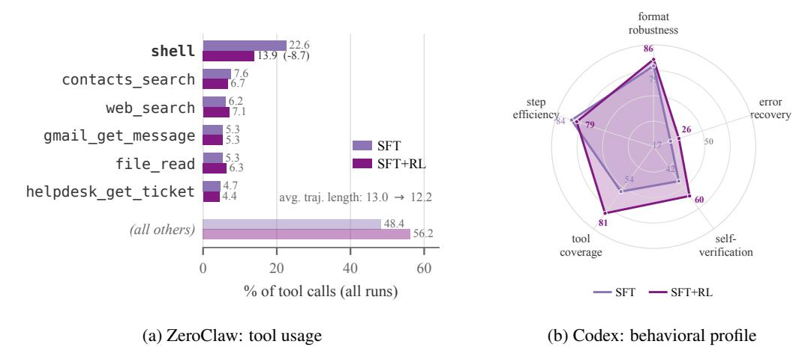

Figure 5: SFT와 SFT+RL의 ClawEval에서의 동작. RL은 일반 셸 도구에서 전용 서비스 도구로 호출을 이동시키고(a), 자기 검증과 같은 에이전트적 capbilities를 향상시킨다(b).

우리는 두 가지 효과를 관찰한다. 첫째, 단일 하네스에 대한 학습만으로도 다른 하네스에 일반화된다: ZeroClaw 전용 모델이 훈련되지 않은 베이스보다 보이지 않는 OpenClaw (+3.3)와 Codex (+4.6)에서 개선된다. 둘째, 세 개의 하네스 모두에 대해 학습하는 것이 전반적으로 가장 좋으며, 더 복잡한 하네스에서 베이스 대비 가장 큰 이득을 보인다 (+9.5 on OpenClaw, +20.3 on Codex), 그리고 ZeroClaw 자체를 ZeroClaw 전용 훈련을 넘어선 수준으로 끌어올린다 (48.5 vs. 46.0). 우리는 이것을 모델이 다중 하네스에서 학습할 때 보는 도구 호출과 제어 흐름의 다양성이 더 크기 때문이라고 설명한다. 이는 모델이 다양한 도구와 시나리오에서 더 견고해지게 한다.

## 5.3 RL에 의해 학습된 역량 (CAPABILITY LEARNED BY RL)

마지막으로, 우리는 SFT 위에서 RL이 학습하는 내용을 조사한다. 우리는 ClawEval에서 SFT와 SFT+RL OpenForge-Claw 체크포인트를 실행하고 각각 100개의 경로를 비교하며, ZeroClaw harness(그림 [5,](#page-9-1) 왼쪽) 아래에서 도구 호출 통계를 검토하고 Codex harness(그림 [5,](#page-9-1) 오른쪽) 아래에서 고수준 행동 능력을 검토한다.

ZeroClaw에서 우리는 RL이 모델이 도구를 사용하는 *how*를 바꾼다는 것을 발견합니다. 이는 모든 도구 호출 중 22.6%에서 13.9%로 일반 셸 호출을 줄이고, 이를 전용 서비스 도구로 재분배하며, 동시에 경로를 약간 단축합니다 (Figure [A5](#page-23-0) 가 전체 분해를 보여줍니다). 이는 RL이 모델이 일반 목적의 셸에 의존하는 대신 적절한 전문 도구를 선택하도록 가르친다는 것을 시사합니다.

Codex에서 우리는 RL이 장기 도구 사용에 중요한 여러 에이전트 능력을 향상시킨다는 것을 발견합니다 (자세한 정의는 Section [D.1](#page-20-1) 참조). 특히, 오류 복구(실패한 명령 후에 작업을 올바르게 해결)와 자기 검증(자신의 기록을 다시 읽어 확인) 능력을 강화하며, ZeroClaw 분석을 반영하여 각 작업이 요구하는 도구의 더 넓은 범위를 활용합니다. 이러한 행동은 에이전트가 여러 단계에 걸쳐 신뢰할 수 있도록 유지합니다. 그러나 오류 복구는 RL 이후에도 가장 약한 능력으로 남아 있습니다. 우리는 이러한 능력들이 RL만으로는 습득하기 어렵고, 추가적인 데이터나 훈련 방법이 필요할 수 있다고 가정합니다.

# 6 결론 (CONCLUSION)

우리는 OPENFORGE RL을 제시한다, LLM- 및 VLM 기반 에이전트를 endto-end로 훈련시키는 오픈 프레임워크로, 배포되는 추론 하네스 내부에서 직접 실행된다. OPENFORGE RL은 *any harness* × *any environment*를 veRL과 같은 표준 RL 코드베이스로 훈련 가능하게 하여, 에이전트가 단순화된 재구현이 아니라 실제 배포 환경에서 최적화될 수 있도록 한다. 수백에서 수천 개의 자동으로 선별된 작업만을 사용하여, 우리는 OpenForge-Claw와 OpenForge-GUI 모델을 훈련시켜, 거의 모든 도구 사용 및 GUI 벤치마크에서 유사한 크기의 공개 모델을 능가하고, GUI 설정에서는 수 배 더 큰 모델과 일치하거나 초과한다. 구체적으로, OpenForge-Claw는 ClawEval에서 31.7 (pass3 ), QwenClawBench에서 33.7, 그리고 MC-에서 28.1을 달성한다.

PAtlas는 OpenForge-GUI가 OSWorld-Verified에서 37.7, Online-Mind2Web에서 63.0, WebVoyager에서 72.3을 달성하는 반면, 훈련을 넘어 OPENFORGE RL은 하네스 선택과 RL이 에이전트 행동을 어떻게 형성하는지 분석할 수 있게 해 주며, 이전 공개 연구가 쉽게 수행할 수 없었던 연구이다. 우리는 일부 하네스가 다른 것보다 상당히 학습하기 어렵고, 훈련 이득이 훈련 중에 보지 못한 하네스에도 전이되며, RL이 주로 *에이전트 신뢰성 (agentic reliability)*을 향상시킨다는 것을 발견했다: 모델은 자신의 행동을 검증하고, 각 작업에 필요한 도구를 더 많이 활용하며, 다단계 계획을 완수한다. 그러나 오류 복구는 RL 이후에도 여전히 약하며, 이는 일부 기능이 전용 데이터가 필요할 수 있음을 시사한다. 우리는 코드, 데이터, 모델을 공개하며, OPENFORGE RL이 실제 하네스와 배치되는 환경에서 에이전트를 훈련하고 연구하는 데 걸리는 장벽을 낮추기를 희망한다.

# 참고문헌 (REFERENCES)

- Saaket Agashe, Jiuzhou Han, Shuyu Gan, Jiachen Yang, Ang Li, and Xin Eric Wang. Agent s: 인간처럼 컴퓨터를 활용하는 개방형 에이전트 프레임워크, 2024. URL [https://arxiv.](https://arxiv.org/abs/2410.08164) [org/abs/2410.08164](https://arxiv.org/abs/2410.08164).

- Zhipu AI. Zclawbench. [https://huggingface.co/datasets/zai-org/](https://huggingface.co/datasets/zai-org/ZClawBench) [ZClawBench](https://huggingface.co/datasets/zai-org/ZClawBench), 2026. Accessed: 2026-07-20.

- Anthropic. 모델 컨텍스트 프로토콜 소개. [https://www.anthropic.com/news/](https://www.anthropic.com/news/model-context-protocol) [model-context-protocol](https://www.anthropic.com/news/model-context-protocol), 2024. Accessed: 2026-07-20.

- Anthropic. 개요 - Claude 코드 문서. [https://code.claude.com/docs/en/](https://code.claude.com/docs/en/overview) [overview](https://code.claude.com/docs/en/overview), 2025. Accessed: 2026-07-20.

- Anthropic. claude 4.6 소개. [https://www.anthropic.com/news/](https://www.anthropic.com/news/claude-opus-4-6) [claude-opus-4-6](https://www.anthropic.com/news/claude-opus-4-6), 2026. Accessed: 2026-07-20.

- Ahmed Awadallah, Yash Lara, Raghav Magazine, Hussein Mozannar, Akshay Nambi, Yash Pandya, Aravind Rajeswaran, Corby Rosset, Alexey Taymanov, Vibhav Vineet, Spencer Whitehead, and Andrew Zhao. Fara-7b: 컴퓨터 사용을 위한 효율적인 에이전트 모델. *arXiv:2511.19663*, 2025.

- Ibragim Badertdinov, Maksim Nekrashevich, Anton Shevtsov, and Alexander Golubev. Swerebench v2: 언어 불문 swe 과제 컬렉션 대규모, 2026. URL [https://arxiv.](https://arxiv.org/abs/2602.23866) [org/abs/2602.23866](https://arxiv.org/abs/2602.23866).

- Hao Bai, Yifei Zhou, Mert Cemri, Jiayi Pan, Alane Suhr, Sergey Levine, and Aviral Kumar. Digirl: 자율 강화 학습으로 야외 환경에서 장치 제어 에이전트 훈련, 2024. URL <https://arxiv.org/abs/2406.11896>.

- Hao Bai, Alexey Taymanov, Tong Zhang, Aviral Kumar, and Spencer Whitehead. Webgym: 현실적인 과제로 시각적 웹 에이전트 훈련 환경 확장, 2026. URL [https://arxiv.](https://arxiv.org/abs/2601.02439) [org/abs/2601.02439](https://arxiv.org/abs/2601.02439).

- Chaithanya Bandi, Razvan-Gabriel Dumitru, Ben Hertzberg, Divyansh Agarwal, Geobio Boo, Tejas Polakam, Sami Hassaan, Jeff Da, HiJae Kim, Vipul Gupta, Manasi Sharma, Andrew Park, Martin Dimakis, Ernesto Gabriel Hernandez Montoya, Dan Rambado, Ivan Salazar, Rafael Cruz, MohammadHossein Rezaei, Chetan Rane, Ben Levin, Daniel Yue Zhang, Brad Kenstler, and Bing Liu. Mcp-atlas: 실제 MCP 서버를 활용한 도구 사용 역량 대규모 벤치마크, 2026. URL <https://arxiv.org/abs/2602.00933>.

- Browser Use. AI 에이전트를 위한 스텔스 브라우저. [https://browser-use.com/](https://browser-use.com/stealth-browsers) [stealth-browsers](https://browser-use.com/stealth-browsers), 2026.

- Shiyi Cao, Sumanth Hegde, Dacheng Li, Tyler Griggs, Shu Liu, Eric Tang, Jiayi Pan, Xingyao Wang, Akshay Malik, Graham Neubig, Kourosh Hakhamaneshi, Richard Liaw, Philipp Moritz, Matei Zaharia, Joseph E. Gonzalez, and Ion Stoica. Skyrl-v0: 강화 학습으로 실제 장기 수평 에이전트 훈련, 2025.

- Lang Feng, Zhenghai Xue, Tingcong Liu, and Bo An. LLM 에이전트 훈련을 위한 그룹-인-그룹 정책 최적화. *arXiv preprint arXiv:2505.10978*, 2025.

- Wei Fu, Jiaxuan Gao, Xujie Shen, Chen Zhu, Zhiyu Mei, Chuyi He, Shusheng Xu, Guo Wei, Jun Mei, Jiashu Wang, Tongkai Yang, Binhang Yuan, and Yi Wu. Areal: 언어 추론을 위한 대규모 비동기 강화 학습 시스템, 2026. URL [https://arxiv.org/](https://arxiv.org/abs/2505.24298) [abs/2505.24298](https://arxiv.org/abs/2505.24298).

- Tao Ge, Baolin Peng, Hao Cheng, and Jianfeng Gao. 장기 생산성 시뮬레이션을 위한 대규모 합성 컴퓨터, 2026. URL <https://arxiv.org/abs/2604.28181>.

- Daya Guo, Dejian Yang, Haowei Zhang, Junxiao Song, Peiyi Wang, Qihao Zhu, Runxin Xu, Ruoyu Zhang, Shirong Ma, Xiao Bi, Xiaokang Zhang, Xingkai Yu, Yu Wu, Z. F. Wu, Zhibin Gou, Zhihong Shao, Zhuoshu Li, Ziyi Gao, Aixin Liu, Bing Xue, Bingxuan Wang, Bochao Wu, Bei Feng, Chengda Lu, Chenggang Zhao, Chengqi Deng, Chong Ruan, Damai Dai, Deli Chen, Dongjie Ji, Erhang Li, Fangyun Lin, Fucong Dai, and et al. Deepseek-r1은 강화 학습을 통해 LLM에서 추론을 유도한다. *Nature*, 645(8081):633–638, 2025. ISSN 1476-4687. doi: 10.1038/s41586-025-09422-z. URL [http://dx.doi.org/10.1038/](http://dx.doi.org/10.1038/s41586-025-09422-z) [s41586-025-09422-z](http://dx.doi.org/10.1038/s41586-025-09422-z).

- Tanmay Gupta, Piper Wolters, Zixian Ma, Peter Sushko, Rock Yuren Pang, Diego Llanes, Yue Yang, Taira Anderson, Boyuan Zheng, Zhongzheng Ren, Harsh Trivedi, Taylor Blanton, Caleb Ouellette, Winson Han, Ali Farhadi, and Ranjay Krishna. Molmoweb: 공개 웹을 위한 오픈 비주얼 웹 에이전트 및 오픈 데이터, 2026. URL <https://arxiv.org/abs/2604.08516>.

- Hongliang He, Wenlin Yao, Kaixin Ma, Wenhao Yu, Yong Dai, Hongming Zhang, Zhenzhong Lan, and Dong Yu. Webvoyager: 대규모 멀티모달 모델로 엔드투엔드 웹 에이전트 구축, 2024. URL <https://arxiv.org/abs/2401.13919>.

- Wenyi Hong, Weihan Wang, Qingsong Lv, Jiazheng Xu, Wenmeng Yu, Junhui Ji, Yan Wang, Zihan Wang, Yuxuan Zhang, Juanzi Li, Bin Xu, Yuxiao Dong, Ming Ding, and Jie Tang. Cogagent: GUI 에이전트를 위한 시각 언어 모델, 2024. URL [https://arxiv.org/abs/2312.](https://arxiv.org/abs/2312.08914) [08914](https://arxiv.org/abs/2312.08914).

- Jian Hu, Xibin Wu, Zilin Zhu, Xianyu, Weixun Wang, Dehao Zhang, and Yu Cao. Openrlhf: 사용하기 쉽고 확장 가능하며 고성능인 RLHF 프레임워크. *arXiv preprint arXiv:2405.11143*, 2024.

- Carlos E. Jimenez, John Yang, Alexander Wettig, Shunyu Yao, Kexin Pei, Ofir Press, and Karthik Narasimhan. Swe-bench: 언어 모델이 실제 GitHub 이슈를 해결할 수 있는가?, 2024. URL <https://arxiv.org/abs/2310.06770>.

- Bowen Jin, Hansi Zeng, Zhenrui Yue, Jinsung Yoon, Sercan Arik, Dong Wang, Hamed Zamani, and Jiawei Han. Search-r1: 강화 학습을 통해 LLM을 훈련시켜 추론하고 검색 엔진을 활용하도록 한다, 2025. URL <https://arxiv.org/abs/2503.09516>.

- Woosuk Kwon, Zhuohan Li, Siyuan Zhuang, Ying Sheng, Lianmin Zheng, Cody Hao Yu, Joseph E. Gonzalez, Hao Zhang, and Ion Stoica. PagedAttention을 이용한 대규모 언어 모델 서비스의 효율적인 메모리 관리, 2023. URL <https://arxiv.org/abs/2309.06180>.

- Mike A. Merrill, Alexander G. Shaw, Nicholas Carlini, Boxuan Li, Harsh Raj, Ivan Bercovich, Lin Shi, Jeong Yeon Shin, Thomas Walshe, E. Kelly Buchanan, Junhong Shen, Guanghao Ye, Haowei Lin, Jason Poulos, Maoyu Wang, Marianna Nezhurina, Jenia Jitsev, Di Lu, Orfeas Menis Mastromichalakis, Zhiwei Xu, Zizhao Chen, Yue Liu, Robert Zhang, Leon Liangyu Chen, Anurag Kashyap, Jan-Lucas Uslu, Jeffrey Li, Jianbo Wu, Minghao Yan, Song Bian, Vedang Sharma, Ke Sun, Steven Dillmann, Akshay Anand, Andrew Lanpouthakoun, Bardia Koopah, Changran Hu, Etash Guha, Gabriel H. S. Dreiman, Jiacheng Zhu, Karl Krauth, Li Zhong, Niklas Muennighoff, Robert Amanfu, Shangyin Tan, Shreyas Pimpalgaonkar, Tushar Aggarwal, Xiangning Lin, Xin Lan, Xuandong Zhao, Yiqing Liang, Yuanli Wang, Zilong Wang, Changzhi Zhou, David Heineman, Hange Liu, Harsh Trivedi, John Yang, Junhong Lin, Manish Shetty, Michael Yang, Nabil Omi, Negin Raoof, Shanda Li, Terry Yue Zhuo, Wuwei Lin, Yiwei Dai, Yuxin Wang, Wenhao Chai, Shang Zhou, Dariush Wahdany, Ziyu She, Jiaming Hu, Zhikang Dong, Yuxuan Zhu, Sasha Cui, Ahson Saiyed, Arinbjorn Kolbeinsson, Jesse Hu, Christopher Michael Rytting, ¨ Ryan Marten, Yixin Wang, Alex Dimakis, Andy Konwinski, and Ludwig Schmidt. Terminalbench: 명령줄 인터페이스에서 어려운 현실적인 과제에 대한 에이전트 벤치마킹, 2026. URL <https://arxiv.org/abs/2601.11868>.

- MiniMax. Minimax-m2.5. https://github.com/MiniMax-AI/MiniMax-M2.5, 2026. 접근: 2026-07-20.
- OpenAI. Hello GPT-4o. https://openai.com/index/hello-gpt-4o/, 2024. 접근: 2024-09-28.
- OpenAI. Introducing Codex. https://openai.com/index/introducing-codex/, 2025a. 접근: 2026-07-20.
- OpenAI. Introducing GPT-4.1 in the api. https://openai.com/index/gpt-4-1/, 2025b. 접근: 2025-09-17.
- OpenAI. Introducing OpenAI o3 and o4-mini, 2025c. URL [https://openai.com/index/](https://openai.com/index/introducing-o3-and-o4-mini/) [introducing-o3-and-o4-mini/](https://openai.com/index/introducing-o3-and-o4-mini/).
- OpenAI. Harness engineering: leveraging Codex in an agent-first world. https://openai.com/index/harness-engineering/, 2026. 접근: 2026-07-20.
- OpenClaw. OpenClaw — Personal AI Assistant. https://openclaw.ai/, 2025. 접근: 2026-07-20.
- Shishir G. Patil, Huanzhi Mao, Charlie Cheng-Jie Ji, Fanjia Yan, Vishnu Suresh, Ion Stoica, and Joseph E. Gonzalez. 버클리 함수 호출 리더보드 (bfcl): 도구 사용에서 에이전트 평가까지 대형 언어 모델. In *제 42회 국제 기계 학습 학회*, 2025.
- Baolin Peng, Wenlin Yao, Qianhui Wu, Hao Cheng, Xiao Yu, Rui Yang, Tao Ge, Alessandro Sordoni, Xingdi Yuan, Yelong Shen, Pengcheng He, Tong Zhang, Zhou Yu, and Jianfeng Gao. Orchard: 오픈소스 에이전트 모델링 프레임워크, 2026. URL [https://arxiv.org/](https://arxiv.org/abs/2605.15040) [abs/2605.15040](https://arxiv.org/abs/2605.15040).
- Zehan Qi, Xiao Liu, Iat Long Iong, Hanyu Lai, Xueqiao Sun, Wenyi Zhao, Yu Yang, Xinyue Yang, Jiadai Sun, Shuntian Yao, Tianjie Zhang, Wei Xu, Jie Tang, and Yuxiao Dong. Webrl: 자기 진화 온라인 커리큘럼 강화 학습을 통한 LLM 웹 에이전트 훈련, 2025. URL [https:](https://arxiv.org/abs/2411.02337) [//arxiv.org/abs/2411.02337](https://arxiv.org/abs/2411.02337).
- Yujia Qin, Yining Ye, Junjie Fang, Haoming Wang, Shihao Liang, Shizuo Tian, Junda Zhang, Jiahao Li, Yunxin Li, Shijue Huang, Wanjun Zhong, Kuanye Li, Jiale Yang, Yu Miao, Woyu Lin, Longxiang Liu, Xu Jiang, Qianli Ma, Jingyu Li, Xiaojun Xiao, Kai Cai, Chuang Li, Yaowei Zheng, Chaolin Jin, Chen Li, Xiao Zhou, Minchao Wang, Haoli Chen, Zhaojian Li, Haihua Yang, Haifeng Liu, Feng Lin, Tao Peng, Xin Liu, and Guang Shi. Ui-tars: 네이티브 에이전트와의 자동 GUI 상호작용 선도, 2025. URL <https://arxiv.org/abs/2501.12326>.
- Qwen Team and Alibaba Group Data Team. QwenClawBench: OpenClaw 에이전트를 위한 실제 사용자 분포 벤치마크, April 2026. URL <github.com/SKYLENAGE-AI/QwenClawBench>.
- Zhihong Shao, Peiyi Wang, Qihao Zhu, Runxin Xu, Junxiao Song, Xiao Bi, Haowei Zhang, Mingchuan Zhang, Y. K. Li, Y. Wu, and Daya Guo. Deepseekmath: 오픈 언어 모델에서 수학적 추론의 한계를 뛰어넘다, 2024. URL [https://arxiv.org/abs/2402.](https://arxiv.org/abs/2402.03300) [03300](https://arxiv.org/abs/2402.03300).
- Guangming Sheng, Chi Zhang, Zilingfeng Ye, Xibin Wu, Wang Zhang, Ru Zhang, Yanghua Peng, Haibin Lin, and Chuan Wu. Hybridflow: 유연하고 효율적인 RLHF 프레임워크. *arXiv preprint arXiv: 2409.19256*, 2024.
- Kimi Team, Tongtong Bai, Yifan Bai, Yiping Bao, S. H. Cai, Yuan Cao, Y. Charles, H. S. Che, Cheng Chen, Guanduo Chen, Huarong Chen, Jia Chen, Jiahao Chen, Jianlong Chen, Jun Chen, Kefan Chen, Liang Chen, Ruijue Chen, Xinhao Chen, Yanru Chen, Yanxu Chen, Yicun Chen, Yimin Chen, Yingjiang Chen, Yuankun Chen, Yujie Chen, Yutian Chen, Zhirong Chen, Ziwei Chen, Dazhi Cheng, Minghan Chu, Jialei Cui, Jiaqi Deng, Muxi Diao, Hao Ding, Mengfan Dong, Mengnan Dong, Yuxin Dong, Yuhao Dong, Angang Du, Chenzhuang Du, Dikang Du, Lingxiao Du, Yulun Du, Yu Fan, Shengjun Fang, Qiulin Feng, Yichen Feng, Garimugai Fu, Kelin Fu, Hongcheng Gao, Tong Gao, Yuyao Ge, Shangyi Geng, Chengyang Gong, Xiaochen Gong,

- Zhuoma Gongque, Qizheng Gu, Xinran Gu, Yicheng Gu, Longyu Guan, Yuanying Guo, Xiaoru Hao, Weiran He, Wenyang He, Yunjia He, Chao Hong, Hao Hu, Jiaxi Hu, and et al. Kimi k2.5: 시각적 에이전트 지능 (Kimi k2.5: Visual agentic intelligence), 2026. URL <https://arxiv.org/abs/2602.02276>.
- Brandon Trabucco, Gunnar Sigurdsson, Robinson Piramuthu, and Ruslan Salakhutdinov. Insta: 인터넷 규모의 에이전트 교육을 향해 (Insta: Towards internet-scale training for agents), 2025.
- Guanzhi Wang, Yuqi Xie, Yunfan Jiang, Ajay Mandlekar, Chaowei Xiao, Yuke Zhu, Linxi Fan, and Anima Anandkumar. Voyager: 대형 언어 모델을 갖춘 개방형 구현형 에이전트 (Voyager: An open-ended embodied agent with large language models), 2023. URL <https://arxiv.org/abs/2305.16291>.
- Xingyao Wang, Yangyi Chen, Lifan Yuan, Yizhe Zhang, Yunzhu Li, Hao Peng, and Heng Ji. 실행 가능한 코드 액션이 더 나은 LLM 에이전트를 유도한다 (Executable code actions elicit better llm agents), 2024. URL [https://arxiv.org/abs/2402.](https://arxiv.org/abs/2402.01030) [01030](https://arxiv.org/abs/2402.01030).
- Xingyao Wang, Boxuan Li, Yufan Song, Frank F. Xu, Xiangru Tang, Mingchen Zhuge, Jiayi Pan, Yueqi Song, Bowen Li, Jaskirat Singh, Hoang H. Tran, Fuqiang Li, Ren Ma, Mingzhang Zheng, Bill Qian, Yanjun Shao, Niklas Muennighoff, Yizhe Zhang, Binyuan Hui, Junyang Lin, Robert Brennan, Hao Peng, Heng Ji, and Graham Neubig. Openhands: AI 소프트웨어 개발자를 위한 범용 에이전트용 오픈 플랫폼 (Openhands: An open platform for ai software developers as generalist agents), 2025a. URL <https://arxiv.org/abs/2407.16741>.
- Xinyuan Wang, Bowen Wang, Dunjie Lu, Junlin Yang, Tianbao Xie, Junli Wang, Jiaqi Deng, Xiaole Guo, Yiheng Xu, Chen Henry Wu, Zhennan Shen, Zhuokai Li, Ryan Li, Xiaochuan Li, Junda Chen, Boyuan Zheng, Peihang Li, Fangyu Lei, Ruisheng Cao, Yeqiao Fu, Dongchan Shin, Martin Shin, Jiarui Hu, Yuyan Wang, Jixuan Chen, Yuxiao Ye, Danyang Zhang, Dikang Du, Hao Hu, Huarong Chen, Zaida Zhou, Haotian Yao, Ziwei Chen, Qizheng Gu, Yipu Wang, Heng Wang, Diyi Yang, Victor Zhong, Flood Sung, Y. Charles, Zhilin Yang, and Tao Yu. Opencua: 컴퓨터 사용 에이전트를 위한 개방형 기반 (Opencua: Open foundations for computer-use agents), 2025b. URL <https://arxiv.org/abs/2508.09123>.
- Yinjie Wang, Xuyang Chen, Xiaolong Jin, Mengdi Wang, and Ling Yang. Openclaw-rl: 말만으로 어떤 에이전트든 훈련한다 (Openclaw-rl: Train any agent simply by talking). *arXiv preprint arXiv:2603.10165*, 2026.
- Yuxiang Wei, Olivier Duchenne, Jade Copet, Quentin Carbonneaux, Lingming Zhang, Daniel Fried, Gabriel Synnaeve, Rishabh Singh, and Sida I. Wang. Swe-rl: 개방형 소프트웨어 진화에서 강화 학습을 통한 LLM 추론 향상 (Swe-rl: Advancing llm reasoning via reinforcement learning on open software evolution), 2025. URL [https://arxiv.org/abs/](https://arxiv.org/abs/2502.18449) [2502.18449](https://arxiv.org/abs/2502.18449).
- Qingyun Wu, Gagan Bansal, Jieyu Zhang, Yiran Wu, Beibin Li, Erkang Zhu, Li Jiang, Xiaoyun Zhang, Shaokun Zhang, Jiale Liu, Ahmed Hassan Awadallah, Ryen W White, Doug Burger, and Chi Wang. Autogen: 다중 에이전트 대화를 통한 차세대 LLM 애플리케이션 활성화 (Autogen: Enabling next-gen llm applications via multi-agent conversation), 2023. URL <https://arxiv.org/abs/2308.08155>.
- Zijian Wu, Xiangyan Liu, Xinyuan Zhang, Lingjun Chen, Fanqing Meng, Lingxiao Du, Yiran Zhao, Fanshi Zhang, Yaoqi Ye, Jiawei Wang, Zirui Wang, Jinjie Ni, Yufan Yang, Arvin Xu, and Michael Qizhe Shieh. Mcpmark: 현실적이고 종합적인 MCP 사용을 위한 스트레스 테스트 벤치마크 (Mcpmark: A benchmark for stress-testing realistic and comprehensive mcp use), 2025. URL <https://arxiv.org/abs/2509.24002>.
- Chunqiu Steven Xia, Yinlin Deng, Soren Dunn, and Lingming Zhang. Agentless: LLM 기반 소프트웨어 엔지니어링 에이전트 해명 (Agentless: Demystifying llmbased software engineering agents), 2024. URL <https://arxiv.org/abs/2407.01489>.
- Jingxu Xie, Dylan Xu, Xuandong Zhao, and Dawn Song. Agentsynth: 범용 컴퓨터 사용 에이전트를 위한 확장 가능한 작업 생성 (Agentsynth: Scalable task generation for generalist computer-use agents), 2026. URL <https://arxiv.org/abs/2506.14205>.
- Tianbao Xie, Danyang Zhang, Jixuan Chen, Xiaochuan Li, Siheng Zhao, Ruisheng Cao, Toh Jing Hua, Zhoujun Cheng, Dongchan Shin, Fangyu Lei, Yitao Liu, Yiheng Xu, Shuyan Zhou, Silvio Savarese, Caiming Xiong, Victor Zhong, and Tao Yu. Osworld: 실제 컴퓨터 환경에서 개방형 작업을 위한 멀티모달 에이전트 벤치마킹 (Osworld: Benchmarking multimodal agents for open-ended tasks in real computer environments), 2024. URL [https://arxiv.](https://arxiv.org/abs/2404.07972) [org/abs/2404.07972](https://arxiv.org/abs/2404.07972).
- Binfeng Xu, Hao Zhang, Shaokun Zhang, Songyang Han, Mingjie Liu, Jian Hu, Shizhe Diao, Zhenghui Jin, Yunheng Zou, Michael Demoret, Jan Kautz, and Yi Dong. Polar: 대규모에서 모든 하네스에 대한 에이전트형 강화 학습 (Polar: Agentic rl on any harness at scale). *arXiv preprint arXiv:2605.24220*, 2026.

- Yiheng Xu, Dunjie Lu, Zhennan Shen, Junli Wang, Zekun Wang, Yuchen Mao, Caiming Xiong, and Tao Yu. Agenttrek: 웹 튜토리얼을 활용한 가이드 리플레이를 통한 에이전트 궤적 합성 (Agenttrek: Agent trajectory synthesis via guiding replay with web tutorials), 2025. URL <https://arxiv.org/abs/2412.09605>.

- Tianci Xue, Weijian Qi, Tianneng Shi, Chan Hee Song, Boyu Gou, Dawn Song, Huan Sun, and Yu Su. 진전의 환상? 웹 에이전트의 현재 상태 평가 (An illusion of progress? assessing the current state of web agents), 2025. URL [https:](https://arxiv.org/abs/2504.01382) [//arxiv.org/abs/2504.01382](https://arxiv.org/abs/2504.01382).

- An Yang, Anfeng Li, Baosong Yang, Beichen Zhang, Binyuan Hui, Bo Zheng, Bowen Yu, Chang Gao, Chengen Huang, Chenxu Lv, Chujie Zheng, Dayiheng Liu, Fan Zhou, Fei Huang, Feng Hu, Hao Ge, Haoran Wei, Huan Lin, Jialong Tang, Jian Yang, Jianhong Tu, Jianwei Zhang, Jianxin Yang, Jiaxi Yang, Jing Zhou, Jingren Zhou, Junyang Lin, Kai Dang, Keqin Bao, Kexin Yang, Le Yu, Lianghao Deng, Mei Li, Mingfeng Xue, Mingze Li, Pei Zhang, Peng Wang, Qin Zhu, Rui Men, Ruize Gao, Shixuan Liu, Shuang Luo, Tianhao Li, Tianyi Tang, Wenbiao Yin, Xingzhang Ren, Xinyu Wang, Xinyu Zhang, Xuancheng Ren, Yang Fan, Yang Su, Yichang Zhang, Yinger Zhang, Yu Wan, Yuqiong Liu, Zekun Wang, Zeyu Cui, Zhenru Zhang, Zhipeng Zhou, and Zihan Qiu. Qwen3 기술 보고서 (Qwen3 technical report), 2025. URL <https://arxiv.org/abs/2505.09388>.

- John Yang, Carlos E Jimenez, Alexander Wettig, Kilian Lieret, Shunyu Yao, Karthik R Narasimhan, and Ofir Press. SWE-agent: 에이전트-컴퓨터 인터페이스를 통한 자동화된 소프트웨어 엔지니어링 (SWE-agent: Agent-computer interfaces enable automated software engineering). In *The Thirty-eighth Annual Conference on Neural Information Processing Systems*, 2024. URL <https://arxiv.org/abs/2405.15793>.

- Rui Yang, Qianhui Wu, Yuxi Chen, Hao Bai, Wenlin Yao, Hao Cheng, Baolin Peng, Huan Zhang, Tong Zhang, and Jianfeng Gao. Openwebrl: 시각적 웹 에이전트를 위한 온라인 다중 턴 강화 학습 해명 (Openwebrl: Demystifying online multi-turn reinforcement learning for visual web agents), 2026. URL <https://arxiv.org/abs/2606.02031>.

- Shunyu Yao, Jeffrey Zhao, Dian Yu, Nan Du, Izhak Shafran, Karthik Narasimhan, and Yuan Cao. React: 언어 모델에서 추론과 행동을 시너지화 (React: Synergizing reasoning and acting in language models), 2023. URL [https://arxiv.](https://arxiv.org/abs/2210.03629) [org/abs/2210.03629](https://arxiv.org/abs/2210.03629).

- Bowen Ye, Rang Li, Qibin Yang, Yuanxin Liu, Linli Yao, Hanglong Lv, Zhihui Xie, Chenxin An, Lei Li, Lingpeng Kong, Qi Liu, Zhifang Sui, and Tong Yang. Claw-eval: 자율 에이전트의 신뢰할 수 있는 평가를 향해 (Claw-eval: Towards trustworthy evaluation of autonomous agents), 2026. URL <https://arxiv.org/abs/2604.06132>.

- Qiying Yu, Zheng Zhang, Ruofei Zhu, Yufeng Yuan, Xiaochen Zuo, Yu Yue, Tiantian Fan, Gaohong Liu, Lingjun Liu, Xin Liu, Haibin Lin, Zhiqi Lin, Bole Ma, Guangming Sheng, Yuxuan Tong, Chi Zhang, Mofan Zhang, Wang Zhang, Hang Zhu, Jinhua Zhu, Jiaze Chen, Jiangjie Chen, Chengyi Wang, Hongli Yu, Weinan Dai, Yuxuan Song, Xiangpeng Wei, Hao Zhou, Jingjing Liu, Wei-Ying Ma, Ya-Qin Zhang, Lin Yan, Mu Qiao, Yonghui Wu, and Mingxuan Wang. Dapo: 대규모 오픈소스 LLM 강화 학습 시스템 (Dapo: An opensource llm reinforcement learning system at scale), 2025a. URL [https://arxiv.org/abs/](https://arxiv.org/abs/2503.14476) [2503.14476](https://arxiv.org/abs/2503.14476).

- Xiao Yu, Baolin Peng, Michel Galley, Hao Cheng, Qianhui Wu, Janardhan Kulkarni, Suman Nath, Zhou Yu, and Jianfeng Gao. Dyna-mind: 경험을 통해 시뮬레이션을 학습하여 더 나은 AI 에이전트 만들기 (Dyna-mind: Learning to simulate from experience for better ai agents), 2025b. URL <https://arxiv.org/abs/2510.09577>.

- ZeroClaw. ZeroClaw: 초경량 AI 에이전트 런타임 (ZeroClaw: The Ultra-Lightweight AI Agent Runtime). <https://zeroclaw.net/>, 2025. Accessed: 2026-07-20.

- Yanzhao Zhang, Mingxin Li, Dingkun Long, Xin Zhang, Huan Lin, Baosong Yang, Pengjun Xie, An Yang, Dayiheng Liu, Junyang Lin, Fei Huang, and Jingren Zhou. Qwen3 embedding: 기초 모델을 통한 텍스트 임베딩 및 재랭킹 향상 (Qwen3 embedding: Advancing text embedding and reranking through foundation models), 2025. URL [https:](https://arxiv.org/abs/2506.05176) [//arxiv.org/abs/2506.05176](https://arxiv.org/abs/2506.05176).

- Shuyan Zhou, Frank F. Xu, Hao Zhu, Xuhui Zhou, Robert Lo, Abishek Sridhar, Xianyi Cheng, Tianyue Ou, Yonatan Bisk, Daniel Fried, Uri Alon, and Graham Neubig. Webarena: 자율 에이전트 구축을 위한 현실적인 웹 환경 (Webarena: A realistic web environment for building autonomous agents), 2024. URL [https://arxiv.org/abs/](https://arxiv.org/abs/2307.13854) [2307.13854](https://arxiv.org/abs/2307.13854).

- Yifei Zhou, Qianlan Yang, Kaixiang Lin, Min Bai, Xiong Zhou, Yu-Xiong Wang, Sergey Levione, and Erran Li. Proposer-agent-evaluator (PAE): 기초 모델 인터넷 에이전트를 위한 자율 스킬 발견 (Proposer-agent-evaluator (PAE): Autonomous skill discovery for foundation model internet agents). In *ICML*, 2025. URL <https://arxiv.org/abs/2412.13194>.

Zilin Zhu, Chengxing Xie, Xin Lv, 그리고 slime 기여자들. slime: RL 스케일링을 위한 LLM 사후 훈련 프레임워크. https://github.com/THUDM/slime, 2025. GitHub 저장소. 담당 저자: Xin Lv.

#### A TRAINING DETAILS (훈련 세부사항)

#### A.1 CLAW AGENT TRAINING DETAILS (CLAW 에이전트 훈련 세부사항)

OpenForge-Claw RL 훈련을 위해, 우리는 veRL을 훈련 백엔드로 사용하고 Microsoft Azure를 롤아웃 컨테이너의 클라우드 제공업체로 사용합니다. 각 롤아웃은 자체 컨테이너에서 실행되며, 작업별 Dockerfile에서 타깃 하네스(예: OpenClaw, Codex, 또는 ZeroClaw)가 사전 설치된 상태로 빌드되고, 2 CPU와 2GB RAM으로 제한된 Kubernetes pod에 스케줄됩니다. 이 pod들은 Azure D128ads v5 노드에 배치되며, 정책 훈련은 8×B200 GPU가 장착된 단일 노드에서 실행됩니다. 핵심 훈련 하이퍼파라미터는 표 A1에, 훈련 곡선은 그림 A1에 보고합니다.

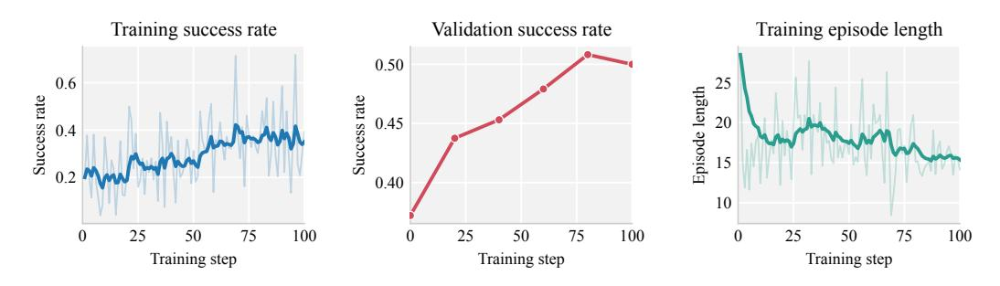

그림 A1: OpenForge-Claw RL 훈련 곡선 (claw 과제). *왼쪽*: 훈련 성공률. *중간*: 검증 성공률. *오른쪽*: 훈련 에피소드 길이.

#### A.2 GUI AGENT TRAINING DETAILS (GUI 에이전트 훈련 세부사항)

OpenForge-GUI RL 훈련을 위해, 우리는 비슷하게 veRL을 훈련 백엔드로 사용하고 Microsoft Azure를 롤아웃 컨테이너의 클라우드 제공업체로 사용합니다.

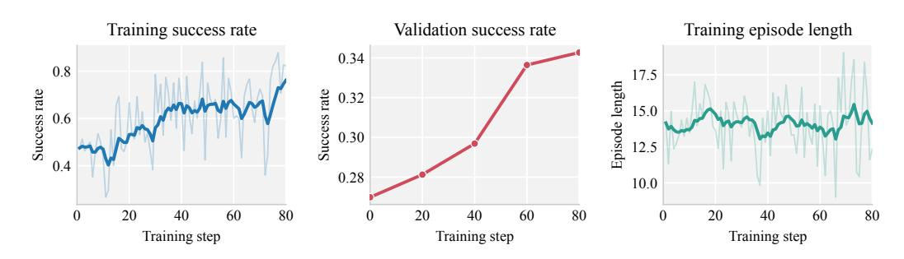

그림 A2: OpenForge-GUI RL 훈련 곡선 (컴퓨터 사용 과제). *왼쪽*: 훈련 성공률. *중간*: 검증 성공률. *오른쪽*: 훈련 에피소드 길이.

**Computer-Use** 컴퓨터 사용 에이전트 훈련을 위해, 각 롤아웃은 자체 컨테이너에서 실행되며, 작업별 Dockerfile에서 타깃 하네스(수정된 Kimi-Agent 버전, 섹션 C.3 참조)가 사전 설치된 상태로 빌드되고, 4 CPU와 4GB RAM으로 제한된 Kubernetes pod에 스케줄됩니다. 이 pod들은 Azure D64ads v5 노드에 배치되며, 정책 훈련은 8×B200 GPU가 장착된 단일 노드에서 실행됩니다. 핵심 훈련 하이퍼파라미터는 표 A1에, 훈련 곡선은 그림 A2에 보고합니다.

**Browser-Use** 브라우저 사용 에이전트 훈련을 위해, 각 롤아웃은 Browser-Use Cloud 서비스(호스팅된 Chromium)를 통해 Chrome DevTools Protocol을 사용해 전용 원격 브라우저 세션을 구동합니다. 세션 관리, 액션 실행, 스크린샷 캡처, 보상 판단을 담당하는 롤아웃별 환경은 2 CPU와 6GB RAM으로 제한된 경량 Kubernetes 샌드박스 pod에서 실행되며, 브라우저 자체는 pod 내부가 아니라 원격에서 실행됩니다. 이 pod들은 Azure D128ads v7 노드에 배치되며 최대 48개의 롤아웃이 동시에 실행되고, 정책 훈련은 8×B200 GPU가 장착된 단일 노드에서 수행됩니다. 핵심 훈련 하이퍼파라미터는 표 A1에 보고합니다.

Table A1: OpenForge-Claw 및 OpenForge-GUI를 위한 핵심 RL 훈련 하이퍼파라미터.

| 하이퍼파라미터 | Claw | Computer-Use | Browser-Use |
|-------------------------|-------|--------------|-------------|
| 학습률 | 1e-6 | 5e-7 | 1e-6 |
| 배치 크기 | 8 | 8 | 12 |
| 그룹 크기 | 8 | 8 | 5 |
| KL 계수 | 0.001 | 0.01 | 0.0 |
| 엔트로피 계수 | 0.0 | 0.0 | 0.001 |
| 최대 롤아웃 시간 / 단계 | 900초 | 600초 | 900초 |
| 훈련 단계 | 100 | 80 | 100 |
| 롤아웃 VM CPU / pod | 2 | 4 | 2 |
| 롤아웃 VM 메모리 / pod | 2GiB | 4GiB | 6GiB |
| 총 훈련 시간 | 48시간 | 36시간 | 32시간 |

# B 데이터 세부사항 (B DATA DETAILS)

## B.1 데이터 합성에 대한 추가 세부사항 (B.1 MORE DETAILS ON DATA SYNTHESIS)

우리는 Claude Agent SDK에서 데이터 합성 파이프라인(Section [3.3\)](#page-4-1))을 구현하며, 각 다섯 개 에이전트 모듈의 백본으로 Opus 4.6 [\(Anthropic, 2026\)](#page-10-12)를 사용합니다. 목표 도메인(자연어 프롬프트)과 목표 작업 수 N이 주어지면, 파이프라인은 병렬로 많은 에이전트를 생성하여 다음 다섯 단계를 실행합니다.

- Propose. 각 에이전트는 목표 도메인에 대해 구성한 자산과 참조 풀을 탐색하여 후보 지침을 초안합니다. 우리는 모델을 직접 프롬프트하여 처음부터 작업을 발명하도록 할 때 비현실적이거나 독창적이지 않은 지침이 생성되는 경향이 있음을 발견했습니다. Claw 에이전트의 경우, 이 풀은 (1) ClawHub의 기술과 (2) ZClawBench [\(AI, 2026\)](#page-10-8)에서 가져온 작업으로 구성됩니다; 컴퓨터 사용 에이전트의 경우, (1) X 검색 API 접근, (2) AgentNet의 22k 지침, (3) Synthetic-Computer-Use에서 가져온 합성 파일 및 데이터로 구성됩니다. 초안된 지침을 기록하고 중복을 방지하기 위해, 우리는 공유 SQLite 데이터베이스를 유지하고 각 에이전트에게 제안 사항을 추가하도록 지시합니다.
- Prune. 데이터베이스에 있는 제안되었지만 구현되지 않은 지침 중에서, 이 에이전트들은 N개의 가장 높은 품질과 가장 다양한 지침을 선택하고 나머지를 폐기된 것으로 표시합니다.
- Build. 선택된 각 지침에 대해, 에이전트는 완전히 실행 가능한 환경을 구축합니다: 도구 서버, 가짜 웹사이트, 가짜 데이터 및 파일, 모든 것을 이미지로 패키징하는 Dockerfile, 그리고 작업 성공을 점수화하는 검증 스크립트.
- Test. 많은 환경 오류와 지침 모호성은 실제로 작업을 실행하지 않으면 감지하기 어렵습니다. 따라서 우리는 에이전트에게 별도의 오픈 LLM/VLM을 호출하여 구축된 환경에서 작업을 시도하도록 하는 스크립트를 제공합니다: Claw 작업용 MiniMax-M2.5와 컴퓨터 사용 작업용 Kimi-K2.5.
- Refine. 마지막으로, 정제 에이전트는 롤아웃 궤적과 검증자의 점수를 검사하고 환경에 결함이 있는지 또는 지침이 모호한지를 판단합니다. 그렇다면, 환경을 패치하거나 지침을 수정하고 테스트-정제 루프를 반복하여 작업이 모든 검사를 통과할 때까지 진행합니다.

# B.2 CLAW 데이터에 대한 추가 세부사항 (B.2 MORE DETAILS ON CLAW DATA)

프로젝트 당시 우리는 Claw 기반 에이전트, 특히 RL 훈련을 위한 대규모 공개 데이터셋을 찾지 못했습니다. 따라서 우리는 주로 데이터 합성 파이프라인(Section [B.1\)](#page-17-0))을 사용해 SFT와 RL 훈련용 과제를 생성합니다. 강력하지만, 철저히 테스트된 검증기를 사용해 과제를 합성하는 것은 실제 롤아웃, 정제, 재롤아웃을 여러 차례 거치기 때문에 시간과 비용이 많이 듭니다. 비용을 절감하기 위해 *SFT tasks*의 경우 테스트 및 정제 단계를 건너뛰고 GPT-5.4를 판정자로 직접 호출해 과제 성공 여부를 판단하도록 합니다. 이는 SFT 트래젝터리에서 성공 신호가 일회성 데이터 필터링에만 사용되는 경우가 많아 훨씬 저렴하고 합리적입니다. 반면 RL 과제에서는 검증기가 견고하고 신뢰할 수 있도록 전체 테스트-정제 루프를 유지합니다. RL 훈련은 반복 롤아웃을 필요로 하며, 검증기는 일관되게 과제 성공을 판단할 수 있어야 합니다. 평균적으로 검증기와 정제 과정을 포함한 RL 과제 합성은 16.1분과 4.36 USD가 소요되며, 검증기 없이 SFT 과제 합성은 5.2분과 0.86 USD가 소요됩니다. 과제 분포의 전체 내역은 Figure [A6.](#page-24-0)에 표시되어 있습니다.

하네스의 경우, 대부분의 도구 사용 에이전트가 구현한 기본 ReACT 루프 외에도, 우리는 OPENFORGE RL 인프라의 기능을 실험하기 위해 ZeroClaw, OpenClaw, Codex라는 세 가지 인기 있는 하네스를 포함합니다.

## B.3 GUI 데이터에 대한 추가 세부사항 (B.3 MORE DETAILS ON GUI DATA)

컴퓨터 사용 작업 컴퓨터 사용 에이전트, 특히 RL을 사용한 훈련을 위한 대규모 공개 데이터셋이 없었습니다. 그 이유 중 하나는 가벼운 컨테이너에서 컴퓨터 사용 GUI를 실행하는 것이 어렵기 때문입니다: 이러한 환경은 일반적으로 QEMU 아래에서 전체 Ubuntu 가상 머신으로 실행됩니다 [\(Xie et al., 2024\)](#page-13-0). 그러나 우리는 Xvfb가 대신 메모리에서 가상 디스플레이를 렌더링할 수 있음을 발견했으며, 이는 훨씬 가볍고 RL 훈련을 위해 많은 컨테이너를 병렬로 실행할 수 있게 해줍니다. 이제 가벼운 컨테이너에서 컴퓨터 사용 GUI를 실행할 수 있게 되었으므로, 우리는 Claw 설정을 따르고 동일한 데이터 합성 파이프라인(섹션 [B.1\)](#page-17-0)을 사용하여 SFT 및 RL 작업을 생성합니다. *SFT 작업*의 경우, 우리는 테스트 및 정제 단계(test-and-refine)를 다시 건너뛰고 GPT-5.4를 심사자로 사용하여 작업 성공 여부를 판단합니다. 평균적으로 각 SFT 작업을 합성하는 데 4.0분과 1.37 USD가 소요됩니다. *RL 작업*의 경우, 우리는 검증자가 견고하고 신뢰할 수 있도록 전체 테스트 및 정제 루프를 유지합니다. 평균적으로 RL 작업(검증 및 정제 포함)을 합성하는 데 21.3분과 6.12 USD가 소요됩니다.

하네스로서 우리는 주로 Kimi-Agent [\(Team et al., 2026\)](#page-12-12)를 사용하며, [Xie et al.](#page-13-0) [\(2024\)](#page-13-0)의 구현을 따르고, Anthropic의 컴퓨터 사용 접근 방식을 따라 bash와 같은 추가 도구를 지원하도록 약간 수정했습니다. 전체 액션 공간 및 도구 목록은 섹션 [C.3.](#page-19-0)을 참조하십시오.

브라우저 사용 작업 브라우저 사용을 위해, 우리는 MolmoWeb [\(Gupta et al., 2026\)](#page-11-2)의 코드베이스를 하네스로 사용하고, 주요 수정 사항은 (1) 액션 정렬을 위한 추가 훈련 단계를 피하기 위해 MolmoWeb의 도구 호출 형식 대신 JSON 형식의 액션 공간을 사용하고, (2) OpenWebRL을 따라 CAPTCHA 및 웹사이트 차단을 해결하기 위해 Browser-Use Stealth Browsers [\(Browser Use, 2026\)](#page-10-10)를 통합하는 것입니다. 우리는 IP 및 CAPTCHA 차단 비율을 40%에서 거의 0%로 줄이는 것을 확인했습니다. 두 환경 모두에 대한 관측 및 액션 공간에 대한 보다 자세한 설명과 예시는 섹션 [C.4.](#page-20-0)에 제공됩니다.

SFT 데이터의 경우, 우리는 OpenWebRL과 유사한 데이터 큐레이션 파이프라인을 따르며, 작업 필터링 및 궤적 수집을 포함합니다. 우리는 WebGym [\(Bai et al., 2026\)](#page-10-9)에서 파생된 PAE-WebVoyager [\(Zhou et al., 2025\)](#page-14-7) 스플릿을 서브샘플링하면서 평가 벤치마크와 상위 의도 작업에서 파생된 하위 작업과 겹치는 작업을 제거합니다. 그 다음, SimilarWeb Top100 및 MOZ Top 500에 존재하는 가장 인기 있는 웹사이트만 남겨, 장기 꼬리 분포에서 비정상적인 웹사이트의 혼란을 제거합니다. 마지막으로 작업 다양성을 유지하기 위해 Qwen3-Embedding-8B [\(Zhang et al., 2025\)](#page-14-12)를 사용해 작업 지침을 임베딩하고, 사전 정의된 임계값 0.55를 사용해 탐욕적 유사성 기반 중복 제거를 적용합니다. 최종 SFT 후보 풀에는 2500개의 작업이 포함됩니다.

우리는 더 강력한 교사 모델(Kimi-K2.5)을 사용해 후보 풀에서 최대 턴 30, 4회 반복으로 추론합니다. 모든 성공적인 궤적을 수집하고, 단일 작업의 여러 성공 중 가장 짧은 궤적만 보관합니다. 복잡한 웹사이트에서는 반복된 동작이 흔히 나타나는 것을 발견했고, 3회 이상 연속 동일 동작이 있을 경우 마지막 턴만 보존하고, 과정 중 5회 이상 동일 동작이 발생하면 전체 궤적을 제거합니다. 위 과정을 거쳐 1496개의 궤적을 증류용으로 큐레이션했습니다.

RL 단계에서는 SFT와 동일한 인기 웹사이트 필터를 적용하고, Insta-v3 [\(Trabucco et al., 2025\)](#page-13-12)에서 600개의 작업과 PAE-WebVoyager [\(Zhou et al.,](#page-14-7) [2025\)](#page-14-7) 스플릿에서 300개의 작업을 무작위로 샘플링합니다. 이들은 SFT 풀과 구분됩니다. 최대 턴은 성능과 훈련 비용을 균형 있게 하기 위해 20으로 제한됩니다.

# C 평가 세부 사항 (EVALUATION DETAILS)

# C.1 평가 세부 사항 (CLAWEVAL AND QWENCLAWBENCH EVALUATION DETAILS)

우리는 OpenForge-Claw 모델을 사용하여 에이전트가 하네스를 사용해 작업을 해결하는 정도를 측정하는 인기 있는 클로우 및 하네스 관련 벤치마크에서 평가합니다. 구체적으로, 우리는 ClawEval [\(Ye et al.,](#page-14-3) [2026\)](#page-14-3), QwenClawBench [\(Qwen Team & Data Team, 2026\)](#page-12-6), 그리고 MCPAtlas [\(Bandi et al., 2026\)](#page-10-0)를 사용하며, 마지막은 새로운 도구 사용을 위한 관련이 있지만 "held-out" 테스트 세트로 활용됩니다. 본 실험(Section [4.1\)](#page-5-2)의 모든 결과는 각 벤치마크의 공식 평가 프로토콜을 사용합니다: ClawEval의 경우 공식 ReACTlike 루프가 모델에게 반복적으로 추론하고 도구를 호출하도록 프롬프트를 주며; QwenClawBench의 경우 OpenClaw 하네스를 사용합니다.

하네스 선택이 모델 성능에 미치는 영향을 연구하기 위해, 우리는 ClawEval을 ZeroClaw, OpenClaw, Codex 세 가지 다른 하네스 하에서 추가로 평가합니다 (Section [5.1\)](#page-8-1). ClawEval이 모델에게 커스텀 도구 서버를 호출하도록 요구하므로, ZeroClaw는 새로운 도구를 등록할 수 있는 기능을 기본적으로 제공해 지원이 간단했습니다. OpenClaw와 Codex는 커스텀 도구를 추가하는 것이 비트리비얼하기 때문에, 우리는 각 ClawEval 전용 도구를 SKILL.md 파일을 통해 이들에 노출시킵니다. 구체적으로, 각 커스텀 도구 서버에 대해 LLM(Claude Opus 4.6)을 API 서명과 도구 설명으로 프롬프트하여 bash 명령줄에서 도구를 호출하는 방법을 설명하는 SKILL.md 파일을 생성합니다. 추론 시에 이 파일들은 하네스에 로드되고, 모델은 bash 인터페이스를 통해 도구를 호출합니다. 평가 프로토콜은 공식 ClawEval 벤치마크와 동일합니다.

# C.2 MCP-ATLAS EVALUATION DETAILS

재현성을 위해, 우리는 MCPAtlas [\(Bandi et al., 2026\)](#page-10-0)를 벤치마크의 기본 20개 서버 설정으로 평가합니다. 이 설정은 서드파티 자격 증명이나 서비스별 데이터 초기화를 요구하는 선택적 서버를 제외합니다. 이 구성은 우리 측에서 수동 선택 없이 평가 세트를 고정합니다: 500개의 공개 과제 중 정확히 89개가 이 기본 서버에 완전히 지원되는 정답 도구 호출을 가집니다. 우리는 모든 모델을 이 동일한 89개 과제 세트에서 평가하며, 과제 식별자와 환경 구성을 고정합니다.

평가를 위해, 우리는 ReACT와 유사한 루프를 기반으로 한 MCPAtlas 공식 하네스를 사용합니다: 하네스는 과제별 MCP 도구를 정책 모델에 노출시키고, MCPAtlas 샌드박스에서 도구 호출을 실행하며, 모델이 종료될 때까지 결과 관측치를 반환합니다. 우리는 기본 과제 프롬프트와 도구 구성을 사용하고, 벤치마크별 시연이나 미세 조정은 추가하지 않습니다.

MCPAtlas의 클레임-커버리지 프로토콜을 따라, 우리는 Gemini 2.5 Pro를 심사자로 사용해 각 최종 응답을 정답 사실 주장과 비교하여 점수를 매깁니다. 클레임커버리지 점수가 0.75 이상인 과제는 성공으로 간주하며, 성공 과제 비율을 pass@1로 보고합니다. 모든 모델은 동일한 과제 서브셋, 하네스, 심사자, 임계값으로 평가됩니다.

## C.3 COMPUTER-USE EVALUATION DETAILS

컴퓨터 사용 환경을 위해, 우리는 OSWorld-Verified [\(Xie et al., 2024\)](#page-13-0)에서 평가합니다. OSWorld는 다중모달 에이전트가 실제 Ubuntu 데스크톱에서 마우스와 키보드를 사용해 화면을 통해 애플리케이션을 조작하고, 과제별 실행 기반 검증기로 점수를 매기는, 개방형 실세계 컴퓨터 과제를 얼마나 잘 수행하는지를 평가하는 인기 있는 벤치마크입니다. OSWorld-Verified는 OSWorld의 인플레이스 업그레이드로, 커뮤니티의 300개가 넘는 피드백을 바탕으로 인프라를 강화하고 과제 품질을 개선한 버전입니다

OSWorld-Verified에서 평가하려면 먼저 하네스를 선택해야 합니다. 우리의 컴퓨터 사용 데이터 파이프라인이 Kimi-K2.5 [\(Team et al., 2026\)](#page-12-12)를 중심으로 구축되었기 때문에, 우리는 공식 OSWorld 저장소에 구현된 Kimi-Agent를 주된 훈련 및 평가 하네스로 사용합니다. 하네스를 보다 효율적으로 만들기 위해 Anthropic의 컴퓨터 사용 접근 방식에서 영감을 받은 가벼운 수정을 추가합니다: 모델이 GUI 애플리케이션을 열지 않고도 파일과 데이터를 직접 조작할 수 있도록 bash와 문자열 교체 편집기 도구를 추가로 노출합니다(예: 텍스트, CSV, JSON 파일 편집). 우리는 Kimi-Agent를 스크린샷 전용 모드로 실행합니다: 모든 관측은 GUI 스크린샷이며, 추가 텍스트나 메타데이터는 없습니다. Figure [A3](#page-20-2)에서 예시 트래젝터리를 보여주고, Table [A2.](#page-21-0)에서 전체 액션 공간과 도구 목록을 제공합니다.

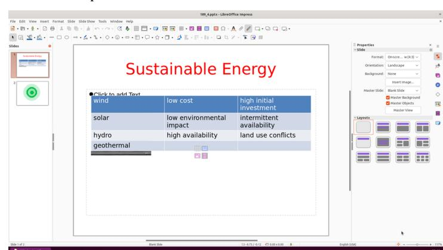

작업 지시. 두 번째 슬라이드로 이동하고 이전 제목과 동일한 색상, 위치, 글꼴 크기로 제목을 "Online Shopping"으로 지정하세요.

## 모델 출력.

<think>

사용자는 내가 두 번째 슬라이드로 이동하고 현재 제목인 "Sustainable Energy"와 동일한 서식을 가진 "Online Shopping"으로 제목을 설정하기를 원합니다. 현재 제목은 빨간색이며, 큰 글꼴로 상단 중앙에 위치합니다. 왼쪽에는 슬라이드 패널에 "Slide 1 of 2"가 표시되고, 슬라이드 2는 빈 화면입니다. 먼저 슬라이드 2를 클릭해 이동한 뒤 동일한 서식으로 제목을 추가해야 합니다. [. . . ]

</think>

<tool call>

{"name": "computer", "arguments": {"action": "left click", "coordinate": [0.054, 0.337]}}

</tool call>

Figure A3: 컴퓨터 사용 입력-출력 예시. 작업 지시와 현재 스크린샷을 주어지면, 모델은 추론(<think>, 여기서는 생략)과 도구 호출(<tool call>)을 포함한 단일 생성물을 출력한다. 가독성을 높이기 위해 이 예시에서는 예측된 정규화 좌표를 초록색 마커로 스크린샷에 겹쳐 표시한다.

# C.4 BROWSER-USE EVALUATION DETAILS (브라우저 사용 평가 세부 사항)

브라우저 사용에 대해, 우리는 Online-Mind2Web [\(Xue et al., 2025\)](#page-14-2) (300개 과제)와 WebVoyager [\(He et al., 2024\)](#page-11-10)을 평가한다. 후자는 Fara-7B [\(Awadal et al., 2025\)](#page-10-11)와 함께 공개된 595개 과제 'Fara-595' 하위 집합에 대해 595개 과제를 수행한다. 우리는 수정된 MolmoWeb harness (Section [B.3\)](#page-18-0)를 사용한다. 이는 단일 컴퓨터 사용 도구를 노출한다; 전체 액션 공간은 표 [A3.](#page-22-0)에 나열되어 있다. 관측은 스크린샷 전용이다: 각 단계는 현재 1280 × 720 뷰포트 스크린샷을 제공하며, DOM이나 접근성 트리는 포함되지 않는다. 또한 이전 행동의 결과, 페이지 제목 및 URL, 단계 수를 담은 짧은 텍스트 블록이 함께 제공된다. 클릭 및 드래그 좌표는 스크린샷에 대해 [0, 1]로 정규화되어 있으며, 이는 우리 컴퓨터 사용 에이전트와 동일한 규칙이다. 추론 시, 각 에피소드는 30단계로 제한되며, 과제당 900초, 행동당 90초 타임아웃이 적용된다. Online-Mind2Web은 AgentTrek 프로토콜 (o4 mini)로, WebVoyager는 공식 프로토콜 (GPT-4o)로 점수를 매긴다. 예시 단계를 Figure [A4.](#page-22-1)에 보여준다.

# D ANALYSIS DETAILS (분석 세부 사항)

# D.1 BEHAVIORAL ANALYSIS DETAILS (행동 분석 세부 사항)

우리는 SFT와 SFT+RL OpenForge-Claw 체크포인트 간의 행동 차이를 ClawEval에서 분석한다. 각 체크포인트를 ZeroClaw와 Codex harness 아래에서 실행한다.

도구 사용 (ZeroClaw). 각 도구에 대해, 모든 도구 호출 중 해당 도구를 호출한 비율을 롤아웃 전체에 걸쳐 집계하여 보고한다. 이는 모델이 최종적으로 과제를 해결했는지와 무관하게, 어떤 도구에 의존하는지를 포착한다.

Table A2: 우리 컴퓨터 사용 에이전트의 액션 공간.  
에이전트는 세 가지 도구를 통해 Ubuntu 데스크탑을 제어한다: computer (마우스, 키보드, 스크롤링, 에피소드 제어), bash (쉘 접근), str replace editor (파일 편집).  
좌표는 스크린샷에 대해 [0, 1] 범위로 정규화된다 (x=0 좌측, x=1 우측, y=0 상단, y=1 하단), 1920 × 1080 화면을 기준으로 한다.

| Action / command | Arguments | Description |
|----------------------------------------------------------------------------------------|---------------------------------------------------------------------|-----------------------------------------------------------------------------------------------------------------------------|
| computer — desktop mouse, keyboard, scrolling, and control |  |  |
| left click, right click, middle click, double click, triple click, left press | coordinate, keys | 주어진 버튼으로 좌표에서 클릭합니다. 그리고 클릭 수를 지정합니다; 왼쪽 클릭은 눌러 잠시 유지합니다. 키는 수식어를 추가합니다. |
| mouse move, left click drag, left mouse down, left mouse up | coordinate, start coordinate, coordinate2 | 커서를 이동하고, 드래그를 시작합니다 시작 좌표에서 좌표2까지, 또는 수동 드래그를 위해 왼쪽 버튼을 누르거나 놓습니다. |
| key, type, hold key, key down, key up | text, keys, duration | Type text, press a key or hotkey (e.g., ctrl+l), or hold / press / release specific keys. |
| scroll, hscroll | scroll direction, scroll amount, coordinate | 수직 또는 수평 마우스 휠 스크롤은 스크롤 양을 스크롤 방향에 따라, 선택적으로 고정 좌표에서. |
| screenshot, wait, terminate, done, fail | duration, status | Capture the screen, wait, or end the episode as success / failure (status). |
| bash — shell access |  |  |
| bash | command, timeout, working dir | Run a shell command inside the desktop environment (not the host). |
| str replace editor — file viewing and editing |  |  |
| view, create, str replace, insert, undo edit | path, file text, old str, new str, insert line, view range | View, create, and edit files with precise text operations at absolute paths. |

행동적 능력(Codex). 우리는 장기적 도구 사용과 관련된 다섯 가지 능력을 요약하며, 이는 Figure [5](#page-9-1) (오른쪽)의 레이더 플롯으로 표시됩니다. 각 능력은 [0, 100] 범위의 백분율이며, 값이 클수록 좋으며, 동일한 작업 집합에서 두 OpenForge-Claw 체크포인트의 롤아웃을 기준으로 계산됩니다.

- 형식 견고성(Format robustness). 잘못된 도구 호출로 인해 종료되지 않은 롤아웃의 비율, 즉, 하네스가 모델의 함수 호출 페이로드(일반적으로 길고 구조화된 출력)를 파싱하지 못해 세션이 끊기는 롤아웃 비율을 100에서 뺀 값입니다. 이는 모델이 잘 형성된 도구 호출을 얼마나 신뢰성 있게 내보내는지를 측정합니다.
- 오류 복구(Error recovery). 최소 하나 이상의 실패한 명령을 수행한 롤아웃 중, 여전히 작업을 해결한 비율입니다. 이는 모델이 충돌하거나 포기하기보다 오류 이후에도 진행할 수 있는지를 측정합니다.
- 자기 검증(Self-verification). 쓰기(상태 변경) 도구 호출 중 동일한 서비스에 대한 읽기(리드백)로 이어지는 비율, 예를 들어 작업을 생성한 후 작업 목록을 조회하는 경우입니다. 이는 모델이 자신의 행동 효과를 확인하는지를 측정합니다.
- 도구 범위(Tool coverage). 최소 세 개 이상의 서로 다른 서비스를 요구하는 작업에서, 필요한 모든 서비스를 최소 한 번씩 호출한 롤아웃의 비율입니다. 이는 모델이 다중 단계 계획을 완수까지 수행하는지를 측정합니다.
- 단계 효율성(Step efficiency). 각 작업마다, 두 체크포인트 전반에서 해당 작업의 세 번의 실행 중 가장 적은 단계 수를 *최고* 단계 수로 정의합니다. 체크포인트가 해결한 작업에 대한 점수는 최고 단계 수 / 해당 체크포인트의 단계 수이며, 해결한 작업에 대해 평균합니다. 값이 클수록 모델이 최소 단계 수에 가깝게 작업을 해결함을 의미합니다.

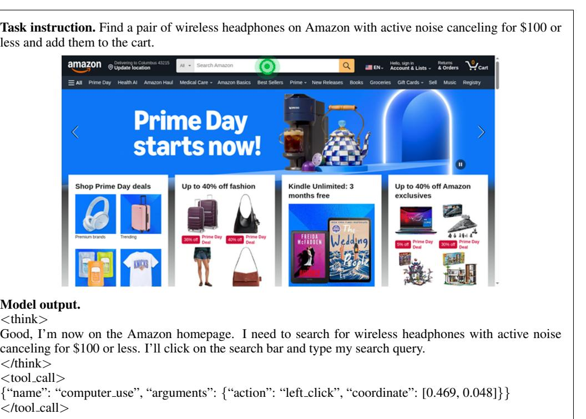

Figure A4: Online-Mind2Web 작업에서 대표적인 브라우저 사용 단계. 작업 지시문과 현재 스크린샷이 주어지면, 모델은 하나의 생성물에서 자신의 추론(<think>)과 도구 호출(<tool call>)을 교차시켜 내보냅니다. 우리는 예측된 정규화된 클릭 좌표를 초록색 마커로 스크린샷에 겹쳐 표시하며, 이는 아마존 검색창을 정확히 타깃팅합니다.

Table A3: 우리 브라우저 사용 에이전트의 행동 공간. 모델은 단일 컴퓨터 사용 도구를 통해 Chromium 브라우저를 제어합니다. 클릭 및 드래그 좌표는 스크린샷을 기준으로 [0, 1] 범위로 정규화되며, 스크린샷은 1280 × 720 뷰포트에 고정됩니다.

| 액션 | 인수 | 설명 |  |
|----------------------------------------------------------------------------|-----------------------|--------------------------------------------------------------------------------------------------------------|--|
| 컴퓨터 사용 — 브라우저 마우스, 키보드, 스크롤링, 탐색, 및 제어 |  |  |  |
| 좌클릭, 우클릭, 가운데 클릭, 더블 클릭, 트리플 클릭 | 좌표 | 주어진 버튼으로 좌표를 클릭하고 클릭 횟수(더블/트리플)로 단어나 줄을 선택합니다. |  |
| 마우스 이동, 좌클릭 드래그 | 좌표 | 커서를 좌표로 이동하거나 현재 커서 위치에서 드래그하여 이동합니다. |  |
| 타이핑, 키 | 텍스트, 키 | 포커스된 필드에 텍스트를 입력하거나 키 또는 조합(예: ["ctrl","a"])를 누릅니다. |  |
| 스크롤, 수평 스크롤 | 픽셀 | 커서에서 수직 또는 수평 스크롤을 픽셀 단위로 이동합니다(부호가 방향을 지정). |  |
| 이동, 뒤로 가기, 새 탭, 탭 포커스 | URL, 인덱스 | URL로 이동하거나 히스토리에서 뒤로 가기, 새 탭 열기, 또는 인덱스에 있는 탭으로 전환합니다. |  |
| 대기, 종료, 답변 | 시간, 상태, 텍스트 | 지정된 시간(초) 동안 대기하고, 에피소드를 종료합니다(성공/실패로 종료), 또는 최종 답변을 반환합니다. |  |

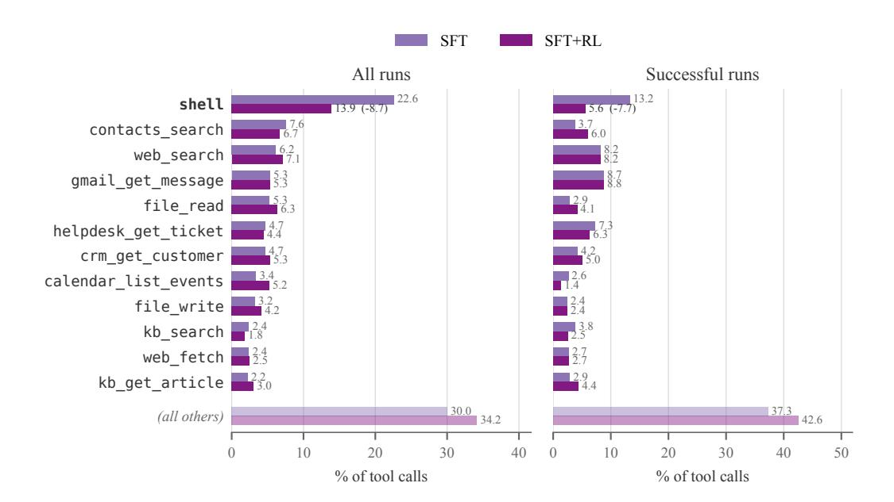

Figure A5: ClawEval에서 ZeroClaw harness를 사용한 SFT vs. SFT+RL에 대한 전체 툴 사용 분포, 전체 실행(왼쪽)과 성공 실행(오른쪽)에서. Figure [5:](#page-9-1)를 보완하며, 일반 셸 툴에서 벗어나는 경향이 성공 실행에 한정될 때 더욱 강해진다 (13.2% → 5.6%).

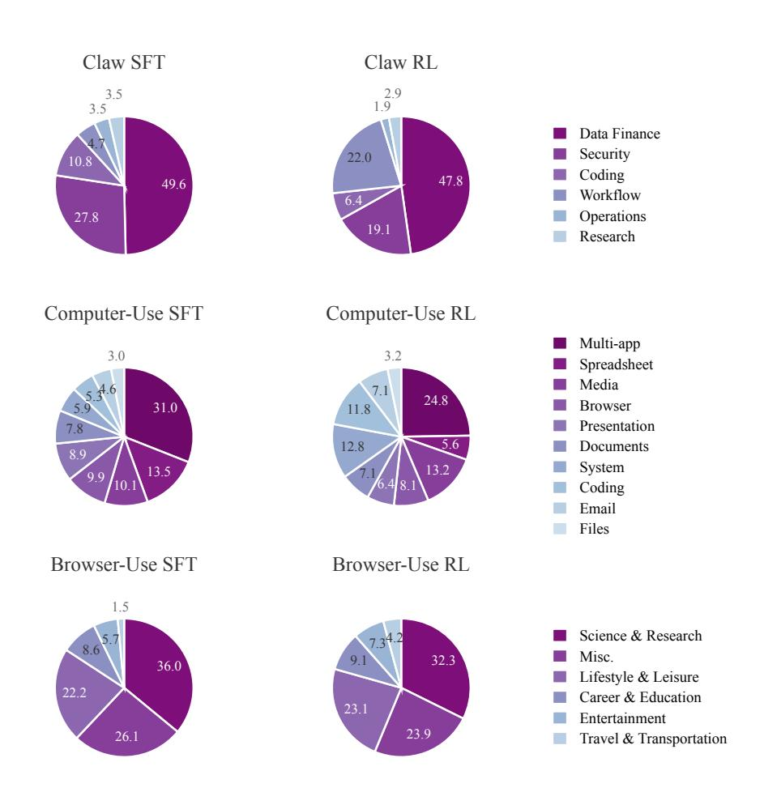

Figure A6: Claw(상단), Computer-Use(중단), Browser-Use(하단) 도메인에서 사용된 SFT 및 RL 훈련 과제의 카테고리 분포(%)

