# 무엇, 어디, 그리고 어떻게: 작업, 언어, 모델의 역할을 분리하기 (What, Where, and How: Disentangling the Roles of Task, Language, and Model in Code Model Representations)

- 원제: What, Where, and How: Disentangling the Roles of Task, Language, and Model in Code Model Representations
- 원문: [https://arxiv.org/abs/2607.21491](https://arxiv.org/abs/2607.21491)
- PDF: [https://arxiv.org/pdf/2607.21491v1](https://arxiv.org/pdf/2607.21491v1)
- arXiv ID: `2607.21491`

---

# 무엇, 어디, 그리고 어떻게: 작업, 언어, 모델의 역할을 분리하기 (What, Where, and How: Disentangling the Roles of Task, Language, and Model in Code Model Representations)

## Piotr Wilam University College London piotrwilam@gmail.com

#### 초록 (Abstract)

두 언어 모델이 서로 독립적으로, 서로 다른 데이터에서 훈련될 때, 같은 것을 같은 방식으로 표현하게 되는가? 우리는 이 질문을 코드에 대해 답한다. 최근에 소개된 conceptcircuit 추출 방법을 2×2 설계에 확장한다 — 두 언어(Python, Rust)와 두 모델(Qwen2.5-Coder-7B, DeepSeek-Coder-V1-6.7B)을 교차시킨 설계 — 그리고 모든 네 셀에서 동일하게 58개의 Python 문법 개념과 57개의 Rust 문법 개념을 완전한 목록으로 측정한다. 이는 작업, 언어, 모델에 따라 달라지는 것을 분리할 수 있는 가장 작은 설계이다.

답은 세 부분으로 나뉜다. *무엇*이 전용 회로를 얻는 것은 작업에 의해 결정된다: 두 모델은 어떤 개념이 회로를 받는지 일치한다 (Spearman ρ = 0.638 for Python, 0.673 for Rust, 두 경우 모두 p < 10−7 ). *어디*에 그 회로가 위치하는지는 모델에 의해 결정된다: Qwen은 개념을 늦은 밴드(∼L17–19)에서 처리하고, DeepSeek은 L6–7에서 처리한다 — 두 언어 모두에 대해 12–13 레이어 차이가 존재한다. *어떻게* 회로가 레이어를 따라 성장하는지도 모델에 의해 결정된다: Qwen은 원자적 개념에 초기 스파이크를 주지만 DeepSeek은 그렇지 않다. 따라서 "회로가 보편적인가?"라는 질문은 단일한 답을 갖지 않는다. 무엇에 대해서는 예이고, 어디와 어떻게에 대해서는 아니다: 보편성은 계산 조직이 아니라 표현 내용의 속성이다.

이 정량적 구조는 사전에 고정되지 않았다. 모델 간 일치는 독립성과 동일성 사이 어디든 위치할 수 있었지만, 실제로 ρ ≈ 0.65에 위치한다. Rust 구성은 두 모델 모두에서 Python 동등물보다 2–3배 더 많은 개념-특정 회로를 받는다. 두 모델은 두 언어 사이에서 뉴런을 공유한다 (7개 중 6개와 7개 중 7개 쌍으로 구성된 구조), 그리고 DeepSeek은 Qwen보다 1.94배 더 많이 공유한다 — 이전 결과가 예측하지 못한 방향이다. 또한 Qwen은 Rust의 타입-트레이트 기계의 아홉 개 키워드를 하나의 단단한 뉴런 클러스터에 묶는다 (그룹 내 Jaccard 0.535 대 무작위 순열 기준 0.112, p < 0.001), 표면 구문에서 보이지 않는 의미 차원을 회복한다. 인과적 절제와 선형 프로브는 추출된 회로가 기능적임을 확인한다.

모든 주장은 이 2×2에 한정된다. 두 모델만으로 축이 분리되는 것을 보여줄 수 있다; 결과적으로 얻은 모델별 프로필이 세 번째 모델을 예측하는지는 다음 단계 테스트이다.

## 1 서론 (1 Introduction)

모델이 Python의 for 루프와 Rust의 for 루프를 만났을 때 같은 뉴런을 사용하는가? 두 개의 독립적으로 훈련된 모델이 Python의 import를 모두 처리할 때, 비슷한 깊이의 회로를 같은 레이어에, 같은 성장 패턴으로 할당하는가? 추상화에 관한 세 가지 질문은 해석 가능성에 있어 근본적이다: 추상화가 어떻게 형성되는가, 어디에 존재하는가, 그리고 어떻게 처리되는가. 이 논문은 두 번째와 세 번째 질문에 답한다; 형성은 별도의 개발 작업의 주제이다.

이 질문에 답하는 장애물은 개념적이 아니라 방법론적이었다. 회로 탐지는 한 모델에서 한 행동을 추적한다 [(Wang](#page-11-0)

[et al.,](#page-11-0) [2023;](#page-11-0) [Conmy et al.,](#page-10-0) [2023)](#page-10-0). Probing tests one hypothesis at a time [(Tenney et al.,](#page-11-1) [2019;](#page-11-1) [Be](#page-10-1)[linkov,](#page-10-1) [2022)](#page-10-1). Sparse autoencoders discover features bottom-up, but in a basis learned per model, so two models' features have no built-in correspondence [(Bricken et al.,](#page-10-2) [2023;](#page-10-2) [Cunningham et al.,](#page-10-3) [2023)](#page-10-3). 이 질문이 필요로 하는 것은 다르다: 모든 모델과 모든 언어에 대해 동일하게 정의된 단일 측정치이며, 완전한 구성요소 목록에 대해 수행된다. 이 논문은 그 측정치를 구축하고 사용한다.

우리는 Wilam (2026)의 추출 및 마진화 방법을, 희소 8층 Python 트랜스포머에서 개발된 것을 기반으로, 두 개의 밀집 프로덕션 모델에서 Python과 Rust를 대상으로 한 2×2 설계로 확장한다. 분석 단위는 구조화된 인벤토리이며, 58개의 테스트 가능한 Python 개념과 57개의 테스트 가능한 Rust 개념으로 구성되어 있으며, 네 개의 셀 모두에서 동일하게 측정된다. 형식 언어는 문법이 미리 구성 요소의 인벤토리를 고정하기 때문에 이 방법을 개발하기에 적합한 환경이며, 인벤토리가 더 복잡하지만 질문이 가장 중요한 자연어는 궁극적인 대상이다.

#### Why the outcome was not a foregone conclusion (결과가 이미 정해진 것이 아니었던 이유)

합리적인 사전 지식은 유사한 데이터로 훈련된 모델이 내용은 일치하지만 메커니즘은 다를 것이라고 말하지만, 따라서 우리의 주요 결과의 *방향*은 추측할 수 있었다. 그러나 방향은 결과가 아니며, 이 연구 이전에는 기대가 증거 기반이 없었다: 두 개의 독립적으로 훈련된 모델에서 구조화된 인벤토리를 동일하게 측정한 선행 연구가 없었다. '회로를 얻는 것'에 대한 교차 모델 일치가 ρ = 0.3, 0.65, 또는 0.9 근처에 있을지, 즉 세 가지 다른 결과가 매우 다른 함의를 갖는지 아무도 알지 못했다. 데이터는 중간값을 선택한다: 정체성에서 멀리 떨어진 보존된 순위.

선행 연구에서도 모델 차이의 방향을 고정하는 것은 없다. DeepSeek는 Qwen보다 언어 간에 1.94배 더 많은 뉴런을 공유한다; 두 모델의 처리 밴드는 일관된 순서로 12–13층 차이가 있다; Rust는 두 모델 모두에서 Python보다 2–3배 더 많은 개념‑특정 회로를 획득한다 — 각각은 반대로 될 수도 있었고 사라질 수도 있었다. 그리고 가장 강력한 구조적 발견은 아무도 예측하지 못한 것이다: 두 모델의 여섯 개 독립 측정이 여섯 개의 별도 차이로 흩어지지 않는다. 대신 두 개의 일관된 처리 스타일로 붕괴된다 ([§8)](#page-9-0)). 이는 서로 다른 모델이 다르다는 진술이 아니라 교차 모델 변동성의 *차원성*에 대한 진술이다.

분해가 가능하게 하는 것은 무엇인가. 축들은 직접적인 실용적 내용을 갖는다. What가 전이되므로, 한 모델에서 측정된 개념 인벤토리는 다른 모델에 유용한 사전 지식이 된다: 개념 수준 결과는 이식 가능하다. Where와 How는 전이되지 않으므로, 고정 깊이에서의 탐지, 피크 층에서의 패치, 위치된 회로의 편집 등 층 인덱스 기반 기법은 모델별이며 각 모델마다 재위치해야 한다; 우리의 모델별 밴드 측정은 어디인지 알려준다. 모델 간 해석 가능성 결과를 이식하려는 실무자는 어느 축에 속하는지 물어봐야 한다.

핵심 결과는 두 모델이 두 개의 독특한 처리 스타일을 운반한다는 것이다: 그들은 어떤 구성 요소가 전용 회로를 얻는지에 대해 일치하지만, 그 회로가 어디에 어떻게 조직되는지는 다르다. What/Where/How 분리(분해)는 증거를 조직한다 — 그리고 한 발견은 이 방법이 측정하도록 설계된 구문을 넘어선다는 것을 보여준다: Qwen은 Rust의 타입‑및‑트레이트 기계를 단일 뉴런 클러스터에 결합한다, 이는 표면 코드에 없는 의미 차원이다.

로드맵. [§2](#page-1-0)는 연구를 배치하고 추출 방법을 자체적으로 요약한다. [§3](#page-2-0)는 파이프라인을 따라가며 각 용어를 정의한다. [§4](#page-3-0)는 분리(분해)를 확립한다: What는 보존되고, Where는 차이가 있으며, How는 차이가 있다. [§5](#page-4-0)는 언어 축을 개발한다. [§6](#page-6-0)는 아키텍처 변화를 견디는 조직을 개발하며, 타입‑트레이트 클러스터를 포함한다. [§7](#page-7-0)는 분해를 인과적으로 및 기하학적으로 검증한다. [§8](#page-9-0)는 측정값을 두 스타일 지문으로 통합하고, 그가 허용하는 예측을 명시한다.

## 2 Background and Related Work (배경 및 관련 연구)

회로 탐지. 기계적 해석 가능성은 네트워크를 인간이 이해할 수 있는 구성 요소로 역공학한다 — 간접 객체 식별 회로 [(Wang et al.,](#page-11-0) [2023)](#page-11-0)와 같은 선별된 사례 연구부터 활성화 패칭을 통한 자동 탐지 [(Conmy et al.,](#page-10-0) [2023)](#page-10-0) 및 그 정제 [(Heimersheim and Nanda,](#page-10-4) [2024)](#page-10-4)까지. 이러한 방법들은 행동에서 시작해 해당 회로를 찾는다: 한 번에 하나의 행동, 하나의 모델. Wilam (2026)은 입장을 뒤집는다 — 구조화된 개념 재고에서 시작해 각 개념에 대한 회로를 찾는다. 이 역전이 교차 모델 비교를 가능하게 하는 핵심이다, 왜냐하면 재고가 행동이 아니라 공통 기준이 되기 때문이다.

특징과 중첩.  
개별 뉴런은 서로 관련이 없는 여러 특징에 반응한다 [(Elhage et](#page-10-5) [al.,](#page-10-5) [2022)](#page-10-5).  
희소 오토인코더는 과다 완전한 (overcomplete) 특징 기반을 학습하여 표현을 더 해석 가능하게 만든다 [(Bricken et al.,](#page-10-2) [2023;](#page-10-2) [Cunningham et al.,](#page-10-3) [2023;](#page-10-3) [Templeton et al.,](#page-11-2) [2024)](#page-11-2), 그리고 뉴런 수준 연구는 해석 가능한 단위를 직접 찾아낸다 [(Gurnee et al.,](#page-10-6) [2023)](#page-10-6).  
하지만 SAE 특징은 모델마다 정의된다: 두 모델의 사전은 선행적 대응이 없으며, 이는 교차 모델 비교가 작동하지 않는 정확한 이유다.  
우리의 이진 뉴런 마스크 측정은 더 거칠며, 의도적으로 그렇게 한다 — 이는 MLP를 가진 모든 모델에 대해 동일하게 정의되며, 이는 2×2가 요구하는 바이다.  
§7.2는 거친 정도가 초래하는 비용을 정량화한다.

보편성. 독립적으로 훈련된 네트워크가 동일한 내부 구조에 수렴하는지 여부는 오래된 질문이다 [(Olah et al.,](#page-11-3) [2020;](#page-11-3) [Chugh](#page-10-7)[tai et al.,](#page-10-7) [2023)](#page-10-7). 최근 연구는 규모를 두고 이를 추구한다: 보편적 뉴런이 GPT-2 훈련 실행마다 반복된다 [(Gurnee et al.,](#page-10-8) [2024)](#page-10-8); 플라톤적 표현 가설은 모델이 성장함에 따라 현실의 공유 표현으로 수렴한다고 주장한다 [(Huh](#page-10-9) [et al.,](#page-10-9) [2024)](#page-10-9); 그리고 특징 공간과 메커니즘적 유사성은 아키텍처 간에 활성 측정 대상이 된다 [(Lan et al.,](#page-11-4) [2024;](#page-11-4) [Wang et al.,](#page-11-5) [2024)](#page-11-5). 이 문헌은 대부분 보편성을 단일 예/아니오 질문으로 제시한다; 우리의 기여는 이를 서로 다른 답을 받는 축으로 나누는 것이다.

교차 모델 비교. 교차 모델 표현 비교는 일반적으로 CKA와 같은 유사성 측정값을 사용하여 수행된다 [(Kornblith et al.,](#page-11-6) [2019)](#page-11-6). 우리는 대신 구조화된 개념 인벤토리를 직접 비교한다. 이러한 선택은 의도적이다: 인벤토리 비교는 기하학적 비교보다 더 직관적이지만, 개념 *정체성*에 대한 합의와 층 *배치*의 차이를 분리한다 — 보편성 질문이 의존하는 구분이며, 단일 유사성 점수로는 표현할 수 없다.

선형 프로브는 구문 구조를 감지한다 [(Tenney et al.,](#page-11-1) [2019;](#page-11-1) [Belinkov,](#page-10-1) [2022)](#page-10-1); 그들은 정보가 해독 가능한지 여부를 묻는다, 이는 신경이 정보를 전달하는 방식과는 다른 질문이다. [§7.2](#page-7-1)는 두 관점을 모두 사용하고 그들이 일치하는 지점을 측정한다. 코드에 대해 구체적으로, 이전 연구는 구문 트리를 프로브한다 [(Wan et al.,](#page-11-7) [2022)](#page-11-7), 관계 해독을 연구한다 [(Hernandez et al.,](#page-10-10) [2024)](#page-10-10), 그리고 단일 모델에서 코드 구문을 초기 레이어에 국소화한다 [(Yin](#page-10-11) [et al.,](#page-10-11) [2025)](#page-10-11). 우리의 교차 모델 설계는 그 마지막 종류의 주장을 직접 테스트한다: 우리는 밴드가 모델에 의해 결정된다는 것을 발견한다 — DeepSeek에서는 초기, Qwen에서는 후기, 따라서 '코드 구조가 어디에 존재하는가'는 모델별 사실이며 일반적인 사실이 아니다.

교차 언어 공유. 다국어 모델은 자연어 간에 표현을 공유한다 [(Pires et](#page-11-8) [al.,](#page-11-8) [2019;](#page-11-8) [Conneau et al.,](#page-10-12) [2020;](#page-10-12) [Muller et al.,](#page-11-9) [2021)](#page-11-9), 그리고 최근의 메커니즘 연구가 그림을 정제한다: 모델은 공유되는 구문 과정에 대해 동일한 회로를 재사용하면서, 언어별 고유한 과정에는 언어별 구성 요소를 할당한다 [(Zhang et](#page-11-10) [al.,](#page-11-10) [2025)](#page-11-10), 언어별 뉴런은 상단 및 하단 층에 집중된다 [(Tang et al.,](#page-11-11) [2024)](#page-11-11), 그리고 다국어 훈련을 통해 공유 개념 공간이 등장한다 [(Körner et al.,](#page-11-12) [2026)](#page-11-12). 우리는 이 라인을 자연어에서 *형식 언어*로 확장하고, 부족한 교차 모델 축을 추가하며, 묻지 않는다

언어 간에 회로가 공유되는지 여부뿐 아니라, 공유의 *양*이 언어적 사실인지 모델적 사실인지 여부를 묻는다 ([§5.3:](#page-6-1) 순위는 공유된다; 양은 아니다).

개념-회로 방법, 자체 포함. Wilam (2026)은 희소 8층 Python 모델에서 이 방법을 도입했다; 본 논문은 이를 기반으로 하므로 완전히 요약한다. 언어의 인벤토리에서 각 개념—예를 들어 Python AST 노드 For—에 대해, 개념을 모두 포함하면서 다른 모든 것을 변형한 많은 프롬프트를 작성한다. 모든 프롬프트에서 발화하는 뉴런은 개념에 반응하고, 부수적인 특징에는 반응하지 않는다. 프롬프트 집합 전체에서 활성 뉴런 집합의 교집합은 따라서 한계화(marginalisation)이며, 변형된 차원을 통합해 개념만 남긴다. 두 번째 집합—체커 프롬프트—는 개념의 키워드 토큰을 그 구조적 역할 밖에 배치하고, 같은 구조를 사용해 *토큰의* 회로를 얻는다. 두 집합을 비교하면 추상화와 표면 형태를 분리한다. 희소 모델에서 원본 논문은 세 가지를 입증했다: 교집합이 채워진 상태를 유지한다(같은 밀도의 무작위 집합이 비어짐으로 수축); 알려진 개념 구조를 회복한다; 그리고 *atomicity* 구분—중첩된 본문이 없는 모듈형 키워드와 본문 범위가 있는 구조—가 회로의 시간적 행동을 조직한다. 본 논문의 모든 후속 작업은 이 방법을 고정해, 네 개(모델, 언어) 셀에 적용한다

## 3 방법론

파이프라인은 다섯 단계로 구성된다.

프롬프트 생성. 각 개념마다 두 개의 프롬프트 세트: *concept prompts*는 구조적 역할에 구성을 배치하고; *checker prompts*는 키워드 토큰을 그 역할 밖에 배치한다(문자열, 주석, 변수 이름 등). (개념, 문맥) 쌍마다 50개의 프롬프트를 만들며, 어휘, 구조, 패딩 차원에서 변이를 주어 한계화가 부수적 특징을 제거하도록 한다. 형식 언어는 유한한 a-priori 인벤토리를 제공한다; 우리는 테스트 가능한 하위 집합을 취한다—키워드 토큰이 구조적 역할 밖에서도 나타날 수 있는 구문(대조가 요구하는)이며, 토큰이 개념과 분리 불가능한(러스트 소유 연산자) 및 토큰이 없는 구문은 제외한다. 이로써 58개의 테스트 가능한 Python 개념과 57개의 테스트 가능한 Rust 개념이 도출된다; 교차 언어 비교([§5.3)](#page-6-1)에서는 이들 중 일곱 개의 구문 쌍을 식별한다

추출. 각 프롬프트는 모델을 한 번 통과하며, 포워드 훅은 모든 층의 마지막 토큰 위치에서 MLP 출력을 기록한다

이진화.

뉴런은 절대 활성화 값이 ε를 초과하면 활성화된다.

우리는 ε ∈ {0.001, 0.1, 0.5}를 스윕하여 관대함에서 엄격함까지 탐색한다:  
0.001에서는 회로가 사소하게 가득 차 있다,  
0.1에서는 개념 전용 비율이 거의 0에 가깝다,  
그리고 구조적 신호가 ε = 0.5에서 나타나며, 우리는 이를 전체적으로 사용한다.

두 번째 필터는 프롬프트 변형의 ≥ 80%에서 활성화된 뉴런을 유지할 것이다,  
그러나 이 조밀한 SwiGLU 모델에서는 ε를 통과하는 모든 뉴런이 모든 변형에서 발화하므로, 이 필터는 무력이며 스윕은 하나의 매개변수로 축소된다.

(아티팩트 이름과 그림 패널은 이 필터를 cons=0.8, 고정된 80% 설정으로 표시한다; 여기서는 아무 역할을 하지 않는다.)

전부 또는 전혀 발화하는 방식은 선택된 뉴런이 주입된 변동성에 견고한 안정적인 개념 탐지기임을 의미하며, 우연한 프롬프트 특징에 반응하는 것이 아니라는 뜻이다.

마진화. Python AST 개념 `For`에 대해, 프롬프트는 리스트, 딕셔너리, 범위 등 많은 빌트인에 대해 `for` 루프를 배치한다; `For`의 보편적 회로는 그들의 활성 뉴런 집합의 교집합이다 — 어떤 빌트인이 등장하든 상관없이 발화하는 뉴런들 — 따라서 교집합을 취하면 빌트인이 마진화되고 개념이 남는다. 빌트인 개념은 그들이 포함된 AST 구성 요소에 대해 유사하게 마진화된다. (`AST node`와 `builtin`은 Python의 범주이며; Rust 구성 요소는 그들의 보완 집합에 대해 마진화된다.) 개념이 안정적인 단위로 인코딩되지 않으면, 교집합은 같은 밀도의 무작위 집합처럼 빈 공간으로 수축한다; 그것이 채워져 있는 것이 보편적 회로를 의미 있게 만든다.

분해. 보편 마스크 A를 검사 마스크 B와 비교한다: 개념 전용 = A \ B, 공유 = A ∩ B, 토큰 전용 = B \ A. *개념 비율 (concept fraction)* |A \ B|/|A|는 개념별 핵심 측정값이다. 결과는 개념, 층, 모델, 언어별로 인덱싱된 데이터셋이다.

[§4–](#page-3-0)[§7](#page-7-0)에서의 분석은 이 데이터셋에 적용된 표준 도구를 사용합니다: 교차 모델 일치도를 위한 Spearman 상관계수([§4.2)](#page-3-1); 쌍별 Jaccard 유사도에 대한 순열 영가정(permutaion null)을 사용한 Ward‑linkage 군집화([§6.2)](#page-6-2); 크기 일치 영가정에 대한 zero‑ablation([§7.1)](#page-7-2); 그리고 코사인 비교를 사용한 로지스틱 회귀 프로브([§7.2)](#page-7-1). 파이프라인은 세 개의 층으로 나뉩니다 — 추출(한 번 실행, 동결된 아티팩트), 분석(초 단위, 아티팩트에서), 그리고 프레젠테이션(그림마다 하나의 스크립트) — 모두 공개되었습니다; 추출이 동결되어 있기 때문에 모든 숫자와

| 언어 | n | ρ | p | 플로우 타입 동의. |
|----------|----|-------|--------|----------------|
| Python | 58 | 0.638 | < 10−7 | 88.6% |
| Rust | 57 | 0.673 | < 10−7 | 85.1% |

표 1: 모델 간 개념-분수 순위 (Spearman ρ) 및 [§6.1](#page-6-3) 흐름 유형 할당 일치도, 언어별 ([§4.2)](#page-3-1).

figure regenerates from the analysis layer without rerunning the model (Appendix R).

## 4 The What/Where/How Dissociation

### 4.1 Calibration

이 방법은 알려진 양성 및 음성을 복구한다.

Wilam (2026)의 원자성 슈퍼클러스터는 다음과 같이 복제된다:  
Qwen에서 Python의 two_phase 개념은 {Assert, Break, Continue, Import, ImportFrom, Pass}라는 6개 개념 집합이다,  
DeepSeek에서는 동일한 그룹이 smooth-onset build_and_hold 형태를 통해 나타난다;  
Rust에서는 Qwen의 two_phase 개념이 Super와 Use 두 개뿐이며, 둘 다 모듈 시스템 키워드이다.

보정 음성은 올바르게 동작한다:  
Python 내장 함수는 거의 0에 가까운 개념 비율을 보인다 (Qwen 0.024, DeepSeek 0.068),  
Rust 소유권 연산자 (&, *, ')는 토큰과 개념이 분리 불가능한 경우에도 거의 0에 가까운 값을 반환한다.

### 4.2 The "What" Is Conserved

어떤 구조가 전용 회로를 얻는지는 작업에 따라 결정되며 모델 간에 전이된다. 개념-분수 순위는 일치한다 (Figure [1,](#page-4-1) Table [1)](#page-3-2): Spearman ρ = 0.638 (Python), 0.673 (Rust) (두 경우 모두 p < 10−7 ), 흐름형 분류는 88.6%와 85.1%에서 일치한다. 순위는 언어와 예측 작업에 따라 달라지며 특정 모델에는 의존하지 않는다. 상관관계는 보통 수준이며 거의 1에 가까운 것은 아니다 — 설명되지 않은 분산은 다음 두 축이 특징짓는 모델별 구성 요소이다.

### 4.3 The "Where" Diverges

구성이 처리되는 위치는 모델의 특성이며, 언어의 특성이 아니다. Qwen은 개념별 처리를 늦은 층에서 집중한다 (Python ∼L19, Rust ∼L17); DeepSeek는 두 언어 모두에서 L6–7에 위치한다 (Figure [2)](#page-5-0), 약 12–13 층 앞쪽이다. 모델 내부의 교차 언어 일관성은 핵심 관찰이다: 각 모델의 밴드는 두 언어가 처리되는 위치를 예측한다.

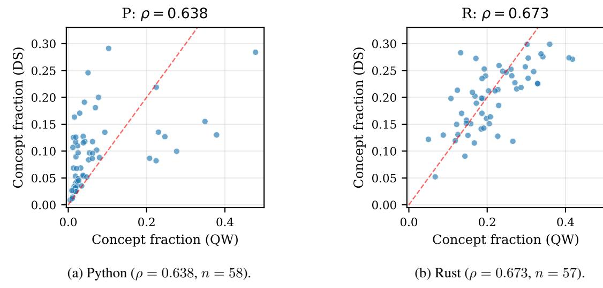

Figure 1: 개념 비율 Qwen vs DeepSeek, 개념당 한 점, y = x 참조. 순위는 모델 간에 보존된다 ([§4.2)](#page-3-1).

가장 깨끗한 개념-특정 신호를 전달하는 층이 무엇인지에 대한 관심이며, 가장 많은 표현 활동이 존재하는 곳이 아니라 — 아래에 있는 회로 크기이다.

the universality question is: yes on What, no on Where and How.

### 4.4 The "How" Diverges

#### The same atomic concepts receive an early circuit spike in Qwen that they do not in DeepSeek.

이 주장은 회로 크기(circuit size)에 기반하며, 이는 [§4.3.](#page-3-3)의 개념 비율 피크와 다른 메트릭이다. Figure [3](#page-5-1)은 여섯 개의 Python 원자성 개념에 대해 층별 회로 크기를 플롯한다: Qwen은 2–3층에서 급격한 초기 스파이크를 보이며(early-bias 0.73–0.90), DeepSeek의 회로는 10–12층까지 거의 비어 있다가 부드럽게 상승한다(early-bias 0.05–0.11). 초기 스파이크의 존재 여부가 분기점이다. Qwen에서는 후기 층 마스크가 전체 MLP 차원에 접근한다—포화이며 의미 있는 피크가 아니다—따라서 강건한 대비는 초기 층 차이이며, early-bias 측정(초기 대비 후기를 정규화)은 이를 포착한다. 세 개의 아키텍처에서 동일한 개념은 세 가지 시그니처를 보인다: 희소 CSP-Atlas 모델에서 역 U형, Qwen에서 초기 스파이크, DeepSeek에서 부드러운 후기 시작.

### 4.5 Interpretation

회로 구조는 최소 세 개의 독립적인 축을 가지고 있으며, “회로가 보편적인가?”라는 질문은 이들을 혼합한다.  
어떤 개념이 회로를 획득하는지는 작업에 따라 결정되며 전이된다.  
그들이 처리되는 위치와 그 회로가 층을 거쳐 구축되는 방식은 모델에 의해 결정되며 그렇지 않다.  
회로는 개념적 정체성에서 보편적일 수 있지만, 처리 깊이와 역학에서는 비보편적일 수 있다.  
답은

이것은 독립적으로 훈련된 모델이 공유된 표현을 수렴한다는 유니버설리티 가설 [(Olah et](#page-11-3) [al.,](#page-11-3) [2020;](#page-11-3) [Gurnee et al.,](#page-10-8) [2024;](#page-10-8) [Huh et al.,](#page-10-9) [2024)](#page-10-9)을 정제한다. 우리는 수렴이 축에 따라 달라진다는 것을 발견한다: 이는 *무엇*이 회로를 획득하는 것 — 표현 내용 — 에 대해서는 성립하지만, 그 회로가 *어디* 또는 *어떻게* 조직되는지는 성립하지 않는다. 유니버설리티는 내용의 특성이며, 계산 조직의 특성은 아니다.

해석을 제한하는 두 가지 진술이 있다. 첫째, "-determined" 용어는 이 2×2 안에서 정의된다: task-determined는 "이 설계의 모델 축에 걸쳐 일정한" 것을 의미하고, model-determined는 "언어 축에 걸쳐 일정하고 모델 축에 따라 변하는" 것을 의미한다. 두 모델이 있을 때, "model-determined"는 두 훈련 실행을 구분하는 무엇이든 변화를 귀속한다 — 코퍼스, 궤적, 아키텍처, 초기화 — 어떤 요인을 고립시키지 않는다; 고립시키려면 한 번에 하나의 요인을 변형하는 설계가 필요하다. 둘째, 분산이 동일한 대표성 내용을 동의하지만 계산 전략이 다른 다수의 좋은 솔루션이 있는 손실 지형을 반영한다는 가설을 세울 수 있다 — 그러나 이는 추측이다: 연구는 표현을 측정하고 손실 지형을 측정하지 않는다.

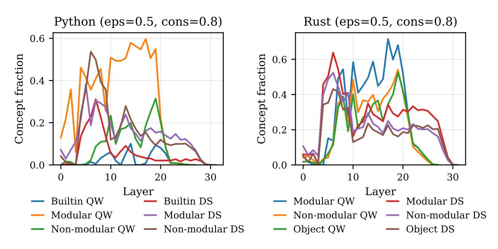

Figure 2: 층별 개념 비율 프로파일. Qwen은 늦은 밴드(∼L17–19)에서 최고점을 찍으며, DeepSeek은 두 언어 모두에서 L6–7에서 최고점을 찍는다 ([§4.3)](#page-3-3)).

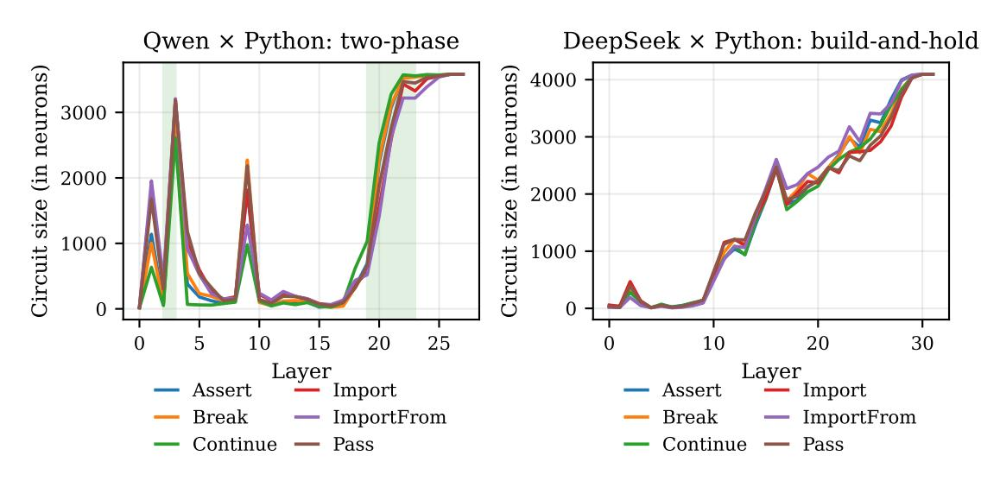

Figure 3: 여섯 개의 Python 원자성 개념에 대한 층별 회로 크기. Qwen은 DeepSeek에 없던 L2–3에서 초기 급증을 보이며, DeepSeek은 L10부터 부드럽게 상승한다 ([§4.4)](#page-4-2)).

\n## 5 언어 설계가 표현 강도를 결정한다 (Language Design Determines Representation Strength)\n\n

### 5.1 Rust 대 Python (Rust vs Python)

Rust 구조체는 Python 동등물보다 2–3배 더 많은 개념특정 회로를 받으며, 두 모델 모두에서 같은 방향으로 — 언어 설계의 특성이지 아키텍처가 아니다. 평균 개념 비율은 Qwen 0.215 대 0.074 (2.91배)와 DeepSeek 0.201 대 0.097 (2.07배) (Table [2)](#page-6-4)). Python( Qwen)에서는 날카로운 3단계 계층이 모듈형 키워드(atomic, 중첩 본문 없음: import, assert, break, continue, pass)를 0.314, 비모듈형 제어 흐름 구조를 0.090, 빌트인을 0.024로 구분한다 — 13:1 비율. 이들

세 단계는 테스트 가능한 하위 집합 안에 있으며, 이는 Wilam(2026)의 토큰이 없는 AST 단계(tokenless-AST tier)를 제외한다 — 토큰이 없는 구조체는 키워드가 없으므로 개념 대 토큰 대비가 없다. Rust에서는 세 그룹(Modular, Nonmodular, Object)이 서로 1.5배 이내에 속한다: 더 엄격한 구문은 모든 구조체를 구별 가능하게 하여 계층을 압축한다. 날카로운 모듈키워드 단계는 자체적으로 Qwen에 특이하다: Python(DeepSeek)에서는 순서가 반전되어 비모듈형 구조체(0.151)가 모듈형 구조체(0.144)를 앞선다 (Table [2)](#page-6-4)). (수치: Python 6 + 18 + 34 = 58; Rust 6 + 15 + 36 = 57.)

| 그룹 | $P \times QW$ | P×DS | $R \times QW$ | $R \times DS$ |
|------------------|---------------|-------|---------------|---------------|
| 모듈형 | 0.314 | 0.144 | 0.294 | 0.264 |
| 비모듈형 | 0.090 | 0.151 | 0.222 | 0.213 |
| 내장 / 객체 | 0.024 | 0.060 | 0.200 | 0.185 |

표 2: (언어, 모델) 셀별 그룹별 평균 개념 비율. Python (Qwen) 계층 구조(13:1 비율)는 Rust에서 압축되며($1.5\times$ 이내) Python(DeepSeek)에서는 반전된다. 여기서 비모듈형이 모듈형을 약간 초과한다 (§5.1)

### 5.2 부스트는 Python의 가장 약한 개념에서 가장 크다 (The Boost Is Largest for Python's Weakest Concepts)

부스트(개념의 Rust 개념 비율과 Python 개념 비율의 비율)는 Python이 가장 약할 때 가장 크다. 이미 Python에서 강한 개념(While, Break, Continue)은 적당한 부스트를 보이며, Python이 약한 개념(Return 7.2×, For $5.1\times$, If $4.4\times$ — 높은 토큰 모호성)은 가장 큰 부스트를 받는다. Import/Use는 비율이 1 이하로 떨어지는 유일한 경우이며, Python의 import는 Rust의 use보다 더 구별되는 문법을 갖는다. 이는 Wilam(2026)의 토큰 모호성 원칙을 따른다: 개념 전용 비율은 키워드 표면 토큰이 얼마나 모호한가에 의해 결정되며, Rust의 더 엄격한 문법은 for와 if 같은 구조에 대한 모호성을 줄여 구조적 표현을 강제한다. 이 비율은 토큰 모호성과 구조적 구별성의 결합으로 예측 가능하다 — 언어 간에, 단지 하나의 언어 내에만 국한되지 않는다.

### 5.3 다국어 신경 공유 (Cross-Language Neuron Sharing)

두 모델 모두 Python과 Rust 사이의 동등한 구조에 대해 뉴런을 공유한다; 공유되는 부분은 보존되고, 얼마나 공유되는지는 모델에 의해 결정된다. 우리는 동등한 역할을 수행하는 일곱 개의 교차 언어 구조 쌍(반복, 분기, 루프 제어, 함수 정의(def⇔fn), 모듈 가져오기, 반환, 타입 정의(Table 3))을 선택하고 모델이 이들 사이에서 뉴런을 공유하는지 측정한다. 쌍이 공유되는 경우 그 공유 비율(작은 풀에 대한 풀된 개념 전용 집합의 교집합, 층별 평균)이 10%를 초과하면 공유된 것으로 간주한다. 통과 쌍은 이보다 훨씬 높고, 하나의 실패는 훨씬 낮아, 카운트는 컷오프에 민감하지 않다. DeepSeek는 Qwen보다 $1.94 \times$ 더 많은 교차 언어 공유를 보인다(그림 4). DeepSeek에서는 일곱 개 모두 통과하지만, Qwen은 여섯 개를 통과하고 함수 정의가 3.8%로 누락된다 — 모델은 들여쓰기 범위의 def와 중괄호 범위의 fn을 동일한 역할에도 불구하고 표면 형태가 너무 달라서 동등하게 취급하지 않는다. 공유 정도의 순위는

| 동치 클래스 (Equivalence class) | DS | QW | DS 패스 (DS pass) | QW 패스 (QW pass) |
|-------------------|-------|-------|--------------|--------------|
| 반복 (Iteration) | 0.525 | 0.340 | <b>√</b> | <b>√</b> |
| 분기 (Branching) | 0.517 | 0.271 | $\checkmark$ | $\checkmark$ |
| 반환 (Return) | 0.503 | 0.177 | $\checkmark$ | $\checkmark$ |
| 타입 정의 (Type def) | 0.434 | 0.146 | $\checkmark$ | $\checkmark$ |
| 루프 제어 (Loop control) | 0.330 | 0.289 | $\checkmark$ | $\checkmark$ |
| 모듈 가져오기 (Module import) | 0.250 | 0.129 | $\checkmark$ | $\checkmark$ |
| 함수 정의 (Function def) | 0.149 | 0.038 | $\checkmark$ | _ |
|  |  |  |  |  |

표 3: (Table 3) 교차 언어 공유 비율(레이어 평균) 7개의 동등 클래스에 대해. '통과' 기준은 $\geq 10\%$ 이다. DeepSeek는 모든 7개를 통과하고, Qwen은 6개에 도달한다(함수 정의는 실패) (§5.3).

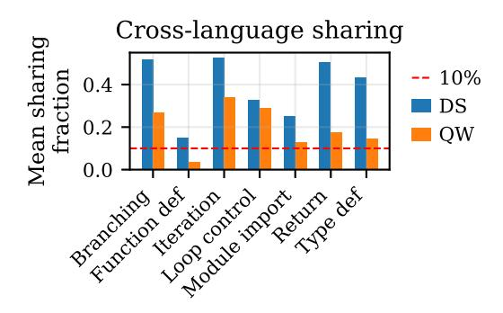

그림 4: (Figure 4) 교차 언어 뉴런 공유가 동등 클래스별로 나타난다. DeepSeek는 Qwen보다 $1.94 \times$ 더 많이 공유하며, 10% 임계값은 점선으로 표시된다 (§5.3).

공유 가능한 쌍은 모델 간에 보존된다(작업에 의해 결정됨); 크기 차이는 모델에 의해 결정되며, §4.4 역학을 반영할 가능성이 있다. 그러나 현재 데이터는 이를 정식으로 테스트하지 않는다.

## 6 아키텍처-불변 조직 (Architecture-Invariant Organisation)

#### **6.1** 원자성 슈퍼클러스터 (The Atomicity Super-Cluster)

원자성 슈퍼클러스터는 세 개의 아키텍처에 걸쳐 복제된다; 보존되는 집합은 작업에 의해 결정되며, 그 시간적 형태는 아키텍처별이다. Qwen에서 Python의 two_phase 개념은 정확히 6개 개념의 CSP-Atlas 원자성 집합 {Assert, Break, Continue, Import, Import-From, Pass}와 같다. DeepSeek에서는 build_and_hold를 통해 그룹이 나타나며, Rust의 대응은 Super와 Use이다. 복제는 희소 8층, 조밀 28층, 조밀 32층 모델에 걸쳐 있으며, 각 모델마다 다른 시간적 형태를 가진다. 조밀 모델 간의 흐름형 동의율은 88.6% (Python)와 85.1% (Rust)이다. 부록 Figure 8은 모든 네 개 셀에 대한 perlayer 프로파일을 보여준다.

### 6.2 의미론적 클러스터링 in Rust (Semantic Clustering in Rust)

Qwen은 Rust의 type-trait 가족을 강하게 결합된 뉴런 클러스터로 표현하며, 표면 수준에서 보이지 않는 타입 이론적 차원을 회복한다 — 하지만 선택적으로. 계층적 클러스터링은 Qwen × Rust × L14 (그림 [5])에서 네 개의 그룹을 제안한다; 순열 테스트(10,000개의 동일 크기 무작위 추출, 고정 시드; 그림 [6])가 그들을 정렬한다:

| Group | Jacc. | Null | p | 판단 |
|---------------------|-------|-------|--------|---------|
| 타입 시스템 트레이트 | 0.535 | 0.112 | <0.001 | 강한 |
| 메모리/소유권 | 0.190 | 0.112 | 0.044 | marg. |
| 데이터 정의 | 0.199 | 0.112 | 0.035 | marg. |
| 제어 흐름/모듈 | 0.129 | 0.112 | 0.292 | 무작위 |

가설된 네 그룹은 다음과 같다: *타입 시스템 트레이트* (Enum, Send, Option, Iterator, Copy, Eq, Drop, Debug, ToString), *메모리/소유권* (Pin, Mutex, Arc, Box, Vec, Impl, Async, Move, Future), *데이터 정의* (Struct, Let, String, Trait, Default, Display, Hash, Return, Read), *컨트롤 흐름/모듈* (Fn, Pub, Use, Crate, While, Break, Loop, If, Match). 진실된 발견은 하나의 강하게 결합된 클러스터, 두 개의 한계적으로 유의한 클러스터, 하나의 무작위 클러스터이며, 네 개의 동일한 클러스터가 아니다. 타입-트레이트 가족은 눈에 띄는 사례이다: 마커 트레이트, 메서드-운반 트레이트, 합성형 키워드, 일반 열거형 등 네 가지 구문 범주에 걸친 아홉 개의 키워드가 Rust의 타입-트레이트 기계에서 공유되는 역할을 바탕으로 모델이 하나로 압축한다 — 이는 표면 구문과 AST에 없던 차원이다. 그 결합력은 한계 그룹의 두 배 이상이다. 컨트롤 흐름 부정 결과는 유익하다: 타입 시스템에 대한 강력한 특수 기계가 있지만, 컨트롤 흐름에서는 감지되지 않으며, 두 가지 모두 구문적으로 구별된다. Python에서도 같은 계층에서 (부록 그림 [9)](#page-14-0) 컨트롤 흐름 키워드가 *do* 클러스터를 형성하므로, 모델의 뉴런 수준 컨트롤 흐름 조직은 언어마다 다르며, 이는 타입-트레이트 발견을 희석시키는 대신 강화한다.

### 6.3 메타-회로 구조 (Meta-Circuit Structure)

Rust의 풍부한 회로는 더 조정된 메타-회로 조직을 만들어내며, DeepSeek의 부드러운 역학은 Qwen보다 더 뛰어나다. DeepSeek는 통계적으로 유의미한 메타-회로 구조를 약 3배 더 많이 생성한다; Rust 메타-회로는 두 모델 모두에서 Python보다 넓으며 (Rust Loop 제어, 반복, 분기 각각 5–7개의 유의미한 층을 보이는 반면 Python은 0–7개). 이는 언어 설계 효과와 처리 스타일 차이 모두와 일치한다.

## 7 검증 (Validation)

### 7.1 인과 검증: 이중 해리 (Causal Validation: Double Dissociation)

Qwen Python에서 개념 전용 뉴런의 층별 제로-절제, 개념 및 일치된 검사 프롬프트에 대해, 크기-일치된 무작위 null과 비교하며, 활성화 패치 전통 [(Meng et](#page-11-13) [al.,](#page-11-13) [2022;](#page-11-13) [Conmy et al.,](#page-10-0) [2023)](#page-10-0)을 따랐다. 깨끗한 이중 해리를 위해서는 개념 전용 절제에서 목표 확률이 개념 프롬프트보다 검사 프롬프트에서 더 많이 감소하고, 무작위 null보다 더 크게 감소해야 한다.

여섯 개의 개념이 해리 방향을 만족한다. 네 개는 명확한 마진으로 통과한다: Import, Try, While, Assert (Figure [7,](#page-8-2) Table [4)](#page-8-3)), 개념-분수 대역(L18–21) 안에 있는 최고 효과 층을 갖고 — Where 서명은 인과적으로 재현되며 — 두 개의 상관적으로 식별된 클러스터를 아우른다: 원자성 슈퍼-클러스터(Import, Assert)와 본문 범위 제어 흐름(Try, While). 두 개 더 — FunctionDef (−0.018 대 null −0.009)와 For (−0.015 대 −0.001) —는 얇은 마진으로 방향을 만족하며, 이를 깨끗한 통과로 세기보다 한계로 표시한다.

하나의 개념이 완전히 실패한다: Break, 개념 전용 절제(−0.032)가 무작위 null(−0.066)보다 작은 해리를 생성하며, 큰 개념 전용 세트에도 불구하고; Break는 토큰이 드물어 일반 어휘 문맥을 활용하고 개념 선택적 경로가 아니라, 따라서 L19에서 어떤 큰 세트를 절제해도 비슷하게 손상된다. 개념 전용 세트가 약 20개 이하인 개념은 측정 가능한 효과가 없으며, 이는 아래 프로브 결과와 일치한다.

인과 주장 범위. 이 검증은 네 개 셀 중 하나인 Qwen × Python을 다룬다. 이는 단일 층 절제가 가장 잘 정의되는 가장 명확한 이단계 프로파일을 가진 셀이다. DeepSeek의 빌드-앤-홀드 프로파일은 명확한 피크 층이 없으므로, 이를 검증하려면 확장 설계—다층 또는 누적 절제—가 필요하며 재실행은 아니다. 그때까지 인과 증거는 테스트된 분해를 지지하며, 교차 모델 주장은 상관 및 기하학적 증거에 기반한다.

### 7.2 기하학적 검증: 선형 프로브 (Geometric Validation: Linear Probes)

개념별, 층별 로지스틱 회귀 프로브가 검사 프롬프트에서 개념을 분류하면 Qwen의 28개 층 각각에서 97.6–99.7%의 정확도를 달성하며, 이는 24개의 키워드가 포함된 AST 개념에 해당합니다 (Figure [11)](#page-15-0)). 구분은 가장 이른 층에서도 선형적으로 해독 가능하며, 임계값에 독립적입니다. 프로브 방향 간의 코사인 유사도 cor-

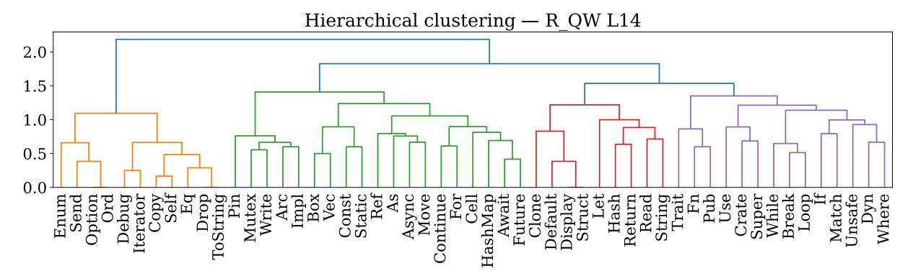

Figure 5: Qwen $\times$ L14에서의 Rust 의미론적 클러스터링 — 비공백 개념 전용 세트에 대한 1 – Jaccard를 사용한 Ward 덴드로그램. 가설된 네 그룹(타입 시스템 트레이트, 메모리/소유권, 데이터 정의, 제어 흐름/모듈)이 Figure 6 ( $\S6.2$ )에서 응집성 테스트를 수행한다.

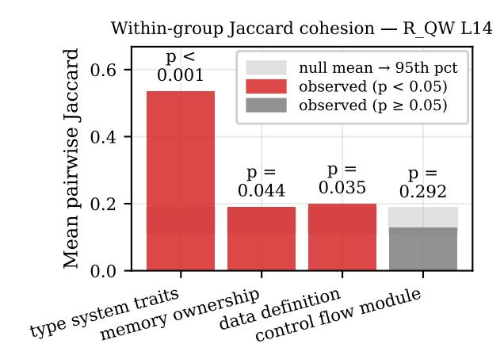

Figure 6: Figure 5의 네 개 가설 그룹에 대한 순열 테스트 (10,000개의 동일 크기 무작위 추출, seed = 42) : 하나는 강하게 결합된 클러스터 (타입 시스템 트레이트, p < 0.001), 두 개는 한계적, 하나는 무작위.

| 개념 | n | L | $\Delta_{\rm co}$ | $\Delta_{\text{null}}$ | P |
|-------------|-----|----|-------------------|------------------------|--------------|
| 가져오기 | 72 | 21 | -0.054 | -0.007 | <b>√</b> |
| 시도 | 473 | 20 | -0.053 | +0.066 | $\checkmark$ |
| 반복 | 299 | 19 | -0.051 | +0.042 | $\checkmark$ |
| 단언 | 176 | 18 | -0.032 | +0.004 | $\checkmark$ |
| 함수 정의 | 86 | 20 | -0.018 | -0.009 | $\sim$ |
| 반복 | 44 | 21 | -0.015 | -0.001 | $\sim$ |
| 중단 | 362 | 19 | -0.032 | -0.066 | × |

Table 4: Per-concept double dissociation, Qwen  $\times$  Python.  $\Delta$  is the change in  $\log P(\text{target})$  between concept and matched checker prompts at the peakeffect layer; concept-only ablation must drop the target more than a size-matched random null. Four pass with clear margins; FunctionDef and For are marginal ( $\sim$ ); Break fails despite a large concept-only set (§7.1).

276개의 개념 쌍에 걸친 개념 전용 Jaccard 유사도와 관련이 있으며, Pearson *r*이 최고점을 찍는다

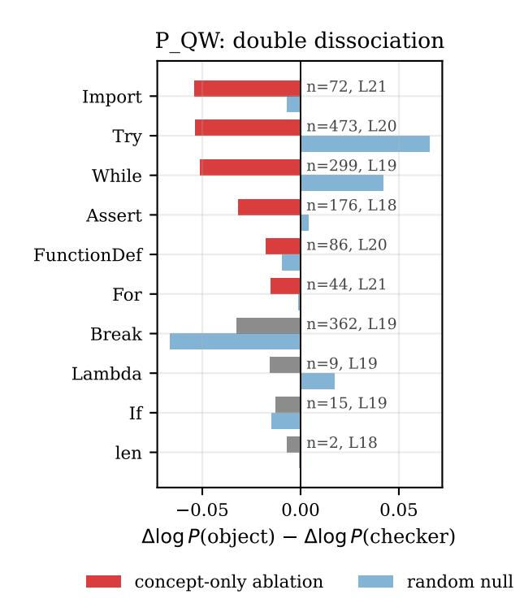

Figure 7: peak-effect 레이어에서 개념별 이중 해리. 네 개의 개념(Import, Try, While, Assert)은 개념 전용 제거가 무작위 null보다 더 해리적이어서 통과한다; Break는 실패한다; 소수 개념은 측정 가능한 효과가 없다 (§7.1).

0.645에서 L20. 상관계수는 보통 수준이며, 완전 일치하지 않는다: 두 관점은 대략적인 구조는 일치하지만, 저진폭 꼬리에서는 불일치한다. 프로브 방향은 $\varepsilon=0.5$ 이하의 많은 뉴런을 스팬하지만, 이진 관점은 이를 포착하지 못한다. 개념 전용 세트가 큰 경우, 제거는 깔끔한 해리를 생성한다; 작은 경우에는 제거가 효과가 없지만 프로브는 여전히 97%를 초과한다 — 표현은 존재하며 해독 가능하지만, 이진 방법이 도달하지 못하는 서브-임계 영역에 있다. The de-

| 측정 | Qwen | DeepSeek |
|-----------------------------------------|-----------------------------|--------------------------------|
| Concfraction peak 원자성 흐름 (P) | 늦은 (L19/L17) 2상 | 이른 (L6–7) build-and-hold |
| Rust type-trait (L14) | J=0.535 (p < 0.001) | 감지되지 않음 |
| Meta-circuit signif. | 기준선 | 약 3배 더 |
| 평균 x-lang 공유 | 0.199 | 0.387 |
| Flow-type agr. (P/R) | 88.6% / 85.1% (QW↔DS) |  |

표 5: 모델별 지문: Qwen과 DeepSeek를 같은 방식으로 구분하는 다섯 개의 모델별 대비 — 늦은/날카로운 vs. 이른/부드러운 처리 스타일과 교차 모델 흐름 유형 일치(하단, 쌍별 수량) ([§8)](#page-9-0))

구성은 올바르지만 부분적인 관점이며, 두 영역이 만나는 곳에서 중간 정도의 상관관계가 나타난다

## 8 논의

## 두 가지 처리 스타일이 모델 지문으로서

이 연구 결과는 모델별 프로필을 도출한다 (표 [5)](#page-9-1): 개념 비율 최고 밴드, 원자성 흐름 유형, Rust 클러스터 강도, 메타-회로 중요도 비율, 평균 교차 언어 공유, 그리고 교차 모델 흐름 유형 일치 등 여섯 가지 독립 측정치 — 이들은 모두 별개이거나 두 모델을 같은 방식으로 추적한다. Qwen의 늦은, 날카로운 집중은 세밀한 클러스터링과 낮은 교차 언어 겹침과 함께 나타나며, DeepSeek의 이른, 부드러운 성장은 거친 클러스터링과 더 많은 겹침과 함께 나타난다. 여섯 가지 측정치는 독립적으로 변할 수 있었지만, 두 가지 스타일로 일관된다. 이것이 차원성 발견이다: 교차 모델 변동은, 적어도 여기에서는, 저차원이다.

## 지문의 범위와 그가 허용하는 예측. 두 모델이 지문이 *예측*한다는 것을 보여줄 수 없다: 독립적으로 훈련된 모델 쌍은 무언가 다르게 나타나며, 한 번 관찰된 일관성은 원칙적으로 우연일 수 있다. 지문이 허용하는 것은 제3 모델에 대한 가설 검증 가능한 예측 집합이다 — 그 모델의 최고 밴드, 원자성 흐름 유형, 클러스터 세분화, 교차 언어 공유 수준이 하나의 스타일로 상호 변동해야 하며, 자유롭게 혼합되지 않아야 한다. 예를 들어, 이른 최고 밴드를 가진 모델은 더 부드러운 원자성 시작과 높은 교차 언어 공유를 보여야 한다. 이 예측을 제3 모델에서 테스트하는 것이 설계된 다음 단계이며, 현재 기여는 2×2가 지문을 정의하고 내부 일관성을 보여준다는 점이다. 이것이 예측을 잘 정의된 상태로 만드는 것이다.

## 언어 축은 모델 축에 수직이다.  
언어 설계 효과 — Rust의 높은 개념 특이성 및 교차 언어 공유 패턴 — 은 두 모델 모두에서 동일한 방향으로 유지되며, 모델은 개념을 처리하는 위치와 방식에서 차이를 보인다. 2×2 설계는 이 분리 가능성을 감지하도록 구축되었으며, 실제로도 그렇다: 회로를 획득하는 것은 과제에 의해 결정되고, 그것이 처리되는 위치와 방식은 모델에 의해 결정되며, 구성 요소가 얼마나 강하게 표현되는지는 언어에 의해 결정되는 세 가지 독립적인 변동 원천이다.

## 이것이 실질적으로 가능하게 하는 것  
개념 수준의 지식 전이: ρ ≈ 0.65 순위와 보존된 공유 구조는 한 모델에서 측정된 인벤토리가 다른 모델에 유용한 사전 지식이 됨을 의미한다. 층 수준의 지식은 그렇지 않다: 모델들의 밴드 사이에 있는 12–13 층 차이는 한 모델에 맞춰진 고정 깊이 프로브나 패치가 다른 모델에서 잘못된 층을 겨냥하게 만든다. 해석 가능성 결과를 포팅하는 실무자는 그것이 어느 축에 속하는지 물어봐야 한다; 지문은 재측정해야 할 것(밴드, 흐름 유형)과 재사용 가능한 것(인벤토리, 페어링)을 알려준다.

## 방법은 생성적이다.  
이 방법은 생성적이다. 구조화된 인벤토리를 철저히 측정하면 한 논문이 추구할 수 있는 것보다 더 많은 규칙성을 드러낸다. 우리는 마스터 질문에 대한 세 가지를 개발했지만, 공개된 아티팩트에는 추가 구조가 포함되어 있다 — 메타-회로 조직의 비대칭성, 언어별 제어 흐름 그룹화 차이, 개념‑특정 처리의 층‑밴드 구조. 광범위한 첫 단계가 표면화되며, 더 깊은 단계와 다른 연구가 이를 탐색할 수 있다.

향후 연구.

연속형 기하학 확장(진행 중)은 이진 관점이 놓치는 서지점 이하 신호를 포착할 것이다.

자연어가 자연스러운 목표이며, 이는 이 방법의 궁극적인 적용 분야이다. 재고가 덜 깔끔하지만 질문이 가장 중요한 곳이다.

훈련 체크포인트를 통한 개발적 분석은 What/Where/How 분리가 언제 나타나는지와 What이 보존되는지, Where와 How이 변동되는지를 묻는다.

엄격한 내부 논리를 가진 형식 언어, 예를 들어 Lean과 같은 증명 보조기(구조가 논리적 내용을 담고 있음)는 이 방법이 정성적으로 다른 종류의 추상화에 도달하는지를 테스트할 것이다.

## 한계 (Limitations)

서브-스레시홀드 구조. 이 방법은 고진폭 뉴런을 포착하지만 분산된 서브스레시홀드 구조는 놓치며, 이는 [§7.2;](#page-7-1)에서 정량화된다. 연속적 처리는 연기된다.

명령형 언어만. 두 언어 모두 명령형이며, 선언형 언어나 증명 보조자에 대한 일반화는 아직 열려 있다.

레이어 수 불일치. 레이어 수가 다르다 (28 vs 32); 본문 비교는 절대 인덱스를 사용하고, 부록 프로파일은 깊이 비율을 사용한다.

인과 검증 범위. 인과 검증은 Qwen Python에만 적용된다.

퇴화된 일관성 파라미터. Wilam (2026)의 희소 모델에서 의미 있게 변하는 일관성 파라미터는 이 밀집 SwiGLU 아키텍처에서는 퇴화되어, 실제 스윕은 ε만으로 이루어진다.

모델 간 개념 공간. 전체 개념 공간은 모델마다 다르며, 비교는 공유되는 테스트 가능한 하위 집합을 사용한다.

## 윤리적 고려사항 (Ethical Considerations)

본 연구는 공개적으로 이용 가능한 오픈소스 모델의 내부 표현을 분석한다. 새로운 모델을 훈련하지 않으며, 인간 피험자를 포함하지 않고, 개인 데이터를 사용하지 않는다. 프롬프트는 프로그램적으로 생성된 합성 코드이다.

라이선스 및 사용 목적. Qwen2.5-Coder-7B는 Apache-2.0 라이선스 하에 배포되며, DeepSeek-Coder-V1-6.7B는 DeepSeek 라이선스 계약 하에 배포된다. 두 라이선스 모두 연구 및 상업적 사용을 허용하며, 본 연구 전용 사용은 명시된 조건과 일치한다. 본 논문과 함께 공개된 코드는 Apache-2.0을 사용하고, 데이터셋은 CC-BY-4.0을 사용한다; 두 라이선스 모두 연구 및 상업적 재사용을 저작자 표시와 함께 허용하며, 상위 모델 라이선스와 호환된다.

## 가용성 (Availability)

분석 코드, 그림 스크립트, 그리고 frozennumbers 테스트 스위트는 [https://](https://github.com/piotrwilam/Atlas2x2) [github.com/piotrwilam/Atlas2x2](https://github.com/piotrwilam/Atlas2x2) (릴리스 v1.0.0, Apache-2.0)에서 공개된다. 동결된 실험 자료는 데이터셋으로 [https://huggingface.co/datasets/](https://huggingface.co/datasets/piotrwilam/Atlas2x2) [piotrwilam/Atlas2x2](https://huggingface.co/datasets/piotrwilam/Atlas2x2) (CC-BY-4.0)에서 공개된다; atlas/io/의 로더는 필요 시 누락 파일을 자동으로 가져온다. 논문의 모든 숫자와 그림은 공개된 분석 레이어에서 재생산되며 모델을 재실행할 필요가 없다; 부록 [A.](#page-12-0)를 참조한다.

## 참고문헌 (References)

- Y. Belinkov. 검사 분류기: 약속, 한계, 그리고 진전 (Probing classifiers: Promises, shortcomings, and advances). *Computational Linguistics* 48(1), 2022.
- T. Bricken et al. 단일 의미성 향상: 사전 학습을 통한 언어 모델 분해 (Towards monosemanticity: Decomposing language models with dictionary learning). *Transformer Circuits Thread*, 2023.
- B. Chughtai, L. Chan, and N. Nanda. 보편성의 장난감 모델: 네트워크가 그룹 연산을 학습하는 방식을 역설계 (A toy model of universality: Reverse engineering how networks learn group operations). *ICML*, 2023.
- A. Conmy, A. Mavor-Parker, A. Lynch, S. Heimersheim, and A. Garriga-Alonso. 메커니즘 해석을 위한 자동 회로 탐지 향상 (Towards automated circuit discovery for mechanistic interpretability). *NeurIPS*, 2023.
- A. Conneau, S. Wu, H. Li, L. Zettlemoyer, and V. Stoyanov. 사전 학습된 언어 모델에서 나타나는 교차 언어 구조 (Emerging cross-lingual structure in pretrained language models). *ACL*, 2020.
- H. Cunningham, A. Ewart, L. Riggs, R. Huben, and L. Sharkey. 희소 오토인코더가 언어 모델에서 매우 해석 가능한 특징을 찾는다 (Sparse autoencoders find highly interpretable features in language models). *arXiv:2309.08600*, 2023.
- N. Elhage et al. 중첩의 장난감 모델 (Toy models of superposition). *Transformer Circuits Thread*, 2022.
- W. Gurnee, N. Nanda, M. Pauly, K. Harvey, D. Troitskii, and D. Bertsimas. 건초 더미에서 뉴런 찾기: 희소 탐지를 통한 사례 연구 (Finding neurons in a haystack: Case studies with sparse probing). *TMLR*, 2023.
- W. Gurnee, T. Horsley, Z. C. Guo, T. Rezaei Kheirkhah, Q. Sun, W. Hathaway, N. Nanda, and D. Bertsimas. GPT2 언어 모델에서 보편적 뉴런 (Universal neurons in GPT2 language models). *arXiv:2401.12181*, 2024.
- Z. Yin, X. Gu, and B. Shen. 코드 LLM의 뉴런 기반 해석: 어디서, 왜, 그리고 어떻게? (Neuron-guided interpretation of code LLMs: Where, why, and how?). *arXiv:2512.19980*, 2025.
- S. Heimersheim and N. Nanda. 활성화 패치 사용 및 해석 방법 (How to use and interpret activation patching). *arXiv*, 2024.
- E. Hernandez, A. Sen Sharma, T. Haklay, K. Meng, M. Wattenberg, J. Andreas, Y. Belinkov, and D. Bau. 변환기 LMs에서 관계 디코딩의 선형성 (Linearity of relation decoding in transformer LMs). *ICLR*, 2024.
- M. Huh, B. Cheung, T. Wang, and P. Isola. 플라톤적 표현 가설 (The Platonic representation hypothesis). *ICML*, 2024.

- S. Kornblith, M. Norouzi, H. Lee, and G. Hinton. 신경망 표현의 유사성 재검토. *ICML*, 2019.  
- F. Körner, M. Müller-Eberstein, A. Korhonen, and B. Plank. 의미가 만나는 순간: 다국어 언어 모델 훈련 중 공유 개념 공간의 등장과 품질 조사. *EACL*, 2026.  
- M. Lan, P. Torr, A. Meek, A. Khakzar, D. Krueger, and F. Barez. 대형 언어 모델에서 희소 오토인코더를 통한 특징 공간 보편성 정량화. *arXiv:2410.06981*, 2024.  
- K. Meng, D. Bau, A. Andonian, and Y. Belinkov. GPT에서 사실적 연관 찾기 및 편집. *NeurIPS*, 2022.  
- B. Muller, A. Anastasopoulos, B. Sagot, and D. Seddah. mBERT에서 보이지 않는 것이 시작일 뿐. *NAACL*, 2021.  
- C. Olah, N. Cammarata, L. Schubert, G. Goh, M. Petrov, and S. Carter. 확대: 회로에 대한 소개. *Distill*, 2020.  
- T. Pires, E. Schlinger, and D. Garrette. 다국어 BERT는 얼마나 다국어인가? *ACL*, 2019.  
- T. Tang, W. Luo, H. Huang, D. Zhang, X. Wang, X. Zhao, F. Wei, and J.-R. Wen. 언어별 뉴런: 대형 언어 모델에서 다국어 능력의 핵심. *ACL*, 2024.  
- A. Templeton et al. 단일 의미성 확장: Claude 3 Sonnet에서 해석 가능한 특징 추출. *Transformer Circuits Thread*, 2024.  
- I. Tenney, D. Das, and E. Pavlick. BERT가 고전 NLP 파이프라인을 재발견하다. *ACL*, 2019.  
- Y. Wan, W. Zhao, H. Zhang, Y. Sui, G. Xu, and H. Jin. 그들이 포착하는 것은? 소스 코드용 사전 훈련된 언어 모델의 구조적 분석. *ICSE*, 2022.  
- K. Wang, A. Variengien, A. Conmy, B. Shlegeris, and J. Steinhardt. 야생에서의 해석 가능성: GPT-2 small에서 간접 객체 식별을 위한 회로. *ICLR*, 2023.  
- J. Wang, X. Ge, W. Shu, Q. Tang, Y. Zhou, Z. He, and X. Qiu. 보편성 향상: 언어 모델 아키텍처 간 기계적 유사성 연구. *arXiv:2410.06672*, 2024.

- P. Wilam. CSP-Atlas: 희소 파이썬 트랜스포머에서 개념별 신경 회로. *arXiv:2605.24603*, 2026.  
- R. Zhang, Q. Yu, M. Zang, C. Eickhoff, and E. Pavlick. 같은 것이지만 다른: 다국어 언어 모델링에서 구조적 유사성과 차이. *ICLR*, 2025.

## 재현성 및 주장 검증

코드는 <https://github.com/piotrwilam/Atlas2x2> (릴리스 v1.0.0) 에 위치하며, 데이터는 <https://huggingface.co/datasets/piotrwilam/Atlas2x2> 에 저장되어 있고, 누락된 파일은 필요 시 자동으로 가져옵니다. 논문의 모든 수치 주장은 이 릴리스에서 재생산할 수 있습니다. pytest tests/test_paper_numbers.py 를 실행하면 모든 잠금된 숫자가 검증됩니다. 각 그림은 experiments/ 아래에 있는 config 이름이 붙은 스크립트에서 재생산됩니다. 예를 들어, python experiments/fig2_concept_scatter.py -config-name paper/figure2_concept_scatter 를 실행하면 Figure [1.](#page-4-1)이 재현됩니다.

계산 및 인프라. 모델에 접근하는 단계(추출, ε-스윕, 프로브, 절제)는 Google Colab Pro+를 통해 단일 NVIDIA A100 GPU(40GB)에서 실행됩니다. 추출이 가장 큰 비용을 차지합니다: 115개 개념(58개 Py + 57개 Ru) × 50개 프롬프트 × 2세트에 대해 각 셀당 약 160k 전방 패스가 필요하며, 4개의 셀(Python/Rust × Qwen/DeepSeek)에서 반복되어 총 약 24 GPU-시간이 소요됩니다. 선형 프로브([§7.2)](#page-7-1)와 제로 절제([§7.1)](#page-7-2)는 합쳐서 약 2 GPU-시간을 추가합니다. 모든 분석, 시각화, 그리고 잠금된 논문 숫자 테스트는 CPU에서 몇 초 안에 실행됩니다.

| 섹션 | 주장 | 값 / 검증 방법 |
|-----------|------------------------------|---------------------------------------------------|
| §3 | 검증 가능한 개념 수 | Py 58 (6+18+34), Ru 57 (6+15+36) |
|  |  | f2_concept_group_counts |
| §4.2 | 교차 모델 ρ | 0.638 (Py), 0.673 (Ru); p < 10−7 |
|  |  | f1_concept_fraction_spearman |
| §4.4/§6.1 | 원자성 흐름 유형 | 6개 개념 two_phase; 일치 88.6%/85.1% |
|  |  | f6_1_flow_type_agreement_between_models, p_qw_two |
|  |  | _phase_is_exactly_the_atomicity_super_cluster |
| §5.1 | Rust/Python 강도 비율 | 2.91× (QW), 2.07× (DS) |
|  |  | f3_rust_over_python_concept_fraction_ratios |
| §5.3 | 다국어 공유 비율 | 1.94× (DS/QW); 7/7 DS, 6/7 QW |
|  |  | f3_cross_language_sharing_ratio |
| §6.2 | 타입-트레이트 클러스터 응집 | Jaccard 0.535, null 0.112, p<0.001 |
|  |  | f6_g1_trait_family_observed_jaccard, f6_g1_permut |
|  |  | ation_p_value |
| §6.2 | 다른 클러스터 판정 | G2 0.044, G3 0.035, G4 0.292 |
|  |  | f6_four_cluster_observed_and_p_value |
| §7.1 | 이중 해리 | 4 통과; Break 실패 |
|  |  | f7_1_dissociation_results |
| §7.2 | 프로브 정확도 범위 | 97.6–99.7%, 24 AST 개념 |
|  |  | f7_probe_accuracy_band, f7_probe_accuracy_exact_e |
|  |  | ndpoints |
| §7.2 | Jaccard–cosine 피크 | r = 0.645 at L20, 276 pairs |
|  |  | f8_peak_jaccard_cosine_correlation |

Table 6: 논문에서 인용된 모든 숫자는 ±0.005 허용오차로 tests/test_paper_numbers.py에 고정되어 있으며, 각 값 아래의 타자기 글자 줄은 검증 테스트 함수 이름(접두사 test_ 생략)을 나타낸다. 분석 루틴—상관, Jaccard, 순열 테스트, 흐름 유형 분류—는 atlas/analysis/에 있으며, 모델에 접근하는 파이프라인(추출, 프로브, 절제)은 GPU가 필요하므로 circuits/에 분리되어 있다.

# B 레이어별 회로 크기 프로파일

Figure [8](#page-13-0)은 네 개의 셀 모두에서 테스트 가능한 모든 개념에 대한 레이어별 회로 크기를 보여 주며, [§6.1.](#page-6-3)에 요약된 흐름‑형식 분류 뒤에 있는 전체 데이터를 제공한다.

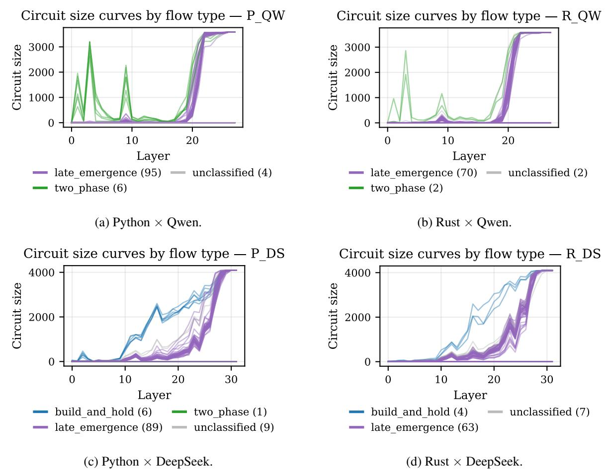

Figure 8: 테스트 가능한 모든 개념에 대한 레이어별 회로 크기, 흐름 유형별 색상 지정 ([§6.1)](#page-6-3). 각 패널은 하나의 (언어, 모델) 셀을 보여 준다.

## **C** 모델 간 개념 클러스터링

Figures 9와 10은 L14에서 두 모델 모두에 대한 Python 개념 클러스터링을 제공하며, §6.2의 Rust 클러스터링에 대한 교차 모델 동반자이다; 원자성 그룹화는 두 모델 모두에서 복제된다.

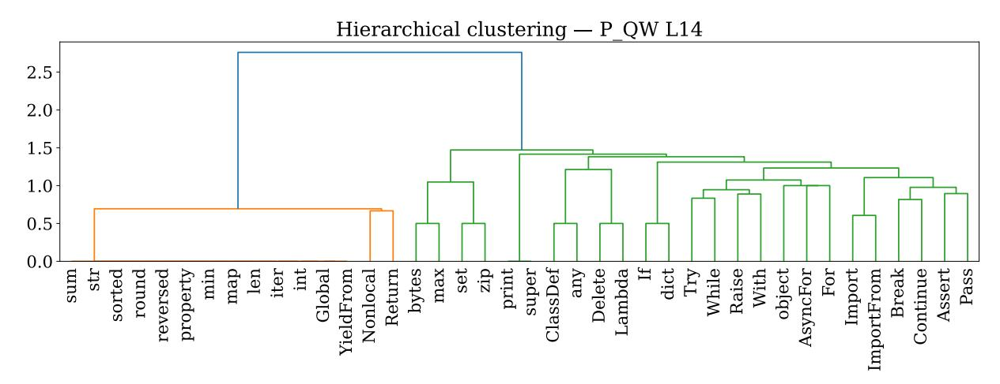

Figure 9: Python 개념 클러스터링, Qwen  $\times$  L14. 원자성 슈퍼 클러스터와 제어 흐름 그룹이 녹색 트리에서 나타난다 ( $\S6.2$ ).

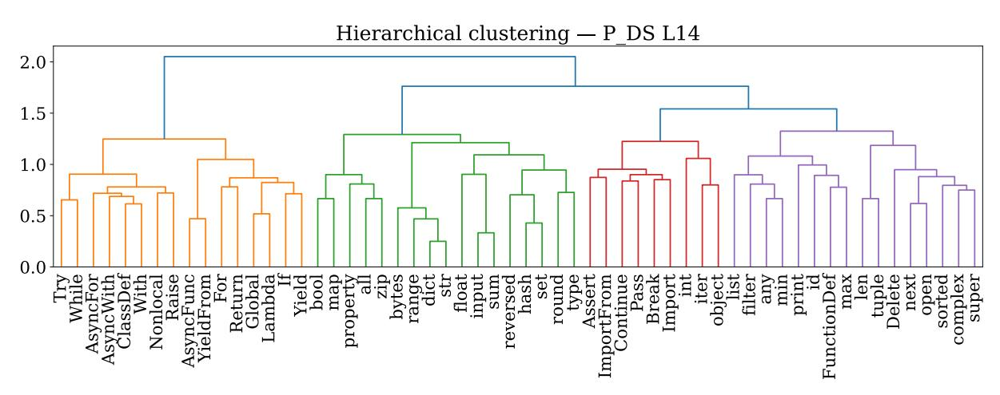

Figure 10: Python 개념 클러스터링, DeepSeek  $\times$  L14. Figure 9의 직접적인 동반 (두 모델 모두 동일한 층을 사용한 사과 대 사과 비교). 원자성 그룹화가 일관된 클러스터로 복제된다 ( $\S6.2$ ).

# D 선형 프로브 검증 상세

Figure [11](#page-15-0)은 레이어별 프로브 정확도와 [§7.2.](#page-7-1) 아래에 있는 Jaccard–cosine 상관관계를 제공한다.

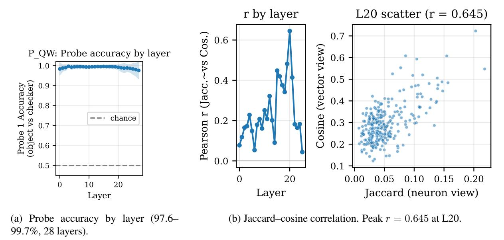

Figure 11: 선형 프로브 검증, Python × Qwen, 24개의 AST 개념([§7.2)](#page-7-1). 왼쪽: 모든 레이어에서의 프로브 정확도. 오른쪽: 276개의 개념 쌍에 걸친 개념‑전용 Jaccard와 프로브 방향 코사인 사이의 레이어별 피어슨 상관계수, 그리고 r이 최고점에 도달하는 L20 산점도.

