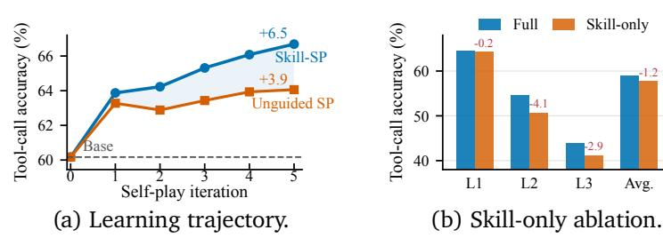
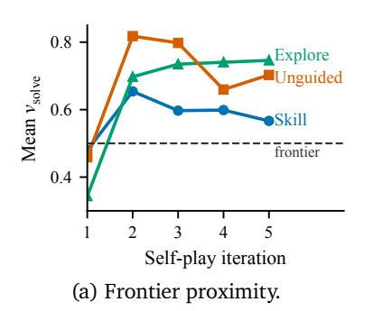
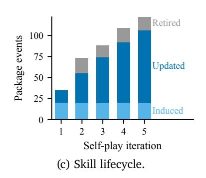
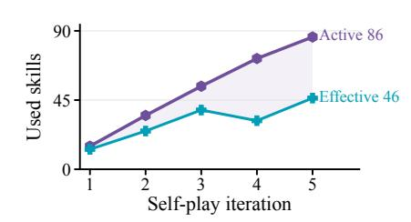
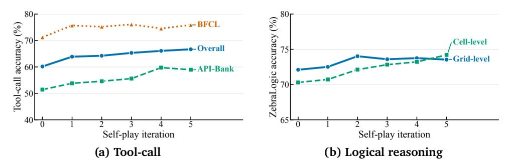
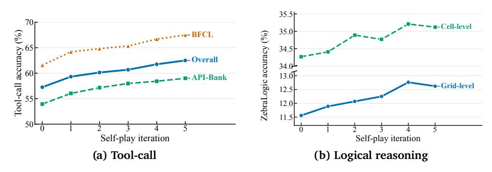
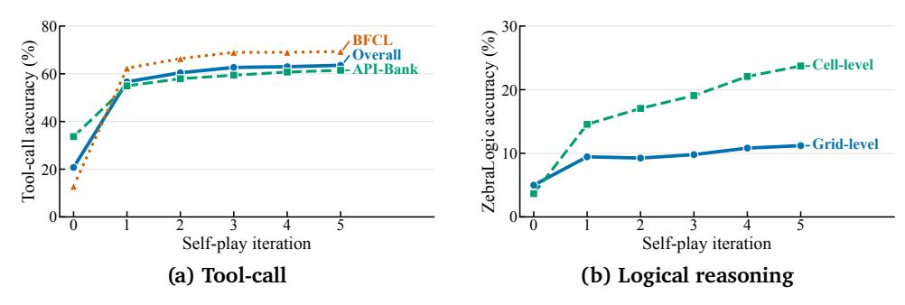

# Skill Self-Play: Pushing the Frontier of LLM Capability with Co-Evolving Skills

- 원제: Skill Self-Play: Pushing the Frontier of LLM Capability with Co-Evolving Skills
- 원문: [https://arxiv.org/abs/2607.22529](https://arxiv.org/abs/2607.22529)
- PDF: [https://arxiv.org/pdf/2607.22529v1](https://arxiv.org/pdf/2607.22529v1)
- arXiv ID: `2607.22529`

---

# Skill Self-Play: LLM 능력의 최전선 끌어올리기 (Pushing the Frontier of LLM Capability with Co-Evolving Skills)

Siyuan Huang†1,2, Pengyu Cheng§1, Haotian Liu†1,3, Tao Chen†1,4, Yihao Liu†1,5, Jingwei Ni†1,6,7, Shijie Zhou†1,8, Ziyi Yang1, Gangwei Jiang1, Mengyu Zhou1, Yu Cheng§2, Xiaoxi Jiang1 및 Guanjun Jiang1

LLM 훈련은 수동 설계와 주석에서 상호작용 기반의 자가 진화로 전환되고 있다. 그러나 기존의 자가 진화 방법은 작업 다양성과 검증 신뢰성 사이의 근본적인 딜레마에 직면해 있다: 환경에 묶인 방법은 정밀한 피드백을 제공하지만 학습을 좁은 도메인에 제한하고, 반면 개방형 자가 생성은 작업 공간을 확장하지만 신뢰할 수 있는 검증이 부족해 잘못된 보상이 훈련 루프를 오염시킬 수 있다. 우리는 에이전트 스킬을 이 긴장을 조정하는 강력한 중간 지점으로 확인한다: 각 스킬은 특정 시나리오에서 깊이 있고 검증 가능한 실행을 보장하며, 스킬 간의 동적 라우팅은 개방형 작업 다양성을 유지한다. 이 통찰력을 활용해 우리는 Skill Self-Play (Skill-SP)를 도입한다. Skill-SP는 제안자, 해결자, 그리고 동적 스킬 컨트롤러로 구성된 공동 진화 프레임워크이다. 강화 학습 루프를 통해 이 구성 요소들은 지속적인 자가 플레이 루프에서 공동 진화한다: 제안자는 동적으로 샘플링된 스킬에 따라 도전적인 작업을 생성하고, 해결자는 후보 솔루션을 탐색해 자신의 능력 한계를 확장하며, 스킬 컨트롤러는 실행 피드백을 수집해 스킬 라이브러리를 업데이트하고 확장한다. 이 상호작용적 공동 진화는 구조화된 검증과 개방형 탐색 사이의 격차를 효과적으로 연결한다. 도구 사용 및 추론 벤치마크에서의 실험적 평가를 통해 Skill-SP가 견고한 진화 엔진으로서 유능한 백본의 성능 한계를 지속적으로 끌어올리면서 초기에는 정렬이 잘못된 모델에 대해 눈에 띄는 반전을 촉진한다는 것을 보여준다. 우리의 코드는 https://github.com/Qwen-Applications/skill-self-play 에서 확인할 수 있다.

Figure 1 | Skill Self-play의 동기. 왼쪽: 환경-제한 방법은 신뢰할 수 있는 검증을 제공하지만 작업 공간을 심각하게 제한한다. 중간: 가이드 없는 생성은 범위를 넓히지만 수동 사후 필터링에 의존하여 잔여 오류가 데이터 신뢰성을 저하한다. 오른쪽: Skill Self-Play는 능동적인 Skill Orchestrator와 스킬 가이드 생성과 개방형 탐색을 위한 이중 스트림을 사용하여 광범위한 범위와 높은 신뢰성을 모두 갖춘 반복적인 스킬 진화를 가능하게 한다.

&lt;sup>1Qwen Large Model Application Team, Alibaba (알리바바),
 2홍콩 중국 대학교 (The Chinese University of Hong Kong),
 3중국 인민대학교 (Renmin University of China),
 4순야센 대학교 (Sun Yat-sen University),
 5베이징 대학교 (Peking University),
 6ETH 취리히 (ETH Zürich),
 7취리히 대학교 (University of Zurich),
 8버팔로 대학교 (University at Buffalo)

†알리바바 인턴십 중 수행. §Corresponding author.

## 1. 서론 (Introduction)

Self-evolution 방법은 대형 언어 모델(LLM)이 스스로 과제를 생성하고, 해결책을 찾으며, 결과를 평가하도록 하여, 사후 훈련 패러다임을 대규모 데이터 기반 주석에서 감독 없이 자체 개선으로 전환시켰다 (Tao et al., 2024; Patel et al., 2024; Jiang et al., 2024a; Chen et al., 2025; Xu et al., 2025a).  
이 새로운 규모 차원에서, self-play은 기초 기술로 부상했으며, 학습 중인 LLM이 서로 다른 역할극 에이전트로서 게임플레이에 참여하고 다중 에이전트 강화 학습(MARL)을 통해 정책을 업데이트한다 (Yang et al., 2025b; Yuan et al., 2025; Liu et al., 2025a; Jiang et al., 2026a).  
최근 연구들은 다양한 시나리오에서 self-play의 놀라운 힘을 입증했으며, 논리적 추론(Cheng et al., 2024b; Huang et al., 2025a), 깊은 탐색(Lu et al., 2025; Liu et al., 2025b), 시각

Figure 2 | **성능 발자국.** Skill-SP는 도구 호출과 논리적 추론 전반에 걸쳐 Qwen3-4B-Ins의 능력을 광범위하게 확장한다. 특히, Unguided SP는 유효한 퍼즐을 합성하지 못해 후자에서 부재한다.

2025a), 깊은 탐색(Lu et al., 2025; Liu et al., 2025b), 시각적 질문 응답(Wang et al., 2025), 그리고 소프트웨어 공학(Wei et al., 2025; Zhao et al., 2026).

그러나 각 특정 도메인에서 self-play의 성공은 정밀한 검증을 제공하는 잘 설계된 환경과 보상에 크게 의존한다 (Yang et al., 2026a; Song et al., 2026; Yan et al., 2026; Huang et al., 2026b; Wang et al., 2026a). 외부 검증은 정확성을 보장하지만, 에이전트 훈련을 좁은 운영 범위로 제한하여 모델이 보다 넓고 개방형 과제로 일반화할 수 없게 만든다 (Tang et al., 2025; Zhao et al., 2025). 과제 공간을 확장하기 위해, 대안적 접근법은 포스트-후 필터링(예: 형식 검사 또는 다수결 투표)과 결합된 무가이드 과제 생성을 사용한다 (Wang et al., 2023; Xu et al., 2024; Nguyen et al., 2024; Xu et al., 2025b; An et al., 2025; Yu et al., 2025a). 불행히도, 개방형 과제 생성은 품질 관리를 심각하게 저해한다 (Long et al., 2024; Jiang et al., 2025a). 구조적 가이드 없이 과제 생성기는 빈번히 잘못 정의된 과제를 합성하거나 단순한 템플릿에 과적합한다 (Yu et al., 2025b; Li et al., 2026a). 반복적인 훈련 주기를 거치면서 누적된 오류와 편향은 합성 데이터 붕괴를 초래한다 (Shumailov et al., 2024; Kazdan et al., 2025). 궁극적으로, 포스트-후 필터링은 단지 수동적인 체로서 기능한다: 눈에 띄는 형식 오류를 거부하지만 생성기를 재사용 가능하고 논리적으로 유효하며 다양한 과제 패턴을 생산하도록 적극적으로 안내할 수 없다. 따라서 근본적인 과제가 남는다: self-play가 좁은 도메인이나 혼란스러운 합성 노이즈로 붕괴되지 않으면서 어떻게 자율적으로 다양한 에이전트 과제를 생성하고 검증할 수 있을까?

이 딜레마를 해결하고 엄격한 환경과 수동 필터링 사이의 격차를 해소하기 위해 (Khattab et al., 2023; Dong et al., 2025; Prabhakar et al., 2026; Gao et al., 2026a) 우리는 검증 가능한 셀프플레이가 *skills* 개념에 의해 크게 향상될 수 있다고 주장한다. Anthropic (2025)에서 소개한 바와 같이, *skill*은 작업별 지침과 지원 자원을 재사용 가능한 블록으로 묶는 절차적 지식의 모듈 단위이다. 이러한 자가 포함 단위로 전문 지식을 조직함으로써, *skills*는 에이전트가 필요할 때 정확히 맞춤형 지식을 동적으로 로드할 수 있게 한다. *task‑pattern interface*로 공식화될 때, 이 사전적 추상화는 진화의 이상적인 매개체가 된다. 셀프플레이에서 원시 실행 롤아웃은 귀중한 통찰을 담고 있지만, 이 진화적 지식은 일반적으로 고립된 궤적에 흩어져 있다. 과거 궤적을 단일 작업 생성기 프롬프트에 넣어 이러한 경험을 단순히 집계하면 심각한 컨텍스트 부풀음이 발생하고 구조적 제어가 희석된다. 반대로, *skill interface*는 이 흩어진 경험을 압축되고 재사용 가능하며 공동 진화 가능한 단위로 정제한다. 수동 사후 필터가 아니라, 이 인터페이스는 전체 셀프플레이 루프를 적극적으로 조율한다: 합성 *before*에 작업 생성기를 안내하기 위해 구조적 선험을 주입하고, 응답 생성 *after*에 엄격한 검증을 위한 명시적 실행 메커니즘을 제공하며, 연속적인 반복을 통해 교육 과정을 관리하기 위해 과거 난이도를 추적한다.

이 패러다임을 실현하기 위해 우리는 *Skill Self-Play* (*Skill-SP*)를 도입한다. 이는 진화하는 모듈형 스킬 패키지 라이브러리에 의해 구동되는 강화 학습 프레임워크(그림 1)이다. 핵심적으로 Skill-SP는 세 가지 핵심 구성요소인 *Proposer*, *Solver*, *Controller*를 통해 셀프플레이를 조율한다. 보다 구체적으로, *Proposer*는 라우팅된 스킬 패키지에 의해 안내되는 목표 챌린지를 합성하고, *Solver*는 이러한 과제를 실행하고 해결하는 방법을 학습하며, *Controller*는 실행 궤적을 분석하여 스킬 라이브러리를 지속적으로 관리한다. 이 루프 내에서 스킬 라이브러리는 지속적인 진화 주기를 거친다: *Controller*는 실행 피드백을 기반으로 기존 스킬 패키지를 자동으로 정제하고, 더 이상 필요 없는 패키지를 보관하며, 개방형 탐색에서 완전히 새로운 스킬을 유도한다. 모듈형 스킬의 동적 라우팅은 컨텍스트 부풀음 없이 엄격한 구조적 품질 관리를 보장하고, 새로운 스킬 패키지의 발견은 과제 프런티어를 지속적으로 확장한다. 이 진화하는 라이브러리에서 거버넌스를 격리함으로써 Skill-SP는 과제 다양성과 검증 신뢰성 사이의 근본적인 긴장을 성공적으로 해결한다.

이 진화하는 라이브러리에서 거버넌스를 격리함으로써 Skill-SP는 과제 다양성과 검증 신뢰성 사이의 근본적인 긴장을 성공적으로 해결한다. 우리는 Skill-SP를 검증 가능한 에이전트 과제의 두 가족에 대해 실험적으로 검증한다: 도구 호출( API-Bank [(Li et al.,](#page-11-6) [2023)](#page-11-6) 및 BFCL [(Patil et al.,](#page-12-5) [2025)](#page-12-5))과 논리적 추론(ZebraLogic [(Lin et al.,](#page-11-7) [2025)](#page-11-7)). 다양한 오픈소스 LLM 백본에서 Skill-SP는 상당한 성능 돌파를 제공하며, 도구 사용에서 최대 **+42.9** 포인트, 논리적 추론에서 **+12.0** 포인트의 절대적 이득을 달성하고, 무가이드 셀프플레이(그림 [2)](#page-1-0)를 지속적으로 능가한다. 마지막으로, 진단 분석은 Skill-SP가 새로운 패턴을 지속적으로 정제하여 재사용 가능한 스킬로 변환함으로써 모델의 진화하는 학습 프런티어에 과제 생성을 성공적으로 고정한다는 것을 확인한다. 제안된 스킬 기반 셀프플레이는 모델 자가 개선에 근본적인 패러다임 변화를 가져오며, LLM 자가 진화를 위한 지속 가능하고 진정으로 무한한 프런티어를 개방한다.

## **2. 관련 연구 (Related Work)**

**자기 플레이와 외부 검증자.** 자기 플레이는 오랫동안 폐쇄형 게임에서 에이전트를 향상시켜 왔으며 [(Silver et al.,](#page-13-8) [2017,](#page-13-8) [2018)](#page-13-9), 최근 언어 모델 연구에서 정렬, 지시 따르기, 그리고 자기 생성 데이터나 검증 가능한 보상을 통한 추론에 영감을 주었다 [(Cheng et al.,](#page-10-1) [2024b;](#page-10-1) [Chen et al.,](#page-10-7) [2024;](#page-10-7) [Cheng et al.,](#page-10-8) [2024a;](#page-10-8) [Huang](#page-10-9) [et al.,](#page-10-9) [2025b;](#page-10-9) [Kuba et al.,](#page-11-8) [2025;](#page-11-8) [Ren et al.,](#page-13-10) [2026)](#page-13-10). 최근 자기 진화 시스템은 종종 외부 환경에 과제 생성을 기반으로 신뢰할 수 있는 피드백을 얻는다. 예를 들어, Absolute Zero [(Zhao et al.,](#page-14-3) [2026)](#page-14-3)와 verified-code 파이프라인 [(Wilf et al.,](#page-14-11) [2025)](#page-14-11)은 코드 실행기를 사용한다; SPIRAL과 MARSHAL [(Liu et al.,](#page-11-1) [2025a;](#page-11-1) [Yuan et al.,](#page-14-2) [2025)](#page-14-2)은 게임 시뮬레이터를 사용한다; 그리고 Search Self-play [(Lu et al.,](#page-12-1) [2025)](#page-12-1)은 검색 보강을 활용한다. 이러한 연구는 신뢰할 수 있는 검증의 가치를 보여주지만, 그들의 특수한 환경은 본질적으로 과제 분포를 병목 현상시키며, 에이전트의 학습을 좁고 사전 정의된 운영 영역에 제한한다.

**합성 과제 생성과 필터링.** 과제 공간을 넓히기 위해 일반적인 자기 개선 파이프라인은 종종 합성 과제 생성을 자동 검증과 결합한다 [(Yang et al.,](#page-14-4) [2026a)](#page-14-4). 대표적인 메커니즘으로는 코딩 과제에 대한 단위 테스트 [(Jimenez et al.,](#page-11-9) [2024;](#page-11-9) [Gehring et al.,](#page-10-10) [2024;](#page-10-10) [Jiang et al.,](#page-10-11) [2025b)](#page-10-11), 인터랙티브 웹 환경에서의 성공 신호 [(Liu et al.,](#page-12-6) [2024;](#page-12-6) [Zhou et al.,](#page-15-0) [2024;](#page-15-0) [Yao et al.,](#page-14-12) [2024;](#page-14-12) [Song et al.,](#page-13-3) [2026)](#page-13-3), 도구 사용에 대한 스키마 검사 [(Li et al.,](#page-11-6) [2023;](#page-11-6) [Patil et al.,](#page-12-5) [2025)](#page-12-5), 그리고 추론을 위한 결정론적 제약 검사기 [(Zhou et al.,](#page-14-13) [2023;](#page-14-13) [Jiang et al.,](#page-11-10) [2024b;](#page-11-10) [Qin et al.,](#page-12-7) [2024;](#page-12-7) [Wen et al.,](#page-13-11) [2024;](#page-13-11) [Pyatkin et al.,](#page-12-8) [2025)](#page-12-8). 이러한 메커니즘은 합성 데이터를 감사 가능하게 만들지만, 주로 수동적이며 *후행* 필터로 작동한다. 그들은 어떤 과제가 살아남을지 결정하지만, 제안자에게 사전 구조적 지침을 제공하지 않아 비가이드 생성이 빈번히 잘못 정의된 과제나 중복 템플릿으로 붕괴된다.

**에이전트용 스킬 인터페이스**. 최근 연구는 에이전트 스킬을 재사용 가능한 절차적 인터페이스로 연구하며, 검색, 압축, 점진적 공개에 중점을 둔다 [(Ling et al.,](#page-11-11) [2026;](#page-11-11) [Jiang et al.,](#page-11-12) [2026b;](#page-11-12) [Cho et al.,](#page-10-12) [2026;](#page-10-12) [Li et al.,](#page-11-13) [2026c;](#page-11-13) [Huang et al.,](#page-10-13) [2026a;](#page-10-13) [Gao et al.,](#page-10-14) [2026b;](#page-10-14) [Chen et al.,](#page-9-3) [2026b,](#page-9-3)[a;](#page-9-4) [He et al.,](#page-10-15) [2026)](#page-10-15). 또 다른 연구 라인은 상호작용 추적과 실행 피드백에서 스킬을 자동으로 구성하거나 진화시킨다 [(Mi](#page-12-9) [et al.,](#page-12-9) [2026;](#page-12-9) [Liu et al.,](#page-12-10) [2026b;](#page-12-10) [Wang et al.,](#page-13-12) [2026b;](#page-13-12) [Shen et al.,](#page-13-13) [2026;](#page-13-13) [Yang et al.,](#page-14-14) [2026b;](#page-14-14) [Liu et al.,](#page-12-11) [2026d;](#page-12-11) [Gautam et al.,](#page-10-16) [2026;](#page-10-16) [Wang et al.,](#page-13-14) [2026c;](#page-13-14) [Liu et al.,](#page-12-12) [2026c;](#page-12-12) [Ni et al.,](#page-12-13) [2026)](#page-12-13), 비록 자동 생성된 스킬의 충실도를 보존하는 것이 여전히 도전적이다 [(Li et al.,](#page-11-14) [2026b;](#page-11-14) [Zhong et al.,](#page-14-15) [2026;](#page-14-15) [Zhou et al.,](#page-15-1) [2026)](#page-15-1). 대부분의 기존 연구는 스킬을 추론 시 실행 지원에 사용하지만, 몇몇 최근 연구는 훈련 중 스킬의 역할을 탐구한다 [(Lu et al.,](#page-12-14) [2026)](#page-12-14). 반면, Skill-SP는 진화하는 스킬 라이브러리를 훈련 시 인터페이스로 사용하여 작업 합성을 지원하고, 구조적 가이드와 검증이 셀프 플레이 커리큘럼과 함께 진화하도록 한다. 다음 섹션에서는 이 프레임워크를 공식화한다.

## **3. 방법론**

우리는 *Skill Self-Play* (**Skill-SP**)를 제안한다. 이는 일반적인 셀프 플레이를 사전적 커리큘럼 구축 프로세스로 변환하는 훈련 시 프레임워크이다 (Figure [3)](#page-3-0). 각 반복에서 Skill-SP는 제안자 정책 propose와 해결자 정책 solve의 공동 최적화를 조정하며, 동시에 진화하는 라이브러리 S를 관리하는 스킬 컨트롤러를 운영한다. 라우팅된 스킬에 의해 가이드되는 제안자는 해결자의 학습 프런티어에서 유효한 과제를 합성하도록 업데이트되고, 해결자는 검증된 커리큘럼에서 최적화된다. 동시에 컨트롤러는 실행 피드백을 증류하여 라이브러리를 업데이트하고, 지속적인 공동 진화 루프를 구동하여 점진적으로 더 유익한 도전을 제공한다.

Figure 3 | **Skill Self-Play 개요**. 진화하는 스킬 라이브러리가 작업 생성 가이던스를 제안자에게 전달하고, 제안자는 후보 과제를 생성하여 유효성 검증을 거친다. 유효한 후보는 프런티어 보상을 기준으로 순위가 매겨져 해결자 커리큘럼을 구성한다. 결과 신호는 공동 진화 제안자와 해결자 업데이트를 구동하며, 검증 실패, 새로운 샘플, 과제 수준 통계는 스킬 정제, 가지치기, 유도 등을 트리거하여 훈련 피드백을 재사용 가능한 스킬로 증류한다.

### 3.1. Skill Self-Play 목표

우리는 검증 가능한 에이전트 과제를 (x, c) 튜플로 공식화한다. 여기서 x는 해결자에게 보이는 표준 프롬프트이며, c는 환경에 의해만 평가되는 숨겨진 기계 판독 가능한 검증 계약(예: 단위 테스트, 참조 답변)이다. 해결자의 응답 y가 주어지면, 환경은 검증 보상 $\mathcal{R}_{\text{solve}}(x, y, c) \in [0, 1]$ 를 반환한다.

표준 셀프 플레이 루프는 제안자를 도전적인 과제를 생성하도록 훈련하고, 해결자를 이를 해결하도록 훈련한다. 생성된 과제 인스턴스 (x, c)에 대해, 해결자의 기대 성공률은 다음과 같이 정의된다:

$$v_{\text{solve}}(\mathbf{x}, \mathbf{c}; \pi_{\text{solve}}) = \mathbb{E}_{\mathbf{y} \sim \pi_{\text{solve}}(\cdot | \mathbf{x})} \left[ \mathcal{R}_{\text{solve}}(\mathbf{x}, \mathbf{y}, \mathbf{c}) \right]. \tag{1}$$

지속적인 개선을 촉진하기 위해, 제안자에게 자연스러운 목표는 중간 난이도 점수인 $1-2|\nu_{\rm solve}-0.5|$ 를 통해 솔버의 학습 프론티어를 목표로 하는 것이다. 그러나 이 지표만을 최적화하면 제안자가 잘못 정의되었거나 해결 불가능한 계약을 합성해 인위적인 난이도를 만들어내는 *보상 해킹(reward hacking)*이 자주 발생한다. 이를 방지하기 위해 Skill-SP는 *가드된 커리큘럼 보상(gated curriculum reward)*을 통해 작업 생성을 공식화한다. 우리는 구조적으로 건전한 계약만을 보유한 후보만을 남기는 이진 작업 품질 필터를 도입하여 제안자의 보상을 명시적으로 가드한다:

$$\mathcal{R}_{\text{propose}}(\boldsymbol{x}, \boldsymbol{c}; \boldsymbol{\pi}_{\text{solve}}) = \mathbb{1}_{\{(\boldsymbol{x}, \boldsymbol{c}) \text{ is valid}\}} \cdot \left(1 - 2 \left| \boldsymbol{v}_{\text{solve}}(\boldsymbol{x}, \boldsymbol{c}; \boldsymbol{\pi}_{\text{solve}}) - \frac{1}{2} \right| \right), \tag{2}$$

여기서 지표 $\mathbb{1}_{\{(x,c) \text{ is valid}\}}$ 은 이 이진 필터를 나타내며, 이는 섹션 3.2의 Eq. 4에서 더 자세히 다루어진다.

작업 생성을 사전적으로 안내하기 위해, Skill-SP는 진화하는 스킬 라이브러리 S를 도입한다. 작업 합성은 샘플링된 스킬 $s \sim S$ 에 조건화되며, 이는 제안자에게 재사용 가능한 구조적 선행지식과 프로그래밍 검증기를 제공한다. 따라서 Skill-SP는 이중 수준 최적화 문제로 공식화될 수 있다. 외부 목표는 스킬 라이브러리 S와 제안자 $\pi_{propose}$ 를 공동으로 최적화하여 유효하고 프론티어를 목표로 한 작업을 합성하도록 하며, 내부 목표는 솔버가 이러한 작업에서 실행 성공을 극대화하도록 한다:

$$\max_{\pi_{\text{propose}}, \mathcal{S}} \quad \mathbb{E}_{s \sim \mathcal{S}, \ (x, c) \sim \pi_{\text{propose}}(\cdot | s)} \left[ \mathcal{R}_{\text{propose}}(x, c; \pi_{\text{solve}}^*) \right]$$

subject to

$$\pi_{\text{solve}}^* = \arg \max_{\pi} \mathbb{E}_{s \sim \mathcal{S}, \ (x, c) \sim \pi_{\text{propose}}(\cdot | s), \ y \sim \pi(\cdot | x)} \left[ \mathcal{R}_{\text{solve}}(x, y, c) \right].$$

(3)

이 고품질 커리큘럼 루프를 조율하기 위해, 이후 섹션에서는 제안자와 솔버의 정책 최적화와 함께 스킬 라이브러리 $\mathcal{S}$ 의 동적 진화를 상세히 다룬다.

### 3.2. 스킬-조건부 생성에 의한 제안자 최적화

외부 목표(Eq. 3)를 실행하기 위해, 제안자는 지속적으로 유효하고 프론티어를 목표로 한 작업을 합성해야 한다. 우리는 이 과정을 세 단계로 구조화한다: 구조적 선행지식을 주입하는 스킬-조건부 생성, 작업 유효성을 보장하는 엄격한 검증, 그리고 커리큘럼 진화를 주도하는 정책 최적화.

**스킬 기반 생성.** 스킬 $s \in \mathcal{S}$ 은 튜플 $s = \langle m, r, h, e, \nu, \sigma \rangle$ 로 정의되는 구조적 인터페이스 역할을 한다. 여기서 m은 라우팅 메타데이터를 나타내며, r, h, e는 각각 절차적 규칙, 생성 힌트, 그리고 몇 샷 예시를 제공하여 제안자를 문맥적으로 조건화한다; $\nu$는 실행 가능한 검증기를 지정하고, $\sigma$는 과거 사용 통계치를 추적한다. 생성 과정에서 우리는 $\sigma$ 를 기반으로 스킬 $s \sim \mathcal{S}$ 를 동적으로 샘플링하며, 고수익 스킬의 활용과 미검증 스킬에 대한 탐색 보너스를 균형 있게 조정한다 (자세한 내용은 부록 B를 참조). 그 다음 제안자는 *스킬 스트림* $(x, c) \sim \pi_{\text{propose}}(\cdot \mid s)$ 를 통해 후보를 합성하며, 이는 강력한 구조적 선험을 주입한다. 새로운 작업 공간을 지속적으로 탐색하고 모드 붕괴를 방지하기 위해, 이는 스킬 제약이 없는 개방형 *탐색 스트림* $(x, c) \sim \pi_{\text{propose}}(\cdot \mid \emptyset)$ 로 보완된다.

**유효성 검증.** 이진 작업 품질 필터 $\mathbb{1}_{\{(x,c) \text{ is valid}\}}$ 가 제안자 보상(식 2)을 가리며, 엄격한 구조적 및 논리적 검사를 강제한다. 스킬 스트림을 통해 생성된 작업의 경우, 이 유효 이벤트는 세 가지 조건의 교집합으로 정의된다:

$$\{(x, c) \text{ is valid}\} = \{\text{schema compliant}\} \cap \{\text{contract valid}\} \cap \{\text{probe consistent}\}.$$

(4)

여기서 첫 번째 조건은 전역 스키마 준수를 보장한다; 두 번째는 s에 정의된 검증기를 적용해 잘못된 계약을 걸러낸다; 세 번째는 프로브 일관성을 검증한다. 구체적으로, 이 일관성은 현재 솔버 $\pi_{\text{solve}}(\cdot \mid x)$에서 추출한 K개의 롤아웃이 제안자 정의 참조와 일치하는 유일한 다수결 답을 제공해야 한다. 탐색 스트림에서는 유효 이벤트가 이 기술별 검증을 생략한다.

**Policy Update.** 각 훈련 반복 t에서 현재 솔버 $\pi_{\text{solve}}^{(t)}$를 경험적 평가자로 고정한다. 생성된 각 후보에 대해, 유효성 마스크 $\mathbb{1}_{\{(x,c)\text{ is valid}\}}$와 경험적 성공률 $v_{\text{solve}}(x,c;\pi_{\text{solve}}^{(t)})$를 결합해 게이트 보상 $\mathcal{R}_{\text{propose}}$를 계산한다. 이 보상은 K개의 검증 롤아웃을 재사용하여 효율적으로 추정된다. 그 후 제안자 정책 $\pi_{\text{propose}}^{(t)}$는 그룹 상대 정책 최적화 (Shao et al., 2024)을 통해 기대 보상을 최대화하도록 업데이트된다.

$$\mathcal{J}_{\text{propose}}(\pi) = \mathbb{E}_{s \sim \mathcal{S}, (x, c) \sim \pi(\cdot | s)} \left[ \mathcal{R}_{\text{propose}}(x, c; \pi_{\text{solve}}^{(t)}) \right]. \tag{5}$$

이 목표를 최적화하면 다음 반복 제안자 $\pi_{\text{propose}}^{(t+1)}$ 가 도출되며, 이는 솔버가 진화함에 따라 제안자가 동적으로 학습 프런티어를 추적하여 지속적으로 도전적이고 신뢰할 수 있는 과제를 합성하도록 보장한다.

### 3.3. 동적 커리큘럼 구축을 통한 솔버 최적화 (Solver Optimization via Dynamic Curriculum Construction)

내부 목표(Eq. 3)를 실행하기 위해, 솔버는 체계적으로 역량을 향상시키는 동적 커리큘럼에서 최적화된다. 우리는 두 생성 스트림에서 가장 도전적이고 프런티어를 목표로 한 과제를 선택함으로써 이 고품질 훈련 풀을 구성한다.

**커리큘럼 구축.** Let  $\mathcal{T}_{\text{skill}}^{(t)}$  and  $\mathcal{T}_{\text{explore}}^{(t)}$  denote the sets of strictly valid candidates (x, c) synthesized by the skill and exploration streams, respectively. To form the final training pool  $\mathcal{D}^{(t)}$  of size M, we rank these candidates by their proposer reward  $\mathcal{R}_{\text{propose}}(x, c; \pi_{\text{solve}}^{(t)})$ , effectively pinpointing the solver's learning frontier, and select the top-scoring tasks according to a blending ratio  $\alpha \in (0, 1)$ :

$$\mathcal{D}^{(t)} = \text{Top}_{\alpha M} \left( \mathcal{T}_{\text{skill}}^{(t)}; \mathcal{R}_{\text{propose}} \right) \cup \text{Top}_{(1-\alpha)M} \left( \mathcal{T}_{\text{explore}}^{(t)}; \mathcal{R}_{\text{propose}} \right). \tag{6}$$

**정책 업데이트.** 구성된 커리큘럼 $\mathcal{D}^{(t)}$ 를 사용하여, 솔버 정책 $\pi_{\text{solve}}^{(t)}$ 는 GRPO를 통해 환경 검증 보상을 최대화하도록 업데이트된다:

$$\mathcal{J}_{\text{solve}}(\pi) = \mathbb{E}_{(\mathbf{x}, \mathbf{c}) \sim \mathcal{D}^{(t)}, \ \mathbf{y} \sim \pi(\cdot | \mathbf{x})} \left[ \mathcal{R}_{\text{solve}}(\mathbf{x}, \mathbf{y}, \mathbf{c}) \right]. \tag{7}$$

이 목표를 최적화하면 다음 반복 솔버 $\pi_{\mathrm{solve}}^{(t+1)}$ 가 도출된다.

### 3.4. 스킬 라이브러리의 연속적 진화

커리큘럼의 정체를 방지하기 위해, 스킬 라이브러리 $S^{(t)}$ 는 각 반복 t에서 제안자와 솔버 정책과 동적으로 공동 진화한다. 이 진화는 세 가지 연산으로 구성된다: 기존 스킬을 정제하고, 오래된 스킬을 제거하며, 개방형 탐색에서 새로운 구조적 선행 지식을 유도한다.

### 알고리즘 1: 스킬 셀프 플레이 (Algorithm 1: Skill Self-Play (Skill-SP))

**Input:** 초기 제안자 $\pi_{\text{propose}}^{(0)}$, 해결자 $\pi_{\text{solve}}^{(0)}$, 스킬 라이브러리 $\mathcal{S}^{(0)}$, 그리고 자기-플레이 반복 횟수 T. **Output:** 훈련된 해결자 $\pi_{\text{solve}}^{(T)}$ .

- 1 **foreach** self-play iteration t **do**
- 샘플  $\mathbf{s} \sim \mathcal{S}^{(t)}$ 를 스킬 통계로 사용하여; 후보를  $\pi_{\text{propose}}^{(t)}(\cdot \mid \mathbf{s})$ 와  $\pi_{\text{propose}}^{(t)}(\cdot \mid \emptyset)$ 로 생성한다;
- 후보를 검증하고  $\mathcal{R}_{propose}$ 를 계산한다; 유효한 후보를 해결자 커리큘럼에 보관한다;
- 4 유효한 후보를  $\mathcal{R}_{\text{propose}}$ 로 순위 매겨 혼합 프런티어 커리큘럼  $\mathcal{D}^{(t)}$ 를 만든다;
- 5  $\pi_{\text{propose}}^{(t)} \to \pi_{\text{propose}}^{(t+1)}$ 를  $\mathcal{J}_{\text{propose}}$ 를 사용해 업데이트하고,  $\pi_{\text{solve}}^{(t)} \to \pi_{\text{solve}}^{(t+1)}$ 를  $\mathcal{D}^{(t)}$ 에서  $\mathcal{J}_{\text{solve}}$ 를 사용해 업데이트한다;
- 스킬 라이브러리를 스킬 통계 업데이트, 실패 추적에서 기존 스킬 정제, 유도 후보  $\mathcal{T}_{\text{induce}}^{(t)}$ 에서 새로운 스킬  $\mathcal{S}_{\text{new}}^{(t)}$  유도, 그리고 오래된 스킬  $\mathcal{S}_{\text{prune}}^{(t)}$ 를 가지는 방식으로 진화시킨다:  $\mathcal{S}^{(t+1)} \leftarrow (\mathcal{S}^{(t)} \setminus \mathcal{S}_{\text{prune}}^{(t)}) \cup \mathcal{S}_{\text{new}}^{(t)}$ ;
- 7 end
- 8 return  $\pi_{solve}^{(T)}$ ;

**Skill Refinement.** 생성 피드백을 사용하여 Skill-SP는 각 샘플된 스킬의 추적 통계  $\sigma$ 를 업데이트하여 향후 라우팅을 조절한다 (Appendix B). 동시에, 무효한 생성 시도에서 실행 트레젝터리를 분석하여 체계적인 실패를 진단하고 스킬의 핵심 내용을 자동으로 정제하며, 라이브러리를 구조적 선행 지식의 견고한 저장소로 유지한다.

**Skill Pruning.** 샘플 효율을 극대화하기 위해 활성 라이브러리는 주기적인 가지치기를 거친다.  $\sigma$ 를 모니터링함으로써 Skill-SP는 일관되게 단순한 작업을 생성하는 포화된 스킬의 가지치기 집합  $\mathcal{S}_{\text{prune}}^{(t)}$ 를 식별한다. 이는 예상 프런티어 보상이 임계값  $\gamma_{\text{prune}}$  이하일 때 표시된다:

$$S_{\text{prune}}^{(t)} = \left\{ s \in S^{(t)} \middle| \mathbb{E}_{(x,c) \sim \pi_{\text{propose}}^{(t)}(\cdot|s)} \left[ \mathcal{R}_{\text{propose}}(x,c;\pi_{\text{solve}}^{(t)}) \right] < \gamma_{\text{prune}} \right\}.$$

(8)

Archiving  $\mathcal{S}_{\text{prune}}^{(t)}$ 는 생성 예산을 절약하고 제안자를 학습 프런티어에 집중하도록 유지한다.

**스킬 유도 및 업데이트.** 커리큘럼을 체계적으로 확장하기 위해, Skill-SP는 탐색 스트림에서 새로운 후보들의 유도 집합 $\mathcal{T}_{induce}^{(t)}$ 를 추출하며, 이는 최소 프론티어 보상 임계값 $\gamma_{induce}$ 를 조건으로 한다 :

$$\mathcal{T}_{\text{induce}}^{(t)} = \left\{ (\boldsymbol{x}, \boldsymbol{c}) \in \mathcal{T}_{\text{explore}}^{(t)} \middle| \mathcal{R}_{\text{propose}}(\boldsymbol{x}, \boldsymbol{c}; \boldsymbol{\pi}_{\text{solve}}^{(t)}) \ge \gamma_{\text{induce}} \right\}. \tag{9}$$

Skill-SP는 이후 초기 베이스 정책으로 인스턴스화된 스킬 컨트롤러 $\pi_{\text{control}}$ 를 활용하여 $\mathcal{T}_{\text{induce}}^{(t)}$ 안의 기본 작업 패턴을 후보 패키지로 추상화한다. 이 패키지들은 현재 라이브러리와 비교해 구조적 무결성과 의미적 새로움을 체계적으로 필터링하여 새로 유도된 스킬 $\mathcal{S}_{\text{new}}^{(t)}$ 를 생성한다 :

$$S_{\text{new}}^{(t)} = \left\{ s \sim \pi_{\text{control}}(\cdot | \mathcal{T}_{\text{induce}}^{(t)}) \mid \text{Integrity}(s) \land \text{Novelty}(s, \mathcal{S}^{(t)}) \right\}, \tag{10}$$

여기서 Integrity(s)는 패키지 완전성을 검사하고, Novelty(s, $\mathcal{S}^{(t)}$ )는 어휘 유사도를 임계값으로 두어 기존 스킬을 중복하는 후보를 거부한다. 활성 라이브러리는 이후 $\mathcal{S}^{(t+1)} = (\mathcal{S}^{(t)} \setminus \mathcal{S}^{(t)}_{\text{prune}}) \cup \mathcal{S}^{(t)}_{\text{new}}$ 를 통해 업데이트된다. 이 메커니즘은 성공적인 오픈엔디드 탐색을 재사용 가능한 구조적 선험으로 정제하여 끊임없이 확장되는 커리큘럼을 추진한다. Algorithm 1은 결과적인 훈련 루프를 요약한다.

## 4. Experiments

### 4.1. Experimental Setup

**작업군.** 우리는 이 프레임워크를 두 도메인에서 구현한다. 첫 번째는 *도구 호출 예측*으로, 솔버의 스키마 준수와 도구 선택을 평가한다. 우리는 API-Bank Levels 1–3 (Li et al., 2023)과 네 개의 BFCL 카테고리 (Patil et al., 2025): *bfcl_simple_javascript*, *bfcl_simple_python*, *bfcl_simple_java*, 그리고 *bfcl_live_simple* 를 벤치마크한다. 두 번째는 *논리적 추론*으로, 솔버가 복잡한 제약을 만족하고 고유한 해를 도출하는 능력을 평가한다. 우리는 ZebraLogic (Lin et al., 2025)를 벤치마크한다. ZebraLogic은 작업을 Zebra 스타일 그리드 퍼즐로 공식화하며, 탐색 공간 크기에 따라 네 가지 복잡도 스케일을 가진다.

| 방법 | API-Bank |  |  |  | BFCL |  |  |  |  | 평균 |
|-----------------|------------------------------|------------------------------|------------------------------|------------------------------|------------------------------|------------------------------|------------------------------|------------------------------|------------------------------|------------------------------|
|  | L1 | L2 | L3 | 평균 | JS | Ру | Java | Live | 평균 | 0 |
| Qwen3-4B-Ins | 58.1 | 42.5 | 35.6 | 51.4 | 57.8 | 91.8 | 59.8 | 75.6 | 71.2 | 60.2 |
| + Unguided SP | 60.2 +2.1 | 46.3 +3.8 | 40.8 +5.2 | 54.4 +3.0 | 65.8 +8.0 | 95.0 +3.2 | 63.0 +3.2 | 77.9 +2.3 | 75.4 +4.2 | 64.1 +3.9 |
| + Skill-SP | <b>64.6</b> +6.5 | <b>54.7</b> +12.2 | <b>44.0</b> +8.4 | 58.9 +7.5 | <b>65.5</b> +7.7 | <b>96.0</b> +4.2 | <b>63.5</b> +3.7 | <b>78.5</b> +2.9 | <b>75.9</b> +4.7 | 66.7 +6.5 |
| Qwen3-8B | 73.3 | 61.4 | 43.9 | 65.5 | 69.0 | 95.1 | 64.9 | 77.9 | 76.7 | 69.4 |
| + Unguided SP | 74.3 +1.0 | 64.4 +3.0 | 48.3 +4.4 | 67.5 +2.0 | 71.8 +2.8 | 95.8 +0.7 | 64.9 +0.0 | 77.8 -0.1 | 77.5 +0.8 | 71.0 +1.6 |
| + Skill-SP | <b>75.9</b> +2.6 | <b>67.2</b> +5.8 | <b>50.0</b> +6.1 | <b>69.2</b> +3.7 | <b>72.8</b> +3.8 | <b>96.0</b> +0.9 | <b>65.1</b> +0.2 | 78.7 +0.8 | <b>78.2</b> +1.5 | <b>72.2</b> +2.8 |
| Ministral-3-8B | 37.6 | 35.6 | 20.7 | 33.7 | 8.2 | 16.4 | 9.2 | 17.3 | 12.8 | 20.7 |
| + Unguided SP | 38.5 +0.9 | 36.4 +0.8 | 20.8 +0.1 | 34.4 +0.7 | 7.5 -0.7 | 15.4 -1.0 | 8.5 -0.7 | 18.8 +1.5 | 12.5 -0.3 | 20.8 +0.1 |
| + Skill-SP | <b>68.5</b> +30.9 | <b>56.2</b> +20.6 | <b>42.9</b> +22.2 | <b>61.5</b> +27.8 | <b>48.5</b> +40.3 | <b>90.8</b> +74.4 | <b>58.1</b> +48.9 | <b>80.0</b> +62.7 | <b>69.3</b> +56.5 | <b>63.6</b> +42.9 |
| Ministral-3-14B | 31.1 | 15.5 | 15.7 | 26.0 | 14.5 | 32.9 | 18.6 | 27.2 | 23.3 | 22.2 |
| + Unguided SP | 67.2 +36.1 | 50.6 +35.1 | 46.3 +30.6 | 60.8 +34.8 | 36.8 +22.3 | 88.7 +55.8 | 46.1 +27.5 | 77.2 +50.0 | 62.2 +38.9 | 59.0 +36.8 |
| + Skill-SP | <b>70.9</b> +39.8 | <b>57.5</b> +42.0 | <b>48.9</b> +33.2 | <b>64.5</b> +38.5 | <b>42.0</b> +27.5 | <b>89.9</b> +57.0 | <b>59.0</b> +40.4 | <b>83.1</b> +55.9 | <b>68.5</b> +45.2 | <b>64.5</b> +42.3 |
| Granite-4.1-3B | 57.5 | 53.7 | 43.2 | 53.9 | 66.5 | 66.5 | 57.4 | 55.9 | 61.6 | 57.2 |
| + Unguided SP | 59.0 +1.5 | 54.3 +0.6 | 42.9 -0.3 | 54.9 +1.0 | 63.5 -3.0 | 70.6 +4.1 | 57.9 +0.5 | 59.5 +3.6 | 62.9 +1.3 | 58.2 +1.0 |
| + Skill-SP | <b>63.2</b> +5.7 | <b>57.1</b> +3.4 | 47.0 +3.8 | <b>59.0</b> +5.1 | 67.5 +1.0 | <b>78.7</b> +12.2 | <b>57.9</b> +0.5 | <b>65.9</b> +10.0 | <b>67.5</b> +5.9 | <b>62.5</b> +5.3 |

Table 1 | 주요 도구 호출 예측 결과 (avg@8). 모델은 API-Bank에서 세 가지 난이도(L1–L3)와 BFCL에서 다양한 프로그래밍 언어 및 실시간 시나리오에 대해 평가된다. 기본 모델 대비 절대 변화를 첨자 형태로 표시한다: 이득은 초록색(+Gain), 감소는 빨간색(-Drop)으로 표시된다.

**Backbones.** 우리는 3B에서 14B 파라미터 범위의 다섯 개 백본을 평가한다: Qwen3-4B-Instruct, Qwen3-8B (Yang et al., 2025a), Ministral-3-8B-Instruct, Ministral-3-14B-Instruct (Liu et al., 2026a), 그리고 Granite-4.1-3B (IBM Research, 2026). 각 백본마다 동일한 체크포인트가 제안자와 해결자 모두를 초기화한다. 별도로 명시되지 않는 한, 스킬 정제와 유도는 오직 백본 자체에만 의존하며 외부의 강력한 교사 없이 진행된다.

**Baselines & Evaluation Strategy.** 우리 프레임워크의 엔드투엔드 영향을 고립시키기 위해, 주요 결과(섹션 4.2)는 Skill-SP를 통해 훈련된 최종 해결자를 초기 *Base* 체크포인트와 *Unguided SP* 베이스라인(수동 사후 필터링만 의존하고 사전 스킬 가이던스를 제공하지 않는 표준 자기 플레이)을 모두 대조한다. 특히, 무가이드 생성은 유효한 논리 퍼즐을 합성하는 것과 같은 복잡한 작업에서 구조적으로 붕괴되므로, Unguided SP는 추론 도메인에서 실행 가능한 훈련 루프를 부트스트랩하지 못하고 따라서 도구 호출에 대해서만 평가된다. 추가적인 메커니즘 진단 및 다른 제어 변형과의 비교는 절감 연구(섹션 4.3)에 상세히 기술되어 있다.

**훈련 프로토콜 및 구현 세부 사항.**

모든 실험은 5회 반복으로 실행되며, GRPO를 통해 정책을 최적화합니다 (제안자 4회, 해결자 5회 롤아웃).  
각 반복마다 훈련 풀에는 도구 호출을 위한 K=10 프로브를 통해 M=8,000개의 작업 ( $\alpha=0.5$ )과, 추론을 위한 결정론적 검사기를 통해 M=1,920개의 작업이 포함됩니다.  
제안자와 해결자는 도구 호출에 대해 각각 5번과 15번의 업데이트 단계를 거치며 (추론의 경우 3번과 10번).  
해결자는 정확한 정답과 형식 준수를 목표로 보상을 주며, 제안자는 구조적 파싱 실패에 대해 -1의 패널티를 받습니다.  
최종 벤치마크 결과는 avg@8으로 보고됩니다.  
전체 하이퍼파라미터, 초기 라이브러리 $\mathcal{S}^{(0)}$ 및 공식 알고리즘은 각각 부록 C, D, E에 자세히 기술되어 있습니다.

### 4.2. 주요 결과 (Main Results)

**Tool-call prediction.** Table 1은 도구 호출에 대한 엔드투엔드 성능을 보고한다. Skill-SP는 다양한 도구 호출 시나리오에서 다섯 개의 백본 모두를 전반적으로 개선한다. Skill-SP는 초기에는 정렬이 잘못된 모델을 심각한 제로샷 스키마 준수 실패에서 구제한다. 예를 들어, Ministral-3-8B에서는 Unguided SP가 ...에서 42.9점의 절대 이득을 달성한다.

| 방법 | 전체 그리드 수준 정확도. | • 작은 < 10 3 | ■ <b>중간 (Medium)</b> $10^3 \sim 10^6$ | <b>♦ 큰 (Large)</b> 10 6 ~ 10 9 | <b>♦♦ 초대형 (X-Large)</b> > 10 9 | 셀 수준 정확도 |
|-----------------|------------------------------|------------------------------|----------------------------------|--------------------------------------------------|-------------------------------------|------------------------------|
| Qwen3-4B-Ins | 72.1 | 97.2 | 88.6 | 62.0 | 18.7 | 70.3 |
| + Skill-SP | $73.5_{+1.4}$ | $97.3_{+0.1}$ | $89.7_{+1.1}$ | <b>64.6</b> +2.6 | $21.9_{+3.2}$ | <b>74.2</b> +3.9 |
| Qwen3-8B | 23.6 | 67.2 | 7.3 | 0.3 | 0.0 | 43.8 |
| + Skill-SP | <b>32.4</b> +8.8 | <b>82.0</b> +14.8 | <b>20.7</b> +13.4 | <b>1.8</b> +1.6 | <b>0.1</b> +0.1 | <b>49.1</b> +5.4 |
| Ministral-3-8B | 5.0 | 14.1 | 1.6 | 0.0 | 0.0 | 3.7 |
| + Skill-SP | <b>11.2</b> +6.2 | $32.8_{+18.7}$ | <b>2.5</b> +0.9 | <b>0.1</b> +0.1 | $0.0_{+0.0}$ | <b>23.7</b> +20.0 |
| Ministral-3-14B | 5.4 | 14.9 | 2.2 | 0.2 | 0.0 | 7.3 |
| + Skill-SP | <b>17.4</b> +12.0 | <b>50.2</b> +35.3 | <b>4.6</b> +2.4 | $0.2_{+0.0}$ | $0.0_{+0.0}$ | <b>26.4</b> +19.1 |
| Granite-4.1-3B | 11.6 | 35.4 | 0.8 | 0.1 | 0.0 | 34.3 |
| + Skill-SP | $12.6_{+1.0}$ | <b>38.4</b> +3.0 | <b>1.2</b> +0.4 | $0.1_{+0.0}$ | $0.0_{+0.0}$ | <b>35.1</b> +0.8 |

Table 2 | 주요 논리 추론 결과 (avg@8). 모델은 ZebraLogic benchmark에서 Small, Medium, Large, X-Large 작업 규모에 대해 평가되며, 규모는 탐색 공간 크기에 따라 결정된다. 전체 Grid-level 정확도와 Cell-level 정확도가 보고된다. Skill-SP가 해당 기본 모델에 대해 보이는 절대적 이득은 점수 옆에 (+Gain) 형태로 부등호로 표시된다.

완전히 정체된다. 이 정체는 기본 모델이 독립적으로 유효한 작업을 합성하는 데 완전히 실패하여, 가이드되지 않은 루프가 의미 있는 학습 신호를 결핍시키기 때문이다. 이 결과는 적극적인 스킬 오케스트레이션이 일반화된 도구 사용 능력으로 신뢰성 있게 전환된다는 것을 확인한다.

**논리 추론.** Table 2는 Skill-SP가 엄격한 제약 만족 추론으로 성공적으로 전이되며, 다섯 개의 백본 전반에 걸쳐 전체 정확도를 보편적으로 향상시킨다는 것을 확인한다. Qwen3-4B-Instruct와 같은 유능한 모델은 모든 작업 규모에서 꾸준한 향상을 보이지만, 이 프레임워크는 Ministral-3-14B와 같은 논리적으로 부정확한 모델에 대해 눈에 띄는 반전을 이끌어내며, 전체적으로 최대 12.0 포인트의 Grid-level 이득을 제공하고 작은 퍼즐에서는 35 포인트를 초과한다. 자연스럽게, 초기 약한 모델에 대해 극단적인 Large 및 X-Large 규모에서의 진전은 제한적이며, 순수 자기 플레이는 유효한 학습 신호를 부트스트랩하기 위해 최소한의 역량 임계값을 필요로 한다. 이는 합성 퍼즐의 구조적 정확성과 광범위한 다양성을 보장하는 것이 고급 논리 추론으로 견고하게 전환된다는 것을 확인한다.

### 4.3. Ablations

각 설계 선택의 기여를 분리하기 위해, 우리는 Figure 4와 Tables 3 및 4에 표시된 Qwen3-4B-Instruct의 통제된 변형을 평가한다. 결과는 체계적으로 네 가지 핵심 설계 차원을 검증한다.

**Naive self-play.** *Unguided SP* 변형은 스킬 오케스트레이션을 완전히 제거한다. Figure 4a에 표시된 바와 같이, 이 접근 방식은 훈련 중 초기에 정체되고 전체 성능이 2.6 절대 포인트 감소한다. 이는 구조적 가이드 없이 표준 자기 플레이가 복잡한 작업에 충분하지 않다는 것을 확인한다.

Figure 4  $\mid$  **Tool-call ablations.** Skill-SP는 Unguided SP보다 더 꾸준히 향상되며, 스킬 전용 데이터는 혼합 풀보다 성능이 떨어진다.

**Over-specialization.** *Skill-only pool*을 통해 스킬 라이브러리에서만 작업을 생성하면 API-Bank에서 일반화 평가 성능이 저하된다 (Figure 4b). 이는 우리의 듀얼 스트림 아키텍처를 검증한다: 개방형 탐색을 혼합하는 것이 작업 다양성을 유지하고 모드 붕괴를 방지하는 데 필수적이다.

**Static skill orchestration.** *Uniform routing*과 *Frozen skills*는 모두 전체 시스템보다 성능이 떨어지며, 각각 1.9 및 2.3 포인트의 전체 정확도 감소를 초래한다 (Table 3). 이는 성능 이득이 동적 커리큘럼 할당과 지속적인 라이브러리 진화에서 비롯되며, 단순히 정적 구조적 제약을 주입하는 것에서 비롯되지 않음을 증명한다.

이득은 단순히 정적 구조적 제약을 주입하는 것보다 동적 교육과정 할당과 지속적인 라이브러리 진화에서 비롯된다.

| 제거 변형 | API-Bank |  |  |  | BFCL |  |  |  | 전체 |  |
|------------------|----------------------|----------------------|----------------------|----------------------|----------------------|----------------------|----------------------|----------------------|----------------------|----------------------|
|  | L1 | L2 | L3 | 평균 | JS | Py | Java | Live | 평균 |  |
| 전체 시스템 | 64.6 | 54.7 | 44.0 | 58.9 | 65.5 | 96.0 | 63.5 | 78.5 | 75.9 | 66.7 |
| Unguided SP | 60.2 -4.4 | 46.3 -8.4 | 40.8 -3.2 | 54.4 -4.5 | 65.8+0.3 | 95.0 -1.0 | 63.0 -0.5 | 77.9 -0.6 | 75.4 -0.5 | 64.1 -2.6 |
| Uniform routing | 60.8 -3.8 | 50.4 -4.3 | 39.7 -4.3 | 55.0 -3.9 | 64.0 -1.5 | 95.9 -0.1 | $64.1_{+0.6}$ | $78.5_{+0.0}$ | 75.6 -0.3 | 64.8 -1.9 |
| Frozen skills | 61.3 -3.3 | 50.2 -4.5 | 40.2 -3.8 | 55.4 -3.5 | 61.5 -4.0 | 95.5 -0.5 | 63.1 -0.4 | $78.9_{+0.4}$ | 74.8-1.1 | 64.4-2.3 |

Table 3 | **자기 플레이 데이터 루프에 대한 정량적 제거 실험.**  
모든 변형은 Qwen3-4B-Instruct 백본으로 초기화되며, 각 변형은 제안 측 오케스트레이션의 특정 구성 요소를 비활성화합니다. 하위 첨자 (-Drop)는 전체 시스템 대비 절대적인 성능 저하를 나타냅니다.

**공진화 업데이트.** Table 4는 지속적인 정책 최적화의 필요성을 평가합니다. *Frozen proposer* 변형은 생성기를 초기화 시점에서 고정시켜 전체적으로 2.1점 감소를 초래합니다. 이는 제안자가 RL을 통해 진화하는 스킬 라이브러리를 활용하도록 학습해야 함을 보여줍니다. 더 중요한 것은 *Frozen feedback solver* 변형이 탐지 및 제안자 보상에 사용되는 솔버를 고정시킨다는 점입니다. 이는 동적 프론티어 추적 메커니즘을 끊어 제안자에게 오래된 난이도 신호를 제공하며, 심각한 3.0점 감소를 초래합니다. 마지막으로 *Frozen both*는 공진화 루프를 비활성화하여 가장 큰 성능 저하(-3.2점)를 가져옵니다. 이는 적극적인 커리큘럼 생성을 위해 두 정책이 공진화해야 함을 확인시켜 줍니다: 제안자는 더 어려운 과제를 합성하도록 적응해야 하고, 피드백 솔버는 정확한 경계 평가를 제공하기 위해 발전해야 합니다.

| 제거 변형 | API-Bank |  |  |  | BFCL |  |  |  |  | 전체 |
|------------------------|----------------------|----------------------|----------------------|----------------------|-----------------------|----------------------|----------------------|----------------------|----------------------|----------------------|
|  | L1 | L2 | L3 | 평균 | JS | Ру | Java | Live | 평균 |  |
| 전체 시스템 | 64.6 | 54.7 | 44.0 | 58.9 | 65.5 | 96.0 | 63.5 | 78.5 | 75.9 | 66.7 |
| 동결된 제안자 | 62.0 -2.6 | 53.0 -1.7 | 43.8 -0.2 | 57.0 -1.9 | 55.5 -10.0 | 94.0-2.0 | 62.6 -0.9 | 78.1 -0.4 | 72.6 -3.3 | 64.6 -2.1 |
| 동결된 피드백 솔버 | 59.9 -4.7 | 45.2 -9.5 | 39.3 -4.7 | 53.7 -5.2 | 65.3 -0.3 | 95.5 -0.5 | 62.8 -0.8 | 78.2 -0.3 | 75.4 -0.5 | 63.7 -3.0 |
| 동결된 양쪽 | 59.2 -5.4 | 47.6 -7.1 | 39.2 -4.8 | 53.5 -5.4 | 63.5 -2.0 | 94.3 -1.8 | 62.0 -1.5 | $78.5_{+0.0}$ | 74.6 -1.3 | 63.5 -3.2 |

Table 4 | **공진화 업데이트 루프에 대한 정량적 제거 실험**. 모든 변형은 Qwen3-4B-Instruct 백본으로 초기화되며, 각 변형은 공진화 업데이트 루프의 특정 구성 요소를 비활성화합니다. 하위 첨자 (-**Drop**)는 전체 시스템 대비 절대 성능 저하를 나타냅니다.

### 4.4. 데이터 루프 진단 (Data-Loop Diagnostics)

최종 정확도만으로는 자기 개선의 근본 메커니즘을 숨깁니다. Skill-SP가 단순히 수동적 데이터 필터가 아니라 통제된 커리큘럼을 구성하는지 확인하기 위해, 우리는 Figure 5에 표시된 수락된 기록과 스킬-라이브러리 수명 주기를 감사합니다.

**커리큘럼 품질.** Figure 5a는 경험적 솔버 성공률 $v_{\rm solve}$ 를 추적합니다. 스킬 라우팅 스트림은 일관되게 솔버의 학습 프런티어에 더 가까운 과제를 생성하며 평균 $v_{\rm solve}$ 가 약 0.57입니다. 이는 Unguided SP와 탐색 스트림이 각각 0.70과 0.75로 이동하는 것보다 명확히 우수합니다. Figure 5b에서는 생성된 질문을 all-MiniLM-L6-v2 (Reimers & Gurevych, 2019)를 사용해 인코딩하고 PCA를 통해 임베딩을 투영합니다. 시각화 결과 Unguided SP 과제는 좁은 의미 영역에 클러스터링되는 반면, Skill-SP 혼합 풀은 임베딩 공간에서 더 넓은 범위를 보여줍니다. 이는 스킬 오케스트레이션이 과제 난이도를 동시에 높이고 구조적 다양성을 촉진함을 입증합니다.

**라이브러리 진화.** 이 프런티어-타깃 및 다양한 커리큘럼은 매우 동적인 인터페이스에 의해 구동됩니다. 다섯 번의 반복 동안 Figure 5c는 Skill-SP가 라운드마다 약 20개의 새로운 패키지를 지속적으로 유도하고, 실행 추적에 따라 기존 패키지를 업데이트하며, 오래된 스킬을 은퇴시킴을 보여줍니다. 이러한 진단은 스킬 라이브러리가 에이전트의 역량을 확장하는 적응형 커리큘럼 엔진으로 기능함을 보여줍니다.

Figure 5 | Qwen3-4B-Instruct 도구 호출 셀프플레이를 위한 데이터 루프 진단. Skill-stream 기록은 탐색 스트림과 Unguided SP보다 경험적 프런티어에 더 가깝게 유지되며, 전체 Skill-SP 풀은 질문 임베딩 공간에서 더 넓은 과제 범위를 제공하고, 스킬 라이브러리는 셀프플레이 반복을 통해 지속적으로 유도, 업데이트 및 은퇴됩니다.

**스킬 활용.** 성장하는 라이브러리는 유용하기 위해 훈련을 적극적으로 다양화해야 합니다. Figure 6에 표시된 바와 같이, *활성* 스킬(수락 기록이 $\geq 1$인 스킬)의 수는 다섯 번의 반복에서 86으로 확대됩니다. 드문 장기 꼬리 사용을 엄격히 제외하기 위해, 우리는 지수화된 샤논 엔트로피를 통해 *효과적* 스킬을 추적합니다: $N_{\rm eff} = \exp(-\sum_j p_j \log p_j)$ (여기서 $p_j$는 수락 빈도 비율). 이는 꾸준히 46으로 증가합니다. 이러한 지속적인 성장은 Skill‑SP가 확장되는 라이브러리를 넓고 균형 잡힌 커리큘럼으로 성공적으로 변환하여 생성기가 몇 가지 지배적 패턴에 정지하지 않도록 보장함을 확인합니다.

Figure 6 | **스킬 활용.** 활성 및 효과적 스킬이 꾸준히 증가하여 넓은 커리큘럼 확장을 촉진합니다.

## 5. 결론 (Conclusion)

우리는 *Skill Self-Play* (**Skill-SP**)를 제안한다. 이는 LLM 자체 진화에서 작업 다양성과 검증 신뢰성 사이의 근본적인 긴장을 해결하도록 설계된 공진화 프레임워크이다. 모듈형 스킬의 동적으로 진화하는 라이브러리를 선제적 작업-패턴 인터페이스로 활용함으로써, Skill-SP는 제안자가 해결자의 현재 학습 경계에 정확히 맞춘 고충실도 커리큘럼을 합성하도록 성공적으로 이끈다. 이 구조화된 추상화는 원시 궤적 기록의 컨텍스트 병목 현상을 효과적으로 완화하고, 자기-플레이 루프에 엄격한 검증을 위한 명시적이고 실행 가능한 경계를 제공한다. 복잡한 도구 호출 및 논리적 추론 도메인에서의 광범위한 평가 결과, 이 동적 오케스트레이션이 다양한 언어 모델의 성능 지평을 체계적으로 확장함을 확인한다. 궁극적으로, 우리의 연구 결과는 공진화된 스킬이 강력한 훈련 시 스캐폴드 역할을 하며, 대규모 언어 모델의 자율적 자체 진화를 위한 지속 가능하고 구조화된, 진정으로 무한한 경로를 열어준다는 것을 보여준다.

### 참고문헌

Kaikai An, Li Sheng, Ganqu Cui, Shuzheng Si, Ning Ding, Yu Cheng, and Baobao Chang. Ultraif: 야생에서 지시 따르기 향상. In *2025년 자연어 처리 경험적 방법 학회 논문집*, pp. 18722–18737, 2025.

Anthropic. 에이전트 스킬 소개 | Claude — claude.com. https://claude.com/blog/skills, 2025.

Tao Chen, Gangwei Jiang, Pengyu Cheng, Siyuan Huang, Yihao Liu, Jingwei Ni, Jiaqi Guo, Mengyu Zhou, Kai Tang, Junling Liu, et al. Skill-rm: 에이전트 스킬을 통한 이질적 평가 기준 통합. *arXiv preprint arXiv:2606.03980*, 2026a.

Yixing Chen, Yiding Wang, Siqi Zhu, Haofei Yu, Tao Feng, Muhan Zhang, Mostofa Patwary, and Jiaxuan You. 다중 에이전트 진화: 공진화를 통한 LLM 자체 개선. *arXiv preprint arXiv:2510.23595*, 2025.

Zhiyu Chen, Zihan Guo, Bo Huang, Bingwei Lu, Jianghao Lin, Yuanjian Zhou, and Weinan Zhang. Skilljuror: 에이전트 스킬 조직이 런타임 행동을 어떻게 변화시키는지 측정. *arXiv preprint arXiv:2606.11543*, 2026b.

- Zixiang Chen, Yihe Deng, Huizhuo Yuan, Kaixuan Ji, and Quanquan Gu. 셀프 플레이 파인튜닝이 약한 언어 모델을 강력한 언어 모델로 전환한다. *arXiv preprint arXiv:2401.01335*, 2024.
- Jiale Cheng, Xiao Liu, Cunxiang Wang, Xiaotao Gu, Yida Lu, Dan Zhang, Yuxiao Dong, Jie Tang, Hongning Wang, and Minlie Huang. Spar: 트리 탐색 정제를 통한 셀프 플레이로 대형 언어 모델의 지시 따르기 향상. *arXiv preprint arXiv:2412.11605*, 2024a.
- Pengyu Cheng, Yong Dai, Tianhao Hu, Han Xu, Zhisong Zhang, Lei Han, Nan Du, and Xiaolong Li. 자기 플레이 적대적 언어 게임이 LLM 추론을 강화한다. *Advances in Neural Information Processing Systems*, 37: 126515–126543, 2024b.
- Hongcheol Cho, Ryangkyung Kang, and Youngeun Kim. Skillret: LLM 에이전트의 스킬 검색을 위한 대규모 벤치마크. *arXiv preprint arXiv:2605.05726*, 2026.
- Guanting Dong, Keming Lu, Chengpeng Li, Tingyu Xia, Bowen Yu, Chang Zhou, and Jingren Zhou. 실행 피드백을 이용한 셀프 플레이: 대형 언어 모델의 지시 따르기 능력 향상. In *International Conference on Learning Representations*, volume 2025, pp. 39286–39313, 2025.
- Jiaxuan Gao, Jiaao Chen, Chuyi He, Wei-Chen Wang, Shusheng Xu, Hanrui Wang, Di Jin, and Yi Wu. 자기 진화 합성 데이터에서 검증 가능한 보상 RL까지: 사후 훈련 다중 턴 상호작용 도구 사용 에이전트. *arXiv preprint arXiv:2601.22607*, 2026a.
- Yudong Gao, Zongjie Li, Zimo Ji, Pingchuan Ma, Shuai Wang, et al. Skillreducer: 토큰 효율성을 위한 LLM 에이전트 스킬 최적화. *arXiv preprint arXiv:2603.29919*, 2026b.
- Srishti Gautam, Arjun Radhakrishna, and Sumit Gulwani. Skillaxe: LLM 작성 에이전트 스킬을 평가 지향 자기 정제를 통해 날카롭게 한다. *arXiv preprint arXiv:2606.10546*, 2026.
- Jonas Gehring, Kunhao Zheng, Jade Copet, Vegard Mella, Quentin Carbonneaux, Taco Cohen, and Gabriel Synnaeve. Rlef: 실행 피드백과 강화 학습으로 코드 LLM을 기반화한다. *arXiv preprint arXiv:2410.02089*, 2024.
- Zefeng He, Siyuan Huang, Xiaoye Qu, Yafu Li, Tong Zhu, Yu Cheng, and Yang Yang. Gems: 메모리와 스킬을 갖춘 에이전트 네이티브 다중모달 생성. *arXiv preprint arXiv:2603.28088*, 2026.
- Chengsong Huang, Wenhao Yu, Xiaoyang Wang, Hongming Zhang, Zongxia Li, Ruosen Li, Jiaxin Huang, Haitao Mi, and Dong Yu. R-zero: 제로 데이터에서 자기 진화 추론 LLM. *arXiv preprint arXiv:2508.05004*, 2025a.
- Siyuan Huang, Xiaoye Qu, Yafu Li, Yun Luo, Zefeng He, Daizong Liu, and Yu Cheng. 다중모달 강화 학습을 위한 토큰 인식에 대한 조명. *arXiv preprint arXiv:2510.09285*, 2025b.
- Siyuan Huang, Xiaoye Qu, Yafu Li, Tong Zhu, Zefeng He, Muxin Fu, Daizong Liu, Wei-Long Zheng, and Yu Cheng. Persistent visual memory: LLM에서 깊은 생성에 대한 인식 유지. *arXiv preprint arXiv:2605.00814*, 2026a.
- Yixu Huang, Xinglei Yu, and Zhongyu Wei. Ace: 적대적 단위 테스트 생성과 선호도 최적화를 통한 자기 진화 LLM 코딩 프레임워크. *arXiv preprint arXiv:2605.16299*, 2026b.
- IBM Research. Granite 4.1 언어 모델. [https://huggingface.co/blog/ibm-granite/](https://huggingface.co/blog/ibm-granite/granit-4-1) [granit-4-1](https://huggingface.co/blog/ibm-granite/granit-4-1), 2026. Accessed: 2026-04-28.
- Bowen Jiang, Taiwei Shi, Ryo Kamoi, Yuan Yuan, Camillo J Taylor, Longqi Yang, Pei Zhou, and Sihao Chen. One model, all roles: 대화형 사회적 지능을 위한 다중 턴, 다중 에이전트 셀프 플레이 강화 학습. *arXiv preprint arXiv:2602.03109*, 2026a.
- Dongwei Jiang, Jingyu Zhang, Orion Weller, Nathaniel Weir, Benjamin Van Durme, and Daniel Khashabi. Self-[in] correct: LLM은 자기 생성 응답을 구별하는 데 어려움을 겪는다. In *Proceedings of the AAAI Conference on Artificial Intelligence*, volume 39, pp. 24266–24275, 2025a.
- Xue Jiang, Yihong Dong, Mengyang Liu, Hongyi Deng, Tian Wang, Yongding Tao, Rongyu Cao, Binhua Li, Zhi Jin, Wenpin Jiao, et al. Coderl+: 실행 의미 정렬을 통한 강화 학습으로 코드 생성 향상. *arXiv preprint arXiv:2510.18471*, 2025b.

- Xun Jiang, Feng Li, Han Zhao, Jiahao Qiu, Jiaying Wang, Jun Shao, Shihao Xu, Shu Zhang, Weiling Chen, Xavier Tang, et al. 장기 기억: AI 자기 진화의 기초. *arXiv preprint arXiv:2410.15665*, 2024a.

- Yanna Jiang, Delong Li, Haiyu Deng, Baihe Ma, Xu Wang, Qin Wang, and Guangsheng Yu. Sok: 도구 사용을 넘어선 LLM 에이전트의 에이전시 스킬. *arXiv preprint arXiv:2602.20867*, 2026b.

- Yuxin Jiang, Yufei Wang, Xingshan Zeng, Wanjun Zhong, Liangyou Li, Fei Mi, Lifeng Shang, Xin Jiang, Qun Liu, and Wei Wang. Followbench: 대규모 언어 모델을 위한 다중 수준 세분화 제약 조건 따르기 벤치마크. In *컴퓨터 언어학 협회 62차 연례 회의 논문집 (볼륨 1: 장문)*, pp. 4667–4688, 2024b.

- Carlos E Jimenez, John Yang, Alexander Wettig, Shunyu Yao, Kexin Pei, Ofir Press, and Karthik Narasimhan. Swe-bench: 언어 모델이 실제 GitHub 이슈를 해결할 수 있을까? In *학습 표현 국제 회의*, volume 2024, pp. 54107–54157, 2024.

- Joshua Kazdan, Rylan Schaeffer, Apratim Dey, Matthias Gerstgrasser, Rafael Rafailov, David L. Donoho, and Sanmi Koyejo. 붕괴 또는 번영: 자생적 세계에서 합성 데이터의 위험과 약속. In *제 42회 국제 기계 학습 회의*, 2025. URL https://openreview.net/forum?id=buwLCdOHxO.

- Omar Khattab, Arnav Singhvi, Paridhi Maheshwari, Zhiyuan Zhang, Keshav Santhanam, Sri Vardhamanan, Saiful Haq, Ashutosh Sharma, Thomas T Joshi, Hanna Moazam, et al. Dspy: 선언적 언어 모델 호출을 자기 개선 파이프라인으로 컴파일하기. *arXiv preprint arXiv:2310.03714*, 2023.

- Jakub Grudzien Kuba, Mengting Gu, Qi Ma, Yuandong Tian, Vijai Mohan, and Jason Chen. 데이터 없이 학습을 위한 언어 자기 플레이. *arXiv preprint arXiv:2509.07414*, 2025.

- Gengsheng Li, Jinghan He, Shijie Wang, Dan Zhang, Ruiqi Liu, Renrui Zhang, Zijun Yao, Junfeng Fang, Haiyun Guo, and Jinqiao Wang. R-diverse: 자기 플레이 LLM 훈련에서 다양성 환상을 완화하기. *arXiv preprint arXiv:2602.13103*, 2026a.

- Minghao Li, Yingxiu Zhao, Bowen Yu, Feifan Song, Hangyu Li, Haiyang Yu, Zhoujun Li, Fei Huang, and Yongbin Li. Api-bank: 도구 보강 LLM을 위한 종합 벤치마크. In *2023년 경험적 자연어 처리 방법 회의 논문집*, pp. 3102–3116, 2023.

- Xiangyi Li, Wenbo Chen, Yimin Liu, Shenghan Zheng, Xiaokun Chen, Yifeng He, Yubo Li, Bingran You, Haotian Shen, Jiankai Sun, et al. Skillsbench: 다양한 과제에서 에이전트 스킬이 얼마나 잘 작동하는지 벤치마킹. *arXiv* preprint arXiv:2602.12670, 2026b.

- Yanchao Li, Wanhao Liu, Ben Gao, Jiaqing Xie, Zhehong Ai, Na Zou, Yuqiang Li, and Tianfan Fu. Skillsinjector: LLM 에이전트를 위한 동적 스킬 컨텍스트 구축. *arXiv preprint arXiv:2605.29794*, 2026c.

- Bill Yuchen Lin, Ronan Le Bras, Kyle Richardson, Ashish Sabharwal, Radha Poovendran, Peter Clark, and Yejin Choi. Zebralogic: 논리적 추론을 위한 LLM의 확장 한계에 대하여. *arXiv preprint arXiv:2502.01100*, 2025.

- George Ling, Shanshan Zhong, and Richard Huang. Agent skills: Claude 스킬을 활용한 대형 언어 모델 기능 확장을 위한 데이터 기반 분석. *arXiv preprint arXiv:2602.08004*, 2026.

- Alexander H Liu, Kartik Khandelwal, Sandeep Subramanian, Victor Jouault, Abhinav Rastogi, Adrien Sadé, Alan Jeffares, Albert Jiang, Alexandre Cahill, Alexandre Gavaudan, et al. Ministral 3. *arXiv preprint arXiv:2601.08584*, 2026a.

- Bo Liu, Leon Guertler, Simon Yu, Zichen Liu, Penghui Qi, Daniel Balcells, Mickel Liu, Cheston Tan, Weiyan Shi, Min Lin, et al. Spiral: 제로섬 게임에서의 자기 플레이가 다중 에이전트 다중 턴 강화 학습을 통해 추론을 유도한다. *arXiv* preprint *arXiv*:2506.24119, 2025a.

- Bo Liu, Chuanyang Jin, Seungone Kim, Weizhe Yuan, Wenting Zhao, Ilia Kulikov, Xian Li, Sainbayar Sukhbaatar, Jack Lanchantin, and Jason Weston. Spice: 코퍼스 환경에서의 자기 플레이가 추론을 향상시킨다. *arXiv preprint arXiv:2510.24684*, 2025b.

- Hongjun Liu, Yifei Ming, Shafiq Joty, and Chen Zhao. 스킬 프로그램을 활용한 LLM 에이전트. *arXiv preprint arXiv:2605.17734*, 2026b.  
- Hongyi Liu, Haoyan Yang, Tao Jiang, Bo Tang, Feiyu Xiong, and Zhiyu Li. Skillsvote: 수집, 추천, 진화까지 에이전트 스킬의 수명 주기 거버넌스. *arXiv preprint arXiv:2605.18401*, 2026c.  
- Xiao Liu, Hao Yu, Hanchen Zhang, Yifan Xu, Xuanyu Lei, Hanyu Lai, Yu Gu, Hangliang Ding, Kaiwen Men, Kejuan Yang, et al. Agentbench: LLM을 에이전트로 평가하기. In *International Conference on Learning Representations*, volume 2024, pp. 52989–53046, 2024.  
- Yuxuan Liu, Zhaochen Su, Lingyun Xie, Yuhao Zhang, Qing Zong, Jiahe Guo, Zhongwei Xie, Yiyan Ji, Yauwai Yim, Hongyu Luo, et al. Skillrevise: 추적 기반 스킬 수정을 통한 LLM 작성 에이전트 스킬 개선. *arXiv preprint arXiv:2606.01139*, 2026d.  
- Lin Long, Rui Wang, Ruixuan Xiao, Junbo Zhao, Xiao Ding, Gang Chen, and Haobo Wang. On llms-driven synthetic data generation, curation, and evaluation: A survey. In *Findings of the Association for Computational Linguistics: ACL 2024*, pp. 11065–11082, 2024.  
- Hongliang Lu, Yuhang Wen, Pengyu Cheng, Ruijin Ding, Jiaqi Guo, Haotian Xu, Chutian Wang, Haonan Chen, Xiaoxi Jiang, and Guanjun Jiang. Search self-play: 감독 없이 에이전트 역량의 최전선을 밀어내다. *arXiv preprint arXiv:2510.18821*, 2025.  
- Zhengxi Lu, Zhiyuan Yao, Jinyang Wu, Chengcheng Han, Qi Gu, Xunliang Cai, Weiming Lu, Jun Xiao, Yueting Zhuang, and Yongliang Shen. Skill0: 컨텍스트 내 에이전트 강화 학습을 통한 스킬 내재화. *arXiv preprint arXiv:2604.02268*, 2026.  
- Qirui Mi, Zhijian Ma, Mengyue Yang, Haoxuan Li, Yisen Wang, Haifeng Zhang, and Jun Wang. Procmem: LLM 에이전트를 위한 비모수 PPO를 통한 경험 기반 재사용 가능한 절차적 메모리 학습. *arXiv preprint arXiv:2602.01869*, 2026.  
- Thao Nguyen, Jeffrey Li, Sewoong Oh, Ludwig Schmidt, Jason E Weston, Luke Zettlemoyer, and Xian Li. Better alignment with instruction back-and-forth translation: 지시를 통한 상호 번역으로 더 나은 정렬. In *Findings of the Association for Computational Linguistics: EMNLP 2024*, pp. 13289–13308, 2024.  
- Jingwei Ni, Yihao Liu, Xinpeng Liu, Yutao Sun, Mengyu Zhou, Pengyu Cheng, Dexin Wang, Erchao Zhao, Xiaoxi Jiang, and Guanjun Jiang. Trace2skill: 궤적-지역 교훈을 전이 가능한 에이전트 스킬로 증류. *arXiv preprint arXiv:2603.25158*, 2026.  
- Ajay Patel, Markus Hofmarcher, Claudiu Leoveanu-Condrei, Marius-Constantin Dinu, Chris Callison-Burch, and Sepp Hochreiter. Large language models can self-improve at web agent tasks: 대형 언어 모델은 웹 에이전트 과제에서 스스로 개선할 수 있다. *arXiv preprint arXiv:2405.20309*, 2024.  
- Shishir G Patil, Huanzhi Mao, Fanjia Yan, Charlie Cheng-Jie Ji, Vishnu Suresh, Ion Stoica, and Joseph E Gonzalez. The berkeley function calling leaderboard (bfcl): 도구 사용에서 대형 언어 모델의 에이전트 평가까지. In *Forty-second International Conference on Machine Learning*, 2025.  
- Akshara Prabhakar, Zuxin Liu, Ming Zhu, Jianguo Zhang, Tulika Manoj Awalgaonkar, Shiyu Wang, Zhiwei Liu, Haolin Chen, Thai Hoang, Juan Carlos Niebles, et al. Apigen-mt: 시뮬레이션된 에이전트-인간 상호작용을 통한 다중 턴 데이터 생성 에이전트 파이프라인. *Advances in Neural Information Processing Systems*, 38, 2026.  
- Valentina Pyatkin, Saumya Malik, Victoria Graf, Hamish Ivison, Shengyi Huang, Pradeep Dasigi, Nathan Lambert, and Hanna Hajishirzi. Generalizing verifiable instruction following: 검증 가능한 지시 따르기 일반화. *Advances in Neural Information Processing Systems*, 38, 2025.  
- Yiwei Qin, Kaiqiang Song, Yebowen Hu, Wenlin Yao, Sangwoo Cho, Xiaoyang Wang, Xuansheng Wu, Fei Liu, Pengfei Liu, and Dong Yu. Infobench: 대형 언어 모델의 지시 따르기 능력 평가. In *Findings of the Association for Computational Linguistics: ACL 2024*, pp. 13025–13048, 2024.  
- Nils Reimers and Iryna Gurevych. Sentence-bert: 쌍둥이 BERT 네트워크를 이용한 문장 임베딩. In *Proceedings of the 2019 Conference on Empirical Methods in Natural Language Processing*. Association for Computational Linguistics, 11 2019. URL <https://arxiv.org/abs/1908.10084>.

- Qingyu Ren, Qianyu He, Jiajie Zhu, Xingzhou Chen, Jingwen Chang, Zeye Sun, Han Xia, Fei Yu, Jiaqing Liang, and Yanghua Xiao. Seif: 지시 따르기를 위한 자기 진화 강화 학습. *arXiv* 사전발표 *arXiv*:2605.07465, 2026.
- Zhihong Shao, Peiyi Wang, Qihao Zhu, Runxin Xu, Junxiao Song, Xiao Bi, Haowei Zhang, Mingchuan Zhang, YK Li, Yang Wu, et al. Deepseekmath: 개방형 언어 모델에서 수학적 추론의 한계를 확장. *arXiv* 사전발표 *arXiv*:2402.03300, 2024.
- Shuaike Shen, Wenduo Cheng, Mingqian Ma, Alistair Turcan, Martin Jinye Zhang, and Jian Ma. Skill-foundry: 이질적 과학 자원에서 자기 진화 에이전트 기술 라이브러리 구축. *arXiv* 사전발표 *arXiv*:2604.03964, 2026.
- Ilia Shumailov, Zakhar Shumaylov, Yiren Zhao, Nicolas Papernot, Ross Anderson, and Yarin Gal. Ai models collapse when trained on recursively generated data. *자연*, 631(8022):755–759, 2024.
- David Silver, Julian Schrittwieser, Karen Simonyan, Ioannis Antonoglou, Aja Huang, Arthur Guez, Thomas Hubert, Lucas Baker, Matthew Lai, Adrian Bolton, et al. Mastering the game of go without human knowledge. *자연*, 550(7676):354–359, 2017.
- David Silver, Thomas Hubert, Julian Schrittwieser, Ioannis Antonoglou, Matthew Lai, Arthur Guez, Marc Lanctot, Laurent Sifre, Dharshan Kumaran, Thore Graepel, et al. A general reinforcement learning algorithm that masters chess, shogi, and go through self-play. *과학*, 362(6419):1140–1144, 2018.
- Xiaoshuai Song, Haofei Chang, Guanting Dong, Yutao Zhu, Ji-Rong Wen, and Zhicheng Dou. Envscaler: 도구 상호작용 환경을 프로그래밍 합성을 통해 확장하는 LLM 에이전트. *arXiv* 사전발표 *arXiv*:2601.05808, 2026.
- Yunhao Tang, Sid Wang, Lovish Madaan, and Rémi Munos. Beyond verifiable rewards: 검증 가능한 보상을 넘어 언어 모델에서 검증 불가능한 데이터로 강화 학습 확장. *신경 정보 처리 시스템의 진보*, 38: 74421–74448, 2025.
- Zhengwei Tao, Ting-En Lin, Xiancai Chen, Hangyu Li, Yuchuan Wu, Yongbin Li, Zhi Jin, Fei Huang, Dacheng Tao, and Jingren Zhou. A survey on self-evolution of large language models. *arXiv* 사전발표 *arXiv*:2404.14387, 2024.
- Aozhe Wang, Yuchen Yan, Nan Zhou, Zhengxi Lu, Weiming Lu, Jun Xiao, Yueting Zhuang, and Yongliang Shen. Code-a1: 강화 학습을 통한 코드 LLM과 테스트 LLM의 적대적 진화. *arXiv* 사전발표 *arXiv*:2603.15611, 2026a.
- Chenxi Wang, Zhuoyun Yu, Xin Xie, Wuguannan Yao, Runnan Fang, Shuofei Qiao, Kexin Cao, Guozhou Zheng, Xiang Qi, Peng Zhang, et al. Skillx: 에이전트를 위한 기술 지식 베이스 자동 구축. *arXiv* 사전발표 *arXiv*:2604.04804, 2026b.
- Hanyu Wang, Yifan Lan, Bochuan Cao, Lu Lin, and Jinghui Chen. Skillgrad: 기울기 하강법처럼 에이전트 기술 최적화. *arXiv* 사전발표 *arXiv*:2605.27760, 2026c.
- Qinsi Wang, Bo Liu, Tianyi Zhou, Jing Shi, Yueqian Lin, Yiran Chen, Hai Helen Li, Kun Wan, and Wentian Zhao. Vision-zero: 전략적 게임화 자기 플레이를 통한 확장 가능한 VLM 자기 개선. *arXiv* 사전발표 *arXiv*:2509.25541, 2025.
- Yizhong Wang, Yeganeh Kordi, Swaroop Mishra, Alisa Liu, Noah A Smith, Daniel Khashabi, and Hannaneh Hajishirzi. Self-instruct: 자체 생성 지침과 언어 모델 정렬. *계산언어학회 연례 회의 61회 회의록 (volume 1: long papers)*, pp. 13484–13508, 2023.
- Yuxiang Wei, Zhiqing Sun, Emily McMilin, Jonas Gehring, David Zhang, Gabriel Synnaeve, Daniel Fried, Lingming Zhang, and Sida Wang. Toward training superintelligent software agents through self-play swe-rl. *arXiv* 사전발표 *arXiv*:2512.18552, 2025.
- Bosi Wen, Pei Ke, Xiaotao Gu, Lindong Wu, Hao Huang, Jinfeng Zhou, Wenchuang Li, Binxin Hu, Wendy Gao, Jiaxin Xu, et al. Benchmarking complex instruction-following with multiple constraints composition. *신경 정보 처리 시스템의 진보*, 37:137610–137645, 2024.

- Alex Wilf, Pranjal Aggarwal, Bryan Parno, Daniel Fried, Louis-Philippe Morency, Paul Pu Liang, and Sean Welleck. 제안, 해결, 검증: 형식적 검증을 통한 자기 플레이. *arXiv preprint arXiv:2512.18160*, 2025.
- Can Xu, Qingfeng Sun, Kai Zheng, Xiubo Geng, Pu Zhao, Jiazhan Feng, Chongyang Tao, Qingwei Lin, and Daxin Jiang. Wizardlm: 대규모 사전학습 언어 모델이 복잡한 지침을 따르도록 강화한다. In *International Conference on Learning Representations*, volume 2024, pp. 30745–30766, 2024.
- Fangzhi Xu, Hang Yan, Chang Ma, Haiteng Zhao, Qiushi Sun, Kanzhi Cheng, Junxian He, Jun Liu, and Zhiyong Wu. Genius: 고급 추론을 위한 일반화 가능하고 순수히 비지도형 자기 훈련 프레임워크. In *Proceedings of the 63rd Annual Meeting of the Association for Computational Linguistics (Volume 1: Long Papers)*, pp. 13153–13167, 2025a.
- Zhangchen Xu, Fengqing Jiang, Luyao Niu, Yuntian Deng, Radha Poovendran, Yejin Choi, and Bill Yuchen Lin. Magpie: 정렬된 LLM을 아무것도 없이 프롬프트하여 정렬 데이터 합성. In *International Conference on Learning Representations*, volume 2025, pp. 76346–76382, 2025b.
- Zhiling Yan, Dingjie Song, Hanrong Zhang, Wei Liang, Yuxuan Zhang, Yutong Dai, Lifang He, Philip S Yu, Ran Xu, Xiang Li, et al. Openskill: LLM 에이전트를 위한 오픈월드 자기 진화. *arXiv preprint arXiv:2606.06741*, 2026.
- An Yang, Anfeng Li, Baosong Yang, Beichen Zhang, Binyuan Hui, Bo Zheng, Bowen Yu, Chang Gao, Chengen Huang, Chenxu Lv, et al. Qwen3 기술 보고서. *arXiv preprint arXiv:2505.09388*, 2025a.
- Haoyan Yang, Mario Xerri, Solha Park, Huajian Zhang, Yiyang Feng, Sai Akhil Kogilathota, and Jiawei Zhou. Self-improvement of large language models: A technical overview and future outlook. *arXiv preprint arXiv:2603.25681*, 2026a.
- Min Yang, Jinghua Piao, Xu Xia, Xiaochong Lan, Jiaju Chen, Yongshun Gong, and Yong Li. Skillmaster: LLM 에이전트에서 자율적 스킬 숙달을 향해. *arXiv preprint arXiv:2605.08693*, 2026b.
- Ziyi Yang, Weizhou Shen, Chenliang Li, Ruijun Chen, Fanqi Wan, Ming Yan, Xiaojun Quan, and Fei Huang. Spell: 장기 컨텍스트 언어 모델 진화를 위한 자기 플레이 강화 학습. *arXiv preprint arXiv:2509.23863*, 2025b.
- Shunyu Yao, Noah Shinn, Pedram Razavi, and Karthik Narasimhan. -bench: 실제 도메인에서 도구-에이전트-사용자 상호작용을 위한 벤치마크. *arXiv preprint arXiv:2406.12045*, 2024.
- Ping Yu, Jack Lanchantin, Tianlu Wang, Weizhe Yuan, Olga Golovneva, Ilia Kulikov, Sainbayar Sukhbaatar, Jason Weston, and Jing Xu. Cot-self-instruct: 추론 및 비추론 과제를 위한 고품질 합성 프롬프트 구축. *arXiv preprint arXiv:2507.23751*, 2025a.
- Wenhao Yu, Zhenwen Liang, Chengsong Huang, Kishan Panaganti, Tianqing Fang, Haitao Mi, and Dong Yu. Guided self-evolving llms with minimal human supervision. *arXiv preprint arXiv:2512.02472*, 2025b.
- Huining Yuan, Zelai Xu, Zheyue Tan, Xiangmin Yi, Mo Guang, Kaiwen Long, Haojia Hui, Boxun Li, Xinlei Chen, Bo Zhao, et al. Marshal: 전략적 llm을 통한 자기 플레이로 다중 에이전트 추론을 유도한다. *arXiv preprint arXiv:2510.15414*, 2025.
- Andrew Zhao, Yiran Wu, Tong Wu, Quentin Xu, Yang Yue, Matthieu Lin, Shenzhi Wang, Qingyun Wu, Zilong Zheng, and Gao Huang. Absolute zero: 데이터 없이 강화된 자기 플레이 추론. *Advances in Neural Information Processing Systems*, 38:105816–105879, 2026.
- Xuandong Zhao, Zhewei Kang, Aosong Feng, Sergey Levine, and Dawn Song. 외부 보상 없이 추론을 학습한다. *arXiv preprint arXiv:2505.19590*, 2025.
- Shanshan Zhong, Yi Lu, Jingjie Ning, Yibing Wan, Lihan Feng, Yuyi Ao, Leonardo FR Ribeiro, Markus Dreyer, Sean Ammirati, and Chenyan Xiong. Skilllearnbench: 실제 과제에서 에이전트 스킬 생성에 대한 지속적 학습 방법 벤치마킹. *arXiv preprint arXiv:2604.20087*, 2026.
- Jeffrey Zhou, Tianjian Lu, Swaroop Mishra, Siddhartha Brahma, Sujoy Basu, Yi Luan, Denny Zhou, and Le Hou. Instruction-following evaluation for large language models. *arXiv preprint arXiv:2311.07911*, 2023.

Shuyan Zhou, Frank F Xu, Hao Zhu, Xuhui Zhou, Robert Lo, Abishek Sridhar, Xianyi Cheng, Tianyue Ou, Yonatan Bisk, Daniel Fried, et al. Webarena: 자율 에이전트를 구축하기 위한 현실적인 웹 환경. In *International Conference on Learning Representations*, volume 2024, pp. 15585–15606, 2024.

Yifan Zhou, Zhentao Zhang, Ziming Cheng, Shuo Zhang, Qizhen Lan, Zhangquan Chen, Zhi Yang, Ronghao Chen, Huacan Wang, Sen Hu, et al. Skillgenbench: LLM 에이전트를 위한 스킬 생성 파이프라인 벤치마킹. *arXiv preprint arXiv:2605.18693*, 2026.

# **A. 반복별 평가 궤적 (Iteration-wise Evaluation Trajectories)**

Figures [7](#page-16-1)[–11](#page-17-1)은 각 셀프플레이 반복 후의 원시 보류 성능을 보고하며, 0번 반복은 초기 솔버를 나타낸다. 도구 호출 패널은 7개 하위 집합 전체 점수, API-Bank, BFCL을 추적하고, 논리적 추론 패널은 ZebraLogic 그리드 수준 및 셀 수준 정확도를 추적한다.

Figure 7 | **Qwen3-4B-Instruct.** 보류된 도구 호출(왼쪽) 및 논리적 추론(오른쪽) 궤적.

Figure 8 | **Qwen3-8B.** 보류된 도구 호출(왼쪽) 및 논리적 추론(오른쪽) 궤적.

Figure 9 | **Granite-4.1-3B.** 보류된 도구 호출(왼쪽) 및 논리적 추론(오른쪽) 궤적.

# **B. 동적 스킬 라우팅 상세 (Dynamic Skill Routing)**

Skill-SP는 각 생성 시도를 동적으로 스킬 ∼ S를 샘플링함으로써 고품질 작업을 생성하는 구조적 선행 지식에 효율적으로 집중하도록 한다. 이 라우팅 메커니즘은 과거에 신뢰할 수 있었던 스킬을 활용하면서 새로 유도되거나 미검증된 스킬을 탐색하는 것을 신중히 균형을 맞춰야 한다.

각 스킬 ∈ S에 대해, 추적 통계는 과거 선택 시도 총 수를 기록한다. 또한 세 가지 핵심 유효성 검증 단계(섹션 [3.2](#page-3-1)에서 자세히 설명됨)에서의 특정 성공 수를 유지한다: 구조적으로 검증된 후보 ver, 솔버 일관성 후보 con, 그리고 프론티어 난이도 작업 fd.

Figure 10 | **Ministral-3-8B.** 보류된 도구 호출(왼쪽) 및 논리적 추론(오른쪽) 궤적.

Figure 11 | **Ministral-3-14B.** 보류된 도구 호출(왼쪽) 및 논리적 추론(오른쪽) 궤적.

초기 샘플링 추정치의 높은 분산을 완화하기 위해, 우리는 사전 강도 $\kappa$를 갖는 대칭 베타 스무딩을 적용합니다. 각 결과 $o \in \{\text{ver}, \text{con}, \text{fd}\}$ 에 대한 스무딩된 성공률은 다음과 같이 계산됩니다:

$$\widehat{r}_{j}^{o} = \frac{n_{j}^{o} + \kappa/2}{a_{j} + \kappa}.$$

(11)

그런 다음 이 스무딩된 비율의 가중 평균을 취해 복합 품질 점수 $v_{\text{skill}}(s_j)$를 계산한다. 기본 구조적 유효성을 우선시하면서 일관성과 프론티어 난이도를 동일하게 보상한다:

$$v_{\text{skill}}(\mathbf{s}_j) = \frac{1}{2}\hat{r}_j^{\text{ver}} + \frac{1}{4}\hat{r}_j^{\text{con}} + \frac{1}{4}\hat{r}_j^{\text{fd}}.$$

(12)

마지막으로 라우팅 분포가 몇몇 지배적인 스킬에 조기에 붕괴되는 것을 방지하기 위해, 우리는 감소하는 탐색 보너스로 샘플링 가중치를 보강한다. 샘플링 가중치 $w(s_j)$와 그에 따른 선택 확률 $P(s_j)$는 다음과 같이 정의된다:

$$w(s_j) = \operatorname{clip}(v_{\text{skill}}(s_j), w_{\min}, w_{\max}) \left(1 + \beta \exp(-a_j/\tau)\right), \qquad P(s_j) = \frac{w(s_j)}{\sum_{s_\ell \in \mathcal{S}} w(s_\ell)}, \tag{13}$$

여기서 클리핑 범위 $[w_{\min}, w_{\max}]$는 수치적 안정성을 보장하고, $\beta$는 탐색 보너스의 초기 크기를 제어하며, $\tau$는 그 감소율을 결정한다. 이 메커니즘은 미검증된 스킬이 실제 경험적 수익이 수렴할 때까지 충분히 샘플링되도록 보장한다.

# C. 교육 및 구현 세부사항 (Training and Implementation Details)

이 섹션은 생성된 커리큘럼, 솔버 최적화 및 최종 벤치마크 점수에 실질적으로 영향을 미치는 설정을 보고한다. 각 훈련 실행은 8개의 NVIDIA A800 GPU를 사용한다.

**작업 보상.** 도구 호출 예측의 경우, 솔버 보상은 정확한 도구 호출 정확도와 출력 형식 준수를 결합한다:

$$\mathcal{R}_{\text{tool}}(x, y, c) = 0.9 \times 1\{\text{ExactCall}(y, c)\} + 0.1 \times 1\{\text{ValidFormat}(y)\}. \tag{14}$$

여기서 ValidFormat(y)는 출력에 최소 하나의 파싱 가능한 도구 호출이 포함되어 있음을 나타내며, ExactCall(y, c)는 최소 하나의 파싱된 호출이 숨겨진 계약 c의 참조 함수 이름과 JSON 인수를 정확히 일치함을 나타낸다. 논리적 추론의 경우, 솔버 보상은 희소한 퍼즐 수준 신호이다:

$$\mathcal{R}_{\text{logic}}(x, y, c) = 0.9 \times 1\{\text{FullPuzzle}(y, c)\} + 0.1 \times 1\{\text{ValidStructure}(y, c)\}. \tag{15}$$

ValidStructure(y,c)는 출력이 올바른 집과 속성 스키마를 갖는 합법적인 Zebra 그리드로 파싱되어야 함을 요구하고, FullPuzzle(y,c)는 모든 셀이 숨겨진 솔루션과 일치해야 함을 요구한다. 셀 정확도는 진단 지표로 기록되지만 훈련 보상에는 사용되지 않는다.

**제안자 반복 패널티.** 생성 다양성을 장려하고 배치 수준 모드 붕괴를 방지하기 위해, 우리는 최적화 과정에서 제안자의 RL 보상에서 반복 패널티  $\rho(x)$  를 차감한다. B개의 후보를 포함하는 제안자 롤아웃 배치 내에서 생성된 프롬프트 $x_i$에 대한 패널티는 $\rho(x_i) = |C_i|/B$ 로 계산되며, 여기서 $C_i$는 Jaccard 유사도 임계값 0.5를 사용해 형성된 작업 텍스트의 탐욕 클러스터이다.

도구 호출 예측의 경우, 프론티어 필터는 구조적 파싱과 솔버 탐사 모두 이후에 적용된다. Skill-stream 기록은 패키지 수준 검증기를 추가로 사용하며, exploration-stream 기록은 전역 스키마 유효성 및 솔버 일관성에 의존하여 $\mathcal{D}^{(t)}$에 진입하기 전에 검증한다. 논리적 추론의 경우, 결정적 퍼즐 검사기는 더 강력한 구조적 게이트를 제공한다: 생성된 퍼즐은 파싱 가능하고, 유효하며, 고유하게 해결 가능해야 솔버 훈련에 사용된다. 두 도메인 모두에서 최종 솔버는 훈련 또는 평가 시 skill-package 컨텍스트를 받지 않으며, 표준 프롬프트 x만 관찰한다.

| 설정 | 툴 호출 예측 | 논리적 추론 |
|------------------------|-------------------------------------------------------------------------------------------------------------------------------------------------------------------------------------------------------|--------------------------------------------------------------------------------------------------------------------------|
| 자기 플레이 루프 | T = 5 반복 | T = 5 반복 |
| 제안자 업데이트 | GRPO는 프롬프트당 4개의 롤아웃과 반복당 5개의 업데이트 단계 사용 | GRPO는 프롬프트당 4개의 롤아웃과 반복당 3개의 업데이트 단계 사용 |
| 솔버 업데이트 | 작업 그룹당 5개의 롤아웃과 반복당 15개의 GRPO 단계 사용 | 작업 그룹당 5개의 롤아웃과 반복당 10개의 GRPO 단계 사용 |
| 학습 풀 | 각 반복마다 $M = 8,000$개의 수락된 작업과 $\alpha = 0.5$ 스킬 스트림 기록 및 0.5 탐색 스트림 기록 | 각 반복마다 1,920개의 검사자 검증 퍼즐 |
| 후보 필터링 | 각 후보를 $K = 10$개의 frozensolver 응답으로 탐지; $v_{\text{solve}}(x, c; \pi_{\text{solve}}^{(t)}) \in [0.25, 0.75]$, 솔버 일관성, 그리고 유일한 다수 답변을 가진 기록을 보존 | 솔버 훈련 전에 결정론적 퍼즐 검사기를 통해 파서 유효성, 퍼즐 유효성 및 고유성을 강제 |
| 스킬 라우팅 | $\kappa$ = 4; [ $w_{\rm min}$ , $w_{\rm max}$ ] = [0.25, 1.75]; $\beta$ = 1, $\tau$ = 8; 품질 및 탐색 가중치 활성화, 연령 감쇠 비활성화 | 툴 호출 예측과 동일 |
| 최적화 | AdamW를 사용하며 학습률 $10^{-6}$, 가중치 감쇠 $10^{-2}$, 기울기 클리핑 1.0, KL 계수 $10^{-2}$ | 툴 호출 예측과 동일 |
| 컨텍스트 및 생성 | 8192-토큰 프롬프트 및 응답 제한은 기본값이며, 14B Ministral 툴 호출 실행은 16384-토큰 프롬프트 제한을 사용 | 8192-토큰 프롬프트 및 응답 제한 |
| 스킬 진화 | 수락된 탐색 기록에서 최소 20개의 새로운 패키지를 유도하고 각 반복 후 패키지를 정제 | 검증된 퍼즐 기록에서 최소 10개의 새로운 패키지를 유도하고 각 반복 후 패키지를 정제 |
| 벤치마크 평가 | temperature 1.0, $top-p = 1.0$, $top-k = 40$인 avg@8 샘플링 | temperature 1.0, top- $p = 1.0$, top- $k = 40$인 avg@8 샘플링 |

Table 5 | 학습 및 평가 세부 사항. 우리는 두 작업군 모두에 사용된 주요 설정을 보고한다.

### D. Initial Skill Construction (초기 스킬 구성)

**Construction.** 우리는 각 작업군의 초기 스킬 라이브러리 $S^{(0)}$ 를 한 번만 구축하고 모든 모델 백본에 공유한다. 보고된 라이브러리에는 15개의 일반 도구 호출 패키지와 8개의 일반 ZebraLogic 패키지가 포함된다. LLM은 Skill-SP와 동일한 표현식 $s = \langle m, r, h, e, \nu, \sigma \rangle$ 를 사용하여 도메인 수준 작업 형식과 검증자 인터페이스에서 이러한 패키지를 제안한다. 우리는 필요한 필드를 파싱할 수 있고 도메인 특화 구성 요소가 구조적 및 검증 체크를 통과하는 패키지만 보존한다.

온라인 진화의 효과. Table 3의 *Frozen skills* ablation은 $\mathcal{S}^{(0)}$ 를 고정하면서 스킬 가이드드 생성을 유지함으로써 이 공유 초기화의 기여를 분리한다. Frozen skills는 Unguided SP(전체 64.4 vs 64.1)보다 약간만 개선되고 전체 시스템(66.7)보다 낮다. 따라서 대부분의 이득은 초기 라이브러리 자체보다 온라인 스킬 진화에서 비롯된다.

### E. Full Pseudocode for Skill-SP (Skill-SP 전체 의사 코드)

Algorithm 2는 Section 3의 고수준 워크플로우를 단일 학습 루프로 확장합니다.

# F. Computational Overhead

전체 5회 반복 Skill-SP 실행은 우리 설정에서 평균적으로 하루를 조금 넘는 시간이 소요됩니다. Table 6은 전체 실행에 대한 평균 벽시계 분해를 보고합니다. Proposer 정책 최적화는 온정책 롤아웃, 보상 계산, 그리고 GRPO 업데이트를 포함하며, 반면 solver-curriculum 구축은 이후 수집 단계로서 훈련 풀 $\mathcal{D}^{(t)}$ 를 생성, 탐색, 검증, 혼합합니다. 명시적 스킬 유도 및 정제는 전체 실행 시간의 6.5%에 불과하여, 스킬 라이브러리 진화가 제한적인 계산 오버헤드를 초래함을 시사합니다.

# G. Analysis of Evaluation Benchmark

우리 벤치마크 스위트는 API-Bank와 BFCL이라는 두 개의 보완적인 툴 호출 벤치마크와, ZebraLogic이라는 하나의 논리적 추론 벤치마크를 포함합니다. 이들은 함께 두 가지 형태의 검증 가능한 에이전트 행동을 다룹니다: 대화 컨텍스트에서 실행 가능한 행동을 선택하고 기반화하며, 고유한 해답을 갖는 결정론적 제약 만족 문제를 해결하는 것입니다.

API-Bank. API-Bank (Li et al., 2023)은 우리 실험에서 툴 호출 예측을 평가하기 위한 주요 벤치마크입니다. 각 인스턴스는 툴 설명이 포함된 시스템 프롬프트, 사용자 측 대화 기록, 그리고 올바른 툴 이름과 인자를 명시하는 숨겨진 참조 답변을 포함하는 표준 레코드로 정규화됩니다. 솔버는 시스템과 사용자 메시지만을 받아 단일 툴 호출을 출력해야 합니다. 평가 단계에서는 예측된 <tool_call> 블록을 파싱하고, 정규화된 툴 이름과 매개변수를 참조 답변과 정확히 일치시킵니다. 우리는 Level 1–3에 대한 정확도를 보고하며, 이는 더 쉬운 툴 라우팅 사례와 더 어려운 대화 상태를 구분해 주어, 보다 신중한 인자 전달과 컨텍스트 기반화가 필요한 경우를 구분합니다. 이 벤치마크는 따라서 Skill-SP가 훈련하는 핵심 운영 스킬, 즉 표준 프롬프트에서 실행 가능하고 스키마 유효한 행동을 생성하는 것이 자기 플레이를 통해 향상되는지를 측정합니다.

**BFCL.** BFCL (Patil et al., 2025)은 API-Bank를 보완하여 별개의 벤치마크 소스에서 도구 호출 일반화를 평가한다. 본 논문에서는 7개 하위 집합 도구 호출 평균에 사용된 표시된 BFCL 카테고리를 보고한다: *bfcl_simple_javascript*, *bfcl_simple_python*, *bfcl_simple_java*, 그리고 *bfcl_live_simple*. 이 카테고리들은 서로 다른 함수-스키마 규약, 타입 시스템, 그리고 인수 정규화 요구사항을 강조한다. API-Bank와 달리 BFCL은 동일한 벤치마크 계열의 수준별 슬라이스가 아니라, 솔버가 학습한 도구 사용 행동이 새로운 함수 설명과 답변 형식에 전이되는지를 테스트한다. 우리는 벤치마크별 스코어러를 사용하여 카테고리 인식 정규화 후 제공된 가능한 답변과 예측 호출을 비교한다. 따라서 BFCL은 전이 검증 역할을 한다: 개선 사항은 솔버가 다른 함수 설명, 카테고리 규약, 그리고 답변 정규화 규칙에 직면할 때 지속되어야 한다.

### 알고리즘 2: 스킬 셀프플레이 (Skill-SP)

입력: 초기 제안자 \pi^{(0)}_{\text{propose}}, 해결자 \pi^{(0)}_{\text{solve}}, 그리고 스킬 라이브러리 \mathcal{S}^{(0)}; 셀프 플레이 반복 T; 타깃 풀 크기 M; 커리큘럼 비율 \alpha; 해결자 프로브 수 K.  
출력: 최종 해결자 \pi_{\text{solve}}^{(T)}.  
1 for t = 0, 1, ..., T - 1 do  
2 | 초기화 \mathcal{T}_{\text{skill}}^{(t)} \leftarrow \emptyset and \mathcal{T}_{\text{explore}}^{(t)} \leftarrow \emptyset;  
               foreach 스킬-조건부 제안 시도 do  
  3  
                       샘플링 s \sim S^{(t)} using its routing statistics σ;  
  4  
                       생성 (x, c) \sim \pi_{\text{propose}}^{(t)}(\cdot \mid s);  
   5  
                      그려 K responses from \pi_{\text{solve}}^{(t)}(\cdot \mid \mathbf{x}) to evaluate v_{\text{solve}}(\mathbf{x}, \mathbf{c}; \pi_{\text{solve}}^{(t)}), \mathbb{1}_{\{(\mathbf{x}, \mathbf{c}) \text{ 유효}\}}, and  
   6  
                         \mathcal{R}_{\text{propose}}(x, c; \pi_{\text{solve}}^{(t)});  
                      if \mathbb{1}_{\{(x,c) \text{ 유효}\}} = 1 then  
  7  
                        추가 (x, c, s)를 \mathcal{T}_{ckill}^{(t)}에;  
   8  
               end  
 10  
               foreach 열린 제안 시도 do  
 11  
                       생성 (\mathbf{x}, \mathbf{c}) \sim \pi_{\text{DIODOSe}}^{(t)}(\cdot \mid \varnothing);  
 12  
                       그려 K responses from \pi_{\text{solve}}^{(t)}(\cdot \mid \mathbf{x}) to evaluate v_{\text{solve}}(\mathbf{x}, \mathbf{c}; \pi_{\text{solve}}^{(t)}), \mathbb{1}_{\{(\mathbf{x}, \mathbf{c}) \text{ 유효}\}}, and  
 13  
                         \mathcal{R}_{\text{propose}}(x, c; \pi_{\text{solve}}^{(t)});  
                       if \mathbb{1}_{\{(x,c) \text{ 유효}\}} = 1 then  
 14  
                            추가 (x, c)를 \mathcal{T}_{evplore}^{(t)}에;  
 15  
                      end  
 16  
               end  
 17  
               구성 \mathcal{D}^{(t)} from \mathcal{T_{\text{skill}}^{(t)} and \mathcal{T_{\text{explore}}^{(t)} using Eq. 6;  
 18  
              업데이트 \pi_{\text{propose}}^{(t)} \to \pi_{\text{propose}}^{(t+1)} with GRPO according to Eq. 5, keeping \pi_{\text{solve}}^{(t)} fixed; 업데이트 \pi_{\text{solve}}^{(t)} \to \pi_{\text{solve}}^{(t+1)} with GRPO on \mathcal{D}^{(t)} according to Eq. 7;  
10  
20  
               업데이트 \sigma from skill-conditioned attempts; 스킬 정제 from 무효 시도 and 수락된 실행  
21  
               구성 \mathcal{T_{\text{induce}}^{(t)} by retaining frontier-targeted samples from \mathcal{T_{\text{explore}}^{(t)};  
22  
              유도 \mathcal{S_{\text{new}}^{(t)} from \mathcal{T_{\text{induce}}^{(t)} and 식별 \mathcal{S_{\text{prune}}^{(t)};

활성 라이브러리를 다음과 같이 업데이트한다: \mathcal{S}^{(t+1)} \leftarrow (\mathcal{S}^{(t)} \setminus \mathcal{S}_{\text{prune}}^{(t)}) \cup \mathcal{S}_{\text{new}}^{(t)};
23
24
25 end
26 return \pi_{solve}^{(T)};

| 파이프라인 구성요소 | 런타임 공유 |
|------------------------------------------------|---------------|
| 제안자 정책 최적화 | 24.3% |
| 솔버 커리큘럼 구축 | 57.0% |
| 스킬 스트림 생성 및 검증 | 20.0% |
| 탐색 스트림 생성 및 검증 | 37.0% |
| 솔버 정책 최적화 | 10.2% |
| 스킬 라이브러리 진화 | 6.5% |
| 스킬 유도 | 1.3% |
| 스킬 정제 | 5.2% |
| 보류된 벤치마크 평가 | 1.9% |
| 기타 오케스트레이션 | 0.1% |

Table 6 | **평균 벽시계 분해.** 들여쓰기된 행은 상위 단계를 분해한다. 스킬-라이브러리 진화는 전체 파이프라인의 아주 작은 비율을 차지한다.

| 벤치마크 | 작업 형식 | 주요 기능 | 보고된 지표 |
|-------------------------------------|----------------------------------------------------------------------------|------------------------------------------------------------------------------|---------------------------------------|
| API-Bank (Li et al., 2023) | 대화 기반 다음 도구 호출 | 도구 선택, 인수 근거화, 스키마 준수 | 레벨 1–3 정확도 및 평균 |
| BFCL (Patil et al., 2025) | 프로그래밍 및 실시간 도구 카테고리 전반에 걸친 함수 호출 프롬프트 | 교차 벤치마크 도구 호출 일반화 | 카테고리 정확도 및 BFCL 평균 |
| ZebraLogic (Lin et al., 2025) | 결정론적 제약을 가진 제브라 스타일 그리드 퍼즐 | 제약 추적, 고유성 추론, 완전한 솔루션 합성 | 그리드 수준 및 셀 수준 정확도 |

Table 7 | **Evaluation benchmark roles.** API-Bank과 BFCL은 서로 다른 벤치마크 소스에서 도구 호출 예측을 평가하며, ZebraLogic은 결정론적 검증을 갖춘 별도의 논리 추론 과제 가족을 평가한다.

**ZebraLogic.** ZebraLogic [(Lin et al.,](#page-11-7) [2025)](#page-11-7) 은 다른 검증 가능한 에이전트 과제 가족을 평가한다: 격자 구조의 제약 퍼즐에 대한 논리 추론. 각 인스턴스는 해결책이 집에 속성을 완전하게 할당한 자연어 퍼즐을 제공한다. 평가자는 모델의 출력이 유효한 격자로 파싱될 수 있는지, 예측된 스키마가 참조 스키마와 일치하는지, 그리고 각 셀이 숨겨진 해결책과 일치하는지를 확인한다. 우리는 전체 퍼즐이 정확히 해결되는 것을 요구하는 격자 수준 정확도와 부분 진행을 측정하는 셀 수준 정확도를 모두 보고한다. 벤치마크는 검색 공간 규모에 따라 Small, Medium, Large, X-Large 하위 집합으로 추가적으로 층화된다. 이 층화는 Skill-SP에 유용하다. 왜냐하면 표면적 형식 준수와 실제 제약 추적을 분리하기 때문이다: 더 크거나 전체 퍼즐 지표에서의 향상은 생성된 커리큘럼이 해결자가 더 어려운 추론 패턴을 학습하도록 돕는다는 것을 나타내며, 단지 로컬 답변 형식만을 개선하는 것이 아니다. ZebraLogic은 무지시적 자기 플레이의 한계를 가장 명확히 드러낸다. 왜냐하면 유효하고 고유하게 해결 가능한 퍼즐을 생성하려면 수동적 사후 필터링이 아니라 적극적인 구조적 지도가 필요하기 때문이다.

### **H. Limitations and Future Work** (제한 사항 및 향후 연구)

While Skill-SP는 자율 에이전트 자기 진화에 매우 효과적이지만, 완전히 새로운 과제 패턴을 발견하려면 기본 모델이 유효한 학습 신호를 부트스트랩할 수 있는 최소한의 기초 역량을 갖추어야 한다. 매우 복잡한 도메인에서는 프레임워크가 초기에는 소수의 인간 시연을 통해 진화 라이브러리를 점프스타트하는 데 이점을 가질 수 있다. 또한 현재 구현은 정적 스킬 스트림 혼합 비율과 사전 정의된 난이도 한계와 같은 고정된 휴리스틱에 의존하며, 이는 새로운 과제 가족에 대해 경험적 조정이 필요할 수 있다.

이러한 관찰을 바탕으로, 향후 연구에서는 여러 유망한 방향을 탐구할 것이다. 고정된 라우팅 휴리스틱을 학습 가능한 동적 커리큘럼 스케줄러로 대체하면 데이터 오케스트레이션 과정을 자율적으로 최적화할 수 있다. 이와 함께, 우리는 원시 환경 상호작용에서 직접 생성 규칙과 실행 가능한 검증기를 완전 자동으로 공동 유도하는 것을 조사할 계획이다. 프레임워크의 범위를 확장하여, 진화된 스킬 라이브러리를 서로 다른 모델 아키텍처에 전이하면 강력한 최첨단 모델이 더 작고 효율적인 에이전트를 부트스트랩할 수 있게 하여, 확장 가능하고 민주화된 정렬을 위한 흥미로운 길을 제시한다.

### **I. Case Studies of Induced Skills** (유도된 기술의 사례 연구)

이 섹션에 표시된 모든 스킬 패키지는 Qwen3-4B-Instruct로 초기화된 Skill-SP 실행 중에 유도되었다.

### **I.1. Tool-Call Prediction** (도구 호출 예측)

각 패키지는 관찰된 대화 상태에서 하나의 유효한 다음 도구 호출로의 재사용 가능한 전이와 생성 제약 조건 및 로컬 검증기를 기록한다. 다음 예시들은 라이브러리 수준의 패턴 유도를 보여준다.

각 완전한 목록은 라우팅 메타데이터 및 커리큘럼 상태 (, ), 제안자-가시성 구축 필드 (, ℎ, ), 및 패키지-로컬 검증기 .으로 구성된다. 색상 표시된 목록에서 파란색은 메타데이터 및 커리큘럼 상태를, 주황색은 절차적 구축 리소스를, 녹색은 힌트와 검증을, 회색은 패키지 예시를 나타낸다. 나열된 모든 솔버 절차는 생성된 샘플을 검사하기 위해 사용되는 오프라인 진단 오라클이다.

표 [8](#page-22-0)은 메타데이터 기록 source=skill_induction인 두 패키지를 제시한다. 두 패키지는 모두 2회 반복에서 유도되었으며, 관측 기반 정착의 다른 형태를 전문화한다. skill_038은 이전에 식별된 최고 평점 식당을 예약의 restaurant_id로 변환하고, skill_042는 사용자의 넓은 시간 창이 아니라 확인된 가용성 관측을 사용하여 회의 간격을 구성한다.

| 유도 패키지 | 관측된 증거 | 유도된 그라운딩 규칙 | 로컬 검증 및 실행 |
|--------------------------------------------------------------------------------------------|--------------------------------------------------------------------------------------------------------------------------------------------------------------------------------|-------------------------------------------------------------------------------------------------------------------------------------------------------------------|----------------------------------------------------------------------------------------------------------------------------------------------------------------------------------|
| skill_038 발견 → 예약 2회 반복 74/82 필터링/라우팅 | 사용자는 4인 7시 예약을 요청합니다. 이전 관측은 최고 평점의 이탈리안 레스토랑 그리고 그 식별자, TRT-8842. | 선택 평가된 발견 후 book_table 발견; 복사 restaurant_id 관측에서 복사하고 정규화 요청된 날짜와 시간을 정규화합니다. | 관측된 것을 요구합니다. 식별자, 완전한 인수, ISO 날짜/시간, 그리고 양의 손님 수. book_table: TRT-8842, 2023-09-16, 19:00, 4 손님 |
| skill_042 가용성 → 스케줄링 2회 반복 1,102/1,993 필터링/라우팅 | 사용자는 회의를 요청합니다. 사라와 알렉스 사이에 오전 10시와 오후 2시 사이, "프로젝트 업데이트"에 대해 "프로젝트 업데이트." 이전 관측은 보고합니다 10:30–11:30만 가능합니다. | 선택 ScheduleMeeting 이후 가용성 확인; 사용 확인된 슬롯을 대신 요청된 창 대신, 복사 참가자와 주제. | ISO 타임스탬프를 내부에 요구합니다. 요청된 창과 증거 기반 참가자와 주제. ScheduleMeeting: 사라, 알렉스; 10:30-11:30; 프로젝트 업데이트 |

Table 8 | **도구 호출 사례 연구: 유도된 스킬 라이브러리.** 모든 패키지는 자체 플레이 트레저리에서 생성되었으며 source=skill_induction으로 저장되었습니다. 각 패키지는 이전 증거를 다음 행동 규칙에 바인딩하고, 결과 호출이 기반이 있고 스키마 유효성을 유지하는지 확인합니다. 각 행의 마지막 줄은 패키지 예제에서 검증된 호출을 간결하게 렌더링합니다; 필터링/라우팅은 라우팅 중에 누적된 패키지 통계량을 보고합니다.

### *I.1.1. 완전 유도 패키지:* **skill_038**

skill_038의 전체 목록은 각 패키지 구성 요소가 논문 스케일에서도 읽기 쉽도록 네 가지 색상 코드 블록으로 구성됩니다. 이들은 함께 모든 패키지별 필드와 하나의 완전한 제안자 예제를 재현합니다.

|  | Routing Metadata and Curriculum State (𝑚, 𝜎) | skill_038 |
|---------------------|-------------------------------------------------------------------------------------------------------------------------------------------------------------------------------------------------------------------------------------------------------------------------------------------------------------------------------------------------------------------------------|-----------|
| Package | skill_038 — book_table_from_discovered_restaurant; iteration 2에서 추가됨 with source=skill_induction; induction_novelty=specialization. |  |
| Description | 사용자가 이전에 식당을 발견한 뒤에 식사 예약을 요청하고 손님 수, 날짜, 시간을 지정하면, 시스템은 발견 목록에서 최고 평점의 식당에 테이블을 예약해야 한다. |  |
| Induction reason | 대화 상태는 식당 발견에서 테이블 예약까지의 작업 진행 패턴을 명확히 보여 주며, 이는 사용자 의도, 이전 관찰, 명시적 제약 조건에 기반한다. 도구 선택은 사용자 요청 시퀀스와 사용 가능한 관찰에서 논리적으로 도출되며, 매개변수는 이전 결과에서 채워져 유효한 형식으로 정규화된다. |  |
| Statistics | 82 시도; 82 일관성; 74 경계 및 검증된 기록; 8 너무 쉬운 기록; 너무 어려운 기록 없음 또는 일관성 없는 기록; 평균 = 0.572; 4번째 반복에서 마지막으로 업데이트됨. 𝑣solve |  |

### **제안자 구성 규칙 (Proposer Construction Rules) () skill_038**

**트리거** 사용자는 레스토랑 탐색 후 테이블 예약을 요청하고 날짜, 시간, 그리고

손님 수.

**필수** 이전 관측에는 식별자, 요리, 가격이 포함된 최고 평점 레스토랑이 포함되어 있다

**증거** 제약; 사용자는 날짜, 시간, 손님 수를 지정한다.

**방해 요소** find_restaurant 및 check_schedule는 방해 요소이다, 왜냐하면 레스토랑은 이미

이미 식별되었다.

**도구 규칙** 사용자가 레스토랑 탐색 후 테이블을 명시적으로 요청할 때만 book_table을 선택한다

및 평점.

**매개변수 규칙** 최고 평점 관측에서 식별자를 복사하고 날짜를 YYYY-MM-DD로 정규화하고

시간을 HH:MM으로, 손님 수를 숫자로 정규화한다.

**답변 검사** restaurant_id, 날짜, 시간, 손님 수를 요구하며, 유효한 ISO 날짜/시간 형식을 요구한다

및 최고 평점 관측에서의 식별자를 요구한다.

### **제안자 힌트, 검증자, 오프라인 오라클 (Proposer Hint, Validator, and Offline Oracle) (**ℎ, **) skill_038**

**생성자 힌트** 도시, 요리, 최대 가격, 날짜, 시간을 다양화하면서 이전에

최고 평점이 있는 레스토랑 탐색이 존재하도록 한다.

**검증자** 도구 이름은 book_table이어야 하며, restaurant_id는 이전 최고 평점 관측에서 나온 문자열이어야 한다

관측; 날짜는 YYYY-MM-DD를 사용해야 하며, 시간은 HH:MM을 사용해야 하고, 손님 수는

양의 정수여야 하며, 모든 매개변수가 존재해야 한다.

**오프라인** 이전 레스토랑 탐색 후 테이블 예약 요청을 찾는다.

**인식**

**Offline** 최고 평점 관찰에서 식별자를 추출하고, 손님 수와 날짜를 함께 가져옵니다,

**evidence** 및 시간.

**extraction**

**Offline** 식별자가 있는 최고 평점 레스토랑이 관찰되고 사용자가

**decision rule** 테이블 예약을 요청합니다.

**Offline** 최고 평점 관찰에서 restaurant_id를 채우고; 날짜를 YYYY-MM-DD 형식으로 정규화하고 시간

**parameter** 를 HH:MM 형식으로, 손님 수를 정수로.

**recovery**

**Offline final** 모든 매개변수가 존재하고, 유효하며, 이전 증거에서 파생되었는지 확인합니다.

**check**

### **Proposer Example (제안자 예시) () skill_038**

**Available tools** get_weather(location, units), find_restaurant(city, cuisine,

max_price), book_table(restaurant_id, date, time, guests), check_schedule(user_email, date), 그리고 send_message(recipient,

message).

**Dialogue state** <user> "나는 이번 주말에 포틀랜드에서 친구들을 위해 저녁을 계획하고 싶어. 우리는

nice Italian place that doesn't cost more than \$30 per person." <response> "저는 포틀랜드에서 최대 가격이 \$30인 이탈리안 레스토랑을 찾는 데 도움을 드릴 수 있습니다." <obs> "포틀랜드에서 최대 가격이 \$30인 이탈리안 레스토랑 5곳을 찾았습니다." <user> "토요일 오후 7시에 우리 4명을 위한 테이블을 예약해 주시겠어요?" <response> "어느 레스토랑에 테이블을 예약해 드릴까요?" <user> "목록 중에서 가장 평이 좋은 곳 중 하나를 골라 주시겠어요?" <obs> "포틀랜드에서 최대 가격이 \$30인 최고 평점 이탈리안 레스토랑: Trattoria al Sole, ID: TRT-8842 (평점: 4.7)." <user> "위 대화를 바탕으로, 제 요구를 해결하기 위해 한 번의 도구 호출만 해 주세요."

<user> "위 대화를 바탕으로 제 필요를 해결하기 위해 한 번만 도구 호출을 해 주세요."

**Verified call** name=book_table; restaurant_id=TRT-8842; date=2023-09-16;

time=19:00; guests=4.

Table 9 | **Complete induced package skill_038.** 네 개의 블록은 (, , ℎ, , , )를 인스턴스화합니다: 라우팅 메타데이터, 구성 규칙, 힌트 및 검증, 그리고 제안자 예시.

skill_042는 skill_038과 동일한 반복에서 유도되었지만, 다른 종속성을 포착합니다: 제안된 도구 호출은 사용자가 요청한 시간 범위를 단순히 반영하는 대신 확인된 가용성 관찰을 따라야 합니다. 그 네 개 블록 목록은 위와 동일한 조직을 사용합니다.

|  | 라우팅 메타데이터 및 커리큘럼 상태 (𝑚, 𝜎) | skill_042 |
|---------------------|--------------------------------------------------------------------------------------------------------------------------------------------------------------------------------------------------------------------------------------------------------------------------------------------------------------------------------------------------------------------------------------------------------------------------|-------------------|
| 패키지 | skill_042 — ScheduleMeetingWithTimeSlot; 2번째 반복에서 추가됨 source=skill_induction; induction_novelty=refinement. |  |
| 설명 | 이 패턴은 두 명 이상의 참가자 간의 회의를 일정 잡는 것을 캡처합니다. 지정된 시간 창, 사용자 제공 슬롯에서 도출된 확인된 시작 및 종료 시간을 사용합니다. 및 가용성 관찰. 회의 주제는 사용자의 요청에서 직접 추출됩니다. |  |
| 유도 이유 | 대화 상태는 특정 참가자, 시간 제약 및 주제를 포함한 회의 일정을 잡기 위한 명확하고 구조화된 요청을 포함하며, 도구 선택은 모호하지 않고 명시적 사용자 입력 및 관찰에 근거합니다. 이 패턴은 이 사례를 넘어 정의된 참가자, 시간 창 및 주제를 가진 모든 회의 일정 요청에 일반화되어 재사용 가능하고 비트리비얼합니다. |  |
| 통계 | 1,993 시도; 1,993 일관성; 1,102 경계 및 검증된 기록; 891 | 너무 쉬운 기록; |

너무 어려운 기록이나 일관성 없는 기록이 없습니다; 평균 해결률 = 0.695; 마지막 업데이트는 4번째 반복에서 이루어졌습니다.

| 제안자 구성 규칙 (𝑟) skill_042 |  |
|-------------------------------------------------|------------------------------------------------------------------------------------------------------------------------------------------------------------------------------------------------------------------------------------------|
| 트리거 | 사용자는 참가자 간의 회의를 시간 범위와 주제로 요청하며, 관찰은 사용 가능한 시간 슬롯을 확인합니다.  |
| 필수 증거 | 사용자는 참가자, 시간 범위(예: 오전 10시부터 오후 2시까지) 및 주제를 지정하고, 관찰은 해당 범위 내에서 특정 사용 가능한 슬롯을 확인합니다. |
| 방해 요소 | SearchProduct 및 GetWeather는 대화에 제품 검색, 날씨 또는 계정 잔액에 대한 증거가 없으므로 무관합니다. |
| 도구 규칙 | 사용자가 참가자와 시간 슬롯을 명시적으로 요청하고 관찰이 가용성을 확인하면 ScheduleMeeting을 선택합니다. |
| 매개변수 규칙 | 사용자 입력에서 참가자를 복사하고, start_time과 end_time을 확인된 슬롯(예: 10:30–11:30 → 2023-10-12T10:30:00 및 2023-10-12T11:30:00)으로 ISO 8601 형식으로 정규화하며, 주제는 사용자 입력에서 복사합니다. |
| 답변 검사 | ScheduleMeeting, 참가자 배열, ISO 8601 start_time 및 |

이 예시들은 단순한 키워드-투-툴 연관보다 더 구조화되어 있다. 이들은 현재 행동을 이전 턴에서 축적된 증거와 연결한다: 선택된 후보가 식별자가 되고, 관찰된 슬롯이 실행 가능한 구간이 된다. 해당 패키지 통계는 패턴이 단순히 설명으로 보존되는 것이 아니라 라우팅 중에 필터링된 프런티어 기록을 모두 기여했다는 것을 보여준다. 보다 넓게는, 유도된 라이브러리가 레스토랑, 캘린더, 항공편, 알림 워크플로우 전반에 걸쳐 검색-투-액션 및 컨텍스트-투-파라미터 패턴을 유사하게 포함한다. 이 정성적 추적은 Skill-SP의 진화하는 커리큘럼 범위 뒤에 있는 메커니즘을 지원한다: 탐색은 재사용 가능하고 검증 가능한 작업 패턴으로 통합될 수 있다.

end_time, 그리고 주제; 모든 값은 대화 또는 관찰에 근거해야 하며 일치해야 한다.

### **I.2. 논리적 추론**

스키마.

논리적 추론 패키지는 도구 선택 규칙 대신 재사용 가능한 제약 트포로지를 인코딩한다. 각 패키지는 절차적 구성 규칙과 선언적 컴파일러 사양을 결합하여 고정된 논리 런타임이 제약 블루프린트를 조립하도록 안내한다. 런타임은 스키마, 제약 조건, 그리고 고유한 해가 결정적 검사를 통과할 때만 인스턴스를 허용한다. 내보낸 논리 라이브러리는 패키지별 라우팅 통계를 채우지 않는다; 따라서 이 수치를 솔버 성능으로 처리하기보다 아래에 저장된 수락된 구조적 증거 기록을 보고한다.

### **제안자 힌트, 검증자, 오프라인 오라클 (**ℎ, **) skill_042**

**제너레이터 힌트** 참가자(예: John과 Lisa), 시간 범위(예: 오전 9시부터 오후 5시까지), 그리고

주제(예: Q3 리뷰 또는 예산 계획), 확인된 시간 슬롯이

관찰에 제공되는 것을 보장한다.

**검증자** 도구 이름은 ScheduleMeeting이어야 하며, 참가자는 비어 있지 않은 문자열 배열이어야 한다;

start_time과 end_time은 ISO 8601 타임스탬프여야 하며; 시작은 종료보다 앞서야 하고; 두 타임스탬프는 요청된 창 안에 있어야 하며; 주제는 비어 있지 않아야 하고; 그리고

파라미터는 발명될 수 없다.

**오프라인** \"schedule a meeting\" 또는 \"plan a meeting\"과 같은 요청을 참가자와 함께 찾는다 그리고

**인식** 시간 제약.

**오프라인** 참가자, 요청된 시작 및 종료 범위, 그리고 주제를 추출한다.

**증거 추출**

**오프라인** 관찰이 요청된 창 내에서 특정 사용 가능한 슬롯을 확인하면 선택한다

**결정 규칙** ScheduleMeeting.

**오프라인 파라미터** 시간을 ISO 8601로 정규화하고; 참가자와 주제를 그대로 복사하며; 확인된 슬롯을 시작 및 종료 시간으로 사용한다.

**복구**

**오프라인 최종 검사** 모든 파라미터가 존재하고, 유효하며, 대화 또는 관찰에서 파생되었으며, 그리고

스키마 위반이 없도록 한다.

### **제안자 예시 () skill_042**

**사용 가능한 도구** GetWeather(location, units) 단위는 {celsius, fahrenheit} 중 하나입니다;

SearchProduct(query, category) 카테고리는 {electronics, clothing, books, home} 중 하나입니다; ScheduleMeeting(participants, start_time, end_time, topic); GetAccountBalance(account_id); SendEmail(to, subject, body); 그리고 FindRoute(origin, destination, mode) 모드는 {driving, walking,

cycling}.

**대화 상태** <user> \"나는 Sarah와 Alex 사이에서 다음 주에 회의를 계획해야 한다. 회의는 ...이어야 한다\"

"목요일 오전 10시부터 오후 2시 사이이며, 주제는 프로젝트 업데이트입니다."
<response> "그 회의를 일정 잡는 데 도와드릴 수 있습니다. 참가자와 선호 시간대를 확인해 주시겠습니까?"
<user> "네, 참가자는 Sarah와 Alex입니다. 목요일 오전 10시부터 오후 2시까지 회의를 확인해 주세요."
<response> "그 시간이 가능한지 확인하겠습니다. 지금 회의를 일정 잡아야 합니다."
<obs> "Sarah와 Alex의 목요일 10:00~14:00 사이 이용 가능한 시간대는 10:30~11:30을 제외하고 모두 예약되었습니다."
<user> "그게 괜찮습니다. 10:30부터 11:30까지로 합시다."
<response> "좋습니다! Sarah와 Alex를 위한 목요일 오전 10시 30분부터 11시 30분까지 프로젝트 업데이트 주제의 회의를 일정 잡겠습니다."
"우리의 기반으로"

위 대화를 참고하시고, 제 필요를 해결하기 위해 한 번의 도구 호출만 해 주세요.

**검증된 호출** name=ScheduleMeeting; participants=[Sarah, Alex];

시작_시간=2023-10-12T10:30:00; 종료_시간=2023-10-12T11:30:00;

주제=프로젝트 업데이트.

Table 10 | **완전 유도 패키지 skill_042.** 네 개의 블록은 (, , ℎ, , , )를 인스턴스화합니다: 라우팅 메타데이터, 구성 규칙, 힌트 및 검증, 그리고 제안자 예시.

| 유도 패키지 | 제약 토폴로지 | 컴파일러 강제 구조 | 저장된 구조적 증거 |
|--------------------------------------------------------------------|------------------------------------------------------------------------------------------------------------------------------------|-------------------------------------------------------------------------------------------------------------------------------------|-----------------------------------------------|
| zebra_skill_022 고정-앵커 인접 브리지 반복 1 | 고정된 개체, 교차 속성 next_to 관계, 그리고 same_house 브리지가 위치 모호성을 해결한다. | anchored_component → component_bridge → same_house_chain; 최소한 하나의 fixed, same_house, next_to 단서가 필요하다. | 333개의 수락된 증거 기록과 4개의 거부된 증거 기록. |
| zebra_skill_031 체인-앵커-브리지 반복 2 | 방향이 지정된 세 값 체인은 한 끝점에 고정되고, 그 다음에 same_house와 next_to 브리지를 통해 속성 간에 연결된다. | directed_chain → same_house_chain → component_bridge; 최소한 두 개의 directly_left_of, 하나의 same_house, 그리고 하나의 next_to 단서가 필요하다. | 178개의 수락된 증거 기록과 2개의 거부된 증거 기록. |

Table 11 | 유도된 논리적 추론 스킬 패턴. 두 패키지는 source=zebra_skill_induction으로 저장된다. 카운트는 수용되거나 거부된 구조적 증거 레코드이며, 솔버 점수는 아니다. 여기 보고된 모든 수용된 레코드는 유효한 스키마와 제약 조건을 가지고, 고유한 퍼즐을 갖고, 솔루션 수가 한 개로 제한된다.

### I.2.1. 완전 유도 패키지: zebra_skill_022

우리는 먼저 <code>zebra_skill_022</code>를 확장한다. 이는 1회 반복에서 유도된 초기 단계의 고정-앵커 인접 브릿지이다. 고정된 엔티티, 교차 속성 <code>next_to</code> 관계, 그리고 <code>same_house</code> 구성요소가 함께 비-로컬 위치 종속성을 해결한다. 다음 다섯 블록은 $(m, r, h, e, \nu, \sigma)$ 조직을 사용하여 그 완전한 패키지별 내용을 제공한다.

| 라우팅 메타데이터 및 유도 기록 $(m, \sigma)$ zebra_skill_022 |  |
|---------------------------------------------------------------------|---------------------------------------------------------------------------------------------------------------------------------------------------------------------------------------------------------------------------------------------------------------------------------------------|
| 패키지 | <pre>zebra_skill_022 — 고정-앵커 인접 브리지; 1회차에  source=zebra_skill_induction과 함께 추가됨.</pre> |
| 설명 | A next_to 관계는 고정 위치 엔티티를 다른 속성의 값에 연결하고, a same_house 구성요소는 값 쌍을 고정한다. 고정 앵커와 인접 브리지는 함께 비지역적 위치 종속성을 해결한다. |
| 유도 이유 | 유도 트레이스는 방향성 체인과 교차-속성 순서 관계를 포함했지만, 고정 엔티티, 교차-속성 인접, 그리고 same_house 앵커를 결합한 재사용 가능한 패턴이 없었다. 이 패키지는 그 누락된 인접 기반 브리지를 추가한다. |
| 유도 새로움 | 브리지는 인접과 공유-집 구조를 모두 활용해 상대 위치를 해결한다, 단독 <code>left_of</code> 또는 <code>directly_left_of</code> 제약 대신. |
| 증거 상태 | 내보낸 stats.json에는 라우팅 카운터가 채워져 있지 않다 ( $\sigma$ 필드가 0이다). 독립적으로 저장된 정제 증거에는 333개의 승인된 레코드와 4개의 거부된 레코드가 포함되어 있으며, 각 승인된 레코드는 스키마 유효성, 제약 유효성, 고유성, 그리고 제한된 솔루션 수를 만족한다. |

### I.2.2. Complete induced package: zebra_skill_031 (완전 유도 패키지: zebra_skill_031)

다음으로 우리는 <code>zebra_skill_031</code>을 확장한다. 이는 2번째 반복에서 유도된 이후 체인—앵커—브리지 패턴이다. 이는 앞서 고정 앵커 구조를 확장하여 방향성 체인과 두 개의 교차 속성 브리지 유형을 추가한다. 다음 다섯 블록은 섹션 3.2에서 정의한 구조를 사용하여 패키지 필드를 노출하며, 하나의 수락된 고유 퍼즐 인스턴스와 함께 제공된다.

논리적 예시들은 도구 호출 설정과는 다른 형태의 라이브러리 진화를 보여준다. 유도는 재사용 가능한 제약 트포로지와 그 컴파일러 제약을 추가하여, 이후 세대가 방향성 체인, 교차 속성 브리지, 그리고 고유성 조건을 공동으로 구조화할 수 있도록 한다.

### **Proposer Construction Resource (): Declarative Compiler zebra_skill_022** (제안자 구성 리소스: 선언적 컴파일러 zebra_skill_022)

**컴파일러 사양** version=1; fixed_limit=1; 선호 관계 유형은 fixed, same_house, 그리고

next_to.

**시드 프로그램** (1) anchored_component(anchors=1, component_width=2); (2)

component_bridge(component_width=2, relation=next_to); (3)

same_house_chain(width=2).

**컴파일러** prune=true and ensure_relation_diversity=true;

**가드** derived_from=zebra_skill_010.

### **제안자 구성 규칙 () zebra_skill_022

**생성 트리거**

다른 속성의 값에 next_to로 연결된 고정 위치 엔티티가 있을 때 이 패턴을 사용한다.

속성과 same_house 제약이 값 쌍을 고정한다.

**구성 규칙**

특정 집에서 고정된 값부터 시작한다. 교차 속성 next_to 관계를 추가하고, 다른 집에서 same_house 쌍을 추가하여 인접성과 공유 집 구성 요소가

함께 위치를 해결한다.

**난이도 조절**

비극단적 고정 주택을 사용하고, not_house 제외를 추가하여 난이도를 높인다, 그

인접한 한 위치를 차단하거나, 비인접한 same_house 구성요소를 선택한다.

### **제안자 힌트 및 패키지 검증기 (**ℎ, **) zebra_skill_022**

**제너레이터 힌트** 특정 주택에 고정 값을 고정하고; 이름을 취미나 스포츠와 연결한다 through

next_to; 그리고 두 속성에 대해 same_house 쌍을 추가한다. next_to 관계를 고정 개체에 인접하도록 유지하고, same_house 쌍을 고정 개체의

house unless required.

**타입 가드** 최소 하나의 fixed, 하나의 same_house, 그리고 하나의 next_to 관계를 요구한다.

**로컬 검증기** 고정 주택, 인접성, 그리고 공유 주택 관계를 검증한다; 결과 제약을 요구한다

시스템이 유일한 해를 갖도록 한다.

**오프라인 오라클** 고정 값을 해당 주택에 할당하고; next_to 값에 대해 인접 주택을 열거하고; apply

same_house 쌍을; 고정-앵커 및 인접 충돌을 제거하고; 그 다음에 해결한다

나머지 CSP를 all-different 및 인접 제약 하에 해결한다.

### **제안자 예시 () 및 수락된 오프라인 인스턴스 zebra_skill_022**

**저장된 패키지 예시**

두 주택; Name={Elena, Felix}, Nationality={German, Japanese}, Drink={Coffee, Tea}, Hobby={Gardening, Reading}, 그리고 FavoriteSport={Badminton, Soccer}. 단서: (1) Elena는 Felix의 바로 왼쪽에 있다; (2) Felix은 House 2에 있다; (3) Elena는 Felix의 왼쪽에 있다; (4) German은 Soccer와 같은 주택에 있다; (5) Tea는 Coffee의 왼쪽에 있다; (6) Elena는 Badminton 옆에 있다; (7) Gardening은

House 1.

**예시 논리** Felix은 House 2에 고정되고 Elena는 Badminton 옆에 있어 Elena를 House 1에, Badminton을 House 2에 강제한다; 같은 same_house 구성요소가 나머지 위치 다리를 해결한다. **수락된 청사진** 세 주택; Name={Leo, Mia, Ryan}, Nationality={French, Indian, Swedish}, Drink={Latte, GreenTea, Cappuccino}, Hobby={Photography, Cooking, Reading}, 그리고 FavoriteSport={Tennis, Badminton, Volleyball}; 난이도 중간; 테마 *City*

*Apartment Residents*

**컴파일된 단서** (1) Leo는 House 2에 있다; (2) Leo는 Indian과 같은 집에 있다; (3) Mia는 Swedish와 같은 집에 있다; (4) Indian은 Cappuccino와 같은 집에 있다; (5) Swedish는 Cappuccino 옆에 있다; (6) Ryan은 French와 같은 집에 있다; (7) GreenTea는 Volleyball와 같은 집에 있다; (8) Swedish는 Tennis 옆에 있다; (9) Photography는 Reading의 왼쪽에 있다; (10) Volleyball는 Indian의 바로 왼쪽에 있다; (11) French는 Cooking과 같은 집에 있다; (12)

Photography는 Cooking의 왼쪽에 있다.

**고유** House 1: GreenTea, Volleyball, Photography, Mia, Swedish; House 2: Cappuccino, Tennis,

**해결** Reading, Leo, Indian; House 3: Latte, Badminton, Cooking, Ryan, French.

**구조적 검사** logical_generation_mode=blueprint; prompt_valid=1; schema_valid=1; constraints_valid=1; puzzle_unique=1; solution_count_capped=1.

Table 12 | **완전 유도 패키지 zebra_skill_022.** 다섯 개의 블록은 (, , ℎ, , , )을 인스턴스화한다: metadata, compiler resource, construction rules, hint and validation, 그리고 수락된 오프라인 인스턴스를 포함한 저장된 예시.

### **라우팅 메타데이터 및 유도 기록 (**, **) zebra_skill_031

**패키지** zebra_skill_031 — Chain-Anchor-Bridge Pattern; iteration 2에서 source=zebra_skill_induction으로 추가됨; induction_novelty는 하이브리드 체인-해결 구조이다.

**설명** 방향성 인접 체인은 고정값에 의해 고정되고 cross-attribute same_house 및 next_to 브릿지로 강화되어, 추론이 위치만이 아니라 값 공유와 인접성을 통해 전파된다.

**유도 이유**

유도 트레이스는 선형 directly_left_of 체인 (Elara–Gita–Leo)을 포함하며, Leo가 House 3에 고정되어 있고 cross-attribute 링크를 통해 확장된다. 이 패턴은 same_house

및 next_to 브릿지를 추가한다. 소스 directed-chain 스킬은 이를 모델링하지 않는다.

**증거 요약**

내보낸 stats.json에는 라우팅 카운터가 채워져 있지 않으며(필드가 0), 저장된 정제 증거에는 178개의 수락된 기록과 2개의 거부된 기록이 있다. 모든 수락된 기록은 constraints_valid=1, schema_valid=1, puzzle_unique=1, 그리고

solution_count_capped=1.

### **제안자 구성 리소스 (): 선언적 컴파일러 zebra_skill_031

**런타임 사양** version=1; fixed_limit=1; 선호 관계 유형은 directly_left_of,

same_house, 그리고 next_to.

**시드 프로그램** (1) directed_chain(length=3, anchor_end=true); (2)

same_house_chain(width=2); (3) component_bridge(component_width=2,

relation=next_to).

**컴파일러**

prune=true and ensure_relation_diversity=true.

**guards**

**Lineage** derived_from=zebra_skill_002.

### **제안자 구성 규칙 () zebra_skill_031

**생성 트리거**

고정된 엔티티에 의해 고정된 방향성 인접 체인이 있고, cross-attribute same_house 또는 next_to 제약 조건을 통해 값이 연결되는 경우 이 패턴을 사용한다.

체인 멤버들.

**구성 규칙**

고정된 엔티티에 의해 한쪽 끝에 고정된 최소 세 개 이상의 directly_left_of 관계를 가진 방향성 체인으로 시작한다. 중복되지 않고 비대칭적인 same_house 또는 next_to 브릿지를 추가한다.

체인 멤버를 다른 값이나 고정된 집에 연결한다.

**오프라인 오라클** 앵커에서 위치 오프셋을 해결한 뒤 same_house 또는 next_to를 적용한다.

체인 전체에 걸쳐 값 할당을 결정한다. 공유되거나 인접한 값을 전파하고,

모든-다른 및 cross-attribute 일관성을 사용해 충돌을 해결한다.

**난이도 제어**

체인을 네 개의 값으로 확장하고, 여러 개의 브릿지를 추가하거나, 브릿지를 사이에 배치한다.

연속되지 않은 멤버들 사이에. 대칭적이거나 고립된 제약 조건을 피한다.

### **제안자 힌트 및 패키지 검증기 (**ℎ, **) zebra_skill_031

**Generator hint** 고정된 엔티티와 함께 길이 3 또는 4인 방향 체인을 고정합니다. 같은\_집(same_house) 또는 다음\_위(next_to) 브리지를 국적이나 취미와 같은 비트리비얼 속성에 연결하도록 추가합니다. 이름이나 음료만 연결하는 대신에. 대칭적이거나 고립된 브리지를 피하십시오.

**Local validator** 직접\_왼쪽(directly_left_of), 같은\_집(same_house), 그리고 다음\_위(next_to)를 각각 최소 2, 1, 1개씩 요구합니다. 모든 제약 조건이 충족되어야 하며, 브리지 로직은 고유한 해를 도출해야 하고, 최소 하나의 비중복 같은\_집 또는 다음\_위 연결이 체인 멤버와 연결되어야 합니다.

**오프라인 필터링 오라클**

(1) 앵커에서 방향 체인을 해결합니다. (2) 같은\_집(same_house) 또는 다음\_위(next_to)를 적용하여 값 위치를 결정합니다. (3) 공유 속성을 통해 값을 전파합니다. (4) 알려진 값 주변의 인접성을 사용합니다. (5) all-different 제거를 적용합니다. (6) 전체를 통해 고유성을 검증합니다.

제약 만족도.

### **제안자 예시 () 및 승인된 오프라인 인스턴스 zebra_skill_031 (Proposer Example () and Accepted Offline Instance zebra_skill_031)**

**Package example** 체인: Elara → Gita → Leo, Leo는 House 3에 고정됩니다. 교차 속성 브리지는 Cooking을 Mia와 연결하고, Mia를 Reading과 같은\_집(same_house)을 통해 연결하며, Brazilian을 Coffee와 다음\_위(next_to)를 통해 연결합니다. 결과 전파는 Mia, Reading, Brazilian, Coffee, 그리고 Tea를 해결합니다.

위치 논리만에 의존하지 않고.

**Accepted blueprint** 6개의 집; 속성 Name = {Clara, Dale, Eva, Finn, Gia, Leo} 및 Hobby = {Reading (독서), Cooking (요리), Gardening (정원 가꾸기), Photography (사진), Painting (그림), Writing (글쓰기)}; 난이도 중간; 테마 *Summer Reading Club*.

**Compiled clues** (1) Dale 직접 왼쪽에 Gia; (2) Gia 직접 왼쪽에 Leo; (3) Leo 6번 집에; (4) Eva 같은 집에 요리; (5) Eva 옆에 정원 가꾸기; (6) Finn 직접 왼쪽에 Dale; (7) 독서 옆에 Gia; (8) 정원 가꾸기 왼쪽에 그림; (9) 정원 가꾸기 직접 왼쪽에 Dale; (10) Leo 같은

집에 사진.

**Unique**

집 1: Clara, 글쓰기; 집 2: Eva, 요리; 집 3: Finn, 정원 가꾸기; 집 4: Dale,

**solution** 독서; 집 5: Gia, 그림; 집 6: Leo, 사진.

**Structural checks**

논리적_생성_모드=청사진; 프롬프트_유효성=1; 스키마_유효성=1; 제약_조건_유효성=1; 퍼즐_고유성=1; 해결책_수_제한=1.

Table 13 | **Complete induced package zebra_skill_031.** 다섯 개의 블록은 (, , ℎ, , , )을 인스턴스화한다: 메타데이터, 컴파일러 리소스, 구성 규칙, 힌트 및 검증, 그리고 수락된 오프라인 인스턴스가 있는 패키지 예시.

