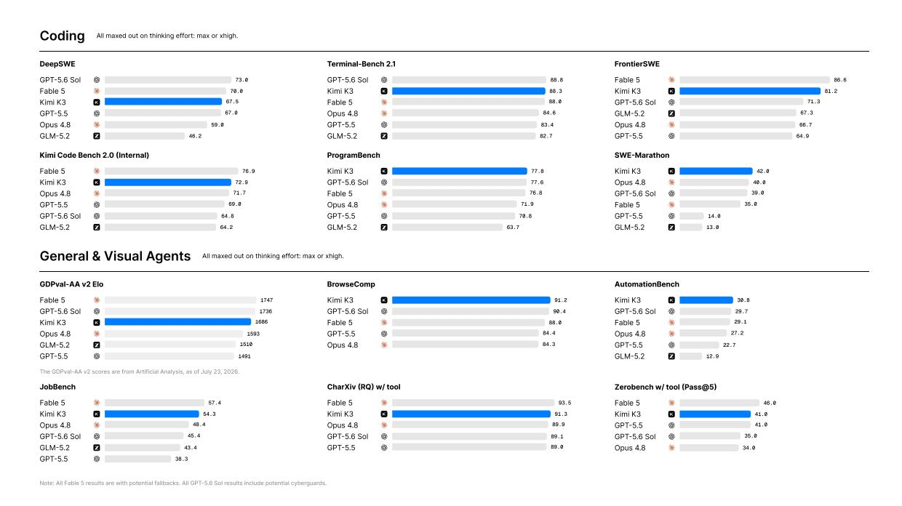
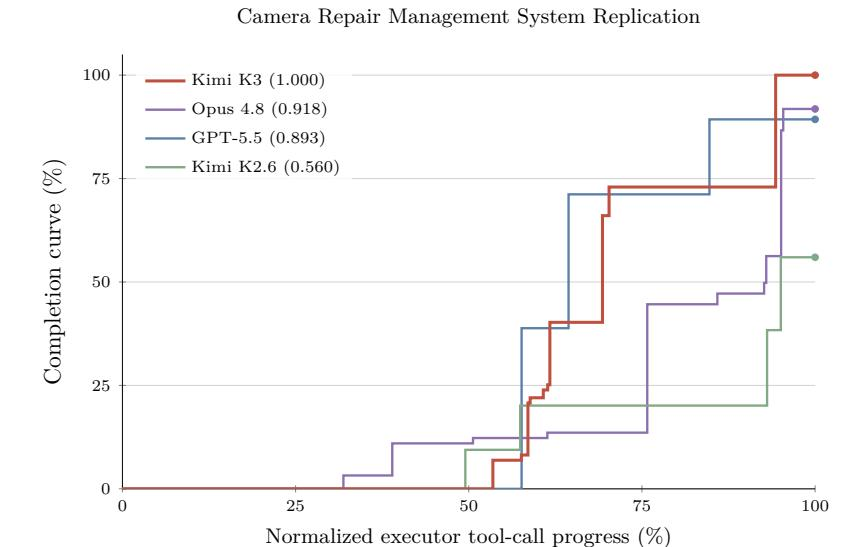
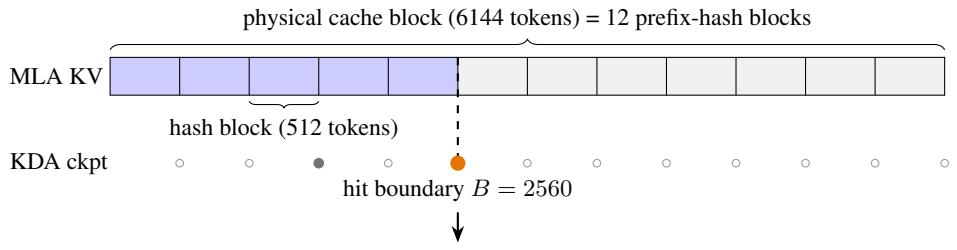
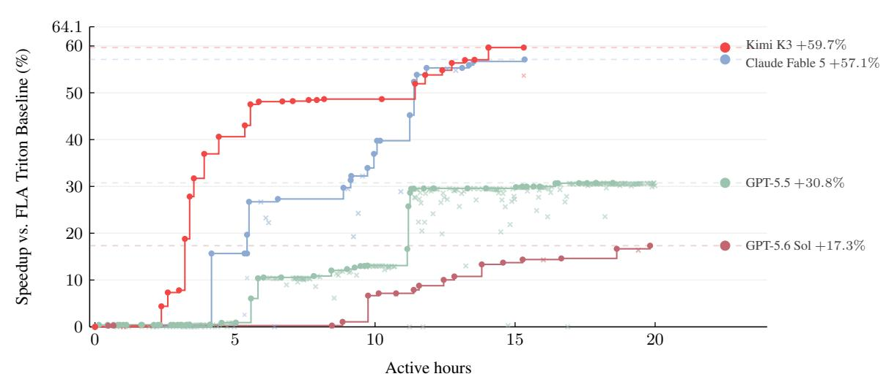

# KIMI K3: 오픈 프런티어 인텔리전스 (KIMI K3: OPEN FRONTIER INTELLIGENCE)

- 원제: Kimi K3: Open Frontier Intelligence
- 원문: [https://arxiv.org/abs/2607.24653](https://arxiv.org/abs/2607.24653)
- PDF: [https://arxiv.org/pdf/2607.24653v1](https://arxiv.org/pdf/2607.24653v1)
- arXiv ID: `2607.24653`

---

# KIMI K3: 오픈 프런티어 인텔리전스 (KIMI K3: OPEN FRONTIER INTELLIGENCE)

# TECHNICAL REPORT OF KIMI K3 (TECHNICAL REPORT OF KIMI K3)

### Kimi 팀 (Kimi Team)

# 초록 (ABSTRACT)

우리는 Kimi K3를 소개한다. Kimi K3는 2.8T 파라미터의 Mixture-of-Experts 모델로, 104억 개의 활성화 파라미터, 네이티브 비전 기능, 그리고 100만 토큰의 컨텍스트 윈도우를 갖추고 있다. Kimi K3는 Kimi Delta Attention [&#91;63&#93;](#page-36-0)와 Attention Residuals [&#91;57&#93;](#page-35-0)를 기반으로 하며, 이는 시퀀스 길이와 모델 깊이 전반에 걸친 정보 흐름을 개선한다. Stable LatentMoE와 함께, Stable LatentMoE는 토큰당 896개의 라우팅된 전문가 중 16개를 효과적으로 활성화하며, 정제된 훈련 및 데이터 레시피와 결합해 이 발전은 Kimi K2 [&#91;58&#93;](#page-35-1) 대비 전체 스케일링 효율성을 약 2.5배 향상시킨다. 사후 훈련 하이라이트는 일반, 에이전트, 코딩 도메인 및 다중 reasoning effort (reasoningeffort) 수준에서 강화 학습을 포함하며, 이는 구성적 일반화와 견고한 장기 실행을 가능하게 한다. 2.8T 규모에서 Kimi K3는 KDA를 위한 알고리즘–시스템 공동 설계, 효율적인 메모리 관리를 갖춘 완벽히 균형 잡힌 전문가-병렬 훈련, 지속적인 롤아웃과 샌드박스 상태를 갖춘 100만 토큰 에이전트 RL, 그리고 배포 혁신 등 여러 영역에서 인프라 발전에 의해 지원된다.

광범위한 평가 결과, Kimi K3는 장기 코딩, 에이전트, 지식, 추론, 비전 과제 전반에서 프런티어 수준의 성능을 달성한다. 전체 성능은 여전히 가장 강력한 독점 모델인 Claude Fable 5와 GPT-5.6 Sol을 따라가지만, Kimi K3는 우리 스위트에서 평가한 다른 공개 및 독점 모델을 지속적으로 능가한다. 우리는 Kimi K3 전체 모델 가중치를 공개하여 향후 연구를 촉진하고 프런티어 인텔리전스의 보다 광범위한 배포와 채택을 가속화한다.[1](#page-0-0)

<span id="page-0-1"></span>

그림 1: Kimi K3 주요 결과.

<span id="page-0-0"></span><sup>1</sup> <https://huggingface.co/moonshotai/Kimi-K3>

## <span id="page-1-0"></span>1 서론 (1 Introduction)

대규모 언어 모델(LLM)의 개발 대부분에서 스케일링은 배포 전에 더 많은 계산을 투자하여 더 큰 모델을 더 많은 데이터로 훈련시키는 것을 의미했다 [54,] [45]. 추론 모델의 부상은 테스트 타임 계산을 스케일링의 두 번째 축으로 확립했다: OpenAI의 o‑series는 강화 학습과 테스트 타임 추론을 스케일링한다 [84,] [83]; Anthropic의 확장 사고 모델은 적응형 사고 예산을 할당하고 추론과 도구 사용을 교차한다 [6,] [7]; DeepSeek‑R1 [40]과 Kimi K1.5 [118]은 대규모 강화 학습이 강력한 사전 학습 모델에서 정교한 추론 행동을 유도할 수 있음을 보여준다; 그리고 Kimi K2.5 Agent Swarm [59]은 순차 추론에서 병렬 에이전트 조정으로 테스트 타임 스케일링을 더욱 확장한다. 이러한 발전은 테스트 타임 스케일링을 최첨단 연구의 핵심 초점으로 만들었다. 그러나 오픈소스 모델 생태계가 두 번째 축에서 빠르게 진전했음에도 불구하고 첫 번째 축에서는 느리게 진행되고 있다: 많은 최신 모델이 1T급 파라미터 범위 내 또는 약간 위에 머무르고 있다 [145,] [29,] [135,] [120]. 점점 더 정교한 추론 및 에이전트 강화 학습 방법이 유사한 규모의 사전 학습 기반에 적용됨에 따라 오픈소스 진전이 수렴할 위험이 있으며, 가장 강력한 독점 시스템과의 격차가 확대될 위험이 있다. Kimi K3와 함께 우리는 두 스케일링 축을 동시에 최첨단으로 추구한다: 사전 학습 기반을 전례 없는 3T급 파라미터로 스케일링하고, 강화 학습, 추론 노력, 그리고 1M 컨텍스트 길이에서의 장기 상호작용을 스케일링한다.

우리는 2.8조 개의 총 파라미터, 1040억 개의 활성화 파라미터, 그리고 최대 100만 토큰의 컨텍스트 윈도우를 갖춘 네이티브 멀티모달 Mixture-of-Experts 모델인 Kimi K3을 소개한다. 이 모델의 아키텍처는 시퀀스 길이, 네트워크 깊이, 모델 폭 전반에 걸쳐 정보 흐름을 확장한다. Kimi Delta Attention (KDA) [63](#page-36-0)은 주기적으로 삽입되는 Gated MLA 레이어와 함께 효율적인 장기 시퀀스 혼합을 제공하며, 전역 상호작용을 보존한다. Attention Residuals (AttnRes) [57](#page-35-0)은 각 레이어가 앞선 모든 레이어의 표현을 선택적으로 주의하도록 허용한다. Stable LatentMoE는 라우팅된 전문가 공간을 896명으로 확장하고, 토큰당 16명을 활성화하며, 정규화, SiTU-GLU, 그리고 Quantile Balancing을 통해 극단적 희소성에서도 최적화를 안정화한다. 이러한 아키텍처적 진보와 정제된 데이터 및 훈련 레시피를 결합하면 Kimi K2 [58](#page-35-1) 대비 전체 스케일링 효율이 약 2.5배 향상된다.

우리는 이 사전 훈련 기반을 100만 토큰 컨텍스트 테스트 타임 스케일링을 위해 명시적으로 설계된 사후 훈련과 결합한다. Kimi K3은 장기 코딩, 일반 에이전트, 일반 추론 및 지식 과제 등 여러 추론 노력 수준을 아우르는 강화 학습을 거친다. 훈련 환경에는 검증 가능한 검색 및 전문 지식 작업, 소프트웨어 엔지니어링 및 커널 최적화, 비전-인-더-루프 도구 사용을 포함한 멀티모달 추론, 지속적인 어시스턴트 워크플로우, 웹 개발, 그리고 자율 실행 과제가 포함된다. 이러한 환경은 수백 또는 수천 번의 도구 호출과 수백만 개의 누적 컨텍스트 토큰을 통해 종종 수행되는 추론, 행동, 관찰, 검증, 적응의 일반 루프를 훈련한다. 도메인 및 노력 특화 정책은 다중 교사 온-정책 디스틸레이션 [75,](#page-36-3) [134,](#page-38-3) [29](#page-34-2)을 통해 통합된 단일 모델로 통합된다.

이러한 체제를 실현하려면 아키텍처 복잡성, 모델 크기, 트래젝터리 길이에 따라 확장되는 인프라가 필요하다. KDA를 위한 시스템 공동 설계에서는 융합 커널, KDA Context Parallelism, 그리고 상태 인식 프리픽스 캐싱을 개발하여 KDA를 디바이스 내, 디바이스 간, 그리고 요청 간에 효율적으로 만든다. 2.8조 파라미터 MoE 사전 훈련을 위해 MoonEP는 정적 계산 형태와 제로-카피 통신을 갖춘 완벽히 균형 잡힌 전문가 실행을 제공하며, 메모리 효율적인 훈련과 멀티모달 인코더 최적화는 제한된 메모리 내에서 활용도를 유지한다. 수백만 토큰 에이전트 RL을 위해, 우리 공동 위치 시스템은 부분 롤아웃, 외부 KV-캐시 보존, 적응형 스로틀링 및 재개 가능한 마이크로VM 샌드박스를 결합하여 장기간 모델 및 환경 상태를 보존한다. 마지막으로, 특수 커널, 캐시 및 예산 인식 플릿 스케줄링은 이러한 혁신을 예측 가능한 프로덕션 서빙으로 전환한다.

결과 모델은 새로운 공개 프런티어를 구축한다. 장기 코딩, 에이전트, 지식, 추론 및 비전 과제를 아우르는 벤치마크에서 Kimi K3은 Claude Fable 5와 GPT-5.6 Sol을 포함한 가장 강력한 독점 시스템을 전반적으로 따라잡으며, 우리 스위트에서 평가한 다른 공개 및 독점 모델보다 일관되게 앞서 있다. 이는 Fig. [1.](#page-0-1)에 표시된다.

우리의 기여는 다음과 같이 요약된다:

- 사전 학습을 개방형 프론티어에서 수행합니다. 우리는 2.8T-파라미터 네이티브 멀티모달 MoE 모델을 104B 활성화된 파라미터와 1M-토큰 컨텍스트 윈도우로 훈련합니다. KDA, AttnRes, Stable LatentMoE, 정제된 데이터 및 훈련 레시피가 집합적으로 Kimi K2 대비 약 2.5배의 스케일링 효율성을 향상시킵니다.  
- 다중 노력 테스트 타임 스케일링을 위한 강화 학습. 우리는 일반, 에이전트, 코딩 도메인 및 여러 추론 노력 수준에서 RL을 수행하고, 그 결과 능력을 통합하여 하나의 모델로 만듭니다.  
- 다조illion 파라미터, 백만 토큰 인텔리전스를 위한 인프라. 우리는 KDA 시스템 공동 설계, 2.8T 파라미터 MoE 사전 학습을 위한 메모리 효율적인 인프라인 MoonEP, 백만 토큰 에이전트 트래젝터리를 위한 재개 가능한 샌드박스를 갖춘 공동 위치 RL 시스템, 그리고 기타 인프라 혁신을 도입합니다.  
- 개방형 프론티어 모델. 우리는 전체 Kimi K3 모델 가중치를 공개하여 프론티어 인텔리전스를 연구, 배포 및 추가 혁신에 활용할 수 있도록 합니다.

<span id="page-2-0"></span>

Figure 2: Kimi K3 아키텍처는 토큰, 채널, 레이어 혼합을 중심으로 구성되며, 입력에 네이티브 비전 경로가 포함됩니다. 각 블록에는 세 개의 Kimi Delta Attention (KDA) 레이어가 있고 그 뒤에 하나의 Gated MLA 레이어가 있으며, 각 어텐션 레이어는 Stable LatentMoE 피드포워드 네트워크와 짝을 이룹니다. Attention Residuals (AttnRes)는 학습된 가짜 쿼리 (w)를 사용하여 임베딩 및 이전 블록 출력에 대한 어텐션 가중치 (α)를 도출하여 깊이 방향으로 선택적 정보 흐름을 가능하게 합니다. Top left: 공유 및 라우팅된 전문가를 갖는 Stable LatentMoE 모듈. Bottom left: KDA 모듈. Bottom right: 네이티브 비전 경로.

## 2 모델 아키텍처

Kimi K3 아키텍처는 시퀀스 길이, 네트워크 깊이, 모델 폭이라는 세 가지 보완적 차원에서 정보 흐름을 확장하도록 설계되었습니다. 시퀀스 차원에서는 하이브리드 어텐션이 각 블록마다 세 개의 Kimi Delta Attention (KDA) [63] 레이어와 하나의 Gated MLA 레이어를 결합하여 장기 컨텍스트 토큰 혼합을 위한 효율적인 메커니즘을 제공하면서 선택적 고용량 어텐션을 유지합니다 ([§2.1)](#page-3-0)). 깊이 차원에서는 Attention Residuals (AttnRes) [57]가 각 모듈이 임베딩, 현재 블록, 이전 블록에서 표현을 선택적으로 검색하도록 하여 전통적인 순차적 잔여 누적을 넘어선 정보 접근을 확장합니다 ([§2.2)](#page-5-0)). 폭 차원에서는 각 어텐션 레이어 뒤에 Stable LatentMoE 레이어가 이어져 희소 채널 혼합을 수행하며, 각 토큰에 대해 896개의 라우팅된 전문가 중 16개를 효과적으로 활성화합니다 ([§2.3)](#page-5-1)). 네이티브 비전을 위해 MoonViT-V2는 이미지와 비디오를 인코딩하고, 가벼운 프로젝터가 결과 시각적 특징을 공유 임베딩 공간에 매핑한 뒤 백본 처리에 사용합니다 ([§2.4)](#page-8-0)). Per-Head Muon ([§2.5)](#page-9-0))과 함께 이 구성 요소들은 토큰, 레이어, 채널 전반에 걸친 정보 흐름 확장을 위한 통합 아키텍처를 제공합니다. 정제된 훈련 및 데이터 레시피와 결합하면 Kimi K2 대비 약 2.5배의 스케일링 효율성을 달성합니다. Figure [2](#page-2-0)는 아키텍처 개요를 제공합니다.

### 2.1 하이브리드 어텐션

Kimi K3는 선형 어텐션과 전역 어텐션의 레이어별 하이브리드를 사용하며, KDA [63]와 Gated MLA를 결합합니다. 각 블록에는 3개의 KDA 레이어 뒤에 1개의 Gated MLA 레이어가 있어 3:1 혼합 비율을 가집니다. 이 패턴은 백본 전체에서 반복됩니다. 두 어텐션 메커니즘은 아래에서 별도로 설명됩니다. 백본 끝에 추가 Gated MLA 레이어가 배치되어 최종 레이어가 항상 전역 어텐션을 수행하도록 보장합니다.

#### 2.1.1 Kimi Delta Attention

KDA는 채널별 잊음 게이트 [63]를 사용하여 델타-룰 재귀 [105, 138]를 확장한다. 숨겨진 상태의 시퀀스 $x_t \in \mathbb{R}^d$ 를 고려하자. 여기서 t는 토큰 위치를, d는 모델 숨겨진 차원을 나타낸다. 명확히 하기 위해, 먼저 단일 어텐션 헤드를 설명한다. 쿼리와 키 벡터 $q_t, k_t \in \mathbb{R}^{d_k}$, 값 벡터 $v_t \in \mathbb{R}^{d_v}$, 그리고 재귀 상태 $\mathbf{S}_t \in \mathbb{R}^{d_k \times d_v}$ 를 갖는다. KDA는 델타-룰 업데이트 전에 채널별 감쇠를 적용한다.

<span id="page-3-3"></span>

$$\mathbf{S}_{t} = \left(\mathbf{I} - \beta_{t} \mathbf{k}_{t} \mathbf{k}_{t}^{\top}\right) \operatorname{Diag}(\boldsymbol{\alpha}_{t}) \mathbf{S}_{t-1} + \beta_{t} \mathbf{k}_{t} \boldsymbol{v}_{t}^{\top}, \qquad \tilde{\boldsymbol{o}}_{t} = \mathbf{S}_{t}^{\top} \boldsymbol{q}_{t}. \tag{1}$$

여기서 $\alpha_t \in (0,1)^{d_k}$ 은 채널별 1단계 보존 계수이며, $\beta_t \in (0,1)$ 은 델타-룰 쓰기 강도를 제어한다. Kimi Linear [63]를 따라, KDA는 헤드별 양을 다음과 같이 파라미터화한다.

$$q_t^h, \mathbf{k}_t^h = L_2 \text{Norm} \left( \text{Swish} \left( \text{ShortConv} \left( \mathbf{W}_{q/k}^h \mathbf{x}_t \right) \right) \right) \in \mathbb{R}^{d_k},$$

$$\mathbf{v}_t^h = \text{Swish} \left( \text{ShortConv} \left( \mathbf{W}_v^h \mathbf{x}_t \right) \right) \in \mathbb{R}^{d_v},$$

$$\beta_t^h = \text{Sigmoid} \left( \mathbf{W}_{\beta}^h \mathbf{x}_t \right) \in (0, 1),$$

$$\mathbf{z}_t^h = \mathbf{W}_{\alpha}^{\uparrow} \mathbf{W}_{\alpha}^{\downarrow} \mathbf{x}_t + \mathbf{b}_{\alpha}^h \in \mathbb{R}^{d_k}.$$

(2)

쿼리, 키, 값 투영은 ShortConv를 적용한 뒤 Swish [138]를 적용한다. 그리고 쿼리와 키는 추가로 $L_2Norm$ [141]으로 정규화된다. 저차원 투영과 헤드별 바이어스 $\boldsymbol{b}_{\alpha}^h \in \mathbb{R}^{d_k}$ 은 각 키 채널에 대해 세밀한 감쇠 로짓 $\boldsymbol{z}_t^h$ 를 생성한다. $\boldsymbol{z}_t^h$ 에서 $\boldsymbol{\alpha}_t^h$ 로의 하한이 있는 매핑은 아래의 청크별 형식 뒤에 도입된다.

청크별 병렬 형태. Kimi Linear [63]를 따라, KDA는 청크 간에 재귀적이며 각 청크 내에서는 병렬적으로 동작한다. 청크 크기 C 에 대해, $\mathbf{X}_{[t]}$ 는 $\mathbf{X} \in \{\mathbf{Q}, \mathbf{K}, \mathbf{V}, \mathbf{O}, \mathbf{U}, \mathbf{W}\}$ 에 대해 t번째 청크의 토큰 벡터를 스택한다. 행렬 $\mathbf{S}_{[t]} \in \mathbb{R}^{d_k \times d_v}$ 은 청크 t에 진입하는 재귀 상태를 나타낸다. 위치 $1 \le i \le j \le C$ 에 대해 채널별 누적 감쇠를 정의한다.

<span id="page-3-1"></span>

$$\gamma_{[t]}^{i \to j} := \prod_{r=i}^{j} \alpha_{[t]}^{r}, \qquad \gamma_{[t]}^{r} := \gamma_{[t]}^{1 \to r}.$$

(3)

Kimi Linear와 같이, $\Gamma_{[t]}^{1\to C}\in\mathbb{R}^{C\times d_k}$ 은 $\gamma_{[t]}^1,\dots,\gamma_{[t]}^C$ 를 행별로 스택한다. UT 변환은 $\mathbf{U}_{[t]}$ 와 $\mathbf{W}_{[t]}$ 를 생성하며, 여기서 우리는 가짜 값 항 $\widetilde{\mathbf{V}}_{[t]}:=\mathbf{U}_{[t]}-\mathbf{W}_{[t]}\mathbf{S}_{[t]}$ 를 정의한다. 들어오는 상태 $\mathbf{S}_{[t]}$ 를 주어지면, 청크 t의 모든 출력은 병렬로 계산된다.

$$\mathbf{A}_{[t]} = \operatorname{Tril}\left[ (\mathbf{Q}_{[t]} \odot \mathbf{\Gamma}_{[t]}^{1 \to C}) (\mathbf{K}_{[t]} / \mathbf{\Gamma}_{[t]}^{1 \to C})^{\top} \right],$$

$$\mathbf{O}_{[t]} = \underbrace{(\mathbf{\Gamma}_{[t]}^{1 \to C} \odot \mathbf{Q}_{[t]}) \mathbf{S}_{[t]}}_{\text{inter-chunk}} + \underbrace{\mathbf{A}_{[t]} \widetilde{\mathbf{V}}_{[t]}}_{\text{intra-chunk}}.$$

(4)

행렬 $\mathbf{M}$에 대해, $\mathrm{Tril}(\mathbf{M})$는 모든 엄격히 상삼각형 항목을 0으로 설정하고 하삼각형 항목(대각선 포함)을 유지합니다. 이 마스크는 청크 내에서 인과적 상호작용을 강제하며, 대각선은 각 출력이 현재 토큰 업데이트 이후의 상태를 읽기 때문에 유지됩니다. $\mathbf{O}_{[t]}$의 첫 번째 항은 이전 청크의 정보를 전달하고, 두 번째 항은 현재 청크 내 상호작용을 반영합니다. UT 변환과 청크별 형태의 전체 유도에 대해서는 Kimi Linear [63]를 참고하십시오.

**Lower-bounded decay** Eq. 4는 각 청크의 키를 역수 누적 감쇠 $1/\Gamma_{[t]}^{1\to C}$ 로 재스케일한다. 왜냐하면 $\Gamma_{[t]}^{1\to C}$는 (0,1) 범위의 보존 인자들의 곱이므로, 이 역수는 무한히 커질 수 있고 유한 정밀도에서 오버플로우가 발생할 수 있다 [140, 63]. Kimi Linear는 로그 공간에서 상대 감쇠를 계산하고 각 청크를 16-토큰의 보조 타일로 나누어 이 수치 범위를 제어한다 [140, 63]. 대각선이 아닌 타일은 Tensor Cores에서 직접 밀집 행렬 곱셈으로 계산할 수 있다. 반면 대각선 타일은 여전히 명시적 위치-쌍 계산이 필요하며, 이는 청크 내부의 주요 병목 현상으로 남아 있다.

<span id="page-4-0"></span>

(a) Log-decay parameterization.

(b) Diagonal-tile computation.

그림 3: 하한이 있는 감쇠와 청크 단위 KDA 계산에 미치는 영향. (a) Kimi Linear은 무한한 음수-Softplus 매핑을 사용하고, 반면 Kimi K3는 스케일된 시그모이드로 로그 감쇠를 제한한다; 곡선은 A=0과 $g_{\min}=-5$ 를 보여준다. (b) Kimi Linear은 각 대각 타일을 명시적 위치-쌍 계산으로 평가하고, 반면 Kimi K3의 제한된 범위는 모든 인과 타일이 밀집 Tensor Core 행렬 곱셈을 사용할 수 있게 한다.

Kimi K3는 decay logits $z_t^h$에서 per-step log-decay $g_t^h$로의 매핑을 변경함으로써 이 병목 현상을 해결한다.  
GDN과 Mamba-2를 따라, Kimi Linear는 negative-Softplus 매핑 $g_t^h = -e^{A_h} \operatorname{Softplus}(z_t^h) \in$ $(-\infty, 0)^{d_k}$ [138, 24, 63]를 사용한다.  
Kimi K3는 대신 스케일된 시그모이드를 사용하여 log-decay를 아래에서 제한한다:

$$\mathbf{g}_t^h = g_{\min} \operatorname{Sigmoid}(e^{A_h} \mathbf{z}_t^h) \in (g_{\min}, 0)^{d_k},$$

$$\mathbf{\alpha}_t^h = \exp(\mathbf{g}_t^h) \in (e^{g_{\min}}, 1)^{d_k},$$

(5)

$A_h$는 학습 가능한 헤드별 로그 스케일이며 $g_{\min}=-5$는 고정되어 있다. 우리는 $A_h=0$으로 초기화하고, 각 바이어스 $\boldsymbol{b}_{\alpha}^h$는 [63, 24, 138]에 따라 초기화한다. $g_{\min}=-5$일 때, 모든 보존 인자는 $\alpha_{t,j}^h>e^{-5}\approx 6.7\times 10^{-3}$을 만족하며, 16-토큰 타일에 대한 누적 로그 감쇠는 (-80,0) 범위에 있다. 따라서 해당 역수 재스케일링 인자는 $e^{80}$보다 작으며 BF16 동적 범위 내에 있다. 이 유한 범위 덕분에 대각선 및 비대각선 타일 모두 밀집 Tensor Core 행렬 곱셈을 사용할 수 있어 위치-쌍 대각선 경로를 제거한다. 이 파라미터화는 이전 연구의 하한이 있는 재귀 게이트와 밀접하게 관련되어 있다 [97, 27, 91]. Fig. 3은 감쇠 파라미터화의 변화와 그 계산적 결과를 보여준다.

**Full-rank gate** 마지막으로, Kimi K3는 KDA의 출력 게이트를 Kimi Linear [63]에서 사용된 저랭크 파라미터화에서 입력에 따라 달라지는 풀랭크 프로젝션으로 변경한다. 재귀 출력에 헤드별 RMSNorm [146]을 적용한 후, KDA는 데이터에 따라 달라지는 출력 게이팅을 적용한다 [99]:

$$\mathbf{y}_t = \mathbf{W}_o[\operatorname{Sigmoid}(\mathbf{W}_o \mathbf{x}_t) \odot \operatorname{RMSNorm}(\tilde{o}_t)].$$

(6)

#### 2.1.2 Gated MLA

우리는 DeepSeek-V2 [28]에서 도입된 Multi-head Latent Attention (MLA)가 각 토큰의 key-value 표현을 저차원 잠재 벡터 $\mathbf{c}_t = \mathbf{W}_c \mathbf{x}_t$ 으로 압축한다. 전체 헤드별 key와 value를 캐시하는 대신 MLA는 $c_t$ 를 캐시하고, attention 계산 중 학습된 up-projection을 통해 content key와 value를 재구성한다. 이 분해는 KV-cache의 메모리 사용량을 줄이면서 전역 토큰 간 attention을 유지한다. MLA는 이후 Kimi K2와 Kimi K2.5 [58, 59]에 채택되었으며, Kimi K3는 주기적인 global-attention 층에서 이를 유지한다.

Kimi K2와 Kimi K2.5와 달리, Kimi K3는 Kimi Linear [63]의 하이브리드 설계를 따르며 모든 MLA 층에 No Position Encoding (NoPE)을 적용한다. 따라서 쿼리나 키에 명시적인 위치 인코딩이 적용되지 않는다. 중간에 있는 KDA 층은 위치에 민감하고 최신성에 기반한 시퀀스 혼합을 제공하고, MLA 층은 제한 없는 전역 내용 상호작용을 제공한다. 이 분리는 컨텍스트 길이를 확장할 때 RoPE 주파수 기반을 재조정하거나 YaRN [92]를 적용하는 등 위치 인코딩 파라미터를 수정하는 것을 피한다.

또한 Kimi K3는 입력에 따라 달라지는 채널별 완전 랭크 출력 게이트를 MLA에 추가한다. $\tilde{o}_t$ 를 위치 t에서 게이트가 적용되지 않은 MLA 출력으로 두면, 게이트가 적용된 출력은

$$\mathbf{y}_t = \mathbf{W}_o[\operatorname{Sigmoid}(\mathbf{W}_g \mathbf{x}_t) \odot \tilde{\mathbf{o}}_t].$$

(7)

게이트 프로젝션 $W_g$ 는 완전 랭크이며, Kimi K3의 KDA에서 사용되는 새로운 파라미터화와 일치한다. 이 게이트는 각 토큰이 전역 attention에서 읽어오는 채널을 조절할 수 있게 한다 [99].

Flash attention에서 발생하는 편향된 반올림 오류를 수정하기 위해 [98]의 방법을 채택하고, 훈련 중에는 attention 출력을 FP32로 유지한다. 이 선택은 출력 타일의 온칩 메모리 사용량을 두 배로 늘리므로, 우리는 훈련 커널을 재설계하여 KV 스테이징 버퍼와 겹치게 하고, 쿼리 타일 대신에 공유 메모리를 해방시켜 더 깊은 KV 파이프라인과 높은 훈련 처리량을 달성한다.

### <span id="page-5-0"></span> 2.2 주의 잔여 (Attention Residuals)

표준 residual 연결 [43]은 깊이 방향으로 모든 이전 정보를 단일 상태 $h_l$ 에 압축한다 — 이는 시계열 RNN과 유사한 병목 현상이다. 시퀀스 모델링에서는 Transformer가 재귀를 attention으로 대체하여 각 위치가 데이터에 따라 가중치를 부여해 이전 모든 위치에 선택적으로 접근할 수 있게 했다 [10, 125]. Attention Residuals (AttnRes) [57]는 동일한 방법을 깊이 방향에 적용한다: 각 층이 모든 이전 층에서 표현을 선택적으로 가져오며, 이를 균일하게 누적하지 않는다.

**전체 주의 잔여** 각 층 l 에 대해, 층별 학습 가능한 가짜 쿼리 $q_l = w_l \in \mathbb{R}^d$ 와 키 및 값을 정의한다

<span id="page-5-2"></span>

$$\mathbf{k}_i = \mathbf{v}_i = \begin{cases} \mathbf{h}_1 & i = 0\\ f_i(\mathbf{h}_i) & 1 \le i \le l - 1 \end{cases}$$

(8)

여기서 $f_i(h_i)$ 는 i번째 층의 출력이며, $h_1$ 은 토큰 임베딩이다. attention 가중치는 소프트맥스 커널 $\phi(q, k) = \exp(q^{\top} \text{RMSNorm}(k))$ [55, 146] 를 따르며, RMSNorm은 큰 크기의 출력을 가진 층이 가중치를 지배하지 않도록 한다:

<span id="page-5-3"></span>

$$\alpha_{i \to l} = \frac{\phi\left(\mathbf{q}_{l}, \mathbf{k}_{i}\right)}{\sum_{i=0}^{l-1} \phi\left(\mathbf{q}_{l}, \mathbf{k}_{j}\right)}, \qquad \mathbf{h}_{l} = \sum_{i=0}^{l-1} \alpha_{i \to l} \cdot \mathbf{v}_{i}. \tag{9}$$

네트워크 깊이가 적당히 작다 (L < 100) 때문에, 이 *전체* 형태의 $O(L^2d)$ 연산은 감당할 수 있다; 실제 오버헤드는 모든 층 출력을 유지하기 위한 O(Ld) 메모리(및 파이프라인 병렬화 하에서의 교차 단계 통신)이다.

**블록 어텐션 잔여** To reduce this overhead, we partition the L layers into N blocks of S = L/N layers each. Within block n (layer indices  $\mathcal{B}_n$ ), layer outputs are reduced to a single representation by summation,  $\boldsymbol{b}_n = \sum_{j \in \mathcal{B}_n} f_j(\boldsymbol{h}_j)$ , with  $\boldsymbol{b}_n^i$  denoting the partial sum over the first i layers of the block; we set  $\boldsymbol{b}_0 = \boldsymbol{h}_1$  so the token embedding is always included as a source. Across blocks, full attention is applied over only the N block-level representations: for the i-th layer in block n, the value matrix is

$$\mathbf{V} = \begin{cases} [\boldsymbol{b}_0, \boldsymbol{b}_1, \dots, \boldsymbol{b}_{n-1}]^\top & \text{if } i = 1 \text{ (first layer of block } n) \\ [\boldsymbol{b}_0, \boldsymbol{b}_1, \dots, \boldsymbol{b}_{n-1}, \boldsymbol{b}_n^{i-1}]^\top & \text{if } i \ge 2 \text{ (subsequent layers)} \end{cases}$$

(10)

키와 어텐션 가중치는 Eq. 8 및 Eq. 9를 따른다. 최종 출력 레이어는 모든 N개의 블록 표현을 집계한다. Block AttnRes 하에서는 메모리와 통신 오버헤드가 O(Ld)에서 O(Nd)로 감소하며, 이 블록 구조는 추론 시 상태를 제한하여 병렬 inter-block 결과를 순차적 intra-block 부분 합과 온라인 소프트맥스[79]를 통해 더 잘 병합하도록 하여 추론 시간 비용을 크게 줄인다.

실험적으로, $N \approx 8$은 모델 규모에 걸쳐 대부분의 이점을 회복한다[57]; Kimi K3의 경우, 레이어를 12레이어 크기의 8개 블록으로 나누어, 임베딩 레이어를 포함하면 부분 최종 블록과 총 9개의 블록을 갖는다.

### <span id="page-5-1"></span>2.3 안정된 잠재 MoE (Stable LatentMoE)

전문가 풀과 활성 전문가 수를 모두 늘리면 전문가 특화 공간이 확장되지만, 전통적인 MoE에서는 각 선택된 전문가가 전체 d-차원 토큰 표현을 받으므로 통신 및 전문가 가중치 트래픽이 라우팅 곱셈에 따라 증가한다. LatentMoE[32]는 전체 모델 폭과 라우팅된 전문가 폭을 분리함으로써 이 확장을 저렴하게 만든다: 공유 전문가들은 공통 변환을 위해 전체 폭 경로를 유지하고, 특수화된 라우팅 전문가들은 폭이 $\ell$인 압축된 잠재 공간에서 동작한다. 이를 통해 Kimi K3는 채널 혼합을 896개의 라우팅 전문가와 토큰당 16개의 활성 전문가로 확장할 수 있어 희소성이 56에 해당한다.

이 극단적인 희소성은 베이직 설계의 두 가지 실패 모드를 증폭시킨다. 첫째, 라우팅 경로는 게이트된 다중 분기 전문가 피드포워드 네트워크 $\mathbf{W}^{\downarrow}$와 $\mathbf{W}^{\uparrow}$를 거의 네 개의 연속 행렬 곱으로 구성한다. 이 불안정한 구조는 2.8조 매개변수 규모와 결합되어 라우팅 분기에서 내부 활성화가 폭발한다. 둘째, 거의 $10^3$개의 전문가 부하를 균형 잡는 것은 기존 보조 손실이 없는

<span id="page-6-1"></span>그림 4: GLU, SwiGLU, 그리고 SiTU-GLU의 게이트와 업 브랜치와 그 스칼라 응답, 여기서  $\sigma$  은 시그모이드 함수를 나타낸다. 두 브랜치 모두 스칼라 입력 x 를 받고, 모든 곡선은 도메인  $x \in [-10, 100]$  를 공유한다; 삽입부는 원점 근처 영역을 확대한다. SiTU-GLU는 빨간색으로 표시되며  $\beta_1 = 4$  와  $\beta_2 = 25$  를 갖는다. 원점 근처에서 SwiGLU를 밀접하게 따르며, 큰 양수 입력에 대해  $|f(x)| \le \beta_1 \beta_2 = 100$  의 한계에 접근한다. 반면 SwiGLU는 무한대로 확장된다.

bias 업데이트는 여전히 잘 동작한다. Stable LatentMoE는 이 두 가지 실패 모드를 세 가지 구성 요소로 해결한다: up-프로젝션 전 RMSNorm과 Sigmoid Tanh Unit GLU (SiTU-GLU)를 사용하여 활성화 폭발을 억제하고, 부하 균형을 위해 Quantile Balancing (QB)를 적용한다.

그림 2에 나타난 것처럼, 이 레이어는 DeepSeekMoE [23]의 공유-및 라우팅 전문가 조직을 따릅니다. $x \in \mathbb{R}^d$ 에 대해, 공유 전문가들은 x를 직접 처리하고, 라우팅 경로는 이를 $z = \mathbf{W}^{\downarrow} x \in \mathbb{R}^{\ell}$ 으로 투영한 뒤, 선택된 전문가에게 dispatch하고, 그들의 가중합을 $\mathbf{W}^{\uparrow}$ 를 통해 $\mathbb{R}^d$ 로 다시 매핑합니다:

<span id="page-6-0"></span>

$$\mathbf{u} = \sum_{i \in \mathcal{T}_k(\mathbf{x})} p_i E_i^{\text{routed}}(\mathbf{W}^{\downarrow} \mathbf{x}),$$

$$\mathbf{y} = \sum_{j=1}^{N_s} E_j^{\text{shared}}(\mathbf{x}) + \mathbf{W}^{\uparrow} \text{RMSNorm}(\mathbf{u}).$$

(11)

여기서 $u \in \mathbb{R}^{\ell}$ 은 집계된 라우팅 표현이며, $E_j^{\mathrm{shared}}: \mathbb{R}^d \to \mathbb{R}^d$ 와 $E_i^{\mathrm{routed}}: \mathbb{R}^\ell \to \mathbb{R}^\ell$ 은 공유 및 라우팅 전문가 피드-포워드 네트워크이며, $p_i$ 는 아래에 정의된 Quantile Balancing 규칙에 의해 정의된 라우터 가중치입니다. Kimi K3는 모든 레이어에서 전체 폭 공유 전문가 수를 $N_s = 2$ 로 고정합니다.

#### 2.3.1 Normalized LatentMoE

원래의 LatentMoE는 집계된 라우팅 표현 u에 직접 $\mathbf{W}^{\uparrow}$ 를 적용하며, 이 스케일은 선택된 전문가와 그들의 라우팅 가중치에 따라 달라질 수 있습니다. Eq. 11에 나타난 것처럼, Kimi K3는 대신 전문가 집계와 업-프로젝션 사이에 RMSNorm [146] 를 삽입합니다. 이 정규화는 라우팅 분기(branch)가 전체 폭 공유 분기와 결합되기 전에 스케일 변동에 대한 민감도를 줄여줍니다. 학습을 안정화하는 것 외에도, 추가적인 RMSNorm은 검증 손실과 다운스트림 벤치마크를 일관되게 개선합니다.

#### <span id="page-6-2"></span>2.3.2 Sigmoid Tanh Unit GLU

게이트드 선형 유닛(GLUs)은 시그모이드 활성화 게이트와 함께 선형 값 분기를 조절하며, 시그모이드 $(\mathbf{W}_g x) \odot \mathbf{W}_u x$ 를 계산합니다 [26]. SwiGLU는 시그모이드 게이트를 $\mathrm{Swish}(x) = x \, \mathrm{Sigmoid}(x)$ 로 대체하고, Transformer에서 강력한 실험적 성능을 보여줍니다 [107]. 이후 SwiGLU는 대형 언어 모델에서 널리 채택된 FFN 설계가 되었지만, 그 실험적 효과에 대한 완전한 설명은 아직 열려 있습니다.

그러나 SwiGLU의 두 곱셈 인자는 모두 무한대이므로, 동시에 큰 좌표가 활성화 이상치를 발생시키고 저정밀 연산에서 오버플로우 위험을 증가시킬 수 있습니다. 원래 GLU의 시그모이드 게이트는 무한대 게이트 성장을 방지하지만, Swish의 대략 선형적인 양수 영역을 유지하지 못합니다. 이는 대형 값 성장을 제어하면서 SwiGLU의 특유의 지역적 및 양수 반응을 보존하는 활성화를 동기화합니다. 다른 최근 연구들은 이 trade-off의 대체 매개화법을 탐구했습니다 [51].

이러한 요구를 충족시키기 위해 우리는 Sigmoid Tanh Unit GLU (SiTU-GLU)를 제안합니다. SiTU-GLU는 Swish 게이트의 선형 인자와 업 브랜치에 각각 부드러운 캡 $\operatorname{softcap}(x,\beta)=\beta \tanh(x/\beta)$ 를 적용합니다:

SiTU-GLU(

$$\boldsymbol{x}$$

) =  $\left[\beta_1 \tanh\left(\frac{\mathbf{W}_g \boldsymbol{x}}{\beta_1}\right) \odot \text{Sigmoid}(\mathbf{W}_g \boldsymbol{x})\right] \odot \left[\beta_2 \tanh\left(\frac{\mathbf{W}_u \boldsymbol{x}}{\beta_2}\right)\right],$  (12)

<span id="page-7-0"></span>

Figure 5: Quantile Balancing의 예시, m=8 토큰, n=4 라우팅된 전문가, k=1 토큰당 선택된 전문가를 사용합니다. (a) 토큰별 Top‑k 라우팅(왼쪽에 토큰, 오른쪽에 전문가)은 부하(4,3,1,0)를 생성합니다; 어두운 원은 과열된 전문가를 나타내며, 흐릿하고 점선 원은 각각 과소 활용 및 사망 중인 전문가를 나타냅니다. (b) 각 회색 막대는 현재 편향된 점수의 마진, $s_{i,j} + b_j^{(t)} - \alpha_i^{(t)}$ 를 나타내며, 행별 최대값은 (a)의 라우팅을 재현합니다. 각 열의 점선 빨간 선은 편향 조정 $b_j^{(t)} - \hat{b}_j^{(t+1)}$ 로, (q+1)번째로 큰 마진에 배치되어 정확히 q=2개의 마진이 이를 초과하도록 합니다. 마커 $\bigstar$ 는 열 조정을 뺀 후 행별 Top‑k 선택을 나타내며, 즉 (c)의 라우팅입니다. (c) 보존된 선택은 균형 잡힌 부하(2,2,2,2)를 생성합니다; 빨간 선은 QB에 의해 변경된 할당을 나타냅니다.

Kimi K3의 경우, 게이트 브랜치에 대한 soft-cap 하이퍼파라미터를 $\beta_1=4$ 로, 업 브랜치에 대해 $\beta_2=25$ 로 설정합니다. 스케일된 $\tanh$ 는 원점 근처에서 거의 선형이며, 큰 크기에서는 제한됩니다. 이를 통해 SiTU-GLU는 SwiGLU의 지역 반응을 보존하면서 곱셈에서 두 요인을 모두 제어할 수 있습니다. Fig. 4는 GLU, SwiGLU, SiTU-GLU의 브랜치 정의와 스칼라 반응을 공통 슬라이스에서 비교합니다.

§ B는 지역 확장, 극한 사례, 공식 출력 한계, 그리고 하드 클램핑과의 비교를 제공합니다.

#### <span id="page-7-1"></span>분수 균형 (Quantile Balancing)

보조 손실 기반 라우팅 [33]과 달리, Kimi K3는 보조 손실이 없는 라우팅 [30]을 채택합니다. 부하 균형은 Top‑k 선택에 사용되는 라우터 점수에 전문가별 편향 $b_j$ 를 추가함으로써 구현됩니다. 토큰 $x_i$ 에 대해 라우터는 $s_i = \operatorname{Sigmoid}(\mathbf{W}_r x_i)$ 를 계산하고 적용합니다

<span id="page-7-2"></span>

$$\mathcal{T}_i = \operatorname{argtop}_k(\mathbf{s}_i + \mathbf{b}), \qquad p_{i,j} = \frac{s_{i,j}}{\sum_{r \in \mathcal{T}_i} s_{i,r}}, \quad j \in \mathcal{T}_i.$$

(13)

왜냐하면  $\boldsymbol{b}$  가  $p_{i,j}$  에서 생략되었기 때문에, 이는 혼합 가중치나 라우터의 기울기 기반 최적화를 변경하지 않으면서 디스패치를 조절한다. 원래 방법은 고정 단계 규칙  $b_j^{(t+1)} = b_j^{(t)} + \gamma \operatorname{sign}(\bar{\ell} - \ell_j^{(t)})$  [30] 으로  $\boldsymbol{b}$  를 업데이트하며, 여기서  $\gamma$  은 느린 적응과 부하 진동 사이의 균형을 조정한다. LatentMoE 가 레이어당 라우팅된 전문가 풀을 896개로 늘리면서 균형 잡힌 부하를 유지하는 것이 더 어려워진다. 불균형 라우팅은 전문가 병렬 훈련을 느리게 하고 일부 전문가가 제대로 훈련되지 못하도록 할 수 있다 [47].

이 한계를 해결하기 위해 우리는 Quantile Balancing(QB)를 도입한다. QB는 각 전문가의 바이어스를 라우터 점수의 분위수에서 설정하여 목표 부하와 일치시킨다 [111]. Top-k 선택을 사용해 n개의 전문가에게 라우팅되는 m개의 토큰으로 구성된 훈련 배치를 고려하면, 목표 부하는 q := mk/n 토큰/전문가가 된다. QB는 단일 순방향 패스로 다음 바이어스를 도출한다. 라우팅은 바이어스 점수  $s_i + b^{(t)}$  에 대해 Top-(k+1) 선택으로 Top-k 선택을 대체한다: 처음 k개의 항목은 실제로 선택된 경로이며, (k+1)번째 항목은 전문가가 토큰 i의 Top-k에 진입하기 위해 초과해야 하는 컷오프  $\alpha_i^{(t)}$  이다. Top-(k+1) 라우팅에서 컷오프를 가져오면 별도의 토큰-측 분위수를 피할 수 있다. 이후 우리는 각 전문가 바이어스를 선택하여 전문가 j가 목표 부하를 받도록 한다: 컷오프가 고정된 상태에서 후보 바이어스  $\hat{b}_i^{(t+1)}$  아래에서 전문가 j에 라우팅되는 토큰 수는

$$\sum_{i=1}^{m} \mathbf{1} \left[ s_{i,j} + \hat{b}_{j}^{(t+1)} > \alpha_{i}^{(t)} \right],$$

이는 임계값  $-\hat{b}_j^{(t+1)}$  에 대해 단조 감소한다. 결합이 없다고 가정하면, 이 수를 q로 설정하면  $-\hat{b}_j^{(t+1)}$  가  $s_{i,j}-\alpha_i^{(t)}$  의 (q+1)번째 큰 마진이 되어 정확히 q개의 마진이 임계값을 초과한다. q/m = k/n 이므로 이는

토큰 전반의 마진에 대한 (1-k/n)-분위수, QB 업데이트를 제공한다

<span id="page-8-1"></span>

$$\widehat{b}_{j}^{(t+1)} \leftarrow -\operatorname{quantile}_{1-k/n} \left( \mathbf{s}_{:,j} - \boldsymbol{\alpha}^{(t)} \right), 
\mathbf{b}^{(t+1)} \leftarrow \widehat{\mathbf{b}}^{(t+1)} - \operatorname{mean} \left( \widehat{\mathbf{b}}^{(t+1)} \right) \mathbf{1}.$$

(14)

마진은 편향된 컷오프 $\alpha_i^{(t)}$ 를 원시 점수 $s_{i,j}$ 에서 빼므로, 이전 편향은 컷오프를 통해서만 업데이트에 참여하며, 두 번째 줄은 Top-k 선택을 변경하지 않는 공통 오프셋을 제거한다. 인과성 측면에서 업데이트는 다음 단계에서만 적용된다 [30], 즉 배치는 자신으로부터 파생된 편향으로 라우팅되지 않는다. 그림 5는 m=8, n=4, k=1인 경우를 보여주며, 각 전문가가 목표 부하 q=2를 받는다. 최종 편향은 추론 시에 고정된다. 균형 배정 도출은 § C에 있다.

**히스토그램 추정** 규모가 커질수록 Eq. 14의 분위수는 전체 글로벌 배치에 걸쳐 있으며, 마진 수가 수백만에 이르고 랭크와 누적 단계에 걸쳐 분산되어 있으므로 정확한 분위수를 위해 수집하는 것은 훈련 시에 실행 가능하지 않다. 대신 우리는 각 전문가의 마진 히스토그램에서 분위수를 읽는다: 단일 all-reduce가 랭크별 bin 카운트를 합산하고, 분위수는 풀된 카운트에서 복원된다. 카운트가 가산적이므로 히스토그램은 토큰이 어떻게 샤딩되었는지에 관계없이 풀된 글로벌 배치를 나타내며, 따라서 추정치는 bin 너비까지 전체 배치 분위수를 반영한다. 통신 비용은 전문가당 몇 백 bin에 불과하다. 이 히스토그램 추정기는 실제로 우리가 사용하는 방법이며, § D에서 그 상세 설명과 오차 한계를 제공한다.

### <span id="page-8-0"></span>2.4 네이티브 비전

Kimi K3는 네이티브로 멀티모달이다: 텍스트, 이미지, 비디오는 하나의 공유 백본에서 한 컨텍스트 내에서 처리되며, 사후 모달리티 정렬 단계가 없다. 이 설계는 §1에 서술된 장기 시각-루프 행동의 아키텍처적 기반이다. 렌더링된 출력과 그 출력을 생성한 코드는 동일한 토큰 스트림에 존재하며, 모델은 코드를 작성하고, 결과의 스크린샷이나 비디오 프레임을 검사하고, 사용자 인터페이스, 그래픽, 비디오와 같은 시각적 아티팩트를 반복적으로 개선할 수 있다—모델 간 핸드오프 없이.

**MoonViT-V2** Kimi K2.5와의 핵심 차이점은 Kimi K3 비전 인코더, *MoonViT-V2*, *다음 토큰 예측으로 완전히 처음부터 훈련한다*는 점이다. 기존 관행, Kimi K2.5 자체를 포함해, 비전 인코더를 SigLIP와 같은 대조적 사전 훈련 모델로 초기화한다는 전제는 사전 훈련된 시각 지식이 모델에 이점을 준다고 가정한다. 우리는 주로 훈련 안정성을 위해 이 관행을 벗어난다. 사전 훈련된 인코더를 LLM에 연결하면 공동 최적화가 불안정해진다: SigLIP 초기화된 MoonViT-3D는 지속적으로 높은 그래디언트 노름과 빈번한 스파이크를 보이지만, MoonViT-V2는 훈련 전반에 걸쳐 안정적이다 (Fig. 6). 다음 토큰 예측으로 훈련하면 인코더의 표현이 대조적 손실이 아니라 언어 모델링 목표에 의해 직접 형성된다. 특히, 우리는 MoonViT-V2가 시각 평가에서 SigLIP 초기화된 기준과 일치함을 발견했다. 이는 대조적 사전 훈련이 대규모 멀티모달 언어 모델의 초기화에 필요하지 않음을 시사한다.

<span id="page-8-2"></span>

그림 6: 우리 사전 훈련 ablation에서의 비전 타워 그래디언트 노름. SigLIP 초기화된 MoonViT-3D와 비교해, 처음부터 훈련한 MoonViT-V2는 낮은 그래디언트 노름과 적은 스파이크를 유지하며, 보다 안정적인 최적화를 나타낸다.

Architecture 이 훈련 레시피는 Kimi K2.5의 전반적인 설계를 따르는 비전 경로를 기반으로 한다 [&#91;59,](#page-35-5) [61&#93;](#page-36-5): 시각 입력은 먼저 MoonViT-V2에 의해 인코딩되고, 그 다음 가벼운 MLP 프로젝터를 통해 LLM에 매핑된다. MoonViT-V2는 약 0.4B 파라미터를 가진 27층 비전 트랜스포머이며, RMSNorm을 채택하고 선형 및 어텐션 프로젝션에서 모든 바이어스 항을 제거하여 위에서 언급한 스크래치부터의 최적화를 더욱 안정화한다. 이미지와 비디오는 MoonViT-3D와 같이 완전히 공유된 파라미터로 처리된다: 어텐션은 프레임 내부 공간과 프레임 간 시간 패스를 분해하고, 시간 풀링은 시간 차원에서 토큰을 추가로 압축한다. 프로젝션 전에 2 × 2 다운샘플링을 적용한 픽셀-셔플 연산은 시각 토큰 수를 4배로 줄여 3584 × 3584 픽셀까지의 입력을 1M-token 컨텍스트 내에서 경제적으로 유지한다.

### <span id="page-9-0"></span>2.5 헤드별 무온 (Per-Head Muon)

Kimi K2를 따라, Kimi K3는 행렬 파라미터에 대한 옵티마이저로 Muon [&#91;53&#93;](#page-35-13)을 채택한다. 어텐션 프로젝션에 대해 우리는 이를 헤드별 변형으로 더욱 정제한다: 전체 Q, K, V 프로젝션 행렬에 뉴턴–슐츠 정규화를 적용하는 대신, 그 모멘텀 행렬을 헤드 차원에 따라 분할하고 각 헤드의 블록을 별도로 정규화한다. 직관적으로, 전체 행렬 정규화는 모든 헤드를 하나의 결합된 블록으로 취급하므로, 더 큰 그래디언트 또는 모멘텀 스케일을 가진 헤드가 공유 업데이트 방향을 지배하고, 작은 스케일의 헤드는 충분히 정규화되지 않은 업데이트를 받는다; 헤드별 정규화는 헤드 간 업데이트 스케일을 균등하게 만든다. 실제로 이 설계는 헤드 간 학습 역학을 보다 균형 있게 만들고, 더 큰 규모에서 훈련 안정성을 향상시킨다. 또한 뉴턴–슐츠 반복이 높은 헤드별 블록에서 전체 프로젝션 행렬보다 저렴하기 때문에 옵티마이저 오버헤드를 약간 줄인다.

## 3 사전 훈련 (Pre-Training)

### 3.1 사전 훈련 데이터 (Pre-Training Data)

Kimi K3는 네 개의 주요 텍스트 도메인—Web Text, Code, Mathematics, Knowledge—과 대규모 비전 코퍼스를 포함한 선별된 코퍼스에서 사전 훈련된다. 비전 데이터는 캡션, 이미지–텍스트 문서, OCR, 인지, 비디오, 시각 코딩 데이터를 포함한다. 우리의 데이터 파이프라인은 Kimi K2 [&#91;58&#93;](#page-35-1)에서 개발된 것과 Kimi K2.5 [&#91;59&#93;](#page-35-5)에서 정제된 것을 기반으로 한다.

텍스트 데이터 각 도메인은 규칙 기반 휴리스틱, 분류기 기반 품질 점수, 중복 제거를 조합해 필터링되며, 도메인별 샘플링 비율은 작은 모델에서의 Ablation 연구를 통해 결정된다. Kimi K2의 재구성 레시피 [&#91;58&#93;](#page-35-1)를 따라, 우리는 지식 및 수학 코퍼스를 스타일과 관점이 다양한 프롬프트, 청크 단위의 자기 회귀 생성, 그리고 원본 문서에 대한 충실성 검증을 통해 재구성한다.

비전 데이터 비전 코퍼스는 Kimi K2.5 [&#91;59&#93;](#page-35-5)의 분류 체계를 따르며, 오픈소스 컬렉션과 필터링, 합성, 중복 제거를 위한 사내 파이프라인을 결합한다. 훈련 중에는 절대 좌표와 정규화된 ([0,1]) 형식 모두에서 좌표 감독이 제공되어 정밀하고 해상도에 강건한 위치 지정이 가능하다. 전통적인 텍스트 캡션 이미지 외에도, 우리는 프로그램 방식의 멀티모달 데이터를 크게 확장하여 SVG, 3D 자산, 웹페이지, 게임, CAD 도면 등 도메인별 형식에서 코드 스니펫과 렌더링된 시각을 결합한다.

### 3.2 스케일링 법칙 (Scaling Law)

전반적으로, 앞서 언급한 아키텍처, 데이터, 그리고 훈련 개선 사항들이 결합되어 우리의 새로운 모델 계열을 정의합니다. 이러한 변화는 최적의 훈련 체계도 바꾸므로, 우리는 배치 크기, 학습률, 토큰-퍼-파라미터 비율(TPP), 그리고 모델 형태를 포함한 핵심 하이퍼파라미터를 재조정하기 위해 전용 스케일링 법 연구를 수행합니다. 보류된 OOD 검증 데이터에서 평가한 결과, (Fig. [7)](#page-10-0)의 스케일링 법 곡선은 이러한 개선이 Kimi K2 대비 전체 스케일링 효율성을 약 2.5배 향상시킨다는 것을 보여줍니다. Table [1](#page-10-1)은 Kimi K2와 Kimi K3 사이의 상세한 아키텍처 비교를 제공하며, 이 개선에 기여한 구조적 변화를 강조합니다.

우리의 스케일링 법칙 연구는 일관되게 코사인 감소(cosine decay)를 Warmup Stable Decay (WSD)보다 선호하며, 이는 코사인 감소를 기본 학습률 스케줄로 채택하게 만든다. 우리는 고정된 최소 학습률 하에서 코사인 감소와 WSD를 비교한다. 이전 연구에서는 WSD가 코사인 감소와 일치하거나 심지어 더 우수할 수 있다고 보고했지만, 우리는 두 스케줄이 최적 하이퍼파라미터에서 현저히 다른 것을 관찰한다. 동일한 모델 크기와 훈련 토큰 예산에서도, 그들의 최적 최고 학습률과 배치 크기가 크게 다르다. 따라서 공유된 하이퍼파라미터 세트를 사용해 두 스케줄을 비교하면, 단순히 그 하이퍼파라미터가 어느 스케줄에 더 잘 맞기 때문에 한쪽이 불공정하게 유리해질 수 있다. 공정한 비교를 위해 우리는 각 스케줄에 대해 독립적인 스케일링 법칙 탐색을 수행한다. 각 스케줄의 최적 하이퍼파라미터 설정 하에서, 코사인 감소는 일관되게 WSD보다 낮은 최종 손실을 달성한다.

<span id="page-10-0"></span>

그림 7: Kimi K2와 Kimi K3에 대한 적합된 스케일링 법칙 곡선. Kimi K3는 Kimi K2에 비해 2.5배의 스케일링 효율성을 달성한다.

표 1: Kimi K2와 Kimi K3의 아키텍처 비교.

<span id="page-10-1"></span>

|  | Kimi K2 | Kimi K3 | $\Delta$ |  |
|---------------------------------|---------|-----------------|-----------------|--|
| 아키텍처 | MoE | MoE | _ |  |
| #Layers (레이어) | 61 | 93 | $\uparrow 52\%$ |  |
| 총 파라미터 | 1.04T | 2.78T | † 167% |  |
| 활성화된 파라미터 | 32.6B | 104.2B | † 220% |  |
| 숨겨진 차원 | 7,168 | 7,168 | = |  |
| 잠재 MoE 차원 | _ | 3584 (0.5×) | _ |  |
| 전문가당 MoE 숨겨진 차원 | 2,048 | 3,072 | $\uparrow 50\%$ |  |
| 라우팅된 전문가 | 384 | 896 | † 133% |  |
| 토큰당 활성 전문가 | 8 | 16 | † 100% |  |
| 공유 전문가 | 1 | 2 | † 100% |  |
| 어텐션 헤드 | 64 | 96 | † 50% |  |
| 밀집 레이어 수 | 1 | 1 |  |  |
| 어휘 크기 | 160K | 160K | = |  |
| 학습 컨텍스트 길이 | 128K | 1 <b>M</b> | $8 \times$ |  |
| 어텐션 메커니즘 | MLA | 하이브리드 KDA-MLA | _ |  |
| 활성화 함수 | SwiGLU | SiTU-GLU | _ |  |
| 어텐션-레이어 구성 | 61 MLA | 69 KDA + 24 MLA | _ |  |
| MTP 레이어 수 | 1 layer | 1 layer | = |  |
| ViT 총 파라미터 | - | 401M | - |  |
| #ViT 레이어 | - | 27 레이어 | - |  |
| ViT 패치 크기 | - | 14 | - |  |
| #Attention Heads of ViT (ViT 어텐션 헤드) | - | 12 | - |  |

### 3.3 학습 레시피

Kimi K3는 언어와 시각을 훈련 초기에부터 공동으로 최적화하는 네이티브 멀티모달 학습 전략을 채택한다. 이는 사전 학습된 언어 모델에 시각 인코더를 후행 정렬 단계에서 부착하는 대신이다. 이 패러다임 하에서 시각 토큰과 텍스트 토큰은 단일 다음 토큰 예측 목표 내에서 번갈아 배치되어, 공유 백본이 처음부터 통합된 멀티모달 표현을 학습하도록 한다.

우리는 Per-Head Muon 옵티마이저 ( $\S$  2.5)를 사용하여 모델을 최적화하고, Kimi K2에서 도입된 가중치 클리핑 메커니즘과 함께 사용하며, MoE 부하 균형을 위해 QB ( $\S$  2.3.3)를 채택한다. 코사인 학습률 스케줄과 1% 선형 워밍업을 사용한다. 가중치 감쇠는 전부 0.1로 설정한다.

우리의 사전 학습은 8k 토큰의 컨텍스트 길이로 시작하며, 이후 다음 훈련 단계에서 64k 토큰으로 확장된다.

### 3.4 장기 컨텍스트 확장

위치 인코딩에서 Kimi K3는 명시적 위치 임베딩(NoPE)을 사용하지 않으며, 대신 KDA의 순환 게이팅 및 감쇠 메커니즘을 통해 위치 정보를 암묵적으로 인코딩한다. 그 결과 모델은 RoPE 재스케일링이나 보간과 같은 위치 인코딩 수정을 거치지 않고도 1M 토큰 컨텍스트로 직접 외삽한다 [&#91;92&#93;](#page-37-4).

장기 컨텍스트 데이터 장기 문서와 자연 소스의 비디오에는 근접 중복, 이진 블롭, 잘린 파일, 비디오 클립, 유효하지 않은 기계 생성 로그 등 상당한 양의 저품질 콘텐츠가 포함된다. 따라서 우리는 정확한 중복 제거와 퍼지 중복 제거를 결합한 전용 정제 파이프라인을 통해 이를 처리하며, 비디오에 대해서는 프레임별 지각 해시를 보완하고, 휴리스틱 및 분류기 기반 품질 필터링과 구조적 검증을 함께 수행한다. 실제로 장기적이고 일관된 문서와 비디오는 짧은 텍스트에 비해 드물기 때문에, 우리는 쿨다운 단계에서 짧은 시퀀스에 의해 장기 컨텍스트 분포가 압도되지 않도록 이를 업샘플링한다. 길이만으로는 장거리 역량이 부여되지 않는다. 이를 해결하기 위해 우리는 멀티모달 문서와 하위 과제를 신중히 순열하고 연결하여, 내장된 과제가 전체 1M 토큰 컨텍스트에 흩어져 있는 정보를 주의 깊게 살펴야만 해결될 수 있도록 추가 장기 컨텍스트 데이터를 합성한다. 이는 주어진 규모에서 어텐션 메커니즘을 훈련시키고, 지역 패턴으로 퇴화되는 것을 방지한다.

점진적 컨텍스트 확장 Kimi K3는 최대 100만 토큰의 컨텍스트 윈도우를 지원한다. 우리는 훈련이 진행됨에 따라 컨텍스트 윈도우를 점진적으로 확장하는 4단계 커리큘럼을 따라 이를 달성한다. 윈도우는 사전 학습 단계에서 8K에서 64K 토큰으로, 쿨다운 단계에서 256K에서 1M 토큰으로 성장한다. 비용이 많이 드는 장기 시퀀스 계산을 전체 훈련 예산의 작은 비율에 집중함으로써 커리큘럼을 경제적으로 유지하면서도 모델이 점진적으로 더 긴 범위 의존성에 적응하도록 한다. KDA 레이어에 대해 백만 토큰 훈련을 실현 가능하게 만드는 시퀀스-차원 파티셔닝은 [§5.1.2.](#page-17-0)에 기술되어 있다.

## 4 사후 훈련

### 4.1 방법

우리의 사후 훈련 파이프라인은 세 단계 패러다임을 따른다: 감독 기반 미세 조정(SFT)을 통해 기본 에이전트 기능을 초기화하고, 강화 학습(RL)을 통해 다양한 추론 노력으로 특화된 도메인 전문가를 개발하며, Multi-Teacher On-Policy Distillation(MOPD)을 사용하여 이러한 도메인별 정책을 단일 모델로 통합한다.

#### <span id="page-11-0"></span>4.1.1 감독 기반 미세 조정

SFT 단계는 이후 RL 단계에 대한 고품질의 콜드 스타트 정책을 수립한다. 이전 Kimi 모델들의 SFT 파이프라인[58, 59]을 기반으로, 우리는 Kimi K3의 SFT 데이터셋을 확장하여 복잡한 에이전시 작업의 범위를 크게 넓힌다. 구체적으로, 이전 Kimi 시리즈의 도메인 특화 모델을 사용해 데이터 트레저리지를 합성하고, 다단계 검증 및 인간-인-루프 주석을 수행한다. 이러한 복잡한 에이전시 트레저리지를 일관되게 표현하기 위해, 우리는 XTML 기반 채팅 템플릿(eXtensible Token Markup Language; § F 참조)으로 모든 데이터를 직렬화한다. 이 모든 단계가 모여 대규모 지시 데이터셋을 생성하며, 이는 Kimi K3에 적응형 추론, 정밀한 도구 호출, 그리고 장기 에이전시 시나리오에서의 견고한 실행을 부여한다. 또한, 우리는 SFT 단계 이후부터 QAT(Quantization-Aware Training)를 적용하며, MXFP4 가중치와 MXFP8 활성화를 사용한다 (§ 4.1.4).

#### <span id="page-11-1"></span>4.1.2 강화 학습 (Reinforcement Learning)

SFT는 견고한 콜드 스타트 기반을 제공하지만, RL은 고차원 추론 및 실행 능력을 개방하는 데 필수적이다. 개별 작업에 특화된 RL 모델을 훈련하기보다, 우리는 세 개의 광범위한 도메인에 걸쳐 RL을 확장하고, 각 도메인마다 모든 추론 노력 수준에서 단일 전문가를 훈련한다: (i) *general tasks* (일반 작업), 일반 경험, 시각, 추론, 신뢰성, 검색 기능, 지식 작업을 포괄; (ii) *general agents* (일반 에이전트), 장기 에이전시 지원 작업, 심층 연구, 단락 수준 작성; (iii) *coding agents* (코딩 에이전트), 소프트웨어 엔지니어링(SWE), 코딩 경험, 커널 작업, 웹 개발을 포괄. Figure 8에 표시된 바와 같이, RL FLOPs를 확장하면 지식, 추론, 시각, 일반 에이전트, 코딩 전반에 걸쳐 다양한 능력이 일관되게 향상된다. 이 세 도메인 전문가와 세 추론 노력 수준({low, high, max})을 결합하면 총 아홉 개의 전문가 모델이 생성된다.

<span id="page-12-0"></span>Figure 8: RL 동안 공개 및 사내 평가에서 다양한 점수와 평균 어시스턴트 단계. RL FLOPs를 확장함으로써 도구 호출 단계가 일관되게 증가하며, 모델의 전반적인 능력이 종합적으로 향상된다.

**Algorithm** 장기 에이전시 작업에서 가속화되는 장기 지연을 완화하기 위해, 우리는 동기식 RL 프레임워크[118, 59]에서 *partial rollout* 방식을 확장한다. 각 반복의 롤아웃 단계에서, 우리는 N개의 프롬프트마다 K개의 완성을 샘플링하여 $N \times K$ 트레저리지를 활성 작업량으로 유지한다. 모든 롤아웃이 종료될 때까지 기다리는 대신, 생성 단계는 트레저리지의 일부 $\lambda \in (0,1)$ (즉, $\lambda NK$) 가 완료되자마자 일시 중지되어 정책 최적화를 실행 지연 없이 진행할 수 있다. 일시 중지된 롤아웃은 큐에 넣어 다음 반복 시작 시 재개를 우선순위로 두며, 이는 우리의 샌드박스 인프라스트럭처 (§ 5.3.2) 덕분이다. 프롬프트에 대한 모든 K개의 응답이 완료되면, 즉시 정책 최적화를 위해 전달되며, 이는 Kimi K2.5[59]의 알고리즘을 따른다. 우리의 partial rollout 방식을 사용하면 개별 장기 에이전시 트레저리지가 자연스럽게 여러 반복에 걸쳐 확장되어 데이터 노후화가 발생하고 이는 훈련 안정성을 위협한다. 우리의 정책 최적화 알고리즘은 토큰 단위 정규화를 통해 이러한 극단적인 오프-폴리시(regime)를 본질적으로 허용하며, 정책 업데이트를 국소 영역 내에서 제한함으로써 알고리즘이 매우 노후화된 데이터를 견고하게 처리하고 훈련 안정성을 유지하도록 한다.

Reasoning Effort RL을 사용하여 토큰 효율을 극대화하면서 추론 노력(Reasoning Effort)을 미세 조정하기 위해, 우리는 RL [59] 동안 문제별 예산 제어 메커니즘을 구현한다. 각 문제 x에 대해 콜드 스타트 모델에서 추정한 초기 토큰 예산 $b_0(x)$ 를 할당하고, 총 토큰 예산 T(y)가 스케일된 임계값 $\tau \cdot b_0(x)$ 를 초과하는 트레이젝터리의 작업 보상을 -1 으로 대체한다. 일반 작업에서는 T(y)가 사고 토큰 수를 측정하고, 에이전시 작업에서는 T(y)가 추론 트레이스와 도구 호출 인수를 모두 포함한 누적 출력 토큰 수를 계산한다. 훈련은 예산 승수 $\tau$ 에 대한 단계별 커리큘럼을 따른다. 먼저 상대적으로 큰 $\tau$ 를 사용하여 $\max$-예산 변형을 훈련시키되, 과다 사고를 억제하기 위해 최대 예산을 제한한다. 이후 $\tau$ 를 더 작은 값으로 가라앉혀 고효율 및 저효율 전문가 모델을 얻는다. $\tau$ 의 조정은 인간-인-더-루프 가이드라인에 따라 도메인별로 구성된다. 결과 전문가가 모든 추론 수준에서 생성한 트레이젝터리는 감독 기반 미세 조정 및 다중 교사 온-정책 증류를 위해 공동으로 수집된다.

**Agentic Generative Reward Model** 비검증 가능한 일반 작업에 대해, 우리는 Agentic Generative Reward Model (GRM)을 채택한다. Kimi K2.5 [58, 59]와 같은 토너먼트 스타일 그룹 보상을 이진 비교와 함께 유지한다. 일반적인 에이전시 기능을 넘어 향상된 판단을 위해, 에이전시 심사자는 필수 프로토콜을 따라야 한다: (1) 결과, 제품 또는 텍스트 출력을 읽는다; (2) 루브릭을 생성한다; (3) 각 후보를 루브릭에 따라 점수화한다; (4) 루브릭에 할당된 점수를 스코어패드에 기록한다. 점수 해킹을 방지하기 위해, 우리는 위에서 언급한 추론 노력 제어와 유사한 예산 기반 장황성 제어를 적용한다: 콜드 스타트 모델에서 추정한 초기 장황성 $\ell_0$ 와 승수 $\sigma$ 를 주어, 출력 길이가 $\sigma \cdot \ell_0$ 를 초과하는 후보는 자동으로 이진 비교에서 패배한다.

#### 4.1.3 다중 교사 온-정책 증류

우리는 다중 교사 온-정책 증류(MOPD)를 채택하여 다양한 추론 노력 수준에 걸친 도메인별 특화 기능을 통합된 모델로 통합한다 [75, 134, 29]. 훈련 중, 주어진 도메인 d와 샘플링된 추론 노력 수준 $e \in \{\text{low}, \text{high}, \text{max}\}$ 에 대해, 최적화는 아홉 개 전문가 중 해당 도메인·노력 수준에 해당하는 교사 모델 $\pi_{\text{teacher}}^{(d,e)}$ 에 의해 안내된다. 입력 쿼리 x와 접두사 응답 $y_{< t}$ 가 주어지면, $y_t$ 에 대해 평가되는 토큰별 OPD 보상은

교사 π(d,e)와 학생 π<sup>θ</sup> 사이의 보상은 다음과 같이 정의된다:

$$r_{\text{opd}}^{d}(y_t \mid e, x, y_{< t}) = \text{clip}\left(\text{sg}\left(\log \frac{\pi_{\text{teacher}}^{(d, e)}(y_t \mid x, y_{< t})}{\pi_{\theta}(y_t \mid e, x, y_{< t})}\right), -R_{\text{max}}, R_{\text{max}}\right),$$

(15)

sg(·)는 stop‑gradient 연산자를 나타내며, Rmax > 0 은 극단적인 이점 신호를 제한하기 위한 클리핑 임계값으로, RL 훈련을 안정화한다. 이 밀집 보상 신호는 우리의 RL 프레임워크에 원활하게 통합되어, 장기 수평 작업에 대한 부분 롤아웃 훈련과 같은 인프라 수준 최적화를 자연스럽게 가능하게 한다. 또한 우리는 더 세분화된 top‑k 증류 목표를 실험했지만, 우리 설정에서는 수렴 속도나 최종 성능에서 명확한 이점을 관찰하지 못했다.

#### 4.1.4 배포‑인식 사후 훈련

배포 시 메모리 사용량과 서비스 비용을 줄이기 위해, 우리는 모델 파라미터 메모리를 지배하는 MoE 전문가 가중치를 MXFP4 [103](#page-37-8)로 양자화하고, 활성화는 MXFP8로 계산하며, 모든 비전문가 구성 요소(어텐션 프로젝션, 잠재 MoE 프로젝션, 공유 전문가, 그리고 MoE 라우터)는 높은 정밀도로 유지합니다. 우리는 사후 훈련 단계 전체에서 양자화 인식 훈련(QAT) [49](#page-35-15)을 수행하여 SFT와 RL 모두를 포함하고, 모델이 양자화로 인한 정밀도 손실에 적응하도록 합니다. RL 동안 롤아웃과 훈련은 동일한 양자화 방식을 공유하여 훈련-추론 불일치를 제거합니다.

초안 모델 미세 조정: 추론 효율성을 최적화하는 것은 복잡하고 장기적인 에이전트 모델을 서비스하는 데 필수적입니다. Kimi K3는 백본 블록의 구조를 반영하는 다중 토큰 예측(MTP) 레이어로 사전 훈련되었습니다. EAGLE-3 [71](#page-36-6)의 초안 모델은 MTP 레이어와 구조가 일치하는 단일 디코더 레이어로 구성되므로, 우리는 사전 훈련된 MTP 레이어를 EAGLE-3 스타일의 초안 모델로 미세 조정하고, 대상 모델은 동결하고 초안 레이어와 그 특징 융합 프로젝션만 업데이트합니다. EAGLE-3의 훈련 시 테스트 프로토콜을 따라, 초안은 훈련 중에 7단계로 펼쳐집니다. 첫 번째 단계 이후에는 최신 위치의 대상 측 특징이 없으므로, 초안은 이전 단계의 자체 출력물을 소비하며, 추론 시 재귀적 초안 작성 절차를 반영합니다.

초안 입력은 대상 모델의 저-, 중-, 고수준 특징을 1번째, 4번째, 최종 AttnRes 블록의 출력에서 각각 가져와 융합합니다 (§ [2.2)](#page-5-0)). 이 특징들은 연결(concatenated)되어 bias-free 행렬 WE3에 의해 숨겨진 크기로 투영됩니다. WE3는 [0 0 I]로 초기화되어 융합된 표현이 초기화 시 고수준 특징 h^h와 일치하도록 하며, 이는 MTP 레이어가 사전 훈련된 입력이며, 미세 조정 중에 점차 저- 및 중수준 특징을 통합하도록 학습합니다.

스펙추레이티브 디코딩의 속도 증가는 무손실 스펙추레이티브 샘플링 하에서 토큰당 수락률 P^x∈V min(p(x), q(x))에 의해 결정됩니다. 여기서 p와 q는 대상 모델과 초안 모델의 다음 토큰 분포를 나타냅니다. 전통적인 KL-다이버전스 대리 함수를 최소화하는 것이 용량 제한된 초안 모델에 대해 이 비율을 최대화하는 것을 보장하지 않으므로, 우리는 수락률 자체의 음의 로그인 likelihood-based LK 손실 [104](#page-37-9)을 직접 최적화합니다.

$$\mathcal{L}_{LK} = -\log \sum_{x \in \mathcal{V}} \min(p(x), q(x)), \qquad (16)$$

p와 q는 온도 1에서 평가되며 보조 정답 교차 엔트로피 항이 없습니다. 초안 미세 조정은 사후 훈련 QAT 구성 (§ [4.1.4)](#page-13-0))을 따르며, MoE 전문가 가중치는 MXFP4, 입력 활성화는 MXFP8로 설정하고, 비전문가 모듈은 높은 정밀도로 유지됩니다.

### 4.2 RL Task Synthesis and Agentic Environments (RL 작업 합성 및 에이전티 환경)

우리 RL 프레임워크의 효과는 풍부하고 다양하며 견고하게 검증 가능한 환경에 크게 의존합니다. 복잡하고 장기적인 과제 전반에 걸친 확장 가능한 훈련을 지원하기 위해, 우리는 일련의 특수 화이트-박스 환경과 과제 합성 패러다임을 설계합니다.

#### 4.2.1 Unified White-Box RL Environment (통합 화이트-박스 RL 환경)

단일 고정 에이전트 하네스를 사용한 훈련은 모델이 특정 도구 스키마, 시스템 프롬프트, 컨텍스트 관리 메커니즘, 또는 상호작용 프로토콜에 과적합(overfit)될 수 있다. 이를 해결하기 위해 우리는 에이전트 하네스를 구성 가능한 모듈의 모음으로 표현하는 통합형 화이트박스 RL 환경을 개발하였다. 이 모듈에는 도구 인터페이스, 시스템 프롬프트, 컨텍스트 관리 전략, 스킬, 메모리, 서브에이전트 및 기타 구성 요소가 포함된다. 이러한 모듈을 구성(configuration)을 통해 조합함으로써, 환경은 Kimi Code [56](#page-35-16), Claude Code [15](#page-34-9), Codex [20](#page-34-10), OpenClaw [86](#page-36-7), Hermes [44](#page-35-17)와 같은 주류 하네스를 비롯해 완전히 새로운 하네스를 인스턴스화할 수 있다. RL 훈련 중에 우리는 동적으로

다양한 작업 그룹에 대해 다른 하니스 구성을 만들고, Kimi K3를 단일 하니스의 규칙이 아닌 이러한 모듈의 다양한 조합에 노출시킵니다. 동일한 추상화는 다양한 작업 도메인에서 RL을 쉽게 지원하며, 보다 일반적인 목적의 에이전트를 훈련하기 위한 확장 가능한 기반을 제공합니다.

#### 4.2.2 지식-그래프 기반 작업 합성 (Knowledge-Graph-Guided Task Synthesis)

동기와 개요: 사후 훈련 과제의 품질과 다양성은 대부분 그 출처 자료에 의해 결정된다. 세밀한 개념에 의해 안내되는 검색은 전문적이고 과소 대표되는 지식을 드러내며, 반면 다양한 개념을 샘플링하면 도메인 범위가 넓어진다. 규모에서 세분화와 범위를 동시에 제어하기 위해, 우리는 웹 규모 탐색을 통해 지식 집약적 및 코딩 도메인 전반에 걸쳐 에이전트가 지속적으로 확장하는 자기 진화적, 계층적으로 조직된 지식 그래프를 구축한다. Figure [9](#page-14-0)는 과제 합성 파이프라인을 보여준다.

<span id="page-14-0"></span>

Figure 9: 지식-그래프 기반 작업 합성 개요. The hierarchically organized knowledge graph represents concepts at multiple levels, ranging from broad domains to fine-grained concepts. Related nodes are sampled to form a keyword set that guides the retrieval of publicly available source materials. For each synthesis instance, the system selects a task type and uses the retrieved materials to synthesize a corresponding task.

에이전트 기반 지식 그래프 구축  
우리는 재귀적이고 에이전트 주도 확장을 통해 지식 그래프를 방향성 있는 비순환 그래프(Directed Acyclic Graph, DAG)로 구축한다.  
확장 과정은 미리 정의된 거친 수준의 시드 노드 집합으로 시작된다.  
그 다음 각 노드에 에이전트 인스턴스가 할당되고, 해당 개념을 조사하기 위해 여러 번의 웹 검색을 수행한다.  
새로운 노드를 추가하기 전에, 에이전트는 기존 그래프를 탐색하여 동등하거나 관련된 개념을 식별하고, 적절한 경우 기존 노드를 재사용하며 중복을 최소화한다.  
에지(간선)는 에이전트가 먼저 발견한 끝점과 관계없이 항상 더 거친 개념에서 더 세밀한 개념으로 방향을 갖는다.  
새로 추가된 노드들은 이후에 추가 탐사를 위해 에이전트에게 할당된다.  
할당된 에이전트가 현재 개념이 충분히 원자적이라고 판단하면, 그 분기는 확장을 중단한다.

자료 검색 및 과제 합성

원하는 도메인 및 과제 유형에 걸친 분포를 목표로, 시스템은 개별적으로 또는 관련 조합으로 다양한 세분화 수준에서 노드를 샘플링한다. 샘플링된 노드에서 파생된 키워드와 지식 그래프에서 그들의 조상으로부터 얻은 맥락 정보를 결합하여 웹 쿼리를 구성한다. 검색된 실제 자료는 합성 에이전트가 다양한 과제 유형의 훈련 과제를 생성할 수 있도록 조립된다.

#### 4.2.3 검증 가능한 문제 (Verifiable Problems in Agentic Environments)

We train Kimi K3를 에이전트 환경에서 검증 가능한 문제에 대해 학습한다; 대표적인 예로는 다단계 복잡한 정보 검색이 있다. 이 경우 모델은 연구 계획을 세우고, 단계별로 웹에서 증거를 수집하며, 검증 가능한 답변을 생성한다; 투자은행 업무, 데이터 분석, 법률 실무와 같은 전문가들의 실제 일상 업무도 포함된다. 이때 모델은 복잡한 요청을 분해하고, 샌드박스에서 도메인 도구를 운영하며, 수십에서 수백 단계에 걸쳐 산출물을 완성한다; 마지막으로 STEM 문제, 시각 퍼즐, 차트 이해에 대한 다단계 검증 가능한 시각적 추론이 있다. 각 시각적 추론 경로는 격리된 샌드박스에 Python 인터프리터가 장착된 에이전트 환경에서 생성된다: 모델은 입력 이미지를 자르거나 확대하거나 변환하고, 정밀 계산을 수행하거나 중간 결과를 검증하기 위해 코드를 반복적으로 작성하고 실행하며, 생성된 이미지를 포함한 실행 출력을 받아 다수의 상호작용 단계에서 새로운 관찰값으로 받는다. 모델이 더 많은 이미지 연산을 수행하고 더 많은 관찰값을 수집함에 따라 복잡한 시각적 추론 과제에서의 성능이 꾸준히 향상된다.

#### 4.2.4 커널 최적화 작업 (Kernel Optimization Tasks)

Kimi K3의 GPU 커널 최적화 기능을 강화하기 위해, 우리는 Flash Linear Attention [&#91;139&#93;](#page-38-8)과 같은 고품질 GitHub 저장소에서 가져온 단일 연산자 커널부터 융합된 메가 커널까지 다양한 커널 과제를 포함하는 대규모 스위트를 구축한다. 이 스위트는 CUDA, Triton, CuTe DSL, Gluon, ThunderKittens [&#91;110&#93;](#page-37-10) 및 TileLang [&#91;129&#93;](#page-38-9)과 같은 다양한 GPU 프로그래밍 접근 방식을 포괄하며, BF16, FP8, FP4를 포함한 널리 사용되는 GPU 아키텍처와 수치 형식을 다룬다. 보상은 정확성과 성능을 모두 평가한다: 각 커널은 PyTorch 참조 구현을 제공하며, 사전 정의된 수치 오차 임계값을 초과하는 솔루션은 보상을 받지 않는다. 성능은 전문가 구현과 비교하여 평가되며, 일치하면 0.5의 보상을, 하드웨어 루프라인에 가까워질수록 보상이 1에 가까워진다. 보상이 실제 최적화를 반영하도록 하기 위해, 우리는 CUDA 그래프 재생, 입력 캐싱, 정밀도 감소와 같은 보상 해킹 전략을 처벌하는 해킹 탐지 시스템을 개발하고, Kimi K3 개발 중 새로운 해킹 전략이 관찰될 때마다 지속적으로 새로운 방어책을 추가한다.

#### 4.2.5 Personal Assistant Tasks

장기 개인 비서 과제에서 우리는 Gmail, Notion, Slack, Canvas와 같은 널리 사용되는 애플리케이션의 현실적인 모의 구현을 개발한다. 이들은 실제 동등물의 핵심 의미를 보존하면서 외부 API나 속도 제한 없이 재현 가능한 대규모 상호작용을 가능하게 한다. 이러한 모의 애플리케이션을 기반으로 인사, 법률 서비스, 금융과 같은 시나리오에서 실제 전문 워크플로우에서 영감을 받은 복잡한 과제를 설계한다. 각 과제에서 에이전트는 다수의 시뮬레이션된 일 동안 지속적이고 진화하는 환경에서 작동하며, 애플리케이션 전반에 걸쳐 분산된 수십 개의 상호 의존적 이벤트를 만난다. 단일 롤아웃은 수천 개의 도구 호출과 수백만 개의 컨텍스트 토큰을 포함할 수 있다. 각 이벤트는 자체 평가 기준을 가지고 있으며, 결정론적 규칙 또는 LLM 기반 평가자가 이를 평가한다. 초기 작업 공간은 에이전트가 자율적으로 웹에서 참조 자료를 검색하고 이를 일관된, 과제 관련 환경으로 변환하여 구축한다. 우리는 또한 이러한 살아있는 환경을 지원하도록 RL 프레임워크를 확장하여 복잡한 이벤트 스트림과 유발되는 세계 상태 전이를 모델링한다.

#### 4.2.6 Autonomous Execution Tasks

우리는 Autonomous Execution Tasks (AET)를 소개합니다. 이는 verify-in-the-loop 최적화를 통해 장기 목표를 가진 에이전트 인텔리전스를 훈련시키는 환경 패러다임입니다. 각 작업은 초기 상태, 제한된 목표, 도구 기반 행동 공간, 실행 예산, 그리고 독립적인 검증자를 지정합니다. 에이전트는 참조 경로나 사전 정의된 절차 없이 목표, 문맥, 제약 조건 및 검증 인터페이스만을 보고, 작업 분해, 도구 선택, 계획, 오류 복구 및 종료를 자율적으로 수행해야 합니다. 보상은 에이전트가 자가 보고한 완료가 아니라 최종 환경 상태에 대한 검증자의 평가에 기반합니다. 우리는 블랙박스 시스템 복제(그림 10), 정량적 요인 탐색, 세금 감사 등 다양한 환경을 지원하는 여러 유형의 검증자를 설계합니다. 각 환경에서 에이전트는 반복적으로 솔루션을 제출하고 검증자 피드백을 받아 전략을 정제하며, 가설 설정, 실행, 피드백 분석, 적응의 일반적인 루프를 훈련합니다. 보상 해킹은 에이전트를 검증자와 격리하고, 진단 피드백을 제공하는 공개 검증자와 보류된 시나리오를 평가하는 숨겨진 검증자를 짝지어, 제한된 제출 예산 하에서 벌칙 기반 보상을 적용함으로써 완화됩니다.

#### 4.2.7 Web Development Tasks (웹 개발 작업)

우리는 일반적인 시나리오를 포괄하는 전문가가 선별한 다양한 웹 개발 작업을 구성합니다. 입력은 한 줄의 장면 설명부터 다중 단락 사양까지 다양하며, 산출물은 웹사이트, 인터랙티브 게임, 3D/WebGL 장면, 데이터 시각화, SVG, 그리고 풀스택 애플리케이션에 이릅니다. 모든 작업은 컨테이너화된 샌드박스에서 실행되며, 단일 고정된 하네스 대신 다양한 에이전트 스캐폴드에서 배포되어 스캐폴드 간 일반화를 촉진합니다. 보상은 두 가지 구성요소로 이루어집니다: 결정적 검사와 내부 보상 모델에 의한 모델 판단. 결정적 검사는 애플리케이션 동작을 기능적으로 테스트하고, 참조를 복제하는 작업에 대해 구조적 및 픽셀 수준 유사도를 점수화합니다. 프로젝트가 빌드에 실패하거나 오류가 발생하거나 실제 구현 대신 가짜를 제공할 경우 보상은 0이 됩니다. 모델 판단은 다른 모델을 사용해 소스 코드 검사를 수행하거나 출력 산출물을 보고 상호작용합니다.

<span id="page-16-0"></span>

#### Figure 10: Completion curves on Camera Repair Management System, a black-box system replication task in which the agent reconstructs a hidden 3D-camera repair system as a web application through oracle queries. Completion denotes verifier-assessed task progress. (Figure 10: 카메라 수리 관리 시스템에서의 완료 곡선, 에이전트가 오라클 쿼리를 통해 숨겨진 3D-카메라 수리 시스템을 웹 애플리케이션으로 재구성하는 블랙박스 시스템 복제 작업. 완료는 검증자에 의해 평가된 작업 진행을 나타냄.)

## 5 Infrastructure (인프라스트럭처)

Kimi K3는 단일 모델에서 거의 동시에 발생하지 않는 세 가지 시스템 과제를 결합합니다: 하이브리드 KDA 어텐션, 3T-클래스 희소 멀티모달 훈련 및 추론, 그리고 백만 토큰 규모의 에이전트 작업 부하. 우리의 인프라스트럭처는 모델 수명 주기 전반에 걸쳐 이러한 과제와 함께 공동 설계되었습니다. 아키텍처 수준에서 고성능 KDA 커널과 Context Parallelism은 훈련과 추론 모두에서 장치 내외부에서 재귀적 구성을 효율적으로 만듭니다. 사전 훈련 단계에서는 균형 잡힌 전문가 실행, 감소된 메모리 사용량, 그리고 통신 겹침 스케줄링이 대규모에서 높은 활용도를 유지합니다. 1M-토큰 에이전트 RL 동안 계층적 상태 관리와 재개 가능한 샌드박스 실행은 반복 간에 긴 트래젝터리를 보존합니다. 마지막으로, 상태 인식 KDA 프리픽스 캐싱, 특수화된 추론 커널, 그리고 캐시 및 예산 인식 스케줄링은 이러한 효율성을 예측 가능한 프로덕션 서비스로 전환합니다.

### <span id="page-16-1"></span>5.1 Algorithm-System Co-Design for KDA (알고리즘-시스템 공동 설계 for KDA)

KDA는 softmax attention의 증가하는 key–value 캐시를 고정 크기 재귀 상태 <sup>S</sup> <sup>∈</sup> <sup>R</sup> <sup>d</sup>k×d<sup>v</sup> ([§2.1.1)](#page-3-2)로 대체하며, 이 상태의 직렬 업데이트는 병렬 실행에서 어려움을 초래하지만, 고정 크기 상태는 전송 및 재사용이 저렴합니다. 아래 설계는 첫 번째 속성을 해결하고 두 번째 속성을 두 실행 수준에서 활용합니다. 하나는 장치 내부에서 융합된 커널을, 다른 하나는 장치 간에 KDA Context Parallelism을 사용합니다.

#### 5.1.1 KDA Kernels across Regimes (KDA 커널: 다양한 실행 환경에서)

KDA 상태의 직렬 의존성은 GPU가 선호하는 넓고 균일한 병렬성에 반하며, 이는 각 실행 환경에서 다른 병목 현상으로 나타납니다. 우리는 각 실행 환경에 맞는 전용 커널을 설계합니다.

학습 및 prefill을 위한 Chunkwise 커널. KDA의 Chunkwise 형태는 각 chunk 내에서는 병렬이지만 chunk 간에는 직렬이며, 재귀 상태가 chunk에서 chunk으로 전파되어야 하기 때문입니다. 단순히 실행하면 이 두 단계가 번갈아 가며 진행되어 직렬 전파 중에 SM이 유휴 상태가 됩니다. 따라서 우리는 FlashKDA [&#91;14&#93;](#page-34-11)를 개발했습니다. 이는 CUTLASS 기반의 Chunkwise 커널로, intra-chunk 계산과 cross-chunk 상태 전파를 겹칩니다. 커널은 작업을 토큰 병렬 단계와 헤드 병렬 재귀로 분해하며, 각각을 독립적으로 스케줄링하고 튜닝하여 Triton 참조 구현을 크게 능가합니다. FlashKDA는 학습과 inference prefill 모두에 사용되며, flash-linear-attention [&#91;139&#93;](#page-38-8)의 백엔드로 자동 디스패치됩니다.

장치 내부 컨텍스트 병렬성: 장기 컨텍스트 prefill. Tensor parallelism은 헤드를 장치 간에 분할하지만 재귀를 단축하지 않으므로, 순수 TP 배포에서는 초장기 시퀀스를 prefill할 때 각 랭크가 몇 개의 헤드만 보유하면 대부분의 SM이 유휴 상태가 됩니다. 핵심 관찰은 각 세그먼트의 상태 전이가 들어오는 상태와 독립적으로 평가될 수 있고, 이후 정확히 합성될 수 있다는 점입니다. 자동 SM 수준 컨텍스트 병렬( CP) 플래너 [142, 139]는 따라서 단일 랭크의 SM에 시퀀스를 분할하고, 세그먼트 전이를 병렬로 평가한 뒤, 이를 병합하여 각 세그먼트의 정확한 초기 상태를 복원합니다. §5.1.2의 장치 간 KCP와 달리, 이 병렬성은 완전히 장치 내부이며 장치 간 통신을 발생시키지 않습니다.

KDA 디코딩은 학습 및 prefill에서 발생하는 것과는 다른 도전을 제시합니다. 우리는 §5.4.2에서 이 도전을 자세히 논의합니다.

#### <span id="page-17-0"></span>5.1.2 KDA Context Parallelism (KDA 컨텍스트 병렬성)

컨텍스트 병렬성의 통신 오버헤드는 softmax와 linear attention 사이에서 근본적으로 다릅니다. Softmax attention은 시퀀스 길이에 따라 증가하는 key–value 블록을 랭크 간에 교환해야 합니다 [72]. Linear attention은 대신 고정 크기 재귀 상태 $\mathbf{S} \in \mathbb{R}^{d_k \times d_v}$ 에 이전 컨텍스트를 담습니다. 기존 컨텍스트 병렬 방법은 베이직 linear attention의 덧셈적 재귀를 활용하여, 각 랭크에서 $\mathbf{S} = \mathbf{0}$ 에서 생성되는 로컬 토큰의 상태를 계산하고, 이전 랭크의 로컬 상태를 합산해 들어오는 상태를 복원합니다 [114, 113].

그러나 이 직접 합산은 KDA에는 불충분합니다. Eq. 1에서 기억하면, KDA는 상태를 다음과 같이 업데이트합니다: $\mathbf{S}_t = \mathbf{M}_t \mathbf{S}_{t-1} + \beta_t \mathbf{k}_t \mathbf{v}_t^{\mathsf{T}}$, 여기서 $\mathbf{M}_t := (\mathbf{I} - \beta_t \mathbf{k}_t \mathbf{k}_t^{\mathsf{T}}) \operatorname{Diag}(\boldsymbol{\alpha}_t)$ 입니다. KDA의 델타 규칙은 현재 쓰기를 추가하기 전에 토큰에 따라 달라지는 행렬 $\mathbf{M}_t$ 를 들어오는 상태에 적용합니다. 따라서 로컬 시퀀스 세그먼트의 효과는 그 세그먼트에 들어오는 상태에 따라 달라지며, $\mathbf{S} = \mathbf{0}$ 로만 계산된 상태로는 결정할 수 없습니다.

이 의존성을 보존하기 위해 우리는 KDA Context Parallelism (KCP)을 도입한다. KCP는 각 세그먼트의 효과를 두 개의 지역적으로 계산 가능한 양으로 분해한다. 하나는 들어오는 상태에 작용하는 누적 전이이며, 다른 하나는 0에서 시작해 지역적으로 생성되는 상태이다. §2.1.1의 청크별 표기법을 따라, 우리는 랭크 i의 세그먼트 내에서 t개의 로컬 토큰 이후의 재귀 상태를 $\mathbf{S}_{[i]}^t$ 로 표기한다. 따라서 $\mathbf{S}_{[i]}^{T_i}$ 는 랭크 i를 떠나 랭크 i+1에 들어가는 상태를 나타낸다. 우리는 같은 재귀를 $\mathbf{S}=\mathbf{0}$ 에서 시작한 경우의 상태를 $\widetilde{\mathbf{S}}_{[i]}^t$ 로 표기한다. P개의 컨텍스트-병렬 랭크 중 (i+1)-번째에 들어오는 임의의 상태에 대해, t개의 로컬 토큰 이후의 상태는

<span id="page-17-1"></span>

$$\mathbf{M}_{[i+1]}^{t\leftarrow 1} := \prod_{r\leftarrow 1}^{t} \mathbf{M}_{r} \in \mathbb{R}^{d_{k} \times d_{k}}, \qquad \mathbf{S}_{[i+1]}^{t} = \widetilde{\mathbf{S}}_{[i+1]}^{t} + \mathbf{M}_{[i+1]}^{t\leftarrow 1} \mathbf{S}_{[i]}^{T_{i}}$$

$$= \widetilde{\mathbf{S}}_{[i+1]}^{t} + \mathbf{M}_{[i+1]}^{t\leftarrow 1} \sum_{j=1}^{i} \left( \prod_{l\leftarrow j+1}^{i} \mathbf{M}_{[l]}^{T_{l}\leftarrow 1} \right) \widetilde{\mathbf{S}}_{[j]}^{T_{j}} \in \mathbb{R}^{d_{k} \times d_{v}}.$$

$$\mathbf{M}_{[i+1]}^{t\leftarrow 1} = \prod_{r} \left( \left( \begin{array}{c} \mathbf{M}_{r} \\ \mathbf{M}_{r} \\ \mathbf{M}_{r} \\ \mathbf{M}_{r} \\ \mathbf{M}_{r} \\ \mathbf{M}_{r} \\ \mathbf{M}_{r} \\ \mathbf{M}_{r} \\ \mathbf{M}_{r} \\ \mathbf{M}_{r} \\ \mathbf{M}_{r} \\ \mathbf{M}_{r} \\ \mathbf{M}_{r} \\ \mathbf{M}_{r} \\ \mathbf{M}_{r} \\ \mathbf{M}_{r} \\ \mathbf{M}_{r} \\ \mathbf{M}_{r} \\ \mathbf{M}_{r} \\ \mathbf{M}_{r} \\ \mathbf{M}_{r} \\ \mathbf{M}_{r} \\ \mathbf{M}_{r} \\ \mathbf{M}_{r} \\ \mathbf{M}_{r} \\ \mathbf{M}_{r} \\ \mathbf{M}_{r} \\ \mathbf{M}_{r} \\ \mathbf{M}_{r} \\ \mathbf{M}_{r} \\ \mathbf{M}_{r} \\ \mathbf{M}_{r} \\ \mathbf{M}_{r} \\ \mathbf{M}_{r} \\ \mathbf{M}_{r} \\ \mathbf{M}_{r} \\ \mathbf{M}_{r} \\ \mathbf{M}_{r} \\ \mathbf{M}_{r} \\ \mathbf{M}_{r} \\ \mathbf{M}_{r} \\ \mathbf{M}_{r} \\ \mathbf{M}_{r} \\ \mathbf{M}_{r} \\ \mathbf{M}_{r} \\ \mathbf{M}_{r} \\ \mathbf{M}_{r} \\ \mathbf{M}_{r} \\ \mathbf{M}_{r} \\ \mathbf{M}_{r} \\ \mathbf{M}_{r} \\ \mathbf{M}_{r} \\ \mathbf{M}_{r} \\ \mathbf{M}_{r} \\ \mathbf{M}_{r} \\ \mathbf{M}_{r} \\ \mathbf{M}_{r} \\ \mathbf{M}_{r} \\ \mathbf{M}_{r} \\ \mathbf{M}_{r} \\ \mathbf{M}_{r} \\ \mathbf{M}_{r} \\ \mathbf{M}_{r} \\ \mathbf{M}_{r} \\ \mathbf{M}_{r} \\ \mathbf{M}_{r} \\ \mathbf{M}_{r} \\ \mathbf{M}_{r} \\ \mathbf{M}_{r} \\ \mathbf{M}_{r} \\ \mathbf{M}_{r} \\ \mathbf{M}_{r} \\ \mathbf{M}_{r} \\ \mathbf{M}_{r} \\ \mathbf{M}_{r} \\ \mathbf{M}_{r} \\ \mathbf{M}_{r} \\ \mathbf{M}_{r} \\ \mathbf{M}_{r} \\ \mathbf{M}_{r} \\ \mathbf{M}_{r} \\ \mathbf{M}_{r} \\ \mathbf{M}_{r} \\ \mathbf{M}_{r} \\ \mathbf{M}_{r} \\ \mathbf{M}_{r} \\ \mathbf{M}_{r} \\ \mathbf{M}_{r} \\ \mathbf{M}_{r} \\ \mathbf{M}_{r} \\ \mathbf{M}_{r} \\ \mathbf{M}_{r} \\ \mathbf{M}_{r} \\ \mathbf{M}_{r} \\ \mathbf{M}_{r} \\ \mathbf{M}_{r} \\ \mathbf{M}_{r} \\ \mathbf{M}_{r} \\ \mathbf{M}_{r} \\ \mathbf{M}_{r} \\ \mathbf{M}_{r} \\ \mathbf{M}_{r} \\ \mathbf{M}_{r} \\ \mathbf{M}_{r} \\ \mathbf{M}_{r} \\ \mathbf{M}_{r} \\ \mathbf{M}_{r} \\ \mathbf{M}_{r} \\ \mathbf{M}_{r} \\ \mathbf{M}_{r} \\ \mathbf{M}_{r} \\ \mathbf{M}_{r} \\ \mathbf{M}_{r} \\ \mathbf{M}_{r} \\ \mathbf{M}_{r} \\ \mathbf{M}_{r} \\ \mathbf{M}_{r} \\ \mathbf{M}_{r} \\ \mathbf{M}_{r} \\ \mathbf{M}_{r} \\ \mathbf{M}_{r} \\ \mathbf{M}_{r} \\ \mathbf{M}_{r} \\ \mathbf{M}_{r} \\ \mathbf{M}_{r} \\ \mathbf{M}_{r} \\ \mathbf{M}_{r} \\ \mathbf{M}_{r} \\ \mathbf{M}_{r} \\ \mathbf{M}_{r} \\ \mathbf{M}_{r} \\ \mathbf{M}_{r} \\ \mathbf{M}_{r} \\ \mathbf{M}_{r} \\ \mathbf{M}_{r} \\ \mathbf{M}_{r} \\ \mathbf{M}_{r} \\ \mathbf{M}_{r} \\ \mathbf{M}_{r} \\ \mathbf{M}_{r} \\ \mathbf{M}_{r} \\ \mathbf{M}_{r} \\ \mathbf{M}_{r} \\ \mathbf{M}_{r} \\ \mathbf{M}_{r} \\ \mathbf{M}_{r} \\ \mathbf{M}_{r} \\ \mathbf{M}_{r} \\ \mathbf{M}_{r} \\ \mathbf{M}_{r} \\ \mathbf{M}_{r} \\ \mathbf{M}_{r} \\ \mathbf{M}_{r} \\ \mathbf{M}_{r} \\ \mathbf{M}_{r} \\ \mathbf{M}_{r} \\ \mathbf{M}_{r} \\ \mathbf{M}_{r} \\ \mathbf{M}_{r} \\ \mathbf{M}_{r} \\ \mathbf{M}_{r} \\ \mathbf{M}_{r} \\ \mathbf{M}_{r} \\ \mathbf{M}_{r} \\ \mathbf{M}_{r} \\ \mathbf{M}_{r} \\ \mathbf{M}_{r} \\ \mathbf{M}_{r} \\ \mathbf{M}_{r} \\ \mathbf{M}_{r} \\ \mathbf{M}_{r} \\ \mathbf{M}_{r} \\ \mathbf{M}_{r} \\ \mathbf{M}_{r} \\ \mathbf{M}_{r} \\ \mathbf{M}_{r} \\ \mathbf{M}_{r} \\ \mathbf{M}_{r} \\ \mathbf{M}_{r} \\ \mathbf{M}_{r} \\ \mathbf{M}_{r} \\ \mathbf{M}_{r} \\ \mathbf{M}_{r} \\ \mathbf{M}_{r} \\ \mathbf{M}_{r} \\ \mathbf{M}_{r} \\ \mathbf{M}_{r} \\ \mathbf{M}_{r} \\ \mathbf{M}_{r} \\ \mathbf{M}_{r} \\ \mathbf{M}_{r} \\ \mathbf{M}_{r} \\ \mathbf{M}_{r} \\ \mathbf{M}_{r} \\ \mathbf{M}_{r} \\ \mathbf{M}_{r} \\ \mathbf{M}_{r} \\ \mathbf{M}_{r} \\ \mathbf{M}_{r} \\ \mathbf{M}_{r} \\ \mathbf{M}_{r} \\ \mathbf{M}_{r} \\ \mathbf{M}_{r} \\ \mathbf{M}_{r} \\ \mathbf{M}_{r} \\ \mathbf{M}_{r} \\ \mathbf{M}_{r} \\ \mathbf{M}_{r} \\ \mathbf{M}_{r} \\ \mathbf{M}_{r} \\ \mathbf{M}_{r} \\ \mathbf{M}_{r} \\ \mathbf{M}_{r} \\ \mathbf{M}_{r} \\ \mathbf{M}_{r} \\ \mathbf{M}_{r} \\ \mathbf{M}_{r} \\ \mathbf{M}_{r} \\ \mathbf{M}_{r} \\ \mathbf{M}_{r} \\ \mathbf{M}_{r} \\ \mathbf{M}_{r} \\ \mathbf{M}_{r} \\ \mathbf{M}_{r} \\ \mathbf{M}_{r} \\ \mathbf{M}_{r} \\ \mathbf{M}_{r} \\ \mathbf{M}_{r} \\ \mathbf{M}_{r} \\ \mathbf{M}_{r} \\ \mathbf{M}_{r} \\ \mathbf{M}_{r} \\ \mathbf{M}_{r} \\ \mathbf{M}_{r} \\ \mathbf{M}_{r} \\ \mathbf{M}_{r} \\ \mathbf{M}_{r} \\ \mathbf{M}_{r} \\ \mathbf{M}_{r} \\ \mathbf{M}_{r} \\ \mathbf{M}_{r} \\ \mathbf{M}_{r} \\ \mathbf{M}_{r} \\ \mathbf{M}_{r} \\ \mathbf{M}_{r} \\ \mathbf{M}_{r} \\ \mathbf{M}_{r} \\ \mathbf{M}_{r} \\ \mathbf{M}_{r} \\ \mathbf{M}_{r} \\ \mathbf{M}_{r} \\ \mathbf{M}_{r} \\ \mathbf{M}_{r} \\ \mathbf{M}_{r} \\ \mathbf{M}_{r} \\ \mathbf{M}_{r} \\ \mathbf{M}_{r} \\ \mathbf{M}_{r} \\ \mathbf{M}_{r} \\ \mathbf{M}_{r} \\ \mathbf{M}_{r} \\ \mathbf{M}_{r} \\ \mathbf{M}_{r} \\ \mathbf{M}_{r} \\ \mathbf{M}_{r} \\ \mathbf{M}_{r} \\ \mathbf{M}_{r} \\ \mathbf{M}_{r} \\ \mathbf{M}_{r} \\ \mathbf{M}_{r} \\ \mathbf{M}_{r} \\ \mathbf{M}_{r} \\ \mathbf{M}_{r} \\ \mathbf{M}_{r} \\ \mathbf{M}_{r} \\ \mathbf{M}_{r} \\ \mathbf{M}_{r} \\ \mathbf{M}_{r} \\ \mathbf{M}_{r} \\ \mathbf{M}_{r} \\ \mathbf{M}_{r} \\ \mathbf{M}_{r} \\ \mathbf{M}_{r} \\ \mathbf{M}_{r} \\ \mathbf{M}_{r} \\ \mathbf{M}_{r} \\ \mathbf{M}_{r} \\ \mathbf{M}_{r} \\ \mathbf{M}_{r} \\ \mathbf{M}_{r} \\ \mathbf{M}_{r} \\ \mathbf{M}_{r} \\ \mathbf{M}_{r} \\ \mathbf{M}_{r} \\ \mathbf{M}_{r} \\ \mathbf{M}_{r} \\ \mathbf{M}_{r} \\ \mathbf{M}_{r} \\ \mathbf{M}_{r} \\ \mathbf{M}_{r} \\ \mathbf{M}_{r} \\ \mathbf{M}_{r} \\ \mathbf{M}_{r} \\ \mathbf{M}_{r} \\ \mathbf{M}_{r} \\ \mathbf{M}_{r} \\ \mathbf{M}_{r} \\ \mathbf{M}_{r} \\ \mathbf{M}_{r} \\ \mathbf{M}_{r} \\ \mathbf{M}_{r} \\ \mathbf{M}_{r} \\ \mathbf{M}_{r} \\ \mathbf{M}_{r} \\ \mathbf{M}_{r} \\ \mathbf{M}_{r} \\ \mathbf{M}_{r} \\ \mathbf{M}_{r} \\ \mathbf{M}_{r} \\ \mathbf{M}_{r} \\ \mathbf{M}_{r} \\ \mathbf{M}_{r} \\ \mathbf{M}_{r} \\ \mathbf{M}_{r} \\ \mathbf{M}_{r} \\ \mathbf{M}_{r} \\ \mathbf{M}_{r} \\ \mathbf{M}_{r} \\ \mathbf{M}_{r} \\ \mathbf{M}_{r} \\ \mathbf{M}_{r} \\ \mathbf{M}_{r} \\ \mathbf{M}_{r} \\ \mathbf{M}_{r} \\ \mathbf{M}_{r} \\ \mathbf{M}_{r} \\ \mathbf{M}_{r} \\ \mathbf{M}_{r} \\ \mathbf{M}_{r} \\ \mathbf{M}_{r} \\ \mathbf{M}_{r} \\ \mathbf{M}_{r} \\ \mathbf{M}_{r} \\ \mathbf{M}_{r} \\ \mathbf{M}_{r} \\ \mathbf{M}_{r} \\ \mathbf{M}_{r} \\ \mathbf{M}_{r} \\ \mathbf{M}_{r} \\ \mathbf{M}_{r} \\ \mathbf{M}_{r} \\ \mathbf{M}_{r} \\ \mathbf{M}_{r} \\ \mathbf{M}_{r} \\ \mathbf{M}_{r} \\ \mathbf{M}_{r} \\ \mathbf{M}_{r} \\ \mathbf{M}_{r} \\ \mathbf{M}_{r} \\ \mathbf{M}_{r} \\ \mathbf{M}_{r} \\ \mathbf{M}_{r} \\ \mathbf{M}_{r} \\ \mathbf{M}_{r} \\ \mathbf{M}_{r} \\ \mathbf{M}_{r} \\ \mathbf{M}_{r} \\ \mathbf{M}_{r} \\ \mathbf{M}_{r} \\ \mathbf{M}_{r} \\ \mathbf{M}_{r} \\ \mathbf{M}_{r} \\ \mathbf{M}_{r} \\ \mathbf{M}_{r} \\ \mathbf{M}_{r} \\ \mathbf{M}_{r} \\ \mathbf{M}_{r} \\ \mathbf{M}_{r} \\ \mathbf{M}_{r} \\ \mathbf{M}_{r} \\ \mathbf{M}_{r} \\ \mathbf{M}_{r} \\ \mathbf{M}_{r} \\ \mathbf{M}_{r} \\ \mathbf{M}_{r} \\ \mathbf{M}_{r} \\ \mathbf{M}_{r} \\ \mathbf{M}_{r} \\ \mathbf{M}_{r} \\ \mathbf{M}_{r} \\ \mathbf{M}_{r} \\ \mathbf{M}_{r} \\ \mathbf{M}_{r} \\ \mathbf{M}_{r} \\ \mathbf{M}_{r} \\ \mathbf{M}_{r} \\ \mathbf{M}_{r} \\ \mathbf{M}_{r} \\ \mathbf{M}_{r} \\ \mathbf{M}_{r} \\ \mathbf{M}_{r} \\ \mathbf{M}_{r} \\ \mathbf{M}_{r} \\ \mathbf{M}_{r} \\ \mathbf{M}_{r} \\ \mathbf{M}_{r} \\ \mathbf{M}_{r} \\ \mathbf{M}_{r} \\ \mathbf{M}_{r} \\ \mathbf{M}_{r} \\ \mathbf{M}_{r} \\ \mathbf{M}_{r} \\ \mathbf{M}_{r} \\ \mathbf{M}_{r} \\ \mathbf{M}_{r} \\ \mathbf{M}_{r} \\ \mathbf{M}_{r} \\ \mathbf{M}_{r} \\ \mathbf{M}_{r} \\ \mathbf{M}_{r} \\ \mathbf{M}_{r} \\ \mathbf{M}_{r} \\ \mathbf{M}_{r} \\ \mathbf{M}_{r} \\ \mathbf{M}_{r} \\ \mathbf{M}_{r} \\ \mathbf{M}_{r} \\ \mathbf{M}_{r} \\ \mathbf{M}_{r} \\ \mathbf{M}_{r} \\ \mathbf{M}_{r} \\ \mathbf{M}_{r} \\ \mathbf{M}_{r} \\ \mathbf{M}_{r} \\ \mathbf{M}_{r} \\ \mathbf{M}_{r} \\ \mathbf{M}_{r} \\ \mathbf{M}_{r} \\ \mathbf{M}_{r} \\ \mathbf{M}_{r} \\ \mathbf{M}_{r} \\ \mathbf{M}_{r} \\ \mathbf{M}_{r} \\ \mathbf{M}_{r} \\ \mathbf{M}_{r} \\ \mathbf{M}_{r} \\ \mathbf{M}_{r} \\ \mathbf{M}_{r} \\ \mathbf{M}_{r} \\ \mathbf{M}_{r} \\ \mathbf{M}_{r} \\ \mathbf{M}_{r} \\ \mathbf{M}_{r} \\ \mathbf{M}_{r} \\ \mathbf{M}_{r} \\ \mathbf{M}_{r} \\ \mathbf{M}_{r} \\ \mathbf{M}_{r} \\ \mathbf{M}_{r} \\ \mathbf{M}_{r} \\ \mathbf{M}_{r} \\ \mathbf{M}_{r} \\ \mathbf{M}_{r} \\ \mathbf{M}_{r} \\ \mathbf{M}_{r} \\ \mathbf{M}_{r} \\ \mathbf{M}_{r} \\ \mathbf{M}_{r} \\ \mathbf{M}_{r} \\ \mathbf{M}_{r} \\ \mathbf{M}_{r} \\ \mathbf{M}_{r} \\ \mathbf{M}_{r} \\ \mathbf{M}_{r} \\ \mathbf{M}_{r} \\ \mathbf{M}_{r} \\ \mathbf{M}_{r} \\ \mathbf{M}_{r} \\ \mathbf{M}_{r} \\ \mathbf{M}_{r} \\ \mathbf{M}_{r} \\ \mathbf{M}_{r} \\ \mathbf{M}_{r} \\ \mathbf{M}_{r} \\ \mathbf{M}_{r} \\ \mathbf{M}_{r} \\ \mathbf{M}_{r} \\ \mathbf{M}_{r} \\ \mathbf{M}_{r} \\ \mathbf{M}_{r} \\ \mathbf{M}_{r} \\ \mathbf{M}_{r} \\ \mathbf{M}_{r} \\ \mathbf{M}_{r} \\ \mathbf{M}_{r} \\ \mathbf{M}_{r} \\ \mathbf{M}_{r} \\ \mathbf{M}_{r} \\ \mathbf{M}_{r} \\ \mathbf{M}_{r} \\ \mathbf{M}_{r} \\ \mathbf{M}_{r} \\ \mathbf{M}_{r} \\ \mathbf{M}_{r} \\ \mathbf{M}_{r} \\ \mathbf{M}_{r} \\ \mathbf{M}_{r} \\ \mathbf{M}_{r} \\ \mathbf{M}_{r} \\ \mathbf{M}_{r} \\ \mathbf{M}_{r} \\ \mathbf{M}_{r} \\ \mathbf{M}_{r} \\ \mathbf{M}_{r} \\ \mathbf{M}_{r} \\ \mathbf{M}_{r} \\ \mathbf{M}_{r} \\ \mathbf{M}_{r} \\ \mathbf{M}_{r} \\ \mathbf{M}_{r} \\ \mathbf{M}_{r} \\ \mathbf{M}_{r} \\ \mathbf{M}_{r} \\ \mathbf{M}_{r} \\ \mathbf{M}_{r} \\ \mathbf{M}_{r} \\ \mathbf{M}_{r} \\ \mathbf{M}_{r} \\ \mathbf{M}_{r} \\ \mathbf{M}_{r} \\ \mathbf{M}_{r} \\ \mathbf{M}_{r} \\ \mathbf{M}_{r} \\ \mathbf{M}_{r} \\ \mathbf{M}_{r} \\ \mathbf{M}_{r} \\ \mathbf{M}_{r} \\ \mathbf{M}_{r} \\ \mathbf{M}_{r} \\ \mathbf{M}_{r} \\ \mathbf{M}_{r} \\ \mathbf{M}_{r} \\ \mathbf{M}_{r} \\ \mathbf{M}_{r} \\ \mathbf{M}_{r} \\ \mathbf{M}_{r} \\ \mathbf{M}_{r} \\ \mathbf{M}_{r} \\ \mathbf{M}_{r} \\ \mathbf{M}_{r} \\ \mathbf{M}_{r} \\ \mathbf{M}_{r} \\ \mathbf{M}_{r} \\ \mathbf{M}_{r} \\ \mathbf{M}_{r} \\ \mathbf{M}_{r} \\ \mathbf{M}_{r} \\ \mathbf{M}_{r} \\ \mathbf{M}_{r} \\ \mathbf{M}_{r} \\ \mathbf{M}_{r} \\ \mathbf{M}_{r} \\ \mathbf{M}_{r} \\ \mathbf{M}_{r} \\ \mathbf{M}_{r} \\ \mathbf{M}_{r} \\ \mathbf{M}_{r} \\ \mathbf{M}_{r} \\ \mathbf{M}_{r} \\ \mathbf{M}_{r} \\ \mathbf{M}_{r} \\ \mathbf{M}_{r} \\ \mathbf{M}_{r} \\ \mathbf{M}_{r} \\ \mathbf{M}_{r} \\ \mathbf{M}_{r} \\ \mathbf{M}_{r} \\ \mathbf{M}_{r} \\ \mathbf{M}_{r} \\ \mathbf{M}_{r} \\ \mathbf{M}_{r} \\ \mathbf{M}_{r} \\ \mathbf{M}_{r} \\ \mathbf{M}_{r} \\ \mathbf{M}_{r} \\ \mathbf{M}_{r} \\ \mathbf{M}_{r} \\ \mathbf{M}_{r} \\ \mathbf{M}_{r} \\ \mathbf{M}_{r} \\ \mathbf{M}_{r} \\ \mathbf{M}_{r} \\ \mathbf{M}_{r} \\ \mathbf{M}_{r} \\ \mathbf{M}_{r} \\ \mathbf{M}_{r} \\ \mathbf{M}_{r} \\ \mathbf{M}_{r} \\ \mathbf{M}_{r} \\ \mathbf{M}_{r} \\ \mathbf{M}_{r} \\ \mathbf{M}_{r} \\ \mathbf{M}_{r} \\ \mathbf{M}_{r} \\ \mathbf{M}_{r} \\ \mathbf{M}_{r} \\ \mathbf{M}_{r} \\ \mathbf{M}_{r} \\ \mathbf{M}_{r} \\ \mathbf{M}_{r} \\ \mathbf{M}_{r} \\ \mathbf{M}_{r} \\ \mathbf{M}_{r} \\ \mathbf{M}_{r} \\ \mathbf{M}_{r} \\ \mathbf{M}_{r} \\ \mathbf{M}_{r} \\ \mathbf{M}_{r} \\ \mathbf{M}_{r} \\ \mathbf{M}_{r} \\ \mathbf{M}_{r} \\ \mathbf{M}_{r} \\ \mathbf{M}_{r} \\ \mathbf{M}_{r} \\ \mathbf{M}_{r} \\ \mathbf{M}_{r} \\ \mathbf{M}_{r} \\ \mathbf{M}_{r} \\ \mathbf{M}_{r} \\ \mathbf{M}_{r} \\ \mathbf{M}_{r} \\ \mathbf{M}_{r} \\ \mathbf{M}_{r} \\ \mathbf{M}_{r} \\ \mathbf{M}_{r} \\ \mathbf{M}_{r} \\ \mathbf{M}_{r} \\ \mathbf{M}_{r} \\ \mathbf{M}_{r} \\ \mathbf{M}_{r} \\ \mathbf{M}_{r} \\ \mathbf{M}_{r} \\ \mathbf{M}_{r} \\ \mathbf{M}_{r} \\ \mathbf{M}_{r} \\ \mathbf{M}_{r} \\ \mathbf{M}_{r} \\ \mathbf{M}_{r} \\ \mathbf{M}_{r} \\ \mathbf{M}_{r} \\ \mathbf{M}_{r} \\ \mathbf{M}_{r} \\ \mathbf{M}_{r} \\ \mathbf{M}_{r} \\ \mathbf{M}_{r} \\ \mathbf{M}_{r} \\ \mathbf{M}_{r} \\ \mathbf{M}_{r} \\ \mathbf{M}_{r} \\ \mathbf{M}_{r} \\ \mathbf{M}_{r} \\ \mathbf{M}_{r} \\ \mathbf{M}_{r} \\ \mathbf{M}_{r} \\ \mathbf{M}_{r} \\ \mathbf{M}_{r} \\ \mathbf{M}_{r} \\ \mathbf{M}_{r} \\ \mathbf{M}_{r} \\ \mathbf{M}_{r} \\ \mathbf{M}_{r} \\ \mathbf{M}_{r} \\ \mathbf{M}_{r} \\ \mathbf{M}_{r} \\ \mathbf{M}_{r} \\ \mathbf{M}_{r} \\ \mathbf{M}_{r} \\ \mathbf{M}_{r} \\ \mathbf{M}_{r} \\ \mathbf{M}_{r} \\ \mathbf{M}_{r} \\ \mathbf{M}_{r} \\ \mathbf{M}_{r} \\ \mathbf{M}_{r} \\ \mathbf{M}_{r} \\ \mathbf{M}_{r} \\ \mathbf{M}_{r} \\ \mathbf{M}_{r} \\ \mathbf{M}_{r} \\ \mathbf{M}_{r} \\ \mathbf{M}_{r} \\ \mathbf{M}_{r} \\ \mathbf{M}_{r} \\ \mathbf{M}_{r} \\ \mathbf{M}_{r} \\ \mathbf{M}_{r} \\ \mathbf{M}_{r} \\ \mathbf{M}_{r} \\ \mathbf{M}_{r} \\ \mathbf{M}_{r} \\ \mathbf{M}_{r} \\ \mathbf{M}_{r} \\ \mathbf{M}_{r} \\ \mathbf{M}_{r} \\ \mathbf{M}_{r} \\ \mathbf{M}_{r} \\ \mathbf{M}_{r} \\ \mathbf{M}_{r} \\ \mathbf{M}_{r} \\ \mathbf{M}_{r} \\ \mathbf{M}_{r} \\ \mathbf{M}_{r} \\ \mathbf{M}_{r} \\ \mathbf{M}_{r} \\ \mathbf{M}_{r} \\ \mathbf{M}_{r} \\ \mathbf{M}_{r} \\ \mathbf{M}_{r} \\ \mathbf{M}_{r} \\ \mathbf{M}_{r} \\ \mathbf{M}_{r} \\ \mathbf{M}_{r} \\ \mathbf{M}_{r} \\ \mathbf{M}_{r} \\ \mathbf{M}_{r} \\ \mathbf{M}_{r} \\ \mathbf{M}_{r} \\ \mathbf{M}_{r} \\ \mathbf{M}_{r} \\ \mathbf{M}_{r} \\ \mathbf{M}_{r} \\ \mathbf{M}_{r} \\ \mathbf{M}_{r} \\ \mathbf{M}_{r} \\ \mathbf{M}_{r} \\ \mathbf{M}_{r} \\ \mathbf{M}_{r} \\ \mathbf{M}_{r} \\ \mathbf{M}_{r} \\ \mathbf{M}_{r} \\ \mathbf{M}_{r} \\ \mathbf{M}_{r} \\ \mathbf{M}_{r} \\ \mathbf{M}_{r} \\ \mathbf{M}_{r} \\ \mathbf{M}_{r} \\ \mathbf{M}_{r} \\ \mathbf{M}_{r} \\ \mathbf{M}_{r} \\ \mathbf{M}_{r} \\ \mathbf{M}_{r} \\ \mathbf{M}_{r} \\ \mathbf{M}_{r} \\ \mathbf{M}_{r} \\ \mathbf{M}_{r} \\ \mathbf{M}_{r} \\ \mathbf{M}_{r} \\ \mathbf{M}_{r} \\ \mathbf{M}_{r} \\ \mathbf{M}_{r} \\ \mathbf{M}_{r} \\ \mathbf{M}_{r} \\ \mathbf{M}_{r} \\ \mathbf{M}_{r} \\ \mathbf{M}_{r} \\ \mathbf{M}_{r} \\ \mathbf{M}_{r} \\ \mathbf{M}_{r} \\ \mathbf{M}_{r} \\ \mathbf{M}_{r} \\ \mathbf{M}_{r} \\ \mathbf{M}_{r} \\ \mathbf{M}_{r} \\ \mathbf{M}_{r} \\ \mathbf{M}_{r} \\ \mathbf{M}_{r} \\ \mathbf{M}_{r} \\ \mathbf{M}_{r} \\ \mathbf{M}_{r} \\ \mathbf{M}_{r} \\ \mathbf{M}_{r} \\ \mathbf{M}_{r} \\ \mathbf{M}_{r} \\ \mathbf{M}_{r} \\ \mathbf{M}_{r} \\ \mathbf{M}_{r} \\ \mathbf{M}_{r} \\ \mathbf{M}_{r} \\ \mathbf{M}_{r} \\ \mathbf{M}_{r} \\ \mathbf{M}_{r} \\ \mathbf{M}_{r} \\ \mathbf{M}_{r} \\ \mathbf{M}_{r} \\ \mathbf{M}_{r} \\ \mathbf{M}_{r} \\ \mathbf{M}_{r} \\ \mathbf{M}_{r} \\ \mathbf{M}_{r} \\ \mathbf{M}_{r} \\ \mathbf{M}_{r} \\ \mathbf{M}_{r} \\ \mathbf{M}_{r} \\ \mathbf{M}_{r} \\ \mathbf{M}_{r} \\ \mathbf{M}_{r} \\ \mathbf{M}_{r} \\ \mathbf{M}_{r} \\ \mathbf{M}_{r} \\ \mathbf{M}_{r} \\ \mathbf{M}_{r} \\ \mathbf{M}_{r} \\ \mathbf{M}_{r} \\ \mathbf{M}_{r} \\ \mathbf{M}_{r} \\ \mathbf{M}_{r} \\ \mathbf{M}_{r} \\ \mathbf{M}_{r} \\ \mathbf{M}_{r} \\ \mathbf{M}_{r} \\ \mathbf{M}_{r} \\ \mathbf{M}_{r} \\ \mathbf{M}_{r} \\ \mathbf{M}_{r} \\ \mathbf{M}_{r} \\ \mathbf{M}_{r} \\ \mathbf{M}_{r} \\ \mathbf{M}_{r} \\ \mathbf{M}_{r} \\ \mathbf{M}_{r} \\ \mathbf{M}_{r} \\ \mathbf{M}_{r} \\ \mathbf{M}_{r} \\ \mathbf{M}_{r} \\ \mathbf{M}_{r} \\ \mathbf{M}_{r} \\ \mathbf{M}_{r} \\ \mathbf{M}_{r} \\ \mathbf{M}_{r} \\ \mathbf{M}_{r} \\ \mathbf{M}_{r} \\ \mathbf{M}_{r} \\ \mathbf{M}_{r} \\ \mathbf{M}_{r} \\ \mathbf{M}_{r} \\ \mathbf{M}_{r} \\ \mathbf{M}_{r} \\ \mathbf{M}_{r} \\ \mathbf{M}_{r} \\ \mathbf{M}_{r} \\ \mathbf{M}_{r} \\ \mathbf{M}_{r} \\ \mathbf{M}_{r} \\ \mathbf{M}_{r} \\ \mathbf{M}_{r} \\ \mathbf{M}_{r} \\ \mathbf{M}_{r} \\ \mathbf{M}_{r} \\ \mathbf{M}_{r} \\ \mathbf{M}_{r} \\ \mathbf{M}_{r} \\ \mathbf{M}_{r} \\ \mathbf{M}_{r} \\ \mathbf{M}_{r} \\ \mathbf{M}_{r} \\ \mathbf{M}_{r} \\ \mathbf{M}_{r} \\ \mathbf{M}_{r} \\ \mathbf{M}_{r} \\ \mathbf{M}_{r} \\ \mathbf{M}_{r} \\ \mathbf{M}_{r} \\ \mathbf{M}_{r} \\ \mathbf{M}_{r} \\ \mathbf{M}_{r} \\ \mathbf{M}_{r} \\ \mathbf{M}_{r} \\ \mathbf{M}_{r} \\ \mathbf{M}_{r} \\ \mathbf{M}_{r} \\ \mathbf{M}_{r} \\ \mathbf{M}_{r} \\ \mathbf{M}_{r} \\ \mathbf{M}_{r} \\ \mathbf{M}_{r} \\ \mathbf{M}_{r} \\ \mathbf{M}_{r} \\ \mathbf{M}_{r} \\ \mathbf{M}_{r} \\ \mathbf{M}_{r} \\ \mathbf{M}_{r} \\ \mathbf{M}_{r} \\ \mathbf{M}_{r} \\ \mathbf{M}_{r} \\ \mathbf{M}_{r} \\ \mathbf{M}_{r} \\ \mathbf{M}_{r} \\ \mathbf{M}_{r} \\ \mathbf{M}_{r} \\ \mathbf{M_{r} \\ \mathbf{M}_{r} \\ \mathbf{M}_{r} \\ \mathbf{M}_{r} \\ \mathbf{M}_{r} \\ \mathbf{M}_{r} \\ \mathbf{M}_{r} \\ \mathbf{M}_{r} \\ \mathbf{M}_{r} \\ \mathbf{M}_{r} \\ \mathbf{M}_{r} \\ \mathbf{M_{r} \\ \mathbf{M}_{r} \\ \mathbf{M}_{r} \\ \mathbf{M}_{r} \\ \mathbf{M}_{r} \\ \mathbf{M}_{r} \\ \mathbf{M_{r} \\ \mathbf{M}_{r} \\ \mathbf{M_{r} \\ \mathbf{M}_{r} \\ \mathbf{M_{r} \\ \mathbf{M}_{r} \\ \mathbf{M_{r} \\ \mathbf{M}_{r} \\ \mathbf{M_{r} \\ \mathbf{M}_{r} \\ \mathbf{M_{r} \\ \mathbf{M}$$

여기서 $\mathbf{M}_{[i+1]}^{t\leftarrow 1}$ 은 첫 번째 t개의 로컬 토큰의 누적 전이를 나타낸다. 첫 번째 항은 로컬 토큰에 의해 생성된 상태를 포함하고, 두 번째 항은 로컬 KDA 업데이트를 통해 이전 랭크에서 전달된 컨텍스트를 전파한다. $t=T_{i+1}$ 에서 양쪽 양자 $\mathbf{M}_{[i+1]}^{T_{i+1}\leftarrow 1}$ 과 $\widetilde{\mathbf{S}}_{[i+1]}^{T_{i+1}}$ 은 $\mathbf{S}_{[i]}^{T_i}$ 가 사용 가능하기 전에 오직 로컬 토큰만으로 계산될 수 있으며, 이는 각 랭크가 서로 교환하는 조각들이다.

Eq. 17의 합산은 모든 상태가 순수하게 로컬로 계산된 조각들로만 구성되어 있음을 보여준다. 이 랭크 수준 업데이트는 결합적으로 작용하므로 각 랭크의 입력 상태는 프리픽스 스캔 [77]을 통해 복원될 수 있다. 각 랭크는 먼저 $\mathbf{M}_{[i]}^{T_i\leftarrow 1}$와 $\widetilde{\mathbf{S}}_{[i]}^{T_i}$를 로컬에서 계산한 뒤, 두 텐서를 모두 all‑gather [139]로 교환한다.<sup>2</sup> all‑gather 이후, 랭크 i+1은 같은 문서의 이전 조각들을 순서대로 처리하여 $\mathbf{S}_{[i]}^{T_i}$를 재구성한다. 이는 $\mathbf{S}=\mathbf{0}$에서 시작하여 각 조각마다 $\mathbf{S}\leftarrow\mathbf{M}_{[j]}^{T_j\leftarrow 1}\mathbf{S}+\widetilde{\mathbf{S}}_{[j]}^{T_j}$를 적용함으로써 수행된다. 따라서 KCP는 재귀 상태 동기화를 위해 고정 크기의 all‑gather만 필요로 하며 선형 계산 스케일링을 달성한다.

### 5.2 Infra for 3T-class Pre-Training

Kimi K3 사전 학습은 Pipeline Parallelism (PP)과 가상 단계(VP) [48, 81], Expert Parallelism (EP) [66], ZeRO-1 Data Parallelism [100], Pipeline ZeRO-2 gradient sharding [145], 그리고 Context Parallelism (CP, §5.1.2) [50]을 결합한다.

<span id="page-17-2"></span><sup>&</sup>lt;sup>2</sup>구성은 DeltaNet 컨텍스트 병렬성[142]을 기반으로 한다. KDA 구현은 FLA PR #691에서 확인할 수 있다.

<span id="page-18-1"></span>Figure 11: 서로 다른 PP 단계에서 연산, 통신 및 오프로드가 겹쳐진다.

MoE 레이어는 EP 랭크 전반에 걸쳐 공유된 전문가를 복제하고, 전문가 디스패치와 결합을 위한 all-to-all 통신은 계산과 겹쳐서 지연을 숨긴다.

3T-class에서의 네이티브 멀티모달 사전학습은 세 가지 중요한 문제를 제기한다: (i) 토큰 부하가 EP 랭크 간에 불균형을 보인다; (ii) 활성화, 기울기, 그리고 옵티마이저 상태가 메모리 예산을 초과한다; 그리고 (iii) 비전 인코더의 매우 변동적인 계산이 핵심 경로에 노출된다. 다음 하위 절들은 이 문제들을 차례대로 다룬다: 완벽하게 균형 잡힌 전문가-병렬 MoE 훈련 (§5.2.1), 메모리 효율적인 훈련 (§5.2.2), 그리고 멀티모달 인코더 최적화 (§5.2.3). 그림 11은 결과적인 실행 스케줄을 보여준다.

#### <span id="page-18-0"></span>5.2.1 Perfectly Balanced Expert-Parallel MoE Training

전통적인 EP(Expert Parallel) 방식에서는 토큰 부하가 랭크 간에 불균형을 보입니다. 이로 인한 계산 불균형은 훈련 처리량을 저하시키며, 라우팅된 전문가 활성화의 동적으로 변하는 형태는 상당한 메모리 단편화를 초래합니다. 따라서 우리는 동적 중복 전문가를 사용하여 완벽한 부하 균형을 달성하는 EP 방식인 MoonEP<sup>3</sup>를 제안합니다. MoonEP는 DeepEP [147]와 같은 기존 방식의 전체 계산 흐름을 보존하면서, 중복 전문가의 온라인 계획 및 마이그레이션을 추가로 도입합니다. 순방향 패스에서는 현재 마이크로 배치와 레이어의 라우터 출력에서 중복 전문가를 계획하고, 라우팅된 전문가 계산 전에 미리 가져옵니다. 역방향 패스에서는 그들의 기울기를 로컬 리듀스 버퍼에 단계별로 저장하고, 계산이 완료되면 그들을 홈 랭크의 기울기 버퍼로 다시 리듀스합니다.

**완전한 균형과 제한된 중복 전문가**

MoonEP는 모든 랭크가 정확히 $S \times K$ 토큰을 받도록 요구한다. 여기서 S는 시퀀스 길이, K는 토큰당 선택되는 전문가 수이며, 이를 통해 모든 랭크가 동일한 양의 계산을 수행하도록 한다. 핵심 질문은 이러한 균형을 보장하기 위해 얼마나 많은 중복 전문가가 충분한가이다. E를 전문가 수, R을 EP 크기로 두자. 우리는 균형 잡힌 계획이 랭크당 최대 E/R개의 중복 전문가로 항상 존재하며, 이 상한이 본질적으로 타이트함을 증명한다 (§ E). 따라서 랭크당 E/R개의 중복 전문가 슬롯을 예약하면 계획이 항상 실행 가능한 해를 허용하므로 훈련이 중단되지 않는다. 반면, ECHO [137] 및 UltraEP [132]와 같은 이전 연구는 중복 전문가 수를 미리 설정하거나 랭크당 토큰 상한을 부과한다. 이때 훈련은 상한 내에서 실행 가능한 계획이 없을 때마다 중단되며, 상한 자체는 수동 조정이 필요하고 여전히 잔여 불균형을 남긴다.

**Online planning** 모든 학습 단계에서 정확한 최적값을 계산하는 것은 막대한 비용이 든다. 따라서 우리는 대표적인 경우를 참조용으로 정수 선형 계획법(ILP)을 사용해 오프라인으로 정확한 해를 계산하고, GPU 플래닝 커널을 설계하여 거의 최적에 가깝고, 오버헤드가 거의 없으며, 항상 E/R 상한을 준수하도록 한다.

제로-카피 통신  
완전한 균형은 통신 경로도 단순화한다. 우리는 계획 커널이 모든 토큰의 목적지를 미리 계산해 두는 융합된 permute/unpermute 연산자를 구현한다. 따라서 토큰은 원격 랭크의 전문가 그룹 위치로 직접 전송되고, 통신 버퍼의 뷰는 중간 복사 없이 바로 계산에 반환된다. 최악의 불균형 상황에서 DeepEP가 동일한 복사-없는 데이터 경로를 지원하려면 $S \times K \times R$ 크기의 통신 버퍼가 필요하지만, MoonEP는 완전한 균형 덕분에 고정된 $S \times K$ 버퍼만으로 충분하다.

정적 형태를 이용한 동기화 없는 실행  
전통적인 MoE 구현에서는 각 전문가별 토큰 수가 단계와 레이어마다 변동하며, 호스트는 실제 계산을 얻기 위해 매 레이어마다 디바이스와 동기화해야 한다.

<span id="page-18-2"></span><sup>&</sup>lt;sup>3</sup>https://github.com/MoonshotAI/MoonEP

전문가 계산을 실행하기 전에 모양을 정해 파이프라인을 레이어 사이에서 멈춘다. 완벽한 균형이 있으면 각 랭크는 정확히 S × K 토큰을 받고 모든 레이어의 계산 모양이 정적으로 알려진다. 이는 레이어별 MoE 호스트 동기화를 없애고 호스트 측 커널 실행 오버헤드를 완화한다.

Expert-GEMM 스케줄링 및 겹침: 총 부하가 랭크 간에 완벽하게 균형을 이룬 경우에도, 각 랭크 내에서 전문가별 토큰 수는 불균형을 유지하며, 고정 순서의 작업량 무시 스케줄은 SM 작업자 간에 불균형한 마이크스팬을 초래한다. 따라서 우리는 라우팅된 전문가 GEMM을 작업량 인식 스케줄러로 스케줄링하여, 실행 전에 현재 토큰 분포에 맞게 매개변수를 조정하고 실행 중에는 고정한다. 가벼운 휴리스틱은 하드웨어 메트릭의 분석적 비용 모델을 사용해 이러한 매개변수를 선택하며, 핵심 계수는 오프라인 자동 튜닝을 통해 보정된다. 공유 전문가의 경우, 우리는 그들의 GEMM을 별도의 스트림에 디스패치하여 다른 커널과 겹치도록 한다.

#### <span id="page-19-0"></span>5.2.2 메모리 효율적인 학습

통합 활성화 관리자

우리는 활성화에 대한 통합 저장 추상화를 설계한다. 이 추상화에서 역전파에 저장되는 모든 텐서는 플러그 가능한 저장 백엔드와 연결된다. 재계산, 양자화, 오프로드/원격 오프로드는 이 추상화 아래에서 단지 저장 정책일 뿐이며, 텐서 단위에서 자유롭게 조합될 수 있다. 정책은 텐서에 대한 가벼운 주석을 통해 선언되며, 모델 코드와 완전히 분리된다. 재계산은 함수 단위에서 수행되며, 이는 교차 레이어 재계산을 지원한다. 우리의 구현에서는 모든 GPU 메모리가 메인 계산 스트림에서 할당되고 단일 메모리 풀 내에서 관리되어 다중 스트림 단편화와 호스트 바인딩 오버헤드를 방지한다. 활성화는 레이어 단위에서 미리 가져와 계산과 겹쳐서 거의 추가 오버헤드를 발생시키지 않는다. Kimi K3에서는 대부분의 활성화가 블록 단위 FP8 양자화[58,] [30]와 오프로드/원격 오프로드를 결합하여 사용하며, 요소 단위 연산자는 재계산으로 구성된다.

메모리 효율적인 MoE

네이티브 MoE 구현에서, 순열된 확률의 그래디언트 계산은 순방향 출력에 의존한다. SonicMoE[41]에서 영감을 받아, 우리는 이 그래디언트를 수학적 변환을 통해 중간 활성화 act_output와 상위 그래디언트 doutput에만 의존하는 형태로 재작성하여, 출력에 대한 역방향 의존성을 제거한다. 이는 추가적인 가벼운 요소 단위 연산의 비용을 감수한다. 또한, 그룹 GEMM의 순방향 패스에서는 디스패치 연산의 입력만 저장하고, 역방향 패스에서는 디스패치를 재계산하여 그룹 GEMM 입력을 복원한다. 그림[11,]에 나타난 바와 같이, 이 재계산으로 도입된 통신은 그룹-GEMM 역방향 계산의 일부와 겹쳐서, 이 부분의 활성화 저장을 거의 비용 없이 제거한다.

메모리 효율적인 Attention residual

Attention residual을 위해, 우리는 Block AttnRes를 기반으로 한 동반 최적화를 설계한다. 블록 표현은 경계 레이어에서 한 번 생성되어 이후 모든 레이어에서 공유되며, GPU에 직접 존재한다. AttnRes 계산은 완전히 체크포인트로 래핑되어, 각 레이어에서 역전파에 저장되는 활성화가 표준 residual 아키텍처와 동일하다. 파이프라인 병렬화를 위해, 우리는 캐시 기반 파이프라인 통신[57]을 채택한다. 이 방식에서는 새로 생성된 블록만 단계 간에 점진적으로 전송되고, 마이크로 배치가 끝나는 즉시 해제되어, 메모리 풋프린트의 이론적 하한에 도달한다.

PP 랭크 간 활성화 균형

인터리브드 1F1B 파이프라인 병렬화에서, 파이프라인 워밍업으로 인해 활성화가 PP 랭크에 고르게 분포되지 않으며, PP 랭크가 증가함에 따라 거주 활성화 수가 감소한다. OOM(Out-Of-Memory) 오류를 방지하기 위해, 우리는 Mooncake Transfer Engine[96]을 사용하여 활성화를 다른 PP 랭크의 메모리로 원격 오프로드한다. 이를 통해 PP 랭크 간 활성화 메모리를 균형 있게 달성한다.

<span id="page-19-1"></span>Pipeline ZeRO-2 그래디언트 샤딩 및 오프로드

활성화 외에, 우리는 Pipeline ZeRO-2 그래디언트 샤딩[145]을 사용하여 데이터 병렬(DP) 랭크에 걸쳐 그래디언트를 샤딩한다. 또한, 샤딩된 그래디언트를 CPU 메모리에 저장하여 최대 GPU 메모리 사용량을 줄이면서, GPU에 이중 그래디언트 버퍼를 유지한다. 그래디언트가 DP 랭크 간에 이중 그래디언트 버퍼로 축소된 후, CPU 샤드에 누적된다.

P2P 기반 Muon 직교화

분산 최적화기는 DP 랭크에 파라미터를 균등하게 분할하지만, Muon의 Newton–Schulz 직교화는 전체 파라미터 행렬을 필요로 하여 각 업데이트 전에 완전한 파라미터를 수집하는 통신 단계가 필요하다. 가장 단순한 접근법은 모든 랭크에서 전체 파라미터 버퍼에 대해 all‑gather를 수행한다 [73](#page-36-12), 이는 대규모에서 통신을 주요 병목으로 만들고 메모리 사용량을 크게 증가시킨다. 대신 각 랭크는 해당 소유 랭크와의 P2P 통신을 통해 자신이 소유한 파라미터 조각만을 가져오며, 전체 파라미터 버퍼를 없애고 메모리 사용량과 통신량을 모두 줄인다. 통신과 계산은 모델‑청크 버퍼 단위로 더 파이프라인화되어 통신 오버헤드를 숨긴다.

#### <span id="page-20-0"></span>멀티모달 인코더 최적화 (Multimodal Encoder Optimization)

멀티모달 인코더에서의 동적 CP

장기 컨텍스트 멀티모달 훈련에서는 대형 이미지와 긴 비디오가 시각 인코더의 계산 시간을 크게 증가시키고 장치 간 부하 불균형을 초래한다. 이를 해결하기 위해 우리는 이러한 대형 샘플에 대해 컨텍스트 병렬성을 확장한다. 하나의 대형 이미지는 패치 차원에 따라 여러 장치에 걸쳐 분할되고, 주의(attention)는 CP 랭크 간에 키–값 쌍(gather‑KV)을 수집하여 계산된다. 또한 각 CP 그룹을 여러 개의 서브‑CP 그룹으로 나누고, 다수의 대형 이미지를 부하 균형 방식으로 배포하여 통신 비율이 규모에 따라 증가하지 않도록 한다. 이는 대형 시각 샘플의 인코더 지연과 장치 간 부하 불균형을 모두 감소시켜, 남은 인코더 계산을 파이프라인 버블에 숨길 수 있게 한다.

PP 버블에서의 인코더 계산

Kimi K2.5에서는 Decoupled Encoder Process (DEP) [59](#page-35-5)를 도입하여 ViT와 텍스트 훈련을 별도 단계로 분리하고, PP 단계 간에 시각 전방 및 역방향 패스를 균형 있게 배치했다. 우리는 interleaved 1F1B 파이프라인 스케줄 하에서 첫 번째 PP 마이크로배치의 텍스트 전방 패스가 모두 초기에 스케줄되고, 마지막 PP 마이크로배치의 텍스트 역방향 패스가 끝에만 완료되는 것을 관찰했다. 따라서 ViT 계산을 더 세분화한다. 첫 번째 PP 마이크로배치의 ViT 전방 패스는 동기적으로 앞서 실행되고, 나머지 전방 패스는 파이프라인 버블에 스케줄되며, 역방향 패스도 유사하게 처리된다. 결과적으로 대부분의 ViT 계산이 파이프라인 버블 안에 숨겨져 시각 인코더의 실제 오버헤드를 크게 제거한다.

### 5.3 1M 에이전틱 RL 인프라 (Infra for 1M Agentic RL)

1M 토큰 컨텍스트를 갖는 Kimi K3와 같은 대형 모델을 제한된 연산 예산 하에서 확장하는 것은 자원 효율성을 최우선 목표로 만든다. 이는 두 가지 상호 보완적인 노력을 촉발한다: 1) KV‑cache 관리, 요청 스케줄링, 훈련 상태 배치를 포함한 효율적인 훈련 및 롤아웃; 2) 장기 상호작용을 위한 고성능 재개 가능한 샌드박스.

#### 5.3.1 장기 컨텍스트 RL 인프라 (Long-context RL infrastructure)

우리는 co‑located RL 훈련 [58](#page-35-1)을 채택하여 각 1M‑컨텍스트 Kimi K3 RL 실험을 수백 개 GPU 내에서 유지하고, 초장기 트레젝터리에서 꼬리 지연을 줄이기 위해 partial rollouts [118](#page-38-0)를 사용한다. 이 설계는 좋은 하드웨어 활용도를 달성하지만, 다음 반복을 위해 보존해야 하는 롤아웃 KV‑cache와 훈련에 필요한 메모리 사이에 메모리 사용량 충돌을 일으킨다. 이 문제는 장기 컨텍스트 RL에서 더욱 심각해진다.

*외부 KV 캐시 풀* 1M-컨텍스트 다중 단계 롤아웃에서, 프리픽스 KV 캐시 미스는 매우 비용이 많이 듭니다. 부분 롤아웃은 이전 반복에서 아직 완료되지 않은 긴 프리필 요청이 동시에 도착함으로써 각 반복의 시작에서 이 문제를 악화시킵니다. 스펙추얼 디코딩은 상대적으로 고정된 도구 호출 간격 내에서 요청 전환을 가속화하여 프리픽스 블록 순환을 증가시킵니다. 이러한 문제는 선점(preemption)을 유발하고 캐시 적중률(cache hit rate)을 낮출 수 있으며, 이는 장기 컨텍스트 RL에 중요합니다.

따라서 우리는 쓰리트백(write-back) 설계를 통해 프리픽스 보존을 GPU 점유와 분리합니다. 활성 디코딩 블록은 GPU KV 캐시에 남아 있으며, 재사용 가능한 유휴 프리픽스는 GPU에서 퇴출될 때만 CPU DRAM에 있는 *외부 KV 캐시 풀*에 기록되고, 다음 재사용 전에 미리 가져옵니다. KDA 상태는 해당 MLA KV 캐시 블록과 함께 오프로드되고 미리 가져오며, 그 수명 주기를 정렬합니다. 쓰리루(thru) 전략과 비교할 때, 이 정책은 활성 디코드 경로를 떠나는 프리픽스에 대해서만 CPU DRAM 사용량과 전송 대역폭을 발생시키며, 여전히 GPU에 남아 있고 활성 상태인 블록의 중복 CPU 복사를 피합니다.

외부 풀에 충분한 DRAM을 제공하기 위해, 우리는 훈련 반복이 끝난 후 훈련 상태(모델 가중치 및 옵티마이저 상태)를 NVMe에 오프로드합니다. 롤아웃 반복이 끝난 후에는 풀을 해제하여 훈련 작업과의 충돌을 방지합니다.

롤아웃 자동 스로틀링 스케줄러 다중 단계 롤아웃에서, 컨텍스트는 궤적이 진행됨에 따라 점진적으로 증가하여 전체 궤적 평균 길이를 기반으로 한 고정 동시성은 추정하기 어렵고 초기에는 과도하게 보수적입니다. 반대로 동시성을 너무 높게 설정하면 이후 단계에서 KV 캐시 압력이 발생하고 선점이 유발될 수 있습니다. 따라서 우리는 LLM 요청 스케줄링 레이어에서 자동 스로틀링 메커니즘을 설계하여, 활성 요청 수, 대기 중인 요청 수, KV 캐시 활용도와 같은 런타임 신호를 사용해 인퍼런스 엔진에 전송되는 요청 수를 동적으로 제어합니다. 이는 초기 롤아웃을 잘 활용하면서 KV 캐시 압력이 상승함에 따라 동시성을 줄여 과소 활용과 과부하를 방지합니다.

비정책 모델 포워딩 RL 손실 계산을 위한 그라디언트 버퍼 재사용은 종종 참조 모델과 같은 전방 전용 비정책 모델이 필요하며, 이 모델의 가중치는 GPU에 상주시키기에는 너무 큽니다. 우리는 이러한 가중치를 CPU 메모리에 보관하고 필요할 때만 재현하며, 정책 모델의 FP32 그라디언트 버퍼 저장소를 파라미터 텐서의 백업으로 사용합니다. 이는 추가 할당이나 단편화 없이 기존 GPU 메모리를 재사용하며, 실제 그라디언트가 나중에 계산될 때 버퍼가 덮어써지므로 안전합니다.

ZeRO-2 그라디언트 샤딩 및 오프로드 (§ [5.2.2)](#page-19-1)를 사용하면 각 GPU는 Kimi K3 RL 훈련에서 두 개의 VPP 청크에 대해서만 그라디언트 버퍼를 보유합니다. 우리는 참조 가중치를 청크 단위로 이 슬롯에 스트리밍합니다: 한 슬롯은 현재 전방 계산에 사용되고 다른 슬롯은 다음 청크를 미리 가져와 복사 오버헤드를 숨기면서 GPU 메모리를 증가시키지 않습니다.

#### <span id="page-21-0"></span>샌드박스 인프라스트럭처 (Sandbox Infrastructure)

우리는 Kimi K3 사후 훈련 및 평가의 다양한 요구를 지원하기 위해 전통적인 컨테이너 기반 런타임, GPU 샌드박스 런타임, 그리고 가장 주목할 만한 새로운 microVM 기반 샌드박스 런타임인 AgentENV를 포함한 여러 샌드박스 런타임을 사용합니다.

AgentENV[4](#page-21-1)은 파트너와 협력하여 개발된, 에이전트형 AI 워크로드를 위해 특별히 설계된 샌드박스 시스템입니다. 이는 세 가지 핵심 설계 목표를 중심으로 구축되었습니다:

- 고품질 격리된 샌드박스 런타임 에이전트가 더 유능해지고 작업이 더 어려워지면, 그들은 더 공격적으로 탐색하고 보상 해킹을 시도할 수도 있다. 한편으로, 이는 독특한 보안 과제를 제기한다: 전통적인 컨테이너 기반 샌드박스 런타임으로 초기 실험에서 의도치 않은 에이전트 동작으로 인해 여러 커널 패닉과 데드락이 발생했다. 반면, 우리는 에이전트의 능력을 제한하지 않도록 가능한 한 많은 탐색을 허용하고 싶으며, 복잡한 작업은 실제 환경에 가까운 샌드박스를 필요로 한다 — 예를 들어, 에이전트는 디스크를 마운트하고, 컨테이너를 실행하거나, 심지어 가상 머신을 자유롭게 실행할 수 있어야 한다. Firecracker [3]와 함께 격리된 마이크로VM을 실행함으로써 AgentENV는 컨테이너 기반 런타임이 일치시킬 수 없는 격리 및 충실도 수준을 제공한다.

Kimi K3의 훈련 및 평가 전반에 걸쳐, 총 51,219,741개의 샌드박스가 1,505,678개의 이미지에 걸쳐 생성되었다.

### 5.4 추론 및 온라인 서비스 (Inference and Online Serving)

Serving Kimi K3는 생산 측면에서 동일한 도전 과제를 드러낸다: 하이브리드 KDA–MLA 아키텍처는 수백만 토큰 컨텍스트에서 공동으로 관리해야 하는 두 개의 근본적으로 다른 캐시를 유지하며, 새로운 모듈과 매우 희소한 전문가들은 각각에 맞는 커널을 요구하고, 생산 트래픽은 요청당 비용이 세 차례의 차이를 보이는 요청들을 혼합한다. 아래 설계는 이러한 도전 과제를 세 단계에서 해결한다. 엔진 수준에서, KDA 인식 프리픽스 캐시는 고정 크기 재귀 상태를 MLA KV 캐시와 동일한 페이지 풀에 패킹하고, 긴 프리픽스를 요청 간에 재사용 가능하도록 유지한다. 디바이스 수준에서, KDA 디코딩, Block AttnRes, 그리고 희소 잠재 MoE를 위한 전용 커널은 토큰당 지연과 메모리 트래픽을 최소화한다. 플릿 수준에서, 캐시 인식 친화성 스케줄링과 예산 기반 입장 제어는 이러한 효율성을 예측 가능한 서비스로 변환한다.

#### 5.4.1 KDA 인식 프리픽스 캐시 관리 (KDA-Aware Prefix Cache Management)

Kimi K3의 하이브리드 아키텍처는 프리픽스 캐싱을 복잡하게 만든다: KDA 재귀 상태와 MLA KV 캐시는 크기와 수명에서 근본적으로 다르지만, 캐시된 프리픽스는 두 상태를 동시에 같은 시점에 복원할 수 있을 때만 재사용 가능하다.

<span id="page-21-1"></span><sup>4</sup>AgentENV은 <https://github.com/kvcache-ai/AgentENV>에서 오픈소스로 공개됩니다.

경계. 따라서 우리는 두 캐시 유형을 공동으로 관리하는 KDA 인식 프리픽스 캐시를 설계한다—통합 페이지 레이아웃에서 세밀한 프리픽스 재사용 및 동시 스케줄링 하에서의 일관성까지—백만 토큰 프리픽스를 저렴하게 보관하고 요청 간에 재사용 가능하도록 한다.

하이브리드 KDA-MLA 어텐션을 위한 통합 캐시 레이아웃  
각 Kimi K3 블록은 세 개의 KDA 레이어와 하나의 게이트드 MLA 레이어로 구성되며, 이들의 캐시는 근본적으로 다르다. MLA KV 캐시는 시퀀스 길이에 따라 증가하고 토큰마다 페이지가 분할되지만, KDA 순환 상태는 크기가 고정되어 요청당 하나의 복사본만 존재한다. 각각에 별도의 매니저를 유지하면 할당, 제거, 전송 로직이 중복된다. 따라서 우리는 KDA 상태를 MLA KV와 동일한 페이지 블록 풀에 넣어 페이지를 동일한 바이트 크기로 통합하고, 두 페이지 유형이 할당, 참조 카운팅, 제거를 위한 하나의 구현을 공유하도록 한다. 페이지 내부에서는 모든 헤드의 상태가 헤드별로 연속적으로 저장되어 각 헤드의 바이트 스트림이 자체적으로 완결되고 교차 노드 전송의 최소 단위가 된다. 프리필/디코드 분리 하에서 프리필과 디코드 노드가 서로 다른 TP 정도를 채택하면, 전송 경로에서 재배치가 GPU 측 재배열 없이 수행된다. 이 비대칭성은 개발 중에 유용했다: 타입이 혼동된 접근은 그럴듯한 데이터 대신 쓰레기를 반환한다—풀 레이아웃에 대한 무가용성 검증이 된다.

**KDA 프리픽스 캐시 최적화** 블록 해시 기반 프리픽스 캐싱은 KV 캐시를 하나의 물리적 블록 단위로 재사용한다: 완전한 블록만 해시되므로 블록 정렬된 프리픽스만 재사용 가능하다.

이 결합은 Kimi K3에서 붕괴된다. 블록 해시 매칭은 모든 레이어가 공유하는 하나의 블록 크기를 요구하며, 프리픽스 히트는 히트 경계에서 KDA 상태가 저장된 경우에만 재사용 가능하다. KDA 레이어는 토큰 단위 항목 대신 시퀀스당 하나의 큰 순환 상태를 유지하므로 상태 스냅샷은 희소한 경계에서만 경제적이다; 따라서 공유 블록 크기는 1024–6144 토큰으로 강제되며, 해싱이 저장 블록에 묶여 있으므로 해시 세분화도 동일하게 된다. MLA의 토큰 단위 항목만으로는 훨씬 미세한 블록을 허용할 수 있음에도 불구하고, 이러한 거친 세분화에서는 캐싱이 거의 무용지물이다: 한 블록보다 짧은 요청은 재사용될 수 없고, 청크형 프리필은 전체 블록 경계를 넘어설 때까지 캐시 가능한 프리픽스를 내보내지 않는다.

<span id="page-22-0"></span>

B에서 KDA 체크포인트를 복원하고; 부분 MLA 블록을 copy-on-write; 토큰 B부터 프리필을 재개하며 [0,B)를 재계산하지 않는다.

그림 12: **물리적 캐시 블록 내 세밀한 프리픽스 캐싱.** 6144 토큰의 물리적 블록은 12개의 512 토큰 해시 블록을 포함하며, 캐시된 MLA 블록은 파란색, 빈 블록은 연한 회색으로 표시된다. 아래 마커는 각 해시 경계에서의 KDA 체크포인트 상태를 보여준다. 열린 원( $\circ$ )은 저장된 체크포인트가 없는 경계를, 회색 점( $\bullet$ )은 저장된 KDA 체크포인트를, 주황 점( $\bullet$ )은 B=2560에서의 체크포인트 히트를 표시한다. 저장된 체크포인트는 희소하며 일반적으로 대화 턴 경계와 일치한다. 요청은 다섯 개의 MLA 해시 블록과 B에서의 KDA 체크포인트를 재사용한 뒤 [0,B)를 재계산하지 않고 프리필을 재개한다.

따라서 우리는 두 세분화를 분리한다. 프리픽스 해싱은 MLA 페이지 내부의 미세한 *해시 블록* (예: 512 토큰)에서 실행되며, 물리적 블록은 여전히 거친 할당 단위이다. KDA에 대해서는 정렬이 반대 방향으로 진행된다: 순환 상태의 체크포인트는 MLA의 해시 끝점(희소한 부분집합)에서만 저장된다—조회가 참조할 수 있는 유일한 위치이다.

프리필 동안, 부분적으로 채워진 MLA 페이지가 마지막 완전한 해시 블록의 체인 해시 아래에 프리픽스-캐시 인덱스에 등록됩니다. 각 해시는 앞선 모든 해시 블록을 포함하므로 엔드포인트를 매칭하면 그 엔드포인트까지의 전체 프리픽스가 인증됩니다; 등록된 엔드포인트는 페이지가 채워질 때마다 진행됩니다. 한편, 각 포워드 패스 후에 KDA 커널은 마지막 해시 정렬된 위치에서 처리된 재귀 상태를 보존합니다. 체크포인트는 크기가 크므로 요청이 진행됨에 따라 대체되는 중간 체크포인트는 재활용되고, 대화 턴 경계에 있는 체크포인트는 교차 요청 재사용을 위해 보존됩니다. 캐시된 체크포인트는 읽기 전용 스냅샷입니다: 히트 시, 다음 포워드 패스 전에 요청의 개인 실행 상태에 복사하여 상태를 복원하고, 새로운 체크포인트는 새 슬롯에 기록되므로 다른 요청에서 보이는 체크포인트는 절대 제자리에서 변형되지 않습니다.

조회는 두 단계(그림 12)에서 진행됩니다.  
MLA 단계는 체인 해시를 사용해 전체 물리 블록을 매칭하고, 첫 번째 누락된 블록에서 내부 해시 엔드포인트로 폴백하여, 부분적으로 채워진 페이지도 접근 가능하도록 합니다.  
그 다음 KDA 단계는 각 KDA 캐시 그룹에서 후보 경계에 체크포인트를 요구하며, 각 그룹은 ...

독립적인 재귀 상태. 히트는 두 단계 모두를 만족하는 가장 긴 경계이며—항상 해시 블록의 배수이며 물리 블록의 배수일 필요는 없다. Fig. [12,](#page-22-0)에서 첫 2800 토큰이 캐시된 접두사와 일치하는 요청은 B = 2560 = 5 × 512에서 히트하며, 이는 6144 토큰 물리 블록 깊숙이 위치하고, [0, B)를 재계산하는 대신 토큰 B부터 프리필을 재개한다.

동시 스케줄링 하에서의 일관성  
남은 설계 포인트들은 부분적으로 채워진 블록을 공유할 때 발생하는 구체적인 실패 모드에 의해 결정된다. 이 설정에서는 히트 블록이 동시에 공유 캐시 항목이자 개인 요청의 성장 지점이며, MLA와 KDA 캐시 그룹이 모든 히트 경계에서 일치해야 한다.  

첫째, 모든 캐시 그룹은 하나의 공유 자유 리스트에서 블록을 가져오므로, 한 그룹이 개인 복사본을 할당하면 다른 그룹이 방금 히트한 블록을 이탈시킬 수 있다. 따라서 모든 히트 블록은 할당 전에 모든 그룹에서 고정된다.  

둘째, 개인 블록으로의 복사는 순방향 패스 직전에 GPU에서 실행되므로, 현재 스케줄링 단계에서 할당되거나 등록된 블록은 여전히 이전 소유자의 바이트를 읽는 이에게 전달한다. 이러한 블록은 복사본이 도착할 때까지 매칭에서 제외된다.  

셋째, 체크포인트는 모든 KDA 그룹에 존재할 때만 요청을 복원할 수 있으므로, 한 그룹의 체크포인트를 이탈시키면 그 자매 그룹도 동시에 무효화된다 — 체크포인트는 모든 그룹에서 히트 가능하거나 전혀 히트 불가능하다.  

이러한 메커니즘을 통해 모든 등록된 상태는 항상 선언된 토큰 접두사와 정확히 일치하며, 하이브리드 KDA–MLA 모델의 접두사 캐싱은 전체 어텐션 모델과 동일한 범용성을 달성한다: 공유된 접두사는 요청 길이, 청크, 스케줄링 교차와 무관하게 512-토큰 경계에서 언제든 재사용될 수 있다.

#### 5.4.2 고성능 커널

Kimi K3는 KDA ([§2.1.1)](#page-3-2), Block AttnRes ([§2.2)](#page-5-0), 그리고 Stable LatentMoE ([§2.3)](#page-5-1)와 같은 새로운 아키텍처 모듈을 도입한다. 우리는 각 모듈에 대해 커널 구현을 최적화한다.

KDA는 KDA prefill([§5.1)](#page-16-1))과 비교할 때, KDA decoding은 독특한 도전 과제를 제시한다: 주요 병목 현상이 병렬성 활용에서 효율적으로 진화하는 재귀 상태를 관리하는 것으로 이동한다. 이 재귀 상태는 각 디코딩 단계에서 제자리에서 업데이트된다. 이러한 제자리 업데이트는 MTP 기반의 추측 디코딩에서 문제가 된다: 검증이 초안 토큰의 일부를 거부하면, 상태는 이미 마지막으로 수락된 토큰을 넘어선 상태이며, 단순히 롤백할 수 없다. 각 초안 위치에 대한 상태 스냅샷을 유지하면 롤백이 가능하지만, 이는 상태 트래픽을 배가시켜 온라인 서비스에서 흔히 사용되는 대규모 배치 크기에서 비용이 지배적이 된다.

어떤 수락된 초안 접두사 이후의 상태는 초안 토큰의 투영 입력에 의해 완전히 결정되며, 이는 상태 자체보다 훨씬 작다. 따라서 우리는 이러한 투영 입력만 캐시하고, 수락된 토큰의 상태를 온칩에서 재구성하며, 검증 및 보너스 토큰의 상태를 다시 기록한다. 이 설계는 동시 연구 ReplaySSM[25]에서 독립적으로 제안되었다. 재생된 토큰, 보너스 토큰, 다음 초안 창은 단일 융합 커널 내부에서 하나의 재귀 루프를 공유하며, 짧은 컨볼루션, 입력 정규화, 게이팅, KDA 재귀, 출력 정규화를 포함한다. 검증 지연은 검증된 토큰 수에 대해 서브선형으로 증가하며, 상태 캐싱 기반 기준보다 낮다. 투영 캐시가 디코드 단계에서 벗어나지 않으므로, 프리필 캐싱 및 prefill–decode 분리화는 비추측 서비스와 동일한 페이로드에서 작동한다.

Block AttnRes Block AttnRes[57]는 두 단계 일정을 따른다: 배치된 inter-block 패스는 블록마다 한 번 캐시된 블록 표현을 읽고, 이후 각 레이어는 온라인-소프트맥스 병합[79]을 통해 intra-block 부분 합을 합친다. 메모리 접근은 prefill과 디코딩 모두에서 이 커널의 비용 상당 부분을 차지하므로, 두 단계에서의 최적화는 주로 메모리 효율성에 초점을 맞춘다.

prefill의 경우, 모든 텐서-병렬(TP) 랭크에서 블록 표현을 물리화하면 상당한 중복 메모리 소비가 발생한다. 따라서 우리는 활성화에 대해 시퀀스 병렬성(SP)을 채택한다: TP all-reduce는 reduce-scatter와 all-gather로 분해되고, intra-block 커널은 두 집계 사이에 삽입되어 시퀀스-분할된 숨겨진 상태에서 작동하여 각 토큰의 블록 표현이 정확히 하나의 랭크에서 물리화되도록 한다. 이는 추가 메모리 소비를 제거하고, prefill 중 Block AttnRes의 I/O 오버헤드를 감소시킨다.

디코딩에서는 inter-block 커널을 사이드 스트림에서 실행하여 메인 스트림의 독립 계산과 겹치게 한다. intra-block 커널은 대신 융합을 통해 간소화된다: AttnRes 출력과 부분 합 업데이트를 병합하고, 이후 RMSNorm을 수행하는 것이 이전 TP all-reduce에 융합되어 intra-block 단계에 대한 전용 커널을 제거한다. 이 최적화들은 inter-block 패스의 지연을 숨기고, intra-block 단계의 메모리 트래픽을 감소시킨다.

Stable LatentMoE Stable LatentMoE는 전문가 수와 토큰당 활성화된 전문가 수를 모두 증가시킨다. 전문가 공간과 토큰당 전문가 수의 증가는 스케줄링 및 조정 오버헤드를 증가시켜, 기존 MoE 커널이 높은 하드웨어 활용도를 유지하기 어렵게 만든다. 이러한 도전은 이 모듈에 대한 전용 커널 최적화를 촉진한다.

잠재적 GEMM의 오버헤드를 완화하기 위해 세 가지 최적화를 채택한다. 첫째, 잠재적 다운-프로젝션을 MoE 라우터와 결합하여 하나의 GEMM으로 통합한다. 둘째, 잠재적 가중치 행렬을 랭크에 걸쳐 분할하고, 출력 all-gather를 멀티메모리 저장 지시문을 사용하여 GEMM 에필로그에 결합한다. 마지막으로, 생성된 통신을 공유 전문가 계산과 같은 다른 연산과 겹친다. 이 세 가지 최적화는 중복 가중치 트래픽과 중복 계산을 제거하면서 통신 지연을 계산 뒤에 숨긴다.

경로 지정된 전문가의 경우, 작은 배치 크기에서 그룹 GEMM은 가중치 행렬의 메모리 바운드 스트리밍으로 축소된다 — 이는 계산 지향 설계와 전처리 오버헤드 때문에 기존 타일 중심 커널이 부적합한 영역이다. 대신 우리는 WarpDecode [12]의 토큰 중심 설계를 기반으로 MoE 디코딩 커널을 구축한다. 이 설계에서는 각 워프가 하나의 출력 뉴런을 담당하고 관련 가중치를 메모리에서 직접 스트리밍한다. 병렬성을 더욱 높이기 위해 각 워프를 더 세분화된 레인 팀으로 나누어, 각 팀이 서로 다른 전문가 집합을 처리하고, 이후 워프 전체에 걸쳐 부분 결과를 축소한다. 또한 가중치 레이아웃은 일회성 전처리 비용으로 오프라인에서 순열되어, 런타임 디양자화 오버헤드를 크게 줄인다.

#### 5.4.3 Fleet-Level Scheduling (플릿-레벨 스케줄링)

단일 서비스 인스턴스를 넘어, 도전 과제는 요청당 효율성에서 예측 가능성으로 전환된다: 프리픽스 캐시 미스는 히트보다 수십 배 이상 비용이 들며, 수백만 토큰 요청의 폭주가 짧은 요청을 굶게 만들 수 있다. 우리는 이를 해결하기 위해 두 가지 플릿 수준 스케줄링 정책을 제안한다: 캐시 인식 친화성 스케줄링은 각 세션을 해당 프리픽스 캐시를 보유한 클러스터로 라우팅하면서 클러스터 실패 비용을 제한하고, 예산 기반 수용 제어는 각 요청 클래스에 자체 리소스 예산을 부여하여 폭발적인 장기 컨텍스트 트래픽이 시스템 전반의 SLOs를 저하시킬 수 없도록 한다.

캐시 인식 친화성 스케줄링  
1M 컨텍스트에서, 일반적인 코딩 입력은 400K 토큰의 프리픽스를 포함하지만, 오직 4K 토큰의 프리필 증가만 필요하므로, 프리픽스-캐시 히트는 전체 프리픽스를 재프리필하는 것을 방지하고, 미스보다 수십 배 저렴하다.  
따라서 우리는 각 요청을 해당 프리픽스 캐시를 보유한 클러스터로 라우팅한다. 다른 클러스터로 캐시를 이동하면, 클러스터 간 링크를 통해 전송해야 하므로, 클러스터 내부 패브릭보다 훨씬 느리기 때문이다.  
하지만 이 캐시 인식 친화성은 각 세션을 단일 클러스터에 바인딩하며, 해당 클러스터가 실패하면 그 클러스터에 바인딩된 모든 세션이 중단된다.  
따라서 일관성 해싱은 각 세션을 두 개의 클러스터에 고정한다. 하나는 트래픽을 제공하는 기본(primary) 클러스터이고, 다른 하나는 사전 할당된 보조(secondary) 클러스터로, 기본이 실패할 때 인수한다.  
보조 클러스터는 세션의 프리픽스 캐시를 전혀 보유하지 않으며, 장애 조치 시 재프리필해야 한다.  
일관성 해싱이 서로 다른 세션의 보조 할당을 전체 클러스터에 균등하게 분산시키므로, 이 재프리필 작업은 한 클러스터에 집중되는 대신 여러 클러스터에 나뉜다.  
따라서 캐시 로컬리티는 일반적인 경우에 보존되며, 단일 클러스터 실패의 영향은 제한된다.

예산 기반 수용 제어(Budget-based admission control) 생산 트래픽은 2K 토큰 이하의 짧은 요청과 최대 1M 토큰의 초장 요청을 혼합하여, 요청당 비용이 약 세 차례의 차원을 차지하고, 고정된 수의 요청이 부과하는 총 부하가 매우 예측 불가능합니다. 평균 요청을 기준으로 한 용량 계획, 큐잉 모델, 속도 제한 할당량은 이 변동성 하에서 모두 실패합니다. 일반적인 실패 모드에서는 장기 컨텍스트 요청의 폭주가 가용 컴퓨팅을 포화시키고, 그 이후에 도착한 짧은 요청은 즉시 스케줄링되지 못해 모든 트래픽에서 첫 토큰까지의 시간(TTFT)을 저하시킵니다. 따라서 우리는 예산 기반 수용 제어를 채택하여 서로 다른 요청 클래스에 별도의 자원 예산을 할당함으로써 폭주하는 장기 컨텍스트 트래픽이 자신의 용량 비율만을 소비하도록 하고, 다른 클래스가 경험하는 시스템 전반의 SLO를 저하시키지 않도록 합니다.

## 6 평가 (6 Evaluations)

### 6.1 주요 결과 (6.1 Main Results)

#### 6.1.1 벤치마크 (6.1.1 Benchmarks)

우리는 Kimi K3를 네 가지 광범위한 기능 축에 따라 구성된 종합 벤치마크 스위트에서 평가합니다:

- 추론 및 지식: GPQA 다이아몬드 (GPQA Diamond) [101], CritPt (CritPt) [8], AA-LCR (AA-LCR) [9], 그리고 인류의 마지막 시험 (HLE-Full, 도구 유무 포함) (Humanity's Last Exam (HLE-Full, with and without tools)) [93].  
- 코딩: DeepSWE (DeepSWE) [31], ProgramBench (ProgramBench) [95], Terminal-Bench 2.1 (Terminal-Bench 2.1) [78], FrontierSWE (FrontierSWE) [35], SWE-Marathon (SWE-Marathon) [117], PostTrainBench (PostTrainBench) [94], MLS-Bench-Lite (MLS-Bench-Lite) [76], 그리고 SciCode (SciCode) [121,] [8].  
- 에이전틱: BrowseComp (BrowseComp) [131], DeepSearchQA (DeepSearchQA) [126], ResearchRubrics (ResearchRubrics) [106], Toolathlon-Verified (Toolathlon-Verified) [69], MCPMark-Verified (MCPMark-Verified) [133], MCP-Atlas (MCP-Atlas) [11], AutomationBench (AutomationBench) [108], JobBench (JobBench) [70], GDPval-AA v2 (GDPval-AA v2) [90], AA-Briefcase (AA-Briefcase) [8,] [2], 에이전트의 마지막 시험 (ALE) (Agents' Last Exam (ALE)) [4,] [115], APEX-Agents (APEX-Agents) [127], OfficeQA Pro (OfficeQA Pro) [87], SpreadsheetBench 2 (SpreadsheetBench 2) [150], OSWorld-Verified (OSWorld-Verified) [136], OSWorld 2.0 (OSWorld 2.0) [143], SaaS-Bench (SaaS-Bench) [109], τ 3 -Banking (τ 3 -Banking) [1,] [8], Harvey Lab-AA (Harvey Lab-AA) [8,] [42], CorpFin v2 (CorpFin v2) [21], Finance Agent v2 (Finance Agent v2) [34], 그리고 Legal Research Bench (Legal Research Bench) [65].

• 비전: WorldVQA (WorldVQA) [149], OmniDocBench (OmniDocBench) [88], PerceptionBench (PerceptionBench) [62], Video-MME (Video-MME) [36], MMVU (MMVU) [148], 그리고 BabyVision (BabyVision) [13] (Python 도구 포함). MMMU-Pro (MMMU-Pro) [144], CharXiv (RQ) (CharXiv (RQ)) [130], Math-Vision (Math-Vision) [128], 그리고 ZeroBenchmain (ZeroBenchmain) [102], 각각 Python 도구 증강 유무에 따라.

#### 6.1.2 기준선 (6.1.2 Baselines)

우리는 최첨단 독점 모델과 오픈소스 모델을 벤치마킹합니다. 독점 모델의 경우 Claude Fable 5 [16], GPT-5.6 Sol [39], Claude Opus 4.8 [17], 그리고 GPT-5.5 [38]와 비교합니다. Claude Fable 5의 결과는 대체 동작을 포함하고, GPT-5.6 Sol의 결과는 잠재적 사이버 가드가 포함됩니다. 오픈소스 모델의 경우 GLM-5.2 [37]를 포함합니다. 모든 모델은 최대 추론 노력으로 평가되며, GPT-5.5는 "xhigh" 설정을 사용합니다.

#### 6.1.3 평가 구성 (6.1.3 Evaluation Configurations)

모든 Kimi K3 평가에서는 추론 노력을 최대값으로 설정하고 온도를 1.0으로 사용합니다.  
단일 단계 작업(예: GPQA Diamond, HLE-Full, 도구 없이 수행되는 시각 벤치마크)의 경우 top‑p를 0.95로 설정합니다.  
에이전시 작업의 경우 top‑p를 1.0으로 설정합니다.  
일반적으로 추론 및 지식 작업에는 top‑p를 0.95로, 코딩 및 에이전시 시나리오에는 top‑p를 1.0으로 사용하는 것을 권장합니다.

각 모델은 세 가지 에이전트 하네스 중 하나인 Kimi Code [56](#page-35-16), Claude Code [15](#page-34-9), 또는 Codex [20](#page-34-10) 아래에서 평가된다. DeepSWE에서는 v1.1 과제에 대한 결과를 보고하며, 공식 리더보드에 대한 추가 참조(미니-SWE-에이전트 하네스에서 Kimi K3이 67.3을 달성함)를 포함한다. Terminal-Bench 2.1에서는 모든 모델에 대해 하네스별 최고 점수를 보고한다. 우리의 SWE-Marathon 평가는 2026년 7월 9일 현재 공식 과제의 H20-보정 분기점을 기반으로 하며, 최종 v1.1 릴리스 이전에 Docker 이미지, 성능 게이트, GPU 과제용 참조 오라클이 H20에 맞게 재보정되었으나 정확성 및 반부정(validators)은 변경되지 않았다; Claude Fable 5는 과제의 35%에서 폴백을 발생시킨다. PostTrainBench에서는 Kimi K3, Claude Fable 5, 그리고 GPT-5.6 Sol을 공식 Harbor 구현을 최대 노력으로 사용해 평가하며, H20 GPU(공식 설정에서는 H100 대신)에서 세 번의 실행 평균을 취한다. FrontierSWE 지배력 점수는 2026년 7월 16일 현재 공식 평가 스크립트를 사용해 원시 점수에서 재계산된다.

Agentic For OfficeQA Pro에서는 각 테스트 케이스마다 에이전트에게 PDF 코퍼스를 이미지로 렌더링한 전체를 제공하며, 기계 판독 가능한 텍스트는 제공되지 않는다. MCP-Atlas는 100턴 제한을 두고 Gemini 3.1 Pro를 심사자로 사용하여 500-작업 공개 하위 집합에서 평가된다. AutomationBench는 600-작업 공개 하위 집합에서 평가된다. BrowseComp에서는 300K 토큰에서 트리거되는 컨텍스트 압축 전략을 채택하며, 전체 1M 토큰 컨텍스트 창과 컨텍스트 관리 없이 평가할 때 Kimi K3는 90.4%를 달성한다.

Vision Scores는 공식 설정에 따라 ZeroBench-main을 제외하고 세 번의 실행에서 평균을 내며, ZeroBench-main은 공식 설정에 따라 다섯 번 실행한다.  
MMMU-Pro는 공식 프로토콜을 따르며, 원래 입력 순서를 보존하고 이미지들을 텍스트 입력 앞에 추가한다.  
WorldVQA에 대해, 우리는 모델 간 일관된 거절 행동을 관찰하고 프롬프트 엔지니어링을 통해 답변을 강제한다.

제3자 결과 GDPval-AA v2, AA-Briefcase, τ 3 -Banking, Harvey Lab-AA, APEX-Agents, SciCode, AA-LCR, 그리고 CritPt 점수는 2026년 7월 23일 현재 Artificial Analysis [&#91;8&#93;](#page-34-15)에서 인용되었습니다.  
Harvey Lab-AA의 경우, 우리는 기준 통과율을 보고합니다.  
CorpFin v2, Finance Agent v2, 그리고 Legal Research Bench 점수는 Vals AI [&#91;124&#93;](#page-38-22)에서 인용되었습니다.  
Agents' Last Exam 점수는 2026년 7월 23일 현재 공식 리더보드 [&#91;4&#93;](#page-34-19)에서 인용되었으며, 우리는 리더보드의 주요 통과율 지표를 보고합니다.  
리더보드에서 각 모델은 특정 하네스와 짝을 이룹니다: Kimi K3는 Kimi Code와; GPT‑5.6 Sol, GPT‑5.5는 Codex와; Claude Fable 5, Claude Opus 4.8, 그리고 GLM‑5.2는 Claude Code와.  
Toolathlon‑verified 및 JobBench 점수는 2026년 7월 24일 현재 공식 리더보드 [&#91;119,](#page-38-23) [52&#93;](#page-35-29)에서 인용되었습니다.

#### 6.1.4 Results

표 [2](#page-26-0)은 Kimi K3를 독점형 모델과 오픈소스 기준 모델 모두와 비교한 종합적인 비교를 제공한다. 전반적으로 Kimi K3는 가장 강력한 독점형 모델인 Claude Fable 5와 GPT-5.6 Sol에 가깝게 뒤처지지만, 벤치마크 스위트 전반에서 Claude Opus 4.8, GPT-5.5, GLM-5.2를 일관되게 능가한다. 아래에서 핵심 역량 영역별 주요 관찰점을 강조한다:

Graduate-level reasoning에서 Kimi K3는 최첨단과 경쟁하며 GPQA Diamond에서 93.5%를 기록했습니다. 그러나 연구 수준의 과제에서는 여전히 차이가 존재합니다: HLE-Full에서는 도구 사용 여부와 관계없이 Claude Fable 5와 GPT-5.6 Sol보다 뒤처져 각각 56.0%와 43.5%를 기록했고, CritPt에서는 23.4%를 기록하여 Claude Fable 5, GPT-5.6 Sol, GPT-5.5보다 뒤처져 연구 수준의 추론이 개선의 핵심 방향임을 시사합니다.

<span id="page-26-0"></span>표 2: Kimi K3와 독점 및 오픈소스 모델의 성능 비교. 굵은 글씨는 각 벤치마크에서 가장 좋은 결과를 나타내고, 밑줄은 두 번째로 좋은 결과를 나타냅니다. 별도로 명시되지 않는 한, Kimi K3 결과는 추론 노력(max)과 온도 1.0으로 설정하여 얻은 값입니다. HLE-Full, MMMU-Pro, CharXiv (RQ), Math-Vision, ZeroBench의 경우, 각 셀은 도구 보강이 없는 경우와 있는 경우(일반 도구는 HLE-Full에, 파이썬은 시각 벤치마크에 사용)의 점수를 순서대로 보고합니다. †공식 Agents' Last Exam 리더보드에서 Claude Fable 5 항목은 xhigh 노력으로 실행되며, 40%의 작업이 다운그레이드로 표시됩니다.

|  |  |  | 오픈 웨이트 |  |  |  |
|-------------------------|------------------|-----------------------------------------|----------------------|--------------------------|--------------------|------------------|
| 벤치마크 | Kimi K3<br>(최대) | Claude Fable 5<br>(최대, w/<br>fallback) | GPT-5.6 Sol<br>(최대) | Claude Opus<br>4.8 (최대) | GPT-5.5<br>(xhigh) | GLM-5.2<br>(최대) |
| 추론 & 지식 |  |  |  |  |  |  |
| GPQA 다이아몬드 | 93.5 | 92.6 | 94.1 | 91.0 | 93.5 | 91.2 |
| CritPt | 23.4 | 28.6 | 32.3 | 20.9 | 27.1 | 20.9 |
| AA-LCR | 74.7 | 70.0 | 73.7 | 67.7 | 74.3 | 71.3 |
| HLE-Full | 43.5 / 56.0 | 53.3 / 63.0 | 44.5 / 58.0 | 49.8 / 57.9 | 41.4 / 52.2 | - |
| 코딩 |  |  |  |  |  |  |
| DeepSWE | 67.5 | 70.0 | 73.0 | 59.0 | 67.0 | 46.2 |
| ProgramBench | 77.8 | 76.8 | 77.6 | 71.9 | 70.8 | 63.7 |
| Terminal-Bench 2.1 | 88.3 | 88.0 | 88.8 | 84.6 | 83.4 | 82.7 |
| FrontierSWE | 81.2 | 86.6 | 71.3 | 66.7 | 64.9 | 67.3 |
| SWE-Marathon | 42.0 | 35.0 | 39.0 | 40.0 | 14.0 | 13.0 |
| PostTrainBench | 36.6 | 41.4 | 34.6 | 34.1 | 28.4 | 34.3 |
| MLS-Bench-Lite | 48.3 | 49.9 | 46.2 | 42.8 | 35.5 | 40.4 |
| SciCode | 58.7 | 60.2 | 56.1 | 53.5 | 56.1 | 50.5 |
| Agentic |  |  |  |  |  |  |
| BrowseComp | 91.2 | 88.0 | 90.4 | 84.3 | 84.4 | - |
| DeepSearchQA (F1) | 95.0 | 94.2 | - | 93.1 | - | - |
| ResearchRubrics | 76.2 | - | 73.8 | 73.5 | 64.0 | 71.1 |
| GDPval-AA v2 (Elo) | 1686 | 1747 | 1736 | 1593 | 1491 | 1510 |
| Toolathlon-Verified | 76.5 | 77.9 | 74.9 | 76.2 | 73.5 | 59.9 |
| MCPMark-Verified | 94.5 | 87.4 | 92.9 | 76.4 | 92.9 | - |
| MCP-Atlas | 84.2 | 84.7 | 83.6 | 83.6 | 82.8 | 82.6 |
| AutomationBench | 30.8 | 29.1 | 29.7 | 27.2 | 22.7 | 12.9 |
| JobBench | 54.3 | 57.4 | 45.4 | 48.4 | 38.3 | 43.4 |
| AA-Briefcase (Elo) | 1548 | 1583 | 1495 | 1354 | 1158 | 1260 |
| Agents' Last Exam | 28.3 | 25.7† | 29.6 | 27.0 | 26.6 | 20.4 |
| APEX-Agents | 41.0 | 43.3 | 39.9 | 39.4 | 38.5 | 35.6 |
| OfficeQA Pro | 63.3 | 69.9 | 63.2 | 63.9 | 60.9 | 41.4 |
| SpreadsheetBench 2 | 34.8 | 34.7 | 32.4 | 31.6 | 29.1 | 28.1 |
| OSWorld-Verified | 84.8 | 85.0 | 83.0 | 83.4 | 79.0 | - |
| OSWorld 2.0 | 58.3 | 66.1 | 62.6 | 55.7 | 49.5 | - |
| SaaS-Bench | 60.1 | - | 61.4 | 56.1 | 43.8 | - |
| 3<br>τ<br>-뱅킹 | 33.4 | 26.8 | 33.0 | 27.6 | 31.3 | 26.8 |
| Harvey Lab-AA | 94.6 | 93.6 | 87.2 | 91.1 | 86.3 | 91.0 |
| CorpFin v2 | 71.6 | 71.8 | 64.4 | 66.7 | 68.4 | 66.1 |
| Finance Agent v2 | 54.4 | 56.3 | 53.8 | 53.9 | 51.8 | 49.7 |
| Legal Research Bench | 44.2 | 49.5 | 48.1 | 43.8 | 40.4 | 31.3 |
| 비전 |  |  |  |  |  |  |
| WorldVQA ForceAnswer | 51.0 | 56.7 | 41.8 | 39.1 | 38.5 | - |
| OmniDocBench | 91.1 | 89.8 | 85.8 | 87.9 | 89.4 | - |
| PerceptionBench | 58.5 | 57.2 | 59.7 | 47.2 | 55.8 | - |
| Video-MME (w/ sub) | 90.0 | - | 89.5 | 86.0 | 89.3 | - |
| MMVU | 82.1 | - | 81.2 | 79.2 | 81.7 | - |
| BabyVision w/ Python | 85.7 | 90.5 | 88.9 | 81.2 | 83.6 | - |
| MMMU-Pro | 81.6 / 83.4 | 81.2 / 86.5 | 83.0 / 84.6 | 78.9 / 82.7 | 81.2 / 83.2 | - |
| CharXiv (RQ) | 84.8 / 91.3 | 88.9 / 93.5 | 84.6 / 89.1 | 80.5 / 89.9 | 84.1 / 89.0 | - |
| Math-Vision | 94.3 / 97.8 | 94.8 / 98.6 | 95.8 / 97.8 | 86.7 / 97.1 | 92.2 / 96.8 | - |
| ZeroBench-main (pass@5) | 23.0 / 41.0 | 23.0 / 46.0 | 17.0 / 35.0 | 17.0 / 34.0 | 22.0 / 41.0 | - |

Coding Kimi K3는 강력한 주도적 코딩 성능을 보여준다. ProgramBench(77.8%)에서 최고 점수를 획득하며, GPU 커널 지향 스위트인 SWE-Marathon에서는 42.0%를 기록해 Claude Fable 5보다 7점 앞서 있다. Terminal-Bench 2.1에서는 GPT‑5.6 Sol(88.3% vs. 88.8%)과 거의 비슷한 성과를 보인다. DeepSWE에서는 Claude Fable 5와 GPT‑5.6 Sol 뒤에 있지만 Claude Opus 4.8 및 GPT‑5.5보다 앞서 있다. 장기 지향 벤치마크인 FrontierSWE에서는 2026년 7월 16일 현재 81.2%의 점수로 Claude Fable 5(86.6%)에만 뒤처지고 다른 모든 모델보다 훨씬 앞서 있다.

Agentic Kimi K3는 BrowseComp(91.2%), DeepSearchQA(95.0% F1 점수), ResearchRubrics(76.2%), MCPMark‑Verified(94.5%), AutomationBench(30.8%), SpreadsheetBench 2(34.8%), τ 3 ‑Banking(33.4%), Harvey Lab‑AA(94.6% 기준 통과율) 등 광범위한 주도적 스위트에서 최첨단 결과를 달성한다. 주요 예외는 Claude Fable 5가 주도하는 Elo‑평가 지식 작업 스위트이며, Kimi K3는 GDPval‑AA v2(1,686)에서 3위, AA‑Briefcase(1,548)에서 2위를 기록한다. 다른 영역에서는 대부분 경쟁력 있다: CorpFin v2와 OSWorld‑Verified에서는 Claude Fable 5보다 0.2점 뒤처진(71.6% vs. 71.8% 및 84.8% vs. 85.0%) 반면, 나머지 더 어려운 컴퓨터 사용 벤치마크(OSWorld 2.0, SaaS‑Bench)는 여전히 Claude Fable 5 또는 GPT‑5.6 Sol이 선도한다.

Vision Kimi K3는 강력한 멀티모달 이해 능력을 보이며, Python 도구를 활용하면 더욱 강화된다: Math‑Vision에서는 94.3%를 기록하고 Python 도구를 사용하면 97.8%로 상승하며, 도전적인 ZeroBench‑main에서는 Claude Fable 5와 23.0%(pass@5)에서 동점, Python 도구를 사용하면 41.0%로 상승한다. 또한 OmniDocBench(91.1%)에서 가장 높은 점수를 달성하고, WorldVQA(51.0%)에서는 Claude Fable 5에 이어 GPT‑5.6 Sol 및 Claude Opus 4.8보다 앞서 2위를 차지한다.

### 6.2 내부 평가 (Internal Evaluation)

#### 6.2.1 기능 평가 (Capability Evaluation)

공개 벤치마크 스위트 외에도, 공개 평가가 충분히 다루지 못하는 기능 영역을 목표로 하는 사내 벤치마크 모음을 유지하고 있다. 이는 모델과 에이전트의 역량을 보다 포괄적으로 측정한다. 이 벤치마크는 자주 갱신되고 확장되어 모델의 진화하는 실패 모드를 밀접하게 추적하고 데이터 및 훈련 반복을 직접 안내한다. 이들은 크게 세 가지 범주로 나뉜다: 코딩 역량 및 경험, 일반 에이전트 경험, 그리고 대화 경험. 표 [3](#page-28-0)은 이러한 벤치마크 전반에 걸친 결과를 보고한다.

# 코딩 역량 및 경험 (Coding Capability and Experience)

- Kimi Code Bench 2.0 (KCB 2.0): 현실적이고 엔드‑투‑엔드 소프트웨어 엔지니어링 과제를 다양한 프로그래밍 언어와 생산 지향 기술 스택에 걸쳐 평가한다.  
- Kimi Webdev Bench: 실제 사용 시나리오에서 추출한 도전적인 웹 개발 프롬프트를 평가하며, 결과는 블라인드 전문가 판단을 통해 비교되고 표 [4.](#page-28-1)에서 확인할 수 있다.  
- Coding Experience: 실제 개발 워크플로우에서 모델을 코딩 에이전트로 활용한 실질적 경험을 평가한다.

#### 일반 에이전트 경험 (General Agent Experience)

- 24/7 ClawBench 2.0: 항상 켜져 있는 어시스턴트 작업을 시뮬레이션하며, 작업은 여러 일에 걸쳐 진행되고, 이벤트는 동시에 도착하며, 중단은 일상적입니다.  
- Multi-Agent Infra for Routing and Assignment (MIRA) Bench: 장기 체인, 다중 역할, 다중 시스템 기업 협업 작업을 평가하며, 에이전트가 종단 간 작업을 수행하고 언제 하위 에이전트에게 조직하거나 위임해야 하는지 판단할 수 있는지 평가합니다.  
- Kimi Autonomous Execution Tasks (KAET): 실제 사용자 요청 및 기업 시스템 운영을 시뮬레이션하는 작업에서 장기 자율 실행을 평가합니다.  
- Context Learning and Instruction Following (CLIF) Bench: 인컨텍스트 학습을 목표로 하며, 모델이 제공된 컨텍스트에서 학습하고 여러 복잡한 기술을 교차하는 지침을 따르도록 요구합니다.  
- Agentic Vision Bench: 에이전트가 작업 수행 중 핵심 시각 정보를 인지하고 올바르게 사용하는지 평가합니다.  
- Swarm Bench: 조정된 분해와 병렬 실행이 유리한 복잡한 작업에서 에이전트 무리를 조율하는 모델의 능력을 평가합니다 [&#91;59&#93;](#page-35-5).  
- Online Experience: 실제 온라인 에이전트 사용 분포를 반영하며, 사용자가 가장 자주 요청하는 전달 파일 유형에 대한 성능을 측정합니다.

<span id="page-28-0"></span>Table 3: 우리 내부 벤치마크에서의 결과. **Bold**는 각 벤치마크에서 가장 좋은 결과를 나타내며, "-"는 아직 이 보고서에 포함되지 않은 점수를 나타냅니다. 특별히 명시되지 않는 한, 모델은 최대 추론 노력(GPT-5.5 at xhigh)으로 평가되며, Harness 열에 하네스 할당이 표시됩니다. <sup>a</sup>80개 작업 중 13개의 fallback과 1개의 거절이 발생했습니다. <sup>b</sup>80개 작업 중 10개의 거절이 발생했습니다. <sup>c</sup>80개 작업 중 3개의 거절이 발생했습니다. <sup>d</sup>Claude Fable 5가 답변을 거절한 2개의 작업이 포함됩니다. <sup>e</sup>Claude Fable 5가 답변을 거절한 14개의 작업이 포함됩니다. <sup>f</sup>95개 작업 중 6개의 거절이 발생했습니다. <sup>g</sup>보고된 지표는 1—환각률이며, 값이 높을수록 좋습니다.

| 벤치마크 | 하네스 | Kimi K3<br>(최대) |  | 오픈 웨이트 |  |  |  |
|------------------------|-------------|------------------|--------------------------|----------------------|-----------------------------|--------------------|------------------|
|  |  |  | Claude Fable<br>5 (최대) | GPT-5.6 Sol<br>(최대) | Claude<br>Opus 4.8<br>(최대) | GPT-5.5<br>(xhigh) | GLM-5.2<br>(최대) |
| 코딩 경험 |  |  |  |  |  |  |  |
| Kimi Code Bench 2.0 | Claude Code | 73.7 | <b>76.9</b> <sup>a</sup> | - | 71.7 | - | 64.2 |
|  | Kimi Code | 72.9 | - | - | - | 66.0 | - |
|  | Codex | _ | - | $64.8^{\rm b}$ | - | $69.0^{c}$ | - |
| 코딩 경험 | Claude Code | 59.9 | 59.8 | - | 58.0 | - | 53.3 |
|  | Kimi Code | 56.6 | - | - | - | - | - |
|  | Codex | - | - | 59.3 | - | 56.8 | - |
| 일반 에이전트 Experie | ence |  |  |  |  |  |  |
| 24/7 ClawBench 2.0 | OpenClaw | 48.3 | 47.4 <sup>d</sup> | 52.0 | 47.2 | 48.5 | 43.2 |
| MIRA Bench | MIRA | 64.1 | 72.9 | 62.2 | 59.8 | 54.6 | - |
| KAET | Kimi Code | 83.5 | - | 85.4 | 78.7 | 79.7 | 74.7 |
| CLIF Bench | Kimi Code | 52.4 | - | 50.6 | 48.8 | 52.3 | 39.2 |
| Agentic Vision Bench | Kimi Code | 78.3 | 81.1 | 82.9 | 82.8 | 76.9 | - |
| Swarm Bench | Kimi Agent | 76.3 | - | 73.2 | 72.6 | 61.8 | 58.5 |
| 온라인 경험 | Kimi Agent | 77.9 | 74.2 <sup>e</sup> | 84.0 | 69.4 | 73.7 | 64.0 |
| Deep Research Bench | Kimi Agent | 90.0 | - | 85.3 | 87.2 | 81.9 | 84.0 |
| Finance Bench | N/A | 62.6 | - | <b>62.7</b> | 60.7 | 58.4 | 55.4 |
| KWV Bench | N/A | 64.7 | 63.6 | 66.9 | 61.7 | 65.8 | - |
| DECK Bench | N/A | 73.5 | 73.0 | 74.7 | 66.9 | 68.2 | 68.6 |
| Agent Behavior Bench | Kimi Work | 65.0 | 75.5 <sup>f</sup> | 76.4 | 65.7 | 70.1 | - |
| Conversational Experie | ence |  |  |  |  |  |  |
| Faithfulness g | N/A | 85.5 | - | 84.8 | 83.6 | 86.5 | 74.8 |
| Chat All-in-One Bench | Kimi Work | 85.2 | 88.0 | 79.0 | 83.8 | 71.8 | - |

<span id="page-28-1"></span>Table 4: 사내 Kimi Webdev Bench에서의 결과: Kimi K3 (max) 대 Claude Opus 4.8 (max), 두 모델 모두 Claude Code harness를 사용해 실행. 비교는 블라인드 전문가 심사 하에 수행되며, 전문가들은 어떤 모델이 생성했는지 모른 채 코드 품질, 기능 완전성, 시각적 충실도, 상호작용 경험을 기준으로 각 출력을 평가한다. Win, Tie, Lose는 각각 Kimi K3의 출력이 선호, 동등, 불선호된 프롬프트 비율을 나타낸다.

| Domain | Win | Tie | Lose | Win - Lose |
|---------------------|-------|-------|-------|------------|
| Games | 55.6% | 3.7% | 40.7% | +14.9% |
| 3D / WebGL / Shader | 72.7% | 13.7% | 13.6% | +59.1% |
| Website / UI Clone | 52.6% | 21.1% | 26.3% | +26.3% |
| Overall | 58.6% | 13.8% | 27.6% | +31.0% |

- **딥 리서치 벤치**: 도메인 전문가가 선별한 딥 리서치 스타일의 쿼리에 대해 모델을 평가하고, 전문가와 정렬된 루브릭으로 등급을 매깁니다.  
- **파이낸스 벤치**: 실제 금융 업무를 평가하며, 소스 자료부터 검토 가능한 산출물까지 완전한 워크플로우를 엔드투엔드로 실행해야 합니다.  
- **지식 작업 비전(KWV) 벤치**: 실제 지식 작업 시나리오에서 추출한 과제에서 파생된 원자적 시각적 기능을 평가합니다.  
- **DECK 벤치**: 실제 사용 시나리오에서 도출된 과제 설명을 바탕으로 고품질 프레젠테이션 덱을 제작하는 능력을 측정합니다.  
- **에이전트 행동 벤치**: 결과 정확도뿐 아니라 프로세스 품질을 평가하며, 도구 사용 행동, 효율성, 규율을 과제 수행과 함께 점수화합니다.

#### **Conversational Experience** (대화 경험)

- **신뢰성**: 모델 응답에서 사실적 허구율을 측정하며, 각 응답은 사실 확인자에 의해 검증됩니다.  
- **채팅 올인원 벤치**: 제품 사용의 모든 단계에서 대화 경험을 측정하며, 실제 온라인 사용자 요구를 기반으로 한 시나리오를 설계합니다.

평가 구성: 벤치마크가 하네스에 따라 별도의 행으로 분리되지 않는 경우, 표 [3](#page-28-0)의 하네스 열은 Kimi K3에 사용된 하네스를 보고합니다. 다른 모델의 경우, Claude 모델과 GLM-5.2는 Claude Code로, GPT 모델은 Codex로 평가됩니다. 예외는 모든 모델이 동일한 지정된 하네스를 사용하는 벤치마크입니다: 24/7 ClawBench 2.0에서는 OpenClaw; MIRA Bench에서는 내부 out-of-distribution 하네스인 MIRA (Multi-Agent Infra for Routing and Assignment); Agent Behavior Bench와 Chat All-in-One에서는 Kimi Work; CLIF 및 Agentic Vision Bench에서는 Kimi Code.

결과: 사내 스위트는 공개 벤치마크보다 Kimi K3의 강점과 약점을 보다 명확히 구분합니다. 가장 뚜렷한 강점은 오케스트레이션 및 연구형 에이전시입니다: Kimi K3는 Swarm Bench(76.3)과 Deep Research Bench(90.0)에서 명확한 차이로 선두를 달리고 있으며, 이는 복잡한 목표를 분해하고, 병렬 작업을 조정하며, 루브릭을 만족하는 산출물을 생산하는 강력한 능력을 나타냅니다. 코딩 역시 강점입니다: Kimi Code Bench 2.0에서는 Claude Fable 5만을 따라가며, Coding Experience에서 최고 점수를 획득해, 코딩 에이전트로서의 실질적 행동—커뮤니케이션 품질, 행동 적합성, 지시 따르기 안정성—이 원시 과제 점수보다 앞섰음을 시사합니다. Kimi Webdev Bench에서는 전문가 심사위원이 Claude Opus 4.8보다 +31.0점의 전반적 차이로 선호하며, 3D/WebGL/Shader 과제에서 가장 큰 향상을 보였습니다. 전문 지식 작업도 이전 세대에 비해 현저히 개선되었으며, Finance Bench는 사실상 GPT-5.6 Sol과 동등합니다.

Kimi K3는 주로 Agent Behavior Bench, MIRA Bench, 24/7 ClawBench 2.0, Agentic Vision Bench, KWV Bench에서 리더를 따라갑니다. 나머지 채워진 스위트( KAET, CLIF Bench, Online Experience, DECK Bench, Faithfulness, Chat All-in-One Bench)에서는 Kimi K3가 1위 또는 거의 2위에 랭크됩니다.

#### 6.2.2 사이버 보안 평가 (Cyber Security Evaluation)

우리는 모델의 사이버 보안 역량을 운영 위험이 증가하는 두 단계 프로그레션에 따라 평가합니다: 증거 개념 개발을 포함한 취약점 발견(Tier 1)과 엔드투엔드 악용 개발(Tier 2). 평가 대상은 광범위하게 배포되는 소프트웨어의 최신 버전—운영 체제 커널 구성요소 및 오픈 소스 프로젝트—뿐만 아니라 생산 서비스와 코드베이스를 포함한 내부 인프라입니다. 모든 작업은 실제 배포를 대표하는 표준 구성에서 실행됩니다. Anthropic 및 OpenAI의 프런티어 모델은 사이버 관련 작업을 거부하여 비교 가능한 평가가 불가능하므로, 우리는 이 스위트에서 제외합니다.

취약점 탐지 (Tier 1). 이 단계에서는 모델이 기존 코드베이스에서 실제 버그를 식별하도록 요구하며, 알려진 취약점을 재현하는 대신 실제 버그를 찾아 그 재현 가능성을 입증하도록 한다. 이러한 역량은 주로 방어적 보안 연구와 관련이 있다.

운영체제 커널, 데이터베이스, AI 서비스, 웹 프레임워크, 블록체인, VPN 소프트웨어 등 수십 개의 널리 배포된 시스템을 대상으로 모델은 수백 개의 후보 취약점을 식별했다. 인간 검토를 거친 결과 중 약 70%가 실제 취약점으로 확인되었으며, 여섯 개 프로젝트에서 16개의 이전에 알려지지 않았던 취약점이 포함되었다.

Linux 커널에서 두 가지 발견이 이 결과의 깊이를 보여준다. 첫째, 모델은 원격으로 트리거할 수 있는 힙 범위 초과 쓰기 버그를 식별했다. 이 버그는 불완전한 업스트림 수정을 통해 도입되었으며, 최신 업스트림 코드까지 모든 이후 릴리스에 영향을 미친다. 보안 전문가들은 이를 원격 서비스 거부(denial-of-service) 원시 공격으로 확인했다. 둘째, 모델은 RDMA 서브시스템에서 Dirty-COW 클래스 취약점을 식별했다: 이전 업스트림 수정이 실수로 권한 검사를 제거하여 커널 측 쓰기가 읽기 전용 메모리 페이지에 가능하도록 했다. 보안 전문가들은 이를 결정론적 로컬 권한 상승(privilege-escalation) 원시 공격으로 확인했다.

악용 개발 (Tier 2). 이 단계에서는 모델이 취약점을 실제 동작하는 종단 간 익스플로잇으로 변환하도록 요구하며, 악용 위험과 가장 직접적으로 관련된 단계이다. 우리는 GLM-5.2를 기준으로 두 트랙에 걸친 36개의 과제로 구성된 내부 테스트 세트를 사용해 평가한다.

*사용자 공간 악용* (16개 과제). 모델은 PostgreSQL, XWiki 협업 플랫폼, Apache HTTP Server, 여러 콘텐츠 관리 시스템 및 기타 애플리케이션 등 널리 배포된 사용자 공간 소프트웨어에서 실제 CVE를 종단 간에 악용해야 한다. 각 과제마다 모델은 전체 소스 코드와 실시간 인스턴스를 제공받으며, 대상은 추가 보강 없이 표준 구성으로 실행된다.

*Linux 커널 악용* (20개 과제). 각 과제는 과거 커널 CVE를 기반으로 구축된 재현 가능한 QEMU 환경을 제공하며, 모델은 권한이 없는 사용자를 루트로 상승시키는 C 익스플로잇을 작성해야 한다. 완화 조치는 난이도 등급에 따라 점진적으로 활성화된다.

테스트 세트의 모든 과제는 인간 보안 전문가에 의해 해결 가능함이 검증되었다. 전체 세트를 완료하는 데 약 540 전문가-시간, 즉 평균적으로 과제당 약 15시간이 필요하다고 추정한다.

익스플로잇 세트에서의 결과. 모델은 이 세트에서 의미 있는 익스플로잇 개발 역량을 보여주며, 36개 과제 중 14개(38.9%)를 해결한 반면 GLM-5.2는 36개 중 8개(22.2%)를 해결했다. 그러나 성공 사례는 불균형하게 분포되어 있다: 14개 중 10개는 사용자 공간 트랙에서 나온 것이다. 커널 트랙에서는 두 모델 모두 과제의 4분의 3을 해결하지 못한다.

모든 과제가 인간 전문가에 의해 해결 가능하므로, 해결되지 않은 과제는 모델이 인간 수준의 역량에 도달하기까지 남은 격차를 직접적으로 측정한다. 경로 분석은 이 격차를 네 가지 반복되는 실패 모드에 기인한다고 본다: (i) 이미 획득한 기초 공격에서 익스플로잇 체인의 마지막 단계를 완성하는 데 어려움; (ii) 완화 조치 하에서 부적절한 전략 선택, 예를 들어 데이터 전용 공격이 더 단순하고 신뢰할 수 있음에도 불구하고 제어 흐름 탈취를 지속하는 경우; (iii) 장기적이고 비생산적인 디버깅 루프에 빠지는 것; 그리고 (iv) 제출 전 최종 산출물의 검증이 부족한 것.

요약. 모델의 사이버 역량은 Tier 1과 Tier 2 내 사용자 공간 악용에서 가장 강하지만, 인간 전문가와의 명확한 격차가 남아 있다. 방어적 성격의 Tier 1에서는 모델이 실제 취약점, 특히 이전에 알려지지 않았던 취약점을 식별하고 그 재현 가능성을 입증한다. Tier 2에서는 사용자 공간 대상에 대한 종단 간 익스플로잇을 완성한다. 그러나 강화된 대상에 대해서는 전체 익스플로잇 체인을 완성하는 것이 병목이며, 많은 전문가가 해결 가능한 과제들이 해결되지 않는다.

영국 AI 보안 연구소(UK AI Security Institute)와 NIST의 AI 표준 및 혁신 센터(CAISI)에서 수행한 독립적인 공동 평가가 우리와 일치하는 결론을 도출했습니다. [123](#page-38-24) Kimi K3는 ExploitBench에서 32% 대 24% (ExploitBench에서 32% 대 24%; 32단계 시뮬레이션 기업 네트워크에서 17단계 대 11단계, 인간 전문가가 약 20시간 소요)에서 악용 개발에서 GLM-5.2를 능가하지만, 엔드-투-엔드 악용 완성에서는 최첨단 사이버-가능 모델을 따라가지 못하며 41개 과제 중 0개에서 임의 코드 실행을 달성합니다.

우리는 평가를 능력의 하한으로 간주합니다. 이 결과는 현재 모델 버전과 평가 범위에 따라 달라지며, 우리는 각 주요 모델 업데이트 시마다 이를 재검토할 것입니다.

### 6.3 제3자 평가 (Third-Party Evaluation)

Kimi K3는 출시 이후 제3자 기관에 의해 독립적으로 평가되었습니다. Table [5](#page-31-0)는 2026년 7월 23일 현재의 주요 결과를 요약합니다.

인공 분석 인공 분석이 Kimi K3 [8](#page-34-15)를 평가했다. Kimi K3는 지능 지수 v4.1이 57.1을 기록하며, 580개 모델 중 4위(세 번째는 GPT-5.6 Sol 노력을 하나의 항목으로 계산할 경우)로 순위가 매겨졌다 — Claude Fable 5(59.9)와 GPT-5.6 Sol(58.9) 뒤에 위치하고, 평가된 다른 모든 모델보다 앞서 있다.

Vals AI의 GDP 가중 산업 벤치마크 스위트 [124](#page-38-22)에서 Kimi K3는 Vals Index에서 39개 모델 중 두 번째(74.7%)로, Claude Fable 5(75.1%) 뒤에, GPT-5.6 Sol(73.1%) 앞에 위치한다.

Arena On the crowdsourced human-preference arenas [&#91;74&#93;](#page-36-22), Kimi K3는 WebDev Arena에서 99개 모델 중 1위(1,678 Elo, Claude Fable 5(1,634) 앞) — 이 리더보드를 가장 먼저 차지한 공개 모델 — 그리고 Text Arena에서 200개 모델 중 8위(1,486 Elo)를 기록했다. Agent Arena는 7월 19일경 투표가 열렸으며, Kimi K3는 현재 37개 중 4위(9.1)로 Claude Fable 5(12.7), GPT‑5.6 Sol(10.1), Claude Opus 4.8(9.8) 뒤를 따르고 있다.

### 6.4 비용 효율성 (Cost Efficiency)

점수 외에도, 우리는 Kimi Code Bench 2.0, BrowseComp, GDPval-AA v2, AA-Briefcase라는 코딩 및 에이전트 작업을 포함한 네 가지 스위트에서 점수와 작업별 비용을 비교함으로써 추론 비용 효율성을 검토한다. Kimi Code Bench 2.0의 경우, 비용은 내부적으로 측정되며, Kimi K3는 Kimi Code를 통해 실행되고, 다른 모든 모델은 Claude Code를 통해 실행된다. BrowseComp의 경우, Kimi K3의 비용은 우리 자체 실행에서 측정되며, Claude와 GPT의 비용은 공개 차트에서 인용된다 [39,](#page-35-26) [18,](#page-34-25) [19](#page-34-26). GDPval-AA v2와 AA-Briefcase의 경우, 비용은 2026년 7월 23일 현재 Artificial Analysis의 토큰당 API 가격에서 인용된다 [8](#page-34-15).

Kimi Code Bench 2.0에서 Kimi K3는 Claude Fable 5보다 4.0점 뒤쳐 있으며, 비용의 38%에서 그 차이가 나타난다. 고강도 시도에서는 이미 Claude Opus 4.8의 최대-노력 점수를 비용의 약 1/3에서 일치한다. BrowseComp에서는 Kimi K3가

<span id="page-31-0"></span>Table 5: Kimi K3의 헤드라인 독립 제3자 평가 (2026년 7월 23일 기준). **Bold**는 각 벤치마크에서 가장 좋은 결과를 나타내고, <u>underline</u>은 두 번째로 좋은 결과를 나타낸다. 기준점수는 각 소스가 자체 평가 설정에 따라 보고한 값이다 <sup>a</sup>Text Arena 항목은 리더보드에 나열된 xhigh 변형이다. <sup>b</sup>Text Arena 항목은 리더보드에 나열된 high 변형이다. 괄호 안의 숫자는 해당 리더보드에서 Kimi K3의 순위를 나타낸다. Elo‑style 점수는 추가 매치가 쌓이면서 변동한다.

|  |  |  | 오픈 가중치 |  |  |  |
|----------------------------------|------------------|----------------------|----------------------|--------------------------|--------------------|------------------|
| 벤치마크 | Kimi K3<br>(최대) | Claude Fable 5 (최대) | GPT-5.6 Sol<br>(최대) | Claude Opus<br>4.8 (최대) | GPT-5.5<br>(매우 높음) | GLM-5.2<br>(최대) |
| 인공지능 분석 |  |  |  |  |  |  |
| 지능 지수 v4.1 (#4/580) | 57.1 | 59.9 | <u>58.9</u> | 55.7 | 55.0 | 51.1 |
| Vals AI |  |  |  |  |  |  |
| Vals 지수 (#2/39) | <u>74.7</u> | 75.1 | 73.1 | 70.4 | 68.0 | 65.0 |
| 아레나 |  |  |  |  |  |  |
| WebDev 아레나 (Elo, #1/99) | 1,678 | 1,634 | 1,630 | 1,565 | 1,507 | 1,592 |
| Text 아레나 (Elo, #8/200) | 1,486 | 1,507 | $1,485^{\rm a}$ | 1,484 <sup>b</sup> | $1,482^{\rm b}$ | 1,469 |
| Agent 아레나 (#4/37) | 9.1 | 12.7 | 10.1 | 9.8 | 8.8 | 6.5 |

최고 점수(91.2%)를 \$2.03 per task에서 달성 — GPT-5.6 Sol(90.4%)의 비용 절반이며, 최대 노력 시 Claude 모델보다 한 차원 저렴합니다. GDPval-AA v2에서 Kimi K3는 GPT-5.6 Sol과 50 Elo 이내이며 비용이 13% 낮고 Claude Fable 5보다 \$2.6\times\$ 저렴합니다. AA-Briefcase에서는 Claude Fable 5 뒤에서 두 번째로 좋은 점수를 제공하며, 비용은 전자의 약 절반입니다. Figure 13이 비교를 요약합니다.

<span id="page-31-1"></span>

그림 13: Kimi Code Bench 2.0, BrowseComp, GDPval-AA v2, 그리고 AA-Briefcase에서 작업당 추론 비용 대비 점수. Kimi K3는 별표로 표시됩니다.

전반적으로 Kimi K3는 네 개의 스위트 전반에 걸쳐 비용 효율성 프론티어에 있거나 그 근처에 위치하며, 특히 Claude Fable 5의 비용의 일부에 해당하는 비용으로 거의 최고 점수를 제공합니다.

<span id="page-32-0"></span>

그림 14: 사례 연구: AttnRes에서의 GPU 커널 최적화.

## 7 사례 연구

이 섹션에서는 Kimi K3의 다양한 기술 과제에 대한 역량을 보여주는 대표 사례를 제시합니다.

GPU 커널 최적화 우리는 모델들이 GPU 커널을 최적화하는 능력을 테스트했습니다. 각 모델은 동일하게 구성된 샌드박스에서 독립적으로 동작하며, 프로파일링, 재작성, 벤치마킹을 위해 작업당 최대 24시간의 예산을 가집니다. 평가에는 NVIDIA Hopper GPU와 대체 공급업체 GPGPU에서 실행되는 AttnRes, DeepSeek Sparse Attention (DSA), KDA, 그리고 헤드 차원 512인 MLA의 네 가지 대표 커널이 포함됩니다. Kimi K3는 네 개의 커널 전반에 걸쳐 성능을 크게 향상시켜 AttnRes 지연 시간을 283.6 ms에서 114.4 ms로 줄였으며, DSA와 KDA 실행 시간을 각각 55.1 %와 73.6 % 감소시켰고, MLA에서 최고 TFLOPS의 절반 이상을 달성했습니다. 이 작업들에서 Kimi K3는 Claude Fable 5 [&#91;16&#93;](#page-34-23) (fallback 포함)과 일치했으며, Claude Opus 4.8 [&#91;17&#93;](#page-34-24), GPT-5.6 Sol [&#91;39&#93;](#page-35-26), GPT-5.5 [&#91;38&#93;](#page-35-27)보다 크게 우수했습니다. Figure [14](#page-32-0)는 AttnRes에서 모델들의 최적화 궤적을 비교합니다. 벤치마크를 넘어, 초기 Kimi K3 체크포인트는 이미 후기 개발 단계에서 대부분의 커널 최적화 작업을 처리하고 있었습니다.

GPU 컴파일러 개발 Kimi K3는 MiniTriton[5](#page-32-1)을 개발했으며, 이는 사용자 정의 타일 수준 Python 프런트엔드와 레이아웃 시스템, 가벼운 워프 수준 MLIR [&#91;64&#93;](#page-36-23) 주석 및 최적화 레이어, 그리고 Parallel Thread Execution (PTX) 코드 생성 파이프라인을 갖춘 컴팩트한 Triton 유사 [&#91;122&#93;](#page-38-25) 컴파일러입니다. 이 컴파일러를 중심으로 PyTorch 유사 [&#91;89&#93;](#page-36-24) 고수준 인터페이스를 갖춘 듀얼 모드 텐서 라이브러리가 구축되었으며, 이 라이브러리의 이그리와 포워드 전용 컴파일 경로는 동일한 DSL 컴파일러와 런타임을 공유합니다. 라이브러리는 또한 역방향 autograd, 신경망 모듈, NCCL [&#91;82&#93;](#page-36-25) 기반 분산 훈련 프리미티브, 희소 및 시각화 프리미티브를 제공합니다. NVIDIA L20에서 MiniTriton은 PyTorch eager [&#91;89&#93;](#page-36-24)와 torch.compile [&#91;5&#93;](#page-34-27)을 코어 벤치마크 스위트의 기하 평균에서 능가합니다. 그 자체로 작성된 텐서 코어 matmul 경로는 가장 큰 형태에서 cuBLAS [&#91;22&#93;](#page-34-28)에 접근하며, 측정된 기계 루프의 약 90%에 도달합니다. 반면 DSL 수준 KDA [&#91;63&#93;](#page-36-0) 프리필 커널은 일치하는 Triton 참조보다 명확한 차이를 보입니다. MiniTriton은 또한 PyTorch 참조를 밀접하게 추적하는 손실 곡선으로 GPT 모델을 엔드 투 엔드로 훈련시키며, 전체 모델 그래디언트는 torch autograd와의 차이가 torch 자체 fp32 반올림 오차(10<sup>−</sup><sup>4</sup>)를 초과하지 않습니다(fp64 참조에 대해 측정). 이 결과들은 Kimi K3가 독립된 커널 모음이 아니라 DSL 프런트엔드와 IR 패스에서 PTX 코드 생성 및 CUDA 런타임까지 일관된 엔드 투 엔드 컴파일러를 구축할 수 있음을 보여줍니다 (Figure [15](#page-33-0)).

칩 설계: 초기 개념 증명을 위해 Kimi K3는 동일한 아키텍처(하이브리드 KDA 및 NoPE-MLA 어텐션, 블록 크기가 2인 Block AttnRes, 시그모이드 기반 MoE 라우팅(공유 전문가 1개))를 따르는 nano 모델용 추론 칩 프로토타입을 설계했습니다. 그룹별 INT4 가중치 양자화(그룹 크기 128) 하에. Kimi Code와 함께 48시간의 자율 실행에서 Kimi K3는 Nangate45 표준 셀 라이브러리[80](#page-36-26)를 사용한 오픈소스 EDA 도구로 칩을 구축, 최적화 및 검증했습니다. 4 mm²의 분석 영역 예산 내에서 설계는 100 MHz에서 타이밍을 클로즈하고, RTL 시뮬레이션된 디코드 처리량이 8,700 tokens/s를 초과하며, 1.46 M 표준 셀, 0.277 MiB SRAM, 융합된 디퀀티제이션을 갖는 INT4 MAC 어레이를 통합합니다. RTL 코드는 GitHub[6](#page-32-2)에서 확인할 수 있습니다.

<span id="page-32-1"></span><sup>5</sup> <https://github.com/MoonshotAI/minitriton>

<span id="page-32-2"></span><sup>6</sup> <https://github.com/MoonshotAI/nano-kpu>

<span id="page-33-0"></span>

그림 15: 사례 연구: MiniTriton을 이용한 GPU 컴파일러 개발. (a) NVIDIA L20(sm_89)에서 MiniTriton 커널의 CUDA‑core 로프라인을 torch eager, torch.compile, Triton, cuBLAS 기준선과 비교(포인트 손실 포함); (b) 같은 환경에서 MiniTriton 커널의 tensor‑core 로프라인을 torch eager, torch.compile, Triton, cuBLAS 기준선과 비교(포인트 손실 포함); (c) MiniTriton으로 훈련된 문자 수준 GPT의 훈련 손실 곡선과 torch eager 비교; (d) MiniTriton의 자체 분산 프리미티브(NCCL)를 이용한 2‑GPU 데이터 병렬 훈련과 단일 GPU 훈련 비교.

**연구용 코딩** 계산 천체물리학에서 I–Love–Q 보편 관계를 재현하기 위해 Kimi K3는 20개가 넘는 논문을 검토하고 결과를 교차 검증했으며, 전체 수치 파이프라인을 구현하고 300개가 넘는 상태 방정식을 평가하고, 발표된 공식의 불일치를 식별하고, 3,000줄이 넘는 파이썬 코드를 작성하고, 인터랙티브 HTML 대시보드를 제작했습니다 — 약 2시간 만에, 경험 많은 연구자에게는 일반적으로 1~2주가 걸립니다.

**지식 작업** Kimi Work에서 Kimi K3는 AI ASIC 산업의 42년 역사를 다루는 인터랙티브 연구 웹사이트를 제작했습니다. 모델은 87개의 분기별 보고서와 99개의 원본 PDF(11,000 페이지 이상)를 기반으로 2,800건이 넘는 웹 검색과 1,100건이 넘는 터미널 쿼리를 통해 120회가 넘는 반복 정제 과정을 완료했습니다. 두 번째 사례에서 Kimi K3는 20개가 넘는 동시 실행 서브에이전트를 사용해 GWTC-5의 391개 중력파 이벤트를 분석하고, 7개의 과학 시각화, 2개의 요약 표, 10개가 넘는 논문의 문헌 종합을 제작했습니다.

**비디오 편집 및 모션 디자인** Kimi K3는 자체 멀티모달 아키텍처를 활용해 3Blue1Brown 스타일의 모션 그래픽 설명자를 제작하고, 56개의 소스 클립에서 티저 영상을 편집했습니다. 이 과정에는 클립 선택, 모션 매칭 컷, 프레임 정확한 비트 동기화, 오디오 처리, 다수의 수정 라운드가 포함되었습니다. 유사한 고밀도 단편 영상을 제작하려면 경험 많은 편집자가 1~2일이 걸립니다.

## 8 결론

우리는 Kimi K3를 소개합니다. Kimi K3는 2.8조 파라미터를 가진 Mixture-of-Experts 모델로, 네이티브 비전 기능과 100만 토큰 컨텍스트 윈도우를 갖추고 있으며, Kimi Delta Attention과 Attention Residuals를 기반으로 합니다. 세계 최초의 오픈 3T급 모델로서 Kimi K3는 장기 코딩, 에이전시, 지식, 추론, 비전 과제에서 최첨단 수준의 성능을 제공합니다. 가장 강력한 독점 모델과의 격차는 남아 있지만, Kimi K3는 모든 사람이 접근할 수 있는 새로운 오픈 프론티어를 구축합니다. 우리는 이것이 연구, 배포, 혁신에서 더 넓은 커뮤니티를 강화할 것이라 기대합니다.

# References

- <span id="page-34-20"></span>[1] τ 3 *-Banking*. Sierra. 2026. URL: <https://taubench.com/blog/tau-knowledge.html>.

- <span id="page-34-18"></span>[2] *AA-Briefcase: 에이전틱 지식 작업 벤치마크*. Artificial Analysis. 2026. URL: [https : / /](https://artificialanalysis.ai/evaluations/aa-briefcase) [artificialanalysis.ai/evaluations/aa-briefcase](https://artificialanalysis.ai/evaluations/aa-briefcase).

- <span id="page-34-12"></span>[3] Alexandru Agache et al. *Firecracker: 서버리스 애플리케이션을 위한 경량 가상화*. In: *17th USENIX Symposium on Networked Systems Design and Implementation (NSDI)*. 2020, pp. 419–434.

- <span id="page-34-19"></span>[4] *에이전트의 마지막 시험*. UC Berkeley RDI. 2026. URL: <https://agents-last-exam.org/leaderboard>.

- <span id="page-34-27"></span>[5] Jason Ansel et al. *PyTorch 2: 동적 파이썬 바이트코드 변환과 그래프 컴파일을 통한 빠른 머신러닝*. In: *Proceedings of the 29th ACM International Conference on Architectural Support for Programming Languages and Operating Systems (ASPLOS)*. 2024. DOI: [10.1145/3620665.3640366](https://doi.org/10.1145/3620665.3640366).

- <span id="page-34-0"></span>[6] Anthropic. *Claude의 확장된 사고*. [https://www.anthropic.com/research/visible-extended](https://www.anthropic.com/research/visible-extended-thinking)[thinking](https://www.anthropic.com/research/visible-extended-thinking). Accessed: 2026-07-23. Feb. 2025.

- <span id="page-34-1"></span>[7] Anthropic. *Claude 4 소개*. <https://www.anthropic.com/news/claude-4>. Accessed: 2026-07-23. May 2025.

- <span id="page-34-15"></span>[8] *Artificial Analysis*. Artificial Analysis. 2026. URL: <https://artificialanalysis.ai/>.

- <span id="page-34-16"></span>[9] *Artificial Analysis Long Context Reasoning (AA-LCR)*. Artificial Analysis. 2026. URL: [https : / /](https://artificialanalysis.ai/evaluations/artificial-analysis-long-context-reasoning) [artificialanalysis.ai/evaluations/artificial-analysis-long-context-reasoning](https://artificialanalysis.ai/evaluations/artificial-analysis-long-context-reasoning).

- <span id="page-34-6"></span>[10] Dzmitry Bahdanau, Kyunghyun Cho, and Yoshua Bengio. *정렬과 번역을 동시에 학습하여 수행하는 신경망 기계 번역*. 2014. arXiv: [1409.0473 &#91;cs.CL&#93;](https://arxiv.org/abs/1409.0473). URL: <https://arxiv.org/abs/1409.0473>.

- <span id="page-34-17"></span>[11] Chaithanya Bandi et al. *MCP-Atlas: 실제 MCP 서버를 이용한 도구 사용 역량을 위한 대규모 벤치마크*. 2026. arXiv: [2602.00933 &#91;cs.SE&#93;](https://arxiv.org/abs/2602.00933).

- <span id="page-34-14"></span>[12] *Warp Decode를 이용한 더 나은 MoE 모델 추론*. Cursor. 2026. URL: [https://cursor.com/blog/warp](https://cursor.com/blog/warp-decode)[decode](https://cursor.com/blog/warp-decode) (visited on 07/20/2026).

- <span id="page-34-22"></span>[13] Liang Chen et al. *BabyVision: 언어를 넘어선 시각적 추론*. 2026. arXiv: [2601.06521 &#91;cs.CV&#93;](https://arxiv.org/abs/2601.06521). URL: <https://arxiv.org/abs/2601.06521>.

- <span id="page-34-11"></span>[14] Yutian Chen et al. *FlashKDA: 플래시 키미 델타 어텐션*. 2026. URL: [https://github.com/MoonshotAI/](https://github.com/MoonshotAI/FlashKDA) [FlashKDA](https://github.com/MoonshotAI/FlashKDA).

- <span id="page-34-9"></span>[15] *Claude 코드*. Anthropic. 2026. URL: <https://docs.anthropic.com/en/docs/claude-code>.

- <span id="page-34-23"></span>[16] *Claude Fable 5*. Anthropic. 2026. URL: [https://www.anthropic.com/news/claude-fable-5-mythos-](https://www.anthropic.com/news/claude-fable-5-mythos-5)[5](https://www.anthropic.com/news/claude-fable-5-mythos-5).

- <span id="page-34-24"></span>[17] *Claude Opus 4.8*. Anthropic. 2026. URL: <https://www.anthropic.com/news/claude-opus-4-8>.

- <span id="page-34-25"></span>[18] *Claude Sonnet 5*. Anthropic. 2026. URL: [https : / / www - cdn . anthropic . com /](https://www-cdn.anthropic.com/283ef97c476cf442c91d9a37d5b214242a55bb92/Claude%20Sonnet%205%20System%20Card.pdf) [283ef97c476cf442c91d9a37d5b214242a55bb92/Claude%20Sonnet%205%20System%20Card.pdf](https://www-cdn.anthropic.com/283ef97c476cf442c91d9a37d5b214242a55bb92/Claude%20Sonnet%205%20System%20Card.pdf).

- <span id="page-34-26"></span>[19] *Claude Sonnet 5*. Anthropic. 2026. URL: <https://www.anthropic.com/news/claude-sonnet-5>.

- <span id="page-34-10"></span>[20] *Codex*. OpenAI. 2026. URL: <https://github.com/openai/codex>.

- <span id="page-34-21"></span>[21] *CorpFin v2*. Vals AI. 2026. URL: [https://www.vals.ai/benchmarks/corp\\_fin\\_v2](https://www.vals.ai/benchmarks/corp_fin_v2).

- <span id="page-34-28"></span>[22] *cuBLAS*. NVIDIA. 2026. URL: <https://developer.nvidia.com/cublas>.

- <span id="page-34-8"></span>[23] Damai Dai et al. *DeepSeekMoE: Mixture-of-Experts 언어 모델에서 궁극적 전문가 전문화를 향해*. 2024. arXiv: [2401.06066 &#91;cs.CL&#93;](https://arxiv.org/abs/2401.06066).

- <span id="page-34-3"></span>[24] Tri Dao and Albert Gu. *Transformers는 SSMs: 구조화된 상태 공간 이중성을 통한 일반화 모델 및 효율적 알고리즘*. In: *CoRR* abs/2405.21060 (2024). DOI: [10.48550/ARXIV.2405.21060](https://doi.org/10.48550/ARXIV.2405.21060). arXiv: [2405.21060](https://arxiv.org/abs/2405.21060). URL: <https://doi.org/10.48550/arXiv.2405.21060>.

- <span id="page-34-13"></span>[25] Dao AI Lab. *ReplaySSM: 상태가 아니라 SSM 입력을 캐시*. <https://tridao.me/blog/2026/replayssm/>. June 2026.

- <span id="page-34-7"></span>[26] Yann N. Dauphin et al. *게이트형 합성곱 네트워크를 이용한 언어 모델링*. In: *Proceedings of the 34th International Conference on Machine Learning*. Vol. 70. Proceedings of Machine Learning Research. PMLR, 2017, pp. 933–941. URL: <https://proceedings.mlr.press/v70/dauphin17a.html>.

- <span id="page-34-4"></span>[27] Soham De et al. *Griffin: 효율적 언어 모델을 위한 게이트형 선형 재귀와 지역 어텐션 혼합*. 2024. arXiv: [2402.19427 &#91;cs.LG&#93;](https://arxiv.org/abs/2402.19427). URL: <https://arxiv.org/abs/2402.19427>.

- <span id="page-34-5"></span>[28] DeepSeek-AI. *DeepSeek-V2: 강력하고 경제적이며 효율적인 Mixture-of-Experts 언어 모델*. 2024. arXiv: [2405.04434 &#91;cs.CL&#93;](https://arxiv.org/abs/2405.04434). URL: <https://arxiv.org/abs/2405.04434>.

- <span id="page-34-2"></span>[29] DeepSeek-AI. *DeepSeek-V4: 수백만 토큰 컨텍스트 지능을 향한 고효율 접근*. In: *arXiv preprint arXiv:2606.19348* (2026).

- <span id="page-35-11"></span>[30] DeepSeek-AI et al. *DeepSeek-V3 기술 보고서*. 2024. arXiv: [2412.19437 [cs.CL]](https://arxiv.org/abs/2412.19437). URL: [https://](https://arxiv.org/abs/2412.19437) [arxiv.org/abs/2412.19437](https://arxiv.org/abs/2412.19437).
- <span id="page-35-21"></span>[31] *DeepSWE 벤치마크*. Datacurve. 2026. URL: <https://deepswe.datacurve.ai/>.
- <span id="page-35-8"></span>[32] Venmugil Elango et al. *LatentMoE: FLOP당 및 파라미터당 최적 정확도를 향한 전문가 혼합*. 2026. arXiv: [2601.18089 [cs.LG]](https://arxiv.org/abs/2601.18089). URL: <https://arxiv.org/abs/2601.18089>.
- <span id="page-35-10"></span>[33] William Fedus, Barret Zoph, and Noam Shazeer. "Switch Transformers: 단순하고 효율적인 희소성을 통한 1조 파라미터 모델 확장". In: *Journal of Machine Learning Research* 23.120 (2022), pp. 1–39.
- <span id="page-35-24"></span>[34] *Finance Agent v2*. Vals AI. 2026. URL: <https://www.vals.ai/benchmarks/fabv2>.
- <span id="page-35-22"></span>[35] *FrontierSWE*. 2026. URL: <https://www.frontierswe.com/>.
- <span id="page-35-25"></span>[36] Chaoyou Fu et al. *Video-MME: 비디오 분석에서 다중 모달 LLM의 최초 종합 평가 벤치마크*. 2024. arXiv: [2405.21075 [cs.CV]](https://arxiv.org/abs/2405.21075). URL: <https://arxiv.org/abs/2405.21075>.
- <span id="page-35-28"></span>[37] *GLM-5.2*. Z.ai. 2026. URL: <https://z.ai/blog/glm-5.2>.
- <span id="page-35-27"></span>[38] *GPT-5.5*. OpenAI. 2026. URL: <https://openai.com/index/introducing-gpt-5-5/>.
- <span id="page-35-26"></span>[39] *GPT-5.6 Sol*. OpenAI. 2026. URL: <https://openai.com/index/previewing-gpt-5-6-sol/>.
- <span id="page-35-4"></span>[40] Daya Guo et al. "DeepSeek-R1은 강화 학습을 통해 LLM의 추론을 유도한다". In: *Nature* 645.8081 (2025), pp. 633–638. ISSN: 1476-4687. DOI: [10 . 1038 / s41586 - 025 - 09422 - z](https://doi.org/10.1038/s41586-025-09422-z). URL: [http :](http://dx.doi.org/10.1038/s41586-025-09422-z) [//dx.doi.org/10.1038/s41586-025-09422-z](http://dx.doi.org/10.1038/s41586-025-09422-z).
- <span id="page-35-20"></span>[41] Wentao Guo et al. *SonicMoE: IO 및 타일 인식 최적화를 통한 MoE 가속화*. 2025. arXiv: [2512.14080 [cs.LG]](https://arxiv.org/abs/2512.14080). URL: <https://arxiv.org/abs/2512.14080>.
- <span id="page-35-23"></span>[42] *Harvey LAB: 법률 에이전트 벤치마크*. Harvey. 2026. URL: [https://www.harvey.ai/blog/introducing](https://www.harvey.ai/blog/introducing-harveys-legal-agent-benchmark)[harveys-legal-agent-benchmark](https://www.harvey.ai/blog/introducing-harveys-legal-agent-benchmark).
- <span id="page-35-6"></span>[43] Kaiming He et al. *이미지 인식을 위한 딥 잔여 학습*. 2015. arXiv: [1512.03385 [cs.CV]](https://arxiv.org/abs/1512.03385). URL: <https://arxiv.org/abs/1512.03385>.
- <span id="page-35-17"></span>[44] *Hermes Agent*. Nous Research. 2026. URL: <https://hermes-agent.nousresearch.com/docs/>.
- <span id="page-35-3"></span>[45] Jordan Hoffmann et al. *컴퓨팅 최적화된 대형 언어 모델 훈련*. 2022. arXiv: [2203.15556 [cs.CL]](https://arxiv.org/abs/2203.15556). URL: <https://arxiv.org/abs/2203.15556>.
- <span id="page-35-14"></span>[46] Shengding Hu, Yuge Tu, Xu Han, et al. "MiniCPM: 확장 가능한 훈련 전략으로 소형 언어 모델의 잠재력 공개". In: (2024). arXiv: [2404.06395 [cs.CL]](https://arxiv.org/abs/2404.06395).
- <span id="page-35-12"></span>[47] Ailin Huang, Ang Li, Aobo Kong, et al. "Step 3.5 Flash: 11B 활성 파라미터를 가진 오픈 프런티어 수준 인텔리전스". In: *arXiv preprint arXiv:2602.10604* (2026).
- <span id="page-35-18"></span>[48] Yanping Huang et al. "Gpipe: 파이프라인 병렬화를 이용한 거대 신경망의 효율적 훈련". In: *Advances in neural information processing systems* 32 (2019).
- <span id="page-35-15"></span>[49] Benoit Jacob et al. "효율적인 정수-연산 전용 추론을 위한 신경망의 양자화 및 훈련". In: *Proceedings of the IEEE Conference on Computer Vision and Pattern Recognition (CVPR)*. 2018, pp. 2704–2713.
- <span id="page-35-19"></span>[50] Sam Ade Jacobs et al. *DeepSpeed Ulysses: 극단적으로 긴 시퀀스 변환기 모델 훈련을 가능하게 하는 시스템 최적화*. 2023. arXiv: [2309.14509 [cs.LG]](https://arxiv.org/abs/2309.14509). URL: [https://arxiv.org/abs/2309.](https://arxiv.org/abs/2309.14509) [14509](https://arxiv.org/abs/2309.14509).
- <span id="page-35-9"></span>[51] Peijie Jiang et al. *PowLU: LLM의 안정적인 사전 훈련을 위한 활성화 함수*. 2026. arXiv: [2605.25704 [cs.CL]](https://arxiv.org/abs/2605.25704). URL: <https://arxiv.org/abs/2605.25704>.
- <span id="page-35-29"></span>[52] *JobBench: 인간 의지와 에이전트 작업 정렬*. July 24, 2026. URL: <https://job-bench.github.io/>.
- <span id="page-35-13"></span>[53] Keller Jordan et al. *Muon: 신경망의 은닉층을 위한 최적화기*. 2024. URL: [https : / /](https://kellerjordan.github.io/posts/muon/) [kellerjordan.github.io/posts/muon/](https://kellerjordan.github.io/posts/muon/).
- <span id="page-35-2"></span>[54] Jared Kaplan et al. *신경 언어 모델을 위한 스케일링 법칙*. 2020. arXiv: [2001.08361 [cs.LG]](https://arxiv.org/abs/2001.08361). URL: <https://arxiv.org/abs/2001.08361>.
- <span id="page-35-7"></span>[55] Angelos Katharopoulos et al. "Transformers는 RNN이다: 선형 어텐션을 갖는 빠른 자동회귀 Transformers". In: *Proceedings of ICML*. Ed. by Hal Daumé III and Aarti Singh. PMLR, 2020, pp. 5156–5165. URL: <https://proceedings.mlr.press/v119/katharopoulos20a.html>.
- <span id="page-35-16"></span>[56] *Kimi CLI*. Moonshot AI. 2026. URL: <https://www.kimi.com/code>.
- <span id="page-35-0"></span>[57] Kimi Team. *Attention Residuals*. Preprint. 2026.
- <span id="page-35-1"></span>[58] Kimi Team. *Kimi K2: 오픈 에이전틱 인텔리전스*. 2025. arXiv: [2507.20534 [cs.LG]](https://arxiv.org/abs/2507.20534).
- <span id="page-35-5"></span>[59] Kimi Team. "Kimi K2.5: 시각적 에이전틱 인텔리전스". In: *arXiv preprint arXiv:2602.02276* (2026).
- <span id="page-35-30"></span>[60] Kimi Team. *Kimi K3: 오픈 프런티어 인텔리전스*. Moonshot AI. July 16, 2026. URL: [https://www.kimi.](https://www.kimi.com/blog/kimi-k3) [com/blog/kimi-k3](https://www.kimi.com/blog/kimi-k3).

- <span id="page-36-5"></span>[61] Kimi Team. "Kimi-vl 기술 보고서". In: *arXiv preprint arXiv:2504.07491* (2025).

- <span id="page-36-21"></span>[62] Kimi Team. *PerceptionBench: Multimodal 대형 언어 모델에서 원자적 시각 인지 평가*. Moonshot AI. 2026. URL: <https://www.kimi.com/blog/perception-bench>.

- <span id="page-36-0"></span>[63] Kimi Team et al. *Kimi Linear: 표현력 있고 효율적인 어텐션 아키텍처*. 2025. arXiv: [2510.26692](https://arxiv.org/abs/2510.26692) [&#91;cs.CL&#93;](https://arxiv.org/abs/2510.26692).

- <span id="page-36-23"></span>[64] Chris Lattner et al. "MLIR: 도메인 특화 계산을 위한 컴파일러 인프라 확장". In: *2021 IEEE/ACM International Symposium on Code Generation and Optimization (CGO)*. 2021, pp. 2–14. DOI: [10.1109/CGO51591.2021.9370308](https://doi.org/10.1109/CGO51591.2021.9370308).

- <span id="page-36-19"></span>[65] *Legal Research Bench*. Vals AI. 2026. URL: [https://www.vals.ai/benchmarks/legal\\_research](https://www.vals.ai/benchmarks/legal_research).

- <span id="page-36-11"></span>[66] Dmitry Lepikhin et al. "Gshard: 조건부 계산과 자동 샤딩으로 거대한 모델 확장". In: *arXiv preprint arXiv:2006.16668* (2020).

- <span id="page-36-27"></span>[67] Mike Lewis et al. "BASE Layers: 대형 희소 모델 훈련 단순화". In: *Proceedings of ICML*. 2021.

- <span id="page-36-13"></span>[68] Huiba Li et al. "DADI: 민첩하고 탄력적인 애플리케이션 배포를 위한 블록 수준 이미지 서비스". In: *2020 USENIX Annual Technical Conference (USENIX ATC)*. 2020, pp. 727–740.

- <span id="page-36-16"></span>[69] *The Tool Decathlon: 다양한, 현실적, 장기 목표 작업 실행을 위한 언어 에이전트 벤치마킹*. ICLR 2026. 2025. arXiv: [2510.25726 &#91;cs.CL&#93;](https://arxiv.org/abs/2510.25726).

- <span id="page-36-17"></span>[70] Yuetai Li et al. "JobBench: 인간 의지와 에이전트 작업 정렬". In: (2026). arXiv: [2605.26329 &#91;cs.AI&#93;](https://arxiv.org/abs/2605.26329).

- <span id="page-36-6"></span>[71] Yuhui Li et al. *EAGLE-3: 훈련 시 테스트를 통한 대형 언어 모델 추론 가속화 확장*. 2025. arXiv: [2503.01840 &#91;cs.CL&#93;](https://arxiv.org/abs/2503.01840). URL: <https://arxiv.org/abs/2503.01840>.

- <span id="page-36-8"></span>[72] Hao Liu, Matei Zaharia, and Pieter Abbeel. "Ring Attention with Blockwise Transformers for Near-Infinite Context". In: (2023). arXiv: [2310.01889 &#91;cs.CL&#93;](https://arxiv.org/abs/2310.01889). URL: <https://arxiv.org/abs/2310.01889>.

- <span id="page-36-12"></span>[73] Jingyuan Liu et al. *Muon is Scalable for LLM Training*. 2025. arXiv: [2502.16982 &#91;cs.LG&#93;](https://arxiv.org/abs/2502.16982). URL: [https:](https://arxiv.org/abs/2502.16982) [//arxiv.org/abs/2502.16982](https://arxiv.org/abs/2502.16982).

- <span id="page-36-22"></span>[74] *LMArena Leaderboard*. LMArena. 2026. URL: <https://lmarena.ai/leaderboard>.

- <span id="page-36-3"></span>[75] Kevin Lu and Thinking Machines Lab. *On-policy distillation*. Thinking Machines Lab: Connectionism. 2025. URL: <https://thinkingmachines.ai/blog/on-policy-distillation/> .

- <span id="page-36-15"></span>[76] Bohan Lyu et al. *MLS-Bench: AI 시스템을 통한 더 나은 AI 구축에 대한 전체적이고 엄격한 평가*. In: (2026). arXiv: [2605.08678 &#91;cs.LG&#93;](https://arxiv.org/abs/2605.08678).

- <span id="page-36-9"></span>[77] Eric Martin and Chris Cundy. "Parallelizing Linear Recurrent Neural Nets Over Sequence Length". In: *Proceedings of ICLR*. 2018. URL: <https://openreview.net/forum?id=HyUNwulC->.

- <span id="page-36-14"></span>[78] Mike A Merrill et al. "Terminal-Bench: 명령줄 인터페이스에서 어려운 현실적 작업을 위한 에이전트 벤치마킹". In: *arXiv preprint arXiv:2601.11868* (2026).

- <span id="page-36-4"></span>[79] Maxim Milakov and Natalia Gimelshein. *Online normalizer calculation for softmax*. 2018. arXiv: [1805.02867](https://arxiv.org/abs/1805.02867) [&#91;cs.PF&#93;](https://arxiv.org/abs/1805.02867). URL: <https://arxiv.org/abs/1805.02867>.

- <span id="page-36-26"></span>[80] Nangate, Inc. *Nangate 45nm Open Cell Library*. [https : / / si2 . org / open - cell - library/](https://si2.org/open-cell-library/). Version PDKv1_3_v2010_12. Silicon Integration Initiative (Si2)에 의해 기부 및 배포되었습니다. 2010. (Visited on 07/27/2026).

- <span id="page-36-10"></span>[81] Deepak Narayanan et al. "megatrion-lm을 사용한 GPU 클러스터에서의 효율적인 대규모 언어 모델 훈련". In: *Proceedings of the international conference for high performance computing, networking, storage and analysis*. 2021, pp. 1–15.

- <span id="page-36-25"></span>[82] *NCCL: NVIDIA 집계 통신 라이브러리*. NVIDIA. 2026. URL: [https://developer.nvidia.](https://developer.nvidia.com/nccl) [com/nccl](https://developer.nvidia.com/nccl).

- <span id="page-36-2"></span>[83] OpenAI. *OpenAI o3 및 o4-mini 소개*. Apr. 2025. URL: [https://openai.com/index/introducing](https://openai.com/index/introducing-o3-and-o4-mini/)[o3-and-o4-mini/](https://openai.com/index/introducing-o3-and-o4-mini/).

- <span id="page-36-1"></span>[84] OpenAI. *LLMs로 추론 학습*. Accessed: 2026-07-23. 2024.

- <span id="page-36-28"></span>[85] *OpenAI Harmony Response Format*. OpenAI. 2025. URL: <https://github.com/openai/harmony>.

- <span id="page-36-7"></span>[86] *OpenClaw*. OpenClaw. 2026. URL: <https://docs.openclaw.ai/> .

- <span id="page-36-18"></span>[87] Krista Opsahl-Ong et al. "OfficeQA Pro: 엔터프라이즈용 엔드-투-엔드 기반 추론 벤치마크". In: (2026). arXiv: [2603.08655](https://arxiv.org/abs/2603.08655).

- <span id="page-36-20"></span>[88] *OmniDocBench: 다양한 PDF 문서 파싱을 포괄적 주석으로 벤치마킹*. 2025. arXiv: [2412.07626 &#91;cs.CV&#93;](https://arxiv.org/abs/2412.07626). URL: <https://arxiv.org/abs/2412.07626>.

- <span id="page-36-24"></span>[89] Adam Paszke et al. *PyTorch: 명령형 스타일, 고성능 딥러닝 라이브러리*. 2019. arXiv: [1912.01703 &#91;cs.LG&#93;](https://arxiv.org/abs/1912.01703).

- <span id="page-37-21"></span>[90] Tejal Patwardhan 외. *GDPval: 실제 세계에서 경제적으로 가치 있는 과제에 대한 AI 모델 성능 평가*. 2025. arXiv: [2510.04374 &#91;cs.LG&#93;](https://arxiv.org/abs/2510.04374). URL: <https://arxiv.org/abs/2510.04374>.

- <span id="page-37-2"></span>[91] Bo Peng 외. *RWKV-7 "Goose" with Expressive Dynamic State Evolution*. 2025. arXiv: [2503.14456 &#91;cs.CL&#93;](https://arxiv.org/abs/2503.14456).

- <span id="page-37-4"></span>[92] Bowen Peng 외. "Yarn: Efficient context window extension of large language models". In: *arXiv preprint arXiv:2309.00071* (2023).

- <span id="page-37-16"></span>[93] Long Phan 외. *Humanity's Last Exam*. 2025. arXiv: [2501.14249 &#91;cs.LG&#93;](https://arxiv.org/abs/2501.14249). URL: [https://arxiv.org/](https://arxiv.org/abs/2501.14249) [abs/2501.14249](https://arxiv.org/abs/2501.14249).

- <span id="page-37-18"></span>[94] *PostTrainBench*. 2026. URL: <https://posttrainbench.com/>.

- <span id="page-37-17"></span>[95] *ProgramBench*. Vals AI. 2026. URL: <https://www.vals.ai/benchmarks/programbench>.

- <span id="page-37-14"></span>[96] Ruoyu Qin 외. *Mooncake: A KVCache-centric Disaggregated Architecture for LLM Serving*. 2024. arXiv: [2407.00079 &#91;cs.DC&#93;](https://arxiv.org/abs/2407.00079).

- <span id="page-37-1"></span>[97] Zhen Qin 외. *HGRN2: Gated Linear RNNs with State Expansion*. 2024. arXiv: [2404.07904 &#91;cs.CL&#93;](https://arxiv.org/abs/2404.07904). URL: <https://arxiv.org/abs/2404.07904>.

- <span id="page-37-5"></span>[98] Haiquan Qiu 및 Quanming Yao. "Why Low-Precision Transformer Training Fails: An Analysis on Flash Attention". In: *International Conference on Learning Representations (ICLR)*. 2026. arXiv: [2510.04212](https://arxiv.org/abs/2510.04212) [&#91;cs.LG&#93;](https://arxiv.org/abs/2510.04212).

- <span id="page-37-3"></span>[99] Zihan Qiu 외. *Gated Attention for Large Language Models: Non-linearity, Sparsity, and Attention-Sink-Free*. 2025. arXiv: [2505.06708 &#91;cs.CL&#93;](https://arxiv.org/abs/2505.06708).

- <span id="page-37-13"></span>[100] Samyam Rajbhandari 외. "Zero: Memory optimizations toward training trillion parameter models". In: *SC20: International Conference for High Performance Computing, Networking, Storage and Analysis*. IEEE. 2020, pp. 1–16.

- <span id="page-37-15"></span>[101] David Rein 외. "Gpqa: A graduate-level google-proof q&a benchmark". In: *First Conference on Language Modeling*. 2024.

- <span id="page-37-24"></span>[102] Jonathan Roberts 외. *ZeroBench: An Impossible Visual Benchmark for Contemporary Large Multimodal Models*. 2025. arXiv: [2502.09696 &#91;cs.CV&#93;](https://arxiv.org/abs/2502.09696). URL: <https://arxiv.org/abs/2502.09696>.

- <span id="page-37-8"></span>[103] Bita Darvish Rouhani 외. "Microscaling Data Formats for Deep Learning". In: *arXiv preprint arXiv:2310.10537* (2023). arXiv: [2310.10537 &#91;cs.LG&#93;](https://arxiv.org/abs/2310.10537).

- <span id="page-37-9"></span>[104] Alexander Samarin 외. *LK Losses: Direct Acceptance Rate Optimization for Speculative Decoding*. 2026. arXiv: [2602.23881 &#91;cs.LG&#93;](https://arxiv.org/abs/2602.23881). URL: <https://arxiv.org/abs/2602.23881>.

- <span id="page-37-0"></span>[105] Imanol Schlag, Kazuki Irie, and Jürgen Schmidhuber. "Linear Transformers Are Secretly Fast Weight Programmers". In: *Proceedings of ICML*. Ed. by Marina Meila and Tong Zhang. PMLR, 2021, pp. 9355–9366. URL: <https://proceedings.mlr.press/v139/schlag21a.html>.

- <span id="page-37-19"></span>[106] Manasi Sharma 외. "ResearchRubrics: A Benchmark of Prompts and Rubrics For Evaluating Deep Research Agents". In: *The Fourteenth International Conference on Learning Representations*. 2026. URL: [https :](https://openreview.net/forum?id=ErnvfmSX0P) [//openreview.net/forum?id=ErnvfmSX0P](https://openreview.net/forum?id=ErnvfmSX0P).

- <span id="page-37-6"></span>[107] Noam Shazeer. *GLU Variants Improve Transformer*. 2020. arXiv: [2002 . 05202 &#91;cs.LG&#93;](https://arxiv.org/abs/2002.05202). URL: [https :](https://arxiv.org/abs/2002.05202) [//arxiv.org/abs/2002.05202](https://arxiv.org/abs/2002.05202).

- <span id="page-37-20"></span>[108] Daniel Shepard 및 Robin Salimans. "AutomationBench". In: (2026). arXiv: [2604.18934 &#91;cs.AI&#93;](https://arxiv.org/abs/2604.18934).

- <span id="page-37-23"></span>[109] Kean Shi 외. *SaaS-Bench: Can Computer-Use Agents Leverage Real-World SaaS to Solve Professional Workflows?* 2026. arXiv: [2605.15777 &#91;cs.AI&#93;](https://arxiv.org/abs/2605.15777). URL: <https://arxiv.org/abs/2605.15777>.

- <span id="page-37-10"></span>[110] Benjamin F. Spector 외. "ThunderKittens: Simple, Fast, and Adorable Kernels". In: *The Thirteenth International Conference on Learning Representations*. 2025. URL: [https://openreview.net/forum?id=](https://openreview.net/forum?id=0fJfVOSUra) [0fJfVOSUra](https://openreview.net/forum?id=0fJfVOSUra).

- <span id="page-37-7"></span>[111] Jianlin Su. *Travels in MoE: 6. Promoting Load Balance via Optimal Assignment*. Blog post (in Chinese). Feb. 2026. URL: <https://spaces.ac.cn/archives/11619>.

- <span id="page-37-26"></span>[112] Hanchi Sun 외. *Expert Threshold Routing for Autoregressive Language Modeling with Dynamic Computation Allocation and Load Balancing*. 2026. arXiv: [2603.11535 &#91;cs.AI&#93;](https://arxiv.org/abs/2603.11535).

- <span id="page-37-12"></span>[113] Weigao Sun 외. "LASP-2: Rethinking Sequence Parallelism for Linear Attention and Its Hybrid". In: (2025). arXiv: [2502.07563 &#91;cs.LG&#93;](https://arxiv.org/abs/2502.07563). URL: <https://arxiv.org/abs/2502.07563>.

- <span id="page-37-11"></span>[114] Weigao Sun 외. "Linear Attention Sequence Parallelism". In: (2024). arXiv: [2404.02882 &#91;cs.LG&#93;](https://arxiv.org/abs/2404.02882). URL: <https://arxiv.org/abs/2404.02882>.

- <span id="page-37-22"></span>[115] Yiyou Sun 외. *Agents' Last Exam*. 2026. arXiv: [2606.05405 &#91;cs.AI&#93;](https://arxiv.org/abs/2606.05405). URL: [https://arxiv.org/abs/](https://arxiv.org/abs/2606.05405) [2606.05405](https://arxiv.org/abs/2606.05405).

- <span id="page-37-25"></span>[116] Yuan Sun. *Binary-Integer-Programming Based Algorithm for Expert Load Balancing in Mixture-of-Experts Models*. 2025. arXiv: [2502.15451 &#91;cs.LG&#93;](https://arxiv.org/abs/2502.15451).

- <span id="page-38-13"></span>[117] *SWE Marathon*. 2026. URL: <https://www.swe-marathon.org/>.

- <span id="page-38-0"></span>[118] Kimi Team. *Kimi k1.5: Scaling Reinforcement Learning with LLMs*. 2025. arXiv: [2501.12599 &#91;cs.AI&#93;](https://arxiv.org/abs/2501.12599). URL: <https://arxiv.org/abs/2501.12599>.

- <span id="page-38-23"></span>[119] *The Tool Decathlon: Benchmarking Language Agents for Diverse, Realistic, and Long-Horizon Task Execution*. 2026년 7월 24일. URL: <https://toolathlon.xyz/introduction>.

- <span id="page-38-2"></span>[120] Thinking Machines Lab. *Inkling: Our Open-Weights Model*. [https : / / thinkingmachines . ai / news /](https://thinkingmachines.ai/news/introducing-inkling/) [introducing-inkling/](https://thinkingmachines.ai/news/introducing-inkling/). 접근: 2026-07-23. 2026년 7월.

- <span id="page-38-14"></span>[121] Minyang Tian et al. *SciCode: A Research Coding Benchmark Curated by Scientists*. 2024. arXiv: [2407.13168](https://arxiv.org/abs/2407.13168) [&#91;cs.AI&#93;](https://arxiv.org/abs/2407.13168). URL: <https://arxiv.org/abs/2407.13168>.

- <span id="page-38-25"></span>[122] Philippe Tillet, Hsiang-Tsung Kung, and David Cox. "Triton: An Intermediate Language and Compiler for Tiled Neural Network Computations". In: *Proceedings of the 3rd ACM SIGPLAN International Workshop on Machine Learning and Programming Languages (MAPL)*. 2019.

- <span id="page-38-24"></span>[123] UK AI Security Institute and U.S. Center for AI Standards and Innovation. *Preliminary Assessment of Kimi K3's Cyber Capabilities*. [https://www.aisi.gov.uk/blog/preliminary-assessment-of-kimi-k3s](https://www.aisi.gov.uk/blog/preliminary-assessment-of-kimi-k3s-cyber-capabilities)[cyber-capabilities](https://www.aisi.gov.uk/blog/preliminary-assessment-of-kimi-k3s-cyber-capabilities). 2026년 7월.

- <span id="page-38-22"></span>[124] *Vals AI*. Vals AI. 2026. URL: <https://www.vals.ai/>.

- <span id="page-38-7"></span>[125] Ashish Vaswani et al. "Attention is All you Need". In: *Advances in NeurIPS*. Ed. by I. Guyon et al. Curran Associates, Inc., 2017. URL: [https://proceedings.neurips.cc/paper\\_files/paper/2017/file/](https://proceedings.neurips.cc/paper_files/paper/2017/file/3f5ee243547dee91fbd053c1c4a845aa-Paper.pdf) [3f5ee243547dee91fbd053c1c4a845aa-Paper.pdf](https://proceedings.neurips.cc/paper_files/paper/2017/file/3f5ee243547dee91fbd053c1c4a845aa-Paper.pdf).

- <span id="page-38-16"></span>[126] Nikhita Vedula et al. *DeepSearchQA: Bridging the Comprehensiveness Gap for Deep Research Agents*. 2025. URL: [https://storage.googleapis.com/deepmind- media/DeepSearchQA/DeepSearchQA\\_](https://storage.googleapis.com/deepmind-media/DeepSearchQA/DeepSearchQA_benchmark_paper.pdf) [benchmark\\_paper.pdf](https://storage.googleapis.com/deepmind-media/DeepSearchQA/DeepSearchQA_benchmark_paper.pdf).

- <span id="page-38-18"></span>[127] Bertie Vidgen et al. *APEX-Agents*. 2026. arXiv: [2601.14242 &#91;cs.CL&#93;](https://arxiv.org/abs/2601.14242).

- <span id="page-38-21"></span>[128] Ke Wang et al. "Measuring Multimodal Mathematical Reasoning with MATH-Vision Dataset". In: *Advances in NeurIPS*. Ed. by A. Globerson et al. Vol. 37. Curran Associates, Inc., 2024, pp. 95095–95169. DOI: [10.](https://doi.org/10.52202/079017-3014) [52202/079017-3014](https://doi.org/10.52202/079017-3014). URL: [https://proceedings.neurips.cc/paper\\_files/paper/2024/file/](https://proceedings.neurips.cc/paper_files/paper/2024/file/ad0edc7d5fa1a783f063646968b7315b-Paper-Datasets_and_Benchmarks_Track.pdf) [ad0edc7d5fa1a783f063646968b7315b-Paper-Datasets\\_and\\_Benchmarks\\_Track.pdf](https://proceedings.neurips.cc/paper_files/paper/2024/file/ad0edc7d5fa1a783f063646968b7315b-Paper-Datasets_and_Benchmarks_Track.pdf).

- <span id="page-38-9"></span>[129] Lei Wang et al. "TileLang: A Composable Tiled Programming Model for AI Systems". In: *arXiv preprint arXiv:2504.17577* (2025). URL: <https://arxiv.org/abs/2504.17577>.

- <span id="page-38-20"></span>[130] Zirui Wang et al. *CharXiv: Charting Gaps in Realistic Chart Understanding in Multimodal LLMs*. 2024. arXiv: [2406.18521 &#91;cs.CL&#93;](https://arxiv.org/abs/2406.18521). URL: <https://arxiv.org/abs/2406.18521>.

- <span id="page-38-15"></span>[131] Jason Wei et al. *BrowseComp: A Simple Yet Challenging Benchmark for Browsing Agents*. 2025. arXiv: [2504.12516 &#91;cs.CL&#93;](https://arxiv.org/abs/2504.12516). URL: <https://arxiv.org/abs/2504.12516>.

- <span id="page-38-12"></span>[132] Xinming Wei et al. *UltraEP: Unleash MoE Training and Inference on Rack-Scale Nodes with Near-Optimal Load Balancing*. 2026. arXiv: [2606.04101 &#91;cs.DC&#93;](https://arxiv.org/abs/2606.04101). URL: <https://arxiv.org/abs/2606.04101>.

- <span id="page-38-17"></span>[133] Zijian Wu et al. "MCPMark: A benchmark for stress-testing realistic and comprehensive mcp use". In: *arXiv preprint arXiv:2509.24002* (2025).

- <span id="page-38-3"></span>[134] B. Xiao et al. "MiMo-V2-Flash Technical Report". In: *arXiv preprint arXiv:2601.02780* (2026).

- <span id="page-38-1"></span>[135] Xiaomi MiMo Team. *MiMo-V2.5-Pro*. <https://huggingface.co/collections/XiaomiMiMo/mimo-v25>. 2026.

- <span id="page-38-19"></span>[136] Tianbao Xie et al. "Introducing OSWorld-Verified". In: *xlang.ai* (2025년 7월). URL: [https://xlang.ai/blog/](https://xlang.ai/blog/osworld-verified) [osworld-verified](https://xlang.ai/blog/osworld-verified).

- <span id="page-38-11"></span>[137] Zijie Yan et al. *Scalable Training of Mixture-of-Experts Models with Megatron Core*. 2026. arXiv: [2603.07685](https://arxiv.org/abs/2603.07685) [&#91;cs.DC&#93;](https://arxiv.org/abs/2603.07685). URL: <https://arxiv.org/abs/2603.07685>.

- <span id="page-38-4"></span>[138] Songlin Yang, Jan Kautz, and Ali Hatamizadeh. "Gated Delta Networks: Improving Mamba2 with Delta Rule". In: *Proceedings of ICLR*. 2025. URL: <https://openreview.net/forum?id=r8H7xhYPwz>.

- <span id="page-38-8"></span>[139] Songlin Yang and Yu Zhang. *FLA: A Triton-Based Library for Hardware-Efficient Implementations of Linear Attention Mechanism*. 2024년 1월. URL: <https://github.com/fla-org/flash-linear-attention>.

- <span id="page-38-6"></span>[140] Songlin Yang et al. "Gated Linear Attention Transformers with Hardware-Efficient Training". In: *Proceedings of ICML*. PMLR, 2024.

- <span id="page-38-5"></span>[141] Songlin Yang et al. "Parallelizing Linear Transformers with the Delta Rule over Sequence Length". In: *Proceedings of NeurIPS*. 2024.

- <span id="page-38-10"></span>[142] Yaoyu Wang. *Context Parallelism for DeltaNet*. 2025. URL: [https://yywangcs.notion.site/DeltaNet-](https://yywangcs.notion.site/DeltaNet-2a9fc9f5d8058013a498f34e0b25bd52)[2a9fc9f5d8058013a498f34e0b25bd52](https://yywangcs.notion.site/DeltaNet-2a9fc9f5d8058013a498f34e0b25bd52).

- <span id="page-39-4"></span>[143] Mengqi Yuan et al. *OSWorld2.0: 장기 실세계 과제에서 컴퓨터 사용 에이전트 벤치마킹*. 2026. arXiv: [2606.29537 &#91;cs.AI&#93;](https://arxiv.org/abs/2606.29537). URL: <https://arxiv.org/abs/2606.29537>.
- <span id="page-39-7"></span>[144] Xiang Yue et al. *MMMU-Pro: 보다 견고한 다학문 다중모달 이해 벤치마크*. 2024. arXiv: [2409.02813 &#91;cs.CL&#93;](https://arxiv.org/abs/2409.02813). URL: <https://arxiv.org/abs/2409.02813>.
- <span id="page-39-0"></span>[145] Aohan Zeng et al. *GLM-5: Vibe 코딩에서 에이전시 엔지니어링으로*. 2026. arXiv: [2602.15763 &#91;cs.LG&#93;](https://arxiv.org/abs/2602.15763). URL: <https://arxiv.org/abs/2602.15763>.
- <span id="page-39-1"></span>[146] Biao Zhang and Rico Sennrich. "Root mean square layer normalization". In: *Advances in NeurIPS* 32 (2019).
- <span id="page-39-2"></span>[147] Chenggang Zhao et al. *DeepEP: 효율적인 전문가-병렬 통신 라이브러리*. [https://github.com/](https://github.com/deepseek-ai/DeepEP) [deepseek-ai/DeepEP](https://github.com/deepseek-ai/DeepEP). 2025.
- <span id="page-39-6"></span>[148] Yilun Zhao et al. "MMVU: 전문가 수준 다학문 비디오 이해 측정". In: *Proceedings of the IEEE/CVF Conference on Computer Vision and Pattern Recognition (CVPR)*. June 2025, pp. 8475–8489.
- <span id="page-39-5"></span>[149] Runjie Zhou et al. *WorldVQA: 다중모달 대형 언어 모델에서 원자적 세계 지식 측정*. 2026. arXiv: [2602.02537 &#91;cs.CV&#93;](https://arxiv.org/abs/2602.02537). URL: <https://arxiv.org/abs/2602.02537>.
- <span id="page-39-3"></span>[150] Jian Zhu et al. "SpreadsheetBench 2: 엔드-투-엔드 비즈니스 스프레드시트 워크플로우에서 에이전트 평가". In: (2026). arXiv: [2606.29955 &#91;cs.SE&#93;](https://arxiv.org/abs/2606.29955).

웬저우 류

# A 기여

참여자 목록은 성을 기준으로 알파벳 순서대로 정렬되어 있습니다.


Guokun Lai Aidi Li Cheng Li Chengyuan Li Cong Li Fang Li Guanyu Li Haoyang Li Jia Li Junxiong Li Lei Li Letian Li Lincan Li Weihong Li Wentao Li Xintong Li Yang Li Yishen Li Yiwei Li Yuxiao Li Zhaowei Li Zhaoxi Li Zheming Li Zhengxiao Li Zhiyuan Li Jiawei Lin Xiaohan Lin Yibo Lin Zichao Lin Ziyan Lin Bill Liu Boxiao Liu Chuan Liu Liang Liu Shaowei Liu Shudong Liu Shuran Liu Tianwei Liu Weizhou Liu Yangyang Liu Yanming Liu Yibo Liu Yipeng Liu Zhengying Liu Zhiheng Liu Enzhe Lu Haoyu Lu Linqiang Lu Tingzhan Lu Zhiyuan Lu Aotian Luo G. Luo Junyu Luo Yifan Luo B. Lyu

Shaoguang Mao Yuan Mei Xin Men Minqing Ni Yixuan Niu Siyuan Pan Shujun Peng Zhangyang Qi Ruoyu Qin ZeChao Qin Zeyu Qin Haiquan Qiu Jianxin Qiu Jiezhong Qiu Bowen Qu Yuhao Qu Zeyu Shang Youbo Shao Han Shen Jincheng Shi Juanfeng Shi Lidong Shi Shengyuan Shi Wingchun Siu Pengwei Song Xiaoxi Song Jianlin Su Yunfeng Su Zhaochen Su Lin Sui Jingsong Sun Junyao Sun Shaoning Sun Shuzhe Sun Tongyu Sun Yujun Sun Yunpeng Tai Chuning Tang Heyi Tang Sirui Tang Zecheng Tang Chaoran Tian Rongpeng Tian Yu Tian Wei Tu Chensi Wang Chuang Wang Chunjie Wang Dinglu Wang Feng Wang Hailong Wang Haiming Wang Hao Wang Hao Wang

Huaqing Wang Hui Wang Jiayi Wang Jinglong Wang Jinhong Wang Jiuzheng Wang Linian Wang Shaobo Wang Shenzhi Wang Shuyi Wang Si Wang Siyuan Wang Tianfu Wang Wenjue Wang Xingran Wang Xinmei Wang Xinyuan Wang Xusheng Wang Yalin Wang Yangkun Wang Yao Wang Yaoyu Wang Yejie Wang Yiqin Wang Yucheng Wang Yuzhi Wang Zhaoji Wang Zhaowei Wang Zhengtao Wang Zhenhao Wang Zhongsheng Wang Zifan Wang Chu Wei Ming Wei Shouxin Wei Zichen Wen Fan Wu Haoning Wu Rucong Wu Wenhao Wu Chenxuan Xiang Yuye Xiang Bocheng Xiao Chenjun Xiao Xin Xiao Jin Xie Xiaotong Xie Yifeng Xie Zhe Xie Bowei Xing Yiming Xiong Baosheng Xu Boyu Xu Jiale Xu Jianfan Xu Jing Xu Jinjing Xu L.H. Xu Qingtao Xu Shuyao Xu Suting Xu Tiantian Xu Tianxiang Xu Weixin Xu Xinran Xu Yangchuan Xu Ye Xu Yueni Xu Ziyao Xu Haonan Xue Junjie Yan Yaoyao Yan Fan Yang Guangyao Yang Hao Yang Junwei Yang Ruoyu Yang Wenjie Yang Xiaofei Yang Xinyu Yang

> Yi Yang Yiling Yang Ying Yang Yuchen Yang Zhen Yang Zhilin Yang

Xiaoxue Wu Yingcong Wu Yongqi Wu Yuxin Wu Zijian Wu Xinglang Xian Zian Yang Zuhao Yang Haotian Yao Dan Ye Haoran Ye Wenjie Ye Zhanbo Ye Bohong Yin Haoxiang Yin Xietong Yin Chengzhen Yu Haozhen Yu Longhui Yu Shengnan Yu Shuying Yu Tianxiang Yu Enming Yuan Mengjie Yuan Tongtian Yue Wei Yue Yang Yue Dunyuan Zha Haobing Zhan B.H. Zhang Dehao Zhang Fei Zhang Hao Zhang Haoyuan Zhang Huanyu Zhang Jiapei Zhang Jiaxuan Zhang

Yongting Zhang Yu Zhang Yutao Zhang Yutong Zhang Zheng Zhang Zijing Zhang Bin Zhao Chenguang Zhao Feifan Zhao Jinglun Zhao Jinxiang Zhao Shuai Zhao Wenshuo Zhao Xiangyu Zhao Xuanle Zhao Yikai Zhao Zijia Zhao Haozhi Zheng Huabin Zheng Ruihan Zheng Shaojie Zheng Tengyang Zheng Haofeng Zhong Lei Zhong Longguang Zhong M. Zhou Qiankang Zhou Runjie Zhou

Yikun Zhang Yizhi Zhang

Jin Zhang Kaiyi Zhang Miaozhen Zhang Puqi Zhang Qinglei Zhang Rong Zhang Rui Zhang Shaoshuai Zhang Shiyi Zhang Xiaobin Zhang Xiaoyun Zhang Y. Zhang Yangkun Zhang Ye Zhang Ruozhang Zhou Xinyu Zhou Yiqiao Zhou Zaida Zhou Jinguo Zhu Liya Zhu Xinhao Zhu Yangjunfeng Zhu Yuxuan Zhu Zhen Zhu Chen Zhuang Weiyu Zhuang Xinxing Zu Kimi K3

Yichi Zhang

#### <span id="page-42-0"></span>**B** 시그모이드 탄젠트 유닛 GLU의 세부 사항 (Details of Sigmoid Tanh Unit GLU)

SiTU-GLU (§2.3.2)의 설계 목표는 Swish의 특징적인 모양을 버리지 않으면서 SwiGLU 곱을 제한하는 것이다: 원점 주변에서 대략 선형적인 반응과 음수 꼬리가 사라지는 형태. 그림 4는 게이트와 업 브랜치가 그들의 전체 스칼라 반응과 함께 표시된다.

두 브랜치를 부드럽게 캡핑하는 SiTU는 Swish의 선형 인자를 $\beta_1 \tanh(\mathbf{W}_g \mathbf{x}/\beta_1)$ 로 캡핑하면서 시그모이드 인자 [60]를 유지한다. 시그모이드가 이미 음수 게이트 반응을 0에 가깝게 끌어당기기 때문에, 이 변화는 주로 큰 양수 활성화만을 제어하고 음수 꼬리를 제거하지 않는다. Kimi K3는 업 브랜치에도 같은 구조를 $\beta_2 \tanh(\mathbf{W}_u \mathbf{x}/\beta_2)$ 로 적용하여 어느 한쪽 브랜치가 곱을 지배하지 않도록 한다.

**지역 및 한계 동작** 스칼라 z가 원점 근처에 있을 때, 스케일된 tanh는 다음을 만족한다

$$\beta \tanh\left(\frac{z}{\beta}\right) = z + O\left(\frac{z^3}{\beta^2}\right). \tag{18}$$

따라서 SiTU-GLU는 원점 주변에서 일차 근사까지 SwiGLU와 일치한다. 또한 $\beta_1, \beta_2 \to \infty$ 일 때 점별로 SwiGLU를 복원한다.

**Bounded output** $|\tanh(z)| < 1$ 그리고 $0 < \operatorname{Sigmoid}(z) < 1$ 이므로, 모든 출력 좌표는 다음을 만족한다

$$\|\operatorname{SiTU-GLU}(\boldsymbol{x})\|_{\infty} \le \beta_1 \beta_2 = 100, \tag{19}$$

여기서 $\beta_1 = 4$ 그리고 $\beta_2 = 25$ 이다. 게이트 사전 활성화의 하드 클램핑과 달리, 부드러운 캡은 포화 경계에서 멀리 떨어진 곳에서 비제로 기울기를 보존하며, 이는 우리가 더 나은 학습 행동을 제공한다고 생각한다

# <span id="page-42-1"></span>C Derivation of Quantile Balancing (Quantile Balancing 도출)

본 부록은 §2.3에서 사용되는 Quantile Balancing (QB) 업데이트를 최적 균형 할당에서 도출하며, [111]을 따릅니다; 전문가 부하 균형에 대한 할당 관점은 BASE Layers [67]와 BIP [116]으로 거슬러 올라갑니다. $s \in \mathbb{R}^{m \times n}$ 를 m개의 토큰에 대한 n개의 전문가의 라우터 점수 행렬이라고 두고, 각 토큰은 정확히 k개의 전문가를 선택하며 $x_{i,j} \in \{0,1\}$ 은 토큰 i가 전문가 j에 할당되었는지를 나타냅니다. 최대 점수 균형 할당은 각 전문가가 정확히 mk/n개의 토큰(정수 가정)을 서비스하는 할당이며, 이는 다음과 같다

<span id="page-42-2"></span>

$$\max_{x_{i,j} \in \{0,1\}} \sum_{i,j} x_{i,j} s_{i,j} \qquad \text{s.t.} \qquad \sum_{j} x_{i,j} = k, \qquad \sum_{i} x_{i,j} = \frac{mk}{n}. \tag{20}$$

**선형 완화와 대수**  
$x_{i,j} \in \{0,1\}$ 를 $x_{i,j} \in [0,1]$ 로 완화하면 Eq. 20은 선형 프로그램이 되고, 이 프로그램의 최적값은 이분 그래프 b‑매칭 다항형의 표준 정수성에 의해 정수이며, 따라서 완화는 정확하다. 토큰‑측면과 전문가‑측면의 등식 제약에 대해 각각 자유 승수 $\alpha_i$ 와 $\beta_j$ 를 도입하면, 완화된 문제는 max–min 형태로 다음과 같이 쓸 수 있다:

$$\max_{x_{i,j} \in [0,1]} \min_{\alpha_i,\beta_j} \sum_{i,j} x_{i,j} s_{i,j} - \sum_i \alpha_i \left( \sum_j x_{i,j} - k \right) - \sum_j \beta_j \left( \sum_i x_{i,j} - \frac{mk}{n} \right). \tag{21}$$

목표 함수는 각각 x,  $\alpha$ , 그리고  $\beta$에 대해 선형이며, feasible set은 볼록이므로 최소-최대 정리(minimax theorem)가 최적화 순서를 바꾸는 것을 허용한다:

$$\min_{\alpha_i,\beta_j} \max_{x_{i,j} \in [0,1]} \sum_{i,j} x_{i,j} \left( s_{i,j} - \alpha_i - \beta_j \right) + k \sum_i \alpha_i + \frac{mk}{n} \sum_j \beta_j. \tag{22}$$

내부 최대값은 항목별로 분리 가능하며, $x_{i,j}^*=1$ 은 $s_{i,j}-\alpha_i-\beta_j>0$ 일 때, $x_{i,j}^*=0$ 은 $s_{i,j}-\alpha_i-\beta_j<0$ 일 때이다; 동점 경우는 실제로 측정값이 0에 가깝다. $x^*$ 를 대입하면 볼록한 이중 목적함수가 된다.

<span id="page-42-3"></span>

$$\min_{\alpha_i, \beta_j} \mathcal{L}(\boldsymbol{\alpha}, \boldsymbol{\beta}) := \sum_{i,j} \max \left( 0, \ s_{i,j} - \alpha_i - \beta_j \right) + k \sum_i \alpha_i + \frac{mk}{n} \sum_j \beta_j.$$

(23)

#### **Algorithm 1:** 교대형 QB 솔버 (The alternating QB solver.)

```
Input: score matrix s \in \mathbb{R}^{m \times n}
```

출력: 할당 x \in \{0,1\}^{m \times n}

1 초기화 \beta = \mathbf{0}_{1 \times n};

2 for t = 1, 2, \cdots, T do

3 \quad \alpha \leftarrow \operatorname{desc\_sort}(s - \beta, \operatorname{axis}=1)_{[:,k:k+1]

4 \quad \beta \leftarrow \operatorname{desc\_sort}(s - \alpha, \operatorname{axis}=0)_{[mk/n:mk/n+1]}

5 end

6 return x with x_{i,j} = 1 if j \in \operatorname{argtop}_k(s_i - \beta), and 0 otherwise

**Exact coordinate minimization** 우리는 Eq. 23을 $\alpha$와 $\beta$를 번갈아 가며 고정하고 각각을 해결함으로써 최소화한다. 각 하위 문제는 닫힌 형태의 정확한 해를 갖는다. $\beta$가 고정되면 문제는 토큰별로 분리되며, 토큰 i에 대해 우리는 해결한다.

$$\min_{\alpha} k\alpha + \sum_{j} \max(0, s_{i,j} - \beta_j - \alpha). \tag{24}$$

이 목적 함수는 $\alpha$에 대해 분할 선형이며, 기울기는 k에서 $\beta_j$를 초과하는 마진 $s_{i,j} - \beta_j$의 수를 뺀 값이다; 따라서 k개의 마진이 $\alpha$보다 위에 있을 때 정확히 최소화된다. 즉, $\alpha_i^*$는 $s_i - \beta$의 k번째와 (k+1)번째로 큰 항목 사이에 있다. 관례적으로 (k+1)번째로 큰 항목을 취하며, 이는 (1-k/n)-번째 분위수와 동일하다:

$$\alpha_i^* = \text{quantile}_{1-k/n} (\mathbf{s}_i - \boldsymbol{\beta}).$$

(25)

대칭적으로, $\alpha$가 고정되면 전문가 j는 $\min_{\beta} \frac{mk}{n} \beta + \sum_{i} \max(0, s_{i,j} - \alpha_i - \beta)$ 를 해결하며, 그 최소화자는 $s_{:,j} - \alpha$의 (mk/n+1)-번째로 큰 항목이며, 다시 말해 (1 - k/n)-번째 분위수이다:

<span id="page-43-2"></span>

$$\beta_j^* = \text{quantile}_{1-k/n} \left( \mathbf{s}_{:,j} - \boldsymbol{\alpha} \right). \tag{26}$$

따라서 두 업데이트는 각각 토큰 축과 전문가 축을 따라 같은 분위수이며, 이로 인해 방법의 이름이 정해진다. 그림 5는 전문가 측 업데이트가 각 전문가의 마진 분포의 수용된 상위 꼬리를 균등화하는 것을 보여주며, 알고리즘 1은 결과적으로 발생하는 교대 솔버를 요약한다.

할당에서 라우팅으로. Eq. 23의 최적점에서 $x_{i,j}^* = 1$ 은 그리고 $s_{i,j} - \alpha_i^* - \beta_j^* > 0$ 일 때에만 성립한다; 토큰 제약 $\sum_j x_{i,j}^* = k$와 결합하면 선택된 전문가들은 정확히 $s_i - \beta^*$의 Top-k 항목이다. 따라서 라우팅은 전문가 임계값 $\beta \in \mathbb{R}^n$ (동등하게 Eq. 13의 바이어스 $b = -\beta$)만 필요하며, 토큰 임계값 $\alpha \in \mathbb{R}^m$은 동적 학습 배치에 연결된 중간 변수이며 버려진다. 이 비대칭성은 학습-추론 일관성을 보존한다: 배포 시 라우팅은 고정된 Top-k 선택과 동결된 바이어스를 갖는 고정된 Top-k 선택이며, 분위수 계산이 필요 없다.

**부호 기반 손실-프리 업데이트와의 관계**

<span id="page-43-3"></span>

$$\frac{\partial \mathcal{L}}{\partial \beta_j} = \frac{mk}{n} - \sum_{i=1}^m \chi(s_{i,j} - \alpha_i - \beta_j > 0), \tag{27}$$

즉, 목표 부하와 전문가 j의 관측 부하의 차이이다. 이 목적에 대한 SignSGD 단계는 보조 손실-프리 균형 [30]의 고정 단계 부호 업데이트를 복원하며, 부호 규칙 $b=-\beta$까지는 동일하다: 부호 업데이트는 Eq. 27의 부하 오류 방향만 유지하고, 반면 QB는 동일한 이중 목적의 정확한 좌표 최소화기로 바로 점프한다. 이 관점은 QB가 학습률과 같은 하이퍼파라미터를 필요로 하지 않으며, 거의 $10^3$개의 전문가에 대해서도 몇 단계 안에 균형을 이룬다는 것을 설명한다. QB는 또한 BIP [116]와 관련이 있는데, 이는 같은 할당을 불평등 제약 $\sum_j x_{i,j} \leq k$와 $\sum_i x_{i,j} \leq mk/n$로 해결한다; $\alpha$와 $\beta$에 대한 유도된 비음수 제약은 두 업데이트 모두에 $\\max(0,\\cdot)$ 클리핑을 추가하며, 이는 과다 선택된 전문가를 억제할 수 있을 뿐, 과소 선택된 전문가를 촉진하지 못하고, 실험에서 균형을 현저히 늦춘다. 마지막으로, 결과적으로 고정된 Top-k 라우팅은 전문가별 임계값 라우팅과 관련이 있지만, Expert Threshold 라우팅과는 다르며, 이는 EMA 임계값을 유지하고 토큰당 선택된 전문가 수를 가변적으로 허용한다 [112].

# <span id="page-43-0"></span>D 히스토그램 기반 분위수 추정

Eq. 14의 QB 업데이트는 전체 학습 단계에서 취해지는 분위수를 요구한다: 각 n개의 전문가마다, $s_{i,j}-\alpha_i$의 (1-k/n)-번째 분위수이며, 토큰 수 m은 데이터 병렬 랭크에 걸쳐 수백만 토큰을 분산한다.

그리고 그라디언트 누적 단계들.  
정확한 분위수를 위해 O(mn) 개의 마진을 수집하는 것은 학습 루프 내에서 비현실적이다.  
핵심 관찰은 업데이트가 마진 자체를 필요로 하지 않고, 오직 각 전문가별 분포만 필요로 한다는 점이며, 이 분포는 히스토그램으로 고정 비용으로 요약될 수 있다는 점이다.  
따라서 Kimi K3는 각 전문가마다 구간화된 히스토그램을 유지하고, 그 히스토그램에서 분위수를 읽어낸다.  
구체적으로, 우리는 필요한 바이어스  $r_{i,j} := \alpha_i - s_{i,j}$ , 이 바이어스는 전문가 j를 토큰 i의 컷오프에 정확히 배치시키는 바이어스이며, 마진을 부정하면 순서가 반전된다; 따라서 Eq. 14의 QB 타깃  $\hat{b}_j$  는 정확히 $r_{:,j}$ 의 (k/n)-분위수이다.

분할 범위  
첫 번째 질문은 어떤 구간을 bin으로 나눌 것인가이며, 여기서 필요한 바이어스가 도움이 된다: 그 범위는 현재 바이어스 자체에 의해 제한된다. 라우터 점수는 시그모이드 출력이므로 $s_{i,j} \in (0,1)$ , 그리고 컷오프 $\alpha_i$ 는 어떤 전문가 j'의 바이어스 점수 $s_{i,j'} + b_{j'}$ 이므로 $(b_{\min}, 1 + b_{\max})$ 에 속한다. 여기서 $b_{\min}$ 과 $b_{\max}$ 는 현재 바이어스의 극단값이다. 따라서 모든 $r_{i,j}$ 는 $[b_{\min} - 1, b_{\max} + 1]$ 에 속한다. 우리는 이 구간을 B개의 균일한 bin으로 나누는데, 이는 실무에서 충분하다고 판단하며, 매 단계마다 범위를 재계산하여 bin 너비 $w = (b_{\max} - b_{\min} + 2)/B$ 가 바이어스가 퍼질 때마다 불균형을 교정하도록 적응하도록 한다.

축적 및 복구 나머지 절차는 학습 단계의 구조를 따릅니다. 각 순방향 패스 동안, 모든 랭크는 자신의 로컬 $r_{i,j}$ 값을 per-expert count matrix $\mathbf{H} \in \mathbb{N}^{n \times B}$ 에 scatter-adds 하여, 모든 마이크로 배치에 걸쳐 통신 없이 누적합니다. 단계가 끝나면, 단일 all-reduce가 로컬 카운트를 전역 히스토그램으로 합산하고, 모든 랭크는 동일한 풀된 카운트에서 분위수를 복구합니다. 각 전문가의 히스토그램은 모든 토큰을 한 번씩 세므로, 목표 랭크는 § 2.3.3의 목표 부하 q = mk/n과 정확히 일치하며, 이제 전체 단계에 걸쳐 적용됩니다: 우리는 누적 카운트가 $\lceil q \rceil$에 도달하는 첫 번째 빈을 선택하고, 그 안에서 선형 보간을 수행합니다. 만약 빈 $\beta_j$ 가 선택되면, 그 이전의 누적 카운트가 $c_j$이고 내부의 카운트가 $h_j$인 경우,

$$\hat{b}_j = b_{\min} - 1 + \left(\beta_j + \operatorname{clip}\left(\frac{q - c_j}{h_j}, 0, 1\right)\right) w,$$

and the resulting biases are mean-centered as in Eq. 14.

**Properties** 세 가지 특성이 이 추정기를 대규모에서도 실용적으로 만든다. 첫째, 정확하다: 누적 카운트는 빈 경계에서 정확하며, 따라서 실제 분위수와 그 추정값은 같은 빈에 속하고 오류는 빈 너비 w에 의해 제한된다; B=1000일 때 이는 최대 몇 개의 $10^{-3}$ 정도이며, 우리는 측정 가능한 잔여 부하 불균형을 관찰하지 못한다. 둘째, 비용이 저렴하다: 유일한 통신은 레이어당 단계마다 nB 값의 정수 all-reduce이며, 이는 m에 독립적이며, 우리 설정에서는 매 micro-batch마다 프로세스 그룹을 통해 raw margins를 교환하는 비용의 1% 이하이다. 이는 자연스러운 대안이다. 셋째, 올바른 양을 추정한다: 카운트가 가산적이므로 전역 histogram은 토큰이 랭크나 누적 단계에 따라 어떻게 분할되든 정확히 불변하며, 추정값은 per-rank quantiles의 평균이 아니라 pooled global batch의 quantile이다. 이는 일반적으로 다르다. 추가적인 정제로서, 단계별로 추정된 quantiles의 exponential moving average를 유지하면 batch-to-batch sampling noise를 줄이고 load balance를 더욱 개선할 수 있다.

# <span id="page-44-0"></span>E MoonEP 일반 상한 증명 (E MoonEP General Upper Bound Proof)

$m_r(P)$는 계획 P 하에서 rank r에 배치된 중복 전문가 수를 나타낸다. 라우터 출력 I에 대해, 계획 목표는 어떤 rank에서도 중복 전문가 수의 최대값을 최소화하는 것이다, 즉 $M(I) = \min_P \max_r \{m_r(P)\}$. 우리는 $M(I) \leq E/R$ 가 항상 성립함을 증명한다 (정리 1) 그리고 이 한계가 본질적으로 tight함을 보인다: 라우터 출력 중에는 $M = \lceil E(R-1)/R^2 \rceil \approx E/R$ 를 만족하는 경우가 존재한다 (정리 2).

정리 1(일반 상한)의 증명. 목표는 어떤 라우터 출력 I에 대해 $M(I) \leq E/R$ 가 성립함을 증명하는 것이다. 핵심 보조정리: 모든 EP 랭크가 정확히 같은 수의 토큰 $(S \times K)$ 를 받고, 각 랭크의 원격 토큰은 오직 하나의 다른 EP 랭크에서 온다는 계획 $P^*$ 가 존재한다. 구성은 다음과 같다: 처음에 모든 랭크는 오직 로컬 토큰만 보유하며, 랭크는 과부하 또는 과소하로 분류된다. 우리는 반복적으로 과소하 랭크와 과부하 랭크를 선택하고, 과부하 랭크에서 토큰을 이식하여 과소하 랭크를 균형값 $S \times K$ 로 정확히 채운다. 과부하 랭크는 과부하 상태를 유지하거나 정확히 균형이 되거나 과소하가 될 수 있으며, 해당 집합에 다시 삽입된다. 이 과정을 모든 랭크가 완전히 균형이 될 때까지 반복한다. 각 채우기는 하나의 과소하 랭크를 균형이 되게 하고 이후에는 변하지 않으므로, 과정은 최대 R-1 번의 채우기로 종료된다. 동시에 각 랭크는 최대 한 번만 채워지므로, 그 원격 토큰은 단일 랭크에서 온다. 이는 보조정리를 증명한다. 따라서 랭크 r의 모든 원격 토큰이 랭크 r에서 온다고 가정하면; 이 토큰은 최대 r0개의 로컬 전문가에 속하며, 랭크 r1, r2에 해당한다, 그리고 따라서

$$M(I) = \min_{P} \max_{r} \left\{ m_r(P) \right\} \le \max_{r} \left\{ m_r(P^*) \right\} \le \frac{E}{R}$$

$$ (28) $$

<span id="page-45-1"></span>

Figure 16: Kimi K3 채팅 템플릿의 구조. (a) Context layout: 전역 옵션 메시지가 입력 메시지 앞에 오고, 일회성 옵션 메시지는 그 뒤에 따라오며, 요청당 옵션이 히스토리 KV 캐시를 그대로 두도록 한다; 동적으로 로드되는 도구는 세션 중간에 입력 옵션 메시지(점선)로 삽입된다. (b) Assistant 메시지의 해부: 본문은 think, response, tools 채널로 구성된다. (c) Tools 채널 확장: 병렬 도구 호출은 인덱싱되어 도구 결과를 호출과 매칭하고, 인수는 타입이 지정된다.

**정리 2의 증명 (상한의 Tightness)**  
다음과 같이 라우터 출력 $I^*$ 를 구성한다: EP 랭크 0에 있는 전문가들은 토큰을 받지 않으며, 나머지 R-1 랭크에 있는 모든 전문가들은 모든 토큰을 균등하게 공유한다. 그러면 모든 $S\times K\times R$ 토큰이 E(R-1)/R 전문가들 사이에 균등하게 나누어지므로, 각 전문가는 $\frac{SKR^2}{E(R-1)}$ 토큰을 받는다. 어떤 계획 P에서도 랭크 0은 $S\times K$ 토큰을 받아야 하며, 이 토큰들은 모두 원격이며, 이 토큰들은 적어도 $SK/\frac{SKR^2}{E(R-1)}=\frac{E(R-1)}{R^2}$ 개의 서로 다른 전문가를 포함한다. 천장 함수를 취하면 랭크 0은 최소 $\left\lceil\frac{E(R-1)}{R^2}\right\rceil$ 개의 중복 전문가가 필요하므로 $M(I^*)\geq \left\lceil\frac{E(R-1)}{R^2}\right\rceil$ 이다. 반대로, 정리 1의 증명에서 사용된 채우기 절차를 이용해 계획을 구성하고 토큰을 전문가별로 우선적으로 이동시킴으로써, 모든 랭크에서 중복 전문가 수를 이 값 이하로 유지할 수 있으므로 등식이 성립한다. R이 클 때 $\left\lceil\frac{E(R-1)}{R^2}\right\rceil\approx \frac{E}{R}$ 이므로 정리 1의 상한은 본질적으로 tight하다: E/R보다 현저히 작은 일반적인 상한은 존재하지 않는다.

# <span id="page-45-0"></span>F 채팅 템플릿 (F Chat Template)

Kimi K3 채팅 템플릿은 세 가지 목표를 중심으로 재설계되었습니다. 첫 번째는 *extensibility*입니다: 새로운 기능은 템플릿 수정을 통해서가 아니라 역호환 가능한 메시지 형식을 통해 도입되어야 하며, 이를 통해 단일 템플릿이 전체 모델 생성을 담당하도록 합니다. 두 번째는 *low alignment tax*입니다: 형식은 최소한의 감독 데이터로 학습 가능해야 하며, 가벼운 파인튜닝을 거친 사전 학습 모델이 바로 강화 학습으로 진행할 수 있는 파이프라인을 지원합니다. 세 번째는 *decoding friendliness*입니다: 구조는 단순 인코더, 스트리밍 파서, 문법 제약 인포서를 허용해야 합니다. 이를 위해 템플릿은 XTML(eXtensible Token Markup Language)을 채택했습니다. XTML은 XML과 유사한 마크업으로, 각괄호 문법을 세 개의 예약된 특수 토큰인 [open], [sep], [close]로 대체하고, 생성 종료 마커로 추가 토큰 [end_of_msg]를 사용합니다. 요소 [open]tag attr="value"[sep] ... [close]tag[sep]는 XML 대응물과 동형이며, 모든 구조적 경계가 명시적인 특수 토큰이므로 요소 경계에서 토큰화 모호성을 제거하고 제약 디코딩을 단순화합니다.

메시지와 영역 메시지는 컨텍스트의 최상위 단위이며, 메시지는 출처에 따라 두 가지 범주로 나뉩니다 (Fig. 16a). *Input messages*는 요청의 messages 필드를 직렬화하며, 익숙한 system, user, assistant, tool 역할을 포함합니다. *Option messages*는 요청 옵션을 모델이 컨텍스트에서 읽는 지시문으로 변환하며, 그 배치는 범위를 반영합니다. *Global options*—tool 선언(type=\"tool-declare\")과 reasoning-effort 설정—은 모든 입력 메시지 이전에 나타납니다: 이들은 전체 세션을 관리하고 거의 변하지 않으므로, 이를 수정하면 KV 캐시가 무효화됩니다. *One-shot options* (tool_choice, response_format)는 입력 메시지 뒤에 추가되어, 요청마다 변경해도 기록 KV 캐시가 그대로 유지됩니다. 세 번째 종류인 *input option message*는 입력 메시지와 교차하여, 세션 중간에 전역 옵션을 보완하거나 재정의합니다. 이 메커니즘

*dynamically loaded tools*를 지원합니다: 대화 중에 검색되거나 로드된 도구는 추가 tool-declare 메시지를 통해 공지되며, 이후 모델의 사용 가능한 도구 세트가 앞선 컨텍스트를 재구성하지 않고도 확장됩니다.

채널

보조 메시지의 본문은 *channels*로 구성됩니다. 이는 OpenAI의 Harmony 응답 형식 [85](#page-36-28)에서 영감을 받은 개념입니다: think은 추론 트레이스를 담고, response는 사용자에게 보이는 답변을 담으며, tools는 도구 호출을 담습니다 (Fig. [16b](#page-45-1)). 두 가지 생성 모드는 별도의 템플릿이 아니라 생성 접두어만으로 선택됩니다—생각 모드에서는 [open]think[sep], 지시 모드에서는 [open]response[sep]를 사용합니다. Kimi K3는 오직 *preserved thinking*만 지원합니다: 생각 모드에서는 think 채널이 항상 기록에 보존됩니다—내용이 비어 있어도 유지되어, 모델이 턴 간에 일관된 메시지 구조를 관찰할 수 있도록 합니다; 지시 모드에서는 과거 메시지가 response와 tools 채널만을 포함합니다.

도구 호출 도구 채널 내에서 각 호출은 tool과 index 속성을 포함합니다; index 번호는 메시지 내 호출과 병렬이며, 각 tool-result 메시지는 동일한 tool/index 쌍을 반복하고 호출 순서를 따릅니다. 따라서 결과는 호출과 명확히 연결됩니다. 인수는 타입이 지정됩니다: 문자열 인수는 원시 텍스트로 나타나고, 다른 JSON 타입의 값은 압축형으로 직렬화됩니다. 코드와 같은 자유형 텍스트는 이스케이프된 JSON 문자열이 아니라 일급 시민으로 취급됩니다. 타입이 지정된 인수 블록으로 분해할 수 없는 인수를 가진 입력은 순수 JSON 대체 블록(pure-JSON fallback block)에 포함되며, 이는 입력 토큰에서만 발생하고 모델 출력에서는 절대 발생하지 않으며, 학습 중에는 손실이 마스킹됩니다.

추론 노력과 옵션  
추론 노력은 `thinking-effort` 타입의 전역 옵션 메시지로 노출되며, 도구 선언 뒤와 입력 메시지 앞에 삽입된다. 생성 접두어를 수정하거나 토큰 예산을 공개하는 대신, 메시지는 요청된 수준을 자연어로 명시하고 생성 제약 지시로 작용한다. 스키마는 네 가지 수준(저, 중, 고, 최대)을 예약하며, Kimi K3는 그 중 일부만 지원한다. 이 표현은 노력 인터페이스를 템플릿 구문에서 분리하고, [§4.1.1](#page-11-0)과 [§4.1.2.](#page-11-1)에 서술된 노력-조건부 훈련과 직접적으로 정렬된다.

더 넓게 보면, 이것은 모든 옵션 메시지의 공통 구현이다: `tool_choice`, `response_format`, 그리고 `thinking-effort`는 각각 전용 특수 문법이 아니라 문맥에 배치된 짧은 자연어 지시문으로 번역된다. 사전 학습된 모델이 이미 이러한 지시를 잘 따르기 때문에, 새로운 옵션은 거의 또는 전혀 추가 훈련 없이 도입될 수 있다—위에서 언급한 저-정렬세금 설계 원칙의 직접적인 구현이다.

