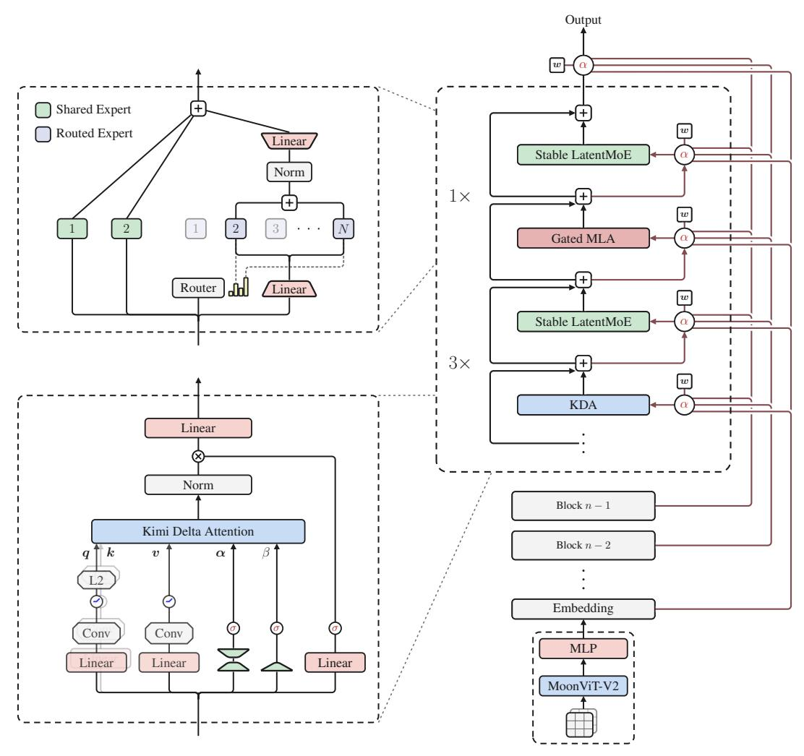
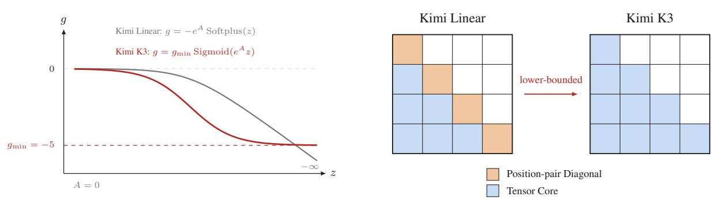
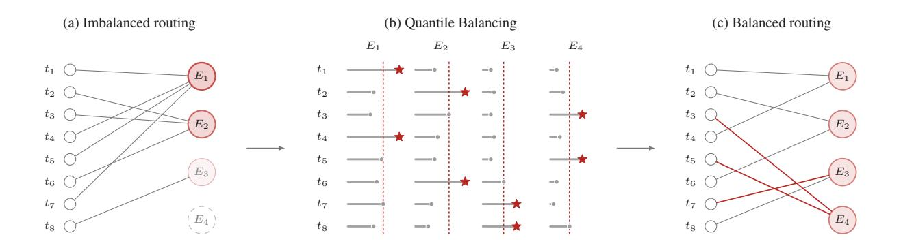
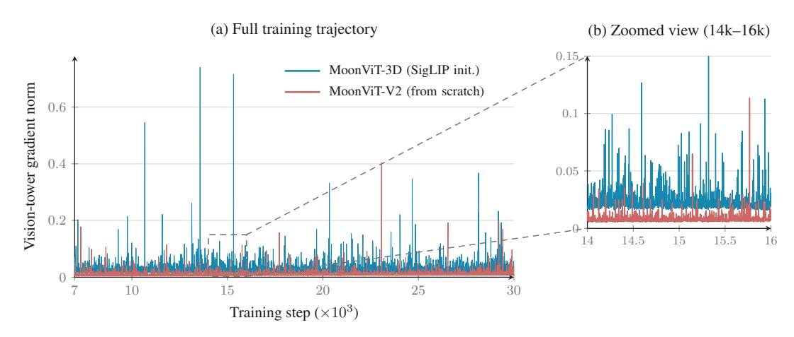
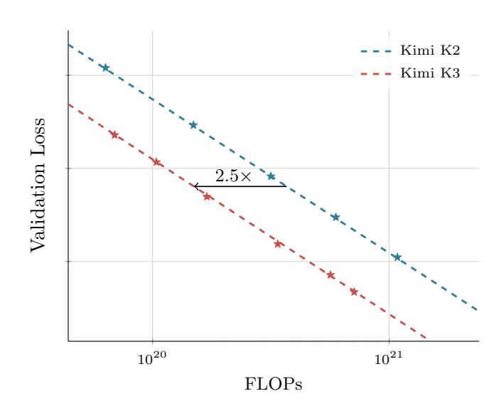
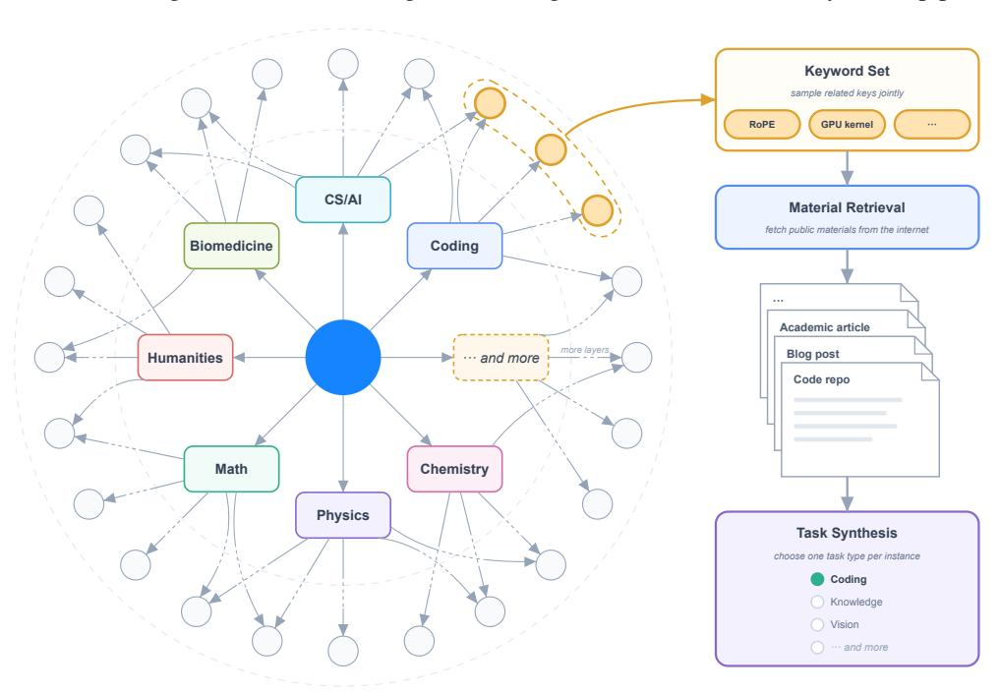
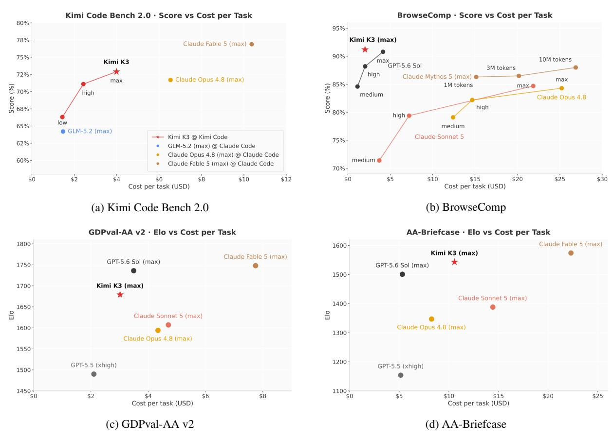
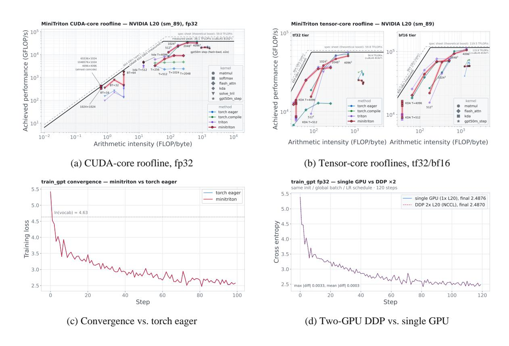
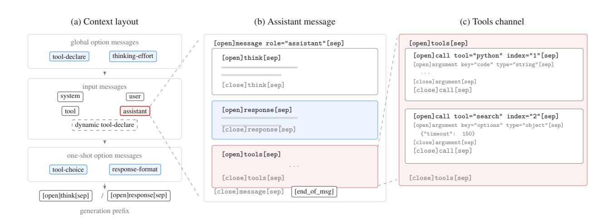

# KIMI K3: 오픈 프런티어 인텔리전스 (KIMI K3: OPEN FRONTIER INTELLIGENCE)

- 원제: Kimi K3: Open Frontier Intelligence
- 원문: [https://arxiv.org/abs/2607.24653](https://arxiv.org/abs/2607.24653)
- PDF: [https://arxiv.org/pdf/2607.24653v1](https://arxiv.org/pdf/2607.24653v1)
- arXiv ID: `2607.24653`

---

# KIMI K3: 오픈 프런티어 인텔리전스 (KIMI K3: OPEN FRONTIER INTELLIGENCE)

# KIMI K3 기술 보고서 (TECHNICAL REPORT OF KIMI K3)

### Kimi 팀 (Kimi Team)

# 초록 (ABSTRACT)

Kimi K3를 소개한다. Kimi K3는 2.8T 파라미터를 가진 Mixture-of-Experts 모델로, 104억 개의 활성화 파라미터, 네이티브 비전 기능, 100만 토큰 컨텍스트 윈도우를 갖는다. Kimi K3는 Kimi Delta Attention[63](#page-36-0)과 Attention Residuals[57](#page-35-0)를 기반으로 하며, 이는 시퀀스 길이와 모델 깊이 전반에 걸친 정보 흐름을 개선한다. Stable LatentMoE와 결합하여, Stable LatentMoE는 토큰당 896개의 라우팅된 전문가 중 16개를 효과적으로 활성화하고, 정제된 훈련 및 데이터 레시피와 함께 이러한 진보는 Kimi K2[58](#page-35-1)에 비해 전체 스케일링 효율성을 약 2.5배 향상시킨다. 사후 훈련 하이라이트는 일반, 에이전트, 코딩 도메인 및 다중 reasoningeffort 수준에서 강화 학습을 포함하며, 구성적 일반화와 견고한 장기 실행을 가능하게 한다. 2.8T 규모에서 Kimi K3는 KDA를 위한 알고리즘–시스템 공동 설계, 효율적인 메모리 관리를 갖춘 완벽히 균형 잡힌 전문가-병렬 훈련, 지속적인 롤아웃 및 샌드박스 상태를 갖춘 100만 토큰 에이전트 RL, 그리고 배포 혁신 등 여러 영역에서 인프라 발전에 의해 지원된다.

광범위한 평가 결과, Kimi K3는 장기 코딩, 에이전트, 지식, 추론, 비전 과제에서 프런티어 수준의 성능을 달성한다. 전체 성능은 여전히 가장 강력한 독점 모델인 Claude Fable 5와 GPT-5.6 Sol을 따라가지 못하지만, Kimi K3는 우리 스위트에서 평가한 다른 오픈 및 독점 모델을 지속적으로 능가한다. 우리는 Kimi K3 전체 모델 가중치를 공개하여 향후 연구를 촉진하고 프런티어 인텔리전스의 보다 광범위한 배포와 채택을 가속화한다.[1](#page-0-0)

그림 1: Kimi K3 주요 결과.

1 <https://huggingface.co/moonshotai/Kimi-K3>

## 1 서론 (Introduction)

대부분의 대형 언어 모델(LLM) 개발에서 스케일링은 배포 전에 더 많은 계산을 투자하여 더 큰 모델을 더 많은 데이터로 훈련하는 것을 의미했다[54,](#page-35-2) [45](#page-35-3). 추론 모델의 부상은 테스트 타임 계산을 스케일링의 두 번째 축으로 확립했다: OpenAI의 o-시리즈는 강화 학습과 테스트 타임 추론을 확장한다[84,](#page-36-1) [83](#page-36-2); Anthropic의 확장 사고 모델은 적응형 사고 예산을 할당하고 도구 사용과 추론을 교차한다[6,](#page-34-0) [7](#page-34-1); DeepSeek-R1[40](#page-35-4)와 Kimi K1.5[118](#page-38-0)는 대규모 강화 학습이 강력한 사전 훈련 모델에서 정교한 추론 행동을 유도할 수 있음을 보여준다; 그리고 Kimi K2.5 Agent Swarm[59](#page-35-5)는 순차적 추론에서 병렬 에이전트 조정으로 테스트 타임 스케일링을 더욱 확장한다. 이러한 진보는 테스트 타임 스케일링을 프런티어 연구의 핵심 초점으로 만들었다. 그러나 오픈 소스 모델 생태계는 두 번째 축에서 빠르게 진전했지만 첫 번째 축에서는 느리게 진행되었다: 많은 최근 모델이 1T급 파라미터 영역에 머물거나 약간 초과한다[145,](#page-39-0) [29,](#page-34-2) [135,](#page-38-1) [120](#page-38-2). 점점 더 정교한 추론 및 에이전트 강화 학습 방법이 유사한 규모의 사전 훈련 기반에 적용됨에 따라, 오픈 소스 진전은 수렴 위험이 있으며 가장 강력한 독점 시스템과의 격차가 확대된다. Kimi K3와 함께 우리는 두 스케일링 축을 동시에 프런티어로 추구한다: 사전 훈련 기반을 전례 없는 3T급 파라미터로 확장하고, 동시에 강화 학습, 추론 노력, 장기 상호작용을 1M 컨텍스트 길이에서 스케일링한다.

우리는 2.8조 개의 총 파라미터, 1040억 개의 활성화 파라미터, 그리고 최대 100만 토큰의 컨텍스트 윈도우를 갖춘 네이티브 멀티모달 Mixture-of-Experts 모델인 Kimi K3를 소개한다. 이 모델의 아키텍처는 시퀀스 길이, 네트워크 깊이, 모델 폭 전반에 걸쳐 정보 흐름을 확장한다. Kimi Delta Attention (KDA)[63](#page-36-0)은 효율적인 장기 시퀀스 혼합을 제공하며, 주기적으로 삽입되는 Gated MLA 레이어가 전역 상호작용을 보존한다. Attention Residuals (AttnRes)[57](#page-35-0)은 각 레이어가 이전 모든 레이어의 표현을 선택적으로 주의하도록 허용한다. Stable LatentMoE는 라우팅된 전문가 공간을 896명으로 확장하고, 토큰당 16명을 활성화하며, 정규화, SiTU-GLU, Quantile Balancing이 극단적 희소성에서도 최적화를 안정화한다. 이러한 아키텍처적 진보와 정제된 데이터 및 훈련 레시피의 결합은 Kimi K2[58](#page-35-1) 대비 전체 스케일링 효율을 약 2.5배 향상시킨다.

우리는 이 사전 훈련 기반을 100만 토큰 컨텍스트 테스트 타임 스케일링을 위해 명시적으로 설계된 사후 훈련과 결합한다. Kimi K3는 장기 시퀀스 코딩, 일반 에이전트, 일반 추론 및 지식 과제 등 여러 추론 노력 수준을 아우르는 강화 학습을 수행한다. 훈련 환경에는 검증 가능한 검색 및 전문 지식 작업, 소프트웨어 엔지니어링 및 커널 최적화, 비전-인-더-루프 도구 사용을 포함한 멀티모달 추론, 지속적인 어시스턴트 워크플로우, 웹 개발, 자율 실행 과제가 포함된다. 이러한 환경은 수백 또는 수천 개의 도구 호출과 수백만 개의 누적 컨텍스트 토큰을 통해 종종 수행되는 추론, 행동, 관찰, 검증 및 적응의 일반 루프를 훈련한다. 도메인 및 노력 전문화 정책은 다중 교사 온-정책 디스틸레이션[75,](#page-36-3) [134,](#page-38-3) [29](#page-34-2)을 통해 통합 모델로 통합된다.

이러한 체제를 실현하려면 아키텍처 복잡성, 모델 크기, 궤적 길이에 따라 확장되는 인프라가 필요하다. KDA를 위한 시스템 공동 설계에서는 융합 커널, KDA Context Parallelism, 상태 인식 프리픽스 캐싱을 개발하여 KDA를 장치 내, 장치 간, 요청 간에 효율적으로 만든다. 2.8조 파라미터 MoE 사전 훈련을 위해 MoonEP는 정적 계산 형태와 제로-카피 통신을 갖춘 완벽히 균형 잡힌 전문가 실행을 제공하며, 메모리 효율적인 훈련과 멀티모달 인코더 최적화는 제한된 메모리 내에서 활용도를 유지한다. 수백만 토큰 에이전트 RL을 위해 우리 공동 위치 시스템은 부분 롤아웃, 외부 KV-캐시 보존, 적응형 스로틀링 및 재개 가능한 microVM 샌드박스를 결합하여 장기간 모델 및 환경 상태를 보존한다. 마지막으로, 특수 커널, 캐시 및 예산 인식 플릿 스케줄링은 이러한 혁신을 예측 가능한 프로덕션 서비스로 전환한다.

결과 모델은 새로운 공개 프론티어를 구축한다. 장기 시퀀스 코딩, 에이전트, 지식, 추론 및 비전 과제를 아우르는 벤치마크에서 Kimi K3는 Claude Fable 5와 GPT-5.6 Sol을 포함한 가장 강력한 독점 시스템을 전반적으로 따라잡으며, 우리 스위트에서 평가한 다른 공개 및 독점 모델보다 일관되게 앞서 있다(그림 1 참조).

우리의 기여는 다음과 같이 요약된다.

- 오픈 프론티어에서 사전 학습. 우리는 2.8T 파라미터를 가진 네이티브 멀티모달 MoE 모델을 104B 활성화 파라미터와 1M 토큰 컨텍스트 윈도우로 훈련한다. KDA, AttnRes, Stable LatentMoE, 정제된 데이터 및 훈련 레시피가 집합적으로 전체 스케일링 효율을 Kimi K2 대비 약 2.5배 향상시킨다.  

- 다중 노력 테스트 타임 스케일링을 위한 강화 학습. 우리는 일반, 에이전틱, 코딩 도메인 및 여러 추론 노력 수준에서 RL을 수행하고, 그 결과 능력을 통합된 모델에 결합한다.  

- 다중 조(조) 파라미터, 백만 토큰 인텔리전스를 위한 인프라. 우리는 KDA 시스템 공동 설계, 2.8T 파라미터 MoE 사전 학습을 위한 MoonEP 및 메모리 효율적 인프라, 백만 토큰 에이전틱 트래젝터리를 위한 재개 가능한 샌드박스를 갖춘 공동 위치 RL 시스템, 그리고 더 많은 인프라 혁신을 도입한다.  

- 오픈 프론티어 모델. 우리는 전체 Kimi K3 모델 가중치를 공개하여 프론티어 인텔리전스를 연구, 배포 및 추가 혁신에 활용 가능하게 한다.

Figure 2: Kimi K3 아키텍처는 토큰, 채널, 레이어 혼합을 중심으로 구성되며 입력에 네이티브 비전 경로가 있다. 각 블록은 세 개의 Kimi Delta Attention (KDA) 레이어와 그 뒤를 따르는 하나의 Gated MLA 레이어를 포함하며, 각 어텐션 레이어는 Stable LatentMoE 피드포워드 네트워크와 짝을 이룬다. Attention Residuals (AttnRes)는 학습된 가짜 쿼리 (w)를 사용해 임베딩과 이전 블록 출력에 대한 어텐션 가중치 (α)를 도출하여 깊이 전반에 걸친 선택적 정보 흐름을 가능하게 한다. 좌상단: 공유 및 라우팅된 전문가를 갖춘 Stable LatentMoE 모듈. 좌하단: KDA 모듈. 우하단: 네이티브 비전 경로.

## 2 모델 아키텍처 (Model Architecture)

Kimi K3 아키텍처는 시퀀스 길이, 네트워크 깊이, 모델 폭이라는 세 가지 보완적 차원에서 정보 흐름을 확장하도록 설계되었다. 시퀀스 차원에서는 하이브리드 어텐션이 각 블록에 3개의 Kimi Delta Attention (KDA) [63] 레이어와 1개의 Gated MLA 레이어를 결합하여 장기 컨텍스트 토큰 혼합을 위한 효율적인 메커니즘을 제공하면서 선택적 고용량 어텐션을 유지한다 (§2.1). 깊이 차원에서는 Attention Residuals (AttnRes) [57]가 각 모듈이 임베딩, 현재 블록, 이전 블록에서 표현을 선택적으로 검색하도록 하여 전통적인 순차적 잔여 누적을 넘어 정보 접근을 확장한다 (§2.2). 폭 차원에서는 각 어텐션 레이어 뒤에 Stable LatentMoE 레이어가 따라와 희소 채널 혼합을 수행하며, 각 토큰마다 896개의 라우팅된 전문가 중 16개를 효과적으로 활성화한다 (§2.3). 네이티브 비전용으로는 MoonViT-V2가 이미지와 비디오를 인코딩하고, 가벼운 프로젝터가 결과 시각적 특징을 공유 임베딩 공간에 매핑한 뒤 백본 처리에 사용된다 (§2.4). Per-Head Muon (§2.5)과 함께 이 구성 요소들은 토큰, 레이어, 채널을 가로질러 정보 흐름을 확장하는 통합 아키텍처를 제공한다. 정제된 훈련 및 데이터 레시피와 결합하면 Kimi K2 대비 전체 스케일링 효율이 약 2.5배 향상된다. Figure 2는 아키텍처 개요를 제공한다.

### 2.1 하이브리드 어텐션 (Hybrid Attention)

Kimi K3는 선형 어텐션과 전역 어텐션의 레이어별 하이브리드를 사용하며, KDA [63]와 Gated MLA를 결합한다. 각 블록은 3개의 KDA 레이어 뒤에 1개의 Gated MLA 레이어를 포함하여 3:1 혼합 비율을 제공한다. 이 패턴은 백본 전체에서 반복된다. 두 어텐션 메커니즘은 아래에서 별도로 설명된다. 백본 끝에 추가 Gated MLA 레이어가 배치되어 최종 레이어가 항상 전역 어텐션을 수행하도록 보장한다.

#### 2.1.1 키미 델타 어텐션 (Kimi Delta Attention)

KDA는 채널별 망각 게이트 [63]를 사용하여 델타-룰 재귀식 [105, 138]을 확장한다. 토큰 위치를 인덱스하는 t와 모델 숨겨진 차원 d를 갖는 숨겨진 상태 시퀀스 $x_t \in \mathbb{R}^d$ 를 고려한다. 명확성을 위해 먼저 단일 어텐션 헤드를 설명한다. 쿼리와 키 벡터 $q_t, k_t \in \mathbb{R}^{d_k}$, 값 벡터 $v_t \in \mathbb{R}^{d_v}$, 그리고 재귀 상태 $\mathbf{S}_t \in \mathbb{R}^{d_k \times d_v}$ 를 갖는다. KDA는 델타-룰 업데이트 전에 채널별 감쇠를 적용한다:

$$\mathbf{S}_{t} = \left(\mathbf{I} - \beta_{t} \mathbf{k}_{t} \mathbf{k}_{t}^{\top}\right) \operatorname{Diag}(\boldsymbol{\alpha}_{t}) \mathbf{S}_{t-1} + \beta_{t} \mathbf{k}_{t} \boldsymbol{v}_{t}^{\top}, \qquad \tilde{\boldsymbol{o}}_{t} = \mathbf{S}_{t}^{\top} \boldsymbol{q}_{t}. \tag{1}$$

여기서 $\alpha_t \in (0,1)^{d_k}$ 는 채널별 1단계 보존 인자이며, $\beta_t \in (0,1)$ 은 델타-룰 쓰기 강도를 제어한다. Kimi Linear [63]를 따라, KDA는 헤드별 양을 다음과 같이 파라미터화한다:

$$q_t^h, \mathbf{k}_t^h = L_2 \text{Norm} \left( \text{Swish} \left( \text{ShortConv} \left( \mathbf{W}_{q/k}^h \mathbf{x}_t \right) \right) \right) \in \mathbb{R}^{d_k},$$

$$\mathbf{v}_t^h = \text{Swish} \left( \text{ShortConv} \left( \mathbf{W}_v^h \mathbf{x}_t \right) \right) \in \mathbb{R}^{d_v},$$

$$\beta_t^h = \text{Sigmoid} \left( \mathbf{W}_{\beta}^h \mathbf{x}_t \right) \in (0, 1),$$

$$\mathbf{z}_t^h = \mathbf{W}_{\alpha}^{\uparrow} \mathbf{W}_{\alpha}^{\downarrow} \mathbf{x}_t + \mathbf{b}_{\alpha}^h \in \mathbb{R}^{d_k}.$$

(2)

쿼리, 키, 값 투영은 ShortConv를 적용한 뒤 Swish [138]를 적용하며, 쿼리와 키는 추가로 $L_2Norm$ [141]으로 정규화된다. 저차원 투영과 헤드별 바이어스 $\boldsymbol{b}_{\alpha}^h \in \mathbb{R}^{d_k}$ 은 각 키 채널에 대해 세밀한 감쇠 로짓 $\boldsymbol{z}_t^h$ 를 생성한다. $\boldsymbol{z}_t^h$ 를 $\boldsymbol{\alpha}_t^h$ 로 매핑하는 하한이 있는 변환은 아래의 청크별 형식 뒤에 도입된다.

청크별 병렬 형태. Kimi Linear [63]를 따라, KDA는 청크 간에 재귀적이며 각 청크 내에서는 병렬적으로 동작한다. 청크 크기 C에 대해, $\mathbf{X}_{[t]}$ 는 $\mathbf{X} \in \{\mathbf{Q}, \mathbf{K}, \mathbf{V}, \mathbf{O}, \mathbf{U}, \mathbf{W}\}$ 에 대해 t번째 청크의 토큰 벡터를 스택한다. 행렬 $\mathbf{S}_{[t]} \in \mathbb{R}^{d_k \times d_v}$ 는 청크 t에 들어오는 재귀 상태를 나타낸다. 위치 $1 \le i \le j \le C$ 에 대해 채널별 누적 감쇠를 정의한다

$$\gamma_{[t]}^{i \to j} := \prod_{r=i}^{j} \alpha_{[t]}^{r}, \qquad \gamma_{[t]}^{r} := \gamma_{[t]}^{1 \to r}.$$

(3)

Kimi Linear와 같이, $\Gamma_{[t]}^{1\to C}\in\mathbb{R}^{C\times d_k}$ 은 $\gamma_{[t]}^1,\dots,\gamma_{[t]}^C$ 를 행별로 스택한다. UT 변환은 $\mathbf{U}_{[t]}$ 와 $\mathbf{W}_{[t]}$ 를 생성하며, 이를 통해 가짜 값 항목 $\widetilde{\mathbf{V}}_{[t]}:=\mathbf{U}_{[t]}-\mathbf{W}_{[t]}\mathbf{S}_{[t]}$ 를 정의한다. 들어오는 상태 $\mathbf{S}_{[t]}$ 를 주어지면, 청크 t의 모든 출력은 병렬로 계산된다:

$$\mathbf{A}_{[t]} = \operatorname{Tril}\left[ (\mathbf{Q}_{[t]} \odot \mathbf{\Gamma}_{[t]}^{1 \to C}) (\mathbf{K}_{[t]} / \mathbf{\Gamma}_{[t]}^{1 \to C})^{\top} \right],$$

$$\mathbf{O}_{[t]} = \underbrace{(\mathbf{\Gamma}_{[t]}^{1 \to C} \odot \mathbf{Q}_{[t]}) \mathbf{S}_{[t]}}_{\text{inter-chunk}} + \underbrace{\mathbf{A}_{[t]} \widetilde{\mathbf{V}}_{[t]}}_{\text{intra-chunk}}.$$

(4)

행렬 $\mathbf{M}$에 대해, $\mathrm{Tril}(\mathbf{M})$는 모든 엄격한 상삼각형 항목을 0으로 설정하고 하삼각형 항목(대각선 포함)을 유지한다. 이 마스크는 청크 내에서 인과적 상호작용을 강제하며, 대각선은 각 출력이 현재 토큰 업데이트 후의 상태를 읽기 때문에 보존된다. $\mathbf{O}_{[t]}$의 첫 번째 항은 이전 청크의 정보를 전달하고, 두 번째 항은 현재 청크 내의 상호작용을 반영한다. UT transform과 청크별 형태의 전체 유도는 Kimi Linear [63]를 참고한다.

**하한 제한된 감쇠** Eq. 4는 각 청크의 키를 역 누적 감쇠 $1/\Gamma_{[t]}^{1\to C}$ 로 재스케일한다. $\Gamma_{[t]}^{1\to C}$ 가 (0,1) 범위의 보존 인자들의 곱이므로 이 역수는 무한히 커질 수 있어 유한 정밀도에서 오버플로우가 발생한다 [140, 63]. Kimi Linear는 상대 감쇠를 로그 공간에서 계산하고 각 청크를 16-토큰 세컨더리 타일로 나누어 이 수치 범위를 제어한다 [140, 63]. 오프-대각선 타일은 Tensor Cores에서 직접 밀집 행렬 곱셈으로 계산할 수 있다. 반면 대각선 타일은 여전히 명시적 위치-쌍 계산이 필요하며, 이는 주요 청크 내 병목 현상이다.

(a) 로그-감쇠 매개화.

(b) 대각선 타일 계산.

그림 3: 하한 제한된 감쇠와 청크별 KDA 계산에 미치는 영향. (a) Kimi Linear는 무한한 음수-Softplus 매핑을 사용하지만, Kimi K3는 스케일된 시그모이드를 사용해 로그-감쇠를 제한한다; 곡선은 A=0과 $g_{\min}=-5$ 를 보여준다. (b) Kimi Linear는 각 대각선 타일을 명시적 위치-쌍 계산으로 평가하지만, Kimi K3의 제한된 범위는 모든 인과 타일이 밀집 Tensor Core 행렬 곱셈을 사용하도록 허용한다.

Kimi K3 addresses this bottleneck by changing the mapping from the decay logits  $z_t^h$  to the per-step log-decay  $g_t^h$ . Following GDN and Mamba-2, Kimi Linear uses the negative-Softplus mapping  $g_t^h = -e^{A_h} \operatorname{Softplus}(z_t^h) \in$  $(-\infty, 0)^{d_k}$  [138, 24, 63]. Kimi K3 instead uses a scaled sigmoid to bound the log-decay from below:

$$\mathbf{g}_t^h = g_{\min} \operatorname{Sigmoid}(e^{A_h} \mathbf{z}_t^h) \in (g_{\min}, 0)^{d_k},$$

$$\mathbf{\alpha}_t^h = \exp(\mathbf{g}_t^h) \in (e^{g_{\min}}, 1)^{d_k},$$

(5)

여기서 $A_h$ 는 학습 가능한 헤드별 로그-스케일이며 $g_{\min}=-5$ 는 고정값이다. $A_h$ 를 0 으로 초기화하고 각 바이어스 $\boldsymbol{b}_{\alpha}^h$ 는 [63, 24, 138]에 따라 초기화한다. $g_{\min}=-5$ 로 설정하면 모든 보존 인자는 $\alpha_{t,j}^h>e^{-5}\approx 6.7\times 10^{-3}$ 를 만족하며, 16-토큰 타일에 대한 누적 로그-감쇠는 (-80,0) 범위에 있다. 이에 대응하는 역수 재스케일링 인자는 $e^{80}$ 보다 작으며 BF16 동적 범위 내에 있다. 이 유한 범위는 대각선과 오프-대각선 타일 모두가 밀집 Tensor Core 행렬 곱셈을 사용하도록 하여 위치-쌍 대각선 경로를 제거한다. 이 매개화는 이전 연구의 하한 제한된 재귀 게이트와 밀접한 관련이 있다 [97, 27, 91]. 그림 3은 감쇠 매개화의 변화와 그 계산적 결과를 보여준다.

**전체-랭크 게이트** 마지막으로, Kimi K3는 KDA의 출력 게이트를 Kimi Linear가 사용한 저랭크 매개화에서 입력에 따라 달라지는 전체-랭크 투영으로 변경한다. 재귀 출력에 헤드별 RMSNorm [146] 를 적용한 뒤, KDA는 데이터-의존적 출력 게이팅을 수행한다 [99]:

$$\mathbf{y}_t = \mathbf{W}_o[\operatorname{Sigmoid}(\mathbf{W}_o \mathbf{x}_t) \odot \operatorname{RMSNorm}(\tilde{o}_t)].$$

(6)

#### 2.1.2 게이트된 MLA (Gated MLA)

Multi-head Latent Attention (MLA)는 DeepSeek-V2 [28]에서 도입되었으며, 각 토큰의 key-value 표현을 저차원 잠재 벡터 $\mathbf{c}_t = \mathbf{W}_c \mathbf{x}_t$ 으로 압축한다. 전체 헤드별 key와 value를 캐시하는 대신 MLA는 $c_t$ 를 캐시하고, attention 계산 중 학습된 up‑projection을 통해 content key와 value를 재구성한다. 이 분해는 KV‑cache의 저장소 사용량을 줄이면서 전역 토큰‑간 attention을 유지한다. MLA는 이후 Kimi K2와 Kimi K2.5 [58, 59]에 채택되었으며, Kimi K3는 주기적 전역 attention 층에서 이를 유지한다.

Kimi K2와 Kimi K2.5와 달리 Kimi K3는 Kimi Linear [63]의 하이브리드 설계를 따르며, 모든 MLA 층에 No Position Encoding (NoPE)을 적용한다. 따라서 쿼리나 key에 명시적 위치 인코딩이 적용되지 않는다. 중간의 KDA 층은 위치에 민감하고 최신성에 의존하는 시퀀스 혼합을 제공하고, MLA 층은 제한 없는 전역 내용 상호작용을 제공한다. 이 분리는 컨텍스트 길이를 확장할 때 RoPE 주파수 기반을 재조정하거나 YaRN [92]을 적용하는 등 위치 인코딩 파라미터를 수정할 필요가 없도록 한다.

또한 Kimi K3는 입력에 따라 달라지는 채널별 전순위(output) 게이트를 MLA에 추가한다. $\tilde{o}_t$ 를 위치 t에서 게이트가 적용되지 않은 MLA 출력으로 두면, 게이트가 적용된 출력은

$$\mathbf{y}_t = \mathbf{W}_o[\operatorname{Sigmoid}(\mathbf{W}_g \mathbf{x}_t) \odot \tilde{\mathbf{o}}_t].$$

(7)

게이트 프로젝션 $W_g$ 는 전순위이며, Kimi K3에서 KDA가 사용한 새로운 파라미터화와 일치한다. 이 게이트는 각 토큰이 전역 attention에서 읽어오는 채널을 조절할 수 있게 한다 [99].

flash attention에서 발생하는 편향된 반올림 오류를 교정하기 위해 [98]의 방법을 채택하고, 훈련 중 attention 출력을 FP32로 유지한다. 이 선택은 출력 타일의 온칩 저장소 사용량을 두 배로 늘리므로, 우리는 훈련 커널을 재설계하여 쿼리 타일 대신 KV 스테이징 버퍼와 겹치게 함으로써 공유 메모리를 더 깊은 KV 파이프라인과 높은 훈련 처리량을 위해 확보한다.

### 2.2 주의 잔여 (Attention Residuals)

표준 잔여 연결 [43]은 깊이 방향으로 모든 이전 정보를 단일 상태 $h_l$ 에 압축한다 — 이는 시계열 RNN의 병목을 연상시킨다. 시퀀스 모델링에서는 Transformer가 재귀를 attention으로 대체하여 각 위치가 데이터에 따라 가중치를 부여해 모든 이전 위치를 선택적으로 접근하도록 했다 [10, 125]. Attention Residuals (AttnRes) [57]는 동일한 방법을 깊이 방향에 적용한다: 각 층이 이전 모든 층의 표현을 균일하게 누적하는 대신 선택적으로 검색한다.

**전체 주의 잔여** 각 층 l 에 대해, 층별 학습 가능한 가짜 쿼리 $q_l = w_l \in \mathbb{R}^d$ 와 key, value 를 정의한다

$$\mathbf{k}_i = \mathbf{v}_i = \begin{cases} \mathbf{h}_1 & i = 0\\ f_i(\mathbf{h}_i) & 1 \le i \le l - 1 \end{cases}$$

(8)

$f_i(h_i)$ 는 i 번째 층의 출력이며, $h_1$ 은 토큰 임베딩이다. attention 가중치는 softmax 커널 $\phi(q, k) = \exp(q^{\top} \text{RMSNorm}(k))$ 를 따른다 [55, 146], 여기서 RMSNorm는 큰 크기의 출력을 가진 층이 가중치를 지배하지 않도록 한다:

$$\alpha_{i \to l} = \frac{\phi\left(\mathbf{q}_{l}, \mathbf{k}_{i}\right)}{\sum_{i=0}^{l-1} \phi\left(\mathbf{q}_{l}, \mathbf{k}_{j}\right)}, \qquad \mathbf{h}_{l} = \sum_{i=0}^{l-1} \alpha_{i \to l} \cdot \mathbf{v}_{i}. \tag{9}$$

네트워크 깊이가 적당히 작다 (L < 100) 때문에 이 *전체* 형태의 $O(L^2d)$ 연산은 감당 가능하다; 실제 오버헤드는 모든 층 출력을 유지하기 위한 O(Ld) 메모리(및 파이프라인 병렬화에서의 교차 단계 통신)이다.

**블록 어텐션 잔여**  
이 오버헤드를 줄이기 위해, L 레이어를 S = L/N 레이어씩 N개의 블록으로 나눈다. 블록 n(레이어 인덱스 $\mathcal{B}_n$) 안에서 레이어 출력은 합산을 통해 단일 표현으로 축소된다, $\boldsymbol{b}_n = \sum_{j \in \mathcal{B}_n} f_j(\boldsymbol{h}_j)$, 여기서 $\boldsymbol{b}_n^i$는 블록의 처음 i개의 레이어에 대한 부분 합을 나타낸다. 우리는 $\boldsymbol{b}_0 = \boldsymbol{h}_1$을 설정하여 토큰 임베딩이 항상 소스로 포함되도록 한다. 블록 간에는 전체 어텐션이 오직 N개의 블록 수준 표현에만 적용된다: 블록 n의 i번째 레이어에 대해 값 행렬은

$$\mathbf{V} = \begin{cases} [\boldsymbol{b}_0, \boldsymbol{b}_1, \dots, \boldsymbol{b}_{n-1}]^\top & \text{if } i = 1 \text{ (first layer of block } n) \\ [\boldsymbol{b}_0, \boldsymbol{b}_1, \dots, \boldsymbol{b}_{n-1}, \boldsymbol{b}_n^{i-1}]^\top & \text{if } i \ge 2 \text{ (subsequent layers)} \end{cases}$$

(10)

키와 어텐션 가중치는 Eq. 8 및 Eq. 9를 따른다. 최종 출력 레이어는 모든 N개의 블록 표현을 집계한다. Block AttnRes 하에서는 메모리와 통신 오버헤드가 O(Ld)에서 O(Nd)로 감소하며, 이 블록 구조는 추론 시 상태를 제한하여 병렬 inter-block 결과를 순차적 intra-block 부분 합과 온라인 소프트맥스[79]를 통해 더 잘 병합할 수 있게 하여 추론 시간 비용을 크게 줄인다.

실험적으로, $N \approx 8$은 모델 규모 전반에 걸쳐 대부분의 이점을 회복한다[57]; Kimi K3의 경우, 레이어를 12레이어 크기의 8개의 블록으로 나누어, 임베딩 레이어를 포함하면 부분 최종 블록과 총 9개의 블록이 된다.

### 2.3 안정된 LatentMoE

전문가 풀과 활성 전문가 수를 모두 늘리면 전문가 특화 공간이 확장되지만, 전통적인 MoE에서는 각 선택된 전문가가 전체 d-차원 토큰 표현을 받으므로 라우팅 곱셈에 따라 통신 및 전문가 가중치 트래픽이 증가한다. LatentMoE[32]는 전체 모델 폭과 라우팅된 전문가 폭을 분리함으로써 이 확장을 저렴하게 만든다: 공유 전문가들은 공통 변환을 위한 전체 폭 경로를 유지하고, 특화된 라우팅 전문가들은 폭이 $\ell$인 압축된 잠재 공간에서 동작한다. 이를 통해 Kimi K3는 채널 혼합을 896개의 라우팅 전문가와 토큰당 16개의 활성 전문가로 확장할 수 있어 희소성이 56이 된다.

이러한 극단적 희소성은 베이직 설계의 두 가지 실패 모드를 증폭시킨다. 첫째, 라우팅 경로는 게이트된 다중 분기 전문가 피드포워드 네트워크 $\mathbf{W}^{\downarrow}$와 $\mathbf{W}^{\uparrow}$를 거의 네 개의 연속 행렬 곱으로 구성한다. 이 불안정한 구조와 2.8조 파라미터 규모가 결합되어 라우팅 분기에서 내부 활성화가 폭발한다. 둘째, 거의 $10^3$개의 전문가 부하를 균형 잡는 것은 기존 보조 손실이 없는 방법이 적용되는 영역을 초과한다.

그림 4: GLU, SwiGLU, 그리고 SiTU-GLU의 게이트 및 업 브랜치와 그 스칼라 응답을 함께 보여준다. 여기서 $\sigma$는 시그모이드 함수를 나타낸다. 두 브랜치 모두 스칼라 입력 x를 받으며, 모든 곡선은 도메인 $x \in [-10, 100]$를 공유한다; 삽입부는 원점 근처 영역을 확대한다. 빨간색으로 표시된 SiTU-GLU는 $\beta_1 = 4$와 $\beta_2 = 25$를 사용하며, 원점 근처에서 SwiGLU를 밀접하게 따르고, 큰 양수 입력에 대해 $|f(x)| \le \beta_1 \beta_2 = 100$의 한계에 접근한다. 반면 SwiGLU는 무한대까지 확장된다.

바이어스 업데이트는 여전히 잘 동작한다. 안정된 LatentMoE는 세 가지 구성 요소로 이 두 실패 모드를 해결한다: 업-프로젝션 전 RMSNorm과 활성화 폭발을 억제하는 Sigmoid Tanh Unit GLU(SiTU-GLU), 그리고 부하 균형을 위한 Quantile Balancing(QB).

그림 2에 나타난 바와 같이, 이 레이어는 DeepSeekMoE [23]의 공유 및 라우팅 전문가 조직을 따릅니다. $x \in \mathbb{R}^d$ 에 대해, 공유 전문가들은 x를 직접 처리하고, 라우팅 경로는 이를 $z = \mathbf{W}^{\downarrow} x \in \mathbb{R}^{\ell}$ 로 투영한 뒤, 선택된 전문가에게 전달하고, 그들의 가중합을 $\mathbf{W}^{\uparrow}$ 를 통해 $\mathbb{R}^d$ 로 다시 매핑합니다.

$$\mathbf{u} = \sum_{i \in \mathcal{T}_k(\mathbf{x})} p_i E_i^{\text{routed}}(\mathbf{W}^{\downarrow} \mathbf{x}),$$

$$\mathbf{y} = \sum_{j=1}^{N_s} E_j^{\text{shared}}(\mathbf{x}) + \mathbf{W}^{\uparrow} \text{RMSNorm}(\mathbf{u}).$$

(11)

여기서 $u \in \mathbb{R}^{\ell}$ 은 집계된 라우팅 표현이며, $E_j^{\mathrm{shared}}: \mathbb{R}^d \to \mathbb{R}^d$ 와 $E_i^{\mathrm{routed}}: \mathbb{R}^\ell \to \mathbb{R}^\ell$ 은 공유 및 라우팅 전문가 피드포워드 네트워크이며, $p_i$ 는 아래에 정의된 Quantile Balancing 규칙에 의해 정의된 라우터 가중치입니다. Kimi K3는 모든 레이어에서 전체 폭 공유 전문가 수를 $N_s = 2$ 로 고정합니다.

#### 2.3.1 정규화된 LatentMoE (Normalized LatentMoE)

원래 LatentMoE는 집계된 라우팅 표현 u 에 직접 $\mathbf{W}^{\uparrow}$ 를 적용하며, 이때의 스케일은 선택된 전문가와 그들의 라우팅 가중치에 따라 달라질 수 있습니다. Eq. 11 에서 보듯이, Kimi K3는 전문가 집계와 업-프로젝션 사이에 RMSNorm [146] 을 삽입합니다. 이 정규화는 라우팅 분기(branch)가 전체 폭 공유 분기와 결합되기 전 스케일 변동에 대한 민감도를 줄여 줍니다. 학습 안정화 외에도, 추가된 RMSNorm 은 검증 손실과 다운스트림 벤치마크에서 일관되게 개선을 가져옵니다.

#### 2.3.2 시그모이드 탄하 유닛 GLU (Sigmoid Tanh Unit GLU)

게이트드 선형 단위(GLU)는 시그모이드 활성화 게이트와 함께 선형 값 분기를 조절하며, 시그모이드 $(\mathbf{W}_g x) \odot \mathbf{W}_u x$ 를 계산합니다 [26]. SwiGLU는 시그모이드 게이트를 $\mathrm{Swish}(x) = x \, \mathrm{Sigmoid}(x)$ 로 대체하고, Transformer에서 강력한 실험적 성능을 보여줍니다 [107]. 이후 SwiGLU는 대형 언어 모델에서 널리 채택된 FFN 설계가 되었으나, 그 실험적 효과에 대한 완전한 설명은 아직 열려 있습니다.

그러나 SwiGLU의 두 곱셈 인자는 모두 무한대이므로, 동시에 큰 좌표가 활성화 아웃라이어를 생성하고 저정밀 연산에서 오버플로우 위험을 증가시킬 수 있습니다. 원래 GLU의 시그모이드 게이트는 무한한 게이트 성장을 방지하지만, Swish의 대략 선형적인 양수 영역을 유지하지 못합니다. 이는 대형 값 성장을 제어하면서 SwiGLU의 특성인 지역적 및 양수 반응을 보존하는 활성화를 동기화합니다. 최근 다른 연구들은 이 trade‑off 의 대체 매개화법을 탐구했습니다 [51].

이러한 요구를 충족시키기 위해 우리는 Sigmoid Tanh Unit GLU (SiTU‑GLU)를 제안합니다. SiTU‑GLU는 Swish 게이트의 선형 인자와 업 브랜치에 각각 부드러운 캡 $\operatorname{softcap}(x,\beta)=\beta \tanh(x/\beta)$ 를 적용합니다:

SiTU-GLU(

$$\boldsymbol{x}$$

) =  $\left[\beta_1 \tanh\left(\frac{\mathbf{W}_g \boldsymbol{x}}{\beta_1}\right) \odot \text{Sigmoid}(\mathbf{W}_g \boldsymbol{x})\right] \odot \left[\beta_2 \tanh\left(\frac{\mathbf{W}_u \boldsymbol{x}}{\beta_2}\right)\right],$  (12),

Figure 5: Quantile Balancing의 예시, m=8 토큰, n=4 라우팅된 전문가, k=1 토큰당 선택된 전문가. (a) 토큰별 Top‑k 라우팅(왼쪽에 토큰, 오른쪽에 전문가)은 부하(4,3,1,0)를 생성; 어두운 원은 과열된 전문가를, 흐릿하고 점선 원은 과소 활용 및 사망 중인 전문가를 나타냄. (b) 각 회색 막대는 현재 편향된 점수의 마진 $s_{i,j} + b_j^{(t)} - \alpha_i^{(t)}$이며, 행별 최대값은 (a)의 라우팅을 재현. 각 열의 점선 빨간 선은 편향 조정 $b_j^{(t)} - \hat{b}_j^{(t+1)}$이며, (q+1)번째 큰 마진에 배치되어 정확히 q=2개의 마진이 이를 초과하도록 함. 마커 $\bigstar$는 열 조정을 뺀 후 행별 Top‑k 선택을 나타내며, 즉 (c)의 라우팅. (c) 보존된 선택은 균형 부하(2,2,2,2)를 생성; 빨간 선은 QB에 의해 변경된 할당을 표시.

Kimi K3의 경우, 소프트캡 하이퍼파라미터를 게이트 브랜치에 대해 $\beta_1=4$, 업 브랜치에 대해 $\beta_2=25$ 로 설정한다. 스케일된 $\tanh$ 는 원점 근처에서 거의 선형이며, 큰 크기에서는 제한된다. 이로써 SiTU-GLU는 SwiGLU의 지역 반응을 보존하면서 곱셈에서 두 요인을 모두 제어할 수 있다. 그림 4는 공통 슬라이스에서 GLU, SwiGLU, SiTU-GLU의 브랜치 정의와 스칼라 반응을 비교한다.

§ B는 지역 전개, 극한 사례, 공식 출력 한계, 그리고 하드 클램핑과의 비교를 제시한다.

#### 2.3.3 분수 균형 (Quantile Balancing)

보조 손실 기반 라우팅[33]과 달리, Kimi K3는 보조 손실이 없는 라우팅[30]을 채택한다. 부하 균형은 Top‑k 선택에 사용되는 라우터 점수에 전문가별 편향 $b_j$를 추가함으로써 구현된다. 토큰 $x_i$에 대해 라우터는 $s_i = \operatorname{Sigmoid}(\mathbf{W}_r x_i)$를 계산하고 적용한다.

$$\mathcal{T}_i = \operatorname{argtop}_k(\mathbf{s}_i + \mathbf{b}), \qquad p_{i,j} = \frac{s_{i,j}}{\sum_{r \in \mathcal{T}_i} s_{i,r}}, \quad j \in \mathcal{T}_i.$$

(13)

배치에서  $\boldsymbol{b}$  가 $p_{i,j}$ 에서 제외되므로, 이는 혼합 가중치나 라우터의 그라디언트 기반 최적화를 변경하지 않으면서 디스패치를 조절한다. 원래 방법은 고정 단계 규칙  $b_j^{(t+1)} = b_j^{(t)} + \gamma \operatorname{sign}(\bar{\ell} - \ell_j^{(t)})$  [30] 으로  $\boldsymbol{b}$ 를 업데이트하며, 여기서  $\gamma$  은 느린 적응과 로드 진동 사이의 균형을 조절한다. 로드 균형을 유지하는 것은 LatentMoE 가 레이어당 896개의 전문가 풀을 증가시키면서 더욱 어려워진다. 로드 불균형은 전문가 병렬 훈련을 느리게 하고 일부 전문가가 제대로 훈련되지 못하도록 할 수 있다 [47].

이 한계를 해결하기 위해 우리는 Quantile Balancing (QB)를 도입한다. QB는 라우터-점수 분위수에서 각 전문가의 바이어스를 설정하여 목표 부하와 일치시킨다 [111]. m개의 토큰이 n개의 전문가에 Top-k 선택으로 라우팅되는 학습 배치를 고려하면, 목표 부하는 q := mk/n 토큰/전문가가 된다. QB는 단일 순방향 패스로 다음 바이어스를 도출한다. 라우팅은 바이어스된 점수  $s_i + b^{(t)}$  에서 Top-(k+1)을 사용하여 Top-k 선택을 대체한다: 첫 번째 k개의 항목은 실제로 선택된 경로이며, (k+1)번째 항목은 전문가가 토큰 i의 Top-k에 진입하려면 초과해야 하는 컷오프  $\alpha_i^{(t)}$  이다. Top-(k+1) 라우팅에서 컷오프를 가져오면 토큰 측 분위수를 별도로 계산할 필요가 없다. 우리는 각 전문가의 바이어스를 선택하여 전문가 j가 목표 부하를 받도록 한다: 컷오프가 고정된 상태에서 후보 바이어스  $\hat{b}_i^{(t+1)}$  하에서 전문가 j에 라우팅되는 토큰 수는

$$\sum_{i=1}^{m} \mathbf{1} \left[ s_{i,j} + \hat{b}_{j}^{(t+1)} > \alpha_{i}^{(t)} \right],$$

이는 임계값  $-\hat{b}_j^{(t+1)}$  에 대해 단조 감소한다. 타이 없이 가정하면 이 수를 q로 설정하면  $-\hat{b}_j^{(t+1)}$  가 (q+1)번째 큰 마진  $s_{i,j}-\alpha_i^{(t)}$  가 되고, 따라서 정확히 q개의 마진이 임계값을 초과한다. q/m = k/n 이므로 이는

토큰 전반의 마진에 대한 (1-k/n)-분위수, QB 업데이트를 제공한다

$$\widehat{b}_{j}^{(t+1)} \leftarrow -\operatorname{quantile}_{1-k/n} \left( \mathbf{s}_{:,j} - \boldsymbol{\alpha}^{(t)} \right), 
\mathbf{b}^{(t+1)} \leftarrow \widehat{\mathbf{b}}^{(t+1)} - \operatorname{mean} \left( \widehat{\mathbf{b}}^{(t+1)} \right) \mathbf{1}.$$

(14)

마진은 편향된 컷오프 $\alpha_i^{(t)}$ 를 원시 점수 $s_{i,j}$ 에서 빼므로, 이전 편향은 컷오프를 통해서만 업데이트에 참여하며, 두 번째 줄은 Top-k 선택을 변경하지 않는 공통 오프셋을 제거한다. 인과성 측면에서 업데이트는 다음 단계에서만 적용된다 [30], 즉 배치는 자신으로부터 파생된 편향으로 라우팅되지 않는다. 그림 5는 m=8, n=4, k=1인 경우를 보여 주며, 각 전문가가 목표 부하 q=2를 받는다. 최종 편향은 추론 시에 고정된다. 균형 배정 도출은 §C에 제시된다.

**히스토그램 추정** 대규모에서는 Eq. 14의 분위수가 전체 글로벌 배치를 아우르며, 마진 수가 수백만에 이르고 랭크와 누적 단계에 걸쳐 분산되어 있으므로 정확한 분위수를 위해 수집하는 것은 학습 시에 실현 불가능하다. 대신 각 전문가의 마진 히스토그램에서 분위수를 읽는다: 단일 all-reduce가 랭크별 bin 카운트를 합산하고, 분위수는 풀된 카운트에서 복원된다. 카운트가 가산적이므로 히스토그램은 토큰이 어떻게 샤딩되었는지에 관계없이 풀된 글로벌 배치를 나타내며, 추정치는 bin 폭까지 전체 배치 분위수를 반영한다. 통신 비용은 전문가당 몇 백 bin에 불과하다. 이 히스토그램 추정기는 실제로 사용하는 방법이며, §D에서 자세한 설명과 오차 한계를 제공한다.

### 2.4 네이티브 비전 (Native Vision)

Kimi K3는 네이티브로 멀티모달이다: 텍스트, 이미지, 비디오는 하나의 컨텍스트 내에서 단일 공유 백본으로 처리되며, 사후 모달리티 정렬 단계가 없다. 이 설계는 §1에 서술된 장기 시야, 비전-인-더-루프 행동의 아키텍처적 기반이다. 렌더링된 출력과 이를 생성한 코드는 동일한 토큰 스트림에 존재하며, 모델은 코드를 작성하고, 결과의 스크린샷이나 비디오 프레임을 검사하고, 사용자 인터페이스, 그래픽, 비디오와 같은 시각적 아티팩트를 반복적으로 개선할 수 있다—모델 간 핸드오프 없이.

**MoonViT-V2** Kimi K2.5와의 주요 차이점은 Kimi K3 비전 인코더, *MoonViT-V2*, 를 *다음 토큰 예측으로 완전히 처음부터 훈련한다*는 점이다. 기존 관행, Kimi K2.5 자체를 포함해, 비전 인코더를 SigLIP과 같은 대비적 사전 훈련 모델로 초기화한다. 이는 사전 훈련된 시각 지식이 모델에 선행을 제공한다는 전제 하에 이루어진다. 우리는 주로 훈련 안정성을 위해 이 관행을 벗어난다. 사전 훈련된 인코더가 LLM에 부착되면 공동 최적화가 불안정해진다: SigLIP-초기화된 MoonViT-3D는 지속적으로 높은 기울기 노름과 빈번한 스파이크를 보이는 반면, MoonViT-V2는 훈련 전반에 걸쳐 안정적이다 (그림 6). 다음 토큰 예측으로 훈련하면 인코더의 표현이 대비적 손실이 아니라 언어 모델링 목표에 의해 직접 형성된다. 특히, MoonViT-V2는 시각 평가에서 SigLIP-초기화된 기준과 일치하며, 대비적 사전 훈련이 대규모 멀티모달 언어 모델의 초기화에 필요하지 않음을 시사한다.

그림 6: 우리 사전 훈련 ablation에서 비전 타워의 기울기 노름. SigLIP-초기화된 MoonViT-3D와 비교해, 처음부터 훈련된 MoonViT-V2는 더 낮은 기울기 노름과 적은 스파이크를 유지하며, 보다 안정적인 최적화를 나타낸다.

Architecture 이 훈련 레시피는 Kimi K2.5의 전체 설계를 따르는 시각 경로를 기반으로 한다 [59,] [61] : 시각 입력은 먼저 MoonViT-V2에 의해 인코딩되고, 이후 가벼운 MLP 프로젝터를 통해 LLM에 매핑된다. MoonViT-V2는 약 0.4B 파라미터를 가진 27층 시각 트랜스포머이며, RMSNorm을 채택하고 선형 및 어텐션 프로젝션에서 모든 바이어스 항을 제거하여, 앞서 언급한 스크래치 최적화를 더욱 안정화한다. 이미지와 비디오는 MoonViT-3D와 같이 완전히 공유된 파라미터로 처리된다: 어텐션은 프레임 내 공간적 패스와 프레임 간 시간적 패스로 분해되며, 시간 풀링은 시간 차원에서 토큰을 추가로 압축한다. 프로젝션 전에 2×2 다운샘플링을 적용한 픽셀-셔플 연산은 시각 토큰 수를 4배 감소시켜, 1M-토큰 컨텍스트 내에서 최대 3584×3584 픽셀 입력을 감당할 수 있게 한다.

### 2.5 헤드별 Muon (2.5 Per-Head Muon)

Kimi K2를 따라, Kimi K3는 행렬 파라미터의 최적화 기법으로 Muon [53]을 채택한다. 어텐션 프로젝션에 대해 우리는 이를 헤드별 변형으로 더욱 정제한다: 전체 Q, K, V 프로젝션 행렬에 뉴턴–슐츠 정규화를 적용하는 대신, 헤드 차원에 따라 모멘텀 행렬을 분할하고 각 헤드의 블록을 별도로 정규화한다. 이 직관은 전체 행렬 정규화가 모든 헤드를 하나의 결합된 블록으로 취급하여, 큰 기울기 또는 모멘텀 스케일을 가진 헤드가 공유 업데이트 방향을 지배하고, 작은 스케일의 헤드는 충분히 정규화되지 않은 업데이트를 받는다는 점이다; 헤드별 정규화는 헤드 간 업데이트 스케일을 균등화한다. 실제로 이 설계는 헤드 간 학습 역학을 보다 균형 있게 만들고, 대규모에서 훈련 안정성을 향상시킨다. 또한 뉴턴–슐츠 반복이 높은 헤드별 블록에서 전체 프로젝션 행렬보다 저렴하므로 옵티마이저 오버헤드를 약간 줄인다.

## 3 사전 훈련 (Pre-Training)

### 3.1 사전 훈련 데이터 (Pre-Training Data)

Kimi K3는 네 개의 주요 텍스트 도메인—Web Text, Code, Mathematics, Knowledge—과 대규모 시각 코퍼스를 포함한 정제된 코퍼스에서 사전 훈련된다. 시각 데이터는 캡션, 이미지–텍스트 문서, OCR, 인지, 비디오, 시각 코딩 데이터를 포함한다. 우리의 데이터 파이프라인은 Kimi K2 [58]에서 개발된 것을 기반으로 하며, Kimi K2.5 [59]에서 정제되었다.

텍스트 데이터 각 도메인은 규칙 기반 휴리스틱, 분류기 기반 품질 점수, 중복 제거를 조합하여 필터링되며, 도메인별 샘플링 비율은 소형 모델에서의 제거 연구를 통해 결정된다. Kimi K2 [58]의 재구성 레시피를 따라, 우리는 지식 및 수학 코퍼스를 스타일과 관점이 다양한 프롬프트, 청크별 자기회귀 생성, 그리고 원본 문서에 대한 충실성 검증을 통해 재구성한다.

시각 데이터 시각 코퍼스는 Kimi K2.5 [59]의 분류 체계를 따르며, 오픈소스 컬렉션과 내부 파이프라인을 결합해 필터링, 합성, 중복 제거를 수행한다. 훈련 중에는 절대 좌표와 정규화된 ([0,1]) 형식 모두에서 좌표 감독이 제공되어, 정밀하고 해상도에 강인한 위치 지정이 가능하다. 전통적인 텍스트 캡션 이미지 외에도, 우리는 프로그램 기반 멀티모달 데이터를 크게 확장하여, SVG, 3D 자산, 웹페이지, 게임, CAD 도면 등 도메인별 형식에서 코드 스니펫과 렌더링된 시각을 결합한다.

### 3.2 스케일링 법칙 (Scaling Law)

전반적으로, 이전 섹션에서 설명한 아키텍처, 데이터, 그리고 훈련 개선 사항은 우리의 새로운 모델 패밀리를 정의한다. 이러한 변화는 최적의 훈련 체제도 바꾸므로, 우리는 배치 크기, 학습률, 토큰-퍼-파라미터 비율(TPP), 모델 형태를 포함한 핵심 하이퍼파라미터를 재조정하기 위해 전용 스케일링-법 연구를 수행한다. 보류된 OOD 검증 데이터에서 평가한 결과, (Fig. [7)](#page-10-0)에서의 스케일링 법 곡선은 이러한 개선이 집합적으로 Kimi K2 대비 전체 스케일링 효율에서 약 2.5배의 이득을 제공함을 보여준다. Table [1](#page-10-1)은 Kimi K2와 Kimi K3 사이의 상세한 아키텍처 비교를 제공하며, 이 개선에 기여하는 구조적 변화를 강조한다.

우리의 스케일링 법칙 연구는 일관되게 코사인 감소를 Warmup Stable Decay (WSD)보다 선호한다 [&#91;46&#93;](#page-35-14), 따라서 코사인 감소를 기본 학습률 스케줄로 채택했다. 우리는 고정된 최소 학습률 하에서 코사인 감소와 WSD를 비교한다. 이전 연구에서는 WSD가 코사인 감소와 일치하거나 심지어 이를 능가할 수 있다고 보고했지만, 우리는 두 스케줄이 최적 하이퍼파라미터에서 현저히 다른 특성을 보인다는 것을 관찰한다. 동일한 모델 크기와 훈련 토큰 예산 하에서도 그들의 최적 최고 학습률과 배치 크기는 상당히 다르다. 결과적으로, 두 스케줄을 동일한 하이퍼파라미터 집합으로 비교하면 단순히 그 하이퍼파라미터가 어느 한쪽에 더 잘 맞기 때문에 불공정하게 한쪽이 유리해질 수 있다. 공정한 비교를 위해 우리는 각 스케줄에 대해 독립적인 스케일링 법칙 탐색을 수행한다. 각 스케줄의 최적 하이퍼파라미터 설정 하에서 코사인 감소는 일관되게 WSD보다 낮은 최종 손실을 달성한다.

Figure 7: Kimi K2와 Kimi K3에 대한 적합된 스케일링 법칙 곡선. Kimi K3는 Kimi K2에 비해 스케일링 효율에서 2.5배의 향상을 달성한다.

Table 1: Kimi K2와 Kimi K3의 아키텍처 비교.

|  | Kimi K2 | Kimi K3 | $\Delta$ |  |
|---------------------------------|---------|-----------------|-----------------|--|
| 아키텍처 | MoE | MoE | _ |  |
| 레이어 수 | 61 | 93 | $\uparrow 52\%$ |  |
| 총 파라미터 | 1.04T | 2.78T | † 167% |  |
| 활성화된 파라미터 | 32.6B | 104.2B | † 220% |  |
| 숨겨진 차원 | 7,168 | 7,168 | = |  |
| 잠재 MoE 차원 | _ | 3584 (0.5×) | _ |  |
| 전문가당 MoE 숨겨진 차원 | 2,048 | 3,072 | $\uparrow 50\%$ |  |
| 라우팅된 전문가 | 384 | 896 | † 133% |  |
| 토큰당 활성 전문가 | 8 | 16 | † 100% |  |
| 공유 전문가 | 1 | 2 | † 100% |  |
| Attention Heads | 64 | 96 | † 50% |  |
| 밀집 레이어 수 | 1 | 1 |  |  |
| 어휘 수 | 160K | 160K | = |  |
| 훈련 컨텍스트 길이 | 128K | 1 <b>M</b> | $8 \times$ |  |
| Attention 메커니즘 | MLA | Hybrid KDA-MLA | _ |  |
| 활성화 함수 | SwiGLU | SiTU-GLU | _ |  |
| Attention 레이어 구성 | 61 MLA | 69 KDA + 24 MLA | _ |  |
| MTP 레이어 수 | 1 layer | 1 layer | = |  |
| ViT 총 파라미터 | - | 401M | - |  |
| ViT 레이어 수 | - | 27 layers | - |  |
| ViT Patch Size | - | 14 | - |  |
| ViT의 Attention Heads | - | 12 | - |  |

### 3.3 훈련 레시피 (Training Recipe)

Kimi K3는 언어와 시각을 훈련 시작부터 동시에 최적화하는 네이티브 멀티모달 훈련 전략을 채택한다. 이는 사전 학습된 언어 모델에 시각 인코더를 후행 정렬 단계에서 부착하는 대신이다. 이 패러다임 하에서 시각 토큰과 텍스트 토큰은 단일 다음 토큰 예측 목표 내에서 번갈아 배치되어, 공유 백본이 처음부터 통합된 멀티모달 표현을 학습하도록 한다.

우리는 Per-Head Muon 옵티마이저( $\S$  2.5)와 Kimi K2에서 도입된 가중치 클리핑 메커니즘을 함께 사용하여 모델을 최적화하고, MoE 부하 균형을 위해 QB( $\S$  2.3.3)를 채택한다. 코사인 학습률 스케줄에 1% 선형 워밍업을 적용한다. 가중치 감쇠는 전 과정에서 0.1로 설정된다.

우리의 사전 학습은 8k 토큰의 컨텍스트 길이로 시작하며, 이후 다음 학습 단계에서 64k 토큰으로 확장된다.

### 3.4 장기 컨텍스트 확장 (Long-Context Extension)

Kimi K3는 명시적 위치 임베딩(NoPE)을 사용하지 않고, 대신 KDA의 재귀 게이팅 및 감쇠 메커니즘을 통해 위치 정보를 암묵적으로 인코딩한다. 그 결과 모델은 RoPE 재스케일링이나 보간과 같은 위치 인코딩 수정을 거치지 않고도 1M 토큰 컨텍스트로 직접 외삽한다 [&#91;92&#93;](#page-37-4).

장기 컨텍스트 데이터 장기 문서와 자연 소스의 비디오는 근접 중복, 이진 블롭, 잘린 파일, 비디오 클립, 잘못된 기계 생성 로그 등 상당한 양의 저품질 콘텐츠를 포함한다. 따라서 우리는 정확한 및 퍼지 중복 제거를 결합하고, 비디오에 대한 프레임별 지각 해시, 휴리스틱 및 분류기 기반 품질 필터링, 구조적 검증을 보완한 전용 정제 파이프라인을 통해 이를 처리한다. 실제로 장기적이고 일관된 문서와 비디오는 짧은 텍스트에 비해 드물기 때문에, 우리는 쿨다운 단계에서 짧은 시퀀스에 의해 장기 컨텍스트 분포가 압도되지 않도록 장기 데이터를 업샘플링한다. 그러나 길이만으로는 장거리 역량이 보장되지 않는다. 이를 해결하기 위해 우리는 멀티모달 문서와 하위 과제를 신중히 순열하고 연결하여, 내장된 과제가 전체 1M 토큰 컨텍스트에 흩어져 있는 정보를 주의 깊게 살펴야만 해결될 수 있도록 추가 장기 컨텍스트 데이터를 합성한다. 이는 주의 메커니즘을 의도한 규모에서 훈련시키고, 지역 패턴으로 퇴화되는 것을 방지한다.

점진적 컨텍스트 확장 Kimi K3는 최대 100만 토큰의 컨텍스트 윈도우를 지원한다. 우리는 훈련이 진행됨에 따라 컨텍스트 윈도우를 점진적으로 확장하여, 4단계 커리큘럼을 따른다. 윈도우는 사전 학습 중 8K에서 64K 토큰으로, 쿨다운 단계에서 256K에서 1M 토큰으로 성장한다. 비용이 많이 드는 장기 시퀀스 계산을 전체 훈련 예산의 작은 비율에 집중함으로써 커리큘럼을 경제적으로 유지하면서도 모델이 점진적으로 더 긴 거리 의존성에 적응하도록 한다. KDA 레이어에서 백만 토큰 훈련을 가능하게 하는 시퀀스 차원 파티셔닝은 [§5.1.2.](#page-17-0)에 기술되어 있다.

## 4 사후 훈련 (Post-Training)

### 4.1 방법 (Method)

우리의 사후 훈련 파이프라인은 세 단계 패러다임을 따른다: 감독 기반 미세 조정(SFT)을 통해 기본 에이전트 기능을 초기화하고, 강화 학습(RL)을 통해 다양한 추론 노력으로 특화된 도메인 전문가를 개발하며, 다중 교사 온-정책 증류(MOPD)를 사용하여 이러한 도메인별 정책을 단일 모델로 통합한다.

#### 4.1.1 감독 기반 미세 조정 (Supervised Fine-Tuning)

우리는 SFT 단계가 이후 RL 단계에 대한 고품질 콜드 스타트 정책을 구축한다. 이전 Kimi 모델들의 SFT 파이프라인[58,] [59]을 기반으로 Kimi K3의 SFT 데이터셋을 확장하여 복잡한 에이전트 작업의 범위를 크게 넓힌다. 구체적으로, 이전 Kimi 시리즈의 도메인 전문 모델을 사용해 데이터 트레저리지를 합성하고, 다단계 검증 및 인간-인-더-루프 주석을 수행한다. 이러한 복잡한 에이전트 트레저리지를 일관되게 표현하기 위해 모든 데이터를 XTML 기반 채팅 템플릿(eXtensible Token Markup Language; § F 참조)으로 직렬화한다. 이 일련의 단계는 Kimi K3에 적응형 추론, 정밀한 도구 호출, 그리고 장기 에이전트 시나리오에서의 견고한 실행을 부여하는 대규모 지시 데이터셋을 생성한다. 또한, SFT 단계 이후부터는 QAT(quantization‑aware training)를 적용하여 MXFP4 가중치와 MXFP8 활성화(§ 4.1.4)를 사용한다.

#### 4.1.2 Reinforcement Learning (강화 학습)

SFT는 견고한 콜드 스타트 기반을 제공하지만, RL은 고차원 추론 및 실행 능력을 열어주는 핵심이다. 개별 작업용 특화 RL 모델을 훈련시키는 대신, 우리는 세 개의 광범위한 도메인에 걸쳐 RL을 확장하고, 각 도메인마다 추론 노력 수준마다 하나의 전문가를 훈련한다: (i) *general tasks* (일반 경험, 시각, 추론, 신뢰성, 검색 기능, 지식 작업); (ii) *general agents* (장기 에이전트 지원 작업, 심층 연구, 단락 수준 작성); (iii) *coding agents* (소프트웨어 엔지니어링(SWE), 코딩 경험, 커널 작업, 웹 개발). Figure [8,]에 나타난 바와 같이 RL FLOPs를 확장하면 지식, 추론, 시각, 일반 에이전트, 코딩 등 다양한 능력이 일관되게 향상된다. {low, high, max}의 세 추론 노력 수준과 세 도메인 전문가를 결합하면 총 아홉 개의 전문가 모델이 생성된다.

Figure 8: RL 수행 중 다양한 공개 및 사내 평가에서의 점수와 평균 어시스턴트 단계. RL FLOPs를 확장함으로써 도구 호출 단계가 일관되게 증가하며, 모델의 전반적인 능력에 대한 종합적 향상이 동반된다.

**Algorithm** 장기 에이전트 작업에서 가속화되는 장기 꼬리 지연을 완화하기 위해, 우리는 동기 RL 프레임워크[118, 59]의 *partial rollout* 방식을 확장한다. 각 반복의 롤아웃 단계에서, 우리는 N개의 프롬프트마다 K개의 완성을 샘플링하여 $N \times K$ 트레저리지를 활성화한다. 모든 롤아웃이 종료될 때까지 기다리는 대신, 생성 단계는 $\lambda \in (0,1)$ 비율의 트레저리지가 완료되는 즉시(즉, $\lambda NK$) 일시 중지되어 정책 최적화를 실행할 수 있다. 일시 중지된 롤아웃은 다음 반복 시작 시 재개를 위해 대기열에 넣고 우선순위를 부여한다(샌드박스 인프라§ 5.3.2 활용). 프롬프트에 대한 모든 K개의 응답이 완료되면 즉시 정책 최적화를 위해 전달되며, 이는 Kimi K2.5[59]의 알고리즘을 따른다. *partial rollout* 방식을 사용하면 개별 장기 트레저리지가 여러 반복에 걸쳐 자연스럽게 확장되어 데이터의 신선도가 훈련 안정성을 위협한다. 우리의 정책 최적화 알고리즘은 토큰 단위 정규화를 통해 이러한 극단적인 오프‑폴리시 상황을 본질적으로 허용한다. 정책 업데이트를 국소 이웃 내로 제한함으로써, 이 정규화는 매우 오래된 데이터를 견고하게 처리하고 훈련 안정성을 유지한다.

Reasoning Effort RL: 토큰 효율을 극대화하면서 추론 노력을 미세 조정하기 위해, 우리는 RL [59] 동안 문제별 예산 제어 메커니즘을 구현한다. 우리는 각 문제 x에 대해 콜드 스타트 모델에서 추정된 초기 토큰 예산 $b_0(x)$ 를 할당하고, 총 토큰 예산 T(y)가 스케일된 임계값 $\tau \cdot b_0(x)$ 를 초과하는 트레젝터리의 작업 보상을 -1 으로 덮어쓴다. 일반 과제에서는 T(y)가 사고 토큰 수를 측정하고, 에이전틱 과제에서는 T(y)가 추론 트레이스와 도구 호출 인수 모두를 포함한 누적 출력 토큰 수를 계산한다. 훈련은 예산 승수 $\tau$ 에 대한 단계별 커리큘럼을 따른다. 우리는 먼저 상대적으로 큰 $\tau$ 를 사용한 $\max$-예산 변형을 훈련시키되, 과도한 과다 사고를 억제하기 위해 최대 예산을 제한한다. 그 다음에 $\tau$ 를 더 작은 값으로 서서히 감소시켜 고노력 및 저노력 전문가 모델을 얻는다. $\tau$ 의 조정은 인간-인-더-루프 가이던스 하에 도메인별로 구성된다. 모든 추론 수준에서 생성된 전문가의 트레젝터리들은 감독 학습 및 다중 교사 온-폴리시 증류를 위해 공동으로 수집된다.

**Agentic Generative Reward Model** 검증이 불가능한 일반 과제에 대해, 우리는 Kimi K2.5 [58, 59]와 같은 토너먼트 스타일의 그룹 보상을 이진 비교와 함께 유지하는 Agentic Generative Reward Model (GRM)을 채택한다. 일반적인 agentic 기능을 넘어 향상된 판단을 위해, agentic 판사는 필수 프로토콜을 따라야 한다: (1) 결과, 제품, 또는 텍스트 출력을 읽는다; (2) 루브릭을 생성한다; (3) 각 후보를 루브릭에 따라 점수화한다; 그리고 (4) 루브릭에 할당된 점수를 점수판에 기록한다. 점수 해킹을 방지하고 점점 더 장황한 출력을 유도하는 것을 완화하기 위해, 우리는 위에서 언급한 추론 노력 제어와 유사한 예산 기반 장황성 제어를 적용한다: 초기 장황성 $\ell_0$ 를 콜드 스타트 모델에서 추정하고 배수 $\sigma$ 를 주면, 출력 길이가 $\sigma \cdot \ell_0$ 를 초과하는 후보는 자동으로 이진 비교에서 패배한다.

#### 4.1.3 다중 교사 온-정책 증류 (Multi-Teacher On-Policy Distillation)

우리는 다중 교사 온-정책 증류를 채택하여 다양한 추론 노력 수준에서 도메인 특화 기능을 통합된 모델로 통합한다 [75, 134, 29]. 훈련 중, 주어진 도메인 d와 샘플링된 추론 노력 수준 $e \in \{\text{low}, \text{high}, \text{max}\}$ 에 대해, 최적화는 아홉 개 전문가 중 해당 도메인 및 노력 수준에 맞는 교사 모델 $\pi_{\text{teacher}}^{(d,e)}$ 에 의해 안내된다. 입력 쿼리 x와 접두사 응답 $y_{< t}$ 가 주어지면, $y_t$ 에 대해 평가되는 토큰별 OPD 보상은 ... 사이에서

교수자 π (d,e)와 학생 πθ는 다음과 같이 정의된다:

$$r_{\text{opd}}^{d}(y_t \mid e, x, y_{< t}) = \text{clip}\left(\text{sg}\left(\log \frac{\pi_{\text{teacher}}^{(d, e)}(y_t \mid x, y_{< t})}{\pi_{\theta}(y_t \mid e, x, y_{< t})}\right), -R_{\text{max}}, R_{\text{max}}\right),$$

(15)

sg(·)는 stop-gradient 연산자를 나타내며, Rmax > 0은 극단적인 보상 신호를 제한하기 위한 클리핑 임계값으로, RL 훈련을 안정화한다. 이 밀집 보상 신호는 우리의 RL 프레임워크에 원활하게 통합되어, 장기 작업에 대한 부분 롤아웃 훈련과 같은 인프라 수준 최적화를 자연스럽게 가능하게 한다. 또한 우리는 더 세밀한 top‑k distillation 목표를 실험했지만, 우리 설정에서는 수렴 속도나 최종 성능에서 명확한 이점을 관찰하지 못했다.

#### 4.1.4 배포 인식 사후 훈련 (Deployment-Aware Post-Training)

MXFP4 양자화 인식 사후 훈련  
배포 시 메모리 사용량과 서비스 비용을 줄이기 위해, 모델 파라미터 메모리를 지배하는 MoE 전문가 가중치를 MXFP4[103](#page-37-8)으로 양자화하고, 활성화는 MXFP8로 계산한다. 비전문가 구성요소(어텐션 프로젝션, 잠재 MoE 프로젝션, 공유 전문가, MoE 라우터)는 모두 높은 정밀도로 유지된다. 우리는 사후 훈련 단계 전반에 걸쳐 양자화 인식 훈련(QAT)[49](#page-35-15)을 수행하여, SFT와 RL 모두에서 모델이 양자화로 인한 정밀도 손실에 적응하도록 한다. RL 중에는 롤아웃과 훈련이 동일한 양자화 방식을 공유하여 훈련–추론 불일치를 제거한다.

Draft Model Fine‑Tuning  
추론 효율성을 최적화하는 것은 복잡하고 장기적 에이전트 모델을 서비스하는 데 필수적이다. Kimi K3는 백본 블록의 구조를 모방한 다중 토큰 예측(MTP) 레이어로 사전 훈련된다. EAGLE‑3[71](#page-36-6)의 드래프트 모델은 MTP 레이어와 구조가 일치하는 단일 디코더 레이어로 구성되므로, 우리는 사전 훈련된 MTP 레이어를 EAGLE‑3 스타일의 드래프트 모델로 미세 조정한다. 이때 대상 모델은 동결하고, 드래프트 레이어와 그 특징 융합 프로젝션만 업데이트한다. EAGLE‑3의 훈련‑시 테스트 프로토콜을 따르며, 드래프트는 훈련 중 7단계 동안 펼쳐진다. 첫 번째 단계 이후에는 최신 위치의 대상 측 특징이 없으므로, 드래프트는 이전 단계의 자체 출력을 소비하여 추론 시 재귀적 드래프팅 절차를 반영한다.

드래프트 입력  
드래프트 입력은 대상 모델의 저·중·고 수준 특징을 각각 1번째, 4번째, 최종 AttnRes 블록의 출력에서 취해 결합한다 (§[2.2](#page-5-0)). 이 특징들은 bias‑free 행렬 WE3에 의해 결합되어 히든 사이즈로 투영되며, WE3는 [0 0 I]로 초기화된다. 따라서 융합된 표현은 초기화 시 고수준 특징 h^h(즉, MTP 레이어가 사전 훈련된 입력)와 일치하고, 미세 조정 과정에서 점진적으로 저·중 수준 특징을 통합하도록 학습된다.

Speculative Decoding Speedup  
스펙큘러 디코딩의 속도 증가는 무손실 스펙큘러 샘플링 하에서 토큰당 수용률 P^x∈V min(p(x), q(x))에 의해 결정된다. 여기서 p와 q는 대상 모델과 드래프트 모델의 다음 토큰 분포를 나타낸다. 전통적인 KL‑divergence 대리 함수를 최소화한다고 해서 용량 제한된 드래프트 모델에 대해 이 수용률을 최대화할 수 있는 보장은 없으므로, 우리는 수용률 자체의 음의 로그인 likelihood‑based LK 손실[104](#page-37-9)을 직접 최적화한다.

$$\mathcal{L}_{LK} = -\log \sum_{x \in \mathcal{V}} \min(p(x), q(x)), \qquad (16)$$

p와 q는 온도 1에서 평가되며 보조 실제 교차 엔트로피 항이 없다. 초안 미세조정은 사후 훈련 QAT 구성 (§ [4.1.4)](#page-13-0))을 따르며, MoE 전문가 가중치는 MXFP4, 그 입력 활성화는 MXFP8에 저장되고, 비전문가 모듈은 높은 정밀도로 유지된다.

### 4.2 RL 과제 합성 및 에이전트 환경 (RL Task Synthesis and Agentic Environments)

우리 RL 프레임워크의 효과성은 풍부하고 다양하며 견고하게 검증 가능한 환경에 크게 의존한다. 복잡한 장기 목표 과제에서 확장 가능한 훈련을 지원하기 위해, 우리는 일련의 특수 화이트-박스 환경과 과제 합성 패러다임을 설계한다.

#### 4.2.1 통합 화이트-박스 RL 환경 (Unified White-Box RL Environment)

단일 고정 에이전트 하네스를 사용하면 모델이 특정 도구 스키마, 시스템 프롬프트, 컨텍스트 관리 메커니즘, 또는 상호작용 프로토콜에 과적합될 수 있다. 이를 해결하기 위해 우리는 에이전트 하네스를 구성 가능한 모듈의 모음으로 표현하는 통합형 화이트박스 RL 환경을 개발한다. 이 환경은 도구 인터페이스, 시스템 프롬프트, 컨텍스트 관리 전략, 스킬, 메모리, 서브에이전트 및 기타 구성 요소를 포함한 모듈을 구성 가능하고 조합 가능한 형태로 구성한다. 이러한 모듈을 구성 파일을 통해 조합함으로써 환경은 Kimi Code [56](#page-35-16), Claude Code [15](#page-34-9), Codex [20](#page-34-10), OpenClaw [86](#page-36-7), Hermes [44](#page-35-17) 등과 같은 주류 하네스를 인스턴스화할 수 있으며, 완전히 새로운 하네스도 만들 수 있다. RL 훈련 중에 우리는 동적으로

다양한 작업 그룹에 대해 서로 다른 하네스 구성을 구성하고, Kimi K3를 단일 하네스의 관례가 아니라 이러한 모듈의 다양한 조합에 노출시킨다. 같은 추상화는 또한 다양한 작업 도메인에서 RL을 쉽게 지원하며, 보다 범용적인 에이전트를 훈련시키기 위한 확장 가능한 기반을 제공한다.

#### 4.2.2 지식-그래프-가이드형 작업 합성 (Knowledge-Graph-Guided Task Synthesis)

동기와 개요: 사후 훈련 작업의 품질과 다양성은 대부분 그 출처 자료에 의해 결정된다. 세밀한 개념에 의해 안내되는 검색은 전문적이고 과소 대표되는 지식을 드러내는 반면, 다양한 개념을 샘플링하면 도메인 범위가 넓어진다. 세밀도와 범위를 동시에 대규모로 제어하기 위해 우리는 지식 집약적 및 코딩 도메인 전반에 걸친 웹 규모 탐색을 통해 에이전트가 지속적으로 확장하는 자기 진화적, 계층적으로 조직된 지식 그래프를 구축한다. Figure [9](#page-14-0)는 작업 합성 파이프라인을 보여준다.

Figure 9: 지식-그래프-가이드형 작업 합성 개요. 계층적으로 조직된 지식 그래프는 광범위한 도메인부터 세밀한 개념까지 여러 수준에서 개념을 나타낸다. 관련 노드를 샘플링하여 공개된 소스 자료를 검색하도록 안내하는 키워드 세트를 만든다. 각 합성 인스턴스마다 시스템은 작업 유형을 선택하고 검색된 자료를 사용해 해당 작업을 합성한다.

에이전트 기반 지식 그래프 구축: 우리는 재귀적이고 에이전트 주도 확장을 통해 지식 그래프를 방향성 있는 비순환 그래프(Directed Acyclic Graph)로 구성한다. 확장 과정은 미리 정의된 거친(코어스) 시드 노드 집합으로 시작된다. 각 노드에 에이전트 인스턴스가 할당되고 해당 개념을 조사하기 위해 여러 웹 검색을 수행한다. 새로운 노드를 추가하기 전에 에이전트는 기존 그래프를 탐색하여 동등하거나 관련된 개념을 식별하고, 적절한 경우 기존 노드를 재사용하며 중복을 최소화한다. 엣지는 항상 더 거친 개념에서 더 세밀한 개념으로 방향을 갖는다. 새로 추가된 노드는 이후 추가 탐색을 위해 에이전트에게 할당된다. 할당된 에이전트가 현재 개념이 충분히 원자적이라고 판단하면 분기(브랜치)는 확장을 중단한다.

자료 검색 및 작업 합성: 도메인과 작업 유형에 걸친 원하는 분포를 목표로 시스템은 개별적으로 또는 관련 조합으로 다양한 세밀도 수준의 노드를 샘플링한다. 샘플링된 노드에서 파생된 키워드를 지식 그래프 상위 노드의 문맥 정보와 결합하여 웹 쿼리를 구성한다. 검색된 실제 자료를 조합하여 합성 에이전트가 다양한 작업 유형의 훈련 작업을 생성하도록 한다.

#### 4.2.3 검증 가능한 문제 (Verifiable Problems in Agentic Environments)

우리는 Kimi K3를 에이전트 환경에서 검증 가능한 문제에 대해 학습시킨다. 대표적인 예로는 모델이 연구 계획을 세우고, 단계별로 웹에서 증거를 수집하며 검증 가능한 답변을 생성하는 다단계 복잡한 정보 검색이 있다. 또한 투자 은행 업무, 데이터 분석, 법률 실무와 같은 전문가의 실제 일상 업무에서 모델이 복잡한 요청을 분해하고 샌드박스에서 도메인 도구를 운영하며 수십에서 수백 단계에 걸쳐 산출물을 완성하는 경우가 있다. 그리고 STEM 문제, 시각 퍼즐, 차트 이해에 대한 다단계 검증 가능한 시각적 추론도 포함된다. 각 시각적 추론 경로는 Python 인터프리터가 장착된 격리된 샌드박스가 있는 에이전트 환경에서 생성된다. 모델은 입력 이미지를 자르거나 확대하거나 변환하고, 정밀 계산을 수행하거나 중간 결과를 검증하기 위해 코드를 반복적으로 작성하고 실행한다. 생성된 이미지를 포함한 실행 출력을 받아 다중 상호작용 단계에서 새로운 관찰로 간주한다. 모델이 더 많은 이미지 연산을 수행하고 더 많은 관찰을 수집함에 따라 복잡한 시각적 추론 과제에서 성능이 꾸준히 향상된다.

#### 4.2.4 커널 최적화 과제 (Kernel Optimization Tasks)

우리는 Kimi K3의 GPU 커널 최적화 기능을 강화하기 위해 Flash Linear Attention[139]과 같은 고품질 GitHub 저장소에서 가져온 단일 연산자 커널부터 융합된 메가‑커널까지 다양한 커널 과제 세트를 구축한다. 이 세트는 CUDA, Triton, CuTe DSL, Gluon, ThunderKittens[110], TileLang[129]과 같은 다양한 GPU 프로그래밍 접근 방식을 포함하며, BF16, FP8, FP4를 포함한 널리 사용되는 GPU 아키텍처와 수치 형식을 다룬다. 보상은 정확성과 성능을 모두 평가한다: 각 커널은 PyTorch 참조 구현을 제공하며, 미리 정의된 수치 오차 임계값을 초과하는 솔루션은 보상을 받지 못한다. 성능은 전문가 구현과 비교해 점수를 매긴다. 일치하면 0.5의 보상을 주고, 하드웨어 루프라인에 가까워질수록 보상이 1에 가까워진다. 보상이 실제 최적화를 반영하도록 보장하기 위해 CUDA 그래프 재생, 입력 캐싱, 정밀도 감소와 같은 보상 해킹 전략을 처벌하는 해킹 감지 시스템을 개발하고, Kimi K3 개발 과정에서 새로운 해킹 전략이 관찰될 때마다 새로운 방어책을 지속적으로 확장한다.

#### 4.2.5 Personal Assistant Tasks (Personal Assistant Tasks)

장기적인 개인 비서 과제의 경우, 우리는 Gmail, Notion, Slack, Canvas와 같은 널리 사용되는 애플리케이션의 현실적인 모의 구현을 개발한다. 이 구현은 실제 동등물의 핵심 의미를 보존하면서 외부 API나 속도 제한 없이 재현 가능하고 대규모 상호작용을 가능하게 한다. 이러한 모의 애플리케이션을 기반으로, 인사, 법률 서비스, 금융과 같은 시나리오에서 실제 전문 워크플로우에서 영감을 받은 복잡한 과제를 설계한다. 각 과제에서 에이전트는 다수의 시뮬레이션된 일에 걸쳐 지속적이고 진화하는 환경에서 작동하며, 애플리케이션 간에 분산된 수십 개의 상호 의존적 이벤트를 만난다. 단일 롤아웃은 수천 개의 도구 호출과 수백만 개의 컨텍스트 토큰을 포함할 수 있다. 각 이벤트는 자체 평가 기준을 가지고 있으며, 결정론적 규칙 또는 LLM-based evaluators에 의해 평가된다. 초기 작업 공간은 에이전트가 자율적으로 웹에서 참조 자료를 검색하고 이를 일관되고 과제 관련 환경으로 변환함으로써 구성된다. 우리는 또한 이러한 살아있는 환경을 지원하도록 RL framework를 확장하여 복잡한 이벤트 스트림과 유도된 세계 상태 전이를 모델링한다.

#### 4.2.6 Autonomous Execution Tasks (Autonomous Execution Tasks)

우리는 Autonomous Execution Tasks (AET)를 도입한다. 이는 verify‑in‑the‑loop 최적화를 통해 장기 목표를 가진 에이전트 지능을 훈련시키는 환경 패러다임이다. 각 작업은 초기 상태, 제한된 목표, 도구 기반 행동 공간, 실행 예산, 독립 검증자를 명시한다. 에이전트는 목표, 문맥, 제약, 검증 인터페이스만을 보고, 참조 궤적이나 사전 정의된 절차 없이 작업 분해, 도구 선택, 계획, 오류 복구, 종료를 자율적으로 수행해야 한다. 보상은 에이전트가 자가 보고한 완료가 아니라 검증자가 최종 환경 상태를 평가한 결과에 기반한다. 우리는 블랙박스 시스템 복제(그림 10), 정량적 요인 탐색, 세무 감사 등 다양한 환경을 지원하는 여러 종류의 검증자를 설계한다. 각 환경에서 에이전트는 반복적으로 솔루션을 제출하고 검증자 피드백을 받아 전략을 정제하며, 가설 설정, 행동, 피드백 분석, 적응의 일반적인 루프를 훈련한다. 보상 해킹은 에이전트를 검증자와 격리하고, 진단 피드백을 제공하는 공개 검증자와 보류된 시나리오를 평가하는 숨겨진 검증자를 쌍으로 구성하며, 제한된 제출 예산 하에서 패널티 기반 보상을 적용함으로써 완화된다.

#### 4.2.7 Web Development Tasks (Web Development Tasks)

우리는 일반적인 시나리오를 포괄하는 전문가가 선별한 다양한 웹 개발 과제 모음을 구성한다. 입력은 한 줄짜리 장면 설명부터 다단락 사양까지 다양하며, 산출물은 웹사이트, 인터랙티브 게임, 3D/WebGL 장면, 데이터 시각화, SVG, 전체 스택 애플리케이션에 이르기까지 다양하다. 모든 과제는 컨테이너화된 샌드박스에서 실행되며, 단일 고정된 하네스 대신 다양한 에이전트 스캐폴드 하에 배포되어 스캐폴드 간 일반화를 촉진한다. 보상은 두 가지 구성요소로 이루어진다: 결정적 검사와 내부 보상 모델에 의한 모델 판단. 결정적 검사는 애플리케이션 동작을 기능적으로 테스트하고, 참조를 복제하는 과제에 대해 구조적 및 픽셀 수준 유사도를 점수화한다. 프로젝트가 빌드에 실패하거나 오류가 발생하거나 실제 구현 대신 가짜를 제공할 경우 보상은 0이 된다. 모델 판단은 다른 모델을 사용해 소스 코드 검토를 수행하거나 산출물을 보고 상호작용한다.

#### 그림 10: (Figure 10)

Camera Repair Management System에서의 완료 곡선, 에이전트가 오라클 쿼리를 통해 숨겨진 3D-카메라 수리 시스템을 웹 애플리케이션으로 재구성하는 블랙박스 시스템 복제 과제에서의 완료 곡선. 완료는 검증자에 의해 평가된 작업 진행 상황을 나타낸다.

## 5 인프라스트럭처 (Infrastructure)

Kimi K3는 한 모델에서 거의 동시에 발생하기 어려운 세 가지 시스템 과제를 결합한다: 하이브리드 KDA 어텐션, 3T-클래스 희소 멀티모달 훈련 및 추론, 그리고 백만 토큰 규모의 에이전트 작업. 우리의 인프라는 이러한 과제를 모델 수명 주기 전반에 걸쳐 공동 설계한다. 아키텍처 수준에서 고성능 KDA 커널과 Context Parallelism은 훈련과 추론 모두에서 장치 내부 및 장치 간에 순환형식을 효율적으로 만든다. 사전 훈련 단계에서는 균형 잡힌 전문가 실행, 메모리 사용량 감소, 통신 겹침 스케줄링이 대규모에서 높은 활용도를 유지한다. 1M 토큰 에이전트 RL 동안 계층적 상태 관리와 재개 가능한 샌드박스 실행은 반복 간에 긴 트레젝터리를 보존한다. 마지막으로, 상태 인식 KDA 프리픽스 캐싱, 특수 추론 커널, 캐시 및 예산 인식 스케줄링은 이러한 효율성을 예측 가능한 프로덕션 서비스로 전환한다.

### 5.1 Algorithm‑System Co‑Design for KDA (5.1 알고리즘-시스템 공동 설계)

KDA는 softmax attention의 증가하는 key–value 캐시를 고정 크기 재귀 상태 S ∈ R dk×dv ([§2.1.1)](#page-3-2)로 대체한다. 이 상태의 순차적 업데이트는 병렬 실행에 어려움을 주지만, 고정 크기 상태는 전송 및 재사용이 저렴하다. 아래 설계는 첫 번째 특성을 해결하고 두 번째 특성을 장치 내부에서 융합된 커널과 장치 간 KDA Context Parallelism을 통해 두 수준의 실행에서 활용한다.

#### 5.1.1 KDA Kernels across Regimes (KDA 커널: 다양한 실행 환경)

KDA 상태의 순차적 의존성은 GPU가 선호하는 넓고 균일한 병렬성에 반하며, 이는 각 실행 환경에서 다른 병목 현상으로 나타난다. 우리는 각 환경에 맞는 전용 커널을 설계한다.

Chunkwise kernel for training and prefill  
학습 및 prefill을 위한 청크별 커널  
KDA의 청크별 형태는 각 청크 내에서는 병렬이지만, 청크 간에는 순차적이다. 이는 재귀 상태가 청크에서 청크로 전파되어야 하기 때문이다. 단순히 실행하면 이 두 단계가 번갈아 가며 수행되어 순차적 전파 동안 SM이 유휴 상태가 된다. 따라서 우리는 FlashKDA [&#91;14&#93;](#page-34-11)를 개발하였다. 이는 CUTLASS 기반의 청크별 커널로, 청크 내 계산과 청크 간 상태 전파를 겹쳐 수행한다. 커널은 작업을 토큰 병렬 단계와 헤드 병렬 재귀로 분해하며, 각각을 독립적으로 스케줄링하고 튜닝한다. 이로 인해 Triton 참조 구현을 크게 능가한다. FlashKDA는 학습과 inference prefill 모두에 사용되며, flash-linear-attention [&#91;139&#93;](#page-38-8)의 백엔드로 자동 디스패치된다.

Intra-device context parallelism for long-context prefill  
장치 내부 컨텍스트 병렬성: 장기 컨텍스트 prefill  
텐서 병렬성은 헤드를 장치 간에 분할하지만 재귀를 단축하지 않으므로, 순수 TP 배포에서 초장기 시퀀스를 prefill하면 각 랭크가 몇 개의 헤드만 보유할 때 대부분의 SM이 유휴 상태가 된다. 핵심 관찰은 각 세그먼트의 상태 전이가 들어오는 상태와 독립적으로 평가될 수 있고, 이후 정확히 합성될 수 있다는 점이다. 자동 SM 수준 컨텍스트 병렬( CP) 플래너 [142, 139]는 따라서 단일 랭크의 SM에 시퀀스를 분할하고, 세그먼트 전이를 병렬로 평가한 뒤, 이를 병합해 각 세그먼트의 정확한 초기 상태를 복원한다. §5.1.2의 장치 간 KCP와 달리, 이 병렬성은 완전히 장치 내부이며 장치 간 통신을 발생시키지 않는다.

KDA 디코딩은 훈련 및 프리필 과정에서 직면하는 것과는 다른 도전을 제시한다. 우리는 §5.4.2에서 이러한 도전을 자세히 논의한다.

#### 5.1.2 KDA Context Parallelism (KDA 컨텍스트 병렬성)

컨텍스트 병렬성의 통신 오버헤드는 소프트맥스 어텐션과 선형 어텐션 사이에서 근본적으로 다르다. 소프트맥스 어텐션은 시퀀스 길이와 함께 증가하는 크기의 키–값 블록을 랭크 간에 교환해야 한다 [72]. 반면 선형 어텐션은 고정 크기 재귀 상태 $\mathbf{S} \in \mathbb{R}^{d_k \times d_v}$ 에 이전 컨텍스트를 담는다. 기존의 컨텍스트 병렬 방법은 순수 선형 어텐션의 덧셈 재귀를 활용하여, 각 랭크에서 $\mathbf{S} = \mathbf{0}$ 에서 로컬 토큰이 생성하는 상태를 계산하고, 이 로컬 상태들을 앞선 랭크에서 합산하여 수신 상태를 복원한다 [114, 113].

그러나 이 직접 합산은 KDA에 충분하지 않다. Eq. 1에서 기억하자면, KDA는 상태를 다음과 같이 업데이트한다:  
$\mathbf{S}_t = \mathbf{M}_t \mathbf{S}_{t-1} + \beta_t \mathbf{k}_t \mathbf{v}_t^{\mathsf{T}}$,  
여기서 $\mathbf{M}_t := (\mathbf{I} - \beta_t \mathbf{k}_t \mathbf{k}_t^{\mathsf{T}}) \operatorname{Diag}(\boldsymbol{\alpha}_t)$ 이다.  
KDA의 델타 규칙은 현재 쓰기를 추가하기 전에 토큰에 따라 달라지는 행렬 $\mathbf{M}_t$ 를 입력 상태에 적용한다.  
따라서, 지역 시퀀스 세그먼트의 효과는 그 세그먼트에 들어오는 상태에 따라 달라지며, $\mathbf{S} = \mathbf{0}$ 로만 계산된 상태로는 결정할 수 없다.

이 의존성을 보존하기 위해, 우리는 KDA Context Parallelism(KCP)을 도입한다. 이는 각 세그먼트(segment)의 효과를 두 개의 지역적으로 계산 가능한 양으로 분해한다. 하나는 들어오는 상태에 작용하는 누적 전이(cumulative transition)이며, 다른 하나는 제로(0)에서 로컬로 생성된 상태(state generated locally from zero)이다. §2.1.1의 청크별 표기법(chunkwise notation)을 따라, 우리는 t개의 로컬 토큰(local tokens) 이후에 랭크 i(rank)의 세그먼트 내 순환 상태(recurrent state)를 $\mathbf{S}_{[i]}^t$라고 쓴다. 따라서 $\mathbf{S}_{[i]}^{T_i}$는 랭크 i를 떠나 랭크 i+1에 들어가는 상태를 나타낸다. 우리는 $\widetilde{\mathbf{S}}_{[i]}^t$를 같은 순환이 $\mathbf{S}=\mathbf{0}$에서 시작된 상태로 쓴다. 임의의 상태가 P개의 컨텍스트-병렬 랭크(context-parallel ranks) 중 (i+1)-번째에 들어올 때, t개의 로컬 토큰 이후의 상태는

$$\mathbf{M}_{[i+1]}^{t\leftarrow 1} := \prod_{r\leftarrow 1}^{t} \mathbf{M}_{r} \in \mathbb{R}^{d_{k} \times d_{k}}, \qquad \mathbf{S}_{[i+1]}^{t} = \widetilde{\mathbf{S}}_{[i+1]}^{t} + \mathbf{M}_{[i+1]}^{t\leftarrow 1} \mathbf{S}_{[i]}^{T_{i}}$$

$$= \widetilde{\mathbf{S}}_{[i+1]}^{t} + \mathbf{M}_{[i+1]}^{t\leftarrow 1} \sum_{j=1}^{i} \left( \prod_{l\leftarrow j+1}^{i} \mathbf{M}_{[l]}^{T_{l}\leftarrow 1} \right) \widetilde{\mathbf{S}}_{[j]}^{T_{j}} \in \mathbb{R}^{d_{k} \times d_{v}}.$$

`[수식 추출 실패 - 원본 PDF 참조]`

여기서 $\mathbf{M}_{[i+1]}^{t\leftarrow 1}$은 처음 t개의 지역 토큰에 대한 누적 전이를 나타낸다. 첫 번째 항은 지역 토큰에 의해 생성된 상태를 포함하고, 두 번째 항은 이전 랭크의 컨텍스트를 지역 KDA 업데이트를 통해 전파한다. $t=T_{i+1}$에서, 두 양인 $\mathbf{M}_{[i+1]}^{T_{i+1}\leftarrow 1}$과 $\widetilde{\mathbf{S}}_{[i+1]}^{T_{i+1}}$는 지역 토큰만으로 계산할 수 있으며, $\mathbf{S}_{[i]}^{T_i}$가 사용 가능하기 전에 계산된다. 이 두 양은 각 랭크가 서로 교환하는 조각이다.

상수 17의 합계는 모든 상태가 로컬로 계산된 조각들만으로 구성된다는 것을 보여준다. 이 랭크 수준 업데이트는 결합적으로 작용하므로 각 랭크의 입력 상태는 접두사 스캔(prefix scan) [77]을 통해 복원될 수 있다. 각 랭크는 먼저 $\mathbf{M}_{[i]}^{T_i\leftarrow 1}$ 과 $\widetilde{\mathbf{S}}_{[i]}^{T_i}$ 를 로컬에서 계산한 뒤, 두 텐서를 하나의 all‑gather [139]로 교환한다.2 all‑gather 이후 랭크 i+1은 같은 문서의 앞선 조각들을 순서대로 처리하여 $\mathbf{S}_{[i]}^{T_i}$ 를 재구성한다. 이는 $\mathbf{S}=\mathbf{0}$ 부터 시작해 각 조각마다 $\mathbf{S}\leftarrow\mathbf{M}_{[j]}^{T_j\leftarrow 1}\mathbf{S}+\widetilde{\mathbf{S}}_{[j]}^{T_j}$ 를 적용함으로써 이루어진다. 따라서 KCP는 재귀 상태 동기화를 위해 고정 크기의 all‑gather만 필요로 하며 선형적인 계산 확장을 달성한다.

### 5.2 3T-클래스 사전 학습을 위한 인프라 (Infra for 3T-class Pre-Training)

Kimi K3 사전 학습은 Pipeline Parallelism (PP)과 가상 단계(Virtual Stages, VP) [48, 81], Expert Parallelism (EP) [66], ZeRO-1 Data Parallelism [100], Pipeline ZeRO-2 gradient sharding [145], 그리고 Context Parallelism (CP, §5.1.2) [50]을 결합한다.

&lt;sup>2구성은 DeltaNet context parallelism [142]을 기반으로 한다. KDA 구현은 FLA PR #691에서 제공된다.

Figure 11: 서로 다른 PP 단계에서 계산, 통신 및 오프로딩이 겹쳐진다.

MoE 층은 EP 랭크 전역에 복제된 공유 전문가를 사용하며, 전문가 디스패치 및 결합을 위한 all-to-all 통신은 계산과 겹쳐서 지연을 숨긴다.

3T급 규모에서 네이티브 멀티모달 사전학습은 세 가지 핵심 문제를 제기한다: (i) 토큰 부하가 EP 랭크 간에 불균형하다; (ii) 활성화, 그래디언트, 옵티마이저 상태가 메모리 한계를 초과한다; 그리고 (iii) 비전 인코더의 매우 변동적인 계산이 핵심 경로에 노출된다. 다음 하위 절에서는 이 문제들을 차례로 다룬다: 완전 균형 잡힌 전문가-병렬 MoE 훈련 (§5.2.1), 메모리 효율적인 훈련 (§5.2.2), 그리고 멀티모달 인코더 최적화 (§5.2.3). 그림 11은 결과 실행 스케줄을 보여준다.

#### 5.2.1 완전 균형을 이룬 전문가-병렬 MoE 훈련

전통적인 EP(전문가 병렬) 스킴에서는 토큰 부하가 랭크 간에 불균형을 보인다. 이로 인한 계산 부하 불균형은 훈련 처리량을 저하시키며, 라우팅된 전문가 활성화의 동적으로 변하는 형태는 상당한 메모리 단편화를 초래한다. 따라서 우리는 동적 중복 전문가를 사용해 완전한 부하 균형을 달성하는 EP 스킴인 MoonEP3를 제안한다. MoonEP는 DeepEP [147]와 같은 기존 스킴의 전체 계산 흐름을 보존하면서, 중복 전문가의 온라인 계획 및 마이그레이션을 추가로 도입한다. 순방향 패스에서는 현재 마이크로 배치와 레이어의 라우터 출력에서 중복 전문가를 계획하고, 라우팅된 전문가 계산 전에 미리 가져온다. 역방향 패스에서는 그들의 기울기를 로컬 축소 버퍼에 단계별로 저장하고, 계산이 완료되면 해당 기울기를 각 랭크의 홈 버퍼로 다시 축소한다.

**제한된 중복 전문가와 완전 균형** MoonEP는 모든 랭크가 정확히 $S \times K$ 토큰을 받도록 요구한다. 여기서 S는 시퀀스 길이, K는 토큰당 선택되는 전문가 수이며, 이를 통해 모든 랭크가 동일한 양의 계산을 수행한다. 핵심 질문은 이러한 균형을 보장하기 위해 얼마나 많은 중복 전문가가 필요한가이다. E를 전문가 수, R을 EP(전문가 병렬) 크기로 두면, 우리는 각 랭크당 최대 E/R개의 중복 전문가를 사용해 균형 잡힌 계획이 항상 존재하며, 이 상한이 본질적으로 tight(§ E)임을 증명한다. 따라서 각 랭크에 E/R개의 중복 전문가 슬롯을 확보하면 계획이 항상 실행 가능한 해를 갖게 되어 훈련이 중단되지 않는다. 반면, ECHO [137] 및 UltraEP [132]와 같은 기존 연구는 중복 전문가 수를 미리 정하거나 랭크당 토큰 상한을 부과한다. 이 경우 상한 내에서 실행 가능한 계획이 없으면 훈련이 강제로 중단되며, 상한 자체는 수동 조정이 필요하고 여전히 잔여 불균형을 남긴다.

**온라인 계획** 매 훈련 단계에서 정확한 최적값을 계산하는 것은 과도한 비용을 초래한다. 따라서 우리는 대표 사례를 참조로 삼아 정수 선형 프로그래밍(ILP)으로 정확한 해를 오프라인에서 계산하고, GPU 계획 커널을 설계해 거의 최적에 가깝고, 오버헤드가 거의 없으며, 항상 E/R 상한을 준수하도록 한다.

**제로‑카피 통신** 완전 균형은 통신 경로도 단순화한다. 우리는 계획 커널이 모든 토큰의 목적지를 미리 계산해 두는 융합 permute/unpermute 연산자를 구현한다. 이로써 토큰은 원격 랭크의 전문가 그룹화된 위치로 직접 전송되고, 통신 버퍼의 뷰는 중간 복사 없이 바로 계산에 반환된다. 최악의 불균형 상황에서도 DeepEP에서 동일한 복사‑프리 데이터 경로를 지원하려면 $S \times K \times R$ 크기의 통신 버퍼가 필요하지만, MoonEP는 완전 균형 덕분에 고정된 $S \times K$ 버퍼만으로 충분하다.

**정적 형태를 갖는 동기화 없는 실행** 전통적인 MoE 구현에서는 전문가별 토큰 수가 단계와 레이어마다 변동하며, 호스트는 실제 계산을 얻기 위해 매 레이어마다 디바이스와 동기화해야 한다.

&lt;sup>3https://github.com/MoonshotAI/MoonEP

우리는 전문가 계산을 시작하기 전에 모양을 미리 정해 레이어 간 파이프라인을 멈춘다. 완벽한 균형이 있을 때, 각 랭크는 정확히 S × K 토큰을 받고 모든 레이어의 계산 모양이 정적으로 알려진다. 이로써 레이어별 MoE 호스트 동기화를 없애고 호스트 측 커널 실행 오버헤드를 완화한다.

Expert-GEMM 스케줄링 및 오버랩 전체 부하가 랭크 간에 완벽히 균형을 이룬 경우에도, 각 랭크 내에서 전문가별 토큰 수는 여전히 불균형을 보이며, 고정 순서의 작업량 무시 스케줄은 이 불균형을 SM 워커 간에 불균형한 마이크스팬으로 변환한다. 따라서 우리는 라우팅된 전문가 GEMM을 작업량 인식 스케줄러로 스케줄링한다. 이 스케줄러는 실행 전 현재 토큰 분포에 맞게 파라미터를 조정하고 실행 중에는 고정한다. 경량 휴리스틱은 하드웨어 메트릭의 분석적 비용 모델을 사용해 이 파라미터를 선택하며, 주요 계수는 오프라인 자동 튜닝을 통해 보정된다. 공유 전문가의 경우, 그들의 GEMM을 별도 스트림에 디스패치하여 다른 커널과 겹치도록 한다.

#### 5.2.2 메모리 효율적인 훈련 (Memory-Efficient Training)

통합 활성화 관리자 우리는 활성화에 대한 통합 저장소 추상화를 설계한다. 이 추상화에서 역전파에 저장되는 모든 텐서는 플러그 가능한 저장소 백엔드와 연결된다. 재계산, 양자화, 오프로드/원격 오프로드는 이 추상화 아래에서 단지 저장소 정책에 불과하며, 텐서 단위에서 자유롭게 조합될 수 있다. 정책은 텐서에 가벼운 주석으로 선언되며, 모델 코드와 완전히 분리된다. 재계산은 함수 단위에서 수행되며, 이는 레이어 간 재계산을 지원한다. 우리 구현에서는 모든 GPU 메모리가 메인 계산 스트림에서 할당되고 단일 메모리 풀 내에서 관리되어 다중 스트림 파편화와 호스트 바인딩 오버헤드를 방지한다. 활성화는 레이어 단위로 미리 가져와 계산과 겹치게 하여 거의 추가 오버헤드를 발생시키지 않는다. Kimi K3에서는 대부분의 활성화가 블록 단위 FP8 양자화 [&#91;58,](#page-35-1) [30&#93;](#page-35-11)와 오프로드/원격 오프로드를 결합해 사용하며, 원소별 연산자는 재계산으로 구성된다.

메모리 효율적인 MoE 네이티브 MoE 구현에서, 순열된 확률의 기울기 계산은 순방향 출력에 의존한다. SonicMoE [&#91;41&#93;](#page-35-20)를 영감으로, 우리는 이 기울기를 수학적 변환을 통해 중간 활성화 act_output과 상위 기울기 doutput에만 의존하도록 재작성한다. 이로써 출력에 대한 역전파 의존성을 제거하지만 추가적인 경량 원소별 계산이 필요하다. 또한, 그룹 GEMM의 순방향 패스에서는 디스패치 연산의 입력만 저장한다. 역방향 패스에서는 그룹 GEMM의 입력을 디스패치를 재계산해 복구한다. 그림 [11,](#page-18-1)에 나타난 바와 같이, 이 재계산으로 발생한 통신은 그룹-GEMM 역방향 계산의 일부와 겹칠 수 있어, 활성화 저장소의 이 부분을 거의 비용 없이 제거한다.

메모리 효율적인 어텐션 잔여 어텐션 잔여를 위해, 우리는 Block AttnRes를 기반으로 한 보조 최적화를 설계한다. 블록 표현은 경계 레이어에서 한 번 생성되어 이후 모든 레이어에서 공유되며, GPU에 직접 존재한다. AttnRes 계산은 완전히 체크포인트로 감싸져 있어, 각 레이어에서 역전파에 저장되는 활성화는 표준 잔여 구조와 동일하다. 파이프라인 병렬화를 위해, 우리는 캐시 기반 파이프라인 통신 [&#91;57&#93;](#page-35-0)을 채택한다. 이 방식에서는 새로 생성된 블록만 단계 간에 점진적으로 전송되고, 마이크로 배치가 끝나자마자 해제되어 메모리 풋프린트의 이론적 하한에 도달한다.

PP 랭크 간 활성화 균형화

인터리브드 1F1B 파이프라인 병렬화에서, 파이프라인 워밍업으로 인해 활성화가 PP 랭크에 고르게 분포되지 않으며, PP 랭크가 증가함에 따라 거주 활성화 수가 감소한다. 메모리 부족(OOM) 오류를 방지하기 위해, 우리는 Mooncake Transfer Engine [&#91;96&#93;](#page-37-14)를 사용하여 활성화를 다른 PP 랭크의 메모리로 원격으로 오프로드하여 PP 랭크 간 활성화 메모리를 균형 있게 한다.

Pipeline ZeRO-2 gradient sharding (파이프라인 ZeRO-2 기울기 분할)과 오프로드를 통해, 활성화 함수 외에도 우리는 데이터 병렬(DP) 랭크에 걸쳐 기울기를 분할하기 위해 Pipeline ZeRO-2 gradient sharding [&#91;145&#93;](#page-39-0)을 사용한다. 또한, 우리는 분할된 기울기를 CPU 메모리에 저장하여 GPU 메모리 사용량을 줄이면서, GPU에 이중 기울기 버퍼를 유지한다. 기울기가 DP 랭크를 가로질러 이중 기울기 버퍼에 축소된 후, 그것들은 CPU 샤드에 누적된다.

P2P 기반 Muon 직교화  
분산 최적화기(optimizer)는 DP 랭크에 걸쳐 파라미터를 균등하게 분할하지만, Muon의 Newton–Schulz 직교화는 전체 파라미터 행렬이 필요하므로 각 업데이트 전에 전체 파라미터를 수집하는 통신 단계가 필요하다.  
단순한 접근법은 모든 랭크에서 전체 파라미터 버퍼에 대해 all‑gather를 수행한다[73](#page-36-12), 이는 메모리 사용량을 크게 증가시키고, 규모가 커질수록 통신이 주요 병목이 된다.  
대신 각 랭크는 해당 파라미터를 소유한 랭크와의 P2P(피어‑투‑피어) 통신을 통해 자신이 소유한 파라미터 조각만 가져오므로 전체 파라미터 버퍼가 필요 없으며, 메모리 사용량과 통신량을 모두 줄일 수 있다.  
통신과 계산은 모델‑청크 버퍼 단위로 파이프라인화되어 통신 오버헤드를 숨긴다.

#### 5.2.3 멀티모달 인코더 최적화 (Multimodal Encoder Optimization)

동적 CP in multimodal encoder  
장기 컨텍스트 다중모달 훈련에서 대형 이미지와 긴 비디오는 시각 인코더의 계산 시간을 크게 증가시키고 장치 간 로드 불균형을 초래한다. 이를 해결하기 위해 우리는 대형 샘플에 대해 컨텍스트 병렬성(context parallelism, CP)을 확장한다. 하나의 대형 이미지는 패치 차원을 따라 여러 장치에 걸쳐 분할되고, 주의(attention)는 CP 랭크 간에 키–값 쌍(gather‑KV)을 수집하여 계산된다. 또한 각 CP 그룹을 여러 하위 CP 그룹으로 나누고, 다수의 대형 이미지를 이들에 로드 균형 있게 분배함으로써 통신 비율이 규모에 따라 증가하는 것을 방지한다. 이로써 대형 시각 샘플의 인코더 지연과 장치 간 로드 불균형이 모두 감소하고, 남은 인코더 연산은 파이프라인 버블에 숨겨질 수 있다.

PP 버블에서의 인코더 계산  
Kimi K2.5에서 우리는 Decoupled Encoder Process (DEP) [&#91;59&#93;](#page-35-5)를 도입했으며, 이는 ViT와 텍스트 훈련을 별개의 단계로 분리하고 PP 단계 간에 비전 전방 및 역방향 패스를 균형 있게 배분한다.  
우리는 interleaved 1F1B 파이프라인 스케줄 하에서, 첫 번째 PP 마이크로 배치의 텍스트 전방 패스가 모두 매우 초기에 스케줄되고, 마지막 PP 마이크로 배치의 텍스트 역방향 패스는 오직 매우 마지막에 끝난다는 것을 관찰한다.  
따라서 우리는 ViT 계산을 더욱 세분화한다.  
첫 번째 PP 마이크로 배치의 ViT 전방 패스는 동기적으로 앞쪽에서 실행되고, 나머지 전방 패스는 파이프라인 버블에 스케줄되며, 역방향 패스는 유사하게 처리된다.  
결과적으로, 대부분의 ViT 계산은 파이프라인 버블 안에 숨겨져, 비전 인코더의 실제 오버헤드를 크게 제거한다.

### 5.3 1M 에이전틱 RL 인프라 (Infra for 1M Agentic RL)

제한된 계산 예산 하에서 Kimi K3와 같은 대형 모델을 백만 토큰 컨텍스트에 적용하는 에이전트형 RL은 자원 효율성을 우선 목표로 만든다. 이는 두 가지 상호 보완적 노력을 동기화한다: 1) KV 캐시 관리, 요청 스케줄링, 훈련 상태 배치를 포함한 효율적인 훈련 및 롤아웃; 2) 장기 상호작용을 위한 고성능 재개 가능한 샌드박스.

#### 5.3.1 장: 장기 컨텍스트 RL 인프라스트럭처 (Long-context RL infrastructure)

우리는 공위 RL 훈련 [&#91;58&#93;](#page-35-1)을 채택하여 각 1M-컨텍스트 Kimi K3 RL 실험을 수백 개 GPU 내에서 유지하고, 부분 롤아웃 [&#91;118&#93;](#page-38-0)을 사용하여 초장기 궤적에서 테일 지연을 줄인다. 이 설계는 좋은 하드웨어 활용도를 달성하지만, 다음 반복에 저장되어야 할 롤아웃 KV 캐시와 훈련에 필요한 메모리 사이에 메모리 사용 충돌을 일으킨다. 이 도전은 장기 컨텍스트 RL에서 더욱 심각해진다.

*외부 KV 캐시 풀 (external KV cache pool)*에서 1M-컨텍스트 다중 단계 롤아웃 시, 프리픽스 KV 캐시 미스 (prefix KV-cache miss)는 매우 비용이 크다. 부분 롤아웃 (partial rollout)은 이전 반복에서 동시에 도착한 많은 미완료 긴 프리필 요청 (long prefill requests)으로 인해 각 반복 시작 시 이 문제를 악화시킨다. 추측 디코딩 (speculative decoding)은 상대적으로 고정된 도구 호출 간격 (tool-call intervals) 내에서 요청 교체 (request turnover)를 가속화하여 프리픽스 블록 교체 (prefix-block churn)를 증가시킨다. 이러한 문제는 프리엠션 (preemption)을 유발하고 캐시 적중률 (cache hit rate)을 낮추어 장기 컨텍스트 RL에 치명적이다.

따라서 우리는 쓰기-백 설계 (write-back design)를 통해 프리픽스 보존을 GPU 점유 (GPU residency)와 분리한다. 활성 디코드 블록 (Active decoding blocks)은 GPU KV 캐시 (GPU KV cache)에 남아 있고, 재사용 가능한 유휴 프리픽스 (reusable idle prefixes)는 GPU에서 이탈할 때만 CPU DRAM에 있는 *외부 KV 캐시 풀*에 쓰기-백되고, 다음 재사용 전에 프리페치된다. KDA 상태 (KDA states)는 해당 MLA KV 캐시 블록 (MLA KV cache blocks)과 함께 오프로드되고 프리페치되어 수명 주기를 정렬한다. 쓰기-스루 전략 (write-through strategy)과 비교하면, 이 정책은 활성 디코드 경로 (active decode path)를 떠나는 프리픽스에 대해서만 CPU DRAM 사용량과 전송 대역폭 (transfer bandwidth)을 발생시켜 GPU에 여전히 남아 있고 활성 상태인 블록의 중복 CPU 복사 (redundant CPU copies)를 방지한다.

외부 풀에 충분한 DRAM을 제공하기 위해, 우리는 훈련 반복이 끝난 후 훈련 상태 (training states) — 모델 가중치 (model weights)와 옵티마이저 상태 (optimizer states) — 를 NVMe에 오프로드한다. 롤아웃 반복 후에는 풀을 해제 (release)하여 훈련 워크로드와의 충돌을 방지한다.

롤아웃 자동 스로틀링 스케줄러 (Rollout auto-throttling scheduler)에서 다중 단계 롤아웃 (multi-step rollout) 시, 컨텍스트는 궤적이 진행됨에 따라 점진적으로 증가하여 전체 궤적 평균 길이 (full-trajectory average length)를 기반으로 한 고정 동시성 (fixed concurrency)은 추정하기 어렵고 초기에는 과도하게 보수적이다. 반대로 동시성을 너무 높게 설정하면 이후 단계에서 KV 캐시 압력 (KV cache pressure)을 유발하고 프리엠션을 트리거할 수 있다. 따라서 우리는 LLM 요청 스케줄링 레이어 (LLM request scheduling layer)에서 자동 스로틀링 메커니즘을 설계하고, 활성 요청 수 (active request count), 대기 요청 수 (queued request count), KV 캐시 활용도 (KV cache utilization)와 같은 런타임 신호 (runtime signals)를 사용하여 추론 엔진 (inference engine)에 전송되는 요청 수를 동적으로 제어한다. 이는 초기 롤아웃을 잘 활용하면서 KV 캐시 압력이 상승함에 따라 동시성을 줄여 과소 채우기 (under-saturation)와 과부하 (overload)를 방지하고 수동 조정 (manual tuning)을 필요로 하지 않는다.

비정책 모델 전달 RL 손실 계산을 위한 기울기 버퍼 재사용 (Gradient-buffer reuse for non-policy model forwarding RL loss computation)은 종종 참조 모델 (reference models)과 같은 전방 전용 비정책 모델 (forward-only nonpolicy models)의 가중치가 GPU에 남아 있을 수 없을 정도로 크기 때문에 필요하다. 우리는 이러한 가중치를 CPU 메모리 (CPU memory)에 보관하고 필요할 때만 재현하며, 정책 모델 (policy model)의 FP32 기울기 버퍼 저장소 (FP32 gradient-buffer storage)를 파라미터 텐서 (parameter tensors)의 백업으로 사용한다. 이는 기존 GPU 메모리 (GPU memory)를 재사용하면서 추가 할당 또는 단편화 (extra allocation or fragmentation)를 방지하고, 실제 기울기 (real gradients)가 나중에 계산될 때 버퍼가 덮어쓰기 (overwritten)되므로 안전하게 유지된다.

ZeRO-2 그래디언트 샤딩 및 오프로딩 (§ [5.2.2)](#page-19-1)을 사용하면, 각 GPU는 Kimi K3 RL 훈련에서 두 개의 VPP 청크에 대해서만 그래디언트 버퍼를 보유한다. 우리는 참조 가중치를 이 슬롯에 청크 단위로 스트리밍한다: 한 슬롯은 현재 순방향 계산에 사용되고, 다른 슬롯은 다음 청크를 미리 가져와 복사 오버헤드를 숨기면서 GPU 메모리를 증가시키지 않는다.

#### 5.3.2 샌드박스 인프라스트럭처 (Sandbox Infrastructure)

우리는 Kimi K3 사후 훈련 및 평가의 다양한 요구를 지원하기 위해 여러 샌드박스 런타임을 사용한다. 여기에는 전통적인 컨테이너 기반 런타임, GPU 샌드박스 런타임, 그리고 가장 주목할 만한 것은 AgentENV라는 새로운 microVM 기반 샌드박스 런타임이 포함된다.

AgentENV[4](#page-21-1)은 파트너와 협업하여 개발된, agentic AI workloads를 위해 특별히 설계된 샌드박스 시스템이다. 이 시스템은 세 가지 핵심 설계 목표를 중심으로 구축되었다.

- 고품질 격리된 샌드박스 런타임: 에이전트가 더 유능해지고 과제가 더 어려워지면, 그들은 더 공격적으로 탐색하고 보상 해킹을 시도할 수도 있다. 한편으로는 이는 독특한 보안 과제를 제기한다: 전통적인 컨테이너 기반 샌드박스 런타임을 사용한 초기 실험에서, 의도치 않은 에이전트 동작으로 인해 발생한 커널 패닉과 데드락을 여러 건 관찰했다. 반면에 우리는 에이전트의 능력을 제한하지 않도록 가능한 한 많은 탐색을 허용하고 싶으며, 복잡한 과제는 실제 환경에 가깝게 접근할 수 있는 샌드박스를 필요로 한다 — 예를 들어, 에이전트는 디스크를 마운트하고, 컨테이너를 실행하거나, 심지어 가상 머신을 자유롭게 실행할 수 있어야 한다. Firecracker [&#91;3&#93;](#page-34-12)와 함께 격리된 microVM을 실행함으로써, AgentENV는 컨테이너 기반 런타임이 제공할 수 없는 격리와 정밀도를 제공한다.

- 에이전트형 RL을 위한 유연한 샌드박스 수명 주기: 저수준에서 AgentENV는 샌드박스 상태의 증분 체크포인트와 재개를 지원한다. 마지막 체크포인트 이후에 변형된 메모리 페이지만 저장하여 체크포인트와 재개 지연 시간을 각각 133 ms와 49 ms로 달성한다. 이 위에, AgentENV는 에이전트형 RL 효율성을 향상시키는 세 가지 고수준 연산을 제공한다. (a) 일시정지 및 재개: 일시정지된 샌드박스는 메모리나 CPU 자원을 소비하지 않는다; 따라서 에이전트가 모델 추론 결과를 기다리는 동안 샌드박스를 일시정지할 수 있으며, 이는 샌드박스 수명 중 최대 98 %를 차지할 수 있다. (b) 포크: 포크는 원본 샌드박스의 정확한 상태에서 새로운 샌드박스를 생성하면서 원본을 계속 실행 상태로 유지한다. 이는 부작용 없이 보상을 판단하는 데 유용하다. (c) 스냅샷: 샌드박스의 스냅샷은 정기적으로 저장되어 오류 복구에 사용된다.

- 높은 효율성과 높은 밀도: 우리의 워크로드에서는 각기 다른 이미지 세트를 가진 수만 개의 샌드박스를 몇 초 내에 생성해야 할 수 있다. 우리는 OverlayBD [&#91;68&#93;](#page-36-13)를 이미지 포맷으로 채택하고, 맞춤형 ublk 드라이버 구현, 스토리지 레이어 공유, P2P 전송을 결합하여 대규모에서 서브초 런치 지연 시간을 달성한다. 또한 copy‑on‑write 메모리와 페이지 캐시 최적화를 통해 메모리 사용량을 줄여 실제 워크로드에서 최대 6.5배의 메모리 오버커밋 비율을 달성한다.

Kimi K3의 학습 및 평가 전반에 걸쳐, 1,505,678개의 이미지에 걸쳐 총 51,219,741개의 샌드박스가 생성되었다.

### 5.4 추론 및 온라인 서비스 (Inference and Online Serving)

Kimi K3를 서비스할 때도 생산 측면에서 동일한 도전 과제가 드러난다. 하이브리드 KDA–MLA 아키텍처는 백만 토큰 규모의 컨텍스트에서 두 개의 근본적으로 다른 캐시를 공동으로 관리해야 하며, 새로운 모듈과 매우 희소한 전문가들은 각각에 맞는 커널을 요구하고, 생산 트래픽은 요청당 비용이 세 차례 차이가 나는 요청들을 혼합한다. 아래 설계는 이 도전 과제를 세 단계에서 해결한다. 엔진 수준에서, KDA 인식 접두사 캐시는 고정 크기 재귀 상태를 MLA KV 캐시와 동일한 페이지드 풀에 패킹하고, 긴 접두사를 요청 간에 재사용 가능하도록 유지한다. 디바이스 수준에서, KDA 디코딩, Block AttnRes, 그리고 희소 잠재 MoE를 위한 전용 커널은 토큰당 지연과 메모리 트래픽을 최소화한다. 플릿 수준에서, 캐시 인식 친화성 스케줄링과 예산 기반 입장 제어는 이러한 효율성을 예측 가능한 서비스로 전환한다.

#### 5.4.1 KDA 인식 접두사 캐시 관리 (KDA-Aware Prefix Cache Management)

Kimi K3의 하이브리드 아키텍처는 접두사 캐싱을 복잡하게 만든다. KDA 재귀 상태와 MLA KV 캐시는 크기와 수명에서 근본적으로 다르지만, 캐시된 접두사는 두 상태가 같은 경계에서 함께 복원될 때만 재사용 가능하다.

4AgentENV는 https://github.com/kvcache-ai/AgentENV에서 오픈소스로 제공된다.

경계에서. 따라서 우리는 두 개의 캐시 유형을 공동으로 관리하는 KDA 인식 접두사 캐시를 설계한다. 통합 페이지드 레이아웃에서부터 세밀한 접두사 재사용과 동시 스케줄링 하에서의 일관성까지, 백만 토큰 접두사를 저렴하게 보관하고 요청 간에 재사용 가능하도록 한다.

하이브리드 KDA-MLA 어텐션을 위한 통합 캐시 레이아웃

각 Kimi K3 블록은 세 개의 KDA 레이어와 하나의 Gated MLA 레이어로 구성되며, 이들의 캐시는 근본적으로 다르다. MLA KV 캐시는 시퀀스 길이에 따라 증가하고 토큰 단위로 페이지가 나뉘며, 반면 KDA 재귀 상태는 요청당 하나의 복사본으로 고정된 크기를 가진다. 각각에 별도의 매니저를 유지하면 할당, 퇴출, 전송 로직이 중복된다. 따라서 우리는 KDA 상태를 MLA KV와 동일한 페이지 블록 풀에 패킹하여 페이지를 동일한 바이트 크기로 통합하고, 두 페이지 유형이 할당, 참조 카운팅, 퇴출을 위한 하나의 구현을 공유하도록 한다. 한 페이지 내에서 모든 헤드의 상태는 헤드별로 연속적으로 저장되어 각 헤드의 바이트 스트림이 자체적으로 완결되어 있으며, 이는 교차 노드 전송의 최소 단위가 된다. prefill/ decode 분리(disaggregation) 하에서 prefill과 decode 노드가 서로 다른 TP 정도를 채택할 때, 재배치는 GPU 측 재배치 없이 전송 경로에서 수행된다. 이 비대칭성은 개발 중에 유용했다: 타입이 혼동된 접근은 가능성 있는 데이터 대신 쓰레기를 반환하며, 이는 풀된 레이아웃에 대한 무비용 정합성 검사로 작용한다.

**KDA 프리픽스 캐시 최적화** 블록 해시 기반 프리픽스 캐싱은 KV 캐시를 하나의 물리적 블록 단위로 재사용한다: 완전한 블록만 해시되므로 블록 정렬된 프리픽스만 재사용 가능하다.

이 결합은 Kimi K3에서 깨진다. 블록 해시 매칭은 모든 레이어가 공유하는 하나의 블록 크기를 요구하며, 프리픽스 히트는 히트 경계에서 KDA 상태가 저장된 경우에만 재사용 가능하다. KDA 레이어는 토큰 단위 항목이 아니라 시퀀스당 하나의 큰 재귀 상태를 유지하므로 상태 스냅샷은 희소한 경계에서만 경제적이며, 따라서 공유 블록 크기는 1024–6144 토큰으로 강제된다—해싱이 저장 블록에 묶여 있기 때문에 해시 세분화도 마찬가지다. 반면 MLA의 토큰 단위 항목만으로는 훨씬 미세한 블록을 허용할 수 있다. 이러한 거친 세분화에서는 캐싱이 거의 무의미하다: 한 블록보다 짧은 요청은 재사용될 수 없으며, 청크된 prefill은 전체 블록 경계를 넘어설 때까지 캐시 가능한 프리픽스를 제공하지 않는다.

KDA 체크포인트를 B에서 복원하고, 부분 MLA 블록을 copy-on-write하며, 토큰 B부터 prefill을 재개하고 [0,B)에 대한 재계산을 하지 않는다.

Figure 12: **물리적 캐시 블록 내에서 세밀한 프리픽스 캐싱.** A 6144-토큰 물리적 블록은 512-토큰 해시 블록 12개를 포함하며, 캐시된 MLA 블록은 파란색으로, 빈 블록은 연한 회색으로 표시된다. 아래 표시된 마커는 각 해시 경계에서의 KDA 체크포인트 상태를 보여준다. 열린 원( $\circ$ )은 저장된 체크포인트가 없는 경계를 나타내고, 회색 점( $\bullet$ )은 저장된 KDA 체크포인트를, 주황색 점( $\bullet$ )은 B=2560에서의 체크포인트 히트를 표시한다. 저장된 체크포인트는 드물며 일반적으로 대화 턴 경계와 일치한다. 요청은 다섯 개의 MLA 해시 블록과 B에서의 KDA 체크포인트를 재사용한 뒤, [0,B)를 재계산하지 않고 프리필을 재개한다.

따라서 우리는 두 개의 세분화 수준을 분리한다. 프리픽스 해싱은 MLA 페이지 내부의 세밀한 *hash blocks*(예: 512 토큰)에서 실행되며, 물리적 블록은 거친 할당 단위로 남는다. 정렬은 KDA에 대해 반대로 수행된다: 재귀 상태의 체크포인트는 MLA의 해시 엔드포인트(lookup이 참조할 수 있는 유일한 위치)에서만 저장된다.

사전 채우기 동안, 부분적으로 채워진 MLA 페이지는 마지막 완전한 해시 블록의 연쇄 해시 아래에 접두사 캐시 인덱스에 등록된다. 각 해시는 앞선 모든 해시 블록을 포함하므로 엔드포인트를 일치시키면 그 시점까지의 전체 접두사가 인증된다; 등록된 엔드포인트는 페이지가 채워질 때마다 진행된다. 한편, 각 순방향 패스 후에 KDA 커널은 처리된 마지막 해시 정렬 위치에서 순환 상태를 지속한다. 체크포인트는 크기가 크므로 요청이 진행됨에 따라 대체되는 중간 체크포인트는 재활용되고, 대화 턴 경계에 있는 체크포인트는 교차 요청 재사용을 위해 보존된다. 캐시된 체크포인트는 읽기 전용 스냅샷이다: 일치 시, 다음 순방향 패스 전에 요청의 개인 실행 상태에 복사하여 상태를 복원하고, 새로운 체크포인트는 새 슬롯에 기록된다. 따라서 다른 요청에서 보이는 체크포인트는 제자리에서 변형되지 않는다.

조회는 두 단계로 진행된다 (그림 12). MLA 단계는 연쇄 해시를 통해 전체 물리 블록을 일치시키며, 첫 번째 누락된 블록에서 내부 해시 엔드포인트로 대체하여 부분적으로 채워진 페이지도 일치 가능하도록 한다. KDA 단계는 각 KDA 캐시 그룹마다 후보 경계에 체크포인트가 필요하며, 각 그룹은 독립적인 순환 상태를 유지한다.

독립적인 순환 상태. 일치는 두 단계 모두를 만족하는 가장 긴 경계이며—항상 해시 블록의 배수이며 물리 블록의 배수일 필요는 없다. 그림 [12,](#page-22-0)에서 첫 2800 토큰이 캐시된 접두사와 일치하는 요청은 B = 2560 = 5 × 512에서 일치하며, 이는 6144 토큰 물리 블록 깊숙이 위치하고, [0, B) 를 재계산하는 대신 토큰 B부터 사전 채우기를 재개한다.

동시 스케줄링에서의 일관성

남은 설계 포인트는 부분적으로 채워진 블록을 공유할 때 발생하는 구체적인 실패 모드에 의해 각각 결정된다. 이 설정에서는 히트 블록이 동시에 공유 캐시 항목이자 개인 요청의 성장 지점이며, MLA와 KDA 캐시 그룹은 모든 히트 경계에서 일치해야 한다. 첫째, 모든 캐시 그룹은 하나의 공유 자유 리스트에서 블록을 가져오므로, 한 그룹에 대한 개인 복사본을 할당하면 다른 그룹이 방금 히트한 블록을 퇴출할 수 있다; 따라서 모든 히트 블록은 할당 전에 모든 그룹에서 고정된다. 둘째, 개인 블록으로의 복사는 전방 패스 직전 GPU에서 실행되므로, 현재 스케줄링 단계에서 할당되거나 등록된 블록은 여전히 이전 소유자의 바이트를 독자에게 전달한다; 이러한 블록은 복사본이 도착할 때까지 매칭에서 제외된다. 셋째, 체크포인트는 모든 KDA 그룹에 존재할 때만 요청을 복원할 수 있으므로, 한 그룹의 체크포인트를 퇴출하면 그 형제 그룹이 원자적으로 무효화된다 — 체크포인트는 모든 그룹에서 접근 가능하거나 전혀 접근 불가능하다. 이러한 메커니즘을 통해 모든 등록된 상태는 항상 선언된 토큰 접두사와 정확히 일치하며, 하이브리드 KDA–MLA 모델의 접두사 캐싱은 전체 주의 모델과 동일한 범용성을 달성한다: 공유 접두사는 요청 길이, 청크, 또는 스케줄링 교차와 무관하게 512-토큰 경계에서 언제든 재사용될 수 있다.

#### 5.4.2 고성능 커널 (High-Performance Kernels)

Kimi K3는 KDA ([§2.1.1)](#page-3-2), Block AttnRes ([§2.2)](#page-5-0), 그리고 Stable LatentMoE ([§2.3)](#page-5-1)와 같은 새로운 아키텍처 모듈을 도입한다. 우리는 각 모듈에 대해 커널 구현을 최적화한다.

KDA는 KDA prefill ([§5.1)](#page-16-1))과 비교할 때, KDA 디코딩은 독특한 도전 과제를 제시한다: 주요 병목 현상은 병렬성 활용에서 효율적인 진화하는 순환 상태 관리로 전환된다. 이 순환 상태는 매 디코딩 단계마다 제자리에서 업데이트된다. 제자리 업데이트는 MTP 기반 사전 추측 디코딩에서 문제가 된다: 검증이 초안 토큰의 일부를 거부하면, 상태는 이미 마지막으로 수락된 토큰을 넘어선 상태이며, 단순히 롤백할 수 없다. 각 초안 위치에 대한 상태 스냅샷을 유지하면 롤백이 가능하지만, 이는 상태 트래픽을 배가시켜 온라인 서비스에서 흔히 사용되는 대규모 배치 크기에서 비용을 지배한다.

그러나 수락된 초안 접두사 이후의 상태는 초안 토큰의 투영 입력에 의해 완전히 결정되며, 이는 상태 자체보다 훨씬 작다. 따라서 우리는 이러한 투영 입력만 캐시하고, 수락된 토큰의 상태를 온칩에서 재구성하며, 검증 및 보너스 토큰의 상태를 다시 기록한다. 이 설계는 동시 작업 ReplaySSM [&#91;25&#93;](#page-34-13)에서 독립적으로 제안되었다. 재생된 토큰, 보너스 토큰, 그리고 다음 초안 창은 단일 융합 커널 내부에서 짧은 컨볼루션, 입력 정규화, 게이팅, KDA 순환, 그리고 출력 정규화를 포함하는 하나의 순환 루프를 공유한다. 검증 지연은 검증된 토큰 수에 따라 비선형적으로 증가하며, 상태 캐싱 기반 대비 낮은 수준을 유지한다. 투영 캐시가 디코드 단계에서 벗어나지 않으므로, 접두사 캐싱과 prefill–decode 분리는 비사전 추측 서비스와 동일한 페이로드에서 작동한다.

Block AttnRes Block AttnRes [&#91;57&#93;](#page-35-0)는 두 단계 일정(two-phase schedule)을 따른다: 배치형 inter-block 패스는 블록당 한 번 캐시된 블록 표현을 읽고, 이후 각 레이어는 온라인-소프트맥스 병합([§79)](#page-36-4)을 통해 intra-block 부분 합을 폴딩한다. 메모리 접근은 prefill과 디코딩 모두에서 이 커널의 비용 상당 부분을 차지하므로, 두 단계에서의 최적화는 주로 메모리 효율성에 초점을 맞춘다.

prefill 단계에서 모든 tensor-parallel (TP) 랭크에 블록 표현을 물리화하면 상당한 중복 메모리 소비가 발생한다. 따라서 우리는 활성화에 대해 sequence parallelism (SP)을 채택한다. TP all-reduce는 reduce-scatter와 all-gather로 분해되며, 두 집계 사이에 intra-block 커널이 삽입되어 시퀀스-분할된 hidden state에서 작동한다. 이로써 각 토큰의 블록 표현은 정확히 하나의 랭크에서만 물리화된다. 이러한 방식은 추가 메모리 소비를 제거하고 prefill 중 Block AttnRes의 I/O 오버헤드를 감소시킨다.

디코딩 시, inter-block 커널을 사이드 스트림에서 실행하여 메인 스트림에서의 독립적인 계산과 겹치도록 한다. intra-block 커널은 대신 융합을 통해 간소화된다: AttnRes 출력과 그 부분 합계 업데이트를 결합하고 이후 RMSNorm을 수행하는 과정을 앞선 TP all-reduce에 융합함으로써 intra-block 단계에 대한 전용 커널을 제거한다. 이와 같은 최적화는 inter-block 패스의 지연을 숨기고 intra-block 단계의 메모리 트래픽을 감소시킨다.

Stable LatentMoE는 전문가 수와 토큰당 활성화되는 전문가 수를 모두 증가시킨다. 이로 인해 전문가 공간과 토큰당 전문가 수가 모두 증가하면서 스케줄링 및 조정 오버헤드가 상승하여 기존 MoE 커널이 높은 하드웨어 활용도를 유지하기 어렵게 된다. 이러한 문제는 이 모듈에 특화된 커널 최적화를 필요로 한다.

잠재적 GEMM의 오버헤드를 완화하기 위해 세 가지 최적화를 채택한다. 첫째, 잠재적 다운-프로젝션과 MoE 라우터를 하나의 GEMM으로 융합한다. 둘째, 잠재적 가중치 행렬을 랭크에 걸쳐 분할하고, 멀티메모리 저장 지시문을 사용하여 출력 all-gather를 GEMM 에필로그에 융합한다. 마지막으로, 생성된 통신을 공유 전문가 계산과 같은 다른 연산과 겹친다. 이 세 가지 최적화는 중복된 가중치 트래픽과 중복 계산을 제거하면서 통신 지연을 계산 뒤에 숨긴다.

라우팅된 전문가의 경우, 작은 배치 크기에서 그룹 GEMM은 메모리 한계 스트리밍으로 가중치 행렬을 처리한다 — 전통적인 타일 중심 커널이 계산 중심 설계와 사전 처리 오버헤드 때문에 부적합한 영역이다. 우리는 대신 MoE 디코딩 커널을 WarpDecode[12]의 토큰 중심 설계 위에 구축한다. 각 워프는 하나의 출력 뉴런을 책임지며 관련 가중치를 메모리에서 직접 스트리밍한다. 병렬성을 더욱 높이기 위해 각 워프를 더 세분화된 레인 팀으로 분할하고, 각 팀은 서로 겹치지 않는 전문가 집합을 처리한 뒤 워프 전체 축소를 수행한다. 추가로, 가중치 레이아웃이 한 번의 사전 처리 비용으로 오프라인에서 순열되어 런타임 디쿼타이제이션 오버헤드를 상당히 줄인다.

#### 5.4.3 항공선 수준 스케줄링 (Fleet-Level Scheduling)

단일 서비스 인스턴스를 넘어서는 도전은 요청당 효율성에서 예측 가능성으로 전환된다. 프리픽스 캐시 미스는 히트보다 수십 배 더 큰 비용을 발생시키며, 수백만 토큰 요청의 버스트는 짧은 요청을 기아 상태로 만들 수 있다. 우리는 이를 해결하기 위해 두 가지 플릿 수준 스케줄링 정책을 제안한다. 캐시 인식 친화성 스케줄링(cache-aware affinity scheduling)은 각 세션을 그 세션의 프리픽스 캐시를 보유한 클러스터로 라우팅하면서 클러스터 실패 비용을 제한한다. 예산 기반 수용 제어(budget-based admission control)는 각 요청 클래스를 자체 자원 예산(resource budget)으로 부여하여 버스트형 긴 컨텍스트 트래픽이 시스템 전반의 SLOs(서비스 수준 목표)를 저하시킬 수 없도록 한다.

캐시 인식 친화성 스케줄링
1M 컨텍스트에서 일반적인 코딩 입력은 400K 토큰의 프리픽스를 포함하지만, 프리필 증가량은 단지 4K 토큰에 불과하므로 프리픽스‑캐시 히트는 전체 프리픽스를 재프리필하는 것을 피하고, 미스보다 수 차원 저렴하다.
따라서 우리는 각 요청을 해당 프리픽스 캐시를 보유한 클러스터로 라우팅한다. 캐시를 다른 클러스터로 이동하려면 클러스터 간 링크를 통해 전송해야 하므로, 이는 클러스터 내부 패브릭보다 훨씬 느리다.
그러나 이 캐시 인식 친화성은 각 세션을 단일 클러스터에 바인딩하므로, 해당 클러스터가 실패하면 그에 바인딩된 모든 세션이 중단된다.
따라서 일관된 해싱은 각 세션을 두 개의 클러스터에 고정한다. 하나는 트래픽을 제공하는 기본(primary) 클러스터이고, 다른 하나는 사전 할당된 보조(secondary) 클러스터로, 기본이 실패하면 보조가 인수한다.
보조 클러스터는 세션의 프리픽스 캐시를 보유하지 않으며, 장애 조치 시 재프리필해야 한다.
일관된 해싱이 서로 다른 세션의 보조 할당을 전체 클러스터에 균등하게 분산시키므로, 이 재프리필 작업은 한 클러스터에 집중되는 대신 여러 클러스터에 나뉜다.
따라서 캐시 로컬리티는 일반적인 경우에 보존되며, 단일 클러스터 실패의 영향은 한정된다.

예산 기반 수용 제어
생산 트래픽은 2K 토큰 이하의 짧은 요청과 최대 1M 토큰의 초장 요청을 혼합하므로, 요청당 비용은 약 세 차원 규모에 걸쳐 변동하며, 고정된 수의 요청이 부과하는 총 부하도 매우 예측 불가능하다.
이러한 변동성 하에서 '평균 요청'을 기준으로 한 용량 계획, 큐 모델, 속도 제한 할당량은 모두 실패한다.
일반적인 실패 모드에서는 장기 컨텍스트 요청의 폭주가 가용 컴퓨팅을 포화시키고, 그 이후에 도착한 짧은 요청은 즉시 스케줄링되지 못해 모든 트래픽에서 첫 토큰까지의 시간(TTFT)을 저하시킨다.
따라서 우리는 예산 기반 수용 제어를 채택하여 서로 다른 요청 클래스에 별도의 자원 예산을 할당한다. 이렇게 하면 폭주하는 장기 컨텍스트 트래픽이 자신의 용량 비율만을 소비하고, 다른 클래스가 경험하는 시스템 전역 SLO를 저하시키지 않는다.

## 6 평가 (Evaluations)

### 6.1 주요 결과

#### 6.1.1 벤치마크

우리는 Kimi K3를 네 가지 광범위한 능력 축에 따라 구성된 종합 벤치마크 세트에서 평가한다:

- 추론 및 지식: GPQA Diamond [&#91;101&#93;](#page-37-15), CritPt [&#91;8&#93;](#page-34-15), AA-LCR [&#91;9&#93;](#page-34-16), 그리고 인류의 마지막 시험 (HLE-Full, 도구 유무 포함) [&#91;93&#93;](#page-37-16).
- 코딩: DeepSWE [&#91;31&#93;](#page-35-21), ProgramBench [&#91;95&#93;](#page-37-17), Terminal-Bench 2.1 [&#91;78&#93;](#page-36-14), FrontierSWE [&#91;35&#93;](#page-35-22), SWE-Marathon [&#91;117&#93;](#page-38-13), PostTrainBench [&#91;94&#93;](#page-37-18), MLS-Bench-Lite [&#91;76&#93;](#page-36-15), 그리고 SciCode [&#91;121,](#page-38-14) [&#91;8&#93;](#page-34-15).
- 에이전시: BrowseComp [&#91;131&#93;](#page-38-15), DeepSearchQA [&#91;126&#93;](#page-38-16), ResearchRubrics [&#91;106&#93;](#page-37-19), Toolathlon-Verified [&#91;69&#93;](#page-36-16), MCPMark-Verified [&#91;133&#93;](#page-38-17), MCP-Atlas [&#91;11&#93;](#page-34-17), AutomationBench [&#91;108&#93;](#page-37-20), JobBench [&#91;70&#93;](#page-36-17), GDPval-AA v2 [&#91;90&#93;](#page-37-21), AA-Briefcase [&#91;8,](#page-34-15) [&#91;2&#93;](#page-34-18), Agents' Last Exam (ALE) [&#91;4,](#page-34-19) [&#91;115&#93;](#page-37-22), APEX-Agents [&#91;127&#93;](#page-38-18), OfficeQA Pro [&#91;87&#93;](#page-36-18), SpreadsheetBench 2 [&#91;150&#93;](#page-39-3), OSWorld-Verified [&#91;136&#93;](#page-38-19) 및 OSWorld 2.0 [&#91;143&#93;](#page-39-4), SaaS-Bench [&#91;109&#93;](#page-37-23), τ 3 -Banking [&#91;1,](#page-34-20) [&#91;8&#93;](#page-34-15), Harvey Lab‑AA [&#91;8,](#page-34-15) [&#91;42&#93;](#page-35-23), CorpFin v2 [&#91;21&#93;](#page-34-21), Finance Agent v2 [&#91;34&#93;](#page-35-24), 그리고 Legal Research Bench [&#91;65&#93;](#page-36-19).

• Vision: WorldVQA [149] (#page-39-5), OmniDocBench [88] (#page-36-20), PerceptionBench [62] (#page-36-21), Video-MME [36] (#page-35-25), MMVU [148] (#page-39-6), and BabyVision [13] (#page-34-22) Python 도구와 함께. MMMU-Pro [144] (#page-39-7), CharXiv (RQ) [130] (#page-38-20), Math-Vision [128] (#page-38-21), and ZeroBenchmain [102] (#page-37-24), 각각 Python 도구 증강이 있는 경우와 없는 경우.

#### 6.1.2 Baselines (Baseline)

우리는 최첨단 상용 및 오픈소스 모델을 벤치마크한다. 상용 모델의 경우 Claude Fable 5 [16] (#page-34-23), GPT-5.6 Sol [39] (#page-35-26), Claude Opus 4.8 [17] (#page-34-24), 그리고 GPT-5.5 [38] (#page-35-27)를 비교한다. Claude Fable 5의 결과에는 fallback 동작이 포함되고 GPT-5.6 Sol의 결과에는 잠재적 사이버가드가 포함된다. 오픈소스 모델의 경우 GLM-5.2 [37] (#page-35-28)를 포함한다. 모든 모델은 최대 추론 노력으로 평가되며, GPT-5.5는 "xhigh" 설정을 사용한다.

#### 6.1.3 Evaluation Configurations (Evaluation Configuration)

모든 Kimi K3 평가에서는 추론 노력 최대값과 온도=1.0을 사용한다. GPQA Diamond, HLE-Full, 그리고 도구가 없는 시각 벤치마크와 같은 단일 단계 작업의 경우 top-p를 0.95로 설정한다. 에이전시 작업의 경우 top-p를 1.0으로 설정한다. 일반적으로 추론 및 지식 작업에는 top-p=0.95를, 코딩 및 에이전시 시나리오에는 top-p=1.0을 권장한다.

Coding 각 모델은 세 가지 에이전시 하네스 중 하나인 Kimi Code [56] (#page-35-16), Claude Code [15] (#page-34-9), 또는 Codex [20] (#page-34-10) 아래에서 평가된다. DeepSWE에서는 v1.1 작업에 대한 결과를 보고하며, 공식 리더보드에 대한 추가 참조를 제공한다 (Kimi K3는 mini-SWE-agent 하네스를 사용해 67.3을 달성). Terminal-Bench 2.1에서는 모든 모델에 대해 하네스별 최고 점수를 보고한다. 우리의 SWE-Marathon 평가는 2026년 7월 9일 기준 공식 작업의 H20-보정 분기점을 기반으로 하며, 최종 v1.1 릴리스 이전에 Docker 이미지, 성능 게이트, GPU 작업용 참조 오라클이 H20에 맞게 재보정되었으나 정확성 및 반칙 방지 검증자는 변경되지 않았다; Claude Fable 5는 작업의 35%에서 fallback을 발생시킨다. PostTrainBench에서는 Kimi K3, Claude Fable 5, GPT-5.6 Sol을 공식 Harbor 구현을 최대 노력으로 사용해 평가하며, H20 GPU에서 세 번의 실행 평균을 낸다 (공식 설정에서는 H100 대신). FrontierSWE 지배 점수는 2026년 7월 16일 기준 공식 평가 스크립트를 사용해 원시 점수에서 재계산된다.

Agentic OfficeQA Pro에서는 각 테스트 케이스가 에이전트에게 전체 PDF 코퍼스를 이미지로 렌더링한 형태로 제공하며, 기계 판독 가능한 텍스트는 제공되지 않는다. MCP-Atlas는 500개 작업 공개 서브셋에서 100턴 제한 하에 Gemini 3.1 Pro를 심사자로 사용해 평가된다. AutomationBench는 600개 작업 공개 서브셋에서 평가된다. BrowseComp에서는 300K 토큰에서 트리거되는 컨텍스트 압축 전략을 채택한다; 전체 1M 토큰 컨텍스트 창과 컨텍스트 관리 없이 평가한 결과 Kimi K3는 90.4%를 달성한다.

Vision 점수는 세 번의 실행 평균을 사용하며, ZeroBench-main은 공식 설정에 따라 다섯 번 실행한다. MMMU-Pro는 공식 프로토콜을 따르며 원본 입력 순서를 보존하고 이미지를 텍스트 입력 앞에 추가한다. WorldVQA의 경우 모델 간 일관된 거절 행동을 관찰하고 프롬프트 엔지니어링을 통해 답변을 강제한다.

제3자 결과 GDPval-AA v2, AA-Briefcase, τ 3 -Banking, Harvey Lab-AA, APEX-Agents, SciCode, AA-LCR, 그리고 CritPt 점수는 2026년 7월 23일 현재 Artificial Analysis [&#91;8&#93;](#page-34-15)에서 인용된다. Harvey Lab-AA의 경우 기준 통과율을 보고한다. CorpFin v2, Finance Agent v2, 그리고 Legal Research Bench 점수는 Vals AI [&#91;124&#93;](#page-38-22)에서 인용된다. Agents' Last Exam 점수는 2026년 7월 23일 현재 공식 리더보드 [&#91;4&#93;](#page-34-19)에서 인용되며, 리더보드의 주요 통과율 지표를 보고한다. 리더보드에서 각 모델은 특정 하네스와 짝을 이룬다: Kimi K3는 Kimi Code와, GPT-5.6 Sol, GPT-5.5는 Codex와, Claude Fable 5, Claude Opus 4.8, 그리고 GLM-5.2는 Claude Code와 짝을 이룬다. Toolathlon-verified 및 JobBench 점수는 2026년 7월 24일 현재 공식 리더보드 [&#91;119,](#page-38-23) [52&#93;](#page-35-29)에서 인용된다.

#### 6.1.4 결과 (Results)

Table [2](#page-26-0)는 Kimi K3를 독점형 및 오픈소스 기준 모델과 비교한 종합적인 비교를 제공한다. 전반적으로 Kimi K3는 Claude Fable 5와 GPT-5.6 Sol 같은 가장 강력한 독점형 모델에 근접하지만, Benchmarks 전체에서 Claude Opus 4.8, GPT-5.5, GLM-5.2를 지속적으로 능가한다. 핵심 역량 영역별 주요 관찰점을 아래에 제시한다.

Reasoning & Knowledge 대학원 수준의 추론에서 Kimi K3는 최첨단과 경쟁력 있는 성과를 보이며 GPQA Diamond에서 93.5%를 기록한다. 그러나 연구 수준 과제에서는 차이가 존재한다: HLE-Full에서는 도구 유무에 관계없이 Claude Fable 5와 GPT-5.6 Sol보다 뒤처며, 각각 56.0%와 43.5%를 기록한다; CritPt에서는 23.4%를 기록해 Claude Fable 5, GPT-5.6 Sol, GPT-5.5보다 뒤처며, 연구 수준 추론이 개선의 핵심 방향임을 시사한다.

Table 2: Kimi K3와 독점형 및 오픈소스 모델 간의 성능 비교. 볼드체는 각 벤치마크에서 가장 좋은 결과를 표시하고, 밑줄은 두 번째 최상의 결과를 표시한다. 별도의 언급이 없는 한, Kimi K3 결과는 추론 노력(max)과 온도 1.0으로 얻어진다. HLE-Full, MMMU-Pro, CharXiv (RQ), Math-Vision, ZeroBench의 경우 각 셀은 도구 보강 전후(일반 도구는 HLE-Full, 비전 벤치마크는 Python)의 점수를 순서대로 보고한다. †공식 Agents' Last Exam 리더보드에서 Claude Fable 5 항목은 xhigh 노력으로 실행되며, 40%의 작업이 다운그레이드로 표시된다.

|  |  |  | Open Weight |  |  |  |
|-------------------------|------------------|-----------------------------------------|----------------------|--------------------------|--------------------|------------------|
| Benchmark | Kimi K3 (최대) | Claude Fable 5 (최대, fallback 포함) | GPT-5.6 Sol (최대) | Claude Opus 4.8 (최대) | GPT-5.5 (매우 높음) | GLM-5.2 (최대) |
| Reasoning & Knowledge |  |  |  |  |  |  |
| GPQA Diamond | 93.5 | 92.6 | 94.1 | 91.0 | 93.5 | 91.2 |
| CritPt | 23.4 | 28.6 | 32.3 | 20.9 | 27.1 | 20.9 |
| AA-LCR | 74.7 | 70.0 | 73.7 | 67.7 | 74.3 | 71.3 |
| HLE-Full | 43.5 / 56.0 | 53.3 / 63.0 | 44.5 / 58.0 | 49.8 / 57.9 | 41.4 / 52.2 | - |
| Coding |  |  |  |  |  |  |
| DeepSWE | 67.5 | 70.0 | 73.0 | 59.0 | 67.0 | 46.2 |
| ProgramBench | 77.8 | 76.8 | 77.6 | 71.9 | 70.8 | 63.7 |
| Terminal-Bench 2.1 | 88.3 | 88.0 | 88.8 | 84.6 | 83.4 | 82.7 |
| FrontierSWE | 81.2 | 86.6 | 71.3 | 66.7 | 64.9 | 67.3 |
| SWE-Marathon | 42.0 | 35.0 | 39.0 | 40.0 | 14.0 | 13.0 |
| PostTrainBench | 36.6 | 41.4 | 34.6 | 34.1 | 28.4 | 34.3 |
| MLS-Bench-Lite | 48.3 | 49.9 | 46.2 | 42.8 | 35.5 | 40.4 |
| SciCode | 58.7 | 60.2 | 56.1 | 53.5 | 56.1 | 50.5 |
| Agentic |  |  |  |  |  |  |
| BrowseComp | 91.2 | 88.0 | 90.4 | 84.3 | 84.4 | - |
| DeepSearchQA (F1) | 95.0 | 94.2 | - | 93.1 | - | - |
| ResearchRubrics | 76.2 | - | 73.8 | 73.5 | 64.0 | 71.1 |
| GDPval-AA v2 (Elo) | 1686 | 1747 | 1736 | 1593 | 1491 | 1510 |
| Toolathlon-Verified | 76.5 | 77.9 | 74.9 | 76.2 | 73.5 | 59.9 |
| MCPMark-Verified | 94.5 | 87.4 | 92.9 | 76.4 | 92.9 | - |
| MCP-Atlas | 84.2 | 84.7 | 83.6 | 83.6 | 82.8 | 82.6 |
| AutomationBench | 30.8 | 29.1 | 29.7 | 27.2 | 22.7 | 12.9 |
| JobBench | 54.3 | 57.4 | 45.4 | 48.4 | 38.3 | 43.4 |
| AA-Briefcase (Elo) | 1548 | 1583 | 1495 | 1354 | 1158 | 1260 |
| Agents' Last Exam | 28.3 | 25.7† | 29.6 | 27.0 | 26.6 | 20.4 |
| APEX-Agents | 41.0 | 43.3 | 39.9 | 39.4 | 38.5 | 35.6 |
| OfficeQA Pro | 63.3 | 69.9 | 63.2 | 63.9 | 60.9 | 41.4 |
| SpreadsheetBench 2 | 34.8 | 34.7 | 32.4 | 31.6 | 29.1 | 28.1 |
| OSWorld-Verified | 84.8 | 85.0 | 83.0 | 83.4 | 79.0 | - |
| OSWorld 2.0 | 58.3 | 66.1 | 62.6 | 55.7 | 49.5 | - |
| SaaS-Bench | 60.1 | - | 61.4 | 56.1 | 43.8 | - |
| 3 τ -은행업 | 33.4 | 26.8 | 33.0 | 27.6 | 31.3 | 26.8 |
| Harvey Lab-AA | 94.6 | 93.6 | 87.2 | 91.1 | 86.3 | 91.0 |
| CorpFin v2 | 71.6 | 71.8 | 64.4 | 66.7 | 68.4 | 66.1 |
| Finance Agent v2 | 54.4 | 56.3 | 53.8 | 53.9 | 51.8 | 49.7 |
| Legal Research Bench | 44.2 | 49.5 | 48.1 | 43.8 | 40.4 | 31.3 |
| Vision |  |  |  |  |  |  |
| WorldVQA ForceAnswer | 51.0 | 56.7 | 41.8 | 39.1 | 38.5 | - |
| OmniDocBench | 91.1 | 89.8 | 85.8 | 87.9 | 89.4 | - |
| PerceptionBench | 58.5 | 57.2 | 59.7 | 47.2 | 55.8 | - |
| Video-MME (sub 포함) | 90.0 | - | 89.5 | 86.0 | 89.3 | - |
| MMVU | 82.1 | - | 81.2 | 79.2 | 81.7 | - |
| BabyVision Python 포함 | 85.7 | 90.5 | 88.9 | 81.2 | 83.6 | - |
| MMMU-Pro | 81.6 / 83.4 | 81.2 / 86.5 | 83.0 / 84.6 | 78.9 / 82.7 | 81.2 / 83.2 | - |
| CharXiv (RQ) | 84.8 / 91.3 | 88.9 / 93.5 | 84.6 / 89.1 | 80.5 / 89.9 | 84.1 / 89.0 | - |
| Math-Vision | 94.3 / 97.8 | 94.8 / 98.6 | 95.8 / 97.8 | 86.7 / 97.1 | 92.2 / 96.8 | - |
| ZeroBench-main (pass@5) | 23.0 / 41.0 | 23.0 / 46.0 | 17.0 / 35.0 | 17.0 / 34.0 | 22.0 / 41.0 | - |

코딩 Kimi K3는 강력한 에이전시 코딩 성능을 보여준다. ProgramBench에서 최고 점수(77.8%)를 달성하고, GPU 커널 지향 스위트인 SWE-Marathon에서는 42.0%를 기록하며 Claude Fable 5보다 7점 앞선다. Terminal-Bench 2.1에서는 GPT-5.6 Sol(88.3% vs. 88.8%)과 거의 비슷한 성과를 보인다. DeepSWE에서는 Claude Fable 5와 GPT-5.6 Sol 뒤에 있지만 Claude Opus 4.8과 GPT-5.5 앞에 있다. 장기 지표인 FrontierSWE에서는 2026년 7월 16일 현재 81.2%의 점수로 두 번째를 차지하며, Claude Fable 5(86.6%)에만 뒤처지고 다른 모든 모델보다 훨씬 앞서 있다.

에이전시 Kimi K3는 BrowseComp(91.2%), DeepSearchQA(95.0% F1 점수), ResearchRubrics(76.2%), MCPMark-Verified(94.5%), AutomationBench(30.8%), SpreadsheetBench 2(34.8%), τ 3 -Banking(33.4%), Harvey Lab-AA(94.6% 기준 통과율) 등 광범위한 에이전시 스위트에서 최첨단 결과를 달성한다. 주요 예외는 Elo 등급이 부여된 지식 작업 스위트이며, 둘 다 Claude Fable 5가 선도한다: Kimi K3는 GDPval-AA v2(1,686)에서 3위, AA-Briefcase(1,548)에서 2위를 차지한다. 다른 영역에서는 대부분 경쟁력이 있다: CorpFin v2와 OSWorld-Verified에서는 Claude Fable 5보다 단 0.2점 뒤처진(71.6% vs. 71.8% 및 84.8% vs. 85.0%) 반면, 나머지 더 어려운 컴퓨터 사용 벤치마크(OSWorld 2.0, SaaS-Bench)는 여전히 Claude Fable 5 또는 GPT-5.6 Sol이 선도한다.

Vision Kimi K3는 강력한 멀티모달 이해 능력을 보이며, Python 도구를 활용하면 더욱 강화된다: Math-Vision에서는 94.3%를 기록하고 Python 도구를 사용하면 97.8%로 상승하며, 도전적인 ZeroBench-main에서는 Claude Fable 5와 23.0%(pass@5)에서 동점, Python 도구를 사용하면 41.0%로 상승한다. 또한 OmniDocBench에서 최고 점수(91.1%)를 달성하고, WorldVQA(51.0%)에서는 Claude Fable 5에 이어 두 번째를 차지하며 GPT-5.6 Sol과 Claude Opus 4.8보다 앞선다.

### 6.2 내부 평가 (Internal Evaluation)

#### 6.2.1 역량 평가 (Capability Evaluation)

공개 벤치마크 스위트 외에도, 공개 평가가 충분히 다루지 못하는 역량 영역을 겨냥한 사내 벤치마크를 수집하여 모델과 에이전트의 역량을 보다 포괄적으로 측정한다. 이 벤치마크는 자주 갱신·확장되어 모델의 진화하는 실패 모드를 밀접하게 추적하고 데이터 및 훈련 반복을 직접 안내한다. 이들은 크게 세 가지 범주로 나뉜다: 코딩 역량 및 경험, 일반 에이전트 경험, 대화 경험. Table [3](#page-28-0)에서는 이러한 벤치마크 전반의 결과를 보고한다.

# 코딩 역량 및 경험 (Coding Capability and Experience)

- Kimi Code Bench 2.0 (KCB 2.0): 현실적이고 종단 간 소프트웨어 엔지니어링 과제를 통해 광범위한 프로그래밍 언어와 생산 지향 기술 스택을 대상으로 코드 에이전트를 평가한다.  
- Kimi Webdev Bench: 실제 사용 시나리오에서 추출한 도전적인 웹 개발 프롬프트를 평가하며, 결과는 블라인드 전문가 판단을 통해 비교되고 Table [4.](#page-28-1)에서 확인할 수 있다.  
- Coding Experience: 실제 개발 워크플로우에서 모델을 코드 에이전트로 활용한 실질적 경험을 평가한다.

#### 일반 에이전트 경험 (General Agent Experience)

- 24/7 ClawBench 2.0: 항상 켜진 어시스턴트 작업을 시뮬레이션하며, 작업은 며칠에 걸쳐 진행되고 이벤트는 동시에 도착하며 중단이 일상적이다.  
- Multi-Agent Infra for Routing and Assignment (MIRA) Bench: 장기 체인, 다역할, 다시스템 기업 협업 작업을 평가하며, 에이전트가 엔드‑투‑엔드 작업을 수행하고 하위 에이전트에게 조직하거나 위임해야 할 시점을 판단할 수 있는지 평가한다.  
- Kimi Autonomous Execution Tasks (KAET): 실제 사용자 요청과 기업 시스템 운영을 시뮬레이션하는 장기 자율 실행 작업을 평가한다.  
- Context Learning and Instruction Following (CLIF) Bench: 인컨텍스트 학습을 목표로 하며, 제공된 컨텍스트에서 학습하고 여러 복잡한 기술을 교차하는 지시를 따라야 한다.  
- Agentic Vision Bench: 에이전트가 작업 수행 중 핵심 시각 정보를 인지하고 올바르게 활용할 수 있는지 평가한다.  
- Swarm Bench: 조정된 분해와 병렬 실행이 유리한 복잡한 작업에서 에이전트 무리를 조율하는 모델의 능력을 평가한다.  
- Online Experience: 실제 온라인 에이전트 사용 분포를 반영하며, 사용자가 가장 자주 요청하는 전달 파일 유형에서 성능을 측정한다.

Table 3: 우리 내부 벤치마크에서의 결과. **굵은** 글자는 각 벤치마크에서 가장 좋은 결과를 나타내며, '-'는 아직 이 보고서에 포함되지 않은 점수를 의미한다. 별도 언급이 없으면 모델은 최대 추론 노력(GPT-5.5 at xhigh)으로 평가된다; Harness 할당은 Harness 열에 표시된다. a80개 작업 중 13개의 fallback과 1개의 거절. b80개 작업 중 10개의 거절. c80개 작업 중 3개의 거절. dClaude Fable 5가 답변을 거절한 2개의 작업 포함. eClaude Fable 5가 답변을 거절한 14개의 작업 포함. f95개 작업 중 6개의 거절. g 보고된 지표는 1—hallucination rate이며, 값이 높을수록 좋다.

| 벤치마크 | 하네스 | Kimi K3 (max) |  | Open Weight |  |  |  |
|------------------------|-------------|------------------|--------------------------|----------------------|-----------------------------|--------------------|------------------|
|  |  |  | Claude Fable 5 (max) | GPT-5.6 Sol (max) | Claude Opus 4.8 (max) | GPT-5.5 (xhigh) | GLM-5.2 (max) |
| 코딩 경험 |  |  |  |  |  |  |  |
| Kimi Code Bench 2.0 | Claude Code | 73.7 | <b>76.9</b> a | - | 71.7 | - | 64.2 |
|  | Kimi Code | 72.9 | - | - | - | 66.0 | - |
|  | Codex | _ | - | $64.8^{\rm b}$ | - | $69.0^{c}$ | - |
| 코딩 경험 | Claude Code | 59.9 | 59.8 | - | 58.0 | - | 53.3 |
|  | Kimi Code | 56.6 | - | - | - | - | - |
|  | Codex | - | - | 59.3 | - | 56.8 | - |
| 일반 에이전트 Experie | ence |  |  |  |  |  |  |
| 24/7 ClawBench 2.0 | OpenClaw | 48.3 | 47.4 d | 52.0 | 47.2 | 48.5 | 43.2 |
| MIRA Bench | MIRA | 64.1 | 72.9 | 62.2 | 59.8 | 54.6 | - |
| KAET | Kimi Code | 83.5 | - | 85.4 | 78.7 | 79.7 | 74.7 |
| CLIF Bench | Kimi Code | 52.4 | - | 50.6 | 48.8 | 52.3 | 39.2 |
| Agentic Vision Bench | Kimi Code | 78.3 | 81.1 | 82.9 | 82.8 | 76.9 | - |
| Swarm Bench | Kimi Agent | 76.3 | - | 73.2 | 72.6 | 61.8 | 58.5 |
| 온라인 경험 | Kimi Agent | 77.9 | 74.2 e | 84.0 | 69.4 | 73.7 | 64.0 |
| Deep Research Bench | Kimi Agent | 90.0 | - | 85.3 | 87.2 | 81.9 | 84.0 |
| Finance Bench | N/A | 62.6 | - | <b>62.7</b> | 60.7 | 58.4 | 55.4 |
| KWV Bench | N/A | 64.7 | 63.6 | 66.9 | 61.7 | 65.8 | - |
| DECK Bench | N/A | 73.5 | 73.0 | 74.7 | 66.9 | 68.2 | 68.6 |
| Agent Behavior Bench | Kimi Work | 65.0 | 75.5 f | 76.4 | 65.7 | 70.1 | - |
| Conversational Experie | ence |  |  |  |  |  |  |
| Faithfulness g | N/A | 85.5 | - | 84.8 | 83.6 | 86.5 | 74.8 |
| Chat All-in-One Bench | Kimi Work | 85.2 | 88.0 | 79.0 | 83.8 | 71.8 | - |

Table 4: 인하우스 Kimi Webdev Bench에서의 결과: Claude Code harness를 사용해 실행된 Kimi K3 (max)와 Claude Opus 4.8 (max)의 비교. 비교는 블라인드 전문가 평가를 통해 수행되며, 전문가들은 각 출력물을 코드 품질, 기능 완전성, 시각적 충실도, 상호작용 경험에 대해 평가한다. 이때 어떤 모델이 생성했는지는 알 수 없다. Win, Tie, Lose는 각각 Kimi K3의 출력물이 선호되는 경우, 동등하게 평가되는 경우, 덜 선호되는 경우의 프롬프트 비율을 나타낸다.

| 도메인 | 승리 | 무승부 | 패배 | 승리 - 패배 |
|---------------------|-------|-------|-------|------------|
| 게임 | 55.6% | 3.7% | 40.7% | +14.9% |
| 3D / WebGL / 쉐이더 | 72.7% | 13.7% | 13.6% | +59.1% |
| 웹사이트 / UI 클론 | 52.6% | 21.1% | 26.3% | +26.3% |
| 전반 | 58.6% | 13.8% | 27.6% | +31.0% |

- **Deep Research Bench**: 도메인 전문가가 선별하고 전문가와 정렬된 루브릭으로 평가한 딥리서치 스타일 쿼리에서 모델을 평가한다.  
- **Finance Bench**: 소스 자료부터 검토 가능한 산출물까지 완전한 워크플로우를 끝까지 실행해야 하는 현실적인 금융 업무에서 모델을 평가한다.  
- **Knowledge Work Vision (KWV) Bench**: 실제 지식 작업 시나리오에서 추출한 작업에서 파생된 원자적 시각적 기능을 평가한다.  
- **DECK Bench**: 실제 사용 시나리오에서 도출된 작업 설명을 바탕으로 고품질 프레젠테이션 데크를 제작할 수 있는 능력을 측정한다.  
- Agent Behavior Bench: 결과 정확도에서 프로세스 품질로 평가를 확장하며, 도구 사용 행동, 효율성, 규율을 점수화하고 작업 완료와 함께 평가한다.

#### **대화 경험 (Conversational Experience)**

- Faithfulness: 모델 응답에서 사실적 환각률을 측정하며, 각 응답은 사실 확인자에 의해 검증된다.  
- Chat All-in-One Bench: 실제 온라인 사용자 요구를 기반으로 설계된 시나리오를 통해 제품 사용의 모든 단계에서 대화 경험을 측정한다.

Evaluation Configurations: 벤치마크가 하네스에 따라 별도의 행으로 분리되지 않는 경우, Table [3](#page-28-0)의 Harness 열은 Kimi K3에 사용된 하네스를 보고한다. 다른 모델의 경우, Claude 모델과 GLM-5.2는 Claude Code로 평가되고, GPT 모델은 Codex로 평가된다. 예외는 모든 모델이 동일한 지정된 하네스를 사용하는 벤치마크이다: 24/7 ClawBench 2.0에 대한 OpenClaw; MIRA Bench에 대한 내부 out-of-distribution 하네스인 MIRA (Multi-Agent Infra for Routing and Assignment); Agent Behavior Bench와 Chat All-in-One에 대한 Kimi Work; CLIF와 Agentic Vision Bench에 대한 Kimi Code.

Results: 사내 스위트는 Kimi K3의 강점과 약점을 공개 벤치마크보다 더 뚜렷하게 구분한다. 가장 명확한 강점은 오케스트레이션 및 연구형 에이전시이다: Kimi K3는 Swarm Bench(76.3)과 Deep Research Bench(90.0)에서 명확한 차이로 선두를 달리고 있으며, 이는 복잡한 목표를 분해하고, 병렬 작업을 조정하며, 루브릭을 만족하는 산출물을 생산하는 강력한 능력을 나타낸다. 코딩 역시 강점이다: Kimi Code Bench 2.0에서는 Claude Fable 5에만 뒤처지며, Coding Experience에서 최고 점수를 획득해, 코딩 에이전트로서의 실용적 행동—커뮤니케이션 품질, 행동 적합성, 지시 따르기 안정성—이 원시 작업 점수보다 앞섰음을 시사한다. Kimi Webdev Bench에서는 전문가 심사위원이 Claude Opus 4.8보다 +31.0점 전반적 차이로 선호하며, 가장 큰 이득은 3D/WebGL/Shader 작업에서 나타난다. 전문 지식 작업도 이전 세대에 비해 크게 향상되었으며, Finance Bench는 본질적으로 GPT-5.6 Sol과 동등하다.

Kimi K3는 주로 Agent Behavior Bench, MIRA Bench, 24/7 ClawBench 2.0, Agentic Vision Bench, 그리고 KWV Bench에서 리더를 따라잡지 못한다. 나머지 채워진 스위트( KAET, CLIF Bench, Online Experience, DECK Bench, Faithfulness, 그리고 Chat All-in-One Bench)에서는 Kimi K3가 1위 또는 거의 2위에 머무른다.

#### **6.2.2 사이버 보안 평가 (Cyber Security Evaluation)**

우리는 모델의 사이버 보안 능력을 운영 위험이 증가하는 두 단계 진행에 따라 평가한다: 증거 개념 개발이 포함된 취약점 발견(Tier 1)과 엔드투엔드 익스플로잇 개발(Tier 2). 평가 대상은 광범위하게 배포되는 소프트웨어의 최신 버전—운영체제 커널 구성요소와 오픈소스 프로젝트—뿐만 아니라 생산 서비스와 코드베이스를 포함한 내부 인프라를 포함한다. 모든 작업은 실제 배포를 대표하는 표준 구성을 사용한다. Anthropic과 OpenAI의 프론티어 모델은 사이버 관련 작업을 거부하여 비교 가능한 평가가 불가능하므로, 우리는 이들을 이 스위트에서 제외한다.

취약점 탐지(1단계). 이 단계에서는 모델이 현재 코드베이스에서 실제 버그를 식별하도록 요구한다—알려진 취약점을 재현하는 대신—그리고 그 버그가 재현 가능함을 입증한다. 이러한 역량은 주로 방어적 보안 연구와 관련된다.

운영체제 커널, 데이터베이스, AI 서비스, 웹 프레임워크, 블록체인, VPN 소프트웨어 등 광범위하게 배포된 수십 개 시스템에서 모델은 수백 개의 후보 취약점을 식별했다. 인간 검토를 거친 결과 중 약 70%가 실제 취약점으로 확인되었으며, 여섯 개 프로젝트에서 16개의 이전에 알려지지 않았던 취약점이 포함되었다.

리눅스 커널에서 두 가지 발견은 이러한 결과의 깊이를 보여준다. 첫째, 모델은 원격으로 트리거할 수 있는 힙 범위 초과 쓰기를 식별했다. 이 버그는 불완전한 상위 버전 수정으로 인해 도입되었으며, 최신 상위 버전 코드까지 모든 이후 릴리스에 영향을 미친다. 보안 전문가들은 이를 원격 서비스 거부(DoS) 원시로 확인했다. 둘째, 모델은 RDMA 서브시스템에서 Dirty-COW 유형 취약점을 식별했다: 이전 상위 버전 수정이 실수로 권한 검사를 제거하여 커널 측에서 읽기 전용 메모리 페이지에 쓰기를 가능하게 했다. 보안 전문가들은 이를 결정적 로컬 권한 상승 원시로 확인했다.

익스플로잇 개발(2단계). 이 단계에서는 모델이 취약점을 작동 가능한 종단 간 익스플로잇으로 변환하도록 요구하며, 가장 직접적으로 악용 위험과 관련된 단계이다. 우리는 GLM-5.2를 기준으로 사내 36개 과제 세트를 사용해 두 트랙에 걸쳐 평가한다.

*사용자 공간 악용* (16 tasks). 모델은 PostgreSQL, XWiki 협업 플랫폼, Apache HTTP Server 및 여러 콘텐츠 관리 시스템과 기타 애플리케이션 등 광범위하게 배포된 사용자 공간 소프트웨어에서 실제 CVE를 종단 간에 악용해야 한다. 각 과제마다 모델은 전체 소스 코드와 실시간 인스턴스를 제공받으며, 대상은 추가 보강 없이 표준 구성으로 실행된다.

*Linux kernel exploitation* (20 tasks). 각 작업은 과거 커널 CVE에서 구축된 재현 가능한 QEMU 환경을 제공하며, 모델은 비특권 사용자에서 루트로 권한을 상승시키는 C 익스플로잇을 작성해야 한다. 완화 조치들은 난이도 등급에 따라 점진적으로 활성화된다.

스위트의 모든 작업은 인간 보안 전문가에 의해 해결 가능함이 검증되었다. 전체 스위트를 완성하는 데 약 540 전문가-시간이 필요하며, 평균적으로 작업당 약 15시간이 소요된다.

익스플로잇 스위트 결과. 모델은 이 스위트에서 의미 있는 익스플로잇 개발 능력을 보여주며, 36개 작업 중 14개(38.9%)를 해결했다. 반면 GLM-5.2는 36개 중 8개(22.2%)를 해결했다. 그러나 성공은 고르게 분포되지 않는다: 14개 중 10개는 사용자 공간 트랙에서 나온 것이다. 커널 트랙에서는 두 모델 모두 작업의 4분의 3을 해결하지 못했다.

모든 작업이 인간 전문가에 의해 해결 가능하므로, 해결되지 않은 작업은 모델이 인간 수준의 역량에 도달하기까지 남은 격차를 직접적으로 측정한다. 궤적 분석은 이 격차를 네 가지 반복되는 실패 모드에 기인한다: (i) 이미 획득한 프리미티브에서 익스플로잇 체인의 마지막 단계를 완성하는 데 어려움; (ii) 완화 조치 하에서 부적절한 전략 선택, 예를 들어 데이터 전용 공격이 더 단순하고 신뢰할 수 있음에도 불구하고 제어 흐름 가로채기를 지속하는 경우; (iii) 장기간 비생산적인 디버깅 루프에 빠지는 경우; (iv) 제출 전에 최종 결과물을 충분히 검증하지 않는 경우.

요약. 모델의 사이버 역량은 Tier 1과 Tier 2 내 사용자 공간 익스플로잇에서 가장 강력하지만, 인간 전문가와의 명확한 격차가 존재한다. 방어적 성격의 Tier 1에서는 모델이 실제 취약점을 식별하고, 이전에 알려지지 않았던 것들도 포함하여 그 재현성을 입증한다. Tier 2에서는 사용자 공간 대상에 대한 엔드투엔드 익스플로잇을 완성한다. 그러나 강화된 대상에 대해서는 전체 익스플로잇 체인을 완성하는 것이 병목 현상이며, 많은 전문가가 해결 가능한 작업이 해결되지 않는다.

영국 AI 보안 연구소와 NIST의 AI 표준 및 혁신 센터(CAISI)의 독립 공동 평가가 우리와 일치하는 결론을 도출했다. Kimi K3는 ExploitBench에서 32 % 대 24 % (GLM‑5.2 대비)와 32단계 시뮬레이션 기업 네트워크에서 인간 전문가가 약 20 시간 걸리는 17 단계 대 11 단계로 악용 개발에서 GLM‑5.2를 능가하지만, 종단형 악용 완성에서는 최첨단 사이버‑가능 모델을 따라가지 못하며 41개 과제 중 0개에서 임의 코드 실행을 달성했다.

우리는 우리의 평가를 능력의 하한선으로 간주한다. 이 결과는 현재 모델 버전과 평가 범위에 따라 달라지며, 우리는 주요 모델 업데이트마다 이를 재검토할 것이다.

### 6.3 제3자 평가 (Third-Party Evaluation)

Kimi K3는 출시 이후 제3자 조직에 의해 독립적으로 평가되었다. 표 [5](#page-31-0)는 2026년 7월 23일 현재의 주요 결과를 요약한다.

Artificial Analysis는 Kimi K3를 [8](#page-34-15) 평가했다. Kimi K3는 Intelligence Index v4.1이 57.1을 달성하며 580개 모델 중 4위(세 번째는 GPT‑5.6 Sol 노력을 하나의 항목으로 계산하면) — Claude Fable 5(59.9)와 GPT‑5.6 Sol(58.9) 뒤에 위치하며, 평가된 다른 모든 모델보다 앞선다.

Vals AI는 Vals AI의 GDP 가중 산업 벤치마크 스위트[124]에서 Kimi K3가 Vals Index에서 39개 모델 중 2위(74.7%)를 차지하며, Claude Fable 5(75.1%) 뒤에 GPT-5.6 Sol(73.1%) 앞에 있다.

Arena는 크라우드소싱된 인간 선호 아레나[74]에서 Kimi K3가 WebDev Arena에서 99개 모델 중 1위(1,678 Elo, Claude Fable 5(1,634) 앞) — 이 리더보드를 가장 먼저 차지한 공개 모델 — 그리고 Text Arena에서 200개 모델 중 8위(1,486 Elo)이다. Agent Arena는 7월 19일경 투표가 열렸으며, Kimi K3는 현재 37개 모델 중 4위(9.1)로 Claude Fable 5(12.7), GPT-5.6 Sol(10.1), Claude Opus 4.8(9.8) 뒤에 있다.

### 6.4 비용 효율성 (Cost Efficiency)

점수 외에도, 우리는 코딩 및 에이전트 작업을 다루는 네 가지 스위트(Kimi Code Bench 2.0, BrowseComp, GDPval-AA v2, AA-Briefcase)에서 작업당 비용 대비 점수를 비교함으로써 추론 비용 효율성을 검토한다. Kimi Code Bench 2.0에서는 비용이 내부적으로 측정되며, Kimi K3는 Kimi Code를 통해 실행되고 다른 모든 모델은 Claude Code를 통해 실행된다. BrowseComp에서는 Kimi K3의 비용이 자체 실행에서 측정되며, Claude와 GPT의 비용은 공개 차트[39], [18], [19]에서 인용된다. GDPval-AA v2와 AA-Briefcase의 비용은 2026년 7월 23일 기준 Artificial Analysis의 토큰당 API 가격에서 인용된다[8].

Kimi Code Bench 2.0에서 Kimi K3는 Claude Fable 5보다 4.0점 낮으며, 비용의 38%에 해당한다. 고노력(high effort)에서는 이미 Claude Opus 4.8의 최대노력 점수를 약 1/3의 비용으로 일치시킨다. BrowseComp에서는 Kimi K3가 ...

Table 5: Kimi K3의 독립적인 제3자 평가(2026년 7월 23일 기준). **Bold**는 각 벤치마크에서 가장 좋은 결과를 나타내며, <u>underline</u>은 두 번째 최상의 결과를 나타낸다. 기준 점수는 각 소스가 자체 평가 설정에서 보고한 대로이다aText Arena 항목은 리더보드에 나열된 xhigh 변형이다. bText Arena 항목은 리더보드에 나열된 high 변형이다. 괄호 안의 숫자는 Kimi K3가 해당 리더보드에서 차지한 순위이다. Elo 스타일 점수는 추가 매치가 누적됨에 따라 변동한다.

|  |  |  | 오픈 웨이트 |  |  |  |
|----------------------------------|------------------|----------------------|----------------------|--------------------------|--------------------|------------------|
| 벤치마크 | Kimi K3 (max) | Claude Fable 5 (max) | GPT-5.6 Sol (max) | Claude Opus 4.8 (max) | GPT-5.5 (xhigh) | GLM-5.2 (max) |
| 인공지능 분석 |  |  |  |  |  |  |
| 지능 지수 v4.1 (#4/580) | 57.1 | 59.9 | <u>58.9</u> | 55.7 | 55.0 | 51.1 |
| Vals AI |  |  |  |  |  |  |
| Vals 지수 (#2/39) | <u>74.7</u> | 75.1 | 73.1 | 70.4 | 68.0 | 65.0 |
| 아레나 |  |  |  |  |  |  |
| WebDev 아레나 (Elo, #1/99) | 1,678 | 1,634 | 1,630 | 1,565 | 1,507 | 1,592 |
| Text 아레나 (Elo, #8/200) | 1,486 | 1,507 | $1,485^{\rm a}$ | 1,484 b | $1,482^{\rm b}$ | 1,469 |
| Agent 아레나 (#4/37) | 9.1 | 12.7 | 10.1 | 9.8 | 8.8 | 6.5 |

최고 점수(91.2%)를 $2.03/작업 비용으로 달성 — GPT-5.6 Sol(90.4%)의 비용 절반이며, 최대 노력 시 Claude 모델보다 한 차례 저렴하다. GDPval-AA v2에서 Kimi K3는 GPT-5.6 Sol과 50 Elo 이내이며 비용이 13% 낮고 Claude Fable 5보다 $2.6×$ 저렴하다. AA-Briefcase에서는 Claude Fable 5 뒤를 잇는 두 번째 최고 점수를 제공하며, 그 비용은 대략 절반이다. Figure 13이 비교를 요약한다.

Figure 13: Kimi Code Bench 2.0, BrowseComp, GDPval-AA v2, 및 AA-Briefcase에서 작업당 추론 비용 대비 점수. Kimi K3는 별표로 표시된다.

전반적으로 Kimi K3는 네 개의 스위트 전반에 걸쳐 비용 효율성 프론티어에 있거나 그 근처에 위치하며, 특히 Claude Fable 5의 비용 일부만으로 거의 최고 수준의 점수를 제공한다.

Figure 14: 사례 연구: AttnRes에서의 GPU 커널 최적화.

## 7 사례 연구 (Case Studies)

본 섹션에서는 다양한 기술 과제에서 Kimi K3의 역량을 보여주는 대표 사례를 제시한다.

GPU 커널 최적화 우리는 모델이 GPU 커널을 최적화하는 능력을 테스트했다. 각 모델은 동일하게 구성된 샌드박스에서 독립적으로 동작하며, 프로파일링, 재작성, 벤치마킹을 위해 작업당 최대 24시간의 예산을 갖는다. 평가 대상은 NVIDIA Hopper GPU와 대체 공급업체 GPGPU에서 실행되는 AttnRes, DeepSeek Sparse Attention(DSA), KDA, MLA(헤드 차원 512)라는 네 가지 대표 커널이다. Kimi K3는 네 커널 전반에 걸쳐 성능을 크게 향상시켜 AttnRes 지연 시간을 283.6 ms에서 114.4 ms로 줄였고, DSA와 KDA 실행 시간을 각각 55.1 %와 73.6 % 감소시켰으며, MLA에서 최고 TFLOPS의 절반 이상을 달성했다. 이 작업들에서 Kimi K3는 Claude Fable 5[&#91;16&#93;](#page-34-23) (fallback 포함)와 일치하고, Claude Opus 4.8[&#91;17&#93;](#page-34-24), GPT-5.6 Sol[&#91;39&#93;](#page-35-26), GPT-5.5[&#91;38&#93;](#page-35-27)보다 크게 우수했다. Figure [14](#page-32-0)는 AttnRes에서 모델들의 최적화 궤적을 비교한다. 벤치마크를 넘어, 초기 Kimi K3 체크포인트는 후기 개발 단계에서 대부분의 커널 최적화 작업을 이미 수행하고 있었다.

GPU 컴파일러 개발 Kimi K3는 MiniTriton[5](#page-32-1)을 개발했다. MiniTriton은 커스텀 타일 수준 Python 프론트엔드와 레이아웃 시스템, 가벼운 워프 수준 MLIR[&#91;64&#93;](#page-36-23) 주석 및 최적화 레이어, 그리고 Parallel Thread Execution(PTX) 코드 생성 파이프라인을 갖춘 컴팩트한 Triton 유사[&#91;122&#93;](#page-38-25) 컴파일러이다. 이 컴파일러를 중심으로 PyTorch 유사[&#91;89&#93;](#page-36-24) 고수준 인터페이스를 갖는 듀얼 모드 텐서 라이브러리가 구축되었으며, 이 라이브러리의 이그리와 포워드 전용 컴파일 경로는 동일한 DSL 컴파일러와 런타임을 공유한다. 라이브러리는 또한 역방향 자동 미분, 신경망 모듈, NCCL[&#91;82&#93;](#page-36-25) 기반 분산 훈련 프리미티브, 희소 및 시각화 프리미티브를 제공한다. NVIDIA L20에서 MiniTriton은 핵심 벤치마크 스위트의 기하 평균에서 PyTorch 이그리[&#91;89&#93;](#page-36-24)와 torch.compile[&#91;5&#93;](#page-34-27)을 능가한다. 그 자체로 작성한 텐서 코어 매트릭스 곱 경로는 가장 큰 형태에서 cuBLAS[&#91;22&#93;](#page-34-28)에 접근하며, 측정된 기계 루프의 약 90%에 도달한다. 반면 DSL 수준 KDA[&#91;63&#93;](#page-36-0) 프리필 커널은 매칭된 Triton 참조보다 명확한 차이를 보인다. MiniTriton은 또한 PyTorch 참조를 밀접하게 추적하는 손실 곡선으로 GPT 모델을 엔드 투 엔드로 훈련시키며, 전체 모델 그래디언트는 torch autograd와의 차이가 torch 자체 fp32 반올림 오차(10−4)를 초과하지 않는다. 이러한 결과는 Kimi K3가 분리된 커널 모음이 아니라 DSL 프론트엔드와 IR 패스에서 PTX 코드 생성 및 CUDA 런타임까지 일관된 엔드 투 엔드 컴파일러를 구축할 수 있음을 보여준다 (Figure [15](#page-33-0)).

칩 설계: 초기 개념 증명을 위해 Kimi K3는 동일한 아키텍처(하이브리드 KDA 및 NoPE-MLA 어텐션, 블록 크기가 2인 Block AttnRes, 하나의 공유 전문가를 갖는 시그모이드 기반 MoE 라우팅)를 따르는 nano 모델용 추론 칩 프로토타입을 group-wise INT4 가중치 양자화(그룹 크기 128) 하에 설계하였다. Kimi Code와 함께 48시간 자율 실행에서 Kimi K3는 Nangate45 표준 셀 라이브러리[80](#page-36-26)를 이용한 오픈소스 EDA 도구로 칩을 구축, 최적화 및 검증하였다. 4 mm² 분석 영역 예산 내에서 설계는 100 MHz에서 타이밍을 닫고, RTL 시뮬레이션된 디코드 처리량이 8,700 tokens/s를 초과하며, 1.46M 표준 셀, 0.277 MiB SRAM, 그리고 융합 디퀀티제이션을 갖춘 INT4 MAC 어레이를 통합한다. RTL 코드는 GitHub[6](#page-32-2)에서 확인할 수 있다.

5 <https://github.com/MoonshotAI/minitriton>

6 <https://github.com/MoonshotAI/nano-kpu>

Figure 15: 사례 연구: MiniTriton을 이용한 GPU 컴파일러 개발. (a) CUDA‑코어와 (b) 텐서‑코어 로프라인이 MiniTriton 커널을 NVIDIA L20(sm_89)에서 torch eager, torch.compile, Triton, cuBLAS 기준선과 비교(포인트 손실 포함); (c) MiniTriton으로 훈련된 문자 수준 GPT와 torch eager의 훈련 손실 곡선; (d) MiniTriton 자체 분산 프리미티브(NCCL)를 기반으로 한 두 GPU 데이터 병렬 훈련과 단일 GPU 훈련.

**연구용 코딩** 계산 천체물리학에서 I–Love–Q 보편 관계를 재현하기 위해 Kimi K3는 20편이 넘는 논문을 검토하고 결과를 교차 검증했으며, 전체 수치 파이프라인을 구현하고 300개가 넘는 상태 방정식을 평가하고, 발표된 공식에서 불일치를 식별하고, 3,000줄이 넘는 Python 코드를 작성하고, 인터랙티브 HTML 대시보드를 제작했다 — 약 2시간 만에, 숙련된 연구자가 일반적으로 1~2주 걸리는 작업과 비교해.

**지식 작업** Kimi Work에서 Kimi K3는 AI ASIC 산업의 42년을 다루는 인터랙티브 연구 웹사이트를 제작했다. 모델은 87개의 분기별 보고서와 99개의 원본 PDF(11,000페이지 이상)를 기반으로 2,800건이 넘는 웹 검색과 1,100건이 넘는 터미널 쿼리를 통해 120회이상 반복 정제 과정을 완료했다. 두 번째 사례에서 Kimi K3는 20개가 넘는 동시 서브에이전트를 사용해 GWTC-5의 391개 중력파 이벤트를 분석하고, 7개의 과학 시각화, 2개의 요약 표, 10개가 넘는 논문을 종합한 문헌 합성을 제작했다.

**비디오 편집 및 모션 디자인** 본인의 다중모달 아키텍처를 활용해 Kimi K3는 3Blue1Brown 스타일의 모션 그래픽스 설명자를 제작하고, 56개의 소스 클립에서 티저 영상을 편집했다. 이 과정에는 클립 선택, 모션 매칭 컷, 프레임 정확한 비트 동기화, 오디오 처리, 다수의 수정 라운드가 포함되었다. 유사한 고밀도 단편 영상을 제작하려면 숙련된 편집자가 일반적으로 1~2일이 걸린다.

## 8 결론 (Conclusion)

우리는 Kimi Delta Attention과 Attention Residuals를 기반으로 한, 2.8조 파라미터를 가진 Mixture-of-Experts 모델인 Kimi K3를 제시한다. Kimi K3는 네이티브 비전 기능과 100만 토큰 컨텍스트 윈도우를 갖추고 있으며, 세계 최초의 오픈 3T급 모델로서 장기 코딩, 에이전시, 지식, 추론, 비전 과제에서 최첨단 수준의 성능을 제공한다. 가장 강력한 독점 모델과의 격차는 남아 있지만, Kimi K3는 모든 사람이 접근할 수 있는 새로운 오픈 프론티어를 구축한다. 우리는 이 모델이 연구, 배포, 혁신에서 더 넓은 커뮤니티를 강화하기를 바란다.

# 참고문헌 (References)

- [1] τ 3 *-Banking*. Sierra. 2026. URL: <https://taubench.com/blog/tau-knowledge.html>.
- [2] *AA-Briefcase: Agentic Knowledge Work Benchmark*. Artificial Analysis. 2026. URL: [https : / /](https://artificialanalysis.ai/evaluations/aa-briefcase) [artificialanalysis.ai/evaluations/aa-briefcase](https://artificialanalysis.ai/evaluations/aa-briefcase).
- [3] Alexandru Agache et al. "Firecracker: Lightweight Virtualization for Serverless Applications". In: *17th USENIX Symposium on Networked Systems Design and Implementation (NSDI)*. 2020, pp. 419–434.
- [4] *Agents' Last Exam*. UC Berkeley RDI. 2026. URL: <https://agents-last-exam.org/leaderboard>.
- [5] Jason Ansel et al. "PyTorch 2: Faster Machine Learning Through Dynamic Python Bytecode Transformation and Graph Compilation". In: *Proceedings of the 29th ACM International Conference on Architectural Support for Programming Languages and Operating Systems (ASPLOS)*. 2024. DOI: [10.1145/3620665.3640366](https://doi.org/10.1145/3620665.3640366).
- [6] Anthropic. *Claude's Extended Thinking*. [https://www.anthropic.com/research/visible-extended](https://www.anthropic.com/research/visible-extended-thinking)[thinking](https://www.anthropic.com/research/visible-extended-thinking). Accessed: 2026-07-23. Feb. 2025.
- [7] Anthropic. *Introducing Claude 4*. <https://www.anthropic.com/news/claude-4>. Accessed: 2026-07-23. May 2025.
- [8] *Artificial Analysis*. Artificial Analysis. 2026. URL: <https://artificialanalysis.ai/>.
- [9] *Artificial Analysis Long Context Reasoning (AA-LCR)*. Artificial Analysis. 2026. URL: [https : / /](https://artificialanalysis.ai/evaluations/artificial-analysis-long-context-reasoning) [artificialanalysis.ai/evaluations/artificial-analysis-long-context-reasoning](https://artificialanalysis.ai/evaluations/artificial-analysis-long-context-reasoning).
- [10] Dzmitry Bahdanau, Kyunghyun Cho, and Yoshua Bengio. *Neural Machine Translation by Jointly Learning to Align and Translate*. 2014. arXiv: [1409.0473 &#91;cs.CL&#93;](https://arxiv.org/abs/1409.0473). URL: <https://arxiv.org/abs/1409.0473>.
- [11] Chaithanya Bandi et al. *MCP-Atlas: A Large-Scale Benchmark for Tool-Use Competency with Real MCP Servers*. 2026. arXiv: [2602.00933 &#91;cs.SE&#93;](https://arxiv.org/abs/2602.00933).
- [12] *Better MoE Model Inference with Warp Decode*. Cursor. 2026. URL: [https://cursor.com/blog/warp](https://cursor.com/blog/warp-decode)[decode](https://cursor.com/blog/warp-decode) (visited on 07/20/2026).
- [13] Liang Chen et al. *BabyVision: Visual Reasoning Beyond Language*. 2026. arXiv: [2601.06521 &#91;cs.CV&#93;](https://arxiv.org/abs/2601.06521). URL: <https://arxiv.org/abs/2601.06521>.
- [14] Yutian Chen et al. *FlashKDA: Flash Kimi Delta Attention*. 2026. URL: [https://github.com/MoonshotAI/](https://github.com/MoonshotAI/FlashKDA) [FlashKDA](https://github.com/MoonshotAI/FlashKDA).
- [15] *Claude Code*. Anthropic. 2026. URL: <https://docs.anthropic.com/en/docs/claude-code>.
- [16] *Claude Fable 5*. Anthropic. 2026. URL: [https://www.anthropic.com/news/claude-fable-5-mythos-](https://www.anthropic.com/news/claude-fable-5-mythos-5)[5](https://www.anthropic.com/news/claude-fable-5-mythos-5).
- [17] *Claude Opus 4.8*. Anthropic. 2026. URL: <https://www.anthropic.com/news/claude-opus-4-8>.
- [18] *Claude Sonnet 5*. Anthropic. 2026. URL: [https : / / www - cdn . anthropic . com /](https://www-cdn.anthropic.com/283ef97c476cf442c91d9a37d5b214242a55bb92/Claude%20Sonnet%205%20System%20Card.pdf) [283ef97c476cf442c91d9a37d5b214242a55bb92/Claude%20Sonnet%205%20System%20Card.pdf](https://www-cdn.anthropic.com/283ef97c476cf442c91d9a37d5b214242a55bb92/Claude%20Sonnet%205%20System%20Card.pdf).
- [19] *Claude Sonnet 5*. Anthropic. 2026. URL: <https://www.anthropic.com/news/claude-sonnet-5>.
- [20] *Codex*. OpenAI. 2026. URL: <https://github.com/openai/codex>.
- [21] *CorpFin v2*. Vals AI. 2026. URL: [https://www.vals.ai/benchmarks/corp\\_fin\\_v2](https://www.vals.ai/benchmarks/corp_fin_v2).
- [22] *cuBLAS*. NVIDIA. 2026. URL: <https://developer.nvidia.com/cublas>.
- [23] Damai Dai et al. *DeepSeekMoE: Towards Ultimate Expert Specialization in Mixture-of-Experts Language Models*. 2024. arXiv: [2401.06066 &#91;cs.CL&#93;](https://arxiv.org/abs/2401.06066). URL: <https://arxiv.org/abs/2401.06066>.
- [24] Tri Dao and Albert Gu. "Transformers are SSMs: Generalized Models and Efficient Algorithms Through Structured State Space Duality". In: *CoRR* abs/2405.21060 (2024). DOI: [10.48550/ARXIV.2405.21060](https://doi.org/10.48550/ARXIV.2405.21060). arXiv: [2405.21060](https://arxiv.org/abs/2405.21060). URL: <https://doi.org/10.48550/arXiv.2405.21060>.
- [25] Dao AI Lab. *ReplaySSM: Cache SSM Inputs, Not State*. <https://tridao.me/blog/2026/replayssm/>. June 2026.
- [26] Yann N. Dauphin et al. "Language Modeling with Gated Convolutional Networks". In: *Proceedings of the 34th International Conference on Machine Learning*. Vol. 70. Proceedings of Machine Learning Research. PMLR, 2017, pp. 933–941. URL: <https://proceedings.mlr.press/v70/dauphin17a.html>.
- [27] Soham De et al. *Griffin: Mixing Gated Linear Recurrences with Local Attention for Efficient Language Models*. 2024. arXiv: [2402.19427 &#91;cs.LG&#93;](https://arxiv.org/abs/2402.19427). URL: <https://arxiv.org/abs/2402.19427>.
- [28] DeepSeek-AI. *DeepSeek-V2: A Strong, Economical, and Efficient Mixture-of-Experts Language Model*. 2024. arXiv: [2405.04434 &#91;cs.CL&#93;](https://arxiv.org/abs/2405.04434). URL: <https://arxiv.org/abs/2405.04434>.
- [29] DeepSeek-AI. "DeepSeek-V4: Towards Highly Efficient Million-Token Context Intelligence". In: *arXiv preprint arXiv:2606.19348* (2026).

- [30] DeepSeek-AI et al. *DeepSeek-V3 Technical Report*. 2024. arXiv: [2412.19437 &#91;cs.CL&#93;](https://arxiv.org/abs/2412.19437). URL: [https://](https://arxiv.org/abs/2412.19437) [arxiv.org/abs/2412.19437](https://arxiv.org/abs/2412.19437).
- [31] *DeepSWE Benchmark*. Datacurve. 2026. URL: <https://deepswe.datacurve.ai/>.
- [32] Venmugil Elango et al. *LatentMoE: Toward Optimal Accuracy per FLOP and Parameter in Mixture of Experts*. 2026. arXiv: [2601.18089 &#91;cs.LG&#93;](https://arxiv.org/abs/2601.18089). URL: <https://arxiv.org/abs/2601.18089>.
- [33] William Fedus, Barret Zoph, and Noam Shazeer. "Switch Transformers: Scaling to Trillion Parameter Models with Simple and Efficient Sparsity". In: *Journal of Machine Learning Research* 23.120 (2022), pp. 1–39.
- [34] *Finance Agent v2*. Vals AI. 2026. URL: <https://www.vals.ai/benchmarks/fabv2>.
- [35] *FrontierSWE*. 2026. URL: <https://www.frontierswe.com/>.
- [36] Chaoyou Fu et al. *Video-MME: The First-Ever Comprehensive Evaluation Benchmark of Multi-modal LLMs in Video Analysis*. 2024. arXiv: [2405.21075 &#91;cs.CV&#93;](https://arxiv.org/abs/2405.21075). URL: <https://arxiv.org/abs/2405.21075>.
- [37] *GLM-5.2*. Z.ai. 2026. URL: <https://z.ai/blog/glm-5.2>.
- [38] *GPT-5.5*. OpenAI. 2026. URL: <https://openai.com/index/introducing-gpt-5-5/>.
- [39] *GPT-5.6 Sol*. OpenAI. 2026. URL: <https://openai.com/index/previewing-gpt-5-6-sol/>.
- [40] Daya Guo et al. "DeepSeek-R1 incentivizes reasoning in LLMs through reinforcement learning". In: *Nature* 645.8081 (2025), pp. 633–638. ISSN: 1476-4687. DOI: [10 . 1038 / s41586 - 025 - 09422 - z](https://doi.org/10.1038/s41586-025-09422-z). URL: [http :](http://dx.doi.org/10.1038/s41586-025-09422-z) [//dx.doi.org/10.1038/s41586-025-09422-z](http://dx.doi.org/10.1038/s41586-025-09422-z).
- [41] Wentao Guo et al. *SonicMoE: Accelerating MoE with IO and Tile-aware Optimizations*. 2025. arXiv: [2512.](https://arxiv.org/abs/2512.14080) [14080 &#91;cs.LG&#93;](https://arxiv.org/abs/2512.14080). URL: <https://arxiv.org/abs/2512.14080>.
- [42] *Harvey LAB: Legal Agent Benchmark*. Harvey. 2026. URL: [https://www.harvey.ai/blog/introducing](https://www.harvey.ai/blog/introducing-harveys-legal-agent-benchmark)[harveys-legal-agent-benchmark](https://www.harvey.ai/blog/introducing-harveys-legal-agent-benchmark).
- [43] Kaiming He et al. *Deep Residual Learning for Image Recognition*. 2015. arXiv: [1512.03385 &#91;cs.CV&#93;](https://arxiv.org/abs/1512.03385). URL: <https://arxiv.org/abs/1512.03385>.
- [44] *Hermes Agent*. Nous Research. 2026. URL: <https://hermes-agent.nousresearch.com/docs/>.
- [45] Jordan Hoffmann et al. *Training Compute-Optimal Large Language Models*. 2022. arXiv: [2203 . 15556](https://arxiv.org/abs/2203.15556) [&#91;cs.CL&#93;](https://arxiv.org/abs/2203.15556). URL: <https://arxiv.org/abs/2203.15556>.
- [46] Shengding Hu, Yuge Tu, Xu Han, et al. "MiniCPM: Unveiling the Potential of Small Language Models with Scalable Training Strategies". In: (2024). arXiv: [2404.06395 &#91;cs.CL&#93;](https://arxiv.org/abs/2404.06395).
- [47] Ailin Huang, Ang Li, Aobo Kong, et al. "Step 3.5 Flash: Open Frontier-Level Intelligence with 11B Active Parameters". In: *arXiv preprint arXiv:2602.10604* (2026).
- [48] Yanping Huang et al. "Gpipe: Efficient training of giant neural networks using pipeline parallelism". In: *Advances in neural information processing systems* 32 (2019).
- [49] Benoit Jacob et al. "Quantization and Training of Neural Networks for Efficient Integer-Arithmetic-Only Inference". In: *Proceedings of the IEEE Conference on Computer Vision and Pattern Recognition (CVPR)*. 2018, pp. 2704–2713.
- [50] Sam Ade Jacobs et al. *DeepSpeed Ulysses: System Optimizations for Enabling Training of Extreme Long Sequence Transformer Models*. 2023. arXiv: [2309.14509 &#91;cs.LG&#93;](https://arxiv.org/abs/2309.14509). URL: [https://arxiv.org/abs/2309.](https://arxiv.org/abs/2309.14509) [14509](https://arxiv.org/abs/2309.14509).
- [51] Peijie Jiang et al. *PowLU: An Activation Function for Stable Pre-Training of LLMs*. 2026. arXiv: [2605.25704](https://arxiv.org/abs/2605.25704) [&#91;cs.CL&#93;](https://arxiv.org/abs/2605.25704). URL: <https://arxiv.org/abs/2605.25704>.
- [52] *JobBench: Aligning Agent Work with Human Will*. July 24, 2026. URL: <https://job-bench.github.io/>.
- [53] Keller Jordan et al. *Muon: An Optimizer for Hidden Layers in Neural Networks*. 2024. URL: [https : / /](https://kellerjordan.github.io/posts/muon/) [kellerjordan.github.io/posts/muon/](https://kellerjordan.github.io/posts/muon/).
- [54] Jared Kaplan et al. *Scaling Laws for Neural Language Models*. 2020. arXiv: [2001.08361 &#91;cs.LG&#93;](https://arxiv.org/abs/2001.08361). URL: <https://arxiv.org/abs/2001.08361>.
- [55] Angelos Katharopoulos et al. "Transformers are RNNs: Fast Autoregressive Transformers with Linear Attention". In: *Proceedings of ICML*. Ed. by Hal Daumé III and Aarti Singh. PMLR, 2020, pp. 5156–5165. URL: <https://proceedings.mlr.press/v119/katharopoulos20a.html>.
- [56] *Kimi CLI*. Moonshot AI. 2026. URL: <https://www.kimi.com/code>.
- [57] Kimi Team. *Attention Residuals*. Preprint. 2026.
- [58] Kimi Team. *Kimi K2: Open Agentic Intelligence*. 2025. arXiv: [2507.20534 &#91;cs.LG&#93;](https://arxiv.org/abs/2507.20534).
- [59] Kimi Team. "Kimi K2.5: Visual Agentic Intelligence". In: *arXiv preprint arXiv:2602.02276* (2026).
- [60] Kimi Team. *Kimi K3: Open Frontier Intelligence*. Moonshot AI. July 16, 2026. URL: [https://www.kimi.](https://www.kimi.com/blog/kimi-k3) [com/blog/kimi-k3](https://www.kimi.com/blog/kimi-k3).

- [61] Kimi Team. "Kimi-vl technical report". In: *arXiv preprint arXiv:2504.07491* (2025).
- [62] Kimi Team. *PerceptionBench: Evaluating Atomic Visual Perception in Multimodal Large Language Models*. Moonshot AI. 2026. URL: <https://www.kimi.com/blog/perception-bench>.
- [63] Kimi Team et al. *Kimi Linear: An Expressive, Efficient Attention Architecture*. 2025. arXiv: [2510.26692](https://arxiv.org/abs/2510.26692) [&#91;cs.CL&#93;](https://arxiv.org/abs/2510.26692).
- [64] Chris Lattner et al. "MLIR: Scaling Compiler Infrastructure for Domain Specific Computation". In: *2021 IEEE/ACM International Symposium on Code Generation and Optimization (CGO)*. 2021, pp. 2–14. DOI: [10.1109/CGO51591.2021.9370308](https://doi.org/10.1109/CGO51591.2021.9370308).
- [65] *Legal Research Bench*. Vals AI. 2026. URL: [https://www.vals.ai/benchmarks/legal\\_research](https://www.vals.ai/benchmarks/legal_research).
- [66] Dmitry Lepikhin et al. "Gshard: Scaling giant models with conditional computation and automatic sharding". In: *arXiv preprint arXiv:2006.16668* (2020).
- [67] Mike Lewis et al. "BASE Layers: Simplifying Training of Large, Sparse Models". In: *Proceedings of ICML*. 2021.
- [68] Huiba Li et al. "DADI: Block-Level Image Service for Agile and Elastic Application Deployment". In: *2020 USENIX Annual Technical Conference (USENIX ATC)*. 2020, pp. 727–740.
- [69] Junlong Li et al. *The Tool Decathlon: Benchmarking Language Agents for Diverse, Realistic, and Long-Horizon Task Execution*. ICLR 2026. 2025. arXiv: [2510.25726 &#91;cs.CL&#93;](https://arxiv.org/abs/2510.25726).
- [70] Yuetai Li et al. "JobBench: Aligning Agent Work With Human Will". In: (2026). arXiv: [2605.26329 &#91;cs.AI&#93;](https://arxiv.org/abs/2605.26329).
- [71] Yuhui Li et al. *EAGLE-3: Scaling up Inference Acceleration of Large Language Models via Training-Time Test*. 2025. arXiv: [2503.01840 &#91;cs.CL&#93;](https://arxiv.org/abs/2503.01840). URL: <https://arxiv.org/abs/2503.01840>.
- [72] Hao Liu, Matei Zaharia, and Pieter Abbeel. "Ring Attention with Blockwise Transformers for Near-Infinite Context". In: (2023). arXiv: [2310.01889 &#91;cs.CL&#93;](https://arxiv.org/abs/2310.01889). URL: <https://arxiv.org/abs/2310.01889>.
- [73] Jingyuan Liu et al. *Muon is Scalable for LLM Training*. 2025. arXiv: [2502.16982 &#91;cs.LG&#93;](https://arxiv.org/abs/2502.16982). URL: [https:](https://arxiv.org/abs/2502.16982) [//arxiv.org/abs/2502.16982](https://arxiv.org/abs/2502.16982).
- [74] *LMArena Leaderboard*. LMArena. 2026. URL: <https://lmarena.ai/leaderboard>.
- [75] Kevin Lu and Thinking Machines Lab. *On-policy distillation*. Thinking Machines Lab: Connectionism. 2025. URL: <https://thinkingmachines.ai/blog/on-policy-distillation/>.
- [76] Bohan Lyu et al. "MLS-Bench: A Holistic and Rigorous Assessment of AI Systems on Building Better AI". In: (2026). arXiv: [2605.08678 &#91;cs.LG&#93;](https://arxiv.org/abs/2605.08678).
- [77] Eric Martin and Chris Cundy. "Parallelizing Linear Recurrent Neural Nets Over Sequence Length". In: *Proceedings of ICLR*. 2018. URL: <https://openreview.net/forum?id=HyUNwulC->.
- [78] Mike A Merrill et al. "Terminal-Bench: Benchmarking Agents on Hard, Realistic Tasks in Command Line Interfaces". In: *arXiv preprint arXiv:2601.11868* (2026).
- [79] Maxim Milakov and Natalia Gimelshein. *Online normalizer calculation for softmax*. 2018. arXiv: [1805.02867](https://arxiv.org/abs/1805.02867) [&#91;cs.PF&#93;](https://arxiv.org/abs/1805.02867). URL: <https://arxiv.org/abs/1805.02867>.
- [80] Nangate, Inc. *Nangate 45nm Open Cell Library*. [https : / / si2 . org / open - cell - library/](https://si2.org/open-cell-library/). Version PDKv1_3_v2010_12. Donated to and distributed by the Silicon Integration Initiative (Si2). 2010. (Visited on 07/27/2026).
- [81] Deepak Narayanan et al. "Efficient large-scale language model training on gpu clusters using megatron-lm". In: *Proceedings of the international conference for high performance computing, networking, storage and analysis*. 2021, pp. 1–15.
- [82] *NCCL: The NVIDIA Collective Communications Library*. NVIDIA. 2026. URL: [https://developer.nvidia.](https://developer.nvidia.com/nccl) [com/nccl](https://developer.nvidia.com/nccl).
- [83] OpenAI. *Introducing OpenAI o3 and o4-mini*. Apr. 2025. URL: [https://openai.com/index/introducing](https://openai.com/index/introducing-o3-and-o4-mini/)[o3-and-o4-mini/](https://openai.com/index/introducing-o3-and-o4-mini/).
- [84] OpenAI. *Learning to Reason with LLMs*. [https://openai.com/index/learning-to-reason-with](https://openai.com/index/learning-to-reason-with-llms/)[llms/](https://openai.com/index/learning-to-reason-with-llms/). Accessed: 2026-07-23. 2024.
- [85] *OpenAI Harmony Response Format*. OpenAI. 2025. URL: <https://github.com/openai/harmony>.
- [86] *OpenClaw*. OpenClaw. 2026. URL: <https://docs.openclaw.ai/>.
- [87] Krista Opsahl-Ong et al. "OfficeQA Pro: An Enterprise Benchmark for End-to-End Grounded Reasoning". In: (2026). arXiv: [2603.08655](https://arxiv.org/abs/2603.08655).
- [88] Linke Ouyang et al. *OmniDocBench: Benchmarking Diverse PDF Document Parsing with Comprehensive Annotations*. 2025. arXiv: [2412.07626 &#91;cs.CV&#93;](https://arxiv.org/abs/2412.07626). URL: <https://arxiv.org/abs/2412.07626>.
- [89] Adam Paszke et al. *PyTorch: An Imperative Style, High-Performance Deep Learning Library*. 2019. arXiv: [1912.01703 &#91;cs.LG&#93;](https://arxiv.org/abs/1912.01703).

- [90] Tejal Patwardhan et al. *GDPval: 실제 세계에서 경제적으로 가치 있는 작업에 대한 AI 모델 성능 평가*. 2025. arXiv: [2510.04374 &#91;cs.LG&#93;](https://arxiv.org/abs/2510.04374). URL: <https://arxiv.org/abs/2510.04374>.
- [91] Bo Peng et al. *RWKV-7 "Goose"와 표현력 있는 동적 상태 진화*. 2025. arXiv: [2503.14456 &#91;cs.CL&#93;](https://arxiv.org/abs/2503.14456).
- [92] Bowen Peng et al. "Yarn: 대형 언어 모델의 효율적인 컨텍스트 윈도우 확장". In: *arXiv preprint arXiv:2309.00071* (2023).
- [93] Long Phan et al. *인류의 마지막 시험*. 2025. arXiv: [2501.14249 &#91;cs.LG&#93;](https://arxiv.org/abs/2501.14249). URL: [https://arxiv.org/](https://arxiv.org/abs/2501.14249) [abs/2501.14249](https://arxiv.org/abs/2501.14249).
- [94] *PostTrainBench*. 2026. URL: <https://posttrainbench.com/>.
- [95] *ProgramBench*. Vals AI. 2026. URL: <https://www.vals.ai/benchmarks/programbench>.
- [96] Ruoyu Qin et al. *Mooncake: KVCache 중심 분산형 LLM 서비스 아키텍처*. 2024. arXiv: [2407.00079 &#91;cs.DC&#93;](https://arxiv.org/abs/2407.00079).
- [97] Zhen Qin et al. *HGRN2: 상태 확장을 갖는 게이트형 선형 RNN*. 2024. arXiv: [2404.07904 &#91;cs.CL&#93;](https://arxiv.org/abs/2404.07904). URL: <https://arxiv.org/abs/2404.07904>.
- [98] Haiquan Qiu and Quanming Yao. "왜 저정밀 Transformer 학습이 실패하는가: Flash Attention에 대한 분석". In: *International Conference on Learning Representations (ICLR)*. 2026. arXiv: [2510.04212](https://arxiv.org/abs/2510.04212) [&#91;cs.LG&#93;](https://arxiv.org/abs/2510.04212).
- [99] Zihan Qiu et al. *대형 언어 모델을 위한 게이트형 어텐션: 비선형성, 희소성, 어텐션 싱크 프리*. 2025. arXiv: [2505.06708 &#91;cs.CL&#93;](https://arxiv.org/abs/2505.06708).
- [100] Samyam Rajbhandari et al. "Zero: 1조 파라미터 모델 훈련을 위한 메모리 최적화". In: *SC20: International Conference for High Performance Computing, Networking, Storage and Analysis*. IEEE. 2020, pp. 1–16.
- [101] David Rein et al. "Gpqa: 대학원 수준의 구글-프로프 q&a 벤치마크". In: *First Conference on Language Modeling*. 2024.
- [102] Jonathan Roberts et al. *ZeroBench: 현대 대형 멀티모달 모델을 위한 불가능한 시각 벤치마크*. 2025. arXiv: [2502.09696 &#91;cs.CV&#93;](https://arxiv.org/abs/2502.09696). URL: <https://arxiv.org/abs/2502.09696>.
- [103] Bita Darvish Rouhani et al. "딥러닝을 위한 마이크로스케일링 데이터 포맷". In: *arXiv preprint arXiv:2310.10537* (2023). arXiv: [2310.10537 &#91;cs.LG&#93;](https://arxiv.org/abs/2310.10537).
- [104] Alexander Samarin et al. *LK Losses: 사전 추론을 위한 직접 수락률 최적화*. 2026. arXiv: [2602.23881 &#91;cs.LG&#93;](https://arxiv.org/abs/2602.23881). URL: <https://arxiv.org/abs/2602.23881>.
- [105] Imanol Schlag, Kazuki Irie, and Jürgen Schmidhuber. "Linear Transformers는 비밀리에 빠른 가중치 프로그래머이다". In: *Proceedings of ICML*. Ed. by Marina Meila and Tong Zhang. PMLR, 2021, pp. 9355–9366. URL: <https://proceedings.mlr.press/v139/schlag21a.html>.
- [106] Manasi Sharma et al. "ResearchRubrics: 딥 리서치 에이전트 평가를 위한 프롬프트 및 루브릭 벤치마크". In: *The Fourteenth International Conference on Learning Representations*. 2026. URL: [https :](https://openreview.net/forum?id=ErnvfmSX0P) [//openreview.net/forum?id=ErnvfmSX0P](https://openreview.net/forum?id=ErnvfmSX0P).
- [107] Noam Shazeer. *GLU 변형은 Transformer를 개선한다*. 2020. arXiv: [2002 . 05202 &#91;cs.LG&#93;](https://arxiv.org/abs/2002.05202). URL: [https :](https://arxiv.org/abs/2002.05202) [//arxiv.org/abs/2002.05202](https://arxiv.org/abs/2002.05202).
- [108] Daniel Shepard and Robin Salimans. "AutomationBench". In: (2026). arXiv: [2604.18934 &#91;cs.AI&#93;](https://arxiv.org/abs/2604.18934).
- [109] Kean Shi et al. *SaaS-Bench: 컴퓨터 사용 에이전트가 실제 SaaS를 활용해 전문 워크플로우를 해결할 수 있는가?* 2026. arXiv: [2605.15777 &#91;cs.AI&#93;](https://arxiv.org/abs/2605.15777). URL: <https://arxiv.org/abs/2605.15777>.
- [110] Benjamin F. Spector et al. "ThunderKittens: 단순하고 빠르며 사랑스러운 커널". In: *The Thirteenth International Conference on Learning Representations*. 2025. URL: [https://openreview.net/forum?id=](https://openreview.net/forum?id=0fJfVOSUra) [0fJfVOSUra](https://openreview.net/forum?id=0fJfVOSUra).
- [111] Jianlin Su. *Travels in MoE: 6. 최적 할당을 통한 부하 균형 촉진*. Blog post (in Chinese). Feb. 2026. URL: <https://spaces.ac.cn/archives/11619>.
- [112] Hanchi Sun et al. *Expert Threshold Routing: 동적 계산 할당 및 부하 균형을 통한 자기 회귀 언어 모델링*. 2026. arXiv: [2603.11535 &#91;cs.AI&#93;](https://arxiv.org/abs/2603.11535).
- [113] Weigao Sun et al. "LASP-2: 선형 어텐션과 그 하이브리드를 위한 시퀀스 병렬성 재고". In: (2025). arXiv: [2502.07563 &#91;cs.LG&#93;](https://arxiv.org/abs/2502.07563). URL: <https://arxiv.org/abs/2502.07563>.
- [114] Weigao Sun et al. "Linear Attention Sequence Parallelism". In: (2024). arXiv: [2404.02882 &#91;cs.LG&#93;](https://arxiv.org/abs/2404.02882). URL: <https://arxiv.org/abs/2404.02882>.
- [115] Yiyou Sun et al. *Agents' Last Exam*. 2026. arXiv: [2606.05405 &#91;cs.AI&#93;](https://arxiv.org/abs/2606.05405). URL: [https://arxiv.org/abs/](https://arxiv.org/abs/2606.05405) [2606.05405](https://arxiv.org/abs/2606.05405).
- [116] Yuan Sun. *Mixture-of-Experts 모델에서 전문가 부하 균형을 위한 이진-정수 프로그래밍 기반 알고리즘*. 2025. arXiv: [2502.15451 &#91;cs.LG&#93;](https://arxiv.org/abs/2502.15451).

- [117] *SWE Marathon*. 2026. URL: https://www.swe-marathon.org/.
- [118] Kimi Team. *Kimi k1.5: LLM을 활용한 강화학습 스케일링*. 2025. arXiv: [2501.12599 [cs.AI]](https://arxiv.org/abs/2501.12599). URL: https://arxiv.org/abs/2501.12599.
- [119] *The Tool Decathlon: 다양한, 현실적이며 장기적 과제 실행을 위한 언어 에이전트 벤치마킹*. July 24, 2026. URL: https://toolathlon.xyz/introduction.
- [120] Thinking Machines Lab. *Inkling: 우리의 오픈-웨이트 모델*. [https : / / thinkingmachines . ai / news /](https://thinkingmachines.ai/news/introducing-inkling/) [introducing-inkling/](https://thinkingmachines.ai/news/introducing-inkling/). Accessed: 2026-07-23. July 2026.
- [121] Minyang Tian et al. *SciCode: 과학자들이 선별한 연구 코딩 벤치마크*. 2024. arXiv: [2407.13168](https://arxiv.org/abs/2407.13168) [cs.AI]. URL: https://arxiv.org/abs/2407.13168.
- [122] Philippe Tillet, Hsiang-Tsung Kung, and David Cox. "Triton: 타일형 신경망 연산을 위한 중간 언어 및 컴파일러". In: *3rd ACM SIGPLAN 국제 워크숍 머신러닝 및 프로그래밍 언어 (MAPL) 회의 논문집*. 2019.
- [123] UK AI Security Institute and U.S. Center for AI Standards and Innovation. *Kimi K3의 사이버 역량 예비 평가*. [https://www.aisi.gov.uk/blog/preliminary-assessment-of-kimi-k3s](https://www.aisi.gov.uk/blog/preliminary-assessment-of-kimi-k3s-cyber-capabilities)[cyber-capabilities](https://www.aisi.gov.uk/blog/preliminary-assessment-of-kimi-k3s-cyber-capabilities). July 2026.
- [124] *Vals AI*. Vals AI. 2026. URL: https://www.vals.ai/.
- [125] Ashish Vaswani et al. "Attention은 당신이 필요로 하는 전부다". In: *Advances in NeurIPS*. Ed. by I. Guyon et al. Curran Associates, Inc., 2017. URL: https://proceedings.neurips.cc/paper_files/paper/2017/file/3f5ee243547dee91fbd053c1c4a845aa-Paper.pdf [3f5ee243547dee91fbd053c1c4a845aa-Paper.pdf].
- [126] Nikhita Vedula et al. *DeepSearchQA: 딥 리서치 에이전트의 포괄성 격차를 메우는*. 2025. URL: https://storage.googleapis.com/deepmind-media/DeepSearchQA/DeepSearchQA_benchmark_paper.pdf [benchmark_paper.pdf].
- [127] Bertie Vidgen et al. *APEX-Agents*. 2026. arXiv: [2601.14242 [cs.CL]](https://arxiv.org/abs/2601.14242).
- [128] Ke Wang et al. "MATH-Vision 데이터셋을 활용한 멀티모달 수학적 추론 측정". In: *Advances in NeurIPS*. Ed. by A. Globerson et al. Vol. 37. Curran Associates, Inc., 2024, pp. 95095–95169. DOI: [10.](https://doi.org/10.52202/079017-3014) [52202/079017-3014](https://doi.org/10.52202/079017-3014). URL: https://proceedings.neurips.cc/paper_files/paper/2024/file/ad0edc7d5fa1a783f063646968b7315b-Paper-Datasets_and_Benchmarks_Track.pdf [ad0edc7d5fa1a783f063646968b7315b-Paper-Datasets_and_Benchmarks_Track.pdf].
- [129] Lei Wang et al. "TileLang: AI 시스템을 위한 조합 가능한 타일형 프로그래밍 모델". In: *arXiv preprint arXiv:2504.17577* (2025). URL: https://arxiv.org/abs/2504.17577.
- [130] Zirui Wang et al. *CharXiv: 멀티모달 LLM에서 현실적인 차트 이해의 격차를 차트화*. 2024. arXiv: [2406.18521 [cs.CL]](https://arxiv.org/abs/2406.18521). URL: https://arxiv.org/abs/2406.18521.
- [131] Jason Wei et al. *BrowseComp: 브라우징 에이전트를 위한 단순하지만 도전적인 벤치마크*. 2025. arXiv: [2504.12516 [cs.CL]](https://arxiv.org/abs/2504.12516). URL: https://arxiv.org/abs/2504.12516.
- [132] Xinming Wei et al. *UltraEP: 랙-스케일 노드에서 거의 최적의 부하 분산으로 MoE 훈련 및 추론을 해제*. 2026. arXiv: [2606.04101 [cs.DC]](https://arxiv.org/abs/2606.04101). URL: https://arxiv.org/abs/2606.04101.
- [133] Zijian Wu et al. "MCPMark: 현실적이고 포괄적인 MCP 사용을 스트레스 테스트하는 벤치마크". In: *arXiv preprint arXiv:2509.24002* (2025).
- [134] B. Xiao et al. "MiMo-V2-Flash 기술 보고서". In: *arXiv preprint arXiv:2601.02780* (2026).
- [135] Xiaomi MiMo Team. *MiMo-V2.5-Pro*. https://huggingface.co/collections/XiaomiMiMo/mimo-v25. 2026.
- [136] Tianbao Xie et al. "OSWorld-Verified 도입". In: *xlang.ai* (July 2025). URL: https://xlang.ai/blog/osworld-verified [osworld-verified].
- [137] Zijie Yan et al. *Megatron Core를 활용한 Mixture-of-Experts 모델의 확장 가능한 훈련*. 2026. arXiv: [2603.07685] [cs.DC]. URL: https://arxiv.org/abs/2603.07685.
- [138] Songlin Yang, Jan Kautz, and Ali Hatamizadeh. "Delta Rule을 사용한 Mamba2 개선". In: *Proceedings of ICLR*. 2025. URL: https://openreview.net/forum?id=r8H7xhYPwz.
- [139] Songlin Yang and Yu Zhang. *FLA: Triton 기반 라이브러리를 활용한 하드웨어 효율적 선형 어텐션 메커니즘 구현*. Jan. 2024. URL: https://github.com/fla-org/flash-linear-attention.
- [140] Songlin Yang et al. "Gated Linear Attention Transformers: 하드웨어 효율적 훈련". In: *Proceedings of ICML*. PMLR, 2024.
- [141] Songlin Yang et al. "Delta Rule을 사용한 시퀀스 길이별 선형 트랜스포머 병렬화". In: *Proceedings of NeurIPS*. 2024.
- [142] Yaoyu Wang. *DeltaNet을 위한 컨텍스트 병렬성*. 2025. URL: https://yywangcs.notion.site/DeltaNet-2a9fc9f5d8058013a498f34e0b25bd52.

- [143] Mengqi Yuan et al. *OSWorld2.0: 장기 경향 실세계 과제에서 컴퓨터 사용 에이전트 벤치마킹*. 2026. arXiv: [2606.29537 &#91;cs.AI&#93;](https://arxiv.org/abs/2606.29537). URL: <https://arxiv.org/abs/2606.29537>.

- [144] Xiang Yue et al. *MMMU-Pro: 보다 견고한 다학문 다중모달 이해 벤치마크*. 2024. arXiv: [2409.02813 &#91;cs.CL&#93;](https://arxiv.org/abs/2409.02813). URL: <https://arxiv.org/abs/2409.02813>.

- [145] Aohan Zeng et al. *GLM-5: Vibe Coding에서 Agentic Engineering으로*. 2026. arXiv: [2602.15763 &#91;cs.LG&#93;](https://arxiv.org/abs/2602.15763). URL: <https://arxiv.org/abs/2602.15763>.

- [146] Biao Zhang and Rico Sennrich. "Root mean square 레이어 정규화". In: *Advances in NeurIPS* 32 (2019).

- [147] Chenggang Zhao et al. *DeepEP: 효율적인 전문가-병렬 통신 라이브러리*. [https://github.com/](https://github.com/deepseek-ai/DeepEP) [deepseek-ai/DeepEP](https://github.com/deepseek-ai/DeepEP). 2025.

- [148] Yilun Zhao et al. "MMVU: 전문가 수준 다학문 비디오 이해 측정". In: *Proceedings of the IEEE/CVF Conference on Computer Vision and Pattern Recognition (CVPR)*. June 2025, pp. 8475–8489.

- [149] Runjie Zhou et al. *WorldVQA: 다중모달 대형 언어 모델에서 원자적 세계 지식 측정*. 2026. arXiv: [2602.02537 &#91;cs.CV&#93;](https://arxiv.org/abs/2602.02537). URL: <https://arxiv.org/abs/2602.02537>.

- [150] Jian Zhu et al. "SpreadsheetBench 2: 엔드투엔드 비즈니스 스프레드시트 워크플로우에서 에이전트 평가". In: (2026). arXiv: [2606.29955 &#91;cs.SE&#93;](https://arxiv.org/abs/2606.29955).

Wenzhou Lyu

## A Contributions (A Contributions)

The listing of contributors is in alphabetical order based on their last names.

Tongtong Bai Yifan Bai Yiping Bao M. C. Jianfeng Cai Xinyuan Cai Peizhou Cao Yuxuan Cao Ziwei Chai Y. Charles H.S. Che Guanduo Chen Guangyu Chen Guanzheng Chen Huarong Chen Jia Chen Jianlong Chen Jun Chen Kexin Chen Peng Chen Ruijue Chen Wentao Chen Xin Chen Yang Chen Yanru Chen Yifei Chen Yingjiang Chen Yuankun Chen Yujie Chen Yutian Chen Zhirong Chen Dazhi Cheng Yean Cheng Jialei Cui Jingbing Cui Anqi Dai Jiaqi Deng Hao Ding Rui Ding Shaofeng Ding Mengfan Dong Mengnan Dong Yuhao Dong Yuxin Dong Ang'ang Du Chenzhuang Du Dikang Du Jusen Du Yulun Du Yu Fan Jing Feng Qiulin Feng Yichen Feng Kelin Fu Qiang Fu Fuxuan Gao Hongcheng Gao Jingyue Gao Tong Gao Weijia Gao Shangyi Geng Jie Gong Linhu Gong Shengao Gong Xiaochen Gong Qizheng Gu Yicheng Gu Shuhao Guan Haiqing Guo Shiqi Guo Xiang Guo Zhengyan Guo Beixi Hao Wenxin Hao Xiaoru Hao Dailan He Haotian He Lehan He Qi He Weiran He Xinran He Xinyi He Yibo He Yunjia He Chao Hong Tiange Hong Hao Hu Jiaxi Hu Ruikun Hu Weiming Hu Yangyang Hu Zhenxing Hu Liang Hua Jinbin Huang Ke Huang Ruiyuan Huang Siying Huang Weixiao Huang Yan Huang Zhengjie Huang Zhiqi Huang Yulong Hui Chaobo Jia Yutong Jiang Zhejun Jiang Zuoyou Jiang Wenyi Jin Xinyi Jin Yu Jing Huanjun Kong

Guokun Lai Aidi Li Cheng Li Chengyuan Li Cong Li Fang Li Guanyu Li Haoyang Li Jia Li Junxiong Li Lei Li Letian Li Lincan Li Weihong Li Wentao Li Xintong Li Yang Li Yishen Li Yiwei Li Yuxiao Li Zhaowei Li Zhaoxi Li Zheming Li Zhengxiao Li Zhiyuan Li Jiawei Lin Xiaohan Lin Yibo Lin Zichao Lin Ziyan Lin Bill Liu Boxiao Liu Chuan Liu Liang Liu Shaowei Liu Shudong Liu Shuran Liu Tianwei Liu Weizhou Liu Yangyang Liu Yanming Liu Yibo Liu Yipeng Liu Zhengying Liu Zhiheng Liu Enzhe Lu Haoyu Lu Linqiang Lu Tingzhan Lu Zhiyuan Lu Aotian Luo G. Luo Junyu Luo Yifan Luo B. Lyu

Shaoguang Mao Yuan Mei Xin Men Minqing Ni Yixuan Niu Siyuan Pan Shujun Peng Zhangyang Qi Ruoyu Qin ZeChao Qin Zeyu Qin Haiquan Qiu Jianxin Qiu Jiezhong Qiu Bowen Qu Yuhao Qu Zeyu Shang Youbo Shao Han Shen Jincheng Shi Juanfeng Shi Lidong Shi Shengyuan Shi Wingchun Siu Pengwei Song Xiaoxi Song Jianlin Su Yunfeng Su Zhaochen Su Lin Sui Jingsong Sun Junyao Sun Shaoning Sun Shuzhe Sun Tongyu Sun Yujun Sun Yunpeng Tai Chuning Tang Heyi Tang Sirui Tang Zecheng Tang Chaoran Tian Rongpeng Tian Yu Tian Wei Tu Chensi Wang Chuang Wang Chunjie Wang Dinglu Wang Feng Wang Hailong Wang Haiming Wang Hao Wang Hao Wang

Huaqing Wang Hui Wang Jiayi Wang Jinglong Wang Jinhong Wang Jiuzheng Wang Linian Wang Shaobo Wang Shenzhi Wang Shuyi Wang Si Wang Siyuan Wang Tianfu Wang Wenjue Wang Xingran Wang Xinmei Wang Xinyuan Wang Xusheng Wang Yalin Wang Yangkun Wang Yao Wang Yaoyu Wang Yejie Wang Yiqin Wang Yucheng Wang Yuzhi Wang Zhaoji Wang Zhaowei Wang Zhengtao Wang Zhenhao Wang Zhongsheng Wang Zifan Wang Chu Wei Ming Wei Shouxin Wei Zichen Wen Fan Wu Haoning Wu Rucong Wu Wenhao Wu Chenxuan Xiang Yuye Xiang Bocheng Xiao Chenjun Xiao Xin Xiao Jin Xie Xiaotong Xie Yifeng Xie Zhe Xie Bowei Xing Yiming Xiong Baosheng Xu Boyu Xu Jiale Xu Jianfan Xu Jing Xu Jinjing Xu L.H. Xu Qingtao Xu Shuyao Xu Suting Xu Tiantian Xu Tianxiang Xu Weixin Xu Xinran Xu Yangchuan Xu Ye Xu Yueni Xu Ziyao Xu Haonan Xue Junjie Yan Yaoyao Yan Fan Yang Guangyao Yang Hao Yang Junwei Yang Ruoyu Yang Wenjie Yang Xiaofei Yang Xinyu Yang

> Yi Yang Yiling Yang Ying Yang Yuchen Yang Zhen Yang Zhilin Yang

Xiaoxue Wu Yingcong Wu Yongqi Wu Yuxin Wu Zijian Wu Xinglang Xian Zian Yang Zuhao Yang Haotian Yao Dan Ye Haoran Ye Wenjie Ye Zhanbo Ye Bohong Yin Haoxiang Yin Xietong Yin Chengzhen Yu Haozhen Yu Longhui Yu Shengnan Yu Shuying Yu Tianxiang Yu Enming Yuan Mengjie Yuan Tongtian Yue Wei Yue Yang Yue Dunyuan Zha Haobing Zhan B.H. Zhang Dehao Zhang Fei Zhang Hao Zhang Haoyuan Zhang Huanyu Zhang Jiapei Zhang Jiaxuan Zhang

Yongting Zhang Yu Zhang Yutao Zhang Yutong Zhang Zheng Zhang Zijing Zhang Bin Zhao Chenguang Zhao Feifan Zhao Jinglun Zhao Jinxiang Zhao Shuai Zhao Wenshuo Zhao Xiangyu Zhao Xuanle Zhao Yikai Zhao Zijia Zhao Haozhi Zheng Huabin Zheng Ruihan Zheng Shaojie Zheng Tengyang Zheng Haofeng Zhong Lei Zhong Longguang Zhong M. Zhou Qiankang Zhou Runjie Zhou

Yikun Zhang Yizhi Zhang

Jin Zhang Kaiyi Zhang Miaozhen Zhang Puqi Zhang Qinglei Zhang Rong Zhang Rui Zhang Shaoshuai Zhang Shiyi Zhang Xiaobin Zhang Xiaoyun Zhang Y. Zhang Yangkun Zhang Ye Zhang Ruozhang Zhou Xinyu Zhou Yiqiao Zhou Zaida Zhou Jinguo Zhu Liya Zhu Xinhao Zhu Yangjunfeng Zhu Yuxuan Zhu Zhen Zhu Chen Zhuang Weiyu Zhuang Xinxing Zu Kimi K3

Yichi Zhang

#### **B** 시그모이드 탄젠트 유닛 GLU의 세부 사항 (Details of Sigmoid Tanh Unit GLU)

SiTU-GLU (§2.3.2)의 설계 목표는 Swish의 특징적인 형태를 버리지 않으면서 SwiGLU 곱을 제한하는 것이다: 원점 주변에서 대략 선형적인 반응과 음수 꼬리가 사라지는 형태. 그림 4는 게이트와 업 브랜치가 완전한 스칼라 반응과 함께 표시된다.

두 브랜치를 부드럽게 캡핑하는 SiTU는 Swish의 선형 인자를  $\beta_1 \tanh(\mathbf{W}_g \mathbf{x}/\beta_1)$  으로 제한하면서 시그모이드 인자 [60]를 유지한다. 시그모이드가 이미 음수 게이트 반응을 0 쪽으로 끌어가므로, 이 변화는 음수 꼬리를 제거하지 않으면서 큰 양수 활성화를 주로 제어한다. Kimi K3는 업 브랜치에도 동일한 구조를 적용하여  $\beta_2 \tanh(\mathbf{W}_u \mathbf{x}/\beta_2)$  로 두 브랜치가 곱을 지배하지 못하도록 한다.

**지역 및 제한 동작** 스칼라 z가 원점 근처에 있을 때, 스케일된 tanh는 다음을 만족한다

$$\beta \tanh\left(\frac{z}{\beta}\right) = z + O\left(\frac{z^3}{\beta^2}\right). \tag{18}$$

따라서 SiTU-GLU는 원점 주변에서 일차 근사에서 SwiGLU와 일치한다. 또한 $\beta_1, \beta_2 \to \infty$ 일 때 점별로 SwiGLU를 회복한다.

**제한된 출력** 따라서 $|\tanh(z)| < 1$ 이고 $0 < \operatorname{Sigmoid}(z) < 1$ 이므로, 모든 출력 좌표는 다음을 만족한다

$$\|\operatorname{SiTU-GLU}(\boldsymbol{x})\|_{\infty} \le \beta_1 \beta_2 = 100, \tag{19}$$

여기서 $\beta_1 = 4$ 이고 $\beta_2 = 25$ 이다. 게이트 사전 활성화의 하드 클램핑과 달리, 부드러운 캡은 포화 경계에서 벗어난 영역에서 비제로 기울기를 보존하며, 이는 우리가 더 나은 학습 동작을 제공한다고 판단한다.

# C Quantile Balancing 도출 (Derivation of Quantile Balancing)

이 부록은 §2.3에서 사용되는 Quantile Balancing(QB) 업데이트를 최적 균형 할당에서 도출한다. [111]을 따르며, 전문가 부하 균형에 대한 할당 관점은 BASE Layers [67]와 BIP [116]으로 거슬러 올라간다. $s \in \mathbb{R}^{m \times n}$ 를 m개의 토큰이 n개의 전문가에 대해 수집한 라우터 점수 행렬이라 하자. 각 토큰은 정확히 k개의 전문가를 선택하고 $x_{i,j} \in \{0,1\}$ 은 토큰 i가 전문가 j에 할당되었는지를 나타낸다. 최대 점수 균형 할당은 각 전문가가 정확히 mk/n개의 토큰을 서비스하는 할당이며(정수 가정), 다음과 같다.

$$\max_{x_{i,j} \in \{0,1\}} \sum_{i,j} x_{i,j} s_{i,j} \qquad \text{s.t.} \qquad \sum_{j} x_{i,j} = k, \qquad \sum_{i} x_{i,j} = \frac{mk}{n}. \tag{20}$$

**선형 완화와 대수성** $x_{i,j} \in \{0,1\}$ 를 $x_{i,j} \in [0,1]$ 로 완화하면 Eq. 20은 선형 프로그램이 되고, 이의 최적값은 이분 그래프 b-매칭 다항형의 표준 정수성에 의해 정수값이 된다; 따라서 완화는 정확하다. 토큰-측면과 전문가-측면의 동등 제약에 대해 각각 자유 승수 $\alpha_i$ 와 $\beta_j$ 를 도입하면, 완화된 문제는 max–min 형태로 쓸 수 있다.

$$\max_{x_{i,j} \in [0,1]} \min_{\alpha_i,\beta_j} \sum_{i,j} x_{i,j} s_{i,j} - \sum_i \alpha_i \left( \sum_j x_{i,j} - k \right) - \sum_j \beta_j \left( \sum_i x_{i,j} - \frac{mk}{n} \right). \tag{21}$$

목표는 x,  $\alpha$ , 그리고  $\beta$ 각각에 대해 선형이며, feasible set은 convex이므로 minimax theorem이 최적화 순서를 바꾸는 것을 허용한다.

$$\min_{\alpha_i,\beta_j} \max_{x_{i,j} \in [0,1]} \sum_{i,j} x_{i,j} \left( s_{i,j} - \alpha_i - \beta_j \right) + k \sum_i \alpha_i + \frac{mk}{n} \sum_j \beta_j. \tag{22}$$

내부 최대값은 항목별로 분리 가능하며, $x_{i,j}^*=1$ 은 $s_{i,j}-\alpha_i-\beta_j>0$ 일 때, $x_{i,j}^*=0$ 은 $s_{i,j}-\alpha_i-\beta_j<0$ 일 때이다; 동점 경우는 실제로 측정값이 0이다. $x^*$ 를 대입하면 convex dual objective 가 된다.

$$\min_{\alpha_i, \beta_j} \mathcal{L}(\boldsymbol{\alpha}, \boldsymbol{\beta}) := \sum_{i,j} \max \left( 0, \ s_{i,j} - \alpha_i - \beta_j \right) + k \sum_i \alpha_i + \frac{mk}{n} \sum_j \beta_j.$$

(23)

#### **알고리즘 1:** 대체형 QB 솔버 (The alternating QB solver.)

입력: 점수 행렬 s ∈ ℝ^{m×n}

출력: 할당 x ∈ {0,1}^{m×n}

1 초기화 β = 0_{1×n};

2 for t = 1, 2, ..., T do

3 α ← desc_sort(s - β, axis=1)[:,k:k+1]

4 β ← desc_sort(s - α, axis=0)[mk/n:mk/n+1]

5 end

6 return x with x_{i,j} = 1 if j ∈ argtop_k(s_i - β), 그리고 0 otherwise

**정확한 좌표 최소화 (Exact coordinate minimization)** 우리는 Eq. 23을 $\alpha$와 $\beta$를 번갈아 가며 고정해 해결함으로써 최소화한다. 각 하위 문제는 닫힌형식의 정확한 해를 갖는다. $\beta$가 고정되면 문제는 토큰별로 분리되고, 토큰 i에 대해 우리는 ...

$$\min_{\alpha} k\alpha + \sum_{j} \max(0, s_{i,j} - \beta_j - \alpha). \tag{24}$$

목표 함수는  $\alpha$ 에 대해 분할 선형이며, 기울기는 k에서  $\alpha$ 를 초과하는 마진  $s_{i,j} - \beta_j$ 의 수를 뺀 값이다. 따라서 k개의 마진이  $\alpha$ 보다 위에 있을 때 정확히 최소화된다. 즉,  $\alpha_i^*$ 는  $s_i - \beta$ 의 k번째와 (k+1)번째로 큰 항목 사이에 있다. 관례적으로 우리는번째로 큰 항목을 취한다. 이는-번째 분위수와 동등하다.

$$\alpha_i^* = \text{quantile}_{1-k/n} (\mathbf{s}_i - \boldsymbol{\beta}).$$

(25)

대칭적으로,  $\alpha$  가 고정된 상태에서 전문가 j는  $\min_{\beta} \frac{mk}{n} \beta + \sum_{i} \max(0, s_{i,j} - \alpha_i - \beta)$ 를 해결하며, 그 최소화자는  $s_{:,j} - \alpha$ 의 (mk/n+1)-번째 큰 항목, 다시 말해 (1 - k/n)-번째 분위수이다:

$$\beta_j^* = \text{quantile}_{1-k/n} \left( \mathbf{s}_{:,j} - \boldsymbol{\alpha} \right). \tag{26}$$

두 업데이트는 각각 토큰 축과 전문가 축을 따라 동일한 분위수이며, 이는 방법에 이름을 부여한다. Fig. 5는 전문가 측 업데이트를 각 전문가의 여유 분포의 수락된 상위 꼬리를 균등화하는 것으로 나타낸다. Alg. 1은 결과적으로 교대 솔버를 요약한다.

배정에서 라우팅으로  
Eq. 23의 최적점에서 $x_{i,j}^* = 1$ 은 그리고 오직 $s_{i,j} - \alpha_i^* - \beta_j^* > 0$ 일 때이다. 토큰 제약 $\sum_j x_{i,j}^* = k$ 와 결합하면 선택된 전문가들은 정확히 $s_i - \beta^*$의 Top‑k 항목이다. 따라서 라우팅은 전문가 임계값 $\beta \in \mathbb{R}^n$ (또는 Eq. 13의 바이어스 $b = -\beta$)만 필요하며, 토큰 임계값 $\alpha \in \mathbb{R}^m$ 은 동적 학습 배치와 연결된 중간 변수로서 폐기된다. 이 비대칭성은 학습‑추론 일관성을 보존한다: 배포 시 라우팅은 고정된 Top‑k 선택으로 바이어스가 동결되고, 분위수 계산이 필요 없다.

**부호 기반 손실 없는 업데이트와의 관계** 전문가 측 하위 문제는 Eq. 26에 근거하여 (부분) 기울기를 갖는다.

$$\frac{\partial \mathcal{L}}{\partial \beta_j} = \frac{mk}{n} - \sum_{i=1}^m \chi(s_{i,j} - \alpha_i - \beta_j > 0), \tag{27}$$

즉, 목표 부하에서 전문가 j의 관측 부하를 뺀 값이다. 이 목적함수에 대한 SignSGD 단계는 부가 손실이 없는 균형화(auxiliary‑loss‑free balancing) [30]의 고정 단계 부호 업데이트를 회복한다. 부호 규칙 $b=-\beta$ 까지 적용하면, 부호 업데이트는 식 27에서 부하 오차의 방향만을 보존하는 반면, QB는 동일한 이중 목적함수의 정확한 좌표 최소화기로 바로 점프한다. 이 관점은 QB가 학습률과 같은 하이퍼파라미터를 필요로 하지 않으며, 거의 $10^3$명의 전문가에 대해서도 몇 단계 안에 평형을 이룬다는 것을 설명한다. QB는 또한 BIP [116]와 관련이 있다. BIP는 부등식 제약 $\sum_j x_{i,j}\le k$와 $\sum_i x_{i,j}\le mk/n$를 갖는 동일한 할당 문제를 해결한다. 이때 $\alpha$와 $\beta$에 부정이 아닌 제약이 도입되면서 두 업데이트 모두에 $\max(0,\cdot)$ 클리핑이 추가된다. 이는 과도하게 선택된 전문가만을 억제하고, 과소 선택된 전문가를 촉진하지 못하며, 실험에서 평형화 속도를 현저히 늦춘다. 마지막으로, 결과적으로 얻어지는 고정 Top‑k 라우팅은 전문가별 임계값 라우팅과 관련이 있지만, EMA 임계값을 유지하고 토큰마다 선택되는 전문가 수를 가변적으로 허용하는 Expert Threshold 라우팅과는 다르다 [112].

# D Histogram-Based Quantile Estimation (Histogram 기반 분위수 추정)

식 (14)의 QB 업데이트는 전체 학습 단계에서의 분위수를 요구한다: n개의 전문가 각각에 대해, 마진 $s_{i,j}-\alpha_i$의-번째 분위수를 구한다. 여기서 토큰 수 m은 데이터 병렬 랭크에 걸쳐 수백만 개의 토큰으로 분산된다.

그리고 gradient-accumulation 단계. 정확한 분위수를 위해 O(mn) 마진을 수집하는 것은 학습 루프 내에서 비현실적이다. 핵심 관찰은 업데이트가 마진 자체가 아니라 각 전문가별 분포만 필요로 한다는 점이다. 이 분포는 히스토그램으로 고정 비용에 요약될 수 있다. 따라서 Kimi K3는 각 전문가마다 구간화된 히스토그램을 유지하고 그에서 분위수를 읽어낸다. 구체적으로 우리는 필요한 바이어스 $r_{i,j} := \alpha_i - s_{i,j}$ 를 히스토그램화한다. 이는 전문가 j를 토큰 i의 컷오프에 정확히 배치시키는 바이어스이며, 마진을 부정하면 순서가 반전된다. 따라서 Eq. 14의 QB 타깃 $\hat{b}_j$ 는 $r_{:,j}$ 의 (k/n)-분위수와 정확히 일치한다.

바인딩 범위. 첫 번째 질문은 어떤 구간을 바인딩할 것인가이다. 여기서 필요한 바이어스가 도움이 된다: 그 범위는 현재 바이어스 자체에 의해 제한된다. 라우터 점수는 시그모이드 출력이므로 $s_{i,j} \in (0,1)$ 이고, 컷오프 $\alpha_i$ 는 어떤 전문가 j'의 바이어스가 적용된 점수 $s_{i,j'} + b_{j'}$ 이므로 $(b_{\min}, 1 + b_{\max})$ 에 속한다. 여기서 $b_{\min}$ 과 $b_{\max}$ 는 현재 바이어스의 극단값이다. 따라서 모든 $r_{i,j}$ 는 $[b_{\min} - 1, b_{\max} + 1]$ 에 들어간다. 우리는 이 구간을 B개의 균일한 바인으로 나누는데, 실험적으로 충분하다고 판단한다. 또한 매 스텝마다 범위를 재계산하여 바인 폭 $w = (b_{\max} - b_{\min} + 2)/B$ 가 불균형을 교정하면서 바이어스에 적응하도록 한다.

축적 및 복구 절차의 나머지는 훈련 단계의 구조를 따른다. 각 순방향 패스 동안, 모든 랭크는 로컬  $r_{i,j}$  값을 per-expert count matrix  $\mathbf{H} \in \mathbb{N}^{n \times B}$ , accumulating over all micro-batches with no communication. 단계 끝에, 단일 all-reduce 가 로컬 카운트를 전역 히스토그램으로 합산하고, 모든 랭크는 동일한 풀된 카운트에서 분위수를 복구한다. 각 전문가의 히스토그램은 각 토큰을 한 번씩 세므로, 목표 랭크는 § 2.3.3 의 목표 부하 q = mk/n 과 정확히 일치하며, 이제 전체 단계에 걸쳐 적용된다: 누적 카운트가 $\lceil q \rceil$  에 도달하는 첫 번째 bin 을 선택하고, 그 안에서 선형 보간한다. 선택된 bin  $\beta_j$  가 있다면, 그 이전의 누적 카운트  $c_j$  와 그 안의 카운트  $h_j$  가 있을 때, 그러면

$$\hat{b}_j = b_{\min} - 1 + \left(\beta_j + \operatorname{clip}\left(\frac{q - c_j}{h_j}, 0, 1\right)\right) w,$$

그리고 결과 바이어스는 Eq. 14와 같이 평균 중심화된다.

**특성** 세 가지 특성이 이 추정기를 규모에 맞게 실용적으로 만든다. 첫째, 정확하다: 누적 카운트는 바인 경계에서 정확하므로 실제 분위수와 그 추정치는 같은 바인에 속하며, 오차는 바인 폭 w 로 제한된다. B=1000일 때 이는 최대 몇 개의 $10^{-3}$ 이며, 측정 가능한 잔여 부하 불균형을 관찰하지 못한다. 둘째, 비용이 저렴하다: 유일한 통신은 레이어당 단계마다 nB개의 정수 all-reduce이며, 이는 m에 독립적이다. 우리 설정에서는 이는 마이크로 배치마다 프로세스 그룹을 통해 원시 마진을 교환하는 비용의 1% 미만이다. 셋째, 올바른 양을 추정한다: 카운트가 가산적이므로 전역 히스토그램은 토큰이 랭크나 누적 단계에 따라 어떻게 분할되든 정확히 불변이며, 추정치는 개별 랭크 분위수의 평균이 아니라 풀된 전역 배치의 분위수이다. 추가 정제로, 단계마다 추정된 분위수의 지수 가중 이동 평균을 유지하면 배치 간 샘플링 잡음을 줄이고 부하 균형을 더욱 개선할 수 있다.

# E MoonEP 일반 상한 증명 (E MoonEP General Upper Bound Proof)

$m_r(P)$는 계획 P 하에서 랭크 r에 배치된 중복 전문가 수를 나타낸다.  
라우터 출력 I에 대해, 계획 목표는 어느 랭크에서도 중복 전문가 수의 최댓값을 최소화하는 것이다, 즉 $M(I) = \min_P \max_r \{m_r(P)\}$.  
우리는 $M(I) \leq E/R$ 가 항상 성립함을 증명한다 (정리 1) 그리고 이 한계가 본질적으로 엄밀하다: 일부 라우터 출력에서는 $M = \lceil E(R-1)/R^2 \rceil \approx E/R$ 가 성립한다 (정리 2).

**정리 1 증명** (일반 상한)  
목표는 어떤 라우터 출력 I에 대해서도 $M(I) \leq E/R$ 가 성립함을 증명하는 것이다. 핵심 보조정리: $P^*$라는 계획이 존재하여 모든 EP rank가 정확히 같은 수의 토큰 $(S \times K)$ 를 받고, 각 rank의 원격 토큰은 오직 한 개의 다른 EP rank에서만 온다는 것이다. 구성은 다음과 같다: 처음에 모든 rank는 오직 로컬 토큰만 보유하고, rank는 과부하(오버로드) 혹은 과소(언더로드)로 분류된다. 우리는 반복적으로 언더로드 rank와 오버로드 rank를 선택하고, 오버로드 rank에서 토큰을 이식하여 언더로드 rank를 정확히 균형값 $S \times K$ 까지 채운다. 오버로드 rank는 여전히 오버로드 상태를 유지하거나 정확히 균형이 되거나 언더로드가 될 수 있으며, 해당 집합에 다시 넣는다. 이 과정을 모든 rank가 완전히 균형이 될 때까지 반복한다. 각 채우기는 하나의 언더로드 rank를 균형시켜 이후에는 변하지 않으므로, 과정은 최대 R-1 번의 채우기로 종료된다. 동시에 각 rank는 한 번만 채워지므로, 그 원격 토큰은 단일 rank에서 온다. 이는 보조정리를 증명한다. 따라서 rank r의 모든 원격 토큰이 rank r에서 온다고 가정하면; 이 토큰들은 최대 r0개의 로컬 전문가에 속하며, 따라서 r1, r2, 그리고 따라서

$$M(I) = \min_{P} \max_{r} \left\{ m_r(P) \right\} \le \max_{r} \left\{ m_r(P^*) \right\} \le \frac{E}{R}$$

$$(28)$$

Figure 16: Kimi K3 채팅 템플릿의 구조. (a) 컨텍스트 레이아웃: 전역 옵션 메시지가 입력 메시지 앞에 위치하고, 일회성 옵션 메시지는 그 뒤에 따라오며, 따라서 요청별 옵션은 히스토리 KV 캐시를 그대로 유지한다; 동적으로 로드되는 도구는 세션 중간에 입력 옵션 메시지(점선)로 삽입된다. (b) 어시스턴트 메시지의 해부학: 본문은 think, response, tools 채널로 구성된다. (c) 도구 채널의 확장: 병렬 도구 호출은 인덱싱되어 도구 결과가 호출과 매칭될 수 있도록 하고, 인수는 타입이 지정된다.

**Proof of Theorem 2 (Tightness of the Upper Bound)** Construct a router output  $I^*$  as follows: the experts on EP rank 0 receive no tokens, while all experts on the other R-1 ranks share all tokens evenly. Then all  $S\times K\times R$  tokens are evenly divided among E(R-1)/R experts, so each expert receives  $\frac{SKR^2}{E(R-1)}$  tokens. Under any plan P, rank 0 must receive  $S\times K$  tokens, all of which are remote, and these tokens involve at least  $SK/\frac{SKR^2}{E(R-1)}=\frac{E(R-1)}{R^2}$  distinct experts; taking the ceiling, rank 0 requires at least  $\left\lceil\frac{E(R-1)}{R^2}\right\rceil$  redundant experts, hence  $M(I^*)\geq \left\lceil\frac{E(R-1)}{R^2}\right\rceil$ . Conversely, by constructing a plan with the filling procedure from the proof of Theorem 1 and migrating tokens expert-wise preferentially, the number of redundant experts on every rank can be kept within this value, so equality holds. Since  $\left\lceil\frac{E(R-1)}{R^2}\right\rceil\approx \frac{E}{R}$  when R is large, the upper bound in Theorem 1 is essentially tight: there is no general upper bound significantly smaller than E/R.

# F 채팅 템플릿 (F Chat Template)

Kimi K3 채팅 템플릿은 세 가지 목표를 중심으로 재설계되었습니다. 첫 번째는 *확장성*(extensibility)입니다: 새로운 기능은 템플릿 개정이 아니라 역호환 가능한 메시지 형식을 통해 도입되어야 하므로 단일 템플릿이 전체 모델 생성을 지원합니다. 두 번째는 *낮은 정렬 비용*(low alignment tax)입니다: 이 형식은 최소한의 감독 데이터로 학습 가능해야 하며, 가볍게 미세 조정된 사전 학습 모델이 바로 강화 학습으로 진행할 수 있는 파이프라인을 지원합니다. 세 번째는 *디코딩 친화성*(decoding friendliness)입니다: 구조는 단순 인코더, 스트리밍 파서, 문법 제약 강제자 등을 허용해야 합니다. 이를 위해 템플릿은 XTML(eXtensible Token Markup Language)을 채택했습니다. XTML은 XML과 유사한 마크업으로, 각괄호 구문을 세 개의 예약 특수 토큰([open], [sep], [close])으로 대체하고, 생성 종료 마커로 추가 [end_of_msg] 토큰을 사용합니다. 요소 [open]tag attr="value"[sep] ... [close]tag[sep]는 XML 대응물과 동형이지만, 모든 구조적 경계가 명시적 특수 토큰이 되어 요소 경계에서 토큰화 모호성을 제거하고 제한된 디코딩을 단순화합니다.

Messages and zones 메시지는 컨텍스트의 최상위 단위이며, 메시지는 출처에 따라 두 가지 범주로 나뉩니다 (Fig. 16a). *입력 메시지*는 요청의 messages 필드를 직렬화하며, 익숙한 system, user, assistant, tool 역할을 포함합니다. *옵션 메시지*는 요청 옵션을 모델이 컨텍스트에서 읽는 지시문으로 변환하며, 그 위치는 범위를 반영합니다. *전역 옵션*—tool 선언(type="tool-declare")과 reasoning-effort 설정—은 모든 입력 메시지 앞에 나타납니다: 이들은 전체 세션을 관리하며 거의 변경되지 않으므로, 수정하면 KV 캐시가 무효화됩니다. *원샷 옵션* (tool_choice, response_format)은 입력 메시지 뒤에 추가되어, 요청마다 변경해도 히스토리 KV 캐시가 그대로 유지됩니다. 세 번째 종류인 *입력 옵션 메시지*는 입력 메시지와 번갈아 나타나 전역 옵션을 세션 중간에 보완하거나 재정의합니다. 이 메커니즘은 *동적으로 로드되는 도구*를 지원합니다: 대화 중에 검색되거나 로드된 도구는 추가 tool-declare 메시지를 통해 공지되며, 그 후 모델의 사용 가능한 도구 세트가 앞선 컨텍스트를 재구성하지 않고 확장됩니다.

*동적으로 로드되는 도구*: 도구는 대화 중에 검색되거나 로드되며, 추가 tool-declare 메시지를 통해 공지됩니다. 그 후 모델의 사용 가능한 도구 세트가 앞선 컨텍스트를 재구성하지 않고 확장됩니다.

Channels 어시스턴트 메시지의 본문은 *채널*로 구성됩니다. 이는 OpenAI의 Harmony 응답 형식 [85](#page-36-28)에서 영감을 받은 개념이며, think은 추론 추적을, response는 사용자에게 보이는 답변을, tools는 도구 호출을 담당합니다 (Fig. [16b](#page-45-1)). 두 생성 모드는 별도의 템플릿이 아니라 생성 접두어만으로 선택됩니다—think 모드는 [open]think[sep], instruct 모드는 [open]response[sep]—. Kimi K3는 *보존된 사고*(preserved thinking)만 지원합니다: think 모드에서는 think 채널이 항상 히스토리에 보존되며, 내용이 비어 있어도 유지됩니다. 이는 모델이 턴 간에 일관된 메시지 구조를 관찰하도록 합니다. 반면 instruct 모드에서는 과거 메시지가 response와 tools 채널만 포함합니다.

Tool calling 도구 채널 내에서 각 호출은 tool과 index 속성을 포함합니다; index 번호는 메시지 내 호출과 병렬이며, 각 tool-result 메시지는 동일한 tool/index 쌍을 반복하고 호출 순서를 따릅니다. 따라서 결과는 호출과 명확히 연결됩니다. 인수는 타입이 지정됩니다: 문자열 인수는 원시 텍스트로 나타나고, 다른 JSON 타입의 값은 압축형으로 직렬화됩니다. 코드와 같은 자유형 텍스트는 이스케이프된 JSON 문자열이 아니라 일급 시민으로 취급됩니다. 순수 JSON 대체 블록은 인수가 타입화된 인수 블록으로 분해될 수 없는 입력을 다루며, 이는 입력 토큰에서만 발생하고 모델 출력에서는 절대 발생하지 않으며, 그 손실은 훈련 중에 마스킹됩니다.

추론 노력과 옵션  
추론 노력은 도구 선언 뒤와 입력 메시지 앞에 삽입되는 `thinking‑effort` 타입의 전역 옵션 메시지로 노출된다.  
생성 접두사를 수정하거나 토큰 예산을 노출하는 대신, 메시지는 요청된 수준을 자연어로 명시하고 생성 제약 지침으로 작동한다.  
이 스키마는 네 가지 수준(저, 중, 고, 최대)을 예약하며, Kimi K3는 그 중 일부만 지원한다.  
이 표현은 노력 인터페이스를 템플릿 구문에서 분리하고, [§4.1.1](#page-11-0) 및 [§4.1.2.](#page-11-1)에서 설명된 노력 기반 훈련과 직접적으로 일치한다.

더 넓은 관점에서, 이는 모든 옵션 메시지의 공통 구현이다: tool_choice, response_format, 그리고 thinking-effort는 각각 문맥에 삽입되는 짧은 자연어 지침으로 번역된다. 이는 전용 특수 문법이 아니라, 사전 훈련된 모델이 이미 이러한 지침을 잘 따르기 때문에 새로운 옵션을 거의 추가 훈련 없이 도입할 수 있다. 이는 앞서 언급한 저배치-정렬-세금 설계 원칙의 직접적인 구현이다.

