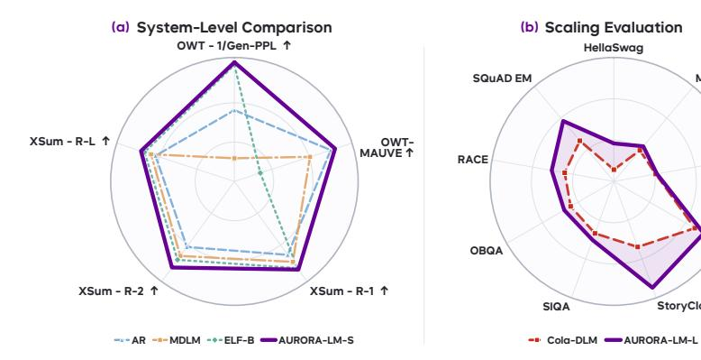
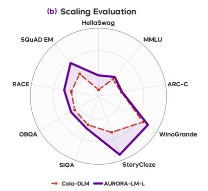
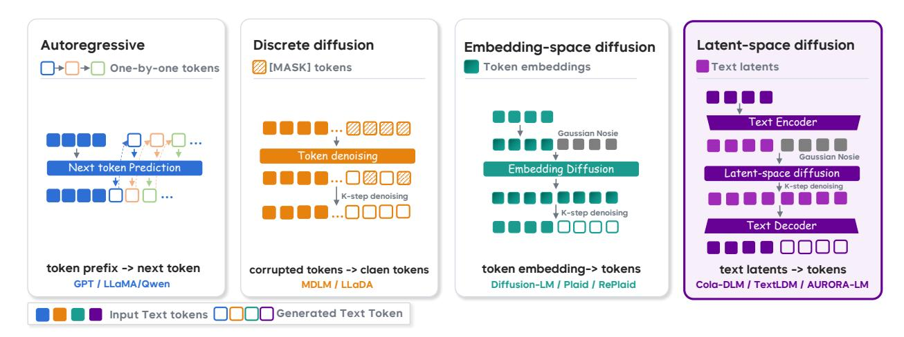
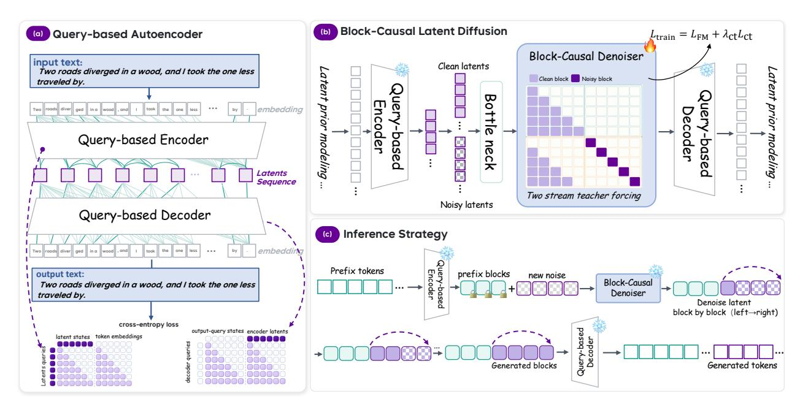
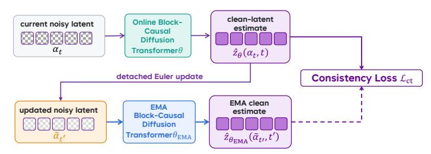
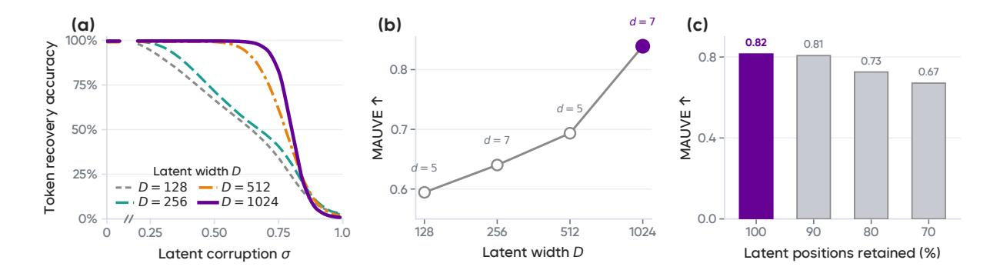
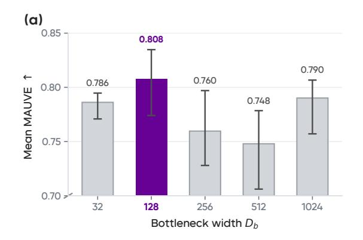
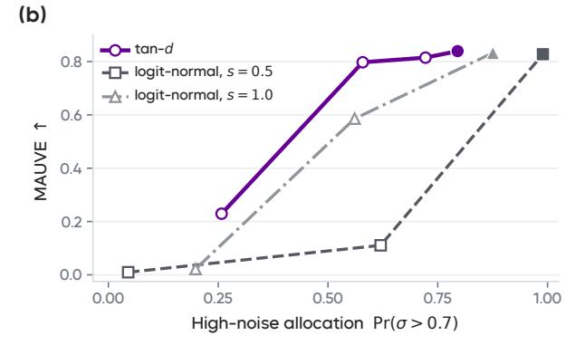
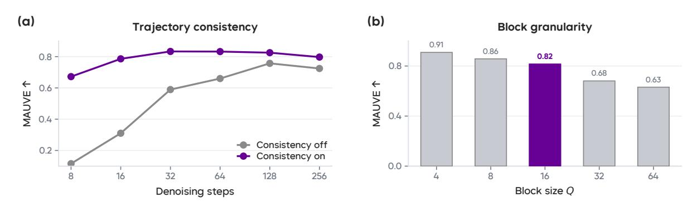
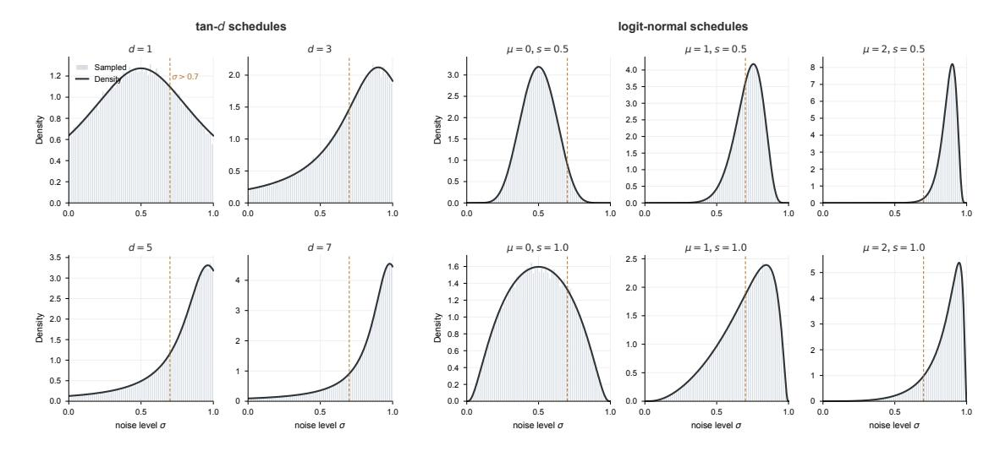

# AURORA-LM: Autoencoding Unified Representation for Continuous-Latent Diffusion Language Modeling

- 원제: AURORA-LM: Autoencoding Unified Representation for Continuous-Latent Diffusion Language Modeling
- 원문: [https://arxiv.org/abs/2608.02602](https://arxiv.org/abs/2608.02602)
- PDF: [https://arxiv.org/pdf/2608.02602v1](https://arxiv.org/pdf/2608.02602v1)
- arXiv ID: `2608.02602`

---

# **AURORA-LM: 연속 잠재 확산 언어 모델을 위한 자동 인코딩 통합 표현** (AURORA-LM: Autoencoding Unified Representation for Continuous-Latent Diffusion Language Modeling)

**Jiajun Liang**1,⋆ , **Yucheng Liao**1,⋆ , **Yukang Cao**2,⋆ , **Jiazhe Wei**1 , **Ken Li**1 , **Wende Tan**3 , **Jiankun Zhang**1 , **ZY Cui**1 , **Jingkang Yang**1 , **Liucheng Guo**3 , **Shiqi Yang**1 , **B. Yang**, **Caifeng Shan**1 , **Ziwei Liu**2 , **Chenyang Si**1,†

1PRLab, Nanjing University, 2S-Lab, Nanyang Technological University, 3 Imperial College London ⋆동일 기여, †응답 저자

# **초록** (Abstract)

언어는 현대 생성 모델링에서 여전히 예외적인 존재이다. 이미지, 비디오, 오디오는 점점 더 연속 잠재 공간에서 모델링되는 반면, 텍스트 생성은 여전히 주로 이산 토큰에 의존한다. 기존의 연속 잠재 언어 모델은 생성과 디코딩을 동시에 고려하도록 설계되지 않은 임베딩 공간을 상속받거나, 디퓨전을 용이하게 만들기 위해 자동 인코딩된 잠재를 압축해 토큰 수준의 충실도를 희생한다. 우리는 이러한 설계 타협에 도전한다. 생성 모델에 맞게 표현을 단순화하기보다, 고용량의 디코더 가능한 텍스트 잠재를 보존하고 디퓨전 모델이 그 분포를 직접 학습하도록 설계한다.

우리는 **AURORA-LM**을 소개한다. 이는 디코더 가능한 텍스트 표현의 구축과 그 생성 분포 모델링을 분리한 연속 잠재 확산 언어 모델이다. 이러한 표현을 얻기 위해, 우리는 쿼리 기반 인코더-디코더를 사용해 텍스트를 고용량의 접두사 정렬된 잠재 시퀀스로 정리한다. 이후 우리는 블록-인과 확산 트랜스포머(Block-causal Diffusion Transformer)를 도입해, 흐름 매칭(flow matching)을 통해 이 전체 폭의 잠재 분포를 학습하고, 왼쪽에서 오른쪽으로 블록을 생성하면서 각 블록 내 위치를 병렬로 디노이즈한다. 그러나 정확한 토큰 디코딩을 위해 고용량 잠재 표현을 유지하는 것은 그 분포를 디퓨전 모델이 학습하기 더 어렵게 만든다. AURORA-LM은 노이즈가 가득한 입력 경로만 제한하고, 전체 깨끗한 잠재 예측 목표는 그대로 두어, 생성 모델이 전체 폭의 잠재를 수용하면서도 디코더가 직면하는 용량을 줄이지 않도록 한다. 또한 우리는 노이즈 수준 분포를 잠재 폭에 맞게 보정해, 표현 차원에 따라 효과적인 신호 강도가 어떻게 변하는지를 반영한다. 마지막으로, 독립적으로 샘플링된 노이즈 상태에서 학습하고, 반복 디노이즈를 통한 추론 사이의 격차를 메우기 위해 자기 궤적 일관성(self-trajectory consistency)을 도입한다.

종합적인 비교를 통해, AURORA-LM은 OpenWebText 자유 생성과 XSum 조건부 요약에서 평가된 연속 및 확산 기반 언어 모델 중 가장 뛰어난 성능을 달성한다. 약 1500 EFLOPs의 총 연산량으로 1B 파라미터 규모로 확장하면 추가 성능이 향상되고, 일치된 평가 프로토콜 하에서 공개된 더 큰 잠재 확산 언어 모델을 능가한다. 우리의 결과는 고용량, 인과 구조화된, 디코더 가능한 텍스트 표현을 통해 연속 언어 생성이 확산 기반 생성 모델링과 이산 토큰 디코딩을 효과적으로 연결할 수 있음을 보여준다. 모든 실험은 Ascend NPU에서 수행되었다.

**Code:** <https://github.com/fyv587/AURORA-LM>

**Project Page:** <https://aurora-lm-project.github.io/>

# **목차** (Contents)

| 1 | 서론 | 3 |
|---|-------------------------------------------------------------------------------------------------------------------------------------------------------------------------------------------------------------------------------------------------------------------------------------------------------------------------------------|----------------------------------------------------|
| 2 | 관련 연구 2.1 확산 모델  2.2 이산 언어 모델 2.3 연속 확산 언어 모델 | 5 5 5 6 |
| 3 | AURORA-LM 프레임워크 3.1 전제  3.2 연속 텍스트 잠재 구조화  3.3 연속 텍스트 잠재의 블록-인과 모델링 3.4 전체 폭 잠재 분포 학습  3.5 잠재 생성 및 텍스트 디코딩  | 6 7 7 9 10 12 |
| 4 | 실험 4.1 추가 분석 4.1.1 잠재 용량  4.1.2 전체 폭 잠재 분포 모델링  4.1.3 효율적인 블록별 생성  4.2 시스템 수준 비교  4.2.1 무조건 생성 4.2.2 조건부 생성  4.3 스케일링 평가  | 13 14 14 15 16 17 17 18 18 |
| 5 | 결론 | 19 |
|  | 부록 | 24 |

## 1 소개 (Introduction)

연속 잠재 공간은 표현 학습과 생성의 일반적인 인터페이스가 되었다 [46](#page-21-0). 그 중에서도 확산 모델은 대표적인 예이며, 연속 공간에서 생성 역학을 학습함으로써 이미지, 비디오, 오디오 합성에서 뛰어난 품질을 달성했다 [19,](#page-19-0) [20,](#page-19-1) [26,](#page-20-0) [46,](#page-21-0) [54](#page-21-1). 이러한 장점은 연속 공간이 모달리티 간 생성의 일반적인 인터페이스가 될 수 있음을 시사하며, 언어 자체가 이러한 공간 안에서 표현되고 생성될 수 있는지에 대한 질문을 제기한다. 그러나 언어는 여전히 이 패러다임에서 크게 벗어나 있다. 시각 및 음향 신호는 자연스럽게 연속 공간에 표현되는 반면, 현대 언어 모델은 이산 토큰 표현에 의존한다 [4,](#page-19-2) [58,](#page-22-0) [61](#page-22-1).

이러한 비대칭성은 현재의 멀티모달 시스템 아키텍처에도 영향을 미친다. 연속 관측값은 일반적으로 토큰 기반 Transformer 백본에 입력되기 전에 이산 토큰 시퀀스로 변환된다 [5, 60]. 이러한 변환은 언어 모델링 인프라를 재사용하기 때문에 유용하지만, 이산성을 보편적 인터페이스로 만들고 자연스럽게 연속적으로 표현되는 구조를 억제할 수 있다. 따라서 반대 방향도 똑같이 중요하다: **모든 모달리티를 이산 토큰에 강제하는 대신, 언어 자체를 연속 잠재 공간에서 표현하고 생성할 수 있을까?** 만족스러운 답변은 언어와 연속 생성 모델 사이에 직접적인 다리를 제공하면서, 텍스트가 기대하는 의미적 충실도와 구문적 규칙성을 유지할 것이다.

연속 언어 생성을 시도한 초기 연구들은 대부분 이미 존재하는 표현을 기반으로 한다. Diffusion-LM [29]은 확산을 단어 임베딩에 직접 적용하고, PLAID [14]는 토큰별 임베딩 형식을 가능성 기반 언어 모델링에 적용한다. TEncDM [51]은 정적 단어 벡터를 사전 학습된 언어 인코더가 추출한 문맥적 특징으로 대체하고, 별도의 디코더를 훈련시켜 텍스트를 재구성한다. 이러한 접근법은 언어가 범주형 다음 토큰 예측만이 아니라 연속 역학을 통해 생성될 수 있음을 보여준다. 그러나 이들 방법은 토큰 임베딩이나 사전 학습 인코더에서 상속받은 표현을 사용하기 때문에, 잠재 폭, 차원, 시퀀스 조직과 같은 특성이 정확한 텍스트 재구성과 효과적인 연속 생성 모두를 지원하도록 명시적으로 설계되지 않았다.

표현 자체를 직접 제어하려면, 언어 오토인코더가 생성된 표현을 학습 가능하도록 만들어 보다 유연한 대안을 제공한다. LD4LG [34], COSMOS [37], Cola-DLM [15]과 같은 방법은 먼저 텍스트를 연속 잠재 공간에 매핑한 뒤, 그 공간에서 확산 기반 또는 플로우 기반 모델을 학습한다. 이 구성은 잠재 시퀀스를 압축, 부드럽게 하거나 계층적으로 조직화하여, 생성에 더 tractable한 분포를 만든다. 그러나 이러한 이점은 일반적으로 디코더가 의존하는 동일한 표현을 단순화함으로써 얻어진다. 압축되고 부드러운 잠재는 생성 모델이 학습하기 쉬울 수 있지만, 압축은 정확한 단어, 구문, 지역적 순서를 복원하는 데 필요한 구분을 제거한다. 반대로 더 많은 정보를 보존하면 재구성이 향상되지만, 잠재 사전분포는 더 넓고 복잡한 분포를 갖게 된다. 따라서 잠재 생성의 어려움과 텍스트 재구성의 충실도는 단일 표현 병목을 통해 결합된 상태를 유지한다.

이러한 긴장은 연속 언어 표현이 단지 그 분포를 모델링하기 쉽도록 설계되어서는 안 된다는 것을 시사한다. 먼저, 텍스트에 대한 적절한 인터페이스 역할을 수행하며 언어 의미를 충실히 보존하고 정확한 토큰 복원을 위해 충분한 정보를 유지해야 한다. 이후 잠재 생성 모델은 이 표현을 수용하도록 설계되어야 하며, 단지 생성 과정을 용이하게 하기 위해 디코더에 노출되는 잠재를 압축해서는 안 된다. 따라서 효율적인 연속 언어 생성은 두 가지 연관된 과제를 제시한다: 충실하고 정확한 디코딩을 지원하는 연속 텍스트 표현을 구축하고, 그 결과 잠재 분포를 효과적으로 학습하면서 디코딩 신뢰성을 희생하지 않는 생성 모델을 설계하는 것이다.

이 두 연관된 과제를 해결하기 위해 우리는 **AURORA-LM** (Autoencoding Unified Representation for Continuous-Latent Diffusion Language Modeling)을 도입한다. 이는 표현 구축과 분포 모델링을 두 단계로 분리하는 통합 프레임워크이다. 첫 번째 과제에서는 Query-based Encoder-Decoder를 사용해 이산 텍스트로부터 고용량 연속 잠재 시퀀스를 구축한다. 그 인과적 인코더는 연속 잠재 위치가 점진적으로 더 긴 토큰 접두사를 읽도록 허용하여, 블록 단위의 좌우-우측 생성(블록별 왼쪽에서 오른쪽으로)을 지원하는 접두사 순서를 유도한다. 대응하는 디코더는 잠재 접두사를 토큰 로짓으로 매핑한다,

**Figure 1 AURORA-LM의 다양한 생성 설정 및 모델 규모에 대한 평가.**

(a) AURORA-LM은 OpenWebText와 XSum에서 가장 우수한 결과를 달성한다; 방사형 값은 각 메트릭마다 정규화되며, Gen-PPL은 역수로 표시된다. (b) AURORA-LM은 공개된 더 큰 잠재 확산 언어 모델을 아홉 개의 언어 벤치마크에서 능가한다.

텍스트 재구성만으로 훈련된 명시적 잠재-토큰 경로를 형성한다. 잠재 시퀀스가 디코더 입력으로 직접 사용되므로, 우리는 디퓨전 기반 생성을 단순화하기 위해 잠재를 단순히 축소하기보다 정확한 토큰 복원을 위해 그 채널 용량을 유지한다.

디코딩 가능하고 인과적으로 정렬된 잠재 공간을 구축한 뒤, 우리는 두 번째 과제인 그 분포를 학습하면서 표현 용량을 희생하지 않는 문제에 착수한다. 구체적으로, 우리는 오토인코더를 고정하고, 흐름 매칭을 사용해 위치별 인과적 조직을 따르는 전체 폭 잠재 시퀀스에 대해 블록-인과적 디노이저(block-causal denoiser)를 훈련한다. 모델은 왼쪽에서 오른쪽으로 잠재 블록을 생성하면서 각 블록 내 위치를 동시에 디노이즈한다. 이 전체 폭 잠재 분포를 효과적으로 모델링하기 위해 세 가지 보완적 설계를 결합한다. 첫째, JiT의 직접 정제 데이터 예측 원칙([&#91;28&#93;](#page-20-4))에 영감을 받아, 노이즈가 있는 잠재 입력 경로에만 저차원 투영을 적용하고 전체 폭 정제 잠재를 예측하는 것을 계속한다. 둘째, 훈련 시 노이즈 할당을 잠재 폭에 맞게 보정한다. 실험적으로, 더 넓은 잠재 표현은 고노이즈 입력에 더 큰 비중을 두는 것이 유리하다. 셋째, 자기-트레젝터리 일관성을 도입하여 디노이즈 경로를 따라 인접 상태에서 정제 잠재 예측을 정렬하고, 더 적은 샘플링 단계로 고품질 생성을 가능하게 한다.

우리의 실험은 연속 언어 생성(continuous language generation)을 지배하는 설계 선택을 체계적으로 분석한다. 여기에는 잠재 폭(latent width)과 시퀀스 압축(sequence compression), 저랭크 입력 병목(low-rank input bottleneck), 노이즈 수준 할당(noise-level allocation), 예측 대상(prediction target)과 손실 공간(loss space), 자기 궤적 일관성, 블록-인과 생성(block-causal generation)이 포함된다.  
우리는 또한 AURORA-LM을 기존의 연속 및 확산 기반 언어 모델(continuous and diffusion-based language models)과 일치하는 데이터와 평가 프로토콜 하에서 비교한다.  
그림 1[1,](#page-3-0)에 요약된 바와 같이, AURORA-LM은 평가된 방법 중에서 OpenWebText[&#91;12&#93;](#page-19-6) 자유 생성과 XSum[&#91;40&#93;](#page-21-3) 조건부 요약에서 가장 강력한 성능을 달성한다.  
우리는 또한 AURORA-LM을 약 1,500 EFLOPs의 총 연산량으로 1B 매개변수로 확장하고, 일치하는 벤치마크 프로토콜 하에서 공개된 더 큰 잠재-확산 언어 모델(latent-diffusion language model)보다 일관된 성능 향상을 관찰한다.  
이러한 결과는 **고용량, 디코더 가능한 텍스트 표현이 확산 모델이 직접적으로 그 분포를 학습하도록 설계될 때 연속 생성과 이산 토큰 디코딩 사이에 효과적인 인터페이스를 제공할 수 있음을 보여준다.**

요약하면, 우리의 기여는 다음과 같다:

- **AURORA-LM**은 텍스트 표현 학습과 생성 분포 모델링을 분리한 통합적이며 연속 잠재 확산 언어 모델이다. 토큰 임베딩이나 사전 학습된 인코더에서 디노이징 공간을 상속받는 대신, **AURORA-LM**은 확산 모델이 생성하도록 학습하는 연속 표현을 명시적으로 구성한다.

- **고용량 자동 인코딩된 텍스트 잠재**를 구성한다. 이는 연속 생성과 토큰 복구 사이의 디코더-향 인터페이스 역할을 한다. 이 표현을 단순히 사전 트랙터빌리티를 위해 축소하는 대신, **AURORA-LM**은 정확한 디코딩을 위해 사용 가능한 채널 용량을 보존하고, 확산 사전 모델을 조정하여 결과적으로 전체 폭 잠재 분포를 모델링한다.

- **블록-인과성 디노이저**를 사용해 흐름 매칭으로 훈련된 결과 잠재 분포를 학습한다, 이는

왼쪽에서 오른쪽으로 잠재 블록을 생성하면서 각 블록 내 위치를 동시에 디노이즈한다. 전체 폭 잠재 목표를 모델링하기 위해, 저랭크 노이즈 입력 경로와 전체 폭 클린 잠재 예측을 결합하고, 훈련 시 노이즈 할당을 잠재 폭에 맞게 보정하며, 디노이징 경로를 따라 생성 품질을 향상시키기 위해 자기-경로 일관성을 도입한다.

• 데이터와 평가 프로토콜이 일치할 때, **AURORA-LM**은 평가된 오토리그레시브, 이산 확산, 그리고 연속 임베딩 기반 기준 모델보다 OpenWebText 자유 생성 및 XSum 조건 요약에서 우수하다. 또한 **AURORA-LM**을 1B 파라미터로 확장하면, 동일한 벤치마크 프로토콜 하에서 공개된 더 큰 잠재 확산 언어 모델을 능가하며 강력한 성능을 지속한다.

## 2 Related Work (Related Work)

### 2.1 확산 모델 (Diffusion Models)

확산 모델([19, 25, 54])은 정제된 데이터에 점진적으로 가우시안 노이즈를 주입하는 순방향 과정을 역전시켜 샘플을 생성한다. Flow matching([1, 31, 32])은 노이즈 분포를 데이터 분포로 지속적으로 운반하는 속도장을 학습함으로써 생성을 재구성하며, ODE 통합을 통해 결정론적 생성을 가능하게 한다. Consistency models([36, 55])는 동일한 확률 흐름 ODE 궤적상의 모든 상태가 일관된 정제된 최종점에 매핑되도록 강제함으로써 다단계 추론 비용을 해결하고, 1단계 또는 몇 단계만으로 생성을 가능하게 한다. AURORA-LM은 선형 보간형 방식을 사용해 잠재 생성 모델을 훈련하고, 자기 궤적 일관성을 훈련 정규화 항으로 통합한다.

Figure 2는 언어 생성 패러다임의 결과적 풍경을 개관한다. 우리는 다음 하위 절에서 각각을 논의한다. 이는 자기 회귀 및 이산 확산 모델에서부터 연속 잠재 확산 접근법까지를 포함한다.

Figure 2는 추론 시 생성되는 표현에 따라 정리된 언어 모델링 패러다임을 보여준다. 자기회귀 모델은 토큰을 하나씩 순차적으로 생성한다; 마스크된 이산 디퓨전은 마스크된 토큰을 반복적으로 디노이즈한다; 임베딩 공간 디퓨전은 연속 토큰 임베딩을 디노이즈한다; 잠재 공간 디퓨전은 인코더-디코더 텍스트 잠재 변수를 생성한 뒤 토큰으로 디코딩한다. AURORA-LM은 잠재 공간 형식을 채택한다.

### 2.2 이산 언어 모델 (Discrete Language Models)

자기회귀 언어 모델은 토큰 시퀀스에 대한 결합 분포를 $p(x) = \prod_{t=1}^{L} p(x_t \mid x_{< t})$ 로 분해하며, 각 토큰을 앞선 모든 토큰에 조건부로 순차적으로 생성한다. 이 인과적 분해는 언어의 순차 구조와 자연스럽게 일치하며, 다음 토큰 예측은 데이터와 연산량에 따라 확장 가능한 균일한 자기지도 학습 목표를 제공한다. 이러한 특성은 대규모 언어 모델링에서 놀라운 진전을 이끌어냈다 [4, 9, 10, 21, 42, 58, 61]. 그러나 자기회귀 분해는 생성이 엄격히 좌우에서 진행되도록 제한하여 비자기회귀 생성을 불가능하게 한다.

**이산 디퓨전 언어 모델 (Discrete Diffusion Language Models).** 이산 디퓨전 언어 모델은 토큰 시퀀스에 직접 적용되는 손상–디노이즈 과정을 정의한다. D3PMs [&#91;3&#93;](#page-19-10)은 흡수 상태와 균일 상태 이산 전이를 모두 포괄하는 일반 프레임워크를 도입했다. 흡수 상태 라인에서는 토큰이 점진적으로 특수 [MASK] 토큰으로 마스킹되고, 반복적인 언마스킹을 통해 복원된다; MDLM [&#91;47&#93;](#page-21-6)은 이 목표가 마스크 언어 모델링 손실의 혼합으로 축소된다는 것을 보여주었다. LLaDA [&#91;41&#93;](#page-21-7)은 LLaMA3 8B와 경쟁력 있는 인컨텍스트 학습 성능을 보고했으며, Dream [&#91;63&#93;](#page-22-3)은 일반, 수학, 코딩 과제에서 이전 디퓨전 언어 모델보다 향상된 성능을 보였다. BD3-LMs [&#91;2&#93;](#page-19-11)은 블록 간에 자기회귀 생성을 결합하고 각 블록 내 마스크 디퓨전을 결합한 블록-인과적 분해를 제안했다. SEDD [&#91;33&#93;](#page-20-10)은 점수 엔트로피 목표를 도입하여 점수 매칭을 이산 공간에 확장했다. Duo [&#91;48&#93;](#page-21-8)은 균일 상태 이산 디퓨전과 가우시안 디퓨전 사이의 공식적 이중성을 확인하여 훈련 분산을 줄이고 이산 일관성 증류를 통해 몇 단계 생성이 가능하도록 했다. 최근 연구는 이산 DLMs (Discrete DLMs)를 강화 학습을 통한 추론에 확장하고 대규모 코드 생성에 적용했다 [&#91;67&#93;](#page-22-4) 및 [&#91;56&#93;](#page-21-9).

자기회귀 모델과 이산 디퓨전 모델 모두에서 생성은 완전히 이산 토큰 어휘 내에서 이루어진다. AURORA-LM은 대신 연속 잠재 공간에서 생성하며, 토큰과 고용량 연속 표현 사이에 학습된 인코더-디코더 매핑을 사용한다.

### **2.3 연속 디퓨전 언어 모델 (Continuous Diffusion Language Models)**

**Embedding‑space Language Models.**  
이러한 방법들은 별도로 학습된 인코더‑디코더 없이 토큰 표현에서 직접 도출된 연속 공간에서 denoising을 수행한다. Diffusion‑LM[29]은 단어 임베딩 시퀀스를 denoising함으로써 제어 가능한 생성을 최초로 입증하였다. 이후 DiffuSeq[13]과 같은 연구는 이 형식을 조건부 시퀀스 생성으로 확장하였다. PLAID[14]는 알고리즘적 개선과 스케일링 분석을 통해 embedding‑space diffusion이 표준 벤치마크에서 경쟁력 있는 likelihood를 달성할 수 있음을 보여주었다. LangFlow[7]은 Bregman divergence를 통한 flow matching과 정보‑균일 노이즈 스케줄을 연결하여, 연속 DLM이 불연속 diffusion과 perplexity에서 경쟁할 수 있는 최초의 사례가 되었다. REPLAID[62]는 연속 diffusion이 규모가 커질수록 불연속 DLM과 경쟁할 수 있음을 보여주는 최초의 스케일링 법칙을 제시하였다. CoDAR[53]는 문맥 인식형 자기 회귀 디코더를 통해 토큰 반올림 병목을 해결하였다.

**Latent‑space Language Models.**  
이러한 방법들은 먼저 텍스트를 연속 잠재 표현으로 매핑한 뒤, diffusion 또는 flow matching으로 이 표현을 모델링한다. LD4LG[34]는 frozen pretrained encoder–decoder 모델에 Perceiver Resampler을 추가하여 encoder 특징을 compact하고 고정 길이의 latent으로 압축한다. TEncDM[51]은 대신 Gaussian diffusion을 pretrained language encoder의 전체 길이 컨텍스트 표현에 적용하며, 시퀀스를 압축하지 않는다. encoder‑space 형식을 기반으로 COSMOS[37]는 Perceiver‑resampler autoencoder를 도입해 압축되고 부드러운 latent을 학습하면서 TEncDM의 denoiser 아키텍처와 노이즈 스케줄을 유지한다. ELF[23]은 frozen T5 encoder로 토큰을 인코딩하고, 결과 latent 공간에서 flow matching을 수행한다; 동일한 네트워크가 denoiser와 decoder 역할을 공유‑weight projection을 통해 수행하며, 토큰‑레벨 감독은 최종 단계에서만 적용된다. Cola‑DLM[15]은 KL 정규화를 갖는 변분 autoencoder를 통해 latent을 학습한 뒤, encoder–decoder와 flow‑matching 모델을 공동 사전 학습한다. TextLDM[24]은 Transformer VAE를 훈련시키며, encoder 표현을 frozen Qwen3 모델의 hidden state와 정렬하고, 결과 latent 공간에서 flow matching을 수행한다.

AURORA‑LM은 이 factorization을 따르지만 두 가지 차이점이 있다. 첫째, 잠재 시퀀스를 압축해 사전 tractability를 위해 사용하기보다, 정확한 토큰 복원을 위해 autoencoder를 사용해 고용량의 디코더‑향 continuous representation을 명시적으로 구성한다. 둘째, denoiser를 훈련하기 전에 autoencoder를 frozen 상태로 두어 목표 latent 분포를 고정하고, representation과 독립적으로 diffusion‑side 설계 선택을 연구할 수 있게 한다.

## **3 The AURORA‑LM Framework**

AURORA-LM은 Sec. [1:](#page-2-0)에서 확인된 두 가지 학습 문제를 중심으로 구성된다. 하나는 토큰으로 다시 디코딩될 수 있는 연속 텍스트 표현을 구축하는 것이고, 다른 하나는 그 생성 분포를 모델링하는 것이다. Figure [3](#page-7-0)은 전체 파이프라인을 보여준다. 구체적으로, 우리의 방법은 Query-based encoder-decoder와 blockcausal denoiser—연속 텍스트 잠재 분포를 모델링하기 위해 흐름 매칭으로 훈련된 Transformer—으로 구성된다. 텍스트 시퀀스를 주면 Query-based Encoder-Decoder는 이를 이산 텍스트와 연속 생성 사이의 고용량, 인과적으로 정렬된 잠재 인터페이스로 정리한다. 이 표현을 학습한 뒤, 우리는 오토인코더를 고정하고, 그 잠재 출력을 표준화한 뒤, 블록별 흐름 매칭(blockwise flow matching)을 통해 그 분포를 모델링하도록 block-causal denoiser를 훈련한다. 이 두 모듈은 블록별 잠재 역학과 고정된 latent-to-token 인터페이스를 결합함으로써 추론 시 연속 언어 생성을 실현한다.

이 절의 나머지는 Figure 3과 동일한 데이터 흐름을 따른다. 우리는 Sec. 3.1에서 흐름 매칭(formulation)을 시작으로, Sec. 3.2에서 연속 텍스트 표현의 구축 및 디코딩을 진행한다. Sec. 3.3은 잠재 분포를 모델링하기 위한 block-causal denoiser를 소개하고, Sec. 3.4는 전체 폭(latent) 목표를 학습하기 위해 사용되는 입력 병목(input bottleneck)과 훈련 목표를 제시한다. Sec. 3.5는 블록별 생성 및 텍스트 디코딩 절차와 함께 프레임워크를 완성한다. 우리는 Sec. 4.1의 통제된 설계 분석에서 잠재 용량, 전체 폭 잠재 분포 모델링, 효율적인 블록별 생성에 관한 주요 설계 선택을 검토한다.

### 3.1 전제 (Preliminaries)

확산 모델은 깨끗한 샘플에서 노이즈로의 점진적 변환을 역전시키는 것을 학습함으로써 데이터를 생성한다. 우리 방법에서는 흐름 매칭(flow-matching) 공식 [31, 32]을 채택한다. 이는 직선 보간 경로를 따라 속도장을 학습함으로써 절차를 단순화한다. 깨끗한 샘플 $x_0$와 가우시안 노이즈 $\varepsilon \sim \mathcal{N}(0, I)$가 주어지면, 우리는 선형 확률 경로를 다음과 같이 정의한다:

$$x_t = (1 - t)x_0 + t\varepsilon, \qquad t \in [0, 1]. \tag{1}$$

경로(path)는 t = 0에서 데이터(data)에서 t = 1의 노이즈(noise)로 보간된다. 신경망(neural network)은 경로 속도(path velocity) 또는 정제된 끝점(clean endpoint) $x_0$ 를 예측함으로써 역동성(reverse dynamics)을 학습할 수 있다. 이러한 파라미터화(parameterizations)는 동일한 확률 경로(probability path)에 해당하지만, 서로 다른 학습 동작(training behavior)을 초래한다. AURORA-LM은 최종 구성(final configuration)에서 정제된 끝점 예측을 채택하며, 반면 Sec. 4.1.2는 대안 파라미터화(alternative parameterizations)를 평가한다.

AURORA-LM에서 깨끗한 샘플은 토큰 시퀀스 자체가 아니다. 그것은 동결된 인코더가 생성한 연속 시퀀스이다. 따라서 Eq. (1)의 일반 경로는 Sec. 3.3에서 블록 단위로 인스턴스화되며, 각 깨끗한 잠재 블록이 $x_0$ 를 대체하고 앞선 깨끗한 블록에 조건부로 생성된다. 이 구분은 표준 흐름 매칭과 우리 방법의 두 부분을 연결한다: 오토인코더는 먼저 깨끗한 텍스트 잠재가 무엇인지 결정하고, 잠재 언어 모델은 이후 그 역생성 과정을 학습한다.

### 3.2 연속 텍스트 잠재 공간 구성 (Continuous Text Latent Construction)

우리의 목표는 연속 생성 모델링과 이산 토큰 디코딩 사이의 인터페이스 역할을 하는 연속 텍스트 표현을 구축하는 것이다. 이 표현은 정확한 토큰 디코딩을 위해 충분한 정보를 보존하고, 블록 단위의 좌우-우측 생성에 적합한 인과적 순서를 갖도록 잠재 위치를 조직해야 한다. 토큰 임베딩이나 사전 학습된 인코더 특징에서 이 인터페이스를 상속받는 대신, 우리는 Fig. 3(a)에 나타난 Query-based Encoder-Decoder를 사용해 이를 구성한다. 인코더는 점진적으로 더 긴 토큰 접두사에서 연속적인 잠재 위치를 생성하고, 디코더는 각 토큰 예측이 해당 잠재 접두사에 의존하도록 요구한다. 이 인코더와 디코더의 제약은 토큰 재구성을 위해 훈련된 접두사 순서가 있는 연속 잠재 시퀀스를 정의한다. 오토인코더가 훈련되고 고정되면, Sec. 3.3에서 소개한 블록-인과적 디노이저가 이 잠재 시퀀스의 분포를 모델링한다.

**잠재 시퀀스.** 길이가 L인 토큰 시퀀스 $w_{1:L}$ 을 주면, 인코더는 연속 잠재 시퀀스 $z_{\text{enc}} \in \mathbb{R}^{N \times D}$ 를 생성한다. 여기서 D는 채널 폭, N은 잠재 위치 수를 나타낸다. 우리는 N = round(cL) 으로 설정하며, $c \in (0,1]$ 는 잠재 보존 비율이며 c=1 은 시퀀스 압축이 없음을 의미하고, 더 작은 값은 더 짧은 잠재 시퀀스를 만든다. 따라서 D와 N은 표현 용량의 상호 보완적인 측면을 지배한다: D를 증가시키면 각 잠재 위치가 텍스트 정보를 인코딩할 수 있는 채널이 늘어나고, N을 줄이면 같은 텍스트를 더 적은 잠재 위치에 조직한다. 이 용량 할당은 Sec. 4 에서 검토한다. 인코더 입력과 디코더 출력 프로젝션은 학습 가능한 토큰 임베딩 행렬 $E \in \mathbb{R}^{|V| \times d}$ 를 공유한다.

**Figure 3 AURORA-LM 파이프라인 개요.** (a) Query-based Encoder-Decoder는 인과적으로 확장되는 입력 접두사에서 순서가 있는 텍스트 잠재 시퀀스를 구성하고, 이를 쿼리 디코더를 통해 토큰 로짓으로 다시 매핑한다. (b) 블록-인과적 디노이저는 잠재 사전 분포를 매개화하고, 플로우 매칭으로 훈련된다. (c) 추론 시, 잠재 블록은 완성된 접두사의 KV 캐싱을 이용해 좌우-우측으로 생성된다.

Query-based Encoder. 순서가 있는 잠재 시퀀스를 구성하기 위해, 우리는 N개의 잠재 쿼리를 사용해 가변 길이 토큰 시퀀스를 N개의 연속 위치로 집계한다. 각 쿼리는 동일한 학습 가능한 벡터 $q \in \mathbb{R}^D$ 로 초기화되며, 따라서 $z_{\text{enc},i}^{(0)} = q$ 가 $i \in \{1,\ldots,N\}$ 에 대해 성립한다. 동일하게 초기화되었지만, 쿼리들은 각 위치에서 보이는 컨텍스트에 의해 구분된다. 레이어 $\ell$ 에서, 쿼리 i 는 잠재 상태 $z_{\text{enc},1:i}^{(\ell)}$ 와 토큰 접두사 $E[w_{1:\lceil iL/N\rceil}]$ 에 주의를 기울일 수 있다. 우리는 RoPE [57] 를 두 시퀀스에 모두 적용해 주의 전 단계에서 위치를 인코딩한다. 구체적으로, 레이어 업데이트는 다음과 같이 계산된다:

$$\widetilde{z}_{\text{enc},i}^{(\ell)} = z_{\text{enc},i}^{(\ell)} + \text{MHA}^{(\ell)} \left( z_{\text{enc},i}^{(\ell)}, \left[ z_{\text{enc},1:i}^{(\ell)}; E[w_{1:\lceil iL/N \rceil}] \right] \right), 
z_{\text{enc},i}^{(\ell+1)} = \widetilde{z}_{\text{enc},i}^{(\ell)} + \text{FFN}^{(\ell)} \left( \widetilde{z}_{\text{enc},i}^{(\ell)} \right).$$

(2)

최종 인코더 레이어 $L_{\text{enc}}$ 이후, RMS 정규화 [66] 가 적용되어 $z_{\text{enc},i} = \text{RMSNorm}\left(z_{\text{enc},i}^{(L_{\text{enc}})}\right)$ 를 생성한다. 보이는 토큰 접두사가 i와 함께 확장됨에 따라, 연속적인 잠재 위치는 점진적으로 더 많은 텍스트 컨텍스트를 이전 잠재 상태와 함께 통합한다. 결과 시퀀스 $z_{\text{enc},1:N}$ 은 따라서 좌우-우측으로 텍스트를 누적하는 순서를 따르며, 각 잠재 접두사를 블록-인과적 조건화에 사용되는 텍스트 컨텍스트와 정렬한다.

Query 기반 디코더. 위의 인코더는 토큰 접두사가 순서가 지정된 잠재 시퀀스에 어떻게 기록되는지를 정의한다. 이제 우리는 잠재 접두사에서 토큰 로짓으로의 역 매핑을 정의하는 쿼리 디코더와 이를 결합한다. 디코더가 원본 토큰을 입력으로 받지 않으므로 학습된 잠재 표현에서 토큰 내용을 복원해야 한다. 구체적으로, 모든 L개의 디코더 쿼리를 두 번째 공유 학습 가능한 쿼리 $q_{\rm dec}$ 로 초기화하여 $h_j^{(0)} = q_{\rm dec}$ 이 되도록 한다. 인코더가 설정한 순서를 따라, 출력 위치 j는 잠재 접두사 $z_{{\rm enc},1:\lfloor(j-1)N/L\rfloor+1}$ 과 인과적으로 사용 가능한 출력 쿼리 상태 $h_{1:j}^{(\ell)}$ 에 주목할 수 있다. 여기서 $h_j^{(\ell)}$ 은 디코더 숨겨진 상태를, $\ell$ 은 층 인덱스를 나타낸다. 각 디코더 층은 해당 마스킹된 어텐션을 적용한 뒤 FFN을 수행하며, 최종 숨겨진 상태는 토큰 로짓으로 투영된다:

$$\begin{split} \widetilde{h}_{j}^{(\ell)} &= h_{j}^{(\ell)} + \text{MHA}^{(\ell)} \left( h_{j}^{(\ell)}, \left[ h_{1:j}^{(\ell)}; z_{\text{enc},1: \lfloor (j-1)N/L \rfloor + 1} \right] \right), \\ h_{j}^{(\ell+1)} &= \widetilde{h}_{j}^{(\ell)} + \text{FFN}^{(\ell)} \left( \widetilde{h}_{j}^{(\ell)} \right). \end{split} \tag{3}$$

Ldec 레이어 이후, 출력 위치 j에서의 은닉 상태는 hj = h (Ldec) j 로 표시된다. 우리는 이 상태를 토큰 임베딩 행렬의 전치 행렬을 사용해 어휘 로짓으로 변환한다: oj = hjE⊤ ∈ R |V | . Eq. [(3)](#page-8-1)의 인덱스 범위는 각 출력 위치가 볼 수 있는 상태를 지정한다: 위치 j는 디코더 상태 h (ℓ) 1:j 에 주목할 수 있고, 오직 첫 번째 ⌊(j − 1)N/L⌋ + 1 인코더 잠재 변수에만 주목할 수 있다. 인코더 잠재 변수 i는 토큰 접두사 w1:⌈iL/N⌉ 에서 구성된다. 따라서 이 토큰 접두사를 재구성할 때, 디코더는 zenc,1:i 에만 제한되며 미래 잠재 변수 zenc,i+1:N 에 접근할 수 없다. 이 일치된 가시성은 시퀀스 압축 하에서 토큰과 잠재 변수 접두사 간의 대응을 보존한다.

**오토인코더 훈련.** 우리는 재구성된 로짓을 원본 토큰과 토큰 수준 교차 엔트로피로 매칭하여 인코더와 디코더를 공동으로 훈련한다:

$$\mathcal{L}_{AE} = -\mathbb{E}_w \left[ \frac{1}{L} \sum_{j=1}^{L} \log \operatorname{softmax}(o_j)_{w_j} \right]. \tag{4}$$

우리는 토큰-임베딩 드롭아웃과 잠재 드롭아웃을 사용해 오토인코더를 정규화한다 [&#91;37&#93;](#page-20-3). 토큰-임베딩 드롭아웃은 각 토큰 위치에서 입력 임베딩 전체를 확률 \(p_x\) 로 독립적으로 0으로 만든다. 이는 인코더가 개별 토큰에 의존하기보다 주변 문맥을 활용하도록 유도한다. 잠재 드롭아웃은 각 잠재 좌표를 확률 \(p_z\) 로 독립적으로 제거한다. 이는 디코더가 소수의 잠재 특징에 의존하는 것을 방지한다. 우리는 훈련 후 두 형태의 드롭아웃을 비활성화하고 오토인코더를 동결한 뒤, 두 번째 단계에서 결정론적 잠재 시퀀스를 추출한다. 이는 디코더 지향 표현을 고정시켜, 디퓨전 모델이 토큰 디코딩에 필요한 잠재 공간을 변경하지 않고도 자신의 분포를 학습할 수 있게 한다.

### **3.3 연속 텍스트 잠재의 블록-인과 모델링 (Block-Causal Modeling of Continuous Text Latents)**

오토인코더는 각 텍스트 시퀀스를 고정된 인과 구조를 갖는 연속 잠재 시퀀스로 매핑한다. 남은 과제는 이러한 표현들의 분포를 학습하여 모델이 기본 텍스트에 접근하지 않고도 새로운 잠재 시퀀스를 생성할 수 있도록 하는 것이다. 이를 위해 우리는 블록-인과 디노이저를 사용한다: 이 디노이저는 잠재 분포를 모델링하고, 고정된 디코더가 토큰으로 다시 매핑할 수 있는 새로운 표현을 생성한다.

잠재 분포를 학습하기 전에, 우리는 먼저 고정된 채널별 affine 정규화를 고정 인코더의 출력 zenc에 적용한다. µ, s ∈ R D 를 각각 유효 인코더 출력으로부터 추정된 채널별 평균과 표준편차라 하자. 각 잠재 시퀀스를 다음과 같이 표준화한다:

$$z = (z_{\text{enc}} - \mu) \oslash s, \qquad z_{\text{enc}} = \mu + s \odot z,$$

(5)

⊘와 ⊙는 각각 원소별 나눗셈과 곱셈을 나타낸다. 고정 인코더와 고정 정규화는 훈련 코퍼스의 표준화된 잠재 시퀀스에 대해 경험적 분포 qE(z)를 유도한다. 우리는 이 분포를 학습하기 위해 생성 모델 pθ(z)를 훈련한다. 고정 디코더 pψ와 결합하여, 모델은 연속 잠재를 적분하여 토큰 시퀀스에 대한 확률을 할당한다:

$$p(w) = \int p_{\psi}(w \mid \mu + s \odot z) p_{\theta}(z) dz. \tag{6}$$

여기서 pθ는 연속 텍스트 잠재의 분포를 모델링하고, pψ는 샘플링된 잠재를 토큰 시퀀스로 디코딩한다.

**블록별 분해(Block-wise Factorization).** pθ(z)를 단일 공동 노이즈 제거 문제로 모델링하면 모든 잠재 위치를 한 번에 생성하게 되어, 오토인코더가 학습한 인과적 조직을 활용하지 못한다. 반대로 잠재 위치를 한 번에 하나씩 생성하면 순서를 보존하지만 연속 노이즈 제거가 제공하는 대부분의 병렬성을 버린다. 따라서 우리는 잠재 블록을 가로질러 왼쪽에서 오른쪽으로 인과적 생성을 수행하면서 각 블록 내의 모든 위치를 동시에 노이즈 제거하는 중간 형태의 블록-인과적을 채택한다. 이 중간 조직을 블록-인과적 분해(block-causal factorization)라고 부른다.

형식적으로, 블록 크기 Q에 대해 표준화된 잠재 시퀀스 z의 N 위치는 B = ⌈N/Q⌉개의 연속 블록 α = (α(1), …, α(B))으로 분할되며, 사전 분포는 다음과 같이 분해된다:

$$p_{\theta}(\alpha) = \prod_{b=1}^{B} p_{\theta} \left( \alpha^{(b)} \mid \alpha^{(< b)} \right), \qquad \alpha^{(< b)} = (\alpha^{(1)}, \dots, \alpha^{(b-1)}).$$

(7)

인코더가 잠재 접두사를 텍스트 접두사를 나타내도록 정리했으므로, α(<b)는 블록 b 이전의 텍스트 문맥을 나타낸다. 따라서 Eq. [(7)](#page-9-1)의 각 인수는 이미 결정된 접두사에 조건화된 연속을 설명한다. 블록 크기 Q는 블록 간 순차적 조건화와 블록 내 병렬 노이즈 제거 사이에서 계산이 어떻게 분할되는지를 제어한다.

블록-인과적 분해는 각 블록을 생성할 때 사용할 수 있는 문맥을 결정하지만, 연속 조건부 분포 pθ(α(b) | α(<b))가 어떻게 학습되는지는 아직 명시하지 않는다. α(b)는 범주형 토큰이 아니라 연속 벡터이므로, 우리는 Sec. [3.1,](#page-6-0)에서 소개한 흐름 매칭 수식을 사용해 이 분포를 모델링한다. 이는 가우시안 잡음을 깨끗한 잠재 블록으로 변환한다. 깨끗한 블록 α(b)와 가우시안 잡음 ε(b) ∼ N(0, I)에 대해 선형 경로를 다음과 같이 정의한다:

$$\alpha_t^{(b)} = (1 - t)\alpha^{(b)} + t\varepsilon^{(b)}, \qquad \varepsilon^{(b)} \sim \mathcal{N}(0, I), \qquad t \in [0, 1].$$

(8)

이 경로는 t = 0에서 깨끗한 잠재 블록에서 시작해 t = 1에서 가우시안 잡음에 도달한다. 흐름 매칭은 일반적으로 속도 예측을 통해 공식화되지만, 동일한 경로는 그 깨끗한 최종점을 예측함으로써 학습될 수도 있다. AURORA-LM은 이 파라미터화를 채택하고, 노이즈 상태 α(b)_t, 노이즈 수준 t, 그리고 깨끗한 접두사 α(<b)를 이용해 α(b)를 추정한다. 대체 예측 대상과 손실 공간은 Sec. [4.1.2.](#page-15-1)에서 비교된다.

이 수식은 각 블록에 대한 조건부 생성 목표를 정의하지만, 핵심적인 최적화 과제를 남긴다. 잠재 표현은 토큰 디코딩에 필요한 채널 용량을 유지하므로, 확산 모델은 노이즈가 섞인 입력으로부터 넓고 고차원적인 목표를 복원해야 한다. 다음 절에서는 깨끗한 잠재 표현을 축소하지 않으면서 이 과제를 해결하기 위해 사용되는 입력 아키텍처와 학습 목표를 소개한다.

### **3.4 전체 폭 잠재 분포 학습 (Learning the Full-Width Latent Distribution)**

각 잠재 블록마다 확산 모델은 고정 디코더가 사용하는 전체 D 차원 정제된 표현을 예측한다. 이 조건부 모델을 학습하려면 여러 단계가 필요하다. 첫째, 디코더는 전체 폭의 정제 블록을 요구하지만, 디노이저는 좁은 경로를 통해 노이즈가 섞인 입력을 처리할 수 있다. 따라서 우리는 노이즈가 섞인 입력에만 저랭크 병목을 적용하고 전체 폭 예측 출력을 보존한다. 둘째, 생성은 블록 단위로 진행되지만, 학습은 모든 블록을 효율적으로 평가해야 한다. 이를 위해 우리는 정제된 접두사와 이중 스트림 어텐션 마스크를 사용해 모든 블록 조건부를 병렬로 학습한다. 이 과정에서 잠재 폭에 맞춰 조정된 노이즈 분포를 갖는 플로우 매칭 손실이 생성된다. 그러나 생성 시에는 확산 모델이 하나의 샘플 궤적을 따라 반복적으로 적용된다. 따라서 우리는 샘플링 단계 간 정보를 전달하기 위해 자기 조건화(self‑conditioning)를 추가하고, 그 궤적상의 인접 상태에서 정제‑잠재 예측을 정렬하기 위해 자기 궤적 일관성(self‑trajectory consistency)을 도입한다.

**노이즈-잠재 입력 병목 현상.** 고정 디코더는 폭 D의 정제 잠재를 기대하지만, 디노이저는 같은 폭에서 모든 노이즈 채널을 독립적으로 처리할 필요가 없다. 높은 노이즈 수준에서는 α (b) t의 변동 대부분이 가우시안 오염을 반영하며, 정제 블록을 복원하는 데 유용한 구조를 담고 있지 않다. 따라서 우리는 노이즈가 섞인 잠재가 트랜스포머에 입력되는 경로를 제한하면서 전체 폭 예측 목표를 보존한다. 구체적으로, α (b) t의 각 위치는 중간 병목 차원 Db를 거쳐 두 개의 선형 계층을 통해 트랜스포머 숨김 폭 H로 투영된다:

$$W_{\text{in}} = W_{\text{up}} W_{\text{down}}, \qquad W_{\text{down}} \in \mathbb{R}^{D_b \times D}, \quad W_{\text{up}} \in \mathbb{R}^{H \times D_b}.$$

(9)

$D_b < \min(D, H)$ 일 때, 입력 프로젝션의 랭크는 최대 $D_b$ 이며, 이는 확산 모델이 트랜스포머 처리 이전에 노이즈 블록의 압축된 표현을 추출하도록 요구한다. 우리는 이 병목을 노이즈 입력 경로에만 적용한다; 출력 헤드는 여전히 동결된 디코더가 요구하는 전체 D 차원 정제 블록을 예측한다. JiT [28]과 ELF [23]은 저랭크 노이즈 입력 경로와 전체 폭 정제 대상 사이의 같은 분리를 채택한다. 우리는 Sec. 4.1.2에서 $D_b$의 선택을 연구한다.

**병렬 블록 단위 학습 (Parallel Blockwise Training).** 추론 시, 확산 모델은 잠재 블록을 순차적으로 생성한다. 따라서 블록 b는 이전에 생성된 프리픽스 $\alpha^{(< b)}$에 의존한다. 이 롤아웃을 훈련 중에 재현하려면 시퀀스당 다중 모델 평가가 필요하다. 대신, 고정 인코더가 생성한 깨끗한 블록을 프리픽스 컨텍스트로 사용하고 모든 블록 조건부를 병렬로 훈련한다.

병렬 훈련은 생성 시 사용되는 것과 동일한 인과적 종속성을 보존해야 한다. 각 훈련 시퀀스마다, 우리는 깨끗한 잠재 블록을 보존하고 각 타깃 블록을 독립적으로 손상시켜 그 노이즈 상태  $\alpha_t^{(b)}$ . 우리는 그 다음, 깨끗한 접두사 컨텍스트와 노이즈가 있는 타깃 상태를 분리하는 이중 스트림 어텐션 마스크를 적용한다. 블록 b 를 예측할 때, 모델은 자신의 노이즈 위치와 깨끗한 접두사  $\alpha^{(< b)}$ , 하지만 미래의 깨끗한 블록이나 다른 블록의 노이즈 상태에는 주의를 기울이지 않는다:

$$\hat{\alpha}_{\theta}^{(b)} = f_{\theta} \left( \alpha_t^{(b)}, t; \, \alpha^{(< b)} \right). \tag{10}$$

여기서 $f_{\theta}$는 잠재 사전 $p_{\theta}$를 매개화하는 블록-인과성 디노이저이다. 이는 노이즈가 있는 현재 블록 $\alpha_t^{(b)}$, 노이즈 수준 t, 그리고 깨끗한 접두사 $\alpha^{(<b)}$로부터 깨끗한 블록 $\hat{\alpha}_{\theta}^{(b)}$를 예측한다. 이 마스킹 스킴은 블록-인과성 분해를 위반하지 않으면서 모든 블록 조건부를 단일 전방 패스로 평가한다.

우리는 예측 블록을 연결하여 전체 잠재 추정 $\hat{z}_{\theta} = (\hat{\alpha}_{\theta}^{(1)}, \dots, \hat{\alpha}_{\theta}^{(B)})$ 를 얻는다. 이는 정제된 목표 시퀀스 z 를 근사한다. $\mathcal{J}$ 를 목표에 포함된 유효한 잠재 위치의 집합이라고 하고, $\pi(t)$ 를 노이즈 수준이 샘플링되는 분포라고 한다. 우리는 클린-엔드포인트 흐름 매칭 손실 (clean-endpoint flow-matching loss)을 다음과 같이 정의한다:

$$\mathcal{L}_{\text{FM}} = \mathbb{E}_{\substack{z \sim q_{\mathcal{E}}, t \sim \pi, \\ \varepsilon \sim \mathcal{N}(0, I)}} \left[ \frac{1}{D|\mathcal{J}|} \sum_{i \in \mathcal{J}} \|\hat{z}_{\theta, i} - z_i\|_2^2 \right]. \tag{11}$$

노이즈 수준 분포 $\pi(t)$는 확산 경로를 따라 훈련 샘플이 할당되는 방식을 결정한다. 주어진 t에서의 유효 신호 강도가 잠재 폭 D에 따라 변하기 때문에, 우리는 $\pi(t)$를 선택된 표현 폭에 맞게 보정한다; Sec. 4.1.2에서 이 선택을 분석한다.

**Self-conditioning.**

플로우 매칭 목표는 독립적으로 샘플링된 노이즈 상태에서 확산 모델을 훈련시키는 반면, 추론은 단일 디노이징 경로를 따라 반복적으로 평가한다. 우리는 이 격차를 self-conditioning [6]으로 메꾼다. 이 방법은 이전 샘플링 단계에서 얻은 클린‑라텐트 예측을 모델에 추가 입력으로 다시 전달한다. 구체적으로, 우리는 훈련 중에 동일한 조건화 신호를 모델에 제공한다. 확률 $p_{\rm sc}$ 에서 보조 정방향 패스가 초안 클린‑라텐트 추정치를 생성하고, 이를 계산 그래프에서 분리한 뒤 주요 예측 패스에 제공한다. 그렇지 않으면 모델은 초안 추정치를 받지 않는다. 이 훈련 방식은 확산 모델이 self-conditioning 유무에 관계없이 동작하도록 하며, Sec. 3.5에 서술된 가이드라인 절차도 지원한다.

**Self-trajectory Consistency.**

Self-conditioning(자기 조건화)은 이전 클린-잠재 추정치( clean-latent estimate)를 입력으로 제공하지만, 연속적인 샘플링 상태( sampling states)에서의 예측 사이의 일관성( consistency)을 명시적으로 강제하지 않는다. 이 일관성은 시점 t에서의 추정치가 시점 t'에서의 업데이트된 상태를 결정하고, 모델이 다음 예측에 이를 사용하기 때문에 중요하다. 동일한 클린 잠재( clean latent)의 불일치한 추정치는 디노이징 경로( denoising trajectory)에서 오류를 누적시킬 수 있다. 우리는 이 문제를 self-trajectory consistency(자기 궤적 일관성)로 해결한다. 이 방법은 모델 자체의 샘플링 궤적에서 한 번의 업데이트 전후의 클린-잠재 추정치를 정렬한다.

우리는 인접 상태( neighboring state)를 샘플링과 동일한 스케줄 파라미터화(schedule parameterization)를 사용해 구성한다. 학습 전에 우리는 샘플링 예산(sampling budget)을 S=16으로 고정한다. 여기서 S는 전체 경로(complete trajectory)에서의 노이즈 제거 단계(denoising steps) 수를 나타낸다.

현재 흐름-매칭 목표에 의해 샘플링된 노이즈 수준 t에 대해, 우리는 인접한 낮은 노이즈 수준을 다음과 같이 구성한다

$$t' = \operatorname{Prev}_S(t) < t. \tag{12}$$

**Figure 4 자기-경로 일관성 개요.** Self-trajectory consistency는 모델이 유도한 업데이트를 따라 인접한 깨끗한 잠재 예측을 정렬한다.

여기서  $\text{Prev}_S(t)$  은 해당 S-단계 샘플링 스케줄에 따라 t에서 한 단계 이동함으로써 도달하는 저소음 수준을 나타낸다. 따라서, t'는 독립적으로 샘플링되는 것이 아니라 t와 고정된 샘플링 예산 S에 의해 결정된다.

우리는 완전한 노이즈가 있는 잠재 시퀀스를 $\alpha_t$ 로 표기하고, 현재의 깨끗한 잠재 예측을 사용하여 이를 낮은 노이즈 시간 t'로 이동시킨다.

$$\widetilde{\alpha}_{t'} = \frac{t'}{t} \alpha_t + \left(1 - \frac{t'}{t}\right) \operatorname{sg}(\widehat{z}_{\theta}(\alpha_t, t)), \qquad (13)$$

여기서  $\operatorname{sg}(\cdot)$  은 업데이트를 통해 기울기를 차단한다. 선형 경로(식 (8)) 하에서 식 (13)은 t에서 t'까지의 오일러 단계이다. 우리는 확산 모델 파라미터의 지수 가중 평균(denoted by  $\theta_{\rm EMA}$ )을 사용하여 업데이트된 상태에서 목표를 제공한다. 이 EMA 복사본은 현재 파라미터  $\theta$ 보다 더 천천히 변하며, 이는 일관성 손실에 보다 안정적인 목표를 제공한다. 현재 모델은 $(\alpha_t, t)$ 에서 깨끗한 잠재를 예측하고, EMA 모델은 $(\widetilde{\alpha}_{t'}, t')$ 에서 예측한다. 우리는 EMA 예측을 통해 기울기를 차단하고 최소화한다:

$$\mathcal{L}_{\text{ct}} = \mathbb{E}_{z \sim q_{\mathcal{E}}, t \sim \pi, \varepsilon \sim \mathcal{N}(0, I)} \left[ \frac{1}{D|\mathcal{J}|} \sum_{i \in \mathcal{J}} \|\hat{z}_{\theta}(\alpha_t, t)_i - \text{sg}(\hat{z}_{\theta_{\text{EMA}}}(\widetilde{\alpha}_{t'}, t')_i)\|_2^2 \right]. \tag{14}$$

전체 사전 목표는

$$\mathcal{L}_{\text{train}} = \mathcal{L}_{\text{FM}} + \lambda_{\text{ct}} \mathcal{L}_{\text{ct}}.$$

(15)

플로우 매칭 목표는 각 예측을 깨끗한 훈련 목표에 고정시키고, 일관성 목표는 샘플링 궤적을 따라 인접한 상태에서 예측을 정렬한다. 이 두 목표는 확산 모델에게 깨끗한 잠재를 복구하는 방법과 반복적인 노이즈 제거 업데이트를 통해 안정적인 추정치를 유지하는 방법을 동시에 가르친다.

### 3.5 잠재 생성 및 텍스트 디코딩 (Latent Generation and Text Decoding)

AURORA-LM은 무조건적 생성과 프롬프트-조건화 생성을 모두 지원한다. 무조건적 생성은 접두사 없이 시작하며, 프롬프트-조건화 생성은 프롬프트를 고정 인코더로 인코딩하고 훈련 중에 사용된 동일한 잠재 표준화를 적용하여 접두사를 초기화한다. 나머지 잠재 시퀀스는 블록 단위로 생성된다. 각 단계에서 블록-인과적 디노이저는 완성된 접두사를 조건으로 삼고, t=1에서 t=0까지 새로 샘플링된 가우시안 블록을 디노이즈한다. 저차원 입력 경로는 노이즈가 있는 블록을 처리하고, 자기-조건화는 현재 깨끗한 블록 추정치를 솔버 단계에 걸쳐 전파한다. 위에서 도입한 자기-궤적 일관성 목표는 이러한 연속 추정치를 샘플링 궤적을 따라 안정적으로 유지하도록 더욱 장려한다. 디노이즈가 완료되면 블록은 접두사에 추가되고 다음 블록 생성을 조건화하는 데 사용된다.

블록 단위 잠재 생성. 훈련 중에는 인코더가 각 타깃 블록에 대한 깨끗한 접두사를 제공하여 모든 블록 조건부를 병렬로 평가할 수 있다. 추론 시에는 이러한 접두사를 대신 자동 회귀적으로 생성해야 한다. 식 (7)을 따라 확산 모델은 왼쪽에서 오른쪽으로 잠재 블록을 생성하며, 각 완성된 블록은 다음 블록 생성을 조건화한다.

블록 b를 생성하기 전에 이전에 생성된 블록들을 접두사 αˆ (<b) 에 모으고, 현재 블록을 t = 1에서 가우시안 잡음 ε (b) ∼ N (0, I) 로 초기화한다. 샘플러는 블록 내 모든 위치를 t = 1에서 t = 0까지 점진적으로 디노이즈하며, 각 업데이트를 αˆ (<b) 에 조건한다. 완전한 블록 단위 샘플링 절차는 다음과 같이 표현된다:

$$\hat{\alpha}^{(b)} = \Phi_{\theta, 0 \leftarrow 1}^{(b)} \left( \varepsilon_b; \hat{\alpha}^{(< b)} \right), \qquad \varepsilon_b \sim \mathcal{N}(0, I), \tag{16}$$

여기서 Φ (b) θ,0←1 은 초기 잡음을 깨끗한 잠재 블록으로 변환하는 ODE 또는 SDE 솔버 업데이트 시퀀스를 나타낸다. 초기 잠재 접두사에서 시작하여, 각 완성된 블록은 이후 생성에 대한 컨텍스트에 추가된다. 왼쪽에서 오른쪽으로 이 절차를 반복하면 완전한 표준화된 잠재 시퀀스가 생성된다:

zˆ = ( ˆα (1) , . . . , αˆ (B) ).

무조건 생성은 접두사 없이 시작하며 전체 잠재 시퀀스를 블록 단위로 생성한다. 프롬프트 조건부 생성의 경우, 프롬프트를 동결된 인코더로 인코딩하고 Eq. (5)에 따라 결과 잠재 블록을 표준화한다. 이 프롬프트 잠재들은 접두사를 초기화하고, 이후에는 확산 모델이 연속 블록만 생성한다.

**텍스트 디코딩.** 생성된 시퀀스 zˆ는 디노이저에 의해 모델링된 표준화된 잠재 공간에 속하며, 반면에 고정된 디코더는 원본 인코더 공간에서 동작한다. 따라서 우리는 Eq. [(5)](#page-8-2)에서 표준화를 역전시켜 디코더 호환 표현을 복원한다:

$$z_{\text{dec}} = \mu + s \odot \hat{z}. \tag{17}$$

동결된 쿼리 디코더는 zdec를 어휘 로짓 o1:L에 매핑하며, 이는 섹션 [3.2,](#page-6-1) 에서 설명된 디코더 매핑을 사용하여 출력 토큰 시퀀스를 복원한다.

**Guidance.** 각 솔버 단계에서 디퓨전 모델은 현재 잠재 블록의 깨끗한 추정치를 예측한다. 가이던스는 이 추정치를 두 개의 모델 예측을 결합하여 노이즈 상태를 업데이트하기 전에 수정한다. 무조건 생성의 경우, 이전 솔버 단계에서의 깨끗한 추정치는 SC-CFG의 조건화 신호로 사용된다. 이 신호가 있을 때, 모델은 자기 조건화와 자기 조건화 입력을 생략한 두 예측을 각각 αˆ (b) sc와 αˆ (b) no-sc로 표시한다. SC-CFG는 이들을 다음과 같이 결합한다:

$$\hat{\alpha}_{\text{SC-CFG}}^{(b)} = \hat{\alpha}_{\text{no-sc}}^{(b)} + w_{\text{sc}} \left( \hat{\alpha}_{\text{sc}}^{(b)} - \hat{\alpha}_{\text{no-sc}}^{(b)} \right). \tag{18}$$

여기서 wsc = 1은 자기 조건화된 추정(self-conditioned estimate)을 복원하고, 더 큰 값은 자기 조건화(self-conditioning)가 선호하는 방향을 강화하여 생성 품질과 다양성 사이의 trade-off(타협)에서 추론 시 제어를 제공한다.

프롬프트 조건부 생성의 경우, 표준 클래스ifier‑free 가이던스[18]는 프롬프트 접두사가 있는 예측과 없는 예측을 각각 사용한다:

$$\hat{\alpha}_{\text{CFG}}^{(b)} = \hat{\alpha}_{\text{uncond}}^{(b)} + w \left( \hat{\alpha}_{\text{cond}}^{(b)} - \hat{\alpha}_{\text{uncond}}^{(b)} \right). \tag{19}$$

이 경우, w = 1은 프롬프트-조건부 추정을 복원하고, 더 큰 값은 프롬프트의 효과를 강화한다. 두 가이드라인은 추론 시점에서의 보간 메커니즘이며, 훈련 목표를 변경하지 않는다. 우리는 Appendix [A.2.5](#page-27-0)에서 SC-CFG 스케일을 연구한다.

## **4 실험**

우리는 이제 AURORA-LM을 세 단계에서 평가한다. 먼저, 각 설계 선택의 기여와 합리성을 분석하는 통제된 짧은 문맥 절단(ablation)을 수행한다. 그 다음, 실험 설정을 일치시켜 AURORA-LM-S(130M 파라미터)를 기존 기준선과 비교한다. 확장성을 평가하기 위해, 방법을 확장하고 AURORA-LM-L(1.01B 파라미터)를 표준 언어 벤치마크에서 평가한다. 보고된 파라미터 수는 블록-인과적 디노이저만 포함하며, 오토인코더는 제외한다. 모든 실험은 Ascend NPU에서 수행된다. 자세한 구성은 부록 [A.2.](#page-24-0)에서 확인한다. **Metrics.** 우리는 AURORA-LM을 보완적 관점에서 평가한다: (1) **generation perplexity (Gen-PPL)**, GPT-2 Large [&#91;44&#93;](#page-21-12)로 계산하며, 고정된 외부 언어 모델 하에서 생성 텍스트의 유창성을 측정한다; (2) **token-unigram entropy**, 어휘 다양성을 측정한다; (3) **MAUVE** [&#91;43&#93;](#page-21-13), 생성 텍스트와 보류된 인간 작성 텍스트 간의 분포 유사성을 측정한다; (4) **ROUGE-1**, **ROUGE-2**, **ROUGE-L**, 각각 단어, 이그램, 가장 긴 공통 부분 수열과 참조 요약 간의 겹침을 평가한다; (5) 확장 평가에서는 각 과제별 점수와 아홉 개 벤치마크에 대한 매크로 평균을 보고한다. 과제 정의, 프롬프트, 답변 추출 및 점수 매기기 절차는 부록 [A.2.9.](#page-28-0)에서 자세히 설명한다.

### **4.1 추가 분석**

우리는 먼저 OpenWebText [&#91;12&#93;](#page-19-6)에서 최대 시퀀스 길이 128 토큰(OWT128)을 사용한 통제된 절단 연구를 수행한다. 각 실험은 나머지 구성을 고정한 채 하나의 설계 선택만 변형한다. 별도로 명시되지 않는 한, 우리는 가이드 없이 32단계 ODE 샘플러를 사용해 각 구성마다 1,000개의 샘플을 생성하고, 보류된 OpenWebText 참조와 비교해 MAUVE로 생성 품질을 평가한다.

#### **4.1.1 잠재 용량**

연속형 언어 모델링에서 핵심 질문은 잠재 표현이 생성 모델링에 적합하면서도 얼마나 많은 정보를 보유해야 하는가이다. 우리는 두 차원에서 이 질문을 살펴본다: 각 잠재 위치의 용량을 결정하는 채널 폭 D와 텍스트를 표현하는 데 사용되는 잠재 위치 수를 결정하는 시퀀스 압축.

**토큰 복구용 용량.** 우리는 Sec. [3.2](#page-6-1)의 오토인코더를 잠재 폭 D ∈ {128, 256, 512, 1024}으로 훈련한다. 각 표현이 보유한 정보를 탐색하기 위해, 인코더 출력을 xσ = (1 − σ)z + σϵ, 여기서 ϵ ∼ N(0, I)로 변형하고, 디노이징 없이 손상된 잠재를 직접 디코딩한다. Fig. [5(](#page-14-3)a)에서 보듯이, σ = 0일 때 모든 구성은 원본 토큰을 거의 완벽하게 재구성한다. 손상이 증가함에 따라 그 행동은 급격히 달라진다: 좁은 잠재는 토큰 복구 정확도를 훨씬 일찍 잃는 반면, 넓은 잠재는 훨씬 넓은 손상 범위에서도 정확한 디코딩에 필요한 정보를 보존한다. 깨끗한 재구성만으로는 표현 용량을 불완전하게 측정할 수 없으며, 변형에 대한 견고성은 잠재 폭 간 명확한 차이를 드러낸다.

**생성 모델링용 용량.** 다음으로, 더 넓은 잠재의 추가 용량이 생성에도 이점을 주는지 살펴본다. 잠재 폭이 훈련 잡음의 적절한 할당을 바꾸기 때문에, 우리는 tan-d 스케줄 시프트 [&#91;22&#93;](#page-20-13)를 각 D에 대해 d ∈ 1, 3, 5, 7로 스윕하고 최고 MAUVE를 보고한다. Figure [5(](#page-14-3)b)에서 보듯이, 가장 잘 조정된 성능은 잠재 폭과 일관되게 향상되며 D = 1024에서 최고점을 찍는다. 두 연구를 종합하면, 넓은 표현은 토큰 수준 정보를 더 견고하게 보존할 뿐만 아니라, 적절히 조정된 잡음 스케줄과 결합될 때 더 강력한 생성 목표를 제공한다.

**시퀀스 압축.** 시퀀스 압축은 생성 비용을 줄이는 보완적인 수단을 제공한다. 더 짧은 잠재 시퀀스는 디노이저가 더 적은 위치를 생성하도록 요구하며, 고정된 블록 크기에서는 블록 단위 디노이징 단계도 적게 수행한다. 인과적 접두사 구조가 압축에서도 보존되므로, 보존된 각 위치는 단순히 더 넓은 토큰 범위를 덮는다. 우리는 D = 1024를 고정하고, 분석을 위해 잠재 위치의 100%, 90%, 80%, 또는 70%를 보존한다. Figure [5(](#page-14-3)c)는 명확한 품질-효율성 trade-off를 보여준다: 위치의 90%를 보존하면 MAUVE가 약간만 감소하지만, 더 강한 압축은 꾸준히 감소한다. 따라서 우리는 참조 구성에 압축 관련 저하를 도입하지 않도록 이후 ablation에서 전체 잠재 시퀀스(c = 1)와 D = 1024를 사용한다. 설정 c = 0.9는 여전히 생성 효율이 우선시될 때 실용적인 대안을 제공한다.

**Figure 5 잠재 용량 평가.** 잠재 용량은 디코더 견고성과 MAUVE를 향상시킨다. (a) 더 넓은 채널은 강한 잠재 손상 하에서도 토큰 복원 정확도를 유지한다; 끊어진 수평 축은 σ ∈ (0.05, 0.20)를 압축하며, 모든 폭은 거의 완벽한 복원을 유지한다. (b) 각 D에 대해 동일한 d ∈ {1, 3, 5, 7} 탐색에서 가장 높은 MAUVE를 보고한다; 주석은 선택된 시프트를 나타낸다. (c) 실용적인 시퀀스 압축 범위에서 MAUVE를 잠재 위치 보존 비율로 표현한다; 전체 스트레스 테스트 스윕은 부록 [A.3.1.](#page-30-0)에 보고된다.

#### **4.1.2 전체 폭 잠재 분포 모델링**

이전 분석은 D = 1024를 선호하는 잠재 폭으로 확인한다. 이제 우리는 디노이저를 사용해 이 전체 폭 목표를 모델링하기 위해 Sec. [3.4](#page-9-0)에서 도입된 세 가지 설계 선택을 살펴본다: 노이즈 입력 경로의 폭, 노이즈 수준에 따른 흐름 매칭 감독의 할당, 그리고 예측 대상 및 손실 공간.

**노이즈 입력 병목.** 깨끗한 예측 대상은 정확한 토큰 복원을 위해 전체 폭을 유지하지만, 노이즈 입력 경로는 다른 역할을 수행한다: 각 디노이징 단계에서 Transformer가 읽는 손상된 상태의 양을 결정하며, 그 폭은 독립적인 사전측 변수로 취급될 수 있다. 따라서 우리는 깨끗한 대상을 D = 1024로 고정하고, Eq. [(9)](#page-10-0)에서 노이즈 입력 경로의 병목 폭 Db만 변형한다. Fig. [6(](#page-15-2)a)에서 보듯이 Db = 128은 16–64 단계의 ODE 샘플러에서 가장 높은 평균 MAUVE를 달성한다. Db = 32인 좁은 병목은 입력을 과도하게 제한하는 반면, 128을 초과하는 폭 증가는 일관된 개선을 제공하지 않는다. 이 결과는 모델이 깨끗한 잠재 예측에 필요한 전체 용량을 보존하면서 손상된 입력을 전체 폭으로 처리하지 않아도 된다는 것을 보여준다. 우리는 나머지 실험에서 Db = 128을 사용한다.

**노이즈 할당.** 노이즈 수준 분포는 흐름 매칭 감독이 손상 경로를 따라 어떻게 할당되는지를 결정한다. 이전 폭 스윕이 선호되는 노이즈 할당이 잠재 폭에 따라 달라짐을 보여주므로, 일정은 선택된 대상 표현에 맞게 조정되어야 한다. 우리는 tan-d 파라미터화 [&#91;22&#93;](#page-20-13)를 사용해 이 관계를 연구한다,

$$\sigma(\tau;d) = \frac{d\tan(\pi\tau/2)}{1 + d\tan(\pi\tau/2)},\tag{20}$$

여기서 d의 값이 클수록 고도로 손상된 상태에 더 많은 학습량을 할당한다. 우리는 또한 logit-normal 샘플링 [&#91;11&#93;](#page-19-16)를 평가한다. 이는 ℓ ∼ N (µ, s2 )를 그려 σ = sigmoid(ℓ)로 설정한다.

공통 축에서 파라미터화(parameterization)를 비교하기 위해, 우리는 tan-d의 d와 logit-normal의 µ를 s ∈ {0.5, 1.0} 범위에서 변형하고, 각 설정을 고노이즈 질량(high-noise mass) m0.7 = Pr(σ > 0.7). 그림 [6(](#page-15-2)b)는 MAUVE가 스케줄(schedules)이 고노이즈 상태(high-noise states)에 더 많은 감독(supervision)을 할당할수록 일관되게 개선된다는 것을 보여준다. 이 경향은 세 개의 스윕 패밀리(sweep families) 전반에 걸쳐 유지되며, 이는 더 넓은 잠재적 목표(latent targets)를 모델링하는 것이 특정 스케줄 파라미터화보다 강한 고노이즈 보정(high-noise calibration)에서 이득을 얻는다는 것을 시사한다. 우리는 d = 5를 통제된 구성요소 제거(controlled component ablations)의 공통 기준 설정으로 사용하고, 최종 시스템(final system)에서는 d = 7인 tan-d를 채택한다.

**그림 6 노이즈 입력 병목 및 노이즈 할당 평가.** 중간 정도의 노이즈 입력 폭과 높은 노이즈 보정이 전체 폭 잠재 변수 모델링을 개선한다. (a) 막대는 16-, 32-, 64 단계 ODE 샘플링에 대한 평균 MAUVE를 보여준다; 수염은 해당 최소–최대 범위를 나타낸다. 깨끗한 예측 대상은 D = 1024로 유지되며, Db만 변한다. (b) Tan-d는 d ∈ {1, 3, 5, 7}를, logit-normal은 µ ∈ {0, 1, 2}를 s ∈ {0.5, 1.0}에서 스윕한다; 모든 설정은 공통 높은 노이즈 질량 m0.7 = Pr(σ > 0.7)로 표현된다. 해당 노이즈 분포는 부록 [A.3.2.](#page-30-1)에 표시된다. MAUVE는 세 스윕 전반에 걸쳐 높은 노이즈 할당과 함께 증가한다; 채워진 마커는 가장 큰 테스트 값(d = 7 및 µ = 2)을 나타낸다.

**예측 대상 및 손실 공간.** 노이즈 할당을 선택한 뒤, 네트워크가 예측하는 내용과 회귀 오차를 측정하는 공간을 별도로 검토한다. cleanlatent (x0) 또는 속도 (v) 예측과 x0 또는 v 공간에서 계산되는 손실을 조합한 네 가지 조합을 비교한다. 선택된 저랭크 노이즈 입력 프로젝션 (Db = 128)과 Db = 1024(중간 저랭크 병목 현상을 제거한 경우)으로 이 비교를 반복한다. Table [1](#page-15-3)은 x0을 x0 공간 손실과 함께 예측할 때 두 설정 모두에서 가장 높은 MAUVE를 달성함을 보여준다.

x0 예측에 v-공간 손실을 계산하면 성능이 좋지 않다. 이는 좌표 변환이 깨끗한 잠재 오차를 1/σ2 . 이 가중치는 집중한다

**표 1 타깃 및 손실 공간 분석.** 직접 클린-잠재 회귀는 두 가지 노이즈 입력 폭 모두에서 가장 높은 MAUVE를 산출한다.

|  |  | 노이즈 입력 폭 |  |  |  |  |
|--------|------|-------------------|--------------|--|--|--|
| 목표 | 손실 | Db = 128 | Db = 1024 |  |  |  |
| x0 | x0 | 0.815 | 0.807 |  |  |  |
|  | v | 0.059 | 0.017 |  |  |  |
| v | x0 | 0.729 | 0.325 |  |  |  |
|  | v | 0.653 | 0.301 |  |  |  |

저소음 상태에 대한 감독은 위에서 식별된 고소음 할당과 충돌한다 (부록 [A.1.2)](#page-23-0)).  
v 예측 역시 우리 설정에서 낮은 MAUVE를 낸다: v는 깨끗한 잠재치 추정으로 변환될 수 있지만, 모델은 디코더가 직면한 깨끗한 잠재치 대신 노이즈에 의존하는 변위를 회귀해야 하며, 이는 고차원 표현 공간에서 직접 깨끗한 데이터 예측이 유리할 수 있다는 이전 증거와 일치한다 [&#91;23,](#page-20-11) [28&#93;](#page-20-4).  
이 MAUVE 저하 현상은 노이즈가 있는 입력 경로를 Db = 128에서 Db = 1024로 확장할 때 더욱 두드러지며, 반면 x0 예측과 x0-공간 손실은 거의 변하지 않는다.  
따라서 우리는 고정된 디코더가 토큰으로 다시 매핑하는 표현을 직접 감독하는 x0 예측과 x0-공간 손실을 채택한다.

#### **4.1.3 효율적인 블록 단위 생성 (Efficient Blockwise Generation)**

**소수 단계 샘플링.** Flow matching은 개별 노이즈 상태를 독립적으로 감독하지만, 생성은 이 상태들을 모델이 생성한 궤적을 따라 연결한다. 이웃 상태에서의 예측 오류는 특히 업데이트가 몇 단계만 있을 때 솔버 단계 간에 전파될 수 있다. 우리가 제안한 자기 궤적 일관성은 모델이 유도한 궤적을 따라 연속 상태에서 깨끗한 잠재 예측을 정렬함으로써 이 불일치를 완화한다. 그림 7(a)에서 보듯이, 이는 테스트된 모든 단계 예산에서 MAUVE를 향상시키며, 특히 소수 단계 영역에서 가장 큰 이득을 보인다. 솔버가 더 많은 단계를 사용하고 궤적이 더 세밀하게 이산화될수록 이 이점은 점차 좁아진다. 이 결과는 궤적 일관성이 블록-인과정 디노이저의 소수 단계 생성 품질을 실현하기 위해 필요함을 확인한다.

**블록 세분화.** 블록 크기 Q는 블록 간 좌우 조건화의 균형을 조절한다.

및 각 블록 내 병렬 디노이징. 우리는 Q ∈ {4, 8, 16, 32, 64}인 별도 모델을 훈련하고, 32단계 ODE 샘플링과 가이던스 없이 평가한다. 그림 7(b)에서 보듯이, MAUVE는 Q = 4에서 0.909에서 Q = 64에서 0.631로 감소한다. 작은 블록은 각 타깃 블록에 더 완전한 생성된 접두사를 제공하여, 더 많은 순차 단계의 비용을 들여 조건부 생성을 향상시킨다. 큰 블록은 블록 내 병렬성을 증가시키지만, 각 생성 단계에 사용 가능한 이전 컨텍스트의 양을 약화시킨다. 우리는 Q = 16을 균형 잡힌 운영 지점으로 선택하여, Q = 4 대비 순차 블록 생성 단계 수를 32에서 8로 줄이면서 MAUVE를 0.816으로 달성한다.

**Figure 7 블록 단위 생성 평가 (Evaluation over blockwise generation).** 자기 궤적 일관성은 소수 단계 샘플링을 향상시키며, 작은 블록은 병렬성을 희생해 더 높은 생성 품질을 얻는다. (a) MAUVE는 디노이징 단계 예산의 함수이며, 자기 궤적 일관성 유무에 따라 달라진다. 일관성은 모든 예산에서 MAUVE를 향상시키며, 특히 소수 단계 영역에서 가장 큰 이득을 보인다. (b) Q ∈ {4, 8, 16, 32, 64}인 블록 크기에 대해 별도 훈련된 모델의 MAUVE를 32단계 ODE 샘플링으로 평가한다. 작은 블록은 더 많은 순차 조건화 단계와 높은 MAUVE를 제공하며, 채워진 마커는 선택된 Q = 16 운영 지점을 나타낸다.

### **4.2 시스템 수준 비교 (System-Level Comparison)**

우리는 이후 AURORA-LM-S를 OpenWebText [&#91;12&#93;](#page-19-6) 자유 생성과 XSum [&#91;40&#93;](#page-21-3) 조건부 요약에 대해 평가한다. 생성 패러다임 간 통제된 비교를 가능하게 하기 위해, 공개된 자동 회귀, 이산-확산, 연속 생성 모델을 공통 평가 프로토콜 하에서 평가한다.

**무조건 생성.** 우리는 OpenWebText에서 1,024 토큰 시퀀스를 사용해 AURORA-LM-S를 훈련시킨다. 평가 시각에는 각 모델이 입력 프롬프트 없이 1,000개의 샘플을 생성한다. 우리는 생성 퍼플렉시티(Gen-PPL)를 보고한다. 이는 GPT-2 Large [&#91;44&#93;](#page-21-12)를 고정 외부 평가자로 사용해 계산한 것이며, 토큰-유니그램 엔트로피를 어휘 다양성으로, MAUVE [&#91;43&#93;](#page-21-13)를 생성 샘플과 보류된 OpenWebText 구절 간의 분포 유사성으로 사용한다.

**조건부 요약.** 우리는 XSum [&#91;40&#93;](#page-21-3)에서 AURORA-LM-S를 훈련하고 평가한다. AURORA-LM-S는 원본 기사에 조건을 두고 그 요약을 생성한다. 우리는 ROUGE-1, ROUGE-2, 그리고 ROUGE-L [&#91;30&#93;](#page-20-14)를 사용해 요약 품질을 측정한다.

**기준선.** 우리는 공개 구현체나 체크포인트가 제공되는 기준선을 재현하고, 공통 파이프라인을 통해 평가한다. 해당 표에서는 이전 연구에서 직접 인용된 결과를 † 로 표시한다.

#### **4.2.1 무조건 생성 (Unconditional Generation)**

우리는 먼저 선택된 구성이 장기 컨텍스트가 없는 생성에서 기존 생성 패러다임에 비해 경쟁력이 있는지 평가한다. 구체적으로, 우리는 AURORA-LM-S를 AR, Duo 및 Duodistilled [&#91;48&#93;](#page-21-8), SEDD [&#91;33&#93;](#page-20-10), MDLM [&#91;47&#93;](#page-21-6), 그리고 ELF-B [&#91;23&#93;](#page-20-11)과 비교한다. 이는 자기회귀, 이산-확산, 연속-흐름 생성을 포괄한다. AURORA-LM-S는 SC-CFG 스케일 4를 갖는 64-스텝 SDE-DPM++ [&#91;35&#93;](#page-20-15) 샘플링을 사용한다. 다른 모든 시스템의 샘플링 구성은 부록 [A.2.5.](#page-27-0)에 제공된다.

표 [2,](#page-17-2)에 나타난 바와 같이, AURORA-LM은 평가된 모든 시스템 중 가장 낮은 Gen-PPL (23.56)과 가장 높은 MAUVE (0.890)를 달성한다. 이는 두 지표 모두에서 ELF-B를 개선하고, 상당히 뛰어나다.

**Table 2 OpenWebText에서의 무조건 생성 (1,024 토큰) (Table 2 Unconditional generation on OpenWebText (1,024 tokens).)** 각 행은 1,000개의 생성 샘플을 보고한다. Gen-PPL은 GPT-2 Large를 고정 외부 스코어러로 사용한다; MAUVE는 보류된 OpenWebText 참조와 비교해 계산된다. 모든 행은 내부 재현이다. Backbone 열은 각 모델의 핵심 생성 네트워크 파라미터 수를 보고한다. 자세한 샘플러 및 가이드 구성은 부록 [A.2.5.](#page-27-0)에 있다.

| 모델 |  | 백본 Gen-PPL ↓ 엔트로피 ↑ MAUVE ↑ |  |  |
|---------------|------|--------------------------------------|-------|-------|
| AR | 85M | 39.40 | 5.605 | 0.851 |
| Duo | 92M | 86.57 | 5.566 | 0.704 |
| Duo-distilled | 92M | 78.22 | 5.574 | 0.715 |
| SEDD | 92M | 119.82 | 5.644 | 0.693 |
| MDLM | 92M | 121.36 | 5.664 | 0.668 |
| ELF-B | 105M | 24.11 | 5.155 | 0.229 |
| AURORA-LM-S | 130M | 23.56 | 5.241 | 0.890 |

**Table 3 XSum 조건부 생성 비교.** AURORA-LM-S는 Appendix [A.2.4.](#page-26-0)에서 설명된 일치 프로토콜에 따라 평가된다. †Hu et al. [&#91;23&#93;](#page-20-11)에서 수집한 값이다.

| 모델 | ROUGE-1 ↑ | ROUGE-2 ↑ | ROUGE-L ↑ |
|----------------------|-----------|-----------|-----------|
| ELF-B† | 36.0 | 12.2 | 27.8 |
| AR† | 30.5 | 10.2 | 24.4 |
| MDLM† | 33.4 | 11.6 | 25.8 |
| Duo† | 31.4 | 10.1 | 25.0 |
| E2D2† | 28.4 | 8.3 | 22.0 |
| SeqDiffuSeq† [64] | 19.3 | 1.7 | 14.1 |
| AURORA-LM-S | 36.6 | 13.4 | 28.9 |

자기회귀(autoregressive) 및 이산-확산(discrete-diffusion) 기준선.  
이러한 결과는 학습된 연속(continuous) 텍스트 표현을 생성함으로써 강력한 장기 컨텍스트 생성 품질을 제공하고, 이산(discrete) 및 기존 연속 형식과 비교적 우수함을 보여준다.

#### **4.2.2 조건부 생성 (Conditional Generation)**

다음으로 선택된 구성이 조건부 생성에 일반화되는지 테스트한다. 우리는 XSum [&#91;40&#93;](#page-21-3)에서 AURORA-LM-S를 평가하며 ROUGE-1, ROUGE-2, 그리고 ROUGE-L을 보고한다. AURORA-LM-S는 스케일 w = 2.0에서 분류기-프리 가이던스를 갖는 32단계 ODE 샘플러를 사용한다; 생성 세부 사항은 부록 [A.2.4.](#page-26-0)에 기술되어 있다.

표 [3,](#page-17-3)에 표시된 바와 같이 AURORA-LM은 세 가지 지표 모두에서 가장 높은 ROUGE 점수를 달성하며 ELF-B와 다른 모든 평가된 시스템을 능가한다. 앞서 언급한 무조건 생성 결과와 함께, 이 결과는 동일한 연속-잠재 형식이 무조건 생성과 프롬프트-조건 생성 작업 모두에서 강력하게 성능을 발휘함을 보여준다.

### **4.3 스케일링 평가 (Scaling Evaluation)**

이전 실험은 생성 중심 평가에서 130M 규모의 AURORA-LM을 확립한다. 다음으로 확산 모델이 약 1B 파라미터로 확장되고 보다 넓은 범위의 언어 능력에서 평가될 때 그 이점이 지속되는지 살펴본다. AURORA-LM-L은 오픈소스 사전학습 데이터로 훈련되었으며, 총 연산량은 약 1,500 EFLOPs로 추정된다. 부록 [A.2](#page-24-0)에서 전체 훈련 구성을 제공한다.

우리는 공개된 잠재-확산 언어 모델인 Cola-DLM [&#91;15&#93;](#page-19-5)와 AURORA-LM-L을 비교한다. Cola-DLM의 공개 체크포인트는 보고된 스케일링 곡선의 약 2,000-EFLOP 끝점에 해당한다. 우리는 공식 추론 구현과 기본 샘플링 프로토콜을 사용해 공개 체크포인트를 평가한다. AURORA-LM-L은 스케일 w = 3.0에서 분류기-프리 가이던스를 갖는 16단계 ODE 샘플러를 사용한다; 전체 샘플링 세부 사항은 부록 [A.2.4.](#page-26-0)에 제공된다. 벤치마크 스위트는 공통 상식 추론, 사실 지식, 텍스트 연속, 독해, 그리고 질문 응답을 포함한 아홉 개의 공개 과제를 포함한다. 우리는 시연을 지원하는 과제에 대해 두 샷 프롬프트를 사용한다; 부록 [A.2.9](#page-28-0)에서 평가 설정과

각 지표.

**Table 4 벤치마크 평가.** 모든 항목은 백분율이며, Avg는 아홉 개 과제의 매크로 평균이다. Cola-DLM은 약 1.8B 파라미터 DiT를 사용하고, AURORA-LM-L은 약 1B 파라미터 블록-인과성 디노이저 트랜스포머를 사용한다. 높은 값은 모든 지표에서 더 나은 성능을 나타낸다.

| 모델 |  |  |  |  |  | Avg(평균) ↑ MMLU(멀티태스크 언어 이해) ARC-C(공통감 추론 챌린지) OBQA(오픈북 QA) HellaSwag WinoGrande StoryCloze SIQA RACE SQuAD EM(정확 매치) |  |  |  |  |
|------------------|------|------|------|------|------|--------------------------------------------------------------------------|------|------|------|------|
| AURORA-LM-L (1B) | 32.6 | 22.2 | 21.2 | 27.8 | 18.4 | 50.3 | 54.8 | 30.2 | 30.6 | 38.2 |
| Cola-DLM (1.8B) | 25.1 | 19.6 | 20.6 | 24.2 | 5.7 | 45.3 | 33.8 | 26.8 | 24.2 | 25.7 |

Table [4](#page-18-1)은 AURORA-LM-L이 32.6의 매크로 평균을 달성했으며, Cola-DLM의 25.1과 비교해 모든 아홉 개 벤치마크에서 더 우수한 성능을 보였음을 보여준다. 이 결과는 AURORA-LM의 이득이 통제된 연구 규모 설정을 넘어선다는 것을 시사한다: 더 작은 diffusion Transformer를 사용함에도 불구하고, AURORA-LM-L은 다양한 언어 과제에서 공개적으로 배포된 더 큰 latent-diffusion 모델을 일관되게 능가한다.

## 5 결론 (Conclusion)

우리는 표현 학습과 분포 모델링을 분리한 연속 잠재 diffusion 언어 모델인 AURORA-LM을 제시했다. 먼저 Query 기반 Encoder-Decoder를 사용해 정확한 토큰 복구를 지원하고 블록 단위의 왼쪽에서 오른쪽으로 생성에 적합한 인과 순서를 따르는 고용량 잠재 시퀀스를 구성한다. 이후 오토인코더를 고정하고 흐름 매칭을 통해 생성된 전체 폭의 잠재 분포를 모델링하기 위해 블록 인과 diffusion Transformer를 학습한다. 이 분포를 디코딩에 사용 가능한 정보를 줄이지 않으면서 학습하기 쉽게 만들기 위해, 우리는 저차원 병목(bottleneck)으로 노이즈 입력 경로만 제한하고, 노이즈 수준 분포를 잠재 폭에 맞추며, 연속적인 디노이징 상태 간 예측을 정렬하기 위해 자기 궤적 일관성을 도입한다.

우리의 통제된 연구는 AURORA-LM의 주요 설계 선택을 검증한다. 더 넓은 잠재 표현은 손상에 대해 토큰 수준 정보를 보다 견고하게 보존하며, 노이즈 보정 후에는 더 강력한 생성 품질을 제공한다. 적당한 노이즈 입력 병목은 잠재 모델링을 향상시키면서 전체 폭의 깨끗한 예측 목표를 유지한다. 실험은 또한 깨끗한 잠재 예측, 고노이즈 훈련 할당, 자기 궤적 일관성, 블록 인과 생성 등을 지원한다. 일치된 훈련 및 평가 프로토콜 하에서, AURORA-LM은 OpenWebText 자유 생성과 XSum 조건부 요약 모두에서 강력한 성과를 달성한다. 우리는 diffusion 모델을 1B 파라미터로 확장하고, 다양한 언어 벤치마크에서 공개적으로 배포된 더 큰 latent-diffusion 언어 모델을 능가한다.

이 결과는 고용량, 인과 구조화된, 디코딩 가능한 연속 텍스트 표현이 diffusion 기반 생성과 이산 토큰 디코딩 사이의 효과적인 인터페이스 역할을 할 수 있음을 보여준다. 우리는 이 구성 방식이 연속 언어 모델을 더 긴 문맥과 더 넓은 언어 역량으로 확장하고, 언어와 다른 연속 모달리티를 모두 다루는 통합 생성 모델을 개발하는 데 유망한 기반을 제공한다고 믿는다.

# 참고문헌 (References)

- [1] Michael S. Albergo and Eric Vanden-Eijnden. 확률적 보간을 이용한 정규화 흐름 구축. 국제 학습 표현 회의 (ICLR)에서, 2023.

- [2] Marianne Arriola, Aaron Gokaslan, Justin T. Chiu, Zhihan Yang, Zhixuan Qi, Jiaqi Han, Subham Sekhar Sahoo, and Volodymyr Kuleshov. 블록 확산: 자기회귀 모델과 확산 언어 모델 사이의 보간. 국제 학습 표현 회의에서, 2025.

- [3] Jacob Austin, Daniel D. Johnson, Jonathan Ho, Daniel Tarlow, and Rianne van den Berg. 이산 상태 공간에서의 구조화된 노이즈 제거 확산 모델. 신경 정보 처리 시스템의 진보 (NeurIPS)에서, 2021.

- [4] Tom B. Brown, Benjamin Mann, Nick Ryder, Melanie Subbiah, et al. 언어 모델은 소수 샷 학습자이다. 신경 정보 처리 시스템의 진보에서, 2020.

- [5] Chameleon Team. Chameleon: 혼합 모달 초기 융합 기반 모델. arXiv 사전 인쇄 arXiv:2405.09818, 2024.

- [6] Ting Chen, Ruixiang Zhang, and Geoffrey Hinton. 아날로그 비트: 자기 조건화된 확산 모델을 이용한 이산 데이터 생성. 국제 학습 표현 회의에서, 2023.

- [7] Yuxin Chen, Chumeng Liang, Hangke Sui, Ruihan Guo, Chaoran Cheng, Jiaxuan You, and Ge Liu. Langflow: 연속 확산이 언어 모델링에서 이산과 경쟁한다. arXiv 사전 인쇄 arXiv:2604.11748, 2026.

- [8] Peter Clark, Isaac Cowhey, Oren Etzioni, Tushar Khot, Ashish Sabharwal, Carissa Schoenick, and Oyvind Tafjord. 질문 응답을 해결했다고 생각하나요? ARC, AI2 추론 챌린지를 시도해 보세요. arXiv 사전 인쇄 arXiv:1803.05457, 2018.

- [9] DeepSeek-AI, Aixin Liu, Bei Feng, Bin Wang, Bingxuan Wang, Bo Liu, Chenggang Zhao, Chengqi Deng, Chong Ruan, Damai Dai, Daya Guo, et al. DeepSeek-V3 기술 보고서. arXiv 사전 인쇄 arXiv:2412.19437, 2024.

- [10] Abhimanyu Dubey, Abhinav Jauhri, Abhinav Pandey, Abhishek Kadian, et al. 라마 3 무리 모델. arXiv 사전 인쇄 arXiv:2407.21783, 2024.

- [11] Patrick Esser, Sumith Kulal, Andreas Blattmann, Rahim Entezari, Jonas Müller, Harry Saini, Yam Levi, Dominik Lorenz, Axel Sauer, Frederic Boesel, Dustin Podell, Tim Dockhorn, Zion English, Kyle Lacey, Alex Goodwin, Yannik Marek, and Robin Rombach. 고해상도 이미지 합성을 위한 정정된 흐름 트랜스포머 확장. 국제 기계 학습 회의 (ICML)에서, 2024.

- [12] Aaron Gokaslan and Vanya Cohen. Openwebtext corpus. https://skylion007.github.io/OpenWebTextCorpus/, 2019.

- [13] Shansan Gong, Mukai Li, Jiangtao Feng, Zhiyong Wu, and Lingpeng Kong. Diffuseq: 확산 모델을 이용한 시퀀스-투-시퀀스 텍스트 생성. 국제 학습 표현 회의에서, 2023.

- [14] Ishaan Gulrajani and Tatsunori B. Hashimoto. 우도 기반 확산 언어 모델. 신경 정보 처리 시스템의 진보, 36권, 2023.

- [15] Hongcan Guo, Qinyu Zhao, Yian Zhao, Shen Nie, Rui Zhu, Qiushan Guo, Feng Wang, Tao Yang, Hengshuang Zhao, Guoqiang Wei, and Yan Zeng. 연속 잠재 확산 언어 모델. arXiv 사전 인쇄 arXiv:2605.06548, 2026.

- [16] Dan Hendrycks, Collin Burns, Steven Basart, Andy Zou, Mantas Mazeika, Dawn Song, and Jacob Steinhardt. 대규모 다중작업 언어 이해 측정. 국제 학습 표현 회의에서, 2021.

- [17] Alex Henry, Prudhvi Raj Dachapally, Shubham Shantaram Pawar, and Yuxuan Chen. 트랜스포머를 위한 쿼리-키 정규화. Association for Computational Linguistics: EMNLP 2020 논문집, 4246–4253쪽. Association for Computational Linguistics, 2020. doi: 10.18653/v1/2020.findings-emnlp.379.

- [18] Jonathan Ho and Tim Salimans. 분류기 없는 확산 가이드. arXiv 사전 인쇄 arXiv:2207.12598, 2022.

- [19] Jonathan Ho, Ajay Jain, and Pieter Abbeel. 노이즈 제거 확산 확률 모델. 신경 정보 처리 시스템의 진보에서, 2020.

- [20] Jonathan Ho, Tim Salimans, Alexey Gritsenko, William Chan, Mohammad Norouzi, and David J. Fleet. 비디오 확산 모델. arXiv 사전 인쇄 arXiv:2204.03458, 2022.

- [21] Jordan Hoffmann, Sebastian Borgeaud, Arthur Mensch, Elena Buchatskaya, Trevor Cai, Eliza Rutherford, Diego de Las Casas, Lisa Anne Hendricks, Johannes Welbl, Aidan Clark, Tom Hennigan, Eric Noland, Katie Millican, George van den Driessche, Bogdan Damoc, Aurelia Guy, Simon Osindero, Karen Simonyan, Erich Elsen, Jack W. Rae, Oriol Vinyals, and Laurent Sifre. 컴퓨팅 최적화 대형 언어 모델 훈련. arXiv preprint arXiv:2203.15556, 2022.
- [22] Emiel Hoogeboom, Jonathan Heek, and Tim Salimans. Simple diffusion: End-to-end diffusion for high resolution images. In International Conference on Machine Learning (ICML), 2023.
- [23] Keya Hu, Linlu Qiu, Yiyang Lu, Hanhong Zhao, Tianhong Li, Yoon Kim, Jacob Andreas, and Kaiming He. Elf: Embedded language flows. arXiv preprint arXiv:2605.10938, 2026.
- [24] Jiaxiu Jiang, Jingjing Ren, Wenbo Li, Bo Wang, Haoze Sun, Yijun Yang, Jianhui Liu, Yanbing Zhang, Shenghe Zheng, Yuan Zhang, Haoyang Huang, Nan Duan, and Wangmeng Zuo. Textldm: Language modeling with continuous latent diffusion. arXiv preprint arXiv:2605.07748, 2026.
- [25] Tero Karras, Miika Aittala, Timo Aila, and Samuli Laine. Elucidating the design space of diffusion-based generative models. In Advances in Neural Information Processing Systems (NeurIPS), 2022.
- [26] Zhifeng Kong, Wei Ping, Jiaji Huang, Kexin Zhao, and Bryan Catanzaro. Diffwave: A versatile diffusion model for audio synthesis. In International Conference on Learning Representations (ICLR), 2021.
- [27] Guokun Lai, Qizhe Xie, Hanxiao Liu, Yiming Yang, and Eduard Hovy. RACE: Large-scale ReAding comprehension dataset from examinations. In Proceedings of the 2017 Conference on Empirical Methods in Natural Language Processing, 2017.
- [28] Tianhong Li and Kaiming He. Back to basics: Let denoising generative models denoise. arXiv preprint arXiv:2511.13720, 2025.
- [29] Xiang Lisa Li, John Thickstun, Ishaan Gulrajani, Percy Liang, and Tatsunori B. Hashimoto. Diffusion-lm improves controllable text generation. In Advances in Neural Information Processing Systems (NeurIPS), 2022.
- [30] Chin-Yew Lin. ROUGE: A package for automatic evaluation of summaries. In Text Summarization Branches Out, pages 74–81, Barcelona, Spain, 2004. Association for Computational Linguistics. URL [https://aclanthology.org/W04-1013/](https://aclanthology.org/W04-1013/).
- [31] Yaron Lipman, Ricky T. Q. Chen, Heli Ben-Hamu, Maximilian Nickel, and Matt Le. Flow matching for generative modeling. In International Conference on Learning Representations (ICLR), 2023.
- [32] Xingchao Liu, Chengyue Gong, and Qiang Liu. Flow straight and fast: Learning to generate and transfer data with rectified flow. In International Conference on Learning Representations (ICLR), 2023.
- [33] Aaron Lou, Chenlin Meng, and Stefano Ermon. Discrete diffusion modeling by estimating the ratios of the data distribution. In Proceedings of the 41st International Conference on Machine Learning, volume 235 of Proceedings of Machine Learning Research, pages 32819–32848, 2024.
- [34] Justin Lovelace, Varsha Kishore, Chao Wan, Eliot Shekhtman, and Kilian Q. Weinberger. Latent diffusion for language generation. In Advances in Neural Information Processing Systems (NeurIPS), 2023.
- [35] Cheng Lu, Yuhao Zhou, Fan Bao, Jianfei Chen, Chongxuan Li, and Jun Zhu. DPM-Solver++: Fast solver for guided sampling of diffusion probabilistic models. arXiv preprint arXiv:2211.01095, 2022.
- [36] Simian Luo, Yiqin Tan, Longbo Huang, Jian Li, and Hang Zhao. Latent consistency models: Synthesizing high-resolution images with few-step inference. arXiv preprint arXiv:2310.04378, 2023.
- [37] Viacheslav Meshchaninov, Egor Chimbulatov, Alexander Shabalin, Aleksandr Abramov, and Dmitry Vetrov. Cosmos: Compressed and smooth latent space for text diffusion modeling. In Advances in Neural Information Processing Systems (NeurIPS), 2025.
- [38] Todor Mihaylov, Peter Clark, Tushar Khot, and Ashish Sabharwal. Can a suit of armor conduct electricity? A new dataset for open book question answering. In Proceedings of the 2018 Conference on Empirical Methods in Natural Language Processing, 2018.
- [39] Nasrin Mostafazadeh, Nathanael Chambers, Xiaodong He, Devi Parikh, Dhruv Batra, Lucy Vanderwende, Pushmeet Kohli, and James Allen. A corpus and cloze evaluation for deeper understanding of commonsense stories.

- [58] Hugo Touvron, Thibaut Lavril, Gautier Izacard, Xavier Martinet, et al. Llama: Open and efficient foundation language models. arXiv preprint arXiv:2302.13971, 2023.
- [59] Ashish Vaswani, Noam Shazeer, Niki Parmar, Jakob Uszkoreit, Llion Jones, Aidan N. Gomez, Lukasz Kaiser, and Illia Polosukhin. Attention is all you need. In Advances in Neural Information Processing Systems, volume 30, 2017.
- [60] Xinlong Wang, Xiaosong Zhang, Zhengxiong Luo, Quan Sun, Yufeng Cui, Jinsheng Wang, Fan Zhang, Yueze Wang, Zhen Li, Qiying Yu, et al. Emu3: Next-token prediction is all you need. arXiv preprint arXiv:2409.18869, 2024.
- [61] An Yang, Anfeng Li, Baosong Yang, Beichen Zhang, et al. Qwen3 technical report. arXiv preprint arXiv:2505.09388, 2025.
- [62] Zhihan Yang, Wei Guo, Shuibai Zhang, Subham Sekhar Sahoo, Yongxin Chen, Arash Vahdat, Morteza Mardani, and John Thickstun. Continuous diffusion scales competitively with discrete diffusion for language. arXiv preprint arXiv:2605.18530, 2026.
- [63] Jiacheng Ye, Zhihui Xie, Lin Zheng, Jiahui Gao, Zirui Wu, Xin Jiang, Zhenguo Li, and Lingpeng Kong. Dream 7b: Diffusion large language models. arXiv preprint arXiv:2508.15487, 2025.
- [64] Hongyi Yuan, Zheng Yuan, Chuanqi Tan, Fei Huang, and Songfang Huang. Text diffusion model with encoderdecoder transformers for sequence-to-sequence generation. In Proceedings of the 2024 Conference of the North American Chapter of the Association for Computational Linguistics: Human Language Technologies (Volume 1: Long Papers), pages 22–39, Mexico City, Mexico, 2024. Association for Computational Linguistics. doi: 10.18653/v1/2024.naacl-long.2.
- [65] Rowan Zellers, Ari Holtzman, Yonatan Bisk, Ali Farhadi, and Yejin Choi. HellaSwag: Can a machine really finish your sentence? In Proceedings of the 57th Annual Meeting of the Association for Computational Linguistics, 2019.
- [66] Biao Zhang and Rico Sennrich. Root mean square layer normalization. In Advances in Neural Information Processing Systems, volume 32, 2019.
- [67] Siyan Zhao, Devaansh Gupta, Qinqing Zheng, and Aditya Grover. d1: Scaling reasoning in diffusion large language models via reinforcement learning. arXiv preprint arXiv:2504.12216, 2025.

# **부록 (Appendix)**

# **추가 방법 및 실험 세부사항 (A Additional Method and Experimental Details)**

본 부록은 구현 세부사항, 평가 프로토콜, 완전한 제어 연구 결과, 그리고 정성적 예시를 통해 본문을 보완한다. 먼저 남은 방법 사양을 제시하고, 이어서 데이터셋, 모델 구성, 훈련 절차, 평가 설정을 다루며, 마지막으로 완전한 정량적 결과와 생성된 샘플로 마무리한다.

# **A.1 방법 및 구현 세부사항 (A.1 Method and Implementation Details)**

# **A.1.1 오토인코더 훈련 시 마스킹 (A.1.1 Autoencoder Training-Time Masking)**

우리는 오토인코더 훈련 중 토큰-임베딩 드롭아웃과 잠재 드롭아웃을 적용한다[37]. 이 하위 절에서는 구현에서 사용되는 두 개의 마스킹 연산자를 명시한다. 학습 가능한 임베딩 행렬 E ∈ R^{|V|×d} (Sec. 3.2에서 정의)를 사용하여 토큰-임베딩 드롭아웃은 각 유효 토큰 위치에서 입력 벡터를 독립적으로 0으로 만든다. j ∈ {1, …, L}에 대해 m^{j} ∼ Bernoulli(p_x); 마스킹된 인코더 입력은

$$\tilde{E}[w_j] = (1 - m_j)E[w_j], \qquad p_x = 0.3.$$

(21)

인코딩 후, 잠재 드롭아웃은 디코딩 전에 z_enc ∈ R^{N×D}의 각 좌표를 독립적으로 마스킹한다:

$$\widetilde{z}_{\text{enc}} = z_{\text{enc}} \odot r, \qquad r_{ik} \sim \text{Bernoulli}(1 - p_z), \quad i \in \{1, \dots, N\}, \ k \in \{1, \dots, D\}, \qquad p_z = 0.6,$$

(22)

인버티드 드롭아웃 재스케일링 없이

# **A.1.2 클린‑라텐트 예측을 위한 손실‑공간 변환 (Loss‑Space Conversion for Clean‑Latent Prediction)**

흐름 매칭에서 사용되는 선형 보간법 [&#91;31,](#page-20-6) [32&#93;](#page-20-7) 하에서, Eq. [(1)](#page-6-2)는 보간 계수로 t를 사용한다. 통제 연구의 표기와 일치시키기 위해 이 계수를 σ라고 표기한다. t = σ이고 x0 = z (z는 클린 라텐트를 나타낸다)라고 설정하면, 노이즈가 있는 라텐트와 그 경로 속도는 다음과 같다

$$x_{\sigma} = (1 - \sigma)z + \sigma\varepsilon, \qquad v = \varepsilon - z, \qquad \varepsilon \sim \mathcal{N}(0, I).$$

(23)

모델이 클린 라텐트 zˆθ(xσ, σ)를 예측하면, 해당 속도 예측은 다음과 같다

$$\hat{v}_{\theta}(x_{\sigma}, \sigma) = \frac{x_{\sigma} - \hat{z}_{\theta}(x_{\sigma}, \sigma)}{\sigma}, \qquad \|\hat{v}_{\theta} - v\|_{2}^{2} = \frac{1}{\sigma^{2}} \|\hat{z}_{\theta}(x_{\sigma}, \sigma) - z\|_{2}^{2}.$$

(24)

따라서 속도 공간에서 클린 라텐트 예측을 평가하면, 그 클린 라텐트 오차가 1/σ²배 커지며, 낮은 노이즈 수준의 샘플에 더 큰 가중치를 부여한다. 이는 Sec. [4.1.2.](#page-15-1)에서 검토된 손실‑공간 효과이다

# **A.1.3 스케줄 패밀리의 고노이즈 질량 (High-Noise Mass of the Schedule Families)**

주요 본문에서 사용되는 tan‑d 매핑은 이동된 코사인 파라미터화 [&#91;22&#93;](#page-20-13)를 따른다. 서로 다른 노이즈 수준 분포를 비교하기 위해, Sec. [4.1.2](#page-14-2)는 임계값 σ⋆ ∈ (0, 1)에서 고노이즈 질량 m^σ⋆ = Pr(σ > σ⋆)를 사용한다. 본문에서 정의된 tan‑d 매핑 σ(τ; d)에서 τ ∼ U(0, 1)일 때 다음을 준다

$$m_{\sigma_{\star}} = \Pr[\sigma(\tau; d) > \sigma_{\star}] = 1 - \frac{2}{\pi} \arctan\left(\frac{\sigma_{\star}}{d(1 - \sigma_{\star})}\right).$$

(25)

로짓‑노멀 샘플링의 경우, ℓ ∼ N(µ, s²)이고 σ = sigmoid(ℓ)이다. 시그모이드 매핑이 단조이므로, 해당 고노이즈 질량은 다음과 같다

$$m_{\sigma_{\star}} = \Pr[\sigma > \sigma_{\star}] = 1 - \Phi\left(\frac{\operatorname{logit}(\sigma_{\star}) - \mu}{s}\right),$$

(26)

여기서 Φ는 표준 정규 누적 분포 함수이다. σ⋆ = 0.7을 설정하면, Sec. [4.1.2.](#page-14-2)에서 tan‑d와 로짓‑노멀 스윕을 비교할 때 사용된 동일한 m0.7 좌표를 얻는다

#### A.1.4 자기‑트레저리 일관성 구현 (Self‑Trajectory Consistency Implementation)

우리는 self‑trajectory consistency를 $\mathcal{L}_{\text{FM}}$ 로 훈련된 블록‑카우질 디노이저의 보조 목표로 구현한다. 이는 별도의 일관성 모델을 훈련시키는 대신, 모델이 유도한 샘플링 궤적을 따라 연속적인 상태에서 클린 라텐트 예측을 정렬한다. Eqs. (12)-(14)에서 정의된 대로, 보고된 구성은 샘플링 예산을 S=16으로 고정한다. 샘플링된 플로우 시간 t>0에 대해, 스케줄러는 동일한 스케줄 파라미터화를 사용해 $t'=\operatorname{Prev}_S(t)$ 를 선택한다. 현재 모델은 $\hat{z}_{\theta}(\alpha_t,t)$ 를 예측하고, 그 stop‑gradient 예측은 Euler 업데이트 (Eq. (13))를 통해 인접 상태 $\tilde{\alpha}_{t'}$ 를 생성한다. EMA 모델은 $(\tilde{\alpha}_{t'},t')$ 에서 클린 라텐트를 예측한다. 손실은 유효 라텐트 위치 $\mathcal{J}$ 에 대해 평가되며, 그라디언트는 상태 업데이트와 EMA 타깃을 통해 모두 중지된다

일관성 가중치는 초기 $T_{\rm warm}$ 단계 동안 0에서 최종 값 $\lambda_{\rm ct}$ 로 선형적으로 증가한다. self‑trajectory consistency가 명시적으로 비활성화되지 않는 한, 보고된 실행은 다음을 사용한다

$$\lambda_{\rm ct} = 1.0, \qquad S = 16.$$

(27)

AURORA‑LM‑S에서는 $T_{\rm warm}=10{,}000$ 단계, AURORA‑LM‑L에서는 $T_{\rm warm}=5{,}000$ 단계로 설정한다

# A.2 실험 프로토콜 및 시스템 구성 (Experimental Protocol and System Configuration)

본 절은 실험 전반에 걸쳐 사용된 데이터 전처리, 모델 아키텍처, 학습 구성, 생성 및 평가 프로토콜을 명시한다. 또한 시스템 수준 OpenWebText 구성을 선택하기 위해 사용된 추론 스윕과 베이스라인 재현 및 공개 벤치마크 평가 절차를 문서화한다.

# A.2.1 Training-Data Preprocessing (데이터 전처리)

제어 설계 분석과 시스템 수준 비교 모두에서 문서는 Open-WebText [12]에서 가져오며 GPT-2 BPE 토크나이저로 토큰화한다. 제어 분석은 최대 길이 128 토큰의 시퀀스를 사용하고, 시스템 수준 비교는 문서를 1,024 토큰 시퀀스로 패킹한다. 공정한 시스템 수준 비교를 위해 Duo [48]에서 사용한 OpenWebText 데이터 분할 및 전처리 프로토콜을 따르며, 고정 길이 래핑 패킹을 포함한다. 각 시퀀스는 EOS 토큰으로 시작하고 끝나며, 패킹된 시퀀스 내 인접 문서는 EOS로 구분된다.

AURORA-LM-L의 경우, 공개 웹, 도서, 학술·수학 텍스트, 합성 생성 텍스트 등 다양한 영어 자료를 포함한 294.7B 토큰 훈련 혼합을 구성한다. 소스 수준 가중치 및 패킹 후, 혼합은 161.3B 웹 토큰(54.7%), 50.3B 도서·백과 토큰(17.1%), 83.1B 학술·수학·지식 토큰(28.2%)으로 구성된다. 이 수치는 최적화 중 누적된 총 토큰 노출이 아니라 구성된 코퍼스를 설명한다. 모델은 Qwen3 토크나이제이션을 사용하며, 결과 문서는 512 토큰 시퀀스로 패킹된다.

#### A.2.2 Model Architecture (모델 아키텍처)

토큰 임베딩 테이블은 나열된 사전 학습 모델에서 초기화되며, 오토인코더 학습 중에 업데이트된다. 학습된 오토인코더와 그 결합된 출력 임베딩은 이후 디노이저 학습 전에 동결된다.

블록-인과성 디노이저는 RMSNorm [66], SwiGLU 피드포워드 레이어 [52], RoPE 위치 인코딩 [57], 그리고 헤드별 QK 정규화 [17]를 사용한 Transformer [59]로 구현된다. 타임스텝 조건화는 사인형 임베딩 [19]을 두 층 MLP를 통해 투영하고 각 Transformer 층에 덧셈적으로 주입한다.

**Table 5 AURORA-LM-S 및 AURORA-LM-L의 아키텍처**. AURORA-LM-S는 시스템 수준 비교에 사용되며, AURORA-LM-L은 스케일링 평가에 사용된다. 모델 크기 라벨은 블록-인과성 디노이저를 가리키며 오토인코더는 제외한다.

| 구성요소 (Component) | AURORA-LM-S (130M) | AURORA-LM-L (1B) |
|---------------------------------|-----------------------------------------|----------------------------------------|
| 쿼리 기반 인코더-디코더 (Query-based Encoder-Decoder) |  |  |
| 인코더 층 / 디코더 층 | 6 / 6 | 6 / 6 |
| 숨김 크기 / 헤드 수 / 헤드 차원 | 768 / 12 / 64 | 1024 / 16 / 64 |
| 피드포워드 중간 | 3072 | 4096 |
| 잠재 채널 D | 768 | 1024 |
| 잠재 길이 M | 1024 (c=1) | 512 (c=1) |
| 토큰 임베딩 초기화 | GPT-2 small | Qwen3-0.6B |
| 인코더 파라미터 | 49.6M | 88.1M |
| 디코더 파라미터 | 88.2M, including tied output projection | 243.7M, including tied output projec |
|  |  | tion |
| 블록-인과 디노이저 |  |  |
| 층 | 12 | 24 |
| 숨김 크기 / 헤드 수 / 헤드 차원 | 768 / 12 / 64 | 1536 / 12 / 128 |
| 피드포워드 중간 | 3072 | 6144 |
| 노이즈 입력 병목 Db | 128 | 128 |
| 블록 크기 Q | 16 | 16 |
| 위치 인코딩 | RoPE (θ=10,000, max_pos 1024) | RoPE (θ=10,000, max_pos 512) |
| 어텐션 모드 | 이중 스트림: 깨끗한 프리픽스에서 노이즈가 있는 현재 블록으로 | 이중 스트림: 깨끗한 프리픽스에서 노이즈가 있는 현재 블록으로 |
|  | 현재 블록 | 현재 블록 |
| 디노이저 파라미터 | 130M | 1.01B |
| 전체 시스템 파라미터 | 267.8M | ≈1.34B |

#### **A.2.3 훈련 구성 (Training Configuration)**

**표 6 AURORA-LM-S 및 AURORA-LM-L의 훈련 구성 (Table [5.](#page-25-0))** 기본 목표는 [§3](#page-5-1) 및 부록 [A.1.](#page-23-1)에서 정의된다. 최적화 단계, 워밍업 기간, 지수이동평균(EMA) 빈도는 파라미터 업데이트를 나타내며; 전역 배치 크기는 그래디언트 누적 후 보고된다. 훈련 계산량은 3ND 회계 방식을 사용해 추정하며, 하나의 곱–축적 연산을 하나의 연산으로 계산한다.

| 설정 | AURORA-LM-S (130M) | AURORA-LM-L (1B) |
|---------------------------------|-------------------------------------------|------------------------------------------|
| Shared (Autoencoder + Denoiser) |  |  |
| 옵티마이저(Optimizer) | AdamW, β=(0.9, 0.98) | AdamW, β=(0.9, 0.98) |
| 그래디언트 클리핑(Gradient clipping) | 1.0 | 1.0 |
| 혼합 정밀도(Mixed precision) | bf16 | bf16 |
| 랜덤 시드(Random seed) | 42 | 42 |
| Autoencoder 훈련(Autoencoder training) |  |  |
| 최적화 단계(Optimization steps) | 100,000 | 150,000 |
| 전역 배치 크기(Global batch size) | 1024 | 2048 |
| 가중치 감쇠(Weight decay) | 10−2 | 10−2 |
| 학습률(Learning rate) | 4 × 10−4 | 2 × 10−4 |
| 토큰 임베딩 드롭아웃(px) | 0.3 | 0.3 |
| 잠재 특징 드롭아웃(pz) | 0.6 | 0.6 |
| 훈련 연산량(Training compute) | ≈ 43 EFLOPs | ≈ 157 EFLOPs |
| Denoiser 훈련(Denoiser training) |  |  |
| 최적화 단계 | 250,000 (OWT); 300,000 (XSum) | 590,000 |
| 전역 배치 크기 | 1024 (OWT); 128 (XSum) | 1024 |
| ε | 10−6 | 10−6 |
| 학습률 | 4 × 10−4 | Peak 2 × 10−4 , minimum 1 × 10−6 |
| 가중치 감쇠 | 10−5 | 10−5 |
| 워밍업(Warmup) | 1000 steps | 1000 steps |
| EMA(EMA) | 0.9999, every optimization step | 0.9999, every optimization step |
| 파라미터화 | = (1 − σ)z + σε Flow matching, xσ | = (1 − σ)z + σε Flow matching, xσ |
| 예측 대상 | x0 (clean latent) | x0 (clean latent) |
| 손실 공간 | x0-space | x0-space |
| 시간 샘플링(Time sampling) | tan-d, shift 7.0 | tan-d, shift 7.0 |
| 셀프-컨디셔닝 | psc=0.6 | psc=0.5 |
| 셀프-트래젝터리 일관성 | λct=1.0, S=16 | λct=1.0, S=16 |
| 일관성 워밍업(Consistency warmup) | 10,000 steps | 5,000 steps |
| 잠재 표준화(Latent standardization) | Per-channel, held-out encoder statistics | Per-channel, held-out encoder statistics |
| 지시문 fine-tuning(Instruction fine-tuning) | None | None |
| 훈련 연산량 | ≈ 155 EFLOPs (OWT); ≈ 23 EFLOPs (XSUM) | ≈ 1,406 EFLOPs |

#### **생성 및 평가 프로토콜 (Generation and Evaluation Protocols)**

제어된 설계 연구(Sec. [4.1)](#page-13-0)는 32단계 결정론적 ODE 샘플링을 사용한다. 시스템 수준 OpenWebText 비교(Sec. [4.2.1)](#page-16-1)는 64단계 SDE-DPM++ 샘플링과 자기 조건화(classifier-free guidance)인 SC-CFG를 wsc = 4에서 사용한다. XSum 조건부 비교(Sec. [4.2.2)](#page-17-0)는 32단계 ODE 샘플링과 스케일 w = 2.0에서 classifier-free guidance를 사용한다. 두 프리픽스-조건화 설정에서 CFG는 고노이즈 윈도우 σ ∈ [0.9, 1.0]에서만 적용된다.

프리픽스-조건화 생성(XSum 및 공개 벤치마크)을 위해, 먼저 프롬프트를 깨끗한 잠재 프리픽스로 인코딩하고, 그 완전한 블록을 이후 블록별 생성의 인과적 맥락으로 사용한다(Guo et al. [&#91;15&#93;](#page-19-5) 참조). 프리픽스가 블록 내에서 종료되는 경우, 우리 구현은 깨끗한 재채색을 사용한다: 이 경계 블록에서 알려진 프리픽스 위치는 디노이징 전반에 걸쳐 인코더가 생성한 잠재값으로 고정되고, 나머지 위치는 생성된다.

공개 벤치마크는 16 단계 디노이징을 사용하며, 고노이즈 윈도우 σ ∈에서 가이던스 스케일 3.0을 적용한다.

[0.9, 1.0]이며, 최대 32개의 새로 생성된 토큰을 사용한다. AURORA-LM-L 벤치마크 평가는 고정된 기본 샘플링 시드 256을 사용한다.

Cola-DLM은 공개된 체크포인트와 추론 구현([&#91;15&#93;](#page-19-5))을 사용해 평가된다. 우리는 그 출시 기본값을 그대로 유지한다: 16단계 Euler 샘플러, CFG 스케일 7.0, 그리고 샘플당 추론-노이즈 기본 시드 66. 두 시스템은 동일한 벤치마크 인스턴스에서 공유 프롬프트, 잘라내기, 답변 매칭 프로토콜(Sec. [A.2.9;](#page-28-0))을 사용해 평가되며, 샘플링 구성은 모델별로 다르다. Cola-DLM을 재학습하지 않으므로, 그 훈련 구성은 AURORA-LM과 일치하는 것으로 간주되지 않는다.

#### **시스템 수준 추론 프로토콜 선택 (System-Level Inference-Protocol Selection)**

Table [7](#page-27-1)은 시스템 수준 OpenWebText 비교 하에서 완전한 추론 프로토콜 스윕을 보고한다. 고정된 250k 체크포인트에서 우리는 디노이징 단계 수, 솔버, 그리고 SC‑CFG 스케일을 변동시킨다. 각 구성은 다섯 개 평가 시드마다 1,000개의 샘플을 생성하며, 항목은 평균 ± 표준편차를 보고한다. 시스템 수준 기준선의 해당 아키텍처 및 생성 구성은 Table [9.](#page-28-1)에 나열되어 있다.

고정된 솔버와 단계 예산 내에서 SC‑CFG를 증가시키면 일반적으로 Gen‑PPL이 감소하다가 개선이 포화된다. MAUVE에 대한 효과는 비단조적이며 솔버와 단계 예산 모두에 따라 달라진다. 우리는 wsc = 4인 64단계 SDE‑DPM++ 구성을 선택한다. 이 구성은 스윕에서 가장 낮은 평균 Gen‑PPL을 달성하면서 MAUVE 0.890을 유지한다.

**Table 7은 250k 체크포인트에서 Open‑WebText 무료 생성 프로토콜 하에서 AURORA‑LM‑S의 완전한 추론 프로토콜 스윕을 보고한다.** 결과는 디노이징 단계 수별로 그룹화되어 두 솔버가 동일한 SC‑CFG 스케일에서 비교될 수 있도록 한다. 각 항목은 평가 시드 1–5에 대해 평균 ± 표준편차를 보고하며, 시드당 1,000개의 샘플을 사용한다. 음영 처리된 셀은 선택된 시스템 수준 구성을 표시한다.

| SC-CFG | Euler |  |  | SDE-DPM++ |  |  |  |
|--------------------|-----------|-----------|-----------------------------------------------------------------------|--------------|---------------|-------------------------------|--|
|  | Gen-PPL ↓ | Entropy ↑ | MAUVE ↑ | Gen-PPL ↓ | Entropy ↑ | MAUVE ↑ |  |
| 16 디노이징 단계 |  |  |  |  |  |  |  |
| 1 |  |  | 72.72 ± 0.44 5.385 ± 0.002 0.8854 ± 0.0240 | 98.36 ± 1.36 | 5.449 ± 0.009 | 0.8481 ± 0.0271 |  |
| 2 |  |  | 60.57 ± 0.35 5.365 ± 0.001 0.9036 ± 0.0156 | 70.11 ± 0.24 | 5.412 ± 0.007 | 0.8888 ± 0.0212 |  |
| 3 |  |  | 57.27 ± 0.12 5.368 ± 0.003 0.9083 ± 0.0114 | 61.43 ± 0.29 | 5.396 ± 0.003 | 0.9214 ± 0.0211 |  |
| 4 |  |  | 54.72 ± 0.60 5.367 ± 0.007 0.9199 ± 0.0092 | 54.86 ± 0.44 | 5.361 ± 0.004 | 0.9199 ± 0.0120 |  |
| 5 |  |  | 54.92 ± 0.47 5.374 ± 0.004 0.9149 ± 0.0184 | 54.67 ± 0.52 | 5.380 ± 0.005 | 0.8952 ± 0.0215 |  |
| 32 디노이징 단계 |  |  |  |  |  |  |  |
| 1 |  |  | 50.50 ± 0.33 5.323 ± 0.005 0.8930 ± 0.0228 | 62.01 ± 0.23 | 5.406 ± 0.002 | 0.9232 ± 0.0147 |  |
| 2 |  |  | 41.58 ± 0.42 5.309 ± 0.006 0.9271 ± 0.0072 | 41.53 ± 0.53 | 5.347 ± 0.009 | 0.9482 ± 0.0143 |  |
| 3 |  |  | 38.93 ± 0.26 5.314 ± 0.004 0.9440 ± 0.0120 | 35.44 ± 0.50 |  | 5.310 ± 0.007 0.9516 ± 0.0055 |  |
| 4 |  |  | 37.65 ± 0.41 5.316 ± 0.004 0.9344 ± 0.0178 | 31.63 ± 0.33 | 5.292 ± 0.004 | 0.9250 ± 0.0177 |  |
| 5 |  |  | 37.09 ± 0.19 5.312 ± 0.006 0.9225 ± 0.0103 | 31.95 ± 0.13 | 5.311 ± 0.005 | 0.9205 ± 0.0173 |  |
| 64 디노이징 단계 |  |  |  |  |  |  |  |
| 1 |  |  | 42.55 ± 0.22 5.326 ± 0.002 0.9258 ± 0.0191 | 45.92 ± 0.38 | 5.391 ± 0.005 | 0.9407 ± 0.0131 |  |
| 2 |  |  | 34.01 ± 0.12 5.294 ± 0.004 0.9290 ± 0.0126 | 30.09 ± 0.18 | 5.310 ± 0.007 | 0.9242 ± 0.0119 |  |
| 3 |  |  | 30.65 ± 0.32 5.271 ± 0.006 0.9358 ± 0.0106 | 24.33 ± 0.21 | 5.243 ± 0.008 | 0.9016 ± 0.0160 |  |
| 4 |  |  | 29.30 ± 0.24 5.275 ± 0.005 0.9176 ± 0.0197 23.56 ± 0.30 5.241 ± 0.007 |  |  | 0.8896 ± 0.0222 |  |
| 5 |  |  | 29.43 ± 0.22 5.268 ± 0.006 0.9362 ± 0.0063 | 25.26 ± 0.10 | 5.247 ± 0.004 | 0.9028 ± 0.0075 |  |

#### **A.2.6 XSum 추론 프로토콜 선택 (XSum Inference-Protocol Selection)**

우리는 300k AURORA-LM-S 체크포인트를 사용해 XSum 비교를 위해 분류기 없는 가이드 스케일과 ODE 단계 수를 선택한다. 가이드 스윕은 샘플러를 32 ODE 단계로 고정하고, 단계 수 스윕은 가이드 스케일을 w = 2.0으로 고정한다. 각 설정은 5개의 시드(1–5)로 평가된다. 표 8은 두 스윕 모두에서 시드별 평균과 표준편차를 보고한다. 여기서 w = 1.0은 추가적인 분류기 없는 가이드 없이 조건부 예측을 사용한다.

중간 가이드는 w = 1.0보다 세 가지 ROUGE 지표 모두를 개선한다. w = 2.0은 평균 ROUGE-1과 ROUGE-L이 가장 높으며, w = 1.5는 ROUGE-2가 약간 더 높다. 이 범위를 넘어 스케일을 증가시키면 세 지표 모두 감소한다. w = 2.0일 때 32 ODE 단계가 평균 ROUGE-1과 ROUGE-L을 가장 높게 주며, 반올림 후 64 단계와 ROUGE-2가 일치한다. 추가 단계는 전체 ROUGE 점수를 향상시키지 않는다. 따라서 우리는 XSum 비교를 위해 w = 2.0과 32단계 ODE 샘플링을 사용한다.

**표 8 XSum 추론 프로토콜 선택 (AURORA-LM-S)** 두 스윕 모두 5개의 샘플링 시드에 대한 평균 ± 표준편차를 보고한다. 음영 처리된 행은 선택된 구성을 나타낸다.

**(a)** 가이드 스케일 32 ODE 단계

|  |  | (b) w = 2.0에서의 ODE 단계 |  |  |  |
|--|--|--------------------------|--|--|--|
| -- | -- | -------------------------- | -- | -- | -- |

| w |  | ROUGE-1 ↑ ROUGE-2 ↑ ROUGE-L ↑ |  |
|-----|----------------|-------------------------------|------------|
| 1.0 | 34.96±0.34 | 12.28±0.13 | 26.76±0.30 |
| 1.5 | 36.42±0.20 | 13.47±0.24 | 28.54±0.25 |
|  | 2.0 36.56±0.15 | 13.43±0.29 | 28.86±0.18 |
| 2.5 | 35.87±0.25 | 12.78±0.26 | 28.37±0.21 |
| 3.0 | 34.16±0.19 | 11.56±0.15 | 26.90±0.12 |

|  |  | 단계 ROUGE-1 ↑ ROUGE-2 ↑ ROUGE-L ↑ |  |
|-----|------------|-------------------------------------|------------|
| 16 | 36.37±0.22 | 13.15±0.26 | 28.58±0.24 |
| 32 | 36.56±0.15 | 13.43±0.29 | 28.86±0.18 |
| 64 | 36.45±0.14 | 13.43±0.26 | 28.75±0.14 |
| 128 | 36.32±0.17 | 13.31±0.26 | 28.59±0.19 |

#### **A.2.7 기준선 재현 프로토콜 (Reproduction Protocol for Baselines)**

OpenWebText 비조건적 생성 비교](#page-16-1))에서는 Duo [&#91;48&#93;](#page-21-8)와 ELF [&#91;23&#93;](#page-20-11) 저장소에서 공개된 체크포인트를 우리와 일치하는 평가 파이프라인으로 평가한다. XSum 조건부 생성 비교](#page-17-0))에서는 보고된 지표를 ELF [&#91;23&#93;](#page-20-11)에서 직접 가져온다. 우리는 어떤 기준선도 끝에서 끝까지 재학습하지 않는다; 우리 평가 하네스에서 얻은 결과는 원본 논문과 평가 하네스(샘플링 코드, 스코어러, 지표 구현)만 다르며, 기본 모델 가중치나 학습 레시피는 동일하다.

**표 9 기준선 전반에 걸친 모델 아키텍처 및 평가 구성.** ELF-B의 경우, 백본과 LM 헤드는 동결된 T5-small 입력 인코더(35M)를 제외하며, 이는 훈련 시에만 사용되고 추론 시에는 사용되지 않는다.

|  | AR | MDLM | SEDD | DUO | DUO-distilled | ELF-B |
|------------------------|-----------------|-----------|-----------|-----------|---------------|--------------------|
| 숨김 크기 | 768 | 768 | 768 | 768 | 768 | 768 |
| 레이어 수 | 12 | 12 | 12 | 12 | 12 | 12 |
| 헤드 수 | 12 | 12 | 12 | 12 | 12 | 12 |
| 헤드 차원 | 64 | 64 | 64 | 64 | 64 | 64 |
| 중간 크기 | 3072 | 3072 | 3072 | 3072 | 3072 | 3072 |
| 어휘 크기 | 50257 | 50257 | 50257 | 50257 | 50257 | 32128 |
| 토크나이저 | GPT-2 BPE | GPT-2 BPE | GPT-2 BPE | GPT-2 BPE | GPT-2 BPE | T5 (SentencePiece) |
| 시퀀스 길이 | 1024 | 1024 | 1024 | 1024 | 1024 | 1024 |
| 샘플링 단계 | 1024 tokens | 1024 | 1024 | 1024 | 32 | 32 |
| 샘플링 방법 | AR (Gumbel-max) | Ancestral | Analytic | Ancestral | Ancestral | SDE |
| 백본 파라미터 | 85.00M | 92.13M | 92.13M | 92.13M | 92.13M | 88M |
| LM 헤드 파라미터 | 38.65M | 38.85M | 38.85M | 38.85M | 38.85M | 17M |
| Vocab 임베딩 파라미터 | 38.60M | 38.60M | 38.60M | 38.60M | 38.60M | – |
| 총 파라미터 | 162.25M | 169.63M | 169.63M | 169.63M | 169.63M | 105M |

AURORA-LM-S는 시스템 수준 기준과 동일한 은닉 크기(768)와 깊이(12 레이어)를 사용하지만, 블록-인과적 디노이저는 1억 3천만 개의 파라미터를 포함하고, 이는 디스크리트-디퓨전 백본의 약 9200만 파라미터와 비교된다. 이 차이는 주로 SwiGLU 피드포워드 레이어가 3,072 차원의 중간 폭을 유지하면서 게이팅 프로젝션을 추가하고, 타임스텝-컨디셔닝 경로와 각 레이어의 셀프-컨디셔닝 프로젝션을 포함하기 때문이다. 이 백본 수치는 토큰 임베딩, 어휘 헤드, 그리고 AURORA-LM의 동결된 오토인코더를 제외한다.

#### **A.2.8 점수 매기기 및 답변 추출 (Scoring and Answer Extraction)**

OpenWebText 자유 생성에서는 각 구성마다 5개의 평가 시드(1–5) 중 하나당 1,000개의 샘플을 생성한다. Gen-PPL은 본문에서 사용된 동일한 고정 GPT-2 Large 외부 스코어러로 계산하며, MAUVE는 동일한 전처리 하에 보류된 OpenWebText 참조와 비교해 계산한다. XSum 조건부 생성에서는 각 모델이 소스 문서를 조건 프리픽스로 받고, 생성된 요약을 ROUGE로 평가한다. 스케일된 벤치마크 프로파일에서는 AURORA-LM과 공개된 잠재-디퓨전 참조가 동일한 프롬프트 구성, 답변 추출, 그리고 메트릭 구현을 사용해 평가된다. 세부 작업별 규칙은 섹션 [A.2.9.](#page-28-0) 에서 제공된다.

#### **A.2.9 소수샷 벤치마크 프로토콜 (Few-Shot Benchmark Protocol)**

**MMLU.** 인문학, STEM, 사회과학, 전문 분야를 포괄하는 다지선다형 벤치마크 [&#91;16&#93;](#page-19-18), 광범위한 사실 지식과 추론을 평가하는 데 사용된다.

**HellaSwag.** 기반 상식 추론을 위한 다지선다형 벤치마크로, 적대적으로 구성된 후보 중 가장 그럴듯한 문장 연속을 선택하도록 요구한다 [&#91;65&#93;](#page-22-9).

**ARC-Challenge.** 검색 기반 및 단어 공현상 기반 기준에 어려운 초등학교 과학 질문을 선정한 다지선다형 벤치마크로, 과학 지식과 추론을 요구한다 [&#91;8&#93;](#page-19-19).

**WinoGrande.** Winograd 스키마 챌린지에서 영감을 받은 대규모, 편향 감소된 대명사 해결 벤치마크로, 상식 추론을 평가한다 [&#91;49&#93;](#page-21-15).

**OpenBookQA.** 핵심 과학 사실과 광범위한 상식 지식을 결합한 다지선다형 벤치마크로, 종종 다중 홉 추론을 요구한다 [&#91;38&#93;](#page-20-16).

**SIQA.** 사회적 상황과 의도를 가장 그럴듯하게 반응하도록 선택하도록 요구하는 사회 상식 추론 벤치마크 [&#91;50&#93;](#page-21-16).

**StoryCloze.** 네 문장 스토리 맥락에 가장 그럴듯한 결말을 선택하도록 요구하는 스토리 이해 벤치마크로, 서사 일관성과 인과 추론을 평가한다 [&#91;39&#93;](#page-20-17).

**RACE.** 영어 시험에서 나온 독해 벤치마크로, 단순 범위 추출을 넘어선 본문 이해와 추론을 요구한다 [&#91;27&#93;](#page-20-18).

**SQuAD.** 답변이 주어진 본문의 범위인 독해 벤치마크 [&#91;45&#93;](#page-21-17). 본 평가에서는 모델이 본문과 질문에 조건부로 짧은 답변을 생성하며, 정규화된 정확 매치를 보고한다.

각 벤치마크 작업마다 표준 공개 평가 분할을 사용한다: 가능하면 공식 테스트 분할을, 그렇지 않으면 공식 검증 분할을 사용한다. 해당 분할을 기본 서브셋 선택 시드 42로 섞어 최대 1,000개의 예시를 남겨 고정 후보 서브셋을 구성한다. 평가를 일치시키기 위해, 공유 프롬프트 및 생성 설정 하에서 두 시스템의 컨텍스트 예산 요구사항을 만족하는 후보만 보존한다. 이렇게 생성된 고정 작업 세트는 변형 없이 AURORA-LM-L과 Cola-DLM을 평가하는 데 사용된다.

우리는 벤치마크 평가 전반에 걸쳐 공통적인 프롬프트 구성, 출력 자르기, 답변 매칭 절차를 사용한다.  
컨텍스트 내 시연을 지원하는 작업은 이중 샷 프롬프트를 사용한다.  
다중 선택 시연에서는 Cola-DLM [&#91;15&#93;](#page-19-5)에서 사용한 생성 평가 프로토콜을 따르며, 답변은 옵션 문자 대신 전체 옵션 텍스트로 작성된다.  
다중 선택 작업에서는 생성된 응답이 첫 번째 줄바꿈에서 잘려지고 정규화되어 후보 옵션에 매핑된다; 공유 답변 매처는 명시적 옵션 문자 또는 해당 옵션 텍스트를 모두 허용한다.  
SQuAD의 경우, 생성된 답변과 각 참조 별칭 모두에 동일한 첫 번째 줄바꿈 자르기와 표준 SQuAD 정규화를 적용한다: 소문자화, 구두점 및 관사 제거, 공백 정규화.  
우리는 가장 잘 일치하는 참조 별칭에 대한 정확 매치를 보고한다.  
이 프롬프트에서 사용된 정확한 시연은 부록 [A.6](#page-36-0) (Table [17)](#page-37-0)에 나열되어 있다.

**표 10 벤치마크 평가 프로토콜.**  
모든 작업은 텍스트 답변 완성을 포함한 이중 샷 프롬프트를 사용한다.  
다중 선택 작업에서는 점수 파서가 옵션 텍스트 또는 명시적 옵션 문자를 모두 허용한다.

| 작업 | 샷 | 허용된 출력 | 점수 매기기 |
|---------------|-------|-------------------------|-----------------------------|
| HellaSwag | 2 | 옵션 텍스트(또는 글자) | 정확도 |
| MMLU | 2 | 옵션 텍스트(또는 글자) | 정확도 |
| OpenBookQA | 2 | 옵션 텍스트(또는 글자) | 정확도 |
| RACE | 2 | 옵션 텍스트(또는 글자) | 정확도 |
| SIQA | 2 | 옵션 텍스트(또는 글자) | 정확도 |
| SQuAD | 2 | 짧은 답변 텍스트 | 정규화된 정확 일치(EM) |
| StoryCloze | 2 | 옵션 텍스트(또는 글자) | 정확도 |
| ARC-Challenge | 2 | 옵션 텍스트(또는 글자) | 정확도 |
| WinoGrande | 2 | 옵션 텍스트(또는 글자) | 정확도 |

### **A.3 추가적인 수치 결과: 제어 설계 분석**

이 섹션은 Sec. [4.1.](#page-13-0)에서 제시된 제어 OWT128 분석의 정확한 수치 결과를 보고한다. 별도로 명시되지 않는 한, 평가는 5개의 생성 시드(1–5)를 사용하며, 각 평가 실행마다 1,000개의 샘플을 생성한다. 표는 시드 간 평균 ± 표준편차를 보고하며, 생성 품질은 보류된 OpenWebText 참조에 대해 MAUVE를 사용해 측정한다.

#### **A.3.1 잠재 용량 및 시퀀스 압축**

**Table 11 전체 채널 폭 및 tan-**d **일정 매트릭스.** 각 셀은 평가 시드에 대한 평균 MAUVE ± 표준편차를 보고한다. 굵은 글씨는 각 잠재 폭에 대해 최적의 일정을 표시한다.

| 잠재 채널 D | d = 1 | d = 3 | d = 5 | d = 7 |
|------------------|-------------|-------------|-------------|-------------|
| 128 | 0.345±0.027 | 0.578±0.025 | 0.594±0.035 | 0.509±0.039 |
| 256 | 0.230±0.012 | 0.616±0.025 | 0.604±0.031 | 0.640±0.033 |
| 512 | 0.236±0.018 | 0.637±0.022 | 0.693±0.011 | 0.667±0.036 |
| 1024 | 0.229±0.023 | 0.797±0.032 | 0.815±0.012 | 0.839±0.024 |

**Table 12 Sequence-compression results underlying Fig. [5(](#page-14-3)c).** 잠재 채널 폭은 D = 1024로 고정되고, 노이즈 입력 병목은 Db = 128로 설정된다.

| 잠재 위치가 보존됨 | MAUVE ↑ |
|---------------------------|--------------------------------|
| 100% | 0.815 ± 0.012 |
| 90% 80% | 0.807 ± 0.022 0.726 ± 0.020 |
| 70% | 0.671 ± 0.063 |

# **전체 폭 잠재분포 모델링 (A.3.2 Modeling the Full-Width Latent Distribution)**

**표 13 상세 노이즈 입력 병목 스윕(Full-Width Clean Target) D = 1024.** 각 단계별 항목은 평가 시드에 대한 평균 MAUVE ± 표준편차를 보고한다. 마지막 열은 세 단계별 평균을 평균한 값이며, Fig. [6(](#page-15-2)a)에서 표시된 통계이다.

| Db | 16 단계 | 32 단계 | 64 단계 | 평균 |
|------------|----------------------------|----------------------------|----------------------------|----------------|
| 32 | 0.793±0.019 | 0.795±0.009 | 0.771±0.025 | 0.786 |
| 128 256 | 0.774±0.013 0.728±0.025 | 0.815±0.012 0.797±0.046 | 0.835±0.027 0.754±0.023 | 0.808 0.760 |
| 512 | 0.706±0.043 | 0.779±0.023 | 0.759±0.047 | 0.748 |
| 1024 | 0.757±0.017 | 0.807±0.033 | 0.807±0.014 | 0.790 |

**노이즈 할당.** Figure [8](#page-31-0)은 스케줄 절감에서 사용된 훈련 시 노이즈 분포를 시각화한다. Table [14](#page-31-1)은 해당 고노이즈 질량과 생성 품질을 보고한다.

Figure 8 스케줄 절감에서 사용된 훈련 시 노이즈 분포를 보여준다. 각 패널은 흐름 매칭 노이즈 수준  $\sigma \in [0, 1]$에 대한 밀도를 표시한다. 점선 참조는 Fig. 6(b)에서 사용된 고노이즈 영역  $\sigma > 0.7$을 표시한다.

Table 14 Fig. 6(b)의 기반이 되는 노이즈 할당 스윕. 고노이즈 질량은  $m_{0.7} = \Pr(\sigma > 0.7)$이며, MAUVE는 평가 시드에 대한 평균  $\pm$  표준편차로 보고된다.

| 스케줄 패밀리 | 파라미터 | $m_{0.7}$ | MAUVE ↑ |
|--------------------------------------------------------------------------------------------------------------------------------|----------------------------------|-------------------------------|--------------------------------------------------------------------------|
| $\tan-d$ $\tan-d$ $\tan-d$ $\tan-d$ | d = 1 d = 3 d = 5 d = 7 | 0.258 $0.579$ $0.722$ $0.795$ | $0.229\pm0.023$ $0.797\pm0.032$ $0.815\pm0.012$ $0.839\pm0.024$ |
| $\begin{array}{l} \text{logit-normal, } s = 0.5 \\ \text{logit-normal, } s = 0.5 \\ \text{logit-normal, } s = 0.5 \end{array}$ | $\mu = 0$ $\mu = 1$ $\mu = 2$ | $0.045 \\ 0.620 \\ 0.989$ | $0.010\pm0.001 \\ 0.111\pm0.011 \\ 0.828\pm0.017$ |
| $\begin{array}{c} \text{logit-normal, } s = 1.0 \\ \text{logit-normal, } s = 1.0 \\ \text{logit-normal, } s = 1.0 \end{array}$ | $\mu = 0$ $\mu = 1$ $\mu = 2$ | 0.198 0.561 0.875 | $0.022 \pm 0.003$ $0.586 \pm 0.051$ $0.833 \pm 0.014$ |

#### A.3.3 예측 대상 및 손실 공간 (Prediction Target and Loss Space)

표 15 전체 폭 클린 타깃에 대한 대상 및 손실 공간 분석 (D=1024). 직접 클린-잠재 회귀가 두 노이즈 입력 폭 모두에서 가장 높은 MAUVE를 얻는다.

|  |  | 노이즈 입력 폭 |  |  |
|--------|-------|--------------------------------|--------------------------------|--|
| 목표 | 손실 | $D_b = 128$ | $D_b = 1024$ |  |
| $x_0$ | $x_0$ | $\boldsymbol{0.815 \pm 0.012}$ | $\boldsymbol{0.807 \pm 0.033}$ |  |
| $x_0$ | v | $0.059 \pm 0.009$ | $0.017 \pm 0.002$ |  |
| v | $x_0$ | $0.729 \pm 0.023$ | $0.325 \pm 0.021$ |  |
|  | v | $0.653 \pm 0.034$ | $0.301 \pm 0.016$ |  |

#### A.3.4 소단계 및 블록별 생성 (Few-Step and Blockwise Generation)

**Table 16 Exact numerical results underlying Fig. [7.](#page-16-2)** 값은 평가 시드에 대한 평균 MAUVE ± 표준편차이다.

**(a)** 소거 단계 예산에 따른 자기 궤적 일관성

| 단계 | 일관성 끔 | 일관성 켜짐 |
|-------|-----------------|----------------|
| 8 | 0.116±0.006 | 0.672±0.038 |
| 16 | 0.310±0.039 | 0.786±0.034 |
| 32 | 0.589±0.062 | 0.815±0.012 |
| 64 | 0.660±0.023 | 0.832±0.014 |
| 128 | 0.757±0.029 | 0.825±0.024 |
| 256 | 0.724±0.022 | 0.797±0.014 |

**(b)** 32 ODE 단계에서 훈련된 블록 크기

| Q | MAUVE ↑ |
|----|-------------|
| 4 | 0.909±0.012 |
| 8 | 0.857±0.011 |
| 16 | 0.815±0.012 |
| 32 | 0.681±0.023 |
| 64 | 0.631±0.027 |

# **A.4 정성적 OWT 예시 (Qualitative OWT Examples)**

AURORA-LM의 무조건 생성 동작을 구체적으로 보여 주기 위해, OWT1024 자유 생성 평가에서 두 가지 예시를 포함한다. 각 예시와 함께 표시된 Gen-PPL 및 Entropy 값은 해당 샘플에 대해 고정된 GPT-2 Large 외부 평가기에서 계산되며, 주요 정량적 비교는 표 [2.](#page-17-2)의 말뭉치 수준 결과를 기반으로 한다.

**예시 1** PPL: 24.625 Entropy: 5.467

#### **생성.**

<|endoftext|> 오픈소스에 대해 이야기할 때, 몇 가지 옵션이 있다: 기존 프로젝트에 대한 공개 접근, 커뮤니티 기존 멤버에게 그들이 사랑한 것을 계속할 기회를 제공하거나, 다른 사람들이 사용하는 코드와 기능을 개발하는 데 활용.

물론, 다양한 옵션이 많았다: 예를 들어 과거에는 루비 기여자들이 루비 코드를 작성하고, 포럼에 게시하고, 소스 코드를 포함한 뒤, 다른 사람들이 좋아하면 그들의 코드를 개선할 수 있었다. 이건 나에게 합리적으로 들린다. 새로운 사람들이 원본 코드를 사용하고 개선할 수 있는 기회를 제공하면서, 고품질 코드를 제공하려는 대규모 절차를 거치지 않아도 된다.

불행히도 오픈소스는 가능성처럼 보이지만, 여기 Direct Air가 등장한다. 이 프로젝트는 Justin Vipme라는 남자가 운영하며, 완전히 무료이고 널리 사용되는 코드베이스를 보유한 가장 헌신적인 저자이다. 허가 없이.

2년 전, Justin이 나에게 이메일을 보냈는데, 그 내용에 대해 최소한 개요를 제공하고 싶었다. 여기서 내가 즉시 관심을 갖게 된 첫 번째 부분은 모듈 생성이다. 네가 알다시피, 모듈 생성–-또는 "backCreating"이라고도 함–-은 애플리케이션에서 언제든지 발생하는 복잡한 과정이다. 기본적으로 사용자와 개발자 간의 작업은 자신의 시스템에서 작업하는 것과 분리된다. 반면, Direct Air와 함께 내가 할 수 있다고 생각하는 첫 번째 일은 버그 전달 팀에 버그 보고서를 제출하고, 그 다음에 프로젝트가 처음부터 제대로 동작하도록 솔루션을 출시하는 것이다.

그때 내가 놀란 것은 바로 그랬다. 버그 리포트를 만들려면 Ruby 이외의 언어를 사용하는 오픈소스 저자에게 연락해야 한다:

https://github.com/merick-vipme/backCreating.im

이 과정은 오류가 발생한 각 모듈의 핵심을 파악하고 그 해결 방식을 규명하려는 시도를 포함했다. 다수의 측면에서 이 프로젝트는 많은 사람들이 기대한 것보다 프로세스를 더 빠르고 효율적으로 만들었다. 또한 개발자들이 버그 리포트를 제출하고 모듈이 의도대로 동작하는지 확인하기도 훨씬 용이하게 만들었다. 더욱이 각 모듈이 관련 개발자와 자동으로 소통할 수 있는 조합은 메시지 엔진에 의존하기보다 자신의 시스템에서 문제를 보다 신속하고 효율적으로 보고할 수 있게 했다.

아래 버그 리포트 구성에서 이를 확인할 수 있으며, 그렇게 하면 오류가 발생한 모듈이 어느 것인지만을 표시하는 커밋 라인을 얻을 수 있다.

보시다시피, Vipme는 버그의 75%를 처리했으며, 이는 개발자들이 패치를 적용할 가치가 있는지 여부를 확인하기 더 쉽고 빠르게 만든다. 또한, 이는 누군가가 모듈을 열어보려 했거나 실수로 패키지를 작성했다는 의미는 아니다. 오히려 다른 사람에게 연락하는 것이 버그가 쉽게 해결되지 않도록 보장하는 데 도움이 된다.

가장 멋진 부분은 버그 리포트가 <|endoftext|>

#### **생성.**

<|endoftext|> 조정자들은 대부분보다 덜 가능성이 있는 타협점을 찾아야 한다. 외부 요구가 충족되지 않는 한, 그들은 월요일이나 금요일 초반에 강력한 요구를 합의할 것이라고 정부 관계자는 말했다.

그들은 또한 벨기에에서 난민 도착을 제한하고 스웨덴과 프랑스를 포함한 국가로 대서양을 건너려는 사람들을 막는 권리를 합의할 것이다.

EU는 러시아와의 회담을 준비 중이며, 이는 7월과 9월에 영국, 프랑스, 이탈리아와의 유사 회담을 위한 길을 닦는다. 이러한 회담은 이미 이번 주 제네바와 런던에서 시작되었다.

European Commission의 수장인 George Murphy는 Britain이 수요일에 이민, 안보 및 형사 사법에 관한 합의와 함께 '인식되어야 한다'고 말했다.

그러나 그는 위기가 하룻밤 사이에 발생한 것은 아니라고 말했다. Europe는 또한 외부 중재자의 사례별 역할을 통해 해결책을 확보해야 한다.

EU 본부에서 그는 전 세계 이민 위기가 복잡하며 이를 해결하기에는 아직 이르다고 인정했다.

그는 UK가 이민자들이 국경을 넘어 이슬람 국가(IS) 전투원으로 가는 것을 방지하기 위해 보호소 접근을 제한하는 등 새로운 조치를 도입하도록 모든 EU 국가를 설득할 기회를 낭비해서는 안 된다고 말했다.

그는 또한 Belgium에 안보, 형사 사법, 민주주의 및 인권 전문가를 포함한 중앙 이민 위기 이사 사무소를 설립해야 한다고 제안했다.

EU 관계자들은 목요일에 대표자들이 12개 회원국과 협력하여 그들의 요구를 충족시키는 전략을 마련해야 한다고 밝혔다.

난민 신청 건수는 지난 2년 동안 두 배 이상 증가했으며 2016년에도 두 배가 되었다. 6,450명 이상의 사람들이 수십 년간의 장애를 극복하고 현재 Europe에 입국하고 있다. 국경에서 티켓 대기열이 너무 길다는 불만이 있었고, 현지인들은 관광객이 주택을 거부당하고 있다고 말한다.

David Cameron: '우리는 한 명의 이민자라도 안전하게 들어오지 않도록 해야 한다'

지난 1년 동안 유럽으로 향하는 난민이 전례 없는 급증을 보였다. 이라크, 시리아, 예멘, 예멘 및 소말리아에서 하루에 9,000~5,000명 정도가 유입되고 있다. 5백만 명이 넘는 사람들이 EU의 남부 국경에 거주하며, 이곳은 밀수의 주요 허브이며 시리아와 소말리아에서 이슬람 국가 전투원을 지원한다 - 이라크와 시리아에서.

또한 지난 1년 동안 Turkey에서 도착한 난민이 전례 없는 수를 기록했으며, 하루에 약 268명으로 Cameron은 이를 '소위 국가 수도'라고 부른다.

월요일 Downing Street에서 발언한 Mr Cameron은 Belgium이 항상 이민 위기를 해결하기 위해 다른 국가와 협력해야 한다고 말했다. 그는 또한 서방을 뒤흔드는 사회적·경제적 도전을 해결하기 위해 외부 중재자가 참여해야 한다는 요구를 반복했다.

He told Sky News: "그래서 나는 프레이밍을 당하고 있지 않다, 왜냐하면 그게 조지 머피처럼 들리기 때문이다. 나는 이 총리가 하고자 하는 것이 다른 나라와 함께 복잡한 구조를 만들어서 대부분보다 덜 가능성이 있는 문제들을 해결하려는 것이라고 생각한다."

그는 난민에 대한 첫 번째 브리핑에서 EU 여성 언론 담당자가 말했다: "시리아나 리비아를 떠나려는 사람들의 물결이 있었고, 시리아에 합류하고 싶어하며, 국경을 넘어 IS나 다른 이슬람 극단주의 단체에 합류하려 했거나, 민간인에 대한 공격을 수행하는 테러리스트 단체에 합류하려는 의사를 표현하거나 기꺼이 넘겨주려 했다."

우리의 목표는 모든 국가와 협상 원칙을 확대하여 공통 구조를 마련하고, 다른 국가들이 함께 협력해 전 세계적으로 위기를 해결할 수 있도록 하는 것이다.

유럽에 도착하는 사람들의 수는 지난 4년 동안 두 배 이상 증가했다. 각 회원국은 전 세계 이민 위기 대응을 지원할 책임이 있다.

자유의 세계

월요일의 내각 회의 이후, 벨기에 정부는 난민이 2개월 이내에 EU를 통과할 수 있는 협정에 합의하기 위해 아직도 고군분투하고 있다.

그러나 그의 첫 번째 성명에서 총리는 말했다: "나는 당신에게 이곳이 자유의 세계라고 확신한다: 인종, 종교, 국적 또는 국가적 신념에 관계없이 우리는 위기를 한 나라에서 다른 나라로 옮겨서 함께 협력해 공통 해결책을 찾을 수 있다."

EU 난민 및 이민 장관 제안-클로드 준커는 58개 회원국 간의 국경을 넘는 대화가 필요하다고 말했으며, 이를 통해 위기를 해결할 공통 구조를 마련할 수 있다고 했다.

벨기에 이민 장관 스텝-루크 라시에르는 위기의 장기적 영향이 서방과 전 세계 다른 지역에서 도망치는 난민들에게 '대부분보다 덜 가능하다'고 경고했다.

유엔 난민 사무소에 따르면, 시리아와 이라크에서 매일 5,000명 이상의 외국인이 EU를 횡단하려 시도하며, 그 중 상당수가 아프가니스탄과 파키스탄 출신으로, 이는 EU 전체 항공편의 거의 3분의 1을 차지한다.

UNICE 통계에 따르면, 시리아와 이라크에서 매일 450,000명의 외국인이 EU를 횡단하려 시도한다.

<|endoftext|>

#### **A.5 정성적 XSum 예시 (A.5 Qualitative XSum Examples)**

AURORA-LM의 XSum에서의 동작을 구체적으로 보여주기 위해, 우리는 평가 세트에서 두 개의 예시를 포함한다. 각 예시는 완전한 입력 기사와 그 참조 요약, 그리고 우리 모델이 생성한 요약을 짝지어 보여준다. 예시 옆에 표시된 ROUGE-F1 값은 개별 쌍에 대해 계산되며, 주요 정량적 비교는 표 [3.](#page-17-3)에서의 말뭉치 수준 결과를 기반으로 한다.

**예시 1 (Example 1)** ROUGE-F1 (R-1 / R-2 / R-L): 60.5 / 34.1 / 55.8

**Source.** 양쪽 모두 기회가 거의 없었던 침체된 경기 끝에 모하메드 살라가 엘 사이를 연결했고, 엘 사이는 89분에 우간다 골키퍼 데니스 온양고를 넘어 강력히 골을 넣었다. 우간다의 조셉 오차야는 이전에 오프사이드로 정당하게 골이 무효화된 적이 있다. 이 승리는 이집트가 수요일에 가나와 경기하며 그룹 D의 최상위 자리를 놓고 경쟁한다는 것을 의미하며, 우간다는 1978년 이후 첫 대회에서 탈락했다. 가나는 토요일에 마리와 1–0으로 승리해 1/4 결승 진출을 확정했다. 포르트-젠틸에서 악화된 경기장 상황에서 일곱 번 챔피언인 이집트는 오랜 기간 동안 단호한 크레인스 수비를 뚫지 못했다. 온양고는 전반이 거의 무기력한 가운데, 살라가 돌진해오려는 순간 인상적인 헤더로 차단했다. 우간다는 전반을 활기차게 시작해 베테랑 이집트 골키퍼 에삼 엘 하다리를 여러 세트피스를 차단하도록 만들었으나, 결국 52분에 오프사이드가 명백한 포지션에서 파루쿠 미야의 스루볼을 받아 골을 넣은 오차야가 목표를 기록하지 못했다. 엘 사이는 마크가 없을 때 강력한 슛을 날려, 마르완 모흐센은 헤더로 파라오를 위해 가까이 나갔지만, 이집트는 두 번째 연속 무득점 무승부를 향해 가는 듯했다. 그러나 전반적으로 조용했던 살라는 경기 말미에 침착함을 보여 자신의 슛을 차단하고 엘 사이에게 역전 패스를 전달했으며, 교체 선수의 근거리 슛이 온양고를 피했다. 우간다는 수요일에 마지막 그룹 경기에서 마리와 맞서며, 마리는 승리해야 하고 가나가 이집트를 두 골 이상 차이로 이겨야 자격을 얻을 수 있다. 경기 종료, 이집트 1, 우간다 0. 후반 종료, 이집트 1, 우간다 0. 오프사이드, 우간다. 무르시드 지쿠가 스루볼을 시도했으나 무하마드 샤반이 오프사이드로 잡혔다. 모세 올로야(우간다)의 손볼. 카르바(이집트)가 공격반에서 프리킥을 차지했다. 하산 와스와(우간다)의 파울. 오프사이드, 이집트. 카르바가 스루볼을 시도했으나 마르완 모흐센이 오프사이드로 잡혔다. 교체, 우간다. 모세 올로야가 데니스 이구마를 교체했다. 모하메드 샤피(이집트)가 수비반에서 프리킥을 차지했다. 칼리드 오우초(우간다)의 파울. 골! 이집트 1, 우간다 0. 아브다할 엘 사이드(이집트)가 박스 중앙에서 오른발로 골문 중앙으로 슛을 날렸으며, 모하메드 살라가 어시스트했다. 시도는 놓쳤다. 암르 워르다(이집트)가 박스 밖에서 오른발로 슛을 했으나 높이가 너무 높았다. 모하메드 샤피가 어시스트했다. 코너킥, 우간다. 아흐메드 파티가 수비했다. 시도가 차단됐다. 조셉 오차야(우간다)가 박스 밖에서 왼발로 슛을 했으나 차단됐다. 니콜라스 와다다가 어시스트했다. 지연이 끝났다. 그들은 계속할 준비가 되었다. 교체, 우간다. 니콜라스 와다다가 파루쿠 미야를 교체했다. 교체, 이집트. 카르바가 트레제게트를 교체했다. 경기 지연, 칼리드 오우초(우간다)가 부상으로 인한 것. 시도가 막혔다. 마르완 모흐센(이집트)가 박스 밖에서 오른발로 슛을 했으나 골문 중앙에서 막혔다. 암르 워르다가 어시스트했다. 톤니 마웨제(우간다)가 수비반에서 프리킥을 차지했다. 모하메드 엘네니(이집트)의 파울. 지연이 끝났다. 그들은 계속할 준비가 되었다. 경기 지연, 모하메드 샤피(이집트)가 부상으로 인한 것. 무하마드 샤반(우간다)의 파울. 알리 가브(이집트)가 수비반에서 프리킥을 차지했다. 트레제게트(이집트)의 손볼. 시도가 놓쳤다. 마르완 모흐센(이집트)가 박스 중앙에서 헤더를 했으나 조금 높았다. 모하메드 샤피가 세트피스 상황에서 크로스를 어시스트했다. 무르시드 지쿠(우간다)의 파울. 마르완 모흐센(이집트)가 공격반에서 프리킥을 차지했다. 고드프리 와루심비(우간다)가 왼쪽 윙에서 프리킥을 차지했다. 아흐메드 파티(이집트)의 파울. 시도가 막혔다. 트레제게트(이집트)가 박스 밖에서 오른발로 슛을 했으나 골문 중앙에서 막혔다. 시도가 차단됐다.

**Generation.** Abdallah El Said(이집트)가 부상 시간에 승리 골을 넣어 호스트 우간다를 꺾고 아프리카 컵 오브 네이션스 1/4 결승에 진출했다.

**Reference.** 교체 선수 Abdallah El Said가 이집트를 위해 늦은 승리 골을 넣어 우간다를 아프리카 컵 오브 네이션스에서 탈락시켰다.

**예시 2** ROUGE-F1 (R-1 / R-2 / R-L): 53.3 / 35.7 / 53.3

**Source.** 최신 사진은 로버가 'Buckskin'에서 촬영했으며, 이는 미션의 일곱 번째 암석 목표이다. Curiosity는 팔 길이만큼 카메라를 잡고 스스로를 프레임에 담는 방식으로 행성 사진을 찍는다. 사진은 최종 장면을 만들기 위해 이어 붙여야 한다. NASA는 로봇이 붉은 행성 표면에 드릴을 박는 모든 위치에서 사진을 찍으려 한다. 로봇은 지금까지 지구 기준으로 3년 동안 화성에 머물렀다. 현재는 Gale Crater에 있다. Curiosity는 Mount Sharp를 오르며 가면서 암석을 조사하고 있다. 과학자들은 화성이 언제, 어떻게 이렇게 황량해졌는지 이해하고 싶어한다.

**Generation.** 미국 우주국 NASA가 화성 로봇의 멋진 사진을 찍었다.

**Reference.** 미국 우주국 NASA가 화성에서 Curiosity 로버의 'selfie' 초상화를 발표했다.

#  A.6 소샷 벤치마크 시연 (A.6 Few-Shot Benchmark Demonstrations)

우리의 1B-parameter AURORA-LM의 소샷 평가 프로토콜을 구체적으로 보여주기 위해, 각 벤치마크 과제에 사용된 두샷 시연을 Sec. [4.3.](#page-17-1)에 나열한다. 정량적 비교는 Table [4.](#page-18-1)에 보고된다.

**Table 17** 각 벤치마크 과제에 사용된 두샷 시연.

| 예시 1 | 예시 2 |  |
|----------------------|----------------------|--|
| HellaSwag |  |  |
| 문맥: 그 소녀 | 문맥: 그 |  |
| 빵을 넣는다 | 골키퍼가 본다 |  |
| 토스터기에 | 공이 오는 |  |
| 그리고 밀어 넣는다 | 네트로 향한다. |  |
| 레버를 내린다. 그 | 그는 뛰어들고 |  |
| 빵 | (A) 잡는다 |  |
| (A) 가 된다 | 그의 공으로 |  |
| 피자 조각. | 손. (B) 시작한다 |  |
| (B) 시작한다 | 그 안에서 춤추는 |  |
| 토스트를 하고 | 필드. (C) 열린다 |  |
| 갈색으로 변한다. | 노트북을 확인하기 위해 |  |
| (C) 사라진다 | 이메일. (D) 실행된다 |  |
| 즉시. (D) | 그것을 멀리 |  |
| 유리로 변한다 | 경기장. |  |
| 물의 | Answer: 잡는다 |  |
| Answer: 시작한다 | 그의 공으로 |  |
| 토스트를 하고 변하다 | 손. |  |
| 갈색. |  |  |
| MMLU |  |  |
| Question: 어떤 | Question: 무엇을 |  |
| 식물은 가스를 | 의 수도는 |  |
| 흡수한다 | 프랑스? |  |
| 공기 중에서 | (A) 런던 (B) |  |
| 광합성? | 베를린 (C) 파리 |  |
| (A) 산소 (B) | (D) 마드리드 |  |
| 이산화탄소 | Answer: 파리 |  |
| (C) 질소 (D) |  |  |
| 수소 |  |  |
| Answer: 탄소 |  |  |
| 이산화 |  |  |
| OpenBookQA |  |  |
| Question: 어떤 | Question: 무엇을 |  |
| 가장 좋은 도구 | 식물은 흡수한다 |  |
| 조임을 위해 | 공기 중에서 |  |
| 나사를? | 광합성? |  |
| (A) 숟가락 (B) | (A) 이산화탄소 |  |
| 망치 (C) | (B) 산소 (C) |  |
| 드라이버 (D) | 헬륨 (D) 소금 |  |
| 페인트 브러시 | Answer: 탄소 |  |
| Answer: | 이산화 |  |
| 드라이버 |  |  |

| 예시 1 | 예시 2 |
|---------------------|--------------------|
| RACE |  |
| 기사: Mary | 기사: Sarah |
| 가게에 갔다 | 독서를 좋아한다 |
| 과일을 사기 위해. | 책. 그녀는 가다 |
| 그녀는 다섯 개를 샀다 | 도서관에 |
| 사과와 두 개 | 매주 토요일 |
| 오렌지. 그녀는 | 아침. 마지막 |
| 5달러를 지불했다 | 토요일, 그녀는 |
| 총액. | 세 개를 빌렸다 |
| 질문: 무엇 | 미스터리 소설 |
| 메리가 샀는가? | 과 두 과학 |
| 옵션: (A) | 소설책. |
| 바나나 (B) | 질문: 어떻게 |
| 사과와 오렌지 | 많은 책을 했다 |
| (C) 포도 (D) | 사라가 마지막으로 빌렸다 |
| 수박 | 토요일? 옵션: |
| 답변: 사과 | (A) 두 개 (B) 세 개 |
| 그리고 오렌지 | (C) 네 개 (D) 다섯 개 |
|  | 답변: 다섯 |
| SIQA |  |
| 질문: Jordan | 질문: Tom |
| 말하고 싶었다 | 그의 것을 잊었다 |
| 그의 농담을 | 우산을 |
| 친구들. 무엇 | 비 오는 날. 어떻게 |
| 조던이 필요로 하는 것은 | 톰이 느낄 감정은? |
| 이전에 해야 할 일은? | (A) 행복 (B) |
| (A) 그의 것을 무시하다 | 흥분한 (C) |
| 친구들 (B) 생각하다 | 좌절한 |
| 재미있는 이야기의 | 답변: |
| (C) 방을 떠나다 | 좌절한 |
| 답변: 생각하다 |  |

| 예시 1 | 예시 2 |
|--------------------|--------------------|
| SQuAD |  |
| 컨텍스트: 그 | 컨텍스트: 그 |
| 노르만족 (노르만: | 아폴로 프로그램, |
| 누르만드; 프랑스어: | 다른 이름으로 알려진 |
| 노르만드; 라틴어: | 프로젝트 아폴로, |
| 노르만니)였다 | 세 번째였다 |
| 그 사람들 | 미국 |
| 10세기와 | 인간 우주비행 |
| 11세기 | 프로그램이 수행된 |
| 그들의 이름을 주었다 | NASA에 의해 출범된, which |
| 노르망디, 한 지역 | 성취한 |
| 프랑스에서. 그들은 | 첫 번째 착륙 |
| 하락했다 | 인간이 달에 |
| 노르드 정복자들로부터 | 1969년부터 1972년까지. |
| 그리고 해적들로부터 | 질문: 어느 |
| 덴마크, 아이슬란드 | 조직 |
| 그리고 노르웨이. | 수행한 |
| 질문: 어디에서 | 아폴로 프로그램? |
| 어떤 나라가 | 답변: NASA |
| 노르망디는 어디에 위치해 있나요? |  |

| 예시 1 | 예시 2 |  |
|----------------------|--------------------|--|
| 스토리클로즈 |  |  |
| 스토리: 나는 원했다 | 스토리: 그 |  |
| 오믈렛을 만들기 위해. | 주자는 그의 |  |
| 나는 두 개를 깨뜨렸다 | 신발을 꽉 끼었다. 그는 |  |
| 계란을 그릇에 넣었다 | 빠르게 달렸다 |  |
| 그리고 그것들을 휘젓다 | 그는 할 수 있었던 동안 |  |
| 그때 나는 그들을 부었다 | 경주. 그는 |  |
| 뜨거운 팬에 넣었다 | 결승선을 건넜다 |  |
| (A) 나는 ~을 먹었다 | 라인 먼저 |  |
| 맛있는 오믈렛 | (A) 그는 슬펐다 |  |
| 아침 식사용. (B) | 그가 잃어버린 |  |
| 나는 주문하기로 결정했다 | 경주. (B) 그는 이겼다 |  |
| 피자를 대신 | 금메달 |  |
| 끝: 나는 ~을 먹었다 | 끝: 그는 ~을 이겼다 |  |
| 맛있는 오믈렛 | 금메달 |  |
| 아침 식사용 |  |  |
| ARC-Challenge |  |  |
| 질문: 어떤 | 질문: 어떤 |  |
| 다음 중 | 프로세스는 |  |
| 가장 잘 설명하는 | 책임이 있는 |  |
| 헬륨 풍선 | 움직임 |  |
| 공중에서 떠오른다? | 식물에서 나오는 물 |  |
| (A) 헬륨은 | 뿌리에서 잎으로? |  |
| 보다 가벼운 | (A) 활성 |  |
| 고무의 | 운송만 |  |
| 풍선. (B) | (B) 중력 (C) |  |
| 헬륨은 낮은 | 증산 끌어당김 |  |
| 밀도는 공기보다 낮다. | (D) 삼투만 |  |
| (C) 헬륨 원자 | 답: |  |
| 보다 큰 | 증산 |  |
| 공기 분자. (D) | 끌어당김 |  |
| 헬륨은 반응한다 |  |  |
| 공기와 반응하여 |  |  |
| 양력 |  |  |
|  |  |  |
| 답: 헬륨 |  |  |
| 낮은 |  |  |
| 밀도는 공기보다 낮다. |  |  |
| WinoGrande |  |  |
| 문장: 컵 | 문장: 그 |  |
| 안 들어갔다 | 트로피가 맞지 않았다 |  |
| 가방 때문에 | 가방 안으로 |  |
| _ 너무 컸다. (A) | 왜냐하면 _ 너무 |  |
| 컵 (B) 그 | 작다. (A) 그 |  |
| 가방 | 트로피 (B) 그 |  |
| 답: 컵 | 가방 |  |
|  | 답: 그 |  |

