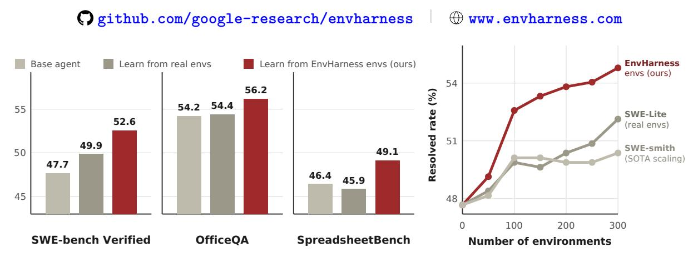
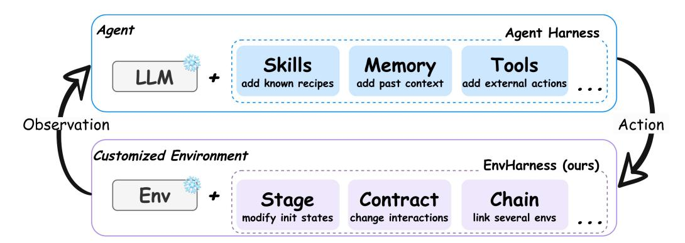
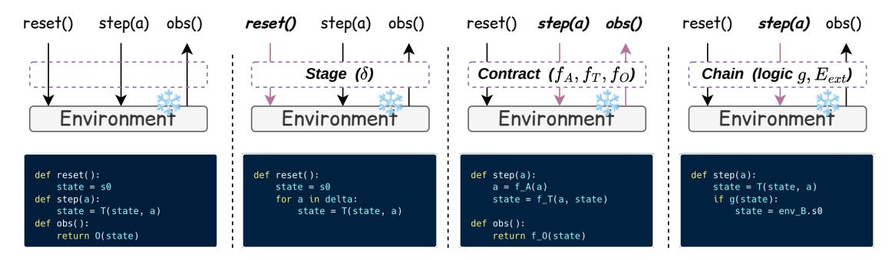
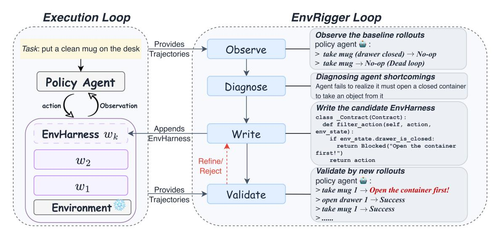
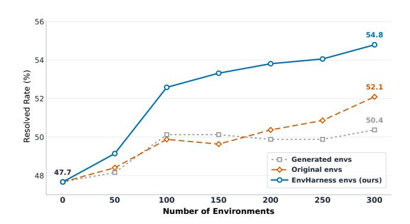
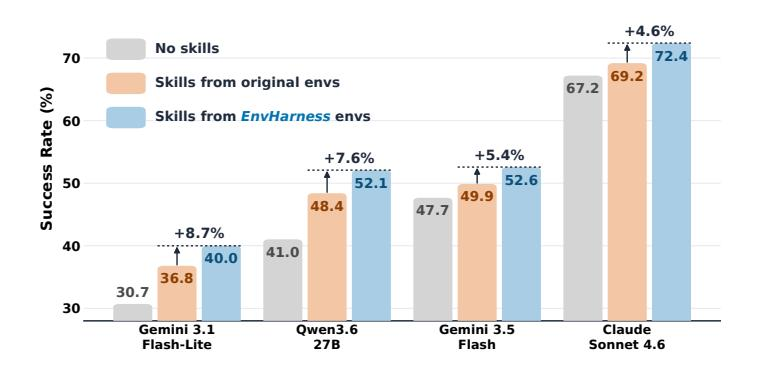
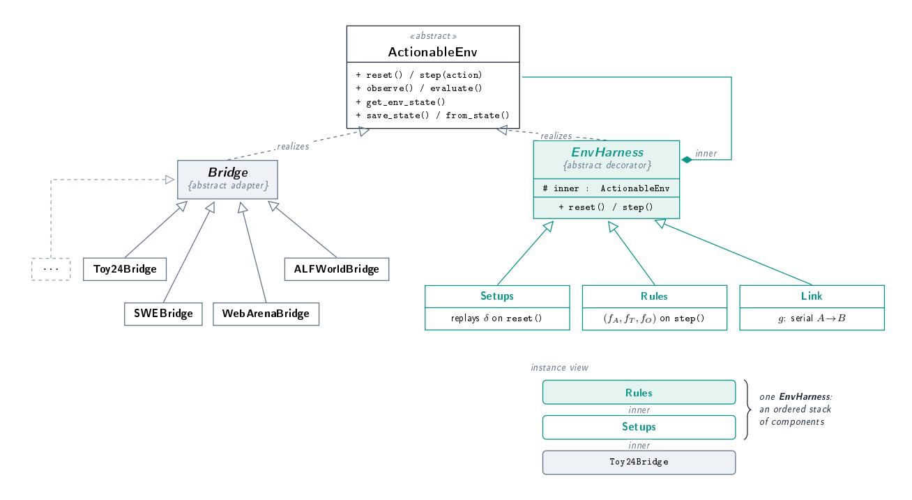

# EnvHarness: Awakening Static Worlds for Agent Learning

- 원제: EnvHarness: Awakening Static Worlds for Agent Learning
- 원문: [https://arxiv.org/abs/2608.19880](https://arxiv.org/abs/2608.19880)
- PDF: [https://arxiv.org/pdf/2608.19880v1](https://arxiv.org/pdf/2608.19880v1)
- arXiv ID: `2608.19880`

---


# **EnvHarness: 정적 세계를 깨워 에이전트 학습을 촉진하다 (EnvHarness: Awakening Static Worlds for Agent Learning)**

**Chengsong Huang**1\***, Zifeng Wang**<sup>2</sup> **, Rujun Han**<sup>2</sup> **, Jun Yan**<sup>2</sup> **, Yanfei Chen**<sup>2</sup> **, Zoey CuiZhu**<sup>2</sup> **, Ke Jiang**<sup>2</sup> **, Peng Xia**<sup>4</sup> **, Han Yu**<sup>2</sup> **, Yufan Zhuang**<sup>2</sup> **, Yifei Ming**<sup>2</sup> **, Jiaqi Pan**<sup>3</sup> **, Bhavana Dalvi Mishra**<sup>2</sup> **, Jiaxin Huang**<sup>1</sup> **, Burak Gokturk**<sup>2</sup> **, Tomas Pfister**<sup>2</sup> **and Chen-Yu Lee**<sup>2</sup>

LLM 에이전트는 환경과 상호작용하면서 학습하지만, 이러한 환경은 수작업으로 구축되고 정적이다: 에이전트의 약점을 인식하지 못하고, 에이전트가 향상됨에 따라 빠르게 뒤처진다. 최근 환경 생성 방법은 이를 해결하려 하지만, 도메인별 파이프라인이 필요하고, 비용이 많이 들거나 신뢰할 수 없는 검증기를 사용하며, 여전히 정적 환경을 생성한다. 환경을 처음부터 재구성하는 엔지니어링 부담을 완화하기 위해 우리는 Environment Harness (EnvHarness)를 제안한다. 이는 정적 환경을 감싸는 플러그인 구성요소의 프로그래머블 레이어로, 기본 로직을 수정하지 않고 행동을 재구성한다. 표준 인터페이스를 통해 작동하며, EnvHarness는 다양한 도메인에 적용 가능하면서 재구성된 모든 환경이 원래 검증기를 유지하도록 보장한다. 이 과정을 자동화하기 위해 우리는 EnvRigger를 도입한다. EnvRigger는 목표 정책을 블랙박스로 취급하고, 실행 궤적을 관찰하여 진단된 결함을 목표로 하는 EnvHarness 구성요소를 합성하고, 새로운 롤아웃을 통해 이를 검증한다. 네 개 도메인에 걸친 다섯 벤치마크에서 EnvHarness는 원본 환경과 도메인별 환경 생성 파이프라인 모두를 능가하며, 보류된 인스턴스에서 최대 9.0점 향상과 9.8% 더 적은 실행 단계를 달성한다. 또한 EnvHarness는 강화 학습에 대한 우수한 최적화 신호를 제공하여 정책과 환경의 지속적이고 목표 지향적인 공동 진화를 가능하게 한다.



Figure 1 | **전반적 성능.** *왼쪽:* EnvHarness 환경에서 학습하는 에이전트는 소프트웨어 엔지니어링 및 사무 자동화 벤치마크(SWE-bench Verified, OfficeQA, SpreadsheetBench 포함)에서 원본 환경에서 학습하는 에이전트보다 일관되게 우수하다. *오른쪽:* SWE-bench Verified에서 동일한 환경 예산 하에 EnvHarness는 환경이 확장됨에 따라 지속적으로 개선되는 반면, 실제 및 생성된 환경은 성능이 정체된다.

## **1. 서론 (Introduction)**

LLM이 자율 에이전트로 배포됨에 따라 ...

<sup>1</sup>Washington University in St. Louis, <sup>2</sup>Google Cloud AI Research, <sup>3</sup>Google Cloud, <sup>4</sup>University of North Carolina at Chapel Hill

<span id="page-1-0"></span>

Figure 2 | 에이전트 하니스는 플러그인 구성요소(예: 스킬, 메모리, 도구)를 통해 고정된 LLM을 모델 가중치를 변경하지 않고 유능한 에이전트로 변환하지만, EnvHarness는 이와 동일한 원칙을 상호작용의 반대쪽에 적용한다. EnvHarness는 플러그인 구성요소를 사용해 고정된 환경을 맞춤화하면서 원본 환경은 그대로 둔다.

코드베이스 [(Yang et al.,](#page-16-0) [2024)](#page-16-0) 또는 구현된 플랫폼 [(Wang et al.,](#page-15-0) [2023)](#page-15-0)을 제어하는 경우, 에이전트는 각자의 환경에 의존하여 학습 신호를 획득한다 [(Yao et al.,](#page-16-1) [2022b)](#page-16-1). 이러한 환경은 특정 과제를 제시하고, 변하는 상태를 관리하며, 행동에 반응하고, 성공을 평가하는 상호작용적 대응자 역할을 한다 [(Li et al.,](#page-14-0) [2026)](#page-14-0). 불행히도, 이들을 구축하려면 상호작용 로직과 검증기를 하드코딩하는 데 상당한 인적 노력이 필요하다 [(Merrill et al.,](#page-14-1) [2026;](#page-14-1) [Zhang et al.,](#page-16-2) [2025)](#page-16-2). 결과적으로, 생성된 환경은 고정적으로 정적이며, 어떤 에이전트가 상호작용하든, 또는 그 에이전트가 얼마나 향상되었든 동일하게 동작한다 [(Hu et al.,](#page-13-1) [2026)](#page-13-1). 이러한 경직성은 에이전트 학습을 두 가지 근본적인 방식으로 제한한다: 특정 에이전트의 약점을 해결하는 목표 신호를 제공하지 못하고 [(Dennis et al.,](#page-13-2) [2020;](#page-13-2) [Jiang et al.,](#page-13-3) [2021)](#page-13-3), 그리고 에이전트가 기존 과제를 해결하게 되면 더 이상 가르칠 것이 없어진다 [(Beukman et al.,](#page-13-4) [2024;](#page-13-4) [Wang et al.,](#page-15-1) [2019)](#page-15-1).

수동으로 환경을 구축하는 비용이 높기 때문에, 점점 더 많은 연구가 자동 환경 생성에 주목하고 있다 [(Guo et al.,](#page-13-5) [2025;](#page-13-5) [Song et al.,](#page-15-2) [2026;](#page-15-2) [Zala et al.,](#page-16-3) [2024)](#page-16-3). 이 접근법은 확장성이 있지만 두 가지 주요 한계가 있다. 첫째, 생성 파이프라인은 본질적으로 도메인 특화된다. 기존 시스템은 웹 탐색 [(Trabucco et al.,](#page-15-3) [2025)](#page-15-3), 프로그래밍 [(Pan et al.,](#page-14-2) [2024)](#page-14-2), 또는 도구 사용 [(Lee et al.,](#page-14-3) [2026a)](#page-14-3) 환경을 생성하지만, 한 설정에 맞춰 구축된 파이프라인은 다른 설정으로 전이될 수 없다. 둘째, 정확성을 보장하는 것은 비용이 많이 들고 신뢰할 수 없다. 이러한 환경과 검증기는 LLM에 의해 생성되므로, 실무자는 과다 생성하고 엄격히 필터링해야 한다 [(Wang et al.,](#page-15-4) [2026;](#page-15-4) [Yang et al.,](#page-16-4) [2026a)](#page-16-4), 이는 여전히 정확성을 완전히 보장하지 못한다.

새로운 환경을 만들어 학습 신호를 얻는 대신, 우리는 기존의 정적 환경을 환경 자체를 수정하지 않고 동적으로 맞춤화된 환경으로 변환하는 프로그래머블 레이어인 Environment Harness **(EnvHarness)** 를 제안한다. 우리는 EnvHarness와 에이전트 하네스[(Anthropic,](#page-12-0) [2025,](#page-12-0) [2026b;](#page-13-6) [OpenAI,](#page-14-4) [2026)](#page-14-4) 를 Figure [2:](#page-1-0) 에서 비유한다. 에이전트 하네스는 LLM에 외부 메모리, 도구, 그리고 복잡한 작업을 처리하기 위한 기술을 제공한다. EnvHarness는 이 개념을 환경에 확장하여 정적 환경을 모듈식 플러그인 구성요소로 장착한다. Stage는 에피소드의 시작점을 설정하고, Contract는 허용되는 행동과 관측을 제어하며, Chain은 여러 기본 환경을 연결해 확장된 에피소드를 만든다. 에이전트는 표준 인터페이스를 계속 사용하지만, EnvHarness가 이 상호작용을 매개한다. 이를 통해 한 환경이 처음에는 설계되지 않았던 요구를 충족할 수 있다: 특정 기술을 격리하거나, 작업의 수평을 확장하거나, 에이전트가 고군분투하지만 궁극적으로 성공하도록 난이도를 조정하는 것. 가장 중요한 것은 인터페이스 수준에서만 작동함으로써 EnvHarness가 도메인에 독립적이면서, 새로운 환경이 원래 환경의 신뢰할 수 있는 인간이 만든 검증기를 안전하게 상속받을 수 있게 한다.

EnvHarness는 보편적으로 적용 가능한 프레임워크를 제공하지만, 그 특정 구성은 각 대상 정책과 작업에 맞게 조정되어야 한다. 이 맞춤화 과정을 자동화하기 위해 EnvRigger를 도입한다. 정책을 순수하게 블랙박스로 취급함으로써 EnvRigger는 기본 환경 내에서 성공적이거나 실패한 실행 궤적을 관찰하여 특정 행동적 취약점을 진단한다. 이러한 결과를 바탕으로 후보 EnvHarness 구성요소를 합성하고 현재 환경을 감싸서 평가한다. EnvRigger는 이후 새로운 정책 롤아웃을 실행하며, 후보 환경이 결손된 능력을 효과적으로 기여하면서도 해결 가능성을 유지하는지 여부에 따라 수용 여부를 판단한다. 이 평가에 실패한 구성요소는 반복적으로 수정되어 성공할 때까지 진행된다. 궁극적으로 이 워크플로우는 완전 자동화된, 작업-정책 조건화된 환경 맞춤화를 실현한다.

우리는 ALFWorld (Shridhar et al., 2020), WebArena (Zhou et al., 2024), SWE-bench Verified (Jimenez et al., 2024), OfficeQA (Databricks, 2025), SpreadsheetBench (Ma et al., 2024)와 같은 도전적인 벤치마크에서 실험을 수행한다. 특히, EnvHarness를 두 가지 대표적인 학습 패러다임인 기술 기반 학습(SL)과 강화 학습(RL)에서 평가한다. SL 환경에서는 EnvHarness 환경으로 훈련된 에이전트가 원본 환경으로 훈련된 에이전트보다 우수하며, 보류된 과제에서 최대 9.0점의 향상을 달성하고 상호작용 단계 수를 9.8% 줄인다(Table 2, Table 3). RL 환경에서도 EnvHarness-맞춤형 환경이 유사하게 강력한 정책을 제공하며, 최대 6.5점의 향상을 보인다(Table 4). 마지막으로, EnvRigger 루프를 반복 실행하면 에이전트와 환경 간의 지속적인 공동 진화가 가능해져, 맞춤형 과제 수가 증가함에 따라 효과적으로 확장되는 복합적 성능 향상을 실현한다.

우리의 기여는 세 가지이다: (1) 우리는 EnvHarness를 제안한다. EnvHarness는 정적 환경(static environment)을 자체 reset/step 인터페이스(reset/step interface)를 통해 제어 가능한(controllable) 환경으로 맞춤화하는 프로그래머블 레이어이다. 이는 세 종류의 플러그인 구성요소(plugin components)로 구현되며, 서로 다른 환경에서 환경 초기 상태(environment initial states), 에이전트-환경 상호작용 인터페이스(agent-environment interaction interfaces), 복합 과제(composite tasks)를 재구성한다. 이 과정에서 원본 환경의 과제와 검증기(original environment's tasks and verifiers)는 변하지 않는다. (2) 우리는 EnvRigger를 도입한다. EnvRigger는 과제-정책(task-policy)-조건화된 환경(customization)을 자동화한다. 롤아웃(rollouts)에서 정책 결함(policy flaws)을 진단하고, 후보 구성요소(candidate components)를 반복적으로 수정하여 새로운 롤아웃이 성공을 확인할 때까지 진행함으로써, EnvRigger는 모든 새로운 환경(new environment)이 정책의 특정 약점(specific weaknesses of the policy)을 겨냥하도록 보장한다. (3) 네 개의 도메인(domain)에서 다섯 개의 벤치마크(benchmarks) 전반에 걸쳐, EnvHarness는 효과성(effectiveness) (보류된 과제(held-out tasks)에서 최대 9.0점)와 효율성(efficiency) (9.8% 적은 단계(steps))을 모두 향상시키며, 강화 학습(reinforcement learning) 하에서 정책을 강화하고, 인간이 구축한(human-built) 환경과 생성된 환경(generated environments)이 평면화(flatten out)되는 곳에서 에이전트 성능을 확장한다.

## 2. 환경 맞춤화 (ENVHARNESS)

### 2.1. EnvHarness 패러다임 (The EnvHarness Paradigm)

Table 1 | Agent Harness와 EnvHarness 사이의 비유. 두 시스템은 핵심 시스템을 변경하기보다 외부 레이어를 통해 기능을 확장한다.

|  | Agent Harness | EnvHarness (Ours) |
|--------------------------|----------------------------------|---------------------------------------------|
| Base System | Frozen LLM | Static environment |
| <b>해결을 위해 설계됨</b> | 행동, 메모리, 또는 루프 부족 | 하드코딩된 상호작용 로직 |
| <b>하니스 레이어</b> | 기능(도구, 메모리) | 맞춤화(상태, 규칙, 관측) |
| <b>통합 출력</b> | 자율 에이전트 | 맞춤형 환경 |

우리는 에이전트 하니스(Anthropic, 2025, 2026b; OpenAI, 2026)가 LLM을 감싸서 자율 에이전트(Agent = Model + Harness)를 형성하는 소프트웨어 계층(실행 루프, 도구 레지스트리, 컨텍스트 관리) (Meng et al., 2026)이며, 모델 가중치를 변경하지 않고 새로운 기능을 추가한다. 우리는

우리는 같은 아이디어를 에이전트-환경 루프의 다른 쪽에 적용한다. 우리는 **EnvHarness**를 기존의 정적 환경을 감싸서 맞춤형 환경(맞춤형 Env = Static Env + EnvHarness)으로 바꾸는 프로그래머블 계층으로 정의한다. EnvHarness는 표준 인터페이스를 통한 정보 흐름을 수정함으로써 이 맞춤화를 달성하며, 기본 환경은 완전히 건드리지 않는다. 에이전트 하니스의 도구와 메모리와 유사하게, EnvHarness는 특정 훈련 요구(특정 스킬 격리, 작업의 시야 확장, 또는 작업 난이도 조정 등)에 맞게 환경을 조정하는 모듈형 플러그인 구성요소로 구성된다.

**EnvHarness의 공식 정의.** 우리는 환경을 튜플 = (S, A, O, , , 0) 으로 모델링한다. 여기서 S는 상태 공간, A는 행동 공간, O는 관측 공간이며, : S × A → S는 상태와 행동을 다음 상태로 매핑하는 전이 함수, 검증자에 의해 유도되는 보상, 그리고 <sup>0</sup>는 초기 상태이다. EnvHarness 구성요소는 환경에 무관한 변환이다 :

<span id="page-3-0"></span>

$$E' = w(E), \qquad E' = (S', \mathcal{A}', O', T', R', s'_0).$$

(1)

이것은 환경을 인터페이스 수준에서만 재구성하며, 기본 시뮬레이터 백엔드나 구현 세부 사항을 수정하지 않는다. 초기 상태(′ 0)를 맞춤화하고, 노출된 공간(A′, O′)을 필터링하며, 전이 메커니즘(′)을 업데이트한다. 모든 개입이 외부에 머무르기 때문에 실제 평가 로직은 보존되어, 원래 검증자가 여전히 에피소드를 점수화할 수 있다.

### <span id="page-3-2"></span><span id="page-3-1"></span>**2.2. 세 EnvHarness 구성요소**



Figure 3 | **표준 환경 인터페이스를 감싸는 EnvHarness 구성요소 개요.** 기본 환경(원시 상태 전이 및 원본 작업 검증자)은 완전히 동결된다. 왼쪽에서 오른쪽으로: 기본 환경, 그 뒤를 따라 세 EnvHarness 구성요소—Stage, Contract, Chain. 강조된 화살표와 헤더는 재정의된 인터페이스 메서드를 나타내며, 코드 블록은 각 래퍼가 상태 초기화, 전이 역학, 또는 관측 처리 방식을 어떻게 수정하는지 보여준다. 기본 환경을 변경하지 않는다.

Eq. [(1)](#page-3-0)의 매핑은 일반 인터페이스를 정의하며, 이 인터페이스를 따르는 모든 변환은 유효한 EnvHarness 구성요소가 된다. 본 연구에서는 환경 맞춤화의 세 가지 근본 모드를 포괄하도록 세 가지 구체적 유형의 구성요소를 도입하고, 더 많은 유형이 뒤따를 것으로 기대한다. 각 유형은 자체 매개변수로 지정되며, reset 또는 step과 같은 표준 환경 인터페이스 메서드를 재정의한다. Figure [3](#page-3-1)은 세 구성요소 유형을 원래 인터페이스와 비교하며, 각 구성요소가 재정의하는 특정 메서드를 강조한다. 우리는 이 인터페이스 프로토콜과 클래스 아키텍처의 소프트웨어 구현을 Appendix [C.](#page-19-0)에 상세히 기술한다. 본 절 전반에 걸쳐, 우리는 ALFWorld 작업 중 하나인 *"put a clean mug on the desk"*에서 구성요소를 예시한다. 기본 인스턴스는 머그를 열어 두고 배치 즉시 종료된다.

Stage: 초기 상태 변경. Stage, $w_{\text{stage},\delta}$, 는 상태 조작 액션 시퀀스 $\delta = (a_1, \ldots, a_k)$ 로 지정된다. 이 액션들은 reset()에 의해 생성된 초기 상태 $s_0$ 에 적용된다:

<span id="page-4-0"></span>

$$E' = w_{\text{stage},\delta}(E) = (S, \mathcal{A}, O, T, R, s'_0), \text{ where } s'_0 = T(\dots T(T(s_0, a_1), a_2) \dots, a_k).$$

(2)

우리는 이 변환에서 초기 상태만 변경된다. Stage는 에이전트의 시작점을 맞춤화하며, 특정 기술이 필요한 장애물을 도입하거나, 사전 서브목표를 완료해 작업 수평을 단축시킬 수 있다. 예를 들어, 우리 실행 중인 작업에서 한 Stage는 다음과 같은 행동 순서를 수행한다: 머그 1을 가져오고, 서랍 1을 열고, 머그 1을 서랍 1에 넣고, reset()이 반환한 상태에서 서랍 1을 닫는다. 이 Stage는 의도적으로 에이전트에게 머그를 숨겨, 에이전트가 직접 보이는 곳에서 바로 잡아내는 대신 먼저 물체를 찾아야 하는 더 어려운 시나리오를 맞이하도록 강제한다. 반대로, 다른 Stage는 머그를 미리 청소함으로써 설정을 단순화하고, 최종 배치 단계만 남긴다.

Contract: 상호작용 재작성. Contract, $w_{\text{contract},r}$, 은 변환 매핑 세 쌍 $r = (f_A, f_T, f_O)$ 로 지정되며, 각각 기본값은 항등함수이다. 이 매핑들은 각각 행동 공간, 전이 역학, 관측 공간을 재작성한다:

<span id="page-4-1"></span>

$$E' = w_{\text{contract},r}(E) = (S, \mathcal{A}', O', T', R, s_0), \text{ where } (\mathcal{A}', O', T') = (f_A(\mathcal{A}), f_O(O), f_T(T)).$$

(3)

실제로, 이 변환들은 행동 전제조건을 강제하고, 관측을 증강하거나 마스킹하며, 특정 결과에 구조화된 피드백을 부착해 에이전트 학습을 유도한다. 예를 들어, 우리 실행 중인 작업에서 한 Contract는 $f_O$ 를 설정해 방 설명을 처음 두 문장 뒤에서 자르고, 에이전트가 여러 단계에 걸쳐 공간 표현을 구축하도록 요구한다; 다른 Contract는 $f_T$ 를 사용해 에이전트가 머그를 들고 있지 않으면 깨끗한 머그 행동을 차단해, 에이전트가 먼저 물체를 집어야 하도록 강제한다; 세 번째 Contract는 $f_A$ 를 설정해 고수준 텔레포트 탐색 명령을 제거해, 에이전트가 단계별로 움직이고 탐색하도록 강제한다.

**Chain: 환경 확장.** Chain, $w_{\text{chain},\ell}$, 은 쌍 $\ell = (E_{\text{ext}}, g)$ 로 지정되며, $E_{\text{ext}}$ 는 추가 환경이고 g는 합성 논리이다. 합성 논리는 원래 환경 E와 $E_{\text{ext}}$ 를 동일한 인터페이스를 통해 노출되는 복합 환경 E' 로 결합한다:

<span id="page-4-2"></span>

$$E' = w_{\text{chain},\ell}(E) = (S', \mathcal{A}', O', T', R', s'_0), \text{ where } E' = g(E, E_{\text{ext}}).$$

(4)

교차 환경 조합을 허용하기 위해, 새로운 공간은 단순히 기본 환경의 합집합이다 (예: $\mathcal{A}' = \mathcal{A} \cup \mathcal{A}_{ext}$), 그리고 R'는 새로운 복합 보상으로 작용한다. 합성 논리 g는 제한이 없으며, 환경을 연결, 교차, 또는 분기하여 중간 결과에 따라 동적으로 전환할 수 있다 (예시를 위해 Appendix D 참조). 합성 논리 g는 두 환경을 처음부터 결합하거나, 전이 함수 T'를 사용해 특정 조건이 만족되면 한 환경에서 다른 환경으로 동적으로 전환할 수 있다. 우리 실행 환경에서 한 Chain은 같은 집 안에서 "감자를 데우고 조리대에 놓는다"를 추가하고, 두 환경이 모두 검증될 때만 R'에서 성공을 반환한다. 이는 에이전트가 그렇지 않으면 멈추었을 지점까지 목표를 이어가도록 학습하도록 요구한다.

**Composition.** 모든 EnvHarness 구성요소가 표준 인터페이스를 공유하므로 자유롭게 조합된다. 예를 들어, Stage, Contract, Chain을 우리 기본 머그 작업에 쌓으면 단일 복합 환경이 생성된다:

$$E' = w_{\text{chain},\ell} \left( w_{\text{contract},r} \left( w_{\text{stage},\delta}(E) \right) \right). \tag{5}$$

In this 설정에서 $w_{\text{stage},\delta}$는 머그를 서랍에 숨겨 공간 탐색을 강제하기 위해 에피소드를 초기화하고, $w_{\text{contract},r}$는 관측을 두 문장으로 잘라 부분 관측 가능성을 평가하며, $w_{\text{chain},\ell}$는 목표 지속성을 테스트하기 위해 후속 작업을 추가한다. 이러한 변환은 교환 불가능하다( $w_1 \circ w_2 
eq w_2 \circ w_1$ ); 중첩 순서는 결과 환경이 어떻게 구성되고 초기화 시와 상호작용 시에 어떤 제약이 적용되는지를 결정한다.

## <span id="page-5-1"></span>3. 에이전트 학습을 위한 EnvHarness (EnvHarness for Agent Learning)

### 3.1. 문제 설정 (Problem Setup)

기본 환경 E가 일련의 기본 과제를 지원하고, 목표 정책 에이전트 $\pi$가 있을 때, 우리의 목표는 특정 과제 t에 맞춰 조정된 수정된 환경 E'를 자동으로 생성하여 $\pi$의 고유한 결함을 드러내어 목표 지향적 정책 개선을 촉진하는 것이다. 단일 EnvHarness 구성요소는 정책에 무관하며, 방정식 (1)은 w를 환경만의 변환으로 정의하여 동일한 구성요소를 어떤 정책에도 수정 없이 적용할 수 있게 한다. 반대로, 이러한 구성요소의 선택과 매개변수화는 기본 과제 t와 정책 $\pi$의 관찰된 행동 모두에 조건화되어야 한다. 따라서 우리는 과제-정책 조건화 맵 $\mathcal{H}$를 도입한다 :

<span id="page-5-0"></span>

$$E' = \mathcal{H}(E, t; \pi) = (w_k \circ w_{k-1} \circ \cdots \circ w_1)(E), \tag{6}$$

각 $w_i$는 기본 환경 E를 감싸고 과제 t에서 $\pi$의 핵심 약점을 드러내도록 설계된 맞춤형 EnvHarness 구성요소이다. 내부 모델 가중치를 검사하는 대신, 이 구성요소들은 에이전트를 블랙박스로 취급하고 오직 출력만을 이용해 꾸준하고 교정적인 학습 신호를 생성한다.

### 3.2. EnvRigger (EnvRigger)

우리는 방정식 (6)의 과제-정책 조건화 맵 $\mathcal{H}$를 실현하기 위해 EnvRigger를 도입한다. EnvRigger는 과제 t에서 환경 내에서 $\pi$를 실행하고, 발생한 궤적을 분석하며, 이 과제에 맞게 환경을 맞춤화하기 위해 특정 EnvHarness 구성요소를 작성하고, 새로운 정책 롤아웃을 사용해 맞춤 환경을 검증한다. 적절한 학습 신호를 제공하는 맞춤 환경 후보는 수락되고, 실패한 후보의 EnvHarness 구성요소는 거절되거나 수정된다. 그림 4는 EnvRigger가 Observe, Diagnose, Write, Validate의 네 단계에서 체계적으로 작동하는 완전한 워크플로우를 보여준다. Stage에서 도입된 초기 상태 변이를 신뢰성 있게 재현하기 위해, 우리는 검증 단계에서 기본 환경이 결정론적 재설정을 지원한다고 가정한다.

**Observe.** EnvRigger는 현재 환경에서 기본 과제 t에 대해 정책 $\pi$를 실행하여 롤아웃 궤적 배치를 수집하고 분석하는 것으로 시작한다. 실패는 이 과제에서 해결해야 할 구체적 약점을 드러내고, 성공은 이러한 결함의 경계를 정의하는 데 도움을 주며, 이미 intact한 능력과 실패가 시작되는 지점을 보여준다.

**Diagnose.** EnvRigger는 수집된 궤적을 분석하여 관찰된 행동의 근본 원인을 식별한다. 반복적인 행동 루프, 긴 관측을 파싱하는 실패, 도구 제약을 잘못 읽는 등 체계적인 문제에 초점을 맞춘다. 이 진단은 또한 맞춤화 방향을 결정한다. 어려움을 겪는 정책의 경우, 목표는 누락된 단계를 scaffold하고 과제를 단순화하는 것이다. 반대로 정책이 완벽한 성공률을 달성하면, 현재 환경이 과도하게 관대하여 결함을 드러내지 못한다는 것을 의미한다.

<span id="page-6-0"></span>

Figure 4 | EnvRigger가 주어진 작업에 따라 목표 정책을 위한 EnvHarness 구성 요소를 생성합니다. 왼쪽의 *execution loop*는 현재 환경에 대해 정책을 실행합니다. 이 환경은 수락된 구성 요소 1, … 를 포함하는 활성 EnvHarness에 의해 감싸진 동결된 기본 환경이며, 그 결과 롤아웃 궤적은 오른쪽의 *EnvRigger loop*에 공급됩니다. EnvRigger는 Observe, Diagnose, Write, Validate의 네 단계로 체계적으로 작동하며, 마지막 두 단계는 작성-검증 루프를 형성하여 후보 구성 요소를 생성하고 새 롤아웃에서 평가하며 실패 시 수정합니다.

남은 약점이 있다. 이 시나리오에서 EnvRigger는 환경을 더 어렵게 만들어야 한다고 진단하며, 맞춤화를 전환하여 정책의 잠재적 결함을 드러내도록 더 도전적인 시나리오를 주입합니다. EnvRigger는 이러한 결과를 텍스트 진단으로 출력합니다.

**Write.** 진단을 바탕으로 EnvRigger는 식별된 결함을 목표로 하는 하나 이상의 EnvHarness 구성 요소를 합성합니다. 단일 결함은 Stage(초기 상태를 맞춤화)와 Contract(후속 상호작용을 필터링)와 같은 여러 구성 요소를 결합해야 할 수 있으며, 이는 후보 세트로 함께 방출됩니다. 예를 들어, 진단이 정책이 학습을 우회하는 취약한 지름길에 의존한다는 것을 밝혀내면, EnvRigger는 특정 조건에서 이 동작을 차단하는 Contract를 작성하여 정책이 탐색하고 의도된 기술을 숙달하도록 강제할 수 있습니다.

<span id="page-6-1"></span>**Validate.** Write 단계에서 생성된 후보 구성 요소를 평가하기 위해, EnvRigger는 현재 환경을 해당 구성 요소로 감싸서 ′를 인스턴스화하고 기본 작업에서 새로운 롤아웃을 실행합니다. 일부 궤적 지표(성공률 및 실패 분포 등)를 기반으로 EnvRigger는 새 롤아웃을 분석하여 세 가지 검증 동작 중 하나를 결정합니다: 후보를 수락, 해결 불가능하거나 도전적이지 않은 후보를 거절, 또는 신호가 부적절하게 스케일된 후보를 정제합니다. 후보가 정제가 필요하면, 궤적과 스케일링 피드백이 Write 단계로 다시 흐르며, Write-and-Validate 루프를 반복하여 후보가 수락되거나 수정 예산이 소진될 때까지 진행합니다. 모든 수락된 구성 요소는 궁극적으로 EnvHarness에 추가됩니다. 이러한 검증 동작을 안내하는 정확한 시스템 프롬프트와 의사결정 기준은 Appendix [A.](#page-18-0)에 상세히 기술되어 있습니다.

## **4. 실험 (Experiments)**

### **4.1. 실험 설정 (Experimental Setup)**

본 섹션에서는 주로 환경에서 기술을 추출하여 에이전트의 역량을 향상시키는 기술 기반 학습 패러다임에 초점을 맞춥니다. 또한 온라인 강화 학습 패러다임에서 우리 프레임워크의 호환성과 성능을 평가하며, 이는 Section [5.](#page-9-1)에서 보다 광범위한 분석의 일부로 제시됩니다.

**Benchmarks and Evaluation.** 우리는 ALFWorld [(Shridhar et al.,](#page-15-5) [2020)](#page-15-5) 텍스트 기반 구현 환경, WebArena [(Zhou](#page-16-5) [et al.,](#page-16-5) [2024)](#page-16-5) 웹 상호작용, SWE-bench Verified [(Jimenez et al.,](#page-14-5) [2024)](#page-14-5) 소프트웨어 엔지니어링, OfficeQA [(Databricks,](#page-13-7) [2025)](#page-13-7)와 SpreadsheetBench [(Ma et al.,](#page-14-6) [2024)](#page-14-6) 사무 자동화를 포함한 네 개의 서로 다른 도메인에 걸친 다섯 개 벤치마크에서 프레임워크를 평가합니다. 각 벤치마크의 기본 지표를 보고하며, SWE‑benc...에서 평균 단계 수를 실행 효율성의 척도로 추가 추적합니다. 훈련 및 평가 에피소드는 모든 벤치마크에서 엄격히 분리되며, 자세한 분할 구성은 Appendix [E.1.](#page-24-0)에 제공됩니다.

Importantly, EnvRigger와 정책 에이전트는 각 벤치마크에서 동일한 모델 백본을 사용한다: ALFWorld와 WebArena에서는 Gemini-3.1-Flash-Lite, 다른 곳에서는 Gemini-3.5-Flash를 사용하여 성능 향상이 더 강력한 외부 모델을 증류한 결과가 아니라는 것을 보장한다. 각 훈련 세트에서 EnvRigger는 Section [3](#page-5-1)의 최적화 루프를 실행하여 EnvHarness 맞춤 환경을 생성한다. 이후 우리는 ReasoningBank [(Ouyang et al.,](#page-14-8) [2025)](#page-14-8)에서 수집된 궤적에서 기술을 추출하고, 보류된 인스턴스에서 기술이 장착된 정책 에이전트를 평가한다. EnvRigger가 결합된 환경의 내부 상태를 관찰하기 어렵기 때문에 이 자동 파이프라인에서 *Chain* 구성요소를 제외한다. 대신, 체이닝의 효과를 Section [5.](#page-9-1)에서 별도로 분석한다.

**Baseline Methods.** 우리는 EnvHarness를 네 가지 기술 소스와 비교한다: **No Skills** (동결된 정책 에이전트만), **Original Envs** (원본 환경에서 추출한 기술로 재구성 효과를 분리), 그리고 **GenEnv** [(Guo et al.,](#page-13-5) [2025)](#page-13-5), **VeriEnv** [(Chae et al.,](#page-13-8) [2026)](#page-13-8), 또는 **SWE-smith** [(Yang et al.,](#page-16-4) [2026a)](#page-16-4) 를 각각의 벤치마크에 대해 사용한다. 이 기준 생성기들은 도메인별이지만, EnvHarness는 통합 인터페이스를 통해 모든 도메인에서 일반적으로 적용된다. 사무 자동화 환경처럼 생성 기준이 없는 경우도 포함된다. 공정한 비교를 위해 모든 기준은 동일한 시드 인스턴스, 환경 수, 추출 파이프라인, 정책 모델을 공유한다. EnvRigger는 동일한 오라클 검증 접근 하에서 훈련 에피소드에만 엄격히 작동하며, 각 평가 인스턴스는 한 번 시도된다. 기준 세부 사항은 부록 [E.2.](#page-24-1)에 있다.

### **4.2. 주요 결과** (Main Results)

Table [2](#page-8-0)과 Table [3](#page-8-1)은 다섯 개 벤치마크에 걸친 주요 결과를 요약한다. 이 평가를 바탕으로 다음과 같은 핵심 관찰을 제시한다.

**EnvHarness는 정적 환경이 불가능한 곳에서 일관된 이득을 제공한다.** EnvHarness로 맞춤화된 환경에서 획득한 기술은 모든 벤치마크에서 원본 환경에서 추출한 기술보다 일관되게 우수하며, ALFWorld에서는 최대 9.0점 향상을 보인다. 반대로, 정적 기반 환경에서 기술을 추출하면 실제로 성능이 저하될 수 있다. 예를 들어 SpreadsheetBench에서는 수정되지 않은 환경에서 추출한 기술이 무기술 기준보다 낮고, SWE-bench Verified에서는 실행 궤적이 길어진다. 정적 환경은 오직

<span id="page-8-0"></span>Table 2 | ALFWorld 및 WebArena에서 서로 다른 환경 소스에서 추출한 기술을 장착한 에이전트의 성능. 모든 수치는 세 번의 독립 실행 평균이며, 표준 편차는 회색 첨자 형태로 표시된다. 모든 지표에서 높은 값이 더 좋으며, 마지막 행은 EnvHarness Envs가 Original Envs에 비해 개선된 정도를 보고한다. “—”는 해당 방법이 벤치마크별이며 다른 도메인에 적용할 수 없음을 나타낸다.

| 스킬 소스 | ALFWorld |  |  | WebArena |  |  |  |  |  |
|-----------------|----------------------------|----------------------------|----------------------------|----------------------------|----------------------------|----------------------------|----------------------------|----------------------------|--|
| ban bource | In-Dist | OOD | 평균 | Reddit | Shopping | Shop Admin | GitLab | 평균 |  |
| 스킬 없음 | <b>62.6</b> <sub>1.7</sub> | 60.7 <sub>5.2</sub> | 61.7 3.4 | 39.6 2.3 | 35.2 <sub>3.3</sub> | 44.1 2.3 | 35.8 <sub>8.4</sub> | 38.7 <sub>2.3</sub> |  |
| 원본 환경 | 63.3 <sub>2.8</sub> | 61.4 <sub>4.3</sub> | 62.4 <sub>3.4</sub> | 38.7 <sub>9.7</sub> | $35.2_{1.3}$ | <b>44.6</b> <sub>3.0</sub> | 35.4 <sub>4.0</sub> | $38.5_{3.1}$ |  |
| GenEnv | <b>63.3</b> <sub>1.2</sub> | $61.9_{2.7}$ | <b>62.6</b> <sub>1.9</sub> | _ | _ | _ | _ | _ |  |
| VeriEnv | _ | _ | _ | 39.6 <sub>4.2</sub> | $30.2_{0.0}$ | <b>49.7</b> <sub>2.4</sub> | <b>38.9</b> <sub>5.6</sub> | <b>39.6</b> <sub>1.4</sub> |  |
| EnvHarness Envs | <b>66.2</b> <sub>0.3</sub> | <b>70.4</b> <sub>2.3</sub> | <b>68.3</b> <sub>1.3</sub> | <b>40.6</b> <sub>4.7</sub> | <b>37.4</b> <sub>0.3</sub> | <b>50.8</b> <sub>1.5</sub> | $37.7_{3.1}$ | <b>41.6</b> <sub>1.8</sub> |  |
| 개선 | +2.9 | +9.0 | +5.9 | +1.9 | +2.2 | +6.2 | +2.3 | +3.1 |  |

Table 3 | 다양한 환경 소스에서 추출된 기술을 장착한 에이전트의 성능을 SWE-bench Verified, OfficeQA, SpreadsheetBench에서 측정한 결과. 표준 편차는 회색 서브스크립트로 표시된다. "—"는 해당 방법이 벤치마크 전용이며 다른 도메인에 적용할 수 없음을 나타낸다.

| 스킬 소스 | SWE-검증 |  | OfficeQA |  | SpreadsheetBench |  |  |
|-----------------|-----------------------|------------------------------|------------------------------|------------------------------|------------------------------|------------------------|--|
| Sidir 소스 | SR (↑) | Average Step (↓) | EM (↑) | F1 (↑) | Pass@1 (†) | Mean Score (↑) |  |
| No Skills | 47.67 <sub>0.93</sub> | <b>53.58</b> <sub>2.93</sub> | <b>54.23</b> <sub>2.84</sub> | 55.77 <sub>2.98</sub> | <b>46.44</b> <sub>0.15</sub> | 61.32 0.37 |  |
| Original Envs | 49.88 <sub>2.59</sub> | 55.01 <sub>1.69</sub> | <b>54.40</b> <sub>1.84</sub> | 55.77 <sub>1.59</sub> | <b>45.88</b> <sub>1.19</sub> | $61.47_{0.59}$ |  |
| SWE-smith | $50.12_{1.74}$ | 54.72 <sub>2.03</sub> | _ | _ | _ | _ |  |
| EnvHarness Envs | $52.58_{2.72}$ | <b>49.61</b> <sub>2.49</sub> | $56.20_{2.34}$ | <b>57.73</b> <sub>2.29</sub> | <b>49.15</b> <sub>0.36</sub> | <b>62.48</b> $_{0.27}$ |  |
| 개선 | +2.70 | +5.40 | +1.80 | +1.96 | +3.27 | +1.01 |  |

EnvHarness는 이미 수행하고 있는 행동을 연습하도록 설계되었지만, 이는 그 에이전트의 특정 한계를 해결하지 못하고, 종종 중복되거나 최적이 아닌 기술을 검색한다. 반면 EnvRigger의 작성-검증 루프는 새로운 정책 궤적으로 검증된 환경 구성요소만을 커밋하여, EnvHarness가 모든 벤치마크에서 무기술 기준보다 일관되게 향상되도록 보장한다.

EnvHarness는 도메인에 무관한 인터페이스를 통해 도메인 전반에 걸쳐 일반화된다. 기본 인터페이스 프로토콜, EnvRigger 루프, 그리고 기술 추출 파이프라인은 모든 다섯 개 벤치마크에서 일관되게 적용되며, 다른 환경에 적응하기 위해서는 도메인별 프롬프트 템플릿만 필요하다. 반면, 특수화된 생성 기반은 각자 특정 목표 벤치마크에만 제한된다(표 2와 3에서 적용 불가능한 도메인은 대시로 표시). 그럼에도 불구하고 EnvHarness는 적용 가능한 모든 경우에서 이러한 특수 기반을 일관되게 능가한다. Alf-World에서는 EnvHarness의 기술이 GenEnv보다 평균 5.7점, 그리고 분포 외 설정에서는 8.5점을 초과하며, 일반적인 인스턴스 생성은 정책 약점을 해결하지 못하고 단순히 반복 연습만을 늘린다. SWE-bench Verified에서는 EnvHarness가 목적에 맞게 설계된 SWE-smith보다 성공률이 2.46점 높고, 에피소드당 실행 단계가 5.11개 적다. 따라서 통합 인터페이스를 통해 진단된 취약점을 목표로 하는 것이 도메인별 생성으로 훈련 에피소드 수를 단순히 늘리는 것보다 우수하다.

**EnvHarness는 낭비 행동을 수리함으로써 효율성을 향상시킨다.** SWE-bench Verified에서 EnvHarness-맞춤 환경에서 추출된 기술은 에피소드당 평균 단계 수를 53.6에서 49.6으로 감소시키며, 반면 수정되지 않은 환경에서의 기술은 실제로 55.0으로 증가시킨다. 이는

효율성 증가는 EnvRigger의 특정 진단과 직접적으로 상관된다: 반복 행동 루프를 방해하고 장황한 관측을 필터링하도록 설계된 타깃 Contracts와 Stages가 실행 경로를 성공적으로 단축한다.

## 5. 분석 (Analysis)

우리는 EnvHarness를 다섯 가지 차원에서 분석한다: 강화 학습의 훈련 신호로서의 호환성, 표준 데이터셋 확장과 비교한 확장 효율성, 서로 다른 정책 모델 계열 및 강도에 대한 전이 가능성, 장기 수평 환경에서 Chain 구성요소의 독특한 가치, 그리고 EnvRigger가 명시적이고 사용자 정의된 목표 제약을 수용할 수 있는 능력. 추가 분석은 부록 G에 보고된다.

EnvHarness는 강화 학습을 향상시킨다. 기술 기반 학습을 넘어, EnvHarness-맞춤 환경이 온라인 강화 학습에서 적극적인 훈련 신호를 제공할 수 있는지 조사한다. 우리는 ALFWorld와 WebShop(Yao et al., 2022a)에서 Qwen3-8B-base(Yang et al., 2025)를 정책으로 사용하고, Group Relative Policy Optimization(GRPO)(Shao et al., 2024)으로 최적화한 이 분석을 수행한다; 훈련 세부 사항은 부록 F.1에 제공된다. 우리는 두 개의 별도 정책을 훈련한다: 하나는 원본 정적 환경에만 훈련된 것,

<span id="page-9-0"></span>

|  | ALFWorld |  |  | WebShop |  |  |
|-----------------|----------|------|------|---------|------|--|
| 학습 세트 | In-Dist | OOD | 평균 | 점수 | SR |  |
| Original Envs | 81.4 | 89.6 | 85.5 | 75.6 | 66.0 |  |
| EnvHarness Envs | 87.9 | 88.8 | 88.4 | 79.2 | 67.4 |  |

Table 4 | ALFWorld 및 Web-Shop에서의 강화 학습, 원본 환경과 EnvHarness 환경에서 훈련된 정책을 비교. ALFWorld는 in-distribution 및 held-out instance 유형에 대한 성공률로 평가되며, WebShop은 환경 점수와 성공률을 보고한다.

그리고 EnvHarness가 재구성한 환경에서 전부 훈련된 정책을 동일한 held-out 인스턴스에서 평가한다. Table 4는 결과를 보고한다. EnvHarness 환경에서 훈련하면 정책 성능이 일관되게 향상되며, 원본 환경만으로 훈련된 기준보다 네 개 지표 중 세 개에서 우수하다. 구체적으로 ALFWorld에서는 EnvHarness Envs가 in-distribution 성공률 87.9를 달성한 반면 원본 환경은 81.4이다. WebShop에서는 점수 79.2(원본 75.6)와 성공률 67.4(원본 66.0)를 기록한다. ALFWorld OOD 성공률(88.8 대 89.6)에서 약간의 무시할 수 있는 트레이드오프가 있지만, 전체 결과는 근본적인 이점을 강조한다: 재구성된 환경은 단순한 보조 데이터가 아니라 온라인 정책 학습을 위한 매우 효과적이고 독립적인 최적화 신호를 제공한다.

Chain은 효율적인 장기 수평 작업 해결을 가능하게 한다. 실제 애플리케이션은 종종 에이전트가 장기간에 걸쳐 작동하도록 요구한다. Chain 구성 요소는 두 개의 무작위로 짝지어진 기본 환경을 하나의 연장된 에피소드로 결합함으로써 이를 해결한다. 그 효과를 분리하기 위해 이 짝짓기는 자율 EnvRigger 루프와 독립적으로 동작한다. 우리는 평가-

<span id="page-9-2"></span>

|  | SR (%) ↑ | AS ↓ |
|------------------------------------------|----------|-------|
| 스킬 없음 | 47.67 | 53.58 |
| 원본 환경 | 49.88 | 55.01 |
| EnvHarness (Stage/Contract 전용) | 52.58 | 49.61 |
| EnvHarness (Chain 전용) | 49.63 | 41.96 |
| 통합 스킬 (Stage/Contract + Chain) | 54.30 | 43.12 |

Table 5 | 장기 수평 환경에서의 성능. SR은 Success Rate(성공률)를, AS는 Average Steps(평균 단계)를 나타낸다.

표 5에 보고된 Success Rate(SR)와 Average Steps(AS)를 사용하여 표준 단일 환경 테스트 인스턴스에서 추출된 기술을 평가한다.

Chain 환경에서의 기술은 상당한 효율성 향상을 가져오며, AS를 53.58에서 41.96으로 감소시킨다. 독립적인 SR(49.63)은 49.88 기준선보다 약간 낮다. 이는 두 절반을 모두 해결해야 성공이 요구되는 엄격한 훈련 조건과 일치하며, 단기 작업 최적화보다 장기 목표 보존을 우선시한다. Stage/Contract + Chain 두 기술 세트를 결합하면 두 세계의 장점을 모두 얻는다: 가장 높은 SR(54.30)과 우수한 효율성(43.12 AS)을 달성하며, 매우 보완적인 행동을 보여준다. 대표적인 기술은 Appendix F.3에 있다.

#### EnvHarness는 효율적인 환경을 가능하게 한다 (EnvHarness enables efficient environment)

scaling. 환경 확장 평가는 사용 가능한 훈련 환경이 확장됨에 따라 성능을 평가하며, 동일한 예산 하에서 세 가지 할당 전략을 비교한다: EnvHarness 환경, 수정되지 않은 벤치마크 환경, 그리고 SWE-smith가 생성한 환경. 정책 모델, 환경 예산, 기술 검색 프로토콜을 고정하고, 50개의 환경 배치마다 하나의 기술 은행을 생성한다(각 은행마다 2~3개의 기술이 번갈아 가며, 300 환경에서 총 15개의 기술). 특히, 두 기준선은 학습자와 독립적으로 환경 배치를 가져오지만, EnvHarness는 이전에 축적된 기술을 갖춘 정책을 대상으로 각 배치를 합성한다-

<span id="page-10-0"></span>

Figure 5 | SWE-bench Verified에서의 환경 확장. 세 가지 소스는 동일한 수의 환경을 제공하고 동일한 추출 및 검색 프로토콜을 공급한다.

각 배치를 이전에 축적된 기술을 갖춘 정책을 대상으로 구체적으로 맞춤화하여 환경과 정책이 공동 진화하도록 한다. Figure 5에 표시된 대로 EnvHarness는 47.67에서 54.79(7.12 포인트 상승)으로 상승하며 300 환경에서도 상승 추세를 유지한다. 반면 동일한 예산은 원본 환경에서 52.13, 생성된 환경에서 50.37만을 제공한다. 이 성능 격차는 학습자의 현재 능력 경계에 맞추는 것이 무조건적인 환경 확장보다 근본적으로 더 효과적임을 확인한다. 각 라운드의 대표 기술은 Appendix F.2에 제공된다.

EnvHarness는 다양한 LLM 백본에 걸쳐 일반화된다. 일반화성을 평가하기 위해 우리는 SWE-bench Verified에서 네 가지 서로 다른 모델을 테스트한다: Gemini 3.1 Flash-Lite, Qwen3.6 27B (Qwen Team, 2026), Gemini 3.5 Flash, 그리고 Claude Sonnet 4.6 (Anthropic, 2026a). 이들은 광범위한 능력 스펙트럼을 아우르는 오픈-웨이트와 독점 아키텍처를 포함한다. 각 설정에서 우리는 목표 정책과 EnvRigger 모두에 동일한 모델 백본을 사용하여 설정을 일관되게 유지하고, 추출 파이프라인과 프로토콜은 변하지 않는다.

Figure 6 | 결과를 보여준다. EnvHar-NESS 기술은 모든 네 정책에서 실제 환경 기술보다 2.7~3.7 포인트 더 우수하다-

<span id="page-10-1"></span>

Figure 6 | SWE-bench Verified에서의 교차 모델 결과. 각 그룹은 가장 약한 모델부터 가장 강한 모델까지 순서대로 나타낸다. 막대는 기술이 없는 경우, 수정되지 않은 환경에서 가져온 기술, Envharness 환경에서 가져온 기술의 성공률을 보여준다. 백분율은 원본 환경 대비 상대적 이득을 나타낸다.

포인트를 얻었으며, 기술이 없는 성공률은 30.7에서 67.2까지 넓은 범위를 차지한다. 이 이득의 크기는 기본 정책의 강도와 크게 무관하다: 맞춤화 루프는 가장 약한 모델에서 실패하지도 않고 가장 강한 모델에서 포화되지도 않으며, 동일한 파이프라인을 사용한다,

프롬프트와 수락 기준이 전반에 걸쳐 사용된다. 정책의 능력 수준이 변하는 것처럼 보이는 것은 루프의 적용 가능성보다 진단 내용이다. 우리는 두 가지 종류의 기술이 가장 약한 두 정책에 가장 큰 도움을 주는 것을 확인했다 (+9.3 및 +11.1 포인트가 EnvHarness에, +6.1 및 +7.4 포인트가 수정되지 않은 환경에, 반면 가장 강력한 두 정책은 5.5 포인트 이하).

**EnvHarness는 필요에 따라 환경을 생성한다.** EnvRigger 루프는 표준 설정에서 행동 진단을 통해 훈련 목표를 자율적으로 식별하지만, 동일한 장치는 명시적이고 사용자 정의된 제약 조건을 쉽게 수용할 수 있다. 우리는 두 종류의 제약 조건을 평가한다. 첫 번째는 부록 [G.](#page-34-0)에서 목표 성능 지표에 대한 정량적 목표(성공률 또는 평균 단계)이며, 두 번째 제약 조건은 자연어로 기술된 능력 약점을 대상으로 한다. 예를 들어 아래 약점을 주면, EnvRigger는 테스트가 실행되지 않으면 코드 제출을 거부하는 Contract를 생성한다. 이는 에이전트가 수정을 검증하도록 강제한다. 결과 트레젝터리에서 우리는 아래에 제시된 기술을 추출한다. 단일 작업에 과적합하기보다, 이 기술은 일반 원칙과 실행 가능한 단계들을 결합하여, 우리의 기술 요구사항[(Yang et al.,](#page-16-7) [2026b)](#page-16-7)과 완벽히 일치한다.

## **지정된 약점** (Specified weakness)

정책은 실패한 테스트를 실행하지 않고 패치를 제출하므로, 수정이 검증되지 않은 상태로 남는다.

Generated component (Contract,  axis)
class _Contract(Contract):
    def modify_transition(self, action, response, env_state):
        cmd = bash_command(action)
        if "pytest" in cmd or "runtests.py" in cmd:
            env_state.extras["ran_tests"] = True
        if is_submission(cmd) \
                and not env_state.extras.get("ran_tests"):
            return failed(response,
                "githook: pre-commit hook 'verify-tests' "
                "failed. Run the test suite before submitting.")
        return response

#### **검증 기반 개발 루프** (Verification-Driven Development Loop)

*설명:* 버그를 수정하거나 기능을 구현하기 위해 코드 변경이 이루어질 때, 특히 테스트 스위트가 설정이나 구성을 필요로 할 때.

*내용:* 변경을 최종 확정하기 전에 관련 테스트 스위트를 실행하여 실패가 존재함을 확인하고, 패치 후 다시 실행하여 수정을 검증하며, 필요 시 먼저 환경을 초기화한다.

## **6. 관련 연구** (Related Work)

### **6.1. 환경 확장** (Environment Scaling)

Environment scaling은 에이전트가 학습할 수 있는 환경을 더 많이 제공하는 연구 방향으로 부상했다 [(Huang et al.,](#page-13-9) [2025b;](#page-13-9) [Xi et al.,](#page-15-7) [2025)](#page-15-7). 기존 노력은 LLM으로 환경과 그 피드백을 시뮬레이션하는 것부터, 에이전트 환경의 전체 가족을 시뮬레이션하거나 합성하는 세계 모델까지 다양한 형태로 환경을 확장한다 [(Guo et al.,](#page-13-5) [2025;](#page-13-5) [Wang](#page-15-8) [et al.,](#page-15-8) [2025;](#page-15-8) [Zala et al.,](#page-16-3) [2024)](#page-16-3), [(Wang et al.,](#page-15-4) [2026;](#page-15-4) [Zuo et al.,](#page-16-8) [2026)](#page-16-8), 프로그래밍 방식으로 실행 가능한 환경을 합성하는 것 [(Chae et al.,](#page-13-8) [2026;](#page-13-8) [Dong et al.,](#page-13-10) [2026;](#page-13-10) [Song et al.,](#page-15-2) [2026;](#page-15-2) [Sun et al.,](#page-15-9) [2026;](#page-15-9) [Tang](#page-15-10) [et al.,](#page-15-10) [2026)](#page-15-10), 그리고 기존 벤치마크 내에서 새로운 작업 인스턴스를 합성하는 것 [(Pan et al.,](#page-14-2) [2024;](#page-14-2) [Yang et al.,](#page-16-4) [2026a)](#page-16-4). 더 많은 작업을 생성하는 것 외에도, 또 다른 라인은 강화 학습에서의 커리큘럼 생성 [(Dennis et al.,](#page-13-2) [2020;](#page-13-2) [Jiang](#page-13-3) [et al.,](#page-13-3) [2021;](#page-13-3) [Liu et al.,](#page-14-11) [2026;](#page-14-11) [Wang et al.,](#page-15-1) [2019)](#page-15-1)부터 수동 설계된 교정 피드백 및 보상 형성 [(Lu et al.,](#page-14-12) [2025)](#page-14-12)까지, 학습자에게 환경이 제공하는 것을 적응시킨다. 벤치마크별 파이프라인이나 수동 설계된 커리큘럼에 의존하는 이전 연구와 달리, EnvHarness는 벤치마크 전반에 걸쳐 공유되는 하나의 인터페이스를 통해 기존 환경을 재구성하고, 현재 정책의 진단된 약점을 조건으로 재구성하며, 작업과 검증기를 그대로 둔다.

### 6.2. 자기 진화 에이전트 (Self-Evolving Agent)

자기 진화 에이전트는 추가 인간 감독 없이 자신의 경험에서 스스로를 개선한다 [(Fang et al.,](#page-13-11) [2025)](#page-13-11). 기존 노력은 프롬프트와 반성 [(Madaan et al.,](#page-14-13) [2023;](#page-14-13) [Shinn et al.,](#page-15-11) [2023)](#page-15-11), 기술 및 워크플로우 라이브러리 [(Huang et al.,](#page-13-12) [2026b;](#page-13-12) [Wang et al.,](#page-15-0) [2023,](#page-15-0) [2024;](#page-15-12) [Xia et al.,](#page-15-13) [2026a](#page-15-13)[,b;](#page-15-14) [Yang et al.,](#page-16-7) [2026b)](#page-16-7), 과거 궤적에서 증류된 경험 메모리 [(Ouyang et al.,](#page-14-8) [2025;](#page-14-8) [Zhao et al.,](#page-16-9) [2024)](#page-16-9), 자체 생성 보상 또는 자체 제안 작업을 통한 모델 가중치 [(He et al.,](#page-13-13) [2025;](#page-13-13) [Huang et al.,](#page-13-14) [2025a,](#page-13-14) [2026a;](#page-13-15) [Xia et al.,](#page-15-15) [2025;](#page-15-15) [Yuan](#page-16-10) [et al.,](#page-16-10) [2024;](#page-16-10) [Zhao et al.,](#page-16-11) [2026)](#page-16-11), 그리고 최근에는 에이전트가 자신을 활용해 고정 모델 주위에서 재작성 및 테스트하는 것 [(Lee et al.,](#page-14-14) [2026b)](#page-14-14). 에이전트를 진화시키면서 학습하는 세계가 고정되는 이러한 방법들과 달리, EnvHarness는 고정 정책의 진단된 약점에 맞춰 환경 자체를 재구성한다.

## 7. 결론 (Conclusion)

우리는 정적이며 기존의 환경을 제어 가능한 환경으로 전환하는 프로그래머블 레이어인 EnvHarness를 소개한다. EnvHarness는 동결된 벤치마크를 세 개의 플러그인 구성요소인 Stage, Contract, Chain으로 래핑하고, 표준 reset/step 인터페이스를 통해 완전히 재구성함으로써 기술을 분리하거나 작업의 수평을 확장하거나, 이들 목적을 위해 만들어지지 않은 환경에서 난이도를 조정할 수 있게 한다. EnvHarness는 내부 코드를 건드리지 않으므로 단일 구현이 서로 다른 도메인에서 원활히 동작한다. 또한 원본 작업을 변경하지 않음으로써 재구성된 모든 환경이 신뢰할 수 있는 인간이 구축한 검증기를 안전하게 유지한다. 이 맞춤화를 완전히 자동화하기 위해 우리는 실행 궤적에서 정책 약점을 진단하고 목표 지향적인 EnvHarness 구성요소를 합성하여 정밀 학습 신호를 제공하는 자율 루프인 EnvRigger를 도입한다. 이는 환경 구축을 작성이 아니라 래핑 문제로 재구성하고, 에이전트 학습을 위한 확장 가능한 환경 공급을 위한 실용적 경로를 제시한다. 향후 방향 및 한계는 부록 I(#page-40-0) 및 부록 H(#page-39-0)에 제시한다.

# **참고문헌 (References)**

<span id="page-12-0"></span>Anthropic. 장기 실행 에이전트를 위한 효과적인 하네스. [https://www.anthropic.com/](https://www.anthropic.com/engineering/effective-harnesses-for-long-running-agents) [engineering/effective-harnesses-for-long-running-agents](https://www.anthropic.com/engineering/effective-harnesses-for-long-running-agents), 2025. 접근일: 2026-07-07.

Anthropic. Claude 4.6 sonnet. <https://www.anthropic.com/news/claude-sonnet-4-6>, 2026a. Accessed: 2026-07-28.

- <span id="page-13-6"></span>Anthropic. 장기 실행 애플리케이션 개발을 위한 Harness 설계. https://www.anthropic.com/engineering/harness-design-long-running-apps, 2026b. 발표: 2026년 3월 24일. 접근: 2026-07-07.
- <span id="page-13-4"></span>M. Beukman, S. Coward, M. Matthews, M. Fellows, M. Jiang, M. Dennis, and J. Foerster. 비지도 환경 설계를 위한 최소-최대 후회 정제. *arXiv 사전 인쇄 arXiv:2402.12284*, 2024.
- <span id="page-13-8"></span>H. Chae, J. Park, and A. Ritter. 재생된 웹사이트를 통한 안전하고 확장 가능한 웹 에이전트 학습. *arXiv* 사전 인쇄 arXiv:2603.10505, 2026.
- <span id="page-13-7"></span>Databricks. Officeqa: 기반 추론 벤치마크, 2025.
- <span id="page-13-2"></span>M. Dennis, N. Jaques, E. Vinitsky, A. Bayen, S. Russell, A. Critch, and S. Levine. 비지도 환경 설계를 통한 부상 복잡성 및 제로샷 전이. *신경 정보 처리 시스템의 진보(Advances in neural information processing systems)*, 33:13049–13061, 2020.
- <span id="page-13-10"></span>G. Dong, J. Lu, J. Huang, W. Zhong, L. Liu, S. Huang, Z. Li, Y. Zhao, X. Song, X. Li, et al. Agent-world: 진화하는 일반 에이전트 지능을 위한 실제 환경 합성 확장. *arXiv 사전 인쇄 arXiv*:2604.18292, 2026.
- <span id="page-13-11"></span>J. Fang, Y. Peng, X. Zhang, Y. Wang, X. Yi, G. Zhang, Y. Xu, B. Wu, S. Liu, Z. Li, et al. 자가 진화 AI 에이전트에 대한 종합 조사: 기초 모델과 평생 에이전트 시스템을 연결하는 새로운 패러다임. *arXiv* 사전 인쇄 *arXiv*:2508.07407, 2025.
- <span id="page-13-5"></span>J. Guo, L. Yang, P. Chen, Q. Xiao, Y. Wang, X. Juan, J. Qiu, K. Shen, and M. Wang. Genenv: LLM 에이전트와 환경 시뮬레이터 간 난이도 정렬된 공동 진화. *arXiv 사전 인쇄 arXiv:2512.19682*, 2025.
- <span id="page-13-0"></span>I. Gur, H. Furuta, A. Huang, M. Safdari, Y. Matsuo, D. Eck, and A. Faust. 계획, 장기 컨텍스트 이해, 프로그램 합성을 갖춘 실제 웹 에이전트. *국제 학습 표현 회의(International Conference on Learning Representations)*, 2024년 볼륨, 52690–52717 페이지, 2024.
- <span id="page-13-13"></span>Y. He, C. Huang, Z. Li, J. Huang, and Y. Yang. Visplay: 이미지에서 자가 진화하는 시각-언어 모델. *arXiv 사전 인쇄 arXiv:2511.15661*, 2025.
- <span id="page-13-1"></span>Y. Hu, Z. Wen, X. Liu, P. Wang, X. Zhang, and W. Wu. Seal: 에이전트와 학습 환경의 시너지 공동 진화. *arXiv 사전 인쇄 arXiv:2605.24426*, 2026.
- <span id="page-13-14"></span>C. Huang, W. Yu, X. Wang, H. Zhang, Z. Li, R. Li, J. Huang, H. Mi, and D. Yu. R-zero: 제로 데이터에서 자가 진화하는 추론 LLM. *arXiv 사전 인쇄 arXiv:2508.05004*, 2025a.
- <span id="page-13-15"></span>C. Huang, H. Liu, T. Zheng, R. Dai, L. Huang, J. Li, Z. Li, Z. Wei, Y. Meng, and J. Huang. G-zero: 제로 데이터에서 열린 생성의 자가 플레이. *arXiv 사전 인쇄 arXiv:2605.09959*, 2026a.
- <span id="page-13-9"></span>Y. Huang, S. Li, M. Liu, W. Liu, S. Huang, Z. Fan, H. P. Chan, and Y. R. Fung. 인터랙티브 에이전트 경험 수집을 위한 환경 스케일링: 조사. *arXiv 사전 인쇄 arXiv:2511.09586*, 2025b.
- <span id="page-13-12"></span>Z. Huang, J. Xu, Y. Yang, Z. Gong, Q. Yang, M. Tian, X. Wang, C. Lv, X. Gao, Q. Dai, et al. 원시 경험에서 스킬 소비까지: 모델 생성 에이전트 스킬의 체계적 연구. *arXiv 사전 인쇄 arXiv:2605.23899*, 2026b.
- <span id="page-13-3"></span>M. Jiang, E. Grefenstette, and T. Rocktäschel. 우선순위 수준 재생. *국제 기계 학습 회의(International Conference on Machine Learning)*, 4940–4950 페이지. PMLR, 2021.

- <span id="page-14-5"></span>C. E. Jimenez, J. Yang, A. Wettig, S. Yao, K. Pei, O. Press, 그리고 K. R. Narasimhan. SWE-bench: 언어 모델이 실제 GitHub 문제를 해결할 수 있을까? *제12회 국제 학습 표현 회의(The Twelfth International Conference on Learning Representations)*, 2024. URL https://openreview.net/forum?id=VTF8yNQM66.
- <span id="page-14-3"></span>S. Lee, S. Chowdhury, C. Jiang, C.-Y. Hsieh, T.-Y. Hu, A. T. Toshev, O. Tuzel, 그리고 R. Vemulapalli. API 호출 에이전트를 위한 환경-프리 합성 데이터 생성. *arXiv 사전 인쇄 arXiv:2607.16900*, 2026a.
- <span id="page-14-14"></span>Y. Lee, R. Nair, Q. Zhang, K. Lee, O. Khattab, 그리고 C. Finn. Meta-harness: 모델 하네스의 종단 간 최적화. *arXiv 사전 인쇄 arXiv:2603.28052*, 2026b.
- <span id="page-14-0"></span>J. Li, Z. Jin, T. Men, Y. Hao, K. Zhu, L. Wang, D. Huang, L. Wang, S. Hua, L. Wang, 등. 대형 언어 모델을 위한 에이전트 환경 공학: 환경 모델링, 합성, 평가 및 적용에 대한 조사. *arXiv 사전 인쇄 arXiv:2606.12191*, 2026.
- <span id="page-14-11"></span>B. Liu, S. Yu, Y. Jiang, A. Qu, A. Zhao, Z. Liu, J. Kim, Z. Zhou, S. Kim, T. Ren, M. Liu, H. Yu, Z. Chen, W. Shi, P. P. Liang, L. Zettlemoyer, Y. Choi, 그리고 N. Jaques. Spade: 적응형 합성 실행 환경에서의 자기 플레이. *arXiv 사전 인쇄 arXiv:2608.19197*, 2026. URL https://arxiv.org/abs/2608.19197.
- <span id="page-14-12"></span>S. Lu, Z. Wang, H. Zhang, Q. Wu, L. Gan, C. Zhuang, J. Gu, 그리고 T. Lin. 에이전트를 단순히 미세 조정하는 것만이 아니라 환경을 조정하라. *arXiv 사전 인쇄 arXiv:2510.10197*, 2025.
- <span id="page-14-6"></span>Z. Ma, B. Zhang, J. Zhang, J. Yu, X. Zhang, X. Zhang, S. Luo, X. Wang, 그리고 J. Tang. Spreadsheetbench: 실제 세계 스프레드시트 조작을 도전적으로 만드는 방향. *arXiv 사전 인쇄 arXiv:2406.14991*, 2024.
- <span id="page-14-13"></span>A. Madaan, N. Tandon, P. Gupta, S. Hallinan, L. Gao, S. Wiegreffe, U. Alon, N. Dziri, S. Prabhumoye, Y. Yang, 등. Self-refine: 자기 피드백을 통한 반복적 정제. *Advances in Neural Information Processing Systems*, 36:46534–46594, 2023.
- <span id="page-14-7"></span>Q. Meng, Y. Wang, L. Chen, W. Wu, Y. Li, W. Jiang, Q. Wang, C. Lu, Y. Gao, Y. Wu, 그리고 Y. Hu. 대형 언어 모델 에이전트를 위한 에이전트 하네스: 조사. 2026. doi: 10.20944/preprints202604.0428.v3. URL https://www.preprints.org/manuscript/202604.0428/v3.
- <span id="page-14-1"></span>M. A. Merrill, A. G. Shaw, N. Carlini, B. Li, H. Raj, I. Bercovich, L. Shi, J. Y. Shin, T. Walshe, E. K. Buchanan, 등. Terminal-bench: 명령줄 인터페이스에서 어려운 현실적인 과제에 대한 에이전트 벤치마킹. *arXiv 사전 인쇄 arXiv:2601.11868*, 2026.
- <span id="page-14-4"></span>OpenAI. Harness engineering: 에이전트 우선 세계에서 Codex 활용. https://openai.com/index/harness-engineering/, 2026년 2월. 접근일: 2026-07-07.
- <span id="page-14-8"></span>S. Ouyang, J. Yan, I. Hsu, Y. Chen, K. Jiang, Z. Wang, R. Han, L. T. Le, S. Daruki, X. Tang, 등. Reasoningbank: 추론 메모리와 함께 에이전트 자기 진화 확장. *arXiv 사전 인쇄 arXiv:2509.25140*, 2025.
- <span id="page-14-2"></span>J. Pan, X. Wang, G. Neubig, N. Jaitly, H. Ji, A. Suhr, 그리고 Y. Zhang. swe-gym을 이용한 소프트웨어 공학 에이전트 및 검증자 훈련. *arXiv 사전 인쇄 arXiv:2412.21139*, 2024.
- <span id="page-14-10"></span>Qwen Team. Qwen3.6-27B: 27B 밀집 모델에서 플래그십 수준의 코딩, 2026년 4월. URL https://qwen.ai/blog?id=qwen3.6-27b.
- <span id="page-14-9"></span>Z. Shao, P. Wang, Q. Zhu, R. Xu, J. Song, X. Bi, H. Zhang, M. Zhang, Y. Li, Y. Wu, 등. Deepseekmath: 공개 언어 모델에서 수학적 추론의 한계를 밀어내다. *arXiv 사전 인쇄 arXiv:2402.03300*, 2024.

- <span id="page-15-11"></span>N. Shinn, F. Cassano, A. Gopinath, K. Narasimhan, and S. Yao. Reflexion: 언어 에이전트와 언어적 강화 학습. *신경 정보 처리 시스템의 진보*, 36:8634–8652, 2023.
- <span id="page-15-5"></span>M. Shridhar, X. Yuan, M.-A. Côté, Y. Bisk, A. Trischler, and M. Hausknecht. Alfworld: 텍스트와 구현 환경을 정렬하여 상호작용 학습. *arXiv preprint arXiv:2010.03768*, 2020.
- <span id="page-15-2"></span>X. Song, H. Chang, G. Dong, Y. Zhu, J.-R. Wen, and Z. Dou. Envscaler: 프로그래밍 합성을 통한 도구 상호작용 환경 확장. Findings of the Association for Computational Linguistics: ACL 2026, 8326–8357, 2026.
- <span id="page-15-9"></span>S. Sun, H. Song, L. Huang, J. Jiang, R. Le, Z. Lv, Z. Chen, Y. Hu, W. Luo, W. X. Zhao, et al. Swe-world: 도커 없이 소프트웨어 엔지니어링 에이전트 구축. *arXiv preprint arXiv:2602.03419*, 2026.
- <span id="page-15-10"></span>Z. Tang, Y. Liu, X. Lai, J. Li, P. Lyu, Y. Guo, Z. Fang, Y. Ding, Y. Zhang, W. Wang, et al. Phoneworld: 전화 사용 에이전트 환경 확장. *arXiv preprint arXiv:2605.29486*, 2026.
- <span id="page-15-3"></span>B. Trabucco, G. Sigurdsson, R. Piramuthu, and R. Salakhutdinov. Insta: 인터넷 규모의 에이전트 훈련을 향해. *arXiv preprint arXiv:2502.06776*, 2025.
- <span id="page-15-0"></span>G. Wang, Y. Xie, Y. Jiang, A. Mandlekar, C. Xiao, Y. Zhu, L. Fan, and A. Anandkumar. Voyager: 대형 언어 모델을 갖춘 개방형 구현 에이전트. *arXiv preprint arXiv:2305.16291*, 2023.
- <span id="page-15-1"></span>R. Wang, J. Lehman, J. Clune, and K. O. Stanley. Paired open-ended trailblazer (poet): 끊임없이 점점 복잡하고 다양한 학습 환경과 그 해결책을 생성. *arXiv preprint arXiv:1901.01753*, 2019.
- <span id="page-15-8"></span>Y. Wang, D. Yin, Y. Cui, R. Zheng, Z. Li, Z. Lin, D. Wu, X. Wu, C. Ye, Y. Zhou, et al. Llms as scalable, general-purpose simulators for evolving digital agent training. *arXiv preprint arXiv:2510.14969*, 2025.
- <span id="page-15-4"></span>Z. Wang, C. Xu, B. Liu, Y. Wang, S. Han, Z. Yao, H. Yao, and Y. He. Agent world model: 에이전트 강화 학습을 위한 무한 합성 환경. *arXiv preprint arXiv:2602.10090*, 2026.
- <span id="page-15-12"></span>Z. Z. Wang, J. Mao, D. Fried, and G. Neubig. Agent workflow memory. *arXiv preprint arXiv:2409.07429*, 2024.
- <span id="page-15-7"></span>Z. Xi, Y. Ding, W. Chen, B. Hong, H. Guo, J. Wang, X. Guo, D. Yang, C. Liao, W. He, et al. Agentgym: 다양한 환경에서 대형 언어 모델 기반 에이전트를 평가하고 훈련. Proceedings of the 63rd Annual Meeting of the Association for Computational Linguistics (Volume 1: Long Papers), 27914–27961, 2025.
- <span id="page-15-15"></span>P. Xia, K. Zeng, J. Liu, C. Qin, F. Wu, Y. Zhou, C. Xiong, and H. Yao. Agent0: 도구 통합 추론을 통해 제로 데이터에서 자가 진화 에이전트 해방. *arXiv preprint arXiv:2511.16043*, 2025.
- <span id="page-15-13"></span>P. Xia, J. Chen, H. Wang, J. Liu, K. Zeng, Y. Wang, S. Han, Y. Zhou, X. Zhao, H. Chen, et al. Skillrl: 재귀적 스킬 강화 학습을 통한 에이전트 진화. *arXiv preprint arXiv:2602.08234*, 2026a.
- <span id="page-15-14"></span>P. Xia, J. Chen, X. Yang, H. Tu, J. Liu, K. Xiong, S. Han, S. Qiu, H. Ji, Y. Zhou, et al. Metaclaw: 말만 하는 – 메타 학습하고 야생에서 진화하는 에이전트. *arXiv preprint arXiv:2603.17187*, 2026b.
- <span id="page-15-6"></span>A. Yang, A. Li, B. Yang, B. Zhang, B. Hui, B. Zheng, B. Yu, C. Gao, C. Huang, C. Lv, et al. Qwen3 기술 보고서. *arXiv preprint arXiv:2505.09388*, 2025.

- <span id="page-16-0"></span>J. Yang, C. Jimenez, A. Wettig, K. Lieret, S. Yao, K. Narasimhan, and O. Press. Swe-agent: Agent-computer interfaces enable automated software engineering. *Advances in Neural Information Processing Systems*, 37:50528–50652, 2024.
- <span id="page-16-4"></span>J. Yang, K. Lieret, C. Jimenez, A. Wettig, K. Khandpur, Y. Zhang, B. Hui, O. Press, L. Schmidt, and D. Yang. Swe-smith: Scaling data for software engineering agents. *Advances in Neural Information Processing Systems*, 38, 2026a.
- <span id="page-16-7"></span>Y. Yang, Z. Gong, W. Huang, Q. Yang, Z. Zhou, Z. Huang, Y. Li, X. Gao, Q. Dai, B. Liu, et al. Skillopt: Executive strategy for self-evolving agent skills. *arXiv preprint arXiv:2605.23904*, 2026b.
- <span id="page-16-6"></span>S. Yao, H. Chen, J. Yang, and K. Narasimhan. Webshop: Towards scalable real-world web interaction with grounded language agents. *Advances in Neural Information Processing Systems*, 35:20744–20757, 2022a.
- <span id="page-16-1"></span>S. Yao, J. Zhao, D. Yu, N. Du, I. Shafran, K. Narasimhan, and Y. Cao. React: Synergizing reasoning and acting in language models. *arXiv* preprint arXiv:2210.03629, 2022b.
- <span id="page-16-10"></span>W. Yuan, R. Y. Pang, K. Cho, X. Li, S. Sukhbaatar, J. Xu, and J. Weston. Self-rewarding language models. *arXiv preprint arXiv:2401.10020*, 2024.
- <span id="page-16-3"></span>A. Zala, J. Cho, H. Lin, J. Yoon, and M. Bansal. Envgen: Generating and adapting environments via llms for training embodied agents. *arXiv preprint arXiv:2403.12014*, 2024.
- <span id="page-16-2"></span>L. Zhang, S. He, C. Zhang, Y. Kang, B. Li, C. Xie, J. Wang, M. Wang, Y. Huang, S. Fu, E. Nallipogu, Q. Lin, Y. Dang, S. Rajmohan, and D. Zhang. Swe-bench goes live! *arXiv preprint arXiv:2505.23419*, 2025.
- <span id="page-16-9"></span>A. Zhao, D. Huang, Q. Xu, M. Lin, Y.-J. Liu, and G. Huang. Expel: Llm agents are experiential learners. In *Proceedings of the AAAI Conference on Artificial Intelligence*, volume 38, pages 19632–19642, 2024.
- <span id="page-16-11"></span>A. Zhao, Y. Wu, T. Wu, Q. Xu, Y. Yue, M. Lin, S. Wang, Q. Wu, Z. Zheng, and G. Huang. Absolute zero: Reinforced self-play reasoning with zero data. *Advances in Neural Information Processing Systems*, 38:105816–105879, 2026.
- <span id="page-16-5"></span>S. Zhou, F. F. Xu, H. Zhu, X. Zhou, R. Lo, A. Sridhar, X. Cheng, T. Ou, Y. Bisk, D. Fried, et al. Webarena: A realistic web environment for building autonomous agents. In *International Conference on Learning Representations*, volume 2024, pages 15585–15606, 2024.
- <span id="page-16-8"></span>Y. Zuo, Z. Xiao, L. Sheng, F. Huang, J. Tu, Y. Liu, T. Tang, X. Hu, Y. Su, Q. Lan, et al. Qwen-agentworld: Language world models for general agents. *arXiv preprint arXiv:2606.24597*, 2026.

# 부록 내용 (Contents of Appendix)

| A | 이<br>EnvRigger<br>Prompt<br>관련 공동 진화 및 합성 프레임워크와의 차별화된 차이점 |  |  |  |  |  |
|---|-------------------------------------------------------------------------------------------------------|----|--|--|--|--|
| B |  |  |  |  |  |  |
| C | 인터페이스 프로토콜 및 디자인 패턴 | 21 |  |  |  |  |
|  | ActionableEnv: 상호작용 가능한 환경 인터페이스<br>C.1 | 21 |  |  |  |  |
|  | C.2<br>브릿지: 이질적 벤치마크 적응 | 22 |  |  |  |  |
|  | EnvHarness: 구성 요소를 조합 가능한 데코레이터로<br>C.3 | 22 |  |  |  |  |
| D | 체인(링크) 연산자의 구체적 구현 예시 | 24 |  |  |  |  |
| E | 실험 세부 사항 | 25 |  |  |  |  |
|  | E.1<br>벤치마크 분할<br> | 25 |  |  |  |  |
|  | E.2<br>기준선 세부 사항 | 25 |  |  |  |  |
|  | EnvRigger<br>E.3<br>하이퍼파라미터<br> | 25 |  |  |  |  |
| F | 분석 세부 사항 | 26 |  |  |  |  |
|  | F.1<br>강화 학습을 위한 실험 세부 사항<br> | 26 |  |  |  |  |
|  | F.2<br>공동 진화 라운드 전반의 스킬 | 27 |  |  |  |  |
|  | 체인에서의 스킬<br>F.3<br>환경<br> | 33 |  |  |  |  |
|  | F.4<br>모델 간 결과<br> | 33 |  |  |  |  |
| G | 추가 분석 | 35 |  |  |  |  |
| H | 제한 사항 | 41 |  |  |  |  |
| I | 미래 방향 | 41 |  |  |  |  |

# <span id="page-18-0"></span>**A. EnvRigger 프롬프트 (A. The EnvRigger Prompt)**

<span id="page-18-2"></span>**Naming.** 출시된 코드는 본 논문의 용어가 도입되기 이전에 작성되었다. 세 가지 구성 요소는 Setups, Rules, Link라는 클래스 이름으로 나타나며, 디자이너가 생성한 후보는 rules_code와 in_env_actions 필드를 포함한다. 표 [6](#page-18-2)는 이 둘을 매핑하며, 이후 본 부록에서는 논문에서 사용한 이름을 사용한다.

| 논문 | 코드 | 발행된 필드 |
|----------|--------|----------------|
| 단계 | 설정 | in_env_actions |
| 계약 | 규칙 | rules_code |
| 체인 | 링크 | — |

Table 6 | 논문과 릴리스에서의 구성 요소 이름

아래 프롬프트는 모든 벤치마크에서 공유되는 부분이다. 각 벤치마크는 자체적으로 브릿지가 노출하는 도구, env_state 뷰의 필드, 그리고 도메인‑특정 제약 조건을 상세히 기술한 짧은 블록을 추가한다; 이 블록들은 코드 릴리스에 포함된다.

## **EnvHarness 디자이너 에이전트의 시스템 프롬프트 (System prompt of the EnvHarness designer agent)**

당신은 에이전트 벤치마크를 위한 환경 디자이너이다. 당신의 임무는 정책 에이전트가 올바른 훈련 신호를 받도록 환경을 재구성하는 것이다. 당신은 두 개의 독립적인 레버를 가진 후보를 제시한다.

- 1. `**rules_code**` -- 파이썬 클래스 `**_Rules**(**Rules**)`는 한 단계마다 최대 세 개의 훅을 재정의한다: **filter_action** (A 축: 행동을 변환하거나 차단), **modify_transition** (T 축: 환경의 반응을 변환), 그리고 **filter_observation** (O 축: 정책이 보는 것을 변환). 모든 훅은 기본적으로 패스-스루이며, 클래스는 에피소드마다 새로 로드된다.
- 2. `**in_env_actions**` -- 프레임워크가 정책이 시작하기 전에 `env.step()`을 통해 재생하는 도구 호출 목록이다. 이는 S0(초기 상태) 메커니즘으로, 코드를 작성하는 대신 환경이 따라갈 궤적을 작성한다.

두 레버는 자유롭게 조합된다: S0 전용, 훅 전용, 또는 둘 다 (예: **in_env_actions**를 통해 상태를 시드하고, 이후 **filter_action**으로 쉬운 탈출을 차단). R 축은 노출되지 않으며, 성공은 벤치마크 자체의 판단이므로 보상을 재구성해 평가 지표를 이동시킬 수 없다. 훅은 매 턴 제공되는 **env_state** 스키마를 읽을 수 있으며, 표준 라이브러리만 가져와야 한다.

**PITFALL** -- 작업을 해결 불가능하게 만드는 변이를 만들지 말라. 성공이 불가능하도록 만드는 변이는 난이도 증가가 아니다; 불가능으로 인한 SR=0은 사소한 SR=1과 마찬가지로 쓸모가 없다. 이전 변이가 해결 불가능함을 시사하는 신호는 대부분 롤아웃이 타임아웃으로 끝나거나 SR=0이면서 실패가 액션 축을 가리키는 경우이다. 이러한 신호가 나타나면 다음 제안은 해당 제한을 반전하거나 완화해야 한다 – 더 많은 금지를 쌓아도 밴드에 진입할 수 없다. 한 번의 연산, 한 개의 관측 키를 바꾸는 미세하고 좁은 변화를 선호한다.

**BASELINE** -- 첫 번째 제안 전에 이 작업에서 K개의 변이되지 않은 롤아웃을 본다: 성공률, 각 롤아웃 결과, 샘플 트레젝터리. 이를 세 가지 관점에서 읽는다: 정책이 이 작업을 해결할 수 있는지 여부(기준 SR이 ~0이면 “더 어렵게 만들기”는 무의미하다 – 더 쉽게 만들거나 건너뛴다); 어떻게 해결하는지(4단계 해결은 30단계보다 여유가 적다 – 변형 크기를 그 여유에 맞춘다); 그리고 실제로 환경의 어느 부분에 의존하는지(사용하지 않는 명령을 변형해도 무의미). 기준을 원시 데이터로 취급하고 힌트로 삼지 않는다: 방향과 크기를 스스로 결정한다.

**REFINE** -- 후보에 대해 K개의 롤아웃을 한 뒤 **ACCEPT** / **REFINE** / **REJECT**를 결정한다. 롤아웃 통계(SR, 실패 분포, 타임아웃 수)를 근거로 삼고 단일 트레이스를 사용하지 않는다. 변형을 정제할 때는: 이 변이가 SR을 목표 밴드로 이동시켰는가? 그렇다면 변형 유형은 맞다 – 작동 중인 훅을 그대로 두고 크기만 조정한다(과도하면 완화, 부족하면 강화). K개의 롤아웃으로 신호를 얻은 코드를 버리지 말라. 그렇지 않다면 다른 변형 유형으로 다시 시작한다.

<span id="page-18-1"></span>운영 메커니즘은 고정되어 있다. 각 턴마다 제공되는 **OBJECTIVE**가 최적화 대상이며, 벤치마크별 제약은 실험별 지침으로 추가된다.

# **B. Distinct Differences from Related Co-Evolution and Synthesis Frameworks (관련 공동 진화 및 합성 프레임워크와의 뚜렷한 차이점)**

EnvHarness를 적응형 환경 설계 및 공동 진화 문헌에 명확히 위치시키기 위해, 우리는 세 가지 밀접한 관련 패러다임: 생성적 공동 진화, 적응형 구성 엔진, 그리고 프로그래밍 환경 합성과 비교해 핵심 차이점을 강조한다.

## **1. Comparison against Generative Co-Evolution (e.g., GenEnv).**

- **Their Approach:** GenEnv [(Guo et al.,](#page-13-5) [2025)](#page-13-5)는 LLM을 생성적 시뮬레이터로 사용하여 전이, 관측, 성공 신호를 동적으로 생성한다.  
- **The Limitation:** LLM을 사용해 물리적 전이와 과제를 시뮬레이션하고 검증하는 것은 본질적으로 환각과 평가 드리프트를 유발하여 벤치마크의 수학적 유효성을 손상시킨다.  
- **Our Solution:** EnvHarness는 기본 환경, 그 고유 전이 함수, 그리고 신뢰할 수 있는 인간이 만든 검증기를 완전히 *frozen*한다. 모든 커스터마이징은 Stage, Contract, Chain 래퍼를 통해 표준 인터페이스 경계에서 비침습적으로 적용되어 100% 결정론적 전이 로직과 높은 신뢰성 평가 무결성을 보장한다.

## **2. Adaptive Configuration Engines(예: EnvGen)와의 비교 (Comparison against Adaptive Configuration Engines (e.g., EnvGen))**

- **Their Approach:** EnvGen [(Zala et al.,](#page-16-3) [2024)](#page-16-3)는 시뮬레이터 코어 내부에서 환경 구성을 생성하고 조정한다(예: 지도나 지형 파일 변경).  
- **The Limitation:** 시뮬레이터 내부 코드나 자산 구성을 수정하는 것은 벤치마크에 특화되어 있어 새로운 도메인마다 깊은 수동 엔지니어링이 필요하며 상태 로직이 손상될 위험이 있다.  
- **Our Solution:** EnvHarness는 완전히 벤치마크에 독립적이다. 새로운 환경을 추가하려면 일회성 가벼운 래퍼 브리지(표준 ActionableEnv 인터페이스)를 구현해야 하지만, 핵심 공동 진화 루프와 환경 디자이너는 추가 수정이 필요 없다. 인터페이스가 구축되면 EnvHarness는 자동으로 맞춤형 컴포넌트를 생성하고 적용하여 ALFWorld, WebArena, SWE-bench 등 어떤 벤치마크에도 수동적이고 작업별 구성을 필요로 하지 않는다.

## **3. Programmatic Environment Synthesis(예: Agent-World)와의 비교 (Comparison against Programmatic Environment Synthesis (e.g., Agent-World))**

- **Their Approach:** Agent-World [(Dong et al.,](#page-13-10) [2026)](#page-13-10)는 실행 가능한 툴셋, 데이터베이스, 과제를 처음부터 프로그래밍적으로 합성하여 훈련 인스턴스를 확장한다.  
- **The Limitation:** 완전히 실행 가능한 환경을 처음부터 합성하는 것은 막대한 엔지니어링 오버헤드를 발생시키며, 생성된 툴에 논리 오류가 포함될 수 있어 에이전트 훈련이 중단된다.  
- <span id="page-19-0"></span>• **Our Solution:** 새 환경을 처음부터 구축하는 대신 EnvHarness는 비침습적으로 기존의 신뢰할 수 있고 확립된 벤치마크를 *재활용*한다. 기본 과제 하에서 정책 약점을 진단함으로써 디자이너는 목표 지향적 챌린지 래퍼를 자동으로 구성한다. 이는 계산 및 엔지니어링 오버헤드를 크게 줄이면서 확립된 연구 기준의 엄격한 평가 기준을 보존한다.

<span id="page-20-1"></span>

Figure 7 | 프레임워크의 클래스 구조와 인스턴스 구조. 좌상단, 일곱 개의 Bridge가 이질적인 네이티브 런타임을 추상 ActionableEnv 계약에 적응시키며, 점선 상자는 추가 Bridge가 동일한 방식으로 연결됨을 표시한다. 우상단, EnvHarness는 동일한 계약 위에 있는 추상 데코레이터이며, 세 개의 제공되는 컴포넌트가 이를 상속한다. 하단, 인스턴스 뷰는 Bridge 위에 구성된 EnvHarness를 순차적 스택으로 보여준다. 각 레이어는 내부에 다음 레이어를 포함하고, 구조상 인터페이스 아래의 런타임에 접근하지 않는다. 계약을 준수하는 모든 클래스는 유효한 컴포넌트이며, 이 가족은 확장에 열려 있다.

# **C. 인터페이스 프로토콜 및 디자인 패턴 (C. Interface Protocol and Design Patterns)

EnvHarness는 단일 설계 원칙을 중심으로 구축된다: *모든 벤치마크와 벤치마크의 모든 변형이 동일한 인터페이스를 제시합니다*. 정책, 오케스트레이터, 또는 컴포넌트 레이어는 하나의 추상 타입에 대해 프로그래밍하며, 원시 벤치마크와 임의의 EnvHarness 컴포넌트 스택으로 래핑된 벤치마크를 구분할 수 없다. Figure [7](#page-20-1)는 결과 클래스 구조를 요약한다. 본 절은 프로토콜의 세 수준을 설명한다: 보편적 환경 인터페이스([§C.1)](#page-20-0), 각 벤치마크별 이질적 런타임을 적응시키는 *Bridges*([§C.2)](#page-21-0), 그리고 각 환경마다 하나의 EnvHarness를 조립하는 컴포넌트 레이어([§C.3)](#page-21-1).

## <span id="page-20-0"></span>**C.1. ActionableEnv: 상호작용 가능한 환경 인터페이스 (ActionableEnv: The Interactable-Environment Interface)**

프레임워크의 기초는 ActionableEnv이다. 이는 모든 환경이 충족해야 할 계약을 고정하는 추상 클래스이다. 두 그룹의 메서드로 구성된다. 첫 번째 그룹은 타입이 지정되고 검증된 데이터 계약을 갖는 Gymnasium 스타일의 상호작용 루프이다. reset(seed, options)는 에피소드를 초기화한다. step(action)는 Action(도구 이름과 JSON 직렬화 가능한 키워드 인수)을 소비하고 EnvResponse를 반환한다. EnvResponse는 Gymnasium 5‑tuple(관찰, 보상, 종료, 잘림, 정보)를 감싸는 Pydantic 래퍼이다. evaluate()는 최종 EvaluationResult를 반환하고, observe()는 현재 상태의 새 Observation을 반환한다. observe()는 reset()와 의도적으로 분리되어 있다: 컴포넌트는 reset()가 반환된 *후*에 환경을 변형할 수 있지만, 정책이 행동하기 *전*에, 그리고 observe()는 외부 레이어가 다른 reset을 수행하지 않고도 세계를 다시 읽을 수 있게 한다. 마지막으로,

get_env_state()는 내부 상태의 *runtime-safe view*를 노출한다. 이 뷰는 Docker 핸들, 브라우저 페이지, 소켓이 없는 순수 데이터로 구성되며, 컴포넌트 훅이 읽을 수 있는 유일한 상태이다. 이 제한이 컴포넌트 코드를 이식 가능하게 만드는 이유다: 메모리 내 퍼즐에 대해 실행되는 동일한 훅이 컨테이너화된 저장소에서도 실행된다. 왜냐하면 두 경우 모두 상태 뷰 아래의 런타임을 절대 접촉하지 않기 때문이다.

두 번째 그룹은 지속성을 환경 소유로 만든다. save_state()는 JSON 직렬화 가능한 딕셔너리를 반환하고, 클래스 메서드 from_state(dict)는 이를 통해 인스턴스를 재구성한다. 계약은 *무엇*을 저장할지 명시하지 않는다. 순수 메모리 환경은 전체 실시간 상태를 직렬화하지만, 런타임을 저렴하게 복제할 수 없는 환경(컨테이너, 브라우저, 게임 엔진)은 오직 재설정 인수만 저장하고, 복원이 에피소드 경계에서 유효하다고 간주한다. 각 구체 클래스는 레지스트리 데코레이터를 통해 안정적인 문자열 태그를 등록하므로, 체크포인트 파일에 임포트 경로를 삽입하지 않고도 저장된 스택을 재구성할 수 있다.

인터페이스는 또한 안전한 기본값을 갖는 선택적 기능을 선언한다: 단계별 밀집 보상 훅 step_reward(step_info) (계약에 따라 비치명적이며, 예외는 기록되지만 에피소드를 종료하지 않는다), notify_replay_complete() 콜백은 상태 준비 재생 후에 환경이 에피소드별 부기록을 되감도록 허용하고, list_tasks()를 통한 작업 열거, 그리고 외부 런타임 리소스를 해제하기 위한 close()를 제공한다.

## <span id="page-21-0"></span>**C.2. Bridges: 이질적 벤치마크 적응 (Bridges: Adapting Heterogeneous Benchmarks)**

*Bridge*는 벤치마크의 ActionableEnv 직접 구현이며, 시스템에서 기본 런타임을 인식하는 유일한 레이어다. 우리는 네 가지 별도 런타임 클래스를 포함한 일곱 개의 Bridge를 구현한다: 순수 메모리 산술 게임(Toy24), 텍스트 어드벤처 엔진(ALFWorld via Text World), 인스턴스별 Docker 컨테이너(SWE-bench, OfficeQA 및 spreadsheetBench, 각 단계가 작업 저장소에 대한 상태 비저장 docker exec), 그리고 Playwright 기반 브라우저(WebArena via BrowserGym 및 Webshop). Bridge 위의 모든 것, 정책 루프, 오케스트레이터, 모든 컴포넌트 코드는 일곱 환경에서 그대로 공유된다.

브리지(Bridge)는 정책 프롬프트(policy prompt)용 함수 호출 스키마(function-calling schemas)로 introspected되는 타입이 지정된 도구(tool_registry)의 동작 공간을 선언한다. 레지스트리(registry)는 설계가 분리한 두 가지 역할을 수행한다: 스키마 생성(schema generation)은 보편적이며, 이를 통한 *dispatch*는 선택적이다. Toy24는 런타임(runtime) 상태이므로 step()를 레지스트리를 통해 라우팅한다. 반대로 ALFWorld, SWE-bench, WebArena는 이를 우회하고 엔진 핸들(engine handle)을 직접 구동한다. 이는 TextWorld 엔진이나 브라우저 세션(browser session)이 데이터 전용 상태 보기(data-only state view)를 통해 스레드될 수 없기 때문이다. 브리지는 위 두 패턴(전체 스냅샷(full snapshot)과 reset-argumentsonly) 중 하나를 선택해 자체 지속성 세분화(persistence granularity)를 정하고, 컴포넌트 훅(component hooks)이 읽을 수 있는 필드를 설명하는 인간이 읽을 수 있는 env_state_schema()를 공개한다. 이 스키마는 디자이너 에이전트(designer agent)의 프롬프트에 주입되어 브리지가 노출하는 것과 생성된 코드가 의존할 수 있는 것 사이의 루프를 닫는다.

# <span id="page-21-1"></span>**C.3. EnvHarness: 구성 가능한 데코레이터로서의 컴포넌트 (EnvHarness: Components as Composable Decorators)**

각 환경은 하나의 EnvHarness를 가지고 있으며, 이는 Bridge 위에 있는 컴포넌트들의 순서가 있는 스택이다 (Figure [7,](#page-20-1) 인스턴스 뷰). 코드에서는 이 스택이 데코레이터 패턴(decorator pattern)으로 구현된다. EnvHarness는 모든 컴포넌트가 상속받는 추상 기반(abstract base)이며, EnvHarness는 또 다른 ActionableEnv를 *wraps*(포장)하는 ActionableEnv이다. 기본 구현은 내부 환경(inner environment)의 모든 인터페이스 메서드를 위임하므로, 구체적인 컴포넌트는 자신이 영향을 주는 축(axes)의 메서드만 오버라이드한다. 포장된 객체가 자체적으로 컴포넌트를 가질 수 있기 때문에, 이들은 임의로 스택된다. 즉, Rules(Setups(Toy24Bridge))는 다시 ActionableEnv이며, 가장 바깥 층과 상호작용하는 정책(policy)은 그 아래에 몇 개의 컴포넌트가 있는지 관찰할 수 없다. 지속성(persistence)은 이에 따라 계층화된다: 각 컴포넌트는 자신의 상태만 직렬화(serializes)하고, 체크포인트(checkpoint)는 환경과 컴포넌트의 순서가 있는 목록(가장 안쪽부터)을 기록한다. 로더(loader)는 재구성된 각 컴포넌트를 다음의 내부 필드(inner field)로 전달하며, 안쪽에서 바깥쪽으로 재구성한다. Section [2.2](#page-3-2)의 세 가지 컴포넌트 유형은 Setups, Rules, Link(그림 [7,](#page-20-1) 오른쪽 하단) 클래스로 제공된다.

그것은 자신의 상태만 직렬화하고, 체크포인트는 환경과 컴포넌트의 순서가 있는 목록(가장 안쪽부터)을 기록한다. 로더는 재구성된 각 컴포넌트를 다음의 내부 필드로 전달하며, 안쪽에서 바깥쪽으로 재구성한다.

**Setups: 행동 재생에 의한 초기 상태 변형.** Setups는 환경 내부에 대한 특권 접근(privileged access)이 없으면서 Eq. [(2)](#page-4-0)의 <sup>0</sup> 축을 실현한다. 그것은 행동 목록(action list)을 운반한다. reset()에서 먼저 내부 환경을 재설정하고, 이후 일반 inner.step() 인터페이스를 통해 각 행동을 재생하며, 재생 후 관측(post-replay observation)을 에피소드의 초기 관측으로 반환한다. 변형된 시작 상태는 항상 *reachable* 상태이며, 이는 벤치마크 특정 상태 스키마가 아니라 환경 자체의 행동 어휘(action vocabulary)로 표현된다. 따라서 저장된 형태는 행동 목록 자체에 불과하다. 재생 후 Setups는 notify_replay_complete()를 호출하여 내부 환경이 준비 단계에 대해 부과되지 않아야 할 에피소드별 카운터(step budgets, repetition guards)를 되감을 수 있도록 한다. 재생 결정론은 시드된 재설정(seed reset)에서 상속되며, 동일한 Setups 컴포넌트가 롤아웃 간에 정확히 같은 시작 상태를 재현하도록 보장한다.

**Rules: 단계별 I/O 변환 훅** Rules는 Eq. [(3)](#page-4-1)의 삼중 ( , , )을 단계 루프에 삽입된 세 개의 순수 함수 훅으로 구현한다. filter_action(action, env_state)는 에이전트의 행동을 구현하고 필요에 따라 재작성하거나 내부 환경에 도달하기 전에 Blocked 결과를 반환할 수 있다. modify_transition(action, response, env_state)는 내부 EnvResponse를 구현하고 재작성하며, filter_observation(obs, env_state)는 에이전트가 궁극적으로 보는 것을 구현하고 초기 관측을 포함해 변환한다. 모든 기본값은 항등이다. Rules의 유용한 구성 요소는 일부 훅을 재정의하는 *서브클래스*이며, 이 서브클래스는 설계자 에이전트가 파이썬 소스로 내보내는 그대로이다. Rules 구성 요소의 저장 상태는 따라서 소스 문자열 자체이다. 로딩 시, 추상 데이터 타입만 노출되는 네임스페이스에서 재컴파일되고, 컴파일된 코드는 각 에피소드별 서브프로세스에서 실행되어 잘못된 생성 코드는 프레임워크가 아니라 에피소드를 중단시킨다. 두 가지 경계가 의도적이다: 차단된 행동은 환경을 건드리지 않고 현재 (재관측 후 -필터링된) 상태와 차단 사유를 반환하여 거절이 정책을 좌절시키지 않는다. 또한 Rules는 <sup>0</sup> 또는 를 구현하지 않는다; 초기 상태는 Setups에 속하고 종료 작업 성공은 벤치마크 자체의 결정이다.

<span id="page-22-0"></span>**Link: 장기 에피소드를 위한 구성** Setups와 Rules가 단일 작업을 재구성하는 반면, Link는 *두 개의* ActionableEnv를 하나의 에피소드로 구성하며 Eq. [(4)](#page-4-2)의 구성 논리를 구현한다. 하이포는 단계별 훅에 의해 결정되며, 에이전트가 현재 하위 환경에 머무르거나 다른 환경으로 라우팅된다. 따라서 직렬 연결, 결과 기반 분기, 중간 작업 전환이 모두 표현 가능하며, 본 연구에서는 전부 직렬 구성을 사용한다. 에이전트는 작업이 끝날 때까지 환경과 상호작용하고, 그 후 연결된 전이 관측을 전달받아 공유 단계 예산 하에서 환경을 계속한다. Link는 하위 환경의 종료 신호를 마스킹하여 에피소드 종료를 결정하는 것은 오직 복합체에만 맡긴다. 하이포 지점에서 지연 재설정을 수행해 조기 실패 시 컨테이너나 브라우저 시작 비용을 피하고, 각 단계의 결과를 경계에서 캐시해 평가가 비싼 스코어러를 재실행하지 않도록 한다. 복합 판결은 결합 ′ = ∧ 으로, 각 요소는 해당 하위 환경의 자체 검증기에 의해 결정되므로 evaluate()는 두 하위 작업이 모두 성공하고 연결된 작업이 두 부분 모두에서 신뢰할 수 있는 검증을 상속받을 때만 성공한다. Link는 ActionableEnv 계약을 넘어선 것을 호출하지 않으므로(구체적인 Bridge를 가져오거나 벤치마크 특정 필드를 검사하지 않음), 등록된 환경 쌍은 교차 벤치마크 쌍을 포함해 연결될 수 있어 단일 작업 코퍼스를 장기 트레젝터리로 전환하고 에피소드 중간에 작업 재지향을 가능하게 한다.

# **D. Chain(링크) 연산자 구현 예시 (Concrete Implementation Examples of the Chain (Link) Operator)**

Chain 연산자(코드베이스에서는 Link로 불림)의 유연성과 프로그래머블성을 보여주기 위해, 우리는 서로 다른 구성 모드를 위한 단순화된 파이썬 구현을 제시한다. 각 모드는 modify_transition 훅을 재정의하여 단계마다 전이를 가로채고 현재 환경에 머무를지 아니면 self.switch_to()를 통해 목적 환경으로 전환할지를 결정한다.

**순차 연결.** 기본적으로 Link 연산자는 환경을 순차적으로 연결한다. 첫 번째 환경이 종료되면 자동으로 목적 환경으로 전환되며, 전이 로직을 수동으로 오버라이드할 필요가 없다.

```
Sequential Concatenation via Default Handoff
# 사용자 정의 전이 오버라이드가 필요 없다.
# 기본 Link는 EnvA가 종료되면 EnvB로 자동 전환한다.
link = Link(EnvA(), EnvB(), a_done_via="terminated")
```

**작업 결과에 따른 분기.** 구성 로직은 첫 번째 작업이 종료될 때 성공 여부를 평가하고, 에이전트를 더 어려운 작업(예: AdvancedEnv) 또는 더 쉬운 작업(예: RemedialEnv)으로 동적으로 라우팅할 수 있다.

Dynamic Branching on Outcome (, 성공에 따라 경로 지정)

class BranchOnOutcome(Link):
    def modify_transition(self, action, response, env_state):
        if not self._a_is_finished(response):
            return response # 현재 작업을 계속 실행
        # 작업 결과에 따라 다른 환경으로 라우팅
        solved = self.env_a.evaluate().success
        dest = AdvancedEnv() if solved else RemedialEnv()
        return self.switch_to(dest)

**중간 작업에서의 동적 전환.** 전환 지점은 완전히 하네스에 의해 제어된다. 이는 특정 조건이 충족되면 현재 작업이 공식적으로 끝나기를 기다리지 않고 즉시 에이전트를 다른 환경으로 전환할 수 있게 한다.

```  
Dynamic Switch Mid-Task (, routes immediately on action)  
class SwitchOnAction(Link):  
    def modify_transition(self, action, response, env_state):  
        # 특정 행동이 관찰되면 즉시 전환을 트리거  
        if action.name == "trigger_advanced_mode":  
            return self.switch_to(AdvancedEnv())  
        return response  
```

**환경 교차.** 전환 검사는 매 상호작용 단계마다 실행되므로, 에이전트는 실행 중에 두 환경을 지속적으로 번갈아 사용할 수 있다.

```  
Interleaving Alternation (, alternates every step)  
class Alternate(Link):  
    def modify_transition(self, action, response, env_state):  
        # 매 단계마다 Red와 Blue 환경을 교환  
        next_env = RedEnv() if isinstance(self.current_env, BlueEnv) else BlueEnv()  
        return self.switch_to(next_env)  
```

# <span id="page-24-2"></span>**E. Experiment Details (실험 세부사항)**

#### <span id="page-24-0"></span>**E.1. Benchmark Splits (벤치마크 분할)**

Table [7](#page-24-4)는 훈련 및 평가 분할을 나열한다. 훈련 과제는 디자이너 에이전트가 재구성하는 코퍼스이며, 평가에서는 원본, 재구성되지 않은 과제만 사용한다.

표 7 | 벤치마크별 훈련 및 평가 분할

| Benchmark | Training | Evaluation |
|------------------|---------------------------------------|------------------------------------|
| ALFWorld | 표준 훈련 세트에서 100개의 과제 | 나머지 보류된 과제들 |
| WebArena | 하위 도메인당 20개의 과제 | 나머지 과제들 |
| SWE-bench | SWE-bench Lite에서 100개의 과제 | Lite에 포함되지 않은 407개의 검증된 이슈 |
| OfficeQA | 공식 분할에서 50개의 과제 | 공식 테스트 과제 172개 |
| SpreadsheetBench | 검증된 400개 과제 중 100개 | 보류된 과제 299개 (897개의 인스턴스) |

For SpreadsheetBench에서는 Pass@1이 기본 작업을 기준으로 집계하고 Mean Score는 모든 인스턴스를 평균한다. ALFWorld에서는 In-Dist와 OOD가 벤치마크 자체의 *seen*과 *unseen* 평가 분할을 가리키며, 이는 작업의 객체–받침구 구성 여부가 훈련 중에 등장했는지에 따라 달라진다; 우리는 이러한 분할을 직접 구성하지 않는다. 스킬 추출은 설계자와 정책과 동일한 모델을 사용한다.

#### <span id="page-24-1"></span>**E.2. 기준선 세부사항 (Baseline Details)**

GenEnv [(Guo et al.,](#page-13-5) [2025)](#page-13-5)는 환경 시뮬레이터 모델을 사용해 작업 난이도를 에이전트의 현재 능력 한계에 맞추어 새로운 작업을 생성한다. VeriEnv [(Chae et al.,](#page-13-8) [2026)](#page-13-8)는 웹사이트를 실행 가능한 합성 환경으로 복제하고, 보상은 프로그램적으로 검증된다. SWE-smith [(Yang](#page-16-4) [et al.,](#page-16-4) [2026a)](#page-16-4)는 새로운 저장소 수준 작업 인스턴스를 합성한다. 우리는 각 baseline을 동일한 seed 작업과 EnvHarness와 동일한 모델로 실행하며, 각 baseline은 EnvHarness와 동일한 수의 환경을 생성한다. 따라서 차이는 데이터, 모델, 생성량이 아니라 생성 전략에 있다. 생성 파이프라인은 환경 내부를 탐색하고 검증기를 구축해야 하므로 벤치마크별로 특화되어 있으며, 이 때문에 각 baseline은 단일 벤치마크만을 다루고 사무실 도메인에 대한 baseline은 존재하지 않는다. 모든 baseline에서 스킬 추출, 검색, 정책 모델은 우리와 동일하며, 차이점은 스킬이 유래되는 환경만 다르다.

## <span id="page-24-3"></span>**E.3. EnvRigger 하이퍼파라미터 (EnvRigger Hyperparameters)**

Table [8](#page-25-2)는 EnvRigger의 설정을 모은 것이다. 동일한 값이 모든 벤치마크에서 사용된다.

<span id="page-25-2"></span>Table 8 | EnvRigger 하이퍼파라미터. 동일한 설정이 모든 벤치마크에서 사용된다.

| 단계 | 매개변수 | 값 |
|----------|-----------------------------------------------------------------------------|-------------------------------|
| 관찰 | 기본 롤아웃 per 작업 (𝐾) | 5 |
| 쓰기 | 후보당 구성요소 | 제한 없음 (디자이너 선택) |
| 검증 | 신규 롤아웃 per 후보 (𝐾)<br>수정 예산 (쓰기–검증 라운드) | 5<br>5 |
| 일반 | 디자이너 백본 | 정책과 동일 |

**Observe.** 첫 번째 제안 전에 디자이너는 수정되지 않은 과제에서 5개의 롤아웃을 보고, 그 결과 성공률과 롤아웃별 결과를 함께 확인한다. 이 기준선은 프롬프트에서 명시된 세 가지 목적을 수행한다: 정책이 과제를 해결할 수 있는지 여부를 판단하고, 현재 솔루션이 남기는 헤드룸을 측정하며, 실제로 환경의 어느 부분을 활용하는지를 파악한다.

**Write.** 후보는 함께 방출되는 하나 이상의 구성요소 집합이다. 집합 크기에 제한을 두지 않으며, 디자이너가 진단이 요구하는 구성요소 수를 결정한다. 후보는 구성요소별가 아니라 전체적으로 수락 또는 거절된다.

**Validate.** 각 후보는 동일 설정에서 5개의 롤아웃으로 평가되며, 성공률은 기준선과 직접 비교 가능하다. 수락 여부는 이 궤적들을 집계하여 결정된다—성공률, 실패 분포, 타임아웃 수—단일 트레이스로는 결정하지 않는다. 수락도 거절도 되지 않은 후보는 검증 궤적을 부착한 채 Write 단계로 돌아가며, 이 쓰기-검증 루프는 인스턴스당 최대 5회 실행되고, 이후 인스턴스는 더 이상 구성요소를 제공하지 않는다.

# <span id="page-25-1"></span>F. Analyses Details (분석 세부사항)

본 부록은 섹션 [5:](#page-9-1) 프로토콜과 보고된 수치 뒤에 있는 전체 결과, 그곳에서 언급된 추가 실험, 그리고 각 설정에서 추출된 대표 스킬에 대한 보충 자료를 수집한다.

## <span id="page-25-0"></span>**F.1. 강화 학습 실험 세부 사항**

우리는 EnvHarness 환경의 효과를 강화 학습 설정에서 평가하였다. 우리는 Group Relative Policy Optimization(GRPO)을 활용해 Qwen3-8B-base 모델을 ALFWorld 및 Webshop 벤치마크에서 훈련하였다. 구체적인 하드웨어 구성 및 훈련 하이퍼파라미터는 아래에 상세히 기술된다:

**하드웨어 및 시스템 구성.** RL 실험은 8× NVIDIA H100 GPU가 장착된 단일 컴퓨트 노드에서 수행되었다. 롤아웃 생성을 위해 우리는 Tensor Parallelism(TP)을 1로 설정하고 GPU 메모리 활용도를 0.5로 구성한 vLLM 프레임워크를 사용했으며, eager execution을 강제했다. 훈련 중 메모리 사용량을 최적화하기 위해 Fully Sharded Data Parallel(FSDP)을 활성화하고, 파라미터 오프로딩, 옵티마이저 오프로딩, 그리고 gradient checkpointing을 함께 사용했다.

#### **하이퍼파라미터. (Hyperparameters.)**

- **배치 크기:** 전역 훈련 배치 크기는 16으로 설정되었으며, PPO 미니 배치 크기는 256으로 설정되었다. PPO 마이크로 배치 크기와 로그-확률 마이크로 배치 크기는 GPU당 4로 설정되었다.
- **시퀀스 길이:** 최대 프롬프트 길이는 4096 토큰으로 제한되었으며, 최대 응답 길이는 512 토큰으로 설정되었다.
- **환경 설정:** EnvHarness 통합 환경을 사용했으며, 히스토리 길이를 50, 최대 에피소드 길이를 50 스텝으로 구성하였다. 랜덤 시드는 0으로 고정하였다.
- **보상 및 샘플링:** 실행 불가능한 행동을 억제하기 위해 계수 0.1의 무효 행동 패널티를 적용하였다. 롤아웃 샘플링은 온도 0.4로 수행되었다.
- **학습 일정:** 모델은 총 150 에폭(훈련 배치 구성을 기준으로 한 에폭이 1 스텝에 해당하므로 150 스텝과 동일) 동안 훈련되었다.

## <span id="page-26-0"></span>**F.2. 공진화 라운드별 스킬 (Skills Across Co-evolution Rounds)**

각 라운드의 루프는 이전 정책이 아직 드러내지 못한 결함을 진단하며, 라운드마다 추출되는 기술은 초기에 기본 테스트 호출과 파일 편집에서 시작해, 실행자가 중단될 때 테스트 루프를 유지하고, 인터프리터 해석 및 사전 편집 탐색으로 초점을 이동한다. 라운드가 진행될수록 이득은 줄어들며(그림 [5)](#page-10-0) 남은 결함이 점점 더 국소화된다. 아래의 모든 기술은 특정 수락된 컴포넌트에 추적된다. 은행에는 또한 컴포넌트가 목표로 하지 않은 롤아웃에서 추출된 기술도 포함되어 있으며, 우리는 여기서 컴포넌트 기반 기술만을 보여 주어 작성된 컴포넌트와 유도된 기술 사이의 인과 관계를 검증할 수 있다. 각 컴포넌트의 코드는 해당 기술 뒤에 주황색 상자에 따라오며, 수행되는 축은 Eq. [(3)](#page-4-1)와 함께 제공된다. 수입 문은 목록에서 생략된다.

**라운드 1.** 기본 정책의 첫 번째 실패에서 추출된 기술. 정책은 아직 테스트를 신뢰성 있게 호출하거나 사용 가능한 도구 내에서 파일 편집을 적용하지 못하며, 라운드-1 컴포넌트는 정확히 이 두 표면을 형성한다.

## **테스트 스위트 타임아웃 방지를 위한 pytest -x 사용 (Use pytest -x to prevent test suite timeouts)**

*설명:* 대규모 또는 잠시 멈출 수 있는 테스트 스위트를 실행할 때, 첫 번째 실패 시 종료 플래그를 사용하여 즉각적인 피드백을 받고 환경 타임아웃을 방지한다.

*내용:* 테스트가 멈추거나 오래 걸릴 수 있을 때, pytest -x(또는 pytest –exitfirst)를 실행하여 첫 번째 실패 테스트에서 즉시 실행을 중지한다.

*출처: 아래 컴포넌트에 의해 강제됩니다. 모든 보호되지 않은 pytest 명령을 -x를 포함하도록 재작성하며, 추출된 기술은 컴포넌트가 강제하는 바로 그 패턴이다.*

**수락된 컴포넌트 뒤에 있는 것 ( , fail-fast 테스트 실행을 강제함)**

class _Rules(Rules):
    def filter_action(self, action, env_state):
        if action.name == "bash":
            command = action.kwargs.get("command", "")
            if ("pytest" in command
                    and "-x" not in command
                    and "--maxfail" not in command):
                # 빠른 실패를 위해 -x를 추가하고 60초 docker exec 타임아웃을 방지합니다.
                # 호환성 지연 시 타임아웃을 방지합니다.
                action.kwargs["command"] = command.replace(
                    "pytest", "pytest -x")

**return** action

## **정밀 파일 수정을 위한 patch -p1 « 'EOF' 사용 (Use patch -p1 « 'EOF' for precise file modifications)**

*설명:* 구조화된 편집 도구가 없을 때, 표준 패치를 사용하여 코드 변경 및 테스트 추가를 신뢰성 있게 수행한다.

*내용:* patch -p1 « 'EOF' 뒤에 표준 통합 차이를 적용하여 소스 및 테스트 파일에 정밀 다중 행 수정을 적용한다.

*출처: 아래 컴포넌트에 의해 강제됩니다. 기본 편집 경로 세 가지를 닫고, 패치 워크플로우가 남은 탈출 경로가 된다.*

# **수락된 컴포넌트 뒤에 있는 것 ( , 기본 편집 경로 차단) (The accepted component behind it ( , blocks the default editing paths))**

class _Rules(Rules):
    def filter_action(self, action, env_state):
        if action.name == "bash":
            cmd = action.kwargs.get("command", "")
            # 1. 'python -c'를 통한 인라인 파이썬 파일 편집은 금지됩니다.
            if "python" in cmd and "-c" in cmd:
                if "open" in cmd and ("write" in cmd or "replace" in cmd):
                    return Blocked(reason=(
                        "인라인 파이썬 파일 편집(-c)은 파일 손상을 방지하기 위해 제한됩니다. "
                        "표준 파일 유틸리티 또는 패치/디프 도구를 사용하십시오."))
            # 2. 'conda run'은 비활성화되었습니다; 환경 바이너리를 절대 경로로 호출하십시오.
            if "conda run" in cmd:
                return Blocked(reason=(
                    "'conda run'은 서브쉘 실행 제약으로 인해 이 환경에서 비활성화되었습니다. "
                    "환경의 바이너리를 절대 경로를 사용해 직접 호출하십시오."))
            # 3. 사용자 정의 파이썬 스크립트의 직접 실행은 비활성화됩니다
            # (pytest / unittest를 실행할 때는 예외입니다.)
            if re.search(r"\bpython[0-9.]*\s+[^-\s][^\s]*\.py\b", cmd):
                if "pytest" not in cmd and "unittest" not in cmd:
                    return Blocked(reason=(
                        "사용자 정의 파이썬 스크립트 파일(예: 'python script.py')의 직접 실행은 "
                        "표준 환경 실행을 유지하기 위해 비활성화되었습니다. "
                        "파일을 수정하려면 표준 명령줄 도구(patch, sed, 리디렉션 cat)를 사용하고, "
                        "테스트는 pytest를 통해 실행하십시오."))
        return action

#### **특정 테스트 파일을 대상으로 실행 시간 초과 방지 (Target specific test files to avoid execution timeouts)**

*설명:* 테스트를 실행할 때 대규모 코드베이스에서 부모 디렉터리 대신 정확한 테스트 파일 경로를 지정하여 실행 시간 초과를 방지합니다.

*내용:* 정확한 파일을 대상으로 테스트를 실행합니다. 예를 들어, `pytest path/to/test_file.py` 또는 `python -m unittest path/to/test_file.py`를 사용하고 전체 디렉터리를 실행하지 않습니다.

*Origin: 아래 컴포넌트에 의해 강제됩니다. 전체 스위트 실행을 시뮬레이션된 타임아웃으로 종료하며, 파일 단위 타게팅이 탈출 방법입니다.*

그 뒤에 있는 수락된 구성요소( , 광범위 테스트 실행을 종료함)
class _Rules(Rules):
    def modify_transition(self, action, raw_response, env_state):
        if action.name != "bash":
            return raw_response
        cmd = action.kwargs.get("command", "")
        # 광범위 테스트 호출은 종료된다; 파일 단위로 강제 지정
        # 관련 테스트 모듈을 대상으로 지정한다.
        if (("bin/test" in cmd or "sympy.test" in cmd)
                and "test_polysys" not in cmd):
            return EnvResponse(
                observation=Observation(
                    text="[docker exec timed out after 60s]
",
                    data=raw_response.observation.data),
                reward=raw_response.reward,
                terminated=raw_response.terminated,
                truncated=raw_response.truncated,
                info={**raw_response.info, "last_returncode": 124},
            )
        return raw_response

**2라운드.** 라운드-1 정책은 타게팅된 fail-fast 테스트를 실행하고 패치를 통해 차이를 적용하여 대부분의 실패를 사라지게 한다. 남은 실패는 한 단계 위에 있다. 테스트 엔트리포인트 자체가 깨질 수 있고, 타게팅된 실행조차도 리소스 제한에 의해 종료될 수 있으며, 파일 인수 자체가 감시된다. 아래의 각 컴포넌트는 이러한 제약 중 하나를 부과하며, 각 스킬은 정책이 찾은 탈출구다. 이러한 실패 모드는 라운드-1 은행에 나타나지 않는다. 라운드-1 은 정상적인 명령줄을 가정했다.

```
CLI가 깨졌을 때 pytest.main을 통해 프로그래밍 방식으로 pytest를 호출합니다
```

*설명:* 표준 pytest 명령줄 엔트리포인트가 깨졌거나 누락되었거나 잘못 구성된 경우, 인터프리터를 통해 프로그래밍 방식으로 테스트를 실행합니다.

*내용:* python -c "import pytest; pytest.main(['<test_file>'])"를 사용하여 pytest 실행 파일이 실행되지 않을 때 특정 테스트 스위트를 직접 실행합니다.

*원본:* 아래 구성요소에 의해 강제됩니다. 이는 pytest 엔트리포인트를 끊으며, 이 해결책은 남겨진 유일한 경로입니다.

```
The accepted component behind it (  , breaks the pytest entrypoint)
```

```
class _Rules(Rules):
    def modify_transition(self, action, raw_response, env_state):
        if action.name != "bash":
            return raw_response
        cmd = action.kwargs.get("command", "")
        # 'raw' pytest 호출만 가로채고 'python -c'를 그대로 둔다.
        # 워크어라운드를 그대로 둔다.
        if "pytest" not in cmd or "python -c" in cmd or "patch" in cmd:
```

return raw_response
# 'python -m pytest ...' -> 모듈이 없습니다.
if re.search(r"\bpython(3)?\s+-m\s+pytest\b", cmd):
    stdout = "No module named pytest
"
    return EnvResponse(
        observation=Observation(
            text=stdout, data=raw_response.observation.data),
        reward=raw_response.reward,
        terminated=raw_response.terminated,
        truncated=raw_response.truncated,
        info={**raw_response.info, "exit_code": 1,
              "result": {"stdout": stdout, "exit_code": 1}},
    )
# Bare 'pytest ...' -> 명령을 찾을 수 없습니다.
if re.search(r"\bpytest\b", cmd):
    stdout = "bash: pytest: command not found
"
    return EnvResponse(
        observation=Observation(
            text=stdout, data=raw_response.observation.data),
        reward=raw_response.reward,
        terminated=raw_response.terminated,
        truncated=raw_response.truncated,
        info={**raw_response.info, "exit_code": 127,
              "result": {"stdout": stdout, "exit_code": 127}},
    )
return raw_response

## **pytest -k을 사용하여 테스트 케이스를 필터링하고 프로세스 종료 방지** (Use pytest -k to filter test cases and avoid process kills)

*설명:* 전체 테스트 파일을 실행할 때 종료 코드 137이 발생하거나 리소스 제한으로 타임아웃이 발생하면, 관련 테스트 케이스만 실행합니다.

*내용:* pytest <file> -k "pattern1 or pattern2"를 사용하여 특정 테스트 케이스를 실행하고 리소스 소모를 방지합니다.

*원본:* 아래 구성요소에 의해 강제됩니다. 이는 전체 파일 실행 시 리소스 사망을 시뮬레이션하며, 필터는 허용된 탈출구입니다.

#### **수락된 구성요소 뒤에 있는 것 ( , 자원 사망 시뮬레이션)** (The accepted component behind it ( , simulates resource kills))

class _Rules(Rules):
    def modify_transition(self, action, raw_response, env_state):
        if action.name != "bash":
            return raw_response
        cmd = action.kwargs.get("command", "")
        if "pytest" not in cmd:
            return raw_response
        # 전체 파일 pytest 실행(-x / -k 없음)은 OOM 종료를 시뮬레이션한다.
        if "-x" not in cmd and "-k" not in cmd:
            new_info = {**raw_response.info}
            if isinstance(new_info.get("result"), dict):
                new_info["result"] = {
                    **new_info["result"],

"exit_code": 137,
            "stdout": "",
            "stderr": "Killed
",
        }
    return EnvResponse(
        observation=Observation(
            text="Killed
", data=raw_response.observation.data),
        reward=raw_response.reward,
        terminated=raw_response.terminated,
        truncated=raw_response.truncated,
        info=new_info,
    )
return raw_response

#### **pytest.main에서 존재하지 않는 파일을 사용하여 CLI 옵션 테스트** (Use nonexistent files in pytest.main to test CLI options)

*설명:* pytest CLI 옵션 파싱 또는 구성 로딩을 프로그래밍 방식으로 테스트할 때, 비용이 많이 드는 테스트 수집을 방지하기 위해 존재하지 않는 파일명을 pytest.main()에 전달합니다.

*내용:* python -c "import pytest; pytest.main(['–your-opt', 'nonexistent.py'])"를 사용하여 워크스페이스를 스캔하지 않고 CLI 인수 파싱 및 옵션 등록을 검증합니다.

*원본: 아래 구성요소에 의해 강제됩니다. 파일을 지정하지 않는 pytest 실행은 모두 타임아웃되며, 이 작업에서는 pytest 코드베이스 내부에서 존재하지 않는 파일을 지정하면 수집 비용을 지불하지 않고 옵션 등록을 검증합니다.*

```
The accepted component behind it (  , requires a file target)
```

class _Rules(Rules):
    def modify_transition(self, action, raw_response, env_state):
        if action.name != "bash":
            return raw_response
        cmd = action.kwargs.get("command", "")
        # pytest를 전역적으로 실행하거나 전체 테스트 디렉터리를 대상으로 특정 파일을 지정하지 않으면
        # 빠르게 타임아웃됩니다.
        markers = ["testing/", ".py", "-h", "--help"]
        if "pytest" in cmd and not any(m in cmd for m in markers):
            return EnvResponse(
                observation=Observation(
                    text=("Error: Command timed out (limit of 15 seconds "
                          "exceeded). Please target specific test files "
                          "to avoid timeouts."),
                    data=raw_response.observation.data),
                reward=raw_response.reward,
                terminated=raw_response.terminated,
                truncated=raw_response.truncated,
                info={**raw_response.info, "exit_code": 124},
            )
        return raw_response

**Round 3.** Round-2 정책은 테스트 러너를 견고하게 실행한다. 남은 부분은 셸, PATH를 통한 인터프리터 해석, 그리고 저렴한 인플레이스 편집이 사라진 후 필요한 탐색 습관을 둘러싼다. 훈련 과제의 약 3분의 1에서 Round-2 정책은 모든 기본 롤아웃에서 성공한다; EnvRigger는 이를 환경을 더 어렵게 만들라는 신호로 해석하지만, 후보들은 검증에서 거절되어 성공률이 변하지 않거나 0으로 떨어지며, 쓰기-검증 루프는 수정 예산을 소진하고 수락된 구성요소 없이 끝난다. 따라서 이러한 과제는 round-3 은행에 기여하지 않는다.

### **활성 conda 환경의 절대 바이너리 경로 사용 (Use the active conda environment's absolute binary path)**

*설명:* 전역 python 또는 pip 명령이 버전 불일치로 실패하면, 특정 conda 환경의 바이너리를 직접 찾아 실행한다.

*내용:* 환경의 bin 디렉터리를 PATH에 추가하거나 절대 경로로 호출한다. 예: export PATH=/opt/miniconda3/envs/<env_name>/bin:\\$PATH 또는 /opt/miniconda3/envs/<env_name>/bin/python.

*원본: 아래 구성요소에 의해 강제됩니다. 모든 명령을 환경 자체의 bin 디렉터리를 통해 인터프리터를 해결하도록 재작성하며, 추출된 기술은 구성요소가 강제하는 패턴이다. 이전 라운드에서는 셸이 이미 python을 올바르게 해결한다고 가정했으며, 이 기술은 그 가정 아래에 도달하는 첫 번째이다.*

# **그 뒤에 있는 수락된 구성요소 (The accepted component behind it ( , pins interpreter resolution))**

```
class _Rules(Rules):
    def filter_action(self, action, env_state):
        if action.name == "bash" and "command" in action.kwargs:
            cmd = action.kwargs["command"]
            # 테스트베드 환경의 bin 디렉터리를 앞에 추가하여
            # 'python'과 'pytest'가 올바른 인터프리터를 가리키도록 합니다.
            if "/opt/miniconda3/envs/testbed/bin" not in cmd:
                action.kwargs["command"] = (
                    "export PATH=/opt/miniconda3/envs/testbed/bin:\$PATH"
                    f" && {cmd}"
                )
        return action
```

## **핸들러 정의에서 grep -rn을 사용한 예외 전파 추적 (Trace exception propagation using grep -rn on handler definitions)**

*설명:* 예외가 끌어안기거나 부적절하게 처리될 때, 예외 핸들러나 래핑 함수 정의를 코드베이스 전체에서 검색하여 전파 경로를 추적한다.

*내용:* grep -rn "def convert_exception_to_response" 또는 grep -rn "except <ExceptionName>"를 사용하여 예외 흐름을 처리하는 정확한 미들웨어 또는 래퍼를 찾는다.

*원본: 아래 구성요소에 의해 강제됩니다. 이는 in-place sed 편집을 비활성화하므로, 각 편집은 전체 패치를 필요로 하며, 정책은 한 번에 커밋하기 전에 정밀한 탐색에 투자하도록 학습합니다.*

#### **그 뒤에 있는 수락된 구성요소 ( , in-place sed 편집 비활성화)**

class _Rules(Rules):
    def filter_action(self, action, env_state):
        if action.name == "bash":
            cmd = action.kwargs.get("command", "")
            # 'sed -i' / 'sed --in-place' (임의의 공백 변형) 감지
            # 그리고 가짜 BSD-sed 오류로 교체하여 정책을 보다 안전한 편집 경로로 강제한다.
            if "sed " in cmd and ("-i" in cmd or "--in-place" in cmd):
                action.kwargs["command"] = (
                    "echo 'sed: illegal option -- i' && exit 1"
                )
        return action

#### **grep -rn으로 등록 함수에서 참조 구현 찾기**

*설명:* 프레임워크별 구성요소를 구현하거나 테스트할 때, 테스트 스위트에서 해당 구성요소의 기존 등록을 검색하여 동작 예제를 찾습니다.

*내용:* grep -rn "register_converter" tests/ (또는 유사한 등록 및 데코레이터 패턴)를 사용하여 프레임워크 구성요소에 대한 참조 구현 및 테스트 케이스를 빠르게 찾습니다.

*원본: 위에 표시된 동일한 구성요소에 의해 강제됩니다. sed 블록은 정책을 grep 기반 조사로 밀었으며, 이 기술은 새로운 프레임워크 연결을 작성하기 전에 모방할 수 있는 동작 예제를 찾는 다른 목표를 추구합니다.*

## <span id="page-32-0"></span>**F.3. Chain 환경에서의 스킬** (F.3. Skills from *Chain* Environments)

Chain 환경에서 추출된 스킬은 작업이 결합될 때만 나타나는 동작, 예를 들어 공유 단계 예산 관리 및 에피소드 중간 작업 전환 후 재지정과 같은 행동을 다룹니다. 대표적인 예시를 아래에 나열한다.

#### **결합된 작업 간 공유 단계 예산 관리**

*설명:* 결합된 작업 구조를 단일 유한 예산으로 취급하고, 첫 번째 작업에서 "충분히 좋은" 솔루션을 우선시하여 두 번째 작업에 충분한 자원을 확보한다.

*내용:* 에이전트는 한 에피소드 내에서 두 개의 별도 작업을 성공적으로 완료했다. 첫 번째 작업( pytest에서 _makepath 문제 해결)을 효율적으로 해결함으로써, 에이전트는 두 번째 작업( scikit-learn의 RidgeClassifierCV)에서 발생한 환경 설정 도전(의존성 문제, 순환 import, 누락된 속성)을 처리할 수 있는 충분한 단계를 보존했다. 이는 첫 번째 작업을 과도하게 최적화하지 않고 두 번째 작업에 필요한 동력을 유지하는 것의 중요성을 보여준다.

#### **작업 전환 후 환경 재지정**

*설명:* 새로운 작업을 수신하면 즉시 환경 탐색(예: conda env list, which python)을 수행하여 테스트 러너 및 환경 구성을 식별한다. 이는 종종 저장소마다 다르다.

*내용:* 에이전트가 새 작업(예: matplotlib에서 django)으로 전환할 때, 이전 환경의 pytest 또는 python 경로가 유효하다고 가정할 수 없다. 이 경로에서, 에이전트는 django 저장소가 특정 runtests.py 스크립트와 다른 conda 환경 경로를 필요로 함을 정확히 파악하여, matplotlib 테스트 실행 규칙을 재사용하려다 발생한 "command not found" 오류를 피했다.

## <span id="page-32-1"></span>**F.4. Cross-Model Results** (F.4. Cross-Model Results)

표 [9](#page-33-0)은 섹션 [5.](#page-9-1)의 프로토콜 하에서 모든 네 개 정책 모델의 성공률과 평균 에피소드 길이를 나열한다. 성공률은 한 방향으로 움직이는 반면, 평균 단계는 세 가지 다른 영역을 드러낸다. Qwen3.6 27B는 69.8 단계(가장 긴 모델)에서 실행되며, 기술은 이를 거의 반으로 줄여 37.1 단계로 만들므로, 베어 정책은 대부분 예산을 무작위 시도와 오류에 할애하고, 기술은 이를 알려진 절차로 대체한다. Gemini 3.1 Flash-Lite는 반대 현상을 보인다. 베어 정책은 36.7 단계에서 조기에 포기하고, 기술은 약 50 단계에서 지속하며 훨씬 더 많은 과제를 해결하므로, 여기서 추가 길이는 핵심이다. Claude Sonnet 4.6은 거의 움직이지 않는다. 29.3 단계에서 약 25 단계로 감소하는데, 이미 방향이 잡힌 정책은 기술이 회수할 수 있는 비활성 시간이 거의 없기 때문이다. Gemini 3.5 Flash는 이 두 영역 사이에 위치하며, EnvHarness 기술이 두 기준선에 대해 두 지표를 동시에 개선하는 유일한 모델이며, 보다 해결된 문제를 눈에 띄게 짧은 에피소드에서 보여준다.

같은 수치에서 두 가지 추가 포인트가 도출된다. 첫째, EnvHarness가 원본 환경 기술보다 얻는 이득은 단순히 더 오래 실행했기 때문이 아니다. Flash-Lite와 Sonnet에서 두 기술 소스의 에피소드 길이는 한 단계 차이이며, EnvHarness는 Flash에서 5단계 이상 짧고, Qwen에서만 더 오래 걸려 3.7 단계 추가에 3.7 포인트를 얻는다. 모델 간에 추가 성공은 본질적으로 같은 예산 안에서 발생한다. 둘째, 평균 단계만으로는 품질 신호가 아니다. 짧은 에피소드는 Sonnet처럼 효율적인 해결책을 의미할 수 있고, bare Flash-Lite처럼 조기 포기를 의미할 수도 있으며, 두 경우 모두 거의 같은 단계 수를 가진다. 따라서 지표를 해석하려면 성공률과 함께 읽어야 하며, 이는 본문 대신 여기서 두 지표를 모두 보고하기 위한 이유다. 요컨대, 기술은 정책이 난투를 벌이는 경우 에피소드를 단축하고, 포기하는 경우 길게 만들며, 정책이 이미 목적지를 알고 있는 경우에는 그대로 둔다.

요컨대, 기술은 정책이 난투를 벌이는 경우 에피소드를 단축하고, 포기하는 경우 길게 만들며, 정책이 이미 목적지를 알고 있는 경우에는 그대로 둔다.

<span id="page-33-0"></span>Table 9 | 교차 모델 결과 on SWE-bench 동일 프로토콜 하에서 검증됨. Table [3;](#page-8-1)와 동일한 프로토콜 하에서 검증됨. Gemini 3.5 Flash 열은 해당 표와 동일한 실행을 보고하며, 소수점 한 자리로 반올림한다. SR은 성공률, AS는 평균 단계이다. **bold**로 표시된 것이 최고이다.

| 기술원천 | Gemini 3.1 Flash-Lite |  | Qwen3.6 27B |  | Gemini 3.5 Flash |  | Claude Sonnet 4.6 |  |
|--------------------|-----------------------|--------|-------------|--------|------------------|--------|-------------------|--------|
|  | SR (↑) | AS (↓) | SR (↑) | AS (↓) | SR (↑) | AS (↓) | SR (↑) | AS (↓) |
| 기술 없음 | 30.7 | 36.7 | 41.0 | 69.8 | 47.7 | 53.6 | 67.2 | 29.3 |
| 원본 환경 | 36.8 | 50.0 | 48.4 | 37.1 | 49.9 | 55.0 | 69.2 | 25.4 |
| EnvHarness<br>Envs | 40.0 | 50.6 | 52.1 | 40.8 | 52.6 | 49.6 | 72.4 | 25.6 |

### <span id="page-34-0"></span>G. 추가 분석 (Additional Analysis)

EnvHarness는 보다 일반화 가능한 기술을 생성한다. 학습된 작업 유형을 넘어 기술이 전이되는지 테스트하기 위해 ALF-World에서 leave-one-out 평가를 수행한다. 기술은 한 가지를 제외한 모든 작업 유형을 포함하는 환경에서 추출되며, 정책은 제외된 유형에 대해서만 평가된다. 따라서 어떠한 성과 향상도 제외된 작업에 대한 친숙함이 아니라 유형 간에 전달되는 행동에서 비롯된 것임을 의미한다. 표 10이 보여주듯이, EnvHar-

<span id="page-34-1"></span>

| 벤치마크 | 홀드아웃 타입 | 원본. | EnvHarness | Δ |
|-----------|---------------|-------|------------|-------|
| ALFWorld | 클린 | 54.8 | 71.2 | +16.4 |
|  | 쿨 | 38.5 | 39.3 | +0.8 |
|  | 히트 | 61.1 | 52.4 | -8.7 |
|  | look_lamp | 79.0 | 82.7 | +3.7 |
|  | 심플 | 83.6 | 83.6 | 0.0 |
|  | two_obj | 46.4 | 52.9 | +6.5 |
|  | 평균 | 60.6 | 63.7 | +3.1 |

Table 10 | ALFWorld에서 Leave-one-out 일반화. 스킬은 보류된 유형을 제외한 모든 작업 유형의 환경에서 추출한 뒤, 그 유형에서 평가된다.

NESS 환경은 원본 환경의 스킬보다 여섯 종류 중 네 종류에서 우수하며 평균 3.1점 차이를 보이고, *clean*에서 가장 큰 16.4점 상승과 *heat*에서 8.7점 감소를 기록한다. 재구성된 환경은 추출 과정에서 정책을 기억된 루틴에서 벗어나게 하여, 결과적으로 스킬이 단일 유형에 묶인 레시피가 아니라 여러 작업 유형에 적용 가능한 행동을 인코딩한다.

EnvHarness는 실용적인 계산 오버헤드를 유지한다. Table 11은 토큰 소비를 *Design Tokens*와 *Rollout Tokens*로 분해한다. EnvHarness는 ALFWorld에서 단일 패스 기준선(38K) 대비 1.46M의 디자인 비용을 훨씬 더 지출한다. 이는 전체 경로를 프롬프트에 제공하여 약점을 진단하기 위한 의도적인 비용이며, 무작위로 작업을 생성하는 대신이다.

<span id="page-34-2"></span>

| 벤치마크 | 방법 | 디자인 토큰. | 롤아웃 토큰. | 총 토큰. |
|-----------|------------|-------------|--------------|------------|
| ALFWorld | GenEnv | 38K | 64.2M | 64.2M |
|  | EnvHarness | 1.46M | 226.6M | 228.0M |
| WebArena | VeriEnv | 20K | 137.7M | 137.8M |
|  | EnvHarness | 1.58M | 135.7M | 137.3M |

표 11 | 예상 토큰 소비량. Design tokens는 제안 및 정제 과정을 포함한 호출을, rollout tokens는 방법이 수행하는 모든 상호작용을 포함한다. 이 롤아웃은 행마다 동일한 종류의 작업이 아니다: EnvHarness와 VeriEnv는 실제 환경에서 실행하지만, GenEnv의 롤아웃은 LLM-시뮬레이션이다.

Design은 어느 예산에서도 소수의 비중을 차지하지만, 롤아웃이 지배적이다.

VeriEnv(실제 환경에서 실행되는)와 비교해 총합은 본질적으로 동일하다(137.3M vs. 137.8M), 따라서 Section 4의 이득은 기준선보다 더 많은 비용을 지출한 결과가 아니다. GenEnv의 총합은 3.5배 낮지만, 그 롤아웃은 실행 대신 시뮬레이션되므로, 그 절감분은 부록에서 논의한 환각적 전이와 드리프트 성공 신호를 구입한다. 추가 비용은 근거화 비용이며, 동일한 근거화에서 EnvHarness는 기준선의 자취를 일치시키고, 더 많은 비용을 지출하는 경우에는 신뢰할 수 있는 검증자에 대한 실제 실행에 지출한다.

EnvHarness는 환경을 목표 지표 범위에 맞게 재구성한다. 기술적 품질을 넘어, EnvHarness가 환경을 조정하여 목표적이고 정량적인 지표가 지정된 범위에 들어가도록 할 수 있는지 여부를 묻는다. 우리는 100개의 ALFWorld 과제에서 두 가지 지표를 사용해 루프를 실행하며, 각 과제는 K = 10 롤아웃으로 측정한다: 과제별 성공률(SR), 목표된

<span id="page-35-0"></span>

| 지표 | 밴드 | 원본 | EnvHarness |
|-------------------|------------|-------|------------|
| 성공률 | [0.4, 0.6] | 6.0 | 80.0 |
| 평균 단계 (AS) | [25, 35] | 18.0 | 53.0 |

Table 12 | ALFWorld에서의 목표 지표 타깃팅. 항목은 측정값이 목표 범위 안에 들어가는 작업의 비율을 나타내며, 재구성 전후를 비교한다.

목표 범위는 [0.4, 0.6]이며, 성공 에피소드에서의 평균 단계 수는 [25, 35]를 목표로 한다. 두 경우 모두 Envharness는 기준값이 요구하는 방향으로 작업을 재구성한다. 값이 범위 위에 있을 때는 조정하고, 아래에 있을 때는 보강한다. Table 12는 범위 안에 들어가는 작업의 비율을 보고한다. SR은 더 다루기 쉬운 목표이다: 원래 작업은 강한 이분형을 보이며 대부분 항상 해결되거나 절대 해결되지 않는다. Envharness는 이를 범위 중앙으로 압축하여 범위 내 커버리지를 6.0%에서 80.0%로 끌어올리고 평균 SR을 0.74에서 0.48로 이동시킨다. AS는 정확한 단계 수를 고정하기 때문에 더 엄격한 제약이지만, 커버리지는 여전히 18.0%에서 53.0%로 상승한다. 따라서 단일 인터페이스만으로 내부에 접근하지 않고도 명시적이고 측정 가능한 목표에 맞춰 환경을 보정할 수 있다.

**지정된 약점에 대한 교육**. 각 경우마다 설계자에게 능력 약점을 명시하는 한 문장을 제공한다. 설계자는 해당 약점을 일반 벤치마크 작업 내에서 치명적으로 만들 수 있는 구성요소를 작성하고, 재구성된 환경에서 정책을 실행한 뒤, 결과 트레젝터리에서 하나의 스킬을 추출한다. Table 13은 개요를 제공하며, 나머지 사례는 본 부록에 전체적으로 나열된다. 생성된 구성요소와 그에 의해 생성된 스킬이 함께 표시된다. SWE-bench 검증 사례는 본문에 등장한다. 설계자는 지시 없이 자신의 구성요소 축을 선택하고, Stage로 시작 상태를 설정하며, Contract의 액션 필터로 단축키를 차단하고, Contract의 전환 훅으로 결과를 조작한다. 모든 구성요소는 소스 배포판 안에 머물며 목표와 점수판은 그대로 둔다. 코드는 공간을 위해 축약되었다. 정책과 설계자는 ALFWorld 및 WebArena에서 Gemini 3.1 Flash-Lite, SWE-bench Verified에서 Gemini 3.5 Flash를 사용한다.

#### ALFWorld.

#### 지정된 약점 (Specified weakness)

정책은 먼저 열지 않고 닫힌 용기에서 물체를 가져와서 턴을 낭비한다.

#### 생성된 구성요소 (Stage, $\delta$ 축)

```
# 목표가 이제 닫힌 서랍 안에서 시작하므로 습관이 첫 시도에서 실패한다.
# 습관이 첫 시도에서 실패한다.
delta = ["go to drawer 1", "close drawer 1"]
```

#### **전상호작용 상태 검증 (Pre-Interaction State Verification)**

*설명:* 에이전트가 다른 물체에 포함되거나 덮여 있는 물체를 조작하려 할 때, 또는 상호작용이 장애물로 인해 실패할 때.

*내용:* take 또는 manipulate 명령을 실행하기 전에 대상 용기에 대해 examine 또는 open 동작을 수행하여 상태를 확인하고 물체가 접근 가능한지 보장한다.

<span id="page-36-0"></span>Table 13 | 재구성된 환경에서 수집된 트레젝터리에서 추출된 스킬과 설계자가 생성한 구성요소, 그리고 지정된 9개의 약점.

| 축 | 지정된 약점 | 생성된 구성요소 | 정제된 기술 |  |
|--------------------|------------------------------------------------------------------|---------------------------------------------------------|------------------------------------------------------|--|
| ALFWorld |  |  |  |  |
| 단계 | 닫힌<br>컨테이너에서 물건을 가져오되<br>열지 않는다 | 대상 물건이 닫힌 서랍 안에서 시작한다 | 사전 상호작용 상태 검증 |  |
| 단계 | 비효율적인 순서로 컨테이너를 검색한다 | 세 개의 서랍을 미리 열어 순서를 정한다 | 의미적 컨테이너 우선순위화 |  |
| 단계 | 다중 객체 작업에서 두 번째 객체를 잊는다 | 첫 하위 목표를 미리 완료한다 | 작업 상태 검증 루프 |  |
| WebArena |  |  |  |  |
| 계약 𝑓𝐴 | 폴드 아래 콘텐츠를 스크롤하지 않고<br>결과를 도출한다 | 스크롤이 발생할 때까지 검색 동작이 차단된다 | 점진적 뷰포트 확장 |  |
| 단계 | 필터링 대신 수작업으로 페이지 매김된 행을 셈한다 | 에피소드는 순서 그리드에서 시작하며 필터 바가 보인다 | 쿼리 기반 데이터 필터링 |  |
| 계약 𝑓𝐴 | 사이트 검색 대신 URL을 추측한다 | 직접 탐색이 차단된다 | 검색 우선 탐색 프로토콜 |  |
| SWE-bench 검증됨 |  |  |  |  |
| 단계, 𝑓𝐴 | 테스트 수정을 읽지 않고 잘못된 함수를 편집한다 | 테스트 파일 재구성, git 재설정이 차단된다 | 컨텍스트 인식 코드 수정 |  |
| 계약 𝑓𝑇 | 실패한 테스트를 실행하지 않고 패치를 제출한다 | 테스트가 실행될 때까지 제출이 거부된다 | 검증 주도 개발 루프 |  |
| 계약 𝑓𝑇 | sed -i를 사용해 들여쓰기를 손상시킨다 | sed를 사용할 때 파일이 조용히 손상된다 | Python 스크립팅을 통한 안전한 파일 수정 |  |

## 지정된 약점 (Specified weakness)

정책은 컨테이너를 비효율적인 순서로 검색하며, 목표를 가장 많이 포함할 가능성이 있는 위치를 우선순위에 두지 않는다.

#### 생성된 구성요소 (Stage, axis) (Generated component (Stage, axis))

# 세 개의 서랍이 미리 열려 있어 초기 관찰에서 순서를 구성한다. (Three drawers are pre-opened, staging an ordering in the)

# 초기 관찰. (initial observation.)

delta = ["서랍 1으로 이동", "서랍 1 열기",
         "서랍 2으로 이동", "서랍 2 열기",
         "서랍 3으로 이동", "서랍 3 열기"]

#### 의미적 컨테이너 우선순위 (Semantic Container Prioritization)

*설명:* 방 안에 많은 잠재적 저장 위치가 있을 때, 객체 유형의 여러 인스턴스를 검색할 때.

*내용:* 서랍과 캐비닛 같은 닫힌 컨테이너보다 조리대와 테이블 같은 표면을 먼저 방문하도록 우선순위를 정하여 가시성을 최대화하고 모든 목표 항목을 찾는 데 필요한 열고 닫는 상호작용을 최소화한다.

#### 지정된 약점 (Specified weakness)

정책은 다중 객체 작업에 실패한다. 첫 번째 객체를 배치한 후 두 번째를 잊어버리고 조기에 종료한다.

### 생성된 구성요소 (Stage, axis) (Generated component (Stage, axis))

```
# 첫 번째 하위 목표는 에피소드 시작 시 이미 완료되었으므로
# 이제 작업은 두 번째를 기억하는 데 달려 있다.
delta = ["go to countertop 1",
         "take potato 1 from countertop 1"]
```

### 작업-상태 검증 루프 (Task-State Verification Loop)

*설명:* 에이전트가 다단계 작업에서 하위 목표를 완료하고 전체 목표가 완전히 충족되었는지 판단해야 할 때.

*내용:* 각 하위 목표가 완료될 때마다 원래 작업 설명과 현재 환경 상태를 재검토하여 에피소드를 종료하기 전에 남은 미충족 요구 사항을 식별한다.

### 웹아레나 (WebArena.)

#### 지정된 약점 (Specified weakness)

정책은 스크롤 없이 종료하여 폴드 아래의 결과를 놓친다.

#### 생성된 구성요소 (Contract, axis) (Generated component (Contract, axis))

```
class _Rules(Rules):
    def filter_action(self, action, env_state):
        if is_scroll(action):
            env_state.extras["has_scrolled"] = True
            return action
        if not env_state.extras.get("has_scrolled") \
                and is_retrieval(action): # 클릭, 입력, 선택
            return Blocked("먼저 스크롤 내려 모든 내용을 표시하세요.")
        return action
```

## 점진적 뷰포트 확장 (Incremental Viewport Expansion)

*설명:* 작업이 페이지네이션되거나 뷰포트에 의해 잘려진 목록에서 데이터를 세거나 추출해야 할 때.

*내용:* 스크롤-투-바텀 동작을 수행한 뒤 DOM 재검사를 통해 지연 로딩을 트리거하고 숨겨진 요소를 표시한 후 추출을 완료한다.

## 지정된 약점 (Specified weakness)

정책은 날짜 및 상태 필터를 적용하지 않고 수동으로 페이지네이션된 주문 행을 세어 페이지 간 추적을 놓친다.

# 생성된 구성요소 (Stage, axis) (Generated component (Stage, axis))

# 에피소드는 주문 그리드에서 시작되며, 필터가 포함되어 있다. (The episode starts on the order grid, with its filter)

# 바가 초기 관측에 이미 포함되어 있다. (bar already in the initial observation.)

delta = ["goto('/admin/sales/order/index/')"]

#### 쿼리 기반 데이터 필터링 (Query-Based Data Filtering)

*설명:* 작업이 여러 페이지에 걸쳐 있는 대규모 데이터 세트를 집계해야 할 때.

*내용:* 페이지를 반복하고 수동으로 세는 대신 URL 매개변수나 UI 필터 입력(예: 날짜 범위, 상태 드롭다운)을 적용하여 보기 범위를 목표 하위 집합으로 제한한 뒤 답을 계산한다.

#### 지정된 약점 (Specified weakness)

정책은 사이트 검색 대신 URL을 추측하여 잘못된 페이지나 빈 페이지에 도착한다.

### 생성된 구성요소 (Stage and Contract, and axes) (Generated component (Stage and Contract, and axes))

```
delta = ["goto('/admin/dashboard/')"]
class _Rules(Rules):
    def filter_action(self, action, env_state):
        if "goto" in action_str(action):
            return Blocked("직접 이동은 비활성화되었습니다. 사이트 검색 또는 탐색 메뉴를 사용하세요.")
        return action
```

#### 검색 우선 탐색 프로토콜 (Search-First Navigation Protocol)

*설명:* 에이전트가 복잡한 웹 애플리케이션이나 대시보드 내에서 특정 데이터나 엔터티를 찾아야 할 때.

*내용:* 사이트의 내부 검색 입력 또는 필터 바를 직접 URL 조작보다 선호하여 모든 데이터 검색이 애플리케이션의 기본 쿼리 인터페이스를 통해 이루어지도록 한다.

# **SWE-bench 검증됨 (SWE-bench Verified.)**

#### **지정된 약점 (Specified weakness)**

정책이 실패한 테스트의 임포트와 픽스처를 먼저 읽지 않아 잘못된 함수를 편집한다.

# **생성된 구성요소 (Stage and Contract, and axes) (Generated component (Stage and Contract, and axes))**

```
# Stage는 실패한 테스트 클래스를 재작성하므로 올바른 수정을 위해
# 테스트의 픽스처를 먼저 읽어야 한다.
delta = [bash(rewrite_test_file)]
class _Rules(Rules):
    def filter_action(self, action, env_state):
        if is_git(action, {"checkout", "reset",
                           "restore", "clean"}):
            return Blocked("git resets are disabled to "
                           "preserve test suite integrity.")
        return action
```

## **문맥 인식 코드 수정 (Context-Aware Code Modification)**

*설명:* 버그를 수정하기 위해 함수를 변경할 때, 특히 외부 라이브러리나 복잡한 객체 상호작용에 의존할 경우.

*내용:* 편집하기 전에 대상 함수와 주변 컨텍스트, 테스트 파일의 임포트와 픽스처를 읽어 예상 타입과 동작을 파악하여 수정이 기존 환경과 호환되도록 한다.

# **지정된 약점 (Specified weakness)**

정책은 sed -i를 사용해 인라인 편집을 수행하며 클래스 본문 내부의 파이썬 들여쓰기를 손상시킨다.

# **생성된 구성요소 (Contract, axis) (Generated component (Contract, axis))**

```
class _Rules(Rules):
    def modify_transition(self, action, response, env_state):
        if "sed" in bash_command(action):
            # 클래스 라인 앞에 불필요한 공백을 삽입한다,
            # 소스와 테스트 파일을 조용히 손상시킨다
            shift_indent("django/db/models/enums.py")
            shift_indent("tests/model_enums/tests.py")
        return response
```

#### **Python 스크립트를 통한 안전 파일 수정 (Safe File Modification via Python Scripting)**

*설명:* 들여쓰기나 구조적 무결성이 중요한 소스 파일을 수정할 때, 특히 클래스 본문이나 중첩 블록 내부에서.

*내용:* 취약한 sed 또는 awk 명령 대신 파일을 읽고 문자열 또는 AST 기반 조작을 수행한 뒤 다시 쓰는 파이썬 스크립트를 사용하여 들여쓰기와 문법을 보존한다.

# **H. 제한사항 (H. Limitations)**

**설계 루프 비용.** EnvHarness는 디자이너 에이전트가 후보 하네스를 제안하고 실행하며 수정하는 반복 루프를 통해 각 환경을 구축한다. 더 약한 디자이너는 검증을 통과하는 하네스를 얻기 위해 더 많은 반복이 필요하며, 각 반복은 환경을 롤아웃해야 하므로 고품질 환경 풀을 생산하는 데 상당한 시간과 추론 계산량을 소비할 수 있다. 이 비용은 훈련 에피소드가 아니라 환경마다 한 번만 발생하며, 디자이너 에이전트가 개선됨에 따라 감소할 것으로 예상된다.

**리셋 가능한 gym 스타일 인터페이스 요구사항.** EnvHarness는 텍스트 기반 액션과 관찰에 대한 reset/step 인터페이스를 가정한다. 바인딩 제약은 reset이며, Stage는 환경을 선택된 초기 상태로 배치하고 Chain은 하위 작업 사이에 환경을 알려진 상태로 되돌려야 한다. 이는 환경이 복원될 수 있다는 전제 하에 진행된다. 따라서 실시간 서비스나 리셋 불가능한 백엔드를 사용하는 환경은 제외된다. 예를 들어 실제 사용자 계정에서 이메일을 보내거나 주문을 한 후 되돌릴 수 없거나, 물리적 로봇이 에피소드 사이에 초기 구성으로 되돌리지 못하는 경우가 해당된다.

**순차적 합성만이 Chain에서**. Chain은 하위 작업을 연결하여 합성하고, 각 부분의 검증자를 통해 결과를 검증한다. 이는 모든 재구성된 작업이 신뢰할 수 있는 인간이 구축한 검증을 상속하도록 하는 동시에 Chain이 가질 수 있는 범위를 제한한다. 제어 흐름 메커니즘은 하위 환경 간에 더 풍부한 경로를 라우팅할 수 있지만, 순차 연결만이 복합 검증자를 허용한다: 각 단계는 독립적으로 종료되고 판단을 제공하므로 복합은 그들의 논리곱이 된다. 분기나 교차가 있을 때는 결합할 판단 쌍이 없으며, Chain은 하위 작업이 의미적으로 관련이 있는지에 대한 개념이 전혀 없다. 따라서 의미적 합성은 하위 작업 간의 호환성 측정과 합성된 목표에 대해 정의된 검증자를 모두 필요로 하며, 단순히 더 풍부한 제어 흐름만으로는 충분하지 않다.

# <span id="page-40-0"></span>**I. 향후 방향**

**새로운 하니스 구성 요소.** Stage, Contract, 그리고 Chain은 첫 번째 구성 요소 집합이며, 완전한 집합은 아니다. 에이전트 하니스는 초기 구성 요소를 훨씬 넘어 성장했으며, 환경에서도 같은 현상이 예상된다: 불확실성이나 부분 관측성을 주입하고, 보조 피드백 채널을 노출하며, 여러 에이전트를 공유 환경에 배치하는 구성 요소들은 각각 고정된 벤치마크가 재구성될 수 있는 범위를 확장하면서 동일한 reset/step 인터페이스를 유지한다.

**텍스트 전용 환경을 넘어.** EnvHarness는 현재 텍스트 기반의 행동과 관측을 다룬다. 이를 시각적, GUI 기반, 또는 구현된 환경으로 확장하면 관측이 더 이상 기호적이지 않을 때 래핑 추상화가 견디는지 테스트하고, 텍스트로 표현할 수 없는 상태를 지정하고 검증할 수 있는 구성 요소가 필요하다.

**순차적 합성만이 Chain에서**. Chain은 하위 작업을 연결하여 합성하고, 각 부분의 검증자를 통해 결과를 검증한다. 이는 모든 재구성된 작업이 신뢰할 수 있는 인간이 구축한 검증을 상속하도록 하는 동시에 Chain이 가질 수 있는 범위를 제한한다. 제어 흐름 메커니즘은 하위 환경 간에 더 풍부한 경로를 라우팅할 수 있지만, 순차 연결만이 복합 검증자를 허용한다: 각 단계는 독립적으로 종료되고 판단을 제공하므로 복합은 그들의 논리곱이 된다. 분기나 교차가 있을 때는 결합할 판단 쌍이 없으며, Chain은 하위 작업이 의미적으로 관련이 있는지에 대한 개념이 전혀 없다. 따라서 의미적 합성은 하위 작업 간의 호환성 측정과 합성된 목표에 대해 정의된 검증자를 모두 필요로 하며, 단순히 더 풍부한 제어 흐름만으로는 충분하지 않다.

