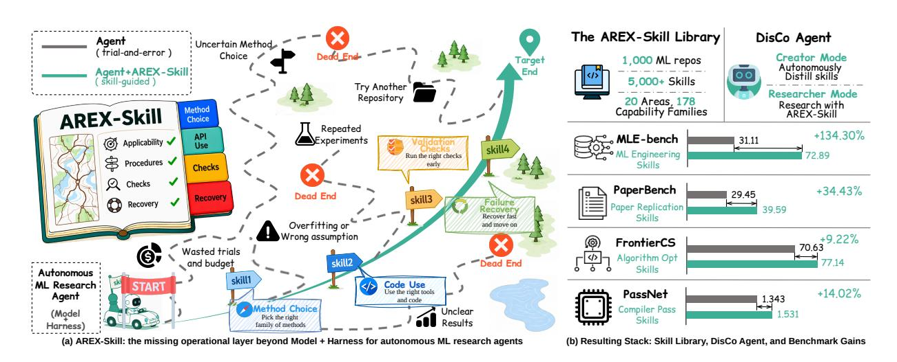
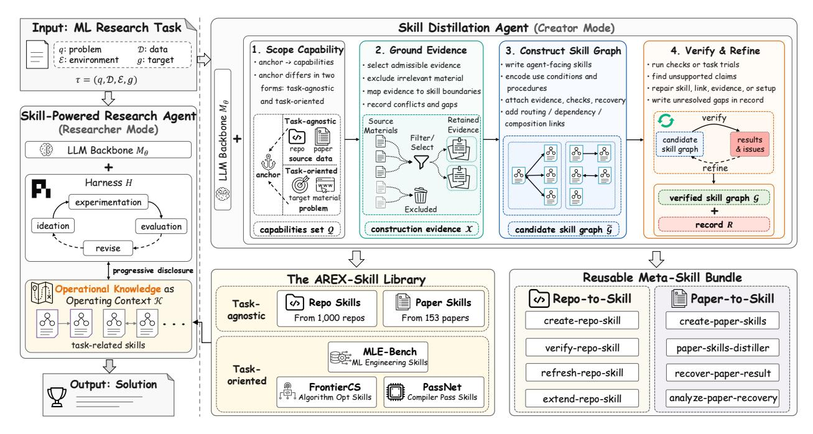
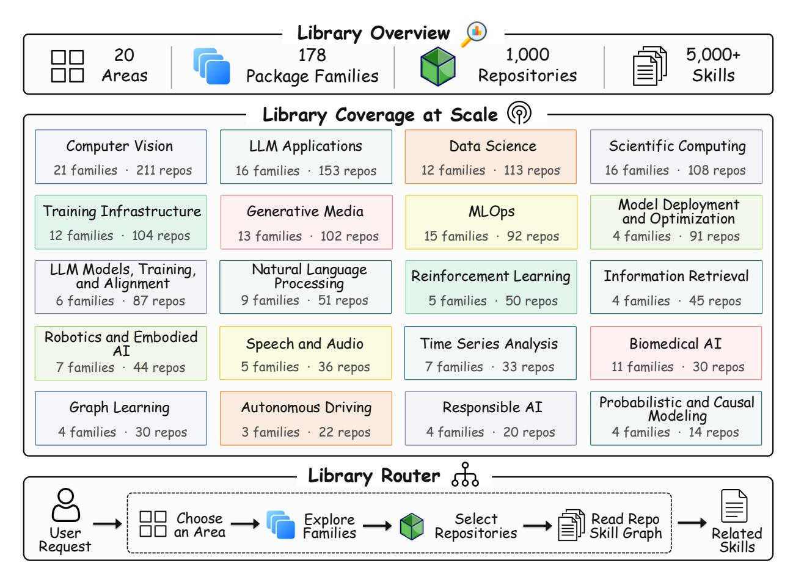

# Repo-To-Skill: GitHub 저장소를 AI4AI 기술로 증류하기 (Repo-To-Skill: Distilling GitHub Repositories Into AI4AI Skills)

- 원제: Repo-To-Skill: Distilling GitHub Repositories Into AI4AI Skills
- 원문: [https://arxiv.org/abs/2609.02749](https://arxiv.org/abs/2609.02749)
- PDF: [https://arxiv.org/pdf/2609.02749](https://arxiv.org/pdf/2609.02749)
- arXiv ID: `2609.02749`

---

# Repo-To-Skill: GitHub 저장소를 AI4AI 기술로 증류하기 (Repo-To-Skill: Distilling GitHub Repositories Into AI4AI Skills)

Jianlyu Chen1,2†‡, Yuyang Hu1,3†‡, Hongjin Qian1† , Jiawei Liu2† , Wenqing Wei1,2†‡, Xiaolong Chen2 Defu Lian2∗ , Zhicheng Dou3∗ , Chaozhuo Li1 , Qiwei Ye1 , Zheng Liu1,4∗

자율 에이전트는 기계학습(ML) 연구를 종단에서 수행하기 시작한다. 이 에이전트는 모델 백본과 계획, 실행, 메모리, 검증을 위한 하네스를 결합하지만, 이 아키텍처는 여전히 도메인별 전문 지식을 에이전트 밖에 두고 있다. 우리는 이 누락된 층을 운영 지식(operational knowledge)이라고 부르며, 이는 방법을 아는 것과 실제로 구현하는 것을 구분하는 노하우이다. 이 지식은 분야에서 결여된 것이 아니다. 저장소와 논문에 나타나지만, 인간 독자를 위해 작성된 형태이며 작업 중에 로드하기에는 너무 크다. 이 지식을 압축되고 검증된 기술로 증류하면, 각 실행마다 재발견하기보다 작업 간에 재사용할 수 있다.

우리는 DisCo를 제시한다. 이는 기술 기반 연구 에이전트로, 기술을 생성하고 연구 중에 활용한다. 증류는 두 가지 상호 보완적 형태로 진행된다: 작업 무관(task-agnostic)으로, 분야에서 널리 사용되는 저장소를 재사용 가능한 기술로 압축하고, 작업 지향(task-oriented)으로, 구체적 작업이 요구하는 기술을 생성한다. 전자는 공개 생태계 전반에 적용되어 AREX-Skill Library를 제공하며, 1,000개의 널리 사용되는 ML 저장소에서 증류된 5,000개 이상의 검증된 기술을 20개 영역과 178개 역량 가문으로 구성한다. GPT-5.5 백본, 연구 하네스, 하위 실행 예산을 고정한 상태에서, 기술 장착 연구 에이전트는 동일한 에이전트보다 MLE-bench에서 134.3% 더 높은 점수, PaperBench에서 34.4% 더 높은 점수, FrontierCS에서 9.2% 더 높은 점수, PassNet에서 14.0% 더 높은 점수를 기록한다. 이러한 성과는 고정된 설정 하에서 증류된 운영 컨텍스트를 추가함으로써 나온다.

# Correspondence: liandefu@ustc.edu.cn, dou@ruc.edu.cn, zhengliu1026@gmail.com

Code: <https://github.com/VectorSpaceLab/AREX-Skill>

그림 1 재사용 가능한 기술이 자율 연구 에이전트에 미치는 영향. (a) AREX-Skill은 모델과 하네스를 넘어선 누락된 운영 층을 추가하여 시행착오 탐색을 재사용 가능한 절차로 대체하고, 이는 작업의 운영 단계를 지원한다. (b) 기술 라이브러리와 DisCo 에이전트가 결합하여 결과 스택을 형성하며, 기술 증강은 네 개의 벤치마크에서 성능을 향상시킨다.

1베이징 인공지능 학원, 2중국 과학기술대학교,

3Renmin University of China, 4Hong Kong Polytechnic University

†동일 기여, ‡인턴십 기간 동안 BAAI에서 수행된 작업, ∗응답 저자

## 1 서론 (Introduction)

자율 에이전트는 기계학습 연구 파이프라인의 더 큰 부분을 수행하기 시작한다. 방법 구현에서부터 실험 실행 및 결과 비교에 이르기까지 [(Lu et al.,](#page-15-0) [2024;](#page-15-0) [Yamada et al.,](#page-16-0) [2025;](#page-16-0) [Schmidgall et al.,](#page-15-1) [2025)](#page-15-1). ML 연구는 소프트웨어에서 대부분의 실천이 전개되기 때문에 자연스러운 테스트베드가 된다. 여기서 코딩 에이전트가 가장 유능함을 입증했다 [(Jin et al.,](#page-15-2) [2026;](#page-15-2) [Dong et al.,](#page-14-0) [2026)](#page-14-0).

모든 에이전시 시스템(agency system)과 마찬가지로, 이 연구 에이전트는 두 개의 모듈에 기반한다: 이해, 추론, 계획 및 실행을 제공하는 모델과 조정, 메모리, 검증 및 반복 정제를 제공하는 하네스. 모델은 최첨단 세대와 함께 개선되며, 하네스는 엔지니어링 실천을 통해 개선된다 [(Karpathy,](#page-15-3) [2026)](#page-15-3). 그러나 ML 연구는 전문성 집약적이며, 이는 성공이 어떤 방법과 도구를 언제 어떻게 올바르게 사용하는지에 달려 있음을 의미한다. 두 구성 요소 모두 이 전문성을 갖추지 못한다. 모델의 사전 지식은 폭넓지만 고정되어 있고, 하네스는 절차를 제어하지만 도메인 내용을 제공하지 않는다. 우리는 이 누락된 층을 운영 지식이라고 부른다. 운영 지식은 방법을 아는 것과 그것을 실제로 동작시키는 것을 구분하는 전문성이다: 분야의 방법과 도구를 현재 과제에 연결하는 전문성. ML 연구에서 이는 적절한 방법과 실험 설정을 선택하는 것부터 패키지 API를 올바르게 사용하고, 훈련 파이프라인을 구성하며, 일반적인 구현 및 평가 함정을 처리하는 것까지 다양하다. 이 지식은 풍부하게 존재하지만, 저장소와 논문에 흩어져 있으며 특정 과제에 맞게 조직되어 있지 않다.

운영 지식이 없으면, 에이전트는 과제 내에서 예산을 잃고, 과제 간에 추론한 내용을 재사용하지 못한다. 과제 내에서는 패키지 동작을 시행착오를 통해 추론해야 하며, 실수는 잘못 구성된 실행에 예산이 소진된 후에야 드러난다. 과제 간에 이러한 발견은 재사용 가능한 컨텍스트로 보존되지 않는다. 지식은 에이전트가 명령할 수 있는 형태로 도달해야 한다: 탐색 가능하고, 로드 가능하며, 바로 사용할 수 있는. 스킬은 이 형태를 제공한다 [(Anthropic,](#page-14-1) [2025a)](#page-14-1). 스킬은 한 가지 노하우를 패키징한다. SKILL.md 파일은 스킬이 무엇을 위한 것인지, 언제 적용되는지, 그리고 어떻게 진행해야 하는지를 명시한다. 참조 문서는 증거를 제공하고, 스크립트는 일상적인 작업을 자동화한다. 스킬이 요약으로 열리고 필요할 때만 전개되기 때문에, 에이전트는 수천 개의 스킬을 보유하면서도 과제에 필요한 몇 개만 읽을 수 있어, 지식 층이 컨텍스트를 혼잡하게 만들지 않고 확장된다. 하네스는 여전히 에이전트가 연구를 수행하는 방식을 관리하지만, 스킬은 연구가 시작될 때 에이전트가 무엇을 아는지를 결정한다. Figure [1(](#page-0-0)a)는 이 누락된 층을 보여준다: 모델과 하네스를 넘어, 스킬은 무지시적인 시행착오를 지시된 실행으로 전환한다.

스킬 표현은 운영 지식이 어떻게 소비되는지를 다루지만, 스킬이 어떻게 획득되는지는 다루지 않는다. 관련 소스 자료는 이미 저장소와 논문에 존재하지만, 인간 독자를 위해 작성되었으며 과제 중에 로드하기에는 너무 크다. 우리는 이 자료를 압축되고, 운영 가능하며, 검증된 스킬로 정제하여 에이전트의 컨텍스트 예산에 맞춘다. 어려움은 소스가 매 릴리스마다 변하고, 많은 실용적 함정을 생략하며, 동작시키는 데 필요한 노하우 없이 방법을 제시한다는 데 있다. 방법론적 문제는 선언적 소스에서 운영 지식을 자동으로 그리고 대규모로 생산하는 것이다.

우리는 이 도전을 DisCo와 함께 해결한다. DisCo는 스킬 기반 연구 에이전트로, 스킬을 생성하고 이를 활용해 연구한다. DisCo는 모델과 하네스를 그대로 두고, 두 가지 보완적 형태의 스킬 증류를 통해 운영 지식 층을 구축한다. 과제 비특정 증류는 사전에 수행되며, 분야에서 널리 사용되는 저장소와 일상 도구를 재사용 가능한 스킬로 압축한다. 과제 지향 증류는 필요할 때 수행된다. 구체적인 과제가 주어지면, DisCo는 과제가 접하는 지식을 탐색하고 필요한 스킬을 생성한다. 두 형태 모두에서, 스킬은 검증 없이 층에 들어가지 않는다. 각 후보는 검사되고, 가능하면 수리되며, 남은 격차가 기록된다.

작업-불특정성 증류(task-agnostic distillation)는 오픈 생태계에서 실행되어 AREX‑Skill Library를 생성한다. 현재 저장소 스냅샷에는 1,000개의 널리 사용되는 ML 저장소에서 증류된 5,000개가 넘는 스킬이 포함되어 있으며, 20개 영역과 178개의 능력 가문을 넘어 라우터에 의해 정리된다. 각 저장소는 스킬 그래프로 증류되며, 라이브러리 수준 라우터는 요청을 관련 그래프로 좁힌다. 본 논문은 평가를 위해 구성된 논문에서 파생된 및 작업 지향적 스킬을 연구한다.

증류된 기술의 효과를 고립시키기 위해, 우리는 동일한 연구 에이전트를 MLEbench [(Chan et al.,](#page-14-2) [2025)](#page-14-2), PaperBench [(Starace et al.,](#page-15-4) [2025)](#page-15-4), FrontierCS [(Mang et al.,](#page-15-5) [2025)](#page-15-5), 그리고 PassNet [(Liu](#page-15-6) [et al.,](#page-15-6) [2026)](#page-15-6)에서 기술이 있는 경우와 없는 경우를 비교한다. GPT-5.5 백본, 연구 하니스, 그리고 다운스트림 실행 예산은 고정한다. 기술 구축은 다운스트림 실행이 시작되기 전에 완료되므로, 실행 시점에서 기술만 변수가 된다. 이러한 일치된 설정 하에서, 기술 장착 에이전트는 MLE-bench에서 134.3% 더 높은 점수, PaperBench에서 34.4% 더 높은 점수, FrontierCS에서 9.2% 더 높은 점수, PassNet에서 14.0% 더 높은 점수를 기록한다. Figure [1(](#page-0-0)b)는 결과 스택과 벤치마크 이득을 요약한다.

#### 우리의 기여는 다음과 같이 요약된다: (Our contributions are summarized as follows:)

- ❶ 우리는 운영 지식을 자율 연구 에이전트의 누락된 층으로 식별하며, 이는 모델과 하네스를 보완한다. 하네스는 에이전트가 연구를 수행하는 방식을 규제하고, 운영 지식은 연구가 시작될 때 에이전트가 무엇을 아는지를 결정한다.  
- ❷ 우리는 DisCo를 소개한다. DisCo는 기술 기반 연구 에이전트로, 기술을 생성하고 그 기술로 연구를 수행한다. 그 기술 증류는 작업 무관과 작업 지향 두 가지 보완적 형태로 실행되며, 검증 없이 기술을 허용하지 않는다.  
- ❸ 우리는 DisCo를 개방형 생태계에 확장시켜 AREX-Skill Library를 구축한다. 이를 통해 1,000개의 널리 사용되는 ML 저장소에서 증류된 5,000개 이상의 검증된 기술을 제공하며, 20개 영역과 178개의 기능 가문으로 구성되고, 라이브러리 수준 라우터를 통해 노출된다.  
- ❹ 우리는 일치된 백본, 하네스, 다운스트림 실행 예산 하에서 MLE-bench, PaperBench, FrontierCS, PassNet에서 증류된 기술을 평가하고, 네 가지 모두에서 일관된 성과 향상을 관찰한다. MLE-bench에서는 최대 134.3%의 향상을 기록한다.

## 2 운영 지식(Operational Knowledge for Autonomous Research)

우리는 먼저 자율 연구 과제를 공식화한 뒤, 모델과 하네스의 표준 관점에서 명시되지 않은 지식 층을 분리한다. 섹션 [2.1](#page-2-0)은 과제와 에이전트 시스템을 정의한다. 섹션 [2.2](#page-2-1)은 운영 지식을 정의한다. 섹션 [3](#page-3-0)은 DisCo를 사용해 이 층을 구현한다.

### 2.1 예비(Preliminary)

A research task can be formalized as

$$\tau = (q, \mathcal{D}, \mathcal{E}, g), \tag{1}$$

여기서 q는 문제를 명시하고, D는 그와 함께 제공되는 데이터와 자료이며, E는 작업이 수행되는 환경으로, 그 환경이 노출하는 도구와 예산 한계를 포함하고, g는 결과가 충족해야 할 목표이다. τ를 해결한다는 것은 코드, 모델, 실험 결과, 보고서 등 g를 E에서 충족시키는 일련의 산출물 y를 생산하는 것을 의미한다. 이 관점은 연구를 문제와 그 주변 자료에서 g를 만족시키는 산출물 y로의 매핑 τ 7→ y로 간주한다.

에이전트 시스템은 이 매핑을 스스로 수행한다. 전통적으로 두 구성요소로 설명된다,

$$\mathcal{A} = (M_{\theta}, H), \tag{2}$$

LLM 백본 Mθ는 이해, 추론, 계획 및 실행을 제공하고, 하네스 H는 오케스트레이션, 메모리, 검증 및 반복적 정제를 제공한다. 이 둘은 매핑을 추론, 행동, 관찰의 루프로 전환시켜 g가 충족되거나 예산이 소진될 때까지 실행된다. 단계 t에서, 과거 ht = (a1, o1, … , at−1, ot−1)와 함께, 에이전트는 행동하고 환경은 반응한다:

$$a_t \sim \pi_\theta(a \mid \tau, h_t, H), \qquad o_t = \mathcal{E}(a_t),$$

(3)

그리고 아티팩트 y는 궤적이 남기는 것들이다. 자율 연구 에이전트에 대한 거의 모든 진전은 이 두 구성요소를 강화함으로써 이루어졌다. 백본은 각 프론티어 세대마다 강해지며, 하네스 엔지니어링은 계속 성숙해지고 있다 [(Li et al.,](#page-15-7) [2025a;](#page-15-7) [Chen et al.,](#page-14-3) [2026a;](#page-14-3) [Jin et al.,](#page-15-2) [2026)](#page-15-2). 그러나 연구 과제에서는 두 구성요소 관점이 에이전트의 도메인 특화 운영 지식을 명시하지 않는다.

### 2.2 운영 지식 정의

알려지지 않은 데이터셋에서 모델을 개선하도록 요청받은 에이전트는 문제에 적합한 방법, 그 방법을 구현하는 패키지, 패키지가 데이터를 어떻게 배치해야 하는지, 어떤 구성을 사용해야 하는지

적절하며, 어떤 함정이 다른 합리적인 실행을 무효화할 수 있는지. 에이전트는 계획을 제안하고 실행하며 실패를 검사하고 수정함으로써 시행착오를 통해 이러한 선택을 추론할 수 있다. 이러한 실패는 평가에 사용되는 동일한 예산을 소비하며, 잘못 구성된 실행은 의미 있는 측정을 제공하기 전에 E의 큰 비중을 소비할 수 있다. 에이전트가 결정을 내리는 순간에 필요한 것은 결국 도달할 수 있는 답이 아니라 이미 실행 가능한 답이다. A의 어느 구성요소도 이 지식을 제공하지 않는다. 백본의 사전은 넓지만 고정되어 있고, 하네스는 절차를 제어하지만 도메인 내용을 제공하지 않는다. 우리는 부족한 것을 운영 지식이라고 부르며, 연구 에이전트를 다음과 같이 쓴다

$$\mathcal{A}_{\text{res}} = (M_{\theta}, H, \mathcal{K}), \tag{4}$$

여기서 K는 명시적 운영 컨텍스트로서 에이전트에게 제공되는 운영 지식이며, 따라서 Eq. [(3)](#page-2-2)가 at ∼ πθ(a | τ, ht, H, K)로 바뀐다.

운영 지식은 도메인에 대한 지식을 행동으로 전환하는 것이다. 그것은 문제에 맞는 해결책, 각 후보가 언제 적용되는지, 그리고 어떻게 사용해야 하는지를 명시함으로써 분야의 방법과 도구를 현재 문제에 결합한다. 운영 지식은 두 구성요소를 가진다. 첫 번째는 지식을 역량으로 전환한다: 방법, 코드, 모델, API가 에이전트가 실제로 호출할 수 있는 단위로 패키징된다. 두 번째는 역량을 사용 정책으로 전환한다: 각 단위는 사용을 지배하는 조건, 이유, 절차를 담고 있다. 두 구성요소는 상호 보완적이다. 정책이 없는 역량은 선택 기준 없이 도구를 제공한다. 역량이 없는 정책은 실행 가능한 인터페이스 없이 조언만 제공한다. 이 분리는 또한 K와 H를 구분한다. 하네스는 에이전트가 탐색하는 방식을 전문화하고, K는 에이전트가 고려해야 할 지식을 전문화한다.

선언적 소스는 방법, API, 또는 설계 선택에 대한 사실을 진술한다. 논문은 한 기법이 정확도를 향상시킨다고 보고한다. 저장소는 API가 무엇을 수용하는지 문서화한다. 블로그 게시물은 트릭이 왜 작동하는지 설명한다. 이 모든 것은 유용하지만, 그 중 어느 것도 주어진 문제에 대한 행동 과정을 직접적으로 명시하지 않는다. 선언적 지식은 무엇이 성립하는지를 진술하고, 운영 지식은 그 사실을 작업 수준의 행동으로 번역한다. 후자는 전자를 파생해야 한다.

현재 관행에서는 이 파생 과정이 수동이다. 전문가가 선언적 자료를 포함한 논문, 저장소, 기술 블로그를 읽고, 유용한 부분을 맞춤형 도구와 스크립트로 감싸며, 에이전트가 언제 어떻게 호출해야 하는지를 알려주는 기술과 사용 지침을 작성한다. 결과는 진정한 운영 지식이 될 수 있지만, 그 비용은 전문가 노동과 해당 도메인, 스택, 릴리스에 따라 비례한다. 반면에 그가 끌어들이는 선언적 자료는 풍부하고 지속적으로 업데이트된다. 핵심 방법론적 문제는 선언적 소스에서 자동으로 그리고 대규모로 운영 지식을 생성하는 것이다.

## 3 DisCo: 운영 지식 생성 및 활용 (DisCo: Producing and Using Operational Knowledge)

DisCo는 운영 지식 계층을 기술로 구현하고, 기술 증류를 통해 이를 구성하며, 연구 중 운영 컨텍스트로 사용한다. 섹션 [3.1](#page-3-1)은 기술과 기술 그래프를 정의한다. 섹션 [3.2](#page-4-0)은 작업 무관 및 작업 지향 형태의 증류 메커니즘을 설명한다. 섹션 [3.3](#page-5-0)은 DisCo에서 생산과 사용을 결합한다.

### 3.1 기술 및 기술 그래프 (Skills and Skill Graphs)

우리는 K를 기술 집합으로 정의한다 [(Anthropic,](#page-14-1) [2025a)](#page-14-1),

$$\mathcal{K} = \{S_1, \dots, S_m\},\tag{5}$$

여기서 K는 에이전트가 특정 시점에 보유한 기술 집합이며, 운영 지식을 생성하는 문제는 기술을 생성하는 문제로 바뀐다. 기술은 이 층의 실용적 운반체이다. 기술은 자체적으로 완결되고 에이전트 지향적이며, Claude Code [(Anthropic,](#page-14-4) [2025b)](#page-14-4) 및 Codex [(OpenAI,](#page-15-8) [2025)](#page-15-8)와 같은 현대 에이전트 시스템에 이미 지원된다. 하나를 에이전트에게 제공하는 것은 Mθ 또는 H를 변경할 필요가 없다. 기술은 에이전트가 활용할 수 있는 운영 컨텍스트의 일부가 되어, 운영 지식이 호환 가능한 하네스 간에 이동하고 과제 간에 축적될 수 있게 한다.

Figure 2 DisCo는 운영 지식을 생성하고 활용한다. 연구 과제 τ = (q, D, E, g)는 백본 Mθ, 하네스 H, 운영 컨텍스트 K를 갖는 에이전트에 의해 해결된다. 제작자 모드에서는 앵커 z(소스 c 또는 과제 τ 중 하나)가 역량 Q에 범위화되고 증거 X에 기반을 두어 후보 그래프 G˜로 패키징되며, 건설 기록 R과 함께 수락된 그래프 G로 검증된다. 연구자 모드에서는 에이전트가 AREX‑Skill Library에서 수락된 그래프의 관련 분기만 로드하고, 그 기술들을 실행 중 K로 사용한다.

AREX‑Skill에서는 기술이 세 개의 계층으로 구성된다,

$$S = (\underbrace{\text{SKILL.md}}_{\text{knowledge interface}}, \underbrace{\text{references/}}_{\text{execution interface}}), \tag{6}$$

각각 다른 목적을 수행한다. SKILL.md는 지식 인터페이스이다. 가장 먼저 읽히는 유일한 계층으로서, 에이전트가 기술을 사용하기 위해 알아야 할 내용을 명시하고 나머지를 개요한다. 이는 진입점 역할을 하며, 표준 운영 절차를 담고, 더 깊은 자료나 동료 기술로 이어진다. 그 내용은 에이전트가 더 깊은 자료를 로드하기 전에 필요한 정보를 제공하며, 목표, 핵심 개념, 도구 사용, 포인터, 실습 예제, 그리고 알려진 실패 모드를 포함한다. references/는 지식 기초이며, SKILL.md가 가리키는 더 깊은 자료이며, 필요할 때만 로드된다. 이는 점진적 공개(principle of progressive disclosure) [(Anthropic,](#page-14-1) [2025a)](#page-14-1) 원칙을 따른다. 이곳에는 API 문서, 알고리즘 세부사항, 파라미터 설정, 그리고 관련 자료가 담겨 있다. scripts/는 실행 인터페이스이며, 정의된 입력과 출력을 갖는 실행 가능한 래퍼로 구성되어, 에이전트가 재구현하기보다 호출한다. 세 계층은 Section [2.2.](#page-2-1)의 두 구성요소를 직접 실현한다. scripts/와 references/는 지식을 역량으로 전환하고, SKILL.md는 역량을 사용 정책으로 전환하며, 기술을 보유하는 비용을 낮게 유지해 에이전트가 수천 개를 보유할 수 있도록 한다.

한 소스는 한 기술이 보유해야 할 것보다 더 많은 운영 지식을 포함하는 경우가 많으므로, AREX‑Skill은 한 소스에서 증류된 기술들을 기술 그래프로 구성한다

$$\mathcal{G} = (\mathcal{S}, \mathcal{L}), \quad \mathcal{S} = \{S_i\}_{i=1}^n, \ n \ge 1, \quad \mathcal{L} \subseteq \{(S_i, S_j) \in \mathcal{S} \times \mathcal{S} \mid i 
e j\}.$$

(7)

그래프에는 소스 범위를 명시하고 패키지 함수, 메서드 단계, 또는 프로토콜 요소에 대한 구성 스킬로 라우팅되는 엔트리 스킬이 포함된다. 각 링크 (Si, Sj) ∈ L 은 라우팅, 종속성, 또는 구성 관계를 인코딩하며, 소스가 단일 스킬 또는 여러 개의 독립 스킬을 제공할 때 L 은 비어 있을 수 있다. 점진적 공개는 이 그래프를 통해 작동한다. 에이전트는 엔트리 포인트를 읽고 문제에서 요구하는 링크를 따라가며 나머지는 열지 않은 상태로 두어, 언제든지 K 가 작업에 필요한 그래프 부분만을 포함하도록 한다.

### 3.2 스킬 디스틸레이션 (Skill Distillation)

남은 일은 이러한 그래프를 자동으로 생성하는 것이다. 우리는 이를 *skill distillation*이라고 부르며, 선언적 소스 지식을 작업 해결을 직접 지원하는 운영 지식으로 재구성하는 과정을 말한다. 모든 실행은 트리거가 무엇이든 동일한 4단계 과정을 따른다. 실행을 시작하는 *anchor*를 z 로, 사전에 보유하거나 검색 가능한 선언적 소스 자료를 $\mathcal C$ 로 표기한다.

$$z \xrightarrow{\mathsf{scope}} \mathcal{Q} \xrightarrow{\mathsf{ground}} \mathcal{X} \xrightarrow{\mathsf{construct}} \tilde{\mathcal{G}} \xrightarrow{\mathsf{verify}} (\mathcal{G}, R),$$

(8)

여기서 Q 는 실행이 다루기로 결정한 역량 집합이며, $\mathcal{X} \subseteq \mathcal{C}$ 는 이를 뒷받침하는 증거를 모은 것이고, $\tilde{\mathcal{G}}$ 는 Eq.(6)의 세 층에서 그 증거를 바탕으로 조립된 후보 스킬 그래프이며, 수락된 그래프 $\mathcal{G}$ 는 사용된 증거, 수행된 검사, 그리고 해결되지 않은 격차를 보유한 구성 기록 R 을 동반한다. 네 단계는 차례로 네 가지 질문에 답한다: 어떤 역량이 중요한가, 무엇이 그것을 지원하는가, 어떻게 스킬이 되는가, 그리고 그 스킬이 성립하는가. 두 형태의 디스틸레이션은 anchor 에서 차이가 나며, 그 선택이 downstream 소스 선택과 검증 신호를 결정한다.

작업 무관 디스틸레이션. 여기서 anchor 는 저장소, 논문, 튜토리얼 등 소스이며, $z=c\in\mathcal{C}$ 이다. 실행은 소스가 무엇을 가능하게 하는지 묻고, 그 답을 미리 구축해 두고 이후에 필요로 하는 모든 작업에 제공되는 장기적인 스킬로 패키징한다. Scoping 은 *Source Understanding* 과 *Capability Identification* 으로 구성된다: 먼저 아티팩트가 무엇이며 어떻게 조직되어 있는지 확립한 뒤, 그 역량 중 노출할 가치가 있는 것을 결정한다. Grounding 은 *Knowledge Extraction* 으로, 각 역량을 뒷받침하는 증거를 소스 자체에서 수집한다. Construction 은 *Tool Encapsulation* 과 *Skill Packaging* 으로 이루어지며, 실행 가능한 부분을 안정적인 인터페이스 뒤에 감싸고, 세 층을 연결된 그래프로 조립한다. Verification 은 *Skill Verification* 으로, 아무것도 허용되기 전에 수행된다. sentence-transformers, AlphaFold, vLLM 같은 저장소나 재사용 가능한 방법과 기법을 도입하는 논문을 디스틸레이션하면, 작업 간 재사용 가능한 스킬을 얻는다.

작업 지향 디스틸레이션. 여기서 anchor 는 문제이며, $z = \tau$ 이다. 소스 자료는 사전에 주어지지 않고 적극적으로 탐색된다. 실행은 문제 해결이 요구하는 바를 묻고, 이 종류의 문제에 필요한 스킬을 생성한다. Scoping 은 Task Decomposition 과 Capability Gap Analysis 로 구성된다: 작업을 요구하는 역량으로 분해한 뒤, 에이전트가 이미 제공할 수 없는 역량을 분리한다. Grounding 은 Source Discovery 로, 그 격차를 채우는 자료를 검색하여 $\mathcal{X}$ 를 조립한다. Construction 은 Skill Generation 으로, 그 자료를 작업용 스킬로 디스틸레이션한다. Verification 은 이전과 같이 실행을 종료한다. 개방형 알고리즘 문제를 최적화하거나 Kaggle 대회에 참가하는 것이 이 종류의 작업이다. 스킬은 필요 시 생성되지만, 그들이 다루는 문제 클래스에 대해 재사용 가능하다.

어떤 앵커가 실행을 시작하든, 검증은 증류와 요약을 구분하는 요소이다. 출처의 강도만으로는 어떤 기술도 인정되지 않으며, 검사에 통과한 모든 갭은 숨기기보다 R에 기록된다.

### 3.3 창조자 및 연구자 모드 (Creator and Researcher Modes)

프레임워크의 두 절반, 즉 생성해야 하는 레이어와 사용해야 하는 레이어가 단일 에이전트에서 만난다. 우리는 DISCO를 기술을 만들고 그 기술로 연구하는 연구 에이전트로 정의하며, 같은 백본과 하네스를 기반으로 두 모드에서 운영된다. 제작자 모드에서 DISCO는 3.2절의 증류를 수행한다. 그 과정에서 범위 설정, 근거화, 구성, 검증을 진행한 뒤 허용된 그래프 $\mathcal G$를 AREX‑SKILL Library(4절)에 저장한다. 연구자 모드에서 DISCO는 Eq. (4)의 에이전트로서, 그 라이브러리에서 추출된 $\mathcal K$를 사용해 작업 $\tau$를 해결한다. 라이브러리는 두 모드를 연결하며, 제작자 모드는 허용된 그래프를 기록하고 연구자 모드는 이를 검색한다. 그림 2는 간결한 개요를 제공한다.

비용 측면에서 모드는 고의적으로 비대칭이다. Creator 모드는 소스당 한 번만 지불되며 이후 결과를 활용하는 모든 작업에 대해 상각된다. Researcher 모드는 작업이 실제로 열어야 할 부분에 대해서만 비용을 지불한다. 이러한 비용 비대칭성은 우리가 연구하는 설정에서 레이어를 확장 가능하게 만든다. Distillation은 소스 생태계가 허용하는 범위에서 오프라인으로 실행되며, $\tau$ 를 해결하는 에이전트는 결과를 재유도하지 않고 상속한다.

연구자 모드 내에서 남은 질문은 구성된 그래프가 어떻게 소비되는가이다. DisCo는 점진적 공개 원칙(progressive disclosure principle) [(Anthropic,](#page-14-1) [2025a)](#page-14-1)을 따른다. 전체 그래프를 읽는 대신, 에이전트는 먼저 후보 스킬 그래프를 범위와 의도된 사용에 따라 요약한 라우터(router) 또는 그래프 진입 스킬(graph entry skill)을 본다. 그 다음 진입점을 선택하고 연구 실행 중에 필요한 스킬만 열어본다. 생성된 각 스킬은 사용 설명(use description)으로 시작하여 에이전트가 그 관련성을 인식하고 스킬의 절차, 증거, 검사 및 복구 행동을 K에 로드하도록 돕는다.

G의 링크는 첫 번째 스킬을 넘어 같은 선택 과정을 확장한다. 예를 들어, 진입 스킬(entry skill)은 설정(setup), 평가(evaluation), 진단(diagnosis), 수리(repair)용 컴포넌트 스킬(component skills)로 라우팅할 수 있다. 이러한 링크는 라우팅(routing), 종속성(dependency), 구성(composition) 관계를 에이전트(agent)에게 가시화한다. 연구 과제(research task) 동안, 에이전트는 필요할 때 열려 있는 스킬(opened skill)에서 참조된 스킬(referenced skill)로 이동할 수 있으며, 그래프(graph)의 무관한 부분을 읽지 않아도 된다. 이렇게 하면 스킬 그래프(skill graphs)는 선택적 운영 컨텍스트(selective operating context)를 제공하면서, 하네스(harness)는 계획(planning), 행동 선택(action selection), 도구 사용(tool use), 관찰(observation)을 계속 제어한다.

인터페이스는 새로운 제어 루프가 아니라 운영 컨텍스트를 추가한다. 스킬 그래프는 에이전트를 실행하는 새로운 방법이 아니며, 누락된 지식 계층을 하네스 설계와 분리한다. 동일한 정제된 스킬은 에이전트가 읽을 수 있는 스킬을 노출하는 호환 가능한 모든 하네스에 서비스를 제공할 수 있으며, 각 하네스는 자체 계획 정책, 도구 인터페이스 및 실행 루프를 유지한다.

## 4 AREX-스킬 라이브러리 (AREX-Skill Library)

AREX-Skill Library는 DisCo에서 사용되는 지속적인 운영 지식 저장소이다. Creator 모드는 승인된 스킬 그래프를 라이브러리에 기록하고, researcher 모드는 작업과 관련된 분기를 운영 컨텍스트로 가져온다. 우리는 소스 앵커별로 라이브러리를 구성한다. 공개 저장소 스냅샷은 1,000개의 ML 저장소를 포함하며, 논문에서 파생된 스킬 그래프와 작업 지향 스킬 그래프는 라이브러리에서 별도의 컬렉션을 형성한다.

리포지토리 그래프는 두 단계의 기능 분류 체계와 생성된 라우터를 사용해 구성된다. 분류 체계는 영역과 패밀리별로 리포지토리를 그룹화하며, 라우터는 리포지토리 그래프가 열리기 전에 이 두 수준을 노출한다. Figure [3](#page-7-0)은 수집 및 검색 경로를 요약한다.

### 4.1 리포지토리 컬렉션 (Repository Collection)

우리는 오픈소스 가시성과 실용성을 기준으로 GitHub 스타를 포함한 큐레이션 신호를 활용해 1,000개의 ML 리포지토리를 선정한다. 이 컬렉션은 모델 구현, 학습 및 배포 시스템, 데이터 및 평가 도구, 과학 소프트웨어를 포괄한다. 이는 생태계의 전체 파티션이 아니라 일반적으로 사용되는 ML 소프트웨어의 선별된 스냅샷이다.

각 리포지토리에 대해 DisCo는 [섹션 3.2.](#page-4-0)에서 제시한 작업 불특정 절차를 사용해 검증된 스킬 그래프를 구축한다. 구축 과정은 GPT-5.5와 GPT-5.6-sol을 활용하며, 극도로 높은 추론 노력을 기울여 평균적으로 리포지토리당 약 \$40를 할당한다. 증거 범위에는 리포지토리 소스, 문서, 예제, 테스트, 스크립트, 구성 파일이 포함된다. 그래프는 데이터 준비, 학습, 추론, 평가, 서비스, 문제 해결, 유지보수 등 지원되는 워크플로우를 스킬 단위로 분해한다. 참조와 스크립트는 이러한 워크플로우를 실행하는 데 필요한 세부 정보를 보존한다.

포함되기 전에 DisCo는 각 그래프의 내용과 사용 가능성을 assertion-backed 사례와 안전한 리포지토리-네이티브 예제, 테스트, CLI 체크, 작은 피처 체크, 혹은 사용 가능한 경우 스모크 스크립트를 사용해 검사한다. 그래프에 기인한 실패가 발생하면 로컬 수리와 관련 체크의 재실행이 트리거된다. Appendix [A.1](#page-17-0)에서 구축 및 검증 세부 사항을 제공한다.

리포지토리 스냅샷은 1,000개의 리포지토리 그래프에 걸쳐 5,353개의 스킬을 포함하며, 이는 20개 영역과 178개 역량 패밀리로 조직된다. 2,209개의 정확한 영역-패밀리 경로에 대한 리포지토리 할당을 기록하며, 700개의 리포지토리가 두 개 이상의 패밀리에 나타난다. Appendix [B](#page-23-0)에서 라우팅된 범위를 나열한다. 논문에서 도출된 그래프와 작업 지향 그래프는 이 수치에 포함되지 않는다.

그림 3 AREX-Skill Library의 리포지토리 컬렉션 및 라우터. 컬렉션은 1,000개의 ML 리포지토리에서 추출된 5,000개 이상의 스킬을 포함하며, 20개 영역과 178개 역량 패밀리로 색인된다. 리포지토리는 여러 역량을 지원할 때 다중 영역-패밀리 경로에 나타날 수 있으므로 영역과 패밀리 소속은 겹치며 서로 독립적이지 않다. 연구 중 라우터는 영역에서 패밀리, 그리고 리포지토리 그래프로 요청을 좁혀, 에이전트가 관련 스킬만 로드하도록 한다.

### 4.2 분류 체계 및 라우팅 (Taxonomy and Routing)

분류 체계 구축. 리포지토리 분류 체계는 최종 할당 전에 고정된다. 우리는 각 소스에 대해 짧은 리포지토리 요약을 고정하고, 이 설명에서 영역과 패밀리의 두 단계 트리를 유도한다. 별, URL, 기존 카테고리 필드는 모델 입력에서 제외된다. LLM 지원 파이프라인은 완전한 트리를 제안하고, 별도 로케이터와 판사 호출을 사용해 10개의 리포지토리로 구성된 100개의 안정적인 배치에서 평가하며, 판사 리뷰와 결정론적 적합 및 패밀리-로드 통계와 함께 이를 수정한다. 잠정적 배치는 진단에만 사용된다. 분류 체계가 고정된 후 최종 경로가 할당된다. Appendix [A.1](#page-17-0)에서 구현 세부 사항을 제공한다.

리포지토리 할당. 분류 체계가 고정된 후, 각 검증된 그래프는 정확한 영역-패밀리 경로에 따라 분류된다. 원본 리포지토리는 주요 증거 소스로 사용되며, 생성된 그래프는 탐색에 활용된다. 각 할당은 근거, 리포지토리 증거, 신뢰도를 요구한다. 키워드 전용, 종속성 전용, 선택적 통합, 예제 전용 매치는 거부된다. 리포지토리는 다중 할당을 받을 수 있으며, 정확한 패밀리를 지원하지 않을 때 그래프는 분류되지 않은 상태로 남는다.

라우터 생성 및 사용. 수락된 과제는 저장소와 과제 인덱스에서 라우터로 컴파일되며, 이는 영역 및 패밀리 페이지를 생성하는 데 사용된다. 연구 중에 모델은 라우터 설명으로 시작하여 관련 영역-패밀리 경로를 따라가고, 선택된 저장소 그래프를 열며, 현재 단계에 필요한 기술, 참조, 스크립트만 로드한다. 여러 그래프를 열 수 있다

그들은 별개의 기능을 제공하지만, 적합한 패밀리가 없을 때는 경로를 강제하지 않는다. 이는 점진적 공개(progressive disclosure) [(Anthropic,](#page-14-1) [2025a)](#page-14-1)를 구현하므로, 선택된 분기만 운영 컨텍스트 K에 진입한다.

### 4.3 논문 기반 및 과제 지향 스킬 (Paper-Derived and Task-Oriented Skills)

논문 기반 스킬. 논문은 두 번째 과제 비중립 소스 앵커를 제공한다. DisCo는 각 논문을 방법 구성요소, 데이터 또는 평가 절차, 구현 워크플로우를 포함하는 모듈 수준 스킬로 분해한다. 각 모듈은 격리된 상태에서 검증되며, 이후 원본 구현 저장소를 제외한 제한된 복구 실험이 이어진다.

본 연구에서는 20개의 PaperBench 목표에 선택된 이전 논문에 이 워크플로우를 적용한다. 이를 통해 153개의 소스 논문에서 636개의 논문 기반 스킬이 생성된다. 관련 연구 맥락은 각 목표에 사용 가능한 소스 논문 스킬을 결정하며, 목표 논문과 그 공개된 아티팩트는 스킬 소스로 제외된다. 결과 스킬은 목표를 넘어 재사용 가능하다. 부록 [A.2.2](#page-20-0)는 구축 프로토콜을, 섹션 [5.3](#page-10-0)은 결과 풀을 평가한다. 동일한 워크플로우는 검증 예산이 허용하는 한 추가 논문에도 확장될 수 있다.

과제 지향 스킬. 우리는 과제 인터페이스와 피드백 신호에 의해 정의되는 운영 지식을 가진 벤치마크를 위해 스킬을 구축한다. MLE-bench는 75개의 대회 각각에 대해 과제 분해, 소스 탐색, 제한된 진단 실험을 통해 구축된 하나의 서술적 그래프를 사용하며, 대회별 콘텐츠는 제외된다. FrontierCS는 188개의 Agent Track 과제에 걸쳐 공유되는 하나의 복구 지향 그래프를 사용한다. PassNet은 FX-graph 검사, 패턴 매칭, 의미 보존 재작성, Triton 구현, 성능 진단을 위한 하나의 벤치마크 수준 그래프를 사용한다. 부록 [A.2.1,](#page-19-0) 부록 [A.2.3,](#page-21-0) 및 부록 [A.2.4](#page-22-0)는 이러한 구축을 설명한다. 섹션 [5.2,](#page-9-0) [5.4,](#page-11-0) 및 [5.5](#page-12-0)는 이를 평가한다.

## 5 실험 (Experiments)

우리는 공개 저장소 스냅샷을 넘어 PaperBench용 논문 기반 스킬 풀과 MLE-bench, FrontierCS, PassNet용 과제 지향 스킬 그래프를 구축함으로써 DisCo를 평가한다. 각 설정에서 DisCo는 과제의 소스 제약, 평가 프로토콜, 검증 조건 하에서 스킬을 구축하며, 결과 운영 컨텍스트가 고정된 연구 에이전트를 향상시키는지 측정한다.

### 5.1 설정 (Setup)

정제된 스킬은 새로운 제어 루프가 아니라 운영 컨텍스트로 작용하므로 고정된 연구 하네스에 부착될 수 있다. 우리는 Codex [(OpenAI,](#page-15-8) [2025)](#page-15-8)를 하네스로 사용하고, GPT-5.5 백본과 xhigh 추론 노력을 모든 조건에서 고정한다. 유일하게 제어되는 요소는 에이전트가 DisCo-정제 스킬(스킬 포함)로 장착되었는지 여부(스킬 없이)이다.

MLE-bench [(Chan et al.,](#page-14-2) [2025)](#page-14-2)에서는 낮음, 중간, 높음의 세 난이도 계층에서 75개의 경쟁을 모두 포함한 전체 세트를 평가한다. 우리는 MLE-bench의 헤드라인 Any-Medal 점수를 난이도별로 보고한다. 최종 평가는 벤치마크의 보류된 평가자를 사용한다. 각 과제마다 우리는 원본 경쟁 웹페이지와 경쟁별 콘텐츠를 제외하고 웹 검색을 통해 수집한 지식 소스를 증류하여 전용 운영지식 스킬 그래프를 구축한다. 스킬 구축과 벤치마크 실행은 각 과제마다 별도의 예산을 사용한다. 스킬이 있는 경우와 없는 경우는 일치된 실행 예산 하에서 비교되며, 일회성 구축 예산은 별도이며 두 실행 조건 중 어느 하나에도 포함되지 않는다. 전체 절차는 부록 [A.2.1.](#page-19-0)에 기술되어 있다.

PaperBench. PaperBench [(Starace et al.,](#page-15-4) [2025)](#page-15-4)에서 우리는 20편의 논문으로 구성된 전체 과제 집합을 실행하며, 벤치마크의 공식 복제 그레이더를 사용해 평가한다.  
각 논문마다 재현을 시도하기 전에, 대상 논문의 관련 연구 섹션에 인용된 관련 논문들을 선택하고, 해당 논문과 그에 대응하는 저장소에서 기술을 추출한다. 이때 대상 논문 자체와 함께 공개된 코드나 자료는 제외한다.  
MLE-bench와 마찬가지로, 기술 구축과 벤치마크 실행은 각각 별도의 과제별 예산을 사용한다.  
기술이 있는 경우와 없는 경우는 일치하는 실행 예산 하에서 비교되며, 일회성

Table 1 MLE-bench(전체, 75개 대회)의 주요 결과. 우리는 Low, Medium, High, 그리고 전체 75개 작업 분할에서 Any Medal(%)을 보고한다. 공개 기준선은 공식 MLE-bench 리더보드([https://github.com/openai/](https://github.com/openai/mle-bench) [mle-bench](https://github.com/openai/mle-bench))에서 복사되었으며, 실행마다 평균±SEM을 보고한다. AREX-Skill 값은 세 번 반복 실행에 대해 동일한 규칙을 따른다. 굵은 글씨는 각 열에서 가장 높은 점수를 표시한다.

| 에이전트 | 백본 | 낮음 (n=22) | 중간 (n=38) | 높음 (n=15) | 전체 (n=75) |
|------------------------------------|----------------------|---------------|------------------|----------------|---------------|
| Famou-Agent 2.0 (Li et al., 2025a) | Gemini-3-Pro-Preview | 80.30±1.52 | 64.04±2.32 | 42.22±2.22 | 64.44±1.18 |
| AIBuildAI (Zhang et al., 2026a) | Claude-Opus-4.6 | 77.27±0.00 | 61.40±0.88 | 46.67±0.00 | 63.11±0.44 |
| CAIR MARS+ (Chen et al., 2026c) | Gemini-3-Pro-Preview | 78.79±1.52 | 60.53±1.52 | 44.44±2.22 | 62.67±0.77 |
| MLEvolve (Du et al., 2026) | Gemini-3-Pro-Preview | 80.30±1.52 | 57.89±1.52 | 42.22±2.22 | 61.33±1.33 |
| PiEvolve (Botla et al., 2025) | Gemini-3-Pro-Preview | 80.30±1.52 | 58.77±0.88 | 40.00±0.00 | 61.33±0.77 |
| Thesis (Thesis, 2026) | GPT-5 | 65.15±1.52 | 45.61±7.18 | 31.11±2.22 | 48.44±3.64 |
| R&D-Agent (Zhang et al., 2026b) | GPT-5 | 68.18±2.62 | 21.05±1.52 | 22.22±2.22 | 35.11±0.44 |
| Codex | GPT-5.5 | 42.42±6.60 | 31.58±1.52 | 13.33±3.85 | 31.11±2.22 |
| Codex + AREX-Skill | GPT-5.5 | 86.36±2.62 | 69.30±3.16 | 62.22±2.22 | 72.89±1.18 |

구축 예산은 별도이며 실행 시간 조건에 포함되지 않는다. 전체 절차는 부록 [A.2.2.](#page-20-0) 에서 설명한다.

FrontierCS. FrontierCS [(Mang et al.,](#page-15-5) [2025)](#page-15-5)는 최적값이 알려지지 않았더라도 솔루션 품질을 객관적으로 측정할 수 있는 개방형 컴퓨터 과학 문제를 포함한다. 우리는 Harbor [(Harbor Framework Team,](#page-14-8) [2026)](#page-14-8)를 통해 188개의 Agent Track 과제를 평가한다. 각 과제 실행은 5시간 예산을 가지며, 에이전트 컨테이너는 2개의 CPU와 4 GiB의 RAM으로 제한된다. 에이전트는 문제를 검사하고 C++ 솔버를 구현하며 반복 제출을 통해 개선할 수 있다. 보존되는 과제 점수는 중간 제출 중 가장 높은 점수이다. 각 과제의 테스트 케이스는 해당 과제의 자체 심사 한계를 상속받으며, 이는 스위트 전체에서 0.25초에서 100초, 128 MiB에서 2 GiB 범위이다. 리더보드 규칙에 따라 평균 점수와 과제별 평균 사용량(단계, 도구 호출, 토큰)을 보고한다. 이 벤치마크를 위해 우리는 모든 과제에 공유되는 단일 스킬 그래프를 구성한다. 구성 및 정제는 평가 전에 완료되며, 이후 그래프는 모든 스킬 장착 실행에 대해 고정된다. 추가 세부 사항은 부록 [A.2.3.](#page-21-0) 에서 제공된다.

PassNet. PassNet [(Liu et al.,](#page-15-6) [2026)](#page-15-6)는 각 과제가 의미를 보존하면서 실행 성능을 향상시키는 패턴 매처와 리라이터를 구성해야 하는 그래프‑컴파일러 패스 생성을 목표로 한다. 우리는 벤치마크 규칙에 따라 네 가지 보완 지표를 보고한다. AS Score는 주요 벤치마크 점수이다. 각 샘플마다 PassNet은 t ∈ [−10, 4] 범위의 허용 오차 수준에서 정정된 서브그래프 속도 향상의 기하 평균을 ES(t)로 계산한 뒤, 공식 가중 기하 평균 프로토콜을 사용해 샘플별 점수를 집계하고 샘플 간 평균을 낸다. 정정된 속도 향상은 부정확하거나 일치하지 않는 패스에 0.1의 바닥값을 부여한다. 나머지 세 지표는 허용 오차 t = −5에서 계산된다. G‑Mean Speedup은 수치적으로 올바른 서브그래프에 대한 종단‑간 속도 향상의 기하 평균이다. Correctness는 지정된 허용 오차에서 eager‑mode 참조와 일치하는 서브그래프의 비율이다. Fast_1은 eager 실행보다 적어도 같은 속도로 실행되는 올바른 서브그래프의 비율이다. 모든 평가는 NVIDIA A100‑SXM4‑40GB에서 수행된다. 전체 절차는 부록 [A.2.4.](#page-22-0) 에서 설명한다.

### 5.2 주요 결과: MLE-bench (전체) (5.2 Main Results: MLE-bench (Full))

[Table 1](#page-9-1)은 증류된 스킬이 있는 Codex와 없는 Codex를 공개 MLE-bench 리더보드의 강력한 에이전트와 비교한다. 모든 보고된 결과는 전체 75개 과제 스위트를 사용한다.

스킬은 MLE-bench에서 Codex를 향상시킨다. 스킬을 추가하면 전체 Any‑Medal 점수가 31.11 %에서 72.89 %로 상승하며, 41.78 퍼센트 포인트와 134.3 %의 상대적 향상을 달성한다. 이는 에이전트 백본을 변경하지 않은 상태다. 이 향상은 모든 난이도 계층에서 일관된다: Low에서 43.94 포인트, Medium에서 37.72 포인트, High에서 48.89 포인트. 상대적 향상은 High 과제에서 특히 두드러지며, 점수가 13.33 %에서 62.22 %로 상승해 366.8 %의 향상, 즉 스킬이 없는 점수의 4.67배에 해당한다. Under the

Table 2는 PaperBench(20편)에서 증류된 스킬을 장착한 Codex와 기본 Codex를 비교한다. ∆는 Codex+AREX‑Skill이 기본 Codex보다 개선된 정도를 나타낸다. 굵은 글씨는 두 변형 중 더 나은 점수를 표시한다.

| 논문 | ICML 주제 | GPT-5.5 Codex | GPT-5.5 Codex+AREX-Skill | ∆ |
|----------------------------|-----------------------------------------------|---------------|--------------------------|--------|
| 적응형 가지치기 | 딥러닝: LLMs | 33.42 | 38.05 | +4.63 |
| 원스톱 | 확률적 방법 | 52.93 | 54.70 | +1.77 |
| bam | 확률적 방법 - 변분 추론 | 56.65 | 58.83 | +2.18 |
| bbox | 딥러닝: LLMs | 17.30 | 28.49 | +11.19 |
| 데이터 격차 해소 | 이론: 도메인 적응 및 전이 학습 | 14.16 | 31.42 | +17.26 |
| fre | 딥 강화 학습 | 14.06 | 23.88 | +9.82 |
| ftrl | 강화 학습: 딥 강화 학습 | 1.50 | 17.17 | +15.67 |
| lbcs | 데이터 중심 AI | 26.60 | 29.10 | +2.50 |
| lca-on-the-line | 딥러닝: 견고성 | 22.08 | 39.59 | +17.51 |
| 기계적 이해 | 딥러닝: LLMs | 45.67 | 47.85 | +2.18 |
| pinn | 딥러닝 | 40.64 | 58.10 | +17.46 |
| rice | 딥 강화 학습 | 7.94 | 48.51 | +40.57 |
| robust-clip | 딥러닝: 견고성 | 30.14 | 32.35 | +2.21 |
| 샘플별 마스크 | ML의 기타 측면: 일반 ML 기법 | 57.11 | 52.04 | -5.07 |
| sapg | 딥 강화 학습 | 18.15 | 35.06 | +16.91 |
| 순차 신경 | 확률적 방법 | 41.67 | 65.37 | +23.70 |
| 주제 유지 | 딥러닝: LLMs | 32.31 | 27.79 | -4.52 |
| 확률적 보간 | 생성 모델 | 41.12 | 42.28 | +1.16 |
| 테스트 타임 모델 적응 | 분포 이동 및 OOD | 26.28 | 30.77 | +4.49 |
| 내 모델이 무엇을 잊을까 | 딥러닝: 기타 | 9.35 | 30.45 | +21.10 |
| 평균 점수 |  | 29.45 | 39.59 | +10.14 |

같은 에이전트와 작업 예산에서, 이 결과는 정제된 운영 지식이 머신러닝 연구 성능을 향상시킬 수 있다는 우리의 핵심 가설을 뒷받침한다.

이 이득은 새로운 하네스를 필요로 하지 않는다. Codex에 기술을 추가한 버전은 또한 [표 1,](#page-9-1)에서 가장 강력한 공개 기준선을 능가하며, 전체 점수를 64.44%에서 72.89%로 향상시킨다 (+8.45 포인트). 각 난이도 등급에서 최고 공개 점수 대비 해당 이득은 Low에서 6.06 포인트, Medium에서 5.26 포인트, High에서 15.55 포인트이다. 이 비교는 커스텀 실행 하네스, 전문 에이전트 오케스트레이션 전략, 또는 수정된 제어 루프 없이 정제된 기술이 추가된 일반 Codex를 사용한다. 이 비교는 고정된 Codex 하네스 하에서 외부화된 운영 지식의 기여를 고립시킨다.

이점은 작업 난이도가 높아질수록 커진다. 가장 큰 이득은 고난이도 작업에서 나타나며, Codex에 기술이 없는 경우(+48.89 포인트)와 가장 강력한 공개 기준선(+15.55 포인트) 모두에 대해 나타난다. 더 어려운 작업은 일반적으로 에이전트를 더 큰 라이브러리, 구현, 최적화 선택 공간에 노출시켜, 가이드 없는 시도와 오류가 더 비용이 많이 든다. 관찰된 추세는 기술이 에이전트의 탐색을 적용 가능한 도구, 검증된 워크플로우, 명시적 검사로 안내한다는 것과 일치한다. 부적절한 코드 경로를 탐색하는 데 예산을 쓰는 대신, 에이전트는 해결 공간의 생산적인 영역에 더 일찍 진입하고 구현 및 최적화 선택에 집중하여 목표 지표에 직접 영향을 미친다. 어려운 작업에서 이러한 더 강한 추세는 정제된 기술의 가치가 머신러닝 문제가 더 복잡해질수록 증가할 수 있음을 시사한다.

### 5.3 주요 결과: PaperBench (전체)

[표 2](#page-10-1)은 작업별 복제 점수를 보고한다. 정제된 기술은 평균 복제 점수를 29.45%에서 39.59%로 올려 (+10.14 포인트, 34.4% 상대적 향상), 가장 큰 이득은 rice (+40.57), sequentialneural (+23.70), and what-will-my-model-forget (+21.10)에서 나타난다. 빨간 값은 AREX-Skill이 기술이 없는 기준선 대비 얻은 이득을 보고한다.

기술은 PaperBench에서 Codex를 향상시킨다. 기술을 추가하면 평균 복제 점수가 29.45%에서 39.59%로 상승하며, 10.14 포인트와 34.4% 상대적 향상을 얻는다. 에이전트의 핵심 구조를 변경하지 않는다. The

표 3 FrontierCS 에이전트 트랙(188 작업)에서의 주요 결과. 우리는 작업별 총점수와 평균 트레저리 사용량을 보고한다. 공개 참조 시스템의 값은 공식 FrontierCS 리더보드(<https://frontier-cs.org/#leaderboard>)에서 직접 가져온 것이며, 두 Codex 행은 우리의 통제된 실행 결과를 보고한다. 모든 항목은 표준 5시간 작업 예산을 사용한다. 굵은 글씨는 가장 높은 점수를 표시한다.

| 에이전트 | 백본 | 점수 | 평균 단계 | 평균 도구 호출 | 평균 토큰 |
|--------------------|-----------------|-------|------------|-----------------|-------------|
| Claude Code | Claude Opus 4.8 | 74.5 | 355.4 | 145.7 | 14.72M |
| Claude Code | Qwen3.7 Max | 61.9 | 133.9 | 139.1 | 13.85M |
| Gemini CLI | Gemini 3.1 Pro | 60.2 | 74.3 | 41.6 | 2.00M |
| Codex | GPT-5.5 | 70.63 | 55.9 | 64.7 | 2.46M |
| Codex + AREX-Skill | GPT-5.5 | 77.14 | 88.7 | 105.0 | 4.47M |

효과는 몇몇 이상치에 집중되는 대신 넓게 퍼져 있다. 스킬은 20개 중 18개 작업에서 점수를 향상시키고, 2개 작업에서만 감소시켜, MLE-bench와 FrontierCS에서 관찰된 패턴과 일치한다. 이곳에서는 스킬이 소수의 작업이 아니라 대부분의 작업에서 도움이 된다.

가장 큰 이득은 낮은 기준점 작업에서 발생한다. Codex가 스킬 없이 낮은 복제 점수에서 시작하는 작업에서 상대적으로 이득이 현저히 크다. ftrl에서는 점수가 1.50에서 17.17로 상승하며 11.4배 증가한다. rice에서는 7.94에서 48.51로 상승하며 6.1배 증가한다. what-will-my-model-forget에서는 9.35에서 30.45로 상승하며 3.3배 증가한다. 반대로, no-skill 기준이 이미 중간에서 높은 작업, 예를 들어 all-in-one(52.93)과 bam(56.65)에서는 절대적 이득이 작다(+1.77, +2.18). 이 패턴은 FrontierCS 회복 분석과 일치하며, 스킬이 가장 도움이 되는 것은 무지시 시도가 구현 세부사항, 환경 설정, 또는 방법별 구성요소에서 정체될 때이다.

스킬에 의해 일부 작업이 감소한다. 두 작업은 스킬이 있을 때보다 없을 때보다 점수가 낮다: samplespecific-masks(57.11 → 52.04, −5.07)와 stay-on-topic(32.31 → 27.79, −4.52). 두 작업 모두 no-skill 점수가 20개 작업 평균(29.45)보다 높아, 검색-정밀도 실패 가능성을 시사한다. 검색된 스킬 내용이 가끔은 기본 에이전트가 스스로 발견할 작업‑특정 전략에서 주의를 분산시킬 수 있다. 이는 스킬 검색에서 적당한 정밀도‑재현율 trade‑off와 일치한다. 복제에 필요한 구현 선택이 좁고 특이적이며, 구축된 스킬 그래프에 잘 반영되지 않은 논문에서는 검색된 스킬을 따르는 것이 에이전트를 그 자체로 수렴했을 접근에서 멀어지게 할 수 있다. 더 나은 라우팅이나 검색된 스킬이 부적합할 때 무지시 추론으로 명시적 fallback을 하면 이 실패 모드를 줄일 수 있다.

### 5.4 주요 결과: FrontierCS (Agent Track)

[Table 3](#page-11-1)은 두 개의 제어된 Codex 조건을 공개 FrontierCS Agent Track 리더보드의 대표 항목과 비교한다. 두 Codex 조건은 전체 188개 작업 세트를 다루며, 차이점은 고정된 스킬 그래프에 대한 접근 여부뿐이다.

스킬은 FrontierCS 점수를 향상시킨다. Codex에 정제된 운영 컨텍스트를 제공하면 Score가 70.63에서 77.14로 상승하며 절대적 이득은 6.51점, 상대적 향상은 9.22%이다. 작업 수준에서 스킬은 74개 작업에서 성능을 향상시키고 66개 작업은 거의 변하지 않는다. 향상된 작업은 평균 22.23점을 얻고, 감소된 작업은 평균 8.76점을 잃는다. 총합적 양의 변화는 총합적 음의 변화의 3.91배이다. 모든 188개 작업에 대한 쌍부트스트랩은 평균 향상에 대해 95% 신뢰 구간 [3.41, 9.83]점을 제공한다.

스킬은 낮은 점수 문제를 회복한다. no-skill 점수로 층화하면, 50 이하인 47개 작업에서 가장 큰 상승이 발생하며 평균이 19.43에서 45.99로 (+26.56) 상승하고, 30개 향상된 작업이 50점 임계값을 초과한다. 더 넓게 보면, 스킬 조건은 점수 분포를 상향 이동시켜 중간, 높은, 거의 완전한 점수를 달성하는 작업 수를 증가시킨다. 이 결과는 무지시 탐색이 실행 가능한 공식이나 구현을 찾지 못할 때 운영 지침이 특히 가치가 있음을 시사한다.

Table 4 PassNet 평가 리스트(200 샘플)에서의 주요 결과 (Table 4 Main results on PassNet eval list (200 samples)). Codex 행은 동일한 GPT-5.5 백본과 하네스를 사용한다. 유일한 제어 차이는 정제된 PassNet 스킬에 대한 접근이다. 볼드는 각 열에서 더 나은 Codex 조건을 표시한다.

| 방법 | AS 점수 | G-Mean 가속도 | 정확성 | Fast_1 | 실패한 샘플 |
|-------------------------------|----------|----------------|-------------|---------|----------------|
| Eager (참조) | 1.000 | 1.000 | 100.00% | 100.00% | 0 |
| TorchInductor (torch.compile) | 1.419 | 1.505 | 79.70% | 23.60% | 0 |
| Codex + GPT-5.5 | 1.343 | 1.5891 | 81.35% | 28.48% | 14 |
| Codex + GPT-5.5 + AREX-SKILL | 1.5313 | 1.6688 | 90.76% | 26.72% | 5 |

스킬은 원시 자원 확장을 넘어 성능을 향상시킨다. Codex는 188개의 작업 중 180개에서 최소 하나의 스킬 파일에 접근한다. 스킬이 하위 에이전트를 호출하지 않는 102개의 작업에서 평균 페어링 이득은 5.54점이다. 하위 에이전트를 사용하는 86개의 작업에서는 이득이 7.66점이다. 스킬은 또한 전체적으로 더 적극적인 탐색을 유도하여 토큰, 단계, 도구 호출을 증가시킨다. 그러나 작업별 이득은 추가 사용과 본질적으로 상관관계가 없다. Spearman의 $\rho$는 토큰에 대해 0.006, 단계에 대해 0.014, 도구 호출에 대해 0.015이다. 추가 사용만으로는 점수 향상을 설명할 수 없다.

점수-효율성 프론티어(score-efficiency frontier)가 강화되었습니다. 서브-에이전트 사용량을 집계한 뒤에도 Codex + AREX-SKILL은 작업당 4.47M 토큰을 사용합니다. Claude Opus 4.8과 Qwen3.7 Max를 사용하는 Claude Code 설정은 각각 14.72M과 13.85M 토큰을 사용하며, 이는 $3.29\times$와 $3.10\times$만큼 많은 토큰을 사용하지만 2.64와 15.24 포인트 낮은 점수를 기록합니다. Codex + AREX-SKILL은 또한 이 두 항목보다 24.5-27.9% 적은 도구 호출과 33.8-75.1% 적은 단계(step)를 사용합니다. 리더보드의 보고된 계산에 따르면 Codex + AREX-SKILL은 점수, 토큰, 단계, 도구 호출에서 두 Claude Code 설정을 파레토 지배한다 (Pareto-dominates).

### 5.5 메인 결과: PassNet (Main Results: PassNet)

PassNet은 그래프-컴파일러 패스 생성에서 에이전트를 평가한다. 해당 솔루션은 그래프 의미를 보존하면서 실행 성능을 향상시키는 패턴 매처와 리라이터를 구성해야 한다. Codex harness와 GPT-5.5 backbone은 고정하고, 에이전트가 DisCo-distilled PassNet skill을 받는지 여부만 변형하여 운영 컨텍스트의 효과를 고립시킨다. 결과는 표 4에 나타난다.

**Distilled skills improve Codex on PassNet.**  
Distilled skills는 Codex의 PassNet 성능을 향상시킨다.  
PassNet 스킬을 추가하면 AS Score가 1.343에서 1.5313으로 상승하며, 절대적 이득은 0.1883이고, no‑skill Codex 기준 대비 14.0%의 상대적 개선을 보인다.  
지오메트릭 평균 속도 향상도 1.5891에서 1.6688로 증가한다.  
이러한 개선은 스킬이 에이전트를 보다 신뢰할 수 있고, 의미적으로 유효하며, 높은 점수를 받는 패스로 유도한다는 점과 일치한다.

기술(스킬)은 무효하거나 불완전한 에이전트 결과를 줄인다. 스킬이 없는 Codex 기준선은 14개의 샘플에서 실패하지만, AREX-SKILL이 적용된 Codex는 5개만 실패하여 실패 샘플이 64.3% 감소한다. 정확성도 81.35%에서 90.76%로 상승하여 9.41 퍼센트 포인트의 향상을 보인다. 이러한 결과는 3.1절에 기술된 스킬 그래프의 역할과 일치한다. 그래프는 패스 매칭, 정확성 검사, 성능 조정에 대한 명시적 절차, 거절 기준 및 복구 조치를 제공한다.

스킬이 Codex를 TorchInductor보다 총합 점수에서 앞서게 한다. TorchInductor는 여전히 강력한 컴파일러 기준선이지만, AREX-SKILL이 장착된 Codex는 1.5313의 AS 점수를 기록해 TorchInductor의 1.419보다 높다. 이는 스킬 장착 에이전트가 이 평가 세트에서 기본 컴파일러 파이프라인이 포착하지 못한 최적화를 식별할 수 있음을 시사한다.

## 6 관련 연구 (Related Work)

### 6.1 자율 ML 연구 (Autonomous ML Research)

최근 연구는 ML 연구 수명 주기를 위한 자율 시스템을 연구한다 (Dong et al., 2026). 자율-발견 시스템은 아이디어화, 구현, 실험, 작성 과정을 종단 간 파이프라인으로 연결한다 (Lu

et al., 2024; Yamada et al., 2025; Schmidgall et al., 2025; Tang et al., 2025; Karpathy, 2026). 보완적인 연구는 연구 *아이데이션*을 고립된 상태에서 연구한다. 대규모 인간 연구는 LLM이 생성한 연구 아이디어와 전문가 연구 아이디어를 비교한다 (Si et al., 2025), 반면 반복적인 에이전트는 과학 문헌을 기반으로 아이디어를 생성하고 정제한다 (Baek et al., 2025). 두 번째 연구 클러스터는 ML 엔지니어링과 데이터 과학을 직접 대상으로 한다. 에이전트는 제안-실행-평가 루프(Jiang et al., 2025; Yang et al., 2025), 과거 솔루션의 사례 기반 재사용(Guo et al., 2024), 다중 에이전트 경쟁 파이프라인(Li et al., 2024), 계층적 작업 그래프(Hong et al., 2025), 후보 파이프라인에 대한 트리 탐색(Chi et al., 2024), 실행 피드백에 대한 강화 학습(Liu et al., 2025)을 통해 이러한 작업을 해결한다. 그들의 진전은 엔드-투-엔드 ML 실험, 엔지니어링, 연구 및 논문 재현을 측정하는 벤치마크(Huang et al., 2024; Chan et al., 2025; Starace et al., 2025; Wijk et al., 2025)와 자동 논문-코드 재현에 관한 관련 연구(Zhou et al., 2025; Seo et al., 2026; Li et al., 2025b)를 통해 추적된다. 최근 분석은 에이전트가 단일 잘 정의된 저장소를 벗어나면 얼마나 취약해지는지도 지적한다 (Chen et al., 2026b).

이러한 시스템은 각 작업을 거의 고립된 상태로 처리한다. 에이전트는 각 작업마다 기본 아티팩트에서 라이브러리, 설정, 실행 절차를 재학습하므로 이 노력은 작업 간에 amortized되지 않는다. 우리의 연구는 에이전트 설계의 진보를 보완한다. 새로운 제어 루프를 도입하는 대신, 우리는 호환 가능한 에이전트가 소비할 수 있는 재사용 가능한 운영 지식 계층을 추출하고, 이 벤치마크를 사용해 에이전트 성능에 미치는 영향을 측정한다. 우리의 검증은 다중 에이전트 시스템에서의 조정 및 검증 실패 분석에 기초한 적대적 다중 에이전트 리뷰를 활용한다 (Cemri et al., 2026).

### 6.2 에이전트 스킬 (Agent Skills)

에이전트 스킬은 모델 파라미터를 수정하지 않고 재사용 가능한 절차적 지식으로 언어 모델 에이전트를 확장한다. 에이전트 스킬 사양에 따르면, 스킬은 활성화 조건, 절차 및 도구 사용 전략을 설명하는 SKILL.md 파일을 중심으로 한 검사 가능한 아티팩트이며, 선택적으로 스크립트와 참조가 점진적 공개를 통해 로드된다 (Anthropic, 2025a). 잠재 정책이나 일화적 기억과 달리, 이러한 스킬은 휴대 가능하며 명시적으로 수정 가능한 아티팩트이다. 그러나 기존 SKILL.md 파일의 대규모 분석은 저작 불일치를 드러내어 대규모로 고품질 스킬을 만드는 어려움을 강조한다 (Hong et al., 2026).

이전 연구는 에이전트 경험에서 재사용 가능한 지식을 자동으로 획득하는 것을 탐구했다. Voyager는 환경 간에 실행 가능한 스킬을 학습하고 조합한다 (Wang et al., 2024), Agent Workflow Memory는 과거 궤적에서 재사용 가능한 루틴을 추출한다 (Wang et al., 2025), ExpeL은 과제 경험에서 자연어 통찰을 추출한다 (Zhao et al., 2024). 그러나 이러한 방법은 주로 상호작용 추적에서 자유형 코드, 워크플로우 또는 통찰을 도출하므로 스킬 품질을 검증하기 어렵고 실패를 귀속하기 어렵다. 반면, 우리는 논문 및 저장소와 같은 정적 ML 아티팩트에서 버전별 운영 지식을 추출하여 출처 기반이며 검증된 에이전트 스킬로 변환하고 명시적 검증 기록을 제공한다.

## 7 결론 (Conclusion)

본 논문에서는 ML 연구 에이전트에 필요한 결여된 층으로서 운영 지식을 연구한다. DISCo는 소스 지식을 재사용 가능한 운영 지식 스킬 그래프로 추출하여 모델 백본과 연구 하네스를 변경하지 않고 운영 컨텍스트로 로드할 수 있도록 함으로써 이 층을 채운다. DISCo를 확장하면 AREX-SKILL Library가 생성되며, 이 저장소 스냅샷은 1,000개의 널리 사용되는 ML 저장소에서 추출된 5,000개 이상의 스킬을 포함한다. 또한 본 연구에서 평가된 연구 설정을 위해 논문 기반 및 과제 지향 스킬을 구축한다.

기술 장착 에이전트는 고정된 GPT‑5.5 Codex 설정과 일치하는 다운스트림 예산 하에서 MLE‑bench에서 134.3 % 높은 점수를 기록하고, PaperBench에서 34.4 % 높은 점수를, FrontierCS에서 9.2 % 높은 점수를, PassNet에서 14.0 % 높은 점수를 달성한다. 이 결과는 자율 연구 에이전트가 더 강력한 제어 루프에만 의존하기보다 운영 지식을 추가함으로써 향상될 수 있다는 핵심 주장을 뒷받침한다. 하네스는 에이전트가 연구하는 방식을 전문화하고, 정제된 기술은 연구가 시작될 때 고려해야 할 지식을 전문화한다.

### 참고문헌 (References)

- Anthropic. 실제 세계에서 에이전트 기술을 활용한 에이전트 장비화. [https://www.anthropic.com/engineering/](https://www.anthropic.com/engineering/equipping-agents-for-the-real-world-with-agent-skills) [equipping-agents-for-the-real-world-with-agent-skills](https://www.anthropic.com/engineering/equipping-agents-for-the-real-world-with-agent-skills), 2025a.

- Anthropic. Claude Code. <https://github.com/anthropics/claude-code>, 2025b. 접속일: 2026-08-03.

- Jinheon Baek, Sujay Kumar Jauhar, Silviu Cucerzan, and Sung Ju Hwang. ResearchAgent: 대규모 언어 모델을 활용한 과학 문헌을 통한 반복적 연구 아이디어 생성. In Proceedings of the 2025 Conference of the Nations of the Americas Chapter of the Association for Computational Linguistics: Human Language Technologies (Volume 1: Long Papers), pages 6709–6738, Albuquerque, New Mexico, April 2025. Association for Computational Linguistics. ISBN 979-8-89176-189-6. doi: 10.18653/v1/2025.naacl-long.342. <https://aclanthology.org/2025.naacl-long.342/>.

- Sai Kiran Botla, Kirubanath Sankar, Abhishek Chopde, and Fardeen Pettiwala. Pi-evolve: 장기적 진화 최적화를 통한 자율 과학 발견. <https://github.com/FractalAIResearchLabs/PiEvolve>, 2025. 접속일: 2026-08-03.

- Mert Cemri, Melissa Z Pan, Shuyi Yang, Lakshya A Agrawal, Bhavya Chopra, Rishabh Tiwari, Kurt Keutzer, Aditya Parameswaran, Dan Klein, Kannan Ramchandran, Matei Zaharia, Joseph E. Gonzalez, and Ion Stoica. 다중 에이전트 LLM 시스템이 실패하는 이유는 무엇인가? In The Thirty-ninth Annual Conference on Neural Information Processing Systems Datasets and Benchmarks Track, 2026. <https://openreview.net/forum?id=fAjbYBmonr>.

- Jun Shern Chan, Neil Chowdhury, Oliver Jaffe, James Aung, Dane Sherburn, Evan Mays, Giulio Starace, Kevin Liu, Leon Maksin, Tejal Patwardhan, Aleksander Madry, and Lilian Weng. MLE-bench: 머신러닝 엔지니어링에서 머신러닝 에이전트 평가. In The Thirteenth International Conference on Learning Representations, 2025. <https://openreview.net/forum?id=6s5uXNWGIh>.

- Guoxin Chen, Jie Chen, Lei Chen, Jiale Zhao, Fanzhe Meng, Wayne Xin Zhao, Ruihua Song, Cheng Chen, Ji-Rong Wen, and Kai Jia. 머신러닝 연구를 위한 자율 장기 엔지니어링을 향해. arXiv preprint arXiv:2604.13018, 2026a.

- Guoxin Chen, Fanzhe Meng, Jiale Zhao, Minghao Li, Daixuan Cheng, Huatong Song, Jie Chen, Yuzhi Lin, Hui Chen, Xin Zhao, Ruihua Song, Chang Liu, Cheng Chen, Kai Jia, and Ji-Rong Wen. Beyondswe: 현재 코드 에이전트가 단일 저장소 버그 수정을 넘어설 수 있는가? arXiv preprint arXiv:2603.03194, 2026b.

- Jiefeng Chen, Bhavana Dalvi Mishra, Jaehyun Nam, Rui Meng, Tomas Pfister, and Jinsung Yoon. Mars: 반사적 검색을 갖춘 모듈형 에이전트로 자동화된 인공지능 연구. arXiv preprint arXiv:2602.02660, 2026c.

- Yizhou Chi, Yizhang Lin, Sirui Hong, Duyi Pan, Yaying Fei, Guanghao Mei, Bangbang Liu, Tianqi Pang, Jacky Kwok, Ceyao Zhang, Bang Liu, and Chenglin Wu. Sela: 트리 탐색 강화 llm 에이전트로 자동화된 머신러닝. arXiv preprint arXiv:2410.17238, 2024.

- Guanting Dong, Xiaoshuai Song, Yuyang Hu, Jiajie Jin, Chenghao Zhang, Yifei Chen, Xiaoxi Li, Huaying Yuan, Xinyu Yang, Tongyu Wen, Jiejun Tan, Hongjin Qian, Shijue Huang, Junting Lu, Zhenyu Li, Wanjun Zhong, Yutao Zhu, Tat-Seng Chua, Zhicheng Dou, and Ji-Rong Wen. Towards long-horizon agents: A survey. Preprints, July 2026. doi: 10.20944/preprints202607.1328.v1. <https://doi.org/10.20944/preprints202607.1328.v1>.

- Shangheng Du, Xiangchao Yan, Jinxin Shi, Zongsheng Cao, Shiyang Feng, Zichen Liang, Boyuan Sun, Tianshuo Peng, Yifan Zhou, Xin Li, Jie Zhou, Liang He, Bo Zhang, and Lei Bai. Mlevolve: 자율 머신러닝 알고리즘 발견을 위한 자가 진화 프레임워크. arXiv preprint arXiv:2606.06473, 2026.

- Siyuan Guo, Cheng Deng, Ying Wen, Hechang Chen, Yi Chang, and Jun Wang. DS-agent: 사례 기반 추론으로 대규모 언어 모델을 강화한 자동 데이터 과학. In Forty-first International Conference on Machine Learning, 2024. <https://openreview.net/forum?id=LfJgeBNCFI>.

- Harbor Framework Team. Harbor: 컨테이너 환경에서 에이전트와 모델을 평가하고 최적화하는 프레임워크, 2026. <https://doi.org/10.5281/zenodo.20953922>.

- David Boram Hong, Aaron Imani, and Iftekhar Ahmed. From anatomy to smells: 에이전트 스킬에서 skill.md에 대한 경험적 연구, 2026. <https://arxiv.org/abs/2607.01456>.

- Sirui Hong, Yizhang Lin, Bang Liu, Bangbang Liu, Binhao Wu, Ceyao Zhang, Danyang Li, Jiaqi Chen, Jiayi Zhang, Jinlin Wang, Li Zhang, Lingyao Zhang, Min Yang, Mingchen Zhuge, Taicheng Guo, Tuo Zhou, Wei Tao, Robert Tang, Xiangtao Lu, Xiawu Zheng, Xinbing Liang, Yaying Fei, Yuheng Cheng, Yongxin Ni, Zhibin Gou, Zongze Xu, Yuyu Luo, and Chenglin Wu. Data interpreter: LLM 에이전트로 데이터 과학. In Findings of the Association for Computational Linguistics: ACL 2025, pages 19796–19821, Vienna, Austria, July 2025.

- Association for Computational Linguistics. ISBN 979-8-89176-256-5. doi: 10.18653/v1/2025.findings-acl.1016. <https://aclanthology.org/2025.findings-acl.1016/>.

- Qian Huang, Jian Vora, Percy Liang, and Jure Leskovec. MLAgentbench: 기계 학습 실험에서 언어 에이전트 평가. In 2024년 41번째 국제 기계 학습 회의에서. [https://openreview.](https://openreview.net/forum?id=1Fs1LvjYQW) [net/forum?id=1Fs1LvjYQW](https://openreview.net/forum?id=1Fs1LvjYQW).

- Zhengyao Jiang, Dominik Schmidt, Dhruv Srikanth, Dixing Xu, Ian Kaplan, Deniss Jacenko, and Yuxiang Wu. Aide: 코드 공간에서 AI 기반 탐색. arXiv preprint arXiv:2502.13138, 2025.

- Jiajie Jin, Yuyang Hu, Kai Qiu, Qi Dai, Chong Luo, Guanting Dong, Xiaoxi Li, Tong Zhao, Xiaolong Ma, Gongrui Zhang, Zhirong Wu, Bei Liu, Zhengyuan Yang, Linjie Li, Lijuan Wang, Hongjin Qian, Yutao Zhu, and Zhicheng Dou. 가설 트리 정제를 통한 범용 자율 연구, 2026. <https://arxiv.org/abs/2606.11926>.

- Andrej Karpathy. autoresearch: 단일 GPU nanochat 훈련을 자동으로 수행하는 AI 에이전트. [https:](https://github.com/karpathy/autoresearch) [//github.com/karpathy/autoresearch](https://github.com/karpathy/autoresearch), 2026.

- Annan Li, Chufan Wu, Zengle Ge, Yee Hin Chong, Zhinan Hou, Lizhe Cao, Cheng Ju, Jianmin Wu, Huaiming Li, Haobo Zhang, Shenghao Feng, Mo Zhao, Fengzhi Qiu, Rui Yang, Mengmeng Zhang, Wenyi Zhu, Yingying Sun, Quan Sun, Shunhao Yan, Danyu Liu, Dawei Yin, and Dou Shen. fm 에이전트, 2025a. <https://arxiv.org/abs/2510.26144>.

- Ziming Li, Qianbo Zang, David Ma, Jiawei Guo, Tuney Zheng, Minghao Liu, Xinyao Niu, Yue Wang, Jian Yang, Jiaheng Liu, Wanjun Zhong, Wangchunshu Zhou, Wenhao Huang, and Ge Zhang. Autokaggle: 자율 데이터 과학 대회를 위한 다중 에이전트 프레임워크. arXiv preprint arXiv:2410.20424, 2024.

- Zongwei Li, Zhonghang Li, Zirui Guo, Xubin Ren, and Chao Huang. Deepcode: 개방형 에이전트 코딩. arXiv preprint arXiv:2512.07921, 2025b.

- Yiqun Liu, Yingsheng Wu, Ruqi Yang, Enrong Zheng, Honglei Qiu, Sijun He, Tai Liang, Jingjing Wu, Yuhan Zhou, Yiwei Zhang, Dongyan Chen, Weihan Yi, Xinqi Li, and Siqi Bao. Passnet: 그래프 컴파일러 패스 생성을 위한 대형 언어 모델 확장. arXiv preprint arXiv:2605.29357, 2026.

- Zexi Liu, Jingyi Chai, Xinyu Zhu, Shuo Tang, Rui Ye, Bo Zhang, Lei Bai, and Siheng Chen. Ml-agent: 자율 기계 학습 엔지니어링을 위한 llm 에이전트 강화. arXiv preprint arXiv:2505.23723, 2025.

- Chris Lu, Cong Lu, Robert Tjarko Lange, Jakob Foerster, Jeff Clune, and David Ha. The ai scientist: 완전 자동화된 개방형 과학 탐구를 향해. arXiv preprint arXiv:2408.06292, 2024.

- Qiuyang Mang, Wenhao Chai, Zhifei Li, Huanzhi Mao, Shang Zhou, Alexander Du, Hanchen Li, Shu Liu, Edwin Chen, Yichuan Wang, Xieting Chu, Zerui Cheng, Yuan Xu, Tian Xia, Zirui Wang, Tianneng Shi, Jianzhu Yao, Yilong Zhao, Qizheng Zhang, Charlie Ruan, Zeyu Shen, Kaiyuan Liu, Runyuan He, Dong Xing, Zerui Li, Zirong Zeng, Yige Jiang, Lufeng Cheng, Ziyi Zhao, Youran Sun, Wesley Zheng, Meiyuwang Zhang, Ruyi Ji, Xuechang Tu, Zihan Zheng, Zexing Chen, Kangyang Zhou, Zhaozi Wang, Jingbang Chen, Aleksandra Korolova, Peter Henderson, Pramod Viswanath, Vijay Ganesh, Saining Xie, Zhuang Liu, Dawn Song, Sewon Min, Ion Stoica, Joseph E. Gonzalez, Jingbo Shang, and Alvin Cheung. Frontiercs: 진화하는 지능을 위한 진화적 도전. 2025. <https://arxiv.org/abs/2512.15699>.

- OpenAI. Codex CLI. <https://github.com/openai/codex>, 2025. Accessed: 2026-08-03.

- Samuel Schmidgall, Yusheng Su, Ze Wang, Ximeng Sun, Jialian Wu, Xiaodong Yu, Jiang Liu, Michael Moor, Zicheng Liu, and Emad Barsoum. Agent laboratory: 연구 보조자로서 LLM 에이전트 사용. In Findings of the Association for Computational Linguistics: EMNLP 2025, pages 5977–6043, Suzhou, China, November 2025. Association for Computational Linguistics. ISBN 979-8-89176-335-7. doi: 10.18653/v1/2025.findings-emnlp.320. <https://aclanthology.org/2025.findings-emnlp.320/>. 

- Minju Seo, Jinheon Baek, Seongyun Lee, and Sung Ju Hwang. Paper2code: 기계 학습에서 과학 논문으로부터 코드 생성 자동화. In International Conference on Learning Representations, volume 2026, pages 38867–38932, 2026. [https://proceedings.iclr.cc/paper\\_files/paper/2026/file/](https://proceedings.iclr.cc/paper_files/paper/2026/file/41b6674c28a9b93ec8d22a53ca25bc3b-Paper-Conference.pdf) [41b6674c28a9b93ec8d22a53ca25bc3b-Paper-Conference.pdf](https://proceedings.iclr.cc/paper_files/paper/2026/file/41b6674c28a9b93ec8d22a53ca25bc3b-Paper-Conference.pdf).

- Chenglei Si, Diyi Yang, and Tatsunori Hashimoto. LLM이 새로운 연구 아이디어를 생성할 수 있을까? 100명 이상의 NLP 연구자를 대상으로 한 대규모 인간 연구. In The Thirteenth International Conference on Learning Representations, 2025. <https://openreview.net/forum?id=M23dTGWCZy>.

- Giulio Starace, Oliver Jaffe, Dane Sherburn, James Aung, Jun Shern Chan, Leon Maksin, Rachel Dias, Evan Mays, Benjamin Kinsella, Wyatt Thompson, Johannes Heidecke, Amelia Glaese, and Tejal Patwardhan. Paperbench: AI가 AI 연구를 복제하는 능력 평가. In Forty-second International Conference on Machine Learning, 2025. <https://openreview.net/forum?id=xF5PuTLPbn>.

- Jiabin Tang, Lianghao Xia, Zhonghang Li, and Chao Huang. AI-researcher: Autonomous scientific innovation. In 신경 정보 처리 시스템에 관한 39번째 연례 회의, 2025. [https://openreview.net/forum?](https://openreview.net/forum?id=kQWyOYUAC4) [id=kQWyOYUAC4](https://openreview.net/forum?id=kQWyOYUAC4).

- Thesis. Thesis AI Lab. <https://thesislabs.ai/>, 2026. Accessed: 2026-08-03.

- Guanzhi Wang, Yuqi Xie, Yunfan Jiang, Ajay Mandlekar, Chaowei Xiao, Yuke Zhu, Linxi Fan, and Anima Anandkumar. Voyager: An open-ended embodied agent with large language models. Transactions on Machine Learning Research, 2024. ISSN 2835-8856. <https://openreview.net/forum?id=ehfRiF0R3a>.

- Zora Zhiruo Wang, Jiayuan Mao, Daniel Fried, and Graham Neubig. Agent workflow memory. In 42번째 국제 기계 학습 회의, 2025. <https://openreview.net/forum?id=NTAhi2JEEE>.

- Hjalmar Wijk, Tao Roa Lin, Joel Becker, Sami Jawhar, Neev Parikh, Thomas Broadley, Lawrence Chan, Michael Chen, Joshua M Clymer, Jai Dhyani, Elena Ericheva, Katharyn Garcia, Brian Goodrich, Nikola Jurkovic, Megan Kinniment, Aron Lajko, Seraphina Nix, Lucas Jun Koba Sato, William Saunders, Maksym Taran, Ben West, and Elizabeth Barnes. RE-bench: Evaluating frontier AI r&d capabilities of language model agents against human experts. In 42번째 국제 기계 학습 회의, 2025. <https://openreview.net/forum?id=3rB0bVU6z6>.

- Yutaro Yamada, Robert Tjarko Lange, Cong Lu, Shengran Hu, Chris Lu, Jakob Foerster, Jeff Clune, and David Ha. The ai scientist-v2: Workshop-level automated scientific discovery via agentic tree search. arXiv preprint arXiv:2504.08066, 2025.

- Xu Yang, Xiao Yang, Shikai Fang, Yifei Zhang, Jian Wang, Bowen Xian, Qizheng Li, Jingyuan Li, Minrui Xu, Yuante Li, Haoran Pan, Yuge Zhang, Weiqing Liu, Yelong Shen, Weizhu Chen, and Jiang Bian. R&d-agent: An llm-agent framework towards autonomous data science, 2025. <https://arxiv.org/abs/2505.14738>.

- Ruiyi Zhang, Peijia Qin, Qi Cao, Li Zhang, and Pengtao Xie. Aibuildai: An ai agent for automatically building ai models. arXiv preprint arXiv:2604.14455, 2026a.

- Yifei Zhang, Xu Yang, Xiao Yang, Bowen Xian, Qizheng Li, Shikai Fang, Jingyuan Li, Jian Wang, Minrui Xu, Yuge Zhang, Weiqing Liu, and Jiang Bian. Reasoning as gradient: Scaling MLE agents beyond tree search. In ACL 2026 Findings, pages 9013–9038, San Diego, California, United States, July 2026b. Association for Computational Linguistics. ISBN 979-8-89176-395-1. doi: 10.18653/v1/2026.findings-acl.438. <https://aclanthology.org/2026.findings-acl.438/>.

- Andrew Zhao, Daniel Huang, Quentin Xu, Matthieu Lin, Yong-Jin Liu, and Gao Huang. Expel: Llm agents are experiential learners. In Proceedings of the Thirty-Eighth AAAI Conference on Artificial Intelligence and Thirty-Sixth Conference on Innovative Applications of Artificial Intelligence and Fourteenth Symposium on Educational Advances in Artificial Intelligence, AAAI'24/IAAI'24/EAAI'24. AAAI Press, 2024. ISBN 978-1-57735-887-9. doi: 10.1609/aaai.v38i17.29936. <https://doi.org/10.1609/aaai.v38i17.29936>.

- Mingyang Zhou, Quanming Yao, Lun Du, Lanning Wei, and Da Zheng. Reflective paper-to-code reproduction enabled by fine-grained verification. arXiv preprint arXiv:2508.16671, 2025.

### DisCo 구현 (A DisCo Implementations)

본 부록은 본 연구에서 사용된 DisCo의 세 가지 구현을 설명한다. 공개 저장소 컬렉션은 버전이 지정된 소프트웨어 소스를 재사용 가능한 작업-불특정 그래프로 정제한다. PaperBench 구현은 기존 논문을 소스-고정 모듈 스킬로 정제하고 각 재현을 위해 목표-조건화된 풀을 조립한다. MLE-bench, FrontierCS, PassNet은 대신 경쟁 또는 벤치마크 인터페이스에 기반해 작업 지향적 구성을 한다. 모든 구현은 [Section 3.2](#page-4-0)에서 제시한 네 단계(4단계)를 따르지만, 소스 선택, 그래프 세분화, 검증 신호에서 차이를 보인다.

### A.1 작업-불특정 ML 저장소 스킬 구성 (Task-Agnostic ML Repository Skill Construction)

작업-불특정 저장소 컬렉션의 경우, DisCo는 선택된 각 ML 저장소마다 [Section 3.2](#page-4-0)에서 정제 절차를 한 번 실행하며, 이 유형의 소스에 대해 네 단계가 어떻게 수행되는지 명시한 저장소-스킬 절차를 따른다. 구성 단위는 하나의 버전이 지정된 상위 저장소에 대한 독립적인 운영 지식 스킬 그래프이다. 저장소 그래프 생성은 GPT-5.5와 GPT-5.6-sol을 사용하며, 높은 수준의 추론 노력을 기울이고 평균적으로 저장소당 약 \\$40의 구축 비용을 할당한다. 앵커 z는 저장소 스냅샷과 그 검증 가능한 증거(메타데이터, 소스 루트, 문서, 예제, 테스트, 설정 파일, 저장소 소유 스크립트)를 포함한다. Q에 있는 역량은 패키지 수준 ML 연구에 필요한 것으로, 인터페이스 선택, 코드 적응, 출력 검사, 패키지 특이 실패 복구 등을 포함한다. 검증은 사용성 사례, 안전한 네이티브 검사, 정적 검사를 결합하며, 그래프는 필요 시 집중된 구성 요소 스킬과 함께 저장소 수준 진입 스킬을 중심으로 구성된다.

범위 지정과 기반화는 저장소 증거 경계를 설정한다. DisCo는 패키지 코드를 설치하거나 실행하기 전에 먼저 저장소를 분석한다. 이 단계에서는 소스 루트, 문서, 예제, 테스트, 스크립트, 설정 파일, 그리고 존재할 경우 저장소 로컬 스킬에 대한 포함/제외 증거 맵을 구축한다. 또한 네이티브 테스트 또는 예제 후보와 소스-스크립트 처리를 위한 구축 전용 맵을 기록한다. 생성 파일, 빌드 출력, 벤더링된 의존성, 로컬 환경, 캐시, 대형 아티팩트, 그리고 관련 없는 개발 내부는 요청된 저장소 워크플로우에 필요하지 않은 한 제외된다. 이 경계는 결과 스킬 그래프가 임의의 체크아웃 상태가 아니라 공개되고 재사용 가능한 패키지 동작에 연결되도록 한다.

범위가 확정된 후, DisCo는 사설 Python 검사 환경을 준비한다. 설치 계획은 선택된 증거와 사용자 요구 사항에 한정되며, 더 작은 의존성 집합이 충분할 때 광범위한 추가 항목을 피한다. 실시간 검사는 import 이름, 패키지 버전, 공개 서명, CLI 진입점, 선택적 백엔드, 그리고 작은 런타임 동작을 확인한다. 문서와 테스트는 워크플로우 의도를 설정하고, 소스 코드와 실시간 검사는 API 및 런타임 주장을 스킬 그래프에 포함되기 전에 확인한다. 로컬 경로와 기계별 설정은 사설 구축 증거로 남는다.

구성은 독립적인 저장소 그래프를 작성한다. 생성된 그래프는 저장소 수준 진입 스킬로 시작한다. 이 진입 스킬은 라우터와 유사하게 유지된다. 패키지가 언제 적용되는지 명시하고 최소 설정 또는 import 검사를 제공하며, 증거가 지원하는 경우 데이터 준비, 학습, 평가, 서비스, 문제 해결, 저장소 유지보수 등 구별된 워크플로우를 위한 구성 요소 스킬로 에이전트를 라우팅한다. 각 구성 요소 스킬은 한정된 워크플로우를 다루며, API 세부 사항, 명령어 구성, 데이터 형식, 검증 검사, 복구 절차를 위한 근접 참조 또는 스크립트에 연결한다. 분할은 소스 디렉터리 이름만이 아니라 향후 에이전트 작업 가능성을 기준으로 결정된다.

각 리포지토리 그래프는 자체적으로 완결되어 있다. 향후 에이전트가 예시, 헬퍼, 또는 검증기를 필요로 할 때, DisCo는 원본 리포지토리 체크아웃을 다시 열도록 요구하기보다 참조 또는 스킬 소유 스크립트로 묶어 제공한다. 모든 그래프는 소스 커밋 또는 동등한 식별자, 사용 가능한 경우 패키지 버전, 디티 상태, 상대 증거 경로 등 공개된 출처 정보를 포함한다. 압축된 라우팅 메타데이터 파일은 정식 리포지토리 정체성, 스킬 식별자, 분류 해시, 라우팅 상태, 정확한 할당만을 기록한다. 전체 분류 근거와 지원 증거는 런타임 그래프 외부의 구축 아티팩트에 남아 있다.

검증은 런타임 스킬과 검사를 분리한다. 리포지토리 그래프가 수락되기 전에, DisCo는 통합 진입 스킬, 구성 요소 스킬, 번들된 참조, 번들된 스크립트에 대해 검증 워크플로를 실행한다. 검증자는 주장 기반 사용 사례를 만들고, 확인된 증거 경계에 따라 내용을 검토하며, 사용 가능한 경우 안전한 네이티브 예시, 테스트, CLI 검사, 작은 피처 검사, 또는 스모크 스크립트를 선택한다. 네이티브 검사는 pass, skill_gap, native_fail, skip_unsafe, skip_not_selected 중 하나로 분류된다. 스킬 격차가 발생하면 책임 있는 스킬, 참조, 스크립트, 또는 경로에 국소 수리를 트리거하고, 이후 관련 검사를 재실행한다.

정적 게이트는 메타데이터, 링크 무결성, 자체 포함성, 출처, 라우팅 메타데이터, 로컬 경로 유출, 런타임 파일과 구축 전용 아티팩트 간 분리를 검사한다. 런타임 파일은 SKILL.md, references/, scripts/, 선택적 sub-skills/ 등 스킬 그래프 자체에 한정된다. 검증 보고서 및 기타 검사 전용 파일은 런타임 그래프 외부에 기록된다.

분류학 유도는 할당 전에 라우팅 트리를 구축한다. 리포지토리 분류학 구축은 짧은 리포지토리 요약 기록을 대상으로 하는 별도 파이썬 파이프라인이다. 입력 정규화는 리포지토리 식별자와 짧은 리포지토리 요약을 수용하고, 중복 리포지토리 ID와 빈 요약을 거부하며, 인벤토리를 안정 정렬하고 SHA-256 해시를 기록한 뒤 불변의 정규화된 JSONL 파일을 작성한다. 모델에 전달되는 것은 리포지토리 식별자와 짧은 리포지토리 요약뿐이다. URL, 별점, 단어 수, 기존 영역 또는 패밀리 필드는 감사 기록으로 보존되지만 모델 입력에서 제외되어 트리는 인기도나 상속 라벨이 아닌 기능적 의미를 반영한다.

파이프라인은 먼저 LLM에게 영역과 패밀리의 완전한 2단계 트리를 제안하도록 요청한 뒤, 1,000개의 리포지토리를 10개씩 100개의 안정적인 배치로 분할한다. 각 배치는 두 개의 별도 모델 호출로 처리된다. 로케이터는 모든 리포지토리를 정확한, 허용 가능한, 열악한, 또는 부적합한 영역-패밀리 경로에 임시로 할당하여 범위 테스트를 수행한다. 이후 독립 심판자는 현재 트리가 해당 배치의 기능적 구분을 포착했는지 검토하고, 누락된 기능, 중첩된 패밀리, 혼합 축, 모호한 범위, 과부하 노드, 포괄 범주 등 구조적 문제를 식별한다. 이러한 임시 할당은 진단에만 사용되며 최종 라우터 할당으로 게시되지 않는다.

모든 배치가 끝난 뒤, 집계자는 100개의 판사 리뷰와 결정론적 통계치를 종합한다. 이 통계에는 정확, 허용, 불량, 부적합률, 가족별 임시 부하, 소규모 가족 리뷰에 대한 유효 지원, 사용되지 않은 가족 및 과부하 가족, 그리고 이상치 증거가 포함된다. 재검토자는 승인된 종합을 적용해 완전한 개정 트리를 작성한다. 다음 평가 라운드가 시작되기 전, 워크플로우는 개정된 스키마와 트리 차이를 검증한다. 여기에는 입력된 추가, 삭제, 이름 변경, 병합, 분할, 범위 재작성 효과가 포함된다. 기본 수렴 게이트는 최소 두 번의 평가 라운드, 전체 배치 범위, 제한된 부적합 및 불량률, 제한된 소규모 및 사용되지 않은 가족률, 차단 이슈 없음, 주요 변경 판사 배치 없음, 과부하 가족 없음, 해결되지 않은 개정 지시 없음, 그리고 집계자에 의한 명시적 중지 권고를 요구한다. 실행은 최종 분류 JSON, 렌더링된 Markdown 트리, 실행 요약, 최종 이상치 기록을 기록한다. 최종 저장소 할당은 기록하지 않는다.

분류는 기술 생성과 별개이다. 그래프가 검증을 통과하면 DisCo는 원본 저장소를 영역과 가족의 고정 분류 체계에 따라 분류한다. 저장소 체크아웃이 주요 증거 소스이며, 생성된 그래프는 오직 탐색에만 사용된다. 각 할당은 할당별 근거, 신뢰도, 비생성 저장소 증거를 필요로 한다. 키워드 전용, 종속성 전용, 선택적 통합, 예시 전용 매치는 거부된다. 저장소는 여러 개의 서로 다른 기능을 제공하면 여러 할당을 받을 수 있다. 정확한 가족이 지원되지 않으면 그래프는 약한 경로에 강제되지 않고 분류되지 않은 것으로 기록된다.

라이브러리 라우터는 점진적 공개를 통해 그래프를 노출한다. 검증, 분류, 승인 이후, 저장소 그래프는 관리되는 저장소-기술 컬렉션에 가져오고, 형제 라우터는 중앙 저장소와 할당 인덱스에서 재구축된다. 현재 공개 컬렉션은 skills/repositories/repo-skills/ 아래에 1,000개의 저장소 그래프 항목과 모델 가시성 skills/repositories/repo-skills-router/ 를 포함한다. 저장소 항목과 구성 요소 기술은 에이전트 대면 기술이지만, 초기 모델 가시성 기술 목록에서 제외되고 라우터를 통해 접근된다. 연구 중에는 연구자 모드가 영역에서 가족으로 요청을 좁히고, 관련 저장소 그래프를 열며, 운영 컨텍스트 K에 필요한 기술, 참조 또는 스크립트만 로드한다. 전체 라이브러리는 컨텍스트에 배치되지 않는다.

표 5 두 단계 MLE-bench 프로토콜. 두 제한은 작업마다 적용된다. 스킬 구축은 벤치마크 실행이 시작되기 전에 완료된다.

| 단계 | 목적 및 출력 | GPU 예산 |
|-------------|------------------------------------------------------------------------------------------------------------|----------------|
| 탐색 | 유용한 모델링 및 실행 결정을 탐색하고, 작업 지향적인 서술적 기술 세트를 최종화한다. | ≤ 24 GPU-hours |
| 실행 | Codex가 최종화된 기술 풀에서 선택하고 전체 벤치마크 제출을 최적화하도록 한다. | ≤ 24 GPU-hours |

그리고 다운스트림 에이전트는 현재 ML 연구 과제에 대해 선택된 저장소 운영 지식만을 수신한다.

#### A.2 논문 기반 및 과제 지향 스킬 구축 (Paper-Derived and Task-Oriented Skill Construction)

공개 저장소 컬렉션을 넘어, 우리는 섹션 [5.](#page-8-0) 에 있는 네 개의 자율 연구 평가에 DisCo를 적용한다. PaperBench는 소스 기반 논문 스킬을 사용하며, 다운스트림 스킬 풀은 각 타깃 재현에 대해 선택된다. 나머지 세 설정은 과제 지향 증류를 사용한다. MLE-bench는 각 대회마다 하나의 그래프를 구성하고, FrontierCS와 PassNet은 각각 벤치마크를 위해 하나의 그래프를 구성한다. 네 설정 모두에서 스킬 구축은 다운스트림 평가 전에 완료되며, 보고된 스킬 유무 조건은 백본, 하네스, 실행 예산을 고정한다.

#### A.2.1 MLE 벤치 (MLE-bench)

MLE-bench의 경우, 우리는 과제 지향 증류 [(Section 3.2)](#page-4-0)를 과제마다 한 번 실행하고, 이 일회성 스킬 구축을 다운스트림 벤치마크 실행과 분리한다. 앵커는 대회 자체이며, z = τ . Scoping은 솔루션에 필요한 역량으로 분해하고, grounding은 웹 검색을 통해 과제 관련 자원을 수집하며, construction은 과제 수준 스킬 그래프를 조립하고, verification은 진단 트라이얼의 실행 피드백을 사용한다. 이 모든 과정은 제한된 구축 예산 하에 워크스페이스 내에서 수행된다. 실행 단계에서는 그래프가 고정되고, 우리는 별도의 일치된 실행 예산 하에서 Codex가 과제를 해결하는 데 도움이 되는지 측정한다. [Table 5](#page-19-1)는 두 단계를 요약한다.

Scoping과 grounding은 연구 계획으로 시작한다. Scoping과 grounding 단계는 함께 증거 기반 계획을 만든다. 각 탐색 반복은 코드 실행 전에 명시적 연구 계획 단계로 시작한다. 과제에 대한 초기 진단을 바탕으로 모델은 문제를 분해하고 생산적인 시도를 위해 필요한 운영 지식을 식별한다. 예를 들어, 계획은 어떤 사전 학습 모델이 지속 훈련 또는 미세 조정에 가장 적합한지, 데이터가 어떻게 전처리되어야 하는지, 혹은 전문 도메인이 관련 연구를 참고해야 하는지 물을 수 있다. 그런 다음 웹 검색과 소스 수집을 안내하며 과제에 대한 증거 X를 조립한다. 직접적인 과제 유출을 방지하기 위해 우리는 과제의 원래 대회 웹페이지를 차단하고 해당 벤치마크 과제와 관련된 대회 특정 콘텐츠를 제외한다. 구축 단계에서는 수집된 증거를 실행 지향 스킬로 합성하여 권장 결정, 절차, 검사를 설명한다. Codex는 이 스킬을 읽고 해당 코드를 작성하며 트라이얼을 실행한다.

실행 피드백이 검증을 주도한다. 정제 루프는 실행 피드백을 검증 신호로 사용하여 검증 단계를 구현한다. 각 트라이얼 후 Codex는 실행 로그와 관찰된 결과를 검사하고, 실행을 요약하며, 어떤 결정이 유용했는지 혹은 제한적이었는지를 분석한다. 그런 다음 현재 스킬을 정제해야 할지 여부를 결정한다. 정제가 필요할 때, 다음 연구-계획-정제 단계는 정확히 세 가지 형태의 컨텍스트를 받는다:

$$\mathcal{F}_{t+1} = (S_t, \text{요약}(L_t), \text{분석}(R_t)),$$

(9)

여기서 St는 이전 스킬, Lt는 실행 로그, Rt는 반복 t에서 관찰된 결과이다. 모델은 이 컨텍스트를 사용해 연구 계획을 수정하고 필요 시 추가 증거를 수집하며 다음 스킬 버전을 만든다. 수정된 스킬은 Codex가 작성하고 실행한 또 다른 트라이얼을 통해 평가된다. 이 루프는 탐색 예산이 소진되거나 모델이 추가 정제가 생산적일 가능성이 낮다고 판단할 때까지 계속된다.

탐색은 메달 획득이 아니라 학습 진행을 최적화한다. 구축 단계에서는 Codex가 메달 수준의 점수를 달성할 필요가 없다. 메달 획득은 장기간의 완전 최적화된 훈련 실행이 필요할 수 있지만, 탐색의 목적은 예산이 허용하는 한 가능한 모델링 및 구현 방향을 최대한 테스트하는 데 있다. 따라서 우리는 빠른 진단 반복을 선호한다. 반복이 유용한 개선을 가져오면 그 방향을 계속 진행한다. 그렇지 않으면 모델은 계획을 수정하거나 다른 방향으로 이동할 수 있다. 이 기준은 24 GPU-시간을 사용해 단일 제출을 완성하는 데 대부분의 구축 예산을 쓰는 대신, 광범위하게 유용한 운영 지식을 축적한다.

최종 스킬은 실행 가능한 것이 아니라 서술적이다. 탐색이 끝난 뒤, 작업의 운영지식 스킬 그래프는 오직 서술적 지침으로 최종화된다. 이 스킬들은 작업 진단, 모델 및 전처리 선택, 훈련 전략, 예상 관찰 및 검증을 기록할 수 있지만 실행 가능한 훈련 또는 추론 스크립트는 포함하지 않는다. Codex는 각 벤치마크 실행 시 이 지침에서 작업 구현을 생성하고 실행해야 한다. 이 설계는 실행 단계가 고정된 솔루션 스크립트를 재생하는 것을 방지하고, 에이전트의 결정과 구현에서 실행 간 불확실성을 보존한다. 각 작업이 크게 독립적인 소규모 스킬 그래프를 생성하므로 링크 집합 L은 가벼우며 라우팅은 깊은 작업별 계층 대신 라이브러리 수준 진입점에서 처리된다.

벤치마크 실행은 자율 스킬 선택을 사용한다. 실행 단계에서 최종화된 작업 스킬 그래프가 Codex에 제공된다. 우리는 고정된 작업-스킬 매핑을 지정하지 않는다. 점진적 공개를 따라 Codex는 각 작업에 관련된 스킬을 결정하고 구현을 작성하며 결과 솔루션을 실행한다. 탐색과 달리 이 단계는 전체 예산을 사용해 벤치마크 목표를 훈련, 반복, 최적화한다. 각 작업은 최대 24 GPU-시간을 받는다. 스킬이 없는 조건은 동일한 Codex 백본과 실행 예산을 사용하지만 정제된 스킬을 받지 않는다. 보고된 비교는 일치된 실행 예산 하에서 최종화된 운영지식에 접근한 것이 미치는 하위 효과를 분리한다. 별도의 탐색 예산은 그 지식을 구축하는 일회성 비용이다.

#### A.2.2 PaperBench (PaperBench)

PaperBench에서는 재사용 가능한 지식의 단위가 하위 재현 대상이 아니라 소스 논문이다. DisCo는 선택된 각 선행 논문을 모듈 수준 스킬로 증류한 뒤, 이 스킬들을 모아 대상 논문을 위한 풀을 구성한다. 이 소스 스킬은 향후 사용에 대해 작업에 무관하지만, PaperBench 실행 시 노출되는 풀은 대상 논문의 관련 연구 맥락에 따라 조건화된다. 스킬 구축은 벤치마크 실행과 엄격히 분리된다.

타깃 조건부 소스 수집. 각 대상 논문 τ 에 대해, 우리는 관련 연구와 방법론을 분석하여 밀접하게 관련된 연구 문제를 다루는 선행 연구를 식별한다. 관련 연구 섹션에서 최대 10편의 대표 논문을 선정하고, 가능하면 그들의 오픈소스 저장소를 수집한다. 대상 논문 자체와 그가 공개한 코드 또는 산출물은 스킬 소스로 제외된다. 선택된 선행 논문은 방법론 사양을 제공하며, 그 저장소는 데이터 처리, 모델 구성요소, 훈련, 추론 및 평가에 대한 구현 증거를 제공할 수 있다.

소스 기반 모듈 스킬. 선택된 각 소스 논문은 단일 스킬로 요약되는 대신 기능적으로 제한된 모듈의 소규모 집합으로 분해된다. 모듈 스킬은 재사용 가능한 기능, 입력과 출력, 적용 조건, 의존성, 구성, 절차 및 검증 계약을 명시한다. 모듈을 실행 가능하거나 자체 포함하도록 필요할 때 지원 스크립트나 참조가 포함된다. 경계는 동반 구현의 디렉터리 구조가 아니라 논문의 재사용 가능한 방법과 실험 구성요소를 따른다. 현재 프로토콜에서 각 선택된 소스는 3–5개의 대표 모듈 스킬을 제공한다.

검증은 격리된 테스트와 복구를 통해 수행된다. 각 모듈 스킬은 어설션 기반 테스트 또는 스모크 체크를 받는다. 모듈이 격리된 상태에서 통과한 뒤, DisCo는 그 조합이 소스 논문에서 제한된 결과나 메커니즘을 복구할 수 있는지 평가한다. 복구 단계에서는 논문, 생성된 모듈 문서 및 스킬, 승인된 데이터셋 또는 런타임 자원을 사용할 수 있지만, 원본 구현 저장소를 읽지 않는다. 이 소스 경계는 생성된 스킬이 단순히 소스 코드를 가리키는 것이 아니라 운영 지식을 담고 있는지를 테스트한다. 복구 실패는 모듈 수준에서 분석되며, 인터페이스, 절차, 구성, 의존성 또는 평가 로직에 대한 집중적인 수정을 유발한다.

복구 실패는 모듈 수준에서 분석되며, 인터페이스, 절차, 구성, 의존성 또는 평가 로직에 대한 집중적인 수정을 유발한다.

PaperBench 풀과 다운스트림 실행. 검증 후, 각 타깃 논문은 선택된 관련 연구 출처의 검증된 기술로 구성된 풀을 받는다. 연구 에이전트는 재현 과정에서 이 풀에서 기술을 자율적으로 선택하고 조합한다. 타깃 조건부 선택은 풀을 현재 문제에 적합하게 유지하고, 소스 고정은 각 구성 기술을 해당 타깃을 넘어 재사용 가능하도록 한다. 스킬 없음 조건은 동일한 백본, 하네스, 실행 예산을 사용하지만 구성된 풀에 접근하지 않으므로 보고된 비교는 논문 유래 운영 컨텍스트의 다운스트림 효과를 측정하고, 고정된 타깃 솔루션 재생이 아니라는 점을 보여준다.

#### FrontierCS (FrontierCS)

FrontierCS는 벤치마크 전체에 대해 증류를 고정한다. 이는 MLE-bench에서 사용되는 경쟁별 그래프와 PaperBench에서 구성된 타깃별 소스-스킬 풀과 다르다. 우리는 Agent Track 전반에 걸쳐 공유되는 단일 회복 지향 스킬 그래프를 구축한다. 이 그래프는 exactsolution, heuristic, interactive, online 설정을 포함한다. 구축 과정 전반에 걸쳐 개별 문제, 솔루션 조각, 구현, 작업 식별자, 조정된 상수의 텍스트를 제외한다. 구축 및 정제는 평가 전에 완료되며, 이후 그래프는 모든 보고된 실행에 대해 고정된다.

기초는 전문가 문제 해결 가이던스로부터 시작된다. 초기 증거는 두 개의 인간이 작성한 소스로 구성된다. 하나는 일반적인 알고리즘과 자료 구조를 그들의 적용 가능 조건 및 거절 기준과 함께 분류한다. 다른 하나는 예산 할당, 표현, 점진적 평가, 이웃 설계, 최적화기 선택, 보정, 마감 관리를 포함한 휴리스틱 탐색에 대한 정량적 가이던스를 제공한다. 우리는 원본 워크스페이스 프롬프트에서 적응한 문제 해결 가이던스로 이를 보완한다. 이 가이던스는 전체 계약을 읽고, 단순하고 올바른 대체 방안을 보존하며, 무차별 대입과 무작위 차분 테스트를 사용하고, 경계 및 자원 한계를 탐색하며, 등급이 매겨진 제출물을 진단 피드백으로 다루는 것을 강조한다.

구성은 복구 지식을 라우팅된 그래프로 조직한다.  
엔트리 스킬은 복구 라우터 역할을 하며, 집중된 초기 시도가 구체적인 실패를 드러내거나 해결책을 불완전하게 남겼을 때에만 활성화된다.  
엔트리 스킬은 간결한 복구 스냅샷을 재구성하고, 가장 이른 관련 층을 식별하며, 에이전트를 점진적으로 공개되는 여덟 개의 모듈 중 하나로 라우팅한다.  
이 모듈들은 모델링 및 방법 선택, 구현, 검사기 및 평가자 구축, 검증, 상호작용 추론, 반응형 온라인 결정, testlib 심사, 그리고 플래토 탈출을 포괄한다.  
같은 순서쌍에 대한 반복된 참조가 축소되면, 엔트리 스킬과 모듈은 9개의 노드와 42개의 고유한 방향 링크를 갖는 공유 스킬 그래프 G를 형성한다.  
그래프 전반에 걸쳐, 에이전트는 보장된 유효한 대체 경로, 가장 검증된 챔피언, 그리고 실험적 도전자들을 구분한다.  
약하거나 무효한 도전자는 챔피언을 대체할 수 없다.

쌍을 이룬 시도는 반복적 검증을 주도한다.  
선택된 개발 문제에서, 각 후보 그래프는 매칭된 에이전트 시도를 통해 평가된다.  
정제 라운드 t에서, 현재 그래프 G(t)를 사용한 실행은 고정된 스킬 없음 기준선과 이전 버전 G(t−1)를 사용한 실행을 동일한 백본, 하니스, 작업 인터페이스 및 점수화 엔드포인트 하에서 비교한다.  
전자는 그래프의 누적 효과를 측정하고, 후자는 최신 개정의 효과를 분리한다.  
우리는 점수 변화를 선택된 공식 및 방법, 데이터 구조, 로컬 테스트, 제출물, 정제된 피드백, 최종 산출물 등 쌍을 이룬 경로와 함께 검토한다.  
수리는 관련 노드나 링크에 국한되며, 후속 시도가 의도된 행동 변화를 재현하거나 개정된 지침이 진단된 실패를 수정했다는 독립적 증거를 제공할 때에만 개정이 보존된다; 그렇지 않으면 동결된 그래프에서 제외된다.

정제는 반복적인 메커니즘을 보존한다.  
양성 사례는 반복적으로 합법적인 챔피언을 보존하고, 관련 문제 공식 또는 탐색 구조를 변경하며, 실질적으로 다른 도전자를 비교했다.  
음성 사례는 불필요한 평가자 구축, 한 방법 패밀리 내 반복적 튜닝, 그리고 조기 위임을 드러냈다.  
우리는 활성화 타이밍, 실패 층 라우팅, 평가자 증거 게이트, 챔피언 보존, 플래토 탈출에 대한 반복적이고 인과적으로 뒷받침되는 개정만을 보존하며, 정량화된 기준에 따라 안내된다.

그리고 독립적 비판. 이 개정들을 함께 적용함으로써 초기 단일 모놀리식 워크플로우가 최종 라우팅 그래프로 변형되었다.

#### PassNet (PassNet)

PassNet은 작업 지향적 증류를 사용한다.  
각 벤치마크 인스턴스는 작업 앵커 z = τ로 취급된다: 실행은 먼저 인스턴스가 요구하는 바를 결정하고, 그 다음 현재 에이전트가 신뢰성 있게 제공하지 못하는 역량을 식별하며, 작업 실행과 평가자 피드백에서 증거를 수집하고, 유용한 절차를 스킬 그래프로 증류한다.  
분석은 개별 작업 인스턴스 수준에서 수행되며, 다수 인스턴스의 증거는 공유 그래프를 개정할 때 풀링된다.  
구성 전반에 걸쳐 백본과 하니스는 고정된 상태를 유지한다.

능력 범위 설정 및 후보 기반화. PassNet 인스턴스에 대해 관련 능력은 FX 그래프를 검사하고, 패턴이 일치할 가능성이 있는지 판단하고, 융합에 이득이 될 수 있는 영역을 선택하고, Triton 대체 코드를 작성하고, 의미적 동등성을 검증하며, 평가자 또는 일치 실패를 해석하는 것을 포함할 수 있다. 우리는 초기 시도를 통해 에이전트가 이미 갖추고 있는 능력과 유용한 최적화를 방해하는 격차를 파악한다. 작업 트래젝터리를 수집하기 전에, 에이전트의 기존 지식을 기반으로 임시 후보 절차를 제공한다. 이 절차들은 수용된 기술이 아니라 유용한 운영 지식에 대한 가설로 간주된다. 그 후, 일치된 조건 하에서 이 절차가 있는 경우와 없는 경우 모두에 대해 50개의 훈련 세트 인스턴스에서 에이전트를 실행하고, 그 결과 쌍을 이루는 트래젝터리를 사용해 후보를 수정하고 PassNet 스킬 그래프의 첫 번째 버전을 구성한다.

훈련 세트에 대한 규모 확장 정제. PassNet 훈련 분할에는 4k개 이상의 인스턴스가 포함된다. 모두를 완전하게 해결하는 데 20일 이상이 걸리고 상당한 API 비용이 발생하므로, 우리는 스크리닝-디스패치 워크플로를 사용해 유용한 최적화 또는 실패 패턴을 드러낼 수 있는 추가 작업 인스턴스를 탐색한다. CPU 패스는 먼저 경량 휴리스틱을 사용해 적극 실행보다 잠재적 개선을 위해 스크리닝된 후보를 선택한다. 우리는 스크리닝된 후보를 샘플 검사하고, 배치로 하위 에이전트에 디스패치하며, 하위 에이전트에게 그들의 트래젝터리에서 관찰된 반복적인 최적화 패턴과 실패 모드를 요약하도록 요청한다. 우리는 이러한 요약과 기본 작업 결과를 함께 사용해 스킬 그래프를 수정하기 위한 추가 증거로 활용한다. 훈련 세트에 대한 한 번의 패스는 약 하루가 걸리며, 두 번째 그래프 버전을 지원한다.

표 6 PassNet 구축 단계 결과: Claude Code harness와 DeepSeek v4 pro backbone을 사용해 비용을 절감한 50개의 샘플링된 훈련 과제에서

| Metric | Baseline | First version skill | Second version skill |
|--------------------|-------------|---------------------|----------------------|
| Arithmetic mean | 0.9566 | 0.7474 | 0.7492 |
| Geometric mean | 0.5352 | 0.6840 | 0.6941 |
| Median | 0.7340 | 0.7818 | 0.7941 |
| Match failures | 10/50 (20%) | 2/50 (4%) | 1/50 (2%) |
| Average solve time | 40 min | 22 min | 22 min |

쌍방 검증 및 실패 기반 정제. 우리는 동일한 샘플링된 작업과 동일한 백본, 하네스, 작업 인터페이스, 점수화 엔드포인트를 사용하여 각 그래프 수정을 평가한다. 우리는 노스킬 기준선과 각 그래프 버전을 비교하고, 쌍방 트래젝터리와 집계 지표를 함께 검토한다. Table [6](#page-22-1)은 두 그래프 수정을 통해 기하 평균이 노스킬 기준선의 0.5352에서 두 번째 버전 그래프의 0.6941로 증가하고, 중앙값이 0.7340에서 0.7941로 증가하며, 일치 실패가 10/50에서 1/50으로 감소하고, 평균 해결 시간이 40분에서 22분으로 감소함을 보여준다. 산술 평균은 이 샘플에서 이상치에 더 민감하다: 두 개의 사례가 한 노스킬 실행에서 10.63과 8.18이라는 비정상적으로 큰 점수를 받았지만, 다른 반복 실행에서는 각각 0.99와 0.10을 기록했다. 이러한 이상치가 신뢰성 있게 재현되지 않았기 때문에 우리는 해당 스킬 장착 트래젝터리를 검토했다. 이 오류 분석은 구현 템플릿 누락이 아니라 과도하게 보수적인 규칙을 식별했다. 스킬은 에이전트에게 벤더 최적화된 무거운 연산자(예: 대형 밀집 행렬 곱셈 또는 합성곱)를 맞춤 커널로 재구현하지 말라고 경고했다. 이는 많은 경우에 유용한 기본 설정이지만, stride == kernel_size인 conv3d 사례를 차단했다. 이 경우 계산은 원소별 곱셈으로 축소될 수 있지만, 일반 cuDNN 경로는 여전히 중첩 합성곱과 관련된 레이아웃 및 수집 오버헤드를 발생시킬 수 있다. 트래젝터리는 에이전트가 이 가능성을 인식했지만 경고가 너무 절대적으로 표현되어 재작성 작업을 포기했다는 것을 보여주었다. 이 사례는 초기 샘플과 이후 스크리닝 패스 모두에서 제외되었으므로, 이전 증거는 과도하게 광범위한 규칙을 드러내지 못했다. 우리는 스킬을 수정하여 경고를 절대 금지가 아니라 취소 가능한 선행으로 처리하도록 했다: 벤더 구현은 일반적으로 보존되어야 하지만, 그래프 구조와 평가자 증거가 예외를 정당화할 수 있다.

### AREX-Skill 라이브러리에서의 B 리포지토리 커버리지 (B Repository Coverage in the AREX-Skill Library)

리포지토리-스킬 카탈로그는 공개 AREX-Skill 라이브러리의 라우터 인덱스에서 생성된다. 현재 스냅샷에는 1,000개의 리포지토리 스킬 루트, 영역-가족 경로에 대한 정확한 리포지토리 할당 2,209개, 20개의 영역, 178개의 가족이 포함되어 있다. Tables [7–](#page-24-0)[10](#page-42-0)은 라우팅된 멤버십을 나열한다. 리포지토리는 서로 다른 가족이 다루는 별개의 기능을 제공할 때 한 번 이상 나타날 수 있다.

Table 7 AREX-Skill 라이브러리의 태스크-agnostic 코어에서 라우팅된 리포지토리 멤버십: 비전, 생물의학 AI, 생성 미디어, 음성.

|  | 컴퓨터 비전(312 멤버십, 21 가족) |  |  |  |
|--|------------------------------------------------|--|--|--|
| -- | ------------------------------------------------ | -- | -- | -- |

이미지 분류 (38개 저장소)

[2U1/Qwen-VL-Series-Finetune](https://github.com/2U1/Qwen-VL-Series-Finetune) [adambielski/siamese-triplet](https://github.com/adambielski/siamese-triplet)

[alibaba/EasyCV](https://github.com/alibaba/EasyCV) [apple/ml-cvnets](https://github.com/apple/ml-cvnets)

[cs230-stanford/cs230-code-examples](https://github.com/cs230-stanford/cs230-code-examples) [DLTK/DLTK](https://github.com/DLTK/DLTK) [huggingface/autotrain-advanced](https://github.com/huggingface/autotrain-advanced) [huggingface/pytorch-image-models](https://github.com/huggingface/pytorch-image-models)

[idealo/imagededup](https://github.com/idealo/imagededup) [JDAI-CV/fast-reid](https://github.com/JDAI-CV/fast-reid)

[KevinMusgrave/pytorch-metric-learning](https://github.com/KevinMusgrave/pytorch-metric-learning) [KichangKim/DeepDanbooru](https://github.com/KichangKim/DeepDanbooru)

[lucidrains/x-transformers](https://github.com/lucidrains/x-transformers) [microsoft/Biodiversity](https://github.com/microsoft/Biodiversity) [microsoft/Swin-Transformer](https://github.com/microsoft/Swin-Transformer) [mit-han-lab/once-for-all](https://github.com/mit-han-lab/once-for-all) [mlfoundations/open_clip](https://github.com/mlfoundations/open_clip) [ndleah/python-mini-project](https://github.com/ndleah/python-mini-project) [NVlabs/MambaVision](https://github.com/NVlabs/MambaVision) [OlafenwaMoses/ImageAI](https://github.com/OlafenwaMoses/ImageAI) [open-mmlab/mmpretrain](https://github.com/open-mmlab/mmpretrain) [openai/CLIP](https://github.com/openai/CLIP)

[richzhang/PerceptualSimilarity](https://github.com/richzhang/PerceptualSimilarity) [Tencent/tencent-ml-images](https://github.com/Tencent/tencent-ml-images)

[azavea/raster-vision](https://github.com/azavea/raster-vision)
[BR-IDL/PaddleViT](https://github.com/BR-IDL/PaddleViT)

[jkjung-avt/tensorrt\\_demos](https://github.com/jkjung-avt/tensorrt_demos) [keras-team/autokeras](https://github.com/keras-team/autokeras) [lightly-ai/lightly](https://github.com/lightly-ai/lightly) [lucidrains/vit-pytorch](https://github.com/lucidrains/vit-pytorch)

[osmr/imgclsmob](https://github.com/osmr/imgclsmob) [ozan-oktay/Attention-Gated-Networks](https://github.com/ozan-oktay/Attention-Gated-Networks)

[Palashio/libra](https://github.com/Palashio/libra) [quark0/darts](https://github.com/quark0/darts)

[ultralytics/yolov5](https://github.com/ultralytics/yolov5) [weiaicunzai/pytorch-cifar100](https://github.com/weiaicunzai/pytorch-cifar100) [zhaipro/easy12306](https://github.com/zhaipro/easy12306) [zhanghang1989/ResNeSt](https://github.com/zhanghang1989/ResNeSt)

객체 탐지 모델 (25개 저장소)

[Duankaiwen/CenterNet](https://github.com/Duankaiwen/CenterNet) [endernewton/tf-faster-rcnn](https://github.com/endernewton/tf-faster-rcnn)

[thtrieu/darkflow](https://github.com/thtrieu/darkflow) [tianzhi0549/FCOS](https://github.com/tianzhi0549/FCOS) [tinyvision/DAMO-YOLO](https://github.com/tinyvision/DAMO-YOLO) [ultralytics/yolov3](https://github.com/ultralytics/yolov3)

[YunYang1994/tensorflow-yolov3](https://github.com/YunYang1994/tensorflow-yolov3)

[amdegroot/ssd.pytorch](https://github.com/amdegroot/ssd.pytorch) [ayooshkathuria/pytorch-yolo-v3](https://github.com/ayooshkathuria/pytorch-yolo-v3) [fundamentalvision/BEVFormer](https://github.com/fundamentalvision/BEVFormer) [hunglc007/tensorflow-yolov4-tflite](https://github.com/hunglc007/tensorflow-yolov4-tflite)

[matterport/Mask\\_RCNN](https://github.com/matterport/Mask_RCNN) [Megvii-BaseDetection/YOLOX](https://github.com/Megvii-BaseDetection/YOLOX)

[ultralytics/yolov5](https://github.com/ultralytics/yolov5) [WongKinYiu/ScaledYOLOv4](https://github.com/WongKinYiu/ScaledYOLOv4)

오픈-버사키지 감지 (4개 저장소)

[IDEA-Research/GroundingDINO](https://github.com/IDEA-Research/GroundingDINO) [IDEA-Research/T-Rex](https://github.com/IDEA-Research/T-Rex)

[om-ai-lab/VLM-R1](https://github.com/om-ai-lab/VLM-R1) [open-mmlab/mmdetection](https://github.com/open-mmlab/mmdetection)

객체 감지 툴킷 (26개 저장소)

[aim-uofa/AdelaiDet](https://github.com/aim-uofa/AdelaiDet) [alibaba/EasyCV](https://github.com/alibaba/EasyCV) [apple/ml-cvnets](https://github.com/apple/ml-cvnets) [BR-IDL/PaddleViT](https://github.com/BR-IDL/PaddleViT)

[CVHub520/X-AnyLabeling](https://github.com/CVHub520/X-AnyLabeling) [dmlc/gluon-cv](https://github.com/dmlc/gluon-cv) [facebookresearch/detectron2](https://github.com/facebookresearch/detectron2) [IDEA-Research/detrex](https://github.com/IDEA-Research/detrex) [lucasjinreal/yolov7\\_d2](https://github.com/lucasjinreal/yolov7_d2) [marcoslucianops/DeepStream-Yolo](https://github.com/marcoslucianops/DeepStream-Yolo)

[MIC-DKFZ/medicaldetectiontoolkit](https://github.com/MIC-DKFZ/medicaldetectiontoolkit) [microsoft/Biodiversity](https://github.com/microsoft/Biodiversity) [OlafenwaMoses/ImageAI](https://github.com/OlafenwaMoses/ImageAI) [open-mmlab/mmdetection](https://github.com/open-mmlab/mmdetection) [open-mmlab/mmdetection3d](https://github.com/open-mmlab/mmdetection3d) [open-mmlab/mmyolo](https://github.com/open-mmlab/mmyolo)

[open-mmlab/OpenPCDet](https://github.com/open-mmlab/OpenPCDet) [OpenGVLab/InternImage](https://github.com/OpenGVLab/InternImage) [PaddlePaddle/PaddleDetection](https://github.com/PaddlePaddle/PaddleDetection) [RangiLyu/nanodet](https://github.com/RangiLyu/nanodet) [tianzhi0549/FCOS](https://github.com/tianzhi0549/FCOS) [tryolabs/luminoth](https://github.com/tryolabs/luminoth) [tusen-ai/simpledet](https://github.com/tusen-ai/simpledet) [ultralytics/ultralytics](https://github.com/ultralytics/ultralytics)

Image Segmentation (51 repos)

[V2AI/Det3D](https://github.com/V2AI/Det3D) [WXinlong/SOLO](https://github.com/WXinlong/SOLO)

[aim-uofa/AdelaiDet](https://github.com/aim-uofa/AdelaiDet) [alibaba/EasyCV](https://github.com/alibaba/EasyCV) [apple/ml-cvnets](https://github.com/apple/ml-cvnets) [azavea/raster-vision](https://github.com/azavea/raster-vision)

[facebookresearch/segment-anything](https://github.com/facebookresearch/segment-anything) [foolwood/SiamMask](https://github.com/foolwood/SiamMask) [HonglinChu/SiamTrackers](https://github.com/HonglinChu/SiamTrackers) [hustvl/YOLOP](https://github.com/hustvl/YOLOP) [IDEA-Research/detrex](https://github.com/IDEA-Research/detrex) [iscyy/ultralyticsPro](https://github.com/iscyy/ultralyticsPro)

[kritiksoman/GIMP-ML](https://github.com/kritiksoman/GIMP-ML) [lucasjinreal/yolov7\\_d2](https://github.com/lucasjinreal/yolov7_d2)

[MaybeShewill-CV/lanenet-lane-detection](https://github.com/MaybeShewill-CV/lanenet-lane-detection) [meetps/pytorch-semseg](https://github.com/meetps/pytorch-semseg)

[BR-IDL/PaddleViT](https://github.com/BR-IDL/PaddleViT) [CVHub520/X-AnyLabeling](https://github.com/CVHub520/X-AnyLabeling) [dmlc/gluon-cv](https://github.com/dmlc/gluon-cv) [facebookresearch/detectron2](https://github.com/facebookresearch/detectron2) [jakeret/tf_unet](https://github.com/jakeret/tf_unet) [jkjung-avt/tensorrt_demos](https://github.com/jkjung-avt/tensorrt_demos)

[mapbox/robosat](https://github.com/mapbox/robosat) [matterport/Mask\\_RCNN](https://github.com/matterport/Mask_RCNN) [milesial/Pytorch-UNet](https://github.com/milesial/Pytorch-UNet) [MrGiovanni/UNetPlusPlus](https://github.com/MrGiovanni/UNetPlusPlus)

Table 7 AREX-Skill Library의 작업에 무관한 핵심에서 라우팅된 저장소 멤버십: 비전, 생물의학 AI, 생성 미디어, 음성

| NVlabs/MambaVision | obss/sahi |
|------------------------------------------------------------------------------------|----------------------------------------------------------|
| open-mmlab/mmdetection | open-mmlab/mmsegmentation |
| open-mmlab/mmyolo | opengeos/geoai |
| opengeos/segment-geospatial | OpenGVLab/InternImage |
| osmr/imgclsmob | PeterL1n/BackgroundMattingV2 |
| PeterL1n/RobustVideoMatting | qubvel-org/segmentation_models.pytorch |
| qubvel/segmentation_models scikit-image/scikit-image | roboflow/rf-detr sightmachine/SimpleCV |
| stardist/stardist | TissueImageAnalytics/tiatoolbox |
| tusen-ai/simpledet | ultralytics/ultralytics |
| ultralytics/yolov5 | vietanhdev/anylabeling |
| visionml/pytracking | WangLibo1995/GeoSeg |
| WXinlong/SOLO | xuebinqin/U-2-Net |
| ZhengPeng7/BiRefNet |  |
| 시각적 정체성 분석 (11개 저장소) |  |
| 1adrianb/face-alignment | ageitgey/face_recognition |
| cleardusk/3DDFA | cleardusk/3DDFA_V2 |
| davidsandberg/facenet | JDAI-CV/fast-reid |
| KaiyangZhou/deep-person-reid | mikel-brostrom/boxmot |
| roflcoopter/viseron | serengil/deepface |
| ZhaoJ9014/face.evoLVe |  |
| 포즈 추정 (14개 저장소) |  |
| 1adrianb/face-alignment | ageitgey/face_recognition |
| cleardusk/3DDFA | cleardusk/3DDFA_V2 |
| DeepLabCut/DeepLabCut | facebookresearch/detectron2 |
| iscyy/ultralyticsPro | NVlabs/curobo |
| open-mmlab/mmskeleton | osmr/imgclsmob |
| PaddlePaddle/PaddleDetection | roboflow/rf-detr |
| Tencent/MimicMotion | ZhaoJ9014/face.evoLVe |
| 객체 추적 (14개 저장소) |  |
| cleardusk/3DDFA_V2 | DeepLabCut/DeepLabCut |
| foolwood/SiamMask | HonglinChu/SiamTrackers |
| IDEA-Research/detrex | mikel-brostrom/boxmot |
| PaddlePaddle/PaddleDetection | roboflow/supervision |
| sightmachine/SimpleCV tryolabs/norfair | STVIR/pysot ultralytics/ultralytics |
| visionml/pytracking | xinshuoweng/AB3DMOT |
|  |  |
| 비디오 이해 (7개 저장소) InternLM/InternLM-XComposer | kenshohara/3D-ResNets-PyTorch |
| lucidrains/vit-pytorch | modelscope/FunClip |
| open-mmlab/mmaction2 | open-mmlab/mmskeleton |
| OpenGVLab/InternVideo |  |
|  |  |
| 문서 비전 (21개 저장소) |  |
| aim-uofa/AdelaiDet CVHub520/X-AnyLabeling | clovaai/donut data-privacy-stack/presidio |
| datalab-to/marker | docling-project/docling |
| JaidedAI/EasyOCR | katanaml/sparrow |
| Layout-Parser/layout-parser | lukas-blecher/LaTeX-OCR |
| microsoft/markitdown | microsoft/unilm |
| mindee/doctr | open-mmlab/mmocr |
| PaddlePaddle/models | PaddlePaddle/PaddleOCR |
| PaddlePaddle/PaddleX | pymupdf/PyMuPDF |
| Unstructured-IO/unstructured | YaoFANGUK/video-subtitle-extractor |
| zhaipro/easy12306 |  |
| 이미지 복원 (16개 저장소) |  |
| Acly/krita-ai-diffusion | cszn/KAIR |
| Djdefrag/QualityScaler | eriklindernoren/Keras-GAN |
| Fanghua-Yu/SUPIR | Janspiry/Image-Super-Resolution-via-Iterative-Refinement |
| junyanz/interactive-deep-colorization | junyanz/pytorch-CycleGAN-and-pix2pix |
| kritiksoman/GIMP-ML | KupynOrest/DeblurGAN |
|  | PaddlePaddle/PaddleGAN |
| OpenImagingLab/FlashVSR |  |
| pkuliyi2015/multidiffusion-upscaler-for-automatic1111 scikit-image/scikit-image | richzhang/colorization TencentARC/GFPGAN |

표 7 AREX-Skill Library의 작업 불특정 핵심에 속한 라우팅된 저장소 멤버십: 비전, 생물의학 AI, 생성 미디어, 음성.

| ## 검출 유틸리티 (Detection Utilities) (10 repos) |  |
|-------------------------------------------------------------------------------------------------------------------------------------------------------------------------------------------------------------------------------------------------------------------------------------|----------------------------------------|
| amdegroot/ssd.pytorch | Cartucho/mAP |
| IDEA-Research/T-Rex | Lightning-AI/torchmetrics |
| obss/sahi | pierluigiferrari/ssd_keras |
| pytorch/vision | rafaelpadilla/Object-Detection-Metrics |
| roboflow/supervision | ZFTurbo/Weighted-Boxes-Fusion |
| ## 백본 모델 라이브러리 (Backbone Model Libraries) (14 repos) |  |
| dmlc/gluon-cv | huggingface/pytorch-image-models |
| Jittor/jittor | kornia/kornia |
| lucidrains/vit-pytorch | microsoft/Cream |
| microsoft/Swin-Transformer | NVlabs/MambaVision |
| open-mmlab/mmcv | open-mmlab/mmpretrain |
| OpenGVLab/InternImage | pytorch/vision |
| weiaicunzai/pytorch-cifar100 | zhanghang1989/ResNeSt |
| ## 3D 장면 이해 (3D Scene Understanding) (12 repos) |  |
| charlesq34/frustum-pointnets | charlesq34/pointnet2 |
| InternRobotics/PointLLM | isl-org/Open3D-ML |
| lightaime/deep_gcns_torch | NVIDIA/MinkowskiEngine |
| NVlabs/VoxFormer | open-mmlab/mmdetection3d |
| open-mmlab/OpenPCDet | torch-points3d/torch-points3d |
| V2AI/Det3D | yangyanli/PointCNN |
| ## 시각-언어 이해 (Vision-Language Understanding) (17 repos) |  |
| clovaai/donut | deepseek-ai/Janus |
| EvolvingLMMs-Lab/Otter | haotian-liu/LLaVA |
| InternLM/InternLM-XComposer | jingyaogong/minimind-v |
| mlfoundations/open_clip | mlfoundations/open_flamingo |
| OFA-Sys/OFA | om-ai-lab/VLM-R1 |
| open-mmlab/mmpretrain OpenGVLab/InternVideo | OpenGVLab/InternGPT QwenLM/Qwen-VL |
| SkyworkAI/Skywork-R1V | WangRongsheng/XrayGLM |
| X-PLUG/MobileAgent |  |
| ## 이미지 처리 (Image Processing) (15 repos) |  |
| albumentations-team/albumentations | aleju/imgaug |
| amdegroot/ssd.pytorch | huggingface/pytorch-image-models |
| kornia/kornia | libffcv/ffcv |
| mdbloice/Augmentor | open-mmlab/mmcv |
| python-pillow/Pillow | pytorch/vision |
| roboflow/supervision | rom1504/img2dataset |
| scikit-image/scikit-image | sightmachine/SimpleCV |
| TorchIO-project/torchio |  |
| ## 3D 재구성 (3D Reconstruction) (5 repos) |  |
| cvg/Hierarchical-Localization | NVlabs/neuralangelo |
| rmurai0610/MASt3R-SLAM | spla-tam/SplaTAM |
| VladimirYugay/Gaussian-SLAM |  |
| ## 파노라마 스티칭 (Panorama Stitching) (1 repos) |  |
| OpenStitching/stitching |  |
| ## 시각적 대응 및 로컬라이제이션 (Visual Correspondence and Localization) (8 repos) |  |
| 1bananachicken/MaaNTE | cvg/Hierarchical-Localization |
|  | JDAI-CV/fast-reid |
|  | magicleap/SuperGluePretrainedNetwork |
|  |  |
|  | visual-layer/fastdup |
|  |  |
|  |  |
|  | unrealcv/unrealcv |
|  |  |
|  |  |
|  |  |
|  |  |
| cvg/LightGlue
kornia/kornia
rmurai0610/MASt3R-SLAM
Synthetic Vision Data (2개의 저장소)
clovaai/donut
Visual Anomaly Detection (1개의 저장소)
open-edge-platform/anomalib
Biomedical AI (50개의 멤버십, 11개의 패밀리)
Medical Segmentation (13개의 저장소)
ANTsX/ANTsPy | black0017/MedicalZooPytorch |
| bowang-lab/MedRAX | deepmedic/deepmedic |

표 7 AREX-Skill Library의 태스크-agnostic 핵심에 라우팅된 저장소 멤버십: 비전, 생물의학 AI, 생성 미디어, 음성.

| ImprintLab/MedSegDiff | MIC-DKFZ/nnUNet |
|---------------------------------------------------------------------------------------------|----------------------------------------------------------|
| MrGiovanni/UNetPlusPlus | ozan-oktay/Attention-Gated-Networks |
| Project-MONAI/MONAI | SimpleITK/SimpleITK |
| wasserth/TotalSegmentator |  |
| 의료 영상 분류 (3개 저장소) |  |
| black0017/MedicalZooPytorch | bowang-lab/MedRAX |
| MedMNIST/MedMNIST |  |
| 의료 객체 탐지 (1개 저장소) |  |
| MIC-DKFZ/medicaldetectiontoolkit |  |
| 의료 영상 정합 (4개 저장소) |  |
| ANTsX/ANTsPy | dipy/dipy |
| SimpleITK/SimpleITK | voxelmorph/voxelmorph |
| 의료 영상 재구성 (1개 저장소) |  |
| facebookresearch/fastMRI |  |
|  |  |
| 디지털 병리학 (2개 저장소) mahmoodlab/CLAM | TissueImageAnalytics/tiatoolbox |
|  |  |
| 현미경 영상 분석 (3개 저장소) |  |
| scverse/squidpy TissueImageAnalytics/tiatoolbox | stardist/stardist |
|  |  |
| 신경영상학 (5개 저장소) |  |
| braindecode/braindecode | dipy/dipy |
| mne-tools/mne-python nilearn/nilearn | NeuroTechX/moabb |
|  |  |
| 의료 영상 툴킷 (15개 저장소) |  |
| ANTsX/ANTsPy | black0017/MedicalZooPytorch |
| dipy/dipy facebookresearch/fastMRI | DLTK/DLTK ImprintLab/Medical-SAM-Adapter |
| MedMNIST/MedMNIST | MIC-DKFZ/nnUNet |
| MrGiovanni/UNetPlusPlus | nitrain/nitrain |
| ozan-oktay/Attention-Gated-Networks | Project-MONAI/MONAI |
| SimpleITK/SimpleITK | sunlabuiuc/PyHealth |
| TorchIO-project/torchio |  |
| 건강 기록 기반 임상 예측 (1개 저장소) |  |
| sunlabuiuc/PyHealth |  |
| 생리 신호 분석 (2개 저장소) |  |
| sunlabuiuc/PyHealth | ubicomplab/rPPG-Toolbox |
|  |  |
| 생성형 미디어 (194명 멤버십, 13개 패밀리) |  |
| 이미지 합성 (33개 저장소) |  |
| adobe-research/custom-diffusion | ajbrock/BigGAN-PyTorch |
| ali-vilab/AnyDoor | Alpha-VLLM/Lumina-T2X |
| bytedance/InfiniteYou | deepseek-ai/Janus |
| eriklindernoren/ML-From-Scratch Janspiry/Image-Super-Resolution-via-Iterative-Refinement | FoundationVision/LlamaGen JIA-Lab-research/DreamOmni2 |
| junyanz/iGAN | junyanz/pytorch-CycleGAN-and-pix2pix |
| kaonashi-tyc/zi2zi | kuprel/min-dalle |
| lucidrains/big-sleep | lucidrains/DALLE-pytorch |
| lucidrains/DALLE2-pytorch | lucidrains/deep-daze |
| lucidrains/denoising-diffusion-pytorch | lucidrains/imagen-pytorch |
| lucidrains/stylegan2-pytorch | MaximeVandegar/Papers-in-100-Lines-of-Code |
| nateraw/stable-diffusion-videos | NVIDIA/pix2pixHD |
| NVlabs/MUNIT OFA-Sys/OFA | NVlabs/Sana OpenGVLab/DragGAN |
| podgorskiy/ALAE | SUDO-AI-3D/zero123plus |
| Tencent-Hunyuan/HunyuanImage-3.0 | wiseodd/generative-models |
| XingangPan/DragGAN |  |
| 이미지 합성 툴킷 (15개 저장소) |  |
| ajbrock/BigGAN-PyTorch | bghira/SimpleTuner |
| eriklindernoren/Keras-GAN | huggingface/diffusers |
| junyanz/iGAN | kohya-ss/sd-scripts |
|  | 다음 페이지에 계속 |

Table 7 라우팅된 저장소 멤버십이 AREX-Skill Library의 작업에 무관한 핵심: 비전, 생물의학 AI, 생성 미디어, 음성.

| lucidrains/DALLE2-pytorch | lucidrains/denoising-diffusion-pytorch |
|----------------------------------------------------------------------------------------|----------------------------------------------------------------------------------|
| lucidrains/imagen-pytorch | ModelTC/LightX2V |
| open-mmlab/mmgeneration | PaddlePaddle/PaddleGAN |
| POSTECH-CVLab/PyTorch-StudioGAN | Stability-AI/generative-models |
| taesungp/contrastive-unpaired-translation |  |
| 미디어 생성 애플리케이션 (25개 저장소) |  |
| Acly/krita-ai-diffusion | AUTOMATIC1111/stable-diffusion-webui |
| bytedance/InfiniteYou | carson-katri/dream-textures |
| Comfy-Org/ComfyUI invoke-ai/InvokeAI | hao-ai-lab/FastVideo JIA-Lab-research/DreamOmni2 |
| jina-ai/discoart | junyanz/iGAN |
| Lightricks/ComfyUI-LTXVideo | lllyasviel/ControlNet |
| lucidrains/big-sleep | lucidrains/deep-daze |
| ModelTC/LightX2V | nateraw/stable-diffusion-videos |
| OpenGVLab/InternGPT | pkuliyi2015/multidiffusion-upscaler-for-automatic1111 |
| pydn/ComfyUI-to-Python-Extension | SandAI-org/MAGI-1 |
| SUDO-AI-3D/zero123plus | Tencent-Hunyuan/HunyuanVideo |
| thu-ml/TurboDiffusion | transformerlab/transformerlab-app |
| wuyoscar/GPT-Image2-Skill |  |
| VAE 라이브러리 (2개 저장소) |  |
| AntixK/PyTorch-VAE | lucidrains/DALLE-pytorch |
| 이미지 편집 (26개 저장소) |  |
| Acly/krita-ai-diffusion | ali-vilab/AnyDoor |
| andreas128/RePaint | AUTOMATIC1111/stable-diffusion-webui |
| bytedance/InfiniteYou | carson-katri/dream-textures |
| cysmith/neural-style-tf | eriklindernoren/Keras-GAN |
| GaParmar/img2img-turbo | invoke-ai/InvokeAI |
| JIA-Lab-research/DreamOmni2 | knazeri/edge-connect |
| kohya-ss/sd-scripts | kritiksoman/GIMP-ML |
| lengstrom/fast-style-transfer | minivision-ai/photo2cartoon |
| NVIDIA/pix2pixHD | NVlabs/MUNIT |
| OpenGVLab/DragGAN | OpenGVLab/InternGPT |
| podgorskiy/ALAE | River-Zhang/ICEdit |
| taesungp/contrastive-unpaired-translation wuyoscar/GPT-Image2-Skill | Tencent-Hunyuan/HunyuanImage-3.0 XingangPan/DragGAN |
|  |  |
| 캐릭터 모션 편집 (2개 저장소) DeepMotionEditing/deep-motion-editing | NVlabs/ProtoMotions |
|  |  |
| 비디오 합성 (23개 저장소) ali-vilab/VGen | bghira/SimpleTuner |
| bytedance/LatentSync | hao-ai-lab/FastVideo |
| hzwer/ECCV2022-RIFE | jy0205/Pyramid-Flow |
| Lightricks/ComfyUI-LTXVideo | Lightricks/LTX-2 |
| Lightricks/LTX-Video | lucidrains/imagen-pytorch |
| ModelTC/LightX2V | nateraw/stable-diffusion-videos |
| NVlabs/Sana | PaddlePaddle/PaddleGAN |
| PKU-YuanGroup/Helios | SandAI-org/MAGI-1 |
| Stability-AI/generative-models | Tencent-Hunyuan/HunyuanVideo |
| Tencent-Hunyuan/HunyuanVideo-I2V | Tencent/MimicMotion |
| thu-ml/Motus | thu-ml/TurboDiffusion |
|  |  |
|  |  |
|  |  |
| vllm-project/vllm-omni 3D 자산 생성 (5개 저장소) carson-katri/dream-textures | deepseek-ai/DreamCraft3D |
|  | Tencent-Hunyuan/Hunyuan3D-2 |
| junshutang/Make-It-3D ZiYang-xie/WorldGen |  |
|  |  |
|  |  |
| 신경 렌더링 (10개 저장소) deepseek-ai/DreamCraft3D junshutang/Make-It-3D | graphdeco-inria/gaussian-splatting MaximeVandegar/Papers-in-100-Lines-of-Code |
| muskie82/MonoGS | nerfstudio-project/nerfstudio |
| NVIDIAGameWorks/kaolin | spla-tam/SplaTAM |
| VladimirYugay/Gaussian-SLAM | ZiYang-xie/WorldGen |
|  |  |
| 오디오 생성 (8개 저장소) Alpha-VLLM/Lumina-T2X | archinetai/audio-diffusion-pytorch |

표 7 AREX-Skill Library의 작업-불특정 핵심에 있는 라우팅된 저장소 멤버십: 비전, 생물의학 AI, 생성 미디어, 음성.

| Lightricks/ComfyUI-LTXVideo microsoft/muzic | Lightricks/LTX-2 OpenMOSS/MOSS-TTS |
|--------------------------------------------------------------------------|----------------------------------------------------------------|
| Generative Model Components (11 repos) |  |
| archinetai/audio-diffusion-pytorch | Comfy-Org/ComfyUI |
| FoundationVision/LlamaGen | huggingface/diffusers |
| jy0205/Pyramid-Flow | Lightricks/LTX-Video |
| lllyasviel/ControlNet | LuChengTHU/dpm-solver |
| lucidrains/denoising-diffusion-pytorch Stability-AI/generative-models | lucidrains/vector-quantize-pytorch |
|  |  |
| Generative Model Adaptation (25 repos) |  |
| adobe-research/custom-diffusion ali-vilab/AnyDoor | ajbrock/BigGAN-PyTorch ali-vilab/VGen |
| Alpha-VLLM/Lumina-T2X | AUTOMATIC1111/stable-diffusion-webui |
| bghira/SimpleTuner | bytedance/LatentSync |
| GaParmar/img2img-turbo | hao-ai-lab/FastVideo |
| hkchengrex/MMAudio | huggingface/diffusers |
| jy0205/Pyramid-Flow | kohya-ss/sd-scripts |
| lengstrom/fast-style-transfer | Lightricks/LTX-2 |
| lllyasviel/ControlNet | minivision-ai/photo2cartoon |
| nunchaku-ai/nunchaku OpenMOSS/MOSS-TTS | NVlabs/Sana PKU-YuanGroup/Helios |
| River-Zhang/ICEdit | Tencent-Hunyuan/HunyuanVideo-I2V |
| thu-ml/TurboDiffusion |  |
| Generative Media Evaluation (9 repos) |  |
| ali-vilab/VGen | bytedance/LatentSync |
| hao-ai-lab/FastVideo | hkchengrex/MMAudio |
| Lightning-AI/torchmetrics | mseitzer/pytorch-fid |
|  |  |
| open-mmlab/mmgeneration | PKU-YuanGroup/Helios |
| POSTECH-CVLab/PyTorch-StudioGAN |  |
| Speech and Audio (56 memberships, 5 families) |  |
|  |  |
| Speech Recognition (19 repos) arc53/DocsGPT | Blaizzy/mlx-audio |
| docling-project/docling | espnet/espnet |
| huggingface/distil-whisper | huggingface/speech-to-speech |
| jianchang512/stt | m-bain/whisperX |
| modelscope/FunASR | modelscope/FunClip |
| nl8590687/ASRT_SpeechRecognition | NVIDIA-NeMo/Speech |
| OFA-Sys/OFA | PaddlePaddle/PaddleSpeech |
| Picovoice/porcupine | speechbrain/speechbrain |
| SYSTRAN/faster-whisper wenet-e2e/wenet | Uberi/speech_recognition |
|  |  |
| Speech Synthesis (13 repos) Blaizzy/mlx-audio | coqui-ai/TTS |
| espnet/espnet | huggingface/speech-to-speech |
| jaywalnut310/vits | jik876/hifi-gan |
| keithito/tacotron | NVIDIA-NeMo/Speech |
| OpenMOSS/MOSS-TTS | PaddlePaddle/PaddleSpeech |
| speechbrain/speechbrain | vllm-project/vllm-omni |
| yl4579/StyleTTS2 |  |
| Audio Enhancement (4 repos) |  |
| asteroid-team/asteroid | deezer/spleeter |
| modelscope/ClearerVoice-Studio | Rikorose/DeepFilterNet |
| Audio Understanding (6 repos) |  |
| 1bananachicken/MaaNTE | microsoft/Biodiversity |
| microsoft/muzic | mlfoundations/open_clip |
| modelscope/FunClip | tyiannak/pyAudioAnalysis |
| Speech and Audio Toolkits (14 repos) |  |
| asteroid-team/asteroid | Blaizzy/mlx-audio |
| coqui-ai/TTS | espnet/espnet |
| google-gemini/genai-processors m-bain/whisperX | huggingface/speech-to-speech modelscope/ClearerVoice-Studio |

표 7 AREX-Skill Library의 작업-agnostic 핵심에 있는 라우팅된 저장소 멤버십: 비전, 생물의학 AI, 생성 미디어, 음성.

| PaddlePaddle/PaddleSpeech | speechbrain/speechbrain |
|---------------------------|-------------------------|
| tyiannak/pyAudioAnalysis | wenet-e2e/wenet |

표 8 AREX-Skill Library의 task-agnostic core에 있는 라우팅된 저장소 멤버십: 언어, 에이전트, 그리고 검색.

| 자연어 처리 (78 멤버십, 9 패밀리) |  |  |
|-------------------------------------------------------------------|--------------------------------------------------------|--|
|  |  |  |
| explosion/spaCy | huggingface/autotrain-advanced |  |
| keras-team/autokeras | nesaorg/nesa |  |
| nltk/nltk | Palashio/libra |  |
| qq547276542/Agriculture_KnowledgeGraph snipsco/snips-nlu | sloria/TextBlob ThilinaRajapakse/simpletransformers |  |
| thunlp/OpenPrompt | zihangdai/xlnet |  |
| 텍스트 임베딩 (12 저장소) |  |  |
| chatopera/Synonyms | embeddings-benchmark/mteb |  |
| feyninc/chonkie | FlagOpen/FlagEmbedding |  |
| flairNLP/flair huggingface/sentence-transformers | freedmand/semantra-python jina-ai/clip-as-service |  |
| microsoft/unilm | minimaxir/textgenrnn |  |
| piskvorky/gensim | shibing624/text2vec |  |
| 주제 모델링 (2 저장소) |  |  |
| MaartenGr/BERTopic | piskvorky/gensim |  |
| NLP 툴킷 모음 (13 저장소) |  |  |
| allenai/scispacy deeppavlov/DeepPavlov | chatopera/Synonyms dongrixinyu/JioNLP |  |
| explosion/spaCy | flairNLP/flair |  |
| hankcs/HanLP | HIT-SCIR/ltp |  |
| nltk/nltk | promptslab/Promptify |  |
| sloria/TextBlob | stanfordnlp/stanza |  |
| ThilinaRajapakse/simpletransformers |  |  |
| 정보 추출 (17 저장소) |  |  |
| allenai/scispacy | cs230-stanford/cs230-code-examples |  |
| data-privacy-stack/presidio | deeppavlov/DeepPavlov |  |
| dongrixinyu/JioNLP flairNLP/flair | explosion/spaCy google/langextract |  |
| hankcs/HanLP | logpai/logparser |  |
| maziyarpanahi/openmed | microsoft/graphrag |  |
| qq547276542/Agriculture_KnowledgeGraph | snipsco/snips-nlu |  |
| stanfordnlp/stanza | vi3k6i5/flashtext |  |
| zjunlp/DeepKE |  |  |
| 기계 번역 (4 저장소) |  |  |
| argosopentech/argos-translate | jadore801120/attention-is-all-you-need-pytorch |  |
| nltk/nltk | OpenNMT/OpenNMT-py |  |
| 언어별 NLP (7 저장소) brightmart/text_classification | chatopera/Synonyms |  |
| dongrixinyu/JioNLP | hankcs/HanLP |  |
| HIT-SCIR/ltp | stanfordnlp/stanza |  |
| ymcui/Chinese-BERT-wwm |  |  |
| 대화 시스템 (1 저장소) gunthercox/ChatterBot |  |  |
|  |  |  |
| 텍스트 생성 (8 저장소) brightmart/text_classification | codertimo/BERT-pytorch |  |
| lucidrains/x-transformers | minimaxir/textgenrnn |  |
| nl8590687/ASRT_SpeechRecognition | quark0/darts |  |
| thunlp/OpenPrompt | wb14123/seq2seq-couplet |  |
| LLM 애플리케이션 (325 멤버십, 16 패밀리) |  |  |
| 멀티 에이전트 오케스트레이션 (29 저장소) |  |  |
| agentscope-ai/agentscope | business-science/ai-data-science-team |  |
| camel-ai/camel | camel-ai/owl |  |
| crewAIInc/crewAI | eosphoros-ai/DB-GPT |  |
| FoundationAgents/MetaGPT | galaxyproject/galaxy |  |
| GetBindu/Bindu | google/adk-python |  |
| huggingface/smolagents | kyegomez/swarms |  |
| langchain-ai/langgraph | langroid/langroid |  |

표 8 AREX-Skill Library의 task-agnostic core에 포함된 라우팅된 저장소 멤버십: 언어, 에이전트, 검색.

[lastmile-ai/mcp-agent](https://github.com/lastmile-ai/mcp-agent) [microsoft/autogen](https://github.com/microsoft/autogen) [microsoft/RD-Agent](https://github.com/microsoft/RD-Agent) [ModelEngine-Group/nexent](https://github.com/ModelEngine-Group/nexent) [openai/openai-agents-python](https://github.com/openai/openai-agents-python) [OpenHands/software-agent-sdk](https://github.com/OpenHands/software-agent-sdk) [rocketride-org/rocketride-server](https://github.com/rocketride-org/rocketride-server) [SolaceLabs/solace-agent-mesh](https://github.com/SolaceLabs/solace-agent-mesh) [stanford-oval/storm](https://github.com/stanford-oval/storm) [strands-agents/harness-sdk](https://github.com/strands-agents/harness-sdk) [The-Pocket/PocketFlow](https://github.com/The-Pocket/PocketFlow) [Upsonic/Upsonic](https://github.com/Upsonic/Upsonic) [X-PLUG/MobileAgent](https://github.com/X-PLUG/MobileAgent) [xerrors/Yuxi](https://github.com/xerrors/Yuxi) [Xiangyue-Zhang/auto-deep-researcher-24x7](https://github.com/Xiangyue-Zhang/auto-deep-researcher-24x7)

#### Agent SDKs (35개 저장소)

[agentscope-ai/agentscope](https://github.com/agentscope-ai/agentscope) [browser-use/browser-use](https://github.com/browser-use/browser-use) [camel-ai/camel](https://github.com/camel-ai/camel) [Canner/WrenAI](https://github.com/Canner/WrenAI) [crewAIInc/crewAI](https://github.com/crewAIInc/crewAI) [deepset-ai/haystack](https://github.com/deepset-ai/haystack) [DeepXiv/deepxiv\\_sdk](https://github.com/DeepXiv/deepxiv_sdk) [Eigenwise/atomic-agents](https://github.com/Eigenwise/atomic-agents) [eosphoros-ai/DB-GPT](https://github.com/eosphoros-ai/DB-GPT) [FoundationAgents/MetaGPT](https://github.com/FoundationAgents/MetaGPT) [google-gemini/genai-processors](https://github.com/google-gemini/genai-processors) [google/adk-python](https://github.com/google/adk-python)

[gptme/gptme](https://github.com/gptme/gptme) [huggingface/smolagents](https://github.com/huggingface/smolagents) [katanaml/sparrow](https://github.com/katanaml/sparrow) [kyegomez/swarms](https://github.com/kyegomez/swarms) [langchain-ai/langchain](https://github.com/langchain-ai/langchain) [langroid/langroid](https://github.com/langroid/langroid) [lastmile-ai/mcp-agent](https://github.com/lastmile-ai/mcp-agent) [lavague-ai/LaVague](https://github.com/lavague-ai/LaVague)

[OpenHands/software-agent-sdk](https://github.com/OpenHands/software-agent-sdk) [pydantic/pydantic-ai](https://github.com/pydantic/pydantic-ai) [strands-agents/harness-sdk](https://github.com/strands-agents/harness-sdk) [SylphAI-Inc/AdalFlow](https://github.com/SylphAI-Inc/AdalFlow) [Upsonic/Upsonic](https://github.com/Upsonic/Upsonic)

[microsoft/autogen](https://github.com/microsoft/autogen) [ModelEngine-Group/nexent](https://github.com/ModelEngine-Group/nexent) [nasa-jpl/rosa](https://github.com/nasa-jpl/rosa) [openai/openai-agents-python](https://github.com/openai/openai-agents-python)

[run-llama/llama_index](https://github.com/run-llama/llama_index) [Significant-Gravitas/AutoGPT](https://github.com/Significant-Gravitas/AutoGPT) [sinaptik-ai/pandas-ai](https://github.com/sinaptik-ai/pandas-ai) [SolaceLabs/solace-agent-mesh](https://github.com/SolaceLabs/solace-agent-mesh) [TencentQQGYLab/AppAgent](https://github.com/TencentQQGYLab/AppAgent) [TransformerOptimus/SuperAGI](https://github.com/TransformerOptimus/SuperAGI)

#### Agent Platforms (25개 저장소)

[1Panel-dev/MaxKB](https://github.com/1Panel-dev/MaxKB) [agentscope-ai/agentscope](https://github.com/agentscope-ai/agentscope) [arc53/DocsGPT](https://github.com/arc53/DocsGPT) [dataelement/bisheng](https://github.com/dataelement/bisheng) [eosphoros-ai/DB-GPT](https://github.com/eosphoros-ai/DB-GPT) [GetBindu/Bindu](https://github.com/GetBindu/Bindu) [IBM/mcp-context-forge](https://github.com/IBM/mcp-context-forge) [infiniflow/ragflow](https://github.com/infiniflow/ragflow) [langbot-app/LangBot](https://github.com/langbot-app/LangBot) [langflow-ai/langflow](https://github.com/langflow-ai/langflow) [LazyAGI/LazyLLM](https://github.com/LazyAGI/LazyLLM) [microsoft/autogen](https://github.com/microsoft/autogen) [ModelEngine-Group/nexent](https://github.com/ModelEngine-Group/nexent) [Observal/Observal](https://github.com/Observal/Observal) [onyx-dot-app/onyx](https://github.com/onyx-dot-app/onyx) [open-webui/open-webui](https://github.com/open-webui/open-webui) [Osmantic/ODS](https://github.com/Osmantic/ODS) [run-llama/rags](https://github.com/run-llama/rags)

[TaskingAI/TaskingAI](https://github.com/TaskingAI/TaskingAI) [TransformerOptimus/SuperAGI](https://github.com/TransformerOptimus/SuperAGI) [xerrors/Yuxi](https://github.com/xerrors/Yuxi)

[google/agents-cli](https://github.com/google/agents-cli) [GoogleCloudPlatform/agent-starter-pack](https://github.com/GoogleCloudPlatform/agent-starter-pack)

[Significant-Gravitas/AutoGPT](https://github.com/Significant-Gravitas/AutoGPT) [SolaceLabs/solace-agent-mesh](https://github.com/SolaceLabs/solace-agent-mesh)

#### LLM 작업 흐름 프레임워크 (23 repos) (LLM Workflow Frameworks)

[1Panel-dev/MaxKB](https://github.com/1Panel-dev/MaxKB) [arc53/DocsGPT](https://github.com/arc53/DocsGPT) [crewAIInc/crewAI](https://github.com/crewAIInc/crewAI) [dataelement/bisheng](https://github.com/dataelement/bisheng) [deepset-ai/haystack](https://github.com/deepset-ai/haystack) [eosphoros-ai/DB-GPT](https://github.com/eosphoros-ai/DB-GPT) [generative-computing/mellea](https://github.com/generative-computing/mellea) [Giskard-AI/giskard-oss](https://github.com/Giskard-AI/giskard-oss) [google-gemini/genai-processors](https://github.com/google-gemini/genai-processors) [google/adk-python](https://github.com/google/adk-python) [langchain-ai/langchain](https://github.com/langchain-ai/langchain) [langchain-ai/langgraph](https://github.com/langchain-ai/langgraph) [langflow-ai/langflow](https://github.com/langflow-ai/langflow) [LazyAGI/LazyLLM](https://github.com/LazyAGI/LazyLLM) [neuml/txtai](https://github.com/neuml/txtai) [OpenBMB/UltraRAG](https://github.com/OpenBMB/UltraRAG) [OpenDCAI/DataFlow](https://github.com/OpenDCAI/DataFlow) [QuivrHQ/quivr](https://github.com/QuivrHQ/quivr) [rocketride-org/rocketride-server](https://github.com/rocketride-org/rocketride-server) [run-llama/llama_index](https://github.com/run-llama/llama_index) [superduper-io/superduper](https://github.com/superduper-io/superduper) [SylphAI-Inc/AdalFlow](https://github.com/SylphAI-Inc/AdalFlow)

#### RAG 프레임워크 (36 repos) (RAG Frameworks)

[The-Pocket/PocketFlow](https://github.com/The-Pocket/PocketFlow)

[arc53/DocsGPT](https://github.com/arc53/DocsGPT) [camel-ai/camel](https://github.com/camel-ai/camel) [Cinnamon/kotaemon](https://github.com/Cinnamon/kotaemon) [dataelement/bisheng](https://github.com/dataelement/bisheng) [deepset-ai/haystack](https://github.com/deepset-ai/haystack) [DeepXiv/deepxiv_sdk](https://github.com/DeepXiv/deepxiv_sdk) [eosphoros-ai/DB-GPT](https://github.com/eosphoros-ai/DB-GPT) [FlowElement-xinliuyuansu/m_flow](https://github.com/FlowElement-xinliuyuansu/m_flow) [Future-House/paper-qa](https://github.com/Future-House/paper-qa) [gusye1234/nano-graphrag](https://github.com/gusye1234/nano-graphrag) [HKUDS/LightRAG](https://github.com/HKUDS/LightRAG) [infiniflow/ragflow](https://github.com/infiniflow/ragflow) [Kiln-AI/Kiln](https://github.com/Kiln-AI/Kiln) [langchain-ai/langchain](https://github.com/langchain-ai/langchain) [langroid/langroid](https://github.com/langroid/langroid) [LazyAGI/LazyLLM](https://github.com/LazyAGI/LazyLLM) [microsoft/graphrag](https://github.com/microsoft/graphrag) [neuml/paperai](https://github.com/neuml/paperai) [neuml/txtai](https://github.com/neuml/txtai)

[OpenBMB/UltraRAG](https://github.com/OpenBMB/UltraRAG) [OpenSPG/KAG](https://github.com/OpenSPG/KAG)

표 8 라우팅된 저장소 멤버십은 AREX-Skill Library의 작업에 무관한 핵심에 속하며, 언어, 에이전트, 그리고 검색을 포함한다.

| retrieval. |  |
|-----------------------------------------------------------|-------------------------------------------------|
|  |  |
| QuivrHQ/quivr run-llama/llama_index | RUC-NLPIR/FlashRAG run-llama/rags |
|  |  |
| SciPhi-AI/R2R StarTrail-org/LEANN | stanford-oval/storm superduper-io/superduper |
| SylphAI-Inc/AdalFlow | TaskingAI/TaskingAI |
|  |  |
| The-Pocket/PocketFlow | topoteretes/cognee |
| Upsonic/Upsonic | VectifyAI/PageIndex |
| zilliztech/deep-searcher |  |
| Memory and Context (17 repos) |  |
| Eigenwise/atomic-agents | eosphoros-ai/DB-GPT |
| EverMind-AI/EverOS | FlowElement-xinliuyuansu/m_flow |
| getzep/graphiti | headroomlabs-ai/headroom |
| langchain-ai/langgraph | mem0ai/mem0 |
| MemMachine/MemMachine | MemoriLabs/Memori |
| opensquilla/opensquilla | plastic-labs/honcho |
| potpie-ai/potpie | topoteretes/cognee |
| volcengine/MineContext | wanshuiyin/Auto-claude-code-research-in-sleep |
| Xiangyue-Zhang/auto-deep-researcher-24x7 |  |
| Agent Tools and Skills (45 repos) |  |
| aipoch/medical-research-skills | airweave-ai/airweave |
| BerriAI/litellm | browser-use/browser-use |
| camel-ai/owl | Canner/WrenAI |
| ClawBio/ClawBio | datachain-ai/datachain |
| DeepXiv/deepxiv_sdk | Eigenwise/atomic-agents |
| eosphoros-ai/DB-GPT | GetBindu/Bindu |
| getzep/graphiti | google/agents-cli |
| gptme/gptme | Graphify-Labs/graphify |
| headroomlabs-ai/headroom | huggingface/smolagents |
| IBM/mcp-context-forge | langbot-app/LangBot |
| langflow-ai/langflow | lastmile-ai/mcp-agent |
| leptonai/leptonai | Lightning-AI/LitServe |
| mckinsey/vizro | MemMachine/MemMachine |
| MemoriLabs/Memori | microsoft/markitdown |
| NVIDIA/skills | Observal/Observal |
| omicverse/omicverse | onyx-dot-app/onyx |
| open-webui/open-webui | OpenHands/software-agent-sdk |
| opensquilla/opensquilla | plastic-labs/honcho |
|  |  |
| potpie-ai/potpie | skypilot-org/skypilot |
| StarTrail-org/LEANN | strands-agents/harness-sdk |
| TaskingAI/TaskingAI | the-momentum/open-wearables |
| tirth8205/code-review-graph Zipstack/unstract | wanshuiyin/Auto-claude-code-research-in-sleep |
|  |  |
| Document Intelligence (25 repos) |  |
| adbar/trafilatura | arc53/DocsGPT |
| binary-husky/gpt_academic | camel-ai/owl |
| Cinnamon/kotaemon | datalab-to/marker |
| docling-project/docling | EverMind-AI/EverOS |
| feyninc/chonkie | Future-House/paper-qa |
| google/langextract | HKUDS/LightRAG |
| infiniflow/ragflow | katanaml/sparrow |
| khoj-ai/khoj | microsoft/markitdown |
| OpenDCAI/DataFlow | PaddlePaddle/PaddleOCR |
| QuivrHQ/quivr | SciPhi-AI/R2R |
| Unstructured-IO/unstructured | VectifyAI/PageIndex |
| volcengine/MineContext | zilliztech/deep-searcher |
| Zipstack/unstract |  |
| LLM Safety Guardrails (1 repos) NVIDIA-NeMo/Guardrails |  |
|  |  |
| Chat and Knowledge Applications (21 repos) |  |
| 1Panel-dev/MaxKB | arc53/DocsGPT |
| binary-husky/gpt_academic | chatchat-space/Langchain-Chatchat |
| Cinnamon/kotaemon | DeepXiv/deepxiv_sdk |
| eosphoros-ai/DB-GPT | Future-House/paper-qa |
| khoj-ai/khoj | LAION-AI/Open-Assistant |
| langbot-app/LangBot | neuml/paperai |
|  |  |

Table 8 라우팅된 저장소 멤버십: 작업-무관 핵심 AREX-Skill Library의 언어, 에이전트, 검색

| retrieval. |  |
|-------------------------------------------------------------------|-------------------------------------------------------------|
| onyx-dot-app/onyx | open-webui/open-webui |
| OpenMOSS/MOSS | Osmantic/ODS |
| run-llama/rags | sinaptik-ai/pandas-ai |
| stanford-oval/storm | volcengine/MineContext |
| xerrors/Yuxi |  |
| Autonomous Agent Applications (21 repos) |  |
| Alibaba-NLP/DeepResearch | AmberSahdev/Open-Interface |
| bowang-lab/MedRAX ClawBio/ClawBio | browser-use/browser-use DeepXiv/deepxiv_sdk |
| eosphoros-ai/DB-GPT | gptme/gptme |
| lavague-ai/LaVague | microsoft/JARVIS |
| microsoft/muzic | microsoft/RD-Agent |
| nasa-jpl/rosa | opensquilla/opensquilla |
| ruc-datalab/DeepAnalyze TencentQQGYLab/AppAgent | Significant-Gravitas/AutoGPT TransformerOptimus/SuperAGI |
| wanshuiyin/Auto-claude-code-research-in-sleep | X-PLUG/MobileAgent |
| Xiangyue-Zhang/auto-deep-researcher-24x7 |  |
| Code Generation (9 repos) |  |
| albertan017/LLM4Decompile | ashnkumar/sketch-code |
| binary-husky/gpt_academic | eosphoros-ai/DB-GPT |
| FoundationAgents/MetaGPT | lavague-ai/LaVague |
| lukas-blecher/LaTeX-OCR | potamides/DeTikZify |
| tonybeltramelli/pix2code |  |
| Constrained Generation (8 repos) |  |
| algorithmicsuperintelligence/optillm | dottxt-ai/outlines |
| generative-computing/mellea | google/langextract |
| ModelTC/LightLLM pydantic/pydantic-ai | promptslab/Promptify sgl-project/sglang |
|  |  |
| Prompting and Reasoning Methods (8 repos) |  |
| algorithmicsuperintelligence/optillm microsoft/LMOps | kyegomez/tree-of-thoughts microsoft/PromptCraft-Robotics |
| OpenSPG/KAG | princeton-nlp/tree-of-thought-llm |
| thunlp/OpenPrompt | YiVal/YiVal |
| LLM Observability (10 repos) |  |
| BerriAI/litellm | GoogleCloudPlatform/agent-starter-pack |
| harbor-framework/harbor | headroomlabs-ai/headroom |
| IBM/mcp-context-forge | microsoft/agent-lightning |
| mlflow/mlflow | Observal/Observal |
| openai/openai-agents-python | traceloop/openllmetry |
| LLM Application Evaluation (12 repos) |  |
| eosphoros-ai/DB-GPT | Giskard-AI/giskard-oss |
| google/agents-cli | harbor-framework/harbor |
| Kiln-AI/Kiln NVIDIA-NeMo/Guardrails | microsoft/PyRIT promptslab/Promptify |
| pydantic/pydantic-ai | rllm-org/rllm |
| RUC-NLPIR/FlashRAG | YiVal/YiVal |
| LLM Models, Training, and Alignment (149 memberships, 6 families) |  |
| LLM Fine-Tuning (53 repos) |  |
| 2U1/Qwen-VL-Series-Finetune axolotl-ai-cloud/axolotl | albertan017/LLM4Decompile baichuan-inc/Baichuan2 |
| bigscience-workshop/petals | BlinkDL/RWKV-LM |
| CarperAI/trlx | dexmal/dexbotic |
| EvolvingLMMs-Lab/Otter | h2oai/h2o-llmstudio |
| haotian-liu/LLaVA | hiyouga/EasyR1 |
| hiyouga/LlamaFactory | huggingface/autotrain-advanced |
| huggingface/peft huggingface/trl | huggingface/transformers IDEA-CCNL/Fengshenbang-LM |
| imoneoi/openchat | jingyaogong/minimind-v |
| Kiln-AI/Kiln | LAION-AI/Open-Assistant |
| Lightning-AI/litgpt | lucidrains/PaLM-rlhf-pytorch |
| ludwig-ai/ludwig | meta-pytorch/torchtune |
| microsoft/LoRA | microsoft/RD-Agent |
|  |  |

Table 8 라우팅된 저장소 멤버십: AREX-Skill Library의 작업 비의존적 핵심에서 언어, 에이전트, 검색

| 검색. |  |
|---------------------------------------------------|---------------------------------------|
| modelscope/ms-swift | mosaicml/llm-foundry |
| OpenHelix-Team/VLA-Adapter | OpenMOSS/MOSS |
| OpenNMT/OpenNMT-py | OpenRLHF/OpenRLHF |
| OptimalScale/LMFlow | PKU-Alignment/align-anything |
| potamides/DeTikZify | QwenLM/Qwen |
| QwenLM/Qwen-VL | roboflow/maestro |
| SCIR-HI/Huatuo-Llama-Med-Chinese | StarTrail-org/PixelRAG |
| stochasticai/xTuring | tatsu-lab/stanford_alpaca |
| texttron/tevatron | unslothai/unsloth |
| verl-project/verl | WangRongsheng/XrayGLM |
| YiVal/YiVal | ymcui/Chinese-LLaMA-Alpaca |
| ymcui/Chinese-LLaMA-Alpaca-2 | zai-org/ChatGLM2-6B |
| zjunlp/DeepKE |  |
| 선호 및 강화 정렬 (31개 저장소) |  |
| 2U1/Qwen-VL-Series-Finetune | areal-project/AReaL |
| axolotl-ai-cloud/axolotl | CarperAI/trlx |
| changyeyu/LLM-RL-Visualized | FareedKhan-dev/train-llm-from-scratch |
| h2oai/h2o-llmstudio | hiyouga/EasyR1 |
| hiyouga/LlamaFactory | hpcaitech/ColossalAI |
| huggingface/trl | InternLM/InternLM-XComposer |
| InternLM/xtuner | jingyaogong/minimind |
| LAION-AI/Open-Assistant | lucidrains/PaLM-rlhf-pytorch |
| ludwig-ai/ludwig | meta-pytorch/torchtune |
| microsoft/agent-lightning | microsoft/LMOps |
| modelscope/ms-swift | nebuly-ai/optimate |
| om-ai-lab/VLM-R1 | OpenRLHF/OpenRLHF |
| OptimalScale/LMFlow | PKU-Alignment/align-anything |
| potamides/DeTikZify | rllm-org/rllm |
| stochasticai/xTuring | unslothai/unsloth |
| verl-project/verl |  |
| 다단계 LLM 훈련 (11개 저장소) |  |
| areal-project/AReaL | FareedKhan-dev/train-llm-from-scratch |
| InternLM/xtuner | InternRobotics/PointLLM |
| jingyaogong/minimind | jingyaogong/minimind-v |
| meta-pytorch/torchtune | OptimalScale/LMFlow |
| ruc-datalab/DeepAnalyze | unslothai/unsloth |
| verl-project/verl |  |
| 사전 훈련 (16개 저장소) |  |
| baichuan-inc/Baichuan-7B | BlinkDL/RWKV-LM |
| codertimo/BERT-pytorch | FareedKhan-dev/train-llm-from-scratch |
| IDEA-CCNL/Fengshenbang-LM | jingyaogong/minimind |
| Lightning-AI/litgpt | lucidrains/PaLM-rlhf-pytorch |
| microsoft/unilm | mlfoundations/open_flamingo |
| Morizeyao/GPT2-Chinese | mosaicml/llm-foundry |
| NVIDIA/Megatron-LM | ymcui/Chinese-LLaMA-Alpaca |
| ymcui/Chinese-LLaMA-Alpaca-2 | zihangdai/xlnet |
| 모델 평가 벤치마크 (20개 저장소) |  |
| albertan017/LLM4Decompile | Alibaba-NLP/DeepResearch |
| baichuan-inc/Baichuan-7B | BlinkDL/RWKV-LM |
| EleutherAI/lm-evaluation-harness | embeddings-benchmark/mteb |
| EvolvingLMMs-Lab/lmms-eval | harbor-framework/harbor |
| imoneoi/openchat | InternRobotics/PointLLM |
| microsoft/JARVIS | mlfoundations/open_flamingo |
| mosaicml/llm-foundry | open-compass/opencompass |
| open-compass/VLMEvalKit | PKU-Alignment/align-anything |
| QwenLM/Qwen-VL | SCIR-HI/Huatuo-Llama-Med-Chinese |
| sebastianruder/NLP-progress | SkyworkAI/Skywork-R1V |
|  |  |
| 오픈-웨이트 모델 릴리스 (18개 저장소) |  |
| Alibaba-NLP/DeepResearch | baichuan-inc/Baichuan-7B |
| baichuan-inc/Baichuan2 | deepseek-ai/Janus |
| dvmazur/mixtral-offloading | EvolvingLMMs-Lab/Otter |
| OpenMOSS/MOSS | QwenLM/Qwen |
| ruc-datalab/DeepAnalyze | SCIR-HI/Huatuo-Llama-Med-Chinese |
| SkyworkAI/Skywork-R1V | tatsu-lab/stanford_alpaca |
| WangRongsheng/XrayGLM | ymcui/Chinese-BERT-wwm |

표 8 AREX-Skill Library의 작업에 무관한 핵심에서 라우팅된 저장소 멤버십: 언어, 에이전트, 그리고 검색.

| ymcui/Chinese-LLaMA-Alpaca zai-org/ChatGLM2-6B | ymcui/Chinese-LLaMA-Alpaca-2 zihangdai/xlnet |  |
|----------------------------------------------------|-------------------------------------------------|--|
| Information Retrieval (67 memberships, 4 families) |  |  |
| First-Stage Retrieval (25 repos) |  |  |
| AnswerDotAI/RAGatouille | beir-cellar/beir |  |
| castorini/pyserini | DeepXiv/deepxiv_sdk |  |
| dorianbrown/rank_bm25 | eosphoros-ai/DB-GPT |  |
| FlagOpen/FlagEmbedding | freedmand/semantra-python |  |
| GerevAI/gerev | huggingface/sentence-transformers |  |
| khoj-ai/khoj | marqo-ai/marqo |  |
| mem0ai/mem0 | microsoft/LMOps |  |
| naver/splade | NovaSearch-Team/RAG-Retrieval |  |
| OpenBMB/UltraRAG | piskvorky/gensim |  |
| RUC-NLPIR/FlashRAG | shibing624/text2vec |  |
| stanford-futuredata/ColBERT | StarTrail-org/PixelRAG |  |
| texttron/tevatron | ThilinaRajapakse/simpletransformers |  |
| xhluca/bm25s |  |  |
| Reranking (9 repos) |  |  |
| AnswerDotAI/RAGatouille | beir-cellar/beir |  |
| FlagOpen/FlagEmbedding | GerevAI/gerev |  |
| huggingface/sentence-transformers | jina-ai/clip-as-service |  |
| naver/splade | NovaSearch-Team/RAG-Retrieval |  |
| texttron/tevatron |  |  |
| Vector Search (24 repos) |  |  |
| airweave-ai/airweave | AnswerDotAI/RAGatouille |  |
| castorini/pyserini | docarray/docarray |  |
| elastic/elasticsearch-py | eosphoros-ai/DB-GPT |  |
| EverMind-AI/EverOS | facebookresearch/faiss |  |
| feast-dev/feast | feyninc/chonkie |  |
| freedmand/semantra-python | GerevAI/gerev |  |
| jina-ai/clip-as-service | marqo-ai/marqo |  |
| MemoriLabs/Memori | neuml/paperai |  |
| neuml/txtai | nmslib/hnswlib |  |
| plastic-labs/honcho | qdrant/qdrant-client |  |
| StarTrail-org/LEANN | StarTrail-org/PixelRAG |  |
| superduper-io/superduper | zilliztech/deep-searcher |  |
| Retrieval Evaluation (9 repos) |  |  |
|  |  |  |
| beir-cellar/beir | castorini/pyserini |  |
| embeddings-benchmark/mteb | eosphoros-ai/DB-GPT |  |
| KevinMusgrave/pytorch-metric-learning | Lightning-AI/torchmetrics |  |
| naver/splade | NovaSearch-Team/RAG-Retrieval |  |
| stanford-futuredata/ColBERT |  |  |

Table 9 라우팅된 저장소 멤버십: AREX-Skill Library의 작업-불특정 핵심에서 시스템, 운영, 배포 및 교육.

| MLOps (116 회원, 15 가족) |  |
|------------------------------------------------|-----------------------------------------------|
| 실험 추적 (14 저장소) |  |
| aimhubio/aim | clearml/clearml |
| IDSIA/sacred | kubeflow/pipelines |
| labmlai/labml | lanpa/tensorboardX |
| mlflow/mlflow | Netflix/metaflow |
| SwanHubX/SwanLab | transformerlab/transformerlab-app |
| treeverse/dvc | wandb/wandb |
| Xiangyue-Zhang/auto-deep-researcher-24x7 | zenml-io/zenml |
| 파이프라인 오케스트레이션 (24 저장소) |  |
| alicevision/Meshroom | apache/airflow |
| aws/sagemaker-python-sdk | clearml/clearml |
| dagster-io/dagster FedML-AI/FedML | data-infra/cube-studio fugue-project/fugue |
| galaxyproject/galaxy | hail-is/hail |
| instill-ai/instill-core | jina-ai/serve |
| kedro-org/kedro | kubeflow/pipelines |
| mage-ai/mage-ai | Netflix/metaflow |
| prefecthq/prefect | roboflow/inference |
| rocketride-org/rocketride-server | secretflow/secretflow |
| snakemake/snakemake | towhee-io/towhee |
| treeverse/dvc | zenml-io/zenml |
| 컴퓨트 스케줄링 (4 저장소) |  |
| data-infra/cube-studio | leptonai/leptonai |
| skypilot-org/skypilot | transformerlab/transformerlab-app |
| 데이터셋 관리 (9 저장소) |  |
| clearml/clearml | dagster-io/dagster |
| datachain-ai/datachain | huggingface/datasets |
| huggingface/lerobot | kedro-org/kedro |
| Tavish9/any4lerobot | tensorflow/datasets |
| treeverse/dvc |  |
| 데이터 검증 (7 저장소) |  |
| AutoViML/AutoViz | cleanlab/cleanlab |
| datajuicer/data-juicer | deepchecks/deepchecks |
| fivetran/great_expectations | NVIDIA-NeMo/DataDesigner |
| visual-layer/fastdup |  |
| 모델 모니터링 (1 저장소) |  |
| NannyML/nannyml |  |
| AutoML (23 저장소) |  |
| autogluon/autogluon | automl/Auto-PyTorch |
| automl/auto-sklearn | bayesian-optimization/BayesianOptimization |
| biolab/orange3 | DLR-RM/rl-baselines3-zoo |
| keras-team/autokeras | keras-team/keras-tuner |
| microsoft/Cream | microsoft/nni |
| minimaxir/automl-gs | mit-han-lab/once-for-all |
| mljar/mljar-supervised | nidhaloff/igel |
| Nixtla/neuralforecast | optuna/optuna |
| plexe-ai/plexe quark0/darts | pycaret/pycaret shankarpandala/lazypredict |
| Tencent/PocketFlow | wandb/wandb |
| yzhao062/pyod |  |
|  |  |
| 특징 플랫폼 (1 저장소) feast-dev/feast |  |
| 구조화된 합성 데이터 (3 저장소) |  |
| hitsz-ids/synthetic-data-generator | NVIDIA-NeMo/DataDesigner |
| sdv-dev/SDV |  |
| 데이터 주석 (6 저장소) |  |
| argilla-io/argilla | autodistill/autodistill |
| cvat-ai/cvat | doccano/doccano |
| vietanhdev/anylabeling | wkentaro/labelme |
|  |  |

표 9 AREX-Skill Library의 작업-비중심 코어에 있는 라우팅된 저장소 멤버십: 시스템, 운영, 배포 및 교육.

| 프로그램적 라벨링 (2개 리포지토리) cleanlab/cleanlab | snorkel-team/snorkel |
|-------------------------------------------------------------------------------|------------------------------------------------------------|
| 모델 허브 및 레지스트리 (7개 리포지토리) |  |
| bentoml/BentoML | bentoml/OpenLLM |
| mlflow/mlflow | modelscope/modelscope |
| tensorflow/hub xorbitsai/inference | wandb/wandb |
| 액티브 러닝 (2개 리포지토리) |  |
| cleanlab/cleanlab | modAL-python/modAL |
| ML 프로젝트 스캐폴딩 (6개 리포지토리) |  |
| ashleve/lightning-hydra-template GoogleCloudPlatform/agent-starter-pack | drivendataorg/cookiecutter-data-science kedro-org/kedro |
| mgsalem/Tensorflow-Project-Template | tobegit3hub/tensorflow_template_application |
| ML 플랫폼 스위트 (7개 리포지토리) |  |
| aws/sagemaker-python-sdk | data-infra/cube-studio |
| h2oai/h2o-llmstudio | instill-ai/instill-core |
| kubeflow/pipelines zenml-io/zenml | pycaret/pycaret |
| 모델 배포 및 최적화 (114개 멤버십, 4개 패밀리) |  |
| 추론 서빙 (51개 리포지토리) |  |
| algorithmicsuperintelligence/optillm | aws/sagemaker-python-sdk |
| bentoml/BentoML | bentoml/OpenLLM |
| BerriAI/litellm | bigscience-workshop/petals |
| Comfy-Org/ComfyUI dexmal/dexbotic | deepspeedai/DeepSpeed eosphoros-ai/DB-GPT |
| FedML-AI/FedML | GeeeekExplorer/nano-vllm |
| generative-computing/mellea | hao-ai-lab/FastVideo |
| haotian-liu/LLaVA | hiyouga/LlamaFactory |
| hpcaitech/ColossalAI | huggingface/lerobot |
| imoneoi/openchat jina-ai/discoart | InternLM/lmdeploy jina-ai/serve |
| learning-at-home/hivemind | leptonai/leptonai |
| Lightning-AI/litgpt | Lightning-AI/LitServe |
| marqo-ai/marqo | ml-tooling/opyrator |
| modelscope/FunASR | modelscope/ms-swift |
| ModelTC/LightLLM | nidhaloff/igel |
| NVIDIA/earth2studio Osmantic/ODS | OpenNMT/OpenNMT-py pycaret/pycaret |
| ray-project/ray | rllm-org/rllm |
| roboflow/inference | sgl-project/sglang |
| skypilot-org/skypilot | starVLA/starVLA |
| stochasticai/xTuring | Tencent-Hunyuan/HunyuanImage-3.0 |
| tobegit3hub/tensorflow_template_application triton-inference-server/server | towhee-io/towhee vllm-project/vllm |
| vllm-project/vllm-omni | xorbitsai/inference |
| zai-org/ChatGLM2-6B |  |
| 모델 컴파일 (23개 리포지토리) apache/tvm | apple/coremltools |
| BayesWitnesses/m2cgen | chainer/chainer |
| fangwei123456/spikingjelly | fastmachinelearning/hls4ml |
| huggingface/optimum | lucasjinreal/yolov7_d2 |
| microsoft/hummingbird | mosaicml/composer |
| nebuly-ai/optimate onnxsim/onnxsim | onnx/onnx open-mmlab/mmdeploy |
| open-mmlab/mmyolo | PaddlePaddle/PaddleOCR |
| PINTO0309/PINTO_model_zoo | pydn/ComfyUI-to-Python-Extension |
| pytorch/executorch | pytorch/TensorRT |
| tinyvision/DAMO-YOLO wenet-e2e/wenet | ultralytics/yolov3 |
| 모델 압축 (28개 리포지토리) |  |
| apple/coremltools | autodistill/autodistill |
| bitsandbytes-foundation/bitsandbytes | deepmodeling/deepmd-kit |
|  |  |

Table 9 AREX-Skill Library의 작업-무관 핵심(task-agnostic core)에 있는 라우팅된 저장소 멤버십: 시스템, 운영, 배포 및 훈련.

| 배포 및 훈련. |  |
|--------------------------------------------------------|-------------------------------------------|
| deepspeedai/DeepSpeed | dvmazur/mixtral-offloading |
| fastmachinelearning/hls4ml | huggingface/distil-whisper |
|  |  |
| huggingface/optimum | hunglc007/tensorflow-yolov4-tflite |
| InternLM/lmdeploy | microsoft/Cream |
| microsoft/nni | mit-han-lab/once-for-all |
| ModelTC/LightLLM | nebuly-ai/optimate |
| nunchaku-ai/nunchaku | NVIDIA/TransformerEngine |
| open-mmlab/mmdeploy | PINTO0309/PINTO_model_zoo |
| pytorch/executorch | pytorch/TensorRT |
| qualcomm/aimet | QwenLM/Qwen |
| sgl-project/sglang | Tencent/PocketFlow |
| tinyvision/DAMO-YOLO | vllm-project/vllm |
| 에지 배포 (12 저장소) |  |
| apache/tvm | apple/coremltools |
| fastmachinelearning/hls4ml | hunglc007/tensorflow-yolov4-tflite |
|  |  |
| MaybeShewill-CV/lanenet-lane-detection | maziyarpanahi/openmed |
| onnxsim/onnxsim | open-mmlab/mmdeploy |
| pytorch/executorch | pytorch/TensorRT |
| Rikorose/DeepFilterNet | Tencent/PocketFlow |
| 훈련 인프라 (135 멤버십, 12 가족) |  |
| 훈련 루프 툴킷 (21 저장소) |  |
| ashleve/lightning-hydra-template | atomistic-machine-learning/schnetpack |
| GestaltCogTeam/BasicTS | google-research/scenic |
|  |  |
| huggingface/accelerate | huggingface/transformers |
| KevinMusgrave/pytorch-metric-learning | labmlai/labml |
| lightly-ai/lightly | Lightning-AI/pytorch-lightning |
| lucidrains/alphafold3-pytorch | mgsalem/Tensorflow-Project-Template |
| modelscope/modelscope | mosaicml/composer |
| open-mmlab/mmengine | Project-MONAI/MONAI |
| pytorch/ignite | roboflow/maestro |
| tensorpack/tensorpack | tflearn/tflearn |
| visionml/pytracking |  |
|  |  |
|  |  |
| 텐서 계산 및 자동 미분 (9 저장소) |  |
| arogozhnikov/einops | bitsandbytes-foundation/bitsandbytes |
| google-deepmind/optax | google-deepmind/sonnet |
| HIPS/autograd | mars-project/mars |
| NVIDIA/MinkowskiEngine | patrick-kidger/equinox |
| tensorflow/quantum |  |
| 훈련 데이터 파이프라인 (17 저장소) |  |
| datajuicer/data-juicer | google-research/scenic |
|  |  |
| huggingface/lerobot | libffcv/ffcv |
| lucidrains/alphafold3-pytorch | microsoft/Swin-Transformer |
| motional/nuplan-devkit | NVIDIA/physicsnemo |
| open-mmlab/mmengine | OpenDCAI/DataFlow |
| Rikorose/DeepFilterNet | rom1504/img2dataset |
| starVLA/starVLA | tensorflow/datasets |
| tensorpack/tensorpack | uber/petastorm |
| webdataset/webdataset |  |
| 딥러닝 프레임워크 (7 저장소) |  |
| apple/axlearn | chainer/chainer |
| Jittor/jittor | ludwig-ai/ludwig |
|  |  |
| lululxvi/deepxde tflearn/tflearn | tensorlayer/TensorLayer |
| 분산 훈련 시스템 (34 저장소) |  |
|  |  |
| apple/axlearn | areal-project/AReaL |
| axolotl-ai-cloud/axolotl | bigscience-workshop/petals |
| CarperAI/trlx | chainer/chainer |
| deepspeedai/DeepSpeed | fangwei123456/spikingjelly |
| FederatedAI/FATE | FedML-AI/FedML |
| fla-org/flash-linear-attention | flwrlabs/flower |
| google-deepmind/sonnet | hiyouga/EasyR1 |
|  |  |
| hpcaitech/ColossalAI IDEA-CCNL/Fengshenbang-LM | huggingface/accelerate InternLM/xtuner |

Table 9 AREX-Skill Library의 task-agnostic core에 있는 라우팅된 저장소 멤버십: 시스템, 운영, 배포 및 교육.

| learning-at-home/hivemind | Lightning-AI/pytorch-lightning |
|---------------------------------------------------------------|--------------------------------------------------------------------------|
| mosaicml/composer | NVIDIA/Megatron-LM |
| NVIDIA/physicsnemo | open-mmlab/mmengine |
| OpenRLHF/OpenRLHF | PaddlePaddle/PARL |
| pyg-team/pytorch_geometric | pytorch/ignite |
| ray-project/ray secretflow/secretflow | RLinf/RLinf tensorpack/tensorpack |
| TsingZ0/PFLlib | yahoo/TensorFlowOnSpark |
|  |  |
| Neural Network Components (16 repos) arogozhnikov/einops | bitsandbytes-foundation/bitsandbytes |
| ddbourgin/numpy-ml | fla-org/flash-linear-attention |
| google-deepmind/dm-haiku | google-deepmind/sonnet |
| google-research/scenic | jadore801120/attention-is-all-you-need-pytorch |
| lightly-ai/lightly | lucidrains/x-transformers |
| NVIDIA/Megatron-LM | NVIDIA/MinkowskiEngine |
| NVIDIA/TransformerEngine | open-mmlab/mmcv |
| patrick-kidger/equinox | philipperemy/keras-attention |
| Cross-Domain Model Libraries (9 repos) |  |
| apple/axlearn | huggingface/transformers |
| modelscope/modelscope | PaddlePaddle/models |
| PaddlePaddle/PaddleX roboflow/inference | PINTO0309/PINTO_model_zoo tobegit3hub/tensorflow_template_application |
| towhee-io/towhee |  |
| Domain Adaptation and Transfer Learning (4 repos) |  |
| ImprintLab/Medical-SAM-Adapter | PythonOT/POT |
| thuml/Transfer-Learning-Library | TsingZ0/PFLlib |
|  |  |
| Multi-Task Learning (2 repos) |  |
| median-research-group/LibMTL | snorkel-team/snorkel |
| Meta-Learning (1 repos) |  |
| google-deepmind/learning-to-learn |  |
| Model Inspection (2 repos) |  |
| onnxsim/onnxsim | sksq96/pytorch-summary |
| Pedagogical ML Implementations (13 repos) |  |
| bfortuner/ml-glossary | eriklindernoren/ML-From-Scratch |
| google-deepmind/learning-to-learn | helblazer811/ManimML |
| jadore801120/attention-is-all-you-need-pytorch | MaximeVandegar/Papers-in-100-Lines-of-Code |
| rlcode/reinforcement-learning | rushter/MLAlgorithms |
| sapientinc/HRM | sweetice/Deep-reinforcement-learning-with-pytorch |
| TsingZ0/PFLlib weiaicunzai/pytorch-cifar100 | ujjwalkarn/DataSciencePython |
|  |  |
| Reinforcement Learning (82 memberships, 5 families) |  |
| RL Training Frameworks (23 repos) |  |
| AgibotTech/agibot_x1_train | AgileRL/AgileRL |
| danijar/dreamerv3 | DLR-RM/rl-baselines3-zoo |
| DLR-RM/stable-baselines3 | facebookresearch/habitat-lab |
| google-deepmind/acme ikostrikov/pytorch-a2c-ppo-acktr-gail | huggingface/lerobot keras-rl/keras-rl |
| mani-skill/ManiSkill | microsoft/agent-lightning |
| nikhilbarhate99/PPO-PyTorch | opendilab/DI-engine |
| PaddlePaddle/PARL | pytorch/rl |
| ray-project/ray | RLinf/RLinf |
| tensorforce/tensorforce | thu-ml/tianshou |
| Toni-SM/skrl | werner-duvaud/muzero-general |
| XinJingHao/DRL-Pytorch |  |
| RL Algorithm Implementations (29 repos) |  |
| AgileRL/AgileRL | andyzeng/visual-pushing-grasping |
| changyeyu/LLM-RL-Visualized danijar/dreamerv3 | danijar/dreamerv2 ddbourgin/numpy-ml |
| DLR-RM/stable-baselines3 | eriklindernoren/ML-From-Scratch |
| google-deepmind/acme | google-deepmind/mctx |
| ikostrikov/pytorch-a2c-ppo-acktr-gail | Improbable-AI/walk-these-ways |
|  |  |

표 9 AREX-Skill Library의 태스크-agnostic 핵심에 있는 라우팅된 저장소 멤버십: 시스템, 운영, 배포 및 훈련.

| keras-rl/keras-rl | nikhilbarhate99/PPO-PyTorch |
|---------------------------------------|---------------------------------------------------|
| opendilab/DI-engine | PaddlePaddle/PARL |
| pytorch/rl | reiniscimurs/DRL-robot-navigation |
| rlcode/reinforcement-learning | rushter/MLAlgorithms |
| seungeunrho/minimalRL | sweetice/Deep-reinforcement-learning-with-pytorch |
| tensorforce/tensorforce | thu-ml/tianshou |
| TJU-DRL-LAB/AI-Optimizer | Toni-SM/skrl |
| vwxyzjn/cleanrl | werner-duvaud/muzero-general |
| XinJingHao/DRL-Pytorch |  |
| RL Environments (17 repos) |  |
| DLR-RM/rl-baselines3-zoo | DLR-RM/stable-baselines3 |
| Farama-Foundation/Gymnasium | Farama-Foundation/HighwayEnv |
| google-deepmind/acme | google-deepmind/dm_control |
| huawei-noah/SMARTS | ikostrikov/pytorch-a2c-ppo-acktr-gail |
| isaac-sim/IsaacLab | learnsyslab/gym-pybullet-drones |
| MyoHub/myosuite | nicrusso7/rex-gym |
| opendilab/DI-engine | Farama-Foundation/PettingZoo |
| pytorch/rl | StanfordVL/BEHAVIOR-1K |
| tensorforce/tensorforce |  |
| Model-Based RL and Planning (8 repos) |  |
| danijar/dreamerv2 | danijar/dreamerv3 |
| google-deepmind/mctx | NVlabs/curobo |
| pnnl/neuromancer | silvery107/rl-mpc-locomotion |
| TJU-DRL-LAB/AI-Optimizer | werner-duvaud/muzero-general |
| Multi-Agent RL (5 repos) |  |
| AgileRL/AgileRL | huawei-noah/SMARTS |
| thu-ml/tianshou | TJU-DRL-LAB/AI-Optimizer |
| Toni-SM/skrl |  |

표 10 AREX-Skill Library의 작업-불특정 핵심 영역에 있는 라우팅된 저장소 멤버십: 로보틱스, 과학 계산, 데이터 과학, 그리고 책임 있는 AI.

| 로보틱스 및 구현 AI (81 멤버십, 7 패밀리) |  |  |
|-------------------------------------------------------|------------------------------------------------------------------|--|
| 로봇 시뮬레이션 (30 리포) |  |  |
| abizovnuralem/go2_omniverse | AgibotTech/agibot_x1_train |  |
| andyzeng/visual-pushing-grasping | ARISE-Initiative/robosuite |  |
| facebookresearch/habitat-lab | google-deepmind/dm_control |  |
| google-deepmind/mujoco_menagerie | hanruihua/ir-sim |  |
| huggingface/lerobot isaac-sim/IsaacLab | Improbable-AI/walk-these-ways learnsyslab/gym-pybullet-drones |  |
| LeCAR-Lab/ASAP | mani-skill/ManiSkill |  |
| MarkFzp/act-plus-plus | microsoft/PromptCraft-Robotics |  |
| mujocolab/mjlab | MyoHub/myosuite |  |
| newton-physics/newton | nicrusso7/rex-gym |  |
| NVlabs/ProtoMotions | real-stanford/diffusion_policy |  |
| reiniscimurs/DRL-robot-navigation | robocasa/robocasa |  |
| roboterax/humanoid-gym | RoboTwin-Platform/RoboTwin |  |
| RoboVerseOrg/RoboVerse | silvery107/rl-mpc-locomotion |  |
| StanfordVL/BEHAVIOR-1K | xbpeng/MimicKit |  |
| 조작 (16 리포) |  |  |
| andyzeng/visual-pushing-grasping | ARISE-Initiative/robosuite |  |
| google-deepmind/dm_control | huggingface/lerobot |  |
| mani-skill/ManiSkill | MarkFzp/act-plus-plus |  |
| microsoft/PromptCraft-Robotics | MyoHub/myosuite |  |
| NVlabs/curobo | OpenHelix-Team/VLA-Adapter |  |
| Phylliade/ikpy | real-stanford/diffusion_policy |  |
| robocasa/robocasa | RoboTwin-Platform/RoboTwin |  |
| RoboVerseOrg/RoboVerse | thu-ml/Motus |  |
| 로봇 보행 (10 리포) |  |  |
| abizovnuralem/go2_omniverse | AgibotTech/agibot_x1_train |  |
| Improbable-AI/walk-these-ways | LeCAR-Lab/ASAP |  |
| mujocolab/mjlab | nicrusso7/rex-gym |  |
| NVlabs/ProtoMotions | roboterax/humanoid-gym |  |
| silvery107/rl-mpc-locomotion | xbpeng/MimicKit |  |
| 로봇 탐색 (3 리포) |  |  |
| facebookresearch/habitat-lab | hanruihua/ir-sim |  |
| reiniscimurs/DRL-robot-navigation |  |  |
| 로봇 학습 프레임워크 (14 리포) |  |  |
| dexmal/dexbotic | huggingface/lerobot |  |
| isaac-sim/IsaacLab | LeCAR-Lab/ASAP |  |
| MarkFzp/act-plus-plus | mujocolab/mjlab |  |
| OpenHelix-Team/VLA-Adapter | real-stanford/diffusion_policy |  |
| RLinf/RLinf | roboterax/humanoid-gym |  |
| RoboVerseOrg/RoboVerse | starVLA/starVLA |  |
| thu-ml/Motus | xbpeng/MimicKit |  |
| SLAM 및 로컬라이제이션 (6 리포) |  |  |
| gradslam/gradslam | MichaelGrupp/evo |  |
| muskie82/MonoGS | rmurai0610/MASt3R-SLAM |  |
| spla-tam/SplaTAM | VladimirYugay/Gaussian-SLAM |  |
| 상태 추정 (2 리포) |  |  |
| gradslam/gradslam | pypose/pypose |  |
| 자율 주행 (38 멤버십, 3 패밀리) |  |  |
| 주행 인식 (14 리포) |  |  |
| autonomousvision/transfuser | cfzd/Ultra-Fast-Lane-Detection |  |
| commaai/openpilot | fundamentalvision/BEVFormer |  |
| hustvl/MapTR | hustvl/VAD |  |
| hustvl/YOLOP | MaybeShewill-CV/lanenet-lane-detection |  |
| open-mmlab/OpenPCDet | OpenDriveLab/UniAD |  |
| traveller59/second.pytorch | ucla-mobility/OpenCDA |  |
| V2AI/Det3D | waymo-research/waymo-open-dataset |  |
| 운동 계획 및 제어 (11 리포) |  |  |
| autonomousvision/navsim | autonomousvision/transfuser |  |
| commaai/openpilot | hustvl/VAD |  |
|  |  |  |

Table 10 작업에 무관한 핵심 AREX-Skill Library의 라우팅된 저장소 멤버십: 로보틱스, 과학적 계산, 데이터 과학, 그리고 책임 있는 AI.

| NVlabs/alpamayo OpenDriveLab/UniAD waymo-research/waymo-open-dataset |
|----------------------------------------------------------------------------|
|  |
|  |
|  |
|  |
| autonomousvision/transfuser |
| Farama-Foundation/HighwayEnv |
| hustvl/VAD |
| NVlabs/alpasim |
| ucla-mobility/OpenCDA |
| waymo-research/waymo-open-dataset |
|  |
|  |
| benedekrozemberczki/pytorch_geometric_temporal |
| deepchem/deepchem |
| divelab/DIG |
| google-deepmind/graph_nets |
| microsoft/Graphormer |
| stellargraph/stellargraph |
|  |
|  |
| danielegrattarola/spektral |
| dmlc/dgl |
| pyg-team/pytorch_geometric |
| THUDM/CogDL |
|  |
| DeepGraphLearning/torchdrug |
| Esri/arcgis-python-api |
| getzep/graphiti |
| gusye1234/nano-graphrag |
| microsoft/graphrag |
| potpie-ai/potpie |
| SciPhi-AI/R2R |
| THUDM/CogDL |
| topoteretes/cognee |
|  |
|  |
| stellargraph/stellargraph |
|  |
|  |
| bytedance/Protenix |
| dauparas/ProteinMPNN |
| google-deepmind/alphafold |
| HeliXonProtein/OmegaFold |
| K-Dense-AI/scientific-agent-skills |
| lucidrains/alphafold3-pytorch |
| PaddlePaddle/PaddleHelix |
| scverse/gget |
| westlake-repl/SaProt |
|  |
| chemosim-lab/ProLIF |
| datamol-io/datamol |
|  |
| DeepGraphLearning/torchdrug |
| gcorso/DiffDock |
| K-Dense-AI/scientific-agent-skills |
| MolecularAI/aizynthfinder |
| omicverse/omicverse |
| PaddlePaddle/PaddleHelix |
|  |

표 10 AREX-Skill Library의 작업-불특정 핵심에 있는 라우팅된 저장소 멤버십: 로보틱스, 과학적 계산, 데이터 과학, 그리고 책임 있는 AI.

| atomistic-machine-learning/schnetpack | deepchem/deepchem |
|--------------------------------------------------------------------|--------------------------------------------------|
| materialsproject/pymatgen | microsoft/Graphormer |
| microsoft/mattergen |  |
| 분자 시뮬레이션 (7 repos) |  |
| atomistic-machine-learning/schnetpack FoldingAtHome/coronavirus | deepmodeling/deepmd-kit MDAnalysis/mdanalysis |
| openforcefield/openff-toolkit | OpenFreeEnergy/openfe |
| openmm/openmm |  |
| 유전체학 및 생물정보학 (21 repos) |  |
| aertslab/pySCENIC | biopython/biopython |
| biotite-dev/biotite | ClawBio/ClawBio |
| google/deepvariant K-Dense-AI/scientific-agent-skills | hail-is/hail kblin/ncbi-genome-download |
| moshi4/pyCirclize | omicverse/omicverse |
| PaddlePaddle/PaddleHelix | pysam-developers/pysam |
| scikit-bio/scikit-bio | scverse/anndata |
| scverse/gget scverse/scanpy | scverse/PyDESeq2 scverse/scvi-tools |
| scverse/squidpy | sokrypton/ColabFold |
| Teichlab/celltypist |  |
| 물리 시뮬레이션 (9 repos) |  |
| lululxvi/deepxde | newton-physics/newton |
| NVIDIA/physicsnemo | NVIDIAGameWorks/kaolin |
| openmc-dev/openmc | pdebench/PDEBench |
| pnnl/neuromancer WassimTenachi/PhySO | tum-pbs/PhiFlow |
|  |  |
| 날씨 및 기후 모델링 (1 repos) NVIDIA/earth2studio |  |
|  |  |
| 지구 관측 |  |
| azavea/raster-vision gee-community/geemap | Esri/arcgis-python-api mapbox/robosat |
| opengeos/geoai | opengeos/segment-geospatial |
| torchgeo/torchgeo |  |
| 에너지 시스템 최적화 PyPSA/PyPSA |  |
| 지구물리학 및 지진학 (2 repos) |  |
| gempy-project/gempy | obspy/obspy |
|  |  |
| 양자 컴퓨팅 (10 repos) openqasm/openqasm | PennyLaneAI/pennylane |
| qiskit-community/qiskit-machine-learning | Qiskit/qiskit |
| quantumlib/Cirq | quantumlib/OpenFermion |
| QuipNetwork/quip-miner | qutip/qutip |
| rigetti/pyquil | tensorflow/quantum |
| 수학적 최적화 (14 repos) |  |
| ahmedfgad/GeneticAlgorithmPython arcee-ai/mergekit | anyoptimization/pymoo astroautomata/PySR |
| bayesian-optimization/BayesianOptimization | guofei9987/scikit-opt |
| imbue-bit/AlphaGPT | modAL-python/modAL |
| optuna/optuna | pnnl/neuromancer |
| Pyomo/pyomo PythonOT/POT | pypose/pypose WassimTenachi/PhySO |
|  |  |
| 신경 시뮬레이션 및 스파이킹 네트워크 (3 repos) |  |
| brian-team/brian2 jeshraghian/snntorch | fangwei123456/spikingjelly |
|  |  |
| 천문학 및 천체물리학 astropy/astropy | nasa/apod-api |
| sunpy/sunpy |  |
|  |  |
| 생체분자 시각화 biotite-dev/biotite | BradyAJohnston/MolecularNodes |
| chemosim-lab/ProLIF |  |
|  |  |

Table 10 AREX-Skill Library의 작업-무관 핵심에 있는 라우팅된 저장소 멤버십: robotics, scientific computing, data science, 및 responsible AI.

| 에이전트 기반 시뮬레이션 (3개 저장소) |  |
|-------------------------------------------------------|------------------------------------------------------|
| 666ghj/MiroFish | camel-ai/oasis |
| mesa/mesa |  |
| 데이터 과학 (152명 멤버십, 12개 가족) |  |
| 데이터 프로파일링 (8개 저장소) AutoViML/AutoViz | Data-Centric-AI-Community/fg-data-profiling |
| datajuicer/data-juicer | eosphoros-ai/DB-GPT |
| fbdesignpro/sweetviz | lux-org/lux |
| ResidentMario/missingno | visual-layer/fastdup |
| 데이터 시각화 (39개 저장소) |  |
| AutoViML/AutoViz | business-science/ai-data-science-team |
| camel-ai/oasis | ChenLiu-1996/figures4papers |
| ContextLab/hypertools eosphoros-ai/DB-GPT | DistrictDataLabs/yellowbrick fbdesignpro/sweetviz |
| gboeing/osmnx | gee-community/geemap |
| helblazer811/ManimML | huggingface/evaluate |
| Jon-Becker/prediction-market-analysis | kizniche/Mycodo |
| lux-org/lux | MaartenGr/BERTopic |
| mckinsey/vizro | mesa/mesa |
| MichaelGrupp/evo | moshi4/pyCirclize |
| mwaskom/seaborn | ndleah/python-mini-project |
| NeuroTechX/moabb | nilearn/nilearn |
| okfn-brasil/serenata-de-amor | opengeos/streamlit-geospatial |
| optuna/optuna plotly/dash | plexe-ai/plexe python-visualization/folium |
| rasbt/mlxtend | reiinakano/scikit-plot |
| ResidentMario/missingno | scverse/scanpy |
| scverse/squidpy | sinaptik-ai/pandas-ai |
| spotify/chartify | SwanHubX/SwanLab |
| vaexio/vaex |  |
| 테이블 모델링 (17개 저장소) |  |
| autogluon/autogluon | automl/Auto-PyTorch |
| ddbourgin/numpy-ml minimaxir/automl-gs | limix-ldm-ai/LimiX mljar/mljar-supervised |
| nidhaloff/igel | okfn-brasil/serenata-de-amor |
| Palashio/libra | plexe-ai/plexe |
| PriorLabs/TabPFN | NVIDIA/cuml |
| rasbt/mlxtend | rushter/MLAlgorithms |
| scikit-learn-contrib/imbalanced-learn | shankarpandala/lazypredict |
| ujjwalkarn/DataSciencePython |  |
| 특징 엔지니어링 (10개 저장소) |  |
| alteryx/featuretools | business-science/ai-data-science-team |
| imbue-bit/AlphaGPT | microsoft/nni |
| Nixtla/statsforecast | NVIDIA/cuml |
| rasbt/mlxtend uber/causalml | scikit-learn-contrib/imbalanced-learn vaexio/vaex |
|  |  |
| 확장 가능한 데이터 처리 (11개 저장소) |  |
| aws/aws-sdk-pandas databricks/koalas | dask/dask fugue-project/fugue |
| hail-is/hail | huggingface/datasets |
| mars-project/mars | modin-project/modin |
| Nixtla/statsforecast | scverse/anndata |
| vaexio/vaex |  |
| 추천 시스템 (8개 저장소) |  |
| camel-ai/oasis | lyst/lightfm |
| NicolasHug/Surprise | online-ml/river |
| recommenders-team/recommenders shenweichen/DeepCTR | RUCAIBox/RecBole shenweichen/DeepCTR-Torch |
|  |  |
| 지리공간 컴퓨팅 (20개 저장소) c2g-dev/city2graph | domlysz/BlenderGIS |
| Esri/arcgis-python-api | gboeing/osmnx |
| gee-community/geemap | GeoNode/geonode |

Table 10 AREX-Skill Library의 작업에 무관한 핵심에 라우팅된 저장소 멤버십: 로보틱스, 과학적 계산, 데이터 과학, 책임 있는 AI

| geopandas/geopandas | hyperknot/openfreemap |
|-------------------------------------------------------------------------------------------------------------------------------------------------------------------------------------------------------------------------------------------------------------------------------------------------------------------------------------------------------------|-------------------------------------------------|
| mapbox/robosat opengeos/leafmap | opengeos/geoai opengeos/segment-geospatial |
| opengeos/streamlit-geospatial | opengeospatial/geoparquet |
| openwisp/django-rest-framework-gis | pyproj4/pyproj |
| python-visualization/folium | rasterio/rasterio |
| Toblerity/Fiona | uber/h3-py |
|  |  |
| 통계적 추론 (4 repos) |  |
| Jon-Becker/prediction-market-analysis statsmodels/statsmodels | nilearn/nilearn ujjwalkarn/DataSciencePython |
|  |  |
| 데이터 통합 adbar/trafilatura | airweave-ai/airweave |
| aws/aws-sdk-pandas | biopython/biopython |
| c2g-dev/city2graph | Canner/WrenAI |
| databricks/koalas | datachain-ai/datachain |
| docarray/docarray | electricitymaps/electricitymaps-contrib |
| eosphoros-ai/DB-GPT | galaxyproject/galaxy |
| huggingface/datasets | imbue-bit/AlphaGPT |
| Jon-Becker/prediction-market-analysis | mage-ai/mage-ai |
| modin-project/modin | NVIDIA/earth2studio |
| rom1504/img2dataset | the-momentum/open-wearables |
| Zipstack/unstract |  |
|  |  |
| 데이터셋 탐색 (5 repos) |  |
| CLUEbenchmark/CLUEDatasetSearch | GeoNode/geonode |
| NeuroTechX/moabb | sebastianruder/NLP-progress |
| tensorflow/datasets |  |
| 차원 축소 |  |
| ContextLab/hypertools | DistrictDataLabs/yellowbrick |
| lmcinnes/umap | mars-project/mars |
| NVIDIA/cuml | scverse/scanpy |
| scverse/scvi-tools |  |
| 온라인 기계 학습 |  |
| numenta/nupic-legacy | online-ml/river |
|  |  |
|  |  |
| 시계열 분석 (53 memberships, 7 families) |  |
| 예측 (24 repos) |  |
| AIStream-Peelout/flow-forecast | alkaline-ml/pmdarima |
|  | autogluon/autogluon |
|  | awslabs/gluonts |
|  | ContextLab/hypertools |
|  | kwuking/TimeMixer |
|  | Nixtla/statsforecast |
| amazon-science/chronos-forecasting automl/Auto-PyTorch benedekrozemberczki/pytorch_geometric_temporal cure-lab/LTSF-Linear Nixtla/neuralforecast numenta/nupic-legacy | online-ml/river |
|  | RJT1990/pyflux |
|  | sktime/pytorch-forecasting |
|  | thuml/Time-Series-Library |
|  | unit8co/darts |
|  | zhouhaoyi/Informer2020 |
|  |  |
|  |  |
|  | numenta/nupic-legacy |
|  | thuml/Time-Series-Library |
|  | yzhao062/pyod |
|  |  |
|  | johannfaouzi/pyts |
|  | tslearn-team/tslearn |
|  |  |
| ourownstory/neural_prophet shankarpandala/lazypredict sktime/sktime uber/orbit WenjieDu/PyPOTS 이상치 탐지 (6 repos) kwuking/TimeMixer stumpy-dev/stumpy unit8co/darts 시계열 분류 AIStream-Peelout/flow-forecast sktime/sktime 시계열 군집화 tslearn-team/tslearn |  |
|  |  |
|  |  |
| 시계열 보간 johannfaouzi/pyts | WenjieDu/PyPOTS |

표 10 AREX-Skill Library의 작업-불특정 핵심에 라우팅된 저장소 멤버십: 로보틱스, 과학 계산, 데이터 과학, 그리고 책임 있는 AI.

| mne-tools/mne-python | PyWavelets/pywt |  |
|----------------------------------------------------------------|---------------------------|--|
| 타임 시리즈 툴킷 (14 저장소) |  |  |
| AIStream-Peelout/flow-forecast | alkaline-ml/pmdarima |  |
| GestaltCogTeam/BasicTS | johannfaouzi/pyts |  |
| kwuking/TimeMixer | PaddlePaddle/PaddleX |  |
| RJT1990/pyflux | sktime/sktime |  |
| statsmodels/statsmodels | stumpy-dev/stumpy |  |
| thuml/Time-Series-Library | tslearn-team/tslearn |  |
| unit8co/darts | WenjieDu/PyPOTS |  |
| 확률적 및 인과 모델링 (20 멤버십, 4 패밀리) |  |  |
| 베이지안 추론 (8 저장소) |  |  |
| helblazer811/ManimML | pymc-devs/pymc |  |
| pyro-ppl/numpyro | pyro-ppl/pyro |  |
| RJT1990/pyflux | scverse/scvi-tools |  |
| thu-ml/zhusuan | uber/orbit |  |
| 그래픽 모델 (5 저장소) |  |  |
| jmschrei/pomegranate | mckinsey/causalnex |  |
| pgmpy/pgmpy | py-why/dowhy |  |
| thu-ml/zhusuan |  |  |
| 인과 탐지 (2 저장소) |  |  |
| mckinsey/causalnex | pgmpy/pgmpy |  |
| 인과 효과 추정 (5 저장소) |  |  |
| mckinsey/causalnex | pgmpy/pgmpy |  |
| py-why/dowhy | statsmodels/statsmodels |  |
| uber/causalml |  |  |
| 책임 있는 AI (21 멤버십, 4 패밀리) |  |  |
| 설명가능성 (6 저장소) |  |  |
| DistrictDataLabs/yellowbrick | jacobgil/pytorch-grad-cam |  |
| jessevig/bertviz | raghakot/keras-vis |  |
| SeldonIO/alibi | Trusted-AI/AIX360 |  |
| 공정성 (3 저장소) |  |  |
| fairlearn/fairlearn | mljar/mljar-supervised |  |
| Trusted-AI/AIF360 |  |  |
| 프라이버시 보존 ML (9 저장소) |  |  |
| data-privacy-stack/presidio | FederatedAI/FATE |  |
| flwrlabs/flower | maziyarpanahi/openmed |  |
| nesaorg/nesa | OpenMined/PySyft |  |
| secretflow/secretflow | tensorflow/privacy |  |
| Trusted-AI/adversarial-robustness-toolbox |  |  |
| 적대적 견고성 (3 저장소) |  |  |
| bethgelab/foolbox | microsoft/PyRIT |  |
| Trusted-AI/adversarial-robustness-toolbox |  |  |
|  |  |  |

