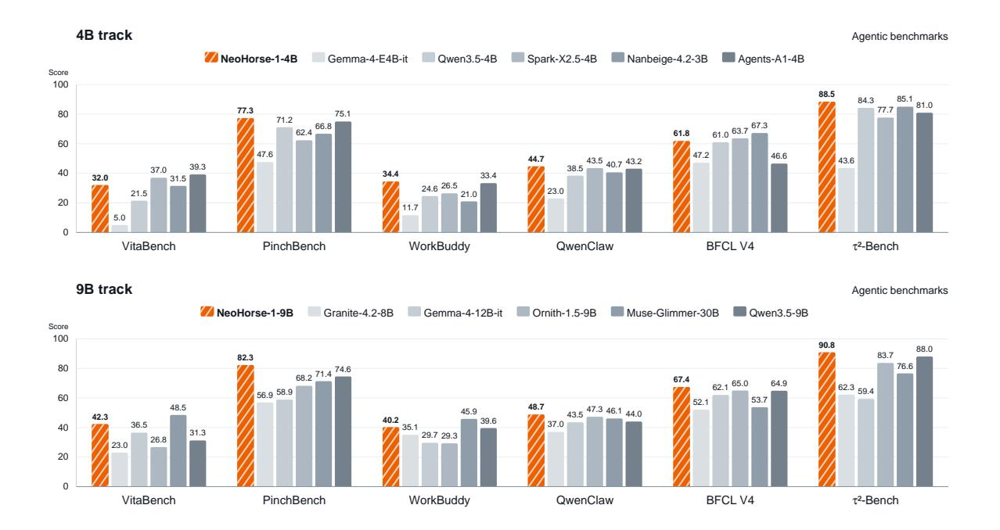
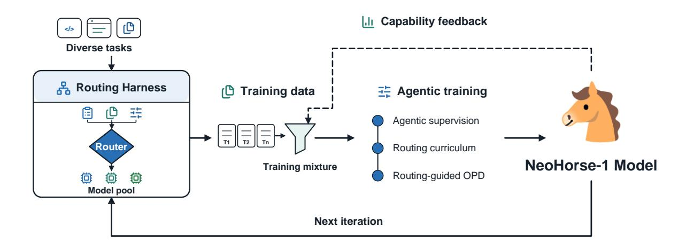
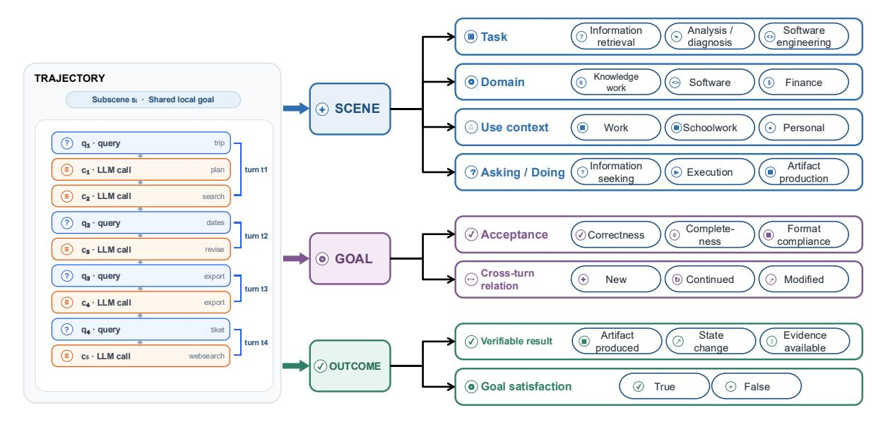
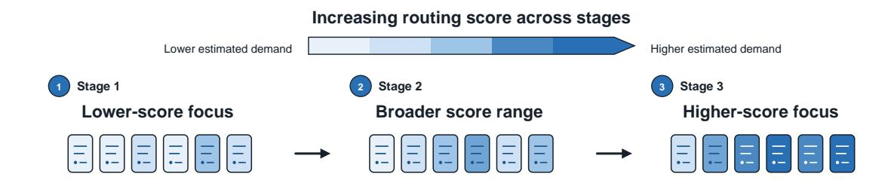
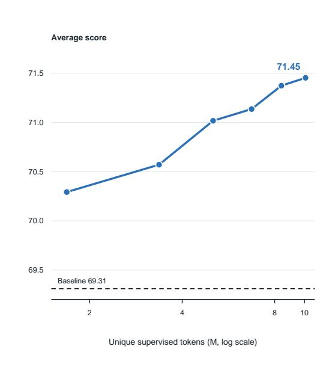
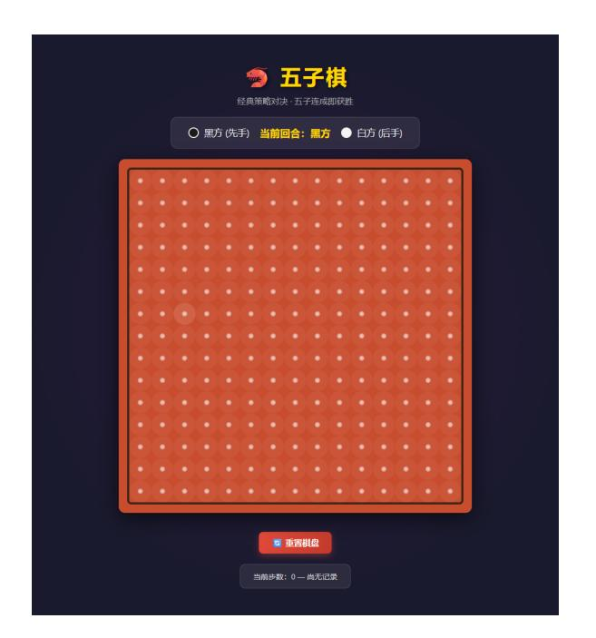
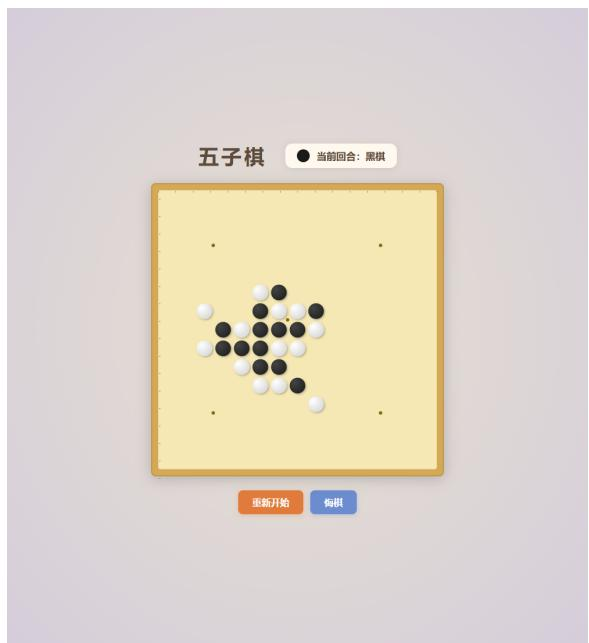

# *NeoHorse-1*: 재귀적 자기 개선을 향한 에이전트 기반 사후 훈련과 라우팅 하네스

- 원제: NeoHorse-1: Towards Recursive Self-Improvement via Agentic Post-Training with Routing Harness
- 원문: [https://arxiv.org/abs/2609.08183](https://arxiv.org/abs/2609.08183)
- PDF: [https://arxiv.org/pdf/2609.08183](https://arxiv.org/pdf/2609.08183)
- arXiv ID: `2609.08183`

---

# *NeoHorse-1***: 재귀적 자기 개선을 향한 에이전트 기반 사후 훈련과 라우팅 하네스**

### NeoHorse 팀

<https://hf.co/collections/TokenRhythm/neohorse-1> <https://github.com/TokenRhythm/NeoHorse>

# **초록**

재귀적 자기 개선(RSI)은 AI 시스템이 자신의 역량을 관찰하고 그 증거를 다음 학습 라운드로 전환하는 구체적인 메커니즘을 필요로 한다. 우리는 배포된 라우팅 하네스가 이미 이러한 메커니즘을 포함하고 있다고 주장한다: 작업 출력 외에도 에이전트 상호작용은 실행 경로와 모델이 아직 할 수 있는 것과 할 수 없는 것에 대한 관찰 가능한 증거를 남긴다. 우리는 에이전트 기반 사후 훈련을 통해 이 경로를 탐색하기 위해 개발된 에이전트-네이티브 모델 계열인 *NeoHorse-1*을 제시한다. 우리 시스템은 다양한 모델 풀과 지능형 라우팅을 결합하여, 각 턴마다 예측된 능력 수요, 선택된 서비스 티어, 그리고 그에 따른 상호작용을 기록한다. 이러한 기록은 교차된 추론, 도구 호출, 하네스 컨텍스트를 보존하는 사용자 턴 훈련 예제로 변환되며, 구조적 검증, 6차원 의미 평가, 서브시네 레벨 라벨링을 통해 허용된다. 라우팅 신호는 능력 수요 추정치를 제공한다: 이들은 감독 미세 조정을 3단계 커리큘럼으로 조직하고, 자연스럽게 라우팅 가이드 온-정책 증류로 확장된다. 이때 교사는 동일한 단계 진행 아래에서 학생이 생성한 응답을 감독한다. 마지막으로, 능력 가이드 할당 단계는 평가 피드백을 다음 훈련 혼합으로 전환하여, 시스템이 학습하는 내용이 다음 학습을 형성하는 평가–선택–업데이트 루프를 완성한다. 하네스 기반 에이전트, 도구 사용, 코딩, 명령 따르기를 아우르는 10개의 벤치마크에서 사후 훈련은 4B 모델의 macro-average 점수를 58.94에서 64.87로, 9B 모델의 점수를 65.60에서 69.04로 끌어올려, 사후 훈련된 4B 모델과 9B 베이스 모델 간의 총합격 차이를 크게 좁힌다. *NeoHorse-1*은 이 피드백 기반 프로세스의 초기 프로토타입이며, 우리는 이를 반복적으로 유지함으로써 하네스 매개 재귀적 자기 개선을 설계 단계에서 실천 단계로 옮길 수 있는 방법을 제시한다.

## **1. 서론 (Introduction)**

*\"거리(거리?)는 말의 지구력을 시험하고, 시간은 인간의 심장을 드러낸다.\"* — 중국 속담

Recursive self-improvement (RSI)는 AI 시스템이 자체 개선 과정에서 점점 더 큰 역할을 맡는 광범위한 방향을 설명한다—개별 응답을 정제하고 실행 하네스를 재구성하며, 자체 생성 경험에서 학습하고, 새로운 연구 분야에서 AI 연구의 일부를 자동화하는 것까지 포함한다 [&#91;11,](#page-22-0) [31&#93;](#page-24-0). 그 매력은 구조적이다: 모델 개선 자체가 부분적으로 자동화되면, 각 세대는 기여할 수 있다

Figure 1 | 4B 및 9B 트랙에서 여섯 개의 에이전트 벤치마크에 대한 비교. 주황색 막대는 *NeoHorse-1-*4B(상단)와 *NeoHorse-1-*9B(하단)를 나타내며, 회색 막대는 각 트랙의 비교 모델을 나타내고, 모델 크기는 범례에 표시된다. 전체 결과는 표 1과 표 2에 보고된다

다음 단계의 생산으로 전환하고, 고립된 훈련 노력을 수집적 프로세스로 전환하여 수동으로 선별된 데이터와 인간 감독에 덜 의존하도록 한다. 그러나 이 비전을 실현하려면 시스템이 자신의 역량을 관찰하고 그 증거를 다음 학습 라운드로 전환하는 구체적인 메커니즘이 필요하다. 에이전트는 이러한 메커니즘의 자연스러운 운반자이다. 에이전트가 코드를 작성하거나 질문을 조사하거나 소프트웨어를 운영할 때, 그 결정, 도구 상호작용, 작업 결과의 기록을 남긴다; 이러한 상호작용 궤적과 실행 가능한 작업은 이미 에이전트 모델을 훈련시키는 데 사용되었다 [71, 12, 57, 53]. 이 기회는 이러한 기록을 정적 감독으로만 다루는 것을 넘어선다: 에이전트 상호작용은 학습할 수 있는 작업 경험과 모델의 강점과 한계에 대한 관찰 가능한 증거를 모두 생산하며, 이는 모델이 다음에 무엇을 배울지 형성할 수 있다—RSI가 요구하는 정확한 피드백이다. 우리는 라우팅 기반 에이전트 훈련을 통해 이 경로를 탐색하도록 개발된 에이전트-네이티브 모델 계열 *NeoHorse-1*을 소개한다. Figure 1은 두 모델 규모에서의 에이전트 벤치마크 결과 개요를 제공한다.

하네스는 에이전트의 컨텍스트, 도구 및 환경과의 상호작용을 관리하는 실행 계층이다 [68, 27]. 에이전트 라우팅을 추가하면 이 계층이 요청과 진화하는 상호작용 상태에 따라 모델을 선택할 수 있다 [9, 41]. Agentic Routing의 하네스-네이티브 데이터 플라이휠 [33]을 기반으로, 우리 시스템 설계는 OpenSquilla [61]를 포함한 다수의 하네스를 통해 이질적인 모델 풀을 결합한다. 이 설계는 훈련 경험이 다양한 모델 동작과 실행 환경을 아우를 수 있게 한다. 라우팅 기록은 추정된 역량 수요, 실제 사용된 모델, 이후 상호작용을 연결하여 훈련 경험을 조직하는 데 유용하다.

In *NeoHorse-1*, 이 경로는 진화하는 훈련 분포에 초점을 맞춘다. 역량 수준 피드백은 이후 모델 업데이트를 위한 데이터 할당을 안내하고, 지속적인 하네스 실행은 새로운 상호작용 경험을 제공한다. 업데이트된 모델이 하네스로 돌아올 때, 그 행동은 새로운 강점과 한계 패턴을 드러내어 다음 단계에 정보를 제공할 수 있다.

Figure 2 | **RSI를 향한 라우팅 기반 에이전트 훈련**. 다양한 작업은 이질적인 모델 풀을 지원하는 라우팅 하네스를 통해 상호작용 경험을 생성한다. 이 경험은 *NeoHorse-1*의 훈련 혼합으로 조직된다. 역량 피드백은 다음 훈련 분포를 안내하고, 업데이트된 모델은 이후 반복을 위해 하네스로 돌아온다. 에이전트 훈련 스택은 본 보고서에서 설명한 사후 훈련 방법을 요약한다.

다음 훈련 라운드. 이 루프에서 시스템이 배우는 것이 다음에 배우는 것에 영향을 미친다. 하네스가 다른 모델도 활용할 수 있기 때문에, 이 과정은 다중 모델 경험을 개별 모델의 지속적 개선과 연결한다. Figure [2](#page-2-0)는 이 루프를 요약한다.

*NeoHorse-1*의 사후 훈련 방법은 이 설계의 학습 구성요소를 제공한다. 우리는 먼저 기록된 상호작용을 사용자 턴 훈련 예시로 변환하여, 각 보조자 응답이 생성된 역사적 및 하네스 맥락을 보존한다. 이를 통해 모델은 실행 조건에서 분리되지 않은 채 교차된 추론, 도구 사용, 가시적 응답을 학습할 수 있다. 에이전트형 상호작용은 능력 요구가 크게 다르기 때문에, 라우팅 기반 점수를 사용해 이 경험을 커리큘럼으로 구성한다 [&#91;7,](#page-22-3) [29&#93;](#page-24-2), 점수가 높은 예시를 점진적으로 도입하면서 낮은 점수의 범위는 유지한다. 그러나 SFT는 여전히 기록된 보조자 응답에서 학습하지만, 배포는 모델이 자체적으로 생성한 프리픽스에서 진행된다. 따라서 우리는 같은 라우팅 가이드 진행을 온폴리시 증류 [&#91;1&#93;](#page-22-4)에도 확장한다. 여기서 교사는 학생이 생성한 응답을 감독한다. 라우팅은 학습 자료를 조직하고, 온폴리시 감독은 학생의 진화하는 행동을 따르며, 이 두 방법은 라우팅 시스템의 다양한 경험을 통합 모델 내의 능력으로 전환한다.

*NeoHorse-1*을 4B 및 9B 규모에서 연구하며, 평가 항목은 하네스 기반 에이전트, 지시 따르기, 코딩, 도구 사용, 상호작용 과제 등을 포함한다. 평가 스위트 전반에 걸쳐, 에이전트형 사후 훈련은 4B 규모에서 매크로 평균 점수를 58.94에서 64.87로, 9B 규모에서 65.60에서 69.04로 상승시킨다. 가장 큰 향상은 하네스 기반 및 실행 집약적 평가에서 나타나며, 사후 훈련된 4B 모델은 9B 기본 모델과의 전체 격차를 크게 줄인다. 전체 결과는 표 [1](#page-13-0)과 [2.](#page-14-0)에 보고된다. 본 보고서는 RSI를 향한 이 경로에서 초기 모델 훈련 프로토타입을 제시한다. 다음 단계는 피드백 기반 프로세스를 연속 반복 및 더 넓은 과제 설정에 걸쳐 확장하고, 모델 능력이 진화함에 따라 그 이득이 지속될 수 있는지 연구하는 것이다.

## **2. 관련 연구 (Related Work)**

### **2.1. 에이전트 모델 사후 훈련 (Agentic Model Post-Training)**

Trajectory 기반 감독형 미세조정(SFT)은 계획 및 도구 사용을 모델 파라미터에 전달하는 실용적인 경로를 제공한다. FireAct와 AgentTuning은 상호작용 궤적에서 학습하며, Agent-FLAN과 AgentBank는 데이터 구성을 비롯한 규모가 일반화에 영향을 미침을 보여준다 [8,] [71,] [12,] [57]. Llama 3는 합성 다단계 도구 사용 데이터와 반복적 SFT, 거절 샘플링, 직접 선호도 최적화를 통해 이 레시피를 확장한다 [19].

Trajectory SFT는 주로 고정된 교사 정책에서 행동을 모방한다. 온-정책 증류(OPD)은 학생이 궤적을 생성하도록 하면서 교사가 학생이 방문한 상태에서 토큰 수준 로짓을 제공함으로써 이 분포 격차를 줄인다 [1,] [36]. 기존의 교사 궤적 증류(teachertrajectory distillation)와 비교했을 때 [22], OPD는 학생의 진화하는 행동과 정렬된 더 밀집된 프로세스 감독을 제공한다.

상호작용 하니스는 툴, 관측, 피드백이 훈련 분포에 들어가는지를 결정한다. SWE-agent와 Interplay of Harness Design and Post-Training은 인터페이스 선택이 에이전트 성능과 견고성에 영향을 미친다는 것을 보여주며, Terminal-Lego는 명시적으로 구조화되고 환경 기반의 트래젝터리의 가치를 강조한다 [68, 27, 69]. 실행 가능한 환경 피드백을 갖는 Agentic RL은 고정된 행동 라벨을 툴 실행 및 작업 결과에서 파생된 보상으로 대체한다. Search-R1, ReTool, 그리고 RAGEN은 검색, 툴 사용, 장기 상호작용을 위해 이 패러다임을 연구하며, Agent Lightning v1.0은 배포 하니스 내부에 환경 루프를 유지하고 Co-Harness는 하니스와 모델을 공동으로 업데이트한다 [25, 17, 64, 21, 13].

### **2.2. LLM 라우팅 및 커리큘럼 학습**

LLM 라우팅은 각 쿼리를 적절한 모델에 할당하면서 응답 품질과 추론 비용을 균형 있게 조정한다. FrugalGPT는 비용 인식 모델 캐스케이드를 연구한다 [9], 반면 RouteLLM은 선호도 데이터를 사용해 강한 모델과 약한 모델 사이에서 쿼리를 라우팅하는 방법을 학습한다 [41]. Agentic routing [33]은 이 아이디어를 다중 에이전트 LLM 시스템에 확장하여, 결정 레이어가 각 들어오는 요청을 가장 잘 처리할 수 있는 모델 또는 서브 에이전트를 선택한다.

커리큘럼 학습은 추정된 난이도 개념에 따라 예제를 제시하는 훈련 전략이다 [7]. LLM 사후 훈련에서 효과가 있는 것으로 입증되었다 [66, 29]. 기존 접근법은 종종 명시적 난이도 라벨이나 데이터셋 특화 휴리스틱에 의존하는데, 이는 비용이 많이 들거나 획득이 비현실적일 수 있다. 라우팅 시스템은 대안 신호를 제공한다: 요청 및 문맥에 조건화된 예측이 상호작용의 상대적 역량 수요를 추정한다. 우리는 이 예측된 수요를 사용해 커리큘럼 훈련을 위해 예제를 순서화한다. 최종적으로 제공되는 모델의 정체를 난이도 라벨로 취급하는 대신, 실행된 라우트가 사용자 오버라이드, 서비스 가용성, 배포 정책을 반영할 수 있기 때문이다.

### **2.3. 재귀적 자기 개선**

재귀적 자기 개선은 AI 시스템이 경험, 평가, 또는 생성된 산출물을 사용해 모델, 스캐폴드, 또는 개선 절차를 향상시키는 반복 과정을 의미한다 [18, 70]. 최근 RSI 연구는 개선되는 대상(에이전트 행동 및 정책부터 주변 스캐폴드, 훈련 또는 연구 과정까지)과 생성, 평가, 업데이트가 결과 피드백 루프 내에서 얼마나 밀접하게 연결되는지를 모두 고려한다 [11, 56]. 이러한 목표를 통해 시스템 수준의 노력은 하니스와 같은 구성 요소를 자동화하기 시작했다.

설계, 서비스 인프라, 그리고 훈련 파이프라인 [65, 3, 43].

최근 연구는 작업 행동, 에이전트 스캐폴드, 그리고 훈련 또는 연구 절차 수준에서 재귀적 개선을 조사한다. MetaSkill-Evolve는 작업 스킬과 그 개선을 관리하는 메타스킬을 공동으로 진화시키며, AREX는 증거 수집과 답변 감사를 번갈아 수행한다 [63, 37]. Self-Harness, Agentic Harness Engineering, 그리고 Retrospective Harness Optimization은 실패, 관측 가능성, 과거 트래젝터리를 활용해 하니스를 업데이트한다 [72, 30, 47]. Continual Harness는 이 설정을 재설정 없이 온라인 적응 및 모델 업데이트로 확장한다 [26]. 훈련 과정 수준에서 AI4AI-Bench는 에이전트가 훈련 알고리즘을 수정해 이후 실행이 개선을 상속받을 수 있는지 평가한다 [14].

## **3. 라우팅 하니스에서의 데이터**

후학습 데이터는 에이전트형 모델에 대해 정적 명령–응답 쌍으로 충분히 표현되지 않는다. 이 데이터는 사용자 요청, 모델 추론, 도구 호출, 환경 관찰, 그리고 작업 결과를 연결하는 실행 궤적으로 구성된다. 따라서 우리의 데이터 구축은 배포 하네스에서 생성된 궤적에 초점을 맞추며, 공개된 명령, 추론, 도구 사용, 코드, 그리고 선호도 데이터를 활용해 기능 범위를 확장한다. 최근 에이전트형 모델 보고서와 일치하게 [&#91;62,](#page-27-10) [33&#93;](#page-24-1) 우리는 최종 답변 생성뿐 아니라 작업 진행, 도구 상호작용, 복구 행동을 학습하는 데 필요한 실행 컨텍스트와 관측 가능한 결과 신호를 보존한다. 본 섹션의 나머지는 코퍼스의 구성 및 직렬화, 품질 관리 및 라벨링, 하네스가 기록한 라우팅 신호, 그리고 평가 피드백이 이후 훈련 혼합을 재배치하는 방식을 설명한다—하네스 매개 RSI를 위한 데이터 측면의 기반이다.

### **3.1. 데이터 구성** (Data Composition)

우리는 코퍼스를 세 가지 연계된 세분화 수준에서 구성한다. *trajectory*는 배포 하네스에서 실행된 완전한 상호작용으로, 사용자 요청, 모델 응답, 도구 호출, 환경 관찰, 복구 시도, 그리고 최종 결과를 보존한다. *user turn*은 사용자 요청으로 시작해 다음 사용자 요청 또는 작업 종료에서 끝나며, 기본 직렬화 학습 단위로 사용된다. *subscene*은 지역 목표를 공유하는 인접한 사용자 턴을 그룹화하여 하나 이상의 사용자 요청을 포괄한다; 이는 의미적 특성화(Section [3.3)](#page-5-0) 단위로 사용된다. 이 조직은 완전한 실행 기록을 학습 예제와 의미 단위에 연결하면서 그 출처를 깨뜨리지 않는다.

각 사용자 턴 기록 안에서 현재 요청과 그에 섞인 추론, 도구 호출, 관찰은 추론–행동–피드백 체인을 보존하기 위해 보존된다. 이전에 보였던 응답과 도구 상호작용은 여전히 컨텍스트로 사용 가능하지만, 이전 턴의 추론은 생략된다. 각 기록은 부모 궤적과 subscene에 연결되어 있어 품질, 의미, 라우팅, 결과 신호를 적절한 세분화 수준에서 정렬할 수 있다. 다중 턴 데이터에서 추론 컨텍스트를 조직하는 관련 접근법은 DeepSeek-AI [&#91;16&#93;](#page-23-10)와 Qwen 팀 [&#91;52&#93;](#page-25-4)에서 논의된다.

주요 코퍼스는 약 105–106개의 하네스 생성 궤적으로 구성된다. 우리는 또한 공개된 데이터를 활용해 명령 따르기 및 대화, 추론, 도구 사용 및 코드, 에이전트 상호작용, 선호도 학습 등 다양한 영역에서 범위를 확장한다 [&#91;44,](#page-25-5) [15,](#page-23-11) [45,](#page-25-6) [42,](#page-25-7) [32,](#page-24-6) [34,](#page-24-7) [40,](#page-25-8) [39,](#page-24-8) [4&#93;](#page-22-7). 코퍼스 규모는 통합 직렬화, 중복 제거, 토크나이저 동결 후 궤적 수 traj와 토큰 수 tok로 보고되며, 그 결과 통계는 훈련 매니페스트에 기록된다.

### **3.2. 데이터 품질** (Data Quality)

**중복 제거 및 오염 방지.** 코퍼스는 정확한 중복과 근접 중복 수준에서 중복을 제거하며, 동일한 매칭 인프라가 모든 훈련 후보를 평가 세트와 비교한다: 평가 항목과 겹치는 기록은 훈련 측에서 제거되어 훈련 코퍼스와 평가 데이터가 분리된다 (Section [3.5)](#page-7-0).

**구조적 검증.** 각 트래젝터리는 규칙 기반 구조 검증을 거친다. 턴 수준에서 파이프라인은 요청, 모델 응답, 도구 호출, 도구 관찰, 그리고 종료 이벤트를 재구성한다. 이후 페이로드 가독성, 지원되는 메시지 구조, 요청 및 응답 존재 여부, 인과적 이벤트 순서, 그리고 식별자와 실행 분기를 통한 도구 호출/결과 쌍의 닫힘을 검증한다. 같은 단계에서 누락된 응답, 고립된 관찰, 중복되거나 충돌하는 도구 호출 식별자, 해결되지 않은 내부 호출, 그리고 모호한 종료 분기를 감지한다. 이러한 속성은 트래젝터리에서 직접 관찰 가능하므로 모델 기반 점수가 아닌 재현 가능한 규칙으로 평가된다.

구조적 게이트는 세 가지 운영 결과를 생성한다: 내부적으로 완전, 부분적으로 복구 가능, 격리. 완전한 트래젝터리는 바로 의미 평가로 진행된다; 복구 가능한 트래젝터리는 인과적으로 닫힌 하위 트래젝터리만 기여한다; 이벤트 소유권이 모호하거나 복구 가능한 감독 대상이 없는 트래젝터리는 격리된다. 구조적 유효성은 신뢰할 수 있는 직렬화 및 재생을 확립하지만, 올바른 도구 선택이나 작업 성공을 의미하지 않는다.

**의미 평가.** 구조적으로 사용 가능한 트래젝터리의 경우, 정규화된 의미 이벤트 스트림을 구성하고 목표 달성, 지시 준수, 도구 사용, 증거 일관성, 오류 복구, 종료라는 여섯 개의 독립적인 품질 차원을 평가한다. 이 차원들은 실행 품질을 판단하며, 사용자가 요청한 것을 특성화하는 장면, 목표, 결과 속성과는 구분된다 (섹션 [3.3)](#page-5-0)). 확실한 실패—예를 들어 최종 응답 누락, 해결되지 않은 도구 호출, 또는 복구되지 않은 종료 오류—는 결정적으로 감지된다. 작업 수준 해석이 필요한 경우, 의미 심사자는 트래젝터리에 명시적으로 존재하는 증거에 한정되어 평가한다. 모든 발견은 해당 이벤트에 근거해야 한다. 긴 트래젝터리는 세그먼트 단위로 평가되고 이후 턴 수준에서 집계되어 중간 실패와 이후 성공적인 복구를 구분한다.

각 의미 차원은 PASS, WARN, FAIL, 또는 NOT_EVALUATED로 지정되며, 평가 범위는 별도로 저장된다. 증거 누락이나 심사 호출 중단은 절대로 긍정적 판결로 전환되지 않는다. 따라서 품질 표현은 단일 휴리스틱 점수로 압축하기보다 구조적 상태, 여섯 개의 품질 차원, 그리고 증거 범위를 그대로 보존한다. 교육 입학, 검토, 격리 정책은 이 구조화된 표현을 기반으로 정의된다.

### **3.3. 데이터 특성화 (Data Characterization)**

사용자 경험의 체계적 개선을 지원하기 위해, 우리는 다양한 사용 시나리오를 중심으로 속성 체계를 구성한다. 그림 [3](#page-6-0)에서 보여지듯이, 이 체계는 각 하위 장면을 세 가지 축으로 특성화한다: *Scene*은 사용자가 무엇을 하고 있는지와 그 맥락을 설명한다; *Goal*은 사용자가 달성하려는 목표와 성공을 판단하는 방식을 명시한다; *Outcome*은 시도 결과의 검증 가능한 결과를 기록한다. 이 세 축은 사용자 의도, 에이전트 실행, 그리고 결과를 연결하여 역량 분석 및 데이터 할당에 활용된다.

Figure 3 | **하위 장면 수준 시나리오 특성화.** 트래젝터리는 사용자 질의와 LLM 호출의 순서 있는 이벤트 스트림으로 표현된다; 인접한 사용자 턴이 동일한 지역 목표를 공유하면 하위 장면을 형성한다. 선택된 하위 장면은 세 가지 보완적 관점—*Scene*, *Goal*, 그리고 *Outcome*—을 통해 설명되며, 대표 속성은 오른쪽에 표시된다.

속성은 대화 내에서 목표의 연속, 수정, 중단, 재개를 포착하는 *subscene* 수준(Section 3.1)에서 할당된다. Scene 축에서는 폐쇄형 분류체계가 작업 유형과 적용 도메인을 다루어, 코퍼스를 사용자가 수행하려는 작업에 따라 층화할 수 있다; 각 subscene은 하나의 주요 값과 최대 두 개의 부가 값을 받는다. Context와 Asking/Doing은 설정을 추가로 특성화하고 요청이 정보 탐색인지 실행인지 여부를 나타낸다. Goal 축에서는 사용자 목표가 성공 판단 기준을 정의하는 수용 기준으로 분해되고, 교차 턴 관계는 목표가 신규인지, 연속인지, 수정인지, 재개인지, 모호한지를 표시한다. Outcome 축에서는 목표에 대한 시도 결과가 검증 가능한 형태로 기록되어, 작업이 실제로 얼마나 충족되었는지를 프로세스가 완료된 것과 구분할 수 있다.

모델 보조 주석(model-assisted annotation)의 노이즈를 제어하기 위해 각 속성은 그 파생 방법과 신뢰도를 유지한다. 소스 또는 결정론적 규칙에 의해 확립된 구조적 사실(structural facts)은 의미적 판단자(semantic judge)에 의해 덮어쓰여서는 안 된다. 구조적 품질, 턴-로컬 추론 정책(turn-local reasoning policy), 손실 마스크(loss masks), 라우팅 기록(routing records)(Section 3.4)은 별도의 메타데이터로 남는다. 세 축(three axes)과 함께 이 신호(signals)는 능력 격차(capability gaps)를 국소화하고 이후 데이터 할당(data allocation)을 안내한다.

### 3.4. 에이전시 라우팅 신호

함께 3.3절의 의미적 속성과 라우팅 신호는 각 경로에 대한 보완적 관점을 제공한다. 장면, 목표, 결과 속성은 사용자가 요청한 내용과 시스템이 달성한 결과를 설명한다; 하네스의 라우팅 모듈은 각 사용자 턴에 대해 예측된, 선택된, 실제로 제공된 기능 수준을 기록한다. 이 필드들을 정렬하면 예측–행동–결과 기록이 생성되어 말뭉치를 사용자 의도, 서비스 할당, 관측된 결과에 따라 공동으로 층화할 수 있다.

하네스 라우터는 사용자 턴 수준에서 동작하며, 현재 요청, 최근 대화, 이전 라우팅 결정 및 사용 가능한 실행 상태로부터 기능 수요를 추정한다 [33].

각 턴은 네 가지 서비스 티어 중 하나에 할당된다: C0은 제한된 저위험 요청을 처리하고, C1은 범용 기본 옵션이며, C2는 다단계 추론 및 실행을 지원하고, C3은 최대 기능 또는 신뢰성을 제공한다. 정책 제어는 위험, 문맥 압력, 이전 실패 또는 서비스 제약에 대응해 이 할당을 조정할 수 있다.

티어는 라우팅 정책 하에서 상대적인 기능 수요를 설명한다. 모델, 가격, 추론 구성은 배포마다 달라질 수 있으며, C3 경로는 여러 제안자와 집계기를 결합할 수 있다 [61](#page-27-2). 버전이 지정된 티어 의미는 서비스 스택이 진화함에 따라 라우팅 기록을 해석 가능하게 유지한다.

각 턴마다, 코퍼스는 라우터의 원시 예측, 정책 조정된 결정, 그리고 실제로 제공된 티어를 보존하여, 예측 수요, 정책 제약, 그리고 실행된 행동이 독립적으로 분석 가능하도록 한다.

각 라우팅 기록은 그 궤적과 연결되어 있으므로, 말뭉치는 능력‑수요 영역 전반에 걸친 완료, 검증, 복구 패턴을 드러낸다. 라우팅 행동은 작업 완료, 검증 피드백, 복구 비용을 사용해 평가된다. 이 예측–행동–결과 분리[&#91;33&#93;](#page-24-1)는 실제로 제공된 계층을 훈련 라벨로 취급하지 않고 섹션 [4.2](#page-8-0)에서 커리큘럼 순서를 위한 라우팅 추정치를 분리할 수 있게 한다. 결과 필드는 대신 섹션 [3.5.](#page-7-0)의 능력 기반 할당을 위한 결함 신호를 제공한다. 배포된 라우팅 결과를 다음 데이터 혼합에 공급함으로써 라우팅 시스템은 서비스 시 결정 메커니즘과 하니스 매개 RSI 내 데이터 피드백 소스로 동시에 기능한다.

### **3.5. 역량 기반 데이터 할당**

Section [3.2,](#page-4-1)의 품질 차원, Section [3.3,](#page-5-0)의 의미적 속성, Section [3.4](#page-6-1)의 라우팅 신호는 사용자 의도, 기능 수요, 실행 품질, 결과에 따라 배포 경로를 조직한다. 라우팅은 샘플을 기능 수요 영역에 배치하고, 검증 및 결과 필드는 성능을 측정하여 다양한 작업과 사용 시나리오에 대한 계층화 공간을 제공한다.

현재 모델 체크포인트는 섹션 [3.2.](#page-4-1)에서 수행되는 제거 스크리닝에 의해 훈련과 분리된 층화된 테스트 세트에서 평가된다. 결과는 속성, 품질 차원, 결과 상태, 라우팅 계층을 따라 집계되어 모델 결함 프로필을 형성한다. 이 프로필은 다음 훈련 혼합을 성능이 낮은 영역으로 이동시키면서 광범위한 커버리지를 유지한다. 검증된 성공 경로는 긍정적 감독을 제공하고, 유익한 실패는 이후 혼합에서 추가 또는 재조정된 커버리지가 필요한 영역을 식별한다. 이러한 할당 결정은 별도의 실패 전용 목표를 도입하기보다 훈련 데이터의 구성을 변경한다.

반복 사이에서, 하네스는 동일한 품질, 특성화, 라우팅 파이프라인으로 처리된 트래젝터리를 지속적으로 추가한다. 기존 데이터와 신규 데이터를 함께 재배치하여 말뭉치가 사용 패턴과 시스템 역량의 변화를 따르도록 한다. 업데이트된 체크포인트가 하네스에 반환되면, 이후 트래젝터리가 다음 역량 격차를 드러내어 하네스 매개 RSI의 평가–선택–업데이트 루프를 닫는다 [33,](#page-24-1) [35](#page-24-9). 메서드 섹션 내에서, 라우팅에서 도출된 점수는 두 가지 스케줄링 메커니즘을 통해 최적화에 영향을 미친다: 첫째, 사용자 턴 예제를 Section 4.2의 세 단계 SFT 커리큘럼에 순서대로 배치하고, 둘째, 동일한 진행 스케줄이 Section 4.3의 온-폴리시 디스틸레이션 시작 컨텍스트를 정한다.

## **4. 에이전트성 사후 훈련 (Agentic Post-Training)**

### **4.1. 에이전트성 감독 (Agentic Supervision)**

에이전트 트래젝터리(agent trajectory)는 모델이 환경과 상호작용한 기록을 담으며, 사용자 요청, 모델 출력, 도구 결과를 포함한다. 사용자 요청에 응답할 때, 어시스턴트는 추론을 수행하고, 도구를 호출하며, 도구 결과를 받은 뒤 다시 추론할 수 있다. 이 패턴은 *interleaved thinking*이라고 부른다 [&#91;2&#93;](#page-22-8). 우리는 이러한 기록을 SFT에 활용하여 각 사용자 턴 내에서 어시스턴트의 응답을 감독하고, 이전 상호작용을 컨텍스트로 보존한다.

**사용자 턴을 학습 단위로 정의**

우리는 *user turn*을 사용자 요청과 그에 따라 이어지는 어시스턴트 응답 및 도구 상호작용을 포함한 것으로 정의한다. 이는 다음 사용자 요청 또는 기록된 상호작용의 끝까지 이어진다. 도구 결과와 하네스 주입 메시지는 새로운 사용자 턴을 시작하지 않는다. 각 훈련 예제는 하나의 턴과 그 역사적 맥락(Section [3.1)](#page-4-0))을 포함한다. 턴은 도구 결과와 교차되는 여러 어시스턴트 응답을 포함할 수 있으며, 우리는 보존된 어시스턴트 목표 구간을 단일 시퀀스로 감독한다.

**직렬화 및 컨텍스트.**  
우리는 Qwen3.5 채팅 템플릿과 도구 호출 형식 [51](#page-25-9)을 사용하여 각 사용자 턴 예제를 직렬화한다. 그 추론-컨텍스트 규칙과 일치하도록, 현재 턴에 추론이 존재하면 이를 보존하고 이전 턴의 추론은 생략한다. DeepSeek-V3.2에 대해서도 유사한 컨텍스트 정책이 설명되어 있다 [16](#page-23-10). 이전 사용자 요청, 표시된 어시스턴트 응답, 도구 호출 및 도구 결과는 컨텍스트로 남아 있다. 우리는 기록된 시스템 지침과 하네스 제공 컨텍스트를 보존하여 어시스턴트 목표가 생성된 조건과 짝을 이루도록 한다.

역사적 메시지와 모든 비-어시스턴트 구간—시스템 지시, 도구 사양, 보존된 하네스 제공 컨텍스트, 사용자 메시지, 그리고 도구 결과—는 예측 손실을 받지 않는다. 인과적 주의(attention)를 사용하면 각 어시스턴트 응답은 시퀀스에서 이전의 행동과 도구 결과를 사용할 수 있지만, 이후의 것은 사용할 수 없다. 그림 [4](#page-9-0)가 이 구성을 보여준다.

**SFT objective.**  
Let = (,1, . . . , , )는 역사적 접두사와 현재 턴을 포함한 직렬화된 훈련 시퀀스를 나타낸다. 우리는 이진 토큰 수준 손실 마스크 , , 를 사용하며, 현재 턴의 보존된 어시스턴트 목표 구간에 있는 토큰(존재 시 추론, 직렬화된 도구 호출 및 그 인수, 가시적 응답, 응답 종료 토큰)에 대해 1로 설정한다. 패딩을 포함한 다른 모든 토큰은 , = 0 이다. 논리적 시퀀스 B의 배치에 대해 우리는 다음을 최소화한다.

$$\mathcal{L}_{SFT}(\theta; \mathcal{B}) = -\frac{\sum_{i \in \mathcal{B}} \sum_{t=2}^{T_i} m_{i,t} \log p_{\theta}(x_{i,t} \mid x_{i,< t})}{\sum_{i \in \mathcal{B}} \sum_{t=2}^{T_i} m_{i,t}}.$$

(1)

이 목표는 감독된 토큰을 동일하게 가중치 부여하고, 배치 전체에서 그 수를 기준으로 정규화한다. 총 시퀀스 길이나 턴 수로는 정규화하지 않는다.

### **4.2. 라우팅 가이드형 커리큘럼 학습**

에이전트형 상호작용은 요구되는 능력에 따라 일상적인 응답부터 복잡한 계획 및 도구 조정까지 다양하다. 우리는 이 수요에 대한 라우팅 추정치를 사용하여 SFT를 조직한다.

### (a) 기록된 상호작용

사용자 턴 1 (이력) 사용자 턴 2 (현재) USER ASSISTANT TOOL ASSISTANT USER ASSISTANT TOOL ASSISTANT Reasoning Reasoning Reasoning Reasoning Reques Result Reques Result Tool call Response Tool call Response 이전 추론 생략 현재 어시스턴트 범위 감독 (b) 현재 사용자 턴에 대한 훈련 시퀀스 ASSISTANT USER ASSISTANT USER ASSISTANT ASSISTANT Reasoning Reasoning Tool call Request Result Reques Response Tool call Response m = 1 m = 0 throughout history m = 0m = 0Supervised assistant target

Figure 4 | **사용자 턴 내에서의 에이전시 감독**. 기록된 상호작용(상단)은 현재 사용자 턴(하단)을 위한 학습 시퀀스로 변환된다. 이전 추론은 생략되며, 가시적인 응답과 도구 상호작용은 역사적 맥락으로 남는다. 현재 사용자 턴에서, 어시스턴트 목표 구간은 예측 손실을 받는다; 사용자 메시지와 도구 결과는 받지 않는다. 추론은 존재할 때 보존되며, 어시스턴트 목표에는 응답 종료 토큰이 포함된다. 시퀀스는 인과적 주의를 사용한다. 시스템 지시문, 도구 사양, 그리고 보존된 하네스 메시지는 도식에서 생략되며, 이들은 예측 손실을 받지 않는다. 블록 너비는 토큰 수를 반영하지 않는다.

예시를 커리큘럼에 통합한다. Section 3.4에서 소개한 C0–C3 능력 순서에 따라, 커리큘럼은 점수가 높은 예시를 점진적으로 도입하면서 낮은 점수의 예시는 이후 단계에서 유지한다.

그러나 모델은 실제로 사용자 오버라이드, 서비스 가용성, 그리고 배포 정책을 반영한다. 따라서 그 정체성만으로는 상호작용이 요구하는 능력을 완벽하게 대변하지 못한다. 우리는 대신 요청과 첫 번째 감독 어시스턴트 응답 이전에 사용 가능한 관련 상호작용 기록에서 능력 수요를 재추정한다. 이 추정치를 Section 4.1에서 정의한 완전한 예시 $x_i$ 에 할당하고, 이를 각 개별 행동에 대한 난이도 라벨이 아니라 턴 수준 순서 프록시로 사용한다. 이는 예시가 제시되는 시점을 바꾸지만, 기록된 어시스턴트 목표를 변경하지 않는다.

**Routing scores.** 각 예제마다 라우터는 C0–C3에 대한 상대적 지원을 표현하는 정규화된 점수 벡터와 티어 할당을 제공한다. $k_i \in \{0, 1, 2, 3\}$ 를 할당된 티어 인덱스로, $\pi_{i,k}$ 를 티어 Ck에 대한 정규화된 점수로 두면, $\pi_{i,k} \ge 0$ 이고 $\sum_{k=0}^{3} \pi_{i,k} = 1$ 이다. 우리는 할당된 티어 인덱스를 하드 오더링에, 점수 가중 평균 티어 인덱스를 소프트 오더링에 사용한다:

$$s_{i} = \begin{cases} k_{i}, & \text{hard ordering,} \\ \sum_{k=0}^{3} k \, \pi_{i,k}, & \text{soft ordering.} \end{cases}$$

(2)

소프트 점수는 다른 티어에 대한 지원을 포함함으로써 같은 할당된 티어를 가진 예제를 구분할 수 있다. 우리는 $s_i$ 를 다음에 설명할 커리큘럼을 구성하는 데 사용하고, SFT 손실을 재가중하는 데는 사용하지 않는다.

**Curriculum scheduling.** 우리는 세 단계에 걸쳐 훈련하며, 점차적으로 높은 라우팅 점수를 가진 예제를 도입한다. 각 단계는 예제의 약 1/3을 포함하며, 일부 낮은-

Figure 5 | **Routing-guided curriculum.** 라우팅 점수는 능력 수요의 대리 지표 역할을 한다. 훈련 혼합은 세 개의 거의 같은 크기의 단계에 걸쳐 높은 점수의 예제로 이동하며, 일부 낮은 점수의 예제는 이후 단계에 예약된다. 색상 강도는 각 단계 내 라우팅 점수 분포를 도식적으로 나타낸다.

낮은 점수의 예제는 이후 단계에 예약된다. 낮은 점수의 예제를 이후 단계에 예약함으로써 훈련 종료 시점이 고수요 상호작용에만 지배되는 것을 방지한다. 모든 예제는 한 번씩 사용된다. Figure [5](#page-10-1) 은 일정을 보여준다. 훈련은 단계 간에 옵티마이저를 재설정하거나 학습률 스케줄을 재시작하지 않고, 동일한 마스킹 SFT 목표를 계속 따른다.

### **4.3. Routing-Guided On-Policy Distillation**

Section [4.1](#page-8-1) 에서의 SFT 목표는 기록된 어시스턴트 응답에서 학습하지만, 배포된 학생은 자신의 생성된 프리픽스에 조건을 둔다. On-policy distillation (OPD) [&#91;1&#93;](#page-22-4)는 이러한 학생 생성 프리픽스에 대해 교사 감독을 제공한다.

시작 컨텍스트는 디스틸레이션을 위한 학습 자료를 제공한다: 이는 학생이 직면하는 작업과 상호작용 상태를 결정한다. 우리는 Section [4.2](#page-8-0) 에서의 라우팅 가이드 커리큘럼을 확장하여 라우팅 추정 능력 수요에 따라 이 자료를 조직한다. 라우팅은 학습 자료의 진행을 제어하고, 온-폴리시 감독은 학생의 진화하는 행동을 따른다.

**Routing-guided context scheduling.** 우리는 어시스턴트 응답 직전의 기록된 컨텍스트를 생성 시작점으로 사용한다. 각 시작 상태는 해당 시점에 사용 가능한 요청 및 상호작용 기록을 바탕으로 Equation [2.](#page-9-1)을 따라 점수를 매긴다. 우리는 SFT와 동일한 세 단계 할당을 적용하여 점수가 높은 컨텍스트를 점진적으로 도입하고 일부 낮은 점수의 컨텍스트를 이후 단계에 예약한다. 이 할당에 의해 단계 ∈ {1, 2, 3} 에서 유도되는 컨텍스트 배치의 분포를 Let denote 한다.

**Student generation and teacher supervision.** 단계에서, 학생 체크포인트 ¯ 은 배치 C 에서 추출된 각 컨텍스트에 대해 하나의 어시스턴트 응답을 생성한다. 결과 응답 배치 R 은 추론, 도구 호출, 또는 가시적 텍스트를 포함할 수 있다. 고정된 교사는 각 위치에서 다음 토큰 분포를 제공하며, 이는 해당 컨텍스트와 학생의 이전 응답 토큰에 조건부이다. 두 모델은 각각의 네이티브 템플릿을 사용해 동일한 기록된 메시지와 도구를 렌더링하며, 응답 토큰 ID 를 정렬해 점수를 매긴다. 훈련이 진행됨에 따라 롤아웃 체크포인트를 새로 고쳐, 이후 컨텍스트는 더 최근의 학생 행동에 대한 교사 감독을 받는다. 롤아웃 파라미터 ¯ 은 수집된 응답에 대해 학생을 최적화하는 동안 고정된다.

# 라우팅-점수 기반 컨텍스트 낮은 단계-j 선택 학생 롤아웃 온-정책 프리픽스 프리셋 교사 높은 이후 단계는 높은 라우팅 점수를 강조 학생 업데이트 Vi 다이어그램 학생 점수화 역 KL KL(P || Q) V V V V V V V V V V V V V V V V V

Figure 6 | **라우팅-가이드 온-정책 디스틸레이션.** 라우팅 점수는 기록된 시작 컨텍스트를 세 단계에 걸쳐 스케줄링하며, 낮은 점수의 컨텍스트는 이후 단계에 예약된다. 학생은 이러한 컨텍스트에서 응답을 생성한다. 각 생성된 프리픽스마다, 학생과 고정된 교사가 역-KL 목표(Equation 3)를 위한 다음 토큰 분포를 제공한다. 두 분포는 동일한 상위 *K* 후보 토큰과 나머지 확률 질량을 위한 하나의 bin을 사용한다. 학생만 업데이트되며, 새로 업데이트된 학생 체크포인트가 이후 응답을 생성한다. 롤아웃과 스코어링은 동일한 학생 모델을 사용하며, 파라미터는 훈련 중에 업데이트된다. 토큰 스트립과 확률 막대는 스키마틱이다.

**디스틸레이션 목표.** $P_{\theta,r,t}$와 $Q_{r,t}$는 생성된 응답 r의 위치 t에서 현재 학생과 고정 교사의 분포를 나타낸다. 간결한 감독을 위해, 롤아웃 학생의 상위 K 후보 토큰을 각 위치에서 보존하고 나머지 확률 질량을 하나의 추가 bin으로 집계한다. 두 모델은 동일한 후보 집합과 전체 어휘 확률을 사용하여 K+1 bin에 걸친 거친 분포 $\widetilde{P}_{\theta,r,t}$와 $\widetilde{Q}_{r,t}$를 생성한다. 배치 $\mathcal{R}$에 대해, 우리는 응답-정규화된 역 KL을 최소화한다:

$$\mathcal{L}_{\text{OPD}}(\theta; \mathcal{R}) = \frac{1}{\sum_{r \in \mathcal{R}} w_r} \sum_{r \in \mathcal{R}} \frac{w_r}{L_r} \sum_{t=1}^{L_r} D_{\text{KL}} \left( \widetilde{P}_{\theta, r, t} \parallel \widetilde{Q}_{\r

t} \right). \tag{3}$$

여기서 $L_r$는 보존된 응답 길이이며, $w_r$는 고정된 응답 가중치로, 무가중치 설정에서는 1과 같다. 각 응답은 평균 토큰 수준의 발산을 기여하며, 프롬프트 토큰과 패딩은 손실을 받지 않는다. 기울기는 수집된 프리픽스에서 현재 학생의 확률을 통해 계산되며, 생성된 토큰, 후보 ID, 교사 점수는 고정된다.

단계별 목표는 컨텍스트 분포 $\rho_j$와 학생 생성 및 위에서 정의한 응답 수준 손실을 결합한다:

$$\mathcal{L}_{\text{R-OPD}}^{(j)}(\theta) = \mathbb{E}_{\substack{C \sim \rho_j \\ \mathcal{R} \sim p_{\bar{\theta}}(\cdot \mid C)}} \left[ \mathcal{L}_{\text{OPD}}(\theta; \mathcal{R}) \right], \qquad j \in \{1, 2, 3\}.$$

(4)

Figure 6은 전체 훈련 과정을 요약한다.

## 5. Results and Analysis (결과 및 분석)

이 섹션은 *NeoHorse-1*을 세 가지 상호 보완적인 관점에서 분석한다: 벤치마크 성능, 에이전트 실행 행동, 그리고 훈련 데이터. 먼저 *NeoHorse-1-4B*와 *NeoHorse-1-9B* 모델의 에이전트, 코딩, 지시 따르기 벤치마크 전반에 걸친 주요 결과를 보고, 훈련이 고정된 모델 규모에서 일관된 이득을 제공하는지와 9B 변형이 4B 변형보다 추가적인 개선을 제공하는지를 검토한다. 그 다음에

대표적인 에이전트 경로를 연구하여 증거 획득, 제약 추적, 실행 검증, 실패 복구, 전략 적응에서 정성적 차이를 특성화한다. 마지막으로, 경로 소스와 감독 규모의 효과를 연구하여 에이전트 상호작용 데이터의 구성과 양이 다운스트림 성능과 어떻게 연관되는지를 특성화한다.

**Benchmarks.** *NeoHorse-1*을 다양한 벤치마크 세트에서 평가한다. 평가 표와 정렬된 세 개의 최상위 범주: 에이전트 능력, 코드 생성, 지시 따르기. 에이전트 범주는 두 가지 상호 보완적 측면을 포함한다: 엔드 투 엔드 에이전트 실행과 도구 사용을 통한 상호작용 작업 완료.

- **Agentic:** 엔드-투-엔드 에이전트 실행을 위해 QwenClawBench [55](#page-26-2)는 현실적인 OpenClaw 과제를, WorkBuddy Bench [60](#page-27-11)는 다중 도메인 직장 시나리오를, PinchBench [49](#page-25-10)는 표준화된 OpenClaw 워크플로우를, VitaBench [20](#page-23-12)는 일상 서비스 시나리오에서의 다중 턴 상호작용을 대상으로 한다. 도구 사용 및 인터랙티브 작업 완료를 위해 BFCL V4 [48](#page-25-11)는 함수 호출 및 에이전트 도구 사용 능력을 측정하고, 2 - Bench [6](#page-22-9)는 항공, 소매, 통신 도메인에서 사용자–에이전트–도구 상호작용을 포함한 다중 턴 작업 완료를 평가한다.

- **Coding:** HumanEval [10](#page-22-10)은 자연어 사양에서 합성된 프로그램의 기능적 정확성을 측정하고, LiveCodeBench v6 [24](#page-23-13)는 최근 대회 스타일 프로그래밍 문제를 사용해 코딩 성능을 평가한다.

- **Instruction following:** IFEval [73](#page-28-0)은 명시적으로 검증 가능한 지침에 대한 준수를 테스트하고, IFBench [50](#page-25-12)는 다양하고 이전에 보지 못한 제약 조건에 대한 일반화를 중점적으로 다룬다.

Baselines. 우리는 *NeoHorse-1*을 두 모델 규모에서 강력하고 경쟁력 있는 오픈-웨이트 모델들의 대표적인 집합과 비교한다. 선택된 기준 모델은 확립된 범용 모델과 에이전트 기능에 특화된 모델을 모두 포함한다. 우리의 평가는 추론, 지시 따르기, 도구 사용, 코딩, 다단계 에이전트 상호작용 등 텍스트 기반 작업에만 초점을 맞춘다. 다중 모달리티를 지원하는 모델의 경우, 그들의 텍스트 인터페이스만 평가한다.

4B 트랙에서는 *NeoHorse-1*-4B를 **Qwen3.5-4B** [54](#page-25-13), **Spark-X2.5-4B** [59](#page-27-12), **Gemma-4-E4B-it** [58](#page-26-3), **Nanbeige-4.2-3B** [28](#page-24-10), 그리고 **Agents-A1-4B** [5](#page-22-11]와 비교한다.

9B 트랙에서는 *NeoHorse-1*-9B를 **Granite-4.2-8B** [23](#page-23-14), **Qwen3.5-9B** [54](#page-25-13), **Ornith-1.5-9B** [46](#page-25-14), **Gemma-4-12B-it** [58](#page-26-3], 그리고 **Muse-Glimmer-30B** [38](#page-24-11]를 문맥적 기준 모델로 비교한다.

특별히 명시되지 않는 한, 각 벤치마크 내에서 우리가 평가한 모든 모델은 동일한 벤치마크 전용 하네스, 도구 인터페이스, 컨텍스트 한계, 상호작용 예산을 사용한다. 우리는 각 모델의 공식 채팅 템플릿을 사용한다. 공식 블로그 포스트나 기술 보고서에서 가져온 결과는 해당 표에 ∗로 표시되며, 우리의 평가 파이프라인에서 생성된 측정값이 아니라 참조 결과로 포함된다.

Evaluation Configurations. 우리가 평가한 각 모델에 대해, 공식 문서에서 권장하는 추론 파라미터를 사용한다. *NeoHorse-1*과 그 Qwen3.5-4B 및 Qwen3.5-9B 베이스 모델의 경우, Qwen3.5 권장 설정을 따른다: temperature = 1.0, top‑p = 0.95, top‑k = 20, min‑p = 0.0, presence penalty = 1.5, repetition penalty = 1.0. All variants

Table 1 | *NeoHorse-1*-4B와 대표적인 4B 규모 오픈-웨이트 모델을 에이전트, 코딩, 지시 따르기 벤치마크에서 비교한 결과. 높은 값이 좋다. 각 열에서 가장 좋은 결과와 두 번째로 좋은 결과는 각각 굵게와 밑줄로 표시된다.

| 모델 | 에이전틱 |  |  |  |  | 코딩 |  | 지시 따르기 평균 |  |  |  |
|-----------------------------|------------|-------------------|-------------------------|----------------|--------------------|-------------------|---------------|----------------------------|-------------|------------|-------|
|  | BFCL v4 | Vita Bench | 2 𝝉 Bench | Pinch Bench | WorkBuddy Bench | QwenClaw Bench | Human Eval | LiveCode Bench v6 | IF Bench | IF Eval |  |
| Qwen3.5-4B |  | 61.02 21.50 | 84.29 | 71.19 | 24.62 | 38.47 | 87.20 | 53.71 | 60.33 | 87.06 | 58.94 |
| Spark-X2.5-4B |  | 63.71 37.00 77.72 |  | 62.37 | 26.47 | 43.52 | 92.07 | 54.86 | 73.33 | 91.13 | 62.22 |
| Gemma-4-E4B-it 47.18 |  | 5.00 | 43.60 | 47.60 | 11.65 | 22.98 | 84.76 | 52.00 | 40.00 | 74.68 | 42.95 |
| Nanbeige-4.2-3B 67.28 31.50 |  |  |  | 85.08 66.78 | 21.03 | 40.66 | 98.78 | 72.50∗ | 55.00 | 84.47 | 62.31 |
| Agents-A1-4B |  | 46.60 39.25 81.00 |  | 75.07 | 33.37 | 43.16 | 92.68 | 56.57 | 63.33 | 83.55 | 61.46 |
| NeoHorse-1-4B |  |  | 61.79 32.00 88.46 77.33 |  | 34.41 | 44.68 | 96.95 | 59.43 | 65.33 | 88.35 | 64.87 |

*Notes.* ∗는 해당 모델의 공식 블로그 게시물 또는 기술 보고서에 보고된 결과를 나타낸다.

*NeoHorse-1*는 SGLang v0.5.17을 사용해 배포된다. *NeoHorse-1*와 이 Qwen3.5 기반 모델들은 생각 모드에서 평가되며, chat_template_kwargs는 다음과 같이 설정된다: {"enable_thinking": true, "force_nonempty_content": true}. 최대 출력 길이는 IFEval, IFBench, HumanEval, LiveCodeBench v6에 대해 51200 토큰으로 설정되고, 나머지 벤치마크에는 32768 토큰으로 설정된다.

**Harness-based Agents.** QwenClawBench와 PinchBench는 Open-Squilla [61](#page-27-2)를 에이전트 하네스로 사용해 평가된다. WorkBuddy Bench는 공식 네이티브 하네스를 사용해 평가되며, VitaBench는 공식 프레임워크를 사용해 평가된다. VitaBench의 경우, 원래 권장되었던 모델이 더 이상 사용 불가하므로 DeepSeek-V4- Flash를 사용자 시뮬레이터 모델과 판정 모델 모두로 사용한다.

**Tool Use and Interactive Agents.** BFCL V4는 네이티브 함수 호출 모드를 사용해 평가된다. 2 -Bench의 경우, 항공, 소매, 통신 분야에서 공식 평가 프레임워크를 사용한다.

**반복 실행 및 집계.** 우리는 QwenClawBench, WorkBuddy Bench, 그리고 2-Bench에 대해 세 번의 독립 실행을 수행하고, 실행마다 산술 평균을 보고한다. PinchBench와 VitaBench는 각각 한 번의 실행으로 평가된다. 나머지 벤치마크에 대해서는 공식 평가 및 점수 프로토콜을 따른다.

**전체 결과.** 표 [1](#page-13-0)과 [2](#page-14-0)은 4B와 9B 모델의 agentic, coding, instruction‑following 벤치마크 성능을 요약한다. 두 가지 주요 패턴이 나타난다. 첫째, 훈련은 두 모델 규모 모두에서 광범위한 개선을 제공한다. 둘째, 모델 규모를 늘리면 추가 이득이 발생하며, 이 추가 이득은 주로 다단계 상호작용, 실행 피드백, 그리고 어려운 코드 생성과 관련된 작업에 집중된다.

**모델 규모 모두에서의 광범위한 이득.** 4B 규모에서 *NeoHorse-1*-4B는 두 모델 모두가 결과를 제공하는 모든 벤치마크에서 Qwen3.5-4B를 능가한다. 이득은 harness‑based agent tasks와 coding 벤치마크에서 특히 두드러지며, 도구 사용 및 지시 따르기에서도 일관된 개선이 관찰된다. 이 패턴은 개선이 소수의 지표에 의해 주도되는 것이 아니라, 다양한 작업 형식과 역량 차원에 걸쳐 확장됨을 시사한다.

9B 규모에서 *NeoHorse-1*-9B는 사용 가능한 대부분의 벤치마크에서 Qwen3.5-9B보다 향상된다. 이득은 다시 harness‑based agent tasks, tool interaction, and

Table 2 | *NeoHorse-1*-9B와 대표적인 대규모 모델을 비교한 결과를 agentic, coding, instruction‑following 벤치마크에서 보여준다. 높은 값이 좋다. 각 열에서 가장 좋은 결과와 두 번째로 좋은 결과는 각각 굵게와 밑줄로 표시된다.

| 모델 | 에이전틱 |  |  |  |  | 코딩 |  | 지시 따르기 평균 |  |  |  |
|------------------------------------------|------------|---------------|-------------------------|----------------|--------------------|-------------------|---------------|----------------------------|-------------|------------|-------|
|  | BFCL v4 | Vita Bench | 2 𝝉 Bench | Pinch Bench | WorkBuddy Bench | QwenClaw Bench | Human Eval | LiveCode Bench v6 | IF Bench | IF Eval |  |
| Qwen3.5-9B |  |  | 64.88 31.25 88.04 74.55 |  | 39.60 | 44.04 | 92.68 | 65.14 | 66.33 | 89.46 | 65.60 |
| Granite-4.2-8B |  |  | 52.06 23.00 62.28 56.93 |  | 35.07 | 37.01 | 96.34 | 72.00 | 78.00 | 92.98 | 60.57 |
| Ornith-1.5-9B |  |  | 65.03 26.75 83.68 68.22 |  | 29.29 | 47.27 | 93.90 | 47.43 | 40.00 | 71.35 | 57.29 |
| Gemma-4-12B-it |  |  | 62.06 36.50 59.37 58.89 |  | 29.65 | 43.53 | 100.00 | 73.14 | 77.67 | 94.27 | 63.51 |
| Muse-Glimmer-30B 53.74 48.50 76.64 71.35 |  |  |  |  | 45.85 | 46.11 | 98.17 | 65.71 | 78.67 | 93.90 | 67.86 |
| NeoHorse-1-9B |  |  | 67.43 42.25 90.82 82.25 |  | 40.15 | 48.73 | 98.17 | 65.14 | 66.33 | 89.09 | 69.04 |

선택된 코딩 과제. 반면, 지시 따르기 벤치마크의 성능은 대부분 안정적이며, 한 지표만이 소폭 감소를 보인다. 이 결과는 훈련이 더 강력한 9B 베이스 모델에 대해 여전히 효과적임을 시사하지만, 그 한계적 이익은 상대적으로 정적 지시 준수보다 상호작용 실행에 더 집중된다.

**대형 구성은 여전히 유익하다.** 두 변형 모두에 대해 결과가 있는 모든 벤치마크에서 *NeoHorse-1*-9B는 일관되게 *NeoHorse-1*-4B를 능가한다. 그러나 추가 이득은 기능 전반에 걸쳐 균일하게 분포되지 않는다. 하네스 기반 에이전트 과제, 함수 호출, 그리고 도전적인 코딩 벤치마크에서 더 두드러지며, 지시 따르기 평가에서의 차이는 상대적으로 작다.

이 패턴은 모델 규모를 늘리는 것이 성공적인 과제 수행이 지속적인 상태 추적, 외부 도구와의 상호작용, 실행 피드백에 대한 중간 결정의 수정을 필요로 할 때 특히 가치가 있음을 시사한다. 반면, 두 모델 규모 간 격차는 주로 명시적이고 상대적으로 정적 지시를 준수하는 과제에서 상당히 작다.

특히, *NeoHorse-1*-4B는 여러 벤치마크에서 이미 Qwen3.5-9B를 일치시키거나 초과하며, 이는 훈련이 모델 규모와 관련된 성능 격차의 일부를 보완할 수 있음을 시사한다.

벤치마크 수준의 패턴은 에이전트 궤적에서도 반영된다: 대형 모델은 반복적 검증 루프를 유지하고, 실패한 행동에서 복구하며, 환경 피드백에 대응해 전략을 조정하는 데 더 효과적이다.

### 5.1. 에이전트 트레이스 분석 (Agent Trace Analysis)

주요 결과는 두 가지 관련 패턴을 드러낸다: 훈련은 두 모델 규모 모두에서 성능을 향상시키며, 대형 모델은 상호작용 및 실행 집약적 과제에서 여전히 우위를 유지한다. 이러한 차이의 행동 메커니즘을 이해하기 위해 대표적인 에이전트 궤적을 살펴본다.

**훈련은 엔드-투-엔드 실행 루프를 닫는다.** 같은 규모의 이득은 최종 벤치마크 점수뿐만 아니라, 모델이 지역적으로 타당한 일련의 행동을 완전하고 일관된 워크플로우로 조직할 수 있는지 여부에도 반영된다.

대표적인 QwenClawBench 프로젝트 일정 궤적에서 Qwen3.5-4B는

작업 디렉터리에서 관련 파일을 식별하지만, 업데이트된 종속성 제약을 포함한 관리자 이메일을 검사하지 못한다. 그 결과, 구식 정보를 기반으로 계획을 세우고, 유효하지 않은 일정을 만들며, 결과물을 의도하지 않은 위치에 기록한다.

반면, *NeoHorse-1*-4B는 추가 증거를 검색하고, 업데이트된 종속성을 인식하며, 일정을 재계산하고 검증한 뒤, 최종 결과물을 요구되는 경로에 저장한다.

**규모는 피드백과 실패 상황에서 효과를 발휘한다.** 훈련이 4B 모델을 크게 강화하지만, 대형 모델은 반복적 디버깅, 실행 실패에서 복구, 그리고 더 긴 행동 시퀀스에서 상태를 유지해야 하는 과제에서 더 견고하다.

WorkBuddy 코드 수리 궤적에서 *NeoHorse-1*-4B는 효과적인 테스트 및 수리 루프를 구축하지 못하고 단일 구현 시도 후 중단하여, 스레드 실행 의미 처리에서 오류를 남긴다. 반면, *NeoHorse-1*-9B는 완전한 편집–테스트–검사–수리 사이클을 따르며, 검증자가 통과할 때까지 실행 피드백을 반복적으로 통합한다.

이 차이는 초기 구현의 품질에만 국한되지 않는다. 또한 모델이 테스트 결과를 이후 결정의 입력으로 취급하고, 실패한 시도를 추가 수리의 증거로 전환하는지 여부와도 관련된다. 일회성 솔루션을 제공하는 대신, 대형 모델은 환경 피드백을 지속적인 문제 해결 과정으로 조직하는 데 더 능숙하다.

PinchBench 데이터 분석 경로는 환경 제약 하에서 전략 적응에 보완적 이점을 나타낸다. pandas가 사용 불가하다는 사실을 발견한 뒤, *NeoHorse-1*-4B는 의존성 설치, 수동 CSV 파싱, 로컬 스크립트 패치를 반복적으로 시도한다. 이러한 시도는 근본적인 제약을 해결하지 못하고 추가 오류를 유발하며, 결국 모델이 요청된 보고서를 생성하지 못하도록 한다.

*NeoHorse-1*-9B는 대신 원래 접근 방식이 차단되었음을 인식하고, 사용 불가한 의존성을 반복적으로 사용하려는 시도를 포기하며, Python의 표준 csv 및 수학 라이브러리로 전환한다. 그 후 분석과 최종 보고서를 모두 완성한다. 4B 경로와 비교할 때, 9B 경로는 모델 요청 수, 실행 시간, 토큰 사용량을 각각 약 70.8%, 76.7%, 83.6% 감소시킨다.

이러한 사례는 대형 모델의 이점이 더 많은 행동을 수행하거나 더 넓지만 무지시적인 탐색을 수행함으로써 발생하지 않음을 시사한다. 대신, 대형 모델은 비생산적인 경로를 식별하고, 환경 피드백에 대응해 전략을 수정하며, 제한된 상호작용 예산을 직접적으로 과제 완성에 기여하는 행동에 할당하는 데 더 능숙하다. WorkBuddy 사례는 반복적 검증과 오류 수리를 강조하는 반면, PinchBench 사례는 환경 제약 하에서 전략 회복을 강조한다. 이 둘을 함께 보면, 대형 모델이 피드백과 실패 하에서 폐쇄 루프 실행을 유지하는 데 더 효과적임을 보여준다.

### 5.2. 데이터 분석 (Data Analysis)

우리는 두 가지 보완적 축을 따라 에이전시 감독을 분석한다: 라우팅-하네스 경로가 일치된 훈련 조건 하에서 공개 에이전트 데이터보다 더 효과적으로 전이되는지, 그리고 라우팅-하네스 감독량이 증가함에 따라 성능이 어떻게 변하는지. 특별히 명시되지 않는 한, 본 절의 모든 통제 실험은 Qwen3.5-4B에서 초기화된 4B 모델을 사용한다. 우리는 모든 체크포인트에서 이용 가능한 다섯 개의 벤치마크를 사용하며, 이는 코딩, 지시 따르기, 함수 호출, 다중 턴 도구 사용을 포괄한다.

Table 3 | 동일한 라우팅-가이드드 훈련 구성 하에서 라우팅-하네스 경로와 공개 도구-에이전트 데이터를 비교한 표. 값이 클수록 좋으며, 최종 행은 절대 퍼센트 포인트 차이를 보고하고, Avg.는 다섯 개 벤치마크에 대한 가중치 없는 평균이다.

| 학습 데이터 | LCB | HE | IF | BFCL | 𝜏 2 | 평균 |
|----------------------------------------------------|----------------|----------------|----------------|----------------|----------------|----------------|
| 공공 에이전트 데이터 (Toucan) 라우팅-하네스 데이터 | 49.14 53.14 | 87.80 96.34 | 56.33 61.33 | 54.77 57.20 | 73.54 84.85 | 64.32 70.57 |
| 차이 (우리 - 공공) | +4.00 | +8.54 | +5.00 | +2.43 | +11.31 | +6.26 |

**Routing-harness 데이터와 공개 에이전트 데이터**. 에이전트적 궤적의 출처가 커리큘럼 알고리즘 자체를 넘어서는지 여부를 조사하기 위해, 우리는 routing-harness 데이터를 공개 합성 툴-에이전트 데이터셋 Toucan [&#91;67&#93;](#page-27-13)과 비교한다. 커리큘럼 구축 전, 두 소스의 예시들은 동일한 오프라인 라우팅 라벨링 절차에서 능력 요구 점수를 받는다. 두 실행은 동일한 Qwen3.5-4B 체크포인트에서 시작하며, 동일한 커리큘럼 일정, 옵티마이저 설정, 랜덤 시드, 패킹 방식, 평가 프로토콜을 사용하고, 훈련 예산은 밀접하게 일치한다.

routing-harness 체크포인트는 다섯 개의 비교 가능한 벤치마크에서 모두 더 강력하며, 무가중 평균을 6.26점 향상시킨다. 가장 큰 성과는 HumanEval (+8.54)과 2 -Bench (+11.31)에서 나타나며, 함수 호출, 명령어 수행, 코딩도 개선된다. 이 결과는 라우팅 매개 상호작용이 동일한 라우팅 가이드 트레이닝 레시피 하에서 공개 합성 궤적보다 더 강력하고 전이 가능한 에이전트적 감독을 제공함을 보여준다. 두 소스는 시퀀스 구성을 다르지만, 전체 훈련 예산은 비슷하다.

**Routing-harness 감독 규모 확장**. 다음으로 라우팅-하니스 감독량이 증가함에 따라 성능이 어떻게 변하는지 살펴본다. 단일 품질 순위가 매겨진 궤적 풀에서 시작하여, 엄격히 중첩된 하위 집합을 구성한다: 더 큰 하위 집합은 이전 하위 집합의 모든 예시를 포함한다. 모델 초기화, 최적화, 패킹, 각 하위 집합에 대한 패스 수는 고정된다. 이 설정은 데이터 선택 정책을 유지하면서 고유 감독을 추가하는 효과를 고립시킨다.

Figure [7](#page-16-0)은 모든 체크포인트에서 사용 가능한 다섯 벤치마크( LiveCodeBench, HumanEval, IFBench, BFCL V4, 2 -Bench)의 무가중 평균을 보고한다. 개발 스위트 평균은 기본 모델의 69.31에서 가장 큰 데이터 규모의 71.45로 꾸준히 증가한다. 데이터 규모는 고유 감독 토큰 수로 측정되며 로그 스케일 축에 표시된다.

Figure 7 | **스케일링 라우팅-핸스 감독.**

이러한 결과는 고품질 에이전시 감독을 확장하면 평가된 범위에서 일관된 총합적 이득을 얻을 수 있음을 시사한다. 또한 데이터 양을 능력에 따라 달라지는 할당 결정으로 보는 것을 지지한다: 유용한 운영 지점은 공동으로 결정된다

사후 훈련에서 목표로 하는 감독 품질, 범위, 그리고 능력 프로필.

## **6. 결론 및 토론 (Conclusion and Discussion)**

재귀적 자기 개선은 시스템이 자신의 능력을 관찰하고 그 증거를 다음 학습 라운드로 전환하는 구체적인 메커니즘을 필요로 한다. 본 보고서는 배포된 라우팅 하니스(routing harness)가 이미 이러한 메커니즘을 포함하고 있다는 관찰을 바탕으로 한 에이전트-네이티브 모델 계열인 *NeoHorse-1*을 제시한다. 사용자 요청을 처리하는 것 외에도, 라우팅 하니스는 세 가지 재사용 가능한 신호를 생성한다: 실제 상호작용에 기반한 훈련을 뒷받침하는 실행 경로, 능력 수요를 특징짓는 라우팅 신호, 그리고 모델이 아직 부족한 부분을 드러내는 기록된 결과. 우리 시스템은 이 아이디어를 세 개의 연결된 구성요소를 통해 실현한다. 데이터 측면에서, 라우팅 하니스와의 상호작용은 상호 교차된 추론, 도구 호출, 하니스 컨텍스트를 보존하는 사용자 턴 훈련 예제로 변환되며, 구조적 검증, 6차원 의미 평가, 서브씬 수준 라벨링을 통해 허용된다. 방법 측면에서, 라우팅 점수는 이 경험을 감독 기반 미세 조정용 3단계 커리큘럼으로 조직하고, 같은 단계 진행 아래에서 학생이 생성한 응답을 감독하는 라우팅 지향 온-정책 디스틸레이션으로 확장한다. 마지막으로, 능력-지향 할당 단계는 평가 피드백을 다음 훈련 혼합으로 변환하여, 시스템이 수행하도록 학습한 것이 다음에 학습하는 것을 형성하는 평가–선택–업데이트 루프를 닫는다.

하니스 기반 에이전트, 도구 사용, 코딩, 지시 따르기를 아우르는 열 개의 벤치마크에서 평가한 결과, 이 방법은 세 가지 결론을 도출한다. 첫째, 에이전트적 사후 훈련은 두 규모 모두에서 일관된 향상을 제공한다. 4B 모델의 매크로 평균 점수를 58.94에서 64.87로, 9B 모델을 65.60에서 69.04로 끌어올린다. 대표적인 경로 분석은 단일 답변에 국한되지 않고 증거 획득, 제약 수정, 검증, 산출물 전달의 보다 완전한 워크플로우를 보여준다. 둘째, 규모는 사후 훈련 이후에도 유익하다: 대형 모델은 반복 디버깅, 실행 실패 복구, 긴 행동 시퀀스에서의 상태 유지가 필요한 과제에서 명확한 우위를 유지한다. 셋째, 결과는 RSI 루프가 어떻게 닫히는지에 대한 예비 검증을 제공한다. 사후 훈련된 모델은 라우팅 하니스 뒤에 있는 이질적 모델 풀로 돌아가며, 사후 훈련된 4B 모델은 9B 기반 모델과의 집계 격차를 크게 좁힌다. 이러한 업데이트된 체크포인트로 요청을 처리하면 동일한 데이터 파이프라인 하에서 새로운 경로, 라우팅 기록, 능력 피드백이 생성되며, 이는 차례로 다음 반복의 훈련 혼합을 시드하여 모델 세대를 넘어 루프를 확장할 운영 기반을 마련한다.

이러한 결과는 확정적인 시연이라기보다 재귀적 자기 개선에 대한 초기 시도로 해석되어야 한다. 현재 검증은 에이전시 및 코딩 능력, 도구 사용, 지시 따르기 등에 집중하고 있으며, 여기서 우리는 예비적이지만 일관된 이득을 관찰한다. 하네스가 제공하는 더 넓은 범위의 능력은 아직 평가되지 않았으며, 이를 넘어서는 레시피 확장은 향후 연구의 명확한 방향이다. 결과는 또한 평가–선택–업데이트 루프의 단일 패스를 반영하므로, 하네스에서 사용되는 모델이 얻는 이득이 연속 반복을 통해 계속 누적될 수 있는지는 아직 테스트되지 않았다.

향후 연구는 이러한 제한점에서 직접적으로 따온다. 첫째, 우리는 연속 모델 세대를 통해 피드백 루프를 반복하고, 각 개선된 체크포인트를 하네스로 반환하며, 사용으로 인한 이득이 능력이 진화함에 따라 계속 누적될 수 있는지를 테스트한다. 둘째, 하네스는 여기서 평가된 레시피보다 더 넓은 범위의 작업, 실행 환경, 모델을 제공하며, 경험 수집과 능력 지향 할당을 확장한다.

그리고 그 지역에 대한 교육과정 설계는 데이터와 평가 스레드의 직접적인 연속이다. 세 번째로, 라우팅 신호 자체를 정제할 수 있다: 기록된 예측–행동–결과 분리를 난이도와 결함에 대한 잘 보정된 추정으로 전환함으로써(라우터 자체를 훈련시키는 감독을 포함하여) 하네스가 사용해야 할 데이터와 할당 위치뿐 아니라 모델이 다음에 시도해야 할 것을 안내할 수 있다. 우리는 *NeoHorse-1*을 이 경로의 초기 프로토타입으로 본다—라우팅 하네스의 일상적인 운영이 이미 내부에서 실행되는 모델을 개선하는 데 필요한 경험과 피드백을 제공하며, 하네스 매개 재귀적 자기 개선을 설계에서 실천으로 옮기는 출발점이 된다는 증거이다.

# **부록 (Appendix)**

# **A. 기여 (Contributions)**

저자 이름은 성을 기준으로 알파벳 순으로 나열되어 있다. *는 교신 저자를 나타낸다.

**핵심 기여자.** Guoliang Cao1 , Guohao Dai2 , Tianyu Guo1 , Kai Han1 , Hailin Hu1 , Zihan Jiang8 , Xiang Kuang1 , Boxun Li2 , Yulong Li1 , Zehua Pei1,5, Yuchuan Tian1,4, Jiamin Wang8 , Yu Wang3,\*, Yunhe Wang1,\*, Yihong Wu1 , Haiyang Xu2 , Shuo Zhang1 , Hang Zhou1

**기여자.**

Siyang Cheng1 , Jiayu Fan1 , Wei He1 , Qingrui Jiao1 , Hongguang Li1 , Zhiyuan Li2 , Runke Liu1 , Xi Liu1 , Xinchen Liu1 , Sinno Jialin Pan5 , Yi Ren6 , Liuyang Song1,4, Chenyu Wang7 , Bei Yu5 , Quanlu Zhang2 , Xiangyu Zhang8 , Mengyu Zheng1 , Yingjie Zong1

**소속 기관.** 1TokenRhythm Technologies 2 Infinigence AI 3Tsinghua University 4Peking University 5The Chinese University of Hong Kong 6Visionplus Capital 7WX Capital 8Alibaba Group

# **B. 사례 연구 (Case Study)**

### **Case A: 일시적 및 감사 제약 하에서의 일일 티켓 보고 (Daily Ticket Reporting under Temporal and Audit Constraints)**

**프롬프트 및 첨부 파일 (요약).** 2026년 5월 18일에 지정된 서비스 데스크와 핫라인 채널에 대한 중국어 Markdown 보고서를 작성한다. 에이전트는 64행 티켓 내보내기, 주요 별칭이 포함된 JSON 상태 스냅샷, 보고 지침, 로컬 인터페이스 설명을 받는다. 정확한 데스크/채널 매칭을 적용하고 별칭을 병합하며, 각 티켓의 당일 최신 적격 업데이트를 선택해야 한다. 필요한 산출물에는 집계 수치와 소스 연결 감사 행이 포함된다. 다음날 업데이트는 창 내 상태를 덮어쓰지 않아야 하며, 지정된 보고 파일만 변경될 수 있다.

Table 4 | Case A의 실행 및 산출물 증거.

| 방법 | 실행 및 증거 | 해석 |
|-------------------|----------------------------------------------------------------------------------------------------------------------------------------------------------------------------------------------------------------------------------------------------------------------------------------------------------------------------------------------------------------------------------------------------------------------------------------------------------------------------------------------------------|---------------------------------------------------------------------------------------------------------------------------------------------------------------------------------------------------------------------------|
| Qwen3.5-9B | 실행. 모든 네 개의 첨부 파일을 읽고, 감사 표에서 오류를 인정하며 보고서를 반복적으로 다시 작성한다. 고유 티켓 수를 26에서 20으로 변경하지만 30개의 적격 기록은 유지한다. 증거. 최종 Write는 20개의 티켓을 보고하지만 상태 수는 26으로 합산되고 진행 수는 31으로 합산된다. 티켓 3101에 대해, 인-윈도우 R-003을 인용하지만 재개/70%를 할당하며, 값은 | 규칙을 재진술하고 인지 오류가 일관된 보고서를 생성하지 못한다 일관된 보고서. 최종 내용은 여전히 두 가지를 모두 깨뜨린다 집계 조정과 소스 기록과 보고된 상태 사이의 연결. |
| NeoHorse-1- 9B | 다음날 R-004, R-004가 제외되었다고 명시하면서 실행. 같은 네 개 첨부 파일 경로를 읽고 분리하여 시간, 데스크, 채널별로 제외를 분리하고 성공적으로 보고서를 작성한다. 증거. 50개의 적격 기록과 19개의 티켓을 보고하며, 일치한다 독립 재계산과 일치한다. resolved/100%를 할당한다 R-003에, R-004를 제외하고, 소스 행 참조를 유지한다. 그 status-summary 표는 여전히 두 개의 우선순위 라벨을 포함하고 있다. 상태 라벨이 필요하다. | 더 신뢰할 수 있는 시간 제한 상태 할당 및 보다 감사 가능한 보고서를 만든다. 남은 라벨 오류는 제한한다 주장: 개선된 기반 완전한 것을 확립하지 못한다 출력 일관성을. |

**요약.** Qwen3.5-9B는 모순되는 총계 값을 유지하고, 인 윈도우 레코드에 다음날 상태를 할당한다. *NeoHorse-1*-9B는 50개의 적격 레코드와 19개의 티켓을 보고하며, 독립 재계산과 일치하고, 다음날 업데이트를 제외하면서 소스 행 참조를 유지한다. 그 상태-요약 표는 여전히 상태 라벨 대신 두 개의 우선순위 라벨을 포함한다.

## **사례 B: 저장소 요구사항에 따른 시간 누수 감사기 구현 (Case B: Implementing a Time-Leakage Auditor from Repository Requirements)**

**프롬프트 및 첨부 파일 (간략화).** 사용자는 훈련 샘플에 컷오프 시간 이후에 관측된 특징이 포함되어 있다고 의심하며, 에이전트에게 app/audit_leakage.py를 완성하도록 요청한다: 작은 시간 허용 범위를 허용하고, 실제로 늦은 특징을 거절 출력에 기록하며, 깨끗한 샘플을 계속 내보낸다. WorkBuddy 작업공간은 기존 CLI와 빈 audit() 함수, data/samples.jsonl, README, 그리고 의존성 노트를 제공한다. README는 5분 허용 범위를 명시한다. 깨끗한 레코드는 입력 순서를 보존하고 sample_id, cutoff_time, feature_count를 포함해야 하며, 거절 출력은 summary와 rejected를 포함해야 한다.

Table 5 | 저장소 요구사항, 구현, 및 실행 아티팩트 (Case B)

| 방법 | 실행 및 증거 | 해석 |  |  |
|-------------------|--------------------------------------------------------------------------------------------------------------------------------------------------------------------------------------------------------------------------------------------------------------------------------------------------------------------------------------------------------------------------------------|-------------------------------------------------------------------------------------------------------------------------------------------------------------------------------------------------|--|--|
| Qwen3.5-9B | 실행. 진입점과 샘플 데이터를 검사한 뒤 스크립트를 재작성한다. 기록된 시퀀스에는 README 읽기가 나타나지 않는다. 구현은 TIME_TOLERANCE_SECONDS = 2 를 도입하고, 그 뒤에 스크립트를 실행하고 출력을 읽는 호출을 수행한다. | 일반적인 타임스탬프 비교를 구현하지만 저장소의 비즈니스 규칙과 인터페이스를 보존하지 않는다. 편차는 샘플 선택과 |  |  |
|  | 코드 및 보고된 아티팩트. 최종 응답은 s1을 누수로 분류한다: 컷오프는 10:00이고 f_pay는 10:04에 발생하며, 이는 저장소의 허용 창 안에 있다. 코드 또한 기본 clean 파일명을 clean_samples.jsonl로 변경하고, feature_count 대신 features를 방출하며, 거부 항목을 최상위 리스트로 기록하여 필수 요약 구조를 생략한다. | 하위 단계 소비, 단순히 프레젠테이션을 변경하는 것보다 |  |  |
| NeoHorse-1- 9B | 실행. 진입점, 샘플 데이터, 종속성 노트, 그리고 README를 읽은 뒤 감사자를 구현한다.  tolerance_minutes = 5 를 사용하고 기존 CLI를 보존한다. 그 다음 지정된 명령을 실행하고 clean.jsonl과 leakage.json을 모두 읽으며, 도구는 성공적인 종료를 반환한다. | 문서화된 임계값과 데이터 계약을 실행 가능한 코드로 번역하고 실제 출력 파일을 확인한다. 개선점은 요구 사항 탐색 전반에 걸친 일관성에 있다, |  |  |
|  | 관찰된 출력. clean.jsonl은 순서대로 s1과 s3을 보유하며, feature 수는 각각 2와 0이다. leakage.json은 summary와 rejected를 포함하며, s2의 10:06 feature와 s4의 다음날 feature를 기록한다. 허용 범위 내 샘플은 보존되고, 진정으로 늦은 feature는 기록되며, 출력은 지정된 스키마를 따른다. | 구현 및 전달 호환성. |  |  |

**요약.** *NeoHorse-1*-9B는 README의 5분 허용오차를 적용하고 필요한 출력 스키마를 보존한다. Qwen3.5-9B는 2초 허용오차를 사용하고, 유효한 샘플 s1을 거부하며 출력 구조를 변경한다.

### **3 사례: 지속적인 양인 플레이어 고모쿠 상호작용 지원** (Case C: Supporting Sustained Two-Player Gomoku Interaction)

**프롬프트.** HTML을 사용하여 간단한 고모쿠 게임을 만들라.

Figure 8 | 동일한 26클릭 재생 후 원본 페이지. 왼쪽: Qwen3.5-9B는 비어 있다. 오른쪽: *NeoHorse-1*-9B는 진행 중인 위치에서 검은 돌 13개와 흰 돌 13개를 표시한다.

Table 6 | 고모쿠 사례에 대한 실행 및 증거 자료.

| 방법 | 실행 및 아티팩트 증거 | 해석 |
|-------------------|--------------------------------------------------------------------------------------------------------------------------------------------------------------------------------------------------------------------------------------------------------------------------------------------------------------------------------------------------------------------|-------------------------------------------------------------------------------------------------------------------------------------------------------------------------------------------------------------------------------------------------------------------------------------------------|
| Qwen3.5-9B | 실행. 26개의 클릭 모두 인덱싱 오류를 발생시킨다. 핸들러는 존재하지 않는 cell.clientX와 cell.clientY 속성을 DOM 셀에서 읽어들여 잘못된 보드 인덱스를 생성한다. 아티팩트. 페이지는 렌더링되지만 돌이 나타나지 않고 턴 표시기가 검은색으로 머무른다. 리플레이는 정상적인 양인 플레이에 도달할 수 없다. | 렌더링된 게임 인터페이스 는 상호작용을 제대로 구축하지 못한다. 입력 처리가 아티팩트가 이동을 수락하고 보존하는 것을 방지하므로 의도된 공격 및 방어 시퀀스를 실행할 수 없다. |
| NeoHorse-1- 9B | 실행. 26개의 클릭 모두 예외 없이 실행된다. 기록된 위치, 색상, 그리고 보이는 돌 수가 매 이동 후 입력 시퀀스와 일치한다. 아티팩트. 페이지는 26개의 돌을 표시하고, 양측의 방어 이동을 보존하며 턴을 검은색으로 돌려준다. 게임은 계속 진행 중이며, gameOver=false. | 입력 처리, 돌 렌더링, 이동 기록, 턴 전환을 테스트된 경로를 따라 사용 가능한 상호작용 시퀀스로 연결한다. 결과적으로 아티팩트는 게임과 같은 페이지를 단순히 표시하는 대신 지속적인 플레이를 지원한다. |

**요약.** 테스트된 26번 클릭 시퀀스에서 *NeoHorse-1*-9B는 예상되는 돌 위치, 색상, 턴 순서를 캡처된 런타임 예외 없이 보존한다. Qwen3.5-9B는 클릭 핸들러가 유효하지 않은 보드 인덱스를 생성하기 때문에 이동을 수락하지 않는다.

# **참고문헌**

- [1] R. Agarwal, N. Vieillard, Y. Zhou, P. Stanczyk, S. Ramos, M. Geist, and O. Bachem. 언폴리시 언어 모델 증류: 자체 생성된 실수에서 학습. In *International Conference on Learning Representations*, 2024. URL [https://arxiv.org/abs/2306](https://arxiv.org/abs/2306.13649) [.13649](https://arxiv.org/abs/2306.13649).

- [2] Anthropic. Thinking. Claude 플랫폼 문서. URL [https://platform.cla](https://platform.claude.com/docs/en/build-with-claude/thinking) [ude.com/docs/en/build-with-claude/thinking](https://platform.claude.com/docs/en/build-with-claude/thinking). Section: Interleaved thinking. Accessed: 2026-09-02.

- [3] Anthropic. AI가 스스로를 구축할 때, 2026. URL [https://www.anthropic.com/institut](https://www.anthropic.com/institute/recursive-self-improvement) [e/recursive-self-improvement](https://www.anthropic.com/institute/recursive-self-improvement).

- [4] Argilla. Ultrafeedback 이진화 선호도 정리됨. Hugging Face dataset, 2024. URL [https://huggingface.co/datasets/argilla/ultrafeedback-binarized-pre](https://huggingface.co/datasets/argilla/ultrafeedback-binarized-preferences-cleaned) [ferences-cleaned](https://huggingface.co/datasets/argilla/ultrafeedback-binarized-preferences-cleaned). Accessed: 2026-09-01.

- [5] L. Bai, Z. Cao, Y. Chen, Z. Cui, S. Du, Y. Fan, S. Feng, Z. Guo, H. He, L. He, X. He, S. Hu, Y. Hu, S. Huang, Y. Jiang, H. Li, X. Li, D. Lin, W. Lin, F. Ling, D. Liu, Z. Liu, W. Lou, R. Ma, C. Mu, H. Peng, T. Peng, J. Shi, L. Shi, B. Sun, Z. Tan, S. Tang, Y. Teng, Q. Wang, X. Wang, Y. Wu, Y. Xie, X. Yan, J. Ye, P. Ye, F. Yu, J. Yuan, B. Zhan, B. Zhang, C. Zhang, S. Zhang, S. Zhang, W. Zhang, Y. Zhang, J. Zhao, Z. Zhong, B. Zhou, and Y. Zhou. 수평을 확장하고, 파라미터를 늘리지 않음: 35b 에이전트로 1조 파라미터 성능 달성, 2026. URL <https://arxiv.org/abs/2606.30616>.

- [6] V. Barres, H. Dong, S. Ray, X. Si, and K. Narasimhan. 2-Bench: 이중 제어 환경에서 대화형 에이전트 평가. *arXiv preprint arXiv:2506.07982*, 2025. URL [https:](https://arxiv.org/abs/2506.07982) [//arxiv.org/abs/2506.07982](https://arxiv.org/abs/2506.07982).

- [7] Y. Bengio, J. Louradour, R. Collobert, and J. Weston. 커리큘럼 학습. In *Proceedings of the 26th Annual International Conference on Machine Learning*, pages 41–48. ACM, 2009. doi: 10.1145/1553374.1553380.

- [8] B. Chen, C. Shu, E. Shareghi, N. Collier, K. Narasimhan, and S. Yao. FireAct: 언어 에이전트 미세조정으로 향해. *arXiv preprint arXiv:2310.05915*, 2023. URL [https://arxiv.](https://arxiv.org/abs/2310.05915) [org/abs/2310.05915](https://arxiv.org/abs/2310.05915).

- [9] L. Chen, M. Zaharia, and J. Zou. FrugalGPT: 비용을 줄이고 성능을 향상시키면서 대형 언어 모델을 활용하는 방법. *arXiv preprint arXiv:2305.05176*, 2023. URL <https://arxiv.org/abs/2305.05176>.

- [10] M. Chen, J. Tworek, H. Jun, et al. 코드로 훈련된 대형 언어 모델 평가. *arXiv preprint arXiv:2107.03374*, 2021. URL <https://arxiv.org/abs/2107.03374>.

- [11] M. Chen, L. Wang, and B. Qu. AI의 재귀적 자기 개선: 제한된 자기 정제에서 자율 연구 루프로. *arXiv preprint arXiv:2607.07663*, 2026. doi: 10.48550/arXiv.2607.07663. URL <https://arxiv.org/abs/2607.07663>.

- [12] Z. Chen, K. Liu, Q. Wang, W. Zhang, J. Liu, D. Lin, K. Chen, and F. Zhao. Agent-FLAN: 대형 언어 모델을 위한 효과적인 에이전트 튜닝 데이터 및 방법 설계. *arXiv preprint arXiv:2403.12881*, 2024. URL <https://arxiv.org/abs/2403.12881>.

- [13] Z. Chen, T. Xiao, H. Zhu, Y. Yuan, L. Zhang, and J. Wang. Co-Harness: LLM 에이전트를 위한 하네스와 모델 가중치의 공동 진화. *arXiv preprint arXiv:2607.22688*, 2026. URL <https://arxiv.org/abs/2607.22688>.

- [14] Y. Chi, W. Li, D. Hong, X. Wang, M. Gao, K. Yang, B. He, Y. Zheng, C. Xiao, and Q. Na. AI4AI-Bench: 재귀적 자기 개선을 위한 알고리즘 설계에서 LLM 에이전트 벤치마킹, 2026. URL <https://arxiv.org/abs/2608.20318>.

- [15] Cohere For AI. Aya 데이터셋. Hugging Face 데이터셋, 2024. URL [https://huggingface.](https://huggingface.co/datasets/CohereLabs/aya_dataset) [co/datasets/CohereLabs/aya\\_dataset](https://huggingface.co/datasets/CohereLabs/aya_dataset). Accessed: 2026-09-01.

- [16] DeepSeek-AI. DeepSeek-V3.2: 공개 대형 언어 모델의 최전선을 밀어내다. *arXiv preprint arXiv:2512.02556*, 2025. URL <https://arxiv.org/abs/2512.02556>.

- [17] J. Feng, S. Huang, X. Qu, G. Zhang, Y. Qin, B. Zhong, C. Jiang, J. Chi, and W. Zhong. ReTool: LLM에서 전략적 도구 사용을 위한 강화 학습. *arXiv preprint arXiv:2504.11536*, 2025. URL <https://arxiv.org/abs/2504.11536>.

- [18] I. J. Good. 첫 번째 초지능 기계에 관한 추측. In *Advances in computers*, volume 6, pages 31–88. Elsevier, 1966.

- [19] A. Grattafiori et al. Llama 3 모델 군집. *arXiv preprint arXiv:2407.21783*, 2024. URL <https://arxiv.org/abs/2407.21783>.

- [20] W. He, Y. Sun, H. Hao, X. Hao, Z. Xia, Q. Gu, C. Han, D. Zhao, H. Su, K. Zhang, M. Gao, X. Su, X. Cai, X. Cai, Y. Yang, and Y. Zhao. VitaBench: 실제 세계 애플리케이션에서 다용도 상호작용 과제를 통해 LLM 에이전트 벤치마킹. *arXiv preprint arXiv:2509.26490*, 2025. URL <https://arxiv.org/abs/2509.26490>.

- [21] Z. He, S. Zhang, Z. Zhou, Y. Yang, Y. Kang, Y. Zhang, L. K. Qiu, T. Y. Tsui, J. Xu, and C. Luo. Agent Lightning v1.0: 하네스된 에이전트 RL을 향해. *arXiv preprint arXiv:2608.17528*, 2026. URL <https://arxiv.org/abs/2608.17528>.

- [22] G. Hinton, O. Vinyals, and J. Dean. 신경망에서 지식 증류. *arXiv preprint arXiv:1503.02531*, 2015.

- [23] IBM Research. Granite 4.2 언어 모델. [https://huggingface.co/blog/ibm-g](https://huggingface.co/blog/ibm-granite/granite-4-2) [ranite/granite-4-2](https://huggingface.co/blog/ibm-granite/granite-4-2), 2026. Accessed: 2026-08-25.

- [24] N. Jain, K. Han, A. Gu, W.-D. Li, F. Yan, T. Zhang, S. Wang, A. Solar-Lezama, K. Sen, and I. Stoica. LiveCodeBench: 코드용 대형 언어 모델의 전체적이고 오염 없는 평가. *arXiv preprint arXiv:2403.07974*, 2024. URL [https://arxiv.org/abs/](https://arxiv.org/abs/2403.07974) [2403-07974](https://arxiv.org/abs/2403.07974).

- [25] B. Jin, H. Zeng, Z. Yue, J. Yoon, S. Arik, D. Wang, H. Zamani, and J. Han. Search-R1: LLM을 훈련시켜 추론하고 검색 엔진을 활용하도록 강화 학습. *arXiv preprint arXiv:2503.09516*, 2025. URL <https://arxiv.org/abs/2503.09516>.

- [26] S. Karten, J. Zhang, T. J. Upaa, R. Feng, W. Li, C. Shi, C. Jin, and K. Vodrahalli. Continual harness: 자기 개선 기반 에이전트의 온라인 적응, 2026. URL [https:](https://arxiv.org/abs/2605.09998) [//arxiv.org/abs/2605.09998](https://arxiv.org/abs/2605.09998).

- [27] K. Kim, Y. Choi, S. Lee, S. Jun, D. Kim, and S. Park. LLM 에이전트에서 하네스 설계와 사후 훈련의 상호작용. *arXiv preprint arXiv:2606.25447*, 2026. URL [https:](https://arxiv.org/abs/2606.25447) [//arxiv.org/abs/2606.25447](https://arxiv.org/abs/2606.25447).

- [28] N. Lab, :, C. Yang, C. Huang, F. Lan, H. Chen, H. Zhou, H. Song, J. Cao, J. Zhu, J. Niu, K. Wang, L. Huang, Q. Liang, R. Le, R. Feng, S. Sun, T. Gu, T. Zhang, T. Luo, Y. Song, Y. Xing, Y. Wen, Z. Xu, Z. Chen, and Z. Li. Nanbeige4.2-3b: Unlocking agentic capabilities in a compact model, 2026. URL <https://arxiv.org/abs/2607.22083>.
- [29] B. W. Lee, H. Cho, and K. M. Yoo. Instruction tuning with human curriculum. In *Findings of the Association for Computational Linguistics: NAACL 2024*, pages 1281–1309. Association for Computational Linguistics, 2024. doi: 10.18653/v1/2024.findings-naacl.82. URL <https://aclanthology.org/2024.findings-naacl.82/>.
- [30] J. Lin, S. Liu, C. Pan, L. Lin, S. Dou, Z. Xi, X. Huang, H. Yan, Z. Han, T. Gui, and Y.-G. Jiang. Agentic harness engineering: Observability-driven automatic evolution of coding-agent harnesses, 2026. URL <https://arxiv.org/abs/2604.25850>.
- [31] S. Liu, Z. Lin, Y. Zhang, Y. Ren, Y. Wu, Y. Li, Z. Wang, Z. Fu, and J. Ye. The path to recursive self-improving agents: Foundation, framework, and future directions. *Preprints*, August 2026. doi: 10.20944/preprints202608.0051.v1. URL [https://doi.org/10.20944/prepr](https://doi.org/10.20944/preprints202608.0051.v1) [ints202608.0051.v1](https://doi.org/10.20944/preprints202608.0051.v1).
- [32] W. Liu, X. Huang, X. Zeng, X. Hao, S. Yu, et al. ToolACE: Winning the points of LLM function calling. *arXiv preprint arXiv:2409.00920*, 2024. doi: 10.48550/arXiv.2409.00920. URL <https://arxiv.org/abs/2409.00920>.
- [33] X. Liu, H. Zhou, Y. Zong, Y. Tian, L. Song, S. Zhang, Y. Li, W. He, M. Zheng, R. Liu, S. Cheng, X. Kuang, H. Hu, K. Han, and Y. Wang. Agentic routing: The harness-native data flywheel. *arXiv preprint arXiv:2607.11399*, 2026. doi: 10.48550/arXiv.2607.11399. URL <https://arxiv.org/abs/2607.11399>.
- [34] Z. Liu, T. Hoang, J. Zhang, M. Zhu, T. Lan, S. Kokane, J. Tan, W. Yao, Z. Liu, Y. Feng, R. Murthy, L. Yang, S. Savarese, J. C. Niebles, H. Wang, S. Heinecke, and C. Xiong. APIGen: Automated pipeline for generating verifiable and diverse function-calling datasets. *arXiv preprint arXiv:2406.18518*, 2024. doi: 10.48550/arXiv.2406.18518. URL [https://arxiv.or](https://arxiv.org/abs/2406.18518) [g/abs/2406.18518](https://arxiv.org/abs/2406.18518).
- [35] LongCat Interaction Team. Higher satisfaction, lower cost: A technical report on how llms revolutionize meituan's intelligent interaction systems. *arXiv preprint arXiv:2510.13291*, 2025. doi: 10.48550/arXiv.2510.13291. URL <https://arxiv.org/abs/2510.13291v1>. Version 1.
- [36] K. Lu. On-policy distillation, 2025. URL [https://thinkingmachines.ai/blog/on-p](https://thinkingmachines.ai/blog/on-policy-distillation/) [olicy-distillation/](https://thinkingmachines.ai/blog/on-policy-distillation/).
- [37] S. Lu, C. Li, K. Luo, Z. Zhang, H. Wang, H. Xiao, L. Xiong, J. Wang, S. Wang, X. Jiang, W. Li, Y. Hu, H. Qian, B. Yan, J. Chen, Z. Xia, Y. Shao, K. Liu, Z. Dou, D. He, C. Li, Q. Ye, Z. Wang, and Z. Liu. AREX: Towards a recursively self-improving agent for deep research, 2026. URL <https://arxiv.org/abs/2607.21461>.
- [38] Meta Superintelligence Lab. Muse glimmer model card, Aug. 2026. URL [https://hugg](https://huggingface.co/meta-models/Muse-Glimmer-30B) [ingface.co/meta-models/Muse-Glimmer-30B](https://huggingface.co/meta-models/Muse-Glimmer-30B). Model card.
- [39] NVIDIA. HelpSteer2. Hugging Face dataset, 2024. URL [https://huggingface.co/dat](https://huggingface.co/datasets/nvidia/HelpSteer2) [asets/nvidia/HelpSteer2](https://huggingface.co/datasets/nvidia/HelpSteer2). Accessed: 2026-09-01.

- [40] NVIDIA. Nemotron-SFT-SWE-v3. Hugging Face 데이터셋, 2025. URL [https://huggingf](https://huggingface.co/datasets/nvidia/Nemotron-SFT-SWE-v3) [ace.co/datasets/nvidia/Nemotron-SFT-SWE-v3](https://huggingface.co/datasets/nvidia/Nemotron-SFT-SWE-v3). 접속일: 2026-09-01.

- [41] I. Ong, A. Almahairi, V. Wu, W.-L. Chiang, T. Wu, J. E. Gonzalez, M. W. Kadous, and I. Stoica. RouteLLM: Learning to route LLMs with preference data. *arXiv preprint arXiv:2406.18665*, 2024. URL https://arxiv.org/abs/2406.18665.

- [42] Open-R1. OpenR1-Math-220K. Hugging Face 데이터셋, 2025. URL [https://huggingfac](https://huggingface.co/datasets/open-r1/OpenR1-Math-220k) [e.co/datasets/open-r1/OpenR1-Math-220k](https://huggingface.co/datasets/open-r1/OpenR1-Math-220k). 접속일: 2026-09-01.

- [43] OpenAI. Path to astra: critical capabilities and frontier safeguards, 2026. URL https://openai.com/index/path-to-astra/ 접속일: 2026-09-01.

- [44] OpenAssistant. OASST2 데이터셋. Hugging Face 데이터셋, 2023. URL https://huggingface.co/datasets/OpenAssistant/oasst2 접속일: 2026-09-01.

- [45] OpenThoughts. OpenThoughts3-1.2M. Hugging Face 데이터셋, 2025. URL https://huggingface.co/datasets/open-thoughts/OpenThoughts3-1.2M 접속일: 2026-09-01.

- [46] Ornith Team. Ornith-1.5: From self-scaffolding to self-improvement, 2026. URL https://ornith.ai/ornith_1_5.html 접속일: 2026-09-01.

- [47] W. Pan, S. Liu, C.-Y. Lin, J. Zeng, X. Tang, X. Zhou, Y. Lu, and X. Jia. Evolving agents in the dark: Retrospective harness optimization via self-preference, 2026. URL https://arxiv.org/abs/2606.05922 접속일: 2026-09-01.

- [48] S. G. Patil, H. Mao, F. Yan, C. C.-J. Ji, V. Suresh, I. Stoica, and J. E. Gonzalez. The berkeley function calling leaderboard (BFCL): From tool use to agentic evaluation of large language models. In Proceedings of the 42nd International Conference on Machine Learning, volume 267 of Proceedings of Machine Learning Research, pages 48371–48392. PMLR, 2025. URL https://proceedings.mlr.press/v267/patil25a.html.

- [49] PinchBench Contributors. PinchBench: Real-world benchmarks for OpenClaw agents. https://github.com/pinchbench/skill, 2026. 소프트웨어 벤치마크 및 평가 하네스.

- [50] V. Pyatkin, S. Malik, V. Graf, H. Ivison, S. Huang, P. Dasigi, N. Lambert, and H. Hajishirzi. Generalizing verifiable instruction following. arXiv preprint arXiv:2507.02833, 2025. URL https://arxiv.org/abs/2507.02833.

- [51] Qwen Team. Qwen3.5-4B chat template. Official Hugging Face 모델 저장소, chat_template.jinja. URL https://huggingface.co/Qwen/Qwen3.5-4B/blob/bbaaae1f57d79c7bf696d619ffbbb0c2c8e5ef98/chat_template.jinja 접속일: 2026-09-02.

- [52] Qwen Team. 다중 턴 sft 이슈: Qwen3 GitHub 토론, 2025. URL https://github.com/QwenLM/Qwen3/discussions/1398 접속일: 2026-09-01.

- [53] Qwen Team. Qwen3-Coder-Next 기술 보고서. arXiv preprint arXiv:2603.00729, 2026. URL https://arxiv.org/abs/2603.00729.

- [54] Qwen Team. Qwen3.5: Towards native multimodal agents, February 2026. URL https://qwen.ai/blog?id=qwen3.5.

- [55] Qwen Team and Alibaba Data. QwenClawBench: OpenClaw 에이전트를 위한 실제 사용자 분포 벤치마크. <https://github.com/SKYLENAGE-AI/QwenClawBench>, Apr. 2026. Version 1.1.
- [56] Z. Ren, Y. Chen, D. Guo, G. Rong, T. Li, R. B. Xiong, Q. Lan, W. Wang, Li Nanbo, Y. Yang, M. Zhuge, and J. Schmidhuber. 현대 에이전트 시스템의 자기 개선: 설문 조사, 2026. URL <https://arxiv.org/abs/2607.13104>.
- [57] Y. Song, W. Xiong, X. Zhao, D. Zhu, W. Wu, K. Wang, C. Li, W. Peng, and S. Li. AgentBank: 5만 개 이상의 상호작용 경로를 미세 조정하여 일반화된 LLM 에이전트로 향하기. *arXiv preprint arXiv:2410.07706*, 2024. URL <https://arxiv.org/abs/2410.07706>.
- [58] G. Team, S. E. Abd, V. Aggarwal, R. Algayres, A. Andreev, O. Bachem, I. Ballantyne, C. Brick, V. C˘arbune, M. Casbon, M. Chaturvedi, A. Chawla, V. Cotruta, A. Coucke, P. Culliton, R. Dadashi, L. Dixon, M. Elhawaty, U. Evci, C. Farabet, J. Ferret, F. Galgani, S. Girgin, J.-B. Grill, M. Grootendorst, J. Guo, C. Hardin, Y. He, S. M. Hernandez, O. Homburger, L. Hussenot, J. Ji, A. Joulin, A. Kamath, P. Kassraie, O. Lacombe, P. Lahoti, G. Liu, G. Martins, L. Martins, T. Matejovicova, R. Merhej, N. Momchev, S. Mondal, R. Mullins, S. R. Panyam, S. Pathak, S. Perrin, A. S. Pinto, E. Pot, A. Pouget, A. Ramé, S. Ramos, D. Reid, D. Rim, M. Rivière, K. Roth, L. Rouillard, O. Sanseviero, P. G. Sessa, S. Settle, D. Sinopalnikov, S. Smoot, P. Stanczyk, A. Steiner, L. Stewart, I. Tolstikhin, M. Tschannen, A. Tsitsulin, N. Vieillard, R. Wu, P. Xu, H. Yang, E. Yvinec, B. Zhang, L. Zhang, J. Zou, N. Aagnes, A. Abdelhamed, J. Adamek, S. Agrawal, S. Agrawal, I. Alabdulmohsin, J. B. Alayrac, U. Alon, C. Amarnath, A. Anand, C. Anastasiou, S. Ariafar, F.-X. Aubet, K. Axiotis, F. Barbero, J. Barral, A. Bendebury, U. Bergmann, S. Bileschi, K. Black, M. Blondel, S. Borgeaud, A. Bražinskas, R. Burnell, R. Busa-Fekete, M. Cai, D. Calandriello, G. Cameron, C. Caucheteux, R. Chaabouni, G. Chadha, J. Chan, B. J. Chen, J. Chen, L. Chen, X. Chen, D. Cheng, T. hsiang Chien, N. Chinaev, Y. Chou, Z. Chu, B. Coleman, P. Consul, S. Conway-Rahman, S. Crowell, D. Cutler, V. Dani, S. Daruki, A. Das, D. Deutsch, N. Dikkala, L. Ding, Q. Ding, S. Dodhia, K. Donhauser, T. Doshi, A. Dragan, A. Druinsky, S. Dua, Z. Egyed, D. Eisenbud, D. Eppens, C. Fan, B. Fatemi, Y. Fathullah, V. Feinberg, M. Ferev, S. Flennerhag, T. Fujimoto, J. G. Oliveira, I. Galatzer-Levy, J. Gante, S. Geisler, S. Ghosal, A. M. Girgis, T. von Glehn, A. Go, A. Gokhale, A. Grills, Y. Gu, M. Gupta, P. Gupta, G. Guruganesh, R. Hadsell, H. Harkous, J. Harlalka, D. Hassabis, A. Hauth, J. Heyward, A. Hosseini, C.-Y. Hsia, I.-H. Hsu, X. Huang, Y. Huang, K. Hui, A. Hutter, T. I, F. Iliopoulos, A. Jain, G. Jawahar, Z. Ji, Q. Jin, M. Johnson, K. Joshi, A. Kandoor, W.-C. Kang, K. Kavukcuoglu, M. Kazemi, K. Kenealy, A. Khalifa, P. Kirk, I. Korotkov, S. Kothawade, V. Kovalev, N. Kovelamudi, A. Kraft, R. Kumar, V. Kumar, H. Kuppam, J. Lannin, C.-Y. Lee, S. Lee, D. Lepikhin, A. Levkovitch, D. Li, Q. Li, V. Liévin, E. Lin, Z. Lin, C. Liu, T. Liu, T. Liu, X. Liu, I. Lobov, M. Lunayach, M. Ma, G. Madan, A. Maksai, E. Malmi, M. Matuszak, D. McDuff, G. Menghani, M. Mikuła, D. Mirylenka, K. Misiunas, V. Misra, A. Mitran, K. Mohamed, M. Mukha, E. Noland, J. O'Donnell, B. O'Donoghue, K. Olszewska, B. Orlando, W. Pan, R. Panigrahy, U. Parekh, N. Perez-Nieves, C. Park, E. Paskie, L. Peng, B. Petrini, S. Petrov, J. Pfeiffer, B. Piot, M. Plomecka, S. Poder, O. Ponce, A. Pramanik, D. Racz, A. Rajan, M. Ramanovich, A. Rao, M. Ritter, V. Rodrigues, E. Rosen, M. Rybi ´nski, N. Sachdeva, M. E. Sander, R. Sathyanarayana, S. Savla, S. Schmidgall, T. Schuster, G. Scrivener, B. Seguin, A. Sellergren, A. Severyn, I. Shafran, D. Shah, B. Shahriari, Y. Shangguan, A. Shenoy, P. Shenoy, R. Shivanna, P. Sho, L. Spangher, W. Stokowiec, T. Strother, Y. Su, Y. Sun, M. Sundararajan, A. Tacchetti, M. H. Taege, P. Tafti, J. Tarbouriech, C. Tekur, S. Thakoor, R. Thapa, M. Traverse, L. Treven, T. Tu, C. T. Tung, Ça˘glar Ünlü, P. Veliˇckovi´c, M. P. Venkat, S. G. Venkatesh, V. Venkiteswaran, F. Visin, A. Vitvitskyi, K. Vodrahalli, W. Wang, X. Wang, T. Warkentin,

- J. Wassenberg, J. Wieting, C. Wu, L. Xiao, H. Xu, Y. Xu, F. Xue, A. Yadav, J. Yan, A. Yang, L. Yang, M.-H. Yang, Z. Ying, J. H. Yoo, M. Zadimoghaddam, S. Zafar, F. Zhang, J. Zhang, J. Zhang, X. Zhang, C. Zhao, D. Zhou, and C. Zou. Gemma 4 기술 보고서, 2026. URL <https://arxiv.org/abs/2607.02770>
- [59] S. Team. Spark-x2.5 4b&1.7b: 온디바이스 모델에서 에이전시 능력의 한계를 밀어내다, 2026.
- [60] Tencent WorkBuddy Bench Team. Tencent workbuddy bench: 오염 방지 작업 구성을 갖춘 다중 도메인 코딩 에이전트 벤치마크. *arXiv 사전 인쇄 arXiv:2607.20911*, 2026. URL <https://arxiv.org/abs/2607.20911>
- [61] TokenRhythm Technologies. Opensquilla: 토큰 효율적인 에이전트 = 모델 + 라우팅 하니스. aiXiv 사전 인쇄, Aug. 2026. URL [https://aixiv.science/abs/aixiv.260822.00000](https://aixiv.science/abs/aixiv.260822.000001) [1](https://aixiv.science/abs/aixiv.260822.000001). Version 1.0, under review.
- [62] Tongyi DeepResearch Team. Tongyi DeepResearch 기술 보고서. *arXiv 사전 인쇄 arXiv:2510.24701*, 2025. URL <https://arxiv.org/abs/2510.24701>
- [63] Z. Wang, M. Yan, J. Bi, S. Yan, V. Tresp, and Y. Ma. MetaSkill-Evolve: 두 시계열 메타-스킬 진화를 통한 LLM 에이전트의 재귀적 자기 개선, 2026. URL [https:](https://arxiv.org/abs/2607.05297) [//arxiv.org/abs/2607.05297](https://arxiv.org/abs/2607.05297)
- [64] Z. Wang et al. RAGEN: 다중 턴 강화 학습을 통한 LLM 에이전트의 자기 진화 이해. *arXiv 사전 인쇄 arXiv:2504.20073*, 2025. URL [https://arxiv.org/](https://arxiv.org/abs/2504.20073) [abs/2504.20073](https://arxiv.org/abs/2504.20073)
- [65] L. Weng. 자기 개선을 위한 하니스 엔지니어링. *lilianweng.github.io*, July 2026. URL <https://lilianweng.github.io/posts/2026-07-04-harness/>
- [66] T. Xie, Z. Gao, Q. Ren, H. Luo, Y. Hong, B. Dai, J. Zhou, K. Qiu, Z. Wu, and C. Luo. Logic-rl: 규칙 기반 강화 학습으로 LLM 추론 활용. *arXiv 사전 인쇄 arXiv:2502.14768*, 2025.
- [67] Z. Xu, A. Meza Soria, S. Tan, A. Roy, A. S. Agrawal, R. Poovendran, and R. Panda. TOUCAN: 실제 MCP 환경에서 150만 도구-에이전트 데이터 합성. *arXiv 사전 인쇄 arXiv:2510.01179*, 2025.
- [68] J. Yang, C. E. Jimenez, A. Wettig, K. Lieret, S. Yao, K. Narasimhan, and O. Press. SWEagent: 에이전트-컴퓨터 인터페이스가 자동화된 소프트웨어 엔지니어링을 가능하게 함. *arXiv 사전 인쇄 arXiv:2405.15793*, 2024. URL <https://arxiv.org/abs/2405.15793>
- [69] S. Yang et al. 터미널 에이전트 훈련을 위한 상호작용 궤적을 효과적으로 만드는 요소는 무엇인가? *arXiv 사전 인쇄 arXiv:2606.03461*, 2026. URL <https://arxiv.org/abs/2606.03461>
- [70] E. Yudkowsky. 재귀적 자기 개선. *Less Wrong*, 2008.
- [71] A. Zeng, M. Liu, R. Lu, B. Wang, X. Liu, Y. Dong, and J. Tang. AgentTuning: LLM을 위한 일반화된 에이전트 능력 활성화. *arXiv 사전 인쇄 arXiv:2310.12823*, 2023. URL [https:](https://arxiv.org/abs/2310.12823) [//arxiv.org/abs/2310.12823](https://arxiv.org/abs/2310.12823)
- [72] H. Zhang, S. Zhang, K. Li, C. Zhang, Y. Chen, Y. Zhang, L. Bai, and S. Hu. Self-harness: 자신을 개선하는 하니스, 2026. URL <https://arxiv.org/abs/2606.09498>

- [73] J. Zhou, T. Lu, S. Mishra, S. Brahma, S. Basu, Y. Luan, D. Zhou, and L. Hou. 대형 언어 모델을 위한 Instructionfollowing 평가. *arXiv 사전 인쇄 arXiv:2311.07911*, 2023. URL <https://arxiv.org/abs/2311.07911>

