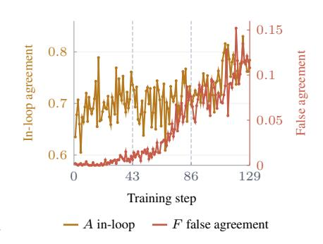
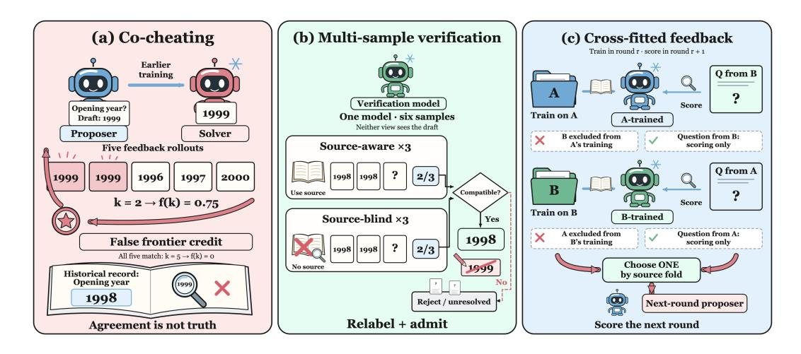
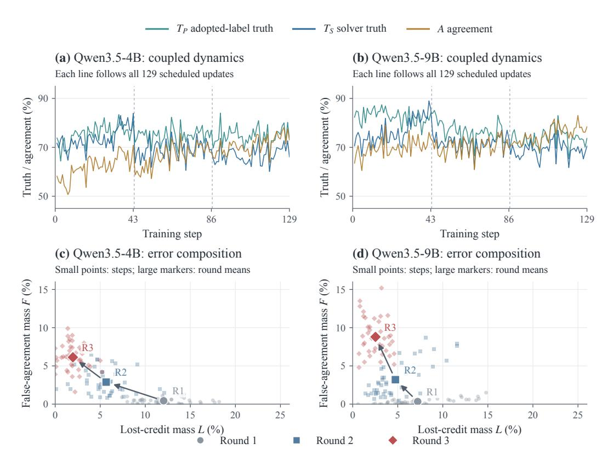
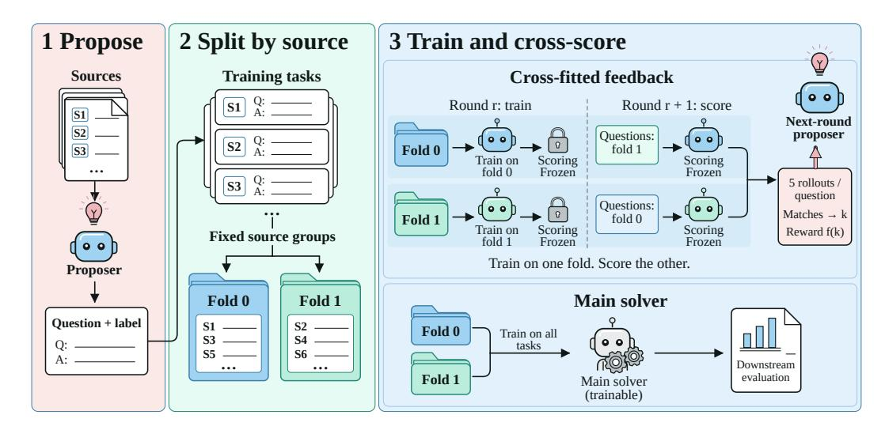
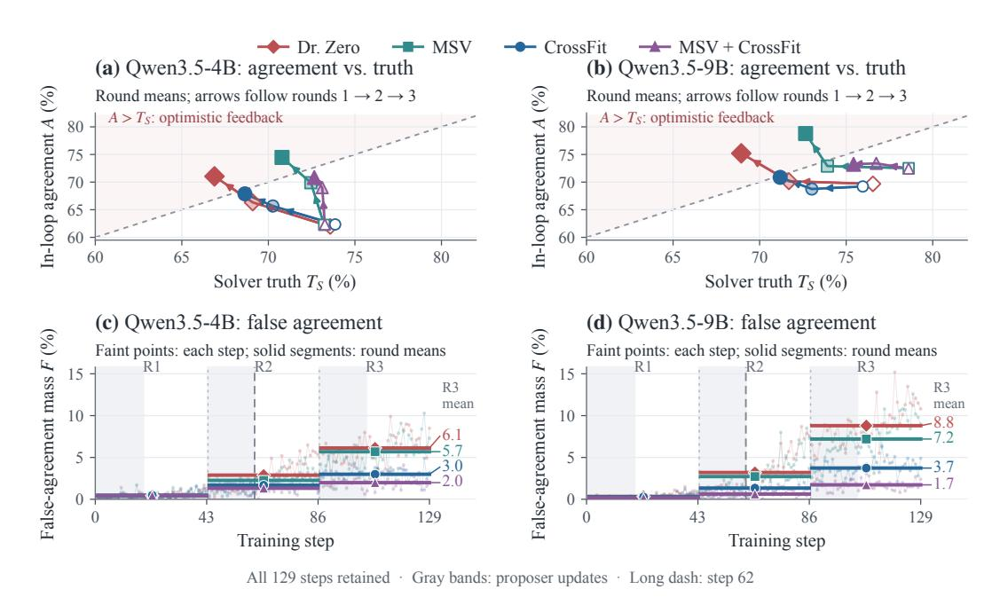
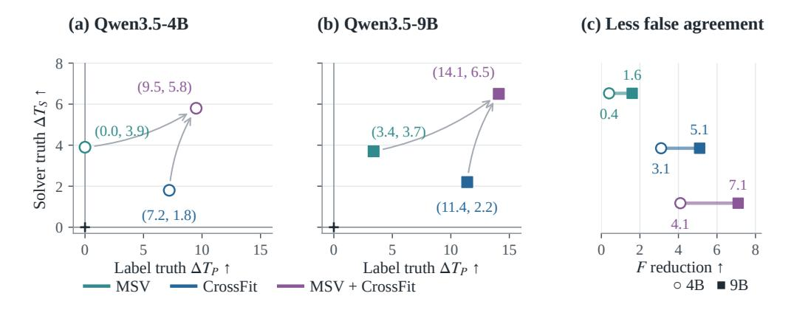
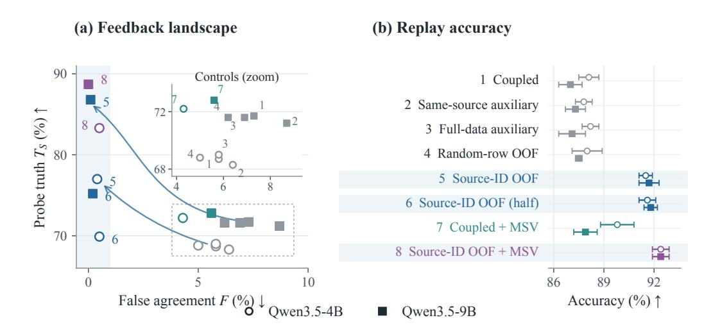
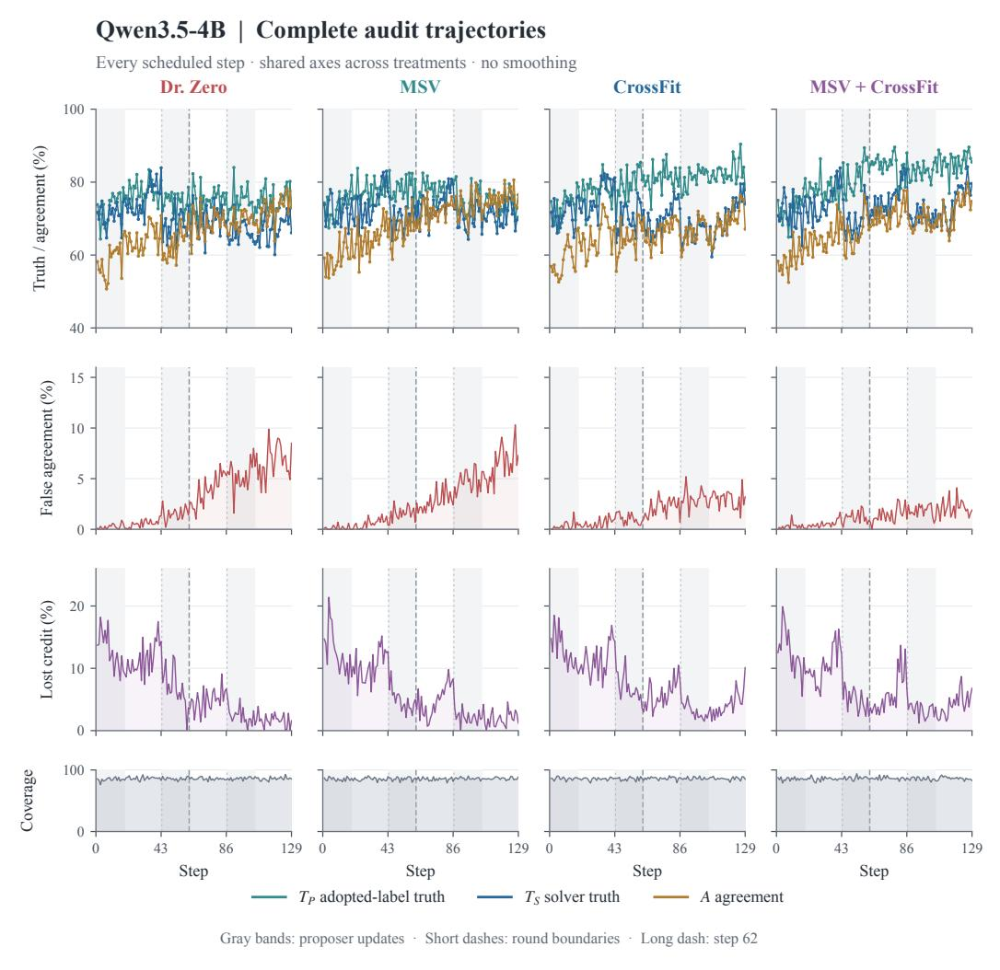
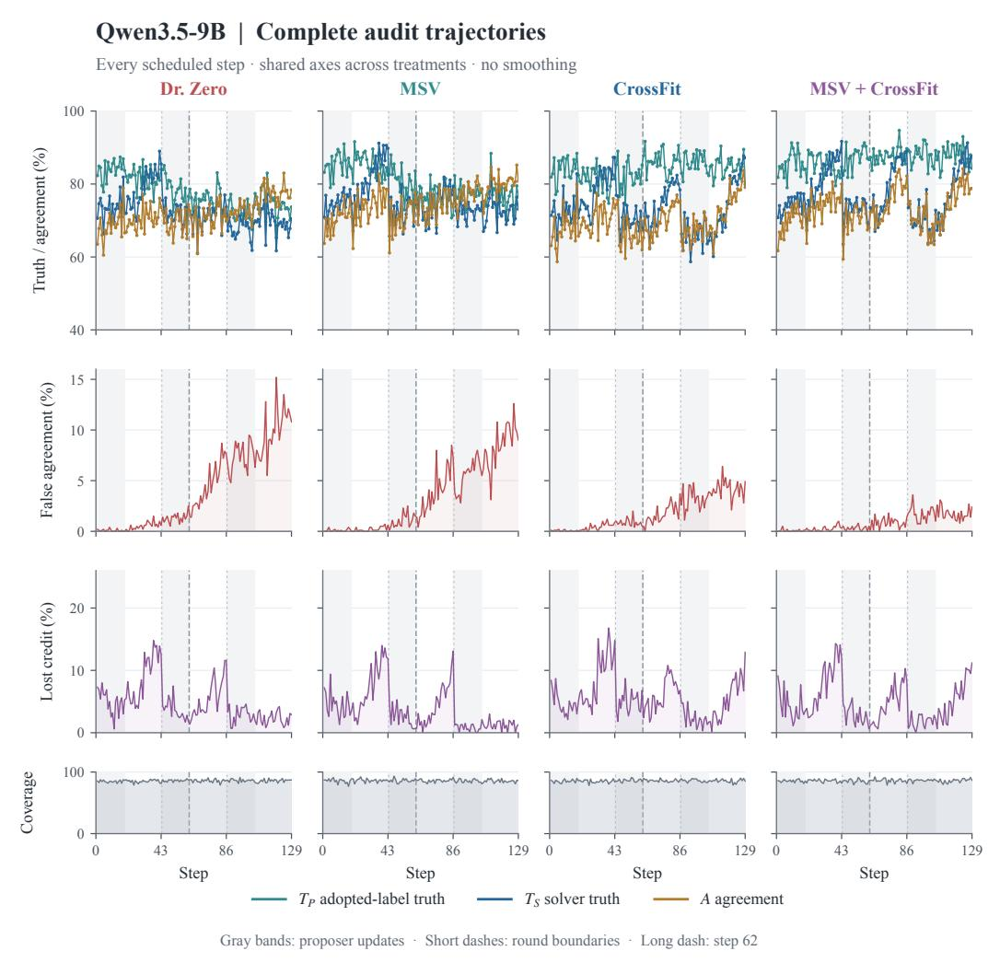

# FALSE FRONTIERS: 자가 진화 검색 에이전트에서 공동 부정행위 진단 및 완화 (FALSE FRONTIERS: DIAGNOSING AND MITIGATING CO-CHEATING IN SELF-EVOLVING SEARCH AGENTS)

- 원제: False Frontiers: Diagnosing and Mitigating Co-Cheating in Self-Evolving Search Agents
- 원문: [https://arxiv.org/abs/2609.39102](https://arxiv.org/abs/2609.39102)
- PDF: [https://arxiv.org/pdf/2609.39102](https://arxiv.org/pdf/2609.39102)
- arXiv ID: `2609.39102`

---

# FALSE FRONTIERS: 자가 진화 검색 에이전트에서 공동 부정행위 진단 및 완화 (FALSE FRONTIERS: DIAGNOSING AND MITIGATING CO-CHEATING IN SELF-EVOLVING SEARCH AGENTS)

Meijia Chen1,\* Hao Li2,\* Zheng Lu2,\* Hongshan Lin2 Junbai Tian2 Yichen Liu3 Zijun Tian2 Yufan Zou2 Shuhan Sun2 Hanxin Chen3 Zevu Zhang2 Weizhi Du4 Yueting Li2 Tianyu Shi5,† Alaa Khamis6,†

1Rutgers 대학교 (Rutgers University) 2독립 연구자 (Independent Researcher) 3캘리포니아 대학교 샌디에이고 (University of California, San Diego) 4미시간 대학교 (University of Michigan) 5맥길 대학교 (McGill University) 6킹 파드 석유 및 광물 대학 (King Fahd University of Petroleum and Minerals)

mc2989@scarletmail.rutgers.edu lululzz0906@gmail.com hl3353@columbia.edu junbaitian@outlook.com yil160@ucsd.edu yueting.li.1230@gmail.com hac014@ucsd.edu wzd@umich.edu yueting.li.1230@gmail.com alaa.rashwan@kfupm.edu.sa

*Equal contribution. †Corresponding authors.

## **초록 (ABSTRACT)**

자가 진화 검색 에이전트는 질문을 생성하는 제안자와 그 질문에 답변하는 해결자를 공동으로 최적화함으로써 자체 학습 커리큘럼을 구축할 수 있다. 이 닫힌 루프는 우리가 *공동 부정행위(co-cheating)*라고 부르는 실패 모드를 도입한다: 제안자와 해결자가 공유 오류에 점점 더 동의하게 되어 내부 보상이 외부 정확도의 증가와 상응하지 않게 된다. 소스 증거에 대한 사후 참조 감사는 공동 부정행위가 자가 진화의 연속 라운드에서 점점 심각해지며, 가짜 라벨의 정확도가 정체되거나 감소하는 반면 루프 내 훈련 신호는 개선되는 것을 보여준다. 가장 직접적인 완화 방법은 훈련 전에 각 제안을 검증하는 것이다. 따라서 우리는 다중 샘플 검증(MSV)을 도입한다. MSV는 자가 진화에 사용된 동일한 모델을 소스와 함께 세 번, 소스 없이 세 번 질의하여 작업 수용 여부를 결정하고 신뢰할 수 없는 가짜 라벨을 교체한다. MSV는 잘못된 합의를 부분적으로 감소시키지만 상당한 잔여 공동 부정행위를 남기며, 후보마다 여섯 번의 추가 라벨러 세대를 필요로 한다. 이러한 한계는 우리의 주요 방법인 CrossFit을 동기화한다. CrossFit은 제안자의 소스 문서를 A와 B 두 그룹으로 나눈다: A에서 생성된 질문은 B에서만 훈련된 보조 해결자에 의해 점수화되고, 반대로 B에서 생성된 질문은 A에서 훈련된 보조 해결자에 의해 점수화된다. 이러한 교차 적합 합의는 제안자 보상을 결정하며, 동일 소스의 가짜 라벨이 피드백 해결자를 통해 직접 재생산되는 것을 방지하면서 원래 해결자의 업데이트 규칙은 그대로 둔다. 우리는 Owen3.5-4B와 Owen3.5-9B로 전체 자가 진화 루프를 재실행하여 두 개의 개입을 평가한다. 자가 진화 후, MSV는 Qwen3.5-4B에서 잘못된 합의 비중을 6.1%에서 5.7%로, Qwen3.5-9B에서 8.8%에서 7.2%로 감소시키며, 반면 CrossFit은 각각 3.0%와 3.7%로 줄인다. 소스를 제외한 피드백으로 동일한 제안을 재실행하면 잘못된 합의가 0.4%와 0.1%로 추가로 감소하여 피드백 계보를 생성된 커리큘럼의 변화와 분리한다. 7개의 다운스트림 검색 벤치마크에서 CrossFit은 표준 결합 자가 진화보다 평균 성능을 각각 8.8점과 8.4점, Search-R1보다 8.7점과 7.8점 향상시킨다(4B와 9B에서 각각).

## 1 서론 (INTRODUCTION)

검색 보강 언어 모델은 추론과 브라우저 또는 검색 동작을 번갈아 수행하여 답변하기 전에 증거를 수집한다 [(Nakano et al.,](#page-12-0) [2021;](#page-12-0) [Yao et al.,](#page-14-0) [2023;](#page-14-0) [Jin et al.,](#page-11-0) [2025;](#page-11-0) [Song et al.,](#page-13-0) [2025)](#page-13-0). 대부분은 외부에서 제공되는 질문과 답변 감독 하에 훈련된다 [(Jin et al.,](#page-11-0) [2025;](#page-11-0) [Song et al.,](#page-13-0) [2025)](#page-13-0). 자가 진화 에이전트는 대신 자체 훈련 경험을 생성한다 [(Chen et al.,](#page-10-0) [2024;](#page-10-0) [Zhao](#page-14-1) [et al.,](#page-14-1) [2025;](#page-14-1) [Huang et al.,](#page-11-1) [2025)](#page-11-1). 최근 제안자–해결자 시스템에서는 제안자가 소스 문서를 질문과 가짜 라벨로 변환하고, 허용된 쌍이 해결자를 훈련시키며, 해결자가 새로운 제안에 대해 수행한 성능이 제안자 보상을 결정한다 [(Lu et al.,](#page-12-1) [2026;](#page-12-1) [Yue et al.,](#page-14-2) [2026)](#page-14-2). 이 사이클을 반복하면 제안이 해결자의 현재 능력 경계로 이동하며, 고정된 인간이 작성한 훈련 세트 없이 자동화된 교육 과정을 생성한다.

Figure 1: 공동 사기. 훈련 신호와 거짓 합의가 함께 상승한다.

이 루프는 합의를 정확성의 내생적 대리 지표로 만든다 [(Amodei et al.,](#page-10-1) [2016;](#page-10-1) [Gao et al.,](#page-10-2) [2023)](#page-10-2). 잘못된 가짜 라벨은 해결자가 그 출처의 이후 질문에서 같은 오류를 반복하도록 훈련시킬 수 있다 [(Arazo et al.,](#page-10-3) [2020)](#page-10-3); 이 합의를 보상하면 다음 라운드 교육 과정에서 오류가 강화된다. 이는 Figure [2.](#page-2-0) 왼쪽 패널에 묘사되어 있다. 우리는 Dr. Zero [(Yue et al.,](#page-14-2) [2026)](#page-14-2)에서 사후 감사자를 사용해 생성된 과제와 답변을 소스 증거와 비교하지만, 훈련에 투입되지는 않는다. Figure [1](#page-1-0)은 제안자와 해결자가 오류를 공유함에 따라 내부 보상이 거짓 합의와 함께 상승함을 보여준다. 우리는 이 최적화 결과를 *공동 사기*라고 부르며, *거짓 합의 질량(false-agreement mass)*으로 측정한다: 같은 잘못된 답변에 동의하는 평가된 쌍의 비율이다.

가장 직접적인 완화책은 훈련 전에 각 제안을 검증하는 것이다. Figure [2](#page-2-0) 중간 패널은 다중 샘플 검증을 보여준다. 이는 자기 진화에 사용되는 동일 모델을 소스와 함께 세 번, 소스 없이 세 번 쿼리한다. 호환되는 다수결이 일치하면 합의 라벨을 부여하고 과제를 허용한다; 일치하지 않는 후보는 거부된다. 이는 거짓 합의를 부분적으로 감소시키며 가짜 라벨 품질을 의미하지만, 상당한 공동 사기는 남아 있고 후보당 6개의 라벨러 세대가 추가된다.

이러한 한계는 두 번째 실패 원인을 가리킨다: 가짜 라벨이 올바른지 여부뿐 아니라, 그 라벨이 나중에 같은 출처의 질문을 평가하는 해결자를 훈련시켰는지 여부이다. Figure [2](#page-2-0) 오른쪽 패널은 우리의 주요 개입인 CrossFit을 보여준다. 제안자의 소스 문서는 A와 B 그룹으로 나뉜다. 상단 경로에서는 보조 해결자가 A에서만 학습하고 B에서 생성된 새로운 질문을 평가한다; 하단 경널에서는 두 번째 해결자가 B에서만 학습하고 A에서 질문을 평가한다. 교차 적합된 합의 점수는 제안자 보상을 결정한다. 각 평가 해결자는 자신이 평가하는 소스의 가짜 라벨을 학습한 적이 없으므로 같은 출처의 오류가 보상으로 직접 재현되는 것을 방지한다. 원래 해결자는 여전히 모든 허용된 질문을 학습한다; 오직 제안자의 다음 라운드 교육 과정을 형성하는 피드백만이 교차 적합된다.

우리는 Qwen3.5-4B와 Qwen3.5-9B로 자체 진화(self‑evolution)를 재실행한다 [(Qwen Team,](#page-12-2) [2026)](#page-12-2). 표준 결합 피드백(coupled feedback) 하에서 부정합(false‑agreement) 질량은 각각 6.1 %와 8.8 %에 이른다; MSV는 이를 5.7 %와 7.2 %로 낮추고, CrossFit은 3.0 %와 3.7 %로 낮춘다. 동일한 제안서를 소스 제외 피드백(source‑excluded feedback)으로 재실행하면 0.4 %와 0.1 %로 더 감소하여 피드백 조상과 커리큘럼 선택을 분리한다. 우리는 고정된 1,325문제 세트에서 각 라운드 종료 시 메인 솔버를 평가한다: Natural Questions, TriviaQA, PopQA, HotpotQA, 2WikiMultiHopQA, MuSiQue에서 각각 200개, Bamboogle에서 125개 [(Kwiatkowski et al.,](#page-11-2) [2019;](#page-11-2) [Joshi et al.,](#page-11-3) [2017;](#page-11-3) [Mallen et al.,](#page-12-3) [2023;](#page-12-3) [Yang et al.,](#page-14-3) [2018;](#page-14-3) [Ho et al.,](#page-11-4) [2020;](#page-11-4) [Trivedi et al.,](#page-13-1) [2022;](#page-13-1) [Press et al.,](#page-12-4) [2023)](#page-12-4). 질문당 하나의 탐욕적 궤적과 동일한 도구 및 추출 예산을 사용하여 CrossFit은 4B에서 48.8 %, 9B에서 51.2 %를 달성하며, 이는 결합 자체 진화보다 각각 8.8점과 8.4점을, Search‑R1보다 각각 8.7점과 7.8점을 개선한다.

Figure 2: **공동 사기와 그 완화.** (a) 부정확한 합의는 잘못된 전경 크레딧을 만든다. (b) MSV는 소스 인식(source‑aware) 및 소스 무시(source‑blind) 샘플로 각 제안을 검증한다. (c) CrossFit은 다른 그룹에서 훈련된 솔버를 사용해 각 소스 그룹을 평가한다. 두 개의 개입은 각각 라벨 품질과 피드백 출처를 목표로 한다.

## 2 공동 사기 진단

Figure 3: **결합 피드백 하의 공동 사기.** (a,b) 라벨 진실 $T_P$, 솔버 진실 $T_S$, 그리고 합의 A의 129단계 전체; 대시선은 라운드 경계 표시. (c,d) 부정합 F와 잃은 크레딧 L: 작은 점은 단계, 큰 마커는 각 라운드의 43단계 비율 평균, 화살표는 라운드 순서를 나타낸다. F가 상승하고 L이 하락함은 공유 오류 누적을 드러낸다. 모든 축은 백분율이다.

Figure 4: **CrossFit 알고리즘.** 보조 솔버는 한 소스 폴드에서 학습하고 다른 폴드를 평가하며; 메인 솔버는 모든 허용된 질문에서 학습한다.

**감사 프로토콜.** 우리는 훈련 후 표준 결합 Dr. Zero 루프를 절차를 변경하지 않고 감시한다. 생성된 많은 질문은 길거나 전문화된 소스 문서에서 다중 홉 증거 체인을 재구성해야 한다. 인간 심사자조차도 먼저 검색 경로를 재현하고 낯선 증거를 검사해야 하므로, 저장된 모든 훈련 단계를 철저히 주석화하는 것은 이 규모에서 표준화하기 어렵다. 따라서 우리는 매 스케줄 단계마다 소스 문서, 채택된 가짜 라벨, 그리고 제안자 보상에 사용된 다섯 개의 솔버 응답을 저장한다. gpt-6-astra/high는 소스에서 증거 기반 참조를 구성하고 이 저장된 출력을 심사한다(부록 B); 지원되지 않는 경우는 강제 라벨을 부여하지 않고 미해결 상태로 둔다. 감사자는 입학, 모델 업데이트, 보상을 전혀 영향을 주지 않으므로, 루프 내 신호 뒤에 있는 정확한 예시를 확장 가능하고 독립적으로 측정한다.

측정되는 항목. $T_P$와 $T_S$는 채택된 라벨과 솔버 응답의 정확도를 나타내며, A는 루프에서 관찰되는 라벨-응답 일치율이다. F는 동일한 잘못된 답변을 일치시키는 쌍을 세고, L은 잘못된 라벨로 인해 신용이 부여되지 않은 올바른 솔버 응답을 세는 지표이다. 일반적인 라벨 노이즈는 불일치 또는 신용 상실을 초래할 수 있지만, 공동 사기는 양쪽 에이전트가 동일한 오류에 수렴함에 따라 일치 자체가 낙관적으로 변한다고 예측한다. 따라서 A가 상승하려면 $T_P$와 $T_S$도 상승하고 F가 낮게 유지될 때만 신뢰할 수 있다. 제안자 보상은 다섯 개의 라벨-응답 일치에서 계산되므로, 우리는 그 다섯 쌍을 외부 감사로 검증하고 사후 다수결로 압축하지 않는다. 따라서 F는 외부 감사가 잘못된 것으로 식별한 겉보기 일치의 비율을 측정한다.

**관찰된 동역학.** 그림 3은 이 전이를 보여준다. 1라운드에서는 Qwen3.5-4B에서 평균 거짓 일치량이 0.004, Qwen3.5-9B에서 0.003에 불과하며, 잘못된 라벨이 신용 상실로 더 자주 나타난다. 2라운드 이후에는 일치가 실제 진실의 증가와 비례하지 않고 점점 낙관적으로 변한다. 3라운드가 되면 F가 두 규모에서 각각 0.061과 0.088에 도달하고, L은 감소한다. 더 어려운 질문은 정확도를 낮출 수 있지만, 동일한 소스 불일치 답변에 대한 일치 증가를 설명하지는 않는다. A와 F의 공동 상승은 불일치가 공유된 실수로 대체되었음을 보여준다. 우리는 이를 자기 강화 최적화 결과인 *공동 사기*라고 부르며, 이는 의도적인 조정을 의미하지 않는다.

## 3 검증에서 교차 적합 피드백으로 (From Verification to Cross-Fitted Feedback)

감사는 자기 진화 루프의 서로 다른 시점에서 두 가지 개입을 유도한다. MSV는 예제가 훈련에 들어가기 전에 제안된 답변을 테스트하고, CrossFit(우리의 주요 방법)은 업데이트되는 피드백을 제공하는 솔버를 변경한다.

### 3.1 다중 샘플 검증 (MULTI-SAMPLE VERIFICATION)

${\tt MSV}$는 제안된 질문이 제안자의 초안과 독립적으로 안정적인 답변을 허용하는지 여부를 입장 시점에서 테스트한다. 소스 문서 x, 질문 q, 그리고 자기 진화에서 사용되는 동일한 모델 M을 주어, 세 개의 소스 인식 답변과 세 개의 소스 무시 답변을 생성한다,

$$a_i^{\mathrm{src}} \sim M(\cdot \mid x, q), \qquad a_i^{\mathrm{blind}} \sim M(\cdot \mid q), \qquad i \in \{1, 2, 3\}.$$

두 관점 모두 초안을 관찰하지 않는다. Maj는 답변 매처 $\simeq$ 아래에서 최소 두 샘플이 일치하면 답변을 반환하고, 그렇지 않으면 $\varnothing$을 반환한다. $v \in \{\operatorname{src}, \operatorname{blind}\}$에 대해 $y^v = \operatorname{Maj}(a_{1:3}^v)$를 정의하면, 입장은

$$I_{\mathrm{MSV}} = \mathbf{1} \big[ y^{\mathrm{src}} 
eq \varnothing \ \wedge \ y^{\mathrm{blind}} 
eq \varnothing \ \wedge \ y^{\mathrm{src}} \simeq y^{\mathrm{blind}} \big] \,.$$

$I_{\rm MSV}=1$이면 호환되는 다수결이 초안을 훈련 라벨로 대체한다; 그렇지 않으면 작업이 거부된다. 두 관점은 각각 증거 지원과 답변 안정성을 테스트한다. 그러나 동일한 모델에서 생성된 여섯 샘플이 오류를 공유할 수 있고, 검증은 평가된 소스에서 파생된 라벨을 이후 피드백 솔버가 재사용하는 것을 방지하지 않는다. 또한 후보마다 여섯 세대를 추가하며, 이는 탐색 및 조정 비용을 포함한다 (Table 3, Appendix A).

### 3.2 교차 적합 제안자 피드백 (Cross-fitted proposer feedback)

CrossFit는 제안자가 피드백을 받는 위치만 변경한다. 그림 4에서 왼쪽에서 오른쪽으로 보듯이, 제안자는 원래 루프와 동일하게 소스 문서에서 질문과 가짜 라벨을 생성한다. 이후 각 소스 문서를 한 번만 fold 0 또는 fold 1에 할당하고, 해당 문서에서 파생된 모든 질문은 자기 진화 전반에 걸쳐 동일한 할당을 유지한다. 분할은 소스 수준에서 수행된다. 개별 질문을 분할하면 같은 문서의 관련 예제가 양쪽에 배치되어 재사용 경로가 유지될 수 있기 때문이다.

두 개의 소스 폴드가 두 개의 보조 피드백 솔버를 유지한다. 라운드 r 이후, 한 솔버는 폴드 0에서 허용된 질문만으로 학습했고, 다른 솔버는 폴드 1에서 허용된 질문만으로 학습했다. 다음 라운드에서는 그들의 역할이 교차된다: 폴드 0의 질문은 폴드 0에서 훈련된 솔버에 의해 평가되고, 폴드 0의 질문은 폴드 0에서 훈련된 솔버에 의해 평가된다. 이는 Figure 0의 두 개의 교차 경로이다. 따라서 질문을 평가하는 솔버는 해당 질문의 소스에서 생성된 가짜 라벨에 대해 훈련되지 않았다.

피드백 규칙 자체는 동일하다. h를 소스 폴드, $S_{r,1-h}$를 보완 폴드에서 훈련된 보조 솔버, $\tilde{y}$를 채택된 라벨이라고 하자. 그 응답들 $z_1, \ldots, z_5$에서 제안자는 다음을 받는다

$$R_P(q) = f\left(\sum_{j=1}^5 \mathbf{1}[z_j \simeq \tilde{y}]\right), \qquad z_j \sim S_{r,1-h}(\cdot \mid q).$$

합계는 원래 답변 매처에서 채택된 라벨과 일치하는 응답의 수를 세며, f(k) = (5-k)/4 (0 < k < 5, 그 외에는 0)은 Dr. Zero의 프론티어 보상이다. 따라서 CrossFit은 원래의 훈련 목표를 보존한다: 질문은 여전히 솔버가 얼마나 어려워 보이는지에 따라 보상을 받는다. 유일한 변화는 그 보상을 제공하는 솔버가 다르다는 점이다.

이 변화는 우리의 감사에서 드러난 직접적인 자기 강화 경로를 끊는다. 결합된 피드백에서는 소스에서 나온 잘못된 가짜 라벨이 솔버를 훈련시키고, 그 솔버가 같은 소스의 이후 질문에서 동일한 라벨을 재생산하며, 다시 제안자에게 보상으로 돌아갈 수 있다. CrossFit에서는 이후 질문이 보완 솔버에 의해 평가되며, 그 솔버의 훈련 이력은 해당 소스를 제외한다. 이 방법은 보조 솔버를 진실 오라클로 만들지는 않는다: 두 솔버는 여전히 사전 훈련이나 겹치는 증거에서 유래한 오류를 공유할 수 있다. 그러나 평가자가 동일한 소스에서 유래한 오류에 훈련되었기 때문에 단순히 일치가 보상받는 것을 방지한다.

Figure 4의 하단 경로는 이 피드백 메커니즘을 downstream 훈련과 분리한다. 메인 솔버는 분할되지 않으며, 두 폴드의 모든 허용된 질문에 대해 계속 훈련한다. 보조 솔버는 제안자의 다음 라운드 커리큘럼을 형성하는 피드백에만 영향을 미친다. 두 개의 개입이 결합될 때, MSV는 먼저 제안이 허용되는지와 사용될 가짜 라벨을 결정하고, CrossFit은 그 제안을 평가할 보조 솔버를 선택한다. 이 의미에서 MSV는 훈련에 들어가는 감독을 향상시키고, CrossFit은 그 감독이 제안자 보상에 직접 재활용되는 것을 방지한다.

Table 1: **세 번의 자가 진화 라운드 이후의 downstream 검색 성능.** 굵은 글씨는 최상의 결과를, 밑줄은 각 Qwen3.5 블록 내에서 두 번째로 좋은 결과를 나타낸다. †Dr. Zero 비교에서의 기준선으로, 동일한 Qwen3.5 백본에서 실행되고 동일한 1,325개 질문 세트에서 평가되었다.

|  | NQ | TriviaQA | PopQA | HotpotQA | 2WikiMQA | MuSiQue | Bamboogle | 평균 |  |
|--------------------------|--------------------|--------------------|--------------------|--------------------|--------------------|--------------------|-----------|--------------------|--|
|  | Qwen3.5-4B |  |  |  |  |  |  |  |  |
| 기본 | 0.380 | 0.655 | 0.315 | 0.350 | 0.465 | 0.105 | 0.416 | 0.384 |  |
| 프롬팅 † | 0.245 | 0.525 | 0.165 | 0.290 | 0.460 | 0.085 | 0.360 | 0.304 |  |
| R1-Instruct † | 0.295 | 0.605 | 0.195 | 0.320 | 0.475 | 0.105 | 0.448 | 0.349 |  |
| Search-R1 † | 0.355 | 0.650 | 0.290 | 0.370 | 0.510 | 0.125 | 0.504 | 0.401 |  |
| Dr. Zero | 0.390 | 0.665 | 0.325 | 0.365 | $\overline{0.485}$ | 0.120 | 0.448 | 0.400 |  |
| MSV | 0.400 | 0.670 | 0.340 | 0.375 | 0.480 | 0.135 | 0.448 | 0.407 |  |
| CrossFit | 0.455 | $\overline{0.730}$ | 0.415 | 0.460 | 0.575 | 0.245 | 0.536 | 0.488 |  |
| ${\tt MSV+CrossFit}$ | $\overline{0.470}$ | 0.730 | 0.410 | $\overline{0.475}$ | 0.575 | $\overline{0.250}$ | 0.528 | $\overline{0.491}$ |  |
|  |  |  |  | Qv | ven3.5-9B |  |  |  |  |
| 기본 | 0.505 | 0.710 | 0.375 | 0.355 | 0.295 | 0.125 | 0.496 | 0.409 |  |
| 프롬팅 † | 0.380 | 0.630 | 0.260 | 0.280 | 0.270 | 0.115 | 0.392 | 0.332 |  |
| R1-Instruct † | 0.445 | 0.695 | 0.290 | 0.310 | 0.295 | 0.135 | 0.480 | 0.379 |  |
| Search-R1 † | 0.510 | 0.730 | 0.395 | 0.380 | 0.310 | 0.180 | 0.536 | 0.434 |  |
| Dr. Zero | 0.515 | 0.730 | 0.400 | 0.370 | 0.320 | 0.150 | 0.512 | 0.428 |  |
| MSV | 0.525 | 0.720 | 0.400 | 0.390 | 0.325 | 0.155 | 0.536 | 0.436 |  |
| CrossFit | 0.580 | 0.765 | 0.455 | 0.490 | 0.425 | 0.255 | 0.616 | 0.512 |  |
| ${\tt MSV+CrossFit}$ | 0.570 | $\overline{0.780}$ | $\overline{0.470}$ | 0.485 | 0.415 | $\overline{0.280}$ | 0.608 | $\overline{0.515}$ |  |

## 4 주요 실험 (MAIN EXPERIMENTS)

### 4.1 실험 설정 (EXPERIMENTAL SETUP)

**데이터셋 및 모델.** 우리는 Dr. Zero (Yue et al., 2026)가 사용한 일곱 개의 오픈 도메인 질문 응답 벤치마크에서 평가한다: 단일 홉 Natural Questions (NQ) (Kwiatkowski et al., 2019), TriviaQA (Joshi et al., 2017), PopQA (Mallen et al., 2023), 그리고 다중 홉 HotpotQA (Yang et al., 2018), 2WikiMultiHopQA (2WikiMQA) (Ho et al., 2020), MuSiQue (Trivedi et al., 2022), Bamboogle (Press et al., 2023). 고정 평가 세트는 1,325개의 질문으로 구성되며, 처음 여섯 벤치마크 각각에서 200개의 예시와 모든 125개의 Bamboogle 예시를 포함한다. 우리는 Qwen3.5-4B와 Qwen3.5-9B (Qwen Team, 2026)를 백본으로 사용한다. 각 규모에서 모든 자기 진화 처리는 동일한 공개 체크포인트에서 시작하며, 이는 Base 행으로도 평가된다. 그들 중 어느 것도 인간 주석 QA 훈련 데이터를 사용하지 않는다.

**기준선 및 평가.** 우리는 Section 3의 두 개의 개입을 교차시켜 얻은 네 가지 자기 진화 처리를 비교한다. *Dr. Zero* (Yue et al., 2026)는 주요 솔버가 나중에 훈련하는 제안을 점수화하는 표준 결합 루프이다; MSV는 이 루프에 다중 샘플 검증을 추가한다; CrossFit은 결합 피드백을 소스 제외 피드백으로 대체한다; 그리고 MSV+CrossFit은 둘 다 적용한다. 보다 넓은 비교를 위해 우리는 Dr. Zero 프로토콜 (Yue et al., 2026)에서 Prompting 및 R1-Instruct 기준선을 재현하고, Search-R1 (Jin et al., 2025)과 함께 동일한 Qwen3.5 백본에서 평가한다. 모든 행은 동일한 1,325문제 세트에서 동일한 도구 예산, 디코딩, 답변 추출로 평가된다. 모든 자기 진화 실험은 18개의 제안자 단계와 25개의 솔버 단계로 구성된 동일한 세 라운드 일정(Equation (1) 의 정책-그라디언트 목표 최적화)을 따르며, Appendix A의 Table 2에 공유 구성을 나열한다. 각 라운드 끝에서 우리는 모든 허용된 질문에 대해 훈련된 주요 솔버를 평가하며, 각 질문마다 하나의 그리디 탐색 궤적, 동일한 도구 예산, 동일한 답변 추출을 사용한다. 우리는 Cover-EM을 보고, Equation (2)와 같이 일곱 벤치마크를 동일 가중치로 평균한다. Appendix B의 Table 5와 6은 중간 라운드와 마이크로 평균을 나열한다.

### 4.2 주요 결과 (MAIN RESULTS)

**교차 피팅된 피드백은 두 규모 모두에서 다운스트림 탐색을 개선한다.** Table 1에서 결합 자기 진화는 4B에서 평균 Cover-EM을 0.384에서 0.400으로, 9B에서 0.409에서 0.428으로 올린다. CrossFit은 0.488과 0.512를 달성한다: Dr. Zero 대비 8.8/8.4 퍼센트 포인트, Search‑R1 대비 8.7/7.8 퍼센트 포인트의 이득이다. 모든 벤치마크가 두 규모에서 개선된다. 이득은 다중 홉 작업에서 가장 크다,

Figure 5: **세 라운드에 걸친 훈련 역학.** (a,b) 라운드별 합의와 솔버 진실의 평균; 둥근, 연한, 그리고 실선 마커는 1–3 라운드를 나타낸다. 대각선 위에서는 합의가 낙관적이다. (c,d) 희미한 점은 모든 129단계를 유지한다; 실선은 각 라운드의 43단계 비율을 평균한 것이며, 끝 라벨은 라운드-3 평균(%)을 제공한다. 회색 밴드는 제안자 단계, 짧은 대시는 라운드 경계, 긴 대시는 단계 62를 표시한다. 전체 추적과 커버리지는 Figure 8–9에 나타난다.

HotpotQA, 2WikiMQA, MuSiQue, Bamboogle 전반에서 평균 10.0/10.9 포인트를 기록하며, 단일 홉 데이터셋에서는 7.3/5.2를 기록한다. 따라서 이 효과는 작업 난이도와 모델 규모 전반에 걸쳐 확장된다.

**검증만으로는 충분하지 않다.** MSV는 Dr. Zero 대비 평균을 0.7–0.8 포인트만 증가시킨다. CrossFit과 결합하면 Qwen3.5-4B에서 0.491, Qwen3.5-9B에서 0.515를 달성하며, 이는 CrossFit 단독 대비 0.3 포인트에 불과하다. 이 결과는 제안자 피드백의 출처를 바꾸는 것이 가짜 라벨 품질을 개선하는 것보다 더 중요한 영향을 미친다는 것을 시사한다.

## 5 분석 및 절제 (ANALYSIS AND ABLATIONS)

### 5.1 Cross-Fitting이 훈련 경로를 어떻게 바꾸는가? (How Does Cross-Fitting Change the Training Trajectory?)

섹션 2는 표준 결합 피드백 하에서 공동 사기가 발생함을 입증한다. Figure 5는 대신 네 가지 치료가 그 궤적을 어떻게 바꾸는지 비교하고, 부록 E의 Figure 8과 9은 모든 단계별 추적을 보존한다. 모든 팔은 동일한 첫 라운드 기록을 공유하며, 교차 피팅된 팔은 보조 피드백 솔버가 2라운드에서 사용될 때만 차이가 발생한다. 이 지연된 분기점은 피드백 출처에 대한 동일 실행 내 비교를 제공한다.

교차 피팅된 피드백은 합의와 진실 사이의 분기점을 역전시킨다. 교차 피팅이 없으면 루프 내 합의가 솔버 진실을 초과하고 거짓 합의가 두 모델 규모에서 축적된다. 교차 피팅된 스코어링이 활성화되면 채택된 라벨 진실이 상승하고 합의는 솔버 진실 이하로 유지되며, 3라운드까지 거짓-합의 질량이 결합 값의 절반 이하로 감소한다. MSV만으로는 솔버 진실이 향상되지만 합의 신호가 낙관적으로 되는 것을 방지하지 못한다; CrossFit과 결합하면 최종 거짓 합의가 가장 낮아진다.

궤적 차이는 다운스트림 이득을 예측한다. Table 5는 CrossFit이 Dr. Zero에 비해 다운스트림 이득이 2라운드 이후 4.2점과 4.3점에서 3라운드 이후 8.8점과 8.4점으로 증가함을 보여준다. 따라서 개입은 고정된 최종 예측 집합을 단순히 재랭킹하는 것이 아니라 라운드마다 루프가 학습하는 내용을 바꾼다. Figure 6은 최종 라운드 감사를 요약한다(표 4의 절대값). CrossFit은 4B에서 채택된 라벨 진실을 0.747에서 0.819로, 9B에서 0.737에서 0.851로 상승시킨다.

Figure 6: **Round-3 감사(Dr. Zero 대비).** (a,b) 공동 진실 이득; 화살표는 결합 치료를 가리킨다. (c) 감소  $F_{\rm Dr.\ Zero}-F$ . 모든 값은 퍼센트 포인트이다.

Figure 7: **고정 재생 은행에서의 메커니즘 제거.** (a) 진실 대 거짓 합의; 화살표는 결합 및 소스-ID 피드백을 비교한다. (b) 3,000 재생 질문에 대한 정확도, 평균  $\pm$  표준편차(5시드). 숫자는 방법을 식별하고, 음영은 소스 제외를 표시한다.

9B에서, 거짓-합의 질량을 0.061에서 0.030으로, 0.088에서 0.037로 감소시킨다. 이러한 변화는 다운스트림 개선을 의도된 메커니즘과 연결한다: 피드백 솔버에서 평가된 소스를 제외하면 같은 소스 오류가 제안자에게 명백한 진전으로 체계적으로 반환되는 것을 방지한다.

### 5.2 소스 수준 제외가 필요한 이유? (WHY IS SOURCE-LEVEL EXCLUSION NECESSARY?)

Figure 7은 CrossFit을 평가자가 보는 데이터를 변경하면서 보조 솔버 아키텍처를 유지하는 대조군과 비교한다. 같은 소스 보조 솔버는 거짓-합의 질량을 0.064와 0.087로, 전체 데이터 보조는 0.058과 0.069로 제공하며, 둘 다 결합 대조군에 가깝다. 따라서 평가자의 훈련 데이터가 동일 소스 유래 가짜 라벨을 보유하면 별도의 평가자는 충분하지 않다.

분할은 소스 계보를 따라야 한다. 개별 질문을 무작위로 분할하면 거짓 합의가 4B에서 0.050, 9B에서 0.062로 약간만 감소한다. 이는 동일 문서에서 파생된 질문이 여전히 두 폴드에 들어갈 수 있기 때문이다. 반면 소스-ID 분할은 거짓 합의를 0.004와 0.001로 감소시킨다. 또한 고정 은행 솔버 진실을 4B에서 0.687에서 0.770으로, 9B에서 0.717에서 0.868으로 상승시키며, 이에 상응하는 정확도는 88.1%에서 91.5%로, 87.0%에서 91.7%로 증가한다. 이러한

비교는 평가자 중복이나 단순 분할이 아니라 소스 제외가 개선의 책임 있는 요소임을 분리한다.

### 5.3 고정 은행 재생이 피드백을 교육과 분리한다 (FIXED-BANK REPLAY SEPARATES FEEDBACK FROM CURRICULUM)

적응형 재실행은 평가자와 이후 라운드에서 생성되는 질문 모두를 변경한다. 따라서 우리는 피드백 솔버의 훈련 출처만 변형시키면서 동일한 3,000개의 저장된 질문과 채택된 라벨을 재생한다. 은행, 라벨, 정답 매처, 평가 절차를 고정함으로써 입학 및 교육과정 선택을 설명 변수로 제거한다.

고정된 은행 재생은 소스 배제를 분리한다. 동일한 제안에서 소스-ID 피드백은 4B/9B에서 0.058/0.073에서 0.004/0.001로 결합된 거짓 합의를 감소시킨다 (Figure [7)](#page-7-1)). 프로브 진실과 재생 정확도의 동반되는 이득은 입학 또는 커리큘럼을 변경하지 않고도 지속되며, 결과를 피드백 출처와 연결한다.

추가 보조 최적화는 효과를 설명하지 않는다. 반 예산 제어는 거짓 합의 질량을 0.005/0.002로, 재생 정확도를 91.6%/91.8%로 달성하며, 이는 전체 소스-ID 결과와 일치한다. 이들 제어는 평가자 중복, 임의 파티셔닝, 작업 선택, 또는 추가 업데이트가 아니라 소스 조상을 식별한다는 운영상의 차이점을 보여준다.

### 5.4 검증과 교차 적합이 어떻게 상호작용합니까? (HOW DO VERIFICATION AND CROSS-FITTING INTERACT?)

두 개의 개입은 루프의 서로 다른 지점에서 작동한다. MSV는 훈련에 들어가는 질문–라벨 쌍을 변경하는 반면, CrossFit은 다음 제안을 평가하는 솔버를 변경한다. 적응형 루프 감사(표 [4](#page-16-2))에서 MSV는 4B에서 거짓 합의 질량을 0.061에서 0.057로, 9B에서 0.088에서 0.072로 감소시키지만, 합의는 여전히 솔버 진실보다 높다. CrossFit은 더 큰 감소를 가져오며, 0.030과 0.037로, 결합 치료는 0.020과 0.017에 도달한다. 따라서 가짜 라벨 신뢰성을 향상시키는 것은 도움이 되지만, 공동 사기를 일으키는 피드백 의존성을 제거하지는 못한다. 고정 은행 결과(그림 [7](#page-7-1))는 같은 구분을 보여준다. MSV와 결합된 피드백은 거짓 합의 질량을 0.043/0.056로 유지하는 반면, 소스 제외를 추가하면 0.005/0.000으로 낮추고 재생 정확도를 두 스케일 모두에서 92.4%로 높인다. 마지막으로 표 [1](#page-5-0)은 결합이 각 스케일에서 CrossFit 단독보다 다운스트림 평균을 단지 0.3점만 향상시킨다는 것을 보여준다. 따라서 MSV는 보완적인 신뢰성 향상을 제공하며, 소스 제외된 제안자 피드백이 학습된 탐색 정책에서 대부분의 개선을 담당한다.

## 6 관련 연구 (RELATED WORK)

자기 생성 교육과 탐색. Self‑play는 목표 탐색, 언어 모델 정렬, 그리고 추론을 위해 연구되어 왔다 [(OpenAI et al.,](#page-12-5) [2021;](#page-12-5) [Chen et al.,](#page-10-0) [2024;](#page-10-0) [Wu et al.,](#page-13-2) [2025;](#page-13-2) [Yuan et al.,](#page-14-4) [2024;](#page-14-4) [Zhao et al.,](#page-14-1) [2025;](#page-14-1) [Huang et al.,](#page-11-1) [2025)](#page-11-1). Self‑questioning과 코퍼스 기반 진화는 감독을 생성하는 추가적인 방법을 제공한다 [(Chen et al.,](#page-10-4) [2025;](#page-10-4) [Wang et al.,](#page-13-3) [2025a;](#page-13-3) [Liu et al.,](#page-12-6) [2025a)](#page-12-6). 우리의 가장 가까운 프레임워크는 Dr. Zero [(Yue et al.,](#page-14-2) [2026)](#page-14-2); Search Self‑Play [(Lu et al.,](#page-12-1) [2026)](#page-12-1)은 또 다른 직접 비교 대상이다. SearchMaster [(Tan et al.,](#page-13-4) [2026)](#page-13-4)은 오해를 불러일으키는 탐색 Self‑play 신호의 가장 가까운 보완적 진단을 제공한다. CAFE의 공동 진화 피드백 [(Liu et al.,](#page-12-7) [2026b)](#page-12-7)은 피드백 적응을 현재 연구 목표로 만든다. 우리는 좁은 문제를 고립시킨다: 제안자 피드백에 사용되는 솔버의 훈련 데이터 조상. 우리는 Self‑play, 답변 검증, 또는 교차 적합 자체를 도입했다고 주장하지 않는다.

프록시 보상(Proxy reward)과 자기 확증(self-confirmation). 보상 해킹(Reward hacking)과 보상-프로세스 조작(Reward-process manipulation)은 언어 에이전트(Language agents)보다 앞선다. 프록시 보상 최적화(Proxy reward optimization)는 실제 목표와 벗어날 수 있다(Gao et al., 2023). 인간 선호 학습(human-preference training)은 진실보다 일치를 선호할 수 있다(Sharma et al., 2024). 가짜 라벨(Pseudo-label) 확인 편향은 자신의 실수에서 학습하는 관련 사례를 제공한다(Arazo et al., 2020). 우리의 초점은 가짜 라벨로 훈련된 솔버(Pseudo-label-trained solver)가 작업 생성으로 돌아가는 추가 경로에 있다. 거짓 일치(False agreement)는 이 경로의 진단이지만, 자체적으로는 착취의 원인 증거가 아니다. 자동 심사자(Automated judges)는 체계적 편향을 가질 수 있다(Zheng et al., 2023), 이는 눈가림 증거 수집과 인간 검증을 촉진한다.

데이터 제외와 더 나은 증거. 크로스-피팅(Cross-fitting)은 통계 추정에서 제외된 잡음 예측을 사용한다(Chernozhukov et al., 2018). 우리는 그 제외 원칙을 차용하지만, 점근적 보장을 차용하지 않는다: 우리의 적응형 커리큘럼은 입증된 직교 점수(Orthogonal score)나 독립 샘플(Independent sample)이 부족하다.

구조. 검색 및 반복 검색은 증거 접근을 개선한다(Lewis et al., 2020; Guu et al., 2020; Trivedi et al., 2023; Li et al., 2025b). 그들은 가짜 라벨과 훈련된 평가자(Evaluator) 사이의 독립성을 확립하지 않는다. 마찬가지로, 라벨러가 모델과 증거를 공유할 때 다수의 안정성은 정확성을 의미하지 않는다. 이러한 구분은 검증(Verification)과 출처 제외(Source exclusion)를 별도의 개입으로 평가하도록 동기를 부여한다. 부록 [C]는 문헌 지도를 확장한다.

## 7 결론 (CONCLUSION)

공동 사기는 자기 진화(Self-evolution)의 실패를 드러낸다: 제안자와 솔버가 동일한 잘못된 라벨을 강화함으로써 일치가 향상될 수 있다. 우리의 증거 기반 감사는 이 내부 진행을 정확성과 분리한다. CrossFit은 보조 솔버(Auxiliary solver)가 보정된 폴드(Complementary fold)에서 훈련된 각 출처를 점수화함으로써 피드백 경로(Feedback path)를 해결하며, 주요 솔버는 여전히 모든 허용된 작업에서 학습한다.

Qwen3.5-4B와 Qwen3.5-9B 전반에서, 이 변화는 최종 라운드 거짓 일치를 6.1%/8.8%에서 3.0%/3.7%로 감소시키고, Dr. Zero 대비 7개 벤치마크 평균 Cover-EM을 8.8/8.4 포인트 향상시킨다. 고정 은행 재생(Fixed-bank replay)과 평가자 제어는 출처 조상을 운영적 구분으로 지원하며, 검증은 보완적 신뢰성 향상을 제공하지만, 추가적인 다운스트림 개선은 미미하다. 이러한 결과는 자기 생성 커리큘럼(Self-generated curricula)을 설계할 때 평가자가 감독을 획득한 방식을 추적하도록 동기를 부여한다. 공유된 사전 훈련 오류(Pretraining errors), 겹치는 증거, 보조 비용은 여전히 개방된 한계이며 (부록 [D]), 연결된 출처에 대한 제외 확장과 종단 간 효율성(End-to-end efficiency) 측정은 원칙의 필수 다음 테스트이다. 따라서 신뢰할 수 있는 자기 진화는 피드백 정확성과 평가자의 훈련 이력을 모두 감사해야 한다.

## AI 사용 진술 (AI USE STATEMENT)

AI 코딩 및 작문 보조 도구는 문헌 탐색, 초안 구성, 일관성 검사 및 LaTeX 작성에 도움을 주었다. 상업 API(gpt-6-astra/high)를 통해 접근한 LLM은 섹션 [2] 및 부록 [B]에 서술된 사후 감사에서 심사자로 역할을 했다. 저자들은 보고된 결과, 주장, 인용 및 구현 일치성을 검증했다.

## 재현성 진술 (REPRODUCIBILITY STATEMENT)

부록은 우리 실험에서 사용된 훈련 일정, 모델 구성, 평가 명세, 점수 규칙, 감사 절차 및 메커니즘별 제어를 보고한다.

## 참고문헌 (REFERENCES)

- Dario Amodei, Chris Olah, Jacob Steinhardt, Paul Christiano, John Schulman, and Dan Mane.´ AI 안전에 관한 구체적 문제들. *arXiv 사전출판 arXiv:1606.06565*, 2016. URL [https://](https://arxiv.org/abs/1606.06565) [arxiv.org/abs/1606.06565](https://arxiv.org/abs/1606.06565).

- Eric Arazo, Diego Ortego, Paul Albert, Noel E. O'Connor, and Kevin McGuinness. 심층 반감독 학습에서의 가짜 라벨링 및 확인 편향. In *2020 국제 신경망 공동 회의 (IJCNN)*, pp. 1–8. IEEE, 2020.

- Sebastian Borgeaud, Arthur Mensch, Jordan Hoffmann, Trevor Cai, Eliza Rutherford, Katie Millican, George Bm Van Den Driessche, Jean-Baptiste Lespiau, Bogdan Damoc, Aidan Clark, et al. 수조 개 토큰에서 검색하여 언어 모델을 개선하기. In *국제 기계 학습 회의*, pp. 2206–2240. PMLR, 2022.

- Lili Chen, Mihir Prabhudesai, Katerina Fragkiadaki, Hao Liu, and Deepak Pathak. 자기 질문 언어 모델. *arXiv 사전출판 arXiv:2508.03682*, 2025.

- Zixiang Chen, Yihe Deng, Huizhuo Yuan, Kaixuan Ji, and Quanquan Gu. 자기 플레이 미세 조정이 약한 언어 모델을 강한 언어 모델로 변환한다. In *41번째 국제 기계 학습 회의 논문집*, volume 235 of *기계 학습 연구 논문집*, pp. 6621–6642. PMLR, 2024.

- Victor Chernozhukov, Denis Chetverikov, Mert Demirer, Esther Duflo, Christian Hansen, Whitney Newey, and James Robins. 이중/편향 제거 기계 학습을 통한 치료 및 구조적 매개변수. *경제계량학 저널*, 21(1):C1–C68, 2018. doi: 10.1111/ectj.12097. URL <https://academic.oup.com/ectj/article/21/1/C1/5056401>.

- Zheng Chu, Xiao Wang, Jack Hong, Huiming Fan, Yuqi Huang, Yue Yang, Guohai Xu, Chenxiao Zhao, Cheng Xiang, Shengchao Hu, et al. Redsearcher: 장기 수평 검색 에이전트를 위한 확장 가능하고 비용 효율적인 프레임워크. *arXiv 사전출판 arXiv:2602.14234*, 2026.

- Tom Everitt, Marcus Hutter, Ramana Kumar, and Victoria Krakovna. 보상 변조 문제와 해결책: 강화 학습에서 인과 영향 다이어그램 관점. *Synthese*, 198 (27):6435–6467, 2021. doi: 10.1007/s11229-021-03141-4.

- Leo Gao, John Schulman, and Jacob Hilton. 보상 모델 과최적화를 위한 스케일링 법칙. In *40번째 국제 기계 학습 회의 논문집*, volume 202 of *기계 학습 연구 논문집*, pp. 10835–10866. PMLR, 2023.

- Daya Guo, Dejian Yang, Haowei Zhang, Junxiao Song, Peiyi Wang, Qihao Zhu, Runxin Xu, Ruoyu Zhang, Shirong Ma, Xiao Bi, et al. DeepSeek-R1은 강화 학습을 통해 LLM에서 추론을 유도한다. *Nature*, 645(8081):633–638, 2025. doi: 10.1038/s41586-025-09422-z.

- Kelvin Guu, Kenton Lee, Zora Tung, Panupong Pasupat, and Mingwei Chang. 검색 보강 언어 모델 사전 학습. In *국제 기계 학습 회의*, pp. 3929–3938. PMLR, 2020.

- Xanh Ho, Anh-Khoa Duong Nguyen, Saku Sugawara, and Akiko Aizawa. 추론 단계의 종합적 평가를 위한 다중 홉 QA 데이터셋 구축. In *28회 국제 컴퓨터 언어학 회의 논문집*, pp. 6609–6625, 2020.
- Chengsong Huang, Wenhao Yu, Xiaoyang Wang, Hongming Zhang, Zongxia Li, Ruosen Li, Jiaxin Huang, Haitao Mi, and Dong Yu. R-zero: 제로 데이터에서 자가 진화하는 추론 LLM. *arXiv preprint arXiv:2508.05004*, 2025.
- Gautier Izacard and Edouard Grave. 생성 모델을 활용한 문단 검색으로 개방형 도메인 질문 응답 강화. In *유럽 컴퓨터 언어학 협회 유럽 챕터 16회 회의 논문집: 메인 볼륨*, pp. 874–880, 2021.
- Gautier Izacard, Patrick Lewis, Maria Lomeli, Lucas Hosseini, Fabio Petroni, Timo Schick, Jane Dwivedi-Yu, Armand Joulin, Sebastian Riedel, and Edouard Grave. Atlas: 검색 보강 언어 모델을 활용한 소수 샷 학습. *기계 학습 연구 저널*, 24(251):1–43, 2023.
- Pengcheng Jiang, Xueqiang Xu, Jiacheng Lin, Jinfeng Xiao, Zifeng Wang, Jimeng Sun, and Jiawei Han. s3: RL을 통해 검색 에이전트를 훈련시키는 데 그다지 많은 데이터가 필요하지 않다. In *2025년 경험적 방법 자연어 처리 회의 논문집*, pp. 21599–21617, 2025.
- Zhengbao Jiang, Frank F Xu, Luyu Gao, Zhiqing Sun, Qian Liu, Jane Dwivedi-Yu, Yiming Yang, Jamie Callan, and Graham Neubig. 액티브 검색 보강 생성. In *2023년 경험적 방법 자연어 처리 회의 논문집*, pp. 7969–7992, 2023.
- Bowen Jin, Hansi Zeng, Zhenrui Yue, Jinsung Yoon, Sercan Arik, Dong Wang, Hamed Zamani, and Jiawei Han. Search-R1: 강화 학습으로 LLM을 훈련시켜 추론하고 검색 엔진을 활용하도록. In *두 번째 언어 모델링 회의 (COLM)*, 2025.
- Mandar Joshi, Eunsol Choi, Daniel S Weld, and Luke Zettlemoyer. TriviaQA: 대규모 원격 감독형 챌린지 데이터셋으로 독해 평가. In *55회 컴퓨터 언어학 협회 연례 회의 논문집 (볼륨 1: 장문 논문)*, pp. 1601– 1611, 2017.
- Vladimir Karpukhin, Barlas Oguz, Sewon Min, Patrick Lewis, Ledell Wu, Sergey Edunov, Danqi Chen, and Wen-tau Yih. 개방형 도메인 질문 응답을 위한 밀집 문단 검색. In *2020년 경험적 방법 자연어 처리 회의 논문집 (EMNLP)*, pp. 6769–6781, 2020.
- Tom Kwiatkowski, Jennimaria Palomaki, Olivia Redfield, Michael Collins, Ankur Parikh, Chris Alberti, Danielle Epstein, Illia Polosukhin, Jacob Devlin, Kenton Lee, Kristina Toutanova, Llion Jones, Matthew Kelcey, Ming-Wei Chang, Andrew M. Dai, Jakob Uszkoreit, Quoc Le, and Slav Petrov. Natural questions: 질문 응답 연구를 위한 벤치마크. *컴퓨터 언어학 협회 거래*, 7:453–466, 2019.
- Patrick Lewis, Ethan Perez, Aleksandra Piktus, Fabio Petroni, Vladimir Karpukhin, Naman Goyal, Heinrich Kuttler, Mike Lewis, Wen-tau Yih, Tim Rockt ¨ aschel, et al. Retrieval-augmented generation for knowledge-intensive NLP tasks. *신경 정보 처리 시스템 발전*, 33: 9459–9474, 2020.
- Kuan Li, Zhongwang Zhang, Huifeng Yin, Liwen Zhang, Litu Ou, Jialong Wu, Wenbiao Yin, Baixuan Li, Zhengwei Tao, Xinyu Wang, et al. Websailor: 웹 에이전트를 위한 초인간 추론 탐색. *arXiv preprint arXiv:2507.02592*, 2025a.
- Xiaoxi Li, Guanting Dong, Jiajie Jin, Yuyao Zhang, Yujia Zhou, Yutao Zhu, Peitian Zhang, and Zhicheng Dou. Search-o1: 에이전트 기반 검색 강화 대규모 추론 모델. In *2025년 경험적 방법 자연어 처리 회의 논문집*, pp. 5420–5438, 2025b.
- Zhuofeng Li, Dongfu Jiang, Xueguang Ma, Haoxiang Zhang, Ping Nie, Yuyu Zhang, Kai Zou, Jianwen Xie, Yu Zhang, and Wenhu Chen. Openresearcher: 장기 경로 심층 연구 합성을 위한 완전 개방형 파이프라인. *arXiv preprint arXiv:2603.20278*, 2026.

- Zihan Liang, Yufei Ma, Ben Chen, Zhipeng Qian, Xuxin Zhang, Huangyu Dai, and Lingtao Mao. Search-e1: 자기 증류가 검색 보강 추론에서 자기 진화를 이끈다. *arXiv 사전출판 arXiv:2605.22511*, 2026.
- Xi Victoria Lin, Xilun Chen, Mingda Chen, Weijia Shi, Maria Lomeli, Richard James, Pedro Rodriguez, Jacob Kahn, Gergely Szilvasy, Mike Lewis, et al. RA-DIT: 검색 보강 이중 지침 튜닝. In *제12회 국제 학습 표현 회의*, 2024.
- Bo Liu, Chuanyang Jin, Seungone Kim, Weizhe Yuan, Wenting Zhao, Ilia Kulikov, Xian Li, Sainbayar Sukhbaatar, Jack Lanchantin, and Jason Weston. Spice: 말뭉치 환경에서의 자기 플레이가 추론을 향상시킨다. *arXiv 사전출판 arXiv:2510.24684*, 2025a.
- Bo Liu, Leon Guertler, Simon Yu, Zichen Liu, Penghui Qi, Daniel Balcells, Mickel Liu, Cheston Tan, Weiyan Shi, Min Lin, et al. SPIRAL: 제로-섬 게임에서의 자기 플레이가 다중 에이전트 다중 턴 강화 학습을 통해 추론을 유도한다. In *제14회 국제 학습 표현 회의*, 2026a.
- Boyang Liu, Senjie Jin, Peixin Wang, Zhangyue Yin, Yibo Wang, Yuhao Zhou, Zhihao Zhang, Xinbing Liang, Shizheng Zhu, Yuhui Wang, Jingqi Tong, Dingwei Zhu, Zhiheng Xi, Jiazheng Zhang, Clive Bai, Clarenceai, Blaze Chen, Tao Gui, Qi Zhang, and Xuanjing Huang. CAFE: 자기 개선 검색 에이전트는 공동 진화 피드백이 필요하다. *arXiv 사전출판 arXiv:2608.24794*, 2026b. URL <https://arxiv.org/abs/2608.24794>.
- Junteng Liu, Yunji Li, Chi Zhang, Jingyang Li, Aili Chen, Ke Ji, Weiyu Cheng, Zijia Wu, Chengyu Du, Qidi Xu, et al. Webexplorer: 장기 수평 웹 에이전트 훈련을 위한 탐색 및 진화. *arXiv 사전출판 arXiv:2509.06501*, 2025b.
- Hongliang Lu, Yuhang Wen, Pengyu Cheng, Ruijin Ding, Jiaqi Guo, Haotian Xu, Chutian Wang, Haonan Chen, Xiaoxi Jiang, and Guanjun Jiang. Search self-play: 감독 없이 에이전트 능력의 최전선을 밀어내다. In *제14회 국제 학습 표현 회의*, 2026.
- Xinbei Ma, Yeyun Gong, Pengcheng He, Hai Zhao, and Nan Duan. 검색 보강 대형 언어 모델에서의 쿼리 재작성. In *2023년 자연어 처리 경험적 방법 회의 논문집*, pp. 5303–5315, 2023.
- Alex Mallen, Akari Asai, Victor Zhong, Rajarshi Das, Daniel Khashabi, and Hannaneh Hajishirzi. 언어 모델을 신뢰하지 말아야 할 때: 파라미터 및 비파라미터 메모리의 효과성 조사. In *컴퓨터 언어학 협회 연례 회의 61회(볼륨 1: 장문 논문) 논문집*, pp. 9802–9822, 2023.
- Reiichiro Nakano, Jacob Hilton, Suchir Balaji, Jeff Wu, Long Ouyang, Christina Kim, Christopher Hesse, Shantanu Jain, Vineet Kosaraju, William Saunders, et al. Webgpt: 인간 피드백을 통한 브라우저 보조 질문-답변. *arXiv 사전출판 arXiv:2112.09332*, 2021.
- OpenAI, Matthias Plappert, Raul Sampedro, Tao Xu, Ilge Akkaya, Vineet Kosaraju, Peter Welinder, Ruben D'Sa, Arthur Petron, Henrique P d O Pinto, et al. 비대칭 자기 플레이를 통한 로봇 조작에서의 자동 목표 탐지. *arXiv 사전출판 arXiv:2101.04882*, 2021.
- Long Ouyang, Jeffrey Wu, Xu Jiang, Diogo Almeida, Carroll Wainwright, Pamela Mishkin, Chong Zhang, Sandhini Agarwal, Katarina Slama, Alex Ray, et al. 인간 피드백으로 지침을 따르는 언어 모델 훈련. *신경 정보 처리 시스템의 진보*, 35: 27730–27744, 2022.
- Richard Yuanzhe Pang, Weizhe Yuan, Kyunghyun Cho, He He, Sainbayar Sukhbaatar, and Jason Weston. 반복적 추론 선호도 최적화. *신경 정보 처리 시스템의 진보*, 37:116617–116637, 2024.
- Ofir Press, Muru Zhang, Sewon Min, Ludwig Schmidt, Noah A Smith, and Mike Lewis. 언어 모델에서의 구성성 격차 측정 및 축소. In *컴퓨터 언어학 협회 연구 결과: EMNLP 2023*, pp. 5687–5711, 2023.
- Qwen Team. Qwen3.5: 네이티브 멀티모달 에이전트 향상, February 2026. URL [https://qwen.](https://qwen.ai/blog?id=qwen3.5) [ai/blog?id=qwen3.5](https://qwen.ai/blog?id=qwen3.5).

- Rafael Rafailov, Archit Sharma, Eric Mitchell, Christopher D Manning, Stefano Ermon, and Chelsea Finn. Direct preference optimization: Your language model is secretly a reward model. *Advances in Neural Information Processing Systems*, 36:53728–53741, 2023.
- Parth Sarthi, Salman Abdullah, Aditi Tuli, Shubh Khanna, Anna Goldie, and Christopher D Manning. RAPTOR: Recursive abstractive processing for tree-organized retrieval. In *The Twelfth International Conference on Learning Representations*, 2024.
- Timo Schick, Jane Dwivedi-Yu, Roberto Dess`ı, Roberta Raileanu, Maria Lomeli, Eric Hambro, Luke Zettlemoyer, Nicola Cancedda, and Thomas Scialom. Toolformer: Language models can teach themselves to use tools. *Advances in neural information processing systems*, 36:68539–68551, 2023.
- Mrinank Sharma, Meg Tong, Tomasz Korbak, David Duvenaud, Amanda Askell, Samuel R. Bowman, Newton Cheng, Esin Durmus, Zac Hatfield-Dodds, Scott R. Johnston, Shauna Kravec, Timothy Maxwell, Sam McCandlish, Kamal Ndousse, Oliver Rausch, Nicholas Schiefer, Da Yan, Miranda Zhang, and Ethan Perez. Towards understanding sycophancy in language models. In *The Twelfth International Conference on Learning Representations*, 2024.
- Weijia Shi, Sewon Min, Michihiro Yasunaga, Minjoon Seo, Richard James, Mike Lewis, Luke Zettlemoyer, and Wen-tau Yih. REPLUG: Retrieval-augmented black-box language models. In *Proceedings of the 2024 Conference of the North American Chapter of the Association for Computational Linguistics: Human Language Technologies (Volume 1: Long Papers)*, pp. 8371– 8384, 2024.
- Huatong Song, Jinhao Jiang, Yingqian Min, Jie Chen, Zhipeng Chen, Wayne Xin Zhao, Lei Fang, and Ji-Rong Wen. R1-searcher: Incentivizing the search capability in llms via reinforcement learning. *arXiv preprint arXiv:2503.05592*, 2025.
- Hao Sun, Zile Qiao, Jiayan Guo, Xuanbo Fan, Yingyan Hou, Yong Jiang, Pengjun Xie, Yan Zhang, Fei Huang, and Jingren Zhou. Zerosearch: Incentivize the search capability of llms without searching. *arXiv preprint arXiv:2505.04588*, 2025.
- Wentao Tan, Qiong Cao, Jiaqi Wang, and Nan Duan. SearchMaster: Grounded and Regulated Self-Play for Search Agents. *arXiv preprint arXiv:2608.01822*, 2026. URL [https://arxiv.](https://arxiv.org/abs/2608.01822) [org/abs/2608.01822](https://arxiv.org/abs/2608.01822).
- Harsh Trivedi, Niranjan Balasubramanian, Tushar Khot, and Ashish Sabharwal. MuSiQue: Multihop questions via single-hop question composition. *Transactions of the Association for Computational Linguistics*, 10:539–554, 2022.
- Harsh Trivedi, Niranjan Balasubramanian, Tushar Khot, and Ashish Sabharwal. Interleaving retrieval with chain-of-thought reasoning for knowledge-intensive multi-step questions. In *Proceedings of the 61st Annual Meeting of the Association for Computational Linguistics (Volume 1: Long Papers)*, pp. 10014–10037, 2023.
- Shaobo Wang, Zhengbo Jiao, Zifan Zhang, Yilang Peng, Xu Ze, Boyu Yang, Wei Wang, Hu Wei, and Linfeng Zhang. Socratic-zero: Bootstrapping reasoning via data-free agent co-evolution. *arXiv preprint arXiv:2509.24726*, 2025a.
- Ziliang Wang, Xuhui Zheng, Kang An, Cijun Ouyang, Jialu Cai, Yuhang Wang, and Yichao Wu. Stepsearch: Igniting llms search ability via step-wise proximal policy optimization. *arXiv preprint arXiv:2505.15107*, 2025b.
- Yue Wu, Zhiqing Sun, Huizhuo Yuan, Kaixuan Ji, Yiming Yang, and Quanquan Gu. Self-play preference optimization for language model alignment. In *The Thirteenth International Conference on Learning Representations*, 2025.
- Shi-Qi Yan, Jia-Chen Gu, Yun Zhu, and Zhen-Hua Ling. Corrective retrieval augmented generation. *arXiv preprint arXiv:2401.15884*, 2024.

- Zhilin Yang, Peng Qi, Saizheng Zhang, Yoshua Bengio, William Cohen, Ruslan Salakhutdinov, and Christopher D Manning. HotpotQA: 다양한, 설명 가능한 다중 홉 질문 응답을 위한 데이터셋. In *2018년 자연어 처리 경험적 방법 회의 논문집*, pp. 2369–2380, 2018.

- Shunyu Yao, Jeffrey Zhao, Dian Yu, Nan Du, Izhak Shafran, Karthik Narasimhan, and Yuan Cao. ReAct: 언어 모델에서 추론과 행동을 시너지화. In *제11회 국제 학습 표현 회의*, 2023.

- Ziyu Ye, Rishabh Agarwal, Tianqi Liu, Rishabh Joshi, Sarmishta Velury, Quoc V Le, Qijun Tan, and Yuan Liu. 정적 인간 프롬프트를 넘어 확장 가능한 강화 학습 사후 훈련: 비대칭 자기 플레이를 통한 정렬 진화. *arXiv preprint arXiv:2411.00062*, 2024.

- Ori Yoran, Tomer Wolfson, Ori Ram, and Jonathan Berant. 관련 없는 문맥에 대해 검색 보강 언어 모델을 견고하게 만드는 방법. In *제12회 국제 학습 표현 회의*, 2024.

- Qiying Yu, Zheng Zhang, Ruofei Zhu, Yufeng Yuan, Xiaochen Zuo, Yu Yue, Weinan Dai, Tiantian Fan, Gaohong Liu, Lingjun Liu, et al. DAPO: 대규모 오픈소스 LLM 강화 학습 시스템. In *신경 정보 처리 시스템의 진보*, 2025.

- Wenhao Yu, Hongming Zhang, Xiaoman Pan, Peixin Cao, Kaixin Ma, Jian Li, Hongwei Wang, and Dong Yu. Chain-of-note: 검색 보강 언어 모델의 견고성 향상. In *2024년 자연어 처리 경험적 방법 회의 논문집*, pp. 14672–14685, 2024.

- Weizhe Yuan, Richard Yuanzhe Pang, Kyunghyun Cho, Xian Li, Sainbayar Sukhbaatar, Jing Xu, and Jason E Weston. 자기 보상 언어 모델. In *제41회 국제 기계 학습 회의*, 2024.

- Zhenrui Yue, Kartikeya Upasani, Xianjun Yang, Suyu Ge, Shaoliang Nie, Yuning Mao, Zhe Liu, and Dong Wang. Dr. zero: 훈련 데이터 없이 자기 진화하는 탐색 에이전트. In *제3회 언어 모델링 회의*, 2026. arXiv:2601.07055.

- Dan Zhang, Sining Zhoubian, Ziniu Hu, Yisong Yue, Yuxiao Dong, and Jie Tang. Rest-mcts*: 프로세스 보상 유도 트리 탐색을 통한 LLM 자체 훈련. *신경 정보 처리 시스템의 진보*, 37:64735–64772, 2024.

- Ding-Chu Zhang, Yida Zhao, Jialong Wu, Liwen Zhang, Baixuan Li, Wenbiao Yin, Yong Jiang, Yu-Feng Li, Kewei Tu, Pengjun Xie, and Fei Huang. EvolveSearch: 반복적인 자기 진화 탐색 에이전트. In *2025년 자연어 처리 경험적 방법 회의 논문집*, pp. 13123–13136, 2025a.

- Weizhi Zhang, Yangning Li, Yuanchen Bei, Junyu Luo, Guancheng Wan, Liangwei Yang, Chenxuan Xie, Yuyao Yang, Wei-Chieh Huang, Chunyu Miao, et al. 웹 검색에서 에이전트형 딥 리서치로: 추론 에이전트로 검색을 유도. *arXiv preprint arXiv:2506.18959*, 2025b.

- Andrew Zhao, Yiran Wu, Yang Yue, Tong Wu, Quentin Xu, Yang Yue, Matthieu Lin, Shenzhi Wang, Qingyun Wu, Zilong Zheng, and Gao Huang. Absolute zero: 데이터 없이 강화된 자기 플레이 추론. In *신경 정보 처리 시스템의 진보*, 2025.

- Lianmin Zheng, Wei-Lin Chiang, Ying Sheng, Siyuan Zhuang, Zhanghao Wu, Yonghao Zhuang, Zi Lin, Zhuohan Li, Dacheng Li, Eric P. Xing, Hao Zhang, Joseph E. Gonzalez, and Ion Stoica. LLM-as-a-judge를 MT-bench와 챗봇 아레나로 평가하기. In *신경 정보 처리 시스템의 진보*, 36:46595–46623, 2023.

- Yuxiang Zheng, Dayuan Fu, Xiangkun Hu, Xiaojie Cai, Lyumanshan Ye, Pengrui Lu, and Pengfei Liu. DeepResearcher: 실제 환경에서 강화 학습을 통한 딥 리서치 확장. In *2025년 자연어 처리 경험적 방법 회의 논문집*, pp. 414–431, 2025.

표 2: 치료 전반에 걸쳐 공유되는 훈련 구성.

| 항목 | 구성 |
|-------------------------|------------------------------------------------------------------------------------------------------------------------------------------------|
| 백본 | Qwen3.5-4B and Qwen3.5-9B |
| 일정 | 3라운드; 라운드당 18개의 제안자 업데이트와 25개의 메인 솔버 업데이트 |
| 솔버 데이터 | 라운드당 1,600개의 허용된 질문; 질문당 5개의 응답 |
| 제안자 업데이트 | 업데이트당 64개의 프롬프트; 프롬프트당 하나의 선택된 궤적 |
| 샘플링 | 훈련 궤적에 대한 온도 0.8 및 top-p 0.95 |
| MSV | 제안당 3개의 소스 인식 샘플과 3개의 소스 무시 샘플 |
| CrossFit 도구 예산 | 두 개의 소스 폴드; 각 보조 솔버당 라운드당 25개의 업데이트(총 50개) 최대 5개의 보조 동작과 동작당 512개의 새로운 토큰 |

Table 3: 훈련 실행당 리소스 비용.  
H200-hours는 예약 예산이다: 각 실행은 대기 시간을 포함한 전체 실행 기간 동안 8개의 H200 GPU를 보유하므로 실제 사용된 가속기 시간보다 초과한다; 외부 감사 서비스의 GPU 사용량은 알려져 있지 않으며 포함되지 않는다.  
Token(백만) 및 judge‑request(천) 수는 단일 스케일 실행당이며 두 스케일을 합산한 것이 아니고, 훈련 재생 토큰은 제외한다.  
시간은 전체 파이프라인의 종단 간 벽시계(duration)이다.  
"25 total"와 "25 per fold"는 라운드당 보조 업데이트 예산을 나타낸다.

|  | H200-시간 |  | 토큰 (M) |  | 판정 | 시간 |  |
|------------------------------------------------------|------------|--------------|----------------|------------|----------------|-----------|------------|
| 처리 | 4B | 9B | 입력 | 출력 | 요구 (k) | 4B | 9B |
| Dr. Zero | 379 | 476 | 696 | 83 | 60.4 | 47 | 60 |
| MSV | 719 | 903 | 1,811 | 195 | 296.9 | 90 | 113 |
| CrossFit (총 25개) | 515 | 665 | 889 | 107 | 87.1 | 64 | 83 |
| CrossFit (폴드당 25개) MSV+CrossFit (폴드당 25개) | 650 990 | 854 1,281 | 1,081 2,196 | 131 243 | 113.8 350.3 | 81 124 | 107 160 |

## 구현 세부 사항 (A IMPLEMENTATION DETAILS)

최적화. 제안자와 해결자는 시퀀스 정규화된 정책 경사 목표로 업데이트된다. 사용 가능한 궤적 E와 평가된 보조 토큰 Te에 대해,

$$\mathcal{L}(\theta) = -\frac{1}{|\mathcal{E}|} \sum_{e \in \mathcal{E}} \widehat{A}_e \frac{1}{|\mathcal{T}_e|} \sum_{t \in \mathcal{T}_e} \log \pi_{\theta}(y_{e,t} \mid y_{e, < t}, q_e), \qquad \widehat{A}_e = \frac{r_e - \mu_{g(e)}}{\sigma_{g(e)} + 10^{-6}}. \tag{1}$$

장점은 제안자 작업 버킷 내 또는 한 질문에 대한 다섯 개 해결자 응답 내에서 정규화된다. 프롬프트와 도구 토큰은 마스킹되며, 제안자의 종료 답변도 마스킹된다; 해결자 답변 토큰은 학습 가능하다.

훈련 구성. 모든 처리 방식은 동일한 백본, 제안자 일정, 메인 해결자 일정, 샘플링 구성 및 도구 예산을 사용한다. 메인 해결자는 모든 허용된 질문에 대해 훈련된다. CrossFit에서는 두 개의 보조 해결자가 할당된 소스 폴드에 대해서만 훈련되며, 보완 폴드에 대한 제안자 피드백을 생성하는 데만 사용된다.

계산 오버헤드. MSV는 제안마다 여섯 개의 라벨러 세대를 추가하고, CrossFit은 메인 실험에서 라운드당 50개의 보조 해결자 업데이트(폴드당 25개)를 추가하지만 메인 해결자의 훈련 데이터나 업데이트 수를 변경하지 않는다. 표 [3](#page-15-0)은 결과 리소스 비용을 보고한다. Dr. Zero와 비교해 MSV는 두 규모 모두에서 예약 예산을 약 90% 증가시킨다(379에서 719 H200-시간 Qwen3.5-4B, 476에서 903 Qwen3.5-9B) 그리고 판사 요청을 거의 5배 증가시킨다. 반면 CrossFit은 72%와 79%를 추가한다. 보조 예산을 라운드당 25 업데이트로 반감하면 이는 36%와 40%로 낮아지며, 재생 재플루스 거짓 합의 질량은 거의 동일하다(0.005 대 0.004 Qwen3.5-4B, 0.002 대 0.001 Qwen3.5-9B; Figure [7)](#page-7-1). 두 개의 개입을 결합하면 Dr. Zero 예산의 2.6배와 2.7배가 소요된다. 예약 시간에는 대기 시간이 포함되므로, 이 비율은 가속기 활용이 아니라 예산을 비교한다.

표 4: 모든 처리 방식에 대한 3라운드 감사 통계: 43개의 3라운드 단계 비율 평균. J/E는 감사 범위이며; TP, TS, A, F, L은 섹션 [2.](#page-2-2)에서 정의된다. Figure [6](#page-7-0)은 Dr. Zero와 비교한 해당 변화를 비반올림 평균으로 계산한 것을 플롯한다; 따라서 여기서 반올림된 항목의 차이와 0.1 퍼센트 포인트 차이가 있을 수 있다.

|  | J/E | TP | TS | A | F | L |  |  |  |
|----------------|------------|-------|-------|-------|-------|-------|--|--|--|
|  | Qwen3.5-4B |  |  |  |  |  |  |  |  |
| Dr. Zero | 0.859 | 0.747 | 0.669 | 0.710 | 0.061 | 0.020 |  |  |  |
| MSV | 0.860 | 0.747 | 0.708 | 0.745 | 0.057 | 0.020 |  |  |  |
| CrossFit | 0.860 | 0.819 | 0.686 | 0.679 | 0.030 | 0.038 |  |  |  |
| MSV + CrossFit | 0.858 | 0.843 | 0.727 | 0.708 | 0.020 | 0.038 |  |  |  |
|  | Qwen3.5-9B |  |  |  |  |  |  |  |  |
| Dr. Zero | 0.859 | 0.737 | 0.689 | 0.752 | 0.088 | 0.025 |  |  |  |
| MSV | 0.853 | 0.770 | 0.727 | 0.788 | 0.072 | 0.011 |  |  |  |
| CrossFit | 0.857 | 0.851 | 0.712 | 0.709 | 0.037 | 0.041 |  |  |  |
| MSV + CrossFit | 0.861 | 0.878 | 0.754 | 0.732 | 0.017 | 0.039 |  |  |  |

# B 평가 및 감사 세부사항 (B EVALUATION AND AUDIT DETAILS)

하위 평가. 우리는 최종 답변을 추출하고, 대소문자, 구두점, 영어 관사, 공백을 정규화한 뒤, 가장 일치하는 참조 별칭에 대해 점수를 매긴다. Cover-EM은 정규화된 예측에 정규화된 참조 답변이 비어 있지 않을 때 1이 된다. 모든 체크포인트는 동일한 1,325문제 매니페스트와 하나의 탐욕적 탐색 궤적, 동일한 도구 예산, 동일한 답변 추출을 사용해 평가된다. 벤치마크 d에 대해 nd문제와 점수 zdi를 보고한다.

$$Micro = \frac{\sum_{d} \sum_{i=1}^{n_d} z_{di}}{1325}, \qquad Macro = \frac{1}{7} \sum_{d=1}^{7} \frac{1}{n_d} \sum_{i=1}^{n_d} z_{di}.$$

(2)

독립 감사. 많은 생성된 질문은 긴 또는 전문화된 소스 문서에서 다중 홉 증거를 재구성해야 하므로, 각 훈련 단계마다 완전한 인간 심사를 수행하기 어렵다. 따라서 각 감사 단계마다 우리는 소스 문서, 채택된 가짜 라벨, 그리고 제안자 보상에 사용된 다섯 개의 솔버 응답을 저장한다. gpt-6-astra/high는 소스에서 증거 기반 참조를 구성하고 저장된 라벨과 응답을 해당 참조와 비교한다. 지원되지 않는 경우는 해결되지 않은 상태로 남아 있으며, 범위 계산에 포함된다. 감사자는 사후적이며, 입학, 모델 업데이트, 또는 제안자 보상을 변경하지 않는다. Table [4](#page-16-2)는 각 처리에 대한 라운드-3 평균 감사 통계치를 나열한다.

라운드별 결과. Table [5](#page-17-0)은 Table [1,](#page-5-0)의 레이아웃에 따라 모든 라운드 종료 메인 솔버의 Cover-EM을 나열하고, Table [6](#page-17-1)은 모든 1,325문제를 동일하게 가중치 부여한 해당 마이크로 평균을 제공한다. Base는 Qwen3.5-4B에서 0.382, Qwen3.5-9B에서 0.404의 마이크로 평균을 얻는다. 마이크로와 매크로 평균은 모든 라운드에서 처리를 동일하게 순위 매긴다.

# C 광범위 문헌 지도 (C BROADER LITERATURE MAP)

이 지도는 인용된 모든 시스템을 직접 실험 기준으로 대우하기보다 보완적인 연구 질문을 구분한다. 접근 가능한 구현과 일치하는 프로토콜을 가진 방법만이 비교 성능 주장을 지원할 수 있다.

검색 표현 및 증거 사용. Dense retrieval, fusion-in-decoder, retrieval-enhanced language modeling, 그리고 few-shot retrieval pretraining은 증거가 어떻게 검색되고 표현되는지를 연구한다 [(Karpukhin et al.,](#page-11-7) [2020;](#page-11-7) [Izacard & Grave,](#page-11-8) [2021;](#page-11-8) [Borgeaud et al.,](#page-10-8) [2022;](#page-10-8) [Izacard et al.,](#page-11-9) [2023)](#page-11-9). Query rewriting과 active retrieval은 증거가 언제 어떻게 요청되는지를 바꾼다 [(Ma et al.,](#page-12-8) [2023;](#page-12-8) [Jiang et al.,](#page-11-10) [2023)](#page-11-10). Black-box retrieval augmentation, hierarchical retrieval, 그리고 chain-of-note processing은 다른 증거 인터페이스를 제공한다 [(Shi et al.,](#page-13-7) [2024;](#page-13-7) [Sarthi et al.,](#page-13-8) [2024;](#page-13-8) [Yu et al.,](#page-14-6) [2024)](#page-14-6). 부적절한 문맥에 대한 견고성, 교정 retrieval, 그리고 retrieval-aware tuning은 ...

Table 5: 모든 라운드 종료 메인 솔버의 Cover-EM; 각 규모 내에서 최상의 성능을 굵게 표시한다. 각 교차 적합 처리법은 연결된 대응과 라운드 1을 공유한다.

|  | NQ | TriviaQA | PopQA | HotpotQA | 2WikiMQA | MuSiQue | Bamboogle | 평균 |  |
|--------------------------------|------------|----------|-------|----------|----------|---------|-----------|---------|--|
|  | Qwen3.5-4B |  |  |  |  |  |  |  |  |
| 베이스 | 0.380 | 0.655 | 0.315 | 0.350 | 0.465 | 0.105 | 0.416 | 0.384 |  |
| Dr. Zero 라운드 1 | 0.380 | 0.660 | 0.325 | 0.350 | 0.475 | 0.125 | 0.424 | 0.391 |  |
| Dr. Zero 라운드 2 | 0.395 | 0.665 | 0.320 | 0.360 | 0.470 | 0.125 | 0.440 | 0.396 |  |
| Dr. Zero 라운드 3 | 0.390 | 0.665 | 0.325 | 0.365 | 0.485 | 0.120 | 0.448 | 0.400 |  |
| MSV 라운드 1 | 0.385 | 0.675 | 0.330 | 0.355 | 0.480 | 0.110 | 0.432 | 0.395 |  |
| MSV 라운드 2 | 0.390 | 0.670 | 0.335 | 0.370 | 0.490 | 0.120 | 0.432 | 0.401 |  |
| MSV 라운드 3 | 0.400 | 0.670 | 0.340 | 0.375 | 0.480 | 0.135 | 0.448 | 0.407 |  |
| CrossFit 라운드 1 | 0.380 | 0.660 | 0.325 | 0.350 | 0.475 | 0.125 | 0.424 | 0.391 |  |
| CrossFit 라운드 2 | 0.415 | 0.685 | 0.370 | 0.420 | 0.535 | 0.165 | 0.480 | 0.439 |  |
| CrossFit 라운드 3 | 0.455 | 0.730 | 0.415 | 0.460 | 0.575 | 0.245 | 0.536 | 0.488 |  |
| MSV + CrossFit 라운드 1 | 0.385 | 0.675 | 0.330 | 0.355 | 0.480 | 0.110 | 0.432 | 0.395 |  |
| MSV + CrossFit 라운드 2 | 0.440 | 0.680 | 0.370 | 0.420 | 0.515 | 0.205 | 0.496 | 0.447 |  |
| ${\tt MSV+CrossFit}\ 라운드\ 3$ | 0.470 | 0.730 | 0.410 | 0.475 | 0.575 | 0.250 | 0.528 | 0.491 |  |
|  | Qwen3.5-9B |  |  |  |  |  |  |  |  |
| 베이스 | 0.505 | 0.710 | 0.375 | 0.355 | 0.295 | 0.125 | 0.496 | 0.409 |  |
| Dr. Zero 라운드 1 | 0.500 | 0.725 | 0.385 | 0.365 | 0.310 | 0.140 | 0.496 | 0.417 |  |
| Dr. Zero 라운드 2 | 0.520 | 0.725 | 0.385 | 0.370 | 0.310 | 0.135 | 0.520 | 0.424 |  |
| Dr. Zero 라운드 3 | 0.515 | 0.730 | 0.400 | 0.370 | 0.320 | 0.150 | 0.512 | 0.428 |  |
| MSV 라운드 1 | 0.510 | 0.725 | 0.390 | 0.365 | 0.305 | 0.150 | 0.504 | 0.421 |  |
| MSV 라운드 2 | 0.525 | 0.710 | 0.395 | 0.375 | 0.320 | 0.150 | 0.528 | 0.429 |  |
| MSV 라운드 3 | 0.525 | 0.720 | 0.400 | 0.390 | 0.325 | 0.155 | 0.536 | 0.436 |  |
| CrossFit 라운드 1 | 0.500 | 0.725 | 0.385 | 0.365 | 0.310 | 0.140 | 0.496 | 0.417 |  |
| CrossFit 라운드 2 | 0.550 | 0.750 | 0.430 | 0.430 | 0.355 | 0.200 | 0.552 | 0.467 |  |
| CrossFit 라운드 3 | 0.580 | 0.765 | 0.455 | 0.490 | 0.425 | 0.255 | 0.616 | 0.512 |  |
| MSV + CrossFit 라운드 1 | 0.510 | 0.725 | 0.390 | 0.365 | 0.305 | 0.150 | 0.504 | 0.421 |  |
| MSV + CrossFit 라운드 2 | 0.550 | 0.745 | 0.435 | 0.425 | 0.365 | 0.220 | 0.576 | 0.474 |  |
| ${\tt MSV+CrossFit}\ 라운드\ 3$ | 0.570 | 0.780 | 0.470 | 0.485 | 0.415 | 0.280 | 0.608 | 0.515 |  |

Table 6: 마이크로 평균화된 Cover-EM of the round-end main solvers; 우리는 최상의 성능을 굵게 표시한다.

|  |  | Qwen3.5-4B |  | Qwen3.5-9B |  |  |  |
|----------------|---------|------------|---------|------------|---------|---------|--|
|  | Round 1 | Round 2 | Round 3 | Round 1 | Round 2 | Round 3 |  |
| Dr. Zero | 0.389 | 0.394 | 0.397 | 0.413 | 0.418 | 0.423 |  |
| MSV | 0.393 | 0.399 | 0.405 | 0.417 | 0.423 | 0.430 |  |
| CrossFit | 0.389 | 0.436 | 0.485 | 0.413 | 0.462 | 0.506 |  |
| MSV + CrossFit | 0.393 | 0.444 | 0.489 | 0.417 | 0.468 | 0.510 |  |

et al., 2024; Yan et al., 2024; Lin et al., 2024). 이러한 방향은 검색 백엔드를 고정하도록 동기를 부여한다: 증거 접근 방식의 변화가 출처 제외 피드백의 효과로 오해되어서는 안 된다.

**검색‑에이전트 최적화.** Search‑R1 및 R1‑Searcher를 넘어, 진화하는 검색, 효율적인 검색 훈련, 시뮬레이션 검색, 딥‑리서치 에이전트, 그리고 훈련된 웹 에이전트는 에이전트 학습의 확장되는 공간을 보여준다 (Zhang et al., 2025a; Jiang et al., 2025; Sun et al., 2025; Zheng et al., 2025b). 단계별 검색 훈련과 어려운 웹 탐색을 위한 시스템은 경로 예산과 도구 사용 기록을 촉진한다 (Wang et al., 2025b; Li et al., 2025a; Liu et al., 2025b). Toolformer는 도구 사용 학습을 연구하며, 최근의 공개 연구 및 검색‑에이전트 프레임워크는 주변 시스템 설계 공간을 확장한다 (Schick et al., 2023; Li et al., 2026; Chu et al., 2026; Liang et al., 2026). 이들은 맥락적 참고문헌이며, 본 논문에서 일치 평가를 주장하는 것은 아니다.

**자기 생성 학습 및 강화 학습.** 자기 플레이, 다중 에이전트 게임, 자기 훈련, 그리고 반복적 추론 최적화는 자동으로 생성된 감독의 다양한 출처를 제공한다 (Ye et al., 2024; Liu et al., 2026a; Zhang et al., 2024; Pang et al., 2024). 선호 학습과 대규모 추론 RL은 추가적인 최적화 선택지를 제시한다 (Ouyang et al., 2022; Rafailov et al., 2023; Guo et al., 2025; Yu et al., 2025). 우리의 검토된 시퀀스‑레벨 정책‑그래디언트 구현은 구현 감사에서 직접 명시되어 있으며, 이 방법들을 인용한다고 해서 그

알고리즘, 훈련 데이터, 또는 보고된 능력이 재현된다는 의미는 아니다. 여기서 연구되는 독특한 변수는 제안 피드백을 제공하는 정책의 계보이며, 새로운 일반 정책‑그래디언트 추정기가 아니다.

# 논의 및 한계 (Discussion and Limitations)

크로스‑피팅은 피드백을 제공하는 주체를 바꾸는 것이지, 답변이 진실이 되는 원인을 바꾸는 것이 아니다. 출처 제외는 체크포인트 계보와 데이터 라우팅이 이를 강제할 때에만 가치가 있다. 공유 사전 훈련, 겹치는 웹 증거, 의미적으로 관련된 출처, 그리고 적응형 제안자가 여전히 상관된 실수를 유발할 수 있다. 수락된 질문에서 낮은 거짓‑합의 질량은 학습을 향상시키기보다 어려운 과제를 거부함으로써 발생할 수도 있다. 따라서 보장률, 과제 난이도, 고정 프로브 성능, 그리고 다운스트림 역량이 그 수치와 함께 제시되어야 한다. 우리의 결과는 두 모델 규모에 걸친 경험적 완화를 입증하지만, 아직 최종 비용 감소나 연결된 출처에 대한 견고성을 입증하지는 못한다.

# 완전 단계별 감사 궤적 (Complete Per‑Step Audit Trajectories)

그림 [8](#page-19-0)과 [9](#page-20-0)은 그림 [5.](#page-6-0)의 데이터에서 파생된 129개의 예정 단계, 네 가지 처리, 그리고 여섯 가지 지표를 모두 유지한다. 값은 기존 단계별 표에서 직접 퍼센트 단위로 플롯되며, 부드럽게 하거나 보간하지 않는다. 거짓 합의와 잃은 크레딧에 대한 별도 축은 그들의 서로 다른 크기를 보이게 하며, 보장은 감사된 비율 J/E이며 정확도와 별도로 표시된다. 그림 [5](#page-6-0)의 라운드 요약은 각 라운드에서 표시된 43개의 단계 비율의 산술 평균이며, 추가 실행이나 불확실성 추정이 아니다.

그림 8: 완전한 Qwen3.5-4B 감사 궤적. 열은 처리를 식별한다. 행은 채택된 라벨 진실 TP, 해결자 진실 TS, 그리고 합의 A를 보여준다; 거짓‑합의 질량 F; 잃은 크레딧 질량 L; 그리고 보장 J/E. 모든 지표는 퍼센트로 표시된다. 공유 한계는 처리와 모델 규모 간 비교를 지원한다. 회색 밴드는 제안자 단계, 짧은 대시는 라운드 경계, 긴 대시는 단계 62를 표시한다.

Figure 9: 완전한 Qwen3.5-9B 감사 궤적.  
레이아웃, 메트릭 색상, 단위, 축 한계는 Figure [8.](#page-19-0)와 일치한다.  
모든 예약된 단계가 보존된다.  
분리된 커버리지 스트립은 감사 커버리지가 정확성 곡선을 가리는 것을 방지한다.

