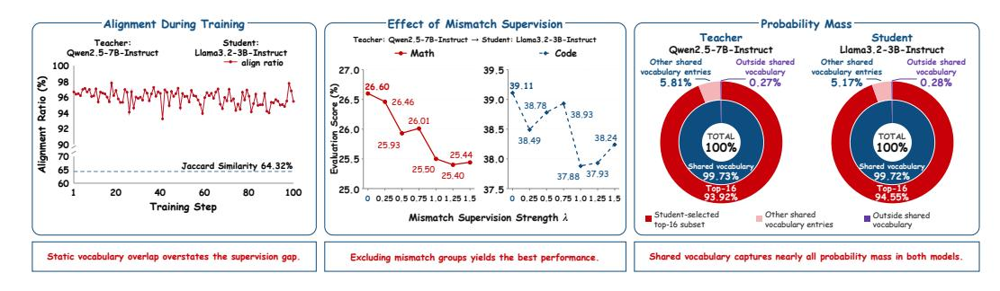
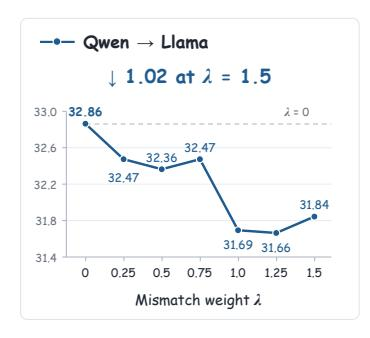
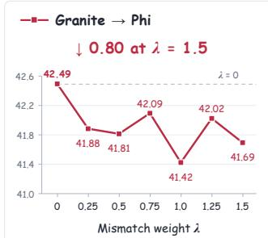
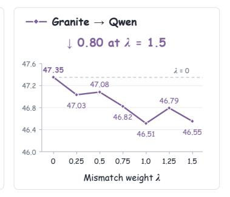
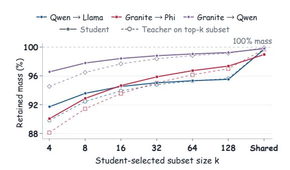
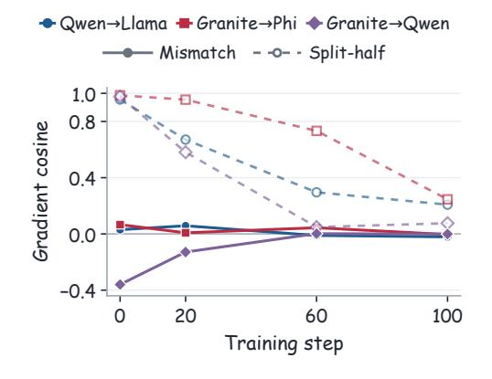
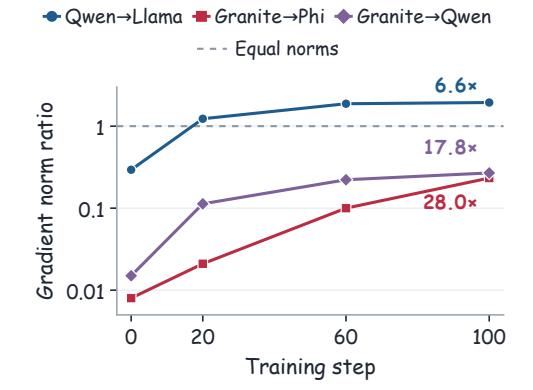

# 크로스-토크나이저 온-폴리시 디스틸레이션 재고: 정렬 범위에서 감독 신뢰성으로 (RETHINKING CROSS-TOKENIZER ON-POLICY DISTILLATION: FROM ALIGNMENT COVERAGE TO SUPERVISION RELIABILITY)

- 원제: Rethinking Cross-Tokenizer On-Policy Distillation: From Alignment Coverage to Supervision Reliability
- 원문: [https://arxiv.org/abs/2610.08448](https://arxiv.org/abs/2610.08448)
- PDF: [https://arxiv.org/pdf/2610.08448](https://arxiv.org/pdf/2610.08448)
- arXiv ID: `2610.08448`

---

# 크로스-토크나이저 온-폴리시 디스틸레이션 재고: 정렬 범위에서 감독 신뢰성으로 (RETHINKING CROSS-TOKENIZER ON-POLICY DISTILLATION: FROM ALIGNMENT COVERAGE TO SUPERVISION RELIABILITY)

Bingxi Hou, Guochao Jiang, Guofeng Quan, Weiqing Li, Wenfeng Feng, Guohua Liu, Yuewei Zhang  $^\dagger$

Alibaba Cloud Computing {anyue.jgc, liyou.zyw}@alibaba-inc.com

#### **초록** (ABSTRACT)

On-Policy Distillation (OPD)는 교사 피드백을 사용해 학생 모델을 자체 생성물에 대해 훈련한다. 서로 다른 토크나이저를 사용할 때, 교사와 학생의 예측을 비교하려면 시퀀스와 어휘 수준 모두에서 정렬이 필요하다. 본 논문에서는 이 정렬 범위를 확장하는 것이 학습을 향상시키는지 검토한다. 수학적 추론과 코드 생성에 대한 세 개의 이질적인 교사-학생 쌍에서, 엄격한 1:1 그룹은 상당한 어휘 불일치에도 불구하고 대부분의 학생 생성 토큰을 이미 커버한다. 디스틸레이션 이전에 학생으로부터 샘플링한 응답에서, 공유 어휘는 엄격히 정렬된 위치에서 교사와 학생의 확률 질량을 거의 전부 보유한다. 각 엄격한 위치에서 공유 어휘의 학생이 선택한 상위 16개 하위 집합에 대해 역 KL을 제한하면, 전체 공유 어휘 OPD와 유사한 정확도를 달성하며, 평가된 교차 토크나이저 기반 기준보다 우수하다. 불일치 그룹에서 스팬 로그-확률에 대한 평균 제곱 오차 감독을 추가하면 완전한 감독 범위를 제공하지만 정확도가 감소한다. 엄격한 손실만으로 훈련한 체크포인트에서, 스팬 그래디언트는 엄격한 그래디언트와 약하거나 부정적인 방향 일치를 보이며, 그 크기가 증가한다. 이러한 진단은 스팬 감독을 추가함으로써 정확도가 떨어지는 원인을 설명하는 데 도움이 될 수 있다. 우리의 결과는 정렬 범위 최대화에서 감독 신뢰도 우선순위로 전환할 필요성을 시사한다: 엄격한 위치에서의 압축된 감독이, 약하게 정렬되거나 충돌하는 훈련 신호를 도입하는 광범위한 범위보다 더 효과적일 수 있다.

Figure 1: Qwen2.5-7B-Instruct—Llama-3.2-3B-Instruct에 대한 Cross-Tokenizer OPD의 세 가지 진단. **Left:** Strict full 훈련 동안 학생 측 정렬 비율이 여전히 높으며, 정적 어휘 겹침이 크게 낮음에도 불구하고. **Middle:** 불일치 그룹에 감독을 추가하면 수학 및 코드 성능이 감소한다. **Right:** 디스틸레이션 이전에 학생이 생성한 응답에서 엄격히 정렬된 위치에서 공유 어휘는 평균적으로 교사와 학생의 확률 질량을 거의 모두 보유하며, 학생이 선택한 상위 16개 하위 집합은 양쪽 모두에서 대부분을 보유한다.

*동일 기여.

&lt;sup>†응답자.

## 1 서론 (INTRODUCTION)

On-Policy Distillation (OPD)는 교사로부터의 피드백을 사용해 언어 모델을 자체 생성물에 대해 훈련한다 [(Agarwal et al., 2024;](#page-9-0) [Gu et al., 2024)](#page-10-0). 현재 학생이 도달한 접두어에 감독을 제공함으로써, OPD는 교사 피드백을 학생의 진화하는 행동에 연결한다. 이 방법을 모델 계통 전반에 확장하려면 서로 다른 토크나이저를 가진 모델의 예측을 비교해야 한다. 동일한 응답은 서로 다른 토큰 경계를 가질 수 있으며, 다음 토큰 분포는 서로 다른 어휘에 대해 정의된다. 따라서 Cross-Tokenizer OPD는 시퀀스와 어휘 수준 모두에서 정렬을 고려해야 한다.

최근 Cross-Tokenizer distillation은 rank 기반 분포 매칭, 학습된 매핑, likelihood 매칭, byte-level 인터페이스를 통해 이러한 장애물을 해결한다 [(Boizard et al., 2025;](#page-9-1) [Zhang et al., 2024;](#page-12-0) [Minixhofer et al., 2025;](#page-11-0) [Singh et al., 2026)](#page-11-1). On-policy 훈련에서는 SimCT가 정렬된 다중 토큰 단위로 감독을 복구하고, 공유 어휘 OPD보다 이득을 보고한다 [(Sun et al., 2026)](#page-11-2). Byte-Prefix Marginalization은 교사 확률 질량을 학생 토큰에 매핑하면서, 공백 위치에서 해로운 감독을 식별한다 [(Wang et al., 2026)](#page-11-3). 이러한 발전은 추가 교사 신호를 활용 가능하게 만들고, 그 학습 가치를 검토하도록 동기를 부여한다. 우리는 질문한다: *strict matching이 이미 얼마나 유용한 감독을 보유하고 있는지, 그리고 제외된 대상들을 복구하는 것이 학습에 어떤 기여를 하는지?*

*정렬 범위*는 응답과 모델의 어휘가 토크나이저 간에 얼마나 비교 가능한지를 설명한다. *감독 신뢰성*은 결과 교사 목표가 학생이 방문하는 상태에서 유용한 지침을 제공하는지 여부를 다룬다. 정적 어휘 겹침은 어휘 항목을 동일하게 세지만, 그 빈도와 학생 궤적에서의 예측 확률은 매우 불균형할 수 있다. 큰 어휘 격차는 빈번한 strict alignment과 공유 어휘 항목에 집중된 확률 질량과 동시에 존재할 수 있다. strict alignment이 부족한 구간에서는 다중 토큰 그룹화가 추가 감독을 가능하게 한다. 이 추가 감독이 학습을 향상시키는지는 정렬된 그룹에 적용되는 목표에 달려 있다.

이전 OPD 연구는 집중된 예측 지원이 상당한 distillation 이점을 유지할 수 있음을 보여준다 [(Fu et al., 2026;](#page-10-1) [Li et al., 2026)](#page-10-2). 이질 토크나이저 하에서는 이러한 지원을 평가할 때, 어떤 응답 위치와 어휘 항목이 직접 비교를 허용하는지 고려해야 한다. 우리는 훈련 비교를 통해 이 감독의 학습 가치를 평가하고, 확률 질량 측정과 기울기 진단을 사용해 결과를 해석한다.

우리 연구는 수학적 추론과 코드 생성을 대상으로 하는 세 개의 이질 교사–학생 쌍을 다루며, 지침 튜닝된 학생과 기본 학생을 포함한다. 우리는 strict Cross-Tokenizer OPD에서 시작하는데, 이는 strict alignment 위치에서 reverse KL을 적용한다. 이 위치에서 하나의 학생 토큰과 하나의 교사 토큰이 응답의 동일한 구간을 덮는다. 두 예측 분포는 공유 어휘에 제한되고 재정규화된다. 이후 우리는 span log-확률에 대한 평균 제곱 오차(MSE) 손실의 가중치와 각 strict 위치에서 사용되는 공유 어휘 항목 수를 변형한다. Figure [1](#page-0-0)은 coverage, mismatch-supervision, 그리고 probability-mass 관찰을 보여준다. 우리의 주요 발견은 다음과 같다:

- 스팬 MSE로 커버리지 갭을 닫으면 정확도가 감소한다. 엄격한 학생-토큰 커버리지는 연구된 실행에서 85.57–96.98%이며, 정적 어휘 Jaccard 겹침이 39.49–64.87%임에도 불구하고. 엄격한 목표를 고정한 채 스팬 로그확률에 MSE 감독을 추가한다. 모든 양의 가중치는 완전한 구조적 감독 커버리지를 제공하지만, 18개의 테스트된 양의 가중치 설정은 모두 전체 평균 정확도를 낮춘다 (Section [3)](#page-3-0)).

- 학생이 선택한 top‑k 부분집합은 학습 이득의 대부분을 보존한다. 증류 전 학생들로부터 샘플링된 응답에서, 공유 어휘는 평균적으로 엄격한 위치에서 교사와 학생의 확률 질량을 거의 모두 보존한다. 선택된 부분집합은 두 모델 모두에서 이 질량의 대부분을 보존한다. k = 16일 때, 훈련은 비증류 학생에 비해 전체 공유 어휘 OPD가 달성한 전체 평균 개선의 최소 96%를 보존한다. 전체 및 압축된 엄격 목표는 세 모델 쌍 모두에서 평가된 교차 토크나이저 기준보다 높은 전체 평균을 달성한다 (Section [4)](#page-6-0)).

- 스팬 그래디언트는 방향성 일치가 약하고 상대적 크기가 증가한다. 엄격한 손실만으로 훈련된 체크포인트에서, 스팬 그래디언트는 엄격한 그래디언트와 약하거나 부정적인 일치를 보인다. 그 일치는 엄격한 손실에 기여하는 위치를 두 부분집합으로 나누어 만든 기준보다 일관되게 낮으며, 그리고

스팬-투-스트릭 그래디언트 노름 비율은 측정된 훈련 체크포인트에서 증가한다. 이러한 약하게 정렬된 그래디언트의 상대적 규모가 증가함으로써 스팬 감독 하에서 낮은 정확도를 설명할 수 있다 (Section 5).

공유 어휘의 학생이 선택한 top‑k 부분집합은 관찰된 증류 이득의 대부분을 보존하지만, 스팬 목표는 정확도를 희생하면서 구조적 감독 커버리지를 확장한다. 이러한 결과는 *정렬 커버리지*에서 *감독 신뢰성*으로의 전환을 촉구한다: 추가 감독의 가치는 엄격한 분포 매칭과의 상호작용 및 다운스트림 성능에 미치는 영향을 통해 평가되어야 한다.

## 2 초록 (PRELIMINARIES)

### 2.1 표기법 (NOTATION)

$x \sim \mathcal{D}$ 를 *prompt* 라고 하고, $y = (y_1, \dots, y_L)$ 를 *response* 토큰 시퀀스라고 한다. 여기서 $y_{< i} = (y_1, \dots, y_{i-1})$ 는 y의 *prefix* 이다. 우리는 두 개의 LLM을 고려한다: 학생 모델 $\pi_{\theta}$ 와 고정된 교사 모델 $\pi_T$ , 여기서 $\pi_{\theta}$ 는 어휘 $\mathcal{V}_{\theta}$ 에 대해 분포 $\pi_{\theta}(\cdot|x)$ 를 정의하고, $\pi_T$ 는 어휘 $\mathcal{V}_T$ 에 대해 분포 $\pi_T(\cdot|x)$ 를 정의한다. *trajectory* 는 x에 대해 정책에서 자가회귀적으로 샘플링된 y와 쌍 (x,y) 이다.

### 2.2 ON-POLICY DISTILLATION (온-폴리시 디스틸레이션)

온-폴리시 디스틸레이션(OPD)은 학생 모델에서 트레젝터리를 샘플링하고 학생이 실제로 방문하는 접두사에서 학생을 교사와 정렬한다 (Agarwal et al., 2024). OPD는 또한 밀집 KL-제약 강화 학습의 특수 사례로 볼 수 있다. 여기서 교사 분포는 토큰 수준 보상을 유도하고 KL 정규화는 고정된 상대 가중치를 갖는다 (Yang et al., 2026). 공유 토크나이저를 사용하면 OPD는 다음과 같은 목표 함수를 최소화한다:

$$\mathcal{L}_{\text{OPD}}(\theta) = \mathbb{E}_{x \sim \mathcal{D}, y \sim \pi_{\theta}(\cdot|x)} \left[ \sum_{i=1}^{L} \text{KL}(\pi_{\theta}(\cdot|x, y_{< i}) || \pi_{\text{T}}(\cdot|x, y_{< i})) \right]. \tag{1}$$

### 2.3 Cross-Tokenizer On-Policy Distillation (크로스-토크나이저 온-폴리시 디스틸레이션)

다른 토크나이저는 동일한 텍스트에 대해 서로 다른 토큰 경계와 어휘 항목을 할당할 수 있다. 따라서 크로스-토크나이저 OPD는 시퀀스와 어휘 레벨 모두에서 정렬을 고려해야 한다 (Wang et al., 2026).

**토큰-그룹 정렬.** 점수 매기기와 정렬을 위해, 우리는 디코드된 학생 응답을 두 모델의 토크나이저로 토큰화한다. 결과로 나온 학생과 교사 응답 토큰 시퀀스를 각각 $y=(y_1,\ldots,y_L)$ 과 $v=(v_1,\ldots,v_n)$ 으로 표시한다. 구현은 각 모델의 인코딩 입력에서 이 응답 토큰들의 위치를 보존한다(부록 A에 자세히 설명). 이후 두 시퀀스가 공유하는 토큰 오프셋을 보존하며, 응답의 시작과 끝도 포함한다. 연속된 공유 경계 사이의 r번째 구간에 대해, $S_r^\theta$ 와 $S_r^\mathrm{T}$ 를 그 구간 내 학생과 교사 토큰 인덱스로 둔다. 이 두 정렬된 토큰 그룹의 토큰은 같은 구간을 이어 붙인다. 이 구성을 모든 구간에 적용하면 응답을 R개의 정렬된 토큰 그룹 쌍으로 나눈다:

$$S(y) = \left\{ \left( S_r^{\theta}, S_r^{\mathsf{T}} \right) \right\}_{r=1}^R. \tag{2}$$

그룹 인덱스를 엄격한 1:1 그룹과 불일치 그룹으로 나눈다:

$$\mathcal{A}_{1:1}(y) = \left\{ r : |S_r^{\theta}| = |S_r^{\mathsf{T}}| = 1 \right\}, \quad \mathcal{A}_{\mathsf{mis}}(y) = \{1, \dots, R\} \setminus \mathcal{A}_{1:1}(y). \tag{3}$$

엄격한 1:1 그룹은 동일한 구간을 차지하는 하나의 학생 토큰과 하나의 교사 토큰으로 구성된다. 우리는 이들의 쌍으로 된 예측 위치를 *엄격 위치(strict positions)* 라고 부른다. 불일치 그룹은 같은 구간을 구성하기 위해 최소 한쪽에서 여러 토큰이 필요하다.

**공유 어휘집.** 우리는 특수 토큰과 모호한 매치를 제외하고, 각 모델의 기본 토큰을 기준으로 어휘집 항목을 식별한다. 이 규칙에 따라 공유 어휘집은 $\mathcal{V}_{\cap} = \mathcal{V}_{\theta} \cap \mathcal{V}_{T}$ 이다. 각 $r \in \mathcal{A}_{1:1}(y)$ 에 대해, $S_r^{\theta} = \{i_r\}$ 과 $S_r^{T} = \{j_r\}$ 으로 둔다. 학생과 교사는 각각 $\pi_{\theta}(\cdot \mid x, y_{< i_r})$ 와 $\pi_{T}(\cdot \mid x, v_{< j_r})$ 로 예측한다. $w \in \mathcal{V}_{\cap}$ 에 대해, 우리는 각 분포에서 해당 어휘집 항목을 인덱스로 사용한다. 공유 어휘집에 대해 두 분포를 제한하고 재정규화하면 다음과 같다:

$$\bar{\pi}_{\theta}(w \mid x, y_{< i_r}) = \frac{\pi_{\theta}(w \mid x, y_{< i_r})}{\sum_{w' \in \mathcal{V}_{\cap}} \pi_{\theta}(w' \mid x, y_{< i_r})}, \bar{\pi}_{\mathsf{T}}(w \mid x, v_{< j_r}) = \frac{\pi_{\mathsf{T}}(w \mid x, v_{< j_r})}{\sum_{w' \in \mathcal{V}_{\cap}} \pi_{\mathsf{T}}(w' \mid x, v_{< j_r})}.$$

(4)

**엄격한 교차 토크나이저 목표.** 위의 OPD 목표를 따라, 우리는 공유 어휘집 분포를 사용해 엄격히 정렬된 위치에서 역 KL을 합산한다:

$$\mathcal{L}_{1:1}(\theta) = \mathbb{E}_{x \sim \mathcal{D}, y \sim \pi_{\theta}(\cdot \mid x)} \left[ \sum_{r \in \mathcal{A}_{1:1}(y)} \text{KL}\left(\bar{\pi}_{\theta}(\cdot \mid x, y_{< i_r}) \| \bar{\pi}_{T}(\cdot \mid x, v_{< j_r})\right) \right]. \tag{5}$$

## 3 재검토 감독 범위 (REVISITING SUPERVISION COVERAGE)

그림 1은 Qwen—Llama에 대해 세 가지 관찰을 제시한다: 엄격한 정렬이 훈련 중에 높은 수준을 유지하고, 구간 감독을 추가하면 보고된 다운스트림 점수가 낮아지며, 엄격한 위치에서 대부분의 예측 질량이 공유 어휘집 항목에 속한다. 본 섹션에서는 먼저 엄격한 토큰 커버리지를 측정하고, 불일치 그룹을 감독하는 학습 효과를 테스트하며, 마지막으로 공유 어휘집에 보존된 확률 질량을 측정한다.

실험 설정. 실험은 Qwen (Yang et al., 2025), Llama (Grattafiori et al., 2024), Granite¹, 그리고 Phi (Abouelenin et al., 2025)의 네 가지 모델 시리즈를 다룬다. 전반적으로 화살표는 교사에서 학생으로 향한다. 우리는 Qwen2.5-7B-Instruct→Llama-3.2-3B-Instruct, Granite-4.1-8B→Phi-4-mini-instruct, 그리고 Granite-4.1-8B→Qwen2.5-7B-Base를 연구하며, 각각을 Qwen→Llama, Granite→Phi, 그리고 Granite→Qwen으로 축약한다. 훈련은 20,000개의 프롬프트로 구성된 공통 소스 풀에서 시작되며, 그 중 10,000개는 DAPO-Math-17K (Yu et al., 2025)에서 가져온 수학 프롬프트, 나머지 10,000개는 CodeForces²에서 가져온 코드 프롬프트이다. 우리는 수학을 MATH500 (Lightman et al., 2024), GSM8K (Cobbe et al., 2021), AIME-2024, AIME-2025, AIME-2026, AMC23, 그리고 Minerva-Math (Lewkowycz et al., 2022)에서, 코드를 HumanEval (Chen et al., 2021), MBPP (Austin et al., 2021), 그리고 LiveCodeBench (Jain et al., 2025)에서 평가한다. 우리는 모든 벤치마크에서 정확도를 보고하며, 수학 문제당 32개의 샘플 응답을 평균(평균@32)하고, 코드 문제당 8개의 응답을 평균(평균@8)한다. The *full*은 두 도메인 내의 산술 평균에 동일한 가중치를 부여한다. Appendix A는 실험 세부 정보를 제공한다.

### 3.1 학생 궤적에 대한 엄격한 정렬 (STRICT ALIGNMENT ON STUDENT TRAJECTORIES)

**정적 겹침과 동적 범위.** 우리는 정적 어휘 Jaccard 겹침 $J_{\text{vocab}}$과 학생 롤아웃에서의 엄격한 토큰 범위를 비교한다. Appendix B는 정적 겹침 정의와 전체 어휘 통계량을 제공한다. 응답 y에 대해, 엄격한 학생 토큰 범위는 엄격한 1:1 그룹에 속하는 비특수 학생 토큰의 비율이다:

$$C_{1:1}^{\theta}(y) = \frac{\sum_{r \in \mathcal{A}_{1:1}(y)} |S_r^{\theta}|}{\sum_{r=1}^{R} |S_r^{\theta}|}.$$

(6)

엄격한 교사 토큰 범위 $C_{1:1}^{T}(y)$는 두 합계에서 $S_r^{\theta}$를 $S_r^{T}$로 교체한다.

**엄격한 감독이 여전히 우세하다.** 각 100번 반복에서 생성된 512개의 학생 롤아웃이 모두 저장되어, 한 실행당 51,200개의 응답을 제공한다. 우리는 전체 실행과 세 개의 서로 다른 창: 단계 1–20, 41–60, 그리고 81–100에서 범위를 집계한다. 표 1은 39.49–64.87%의 Jaccard 겹침과 학생 토큰의 85.57–96.98% 및 82.82–97.26%의 엄격한 토큰 범위를 대비한다.

https://huggingface.co/blog/ibm-granite/granite-4-1

2https://huggingface.co/datasets/open-r1/codeforces

Table 1: 정적 어휘 Jaccard 겹침 $J_{\text{vocab}}$과 Strict full 훈련에서 학생 궤적의 엄격한 토큰 범위. $C_{1:1}^{\theta}$와 $C_{1:1}^{\mathrm{T}}$는 표시된 훈련 단계에서 학생과 교사의 엄격한 토큰 범위를 나타낸다.

| <b>교사</b> → <b>학생</b> | $J_{\rm 어휘}$ | 커버리지 | 학습 단계 |  |  |  |
|---------------------------------|-----------------|-------------------------------------------|----------------|----------------|----------------|----------------|
| 반응 / 진술 |  |  | 1–100 | 1–20 | 41–60 | 81–100 |
| Qwen→Llama | 64.32 | $C_{1:1}^{\theta} \ C_{1:1}^{\mathrm{T}}$ | 93.56 85.91 | 94.63 88.65 | 93.20 84.90 | 93.43 85.36 |
| Granite→Phi | 39.49 | $C_{1:1}^{\theta} \ C_{1:1}^{\mathrm{T}}$ | 96.98 97.26 | 96.65 95.83 | 96.95 97.50 | 97.12 97.96 |
| Granite→Qwen | 64.87 | $C_{1:1}^{\theta} \ C_{1:1}^{\mathrm{T}}$ | 85.57 82.82 | 85.23 81.15 | 85.06 82.77 | 85.88 83.86 |

Figure 2: 불일치 가중치에 따른 전체 평균 정확도(%). 점선은 엄격한 감독(strict supervision) ($\lambda=0$)을 표시하며, 주석은 $\lambda=1.5$에서의 감소량을 퍼센트 포인트 단위로 나타낸다.

교사 토큰은 전체 실행에서 나타난다. Granite  $\rightarrow$  Phi는 가장 낮은 Jaccard 겹침을 보이지만 두 토큰화 방식 모두에서 가장 높은 보위율을 기록한다. 각 쌍 내에서 세 개의 보고된 윈도우 간 범위는 엄격한 학생 토큰 보위율에서 최대 1.43 퍼센트 포인트, 엄격한 교사 토큰 보위율에서 최대 3.75 퍼센트 포인트에 불과하다. 이 결과는 상당한 정적 어휘 불일치가 학생이 생성한 경로의 대부분 위치에서 엄격한 정렬과 공존할 수 있음을 보여준다. 그러나 높은 엄격한 토큰 보위율만으로는 나머지 불일치 그룹이 유용한 감독을 제공하는지 여부를 확립할 수 없다.

### 3.2 불일치 감독의 학습 가치 (Learning Value of Mismatch Supervision)

우리는 Equation 5의 엄격한 목표에 스팬 감독을 추가하여 나머지 불일치 그룹의 학습 가치를 테스트한다.

**스팬 감독.** Equation 2의 각 불일치 그룹은 동일한 텍스트 범위에 대해 학생과 교사 토큰 시퀀스를 짝지으며, 이는 서로 다른 수의 자기회귀 결정이 포함될 수 있다. $r \in \mathcal{A}_{\text{mis}}(y)$에 대해, 우리는 관측된 토큰 경로의 확률을 다음과 같이 계산한다.

$$q_{\theta}^{(r)} = \prod_{i \in S_r^{\theta}} \pi_{\theta}(y_i \mid x, y_{< i}), \quad q_{\mathsf{T}}^{(r)} = \prod_{j \in S_r^{\mathsf{T}}} \pi_{\mathsf{T}}(v_j \mid x, v_{< j}). \tag{7}$$

우리는 로그-확률 표현을 사용하여 불일치 그룹에 대한 평균 제곱 오차 손실로 이 확률들을 매칭한다:

$$\mathcal{L}_{\text{span}}(\theta) = \mathbb{E}_{x \sim \mathcal{D}, y \sim \pi_{\theta}(\cdot | x)} \left[ \sum_{r \in \mathcal{A}_{\text{mis}}(y)} \left( \log q_{\theta}^{(r)} - \log q_{\text{T}}^{(r)} \right)^{2} \right]. \tag{8}$$

전체 손실은

$$\mathcal{L}_{\lambda}(\theta) = \mathcal{L}_{1:1}(\theta) + \lambda \mathcal{L}_{\text{span}}(\theta). \tag{9}$$

기준선 baseline  $\lambda=0$ 은 엄격한 1:1 그룹에만 감독을 적용한다. 모든  $\lambda>0$ 은 추가로 모든 불일치 그룹을 감독한다. 따라서 모든 양의 가중치는 100 % 완전 감독 범위를 제공한다.  $\lambda$ 를 변형하면 주어진 응답에 대해 포함된 그룹 집합을 고정한 채로 span loss 의 영향을 바꾼다. 우리는 Figure 2에 표시된 것처럼 세 개의 teacher–student 쌍에 대해  $\lambda\in\{0,0.25,0.5,0.75,1.0,1.25,1.5\}$ 를 스윕한다.

엄격한 감독이 가중치 스윕 전반에 걸쳐 가장 좋은 성능을 보인다. 세 쌍 모두 $\lambda=0$에서 가장 높은 전체 평균을 달성한다. 18개의 양의 가중치 설정은 각각의 엄격한 기준보다 0.27–1.20 퍼센트 포인트 낮은 점수를 기록한다. 부록 C의 상세 결과는 $\lambda=0$이 각 쌍에 대해 가장 높은 수학 및 코드 평균을 제공함을 보여준다. 그림 2는 세 쌍 모두에서 $\lambda$가 증가함에 따라 전체 평균 정확도가 전반적으로 감소하는 추세를 나타낸다. 스팬 로그-확률 MSE를 사용하면 완전한 감독 범위 달성이 테스트된 가중치에서 다운스트림 정확도를 감소시킨다. 이는 그림 1에서의 범위와 학습 가치 구분을 세 모델 쌍 모두에 확장한다.

### 3.3 예측 질량은 공유 어휘에 집중한다 (Predictive Mass Concentrates on the Shared Vocabulary)

우리는 이제 각 모델이 엄격한 위치에서 공유 어휘에 할당하는 확률 질량을 측정한다. 정적 어휘 겹침은 어휘 항목을 세지만, 그 기여도는 문맥에서 할당된 확률에 따라 달라진다.

**확률 질량 측정.** 각 엄격한 1:1 그룹 $r \in \mathcal{A}_{1:1}(y)$ 에 대해, 그 엄격한 위치에서 원래 전체 어휘 예측을 $\pi_{\theta}^{(r)}(w) = \pi_{\theta}(w \mid x, y_{< i_r})$ 와 $\pi_{T}^{(r)}(w) = \pi_{T}(w \mid x, y_{< j_r})$ 로 축약한다. $a \in \{\theta, T\}$ 에 대해, 공유 어휘에 대한 확률 질량은

$$M_{\cap,a}^{(r)} = \sum_{w \in \mathcal{V}_{\cap}} \pi_a^{(r)}(w). \tag{10}$$

공유 어휘 내 집중도를 측정하기 위해, 가장 높은 확률을 부여받는 상위 k개의 공유 어휘 항목을 선택한다. 이 항목들은 *학생이 선택한 상위 k 집합*을 형성한다:

$$\mathcal{K}_{k}^{(r)} = \text{TopK}_{w \in \mathcal{V}_{\cap}} \left( \pi_{\theta}^{(r)}(w), k \right), \quad M_{k,a}^{(r)} = \sum_{w \in \mathcal{K}_{k}^{(r)}} \pi_{a}^{(r)}(w). \tag{11}$$

공유 어휘와 달리, 이 집합은 각 엄격한 위치에서 학생 분포에 따라 달라진다. 이 집합을 증류 손실의 지원 집합으로 사용할 때는 *상위 k 지원*이라고도 부른다.

각 모델 쌍마다, 확률 질량 프로브는 모든 20k 프롬프트를 사용한다. 증류 이전에 학생 모델을 사용해 프롬프트마다 하나의 롤아웃을 생성하고, 각 측정된 엄격한 위치에서 두 모델을 점수화한다. 두 모델은 원래 소프트맥스 확률을 사용해 동일한 학생이 선택한 상위 k 집합에서 평가된다. 우리는 모든 측정된 엄격한 위치에 대해 각 통계치를 평균하고, $k \in \{4, 8, 16, 32, 64, 128\}$ 를 전체 공유 어휘와 함께 평가한다. 부록 B에 상세 결과가 보고된다.

공유 어휘는 거의 모든 예측 질량을 포착한다. Figure 3의 "Shared" 엔드포인트는 전체 공유 어휘가 세 쌍에 걸쳐 평균적으로 교사 질량의 99.69–99.90%와 학생 질량의 98.99–99.81%를 보존함을 보여준다. 엄격한 정렬은 대부분 생성된 토큰 위치에서 감독을 제공한다-

Figure 3: 증류 이전에 엄격한 위치에서 학생이 선택한 상위 k 집합과 전체 공유 어휘가 보존하는 확률 질량.

위치에서, 공유 어휘 항목은 측정된 엄격한 위치에서 거의 모든 예측 확률을 운반한다. 비교에서 제외된 어휘 항목들은 두 모델 모두에서 평균적으로 적은 확률을 받는다. 따라서 정적 어휘 불일치만으로는 공유 어휘가 얼마나 많은 확률 질량을 보존하는지 결정되지 않는다.

| 표 2: 교차 토크나이저 증류 정확도 (%). Base는 증류 전 학생 모델을 나타낸다. 굵은 글씨 |
|--------------------------------------------------------------------------------------------------------|
| 각 열에서 가장 높은 증류 점수를 표시한다. |

| 방법 | Qwen→Llama |  |  | Granite→Phi |  |  | Granite→Qwen |  |  |
|------------------------------------------------|----------------------------------|----------------------------------|----------------------------------|----------------------------------|----------------------------------|----------------------------------|----------------------------------|----------------------------------|----------------------------------|
|  | 수학 | 코드 | 전체 | 수학 | 코드 | 전체 | 수학 | 코드 | 전체 |
| 기본 | 18.32 | 35.60 | 26.96 | 33.06 | 40.04 | 36.55 | 24.61 | 34.51 | 29.56 |
| ULD 확장 ULD GOLD SimCT | 20.51 23.01 21.21 25.31 | 37.74 39.26 33.10 37.86 | 29.12 31.13 27.16 31.59 | 35.24 35.28 36.22 36.67 | 42.01 41.42 47.29 46.70 | 38.63 38.35 41.75 41.68 | 33.36 33.14 38.26 38.64 | 20.87 32.00 54.84 53.56 | 27.12 32.57 46.55 46.10 |
| 엄격 전체 엄격 top-16 엄격 top-128 | 26.60 26.86 26.31 | 39.11 38.42 38.44 | 32.86 32.64 32.38 | 37.49 37.23 37.27 | 47.49 47.29 47.82 | 42.49 42.26 42.54 | 39.85 39.07 39.67 | 54.84 55.06 55.62 | 47.35 47.06 47.65 |

학생이 선택한 top‑k 부분집합은 또한 대부분의 교사 질량을 포착한다. k = 16에서 선택된 공유 어휘 항목은 평균적으로 세 쌍 각각에서 교사 질량의 최소 93.54 %와 학생 질량의 최소 94.55 %를 유지한다. k = 4에서 k = 128까지 부분집합 크기를 연속적으로 두 배씩 늘리면 모든 여섯 곡선에서 점진적으로 작은 이득을 가져온다. 16개 항목에서 128개 항목으로 부분집합을 확장하면 교사의 보존 질량이 최대 3.44 퍼센트 포인트, 학생의 보존 질량이 최대 2.70 퍼센트 포인트 증가한다. 선택은 오직 학생 분포만 사용하지만, 선택된 공유 어휘 항목은 교사의 예측 질량 대부분을 담고 있다.

## 4 학생 선택 상위-k 하위 집합을 이용한 학습 (LEARNING WITH STUDENT-SELECTED SUBSETS)

본 절에서는 이 하위 집합에서의 훈련이 전체 공유 어휘에 대한 증류(distillation)의 학습 이득을 보존하는지 여부를 테스트한다.

우리는 방정식 [5](#page-3-3)에서 엄격한 목표를 학생이 선택한 상위‑k 부분집합 K(r)ₖ에 제한하고, 반전 KL을 계산하기 전에 동일한 집합에서 두 모델의 분포를 재정규화한다. 우리는 k = 16과 k = 128을 세 모델 쌍 전체에서 공유되는 전체 어휘와 비교하고, 수학적 추론 및 코드 생성 벤치마크에서 평가 결과를 보고한다. 또한 엄격한 감독을 ULD[(Boizard et al., 2025)](#page-9-1), 그 범위 그룹화 변형인 Extended ULD, GOLD[3](#page-6-1), 그리고 SimCT[(Sun et al., 2026)](#page-11-2)와 비교한다. 표 [2](#page-6-2)는 모든 방법에 대한 도메인 및 전체 평균을 보고하며, 부록 [C](#page-15-0)는 벤치마크 수준 결과를 제공한다. 네 가지 기준 모델은 KDFlow[(Zhang et al.,](#page-12-2) [2026)](#page-12-2)에서 구현되었다. 부록 [A](#page-13-0)는 위치 정렬, 어휘 처리, EOS 설정 및 손실 감소를 상세히 설명한다.

엄격한 감독은 두 도메인 모두에서 성능을 향상시킨다. 엄격한 전체 및 두 가지 압축 변형은 Base와 비교해 모든 모델 쌍에서 수학 및 코드 정확도를 개선하며, 이는 학생이 선택한 top‑k 서브셋에서 학습 이득이 얼마나 유지되는지를 평가하는 기준을 제공한다.

Top-k 부분집합은 대부분의 성능 향상을 유지한다. Top-16은 각 쌍에서 Base에서 strict full로 보고된 전체 평균 향상의 최소 96%를 유지한다. 따라서 관찰된 학습 이점의 대부분은 소규모 학생이 선택한 Top-k 부분집합에서 유지될 수 있으며, 그 크기를 늘려도 일관된 추가 이득은 없다.

Compact supervision은 더 높은 성능을 달성한다.  
세 가지 strict 변형은 모든 모델 쌍에서 수학 및 전체 평균 모두에서 네 가지 대안보다 뛰어나며, top-16은 전체 평균에서 가장 강력한 대안보다 0.51–1.05 퍼센트 포인트 앞서 있다.  
Appendix [D](#page-16-0)은 235B 대형 교사에서 8B 학생으로의 distillation에 대한 추가 결과를 보고하며, 여기서 Strict top-16은 평가된 distillation 방법 중 가장 높은 Math, Code, Full 평균을 달성한다.  
ALFWorld에서 Strict top-16은 보인(split) 및 보지 않은 모두에서 평가된 distillation 방법 중 가장 높은 성공률을 달성하며, 이는 Appendix [E.](#page-16-1)에 표시된다.

3[https://huggingface.co/docs/trl/gold\\_trainer](https://huggingface.co/docs/trl/gold_trainer)

Figure 4: 불일치–엄격 그라디언트 코사인 cmis(실선)와 반분 참조 cctrl(점선)이 엄격한 손실만으로 훈련된 체크포인트에서 나타난다.

Figure 5: 불일치–엄격 그라디언트 노름 비율 ρ가 엄격한 손실만으로 훈련된 체크포인트에서 나타나며, 0단계부터 100단계까지의 성장 요인은 반올림되지 않은 체크포인트 중앙값에서 계산된다.

## 5 스팬 감독의 최적화 진단 (OPTIMIZATION DIAGNOSTICS OF SPAN SUPERVISION)

본 절에서는 Equation [9.](#page-4-2)에서 L1:1(θ)와 Lspan(θ) 사이의 그라디언트 방향과 상대 규모를 조사한다.

그래디언트 진단. 우리는 엄격한 분포 매칭과 스팬 손실의 그래디언트를 비교하며, 두 손실을 미분 과정에서 고정된 동일한 샘플링된 응답에 대해 평가한다:

$$g_{1:1} = 
abla_{\theta} \mathcal{L}_{1:1}, \quad g_{\text{mis}} = 
abla_{\theta} \mathcal{L}_{\text{span}}.$$

(12)

우리는 그래디언트 코사인 [(Yu et al., 2020)](#page-12-3)과 노름 비율을 사용하여 방향 일치도를 측정하고, 상대 크기를 측정한다:

$$c_{\text{mis}} = \frac{\langle g_{1:1}, g_{\text{mis}} \rangle}{\|g_{1:1}\|_2 \|g_{\text{mis}}\|_2}, \quad \rho = \frac{\|g_{\text{mis}}\|_2}{\|g_{1:1}\|_2}.$$

(13)

우리는 각 모델 쌍에 대해 Strict full 실행에서 단계 0, 20, 60, 100의 체크포인트를 분석하고, 각 체크포인트에서 동일한 512개의 프롬프트에 대해 학생 모델의 응답을 생성한다. 우리는 모든 학습 가능한 학생 파라미터에 대한 원시 누적 기울기(raw accumulated gradients)에서 진단 정보를 계산하고, 각 체크포인트에서 재생 단위(replay units)별 통계치의 중앙값(median)을 보고한다. 각 배치 내에서, strict loss에 기여하는 위치들을 무작위로 두 개의 하위 집합 A와 B로 나누고, 재생 단위 전체에서 이들의 기울기를 별도로 누적한다. 그들의 코사인 cctrl = cos(gA, gB)는 동일한 목표 하에서 위치 하위 집합 간 기울기 일치도를 위한 기준을 제공한다. 부록 B의 표 [6](#page-15-1)은 완전한 통계와 재생 설정을 보고한다.

스팬 기울기는 strict 감독과 약한 일치를 보인다. 그림 [4](#page-7-1)은 Qwen→Llama 및 Granite→Phi에서 불일치 코사인이 거의 0에 가깝다는 것을 보여준다. Granite→Qwen은 대신 부정적 일치로 시작하고 훈련이 진행됨에 따라 0에 접근한다. split‑half strict 코사인이 훈련 전반에 걸쳐 감소하지만, 각 쌍의 모든 측정된 체크포인트에서 불일치–strict 코사인보다 여전히 높다.

상대 기울기 스케일은 훈련 중에 변한다. 그림 [5](#page-7-2)은 세 쌍 모두에서 측정된 체크포인트를 따라 span‑to‑strict 기울기 노름 비율이 증가함을 보여준다. 이러한 체크포인트에서 span 손실에 대한 고정된 양의 가중치는 strict 구성요소에 비해 증가하는 기울기 노름을 부여한다. 이러한 약하게 정렬된 span 기울기의 상대적 크기 증가가 Section [3.2.](#page-4-3)에서 불일치 그룹에 대한 감독으로 관찰된 낮은 정확도에 기여할 수 있다.

## 6 관련 연구 (RELATED WORK)

온-폴리시 디스틸레이션은 학생이 자체 롤아웃을 사용해 교사 감독 하에 학습한다. [(Song & Zheng, 2026)](#page-11-6). MiniLLM은 반전 KL을 사용해 학생이 교사에 비해 가능성이 낮은 영역에 과도한 확률을 할당하는 것을 방지한다. [(Gu et al., 2024)](#page-10-0). GKD는 다양한 발산과 학생이 생성한 시퀀스와 고정된 훈련 데이터의 혼합을 지원한다. [(Agarwal](#page-9-0) [et al., 2024)](#page-9-0). Yang 등은 OPD를 교사-참조 로그-확률 비율에 의해 주어지는 암묵적 토큰당 보상을 갖는 밀집 KL-제약 RL로 정의한다. [(2026)](#page-11-4). 후속 연구는 학생이 방문한 접두사에서 어떤 교사 신호가 효과적인지 조사한다. Fu 등은 샘플링된 토큰 OPD에서 신뢰할 수 없는 안내와 불균형한 감독을 분석하고, 교사 선택된 지역 top-k 지원에 대한 분포 매칭을 제안한다. [(2026)](#page-10-1). Entropy-aware OPD는 교사 엔트로피가 높은 위치에서 forward KL을 반전 KL에 추가하고, TIP는 학생 엔트로피와 교사-학생 불일치를 이용해 궤적 위치 선택을 연구한다. [(Xu et al., 2026)](#page-11-7). Li 등은 디스틸레이션 성공을 교사-학생 호환성에 연결하고, 그들의 top‑k 예측의 교집합이 대부분의 확률 질량을 포함하며 학생 top‑k 감독의 이점을 유지할 수 있음을 보여준다. [(2026)](#page-10-2). 그들의 공유 지원은 공통 어휘 내에서 높은 확률 예측으로 구성된다. 우리의 학생이 선택한 top‑k 부분집합을 비교하여, 이질적인 토크나이저가 직접 비교를 허용하는 응답 위치와 어휘 항목을 제한할 때 집중된 감독이 여전히 충분한지 테스트한다. 이는 엄격한 위치에서 공유 어휘를 사용한다.

크로스-토크나이저 디스틸레이션은 다른 토크나이저가 토큰 경계와 어휘 모두에서 불일치를 초래한다. ULD는 토큰 정체 일치를 요구하지 않고 정렬된 출력 확률을 비교한다. [(Boizard et al., 2025)](#page-9-1). DSKD와 CDM은 모델 표현 또는 어휘 사이의 매핑을 구축하고, DWA‑KD는 표현 정렬과 엔트로피 기반 가중치를 결합한다. [(Zhang et al., 2024)](#page-12-0) [(Chen et al., 2025)](#page-9-5) [(Vu et al., 2026)](#page-11-8). 다른 방법들은 토크나이저 간에 가능성을 매칭하거나, 디스틸레이션 전에 토큰을 스팬 표현으로 집계한다. [(Minixhofer et al., 2025)](#page-11-0) [(Dao et al., 2026)](#page-10-9). Byte‑Level Distillation은 교사 예측을 바이트 확률로 변환하고, 학생에게 바이트 수준 디코더 헤드를 제공한다. [(Singh et al., 2026)](#page-11-1). 온-폴리시 훈련을 위해 GOLD는 텍스트와 동등한 토큰 그룹을 병합하고, 순위 기반 또는 하이브리드 정체 기반 분포 매칭을 사용한다. [4](#page-8-0). SimCT는 공유 감독 공간에 최소한의 정렬된 다중 토큰 단위를 추가하고, 제외된 감독을 복구한 공유 어휘 OPD보다 개선된 성능을 보고한다. [(Sun et al., 2026)](#page-11-2). Byte‑Prefix Marginalization은 바이트‑접두사 관계를 통해 교사 확률 질량을 학생 토큰에 매핑하고, 일치하지 않는 질량을 잔여 범주에 보존한다. [(Wang et al., 2026)](#page-11-3). 또한 모든 공백 위치에서 해로운 감독을 식별하고, 이를 마스킹하여 발생하는 훈련 붕괴를 방지한다. 우리는 엄격한 감독을 고정한 채 스팬 로그‑확률 MSE 손실을 추가함으로써 구조적 복구의 학습 가치를 테스트한다. 확률 질량과 기울기 분석, 그리고 대안 목표와의 비교를 통해 우리는 평가하는 목표와 전이에서 정렬 범위와 감독 신뢰성을 구분한다.

## 7 결론 (CONCLUSION)

우리는 수학적 추론 및 코드 생성을 대상으로 세 개의 이질적인 교사–학생 쌍에서 Cross-Tokenizer On-Policy Distillation에서 정렬 커버리지의 역할을 재검토하였다. 정밀 1:1 그룹은 상당한 정적 어휘 불일치에도 불구하고 대부분의 학생 생성 토큰을 이미 커버한다. 교사와 학생이 정밀 위치에서 평균적으로 거의 모든 확률 질량을 공유 어휘가 보유하고 있음을, 교사와 학생이 distillation 전 학생으로부터 샘플링한 응답에서 확인하였다. 공유 어휘의 학생 선택 top‑k 하위 집합은 양측에서 이 질량의 대부분을 유지한다. 각 정밀 위치에서 공유 어휘의 학생 선택 top‑16 하위 집합으로 reverse KL을 제한하면, 전체 공유 어휘 OPD가 distillation되지 않은 학생보다 달성한 평균 향상 효과의 최소 96%를 보존하며, 평가된 교차 토크나이저 기반 기준보다 높은 성능을 보인다.

불일치 그룹에 대한 span log‑probability MSE를 추가하면 완전한 감독 커버리지를 달성하지만, 테스트된 모든 양수 가중치에서 downstream 정확도가 감소한다. strict loss만으로 훈련한 체크포인트를 측정한 결과, span gradient는 strict gradient에 비해 크기가 증가하지만 방향성 일치는 약하거나 부정적이다. 이 조합은 span 감독을 추가함으로써 발생하는 정확도 감소를 설명하는 데 도움이 될 수 있다. 이러한 결과는 *정렬 커버리지(Alignment Coverage)*에서 *감독 신뢰성(Supervision Reliability)*으로의 전환을 촉구한다: 커버리지를 늘리는 것만으로는 더 나은 distillation을 보장하지 않으며, 추가된 감독의 질은 학생 학습에 기여한 정도로 평가되어야 한다.

4[https://huggingface.co/docs/trl/gold\\_trainer](https://huggingface.co/docs/trl/gold_trainer)

distillation, 그리고 추가된 감독의 질은 학생 학습에 기여한 정도로 평가되어야 한다.

## AI 사용 진술 (AI USE STATEMENT)

우리는 문법, 명료성, 가독성을 향상시키기 위해 본 논문의 언어를 다듬는 데만 생성형 AI 도구를 사용한다. 이러한 도구는 실험 설계, 구현, 실행, 분석에 사용되지 않았다. 우리는 이 작업의 최종 내용에 대해 전적으로 책임을 진다.

## 윤리 진술 (ETHICS STATEMENT)

인간 주석 사용: 인간 주석은 본 연구의 시작 단계에서 제안된 솔루션의 실현 가능성을 분석하기 위해서만 사용된다. 주석자들은 연구 목적으로 데이터 사용에 동의하였다. 우리는 주석 과정 전반에 걸쳐 모든 주석자의 프라이버시가 보호되도록 하고, 모두가 지역 기준에 따라 적절히 보상받도록 한다. 인간 주석은 우리 방법의 평가 단계에서는 적용되지 않는다.

위험: 본 논문에서 사용된 모든 데이터셋은 공식 출처에서 얻은 것이다. 채택된 데이터셋은 익명화되었으며 공격적인 정보를 포함하지 않는다. 그러나 데이터셋에 사회적으로 해로운 또는 유해한 언어가 포함되지 않았음을 보장할 수 없다.

## 재현성 진술 (REPRODUCIBILITY STATEMENT)

우리는 정렬 규칙, distillation 목표, 진단 측정치를 섹션 [2–](#page-2-1) [5.](#page-7-0) 에서 설명한다. 부록 [A](#page-13-0) 에서는 데이터 준비, 훈련 구성, 기준 구현, 평가 절차를 상세히 기술한다. 부록 [B](#page-14-0) 는 확률 질량 측정 및 기울기 진단 프로토콜을 제공한다. 부록 [C](#page-15-0)[–E](#page-16-1) 는 벤치마크 수준 결과와 더 큰 교사 및 ALFWorld에서의 추가 실험을 보고한다. 우리의 코드는 [https://anonymous.4open.](https://anonymous.4open.science/r/Cross-Tokenizer-OPD) [science/r/Cross-Tokenizer-OPD](https://anonymous.4open.science/r/Cross-Tokenizer-OPD) 에서 이용 가능하다.

## 참고문헌 (REFERENCES)

Abdelrahman Abouelenin, Atabak Ashfaq, Adam Atkinson, Hany Awadalla, Nguyen Bach, Jianmin Bao, Alon Benhaim, Martin Cai, Vishrav Chaudhary, Congcong Chen, et al. Phi-4-mini technical report: Compact yet powerful multimodal language models via mixture-of-loras. *arXiv preprint arXiv:2503.01743*, 2025.

Rishabh Agarwal, Nino Vieillard, Yongchao Zhou, Piotr Stanczyk, Sabela Ramos Garea, Matthieu Geist, and Olivier Bachem. 언어 모델의 온-정책 증류: 자기 생성된 실수에서 학습. In *제12회 국제 학습 표현 회의, ICLR 2024, 비엔나, 오스트리아, 2024년 5월 7-11일*. OpenReview.net, 2024. URL [https://](https://openreview.net/forum?id=3zKtaqxLhW) [openreview.net/forum?id=3zKtaqxLhW](https://openreview.net/forum?id=3zKtaqxLhW)

Jacob Austin, Augustus Odena, Maxwell Nye, Maarten Bosma, Henryk Michalewski, David Dohan, Ellen Jiang, Carrie Cai, Michael Terry, Quoc Le, et al. 대형 언어 모델을 이용한 프로그램 합성. *arXiv 사전 인쇄 arXiv:2108.07732*, 2021

Nicolas Boizard, Kevin El Haddad, Celine Hudelot, and Pierre Colombo. cross-tokenizer ´ 증류를 향해: llms를 위한 보편적 로짓 증류 손실. *Trans. Mach. Learn. Res.*, 2025, 2025. URL <https://openreview.net/forum?id=bwRxXiGO9A>

Mark Chen, Jerry Tworek, Heewoo Jun, Qiming Yuan, Henrique Ponde De Oliveira Pinto, Jared Kaplan, Harri Edwards, Yuri Burda, Nicholas Joseph, Greg Brockman, et al. 코드에서 훈련된 대형 언어 모델 평가. *arXiv 사전 인쇄 arXiv:2107.03374*, 2021

Yijie Chen, Yijin Liu, Fandong Meng, Yufeng Chen, Jinan Xu, and Jie Zhou. 문맥 동적 매핑을 통한 crosstokenizer 지식 증류 강화. In Wanxiang Che, Joyce Nabende, Ekaterina Shutova, and Mohammad Taher Pilehvar (eds.), *연구 결과(Association for Computational Linguistics), ACL 2025, 비엔나, 오스트리아, 2025년 7월 27-8월 1일*, volume ACL 2025 of *연구 결과*, pp. 8005–8018. Association for Computational Linguistics, 2025

- doi: 10.18653/V1/2025.FINDINGS-ACL.419. URL [https://doi.org/10.18653/v1/](https://doi.org/10.18653/v1/2025.findings-acl.419) [2025.findings-acl.419](https://doi.org/10.18653/v1/2025.findings-acl.419).

- Karl Cobbe, Vineet Kosaraju, Mohammad Bavarian, Mark Chen, Heewoo Jun, Lukasz Kaiser, Matthias Plappert, Jerry Tworek, Jacob Hilton, Reiichiro Nakano, et al. 수학 단어 문제를 해결하기 위한 검증자 훈련. *arXiv preprint arXiv:2110.14168*, 2021.

- Quoc Phong Dao, Hoang Son Nguyen, Pham Khanh Chi, Tung Nguyen, Linh Ngo Van, Nguyen Thi Ngoc Diep, and Trung Le. SRA: 대형 언어 모델 증류를 위한 범위 표현 정렬. In Maria Liakata, Viviane P. Moreira, Jiajun Zhang, and David Jurgens (eds.), *Proceedings of the 64th Annual Meeting of the Association for Computational Linguistics (Volume 1: Long Papers), ACL 2026, San Diego, California, United States, July 2-7, 2026*, pp. 32961–32975. Association for Computational Linguistics, 2026. doi: 10.18653/V1/2026.ACL-LONG.1522. URL <https://doi.org/10.18653/v1/2026.acl-long.1522>.

- Jasper Dekoninck, Nikola Jovanovic, Tim Gehrunger, K ´ ari R ´ ognvaldsson, Ivo Petrov, Chenhao Sun, ¨ and Martin Vechev. 벤치마크를 넘어: LLM을 활용한 수학 평가 플랫폼 Matharena. *arXiv preprint arXiv:2605.00674*, 2026.

- Yuqian Fu, Haohuan Huang, Kaiwen Jiang, Jiacai Liu, Zhuo Jiang, Yuanheng Zhu, and Dongbin Zhao. 온-폴리시 증류 재검토: 실증적 실패 모드와 간단한 해결책. *arXiv preprint arXiv:2603.25562*, 2026.

- Aaron Grattafiori, Abhimanyu Dubey, Abhinav Jauhri, Abhinav Pandey, Abhishek Kadian, Ahmad Al-Dahle, Aiesha Letman, Akhil Mathur, Alan Schelten, Alex Vaughan, et al. llama 3 모델 군집. *arXiv preprint arXiv:2407.21783*, 2024.

- Yuxian Gu, Li Dong, Furu Wei, and Minlie Huang. Minillm: 대형 언어 모델의 지식 증류. In *The Twelfth International Conference on Learning Representations, ICLR 2024, Vienna, Austria, May 7-11, 2024*. OpenReview.net, 2024. URL [https://openreview.](https://openreview.net/forum?id=5h0qf7IBZZ) [net/forum?id=5h0qf7IBZZ](https://openreview.net/forum?id=5h0qf7IBZZ).

- Naman Jain, King Han, Alex Gu, Wen-Ding Li, Fanjia Yan, Tianjun Zhang, Sida Wang, Armando Solar-Lezama, Koushik Sen, and Ion Stoica. Livecodebench: 코드에 대한 대형 언어 모델의 전체적이고 오염 없는 평가. In *The Thirteenth International Conference on Learning Representations, ICLR 2025, Singapore, April 24-28, 2025*. OpenReview.net, 2025. URL <https://openreview.net/forum?id=chfJJYC3iL>.

- Woogyeol Jin, Taywon Min, Yongjin Yang, Dennis Wei, Yi Zhou, Swanand Ravindra Kadhe, Nathalie Baracaldo, and Kimin Lee. 엔트로피 인식 온-폴리시 언어 모델 증류. *arXiv preprint arXiv:2603.07079*, 2026.

- Aitor Lewkowycz, Anders Andreassen, David Dohan, Ethan Dyer, Henryk Michalewski, Vinay V. Ramasesh, Ambrose Slone, Cem Anil, Imanol Schlag, Theo Gutman-Solo, Yuhuai Wu, Behnam Neyshabur, Guy Gur-Ari, and Vedant Misra. 언어 모델로 정량적 추론 문제 해결. In Sanmi Koyejo, S. Mohamed, A. Agarwal, Danielle Belgrave, K. Cho, and A. Oh (eds.), *Advances in Neural Information Processing Systems 35: Annual Conference on Neural Information Processing Systems 2022, NeurIPS 2022, New Orleans, LA, USA, November 28 - December 9 2022*, 2022. URL [http://papers.nips.cc/paper\\_files/paper/2022/](http://papers.nips.cc/paper_files/paper/2022/hash/18abbeef8cfe9203fdf9053c9c4fe191-Abstract-Conference.html) [hash/18abbeef8cfe9203fdf9053c9c4fe191-Abstract-Conference.html](http://papers.nips.cc/paper_files/paper/2022/hash/18abbeef8cfe9203fdf9053c9c4fe191-Abstract-Conference.html).

- Yaxuan Li, Yuxin Zuo, Bingxiang He, Jinqian Zhang, Chaojun Xiao, Cheng Qian, Tianyu Yu, Huanang Gao, Wenkai Yang, Zhiyuan Liu, et al. 대형 언어 모델의 온-폴리시 증류 재고: 현상학, 메커니즘, 그리고 레시피. *arXiv preprint arXiv:2604.13016*, 2026.

- Hunter Lightman, Vineet Kosaraju, Yuri Burda, Harrison Edwards, Bowen Baker, Teddy Lee, Jan Leike, John Schulman, Ilya Sutskever, and Karl Cobbe. 한 단계씩 검증해 보자. In *The Twelfth International Conference on Learning Representations, ICLR 2024, Vienna, Austria, May 7-11, 2024*. OpenReview.net, 2024. URL [https://openreview.net/forum?id=](https://openreview.net/forum?id=v8L0pN6EOi) [v8L0pN6EOi](https://openreview.net/forum?id=v8L0pN6EOi).

- Jiawei Liu, Chunqiu Steven Xia, Yuyao Wang, and Lingming Zhang. 당신의 코드가 ChatGPT에 의해 생성된 것이 정말 올바른가? 코드 생성에 대한 대형 언어 모델의 엄격한 평가. In Alice Oh, Tristan Naumann, Amir Globerson, Kate Saenko, Moritz Hardt, and Sergey Levine (eds.), *Advances in Neural Information Processing Systems 36: Annual Conference on Neural Information Processing Systems 2023, NeurIPS 2023, New Orleans, LA, USA, December 10 - 16, 2023*, 2023. URL [http://papers.nips.cc/paper_files/paper/2023/hash/](http://papers.nips.cc/paper_files/paper/2023/hash/43e9d647ccd3e4b7b5baab53f0368686-Abstract-Conference.html) [43e9d647ccd3e4b7b5baab53f0368686-Abstract-Conference.html](http://papers.nips.cc/paper_files/paper/2023/hash/43e9d647ccd3e4b7b5baab53f0368686-Abstract-Conference.html).
- Ilya Loshchilov and Frank Hutter. 분리된 가중치 감쇠 정규화. In *7th International Conference on Learning Representations, ICLR 2019, New Orleans, LA, USA, May 6-9, 2019*. OpenReview.net, 2019. URL <https://openreview.net/forum?id=Bkg6RiCqY7>.
- Benjamin Minixhofer, Ivan Vulic, and Edoardo Maria Ponti. 근사적 우도 매칭을 통한 범용 교차 토크나이저 증류. In Danielle Belgrave, Cheng Zhang, Laura N. Montoya, Hsuan-Tien Lin, Razvan Pascanu, Piotr Koniusz, Marzyeh Ghassemi, Nancy Chen, Ivan´ Vladimir Meza Ru´ız, and Arturo Loaiza-Bonilla (eds.), *Advances in Neural Information Processing Systems 38: Annual Conference on Neural Information Processing Systems 2025, NeurIPS 2025, San Diego, CA, USA, December 2-7, 2025 / Mexico City, Mexico, November 30 - December 5, 2025*, 2025. URL [http://papers.nips.cc/paper_files/paper/2025/hash/](http://papers.nips.cc/paper_files/paper/2025/hash/720f9f5dc751eb56952ae4fee2398f73-Abstract-Conference.html) [720f9f5dc751eb56952ae4fee2398f73-Abstract-Conference.html](http://papers.nips.cc/paper_files/paper/2025/hash/720f9f5dc751eb56952ae4fee2398f73-Abstract-Conference.html).
- Mohit Shridhar, Xingdi Yuan, Marc-Alexandre Cotˆ e, Yonatan Bisk, Adam Trischler, and Matthew J. ´ Hausknecht. Alfworld: 텍스트와 구현된 환경을 정렬하여 상호작용 학습을 수행. In *9th International Conference on Learning Representations, ICLR 2021, Virtual Event, Austria, May 3-7, 2021*. OpenReview.net, 2021. URL [https://openreview.net/forum?id=](https://openreview.net/forum?id=0IOX0YcCdTn) [0IOX0YcCdTn](https://openreview.net/forum?id=0IOX0YcCdTn).
- Avyav Kumar Singh, Yen-Chen Wu, Alexandru Cioba, Alberto Bernacchia, and Davide Buffelli. 바이트 수준 인터페이스를 통한 교차 토크나이저 LLM 증류. *arXiv preprint arXiv:2604.07466*, 2026.
- Mingyang Song and Mao Zheng. 대형 언어 모델을 위한 온-정책 증류에 관한 조사. *arXiv preprint arXiv:2604.00626*, 2026.
- Jie Sun, Mao Zheng, Mingyang Song, Qiyong Zhong, Yilin Cheng, Bichuan Feng, Pengfei Liu, Junfeng Fang, and Xiang Wang. Simct: 교차 토크나이저 온-정책 증류를 위한 상실된 감독 복구. *arXiv preprint arXiv:2605.07711*, 2026.
- Duc Trung Vu, Chi Pham Khanh, Phi Van Dat, Ngo Van Linh, Dinh Viet Sang, and Trung Le. DWA-KD: 교차 토크나이저 지식 증류를 위한 이중 공간 가중치 및 시간 왜곡 정렬. In Vera Demberg, Kentaro Inui, and Llu´ıs Marquez (eds.), *Findings of the Association for Computational Linguistics: EACL 2026, Rabat, Morocco, March 24-29, 2026*, Findings of ACL, pp. 3513–3527. Association for Computational Linguistics, 2026. doi: 10.18653/V1/2026.FINDINGS-EACL.181. URL [https://doi.org/10.18653/v1/](https://doi.org/10.18653/v1/2026.findings-eacl.181) [2026.findings-eacl.181](https://doi.org/10.18653/v1/2026.findings-eacl.181).
- Hao Wang, Kun Yuan, Wenlin Zhong, Minglei Zhang, Han Xiao, Ming Sun, and Honggang Qi. 바이트 접두사 마진화를 통한 교차 토크나이저 온-정책 증류. *arXiv preprint arXiv:2607.22334*, 2026.
- Yuanda Xu, Hejian Sang, Zhengze Zhou, Ran He, Zhipeng Wang, and Alborz Geramifard. Tip: 온-정책 증류에서 토큰 중요성. *arXiv preprint arXiv:2604.14084*, 2026.
- An Yang, Anfeng Li, Baosong Yang, Beichen Zhang, Binyuan Hui, Bo Zheng, Bowen Yu, Chang Gao, Chengen Huang, Chenxu Lv, et al. Qwen3 기술 보고서. *arXiv preprint arXiv:2505.09388*, 2025.
- Wenkai Yang, Weijie Liu, Ruobing Xie, Kai Yang, Saiyong Yang, and Yankai Lin. 교사 초월 학습: 보상 외삽을 통한 일반화된 온-정책 증류. *arXiv preprint arXiv:2602.12125*, 2026.

- Qiying Yu, Zheng Zhang, Ruofei Zhu, Yufeng Yuan, Xiaochen Zuo, Yu Yue, Weinan Dai, Tiantian Fan, Gaohong Liu, Juncai Liu, Lingjun Liu, Xin Liu, Haibin Lin, Zhiqi Lin, Bole Ma, Guangming Sheng, Yuxuan Tong, Chi Zhang, Mofan Zhang, Ru Zhang, Wang Zhang, Hang Zhu, Jinhua Zhu, Jiaze Chen, Jiangjie Chen, Chengyi Wang, Hongli Yu, Yuxuan Song, Xiangpeng Wei, Hao Zhou, Jingjing Liu, Wei-Ying Ma, Ya-Qin Zhang, Lin Yan, Yonghui Wu, and Mingxuan Wang. DAPO: an open-source LLM reinforcement learning system at scale. In Danielle Belgrave, Cheng Zhang, Laura N. Montoya, Hsuan-Tien Lin, Razvan Pascanu, Piotr Koniusz, Marzyeh Ghassemi, Nancy Chen, Ivan Vladimir Meza Ru ´ ´ız, and Arturo Loaiza-Bonilla (eds.), *Advances in Neural Information Processing Systems 38: Annual Conference on Neural Information Processing Systems 2025, NeurIPS 2025, San Diego, CA, USA, December 2-7, 2025 / Mexico City, Mexico, November 30 - December 5, 2025*, 2025. URL [http://papers.nips.cc/paper\\_files/paper/2025/hash/](http://papers.nips.cc/paper_files/paper/2025/hash/a4277440d50f1f15d2cb4c14f7e0c0d2-Abstract-Conference.html) [a4277440d50f1f15d2cb4c14f7e0c0d2-Abstract-Conference.html](http://papers.nips.cc/paper_files/paper/2025/hash/a4277440d50f1f15d2cb4c14f7e0c0d2-Abstract-Conference.html).
- Tianhe Yu, Saurabh Kumar, Abhishek Gupta, Sergey Levine, Karol Hausman, and Chelsea Finn. Gradient surgery for multi-task learning. In Hugo Larochelle, Marc'Aurelio Ranzato, Raia Hadsell, Maria-Florina Balcan, and Hsuan-Tien Lin (eds.), *Advances in Neural Information Processing Systems 33: Annual Conference on Neural Information Processing Systems 2020, NeurIPS 2020, December 6-12, 2020, virtual*, 2020. URL [https://proceedings.neurips.cc/](https://proceedings.neurips.cc/paper/2020/hash/3fe78a8acf5fda99de95303940a2420c-Abstract.html) [paper/2020/hash/3fe78a8acf5fda99de95303940a2420c-Abstract.html](https://proceedings.neurips.cc/paper/2020/hash/3fe78a8acf5fda99de95303940a2420c-Abstract.html).
- Songming Zhang, Xue Zhang, Zengkui Sun, Yufeng Chen, and Jinan Xu. Dual-space knowledge distillation for large language models. In Yaser Al-Onaizan, Mohit Bansal, and Yun-Nung Chen (eds.), *Proceedings of the 2024 Conference on Empirical Methods in Natural Language Processing, EMNLP 2024, Miami, FL, USA, November 12-16, 2024*, pp. 18164–18181. Association for Computational Linguistics, 2024. doi: 10.18653/V1/2024.EMNLP-MAIN.1010. URL <https://doi.org/10.18653/v1/2024.emnlp-main.1010>.
- Songming Zhang, Xue Zhang, Tong Zhang, Bojie Hu, Yufeng Chen, and Jinan Xu. Kdflow: A userfriendly and efficient knowledge distillation framework for large language models. *arXiv preprint arXiv:2603.01875*, 2026.
- Lianmin Zheng, Liangsheng Yin, Zhiqiang Xie, Chuyue Sun, Jeff Huang, Cody Hao Yu, Shiyi Cao, Christos Kozyrakis, Ion Stoica, Joseph E. Gonzalez, Clark W. Barrett, and Ying Sheng. Sglang: Efficient execution of structured language model programs. In Amir Globersons, Lester Mackey, Danielle Belgrave, Angela Fan, Ulrich Paquet, Jakub M. Tomczak, and Cheng Zhang (eds.), *Advances in Neural Information Processing Systems 37: Annual Conference on Neural Information Processing Systems 2024, NeurIPS 2024, Vancouver, BC, Canada, December 10 - 15, 2024*, 2024. URL [http://papers.nips.cc/paper\\_files/paper/2024/hash/](http://papers.nips.cc/paper_files/paper/2024/hash/724be4472168f31ba1c9ac630f15dec8-Abstract-Conference.html) [724be4472168f31ba1c9ac630f15dec8-Abstract-Conference.html](http://papers.nips.cc/paper_files/paper/2024/hash/724be4472168f31ba1c9ac630f15dec8-Abstract-Conference.html).

# 실험 세부 사항 (A EXPERIMENTAL DETAILS)

우리는 Section [3:](#page-3-0)에서 세 개의 교사–학생 쌍을 위해 20,000개의 프롬프트를 공통 소스 풀로 구성한다. 10,000개의 수학 프롬프트는 DAPO-Math-17K [(Yu et al., 2025)](#page-12-1)에서 무작위로 샘플링하고, 10,000개의 코드 프롬프트는 CodeForces[5](#page-13-1)에서 무작위로 샘플링한다. 중복 제거를 수행하지 않는다. 각 학생마다, 포맷된 학생 프롬프트를 해당 토크나이저로 인코딩하고, 최대 2,048 토큰의 프롬프트를 가진 샘플만 보존한다. 따라서 보존된 샘플 수는 학생 토크나이저에 따라 달라진다. 확률 질량 프로브는 Appendix [B.](#page-14-0)에 자세히 설명된 것처럼 완전하고 필터링되지 않은 20k 프롬프트를 사용한다. 우리는 Section [3.](#page-3-0)에 명시된 공식 공개 오픈소스 모델을 사용한다. 모든 학습 프롬프트는 각 모델의 공식 채팅 템플릿을 사용해 포맷된다.

현재 학생은 샘플링된 프롬프트마다 하나의 응답을 생성한다. 손실 계산을 위해, 학생과 고정된 교사는 각각 디코딩된 응답을 자신의 프롬프트 인코딩과 함께 재토크나이즈한다. 양쪽에서 응답 길이는 추가된 특수 토큰 없이 응답을 별도로 토크나이즈하여 측정하고, 프롬프트-응답 경계는 공동 입력 토큰 수에서 그 응답 길이를 뺀 값으로 설정된다. 다음 토큰 손실 마스크는 그 결과 응답 위치를 선택한다. 길이 자르기가 되지 않은 응답에는 종료 EOS가 추가된다. 엄격한 목표를 위해, 컨텐츠 토큰 정렬은 Section [2,](#page-2-1)을 따르고, 페어링된 EOS 위치는 학습 손실에 포함된다.

학습은 100개의 온폴리시(iteration) 동안 진행되며, 체크포인트는 10회마다 저장된다. 학생 최적화는 8개의 NVIDIA H20 GPU가 있는 단일 노드에서 FSDP2를 사용한다. 슬립 모드는 동일한 워커에서 이 구성 요소들을 멀티플렉싱한다. 우리는 패킹된 샘플, bfloat16 연산, 그래디언트 체크포인트, 그리고 토큰 청크 손실 평가를 사용하며, 청크 크기는 2,048로 메모리 소비를 줄인다. 롤아웃 엔진으로는 SGLang [(Zheng et al., 2024)](#page-12-4)를 사용한다. 전역 옵티마이저 배치는 학생 워커 전반에 걸쳐 512개의 응답을 포함한다. Table [3](#page-13-2)는 최적화, 롤아웃, 학습 설정을 나열한다.

Table 3: 학습 설정.

| Setting | Value |
|----------------------------|-----------------------------------|
| Training and optimization |  |
| Training iterations | 100 |
| Batch size | 512 |
| Dynamic batching | Disabled |
| Optimizer | AdamW (Loshchilov & Hutter, 2019) |
| Learning rate | 1 × 10−6 |
| Adam β1, β2 | 0.9, 0.98 |
| Weight decay / grad clip | 0/1.0 |
| Checkpoint interval | 10 steps |
| Distillation and rollout |  |
| Strict divergence | Reverse KL |
| KD weight / temperature | 1.0/1.0 |
| Responses per prompt | 1 |
| Rollout sampling | T = 1.0, top-p = 0.95 |
| Max training prompt length | 2,048 |
| Max generation length | 8,192 |

베이스라인 구현. 네 개의 베이스라인 모두 KDFlow [(Zhang et al., 2026)](#page-12-2) 구현을 사용한다. SimCT는 simct를 선택한다. 네 개 모두 교차 엔트로피 혼합 없이 단위 KD 가중치를 사용하며 교사/학생 온도는 1.0이다. ULD, Extended ULD, 그리고 GOLD는 증류 손실에서 말미 EOS를 제외한다.

평가. 평가는 공개된 벤치마크를 사용한다. 주요 비교 및 span-MSE 스윕에서 증류된 모든 모델은 100단계에서 평가된다. 수학 평가는 MATH500, GSM8K, AIME-2024, AIME-2025, AIME-2026, AMC23, 그리고 Minerva-Math를 포함한다. 코드 평가는

5<https://huggingface.co/datasets/open-r1/codeforces>

표 4: 세 교사–학생 쌍 간의 정적 어휘 겹침. 어휘 수는 섹션 2의 공유 어휘 규칙을 따른다. 겹침 비율은 백분율로 보고된다.

| <b>교사</b> → <b>학생</b> | Vo | cabulary s | 중복 (%) |  |  |  |
|---------------------------------|------------------------------|--------------------------|----------------------|-------------------------------------------------------|-----------------------------------------------------------|-----------------|
| - Toucher / 학생 | $ \mathcal{V}_{\mathrm{T}} $ | $ \mathcal{V}_{\theta} $ | $ \mathcal{V}_\cap $ | $\frac{ \mathcal{V}_{\cap} }{ \mathcal{V}_{\theta} }$ | $\frac{ \mathcal{V}_{\cap} }{ \mathcal{V}_{\mathrm{T}} }$ | $J_{\rm vocab}$ |
| Qwen→Llama | 151,665 | 128,256 | 109,567 | 85.43 | 72.24 | 64.32 |
| Granite→Phi | 100,352 | 200,029 | 85,034 | 42.51 | 84.74 | 39.49 |
| Granite→Qwen | 100,352 | 151,665 | 99,163 | 65.38 | 98.82 | 64.87 |

covers HumanEval, MBPP, 그리고 LiveCodeBench를 다룹니다. 우리는 수학 문제당 32개의 응답과 코드 문제당 8개의 응답에 대해 정확도를 평균하여 mean@32와 mean@8 정확도를 보고합니다. Math와 Code는 각각 7개와 3개의 벤치마크에 대한 산술 평균이며, Full은 Math와 Code의 동일 가중 평균입니다. Appendix C는 베이스 모델과 고정된 교사 모델을 참조로 포함한 벤치마크 수준 점수를 보고합니다. 평가 클라이언트는 토큰화된 프롬프트를 SGLang에 OpenAI 호환 완성 인터페이스를 통해 제출합니다. 두 도메인 모두 온도 1.0, top-p=0.95, 최대 8,192개의 생성 토큰을 사용합니다. 수학의 경우 입력은 벤치마크 파일의 문제 필드를 단일 사용자 메시지로 사용하며, 모델의 채팅 템플릿과 생성 프롬프트로 렌더링됩니다. HumanEval과 MBPP의 경우 단일 사용자 메시지에 데이터셋 프롬프트가 포함되고, 문제를 생각해보고 Python 솔루션을 최종 코드 블록에 넣도록 지시합니다. LiveCodeBench의 경우 일반 시스템 메시지와 질문 템플릿을 사용합니다. 각 프롬프트는 템플릿 렌더링 후 추가 특수 토큰 없이 인코딩됩니다.

**수학 점수 매기기.** 평가자는 각 응답에서 최종 답을 추출합니다. 누락되었거나 잘못된 최종 상자 답은 부정확한 것으로 간주됩니다. 추출된 답이 300자를 초과하면 그 앞의 300자만 평가자에게 전달됩니다. 참조와 예측은 모두 상자 표현으로 감싸져 Math-Verify6를 사용해 처리됩니다. 파싱 또는 검증 예외는 부정확한 것으로 계산됩니다. 생성 요청이 실패하면 빈 응답이 반환되고 정확도 분모에 포함됩니다.

코드 점수 매기기. HumanEval과 MBPP는 EvalPlus(Liu et al., 2023)를 통해 로드됩니다. 평가자는 원본 및 보강 테스트 결과를 모두 계산합니다. 보고된 HumanEval과 MBPP 점수는 원본 기본 테스트를 사용합니다. 추출 시, 최종 두 개 코드-펜스 라인 사이의 텍스트를 가져오거나 완전한 펜스가 없을 경우 최대 200줄을 사용한 뒤 EvalPlus 정리 과정을 태스크 엔트리 포인트와 함께 적용합니다. LiveCodeBench는 release_v6 버전을 사용하며, 1,055개의 문제, 코드 추출기, 코드 생성 테스트 러너를 포함합니다. 래퍼는 러너에 10초 실행 타임아웃을 제공하고, 각 후보의 총 평가 대기 시간을 120초로 제한합니다. 점수는 각 문제의 통과 후보 비율을 평균하여 산출됩니다.

#### B 진단 프로토콜 및 통계 (B DIAGNOSTIC PROTOCOLS AND STATISTICS)

Section 2의 어휘 규칙을 사용하여 정적 어휘 겹침을 측정합니다.

$$J_{\text{vocab}} = \frac{|\mathcal{V}_{\cap}|}{|\mathcal{V}_{\theta} \cup \mathcal{V}_{\text{T}}|} = \frac{|\mathcal{V}_{\theta} \cap \mathcal{V}_{\text{T}}|}{|\mathcal{V}_{\theta} \cup \mathcal{V}_{\text{T}}|}.$$

(14)

Table 4는 어휘 크기와 학생 및 교사 어휘가 공유 어휘에서 차지하는 비율을 보고합니다.

확률 질량 프로브를 위해, 각 학생은 증류 이전에 완전하고 필터링되지 않은 20k 프롬프트마다 하나의 응답을 생성하며, Table 3의 롤아웃 샘플링 및 생성 길이 설정을 모든 세 모델 쌍에 대해 사용합니다. 2,048 학생 토큰의 훈련 프롬프트 길이 필터는 이 프로브에 적용되지 않습니다. 스코어링을 위해 빈 응답, 교사와 학생 토큰화가 서로 다른 응답 바이트 스트림을 생성하는 응답, 스코어 가능한 엄격한 위치가 없는 응답, 그리고 전체 인코딩 입력이 어느 모델의 컨텍스트 한계나 활성화된 분석 시퀀스 길이 제한을 초과하는 응답을 제외합니다. 우리는 두 모델의 보존된 확률 질량을 다음에서 측정합니다.

6https://github.com/huggingface/Math-Verify

Table 5: distillation 이전에 엄격한 위치에서 보존된 평균 확률 질량(%)입니다. "Shared"는 전체 공유 어휘를 나타내며, 굵은 값은 k = 16을 표시합니다.

| 부분집합 |  | Qwen→Llama |  | Granite→Phi | Granite→Qwen |  |  |
|---------|---------|------------|---------|-------------|--------------|---------|--|
|  | 학생 | 교사 | 학생 | 교사 | 학생 | 교사 |  |
| k = 4 | 91.74 | 89.81 | 90.08 | 88.12 | 96.58 | 94.53 |  |
| k = 8 | 93.60 | 92.43 | 92.90 | 91.43 | 97.81 | 96.48 |  |
| k = 16 | 94.55 | 93.92 | 94.68 | 93.54 | 98.44 | 97.67 |  |
| k = 32 | 95.06 | 94.77 | 95.89 | 95.03 | 98.82 | 98.37 |  |
| k = 64 | 95.35 | 95.29 | 96.75 | 96.14 | 99.07 | 98.82 |  |
| k = 128 | 95.54 | 95.63 | 97.38 | 96.98 | 99.26 | 99.14 |  |
| 공유 | 99.72 | 99.73 | 98.99 | 99.69 | 99.81 | 99.90 |  |

표 6: strict loss만으로 훈련된 체크포인트에서의 gradient 진단. cmis와 cctrl은 각각 mismatch–strict와 split‑half strict gradient 코사인 값을 나타낸다. ρ는 가중치가 부여되지 않은 span‑to‑strict norm 비율이다. 값은 소수점 세 자리까지 반올림되며, figure growth factors는 반올림되지 않은 중앙값을 사용한다.

| 단계 |  | Qwen→Llama |  |  | Granite→Phi |  | Granite→Qwen |  |  |  |
|------|--------|------------|-------|--------|-------------|-------|--------------|-------|-------|--|
|  | cmis | cctrl | ρ | cmis | cctrl | ρ | cmis | cctrl | ρ |  |
| 0 | 0.030 | 0.956 | 0.294 | 0.066 | 0.986 | 0.008 | −0.360 | 0.977 | 0.015 |  |
| 20 | 0.058 | 0.671 | 1.231 | 0.008 | 0.955 | 0.021 | −0.129 | 0.581 | 0.113 |  |
| 60 | −0.011 | 0.296 | 1.877 | 0.044 | 0.733 | 0.100 | 0.002 | 0.049 | 0.222 |  |
| 100 | −0.021 | 0.208 | 1.942 | −0.004 | 0.246 | 0.233 | −0.001 | 0.076 | 0.269 |  |

같은 학생이 선택한 top-k 부분집합을 원래 전체 어휘 확률에서 가져오고, 나머지 평가 가능한 strict 위치를 평균한다.

Gradient diagnostics는 Section [5,](#page-7-0)을 따르며, 각 모델 쌍의 Strict full run에서 동일한 512개의 프롬프트에 대한 응답을 각 체크포인트에서 사용한다. strict 구성요소는 전체 공유 어휘에 대해 reverse KL을 사용하고, mismatch 구성요소는 스팬 로그확률 사이의 제곱 차이를 사용한다. Replay는 훈련 배치 설정과 일치한다. 우리는 모든 학습 가능한 학생 파라미터를 사용해 누적된 replay 단위에 걸친 중앙값을 보고한다.

응답은 저장된 롤아웃에서 읽어오며 미분 과정에서 고정된다. 우리는 gradient clipping, optimizer preconditioning, 파라미터 업데이트 없이 원시 누적 파라미터 gradient를 측정한다. split-half reference는 각 배치 내에서 strict 위치와 짝을 이룬 EOS 위치를 분할하고, 두 부분집합의 gradient를 replay 단위에 걸쳐 별도로 누적한다.

누적 replay에서는 샘플이 응답 내용도 없고 EOS도 부착되지 않았거나, mismatch 그룹의 교사와 학생 바이트 스트림이 다르거나, 인코딩된 입력이 모델의 컨텍스트 한계 또는 활성화된 시퀀스 길이 제한을 초과하면 제외된다. 길이 단축된 응답은 EOS를 부착하지 않고 보존된다. 분석 단위 한계에 도달하지 않은 경우, 목표 배치 크기보다 샘플 수가 적더라도 비어 있지 않은 최종 단위는 분석된다. 그 손실은 실제 토큰 및 배치 수를 사용하며, 유한 통계는 요약에 포함된다.

# C 완전 다운스트림 결과 (C COMPLETE DOWNSTREAM RESULTS)

모든 점수는 백분율 정확도로 표시되며, 수학은 mean@32, 코드는 mean@8을 사용한다. 증류된 모델 점수는 100단계에서 평가된다. 수학, 코드, 전체는 Appendix [A.](#page-13-0)의 설정을 따른다.

Table 7: 세 개 주요 모델 쌍에 대한 증류되지 않은 학생과 고정된 교사의 벤치마크 수준 점수.

| Benchmark | Qwen | →Llama | Gran | ite→ <b>Phi</b> | <b>Granite</b> → <b>Qwen</b> |  |  |
|---------------|-------|---------|-------|-----------------|------------------------------|---------|--|
| Denominaria | Base | Teacher | Base | Teacher | Base | Teacher |  |
| MATH500 | 34.32 | 74.50 | 62.94 | 80.81 | 48.60 | 80.81 |  |
| GSM8K | 63.44 | 89.93 | 86.07 | 91.51 | 67.65 | 91.51 |  |
| AIME-2024 | 2.29 | 11.88 | 6.35 | 22.71 | 5.10 | 22.71 |  |
| AIME-2025 | 0.31 | 7.50 | 3.85 | 18.65 | 1.77 | 18.65 |  |
| AIME-2026 | 0.52 | 7.50 | 4.69 | 12.81 | 2.81 | 12.81 |  |
| AMC23 | 15.55 | 50.94 | 35.86 | 64.53 | 28.05 | 64.53 |  |
| Minerva-Math | 11.82 | 35.09 | 31.69 | 39.76 | 18.29 | 39.76 |  |
| HumanEval | 44.89 | 72.94 | 55.34 | 74.54 | 44.89 | 74.54 |  |
| MBPP | 53.27 | 77.71 | 49.34 | 82.97 | 45.77 | 82.97 |  |
| LiveCodeBench | 8.63 | 24.64 | 15.45 | 32.46 | 12.86 | 32.46 |  |
| Math | 18.32 | 39.62 | 33.06 | 47.25 | 24.61 | 47.25 |  |
| Code | 35.60 | 58.43 | 40.04 | 63.32 | 34.51 | 63.32 |  |
| Full | 26.96 | 49.03 | 36.55 | 55.29 | 29.56 | 55.29 |  |

표 8: Qwen2.5-7B-Instruct→Llama-3.2-3B-Instruct에 대한 벤치마크 수준 비교.

| Benchmark | ULD | Extended | GOLD | SimCT | Strict |  |  |  |
|---------------|-------|----------|-------|-------|--------|--------|---------|--|
| Deficient is | CLD | ULD | GOLD | Sinci | full | top-16 | top-128 |  |
| MATH500 | 40.73 | 47.33 | 41.70 | 50.55 | 52.74 | 52.92 | 52.08 |  |
| GSM8K | 62.11 | 63.96 | 70.00 | 78.20 | 80.21 | 80.26 | 80.08 |  |
| AIME-2024 | 5.00 | 5.73 | 3.33 | 3.65 | 4.69 | 5.00 | 5.10 |  |
| AIME-2025 | 0.52 | 1.15 | 0.62 | 1.56 | 1.67 | 1.88 | 1.98 |  |
| AIME-2026 | 0.94 | 0.73 | 0.00 | 0.73 | 0.94 | 1.25 | 0.52 |  |
| AMC23 | 19.92 | 24.77 | 18.67 | 25.00 | 27.66 | 28.67 | 26.64 |  |
| Minerva-Math | 14.34 | 17.37 | 14.15 | 17.47 | 18.31 | 18.07 | 17.80 |  |
| HumanEval | 48.09 | 51.98 | 43.22 | 50.91 | 52.74 | 51.52 | 52.90 |  |
| MBPP | 55.06 | 52.98 | 45.70 | 49.67 | 51.46 | 50.86 | 49.77 |  |
| LiveCodeBench | 10.07 | 12.83 | 10.38 | 13.01 | 13.13 | 12.89 | 12.64 |  |
| Math | 20.51 | 23.01 | 21.21 | 25.31 | 26.60 | 26.86 | 26.31 |  |
| Code | 37.74 | 39.26 | 33.10 | 37.86 | 39.11 | 38.42 | 38.44 |  |
| Full | 29.12 | 31.13 | 27.16 | 31.59 | 32.86 | 32.64 | 32.38 |  |

## D 더 큰 교사와 함께한 추가 결과 (D ADDITIONAL RESULTS WITH A LARGER TEACHER)

우리는 Qwen3-235B-A22B-Instruct-2507→Granite-4.1-8B를 사용하여 Section 4에서 제시한 Strict top-16을 적용한 엄격한 감독을 평가한다. 표 14와 15는 성능을 보고하며, Base와 Teacher는 정제되지 않은 학생과 고정된 교사를 나타낸다. 수학 도메인에서는 HMMT 2025년 2월과 11월(Dekoninck et al., 2026)을 부록 A의 일곱 벤치마크에 추가한다.

## E ALFWORLD에 대한 추가 결과 (E ADDITIONAL RESULTS ON ALFWORLD)

우리는 Qwen3-4B-Instruct-2507→Llama-3.2-3B-Instruct와 ALFWorld(Shridhar et al., 2021) 학습 세트를 사용하여 Cross-Tokenizer On-Policy Distillation을 평가한다. 표 16은 Section 4의 Strict top-16과 ULD, Extended ULD, GOLD, SimCT를 비교한다. Base는 distillation 이전의 학생 모델을, Teacher는 고정된 교사 모델을 나타낸다. 우리는 공식적인 seen 및 unseen 세트에서 평가를 수행하며, 평가 실행마다 128개의 에피소드를 사용하고 50 상호작용 턴 per

표 9: Granite-4.1-8B→Phi-4-mini-instruct에 대한 벤치마크 수준 비교.

| 벤치마크 | ULD | 확장된 | GOLD | SimCT | Strict |  |  |  |
|-------------------|-------|----------|-------|--------|--------|--------|---------|--|
| <b>2010111111</b> | 022 | ULD | 0022 | 511101 | 전체 | top-16 | top-128 |  |
| MATH500 | 68.20 | 68.11 | 69.06 | 68.86 | 70.55 | 70.10 | 70.26 |  |
| GSM8K | 86.00 | 86.25 | 87.06 | 86.95 | 87.53 | 87.56 | 87.43 |  |
| AIME-2024 | 8.85 | 8.33 | 9.48 | 10.73 | 11.25 | 10.83 | 11.46 |  |
| AIME-2025 | 3.44 | 5.21 | 6.56 | 5.83 | 6.46 | 7.19 | 6.98 |  |
| AIME-2026 | 5.52 | 6.15 | 6.25 | 6.88 | 7.81 | 7.29 | 6.77 |  |
| AMC23 | 43.05 | 40.47 | 42.03 | 44.69 | 45.86 | 45.00 | 45.16 |  |
| Minerva-Math | 31.65 | 32.46 | 33.08 | 32.74 | 32.96 | 32.65 | 32.85 |  |
| HumanEval | 54.42 | 53.12 | 67.07 | 65.17 | 66.01 | 65.02 | 67.00 |  |
| MBPP | 52.65 | 52.38 | 53.97 | 54.17 | 54.93 | 55.79 | 55.75 |  |
| LiveCodeBench | 18.95 | 18.76 | 20.83 | 20.76 | 21.53 | 21.07 | 20.70 |  |
| 수학 | 35.24 | 35.28 | 36.22 | 36.67 | 37.49 | 37.23 | 37.27 |  |
| 코드 | 42.01 | 41.42 | 47.29 | 46.70 | 47.49 | 47.29 | 47.82 |  |
| 전체 | 38.63 | 38.35 | 41.75 | 41.68 | 42.49 | 42.26 | 42.54 |  |

Table 10: Granite-4.1-8B→Qwen2.5-7B-Base에 대한 벤치마크 수준 비교.

| 벤치마크 | ULD | Extended | GOLD | SimCT | Strict |  |  |
|--------------------|-------|----------|-------|-----------|--------|--------|---------|
| <b>2 0.1.0.1.1</b> | 022 | ULD | 0022 | GOLD SIME |  | top-16 | top-128 |
| MATH500 | 65.84 | 66.16 | 73.31 | 73.73 | 74.91 | 75.25 | 75.31 |
| GSM8K | 85.63 | 83.97 | 88.03 | 87.75 | 88.64 | 88.81 | 88.87 |
| AIME-2024 | 7.60 | 8.23 | 10.94 | 11.67 | 14.37 | 14.17 | 14.17 |
| AIME-2025 | 3.85 | 4.38 | 8.33 | 9.06 | 9.27 | 8.75 | 9.69 |
| AIME-2026 | 6.98 | 5.31 | 7.29 | 5.73 | 6.25 | 6.46 | 6.46 |
| AMC23 | 38.67 | 39.30 | 46.88 | 49.69 | 52.11 | 46.95 | 50.00 |
| Minerva-Math | 24.98 | 24.61 | 33.04 | 32.86 | 33.40 | 33.08 | 33.17 |
| HumanEval | 34.15 | 51.07 | 67.84 | 68.60 | 68.67 | 69.74 | 69.21 |
| MBPP | 20.37 | 35.02 | 71.69 | 71.20 | 71.56 | 71.06 | 73.21 |
| LiveCodeBench | 8.10 | 9.91 | 24.99 | 20.88 | 24.29 | 24.37 | 24.45 |
| Math | 33.36 | 33.14 | 38.26 | 38.64 | 39.85 | 39.07 | 39.67 |
| Code | 20.87 | 32.00 | 54.84 | 53.56 | 54.84 | 55.06 | 55.62 |
| Full | 27.12 | 32.57 | 46.55 | 46.10 | 47.35 | 47.06 | 47.65 |

에피소드. 점수는 세 번의 평가를 평균한 값이다. SR은 성공률(%)이며, Turns는 성공과 실패를 포함한 모든 에피소드에서의 평균 상호작용 턴 수를 나타낸다. Overall은 각 지표에 대해 보인 점수와 보이지 않은 점수의 산술 평균이다.

Table 11: 벤치마크 수준 span-MSE 가중치 스윕 (Qwen2.5-7B-Instruct→Llama-3.2-3B-Instruct)

| 벤치마크 | Span-MSE weight λ |  |  |  |  |  |  |  |
|---------------|-------------------|-------|-------|-------|-------|-------|-------|--|
|  | 0 | 0.25 | 0.5 | 0.75 | 1 | 1.25 | 1.5 |  |
| MATH500 | 52.74 | 52.38 | 51.21 | 51.19 | 50.50 | 50.18 | 49.95 |  |
| GSM8K | 80.21 | 79.96 | 79.35 | 79.65 | 79.11 | 78.94 | 78.75 |  |
| AIME-2024 | 4.69 | 5.10 | 5.21 | 5.21 | 4.58 | 4.06 | 5.62 |  |
| AIME-2025 | 1.67 | 1.77 | 1.56 | 1.56 | 1.35 | 1.25 | 1.25 |  |
| AIME-2026 | 0.94 | 0.42 | 0.62 | 0.31 | 0.42 | 0.52 | 0.21 |  |
| AMC23 | 27.66 | 27.81 | 26.02 | 26.72 | 25.47 | 25.78 | 24.92 |  |
| Minerva-Math | 18.31 | 17.77 | 17.52 | 17.42 | 17.07 | 17.04 | 17.39 |  |
| HumanEval | 52.74 | 52.36 | 51.98 | 52.06 | 50.08 | 49.92 | 50.84 |  |
| MBPP | 51.46 | 50.46 | 52.08 | 51.79 | 51.12 | 51.39 | 51.39 |  |
| LiveCodeBench | 13.13 | 12.64 | 12.29 | 12.95 | 12.44 | 12.48 | 12.50 |  |
| Math | 26.60 | 26.46 | 25.93 | 26.01 | 25.50 | 25.40 | 25.44 |  |
| Code | 39.11 | 38.49 | 38.78 | 38.93 | 37.88 | 37.93 | 38.24 |  |
| Full | 32.86 | 32.47 | 32.36 | 32.47 | 31.69 | 31.66 | 31.84 |  |

표 12: 벤치마크 수준의 span-MSE 가중치 스윕 (Granite-4.1-8B→Phi-4-mini-instruct).

| 벤치마크 | Span-MSE 가중치 λ |  |  |  |  |  |  |  |
|---------------|-------------------|-------|-------|-------|-------|-------|-------|--|
|  | 0 | 0.25 | 0.5 | 0.75 | 1 | 1.25 | 1.5 |  |
| MATH500 | 70.55 | 71.04 | 70.01 | 70.44 | 69.59 | 70.47 | 70.08 |  |
| GSM8K | 87.53 | 87.64 | 87.31 | 87.57 | 87.09 | 87.31 | 87.46 |  |
| AIME-2024 | 11.25 | 10.31 | 10.42 | 10.31 | 9.69 | 10.31 | 10.00 |  |
| AIME-2025 | 6.46 | 6.67 | 6.46 | 6.77 | 7.08 | 6.25 | 6.46 |  |
| AIME-2026 | 7.81 | 5.94 | 6.77 | 7.19 | 6.88 | 6.77 | 6.35 |  |
| AMC23 | 45.86 | 43.36 | 44.06 | 46.25 | 44.77 | 44.92 | 43.36 |  |
| Minerva-Math | 32.96 | 32.96 | 32.73 | 32.12 | 31.99 | 33.50 | 32.12 |  |
| HumanEval | 66.01 | 65.09 | 63.64 | 64.41 | 64.48 | 63.64 | 63.19 |  |
| MBPP | 54.93 | 54.79 | 55.56 | 55.89 | 53.21 | 56.55 | 56.22 |  |
| LiveCodeBench | 21.53 | 20.84 | 21.21 | 20.51 | 20.63 | 20.68 | 21.11 |  |
| 수학 | 37.49 | 36.85 | 36.82 | 37.24 | 36.73 | 37.08 | 36.55 |  |
| 코드 | 47.49 | 46.91 | 46.80 | 46.94 | 46.11 | 46.96 | 46.84 |  |
| 전체 | 42.49 | 41.88 | 41.81 | 42.09 | 41.42 | 42.02 | 41.69 |  |

표 13: 벤치마크 수준 span-MSE 가중치 스윕 (Granite-4.1-8B→Qwen2.5-7B-Base)

| 벤치마크 | Span-MSE 가중치 λ |  |  |  |  |  |  |  |
|---------------|-------------------|-------|-------|-------|-------|-------|-------|--|
|  | 0 | 0.25 | 0.5 | 0.75 | 1 | 1.25 | 1.5 |  |
| MATH500 | 74.91 | 75.45 | 74.97 | 74.84 | 74.54 | 74.72 | 74.81 |  |
| GSM8K | 88.64 | 88.79 | 88.75 | 88.77 | 88.83 | 88.95 | 88.77 |  |
| AIME-2024 | 14.37 | 15.42 | 13.02 | 14.27 | 12.71 | 12.19 | 12.92 |  |
| AIME-2025 | 9.27 | 8.02 | 9.27 | 9.69 | 8.23 | 8.02 | 8.02 |  |
| AIME-2026 | 6.25 | 6.15 | 5.94 | 6.15 | 5.83 | 5.83 | 5.52 |  |
| AMC23 | 52.11 | 49.45 | 49.45 | 50.62 | 48.44 | 49.06 | 49.30 |  |
| Minerva-Math | 33.40 | 32.97 | 33.94 | 33.48 | 33.66 | 33.85 | 33.43 |  |
| HumanEval | 68.67 | 67.99 | 68.22 | 67.45 | 67.38 | 67.99 | 67.99 |  |
| MBPP | 71.56 | 71.23 | 71.79 | 70.57 | 70.90 | 71.76 | 70.57 |  |
| LiveCodeBench | 24.29 | 24.55 | 24.44 | 23.86 | 24.10 | 24.15 | 23.86 |  |
| 수학 | 39.85 | 39.46 | 39.33 | 39.69 | 38.89 | 38.95 | 38.97 |  |
| 코드 | 54.84 | 54.59 | 54.82 | 53.96 | 54.13 | 54.63 | 54.14 |  |
| 전체 | 47.35 | 47.03 | 47.08 | 46.82 | 46.51 | 46.79 | 46.55 |  |

Table 14: Qwen3-235B-A22B-Instruct-2507→Granite-4.1-8B에 대한 미분산 학생과 동결된 교사의 벤치마크 수준 점수.

| Benchmark | Base | Teacher |
|--------------------|-------|---------|
| MATH500 | 80.81 | 95.88 |
| GSM8K | 91.51 | 94.24 |
| AIME-2024 | 22.71 | 60.94 |
| AIME-2025 | 18.65 | 51.98 |
| AIME-2026 | 12.81 | 65.52 |
| AMC23 | 64.53 | 90.00 |
| Minerva-Math | 39.76 | 48.10 |
| HMMT 2025 February | 10.00 | 41.15 |
| HMMT 2025 November | 12.92 | 46.15 |
| HumanEval | 74.54 | 87.12 |
| MBPP | 82.97 | 94.54 |
| LiveCodeBench | 32.46 | 65.38 |
| Math | 39.30 | 66.00 |
| Code | 63.32 | 82.35 |
| Full | 51.31 | 74.17 |

Table 15: Qwen3-235B-A22B-Instruct-2507→Granite-4.1-8B에 대한 벤치마크 수준의 증류 결과. 굵은 글씨는 Math, Code, Full 평균 중 최상의 값을 표시한다.

| 벤치마크 | ULD | Extended ULD | GOLD | SimCT | Strict top-16 |
|--------------------|-------|-----------------|-------|-------|------------------|
| MATH500 | 81.31 | 87.29 | 85.91 | 86.08 | 89.75 |
| GSM8K | 91.59 | 93.06 | 93.12 | 93.15 | 93.69 |
| AIME-2024 | 23.23 | 37.19 | 35.52 | 37.40 | 43.02 |
| AIME-2025 | 21.15 | 26.98 | 27.19 | 29.17 | 35.10 |
| AIME-2026 | 13.33 | 30.10 | 23.02 | 27.29 | 38.44 |
| AMC23 | 67.34 | 72.66 | 69.30 | 74.22 | 76.80 |
| Minerva-Math | 40.44 | 41.22 | 43.35 | 41.58 | 44.11 |
| HMMT 2025 February | 11.56 | 12.60 | 12.29 | 10.94 | 16.67 |
| HMMT 2025 November | 13.12 | 17.19 | 17.81 | 18.75 | 24.06 |
| HumanEval | 76.98 | 65.40 | 76.45 | 82.32 | 91.54 |
| MBPP | 84.09 | 69.11 | 76.03 | 78.90 | 85.55 |
| LiveCodeBench | 32.48 | 33.01 | 35.73 | 36.74 | 43.76 |
| Math | 40.34 | 46.48 | 45.28 | 46.51 | 51.29 |
| Code | 64.52 | 55.84 | 62.74 | 65.99 | 73.62 |
| Full | 52.43 | 51.16 | 54.01 | 56.25 | 62.46 |

Table 16: ALFWorld 결과는 Qwen3-4B-Instruct-2507→Llama-3.2-3B-Instruct에 대한 것이다. 굵은 글씨는 증류 모델 중 가장 높은 SR과 가장 낮은 Turns를 표시한다.

| 방법 | 보인 경우 |  |  | 보이지 않는 경우 | 전체 |  |
|---------------|-------|---------|-------|---------|---------|---------|
|  | SR ↑ | 턴 ↓ | SR ↑ | 턴 ↓ | SR ↑ | 턴 ↓ |
| 기본 | 12.50 | 46.60 | 8.85 | 47.28 | 10.68 | 46.94 |
| 교사 | 29.69 | 41.07 | 29.43 | 41.22 | 29.56 | 41.15 |
| ULD | 1.56 | 49.61 | 1.30 | 49.74 | 1.43 | 49.68 |
| 확장 ULD | 25.52 | 41.95 | 23.44 | 42.61 | 24.48 | 42.28 |
| GOLD | 3.65 | 49.30 | 1.56 | 49.58 | 2.61 | 49.44 |
| SimCT | 25.00 | 42.31 | 32.03 | 39.31 | 28.52 | 40.81 |
| 엄격 top-16 | 26.04 | 40.73 | 34.64 | 38.82 | 30.34 | 39.78 |

